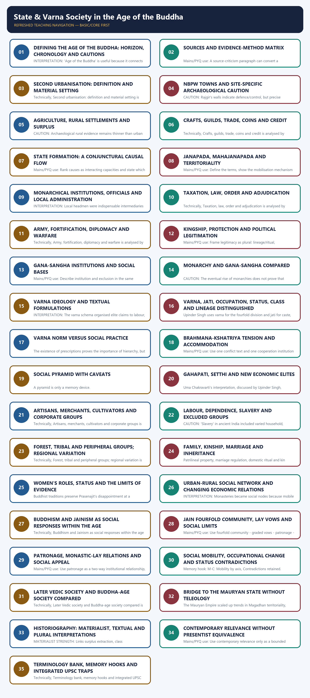

# State & Varna Society in the Age of the Buddha - Complete Topic Package

> **Subject:** Ancient Indian History | **Paper:** Prelims GS-I + GS-I historical support | **Topic:** 13 | **Date:** 13 August 2026
>
> **Evidence key:** FACT/ARCHAEOLOGICAL EVIDENCE = directly supported by named repository, local-book, official-paper or bounded official heritage source. TEXTUAL TRADITION = what a specific tradition narrates. INTERPRETATION/INFERENCE = analytical conclusion with a stated limit.
>
> **Approval state:** generated, **approved=false**. Only explicit user approval can change the status to approved.

### Package Practice Counts

| Component | Count |
| --- | ---: |
| Verified/routed Prelims PYQs | 3 |
| Solved relevant/adjacent Mains PYQs | 2 |
| Hard MCQs with explanations | 48 |
| Remedial MCQs with explanations | 12 |
| Original solved 10-mark Mains | 3 |
| Original solved 15-mark Mains | 3 |
| Original solved 20-mark Mains | 3 |

### Sources actually used

- Repository: Topic 13 basic/advanced, README, Master Chronology, Revision Chart, official syllabus/PYQ routing and Answer-Worthiness Audit; bounded Topics 09, 10, 11 and 14.
- Local OCR-searchable book: R. S. Sharma, *India's Ancient Past*, Chapter 17, local PDF pages 179-190.
- Local OCR-searchable book: Upinder Singh, *A History of Ancient and Early Medieval India*, 2nd ed., Chapter 6, especially local PDF pages 711-716, 731-739, 753-756 and 780-805.
- Official local papers/keys: UPSC Prelims 2024-2026 and Mains GS-I 2023-2024. The 2026 Series-A key is provisional and is labelled accordingly.
- PYQ routing result: no exact direct Topic 13 Mains question was located in the locally audited 2018-2025 route; the workbook therefore includes the two closest verified analytical bridges (2024 Vedic social-economic change and 2023 geographical factors) and labels them adjacent.
- Bounded current authoritative routes: ASI excavation reports (https://asi.nic.in/pages/Publications/excavationReports), ASI archives (https://asi.nic.in/pages/archive/collection) and state-publication locator (https://asi.nic.in/pages/Publications/stateLocator/). They are used for present-day research/stewardship linkage only.
- Qdrant was optional, unnecessary and not used.

## BASIC LEARNING SESSION

### DEEP-REVIEW LEARNING CONTRACT

| Control | Binding rule for this package |
|---|---|
| Syllabus boundary | Complete Ancient History Core is taught before optional enrichment. |
| Evidence method | Claim → named site/text/inscription/coin/example → analysis → qualification. |
| Source hierarchy | Archaeology, textual testimony, inscriptions, coins and scholarly interpretation remain visibly distinct. |
| Contested issues | Competing interpretations are attributed, evidenced and bounded; certainty is not manufactured. |
| Practice contract | Every solved item has demand decoding, an examiner-grade model, an executable answer/compression plan, marks rationale and answer-specific improvement. |
| Approval | This immutable successor remains `approved: false` pending explicit approval. |

**Canonical Basic/Core owner:** `upsc-ai-kit\knowledge\Ancient-Indian-History\basic\13_State-and-Varna-Society-Age-of-Buddha.md`  
**Canonical topic owner:** `upsc-ai-kit\knowledge\Ancient-Indian-History\basic\13_State-and-Varna-Society-Age-of-Buddha.md`  
**Optional Advanced owner:** `upsc-ai-kit\knowledge\Ancient-Indian-History\advanced\13_State-and-Varna-Society-Age-of-Buddha.md`  
**Official syllabus mapping:** `upsc-ai-kit\knowledge\Ancient-Indian-History\OFFICIAL-UPSC-SYLLABUS-MAPPING.md`

### EVIDENCE, PYQ AND CURRENT-STATUS CONTROL

- **Archaeological inference:** material context supports bounded reconstruction; absence is not automatic proof of non-existence.
- **Textual testimony:** genre, authorship, redaction, patronage and temporal distance control what a text can prove.
- **Inscription and coin evidence:** contemporary names, titles, claims and circulation are powerful but do not by themselves map uniform territorial control.
- **Scholarly interpretation:** historian labels are arguments to test, not facts to memorise without evidence.
- **PYQ discipline:** repository ledgers and locally held official papers control wording and metadata; reconstructed wording and unavailable official keys must be labelled.
- **Current-status note, rechecked 2026-08-30:** ASI excavation, archive and publication portals were accessed on 29 August 2026 as research and stewardship routes only; they do not date ancient layers by themselves.

**Live/primary context sources recorded by the predecessor generation:**

- `https://asi.nic.in/pages/Publications/excavationReports`
- `https://asi.nic.in/pages/archive/collection`
- `https://asi.nic.in/pages/Publications/stateLocator/`




*Distinct embedded teaching-navigation image. The separate continuous Cārvāka-style flowchart package remains an independent at-a-glance artifact.*

### Source hierarchy, package scope and evidence labels

This package treats the 'Age of the Buddha' as an early-historic horizon, not as a biography chapter. Political consolidation, urbanisation, agrarian change, social differentiation and renunciant movements are reconstructed by keeping texts, archaeology and modern interpretation analytically separate.

#### Evidence / comparison matrix

| Claim / category | Named evidence | Significance | Limit |
| --- | --- | --- | --- |
| Repository | Topic 13 basic/advanced; README; Master Chronology; Revision Chart; syllabus/PYQ routing; bounded Topics 09-11 and 14 | Provides audited architecture, chronology and answer-worthiness upgrades | Repository synthesis is not a primary ancient source |
| Local books | R. S. Sharma, India’s Ancient Past, PDF pp. 179-190; Upinder Singh, 2nd ed., PDF pp. 711-716, 731-739, 753-756, 780-805 | Supplies materialist, textual and source-critical depth | Page numbers are local PDF pages; interpretations remain authorial |
| Official papers | Local UPSC 2023-2026 papers and locally held official/provisional keys | Controls wording and answer-key status | No model answer is claimed as UPSC-issued |
| Live authoritative | ASI excavation-report portal and ASI archive/publication portals | Present-day research/stewardship linkage only | A web page cannot date an ancient layer |

#### Core teaching / solved analysis

- FACT: Markdown knowledge files were used first and searchable local books second; Qdrant was unnecessary.
- FACT: The ASI excavation-report portal is used only as a present-day route to archaeological documentation: https://asi.nic.in/pages/Publications/excavationReports.
- FACT: The ASI archive and state-publication locator are bounded research links: https://asi.nic.in/pages/archive/collection and https://asi.nic.in/pages/Publications/stateLocator/.
- METHOD: A safe sentence states claim -> named text/site/artefact/social term -> what it proves -> limitation.
- METHOD: TEXTUAL TRADITION identifies what a source narrates; ARCHAEOLOGICAL EVIDENCE identifies material association; INTERPRETATION explains a defensible relationship; INFERENCE remains explicitly bounded.
- LIMIT: No current-affairs story is forced into the topic. Heritage conservation is relevant only because future excavation/publication can refine early levels.

> **Memory hook:** M-O-L-Q: Markdown, OCR books, Live authoritative links, Qdrant optional.

#### Must-know facts

- FACT: Markdown knowledge files were used first and searchable local books second; Qdrant was unnecessary.
- FACT: The ASI excavation-report portal is used only as a present-day route to archaeological documentation: https://asi.nic.in/pages/Publications/excavationReports.
- FACT: The ASI archive and state-publication locator are bounded research links: https://asi.nic.in/pages/archive/collection and https://asi.nic.in/pages/Publications/stateLocator/.

#### UPSC traps

- **Wrong:** Modern heritage pages prove ancient constitutional forms. **Correct:** Use official portals for present stewardship and report access; ancient claims still need excavation/textual evidence.

**Mains/PYQ use:** Open a 20-marker with the evidence problem before presenting a causal synthesis.

**Study link:** Topic 02 source method; Topics 09-11 context; Topic 14 Mauryan bridge.

### SESSION 1 — DEFINING THE AGE OF THE BUDDHA: HORIZON, CHRONOLOGY AND CAUTIONS

#### DEFINITION / WHAT THIS IS CALLED

**Plain-language definition:** For this package, the Age of the Buddha means the political-social horizon centred broadly on the sixth-fifth centuries BCE, nested within the wider c.

**Technical definition:** INTERPRETATION: 'Age of the Buddha' is useful because it connects cities, kings, households and renunciants, but it must not collapse c.

#### ANSWER-GRABBING OPENING — WRITE/ADAPT IN THE EXAM

> 480 BCE for the Buddha’s parinibbana provisionally while noting that a later chronology would require wider readjustment.

#### MUST-WRITE KEYWORDS

- **Defining the Age of the Buddha**
- **horizon**
- **chronology**
- **cautions**
- **Memory hook**
- **Mains/PYQ use**

**How to use them:** Frame the answer through Defining the Age of the Buddha; define horizon, connect chronology with cautions to explain the mechanism, and use Memory hook for the decisive comparison or qualification.

For this package, the Age of the Buddha means the political-social horizon centred broadly on the sixth-fifth centuries BCE, nested within the wider c. 600-200 BCE early-historic transformation. It is a heuristic label: sites, texts and institutions do not share one start date.

#### Timeline

| Date/phase | Event |
| --- | --- |
| c. 1000-600 BCE | Later Vedic background: iron, cultivation, janapadas, ritual hierarchy. |
| c. 600-400 BCE | Core Buddha-age political and social horizon. |
| c. 600-200 BCE | Wider early-historic textual/material transformation. |
| 4th c. BCE | Nanda consolidation and Mauryan threshold. |

#### Evidence / comparison matrix

| Claim / category | Named evidence | Significance | Limit |
| --- | --- | --- | --- |
| Background | Later Vedic c. 1000-600 BCE | Agriculture, janapada, ritual kingship and sharper hierarchy form part of the prehistory | No all-India uniform transition |
| Core horizon | Sixth-fifth centuries BCE Buddha/Mahavira traditions | Mahajanapadas, gana-sanghas, towns and shramana debate overlap | Life dates and event sequences remain debated |
| Material horizon | Early/middle NBPW phases, site-specific | Tracks settlement, consumption and urban morphology | NBPW chronology varies by site |
| Wider source horizon | c. 600-200 BCE | Necessary because texts were composed/redacted and institutions matured across centuries | Later evidence cannot be silently back-projected |

#### Core teaching / solved analysis

- FACT: The repository chronology uses c. 600-321 BCE for the Mahajanapada/second-urbanisation phase.
- SOURCE CAUTION: Upinder Singh retains c. 480 BCE for the Buddha’s parinibbana provisionally while noting that a later chronology would require wider readjustment.
- SOURCE CAUTION: The first four Nikayas and Vinaya contain early material but are composite; the Pali canon is not a verbatim contemporary transcript.
- SOURCE CAUTION: Jaina canonical traditions also underwent transmission and redaction; they illuminate sectarian memory rather than provide an unmediated chronicle.
- INTERPRETATION: 'Age of the Buddha' is useful because it connects cities, kings, households and renunciants, but it must not collapse c. 600-200 BCE into one generation.
- EXAM RULE: Date processes as ranges, name the source, and distinguish an event tradition from the date of the surviving textual form.

> **Memory hook:** H-W-S: Horizon, Wider process, Source caution.

#### Must-know facts

- FACT: The repository chronology uses c. 600-321 BCE for the Mahajanapada/second-urbanisation phase.
- SOURCE CAUTION: Upinder Singh retains c. 480 BCE for the Buddha’s parinibbana provisionally while noting that a later chronology would require wider readjustment.
- SOURCE CAUTION: The first four Nikayas and Vinaya contain early material but are composite; the Pali canon is not a verbatim contemporary transcript.

#### UPSC traps

- **Wrong:** Every statement in a Buddhist text reports the Buddha’s lifetime exactly. **Correct:** Separate the possible early core from composition, oral transmission and later redaction.
- **Wrong:** The year 600 BCE switched every region from tribe to state. **Correct:** Use c. 600 BCE as a heuristic threshold; regional trajectories were asynchronous.

**Mains/PYQ use:** Define the horizon in two lines and immediately add the chronology caveat.

**Study link:** Master Chronology; Topic 09 Later Vedic transition; Topic 10 chronology.

#### CLOSING RECALL FLOW — DEFINING THE AGE OF THE BUDDHA: HORIZON, CHRONOLOGY AND CAUTIONS

```text
START / CONCEPT: Defining the Age of the Buddha: horizon, chronology and cautions
        |
        v
EXACT TERMS: Defining the Age of the Buddha · horizon · chronology · cautions · Memory hook · Mains/PYQ use
        |
        v
MECHANISM / ARGUMENT: INTERPRETATION: 'Age of the Buddha' is useful because it connects cities, kings, households and renunciants, but it must not collapse c.
        |
        v
CONSEQUENCE / CONTRAST: SOURCE CAUTION: The first four Nikayas and Vinaya contain early material but are composite; the Pali canon is not a verbatim contemporary transcript.
        |
        v
UPSC TRAP / ANSWER-USE: Do not miss this limiting distinction: define the horizon in two lines and immediately add the chronology caveat.
        |
        v
ANSWER-GRABBING FORMULATION: 480 BCE for the Buddha’s parinibbana provisionally while noting that a later chronology would require wider readjustment.
```
### SESSION 2 — SOURCES AND EVIDENCE-METHOD MATRIX

#### DEFINITION / WHAT THIS IS CALLED

**Plain-language definition:** The period is unusually rich because Buddhist, Jaina, Brahmanical, grammatical and archaeological evidence can be compared.

**Technical definition:** Mains/PYQ use: A source-criticism paragraph can convert a descriptive answer into an analytical one.

#### ANSWER-GRABBING OPENING — WRITE/ADAPT IN THE EXAM

> The period is unusually rich because Buddhist, Jaina, Brahmanical, grammatical and archaeological evidence can be compared.

#### MUST-WRITE KEYWORDS

- **Sources**
- **evidence-method matrix**
- **Memory hook**
- **Mains/PYQ use**
- **Study link**
- **Early Buddhist**

**How to use them:** Frame the answer through Sources; define evidence-method matrix, connect Memory hook with Mains/PYQ use to explain the mechanism, and use Study link for the decisive comparison or qualification.

The period is unusually rich because Buddhist, Jaina, Brahmanical, grammatical and archaeological evidence can be compared. Its danger is false contemporaneity: different genres preserve different voices and dates.

#### Evidence / comparison matrix

| Claim / category | Named evidence | Significance | Limit |
| --- | --- | --- | --- |
| Early Buddhist | Digha, Majjhima, Samyutta, Anguttara Nikayas; Vinaya; Sutta Nipata | Polities, householders, labour, renunciants and normative debate | Composite, monastic, orally transmitted; not a census |
| Later Buddhist | Jatakas in present form largely later | Long-term social motifs, occupational and urban memory | Do not use indiscriminately for sixth-century BCE detail |
| Jaina | Canonical traditions; Bhagavati Sutra and later works | Alternative lists, communities and renunciant perspectives | Dating and sectarian redaction problems |
| Brahmanical | Grihyasutras, Dharmasutras, Kalpasutras; Panini | Norms, domestic rites, varna duties, grammar-linked institutions | Normative/technical genres; dates and regions debated |
| Archaeology/numismatics | NBPW, settlement hierarchy, fortifications, iron, punch-marked coins | Material setting, production, exchange and defence | Cannot alone name a ruler, varna or constitution |

#### Core teaching / solved analysis

- FACT: Upinder Singh dates the first four Nikayas and Vinaya broadly between the fifth and third centuries BCE, while emphasizing compositional complexity.
- FACT: Early Grihyasutras are often placed roughly c. 600-400 BCE, but proposed Dharmasutra dates vary substantially among scholars.
- FACT: Panini’s Ashtadhyayi is a grammatical work of the fifth/fourth century BCE whose examples incidentally preserve places, institutions, coins and social vocabulary.
- LIMIT: Epics and Puranas contain important ideas and dynastic memories, but their long compositional histories prevent simple period assignment.
- METHOD: Archaeology is strongest for settlement, technology, consumption and exchange; normative texts are strongest for ideals and regulatory anxiety.
- INFERENCE: A rule discussed repeatedly may indicate contested practice, not successful universal enforcement.

> **Memory hook:** G-D-A: Genre, Date, Agenda.

#### Must-know facts

- FACT: Upinder Singh dates the first four Nikayas and Vinaya broadly between the fifth and third centuries BCE, while emphasizing compositional complexity.
- FACT: Early Grihyasutras are often placed roughly c. 600-400 BCE, but proposed Dharmasutra dates vary substantially among scholars.
- FACT: Panini’s Ashtadhyayi is a grammatical work of the fifth/fourth century BCE whose examples incidentally preserve places, institutions, coins and social vocabulary.

#### UPSC traps

- **Wrong:** Dharmasutra prescription equals everyday behaviour. **Correct:** Treat it as an elite normative attempt to regulate diverse practice.
- **Wrong:** Archaeology can identify the varna of a pot user. **Correct:** Material association cannot by itself assign ritual-social identity.

**Mains/PYQ use:** A source-criticism paragraph can convert a descriptive answer into an analytical one.

**Study link:** Topic 02 Sources of Ancient Indian History.

#### CLOSING RECALL FLOW — SOURCES AND EVIDENCE-METHOD MATRIX

```text
START / CONCEPT: Sources and evidence-method matrix
        |
        v
EXACT TERMS: Sources · evidence-method matrix · Memory hook · Mains/PYQ use · Study link · Early Buddhist
        |
        v
MECHANISM / ARGUMENT: Mains/PYQ use: A source-criticism paragraph can convert a descriptive answer into an analytical one.
        |
        v
CONSEQUENCE / CONTRAST: Its danger is false contemporaneity: different genres preserve different voices and dates.
        |
        v
UPSC TRAP / ANSWER-USE: Do not miss this limiting distinction: panini’s Ashtadhyayi is a grammatical work of the fifth/fourth century BCE whose examples incidentally...
        |
        v
ANSWER-GRABBING FORMULATION: The period is unusually rich because Buddhist, Jaina, Brahmanical, grammatical and archaeological evidence can be compared.
```
### SESSION 3 — SECOND URBANISATION: DEFINITION AND MATERIAL SETTING

#### DEFINITION / WHAT THIS IS CALLED

**Plain-language definition:** Second urbanisation refers to the re-emergence and proliferation of towns in early-historic north India long after Mature Harappan urbanism.

**Technical definition:** Technically, Second urbanisation: definition and material setting is analysed by relating Second urbanisation to material setting, then testing the relationship through Memory hook and Mains/PYQ use.

#### ANSWER-GRABBING OPENING — WRITE/ADAPT IN THE EXAM

> Mains/PYQ use: Define urbanisation through a bundle of criteria, not through pottery alone.

#### MUST-WRITE KEYWORDS

- **Second urbanisation**
- **material setting**
- **Memory hook**
- **Mains/PYQ use**
- **Study link**
- **Ceramic marker**

**How to use them:** Frame the answer through Second urbanisation; define material setting, connect Memory hook with Mains/PYQ use to explain the mechanism, and use Study link for the decisive comparison or qualification.

Second urbanisation refers to the re-emergence and proliferation of towns in early-historic north India long after Mature Harappan urbanism. It was a regionally uneven process supported by rural surplus, crafts, routes, political centres and monetised exchange.

#### Urbanisation as an interacting system

```text
1. Rural base -> Cultivation, livestock, household and hired labour
2. Surplus -> Food and raw materials support specialists
3. Concentration -> Capitals, markets, craft quarters and monasteries
4. Circulation -> Roads, rivers, ferries, tolls, coins and credit
5. Feedback -> States protect/extract; towns demand food and tools
```

*No arrow is sufficient by itself; the process was regionally uneven.*

#### Evidence / comparison matrix

| Claim / category | Named evidence | Significance | Limit |
| --- | --- | --- | --- |
| Ceramic marker | Northern Black Polished Ware (NBPW) | Fine tableware associated with early-historic settlement horizons | A pottery horizon is not a cause or an ethnic label |
| Settlement marker | Larger, differentiated and sometimes fortified settlements | Shows hierarchy and concentration of functions | Large size alone does not prove urbanism |
| Economic marker | Craft specialisation, trade, coin use | Supports non-agricultural populations and exchange | Barter and payments in kind continued |
| Political marker | Capitals and defended centres | State direction and coercive/fiscal concentration | Not every town originated as a capital |

#### Core teaching / solved analysis

- FACT: R. S. Sharma connects the Gangetic NBPW phase, iron implements, coins and expanding settlements with the second urbanisation.
- FACT: Upinder Singh treats early-historic cities as political, social and economic spaces that arose amid villages and forests.
- CAUTION: Some archaeological reports consolidate c. 700-100 BCE NBPW deposits and do not clearly separate early, middle and late phases.
- CAUTION: Literary descriptions of splendid cities often exceed the modest mud, timber and early brick remains actually excavated.
- INTERPRETATION: Urbanisation was a system linking village surplus, artisan production, markets, routes, rulers and religious institutions.
- LIMIT: The urban transition was strongest in certain Gangetic and north-Indian corridors; it did not erase pastoral, forest or village worlds.

> **Memory hook:** SCOPE: Settlement, Craft, Organisation, Political centre, Exchange.

#### Must-know facts

- FACT: R. S. Sharma connects the Gangetic NBPW phase, iron implements, coins and expanding settlements with the second urbanisation.
- FACT: Upinder Singh treats early-historic cities as political, social and economic spaces that arose amid villages and forests.
- CAUTION: Some archaeological reports consolidate c. 700-100 BCE NBPW deposits and do not clearly separate early, middle and late phases.

#### UPSC traps

- **Wrong:** NBPW was the technology that caused cities. **Correct:** NBPW is a diagnostic material association; causation requires surplus, crafts, routes and institutions.
- **Wrong:** Second urbanisation reproduced the Harappan urban system. **Correct:** It was a distinct early-historic process with different texts, states, coins and regional centres.

**Mains/PYQ use:** Define urbanisation through a bundle of criteria, not through pottery alone.

**Study link:** Revision Chart: first versus second urbanisation.

#### CLOSING RECALL FLOW — SECOND URBANISATION: DEFINITION AND MATERIAL SETTING

```text
START / CONCEPT: Second urbanisation: definition and material setting
        |
        v
EXACT TERMS: Second urbanisation · material setting · Memory hook · Mains/PYQ use · Study link · Ceramic marker
        |
        v
MECHANISM / ARGUMENT: Second urbanisation refers to the re-emergence and proliferation of towns in early-historic north India long after Mature Harappan urbanism.
        |
        v
CONSEQUENCE / CONTRAST: Sharma connects the Gangetic NBPW phase, iron implements, coins and expanding settlements with the second urbanisation.
        |
        v
UPSC TRAP / ANSWER-USE: 700-100 BCE NBPW deposits and do not clearly separate early, middle and late phases.
        |
        v
ANSWER-GRABBING FORMULATION: Mains/PYQ use: Define urbanisation through a bundle of criteria, not through pottery alone.
```
### SESSION 4 — NBPW TOWNS AND SITE-SPECIFIC ARCHAEOLOGICAL CAUTION

#### DEFINITION / WHAT THIS IS CALLED

**Plain-language definition:** CAUTION: Pataliputra’s strategic significance can be discussed for the later fifth/fourth-century transition, but famous Mauryan remains belong to the following horizon.

**Technical definition:** CAUTION: Rajgir’s walls indicate defence/control, but precise construction dates and phases should not be asserted without report-level evidence.

#### ANSWER-GRABBING OPENING — WRITE/ADAPT IN THE EXAM

> CAUTION: Pataliputra’s strategic significance can be discussed for the later fifth/fourth-century transition, but famous Mauryan remains belong to the following horizon.

#### MUST-WRITE KEYWORDS

- **NBPW towns**
- **site-specific archaeological caution**
- **Memory hook**
- **Mains/PYQ use**
- **Study link**
- **Kaushambi**

**How to use them:** Frame the answer through NBPW towns; define site-specific archaeological caution, connect Memory hook with Mains/PYQ use to explain the mechanism, and use Study link for the decisive comparison or qualification.

Named sites anchor the argument, but each site has its own sequence. Textual fame, excavated layer and later monumental remains must not be fused.

#### Evidence / comparison matrix

| Claim / category | Named evidence | Significance | Limit |
| --- | --- | --- | --- |
| Kaushambi | NBPW levels, iron tools, rampart and Vatsa association | Urban craft/defence context in the Yamuna corridor | Structures and rampart phases require site chronology |
| Rajagriha/Rajgir | Hill-ringed setting, fortification traditions and Magadhan texts | Landscape and defence shaped a capital | Cyclopean-wall dating remains debated |
| Vaishali | Early-historic remains; Vajji/Lichchhavi textual traditions | Connects urban centre with oligarchic polity | Archaeology does not prove modern democracy |
| Shravasti | Kosalan capital tradition; Jetavana donation narrative | Links monarchy, wealthy patrons and sangha | Donation story is textual, not a cadastral record |
| Pataliputra | Wooden palisade/early settlement; later Kumrahar remains | Shows strategic riverine capital growth | Eighty-pillared hall is Mauryan context, not Buddha-age proof |

#### Core teaching / solved analysis

- FACT: R. S. Sharma lists Kaushambi, Shravasti, Ayodhya, Varanasi, Vaishali, Rajgir, Pataliputra and Champa among excavated early-historic towns.
- FACT: Mud, timber and perishable construction help explain the mismatch between textual palaces and surviving early remains.
- FACT: Kaushambi’s NBPW levels yielded axes, adzes, knives, razors, nails and sickles, linking town craft to rural demand.
- CAUTION: Pataliputra’s strategic significance can be discussed for the later fifth/fourth-century transition, but famous Mauryan remains belong to the following horizon.
- CAUTION: Rajgir’s walls indicate defence/control, but precise construction dates and phases should not be asserted without report-level evidence.
- METHOD: For every site use site -> artefact/feature -> inference -> dating/attribution limit.

> **Memory hook:** K-R-V-S-P: Kaushambi, Rajgir, Vaishali, Shravasti, Pataliputra.

#### Must-know facts

- FACT: R. S. Sharma lists Kaushambi, Shravasti, Ayodhya, Varanasi, Vaishali, Rajgir, Pataliputra and Champa among excavated early-historic towns.
- FACT: Mud, timber and perishable construction help explain the mismatch between textual palaces and surviving early remains.
- FACT: Kaushambi’s NBPW levels yielded axes, adzes, knives, razors, nails and sickles, linking town craft to rural demand.

#### UPSC traps

- **Wrong:** Every feature at Kumrahar belongs to Bimbisara or Ajatashatru. **Correct:** Separate early Pataliputra settlement from later Mauryan monumental remains.
- **Wrong:** Vaishali archaeology proves universal civic participation. **Correct:** The textual and material evidence supports an oligarchic centre, not modern franchise.

**Mains/PYQ use:** Use three sites with different functions: capital/defence, craft/route and patronage/oligarchy.

**Study link:** Topic 11 site archaeology; Topic 14 Pataliputra.

#### CLOSING RECALL FLOW — NBPW TOWNS AND SITE-SPECIFIC ARCHAEOLOGICAL CAUTION

```text
START / CONCEPT: NBPW towns and site-specific archaeological caution
        |
        v
EXACT TERMS: NBPW towns · site-specific archaeological caution · Memory hook · Mains/PYQ use · Study link · Kaushambi
        |
        v
MECHANISM / ARGUMENT: CAUTION: Rajgir’s walls indicate defence/control, but precise construction dates and phases should not be asserted without report-level evidence.
        |
        v
CONSEQUENCE / CONTRAST: Named sites anchor the argument, but each site has its own sequence.
        |
        v
UPSC TRAP / ANSWER-USE: Textual fame, excavated layer and later monumental remains must not be fused.
        |
        v
ANSWER-GRABBING FORMULATION: CAUTION: Pataliputra’s strategic significance can be discussed for the later fifth/fourth-century transition, but famous Mauryan remains belong to the following horizon.
```
### SESSION 5 — AGRICULTURE, RURAL SETTLEMENTS AND SURPLUS

#### DEFINITION / WHAT THIS IS CALLED

**Plain-language definition:** Mains/PYQ use: Explain rural surplus as produced and appropriated, not as an automatic outcome of soil.

**Technical definition:** CAUTION: Archaeological rural evidence remains thinner than urban evidence; texts over-represent elite landholders and exemplary stories.

#### ANSWER-GRABBING OPENING — WRITE/ADAPT IN THE EXAM

> Mains/PYQ use: Explain rural surplus as produced and appropriated, not as an automatic outcome of soil.

#### MUST-WRITE KEYWORDS

- **Agriculture**
- **rural settlements**
- **surplus**
- **Memory hook**
- **Mains/PYQ use**
- **Study link**

**How to use them:** Frame the answer through Agriculture; define rural settlements, connect surplus with Memory hook to explain the mechanism, and use Mains/PYQ use for the decisive comparison or qualification.

The city-state rested on villages. Agrarian expansion, variable landholding, rice cultivation, livestock, iron implements and household/hired labour generated the surplus that supported officials, troops, artisans, traders and renunciants.

#### Evidence / comparison matrix

| Claim / category | Named evidence | Significance | Limit |
| --- | --- | --- | --- |
| Settlement | gama/grama, kuti, craft villages and border/forest settlements | Shows differentiated rural landscape | Pali terms are context-sensitive |
| Production | Rice, barley, pulses, millets, cotton, sugarcane; cattle | Diversified subsistence and marketable produce | Crop intensity varied regionally |
| Technology | More numerous iron tools in NBPW levels | Improved clearance, cultivation and craft capacity | Iron was one agent, not a master cause |
| Landholding | Small household farms and large estates; Kasibharadvaja tradition | Supports class differentiation | Large-number traditions may be stylised |

#### Core teaching / solved analysis

- FACT: Upinder Singh notes growth in the number and size of NBPW settlements in the Ganga valley and a wider range of iron artefacts than in preceding PGW levels.
- FACT: Buddhist texts refer to small cultivators, large landholders, Brahmana villages and wage workers; this indicates differentiated control over productive resources.
- FACT: The compound dasa-kammakara and the term kammakara distinguish dependent/slave and wage-labour vocabulary, though actual conditions varied.
- INTERPRETATION: Surplus was not a free natural gift; it required labour organisation, tools, crop knowledge, storage, transport and extraction.
- CAUTION: R. S. Sharma’s strong iron-rice-surplus chain is analytically useful but should not become technological determinism.
- CAUTION: Archaeological rural evidence remains thinner than urban evidence; texts over-represent elite landholders and exemplary stories.

> **Memory hook:** TOLS: Tools, Organisation, Labour, Surplus.

#### Must-know facts

- FACT: Upinder Singh notes growth in the number and size of NBPW settlements in the Ganga valley and a wider range of iron artefacts than in preceding PGW levels.
- FACT: Buddhist texts refer to small cultivators, large landholders, Brahmana villages and wage workers; this indicates differentiated control over productive resources.
- FACT: The compound dasa-kammakara and the term kammakara distinguish dependent/slave and wage-labour vocabulary, though actual conditions varied.

#### UPSC traps

- **Wrong:** Fertile alluvium automatically created states. **Correct:** Ecology offered opportunity; labour, technology, institutions and conflict converted it into surplus.
- **Wrong:** One-sixth was the universal, continuously collected land tax. **Correct:** Dharmasutra rates vary and actual collection was regionally and politically contingent.

**Mains/PYQ use:** Explain rural surplus as produced and appropriated, not as an automatic outcome of soil.

**Study link:** Topic 03 ecology; Topic 11 state formation.

#### CLOSING RECALL FLOW — AGRICULTURE, RURAL SETTLEMENTS AND SURPLUS

```text
START / CONCEPT: Agriculture, rural settlements and surplus
        |
        v
EXACT TERMS: Agriculture · rural settlements · surplus · Memory hook · Mains/PYQ use · Study link
        |
        v
MECHANISM / ARGUMENT: INTERPRETATION: Surplus was not a free natural gift; it required labour organisation, tools, crop knowledge, storage, transport and extraction.
        |
        v
CONSEQUENCE / CONTRAST: Sharma’s strong iron-rice-surplus chain is analytically useful but should not become technological determinism.
        |
        v
UPSC TRAP / ANSWER-USE: Do not miss this limiting distinction: archaeological rural evidence remains thinner than urban evidence.
        |
        v
ANSWER-GRABBING FORMULATION: Mains/PYQ use: Explain rural surplus as produced and appropriated, not as an automatic outcome of soil.
```
### SESSION 6 — CRAFTS, GUILDS, TRADE, COINS AND CREDIT

#### DEFINITION / WHAT THIS IS CALLED

**Plain-language definition:** Crafts, guilds, trade, coins and credit comprises Crafts, guilds and trade as its core connected dimensions.

**Technical definition:** Technically, Crafts, guilds, trade, coins and credit is analysed by relating Crafts to guilds, then testing the relationship through trade and coins.

#### ANSWER-GRABBING OPENING — WRITE/ADAPT IN THE EXAM

> INTERPRETATION: Monetisation widened exchange and credit while also producing debt, dependence and greater wealth inequality.

#### MUST-WRITE KEYWORDS

- **Crafts**
- **guilds**
- **trade**
- **coins**
- **credit**
- **Memory hook**

**How to use them:** Frame the answer through Crafts; define guilds, connect trade with coins to explain the mechanism, and use credit for the decisive comparison or qualification.

Urban society contained specialists, service workers, entertainers, merchants and financiers. Corporate organisation and coin use expanded transactions without eliminating barter, kind payments or household production.

#### Evidence / comparison matrix

| Claim / category | Named evidence | Significance | Limit |
| --- | --- | --- | --- |
| Occupations | sippa/kamma; kammara, kumbhakara, dantakara, suvannakara, palaganda | Shows craft specialisation and named urban work | Textual lists are not employment statistics |
| Corporate forms | shreni, puga, nigama, vrata, sangha | Suggests professional/corporate organisation | Terms overlap and institutional detail often comes from later texts |
| Money | kahapana, nikkha, kamsa, pada, masaka, kakanika; punch-marked coins | Literary-material convergence for money economy | Denominations/usage and distribution were uneven |
| Credit | Money-lending, pledges, debt and bankruptcy in Pali texts | Shows finance and vulnerability | Normative monastic rules do not quantify society-wide debt |

#### Core teaching / solved analysis

- FACT: Pali texts provide the first definite references to several coin terms, corroborated by mostly silver punch-marked coins from many sites.
- FACT: The Vinaya mentions pugas at Shravasti supplying food to monks and nuns; later Jatakas give richer but chronologically later guild detail.
- FACT: Urban occupations included physicians, surgeons, scribes, accountants, money changers, entertainers and numerous artisans.
- FACT: Customs officials (kammikas in the Pali evidence) levied duties; royal personnel (rajabhatas) protected routes and property.
- CAUTION: Coin use marked a qualitative change but did not end barter or payment in kind.
- INTERPRETATION: Monetisation widened exchange and credit while also producing debt, dependence and greater wealth inequality.

> **Memory hook:** C-C-C: Crafts, Corporations, Coins.

#### Must-know facts

- FACT: Pali texts provide the first definite references to several coin terms, corroborated by mostly silver punch-marked coins from many sites.
- FACT: The Vinaya mentions pugas at Shravasti supplying food to monks and nuns; later Jatakas give richer but chronologically later guild detail.
- FACT: Urban occupations included physicians, surgeons, scribes, accountants, money changers, entertainers and numerous artisans.

#### UPSC traps

- **Wrong:** The phrase eighteen guilds is contemporary statistical evidence for the Buddha’s lifetime. **Correct:** Treat it as later Jataka memory; earlier Vinaya evidence more securely shows corporate organisation.
- **Wrong:** Coins prove every village transaction was monetised. **Correct:** Coin use was concentrated and uneven; cash, kind, barter and credit coexisted.

**Mains/PYQ use:** Pair coin terms with punch-marked coins, then add the uneven-monetisation caveat.

**Study link:** 2026 printed Prelims Q3; Topic 19 commerce.

#### CLOSING RECALL FLOW — CRAFTS, GUILDS, TRADE, COINS AND CREDIT

```text
START / CONCEPT: Crafts, guilds, trade, coins and credit
        |
        v
EXACT TERMS: Crafts · guilds · trade · coins · credit · Memory hook
        |
        v
MECHANISM / ARGUMENT: Correct: Coin use was concentrated and uneven; cash, kind, barter and credit coexisted.
        |
        v
CONSEQUENCE / CONTRAST: CAUTION: Coin use marked a qualitative change but did not end barter or payment in kind.
        |
        v
UPSC TRAP / ANSWER-USE: Wrong: The phrase eighteen guilds is contemporary statistical evidence for the Buddha’s lifetime.
        |
        v
ANSWER-GRABBING FORMULATION: INTERPRETATION: Monetisation widened exchange and credit while also producing debt, dependence and greater wealth inequality.
```
### SESSION 7 — STATE FORMATION: A CONJUNCTURAL CAUSAL FLOW

#### DEFINITION / WHAT THIS IS CALLED

**Plain-language definition:** State formation: a conjunctural causal flow comprises a conjunctural causal flow, Memory hook and Mains/PYQ use as its core connected dimensions.

**Technical definition:** Mains/PYQ use: Rank causes as interacting capacities and state which evidence supports each link.

#### ANSWER-GRABBING OPENING — WRITE/ADAPT IN THE EXAM

> Feedback loops matter: war and state demand can stimulate extraction, while over-extraction can provoke flight or resistance.

#### MUST-WRITE KEYWORDS

- **a conjunctural causal flow**
- **Memory hook**
- **Mains/PYQ use**
- **Study link**
- **Territoriality**
- **janapada/mahajanapada; capitals and villages**

**How to use them:** Frame the answer through a conjunctural causal flow; define Memory hook, connect Mains/PYQ use with Study link to explain the mechanism, and use Territoriality for the decisive comparison or qualification.

State formation joined territorial claims, agrarian extraction, administrative agents, organised violence, urban nodes, diplomacy and legitimation. No single resource or technology explains the outcome.

#### State-formation causal flow

```text
1. Cultivation and labour -> Produce a taxable/tributable surplus
2. Routes and towns -> Concentrate people, exchange and information
3. Fiscal agents -> Assess, collect and redistribute resources
4. Organised force -> Protect, punish, conquer and fortify
5. Political strategy -> Alliance, marriage, espionage and diplomacy
6. Legitimation -> Ritual, lineage, protection and ethical kingship
```

*Feedback loops matter: war and state demand can stimulate extraction, while over-extraction can provoke flight or resistance.*

#### Evidence / comparison matrix

| Claim / category | Named evidence | Significance | Limit |
| --- | --- | --- | --- |
| Territoriality | janapada/mahajanapada; capitals and villages | Extends rule across space and population | Borders and control were uneven |
| Fiscal capacity | bhaga, bali, shulka; village headmen and collectors | Feeds court, officials and troops | Rates and collection varied |
| Coercion | Standing forces, forts, elephants and route policing | Makes extraction and expansion credible | Exact army numbers are source-dependent |
| Legitimation | Kshatriya kingship, Brahmana ritual, protection and dhamma/dharma narratives | Turns power into justified rule | Competing traditions offered different ideals |

#### Core teaching / solved analysis

- INTERPRETATION: Agricultural surplus enlarged the extractable base; towns concentrated revenue, specialists and communication; war rewarded larger mobilising systems.
- INTERPRETATION: Officials and village headmen translated royal claim into local assessment, policing and adjudication.
- INTERPRETATION: Fortification protected stores and people while symbolising control; diplomacy and marriage sometimes achieved what battle could not.
- INTERPRETATION: Ritual and ethical narratives legitimated rule but did not substitute for revenue or force.
- CAUTION: Iron, elephants, river location or monarchy can each explain part of the process; none is sufficient alone.
- CAUTION: State capacity varied within a kingdom and declined with distance, ecology, elite resistance and administrative limits.

> **Memory hook:** T-F-C-L: Territory, Fiscality, Coercion, Legitimation.

#### Must-know facts

- INTERPRETATION: Agricultural surplus enlarged the extractable base; towns concentrated revenue, specialists and communication; war rewarded larger mobilising systems.
- INTERPRETATION: Officials and village headmen translated royal claim into local assessment, policing and adjudication.
- INTERPRETATION: Fortification protected stores and people while symbolising control; diplomacy and marriage sometimes achieved what battle could not.

#### UPSC traps

- **Wrong:** Iron technology single-handedly produced mahajanapadas. **Correct:** Use a multi-causal chain including labour, surplus, routes, institutions, war and ideology.
- **Wrong:** Territorial state means uniform sovereign control. **Correct:** Ancient control was layered, negotiated and often strongest around core zones and routes.

**Mains/PYQ use:** Rank causes as interacting capacities and state which evidence supports each link.

**Study link:** Topic 11 state-formation causal matrix.

#### CLOSING RECALL FLOW — STATE FORMATION: A CONJUNCTURAL CAUSAL FLOW

```text
START / CONCEPT: State formation: a conjunctural causal flow
        |
        v
EXACT TERMS: a conjunctural causal flow · Memory hook · Mains/PYQ use · Study link · Territoriality · janapada/mahajanapada; capitals and villages
        |
        v
MECHANISM / ARGUMENT: Mains/PYQ use: Rank causes as interacting capacities and state which evidence supports each link.
        |
        v
CONSEQUENCE / CONTRAST: INTERPRETATION: Fortification protected stores and people while symbolising control; diplomacy and marriage sometimes achieved what battle could not.
        |
        v
UPSC TRAP / ANSWER-USE: Wrong: Territorial state means uniform sovereign control.
        |
        v
ANSWER-GRABBING FORMULATION: Feedback loops matter: war and state demand can stimulate extraction, while over-extraction can provoke flight or resistance.
```
### SESSION 8 — JANAPADA, MAHAJANAPADA AND TERRITORIALITY

#### DEFINITION / WHAT THIS IS CALLED

**Plain-language definition:** Janapada, mahajanapada and territoriality comprises Janapada, mahajanapada and territoriality as its core connected dimensions.

**Technical definition:** Mains/PYQ use: Define the terms, show the mobilisation mechanism and reject teleology.

#### ANSWER-GRABBING OPENING — WRITE/ADAPT IN THE EXAM

> Wrong: Mahajanapada was a standardized legal rank with fixed borders.

#### MUST-WRITE KEYWORDS

- **Janapada**
- **mahajanapada**
- **territoriality**
- **Memory hook**
- **Mains/PYQ use**
- **Study link**

**How to use them:** Frame the answer through Janapada; define mahajanapada, connect territoriality with Memory hook to explain the mechanism, and use Mains/PYQ use for the decisive comparison or qualification.

Jana referred primarily to a people/kin collective; janapada increasingly linked people with a territorial domain; mahajanapada identified major polities in textual classifications. The change was toward stronger territorial mobilisation, not a clean replacement of kinship.

#### Evidence / comparison matrix

| Claim / category | Named evidence | Significance | Limit |
| --- | --- | --- | --- |
| jana | Vedic and later usage for a people/collective | Kinship and shared identity | Not a fixed modern map |
| janapada | Paninian and other textual usage | Territory, inhabitants and settlements | Institutional depth varied |
| mahajanapada | Buddhist conventional sixteen | Large/powerful interstate actors | Lists vary and are not constitutional statutes |
| rajya/rashtra | Context-dependent domain or rule | Useful political vocabulary | Not a nation-state |

#### Core teaching / solved analysis

- FACT: Political forms included monarchies, gana-sanghas, smaller principalities and forest communities.
- FACT: Magadha, Kosala, Vatsa and Avanti were prominent monarchies; Vajji and Malla appear among gana-sangha polities.
- INTERPRETATION: The decisive transformation was an enhanced capacity to mobilise land, people, revenue and armed force across territory.
- CONTINUITY: Lineage, gotra, clan and ritual status remained politically important inside territorial systems.
- LIMIT: The conventional list of sixteen varies across Buddhist, Jaina and other traditions; it cannot be treated as a simultaneous cadastral map.
- LIMIT: Some communities coexisted with or resisted expanding agrarian states rather than passing through the same evolutionary stages.

> **Memory hook:** P-T-M: People, Territory, Mobilisation.

#### Must-know facts

- FACT: Political forms included monarchies, gana-sanghas, smaller principalities and forest communities.
- FACT: Magadha, Kosala, Vatsa and Avanti were prominent monarchies; Vajji and Malla appear among gana-sangha polities.
- INTERPRETATION: The decisive transformation was an enhanced capacity to mobilise land, people, revenue and armed force across territory.

#### UPSC traps

- **Wrong:** Mahajanapada was a standardized legal rank with fixed borders. **Correct:** It is a textual category for major polities with changing boundaries and capacities.
- **Wrong:** Territoriality erased lineage politics. **Correct:** Kinship remained central, especially in gana-sanghas and elite marriage alliances.

**Mains/PYQ use:** Define the terms, show the mobilisation mechanism and reject teleology.

**Study link:** Topic 09 jana-janapada bridge; Topic 11 list variation.

#### CLOSING RECALL FLOW — JANAPADA, MAHAJANAPADA AND TERRITORIALITY

```text
START / CONCEPT: Janapada, mahajanapada and territoriality
        |
        v
EXACT TERMS: Janapada · mahajanapada · territoriality · Memory hook · Mains/PYQ use · Study link
        |
        v
MECHANISM / ARGUMENT: Mains/PYQ use: Define the terms, show the mobilisation mechanism and reject teleology.
        |
        v
CONSEQUENCE / CONTRAST: The change was toward stronger territorial mobilisation, not a clean replacement of kinship.
        |
        v
UPSC TRAP / ANSWER-USE: Do not miss this limiting distinction: magadha, Kosala, Vatsa and Avanti were prominent monarchies.
        |
        v
ANSWER-GRABBING FORMULATION: Wrong: Mahajanapada was a standardized legal rank with fixed borders.
```
### SESSION 9 — MONARCHICAL INSTITUTIONS, OFFICIALS AND LOCAL ADMINISTRATION

#### DEFINITION / WHAT THIS IS CALLED

**Plain-language definition:** Mains/PYQ use: Use three administrative levels—court, territorial/local and fiscal/security—then qualify standardisation.

**Technical definition:** INTERPRETATION: Local headmen were indispensable intermediaries because state reach depended on village knowledge and cooperation.

#### ANSWER-GRABBING OPENING — WRITE/ADAPT IN THE EXAM

> CAUTION: Terms translated as governor, minister or official do not necessarily denote standardized empire-wide departments.

#### MUST-WRITE KEYWORDS

- **Monarchical institutions**
- **officials**
- **local administration**
- **Memory hook**
- **Mains/PYQ use**
- **Study link**

**How to use them:** Frame the answer through Monarchical institutions; define officials, connect local administration with Memory hook to explain the mechanism, and use Mains/PYQ use for the decisive comparison or qualification.

Pre-Mauryan monarchies were not miniature Mauryan bureaucracies, yet Pali and related evidence shows differentiated royal personnel, ministers, military officers, revenue agents and village headmen.

#### Evidence / comparison matrix

| Claim / category | Named evidence | Significance | Limit |
| --- | --- | --- | --- |
| Court/high office | mahamatta/mahamachcha, mantrin, senanayaka | Advisory, executive and military differentiation | Titles and functions vary by source/period |
| Territorial/local | ratthika, gramini/gramika/gramabhojaka | Links royal centre with regions and villages | Direct uniform control is not proven |
| Service/security | rajaporisa, rajabhata, bandhanagarika | Royal staff, policing, imprisonment and route protection | Pali lists are not an organisation chart |
| Fiscal/customs | balisadhaka; kammika; shulka vocabulary | Extraction from produce and commerce | Terminology crosses genres and dates |

#### Core teaching / solved analysis

- FACT: R. S. Sharma describes influential ministers such as Vassakara in Magadhan tradition and village headmen who assessed taxes and maintained order.
- FACT: Upinder Singh’s Pali occupational list includes ministers, governors, estate managers, chamberlains, policemen, jailors, soldiers and labourers in royal service.
- INTERPRETATION: Recruitment beyond the king’s immediate clan weakened the exclusively kin-based character of politics.
- INTERPRETATION: Local headmen were indispensable intermediaries because state reach depended on village knowledge and cooperation.
- CAUTION: Terms translated as governor, minister or official do not necessarily denote standardized empire-wide departments.
- CAUTION: Later Mauryan mahamatra evidence must not be used to fill every pre-Mauryan institutional gap.

> **Memory hook:** C-L-F: Court, Local link, Fiscal/security.

#### Must-know facts

- FACT: R. S. Sharma describes influential ministers such as Vassakara in Magadhan tradition and village headmen who assessed taxes and maintained order.
- FACT: Upinder Singh’s Pali occupational list includes ministers, governors, estate managers, chamberlains, policemen, jailors, soldiers and labourers in royal service.
- INTERPRETATION: Recruitment beyond the king’s immediate clan weakened the exclusively kin-based character of politics.

#### UPSC traps

- **Wrong:** A named officer proves a complete centralized bureaucracy. **Correct:** It proves functional differentiation; scale, hierarchy and uniformity remain uncertain.
- **Wrong:** Village headmen were independent landlords everywhere. **Correct:** They appear as local leaders/intermediaries; property and authority varied.

**Mains/PYQ use:** Use three administrative levels—court, territorial/local and fiscal/security—then qualify standardisation.

**Study link:** Topic 14 Mauryan administration for comparison.

#### CLOSING RECALL FLOW — MONARCHICAL INSTITUTIONS, OFFICIALS AND LOCAL ADMINISTRATION

```text
START / CONCEPT: Monarchical institutions, officials and local administration
        |
        v
EXACT TERMS: Monarchical institutions · officials · local administration · Memory hook · Mains/PYQ use · Study link
        |
        v
MECHANISM / ARGUMENT: INTERPRETATION: Local headmen were indispensable intermediaries because state reach depended on village knowledge and cooperation.
        |
        v
CONSEQUENCE / CONTRAST: Pre-Mauryan monarchies were not miniature Mauryan bureaucracies, yet Pali and related evidence shows differentiated royal personnel, ministers, military officers, revenue agents and village headmen.
        |
        v
UPSC TRAP / ANSWER-USE: CAUTION: Later Mauryan mahamatra evidence must not be used to fill every pre-Mauryan institutional gap.
        |
        v
ANSWER-GRABBING FORMULATION: CAUTION: Terms translated as governor, minister or official do not necessarily denote standardized empire-wide departments.
```
### SESSION 10 — TAXATION, LAW, ORDER AND ADJUDICATION

#### DEFINITION / WHAT THIS IS CALLED

**Plain-language definition:** Mains/PYQ use: Connect taxation to capacity and social burden; include one rate caveat and one resistance/evasion point.

**Technical definition:** Technically, Taxation, law, order and adjudication is analysed by relating Taxation to law, then testing the relationship through order and adjudication.

#### ANSWER-GRABBING OPENING — WRITE/ADAPT IN THE EXAM

> Mains/PYQ use: Connect taxation to capacity and social burden; include one rate caveat and one resistance/evasion point.

#### MUST-WRITE KEYWORDS

- **Taxation**
- **law**
- **order**
- **adjudication**
- **Memory hook**
- **Mains/PYQ use**

**How to use them:** Frame the answer through Taxation; define law, connect order with adjudication to explain the mechanism, and use Memory hook for the decisive comparison or qualification.

The state’s growing reach appears in regularised claims on produce, commercial tolls, labour obligations, policing and adjudication. The evidence is normative and uneven; a single universal tax code should not be imagined.

#### Evidence / comparison matrix

| Claim / category | Named evidence | Significance | Limit |
| --- | --- | --- | --- |
| Agrarian dues | bhaga, transformed bali; Dharmasutra rates 1/10, 1/8 or 1/6 | Supports treasury and troops | Prescribed rates do not prove actual uniform collection |
| Commercial dues | shulka/tolls; kammikas and route checks | State participates in exchange networks | Toll geography and rates are unclear |
| Labour/service | Forced royal work and artisan service traditions | Non-cash extraction | Terminology and extent vary |
| Law/custom | Dharmasutras; royal agents; corporate occupational rules | Plural legal order and status-based norms | Norms are Brahmanical and not exhaustive practice |

#### Core teaching / solved analysis

- FACT: Buddhist texts describe taxes, tolls and officials and also preserve complaints about burdens, evasion and movement away from oppressive rulers.
- FACT: Gautama Dharmasutra gives a variable range of royal shares, which is decisive evidence against a universal fixed one-sixth claim.
- FACT: Professional groups could possess rule-making authority in their domains, while kings were advised to hear knowledgeable representatives.
- INTERPRETATION: Law and order included protection of routes/property as well as coercive extraction; the two cannot be separated analytically.
- CAUTION: Varna-graded penalties in Dharmasutras express normative hierarchy; actual local adjudication also drew on custom and political power.
- CAUTION: The emergence of writing may have aided accounts and assessment, but direct pre-Ashokan documentary evidence is scarce.

> **Memory hook:** R-P-L: Revenue, Protection, Law—with variation.

#### Must-know facts

- FACT: Buddhist texts describe taxes, tolls and officials and also preserve complaints about burdens, evasion and movement away from oppressive rulers.
- FACT: Gautama Dharmasutra gives a variable range of royal shares, which is decisive evidence against a universal fixed one-sixth claim.
- FACT: Professional groups could possess rule-making authority in their domains, while kings were advised to hear knowledgeable representatives.

#### UPSC traps

- **Wrong:** The king always collected exactly one-sixth in cash. **Correct:** Rates varied; cash and kind coexisted, and actual reach was uneven.
- **Wrong:** Dharmasutra law was a single secular state code. **Correct:** It was Brahmanical normative literature operating amid royal order and local/corporate custom.

**Mains/PYQ use:** Connect taxation to capacity and social burden; include one rate caveat and one resistance/evasion point.

**Study link:** R. S. Sharma Ch. 17; Upinder Singh land and labour sections.

#### CLOSING RECALL FLOW — TAXATION, LAW, ORDER AND ADJUDICATION

```text
START / CONCEPT: Taxation, law, order and adjudication
        |
        v
EXACT TERMS: Taxation · law · order · adjudication · Memory hook · Mains/PYQ use
        |
        v
MECHANISM / ARGUMENT: Correct: It was Brahmanical normative literature operating amid royal order and local/corporate custom.
        |
        v
CONSEQUENCE / CONTRAST: The evidence is normative and uneven; a single universal tax code should not be imagined.
        |
        v
UPSC TRAP / ANSWER-USE: Professional groups could possess rule-making authority in their domains, while kings were advised to hear knowledgeable representatives.
        |
        v
ANSWER-GRABBING FORMULATION: Mains/PYQ use: Connect taxation to capacity and social burden; include one rate caveat and one resistance/evasion point.
```
### SESSION 11 — ARMY, FORTIFICATION, DIPLOMACY AND WARFARE

#### DEFINITION / WHAT THIS IS CALLED

**Plain-language definition:** CAUTION: Greek/classical army figures for the Nandas are evidence of reputation and scale, not audited payroll data.

**Technical definition:** Technically, Army, fortification, diplomacy and warfare is analysed by relating Army to fortification, then testing the relationship through diplomacy and warfare.

#### ANSWER-GRABBING OPENING — WRITE/ADAPT IN THE EXAM

> CAUTION: Greek/classical army figures for the Nandas are evidence of reputation and scale, not audited payroll data.

#### MUST-WRITE KEYWORDS

- **Army**
- **fortification**
- **diplomacy**
- **warfare**
- **Memory hook**
- **Mains/PYQ use**

**How to use them:** Frame the answer through Army; define fortification, connect diplomacy with warfare to explain the mechanism, and use Memory hook for the decisive comparison or qualification.

War-making capacity differentiated expanding monarchies from many smaller polities. Standing forces, elephants, forts and treasuries mattered, but exact numbers and technological superiority must be source-checked.

#### Evidence / comparison matrix

| Claim / category | Named evidence | Significance | Limit |
| --- | --- | --- | --- |
| Army | Infantry, cavalry, elephants and declining chariot importance | Permanent force requires regular revenue | Composition varied by region |
| Nanda scale | Large army figures in classical traditions | Signals remembered Magadhan capacity | Numbers are later and likely rhetorical |
| Fortification | Rajgir defences, Kaushambi ramparts, Pataliputra palisade | Protection, storage and political control | Features have multiple phases |
| Diplomacy | Marriage alliances; Vassakara-Vajji dissension tradition | Strategy could substitute for battle | Narratives are literary and didactic |

#### Core teaching / solved analysis

- FACT: Monarchies could maintain more permanent forces through centralized fiscal claims; gana forces were more closely tied to aristocratic households/clans.
- FACT: Elephants were important military resources in eastern polities, but Magadhan success cannot be reduced to elephant access.
- TEXTUAL TRADITION: The Mahaparinibbana Sutta presents Vajji concord as strength and Vassakara’s diplomacy as a route to defeat.
- INTERPRETATION: Forts concentrated authority, protected treasuries and people, and made capitals nodes of coercion and exchange.
- CAUTION: Greek/classical army figures for the Nandas are evidence of reputation and scale, not audited payroll data.
- CAUTION: Warfare depended on logistics, revenue, leadership, alliance and internal cohesion as much as on weapons.

> **Memory hook:** R-L-F-D: Revenue, Logistics, Forts, Diplomacy.

#### Must-know facts

- FACT: Monarchies could maintain more permanent forces through centralized fiscal claims; gana forces were more closely tied to aristocratic households/clans.
- FACT: Elephants were important military resources in eastern polities, but Magadhan success cannot be reduced to elephant access.
- TEXTUAL TRADITION: The Mahaparinibbana Sutta presents Vajji concord as strength and Vassakara’s diplomacy as a route to defeat.

#### UPSC traps

- **Wrong:** Nanda army numbers are precise official statistics. **Correct:** Use them as later testimony to perceived scale, with exaggeration/genre caution.
- **Wrong:** Gana-sanghas had no armed forces. **Correct:** They fought effectively but seem to have lacked the same permanent centralized military structure.

**Mains/PYQ use:** Use capacity categories: revenue, logistics, fortification, force and diplomacy.

**Study link:** Topic 11 Magadhan expansion; Topic 12 frontier warfare.

#### CLOSING RECALL FLOW — ARMY, FORTIFICATION, DIPLOMACY AND WARFARE

```text
START / CONCEPT: Army, fortification, diplomacy and warfare
        |
        v
EXACT TERMS: Army · fortification · diplomacy · warfare · Memory hook · Mains/PYQ use
        |
        v
MECHANISM / ARGUMENT: Mains/PYQ use: Use capacity categories: revenue, logistics, fortification, force and diplomacy.
        |
        v
CONSEQUENCE / CONTRAST: Standing forces, elephants, forts and treasuries mattered, but exact numbers and technological superiority must be source-checked.
        |
        v
UPSC TRAP / ANSWER-USE: Elephants were important military resources in eastern polities, but Magadhan success cannot be reduced to elephant access.
        |
        v
ANSWER-GRABBING FORMULATION: CAUTION: Greek/classical army figures for the Nandas are evidence of reputation and scale, not audited payroll data.
```
### SESSION 12 — KINGSHIP, PROTECTION AND POLITICAL LEGITIMATION

#### DEFINITION / WHAT THIS IS CALLED

**Plain-language definition:** Brahmanical political ideology treated kingship as central, while Buddhist texts could imagine kingship as a human response to property conflict and disorder.

**Technical definition:** Mains/PYQ use: Frame legitimacy as plural: lineage/ritual, protection/order, conquest and ethical patronage.

#### ANSWER-GRABBING OPENING — WRITE/ADAPT IN THE EXAM

> Brahmanical political ideology treated kingship as central, while Buddhist texts could imagine kingship as a human response to property conflict and disorder.

#### MUST-WRITE KEYWORDS

- **Kingship**
- **protection**
- **political legitimation**
- **Memory hook**
- **Mains/PYQ use**
- **Study link**

**How to use them:** Frame the answer through Kingship; define protection, connect political legitimation with Memory hook to explain the mechanism, and use Mains/PYQ use for the decisive comparison or qualification.

Power required justification. Hereditary Kshatriya kingship, Brahmana ritual expertise, lineage claims, protection, conquest and ethical narratives offered partly competing languages of legitimacy.

#### Evidence / comparison matrix

| Claim / category | Named evidence | Significance | Limit |
| --- | --- | --- | --- |
| Kshatriya claim | Royal lineage and protection duty | Naturalises rulership and warfare | Lineages could be constructed or contested |
| Brahmana ritual | purohita, sacrifice, gifts and dharma | Sacralises authority and hierarchy | Brahmanas had less prestige in some ganas |
| Protection contract | Agganna Sutta kingship narrative | Links ruler, order and share of paddy | Normative Buddhist origin story, not event history |
| Renunciant approval | Royal patronage and dialogue with Buddha/Jain teachers | Adds ethical prestige and networks | Patronage did not erase coercive rule |

#### Core teaching / solved analysis

- FACT: Brahmanical political ideology treated kingship as central, while Buddhist texts could imagine kingship as a human response to property conflict and disorder.
- FACT: Kings donated revenue/land-use benefits to Brahmanas and religious communities, though evidence must be dated and the rights granted specified.
- INTERPRETATION: Brahmana-Kshatriya relations combined tension over rank with functional accommodation between ritual authority and coercive power.
- INTERPRETATION: Patronage of renunciant orders allowed rulers to communicate ethical standing without abandoning taxation, punishment or war.
- CAUTION: 'Social contract' is a modern analytical shorthand for the Agganna narrative, not an ancient constitutional doctrine identical to modern contract theory.
- CAUTION: Kshatriya primacy in Buddhist/Jaina texts reflects their social argument and should not be read as a complete reversal of lived hierarchy.

> **Memory hook:** L-R-P-E: Lineage, Ritual, Protection, Ethics.

#### Must-know facts

- FACT: Brahmanical political ideology treated kingship as central, while Buddhist texts could imagine kingship as a human response to property conflict and disorder.
- FACT: Kings donated revenue/land-use benefits to Brahmanas and religious communities, though evidence must be dated and the rights granted specified.
- INTERPRETATION: Brahmana-Kshatriya relations combined tension over rank with functional accommodation between ritual authority and coercive power.

#### UPSC traps

- **Wrong:** Brahmanas and Kshatriyas were permanently opposed classes. **Correct:** Their rank claims could conflict, but monarchies also depended on ritual, advice and administrative cooperation.
- **Wrong:** Buddhist royal patronage made the state non-coercive. **Correct:** Ethical patronage coexisted with armies, taxes, prisons and punishment.

**Mains/PYQ use:** Frame legitimacy as plural: lineage/ritual, protection/order, conquest and ethical patronage.

**Study link:** Topic 10 patronage; Topic 14 Ashokan dhamma.

#### CLOSING RECALL FLOW — KINGSHIP, PROTECTION AND POLITICAL LEGITIMATION

```text
START / CONCEPT: Kingship, protection and political legitimation
        |
        v
EXACT TERMS: Kingship · protection · political legitimation · Memory hook · Mains/PYQ use · Study link
        |
        v
MECHANISM / ARGUMENT: Mains/PYQ use: Frame legitimacy as plural: lineage/ritual, protection/order, conquest and ethical patronage.
        |
        v
CONSEQUENCE / CONTRAST: CAUTION: 'Social contract' is a modern analytical shorthand for the Agganna narrative, not an ancient constitutional doctrine identical to modern contract theory.
        |
        v
UPSC TRAP / ANSWER-USE: CAUTION: Kshatriya primacy in Buddhist/Jaina texts reflects their social argument and should not be read as a complete reversal of lived hierarchy.
        |
        v
ANSWER-GRABBING FORMULATION: Brahmanical political ideology treated kingship as central, while Buddhist texts could imagine kingship as a human response to property conflict and disorder.
```
### SESSION 13 — GANA-SANGHA INSTITUTIONS AND SOCIAL BASES

#### DEFINITION / WHAT THIS IS CALLED

**Plain-language definition:** Gana-sangha institutions and social bases comprises Gana-sangha institutions, social bases and Memory hook as its core connected dimensions.

**Technical definition:** Mains/PYQ use: Describe institution and exclusion in the same paragraph.

#### ANSWER-GRABBING OPENING — WRITE/ADAPT IN THE EXAM

> Mains/PYQ use: Describe institution and exclusion in the same paragraph.

#### MUST-WRITE KEYWORDS

- **Gana-sangha institutions**
- **social bases**
- **Memory hook**
- **Mains/PYQ use**
- **Study link**
- **Political core**

**How to use them:** Frame the answer through Gana-sangha institutions; define social bases, connect Memory hook with Mains/PYQ use to explain the mechanism, and use Study link for the decisive comparison or qualification.

Ganas/sanghas were non-monarchical corporate polities dominated by aristocratic Kshatriya lineages. They preserved assembly procedures but excluded women, labourers, slaves, artisans and most residents from political power.

#### Compact visual / answer logic

```text
ARISTOCRATIC KSHATRIYA LINEAGES
              |
       LARGE ASSEMBLY
       (santhagara)
              |
      chief + small council
              |
 war / peace / alliance / justice

OUTSIDE EFFECTIVE POWER:
women | farmers | artisans | wage workers | slaves | forest groups
```

*Corporate deliberation and social exclusion coexisted.*

#### Evidence / comparison matrix

| Claim / category | Named evidence | Significance | Limit |
| --- | --- | --- | --- |
| Political core | Vajji/Lichchhavi, Malla, Sakya, Koliya | Shows plural state forms | Textual detail is uneven and often partisan |
| Assembly | santhagara; chiefs titled raja; council/executive | Collective elite deliberation | Not universal participation |
| Procedure | salaka voting, quorum/gana-puraka traditions | Institutionalised decision-making | Monastic analogy and later detail require caution |
| Social base | Leading Kshatriya clan heads | Kinship and land/military power underpin polity | Non-elite residents lacked equal rights |

#### Core teaching / solved analysis

- FACT: Upinder Singh classifies some ganas as single-clan bodies and others, such as Vajji, as confederacies of several clans.
- FACT: The assembly could decide alliances, war, peace and punishment; a smaller group likely handled daily government.
- FACT: The assembly did not include women; artisans such as Upali the barber and Chunda the smith were not part of the ruling elite.
- FACT: Brahmanas/purohitas seem less prominent in early gana political structures than in monarchies.
- INTERPRETATION: Discussion among aristocrats was a real institutional distinction, but it rested on exclusionary lineage privilege.
- CAUTION: Large numbers such as 7,707 Lichchhavi rajas are conventional/literary and should indicate plurality, not exact membership.

> **Memory hook:** A-C-E: Assembly, Clan elite, Exclusion.

#### Must-know facts

- FACT: Upinder Singh classifies some ganas as single-clan bodies and others, such as Vajji, as confederacies of several clans.
- FACT: The assembly could decide alliances, war, peace and punishment; a smaller group likely handled daily government.
- FACT: The assembly did not include women; artisans such as Upali the barber and Chunda the smith were not part of the ruling elite.

#### UPSC traps

- **Wrong:** Gana-sangha means democracy with universal franchise. **Correct:** It was an oligarchic, kin-based corporate polity with restricted participation.
- **Wrong:** All residents of Vaishali were rajas. **Correct:** Raja in this context designated aristocratic lineage heads, not every inhabitant.

**Mains/PYQ use:** Describe institution and exclusion in the same paragraph.

**Study link:** Topic 11 gana-sangha; Upinder Singh PDF pp. 731-739.

#### CLOSING RECALL FLOW — GANA-SANGHA INSTITUTIONS AND SOCIAL BASES

```text
START / CONCEPT: Gana-sangha institutions and social bases
        |
        v
EXACT TERMS: Gana-sangha institutions · social bases · Memory hook · Mains/PYQ use · Study link · Political core
        |
        v
MECHANISM / ARGUMENT: Ganas/sanghas were non-monarchical corporate polities dominated by aristocratic Kshatriya lineages.
        |
        v
CONSEQUENCE / CONTRAST: The assembly did not include women; artisans such as Upali the barber and Chunda the smith were not part of the ruling elite.
        |
        v
UPSC TRAP / ANSWER-USE: INTERPRETATION: Discussion among aristocrats was a real institutional distinction, but it rested on exclusionary lineage privilege.
        |
        v
ANSWER-GRABBING FORMULATION: Mains/PYQ use: Describe institution and exclusion in the same paragraph.
```
### SESSION 14 — MONARCHY AND GANA-SANGHA COMPARED

#### DEFINITION / WHAT THIS IS CALLED

**Plain-language definition:** Monarchy and gana-sangha were alternative early state forms, not stages labelled despotism and democracy.

**Technical definition:** CAUTION: The eventual rise of monarchies does not prove that monarchy was morally or evolutionarily superior; it reflects contingent capacity for empire-building.

#### ANSWER-GRABBING OPENING — WRITE/ADAPT IN THE EXAM

> Monarchy and gana-sangha were alternative early state forms, not stages labelled despotism and democracy.

#### MUST-WRITE KEYWORDS

- **Monarchy**
- **gana-sangha compared**
- **Memory hook**
- **Mains/PYQ use**
- **Study link**
- **Supreme authority**

**How to use them:** Frame the answer through Monarchy; define gana-sangha compared, connect Memory hook with Mains/PYQ use to explain the mechanism, and use Study link for the decisive comparison or qualification.

Monarchy and gana-sangha were alternative early state forms, not stages labelled despotism and democracy. Their fiscal, military, ritual and social bases differed.

#### Evidence / comparison matrix

| Claim / category | Named evidence | Significance | Limit |
| --- | --- | --- | --- |
| Supreme authority | Hereditary king versus aristocratic assembly/chief | Different concentration of decision-making | Both could contain councils and elite factions |
| Fiscal base | Central royal claim versus multiple lineage-elite claims | Affects treasury and mobilisation | Evidence for gana property systems is incomplete |
| Military | More permanent centralized army versus clan-based contingents | Monarchy often had expansion advantage | Ganas could be resilient through cohesion |
| Legitimation | Brahmana ritual/royal ideology versus Kshatriya corporate kinship | Different elite coalitions | Religious patronage crossed both forms |

#### Core teaching / solved analysis

- FACT: Monarchies such as Magadha and Kosala concentrated revenue and command more strongly than the oligarchic assemblies.
- FACT: Gana strength depended on elite concord; literary traditions emphasise the danger of dissension.
- INTERPRETATION: Centralization improved sustained war-making, but royal succession, ministerial intrigue and over-extraction also created vulnerabilities.
- INTERPRETATION: Ganas gave a larger number of aristocratic males a political voice, yet did not democratise society.
- HISTORIOGRAPHY: Nationalist writers such as K. P. Jayaswal highlighted republican features partly to rebut colonial claims of Indian despotism.
- CAUTION: The eventual rise of monarchies does not prove that monarchy was morally or evolutionarily superior; it reflects contingent capacity for empire-building.

> **Memory hook:** A-F-F-S: Authority, Fiscality, Force, Social base.

#### Must-know facts

- FACT: Monarchies such as Magadha and Kosala concentrated revenue and command more strongly than the oligarchic assemblies.
- FACT: Gana strength depended on elite concord; literary traditions emphasise the danger of dissension.
- INTERPRETATION: Centralization improved sustained war-making, but royal succession, ministerial intrigue and over-extraction also created vulnerabilities.

#### UPSC traps

- **Wrong:** Monarchy was backward; gana was modern. **Correct:** Compare historically specific institutions, capacity and social inclusion without presentist ranking.
- **Wrong:** Ganas fell solely because discussion was inefficient. **Correct:** Military organisation, fiscal concentration, diplomacy and internal cohesion all mattered.

**Mains/PYQ use:** Use a four-axis comparison: authority, fiscality, force and social base.

**Study link:** Topic 11 political forms; Topic 14 imperial centralisation.

#### CLOSING RECALL FLOW — MONARCHY AND GANA-SANGHA COMPARED

```text
START / CONCEPT: Monarchy and gana-sangha compared
        |
        v
EXACT TERMS: Monarchy · gana-sangha compared · Memory hook · Mains/PYQ use · Study link · Supreme authority
        |
        v
MECHANISM / ARGUMENT: Wrong: Ganas fell solely because discussion was inefficient.
        |
        v
CONSEQUENCE / CONTRAST: CAUTION: The eventual rise of monarchies does not prove that monarchy was morally or evolutionarily superior; it reflects contingent capacity for empire-building.
        |
        v
UPSC TRAP / ANSWER-USE: INTERPRETATION: Centralization improved sustained war-making, but royal succession, ministerial intrigue and over-extraction also created vulnerabilities.
        |
        v
ANSWER-GRABBING FORMULATION: Monarchy and gana-sangha were alternative early state forms, not stages labelled despotism and democracy.
```
### SESSION 15 — VARNA IDEOLOGY AND TEXTUAL FORMULATIONS

#### DEFINITION / WHAT THIS IS CALLED

**Plain-language definition:** Varna ideology and textual formulations comprises Varna ideology, textual formulations and Memory hook as its core connected dimensions.

**Technical definition:** INTERPRETATION: The varna schema organised elite claims to labour, ritual and authority; its repeated elaboration suggests a project of regulation.

#### ANSWER-GRABBING OPENING — WRITE/ADAPT IN THE EXAM

> Correct: Varna is a normative macro-schema intersecting with jati, class, occupation, lineage and region.

#### MUST-WRITE KEYWORDS

- **Varna ideology**
- **textual formulations**
- **Memory hook**
- **Mains/PYQ use**
- **Study link**
- **Brahmana**

**How to use them:** Frame the answer through Varna ideology; define textual formulations, connect Memory hook with Mains/PYQ use to explain the mechanism, and use Study link for the decisive comparison or qualification.

Brahmanical texts articulated a four-varna order with graded duties, ritual entitlement and legal status. This was a normative macro-schema, not a complete map of social practice.

#### Evidence / comparison matrix

| Claim / category | Named evidence | Significance | Limit |
| --- | --- | --- | --- |
| Brahmana | Veda, teaching, sacrifice, gifts | Ritual/knowledge authority | Actual occupations varied |
| Kshatriya | Protection, rule, war, gifts | Political/coercive authority | Kingship and varna claims could be contested |
| Vaishya | Agriculture, cattle, trade, lending | Productive/exchange functions in the ideal | Pali texts often use occupation/gahapati instead |
| Shudra | Service in normative texts | Marks graded exclusion | Does not exhaust diverse labouring groups |

#### Core teaching / solved analysis

- FACT: Dharmasutras set out varna duties and status-graded rules, including exclusion of Shudras from upanayana in the Brahmanical norm.
- FACT: The twice-born category joined Brahmana, Kshatriya and Vaishya through initiation, while placing Shudra outside that ritual entitlement.
- FACT: Pali texts mention Brahmana and Kshatriya frequently but more often identify many producers by occupation, kula or jati than as Vaishya/Shudra.
- INTERPRETATION: The varna schema organised elite claims to labour, ritual and authority; its repeated elaboration suggests a project of regulation.
- CAUTION: A text’s four categories cannot be converted into four empirical classes covering all communities.
- CAUTION: Later caste rigidity and pan-Indian uniformity must not be projected backward into the sixth-fifth centuries BCE.

> **Memory hook:** NORM: Name, Obligation, Rank, Means of enforcement.

#### Must-know facts

- FACT: Dharmasutras set out varna duties and status-graded rules, including exclusion of Shudras from upanayana in the Brahmanical norm.
- FACT: The twice-born category joined Brahmana, Kshatriya and Vaishya through initiation, while placing Shudra outside that ritual entitlement.
- FACT: Pali texts mention Brahmana and Kshatriya frequently but more often identify many producers by occupation, kula or jati than as Vaishya/Shudra.

#### UPSC traps

- **Wrong:** Four varnas describe every person and occupation exactly. **Correct:** Varna is a normative macro-schema intersecting with jati, class, occupation, lineage and region.
- **Wrong:** A Shudra norm proves identical conditions across India. **Correct:** Texts are elite and regional; practice and local incorporation varied.

**Mains/PYQ use:** State the ideal duties, then devote equal space to the norm-practice gap.

**Study link:** Topic 09 Later Vedic varna; Upinder Singh pp. 787-794.

#### CLOSING RECALL FLOW — VARNA IDEOLOGY AND TEXTUAL FORMULATIONS

```text
START / CONCEPT: Varna ideology and textual formulations
        |
        v
EXACT TERMS: Varna ideology · textual formulations · Memory hook · Mains/PYQ use · Study link · Brahmana
        |
        v
MECHANISM / ARGUMENT: INTERPRETATION: The varna schema organised elite claims to labour, ritual and authority; its repeated elaboration suggests a project of regulation.
        |
        v
CONSEQUENCE / CONTRAST: This was a normative macro-schema, not a complete map of social practice.
        |
        v
UPSC TRAP / ANSWER-USE: CAUTION: Later caste rigidity and pan-Indian uniformity must not be projected backward into the sixth-fifth centuries BCE.
        |
        v
ANSWER-GRABBING FORMULATION: Correct: Varna is a normative macro-schema intersecting with jati, class, occupation, lineage and region.
```
### SESSION 16 — VARNA, JATI, OCCUPATION, STATUS, CLASS AND LINEAGE DISTINGUISHED

#### DEFINITION / WHAT THIS IS CALLED

**Plain-language definition:** Varna, jati, occupation, status, class and lineage distinguished comprises Varna, jati and occupation as its core connected dimensions.

**Technical definition:** Upinder Singh uses varna for the fourfold division and jati for caste, stressing their overlap but non-identity.

#### ANSWER-GRABBING OPENING — WRITE/ADAPT IN THE EXAM

> Upinder Singh uses varna for the fourfold division and jati for caste, stressing their overlap but non-identity.

#### MUST-WRITE KEYWORDS

- **Varna**
- **jati**
- **occupation**
- **status**
- **class**
- **lineage distinguished**

**How to use them:** Frame the answer through Varna; define jati, connect occupation with status to explain the mechanism, and use class for the decisive comparison or qualification.

High-scoring answers avoid using caste, class and varna as synonyms. Each category answers a different social question.

#### Social identity was multi-dimensional

**A PERSON / HOUSEHOLD**
- **VARNA:** Normative ritual rank
- **JATI:** Hereditary social group
- **OCCUPATION:** Work, skill and corporate ties
- **CLASS/STATUS:** Land, wealth, office and honour
- **LINEAGE:** Kula, gotra, nati and political kin
- **REGION/GENDER:** Local custom and household power

#### Evidence / comparison matrix

| Claim / category | Named evidence | Significance | Limit |
| --- | --- | --- | --- |
| varna | Fourfold ranked normative order | Ritual-political ideology | Not an exhaustive empirical census |
| jati | Numerous hereditary/endogamous social groups | Lived identity, occupation, marriage and locality | Early form and rigidity remain debated |
| occupation | sippa/kamma and named crafts/services | Economic role and skill | Could diverge from varna prescription |
| class/status | Control over land, wealth, office and honour | Explains rich/poor and gahapati/setthi power | Not reducible to ritual rank |
| lineage/kin | kula, gotra, nati; clan membership | Marriage, inheritance and political eligibility | Different terms and descent rules |

#### Core teaching / solved analysis

- FACT: Upinder Singh uses varna for the fourfold division and jati for caste, stressing their overlap but non-identity.
- FACT: Jati ranking varied by locality and depended on land, wealth, political and military power, unlike the fixed ideal ordering of varna.
- FACT: Dharmasutra discussion of anuloma/pratiloma unions and apad-dharma reveals deviation from ideal marriage and occupation.
- FACT: Pali contrasts such as mahabhoga/dalidda indicate wealth-based class differentiation alongside ritual status.
- INTERPRETATION: A wealthy setthi could wield influence without becoming a Brahmana; a Kshatriya lineage could claim rank while depending on non-elite producers.
- CAUTION: The Portuguese-derived English word caste is a later label; use it only after defining which ancient category is meant.

> **Memory hook:** V-J-O-C-L: Varna, Jati, Occupation, Class, Lineage.

#### Must-know facts

- FACT: Upinder Singh uses varna for the fourfold division and jati for caste, stressing their overlap but non-identity.
- FACT: Jati ranking varied by locality and depended on land, wealth, political and military power, unlike the fixed ideal ordering of varna.
- FACT: Dharmasutra discussion of anuloma/pratiloma unions and apad-dharma reveals deviation from ideal marriage and occupation.

#### UPSC traps

- **Wrong:** Varna and jati are interchangeable. **Correct:** They became related but differed in number, ranking, endogamy, occupation and local operation.
- **Wrong:** Wealth automatically changed varna. **Correct:** Economic power could alter status and influence without dissolving ritual categories.

**Mains/PYQ use:** Define the category before using it; show at least one contradiction between ritual and economic status.

**Study link:** Topic 13 advanced; Upinder Singh key concept on varna and jati.

#### CLOSING RECALL FLOW — VARNA, JATI, OCCUPATION, STATUS, CLASS AND LINEAGE DISTINGUISHED

```text
START / CONCEPT: Varna, jati, occupation, status, class and lineage distinguished
        |
        v
EXACT TERMS: Varna · jati · occupation · status · class · lineage distinguished
        |
        v
MECHANISM / ARGUMENT: Wrong: Varna and jati are interchangeable.
        |
        v
CONSEQUENCE / CONTRAST: Correct: They became related but differed in number, ranking, endogamy, occupation and local operation.
        |
        v
UPSC TRAP / ANSWER-USE: INTERPRETATION: A wealthy setthi could wield influence without becoming a Brahmana; a Kshatriya lineage could claim rank while depending on non-elite producers.
        |
        v
ANSWER-GRABBING FORMULATION: Upinder Singh uses varna for the fourfold division and jati for caste, stressing their overlap but non-identity.
```
### SESSION 17 — VARNA NORM VERSUS SOCIAL PRACTICE

#### DEFINITION / WHAT THIS IS CALLED

**Plain-language definition:** Varna norm versus social practice comprises Memory hook, Mains/PYQ use and Study link as its core connected dimensions.

**Technical definition:** The existence of prescriptions proves the importance of hierarchy, but their concessions, exceptions and anxieties also reveal non-compliance and social complexity.

#### ANSWER-GRABBING OPENING — WRITE/ADAPT IN THE EXAM

> The existence of prescriptions proves the importance of hierarchy, but their concessions, exceptions and anxieties also reveal non-compliance and social complexity.

#### MUST-WRITE KEYWORDS

- **Varna norm versus social practice**
- **Memory hook**
- **Mains/PYQ use**
- **Study link**
- **Marriage norm**
- **Endogamy ideal; graded anuloma/pratiloma**

**How to use them:** Frame the answer through Varna norm versus social practice; define Memory hook, connect Mains/PYQ use with Study link to explain the mechanism, and use Marriage norm for the decisive comparison or qualification.

The existence of prescriptions proves the importance of hierarchy, but their concessions, exceptions and anxieties also reveal non-compliance and social complexity.

#### Evidence / comparison matrix

| Claim / category | Named evidence | Significance | Limit |
| --- | --- | --- | --- |
| Marriage norm | Endogamy ideal; graded anuloma/pratiloma | Protects rank and patrilineal descent | Discussion proves inter-varna unions occurred |
| Occupation norm | Varna-dharma | Links rank to economic function | apad-dharma authorises occupational crossing |
| Commensality | Restrictions in Brahmanical texts | Purity/pollution idiom | Jati-specific rules developed unevenly |
| Lived identity | Pali occupation, kula and wealth terms | Shows practice beyond fourfold model | Texts still privilege elites |

#### Core teaching / solved analysis

- FACT: The theory of varna-samkara attempted to explain proliferating jatis through inter-varna unions, preserving the four-varna model while acknowledging complexity.
- FACT: The Gautama Dharmasutra permits Brahmanas in adversity to adopt Kshatriya or Vaishya occupations within stated limits.
- FACT: Pali high/low jati language connects social ranking with occupation and birth beyond the four-varna abstraction.
- INTERPRETATION: Normative flexibility was not equality; it allowed the system to absorb contradiction while protecting hierarchy.
- INTERPRETATION: Actual social identity often depended more on occupation, lineage, local group and wealth than on a simple Vaishya/Shudra label.
- LIMIT: Evidence cannot quantify how widely endogamy, commensality or hereditary craft operated in every region at this date.

> **Memory hook:** IDEAL is evidence—but evidence of a project, not automatic compliance.

#### Must-know facts

- FACT: The theory of varna-samkara attempted to explain proliferating jatis through inter-varna unions, preserving the four-varna model while acknowledging complexity.
- FACT: The Gautama Dharmasutra permits Brahmanas in adversity to adopt Kshatriya or Vaishya occupations within stated limits.
- FACT: Pali high/low jati language connects social ranking with occupation and birth beyond the four-varna abstraction.

#### UPSC traps

- **Wrong:** Exceptions prove varna had no social force. **Correct:** Exceptions show negotiation around a powerful norm, not its absence.
- **Wrong:** Normative hierarchy proves complete rigidity. **Correct:** The same texts disclose graded unions, distress occupations and regional custom.

**Mains/PYQ use:** Use the matrix ideal -> evidence of deviation -> mechanism of accommodation -> remaining hierarchy.

**Study link:** Upinder Singh pp. 787-794; Topic 09 social order.

#### CLOSING RECALL FLOW — VARNA NORM VERSUS SOCIAL PRACTICE

```text
START / CONCEPT: Varna norm versus social practice
        |
        v
EXACT TERMS: Varna norm versus social practice · Memory hook · Mains/PYQ use · Study link · Marriage norm · Endogamy ideal; graded anuloma/pratiloma
        |
        v
MECHANISM / ARGUMENT: Mains/PYQ use: Use the matrix ideal - evidence of deviation - mechanism of accommodation - remaining hierarchy.
        |
        v
CONSEQUENCE / CONTRAST: Correct: Exceptions show negotiation around a powerful norm, not its absence.
        |
        v
UPSC TRAP / ANSWER-USE: Memory hook: IDEAL is evidence—but evidence of a project, not automatic compliance.
        |
        v
ANSWER-GRABBING FORMULATION: The existence of prescriptions proves the importance of hierarchy, but their concessions, exceptions and anxieties also reveal non-compliance and social complexity.
```
### SESSION 18 — BRAHMANA-KSHATRIYA TENSION AND ACCOMMODATION

#### DEFINITION / WHAT THIS IS CALLED

**Plain-language definition:** INTERPRETATION: The relationship is best described as tension, bargaining and accommodation—not a two-class war.

**Technical definition:** Mains/PYQ use: Use one conflict text and one cooperation institution to avoid a one-sided thesis.

#### ANSWER-GRABBING OPENING — WRITE/ADAPT IN THE EXAM

> INTERPRETATION: The relationship is best described as tension, bargaining and accommodation—not a two-class war.

#### MUST-WRITE KEYWORDS

- **Brahmana-Kshatriya tension**
- **accommodation**
- **Memory hook**
- **Mains/PYQ use**
- **Study link**
- **Rank debate**

**How to use them:** Frame the answer through Brahmana-Kshatriya tension; define accommodation, connect Memory hook with Mains/PYQ use to explain the mechanism, and use Study link for the decisive comparison or qualification.

Buddhist and Jaina texts sometimes rank Kshatriyas above Brahmanas and criticise hereditary spiritual superiority. Yet monarchies also recruited Brahmana advisers and used ritual legitimation; rivalry coexisted with interdependence.

#### Evidence / comparison matrix

| Claim / category | Named evidence | Significance | Limit |
| --- | --- | --- | --- |
| Rank debate | Buddhist/Jaina Kshatriya-first ordering | Challenges Brahmanical primacy | Sectarian social argument |
| Political office | Brahmana ministers/purohitas in monarchies | Knowledge and ritual serve statecraft | Recruitment patterns not fully known |
| Gana contrast | Limited purohita prominence in early ganas | Shows political-form variation | Evidence is mainly textual silence |
| Accommodation | Royal gifts, ritual, dialogue and patronage | Builds elite coalition and legitimacy | Does not erase rank competition |

#### Core teaching / solved analysis

- FACT: Pali sources often organise society around Khattiya, Brahmana and gahapati, reflecting competing domains of power, ritual and production.
- FACT: The Ambattha Sutta’s Sakya-Brahmana encounter is a polemical textual example of status conflict, not a neutral transcript.
- FACT: Ministers such as Vassakara are Brahmana figures in Magadhan political narrative.
- INTERPRETATION: Kshatriya critique targeted Brahmana hereditary claims while royal states still needed literate, ritual and advisory specialists.
- INTERPRETATION: The relationship is best described as tension, bargaining and accommodation—not a two-class war.
- LIMIT: Textual prominence of Brahmanas and Kshatriyas partly reflects elite authorship and the traditions’ concern with relative rank.

> **Memory hook:** T-A: Tension plus Accommodation.

#### Must-know facts

- FACT: Pali sources often organise society around Khattiya, Brahmana and gahapati, reflecting competing domains of power, ritual and production.
- FACT: The Ambattha Sutta’s Sakya-Brahmana encounter is a polemical textual example of status conflict, not a neutral transcript.
- FACT: Ministers such as Vassakara are Brahmana figures in Magadhan political narrative.

#### UPSC traps

- **Wrong:** Buddhism was simply a Kshatriya revolt against Brahmanas. **Correct:** Rank tension mattered, but doctrines, ethics, renunciation, urban networks and patronage cannot be reduced to class conflict.
- **Wrong:** Brahmanas had no role in non-Vedic eastern states. **Correct:** Their position varied; monarchies show advice/ritual roles while some ganas show less prominence.

**Mains/PYQ use:** Use one conflict text and one cooperation institution to avoid a one-sided thesis.

**Study link:** Topic 10 social access; Topic 11 monarchy/gana.

#### CLOSING RECALL FLOW — BRAHMANA-KSHATRIYA TENSION AND ACCOMMODATION

```text
START / CONCEPT: Brahmana-Kshatriya tension and accommodation
        |
        v
EXACT TERMS: Brahmana-Kshatriya tension · accommodation · Memory hook · Mains/PYQ use · Study link · Rank debate
        |
        v
MECHANISM / ARGUMENT: Mains/PYQ use: Use one conflict text and one cooperation institution to avoid a one-sided thesis.
        |
        v
CONSEQUENCE / CONTRAST: The Ambattha Sutta’s Sakya-Brahmana encounter is a polemical textual example of status conflict, not a neutral transcript.
        |
        v
UPSC TRAP / ANSWER-USE: Correct: Their position varied; monarchies show advice/ritual roles while some ganas show less prominence.
        |
        v
ANSWER-GRABBING FORMULATION: INTERPRETATION: The relationship is best described as tension, bargaining and accommodation—not a two-class war.
```
### SESSION 19 — SOCIAL PYRAMID WITH CAVEATS

#### DEFINITION / WHAT THIS IS CALLED

**Plain-language definition:** CAUTION: Forest/pastoral communities existed partly outside agrarian-state social classification and are under-represented in texts.

**Technical definition:** A pyramid is only a memory device.

#### ANSWER-GRABBING OPENING — WRITE/ADAPT IN THE EXAM

> Mains/PYQ use: If drawing a pyramid, write 'ritual, political and economic axes do not perfectly coincide.'.

#### MUST-WRITE KEYWORDS

- **Social pyramid with caveats**
- **Memory hook**
- **Mains/PYQ use**
- **Study link**
- **Political-ritual elites**
- **Kings, Kshatriya lineages, Brahmanas**

**How to use them:** Frame the answer through Social pyramid with caveats; define Memory hook, connect Mains/PYQ use with Study link to explain the mechanism, and use Political-ritual elites for the decisive comparison or qualification.

A pyramid is only a memory device. Buddha-age society was not a single vertical ladder: ritual rank, political power, wealth, occupation, gender and kinship produced intersecting hierarchies.

#### Compact visual / answer logic

```text
             KINGS / KSHATRIYA LINEAGES
            BRAHMANAS / RITUAL EXPERTS
          GAHAPATI / SETTHI / OFFICE-HOLDERS
       CULTIVATORS / TRADERS / ARTISANS / HERDERS
 DASA-DASI / KAMMAKARA / STIGMATISED & FOREST GROUPS

CROSS-CUTTING AXES: gender | kula/gotra | jati | region | wealth
```

*The bands overlap; this is not a complete empirical census.*

#### Evidence / comparison matrix

| Claim / category | Named evidence | Significance | Limit |
| --- | --- | --- | --- |
| Political-ritual elites | Kings, Kshatriya lineages, Brahmanas | Command, lineage and ritual authority | Internal rank conflicts and regional variation |
| Economic elites | gahapati, setthi, setthi-gahapati | Land, enterprise, credit and patronage | Not a separate fixed varna |
| Producers | Cultivators, artisans, herders, traders | Material base and corporate organisation | Wealth/status varied sharply |
| Dependants/excluded | dasa/dasi, kammakara, Chandala and low-jati terms | Coercion and stigma | Voices filtered through elite texts |

#### Core teaching / solved analysis

- FACT: Wealthy householders and businessmen complicate a purely ritual hierarchy.
- FACT: Gana aristocrats could monopolise political rights while artisans and farmers living in the same territory remained excluded.
- FACT: Women’s status varied by class, household, monastic affiliation and life stage; 'women' is not one homogeneous social block.
- INTERPRETATION: Social power was multi-dimensional: a setthi had wealth and royal access, a Brahmana ritual standing, and a Kshatriya political lineage.
- CAUTION: The pyramid should never imply that every group occupied one stable rank across all regions.
- CAUTION: Forest/pastoral communities existed partly outside agrarian-state social classification and are under-represented in texts.

> **Memory hook:** R-P-W-K: Ritual, Political, Wealth, Kinship.

#### Must-know facts

- FACT: Wealthy householders and businessmen complicate a purely ritual hierarchy.
- FACT: Gana aristocrats could monopolise political rights while artisans and farmers living in the same territory remained excluded.
- FACT: Women’s status varied by class, household, monastic affiliation and life stage; 'women' is not one homogeneous social block.

#### UPSC traps

- **Wrong:** A single pyramid fully represents society. **Correct:** Use it only as a recall aid and add intersecting axes and regional variation.
- **Wrong:** All cultivators were poor Vaishyas. **Correct:** Cultivators ranged from small households to large gahapati landholders and dependent labourers.

**Mains/PYQ use:** If drawing a pyramid, write 'ritual, political and economic axes do not perfectly coincide.'

**Study link:** Topic 13 social differentiation.

#### CLOSING RECALL FLOW — SOCIAL PYRAMID WITH CAVEATS

```text
START / CONCEPT: Social pyramid with caveats
        |
        v
EXACT TERMS: Social pyramid with caveats · Memory hook · Mains/PYQ use · Study link · Political-ritual elites · Kings, Kshatriya lineages, Brahmanas
        |
        v
MECHANISM / ARGUMENT: Women’s status varied by class, household, monastic affiliation and life stage; 'women' is not one homogeneous social block.
        |
        v
CONSEQUENCE / CONTRAST: Buddha-age society was not a single vertical ladder: ritual rank, political power, wealth, occupation, gender and kinship produced intersecting hierarchies.
        |
        v
UPSC TRAP / ANSWER-USE: The bands overlap; this is not a complete empirical census.
        |
        v
ANSWER-GRABBING FORMULATION: Mains/PYQ use: If drawing a pyramid, write 'ritual, political and economic axes do not perfectly coincide.'.
```
### SESSION 20 — GAHAPATI, SETTHI AND NEW ECONOMIC ELITES

#### DEFINITION / WHAT THIS IS CALLED

**Plain-language definition:** Gahapati and setthi are not synonyms and should not be mechanically translated as Vaishya.

**Technical definition:** Uma Chakravarti’s interpretation, discussed by Upinder Singh, distinguishes the broader wealthy producer/property-holder gahapati from the urban financier setthi.

#### ANSWER-GRABBING OPENING — WRITE/ADAPT IN THE EXAM

> Gahapati and setthi are not synonyms and should not be mechanically translated as Vaishya.

#### MUST-WRITE KEYWORDS

- **Gahapati**
- **setthi**
- **new economic elites**
- **Memory hook**
- **Mains/PYQ use**
- **Study link**

**How to use them:** Frame the answer through Gahapati; define setthi, connect new economic elites with Memory hook to explain the mechanism, and use Mains/PYQ use for the decisive comparison or qualification.

Pali social vocabulary records people whose authority rested on land, production, trade, finance and patronage. Gahapati and setthi are not synonyms and should not be mechanically translated as Vaishya.

#### Evidence / comparison matrix

| Claim / category | Named evidence | Significance | Limit |
| --- | --- | --- | --- |
| gahapati | Wealthy householder/property-owner, often land and production | Rural surplus, household command and patronage | Usage varies; not every householder was rich |
| setthi | High-level urban businessman/financier | Trade, credit, royal connections and urban influence | Not interchangeable with gahapati |
| setthi-gahapati | Combined rural and urban economic base | Links land, enterprise and finance | Compound must be context-read |
| Patron | Anathapindika/Jetavana tradition; lay donations | Sangha depended on household surplus | Narrative scale and later memory require caution |

#### Core teaching / solved analysis

- FACT: Uma Chakravarti’s interpretation, discussed by Upinder Singh, distinguishes the broader wealthy producer/property-holder gahapati from the urban financier setthi.
- FACT: Pali texts associate Khattiya with dominion, Brahmana with mantra/yajna and gahapati with work/craft and productive achievement.
- FACT: Setthis appear as affluent urban figures with access to kings and expensive medical services in narratives about Jivaka.
- INTERPRETATION: Wealth produced social power alongside, but not identical to, ritual varna rank.
- INTERPRETATION: Lay patrons connected rural surplus and urban wealth to monastic expansion.
- CAUTION: Named exemplary patrons demonstrate possibility and idealised generosity, not the average wealth of all lay followers.

> **Memory hook:** G = Ground/production; S = Street/finance.

#### Must-know facts

- FACT: Uma Chakravarti’s interpretation, discussed by Upinder Singh, distinguishes the broader wealthy producer/property-holder gahapati from the urban financier setthi.
- FACT: Pali texts associate Khattiya with dominion, Brahmana with mantra/yajna and gahapati with work/craft and productive achievement.
- FACT: Setthis appear as affluent urban figures with access to kings and expensive medical services in narratives about Jivaka.

#### UPSC traps

- **Wrong:** Gahapati simply means any married man. **Correct:** In early Pali social analysis it often denotes a wealthy property-owner/producer, beyond the literal household-head sense.
- **Wrong:** Setthi and gahapati can always be swapped. **Correct:** They describe distinct urban-financial and landed/production emphases.

**Mains/PYQ use:** Use these terms to show status contradiction: ritual rank did not monopolise influence.

**Study link:** Upinder Singh pp. 782-783; Topic 10 lay support.

#### CLOSING RECALL FLOW — GAHAPATI, SETTHI AND NEW ECONOMIC ELITES

```text
START / CONCEPT: Gahapati, setthi and new economic elites
        |
        v
EXACT TERMS: Gahapati · setthi · new economic elites · Memory hook · Mains/PYQ use · Study link
        |
        v
MECHANISM / ARGUMENT: Uma Chakravarti’s interpretation, discussed by Upinder Singh, distinguishes the broader wealthy producer/property-holder gahapati from the urban financier setthi.
        |
        v
CONSEQUENCE / CONTRAST: Mains/PYQ use: Use these terms to show status contradiction: ritual rank did not monopolise influence.
        |
        v
UPSC TRAP / ANSWER-USE: CAUTION: Named exemplary patrons demonstrate possibility and idealised generosity, not the average wealth of all lay followers.
        |
        v
ANSWER-GRABBING FORMULATION: Gahapati and setthi are not synonyms and should not be mechanically translated as Vaishya.
```
### SESSION 21 — ARTISANS, MERCHANTS, CULTIVATORS AND CORPORATE GROUPS

#### DEFINITION / WHAT THIS IS CALLED

**Plain-language definition:** Artisans could be hereditary specialists or corporate members; merchants ranged from small traders to caravan leaders and setthis; cultivators ranged from household farmers to large landholders.

**Technical definition:** Technically, Artisans, merchants, cultivators and corporate groups is analysed by relating Artisans to merchants, then testing the relationship through cultivators and corporate groups.

#### ANSWER-GRABBING OPENING — WRITE/ADAPT IN THE EXAM

> Artisans could be hereditary specialists or corporate members; merchants ranged from small traders to caravan leaders and setthis; cultivators ranged from household farmers to large landholders.

#### MUST-WRITE KEYWORDS

- **Artisans**
- **merchants**
- **cultivators**
- **corporate groups**
- **Memory hook**
- **Mains/PYQ use**

**How to use them:** Frame the answer through Artisans; define merchants, connect cultivators with corporate groups to explain the mechanism, and use Memory hook for the decisive comparison or qualification.

The economy was socially differentiated within production itself. Artisans could be hereditary specialists or corporate members; merchants ranged from small traders to caravan leaders and setthis; cultivators ranged from household farmers to large landholders.

#### Evidence / comparison matrix

| Claim / category | Named evidence | Significance | Limit |
| --- | --- | --- | --- |
| Artisans | smiths, potters, carpenters, ivory workers, goldsmiths, weavers | Specialisation and urban demand | Status differed by craft and locality |
| Merchants | vanijja, caravans, Uttarapatha/Dakshinapatha | Inter-regional circulation | Large caravan numbers may be conventional |
| Cultivators | Small plots, large estates, Brahmana villages, gahapatis | Surplus and class differentiation | Landholding evidence is text-heavy |
| Corporate regulation | puga/shreni/nigama and occupational rules | Collective provisioning and standards | Institutional forms overlap |

#### Core teaching / solved analysis

- FACT: Pali texts list craft and service occupations far beyond the four-varna scheme.
- FACT: Archaeological distribution of NBPW and raw materials supports inter-regional contact along river-land routes.
- FACT: The Gautama Dharmasutra acknowledges farmers, traders, herders, money-lenders and artisans as competent to formulate professional rules.
- INTERPRETATION: Corporate organisation gave producers bargaining, regulatory and patronage capacity but did not make them politically equal.
- INTERPRETATION: Urban demand for food and rural demand for tools formed a reciprocal but unequal town-country relationship.
- CAUTION: Occupational heredity was significant, yet textual exceptions and mobility prevent a model of absolute closure.

> **Memory hook:** A-M-C: Artisans, Merchants, Cultivators.

#### Must-know facts

- FACT: Pali texts list craft and service occupations far beyond the four-varna scheme.
- FACT: Archaeological distribution of NBPW and raw materials supports inter-regional contact along river-land routes.
- FACT: The Gautama Dharmasutra acknowledges farmers, traders, herders, money-lenders and artisans as competent to formulate professional rules.

#### UPSC traps

- **Wrong:** All guilds were modern corporations with identical rules. **Correct:** Use 'corporate organisation' and specify the source term; structure varied.
- **Wrong:** Trade mattered only to cities. **Correct:** Routes moved rural produce, raw materials, tools, people, taxes and religious ideas.

**Mains/PYQ use:** Show differentiation within producers rather than treating 'Vaishyas' as one economic class.

**Study link:** Topic 19 crafts and commerce; Topic 11 routes.

#### CLOSING RECALL FLOW — ARTISANS, MERCHANTS, CULTIVATORS AND CORPORATE GROUPS

```text
START / CONCEPT: Artisans, merchants, cultivators and corporate groups
        |
        v
EXACT TERMS: Artisans · merchants · cultivators · corporate groups · Memory hook · Mains/PYQ use
        |
        v
MECHANISM / ARGUMENT: Correct: Use 'corporate organisation' and specify the source term; structure varied.
        |
        v
CONSEQUENCE / CONTRAST: INTERPRETATION: Urban demand for food and rural demand for tools formed a reciprocal but unequal town-country relationship.
        |
        v
UPSC TRAP / ANSWER-USE: Mains/PYQ use: Show differentiation within producers rather than treating 'Vaishyas' as one economic class.
        |
        v
ANSWER-GRABBING FORMULATION: Artisans could be hereditary specialists or corporate members; merchants ranged from small traders to caravan leaders and setthis; cultivators ranged from household farmers to large landholders.
```
### SESSION 22 — LABOUR, DEPENDENCE, SLAVERY AND EXCLUDED GROUPS

#### DEFINITION / WHAT THIS IS CALLED

**Plain-language definition:** Mains/PYQ use: Name the labour term, define the dependency, give a textual rule and state the scale limit.

**Technical definition:** CAUTION: 'Slavery' in ancient India included varied household, agrarian and personal dependencies and was not identical to every other slave system.

#### ANSWER-GRABBING OPENING — WRITE/ADAPT IN THE EXAM

> CAUTION: 'Slavery' in ancient India included varied household, agrarian and personal dependencies and was not identical to every other slave system.

#### MUST-WRITE KEYWORDS

- **Labour**
- **dependence**
- **slavery**
- **excluded groups**
- **Memory hook**
- **Mains/PYQ use**

**How to use them:** Frame the answer through Labour; define dependence, connect slavery with excluded groups to explain the mechanism, and use Memory hook for the decisive comparison or qualification.

Buddha-age texts preserve several forms of unfreedom and subordination. Dasa/dasi, kammakara and dasa-kammakara must be distinguished; neither 'slave society' nor benign domestic service captures the evidence.

#### Evidence / comparison matrix

| Claim / category | Named evidence | Significance | Limit |
| --- | --- | --- | --- |
| dasa/dasi | Male/female slaves; birth, purchase, capture and self-enslavement categories | Legal/personal dependence | Scale and labour deployment cannot be quantified |
| kammakara | Wage worker who hires out labour | Emergence of labour market | Wages and bargaining conditions unclear |
| dasa-kammakara | Compound dependent-labour vocabulary | Shows blurred labour statuses | Do not translate every occurrence identically |
| Stigmatised jatis | Chandala, pukkusa, nesada, vena, rathakara in Pali/Brahmanical contexts | Birth/occupation hierarchy and exclusion | Lists are elite representations |

#### Core teaching / solved analysis

- FACT: The Digha Nikaya describes a dasa as not master of himself; the Vinaya distinguishes slaves by birth, purchase and capture.
- FACT: Buddhist sangha rules required a slave to be freed before admission; debtors likewise had to discharge debts.
- FACT: Kammakara is new wage-labour vocabulary in this horizon; Ashtadhyayi also has vetana/vaitanika wage terms.
- FACT: The word asprishya for a social group appears in a later text, the Vishnu Smriti; do not move that terminology uncritically into the Buddha’s lifetime.
- INTERPRETATION: Elite texts obscure subordinated voices; occasional resistance stories reveal tension but cannot establish frequency.
- CAUTION: 'Slavery' in ancient India included varied household, agrarian and personal dependencies and was not identical to every other slave system.

> **Memory hook:** D-K-E: Dasa, Kammakara, Exclusion.

#### Must-know facts

- FACT: The Digha Nikaya describes a dasa as not master of himself; the Vinaya distinguishes slaves by birth, purchase and capture.
- FACT: Buddhist sangha rules required a slave to be freed before admission; debtors likewise had to discharge debts.
- FACT: Kammakara is new wage-labour vocabulary in this horizon; Ashtadhyayi also has vetana/vaitanika wage terms.

#### UPSC traps

- **Wrong:** Kammakara is simply another word for slave. **Correct:** It refers to a wage worker; the compound dasa-kammakara can blur categories in context.
- **Wrong:** Buddhist admission proves slavery disappeared. **Correct:** The freedom prerequisite acknowledges continuing ownership/dependence in lay society.

**Mains/PYQ use:** Name the labour term, define the dependency, give a textual rule and state the scale limit.

**Study link:** Upinder Singh pp. 755 and 794-796.

#### CLOSING RECALL FLOW — LABOUR, DEPENDENCE, SLAVERY AND EXCLUDED GROUPS

```text
START / CONCEPT: Labour, dependence, slavery and excluded groups
        |
        v
EXACT TERMS: Labour · dependence · slavery · excluded groups · Memory hook · Mains/PYQ use
        |
        v
MECHANISM / ARGUMENT: The word asprishya for a social group appears in a later text, the Vishnu Smriti; do not move that terminology uncritically into the Buddha’s lifetime.
        |
        v
CONSEQUENCE / CONTRAST: Mains/PYQ use: Name the labour term, define the dependency, give a textual rule and state the scale limit.
        |
        v
UPSC TRAP / ANSWER-USE: The Digha Nikaya describes a dasa as not master of himself; the Vinaya distinguishes slaves by birth, purchase and capture.
        |
        v
ANSWER-GRABBING FORMULATION: CAUTION: 'Slavery' in ancient India included varied household, agrarian and personal dependencies and was not identical to every other slave system.
```
### SESSION 23 — FOREST, TRIBAL AND PERIPHERAL GROUPS; REGIONAL VARIATION

#### DEFINITION / WHAT THIS IS CALLED

**Plain-language definition:** Forest, tribal and peripheral groups; regional variation comprises Forest, tribal and peripheral groups as its core connected dimensions.

**Technical definition:** Technically, Forest, tribal and peripheral groups; regional variation is analysed by relating Forest to tribal, then testing the relationship through peripheral groups and regional variation.

#### ANSWER-GRABBING OPENING — WRITE/ADAPT IN THE EXAM

> Correct: Use regional chronology and evidence; the Gangetic model is not universal.

#### MUST-WRITE KEYWORDS

- **Forest**
- **tribal**
- **peripheral groups**
- **regional variation**
- **Memory hook**
- **Mains/PYQ use**

**How to use them:** Frame the answer through Forest; define tribal, connect peripheral groups with regional variation to explain the mechanism, and use Memory hook for the decisive comparison or qualification.

Agrarian states and cities existed beside forest, pastoral, hunting and other communities. Expansion involved exchange, extraction, incorporation and violence; sources mainly represent the state’s view.

#### Evidence / comparison matrix

| Claim / category | Named evidence | Significance | Limit |
| --- | --- | --- | --- |
| Forest resources | Wood, ivory, elephants, metals and game | Economic/military value to states | Control was contested |
| Peripheral settlements | Border villages, hunters/fowlers in textual typologies | Shows ecological transition zones | Categories may be pejorative |
| Political coexistence | Tribal principalities, ganas, monarchies and stateless groups | Plural political map | Evolutionary sequence is unsafe |
| Regionality | Ganga core, north-west, Malwa, Himalayan foothills and Deccan corridors | Different institutions and chronologies | Textual corpus is north-Indian biased |

#### Core teaching / solved analysis

- FACT: Upinder Singh stresses that hunting, gathering and pastoralism did not disappear with agriculture and that forest groups remained politically important.
- FACT: The mleccha category in Brahmanical sources is an exclusionary civilised/barbarian label, not an objective ethnic classification.
- INTERPRETATION: State-forest conflict concerned resource access, labour, routes and autonomy, not simply culture.
- INTERPRETATION: Incorporation into Brahmanical social categories could involve invented genealogies and retained local custom.
- CAUTION: Forest communities rarely produced surviving elite texts; their agency must be inferred carefully from conflict, exchange and archaeological context.
- CAUTION: The middle Ganga narrative must not be treated as a simultaneous history of the whole subcontinent.

> **Memory hook:** R-I-V: Resources, Incorporation, Violence.

#### Must-know facts

- FACT: Upinder Singh stresses that hunting, gathering and pastoralism did not disappear with agriculture and that forest groups remained politically important.
- FACT: The mleccha category in Brahmanical sources is an exclusionary civilised/barbarian label, not an objective ethnic classification.
- INTERPRETATION: State-forest conflict concerned resource access, labour, routes and autonomy, not simply culture.

#### UPSC traps

- **Wrong:** Forest groups were outside history until absorbed by states. **Correct:** They were active political/economic actors, though source imbalance obscures their voices.
- **Wrong:** All regional societies followed the middle-Ganga sequence. **Correct:** Use regional chronology and evidence; the Gangetic model is not universal.

**Mains/PYQ use:** Add one sentence on people beyond the agrarian-state archive.

**Study link:** Topic 03 ecology; Topic 11 forest polities.

#### CLOSING RECALL FLOW — FOREST, TRIBAL AND PERIPHERAL GROUPS; REGIONAL VARIATION

```text
START / CONCEPT: Forest, tribal and peripheral groups; regional variation
        |
        v
EXACT TERMS: Forest · tribal · peripheral groups · regional variation · Memory hook · Mains/PYQ use
        |
        v
MECHANISM / ARGUMENT: Wrong: Forest groups were outside history until absorbed by states.
        |
        v
CONSEQUENCE / CONTRAST: The mleccha category in Brahmanical sources is an exclusionary civilised/barbarian label, not an objective ethnic classification.
        |
        v
UPSC TRAP / ANSWER-USE: CAUTION: The middle Ganga narrative must not be treated as a simultaneous history of the whole subcontinent.
        |
        v
ANSWER-GRABBING FORMULATION: Correct: Use regional chronology and evidence; the Gangetic model is not universal.
```
### SESSION 24 — FAMILY, KINSHIP, MARRIAGE AND INHERITANCE

#### DEFINITION / WHAT THIS IS CALLED

**Plain-language definition:** Mains/PYQ use: Connect property - lineage - marriage regulation - patriarchal control, then add regional variation.

**Technical definition:** Patrilineal property, marriage regulation, domestic ritual and kin categories became central to the reproduction of lineage, labour and status.

#### ANSWER-GRABBING OPENING — WRITE/ADAPT IN THE EXAM

> Discussion of cross-cousin marriage shows regional divergence and disagreement among law-givers.

#### MUST-WRITE KEYWORDS

- **Family**
- **kinship**
- **marriage**
- **inheritance**
- **Memory hook**
- **Mains/PYQ use**

**How to use them:** Frame the answer through Family; define kinship, connect marriage with inheritance to explain the mechanism, and use Memory hook for the decisive comparison or qualification.

Macro-level changes reached the household. Patrilineal property, marriage regulation, domestic ritual and kin categories became central to the reproduction of lineage, labour and status.

#### Evidence / comparison matrix

| Claim / category | Named evidence | Significance | Limit |
| --- | --- | --- | --- |
| Kin terms | kula, nati/nataka, gotra, sapinda | Organise descent, marriage, inheritance and solidarity | Terms vary by genre and period |
| Marriage | Grihyasutra rites; Dharmasutra eight types; Pali union categories | Normative control and diverse practice | Prescriptions do not report one uniform custom |
| Household | griha/ghara/kula; grihapati/kulapati | Production, reproduction, ritual and dependence | Household composition varied |
| Inheritance | Patrilineal preference; sons, male kin, limited women’s property | Links property to patriarchy | Texts disagree and practice varied |

#### Core teaching / solved analysis

- FACT: The Grihyasutras systematise domestic rites and acknowledge custom while strengthening Brahmana priestly framing.
- FACT: Discussion of cross-cousin marriage shows regional divergence and disagreement among law-givers.
- FACT: Buddhist texts suggest property usually passed through sons/male kin; the story of a setthi-gahapati’s heirless estate going to Prasenajit illustrates royal claim.
- FACT: Stri-dhana had earlier roots, but its first full definition belongs to the later Manu Smriti; do not overdate a mature legal category.
- INTERPRETATION: Stronger concern with inheritance and endogamy reflects the connection among property, lineage continuity and control of women’s sexuality.
- CAUTION: Elite normative texts under-represent non-elite, regional and women’s practices.

> **Memory hook:** P-L-M: Property, Lineage, Marriage.

#### Must-know facts

- FACT: The Grihyasutras systematise domestic rites and acknowledge custom while strengthening Brahmana priestly framing.
- FACT: Discussion of cross-cousin marriage shows regional divergence and disagreement among law-givers.
- FACT: Buddhist texts suggest property usually passed through sons/male kin; the story of a setthi-gahapati’s heirless estate going to Prasenajit illustrates royal claim.

#### UPSC traps

- **Wrong:** The eight marriage types were equally approved and equally common. **Correct:** They are a graded Brahmanical classification of diverse unions, not a frequency table.
- **Wrong:** Patrilineal norm means women owned no property at all. **Correct:** Women’s property categories existed, but extent, control and inheritance were contested and limited.

**Mains/PYQ use:** Connect property -> lineage -> marriage regulation -> patriarchal control, then add regional variation.

**Study link:** Upinder Singh pp. 796-804; Topic 09 household background.

#### CLOSING RECALL FLOW — FAMILY, KINSHIP, MARRIAGE AND INHERITANCE

```text
START / CONCEPT: Family, kinship, marriage and inheritance
        |
        v
EXACT TERMS: Family · kinship · marriage · inheritance · Memory hook · Mains/PYQ use
        |
        v
MECHANISM / ARGUMENT: Mains/PYQ use: Connect property - lineage - marriage regulation - patriarchal control, then add regional variation.
        |
        v
CONSEQUENCE / CONTRAST: Correct: Women’s property categories existed, but extent, control and inheritance were contested and limited.
        |
        v
UPSC TRAP / ANSWER-USE: Stri-dhana had earlier roots, but its first full definition belongs to the later Manu Smriti; do not overdate a mature legal category.
        |
        v
ANSWER-GRABBING FORMULATION: Discussion of cross-cousin marriage shows regional divergence and disagreement among law-givers.
```
### SESSION 25 — WOMEN’S ROLES, STATUS AND THE LIMITS OF EVIDENCE

#### DEFINITION / WHAT THIS IS CALLED

**Plain-language definition:** Mains/PYQ use: Use a gender-evidence table: role, named source, opening, constraint and representativeness.

**Technical definition:** Buddhist traditions preserve Prasenajit’s disappointment at a daughter’s birth alongside a consoling statement that a daughter may prove worthy; the passage still frames value through wife/mother roles.

#### ANSWER-GRABBING OPENING — WRITE/ADAPT IN THE EXAM

> Grihyasutras acknowledge women’s customary practices and permit some domestic rites, while major sacrificial agency remains male-centred.

#### MUST-WRITE KEYWORDS

- **Women’s roles**
- **status**
- **the limits of evidence**
- **Memory hook**
- **Mains/PYQ use**
- **Study link**

**How to use them:** Frame the answer through Women’s roles; define status, connect the limits of evidence with Memory hook to explain the mechanism, and use Mains/PYQ use for the decisive comparison or qualification.

Women appear as wives, mothers, workers, slaves, servants, courtesans, patrons and renunciants. Evidence reveals agency and alternatives but also strengthened patriarchal control; isolated prominent women cannot stand for general equality.

#### Evidence / comparison matrix

| Claim / category | Named evidence | Significance | Limit |
| --- | --- | --- | --- |
| Household/ritual | wife as jaya; domestic offerings in some Grihyasutras | Participation in household ritual | Not independent yajamana in major sacrifices |
| Property/inheritance | stri-dhana roots; limited heir positions | Some material claims | Male heirs generally prioritised |
| Public/economic | Ambapali tradition; women workers/slaves/servants | Visibility beyond domestic ideal | Elite narratives sexualise/classify women |
| Monastic | Bhikkhuni/Jaina nun communities; Mahapajapati tradition | Alternative to householder life | Institutional subordination and social dependence persisted |

#### Core teaching / solved analysis

- FACT: Grihyasutras acknowledge women’s customary practices and permit some domestic rites, while major sacrificial agency remains male-centred.
- FACT: Pali and Vinaya evidence records varied unions, including consent, exchange, servitude and capture, revealing unequal social conditions.
- FACT: Buddhist traditions preserve Prasenajit’s disappointment at a daughter’s birth alongside a consoling statement that a daughter may prove worthy; the passage still frames value through wife/mother roles.
- FACT: Gana assemblies excluded women even when elite women figured in political marriage or public honour.
- INTERPRETATION: Monastic admission created a genuine institutional alternative but did not abolish patriarchy in the sangha or lay society.
- CAUTION: Texts largely reflect male elite/monastic authorship; women’s own voices and ordinary work remain fragmentary.

> **Memory hook:** A-C-L: Agency, Constraint, Limit.

#### Must-know facts

- FACT: Grihyasutras acknowledge women’s customary practices and permit some domestic rites, while major sacrificial agency remains male-centred.
- FACT: Pali and Vinaya evidence records varied unions, including consent, exchange, servitude and capture, revealing unequal social conditions.
- FACT: Buddhist traditions preserve Prasenajit’s disappointment at a daughter’s birth alongside a consoling statement that a daughter may prove worthy; the passage still frames value through wife/mother roles.

#### UPSC traps

- **Wrong:** The existence of nuns proves gender equality. **Correct:** It proves expanded religious access within a gendered and often subordinate institutional order.
- **Wrong:** Ambapali represents the normal political status of women in Vaishali. **Correct:** She is an exceptional textual figure; the assembly itself excluded women.

**Mains/PYQ use:** Use a gender-evidence table: role, named source, opening, constraint and representativeness.

**Study link:** Topic 10 women and sangha; Upinder Singh pp. 796-804.

#### CLOSING RECALL FLOW — WOMEN’S ROLES, STATUS AND THE LIMITS OF EVIDENCE

```text
START / CONCEPT: Women’s roles, status and the limits of evidence
        |
        v
EXACT TERMS: Women’s roles · status · the limits of evidence · Memory hook · Mains/PYQ use · Study link
        |
        v
MECHANISM / ARGUMENT: Buddhist traditions preserve Prasenajit’s disappointment at a daughter’s birth alongside a consoling statement that a daughter may prove worthy; the passage still frames value through wife/mother roles.
        |
        v
CONSEQUENCE / CONTRAST: Evidence reveals agency and alternatives but also strengthened patriarchal control; isolated prominent women cannot stand for general equality.
        |
        v
UPSC TRAP / ANSWER-USE: INTERPRETATION: Monastic admission created a genuine institutional alternative but did not abolish patriarchy in the sangha or lay society.
        |
        v
ANSWER-GRABBING FORMULATION: Grihyasutras acknowledge women’s customary practices and permit some domestic rites, while major sacrificial agency remains male-centred.
```
### SESSION 26 — URBAN-RURAL SOCIAL NETWORK AND CHANGING ECONOMIC RELATIONS

#### DEFINITION / WHAT THIS IS CALLED

**Plain-language definition:** Town and countryside formed a network of food, tools, credit, taxes, labour, protection and patronage.

**Technical definition:** INTERPRETATION: Monasteries became social nodes because mobile renunciants settled seasonally/permanently with lay provisioning.

#### ANSWER-GRABBING OPENING — WRITE/ADAPT IN THE EXAM

> Town and countryside formed a network of food, tools, credit, taxes, labour, protection and patronage.

#### MUST-WRITE KEYWORDS

- **Urban-rural social network**
- **changing economic relations**
- **Memory hook**
- **Mains/PYQ use**
- **Study link**
- **Village - town**

**How to use them:** Frame the answer through Urban-rural social network; define changing economic relations, connect Memory hook with Mains/PYQ use to explain the mechanism, and use Study link for the decisive comparison or qualification.

Town and countryside formed a network of food, tools, credit, taxes, labour, protection and patronage. Urban growth did not replace rural society; it reorganised interdependence and inequality.

#### Compact visual / answer logic

```text
VILLAGES --food/raw material/tax--> TOWNS & CAPITALS
VILLAGES <--tools/markets/credit------ TOWNS & CAPITALS
                      |
             guilds / setthis / officials
                      |
ROUTES <----tolls + protection + risk----> OTHER REGIONS
                      |
              SANGHA / PARKS / DONATIONS
```

*The network created exchange, extraction, patronage and inequality simultaneously.*

#### Evidence / comparison matrix

| Claim / category | Named evidence | Significance | Limit |
| --- | --- | --- | --- |
| Village -> town | Food, fibres, raw materials, taxes and labour | Supports non-producers and state | Extraction could be coercive |
| Town -> village | Iron tools, craft goods, credit and markets | Raises production and consumption possibilities | Debt and unequal exchange possible |
| State -> network | Road/river protection, tolls, forts and demand | Coordinates and extracts | Protection uneven; officials could oppress |
| Sangha -> patrons | Alms, gardens, monasteries and prestige | Redistributes lay surplus into institutions | Monasteries depended on lay economy |

#### Core teaching / solved analysis

- FACT: Texts place towns amid clusters of villages and describe specialised craft villages near urban centres.
- FACT: Rivers and land routes connected Shravasti, Kaushambi, Varanasi, Vaishali, Rajagriha, Pataliputra and Champa.
- FACT: Rural producers needed town-made tools, while urban specialists depended on village food and raw materials.
- INTERPRETATION: The same network generated opportunity for setthis and artisans, revenue for states, and debt/labour dependence for vulnerable households.
- INTERPRETATION: Monasteries became social nodes because mobile renunciants settled seasonally/permanently with lay provisioning.
- CAUTION: The evidence is strongest for major corridors and cannot establish uniform market integration.

> **Memory hook:** FATE: Food, Artefacts, Taxes, Endowments.

#### Must-know facts

- FACT: Texts place towns amid clusters of villages and describe specialised craft villages near urban centres.
- FACT: Rivers and land routes connected Shravasti, Kaushambi, Varanasi, Vaishali, Rajagriha, Pataliputra and Champa.
- FACT: Rural producers needed town-made tools, while urban specialists depended on village food and raw materials.

#### UPSC traps

- **Wrong:** Urbanisation made villages economically irrelevant. **Correct:** Cities depended structurally on village surplus and labour.
- **Wrong:** State protection made trade risk-free. **Correct:** Texts still mention robbers, toll burdens, confiscation and uneven policing.

**Mains/PYQ use:** Draw flows in both directions and label extraction as well as exchange.

**Study link:** Topics 11 and 19; Topic 10 monastic patronage.

#### CLOSING RECALL FLOW — URBAN-RURAL SOCIAL NETWORK AND CHANGING ECONOMIC RELATIONS

```text
START / CONCEPT: Urban-rural social network and changing economic relations
        |
        v
EXACT TERMS: Urban-rural social network · changing economic relations · Memory hook · Mains/PYQ use · Study link · Village - town
        |
        v
MECHANISM / ARGUMENT: INTERPRETATION: Monasteries became social nodes because mobile renunciants settled seasonally/permanently with lay provisioning.
        |
        v
CONSEQUENCE / CONTRAST: Mains/PYQ use: Draw flows in both directions and label extraction as well as exchange.
        |
        v
UPSC TRAP / ANSWER-USE: Do not miss this limiting distinction: the network created exchange, extraction, patronage and inequality simultaneously.
        |
        v
ANSWER-GRABBING FORMULATION: Town and countryside formed a network of food, tools, credit, taxes, labour, protection and patronage.
```
### SESSION 27 — BUDDHISM AND JAINISM AS SOCIAL RESPONSES WITHIN THE AGE

#### DEFINITION / WHAT THIS IS CALLED

**Plain-language definition:** Buddhist texts deny that birth alone determines spiritual worth and sometimes place Kshatriya above Brahmana in social debate.

**Technical definition:** Technically, Buddhism and Jainism as social responses within the age is analysed by relating Buddhism to Jainism as social responses within the age, then testing the relationship through Memory hook and Mains/PYQ use.

#### ANSWER-GRABBING OPENING — WRITE/ADAPT IN THE EXAM

> Correct: They challenged birth-based spiritual claims and widened religious access, but social distinctions continued in lay and monastic worlds.

#### MUST-WRITE KEYWORDS

- **Buddhism**
- **Jainism as social responses within the age**
- **Memory hook**
- **Mains/PYQ use**
- **Study link**
- **Ethical critique**

**How to use them:** Frame the answer through Buddhism; define Jainism as social responses within the age, connect Memory hook with Mains/PYQ use to explain the mechanism, and use Study link for the decisive comparison or qualification.

Buddhism and Jainism spoke to a world of cities, states, households and renunciants. They criticised sacrifice, birth-based spiritual arrogance and attachment, but they did not simply abolish caste or withdraw from lay society.

#### Evidence / comparison matrix

| Claim / category | Named evidence | Significance | Limit |
| --- | --- | --- | --- |
| Ethical critique | Karma, conduct, non-violence, restraint, renunciation | Shifts value toward action/discipline | Doctrines differ and cannot be merged |
| Social access | Monastic admission across varna backgrounds | Alternative religious status | Slaves/debtors faced admission conditions; hierarchy persisted |
| Lay base | Kings, gahapatis, setthis, artisans and household donors | Institutional support and mobility | Patronage evidence is uneven and often exemplary |
| Language/network | Pali/Prakrit teaching traditions; routes and towns | Broader communication and itinerancy | Not a complete rejection of Sanskrit/Brahmanical culture |

#### Core teaching / solved analysis

- FACT: Renunciants depended on alms from householders; sangha and lay society were institutionally distinct but economically interdependent.
- FACT: Buddhist texts deny that birth alone determines spiritual worth and sometimes place Kshatriya above Brahmana in social debate.
- FACT: Rules requiring slaves to be freed and debtors to repay before admission demonstrate both wider access and the recognition of lay obligations/property.
- FACT: Women entered Buddhist and Jaina renunciant orders, creating alternatives to marriage, though institutional gender hierarchy remained.
- INTERPRETATION: Urban merchants may have valued ethical rules, routes and donation networks, but religion cannot be reduced to a merchant ideology.
- CAUTION: Buddhism/Jainism criticised aspects of hierarchy and ritual; lay followers continued to inhabit differentiated families, occupations, jatis and polities.

> **Memory hook:** C-A-L-L: Critique, Admission, Lay support, Limits.

#### Must-know facts

- FACT: Renunciants depended on alms from householders; sangha and lay society were institutionally distinct but economically interdependent.
- FACT: Buddhist texts deny that birth alone determines spiritual worth and sometimes place Kshatriya above Brahmana in social debate.
- FACT: Rules requiring slaves to be freed and debtors to repay before admission demonstrate both wider access and the recognition of lay obligations/property.

#### UPSC traps

- **Wrong:** Buddhism and Jainism abolished caste in society. **Correct:** They challenged birth-based spiritual claims and widened religious access, but social distinctions continued in lay and monastic worlds.
- **Wrong:** They were purely economic reactions of merchants. **Correct:** Economic context mattered alongside philosophical, ethical, soteriological and political factors.

**Mains/PYQ use:** Assess four levels: doctrine, admission, institution and lay society.

**Study link:** Topic 10 Jainism and Buddhism.

#### CLOSING RECALL FLOW — BUDDHISM AND JAINISM AS SOCIAL RESPONSES WITHIN THE AGE

```text
START / CONCEPT: Buddhism and Jainism as social responses within the age
        |
        v
EXACT TERMS: Buddhism · Jainism as social responses within the age · Memory hook · Mains/PYQ use · Study link · Ethical critique
        |
        v
MECHANISM / ARGUMENT: Buddhist texts deny that birth alone determines spiritual worth and sometimes place Kshatriya above Brahmana in social debate.
        |
        v
CONSEQUENCE / CONTRAST: Renunciants depended on alms from householders; sangha and lay society were institutionally distinct but economically interdependent.
        |
        v
UPSC TRAP / ANSWER-USE: INTERPRETATION: Urban merchants may have valued ethical rules, routes and donation networks, but religion cannot be reduced to a merchant ideology.
        |
        v
ANSWER-GRABBING FORMULATION: Correct: They challenged birth-based spiritual claims and widened religious access, but social distinctions continued in lay and monastic worlds.
```
### SESSION 28 — JAIN FOURFOLD COMMUNITY, LAY VOWS AND SOCIAL LIMITS

#### DEFINITION / WHAT THIS IS CALLED

**Plain-language definition:** The fourfold community includes monks, nuns, laymen and laywomen; participation is broader than a male ascetic order alone.

**Technical definition:** Mains/PYQ use: Use fourfold community - graded vows - patronage - hierarchy limit.

#### ANSWER-GRABBING OPENING — WRITE/ADAPT IN THE EXAM

> Its fourfold community and graded vows widened participation, but they operated within existing families, occupations, wealth relations and social distinctions.

#### MUST-WRITE KEYWORDS

- **Jain fourfold community**
- **lay vows**
- **social limits**
- **Memory hook**
- **Mains/PYQ use**
- **Study link**

**How to use them:** Frame the answer through Jain fourfold community; define lay vows, connect social limits with Memory hook to explain the mechanism, and use Mains/PYQ use for the decisive comparison or qualification.

Jainism created a durable relationship between rigorous asceticism and a lay household path. Its fourfold community and graded vows widened participation, but they operated within existing families, occupations, wealth relations and social distinctions.

#### Evidence / comparison matrix

| Claim / category | Named evidence | Significance | Limit |
| --- | --- | --- | --- |
| Ascetic path | Monks and nuns; mahavratas and disciplined renunciation | Alternative authority based on conduct | Canonical accounts were transmitted/redacted |
| Lay path | Shravaka/shravika and anuvratas | Makes ethical discipline practicable for householders | Lay life retains property and family |
| Social appeal | Traders, artisans, householders and rulers in patronage traditions | Urban-route and donor support | No exclusive merchant-class ownership |
| Hierarchy limit | Karma/ethical worth versus birth claims | Critique of ritual privilege | Jati, gender and wealth distinctions continued |

#### Core teaching / solved analysis

- FACT: Jain tradition distinguishes the full ascetic vows from the limited vows of lay followers, creating an institutional bridge between renunciation and household life.
- FACT: The fourfold community includes monks, nuns, laymen and laywomen; participation is broader than a male ascetic order alone.
- INTERPRETATION: Ahimsa, restraint and truthful/non-appropriative conduct could appeal across urban and agrarian settings, but occupational adaptation was necessary for lay followers.
- INTERPRETATION: Merchant and artisan patronage was important because mobile networks and surplus supported institutions; it does not reduce Jainism to an economic interest group.
- CAUTION: Admission and ethical universalism did not enact the abolition of jati, household patriarchy or wealth inequality.
- SOURCE LIMIT: Jaina canonical traditions preserve distinctive voices but have their own sectarian transmission and dating problems.

> **Memory hook:** A-L-P-L: Ascetic, Lay, Patronage, Limit.

#### Must-know facts

- FACT: Jain tradition distinguishes the full ascetic vows from the limited vows of lay followers, creating an institutional bridge between renunciation and household life.
- FACT: The fourfold community includes monks, nuns, laymen and laywomen; participation is broader than a male ascetic order alone.
- INTERPRETATION: Ahimsa, restraint and truthful/non-appropriative conduct could appeal across urban and agrarian settings, but occupational adaptation was necessary for lay followers.

#### UPSC traps

- **Wrong:** Jainism required every follower to abandon household and property. **Correct:** The lay path used anuvratas while ascetics undertook more rigorous vows.
- **Wrong:** Merchant patronage proves Jainism was only a merchant ideology. **Correct:** Patronage context matters, but doctrine, renunciation and diverse supporters prevent class reductionism.

**Mains/PYQ use:** Use fourfold community -> graded vows -> patronage -> hierarchy limit.

**Study link:** Topic 10 Jainism: vows, sangha, women and patronage.

#### CLOSING RECALL FLOW — JAIN FOURFOLD COMMUNITY, LAY VOWS AND SOCIAL LIMITS

```text
START / CONCEPT: Jain fourfold community, lay vows and social limits
        |
        v
EXACT TERMS: Jain fourfold community · lay vows · social limits · Memory hook · Mains/PYQ use · Study link
        |
        v
MECHANISM / ARGUMENT: Mains/PYQ use: Use fourfold community - graded vows - patronage - hierarchy limit.
        |
        v
CONSEQUENCE / CONTRAST: SOURCE LIMIT: Jaina canonical traditions preserve distinctive voices but have their own sectarian transmission and dating problems.
        |
        v
UPSC TRAP / ANSWER-USE: INTERPRETATION: Ahimsa, restraint and truthful/non-appropriative conduct could appeal across urban and agrarian settings, but occupational adaptation was necessary for lay followers.
        |
        v
ANSWER-GRABBING FORMULATION: Its fourfold community and graded vows widened participation, but they operated within existing families, occupations, wealth relations and social distinctions.
```
### SESSION 29 — PATRONAGE, MONASTIC-LAY RELATIONS AND SOCIAL APPEAL

#### DEFINITION / WHAT THIS IS CALLED

**Plain-language definition:** CAUTION: Patronage crossed social categories but was easier for those with surplus; this does not prove equal participation.

**Technical definition:** Mains/PYQ use: Use patronage as a two-way institutional relationship, not a donor list.

#### ANSWER-GRABBING OPENING — WRITE/ADAPT IN THE EXAM

> CAUTION: Patronage crossed social categories but was easier for those with surplus; this does not prove equal participation.

#### MUST-WRITE KEYWORDS

- **Patronage**
- **monastic-lay relations**
- **social appeal**
- **Memory hook**
- **Mains/PYQ use**
- **Study link**

**How to use them:** Frame the answer through Patronage; define monastic-lay relations, connect social appeal with Memory hook to explain the mechanism, and use Mains/PYQ use for the decisive comparison or qualification.

Renunciant institutions survived through reciprocal relations with lay donors. Gifts converted wealth into merit/prestige and provided food, robes, gardens and dwellings; monks and nuns offered teaching, ethical community and symbolic capital.

#### Evidence / comparison matrix

| Claim / category | Named evidence | Significance | Limit |
| --- | --- | --- | --- |
| Royal patronage | Bimbisara/Pasenadi traditions; later Ashoka bridge | Protection, land/use rights and prestige | Narrative and later evidence must be separated |
| Elite lay | Anathapindika, Visakha and other donor traditions | Stable provisioning and urban networks | Exemplary biographies may exaggerate scale |
| Corporate | pugas at Shravasti supplying monks/nuns | Collective urban support | Details vary by textual layer |
| Reciprocity | dana, merit, teaching and hospitality | Connects economy with ethics | Not a commercial transaction in simple terms |

#### Core teaching / solved analysis

- FACT: Vinaya rules presuppose repeated contact with donors, householders, farmers, rulers, creditors and workers.
- FACT: Orchard/garden donations such as Jetavana are framed as religious gifts; agricultural landholding by the sangha was more restricted in early normative accounts.
- INTERPRETATION: Patronage networks helped stabilise itinerant renunciation into durable monastic institutions near towns and routes.
- INTERPRETATION: Donors gained merit and status, while institutions gained resources and social reach.
- CAUTION: Patronage crossed social categories but was easier for those with surplus; this does not prove equal participation.
- CAUTION: Mauryan/Ashokan evidence belongs to the next stage and should be used as a bridge, not proof for every earlier institution.

> **Memory hook:** G-M-R: Gift, Merit, Reproduction of institution.

#### Must-know facts

- FACT: Vinaya rules presuppose repeated contact with donors, householders, farmers, rulers, creditors and workers.
- FACT: Orchard/garden donations such as Jetavana are framed as religious gifts; agricultural landholding by the sangha was more restricted in early normative accounts.
- INTERPRETATION: Patronage networks helped stabilise itinerant renunciation into durable monastic institutions near towns and routes.

#### UPSC traps

- **Wrong:** Monasteries were economically self-sufficient and detached from society. **Correct:** They depended on lay provisioning and patronage while regulating that relationship.
- **Wrong:** A famous donor proves merchants alone drove Buddhism. **Correct:** Kings, landholders, women, artisans and communities also appear; evidence is selective.

**Mains/PYQ use:** Use patronage as a two-way institutional relationship, not a donor list.

**Study link:** Topic 10 sangha and patronage; Topic 14 Ashokan bridge.

#### CLOSING RECALL FLOW — PATRONAGE, MONASTIC-LAY RELATIONS AND SOCIAL APPEAL

```text
START / CONCEPT: Patronage, monastic-lay relations and social appeal
        |
        v
EXACT TERMS: Patronage · monastic-lay relations · social appeal · Memory hook · Mains/PYQ use · Study link
        |
        v
MECHANISM / ARGUMENT: Orchard/garden donations such as Jetavana are framed as religious gifts; agricultural landholding by the sangha was more restricted in early normative accounts.
        |
        v
CONSEQUENCE / CONTRAST: Mains/PYQ use: Use patronage as a two-way institutional relationship, not a donor list.
        |
        v
UPSC TRAP / ANSWER-USE: CAUTION: Mauryan/Ashokan evidence belongs to the next stage and should be used as a bridge, not proof for every earlier institution.
        |
        v
ANSWER-GRABBING FORMULATION: CAUTION: Patronage crossed social categories but was easier for those with surplus; this does not prove equal participation.
```
### SESSION 30 — SOCIAL MOBILITY, OCCUPATIONAL CHANGE AND STATUS CONTRADICTIONS

#### DEFINITION / WHAT THIS IS CALLED

**Plain-language definition:** Occupational crossing, wealth, royal service, renunciation, marriage and political power could alter status without eliminating inherited rank.

**Technical definition:** Memory hook: M-C: Mobility by axis, Contradictions retained.

#### ANSWER-GRABBING OPENING — WRITE/ADAPT IN THE EXAM

> INTERPRETATION: Mobility was positional and negotiated, not modern individual equality; a person could gain economic or religious status while inherited stigma remained.

#### MUST-WRITE KEYWORDS

- **Social mobility**
- **occupational change**
- **status contradictions**
- **Memory hook**
- **Mains/PYQ use**
- **Study link**

**How to use them:** Frame the answer through Social mobility; define occupational change, connect status contradictions with Memory hook to explain the mechanism, and use Mains/PYQ use for the decisive comparison or qualification.

The age combined sharper hierarchy with channels of movement. Occupational crossing, wealth, royal service, renunciation, marriage and political power could alter status without eliminating inherited rank.

#### Evidence / comparison matrix

| Claim / category | Named evidence | Significance | Limit |
| --- | --- | --- | --- |
| Occupation | apad-dharma; varied actual jobs | Norm adapts to economic necessity | Crossing remained graded and conditional |
| Wealth | setthi/gahapati influence | Economic status competes with ritual rank | Does not automatically change varna |
| Political power | Lineages claiming Kshatriya status | Rule can reshape social claims | Genealogies may be constructed |
| Renunciation | Monk/nun identity | Alternative status based on discipline | Sangha retained admission and gender rules |

#### Core teaching / solved analysis

- FACT: Dharmasutra concessions for distress occupations reveal that ideal vocation and lived work did not always coincide.
- FACT: Inter-varna marriage classifications acknowledge unions that the normative hierarchy sought to rank and control.
- FACT: Wealthy non-Brahmana householders could gain royal access, patronage prestige and influence.
- INTERPRETATION: Mobility was positional and negotiated, not modern individual equality; a person could gain economic or religious status while inherited stigma remained.
- INTERPRETATION: The contradiction between normative closure and practical adaptation helped the system persist.
- CAUTION: Evidence is richer for exceptional elites and renunciants than for ordinary upward or downward movement.

> **Memory hook:** M-C: Mobility by axis, Contradictions retained.

#### Must-know facts

- FACT: Dharmasutra concessions for distress occupations reveal that ideal vocation and lived work did not always coincide.
- FACT: Inter-varna marriage classifications acknowledge unions that the normative hierarchy sought to rank and control.
- FACT: Wealthy non-Brahmana householders could gain royal access, patronage prestige and influence.

#### UPSC traps

- **Wrong:** Any occupational change dissolved jati/varna identity. **Correct:** Economic practice could diverge while inherited and ritual categories continued.
- **Wrong:** The sangha offered unrestricted entry to everyone. **Correct:** Admission rules concerning dependence, debt, age, health and gender complicate the claim.

**Mains/PYQ use:** Answer mobility questions by naming the axis—economic, ritual, political or religious.

**Study link:** Varna-practice matrix; Topic 10 sangha.

#### CLOSING RECALL FLOW — SOCIAL MOBILITY, OCCUPATIONAL CHANGE AND STATUS CONTRADICTIONS

```text
START / CONCEPT: Social mobility, occupational change and status contradictions
        |
        v
EXACT TERMS: Social mobility · occupational change · status contradictions · Memory hook · Mains/PYQ use · Study link
        |
        v
MECHANISM / ARGUMENT: Memory hook: M-C: Mobility by axis, Contradictions retained.
        |
        v
CONSEQUENCE / CONTRAST: Correct: Economic practice could diverge while inherited and ritual categories continued.
        |
        v
UPSC TRAP / ANSWER-USE: Do not miss this limiting distinction: occupational crossing, wealth, royal service, renunciation, marriage and political power could alter status without...
        |
        v
ANSWER-GRABBING FORMULATION: INTERPRETATION: Mobility was positional and negotiated, not modern individual equality; a person could gain economic or religious status while inherited stigma remained.
```
### SESSION 31 — LATER VEDIC SOCIETY AND BUDDHA-AGE SOCIETY COMPARED

#### DEFINITION / WHAT THIS IS CALLED

**Plain-language definition:** CAUTION: Later Vedic PGW and Buddha-age NBPW horizons overlap regionally; pottery is not a direct ethnic or textual identity.

**Technical definition:** Technically, Later Vedic society and Buddha-age society compared is analysed by relating Later Vedic society to Buddha-age society compared, then testing the relationship through Memory hook and Mains/PYQ use.

#### ANSWER-GRABBING OPENING — WRITE/ADAPT IN THE EXAM

> The Buddha-age horizon expanded processes visible in Later Vedic north India but also introduced new urban, monetary, institutional and renunciant scales.

#### MUST-WRITE KEYWORDS

- **Later Vedic society**
- **Buddha-age society compared**
- **Memory hook**
- **Mains/PYQ use**
- **Study link**
- **Economy**

**How to use them:** Frame the answer through Later Vedic society; define Buddha-age society compared, connect Memory hook with Mains/PYQ use to explain the mechanism, and use Study link for the decisive comparison or qualification.

The Buddha-age horizon expanded processes visible in Later Vedic north India but also introduced new urban, monetary, institutional and renunciant scales. Continuity and rupture must be balanced.

#### Evidence / comparison matrix

| Claim / category | Named evidence | Significance | Limit |
| --- | --- | --- | --- |
| Economy | Settled agriculture -> wider surplus, towns, coins and credit | Greater specialisation and exchange | Change uneven; barter/household production persisted |
| Polity | jana/janapada -> mahajanapada, monarchy and gana | Stronger territorial mobilisation | Not an inevitable linear sequence |
| Society | Varna elaboration -> jati/occupation/class complexity | Sharper multi-axis differentiation | Normative evidence remains elite |
| Religion | Sacrifice/Upanishadic questioning -> organised shramana orders | New ethical/institutional alternatives | Renunciation had Vedic precedents |

#### Core teaching / solved analysis

- CONTINUITY: Agriculture, patriarchy, ritual prestige, kinship, gotra and varna vocabulary did not disappear.
- CHANGE: NBPW towns, punch-marked coins, extensive occupational lists, setthi/gahapati categories and more regular fiscal-military institutions became visible.
- CHANGE: Gana-sanghas and monarchies operated in a denser interstate field than Later Vedic lineage polities.
- CHANGE: Renunciant movements built durable sanghas that depended on urban-rural lay networks.
- CAUTION: Later Vedic PGW and Buddha-age NBPW horizons overlap regionally; pottery is not a direct ethnic or textual identity.
- VERDICT: The transition was cumulative and regionally uneven, not a sudden Vedic-to-Buddhist civilisational replacement.

> **Memory hook:** C-C-B: Continuity, Change, Boundary.

#### Must-know facts

- CONTINUITY: Agriculture, patriarchy, ritual prestige, kinship, gotra and varna vocabulary did not disappear.
- CHANGE: NBPW towns, punch-marked coins, extensive occupational lists, setthi/gahapati categories and more regular fiscal-military institutions became visible.
- CHANGE: Gana-sanghas and monarchies operated in a denser interstate field than Later Vedic lineage polities.

#### UPSC traps

- **Wrong:** Buddha-age society was the opposite of Later Vedic society. **Correct:** It combined inherited structures with new scales of urbanism, state power and social differentiation.
- **Wrong:** Coins and NBPW belong fully to the Later Vedic phase. **Correct:** They mark the subsequent early-historic horizon, with local overlap requiring caution.

**Mains/PYQ use:** Use a continuity-change table and protect the PGW/NBPW chronology boundary.

**Study link:** Topic 09 complete package; 2024 GS-I Q1.

#### CLOSING RECALL FLOW — LATER VEDIC SOCIETY AND BUDDHA-AGE SOCIETY COMPARED

```text
START / CONCEPT: Later Vedic society and Buddha-age society compared
        |
        v
EXACT TERMS: Later Vedic society · Buddha-age society compared · Memory hook · Mains/PYQ use · Study link · Economy
        |
        v
MECHANISM / ARGUMENT: Wrong: Buddha-age society was the opposite of Later Vedic society.
        |
        v
CONSEQUENCE / CONTRAST: CAUTION: Later Vedic PGW and Buddha-age NBPW horizons overlap regionally; pottery is not a direct ethnic or textual identity.
        |
        v
UPSC TRAP / ANSWER-USE: VERDICT: The transition was cumulative and regionally uneven, not a sudden Vedic-to-Buddhist civilisational replacement.
        |
        v
ANSWER-GRABBING FORMULATION: The Buddha-age horizon expanded processes visible in Later Vedic north India but also introduced new urban, monetary, institutional and renunciant scales.
```
### SESSION 32 — BRIDGE TO THE MAURYAN STATE WITHOUT TELEOLOGY

#### DEFINITION / WHAT THIS IS CALLED

**Plain-language definition:** Bridge to the Mauryan state without teleology comprises Memory hook, Mains/PYQ use and Study link as its core connected dimensions.

**Technical definition:** The Mauryan Empire scaled up trends in Magadhan territoriality, taxation, officials, armies, cities and legitimation, but it was not the predetermined outcome of the Buddha-age system.

#### ANSWER-GRABBING OPENING — WRITE/ADAPT IN THE EXAM

> The Mauryan Empire scaled up trends in Magadhan territoriality, taxation, officials, armies, cities and legitimation, but it was not the predetermined outcome of the Buddha-age system.

#### MUST-WRITE KEYWORDS

- **Bridge to the Mauryan state without teleology**
- **Memory hook**
- **Mains/PYQ use**
- **Study link**
- **Continuity**
- **Magadha, Pataliputra, revenue, army and officials**

**How to use them:** Frame the answer through Bridge to the Mauryan state without teleology; define Memory hook, connect Mains/PYQ use with Study link to explain the mechanism, and use Continuity for the decisive comparison or qualification.

The Mauryan Empire scaled up trends in Magadhan territoriality, taxation, officials, armies, cities and legitimation, but it was not the predetermined outcome of the Buddha-age system.

#### Evidence / comparison matrix

| Claim / category | Named evidence | Significance | Limit |
| --- | --- | --- | --- |
| Continuity | Magadha, Pataliputra, revenue, army and officials | Institutional foundations for expansion | Pre-Mauryan evidence remains less standardized |
| Scale change | Imperial provinces, inscriptions, wider officer vocabulary | Greater territorial communication | Control still varied regionally |
| Ideology | Kingship/dharma debates -> Ashokan dhamma | Ethical imperial communication | Dhamma is not simply early Buddhism as state law |
| Material | NBPW/urban growth -> Mauryan monumental/epigraphic horizon | Cumulative urban-state development | Later remains cannot date earlier phases |

#### Core teaching / solved analysis

- FACT: Pataliputra’s growth and Magadha’s fiscal-military capacity preceded the Mauryas.
- FACT: Mauryan inscriptions provide a new contemporary royal voice absent for the core Buddha-age horizon.
- INTERPRETATION: Mauryan rulers inherited and reorganised existing agrarian, urban and political networks rather than creating them ex nihilo.
- INTERPRETATION: Imperial scale required further innovations in communication, provincial relations and ideological address.
- CAUTION: The successful Mauryan outcome should not be read backward as inevitable; Kosala, Avanti, Vatsa, ganas and frontier powers represented alternatives.
- CAUTION: Arthashastra cannot be treated as a verbatim Mauryan administrative manual for all regions.

> **Memory hook:** P-N-P: Precondition, New scale, No predestination.

#### Must-know facts

- FACT: Pataliputra’s growth and Magadha’s fiscal-military capacity preceded the Mauryas.
- FACT: Mauryan inscriptions provide a new contemporary royal voice absent for the core Buddha-age horizon.
- INTERPRETATION: Mauryan rulers inherited and reorganised existing agrarian, urban and political networks rather than creating them ex nihilo.

#### UPSC traps

- **Wrong:** The Buddha-age state was already a Mauryan empire in miniature. **Correct:** It supplied capacities and experiments; Mauryan scale, inscriptions and imperial structure were distinct.
- **Wrong:** Mauryan unification was inevitable after Magadha rose. **Correct:** It resulted from contingent dynastic, military, fiscal and diplomatic developments.

**Mains/PYQ use:** Conclude with 'precondition, not predestination.'

**Study link:** Topic 14 Mauryan Empire.

#### CLOSING RECALL FLOW — BRIDGE TO THE MAURYAN STATE WITHOUT TELEOLOGY

```text
START / CONCEPT: Bridge to the Mauryan state without teleology
        |
        v
EXACT TERMS: Bridge to the Mauryan state without teleology · Memory hook · Mains/PYQ use · Study link · Continuity · Magadha, Pataliputra, revenue, army and officials
        |
        v
MECHANISM / ARGUMENT: Wrong: The Buddha-age state was already a Mauryan empire in miniature.
        |
        v
CONSEQUENCE / CONTRAST: CAUTION: The successful Mauryan outcome should not be read backward as inevitable; Kosala, Avanti, Vatsa, ganas and frontier powers represented alternatives.
        |
        v
UPSC TRAP / ANSWER-USE: Mains/PYQ use: Conclude with 'precondition, not predestination.'.
        |
        v
ANSWER-GRABBING FORMULATION: The Mauryan Empire scaled up trends in Magadhan territoriality, taxation, officials, armies, cities and legitimation, but it was not the predetermined outcome of the Buddha-age system.
```
### SESSION 33 — HISTORIOGRAPHY: MATERIALIST, TEXTUAL AND PLURAL INTERPRETATIONS

#### DEFINITION / WHAT THIS IS CALLED

**Plain-language definition:** Historiography: materialist, textual and plural interpretations comprises Historiography, materialist and textual as its core connected dimensions.

**Technical definition:** MATERIALIST STRENGTH: Links surplus extraction, class differentiation and coercive institutions instead of narrating kings alone.

#### ANSWER-GRABBING OPENING — WRITE/ADAPT IN THE EXAM

> Wrong: Materialist and textual approaches are mutually exclusive.

#### MUST-WRITE KEYWORDS

- **Historiography**
- **materialist**
- **textual**
- **plural interpretations**
- **Memory hook**
- **Mains/PYQ use**

**How to use them:** Frame the answer through Historiography; define materialist, connect textual with plural interpretations to explain the mechanism, and use Memory hook for the decisive comparison or qualification.

Different approaches illuminate different mechanisms. A strong answer uses them as lenses and tests each against source limits rather than listing historians decoratively.

#### Evidence / comparison matrix

| Claim / category | Named evidence | Significance | Limit |
| --- | --- | --- | --- |
| Materialist | R. S. Sharma; surplus, iron, class, taxation and state | Explains production-power linkage | Risk of iron/economic determinism |
| Textual/philological | Nikayas, Vinaya, Panini, Dharmasutras | Reconstructs concepts and institutions | Genre, redaction and norm-practice gap |
| Social/gender | Uma Chakravarti; gahapati, social formation, patriarchy | Connects property, household and power | Textual visibility remains elite |
| Plural/source-critical | Upinder Singh; cities, kings, renunciants; mosaic | Integrates material, political and social evidence | Synthesis still depends on uneven data |
| Nationalist republic | K. P. Jayaswal | Recovered non-monarchical traditions | Could project modern democracy |

#### Core teaching / solved analysis

- MATERIALIST STRENGTH: Links surplus extraction, class differentiation and coercive institutions instead of narrating kings alone.
- MATERIALIST LIMIT: Iron and rice did not automatically create towns/states; institutions, ecology, war, routes and ideology mediated change.
- TEXTUAL STRENGTH: Precise terms such as gahapati, setthi, kammakara and santhagara reveal social categories invisible archaeologically.
- TEXTUAL LIMIT: Composite and normative texts cannot quantify actual prevalence or represent subordinated voices evenly.
- SOCIAL/GENDER STRENGTH: Household property, lineage and control of sexuality reveal how macro changes were reproduced.
- VERDICT: Triangulation with explicit non-equivalence among sources is superior to any single master explanation.

> **Memory hook:** P-E-L: Proposition, Evidence, Limit.

#### Must-know facts

- MATERIALIST STRENGTH: Links surplus extraction, class differentiation and coercive institutions instead of narrating kings alone.
- MATERIALIST LIMIT: Iron and rice did not automatically create towns/states; institutions, ecology, war, routes and ideology mediated change.
- TEXTUAL STRENGTH: Precise terms such as gahapati, setthi, kammakara and santhagara reveal social categories invisible archaeologically.

#### UPSC traps

- **Wrong:** Mentioning a historian automatically adds analysis. **Correct:** State the proposition, evidence it explains and the evidence it cannot explain.
- **Wrong:** Materialist and textual approaches are mutually exclusive. **Correct:** They answer different questions and should be tested through triangulation.

**Mains/PYQ use:** Use historian -> proposition -> evidence -> criticism -> synthesis.

**Study link:** Topic 01 historiography; Topic 02 method.

#### CLOSING RECALL FLOW — HISTORIOGRAPHY: MATERIALIST, TEXTUAL AND PLURAL INTERPRETATIONS

```text
START / CONCEPT: Historiography: materialist, textual and plural interpretations
        |
        v
EXACT TERMS: Historiography · materialist · textual · plural interpretations · Memory hook · Mains/PYQ use
        |
        v
MECHANISM / ARGUMENT: Correct: They answer different questions and should be tested through triangulation.
        |
        v
CONSEQUENCE / CONTRAST: MATERIALIST LIMIT: Iron and rice did not automatically create towns/states; institutions, ecology, war, routes and ideology mediated change.
        |
        v
UPSC TRAP / ANSWER-USE: Do not miss this limiting distinction: links surplus extraction, class differentiation and coercive institutions instead of narrating kings alone.
        |
        v
ANSWER-GRABBING FORMULATION: Wrong: Materialist and textual approaches are mutually exclusive.
```
### SESSION 34 — CONTEMPORARY RELEVANCE WITHOUT PRESENTIST EQUIVALENCE

#### DEFINITION / WHAT THIS IS CALLED

**Plain-language definition:** A one-sentence relevance note is enough; the answer should remain historical unless the question asks comparison.

**Technical definition:** Mains/PYQ use: Use contemporary relevance only as a bounded conclusion, never as the main evidence.

#### ANSWER-GRABBING OPENING — WRITE/ADAPT IN THE EXAM

> A one-sentence relevance note is enough; the answer should remain historical unless the question asks comparison.

#### MUST-WRITE KEYWORDS

- **Contemporary relevance without presentist equivalence**
- **Memory hook**
- **Mains/PYQ use**
- **Study link**
- **Heritage**
- **ASI excavation-report/archive portals**

**How to use them:** Frame the answer through Contemporary relevance without presentist equivalence; define Memory hook, connect Mains/PYQ use with Study link to explain the mechanism, and use Heritage for the decisive comparison or qualification.

The topic matters for understanding the long history of state capacity, social hierarchy, urban networks and ethical critique. It should not be used to claim that ancient gana-sanghas, caste forms or social contracts were identical to modern institutions.

#### Evidence / comparison matrix

| Claim / category | Named evidence | Significance | Limit |
| --- | --- | --- | --- |
| Heritage | ASI excavation-report/archive portals | Research and conservation can refine evidence | Stewardship is not ancient proof |
| Democracy analogy | gana assemblies | Shows historical plurality of governance | No universal franchise or modern citizenship |
| Caste analogy | varna/jati beginnings and evolution | Long-duration social history | Ancient and present configurations are not identical |
| State capacity | Tax, army, routes and legitimacy | Comparative institutional insight | Avoid timeless Indian-state claims |

#### Core teaching / solved analysis

- FACT: Official archaeological portals provide access routes to excavation publications and archives; new reporting may alter chronology or interpretation.
- INTERPRETATION: Ancient institutional diversity can enrich comparative political history without serving as a direct modern pedigree.
- INTERPRETATION: Long-duration study of hierarchy is useful only when discontinuity, regional change and legal/social transformation are retained.
- CAUTION: 'World’s first republic', 'ancient socialism' or 'unchanged caste since the Buddha' are public-history slogans, not evidence-led conclusions.
- CAUTION: Modern constitutional equality and citizenship differ fundamentally from oligarchic lineage participation.
- EXAM USE: A one-sentence relevance note is enough; the answer should remain historical unless the question asks comparison.

> **Memory hook:** R-N-E: Relevance, Non-equivalence, Evidence.

#### Must-know facts

- FACT: Official archaeological portals provide access routes to excavation publications and archives; new reporting may alter chronology or interpretation.
- INTERPRETATION: Ancient institutional diversity can enrich comparative political history without serving as a direct modern pedigree.
- INTERPRETATION: Long-duration study of hierarchy is useful only when discontinuity, regional change and legal/social transformation are retained.

#### UPSC traps

- **Wrong:** Vaishali can be called a modern democracy. **Correct:** Describe it as an oligarchic gana/sangha dominated by aristocratic lineages.
- **Wrong:** Present caste categories are unchanged survivals from 500 BCE. **Correct:** Institutions evolved; ancient varna/jati evidence cannot be mapped one-to-one onto the present.

**Mains/PYQ use:** Use contemporary relevance only as a bounded conclusion, never as the main evidence.

**Study link:** ASI publication portals; source-criticism card.

#### CLOSING RECALL FLOW — CONTEMPORARY RELEVANCE WITHOUT PRESENTIST EQUIVALENCE

```text
START / CONCEPT: Contemporary relevance without presentist equivalence
        |
        v
EXACT TERMS: Contemporary relevance without presentist equivalence · Memory hook · Mains/PYQ use · Study link · Heritage · ASI excavation-report/archive portals
        |
        v
MECHANISM / ARGUMENT: Mains/PYQ use: Use contemporary relevance only as a bounded conclusion, never as the main evidence.
        |
        v
CONSEQUENCE / CONTRAST: It should not be used to claim that ancient gana-sanghas, caste forms or social contracts were identical to modern institutions.
        |
        v
UPSC TRAP / ANSWER-USE: CAUTION: 'World’s first republic', 'ancient socialism' or 'unchanged caste since the Buddha' are public-history slogans, not evidence-led conclusions.
        |
        v
ANSWER-GRABBING FORMULATION: A one-sentence relevance note is enough; the answer should remain historical unless the question asks comparison.
```
### SESSION 35 — TERMINOLOGY BANK, MEMORY HOOKS AND INTEGRATED UPSC TRAPS

#### DEFINITION / WHAT THIS IS CALLED

**Plain-language definition:** Mains/PYQ use: Use terminology to sharpen argument, not to decorate it.

**Technical definition:** Technically, Terminology bank, memory hooks and integrated UPSC traps is analysed by relating Terminology bank to memory hooks, then testing the relationship through integrated UPSC traps and Memory hook.

#### ANSWER-GRABBING OPENING — WRITE/ADAPT IN THE EXAM

> Mains/PYQ use: Use terminology to sharpen argument, not to decorate it.

#### MUST-WRITE KEYWORDS

- **Terminology bank**
- **memory hooks**
- **integrated UPSC traps**
- **Memory hook**
- **Mains/PYQ use**
- **Study link**

**How to use them:** Frame the answer through Terminology bank; define memory hooks, connect integrated UPSC traps with Memory hook to explain the mechanism, and use Mains/PYQ use for the decisive comparison or qualification.

Accurate use of Pali/Prakrit/Sanskrit terms increases precision only when each term is defined and source-bounded.

#### Evidence / comparison matrix

| Claim / category | Named evidence | Significance | Limit |
| --- | --- | --- | --- |
| Polity | jana, janapada, mahajanapada, rajya, gana/sangha, santhagara, salaka | Defines territorial and corporate institutions | Translations are approximate |
| Economy | gama, nigama, nagara, gahapati, setthi, shreni/puga, kahapana | Shows settlement and social-economic categories | Terms can shift by text |
| Labour | dasa/dasi, kammakara, vetana/vaitanika | Distinguishes unfree and wage labour | Conditions and prevalence uncertain |
| Kin/social | kula, nati, gotra, sapinda, varna, jati | Separates lineage and social classification | Do not collapse categories |
| Religion | samana/shramana, paribbajaka, bhikkhu, sangha, dana | Connects renunciation and lay support | Traditions have distinct doctrines |

#### Core teaching / solved analysis

- janapada: territorial domain and its people; not a modern nation-state.
- gana/sangha: non-monarchical corporate polity; not universal democracy.
- gahapati: wealthy property-holder/producer in key Pali usage; setthi: urban financier/business elite.
- dasa/dasi: slave/dependent; kammakara: wage worker; do not treat them as synonyms.
- varna: fourfold normative order; jati: numerous hereditary social groups; class: unequal control over resources.
- FINAL ANSWER SPINE: define horizon -> identify sources -> material base -> state institutions -> norm/practice -> social groups/gender -> renunciant response -> historiography/limit.

> **Memory hook:** H-S-M-P-S-R-L: Horizon, Sources, Material, Polity, Society, Response, Limit.

#### Must-know facts

- janapada: territorial domain and its people; not a modern nation-state.
- gana/sangha: non-monarchical corporate polity; not universal democracy.
- gahapati: wealthy property-holder/producer in key Pali usage; setthi: urban financier/business elite.

#### UPSC traps

- **Wrong:** Use Sanskritised terms without explaining them. **Correct:** Define language, meaning, evidence and limitation at first use.
- **Wrong:** A good conclusion repeats the factor list. **Correct:** Rank the explanation and state the principal source/chronology limit.

**Mains/PYQ use:** Use terminology to sharpen argument, not to decorate it.

**Study link:** All Topic 13 sections and final register.

#### CLOSING RECALL FLOW — TERMINOLOGY BANK, MEMORY HOOKS AND INTEGRATED UPSC TRAPS

```text
START / CONCEPT: Terminology bank, memory hooks and integrated UPSC traps
        |
        v
EXACT TERMS: Terminology bank · memory hooks · integrated UPSC traps · Memory hook · Mains/PYQ use · Study link
        |
        v
MECHANISM / ARGUMENT: Accurate use of Pali/Prakrit/Sanskrit terms increases precision only when each term is defined and source-bounded.
        |
        v
CONSEQUENCE / CONTRAST: janapada: territorial domain and its people; not a modern nation-state. gana/sangha: non-monarchical corporate polity; not universal democracy. gahapati: wealthy property-holder/producer in key Pali usage; setthi: urban financier/business elite. dasa/dasi: slave/dependent; kammakara: wage worker; do not treat them as synonyms. varna: fourfold normative order; jati: numerous hereditary social groups; class: unequal control over resources.
        |
        v
UPSC TRAP / ANSWER-USE: Do not miss this limiting distinction: define language, meaning, evidence and limitation at first use.
        |
        v
ANSWER-GRABBING FORMULATION: Mains/PYQ use: Use terminology to sharpen argument, not to decorate it.
```
## BASIC MCQS / REMEDIATION

### Hard MCQ 01 - Historical horizon

Which is the safest definition of the 'Age of the Buddha' for social history?

#### Evidence / comparison matrix

| Claim / category | Named evidence | Significance | Limit |
| --- | --- | --- | --- |
| A | A sixth-fifth century BCE core within a wider c. 600-200 BCE transformation | Correct | Test chronology, category and absolute wording |
| B | A precisely dated lifetime recorded contemporaneously | Distractor | Test chronology, category and absolute wording |
| C | A uniform all-India century beginning in 600 BCE | Distractor | Test chronology, category and absolute wording |
| D | A synonym for the Mauryan Empire | Distractor | Test chronology, category and absolute wording |

#### Core teaching / solved analysis

- CORRECT ANSWER: A - A sixth-fifth century BCE core within a wider c. 600-200 BCE transformation | Correct | Test chronology, category and absolute wording
- EXPLANATION: The label is heuristic: political, textual and archaeological processes have overlapping but non-identical chronologies.
- ELIMINATION: reject anachronism, category collapse, source overreach and absolute claims.
- ROTATION CHECK: position 1 -> A; strict A-B-C-D sequence.
- EVIDENCE RULE: identify the named text, site, artefact, social term or institution that supports the answer and state what it cannot prove.

> **Memory hook:** 1 -> A.

#### Must-know facts

- Coverage area: Historical horizon.
- Every option is checked against chronology and evidence type.

#### UPSC traps

- **Wrong:** Choose by familiar keywords. **Correct:** Define the category and test the source.
- **Wrong:** Ignore words such as all, only, identical or automatically. **Correct:** Absolute wording frequently creates the distractor.

**Mains/PYQ use:** MCQ loop: answer -> explain -> eliminate -> state one caveat.

**Study link:** Topic 13 consolidated practice.

### Hard MCQ 02 - Pali canon

Which source-use statement is most defensible?

#### Evidence / comparison matrix

| Claim / category | Named evidence | Significance | Limit |
| --- | --- | --- | --- |
| A | They can be read as a population census | Distractor | Test chronology, category and absolute wording |
| B | The early Nikayas and Vinaya preserve important early material but are composite monastic texts | Correct | Test chronology, category and absolute wording |
| C | They are court chronicles written during every reported event | Distractor | Test chronology, category and absolute wording |
| D | The Jatakas in present form are uniformly sixth-century BCE | Distractor | Test chronology, category and absolute wording |

#### Core teaching / solved analysis

- CORRECT ANSWER: B - The early Nikayas and Vinaya preserve important early material but are composite monastic texts | Correct | Test chronology, category and absolute wording
- EXPLANATION: Genre and transmission matter. Early material is valuable, but the canon is neither homogeneous nor a verbatim transcript.
- ELIMINATION: reject anachronism, category collapse, source overreach and absolute claims.
- ROTATION CHECK: position 2 -> B; strict A-B-C-D sequence.
- EVIDENCE RULE: identify the named text, site, artefact, social term or institution that supports the answer and state what it cannot prove.

> **Memory hook:** 2 -> B.

#### Must-know facts

- Coverage area: Pali canon.
- Every option is checked against chronology and evidence type.

#### UPSC traps

- **Wrong:** Choose by familiar keywords. **Correct:** Define the category and test the source.
- **Wrong:** Ignore words such as all, only, identical or automatically. **Correct:** Absolute wording frequently creates the distractor.

**Mains/PYQ use:** MCQ loop: answer -> explain -> eliminate -> state one caveat.

**Study link:** Topic 13 consolidated practice.

### Hard MCQ 03 - Jataka caution

Why should Jataka detail be used cautiously for the sixth century BCE?

#### Evidence / comparison matrix

| Claim / category | Named evidence | Significance | Limit |
| --- | --- | --- | --- |
| A | It is purely archaeological evidence | Distractor | Test chronology, category and absolute wording |
| B | It contains no social information | Distractor | Test chronology, category and absolute wording |
| C | Its present textual form is substantially later even if some motifs are older | Correct | Test chronology, category and absolute wording |
| D | It was composed only in Sanskrit | Distractor | Test chronology, category and absolute wording |

#### Core teaching / solved analysis

- CORRECT ANSWER: C - Its present textual form is substantially later even if some motifs are older | Correct | Test chronology, category and absolute wording
- EXPLANATION: Older legends may survive, but later compilation means details need corroboration.
- ELIMINATION: reject anachronism, category collapse, source overreach and absolute claims.
- ROTATION CHECK: position 3 -> C; strict A-B-C-D sequence.
- EVIDENCE RULE: identify the named text, site, artefact, social term or institution that supports the answer and state what it cannot prove.

> **Memory hook:** 3 -> C.

#### Must-know facts

- Coverage area: Jataka caution.
- Every option is checked against chronology and evidence type.

#### UPSC traps

- **Wrong:** Choose by familiar keywords. **Correct:** Define the category and test the source.
- **Wrong:** Ignore words such as all, only, identical or automatically. **Correct:** Absolute wording frequently creates the distractor.

**Mains/PYQ use:** MCQ loop: answer -> explain -> eliminate -> state one caveat.

**Study link:** Topic 13 consolidated practice.

### Hard MCQ 04 - Dharmasutra method

A Dharmasutra rule is strongest evidence for:

#### Evidence / comparison matrix

| Claim / category | Named evidence | Significance | Limit |
| --- | --- | --- | --- |
| A | Universal compliance across India | Distractor | Test chronology, category and absolute wording |
| B | The material culture of an excavated settlement | Distractor | Test chronology, category and absolute wording |
| C | The exact verdict of every royal court | Distractor | Test chronology, category and absolute wording |
| D | A Brahmanical normative attempt to regulate social practice | Correct | Test chronology, category and absolute wording |

#### Core teaching / solved analysis

- CORRECT ANSWER: D - A Brahmanical normative attempt to regulate social practice | Correct | Test chronology, category and absolute wording
- EXPLANATION: Prescription reveals ideals and anxieties, not automatic practice.
- ELIMINATION: reject anachronism, category collapse, source overreach and absolute claims.
- ROTATION CHECK: position 4 -> D; strict A-B-C-D sequence.
- EVIDENCE RULE: identify the named text, site, artefact, social term or institution that supports the answer and state what it cannot prove.

> **Memory hook:** 4 -> D.

#### Must-know facts

- Coverage area: Dharmasutra method.
- Every option is checked against chronology and evidence type.

#### UPSC traps

- **Wrong:** Choose by familiar keywords. **Correct:** Define the category and test the source.
- **Wrong:** Ignore words such as all, only, identical or automatically. **Correct:** Absolute wording frequently creates the distractor.

**Mains/PYQ use:** MCQ loop: answer -> explain -> eliminate -> state one caveat.

**Study link:** Topic 13 consolidated practice.

### Hard MCQ 05 - NBPW

Which statement about NBPW is correct?

#### Evidence / comparison matrix

| Claim / category | Named evidence | Significance | Limit |
| --- | --- | --- | --- |
| A | It is a material horizon associated with early-historic urbanisation, not a sufficient cause of it | Correct | Test chronology, category and absolute wording |
| B | It proves a settlement was a Buddhist monastery | Distractor | Test chronology, category and absolute wording |
| C | It began everywhere in the same year | Distractor | Test chronology, category and absolute wording |
| D | It is the diagnostic pottery of Mature Harappa | Distractor | Test chronology, category and absolute wording |

#### Core teaching / solved analysis

- CORRECT ANSWER: A - It is a material horizon associated with early-historic urbanisation, not a sufficient cause of it | Correct | Test chronology, category and absolute wording
- EXPLANATION: NBPW is a useful ceramic marker with site-specific chronology and no automatic ethnic or institutional identity.
- ELIMINATION: reject anachronism, category collapse, source overreach and absolute claims.
- ROTATION CHECK: position 5 -> A; strict A-B-C-D sequence.
- EVIDENCE RULE: identify the named text, site, artefact, social term or institution that supports the answer and state what it cannot prove.

> **Memory hook:** 5 -> A.

#### Must-know facts

- Coverage area: NBPW.
- Every option is checked against chronology and evidence type.

#### UPSC traps

- **Wrong:** Choose by familiar keywords. **Correct:** Define the category and test the source.
- **Wrong:** Ignore words such as all, only, identical or automatically. **Correct:** Absolute wording frequently creates the distractor.

**Mains/PYQ use:** MCQ loop: answer -> explain -> eliminate -> state one caveat.

**Study link:** Topic 13 consolidated practice.

### Hard MCQ 06 - Urban criteria

Which bundle best identifies early urbanisation?

#### Evidence / comparison matrix

| Claim / category | Named evidence | Significance | Limit |
| --- | --- | --- | --- |
| A | Pottery alone | Distractor | Test chronology, category and absolute wording |
| B | Settlement hierarchy, specialised crafts, exchange, political functions and surplus | Correct | Test chronology, category and absolute wording |
| C | A large population estimate alone | Distractor | Test chronology, category and absolute wording |
| D | One literary palace description | Distractor | Test chronology, category and absolute wording |

#### Core teaching / solved analysis

- CORRECT ANSWER: B - Settlement hierarchy, specialised crafts, exchange, political functions and surplus | Correct | Test chronology, category and absolute wording
- EXPLANATION: Urbanism is a system; no single marker is sufficient.
- ELIMINATION: reject anachronism, category collapse, source overreach and absolute claims.
- ROTATION CHECK: position 6 -> B; strict A-B-C-D sequence.
- EVIDENCE RULE: identify the named text, site, artefact, social term or institution that supports the answer and state what it cannot prove.

> **Memory hook:** 6 -> B.

#### Must-know facts

- Coverage area: Urban criteria.
- Every option is checked against chronology and evidence type.

#### UPSC traps

- **Wrong:** Choose by familiar keywords. **Correct:** Define the category and test the source.
- **Wrong:** Ignore words such as all, only, identical or automatically. **Correct:** Absolute wording frequently creates the distractor.

**Mains/PYQ use:** MCQ loop: answer -> explain -> eliminate -> state one caveat.

**Study link:** Topic 13 consolidated practice.

### Hard MCQ 07 - Coin evidence

Which set consists of Pali coin terms used in the package?

#### Evidence / comparison matrix

| Claim / category | Named evidence | Significance | Limit |
| --- | --- | --- | --- |
| A | dinara, tanka, jital, dam | Distractor | Test chronology, category and absolute wording |
| B | nishka, suvarna, dinara, rupiya as identical coins | Distractor | Test chronology, category and absolute wording |
| C | kahapana, nikkha, kamsa, masaka | Correct | Test chronology, category and absolute wording |
| D | karshapana, pagoda, fanam, mohur only | Distractor | Test chronology, category and absolute wording |

#### Core teaching / solved analysis

- CORRECT ANSWER: C - kahapana, nikkha, kamsa, masaka | Correct | Test chronology, category and absolute wording
- EXPLANATION: Pali textual terms converge with punch-marked coin archaeology; precise denomination equivalence still needs context.
- ELIMINATION: reject anachronism, category collapse, source overreach and absolute claims.
- ROTATION CHECK: position 7 -> C; strict A-B-C-D sequence.
- EVIDENCE RULE: identify the named text, site, artefact, social term or institution that supports the answer and state what it cannot prove.

> **Memory hook:** 7 -> C.

#### Must-know facts

- Coverage area: Coin evidence.
- Every option is checked against chronology and evidence type.

#### UPSC traps

- **Wrong:** Choose by familiar keywords. **Correct:** Define the category and test the source.
- **Wrong:** Ignore words such as all, only, identical or automatically. **Correct:** Absolute wording frequently creates the distractor.

**Mains/PYQ use:** MCQ loop: answer -> explain -> eliminate -> state one caveat.

**Study link:** Topic 13 consolidated practice.

### Hard MCQ 08 - Monetisation

The beginning of coin use implies that:

#### Evidence / comparison matrix

| Claim / category | Named evidence | Significance | Limit |
| --- | --- | --- | --- |
| A | Barter ended immediately | Distractor | Test chronology, category and absolute wording |
| B | Coin distribution became uniform | Distractor | Test chronology, category and absolute wording |
| C | Every peasant paid all taxes in silver | Distractor | Test chronology, category and absolute wording |
| D | Money, barter, kind payments and credit could coexist | Correct | Test chronology, category and absolute wording |

#### Core teaching / solved analysis

- CORRECT ANSWER: D - Money, barter, kind payments and credit could coexist | Correct | Test chronology, category and absolute wording
- EXPLANATION: Monetisation was qualitative but uneven.
- ELIMINATION: reject anachronism, category collapse, source overreach and absolute claims.
- ROTATION CHECK: position 8 -> D; strict A-B-C-D sequence.
- EVIDENCE RULE: identify the named text, site, artefact, social term or institution that supports the answer and state what it cannot prove.

> **Memory hook:** 8 -> D.

#### Must-know facts

- Coverage area: Monetisation.
- Every option is checked against chronology and evidence type.

#### UPSC traps

- **Wrong:** Choose by familiar keywords. **Correct:** Define the category and test the source.
- **Wrong:** Ignore words such as all, only, identical or automatically. **Correct:** Absolute wording frequently creates the distractor.

**Mains/PYQ use:** MCQ loop: answer -> explain -> eliminate -> state one caveat.

**Study link:** Topic 13 consolidated practice.

### Hard MCQ 09 - Janapada

Janapada is best understood as:

#### Evidence / comparison matrix

| Claim / category | Named evidence | Significance | Limit |
| --- | --- | --- | --- |
| A | A territorial domain and its people, with varying institutional depth | Correct | Test chronology, category and absolute wording |
| B | A universal gana assembly | Distractor | Test chronology, category and absolute wording |
| C | Only a capital city | Distractor | Test chronology, category and absolute wording |
| D | A modern sovereign nation-state | Distractor | Test chronology, category and absolute wording |

#### Core teaching / solved analysis

- CORRECT ANSWER: A - A territorial domain and its people, with varying institutional depth | Correct | Test chronology, category and absolute wording
- EXPLANATION: The term links people and territory but does not guarantee centralised bureaucracy.
- ELIMINATION: reject anachronism, category collapse, source overreach and absolute claims.
- ROTATION CHECK: position 9 -> A; strict A-B-C-D sequence.
- EVIDENCE RULE: identify the named text, site, artefact, social term or institution that supports the answer and state what it cannot prove.

> **Memory hook:** 9 -> A.

#### Must-know facts

- Coverage area: Janapada.
- Every option is checked against chronology and evidence type.

#### UPSC traps

- **Wrong:** Choose by familiar keywords. **Correct:** Define the category and test the source.
- **Wrong:** Ignore words such as all, only, identical or automatically. **Correct:** Absolute wording frequently creates the distractor.

**Mains/PYQ use:** MCQ loop: answer -> explain -> eliminate -> state one caveat.

**Study link:** Topic 13 consolidated practice.

### Hard MCQ 10 - State capacity

Which factor most directly converts agrarian surplus into sustained state power?

#### Evidence / comparison matrix

| Claim / category | Named evidence | Significance | Limit |
| --- | --- | --- | --- |
| A | Ritual claims without a treasury | Distractor | Test chronology, category and absolute wording |
| B | Institutions that assess, collect and mobilise resources | Correct | Test chronology, category and absolute wording |
| C | Soil fertility without labour | Distractor | Test chronology, category and absolute wording |
| D | Iron objects without political organisation | Distractor | Test chronology, category and absolute wording |

#### Core teaching / solved analysis

- CORRECT ANSWER: B - Institutions that assess, collect and mobilise resources | Correct | Test chronology, category and absolute wording
- EXPLANATION: Surplus must be produced and appropriated through institutions.
- ELIMINATION: reject anachronism, category collapse, source overreach and absolute claims.
- ROTATION CHECK: position 10 -> B; strict A-B-C-D sequence.
- EVIDENCE RULE: identify the named text, site, artefact, social term or institution that supports the answer and state what it cannot prove.

> **Memory hook:** 10 -> B.

#### Must-know facts

- Coverage area: State capacity.
- Every option is checked against chronology and evidence type.

#### UPSC traps

- **Wrong:** Choose by familiar keywords. **Correct:** Define the category and test the source.
- **Wrong:** Ignore words such as all, only, identical or automatically. **Correct:** Absolute wording frequently creates the distractor.

**Mains/PYQ use:** MCQ loop: answer -> explain -> eliminate -> state one caveat.

**Study link:** Topic 13 consolidated practice.

### Hard MCQ 11 - Officials

What is the safest inference from mahamatta/mahamachcha and other office terms?

#### Evidence / comparison matrix

| Claim / category | Named evidence | Significance | Limit |
| --- | --- | --- | --- |
| A | There was no village administration | Distractor | Test chronology, category and absolute wording |
| B | A Mauryan-style uniform bureaucracy already existed | Distractor | Test chronology, category and absolute wording |
| C | Pre-Mauryan monarchies had functional differentiation, though standardisation is uncertain | Correct | Test chronology, category and absolute wording |
| D | All officials were hereditary clan members | Distractor | Test chronology, category and absolute wording |

#### Core teaching / solved analysis

- CORRECT ANSWER: C - Pre-Mauryan monarchies had functional differentiation, though standardisation is uncertain | Correct | Test chronology, category and absolute wording
- EXPLANATION: Titles show differentiation, not a complete empire-wide organisation chart.
- ELIMINATION: reject anachronism, category collapse, source overreach and absolute claims.
- ROTATION CHECK: position 11 -> C; strict A-B-C-D sequence.
- EVIDENCE RULE: identify the named text, site, artefact, social term or institution that supports the answer and state what it cannot prove.

> **Memory hook:** 11 -> C.

#### Must-know facts

- Coverage area: Officials.
- Every option is checked against chronology and evidence type.

#### UPSC traps

- **Wrong:** Choose by familiar keywords. **Correct:** Define the category and test the source.
- **Wrong:** Ignore words such as all, only, identical or automatically. **Correct:** Absolute wording frequently creates the distractor.

**Mains/PYQ use:** MCQ loop: answer -> explain -> eliminate -> state one caveat.

**Study link:** Topic 13 consolidated practice.

### Hard MCQ 12 - Tax rates

Which statement about land-revenue shares is correct?

#### Evidence / comparison matrix

| Claim / category | Named evidence | Significance | Limit |
| --- | --- | --- | --- |
| A | Taxes were collected only in coin | Distractor | Test chronology, category and absolute wording |
| B | Brahmanical texts never discuss revenue | Distractor | Test chronology, category and absolute wording |
| C | One-sixth was the only rate in every polity | Distractor | Test chronology, category and absolute wording |
| D | Normative rates varied, including 1/10, 1/8 and 1/6 in one Dharmasutra discussion | Correct | Test chronology, category and absolute wording |

#### Core teaching / solved analysis

- CORRECT ANSWER: D - Normative rates varied, including 1/10, 1/8 and 1/6 in one Dharmasutra discussion | Correct | Test chronology, category and absolute wording
- EXPLANATION: Variation in normative rates blocks universal claims.
- ELIMINATION: reject anachronism, category collapse, source overreach and absolute claims.
- ROTATION CHECK: position 12 -> D; strict A-B-C-D sequence.
- EVIDENCE RULE: identify the named text, site, artefact, social term or institution that supports the answer and state what it cannot prove.

> **Memory hook:** 12 -> D.

#### Must-know facts

- Coverage area: Tax rates.
- Every option is checked against chronology and evidence type.

#### UPSC traps

- **Wrong:** Choose by familiar keywords. **Correct:** Define the category and test the source.
- **Wrong:** Ignore words such as all, only, identical or automatically. **Correct:** Absolute wording frequently creates the distractor.

**Mains/PYQ use:** MCQ loop: answer -> explain -> eliminate -> state one caveat.

**Study link:** Topic 13 consolidated practice.

### Hard MCQ 13 - Nanda army

How should large Nanda army figures in classical traditions be used?

#### Evidence / comparison matrix

| Claim / category | Named evidence | Significance | Limit |
| --- | --- | --- | --- |
| A | As evidence of remembered scale, with exaggeration and genre cautions | Correct | Test chronology, category and absolute wording |
| B | As contemporary inscriptions | Distractor | Test chronology, category and absolute wording |
| C | As audited official statistics | Distractor | Test chronology, category and absolute wording |
| D | As proof that elephants alone caused Magadhan success | Distractor | Test chronology, category and absolute wording |

#### Core teaching / solved analysis

- CORRECT ANSWER: A - As evidence of remembered scale, with exaggeration and genre cautions | Correct | Test chronology, category and absolute wording
- EXPLANATION: Later numerical traditions indicate reputation, not precise payroll data.
- ELIMINATION: reject anachronism, category collapse, source overreach and absolute claims.
- ROTATION CHECK: position 13 -> A; strict A-B-C-D sequence.
- EVIDENCE RULE: identify the named text, site, artefact, social term or institution that supports the answer and state what it cannot prove.

> **Memory hook:** 13 -> A.

#### Must-know facts

- Coverage area: Nanda army.
- Every option is checked against chronology and evidence type.

#### UPSC traps

- **Wrong:** Choose by familiar keywords. **Correct:** Define the category and test the source.
- **Wrong:** Ignore words such as all, only, identical or automatically. **Correct:** Absolute wording frequently creates the distractor.

**Mains/PYQ use:** MCQ loop: answer -> explain -> eliminate -> state one caveat.

**Study link:** Topic 13 consolidated practice.

### Hard MCQ 14 - Fortifications

A rampart or palisade most securely indicates:

#### Evidence / comparison matrix

| Claim / category | Named evidence | Significance | Limit |
| --- | --- | --- | --- |
| A | A democratic constitution | Distractor | Test chronology, category and absolute wording |
| B | Concern with defence, control or separation, subject to phase dating | Correct | Test chronology, category and absolute wording |
| C | Permanent warfare | Distractor | Test chronology, category and absolute wording |
| D | A named king built it | Distractor | Test chronology, category and absolute wording |

#### Core teaching / solved analysis

- CORRECT ANSWER: B - Concern with defence, control or separation, subject to phase dating | Correct | Test chronology, category and absolute wording
- EXPLANATION: Material evidence must not be over-attributed.
- ELIMINATION: reject anachronism, category collapse, source overreach and absolute claims.
- ROTATION CHECK: position 14 -> B; strict A-B-C-D sequence.
- EVIDENCE RULE: identify the named text, site, artefact, social term or institution that supports the answer and state what it cannot prove.

> **Memory hook:** 14 -> B.

#### Must-know facts

- Coverage area: Fortifications.
- Every option is checked against chronology and evidence type.

#### UPSC traps

- **Wrong:** Choose by familiar keywords. **Correct:** Define the category and test the source.
- **Wrong:** Ignore words such as all, only, identical or automatically. **Correct:** Absolute wording frequently creates the distractor.

**Mains/PYQ use:** MCQ loop: answer -> explain -> eliminate -> state one caveat.

**Study link:** Topic 13 consolidated practice.

### Hard MCQ 15 - Diplomacy

The Vassakara-Vajji episode in the Mahaparinibbana Sutta is best used to show:

#### Evidence / comparison matrix

| Claim / category | Named evidence | Significance | Limit |
| --- | --- | --- | --- |
| A | The absence of warfare | Distractor | Test chronology, category and absolute wording |
| B | A verbatim war cabinet record | Distractor | Test chronology, category and absolute wording |
| C | A textual tradition linking confederate cohesion and diplomatic subversion | Correct | Test chronology, category and absolute wording |
| D | Vajji universal franchise | Distractor | Test chronology, category and absolute wording |

#### Core teaching / solved analysis

- CORRECT ANSWER: C - A textual tradition linking confederate cohesion and diplomatic subversion | Correct | Test chronology, category and absolute wording
- EXPLANATION: It is a politically suggestive, didactic narrative.
- ELIMINATION: reject anachronism, category collapse, source overreach and absolute claims.
- ROTATION CHECK: position 15 -> C; strict A-B-C-D sequence.
- EVIDENCE RULE: identify the named text, site, artefact, social term or institution that supports the answer and state what it cannot prove.

> **Memory hook:** 15 -> C.

#### Must-know facts

- Coverage area: Diplomacy.
- Every option is checked against chronology and evidence type.

#### UPSC traps

- **Wrong:** Choose by familiar keywords. **Correct:** Define the category and test the source.
- **Wrong:** Ignore words such as all, only, identical or automatically. **Correct:** Absolute wording frequently creates the distractor.

**Mains/PYQ use:** MCQ loop: answer -> explain -> eliminate -> state one caveat.

**Study link:** Topic 13 consolidated practice.

### Hard MCQ 16 - Legitimation

Which pair correctly describes plural legitimation?

#### Evidence / comparison matrix

| Claim / category | Named evidence | Significance | Limit |
| --- | --- | --- | --- |
| A | NBPW and PGW as dynasties | Distractor | Test chronology, category and absolute wording |
| B | Slavery and wage labour as royal titles | Distractor | Test chronology, category and absolute wording |
| C | Coins and pottery as moral doctrines | Distractor | Test chronology, category and absolute wording |
| D | Kshatriya protection/lineage and Brahmana ritual/dharma | Correct | Test chronology, category and absolute wording |

#### Core teaching / solved analysis

- CORRECT ANSWER: D - Kshatriya protection/lineage and Brahmana ritual/dharma | Correct | Test chronology, category and absolute wording
- EXPLANATION: Power could be justified through lineage, ritual, protection and ethical patronage.
- ELIMINATION: reject anachronism, category collapse, source overreach and absolute claims.
- ROTATION CHECK: position 16 -> D; strict A-B-C-D sequence.
- EVIDENCE RULE: identify the named text, site, artefact, social term or institution that supports the answer and state what it cannot prove.

> **Memory hook:** 16 -> D.

#### Must-know facts

- Coverage area: Legitimation.
- Every option is checked against chronology and evidence type.

#### UPSC traps

- **Wrong:** Choose by familiar keywords. **Correct:** Define the category and test the source.
- **Wrong:** Ignore words such as all, only, identical or automatically. **Correct:** Absolute wording frequently creates the distractor.

**Mains/PYQ use:** MCQ loop: answer -> explain -> eliminate -> state one caveat.

**Study link:** Topic 13 consolidated practice.

### Hard MCQ 17 - Gana nature

The gana-sanghas of this period were principally:

#### Evidence / comparison matrix

| Claim / category | Named evidence | Significance | Limit |
| --- | --- | --- | --- |
| A | Oligarchic corporate polities dominated by aristocratic lineages | Correct | Test chronology, category and absolute wording |
| B | Modern mass democracies | Distractor | Test chronology, category and absolute wording |
| C | Merchant guilds ruling every city | Distractor | Test chronology, category and absolute wording |
| D | Monasteries without territory | Distractor | Test chronology, category and absolute wording |

#### Core teaching / solved analysis

- CORRECT ANSWER: A - Oligarchic corporate polities dominated by aristocratic lineages | Correct | Test chronology, category and absolute wording
- EXPLANATION: Assembly government did not imply equal citizenship.
- ELIMINATION: reject anachronism, category collapse, source overreach and absolute claims.
- ROTATION CHECK: position 17 -> A; strict A-B-C-D sequence.
- EVIDENCE RULE: identify the named text, site, artefact, social term or institution that supports the answer and state what it cannot prove.

> **Memory hook:** 17 -> A.

#### Must-know facts

- Coverage area: Gana nature.
- Every option is checked against chronology and evidence type.

#### UPSC traps

- **Wrong:** Choose by familiar keywords. **Correct:** Define the category and test the source.
- **Wrong:** Ignore words such as all, only, identical or automatically. **Correct:** Absolute wording frequently creates the distractor.

**Mains/PYQ use:** MCQ loop: answer -> explain -> eliminate -> state one caveat.

**Study link:** Topic 13 consolidated practice.

### Hard MCQ 18 - Santhagara

Santhagara refers to:

#### Evidence / comparison matrix

| Claim / category | Named evidence | Significance | Limit |
| --- | --- | --- | --- |
| A | A Buddhist monsoon retreat | Distractor | Test chronology, category and absolute wording |
| B | The assembly hall of a gana/sangha | Correct | Test chronology, category and absolute wording |
| C | A royal land tax | Distractor | Test chronology, category and absolute wording |
| D | A coin denomination | Distractor | Test chronology, category and absolute wording |

#### Core teaching / solved analysis

- CORRECT ANSWER: B - The assembly hall of a gana/sangha | Correct | Test chronology, category and absolute wording
- EXPLANATION: The term anchors corporate political procedure.
- ELIMINATION: reject anachronism, category collapse, source overreach and absolute claims.
- ROTATION CHECK: position 18 -> B; strict A-B-C-D sequence.
- EVIDENCE RULE: identify the named text, site, artefact, social term or institution that supports the answer and state what it cannot prove.

> **Memory hook:** 18 -> B.

#### Must-know facts

- Coverage area: Santhagara.
- Every option is checked against chronology and evidence type.

#### UPSC traps

- **Wrong:** Choose by familiar keywords. **Correct:** Define the category and test the source.
- **Wrong:** Ignore words such as all, only, identical or automatically. **Correct:** Absolute wording frequently creates the distractor.

**Mains/PYQ use:** MCQ loop: answer -> explain -> eliminate -> state one caveat.

**Study link:** Topic 13 consolidated practice.

### Hard MCQ 19 - Salaka

In assembly procedure, salakas were:

#### Evidence / comparison matrix

| Claim / category | Named evidence | Significance | Limit |
| --- | --- | --- | --- |
| A | Vedic sacrifices | Distractor | Test chronology, category and absolute wording |
| B | Elephant taxes | Distractor | Test chronology, category and absolute wording |
| C | Voting pieces, with later textual/monastic analogy cautions | Correct | Test chronology, category and absolute wording |
| D | Land deeds | Distractor | Test chronology, category and absolute wording |

#### Core teaching / solved analysis

- CORRECT ANSWER: C - Voting pieces, with later textual/monastic analogy cautions | Correct | Test chronology, category and absolute wording
- EXPLANATION: Procedure is evidence of institutionalised elite deliberation.
- ELIMINATION: reject anachronism, category collapse, source overreach and absolute claims.
- ROTATION CHECK: position 19 -> C; strict A-B-C-D sequence.
- EVIDENCE RULE: identify the named text, site, artefact, social term or institution that supports the answer and state what it cannot prove.

> **Memory hook:** 19 -> C.

#### Must-know facts

- Coverage area: Salaka.
- Every option is checked against chronology and evidence type.

#### UPSC traps

- **Wrong:** Choose by familiar keywords. **Correct:** Define the category and test the source.
- **Wrong:** Ignore words such as all, only, identical or automatically. **Correct:** Absolute wording frequently creates the distractor.

**Mains/PYQ use:** MCQ loop: answer -> explain -> eliminate -> state one caveat.

**Study link:** Topic 13 consolidated practice.

### Hard MCQ 20 - Gana social base

Who was generally outside effective political participation in gana assemblies?

#### Evidence / comparison matrix

| Claim / category | Named evidence | Significance | Limit |
| --- | --- | --- | --- |
| A | Every treasurer | Distractor | Test chronology, category and absolute wording |
| B | All Kshatriya lineage heads | Distractor | Test chronology, category and absolute wording |
| C | Only the chief | Distractor | Test chronology, category and absolute wording |
| D | Women and most non-elite residents such as artisans, labourers and slaves | Correct | Test chronology, category and absolute wording |

#### Core teaching / solved analysis

- CORRECT ANSWER: D - Women and most non-elite residents such as artisans, labourers and slaves | Correct | Test chronology, category and absolute wording
- EXPLANATION: Political rights followed aristocratic lineage, not residence.
- ELIMINATION: reject anachronism, category collapse, source overreach and absolute claims.
- ROTATION CHECK: position 20 -> D; strict A-B-C-D sequence.
- EVIDENCE RULE: identify the named text, site, artefact, social term or institution that supports the answer and state what it cannot prove.

> **Memory hook:** 20 -> D.

#### Must-know facts

- Coverage area: Gana social base.
- Every option is checked against chronology and evidence type.

#### UPSC traps

- **Wrong:** Choose by familiar keywords. **Correct:** Define the category and test the source.
- **Wrong:** Ignore words such as all, only, identical or automatically. **Correct:** Absolute wording frequently creates the distractor.

**Mains/PYQ use:** MCQ loop: answer -> explain -> eliminate -> state one caveat.

**Study link:** Topic 13 consolidated practice.

### Hard MCQ 21 - Rank debate

Buddhist and Jaina texts often:

#### Evidence / comparison matrix

| Claim / category | Named evidence | Significance | Limit |
| --- | --- | --- | --- |
| A | Place Kshatriya above Brahmana while weakening birth-based spiritual sanction | Correct | Test chronology, category and absolute wording |
| B | Erase all status distinctions from lay society | Distractor | Test chronology, category and absolute wording |
| C | Make setthis Brahmanas by definition | Distractor | Test chronology, category and absolute wording |
| D | Reject kingship everywhere | Distractor | Test chronology, category and absolute wording |

#### Core teaching / solved analysis

- CORRECT ANSWER: A - Place Kshatriya above Brahmana while weakening birth-based spiritual sanction | Correct | Test chronology, category and absolute wording
- EXPLANATION: Textual rank critique is real but not social abolition.
- ELIMINATION: reject anachronism, category collapse, source overreach and absolute claims.
- ROTATION CHECK: position 21 -> A; strict A-B-C-D sequence.
- EVIDENCE RULE: identify the named text, site, artefact, social term or institution that supports the answer and state what it cannot prove.

> **Memory hook:** 21 -> A.

#### Must-know facts

- Coverage area: Rank debate.
- Every option is checked against chronology and evidence type.

#### UPSC traps

- **Wrong:** Choose by familiar keywords. **Correct:** Define the category and test the source.
- **Wrong:** Ignore words such as all, only, identical or automatically. **Correct:** Absolute wording frequently creates the distractor.

**Mains/PYQ use:** MCQ loop: answer -> explain -> eliminate -> state one caveat.

**Study link:** Topic 13 consolidated practice.

### Hard MCQ 22 - Varna-jati

Which distinction is correct?

#### Evidence / comparison matrix

| Claim / category | Named evidence | Significance | Limit |
| --- | --- | --- | --- |
| A | Jati has only four fixed ranks | Distractor | Test chronology, category and absolute wording |
| B | Varna is a fourfold normative order; jati comprises numerous lived hereditary groups | Correct | Test chronology, category and absolute wording |
| C | Varna is an archaeological pottery type | Distractor | Test chronology, category and absolute wording |
| D | Varna and jati are exact synonyms | Distractor | Test chronology, category and absolute wording |

#### Core teaching / solved analysis

- CORRECT ANSWER: B - Varna is a fourfold normative order; jati comprises numerous lived hereditary groups | Correct | Test chronology, category and absolute wording
- EXPLANATION: Their overlap must not erase their different scale and operation.
- ELIMINATION: reject anachronism, category collapse, source overreach and absolute claims.
- ROTATION CHECK: position 22 -> B; strict A-B-C-D sequence.
- EVIDENCE RULE: identify the named text, site, artefact, social term or institution that supports the answer and state what it cannot prove.

> **Memory hook:** 22 -> B.

#### Must-know facts

- Coverage area: Varna-jati.
- Every option is checked against chronology and evidence type.

#### UPSC traps

- **Wrong:** Choose by familiar keywords. **Correct:** Define the category and test the source.
- **Wrong:** Ignore words such as all, only, identical or automatically. **Correct:** Absolute wording frequently creates the distractor.

**Mains/PYQ use:** MCQ loop: answer -> explain -> eliminate -> state one caveat.

**Study link:** Topic 13 consolidated practice.

### Hard MCQ 23 - Apad-dharma

Discussion of apad-dharma most strongly suggests:

#### Evidence / comparison matrix

| Claim / category | Named evidence | Significance | Limit |
| --- | --- | --- | --- |
| A | Varna prescriptions never mattered | Distractor | Test chronology, category and absolute wording |
| B | Occupation was unrelated to status | Distractor | Test chronology, category and absolute wording |
| C | Ideal occupations were crossed in practice and normative theory created controlled exceptions | Correct | Test chronology, category and absolute wording |
| D | All occupations were freely chosen | Distractor | Test chronology, category and absolute wording |

#### Core teaching / solved analysis

- CORRECT ANSWER: C - Ideal occupations were crossed in practice and normative theory created controlled exceptions | Correct | Test chronology, category and absolute wording
- EXPLANATION: Exception reveals negotiation around a powerful norm.
- ELIMINATION: reject anachronism, category collapse, source overreach and absolute claims.
- ROTATION CHECK: position 23 -> C; strict A-B-C-D sequence.
- EVIDENCE RULE: identify the named text, site, artefact, social term or institution that supports the answer and state what it cannot prove.

> **Memory hook:** 23 -> C.

#### Must-know facts

- Coverage area: Apad-dharma.
- Every option is checked against chronology and evidence type.

#### UPSC traps

- **Wrong:** Choose by familiar keywords. **Correct:** Define the category and test the source.
- **Wrong:** Ignore words such as all, only, identical or automatically. **Correct:** Absolute wording frequently creates the distractor.

**Mains/PYQ use:** MCQ loop: answer -> explain -> eliminate -> state one caveat.

**Study link:** Topic 13 consolidated practice.

### Hard MCQ 24 - Gahapati

In key early Pali social usage, gahapati denotes:

#### Evidence / comparison matrix

| Claim / category | Named evidence | Significance | Limit |
| --- | --- | --- | --- |
| A | Only any married male | Distractor | Test chronology, category and absolute wording |
| B | A slave captured in war | Distractor | Test chronology, category and absolute wording |
| C | A gana chief | Distractor | Test chronology, category and absolute wording |
| D | A wealthy property-holder/producer and household head | Correct | Test chronology, category and absolute wording |

#### Core teaching / solved analysis

- CORRECT ANSWER: D - A wealthy property-holder/producer and household head | Correct | Test chronology, category and absolute wording
- EXPLANATION: The term often signals landed/productive wealth.
- ELIMINATION: reject anachronism, category collapse, source overreach and absolute claims.
- ROTATION CHECK: position 24 -> D; strict A-B-C-D sequence.
- EVIDENCE RULE: identify the named text, site, artefact, social term or institution that supports the answer and state what it cannot prove.

> **Memory hook:** 24 -> D.

#### Must-know facts

- Coverage area: Gahapati.
- Every option is checked against chronology and evidence type.

#### UPSC traps

- **Wrong:** Choose by familiar keywords. **Correct:** Define the category and test the source.
- **Wrong:** Ignore words such as all, only, identical or automatically. **Correct:** Absolute wording frequently creates the distractor.

**Mains/PYQ use:** MCQ loop: answer -> explain -> eliminate -> state one caveat.

**Study link:** Topic 13 consolidated practice.

### Hard MCQ 25 - Setthi

Setthi is best understood as:

#### Evidence / comparison matrix

| Claim / category | Named evidence | Significance | Limit |
| --- | --- | --- | --- |
| A | An urban high-level businessman/financier with influence | Correct | Test chronology, category and absolute wording |
| B | A Buddhist monk | Distractor | Test chronology, category and absolute wording |
| C | A synonym for every peasant | Distractor | Test chronology, category and absolute wording |
| D | A village watchman | Distractor | Test chronology, category and absolute wording |

#### Core teaching / solved analysis

- CORRECT ANSWER: A - An urban high-level businessman/financier with influence | Correct | Test chronology, category and absolute wording
- EXPLANATION: Setthi and gahapati are related elite terms but not interchangeable.
- ELIMINATION: reject anachronism, category collapse, source overreach and absolute claims.
- ROTATION CHECK: position 25 -> A; strict A-B-C-D sequence.
- EVIDENCE RULE: identify the named text, site, artefact, social term or institution that supports the answer and state what it cannot prove.

> **Memory hook:** 25 -> A.

#### Must-know facts

- Coverage area: Setthi.
- Every option is checked against chronology and evidence type.

#### UPSC traps

- **Wrong:** Choose by familiar keywords. **Correct:** Define the category and test the source.
- **Wrong:** Ignore words such as all, only, identical or automatically. **Correct:** Absolute wording frequently creates the distractor.

**Mains/PYQ use:** MCQ loop: answer -> explain -> eliminate -> state one caveat.

**Study link:** Topic 13 consolidated practice.

### Hard MCQ 26 - Corporate groups

Which terms can refer to corporate/professional organisations?

#### Evidence / comparison matrix

| Claim / category | Named evidence | Significance | Limit |
| --- | --- | --- | --- |
| A | bhaga and bali | Distractor | Test chronology, category and absolute wording |
| B | shreni and puga | Correct | Test chronology, category and absolute wording |
| C | dasa and dasi | Distractor | Test chronology, category and absolute wording |
| D | sapinda and gotra | Distractor | Test chronology, category and absolute wording |

#### Core teaching / solved analysis

- CORRECT ANSWER: B - shreni and puga | Correct | Test chronology, category and absolute wording
- EXPLANATION: Corporate vocabulary varies; later Jataka detail needs dating caution.
- ELIMINATION: reject anachronism, category collapse, source overreach and absolute claims.
- ROTATION CHECK: position 26 -> B; strict A-B-C-D sequence.
- EVIDENCE RULE: identify the named text, site, artefact, social term or institution that supports the answer and state what it cannot prove.

> **Memory hook:** 26 -> B.

#### Must-know facts

- Coverage area: Corporate groups.
- Every option is checked against chronology and evidence type.

#### UPSC traps

- **Wrong:** Choose by familiar keywords. **Correct:** Define the category and test the source.
- **Wrong:** Ignore words such as all, only, identical or automatically. **Correct:** Absolute wording frequently creates the distractor.

**Mains/PYQ use:** MCQ loop: answer -> explain -> eliminate -> state one caveat.

**Study link:** Topic 13 consolidated practice.

### Hard MCQ 27 - Cultivators

Which picture of cultivators is safest?

#### Evidence / comparison matrix

| Claim / category | Named evidence | Significance | Limit |
| --- | --- | --- | --- |
| A | All were landless | Distractor | Test chronology, category and absolute wording |
| B | All were wealthy gahapatis | Distractor | Test chronology, category and absolute wording |
| C | They ranged from small households to large landholders using hired/dependent labour | Correct | Test chronology, category and absolute wording |
| D | They paid no dues | Distractor | Test chronology, category and absolute wording |

#### Core teaching / solved analysis

- CORRECT ANSWER: C - They ranged from small households to large landholders using hired/dependent labour | Correct | Test chronology, category and absolute wording
- EXPLANATION: Class differentiation existed within agrarian production.
- ELIMINATION: reject anachronism, category collapse, source overreach and absolute claims.
- ROTATION CHECK: position 27 -> C; strict A-B-C-D sequence.
- EVIDENCE RULE: identify the named text, site, artefact, social term or institution that supports the answer and state what it cannot prove.

> **Memory hook:** 27 -> C.

#### Must-know facts

- Coverage area: Cultivators.
- Every option is checked against chronology and evidence type.

#### UPSC traps

- **Wrong:** Choose by familiar keywords. **Correct:** Define the category and test the source.
- **Wrong:** Ignore words such as all, only, identical or automatically. **Correct:** Absolute wording frequently creates the distractor.

**Mains/PYQ use:** MCQ loop: answer -> explain -> eliminate -> state one caveat.

**Study link:** Topic 13 consolidated practice.

### Hard MCQ 28 - Labour terms

Which pairing is correct?

#### Evidence / comparison matrix

| Claim / category | Named evidence | Significance | Limit |
| --- | --- | --- | --- |
| A | dasa - merchant; kammakara - king | Distractor | Test chronology, category and absolute wording |
| B | Both always mean identical chattel status | Distractor | Test chronology, category and absolute wording |
| C | dasi - guild head; kammakara - priest | Distractor | Test chronology, category and absolute wording |
| D | dasa/dasi - slave/dependent; kammakara - wage worker | Correct | Test chronology, category and absolute wording |

#### Core teaching / solved analysis

- CORRECT ANSWER: D - dasa/dasi - slave/dependent; kammakara - wage worker | Correct | Test chronology, category and absolute wording
- EXPLANATION: Terms distinguish forms of dependence, though the compound can blur them.
- ELIMINATION: reject anachronism, category collapse, source overreach and absolute claims.
- ROTATION CHECK: position 28 -> D; strict A-B-C-D sequence.
- EVIDENCE RULE: identify the named text, site, artefact, social term or institution that supports the answer and state what it cannot prove.

> **Memory hook:** 28 -> D.

#### Must-know facts

- Coverage area: Labour terms.
- Every option is checked against chronology and evidence type.

#### UPSC traps

- **Wrong:** Choose by familiar keywords. **Correct:** Define the category and test the source.
- **Wrong:** Ignore words such as all, only, identical or automatically. **Correct:** Absolute wording frequently creates the distractor.

**Mains/PYQ use:** MCQ loop: answer -> explain -> eliminate -> state one caveat.

**Study link:** Topic 13 consolidated practice.

### Hard MCQ 29 - Excluded groups

Which is the safest statement about Chandala evidence?

#### Evidence / comparison matrix

| Claim / category | Named evidence | Significance | Limit |
| --- | --- | --- | --- |
| A | Early texts show severe stigma, while the term asprishya for a social group is attested later | Correct | Test chronology, category and absolute wording |
| B | Every Shudra was called Chandala | Distractor | Test chronology, category and absolute wording |
| C | Untouchability can be reconstructed only from modern analogy | Distractor | Test chronology, category and absolute wording |
| D | Chandala always meant forest chief | Distractor | Test chronology, category and absolute wording |

#### Core teaching / solved analysis

- CORRECT ANSWER: A - Early texts show severe stigma, while the term asprishya for a social group is attested later | Correct | Test chronology, category and absolute wording
- EXPLANATION: Do not overdate terminology or collapse graded exclusions.
- ELIMINATION: reject anachronism, category collapse, source overreach and absolute claims.
- ROTATION CHECK: position 29 -> A; strict A-B-C-D sequence.
- EVIDENCE RULE: identify the named text, site, artefact, social term or institution that supports the answer and state what it cannot prove.

> **Memory hook:** 29 -> A.

#### Must-know facts

- Coverage area: Excluded groups.
- Every option is checked against chronology and evidence type.

#### UPSC traps

- **Wrong:** Choose by familiar keywords. **Correct:** Define the category and test the source.
- **Wrong:** Ignore words such as all, only, identical or automatically. **Correct:** Absolute wording frequently creates the distractor.

**Mains/PYQ use:** MCQ loop: answer -> explain -> eliminate -> state one caveat.

**Study link:** Topic 13 consolidated practice.

### Hard MCQ 30 - Forest groups

Why are forest groups hard to reconstruct?

#### Evidence / comparison matrix

| Claim / category | Named evidence | Significance | Limit |
| --- | --- | --- | --- |
| A | Archaeology cannot study forests | Distractor | Test chronology, category and absolute wording |
| B | Elite agrarian-state texts marginalise their own voices | Correct | Test chronology, category and absolute wording |
| C | They had no political role | Distractor | Test chronology, category and absolute wording |
| D | They disappeared by 600 BCE | Distractor | Test chronology, category and absolute wording |

#### Core teaching / solved analysis

- CORRECT ANSWER: B - Elite agrarian-state texts marginalise their own voices | Correct | Test chronology, category and absolute wording
- EXPLANATION: Source imbalance requires careful inference from exchange and conflict.
- ELIMINATION: reject anachronism, category collapse, source overreach and absolute claims.
- ROTATION CHECK: position 30 -> B; strict A-B-C-D sequence.
- EVIDENCE RULE: identify the named text, site, artefact, social term or institution that supports the answer and state what it cannot prove.

> **Memory hook:** 30 -> B.

#### Must-know facts

- Coverage area: Forest groups.
- Every option is checked against chronology and evidence type.

#### UPSC traps

- **Wrong:** Choose by familiar keywords. **Correct:** Define the category and test the source.
- **Wrong:** Ignore words such as all, only, identical or automatically. **Correct:** Absolute wording frequently creates the distractor.

**Mains/PYQ use:** MCQ loop: answer -> explain -> eliminate -> state one caveat.

**Study link:** Topic 13 consolidated practice.

### Hard MCQ 31 - Kinship

Which term denotes an extended patrilineal family in the discussion?

#### Evidence / comparison matrix

| Claim / category | Named evidence | Significance | Limit |
| --- | --- | --- | --- |
| A | santhagara | Distractor | Test chronology, category and absolute wording |
| B | shulka | Distractor | Test chronology, category and absolute wording |
| C | kula | Correct | Test chronology, category and absolute wording |
| D | kahapana | Distractor | Test chronology, category and absolute wording |

#### Core teaching / solved analysis

- CORRECT ANSWER: C - kula | Correct | Test chronology, category and absolute wording
- EXPLANATION: Kula, nati, gotra and sapinda organise different kin dimensions.
- ELIMINATION: reject anachronism, category collapse, source overreach and absolute claims.
- ROTATION CHECK: position 31 -> C; strict A-B-C-D sequence.
- EVIDENCE RULE: identify the named text, site, artefact, social term or institution that supports the answer and state what it cannot prove.

> **Memory hook:** 31 -> C.

#### Must-know facts

- Coverage area: Kinship.
- Every option is checked against chronology and evidence type.

#### UPSC traps

- **Wrong:** Choose by familiar keywords. **Correct:** Define the category and test the source.
- **Wrong:** Ignore words such as all, only, identical or automatically. **Correct:** Absolute wording frequently creates the distractor.

**Mains/PYQ use:** MCQ loop: answer -> explain -> eliminate -> state one caveat.

**Study link:** Topic 13 consolidated practice.

### Hard MCQ 32 - Marriage sources

The eight marriage types in Dharmasutras are:

#### Evidence / comparison matrix

| Claim / category | Named evidence | Significance | Limit |
| --- | --- | --- | --- |
| A | Coin-weight categories | Distractor | Test chronology, category and absolute wording |
| B | Buddhist monastic offices | Distractor | Test chronology, category and absolute wording |
| C | An official census of equal practices | Distractor | Test chronology, category and absolute wording |
| D | A graded normative classification of diverse unions | Correct | Test chronology, category and absolute wording |

#### Core teaching / solved analysis

- CORRECT ANSWER: D - A graded normative classification of diverse unions | Correct | Test chronology, category and absolute wording
- EXPLANATION: Classification reveals diversity and hierarchy, not frequency.
- ELIMINATION: reject anachronism, category collapse, source overreach and absolute claims.
- ROTATION CHECK: position 32 -> D; strict A-B-C-D sequence.
- EVIDENCE RULE: identify the named text, site, artefact, social term or institution that supports the answer and state what it cannot prove.

> **Memory hook:** 32 -> D.

#### Must-know facts

- Coverage area: Marriage sources.
- Every option is checked against chronology and evidence type.

#### UPSC traps

- **Wrong:** Choose by familiar keywords. **Correct:** Define the category and test the source.
- **Wrong:** Ignore words such as all, only, identical or automatically. **Correct:** Absolute wording frequently creates the distractor.

**Mains/PYQ use:** MCQ loop: answer -> explain -> eliminate -> state one caveat.

**Study link:** Topic 13 consolidated practice.

### Hard MCQ 33 - Inheritance

Which broad tendency is best supported?

#### Evidence / comparison matrix

| Claim / category | Named evidence | Significance | Limit |
| --- | --- | --- | --- |
| A | Patrilineal inheritance privileged sons/male kin, with limited and debated women’s claims | Correct | Test chronology, category and absolute wording |
| B | Daughters always inherited equally | Distractor | Test chronology, category and absolute wording |
| C | Women had no movable property categories | Distractor | Test chronology, category and absolute wording |
| D | The state never claimed heirless property | Distractor | Test chronology, category and absolute wording |

#### Core teaching / solved analysis

- CORRECT ANSWER: A - Patrilineal inheritance privileged sons/male kin, with limited and debated women’s claims | Correct | Test chronology, category and absolute wording
- EXPLANATION: Texts vary; stri-dhana roots coexist with male priority.
- ELIMINATION: reject anachronism, category collapse, source overreach and absolute claims.
- ROTATION CHECK: position 33 -> A; strict A-B-C-D sequence.
- EVIDENCE RULE: identify the named text, site, artefact, social term or institution that supports the answer and state what it cannot prove.

> **Memory hook:** 33 -> A.

#### Must-know facts

- Coverage area: Inheritance.
- Every option is checked against chronology and evidence type.

#### UPSC traps

- **Wrong:** Choose by familiar keywords. **Correct:** Define the category and test the source.
- **Wrong:** Ignore words such as all, only, identical or automatically. **Correct:** Absolute wording frequently creates the distractor.

**Mains/PYQ use:** MCQ loop: answer -> explain -> eliminate -> state one caveat.

**Study link:** Topic 13 consolidated practice.

### Hard MCQ 34 - Women and ritual

Which statement is correct?

#### Evidence / comparison matrix

| Claim / category | Named evidence | Significance | Limit |
| --- | --- | --- | --- |
| A | Women were excluded from every rite | Distractor | Test chronology, category and absolute wording |
| B | Some Grihyasutras allow women certain domestic rites but not independent major-sacrifice agency | Correct | Test chronology, category and absolute wording |
| C | All wives were nuns | Distractor | Test chronology, category and absolute wording |
| D | Women controlled gana assemblies | Distractor | Test chronology, category and absolute wording |

#### Core teaching / solved analysis

- CORRECT ANSWER: B - Some Grihyasutras allow women certain domestic rites but not independent major-sacrifice agency | Correct | Test chronology, category and absolute wording
- EXPLANATION: Agency and constraint must be stated together.
- ELIMINATION: reject anachronism, category collapse, source overreach and absolute claims.
- ROTATION CHECK: position 34 -> B; strict A-B-C-D sequence.
- EVIDENCE RULE: identify the named text, site, artefact, social term or institution that supports the answer and state what it cannot prove.

> **Memory hook:** 34 -> B.

#### Must-know facts

- Coverage area: Women and ritual.
- Every option is checked against chronology and evidence type.

#### UPSC traps

- **Wrong:** Choose by familiar keywords. **Correct:** Define the category and test the source.
- **Wrong:** Ignore words such as all, only, identical or automatically. **Correct:** Absolute wording frequently creates the distractor.

**Mains/PYQ use:** MCQ loop: answer -> explain -> eliminate -> state one caveat.

**Study link:** Topic 13 consolidated practice.

### Hard MCQ 35 - Nuns

The admission of women to renunciant orders shows:

#### Evidence / comparison matrix

| Claim / category | Named evidence | Significance | Limit |
| --- | --- | --- | --- |
| A | Complete gender equality | Distractor | Test chronology, category and absolute wording |
| B | Women gained gana citizenship | Distractor | Test chronology, category and absolute wording |
| C | A genuine alternative religious path within continuing institutional gender hierarchy | Correct | Test chronology, category and absolute wording |
| D | The end of marriage | Distractor | Test chronology, category and absolute wording |

#### Core teaching / solved analysis

- CORRECT ANSWER: C - A genuine alternative religious path within continuing institutional gender hierarchy | Correct | Test chronology, category and absolute wording
- EXPLANATION: Access did not erase patriarchy.
- ELIMINATION: reject anachronism, category collapse, source overreach and absolute claims.
- ROTATION CHECK: position 35 -> C; strict A-B-C-D sequence.
- EVIDENCE RULE: identify the named text, site, artefact, social term or institution that supports the answer and state what it cannot prove.

> **Memory hook:** 35 -> C.

#### Must-know facts

- Coverage area: Nuns.
- Every option is checked against chronology and evidence type.

#### UPSC traps

- **Wrong:** Choose by familiar keywords. **Correct:** Define the category and test the source.
- **Wrong:** Ignore words such as all, only, identical or automatically. **Correct:** Absolute wording frequently creates the distractor.

**Mains/PYQ use:** MCQ loop: answer -> explain -> eliminate -> state one caveat.

**Study link:** Topic 13 consolidated practice.

### Hard MCQ 36 - Urban-rural

Which relation best describes town and countryside?

#### Evidence / comparison matrix

| Claim / category | Named evidence | Significance | Limit |
| --- | --- | --- | --- |
| A | Villages had no markets | Distractor | Test chronology, category and absolute wording |
| B | Only religious ideas moved between them | Distractor | Test chronology, category and absolute wording |
| C | Cities replaced villages | Distractor | Test chronology, category and absolute wording |
| D | Mutual dependence in food, tools, markets and taxes, structured by inequality | Correct | Test chronology, category and absolute wording |

#### Core teaching / solved analysis

- CORRECT ANSWER: D - Mutual dependence in food, tools, markets and taxes, structured by inequality | Correct | Test chronology, category and absolute wording
- EXPLANATION: The urban system rested on rural surplus.
- ELIMINATION: reject anachronism, category collapse, source overreach and absolute claims.
- ROTATION CHECK: position 36 -> D; strict A-B-C-D sequence.
- EVIDENCE RULE: identify the named text, site, artefact, social term or institution that supports the answer and state what it cannot prove.

> **Memory hook:** 36 -> D.

#### Must-know facts

- Coverage area: Urban-rural.
- Every option is checked against chronology and evidence type.

#### UPSC traps

- **Wrong:** Choose by familiar keywords. **Correct:** Define the category and test the source.
- **Wrong:** Ignore words such as all, only, identical or automatically. **Correct:** Absolute wording frequently creates the distractor.

**Mains/PYQ use:** MCQ loop: answer -> explain -> eliminate -> state one caveat.

**Study link:** Topic 13 consolidated practice.

### Hard MCQ 37 - Religious critique

Buddhist critique of birth-based status is best assessed as:

#### Evidence / comparison matrix

| Claim / category | Named evidence | Significance | Limit |
| --- | --- | --- | --- |
| A | A challenge to spiritual/ethical hierarchy that did not abolish lay social distinctions | Correct | Test chronology, category and absolute wording |
| B | A rejection of all householders | Distractor | Test chronology, category and absolute wording |
| C | A ban on royal patronage | Distractor | Test chronology, category and absolute wording |
| D | A legal abolition of all jatis | Distractor | Test chronology, category and absolute wording |

#### Core teaching / solved analysis

- CORRECT ANSWER: A - A challenge to spiritual/ethical hierarchy that did not abolish lay social distinctions | Correct | Test chronology, category and absolute wording
- EXPLANATION: Doctrine, monastic admission and lay society must be separated.
- ELIMINATION: reject anachronism, category collapse, source overreach and absolute claims.
- ROTATION CHECK: position 37 -> A; strict A-B-C-D sequence.
- EVIDENCE RULE: identify the named text, site, artefact, social term or institution that supports the answer and state what it cannot prove.

> **Memory hook:** 37 -> A.

#### Must-know facts

- Coverage area: Religious critique.
- Every option is checked against chronology and evidence type.

#### UPSC traps

- **Wrong:** Choose by familiar keywords. **Correct:** Define the category and test the source.
- **Wrong:** Ignore words such as all, only, identical or automatically. **Correct:** Absolute wording frequently creates the distractor.

**Mains/PYQ use:** MCQ loop: answer -> explain -> eliminate -> state one caveat.

**Study link:** Topic 13 consolidated practice.

### Hard MCQ 38 - Admission limits

Why did early sangha rules restrict entry of slaves and debtors?

#### Evidence / comparison matrix

| Claim / category | Named evidence | Significance | Limit |
| --- | --- | --- | --- |
| A | Only Brahmanas could join | Distractor | Test chronology, category and absolute wording |
| B | They recognised existing claims of masters/creditors and required prior release or repayment | Correct | Test chronology, category and absolute wording |
| C | Coins were banned | Distractor | Test chronology, category and absolute wording |
| D | The sangha supported hereditary slavery as doctrine | Distractor | Test chronology, category and absolute wording |

#### Core teaching / solved analysis

- CORRECT ANSWER: B - They recognised existing claims of masters/creditors and required prior release or repayment | Correct | Test chronology, category and absolute wording
- EXPLANATION: The rule shows both access and institutional accommodation with lay obligations.
- ELIMINATION: reject anachronism, category collapse, source overreach and absolute claims.
- ROTATION CHECK: position 38 -> B; strict A-B-C-D sequence.
- EVIDENCE RULE: identify the named text, site, artefact, social term or institution that supports the answer and state what it cannot prove.

> **Memory hook:** 38 -> B.

#### Must-know facts

- Coverage area: Admission limits.
- Every option is checked against chronology and evidence type.

#### UPSC traps

- **Wrong:** Choose by familiar keywords. **Correct:** Define the category and test the source.
- **Wrong:** Ignore words such as all, only, identical or automatically. **Correct:** Absolute wording frequently creates the distractor.

**Mains/PYQ use:** MCQ loop: answer -> explain -> eliminate -> state one caveat.

**Study link:** Topic 13 consolidated practice.

### Hard MCQ 39 - Lay patrons

Which pair correctly identifies donor-social categories?

#### Evidence / comparison matrix

| Claim / category | Named evidence | Significance | Limit |
| --- | --- | --- | --- |
| A | Only forest hunters and no elites | Distractor | Test chronology, category and absolute wording |
| B | Only Brahmana priests | Distractor | Test chronology, category and absolute wording |
| C | gahapati/setthi and royal patrons | Correct | Test chronology, category and absolute wording |
| D | Only foreign merchants | Distractor | Test chronology, category and absolute wording |

#### Core teaching / solved analysis

- CORRECT ANSWER: C - gahapati/setthi and royal patrons | Correct | Test chronology, category and absolute wording
- EXPLANATION: Patronage was socially varied but easier for surplus holders.
- ELIMINATION: reject anachronism, category collapse, source overreach and absolute claims.
- ROTATION CHECK: position 39 -> C; strict A-B-C-D sequence.
- EVIDENCE RULE: identify the named text, site, artefact, social term or institution that supports the answer and state what it cannot prove.

> **Memory hook:** 39 -> C.

#### Must-know facts

- Coverage area: Lay patrons.
- Every option is checked against chronology and evidence type.

#### UPSC traps

- **Wrong:** Choose by familiar keywords. **Correct:** Define the category and test the source.
- **Wrong:** Ignore words such as all, only, identical or automatically. **Correct:** Absolute wording frequently creates the distractor.

**Mains/PYQ use:** MCQ loop: answer -> explain -> eliminate -> state one caveat.

**Study link:** Topic 13 consolidated practice.

### Hard MCQ 40 - Jain context

Jainism’s social appeal in this period is safest linked to:

#### Evidence / comparison matrix

| Claim / category | Named evidence | Significance | Limit |
| --- | --- | --- | --- |
| A | Abolition of every hierarchy | Distractor | Test chronology, category and absolute wording |
| B | Rejection of all trade | Distractor | Test chronology, category and absolute wording |
| C | Exclusive support by one class | Distractor | Test chronology, category and absolute wording |
| D | Ethical discipline, renunciation, lay vows and urban-agrarian patronage without economic reductionism | Correct | Test chronology, category and absolute wording |

#### Core teaching / solved analysis

- CORRECT ANSWER: D - Ethical discipline, renunciation, lay vows and urban-agrarian patronage without economic reductionism | Correct | Test chronology, category and absolute wording
- EXPLANATION: Context matters, but doctrine has its own soteriological logic.
- ELIMINATION: reject anachronism, category collapse, source overreach and absolute claims.
- ROTATION CHECK: position 40 -> D; strict A-B-C-D sequence.
- EVIDENCE RULE: identify the named text, site, artefact, social term or institution that supports the answer and state what it cannot prove.

> **Memory hook:** 40 -> D.

#### Must-know facts

- Coverage area: Jain context.
- Every option is checked against chronology and evidence type.

#### UPSC traps

- **Wrong:** Choose by familiar keywords. **Correct:** Define the category and test the source.
- **Wrong:** Ignore words such as all, only, identical or automatically. **Correct:** Absolute wording frequently creates the distractor.

**Mains/PYQ use:** MCQ loop: answer -> explain -> eliminate -> state one caveat.

**Study link:** Topic 13 consolidated practice.

### Hard MCQ 41 - Mobility

Which is an example of status contradiction?

#### Evidence / comparison matrix

| Claim / category | Named evidence | Significance | Limit |
| --- | --- | --- | --- |
| A | A wealthy setthi could possess influence without Brahmana ritual rank | Correct | Test chronology, category and absolute wording |
| B | A monk remained a royal official by definition | Distractor | Test chronology, category and absolute wording |
| C | Varna and wealth always coincided | Distractor | Test chronology, category and absolute wording |
| D | Every artisan was politically equal | Distractor | Test chronology, category and absolute wording |

#### Core teaching / solved analysis

- CORRECT ANSWER: A - A wealthy setthi could possess influence without Brahmana ritual rank | Correct | Test chronology, category and absolute wording
- EXPLANATION: Ritual, economic and political axes did not perfectly align.
- ELIMINATION: reject anachronism, category collapse, source overreach and absolute claims.
- ROTATION CHECK: position 41 -> A; strict A-B-C-D sequence.
- EVIDENCE RULE: identify the named text, site, artefact, social term or institution that supports the answer and state what it cannot prove.

> **Memory hook:** 41 -> A.

#### Must-know facts

- Coverage area: Mobility.
- Every option is checked against chronology and evidence type.

#### UPSC traps

- **Wrong:** Choose by familiar keywords. **Correct:** Define the category and test the source.
- **Wrong:** Ignore words such as all, only, identical or automatically. **Correct:** Absolute wording frequently creates the distractor.

**Mains/PYQ use:** MCQ loop: answer -> explain -> eliminate -> state one caveat.

**Study link:** Topic 13 consolidated practice.

### Hard MCQ 42 - Later Vedic comparison

Which feature primarily belongs to the following Buddha-age horizon rather than the core Later Vedic phase?

#### Evidence / comparison matrix

| Claim / category | Named evidence | Significance | Limit |
| --- | --- | --- | --- |
| A | PGW association | Distractor | Test chronology, category and absolute wording |
| B | Wider NBPW towns and punch-marked coin use | Correct | Test chronology, category and absolute wording |
| C | Rajasuya ritual | Distractor | Test chronology, category and absolute wording |
| D | Kuru-Panchala prominence | Distractor | Test chronology, category and absolute wording |

#### Core teaching / solved analysis

- CORRECT ANSWER: B - Wider NBPW towns and punch-marked coin use | Correct | Test chronology, category and absolute wording
- EXPLANATION: Protect the chronology boundary while acknowledging regional overlap.
- ELIMINATION: reject anachronism, category collapse, source overreach and absolute claims.
- ROTATION CHECK: position 42 -> B; strict A-B-C-D sequence.
- EVIDENCE RULE: identify the named text, site, artefact, social term or institution that supports the answer and state what it cannot prove.

> **Memory hook:** 42 -> B.

#### Must-know facts

- Coverage area: Later Vedic comparison.
- Every option is checked against chronology and evidence type.

#### UPSC traps

- **Wrong:** Choose by familiar keywords. **Correct:** Define the category and test the source.
- **Wrong:** Ignore words such as all, only, identical or automatically. **Correct:** Absolute wording frequently creates the distractor.

**Mains/PYQ use:** MCQ loop: answer -> explain -> eliminate -> state one caveat.

**Study link:** Topic 13 consolidated practice.

### Hard MCQ 43 - Mauryan bridge

Which statement is safest?

#### Evidence / comparison matrix

| Claim / category | Named evidence | Significance | Limit |
| --- | --- | --- | --- |
| A | Ashokan dhamma was already a sixth-century tax code | Distractor | Test chronology, category and absolute wording |
| B | The Mauryan Empire was inevitable | Distractor | Test chronology, category and absolute wording |
| C | Mauryan rule scaled earlier Magadhan capacities but added imperial and inscriptional features | Correct | Test chronology, category and absolute wording |
| D | Every pre-Mauryan title had identical Mauryan function | Distractor | Test chronology, category and absolute wording |

#### Core teaching / solved analysis

- CORRECT ANSWER: C - Mauryan rule scaled earlier Magadhan capacities but added imperial and inscriptional features | Correct | Test chronology, category and absolute wording
- EXPLANATION: Use continuity plus new scale, not teleology.
- ELIMINATION: reject anachronism, category collapse, source overreach and absolute claims.
- ROTATION CHECK: position 43 -> C; strict A-B-C-D sequence.
- EVIDENCE RULE: identify the named text, site, artefact, social term or institution that supports the answer and state what it cannot prove.

> **Memory hook:** 43 -> C.

#### Must-know facts

- Coverage area: Mauryan bridge.
- Every option is checked against chronology and evidence type.

#### UPSC traps

- **Wrong:** Choose by familiar keywords. **Correct:** Define the category and test the source.
- **Wrong:** Ignore words such as all, only, identical or automatically. **Correct:** Absolute wording frequently creates the distractor.

**Mains/PYQ use:** MCQ loop: answer -> explain -> eliminate -> state one caveat.

**Study link:** Topic 13 consolidated practice.

### Hard MCQ 44 - Materialist lens

The major strength of a materialist interpretation is that it:

#### Evidence / comparison matrix

| Claim / category | Named evidence | Significance | Limit |
| --- | --- | --- | --- |
| A | Makes iron the only cause | Distractor | Test chronology, category and absolute wording |
| B | Denies ideology | Distractor | Test chronology, category and absolute wording |
| C | Treats texts as irrelevant | Distractor | Test chronology, category and absolute wording |
| D | Links production, surplus, class and coercive institutions | Correct | Test chronology, category and absolute wording |

#### Core teaching / solved analysis

- CORRECT ANSWER: D - Links production, surplus, class and coercive institutions | Correct | Test chronology, category and absolute wording
- EXPLANATION: Its strongest form is multi-causal rather than deterministic.
- ELIMINATION: reject anachronism, category collapse, source overreach and absolute claims.
- ROTATION CHECK: position 44 -> D; strict A-B-C-D sequence.
- EVIDENCE RULE: identify the named text, site, artefact, social term or institution that supports the answer and state what it cannot prove.

> **Memory hook:** 44 -> D.

#### Must-know facts

- Coverage area: Materialist lens.
- Every option is checked against chronology and evidence type.

#### UPSC traps

- **Wrong:** Choose by familiar keywords. **Correct:** Define the category and test the source.
- **Wrong:** Ignore words such as all, only, identical or automatically. **Correct:** Absolute wording frequently creates the distractor.

**Mains/PYQ use:** MCQ loop: answer -> explain -> eliminate -> state one caveat.

**Study link:** Topic 13 consolidated practice.

### Hard MCQ 45 - Nationalist republic

A key caution about early nationalist writing on ganas is:

#### Evidence / comparison matrix

| Claim / category | Named evidence | Significance | Limit |
| --- | --- | --- | --- |
| A | It could project modern democratic features while rebutting colonial despotism claims | Correct | Test chronology, category and absolute wording |
| B | It relied only on carbon dating | Distractor | Test chronology, category and absolute wording |
| C | It focused exclusively on women’s labour | Distractor | Test chronology, category and absolute wording |
| D | It denied that ganas existed | Distractor | Test chronology, category and absolute wording |

#### Core teaching / solved analysis

- CORRECT ANSWER: A - It could project modern democratic features while rebutting colonial despotism claims | Correct | Test chronology, category and absolute wording
- EXPLANATION: Historiography explains both recovery and overstatement.
- ELIMINATION: reject anachronism, category collapse, source overreach and absolute claims.
- ROTATION CHECK: position 45 -> A; strict A-B-C-D sequence.
- EVIDENCE RULE: identify the named text, site, artefact, social term or institution that supports the answer and state what it cannot prove.

> **Memory hook:** 45 -> A.

#### Must-know facts

- Coverage area: Nationalist republic.
- Every option is checked against chronology and evidence type.

#### UPSC traps

- **Wrong:** Choose by familiar keywords. **Correct:** Define the category and test the source.
- **Wrong:** Ignore words such as all, only, identical or automatically. **Correct:** Absolute wording frequently creates the distractor.

**Mains/PYQ use:** MCQ loop: answer -> explain -> eliminate -> state one caveat.

**Study link:** Topic 13 consolidated practice.

### Hard MCQ 46 - Triangulation

Which is the best evidence combination for urban monetisation?

#### Evidence / comparison matrix

| Claim / category | Named evidence | Significance | Limit |
| --- | --- | --- | --- |
| A | A modern tourism slogan | Distractor | Test chronology, category and absolute wording |
| B | Pali coin vocabulary plus punch-marked coins plus settlement/craft context | Correct | Test chronology, category and absolute wording |
| C | A pottery colour without context | Distractor | Test chronology, category and absolute wording |
| D | A single later legend | Distractor | Test chronology, category and absolute wording |

#### Core teaching / solved analysis

- CORRECT ANSWER: B - Pali coin vocabulary plus punch-marked coins plus settlement/craft context | Correct | Test chronology, category and absolute wording
- EXPLANATION: Independent evidence classes strengthen but do not become identical.
- ELIMINATION: reject anachronism, category collapse, source overreach and absolute claims.
- ROTATION CHECK: position 46 -> B; strict A-B-C-D sequence.
- EVIDENCE RULE: identify the named text, site, artefact, social term or institution that supports the answer and state what it cannot prove.

> **Memory hook:** 46 -> B.

#### Must-know facts

- Coverage area: Triangulation.
- Every option is checked against chronology and evidence type.

#### UPSC traps

- **Wrong:** Choose by familiar keywords. **Correct:** Define the category and test the source.
- **Wrong:** Ignore words such as all, only, identical or automatically. **Correct:** Absolute wording frequently creates the distractor.

**Mains/PYQ use:** MCQ loop: answer -> explain -> eliminate -> state one caveat.

**Study link:** Topic 13 consolidated practice.

### Hard MCQ 47 - Presentism

Which sentence is unsafe?

#### Evidence / comparison matrix

| Claim / category | Named evidence | Significance | Limit |
| --- | --- | --- | --- |
| A | Its institutional details require source criticism | Distractor | Test chronology, category and absolute wording |
| B | Vaishali is linked in texts with the oligarchic Vajji/Lichchhavi polity | Distractor | Test chronology, category and absolute wording |
| C | Vaishali was a democracy identical to modern constitutional India | Correct | Test chronology, category and absolute wording |
| D | Modern heritage pages do not prove ancient franchise | Distractor | Test chronology, category and absolute wording |

#### Core teaching / solved analysis

- CORRECT ANSWER: C - Vaishali was a democracy identical to modern constitutional India | Correct | Test chronology, category and absolute wording
- EXPLANATION: Gana participation was aristocratic and exclusionary.
- ELIMINATION: reject anachronism, category collapse, source overreach and absolute claims.
- ROTATION CHECK: position 47 -> C; strict A-B-C-D sequence.
- EVIDENCE RULE: identify the named text, site, artefact, social term or institution that supports the answer and state what it cannot prove.

> **Memory hook:** 47 -> C.

#### Must-know facts

- Coverage area: Presentism.
- Every option is checked against chronology and evidence type.

#### UPSC traps

- **Wrong:** Choose by familiar keywords. **Correct:** Define the category and test the source.
- **Wrong:** Ignore words such as all, only, identical or automatically. **Correct:** Absolute wording frequently creates the distractor.

**Mains/PYQ use:** MCQ loop: answer -> explain -> eliminate -> state one caveat.

**Study link:** Topic 13 consolidated practice.

### Hard MCQ 48 - Integrated answer

What is the strongest sequence for a 20-marker?

#### Evidence / comparison matrix

| Claim / category | Named evidence | Significance | Limit |
| --- | --- | --- | --- |
| A | Pottery list -> caste claim | Distractor | Test chronology, category and absolute wording |
| B | Kings list -> conclusion | Distractor | Test chronology, category and absolute wording |
| C | Modern analogy -> ancient proof | Distractor | Test chronology, category and absolute wording |
| D | Horizon/sources -> material base -> institutions -> norm/practice -> social response -> limits | Correct | Test chronology, category and absolute wording |

#### Core teaching / solved analysis

- CORRECT ANSWER: D - Horizon/sources -> material base -> institutions -> norm/practice -> social response -> limits | Correct | Test chronology, category and absolute wording
- EXPLANATION: The sequence integrates evidence and argument while preserving distinctions.
- ELIMINATION: reject anachronism, category collapse, source overreach and absolute claims.
- ROTATION CHECK: position 48 -> D; strict A-B-C-D sequence.
- EVIDENCE RULE: identify the named text, site, artefact, social term or institution that supports the answer and state what it cannot prove.

> **Memory hook:** 48 -> D.

#### Must-know facts

- Coverage area: Integrated answer.
- Every option is checked against chronology and evidence type.

#### UPSC traps

- **Wrong:** Choose by familiar keywords. **Correct:** Define the category and test the source.
- **Wrong:** Ignore words such as all, only, identical or automatically. **Correct:** Absolute wording frequently creates the distractor.

**Mains/PYQ use:** MCQ loop: answer -> explain -> eliminate -> state one caveat.

**Study link:** Topic 13 consolidated practice.

### Remedial MCQ 49 - NBPW remedial

NBPW should not be confused with:

#### Evidence / comparison matrix

| Claim / category | Named evidence | Significance | Limit |
| --- | --- | --- | --- |
| A | Mature Harappan urban pottery | Correct | Test chronology, category and absolute wording |
| B | A material source requiring site chronology | Distractor | Test chronology, category and absolute wording |
| C | Early-historic north-Indian settlement horizons | Distractor | Test chronology, category and absolute wording |
| D | A marker associated with second urbanisation | Distractor | Test chronology, category and absolute wording |

#### Core teaching / solved analysis

- CORRECT ANSWER: A - Mature Harappan urban pottery | Correct | Test chronology, category and absolute wording
- EXPLANATION: NBPW is early historic, not Harappan.
- ELIMINATION: reject anachronism, category collapse, source overreach and absolute claims.
- ROTATION CHECK: position 49 -> A; strict A-B-C-D sequence.
- EVIDENCE RULE: identify the named text, site, artefact, social term or institution that supports the answer and state what it cannot prove.

> **Memory hook:** 49 -> A.

#### Must-know facts

- Coverage area: NBPW remedial.
- Every option is checked against chronology and evidence type.

#### UPSC traps

- **Wrong:** Choose by familiar keywords. **Correct:** Define the category and test the source.
- **Wrong:** Ignore words such as all, only, identical or automatically. **Correct:** Absolute wording frequently creates the distractor.

**Mains/PYQ use:** MCQ loop: answer -> explain -> eliminate -> state one caveat.

**Study link:** Topic 13 consolidated practice.

### Remedial MCQ 50 - Varna remedial

Which statement corrects the most common social-history error?

#### Evidence / comparison matrix

| Claim / category | Named evidence | Significance | Limit |
| --- | --- | --- | --- |
| A | Only wealth mattered | Distractor | Test chronology, category and absolute wording |
| B | Varna, jati, occupation and class overlap but are not identical | Correct | Test chronology, category and absolute wording |
| C | All four mean birth group | Distractor | Test chronology, category and absolute wording |
| D | Only ritual rank mattered | Distractor | Test chronology, category and absolute wording |

#### Core teaching / solved analysis

- CORRECT ANSWER: B - Varna, jati, occupation and class overlap but are not identical | Correct | Test chronology, category and absolute wording
- EXPLANATION: Multi-axis identity is the central correction.
- ELIMINATION: reject anachronism, category collapse, source overreach and absolute claims.
- ROTATION CHECK: position 50 -> B; strict A-B-C-D sequence.
- EVIDENCE RULE: identify the named text, site, artefact, social term or institution that supports the answer and state what it cannot prove.

> **Memory hook:** 50 -> B.

#### Must-know facts

- Coverage area: Varna remedial.
- Every option is checked against chronology and evidence type.

#### UPSC traps

- **Wrong:** Choose by familiar keywords. **Correct:** Define the category and test the source.
- **Wrong:** Ignore words such as all, only, identical or automatically. **Correct:** Absolute wording frequently creates the distractor.

**Mains/PYQ use:** MCQ loop: answer -> explain -> eliminate -> state one caveat.

**Study link:** Topic 13 consolidated practice.

### Remedial MCQ 51 - Elite terms remedial

Which pairing is correct?

#### Evidence / comparison matrix

| Claim / category | Named evidence | Significance | Limit |
| --- | --- | --- | --- |
| A | gahapati - coin; setthi - tax | Distractor | Test chronology, category and absolute wording |
| B | gahapati - slave; setthi - monk | Distractor | Test chronology, category and absolute wording |
| C | gahapati - landed/productive wealth; setthi - urban finance/business | Correct | Test chronology, category and absolute wording |
| D | Both always interchangeable | Distractor | Test chronology, category and absolute wording |

#### Core teaching / solved analysis

- CORRECT ANSWER: C - gahapati - landed/productive wealth; setthi - urban finance/business | Correct | Test chronology, category and absolute wording
- EXPLANATION: Remember ground/production versus street/finance.
- ELIMINATION: reject anachronism, category collapse, source overreach and absolute claims.
- ROTATION CHECK: position 51 -> C; strict A-B-C-D sequence.
- EVIDENCE RULE: identify the named text, site, artefact, social term or institution that supports the answer and state what it cannot prove.

> **Memory hook:** 51 -> C.

#### Must-know facts

- Coverage area: Elite terms remedial.
- Every option is checked against chronology and evidence type.

#### UPSC traps

- **Wrong:** Choose by familiar keywords. **Correct:** Define the category and test the source.
- **Wrong:** Ignore words such as all, only, identical or automatically. **Correct:** Absolute wording frequently creates the distractor.

**Mains/PYQ use:** MCQ loop: answer -> explain -> eliminate -> state one caveat.

**Study link:** Topic 13 consolidated practice.

### Remedial MCQ 52 - Gana remedial

Calling a gana-sangha a 'republic' requires which immediate qualification?

#### Evidence / comparison matrix

| Claim / category | Named evidence | Significance | Limit |
| --- | --- | --- | --- |
| A | It had no assembly | Distractor | Test chronology, category and absolute wording |
| B | It was a monarchy | Distractor | Test chronology, category and absolute wording |
| C | It excluded all Kshatriyas | Distractor | Test chronology, category and absolute wording |
| D | It was an oligarchic lineage polity, not modern mass democracy | Correct | Test chronology, category and absolute wording |

#### Core teaching / solved analysis

- CORRECT ANSWER: D - It was an oligarchic lineage polity, not modern mass democracy | Correct | Test chronology, category and absolute wording
- EXPLANATION: The qualification prevents presentism.
- ELIMINATION: reject anachronism, category collapse, source overreach and absolute claims.
- ROTATION CHECK: position 52 -> D; strict A-B-C-D sequence.
- EVIDENCE RULE: identify the named text, site, artefact, social term or institution that supports the answer and state what it cannot prove.

> **Memory hook:** 52 -> D.

#### Must-know facts

- Coverage area: Gana remedial.
- Every option is checked against chronology and evidence type.

#### UPSC traps

- **Wrong:** Choose by familiar keywords. **Correct:** Define the category and test the source.
- **Wrong:** Ignore words such as all, only, identical or automatically. **Correct:** Absolute wording frequently creates the distractor.

**Mains/PYQ use:** MCQ loop: answer -> explain -> eliminate -> state one caveat.

**Study link:** Topic 13 consolidated practice.

### Remedial MCQ 53 - Caste-abolition remedial

Which statement is most accurate?

#### Evidence / comparison matrix

| Claim / category | Named evidence | Significance | Limit |
| --- | --- | --- | --- |
| A | Buddhism/Jainism challenged birth-based spiritual privilege but did not abolish lay hierarchy | Correct | Test chronology, category and absolute wording |
| B | They rejected all lay donors | Distractor | Test chronology, category and absolute wording |
| C | They enacted a caste-abolition law | Distractor | Test chronology, category and absolute wording |
| D | They accepted only one varna | Distractor | Test chronology, category and absolute wording |

#### Core teaching / solved analysis

- CORRECT ANSWER: A - Buddhism/Jainism challenged birth-based spiritual privilege but did not abolish lay hierarchy | Correct | Test chronology, category and absolute wording
- EXPLANATION: Separate ethical critique, admission and social practice.
- ELIMINATION: reject anachronism, category collapse, source overreach and absolute claims.
- ROTATION CHECK: position 53 -> A; strict A-B-C-D sequence.
- EVIDENCE RULE: identify the named text, site, artefact, social term or institution that supports the answer and state what it cannot prove.

> **Memory hook:** 53 -> A.

#### Must-know facts

- Coverage area: Caste-abolition remedial.
- Every option is checked against chronology and evidence type.

#### UPSC traps

- **Wrong:** Choose by familiar keywords. **Correct:** Define the category and test the source.
- **Wrong:** Ignore words such as all, only, identical or automatically. **Correct:** Absolute wording frequently creates the distractor.

**Mains/PYQ use:** MCQ loop: answer -> explain -> eliminate -> state one caveat.

**Study link:** Topic 13 consolidated practice.

### Remedial MCQ 54 - Tax remedial

Which statement about one-sixth is safest?

#### Evidence / comparison matrix

| Claim / category | Named evidence | Significance | Limit |
| --- | --- | --- | --- |
| A | It was paid everywhere only in cash | Distractor | Test chronology, category and absolute wording |
| B | It is one normative rate among variants, not a universal observed rate | Correct | Test chronology, category and absolute wording |
| C | It is an archaeological measurement | Distractor | Test chronology, category and absolute wording |
| D | It applied only to monks | Distractor | Test chronology, category and absolute wording |

#### Core teaching / solved analysis

- CORRECT ANSWER: B - It is one normative rate among variants, not a universal observed rate | Correct | Test chronology, category and absolute wording
- EXPLANATION: Use rate variation as a source caution.
- ELIMINATION: reject anachronism, category collapse, source overreach and absolute claims.
- ROTATION CHECK: position 54 -> B; strict A-B-C-D sequence.
- EVIDENCE RULE: identify the named text, site, artefact, social term or institution that supports the answer and state what it cannot prove.

> **Memory hook:** 54 -> B.

#### Must-know facts

- Coverage area: Tax remedial.
- Every option is checked against chronology and evidence type.

#### UPSC traps

- **Wrong:** Choose by familiar keywords. **Correct:** Define the category and test the source.
- **Wrong:** Ignore words such as all, only, identical or automatically. **Correct:** Absolute wording frequently creates the distractor.

**Mains/PYQ use:** MCQ loop: answer -> explain -> eliminate -> state one caveat.

**Study link:** Topic 13 consolidated practice.

### Remedial MCQ 55 - Admission remedial

A slave seeking sangha admission generally had to:

#### Evidence / comparison matrix

| Claim / category | Named evidence | Significance | Limit |
| --- | --- | --- | --- |
| A | Become a setthi | Distractor | Test chronology, category and absolute wording |
| B | Pay a land tax to the monastery | Distractor | Test chronology, category and absolute wording |
| C | Obtain freedom first | Correct | Test chronology, category and absolute wording |
| D | Join a gana assembly | Distractor | Test chronology, category and absolute wording |

#### Core teaching / solved analysis

- CORRECT ANSWER: C - Obtain freedom first | Correct | Test chronology, category and absolute wording
- EXPLANATION: The rule recognises lay ownership/dependence.
- ELIMINATION: reject anachronism, category collapse, source overreach and absolute claims.
- ROTATION CHECK: position 55 -> C; strict A-B-C-D sequence.
- EVIDENCE RULE: identify the named text, site, artefact, social term or institution that supports the answer and state what it cannot prove.

> **Memory hook:** 55 -> C.

#### Must-know facts

- Coverage area: Admission remedial.
- Every option is checked against chronology and evidence type.

#### UPSC traps

- **Wrong:** Choose by familiar keywords. **Correct:** Define the category and test the source.
- **Wrong:** Ignore words such as all, only, identical or automatically. **Correct:** Absolute wording frequently creates the distractor.

**Mains/PYQ use:** MCQ loop: answer -> explain -> eliminate -> state one caveat.

**Study link:** Topic 13 consolidated practice.

### Remedial MCQ 56 - Jataka remedial

The present form of the Jatakas is:

#### Evidence / comparison matrix

| Claim / category | Named evidence | Significance | Limit |
| --- | --- | --- | --- |
| A | A Mauryan tax register | Distractor | Test chronology, category and absolute wording |
| B | A contemporary inscription | Distractor | Test chronology, category and absolute wording |
| C | An excavation report | Distractor | Test chronology, category and absolute wording |
| D | Later than the core Buddha-age horizon, though it may preserve older motifs | Correct | Test chronology, category and absolute wording |

#### Core teaching / solved analysis

- CORRECT ANSWER: D - Later than the core Buddha-age horizon, though it may preserve older motifs | Correct | Test chronology, category and absolute wording
- EXPLANATION: Use corroboration and long-term perspective.
- ELIMINATION: reject anachronism, category collapse, source overreach and absolute claims.
- ROTATION CHECK: position 56 -> D; strict A-B-C-D sequence.
- EVIDENCE RULE: identify the named text, site, artefact, social term or institution that supports the answer and state what it cannot prove.

> **Memory hook:** 56 -> D.

#### Must-know facts

- Coverage area: Jataka remedial.
- Every option is checked against chronology and evidence type.

#### UPSC traps

- **Wrong:** Choose by familiar keywords. **Correct:** Define the category and test the source.
- **Wrong:** Ignore words such as all, only, identical or automatically. **Correct:** Absolute wording frequently creates the distractor.

**Mains/PYQ use:** MCQ loop: answer -> explain -> eliminate -> state one caveat.

**Study link:** Topic 13 consolidated practice.

### Remedial MCQ 57 - Gender remedial

Which inference is unsafe?

#### Evidence / comparison matrix

| Claim / category | Named evidence | Significance | Limit |
| --- | --- | --- | --- |
| A | The existence of nuns proves complete gender equality | Correct | Test chronology, category and absolute wording |
| B | Women had a religious alternative | Distractor | Test chronology, category and absolute wording |
| C | Elite texts under-represent ordinary women | Distractor | Test chronology, category and absolute wording |
| D | Institutional restrictions continued | Distractor | Test chronology, category and absolute wording |

#### Core teaching / solved analysis

- CORRECT ANSWER: A - The existence of nuns proves complete gender equality | Correct | Test chronology, category and absolute wording
- EXPLANATION: Access and equality are different claims.
- ELIMINATION: reject anachronism, category collapse, source overreach and absolute claims.
- ROTATION CHECK: position 57 -> A; strict A-B-C-D sequence.
- EVIDENCE RULE: identify the named text, site, artefact, social term or institution that supports the answer and state what it cannot prove.

> **Memory hook:** 57 -> A.

#### Must-know facts

- Coverage area: Gender remedial.
- Every option is checked against chronology and evidence type.

#### UPSC traps

- **Wrong:** Choose by familiar keywords. **Correct:** Define the category and test the source.
- **Wrong:** Ignore words such as all, only, identical or automatically. **Correct:** Absolute wording frequently creates the distractor.

**Mains/PYQ use:** MCQ loop: answer -> explain -> eliminate -> state one caveat.

**Study link:** Topic 13 consolidated practice.

### Remedial MCQ 58 - Iron remedial

What is the correct causal claim about iron?

#### Evidence / comparison matrix

| Claim / category | Named evidence | Significance | Limit |
| --- | --- | --- | --- |
| A | It was absent from the Ganga valley | Distractor | Test chronology, category and absolute wording |
| B | It was one enabling technology among labour, ecology, routes and institutions | Correct | Test chronology, category and absolute wording |
| C | It automatically created every state | Distractor | Test chronology, category and absolute wording |
| D | It eliminated wooden tools | Distractor | Test chronology, category and absolute wording |

#### Core teaching / solved analysis

- CORRECT ANSWER: B - It was one enabling technology among labour, ecology, routes and institutions | Correct | Test chronology, category and absolute wording
- EXPLANATION: Reject single-cause determinism.
- ELIMINATION: reject anachronism, category collapse, source overreach and absolute claims.
- ROTATION CHECK: position 58 -> B; strict A-B-C-D sequence.
- EVIDENCE RULE: identify the named text, site, artefact, social term or institution that supports the answer and state what it cannot prove.

> **Memory hook:** 58 -> B.

#### Must-know facts

- Coverage area: Iron remedial.
- Every option is checked against chronology and evidence type.

#### UPSC traps

- **Wrong:** Choose by familiar keywords. **Correct:** Define the category and test the source.
- **Wrong:** Ignore words such as all, only, identical or automatically. **Correct:** Absolute wording frequently creates the distractor.

**Mains/PYQ use:** MCQ loop: answer -> explain -> eliminate -> state one caveat.

**Study link:** Topic 13 consolidated practice.

### Remedial MCQ 59 - Pataliputra remedial

Which distinction is essential?

#### Evidence / comparison matrix

| Claim / category | Named evidence | Significance | Limit |
| --- | --- | --- | --- |
| A | Pataliputra had no pre-Mauryan phase | Distractor | Test chronology, category and absolute wording |
| B | Every wooden feature is a palace | Distractor | Test chronology, category and absolute wording |
| C | Early palisade/settlement evidence must be separated from later Mauryan monumental remains | Correct | Test chronology, category and absolute wording |
| D | All Kumrahar remains are sixth-century BCE | Distractor | Test chronology, category and absolute wording |

#### Core teaching / solved analysis

- CORRECT ANSWER: C - Early palisade/settlement evidence must be separated from later Mauryan monumental remains | Correct | Test chronology, category and absolute wording
- EXPLANATION: Date the layer before attributing the institution.
- ELIMINATION: reject anachronism, category collapse, source overreach and absolute claims.
- ROTATION CHECK: position 59 -> C; strict A-B-C-D sequence.
- EVIDENCE RULE: identify the named text, site, artefact, social term or institution that supports the answer and state what it cannot prove.

> **Memory hook:** 59 -> C.

#### Must-know facts

- Coverage area: Pataliputra remedial.
- Every option is checked against chronology and evidence type.

#### UPSC traps

- **Wrong:** Choose by familiar keywords. **Correct:** Define the category and test the source.
- **Wrong:** Ignore words such as all, only, identical or automatically. **Correct:** Absolute wording frequently creates the distractor.

**Mains/PYQ use:** MCQ loop: answer -> explain -> eliminate -> state one caveat.

**Study link:** Topic 13 consolidated practice.

### Remedial MCQ 60 - Untouchability-term remedial

Which statement is correct?

#### Evidence / comparison matrix

| Claim / category | Named evidence | Significance | Limit |
| --- | --- | --- | --- |
| A | Every Shudra was an asprishya in the Nikayas | Distractor | Test chronology, category and absolute wording |
| B | The term is an NBPW label | Distractor | Test chronology, category and absolute wording |
| C | No exclusion existed before the Vishnu Smriti | Distractor | Test chronology, category and absolute wording |
| D | Severe Chandala stigma is early, but the group term asprishya is attested in a later text | Correct | Test chronology, category and absolute wording |

#### Core teaching / solved analysis

- CORRECT ANSWER: D - Severe Chandala stigma is early, but the group term asprishya is attested in a later text | Correct | Test chronology, category and absolute wording
- EXPLANATION: Distinguish practice evidence from the date of terminology.
- ELIMINATION: reject anachronism, category collapse, source overreach and absolute claims.
- ROTATION CHECK: position 60 -> D; strict A-B-C-D sequence.
- EVIDENCE RULE: identify the named text, site, artefact, social term or institution that supports the answer and state what it cannot prove.

> **Memory hook:** 60 -> D.

#### Must-know facts

- Coverage area: Untouchability-term remedial.
- Every option is checked against chronology and evidence type.

#### UPSC traps

- **Wrong:** Choose by familiar keywords. **Correct:** Define the category and test the source.
- **Wrong:** Ignore words such as all, only, identical or automatically. **Correct:** Absolute wording frequently creates the distractor.

**Mains/PYQ use:** MCQ loop: answer -> explain -> eliminate -> state one caveat.

**Study link:** Topic 13 consolidated practice.

## PYQS AND ANSWER PRACTICE

### Verified Prelims PYQ - 2026 printed Q3: Pali coin evidence

Pali texts contain early definite coin terms and archaeological finds include mostly silver punch-marked coins. The question asks whether this evidence is associated with both urban life and transition to a money economy.

#### Evidence / comparison matrix

| Claim / category | Named evidence | Significance | Limit |
| --- | --- | --- | --- |
| Statement I | kahapana, nikkha, kamsa, kakanika in Pali texts | Literary evidence for money vocabulary | Terms require context |
| Statement II | Punch-marked coins at many sites | Material corroboration | Distribution is uneven |
| Association 1 | Emergence of urban life | Coins accompany wider town/trade growth | Coinage alone does not cause urbanism |
| Association 2 | Transition to money economy | Qualitative change in transactions | Barter and kind continue |

#### Core teaching / solved analysis

- VERIFIED QUESTION: local official Set-A paper; the paper itself prints this as Q3 although a repository routing ledger misnumbers it.
- ANSWER: C - Both 1 and 2.
- KEY STATUS: locally held 2026 Series-A key is provisional; printed Q3 is marked C.
- EXPLANATION: Textual coin names and archaeological punch-marked coins converge in an urbanising, increasingly monetised economy.
- LIMIT: The association does not mean universal coin use or a monocausal urban transition.

> **Memory hook:** 2026 printed Q3 = C; provisional key.

#### Must-know facts

- VERIFIED QUESTION: local official Set-A paper; the paper itself prints this as Q3 although a repository routing ledger misnumbers it.
- ANSWER: C - Both 1 and 2.
- KEY STATUS: locally held 2026 Series-A key is provisional; printed Q3 is marked C.

#### UPSC traps

- **Wrong:** Follow the routing-ledger number when it conflicts with the printed paper. **Correct:** The official paper controls the question number and wording.

**Mains/PYQ use:** Prelims elimination: distinguish association from exclusive causation.

**Study link:** Local 2026 paper/key; Topic 02 verified-PYQ audit.

**Demand decoding:** Treat “Verified Prelims PYQ - 2026 printed Q3: Pali coin evidence” as a source-and-elimination problem: verify each statement independently, preserve the official wording where available, and separate an inferred key from an official key.

**Detailed examiner-grade model status:** The model answer or solved analysis above is the executable content base; retain its named evidence, causal links and qualification rather than replacing it with a generic summary.

**Executable exam-length answer / compression plan:** Identify the tested chronology, site, text, inscription or institution; eliminate each option with one named fact; then state the evidence limit or key-verification status.

**Why this earns marks:** It preserves statement-level integrity, uses named evidence instead of familiar-name guessing, and does not promote an inferred key to official status.

**How to improve this answer:** For “Verified Prelims PYQ - 2026 printed Q3: Pali coin evidence”, add one explicit sentence explaining why the closest distractor fails on chronology, geography, source class or degree of certainty.

### Verified adjacent Prelims PYQ - 2025 Set A Q17: regions and rivers

Pairs: Asmaka-Godavari; Kamboja-Vipas; Avanti-Mahanadi; Kosala-Sarayu. The demand tests political geography surrounding the mahajanapada world.

#### Evidence / comparison matrix

| Claim / category | Named evidence | Significance | Limit |
| --- | --- | --- | --- |
| Asmaka-Godavari | Assaka/Ashmaka in Godavari corridor | Correct | Capital traditions vary |
| Kamboja-Vipas | North-western frontier versus Beas pairing | Incorrect | Do not match by vague proximity |
| Avanti-Mahanadi | Malwa/Narmada orientation | Incorrect | Avanti had northern/southern centres |
| Kosala-Sarayu | Sarayu-linked Kosala | Correct | Textual geography changes over time |

#### Core teaching / solved analysis

- OFFICIAL LOCAL SET-A KEY: B - only two pairs are correct.
- The correct pairs are Asmaka-Godavari and Kosala-Sarayu.
- The question is adjacent rather than exclusively Topic 13; it anchors the territorial geography of early states.
- ELIMINATION: locate the polity’s core river basin before testing the pair.

> **Memory hook:** A-K-A-K: yes, no, no, yes.

#### Must-know facts

- OFFICIAL LOCAL SET-A KEY: B - only two pairs are correct.
- The correct pairs are Asmaka-Godavari and Kosala-Sarayu.
- The question is adjacent rather than exclusively Topic 13; it anchors the territorial geography of early states.

#### UPSC traps

- **Wrong:** Every north-western polity can be paired with any Punjab river. **Correct:** Use securely attested regional geography, not proximity guessing.

**Mains/PYQ use:** Map-based evidence can support a state-formation answer without becoming environmental determinism.

**Study link:** Topic 11 primary ownership; local 2025 official key.

**Demand decoding:** Treat “Verified adjacent Prelims PYQ - 2025 Set A Q17: regions and rivers” as a source-and-elimination problem: verify each statement independently, preserve the official wording where available, and separate an inferred key from an official key.

**Detailed examiner-grade model status:** The model answer or solved analysis above is the executable content base; retain its named evidence, causal links and qualification rather than replacing it with a generic summary.

**Executable exam-length answer / compression plan:** Identify the tested chronology, site, text, inscription or institution; eliminate each option with one named fact; then state the evidence limit or key-verification status.

**Why this earns marks:** It preserves statement-level integrity, uses named evidence instead of familiar-name guessing, and does not promote an inferred key to official status.

**How to improve this answer:** For “Verified adjacent Prelims PYQ - 2025 Set A Q17: regions and rivers”, add one explicit sentence explaining why the closest distractor fails on chronology, geography, source class or degree of certainty.

### Verified adjacent Prelims PYQ - 2024 Set A Q54: Buddha epithets

Which of Nayaputta, Shakyamuni and Tathagata were epithets of Gautama Buddha?

#### Evidence / comparison matrix

| Claim / category | Named evidence | Significance | Limit |
| --- | --- | --- | --- |
| Nayaputta/Nataputta | Pali designation associated with Mahavira | Not Buddha | Transliteration varies |
| Shakyamuni | Sage of the Shakyas | Buddha epithet | Connects clan identity |
| Tathagata | Common Buddhist self-designation/title | Buddha epithet | Doctrinal nuances vary |
| Answer | 2 and 3 only | Option B | Official Set-A key verified |

#### Core teaching / solved analysis

- ANSWER STATUS: official UPSC 2024 Set-A key verified locally.
- ANSWER: B - 2 and 3 only.
- RELEVANCE: Shakyamuni anchors the Buddha in a Sakya gana lineage; the question itself is doctrinal/identity focused.
- LIMIT: Epithets do not prove the political constitution of the Sakya territory.

> **Memory hook:** Nayaputta = Mahavira; Shakyamuni + Tathagata = Buddha.

#### Must-know facts

- ANSWER STATUS: official UPSC 2024 Set-A key verified locally.
- ANSWER: B - 2 and 3 only.
- RELEVANCE: Shakyamuni anchors the Buddha in a Sakya gana lineage; the question itself is doctrinal/identity focused.

#### UPSC traps

- **Wrong:** All familiar Pali religious titles refer to Buddha. **Correct:** First separate Buddhist and Jaina identities.

**Mains/PYQ use:** Use only as an identity bridge; do not turn an epithet PYQ into a state-theory answer.

**Study link:** Topic 10 primary ownership; local 2024 paper/key.

**Demand decoding:** Treat “Verified adjacent Prelims PYQ - 2024 Set A Q54: Buddha epithets” as a source-and-elimination problem: verify each statement independently, preserve the official wording where available, and separate an inferred key from an official key.

**Detailed examiner-grade model status:** The model answer or solved analysis above is the executable content base; retain its named evidence, causal links and qualification rather than replacing it with a generic summary.

**Executable exam-length answer / compression plan:** Identify the tested chronology, site, text, inscription or institution; eliminate each option with one named fact; then state the evidence limit or key-verification status.

**Why this earns marks:** It preserves statement-level integrity, uses named evidence instead of familiar-name guessing, and does not promote an inferred key to official status.

**How to improve this answer:** For “Verified adjacent Prelims PYQ - 2024 Set A Q54: Buddha epithets”, add one explicit sentence explaining why the closest distractor fails on chronology, geography, source class or degree of certainty.

### Verified adjacent Mains PYQ - 2024 GS-I Q1

Underline the changes in the field of society and economy from the Rig Vedic to the Later Vedic period. Answer in 150 words.

#### Evidence / comparison matrix

| Claim / category | Named evidence | Significance | Limit |
| --- | --- | --- | --- |
| Economy | Cattle-centred agro-pastoral -> more settled plough cultivation | Production base shifts | Pastoral continuity remains |
| Polity | jana/assemblies -> stronger kingship and janapada | Territoriality grows | Full mahajanapada bureaucracy lies later |
| Society | Emergent differentiation -> sharper varna/patriarchy | Hierarchy elaborates | Normative texts are elite |
| Boundary | PGW/iron versus later NBPW/coins | Protects chronology | Regional overlap exists |

#### Core teaching / solved analysis

- DEMAND: compare change, not describe two periods in separate lists.
- THESIS: Later Vedic society became more agrarian, territorial and stratified, but the transition was gradual and regionally uneven.
- MODEL: Cattle retained value while plough cultivation, crop vocabulary and settled production expanded. Jana and vis identities continued, but janapada territoriality, stronger kingship, bali and royal sacrifices enlarged extraction and authority. Varna duties, Brahmana-Kshatriya privilege, gotra and patriarchal household norms became more explicit. Occupational diversity increased, though NBPW cities and punch-marked coins belong mainly to the following early-historic horizon. Thus the Later Vedic phase supplied agrarian, social and territorial preconditions rather than a complete Buddha-age state.
- **Why this earns marks:** It answers the comparison directly, uses jana, janapada, bali, varna, PGW/NBPW and avoids projecting later urban institutions backward.

> **Memory hook:** A-T-S-B: Agriculture, Territory, Stratification, Boundary.

#### Must-know facts

- DEMAND: compare change, not describe two periods in separate lists.
- THESIS: Later Vedic society became more agrarian, territorial and stratified, but the transition was gradual and regionally uneven.
- MODEL: Cattle retained value while plough cultivation, crop vocabulary and settled production expanded. Jana and vis identities continued, but janapada territoriality, stronger kingship, bali and royal sacrifices enlarged extraction and authority. Varna duties, Brahmana-Kshatriya privilege, gotra and patriarchal household norms became more explicit. Occupational diversity increased, though NBPW cities and punch-marked coins belong mainly to the following early-historic horizon. Thus the Later Vedic phase supplied agrarian, social and territorial preconditions rather than a complete Buddha-age state.

#### UPSC traps

- **Wrong:** Insert punch-marked coins as a central Later Vedic feature. **Correct:** Keep coins/NBPW as the subsequent early-historic boundary.

**Mains/PYQ use:** This PYQ supplies the immediate baseline for Topic 13 comparison.

**Study link:** Topic 09 primary ownership; local 2024 GS-I paper.

**Demand decoding:** The directive **answer** requires a direct position on “Verified adjacent Mains PYQ - 2024 GS-I Q1”, coverage of every clause, evidence-led analysis and a qualified verdict.

**Detailed examiner-grade model status:** The model answer or solved analysis above is the executable content base; retain its named evidence, causal links and qualification rather than replacing it with a generic summary.

**Executable exam-length answer / compression plan:** For a 15-mark answer, open with a two-sentence thesis; organise five named evidence units as claim → evidence → inference → qualification; reserve the final lines for a graded conclusion.

**How to improve this answer:** For “Verified adjacent Mains PYQ - 2024 GS-I Q1”, replace the weakest generalisation with one additional named site, text, inscription, coin, ruler or scholarly position and state exactly what that evidence cannot prove.

### Verified adjacent Mains PYQ - 2023 GS-I Q1

Explain the role of geographical factors towards the development of Ancient India. Answer in 150 words.

#### Evidence / comparison matrix

| Claim / category | Named evidence | Significance | Limit |
| --- | --- | --- | --- |
| Floodplain | Ganga-Son-Gandak system | Agriculture, transport and Magadhan core | Requires labour and statecraft |
| Routes | North-west passes; Uttarapatha/Dakshinapatha | Contact, trade and invasion | Not cultural replacement |
| Resources | Forests, elephants, iron-bearing zones | Military and production opportunity | No simple monopoly |
| Coasts/rivers | Monsoon seas and navigable rivers | Long-distance circulation | Seasonal/technological limits |

#### Core teaching / solved analysis

- DEMAND: explain causal roles across regions, not list physiography.
- THESIS: Geography created corridors, resources and regional ecological bases, but historical development depended on technology, labour and political organisation.
- MODEL: The north-western passes and Indus corridors enabled exchange and incursions; the Ganga alluvium and river transport supported dense cultivation, towns and Magadha’s core; plateau/forest zones supplied minerals, timber and elephants while also sustaining communities that resisted state expansion; coasts and monsoon navigation supported later maritime exchange. Yet Kaushambi, Rajgir and Pataliputra became political centres only through labour, fortification, taxation and strategy. Geography therefore structured opportunity and constraint rather than determining outcomes.
- **Why this earns marks:** It uses four geographical mechanisms, names Magadhan and urban examples, and explicitly rejects determinism.

> **Memory hook:** G-O-M: Geography, Opportunity, Mediation.

#### Must-know facts

- DEMAND: explain causal roles across regions, not list physiography.
- THESIS: Geography created corridors, resources and regional ecological bases, but historical development depended on technology, labour and political organisation.
- MODEL: The north-western passes and Indus corridors enabled exchange and incursions; the Ganga alluvium and river transport supported dense cultivation, towns and Magadha’s core; plateau/forest zones supplied minerals, timber and elephants while also sustaining communities that resisted state expansion; coasts and monsoon navigation supported later maritime exchange. Yet Kaushambi, Rajgir and Pataliputra became political centres only through labour, fortification, taxation and strategy. Geography therefore structured opportunity and constraint rather than determining outcomes.

#### UPSC traps

- **Wrong:** Fertile land automatically produces empire. **Correct:** Show mediation by labour, technology, institutions and strategy.

**Mains/PYQ use:** Use the Magadha case as one evidence unit, not the whole answer.

**Study link:** Topic 03 primary ownership; local 2023 GS-I paper.

**Demand decoding:** The directive **answer** requires a direct position on “Verified adjacent Mains PYQ - 2023 GS-I Q1”, coverage of every clause, evidence-led analysis and a qualified verdict.

**Detailed examiner-grade model status:** The model answer or solved analysis above is the executable content base; retain its named evidence, causal links and qualification rather than replacing it with a generic summary.

**Executable exam-length answer / compression plan:** For a 15-mark answer, open with a two-sentence thesis; organise five named evidence units as claim → evidence → inference → qualification; reserve the final lines for a graded conclusion.

**How to improve this answer:** For “Verified adjacent Mains PYQ - 2023 GS-I Q1”, replace the weakest generalisation with one additional named site, text, inscription, coin, ruler or scholarly position and state exactly what that evidence cannot prove.

### Original solved 10-marker 1 - Multi-causal state formation

Explain why state formation in the Age of the Buddha cannot be reduced to a single technological or ecological cause. Answer in 150 words.

#### Evidence / comparison matrix

| Claim / category | Named evidence | Significance | Limit |
| --- | --- | --- | --- |
| Agrarian base | NBPW-phase settlement growth and iron tools | Surplus capacity | Iron not sufficient |
| Fiscal institutions | bhaga/bali/shulka; headmen/officials | Mobilisation | Rates/reach varied |
| Coercion/strategy | forts, army, elephants, diplomacy | Expansion and order | Numbers/narratives source-bound |

#### Core teaching / solved analysis

- DEMAND: explain multi-causality and reject technological/ecological determinism.
- THESIS: State formation arose when production, extraction, coercion, urban concentration and legitimacy reinforced one another.
- MODEL ANSWER: Iron tools and fertile alluvium enlarged cultivation in parts of the Ganga basin, but they created only an opportunity. NBPW settlements and towns such as Kaushambi and Rajgir depended on labour, craft specialisation and routes. Monarchies converted produce into power through bhaga, bali, tolls, village headmen and differentiated officials; variable Dharmasutra revenue rates show that extraction was not uniform. Fortifications, permanent troops, elephants and diplomacy enabled rulers to defend and expand territory, while Kshatriya lineage and Brahmana/renunciant legitimation justified rule. Gana-sanghas in the same ecology followed a different institutional path, proving that resources did not dictate monarchy. Thus state formation was conjunctural: ecology and technology mattered through fiscal, military, political and ideological organisation.
- **Why this earns marks:** It uses three named evidence clusters, explains mechanisms, compares an alternative political form and gives a qualified verdict within 10-marker scope.

> **Memory hook:** Claim -> evidence -> significance -> qualification.

#### Must-know facts

- Evidence density is scaled to marks.
- Every model answer ends with a marks rationale.

#### UPSC traps

- **Wrong:** Narrate the chapter regardless of directive. **Correct:** Decode explain, compare, analyse or critically assess.
- **Wrong:** List evidence without interpretation. **Correct:** State what each named unit proves and its limit.

**Mains/PYQ use:** A strong 10-marker names at least three mechanisms and one counter-example.

**Study link:** Topic 13 answer-worthiness architecture.

**Demand decoding:** The directive **answer** requires a direct position on “Original solved 10-marker 1 - Multi-causal state formation”, coverage of every clause, evidence-led analysis and a qualified verdict.

**Detailed examiner-grade model status:** The model answer or solved analysis above is the executable content base; retain its named evidence, causal links and qualification rather than replacing it with a generic summary.

**Executable exam-length answer / compression plan:** For a 15-mark answer, open with a two-sentence thesis; organise five named evidence units as claim → evidence → inference → qualification; reserve the final lines for a graded conclusion.

**How to improve this answer:** For “Original solved 10-marker 1 - Multi-causal state formation”, replace the weakest generalisation with one additional named site, text, inscription, coin, ruler or scholarly position and state exactly what that evidence cannot prove.

### Original solved 10-marker 2 - Varna and lived society

Distinguish varna, jati, occupation and class in the society of c. 600-400 BCE. Answer in 150 words.

#### Evidence / comparison matrix

| Claim / category | Named evidence | Significance | Limit |
| --- | --- | --- | --- |
| Varna | Dharmasutra fourfold duties | Normative ritual rank | Not complete practice |
| Jati/occupation | Pali high/low jatis and named crafts | Lived group/work identity | Early rigidity uncertain |
| Class | gahapati, setthi, dalidda/mahabhoga | Resource/wealth inequality | Does not erase ritual rank |

#### Core teaching / solved analysis

- DEMAND: define and differentiate, then show interaction.
- THESIS: Buddha-age identity was multi-dimensional; the four-varna norm neither disappeared nor described the entire social field.
- MODEL ANSWER: Varna was the Brahmanical fourfold normative order assigning ritual and social duties to Brahmana, Kshatriya, Vaishya and Shudra. Jati denoted numerous hereditary social groups whose rank, marriage and local operation did not fit one fourfold scale; Pali references to Chandala, rathakara and other occupational jatis illustrate this complexity. Occupation meant actual work—smith, potter, trader, cultivator or kammakara—which could diverge from varna prescriptions, as apad-dharma concessions acknowledge. Class referred to unequal control over land, wealth and office: a gahapati or setthi could wield economic and patronage power without Brahmana ritual rank. Kula, gotra, gender and region further shaped status. Therefore varna provided a legitimating macro-schema, while jati, occupation, class and lineage organised much of lived society.
- **Why this earns marks:** It directly differentiates four categories, uses precise Pali/Brahmanical terms and ends with their relationship rather than a synonym list.

> **Memory hook:** Claim -> evidence -> significance -> qualification.

#### Must-know facts

- Evidence density is scaled to marks.
- Every model answer ends with a marks rationale.

#### UPSC traps

- **Wrong:** Narrate the chapter regardless of directive. **Correct:** Decode explain, compare, analyse or critically assess.
- **Wrong:** List evidence without interpretation. **Correct:** State what each named unit proves and its limit.

**Mains/PYQ use:** Use one definition and one named evidence unit per category.

**Study link:** Topic 13 answer-worthiness architecture.

**Demand decoding:** The directive **answer** requires a direct position on “Original solved 10-marker 2 - Varna and lived society”, coverage of every clause, evidence-led analysis and a qualified verdict.

**Detailed examiner-grade model status:** The model answer or solved analysis above is the executable content base; retain its named evidence, causal links and qualification rather than replacing it with a generic summary.

**Executable exam-length answer / compression plan:** For a 15-mark answer, open with a two-sentence thesis; organise five named evidence units as claim → evidence → inference → qualification; reserve the final lines for a graded conclusion.

**How to improve this answer:** For “Original solved 10-marker 2 - Varna and lived society”, replace the weakest generalisation with one additional named site, text, inscription, coin, ruler or scholarly position and state exactly what that evidence cannot prove.

### Original solved 10-marker 3 - Gahapati and setthi

What does the prominence of gahapati and setthi reveal about social change in the Age of the Buddha? Answer in 150 words.

#### Evidence / comparison matrix

| Claim / category | Named evidence | Significance | Limit |
| --- | --- | --- | --- |
| gahapati | Pali wealthy producer/property-holder | Rural surplus and household power | Not every householder |
| setthi | Urban financier/business elite | Money, credit and royal access | Not interchangeable |
| Patronage | Jetavana/lay donor and puga traditions | Institutional link to sangha | Exemplary texts |

#### Core teaching / solved analysis

- DEMAND: infer social change from terminology.
- THESIS: Gahapati and setthi show that wealth and control of productive resources became independent, though not equal, axes of status alongside varna.
- MODEL ANSWER: In early Pali usage the gahapati was more than a married householder: he was often a wealthy property-holder and producer, especially connected with land and household labour. The setthi was a high-level urban businessman/financier linked to trade, credit and kings. Their distinction—and the compound setthi-gahapati for a person spanning landed and urban enterprise—reveals an economy in which rural surplus, towns and money generated new elites. Donor traditions such as Anathapindika’s association with Jetavana and puga provisioning of monastics show how such wealth sustained religious institutions and bought prestige. Yet these categories did not abolish ritual hierarchy: economic influence coexisted with Brahmana and Kshatriya rank claims. They therefore expose the gap between a four-varna model and a socially differentiated urban-agrarian practice.
- **Why this earns marks:** It defines both terms, gives patronage evidence, explains status contradiction and includes the exemplary-source limit.

> **Memory hook:** Claim -> evidence -> significance -> qualification.

#### Must-know facts

- Evidence density is scaled to marks.
- Every model answer ends with a marks rationale.

#### UPSC traps

- **Wrong:** Narrate the chapter regardless of directive. **Correct:** Decode explain, compare, analyse or critically assess.
- **Wrong:** List evidence without interpretation. **Correct:** State what each named unit proves and its limit.

**Mains/PYQ use:** Turn vocabulary into an argument about wealth, status and institutions.

**Study link:** Topic 13 answer-worthiness architecture.

**Demand decoding:** The directive **answer** requires a direct position on “Original solved 10-marker 3 - Gahapati and setthi”, coverage of every clause, evidence-led analysis and a qualified verdict.

**Detailed examiner-grade model status:** The model answer or solved analysis above is the executable content base; retain its named evidence, causal links and qualification rather than replacing it with a generic summary.

**Executable exam-length answer / compression plan:** For a 15-mark answer, open with a two-sentence thesis; organise five named evidence units as claim → evidence → inference → qualification; reserve the final lines for a graded conclusion.

**How to improve this answer:** For “Original solved 10-marker 3 - Gahapati and setthi”, replace the weakest generalisation with one additional named site, text, inscription, coin, ruler or scholarly position and state exactly what that evidence cannot prove.

### Original solved 15-marker 1 - Monarchy and gana-sangha

Compare the political institutions and social bases of monarchies and gana-sanghas in the Age of the Buddha. Answer in 250 words.

#### Evidence / comparison matrix

| Claim / category | Named evidence | Significance | Limit |
| --- | --- | --- | --- |
| Authority | Hereditary king versus assembly/chief | Different concentration | Both had elite councils |
| Fiscal/military | Central treasury/standing force versus clan contingents | Expansion capacity | Ganas could be cohesive |
| Social base | Royal-ritual coalition versus Kshatriya lineage oligarchy | Different inclusion | Non-elites subordinate in both |
| Evidence | Pali texts, Panini, Mahaparinibbana traditions | Institutional reconstruction | Literary/redaction limits |

#### Core teaching / solved analysis

- DEMAND: compare institutions and social bases, not merely define two forms.
- THESIS: Monarchies and gana-sanghas represented alternative early state forms; monarchies concentrated fiscal-military command, while ganas institutionalised deliberation among a restricted Kshatriya oligarchy.
- MODEL ANSWER - AUTHORITY: In Magadha and Kosala, a hereditary king stood at the apex, assisted by ministers, military officers, revenue personnel and village headmen. Ganas such as Vajji, Malla and Sakya lacked a single hereditary monarch; aristocratic rajas met in a santhagara, used procedures associated with salakas and delegated daily business to chiefs/smaller councils. These details derive mainly from Buddhist texts and later analogies, so exact procedure remains uncertain.
- MODEL ANSWER - CAPACITY: Monarchical claims over bhaga, bali and tolls supported treasuries, forts and more permanent armies. Gana military power rested more on lineage chiefs and their contingents. This could produce solidarity, but the Mahaparinibbana Sutta also makes internal concord—and its diplomatic subversion—a decisive vulnerability.
- MODEL ANSWER - SOCIAL BASE: Monarchies combined Kshatriya coercive authority with Brahmana advisers/ritual legitimacy and wealthy gahapati-setthi support. Ganas privileged heads of leading Kshatriya families; women, farmers, artisans, wage workers and slaves lacked political participation. Brahmana purohitas appear less central.
- VERDICT: The contrast is not despotism versus democracy. Both were elite orders, but monarchy’s concentrated revenue and force often proved better suited to territorial expansion, while gana deliberation remained socially exclusionary.
- **Why this earns marks:** It compares four axes, names institutions and sources, explains causal consequences and rejects modern-democracy projection.

> **Memory hook:** Claim -> evidence -> significance -> qualification.

#### Must-know facts

- Evidence density is scaled to marks.
- Every model answer ends with a marks rationale.

#### UPSC traps

- **Wrong:** Narrate the chapter regardless of directive. **Correct:** Decode explain, compare, analyse or critically assess.
- **Wrong:** List evidence without interpretation. **Correct:** State what each named unit proves and its limit.

**Mains/PYQ use:** A comparison answer needs parallel axes and a verdict on capacity plus inclusion.

**Study link:** Topic 13 answer-worthiness architecture.

**Demand decoding:** The directive **answer** requires a direct position on “Original solved 15-marker 1 - Monarchy and gana-sangha”, coverage of every clause, evidence-led analysis and a qualified verdict.

**Detailed examiner-grade model status:** The model answer or solved analysis above is the executable content base; retain its named evidence, causal links and qualification rather than replacing it with a generic summary.

**Executable exam-length answer / compression plan:** For a 15-mark answer, open with a two-sentence thesis; organise five named evidence units as claim → evidence → inference → qualification; reserve the final lines for a graded conclusion.

**How to improve this answer:** For “Original solved 15-marker 1 - Monarchy and gana-sangha”, replace the weakest generalisation with one additional named site, text, inscription, coin, ruler or scholarly position and state exactly what that evidence cannot prove.

### Original solved 15-marker 2 - Norm and practice

Examine the gap between varna ideology and social practice in north India during c. 600-400 BCE. Answer in 250 words.

#### Evidence / comparison matrix

| Claim / category | Named evidence | Significance | Limit |
| --- | --- | --- | --- |
| Norm | Dharmasutra duties, initiation and graded law | Hierarchical project | Regional/date debates |
| Deviation | anuloma/pratiloma; apad-dharma | Marriage/work crossed ideals | Not equality |
| Lived categories | jati, kula, occupation, gahapati/setthi | Multi-axis society | Elite text bias |
| Exclusion | Chandala and labour terms | Stigma/dependence | Voices largely absent |

#### Core teaching / solved analysis

- DEMAND: examine the gap without claiming either complete rigidity or irrelevance.
- THESIS: Varna was a powerful legitimating norm, but its own exceptions and the social vocabulary of Pali texts reveal a society organised through jati, occupation, lineage, wealth and gender as well.
- MODEL ANSWER - NORM: Dharmasutras assign Vedic learning/sacrifice to Brahmanas, protection to Kshatriyas, cultivation/trade to Vaishyas and service to Shudras; upanayana and graded legal rules embody hierarchy. Yet these are normative works with debated dates and regions.
- MODEL ANSWER - PRACTICE: Their classification of anuloma and pratiloma unions admits inter-varna marriage, while apad-dharma permits occupational crossing in adversity. The varna-samkara theory itself tries to fit proliferating jatis into the fourfold model. Pali texts identify many people through crafts, kula and jati rather than Vaishya/Shudra, and distinguish the landed gahapati from the urban setthi. Dasa, kammakara and Chandala evidence reveals forms of dependence and stigma not captured by a simple fourfold diagram.
- MODEL ANSWER - QUALIFICATION: None of this means fluid equality. Birth, endogamy, purity, patrilineal property and political lineage exerted real force; wealth could raise influence without erasing ritual rank.
- VERDICT: Varna should be read as a regulatory and legitimating macro-schema interacting with, not fully determining, lived social differentiation.
- **Why this earns marks:** It cites rules and exceptions, uses Pali categories, preserves hierarchy and explicitly separates prescription from practice.

> **Memory hook:** Claim -> evidence -> significance -> qualification.

#### Must-know facts

- Evidence density is scaled to marks.
- Every model answer ends with a marks rationale.

#### UPSC traps

- **Wrong:** Narrate the chapter regardless of directive. **Correct:** Decode explain, compare, analyse or critically assess.
- **Wrong:** List evidence without interpretation. **Correct:** State what each named unit proves and its limit.

**Mains/PYQ use:** The best answer proves the gap from the normative texts themselves.

**Study link:** Topic 13 answer-worthiness architecture.

**Demand decoding:** The directive **answer** requires a direct position on “Original solved 15-marker 2 - Norm and practice”, coverage of every clause, evidence-led analysis and a qualified verdict.

**Detailed examiner-grade model status:** The model answer or solved analysis above is the executable content base; retain its named evidence, causal links and qualification rather than replacing it with a generic summary.

**Executable exam-length answer / compression plan:** For a 15-mark answer, open with a two-sentence thesis; organise five named evidence units as claim → evidence → inference → qualification; reserve the final lines for a graded conclusion.

**How to improve this answer:** For “Original solved 15-marker 2 - Norm and practice”, replace the weakest generalisation with one additional named site, text, inscription, coin, ruler or scholarly position and state exactly what that evidence cannot prove.

### Original solved 15-marker 3 - Family, property and gender

Analyse how changes in property and social hierarchy affected family and gender relations in the Age of the Buddha. Answer in 250 words.

#### Evidence / comparison matrix

| Claim / category | Named evidence | Significance | Limit |
| --- | --- | --- | --- |
| Property | Gift/sale of land; inheritance traditions | Raises lineage stakes | Text-heavy evidence |
| Marriage | Grihya/Dharmasutra classifications | Controls alliance and descent | Custom varied |
| Gender | domestic ritual, stri-dhana roots, nuns | Agency within constraint | Elite male sources |
| Household labour | family, slaves, servants, kammakaras | Production and dependence | Scale unknown |

#### Core teaching / solved analysis

- DEMAND: connect macro-economic change to household/gender mechanisms.
- THESIS: As land, surplus and inherited status became more important, patriarchal control over marriage, sexuality and succession intensified, even while texts reveal regional variation and religious alternatives.
- MODEL ANSWER - PROPERTY/LINAGE: Buddhist texts refer to land gift/sale, large estates and heirless property claimed by kings; inheritance usually prioritised sons and male kin. Kula, gotra and sapinda rules organised descent and marriage, making control of legitimate heirs crucial.
- MODEL ANSWER - MARRIAGE/HOUSEHOLD: Grihyasutras systematised domestic rites and Dharmasutras graded eight marriage forms. Their discussion of dowry, bride-price, cross-cousin custom, widow remarriage and niyoga reveals diverse practice under a stronger normative project. The household joined production, ritual and reproduction and could include dependants, slaves and wage workers.
- MODEL ANSWER - WOMEN: Women participated in some domestic rites and possessed forms of movable property that developed into stri-dhana, but major sacrificial agency and inheritance remained male-centred. Ambapali and donor traditions show public/economic visibility; bhikkhuni and Jaina nun orders created alternatives to marriage, yet gender hierarchy persisted.
- VERDICT: Property and hierarchy strengthened patriarchy, but neither women’s experience nor regional custom was uniform.
- **Why this earns marks:** It links cause to household mechanism, uses kin/legal/social evidence and balances agency with source and representativeness limits.

> **Memory hook:** Claim -> evidence -> significance -> qualification.

#### Must-know facts

- Evidence density is scaled to marks.
- Every model answer ends with a marks rationale.

#### UPSC traps

- **Wrong:** Narrate the chapter regardless of directive. **Correct:** Decode explain, compare, analyse or critically assess.
- **Wrong:** List evidence without interpretation. **Correct:** State what each named unit proves and its limit.

**Mains/PYQ use:** Property -> lineage -> marriage control -> gender hierarchy is the central causal chain.

**Study link:** Topic 13 answer-worthiness architecture.

**Demand decoding:** The directive **answer** requires a direct position on “Original solved 15-marker 3 - Family, property and gender”, coverage of every clause, evidence-led analysis and a qualified verdict.

**Detailed examiner-grade model status:** The model answer or solved analysis above is the executable content base; retain its named evidence, causal links and qualification rather than replacing it with a generic summary.

**Executable exam-length answer / compression plan:** For a 15-mark answer, open with a two-sentence thesis; organise five named evidence units as claim → evidence → inference → qualification; reserve the final lines for a graded conclusion.

**How to improve this answer:** For “Original solved 15-marker 3 - Family, property and gender”, replace the weakest generalisation with one additional named site, text, inscription, coin, ruler or scholarly position and state exactly what that evidence cannot prove.

### Original solved 20-marker 1 - Cities, kings and renunciants

The Age of the Buddha is best understood through the interaction of cities, kings and renunciants. Discuss. Answer in 350 words.

#### Evidence / comparison matrix

| Claim / category | Named evidence | Significance | Limit |
| --- | --- | --- | --- |
| Cities | NBPW towns, coins, crafts, routes | Concentrate surplus and social diversity | Regional/site variation |
| Kings | tax, officials, armies, forts, legitimacy | Mobilise territory | Control uneven |
| Renunciants | sangha, alms, ethical critique | Alternative authority | Depend on lay society |
| Interdependence | gahapati/setthi patronage and royal dialogue | Institutional reproduction | No economic reductionism |

#### Core teaching / solved analysis

- DEMAND: discuss interaction, not three parallel descriptions.
- THESIS: Urbanisation, state formation and renunciation were mutually constitutive: agrarian-urban wealth enabled states and sanghas, states shaped routes and patronage, and renunciants offered ethical responses to hierarchy and attachment.
- MODEL ANSWER - MATERIAL NETWORK: Early NBPW horizons, punch-marked coins and sites such as Kaushambi, Rajgir, Vaishali, Shravasti and Pataliputra reveal expanding settlements, crafts and exchange. Pali terms—kahapana, puga, gahapati and setthi—show monetisation, corporate organisation and new elites. Yet pottery did not cause cities; rural food, labour, tools and routes sustained them.
- MODEL ANSWER - STATE: Monarchies converted surplus into bhaga, bali, tolls, officials, forts and standing forces. Gana-sanghas represented an alternative oligarchic form, but Magadha’s concentrated fiscal-military command and diplomacy favoured expansion. Kshatriya lineage, Brahmana ritual and protection narratives legitimised authority, while rate variation and oppressive-tax stories reveal limits and resistance.
- MODEL ANSWER - RENUNCIANTS: Buddhists, Jainas and other shramanas questioned sacrifice, attachment and birth-based spiritual pride. Monastic admission could cross varna backgrounds and offered men and women alternative status. However, slaves required freedom and debtors repayment; sanghas depended on alms, gardens and gifts from kings, gahapatis, setthis and corporate groups.
- MODEL ANSWER - SOCIAL CONTRADICTION: The same society sharpened varna, jati, patrilineal inheritance and labour dependence while producing ethical critiques and new donor identities. Renunciation was therefore within the urban-agrarian world, not outside it.
- VERDICT: 'Cities, kings and renunciants' is persuasive if treated as an interacting triangle and qualified by villages, forests, women, labourers and regional variation.
- **Why this earns marks:** It integrates material, political, social and religious evidence, uses more than eight named units, states counter-evidence and answers the interaction demanded.

> **Memory hook:** Claim -> evidence -> significance -> qualification.

#### Must-know facts

- Evidence density is scaled to marks.
- Every model answer ends with a marks rationale.

#### UPSC traps

- **Wrong:** Narrate the chapter regardless of directive. **Correct:** Decode explain, compare, analyse or critically assess.
- **Wrong:** List evidence without interpretation. **Correct:** State what each named unit proves and its limit.

**Mains/PYQ use:** Use an interaction triangle and ensure every arrow has evidence plus a limit.

**Study link:** Topic 13 answer-worthiness architecture.

**Demand decoding:** The directive **answer** requires a direct position on “Original solved 20-marker 1 - Cities, kings and renunciants”, coverage of every clause, evidence-led analysis and a qualified verdict.

**Detailed examiner-grade model status:** The model answer or solved analysis above is the executable content base; retain its named evidence, causal links and qualification rather than replacing it with a generic summary.

**Executable exam-length answer / compression plan:** For a 15-mark answer, open with a two-sentence thesis; organise five named evidence units as claim → evidence → inference → qualification; reserve the final lines for a graded conclusion.

**How to improve this answer:** For “Original solved 20-marker 1 - Cities, kings and renunciants”, replace the weakest generalisation with one additional named site, text, inscription, coin, ruler or scholarly position and state exactly what that evidence cannot prove.

### Original solved 20-marker 2 - Did Buddhism and Jainism abolish caste?

Critically assess the extent to which Buddhism and Jainism challenged social hierarchy in the Age of the Buddha. Answer in 350 words.

#### Evidence / comparison matrix

| Claim / category | Named evidence | Significance | Limit |
| --- | --- | --- | --- |
| Doctrine | conduct/karma/renunciation over birth claims | Ethical critique | Traditions differ |
| Institution | cross-varna admission; monks/nuns | Alternative status | Admission/gender rules |
| Lay society | gahapati/setthi/royal patrons; jati persists | Broad social base | No legal abolition |
| Texts | Kshatriya-Brahmana debates; Vinaya | Evidence of challenge and accommodation | Sectarian/monastic agendas |

#### Core teaching / solved analysis

- DEMAND: critically assess extent—state challenge, reach and limits.
- THESIS: Buddhism and Jainism weakened the religious monopoly of birth and widened paths to merit and liberation, but neither dissolved the social structures of household, property, labour, gender and jati.
- MODEL ANSWER - CHALLENGE: Both traditions centred ethical conduct, self-discipline and renunciation rather than Vedic sacrifice. Buddhist/Jaina texts denied automatic Brahmana spiritual superiority and sometimes ranked Kshatriya above Brahmana. Sanghas admitted people from varied backgrounds; nun orders created a religious path beyond marriage. Teaching in Middle Indo-Aryan traditions and mobile networks widened access.
- MODEL ANSWER - SOCIAL APPEAL: Kings, artisans, gahapatis, setthis and corporate groups appear as patrons. Dana allowed wealth to be converted into merit, while monastic rules and stable establishments connected cities, routes and lay households.
- MODEL ANSWER - LIMITS: The sangha did not legislate lay caste abolition. Varna and jati remained social reference points; householders retained property and inheritance systems. Slaves needed manumission and debtors repayment before admission, acknowledging existing lay claims. Women entered orders under unequal institutional rules. Pali texts themselves use high/low jati language and preserve stigma against Chandalas. Jain lay discipline similarly operated within household and commercial society.
- MODEL ANSWER - QUALIFICATION: Merchant support was important but cannot reduce either religion to a class ideology; metaphysical, ethical and soteriological concerns had independent force.
- VERDICT: Their achievement was a powerful ethical and institutional critique with partial social openings, not the abolition of hierarchy. The answer must separate doctrine, monastic membership and lay practice.
- **Why this earns marks:** It evaluates degree across four levels, uses rules about slaves/debtors/women and patron categories, and avoids both celebratory abolition and cynical economic reductionism.

> **Memory hook:** Claim -> evidence -> significance -> qualification.

#### Must-know facts

- Evidence density is scaled to marks.
- Every model answer ends with a marks rationale.

#### UPSC traps

- **Wrong:** Narrate the chapter regardless of directive. **Correct:** Decode explain, compare, analyse or critically assess.
- **Wrong:** List evidence without interpretation. **Correct:** State what each named unit proves and its limit.

**Mains/PYQ use:** Critically assess through doctrine, institution, lay society and long-term limit.

**Study link:** Topic 13 answer-worthiness architecture.

**Demand decoding:** The directive **answer** requires a direct position on “Original solved 20-marker 2 - Did Buddhism and Jainism abolish caste?”, coverage of every clause, evidence-led analysis and a qualified verdict.

**Detailed examiner-grade model status:** The model answer or solved analysis above is the executable content base; retain its named evidence, causal links and qualification rather than replacing it with a generic summary.

**Executable exam-length answer / compression plan:** For a 15-mark answer, open with a two-sentence thesis; organise five named evidence units as claim → evidence → inference → qualification; reserve the final lines for a graded conclusion.

**How to improve this answer:** For “Original solved 20-marker 2 - Did Buddhism and Jainism abolish caste?”, replace the weakest generalisation with one additional named site, text, inscription, coin, ruler or scholarly position and state exactly what that evidence cannot prove.

### Original solved 20-marker 3 - Reconstructing society from difficult sources

How far can textual and archaeological sources reconstruct state and society in the Age of the Buddha? Discuss with historiographical perspectives. Answer in 350 words.

#### Evidence / comparison matrix

| Claim / category | Named evidence | Significance | Limit |
| --- | --- | --- | --- |
| Buddhist/Jaina | Nikayas, Vinaya, canonical traditions | Institutions/social vocabulary | Composite/sectarian |
| Brahmanical | Grihya/Dharmasutras, Panini | Norms, rites, terms | Prescription/date/region |
| Material | NBPW, towns, forts, tools, coins | Production/settlement/exchange | Cannot name identities alone |
| Historiography | Sharma, Chakravarti, Upinder, Jayaswal | Competing explanatory lenses | Each selects evidence |

#### Core teaching / solved analysis

- DEMAND: evaluate source capacity and limits, then explain how historiography uses them.
- THESIS: The period can be reconstructed with unusual richness only through controlled triangulation; no source class independently yields a complete social map.
- MODEL ANSWER - TEXTS: Early Nikayas/Vinaya preserve gana procedures, gahapati/setthi, labour, donation and renunciation, but are composite monastic texts. Jatakas in present form are later and best used for corroboration/long-term perspective. Jaina sources provide alternative political and renunciant memories but face dating/redaction problems. Panini supplies precise incidental vocabulary; Grihya/Dharmasutras reveal Brahmanical regulation of marriage, varna and inheritance, not automatic practice.
- MODEL ANSWER - MATERIAL: NBPW, settlement hierarchies, Kaushambi tools/ramparts, Rajgir defences, early Pataliputra palisades and punch-marked coins securely illuminate urbanisation, production, defence and exchange. They cannot by themselves identify a dynasty, varna or constitutional form; famous later Kumrahar remains must not be backdated.
- MODEL ANSWER - HISTORIOGRAPHY: R. S. Sharma’s materialism explains surplus, class, taxation and state, but risks iron determinism. Uma Chakravarti’s work on gahapati and patriarchy links household/property to social formation. Upinder Singh’s 'cities, kings and renunciants' model integrates multiple evidence classes and stresses mosaic chronology. K. P. Jayaswal recovered gana traditions but sometimes modernised their democracy.
- MODEL ANSWER - METHOD: Strong claims arise when independent evidence converges—Pali coin terms with punch-marked coins, or urban texts with settlement archaeology. Contradiction/silence must remain visible, especially for women, slaves and forest groups.
- VERDICT: Reconstruction is substantial but graded: strongest for material-economic patterns and elite institutions, weaker for prevalence, chronology of redaction and subordinated voices.
- **Why this earns marks:** It compares five source classes, uses named sites/texts/scholars, evaluates each and ends with a graded reliability verdict.

> **Memory hook:** Claim -> evidence -> significance -> qualification.

#### Must-know facts

- Evidence density is scaled to marks.
- Every model answer ends with a marks rationale.

#### UPSC traps

- **Wrong:** Narrate the chapter regardless of directive. **Correct:** Decode explain, compare, analyse or critically assess.
- **Wrong:** List evidence without interpretation. **Correct:** State what each named unit proves and its limit.

**Mains/PYQ use:** Never write a source list without stating what each source can and cannot prove.

**Study link:** Topic 13 answer-worthiness architecture.

**Demand decoding:** The directive **answer** requires a direct position on “Original solved 20-marker 3 - Reconstructing society from difficult sources”, coverage of every clause, evidence-led analysis and a qualified verdict.

**Detailed examiner-grade model status:** The model answer or solved analysis above is the executable content base; retain its named evidence, causal links and qualification rather than replacing it with a generic summary.

**Executable exam-length answer / compression plan:** For a 15-mark answer, open with a two-sentence thesis; organise five named evidence units as claim → evidence → inference → qualification; reserve the final lines for a graded conclusion.

**How to improve this answer:** For “Original solved 20-marker 3 - Reconstructing society from difficult sources”, replace the weakest generalisation with one additional named site, text, inscription, coin, ruler or scholarly position and state exactly what that evidence cannot prove.

## OPTIONAL ADVANCED DEPTH — NOT REQUIRED FOR A CORE ANSWER

> **Subject:** History (Ancient India) · **Tier:** Advanced (analytical + historiographical) · **GS Paper:** GS-I (also Prelims).
> **Grounded in:** Upinder Singh, *A History of Ancient & Early Medieval India*, Ch-6 "Cities, Kings, and Renunciants: North India c.600–200 BCE" + current Buddhist heritage (📰).
> ✅ = from source book · ⚠️ = inference / standard knowledge · 📰 = current affairs.
> *Companion (foundation): `basic/13_State-and-Varna-Society-Age-of-Buddha.md`. Chronology: `00_Master-Chronology.md`.*

---

### Mini-timeline

| Phase | Date | Marker |
|---|---|---|
| ✅ c. 1000–600 BCE | Background to state formation | Lineages, janapadas, agrarian expansion |
| ✅ c. 600–200 BCE | "Cities, kings and renunciants" | Mahajanapadas, gana-sanghas, urbanism, Buddhism/Jainism |
| ✅ 6th c. BCE | 16 great states | Monarchical and oligarchic polities coexist |
| ✅ 5th c. BCE onward | Coinage and guild references expand | Urban occupations, crafts, traders, money |
| ✅ 4th–3rd c. BCE | Magadhan imperial direction | Nandas/Mauryas emerge from this matrix |

### 1. Snapshot & core idea

**Advanced — not just Buddha, but a social transformation.**

✅ Upinder Singh frames the period as **"Cities, Kings, and Renunciants"**: urban growth, state formation and new religious movements must be studied together, not in isolation.
- ✅ The political map contained **monarchical states (rajyas), oligarchic states (ganas/sanghas), and tribal principalities**.
- ✅ The 16 great states were not identical; they differed in size, constitution, economy and military capacity.
- ✅ The period saw land and agrarian expansion, early historic cities, crafts, guilds, money and new social elites.
- ✅ Renunciant traditions emerged in a society where householders, traders, setthis and gahapatis became increasingly visible.

**Advanced — class, kinship, varna and jati.**

✅ Upinder Singh's emphasis is on complexity: varna ideology existed, but actual social life included class, kinship, occupational groups and emerging jatis.
- ✅ Pali texts mention guilds (*puga*) and multiple coin terms such as **kahapana, nikkha, kamsa, pada, masaka and kakanika**.
- ✅ The emergence of **gahapati** and **setthi** shows that status was not only ritual; wealth and urban economic power mattered.
- ✅ Gana-sanghas were not egalitarian democracies; they were corporate political bodies dominated by aristocratic lineages.
- ⚠️ The UPSC-safe frame: Buddhism arose within, and spoke to, an expanding urban-agrarian world.

### 2. Key classification / data

| Upinder theme | Core content | Exam use |
|---|---|---|
| ✅ 16 great states | Large territorial units in north India | Map-based Prelims; Magadha question |
| ✅ Ganas / sanghas | Oligarchic political bodies | Compare with monarchies |
| ✅ Urban occupations | Crafts, guilds, trade, money | Explain second urbanisation |
| ✅ New elites | Gahapati and setthi | Link wealth to social power |
| ✅ Textual + archaeological profile | Pali/Jaina/Sanskrit texts + sites | Source-based answer writing |
| ✅ Renunciants | Buddhists, Jainas and others | Religious change as social response |

### 3. Study links

> **Study link:** ✅ Upinder Singh Ch-6 → Cities, Kings and Renunciants.
> **Study link:** ⚠️ Compare `advanced/14_Mauryan-Empire.md`: Mauryan empire grows from the same Gangetic political economy.
> **Study link:** ⚠️ Society themes → varna/jati, guilds, urbanisation, heterodoxy.

### 4. Must-Know Facts (Prelims)

- ✅ Political forms included **rajyas**, **ganas/sanghas** and tribal principalities.
- ✅ Upinder lists the period's themes: 16 great states, forest tribes, Magadhan growth, agrarian expansion, cities, guilds, money and social elites.
- ✅ Pali texts contain definite references to coins including **kahapana**.
- ✅ Guilds could be linked with kings and religious donations.
- ✅ Gahapati/setthi are key social-economic categories for this age.
- ⚠️ Gana-sanghas were oligarchic, not modern democratic republics.

### 5. UPSC Traps

> 🔑 Trap: The word **republic** is the trap — ancient gana-sanghas were not modern republics.

- ❌ Gana-sanghas had universal political participation. → Power was usually with aristocratic/kin groups.
- ❌ Buddhism rose outside urban society. → It was deeply linked to towns, merchants and new elites.
- ❌ Varna alone explains society. → Class, kinship, occupation and jati also mattered.
- ❌ Coinage began only under the Mauryas. → Textual and archaeological evidence points to pre-Mauryan coin use.

### 6. 📰 Current link

⚠️ **Current-link discipline:** Verify any Buddhist gathering from its organizer. The safe linkage is how pilgrimage routes reuse the political and urban geography of ancient Magadha.

### 7. Mains angles

- ⚠️ "Cities, kings and renunciants" is a strong one-line thesis for GS-I: urbanisation, state formation and heterodoxy were mutually reinforcing.
- ⚠️ Discuss the age of Buddha as a transition from lineage/tribal politics to territorial states.
- ⚠️ Use gahapati/setthi to show that economic change complicated ritual varna hierarchy.

## CONSOLIDATED REGISTER NOTES

### FINAL REGISTER - Sources/chronology


#### Core teaching / solved analysis

- Horizon: core sixth-fifth centuries BCE; wider c. 600-200 BCE early-historic transformation.
- Repository first; local OCR books second; official papers for PYQs; ASI links only for stewardship/reports; Qdrant unused.
- Pali Nikayas/Vinaya: early but composite monastic sources; Jatakas in present form later.
- Jaina canons: alternative traditions with redaction/dating limits.
- Grihya/Dharmasutras: normative regulation, not social census; Panini: incidental institutional vocabulary.
- Archaeology: strongest for settlement, technology, trade and defence; weak alone for named polity/varna.
- Date event, text layer and excavated layer separately.

> **Memory hook:** Date event, text layer and excavated layer separately.

#### Must-know facts

- Horizon: core sixth-fifth centuries BCE; wider c. 600-200 BCE early-historic transformation.
- Repository first; local OCR books second; official papers for PYQs; ASI links only for stewardship/reports; Qdrant unused.
- Pali Nikayas/Vinaya: early but composite monastic sources; Jatakas in present form later.

#### UPSC traps

- **Wrong:** Use the heading as a generic summary. **Correct:** Convert every bullet into an evidence-led answer unit.
- **Wrong:** Drop the source/chronology qualification in revision. **Correct:** Retain at least one limit in every analytical answer.

**Mains/PYQ use:** Use the bullets as claim -> evidence -> significance -> qualification units; scale the number of units to marks.

**Study link:** Topic 13 teaching, solved PYQs and workbook.

### FINAL REGISTER - Material setting


#### Core teaching / solved analysis

- Second urbanisation = early-historic re-emergence of towns; distinct from Harappan urbanism.
- NBPW is a diagnostic ceramic horizon, not a cause, ethnicity or automatic city label.
- Urban bundle: settlement hierarchy + surplus + crafts + routes + coins + political functions.
- Sites: Kaushambi tools/ramparts; Rajgir defensive landscape with dating caution; Vaishali urban-gana association; Shravasti patronage; early Pataliputra versus later Kumrahar.
- Coin terms: kahapana, nikkha, kamsa, pada, masaka, kakanika; punch-marked coin corroboration.
- Money did not end barter, kind payments or uneven rural integration.

> **Memory hook:** Money did not end barter, kind payments or uneven rural integration.

#### Must-know facts

- Second urbanisation = early-historic re-emergence of towns; distinct from Harappan urbanism.
- NBPW is a diagnostic ceramic horizon, not a cause, ethnicity or automatic city label.
- Urban bundle: settlement hierarchy + surplus + crafts + routes + coins + political functions.

#### UPSC traps

- **Wrong:** Use the heading as a generic summary. **Correct:** Convert every bullet into an evidence-led answer unit.
- **Wrong:** Drop the source/chronology qualification in revision. **Correct:** Retain at least one limit in every analytical answer.

**Mains/PYQ use:** Use the bullets as claim -> evidence -> significance -> qualification units; scale the number of units to marks.

**Study link:** Topic 13 teaching, solved PYQs and workbook.

### FINAL REGISTER - State formation/institutions


#### Core teaching / solved analysis

- Causal spine: cultivation/labour -> surplus -> extraction -> officials/treasury -> army/forts -> territorial expansion -> legitimation.
- No single-cause determinism: iron, rivers, elephants and towns are enabling factors.
- Officials: mahamatta/mahamachcha, mantrin, senanayaka; ratthika; gramini/gramika/gramabhojaka; rajabhata; kammika.
- Revenue: bhaga, transformed bali, shulka/tolls; normative shares varied (1/10, 1/8, 1/6).
- Law/order: royal agents plus local/corporate custom; Dharmasutra penalties express normative hierarchy.
- Army figures for Nandas = remembered scale, not audited statistics.

> **Memory hook:** Army figures for Nandas = remembered scale, not audited statistics.

#### Must-know facts

- Causal spine: cultivation/labour -> surplus -> extraction -> officials/treasury -> army/forts -> territorial expansion -> legitimation.
- No single-cause determinism: iron, rivers, elephants and towns are enabling factors.
- Officials: mahamatta/mahamachcha, mantrin, senanayaka; ratthika; gramini/gramika/gramabhojaka; rajabhata; kammika.

#### UPSC traps

- **Wrong:** Use the heading as a generic summary. **Correct:** Convert every bullet into an evidence-led answer unit.
- **Wrong:** Drop the source/chronology qualification in revision. **Correct:** Retain at least one limit in every analytical answer.

**Mains/PYQ use:** Use the bullets as claim -> evidence -> significance -> qualification units; scale the number of units to marks.

**Study link:** Topic 13 teaching, solved PYQs and workbook.

### FINAL REGISTER - Monarchy/gana-sangha


#### Core teaching / solved analysis

- Monarchy: hereditary king, concentrated revenue, officials, standing force, Brahmana/ethical legitimation.
- Gana/sangha: aristocratic lineage assembly, santhagara, chief/small council, salaka/quorum traditions.
- Vajji, Malla, Sakya and Koliya are key examples; details are textually uneven.
- Political rights rested with Kshatriya lineage heads; women and non-elite residents excluded.
- Do not equate gana with modern democracy or monarchy with total centralisation.
- Expansion advantage of monarchy was fiscal-military concentration, not moral superiority.

> **Memory hook:** Expansion advantage of monarchy was fiscal-military concentration, not moral superiority.

#### Must-know facts

- Monarchy: hereditary king, concentrated revenue, officials, standing force, Brahmana/ethical legitimation.
- Gana/sangha: aristocratic lineage assembly, santhagara, chief/small council, salaka/quorum traditions.
- Vajji, Malla, Sakya and Koliya are key examples; details are textually uneven.

#### UPSC traps

- **Wrong:** Use the heading as a generic summary. **Correct:** Convert every bullet into an evidence-led answer unit.
- **Wrong:** Drop the source/chronology qualification in revision. **Correct:** Retain at least one limit in every analytical answer.

**Mains/PYQ use:** Use the bullets as claim -> evidence -> significance -> qualification units; scale the number of units to marks.

**Study link:** Topic 13 teaching, solved PYQs and workbook.

### FINAL REGISTER - Varna norm/practice


#### Core teaching / solved analysis

- Varna = fourfold normative hierarchy; jati = numerous lived hereditary groups; class = resource inequality; occupation = actual work; lineage = kula/gotra/nati.
- Dharmasutra ideal: Brahmana ritual/learning; Kshatriya protection; Vaishya production/exchange; Shudra service.
- Norm-practice evidence: anuloma/pratiloma, apad-dharma, varna-samkara and regional custom.
- Pali identities often use occupation, kula and jati rather than Vaishya/Shudra labels.
- Kshatriya-Brahmana tension coexisted with ministers, ritual and patronage accommodation.
- Never project a later uniform caste system backward.

> **Memory hook:** Never project a later uniform caste system backward.

#### Must-know facts

- Varna = fourfold normative hierarchy; jati = numerous lived hereditary groups; class = resource inequality; occupation = actual work; lineage = kula/gotra/nati.
- Dharmasutra ideal: Brahmana ritual/learning; Kshatriya protection; Vaishya production/exchange; Shudra service.
- Norm-practice evidence: anuloma/pratiloma, apad-dharma, varna-samkara and regional custom.

#### UPSC traps

- **Wrong:** Use the heading as a generic summary. **Correct:** Convert every bullet into an evidence-led answer unit.
- **Wrong:** Drop the source/chronology qualification in revision. **Correct:** Retain at least one limit in every analytical answer.

**Mains/PYQ use:** Use the bullets as claim -> evidence -> significance -> qualification units; scale the number of units to marks.

**Study link:** Topic 13 teaching, solved PYQs and workbook.

### FINAL REGISTER - Social groups/economy


#### Core teaching / solved analysis

- gahapati: wealthy landed/property-holding producer/householder; setthi: urban financier/business elite; setthi-gahapati spans both.
- Artisans: kammara, kumbhakara, dantakara, suvannakara and others; service/entertainment occupations also visible.
- Corporate terms: shreni, puga, nigama, vrata, sangha—define source and avoid modern-company analogy.
- Cultivators ranged from small households to large landholders; household and hired/dependent labour coexisted.
- Urban-rural flows: food/raw material/tax to towns; tools/markets/credit to villages.
- Wealth and patronage complicated but did not erase ritual hierarchy.

> **Memory hook:** Wealth and patronage complicated but did not erase ritual hierarchy.

#### Must-know facts

- gahapati: wealthy landed/property-holding producer/householder; setthi: urban financier/business elite; setthi-gahapati spans both.
- Artisans: kammara, kumbhakara, dantakara, suvannakara and others; service/entertainment occupations also visible.
- Corporate terms: shreni, puga, nigama, vrata, sangha—define source and avoid modern-company analogy.

#### UPSC traps

- **Wrong:** Use the heading as a generic summary. **Correct:** Convert every bullet into an evidence-led answer unit.
- **Wrong:** Drop the source/chronology qualification in revision. **Correct:** Retain at least one limit in every analytical answer.

**Mains/PYQ use:** Use the bullets as claim -> evidence -> significance -> qualification units; scale the number of units to marks.

**Study link:** Topic 13 teaching, solved PYQs and workbook.

### FINAL REGISTER - Labour/dependence


#### Core teaching / solved analysis

- dasa/dasi = slave/dependent; kammakara = wage worker; dasa-kammakara is context-sensitive compound.
- Vinaya slave categories include birth, purchase and capture; scale cannot be quantified.
- Slaves required freedom and debtors repayment before sangha admission.
- Chandala and other low-jati terms show stigma; asprishya as a group term is later.
- Elite texts obscure subordinated voices; occasional resistance stories are suggestive, not representative.
- Forest/pastoral groups remained active beyond agrarian-state control and archives.

> **Memory hook:** Forest/pastoral groups remained active beyond agrarian-state control and archives.

#### Must-know facts

- dasa/dasi = slave/dependent; kammakara = wage worker; dasa-kammakara is context-sensitive compound.
- Vinaya slave categories include birth, purchase and capture; scale cannot be quantified.
- Slaves required freedom and debtors repayment before sangha admission.

#### UPSC traps

- **Wrong:** Use the heading as a generic summary. **Correct:** Convert every bullet into an evidence-led answer unit.
- **Wrong:** Drop the source/chronology qualification in revision. **Correct:** Retain at least one limit in every analytical answer.

**Mains/PYQ use:** Use the bullets as claim -> evidence -> significance -> qualification units; scale the number of units to marks.

**Study link:** Topic 13 teaching, solved PYQs and workbook.

### FINAL REGISTER - Family/gender


#### Core teaching / solved analysis

- Kin terms: kula, nati/nataka, gotra and sapinda; link marriage, inheritance and political identity.
- Property and patrilineal succession raised the stakes of controlling marriage and legitimate descent.
- Marriage classifications are normative and graded; regional customs, widow remarriage and niyoga debates show variation.
- Sons/male kin usually prioritised; stri-dhana has earlier roots but mature definition is later.
- Women’s evidence: household rites, labour/dependence, Ambapali, donors, nuns—always agency plus constraint plus representativeness limit.
- Gana assemblies excluded women; monastic access did not equal institutional equality.

> **Memory hook:** Gana assemblies excluded women; monastic access did not equal institutional equality.

#### Must-know facts

- Kin terms: kula, nati/nataka, gotra and sapinda; link marriage, inheritance and political identity.
- Property and patrilineal succession raised the stakes of controlling marriage and legitimate descent.
- Marriage classifications are normative and graded; regional customs, widow remarriage and niyoga debates show variation.

#### UPSC traps

- **Wrong:** Use the heading as a generic summary. **Correct:** Convert every bullet into an evidence-led answer unit.
- **Wrong:** Drop the source/chronology qualification in revision. **Correct:** Retain at least one limit in every analytical answer.

**Mains/PYQ use:** Use the bullets as claim -> evidence -> significance -> qualification units; scale the number of units to marks.

**Study link:** Topic 13 teaching, solved PYQs and workbook.

### FINAL REGISTER - Buddhism/Jainism/social response


#### Core teaching / solved analysis

- Shramana traditions emerged within cities, states and household economies, not outside society.
- Critique: sacrifice, attachment and birth-based spiritual arrogance; traditions retain distinct doctrines.
- Access: cross-varna monastic possibilities and nun orders; limits through debt/slavery/gender rules.
- Lay base: kings, gahapatis, setthis, artisans and corporate donors; dana links merit and institutional support.
- Do not call either religion a caste-abolition law or a pure merchant revolt.
- Assessment levels: doctrine -> admission -> institution -> lay society -> long-term limit.

> **Memory hook:** Assessment levels: doctrine -> admission -> institution -> lay society -> long-term limit.

#### Must-know facts

- Shramana traditions emerged within cities, states and household economies, not outside society.
- Critique: sacrifice, attachment and birth-based spiritual arrogance; traditions retain distinct doctrines.
- Access: cross-varna monastic possibilities and nun orders; limits through debt/slavery/gender rules.

#### UPSC traps

- **Wrong:** Use the heading as a generic summary. **Correct:** Convert every bullet into an evidence-led answer unit.
- **Wrong:** Drop the source/chronology qualification in revision. **Correct:** Retain at least one limit in every analytical answer.

**Mains/PYQ use:** Use the bullets as claim -> evidence -> significance -> qualification units; scale the number of units to marks.

**Study link:** Topic 13 teaching, solved PYQs and workbook.

### FINAL REGISTER - Later Vedic-Buddha age comparison


#### Core teaching / solved analysis

- Continuities: cultivation, patriarchy, kinship, varna vocabulary, ritual prestige and kingship.
- Changes: wider territorial competition, NBPW towns, coins/credit, officials, standing forces and social-economic elites.
- Later Vedic PGW/iron background does not equal Buddha-age urban material package.
- Renunciation had earlier precedents but now formed durable, patron-supported sanghas.
- Comparison verdict: cumulative, regionally uneven transformation—not civilisational replacement.
- Mauryan bridge: preconditions and inherited networks, but new imperial/inscriptional scale; no teleology.

> **Memory hook:** Mauryan bridge: preconditions and inherited networks, but new imperial/inscriptional scale; no teleology.

#### Must-know facts

- Continuities: cultivation, patriarchy, kinship, varna vocabulary, ritual prestige and kingship.
- Changes: wider territorial competition, NBPW towns, coins/credit, officials, standing forces and social-economic elites.
- Later Vedic PGW/iron background does not equal Buddha-age urban material package.

#### UPSC traps

- **Wrong:** Use the heading as a generic summary. **Correct:** Convert every bullet into an evidence-led answer unit.
- **Wrong:** Drop the source/chronology qualification in revision. **Correct:** Retain at least one limit in every analytical answer.

**Mains/PYQ use:** Use the bullets as claim -> evidence -> significance -> qualification units; scale the number of units to marks.

**Study link:** Topic 13 teaching, solved PYQs and workbook.

### FINAL REGISTER - Historiography/source limits


#### Core teaching / solved analysis

- R. S. Sharma: materialist surplus/state/class explanation; add anti-determinist qualification.
- Uma Chakravarti: gahapati, social formation and patriarchy; connects property/household/power.
- Upinder Singh: cities-kings-renunciants, mosaic chronology and source triangulation.
- K. P. Jayaswal: recovered republic traditions but risked modern-democracy projection.
- Textual approach gives precise terms but is composite/normative; archaeology gives material patterns but not identities alone.
- Reliability verdict: strongest for material-economic patterns and elite institutions; weakest for prevalence and subordinated voices.

> **Memory hook:** Reliability verdict: strongest for material-economic patterns and elite institutions; weakest for prevalence and subordinated voices.

#### Must-know facts

- R. S. Sharma: materialist surplus/state/class explanation; add anti-determinist qualification.
- Uma Chakravarti: gahapati, social formation and patriarchy; connects property/household/power.
- Upinder Singh: cities-kings-renunciants, mosaic chronology and source triangulation.

#### UPSC traps

- **Wrong:** Use the heading as a generic summary. **Correct:** Convert every bullet into an evidence-led answer unit.
- **Wrong:** Drop the source/chronology qualification in revision. **Correct:** Retain at least one limit in every analytical answer.

**Mains/PYQ use:** Use the bullets as claim -> evidence -> significance -> qualification units; scale the number of units to marks.

**Study link:** Topic 13 teaching, solved PYQs and workbook.

### FINAL REGISTER - PYQ spine


#### Core teaching / solved analysis

- 2026 printed Q3: Pali coin terms + punch-marked coins -> both urban life and money economy; answer C; provisional key.
- 2025 Q17: Asmaka-Godavari and Kosala-Sarayu correct; official Set-A answer B.
- 2024 Q54: Shakyamuni and Tathagata are Buddha epithets; Nayaputta is Mahavira; answer B.
- 2024 GS-I Q1: Rig-to-Later Vedic comparison; protect NBPW/coin boundary.
- 2023 GS-I Q1: geography creates opportunity; labour/institutions mediate.
- 20-mark spine: horizon/sources -> material base -> state forms -> norm/practice -> groups/gender -> shramana response -> historiography/limit.
- Evidence density: 10m 2-3 precise units; 15m 4-6; 20m 5-8+, each linked to significance and limitation.

> **Memory hook:** Evidence density: 10m 2-3 precise units; 15m 4-6; 20m 5-8+, each linked to significance and limitation.

#### Must-know facts

- 2026 printed Q3: Pali coin terms + punch-marked coins -> both urban life and money economy; answer C; provisional key.
- 2025 Q17: Asmaka-Godavari and Kosala-Sarayu correct; official Set-A answer B.
- 2024 Q54: Shakyamuni and Tathagata are Buddha epithets; Nayaputta is Mahavira; answer B.

#### UPSC traps

- **Wrong:** Use the heading as a generic summary. **Correct:** Convert every bullet into an evidence-led answer unit.
- **Wrong:** Drop the source/chronology qualification in revision. **Correct:** Retain at least one limit in every analytical answer.

**Mains/PYQ use:** Use the bullets as claim -> evidence -> significance -> qualification units; scale the number of units to marks.

**Study link:** Topic 13 teaching, solved PYQs and workbook.

### COMPLETE TOPIC ASCII MASTER FLOW DIAGRAM

#### ASCII MASTER FLOW — PANEL 1/12: Period horizon and source method

```ascii-master
LATER VEDIC BACKGROUND -> c. 600-400 BCE CORE -> c. 600-200 BCE WIDER HORIZON
             |                    |                    |
 agrarian and varna change   Buddha-age polities   textual redaction and urban growth
SOURCES: Nikayas/Vinaya + Jaina texts + Dharmasutras/Panini + archaeology
         |
         v
Do not make unlike sources exactly contemporary.
METHOD: claim -> named source/site -> what it proves -> transmission limit.
```

#### ASCII MASTER FLOW — PANEL 2/12: From jana to territorial state

```ascii-master
KIN COMMUNITY / JANA
        -> settled territory / JANAPADA
        -> larger competing MAHAJANAPADAS
        -> monarchies and gana-sanghas
MECHANISMS: revenue + army + fortified centres + officials + diplomacy
RESULT: political authority became more territorial and extractive.
LIMIT: change was regionally uneven and did not erase clan structures.
TRAP: gana-sangha was restricted oligarchy, not modern democracy.
```

#### ASCII MASTER FLOW — PANEL 3/12: Second urbanisation as a system

```ascii-master
AGRARIAN SURPLUS -> SPECIALISED CRAFTS -> EXCHANGE -> TOWNS
       ^                                      |
       |                                      v
state demand <- taxes, armies, officials <- merchants and householders
       |                                      |
       +------ roads + rivers + coin use -----+
Urbanisation was a network of production, power and circulation.
NBPW is an associated material horizon, not the single cause of towns.
```

#### ASCII MASTER FLOW — PANEL 4/12: Agrarian base, iron and revenue

```ascii-master
FOREST CLEARANCE + PLOUGH AGRICULTURE + LABOUR
                      |
            larger and more regular surplus
                      |
shares, tribute, labour dues and market-related extraction
                      v
treasury -> officials -> army -> territorial competition
CAUTION: iron enabled tools and weapons but did not mechanically create states.
```

#### ASCII MASTER FLOW — PANEL 5/12: State institutions and differentiated offices

```ascii-master
RAJAN / RULING LINEAGE
        |
ministers and mahamattas -> revenue and judicial functions
army and commanders      -> coercion and defence
village heads            -> local mediation and collection
envoys and alliances     -> interstate competition
Office terms show functional differentiation, not a uniform Mauryan bureaucracy.
Capacity = resources + information + compliance, not titles alone.
```

#### ASCII MASTER FLOW — PANEL 6/12: Varna norm and social practice

```ascii-master
BRAHMANICAL NORM                 LIVED SOCIAL FIELD
fourfold ranked varna            occupations, jatis, clans and regions
duty and ritual status            wealth, power, mobility and exclusion
prescriptive texts                Buddhist/Jaina texts + archaeology
             \                    /
              \-- NEGOTIATION ---/
Varna organised claims to hierarchy; it did not fully describe every social relation.
Neither timeless rigidity nor unrestricted mobility is evidence-safe.
```

#### ASCII MASTER FLOW — PANEL 7/12: Householders, merchants, labour and dependency

```ascii-master
GAHAPATI: substantial household head / agrarian and social authority
SETTHI: wealthy merchant-financier in urban-commercial networks
KASSAKA: cultivator; category contained unequal holdings and dependence
KAMMIKAS / ARTISANS: specialised production and guild-like association
DASA-KAMMAKARA: dependent and unfree labour categories
RENUNCIANTS: outside household ideal yet dependent on lay patronage
Wealth could raise influence without automatically cancelling ritual hierarchy.
Use social terms with source and context; do not make them modern classes.
```

#### ASCII MASTER FLOW — PANEL 8/12: Women, household power and exclusion

```ascii-master
TEXTUAL NORMS: patriliny, marriage control and gendered duties
BUDDHIST/JAINA MATERIAL: nuns, donors, householders and debates over admission
MATERIAL SILENCE: archaeology rarely identifies gender without context
                         |
                         v
Agency existed within unequal institutions; elite women cannot stand for all women.
Renunciation opened spaces but preserved hierarchy and dependence.
VERDICT: recover variation without inventing equality or total seclusion.
```

#### ASCII MASTER FLOW — PANEL 9/12: Shramana challenge and social response

```ascii-master
RITUAL COST + URBAN CHANGE + SOCIAL MOBILITY + SUFFERING
                          |
Buddhist, Jaina, Ajivika and other renunciant critiques
                          |
ethics, karma, rebirth, non-injury, discipline and new communities
                          v
merchant and ruler patronage + monastic institutions + doctrinal competition
LIMIT: shramana movements challenged hierarchy unevenly, not all social ranking.
```

#### ASCII MASTER FLOW — PANEL 10/12: Material evidence: pottery, coins, towns and routes

```ascii-master
NBPW -> consumption and early-historic settlement horizon
FORTIFICATIONS -> defence, labour mobilisation and political investment
PUNCH-MARKED COINS -> monetised exchange in selected circuits
CRAFT AREAS -> specialised production and urban demand
SETTLEMENT HIERARCHY -> links villages, towns and political centres
RIVERS/ROADS -> movement of goods, armies, pilgrims and information
No single marker proves a city, ruler, varna or religious community.
Use convergence among artefact, layer, text and regional sequence.
```

#### ASCII MASTER FLOW — PANEL 11/12: Change and continuity across polity and society

```ascii-master
CHANGE: larger states | towns | taxation | coin use | renunciant institutions
CONTINUITY: kinship | agrarian household | ritual hierarchy | local communities
TENSION: monarchy vs gana | wealth vs status | norm vs practice
REGIONALITY: Ganga plains != north-west != Deccan trajectories
                       |
                       v
The Buddha age was accelerated restructuring, not a total social revolution.
Best answers connect political capacity, economy, hierarchy and ethical critique.
```

#### ASCII MASTER FLOW — PANEL 12/12: Examiner-ready Buddha-age answer spine

```ascii-master
INTRO: define the sixth-fifth century BCE core within a wider early-historic range.
BODY 1: source hierarchy and chronology caution
BODY 2: territorial states, institutions and agrarian extraction
BODY 3: towns, trade, householders, artisans and labour
BODY 4: varna norm, lived hierarchy, gender and shramana critique
COUNTER: regional variation, composite texts and material-evidence limits
CONCLUSION: state, economy and society changed together but unevenly.
WRITE: process -> named evidence -> social effect -> qualification.
```
