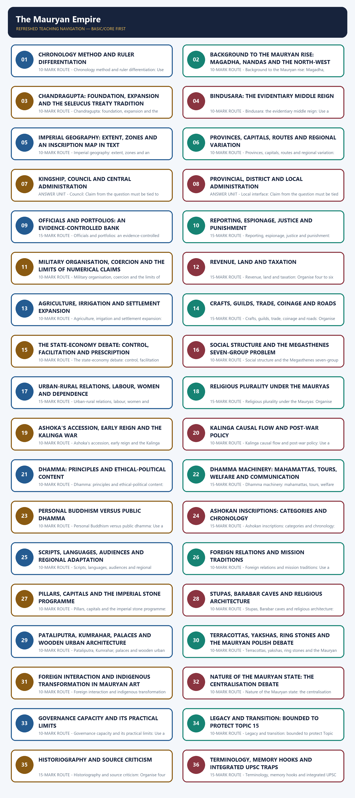

# The Mauryan Empire - Complete Topic Package

> **Subject:** Ancient Indian History | **Paper:** Prelims GS-I + GS-I | **Topic:** 14 | **Date:** 13 August 2026
>
> **Evidence key:** FACT/INSCRIPTIONAL/ARCHAEOLOGICAL EVIDENCE = directly supported by a named repository, local-book, official-paper or bounded official-heritage source. TEXTUAL TRADITION = what a specific later tradition narrates. INTERPRETATION/INFERENCE = analysis with a stated limit.
>
> **Approval state:** generated, **approved=false**. Only explicit user approval can change the status to approved.

### Package Practice Counts

| Component | Count |
| --- | --- |
| Verified/routed Prelims PYQs | 6 |
| Solved relevant Mains PYQ | 1 |
| Hard MCQs with explanations | 48 |
| Remedial MCQs with explanations | 12 |
| Original solved 10-mark Mains | 3 |
| Original solved 15-mark Mains | 3 |
| Original solved 20-mark Mains | 3 |

### Sources actually used

| Source class | Exact source | Use and caveat |
| --- | --- | --- |
| Repository knowledge | Topic 14 basic/advanced; README; Master Chronology; Revision Chart; official syllabus and PYQ routing; Answer-Worthiness Audit; bounded Topics 11-13, 15 and 25. | Controls chronology, syllabus boundaries, PYQ ownership and answer architecture. |
| R. S. Sharma | India's Ancient Past, Chapter 18, searchable local PDF pp. 192-199; Chapter 19 consulted only for bounded legacy context. | Foundation narrative on rulers, administration, economy, Kalinga and dhamma; numerical and centralisation claims are qualified. |
| Upinder Singh | A History of Ancient and Early Medieval India, 2nd ed., Chapter 7, searchable local PDF pp. 860-965. | Primary analytical control for source criticism, differentiated empire, inscriptions, dhamma, archaeology and art. |
| Official UPSC papers | Local Set-A papers for 2019, 2020, 2022, 2023 and 2025; locally held official 2025 Set-A key. | Controls exact question wording; 2019-2022 keys are labelled inferred because official keys are not held locally. |
| Bounded live heritage | UNESCO Sanchi; ASI Sanchi; ASI Sarnath Circle Lion Capital; Bihar Tourism Kumhrar. | Used only for present-day heritage stewardship and public presentation, not to date ancient remains. |

#### Bounded authoritative heritage links

- UNESCO, Buddhist Monuments at Sanchi: https://whc.unesco.org/en/list/524/
- Archaeological Survey of India, Buddhist Monuments at Sanchi: https://asi.nic.in/pages/WorldHeritageBuddhistMonumentsatSanchi
- ASI Sarnath Circle, Lion Capital: https://asisarnathcircle.in/lion-capital.php
- Bihar Tourism, Kumhrar Archaeological Park: https://tourism.bihar.gov.in/en/destinations/patna/kumrahar-puratav-park

These live pages are used only for current stewardship, museum/public presentation and the modern afterlife of Mauryan monuments. They do not override excavation reports or settle disputed ancient dating/function. No forced current-affairs item is inserted.

## BASIC LEARNING SESSION

### DEEP-REVIEW LEARNING CONTRACT

| Control | Binding rule for this package |
|---|---|
| Syllabus boundary | Complete Ancient History Core is taught before optional enrichment. |
| Evidence method | Claim → named site/text/inscription/coin/example → analysis → qualification. |
| Source hierarchy | Archaeology, textual testimony, inscriptions, coins and scholarly interpretation remain visibly distinct. |
| Contested issues | Competing interpretations are attributed, evidenced and bounded; certainty is not manufactured. |
| Practice contract | Every solved item has demand decoding, an examiner-grade model, an executable answer/compression plan, marks rationale and answer-specific improvement. |
| Approval | This immutable successor remains `approved: false` pending explicit approval. |

**Canonical Basic/Core owner:** `upsc-ai-kit\knowledge\Ancient-Indian-History\basic\14_Mauryan-Empire.md`  
**Canonical topic owner:** `upsc-ai-kit\knowledge\Ancient-Indian-History\basic\14_Mauryan-Empire.md`  
**Optional Advanced owner:** `upsc-ai-kit\knowledge\Ancient-Indian-History\advanced\14_Mauryan-Empire.md`  
**Official syllabus mapping:** `upsc-ai-kit\knowledge\Ancient-Indian-History\OFFICIAL-UPSC-SYLLABUS-MAPPING.md`

### EVIDENCE, PYQ AND CURRENT-STATUS CONTROL

- **Archaeological inference:** material context supports bounded reconstruction; absence is not automatic proof of non-existence.
- **Textual testimony:** genre, authorship, redaction, patronage and temporal distance control what a text can prove.
- **Inscription and coin evidence:** contemporary names, titles, claims and circulation are powerful but do not by themselves map uniform territorial control.
- **Scholarly interpretation:** historian labels are arguments to test, not facts to memorise without evidence.
- **PYQ discipline:** repository ledgers and locally held official papers control wording and metadata; reconstructed wording and unavailable official keys must be labelled.
- **Current-status note, rechecked 2026-08-30:** UNESCO and ASI Sanchi, ASI Sarnath and Bihar Tourism Kumhrar pages were accessed on 29 August 2026 only for heritage stewardship and monument-layering context.

**Live/primary context sources recorded by the predecessor generation:**

- `https://whc.unesco.org/en/list/524/`
- `https://asi.nic.in/pages/WorldHeritageBuddhistMonumentsatSanchi`
- `https://asisarnathcircle.in/lion-capital.php`
- `https://tourism.bihar.gov.in/en/destinations/patna/kumrahar-puratav-park`




*Distinct embedded teaching-navigation image. The separate continuous Cārvāka-style flowchart package remains an independent at-a-glance artifact.*

### Source hierarchy, scope and evidence labels

The Mauryan Empire must be reconstructed from unlike archives rather than from one seamless textbook narrative. This package separates contemporary royal inscriptions, archaeology and material remains, later quotations from Megasthenes, the debated Arthashastra, and Buddhist, Jain and Puranic traditions before combining them.

#### Compact visual / answer logic

```text
CLAIM
  |
  +-- inscription? -> royal command/voice -> ask about enforcement
  +-- archaeology? -> material pattern -> ask about identity/date
  +-- Megasthenes? -> fragment via later author -> ask about filter
  +-- Arthashastra? -> prescription/theory -> ask about Mauryan fit
  +-- tradition? -> memory/sectarian narrative -> ask about time gap
```

*The visual is a revision spine; every arrow or zone must be supported by named evidence in a Mains answer.*

#### Evidence / comparison matrix

| Claim/category | Named evidence | Significance | Limitation |
| --- | --- | --- | --- |
| Contemporary royal voice | Ashokan rock, pillar and cave inscriptions | Securely dated evidence for Ashoka's commands, dhamma and some officials | Royal intention and self-presentation are clearer than implementation |
| Material record | Pataliputra, Taxila, Ujjain, Sanchi, Barabar, coins and terracottas | Settlement, craft, architecture and circulation | Layers do not automatically name a ruler or administrative tier |
| External account | Megasthenes through Strabo, Arrian, Diodorus and Pliny | Court, city and ethnographic observations | Double filter, hearsay, selection and error |
| Normative/theoretical text | Arthashastra in its redacted form | Ancient political economy and statecraft possibilities | Not a transparent Mauryan administrative manual |
| Later traditions | Puranas, Ashokavadana, Mahavamsa, Parishishtaparvan | Dynastic and religious memory | Sectarian aims, legend and late composition |

#### Core teaching / solved analysis

- FACT: Ashoka's inscriptions are the strongest direct evidence for his reign, but their main subject is dhamma rather than a complete constitution.
- FACT: Upinder Singh treats Megasthenes as socially and geographically restricted; the Indica survives only in later quotations.
- INTERPRETATION: The best reconstruction comes from convergence between an inscription, a site or artefact, and a contextually suitable textual notice.
- LIMIT: A statement found only in a prescriptive text or late religious tradition must be attributed to that source, not converted into realised imperial practice.
- METHOD: Date the event, the composition/redaction of the text, the surviving manuscript or quotation, and the archaeological layer separately.

#### Answer-worthiness upgrades

- ANSWER UNIT - Contemporary royal voice: Claim from the question must be tied to Ashokan rock, pillar and cave inscriptions; this demonstrates securely dated evidence for ashoka's commands, dhamma and some officials; qualify the sentence because royal intention and self-presentation are clearer than implementation.
- ANSWER UNIT - Material record: Claim from the question must be tied to Pataliputra, Taxila, Ujjain, Sanchi, Barabar, coins and terracottas; this demonstrates settlement, craft, architecture and circulation; qualify the sentence because layers do not automatically name a ruler or administrative tier.
- ANSWER UNIT - External account: Claim from the question must be tied to Megasthenes through Strabo, Arrian, Diodorus and Pliny; this demonstrates court, city and ethnographic observations; qualify the sentence because double filter, hearsay, selection and error.
- ANSWER UNIT - Normative/theoretical text: Claim from the question must be tied to Arthashastra in its redacted form; this demonstrates ancient political economy and statecraft possibilities; qualify the sentence because not a transparent mauryan administrative manual.
- ANSWER UNIT - Later traditions: Claim from the question must be tied to Puranas, Ashokavadana, Mahavamsa, Parishishtaparvan; this demonstrates dynastic and religious memory; qualify the sentence because sectarian aims, legend and late composition.
- PRELIMS ROUTE - Source hierarchy, scope and evidence labels: Identify the source class, chronology, location and absolute wording before selecting an option.
- 10-MARK ROUTE - Source hierarchy, scope and evidence labels: Use a direct thesis and the three strongest named evidence units; retain one explicit qualification.
- 15-MARK ROUTE - Source hierarchy, scope and evidence labels: Organise four to six evidence units into causal or comparative dimensions and include a counterpoint.
- 20-MARK ROUTE - Source hierarchy, scope and evidence labels: Add historiography or regional variation, test source reliability, and end with the graded verdict encoded by 'S-A-M-T: Source, Audience, Material corroboration, Time gap.'.

> **Memory hook:** S-A-M-T: Source, Audience, Material corroboration, Time gap.

#### Must-know facts

- Evidence classes are inscriptional, archaeological/material, classical-fragmentary, theoretical/normative and later traditional.
- Qdrant was not used because authored Markdown and OCR-searchable local books were sufficient.

#### UPSC traps

- **Wrong:** All Mauryan sources describe the same state. **Correct:** Each source has a different date, genre, audience and evidentiary reach.
- **Wrong:** A royal edict proves uniform compliance. **Correct:** An edict proves a command and communication attempt; implementation needs corroboration.

**Mains/PYQ use:** Open a 20-marker with the evidence problem, then grade claims by source class instead of narrating a composite certainty.

**Study link:** Topics 02 (sources), 11-13 (pre-Mauryan setting), and Topic 15 (bounded transition).

### SESSION 1 — CHRONOLOGY METHOD AND RULER DIFFERENTIATION

#### DEFINITION / WHAT THIS IS CALLED

**Plain-language definition:** Mauryan chronology is conventional rather than perfectly fixed.

**Technical definition:** 10-MARK ROUTE - Chronology method and ruler differentiation: Use a direct thesis and the three strongest named evidence units; retain one explicit qualification.

#### ANSWER-GRABBING OPENING — WRITE/ADAPT IN THE EXAM

> 10-MARK ROUTE - Chronology method and ruler differentiation: Use a direct thesis and the three strongest named evidence units; retain one explicit qualification.

#### MUST-WRITE KEYWORDS

- **Chronology method**
- **ruler differentiation**
- **Memory hook**
- **Mains/PYQ use**
- **Study link**
- **c. 324/321 BCE**

**How to use them:** Frame the answer through Chronology method; define ruler differentiation, connect Memory hook with Mains/PYQ use to explain the mechanism, and use Study link for the decisive comparison or qualification.

Mauryan chronology is conventional rather than perfectly fixed. The repository basic chronology follows R. S. Sharma, while Upinder Singh gives a different accession/consecration reconstruction. A high-quality answer distinguishes Chandragupta, Bindusara and Ashoka and flags the accession-abhisheka gap.

#### Timeline

| Date/phase | Event |
| --- | --- |
| c. 324/321 BCE | Chandragupta establishes Mauryan power after the Nandas. |
| c. 305-301 BCE | Conflict/treaty tradition with Seleucus; exact date varies. |
| c. 300/297-273 BCE | Bindusara's reign; evidence remains limited. |
| c. 268/273-232 BCE | Ashoka's reign under different reconstructions. |
| 9th regnal year after abhisheka | Kalinga war and Major Rock Edict XIII retrospective. |
| c. 187 BCE | Mauryan dynasty ends; detailed decline deferred to Topic 15. |

#### Evidence / comparison matrix

| Claim/category | Named evidence | Significance | Limitation |
| --- | --- | --- | --- |
| Dynastic foundation | Chandragupta c. 324/321-300/297 BCE in Upinder; c. 324 BCE foundation in Sharma | Marks Nanda-Maurya transition | Exact accession year varies |
| Bindusara | c. 300/297-273 BCE | Connects founding conquests to Ashoka | Evidence is thin and later |
| Ashoka | c. 268-232 BCE in Upinder; 273-232 BCE reign in Sharma | Edict-rich phase | Consecration can be later than accession |
| Kalinga | Major Rock Edict XIII: eight completed years after consecration, war in ninth regnal year | Secure relative chronology | Absolute conversion to 261 BCE depends on chosen reign chronology |
| Dynastic end | c. 187 BCE in Upinder; c. 187/185 BCE in textbook conventions | Boundary with Topic 15 | Later Maurya sequence remains poorly documented |

#### Core teaching / solved analysis

- FACT: Chandragupta founded the dynasty; Bindusara inherited and probably extended it; Ashoka inherited a large empire and left the inscriptional archive.
- FACT: Buddhist traditions describe a succession conflict before Ashoka's consecration, but details such as killing ninety-nine brothers are legendary and cannot be accepted literally.
- CHRONOLOGY CAUTION: Kalinga occurred after Ashoka had already moved toward Buddhism according to Minor Rock Edict I; it intensified ethical-political change rather than causing a simple instant conversion.
- METHOD: Use c. 324-187 BCE as the broad dynasty range, then note alternative ruler dates only when the question requires precision.
- BOUNDARY: Topic 14 covers the mature empire and a bounded transition; detailed decline explanations belong to Topic 15.

#### Answer-worthiness upgrades

- ANSWER UNIT - Dynastic foundation: Claim from the question must be tied to Chandragupta c. 324/321-300/297 BCE in Upinder; c. 324 BCE foundation in Sharma; this demonstrates marks nanda-maurya transition; qualify the sentence because exact accession year varies.
- ANSWER UNIT - Bindusara: Claim from the question must be tied to c. 300/297-273 BCE; this demonstrates connects founding conquests to ashoka; qualify the sentence because evidence is thin and later.
- ANSWER UNIT - Ashoka: Claim from the question must be tied to c. 268-232 BCE in Upinder; 273-232 BCE reign in Sharma; this demonstrates edict-rich phase; qualify the sentence because consecration can be later than accession.
- ANSWER UNIT - Kalinga: Claim from the question must be tied to Major Rock Edict XIII: eight completed years after consecration, war in ninth regnal year; this demonstrates secure relative chronology; qualify the sentence because absolute conversion to 261 bce depends on chosen reign chronology.
- ANSWER UNIT - Dynastic end: Claim from the question must be tied to c. 187 BCE in Upinder; c. 187/185 BCE in textbook conventions; this demonstrates boundary with topic 15; qualify the sentence because later maurya sequence remains poorly documented.
- PRELIMS ROUTE - Chronology method and ruler differentiation: Identify the source class, chronology, location and absolute wording before selecting an option.
- 10-MARK ROUTE - Chronology method and ruler differentiation: Use a direct thesis and the three strongest named evidence units; retain one explicit qualification.
- 15-MARK ROUTE - Chronology method and ruler differentiation: Organise four to six evidence units into causal or comparative dimensions and include a counterpoint.
- 20-MARK ROUTE - Chronology method and ruler differentiation: Add historiography or regional variation, test source reliability, and end with the graded verdict encoded by 'C-B-A: Chandragupta creates, Bindusara bridges, Ashoka articulates.'.

> **Memory hook:** C-B-A: Chandragupta creates, Bindusara bridges, Ashoka articulates.

#### Must-know facts

- Kalinga is dated relative to abhisheka in Major Rock Edict XIII.
- Ashoka's personal Buddhist commitment and public dhamma have distinct evidence trails.

#### UPSC traps

- **Wrong:** Ashoka founded the Mauryan Empire. **Correct:** Chandragupta founded it; Ashoka was the third major ruler.
- **Wrong:** The Kalinga war itself converted Ashoka from non-Buddhist to Buddhist. **Correct:** Minor Rock Edict I indicates gradual Buddhist commitment; Kalinga reshaped public policy and reflection.

**Mains/PYQ use:** Write a chronology firewall before analysis: ruler, approximate date, source of date, and uncertainty.

**Study link:** Topic 14 evidence-led revision and answer writing.

#### CLOSING RECALL FLOW — CHRONOLOGY METHOD AND RULER DIFFERENTIATION

```text
START / CONCEPT: Chronology method and ruler differentiation
        |
        v
EXACT TERMS: Chronology method · ruler differentiation · Memory hook · Mains/PYQ use · Study link · c. 324/321 BCE
        |
        v
MECHANISM / ARGUMENT: 20-MARK ROUTE - Chronology method and ruler differentiation: Add historiography or regional variation, test source reliability, and end with the graded verdict encoded by 'C-B-A: Chandragupta creates, Bindusara bridges, Ashoka articulates.'.
        |
        v
CONSEQUENCE / CONTRAST: 15-MARK ROUTE - Chronology method and ruler differentiation: Organise four to six evidence units into causal or comparative dimensions and include a counterpoint.
        |
        v
UPSC TRAP / ANSWER-USE: Buddhist traditions describe a succession conflict before Ashoka's consecration, but details such as killing ninety-nine brothers are legendary and cannot be accepted literally.
        |
        v
ANSWER-GRABBING FORMULATION: 10-MARK ROUTE - Chronology method and ruler differentiation: Use a direct thesis and the three strongest named evidence units; retain one explicit qualification.
```
### SESSION 2 — BACKGROUND TO THE MAURYAN RISE: MAGADHA, NANDAS AND THE NORTH-WEST

#### DEFINITION / WHAT THIS IS CALLED

**Plain-language definition:** Nanda resources are a context, not proof that Mauryan institutions were unchanged Nanda institutions.

**Technical definition:** 10-MARK ROUTE - Background to the Mauryan rise: Magadha, Nandas and the north-west: Use a direct thesis and the three strongest named evidence units; retain one explicit qualification.

#### ANSWER-GRABBING OPENING — WRITE/ADAPT IN THE EXAM

> 10-MARK ROUTE - Background to the Mauryan rise: Magadha, Nandas and the north-west: Use a direct thesis and the three strongest named evidence units; retain one explicit qualification.

#### MUST-WRITE KEYWORDS

- **Background to the Mauryan rise**
- **Magadha**
- **Nandas**
- **the north-west**
- **Memory hook**
- **Mains/PYQ use**

**How to use them:** Frame the answer through Background to the Mauryan rise; define Magadha, connect Nandas with the north-west to explain the mechanism, and use Memory hook for the decisive comparison or qualification.

Mauryan expansion did not begin on an empty map. It scaled up Magadha's agrarian, riverine, urban and fiscal base, the Nandas' remembered military resources, and a north-west unsettled by Alexander's withdrawal and successor politics.

#### Compact visual / answer logic

```text
MAGADHA-NANDA BASE ---- revenue / army / Pataliputra
          \                         /
           \                       /
        CHANDRAGUPTA'S COALITION + STRATEGY
                     |
       NORTH-WESTERN SUCCESSOR FLUIDITY
                     |
              MAURYAN EXPANSION
```

*The visual is a revision spine; every arrow or zone must be supported by named evidence in a Mains answer.*

#### Evidence / comparison matrix

| Claim/category | Named evidence | Significance | Limitation |
| --- | --- | --- | --- |
| Magadhan platform | Pataliputra, Ganga-Son routes, earlier Magadhan consolidation | Revenue, transport and strategic concentration | Geography enabled but did not predetermine empire |
| Nanda inheritance | Puranic and classical traditions of wealth and a large army | Suggests a pre-existing fiscal-military scale | Army figures are not audited statistics |
| North-west opening | Alexander's campaign and successor satrapies | Created a fluid frontier and diplomatic arena | Did not mechanically cause Mauryan victory |
| Political agency | Chandragupta and Chanakya traditions | Shows remembered strategy and elite coalition | Late literary elaboration and Arthashastra conflation |

#### Core teaching / solved analysis

- FACT: Upinder Singh states that the Mauryan Empire was built on foundations laid by the Nandas.
- FACT: Chandragupta may first have established himself in the Punjab and then moved east, but the sequence is reconstructed rather than directly documented.
- TEXTUAL TRADITION: Puranas, Milindapanha, Mudrarakshasa, Mahavamshatika and Parishishtaparvan refer to conflict with the Nandas.
- INTERPRETATION: The north-west supplied both an opportunity and a strategic test; Chandragupta still needed a Magadhan base, armed force, diplomacy and coalition-building.
- LIMIT: Chanakya was probably historical, but his identification with the final Arthashastra emerged centuries later and cannot validate every textbook administrative claim.

#### Answer-worthiness upgrades

- ANSWER UNIT - Magadhan platform: Claim from the question must be tied to Pataliputra, Ganga-Son routes, earlier Magadhan consolidation; this demonstrates revenue, transport and strategic concentration; qualify the sentence because geography enabled but did not predetermine empire.
- ANSWER UNIT - Nanda inheritance: Claim from the question must be tied to Puranic and classical traditions of wealth and a large army; this demonstrates suggests a pre-existing fiscal-military scale; qualify the sentence because army figures are not audited statistics.
- ANSWER UNIT - North-west opening: Claim from the question must be tied to Alexander's campaign and successor satrapies; this demonstrates created a fluid frontier and diplomatic arena; qualify the sentence because did not mechanically cause mauryan victory.
- ANSWER UNIT - Political agency: Claim from the question must be tied to Chandragupta and Chanakya traditions; this demonstrates shows remembered strategy and elite coalition; qualify the sentence because late literary elaboration and arthashastra conflation.
- PRELIMS ROUTE - Background to the Mauryan rise: Magadha, Nandas and the north-west: Identify the source class, chronology, location and absolute wording before selecting an option.
- 10-MARK ROUTE - Background to the Mauryan rise: Magadha, Nandas and the north-west: Use a direct thesis and the three strongest named evidence units; retain one explicit qualification.
- 15-MARK ROUTE - Background to the Mauryan rise: Magadha, Nandas and the north-west: Organise four to six evidence units into causal or comparative dimensions and include a counterpoint.
- 20-MARK ROUTE - Background to the Mauryan rise: Magadha, Nandas and the north-west: Add historiography or regional variation, test source reliability, and end with the graded verdict encoded by 'I-O-A: Inherited platform, Opportunity, Agency.'.

> **Memory hook:** I-O-A: Inherited platform, Opportunity, Agency.

#### Must-know facts

- Mauryan rise combined inheritance, conquest, diplomacy and strategic timing.
- Nanda resources are a context, not proof that Mauryan institutions were unchanged Nanda institutions.

#### UPSC traps

- **Wrong:** Alexander created the Mauryan Empire. **Correct:** His withdrawal altered the north-western balance; Chandragupta's agency and Magadhan resources remained decisive.
- **Wrong:** Chanakya tradition proves the final Arthashastra guided Chandragupta. **Correct:** The textual identification is late and the work is redacted/theoretical.

**Mains/PYQ use:** Explain rise as a conjuncture; rank Magadhan inheritance above single-factor stories about iron, Alexander or Chanakya.

**Study link:** Topics 11 and 12 provide the Magadhan and north-western prehistory.

#### CLOSING RECALL FLOW — BACKGROUND TO THE MAURYAN RISE: MAGADHA, NANDAS AND THE NORTH-WEST

```text
START / CONCEPT: Background to the Mauryan rise: Magadha, Nandas and the north-west
        |
        v
EXACT TERMS: Background to the Mauryan rise · Magadha · Nandas · the north-west · Memory hook · Mains/PYQ use
        |
        v
MECHANISM / ARGUMENT: 15-MARK ROUTE - Background to the Mauryan rise: Magadha, Nandas and the north-west: Organise four to six evidence units into causal or comparative dimensions and include a counterpoint.
        |
        v
CONSEQUENCE / CONTRAST: ANSWER UNIT - North-west opening: Claim from the question must be tied to Alexander's campaign and successor satrapies; this demonstrates created a fluid frontier and diplomatic arena; qualify the sentence because did not mechanically cause mauryan victory.
        |
        v
UPSC TRAP / ANSWER-USE: Nanda resources are a context, not proof that Mauryan institutions were unchanged Nanda institutions.
        |
        v
ANSWER-GRABBING FORMULATION: 10-MARK ROUTE - Background to the Mauryan rise: Magadha, Nandas and the north-west: Use a direct thesis and the three strongest named evidence units; retain one explicit qualification.
```
### SESSION 3 — CHANDRAGUPTA: FOUNDATION, EXPANSION AND THE SELEUCUS TREATY TRADITION

#### DEFINITION / WHAT THIS IS CALLED

**Plain-language definition:** Chandragupta is the chief architect of the empire, yet direct contemporary evidence is sparse.

**Technical definition:** 10-MARK ROUTE - Chandragupta: foundation, expansion and the Seleucus treaty tradition: Use a direct thesis and the three strongest named evidence units; retain one explicit qualification.

#### ANSWER-GRABBING OPENING — WRITE/ADAPT IN THE EXAM

> 10-MARK ROUTE - Chandragupta: foundation, expansion and the Seleucus treaty tradition: Use a direct thesis and the three strongest named evidence units; retain one explicit qualification.

#### MUST-WRITE KEYWORDS

- **Chandragupta**
- **foundation**
- **the Seleucus treaty tradition**
- **Memory hook**
- **Mains/PYQ use**
- **Study link**

**How to use them:** Frame the answer through Chandragupta; define foundation, connect the Seleucus treaty tradition with Memory hook to explain the mechanism, and use Mains/PYQ use for the decisive comparison or qualification.

Chandragupta is the chief architect of the empire, yet direct contemporary evidence is sparse. His conquests and diplomacy are reconstructed from Graeco-Roman notices, later Indian traditions, the later Junagadh inscription and the imperial geography visible under Ashoka.

#### Evidence / comparison matrix

| Claim/category | Named evidence | Significance | Limitation |
| --- | --- | --- | --- |
| Nanda overthrow | Multiple later Indian traditions | Dynastic foundation in Magadha | Narrative details differ |
| North-west | Justin and Plutarch on Sandrocottus | Large-scale conquest memory | 'India' and army numbers are imprecise |
| Saurashtra | Rudradaman's Junagadh inscription credits Pushyagupta under Chandragupta with beginning Sudarshana reservoir | Later inscriptional evidence for western administration | Written over four centuries later |
| Seleucus settlement | Classical tradition: territorial transfer and 500 elephants | Diplomacy secured frontier and military exchange | Marriage clause and exact territorial language are uncertain |
| Southward reach | Mamulanar poems and later Jain links to Karnataka | Possible trans-Vindhyan activity | Poetic and late evidence cannot map direct rule |

#### Core teaching / solved analysis

- FACT: The conflict with Seleucus is conventionally placed c. 305-303 BCE, while Upinder Singh places it around 301 BCE; use an approximate range and name the source conflict.
- FACT: The treaty tradition gives Chandragupta Arachosia, Gedrosia and Paropamisadai and records 500 elephants transferred to Seleucus.
- LIMIT: It is uncertain whether there was a dynastic marriage, general intermarriage rights, or a later misunderstanding of the Greek term.
- FACT: Rudradaman's c. 150 CE Junagadh inscription is the only definite inscriptional notice tied to Chandragupta, although it is much later.
- INTERPRETATION: Chandragupta combined conquest with negotiated frontier stabilization; this makes him more than a purely military founder.
- SOURCE CAUTION: Plutarch's 600,000 army and 'whole India' language convey remembered scale, not reliable territorial statistics.

#### Answer-worthiness upgrades

- ANSWER UNIT - Nanda overthrow: Claim from the question must be tied to Multiple later Indian traditions; this demonstrates dynastic foundation in magadha; qualify the sentence because narrative details differ.
- ANSWER UNIT - North-west: Claim from the question must be tied to Justin and Plutarch on Sandrocottus; this demonstrates large-scale conquest memory; qualify the sentence because 'india' and army numbers are imprecise.
- ANSWER UNIT - Saurashtra: Claim from the question must be tied to Rudradaman's Junagadh inscription credits Pushyagupta under Chandragupta with beginning Sudarshana reservoir; this demonstrates later inscriptional evidence for western administration; qualify the sentence because written over four centuries later.
- ANSWER UNIT - Seleucus settlement: Claim from the question must be tied to Classical tradition: territorial transfer and 500 elephants; this demonstrates diplomacy secured frontier and military exchange; qualify the sentence because marriage clause and exact territorial language are uncertain.
- ANSWER UNIT - Southward reach: Claim from the question must be tied to Mamulanar poems and later Jain links to Karnataka; this demonstrates possible trans-vindhyan activity; qualify the sentence because poetic and late evidence cannot map direct rule.
- PRELIMS ROUTE - Chandragupta: foundation, expansion and the Seleucus treaty tradition: Identify the source class, chronology, location and absolute wording before selecting an option.
- 10-MARK ROUTE - Chandragupta: foundation, expansion and the Seleucus treaty tradition: Use a direct thesis and the three strongest named evidence units; retain one explicit qualification.
- 15-MARK ROUTE - Chandragupta: foundation, expansion and the Seleucus treaty tradition: Organise four to six evidence units into causal or comparative dimensions and include a counterpoint.
- 20-MARK ROUTE - Chandragupta: foundation, expansion and the Seleucus treaty tradition: Add historiography or regional variation, test source reliability, and end with the graded verdict encoded by 'F-D-L: Foundation, Diplomacy, Limits.'.

> **Memory hook:** F-D-L: Foundation, Diplomacy, Limits.

#### Must-know facts

- Chandragupta, not Ashoka, established the imperial framework.
- Seleucus evidence supports diplomacy and exchange as well as conflict.

#### UPSC traps

- **Wrong:** The treaty borders can be mapped with modern precision. **Correct:** Classical territorial names and actual control require cautious translation.
- **Wrong:** Jain tradition securely proves Chandragupta died at Shravanabelagola. **Correct:** The tradition is strong but the inscriptions are centuries later; historical identification remains debated.

**Mains/PYQ use:** Use treaty evidence as claim -> named classical tradition -> frontier significance -> uncertainty over date, marriage and territorial control.

**Study link:** Topic 14 evidence-led revision and answer writing.

#### CLOSING RECALL FLOW — CHANDRAGUPTA: FOUNDATION, EXPANSION AND THE SELEUCUS TREATY TRADITION

```text
START / CONCEPT: Chandragupta: foundation, expansion and the Seleucus treaty tradition
        |
        v
EXACT TERMS: Chandragupta · foundation · the Seleucus treaty tradition · Memory hook · Mains/PYQ use · Study link
        |
        v
MECHANISM / ARGUMENT: 15-MARK ROUTE - Chandragupta: foundation, expansion and the Seleucus treaty tradition: Organise four to six evidence units into causal or comparative dimensions and include a counterpoint.
        |
        v
CONSEQUENCE / CONTRAST: Correct: The tradition is strong but the inscriptions are centuries later; historical identification remains debated.
        |
        v
UPSC TRAP / ANSWER-USE: 305-303 BCE, while Upinder Singh places it around 301 BCE; use an approximate range and name the source conflict.
        |
        v
ANSWER-GRABBING FORMULATION: 10-MARK ROUTE - Chandragupta: foundation, expansion and the Seleucus treaty tradition: Use a direct thesis and the three strongest named evidence units; retain one explicit qualification.
```
### SESSION 4 — BINDUSARA: THE EVIDENTIARY MIDDLE REIGN

#### DEFINITION / WHAT THIS IS CALLED

**Plain-language definition:** Bindusara is a source-poor ruler, not a historically empty reign.

**Technical definition:** 10-MARK ROUTE - Bindusara: the evidentiary middle reign: Use a direct thesis and the three strongest named evidence units; retain one explicit qualification.

#### ANSWER-GRABBING OPENING — WRITE/ADAPT IN THE EXAM

> 10-MARK ROUTE - Bindusara: the evidentiary middle reign: Use a direct thesis and the three strongest named evidence units; retain one explicit qualification.

#### MUST-WRITE KEYWORDS

- **Bindusara**
- **the evidentiary middle reign**
- **Memory hook**
- **Mains/PYQ use**
- **Study link**
- **Name**

**How to use them:** Frame the answer through Bindusara; define the evidentiary middle reign, connect Memory hook with Mains/PYQ use to explain the mechanism, and use Study link for the decisive comparison or qualification.

Bindusara must not disappear between a celebrated founder and an inscription-rich successor. He probably preserved and extended the empire, managed frontier and provincial tensions, and maintained Hellenistic diplomacy, but almost every claim needs an explicit source caveat.

#### Evidence / comparison matrix

| Claim/category | Named evidence | Significance | Limitation |
| --- | --- | --- | --- |
| Name | Amitraghata; Greek Amitrochates/Allitrochates | Cross-cultural identification | Transmission and transliteration vary |
| Expansion | Taranatha's sixteen towns and later interpretations | Possible Deccan consolidation or revolt suppression | Very late evidence |
| Taxila | Divyavadana revolt story and wicked ministers | Provincial tension and elite mediation | Narrative may not preserve exact event |
| Diplomacy | Deimachus from Antiochus; Dionysius from Ptolemy II | Continued Hellenistic contacts | Details survive in later classical writers |
| Religion | Ajivika fortune-teller story | Possible plural patronage context | Too weak to prove a royal religious policy |

#### Core teaching / solved analysis

- FACT: Upinder Singh gives Bindusara c. 297-273 BCE; Buddhist sources are comparatively silent about him.
- TEXTUAL TRADITION: Taranatha credits Chanakya with making Bindusara master between the eastern and western seas; this may refer to conquest or suppression.
- FACT: Greek notices present Bindusara as part of a diplomatic world linking the Mauryan court to Syria and Ptolemaic Egypt.
- INTERPRETATION: The absence of inscriptions prevents a confident map of Bindusara's expansion; the safest claim is continuity plus possible consolidation.
- LIMIT: A fragmentary Sanchi inscription may refer to Bindusara, but the identification is not sufficiently secure to carry a large argument.

#### Answer-worthiness upgrades

- ANSWER UNIT - Name: Claim from the question must be tied to Amitraghata; Greek Amitrochates/Allitrochates; this demonstrates cross-cultural identification; qualify the sentence because transmission and transliteration vary.
- ANSWER UNIT - Expansion: Claim from the question must be tied to Taranatha's sixteen towns and later interpretations; this demonstrates possible deccan consolidation or revolt suppression; qualify the sentence because very late evidence.
- ANSWER UNIT - Taxila: Claim from the question must be tied to Divyavadana revolt story and wicked ministers; this demonstrates provincial tension and elite mediation; qualify the sentence because narrative may not preserve exact event.
- ANSWER UNIT - Diplomacy: Claim from the question must be tied to Deimachus from Antiochus; Dionysius from Ptolemy II; this demonstrates continued hellenistic contacts; qualify the sentence because details survive in later classical writers.
- ANSWER UNIT - Religion: Claim from the question must be tied to Ajivika fortune-teller story; this demonstrates possible plural patronage context; qualify the sentence because too weak to prove a royal religious policy.
- PRELIMS ROUTE - Bindusara: the evidentiary middle reign: Identify the source class, chronology, location and absolute wording before selecting an option.
- 10-MARK ROUTE - Bindusara: the evidentiary middle reign: Use a direct thesis and the three strongest named evidence units; retain one explicit qualification.
- 15-MARK ROUTE - Bindusara: the evidentiary middle reign: Organise four to six evidence units into causal or comparative dimensions and include a counterpoint.
- 20-MARK ROUTE - Bindusara: the evidentiary middle reign: Add historiography or regional variation, test source reliability, and end with the graded verdict encoded by 'B = Bridge, not blank.'.

> **Memory hook:** B = Bridge, not blank.

#### Must-know facts

- Bindusara is a source-poor ruler, not a historically empty reign.
- Diplomatic contacts are firmer than detailed conquest narratives.

#### UPSC traps

- **Wrong:** Bindusara conquered the entire Deccan as an established fact. **Correct:** Treat it as a debated inference from late texts and Ashoka-era geography.
- **Wrong:** Silence proves inactivity. **Correct:** Sparse archives limit reconstruction; they do not prove political passivity.

**Mains/PYQ use:** A good answer states what can be known, then makes the silence itself part of source criticism.

**Study link:** Topic 14 evidence-led revision and answer writing.

#### CLOSING RECALL FLOW — BINDUSARA: THE EVIDENTIARY MIDDLE REIGN

```text
START / CONCEPT: Bindusara: the evidentiary middle reign
        |
        v
EXACT TERMS: Bindusara · the evidentiary middle reign · Memory hook · Mains/PYQ use · Study link · Name
        |
        v
MECHANISM / ARGUMENT: 15-MARK ROUTE - Bindusara: the evidentiary middle reign: Organise four to six evidence units into causal or comparative dimensions and include a counterpoint.
        |
        v
CONSEQUENCE / CONTRAST: Bindusara is a source-poor ruler, not a historically empty reign.
        |
        v
UPSC TRAP / ANSWER-USE: Bindusara must not disappear between a celebrated founder and an inscription-rich successor.
        |
        v
ANSWER-GRABBING FORMULATION: 10-MARK ROUTE - Bindusara: the evidentiary middle reign: Use a direct thesis and the three strongest named evidence units; retain one explicit qualification.
```
### SESSION 5 — IMPERIAL GEOGRAPHY: EXTENT, ZONES AND AN INSCRIPTION MAP IN TEXT

#### DEFINITION / WHAT THIS IS CALLED

**Plain-language definition:** ANSWER UNIT - Provincial/core zones: Claim from the question must be tied to Taxila, Ujjayini, Tosali and Suvarnagiri; this demonstrates strategic regional command; qualify the sentence because boundaries and internal tiers are uncertain.

**Technical definition:** 10-MARK ROUTE - Imperial geography: extent, zones and an inscription map in text: Use a direct thesis and the three strongest named evidence units; retain one explicit qualification.

#### ANSWER-GRABBING OPENING — WRITE/ADAPT IN THE EXAM

> 10-MARK ROUTE - Imperial geography: extent, zones and an inscription map in text: Use a direct thesis and the three strongest named evidence units; retain one explicit qualification.

#### MUST-WRITE KEYWORDS

- **Imperial geography**
- **extent**
- **zones**
- **an inscription map in text**
- **Memory hook**
- **Mains/PYQ use**

**How to use them:** Frame the answer through Imperial geography; define extent, connect zones with an inscription map in text to explain the mechanism, and use Memory hook for the decisive comparison or qualification.

The Mauryan Empire was virtually subcontinental, but a territorial outline is not a map of equal administrative control. Ashokan find-spots show communication, contact and claims; archaeology and local language choices reveal differentiated incorporation.

#### Compact visual / answer logic

```text
NW FRONTIER: Kandahar / Shahbazgarhi / Mansehra
        |
TAXILA ---- PATALIPUTRA ---- TOSALI / KALINGA
        |          |
     UJJAYINI -----+----- routes to SAURASHTRA
                   |
              SUVARNAGIRI
                   |
   DECCAN EDICT BELT: Maski / Brahmagiri / Erragudi / Sannati
                   |
OUTSIDE DIRECT CORE: Cholas / Pandyas / Keralaputras / Satiyaputras
```

*The visual is a revision spine; every arrow or zone must be supported by named evidence in a Mains answer.*

#### Evidence / comparison matrix

| Claim/category | Named evidence | Significance | Limitation |
| --- | --- | --- | --- |
| Metropolitan core | Pataliputra and middle Ganga valley | Highest probable concentration of court and fiscal capacity | Even the core is archaeologically incomplete |
| Provincial/core zones | Taxila, Ujjayini, Tosali and Suvarnagiri | Strategic regional command | Boundaries and internal tiers are uncertain |
| North-west frontier | Kandahar, Shahbazgarhi, Mansehra | Multilingual imperial contact beyond Indus | Local mediation and frontier autonomy |
| Southern contact zone | Maski, Brahmagiri, Erragudi, Sannati and other minor edicts | Wide reach of messages and routes | Edict presence does not equal dense bureaucracy |
| External neighbours | Cholas, Pandyas, Satiyaputras, Keralaputras and Tamraparni | Rock Edicts II/XIII distinguish neighbours from the king's domain | Dhamma-vijaya is not annexation |

#### Core teaching / solved analysis

- FACT: The empire extended into Afghanistan in the north-west and Odisha in the east, while the far south retained named polities outside direct Mauryan rule.
- FACT: Major rock edicts cluster largely toward imperial borders; major pillar edicts cluster in north India; minor rock edicts have the widest spread and a southern concentration.
- INTERPRETATION: Metropolitan, core and peripheral zones help explain different intensities of extraction, garrisoning, communication and negotiation.
- LIMIT: The absence of inscriptions in the extreme east does not prove absence of all Mauryan influence; survival, geology, routes and discovery history matter.
- LIMIT: Conversely, a rock edict in the Deccan proves official contact and a claim to authority, not uniform direct administration of surrounding countryside.

#### Answer-worthiness upgrades

- ANSWER UNIT - Metropolitan core: Claim from the question must be tied to Pataliputra and middle Ganga valley; this demonstrates highest probable concentration of court and fiscal capacity; qualify the sentence because even the core is archaeologically incomplete.
- ANSWER UNIT - Provincial/core zones: Claim from the question must be tied to Taxila, Ujjayini, Tosali and Suvarnagiri; this demonstrates strategic regional command; qualify the sentence because boundaries and internal tiers are uncertain.
- ANSWER UNIT - North-west frontier: Claim from the question must be tied to Kandahar, Shahbazgarhi, Mansehra; this demonstrates multilingual imperial contact beyond indus; qualify the sentence because local mediation and frontier autonomy.
- ANSWER UNIT - Southern contact zone: Claim from the question must be tied to Maski, Brahmagiri, Erragudi, Sannati and other minor edicts; this demonstrates wide reach of messages and routes; qualify the sentence because edict presence does not equal dense bureaucracy.
- ANSWER UNIT - External neighbours: Claim from the question must be tied to Cholas, Pandyas, Satiyaputras, Keralaputras and Tamraparni; this demonstrates rock edicts ii/xiii distinguish neighbours from the king's domain; qualify the sentence because dhamma-vijaya is not annexation.
- PRELIMS ROUTE - Imperial geography: extent, zones and an inscription map in text: Identify the source class, chronology, location and absolute wording before selecting an option.
- 10-MARK ROUTE - Imperial geography: extent, zones and an inscription map in text: Use a direct thesis and the three strongest named evidence units; retain one explicit qualification.
- 15-MARK ROUTE - Imperial geography: extent, zones and an inscription map in text: Organise four to six evidence units into causal or comparative dimensions and include a counterpoint.
- 20-MARK ROUTE - Imperial geography: extent, zones and an inscription map in text: Add historiography or regional variation, test source reliability, and end with the graded verdict encoded by 'F-C-C: Find-spot, Claim, Control.'.

> **Memory hook:** F-C-C: Find-spot, Claim, Control.

#### Must-know facts

- Find-spot, political claim and effective control are three separate questions.
- The far-southern polities are named as neighbours, not conquered provinces.

#### UPSC traps

- **Wrong:** The inscription map is identical to an administrative map. **Correct:** Use archaeology, settlement patterns, language and local political context to grade control.
- **Wrong:** The empire excluded all areas without edicts. **Correct:** Survival and discovery are uneven; negative evidence must be cautious.

**Mains/PYQ use:** Draw a text map, then attach one sentence on control intensity to each zone.

**Study link:** Topic 14 evidence-led revision and answer writing.

#### CLOSING RECALL FLOW — IMPERIAL GEOGRAPHY: EXTENT, ZONES AND AN INSCRIPTION MAP IN TEXT

```text
START / CONCEPT: Imperial geography: extent, zones and an inscription map in text
        |
        v
EXACT TERMS: Imperial geography · extent · zones · an inscription map in text · Memory hook · Mains/PYQ use
        |
        v
MECHANISM / ARGUMENT: 15-MARK ROUTE - Imperial geography: extent, zones and an inscription map in text: Organise four to six evidence units into causal or comparative dimensions and include a counterpoint.
        |
        v
CONSEQUENCE / CONTRAST: The absence of inscriptions in the extreme east does not prove absence of all Mauryan influence; survival, geology, routes and discovery history matter.
        |
        v
UPSC TRAP / ANSWER-USE: ANSWER UNIT - Southern contact zone: Claim from the question must be tied to Maski, Brahmagiri, Erragudi, Sannati and other minor edicts; this demonstrates wide reach of messages and routes; qualify the sentence because edict presence does not equal dense bureaucracy.
        |
        v
ANSWER-GRABBING FORMULATION: 10-MARK ROUTE - Imperial geography: extent, zones and an inscription map in text: Use a direct thesis and the three strongest named evidence units; retain one explicit qualification.
```
### SESSION 6 — PROVINCES, CAPITALS, ROUTES AND REGIONAL VARIATION

#### DEFINITION / WHAT THIS IS CALLED

**Plain-language definition:** The number 'four provinces' is a reconstruction from surviving inscriptions, not a complete official list.

**Technical definition:** 10-MARK ROUTE - Provinces, capitals, routes and regional variation: Use a direct thesis and the three strongest named evidence units; retain one explicit qualification.

#### ANSWER-GRABBING OPENING — WRITE/ADAPT IN THE EXAM

> 10-MARK ROUTE - Provinces, capitals, routes and regional variation: Use a direct thesis and the three strongest named evidence units; retain one explicit qualification.

#### MUST-WRITE KEYWORDS

- **Provinces**
- **capitals**
- **routes**
- **regional variation**
- **Memory hook**
- **Mains/PYQ use**

**How to use them:** Frame the answer through Provinces; define capitals, connect routes with regional variation to explain the mechanism, and use Memory hook for the decisive comparison or qualification.

Provincial centres were not miniature copies of Pataliputra. They linked strategic corridors, older cities, resource zones and frontier populations to the court through princes, governors, officials, inspection tours and negotiated local participation.

#### Evidence / comparison matrix

| Claim/category | Named evidence | Significance | Limitation |
| --- | --- | --- | --- |
| Taxila | Northern headquarters; revolt tradition; triennial inspection reference | Frontier, routes and military importance | Repeated tension suggests limits of integration |
| Ujjayini | Western headquarters; Ashoka as possible prince-governor | Malwa and western trade routes | Later tradition and edict context must be separated |
| Tosali | Kalinga eastern headquarters; Dhauli/Jaugada separate edicts | Post-conquest governance laboratory | Site identification remains debated |
| Suvarnagiri | Southern headquarters named in minor-edict network | Deccan routes and resource zone | Exact territory and bureaucratic density uncertain |
| Saurashtra | Pushyagupta and Tushaspha in later Junagadh inscription | Governor, reservoir and regional administration | Later retrospective evidence |

#### Core teaching / solved analysis

- FACT: Ashokan inscriptions address some provincial governors as kumara or aryaputra, supporting appointment of royal princes to major centres.
- FACT: Rock and separate edicts reveal officials and inspection teams moving between court, province and district; Upinder calls governance significantly peripatetic.
- FACT: Routes linked Pataliputra to Taxila, Ujjayini, Kalinga and Deccan zones, while river corridors reduced but did not remove communication costs.
- INTERPRETATION: Provinces concentrated authority where older urban and strategic networks already existed; local institutions and communities continued beneath imperial supervision.
- LIMIT: The number 'four provinces' is a reconstruction from surviving inscriptions, not a complete official list.

#### Answer-worthiness upgrades

- ANSWER UNIT - Taxila: Claim from the question must be tied to Northern headquarters; revolt tradition; triennial inspection reference; this demonstrates frontier, routes and military importance; qualify the sentence because repeated tension suggests limits of integration.
- ANSWER UNIT - Ujjayini: Claim from the question must be tied to Western headquarters; Ashoka as possible prince-governor; this demonstrates malwa and western trade routes; qualify the sentence because later tradition and edict context must be separated.
- ANSWER UNIT - Tosali: Claim from the question must be tied to Kalinga eastern headquarters; Dhauli/Jaugada separate edicts; this demonstrates post-conquest governance laboratory; qualify the sentence because site identification remains debated.
- ANSWER UNIT - Suvarnagiri: Claim from the question must be tied to Southern headquarters named in minor-edict network; this demonstrates deccan routes and resource zone; qualify the sentence because exact territory and bureaucratic density uncertain.
- ANSWER UNIT - Saurashtra: Claim from the question must be tied to Pushyagupta and Tushaspha in later Junagadh inscription; this demonstrates governor, reservoir and regional administration; qualify the sentence because later retrospective evidence.
- PRELIMS ROUTE - Provinces, capitals, routes and regional variation: Identify the source class, chronology, location and absolute wording before selecting an option.
- 10-MARK ROUTE - Provinces, capitals, routes and regional variation: Use a direct thesis and the three strongest named evidence units; retain one explicit qualification.
- 15-MARK ROUTE - Provinces, capitals, routes and regional variation: Organise four to six evidence units into causal or comparative dimensions and include a counterpoint.
- 20-MARK ROUTE - Provinces, capitals, routes and regional variation: Add historiography or regional variation, test source reliability, and end with the graded verdict encoded by 'C-R-V: Centre, Route, Variation.'.

> **Memory hook:** C-R-V: Centre, Route, Variation.

#### Must-know facts

- Provincial centres combined dynastic oversight with local administrative recruitment.
- Communication time is essential to the centralisation debate.

#### UPSC traps

- **Wrong:** Every province had identical boundaries and offices. **Correct:** The archive shows centres and officials, not a standardized provincial code.
- **Wrong:** Princes as governors prove effortless control. **Correct:** Taxila revolt traditions and inspection orders reveal monitoring problems.

**Mains/PYQ use:** Explain a province through centre + route + strategic function + evidence limit.

**Study link:** Topic 14 evidence-led revision and answer writing.

#### CLOSING RECALL FLOW — PROVINCES, CAPITALS, ROUTES AND REGIONAL VARIATION

```text
START / CONCEPT: Provinces, capitals, routes and regional variation
        |
        v
EXACT TERMS: Provinces · capitals · routes · regional variation · Memory hook · Mains/PYQ use
        |
        v
MECHANISM / ARGUMENT: 15-MARK ROUTE - Provinces, capitals, routes and regional variation: Organise four to six evidence units into causal or comparative dimensions and include a counterpoint.
        |
        v
CONSEQUENCE / CONTRAST: Mains/PYQ use: Explain a province through centre + route + strategic function + evidence limit.
        |
        v
UPSC TRAP / ANSWER-USE: The number 'four provinces' is a reconstruction from surviving inscriptions, not a complete official list.
        |
        v
ANSWER-GRABBING FORMULATION: 10-MARK ROUTE - Provinces, capitals, routes and regional variation: Use a direct thesis and the three strongest named evidence units; retain one explicit qualification.
```
### SESSION 7 — KINGSHIP, COUNCIL AND CENTRAL ADMINISTRATION

#### DEFINITION / WHAT THIS IS CALLED

**Plain-language definition:** Central administration is best reconstructed from inscriptions plus bounded classical comparison.

**Technical definition:** ANSWER UNIT - Council: Claim from the question must be tied to Parisa/palisha in Rock Edicts III and VI; Greek sunedroi/sumbouloi; this demonstrates deliberation and direction of officials; qualify the sentence because composition and powers are unclear.

#### ANSWER-GRABBING OPENING — WRITE/ADAPT IN THE EXAM

> 10-MARK ROUTE - Kingship, council and central administration: Use a direct thesis and the three strongest named evidence units; retain one explicit qualification.

#### MUST-WRITE KEYWORDS

- **Kingship**
- **council**
- **central administration**
- **Memory hook**
- **Mains/PYQ use**
- **Study link**

**How to use them:** Frame the answer through Kingship; define council, connect central administration with Memory hook to explain the mechanism, and use Mains/PYQ use for the decisive comparison or qualification.

Mauryan kingship combined personal command, consultative bodies, high officers and an ideology of strenuous royal accessibility. Ashoka's inscriptions show a ruler seeking immediate reports, but they also expose the difficulty of making distant officials behave as intended.

#### Evidence / comparison matrix

| Claim/category | Named evidence | Significance | Limitation |
| --- | --- | --- | --- |
| King | Rock Edict VI and Megasthenes' court notice | Continuous receipt of reports and personal adjudication ideal | Royal self-description may overstate reach |
| Council | Parisa/palisha in Rock Edicts III and VI; Greek sunedroi/sumbouloi | Deliberation and direction of officials | Composition and powers are unclear |
| Ministers | Radhagupta tradition; mantrin vocabulary | Elite coalition and succession politics | Narrative evidence is later |
| High officers | Multiple mahamatta categories | Portfolio differentiation | Titles do not reveal a modern ministry chart |
| Court security | Megasthenes and Arthashastra convergence on female bodyguards | Possible court practice | Similarity between unlike sources is suggestive, not conclusive |

#### Core teaching / solved analysis

- FACT: Rock Edict VI orders pativedakas to report public affairs to Ashoka at any time and place and requires council disputes to be reported immediately.
- FACT: Rock Edict III connects the council with directing yuktas in assigned duties.
- INTERPRETATION: The king's accessibility is an ideological claim about duty and a practical attempt to shorten an information chain.
- LIMIT: A personal monarch cannot directly supervise every village; the edicts themselves rely on intermediaries and repeated inspection.
- SOURCE CAUTION: Megasthenes' vivid court routine is valuable for Pataliputra but cannot be projected unchanged across all India.

#### Answer-worthiness upgrades

- ANSWER UNIT - King: Claim from the question must be tied to Rock Edict VI and Megasthenes' court notice; this demonstrates continuous receipt of reports and personal adjudication ideal; qualify the sentence because royal self-description may overstate reach.
- ANSWER UNIT - Council: Claim from the question must be tied to Parisa/palisha in Rock Edicts III and VI; Greek sunedroi/sumbouloi; this demonstrates deliberation and direction of officials; qualify the sentence because composition and powers are unclear.
- ANSWER UNIT - Ministers: Claim from the question must be tied to Radhagupta tradition; mantrin vocabulary; this demonstrates elite coalition and succession politics; qualify the sentence because narrative evidence is later.
- ANSWER UNIT - High officers: Claim from the question must be tied to Multiple mahamatta categories; this demonstrates portfolio differentiation; qualify the sentence because titles do not reveal a modern ministry chart.
- ANSWER UNIT - Court security: Claim from the question must be tied to Megasthenes and Arthashastra convergence on female bodyguards; this demonstrates possible court practice; qualify the sentence because similarity between unlike sources is suggestive, not conclusive.
- PRELIMS ROUTE - Kingship, council and central administration: Identify the source class, chronology, location and absolute wording before selecting an option.
- 10-MARK ROUTE - Kingship, council and central administration: Use a direct thesis and the three strongest named evidence units; retain one explicit qualification.
- 15-MARK ROUTE - Kingship, council and central administration: Organise four to six evidence units into causal or comparative dimensions and include a counterpoint.
- 20-MARK ROUTE - Kingship, council and central administration: Add historiography or regional variation, test source reliability, and end with the graded verdict encoded by 'K-C-O-I: King, Council, Officers, Information.'.

> **Memory hook:** K-C-O-I: King, Council, Officers, Information.

#### Must-know facts

- Central administration is best reconstructed from inscriptions plus bounded classical comparison.
- Royal effort does not equal omnipresent bureaucratic capacity.

#### UPSC traps

- **Wrong:** Mauryan kingship was pure autocracy without consultation. **Correct:** Parishad/council evidence and ministers show consultation within monarchical supremacy.
- **Wrong:** Rock Edict VI proves reports always reached the king instantly. **Correct:** It proves an order and aspiration; practical latency remained.

**Mains/PYQ use:** Use Rock Edict VI as a named evidence unit, then qualify it with scale and intermediary dependence.

**Study link:** Topic 14 evidence-led revision and answer writing.

#### CLOSING RECALL FLOW — KINGSHIP, COUNCIL AND CENTRAL ADMINISTRATION

```text
START / CONCEPT: Kingship, council and central administration
        |
        v
EXACT TERMS: Kingship · council · central administration · Memory hook · Mains/PYQ use · Study link
        |
        v
MECHANISM / ARGUMENT: 15-MARK ROUTE - Kingship, council and central administration: Organise four to six evidence units into causal or comparative dimensions and include a counterpoint.
        |
        v
CONSEQUENCE / CONTRAST: Ashoka's inscriptions show a ruler seeking immediate reports, but they also expose the difficulty of making distant officials behave as intended.
        |
        v
UPSC TRAP / ANSWER-USE: SOURCE CAUTION: Megasthenes' vivid court routine is valuable for Pataliputra but cannot be projected unchanged across all India.
        |
        v
ANSWER-GRABBING FORMULATION: 10-MARK ROUTE - Kingship, council and central administration: Use a direct thesis and the three strongest named evidence units; retain one explicit qualification.
```
### SESSION 8 — PROVINCIAL, DISTRICT AND LOCAL ADMINISTRATION

#### DEFINITION / WHAT THIS IS CALLED

**Plain-language definition:** ANSWER UNIT - District: Claim from the question must be tied to Pradeshika, rajuka and yukta in Rock Edict III; this demonstrates five-year tours and district-level functions; qualify the sentence because exact ranking among the three is debated.

**Technical definition:** ANSWER UNIT - Local interface: Claim from the question must be tied to Village communities, urban bodies, reporters and oral proclamation; this demonstrates implementation through existing settlements; qualify the sentence because specific local titles are unevenly attested.

#### ANSWER-GRABBING OPENING — WRITE/ADAPT IN THE EXAM

> 10-MARK ROUTE - Provincial, district and local administration: Use a direct thesis and the three strongest named evidence units; retain one explicit qualification.

#### MUST-WRITE KEYWORDS

- **Provincial**
- **district**
- **local administration**
- **Memory hook**
- **Mains/PYQ use**
- **Study link**

**How to use them:** Frame the answer through Provincial; define district, connect local administration with Memory hook to explain the mechanism, and use Mains/PYQ use for the decisive comparison or qualification.

The administrative hierarchy is clearest where Ashokan inscriptions name princes, mahamattas and district-level officers. Local administration below them remains patchier and must not be filled mechanically from the Arthashastra.

#### Evidence / comparison matrix

| Claim/category | Named evidence | Significance | Limitation |
| --- | --- | --- | --- |
| Province | Kumara/aryaputra governors at major centres | Dynastic supervision | Not every region was governed by a prince |
| Senior field officers | Mahamattas, including city and frontier cadres | Inspection, justice, welfare and communication | Portfolio boundaries overlap |
| District | Pradeshika, rajuka and yukta in Rock Edict III | Five-year tours and district-level functions | Exact ranking among the three is debated |
| Local interface | Village communities, urban bodies, reporters and oral proclamation | Implementation through existing settlements | Specific local titles are unevenly attested |
| Post-Kalinga centres | Tosali/Samapa instructions in Separate Rock Edicts | Provincial accountability and confidence-building | Normative corrective after conquest |

#### Core teaching / solved analysis

- FACT: The locally held official 2025 Set-A key answers district-level administration for pradeshika, rajuka and yukta.
- FACT: Rajukas may have had land-measurement origins and later welfare, judicial and dhamma duties; the derivation from rajju is suggestive rather than definitive.
- FACT: Separate Rock Edict I asks city mahamattas to avoid arbitrary imprisonment and torture and announces inspection.
- INTERPRETATION: Overlapping assignments created flexible field administration but also made monitoring and jurisdictional clarity difficult.
- LIMIT: Samaharta and sannidhata are high-yield Arthashastra offices, but their exact realised Mauryan position should be stated as text-based rather than inscriptionally confirmed.

#### Answer-worthiness upgrades

- ANSWER UNIT - Province: Claim from the question must be tied to Kumara/aryaputra governors at major centres; this demonstrates dynastic supervision; qualify the sentence because not every region was governed by a prince.
- ANSWER UNIT - Senior field officers: Claim from the question must be tied to Mahamattas, including city and frontier cadres; this demonstrates inspection, justice, welfare and communication; qualify the sentence because portfolio boundaries overlap.
- ANSWER UNIT - District: Claim from the question must be tied to Pradeshika, rajuka and yukta in Rock Edict III; this demonstrates five-year tours and district-level functions; qualify the sentence because exact ranking among the three is debated.
- ANSWER UNIT - Local interface: Claim from the question must be tied to Village communities, urban bodies, reporters and oral proclamation; this demonstrates implementation through existing settlements; qualify the sentence because specific local titles are unevenly attested.
- ANSWER UNIT - Post-Kalinga centres: Claim from the question must be tied to Tosali/Samapa instructions in Separate Rock Edicts; this demonstrates provincial accountability and confidence-building; qualify the sentence because normative corrective after conquest.
- PRELIMS ROUTE - Provincial, district and local administration: Identify the source class, chronology, location and absolute wording before selecting an option.
- 10-MARK ROUTE - Provincial, district and local administration: Use a direct thesis and the three strongest named evidence units; retain one explicit qualification.
- 15-MARK ROUTE - Provincial, district and local administration: Organise four to six evidence units into causal or comparative dimensions and include a counterpoint.
- 20-MARK ROUTE - Provincial, district and local administration: Add historiography or regional variation, test source reliability, and end with the graded verdict encoded by 'P-D-L: Province, District, Local interface.'.

> **Memory hook:** P-D-L: Province, District, Local interface.

#### Must-know facts

- Pradeshika, rajuka and yukta are district-level in the 2025 official Set-A key.
- Mahamattas are a broad officer category, not one single rank.

#### UPSC traps

- **Wrong:** Rajuka means only a modern revenue surveyor. **Correct:** Land measurement is one proposed origin; Ashokan duties include justice, welfare and dhamma.
- **Wrong:** All textbook office names occur in Ashokan edicts. **Correct:** Separate inscriptional titles from Arthashastra prescriptions.

**Mains/PYQ use:** Build the hierarchy only from named evidence; add a source tag beside every office.

**Study link:** Topic 14 evidence-led revision and answer writing.

#### CLOSING RECALL FLOW — PROVINCIAL, DISTRICT AND LOCAL ADMINISTRATION

```text
START / CONCEPT: Provincial, district and local administration
        |
        v
EXACT TERMS: Provincial · district · local administration · Memory hook · Mains/PYQ use · Study link
        |
        v
MECHANISM / ARGUMENT: 15-MARK ROUTE - Provincial, district and local administration: Organise four to six evidence units into causal or comparative dimensions and include a counterpoint.
        |
        v
CONSEQUENCE / CONTRAST: Local administration below them remains patchier and must not be filled mechanically from the Arthashastra.
        |
        v
UPSC TRAP / ANSWER-USE: INTERPRETATION: Overlapping assignments created flexible field administration but also made monitoring and jurisdictional clarity difficult.
        |
        v
ANSWER-GRABBING FORMULATION: 10-MARK ROUTE - Provincial, district and local administration: Use a direct thesis and the three strongest named evidence units; retain one explicit qualification.
```
### SESSION 9 — OFFICIALS AND PORTFOLIOS: AN EVIDENCE-CONTROLLED BANK

#### DEFINITION / WHAT THIS IS CALLED

**Plain-language definition:** 10-MARK ROUTE - Officials and portfolios: an evidence-controlled bank: Use a direct thesis and the three strongest named evidence units; retain one explicit qualification.

**Technical definition:** 15-MARK ROUTE - Officials and portfolios: an evidence-controlled bank: Organise four to six evidence units into causal or comparative dimensions and include a counterpoint.

#### ANSWER-GRABBING OPENING — WRITE/ADAPT IN THE EXAM

> 10-MARK ROUTE - Officials and portfolios: an evidence-controlled bank: Use a direct thesis and the three strongest named evidence units; retain one explicit qualification.

#### MUST-WRITE KEYWORDS

- **Officials**
- **portfolios**
- **an evidence-controlled bank**
- **Memory hook**
- **Mains/PYQ use**
- **Study link**

**How to use them:** Frame the answer through Officials; define portfolios, connect an evidence-controlled bank with Memory hook to explain the mechanism, and use Mains/PYQ use for the decisive comparison or qualification.

Officer vocabulary is a frequent Prelims route and a powerful Mains value addition. The scoring move is to name the title, source, probable function and uncertainty rather than forcing every term into a modern departmental ladder.

#### Evidence / comparison matrix

| Claim/category | Named evidence | Significance | Limitation |
| --- | --- | --- | --- |
| Dhamma-mahamatta | Major Rock Edict V | Dhamma, welfare and work among groups and sects | Created in Ashoka's thirteenth consecrated year |
| Anta-mahamatta | Ashokan inscriptions | Frontier responsibilities | Exact territorial jurisdiction unknown |
| Itthijhakka-mahamatta | Ashokan inscriptions | Women's welfare/affairs | Does not prove gender equality |
| Nagalaviyohalaka-mahamatta | City context | Urban judicial/administrative role | Translation and institutional detail uncertain |
| Pativedaka / pulisani | Rock Edict VI and administrative notices | Reporters/public-opinion intelligence | Not identical to the Arthashastra spy network |
| Samaharta / sannidhata | Arthashastra | Assessment/collection and treasury custody | Prescriptive text; Mauryan realisation must be qualified |

#### Core teaching / solved analysis

- FACT: Mahamatta is a broad senior-officer designation with specialised compounds in the inscriptions.
- FACT: Dhamma-mahamattas were instructed to work among servants, masters, traders, cultivators, Brahmanas, prisoners, the aged, destitute and royal relatives.
- FACT: Pativedakas were to bring reports to the king; pulisani may have had a wider reporting mandate.
- INTERPRETATION: Portfolio multiplication reflects the needs of a large empire, but titles alone cannot calculate staff numbers or administrative penetration.
- LIMIT: Greek agronomoi/episkopoi equations with rajuka/pulisani are scholarly comparisons, not secure bilingual equivalences.

#### Answer-worthiness upgrades

- ANSWER UNIT - Dhamma-mahamatta: Claim from the question must be tied to Major Rock Edict V; this demonstrates dhamma, welfare and work among groups and sects; qualify the sentence because created in ashoka's thirteenth consecrated year.
- ANSWER UNIT - Anta-mahamatta: Claim from the question must be tied to Ashokan inscriptions; this demonstrates frontier responsibilities; qualify the sentence because exact territorial jurisdiction unknown.
- ANSWER UNIT - Itthijhakka-mahamatta: Claim from the question must be tied to Ashokan inscriptions; this demonstrates women's welfare/affairs; qualify the sentence because does not prove gender equality.
- ANSWER UNIT - Nagalaviyohalaka-mahamatta: Claim from the question must be tied to City context; this demonstrates urban judicial/administrative role; qualify the sentence because translation and institutional detail uncertain.
- ANSWER UNIT - Pativedaka / pulisani: Claim from the question must be tied to Rock Edict VI and administrative notices; this demonstrates reporters/public-opinion intelligence; qualify the sentence because not identical to the arthashastra spy network.
- ANSWER UNIT - Samaharta / sannidhata: Claim from the question must be tied to Arthashastra; this demonstrates assessment/collection and treasury custody; qualify the sentence because prescriptive text; mauryan realisation must be qualified.
- PRELIMS ROUTE - Officials and portfolios: an evidence-controlled bank: Identify the source class, chronology, location and absolute wording before selecting an option.
- 10-MARK ROUTE - Officials and portfolios: an evidence-controlled bank: Use a direct thesis and the three strongest named evidence units; retain one explicit qualification.
- 15-MARK ROUTE - Officials and portfolios: an evidence-controlled bank: Organise four to six evidence units into causal or comparative dimensions and include a counterpoint.
- 20-MARK ROUTE - Officials and portfolios: an evidence-controlled bank: Add historiography or regional variation, test source reliability, and end with the graded verdict encoded by 'T-S-F-L: Title, Source, Function, Limit.'.

> **Memory hook:** T-S-F-L: Title, Source, Function, Limit.

#### Must-know facts

- Always attach a title to its source and probable function.
- Do not convert an etymology into a complete job description.

#### UPSC traps

- **Wrong:** Dhamma-mahamattas were Buddhist missionaries only. **Correct:** They served a broad ethical-welfare programme across sects and social groups.
- **Wrong:** Pativedakas prove an all-seeing secret police. **Correct:** They are reporters; the elaborate espionage machine comes mainly from Arthashastra prescriptions.

**Mains/PYQ use:** Insert two or three officials as evidence, not a decorative list; explain what their duties reveal about capacity and priorities.

**Study link:** Topic 14 evidence-led revision and answer writing.

#### CLOSING RECALL FLOW — OFFICIALS AND PORTFOLIOS: AN EVIDENCE-CONTROLLED BANK

```text
START / CONCEPT: Officials and portfolios: an evidence-controlled bank
        |
        v
EXACT TERMS: Officials · portfolios · an evidence-controlled bank · Memory hook · Mains/PYQ use · Study link
        |
        v
MECHANISM / ARGUMENT: 15-MARK ROUTE - Officials and portfolios: an evidence-controlled bank: Organise four to six evidence units into causal or comparative dimensions and include a counterpoint.
        |
        v
CONSEQUENCE / CONTRAST: Mains/PYQ use: Insert two or three officials as evidence, not a decorative list; explain what their duties reveal about capacity and priorities.
        |
        v
UPSC TRAP / ANSWER-USE: INTERPRETATION: Portfolio multiplication reflects the needs of a large empire, but titles alone cannot calculate staff numbers or administrative penetration.
        |
        v
ANSWER-GRABBING FORMULATION: 10-MARK ROUTE - Officials and portfolios: an evidence-controlled bank: Use a direct thesis and the three strongest named evidence units; retain one explicit qualification.
```
### SESSION 10 — REPORTING, ESPIONAGE, JUSTICE AND PUNISHMENT

#### DEFINITION / WHAT THIS IS CALLED

**Plain-language definition:** 10-MARK ROUTE - Reporting, espionage, justice and punishment: Use a direct thesis and the three strongest named evidence units; retain one explicit qualification.

**Technical definition:** 15-MARK ROUTE - Reporting, espionage, justice and punishment: Organise four to six evidence units into causal or comparative dimensions and include a counterpoint.

#### ANSWER-GRABBING OPENING — WRITE/ADAPT IN THE EXAM

> 10-MARK ROUTE - Reporting, espionage, justice and punishment: Use a direct thesis and the three strongest named evidence units; retain one explicit qualification.

#### MUST-WRITE KEYWORDS

- **Reporting**
- **espionage**
- **justice**
- **punishment**
- **Memory hook**
- **Mains/PYQ use**

**How to use them:** Frame the answer through Reporting; define espionage, connect justice with punishment to explain the mechanism, and use Memory hook for the decisive comparison or qualification.

The administration combined information-gathering, inspection, adjudication and coercion. Ashoka's reform language did not abolish punishment; it tried to make officials fairer while retaining surveillance, imprisonment, capital punishment and frontier deterrence.

#### Evidence / comparison matrix

| Claim/category | Named evidence | Significance | Limitation |
| --- | --- | --- | --- |
| Reporting | Rock Edict VI: pativedakas at all times | Information flow to king | Order does not prove perfect compliance |
| Inspection | Five-year and three-year tours in edicts | Monitoring of officials and dhamma instruction | Travel costs and delays remained |
| Justice | Separate Rock Edict I; Pillar Edict IV | Impartiality, rajuka judicial duties and fairness | Royal norm versus local practice |
| Capital punishment | Pillar Edict IV three-day respite | Appeal, preparation and mercy within coercion | Death penalty survived |
| Espionage | Arthashastra spy typology; reporters in edicts | State concern with information | Do not merge prescription and attested office |

#### Core teaching / solved analysis

- FACT: Separate Rock Edict I instructs city mahamattas not to imprison or torture without good reason and orders inspection teams.
- FACT: Pillar Edict IV gives rajukas judicial authority and mentions a three-day respite for condemned prisoners.
- FACT: Pillar Edict V claims repeated prisoner releases; it does not show abolition of prisons or criminal law.
- INTERPRETATION: Ashoka's 'persuasion plus surveillance' model sought legitimacy through welfare while preserving the power to punish.
- LIMIT: Vyavahara-samata and danda-samata should be translated cautiously as fairness/uniformity claims, not modern equality before law.

#### Answer-worthiness upgrades

- ANSWER UNIT - Reporting: Claim from the question must be tied to Rock Edict VI: pativedakas at all times; this demonstrates information flow to king; qualify the sentence because order does not prove perfect compliance.
- ANSWER UNIT - Inspection: Claim from the question must be tied to Five-year and three-year tours in edicts; this demonstrates monitoring of officials and dhamma instruction; qualify the sentence because travel costs and delays remained.
- ANSWER UNIT - Justice: Claim from the question must be tied to Separate Rock Edict I; Pillar Edict IV; this demonstrates impartiality, rajuka judicial duties and fairness; qualify the sentence because royal norm versus local practice.
- ANSWER UNIT - Capital punishment: Claim from the question must be tied to Pillar Edict IV three-day respite; this demonstrates appeal, preparation and mercy within coercion; qualify the sentence because death penalty survived.
- ANSWER UNIT - Espionage: Claim from the question must be tied to Arthashastra spy typology; reporters in edicts; this demonstrates state concern with information; qualify the sentence because do not merge prescription and attested office.
- PRELIMS ROUTE - Reporting, espionage, justice and punishment: Identify the source class, chronology, location and absolute wording before selecting an option.
- 10-MARK ROUTE - Reporting, espionage, justice and punishment: Use a direct thesis and the three strongest named evidence units; retain one explicit qualification.
- 15-MARK ROUTE - Reporting, espionage, justice and punishment: Organise four to six evidence units into causal or comparative dimensions and include a counterpoint.
- 20-MARK ROUTE - Reporting, espionage, justice and punishment: Add historiography or regional variation, test source reliability, and end with the graded verdict encoded by 'P-S: Persuasion plus Surveillance.'.

> **Memory hook:** P-S: Persuasion plus Surveillance.

#### Must-know facts

- Ashokan mercy operated inside a coercive state.
- Judicial reform evidence is strongest in the separate and pillar edicts.

#### UPSC traps

- **Wrong:** Dhamma ended capital punishment. **Correct:** Pillar Edict IV explicitly presupposes death sentences.
- **Wrong:** Arthashastra spies are directly confirmed in every detail by Ashoka. **Correct:** Edicts attest reporters and surveillance; elaborate categories remain theoretical-text evidence.

**Mains/PYQ use:** Balance welfare language with named coercive evidence to avoid the pacifist caricature.

**Study link:** Topic 14 evidence-led revision and answer writing.

#### CLOSING RECALL FLOW — REPORTING, ESPIONAGE, JUSTICE AND PUNISHMENT

```text
START / CONCEPT: Reporting, espionage, justice and punishment
        |
        v
EXACT TERMS: Reporting · espionage · justice · punishment · Memory hook · Mains/PYQ use
        |
        v
MECHANISM / ARGUMENT: 15-MARK ROUTE - Reporting, espionage, justice and punishment: Organise four to six evidence units into causal or comparative dimensions and include a counterpoint.
        |
        v
CONSEQUENCE / CONTRAST: ANSWER UNIT - Reporting: Claim from the question must be tied to Rock Edict VI: pativedakas at all times; this demonstrates information flow to king; qualify the sentence because order does not prove perfect compliance.
        |
        v
UPSC TRAP / ANSWER-USE: ANSWER UNIT - Espionage: Claim from the question must be tied to Arthashastra spy typology; reporters in edicts; this demonstrates state concern with information; qualify the sentence because do not merge prescription and attested office.
        |
        v
ANSWER-GRABBING FORMULATION: 10-MARK ROUTE - Reporting, espionage, justice and punishment: Use a direct thesis and the three strongest named evidence units; retain one explicit qualification.
```
### SESSION 11 — MILITARY ORGANISATION, COERCION AND THE LIMITS OF NUMERICAL CLAIMS

#### DEFINITION / WHAT THIS IS CALLED

**Plain-language definition:** ANSWER UNIT - Post-Kalinga army: Claim from the question must be tied to No edict announces disbandment; this demonstrates pacifism was limited and political; qualify the sentence because preparedness effects are later interpretation.

**Technical definition:** 10-MARK ROUTE - Military organisation, coercion and the limits of numerical claims: Use a direct thesis and the three strongest named evidence units; retain one explicit qualification.

#### ANSWER-GRABBING OPENING — WRITE/ADAPT IN THE EXAM

> 10-MARK ROUTE - Military organisation, coercion and the limits of numerical claims: Use a direct thesis and the three strongest named evidence units; retain one explicit qualification.

#### MUST-WRITE KEYWORDS

- **Military organisation**
- **coercion**
- **the limits of numerical claims**
- **Memory hook**
- **Mains/PYQ use**
- **Study link**

**How to use them:** Frame the answer through Military organisation; define coercion, connect the limits of numerical claims with Memory hook to explain the mechanism, and use Mains/PYQ use for the decisive comparison or qualification.

Military power created and protected the empire. Classical writers describe huge forces and six boards, but these figures and institutional symmetries require caution. Ashoka changed the preferred language of conquest without dissolving the army.

#### Evidence / comparison matrix

| Claim/category | Named evidence | Significance | Limitation |
| --- | --- | --- | --- |
| Army size | Pliny/Justin/Plutarch figures | Memory of exceptional scale | Rhetorical and impossible to audit |
| Six military boards | Megasthenes through later writers | Differentiated arms and logistics | Suspicious symmetry with city committees |
| Elephants | Seleucus treaty tradition and royal-military ecology | Strategic weapon and diplomatic asset | Numbers remain classical-report claims |
| Forest peoples | Major Rock Edict XIII warning | Coercive reserve behind conciliation | Does not map every frontier conflict |
| Post-Kalinga army | No edict announces disbandment | Pacifism was limited and political | Preparedness effects are later interpretation |

#### Core teaching / solved analysis

- FACT: Megasthenes' fragments describe navy, equipment/transport, infantry, cavalry, chariots and elephants under six committees.
- SOURCE CAUTION: Upinder Singh notes the committee scheme resembles his city-administration scheme and may reflect literary ordering.
- FACT: Major Rock Edict XIII addresses forest communities with conciliation and a warning about the king's power to punish.
- INTERPRETATION: Dhamma-vijaya changed the normative priority from fresh annexation to moral-political influence; it did not remove deterrence.
- LIMIT: Claims that military inactivity directly caused decline belong to Topic 15 and remain debated.

#### Answer-worthiness upgrades

- ANSWER UNIT - Army size: Claim from the question must be tied to Pliny/Justin/Plutarch figures; this demonstrates memory of exceptional scale; qualify the sentence because rhetorical and impossible to audit.
- ANSWER UNIT - Six military boards: Claim from the question must be tied to Megasthenes through later writers; this demonstrates differentiated arms and logistics; qualify the sentence because suspicious symmetry with city committees.
- ANSWER UNIT - Elephants: Claim from the question must be tied to Seleucus treaty tradition and royal-military ecology; this demonstrates strategic weapon and diplomatic asset; qualify the sentence because numbers remain classical-report claims.
- ANSWER UNIT - Forest peoples: Claim from the question must be tied to Major Rock Edict XIII warning; this demonstrates coercive reserve behind conciliation; qualify the sentence because does not map every frontier conflict.
- ANSWER UNIT - Post-Kalinga army: Claim from the question must be tied to No edict announces disbandment; this demonstrates pacifism was limited and political; qualify the sentence because preparedness effects are later interpretation.
- PRELIMS ROUTE - Military organisation, coercion and the limits of numerical claims: Identify the source class, chronology, location and absolute wording before selecting an option.
- 10-MARK ROUTE - Military organisation, coercion and the limits of numerical claims: Use a direct thesis and the three strongest named evidence units; retain one explicit qualification.
- 15-MARK ROUTE - Military organisation, coercion and the limits of numerical claims: Organise four to six evidence units into causal or comparative dimensions and include a counterpoint.
- 20-MARK ROUTE - Military organisation, coercion and the limits of numerical claims: Add historiography or regional variation, test source reliability, and end with the graded verdict encoded by 'F-F-F: Force, Frontier, Fragile figures.'.

> **Memory hook:** F-F-F: Force, Frontier, Fragile figures.

#### Must-know facts

- Army figures are indicators of remembered scale, not census data.
- Ashoka retained coercive authority after Kalinga.

#### UPSC traps

- **Wrong:** Ashoka abolished the army after Kalinga. **Correct:** No inscription says this; Rock Edict XIII retains punitive power.
- **Wrong:** Six committees are securely verified imperial departments. **Correct:** They come through fragmentary classical transmission and require qualification.

**Mains/PYQ use:** Use military evidence to show capacity, then explicitly downgrade the numerical precision.

**Study link:** Topic 14 evidence-led revision and answer writing.

#### CLOSING RECALL FLOW — MILITARY ORGANISATION, COERCION AND THE LIMITS OF NUMERICAL CLAIMS

```text
START / CONCEPT: Military organisation, coercion and the limits of numerical claims
        |
        v
EXACT TERMS: Military organisation · coercion · the limits of numerical claims · Memory hook · Mains/PYQ use · Study link
        |
        v
MECHANISM / ARGUMENT: 15-MARK ROUTE - Military organisation, coercion and the limits of numerical claims: Organise four to six evidence units into causal or comparative dimensions and include a counterpoint.
        |
        v
CONSEQUENCE / CONTRAST: ANSWER UNIT - Forest peoples: Claim from the question must be tied to Major Rock Edict XIII warning; this demonstrates coercive reserve behind conciliation; qualify the sentence because does not map every frontier conflict.
        |
        v
UPSC TRAP / ANSWER-USE: Army figures are indicators of remembered scale, not census data.
        |
        v
ANSWER-GRABBING FORMULATION: 10-MARK ROUTE - Military organisation, coercion and the limits of numerical claims: Use a direct thesis and the three strongest named evidence units; retain one explicit qualification.
```
### SESSION 12 — REVENUE, LAND AND TAXATION

#### DEFINITION / WHAT THIS IS CALLED

**Plain-language definition:** 10-MARK ROUTE - Revenue, land and taxation: Use a direct thesis and the three strongest named evidence units; retain one explicit qualification.

**Technical definition:** 15-MARK ROUTE - Revenue, land and taxation: Organise four to six evidence units into causal or comparative dimensions and include a counterpoint.

#### ANSWER-GRABBING OPENING — WRITE/ADAPT IN THE EXAM

> 10-MARK ROUTE - Revenue, land and taxation: Use a direct thesis and the three strongest named evidence units; retain one explicit qualification.

#### MUST-WRITE KEYWORDS

- **Revenue**
- **land**
- **taxation**
- **Memory hook**
- **Mains/PYQ use**
- **Study link**

**How to use them:** Frame the answer through Revenue; define land, connect taxation with Memory hook to explain the mechanism, and use Mains/PYQ use for the decisive comparison or qualification.

Land was the principal fiscal base, but neither universal royal ownership nor one empire-wide tax rate can be established. Megasthenes, later legal norms, Ashokan tax concessions and Arthashastra prescriptions must be kept in separate columns.

#### Evidence / comparison matrix

| Claim/category | Named evidence | Significance | Limitation |
| --- | --- | --- | --- |
| Bhaga | Indian textual norm and Rummindei inscription | Share of produce and royal revenue | Actual rate varied |
| Bali | Rummindei exemption | Additional levy or land-linked due | Exact meaning context-dependent |
| Classical claim | Diodorus/Strabo on one-fourth and royal land | External perception of extraction | Conflicting and partly incorrect |
| Assessment machinery | Rajuka land-measurement hypothesis; Arthashastra samaharta | Potential survey and collection capacity | Equivalence and realisation uncertain |
| Market taxes | Megasthenes' Pataliputra committee account | Urban revenue from sale of goods | Likely city-specific |

#### Core teaching / solved analysis

- FACT: The Rummindei pillar inscription exempts Lumbini from bali and reduces bhaga to one-eighth, probably from a conventional one-sixth.
- FACT: Upinder Singh rejects the classical claim that all land belonged to the king and stresses variation in actual rates and collection.
- FACT: Megasthenes' city account includes collection of tax on merchandise sold in the market.
- INTERPRETATION: Fiscal strength rested on combining agrarian shares, market dues and strategic resource control, but collection intensity varied by region.
- LIMIT: The Arthashastra's extensive tax lists describe a potential state and cannot be treated as an audited Mauryan budget.

#### Answer-worthiness upgrades

- ANSWER UNIT - Bhaga: Claim from the question must be tied to Indian textual norm and Rummindei inscription; this demonstrates share of produce and royal revenue; qualify the sentence because actual rate varied.
- ANSWER UNIT - Bali: Claim from the question must be tied to Rummindei exemption; this demonstrates additional levy or land-linked due; qualify the sentence because exact meaning context-dependent.
- ANSWER UNIT - Classical claim: Claim from the question must be tied to Diodorus/Strabo on one-fourth and royal land; this demonstrates external perception of extraction; qualify the sentence because conflicting and partly incorrect.
- ANSWER UNIT - Assessment machinery: Claim from the question must be tied to Rajuka land-measurement hypothesis; Arthashastra samaharta; this demonstrates potential survey and collection capacity; qualify the sentence because equivalence and realisation uncertain.
- ANSWER UNIT - Market taxes: Claim from the question must be tied to Megasthenes' Pataliputra committee account; this demonstrates urban revenue from sale of goods; qualify the sentence because likely city-specific.
- PRELIMS ROUTE - Revenue, land and taxation: Identify the source class, chronology, location and absolute wording before selecting an option.
- 10-MARK ROUTE - Revenue, land and taxation: Use a direct thesis and the three strongest named evidence units; retain one explicit qualification.
- 15-MARK ROUTE - Revenue, land and taxation: Organise four to six evidence units into causal or comparative dimensions and include a counterpoint.
- 20-MARK ROUTE - Revenue, land and taxation: Add historiography or regional variation, test source reliability, and end with the graded verdict encoded by 'N-D-R: Norm, Demand, Realisation.'.

> **Memory hook:** N-D-R: Norm, Demand, Realisation.

#### Must-know facts

- Rummindei is the strongest named inscriptional evidence for a local tax concession.
- Tax norm, assessed demand and realised collection are different variables.

#### UPSC traps

- **Wrong:** One-sixth was collected everywhere. **Correct:** It is a common norm; Rummindei and classical notices show local variation and source conflict.
- **Wrong:** All Mauryan land was royal property. **Correct:** The external claim is contradicted by broader evidence and should not be repeated as fact.

**Mains/PYQ use:** Use one inscriptional rate, one external claim and one qualification to demonstrate fiscal method.

**Study link:** Topic 14 evidence-led revision and answer writing.

#### CLOSING RECALL FLOW — REVENUE, LAND AND TAXATION

```text
START / CONCEPT: Revenue, land and taxation
        |
        v
EXACT TERMS: Revenue · land · taxation · Memory hook · Mains/PYQ use · Study link
        |
        v
MECHANISM / ARGUMENT: 15-MARK ROUTE - Revenue, land and taxation: Organise four to six evidence units into causal or comparative dimensions and include a counterpoint.
        |
        v
CONSEQUENCE / CONTRAST: Land was the principal fiscal base, but neither universal royal ownership nor one empire-wide tax rate can be established.
        |
        v
UPSC TRAP / ANSWER-USE: Correct: The external claim is contradicted by broader evidence and should not be repeated as fact.
        |
        v
ANSWER-GRABBING FORMULATION: 10-MARK ROUTE - Revenue, land and taxation: Use a direct thesis and the three strongest named evidence units; retain one explicit qualification.
```
### SESSION 13 — AGRICULTURE, IRRIGATION AND SETTLEMENT EXPANSION

#### DEFINITION / WHAT THIS IS CALLED

**Plain-language definition:** ANSWER UNIT - Settlement expansion: Claim from the question must be tied to Middle/late NBPW levels across Ganga valley and beyond; this demonstrates greater urban and agrarian spread; qualify the sentence because ceramic horizon is not state policy.

**Technical definition:** 10-MARK ROUTE - Agriculture, irrigation and settlement expansion: Use a direct thesis and the three strongest named evidence units; retain one explicit qualification.

#### ANSWER-GRABBING OPENING — WRITE/ADAPT IN THE EXAM

> The empire could support settlement, waterworks and routes, but archaeology does not show that the state created every field, town or irrigation facility.

#### MUST-WRITE KEYWORDS

- **Agriculture**
- **irrigation**
- **settlement expansion**
- **Memory hook**
- **Mains/PYQ use**
- **Study link**

**How to use them:** Frame the answer through Agriculture; define irrigation, connect settlement expansion with Memory hook to explain the mechanism, and use Mains/PYQ use for the decisive comparison or qualification.

Agrarian growth continued processes visible before the Mauryas. The empire could support settlement, waterworks and routes, but archaeology does not show that the state created every field, town or irrigation facility.

#### Evidence / comparison matrix

| Claim/category | Named evidence | Significance | Limitation |
| --- | --- | --- | --- |
| Settlement expansion | Middle/late NBPW levels across Ganga valley and beyond | Greater urban and agrarian spread | Ceramic horizon is not state policy |
| Sudarshana reservoir | Rudradaman's Junagadh inscription | Chandragupta-era initiation and Ashoka-era completion | Later retrospective text |
| Famine relief | Sohgaura and Mahasthan records | Granary/loan response possibility | Dating may be pre-, contemporary or post-Maurya |
| Irrigation dues | Arthashastra prescription | Potential state investment-return logic | Not direct evidence of uniform Mauryan practice |
| Rural labour | Textual notices of cultivators, servants and labourers | Production depended on differentiated labour | Scale and conditions are difficult to quantify |

#### Core teaching / solved analysis

- FACT: Junagadh's later inscription names Pushyagupta under Chandragupta and Tushaspha under Ashoka in the history of Sudarshana lake.
- FACT: Sohgaura and Mahasthan inscriptions refer to storage and distress relief, but their dates are debated and older dynastic identifications were speculative.
- INTERPRETATION: State-supported waterworks and route security could raise surplus and legitimacy; local communities still supplied labour, knowledge and maintenance.
- LIMIT: NBPW or an Ashokan edict near a site cannot prove that imperial officials founded the settlement.
- CONTINUITY: Agrarian and urban expansion spans pre-Mauryan, Mauryan and post-Mauryan centuries; political chronology is not the archaeological clock.

#### Answer-worthiness upgrades

- ANSWER UNIT - Settlement expansion: Claim from the question must be tied to Middle/late NBPW levels across Ganga valley and beyond; this demonstrates greater urban and agrarian spread; qualify the sentence because ceramic horizon is not state policy.
- ANSWER UNIT - Sudarshana reservoir: Claim from the question must be tied to Rudradaman's Junagadh inscription; this demonstrates chandragupta-era initiation and ashoka-era completion; qualify the sentence because later retrospective text.
- ANSWER UNIT - Famine relief: Claim from the question must be tied to Sohgaura and Mahasthan records; this demonstrates granary/loan response possibility; qualify the sentence because dating may be pre-, contemporary or post-maurya.
- ANSWER UNIT - Irrigation dues: Claim from the question must be tied to Arthashastra prescription; this demonstrates potential state investment-return logic; qualify the sentence because not direct evidence of uniform mauryan practice.
- ANSWER UNIT - Rural labour: Claim from the question must be tied to Textual notices of cultivators, servants and labourers; this demonstrates production depended on differentiated labour; qualify the sentence because scale and conditions are difficult to quantify.
- PRELIMS ROUTE - Agriculture, irrigation and settlement expansion: Identify the source class, chronology, location and absolute wording before selecting an option.
- 10-MARK ROUTE - Agriculture, irrigation and settlement expansion: Use a direct thesis and the three strongest named evidence units; retain one explicit qualification.
- 15-MARK ROUTE - Agriculture, irrigation and settlement expansion: Organise four to six evidence units into causal or comparative dimensions and include a counterpoint.
- 20-MARK ROUTE - Agriculture, irrigation and settlement expansion: Add historiography or regional variation, test source reliability, and end with the graded verdict encoded by 'W-S-C: Waterwork, Settlement, Continuity.'.

> **Memory hook:** W-S-C: Waterwork, Settlement, Continuity.

#### Must-know facts

- Sudarshana is evidence for long-lived regional water management.
- Settlement growth was regionally uneven and chronologically continuous.

#### UPSC traps

- **Wrong:** Mauryan administration caused all second urbanisation. **Correct:** Urban and agrarian processes preceded and outlasted the dynasty.
- **Wrong:** Sohgaura proves Chandragupta's famine policy. **Correct:** The plaque's date and Chandragupta link are debated.

**Mains/PYQ use:** Link water, surplus and legitimacy, then retain the later-inscription and continuity caveats.

**Study link:** Topic 14 evidence-led revision and answer writing.

#### CLOSING RECALL FLOW — AGRICULTURE, IRRIGATION AND SETTLEMENT EXPANSION

```text
START / CONCEPT: Agriculture, irrigation and settlement expansion
        |
        v
EXACT TERMS: Agriculture · irrigation · settlement expansion · Memory hook · Mains/PYQ use · Study link
        |
        v
MECHANISM / ARGUMENT: 10-MARK ROUTE - Agriculture, irrigation and settlement expansion: Use a direct thesis and the three strongest named evidence units; retain one explicit qualification.
        |
        v
CONSEQUENCE / CONTRAST: 15-MARK ROUTE - Agriculture, irrigation and settlement expansion: Organise four to six evidence units into causal or comparative dimensions and include a counterpoint.
        |
        v
UPSC TRAP / ANSWER-USE: ANSWER UNIT - Settlement expansion: Claim from the question must be tied to Middle/late NBPW levels across Ganga valley and beyond; this demonstrates greater urban and agrarian spread; qualify the sentence because ceramic horizon is not state policy.
        |
        v
ANSWER-GRABBING FORMULATION: The empire could support settlement, waterworks and routes, but archaeology does not show that the state created every field, town or irrigation facility.
```
### SESSION 14 — CRAFTS, GUILDS, TRADE, COINAGE AND ROADS

#### DEFINITION / WHAT THIS IS CALLED

**Plain-language definition:** 10-MARK ROUTE - Crafts, guilds, trade, coinage and roads: Use a direct thesis and the three strongest named evidence units; retain one explicit qualification.

**Technical definition:** 15-MARK ROUTE - Crafts, guilds, trade, coinage and roads: Organise four to six evidence units into causal or comparative dimensions and include a counterpoint.

#### ANSWER-GRABBING OPENING — WRITE/ADAPT IN THE EXAM

> 10-MARK ROUTE - Crafts, guilds, trade, coinage and roads: Use a direct thesis and the three strongest named evidence units; retain one explicit qualification.

#### MUST-WRITE KEYWORDS

- **Crafts**
- **guilds**
- **trade**
- **coinage**
- **roads**
- **Memory hook**

**How to use them:** Frame the answer through Crafts; define guilds, connect trade with coinage to explain the mechanism, and use roads for the decisive comparison or qualification.

The Mauryan period saw wider urbanism, specialised craft, trade and money use, yet regional trajectories differed. Pataliputra, Taxila, Bhita, Mathura, Ujjayini, Sopara and southern sites reveal networks rather than one centrally planned economic grid.

#### Evidence / comparison matrix

| Claim/category | Named evidence | Significance | Limitation |
| --- | --- | --- | --- |
| Crafts | Shell working at Taxila; metal, bead and terracotta production at Mathura/Atranjikhera | Specialisation and urban demand | Workshop identification depends on context |
| Corporate activity | Bhita nigama seal and 'House of the Guild' interpretation | Urban corporate organisation | Building function remains an excavator's inference |
| Coinage | Silver punch-marked and cast copper coins | Expanding monetised exchange | Symbols do not securely identify rulers |
| Ports/routes | Sopara edicts; Tamluk/Uttarapatha; river corridors | Long-distance circulation | Edict at a port does not measure trade volume |
| Road administration | Megasthenes and Arthashastra references | Route measurement, movement and toll possibilities | Prescriptive/classical claims need local corroboration |

#### Core teaching / solved analysis

- FACT: Punch-marked coins continued in use; crescent-on-arches, tree-in-railing and peacock motifs have been associated with Mauryan issues but interpretations remain speculative.
- FACT: Taxila's Bhir mound shows shops, shell working, courtyards, drains and irregular streets in a third-century BCE occupation.
- FACT: Mathura's early urban phase shows fortification, coins, terracottas, copper/iron working and bead manufacture.
- INTERPRETATION: The empire could lower transaction risks along major routes, but merchants, artisans, guild-like bodies and local markets drove everyday exchange.
- LIMIT: Monetisation did not abolish payment in kind, barter or uneven rural integration.

#### Answer-worthiness upgrades

- ANSWER UNIT - Crafts: Claim from the question must be tied to Shell working at Taxila; metal, bead and terracotta production at Mathura/Atranjikhera; this demonstrates specialisation and urban demand; qualify the sentence because workshop identification depends on context.
- ANSWER UNIT - Corporate activity: Claim from the question must be tied to Bhita nigama seal and 'House of the Guild' interpretation; this demonstrates urban corporate organisation; qualify the sentence because building function remains an excavator's inference.
- ANSWER UNIT - Coinage: Claim from the question must be tied to Silver punch-marked and cast copper coins; this demonstrates expanding monetised exchange; qualify the sentence because symbols do not securely identify rulers.
- ANSWER UNIT - Ports/routes: Claim from the question must be tied to Sopara edicts; Tamluk/Uttarapatha; river corridors; this demonstrates long-distance circulation; qualify the sentence because edict at a port does not measure trade volume.
- ANSWER UNIT - Road administration: Claim from the question must be tied to Megasthenes and Arthashastra references; this demonstrates route measurement, movement and toll possibilities; qualify the sentence because prescriptive/classical claims need local corroboration.
- PRELIMS ROUTE - Crafts, guilds, trade, coinage and roads: Identify the source class, chronology, location and absolute wording before selecting an option.
- 10-MARK ROUTE - Crafts, guilds, trade, coinage and roads: Use a direct thesis and the three strongest named evidence units; retain one explicit qualification.
- 15-MARK ROUTE - Crafts, guilds, trade, coinage and roads: Organise four to six evidence units into causal or comparative dimensions and include a counterpoint.
- 20-MARK ROUTE - Crafts, guilds, trade, coinage and roads: Add historiography or regional variation, test source reliability, and end with the graded verdict encoded by 'C-R-M: Craft, Route, Money.'.

> **Memory hook:** C-R-M: Craft, Route, Money.

#### Must-know facts

- Coin use expanded but was not universal.
- Urban archaeology shows local forms rather than a single Mauryan city plan.

#### UPSC traps

- **Wrong:** Every punch-marked symbol is a Mauryan royal emblem. **Correct:** Many symbols belonged to a wider cultural pool; attribution is debated.
- **Wrong:** Roads and trade were wholly state monopolies. **Correct:** State facilitation and regulation coexisted with private and corporate activity.

**Mains/PYQ use:** Use two site-specific craft examples and one coinage qualification rather than generic claims about prosperity.

**Study link:** Topic 14 evidence-led revision and answer writing.

#### CLOSING RECALL FLOW — CRAFTS, GUILDS, TRADE, COINAGE AND ROADS

```text
START / CONCEPT: Crafts, guilds, trade, coinage and roads
        |
        v
EXACT TERMS: Crafts · guilds · trade · coinage · roads · Memory hook
        |
        v
MECHANISM / ARGUMENT: 15-MARK ROUTE - Crafts, guilds, trade, coinage and roads: Organise four to six evidence units into causal or comparative dimensions and include a counterpoint.
        |
        v
CONSEQUENCE / CONTRAST: ANSWER UNIT - Coinage: Claim from the question must be tied to Silver punch-marked and cast copper coins; this demonstrates expanding monetised exchange; qualify the sentence because symbols do not securely identify rulers.
        |
        v
UPSC TRAP / ANSWER-USE: ANSWER UNIT - Ports/routes: Claim from the question must be tied to Sopara edicts; Tamluk/Uttarapatha; river corridors; this demonstrates long-distance circulation; qualify the sentence because edict at a port does not measure trade volume.
        |
        v
ANSWER-GRABBING FORMULATION: 10-MARK ROUTE - Crafts, guilds, trade, coinage and roads: Use a direct thesis and the three strongest named evidence units; retain one explicit qualification.
```
### SESSION 15 — THE STATE-ECONOMY DEBATE: CONTROL, FACILITATION AND PRESCRIPTION

#### DEFINITION / WHAT THIS IS CALLED

**Plain-language definition:** Prescription is evidence for political thought, not proof of implementation.

**Technical definition:** 10-MARK ROUTE - The state-economy debate: control, facilitation and prescription: Use a direct thesis and the three strongest named evidence units; retain one explicit qualification.

#### ANSWER-GRABBING OPENING — WRITE/ADAPT IN THE EXAM

> 10-MARK ROUTE - The state-economy debate: control, facilitation and prescription: Use a direct thesis and the three strongest named evidence units; retain one explicit qualification.

#### MUST-WRITE KEYWORDS

- **The state-economy debate**
- **control**
- **facilitation**
- **prescription**
- **Memory hook**
- **Mains/PYQ use**

**How to use them:** Frame the answer through The state-economy debate; define control, connect facilitation with prescription to explain the mechanism, and use Memory hook for the decisive comparison or qualification.

Older reconstructions described an economy controlled almost completely by the state, largely by reading the Arthashastra as Mauryan fact. Current method distinguishes prescriptions for a potential monarchy from inscriptional and archaeological evidence of selective taxation, regulation, waterworks and urban growth.

#### Evidence / comparison matrix

| Claim/category | Named evidence | Significance | Limitation |
| --- | --- | --- | --- |
| Maximalist model | Arthashastra departments and monopolies | Shows conceivable high-capacity political economy | Post-Mauryan/redacted and theoretical |
| Inscriptional evidence | Rummindei tax concession; Sudarshana retrospective; edict officials | Concrete but partial state interventions | No complete budget or department list |
| Archaeological economy | Town growth, crafts, coins and routes | Economic expansion and diversity | Causation by state cannot be assumed |
| Regional variation | Southern Deccan lacks the same NBPW/art package | Different incorporation and market ecologies | Absence of northern markers is not absence of exchange |

#### Core teaching / solved analysis

- INTERPRETATION: The Mauryan state was capable of major intervention in selected strategic sectors and zones, not necessarily total ownership or daily control of all production.
- FACT: Ashokan inscriptions contain few direct economic details; their strength lies in political ideas, public commands and selected fiscal/welfare acts.
- FACT: Upinder Singh's second edition abandons use of the Arthashastra as a description of Mauryan administration.
- BALANCE: Sharma's state-control model remains useful as a textbook hypothesis when explicitly labelled and tested against inscriptional/material evidence.
- LIMIT: Neither 'total command economy' nor 'hands-off symbolic empire' fits the mixed archive.

#### Answer-worthiness upgrades

- ANSWER UNIT - Maximalist model: Claim from the question must be tied to Arthashastra departments and monopolies; this demonstrates shows conceivable high-capacity political economy; qualify the sentence because post-mauryan/redacted and theoretical.
- ANSWER UNIT - Inscriptional evidence: Claim from the question must be tied to Rummindei tax concession; Sudarshana retrospective; edict officials; this demonstrates concrete but partial state interventions; qualify the sentence because no complete budget or department list.
- ANSWER UNIT - Archaeological economy: Claim from the question must be tied to Town growth, crafts, coins and routes; this demonstrates economic expansion and diversity; qualify the sentence because causation by state cannot be assumed.
- ANSWER UNIT - Regional variation: Claim from the question must be tied to Southern Deccan lacks the same NBPW/art package; this demonstrates different incorporation and market ecologies; qualify the sentence because absence of northern markers is not absence of exchange.
- PRELIMS ROUTE - The state-economy debate: control, facilitation and prescription: Identify the source class, chronology, location and absolute wording before selecting an option.
- 10-MARK ROUTE - The state-economy debate: control, facilitation and prescription: Use a direct thesis and the three strongest named evidence units; retain one explicit qualification.
- 15-MARK ROUTE - The state-economy debate: control, facilitation and prescription: Organise four to six evidence units into causal or comparative dimensions and include a counterpoint.
- 20-MARK ROUTE - The state-economy debate: control, facilitation and prescription: Add historiography or regional variation, test source reliability, and end with the graded verdict encoded by 'P-E-I: Prescription, Evidence, Inference.'.

> **Memory hook:** P-E-I: Prescription, Evidence, Inference.

#### Must-know facts

- State capacity was selective and regionally graded.
- Prescription is evidence for political thought, not proof of implementation.

#### UPSC traps

- **Wrong:** Arthashastra departments equal Mauryan ministries. **Correct:** Use them as theoretical possibilities unless independently corroborated.
- **Wrong:** Archaeological growth proves state planning. **Correct:** It establishes material change; agency may include court, local elites, merchants and communities.

**Mains/PYQ use:** Frame the debate as a spectrum and place each claim at the evidentiary point it deserves.

**Study link:** Topic 14 evidence-led revision and answer writing.

#### CLOSING RECALL FLOW — THE STATE-ECONOMY DEBATE: CONTROL, FACILITATION AND PRESCRIPTION

```text
START / CONCEPT: The state-economy debate: control, facilitation and prescription
        |
        v
EXACT TERMS: The state-economy debate · control · facilitation · prescription · Memory hook · Mains/PYQ use
        |
        v
MECHANISM / ARGUMENT: 15-MARK ROUTE - The state-economy debate: control, facilitation and prescription: Organise four to six evidence units into causal or comparative dimensions and include a counterpoint.
        |
        v
CONSEQUENCE / CONTRAST: INTERPRETATION: The Mauryan state was capable of major intervention in selected strategic sectors and zones, not necessarily total ownership or daily control of all production.
        |
        v
UPSC TRAP / ANSWER-USE: Prescription is evidence for political thought, not proof of implementation.
        |
        v
ANSWER-GRABBING FORMULATION: 10-MARK ROUTE - The state-economy debate: control, facilitation and prescription: Use a direct thesis and the three strongest named evidence units; retain one explicit qualification.
```
### SESSION 16 — SOCIAL STRUCTURE AND THE MEGASTHENES SEVEN-GROUP PROBLEM

#### DEFINITION / WHAT THIS IS CALLED

**Plain-language definition:** Megasthenes' seven groups are neither a census nor a faithful translation of Indian social categories; they are a Greek classificatory construction with limited observations embedded in it.

**Technical definition:** 10-MARK ROUTE - Social structure and the Megasthenes seven-group problem: Use a direct thesis and the three strongest named evidence units; retain one explicit qualification.

#### ANSWER-GRABBING OPENING — WRITE/ADAPT IN THE EXAM

> 10-MARK ROUTE - Social structure and the Megasthenes seven-group problem: Use a direct thesis and the three strongest named evidence units; retain one explicit qualification.

#### MUST-WRITE KEYWORDS

- **Social structure**
- **the Megasthenes seven-group problem**
- **Memory hook**
- **Mains/PYQ use**
- **Study link**
- **Seven groups**

**How to use them:** Frame the answer through Social structure; define the Megasthenes seven-group problem, connect Memory hook with Mains/PYQ use to explain the mechanism, and use Study link for the decisive comparison or qualification.

Mauryan society continued varna, jati, occupational, regional and status differentiation. Megasthenes' seven groups are neither a census nor a faithful translation of Indian social categories; they are a Greek classificatory construction with limited observations embedded in it.

#### Evidence / comparison matrix

| Claim/category | Named evidence | Significance | Limitation |
| --- | --- | --- | --- |
| Seven groups | Philosophers, farmers, herdsmen/hunters, artisans/traders, soldiers, overseers, counsellors | External attempt to order society | Neither varna nor jati; likely influenced by Greek/Egyptian comparison |
| Endogamy/occupation | Megasthenes' genos statements | Notices hereditary tendencies | Overgeneralised and mistranslated |
| Brahmana/shramana | Greek brachmanes/garmanes distinction | Recognition of plural intellectual-religious groups | Foreign categories and selection |
| Slavery | Megasthenes says none; Rock Edict IX names dasa/bhataka | Direct contradiction exposes error | Terms cover varied dependence |
| Artisans | Classical tax exemption/state maintenance claims | Possible valued specialists | Cannot be universalised |

#### Core teaching / solved analysis

- FACT: Upinder Singh calls the seven-fold division Megasthenes' own invention, although it captures some features such as occupational heredity and endogamy.
- FACT: His statement that India had no slaves is contradicted by Indian texts and Ashoka's instruction on courtesy to dasas and bhatakas.
- INTERPRETATION: The account is most useful when compared with independent evidence and when Greek terms are not translated too confidently.
- LIMIT: Court access and travel constraints mean Megasthenes cannot serve as an eyewitness for all regions or social groups.
- CONTINUITY: Urban wealth, state service and religious patronage complicated status without dissolving inherited hierarchy.

#### Answer-worthiness upgrades

- ANSWER UNIT - Seven groups: Claim from the question must be tied to Philosophers, farmers, herdsmen/hunters, artisans/traders, soldiers, overseers, counsellors; this demonstrates external attempt to order society; qualify the sentence because neither varna nor jati; likely influenced by greek/egyptian comparison.
- ANSWER UNIT - Endogamy/occupation: Claim from the question must be tied to Megasthenes' genos statements; this demonstrates notices hereditary tendencies; qualify the sentence because overgeneralised and mistranslated.
- ANSWER UNIT - Brahmana/shramana: Claim from the question must be tied to Greek brachmanes/garmanes distinction; this demonstrates recognition of plural intellectual-religious groups; qualify the sentence because foreign categories and selection.
- ANSWER UNIT - Slavery: Claim from the question must be tied to Megasthenes says none; Rock Edict IX names dasa/bhataka; this demonstrates direct contradiction exposes error; qualify the sentence because terms cover varied dependence.
- ANSWER UNIT - Artisans: Claim from the question must be tied to Classical tax exemption/state maintenance claims; this demonstrates possible valued specialists; qualify the sentence because cannot be universalised.
- PRELIMS ROUTE - Social structure and the Megasthenes seven-group problem: Identify the source class, chronology, location and absolute wording before selecting an option.
- 10-MARK ROUTE - Social structure and the Megasthenes seven-group problem: Use a direct thesis and the three strongest named evidence units; retain one explicit qualification.
- 15-MARK ROUTE - Social structure and the Megasthenes seven-group problem: Organise four to six evidence units into causal or comparative dimensions and include a counterpoint.
- 20-MARK ROUTE - Social structure and the Megasthenes seven-group problem: Add historiography or regional variation, test source reliability, and end with the graded verdict encoded by 'D-F-C: Double filter, Compare, Correct.'.

> **Memory hook:** D-F-C: Double filter, Compare, Correct.

#### Must-know facts

- Megasthenes is a filtered outsider, not an error-free ethnographer.
- Seven groups are not the seven castes of Mauryan India.

#### UPSC traps

- **Wrong:** Megasthenes proves slavery was absent. **Correct:** Ashokan and Indian textual evidence directly contradicts him.
- **Wrong:** His seven categories reproduce varna. **Correct:** They mix occupations and administrative ranks in a Greek schema.

**Mains/PYQ use:** Use one accurate notice and one demonstrable error to evaluate Megasthenes rather than accepting or rejecting him wholesale.

**Study link:** Topic 14 evidence-led revision and answer writing.

#### CLOSING RECALL FLOW — SOCIAL STRUCTURE AND THE MEGASTHENES SEVEN-GROUP PROBLEM

```text
START / CONCEPT: Social structure and the Megasthenes seven-group problem
        |
        v
EXACT TERMS: Social structure · the Megasthenes seven-group problem · Memory hook · Mains/PYQ use · Study link · Seven groups
        |
        v
MECHANISM / ARGUMENT: 15-MARK ROUTE - Social structure and the Megasthenes seven-group problem: Organise four to six evidence units into causal or comparative dimensions and include a counterpoint.
        |
        v
CONSEQUENCE / CONTRAST: Seven groups are not the seven castes of Mauryan India.
        |
        v
UPSC TRAP / ANSWER-USE: Megasthenes is a filtered outsider, not an error-free ethnographer.
        |
        v
ANSWER-GRABBING FORMULATION: 10-MARK ROUTE - Social structure and the Megasthenes seven-group problem: Use a direct thesis and the three strongest named evidence units; retain one explicit qualification.
```
### SESSION 17 — URBAN-RURAL RELATIONS, LABOUR, WOMEN AND DEPENDENCE

#### DEFINITION / WHAT THIS IS CALLED

**Plain-language definition:** 10-MARK ROUTE - Urban-rural relations, labour, women and dependence: Use a direct thesis and the three strongest named evidence units; retain one explicit qualification.

**Technical definition:** 15-MARK ROUTE - Urban-rural relations, labour, women and dependence: Organise four to six evidence units into causal or comparative dimensions and include a counterpoint.

#### ANSWER-GRABBING OPENING — WRITE/ADAPT IN THE EXAM

> 10-MARK ROUTE - Urban-rural relations, labour, women and dependence: Use a direct thesis and the three strongest named evidence units; retain one explicit qualification.

#### MUST-WRITE KEYWORDS

- **Urban-rural relations**
- **labour**
- **women**
- **dependence**
- **Memory hook**
- **Mains/PYQ use**

**How to use them:** Frame the answer through Urban-rural relations; define labour, connect women with dependence to explain the mechanism, and use Memory hook for the decisive comparison or qualification.

The empire rested on rural produce, urban administration and differentiated labour. Sources privilege courts, officials and normative categories, so women, servants, slaves, cultivators and non-elite producers must be reconstructed through scattered inscriptions, edicts, texts and artefacts.

#### Evidence / comparison matrix

| Claim/category | Named evidence | Significance | Limitation |
| --- | --- | --- | --- |
| Urban-rural flow | Food, raw materials, tax and labour toward cities; tools, markets and credit outward | Interdependence sustaining empire | Exact volumes unavailable |
| Dasa/bhataka | Rock Edicts IX and XI | Ethical treatment of slaves and servants | Does not abolish unfreedom |
| Arthashastra slavery | Rules on status and manumission | Legal-theoretical distinctions | Text not transparent Mauryan practice |
| Royal women | Karuvaki's gifts on Allahabad-Kosam pillar | Female agency within court patronage | Elite example cannot represent all women |
| Women's affairs | Itthijhakka-mahamattas; critique of ceremonies in Rock Edict IX | State attention and paternalism | Not evidence of emancipation |

#### Core teaching / solved analysis

- FACT: Queen Karuvaki is named in an inscription recording gifts of mango groves, gardens and alms houses.
- FACT: Rock Edict IX criticises certain ceremonies especially associated with women while promoting dhamma observance; this reveals paternalistic judgement, not a neutral social survey.
- FACT: The 2022 slavery PYQ belongs to Arthashastra provisions and must be answered as text evidence, not as proof of empire-wide practice.
- INTERPRETATION: Ethical injunction toward slaves and servants acknowledges hierarchy while seeking moderated conduct within it.
- LIMIT: Terracottas and ring stones illuminate popular aesthetics and beliefs but rarely identify the gender, status or occupation of users with certainty.

#### Answer-worthiness upgrades

- ANSWER UNIT - Urban-rural flow: Claim from the question must be tied to Food, raw materials, tax and labour toward cities; tools, markets and credit outward; this demonstrates interdependence sustaining empire; qualify the sentence because exact volumes unavailable.
- ANSWER UNIT - Dasa/bhataka: Claim from the question must be tied to Rock Edicts IX and XI; this demonstrates ethical treatment of slaves and servants; qualify the sentence because does not abolish unfreedom.
- ANSWER UNIT - Arthashastra slavery: Claim from the question must be tied to Rules on status and manumission; this demonstrates legal-theoretical distinctions; qualify the sentence because text not transparent mauryan practice.
- ANSWER UNIT - Royal women: Claim from the question must be tied to Karuvaki's gifts on Allahabad-Kosam pillar; this demonstrates female agency within court patronage; qualify the sentence because elite example cannot represent all women.
- ANSWER UNIT - Women's affairs: Claim from the question must be tied to Itthijhakka-mahamattas; critique of ceremonies in Rock Edict IX; this demonstrates state attention and paternalism; qualify the sentence because not evidence of emancipation.
- PRELIMS ROUTE - Urban-rural relations, labour, women and dependence: Identify the source class, chronology, location and absolute wording before selecting an option.
- 10-MARK ROUTE - Urban-rural relations, labour, women and dependence: Use a direct thesis and the three strongest named evidence units; retain one explicit qualification.
- 15-MARK ROUTE - Urban-rural relations, labour, women and dependence: Organise four to six evidence units into causal or comparative dimensions and include a counterpoint.
- 20-MARK ROUTE - Urban-rural relations, labour, women and dependence: Add historiography or regional variation, test source reliability, and end with the graded verdict encoded by 'A-L-L: Agency, Labour, Limits.'.

> **Memory hook:** A-L-L: Agency, Labour, Limits.

#### Must-know facts

- Named royal women provide evidence of elite patronage, not general gender status.
- Dhamma humanised relationships without legally ending dependence.

#### UPSC traps

- **Wrong:** Ashoka abolished slavery. **Correct:** His edicts prescribe courteous treatment; they presuppose continued servitude.
- **Wrong:** A women-officer title proves equality. **Correct:** It proves an administrative concern or portfolio, not social parity.

**Mains/PYQ use:** Separate elite female agency, ordinary gender norms and labour dependence; attach a source limit to each.

**Study link:** Topic 14 evidence-led revision and answer writing.

#### CLOSING RECALL FLOW — URBAN-RURAL RELATIONS, LABOUR, WOMEN AND DEPENDENCE

```text
START / CONCEPT: Urban-rural relations, labour, women and dependence
        |
        v
EXACT TERMS: Urban-rural relations · labour · women · dependence · Memory hook · Mains/PYQ use
        |
        v
MECHANISM / ARGUMENT: 15-MARK ROUTE - Urban-rural relations, labour, women and dependence: Organise four to six evidence units into causal or comparative dimensions and include a counterpoint.
        |
        v
CONSEQUENCE / CONTRAST: Mains/PYQ use: Separate elite female agency, ordinary gender norms and labour dependence; attach a source limit to each.
        |
        v
UPSC TRAP / ANSWER-USE: Rock Edict IX criticises certain ceremonies especially associated with women while promoting dhamma observance; this reveals paternalistic judgement, not a neutral social survey.
        |
        v
ANSWER-GRABBING FORMULATION: 10-MARK ROUTE - Urban-rural relations, labour, women and dependence: Use a direct thesis and the three strongest named evidence units; retain one explicit qualification.
```
### SESSION 18 — RELIGIOUS PLURALITY UNDER THE MAURYAS

#### DEFINITION / WHAT THIS IS CALLED

**Plain-language definition:** 10-MARK ROUTE - Religious plurality under the Mauryas: Use a direct thesis and the three strongest named evidence units; retain one explicit qualification.

**Technical definition:** 15-MARK ROUTE - Religious plurality under the Mauryas: Organise four to six evidence units into causal or comparative dimensions and include a counterpoint.

#### ANSWER-GRABBING OPENING — WRITE/ADAPT IN THE EXAM

> 10-MARK ROUTE - Religious plurality under the Mauryas: Use a direct thesis and the three strongest named evidence units; retain one explicit qualification.

#### MUST-WRITE KEYWORDS

- **Religious plurality under the Mauryas**
- **Memory hook**
- **Mains/PYQ use**
- **Study link**
- **Buddhism**
- **Strong personal patronage and doctrinal affinity**

**How to use them:** Frame the answer through Religious plurality under the Mauryas; define Memory hook, connect Mains/PYQ use with Study link to explain the mechanism, and use Buddhism for the decisive comparison or qualification.

Mauryan religious history included Brahmanas, Buddhists, Jainas, Ajivikas and other shramana groups. Dynastic or personal patronage did not create a single state religion, and later sectarian traditions magnified different rulers' affiliations.

#### Evidence / comparison matrix

| Claim/category | Named evidence | Significance | Limitation |
| --- | --- | --- | --- |
| Buddhism | Ashoka's Minor Rock Edicts, Bhabru, Lumbini and Buddhist traditions | Strong personal patronage and doctrinal affinity | Public dhamma is broader |
| Ajivikas | Barabar cave donations by Ashoka; Nagarjuni by Dasharatha | Direct inscriptional plural patronage | Donation does not imply exclusive adherence |
| Jainism | Chandragupta-Bhadrabahu tradition and later Shravanabelagola inscriptions | Long-lived regional memory | Historical identification debated |
| Brahmanas/shramanas | Repeated respect injunctions in edicts | Concord and royal positioning above sectarian conflict | Royal exhortation may not eliminate competition |
| Other sects | Pasanda vocabulary and Rock Edict XII | Recognition of plurality | Category meanings changed over time |

#### Core teaching / solved analysis

- FACT: Ashoka explicitly honours Brahmanas and shramanas and calls for restraint, listening and growth in the essentials of all sects.
- FACT: Barabar inscriptions record caves dedicated to Ajivikas, directly disproving the idea of a narrowly Buddhist state monopoly.
- FACT: Minor Rock Edict I identifies Ashoka as a lay follower of the Buddha, while Bhabru recommends Buddhist texts.
- INTERPRETATION: The king's policy combined personal Buddhist conviction, multidirectional patronage and an imperial ethic of concord.
- LIMIT: Later chronicles' mission and conversion stories have religious aims and must be checked against inscriptions.

#### Answer-worthiness upgrades

- ANSWER UNIT - Buddhism: Claim from the question must be tied to Ashoka's Minor Rock Edicts, Bhabru, Lumbini and Buddhist traditions; this demonstrates strong personal patronage and doctrinal affinity; qualify the sentence because public dhamma is broader.
- ANSWER UNIT - Ajivikas: Claim from the question must be tied to Barabar cave donations by Ashoka; Nagarjuni by Dasharatha; this demonstrates direct inscriptional plural patronage; qualify the sentence because donation does not imply exclusive adherence.
- ANSWER UNIT - Jainism: Claim from the question must be tied to Chandragupta-Bhadrabahu tradition and later Shravanabelagola inscriptions; this demonstrates long-lived regional memory; qualify the sentence because historical identification debated.
- ANSWER UNIT - Brahmanas/shramanas: Claim from the question must be tied to Repeated respect injunctions in edicts; this demonstrates concord and royal positioning above sectarian conflict; qualify the sentence because royal exhortation may not eliminate competition.
- ANSWER UNIT - Other sects: Claim from the question must be tied to Pasanda vocabulary and Rock Edict XII; this demonstrates recognition of plurality; qualify the sentence because category meanings changed over time.
- PRELIMS ROUTE - Religious plurality under the Mauryas: Identify the source class, chronology, location and absolute wording before selecting an option.
- 10-MARK ROUTE - Religious plurality under the Mauryas: Use a direct thesis and the three strongest named evidence units; retain one explicit qualification.
- 15-MARK ROUTE - Religious plurality under the Mauryas: Organise four to six evidence units into causal or comparative dimensions and include a counterpoint.
- 20-MARK ROUTE - Religious plurality under the Mauryas: Add historiography or regional variation, test source reliability, and end with the graded verdict encoded by 'F-P-P: Faith, Patronage, Public policy.'.

> **Memory hook:** F-P-P: Faith, Patronage, Public policy.

#### Must-know facts

- Personal faith, patronage and public policy are separate analytical levels.
- Rock Edict XII asks for more than passive toleration: dialogue and concord.

#### UPSC traps

- **Wrong:** Buddhism was the Mauryan state religion. **Correct:** Ashoka personally supported Buddhism but public dhamma addressed all sects and social groups.
- **Wrong:** Ajivika patronage contradicts Ashoka's Buddhism. **Correct:** Ancient patronage could be multidirectional; affiliation was not modern exclusivism.

**Mains/PYQ use:** Organise an answer into personal adherence, institutional patronage and empire-wide ethical policy.

**Study link:** Topic 14 evidence-led revision and answer writing.

#### CLOSING RECALL FLOW — RELIGIOUS PLURALITY UNDER THE MAURYAS

```text
START / CONCEPT: Religious plurality under the Mauryas
        |
        v
EXACT TERMS: Religious plurality under the Mauryas · Memory hook · Mains/PYQ use · Study link · Buddhism · Strong personal patronage and doctrinal affinity
        |
        v
MECHANISM / ARGUMENT: 15-MARK ROUTE - Religious plurality under the Mauryas: Organise four to six evidence units into causal or comparative dimensions and include a counterpoint.
        |
        v
CONSEQUENCE / CONTRAST: Dynastic or personal patronage did not create a single state religion, and later sectarian traditions magnified different rulers' affiliations.
        |
        v
UPSC TRAP / ANSWER-USE: ANSWER UNIT - Ajivikas: Claim from the question must be tied to Barabar cave donations by Ashoka; Nagarjuni by Dasharatha; this demonstrates direct inscriptional plural patronage; qualify the sentence because donation does not imply exclusive adherence.
        |
        v
ANSWER-GRABBING FORMULATION: 10-MARK ROUTE - Religious plurality under the Mauryas: Use a direct thesis and the three strongest named evidence units; retain one explicit qualification.
```
### SESSION 19 — ASHOKA'S ACCESSION, EARLY REIGN AND THE KALINGA WAR

#### DEFINITION / WHAT THIS IS CALLED

**Plain-language definition:** Ashoka's early history is split between inscriptions and legend.

**Technical definition:** 10-MARK ROUTE - Ashoka's accession, early reign and the Kalinga war: Use a direct thesis and the three strongest named evidence units; retain one explicit qualification.

#### ANSWER-GRABBING OPENING — WRITE/ADAPT IN THE EXAM

> 10-MARK ROUTE - Ashoka's accession, early reign and the Kalinga war: Use a direct thesis and the three strongest named evidence units; retain one explicit qualification.

#### MUST-WRITE KEYWORDS

- **Ashoka's accession**
- **early reign**
- **the Kalinga war**
- **Memory hook**
- **Mains/PYQ use**
- **Study link**

**How to use them:** Frame the answer through Ashoka's accession; define early reign, connect the Kalinga war with Memory hook to explain the mechanism, and use Mains/PYQ use for the decisive comparison or qualification.

Ashoka's early history is split between inscriptions and legend. The inscriptions do not narrate a palace massacre or a sudden conversion; they show gradual Buddhist commitment and a later, deeply reflective public response to the Kalinga conquest.

#### Evidence / comparison matrix

| Claim/category | Named evidence | Significance | Limitation |
| --- | --- | --- | --- |
| Succession | Divyavadana and Pali chronicle traditions | Memory of contested accession | Numbers and violent episodes are legendary |
| Provincial experience | Ujjayini/Taxila traditions | Possible administrative preparation | Role and dates uncertain |
| Personal Buddhism | Minor Rock Edict I | Gradual lay commitment before/around early reign | Exact absolute dating depends on consecration |
| Kalinga | Major Rock Edict XIII | Conquest, deportation, death and remorse | Royal casualty figures and motives require caution |
| Post-war governance | Separate Rock Edicts at Dhauli/Jaugada | Confidence-building, justice and paternalism | Policy language does not prove full pacification |

#### Core teaching / solved analysis

- FACT: Major Rock Edict XIII states 150,000 deported, 100,000 killed and many times that number dead; these are the king's own monumental figures, not independently verified counts.
- FACT: The edict's concern extends from direct casualties to relatives, Brahmanas, shramanas, householders, slaves and servants affected by separation.
- FACT: Buddhist texts do not mention the Kalinga war in the same way, while inscriptions do not narrate the legendary torture chamber or fratricide.
- INTERPRETATION: Kalinga became a moral, political and autobiographical argument against fresh conquest, not an announcement that Kalinga was returned or coercion ended.
- LIMIT: We cannot know whether remorse arose from battlefield experience, prior Buddhist influence, personal loss or strategic calculation; the text supports reflection, not mind-reading.

#### Answer-worthiness upgrades

- ANSWER UNIT - Succession: Claim from the question must be tied to Divyavadana and Pali chronicle traditions; this demonstrates memory of contested accession; qualify the sentence because numbers and violent episodes are legendary.
- ANSWER UNIT - Provincial experience: Claim from the question must be tied to Ujjayini/Taxila traditions; this demonstrates possible administrative preparation; qualify the sentence because role and dates uncertain.
- ANSWER UNIT - Personal Buddhism: Claim from the question must be tied to Minor Rock Edict I; this demonstrates gradual lay commitment before/around early reign; qualify the sentence because exact absolute dating depends on consecration.
- ANSWER UNIT - Kalinga: Claim from the question must be tied to Major Rock Edict XIII; this demonstrates conquest, deportation, death and remorse; qualify the sentence because royal casualty figures and motives require caution.
- ANSWER UNIT - Post-war governance: Claim from the question must be tied to Separate Rock Edicts at Dhauli/Jaugada; this demonstrates confidence-building, justice and paternalism; qualify the sentence because policy language does not prove full pacification.
- PRELIMS ROUTE - Ashoka's accession, early reign and the Kalinga war: Identify the source class, chronology, location and absolute wording before selecting an option.
- 10-MARK ROUTE - Ashoka's accession, early reign and the Kalinga war: Use a direct thesis and the three strongest named evidence units; retain one explicit qualification.
- 15-MARK ROUTE - Ashoka's accession, early reign and the Kalinga war: Organise four to six evidence units into causal or comparative dimensions and include a counterpoint.
- 20-MARK ROUTE - Ashoka's accession, early reign and the Kalinga war: Add historiography or regional variation, test source reliability, and end with the graded verdict encoded by 'C-R-R: Conquest, Remorse, Retained authority.'.

> **Memory hook:** C-R-R: Conquest, Remorse, Retained authority.

#### Must-know facts

- Kalinga was conquered and retained.
- The casualty numbers are inscriptional claims and should be attributed to Rock Edict XIII.

#### UPSC traps

- **Wrong:** Ashoka renounced Kalinga and restored independence. **Correct:** The edict presupposes annexation and post-conquest administration.
- **Wrong:** The war caused instant conversion. **Correct:** The inscriptional sequence supports gradual Buddhist affiliation and a major policy reorientation.

**Mains/PYQ use:** Quote the casualty categories as royal evidence, then analyse policy change and retain motive/implementation limits.

**Study link:** Topic 14 evidence-led revision and answer writing.

#### CLOSING RECALL FLOW — ASHOKA'S ACCESSION, EARLY REIGN AND THE KALINGA WAR

```text
START / CONCEPT: Ashoka's accession, early reign and the Kalinga war
        |
        v
EXACT TERMS: Ashoka's accession · early reign · the Kalinga war · Memory hook · Mains/PYQ use · Study link
        |
        v
MECHANISM / ARGUMENT: 20-MARK ROUTE - Ashoka's accession, early reign and the Kalinga war: Add historiography or regional variation, test source reliability, and end with the graded verdict encoded by 'C-R-R: Conquest, Remorse, Retained authority.'.
        |
        v
CONSEQUENCE / CONTRAST: 15-MARK ROUTE - Ashoka's accession, early reign and the Kalinga war: Organise four to six evidence units into causal or comparative dimensions and include a counterpoint.
        |
        v
UPSC TRAP / ANSWER-USE: Buddhist texts do not mention the Kalinga war in the same way, while inscriptions do not narrate the legendary torture chamber or fratricide.
        |
        v
ANSWER-GRABBING FORMULATION: 10-MARK ROUTE - Ashoka's accession, early reign and the Kalinga war: Use a direct thesis and the three strongest named evidence units; retain one explicit qualification.
```
### SESSION 20 — KALINGA CAUSAL FLOW AND POST-WAR POLICY

#### DEFINITION / WHAT THIS IS CALLED

**Plain-language definition:** Mains/PYQ use: This flow is a ready 15-mark spine; every arrow must carry a named edict and one qualification.

**Technical definition:** 10-MARK ROUTE - Kalinga causal flow and post-war policy: Use a direct thesis and the three strongest named evidence units; retain one explicit qualification.

#### ANSWER-GRABBING OPENING — WRITE/ADAPT IN THE EXAM

> 10-MARK ROUTE - Kalinga causal flow and post-war policy: Use a direct thesis and the three strongest named evidence units; retain one explicit qualification.

#### MUST-WRITE KEYWORDS

- **Kalinga causal flow**
- **post-war policy**
- **Memory hook**
- **Mains/PYQ use**
- **Study link**
- **War**

**How to use them:** Frame the answer through Kalinga causal flow; define post-war policy, connect Memory hook with Mains/PYQ use to explain the mechanism, and use Study link for the decisive comparison or qualification.

Kalinga is best answered as a chain from conquest through recognised suffering to a revised vocabulary of rule. The chain ends not in absolute pacifism but in dhamma-vijaya, administrative correction, oral communication and retained deterrence.

#### Compact visual / answer logic

```text
CONQUEST OF KALINGA
        |
death + deportation + dispersed suffering
        |
ROYAL REMORSE / PUBLIC SELF-CRITIQUE
        |
Separate Kalinga Edicts: fairer officials + trust + paternalism
        |
DHAMMA-VIJAYA preferred over fresh annexation
        |
coercion retained: forest warning + punishment + army
```

*The visual is a revision spine; every arrow or zone must be supported by named evidence in a Mains answer.*

#### Evidence / comparison matrix

| Claim/category | Named evidence | Significance | Limitation |
| --- | --- | --- | --- |
| War | Major Rock Edict XIII | Demonstrates imperial violence and annexation | Only Ashokan conquest described in detail |
| Remorse | First-person confession and argument | New public moral language of kingship | Still royal self-fashioning |
| Administrative response | Separate Rock Edicts I-II | Officials, justice, trust and paternalism in Kalinga | Implementation unknown |
| New conquest ideal | Dhamma-vijaya in Rock Edict XIII | Moral influence replaces fresh warfare as preferred claim | Not territorial sovereignty abroad |
| Coercive remainder | Warning to forest peoples; death penalty retained | State power persists | Does not erase genuine ethical change |

#### Core teaching / solved analysis

- FACT: Separate Rock Edicts address officers at Tosali and Samapa and stress that all people are the king's children.
- FACT: The Kalinga message combines forgiveness with the declared power to punish forest inhabitants.
- INTERPRETATION: Dhamma-vijaya converted a military victory into a legitimacy project centred on restraint, welfare, moral persuasion and reputation.
- INTERPRETATION: The edict is both anti-war reflection and imperial communication; these dimensions need not cancel each other.
- LIMIT: The absence of later recorded wars under Ashoka is not the same as documentary proof that no coercive operations ever occurred.

#### Answer-worthiness upgrades

- ANSWER UNIT - War: Claim from the question must be tied to Major Rock Edict XIII; this demonstrates demonstrates imperial violence and annexation; qualify the sentence because only ashokan conquest described in detail.
- ANSWER UNIT - Remorse: Claim from the question must be tied to First-person confession and argument; this demonstrates new public moral language of kingship; qualify the sentence because still royal self-fashioning.
- ANSWER UNIT - Administrative response: Claim from the question must be tied to Separate Rock Edicts I-II; this demonstrates officials, justice, trust and paternalism in kalinga; qualify the sentence because implementation unknown.
- ANSWER UNIT - New conquest ideal: Claim from the question must be tied to Dhamma-vijaya in Rock Edict XIII; this demonstrates moral influence replaces fresh warfare as preferred claim; qualify the sentence because not territorial sovereignty abroad.
- ANSWER UNIT - Coercive remainder: Claim from the question must be tied to Warning to forest peoples; death penalty retained; this demonstrates state power persists; qualify the sentence because does not erase genuine ethical change.
- PRELIMS ROUTE - Kalinga causal flow and post-war policy: Identify the source class, chronology, location and absolute wording before selecting an option.
- 10-MARK ROUTE - Kalinga causal flow and post-war policy: Use a direct thesis and the three strongest named evidence units; retain one explicit qualification.
- 15-MARK ROUTE - Kalinga causal flow and post-war policy: Organise four to six evidence units into causal or comparative dimensions and include a counterpoint.
- 20-MARK ROUTE - Kalinga causal flow and post-war policy: Add historiography or regional variation, test source reliability, and end with the graded verdict encoded by 'W-S-P-D: War -> Suffering -> Policy -> Dhamma-vijaya.'.

> **Memory hook:** W-S-P-D: War -> Suffering -> Policy -> Dhamma-vijaya.

#### Must-know facts

- Kalinga changed the preferred language and declared priorities of kingship.
- Post-war policy combined ethical persuasion with administrative surveillance.

#### UPSC traps

- **Wrong:** Remorse proves political weakness. **Correct:** It is an explicit ethical critique by a victorious ruler who retained coercive capacity.
- **Wrong:** Dhamma-vijaya means annexing foreign kingdoms through religion. **Correct:** It denotes claimed moral influence, not territorial conquest.

**Mains/PYQ use:** This flow is a ready 15-mark spine; every arrow must carry a named edict and one qualification.

**Study link:** Topic 14 evidence-led revision and answer writing.

#### CLOSING RECALL FLOW — KALINGA CAUSAL FLOW AND POST-WAR POLICY

```text
START / CONCEPT: Kalinga causal flow and post-war policy
        |
        v
EXACT TERMS: Kalinga causal flow · post-war policy · Memory hook · Mains/PYQ use · Study link · War
        |
        v
MECHANISM / ARGUMENT: 15-MARK ROUTE - Kalinga causal flow and post-war policy: Organise four to six evidence units into causal or comparative dimensions and include a counterpoint.
        |
        v
CONSEQUENCE / CONTRAST: INTERPRETATION: The edict is both anti-war reflection and imperial communication; these dimensions need not cancel each other.
        |
        v
UPSC TRAP / ANSWER-USE: The absence of later recorded wars under Ashoka is not the same as documentary proof that no coercive operations ever occurred.
        |
        v
ANSWER-GRABBING FORMULATION: 10-MARK ROUTE - Kalinga causal flow and post-war policy: Use a direct thesis and the three strongest named evidence units; retain one explicit qualification.
```
### SESSION 21 — DHAMMA: PRINCIPLES AND ETHICAL-POLITICAL CONTENT

#### DEFINITION / WHAT THIS IS CALLED

**Plain-language definition:** Dhamma is broader than Buddhism but not detached from Ashoka's Buddhist faith.

**Technical definition:** 10-MARK ROUTE - Dhamma: principles and ethical-political content: Use a direct thesis and the three strongest named evidence units; retain one explicit qualification.

#### ANSWER-GRABBING OPENING — WRITE/ADAPT IN THE EXAM

> 10-MARK ROUTE - Dhamma: principles and ethical-political content: Use a direct thesis and the three strongest named evidence units; retain one explicit qualification.

#### MUST-WRITE KEYWORDS

- **Dhamma**
- **principles**
- **ethical-political content**
- **Memory hook**
- **Mains/PYQ use**
- **Study link**

**How to use them:** Frame the answer through Dhamma; define principles, connect ethical-political content with Memory hook to explain the mechanism, and use Mains/PYQ use for the decisive comparison or qualification.

Ashoka's dhamma was an ethical-political programme rooted in his Buddhist commitments but not identical to Buddhist doctrine. It emphasised conduct, relationships, non-injury, generosity, self-control and concord rather than the Four Noble Truths, Eightfold Path or nirvana.

#### Evidence / comparison matrix

| Claim/category | Named evidence | Significance | Limitation |
| --- | --- | --- | --- |
| Personal virtue | Self-control, purity, truthfulness, gratitude and liberality | Moral self-governance | Royal definitions carry paternalism |
| Social ethics | Respect for parents/elders; courtesy to servants; generosity to Brahmanas/shramanas | Household and inter-group order | Does not remove hierarchy |
| Ahimsa | Rock Edict I and Pillar Edict V animal restrictions | Reduced sacrifice/killing and royal example | Enforcement across empire impossible to prove |
| Concord | Rock Edicts VII and XII | Listening to and honouring other sects | Conflict did not disappear |
| Other-worldly horizon | Merit, heaven and welfare in this/next world | Links ethics to royal duty and popular aspiration | Not a secular code in the modern sense |

#### Core teaching / solved analysis

- FACT: Rock Edicts IX and XI define dhamma through everyday relationships and conduct rather than a sectarian creed.
- FACT: Rock Edict XII asks people to restrain praise of their own sect and condemnation of others and to understand the essentials of other traditions.
- FACT: Pillar Edict V lists protected animals and restricted days, but Upinder warns that comprehensive implementation over the empire was impossible.
- INTERPRETATION: Dhamma sought to govern both the self and the state, making moral disposition part of imperial politics.
- LIMIT: Calling it 'secularism' or 'state Buddhism' imports modern categories; 'imperial social ethic with Buddhist roots' is safer.

#### Answer-worthiness upgrades

- ANSWER UNIT - Personal virtue: Claim from the question must be tied to Self-control, purity, truthfulness, gratitude and liberality; this demonstrates moral self-governance; qualify the sentence because royal definitions carry paternalism.
- ANSWER UNIT - Social ethics: Claim from the question must be tied to Respect for parents/elders; courtesy to servants; generosity to Brahmanas/shramanas; this demonstrates household and inter-group order; qualify the sentence because does not remove hierarchy.
- ANSWER UNIT - Ahimsa: Claim from the question must be tied to Rock Edict I and Pillar Edict V animal restrictions; this demonstrates reduced sacrifice/killing and royal example; qualify the sentence because enforcement across empire impossible to prove.
- ANSWER UNIT - Concord: Claim from the question must be tied to Rock Edicts VII and XII; this demonstrates listening to and honouring other sects; qualify the sentence because conflict did not disappear.
- ANSWER UNIT - Other-worldly horizon: Claim from the question must be tied to Merit, heaven and welfare in this/next world; this demonstrates links ethics to royal duty and popular aspiration; qualify the sentence because not a secular code in the modern sense.
- PRELIMS ROUTE - Dhamma: principles and ethical-political content: Identify the source class, chronology, location and absolute wording before selecting an option.
- 10-MARK ROUTE - Dhamma: principles and ethical-political content: Use a direct thesis and the three strongest named evidence units; retain one explicit qualification.
- 15-MARK ROUTE - Dhamma: principles and ethical-political content: Organise four to six evidence units into causal or comparative dimensions and include a counterpoint.
- 20-MARK ROUTE - Dhamma: principles and ethical-political content: Add historiography or regional variation, test source reliability, and end with the graded verdict encoded by 'S-R-A-C: Self-control, Relationships, Ahimsa, Concord.'.

> **Memory hook:** S-R-A-C: Self-control, Relationships, Ahimsa, Concord.

#### Must-know facts

- Dhamma is broader than Buddhism but not detached from Ashoka's Buddhist faith.
- It promotes moderated hierarchy and concord, not social revolution.

#### UPSC traps

- **Wrong:** Dhamma is simply the Buddha's full doctrine. **Correct:** The edicts omit core soteriological teachings and address imperial social conduct.
- **Wrong:** Dhamma was a modern secular policy. **Correct:** It invokes merit, heaven, sects and royal moral authority in an ancient context.

**Mains/PYQ use:** Define dhamma positively, distinguish it from Buddhism, then test its political function and implementation limits.

**Study link:** Topic 14 evidence-led revision and answer writing.

#### CLOSING RECALL FLOW — DHAMMA: PRINCIPLES AND ETHICAL-POLITICAL CONTENT

```text
START / CONCEPT: Dhamma: principles and ethical-political content
        |
        v
EXACT TERMS: Dhamma · principles · ethical-political content · Memory hook · Mains/PYQ use · Study link
        |
        v
MECHANISM / ARGUMENT: 15-MARK ROUTE - Dhamma: principles and ethical-political content: Organise four to six evidence units into causal or comparative dimensions and include a counterpoint.
        |
        v
CONSEQUENCE / CONTRAST: Ashoka's dhamma was an ethical-political programme rooted in his Buddhist commitments but not identical to Buddhist doctrine.
        |
        v
UPSC TRAP / ANSWER-USE: Dhamma is broader than Buddhism but not detached from Ashoka's Buddhist faith.
        |
        v
ANSWER-GRABBING FORMULATION: 10-MARK ROUTE - Dhamma: principles and ethical-political content: Use a direct thesis and the three strongest named evidence units; retain one explicit qualification.
```
### SESSION 22 — DHAMMA MACHINERY: MAHAMATTAS, TOURS, WELFARE AND COMMUNICATION

#### DEFINITION / WHAT THIS IS CALLED

**Plain-language definition:** 10-MARK ROUTE - Dhamma machinery: mahamattas, tours, welfare and communication: Use a direct thesis and the three strongest named evidence units; retain one explicit qualification.

**Technical definition:** 15-MARK ROUTE - Dhamma machinery: mahamattas, tours, welfare and communication: Organise four to six evidence units into causal or comparative dimensions and include a counterpoint.

#### ANSWER-GRABBING OPENING — WRITE/ADAPT IN THE EXAM

> 10-MARK ROUTE - Dhamma machinery: mahamattas, tours, welfare and communication: Use a direct thesis and the three strongest named evidence units; retain one explicit qualification.

#### MUST-WRITE KEYWORDS

- **Dhamma machinery**
- **mahamattas**
- **tours**
- **welfare**
- **communication**
- **Memory hook**

**How to use them:** Frame the answer through Dhamma machinery; define mahamattas, connect tours with welfare to explain the mechanism, and use communication for the decisive comparison or qualification.

Dhamma became policy through officials, tours, oral recitation, inscriptions and practical welfare. This machinery demonstrates administrative ambition, but its repeated exhortations also show that persuasion required constant movement and intermediary labour.

#### Evidence / comparison matrix

| Claim/category | Named evidence | Significance | Limitation |
| --- | --- | --- | --- |
| Special cadre | Major Rock Edict V: dhamma-mahamattas | Ethical instruction and welfare across groups | Not merely Buddhist clergy |
| Quinquennial tours | Rock Edict III: pradeshika, rajuka and yukta | Inspection plus dhamma instruction | Intervals reveal communication limits |
| Royal tours | Rock Edict VIII: dhamma-yata after Bodh Gaya visit | King as mobile moral exemplar | Royal self-presentation |
| Welfare | Rock Edict II and Pillar Edict VII: medicine, wells, trees and roads | Material support for paternal kingship | Scale and completion vary |
| Oral transmission | Separate edicts and public recitation days | Reaches low-literacy audiences | Local interpretation mediated message |

#### Core teaching / solved analysis

- FACT: Dhamma-mahamattas were created thirteen years after consecration and worked within the kingdom and among frontier peoples.
- FACT: Ashoka says earlier pleasure tours were replaced by dhamma tours involving gifts, meetings, instruction and questioning.
- FACT: Edicts were to be read aloud on specified occasions; direct readers were largely officials, while most subjects received the message orally.
- INTERPRETATION: Inscriptions were nodes in a communication system, not standalone mass-media texts.
- LIMIT: Welfare claims demonstrate royal priority and orders; they do not provide audited counts of wells, trees, hospitals or beneficiaries.

#### Answer-worthiness upgrades

- ANSWER UNIT - Special cadre: Claim from the question must be tied to Major Rock Edict V: dhamma-mahamattas; this demonstrates ethical instruction and welfare across groups; qualify the sentence because not merely buddhist clergy.
- ANSWER UNIT - Quinquennial tours: Claim from the question must be tied to Rock Edict III: pradeshika, rajuka and yukta; this demonstrates inspection plus dhamma instruction; qualify the sentence because intervals reveal communication limits.
- ANSWER UNIT - Royal tours: Claim from the question must be tied to Rock Edict VIII: dhamma-yata after Bodh Gaya visit; this demonstrates king as mobile moral exemplar; qualify the sentence because royal self-presentation.
- ANSWER UNIT - Welfare: Claim from the question must be tied to Rock Edict II and Pillar Edict VII: medicine, wells, trees and roads; this demonstrates material support for paternal kingship; qualify the sentence because scale and completion vary.
- ANSWER UNIT - Oral transmission: Claim from the question must be tied to Separate edicts and public recitation days; this demonstrates reaches low-literacy audiences; qualify the sentence because local interpretation mediated message.
- PRELIMS ROUTE - Dhamma machinery: mahamattas, tours, welfare and communication: Identify the source class, chronology, location and absolute wording before selecting an option.
- 10-MARK ROUTE - Dhamma machinery: mahamattas, tours, welfare and communication: Use a direct thesis and the three strongest named evidence units; retain one explicit qualification.
- 15-MARK ROUTE - Dhamma machinery: mahamattas, tours, welfare and communication: Organise four to six evidence units into causal or comparative dimensions and include a counterpoint.
- 20-MARK ROUTE - Dhamma machinery: mahamattas, tours, welfare and communication: Add historiography or regional variation, test source reliability, and end with the graded verdict encoded by 'I-O-M: Inscription, Oral reading, Movement.'.

> **Memory hook:** I-O-M: Inscription, Oral reading, Movement.

#### Must-know facts

- Three audiences: officials, subjects through intermediaries, and posterity.
- Dhamma communication was inscriptional, oral and peripatetic.

#### UPSC traps

- **Wrong:** Most Mauryan subjects read the edicts directly. **Correct:** Literacy and placement made oral mediation essential.
- **Wrong:** Every welfare claim can be counted as completed infrastructure. **Correct:** Treat it as a programme/claim unless material evidence corroborates it.

**Mains/PYQ use:** Explain administrative communication as a chain and identify where translation, delay and local discretion entered.

**Study link:** Topic 14 evidence-led revision and answer writing.

#### CLOSING RECALL FLOW — DHAMMA MACHINERY: MAHAMATTAS, TOURS, WELFARE AND COMMUNICATION

```text
START / CONCEPT: Dhamma machinery: mahamattas, tours, welfare and communication
        |
        v
EXACT TERMS: Dhamma machinery · mahamattas · tours · welfare · communication · Memory hook
        |
        v
MECHANISM / ARGUMENT: 15-MARK ROUTE - Dhamma machinery: mahamattas, tours, welfare and communication: Organise four to six evidence units into causal or comparative dimensions and include a counterpoint.
        |
        v
CONSEQUENCE / CONTRAST: ANSWER UNIT - Special cadre: Claim from the question must be tied to Major Rock Edict V: dhamma-mahamattas; this demonstrates ethical instruction and welfare across groups; qualify the sentence because not merely buddhist clergy.
        |
        v
UPSC TRAP / ANSWER-USE: Do not miss this limiting distinction: dhamma became policy through officials, tours, oral recitation, inscriptions and practical welfare.
        |
        v
ANSWER-GRABBING FORMULATION: 10-MARK ROUTE - Dhamma machinery: mahamattas, tours, welfare and communication: Use a direct thesis and the three strongest named evidence units; retain one explicit qualification.
```
### SESSION 23 — PERSONAL BUDDHISM VERSUS PUBLIC DHAMMA

#### DEFINITION / WHAT THIS IS CALLED

**Plain-language definition:** Ashoka's Buddhist affiliation is explicit, yet his empire-wide dhamma did not reproduce a Buddhist catechism.

**Technical definition:** 10-MARK ROUTE - Personal Buddhism versus public dhamma: Use a direct thesis and the three strongest named evidence units; retain one explicit qualification.

#### ANSWER-GRABBING OPENING — WRITE/ADAPT IN THE EXAM

> 10-MARK ROUTE - Personal Buddhism versus public dhamma: Use a direct thesis and the three strongest named evidence units; retain one explicit qualification.

#### MUST-WRITE KEYWORDS

- **Personal Buddhism versus public dhamma**
- **Memory hook**
- **Mains/PYQ use**
- **Study link**
- **Lay identity**
- **Minor Rock Edict I: Sakya/upasaka**

**How to use them:** Frame the answer through Personal Buddhism versus public dhamma; define Memory hook, connect Mains/PYQ use with Study link to explain the mechanism, and use Lay identity for the decisive comparison or qualification.

Ashoka's Buddhist affiliation is explicit, yet his empire-wide dhamma did not reproduce a Buddhist catechism. The distinction protects against both extremes: denying the Buddhist core and reducing public policy to sectarian conversion.

#### Evidence / comparison matrix

| Claim/category | Named evidence | Significance | Limitation |
| --- | --- | --- | --- |
| Lay identity | Minor Rock Edict I: Sakya/upasaka | Personal Buddhist commitment | Gradual rather than sudden |
| Doctrinal recommendation | Bhabru/Bairat edict names Buddhist texts | Direct address to sangha and laity | A special inscription, not universal edict content |
| Pilgrimage | Rummindei and Nigali Sagar pillars | Lumbini visit and Kanakamuni stupa enlargement | Religious commemoration, not proof of all later legends |
| Sangha discipline | Schism edict | Royal intervention in monastic order | Nature of dispute/council remains debated |
| Public ethic | Major rock and pillar edicts | Cross-sectarian conduct and imperial cohesion | Bears Buddhist resonances without identity |

#### Core teaching / solved analysis

- FACT: Minor Rock Edict I presents a little over two-and-a-half years of lay affiliation and greater zeal after drawing close to the sangha.
- FACT: Rummindei records the king's visit to Lumbini and tax concessions; Nigali Sagar records enlargement of a stupa and a royal visit.
- FACT: Pali chronicles' Third Council and mission lists are not narrated in Ashoka's inscriptions; they must be labelled as later tradition.
- INTERPRETATION: Public dhamma translated selected ethical resonances of lay Buddhism into a plural imperial language.
- LIMIT: 'Conversion' is a blunt modern term for a period of overlapping and non-exclusive affiliations.

#### Answer-worthiness upgrades

- ANSWER UNIT - Lay identity: Claim from the question must be tied to Minor Rock Edict I: Sakya/upasaka; this demonstrates personal buddhist commitment; qualify the sentence because gradual rather than sudden.
- ANSWER UNIT - Doctrinal recommendation: Claim from the question must be tied to Bhabru/Bairat edict names Buddhist texts; this demonstrates direct address to sangha and laity; qualify the sentence because a special inscription, not universal edict content.
- ANSWER UNIT - Pilgrimage: Claim from the question must be tied to Rummindei and Nigali Sagar pillars; this demonstrates lumbini visit and kanakamuni stupa enlargement; qualify the sentence because religious commemoration, not proof of all later legends.
- ANSWER UNIT - Sangha discipline: Claim from the question must be tied to Schism edict; this demonstrates royal intervention in monastic order; qualify the sentence because nature of dispute/council remains debated.
- ANSWER UNIT - Public ethic: Claim from the question must be tied to Major rock and pillar edicts; this demonstrates cross-sectarian conduct and imperial cohesion; qualify the sentence because bears buddhist resonances without identity.
- PRELIMS ROUTE - Personal Buddhism versus public dhamma: Identify the source class, chronology, location and absolute wording before selecting an option.
- 10-MARK ROUTE - Personal Buddhism versus public dhamma: Use a direct thesis and the three strongest named evidence units; retain one explicit qualification.
- 15-MARK ROUTE - Personal Buddhism versus public dhamma: Organise four to six evidence units into causal or comparative dimensions and include a counterpoint.
- 20-MARK ROUTE - Personal Buddhism versus public dhamma: Add historiography or regional variation, test source reliability, and end with the graded verdict encoded by 'P-P-P: Personal faith, Patronage, Public ethic.'.

> **Memory hook:** P-P-P: Personal faith, Patronage, Public ethic.

#### Must-know facts

- Bhabru is direct evidence of Buddhist textual preference.
- Rock Edict XII and Ajivika cave gifts prevent a state-religion reading.

#### UPSC traps

- **Wrong:** Ashoka concealed his Buddhism in every inscription. **Correct:** Several minor and commemorative inscriptions state it clearly.
- **Wrong:** Because dhamma was broad, it had no Buddhist connection. **Correct:** Its ahimsa, lay ethics, pilgrimage and symbolism show a substantial Buddhist core.

**Mains/PYQ use:** Use a three-column distinction; never let one evidence level substitute for another.

**Study link:** Topic 14 evidence-led revision and answer writing.

#### CLOSING RECALL FLOW — PERSONAL BUDDHISM VERSUS PUBLIC DHAMMA

```text
START / CONCEPT: Personal Buddhism versus public dhamma
        |
        v
EXACT TERMS: Personal Buddhism versus public dhamma · Memory hook · Mains/PYQ use · Study link · Lay identity · Minor Rock Edict I: Sakya/upasaka
        |
        v
MECHANISM / ARGUMENT: 15-MARK ROUTE - Personal Buddhism versus public dhamma: Organise four to six evidence units into causal or comparative dimensions and include a counterpoint.
        |
        v
CONSEQUENCE / CONTRAST: Ashoka's Buddhist affiliation is explicit, yet his empire-wide dhamma did not reproduce a Buddhist catechism.
        |
        v
UPSC TRAP / ANSWER-USE: Pali chronicles' Third Council and mission lists are not narrated in Ashoka's inscriptions; they must be labelled as later tradition.
        |
        v
ANSWER-GRABBING FORMULATION: 10-MARK ROUTE - Personal Buddhism versus public dhamma: Use a direct thesis and the three strongest named evidence units; retain one explicit qualification.
```
### SESSION 24 — ASHOKAN INSCRIPTIONS: CATEGORIES AND CHRONOLOGY

#### DEFINITION / WHAT THIS IS CALLED

**Plain-language definition:** 10-MARK ROUTE - Ashokan inscriptions: categories and chronology: Use a direct thesis and the three strongest named evidence units; retain one explicit qualification.

**Technical definition:** 15-MARK ROUTE - Ashokan inscriptions: categories and chronology: Organise four to six evidence units into causal or comparative dimensions and include a counterpoint.

#### ANSWER-GRABBING OPENING — WRITE/ADAPT IN THE EXAM

> 10-MARK ROUTE - Ashokan inscriptions: categories and chronology: Use a direct thesis and the three strongest named evidence units; retain one explicit qualification.

#### MUST-WRITE KEYWORDS

- **Ashokan inscriptions**
- **categories**
- **chronology**
- **Memory hook**
- **Mains/PYQ use**
- **Study link**

**How to use them:** Frame the answer through Ashokan inscriptions; define categories, connect chronology with Memory hook to explain the mechanism, and use Mains/PYQ use for the decisive comparison or qualification.

Ashoka's epigraphic programme was not one undifferentiated corpus. Minor rock edicts, major rock edicts, separate Kalinga edicts, pillar edicts, minor pillar inscriptions and cave donations differ in date, subject, location and audience.

#### Evidence / comparison matrix

| Claim/category | Named evidence | Significance | Limitation |
| --- | --- | --- | --- |
| Minor rock edicts | Maski, Brahmagiri, Bairat and wider southern belt | Early zeal, personal affiliation and local commands | Versions differ |
| Major rock edicts | Fourteen-edict sets at Girnar, Kalsi, Shahbazgarhi, etc. | Dhamma, welfare, conquest and inter-sect concord | Dhauli/Jaugada replace some with separate edicts |
| Separate Kalinga edicts | Dhauli and Jaugada; also Sannati fragments | Post-conquest officials, justice and trust | Regional corpus |
| Major pillar edicts | Topra, Meerut, Kosam, Lauriya, Rampurva | Later, mature policy statements | Northern concentration |
| Minor pillar/cave inscriptions | Schism, Rummindei, Nigali Sagar, queen's edict, Barabar | Institutional, commemorative and donative acts | Specific rather than general policy |

#### Core teaching / solved analysis

- FACT: Minor rock edicts are generally considered earlier than major rock edicts, which are earlier than the main pillar-edict series.
- FACT: Versions of Minor Rock Edict I at Maski, Udegolam, Nittur and Gujjara help identify Devanampiya Piyadasi with Ashoka.
- FACT: Dhauli and Jaugada replace Major Rock Edicts XI-XIII with Separate Rock Edicts I-II, showing regional tailoring.
- FACT: Ashoka's three Barabar cave inscriptions record Ajivika donations.
- LIMIT: We do not know the original total number of inscriptions; Faxian and Xuanzang saw pillars no longer present.

#### Answer-worthiness upgrades

- ANSWER UNIT - Minor rock edicts: Claim from the question must be tied to Maski, Brahmagiri, Bairat and wider southern belt; this demonstrates early zeal, personal affiliation and local commands; qualify the sentence because versions differ.
- ANSWER UNIT - Major rock edicts: Claim from the question must be tied to Fourteen-edict sets at Girnar, Kalsi, Shahbazgarhi, etc.; this demonstrates dhamma, welfare, conquest and inter-sect concord; qualify the sentence because dhauli/jaugada replace some with separate edicts.
- ANSWER UNIT - Separate Kalinga edicts: Claim from the question must be tied to Dhauli and Jaugada; also Sannati fragments; this demonstrates post-conquest officials, justice and trust; qualify the sentence because regional corpus.
- ANSWER UNIT - Major pillar edicts: Claim from the question must be tied to Topra, Meerut, Kosam, Lauriya, Rampurva; this demonstrates later, mature policy statements; qualify the sentence because northern concentration.
- ANSWER UNIT - Minor pillar/cave inscriptions: Claim from the question must be tied to Schism, Rummindei, Nigali Sagar, queen's edict, Barabar; this demonstrates institutional, commemorative and donative acts; qualify the sentence because specific rather than general policy.
- PRELIMS ROUTE - Ashokan inscriptions: categories and chronology: Identify the source class, chronology, location and absolute wording before selecting an option.
- 10-MARK ROUTE - Ashokan inscriptions: categories and chronology: Use a direct thesis and the three strongest named evidence units; retain one explicit qualification.
- 15-MARK ROUTE - Ashokan inscriptions: categories and chronology: Organise four to six evidence units into causal or comparative dimensions and include a counterpoint.
- 20-MARK ROUTE - Ashokan inscriptions: categories and chronology: Add historiography or regional variation, test source reliability, and end with the graded verdict encoded by 'M-M-S-P-C: Minor, Major, Separate, Pillar, Cave.'.

> **Memory hook:** M-M-S-P-C: Minor, Major, Separate, Pillar, Cave.

#### Must-know facts

- Category, relative date, location and theme form the Prelims grid.
- Regional variants are historical evidence, not scribal noise to erase.

#### UPSC traps

- **Wrong:** All edict sites contain all fourteen major edicts. **Correct:** Sets are incomplete and regionally modified.
- **Wrong:** Pillar edicts are the earliest proclamations. **Correct:** Minor rock edicts generally precede major rock and pillar series.

**Mains/PYQ use:** Use category variation to demonstrate changing policy and audience over the reign.

**Study link:** Topic 14 evidence-led revision and answer writing.

#### CLOSING RECALL FLOW — ASHOKAN INSCRIPTIONS: CATEGORIES AND CHRONOLOGY

```text
START / CONCEPT: Ashokan inscriptions: categories and chronology
        |
        v
EXACT TERMS: Ashokan inscriptions · categories · chronology · Memory hook · Mains/PYQ use · Study link
        |
        v
MECHANISM / ARGUMENT: 15-MARK ROUTE - Ashokan inscriptions: categories and chronology: Organise four to six evidence units into causal or comparative dimensions and include a counterpoint.
        |
        v
CONSEQUENCE / CONTRAST: We do not know the original total number of inscriptions; Faxian and Xuanzang saw pillars no longer present.
        |
        v
UPSC TRAP / ANSWER-USE: Regional variants are historical evidence, not scribal noise to erase.
        |
        v
ANSWER-GRABBING FORMULATION: 10-MARK ROUTE - Ashokan inscriptions: categories and chronology: Use a direct thesis and the three strongest named evidence units; retain one explicit qualification.
```
### SESSION 25 — SCRIPTS, LANGUAGES, AUDIENCES AND REGIONAL ADAPTATION

#### DEFINITION / WHAT THIS IS CALLED

**Plain-language definition:** Language adaptation is evidence for imperial negotiation.

**Technical definition:** 10-MARK ROUTE - Scripts, languages, audiences and regional adaptation: Use a direct thesis and the three strongest named evidence units; retain one explicit qualification.

#### ANSWER-GRABBING OPENING — WRITE/ADAPT IN THE EXAM

> 10-MARK ROUTE - Scripts, languages, audiences and regional adaptation: Use a direct thesis and the three strongest named evidence units; retain one explicit qualification.

#### MUST-WRITE KEYWORDS

- **Scripts**
- **languages**
- **audiences**
- **regional adaptation**
- **Memory hook**
- **Mains/PYQ use**

**How to use them:** Frame the answer through Scripts; define languages, connect audiences with regional adaptation to explain the mechanism, and use Memory hook for the decisive comparison or qualification.

The epigraphic programme was multilingual and regionally adapted. Brahmi-Prakrit dominated, Kharoshthi served the north-west, and Greek/Aramaic versions translated concepts rather than copying words mechanically.

#### Evidence / comparison matrix

| Claim/category | Named evidence | Significance | Limitation |
| --- | --- | --- | --- |
| Brahmi-Prakrit | Most inscriptions; eastern, western and north-western dialects | Broad administrative lingua franca with dialect variation | Not evidence of one spoken language |
| Kharoshthi-Prakrit | Shahbazgarhi and Mansehra | North-western script practice | Right-to-left script and local scribal culture |
| Greek/Aramaic | Kandahar and Afghan sites | Frontier multilingualism and Hellenistic contact | Not literal translations |
| Name/epithet | Devanampiya Piyadasi; Ashoka in selected minor edicts | Identification and royal persona | Meaning of Piyadasi has nuances |
| Audience | Officials, oral listeners and posterity | Layered communication | Reception cannot be directly measured |

#### Core teaching / solved analysis

- FACT: Main Prakrit edicts use Brahmi; Shahbazgarhi and Mansehra use Kharoshthi; Greek and Aramaic occur in the north-west.
- FACT: The Greek rendering eusebeia emphasises piety, while Aramaic versions use terms translated as truth/law; they adapt the message.
- FACT: Kandahar versions omit some afterlife language prominent in Prakrit edicts, showing audience-sensitive translation.
- INTERPRETATION: Local scribes and officials had discretion, supporting a differentiated rather than mechanically centralised administration.
- LIMIT: Script choice maps communication communities more securely than it maps ethnicity or direct-rule intensity.

#### Answer-worthiness upgrades

- ANSWER UNIT - Brahmi-Prakrit: Claim from the question must be tied to Most inscriptions; eastern, western and north-western dialects; this demonstrates broad administrative lingua franca with dialect variation; qualify the sentence because not evidence of one spoken language.
- ANSWER UNIT - Kharoshthi-Prakrit: Claim from the question must be tied to Shahbazgarhi and Mansehra; this demonstrates north-western script practice; qualify the sentence because right-to-left script and local scribal culture.
- ANSWER UNIT - Greek/Aramaic: Claim from the question must be tied to Kandahar and Afghan sites; this demonstrates frontier multilingualism and hellenistic contact; qualify the sentence because not literal translations.
- ANSWER UNIT - Name/epithet: Claim from the question must be tied to Devanampiya Piyadasi; Ashoka in selected minor edicts; this demonstrates identification and royal persona; qualify the sentence because meaning of piyadasi has nuances.
- ANSWER UNIT - Audience: Claim from the question must be tied to Officials, oral listeners and posterity; this demonstrates layered communication; qualify the sentence because reception cannot be directly measured.
- PRELIMS ROUTE - Scripts, languages, audiences and regional adaptation: Identify the source class, chronology, location and absolute wording before selecting an option.
- 10-MARK ROUTE - Scripts, languages, audiences and regional adaptation: Use a direct thesis and the three strongest named evidence units; retain one explicit qualification.
- 15-MARK ROUTE - Scripts, languages, audiences and regional adaptation: Organise four to six evidence units into causal or comparative dimensions and include a counterpoint.
- 20-MARK ROUTE - Scripts, languages, audiences and regional adaptation: Add historiography or regional variation, test source reliability, and end with the graded verdict encoded by 'B-K-G-A: Brahmi, Kharoshthi, Greek, Aramaic.'.

> **Memory hook:** B-K-G-A: Brahmi, Kharoshthi, Greek, Aramaic.

#### Must-know facts

- Language adaptation is evidence for imperial negotiation.
- Translation changed emphasis while preserving a dhamma core.

#### UPSC traps

- **Wrong:** All Ashokan inscriptions are in Brahmi and Prakrit. **Correct:** North-western examples use Kharoshthi, Greek and Aramaic.
- **Wrong:** A translated edict is an exact word-for-word copy. **Correct:** Regional versions adapt concepts and omit or add emphases.

**Mains/PYQ use:** Treat multilingualism as evidence of local mediation, not merely a fact-list.

**Study link:** Topic 14 evidence-led revision and answer writing.

#### CLOSING RECALL FLOW — SCRIPTS, LANGUAGES, AUDIENCES AND REGIONAL ADAPTATION

```text
START / CONCEPT: Scripts, languages, audiences and regional adaptation
        |
        v
EXACT TERMS: Scripts · languages · audiences · regional adaptation · Memory hook · Mains/PYQ use
        |
        v
MECHANISM / ARGUMENT: 15-MARK ROUTE - Scripts, languages, audiences and regional adaptation: Organise four to six evidence units into causal or comparative dimensions and include a counterpoint.
        |
        v
CONSEQUENCE / CONTRAST: ANSWER UNIT - Brahmi-Prakrit: Claim from the question must be tied to Most inscriptions; eastern, western and north-western dialects; this demonstrates broad administrative lingua franca with dialect variation; qualify the sentence because not evidence of one spoken language.
        |
        v
UPSC TRAP / ANSWER-USE: Mains/PYQ use: Treat multilingualism as evidence of local mediation, not merely a fact-list.
        |
        v
ANSWER-GRABBING FORMULATION: 10-MARK ROUTE - Scripts, languages, audiences and regional adaptation: Use a direct thesis and the three strongest named evidence units; retain one explicit qualification.
```
### SESSION 26 — FOREIGN RELATIONS AND MISSION TRADITIONS

#### DEFINITION / WHAT THIS IS CALLED

**Plain-language definition:** Mission traditions are significant but source-labelled.

**Technical definition:** 10-MARK ROUTE - Foreign relations and mission traditions: Use a direct thesis and the three strongest named evidence units; retain one explicit qualification.

#### ANSWER-GRABBING OPENING — WRITE/ADAPT IN THE EXAM

> 10-MARK ROUTE - Foreign relations and mission traditions: Use a direct thesis and the three strongest named evidence units; retain one explicit qualification.

#### MUST-WRITE KEYWORDS

- **Foreign relations**
- **mission traditions**
- **Memory hook**
- **Mains/PYQ use**
- **Study link**
- **Seleucid diplomacy**

**How to use them:** Frame the answer through Foreign relations; define mission traditions, connect Memory hook with Mains/PYQ use to explain the mechanism, and use Study link for the decisive comparison or qualification.

The Mauryan court belonged to a Hellenistic diplomatic world, while Buddhist traditions later narrated missions across South Asia and beyond. Edict claims, envoy notices and chronicle mission lists must remain distinct.

#### Evidence / comparison matrix

| Claim/category | Named evidence | Significance | Limitation |
| --- | --- | --- | --- |
| Seleucid diplomacy | Chandragupta-Seleucus treaty tradition | Frontier settlement and elephant transfer | Date and marriage terms uncertain |
| Bindusara envoys | Deimachus and Dionysius notices | Court-to-court exchange | Later classical transmission |
| Ashokan horizon | Rock Edicts II and XIII name Hellenistic kings | Awareness and claimed dhamma outreach | Claim is not proof of conversion or political control |
| Sri Lanka | Mahavamsa/Dipavamsa missions of Mahinda and Sanghamitta | Powerful Buddhist memory and later transregional network | Not narrated in this form by Ashokan edicts |
| Sanchi relic names | Relic caskets associated with missionaries | Possible partial corroboration of mission tradition | Does not verify the full chronicle list |

#### Core teaching / solved analysis

- FACT: Rock Edict XIII names Antiochus II, Ptolemy II, Antigonus Gonatas, Magas and an Alexander in the king's geopolitical horizon.
- FACT: Dhamma-vijaya abroad is a royal claim of moral influence, not evidence that Hellenistic courts adopted Ashoka's policy.
- TEXTUAL TRADITION: The Mahavamsa links Mahinda to Sri Lanka and lists missions after a Third Council.
- LIMIT: Ashokan inscriptions do not confirm the council or narrate the mission roster; the tradition may preserve history reframed by later monastic memory.
- INTERPRETATION: Foreign relations combined hard diplomacy, prestige, information exchange and moral self-representation.

#### Answer-worthiness upgrades

- ANSWER UNIT - Seleucid diplomacy: Claim from the question must be tied to Chandragupta-Seleucus treaty tradition; this demonstrates frontier settlement and elephant transfer; qualify the sentence because date and marriage terms uncertain.
- ANSWER UNIT - Bindusara envoys: Claim from the question must be tied to Deimachus and Dionysius notices; this demonstrates court-to-court exchange; qualify the sentence because later classical transmission.
- ANSWER UNIT - Ashokan horizon: Claim from the question must be tied to Rock Edicts II and XIII name Hellenistic kings; this demonstrates awareness and claimed dhamma outreach; qualify the sentence because claim is not proof of conversion or political control.
- ANSWER UNIT - Sri Lanka: Claim from the question must be tied to Mahavamsa/Dipavamsa missions of Mahinda and Sanghamitta; this demonstrates powerful buddhist memory and later transregional network; qualify the sentence because not narrated in this form by ashokan edicts.
- ANSWER UNIT - Sanchi relic names: Claim from the question must be tied to Relic caskets associated with missionaries; this demonstrates possible partial corroboration of mission tradition; qualify the sentence because does not verify the full chronicle list.
- PRELIMS ROUTE - Foreign relations and mission traditions: Identify the source class, chronology, location and absolute wording before selecting an option.
- 10-MARK ROUTE - Foreign relations and mission traditions: Use a direct thesis and the three strongest named evidence units; retain one explicit qualification.
- 15-MARK ROUTE - Foreign relations and mission traditions: Organise four to six evidence units into causal or comparative dimensions and include a counterpoint.
- 20-MARK ROUTE - Foreign relations and mission traditions: Add historiography or regional variation, test source reliability, and end with the graded verdict encoded by 'E-E-T: Edict claim, Envoy notice, Tradition.'.

> **Memory hook:** E-E-T: Edict claim, Envoy notice, Tradition.

#### Must-know facts

- Named Hellenistic rulers establish awareness, not sovereignty.
- Mission traditions are significant but source-labelled.

#### UPSC traps

- **Wrong:** Ashoka ruled the Hellenistic kingdoms through dhamma. **Correct:** The edict claims moral conquest, not territorial or administrative control.
- **Wrong:** The Mahavamsa mission list is a contemporary Mauryan record. **Correct:** It is a later Sri Lankan chronicle tradition requiring corroboration.

**Mains/PYQ use:** Separate diplomacy from mission memory; use each source only for the question it can answer.

**Study link:** Topic 14 evidence-led revision and answer writing.

#### CLOSING RECALL FLOW — FOREIGN RELATIONS AND MISSION TRADITIONS

```text
START / CONCEPT: Foreign relations and mission traditions
        |
        v
EXACT TERMS: Foreign relations · mission traditions · Memory hook · Mains/PYQ use · Study link · Seleucid diplomacy
        |
        v
MECHANISM / ARGUMENT: 15-MARK ROUTE - Foreign relations and mission traditions: Organise four to six evidence units into causal or comparative dimensions and include a counterpoint.
        |
        v
CONSEQUENCE / CONTRAST: Ashokan inscriptions do not confirm the council or narrate the mission roster; the tradition may preserve history reframed by later monastic memory.
        |
        v
UPSC TRAP / ANSWER-USE: ANSWER UNIT - Sanchi relic names: Claim from the question must be tied to Relic caskets associated with missionaries; this demonstrates possible partial corroboration of mission tradition; qualify the sentence because does not verify the full chronicle list.
        |
        v
ANSWER-GRABBING FORMULATION: 10-MARK ROUTE - Foreign relations and mission traditions: Use a direct thesis and the three strongest named evidence units; retain one explicit qualification.
```
### SESSION 27 — PILLARS, CAPITALS AND THE IMPERIAL STONE PROGRAMME

#### DEFINITION / WHAT THIS IS CALLED

**Plain-language definition:** Ashokan pillar shafts are plain and smooth, unlike the fluted surface of many Persian columns; the inverted lotus appears at the top rather than as a base.

**Technical definition:** 10-MARK ROUTE - Pillars, capitals and the imperial stone programme: Use a direct thesis and the three strongest named evidence units; retain one explicit qualification.

#### ANSWER-GRABBING OPENING — WRITE/ADAPT IN THE EXAM

> 10-MARK ROUTE - Pillars, capitals and the imperial stone programme: Use a direct thesis and the three strongest named evidence units; retain one explicit qualification.

#### MUST-WRITE KEYWORDS

- **Pillars**
- **capitals**
- **the imperial stone programme**
- **Memory hook**
- **Mains/PYQ use**
- **Study link**

**How to use them:** Frame the answer through Pillars; define capitals, connect the imperial stone programme with Memory hook to explain the mechanism, and use Mains/PYQ use for the decisive comparison or qualification.

Ashokan pillars combined engineering, sculptural symbolism and royal communication. Their smooth shafts, capitals and inscriptions were not simple Persian copies; they transformed shared motifs and technologies into distinct Indian epigraphic monuments.

#### Evidence / comparison matrix

| Claim/category | Named evidence | Significance | Limitation |
| --- | --- | --- | --- |
| Shaft | Sandstone, polished, tapering, about 12-14 m | Monumental visibility and standardised form | Some multi-block/monolith questions remain |
| Capital | Inverted lotus, abacus and crowning animal | Royal, cosmological and religious symbolism | Meanings are layered, not exclusive |
| Sarnath | Four lions, animal abacus and wheel | Mauryan masterpiece and later national emblem | Modern emblem omits/changes full monument context |
| Quarry/transport | Chunar and possible Pabhosa sandstone; river routes | Specialised labour and logistics | Workshop organisation is partly reconstructed |
| Inscription | Major/minor pillar edicts and commemorations | Public royal voice joined to monument | Not all pillars bear edicts |

#### Core teaching / solved analysis

- FACT: Ashokan pillar shafts are plain and smooth, unlike the fluted surface of many Persian columns; the inverted lotus appears at the top rather than as a base.
- FACT: The Sarnath abacus carries elephant, bull, horse and lion separated by wheels; the capital originally supported a wheel.
- FACT: ASI Sarnath Circle identifies the Lion Capital as Mauryan and the national crest; this live page is used only for heritage continuity.
- INTERPRETATION: Motifs could resonate simultaneously with Buddhist, royal and wider Indian meanings.
- LIMIT: A polished surface alone cannot date an object to the Mauryan period because high polish continued later.

#### Answer-worthiness upgrades

- ANSWER UNIT - Shaft: Claim from the question must be tied to Sandstone, polished, tapering, about 12-14 m; this demonstrates monumental visibility and standardised form; qualify the sentence because some multi-block/monolith questions remain.
- ANSWER UNIT - Capital: Claim from the question must be tied to Inverted lotus, abacus and crowning animal; this demonstrates royal, cosmological and religious symbolism; qualify the sentence because meanings are layered, not exclusive.
- ANSWER UNIT - Sarnath: Claim from the question must be tied to Four lions, animal abacus and wheel; this demonstrates mauryan masterpiece and later national emblem; qualify the sentence because modern emblem omits/changes full monument context.
- ANSWER UNIT - Quarry/transport: Claim from the question must be tied to Chunar and possible Pabhosa sandstone; river routes; this demonstrates specialised labour and logistics; qualify the sentence because workshop organisation is partly reconstructed.
- ANSWER UNIT - Inscription: Claim from the question must be tied to Major/minor pillar edicts and commemorations; this demonstrates public royal voice joined to monument; qualify the sentence because not all pillars bear edicts.
- PRELIMS ROUTE - Pillars, capitals and the imperial stone programme: Identify the source class, chronology, location and absolute wording before selecting an option.
- 10-MARK ROUTE - Pillars, capitals and the imperial stone programme: Use a direct thesis and the three strongest named evidence units; retain one explicit qualification.
- 15-MARK ROUTE - Pillars, capitals and the imperial stone programme: Organise four to six evidence units into causal or comparative dimensions and include a counterpoint.
- 20-MARK ROUTE - Pillars, capitals and the imperial stone programme: Add historiography or regional variation, test source reliability, and end with the graded verdict encoded by 'S-C-I: Shaft, Capital, Inscription.'.

> **Memory hook:** S-C-I: Shaft, Capital, Inscription.

#### Must-know facts

- Pillars are engineering works, symbolic sculptures and communication media.
- Not every pillar was inscribed, and some were moved in later centuries.

#### UPSC traps

- **Wrong:** Mauryan pillars are exact Achaemenid copies. **Correct:** There are contacts and similarities but major structural, formal and semantic differences.
- **Wrong:** Polish proves Mauryan date. **Correct:** Dating requires stratigraphy, inscription, style and context.

**Mains/PYQ use:** Compare one similarity and three differences with Persian pillars, then explain Ashoka's epigraphic transformation.

**Study link:** Indian Art and Culture Topic 02 is the primary form-centric owner.

#### CLOSING RECALL FLOW — PILLARS, CAPITALS AND THE IMPERIAL STONE PROGRAMME

```text
START / CONCEPT: Pillars, capitals and the imperial stone programme
        |
        v
EXACT TERMS: Pillars · capitals · the imperial stone programme · Memory hook · Mains/PYQ use · Study link
        |
        v
MECHANISM / ARGUMENT: 15-MARK ROUTE - Pillars, capitals and the imperial stone programme: Organise four to six evidence units into causal or comparative dimensions and include a counterpoint.
        |
        v
CONSEQUENCE / CONTRAST: Their smooth shafts, capitals and inscriptions were not simple Persian copies; they transformed shared motifs and technologies into distinct Indian epigraphic monuments.
        |
        v
UPSC TRAP / ANSWER-USE: ANSWER UNIT - Inscription: Claim from the question must be tied to Major/minor pillar edicts and commemorations; this demonstrates public royal voice joined to monument; qualify the sentence because not all pillars bear edicts.
        |
        v
ANSWER-GRABBING FORMULATION: 10-MARK ROUTE - Pillars, capitals and the imperial stone programme: Use a direct thesis and the three strongest named evidence units; retain one explicit qualification.
```
### SESSION 28 — STUPAS, BARABAR CAVES AND RELIGIOUS ARCHITECTURE

#### DEFINITION / WHAT THIS IS CALLED

**Plain-language definition:** Buddhist literary claims of 84,000 stupas are symbolic/legendary, not archaeological counts.

**Technical definition:** 10-MARK ROUTE - Stupas, Barabar caves and religious architecture: Use a direct thesis and the three strongest named evidence units; retain one explicit qualification.

#### ANSWER-GRABBING OPENING — WRITE/ADAPT IN THE EXAM

> 10-MARK ROUTE - Stupas, Barabar caves and religious architecture: Use a direct thesis and the three strongest named evidence units; retain one explicit qualification.

#### MUST-WRITE KEYWORDS

- **Stupas**
- **Barabar caves**
- **religious architecture**
- **Memory hook**
- **Mains/PYQ use**
- **Study link**

**How to use them:** Frame the answer through Stupas; define Barabar caves, connect religious architecture with Memory hook to explain the mechanism, and use Mains/PYQ use for the decisive comparison or qualification.

Ashoka's reign marks a major stage in Buddhist stupa patronage and the earliest surviving imperial rock-cut cave donations. Later enlargements must be separated from Mauryan cores, and Barabar's Ajivika inscriptions must not be relabelled Buddhist.

#### Evidence / comparison matrix

| Claim/category | Named evidence | Significance | Limitation |
| --- | --- | --- | --- |
| Sanchi Stupa 1 | Ashokan brick core and schism-edict pillar floor level | Secure Mauryan foundation | Stone casing and toranas are later |
| Sarnath | Ashokan pillar; early cores of Dharmarajika/Dhamekh traditions | Buddhist sacred geography | Visible fabric belongs to multiple periods |
| Nigali Sagar | Enlargement of Kanakamuni stupa | Direct inscriptional patronage | Concerns a particular commemorative act |
| Barabar | Sudama and neighbouring caves with Ashokan Ajivika donations | Early rock-cut engineering and plural patronage | Lomash Rishi itself lacks Ashoka's dedication |
| Nagarjuni | Dasharatha cave inscriptions | Continuation under later Maurya | Detailed transition belongs to Topic 15 |

#### Core teaching / solved analysis

- FACT: UNESCO and ASI describe Sanchi's Ashokan pillar and brick stupa as the site's Mauryan beginning; later Shunga/Satavahana additions created the familiar monumental form.
- FACT: Barabar cave interiors have highly polished surfaces; inscriptions dedicate caves to Ajivikas.
- FACT: Lomash Rishi's carved facade imitates wooden architecture, while its adjacent cave provides the dated Ashokan dedication context.
- INTERPRETATION: The state converted durable stone and rock into patronage, memory and authority across different sectarian settings.
- LIMIT: Buddhist literary claims of 84,000 stupas are symbolic/legendary, not archaeological counts.

#### Answer-worthiness upgrades

- ANSWER UNIT - Sanchi Stupa 1: Claim from the question must be tied to Ashokan brick core and schism-edict pillar floor level; this demonstrates secure mauryan foundation; qualify the sentence because stone casing and toranas are later.
- ANSWER UNIT - Sarnath: Claim from the question must be tied to Ashokan pillar; early cores of Dharmarajika/Dhamekh traditions; this demonstrates buddhist sacred geography; qualify the sentence because visible fabric belongs to multiple periods.
- ANSWER UNIT - Nigali Sagar: Claim from the question must be tied to Enlargement of Kanakamuni stupa; this demonstrates direct inscriptional patronage; qualify the sentence because concerns a particular commemorative act.
- ANSWER UNIT - Barabar: Claim from the question must be tied to Sudama and neighbouring caves with Ashokan Ajivika donations; this demonstrates early rock-cut engineering and plural patronage; qualify the sentence because lomash rishi itself lacks ashoka's dedication.
- ANSWER UNIT - Nagarjuni: Claim from the question must be tied to Dasharatha cave inscriptions; this demonstrates continuation under later maurya; qualify the sentence because detailed transition belongs to topic 15.
- PRELIMS ROUTE - Stupas, Barabar caves and religious architecture: Identify the source class, chronology, location and absolute wording before selecting an option.
- 10-MARK ROUTE - Stupas, Barabar caves and religious architecture: Use a direct thesis and the three strongest named evidence units; retain one explicit qualification.
- 15-MARK ROUTE - Stupas, Barabar caves and religious architecture: Organise four to six evidence units into causal or comparative dimensions and include a counterpoint.
- 20-MARK ROUTE - Stupas, Barabar caves and religious architecture: Add historiography or regional variation, test source reliability, and end with the graded verdict encoded by 'C-L-D: Core, Later additions, Dedication.'.

> **Memory hook:** C-L-D: Core, Later additions, Dedication.

#### Must-know facts

- Sanchi's toranas are not Mauryan.
- Barabar is primarily an Ajivika donation context under Ashoka.

#### UPSC traps

- **Wrong:** The Great Stupa's present gateways were built by Ashoka. **Correct:** The brick core is Mauryan; casing, railings and gateways are later.
- **Wrong:** All Mauryan caves were Buddhist. **Correct:** The Barabar inscriptions dedicate caves to Ajivikas.

**Mains/PYQ use:** Date every architectural layer and name the patronage inscription before discussing significance.

**Study link:** Indian Art and Culture Topic 02; Topic 15 for later continuation.

#### CLOSING RECALL FLOW — STUPAS, BARABAR CAVES AND RELIGIOUS ARCHITECTURE

```text
START / CONCEPT: Stupas, Barabar caves and religious architecture
        |
        v
EXACT TERMS: Stupas · Barabar caves · religious architecture · Memory hook · Mains/PYQ use · Study link
        |
        v
MECHANISM / ARGUMENT: 15-MARK ROUTE - Stupas, Barabar caves and religious architecture: Organise four to six evidence units into causal or comparative dimensions and include a counterpoint.
        |
        v
CONSEQUENCE / CONTRAST: Lomash Rishi's carved facade imitates wooden architecture, while its adjacent cave provides the dated Ashokan dedication context.
        |
        v
UPSC TRAP / ANSWER-USE: Buddhist literary claims of 84,000 stupas are symbolic/legendary, not archaeological counts.
        |
        v
ANSWER-GRABBING FORMULATION: 10-MARK ROUTE - Stupas, Barabar caves and religious architecture: Use a direct thesis and the three strongest named evidence units; retain one explicit qualification.
```
### SESSION 29 — PATALIPUTRA, KUMRAHAR, PALACES AND WOODEN URBAN ARCHITECTURE

#### DEFINITION / WHAT THIS IS CALLED

**Plain-language definition:** Kumrahar pillars are buff sandstone with polish; associated wooden roof/floor evidence and fire traces support a large hall.

**Technical definition:** 10-MARK ROUTE - Pataliputra, Kumrahar, palaces and wooden urban architecture: Use a direct thesis and the three strongest named evidence units; retain one explicit qualification.

#### ANSWER-GRABBING OPENING — WRITE/ADAPT IN THE EXAM

> 10-MARK ROUTE - Pataliputra, Kumrahar, palaces and wooden urban architecture: Use a direct thesis and the three strongest named evidence units; retain one explicit qualification.

#### MUST-WRITE KEYWORDS

- **Pataliputra**
- **Kumrahar**
- **palaces**
- **wooden urban architecture**
- **Memory hook**
- **Mains/PYQ use**

**How to use them:** Frame the answer through Pataliputra; define Kumrahar, connect palaces with wooden urban architecture to explain the mechanism, and use Memory hook for the decisive comparison or qualification.

Pataliputra's material record partly corroborates classical descriptions of a great wooden riverine capital, but the famous 'palace' and eighty-pillared hall require interpretive caution. Archaeological context is more reliable than tourism certainty.

#### Evidence / comparison matrix

| Claim/category | Named evidence | Significance | Limitation |
| --- | --- | --- | --- |
| Wooden palisade | Bulandibagh parallel wooden walls and drains | Supports fortified wooden city description | Stratigraphy is not perfectly defined |
| Pillared hall | Kumrahar pillar fragments in rows | Large public/elite structure and stone-working capacity | Function as palace or assembly hall is debated |
| Classical city | Arrian via Megasthenes: moat, towers and gates | Scale and riverine setting | Dimensions and counts may be stylised |
| Palace splendour | Aelian's comparison with Susa/Ecbatana | Foreign perception of court magnificence | Rhetorical and second-hand |
| Live heritage | Bihar Tourism Kumhrar page | Current public presentation and site stewardship | Not an excavation report and overconfident on function |

#### Core teaching / solved analysis

- FACT: Kumrahar pillars are buff sandstone with polish; associated wooden roof/floor evidence and fire traces support a large hall.
- FACT: Bulandibagh yielded wooden fortification elements that broadly match Megasthenes' wooden-city notice.
- INTERPRETATION: Riverine ecology encouraged wood construction, transport and vulnerability to flood, decay and fire.
- LIMIT: Spooner's Persepolis comparison is useful but the Mauryan hall appears less elaborate and its function remains uncertain.
- HERITAGE CAUTION: The Bihar Tourism description of an Ashokan palace is a public-history claim; the package retains the archaeological debate.

#### Answer-worthiness upgrades

- ANSWER UNIT - Wooden palisade: Claim from the question must be tied to Bulandibagh parallel wooden walls and drains; this demonstrates supports fortified wooden city description; qualify the sentence because stratigraphy is not perfectly defined.
- ANSWER UNIT - Pillared hall: Claim from the question must be tied to Kumrahar pillar fragments in rows; this demonstrates large public/elite structure and stone-working capacity; qualify the sentence because function as palace or assembly hall is debated.
- ANSWER UNIT - Classical city: Claim from the question must be tied to Arrian via Megasthenes: moat, towers and gates; this demonstrates scale and riverine setting; qualify the sentence because dimensions and counts may be stylised.
- ANSWER UNIT - Palace splendour: Claim from the question must be tied to Aelian's comparison with Susa/Ecbatana; this demonstrates foreign perception of court magnificence; qualify the sentence because rhetorical and second-hand.
- ANSWER UNIT - Live heritage: Claim from the question must be tied to Bihar Tourism Kumhrar page; this demonstrates current public presentation and site stewardship; qualify the sentence because not an excavation report and overconfident on function.
- PRELIMS ROUTE - Pataliputra, Kumrahar, palaces and wooden urban architecture: Identify the source class, chronology, location and absolute wording before selecting an option.
- 10-MARK ROUTE - Pataliputra, Kumrahar, palaces and wooden urban architecture: Use a direct thesis and the three strongest named evidence units; retain one explicit qualification.
- 15-MARK ROUTE - Pataliputra, Kumrahar, palaces and wooden urban architecture: Organise four to six evidence units into causal or comparative dimensions and include a counterpoint.
- 20-MARK ROUTE - Pataliputra, Kumrahar, palaces and wooden urban architecture: Add historiography or regional variation, test source reliability, and end with the graded verdict encoded by 'M-F-F: Material, Foreign account, Function caveat.'.

> **Memory hook:** M-F-F: Material, Foreign account, Function caveat.

#### Must-know facts

- Kumrahar proves a major hall, not an uncontested royal audience palace.
- Material-classical convergence is strongest on wood and fortification, weaker on exact measurements.

#### UPSC traps

- **Wrong:** The eighty-pillared hall is certainly Ashoka's throne room. **Correct:** Function and exact date remain debated despite Mauryan association.
- **Wrong:** A tourism page settles archaeology. **Correct:** Use it for current heritage framing; use excavation/scholarship for ancient interpretation.

**Mains/PYQ use:** Triangulate Bulandibagh, Kumrahar and Megasthenes; state the precise point of convergence and the unresolved function.

**Study link:** Topic 14 evidence-led revision and answer writing.

#### CLOSING RECALL FLOW — PATALIPUTRA, KUMRAHAR, PALACES AND WOODEN URBAN ARCHITECTURE

```text
START / CONCEPT: Pataliputra, Kumrahar, palaces and wooden urban architecture
        |
        v
EXACT TERMS: Pataliputra · Kumrahar · palaces · wooden urban architecture · Memory hook · Mains/PYQ use
        |
        v
MECHANISM / ARGUMENT: 15-MARK ROUTE - Pataliputra, Kumrahar, palaces and wooden urban architecture: Organise four to six evidence units into causal or comparative dimensions and include a counterpoint.
        |
        v
CONSEQUENCE / CONTRAST: Kumrahar proves a major hall, not an uncontested royal audience palace.
        |
        v
UPSC TRAP / ANSWER-USE: ANSWER UNIT - Wooden palisade: Claim from the question must be tied to Bulandibagh parallel wooden walls and drains; this demonstrates supports fortified wooden city description; qualify the sentence because stratigraphy is not perfectly defined.
        |
        v
ANSWER-GRABBING FORMULATION: 10-MARK ROUTE - Pataliputra, Kumrahar, palaces and wooden urban architecture: Use a direct thesis and the three strongest named evidence units; retain one explicit qualification.
```
### SESSION 30 — TERRACOTTAS, YAKSHAS, RING STONES AND THE MAURYAN POLISH DEBATE

#### DEFINITION / WHAT THIS IS CALLED

**Plain-language definition:** Terracottas, ring stones, disc stones and large stone figures reveal urban popular aesthetics and patronage, but their dating and function are often less secure than textbook labels imply.

**Technical definition:** 10-MARK ROUTE - Terracottas, yakshas, ring stones and the Mauryan polish debate: Use a direct thesis and the three strongest named evidence units; retain one explicit qualification.

#### ANSWER-GRABBING OPENING — WRITE/ADAPT IN THE EXAM

> 10-MARK ROUTE - Terracottas, yakshas, ring stones and the Mauryan polish debate: Use a direct thesis and the three strongest named evidence units; retain one explicit qualification.

#### MUST-WRITE KEYWORDS

- **Terracottas**
- **yakshas**
- **ring stones**
- **the Mauryan polish debate**
- **Memory hook**
- **Mains/PYQ use**

**How to use them:** Frame the answer through Terracottas; define yakshas, connect ring stones with the Mauryan polish debate to explain the mechanism, and use Memory hook for the decisive comparison or qualification.

Mauryan-period material culture extends beyond court monuments. Terracottas, ring stones, disc stones and large stone figures reveal urban popular aesthetics and patronage, but their dating and function are often less secure than textbook labels imply.

#### Evidence / comparison matrix

| Claim/category | Named evidence | Significance | Limitation |
| --- | --- | --- | --- |
| Terracottas | Male/female figures, animals and carts at urban sites | Popular practice, play and possible cult | Function depends on find context |
| Ring/disc stones | Patna, Taxila, Mathura, Kaushambi and Vaishali | Shared early-historic motifs and ritual possibilities | Meaning remains uncertain |
| Parkham yaksha | Inscribed Manibhadra image and puga donors | Merchant/traveller deity and corporate patronage | Date debated between inscription/style readings |
| Lohanipur torso | Polished sandstone male torso | Possible Jain/ascetic image | Identification and Mauryan date uncertain |
| Didarganj figure | Polished attendant/yakshi label tradition | Celebrated stone sculpture | Many scholars place it later |

#### Core teaching / solved analysis

- FACT: The Parkham base inscription names Manibhadra and indicates installation by eight brothers of a puga.
- FACT: Upinder Singh warns that polish continued into early centuries CE and cannot independently establish Mauryan date.
- INTERPRETATION: Court and popular art are analytical categories; craft workshops, motifs and patrons could overlap.
- LIMIT: Unstratified finds and stylistic dating create wide uncertainty, especially for famous isolated sculptures.
- METHOD: Use inscription + stratigraphy + style + material technology; never date by sheen alone.

#### Answer-worthiness upgrades

- ANSWER UNIT - Terracottas: Claim from the question must be tied to Male/female figures, animals and carts at urban sites; this demonstrates popular practice, play and possible cult; qualify the sentence because function depends on find context.
- ANSWER UNIT - Ring/disc stones: Claim from the question must be tied to Patna, Taxila, Mathura, Kaushambi and Vaishali; this demonstrates shared early-historic motifs and ritual possibilities; qualify the sentence because meaning remains uncertain.
- ANSWER UNIT - Parkham yaksha: Claim from the question must be tied to Inscribed Manibhadra image and puga donors; this demonstrates merchant/traveller deity and corporate patronage; qualify the sentence because date debated between inscription/style readings.
- ANSWER UNIT - Lohanipur torso: Claim from the question must be tied to Polished sandstone male torso; this demonstrates possible jain/ascetic image; qualify the sentence because identification and mauryan date uncertain.
- ANSWER UNIT - Didarganj figure: Claim from the question must be tied to Polished attendant/yakshi label tradition; this demonstrates celebrated stone sculpture; qualify the sentence because many scholars place it later.
- PRELIMS ROUTE - Terracottas, yakshas, ring stones and the Mauryan polish debate: Identify the source class, chronology, location and absolute wording before selecting an option.
- 10-MARK ROUTE - Terracottas, yakshas, ring stones and the Mauryan polish debate: Use a direct thesis and the three strongest named evidence units; retain one explicit qualification.
- 15-MARK ROUTE - Terracottas, yakshas, ring stones and the Mauryan polish debate: Organise four to six evidence units into causal or comparative dimensions and include a counterpoint.
- 20-MARK ROUTE - Terracottas, yakshas, ring stones and the Mauryan polish debate: Add historiography or regional variation, test source reliability, and end with the graded verdict encoded by 'I-S-S-T: Inscription, Stratigraphy, Style, Technology.'.

> **Memory hook:** I-S-S-T: Inscription, Stratigraphy, Style, Technology.

#### Must-know facts

- Popular material culture broadens the archive beyond kings and edicts.
- Didarganj and Lohanipur require identification and dating caution.

#### UPSC traps

- **Wrong:** Every polished sandstone sculpture is Mauryan. **Correct:** Polish survives into later centuries and must be combined with context.
- **Wrong:** Terracotta female figures are automatically mother goddesses. **Correct:** Religious function needs archaeological context; some may be toys or decorative objects.

**Mains/PYQ use:** Use contested objects to demonstrate method, not to force a confident date.

**Study link:** Topic 14 evidence-led revision and answer writing.

#### CLOSING RECALL FLOW — TERRACOTTAS, YAKSHAS, RING STONES AND THE MAURYAN POLISH DEBATE

```text
START / CONCEPT: Terracottas, yakshas, ring stones and the Mauryan polish debate
        |
        v
EXACT TERMS: Terracottas · yakshas · ring stones · the Mauryan polish debate · Memory hook · Mains/PYQ use
        |
        v
MECHANISM / ARGUMENT: 15-MARK ROUTE - Terracottas, yakshas, ring stones and the Mauryan polish debate: Organise four to six evidence units into causal or comparative dimensions and include a counterpoint.
        |
        v
CONSEQUENCE / CONTRAST: Terracottas, ring stones, disc stones and large stone figures reveal urban popular aesthetics and patronage, but their dating and function are often less secure than textbook labels imply.
        |
        v
UPSC TRAP / ANSWER-USE: Mains/PYQ use: Use contested objects to demonstrate method, not to force a confident date.
        |
        v
ANSWER-GRABBING FORMULATION: 10-MARK ROUTE - Terracottas, yakshas, ring stones and the Mauryan polish debate: Use a direct thesis and the three strongest named evidence units; retain one explicit qualification.
```
### SESSION 31 — FOREIGN INTERACTION AND INDIGENOUS TRANSFORMATION IN MAURYAN ART

#### DEFINITION / WHAT THIS IS CALLED

**Plain-language definition:** INTERPRETATION: 'Interaction and transformation' is stronger than either pure foreign derivation or isolated indigenous genius.

**Technical definition:** 10-MARK ROUTE - Foreign interaction and indigenous transformation in Mauryan art: Use a direct thesis and the three strongest named evidence units; retain one explicit qualification.

#### ANSWER-GRABBING OPENING — WRITE/ADAPT IN THE EXAM

> INTERPRETATION: 'Interaction and transformation' is stronger than either pure foreign derivation or isolated indigenous genius.

#### MUST-WRITE KEYWORDS

- **Foreign interaction**
- **indigenous transformation in Mauryan art**
- **Memory hook**
- **Mains/PYQ use**
- **Study link**
- **Possible borrowing**

**How to use them:** Frame the answer through Foreign interaction; define indigenous transformation in Mauryan art, connect Memory hook with Mains/PYQ use to explain the mechanism, and use Study link for the decisive comparison or qualification.

Mauryan court art emerged in a world of long Indo-Iranian and Hellenistic contact. Similarities with Achaemenid forms are real, but the overall structure, motifs, surface, placement and epigraphic purpose were transformed in Indian workshops.

#### Evidence / comparison matrix

| Claim/category | Named evidence | Significance | Limitation |
| --- | --- | --- | --- |
| Possible borrowing | Proclamations on stone, polish, lotus/palmette and heraldic animals | Shows transregional artistic circulation | Similarity does not establish direct copying |
| Persian contrast | Fluted based columns and double-animal capitals | Highlights different architectural grammar | Persian corpus itself is diverse |
| Mauryan innovation | Smooth unbased shaft, inverted lotus top, free-standing animal and dhamma text | Distinct epigraphic monument | Workshop histories remain incomplete |
| Indigenous meanings | Wheel, elephant, bull, horse, lion and lotus | Buddhist, royal and wider cultural resonances | No single exclusive code |
| Artisan agency | Chapada signature and quarry/workshop evidence | Named craftsmanship and regional production | Few artisans are identifiable |

#### Core teaching / solved analysis

- FACT: Achaemenid contact affected scripts and artistic vocabulary, especially in the north-west; Kharoshthi developed from Aramaic.
- FACT: Niharranjan Ray's comparison stresses that Mauryan pillars lack bases, are smooth rather than fluted, and carry different capital arrangements.
- INTERPRETATION: 'Interaction and transformation' is stronger than either pure foreign derivation or isolated indigenous genius.
- FACT: Stone quarry studies at Chunar identify extraction, shaping, transport routes and long-term workshops.
- LIMIT: The exact ethnic identity of artists cannot be inferred from style alone.

#### Answer-worthiness upgrades

- ANSWER UNIT - Possible borrowing: Claim from the question must be tied to Proclamations on stone, polish, lotus/palmette and heraldic animals; this demonstrates shows transregional artistic circulation; qualify the sentence because similarity does not establish direct copying.
- ANSWER UNIT - Persian contrast: Claim from the question must be tied to Fluted based columns and double-animal capitals; this demonstrates highlights different architectural grammar; qualify the sentence because persian corpus itself is diverse.
- ANSWER UNIT - Mauryan innovation: Claim from the question must be tied to Smooth unbased shaft, inverted lotus top, free-standing animal and dhamma text; this demonstrates distinct epigraphic monument; qualify the sentence because workshop histories remain incomplete.
- ANSWER UNIT - Indigenous meanings: Claim from the question must be tied to Wheel, elephant, bull, horse, lion and lotus; this demonstrates buddhist, royal and wider cultural resonances; qualify the sentence because no single exclusive code.
- ANSWER UNIT - Artisan agency: Claim from the question must be tied to Chapada signature and quarry/workshop evidence; this demonstrates named craftsmanship and regional production; qualify the sentence because few artisans are identifiable.
- PRELIMS ROUTE - Foreign interaction and indigenous transformation in Mauryan art: Identify the source class, chronology, location and absolute wording before selecting an option.
- 10-MARK ROUTE - Foreign interaction and indigenous transformation in Mauryan art: Use a direct thesis and the three strongest named evidence units; retain one explicit qualification.
- 15-MARK ROUTE - Foreign interaction and indigenous transformation in Mauryan art: Organise four to six evidence units into causal or comparative dimensions and include a counterpoint.
- 20-MARK ROUTE - Foreign interaction and indigenous transformation in Mauryan art: Add historiography or regional variation, test source reliability, and end with the graded verdict encoded by 'B-T-M: Borrowing, Transformation, Multiple meanings.'.

> **Memory hook:** B-T-M: Borrowing, Transformation, Multiple meanings.

#### Must-know facts

- Influence is a relationship, not a verdict of imitation.
- Ashoka made the pillar an imperial ethical text-bearing object.

#### UPSC traps

- **Wrong:** Acknowledging Persian influence denies Indian creativity. **Correct:** Selective adoption and transformation are themselves creative historical processes.
- **Wrong:** All motifs have only Buddhist meanings. **Correct:** They carried overlapping royal, religious and wider cultural meanings.

**Mains/PYQ use:** Compare whole forms, not isolated motifs; finish with the new epigraphic function.

**Study link:** Topic 14 evidence-led revision and answer writing.

#### CLOSING RECALL FLOW — FOREIGN INTERACTION AND INDIGENOUS TRANSFORMATION IN MAURYAN ART

```text
START / CONCEPT: Foreign interaction and indigenous transformation in Mauryan art
        |
        v
EXACT TERMS: Foreign interaction · indigenous transformation in Mauryan art · Memory hook · Mains/PYQ use · Study link · Possible borrowing
        |
        v
MECHANISM / ARGUMENT: 10-MARK ROUTE - Foreign interaction and indigenous transformation in Mauryan art: Use a direct thesis and the three strongest named evidence units; retain one explicit qualification.
        |
        v
CONSEQUENCE / CONTRAST: 15-MARK ROUTE - Foreign interaction and indigenous transformation in Mauryan art: Organise four to six evidence units into causal or comparative dimensions and include a counterpoint.
        |
        v
UPSC TRAP / ANSWER-USE: ANSWER UNIT - Possible borrowing: Claim from the question must be tied to Proclamations on stone, polish, lotus/palmette and heraldic animals; this demonstrates shows transregional artistic circulation; qualify the sentence because similarity does not establish direct copying.
        |
        v
ANSWER-GRABBING FORMULATION: INTERPRETATION: 'Interaction and transformation' is stronger than either pure foreign derivation or isolated indigenous genius.
```
### SESSION 32 — NATURE OF THE MAURYAN STATE: THE CENTRALISATION DEBATE

#### DEFINITION / WHAT THIS IS CALLED

**Plain-language definition:** INTERPRETATION: The safest model is a strong metropolitan and corridor state with graded direct rule, tribute, negotiated autonomy and ideological communication.

**Technical definition:** 10-MARK ROUTE - Nature of the Mauryan state: the centralisation debate: Use a direct thesis and the three strongest named evidence units; retain one explicit qualification.

#### ANSWER-GRABBING OPENING — WRITE/ADAPT IN THE EXAM

> 10-MARK ROUTE - Nature of the Mauryan state: the centralisation debate: Use a direct thesis and the three strongest named evidence units; retain one explicit qualification.

#### MUST-WRITE KEYWORDS

- **Nature of the Mauryan state**
- **the centralisation debate**
- **Memory hook**
- **Mains/PYQ use**
- **Study link**
- **Centralised model**

**How to use them:** Frame the answer through Nature of the Mauryan state; define the centralisation debate, connect Memory hook with Mains/PYQ use to explain the mechanism, and use Study link for the decisive comparison or qualification.

The Mauryan state was unquestionably imperial, but its control was not equally centralised across its vast territory. The debate turns on communications, source genre, older political units, regional archaeology and the difference between claims, supervision and everyday administration.

#### Compact visual / answer logic

```text
                    METROPOLITAN CORE
          court / treasury / command / main archive
                       |
          PROVINCIAL & CORRIDOR CORES
 princes / officers / cities / routes / garrisons
                       |
          NEGOTIATED & PERIPHERAL ZONES
 local units / frontier peoples / tribute-contact / edicts

Control varies by function: appointment != tax != justice != culture.
```

*The visual is a revision spine; every arrow or zone must be supported by named evidence in a Mains answer.*

#### Evidence / comparison matrix

| Claim/category | Named evidence | Significance | Limitation |
| --- | --- | --- | --- |
| Centralised model | Thapar's early formulation; Arthashastra-based reconstructions | Emphasises court, bureaucracy, provinces and planning | Over-relies on a theoretical text and modern empire assumptions |
| Communication-limited model | Gerard Fussman | Distance prevents routine central control | May understate strategic and ideological integration |
| Differentiated model | Thapar's metropolitan/core/periphery reconsideration | Multiple economies, polities and life-ways | World-systems vocabulary can appear schematic |
| Southern evidence | Namita Sugandhi on absent northern material package | Edicts may mark claims/contact more than uniform control | Local evidence is still incomplete |
| Peripatetic governance | Ashoka, officers and inspection teams on tour | Active supervision despite limits | Movement itself signals weak fixed penetration |

#### Core teaching / solved analysis

- FACT: Provinces, princes, district officers, councils and reporters demonstrate substantial administrative capacity.
- FACT: Greek/Aramaic regional adaptations and southern archaeological differences demonstrate local initiative and uneven incorporation.
- INTERPRETATION: The safest model is a strong metropolitan and corridor state with graded direct rule, tribute, negotiated autonomy and ideological communication.
- INTERPRETATION: Centralisation should be disaggregated into appointment, taxation, military presence, adjudication, communication and cultural policy.
- LIMIT: 'Segmentary' or 'centralised' as total labels hide change across reigns and regions.

#### Answer-worthiness upgrades

- ANSWER UNIT - Centralised model: Claim from the question must be tied to Thapar's early formulation; Arthashastra-based reconstructions; this demonstrates emphasises court, bureaucracy, provinces and planning; qualify the sentence because over-relies on a theoretical text and modern empire assumptions.
- ANSWER UNIT - Communication-limited model: Claim from the question must be tied to Gerard Fussman; this demonstrates distance prevents routine central control; qualify the sentence because may understate strategic and ideological integration.
- ANSWER UNIT - Differentiated model: Claim from the question must be tied to Thapar's metropolitan/core/periphery reconsideration; this demonstrates multiple economies, polities and life-ways; qualify the sentence because world-systems vocabulary can appear schematic.
- ANSWER UNIT - Southern evidence: Claim from the question must be tied to Namita Sugandhi on absent northern material package; this demonstrates edicts may mark claims/contact more than uniform control; qualify the sentence because local evidence is still incomplete.
- ANSWER UNIT - Peripatetic governance: Claim from the question must be tied to Ashoka, officers and inspection teams on tour; this demonstrates active supervision despite limits; qualify the sentence because movement itself signals weak fixed penetration.
- PRELIMS ROUTE - Nature of the Mauryan state: the centralisation debate: Identify the source class, chronology, location and absolute wording before selecting an option.
- 10-MARK ROUTE - Nature of the Mauryan state: the centralisation debate: Use a direct thesis and the three strongest named evidence units; retain one explicit qualification.
- 15-MARK ROUTE - Nature of the Mauryan state: the centralisation debate: Organise four to six evidence units into causal or comparative dimensions and include a counterpoint.
- 20-MARK ROUTE - Nature of the Mauryan state: the centralisation debate: Add historiography or regional variation, test source reliability, and end with the graded verdict encoded by 'F-G-C: Function, Geography, Capacity.'.

> **Memory hook:** F-G-C: Function, Geography, Capacity.

#### Must-know facts

- Empire and uniform bureaucracy are not synonyms.
- Different functions could be centralised to different degrees.

#### UPSC traps

- **Wrong:** The Mauryan Empire was either fully centralised or merely symbolic. **Correct:** Evidence supports a differentiated spectrum of control.
- **Wrong:** Edict variation is administrative failure only. **Correct:** It also indicates translation, local initiative and audience adaptation.

**Mains/PYQ use:** Evaluate centralisation function by function and region by region; end with a graded verdict.

**Study link:** Topic 14 evidence-led revision and answer writing.

#### CLOSING RECALL FLOW — NATURE OF THE MAURYAN STATE: THE CENTRALISATION DEBATE

```text
START / CONCEPT: Nature of the Mauryan state: the centralisation debate
        |
        v
EXACT TERMS: Nature of the Mauryan state · the centralisation debate · Memory hook · Mains/PYQ use · Study link · Centralised model
        |
        v
MECHANISM / ARGUMENT: 15-MARK ROUTE - Nature of the Mauryan state: the centralisation debate: Organise four to six evidence units into causal or comparative dimensions and include a counterpoint.
        |
        v
CONSEQUENCE / CONTRAST: The Mauryan state was unquestionably imperial, but its control was not equally centralised across its vast territory.
        |
        v
UPSC TRAP / ANSWER-USE: Empire and uniform bureaucracy are not synonyms.
        |
        v
ANSWER-GRABBING FORMULATION: 10-MARK ROUTE - Nature of the Mauryan state: the centralisation debate: Use a direct thesis and the three strongest named evidence units; retain one explicit qualification.
```
### SESSION 33 — GOVERNANCE CAPACITY AND ITS PRACTICAL LIMITS

#### DEFINITION / WHAT THIS IS CALLED

**Plain-language definition:** INTERPRETATION: Capacity is the ability to mobilise information, resources and compliance; it should not be inferred merely from an impressive title list.

**Technical definition:** 10-MARK ROUTE - Governance capacity and its practical limits: Use a direct thesis and the three strongest named evidence units; retain one explicit qualification.

#### ANSWER-GRABBING OPENING — WRITE/ADAPT IN THE EXAM

> 10-MARK ROUTE - Governance capacity and its practical limits: Use a direct thesis and the three strongest named evidence units; retain one explicit qualification.

#### MUST-WRITE KEYWORDS

- **Governance capacity**
- **its practical limits**
- **Memory hook**
- **Mains/PYQ use**
- **Study link**
- **Capacity**

**How to use them:** Frame the answer through Governance capacity; define its practical limits, connect Memory hook with Mains/PYQ use to explain the mechanism, and use Study link for the decisive comparison or qualification.

Mauryan governance achieved unprecedented scale through provincial centres, roads, officers, revenues, armies, inscriptions and mobile inspection. Its limits are visible in revolt stories, repeated orders, linguistic adaptation, regional material divergence and dependence on local intermediaries.

#### Evidence / comparison matrix

| Claim/category | Named evidence | Significance | Limitation |
| --- | --- | --- | --- |
| Capacity | Provincial network and district officers | Delegated hierarchy | Patchy below district level |
| Communication | Routes, reporters, oral readings and tours | Imperial circulation of commands | Slow movement and translation |
| Extraction | Agrarian shares, market dues and reservoirs | Supports army and bureaucracy | Rates and realisation vary |
| Legitimacy | Dhamma, welfare and monuments | Moral-political integration | Reception cannot be assumed |
| Failure signals | Taxila revolt tradition and Kalinga corrective edicts | Local discontent and official misconduct | Narrative/source detail uneven |

#### Core teaching / solved analysis

- INTERPRETATION: Capacity is the ability to mobilise information, resources and compliance; it should not be inferred merely from an impressive title list.
- FACT: Ashoka repeatedly orders inspections and fair conduct, suggesting both active governance and persistent implementation problems.
- FACT: Regional versions of edicts and local official recruitment indicate adaptation necessary for rule.
- INTERPRETATION: Monumental communication extended royal presence symbolically where daily direct administration was thin.
- LIMIT: Archaeological silence, uneven excavation and preservation prevent a complete institutional map.

#### Answer-worthiness upgrades

- ANSWER UNIT - Capacity: Claim from the question must be tied to Provincial network and district officers; this demonstrates delegated hierarchy; qualify the sentence because patchy below district level.
- ANSWER UNIT - Communication: Claim from the question must be tied to Routes, reporters, oral readings and tours; this demonstrates imperial circulation of commands; qualify the sentence because slow movement and translation.
- ANSWER UNIT - Extraction: Claim from the question must be tied to Agrarian shares, market dues and reservoirs; this demonstrates supports army and bureaucracy; qualify the sentence because rates and realisation vary.
- ANSWER UNIT - Legitimacy: Claim from the question must be tied to Dhamma, welfare and monuments; this demonstrates moral-political integration; qualify the sentence because reception cannot be assumed.
- ANSWER UNIT - Failure signals: Claim from the question must be tied to Taxila revolt tradition and Kalinga corrective edicts; this demonstrates local discontent and official misconduct; qualify the sentence because narrative/source detail uneven.
- PRELIMS ROUTE - Governance capacity and its practical limits: Identify the source class, chronology, location and absolute wording before selecting an option.
- 10-MARK ROUTE - Governance capacity and its practical limits: Use a direct thesis and the three strongest named evidence units; retain one explicit qualification.
- 15-MARK ROUTE - Governance capacity and its practical limits: Organise four to six evidence units into causal or comparative dimensions and include a counterpoint.
- 20-MARK ROUTE - Governance capacity and its practical limits: Add historiography or regional variation, test source reliability, and end with the graded verdict encoded by 'M-I-L: Mobilise, Intermediaries, Limits.'.

> **Memory hook:** M-I-L: Mobilise, Intermediaries, Limits.

#### Must-know facts

- Repeated reform orders are evidence of ambition and difficulty.
- Local intermediaries made scale possible but reduced central uniformity.

#### UPSC traps

- **Wrong:** More offices automatically mean greater capacity. **Correct:** Capacity depends on resources, information, compliance and field reach.
- **Wrong:** Regional adaptation means no empire existed. **Correct:** Adaptation was a mechanism of governing a diverse empire.

**Mains/PYQ use:** Score governance capacity through information, extraction, coercion and legitimacy, then test each against a practical limit.

**Study link:** Topic 14 evidence-led revision and answer writing.

#### CLOSING RECALL FLOW — GOVERNANCE CAPACITY AND ITS PRACTICAL LIMITS

```text
START / CONCEPT: Governance capacity and its practical limits
        |
        v
EXACT TERMS: Governance capacity · its practical limits · Memory hook · Mains/PYQ use · Study link · Capacity
        |
        v
MECHANISM / ARGUMENT: Mains/PYQ use: Score governance capacity through information, extraction, coercion and legitimacy, then test each against a practical limit.
        |
        v
CONSEQUENCE / CONTRAST: 15-MARK ROUTE - Governance capacity and its practical limits: Organise four to six evidence units into causal or comparative dimensions and include a counterpoint.
        |
        v
UPSC TRAP / ANSWER-USE: INTERPRETATION: Capacity is the ability to mobilise information, resources and compliance; it should not be inferred merely from an impressive title list.
        |
        v
ANSWER-GRABBING FORMULATION: 10-MARK ROUTE - Governance capacity and its practical limits: Use a direct thesis and the three strongest named evidence units; retain one explicit qualification.
```
### SESSION 34 — LEGACY AND TRANSITION: BOUNDED TO PROTECT TOPIC 15

#### DEFINITION / WHAT THIS IS CALLED

**Plain-language definition:** Legacy is selective transmission and reinterpretation.

**Technical definition:** 10-MARK ROUTE - Legacy and transition: bounded to protect Topic 15: Use a direct thesis and the three strongest named evidence units; retain one explicit qualification.

#### ANSWER-GRABBING OPENING — WRITE/ADAPT IN THE EXAM

> 10-MARK ROUTE - Legacy and transition: bounded to protect Topic 15: Use a direct thesis and the three strongest named evidence units; retain one explicit qualification.

#### MUST-WRITE KEYWORDS

- **Legacy**
- **transition**
- **bounded to protect Topic 15**
- **Memory hook**
- **Mains/PYQ use**
- **Study link**

**How to use them:** Frame the answer through Legacy; define transition, connect bounded to protect Topic 15 with Memory hook to explain the mechanism, and use Mains/PYQ use for the decisive comparison or qualification.

Topic 14 ends with the empire's institutional, epigraphic and artistic legacy, not a full decline essay. The political system fragmented after Ashoka, but the transition preserved and reworked routes, urban processes, scripts, monuments, memories and regional state capacities.

#### Evidence / comparison matrix

| Claim/category | Named evidence | Significance | Limitation |
| --- | --- | --- | --- |
| Epigraphic legacy | Royal proclamations and Brahmi use | New visibility of political communication | Later inscriptions often adopted different genres |
| Artistic legacy | Pillars, stone carving, stupas and caves | Durable techniques and symbolic repertoires | Court-art continuity was selective |
| Political memory | Ashoka in Buddhist Asia and modern India | Model of righteous kingship/nonviolence | Later legend reshaped the historical ruler |
| Regional transition | Urban/agricultural growth across Deccan, Odisha and other zones | Post-Mauryan regional formations | Empire did not single-handedly create them |
| Dynastic boundary | Short later reigns and c. 187 BCE end | Frames Topic 15 | Decline causes remain debated |

#### Core teaching / solved analysis

- FACT: Only Dasharatha among later Mauryas is securely known through inscriptions; later ruler lists vary.
- FACT: Ashoka's Sarnath capital became the emblem of the Indian republic, a modern appropriation of Mauryan art and memory.
- INTERPRETATION: Mauryan importance lies in scale, public inscriptions, differentiated governance and monumental ideology, not in an unbroken institutional inheritance.
- BOUNDARY: Detailed theories of financial crisis, pacifism, Brahmanical reaction, succession and frontier pressure belong to Topic 15.
- LIMIT: 'Legacy' should not imply direct continuity of every office or policy into later states.

#### Answer-worthiness upgrades

- ANSWER UNIT - Epigraphic legacy: Claim from the question must be tied to Royal proclamations and Brahmi use; this demonstrates new visibility of political communication; qualify the sentence because later inscriptions often adopted different genres.
- ANSWER UNIT - Artistic legacy: Claim from the question must be tied to Pillars, stone carving, stupas and caves; this demonstrates durable techniques and symbolic repertoires; qualify the sentence because court-art continuity was selective.
- ANSWER UNIT - Political memory: Claim from the question must be tied to Ashoka in Buddhist Asia and modern India; this demonstrates model of righteous kingship/nonviolence; qualify the sentence because later legend reshaped the historical ruler.
- ANSWER UNIT - Regional transition: Claim from the question must be tied to Urban/agricultural growth across Deccan, Odisha and other zones; this demonstrates post-mauryan regional formations; qualify the sentence because empire did not single-handedly create them.
- ANSWER UNIT - Dynastic boundary: Claim from the question must be tied to Short later reigns and c. 187 BCE end; this demonstrates frames topic 15; qualify the sentence because decline causes remain debated.
- PRELIMS ROUTE - Legacy and transition: bounded to protect Topic 15: Identify the source class, chronology, location and absolute wording before selecting an option.
- 10-MARK ROUTE - Legacy and transition: bounded to protect Topic 15: Use a direct thesis and the three strongest named evidence units; retain one explicit qualification.
- 15-MARK ROUTE - Legacy and transition: bounded to protect Topic 15: Organise four to six evidence units into causal or comparative dimensions and include a counterpoint.
- 20-MARK ROUTE - Legacy and transition: bounded to protect Topic 15: Add historiography or regional variation, test source reliability, and end with the graded verdict encoded by 'S-R-R: Scale, Record, Reinterpretation.'.

> **Memory hook:** S-R-R: Scale, Record, Reinterpretation.

#### Must-know facts

- Political collapse and cultural-material continuation can coexist.
- Legacy is selective transmission and reinterpretation.

#### UPSC traps

- **Wrong:** Mauryan institutions continued unchanged for centuries. **Correct:** Later states selectively reused forms, routes and symbols in new contexts.
- **Wrong:** Ashoka alone explains the entire legacy. **Correct:** Chandragupta's empire, regional administration and broader urban processes also matter.

**Mains/PYQ use:** Conclude with bounded legacy; do not let a Topic 14 answer drift into an unsupported decline catalogue.

**Study link:** Topic 15 owns detailed significance-and-decline analysis; Topic 25 owns later Asian interaction.

#### CLOSING RECALL FLOW — LEGACY AND TRANSITION: BOUNDED TO PROTECT TOPIC 15

```text
START / CONCEPT: Legacy and transition: bounded to protect Topic 15
        |
        v
EXACT TERMS: Legacy · transition · bounded to protect Topic 15 · Memory hook · Mains/PYQ use · Study link
        |
        v
MECHANISM / ARGUMENT: 15-MARK ROUTE - Legacy and transition: bounded to protect Topic 15: Organise four to six evidence units into causal or comparative dimensions and include a counterpoint.
        |
        v
CONSEQUENCE / CONTRAST: Mains/PYQ use: Conclude with bounded legacy; do not let a Topic 14 answer drift into an unsupported decline catalogue.
        |
        v
UPSC TRAP / ANSWER-USE: 'Legacy' should not imply direct continuity of every office or policy into later states.
        |
        v
ANSWER-GRABBING FORMULATION: 10-MARK ROUTE - Legacy and transition: bounded to protect Topic 15: Use a direct thesis and the three strongest named evidence units; retain one explicit qualification.
```
### SESSION 35 — HISTORIOGRAPHY AND SOURCE CRITICISM

#### DEFINITION / WHAT THIS IS CALLED

**Plain-language definition:** 10-MARK ROUTE - Historiography and source criticism: Use a direct thesis and the three strongest named evidence units; retain one explicit qualification.

**Technical definition:** 15-MARK ROUTE - Historiography and source criticism: Organise four to six evidence units into causal or comparative dimensions and include a counterpoint.

#### ANSWER-GRABBING OPENING — WRITE/ADAPT IN THE EXAM

> 10-MARK ROUTE - Historiography and source criticism: Use a direct thesis and the three strongest named evidence units; retain one explicit qualification.

#### MUST-WRITE KEYWORDS

- **Historiography**
- **source criticism**
- **Memory hook**
- **Mains/PYQ use**
- **Study link**
- **R. S. Sharma**

**How to use them:** Frame the answer through Historiography; define source criticism, connect Memory hook with Mains/PYQ use to explain the mechanism, and use Study link for the decisive comparison or qualification.

Mauryan historiography moved from a strongly centralised Arthashastra state and heroic Ashoka narratives toward source-specific, regionally differentiated and materially grounded interpretations. The task is not to replace one orthodoxy with another but to grade arguments.

#### Evidence / comparison matrix

| Claim/category | Named evidence | Significance | Limitation |
| --- | --- | --- | --- |
| R. S. Sharma | State control, taxation, material expansion and class emphasis | Explains fiscal and economic foundations | Can overextend Arthashastra and crisis arguments |
| Romila Thapar | Centralised model, later metropolitan/core/periphery and dhamma politics | Historicises imperial ideology and differentiation | Models remain interpretive |
| Gerard Fussman | Communication limits and local autonomy | Challenges impossible uniform centralisation | May underplay selective high capacity |
| Upinder Singh | Source plurality, post-Mauryan Arthashastra, power-and-piety and material nuance | Strong current synthesis | Archaeological archive remains incomplete |
| Nayanjot Lahiri / Sugandhi / Jayaswal | Landscape, regional archaeology and quarry technology | Grounds messages and monuments in place | Case studies cannot automatically generalise |

#### Core teaching / solved analysis

- FACT: Upinder Singh states there is general agreement that the Arthashastra is theoretical and does not describe the Mauryan state.
- INTERPRETATION: Sharma's institutional details remain exam-useful when labelled as a model or prescription and cross-checked.
- INTERPRETATION: Thapar's political reading of dhamma explains imperial function, while epigraphic Buddhist evidence prevents reducing it to pure strategy.
- METHOD: Historians should be used to sharpen an evidence dispute, not as name-dropping authorities.
- LIMIT: New archaeology can revise regional models; conclusions should remain proportional to excavated coverage.

#### Answer-worthiness upgrades

- ANSWER UNIT - R. S. Sharma: Claim from the question must be tied to State control, taxation, material expansion and class emphasis; this demonstrates explains fiscal and economic foundations; qualify the sentence because can overextend arthashastra and crisis arguments.
- ANSWER UNIT - Romila Thapar: Claim from the question must be tied to Centralised model, later metropolitan/core/periphery and dhamma politics; this demonstrates historicises imperial ideology and differentiation; qualify the sentence because models remain interpretive.
- ANSWER UNIT - Gerard Fussman: Claim from the question must be tied to Communication limits and local autonomy; this demonstrates challenges impossible uniform centralisation; qualify the sentence because may underplay selective high capacity.
- ANSWER UNIT - Upinder Singh: Claim from the question must be tied to Source plurality, post-Mauryan Arthashastra, power-and-piety and material nuance; this demonstrates strong current synthesis; qualify the sentence because archaeological archive remains incomplete.
- ANSWER UNIT - Nayanjot Lahiri / Sugandhi / Jayaswal: Claim from the question must be tied to Landscape, regional archaeology and quarry technology; this demonstrates grounds messages and monuments in place; qualify the sentence because case studies cannot automatically generalise.
- PRELIMS ROUTE - Historiography and source criticism: Identify the source class, chronology, location and absolute wording before selecting an option.
- 10-MARK ROUTE - Historiography and source criticism: Use a direct thesis and the three strongest named evidence units; retain one explicit qualification.
- 15-MARK ROUTE - Historiography and source criticism: Organise four to six evidence units into causal or comparative dimensions and include a counterpoint.
- 20-MARK ROUTE - Historiography and source criticism: Add historiography or regional variation, test source reliability, and end with the graded verdict encoded by 'M-E-L: Model, Evidence, Limit.'.

> **Memory hook:** M-E-L: Model, Evidence, Limit.

#### Must-know facts

- The centralisation debate is a source debate before it is a label debate.
- Power and piety are intertwined, not mutually exclusive.

#### UPSC traps

- **Wrong:** One historian's model is a proven fact. **Correct:** State the evidence and limitation behind the interpretation.
- **Wrong:** Later scholarship makes older textbooks useless. **Correct:** Older models remain useful hypotheses when source-labelled and qualified.

**Mains/PYQ use:** Name a scholar only after stating the evidence problem their interpretation addresses.

**Study link:** Topic 14 evidence-led revision and answer writing.

#### CLOSING RECALL FLOW — HISTORIOGRAPHY AND SOURCE CRITICISM

```text
START / CONCEPT: Historiography and source criticism
        |
        v
EXACT TERMS: Historiography · source criticism · Memory hook · Mains/PYQ use · Study link · R. S. Sharma
        |
        v
MECHANISM / ARGUMENT: 15-MARK ROUTE - Historiography and source criticism: Organise four to six evidence units into causal or comparative dimensions and include a counterpoint.
        |
        v
CONSEQUENCE / CONTRAST: The task is not to replace one orthodoxy with another but to grade arguments.
        |
        v
UPSC TRAP / ANSWER-USE: Upinder Singh states there is general agreement that the Arthashastra is theoretical and does not describe the Mauryan state.
        |
        v
ANSWER-GRABBING FORMULATION: 10-MARK ROUTE - Historiography and source criticism: Use a direct thesis and the three strongest named evidence units; retain one explicit qualification.
```
### SESSION 36 — TERMINOLOGY, MEMORY HOOKS AND INTEGRATED UPSC TRAPS

#### DEFINITION / WHAT THIS IS CALLED

**Plain-language definition:** 10-MARK ROUTE - Terminology, memory hooks and integrated UPSC traps: Use a direct thesis and the three strongest named evidence units; retain one explicit qualification.

**Technical definition:** 15-MARK ROUTE - Terminology, memory hooks and integrated UPSC traps: Organise four to six evidence units into causal or comparative dimensions and include a counterpoint.

#### ANSWER-GRABBING OPENING — WRITE/ADAPT IN THE EXAM

> 10-MARK ROUTE - Terminology, memory hooks and integrated UPSC traps: Use a direct thesis and the three strongest named evidence units; retain one explicit qualification.

#### MUST-WRITE KEYWORDS

- **Terminology**
- **memory hooks**
- **integrated UPSC traps**
- **Memory hook**
- **Mains/PYQ use**
- **Study link**

**How to use them:** Frame the answer through Terminology; define memory hooks, connect integrated UPSC traps with Memory hook to explain the mechanism, and use Mains/PYQ use for the decisive comparison or qualification.

Precision in Mauryan vocabulary earns marks only when source and function accompany the term. This bank compresses the empire into rulers, offices, inscriptions, fiscal terms, dhamma concepts and material markers without turning them into anachronistic equivalents.

#### Compact visual / answer logic

```text
ANSWER SPINE
Demand -> thesis -> 3-5 dimensions
       -> each dimension: claim + named evidence + significance + limit
       -> counterpoint / regional variation
       -> graded verdict
```

*The visual is a revision spine; every arrow or zone must be supported by named evidence in a Mains answer.*

#### Evidence / comparison matrix

| Claim/category | Named evidence | Significance | Limitation |
| --- | --- | --- | --- |
| Royal terms | Devanampiya, Piyadasi, abhisheka, dhamma-vijaya | Royal persona and chronological language | Translations are approximate |
| Administration | Kumara, mahamatta, pradeshika, rajuka, yukta, pativedaka, pulisani | Hierarchy, reporting and field duties | Ranks overlap and exact equations are debated |
| Fiscal | Bhaga, bali, samaharta, sannidhata | Revenue concepts | Last two are Arthashastra-based prescriptions |
| Epigraphy | Brahmi, Kharoshthi, Prakrit, Greek, Aramaic | Regional communication | Script does not directly equal ethnicity |
| Art | Stambha, abacus, capital, polish, stupa, chaitya, rock-cut cave | Material-culture vocabulary | Date layers and patronage separately |

#### Core teaching / solved analysis

- RULER SPINE: Chandragupta-foundation and Seleucus; Bindusara-continuity and thin sources; Ashoka-edicts, Kalinga and dhamma.
- STATE SPINE: Pataliputra -> province -> mahamatta -> district officers -> local intermediary, with regional variation at every step.
- DHAMMA SPINE: self-control -> social duties -> non-injury -> concord -> welfare -> communication, with coercion retained.
- SOURCE SPINE: edict intention -> archaeology practice/context -> Megasthenes filter -> Arthashastra prescription -> tradition memory.
- ART SPINE: pillar engineering -> animal capital -> inscription -> stupa/cave patronage -> popular art -> influence debate.

#### Answer-worthiness upgrades

- ANSWER UNIT - Royal terms: Claim from the question must be tied to Devanampiya, Piyadasi, abhisheka, dhamma-vijaya; this demonstrates royal persona and chronological language; qualify the sentence because translations are approximate.
- ANSWER UNIT - Administration: Claim from the question must be tied to Kumara, mahamatta, pradeshika, rajuka, yukta, pativedaka, pulisani; this demonstrates hierarchy, reporting and field duties; qualify the sentence because ranks overlap and exact equations are debated.
- ANSWER UNIT - Fiscal: Claim from the question must be tied to Bhaga, bali, samaharta, sannidhata; this demonstrates revenue concepts; qualify the sentence because last two are arthashastra-based prescriptions.
- ANSWER UNIT - Epigraphy: Claim from the question must be tied to Brahmi, Kharoshthi, Prakrit, Greek, Aramaic; this demonstrates regional communication; qualify the sentence because script does not directly equal ethnicity.
- ANSWER UNIT - Art: Claim from the question must be tied to Stambha, abacus, capital, polish, stupa, chaitya, rock-cut cave; this demonstrates material-culture vocabulary; qualify the sentence because date layers and patronage separately.
- PRELIMS ROUTE - Terminology, memory hooks and integrated UPSC traps: Identify the source class, chronology, location and absolute wording before selecting an option.
- 10-MARK ROUTE - Terminology, memory hooks and integrated UPSC traps: Use a direct thesis and the three strongest named evidence units; retain one explicit qualification.
- 15-MARK ROUTE - Terminology, memory hooks and integrated UPSC traps: Organise four to six evidence units into causal or comparative dimensions and include a counterpoint.
- 20-MARK ROUTE - Terminology, memory hooks and integrated UPSC traps: Add historiography or regional variation, test source reliability, and end with the graded verdict encoded by 'R-S-D-A: Rulers, State, Dhamma, Art - all through sources.'.

> **Memory hook:** R-S-D-A: Rulers, State, Dhamma, Art - all through sources.

#### Must-know facts

- Every strong claim should name an edict, inscription, site, official, text or artefact.
- Evidence density target: 2-3 units for 10 marks, 4-6 for 15 marks, 5-8 for 20 marks.

#### UPSC traps

- **Wrong:** Use terms without defining them. **Correct:** Translate briefly, name the source and explain analytical value.
- **Wrong:** Treat inscription distribution, bureaucracy and direct control as identical. **Correct:** Separate message reach, institutional presence and effective control.

**Mains/PYQ use:** Use this section as the final pre-answer checklist and PYQ route.

**Study link:** Topic 14 evidence-led revision and answer writing.

#### CLOSING RECALL FLOW — TERMINOLOGY, MEMORY HOOKS AND INTEGRATED UPSC TRAPS

```text
START / CONCEPT: Terminology, memory hooks and integrated UPSC traps
        |
        v
EXACT TERMS: Terminology · memory hooks · integrated UPSC traps · Memory hook · Mains/PYQ use · Study link
        |
        v
MECHANISM / ARGUMENT: 15-MARK ROUTE - Terminology, memory hooks and integrated UPSC traps: Organise four to six evidence units into causal or comparative dimensions and include a counterpoint.
        |
        v
CONSEQUENCE / CONTRAST: ANSWER UNIT - Epigraphy: Claim from the question must be tied to Brahmi, Kharoshthi, Prakrit, Greek, Aramaic; this demonstrates regional communication; qualify the sentence because script does not directly equal ethnicity.
        |
        v
UPSC TRAP / ANSWER-USE: Do not miss this limiting distinction: use this section as the final pre-answer checklist and PYQ route.
        |
        v
ANSWER-GRABBING FORMULATION: 10-MARK ROUTE - Terminology, memory hooks and integrated UPSC traps: Use a direct thesis and the three strongest named evidence units; retain one explicit qualification.
```
## BASIC MCQS / REMEDIATION

### Hard MCQ 01 - Source method

Which source is securely contemporary with Ashoka and most directly reveals his public political-ethical voice?

- (a) Ashokan edicts
- (b) The final redacted Arthashastra
- (c) Megasthenes as quoted by Strabo alone
- (d) Ashokavadana legends

**Answer: A** - Ashokan edicts
**Explanation:** The edicts are royal proclamations dated to Ashoka's reign.

**Named evidence:** Major/minor rock and pillar inscriptions

**Qualification:** They reveal intention and self-presentation more securely than implementation.

**Elimination logic:** Reject options that confuse source genre, chronology, inscriptional claim, regional contact or later memory with uniformly realised Mauryan practice.

### Hard MCQ 02 - Chronology

Which sequence is chronologically correct?

- (a) Bindusara -> Chandragupta -> Ashoka
- (b) Chandragupta -> Bindusara -> Ashoka
- (c) Chandragupta -> Ashoka -> Bindusara
- (d) Ashoka -> Chandragupta -> Bindusara

**Answer: B** - Chandragupta -> Bindusara -> Ashoka
**Explanation:** The first three major Mauryas were Chandragupta, Bindusara and Ashoka.

**Named evidence:** Puranic/classical/traditional dynastic reconstruction

**Qualification:** Exact accession years vary.

**Elimination logic:** Reject options that confuse source genre, chronology, inscriptional claim, regional contact or later memory with uniformly realised Mauryan practice.

### Hard MCQ 03 - Arthashastra

What is the safest use of the Arthashastra in a Mauryan answer?

- (a) As the official Mauryan civil-service manual
- (b) As Megasthenes' lost eyewitness diary
- (c) As a theoretical statecraft text whose Mauryan application needs corroboration
- (d) As an Ashokan edict collection

**Answer: C** - As a theoretical statecraft text whose Mauryan application needs corroboration
**Explanation:** Current scholarship treats the extant text as theoretical and substantially post-Mauryan/redacted.

**Named evidence:** Upinder Singh Chapter 7; Olivelle/McClish debate

**Qualification:** Earlier ideas within the text may predate its final composition.

**Elimination logic:** Reject options that confuse source genre, chronology, inscriptional claim, regional contact or later memory with uniformly realised Mauryan practice.

### Hard MCQ 04 - Megasthenes

Why is Megasthenes described as evidence passing through a 'double filter'?

- (a) He wrote first in Brahmi and then translated himself into Greek
- (b) Two Mauryan kings censored every passage
- (c) The Indica survives in two complete manuscripts
- (d) His observations were interpreted by him and then selected by later Graeco-Roman writers

**Answer: D** - His observations were interpreted by him and then selected by later Graeco-Roman writers
**Explanation:** The original Indica is lost; fragments survive through later authors.

**Named evidence:** Strabo, Arrian, Diodorus and Pliny

**Qualification:** Some observations are useful when independently corroborated.

**Elimination logic:** Reject options that confuse source genre, chronology, inscriptional claim, regional contact or later memory with uniformly realised Mauryan practice.

### Hard MCQ 05 - Seleucus treaty

Which element belongs to the Chandragupta-Seleucus treaty tradition?

- (a) Transfer of 500 elephants to Seleucus
- (b) Ashoka's surrender of Kalinga
- (c) Bindusara's gift of the Sarnath capital
- (d) Seleucus becoming governor of Taxila

**Answer: A** - Transfer of 500 elephants to Seleucus
**Explanation:** Classical sources associate the settlement with territorial transfer and 500 elephants.

**Named evidence:** Graeco-Roman treaty tradition

**Qualification:** Exact date, marriage clause and territorial control remain debated.

**Elimination logic:** Reject options that confuse source genre, chronology, inscriptional claim, regional contact or later memory with uniformly realised Mauryan practice.

### Hard MCQ 06 - Bindusara

Which statement about Bindusara is most defensible?

- (a) His Deccan conquest is documented by a contemporary victory inscription
- (b) He maintained Hellenistic diplomatic contacts, but the evidence for his conquests is thin
- (c) He founded the dynasty after Kalinga
- (d) He issued the complete pillar-edict series

**Answer: B** - He maintained Hellenistic diplomatic contacts, but the evidence for his conquests is thin
**Explanation:** Envoy traditions are firmer than detailed conquest narratives.

**Named evidence:** Deimachus/Dionysius notices; late Taranatha account

**Qualification:** Most evidence is later and fragmentary.

**Elimination logic:** Reject options that confuse source genre, chronology, inscriptional claim, regional contact or later memory with uniformly realised Mauryan practice.

### Hard MCQ 07 - Imperial extent

What does an Ashokan edict find-spot most securely establish?

- (a) Uniform direct administration of the entire surrounding region
- (b) A permanent Mauryan garrison of known size
- (c) Imperial contact and an attempt at communication at or near that location
- (d) Absence of all local political institutions

**Answer: C** - Imperial contact and an attempt at communication at or near that location
**Explanation:** Find-spots are evidence of message placement and authority claims.

**Named evidence:** Distribution of major/minor edicts

**Qualification:** Effective control must be tested with regional archaeology and context.

**Elimination logic:** Reject options that confuse source genre, chronology, inscriptional claim, regional contact or later memory with uniformly realised Mauryan practice.

### Hard MCQ 08 - Provinces

Which pairing is correctly associated with a reconstructed Mauryan provincial centre?

- (a) Taxila - Kalinga province
- (b) Ujjayini - eastern Bengal province
- (c) Tosali - north-western province
- (d) Suvarnagiri - southern province

**Answer: D** - Suvarnagiri - southern province
**Explanation:** Suvarnagiri is associated with the southern administrative network.

**Named evidence:** Ashokan inscriptional geography

**Qualification:** The four-province scheme is reconstructed, not a complete official list.

**Elimination logic:** Reject options that confuse source genre, chronology, inscriptional claim, regional contact or later memory with uniformly realised Mauryan practice.

### Hard MCQ 09 - Officers

The 2025 official Set-A key places Pradeshika, Rajuka and Yukta primarily at which level?

- (a) District level
- (b) Central court only
- (c) Foreign embassy level
- (d) Village level

**Answer: A** - District level
**Explanation:** The locally held official key marks district-level administration.

**Named evidence:** UPSC 2025 Q19; Rock Edict III

**Qualification:** Their precise relative ranks and functions remain debated.

**Elimination logic:** Reject options that confuse source genre, chronology, inscriptional claim, regional contact or later memory with uniformly realised Mauryan practice.

### Hard MCQ 10 - Mahamattas

Which officer category was specially created by Ashoka in his thirteenth consecrated year?

- (a) Sannidhatas
- (b) Dhamma-mahamattas
- (c) Samahartas
- (d) Senapatis

**Answer: B** - Dhamma-mahamattas
**Explanation:** Major Rock Edict V records the new dhamma cadre.

**Named evidence:** Major Rock Edict V

**Qualification:** They were ethical-welfare officials, not merely Buddhist missionaries.

**Elimination logic:** Reject options that confuse source genre, chronology, inscriptional claim, regional contact or later memory with uniformly realised Mauryan practice.

### Hard MCQ 11 - Rajuka

Which description best fits the rajuka under Ashoka?

- (a) A hereditary village priest only
- (b) The keeper of the royal treasury in the Arthashastra
- (c) A high field officer with land-measurement associations and later judicial, welfare and dhamma duties
- (d) A Greek ambassador to Pataliputra

**Answer: C** - A high field officer with land-measurement associations and later judicial, welfare and dhamma duties
**Explanation:** The edicts expand rajuka responsibilities beyond a possible surveying origin.

**Named evidence:** Rock Edict III; Pillar Edict IV

**Qualification:** The derivation from rajju is suggestive, not conclusive.

**Elimination logic:** Reject options that confuse source genre, chronology, inscriptional claim, regional contact or later memory with uniformly realised Mauryan practice.

### Hard MCQ 12 - Reporting

What is the central administrative claim of Rock Edict VI?

- (a) All land was owned by the king
- (b) The sangha elected provincial governors
- (c) Kalinga was restored to independence
- (d) Reporters should convey public affairs to the king at any time and place

**Answer: D** - Reporters should convey public affairs to the king at any time and place
**Explanation:** The edict presents strenuous royal accessibility and rapid reporting.

**Named evidence:** Rock Edict VI

**Qualification:** It is a command/ideal, not proof of instantaneous empire-wide compliance.

**Elimination logic:** Reject options that confuse source genre, chronology, inscriptional claim, regional contact or later memory with uniformly realised Mauryan practice.

### Hard MCQ 13 - Justice

Which evidence proves Ashoka did not abolish capital punishment?

- (a) Pillar Edict IV's three-day respite for condemned prisoners
- (b) Rock Edict XII on sectarian concord
- (c) The Bhabru recommendation of Buddhist texts
- (d) The Sarnath lion capital

**Answer: A** - Pillar Edict IV's three-day respite for condemned prisoners
**Explanation:** A respite presupposes the continued death sentence.

**Named evidence:** Pillar Edict IV

**Qualification:** The edict simultaneously urges fairness and mercy.

**Elimination logic:** Reject options that confuse source genre, chronology, inscriptional claim, regional contact or later memory with uniformly realised Mauryan practice.

### Hard MCQ 14 - Military

Which conclusion about Ashoka's post-Kalinga military policy is safest?

- (a) He dissolved every military unit immediately
- (b) He preferred dhamma-vijaya but retained coercive power and did not announce army disbandment
- (c) He returned Kalinga and ended taxation
- (d) He renounced all judicial punishment

**Answer: B** - He preferred dhamma-vijaya but retained coercive power and did not announce army disbandment
**Explanation:** Rock Edict XIII combines anti-war remorse with a warning to forest peoples.

**Named evidence:** Major Rock Edict XIII

**Qualification:** The frequency of later coercive operations is unknown.

**Elimination logic:** Reject options that confuse source genre, chronology, inscriptional claim, regional contact or later memory with uniformly realised Mauryan practice.

### Hard MCQ 15 - Revenue

Which statement about Mauryan land revenue is most accurate?

- (a) No agrarian tax existed after Kalinga
- (b) One-fourth was uniformly collected everywhere
- (c) Rates and actual collection varied across regions and sources
- (d) Every plot was legally owned by Ashoka

**Answer: C** - Rates and actual collection varied across regions and sources
**Explanation:** Rummindei, classical notices and normative one-sixth claims differ.

**Named evidence:** Rummindei pillar; Megasthenes fragments; textual norms

**Qualification:** A concession at one village is not an empire-wide schedule.

**Elimination logic:** Reject options that confuse source genre, chronology, inscriptional claim, regional contact or later memory with uniformly realised Mauryan practice.

### Hard MCQ 16 - Rummindei

What fiscal measure is recorded at Lumbini in the Rummindei inscription?

- (a) Appointment of Seleucus as governor
- (b) Creation of six army committees
- (c) Abolition of all taxes in Kalinga
- (d) Exemption from bali and reduction of bhaga to one-eighth

**Answer: D** - Exemption from bali and reduction of bhaga to one-eighth
**Explanation:** The inscription links pilgrimage, commemoration and a local tax concession.

**Named evidence:** Rummindei pillar inscription

**Qualification:** The prior rate and precise meaning of bali need caution.

**Elimination logic:** Reject options that confuse source genre, chronology, inscriptional claim, regional contact or later memory with uniformly realised Mauryan practice.

### Hard MCQ 17 - Irrigation

Which evidence connects Chandragupta's and Ashoka's administrations with the Sudarshana reservoir?

- (a) Rudradaman's later Junagadh inscription
- (b) Major Rock Edict XII
- (c) The Kanaganahalli portrait label
- (d) Megasthenes' seven social groups

**Answer: A** - Rudradaman's later Junagadh inscription
**Explanation:** The later inscription credits Pushyagupta and Tushaspha in the reservoir's history.

**Named evidence:** Junagadh inscription of Rudradaman

**Qualification:** It is retrospective evidence written centuries later.

**Elimination logic:** Reject options that confuse source genre, chronology, inscriptional claim, regional contact or later memory with uniformly realised Mauryan practice.

### Hard MCQ 18 - Economy debate

Which position best fits the evidence on Mauryan economic control?

- (a) A proven total command economy
- (b) Selective and regionally varied state intervention alongside local and private activity
- (c) A state with no taxation or regulation
- (d) An economy controlled exclusively by Buddhist monasteries

**Answer: B** - Selective and regionally varied state intervention alongside local and private activity
**Explanation:** Inscriptions show partial interventions; archaeology shows multiple actors.

**Named evidence:** Rummindei, Sudarshana, towns, coins and crafts

**Qualification:** Arthashastra monopolies are prescriptions, not an audited economy.

**Elimination logic:** Reject options that confuse source genre, chronology, inscriptional claim, regional contact or later memory with uniformly realised Mauryan practice.

### Hard MCQ 19 - Coinage

Which caution applies to Mauryan punch-marked coins?

- (a) All were gold dinaras
- (b) They ended payments in kind
- (c) Symbols may have political or religious meaning, but ruler attribution is often speculative
- (d) Every symbol is a dated portrait of Ashoka

**Answer: C** - Symbols may have political or religious meaning, but ruler attribution is often speculative
**Explanation:** The motifs came from a broad early-historic cultural pool.

**Named evidence:** Silver punch-marked coins and symbol studies

**Qualification:** Coin use and monetisation remained uneven.

**Elimination logic:** Reject options that confuse source genre, chronology, inscriptional claim, regional contact or later memory with uniformly realised Mauryan practice.

### Hard MCQ 20 - Urban archaeology

Which archaeological pair most directly supports a large wooden fortified Pataliputra?

- (a) Maski and Brahmagiri
- (b) Dhauli and Jaugada
- (c) Sanchi and Bharhut
- (d) Kumrahar and Bulandibagh

**Answer: D** - Kumrahar and Bulandibagh
**Explanation:** Kumrahar has a pillared hall; Bulandibagh has wooden palisade remains.

**Named evidence:** Excavations at ancient Patna

**Qualification:** The hall's exact function and stratigraphy remain debated.

**Elimination logic:** Reject options that confuse source genre, chronology, inscriptional claim, regional contact or later memory with uniformly realised Mauryan practice.

### Hard MCQ 21 - Megasthenes society

Megasthenes' seven social groups are best understood as:

- (a) A Greek classificatory construction mixing occupations and administrative ranks
- (b) The official seven varnas of Mauryan law
- (c) An Ashokan census table
- (d) Seven Buddhist monastic grades

**Answer: A** - A Greek classificatory construction mixing occupations and administrative ranks
**Explanation:** They do not correspond to varna or jati.

**Named evidence:** Indica fragments and Thapar's analysis

**Qualification:** Some notices still capture heredity/endogamy tendencies.

**Elimination logic:** Reject options that confuse source genre, chronology, inscriptional claim, regional contact or later memory with uniformly realised Mauryan practice.

### Hard MCQ 22 - Slavery

Which evidence directly contradicts Megasthenes' claim that India had no slaves?

- (a) The Sarnath wheel
- (b) Ashoka's reference to dasas and bhatakas
- (c) The Seleucus treaty
- (d) The Kalsi elephant alone

**Answer: B** - Ashoka's reference to dasas and bhatakas
**Explanation:** Rock edicts prescribe courteous conduct toward slaves and servants.

**Named evidence:** Rock Edicts IX/XI

**Qualification:** Terms cover varied forms of dependence and do not quantify prevalence.

**Elimination logic:** Reject options that confuse source genre, chronology, inscriptional claim, regional contact or later memory with uniformly realised Mauryan practice.

### Hard MCQ 23 - Women

What can the Queen's Edict of Karuvaki most securely demonstrate?

- (a) Abolition of patriarchal norms
- (b) General equality of all Mauryan women
- (c) Elite female authority to make recorded pious gifts
- (d) Female control of the entire army

**Answer: C** - Elite female authority to make recorded pious gifts
**Explanation:** The inscription records groves, gardens and alms-house gifts.

**Named evidence:** Karuvaki's inscription on Allahabad-Kosam pillar

**Qualification:** An elite case cannot represent all women.

**Elimination logic:** Reject options that confuse source genre, chronology, inscriptional claim, regional contact or later memory with uniformly realised Mauryan practice.

### Hard MCQ 24 - Religious plurality

Which fact most clearly disproves the claim that Ashoka established an exclusively Buddhist state religion?

- (a) His pilgrimage to Lumbini
- (b) His conquest of Kalinga
- (c) His use of Brahmi
- (d) His Barabar cave donations to Ajivikas and calls to honour all sects

**Answer: D** - His Barabar cave donations to Ajivikas and calls to honour all sects
**Explanation:** Patronage and public policy were plural despite personal Buddhism.

**Named evidence:** Barabar inscriptions; Rock Edict XII

**Qualification:** Plural patronage still operated under paternal monarchy.

**Elimination logic:** Reject options that confuse source genre, chronology, inscriptional claim, regional contact or later memory with uniformly realised Mauryan practice.

### Hard MCQ 25 - Kalinga chronology

Major Rock Edict XIII dates the Kalinga conquest to:

- (a) After eight completed years from Ashoka's consecration
- (b) The final year of Bindusara
- (c) After Ashoka's death
- (d) Before Chandragupta's accession

**Answer: A** - After eight completed years from Ashoka's consecration
**Explanation:** The war occurred in the ninth regnal year after abhisheka.

**Named evidence:** Major Rock Edict XIII

**Qualification:** The absolute BCE year depends on the reign chronology used.

**Elimination logic:** Reject options that confuse source genre, chronology, inscriptional claim, regional contact or later memory with uniformly realised Mauryan practice.

### Hard MCQ 26 - Kalinga casualties

How should the Kalinga casualty numbers be used?

- (a) As figures from Megasthenes' Indica
- (b) As Ashoka's inscriptional claims, not independently audited statistics
- (c) As proof that Kalinga was uninhabited afterward
- (d) As modern census-certified totals

**Answer: B** - As Ashoka's inscriptional claims, not independently audited statistics
**Explanation:** The figures are powerful direct royal testimony but not corroborated counts.

**Named evidence:** Major Rock Edict XIII

**Qualification:** Their rhetorical and commemorative context matters.

**Elimination logic:** Reject options that confuse source genre, chronology, inscriptional claim, regional contact or later memory with uniformly realised Mauryan practice.

### Hard MCQ 27 - Separate edicts

Why are Dhauli and Jaugada especially important?

- (a) They contain the Sarnath lion capital
- (b) They are the only Kharoshthi sites
- (c) They preserve Separate Kalinga Edicts on post-conquest administration and confidence-building
- (d) They record Chandragupta's Seleucus treaty

**Answer: C** - They preserve Separate Kalinga Edicts on post-conquest administration and confidence-building
**Explanation:** Their regional text replaces parts of the standard major-edict sequence.

**Named evidence:** Separate Rock Edicts I-II

**Qualification:** Policy orders do not prove complete implementation.

**Elimination logic:** Reject options that confuse source genre, chronology, inscriptional claim, regional contact or later memory with uniformly realised Mauryan practice.

### Hard MCQ 28 - Dhamma

Which formulation best defines Ashoka's public dhamma?

- (a) The complete Buddhist monastic Vinaya
- (b) A modern secular constitution
- (c) A programme of compulsory conversion
- (d) An imperial social ethic with Buddhist roots, focused on conduct, non-injury, welfare and concord

**Answer: D** - An imperial social ethic with Buddhist roots, focused on conduct, non-injury, welfare and concord
**Explanation:** The edicts address everyday relations and multiple sects.

**Named evidence:** Rock Edicts VII, IX, XI, XII and pillar edicts

**Qualification:** Dhamma remained paternal and tied to merit/heaven.

**Elimination logic:** Reject options that confuse source genre, chronology, inscriptional claim, regional contact or later memory with uniformly realised Mauryan practice.

### Hard MCQ 29 - Religious concord

Major Rock Edict XII goes beyond passive tolerance by urging:

- (a) Restraint, listening and growth in the essentials of all sects
- (b) Election of monks as governors
- (c) Destruction of every non-Buddhist shrine
- (d) End of royal patronage

**Answer: A** - Restraint, listening and growth in the essentials of all sects
**Explanation:** The edict seeks dialogue and mutual understanding.

**Named evidence:** Major Rock Edict XII

**Qualification:** Royal exhortation does not prove conflict ended.

**Elimination logic:** Reject options that confuse source genre, chronology, inscriptional claim, regional contact or later memory with uniformly realised Mauryan practice.

### Hard MCQ 30 - Personal Buddhism

Which inscription most directly describes Ashoka as a lay follower who became more zealous gradually?

- (a) The Sohgaura plaque
- (b) Minor Rock Edict I
- (c) The Junagadh inscription of Rudradaman
- (d) Major Rock Edict XIII alone

**Answer: B** - Minor Rock Edict I
**Explanation:** Minor Rock Edict I gives a staged account of lay affiliation and effort.

**Named evidence:** Minor Rock Edict I

**Qualification:** The wording varies across versions.

**Elimination logic:** Reject options that confuse source genre, chronology, inscriptional claim, regional contact or later memory with uniformly realised Mauryan practice.

### Hard MCQ 31 - Bhabru

What is distinctive about the Bhabru/Bairat inscription?

- (a) It lists all Mauryan tax rates
- (b) It records the Seleucid marriage
- (c) Ashoka recommends specific Buddhist texts to monks, nuns and lay followers
- (d) It is written only in Greek

**Answer: C** - Ashoka recommends specific Buddhist texts to monks, nuns and lay followers
**Explanation:** It is direct evidence of personal Buddhist textual preference.

**Named evidence:** Bhabru Minor Rock Edict

**Qualification:** It should not be treated as the content of all public dhamma edicts.

**Elimination logic:** Reject options that confuse source genre, chronology, inscriptional claim, regional contact or later memory with uniformly realised Mauryan practice.

### Hard MCQ 32 - Dhamma machinery

Who were the principal special officers for Ashoka's dhamma programme?

- (a) Only Greek ambassadors
- (b) Harappan merchants
- (c) Shunga feudatories
- (d) Dhamma-mahamattas

**Answer: D** - Dhamma-mahamattas
**Explanation:** They worked across social groups, sects and frontier communities.

**Named evidence:** Major Rock Edict V

**Qualification:** Their effectiveness cannot be measured from the edict alone.

**Elimination logic:** Reject options that confuse source genre, chronology, inscriptional claim, regional contact or later memory with uniformly realised Mauryan practice.

### Hard MCQ 33 - Audience

Who formed the largest practical audience for many edicts?

- (a) Subjects hearing the message through officials and oral recitation
- (b) Only Hellenistic kings
- (c) Only Buddhist monks at Pataliputra
- (d) Only literate royal scribes reading privately

**Answer: A** - Subjects hearing the message through officials and oral recitation
**Explanation:** Low literacy and difficult placements made intermediaries essential.

**Named evidence:** Separate edicts; Rock Edict III; oral-reading instructions

**Qualification:** Reception varied by language, authority and local conditions.

**Elimination logic:** Reject options that confuse source genre, chronology, inscriptional claim, regional contact or later memory with uniformly realised Mauryan practice.

### Hard MCQ 34 - Scripts

Which script-language pairing is correct?

- (a) Kandahar - Brahmi only
- (b) Shahbazgarhi - Kharoshthi and north-western Prakrit
- (c) Mansehra - Tamil-Brahmi only
- (d) Girnar - Greek only

**Answer: B** - Shahbazgarhi - Kharoshthi and north-western Prakrit
**Explanation:** Shahbazgarhi and Mansehra use Kharoshthi.

**Named evidence:** Ashokan inscription corpus

**Qualification:** Script choice does not by itself identify ethnicity.

**Elimination logic:** Reject options that confuse source genre, chronology, inscriptional claim, regional contact or later memory with uniformly realised Mauryan practice.

### Hard MCQ 35 - Major rock sites

Which pair consists of two Kalinga major/separate-edict sites in Odisha?

- (a) Maski and Brahmagiri
- (b) Mansehra and Shahbazgarhi
- (c) Dhauli and Jaugada
- (d) Kalsi and Girnar

**Answer: C** - Dhauli and Jaugada
**Explanation:** Dhauli and Jaugada carry regionally adapted Kalinga texts.

**Named evidence:** Ashokan site list

**Qualification:** Exact administrative-centre identifications remain debated.

**Elimination logic:** Reject options that confuse source genre, chronology, inscriptional claim, regional contact or later memory with uniformly realised Mauryan practice.

### Hard MCQ 36 - Pillars

Which site preserves an Ashokan pillar inscription commemorating the Buddha's birthplace and a tax concession?

- (a) Sohgaura
- (b) Kanaganahalli
- (c) Sopara
- (d) Rummindei (Lumbini)

**Answer: D** - Rummindei (Lumbini)
**Explanation:** The Rummindei inscription records the royal visit and fiscal privilege.

**Named evidence:** Rummindei pillar

**Qualification:** It is a local commemoration, not a general tax code.

**Elimination logic:** Reject options that confuse source genre, chronology, inscriptional claim, regional contact or later memory with uniformly realised Mauryan practice.

### Hard MCQ 37 - Southern neighbours

Which group is presented in the edicts as southern neighbours rather than securely annexed provinces?

- (a) Cholas, Pandyas, Keralaputras and Satiyaputras
- (b) Pataliputra, Kaushambi, Vaishali and Rajgir
- (c) Kandahar, Mansehra, Kalsi and Girnar
- (d) Taxila, Ujjayini, Tosali and Suvarnagiri

**Answer: A** - Cholas, Pandyas, Keralaputras and Satiyaputras
**Explanation:** Rock Edicts II/XIII distinguish these polities from the imperial domain.

**Named evidence:** Major Rock Edicts II and XIII

**Qualification:** Dhamma outreach is not territorial sovereignty.

**Elimination logic:** Reject options that confuse source genre, chronology, inscriptional claim, regional contact or later memory with uniformly realised Mauryan practice.

### Hard MCQ 38 - Foreign horizon

What do the Hellenistic kings named in Rock Edict XIII prove most securely?

- (a) A Greek army stationed at Sanchi
- (b) Ashoka's awareness of and claimed moral outreach to a wider geopolitical world
- (c) Mauryan annexation of Egypt and Macedonia
- (d) Conversion certificates from all five courts

**Answer: B** - Ashoka's awareness of and claimed moral outreach to a wider geopolitical world
**Explanation:** The names frame dhamma-vijaya beyond the subcontinent.

**Named evidence:** Major Rock Edict XIII

**Qualification:** The claim does not verify reception or conversion abroad.

**Elimination logic:** Reject options that confuse source genre, chronology, inscriptional claim, regional contact or later memory with uniformly realised Mauryan practice.

### Hard MCQ 39 - Sarnath capital

Which feature belongs to the Sarnath Lion Capital?

- (a) A cave facade dedicated to Ajivikas
- (b) A seated portrait labelled Ranyo Ashoka
- (c) Four back-to-back lions above an animal-and-wheel abacus
- (d) A fluted shaft on a square Persian base

**Answer: C** - Four back-to-back lions above an animal-and-wheel abacus
**Explanation:** The capital is a Mauryan sculptural and symbolic masterpiece.

**Named evidence:** ASI Sarnath; archaeological corpus

**Qualification:** The modern emblem is a later national adoption.

**Elimination logic:** Reject options that confuse source genre, chronology, inscriptional claim, regional contact or later memory with uniformly realised Mauryan practice.

### Hard MCQ 40 - Sanchi layers

Which statement about Sanchi Stupa 1 is correct?

- (a) It began as an Ajivika cave
- (b) It was entirely Gupta
- (c) Its toranas were carved by Chandragupta
- (d) Its brick core is Ashokan, while major stone casing, railings and gateways are later

**Answer: D** - Its brick core is Ashokan, while major stone casing, railings and gateways are later
**Explanation:** The floor relationship with the Ashokan pillar supports the Mauryan core.

**Named evidence:** Sanchi archaeology; UNESCO/ASI

**Qualification:** Visible fabric combines several dynasties.

**Elimination logic:** Reject options that confuse source genre, chronology, inscriptional claim, regional contact or later memory with uniformly realised Mauryan practice.

### Hard MCQ 41 - Barabar

The Ashokan cave dedications at Barabar were made primarily to:

- (a) Ajivikas
- (b) Greek soldiers
- (c) Shaiva mathas
- (d) Roman traders

**Answer: A** - Ajivikas
**Explanation:** The inscriptions name the Ajivika sect.

**Named evidence:** Barabar cave inscriptions

**Qualification:** Lomash Rishi lacks the same dedication but is contextually close.

**Elimination logic:** Reject options that confuse source genre, chronology, inscriptional claim, regional contact or later memory with uniformly realised Mauryan practice.

### Hard MCQ 42 - Kumrahar

What is the safest description of the Kumrahar eighty-pillared remains?

- (a) A Harappan granary
- (b) A major Mauryan-associated hall whose exact function remains debated
- (c) A Gupta cave temple
- (d) A securely identified throne room named in an Ashokan edict

**Answer: B** - A major Mauryan-associated hall whose exact function remains debated
**Explanation:** The pillars and structural traces establish scale, not an uncontested function.

**Named evidence:** Kumrahar excavation record

**Qualification:** Tourism labels can be more definite than archaeology.

**Elimination logic:** Reject options that confuse source genre, chronology, inscriptional claim, regional contact or later memory with uniformly realised Mauryan practice.

### Hard MCQ 43 - Polish

Why is 'Mauryan polish' an unsafe sole dating criterion?

- (a) Every Ashokan pillar is unpolished
- (b) Only wooden objects were polished
- (c) Highly polished stone surfaces continued after the Mauryan period
- (d) Mauryan craftsmen never polished stone

**Answer: C** - Highly polished stone surfaces continued after the Mauryan period
**Explanation:** Objects such as Didarganj and other figures have disputed dates.

**Named evidence:** Upinder Singh's art discussion

**Qualification:** Polish remains useful when combined with inscription, style and context.

**Elimination logic:** Reject options that confuse source genre, chronology, inscriptional claim, regional contact or later memory with uniformly realised Mauryan practice.

### Hard MCQ 44 - Art interaction

Which formulation best captures Persian/Hellenistic influence on Mauryan art?

- (a) A purely Greek workforce proven by style
- (b) Exact copying of Persepolis
- (c) Complete isolation from western Asia
- (d) Selective borrowing and transformation within distinct Indian forms and meanings

**Answer: D** - Selective borrowing and transformation within distinct Indian forms and meanings
**Explanation:** Shared motifs coexist with major formal and semantic differences.

**Named evidence:** Pillar comparisons; script/art contact

**Qualification:** Artist ethnicity cannot be inferred from motif alone.

**Elimination logic:** Reject options that confuse source genre, chronology, inscriptional claim, regional contact or later memory with uniformly realised Mauryan practice.

### Hard MCQ 45 - Centralisation

Which is the most defensible model of the Mauryan state?

- (a) A strong but differentiated empire with regionally and functionally varied control
- (b) A purely symbolic realm without taxation or officers
- (c) Identical administration in every village
- (d) A modern unitary nation-state

**Answer: A** - A strong but differentiated empire with regionally and functionally varied control
**Explanation:** Provinces and officers show capacity; communication and regional archaeology show variation.

**Named evidence:** Edicts, archaeology, Thapar/Fussman/Sugandhi debate

**Qualification:** The balance may differ by reign and zone.

**Elimination logic:** Reject options that confuse source genre, chronology, inscriptional claim, regional contact or later memory with uniformly realised Mauryan practice.

### Hard MCQ 46 - Communication

Why do inspection tours simultaneously indicate capacity and limitation?

- (a) They eliminated provincial governors
- (b) They show active supervision but also dependence on slow movement and intermediaries
- (c) They prove instant telecommunication
- (d) They were only religious pilgrimages

**Answer: B** - They show active supervision but also dependence on slow movement and intermediaries
**Explanation:** Five- and three-year tours connected centre and field.

**Named evidence:** Rock Edict III and Separate Rock Edict I

**Qualification:** Frequency does not reveal complete route coverage.

**Elimination logic:** Reject options that confuse source genre, chronology, inscriptional claim, regional contact or later memory with uniformly realised Mauryan practice.

### Hard MCQ 47 - Memory

What do the Kanaganahalli reliefs most directly reveal?

- (a) Ashoka's verified physical appearance
- (b) The text of the Seleucus treaty
- (c) The post-Mauryan Buddhist iconic memory of Ashoka
- (d) The original Sarnath wheel

**Answer: C** - The post-Mauryan Buddhist iconic memory of Ashoka
**Explanation:** Labelled reliefs show how later Buddhist communities represented him.

**Named evidence:** Kanaganahalli excavations and labels

**Qualification:** They were carved centuries after Ashoka.

**Elimination logic:** Reject options that confuse source genre, chronology, inscriptional claim, regional contact or later memory with uniformly realised Mauryan practice.

### Hard MCQ 48 - Method

Which answer sentence best follows evidence discipline?

- (a) Megasthenes accurately described all India
- (b) Ashoka became completely nonviolent and abolished the state
- (c) The Arthashastra proves every Mauryan monopoly operated
- (d) Rock Edict XIII proclaims remorse and dhamma-vijaya, but its warning to forest peoples shows retained coercive authority

**Answer: D** - Rock Edict XIII proclaims remorse and dhamma-vijaya, but its warning to forest peoples shows retained coercive authority
**Explanation:** The sentence names evidence, significance and qualification.

**Named evidence:** Major Rock Edict XIII

**Qualification:** No single source exhausts the empire.

**Elimination logic:** Reject options that confuse source genre, chronology, inscriptional claim, regional contact or later memory with uniformly realised Mauryan practice.

### Remedial MCQ 49 - Arthashastra trap

Which correction is necessary when using the Arthashastra?

- (a) Call it a theoretical/redacted text and corroborate Mauryan claims
- (b) Use it instead of inscriptions
- (c) Treat every prescription as an executed imperial order
- (d) Date it only from Chandragupta's court without debate

**Answer: A** - Call it a theoretical/redacted text and corroborate Mauryan claims
**Explanation:** The final text describes a potential monarchy, not a transparent Mauryan manual.

**Named evidence:** Arthashastra dating debate

**Qualification:** Some concepts may preserve earlier traditions.

**Elimination logic:** Reject options that confuse source genre, chronology, inscriptional claim, regional contact or later memory with uniformly realised Mauryan practice.

### Remedial MCQ 50 - Map trap

What is wrong with equating the edict map with uniform direct administration?

- (a) All edicts were moved to Delhi
- (b) Communication claims and actual control can vary by region
- (c) Edicts are not ancient
- (d) Brahmi was unreadable in Ashoka's time

**Answer: B** - Communication claims and actual control can vary by region
**Explanation:** Find-spots must be combined with local archaeology and political context.

**Named evidence:** Regional edict distribution

**Qualification:** Absence and presence both require preservation caution.

**Elimination logic:** Reject options that confuse source genre, chronology, inscriptional claim, regional contact or later memory with uniformly realised Mauryan practice.

### Remedial MCQ 51 - Founder trap

Who founded the Mauryan dynasty?

- (a) Bindusara
- (b) Pushyamitra Shunga
- (c) Chandragupta Maurya
- (d) Ashoka

**Answer: C** - Chandragupta Maurya
**Explanation:** Chandragupta overthrew the Nandas and created Mauryan power.

**Named evidence:** Dynastic traditions and classical notices

**Qualification:** Exact date and early sequence vary.

**Elimination logic:** Reject options that confuse source genre, chronology, inscriptional claim, regional contact or later memory with uniformly realised Mauryan practice.

### Remedial MCQ 52 - Dhamma trap

Which correction best addresses 'dhamma was the Mauryan state religion'?

- (a) Every subject was compelled to become a monk
- (b) Ashoka had no relation to Buddhism
- (c) Dhamma meant only tax collection
- (d) Ashoka was personally Buddhist, but public dhamma was a broader plural social ethic

**Answer: D** - Ashoka was personally Buddhist, but public dhamma was a broader plural social ethic
**Explanation:** Minor edicts and Rock Edict XII must be read together.

**Named evidence:** MRE I/Bhabru; RE XII; Barabar gifts

**Qualification:** Dhamma retained Buddhist roots and paternal authority.

**Elimination logic:** Reject options that confuse source genre, chronology, inscriptional claim, regional contact or later memory with uniformly realised Mauryan practice.

### Remedial MCQ 53 - Pacifism trap

Which evidence blocks the claim that Ashoka abolished all coercion?

- (a) Forest warning and continued death penalty
- (b) The Parkham yaksha
- (c) The Sarnath abacus alone
- (d) The Mahavamsa mission list alone

**Answer: A** - Forest warning and continued death penalty
**Explanation:** Rock Edict XIII and Pillar Edict IV retain punishment.

**Named evidence:** RE XIII; PE IV

**Qualification:** Ashoka's anti-war reflection remains historically significant.

**Elimination logic:** Reject options that confuse source genre, chronology, inscriptional claim, regional contact or later memory with uniformly realised Mauryan practice.

### Remedial MCQ 54 - Sanchi trap

Which element of the Great Stupa is Mauryan?

- (a) The Gupta Buddha images
- (b) The original brick core
- (c) All visible stone railings
- (d) The carved toranas in their present form

**Answer: B** - The original brick core
**Explanation:** The monumental site accumulated layers across dynasties.

**Named evidence:** Sanchi archaeology and ASI/UNESCO

**Qualification:** Exact reconstructions of the first phase are limited.

**Elimination logic:** Reject options that confuse source genre, chronology, inscriptional claim, regional contact or later memory with uniformly realised Mauryan practice.

### Remedial MCQ 55 - Cave trap

The Barabar cave inscriptions are crucial because they show:

- (a) An exclusive Buddhist state
- (b) A Gupta land grant
- (c) Ashokan patronage of Ajivikas and early rock-cut architecture
- (d) A Greek naval base

**Answer: C** - Ashokan patronage of Ajivikas and early rock-cut architecture
**Explanation:** The dedication and technology are both historically significant.

**Named evidence:** Barabar inscriptions

**Qualification:** Not every nearby cave has the same inscription.

**Elimination logic:** Reject options that confuse source genre, chronology, inscriptional claim, regional contact or later memory with uniformly realised Mauryan practice.

### Remedial MCQ 56 - Polish trap

A polished stone figure without stratified context should be dated by:

- (a) Polish alone
- (b) Its museum label alone
- (c) Modern popularity
- (d) Combining inscription, style, material technology and context

**Answer: D** - Combining inscription, style, material technology and context
**Explanation:** Mauryan-style polish continued later.

**Named evidence:** Didarganj/Lohanipur/Parkham debates

**Qualification:** Different indicators may conflict.

**Elimination logic:** Reject options that confuse source genre, chronology, inscriptional claim, regional contact or later memory with uniformly realised Mauryan practice.

### Remedial MCQ 57 - Megasthenes trap

Which Megasthenes statement is demonstrably unsafe?

- (a) India had no slaves
- (b) He visited a Mauryan court
- (c) India had elephants
- (d) Pataliputra used much wood

**Answer: A** - India had no slaves
**Explanation:** Ashokan and Indian textual evidence names slaves/servants.

**Named evidence:** RE IX/XI and other texts

**Qualification:** Forms of dependence varied.

**Elimination logic:** Reject options that confuse source genre, chronology, inscriptional claim, regional contact or later memory with uniformly realised Mauryan practice.

### Remedial MCQ 58 - Officer trap

Pradeshika, Rajuka and Yukta should be remembered as:

- (a) Foreign kings
- (b) District-level officers in the 2025 official key, with distinct functions
- (c) Three Buddhist sects
- (d) One identical village office

**Answer: B** - District-level officers in the 2025 official key, with distinct functions
**Explanation:** The exam fact and functional caveat must coexist.

**Named evidence:** UPSC 2025 Q19; RE III

**Qualification:** Ancient levels do not map perfectly onto modern districts.

**Elimination logic:** Reject options that confuse source genre, chronology, inscriptional claim, regional contact or later memory with uniformly realised Mauryan practice.

### Remedial MCQ 59 - Kalinga trap

What happened territorially after Ashoka's remorse?

- (a) The Mauryan capital moved to Dhauli
- (b) The army was transferred to Seleucus
- (c) Kalinga remained incorporated while policy language and governance changed
- (d) Kalinga was immediately restored as an independent kingdom

**Answer: C** - Kalinga remained incorporated while policy language and governance changed
**Explanation:** Separate edicts address post-conquest administration.

**Named evidence:** RE XIII; Separate Kalinga Edicts

**Qualification:** Degree of pacification is uncertain.

**Elimination logic:** Reject options that confuse source genre, chronology, inscriptional claim, regional contact or later memory with uniformly realised Mauryan practice.

### Remedial MCQ 60 - Mission trap

How should the Mahinda-Sanghamitta mission be presented?

- (a) As a verbatim Ashokan edict
- (b) As a Hellenistic treaty clause
- (c) As an event denied by all Buddhist sources
- (d) As a later Sri Lankan chronicle tradition with possible contextual corroboration

**Answer: D** - As a later Sri Lankan chronicle tradition with possible contextual corroboration
**Explanation:** The tradition is historically important but not contemporary inscriptional proof.

**Named evidence:** Mahavamsa/Dipavamsa; Sanchi relic context

**Qualification:** The full mission list cannot be independently verified.

**Elimination logic:** Reject options that confuse source genre, chronology, inscriptional claim, regional contact or later memory with uniformly realised Mauryan practice.

## PYQS AND ANSWER PRACTICE

### Verified Prelims PYQ - 2019 Q8: Ranyo Ashoka portrait

**Question:** In which of the following relief sculpture inscriptions is 'Ranyo Ashoka' (King Ashoka) mentioned along with the stone portrait of Ashoka?

- (A) Kanganahalli
- (B) Sanchi
- (C) Shahbazgarhi
- (D) Sohgaura

**Answer/status:** A - Kanganahalli

**Verification:** INFERRED ANSWER - NOT OFFICIALLY VERIFIED LOCALLY. The local official question paper controls wording; the official key is not held in the repository.

#### Evidence / elimination matrix

| Claim/option | Named evidence | Significance | Limitation |
| --- | --- | --- | --- |
| Kanaganahalli | Raya/Ranyo Asoko label with royal reliefs | Correct identification | Reliefs are 2nd-3rd century CE memories, not lifetime portraits |
| Sanchi | Later reliefs interpreted as Ashoka scenes | Important memory of Ashoka | The named inscription in this PYQ is not Sanchi |
| Shahbazgarhi | Kharoshthi Major Rock Edicts | Ashokan epigraphy | Not a portrait-relief site |
| Sohgaura | Debated early-historic famine/storehouse plaque | Administrative-history evidence | Not a portrait-relief inscription |

#### Solved analysis

- The Kanaganahalli stupa excavations produced limestone reliefs labelled 'Raya Asoko' and showing a king with a queen and attendants.
- The sculptures were made centuries after Ashoka; they reveal his early iconic memory in Buddhist art rather than his actual appearance.
- Elimination works by separating an art-memory site from rock-edict and administrative-inscription sites.

**Why this earns marks:** It gives the key, identifies the labelled artefact, distinguishes representation from eyewitness portraiture, and eliminates each distractor by evidence class.

**PYQ discipline:** The printed official paper controls wording and question number. An unavailable local key is never presented as officially verified.

**Demand decoding:** Treat “In which of the following relief sculpture inscriptions is 'Ranyo Ashoka' (King Ashoka)…” as a source-and-elimination problem: verify each statement independently, preserve the official wording where available, and separate an inferred key from an official key.

**Detailed examiner-grade model status:** The model answer or solved analysis above is the executable content base; retain its named evidence, causal links and qualification rather than replacing it with a generic summary.

**Executable exam-length answer / compression plan:** Identify the tested chronology, site, text, inscription or institution; eliminate each option with one named fact; then state the evidence limit or key-verification status.

**How to improve this answer:** For “In which of the following relief sculpture inscriptions is 'Ranyo Ashoka' (King Ashoka)…”, add one explicit sentence explaining why the closest distractor fails on chronology, geography, source class or degree of certainty.

### Verified Prelims PYQ - 2020 Q30: sectarian concord inscription

**Question:** Who among the following rulers advised his subjects through this inscription: 'Whosoever praises his religious sect or blames other sects out of excessive devotion to his own sect, with the view of glorifying his own sect, he rather injures his own sect very severely'?

- (A) Ashoka
- (B) Samudragupta
- (C) Harshavardhana
- (D) Krishnadeva Raya

**Answer/status:** A - Ashoka

**Verification:** INFERRED ANSWER - NOT OFFICIALLY VERIFIED LOCALLY. The wording is from the local 2020 official paper; repository routing records no local official key.

#### Evidence / elimination matrix

| Claim/option | Named evidence | Significance | Limitation |
| --- | --- | --- | --- |
| Named source | Major Rock Edict XII | Restraint in praising one's sect and condemning others | Translation wording varies |
| Positive demand | Growth in essentials and listening to other sects | Concord exceeds passive toleration | Royal exhortation is not proof of harmony |
| Ashoka's position | Honours all sects while personally Buddhist | Separates public policy from personal faith | Paternal royal authority remains |
| Distractors | Prashasti/court traditions of later rulers | Different genres and periods | Religious patronage alone does not identify the quotation |

#### Solved analysis

- The quotation condenses Ashoka's Major Rock Edict XII.
- The decisive phrase is not generic tolerance but the injury caused to one's own sect by excessive self-praise and denunciation of others.
- A high-quality explanation adds that Ashoka sought dialogue and growth in the essentials of all sects, not a modern secular state.

**Why this earns marks:** It anchors the answer to a named edict and explains the ethical-political content instead of relying on ruler recognition alone.

**PYQ discipline:** The printed official paper controls wording and question number. An unavailable local key is never presented as officially verified.

**Demand decoding:** Treat “Who among the following rulers advised his subjects through this inscription: 'Whosoever…” as a source-and-elimination problem: verify each statement independently, preserve the official wording where available, and separate an inferred key from an official key.

**Detailed examiner-grade model status:** The model answer or solved analysis above is the executable content base; retain its named evidence, causal links and qualification rather than replacing it with a generic summary.

**Executable exam-length answer / compression plan:** Identify the tested chronology, site, text, inscription or institution; eliminate each option with one named fact; then state the evidence limit or key-verification status.

**How to improve this answer:** For “Who among the following rulers advised his subjects through this inscription: 'Whosoever…”, add one explicit sentence explaining why the closest distractor fails on chronology, geography, source class or degree of certainty.

### Verified Prelims PYQ - 2022 Q60: Arthashastra and slavery

**Question:** According to Kautilya's Arthashastra, consider: (1) a person could be a slave as a result of judicial punishment; (2) if a female slave bore her master a son, she was legally free; (3) such a son fathered by the master had the legal status of the master's son. Which are correct?

- (A) 1 and 2 only
- (B) 2 and 3 only
- (C) 1 and 3 only
- (D) 1, 2 and 3

**Answer/status:** B - 2 and 3 only

**Verification:** INFERRED ANSWER - NOT OFFICIALLY VERIFIED LOCALLY. The local official paper is held; the official key is not held. The key follows the text-based legal distinction.

#### Evidence / elimination matrix

| Claim/option | Named evidence | Significance | Limitation |
| --- | --- | --- | --- |
| Statement 1 | Judicial punishment wording | Not accepted in the keyed text interpretation | Translations and slavery categories require care |
| Statement 2 | Freedom of the mother after bearing master's son | Correct Arthashastra provision | Normative law, not social census |
| Statement 3 | Status of the son | Correct legal provision | Does not establish frequency or empire-wide implementation |
| Historical use | Arthashastra slavery rules | Evidence for legal-political thought | Not transparent Mauryan practice |

#### Solved analysis

- Statements 2 and 3 form a connected legal rule on manumission and filial status.
- The question asks 'according to the Arthashastra'; it does not ask what Ashoka's administration practised.
- The package therefore solves the objective demand while preserving the composition/redaction and prescription caveat.

**Why this earns marks:** It demonstrates demand fidelity: text-specific answer first, then source criticism without allowing the caveat to obscure the key.

**PYQ discipline:** The printed official paper controls wording and question number. An unavailable local key is never presented as officially verified.

**Demand decoding:** Treat “According to Kautilya's Arthashastra, consider: (1) a person could be a slave as a result…” as a source-and-elimination problem: verify each statement independently, preserve the official wording where available, and separate an inferred key from an official key.

**Detailed examiner-grade model status:** The model answer or solved analysis above is the executable content base; retain its named evidence, causal links and qualification rather than replacing it with a generic summary.

**Executable exam-length answer / compression plan:** Identify the tested chronology, site, text, inscription or institution; eliminate each option with one named fact; then state the evidence limit or key-verification status.

**How to improve this answer:** For “According to Kautilya's Arthashastra, consider: (1) a person could be a slave as a result…”, add one explicit sentence explaining why the closest distractor fails on chronology, geography, source class or degree of certainty.

### Verified Prelims PYQ - 2022 Q91: Major Rock Edict sites

**Question:** Consider the pairs: Dhauli-Odisha; Erragudi-Andhra Pradesh; Jaugada-Madhya Pradesh; Kalsi-Karnataka. How many are correctly matched?

- (A) Only one pair
- (B) Only two pairs
- (C) Only three pairs
- (D) All four pairs

**Answer/status:** B - Only two pairs

**Verification:** INFERRED ANSWER - NOT OFFICIALLY VERIFIED LOCALLY. The local official paper is held; the official key is not held.

#### Evidence / elimination matrix

| Claim/option | Named evidence | Significance | Limitation |
| --- | --- | --- | --- |
| Dhauli | Odisha | Correct; Separate Kalinga Edicts replace part of standard set | Modern district references can change |
| Erragudi | Andhra Pradesh | Correct; Major and minor rock-edict context | Spelling Yerragudi/Erragudi varies |
| Jaugada | Odisha, not Madhya Pradesh | Incorrect pair | Kalinga regional context |
| Kalsi | Uttarakhand, not Karnataka | Incorrect pair | North Indian Himalayan-foothill route |

#### Solved analysis

- Only Dhauli-Odisha and Erragudi-Andhra Pradesh are correct.
- A map-first method prevents phonetic or vague-regional guessing.
- Dhauli and Jaugada should be mentally paired as Kalinga sites; Kalsi belongs to Uttarakhand.

**Why this earns marks:** It supplies exact state corrections and links geography to inscription category, creating durable elimination memory.

**PYQ discipline:** The printed official paper controls wording and question number. An unavailable local key is never presented as officially verified.

**Demand decoding:** Treat “Consider the pairs: Dhauli-Odisha; Erragudi-Andhra Pradesh; Jaugada-Madhya Pradesh; Kalsi-…” as a source-and-elimination problem: verify each statement independently, preserve the official wording where available, and separate an inferred key from an official key.

**Detailed examiner-grade model status:** The model answer or solved analysis above is the executable content base; retain its named evidence, causal links and qualification rather than replacing it with a generic summary.

**Executable exam-length answer / compression plan:** Identify the tested chronology, site, text, inscription or institution; eliminate each option with one named fact; then state the evidence limit or key-verification status.

**How to improve this answer:** For “Consider the pairs: Dhauli-Odisha; Erragudi-Andhra Pradesh; Jaugada-Madhya Pradesh; Kalsi-…”, add one explicit sentence explaining why the closest distractor fails on chronology, geography, source class or degree of certainty.

### Verified Prelims PYQ - 2025 Q19: Pradeshika, Rajuka and Yukta

**Question:** Ashokan inscriptions suggest that the 'Pradeshika', 'Rajuka' and 'Yukta' were important officers at which level?

- (A) Village-level administration
- (B) District-level administration
- (C) Provincial administration
- (D) Central administration

**Answer/status:** B - District-level administration

**Verification:** OFFICIALLY VERIFIED. Local UPSC 2025 Series-A key marks Q19 as B.

#### Evidence / elimination matrix

| Claim/option | Named evidence | Significance | Limitation |
| --- | --- | --- | --- |
| Pradeshika | Rock Edict III tour context | District-level field officer | Exact rank/function not identical to modern district magistrate |
| Rajuka | Land-measurement hypothesis; justice/welfare/dhamma | High field responsibility | Etymology is not a complete job description |
| Yukta | Directed duties and tours | Subordinate/executive accounting-administrative role | Context changes |
| Collective context | Five-year tours for dhamma and other purposes | District-level administration | No single modern hierarchy should be forced |

#### Solved analysis

- The official answer is district-level administration.
- Rock Edict III groups the three for quinquennial tours, while other inscriptions expand rajuka duties.
- The examination fact should be retained without pretending that the three offices were identical.

**Why this earns marks:** It uses the official local key, names the edict context, and protects against over-modernising ancient titles.

**PYQ discipline:** The printed official paper controls wording and question number. An unavailable local key is never presented as officially verified.

**Demand decoding:** Treat “Ashokan inscriptions suggest that the 'Pradeshika', 'Rajuka' and 'Yukta' were important…” as a source-and-elimination problem: verify each statement independently, preserve the official wording where available, and separate an inferred key from an official key.

**Detailed examiner-grade model status:** The model answer or solved analysis above is the executable content base; retain its named evidence, causal links and qualification rather than replacing it with a generic summary.

**Executable exam-length answer / compression plan:** Identify the tested chronology, site, text, inscription or institution; eliminate each option with one named fact; then state the evidence limit or key-verification status.

**How to improve this answer:** For “Ashokan inscriptions suggest that the 'Pradeshika', 'Rajuka' and 'Yukta' were important…”, add one explicit sentence explaining why the closest distractor fails on chronology, geography, source class or degree of certainty.

### Verified adjacent Prelims PYQ - 2023 Q42: stupa origin and function

**Question:** With reference to ancient India, consider: (1) the concept of Stupa is Buddhist in origin; (2) Stupa was generally a repository of relics; (3) Stupa was a votive and commemorative structure in Buddhist tradition. How many statements are correct?

- (A) Only one
- (B) Only two
- (C) All three
- (D) None

**Answer/status:** B - Only two

**Verification:** INFERRED ANSWER - NOT OFFICIALLY VERIFIED LOCALLY. Primary ownership is Indian Art and Culture; included because Ashokan stupa patronage is a Topic 14 subtheme.

#### Evidence / elimination matrix

| Claim/option | Named evidence | Significance | Limitation |
| --- | --- | --- | --- |
| Statement 1 | Funerary mound tradition predates/exceeds Buddhism | Incorrect | Buddhism transformed and popularised the form |
| Statement 2 | Relic enshrinement | Correct for many Buddhist stupas | Not every stupa necessarily held relics |
| Statement 3 | Votive and commemorative roles | Correct | Functions changed by site and period |
| Mauryan link | Sanchi brick core; Nigali Sagar enlargement | Ashoka's major patronage phase | Later visible additions must be dated separately |

#### Solved analysis

- Statements 2 and 3 are correct; the stupa form was not exclusively Buddhist in origin.
- Ashoka's significance lies in patronage, enlargement, commemoration and popularisation, not invention of the mound.
- Sanchi's Mauryan brick core and later gateways provide the crucial chronology trap.

**Why this earns marks:** It answers the objective demand and ties the result to a precise Mauryan architectural chronology.

**PYQ discipline:** The printed official paper controls wording and question number. An unavailable local key is never presented as officially verified.

**Demand decoding:** Treat “With reference to ancient India, consider: (1) the concept of Stupa is Buddhist in origin;…” as a source-and-elimination problem: verify each statement independently, preserve the official wording where available, and separate an inferred key from an official key.

**Detailed examiner-grade model status:** The model answer or solved analysis above is the executable content base; retain its named evidence, causal links and qualification rather than replacing it with a generic summary.

**Executable exam-length answer / compression plan:** Identify the tested chronology, site, text, inscription or institution; eliminate each option with one named fact; then state the evidence limit or key-verification status.

**How to improve this answer:** For “With reference to ancient India, consider: (1) the concept of Stupa is Buddhist in origin;…”, add one explicit sentence explaining why the closest distractor fails on chronology, geography, source class or degree of certainty.

### Verified adjacent Mains PYQ - 2020 GS-I Q1: rock-cut architecture

**Question:** Indian philosophy and tradition played a significant role in conceiving and shaping the monuments and their art in India. Discuss with reference to rock-cut architecture. (10 marks, 150 words)

**Answer/status:** Model answer

**Verification:** VERIFIED QUESTION from the local official 2020 GS-I paper. Primary ownership is Indian Art and Culture; included for Barabar and Mauryan beginnings.

#### Evidence / elimination matrix

| Claim/option | Named evidence | Significance | Limitation |
| --- | --- | --- | --- |
| Mauryan beginning | Barabar caves; Ashokan Ajivika dedications | Imperial patronage, ascetic space and rock technology | Lomash Rishi itself has no Ashokan dedication |
| Formal idea | Hut/wooden forms translated into rock | Tradition reworked through durable medium | Chronology and patronage vary |
| Later expansion | Buddhist chaitya-vihara complexes such as Bhaja/Ajanta | Ritual movement, congregational worship and monastic residence | Later evidence should not be backdated |
| Plural traditions | Buddhist, Jain and Brahmanical caves | Philosophy and patronage shaped form and iconography | Material, labour and politics also matter |

#### Solved analysis

- THESIS: Rock-cut architecture materialised Indian traditions of renunciation, sacred presence, congregation and patronage, while craftsmen transformed earlier wooden forms into enduring stone.
- MODEL: The Mauryan Barabar caves provide the earliest surviving imperial stage: Ashoka's inscriptions dedicate highly polished caves to Ajivikas, linking royal patronage with ascetic withdrawal. The Lomash Rishi facade imitates a timber-and-thatch entrance, showing translation rather than mere copying. Later Buddhist chaityas organised worship around a stupa and circumambulation, while viharas institutionalised monastic residence; Jain and Brahmanical caves adapted the medium to their own sacred narratives and icons. Yet philosophy alone did not cut rock: court or mercantile patronage, quarrying skill, labour and route-linked monastic economies made these monuments possible. Thus ideas supplied purpose and symbolism, while technology and institutions shaped the realised form.
- VERDICT: Rock-cut architecture is evidence of interaction among doctrine, ritual, patronage, material technology and landscape.

**Why this earns marks:** It directly discusses the role of philosophy/tradition, uses Barabar and later comparators, adds material causation, and avoids calling every early cave Buddhist.

**PYQ discipline:** The printed official paper controls wording and question number. An unavailable local key is never presented as officially verified.

**Demand decoding:** The directive **discuss** requires a direct position on “Indian philosophy and tradition played a significant role in conceiving and shaping the…”, coverage of every clause, evidence-led analysis and a qualified verdict.

**Detailed examiner-grade model status:** The model answer or solved analysis above is the executable content base; retain its named evidence, causal links and qualification rather than replacing it with a generic summary.

**Executable exam-length answer / compression plan:** For a 15-mark answer, open with a two-sentence thesis; organise five named evidence units as claim → evidence → inference → qualification; reserve the final lines for a graded conclusion.

**How to improve this answer:** For “Indian philosophy and tradition played a significant role in conceiving and shaping the…”, replace the weakest generalisation with one additional named site, text, inscription, coin, ruler or scholarly position and state exactly what that evidence cannot prove.

### Original solved 10-marker 1 - Sources of Mauryan history


**Question:** Why must the Mauryan Empire be reconstructed through source criticism rather than by combining all available texts at face value? (150 words)


**Demand and thesis:** Mauryan reconstruction is unusually rich but methodologically difficult because inscriptions, archaeology, classical fragments, theoretical texts and later traditions answer different questions.


#### Evidence architecture


| Dimension | Named evidence | What it proves | Limitation |
| --- | --- | --- | --- |
| Edicts | Rock Edicts VI, XII, XIII; Pillar Edict IV | Direct royal voice on duty, concord, Kalinga and justice | Intent is clearer than implementation |
| Archaeology | Kumrahar, Bulandibagh, Sanchi and Barabar | Material institutions and technology | Function/identity may be debated |
| Megasthenes | Indica through Strabo/Arrian | Court and Pataliputra observations | Double filter and errors |
| Arthashastra | Redacted statecraft treatise | Political-economic ideas | Not a Mauryan manual |


#### Model answer


Mauryan history cannot be written by merging unlike archives. Ashoka's edicts are contemporary and securely reveal his public voice: Rock Edict XIII records Kalinga remorse, Rock Edict XII sectarian concord and Pillar Edict IV judicial restraint. Yet they are royal proclamations and seldom describe routine administration.

Archaeology at Bulandibagh and Kumrahar partly supports a wooden fortified Pataliputra and a large pillared hall, but the hall's exact function remains disputed. Megasthenes is valuable for the court and city, yet his lost Indica survives through later writers and contains errors such as denying slavery. The Arthashastra offers sophisticated statecraft prescriptions, but its composition/redaction and non-descriptive genre prevent treating it as Chandragupta's constitution. Buddhist, Jain and Puranic texts preserve memory but are later and sectarian.

Therefore, claims should be accepted only at the level supported by genre, date and corroboration.


**Why this earns marks:** The answer names four source classes, supplies precise examples, states what each proves, and ends with a method rather than a source list.


**Evidence-density note:** This 10-mark answer uses named inscriptions, sites, texts, officials or artefacts in proportion to the demand; each major claim includes significance and qualification.

**Demand decoding:** The directive **answer** requires a direct position on “Why must the Mauryan Empire be reconstructed through source criticism rather than by…”, coverage of every clause, evidence-led analysis and a qualified verdict.

**Detailed examiner-grade model status:** The model answer or solved analysis above is the executable content base; retain its named evidence, causal links and qualification rather than replacing it with a generic summary.

**Executable exam-length answer / compression plan:** For a 15-mark answer, open with a two-sentence thesis; organise five named evidence units as claim → evidence → inference → qualification; reserve the final lines for a graded conclusion.

**How to improve this answer:** For “Why must the Mauryan Empire be reconstructed through source criticism rather than by…”, replace the weakest generalisation with one additional named site, text, inscription, coin, ruler or scholarly position and state exactly what that evidence cannot prove.

### Original solved 10-marker 2 - Chandragupta and imperial foundation


**Question:** Assess Chandragupta Maurya's role in creating the Mauryan Empire. (150 words)


**Demand and thesis:** Chandragupta converted the inherited Magadhan-Nanda fiscal-military base and north-western political fluidity into a durable imperial framework through conquest and diplomacy.


#### Evidence architecture


| Dimension | Named evidence | What it proves | Limitation |
| --- | --- | --- | --- |
| Foundation | Nanda-overthrow traditions | Control of Magadha and Pataliputra | Narrative details vary |
| North-west | Justin/Plutarch notices | Large conquest remembered | Army figures and 'India' are imprecise |
| Diplomacy | Seleucus settlement and 500 elephants | Stabilised frontier and exchanged military assets | Date/marriage clauses uncertain |
| West/south | Junagadh inscription; Mamulanar/Jain traditions | Saurashtra and possible trans-Vindhyan reach | Later/poetic evidence |


#### Model answer


Chandragupta was the principal architect of Mauryan power, not merely Ashoka's predecessor. He overthrew the Nandas and secured Magadha's agrarian-revenue base, Pataliputra and inherited military resources. Graeco-Roman writers remember Sandrocottus as a conqueror of great scale, although their 600,000 figure and use of 'India' are not precise statistics.

His conflict and treaty with Seleucus, conventionally placed around 305-301 BCE, demonstrate strategic diplomacy: the tradition records territorial concessions in the north-west and 500 elephants supplied to Seleucus, while the alleged marriage alliance remains uncertain. Rudradaman's later Junagadh inscription attributes the beginning of the Sudarshana reservoir to Chandragupta's governor Pushyagupta, supporting western administration. Tamil and Jain traditions suggest southern links but are too late or poetic to map direct rule.

Thus Chandragupta created the core, frontier settlement and governing scale that Bindusara preserved and Ashoka later articulated inscriptionally.


**Why this earns marks:** It answers role rather than biography, uses four named evidence units, and qualifies every indirect tradition.


**Evidence-density note:** This 10-mark answer uses named inscriptions, sites, texts, officials or artefacts in proportion to the demand; each major claim includes significance and qualification.

**Demand decoding:** The directive **assess** requires a direct position on “Assess Chandragupta Maurya's role in creating the Mauryan Empire. (150 words)”, coverage of every clause, evidence-led analysis and a qualified verdict.

**Detailed examiner-grade model status:** The model answer or solved analysis above is the executable content base; retain its named evidence, causal links and qualification rather than replacing it with a generic summary.

**Executable exam-length answer / compression plan:** For a 15-mark answer, open with a two-sentence thesis; organise five named evidence units as claim → evidence → inference → qualification; reserve the final lines for a graded conclusion.

**How to improve this answer:** For “Assess Chandragupta Maurya's role in creating the Mauryan Empire. (150 words)”, replace the weakest generalisation with one additional named site, text, inscription, coin, ruler or scholarly position and state exactly what that evidence cannot prove.

### Original solved 10-marker 3 - Dhamma and Buddhism


**Question:** Ashoka's dhamma was not simply Buddhism. Explain. (150 words)


**Demand and thesis:** Ashoka's public dhamma was an imperial social ethic with Buddhist roots, while his personal Buddhist adherence had a separate and explicit inscriptional record.


#### Evidence architecture


| Dimension | Named evidence | What it proves | Limitation |
| --- | --- | --- | --- |
| Personal Buddhism | Minor Rock Edict I; Bhabru; Rummindei | Lay adherence, Buddhist texts and pilgrimage | Special inscriptions |
| Public conduct | Rock Edicts IX and XI | Parents, elders, servants, generosity and non-killing | Maintains hierarchy |
| Concord | Rock Edicts VII and XII | Honour/listen to all sects | Not modern secularism |
| Plural patronage | Barabar caves for Ajivikas | State not exclusively Buddhist | Royal paternalism remains |


#### Model answer


Ashoka's Buddhism and dhamma overlap but are not identical. Minor Rock Edict I calls him a lay follower who gradually became more zealous; the Bhabru edict recommends Buddhist texts, and Rummindei records his Lumbini pilgrimage. These establish personal faith.

The major public edicts, however, define dhamma through social conduct: respect for parents and elders, courtesy to slaves and servants, generosity to Brahmanas and shramanas, self-control and reduced injury to living beings. Rock Edict XII asks sects to restrain self-praise, listen to others and promote concord. Such an ethic addresses a plural empire and omits central Buddhist teachings such as the Four Noble Truths and nirvana. Ashoka also donated Barabar caves to Ajivikas.

Dhamma was therefore a Buddhist-inflected ethical-political programme for imperial society, not compulsory conversion or a Buddhist state religion.


**Why this earns marks:** The answer distinguishes faith, doctrine, public policy and patronage with four named inscriptions and a clear verdict.


**Evidence-density note:** This 10-mark answer uses named inscriptions, sites, texts, officials or artefacts in proportion to the demand; each major claim includes significance and qualification.

**Demand decoding:** The directive **explain** requires a direct position on “Ashoka's dhamma was not simply Buddhism. Explain. (150 words)”, coverage of every clause, evidence-led analysis and a qualified verdict.

**Detailed examiner-grade model status:** The model answer or solved analysis above is the executable content base; retain its named evidence, causal links and qualification rather than replacing it with a generic summary.

**Executable exam-length answer / compression plan:** For a 15-mark answer, open with a two-sentence thesis; organise five named evidence units as claim → evidence → inference → qualification; reserve the final lines for a graded conclusion.

**How to improve this answer:** For “Ashoka's dhamma was not simply Buddhism. Explain. (150 words)”, replace the weakest generalisation with one additional named site, text, inscription, coin, ruler or scholarly position and state exactly what that evidence cannot prove.

### Original solved 15-marker 1 - Mauryan administration


**Question:** Examine the structure and working of Mauryan administration with reference to the strengths and limits of the evidence. (250 words)


**Demand and thesis:** The Mauryan state had a substantial multi-tiered hierarchy and information network, but its exact organisation and reach must be reconstructed mainly from Ashokan inscriptions and regionally bounded corroboration.


#### Evidence architecture


| Dimension | Named evidence | What it proves | Limitation |
| --- | --- | --- | --- |
| Centre | King, parishad and Rock Edict VI reporters | Command and information | Royal ideal |
| Province | Taxila, Ujjayini, Tosali, Suvarnagiri; kumaras | Regional supervision | Reconstructed scheme |
| District | Pradeshika, rajuka, yukta | Tours, justice and field administration | Ranks/functions overlap |
| Special cadres | Mahamattas, pativedakas, pulisani | Portfolio and reporting differentiation | Titles do not give staff depth |
| Municipal/military | Megasthenes' six committees | Possible Pataliputra arrangements | Fragmentary and suspiciously symmetrical |


#### Model answer


Mauryan administration was organised around the king, consultative bodies, provincial centres and mobile field officers. Rock Edict VI presents Ashoka as continuously accessible to pativedakas and requires disputes in the parishad to reach him immediately. This indicates a strong ideal of personal command, while also revealing dependence on reporters.

The empire appears to have had major provincial centres at Taxila, Ujjayini, Tosali and Suvarnagiri, often under kumaras or aryaputras. The later Junagadh inscription names Pushyagupta as Chandragupta's governor in Saurashtra. At district level, Rock Edict III groups pradeshikas, rajukas and yuktas for five-year tours; the 2025 official UPSC key identifies them as district officers. Rajukas also received judicial and welfare duties in Pillar Edict IV.

Specialised mahamattas included frontier, women's-affairs and dhamma cadres. Separate Rock Edict I ordered scrutiny of arbitrary imprisonment in Kalinga, showing both corrective capacity and official misconduct. Megasthenes' six municipal and military committees may reflect Pataliputra, but the lost Indica's fragmentary transmission and schematic symmetry require caution. Arthashastra offices such as samaharta and sannidhata are valuable theoretical comparators, not automatically attested Mauryan posts.

Thus the state was administratively ambitious and layered, but uneven field reach, communication delays and source genre prevent describing it as a modern uniform bureaucracy.


**Why this earns marks:** It covers centre, province, district, special officers, justice and city/military claims; every institutional claim carries a named source and limitation.


**Evidence-density note:** This 15-mark answer uses named inscriptions, sites, texts, officials or artefacts in proportion to the demand; each major claim includes significance and qualification.

**Demand decoding:** The directive **examine** requires a direct position on “Examine the structure and working of Mauryan administration with reference to the strengths…”, coverage of every clause, evidence-led analysis and a qualified verdict.

**Detailed examiner-grade model status:** The model answer or solved analysis above is the executable content base; retain its named evidence, causal links and qualification rather than replacing it with a generic summary.

**Executable exam-length answer / compression plan:** For a 15-mark answer, open with a two-sentence thesis; organise five named evidence units as claim → evidence → inference → qualification; reserve the final lines for a graded conclusion.

**How to improve this answer:** For “Examine the structure and working of Mauryan administration with reference to the strengths…”, replace the weakest generalisation with one additional named site, text, inscription, coin, ruler or scholarly position and state exactly what that evidence cannot prove.

### Original solved 15-marker 2 - Kalinga and post-war policy


**Question:** Analyse how the Kalinga war altered Ashoka's conception and practice of kingship. (250 words)


**Demand and thesis:** Kalinga did not end Mauryan coercion; it transformed Ashoka's public kingship by making suffering, restraint, welfare and dhamma-vijaya central to imperial legitimacy.


#### Evidence architecture


| Dimension | Named evidence | What it proves | Limitation |
| --- | --- | --- | --- |
| Violence | Major Rock Edict XIII casualty/deportation claim | Royal recognition of conquest's social cost | Figures unverified |
| Moral turn | First-person remorse | Confessional political language | Also self-fashioning |
| Administration | Separate Kalinga Edicts I-II | Fairness, trust and paternalism | Implementation unknown |
| New conquest | Dhamma-vijaya | Moral influence preferred to fresh annexation | Not foreign sovereignty |
| Coercive remainder | Forest warning; Pillar Edict IV | Punishment and death penalty retained | Does not negate ethical innovation |


#### Model answer


Major Rock Edict XIII presents Kalinga as a decisive reflection on kingship. Ashoka records 150,000 deported, 100,000 killed and many more dead; these are royal inscriptional claims rather than audited totals. More important is his expansion of suffering beyond combatants to relatives, householders, Brahmanas, shramanas, slaves and servants. Victory is therefore judged by its dispersed human cost.

The policy response had three dimensions. First, Ashoka preferred dhamma-vijaya—moral influence and restraint—over fresh territorial conquest and urged successors to avoid harsh warfare. Second, the Separate Kalinga Edicts addressed officials at Tosali and Samapa, demanded confidence-building and fair justice, and expressed the paternal formula that all people were his children. Third, the communication apparatus expanded through tours, oral readings and dhamma-mahamattas.

Yet Kalinga did not produce absolute pacifism. The territory remained annexed; Rock Edict XIII warned forest peoples that the repentant king retained power to punish, and Pillar Edict IV presupposed capital punishment. Nor can the war be reduced to a sudden conversion, because Minor Rock Edict I indicates gradual Buddhist commitment.

Kalinga thus transformed the language, ethical burden and declared priorities of rule while preserving the coercive foundations of empire.


**Why this earns marks:** It analyses change in ideas, administration and coercion, uses three edict groups, and avoids both cynical strategy-only and total-pacifism readings.


**Evidence-density note:** This 15-mark answer uses named inscriptions, sites, texts, officials or artefacts in proportion to the demand; each major claim includes significance and qualification.

**Demand decoding:** The directive **analyse** requires a direct position on “Analyse how the Kalinga war altered Ashoka's conception and practice of kingship. (250…”, coverage of every clause, evidence-led analysis and a qualified verdict.

**Detailed examiner-grade model status:** The model answer or solved analysis above is the executable content base; retain its named evidence, causal links and qualification rather than replacing it with a generic summary.

**Executable exam-length answer / compression plan:** For a 15-mark answer, open with a two-sentence thesis; organise five named evidence units as claim → evidence → inference → qualification; reserve the final lines for a graded conclusion.

**How to improve this answer:** For “Analyse how the Kalinga war altered Ashoka's conception and practice of kingship. (250…”, replace the weakest generalisation with one additional named site, text, inscription, coin, ruler or scholarly position and state exactly what that evidence cannot prove.

### Original solved 15-marker 3 - Art as imperial communication


**Question:** Discuss Mauryan art and architecture as instruments of political communication as well as products of religious and craft traditions. (250 words)


**Demand and thesis:** Mauryan monumental art made imperial power visible, but its forms also drew on religious symbolism, artisan skill, transregional contact and non-royal patronage.


#### Evidence architecture


| Dimension | Named evidence | What it proves | Limitation |
| --- | --- | --- | --- |
| Pillars | Sarnath, Sanchi, Vaishali and edict pillars | Royal presence and dhamma text | Not all pillars inscribed |
| Stupas | Sanchi brick core; Nigali Sagar | Buddhist commemoration and patronage | Later additions distinct |
| Caves | Barabar Ajivika donations | Rock technology and plural patronage | Not all Buddhist |
| Capital | Kumrahar hall and Bulandibagh palisade | Court/urban capacity | Function/date debated |
| Popular art | Terracottas, ring stones and Parkham yaksha | Urban belief and corporate donors | Dating/context uneven |


#### Model answer


Mauryan art communicated both imperial power and a wider religious-social world. Ashokan pillars combined long polished shafts, lotus-abacus-animal capitals and inscriptions. At Sarnath, four lions and wheels carried overlapping royal and Buddhist meanings; by placing dhamma proclamations on monumental stone, Ashoka converted artistic form into a durable political voice.

Buddhist patronage is visible in Sanchi's Ashokan brick stupa core and the Nigali Sagar record of enlarging Kanakamuni's stupa. However, Sanchi's stone casing and toranas are later and must not be credited to Ashoka. Barabar cave inscriptions dedicate highly polished rock-cut spaces to Ajivikas, demonstrating plural patronage and the translation of wooden architectural forms into rock. Kumrahar's pillared hall and Bulandibagh's timber fortification suggest the scale of Pataliputra, though the hall's function remains debated.

Court art did not exhaust the period. Parkham's inscribed Manibhadra yaksha, terracottas and ring stones reveal corporate and popular patronage. Persian/Hellenistic contacts influenced motifs and techniques, but smooth unbased shafts, independent animal capitals and ethical inscriptions created distinct forms.

Mauryan art was therefore an imperial communication system embedded in religious plurality, workshop networks and early-historic urban culture.


**Why this earns marks:** It covers pillars, stupas, caves, capital and popular art, dates layers, names inscriptions/sites, and balances influence with transformation.


**Evidence-density note:** This 15-mark answer uses named inscriptions, sites, texts, officials or artefacts in proportion to the demand; each major claim includes significance and qualification.

**Demand decoding:** The directive **discuss** requires a direct position on “Discuss Mauryan art and architecture as instruments of political communication as well as…”, coverage of every clause, evidence-led analysis and a qualified verdict.

**Detailed examiner-grade model status:** The model answer or solved analysis above is the executable content base; retain its named evidence, causal links and qualification rather than replacing it with a generic summary.

**Executable exam-length answer / compression plan:** For a 15-mark answer, open with a two-sentence thesis; organise five named evidence units as claim → evidence → inference → qualification; reserve the final lines for a graded conclusion.

**How to improve this answer:** For “Discuss Mauryan art and architecture as instruments of political communication as well as…”, replace the weakest generalisation with one additional named site, text, inscription, coin, ruler or scholarly position and state exactly what that evidence cannot prove.

### Original solved 20-marker 1 - Centralised or differentiated empire


**Question:** Was the Mauryan Empire a highly centralised state? Critically evaluate with inscriptional and archaeological evidence. (350 words)


**Demand and thesis:** The Mauryan Empire possessed strong central institutions and strategic control, but its governance was differentiated by function, region, communication distance and inherited local structures.


#### Evidence architecture


| Dimension | Named evidence | What it proves | Limitation |
| --- | --- | --- | --- |
| Central capacity | King, parishad, provinces, mahamattas and district officers | Hierarchy and delegation | Archive concentrated under Ashoka |
| Information/coercion | RE VI reporters; inspections; army and forest warning | Command, surveillance and deterrence | Latency and compliance problems |
| Regional adaptation | Greek/Aramaic versions and Kharoshthi north-west | Local official initiative | Not proof of autonomy in every sphere |
| Archaeological variation | Northern NBPW/art package versus southern Deccan | Uneven material integration | Excavation remains incomplete |
| Political model | Thapar, Fussman and Sugandhi | Metropolitan/core/periphery and communication limits | Models are interpretive |


#### Model answer


The Mauryan Empire was centralised in aspiration and in selected strategic functions, but not a uniformly administered territorial machine. A centralised reading rests on unprecedented scale, Pataliputra, royal princes at provincial centres, numerous mahamattas, district officers, fiscal extraction and a large army. Rock Edict VI orders pativedakas to report affairs to Ashoka at any time; Rock Edict III sends pradeshikas, rajukas and yuktas on quinquennial tours. Taxila, Ujjayini, Tosali and Suvarnagiri linked major corridors to the court, while Separate Rock Edict I shows provincial inspection and judicial correction.

Yet the same evidence discloses limits. Five-year tours and repeated orders were necessary because information moved slowly and officials could imprison or torture arbitrarily. Megasthenes' municipal and military committees may illuminate Pataliputra, but his lost work is filtered and cannot be generalised to all India. The Arthashastra's all-controlling state is a theoretical and redacted model, not a Mauryan administrative manual.

Regional evidence strengthens the differentiated interpretation. Greek and Aramaic inscriptions in the north-west are adaptations rather than literal translations, implying local linguistic competence and discretion. Major rock edicts cluster toward borders, pillar edicts in north India and minor edicts strongly in the Andhra-Karnataka zone. Namita Sugandhi notes that southern regions do not reproduce the northern NBPW, coin and court-art package; an edict therefore marks contact and a claim to authority more securely than uniform direct rule.

Historiographically, Thapar moved from a highly centralised formulation to a metropolitan-core-periphery model, while Fussman emphasised communication limits. These corrections should not erase capacity: governors, waterworks such as Sudarshana, judicial edicts, multilingual communication and deterrence were real.

The best verdict is functionally graded: appointments, imperial ideology and strategic routes were relatively centralised; taxation, local justice, everyday production and frontier control depended more heavily on provincial officers, local intermediaries and negotiated variation.


**Why this earns marks:** It defines centralisation by function, uses more than eight named evidence units, engages three interpretations, and reaches a graded rather than binary verdict.


**Evidence-density note:** This 20-mark answer uses named inscriptions, sites, texts, officials or artefacts in proportion to the demand; each major claim includes significance and qualification.

**Demand decoding:** The directive **evaluate** requires a direct position on “Was the Mauryan Empire a highly centralised state? Critically evaluate with inscriptional…”, coverage of every clause, evidence-led analysis and a qualified verdict.

**Detailed examiner-grade model status:** The model answer or solved analysis above is the executable content base; retain its named evidence, causal links and qualification rather than replacing it with a generic summary.

**Executable exam-length answer / compression plan:** For a 15-mark answer, open with a two-sentence thesis; organise five named evidence units as claim → evidence → inference → qualification; reserve the final lines for a graded conclusion.

**How to improve this answer:** For “Was the Mauryan Empire a highly centralised state? Critically evaluate with inscriptional…”, replace the weakest generalisation with one additional named site, text, inscription, coin, ruler or scholarly position and state exactly what that evidence cannot prove.

### Original solved 20-marker 2 - Power and piety under Ashoka


**Question:** Ashoka's kingship combined power and piety rather than replacing one with the other. Discuss. (350 words)


**Demand and thesis:** Ashoka moralised imperial power through dhamma, welfare and restraint, but his programme remained authoritative, administrative and coercively backed.


#### Evidence architecture


| Dimension | Named evidence | What it proves | Limitation |
| --- | --- | --- | --- |
| Piety | MRE I, Bhabru, Rummindei and Nigali Sagar | Personal Buddhism and pilgrimage/patronage | Not equal to public policy |
| Public ethic | RE IX, XI and XII | Social duty and concord | Paternal, not egalitarian |
| Power | RE VI reporting; mahamattas; tours | Administrative mobilisation | Implementation variable |
| Kalinga | RE XIII and Separate Kalinga Edicts | Remorse plus post-conquest reform | Kalinga retained |
| Coercion | Forest warning; PE IV death penalty | Deterrence and punishment | Does not nullify ethical change |


#### Model answer


Ashoka did not exchange empire for renunciation; he attempted to redefine how imperial power should be justified and exercised. His personal piety is explicit: Minor Rock Edict I presents gradual commitment as a Buddhist lay follower, the Bhabru edict recommends Buddhist texts, Rummindei records a Lumbini pilgrimage and Nigali Sagar the enlargement of a stupa. Nevertheless, the public dhamma of the major edicts was broader than Buddhism.

Rock Edicts IX and XI translate morality into household and social duties—respect for parents and elders, courtesy to slaves and servants, generosity to Brahmanas and shramanas, and reduced injury. Rock Edict XII seeks restraint, listening and concord among sects. These ethical claims served a plural empire and created a new public language of rulership.

The programme was also an exercise of power. Dhamma-mahamattas entered multiple social domains; pradeshikas, rajukas and yuktas toured districts; Rock Edict VI demanded reports at all times; inscriptions and oral readings carried the king's voice across routes and frontiers. Welfare measures—trees, wells, medicine and prisoner release claims—made paternal care part of legitimacy.

Kalinga reveals the fusion most clearly. Rock Edict XIII condemns the dispersed suffering of conquest and elevates dhamma-vijaya, while the Separate Kalinga Edicts order fairer administration and confidence-building. Yet Kalinga remained annexed. The same Rock Edict XIII warns forest peoples of punitive power, and Pillar Edict IV retains capital punishment with a three-day respite.

Ashoka's piety therefore constrained, redirected and legitimised power; it did not dissolve hierarchy, administration or coercion. His historical originality lies precisely in making moral self-scrutiny an imperial proclamation while retaining the machinery capable of enforcing rule.


**Why this earns marks:** It integrates personal faith, public ethics, administration, welfare, Kalinga and coercion; named inscriptions support every claim and the conclusion resolves the apparent contradiction.


**Evidence-density note:** This 20-mark answer uses named inscriptions, sites, texts, officials or artefacts in proportion to the demand; each major claim includes significance and qualification.

**Demand decoding:** The directive **discuss** requires a direct position on “Ashoka's kingship combined power and piety rather than replacing one with the other.…”, coverage of every clause, evidence-led analysis and a qualified verdict.

**Detailed examiner-grade model status:** The model answer or solved analysis above is the executable content base; retain its named evidence, causal links and qualification rather than replacing it with a generic summary.

**Executable exam-length answer / compression plan:** For a 15-mark answer, open with a two-sentence thesis; organise five named evidence units as claim → evidence → inference → qualification; reserve the final lines for a graded conclusion.

**How to improve this answer:** For “Ashoka's kingship combined power and piety rather than replacing one with the other.…”, replace the weakest generalisation with one additional named site, text, inscription, coin, ruler or scholarly position and state exactly what that evidence cannot prove.

### Original solved 20-marker 3 - Economy and state control


**Question:** Critically examine the extent of Mauryan state control over the economy. (350 words)


**Demand and thesis:** The Mauryan state could intervene powerfully in land revenue, strategic resources, markets and infrastructure, but claims of a total command economy depend too heavily on the theoretical Arthashastra.


#### Evidence architecture


| Dimension | Named evidence | What it proves | Limitation |
| --- | --- | --- | --- |
| Fiscal base | Bhaga/bali and Rummindei concession | Agrarian extraction and local modification | Rates varied |
| Infrastructure | Sudarshana reservoir via Junagadh inscription | Provincial water management | Retrospective evidence |
| Urban regulation | Megasthenes' Pataliputra committees | Weights, trade and market tax | City-specific/fragmentary |
| Material economy | Coins, crafts and towns at Taxila, Mathura, Bhita and Ujjayini | Growth and specialisation | State causation not automatic |
| Maximal prescription | Arthashastra departments/monopolies | Potential high-capacity model | Post-Mauryan/redacted and normative |


#### Model answer


Mauryan rule rested on a substantial agrarian and urban fiscal base, but the extent of direct state control must be graded. Land revenue was central: Indian norms commonly mention a one-sixth share, while the Rummindei pillar exempts Lumbini from bali and reduces bhaga to one-eighth. The concession proves both fiscal authority and local variation; it does not establish a uniform empire-wide rate.

The later Junagadh inscription associates Chandragupta's governor Pushyagupta and Ashoka's official Tushaspha with the Sudarshana reservoir, showing provincial investment in strategic water infrastructure. Megasthenes' Pataliputra account describes committees concerned with weights, trade, public sale and market taxes. These fragments suggest urban regulation, but his city-specific, filtered account cannot be projected across the empire.

Archaeology shows a broader economy with many actors. Taxila's shell workshop and urban drains, Mathura's metal and bead production, Bhita's nigama seal, Ujjayini's coins and ring wells, ports such as Sopara, and widespread punch-marked coins indicate crafts, corporate activity, routes and monetisation. The state may have secured corridors and collected dues, but merchants, artisans, cultivators and local elites remained indispensable.

The strongest total-control claims come from the Arthashastra's departments, monopolies, settlement schemes and espionage. Current scholarship treats the extant work as a theoretical, redacted and largely post-Mauryan text; it describes a potential monarchy, not an audited Mauryan economy. Sharma's state-control model is therefore a hypothesis to test, not a fact to reproduce.

The Mauryan economy was neither laissez-faire nor fully commanded. The state exercised selective high capacity in revenue, strategic works, markets and routes, while actual intervention varied by region and depended on non-state producers and intermediaries.


**Why this earns marks:** It evaluates degree, uses inscriptional, classical, archaeological and textual evidence, names multiple sites, and explicitly resolves the prescription-versus-practice problem.


**Evidence-density note:** This 20-mark answer uses named inscriptions, sites, texts, officials or artefacts in proportion to the demand; each major claim includes significance and qualification.

**Demand decoding:** The directive **critically examine** requires a direct position on “Critically examine the extent of Mauryan state control over the economy. (350 words)”, coverage of every clause, evidence-led analysis and a qualified verdict.

**Detailed examiner-grade model status:** The model answer or solved analysis above is the executable content base; retain its named evidence, causal links and qualification rather than replacing it with a generic summary.

**Executable exam-length answer / compression plan:** For a 15-mark answer, open with a two-sentence thesis; organise five named evidence units as claim → evidence → inference → qualification; reserve the final lines for a graded conclusion.

**How to improve this answer:** For “Critically examine the extent of Mauryan state control over the economy. (350 words)”, replace the weakest generalisation with one additional named site, text, inscription, coin, ruler or scholarly position and state exactly what that evidence cannot prove.

## OPTIONAL ADVANCED DEPTH — NOT REQUIRED FOR A CORE ANSWER

> **Subject:** History (Ancient India) · **Tier:** Advanced (analytical + historiographical) · **GS Paper:** GS-I (also Prelims).
> **Grounded in:** Upinder Singh, *A History of Ancient & Early Medieval India*, Ch-7 "Power and Piety: The Maurya Empire c.324–187 BCE" + current heritage diplomacy (📰).
> ✅ = from source book · ⚠️ = inference / standard knowledge · 📰 = current affairs.
> *Companion (foundation): `basic/14_Mauryan-Empire.md`. Chronology: `00_Master-Chronology.md`.*

---

### Mini-timeline

| Date | Marker | Analytical significance |
|---|---|---|
| ✅ c. 324–187 BCE | Maurya empire | First virtually subcontinental empire |
| ✅ Chandragupta phase | Dynasty and imperial formation | Sources include later traditions, Megasthenes, Arthashastra debates |
| ✅ Ashoka phase | Edicts and Dhamma | Political communication becomes visible in inscriptions |
| ✅ 261 BC | Kalinga War | Anti-war proclamation and moral kingship |
| ✅ Post-Ashoka | Later Mauryas | Decline and memory become debated themes |

### 1. Snapshot & core idea

**Advanced — power and piety, not power versus piety.**

✅ Upinder Singh frames the Mauryan age as **"Power and Piety"**: empire-building and Ashoka's ethical project must be read together.
- ✅ The Mauryas established an empire over almost the entire subcontinent and beyond it in the north-west.
- ✅ Ashoka's inscriptions are a major source, but they primarily discuss **Dhamma** and only incidentally administration.
- ✅ Ashoka's Dhamma was rooted in his personal Buddhist faith but functioned as an **imperial ideology** with his strong personal stamp.
- ✅ He made dhamma/dharma a central political and social issue, not merely a religious term.

**Advanced — the centralisation debate.**

✅ Upinder cautions against assuming uniform centralised control everywhere. The Mauryan state had a multi-tiered hierarchy and provincial centres, but actual political and economic control varied.
- ✅ Officials and inspection teams were constantly moving, giving Ashokan governance a **peripatetic** quality.
- ✅ The Arthashastra, Megasthenes and inscriptions are qualitatively different sources; divergences between them must be interpreted carefully.
- ✅ Ashoka stands apart for the candid style of his edicts and his preference for *dhamma-vijaya* after Kalinga. This was not total pacifism: he retained coercive authority and warned forest peoples in Rock Edict XIII.
- ⚠️ Best mains frame: the Mauryas were imperial, but not a modern bureaucratic nation-state.

### 2. Key classification / data

| Source / theme | Advanced reading |
|---|---|
| ✅ Ashokan inscriptions | Richest source for Ashoka's political ideas, not a full administrative manual |
| ✅ Arthashastra | Sophisticated text on political economy; date and Mauryan fit debated |
| ✅ Megasthenes | Valuable but fragmentary Greek account through later quotations |
| ✅ Provinces | Provincial centres existed; control varied by region |
| ✅ Dhamma | Moral-social imperial ideology with Buddhist roots |
| ✅ Kalinga | Anti-war proclamation and political self-fashioning |

### 3. Study links

> **Study link:** ✅ Upinder Singh Ch-7 → Power and Piety: Mauryas.
> **Study link:** ⚠️ Compare with `advanced/15_Significance-and-Decline-of-Maurya-Rule.md` for empire, art and decline.
> **Study link:** ⚠️ Epigraphy → Ashokan scripts and language; polity → state formation after Mahajanapadas.

### 4. Must-Know Facts (Prelims)

- ✅ Mauryas: **c. 324–187 BCE** in Upinder Singh.
- ✅ Ashoka's inscriptions include Major/Minor Rock Edicts and Pillar Edicts.
- ✅ Rock Edict 13 is central for Kalinga and remorse.
- ✅ Pillar Edict 5 is important for Dhamma policy.
- ✅ *Pradeshika*, *rajuka* and *yukta* recur in Ashokan administrative contexts and are high-yield source terms.
- ✅ Sources for Mauryas differ: inscriptions, Greek accounts, Arthashastra, Buddhist/Jaina/Puranic traditions.
- ✅ Ashokan control was imperial but regionally variable.

### 5. UPSC Traps

> 🔑 Trap: Advanced answers must not treat **Arthashastra = exact Mauryan constitution**.

- ❌ The Arthashastra directly and completely describes Chandragupta's state. → It is crucial but its date and fit are debated.
- ❌ Ashokan edicts are mainly administrative circulars. → They mainly convey Dhamma and political ideas.
- ❌ Dhamma was only personal Buddhist preaching. → It worked as an imperial social ethic.
- ❌ Mauryan centralisation was uniform everywhere. → Actual control varied considerably across regions.

### 6. 📰 Current link

⚠️ **Current-link discipline:** Verify a relic exposition from official custody and host records. The safe linkage is the modern intersection of Buddhist sacred objects, diplomacy and statecraft.

### 7. Mains angles

- ⚠️ "Ashoka transformed dhamma from religious discourse into political language." Discuss.
- ⚠️ Evaluate the Mauryan Empire as a layered imperial formation rather than a uniformly centralised state.
- ⚠️ Compare sources: inscriptions reveal royal ideology; Arthashastra theorises statecraft; Megasthenes gives an external court view.

## CONSOLIDATED REGISTER NOTES

### FINAL REGISTER - Sources/chronology

#### Compressed revision notes

- Broad dynasty: c. 324/321-187 BCE; use approximate dates and flag accession/consecration differences.
- Chandragupta c. 324/321-300/297; Bindusara c. 300/297-273; Ashoka c. 268/273-232 under competing conventions.
- Kalinga: eight completed years after abhisheka; ninth regnal year in Rock Edict XIII.
- Edicts = direct royal voice, not full administration or proof of compliance.
- Archaeology = material practice/context, not automatic ruler or office identification.
- Megasthenes = lost Indica through later quotation; socially/geographically restricted and error-prone.
- Arthashastra = theoretical/redacted statecraft; do not treat as transparent Mauryan manual.
- Buddhist/Jain/Puranic traditions = dynastic/religious memory with time-gap and agenda.

> **Memory hook:** Date event, text, quotation and layer separately.

**Mains/PYQ use:** Convert each bullet into claim -> named evidence -> significance -> limitation. Scale the number of units to marks.

### FINAL REGISTER - Rise/expansion

#### Compressed revision notes

- Mauryas scale up Magadhan-Nanda fiscal, riverine, urban and military foundations.
- Alexander's withdrawal creates north-western opportunity, not automatic Mauryan victory.
- Chandragupta overthrows Nandas; Chanakya tradition is late and cannot validate final Arthashastra.
- Seleucus settlement c. 305-301 BCE: territorial-transfer tradition + 500 elephants; marriage clause uncertain.
- Junagadh inscription later credits Pushyagupta under Chandragupta with Sudarshana reservoir.
- Mamulanar and Jain traditions suggest southern links but cannot map uniform direct rule.
- Bindusara preserves/consolidates empire; envoy evidence stronger than conquest narratives.
- Ashoka inherits a large empire; he is not the founder.

> **Memory hook:** Inheritance + opportunity + agency + diplomacy.

**Mains/PYQ use:** Convert each bullet into claim -> named evidence -> significance -> limitation. Scale the number of units to marks.

### FINAL REGISTER - Imperial geography

#### Compressed revision notes

- Metropolitan core: Pataliputra/middle Ganga; strategic corridors lead to provinces.
- Provincial centres: Taxila, Ujjayini, Tosali and Suvarnagiri; Saurashtra separately evidenced.
- North-west: Kandahar, Shahbazgarhi, Mansehra; multilingual and frontier-mediated.
- Kalinga: Dhauli/Jaugada separate edicts and post-conquest governance.
- South: dense minor-edict belt in Andhra-Karnataka; message reach does not prove uniform bureaucracy.
- Cholas, Pandyas, Keralaputras, Satiyaputras and Tamraparni appear as neighbours/outside core direct rule.
- Major rock edicts often near borders; pillar edicts concentrate north; minor edicts widest spread.
- Find-spot -> claim/contact -> test control through archaeology and local context.

> **Memory hook:** Find-spot is not a cadastral map.

**Mains/PYQ use:** Convert each bullet into claim -> named evidence -> significance -> limitation. Scale the number of units to marks.

### FINAL REGISTER - Administration

#### Compressed revision notes

- King + parishad/council + ministers + multiple mahamatta portfolios.
- Rock Edict VI: pativedakas report anywhere/anytime; royal accessibility is ideal and information strategy.
- Provinces under governors/kumaras; not every region identical.
- Pradeshika, rajuka, yukta = district-level in 2025 official key; five-year tours in Rock Edict III.
- Rajuka: possible land-measurement origin; later justice, welfare and dhamma duties.
- Dhamma-, anta-, itthijhakka- and city mahamattas show specialised priorities.
- Separate Kalinga Edict I and Pillar Edict IV reveal justice reform plus continued punishment.
- Samaharta/sannidhata and elaborate spies remain Arthashastra-based unless corroborated.

> **Memory hook:** Title + source + function + limit.

**Mains/PYQ use:** Convert each bullet into claim -> named evidence -> significance -> limitation. Scale the number of units to marks.

### FINAL REGISTER - Economy/revenue

#### Compressed revision notes

- Land is main fiscal base; one-sixth is norm, not uniform realised rate.
- Rummindei: bali exemption and bhaga reduced to one-eighth.
- Sudarshana reservoir: later Junagadh record of Chandragupta/Ashoka-era officials.
- Sohgaura/Mahasthan relief records have debated Mauryan dating.
- Megasthenes' Pataliputra committees suggest weights, sale supervision and market tax.
- Taxila, Mathura, Bhita, Ujjayini and Atranjikhera show crafts, coins and urban diversity.
- Punch-marked coin symbols are difficult to assign to rulers; money did not erase kind/barter.
- Best model: selective state intervention + local/private/corporate actors + regional variation.

> **Memory hook:** Norm, assessed demand and realisation are separate.

**Mains/PYQ use:** Convert each bullet into claim -> named evidence -> significance -> limitation. Scale the number of units to marks.

### FINAL REGISTER - Society

#### Compressed revision notes

- Megasthenes' seven groups mix occupations and ranks; not varna or jati census.
- He is useful through comparison, not wholesale trust: wood/city partly corroborated; no-slavery claim false.
- Rock Edicts IX/XI name dasas and bhatakas and prescribe courteous treatment, not abolition.
- Karuvaki's gifts show elite female agency; do not generalise to all women.
- Itthijhakka-mahamattas show a portfolio concerning women, not equality.
- Urban-rural interdependence: food/raw materials/tax inward; tools/markets/credit outward.
- Terracottas/ring stones reveal popular aesthetics but function and users need context.
- Religious plurality includes Brahmanas, Buddhists, Jainas, Ajivikas and other sects.

> **Memory hook:** External category, lived hierarchy, scattered non-elite voices.

**Mains/PYQ use:** Convert each bullet into claim -> named evidence -> significance -> limitation. Scale the number of units to marks.

### FINAL REGISTER - Ashoka/Kalinga

#### Compressed revision notes

- Accession conflict details are later legend; inscriptions omit fratricide story.
- Minor Rock Edict I shows gradual Buddhist zeal; Kalinga is not a simple instant-conversion story.
- Rock Edict XIII: royal claims of 150,000 deported, 100,000 killed, many more dead.
- Significance lies in dispersed suffering: kin, householders, Brahmanas, shramanas, slaves/servants.
- Kalinga retained; Separate Edicts order fairer administration and trust.
- Dhamma-vijaya becomes preferred conquest language.
- Forest warning and death penalty prove coercion remains.
- Answer chain: conquest -> suffering -> remorse -> reform -> moral conquest + deterrence.

> **Memory hook:** Remorse after victory, not surrender after defeat.

**Mains/PYQ use:** Convert each bullet into claim -> named evidence -> significance -> limitation. Scale the number of units to marks.

### FINAL REGISTER - Dhamma

#### Compressed revision notes

- Imperial social ethic with Buddhist roots, not full Buddhism or state religion.
- Content: self-control, purity, truth, gratitude, generosity and non-injury.
- Relationships: parents, elders, servants, friends, Brahmanas and shramanas.
- Rock Edict XII: restraint, listening and growth in essentials of all sects.
- Merit/heaven language means not modern secularism.
- Paternalism seeks to govern behaviour and disposition; hierarchy remains.
- Dhamma-mahamattas + tours + oral recitation + welfare make policy machinery.
- Implementation and reception cannot be read directly from proclamation.

> **Memory hook:** Self, relations, ahimsa, concord, welfare.

**Mains/PYQ use:** Convert each bullet into claim -> named evidence -> significance -> limitation. Scale the number of units to marks.

### FINAL REGISTER - Inscriptions/scripts

#### Compressed revision notes

- Relative sequence: minor rock -> major rock -> pillar edicts, with overlap/variation.
- Major rock sets at Girnar, Kalsi, Shahbazgarhi, Mansehra, Dhauli, Jaugada, Erragudi, Sannati and others.
- Dhauli/Jaugada replace XI-XIII with Separate Kalinga Edicts I-II.
- Pillar corpus: Topra, Meerut, Kosam, Lauriya, Rampurva; commemorative Rummindei/Nigali Sagar.
- Most: Prakrit-Brahmi; Shahbazgarhi/Mansehra: Kharoshthi; north-west also Greek/Aramaic.
- Maski and related versions help identify Devanampiya Piyadasi as Ashoka.
- Greek/Aramaic are adaptations, not literal translations.
- Audience: officials direct, subjects mainly oral/intermediated, posterity future.

> **Memory hook:** Category + location + script + theme + audience.

**Mains/PYQ use:** Convert each bullet into claim -> named evidence -> significance -> limitation. Scale the number of units to marks.

### FINAL REGISTER - Foreign relations

#### Compressed revision notes

- Chandragupta-Seleucus: conflict, settlement, territories and 500 elephants; marriage uncertain.
- Bindusara: Deimachus and Dionysius envoy traditions.
- Ashoka names Antiochus II, Ptolemy II, Antigonus, Magas and Alexander in geopolitical horizon.
- Dhamma-vijaya abroad = royal moral-influence claim, not annexation or verified conversion.
- Mahinda/Sanghamitta and Third Council mission list = later Sri Lankan chronicle tradition.
- Sanchi relic names may provide limited contextual corroboration, not full verification.
- Foreign policy combined diplomacy, information, prestige and ethical self-representation.
- Keep envoy notices, edict claims and mission traditions in separate evidence boxes.

> **Memory hook:** Diplomacy is not mission; moral claim is not sovereignty.

**Mains/PYQ use:** Convert each bullet into claim -> named evidence -> significance -> limitation. Scale the number of units to marks.

### FINAL REGISTER - Art/architecture

#### Compressed revision notes

- Pillars: polished tapering sandstone shafts, lotus capital, abacus and animals; some inscribed, some not.
- Sarnath: four lions, animal-and-wheel abacus; later national emblem.
- Sanchi: Ashokan brick core/pillar; stone casing, railings and toranas later.
- Barabar: polished rock-cut caves dedicated to Ajivikas; Lomash facade imitates wood.
- Kumrahar: major hall; function as palace/assembly debated. Bulandibagh: wooden palisade.
- Parkham, terracottas, ring stones and contested Lohanipur/Didarganj expand beyond court art.
- Polish alone cannot establish Mauryan date.
- Persian/Hellenistic contact + indigenous transformation; compare whole forms and meanings.

> **Memory hook:** Date layer, name dedication, test context.

**Mains/PYQ use:** Convert each bullet into claim -> named evidence -> significance -> limitation. Scale the number of units to marks.

### FINAL REGISTER - State debate

#### Compressed revision notes

- Central capacity: court, provinces, officers, revenue, army, inspections and inscriptions.
- Centralisation is functional: appointment, tax, justice, coercion and culture can differ.
- Fussman: communication limits make uniform centralisation implausible.
- Thapar: metropolitan/core/periphery and differentiated economies/polities.
- Sugandhi: southern archaeology does not mirror northern imperial material package.
- Peripatetic governance shows active supervision and limited fixed penetration.
- Best verdict: strong metropolitan/corridor state with graded direct rule and negotiated peripheries.
- Neither modern unitary bureaucracy nor purely symbolic empire.

> **Memory hook:** Function + geography + capacity.

**Mains/PYQ use:** Convert each bullet into claim -> named evidence -> significance -> limitation. Scale the number of units to marks.

### FINAL REGISTER - Legacy/source limits

#### Compressed revision notes

- Legacy: scale, public inscription, monumental ideology, scripts, routes and selective political memory.
- Ashoka's later Buddhist image and modern emblem are reinterpretations, not transparent biography.
- Only Dasharatha securely inscribed among later Mauryas; detailed decline belongs Topic 15.
- Political fragmentation can coexist with urban, craft, script and monument continuities.
- Do not claim unchanged survival of every office or institution.
- Modern UNESCO/ASI/Bihar Tourism pages serve stewardship/public-history framing only.
- No live current-affairs claim is forced into the package.
- Every uncertain claim retains FACT / TEXTUAL TRADITION / INTERPRETATION / LIMIT status.

> **Memory hook:** Political end, selective afterlife.

**Mains/PYQ use:** Convert each bullet into claim -> named evidence -> significance -> limitation. Scale the number of units to marks.

### FINAL REGISTER - PYQ spine

#### Compressed revision notes

- 2019 Ranyo Ashoka -> Kanaganahalli; later labelled memory, not lifetime likeness.
- 2020 sect quotation -> Ashoka, Major Rock Edict XII.
- 2022 slavery -> Arthashastra question; answer text demand before Mauryan-fit caveat.
- 2022 sites -> Dhauli-Odisha and Erragudi-AP correct; Jaugada-Odisha, Kalsi-Uttarakhand.
- 2025 officers -> district level; official local key B.
- 2023 stupa -> origin not exclusively Buddhist; relic/votive functions correct.
- 2020 Mains rock-cut -> Barabar Ajivika evidence + later plural cave traditions.
- Mains formula: claim -> named edict/site/text/official/artefact -> significance -> limitation -> verdict.
- Evidence density: 2-3 units/10 marks; 4-6/15; 5-8/20.

> **Memory hook:** Demand first; evidence earns marks only when interpreted.

**Mains/PYQ use:** Convert each bullet into claim -> named evidence -> significance -> limitation. Scale the number of units to marks.

### COMPLETE TOPIC ASCII MASTER FLOW DIAGRAM

#### ASCII MASTER FLOW — PANEL 1/12: Mauryan source hierarchy

```ascii-master
CONTEMPORARY: Ashokan edicts -> royal voice, command and self-presentation
MATERIAL: sites, pillars, caves, coins -> context, craft and circulation
FRAGMENTARY: Megasthenes via later authors -> court and ethnographic reports
NORMATIVE: Arthashastra -> statecraft possibilities, not a Mauryan manual
TRADITION: Buddhist, Jaina, Puranic accounts -> dynastic and religious memory
                         |
                         v
Strong claim = convergence across source classes + stated audience and limit.
```

#### ASCII MASTER FLOW — PANEL 2/12: Dynastic chronology and ruler differentiation

```ascii-master
c. 324/321 BCE  Chandragupta: foundation after Nandas
c. 305-301 BCE  Seleucus conflict and treaty tradition
c. 300/297-273  Bindusara: continuity, limited direct evidence
c. 268/273-232  Ashoka: inscriptions, Kalinga and dhamma
232-c. 187/185  Later Mauryas; evidence becomes thin
Accession and consecration dates can differ.
Kalinga followed eight completed years after consecration.
Do not convert alternative chronologies into one false exact sequence.
```

#### ASCII MASTER FLOW — PANEL 3/12: Imperial geography: scale with differentiated control

```ascii-master
PATALIPUTRA / GANGA CORE
       |-- Taxila / north-west
       |-- Ujjain / western routes
       |-- Tosali / Kalinga
       `-- Suvarnagiri / southern zone
EDICT DISTRIBUTION -> communication reach, not a cadastral frontier
CORE + PROVINCES + FRONTIERS + ALLIED/PERIPHERAL ZONES
Virtually subcontinental ambition coexisted with uneven administrative depth.
```

#### ASCII MASTER FLOW — PANEL 4/12: Administrative chain and local mediation

```ascii-master
KING AND CENTRAL COURT
        |
princes / provincial centres
        |
mahamattas -> pradeshikas -> rajukas -> yuktas
        |
local officials, householders, guilds and communities
Hierarchy enabled scale; intermediaries created adaptation and information gaps.
```

#### ASCII MASTER FLOW — PANEL 5/12: Revenue, army and political economy

```ascii-master
AGRICULTURE + TRADE + MINES/FORESTS + DUES
                     |
                  REVENUE
                     |
army + officials + roads + reservoirs + royal establishments
                     |
security and integration can enlarge production and exchange
CAUTION: Arthashastra detail is prescriptive; actual rates and control varied.
```

#### ASCII MASTER FLOW — PANEL 6/12: Ashokan inscriptional communication

```ascii-master
ROYAL MESSAGE
   |-- Major Rock Edicts: broad policy and dhamma
   |-- Minor Rock Edicts: personal religious commitment
   |-- Pillar Edicts: mature governance and dhamma
   |-- Separate Kalinga Edicts: provincial justice and confidence
   `-- Cave/dedication records: patronage
Prakrit-Brahmi predominates; Kharosthi, Greek and Aramaic mark adaptation.
An edict proves communication effort, not uniform reception or enforcement.
```

#### ASCII MASTER FLOW — PANEL 7/12: Dhamma: ethical governance and imperial mechanism

```ascii-master
DIVERSE EMPIRE + SOCIAL CONFLICT + ROYAL PATERNALISM
                         |
respect for elders + non-injury + sectarian restraint + welfare + self-control
                         |
dhamma-mahamattas + tours + edicts + oral proclamation
                         v
ethical legitimation and social concord within continuing monarchy
LIMIT: not a constitution, compulsory conversion or abandonment of Buddhism.
```

#### ASCII MASTER FLOW — PANEL 8/12: Kalinga: remorse without disappearance of coercion

```ascii-master
KALINGA WAR -> deaths, deportation and suffering in Rock Edict XIII
                  |
remorse + preference for dhamma-vijaya
                  |
yet army, punishment, capital penalty and forest warning remain
                  v
VERDICT: ethical reorientation constrained conquest; it did not dissolve the state.
TRAP: Kalinga did not cause an instant first conversion to Buddhism.
```

#### ASCII MASTER FLOW — PANEL 9/12: Mauryan art and monumental statecraft

```ascii-master
PILLARS: monolithic shafts + polished stone + animal capitals + inscriptions
STUPAS: Ashokan cores later enlarged and embellished
CAVES: Barabar patronage and polished interiors
PALACE/CITY: Pataliputra and Kumhrar evidence with dating/function cautions
POPULAR ART: terracottas and large stone figures with disputed labels
INFLUENCE: Achaemenid/Hellenistic comparisons + distinctive Mauryan transformation
Monuments communicated power, patronage and dhamma across selected landscapes.
Date every layer separately; visible monuments are often multi-period.
```

#### ASCII MASTER FLOW — PANEL 10/12: External relations and frontier diplomacy

```ascii-master
CHANDRAGUPTA <-> SELEUCUS: conflict, treaty and diplomatic tradition
MEGASTHENES -> Mauryan court observation through later quotations
BINDUSARA -> Hellenistic diplomatic traditions with thin evidence
ASHOKA -> named Hellenistic kings in edictal moral geography
NORTH-WEST -> Greek and Aramaic inscriptions
SOUTH/FRONTIERS -> Cholas, Pandyas and others named beyond direct core rule
Diplomacy joined military security, trade routes and royal prestige.
Do not turn named neighbours into proven annexed provinces.
```

#### ASCII MASTER FLOW — PANEL 11/12: Centralisation debate and Arthashastra trap

```ascii-master
STRONG CENTRAL MODEL             DIFFERENTIATED MODEL
large army and officer lists     distance and slow communication
revenue and royal commands       provinces and local intermediaries
Arthashastra possibilities       archaeology and regional variation
              \                  /
               \-- SYNTHESIS ---/
Selective high capacity at strategic nodes, uneven depth elsewhere.
Arthashastra sharpens questions; it cannot be copied as an organisation chart.
```

#### ASCII MASTER FLOW — PANEL 12/12: Examiner-ready Mauryan answer spine

```ascii-master
INTRO: define the empire through source plurality and differentiated scale.
BODY 1: rulers, chronology and geography
BODY 2: administration, revenue, army and local mediation
BODY 3: Ashokan inscriptions, Kalinga and dhamma
BODY 4: art, economy, external relations and regional variation
COUNTER: source bias, Arthashastra limits and intention-versus-practice gap
CONCLUSION: unprecedented scale and communication, but not uniform control.
WRITE: claim -> edict/site/text -> mechanism -> qualification.
```
