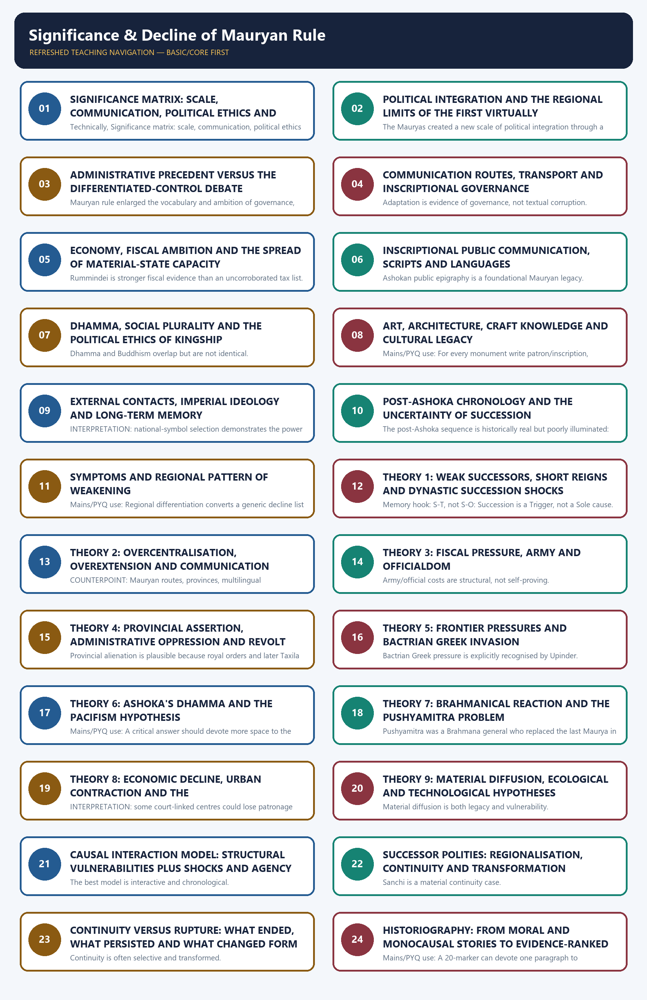

# Significance and Decline of Mauryan Rule - Complete Topic Package

> **Subject:** Ancient Indian History | **Paper:** Prelims GS-I + GS-I | **Topic:** 15 | **Date:** 13 August 2026
>
> **Evidence key:** FACT = directly supported by the named source; TEXTUAL TRADITION = later Puranic/Buddhist/Jain memory; INTERPRETATION/INFERENCE = analytical reading with a stated limit.
>
> **Approval state:** generated, **approved=false**. Only explicit user approval can change this state.

### Package Practice Counts

| Component | Count |
| --- | --- |
| Verified/routed PYQs | 6 |
| Hard MCQs with explanations | 48 |
| Remedial MCQs with explanations | 12 |
| Original solved 10-mark Mains | 3 |
| Original solved 15-mark Mains | 3 |
| Original solved 20-mark Mains | 3 |

### Sources actually used

| Source class | Exact source | Use and caveat |
| --- | --- | --- |
| Repository knowledge | Topic 15 basic/advanced; README; Master Chronology; Revision Chart; syllabus mapping; Answer-Worthiness Audit; PYQ routing; bounded Topics 14, 16, 17 and 26. | Controls sequence, syllabus ownership, answer architecture, recent PYQ routing and the boundary with the Mauryan administration package. |
| R. S. Sharma | India's Ancient Past, searchable local PDF pp. 200-210, especially Chapter 19. | Foundation for state/economic significance and the classic decline hypotheses; each hypothesis is tested rather than repeated as equally proven. |
| Upinder Singh | A History of Ancient and Early Medieval India, 2nd ed., searchable local PDF pp. 961-965, with bounded Chapter 7 context. | Primary analytical control for later-Maurya evidence, pacifism and Brahmanical-reaction debates, absence of fiscal-crisis proof, continuity and legacy. |
| Official UPSC papers | Local papers for 2019, 2020, 2022, 2023 and 2025; locally held official 2025 Set-A key. | Controls exact PYQ wording. Unavailable older keys are prominently labelled inferred, never official. |
| Bounded live heritage | ASI Sarnath Circle, Lion Capital; UNESCO, Buddhist Monuments at Sanchi. | Used only for conservation/public-memory and monument-layering context; no forced current-affairs claim. |

#### Bounded authoritative heritage links

- ASI Sarnath Circle, Lion Capital: https://asisarnathcircle.in/lion-capital.php
- UNESCO, Buddhist Monuments at Sanchi: https://whc.unesco.org/en/list/524/

The live pages are used only for present-day stewardship, public presentation and monument-layering context. They do not override excavation, inscriptions or source criticism. The repository `_source-library` contains no files; local OCR-searchable books were used directly. Qdrant was not used because the first two source layers were sufficient.

## BASIC LEARNING SESSION

### DEEP-REVIEW LEARNING CONTRACT

| Control | Binding rule for this package |
|---|---|
| Syllabus boundary | Complete Ancient History Core is taught before optional enrichment. |
| Evidence method | Claim → named site/text/inscription/coin/example → analysis → qualification. |
| Source hierarchy | Archaeology, textual testimony, inscriptions, coins and scholarly interpretation remain visibly distinct. |
| Contested issues | Competing interpretations are attributed, evidenced and bounded; certainty is not manufactured. |
| Practice contract | Every solved item has demand decoding, an examiner-grade model, an executable answer/compression plan, marks rationale and answer-specific improvement. |
| Approval | This immutable successor remains `approved: false` pending explicit approval. |

**Canonical Basic/Core owner:** `upsc-ai-kit\knowledge\Ancient-Indian-History\basic\15_Significance-and-Decline-of-Maurya-Rule.md`  
**Canonical topic owner:** `upsc-ai-kit\knowledge\Ancient-Indian-History\basic\15_Significance-and-Decline-of-Maurya-Rule.md`  
**Optional Advanced owner:** `upsc-ai-kit\knowledge\Ancient-Indian-History\advanced\15_Significance-and-Decline-of-Maurya-Rule.md`  
**Official syllabus mapping:** `upsc-ai-kit\knowledge\Ancient-Indian-History\OFFICIAL-UPSC-SYLLABUS-MAPPING.md`

### EVIDENCE, PYQ AND CURRENT-STATUS CONTROL

- **Archaeological inference:** material context supports bounded reconstruction; absence is not automatic proof of non-existence.
- **Textual testimony:** genre, authorship, redaction, patronage and temporal distance control what a text can prove.
- **Inscription and coin evidence:** contemporary names, titles, claims and circulation are powerful but do not by themselves map uniform territorial control.
- **Scholarly interpretation:** historian labels are arguments to test, not facts to memorise without evidence.
- **PYQ discipline:** repository ledgers and locally held official papers control wording and metadata; reconstructed wording and unavailable official keys must be labelled.
- **Current-status note, rechecked 2026-08-30:** ASI Sarnath and UNESCO Sanchi were accessed on 29 August 2026 only for national-symbol afterlife and multi-period monument continuity.

**Live/primary context sources recorded by the predecessor generation:**

- `https://asisarnathcircle.in/lion-capital.php`
- `https://whc.unesco.org/en/list/524/`




*Distinct embedded teaching-navigation image. The separate continuous Cārvāka-style flowchart package remains an independent at-a-glance artifact.*

### 01. Scope, source hierarchy and the three objects of explanation

The end of Mauryan imperial integration, the end of the Maurya dynasty, and the afterlife of Mauryan institutions and symbols are three different historical problems; a defensible answer must not merge them.

#### Compact visual / answer logic

```text
MAURYAN CHANGE
  |
  +-- DYNASTY: succession line ends at Pataliputra
  +-- EMPIRE: integration weakens unevenly by region
  +-- LEGACY: scripts, routes, monuments, political ideas persist
  +-- MEMORY: Buddhist traditions and modern symbols reinterpret
```

#### Timeline

| Date / phase | Event |
| --- | --- |
| c. 324/321 BCE | Mauryan imperial foundation under Chandragupta. |
| c. 268/273-232 BCE | Ashokan phase; dating varies by reconstruction. |
| 232 BCE | Ashoka's death; later-Maurya evidence becomes thin. |
| c. 187/185 BCE | Conventional dynastic end and Shunga transition. |

#### Evidence / comparison matrix

| Claim / category | Named evidence | Significance | Limitation |
| --- | --- | --- | --- |
| Empire | Edict distribution, provincial centres, strategic routes and coercive capacity | A network of integration over varied regions | Find-spots do not define a uniform cadastral frontier |
| Dynasty | Later-Maurya lists; Dasharatha's Nagarjuni cave inscriptions; Brihadratha tradition | A ruling lineage with an approximate terminal date | Lists conflict and most later rulers lack inscriptions |
| Legacy | Prakrit-Brahmi epigraphy, pillars, Sanchi layers, Sarnath capital, political memory | Selective institutional and cultural afterlife | Continuity was transformed, not unchanged survival |
| Decline evidence | Sparse inscriptions, later traditions, archaeology, coins and frontier narratives | Requires convergence among unlike archives | No archive gives a complete causal narrative |

#### Core teaching / solved analysis

- FACT: c. 232 BCE marks Ashoka's death, not the automatic end of the dynasty or every imperial relationship.
- FACT: c. 187 BCE in Upinder Singh and c. 185 BCE in common textbook chronology mark the conventional dynastic boundary.
- FACT: only Dasharatha among later Mauryas is securely known through his own inscriptions.
- INTERPRETATION: imperial weakening began before the final coup and proceeded differently by region.
- METHOD: inscriptions are strongest for royal voice and patronage, archaeology for material continuity, coins for authority/circulation, and traditions for remembered succession.
- LIMIT: Puranic, Buddhist and Jain lists preserve memory but differ in names, order and reign lengths.
- LIMIT: the coup against the last Maurya explains dynastic termination at Pataliputra more securely than the prior loss of every province.
- INFERENCE: a state can lose direct integration while routes, towns, scripts, religious institutions and craft knowledge continue.
- BOUNDARY: Topic 14 owns detailed Mauryan administration; this package recalls only what is needed to assess significance or vulnerability.
- ANSWER METHOD: convert every assertion into claim -> named evidence -> significance -> limitation.
- SOURCE TEST: date the event, source composition, surviving copy or quotation, and archaeological layer separately.
- REGIONAL TEST: ask whether the claim fits the Ganga core, north-west, Kalinga, Deccan, or the empire as a whole.
- VERDICT TEST: rank causes by evidentiary strength instead of listing them with equal weight.

> **Memory hook:** D-E-L-M: Dynasty, Empire, Legacy, Memory - never use them as synonyms.

#### Must-know facts

- Ashoka's death and the dynasty's end are separated by several decades.
- Dasharatha's cave inscriptions are the main contemporary anchor after Ashoka.
- Political fragmentation does not prove cultural or economic disappearance.
- Source class determines the strength of every decline claim.

#### UPSC traps

- **Wrong:** Mauryan rule ended in 232 BCE. **Correct:** Ashoka died in 232 BCE; later Mauryas continued until the conventional c. 187/185 BCE boundary.
- **Wrong:** The dynasty's fall erased Mauryan institutions and culture. **Correct:** Some forms, technologies and memories continued selectively and were transformed.

**Mains/PYQ use:** Open a decline answer by defining whether the stem asks about dynasty, territorial integration, administrative capacity, or long-term legacy.

**Study link:** Topic 14 supplies the mature-imperial baseline; Topics 16 and 17 supply bounded regional-successor context.

### SESSION 1 — SIGNIFICANCE MATRIX: SCALE, COMMUNICATION, POLITICAL ETHICS AND MATERIAL FORM

#### DEFINITION / WHAT THIS IS CALLED

**Plain-language definition:** Inscriptional reach is evidence of communication, not identical control.

**Technical definition:** Technically, Significance matrix: scale, communication, political ethics and material form is analysed by relating Significance matrix to scale, then testing the relationship through communication and political ethics.

#### ANSWER-GRABBING OPENING — WRITE/ADAPT IN THE EXAM

> INTERPRETATION: dhamma was a political-social ethic with Buddhist roots, not a replacement constitution or compulsory conversion.

#### MUST-WRITE KEYWORDS

- **Significance matrix**
- **scale**
- **communication**
- **political ethics**
- **material form**
- **Memory hook**

**How to use them:** Frame the answer through Significance matrix; define scale, connect communication with political ethics to explain the mechanism, and use material form for the decisive comparison or qualification.

Mauryan significance lies not in administrative size alone but in the combination of virtually subcontinental ambition, inscriptional public communication, moral-political experimentation, route integration and monumental material expression.

#### Compact visual / answer logic

```text
SIGNIFICANCE
Scale ---- Routes ---- Inscriptions
  |          |             |
State ---- Economy ---- Dhamma
  \          |            /
   \---- Monumental memory ----/
```

#### Evidence / comparison matrix

| Claim / category | Named evidence | Significance | Limitation |
| --- | --- | --- | --- |
| Political scale | First virtually subcontinental empire; provinces and frontier zones | Created an unprecedented imperial horizon | Deep south and several peripheries remained outside or loosely connected |
| Public communication | Major/minor rock edicts, pillar edicts, Greek and Aramaic versions | Royal ideas addressed dispersed audiences | Communication does not prove reception or compliance |
| Political ethics | Dhamma, Rock Edict XII, Kalinga reflection | Made moral foundations of kingship publicly arguable | Paternal authority and punishment remained |
| Material visibility | Pillars, Barabar caves, Sanchi core, Pataliputra remains | Linked power, craft and sacred patronage | Monuments have multiple phases and patrons |
| Long memory | Sarnath capital as republican emblem; Ashoka in Buddhist memory | Ancient artefact acquired new national and ethical meanings | Modern appropriation is not direct institutional continuity |

#### Core teaching / solved analysis

- FACT: Upinder Singh calls the Maurya polity the first virtually subcontinental empire.
- QUALIFICATION: 'Virtually' matters because direct control was regionally differentiated and did not encompass all of the far south.
- FACT: Ashoka's inscriptions created the earliest large, datable corpus of royal public communication across the subcontinent.
- FACT: scripts and languages varied by region: most inscriptions use Prakrit-Brahmi, the north-west includes Kharoshthi, Greek and Aramaic.
- FACT: the Mauryan age expanded monumental stone sculpture and made important beginnings in rock-cut and stupa architecture.
- FACT: social-economic processes of agrarian expansion, urbanisation, trade and money continued through Mauryan rule.
- INTERPRETATION: the empire linked corridors and provincial nodes more securely than every locality.
- INTERPRETATION: dhamma was a political-social ethic with Buddhist roots, not a replacement constitution or compulsory conversion.
- LEGACY: the Sarnath lion capital became a national emblem, demonstrating reinterpretation across two millennia.
- ANSWER METHOD: convert every assertion into claim -> named evidence -> significance -> limitation.
- SOURCE TEST: date the event, source composition, surviving copy or quotation, and archaeological layer separately.
- REGIONAL TEST: ask whether the claim fits the Ganga core, north-west, Kalinga, Deccan, or the empire as a whole.
- VERDICT TEST: rank causes by evidentiary strength instead of listing them with equal weight.

> **Memory hook:** S-R-I-D-A-M: Scale, Routes, Inscriptions, Dhamma, Art, Memory.

#### Must-know facts

- Mauryan importance is wider than Ashoka's dhamma.
- Significance must include limits and regional variation.
- Inscriptional reach is evidence of communication, not identical control.
- Legacy is selective reuse, not fossilised survival.

#### UPSC traps

- **Wrong:** Mauryan significance equals a modern nation-state precedent. **Correct:** It was a pre-industrial territorial empire with graded control and different political assumptions.
- **Wrong:** The first large empire means uniform rule everywhere. **Correct:** Scale and uniformity are separate questions.

**Mains/PYQ use:** Use a matrix rather than a list: for each dimension add named evidence, what it changed, and the limit of the claim.

**Study link:** Bounded overlap with Topic 14's state structure and Indian Art and Culture's form-specific analysis.

#### CLOSING RECALL FLOW — SIGNIFICANCE MATRIX: SCALE, COMMUNICATION, POLITICAL ETHICS AND MATERIAL FORM

```text
START / CONCEPT: Significance matrix: scale, communication, political ethics and material form
        |
        v
EXACT TERMS: Significance matrix · scale · communication · political ethics · material form · Memory hook
        |
        v
MECHANISM / ARGUMENT: Ashoka's inscriptions created the earliest large, datable corpus of royal public communication across the subcontinent. scripts and languages varied by region: most inscriptions use Prakrit-Brahmi, the north-west includes Kharoshthi, Greek and Aramaic. the Mauryan age expanded monumental stone sculpture and made important beginnings in rock-cut and stupa architecture. social-economic processes of agrarian expansion, urbanisation, trade and money continued through Mauryan rule.
        |
        v
CONSEQUENCE / CONTRAST: Mains/PYQ use: Use a matrix rather than a list: for each dimension add named evidence, what it changed, and the limit of the claim.
        |
        v
UPSC TRAP / ANSWER-USE: Inscriptional reach is evidence of communication, not identical control.
        |
        v
ANSWER-GRABBING FORMULATION: INTERPRETATION: dhamma was a political-social ethic with Buddhist roots, not a replacement constitution or compulsory conversion.
```
### SESSION 2 — POLITICAL INTEGRATION AND THE REGIONAL LIMITS OF THE FIRST VIRTUALLY SUBCONTINENTAL EMPIRE

#### DEFINITION / WHAT THIS IS CALLED

**Plain-language definition:** INTERPRETATION: political integration means coordinated sovereignty and communication at selected scales, not modern administrative homogeneity.

**Technical definition:** The Mauryas created a new scale of political integration through a metropolitan core, provincial centres, routes and frontier diplomacy, but the integration was graded rather than territorially uniform.

#### ANSWER-GRABBING OPENING — WRITE/ADAPT IN THE EXAM

> The Mauryas created a new scale of political integration through a metropolitan core, provincial centres, routes and frontier diplomacy, but the integration was graded rather than territorially uniform.

#### MUST-WRITE KEYWORDS

- **Political integration**
- **Core capacity**
- **Corridor control**
- **Adaptive edge**
- **Integration limit**
- **Decline outcome**

**How to use them:** Frame the answer through Political integration; define Core capacity, connect Corridor control with Adaptive edge to explain the mechanism, and use Integration limit for the decisive comparison or qualification.

The Mauryas created a new scale of political integration through a metropolitan core, provincial centres, routes and frontier diplomacy, but the integration was graded rather than territorially uniform.

#### Causal / analytical flow

1. **Core capacity:** Pataliputra, revenue, army and royal court
2. **Corridor control:** Provincial centres and arterial routes
3. **Adaptive edge:** Local languages, officials and intermediaries
4. **Integration limit:** Distance, terrain, local elites and slow information
5. **Decline outcome:** Regional detachment without civilisational disappearance

#### Evidence / comparison matrix

| Claim / category | Named evidence | Significance | Limitation |
| --- | --- | --- | --- |
| Metropolitan core | Pataliputra and middle-Ganga resource base | Concentrated court, revenue and command | Archaeology cannot reconstruct every office |
| Provincial nodes | Taxila, Ujjayini, Tosali, Suvarnagiri | Linked corridors and strategic regions | Provincial scheme is reconstructed from uneven evidence |
| Frontiers | Kandahar, Shahbazgarhi, Mansehra; Greek/Aramaic/Kharoshthi | Shows adaptive communication and diplomatic horizon | Language adaptation is not proof of identical administration |
| Southern boundary | Cholas, Pandyas, Keralaputras, Satiyaputras and Tamraparni in edicts | Marks interaction beyond core territory | Named neighbours should not be annexed on a map |

#### Core teaching / solved analysis

- FACT: the imperial horizon joined north-west, Ganga valley, western routes, Kalinga and parts of the Deccan.
- FACT: Ashokan edicts identify southern polities as neighbours or audiences rather than straightforward provinces.
- FACT: provincial centres lay on strategic corridors of movement, revenue and military supervision.
- INTERPRETATION: political integration means coordinated sovereignty and communication at selected scales, not modern administrative homogeneity.
- INTERPRETATION: the empire widened the repertoire of territorial rule available to later polities even where offices did not survive unchanged.
- LIMIT: exact borders fluctuate according to whether one maps inscriptions, conquests, tribute, diplomatic contact or administrative centres.
- LIMIT: a pillar or rock edict marks a royal communication event more securely than routine day-to-day penetration.
- DECLINE LINK: distant zones had greater opportunity to detach when succession and coordination weakened.
- LEGACY LINK: post-Mauryan regionalisation occurred inside a landscape already connected by routes, towns, scripts and political concepts.
- ANSWER METHOD: convert every assertion into claim -> named evidence -> significance -> limitation.
- SOURCE TEST: date the event, source composition, surviving copy or quotation, and archaeological layer separately.
- REGIONAL TEST: ask whether the claim fits the Ganga core, north-west, Kalinga, Deccan, or the empire as a whole.
- VERDICT TEST: rank causes by evidentiary strength instead of listing them with equal weight.

> **Memory hook:** Core -> Corridor -> Province -> Frontier -> Neighbour.

#### Must-know facts

- Provincial centres were route nodes, not miniature modern states.
- Southern neighbours must not be coloured as uniformly annexed territory.
- North-western multilinguality is evidence of adaptation.
- Distance is a structural variable in decline.

#### UPSC traps

- **Wrong:** Every edict site was directly governed in the same manner. **Correct:** Edict distribution records communication within a differentiated imperial geography.
- **Wrong:** Regionalisation after 232 BCE began from disconnected regions. **Correct:** Regions inherited and redirected earlier networks and state-forming knowledge.

**Mains/PYQ use:** A political-significance answer should show both unprecedented scale and the analytical caution contained in 'virtually subcontinental'.

**Study link:** Use Topic 16 only for the bounded north-western transition and Topic 17 for the later Deccan trajectory.

#### CLOSING RECALL FLOW — POLITICAL INTEGRATION AND THE REGIONAL LIMITS OF THE FIRST VIRTUALLY SUBCONTINENTAL EMPIRE

```text
START / CONCEPT: Political integration and the regional limits of the first virtually subcontinental empire
        |
        v
EXACT TERMS: Political integration · Core capacity · Corridor control · Adaptive edge · Integration limit · Decline outcome
        |
        v
MECHANISM / ARGUMENT: INTERPRETATION: political integration means coordinated sovereignty and communication at selected scales, not modern administrative homogeneity.
        |
        v
CONSEQUENCE / CONTRAST: INTERPRETATION: the empire widened the repertoire of territorial rule available to later polities even where offices did not survive unchanged. exact borders fluctuate according to whether one maps inscriptions, conquests, tribute, diplomatic contact or administrative centres. a pillar or rock edict marks a royal communication event more securely than routine day-to-day penetration.
        |
        v
UPSC TRAP / ANSWER-USE: Southern neighbours must not be coloured as uniformly annexed territory.
        |
        v
ANSWER-GRABBING FORMULATION: The Mauryas created a new scale of political integration through a metropolitan core, provincial centres, routes and frontier diplomacy, but the integration was graded rather than territorially uniform.
```
### SESSION 3 — ADMINISTRATIVE PRECEDENT VERSUS THE DIFFERENTIATED-CONTROL DEBATE

#### DEFINITION / WHAT THIS IS CALLED

**Plain-language definition:** Administrative visibility is itself a Mauryan significance.

**Technical definition:** Mauryan rule enlarged the vocabulary and ambition of governance, but administrative precedent does not mean a uniform bureaucracy or an unchanged institutional inheritance.

#### ANSWER-GRABBING OPENING — WRITE/ADAPT IN THE EXAM

> Mauryan rule enlarged the vocabulary and ambition of governance, but administrative precedent does not mean a uniform bureaucracy or an unchanged institutional inheritance.

#### MUST-WRITE KEYWORDS

- **Administrative precedent versus the differentiated-control debate**
- **Memory hook**
- **Mains/PYQ use**
- **Study link**
- **Royal information**
- **Rock Edict VI and pativedaka reporting**

**How to use them:** Frame the answer through Administrative precedent versus the differentiated-control debate; define Memory hook, connect Mains/PYQ use with Study link to explain the mechanism, and use Royal information for the decisive comparison or qualification.

Mauryan rule enlarged the vocabulary and ambition of governance, but administrative precedent does not mean a uniform bureaucracy or an unchanged institutional inheritance.

#### Compact visual / answer logic

```text
FUNCTIONAL CENTRALISATION TEST
Appointments  [strong?]    Revenue [varied?]
Justice       [delegated]  Coercion [strategic]
Dhamma        [broadcast]  Daily life [locally mediated]

Never answer 'centralised?' without naming the function and region.
```

#### Evidence / comparison matrix

| Claim / category | Named evidence | Significance | Limitation |
| --- | --- | --- | --- |
| Royal information | Rock Edict VI and pativedaka reporting | Shows aspiration to continuous information | Repeated reporting also reveals distance and latency |
| Field administration | Pradeshika, rajuka and yukta in Rock Edict III | Evidence for tours and district-level responsibilities | Exact modern equivalents are unsafe |
| Justice | Pillar Edict IV; Separate Kalinga Edict I | Delegation plus attempts to restrain arbitrariness | Orders prove concern, not successful enforcement |
| Special portfolios | Dhamma-mahamattas and other mahamatta categories | Policy differentiation within royal service | Archive is heavily Ashokan |
| Later echo | Satavahana amatyas/mahamatras and Prakrit-Brahmi usage | Administrative idioms travelled | Shared terms do not establish identical institutions |

#### Core teaching / solved analysis

- FACT: Mauryan inscriptions reveal officials, tours, reporting and delegated justice more directly than most earlier Indian evidence.
- FACT: the 2025 official UPSC key identifies pradeshika, rajuka and yukta as district-level officers.
- FACT: Ashoka's corrective orders imply both state capacity and administrative abuse.
- INTERPRETATION: Mauryan significance lies in making governance visible and discussable through royal inscriptions.
- INTERPRETATION: centralisation should be tested function by function - appointment, tax, justice, coercion and ideology need not have equal reach.
- REVISIONIST POINT: communication constraints and regional material variation challenge an all-controlling model.
- COUNTERPOINT: rejecting uniformity does not erase real central capacity in provinces, routes, waterworks, justice and deterrence.
- DECLINE LINK: if the system relied heavily on royal selection, inspection and prestige, rapid succession could weaken coordination.
- LEGACY LIMIT: later use of titles such as mahamatra may represent adaptation or prestige borrowing rather than institutional continuity.
- ANSWER METHOD: convert every assertion into claim -> named evidence -> significance -> limitation.
- SOURCE TEST: date the event, source composition, surviving copy or quotation, and archaeological layer separately.
- REGIONAL TEST: ask whether the claim fits the Ganga core, north-west, Kalinga, Deccan, or the empire as a whole.
- VERDICT TEST: rank causes by evidentiary strength instead of listing them with equal weight.

> **Memory hook:** F-G-C: Function, Geography, Capacity.

#### Must-know facts

- Administrative visibility is itself a Mauryan significance.
- Corrective edicts reveal problems as well as capacity.
- Later shared titles require institutional caution.
- Centralisation and regional mediation could coexist.

#### UPSC traps

- **Wrong:** The Arthashastra is a verbatim Mauryan civil-service manual. **Correct:** It is a theoretical/redacted statecraft text and must be corroborated.
- **Wrong:** Differentiated rule means the centre was merely symbolic. **Correct:** Strategic central capacity coexisted with negotiated local implementation.

**Mains/PYQ use:** Define centralisation by function and region before linking it to decline; this prevents both textbook maximalism and revisionist over-correction.

**Study link:** Topic 14 supplies the officer detail; Topic 15 evaluates what that apparatus meant and why it could become vulnerable.

#### CLOSING RECALL FLOW — ADMINISTRATIVE PRECEDENT VERSUS THE DIFFERENTIATED-CONTROL DEBATE

```text
START / CONCEPT: Administrative precedent versus the differentiated-control debate
        |
        v
EXACT TERMS: Administrative precedent versus the differentiated-control debate · Memory hook · Mains/PYQ use · Study link · Royal information · Rock Edict VI and pativedaka reporting
        |
        v
MECHANISM / ARGUMENT: Mains/PYQ use: Define centralisation by function and region before linking it to decline; this prevents both textbook maximalism and revisionist over-correction.
        |
        v
CONSEQUENCE / CONTRAST: INTERPRETATION: centralisation should be tested function by function - appointment, tax, justice, coercion and ideology need not have equal reach.
        |
        v
UPSC TRAP / ANSWER-USE: COUNTERPOINT: rejecting uniformity does not erase real central capacity in provinces, routes, waterworks, justice and deterrence.
        |
        v
ANSWER-GRABBING FORMULATION: Mauryan rule enlarged the vocabulary and ambition of governance, but administrative precedent does not mean a uniform bureaucracy or an unchanged institutional inheritance.
```
### SESSION 4 — COMMUNICATION ROUTES, TRANSPORT AND INSCRIPTIONAL GOVERNANCE

#### DEFINITION / WHAT THIS IS CALLED

**Plain-language definition:** Transport capacity is visible in pillars and route geography.

**Technical definition:** Adaptation is evidence of governance, not textual corruption.

#### ANSWER-GRABBING OPENING — WRITE/ADAPT IN THE EXAM

> Ashokan inscriptions appeared on important routes and strategic locations. monolithic pillars required quarrying, transport, finishing and erection at large distances. edicts were not one standard text mechanically copied everywhere; omissions, substitutions and translations reveal adaptation. officials and oral recitation likely mediated royal messages beyond literate readers.

#### MUST-WRITE KEYWORDS

- **Communication routes**
- **transport**
- **inscriptional governance**
- **Memory hook**
- **Mains/PYQ use**
- **Study link**

**How to use them:** Frame the answer through Communication routes; define transport, connect inscriptional governance with Memory hook to explain the mechanism, and use Mains/PYQ use for the decisive comparison or qualification.

Mauryan roads, river corridors, transported pillars and regionally adapted inscriptions made imperial communication materially visible, while the same distances imposed recurrent coordination costs.

#### Causal / analytical flow

1. Quarry / workshop
2. River-road transport
3. Provincial placement
4. Inscribed command
5. Official and oral mediation
6. Local reception - partly unknown

#### Evidence / comparison matrix

| Claim / category | Named evidence | Significance | Limitation |
| --- | --- | --- | --- |
| Arterial routes | Pataliputra-Taxila, western, Kalinga and Deccan corridors in Sharma's account | Movement of officials, goods and messages | Exact maintenance and policing are unevenly documented |
| Pillars | Chunar sandstone transported to dispersed sites | Engineering and logistical capacity | Quarry origin does not reveal every labour arrangement |
| Rock edicts | Border and route-adjacent distribution | Communication to officials and local audiences | Find-spots can be relocated or contextually complex |
| Oral mediation | Edictal instructions for proclamation and tours | Message could reach beyond literacy | Audience reception remains largely inaccessible |

#### Core teaching / solved analysis

- FACT: Ashokan inscriptions appeared on important routes and strategic locations.
- FACT: monolithic pillars required quarrying, transport, finishing and erection at large distances.
- FACT: edicts were not one standard text mechanically copied everywhere; omissions, substitutions and translations reveal adaptation.
- FACT: officials and oral recitation likely mediated royal messages beyond literate readers.
- INTERPRETATION: the network integrated political space by making the ruler's voice repeatable across distance.
- INTERPRETATION: transport and inscriptional programmes also consumed resources and depended on continued coordination.
- DECLINE LINK: routes can connect an empire while authority is strong and become channels of regional autonomy or invasion when the centre weakens.
- LIMIT: no surviving source provides a complete Mauryan road department or traffic census.
- LEGACY: public inscription became a durable South Asian political technology, though later epigraphs often used different languages, genres and patrons.
- ANSWER METHOD: convert every assertion into claim -> named evidence -> significance -> limitation.
- SOURCE TEST: date the event, source composition, surviving copy or quotation, and archaeological layer separately.
- REGIONAL TEST: ask whether the claim fits the Ganga core, north-west, Kalinga, Deccan, or the empire as a whole.
- VERDICT TEST: rank causes by evidentiary strength instead of listing them with equal weight.

> **Memory hook:** R-O-A-D: Route, Object, Audience, Distance.

#### Must-know facts

- Transport capacity is visible in pillars and route geography.
- Audience was wider than the literate minority because messages were mediated.
- Adaptation is evidence of governance, not textual corruption.
- Distance is simultaneously an achievement and a vulnerability.

#### UPSC traps

- **Wrong:** One inscriptional language served the whole empire. **Correct:** Regional scripts and languages included Brahmi, Kharoshthi, Greek and Aramaic.
- **Wrong:** Roads prove uniform central control. **Correct:** Routes enabled integration but required officials, protection and local cooperation.

**Mains/PYQ use:** Use the paradox: Mauryan communication conquered distance symbolically and administratively, but could not abolish the costs of distance.

**Study link:** Connect to the decline module on overextension and the legacy module on public epigraphy.

#### CLOSING RECALL FLOW — COMMUNICATION ROUTES, TRANSPORT AND INSCRIPTIONAL GOVERNANCE

```text
START / CONCEPT: Communication routes, transport and inscriptional governance
        |
        v
EXACT TERMS: Communication routes · transport · inscriptional governance · Memory hook · Mains/PYQ use · Study link
        |
        v
MECHANISM / ARGUMENT: Audience was wider than the literate minority because messages were mediated.
        |
        v
CONSEQUENCE / CONTRAST: Mains/PYQ use: Use the paradox: Mauryan communication conquered distance symbolically and administratively, but could not abolish the costs of distance.
        |
        v
UPSC TRAP / ANSWER-USE: DECLINE LINK: routes can connect an empire while authority is strong and become channels of regional autonomy or invasion when the centre weakens. no surviving source provides a complete Mauryan road department or traffic census.
        |
        v
ANSWER-GRABBING FORMULATION: Ashokan inscriptions appeared on important routes and strategic locations. monolithic pillars required quarrying, transport, finishing and erection at large distances. edicts were not one standard text mechanically copied everywhere; omissions, substitutions and translations reveal adaptation. officials and oral recitation likely mediated royal messages beyond literate readers.
```
### SESSION 5 — ECONOMY, FISCAL AMBITION AND THE SPREAD OF MATERIAL-STATE CAPACITY

#### DEFINITION / WHAT THIS IS CALLED

**Plain-language definition:** Mains/PYQ use: In a fiscal answer distinguish capacity, burden and crisis; only the first two are well supported for the Mauryan peak.

**Technical definition:** Rummindei is stronger fiscal evidence than an uncorroborated tax list.

#### ANSWER-GRABBING OPENING — WRITE/ADAPT IN THE EXAM

> Mains/PYQ use: In a fiscal answer distinguish capacity, burden and crisis; only the first two are well supported for the Mauryan peak.

#### MUST-WRITE KEYWORDS

- **Economy**
- **fiscal ambition**
- **the spread of material-state capacity**
- **Memory hook**
- **Mains/PYQ use**
- **Study link**

**How to use them:** Frame the answer through Economy; define fiscal ambition, connect the spread of material-state capacity with Memory hook to explain the mechanism, and use Mains/PYQ use for the decisive comparison or qualification.

Mauryan significance includes widened taxation, regulation, monetised exchange, irrigation and material diffusion, but prescriptive fiscal detail and later crisis claims require strict evidentiary separation.

#### Compact visual / answer logic

```text
ECONOMIC SIGNIFICANCE
Agrarian surplus -> revenue -> army/officials
       |             |
 irrigation        routes
       |             |
towns <- crafts <- exchange -> regional state capacity
```

#### Evidence / comparison matrix

| Claim / category | Named evidence | Significance | Limitation |
| --- | --- | --- | --- |
| Taxation | Arthashastra tax lists; Rummindei bhaga reduction; storehouse records with debated dates | Shows fiscal imagination and some realised levies | Norm, assessment and collection are not identical |
| Regulation | Arthashastra superintendents; Megasthenes on land/water and city committees | Possible state interest in production and markets | Theoretical and fragmentary sources |
| Money | Punch-marked silver/copper and other early coin forms | Facilitated payments and exchange | Symbols are hard to assign to specific rulers |
| Infrastructure | Sudarshana reservoir tradition; routes; ring wells and burnt brick | Agrarian and urban support | Later inscriptions and regional chronology need caution |
| Diffusion | NBPW-related package, iron/steel, bricks, ring wells and scripts beyond the Ganga core | Helped regional state formation | Diffusion was not a one-way civilising mission |

#### Core teaching / solved analysis

- FACT: Sharma emphasises the scale of Mauryan taxation, bureaucracy and economic regulation.
- FACT: Rummindei provides a precise inscriptional example of fiscal remission at Lumbini.
- FACT: punch-marked coins and wider exchange pre-date and outlast the Mauryas.
- FACT: Upinder Singh describes agrarian expansion, urbanisation, trade and the money economy as continuing under Mauryan rule.
- INTERPRETATION: the empire intensified networks rather than creating every economic process from nothing.
- INTERPRETATION: diffusion of techniques and political forms could reduce Magadha's earlier comparative advantage and empower regions.
- LIMIT: Arthashastra salary and tax figures cannot be projected automatically onto realised empire-wide practice.
- LIMIT: coin hoards show circulation and authority, not treasury balance, GDP or universal monetisation.
- DECLINE LINK: fiscal pressure is structurally plausible for a large army and officialdom, but a documented late-Mauryan fiscal collapse is absent.
- ANSWER METHOD: convert every assertion into claim -> named evidence -> significance -> limitation.
- SOURCE TEST: date the event, source composition, surviving copy or quotation, and archaeological layer separately.
- REGIONAL TEST: ask whether the claim fits the Ganga core, north-west, Kalinga, Deccan, or the empire as a whole.
- VERDICT TEST: rank causes by evidentiary strength instead of listing them with equal weight.

> **Memory hook:** N-A-R-R: Norm, Assessment, Realisation, Redistribution.

#### Must-know facts

- Mauryan economy extended pre-existing urban and monetary processes.
- Rummindei is stronger fiscal evidence than an uncorroborated tax list.
- Material diffusion can be both imperial achievement and regional empowerment.
- Economic collapse must not be inferred from dynastic collapse.

#### UPSC traps

- **Wrong:** Many listed taxes prove every subject paid every levy. **Correct:** Tax lists are normative; realised incidence varied.
- **Wrong:** Dynastic decline proves towns and trade collapsed. **Correct:** Post-Mauryan evidence shows substantial continuity and later expansion.

**Mains/PYQ use:** In a fiscal answer distinguish capacity, burden and crisis; only the first two are well supported for the Mauryan peak.

**Study link:** Topic 17 shows later Deccan state formation; Topic 26 supplies the broader continuity-versus-transition method.

#### CLOSING RECALL FLOW — ECONOMY, FISCAL AMBITION AND THE SPREAD OF MATERIAL-STATE CAPACITY

```text
START / CONCEPT: Economy, fiscal ambition and the spread of material-state capacity
        |
        v
EXACT TERMS: Economy · fiscal ambition · the spread of material-state capacity · Memory hook · Mains/PYQ use · Study link
        |
        v
MECHANISM / ARGUMENT: Upinder Singh describes agrarian expansion, urbanisation, trade and the money economy as continuing under Mauryan rule.
        |
        v
CONSEQUENCE / CONTRAST: Mauryan significance includes widened taxation, regulation, monetised exchange, irrigation and material diffusion, but prescriptive fiscal detail and later crisis claims require strict evidentiary separation.
        |
        v
UPSC TRAP / ANSWER-USE: DECLINE LINK: fiscal pressure is structurally plausible for a large army and officialdom, but a documented late-Mauryan fiscal collapse is absent.
        |
        v
ANSWER-GRABBING FORMULATION: Mains/PYQ use: In a fiscal answer distinguish capacity, burden and crisis; only the first two are well supported for the Mauryan peak.
```
### SESSION 6 — INSCRIPTIONAL PUBLIC COMMUNICATION, SCRIPTS AND LANGUAGES

#### DEFINITION / WHAT THIS IS CALLED

**Plain-language definition:** the edict corpus is the strongest contemporary archive for Ashoka's public voice. major texts vary by location; Dhauli and Jaugada use Separate Kalinga Edicts in place of part of the standard series. north-western versions use Kharoshthi, Greek and Aramaic alongside the wider Prakrit-Brahmi pattern. inscriptions addressed officials directly and wider subjects through reading, proclamation and repeated tours.

**Technical definition:** Ashokan public epigraphy is a foundational Mauryan legacy.

#### ANSWER-GRABBING OPENING — WRITE/ADAPT IN THE EXAM

> the edict corpus is the strongest contemporary archive for Ashoka's public voice. major texts vary by location; Dhauli and Jaugada use Separate Kalinga Edicts in place of part of the standard series. north-western versions use Kharoshthi, Greek and Aramaic alongside the wider Prakrit-Brahmi pattern. inscriptions addressed officials directly and wider subjects through reading, proclamation and repeated tours.

#### MUST-WRITE KEYWORDS

- **Inscriptional public communication**
- **scripts**
- **languages**
- **Royal formulation**
- **Regional adaptation**
- **Material placement**

**How to use them:** Frame the answer through Inscriptional public communication; define scripts, connect languages with Royal formulation to explain the mechanism, and use Regional adaptation for the decisive comparison or qualification.

Ashoka transformed royal communication by issuing a geographically dispersed, multilingual and repeatedly performed inscriptional programme whose political importance outlived the dynasty.

#### Causal / analytical flow

1. **Royal formulation:** Policy and self-presentation
2. **Regional adaptation:** Selection, translation, script and local officials
3. **Material placement:** Rock, pillar, route or sacred site
4. **Performance:** Reading, tour, proclamation and repetition
5. **Reception:** Partly recoverable; never assume compliance

#### Evidence / comparison matrix

| Claim / category | Named evidence | Significance | Limitation |
| --- | --- | --- | --- |
| Corpus | Major/minor rock edicts, pillar edicts, separate and commemorative inscriptions | Different audiences and themes | The archive is overwhelmingly Ashokan |
| Scripts | Brahmi, Kharoshthi, Greek and Aramaic | Regional communicative adaptation | Script does not map ethnicity mechanically |
| Royal persona | Devanampiya Piyadasi; Maski identification | Named ethical kingship in public space | Titles are self-representation |
| Afterlife | Later Prakrit and Sanskrit inscriptions; national/public display | Epigraphy remained a political technology | Later genres differ from Ashokan dhamma-lipi |

#### Core teaching / solved analysis

- FACT: the edict corpus is the strongest contemporary archive for Ashoka's public voice.
- FACT: major texts vary by location; Dhauli and Jaugada use Separate Kalinga Edicts in place of part of the standard series.
- FACT: north-western versions use Kharoshthi, Greek and Aramaic alongside the wider Prakrit-Brahmi pattern.
- FACT: inscriptions addressed officials directly and wider subjects through reading, proclamation and repeated tours.
- INTERPRETATION: imperial communication was negotiated through linguistic geography rather than imposed in one sacred language.
- INTERPRETATION: the king made moral and administrative claims durable in landscapes beyond the court.
- LIMIT: inscriptions reveal intended messages more securely than social reception or policy outcomes.
- LEGACY: inscriptions became essential historical sources for later Indian state formation, donation, genealogy and law.
- MEMORY: modern museums and protected sites make the Mauryan inscriptional archive part of public citizenship and heritage.
- ANSWER METHOD: convert every assertion into claim -> named evidence -> significance -> limitation.
- SOURCE TEST: date the event, source composition, surviving copy or quotation, and archaeological layer separately.
- REGIONAL TEST: ask whether the claim fits the Ganga core, north-west, Kalinga, Deccan, or the empire as a whole.
- VERDICT TEST: rank causes by evidentiary strength instead of listing them with equal weight.

> **Memory hook:** T-S-A-R: Text, Script, Audience, Reception.

#### Must-know facts

- Ashokan public epigraphy is a foundational Mauryan legacy.
- Regional variants are evidence, not defects.
- Royal intention is not social outcome.
- Scripts/languages belong in both significance and source-criticism answers.

#### UPSC traps

- **Wrong:** Ashoka used Sanskrit to reach the whole empire. **Correct:** Most edicts use Prakrit in Brahmi, with Kharoshthi, Greek and Aramaic in the north-west.
- **Wrong:** A translated edict proves every audience read it personally. **Correct:** Official and oral mediation were crucial.

**Mains/PYQ use:** An inscription answer earns marks when it identifies category, site, language/script, audience, claim and evidentiary limit.

**Study link:** Use the 2020 sectarian-concord and 2022 edict-site PYQs as direct practice routes.

#### CLOSING RECALL FLOW — INSCRIPTIONAL PUBLIC COMMUNICATION, SCRIPTS AND LANGUAGES

```text
START / CONCEPT: Inscriptional public communication, scripts and languages
        |
        v
EXACT TERMS: Inscriptional public communication · scripts · languages · Royal formulation · Regional adaptation · Material placement
        |
        v
MECHANISM / ARGUMENT: INTERPRETATION: imperial communication was negotiated through linguistic geography rather than imposed in one sacred language.
        |
        v
CONSEQUENCE / CONTRAST: Mains/PYQ use: An inscription answer earns marks when it identifies category, site, language/script, audience, claim and evidentiary limit.
        |
        v
UPSC TRAP / ANSWER-USE: Regional variants are evidence, not defects.
        |
        v
ANSWER-GRABBING FORMULATION: the edict corpus is the strongest contemporary archive for Ashoka's public voice. major texts vary by location; Dhauli and Jaugada use Separate Kalinga Edicts in place of part of the standard series. north-western versions use Kharoshthi, Greek and Aramaic alongside the wider Prakrit-Brahmi pattern. inscriptions addressed officials directly and wider subjects through reading, proclamation and repeated tours.
```
### SESSION 7 — DHAMMA, SOCIAL PLURALITY AND THE POLITICAL ETHICS OF KINGSHIP

#### DEFINITION / WHAT THIS IS CALLED

**Plain-language definition:** Its deepest legacy is political ethics made publicly legible.

**Technical definition:** Dhamma and Buddhism overlap but are not identical.

#### ANSWER-GRABBING OPENING — WRITE/ADAPT IN THE EXAM

> Ashoka's dhamma was a Buddhist-inflected but supra-sectarian social ethic that made welfare, restraint and concord part of imperial legitimacy without abolishing hierarchy, punishment or political coercion.

#### MUST-WRITE KEYWORDS

- **Dhamma**
- **social plurality**
- **the political ethics of kingship**
- **Memory hook**
- **Mains/PYQ use**
- **Study link**

**How to use them:** Frame the answer through Dhamma; define social plurality, connect the political ethics of kingship with Memory hook to explain the mechanism, and use Mains/PYQ use for the decisive comparison or qualification.

Ashoka's dhamma was a Buddhist-inflected but supra-sectarian social ethic that made welfare, restraint and concord part of imperial legitimacy without abolishing hierarchy, punishment or political coercion.

#### Compact visual / answer logic

```text
PERSONAL BUDDHISM -------- PUBLIC DHAMMA
Minor Edict I              parents / elders
Bhabru                      servants / dependants
Rummindei                   non-injury / self-control
       \                    concord / welfare
        \---- overlap, not identity ----/
```

#### Evidence / comparison matrix

| Claim / category | Named evidence | Significance | Limitation |
| --- | --- | --- | --- |
| Personal faith | Minor Rock Edict I, Bhabru, Rummindei | Explicit Buddhist commitment | Special inscriptions do not define the whole public programme |
| Social ethic | Rock Edicts IX and XI | Duties to parents, elders, servants and sects | Paternal and hierarchical |
| Concord | Rock Edict XII | Restraint in sectarian praise/blame and listening | Not modern constitutional secularism |
| Violence | Rock Edict XIII, forest warning, Pillar Edict IV | Moral reflection plus retained deterrence | Casualty figures and implementation need caution |
| Plural patronage | Barabar gifts to Ajivikas; respect for Brahmanas and shramanas | Royal patronage crossed personal belief | Patronage did not erase competition |

#### Core teaching / solved analysis

- FACT: dhamma omitted central doctrinal formulations such as the Four Noble Truths from the general edictal programme.
- FACT: Ashoka repeatedly asked subjects to respect both Brahmanas and shramanas.
- FACT: Rock Edict XII condemned excessive praise of one's own sect and blame of another.
- FACT: the king retained punishment, capital punishment and warnings to forest peoples.
- INTERPRETATION: dhamma supplied an ethical vocabulary for governing a diverse empire.
- INTERPRETATION: it also advertised a paternal king who claimed authority over conduct and disposition.
- LEGACY: Upinder Singh treats Ashoka as foundational in making dhamma/dharma a central political and social concept.
- LIMIT: public dhamma cannot be reduced either to Buddhism alone or to cynical propaganda alone.
- DECLINE LINK: any claim that dhamma directly destroyed the empire must explain why coercive institutions remained and why regional strains varied.
- ANSWER METHOD: convert every assertion into claim -> named evidence -> significance -> limitation.
- SOURCE TEST: date the event, source composition, surviving copy or quotation, and archaeological layer separately.
- REGIONAL TEST: ask whether the claim fits the Ganga core, north-west, Kalinga, Deccan, or the empire as a whole.
- VERDICT TEST: rank causes by evidentiary strength instead of listing them with equal weight.

> **Memory hook:** F-E-C-W: Faith, Ethics, Concord, Welfare - with coercion retained.

#### Must-know facts

- Dhamma and Buddhism overlap but are not identical.
- Religious plurality is directly visible in edicts and patronage.
- Dhamma did not abolish punishment or the army.
- Its deepest legacy is political ethics made publicly legible.

#### UPSC traps

- **Wrong:** Dhamma was a Buddhist state religion. **Correct:** It was a broad imperial ethic with Buddhist roots and plural audiences.
- **Wrong:** Non-violence meant immediate demilitarisation. **Correct:** No evidence shows army disbandment; coercion and capital punishment remained.

**Mains/PYQ use:** Separate personal faith, public ethical content, administrative machinery, coercive remainder and later political memory.

**Study link:** The pacifism-decline theory is tested separately below.

#### CLOSING RECALL FLOW — DHAMMA, SOCIAL PLURALITY AND THE POLITICAL ETHICS OF KINGSHIP

```text
START / CONCEPT: Dhamma, social plurality and the political ethics of kingship
        |
        v
EXACT TERMS: Dhamma · social plurality · the political ethics of kingship · Memory hook · Mains/PYQ use · Study link
        |
        v
MECHANISM / ARGUMENT: LEGACY: Upinder Singh treats Ashoka as foundational in making dhamma/dharma a central political and social concept. public dhamma cannot be reduced either to Buddhism alone or to cynical propaganda alone.
        |
        v
CONSEQUENCE / CONTRAST: Dhamma and Buddhism overlap but are not identical.
        |
        v
UPSC TRAP / ANSWER-USE: Do not miss this limiting distinction: any claim that dhamma directly destroyed the empire must explain why coercive institutions remained...
        |
        v
ANSWER-GRABBING FORMULATION: Ashoka's dhamma was a Buddhist-inflected but supra-sectarian social ethic that made welfare, restraint and concord part of imperial legitimacy without abolishing hierarchy, punishment or political coercion.
```
### SESSION 8 — ART, ARCHITECTURE, CRAFT KNOWLEDGE AND CULTURAL LEGACY

#### DEFINITION / WHAT THIS IS CALLED

**Plain-language definition:** LEGACY: post-Mauryan patrons expanded Mauryan foundations rather than starting on an empty cultural landscape. polish alone is not a secure Mauryan dating criterion.

**Technical definition:** Mains/PYQ use: For every monument write patron/inscription, material/form, political or religious use, later phase and interpretive limit.

#### ANSWER-GRABBING OPENING — WRITE/ADAPT IN THE EXAM

> LEGACY: post-Mauryan patrons expanded Mauryan foundations rather than starting on an empty cultural landscape. polish alone is not a secure Mauryan dating criterion.

#### MUST-WRITE KEYWORDS

- **Art**
- **architecture**
- **craft knowledge**
- **cultural legacy**
- **Memory hook**
- **Mains/PYQ use**

**How to use them:** Frame the answer through Art; define architecture, connect craft knowledge with cultural legacy to explain the mechanism, and use Memory hook for the decisive comparison or qualification.

Mauryan monuments mattered because they combined royal patronage, workshop skill, political communication and religious plurality; their later reuse and reconstruction reveal continuity through transformation.

#### Causal / analytical flow

1. Quarry and specialist workshop
2. Royal/corporate patronage
3. Pillar, cave, stupa or image
4. Political-religious meaning
5. Later rebuilding and reinterpretation
6. Modern conservation and national memory

#### Evidence / comparison matrix

| Claim / category | Named evidence | Significance | Limitation |
| --- | --- | --- | --- |
| Pillars | Sarnath, Sanchi, Rampurva and edict-bearing examples | Monumental royal visibility and polished stone craft | Not every pillar carried an edict |
| Stupa | Sanchi Mauryan brick core and Ashokan pillar | Early imperial Buddhist patronage | Stone casing, railings and gateways are later |
| Caves | Barabar Ashokan and Nagarjuni Dasharatha Ajivika dedications | Rock-cut beginnings and plural patronage | Individual cave patronage/date must be named |
| Capital city | Kumrahar hall and Bulandibagh palisade | Scale of urban/royal construction | Function and phase remain debated |
| Popular/corporate art | Parkham Manibhadra yaksha, terracottas and ring stones | Patronage beyond the court | Dating and function vary |

#### Core teaching / solved analysis

- FACT: Mauryan rulers expanded monumental stone masonry and polish on an unprecedented scale.
- FACT: the Sarnath lion capital is Mauryan/Ashokan and now serves as India's national emblem.
- FACT: UNESCO's Sanchi account distinguishes the Ashokan brick stupa and pillar from Shunga and Satavahana additions.
- FACT: Dasharatha's Nagarjuni cave inscriptions demonstrate later-Maurya continuation of Ajivika patronage.
- INTERPRETATION: monumental craft materialised both imperial power and sacred generosity.
- INTERPRETATION: Achaemenid/Hellenistic contact and indigenous transformation should be studied together, not as copying versus purity.
- LEGACY: post-Mauryan patrons expanded Mauryan foundations rather than starting on an empty cultural landscape.
- LIMIT: polish alone is not a secure Mauryan dating criterion.
- MEMORY: modern heritage protection freezes neither a single period nor a single meaning; Sanchi is a layered site.
- ANSWER METHOD: convert every assertion into claim -> named evidence -> significance -> limitation.
- SOURCE TEST: date the event, source composition, surviving copy or quotation, and archaeological layer separately.
- REGIONAL TEST: ask whether the claim fits the Ganga core, north-west, Kalinga, Deccan, or the empire as a whole.
- VERDICT TEST: rank causes by evidentiary strength instead of listing them with equal weight.

> **Memory hook:** L-A-Y-E-R: Locate, Attribute, Year/phase, Evidence, Reuse.

#### Must-know facts

- Sanchi's visible monument is multi-dynastic.
- Nagarjuni caves provide a post-Ashoka inscriptional bridge.
- National-symbol use is modern reinterpretation.
- Court and popular/corporate art must be studied together.

#### UPSC traps

- **Wrong:** Ashoka built every visible element of Sanchi Stupa 1. **Correct:** The Mauryan brick core and pillar were enlarged and embellished under later dynasties.
- **Wrong:** Mauryan art was exclusively Buddhist. **Correct:** Ajivika dedications and popular/corporate art show plurality.

**Mains/PYQ use:** For every monument write patron/inscription, material/form, political or religious use, later phase and interpretive limit.

**Study link:** ASI Sarnath and UNESCO Sanchi are current stewardship sources, not substitutes for ancient dating evidence.

#### CLOSING RECALL FLOW — ART, ARCHITECTURE, CRAFT KNOWLEDGE AND CULTURAL LEGACY

```text
START / CONCEPT: Art, architecture, craft knowledge and cultural legacy
        |
        v
EXACT TERMS: Art · architecture · craft knowledge · cultural legacy · Memory hook · Mains/PYQ use
        |
        v
MECHANISM / ARGUMENT: Mains/PYQ use: For every monument write patron/inscription, material/form, political or religious use, later phase and interpretive limit.
        |
        v
CONSEQUENCE / CONTRAST: INTERPRETATION: Achaemenid/Hellenistic contact and indigenous transformation should be studied together, not as copying versus purity.
        |
        v
UPSC TRAP / ANSWER-USE: Study link: ASI Sarnath and UNESCO Sanchi are current stewardship sources, not substitutes for ancient dating evidence.
        |
        v
ANSWER-GRABBING FORMULATION: LEGACY: post-Mauryan patrons expanded Mauryan foundations rather than starting on an empty cultural landscape. polish alone is not a secure Mauryan dating criterion.
```
### SESSION 9 — EXTERNAL CONTACTS, IMPERIAL IDEOLOGY AND LONG-TERM MEMORY

#### DEFINITION / WHAT THIS IS CALLED

**Plain-language definition:** Mains/PYQ use: Use external contacts as one bounded significance dimension; do not allow them to displace the central questions of integration and decline.

**Technical definition:** INTERPRETATION: national-symbol selection demonstrates the power of historical memory, not institutional survival from Mauryan bureaucracy. mission traditions need independent corroboration before being treated as contemporary foreign-policy records. 'cosmopolitan' should describe documented contacts and plural communication, not a modern ideology projected backwards.

#### ANSWER-GRABBING OPENING — WRITE/ADAPT IN THE EXAM

> Mains/PYQ use: Use external contacts as one bounded significance dimension; do not allow them to displace the central questions of integration and decline.

#### MUST-WRITE KEYWORDS

- **External contacts**
- **imperial ideology**
- **long-term memory**
- **Memory hook**
- **Mains/PYQ use**
- **Study link**

**How to use them:** Frame the answer through External contacts; define imperial ideology, connect long-term memory with Memory hook to explain the mechanism, and use Mains/PYQ use for the decisive comparison or qualification.

Mauryan power was embedded in transregional diplomacy and artistic exchange, while Ashoka's later image as a cosmopolitan and peace-oriented ruler became a selective historical memory rather than an unchanged biography.

#### Compact visual / answer logic

```text
ANCIENT CONTACT                    LATER MEMORY
Seleucids / Hellenistic kings      Buddhist chronicles
Greek-Aramaic inscriptions   ->    Ashoka legends
Motifs / workshop exchange         National emblem
Diplomatic horizon                 Non-violence icon
```

#### Evidence / comparison matrix

| Claim / category | Named evidence | Significance | Limitation |
| --- | --- | --- | --- |
| Diplomacy | Seleucus settlement tradition; Hellenistic rulers named in Rock Edict XIII | Mauryas acted within a connected Afro-Eurasian political world | Moral influence claims do not prove foreign conversion or sovereignty |
| North-west | Greek/Aramaic inscriptions and cross-cultural artistic forms | Administrative and cultural adaptation | Influence must be shown form by form |
| Buddhist memory | Sri Lankan chronicles and Ashokavadana traditions | Expanded Ashoka's religious afterlife | Later sectarian narratives |
| Modern nation | Sarnath capital as state emblem; Ashoka as icon of non-violence | Ancient symbol recoded for republican identity | Modern meaning is not ancient state continuity |

#### Core teaching / solved analysis

- FACT: Ashoka named contemporary Hellenistic kings in an edictal geopolitical horizon.
- FACT: Greek and Aramaic versions reveal a multilingual north-west linked to wider western Asian traditions.
- FACT: artistic motifs and technologies travelled, but Mauryan works transformed them in local political and religious contexts.
- FACT: Buddhist chronicles and narrative texts elaborated Ashoka's memory long after his reign.
- INTERPRETATION: moral diplomacy was part of imperial self-representation and cannot be measured like territorial annexation.
- INTERPRETATION: national-symbol selection demonstrates the power of historical memory, not institutional survival from Mauryan bureaucracy.
- LIMIT: mission traditions need independent corroboration before being treated as contemporary foreign-policy records.
- LIMIT: 'cosmopolitan' should describe documented contacts and plural communication, not a modern ideology projected backwards.
- LEGACY: Mauryan studies link ancient history with epigraphy, art history, Buddhism, diplomacy and public heritage.
- ANSWER METHOD: convert every assertion into claim -> named evidence -> significance -> limitation.
- SOURCE TEST: date the event, source composition, surviving copy or quotation, and archaeological layer separately.
- REGIONAL TEST: ask whether the claim fits the Ganga core, north-west, Kalinga, Deccan, or the empire as a whole.
- VERDICT TEST: rank causes by evidentiary strength instead of listing them with equal weight.

> **Memory hook:** C-M-R: Contact, Memory, Reinterpretation.

#### Must-know facts

- Moral influence abroad is not territorial rule.
- Buddhist mission narratives are later traditions.
- The national emblem is a powerful modern afterlife.
- Influence must be demonstrated, not assumed from resemblance.

#### UPSC traps

- **Wrong:** Foreign rulers named by Ashoka accepted Mauryan sovereignty. **Correct:** The edict indicates a diplomatic/moral horizon, not annexation.
- **Wrong:** Modern admiration proves every later Ashoka story is historical. **Correct:** Memory must be source-criticised by date and purpose.

**Mains/PYQ use:** Use external contacts as one bounded significance dimension; do not allow them to displace the central questions of integration and decline.

**Study link:** Topic 16 owns the fuller Indo-Greek, Shaka and Kushana contact world.

#### CLOSING RECALL FLOW — EXTERNAL CONTACTS, IMPERIAL IDEOLOGY AND LONG-TERM MEMORY

```text
START / CONCEPT: External contacts, imperial ideology and long-term memory
        |
        v
EXACT TERMS: External contacts · imperial ideology · long-term memory · Memory hook · Mains/PYQ use · Study link
        |
        v
MECHANISM / ARGUMENT: Correct: Memory must be source-criticised by date and purpose.
        |
        v
CONSEQUENCE / CONTRAST: INTERPRETATION: national-symbol selection demonstrates the power of historical memory, not institutional survival from Mauryan bureaucracy. mission traditions need independent corroboration before being treated as contemporary foreign-policy records. 'cosmopolitan' should describe documented contacts and plural communication, not a modern ideology projected backwards.
        |
        v
UPSC TRAP / ANSWER-USE: Mauryan power was embedded in transregional diplomacy and artistic exchange, while Ashoka's later image as a cosmopolitan and peace-oriented ruler became a selective historical memory rather than an unchanged biography.
        |
        v
ANSWER-GRABBING FORMULATION: Mains/PYQ use: Use external contacts as one bounded significance dimension; do not allow them to displace the central questions of integration and decline.
```
### SESSION 10 — POST-ASHOKA CHRONOLOGY AND THE UNCERTAINTY OF SUCCESSION

#### DEFINITION / WHAT THIS IS CALLED

**Plain-language definition:** Mains/PYQ use: Chronology gains marks when uncertainty is made explicit without dissolving the broad sequence.

**Technical definition:** The post-Ashoka sequence is historically real but poorly illuminated: the sharp fall in contemporary inscriptions after Ashoka makes chronology itself evidence of weakening archival visibility, not proof of a precise political script.

#### ANSWER-GRABBING OPENING — WRITE/ADAPT IN THE EXAM

> Mains/PYQ use: Chronology gains marks when uncertainty is made explicit without dissolving the broad sequence.

#### MUST-WRITE KEYWORDS

- **Post-Ashoka chronology**
- **the uncertainty of succession**
- **Memory hook**
- **Mains/PYQ use**
- **Study link**
- **232 BCE**

**How to use them:** Frame the answer through Post-Ashoka chronology; define the uncertainty of succession, connect Memory hook with Mains/PYQ use to explain the mechanism, and use Study link for the decisive comparison or qualification.

The post-Ashoka sequence is historically real but poorly illuminated: the sharp fall in contemporary inscriptions after Ashoka makes chronology itself evidence of weakening archival visibility, not proof of a precise political script.

#### Timeline

| Date / phase | Event |
| --- | --- |
| 232 BCE | Ashoka dies; later-Maurya phase begins. |
| After 232 BCE | Dasharatha issues Nagarjuni cave inscriptions. |
| Later 3rd-2nd c. BCE | Successor lists diverge; regional detachment and frontier strain. |
| c. 206 BCE in Sharma's chronology | Greek invasion/pressure enters the decline narrative. |
| c. 187/185 BCE | Brihadratha-Pushyamitra transition in later accounts. |

#### Evidence / comparison matrix

| Claim / category | Named evidence | Significance | Limitation |
| --- | --- | --- | --- |
| Ashoka's death | 232 BCE conventional date | Starts the later-Maurya phase | Does not date every provincial separation |
| Dasharatha | Nagarjuni cave inscriptions for Ajivikas | Only later Maurya with secure inscriptions | Territorial extent remains unknown |
| Other successors | Puranic, Buddhist and Jain lists; Samprati especially in Jain memory | Preserve names and sectarian memory | Lists diverge and are later |
| Last ruler | Brihadratha and Pushyamitra coup in later tradition | Conventional dynastic termination | Details are not contemporary eyewitness evidence |
| Frontier transition | Bactrian Greek pressure and later attributable coins | North-western imperial retreat | Coin series do not narrate the whole empire's fall |

#### Core teaching / solved analysis

- FACT: the first three Mauryan rulers had comparatively long reigns; many later rulers are represented as short-lived.
- FACT: Dasharatha's inscriptions continue cave patronage for Ajivikas.
- FACT: Upinder Singh stresses that other later Mauryas are known mainly from Puranic, Buddhist and Jain accounts.
- TEXTUAL TRADITION: Jain narratives magnify Samprati's religious patronage; use them as memory, not a secure imperial map.
- TEXTUAL TRADITION: later accounts identify Brihadratha as the last Maurya killed by his general Pushyamitra.
- INTERPRETATION: rapid or disputed succession likely weakened prestige, appointments and coordination.
- LIMIT: absence of inscriptions can indicate reduced monumental communication, archival accident, or both; it is not a complete political measure.
- LIMIT: no agreed list allows confident year-by-year reconstruction of provincial loss.
- METHOD: write a broad timeline, label traditions, and reserve precision for Ashoka, Dasharatha and the conventional terminal date.
- ANSWER METHOD: convert every assertion into claim -> named evidence -> significance -> limitation.
- SOURCE TEST: date the event, source composition, surviving copy or quotation, and archaeological layer separately.
- REGIONAL TEST: ask whether the claim fits the Ganga core, north-west, Kalinga, Deccan, or the empire as a whole.
- VERDICT TEST: rank causes by evidentiary strength instead of listing them with equal weight.

> **Memory hook:** A-D-L-B: Ashoka, Dasharatha, Lists, Brihadratha.

#### Must-know facts

- Only Dasharatha has secure later-Maurya inscriptions.
- Successor chronology is a source problem, not a memorisation contest.
- Short reigns are suggestive but not self-sufficient causation.
- The final coup and preceding disintegration must be separated.

#### UPSC traps

- **Wrong:** A complete post-Ashoka chronology is securely known. **Correct:** Lists conflict and contemporary evidence is thin.
- **Wrong:** Brihadratha's death alone explains decades of weakening. **Correct:** It marks dynastic termination after a longer, uneven process.

**Mains/PYQ use:** Chronology gains marks when uncertainty is made explicit without dissolving the broad sequence.

**Study link:** The next modules rank decline theories against this thin evidence base.

#### CLOSING RECALL FLOW — POST-ASHOKA CHRONOLOGY AND THE UNCERTAINTY OF SUCCESSION

```text
START / CONCEPT: Post-Ashoka chronology and the uncertainty of succession
        |
        v
EXACT TERMS: Post-Ashoka chronology · the uncertainty of succession · Memory hook · Mains/PYQ use · Study link · 232 BCE
        |
        v
MECHANISM / ARGUMENT: INTERPRETATION: rapid or disputed succession likely weakened prestige, appointments and coordination. absence of inscriptions can indicate reduced monumental communication, archival accident, or both; it is not a complete political measure. no agreed list allows confident year-by-year reconstruction of provincial loss. write a broad timeline, label traditions, and reserve precision for Ashoka, Dasharatha and the conventional terminal date.
        |
        v
CONSEQUENCE / CONTRAST: The post-Ashoka sequence is historically real but poorly illuminated: the sharp fall in contemporary inscriptions after Ashoka makes chronology itself evidence of weakening archival visibility, not proof of a precise political script.
        |
        v
UPSC TRAP / ANSWER-USE: Successor chronology is a source problem, not a memorisation contest.
        |
        v
ANSWER-GRABBING FORMULATION: Mains/PYQ use: Chronology gains marks when uncertainty is made explicit without dissolving the broad sequence.
```
### SESSION 11 — SYMPTOMS AND REGIONAL PATTERN OF WEAKENING

#### DEFINITION / WHAT THIS IS CALLED

**Plain-language definition:** INTERPRETATION: weakening is best identified through a cluster of symptoms rather than an assumed empirewide revolt. later regional inscriptions often illuminate their own rulers, not the exact moment Mauryan control ended. archaeological continuity can coexist with changed political sovereignty.

**Technical definition:** Mains/PYQ use: Regional differentiation converts a generic decline list into historical explanation.

#### ANSWER-GRABBING OPENING — WRITE/ADAPT IN THE EXAM

> INTERPRETATION: weakening is best identified through a cluster of symptoms rather than an assumed empirewide revolt. later regional inscriptions often illuminate their own rulers, not the exact moment Mauryan control ended. archaeological continuity can coexist with changed political sovereignty.

#### MUST-WRITE KEYWORDS

- **Symptoms**
- **regional pattern of weakening**
- **Memory hook**
- **Mains/PYQ use**
- **Study link**
- **Ganga core**

**How to use them:** Frame the answer through Symptoms; define regional pattern of weakening, connect Memory hook with Mains/PYQ use to explain the mechanism, and use Study link for the decisive comparison or qualification.

Mauryan decline appeared as loss of inscriptional visibility, succession instability, provincial autonomy, north-western exposure and eventual dynastic replacement, with no single date or symptom applying equally across all regions.

#### Compact visual / answer logic

```text
TEXT REGIONAL TRANSITION MAP
NW: Taxila/Gandhara -> Bactrian/Indo-Greek pressure
GANGA-CENTRE: Pataliputra -> later Mauryas -> Shungas -> Kanvas
CENTRAL INDIA: Vidisha/Sanchi -> Shunga and later patronage
KALINGA: imperial province -> regional Chetis/Mahameghavahanas later
DECCAN: Ashokan contact zones -> debated early Satavahana processes
FAR SOUTH: neighbour polities continue outside direct imperial core
```

#### Evidence / comparison matrix

| Claim / category | Named evidence | Significance | Limitation |
| --- | --- | --- | --- |
| Ganga core | Later Mauryas and eventual Shunga coup at Pataliputra | Dynastic centre survived longest in some form | Exact effective territory is unknown |
| North-west | Bactrian Greek pressure; loss of Taxila-Gandhara zone | Frontier vulnerability and new coin-issuing powers | Timing and causation differ across subregions |
| Kalinga | Earlier special edicts; later Chetis/Mahameghavahana process | Regional agency after imperial integration | Later Kharavela evidence is not immediate post-Ashoka proof |
| Deccan | Ashokan inscriptions followed by debated Satavahana emergence | State formation used routes, Prakrit and administrative idioms | Satavahanas were not instant successors in every area |
| Central India | Shunga and later Kanva rule; Sanchi expansion | Political change with cultural construction | Brahmana dynasty does not prove empirewide reaction |

#### Core teaching / solved analysis

- FACT: the post-Mauryan map consisted of overlapping regional trajectories, not one neat replacement empire.
- FACT: north-western frontier pressure was geographically concentrated but strategically important.
- FACT: Sanchi continued to receive additions after the Mauryas, proving political change with sacred/artistic continuity.
- FACT: Satavahana origins and early chronology are debated; they belong to a longer Deccan state-formation process.
- INTERPRETATION: regions were active agents that appropriated routes, technologies and political idioms.
- INTERPRETATION: weakening is best identified through a cluster of symptoms rather than an assumed empirewide revolt.
- LIMIT: later regional inscriptions often illuminate their own rulers, not the exact moment Mauryan control ended.
- LIMIT: archaeological continuity can coexist with changed political sovereignty.
- MAP RULE: place successors by region and overlap; do not draw them as a single chronological queue.
- ANSWER METHOD: convert every assertion into claim -> named evidence -> significance -> limitation.
- SOURCE TEST: date the event, source composition, surviving copy or quotation, and archaeological layer separately.
- REGIONAL TEST: ask whether the claim fits the Ganga core, north-west, Kalinga, Deccan, or the empire as a whole.
- VERDICT TEST: rank causes by evidentiary strength instead of listing them with equal weight.

> **Memory hook:** N-C-K-D-S: North-west, Centre, Kalinga, Deccan, South.

#### Must-know facts

- Regional succession was asynchronous.
- Political rupture can coexist with cultural construction.
- Later evidence cannot precisely date every separation.
- A map should show overlap and uncertainty.

#### UPSC traps

- **Wrong:** Shungas, Indo-Greeks and Satavahanas replaced the Mauryas one after another across India. **Correct:** They were overlapping regional polities with different chronologies.
- **Wrong:** Regional states prove the prior economy vanished. **Correct:** They often developed through inherited routes, towns and techniques.

**Mains/PYQ use:** Regional differentiation converts a generic decline list into historical explanation.

**Study link:** Bounded Topics 16 and 17 supply successor detail without turning this package into a post-Mauryan survey.

#### CLOSING RECALL FLOW — SYMPTOMS AND REGIONAL PATTERN OF WEAKENING

```text
START / CONCEPT: Symptoms and regional pattern of weakening
        |
        v
EXACT TERMS: Symptoms · regional pattern of weakening · Memory hook · Mains/PYQ use · Study link · Ganga core
        |
        v
MECHANISM / ARGUMENT: Mains/PYQ use: Regional differentiation converts a generic decline list into historical explanation.
        |
        v
CONSEQUENCE / CONTRAST: the post-Mauryan map consisted of overlapping regional trajectories, not one neat replacement empire. north-western frontier pressure was geographically concentrated but strategically important.
        |
        v
UPSC TRAP / ANSWER-USE: MAP RULE: place successors by region and overlap; do not draw them as a single chronological queue.
        |
        v
ANSWER-GRABBING FORMULATION: INTERPRETATION: weakening is best identified through a cluster of symptoms rather than an assumed empirewide revolt. later regional inscriptions often illuminate their own rulers, not the exact moment Mauryan control ended. archaeological continuity can coexist with changed political sovereignty.
```
### SESSION 12 — THEORY 1: WEAK SUCCESSORS, SHORT REIGNS AND DYNASTIC SUCCESSION SHOCKS

#### DEFINITION / WHAT THIS IS CALLED

**Plain-language definition:** Short reigns are evidence of instability, not a complete explanation.

**Technical definition:** Memory hook: S-T, not S-O: Succession is a Trigger, not a Sole cause.

#### ANSWER-GRABBING OPENING — WRITE/ADAPT IN THE EXAM

> Weak-successor theory has a credible evidentiary core - short reigns, sparse inscriptions and uncertain succession - but personality alone cannot explain why distant regions, fiscal systems and frontiers reacted as they did.

#### MUST-WRITE KEYWORDS

- **Theory 1**
- **weak successors**
- **short reigns**
- **dynastic succession shocks**
- **Memory hook**
- **Mains/PYQ use**

**How to use them:** Frame the answer through Theory 1; define weak successors, connect short reigns with dynastic succession shocks to explain the mechanism, and use Memory hook for the decisive comparison or qualification.

Weak-successor theory has a credible evidentiary core - short reigns, sparse inscriptions and uncertain succession - but personality alone cannot explain why distant regions, fiscal systems and frontiers reacted as they did.

#### Causal / analytical flow

1. Short/contested reign
2. Appointment and loyalty uncertainty
3. Lowered inspection and command continuity
4. Provincial bargaining/assertion
5. Frontier and fiscal problems become harder to contain

#### Evidence / comparison matrix

| Claim / category | Named evidence | Significance | Limitation |
| --- | --- | --- | --- |
| Evidence for | Long reigns of first three rulers followed by many short reigns | Continuity of command and prestige likely weakened | Reign lists are later and divergent |
| Evidence for | Only Dasharatha securely inscribed among successors | Reduced public imperial visibility | Epigraphic silence is not identical to incapacity |
| Mechanism | Appointments, inspection, military leadership and court coalition | Succession shocks can disrupt coordination | Depends on actual centralisation |
| Counterpoint | Regional distance, frontier pressure and local agency | Shows causes beyond ruler personality | Relative weights are hard to calculate |

#### Core teaching / solved analysis

- FACT: Upinder Singh places weak rulers with short reigns at the centre of the evidentiary discussion.
- FACT: the contemporary archive contracts sharply after Ashoka.
- INTERPRETATION: frequent succession can unsettle governors, military commanders, tax flows and dynastic legitimacy.
- INTERPRETATION: a charisma/prestige gap after an exceptionally inscriptional ruler may have mattered symbolically.
- COUNTERPOINT: empires with robust institutions can survive mediocre rulers; personality is not an autonomous cause.
- COUNTERPOINT: if Mauryan rule was highly differentiated, some regions were already locally mediated and could detach for regional reasons.
- LIMIT: labels such as 'weak' often derive from later king lists rather than direct performance evidence.
- LIMIT: Dasharatha's Ajivika dedications show at least some continuing royal patronage after Ashoka.
- VERDICT: succession instability is a strong trigger, best paired with structural vulnerabilities and regional opportunities.
- ANSWER METHOD: convert every assertion into claim -> named evidence -> significance -> limitation.
- SOURCE TEST: date the event, source composition, surviving copy or quotation, and archaeological layer separately.
- REGIONAL TEST: ask whether the claim fits the Ganga core, north-west, Kalinga, Deccan, or the empire as a whole.
- VERDICT TEST: rank causes by evidentiary strength instead of listing them with equal weight.

> **Memory hook:** S-T, not S-O: Succession is a Trigger, not a Sole cause.

#### Must-know facts

- Short reigns are evidence of instability, not a complete explanation.
- Dasharatha prevents the claim of instant total collapse.
- Institutional resilience must be assessed.
- Best verdict: strong trigger within a causal interaction.

#### UPSC traps

- **Wrong:** Bad kings alone destroyed the empire. **Correct:** Succession shocks activated deeper regional, communication and frontier vulnerabilities.
- **Wrong:** No inscriptions mean no government. **Correct:** Epigraphic silence lowers visibility but is not conclusive proof of non-government.

**Mains/PYQ use:** Rank weak successors as a trigger with moderate-to-strong support, not a self-contained monocause.

**Study link:** Pair with the differentiated-control and provincial-agency modules.

#### CLOSING RECALL FLOW — THEORY 1: WEAK SUCCESSORS, SHORT REIGNS AND DYNASTIC SUCCESSION SHOCKS

```text
START / CONCEPT: Theory 1: weak successors, short reigns and dynastic succession shocks
        |
        v
EXACT TERMS: Theory 1 · weak successors · short reigns · dynastic succession shocks · Memory hook · Mains/PYQ use
        |
        v
MECHANISM / ARGUMENT: Memory hook: S-T, not S-O: Succession is a Trigger, not a Sole cause.
        |
        v
CONSEQUENCE / CONTRAST: Mains/PYQ use: Rank weak successors as a trigger with moderate-to-strong support, not a self-contained monocause.
        |
        v
UPSC TRAP / ANSWER-USE: Short reigns are evidence of instability, not a complete explanation.
        |
        v
ANSWER-GRABBING FORMULATION: Weak-successor theory has a credible evidentiary core - short reigns, sparse inscriptions and uncertain succession - but personality alone cannot explain why distant regions, fiscal systems and frontiers reacted as they did.
```
### SESSION 13 — THEORY 2: OVERCENTRALISATION, OVEREXTENSION AND COMMUNICATION LIMITS

#### DEFINITION / WHAT THIS IS CALLED

**Plain-language definition:** Communication limits are visible in the need for tours and reporting.

**Technical definition:** COUNTERPOINT: Mauryan routes, provinces, multilingual communication and coercion demonstrate more than nominal sovereignty. no ancient state should be judged by expectations of modern bureaucracy, nationalism or representative institutions. communication difficulty is a structural condition; it becomes a cause only when shocks overwhelm compensating institutions.

#### ANSWER-GRABBING OPENING — WRITE/ADAPT IN THE EXAM

> Communication limits are visible in the need for tours and reporting.

#### MUST-WRITE KEYWORDS

- **Theory 2**
- **overcentralisation**
- **overextension**
- **communication limits**
- **Memory hook**
- **Mains/PYQ use**

**How to use them:** Frame the answer through Theory 2; define overcentralisation, connect overextension with communication limits to explain the mechanism, and use Memory hook for the decisive comparison or qualification.

The vast empire strained military force, administrative infrastructure and ideology, yet a simple overcentralisation thesis must be revised because Mauryan control was itself graded and locally mediated.

#### Compact visual / answer logic

```text
STRUCTURE + SHOCK
Vast territory / slow communication / local mediation
                    +
Rapid succession / frontier pressure / provincial assertion
                    =
Selective loss of integration, not simultaneous disappearance
```

#### Evidence / comparison matrix

| Claim / category | Named evidence | Significance | Limitation |
| --- | --- | --- | --- |
| Centralised model | King, provincial governors, officers, army and edicts | Weak centre could disrupt the whole apparatus | Relies partly on Arthashastra and peak-Ashoka evidence |
| Communication limit | Long routes, periodic tours and repeated instructions | Slow information and monitoring costs | Routes and rivers also enabled substantial capacity |
| Differentiated model | Core, corridor, province, frontier and neighbour | Local structures shared governing burden | Could permit easier detachment |
| Upinder synthesis | Military, administration and ideology strained across vast contours | Structural vulnerability without modern expectations | General explanation due to thin evidence |

#### Core teaching / solved analysis

- FACT: five-year tours and constant reporting reveal active supervision over long distances.
- FACT: Greek/Aramaic adaptations and regionally varying edict corpora indicate local mediation.
- INTERPRETATION: a highly centralised reading makes weak rulers especially damaging.
- REVISION: if control was differentiated, 'overcentralisation' cannot describe every region or function.
- INTERPRETATION: overextension is stronger when framed as the cost of integrating territory, resources and people across distance.
- COUNTERPOINT: Mauryan routes, provinces, multilingual communication and coercion demonstrate more than nominal sovereignty.
- LIMIT: no ancient state should be judged by expectations of modern bureaucracy, nationalism or representative institutions.
- LIMIT: communication difficulty is a structural condition; it becomes a cause only when shocks overwhelm compensating institutions.
- VERDICT: use 'strained integration' rather than an unqualified 'overcentralised empire'.
- ANSWER METHOD: convert every assertion into claim -> named evidence -> significance -> limitation.
- SOURCE TEST: date the event, source composition, surviving copy or quotation, and archaeological layer separately.
- REGIONAL TEST: ask whether the claim fits the Ganga core, north-west, Kalinga, Deccan, or the empire as a whole.
- VERDICT TEST: rank causes by evidentiary strength instead of listing them with equal weight.

> **Memory hook:** I-S: Integration was Strained, not simply centralised.

#### Must-know facts

- Communication limits are visible in the need for tours and reporting.
- Differentiated rule both stabilised and loosened empire.
- Modern-state absences are anachronistic decline causes.
- The best term is strained integration.

#### UPSC traps

- **Wrong:** A differentiated empire cannot suffer central weakness. **Correct:** The centre still supplied appointments, prestige, strategic coercion and coordination.
- **Wrong:** Ancient decline resulted from lack of nationalism or elections. **Correct:** Such expectations are anachronistic.

**Mains/PYQ use:** Critically evaluate centralisation by showing the strong-centre evidence, communication limits, differentiated regions and a graded verdict.

**Study link:** Historiography module compares older centralised and later core-periphery readings.

#### CLOSING RECALL FLOW — THEORY 2: OVERCENTRALISATION, OVEREXTENSION AND COMMUNICATION LIMITS

```text
START / CONCEPT: Theory 2: overcentralisation, overextension and communication limits
        |
        v
EXACT TERMS: Theory 2 · overcentralisation · overextension · communication limits · Memory hook · Mains/PYQ use
        |
        v
MECHANISM / ARGUMENT: Mains/PYQ use: Critically evaluate centralisation by showing the strong-centre evidence, communication limits, differentiated regions and a graded verdict.
        |
        v
CONSEQUENCE / CONTRAST: Memory hook: I-S: Integration was Strained, not simply centralised.
        |
        v
UPSC TRAP / ANSWER-USE: Do not miss this limiting distinction: the vast empire strained military force, administrative infrastructure and ideology, yet a simple overcentralisation...
        |
        v
ANSWER-GRABBING FORMULATION: Communication limits are visible in the need for tours and reporting.
```
### SESSION 14 — THEORY 3: FISCAL PRESSURE, ARMY AND OFFICIALDOM

#### DEFINITION / WHAT THIS IS CALLED

**Plain-language definition:** VERDICT: fiscal strain is plausible as a structural amplifier, weakly evidenced as a direct final cause.

**Technical definition:** Army/official costs are structural, not self-proving.

#### ANSWER-GRABBING OPENING — WRITE/ADAPT IN THE EXAM

> Maintaining a large army, officials, monuments and communication network was costly, but the hypothesis of a late-Mauryan fiscal or economy-wide crisis lacks direct evidence and must remain a qualified possibility.

#### MUST-WRITE KEYWORDS

- **Theory 3**
- **fiscal pressure**
- **army**
- **officialdom**
- **Memory hook**
- **Mains/PYQ use**

**How to use them:** Frame the answer through Theory 3; define fiscal pressure, connect army with officialdom to explain the mechanism, and use Memory hook for the decisive comparison or qualification.

Maintaining a large army, officials, monuments and communication network was costly, but the hypothesis of a late-Mauryan fiscal or economy-wide crisis lacks direct evidence and must remain a qualified possibility.

#### Causal / analytical flow

1. Large imperial commitments
2. Revenue depends on provincial collection
3. Succession weakens compliance/coordination
4. Court-specific strain may rise
5. No proof of economy-wide collapse

#### Evidence / comparison matrix

| Claim / category | Named evidence | Significance | Limitation |
| --- | --- | --- | --- |
| Claim | Large army and numerous officials in Megasthenes/Arthashastra-based reconstruction | High recurrent expenditure is plausible | Numbers and offices are source-sensitive |
| Claim | Wide tax repertoire and salary hierarchy in Arthashastra | Shows fiscal imagination and burden | Prescription is not a late-Mauryan budget |
| Traditional story | Donations empty treasury; melting gold images | Later memory of royal generosity and scarcity | Not contemporary fiscal accounts |
| Counter-evidence | Urbanisation, trade and money economy continue | No economy-wide collapse is established | Continuity does not rule out court-specific strain |
| Upinder verdict | No evidence for state fiscal crisis or wider economic crisis | Sets evidentiary ceiling | General structural costs remain reasonable inference |

#### Core teaching / solved analysis

- FACT: Sharma presents army and bureaucracy costs as a decline hypothesis.
- FACT: Upinder Singh explicitly states that evidence does not establish either a Mauryan state fiscal crisis or a wider economic crisis.
- FACT: no surviving late-Mauryan treasury accounts quantify deficit, arrears or military non-payment.
- INTERPRETATION: succession instability could reduce collection efficiency and increase the political cost of maintaining loyalty.
- INTERPRETATION: court-specific fiscal pressure can coexist with continued urban and commercial activity.
- COUNTERPOINT: large expenditure is not itself crisis if revenue and regional contributions remain effective.
- LIMIT: Arthashastra salary scales and tax lists are theoretical comparators, not a dated terminal balance sheet.
- LIMIT: Buddhist donation stories may carry moral or sectarian narrative purposes.
- VERDICT: fiscal strain is plausible as a structural amplifier, weakly evidenced as a direct final cause.
- ANSWER METHOD: convert every assertion into claim -> named evidence -> significance -> limitation.
- SOURCE TEST: date the event, source composition, surviving copy or quotation, and archaeological layer separately.
- REGIONAL TEST: ask whether the claim fits the Ganga core, north-west, Kalinga, Deccan, or the empire as a whole.
- VERDICT TEST: rank causes by evidentiary strength instead of listing them with equal weight.

> **Memory hook:** C-P-N: Cost is Plausible; crisis is Not proven.

#### Must-know facts

- Upinder rejects claims of proven fiscal/economic crisis.
- Army/official costs are structural, not self-proving.
- Court strain and economic collapse are different.
- Arthashastra is not a budget document.

#### UPSC traps

- **Wrong:** Ashoka's donations emptied the treasury as a verified fact. **Correct:** This belongs to later narrative/hypothesis and lacks contemporary fiscal proof.
- **Wrong:** Continued trade makes any fiscal pressure impossible. **Correct:** State-specific strain can coexist with wider economic continuity.

**Mains/PYQ use:** State the claim, identify its source, present Upinder's counter-evidence, and retain only a modest structural inference.

**Study link:** Use the economy-continuity module to prevent fiscal theory from becoming an economic-collapse narrative.

#### CLOSING RECALL FLOW — THEORY 3: FISCAL PRESSURE, ARMY AND OFFICIALDOM

```text
START / CONCEPT: Theory 3: fiscal pressure, army and officialdom
        |
        v
EXACT TERMS: Theory 3 · fiscal pressure · army · officialdom · Memory hook · Mains/PYQ use
        |
        v
MECHANISM / ARGUMENT: VERDICT: fiscal strain is plausible as a structural amplifier, weakly evidenced as a direct final cause.
        |
        v
CONSEQUENCE / CONTRAST: Upinder Singh explicitly states that evidence does not establish either a Mauryan state fiscal crisis or a wider economic crisis. no surviving late-Mauryan treasury accounts quantify deficit, arrears or military non-payment.
        |
        v
UPSC TRAP / ANSWER-USE: Army/official costs are structural, not self-proving.
        |
        v
ANSWER-GRABBING FORMULATION: Maintaining a large army, officials, monuments and communication network was costly, but the hypothesis of a late-Mauryan fiscal or economy-wide crisis lacks direct evidence and must remain a qualified possibility.
```
### SESSION 15 — THEORY 4: PROVINCIAL ASSERTION, ADMINISTRATIVE OPPRESSION AND REVOLT EVIDENCE

#### DEFINITION / WHAT THIS IS CALLED

**Plain-language definition:** VERDICT: administrative oppression and provincial assertion are credible regional mechanisms, supported unevenly and indirectly.

**Technical definition:** Provincial alienation is plausible because royal orders and later Taxila narratives expose official abuse, but the evidence proves administrative concern and remembered conflict more securely than a coordinated empirewide revolt.

#### ANSWER-GRABBING OPENING — WRITE/ADAPT IN THE EXAM

> VERDICT: administrative oppression and provincial assertion are credible regional mechanisms, supported unevenly and indirectly.

#### MUST-WRITE KEYWORDS

- **Theory 4**
- **provincial assertion**
- **administrative oppression**
- **revolt evidence**
- **Memory hook**
- **Mains/PYQ use**

**How to use them:** Frame the answer through Theory 4; define provincial assertion, connect administrative oppression with revolt evidence to explain the mechanism, and use Memory hook for the decisive comparison or qualification.

Provincial alienation is plausible because royal orders and later Taxila narratives expose official abuse, but the evidence proves administrative concern and remembered conflict more securely than a coordinated empirewide revolt.

#### Compact visual / answer logic

```text
CENTRE-AGENT PROBLEM
Court appoints official -> distance reduces oversight
        |                       |
royal norm/edict        local extraction or abuse
        \                       /
 complaint / inspection / rotation / possible detachment
```

#### Evidence / comparison matrix

| Claim / category | Named evidence | Significance | Limitation |
| --- | --- | --- | --- |
| Taxila tradition | Divyavadana/Ashokavadana narratives of complaints against wicked ministers | Preserves memory of provincial-official conflict | Later Buddhist narrative, not contemporary record |
| Kalinga edicts | Orders against arbitrary imprisonment and harsh treatment | Direct evidence of royal concern over official conduct | Concern does not prove a successful revolt |
| Tours/rotation | Sharma's reading of inspections and officer rotation | Monitoring response to distance and abuse | Exact implementation is unclear |
| Regional agency | Successor states and local elites after imperial weakening | Provinces had political alternatives | Later success does not prove earlier conspiracy |

#### Core teaching / solved analysis

- FACT: Separate Kalinga Edict I addresses unjust imprisonment and the need for impartiality.
- TEXTUAL TRADITION: Taxila complaints appear in later Buddhist narrative material associated with Bindusara/Ashoka.
- INTERPRETATION: repeated concern over arbitrariness suggests a real principal-agent problem between court and officials.
- INTERPRETATION: regional elites could redirect taxes, troops and legitimacy when dynastic prestige weakened.
- COUNTERPOINT: correction orders also demonstrate the centre's capacity and intention to intervene.
- COUNTERPOINT: no surviving contemporary archive documents a coordinated post-Ashoka provincial rebellion across the empire.
- LIMIT: later stories may moralise kingship by contrasting good ruler and corrupt minister.
- LIMIT: political detachment can arise from opportunity without prior oppression being the decisive cause.
- VERDICT: administrative oppression and provincial assertion are credible regional mechanisms, supported unevenly and indirectly.
- ANSWER METHOD: convert every assertion into claim -> named evidence -> significance -> limitation.
- SOURCE TEST: date the event, source composition, surviving copy or quotation, and archaeological layer separately.
- REGIONAL TEST: ask whether the claim fits the Ganga core, north-west, Kalinga, Deccan, or the empire as a whole.
- VERDICT TEST: rank causes by evidentiary strength instead of listing them with equal weight.

> **Memory hook:** O-C-R: Oppression evidence -> Concern -> not automatically Revolt.

#### Must-know facts

- Kalinga edicts are direct evidence of concern.
- Taxila revolt stories are later traditions.
- Administrative correction is both capacity and symptom.
- Provincial assertion should be argued regionally.

#### UPSC traps

- **Wrong:** Taxila's revolt is a contemporary inscriptional fact. **Correct:** It is preserved in later Buddhist narrative traditions.
- **Wrong:** Kalinga edicts prove Kalinga revolted after Ashoka. **Correct:** They prove concern about justice and official behaviour after conquest.

**Mains/PYQ use:** Name the source genre before using Taxila; this one move separates an evidence-led answer from textbook repetition.

**Study link:** Regional successor and causal interaction modules show how local agency combined with succession shocks.

#### CLOSING RECALL FLOW — THEORY 4: PROVINCIAL ASSERTION, ADMINISTRATIVE OPPRESSION AND REVOLT EVIDENCE

```text
START / CONCEPT: Theory 4: provincial assertion, administrative oppression and revolt evidence
        |
        v
EXACT TERMS: Theory 4 · provincial assertion · administrative oppression · revolt evidence · Memory hook · Mains/PYQ use
        |
        v
MECHANISM / ARGUMENT: Provincial alienation is plausible because royal orders and later Taxila narratives expose official abuse, but the evidence proves administrative concern and remembered conflict more securely than a coordinated empirewide revolt.
        |
        v
CONSEQUENCE / CONTRAST: Provincial assertion should be argued regionally.
        |
        v
UPSC TRAP / ANSWER-USE: Do not miss this limiting distinction: no surviving contemporary archive documents a coordinated post-Ashoka provincial rebellion across the empire. later...
        |
        v
ANSWER-GRABBING FORMULATION: VERDICT: administrative oppression and provincial assertion are credible regional mechanisms, supported unevenly and indirectly.
```
### SESSION 16 — THEORY 5: FRONTIER PRESSURES AND BACTRIAN GREEK INVASION

#### DEFINITION / WHAT THIS IS CALLED

**Plain-language definition:** Bactrian Greek pressure is one of the firmer external contributors to Mauryan weakening in the north-west, but it cannot explain the entire empire's regional disintegration or be projected backward as an invasion caused solely by Ashoka.

**Technical definition:** Bactrian Greek pressure is explicitly recognised by Upinder.

#### ANSWER-GRABBING OPENING — WRITE/ADAPT IN THE EXAM

> Bactrian Greek pressure is one of the firmer external contributors to Mauryan weakening in the north-west, but it cannot explain the entire empire's regional disintegration or be projected backward as an invasion caused solely by Ashoka.

#### MUST-WRITE KEYWORDS

- **Theory 5**
- **frontier pressures**
- **Bactrian Greek invasion**
- **Memory hook**
- **Mains/PYQ use**
- **Study link**

**How to use them:** Frame the answer through Theory 5; define frontier pressures, connect Bactrian Greek invasion with Memory hook to explain the mechanism, and use Mains/PYQ use for the decisive comparison or qualification.

Bactrian Greek pressure is one of the firmer external contributors to Mauryan weakening in the north-west, but it cannot explain the entire empire's regional disintegration or be projected backward as an invasion caused solely by Ashoka.

#### Causal / analytical flow

1. Central Asian/Hellenistic political movement
2. Pressure across Hindu Kush and Bactria
3. North-western Mauryan vulnerability
4. Loss of route/territory/prestige
5. Regional political replacement

#### Evidence / comparison matrix

| Claim / category | Named evidence | Significance | Limitation |
| --- | --- | --- | --- |
| Evidence | Upinder: Bactrian Greek invasion further weakened the empire | Direct scholarly synthesis of a frontier shock | Exact interaction with each successor remains general |
| Chronology | Sharma's conventional Greek invasion date c. 206 BCE | Places pressure before dynastic end | Date and sequence need source caution |
| Geography | Gandhara/Taxila and Hindu Kush approaches | North-west strategically exposed | Kalinga and Deccan require other explanations |
| Aftermath | Indo-Greek attributable coinage and later regional rule | New frontier sovereignty and monetised political claims | Coins do not narrate the initial invasion alone |

#### Core teaching / solved analysis

- FACT: Upinder Singh explicitly includes Bactrian Greek invasion among factors that further weakened the empire.
- FACT: the north-west had a distinctive geopolitical and multilingual history.
- FACT: later Indo-Greek coinage gives clearer ruler attribution than Mauryan punch-marked coinage.
- INTERPRETATION: a weak or contested centre had lower capacity to reinforce frontier garrisons and negotiate local loyalties.
- INTERPRETATION: frontier losses damaged revenue, prestige, routes and strategic depth.
- COUNTERPOINT: external pressure explains the north-west more directly than the Ganga core, Kalinga or Deccan.
- COUNTERPOINT: Central Asian movements and Hellenistic politics had autonomous causes beyond Mauryan policy.
- LIMIT: later textual accounts and numismatic sequences must not be compressed into a single dated invasion episode.
- VERDICT: frontier pressure is a strong regional accelerator within a multi-causal model.
- ANSWER METHOD: convert every assertion into claim -> named evidence -> significance -> limitation.
- SOURCE TEST: date the event, source composition, surviving copy or quotation, and archaeological layer separately.
- REGIONAL TEST: ask whether the claim fits the Ganga core, north-west, Kalinga, Deccan, or the empire as a whole.
- VERDICT TEST: rank causes by evidentiary strength instead of listing them with equal weight.

> **Memory hook:** F-R, not F-A: Frontier cause is Regional, not All-India.

#### Must-know facts

- Bactrian Greek pressure is explicitly recognised by Upinder.
- The north-west requires its own causal weight.
- Numismatic aftermath is not a full invasion narrative.
- External pressure interacted with internal weakness.

#### UPSC traps

- **Wrong:** The Greeks destroyed the Mauryan Empire everywhere. **Correct:** They were a major north-western pressure within a wider disintegration.
- **Wrong:** Foreign invasion proves Ashoka had abolished defence. **Correct:** No evidence shows army disbandment; preparedness is a debated, limited inference.

**Mains/PYQ use:** Regionalise the frontier argument and connect it to succession and integration strain.

**Study link:** Topic 16 owns the subsequent Indo-Greek and Central Asian contact sequence.

#### CLOSING RECALL FLOW — THEORY 5: FRONTIER PRESSURES AND BACTRIAN GREEK INVASION

```text
START / CONCEPT: Theory 5: frontier pressures and Bactrian Greek invasion
        |
        v
EXACT TERMS: Theory 5 · frontier pressures · Bactrian Greek invasion · Memory hook · Mains/PYQ use · Study link
        |
        v
MECHANISM / ARGUMENT: Bactrian Greek pressure is explicitly recognised by Upinder.
        |
        v
CONSEQUENCE / CONTRAST: Memory hook: F-R, not F-A: Frontier cause is Regional, not All-India.
        |
        v
UPSC TRAP / ANSWER-USE: Do not miss this limiting distinction: upinder Singh explicitly includes Bactrian Greek invasion among factors that further weakened the empire....
        |
        v
ANSWER-GRABBING FORMULATION: Bactrian Greek pressure is one of the firmer external contributors to Mauryan weakening in the north-west, but it cannot explain the entire empire's regional disintegration or be projected backward as an invasion caused solely by Ashoka.
```
### SESSION 17 — THEORY 6: ASHOKA'S DHAMMA AND THE PACIFISM HYPOTHESIS

#### DEFINITION / WHAT THIS IS CALLED

**Plain-language definition:** The claim that Ashoka's non-violence directly caused collapse is unsupported as a monocause: he retained army, punishment and deterrence, although a long reign with little campaigning may have affected military preparedness at the margin.

**Technical definition:** Mains/PYQ use: A critical answer should devote more space to the counter-evidence than to repeating the pacifism claim.

#### ANSWER-GRABBING OPENING — WRITE/ADAPT IN THE EXAM

> The claim that Ashoka's non-violence directly caused collapse is unsupported as a monocause: he retained army, punishment and deterrence, although a long reign with little campaigning may have affected military preparedness at the margin.

#### MUST-WRITE KEYWORDS

- **Theory 6**
- **Ashoka's dhamma**
- **the pacifism hypothesis**
- **Memory hook**
- **Mains/PYQ use**
- **Study link**

**How to use them:** Frame the answer through Theory 6; define Ashoka's dhamma, connect the pacifism hypothesis with Memory hook to explain the mechanism, and use Mains/PYQ use for the decisive comparison or qualification.

The claim that Ashoka's non-violence directly caused collapse is unsupported as a monocause: he retained army, punishment and deterrence, although a long reign with little campaigning may have affected military preparedness at the margin.

#### Compact visual / answer logic

```text
WHAT ASHOKA RENOUNCED        WHAT ASHOKA RETAINED
aggressive conquest          army (not disbanded)
celebration of Kalinga       punishment and death penalty
war as preferred prestige    forest deterrence

Therefore: ethical reorientation != demilitarisation.
```

#### Evidence / comparison matrix

| Claim / category | Named evidence | Significance | Limitation |
| --- | --- | --- | --- |
| Pacifist claim | Renunciation of aggressive war and preference for dhamma-vijaya | Possible reduced martial mobilisation | Policy did not abolish defence |
| Counter-evidence | Forest warning in Rock Edict XIII | King retained capacity and willingness to punish | A warning is not troop-strength data |
| Counter-evidence | Capital punishment presupposed in Pillar Edict IV | Coercive state remained | Judicial reform may still alter severity |
| Nuanced possibility | Upinder: long reign with one early campaign may have affected preparedness | Allows a limited military mechanism | Cannot isolate from succession/frontier factors |

#### Core teaching / solved analysis

- FACT: Ashoka did not disband the army.
- FACT: Ashoka did not abolish capital punishment.
- FACT: Rock Edict XIII includes a stern warning to forest peoples despite remorse over Kalinga.
- FACT: Kalinga remained annexed; moral change did not mean territorial withdrawal.
- INTERPRETATION: the public rejection of aggressive conquest may have altered elite military culture or readiness, but direct evidence is absent.
- COUNTERPOINT: strategic defence, policing and punishment are compatible with renouncing expansionist war.
- COUNTERPOINT: Greek success came after Ashoka and must be analysed alongside weak successors and frontier conditions.
- LIMIT: later moral praise or blame of Ashoka can distort military history.
- VERDICT: reject direct causation; retain only a modest preparedness hypothesis as one possible interaction.
- ANSWER METHOD: convert every assertion into claim -> named evidence -> significance -> limitation.
- SOURCE TEST: date the event, source composition, surviving copy or quotation, and archaeological layer separately.
- REGIONAL TEST: ask whether the claim fits the Ganga core, north-west, Kalinga, Deccan, or the empire as a whole.
- VERDICT TEST: rank causes by evidentiary strength instead of listing them with equal weight.

> **Memory hook:** R-A: Renounced Aggression, not Army.

#### Must-know facts

- No disbandment evidence exists.
- Punishment and deterrence continued.
- Preparedness decline is possible but unproven.
- Pacifism cannot explain regional variation.

#### UPSC traps

- **Wrong:** Dhamma ordered complete military pacifism. **Correct:** It reoriented conquest ideology while coercive institutions remained.
- **Wrong:** Greek pressure proves dhamma caused military collapse. **Correct:** The causal chain requires succession, frontier and preparedness evidence.

**Mains/PYQ use:** A critical answer should devote more space to the counter-evidence than to repeating the pacifism claim.

**Study link:** Use Rock Edict XIII and Pillar Edict IV as named evidence.

#### CLOSING RECALL FLOW — THEORY 6: ASHOKA'S DHAMMA AND THE PACIFISM HYPOTHESIS

```text
START / CONCEPT: Theory 6: Ashoka's dhamma and the pacifism hypothesis
        |
        v
EXACT TERMS: Theory 6 · Ashoka's dhamma · the pacifism hypothesis · Memory hook · Mains/PYQ use · Study link
        |
        v
MECHANISM / ARGUMENT: Mains/PYQ use: A critical answer should devote more space to the counter-evidence than to repeating the pacifism claim.
        |
        v
CONSEQUENCE / CONTRAST: INTERPRETATION: the public rejection of aggressive conquest may have altered elite military culture or readiness, but direct evidence is absent.
        |
        v
UPSC TRAP / ANSWER-USE: Preparedness decline is possible but unproven.
        |
        v
ANSWER-GRABBING FORMULATION: The claim that Ashoka's non-violence directly caused collapse is unsupported as a monocause: he retained army, punishment and deterrence, although a long reign with little campaigning may have affected military preparedness at the margin.
```
### SESSION 18 — THEORY 7: BRAHMANICAL REACTION AND THE PUSHYAMITRA PROBLEM

#### DEFINITION / WHAT THIS IS CALLED

**Plain-language definition:** A coordinated Brahmanical revolution is not supported by Ashoka's inscriptions or the pattern of Mauryan collapse; specific ritual-economic grievances and later Brahmana dynasties may indicate tension, but not an empirewide religious overthrow.

**Technical definition:** Pushyamitra was a Brahmana general who replaced the last Maurya in later tradition.

#### ANSWER-GRABBING OPENING — WRITE/ADAPT IN THE EXAM

> A coordinated Brahmanical revolution is not supported by Ashoka's inscriptions or the pattern of Mauryan collapse; specific ritual-economic grievances and later Brahmana dynasties may indicate tension, but not an empirewide religious overthrow.

#### MUST-WRITE KEYWORDS

- **Theory 7**
- **Brahmanical reaction**
- **the Pushyamitra problem**
- **Memory hook**
- **Mains/PYQ use**
- **Study link**

**How to use them:** Frame the answer through Theory 7; define Brahmanical reaction, connect the Pushyamitra problem with Memory hook to explain the mechanism, and use Mains/PYQ use for the decisive comparison or qualification.

A coordinated Brahmanical revolution is not supported by Ashoka's inscriptions or the pattern of Mauryan collapse; specific ritual-economic grievances and later Brahmana dynasties may indicate tension, but not an empirewide religious overthrow.

#### Causal / analytical flow

1. Ashokan ethical/ritual restrictions
2. Possible bounded Brahmana grievance
3. Post-Ashoka political instability
4. Pushyamitra coup and Vedic legitimation
5. Later memory exaggerates into total religious revolution

#### Evidence / comparison matrix

| Claim / category | Named evidence | Significance | Limitation |
| --- | --- | --- | --- |
| Classic thesis | Haraprasad Sastri: anti-Brahmana policy and heterodox patronage provoked revolution | Explains Pushyamitra as ideological reaction | Built partly on an incorrect edict reading |
| Possible grievance | Restrictions on sacrifice and animal killing | Could affect some ritual specialists | Scope, enforcement and political effect unknown |
| Counter-evidence | Repeated respect for Brahmanas and shramanas; plural gifts | No blanket anti-Brahmana policy | Royal exhortation does not erase local tension |
| Dynastic fact | Pushyamitra and Kanvas were Brahmanas; Vedic sacrifices revived | Change in court ideology | Identity of successors does not prove cause of imperial collapse |
| Persecution tradition | Later Buddhist narratives about Pushyamitra | Memory of conflict | Late, sectarian and debated |

#### Core teaching / solved analysis

- FACT: Ashoka's inscriptions repeatedly command respect for Brahmanas as well as shramanas.
- FACT: Upinder Singh rejects Sastri's interpretation that an edict exposed Brahmanas as false gods; the passage concerns gods and humans mingling figuratively.
- FACT: Pushyamitra was a Brahmana general who replaced the last Maurya in later tradition.
- INTERPRETATION: sacrifice restrictions may have created bounded resentment among affected ritual specialists.
- INTERPRETATION: new dynasties could use Vedic rites to construct legitimacy after Mauryan decline.
- COUNTERPOINT: Brahmanical identity appears among successor polities that arose through different regional processes.
- COUNTERPOINT: Ajivika patronage continued under Dasharatha, complicating a sudden orthodox counter-revolution.
- LIMIT: later Buddhist persecution stories require corroboration and cannot be read as neutral chronicles.
- VERDICT: weak as an empirewide cause; useful only as a limited ideological/social tension within broader political change.
- ANSWER METHOD: convert every assertion into claim -> named evidence -> significance -> limitation.
- SOURCE TEST: date the event, source composition, surviving copy or quotation, and archaeological layer separately.
- REGIONAL TEST: ask whether the claim fits the Ganga core, north-west, Kalinga, Deccan, or the empire as a whole.
- VERDICT TEST: rank causes by evidentiary strength instead of listing them with equal weight.

> **Memory hook:** G-I-C: Grievance possible; Imperial Conspiracy unproven.

#### Must-know facts

- Ashoka respected Brahmanas in inscriptions.
- Sastri's key edict reading is rejected by Upinder.
- Successor caste identity is not automatic causation.
- Persecution traditions are late and sectarian.

#### UPSC traps

- **Wrong:** Pushyamitra's Brahmana identity proves a Brahmanical revolution. **Correct:** It proves the identity/legitimation of a successor, not the cause of all imperial disintegration.
- **Wrong:** Ashoka persecuted Brahmanas. **Correct:** His edicts repeatedly urge respect for Brahmanas and shramanas.

**Mains/PYQ use:** Give the thesis, possible mechanism, inscriptional counter-evidence, source criticism and a graded rejection.

**Study link:** Use Dasharatha's Ajivika patronage and Sanchi's later continuity as counterweights to a total religious rupture.

#### CLOSING RECALL FLOW — THEORY 7: BRAHMANICAL REACTION AND THE PUSHYAMITRA PROBLEM

```text
START / CONCEPT: Theory 7: Brahmanical reaction and the Pushyamitra problem
        |
        v
EXACT TERMS: Theory 7 · Brahmanical reaction · the Pushyamitra problem · Memory hook · Mains/PYQ use · Study link
        |
        v
MECHANISM / ARGUMENT: Mains/PYQ use: Give the thesis, possible mechanism, inscriptional counter-evidence, source criticism and a graded rejection.
        |
        v
CONSEQUENCE / CONTRAST: Correct: It proves the identity/legitimation of a successor, not the cause of all imperial disintegration.
        |
        v
UPSC TRAP / ANSWER-USE: Successor caste identity is not automatic causation.
        |
        v
ANSWER-GRABBING FORMULATION: A coordinated Brahmanical revolution is not supported by Ashoka's inscriptions or the pattern of Mauryan collapse; specific ritual-economic grievances and later Brahmana dynasties may indicate tension, but not an empirewide religious overthrow.
```
### SESSION 19 — THEORY 8: ECONOMIC DECLINE, URBAN CONTRACTION AND THE ARCHAEOLOGICAL-NUMISMATIC TEST

#### DEFINITION / WHAT THIS IS CALLED

**Plain-language definition:** Upinder Singh states there is no evidence for a wider Mauryan economic crisis. urbanisation, trade and the money economy were processes extending beyond dynastic political history.

**Technical definition:** INTERPRETATION: some court-linked centres could lose patronage while regional towns and routes gained importance. absence or abundance of coins at one site cannot establish all-India prosperity or depression. labels such as 'urban decline' need site, phase and indicator - settlement area, construction, craft debris, coins or texts.

#### ANSWER-GRABBING OPENING — WRITE/ADAPT IN THE EXAM

> Mains/PYQ use: Name archaeological indicators and their limits; do not use 'economic decline' as an unmeasured slogan.

#### MUST-WRITE KEYWORDS

- **Theory 8**
- **economic decline**
- **urban contraction**
- **the archaeological-numismatic test**
- **Memory hook**
- **Mains/PYQ use**

**How to use them:** Frame the answer through Theory 8; define economic decline, connect urban contraction with the archaeological-numismatic test to explain the mechanism, and use Memory hook for the decisive comparison or qualification.

The evidence does not support a simple economy-wide collapse at the end of Mauryan rule: political fragmentation coexisted with continuing cities, trade, coin use, craft production and later expansion, though individual centres and routes changed.

#### Compact visual / answer logic

```text
DYNASTIC FALL             MATERIAL RECORD
court coalition changes   towns may continue
province detaches     !=  coins disappear
frontier lost              crafts cease
                            routes vanish

Test every economic claim site by site and phase by phase.
```

#### Evidence / comparison matrix

| Claim / category | Named evidence | Significance | Limitation |
| --- | --- | --- | --- |
| Urban continuity | Upinder: continued growth in cities, trade and money economy under Mauryas and into following period | Rejects sudden terminal collapse | Regional trajectories differed |
| Archaeology | NBPW/post-NBPW levels, ring wells, burnt brick, fortified towns and craft debris | Material life crosses dynastic boundaries | Layers require precise dating and local study |
| Coins | Punch-marked/cast coins and later attributable Indo-Greek/Satavahana issues | Exchange and political authority continue | Coin quantity is not direct prosperity measure |
| Sacred construction | Sanchi enlargement across Maurya-Shunga-Satavahana phases | Patronage and craft continuity | Religious construction does not measure all sectors |
| Regional shifts | New nodes in north-west, central India and Deccan | Economic geography changed with polities | Growth in one zone may accompany contraction elsewhere |

#### Core teaching / solved analysis

- FACT: Upinder Singh states there is no evidence for a wider Mauryan economic crisis.
- FACT: urbanisation, trade and the money economy were processes extending beyond dynastic political history.
- FACT: Sanchi's later construction demonstrates resource mobilisation after Mauryan political change.
- FACT: post-Mauryan polities issued more attributable coins and supported long-distance trade networks.
- INTERPRETATION: imperial fragmentation may redirect rather than extinguish exchange.
- INTERPRETATION: some court-linked centres could lose patronage while regional towns and routes gained importance.
- LIMIT: absence or abundance of coins at one site cannot establish all-India prosperity or depression.
- LIMIT: labels such as 'urban decline' need site, phase and indicator - settlement area, construction, craft debris, coins or texts.
- VERDICT: reject economic collapse as a general cause; allow uneven regional restructuring.
- ANSWER METHOD: convert every assertion into claim -> named evidence -> significance -> limitation.
- SOURCE TEST: date the event, source composition, surviving copy or quotation, and archaeological layer separately.
- REGIONAL TEST: ask whether the claim fits the Ganga core, north-west, Kalinga, Deccan, or the empire as a whole.
- VERDICT TEST: rank causes by evidentiary strength instead of listing them with equal weight.

> **Memory hook:** S-P-I: Site, Phase, Indicator.

#### Must-know facts

- No evidence proves an economy-wide crisis.
- Coins are not GDP.
- Urban continuity can accompany political fragmentation.
- Regional restructuring is safer than collapse.

#### UPSC traps

- **Wrong:** Mauryan political fall ended the second urbanisation. **Correct:** Urban, craft and monetary processes continued and often expanded under post-Mauryan polities.
- **Wrong:** A coin hoard proves universal prosperity. **Correct:** It shows circulation/accumulation in a context that needs interpretation.

**Mains/PYQ use:** Name archaeological indicators and their limits; do not use 'economic decline' as an unmeasured slogan.

**Study link:** Bounded Topic 16/17 evidence demonstrates post-Mauryan numismatic and commercial dynamism.

#### CLOSING RECALL FLOW — THEORY 8: ECONOMIC DECLINE, URBAN CONTRACTION AND THE ARCHAEOLOGICAL-NUMISMATIC TEST

```text
START / CONCEPT: Theory 8: economic decline, urban contraction and the archaeological-numismatic test
        |
        v
EXACT TERMS: Theory 8 · economic decline · urban contraction · the archaeological-numismatic test · Memory hook · Mains/PYQ use
        |
        v
MECHANISM / ARGUMENT: INTERPRETATION: some court-linked centres could lose patronage while regional towns and routes gained importance. absence or abundance of coins at one site cannot establish all-India prosperity or depression. labels such as 'urban decline' need site, phase and indicator - settlement area, construction, craft debris, coins or texts.
        |
        v
CONSEQUENCE / CONTRAST: The evidence does not support a simple economy-wide collapse at the end of Mauryan rule: political fragmentation coexisted with continuing cities, trade, coin use, craft production and later expansion, though individual centres and routes changed.
        |
        v
UPSC TRAP / ANSWER-USE: Do not miss this limiting distinction: upinder Singh states there is no evidence for a wider Mauryan economic crisis. urbanisation...
        |
        v
ANSWER-GRABBING FORMULATION: Mains/PYQ use: Name archaeological indicators and their limits; do not use 'economic decline' as an unmeasured slogan.
```
### SESSION 20 — THEORY 9: MATERIAL DIFFUSION, ECOLOGICAL AND TECHNOLOGICAL HYPOTHESES

#### DEFINITION / WHAT THIS IS CALLED

**Plain-language definition:** VERDICT: material diffusion is a useful background condition and regional-empowerment mechanism, not a deterministic terminal cause.

**Technical definition:** Material diffusion is both legacy and vulnerability.

#### ANSWER-GRABBING OPENING — WRITE/ADAPT IN THE EXAM

> VERDICT: material diffusion is a useful background condition and regional-empowerment mechanism, not a deterministic terminal cause.

#### MUST-WRITE KEYWORDS

- **Theory 9**
- **material diffusion**
- **ecological**
- **technological hypotheses**
- **Memory hook**
- **Mains/PYQ use**

**How to use them:** Frame the answer through Theory 9; define material diffusion, connect ecological with technological hypotheses to explain the mechanism, and use Memory hook for the decisive comparison or qualification.

The spread of iron, bricks, ring wells, scripts and state knowledge may have enabled regional autonomy, but deterministic claims that technology or ecology mechanically destroyed Mauryan rule exceed the evidence.

#### Causal / analytical flow

1. Imperial contact and exchange
2. Techniques/scripts/routes diffuse
3. Regional agrarian and military capacity grows
4. Local elites gain alternatives
5. Succession shock makes detachment feasible

#### Evidence / comparison matrix

| Claim / category | Named evidence | Significance | Limitation |
| --- | --- | --- | --- |
| Sharma hypothesis | Mid-Ganga material culture and state system spread to outlying areas | Regions gained capacities once concentrated in Magadha | Diffusion was uneven and multi-directional |
| Iron/steel | Wider tools and weapons; cultivation and clearance | Could support agrarian and military bases | Technology does not create a state without institutions and coalitions |
| Settlement ecology | Different rainfall, terrain, forests and route systems | Made control costs region-specific | No single ecological shock is documented as terminal |
| Regional states | Chetis, Satavahanas and other successor processes | Material-political appropriation | Chronology is not immediate or uniform |

#### Core teaching / solved analysis

- FACT: Sharma links Mauryan contact with the spread of burnt brick, ring wells, iron/steel and political-administrative forms.
- FACT: new regional states arose in central India, Kalinga and the Deccan after Mauryan integration weakened.
- INTERPRETATION: reduced technological asymmetry weakened Magadha's comparative advantage.
- INTERPRETATION: ecology affected transport, surveillance, agrarian extraction and military response.
- COUNTERPOINT: technologies were already diffusing through trade, migration and local innovation; empire was not the sole carrier.
- COUNTERPOINT: regional state formation required elites, revenue, ideology and networks, not tools alone.
- LIMIT: no palaeoenvironmental evidence in the consulted sources identifies a single climatic event causing Mauryan collapse.
- LIMIT: 'tribal-to-peasant acculturation' in older formulations should not erase indigenous agency or reciprocal exchange.
- VERDICT: material diffusion is a useful background condition and regional-empowerment mechanism, not a deterministic terminal cause.
- ANSWER METHOD: convert every assertion into claim -> named evidence -> significance -> limitation.
- SOURCE TEST: date the event, source composition, surviving copy or quotation, and archaeological layer separately.
- REGIONAL TEST: ask whether the claim fits the Ganga core, north-west, Kalinga, Deccan, or the empire as a whole.
- VERDICT TEST: rank causes by evidentiary strength instead of listing them with equal weight.

> **Memory hook:** C-E-N: Capacity enables; it does Not determine.

#### Must-know facts

- Material diffusion is both legacy and vulnerability.
- Technology requires social and political organisation.
- No single ecological collapse is established.
- Regional agency must remain visible.

#### UPSC traps

- **Wrong:** Iron technology automatically produced anti-Mauryan states. **Correct:** Technology enabled capacity only through local agrarian, social and political organisation.
- **Wrong:** Mauryas civilised passive peripheries. **Correct:** Regions adapted, negotiated and transformed incoming forms through their own agency.

**Mains/PYQ use:** Use this hypothesis as a structural background after stronger political and frontier causes, not before them.

**Study link:** Topic 26's regional-state-formation method supplies the wider comparative caution.

#### CLOSING RECALL FLOW — THEORY 9: MATERIAL DIFFUSION, ECOLOGICAL AND TECHNOLOGICAL HYPOTHESES

```text
START / CONCEPT: Theory 9: material diffusion, ecological and technological hypotheses
        |
        v
EXACT TERMS: Theory 9 · material diffusion · ecological · technological hypotheses · Memory hook · Mains/PYQ use
        |
        v
MECHANISM / ARGUMENT: Mains/PYQ use: Use this hypothesis as a structural background after stronger political and frontier causes, not before them.
        |
        v
CONSEQUENCE / CONTRAST: The spread of iron, bricks, ring wells, scripts and state knowledge may have enabled regional autonomy, but deterministic claims that technology or ecology mechanically destroyed Mauryan rule exceed the evidence.
        |
        v
UPSC TRAP / ANSWER-USE: COUNTERPOINT: technologies were already diffusing through trade, migration and local innovation; empire was not the sole carrier.
        |
        v
ANSWER-GRABBING FORMULATION: VERDICT: material diffusion is a useful background condition and regional-empowerment mechanism, not a deterministic terminal cause.
```
### SESSION 21 — CAUSAL INTERACTION MODEL: STRUCTURAL VULNERABILITIES PLUS SHOCKS AND AGENCY

#### DEFINITION / WHAT THIS IS CALLED

**Plain-language definition:** Causal interaction model: structural vulnerabilities plus shocks and agency comprises Causal interaction model, structural vulnerabilities plus shocks and agency as its core connected dimensions.

**Technical definition:** The best model is interactive and chronological.

#### ANSWER-GRABBING OPENING — WRITE/ADAPT IN THE EXAM

> AGENCY: provincial and regional actors were not passive; they could retain revenue, troops and local legitimacy.

#### MUST-WRITE KEYWORDS

- **Causal interaction model**
- **structural vulnerabilities plus shocks**
- **agency**
- **Structural vulnerabilities**
- **Succession shocks**
- **Regional agency**

**How to use them:** Frame the answer through Causal interaction model; define structural vulnerabilities plus shocks, connect agency with Structural vulnerabilities to explain the mechanism, and use Succession shocks for the decisive comparison or qualification.

The most defensible explanation combines structural integration costs, succession shocks, provincial and regional agency, and north-western frontier pressure; fiscal, ideological and technological factors operate as conditional amplifiers rather than independent master causes.

#### Causal / analytical flow

1. **Structural vulnerabilities:** Distance, diversity, expensive coordination and graded control
2. **Succession shocks:** Short reigns, disputed loyalty and weaker imperial visibility
3. **Regional agency:** Governors, elites and polities redirect resources and legitimacy
4. **Frontier pressure:** Bactrian Greek challenge accelerates north-western loss
5. **Conditional amplifiers:** Fiscal strain, abuse, ritual tension and material diffusion
6. **Result:** Uneven disintegration, final coup, continued institutions/economy/culture

#### Evidence / comparison matrix

| Claim / category | Named evidence | Significance | Limitation |
| --- | --- | --- | --- |
| Structural vulnerabilities | Vast, diverse, difficult-to-hold territory; communication and monitoring costs | Persistent exposure | Not sufficient while institutions function |
| Succession shock | Short reigns and thin later-Maurya archive | Disrupts coordination and legitimacy | Cannot explain all regional outcomes alone |
| Regional agency | Provincial elites and successor polities | Converts weakness into political detachment | Evidence often later |
| Frontier pressure | Bactrian Greek invasion | External accelerator in north-west | Regionally bounded |
| Amplifiers | Fiscal strain, administrative abuse, ritual tension, material diffusion | Can intensify specific mechanisms | Evidence weaker or indirect |

#### Core teaching / solved analysis

- STRUCTURE: all empires require military force, administration and ideology to integrate territory, resources and people.
- STRUCTURE: Mauryan scale pushed these mechanisms across exceptional distances and social diversity.
- SHOCK: rapid succession after long stable reigns reduced continuity of command and dynastic prestige.
- AGENCY: provincial and regional actors were not passive; they could retain revenue, troops and local legitimacy.
- FRONTIER: Bactrian Greek pressure imposed an external military test in the most exposed zone.
- AMPLIFIER: fiscal pressure is plausible where collection faltered, but no direct late-Mauryan budget proves crisis.
- AMPLIFIER: official oppression could weaken loyalty, but evidence varies from direct edictal concern to later narrative.
- REJECTED MONOCAUSE: neither dhamma nor Brahmanical reaction explains the chronology and regional pattern alone.
- OUTCOME: dynastic termination followed a longer selective loss of integration, while many economic and cultural processes continued.
- ANSWER METHOD: convert every assertion into claim -> named evidence -> significance -> limitation.
- SOURCE TEST: date the event, source composition, surviving copy or quotation, and archaeological layer separately.
- REGIONAL TEST: ask whether the claim fits the Ganga core, north-west, Kalinga, Deccan, or the empire as a whole.
- VERDICT TEST: rank causes by evidentiary strength instead of listing them with equal weight.

> **Memory hook:** S-S-R-F-A: Structure, Succession, Region, Frontier, Amplifiers.

#### Must-know facts

- The best model is interactive and chronological.
- Causes carry unequal evidentiary weight.
- Regional outcomes require regional mechanisms.
- Dynastic fall and cultural/economic continuity coexist.

#### UPSC traps

- **Wrong:** A multi-causal answer is just a longer list. **Correct:** It must show sequence, interaction, regional mechanism and evidentiary ranking.
- **Wrong:** All causes deserve equal weight. **Correct:** Weak successors, structural strain and frontier pressure are firmer than fiscal collapse or religious revolution.

**Mains/PYQ use:** Use the flow as the conclusion of every 15/20-mark decline answer.

**Study link:** The theory-verdict table and regional transition module supply evidence for each arrow.

#### CLOSING RECALL FLOW — CAUSAL INTERACTION MODEL: STRUCTURAL VULNERABILITIES PLUS SHOCKS AND AGENCY

```text
START / CONCEPT: Causal interaction model: structural vulnerabilities plus shocks and agency
        |
        v
EXACT TERMS: Causal interaction model · structural vulnerabilities plus shocks · agency · Structural vulnerabilities · Succession shocks · Regional agency
        |
        v
MECHANISM / ARGUMENT: Correct: It must show sequence, interaction, regional mechanism and evidentiary ranking.
        |
        v
CONSEQUENCE / CONTRAST: AMPLIFIER: fiscal pressure is plausible where collection faltered, but no direct late-Mauryan budget proves crisis.
        |
        v
UPSC TRAP / ANSWER-USE: AMPLIFIER: official oppression could weaken loyalty, but evidence varies from direct edictal concern to later narrative.
        |
        v
ANSWER-GRABBING FORMULATION: AGENCY: provincial and regional actors were not passive; they could retain revenue, troops and local legitimacy.
```
### SESSION 22 — SUCCESSOR POLITIES: REGIONALISATION, CONTINUITY AND TRANSFORMATION

#### DEFINITION / WHAT THIS IS CALLED

**Plain-language definition:** INTERPRETATION: political regionalisation could intensify trade, coinage, art and religious patronage rather than simply diminish them. the label 'successor' means chronological/spatial inheritance, not direct constitutional succession. shared terms such as mahamatra do not prove identical bureaucratic structures.

**Technical definition:** Sanchi is a material continuity case.

#### ANSWER-GRABBING OPENING — WRITE/ADAPT IN THE EXAM

> INTERPRETATION: political regionalisation could intensify trade, coinage, art and religious patronage rather than simply diminish them. the label 'successor' means chronological/spatial inheritance, not direct constitutional succession. shared terms such as mahamatra do not prove identical bureaucratic structures.

#### MUST-WRITE KEYWORDS

- **Successor polities**
- **regionalisation**
- **continuity**
- **transformation**
- **Memory hook**
- **Mains/PYQ use**

**How to use them:** Frame the answer through Successor polities; define regionalisation, connect continuity with transformation to explain the mechanism, and use Memory hook for the decisive comparison or qualification.

Post-Mauryan India was not a vacuum: Shungas, Kanvas, Indo-Greeks, Kalinga's later regional powers and Satavahana processes appropriated and transformed earlier routes, scripts, patronage forms and state idioms.

#### Compact visual / answer logic

```text
SIMULTANEOUS POST-MAURYAN WORLDS
GANGA/CENTRAL: Shungas -> Kanvas
NORTH-WEST: Bactrian/Indo-Greek and later Central Asian polities
KALINGA: Chetis/Mahameghavahana processes
DECCAN: Satavahana state formation
SACRED/TRADE NODES: Sanchi, routes, caves and towns cross dynasties
```

#### Evidence / comparison matrix

| Claim / category | Named evidence | Significance | Limitation |
| --- | --- | --- | --- |
| Shungas | Pataliputra/central India; Pushyamitra; Sanchi/Bharhut age | Dynastic and ideological change in the centre | Territorial extent and persecution claims debated |
| Kanvas | Successors to Shungas in the middle-Ganga/central zone | Continued regional kingship | Short and textually reconstructed history |
| Indo-Greeks | North-western rule and attributable bilingual coinage | New frontier sovereignty and cultural contact | Not rulers of all former Mauryan territory |
| Kalinga | Chetis/Mahameghavahanas; Hathigumpha later | Regional assertion and long-term state formation | Later evidence cannot date immediate separation |
| Satavahanas | Prakrit-Brahmi inscriptions, aharas, amatyas/mahamatras and Deccan networks | Selective administrative-cultural continuities | Origins and early chronology debated; not a Mauryan clone |

#### Core teaching / solved analysis

- FACT: Shunga, Kanva and Satavahana histories overlap with Indo-Greek and other north-western polities.
- FACT: Sanchi expanded after the Mauryas under Shunga and Satavahana patronage.
- FACT: Indo-Greek coinage provides named political authorities and bilingual cultural evidence.
- FACT: Satavahana inscriptions use Prakrit-Brahmi and some familiar administrative vocabulary.
- INTERPRETATION: successor states inherited a connected early-historic world but built region-specific coalitions.
- INTERPRETATION: political regionalisation could intensify trade, coinage, art and religious patronage rather than simply diminish them.
- LIMIT: the label 'successor' means chronological/spatial inheritance, not direct constitutional succession.
- LIMIT: shared terms such as mahamatra do not prove identical bureaucratic structures.
- VERDICT: post-Mauryan transformation redistributed power while preserving and recombining many material and cultural resources.
- ANSWER METHOD: convert every assertion into claim -> named evidence -> significance -> limitation.
- SOURCE TEST: date the event, source composition, surviving copy or quotation, and archaeological layer separately.
- REGIONAL TEST: ask whether the claim fits the Ganga core, north-west, Kalinga, Deccan, or the empire as a whole.
- VERDICT TEST: rank causes by evidentiary strength instead of listing them with equal weight.

> **Memory hook:** I-T, not I-C: Inheritance through Transformation, not Institutional Copying.

#### Must-know facts

- Successor polities overlapped.
- Sanchi is a material continuity case.
- Shared script/language can outlast dynasties.
- Regionalisation can generate new political creativity.

#### UPSC traps

- **Wrong:** Post-Mauryan India immediately split into isolated local economies. **Correct:** Regional polities operated within expanding trade, coin and cultural networks.
- **Wrong:** Satavahanas simply continued Mauryan administration. **Correct:** They adapted selected idioms within a networked Deccan polity.

**Mains/PYQ use:** Bound successor detail to what it proves about transition; do not narrate their complete dynastic histories.

**Study link:** Topic 16 and 17 are the next full owners.

#### CLOSING RECALL FLOW — SUCCESSOR POLITIES: REGIONALISATION, CONTINUITY AND TRANSFORMATION

```text
START / CONCEPT: Successor polities: regionalisation, continuity and transformation
        |
        v
EXACT TERMS: Successor polities · regionalisation · continuity · transformation · Memory hook · Mains/PYQ use
        |
        v
MECHANISM / ARGUMENT: Regionalisation can generate new political creativity.
        |
        v
CONSEQUENCE / CONTRAST: Mains/PYQ use: Bound successor detail to what it proves about transition; do not narrate their complete dynastic histories.
        |
        v
UPSC TRAP / ANSWER-USE: INTERPRETATION: successor states inherited a connected early-historic world but built region-specific coalitions.
        |
        v
ANSWER-GRABBING FORMULATION: INTERPRETATION: political regionalisation could intensify trade, coinage, art and religious patronage rather than simply diminish them. the label 'successor' means chronological/spatial inheritance, not direct constitutional succession. shared terms such as mahamatra do not prove identical bureaucratic structures.
```
### SESSION 23 — CONTINUITY VERSUS RUPTURE: WHAT ENDED, WHAT PERSISTED AND WHAT CHANGED FORM

#### DEFINITION / WHAT THIS IS CALLED

**Plain-language definition:** Mains/PYQ use: A conclusion framed as ended/persisted/transformed is more precise than 'decline but legacy remained'.

**Technical definition:** Continuity is often selective and transformed.

#### ANSWER-GRABBING OPENING — WRITE/ADAPT IN THE EXAM

> Mains/PYQ use: A conclusion framed as ended/persisted/transformed is more precise than 'decline but legacy remained'.

#### MUST-WRITE KEYWORDS

- **Continuity versus rupture**
- **what ended**
- **what persisted**
- **what changed form**
- **Memory hook**
- **Mains/PYQ use**

**How to use them:** Frame the answer through Continuity versus rupture; define what ended, connect what persisted with what changed form to explain the mechanism, and use Memory hook for the decisive comparison or qualification.

The correct transition model distinguishes a rupture in dynastic and imperial integration from continuity in agrarian life, towns, routes, scripts, religious institutions and craft traditions, all of which were reconfigured under regional polities.

#### Compact visual / answer logic

```text
RUPTURE                CONTINUITY              TRANSFORMATION
dynasty ends           routes/towns            regional states
imperial command       scripts/coins           Sanchi layers
single royal voice     agrarian life            Ashoka memory
frontier control       craft knowledge          new legitimacy
```

#### Evidence / comparison matrix

| Claim / category | Named evidence | Significance | Limitation |
| --- | --- | --- | --- |
| Rupture | End of Maurya lineage and common imperial command | Political sovereignty redistributed | Timing differed by region |
| Partial continuity | Prakrit-Brahmi epigraphy, titles, routes and revenue idioms | Administrative-cultural repertoire persists | Functions and institutions changed |
| Material continuity | Urban layers, coins, ring wells, brick and sacred construction | Economy and settlement cross dynastic boundary | Site-specific variation |
| Ideological transformation | Dhamma memory, Vedic legitimation, Buddhist/Jain patronage | Multiple political languages coexist | No single religious reversal |
| Memory | Ashoka legends and national emblem | Long-term reinterpretation | Not continuous public memory in every century |

#### Core teaching / solved analysis

- ENDED: the Maurya dynasty and its ability to coordinate a vast imperial field.
- WEAKENED: centre-province command, frontier defence and a single royal inscriptional voice.
- PERSISTED: agrarian production, cities, trade, coin use, routes and many craft traditions.
- PERSISTED/CHANGED: Prakrit-Brahmi inscription and administrative vocabulary under new patrons.
- TRANSFORMED: sacred sites such as Sanchi accumulated new layers and meanings.
- TRANSFORMED: regional states reworked imperial and local political forms.
- REMEMBERED: Ashoka survived differently in Buddhist narratives, historiography and republican symbolism.
- LIMIT: continuity must not be used to deny real violence, loss of coordination or regional political conflict.
- LIMIT: rupture must not be inflated into civilisational collapse.
- ANSWER METHOD: convert every assertion into claim -> named evidence -> significance -> limitation.
- SOURCE TEST: date the event, source composition, surviving copy or quotation, and archaeological layer separately.
- REGIONAL TEST: ask whether the claim fits the Ganga core, north-west, Kalinga, Deccan, or the empire as a whole.
- VERDICT TEST: rank causes by evidentiary strength instead of listing them with equal weight.

> **Memory hook:** E-P-T: Ended, Persisted, Transformed.

#### Must-know facts

- Political and economic chronologies need not coincide.
- Continuity is often selective and transformed.
- Sanchi is the best compact material example.
- Legacy never means every office survived.

#### UPSC traps

- **Wrong:** Continuity means no decline occurred. **Correct:** Political integration declined even while many social-economic processes continued.
- **Wrong:** Rupture means a dark age began immediately. **Correct:** Regional political and cultural production remained dynamic.

**Mains/PYQ use:** A conclusion framed as ended/persisted/transformed is more precise than 'decline but legacy remained'.

**Study link:** Topic 26 provides the broader ancient-to-medieval continuity method, applied here only to the Mauryan transition.

#### CLOSING RECALL FLOW — CONTINUITY VERSUS RUPTURE: WHAT ENDED, WHAT PERSISTED AND WHAT CHANGED FORM

```text
START / CONCEPT: Continuity versus rupture: what ended, what persisted and what changed form
        |
        v
EXACT TERMS: Continuity versus rupture · what ended · what persisted · what changed form · Memory hook · Mains/PYQ use
        |
        v
MECHANISM / ARGUMENT: The correct transition model distinguishes a rupture in dynastic and imperial integration from continuity in agrarian life, towns, routes, scripts, religious institutions and craft traditions, all of which were reconfigured under regional polities.
        |
        v
CONSEQUENCE / CONTRAST: REMEMBERED: Ashoka survived differently in Buddhist narratives, historiography and republican symbolism. continuity must not be used to deny real violence, loss of coordination or regional political conflict. rupture must not be inflated into civilisational collapse.
        |
        v
UPSC TRAP / ANSWER-USE: Do not miss this limiting distinction: memory hook: E-P-T: Ended, Persisted, Transformed.
        |
        v
ANSWER-GRABBING FORMULATION: Mains/PYQ use: A conclusion framed as ended/persisted/transformed is more precise than 'decline but legacy remained'.
```
### SESSION 24 — HISTORIOGRAPHY: FROM MORAL AND MONOCAUSAL STORIES TO EVIDENCE-RANKED MULTI-CAUSALITY

#### DEFINITION / WHAT THIS IS CALLED

**Plain-language definition:** Historiography is a change in questions and evidence, not a list of names.

**Technical definition:** Mains/PYQ use: A 20-marker can devote one paragraph to historiography after the causal body, not before the evidence.

#### ANSWER-GRABBING OPENING — WRITE/ADAPT IN THE EXAM

> Mains/PYQ use: A 20-marker can devote one paragraph to historiography after the causal body, not before the evidence.

#### MUST-WRITE KEYWORDS

- **Historiography**
- **from moral**
- **monocausal stories to evidence-ranked multi-causality**
- **Memory hook**
- **Mains/PYQ use**
- **Study link**

**How to use them:** Frame the answer through Historiography; define from moral, connect monocausal stories to evidence-ranked multi-causality with Memory hook to explain the mechanism, and use Mains/PYQ use for the decisive comparison or qualification.

Mauryan decline historiography has moved from great-ruler/weak-heir, pacifist, religious-reaction and fiscal-collapse stories toward source-critical, regionally differentiated and multi-causal explanation.

#### Causal / analytical flow

1. Moral/biographical monocause
2. Religious or fiscal master theory
3. Structural/material explanation
4. Core-periphery and communication revision
5. Evidence-ranked multi-causal synthesis

#### Evidence / comparison matrix

| Claim / category | Named evidence | Significance | Limitation |
| --- | --- | --- | --- |
| Moral-national memory | Ashoka as ideal peace king; Mauryas as unity precedent | Highlights ethical and integrative legacy | Can flatten coercion and regional limits |
| Haraprasad Sastri | Brahmanical revolution thesis | Centres ideological conflict | Incorrect edict reading and weak empirewide evidence |
| R. S. Sharma | Fiscal burden, oppression, material diffusion, frontier neglect and Brahmanical reaction | Broad structural agenda | Evidence is unequal; some claims require qualification |
| Centralised model | Weak ruler collapses top-heavy state | Clear institutional mechanism | Revised by communication and regional-control studies |
| Upinder Singh/revisionist synthesis | Sparse evidence, no proven fiscal crisis, strained integration and regional separation | Evidence-ranked multi-causality | Necessarily general due to archive limits |

#### Core teaching / solved analysis

- OLDER PATTERN: narratives often searched for one moral error - pacifism, religious favour or weak heirs.
- MATERIALIST CONTRIBUTION: attention shifted to taxation, army, bureaucracy, production and regional capacity.
- REVISIONIST CONTRIBUTION: archaeology and communication geography challenged an all-uniform centralised empire.
- SOURCE-CRITICAL CONTRIBUTION: post-Ashoka silence and later traditions limit causal confidence.
- UPINDER'S CHECK: there is no evidence for a fiscal crisis or wider economic crisis.
- UPINDER'S CHECK: Sastri's anti-Brahmana edict reading is wrong and Ashoka repeatedly respected Brahmanas.
- UPINDER'S CHECK: ancient states should not be blamed for lacking nationalism, representative institutions or modern examinations.
- CURRENT SYNTHESIS: structural strain plus succession, regional agency and frontier pressure, with weaker amplifiers ranked separately.
- METHOD: historians' names earn marks only when tied to evidence and a dispute.
- ANSWER METHOD: convert every assertion into claim -> named evidence -> significance -> limitation.
- SOURCE TEST: date the event, source composition, surviving copy or quotation, and archaeological layer separately.
- REGIONAL TEST: ask whether the claim fits the Ganga core, north-west, Kalinga, Deccan, or the empire as a whole.
- VERDICT TEST: rank causes by evidentiary strength instead of listing them with equal weight.

> **Memory hook:** H-E-L: Historian, Evidence, Limit.

#### Must-know facts

- Historiography is a change in questions and evidence, not a list of names.
- Sharma's causes are hypotheses with unequal support.
- Upinder rejects proven fiscal crisis and Brahmanical revolution.
- Revision does not erase Mauryan central capacity.

#### UPSC traps

- **Wrong:** Quoting a historian proves the cause. **Correct:** Name the evidence and limitation behind the interpretation.
- **Wrong:** Later scholarship makes older models useless. **Correct:** Older models remain useful hypotheses after evidentiary correction.

**Mains/PYQ use:** A 20-marker can devote one paragraph to historiography after the causal body, not before the evidence.

**Study link:** Use Haraprasad Sastri, R. S. Sharma, Gerard Fussman/Romila Thapar's differentiated-control discussion and Upinder Singh selectively.

#### CLOSING RECALL FLOW — HISTORIOGRAPHY: FROM MORAL AND MONOCAUSAL STORIES TO EVIDENCE-RANKED MULTI-CAUSALITY

```text
START / CONCEPT: Historiography: from moral and monocausal stories to evidence-ranked multi-causality
        |
        v
EXACT TERMS: Historiography · from moral · monocausal stories to evidence-ranked multi-causality · Memory hook · Mains/PYQ use · Study link
        |
        v
MECHANISM / ARGUMENT: Mauryan decline historiography has moved from great-ruler/weak-heir, pacifist, religious-reaction and fiscal-collapse stories toward source-critical, regionally differentiated and multi-causal explanation.
        |
        v
CONSEQUENCE / CONTRAST: Historiography is a change in questions and evidence, not a list of names.
        |
        v
UPSC TRAP / ANSWER-USE: UPINDER'S CHECK: ancient states should not be blamed for lacking nationalism, representative institutions or modern examinations.
        |
        v
ANSWER-GRABBING FORMULATION: Mains/PYQ use: A 20-marker can devote one paragraph to historiography after the causal body, not before the evidence.
```
### 26. Bounded comparisons and examiner-grade answer architecture

Comparison with other imperial declines is useful only to clarify mechanisms - succession, frontier shock, regional elites and institutional persistence - never to claim identical social structures or chronology.

#### Compact visual / answer logic

```text
ANSWER SPINE
Directive -> thesis -> scope/date
          -> 3-5 dimensions
          -> claim + named evidence + significance + limitation
          -> counterpoint / region / historiography
          -> graded verdict
```

#### Evidence / comparison matrix

| Claim / category | Named evidence | Significance | Limitation |
| --- | --- | --- | --- |
| Gupta comparison | Succession/regional powers plus Huna pressure | Shows internal-external interaction | Different land-grant and political context |
| Mughal comparison | Successor states and continuing institutions/economy | Dynasty/integration/legacy distinction | Much later fiscal-military and documentary system |
| Roman comparison | Frontier, military-fiscal and regional fragmentation | General imperial-mechanism lens | Different ecology, institutions and timescale |
| Answer density | 2-3 named units/10 marks; 4-6/15; 5-8/20 | Proportional evidence | Quality and relevance matter more than counting |

#### Core teaching / solved analysis

- COMPARISON RULE: compare mechanisms, not civilisations as wholes.
- DEMAND RULE: decode significance, decline, critically examine, assess or compare before writing.
- THESIS RULE: answer the question in the first two sentences with a qualified position.
- BODY RULE: separate significance from decline unless the stem explicitly asks for synthesis.
- EVIDENCE RULE: each paragraph should contain a named inscription, site, coin class, text/tradition or successor polity.
- ANALYSIS RULE: state what the evidence proves and what it cannot prove.
- REGION RULE: identify north-west, Ganga core, central India, Kalinga or Deccan where relevant.
- BALANCE RULE: counter a monocause without creating artificial equal weight among all causes.
- CONCLUSION RULE: end with dynasty/integration/legacy distinction or the S-S-R-F-A causal model.
- ANSWER METHOD: convert every assertion into claim -> named evidence -> significance -> limitation.
- SOURCE TEST: date the event, source composition, surviving copy or quotation, and archaeological layer separately.
- REGIONAL TEST: ask whether the claim fits the Ganga core, north-west, Kalinga, Deccan, or the empire as a whole.
- VERDICT TEST: rank causes by evidentiary strength instead of listing them with equal weight.

> **Memory hook:** D-T-E-R-V: Demand, Thesis, Evidence, Region, Verdict.

#### Must-know facts

- Comparisons are subordinate to Mauryan evidence.
- Evidence density must scale with marks.
- A theory list without ranking is not analysis.
- Every solved answer must explain why it earns marks.

#### UPSC traps

- **Wrong:** More causes automatically mean a better answer. **Correct:** Interaction, chronology, regionalisation and evidence ranking create analytical value.
- **Wrong:** A conclusion should repeat the introduction. **Correct:** It should resolve the directive with a graded causal or legacy verdict.

**Mains/PYQ use:** Use this as the final pre-writing checklist for PYQs and originals.

**Study link:** The solved practice below demonstrates the architecture at 10, 15 and 20 marks.

## BASIC MCQS / REMEDIATION

### Hard MCQ 01 - Empire, dynasty and legacy

**Question:** Which formulation most accurately distinguishes the three historical objects in Topic 15?

- (a) Ashoka's death, the later loss of imperial integration, and the afterlife of Mauryan practices are related but differently dated processes.
- (b) Legacy means every Mauryan office survived unchanged under the Shungas.
- (c) The dynasty ended first, followed by Ashoka's death and then imperial weakening.
- (d) The empire, dynasty and legacy all ended in 232 BCE.

**Answer: A** - Ashoka's death, the later loss of imperial integration, and the afterlife of Mauryan practices are related but differently dated processes.
**Explanation:** Ashoka died in 232 BCE, while the dynasty conventionally ended c. 187/185 BCE; imperial integration weakened unevenly and selected practices and symbols outlived both. The distinction prevents political decline from becoming a claim of civilisational disappearance.

**Named evidence:** Upinder Singh pp. 961-965; repository Master Chronology.

**Qualification / trap:** Do not use 232 BCE as a universal end-date.

### Hard MCQ 02 - Virtually subcontinental empire

**Question:** Why is the expression 'first virtually subcontinental empire' preferable to 'first uniformly all-India state'?

- (a) It denies that the north-west formed part of Mauryan political geography.
- (b) It recognises unprecedented scale while preserving the regional limits and graded character of control.
- (c) It treats every southern polity named in an edict as a directly governed province.
- (d) It means the Mauryas ruled only the middle Ganga valley.

**Answer: B** - It recognises unprecedented scale while preserving the regional limits and graded character of control.
**Explanation:** Upinder's formulation captures both scale and qualification. Southern neighbours and peripheries should not be annexed merely because they appear in the edictal horizon, and control varied by core, corridor and frontier.

**Named evidence:** Upinder Singh p. 961 and Chapter 7 conclusion; Ashokan edict geography.

**Qualification / trap:** Scale and uniformity are not synonyms.

### Hard MCQ 03 - Later-Maurya epigraphy

**Question:** Which later Maurya provides the clearest contemporary inscriptional bridge after Ashoka?

- (a) Samprati through a complete series of empire-wide pillar edicts.
- (b) Shalishuka through named silver portrait coins.
- (c) Dasharatha through the Nagarjuni cave inscriptions.
- (d) Brihadratha through a contemporary account of Pushyamitra's coup.

**Answer: C** - Dasharatha through the Nagarjuni cave inscriptions.
**Explanation:** Upinder Singh states that Dasharatha is the only later Maurya known to have issued inscriptions. The Nagarjuni cave dedications also demonstrate selective continuation of Ajivika patronage after Ashoka.

**Named evidence:** Upinder Singh p. 961; Nagarjuni cave inscriptions.

**Qualification / trap:** Later dynastic lists are not equivalent to contemporary inscriptions.

### Hard MCQ 04 - Source hierarchy

**Question:** For reconstructing the precise post-Ashoka succession, which evidence problem is most serious?

- (a) Ashokan edicts provide a complete list of later rulers and their reign lengths.
- (b) Coins carry unambiguous portraits and names of every later Maurya.
- (c) Archaeological layers identify each successor and the exact year each province separated.
- (d) Puranic, Buddhist and Jain lists are later and divergent, while contemporary inscriptions become very sparse.

**Answer: D** - Puranic, Buddhist and Jain lists are later and divergent, while contemporary inscriptions become very sparse.
**Explanation:** The post-Ashoka archive is thin. Traditions preserve names and memories but differ, archaeology supplies material sequences without automatically naming rulers, and Mauryan punch-marked coins are hard to assign to individuals.

**Named evidence:** Upinder Singh p. 961; repository source-method conventions.

**Qualification / trap:** Chronological uncertainty must be stated, not filled with invented precision.

### Hard MCQ 05 - Multilingual communication

**Question:** Which combination best represents Ashoka's regionally adapted public communication?

- (a) Prakrit-Brahmi across much of the empire, Kharoshthi in the north-west, and Greek/Aramaic versions in selected north-western contexts.
- (b) Sanskrit-Devanagari throughout the empire with no regional variation.
- (c) Tamil-Brahmi only in the Ganga valley and Greek only at Sarnath.
- (d) Pali-Kharoshthi in Kalinga and Latin-Aramaic at Pataliputra.

**Answer: A** - Prakrit-Brahmi across much of the empire, Kharoshthi in the north-west, and Greek/Aramaic versions in selected north-western contexts.
**Explanation:** The script-language pattern is a key legacy of inscriptional governance and regional adaptation. It should not be converted into a simple ethnic map or proof of equal administrative penetration.

**Named evidence:** Ashokan inscriptional corpus; Topic 14 bounded evidence.

**Qualification / trap:** Most edicts were not in Sanskrit.

### Hard MCQ 06 - National-symbol afterlife

**Question:** What is the strongest historical inference from the Sarnath lion capital's modern national-emblem status?

- (a) Every element of the modern emblem reproduces the ancient capital without adaptation.
- (b) A Mauryan monument acquired a new republican meaning, illustrating selective reinterpretation rather than institutional continuity.
- (c) The capital proves Ashoka governed through modern constitutional nationalism.
- (d) The Mauryan monarchy legally continued into the Indian republic.

**Answer: B** - A Mauryan monument acquired a new republican meaning, illustrating selective reinterpretation rather than institutional continuity.
**Explanation:** ASI identifies the lion capital as Mauryan/Ashokan and a national crest, while Upinder highlights its modern political memory. The afterlife is symbolic and historiographical, not a survival of Mauryan sovereignty.

**Named evidence:** ASI Sarnath Circle; Upinder Singh p. 964.

**Qualification / trap:** Modern appropriation is not ancient institutional continuity.

### Hard MCQ 07 - Sanchi layering

**Question:** Which statement about Sanchi most accurately demonstrates continuity through transformation?

- (a) All stone railings and gateways were completed by Ashoka.
- (b) Sanchi proves a total Buddhist rupture under the Shungas.
- (c) An Ashokan brick stupa and pillar were enlarged and embellished under later dynasties, so the visible complex is multi-period.
- (d) The site was abandoned immediately after 232 BCE and never received later patronage.

**Answer: C** - An Ashokan brick stupa and pillar were enlarged and embellished under later dynasties, so the visible complex is multi-period.
**Explanation:** UNESCO distinguishes the Mauryan brick core and pillar from later Shunga enlargement and Satavahana gateway ornamentation. The site therefore refutes both 'all Ashokan' and 'total post-Mauryan rupture' narratives.

**Named evidence:** UNESCO Buddhist Monuments at Sanchi.

**Qualification / trap:** Always date monument layers separately.

### Hard MCQ 08 - Cave patronage continuity

**Question:** Why are Dasharatha's Nagarjuni cave inscriptions especially valuable for Topic 15?

- (a) They document the Bactrian Greek invasion year by year.
- (b) They prove all Ashokan officials and provinces continued unchanged.
- (c) They establish a Brahmanical revolution immediately after Ashoka.
- (d) They provide contemporary evidence for later-Maurya royal patronage of Ajivikas after Ashoka.

**Answer: D** - They provide contemporary evidence for later-Maurya royal patronage of Ajivikas after Ashoka.
**Explanation:** The inscriptions offer a rare post-Ashoka royal voice and complicate claims of instant religious reversal. Their reach is limited: cave donation does not map the later empire.

**Named evidence:** Nagarjuni cave inscriptions; Upinder Singh p. 961.

**Qualification / trap:** A patronage inscription is not a territorial survey.

### Hard MCQ 09 - Weak-successor theory

**Question:** Which is the strongest evidence supporting the weak-successor interpretation?

- (a) The first three long reigns were followed by many short reigns, with a sharp reduction in contemporary royal inscriptions.
- (b) A contemporary census ranks every later Maurya as incompetent.
- (c) Every province issued a dated declaration against each successor.
- (d) Ashoka ordered that no competent heir could succeed him.

**Answer: A** - The first three long reigns were followed by many short reigns, with a sharp reduction in contemporary royal inscriptions.
**Explanation:** The reign pattern and epigraphic thinning support instability, but the adjective 'weak' often rests on later lists. A good answer treats succession as a trigger that interacted with structural and regional pressures.

**Named evidence:** Upinder Singh p. 961.

**Qualification / trap:** Short reigns suggest instability; they do not explain every mechanism.

### Hard MCQ 10 - Limits of personality theory

**Question:** What is the best criticism of explaining Mauryan decline only through weak successors?

- (a) There is complete evidence that provincial institutions were wholly autonomous.
- (b) It does not explain why particular regions detached, how frontier pressure operated, or why material-economic processes continued.
- (c) The later Mauryas all had longer reigns than Chandragupta.
- (d) Ancient empires never depended on rulers.

**Answer: B** - It does not explain why particular regions detached, how frontier pressure operated, or why material-economic processes continued.
**Explanation:** Ruler quality matters only through institutions, loyalties, armies and regions. The theory becomes persuasive when succession shocks are linked to integration costs and regional opportunities.

**Named evidence:** Multi-causal synthesis from Upinder Singh and repository answer architecture.

**Qualification / trap:** Biography must be converted into a mechanism.

### Hard MCQ 11 - Centralisation mechanism

**Question:** Under a strongly centralised model, why would rapid succession be especially destabilising?

- (a) A centralised state requires no revenue or communication.
- (b) All local elites become politically irrelevant forever.
- (c) Appointments, reporting, military command and provincial loyalty would depend heavily on continuity at the centre.
- (d) Centralisation automatically abolishes distance.

**Answer: C** - Appointments, reporting, military command and provincial loyalty would depend heavily on continuity at the centre.
**Explanation:** A top-heavy system magnifies the effects of court instability. However, this model must be qualified by evidence of local mediation and differentiated control.

**Named evidence:** Rock Edicts III and VI; centralisation debate in Topic 14.

**Qualification / trap:** Explain the transmission mechanism, not merely 'overcentralisation'.

### Hard MCQ 12 - Differentiated-control implication

**Question:** If Mauryan rule was regionally differentiated rather than uniform, what follows for decline analysis?

- (a) The empire must be reclassified as a purely imaginary state.
- (b) No province could ever separate because it already had autonomy.
- (c) Weak rulers become completely irrelevant to every region.
- (d) Local mediation could reduce daily central burdens yet make political detachment easier when central prestige and coercion weakened.

**Answer: D** - Local mediation could reduce daily central burdens yet make political detachment easier when central prestige and coercion weakened.
**Explanation:** Differentiation is double-edged: it can stabilise a large empire through intermediaries and create autonomous capacities that later support regionalisation. It does not erase strategic central power.

**Named evidence:** Fussman/Thapar differentiated-control debate; Upinder Singh p. 963.

**Qualification / trap:** Avoid both unitary-state and symbolic-empire extremes.

### Hard MCQ 13 - Fiscal-crisis evidence

**Question:** Which verdict best reflects Upinder Singh's assessment of a Mauryan fiscal crisis?

- (a) Large imperial costs make strain plausible, but there is no direct evidence for either a state fiscal crisis or a wider economic crisis.
- (b) Coin hoards demonstrate that all taxes ceased after Ashoka.
- (c) Treasury accounts prove bankruptcy immediately after Kalinga.
- (d) The Arthashastra records the exact terminal Mauryan deficit.

**Answer: A** - Large imperial costs make strain plausible, but there is no direct evidence for either a state fiscal crisis or a wider economic crisis.
**Explanation:** Upinder explicitly rejects claims of proven fiscal/economic crisis. Structural expenditure on army and officialdom can be discussed, but not converted into a documented bankruptcy.

**Named evidence:** Upinder Singh p. 962.

**Qualification / trap:** Plausible cost is not proven crisis.

### Hard MCQ 14 - Army disbandment trap

**Question:** Which proposition is evidence-secure?

- (a) Rock Edict XIII records a constitutional ban on defensive force.
- (b) Ashoka renounced aggressive conquest but did not disband the army.
- (c) Ashoka abolished all military institutions after Kalinga.
- (d) Ashoka transferred the entire army to Buddhist monasteries.

**Answer: B** - Ashoka renounced aggressive conquest but did not disband the army.
**Explanation:** Upinder stresses Ashoka's pragmatism: army, punishment and warnings remained. The pacifism thesis must therefore be framed as a possible preparedness issue, not demilitarisation.

**Named evidence:** Upinder Singh p. 962; Rock Edict XIII.

**Qualification / trap:** Renunciation of aggression is not abolition of defence.

### Hard MCQ 15 - Capital punishment

**Question:** Which evidence most directly counters the claim that dhamma eliminated coercive kingship?

- (a) The Sarnath capital contains four lions.
- (b) The Rummindei inscription reduces a fiscal levy.
- (c) Pillar Edict IV presupposes capital punishment while regulating justice and reprieve.
- (d) The Bhabru edict recommends Buddhist texts.

**Answer: C** - Pillar Edict IV presupposes capital punishment while regulating justice and reprieve.
**Explanation:** Pillar Edict IV shows reform and restraint within a punitive order. It is therefore relevant to decline debates that mistakenly equate dhamma with a powerless state.

**Named evidence:** Pillar Edict IV.

**Qualification / trap:** Ethical reform can coexist with coercion.

### Hard MCQ 16 - Forest warning

**Question:** What does Ashoka's warning to forest peoples in Rock Edict XIII demonstrate?

- (a) Every forest community immediately joined the Mauryan army.
- (b) Ashoka withdrew from Kalinga and dissolved frontier administration.
- (c) The empire renounced punishment in all circumstances.
- (d) Remorse and dhamma-vijaya coexisted with retained deterrent power.

**Answer: D** - Remorse and dhamma-vijaya coexisted with retained deterrent power.
**Explanation:** The warning is decisive counter-evidence to total-pacifism claims. It does not quantify military readiness, but it proves coercion remained part of royal self-presentation.

**Named evidence:** Major Rock Edict XIII.

**Qualification / trap:** Use the warning as counter-evidence, not troop statistics.

### Hard MCQ 17 - Brahmanical-reaction counter-evidence

**Question:** Which inscriptional pattern most strongly weakens an empirewide anti-Brahmana-policy thesis?

- (a) Ashoka repeatedly exhorted respect for both Brahmanas and shramanas.
- (b) Ashoka ordered the destruction of all Vedic texts.
- (c) Dasharatha prohibited Ajivika patronage.
- (d) Every edict was written exclusively for Buddhist monks.

**Answer: A** - Ashoka repeatedly exhorted respect for both Brahmanas and shramanas.
**Explanation:** The edicts do not support blanket persecution of Brahmanas. Specific ritual grievances may be hypothesised, but the broad revolution thesis lacks inscriptional foundation.

**Named evidence:** Major Rock Edicts and Upinder Singh p. 962.

**Qualification / trap:** Do not infer persecution from heterodox patronage.

### Hard MCQ 18 - Sacrifice restriction

**Question:** What is the most defensible use of Ashoka's restrictions on sacrifice in decline analysis?

- (a) They ended animal killing throughout the empire with complete compliance.
- (b) They may have displeased some ritual specialists, but the scale and political consequence of such grievance are unproven.
- (c) They prove every Brahmana joined Pushyamitra in a coordinated revolt.
- (d) They demonstrate that Brahmanas disappeared from Mauryan society.

**Answer: B** - They may have displeased some ritual specialists, but the scale and political consequence of such grievance are unproven.
**Explanation:** Upinder allows the possibility of grievance among Brahmanas dependent on sacrifice, but balances it with explicit respect for Brahmanas and plural patronage. The mechanism remains bounded.

**Named evidence:** Rock Edict I and Upinder Singh p. 962.

**Qualification / trap:** Possible grievance is not proven revolution.

### Hard MCQ 19 - Pushyamitra coup

**Question:** What can the Pushyamitra-Brihadratha transition establish most securely?

- (a) Every Mauryan province simultaneously revolted for religious reasons.
- (b) Ashoka had selected Pushyamitra as his successor.
- (c) A military commander replaced the last Maurya in the conventional dynastic narrative; it does not by itself explain earlier empirewide disintegration.
- (d) The economy collapsed on the day of the coup.

**Answer: C** - A military commander replaced the last Maurya in the conventional dynastic narrative; it does not by itself explain earlier empirewide disintegration.
**Explanation:** The coup marks dynastic termination at the centre after a longer weakening process. Pushyamitra's Brahmana identity and Vedic rites concern successor legitimation, not automatic proof of the cause of imperial decline.

**Named evidence:** Later dynastic tradition; Master Chronology.

**Qualification / trap:** Final event and long causal process must be separated.

### Hard MCQ 20 - Persecution traditions

**Question:** How should Buddhist narratives of Pushyamitra's persecution be handled?

- (a) As modern archaeological reports.
- (b) As Ashokan edicts issued by Pushyamitra.
- (c) As official UPSC answer keys.
- (d) As later sectarian memories requiring corroboration, not as self-verifying contemporary chronicles.

**Answer: D** - As later sectarian memories requiring corroboration, not as self-verifying contemporary chronicles.
**Explanation:** The narratives matter for memory and religious conflict, but date, genre and purpose limit their direct causal use. Archaeology such as continued Sanchi activity complicates a total-rupture reading.

**Named evidence:** Later Buddhist traditions; Sanchi archaeological continuity.

**Qualification / trap:** Source criticism is not dismissal; it defines evidentiary reach.

### Hard MCQ 21 - Taxila complaint source

**Question:** The famous Taxila complaints against wicked officials are best classified as:

- (a) Later Buddhist narrative evidence preserving a memory of centre-province conflict.
- (b) A contemporary Ashokan pillar edict from Taxila.
- (c) An Indo-Greek bilingual coin legend.
- (d) A Puranic fiscal schedule.

**Answer: A** - Later Buddhist narrative evidence preserving a memory of centre-province conflict.
**Explanation:** Divyavadana/Ashokavadana traditions are useful for remembered administrative oppression but are not contemporary administrative files. They should be paired with direct Kalinga edictal concern.

**Named evidence:** Divyavadana/Ashokavadana tradition; Sharma p. 208.

**Qualification / trap:** Always name the later narrative genre.

### Hard MCQ 22 - Kalinga justice edicts

**Question:** What do the Separate Kalinga Edicts establish most directly?

- (a) All officials across the empire were removed.
- (b) Ashoka was concerned about arbitrary imprisonment, official behaviour, confidence and just administration in a conquered province.
- (c) The death penalty was abolished throughout India.
- (d) Kalinga successfully expelled the Mauryas immediately after the war.

**Answer: B** - Ashoka was concerned about arbitrary imprisonment, official behaviour, confidence and just administration in a conquered province.
**Explanation:** The edicts reveal corrective governance and the principal-agent problem. They do not document a later Kalinga revolt or prove that reforms succeeded.

**Named evidence:** Separate Kalinga Edicts I-II.

**Qualification / trap:** Royal concern is not the same as verified compliance.

### Hard MCQ 23 - Regional agency

**Question:** Which statement best captures provincial assertion in a multi-causal model?

- (a) All regions waited passively for Pushyamitra's coup.
- (b) Provincial agency rules out any role for frontier invasion.
- (c) Regional elites could redirect revenue, troops and legitimacy when succession and central coordination weakened.
- (d) Regional states had no connection with earlier routes or material culture.

**Answer: C** - Regional elites could redirect revenue, troops and legitimacy when succession and central coordination weakened.
**Explanation:** Regional actors converted structural opportunity into new polities. This mechanism interacts with weak succession, communication costs and frontier pressure rather than replacing them.

**Named evidence:** Regional successor evidence; Sharma pp. 208-211.

**Qualification / trap:** Regions are agents, not empty spaces on an imperial map.

### Hard MCQ 24 - Dasharatha and religious plurality

**Question:** What does Dasharatha's dedication of Nagarjuni caves to Ajivikas most strongly imply?

- (a) Brahmanical reaction was complete in 232 BCE.
- (b) Buddhism was legally banned after Ashoka.
- (c) Dasharatha restored the empire to Ashoka's full extent.
- (d) Some Mauryan traditions of plural royal patronage continued after Ashoka.

**Answer: D** - Some Mauryan traditions of plural royal patronage continued after Ashoka.
**Explanation:** The dedication is narrow but important contemporary evidence. It counters claims of an immediate, total orthodox reversal while revealing nothing certain about the full territorial state.

**Named evidence:** Nagarjuni cave inscriptions.

**Qualification / trap:** Use precise continuity, not sweeping continuity.

### Hard MCQ 25 - Bactrian Greek pressure

**Question:** Which external factor does Upinder Singh explicitly identify as further weakening the Mauryan Empire?

- (a) An invasion by the Bactrian Greeks.
- (b) A Roman naval blockade of Pataliputra.
- (c) A Gupta conquest of Taxila.
- (d) A Kushana invasion during Ashoka's reign.

**Answer: A** - An invasion by the Bactrian Greeks.
**Explanation:** Bactrian Greek pressure is one of the firmer externally framed contributors in the consulted synthesis. Its strongest direct explanatory reach is the north-west.

**Named evidence:** Upinder Singh p. 961.

**Qualification / trap:** Frontier pressure must be regionally bounded.

### Hard MCQ 26 - Frontier chronology

**Question:** How should Sharma's c. 206 BCE Greek-invasion date be used?

- (a) As the date Ashoka disbanded his army.
- (b) As a conventional textbook chronology placed before the dynastic end, with source and regional qualification.
- (c) As an exact date proving all provinces fell on the same day.
- (d) As evidence that Alexander personally destroyed the Mauryas.

**Answer: B** - As a conventional textbook chronology placed before the dynastic end, with source and regional qualification.
**Explanation:** The date helps sequence north-western pressure, but it should not be treated as a complete all-India decline chronology. Upinder's wording remains more general.

**Named evidence:** R. S. Sharma pp. 209-210; Upinder Singh p. 961.

**Qualification / trap:** Use exact dates only at the confidence level of the source.

### Hard MCQ 27 - North-western exposure

**Question:** Why was the north-west a distinct decline zone?

- (a) It had no cities or trade routes.
- (b) It was the only region where Ashoka issued Brahmi inscriptions.
- (c) It faced trans-Hindu Kush political pressure, frontier-route competition and a history of multilingual local mediation.
- (d) It lay outside all Hellenistic connections.

**Answer: C** - It faced trans-Hindu Kush political pressure, frontier-route competition and a history of multilingual local mediation.
**Explanation:** Taxila-Gandhara linked the subcontinent to Bactria and western/central Asia. Its frontier dynamics cannot be generalised mechanically to Kalinga or the Deccan.

**Named evidence:** Kandahar/Shahbazgarhi/Mansehra evidence; Topic 16 bounded context.

**Qualification / trap:** One regional cause does not become an all-India cause.

### Hard MCQ 28 - Regional differentiation

**Question:** Which paired transition is most accurate?

- (a) Kalinga: Gupta rule in 232 BCE; centre: Chola conquest.
- (b) Deccan: immediate Kushana rule; north-west: Satavahana rule.
- (c) Far south: direct Shunga province; north-west: no successor polity.
- (d) North-west: Bactrian/Indo-Greek pressure; Ganga-centre: later Mauryas followed by Shunga transition.

**Answer: D** - North-west: Bactrian/Indo-Greek pressure; Ganga-centre: later Mauryas followed by Shunga transition.
**Explanation:** Post-Mauryan outcomes were asynchronous and regional. The pair preserves the principal geographical contrast without claiming exact dates for every local separation.

**Named evidence:** Master Chronology; Topics 16-17 bounded context.

**Qualification / trap:** Build a regional map, not a single queue.

### Hard MCQ 29 - Economic-continuity verdict

**Question:** Which statement best represents Upinder Singh's economic conclusion?

- (a) Agrarian expansion, urbanisation, trade and the money economy continued; political decline should not be equated with economy-wide collapse.
- (b) Coin use ceased throughout India in 232 BCE.
- (c) The post-Mauryan period had no long-distance commerce.
- (d) All cities were abandoned immediately after Ashoka.

**Answer: A** - Agrarian expansion, urbanisation, trade and the money economy continued; political decline should not be equated with economy-wide collapse.
**Explanation:** The broad processes crossed dynastic boundaries and expanded in many post-Mauryan regions. Local contraction remains possible but requires site-specific evidence.

**Named evidence:** Upinder Singh pp. 963-965.

**Qualification / trap:** Dynastic chronology is not automatically economic chronology.

### Hard MCQ 30 - Coins as evidence

**Question:** What can a post-Mauryan coin hoard most safely establish?

- (a) Universal replacement of barter by coin.
- (b) Circulation, accumulation and political/economic activity in a specific context, not an all-India prosperity rate.
- (c) The exact GDP of the issuing dynasty.
- (d) The date every Mauryan official lost office.

**Answer: B** - Circulation, accumulation and political/economic activity in a specific context, not an all-India prosperity rate.
**Explanation:** Coins are powerful for authority, iconography, chronology and exchange, but require archaeological context. Mauryan punch-marked coins are especially difficult to assign to individual rulers.

**Named evidence:** Numismatic method; Topics 14 and 16.

**Qualification / trap:** Coins are not fiscal accounts or GDP.

### Hard MCQ 31 - Urban archaeology

**Question:** Which archaeological pattern most strongly challenges a sudden 'economic collapse' narrative?

- (a) A single later literary claim about an empty treasury.
- (b) The disappearance of every settlement after 232 BCE.
- (c) Urban layers, craft activity, brick/ring-well use and coin circulation continue across Mauryan and post-Mauryan phases at multiple centres.
- (d) The absence of a modern census.

**Answer: C** - Urban layers, craft activity, brick/ring-well use and coin circulation continue across Mauryan and post-Mauryan phases at multiple centres.
**Explanation:** Material continuities and later urban growth show restructuring rather than universal collapse. Each site's stratigraphy must still be dated separately.

**Named evidence:** Upinder Singh conclusion; early-historic archaeology.

**Qualification / trap:** Use site, phase and indicator.

### Hard MCQ 32 - Material diffusion hypothesis

**Question:** How does Sharma connect Mauryan significance with later regionalisation?

- (a) Regional states arose without agrarian or material bases.
- (b) Mauryas prevented iron and brick technology from leaving Pataliputra.
- (c) Every successor copied the Mauryan constitution word for word.
- (d) The spread of material culture and state knowledge reduced Magadha's special advantage and enabled new regional states.

**Answer: D** - The spread of material culture and state knowledge reduced Magadha's special advantage and enabled new regional states.
**Explanation:** Sharma links iron/steel, bricks, ring wells, routes and state-forming knowledge with the rise of regional powers. The argument is enabling, not technologically deterministic.

**Named evidence:** R. S. Sharma pp. 204-208.

**Qualification / trap:** Legacy can become a condition of decentralisation.

### Hard MCQ 33 - Technology and determinism

**Question:** Why is 'iron caused Mauryan collapse' an unsafe proposition?

- (a) Technology can enable agrarian and military capacity only through local institutions, elites, labour and networks.
- (b) Iron was unknown anywhere in Mauryan India.
- (c) Technologies never affect political change.
- (d) All iron artefacts belong to the Gupta age.

**Answer: A** - Technology can enable agrarian and military capacity only through local institutions, elites, labour and networks.
**Explanation:** Wider iron use may have reduced regional asymmetry, but it cannot independently explain succession, frontier invasion or political legitimacy. The causal language must remain conditional.

**Named evidence:** Sharma's material-diffusion hypothesis, qualified.

**Qualification / trap:** Capacity enables; it does not determine.

### Hard MCQ 34 - Ecological hypothesis

**Question:** Which conclusion is most evidence-disciplined regarding ecology and Mauryan decline?

- (a) Climate had no relevance to transport or agrarian extraction.
- (b) Terrain, rainfall, forests and distance affected control costs, but no single terminal ecological shock is established in the consulted evidence.
- (c) A proven empirewide drought ended the dynasty in exactly 185 BCE.
- (d) The Great Wall of China caused monsoon failure in Magadha.

**Answer: B** - Terrain, rainfall, forests and distance affected control costs, but no single terminal ecological shock is established in the consulted evidence.
**Explanation:** Ecology is a structural modifier of routes, settlement and surveillance. Without dated palaeoenvironmental evidence, it should not be elevated into a master cause.

**Named evidence:** Repository source limits; no terminal ecological event in consulted books.

**Qualification / trap:** Do not invent a climate-collapse narrative.

### Hard MCQ 35 - Routes as paradox

**Question:** Why can imperial routes be interpreted as both significance and vulnerability?

- (a) Routes operated without labour, revenue or local cooperation.
- (b) Routes disappeared as soon as one ruler died.
- (c) They enabled movement of officials, goods and messages, but required protection and could later channel regional autonomy or invasion.
- (d) Routes made distance irrelevant.

**Answer: C** - They enabled movement of officials, goods and messages, but required protection and could later channel regional autonomy or invasion.
**Explanation:** Network infrastructure is politically ambivalent. Strong authority converts corridors into integration; weakened authority may lose strategic nodes while exchange continues.

**Named evidence:** Sharma pp. 202-206; inscription geography.

**Qualification / trap:** Infrastructure does not guarantee permanent sovereignty.

### Hard MCQ 36 - Shunga transition

**Question:** Which is the safest description of the Shungas in relation to Mauryan decline?

- (a) They immediately restored Ashoka's full territorial empire.
- (b) They were an Indo-Greek dynasty based in Bactria.
- (c) They prove a simultaneous anti-Buddhist uprising across the subcontinent.
- (d) They replaced the last Maurya in the Ganga-central political zone and participated in post-Mauryan cultural patronage, without ruling every former Mauryan region.

**Answer: D** - They replaced the last Maurya in the Ganga-central political zone and participated in post-Mauryan cultural patronage, without ruling every former Mauryan region.
**Explanation:** The Shunga transition is central to dynastic termination but must be regionalised. Sanchi activity and debated persecution traditions complicate simple religious-rupture narratives.

**Named evidence:** Master Chronology; UNESCO Sanchi; later traditions.

**Qualification / trap:** Do not turn a central successor into an all-India replacement.

### Hard MCQ 37 - Kanva sequence

**Question:** Where do the Kanvas fit in the bounded transition?

- (a) They followed the Shungas in the middle-Ganga/central political sequence and represent continued regional kingship.
- (b) They were the first Bactrian Greek coin issuers.
- (c) They preceded Chandragupta Maurya.
- (d) They were Ashokan district officers.

**Answer: A** - They followed the Shungas in the middle-Ganga/central political sequence and represent continued regional kingship.
**Explanation:** The Kanvas matter as one successor dynasty, not as a separate master cause of Mauryan decline. Their history is short and textually reconstructed.

**Named evidence:** Master Chronology; Sharma pp. 209-211.

**Qualification / trap:** Keep successor detail proportional to the question.

### Hard MCQ 38 - Indo-Greek transition

**Question:** Which evidence class most clearly marks new named political authority in the post-Mauryan north-west?

- (a) Anonymous Mauryan pillar polish alone.
- (b) Attributable Indo-Greek coinage with ruler names and bilingual legends.
- (c) Later Vedic sacrificial texts.
- (d) Sanchi's Gupta shrines.

**Answer: B** - Attributable Indo-Greek coinage with ruler names and bilingual legends.
**Explanation:** Indo-Greek coins are important for chronology, sovereignty and cultural contact. They should not be used to claim immediate rule over all former Mauryan territory.

**Named evidence:** Topic 16 bounded numismatic context.

**Qualification / trap:** Attributable coinage is regionally powerful evidence.

### Hard MCQ 39 - Satavahana chronology

**Question:** What is the most defensible relationship between Mauryan decline and Satavahana rise?

- (a) They inherited every Mauryan province without change.
- (b) The Satavahanas took Pataliputra in 232 BCE.
- (c) Mauryan contact helped shape a Deccan state-forming environment, but Satavahana origins and early chronology are debated and not an instant replacement.
- (d) Their entire history is known from Ashokan edicts.

**Answer: C** - Mauryan contact helped shape a Deccan state-forming environment, but Satavahana origins and early chronology are debated and not an instant replacement.
**Explanation:** Prakrit-Brahmi use, administrative terms and routes show selective continuity, while inscriptions, coins and Puranic lists reveal a distinct networked Deccan polity.

**Named evidence:** Topics 17 basic/advanced; Sharma pp. 206-208.

**Qualification / trap:** Successor does not mean constitutional clone.

### Hard MCQ 40 - Kalinga regionalisation

**Question:** How should later Chetis/Mahameghavahanas be used in a Mauryan-decline answer?

- (a) As Bactrian Greek governors of Taxila.
- (b) As the dynasty that built the Sarnath lion capital.
- (c) As the authors of Ashoka's Separate Kalinga Edicts.
- (d) As evidence of longer-term Kalinga regional state formation, not as contemporary proof of an immediate post-Ashoka revolt.

**Answer: D** - As evidence of longer-term Kalinga regional state formation, not as contemporary proof of an immediate post-Ashoka revolt.
**Explanation:** Later Kalinga evidence, including the Hathigumpha world, demonstrates regional agency but sits at a chronological distance from Ashoka. It should support transformation, not a precise revolt date.

**Named evidence:** Sharma pp. 206-208; bounded post-Mauryan context.

**Qualification / trap:** Later regional success cannot date earlier separation automatically.

### Hard MCQ 41 - Overlapping successors

**Question:** Which model best represents the post-Mauryan political landscape?

- (a) Overlapping regional polities with different chronologies in the Ganga centre, north-west, Kalinga and Deccan.
- (b) A simple sequence of Shunga, Satavahana and Indo-Greek all-India empires.
- (c) A complete absence of states for two centuries.
- (d) One successor dynasty ruling the entire former empire at a time.

**Answer: A** - Overlapping regional polities with different chronologies in the Ganga centre, north-west, Kalinga and Deccan.
**Explanation:** Regionalisation is asynchronous. The examination map should show simultaneous worlds and transition zones rather than a single dynastic ladder.

**Named evidence:** Master Chronology; Topics 16-17.

**Qualification / trap:** Map overlap, not false succession order.

### Hard MCQ 42 - Administrative vocabulary

**Question:** What does the later use of terms such as mahamatra most safely suggest?

- (a) The Mauryan central government survived legally under every successor.
- (b) Administrative vocabulary and prestige could travel, but functions and institutions must be re-established in each polity.
- (c) All officers had identical duties from Ashoka to the Satavahanas.
- (d) Vocabulary has no historical value.

**Answer: B** - Administrative vocabulary and prestige could travel, but functions and institutions must be re-established in each polity.
**Explanation:** Shared terminology is evidence of cultural-administrative memory and adaptation, not proof of unchanged bureaucratic structure. Context, inscription and region determine function.

**Named evidence:** Topic 17 inscriptions; Topic 14 officer vocabulary.

**Qualification / trap:** Name continuity is not institutional identity.

### Hard MCQ 43 - Epigraphic precedent

**Question:** Which long-term Mauryan legacy is best captured by widespread Prakrit-Brahmi public inscriptions?

- (a) The disappearance of oral proclamation.
- (b) A permanent ban on Sanskrit inscriptions.
- (c) The use of durable writing in political, ethical, donative and administrative communication by later patrons.
- (d) A single unchanged imperial language policy until the medieval period.

**Answer: C** - The use of durable writing in political, ethical, donative and administrative communication by later patrons.
**Explanation:** Ashoka's programme was unprecedented in scale, and later inscriptions adopted different genres and languages. The legacy is epigraphic political technology, not textual uniformity.

**Named evidence:** Ashokan corpus; post-Mauryan inscriptions.

**Qualification / trap:** Legacy is a repertoire, not a frozen template.

### Hard MCQ 44 - Dhamma as foundational concept

**Question:** According to Upinder Singh, what is foundational about Ashoka's use of dhamma?

- (a) He invented every earlier meaning of dharma.
- (b) He converted all subjects to one Buddhist school.
- (c) He abolished hierarchy and royal paternalism.
- (d) He made moral foundations, social conflict and religious concord central public questions of kingship.

**Answer: D** - He made moral foundations, social conflict and religious concord central public questions of kingship.
**Explanation:** Ashoka appropriated and reworked a wider concept through a distinctive imperial ethical programme. Upinder stresses both its foundational political importance and its radical aspects.

**Named evidence:** Upinder Singh pp. 963-964.

**Qualification / trap:** Foundational does not mean sole origin or modern equality.

### Hard MCQ 45 - Stone-masonry legacy

**Question:** Which statement best captures the significance of Mauryan stone art?

- (a) Large-scale polished stone, pillars and rock-cut beginnings made power and patronage durable and transportable, while later traditions transformed the forms.
- (b) Mauryas invented stone as a material in South Asia.
- (c) Mauryan art had no religious or popular dimension.
- (d) Every polished stone object is securely Mauryan.

**Answer: A** - Large-scale polished stone, pillars and rock-cut beginnings made power and patronage durable and transportable, while later traditions transformed the forms.
**Explanation:** The achievement lies in scale, engineering, workmanship and ideological placement, not a claim that stone was previously unknown. Polish alone is not a secure date.

**Named evidence:** Sharma pp. 203-205; Upinder Chapter 7.

**Qualification / trap:** Avoid invention claims and polish-only dating.

### Hard MCQ 46 - Cultural contact

**Question:** How should Achaemenid/Hellenistic elements in Mauryan art be discussed?

- (a) As proof that Mauryan art was a foreign copy with no Indian agency.
- (b) As evidence of travelling motifs and techniques transformed through local workshops, meanings and patronage.
- (c) As evidence that all pillars were carved in Greece.
- (d) As proof that no artistic contact occurred.

**Answer: B** - As evidence of travelling motifs and techniques transformed through local workshops, meanings and patronage.
**Explanation:** Influence analysis must compare specific forms, technologies and meanings. Similarity and innovation can coexist, and imported/indigenous binaries are too crude.

**Named evidence:** Upinder Singh artistic-influence discussion, Chapter 7.

**Qualification / trap:** Name the form and transformation.

### Hard MCQ 47 - Ashoka's memory

**Question:** Which source-use rule is most appropriate for Buddhist Ashoka traditions?

- (a) Treat them as Mauryan treasury ledgers.
- (b) Accept every miracle and number as contemporary fact.
- (c) Use them to study sectarian memory and later political-religious ideals, while testing historical claims against inscriptions and archaeology.
- (d) Discard them entirely because they are later.

**Answer: C** - Use them to study sectarian memory and later political-religious ideals, while testing historical claims against inscriptions and archaeology.
**Explanation:** Later traditions are historically valuable for reception and memory. Source criticism limits their use for precise succession, administration or chronology without making them irrelevant.

**Named evidence:** Ashokavadana and Sri Lankan chronicle traditions, source-criticised.

**Qualification / trap:** Source criticism defines use; it does not mean automatic rejection.

### Hard MCQ 48 - Theory ranking

**Question:** Which ordering best reflects evidentiary strength in the consulted sources?

- (a) Brahmanical revolution alone is certain; all other factors are irrelevant.
- (b) Ecological disaster is certain; succession is unsupported.
- (c) Economic collapse is officially documented; frontier pressure is imaginary.
- (d) Succession instability and strained integration, with regional/frontier pressures, are stronger than proven fiscal collapse or empirewide religious revolution.

**Answer: D** - Succession instability and strained integration, with regional/frontier pressures, are stronger than proven fiscal collapse or empirewide religious revolution.
**Explanation:** The strongest synthesis ranks, rather than equalises, causes. Weak successors, imperial strain and Bactrian pressure are explicit; fiscal and religious master theories face strong counter-evidence.

**Named evidence:** Upinder Singh pp. 961-963; Sharma hypotheses critically tested.

**Qualification / trap:** A multi-causal answer still needs hierarchy.

### Remedial MCQ 49 - Pacifism correction

**Question:** Which statement must be rejected?

- (a) Ashoka disbanded the Mauryan army after Kalinga.
- (b) Ashoka retained coercive warnings to forest peoples.
- (c) Pillar Edict IV presupposes capital punishment.
- (d) Ashoka preferred dhamma-vijaya to aggressive conquest.

**Answer: A** - Ashoka disbanded the Mauryan army after Kalinga.
**Explanation:** No inscription or consulted historian supports army disbandment. This is the package's highest-priority factual correction.

**Named evidence:** Upinder Singh p. 962; Rock Edict XIII; Pillar Edict IV.

**Qualification / trap:** Do not equate remorse with demilitarisation.

### Remedial MCQ 50 - Single-cause correction

**Question:** Which is the best response to 'Mauryan decline had one decisive cause'?

- (a) Treat every cause as proven and equal.
- (b) The regional chronology and unequal evidence require a multi-causal, interaction-based explanation.
- (c) Choose the longest textbook paragraph.
- (d) Ignore frontier and regional differences.

**Answer: B** - The regional chronology and unequal evidence require a multi-causal, interaction-based explanation.
**Explanation:** A strong answer links structural strain, succession, regional agency and frontier pressure, then ranks weaker amplifiers.

**Named evidence:** Upinder Singh pp. 961-963.

**Qualification / trap:** Multi-causal does not mean unranked list.

### Remedial MCQ 51 - 232 BCE correction

**Question:** What occurred in 232 BCE in the standard chronology?

- (a) The Indo-Greeks conquered the entire subcontinent.
- (b) Pushyamitra founded the Shunga dynasty that same year.
- (c) Ashoka died; the Maurya dynasty continued under later rulers.
- (d) Every Mauryan inscriptional site was abandoned.

**Answer: C** - Ashoka died; the Maurya dynasty continued under later rulers.
**Explanation:** The dynasty conventionally ends c. 187/185 BCE. Confusing ruler death with dynastic and imperial termination distorts the chronology.

**Named evidence:** Master Chronology; Upinder Singh p. 961.

**Qualification / trap:** Three clocks: ruler, dynasty, integration.

### Remedial MCQ 52 - Terminal-date correction

**Question:** Which formulation is safest for the Mauryan dynastic end?

- (a) Exactly 206 BCE as an all-India end.
- (b) Exactly 232 BCE without qualification.
- (c) AD 78 because of the Shaka era.
- (d) c. 187 BCE in Upinder Singh, often c. 185 BCE in textbook convention.

**Answer: D** - c. 187 BCE in Upinder Singh, often c. 185 BCE in textbook convention.
**Explanation:** The package preserves the source conflict rather than inventing false precision. c. 206 BCE belongs to Sharma's Greek-invasion chronology, not the final dynastic date.

**Named evidence:** Upinder Singh p. 961; Sharma p. 210.

**Qualification / trap:** State the convention and source.

### Remedial MCQ 53 - Sanchi correction

**Question:** Which visible Sanchi features should not be automatically credited to Ashoka?

- (a) The later stone casing, railings and ornate gateways.
- (b) The Ashokan pillar at the site.
- (c) The Mauryan brick stupa core.
- (d) The site's 3rd-century BCE Mauryan inception.

**Answer: A** - The later stone casing, railings and ornate gateways.
**Explanation:** UNESCO attributes enlargement and embellishment to later Shunga and Satavahana phases. Layering is a core art-history trap.

**Named evidence:** UNESCO Sanchi.

**Qualification / trap:** Date layers, not just sites.

### Remedial MCQ 54 - Fiscal-crisis correction

**Question:** Which claim is not established by the consulted evidence?

- (a) Taxation and regulation were important Mauryan features.
- (b) A documented empirewide late-Mauryan economic collapse.
- (c) State-specific strain is structurally plausible.
- (d) Maintaining army and officials was costly.

**Answer: B** - A documented empirewide late-Mauryan economic collapse.
**Explanation:** Upinder states there is no evidence for a fiscal or wider economic crisis. The distinction between cost, strain and crisis is essential.

**Named evidence:** Upinder Singh p. 962.

**Qualification / trap:** Do not promote hypothesis to fact.

### Remedial MCQ 55 - Brahmanical-reaction correction

**Question:** Which conclusion best fits the evidence?

- (a) Dasharatha ended all heterodox patronage.
- (b) Ashoka's edicts prove persecution of all Brahmanas.
- (c) Some ritual grievance is possible, but an empirewide Brahmanical revolution is not demonstrated.
- (d) Pushyamitra's caste identity proves every province revolted.

**Answer: C** - Some ritual grievance is possible, but an empirewide Brahmanical revolution is not demonstrated.
**Explanation:** Ashoka repeatedly respected Brahmanas and Dasharatha continued Ajivika patronage. Sastri's key edict reading is rejected by Upinder.

**Named evidence:** Upinder Singh p. 962; Nagarjuni inscriptions.

**Qualification / trap:** Identity of successor is not sufficient causation.

### Remedial MCQ 56 - Taxila-source correction

**Question:** Taxila's complaint against wicked officials is not:

- (a) A claim requiring source criticism.
- (b) Potential evidence of a principal-agent problem.
- (c) A later Buddhist narrative memory.
- (d) A contemporary Ashokan inscription.

**Answer: D** - A contemporary Ashokan inscription.
**Explanation:** The story is useful but belongs to later Buddhist narrative traditions. Pair it with the direct Kalinga edictal concern for a balanced argument.

**Named evidence:** Divyavadana/Ashokavadana; Sharma p. 208.

**Qualification / trap:** Genre before inference.

### Remedial MCQ 57 - Dasharatha correction

**Question:** Which post-Ashoka ruler is securely inscriptionally attested?

- (a) Dasharatha.
- (b) Pushyamitra as a Maurya king.
- (c) Brihadratha through a contemporary coup inscription.
- (d) Samprati through empire-wide edicts.

**Answer: A** - Dasharatha.
**Explanation:** Dasharatha's Nagarjuni cave inscriptions are the key later-Maurya anchor. Other successor information is largely traditional.

**Named evidence:** Upinder Singh p. 961.

**Qualification / trap:** Keep the one secure name secure.

### Remedial MCQ 58 - Successor-map correction

**Question:** Which statement is correct?

- (a) Shungas ruled the entire former Mauryan south.
- (b) Shungas, Indo-Greeks and Satavahana processes overlapped regionally rather than forming one all-India sequence.
- (c) No state existed between Mauryas and Guptas.
- (d) The Indo-Greeks succeeded the Satavahanas in the Deccan.

**Answer: B** - Shungas, Indo-Greeks and Satavahana processes overlapped regionally rather than forming one all-India sequence.
**Explanation:** The post-Mauryan world is a map of simultaneous regional trajectories. This correction prevents chronological and spatial flattening.

**Named evidence:** Master Chronology; Topics 16-17.

**Qualification / trap:** Overlap, region and bounded chronology.

### Remedial MCQ 59 - Legacy correction

**Question:** What does 'Mauryan administrative legacy' not mean?

- (a) Public inscription remained an important technology.
- (b) Routes and material forms could be reused.
- (c) Every office retained the same hierarchy and function under all successor states.
- (d) Some titles and political practices travelled.

**Answer: C** - Every office retained the same hierarchy and function under all successor states.
**Explanation:** Continuity is selective and transformed. Shared vocabulary needs polity-specific inscriptional corroboration.

**Named evidence:** Topic 17 bounded evidence; continuity framework.

**Qualification / trap:** Name continuity is not institutional identity.

### Remedial MCQ 60 - Source-class correction

**Question:** Which pairing is correct?

- (a) Inscriptions - complete compliance; archaeology - named rulers automatically; traditions - contemporary budgets; coins - GDP.
- (b) Inscriptions - climate data only; archaeology - official keys; traditions - exact borders; coins - no historical use.
- (c) All sources - identical date, audience and purpose.
- (d) Inscriptions - royal voice; archaeology - material pattern; traditions - later memory; coins - circulation and authority.

**Answer: D** - Inscriptions - royal voice; archaeology - material pattern; traditions - later memory; coins - circulation and authority.
**Explanation:** The pairing states the proper evidentiary reach of each archive and prevents overclaiming.

**Named evidence:** Repository source-method standard.

**Qualification / trap:** Ask what a source can and cannot prove.

## PYQS AND ANSWER PRACTICE

### PYQ 01 - 2019 Prelims GS-I Q8: Ranyo Ashoka portrait inscription

**Question:** In which of the following relief sculpture inscriptions is 'Ranyo Ashoka' (King Ashoka) mentioned along with the stone portrait of Ashoka?

- (A) Kanganahalli
- (B) Sanchi
- (C) Shahbazgarhi
- (D) Sohgaura

**Answer/status:** A - Kanganahalli

**Verification:** INFERRED ANSWER - NOT OFFICIALLY VERIFIED LOCALLY. The local official paper controls wording; the official key is not held locally.

#### Evidence / elimination matrix

| Option / dimension | Named evidence | What it proves | Limitation |
| --- | --- | --- | --- |
| Kanganahalli | Raya/Ranyo Asoko label with royal relief | Correct site and memory evidence | Relief is centuries later, not a lifetime portrait |
| Sanchi | Ashoka scenes in later relief interpretation | Important Buddhist memory | Not the labelled relief asked |
| Shahbazgarhi | Kharoshthi Major Rock Edicts | Ashokan public epigraphy | No portrait relief |
| Sohgaura | Debated early-historic plaque | Administrative/economic history | No Ashoka portrait inscription |

#### Solved analysis

- The answer is Kanganahalli, where a labelled royal relief identifies Ashoka.
- Its significance for Topic 15 is memory: the relief was made long after Ashoka and shows how Buddhist communities visualised a remembered emperor.
- The other options belong to distinct evidence classes - stupa art, rock edicts and an administrative plaque.

**Why this earns marks:** It identifies the artefact, distinguishes historical memory from eyewitness portraiture, and eliminates distractors by source class.

**PYQ discipline:** The local official paper controls wording. An unavailable local key is never presented as official.

**Demand decoding:** Treat “In which of the following relief sculpture inscriptions is 'Ranyo Ashoka' (King Ashoka)…” as a source-and-elimination problem: verify each statement independently, preserve the official wording where available, and separate an inferred key from an official key.

**Detailed examiner-grade model status:** The model answer or solved analysis above is the executable content base; retain its named evidence, causal links and qualification rather than replacing it with a generic summary.

**Executable exam-length answer / compression plan:** Identify the tested chronology, site, text, inscription or institution; eliminate each option with one named fact; then state the evidence limit or key-verification status.

**How to improve this answer:** For “In which of the following relief sculpture inscriptions is 'Ranyo Ashoka' (King Ashoka)…”, add one explicit sentence explaining why the closest distractor fails on chronology, geography, source class or degree of certainty.

### PYQ 02 - 2020 Prelims GS-I Q30: Sectarian concord inscription

**Question:** Who among the following rulers advised his subjects through this inscription: 'Whosoever praises his religious sect or blames other sects out of excessive devotion to his own sect, with the view of glorifying his own sect, he rather injures his own sect very severely'?

- (A) Ashoka
- (B) Samudragupta
- (C) Harshavardhana
- (D) Krishnadeva Raya

**Answer/status:** A - Ashoka

**Verification:** INFERRED ANSWER - NOT OFFICIALLY VERIFIED LOCALLY. The wording is from the local official paper; no local official key is held.

#### Evidence / elimination matrix

| Option / dimension | Named evidence | What it proves | Limitation |
| --- | --- | --- | --- |
| Source | Major Rock Edict XII | Restraint in self-praise and condemnation | Translations vary |
| Positive ideal | Listening and growth in essentials of all sects | Concord beyond passive tolerance | Royal ideal is not proof of harmony |
| Policy | Respect for Brahmanas and shramanas | Counters anti-Brahmana/purely sectarian reading | Paternal authority remains |
| Legacy | Public political ethics through inscription | Foundational significance | Reception remains uncertain |

#### Solved analysis

- The quotation condenses Major Rock Edict XII and therefore identifies Ashoka.
- Its significance lies in converting sectarian restraint and mutual listening into a public political ethic.
- It also directly weakens claims that Ashoka pursued a blanket anti-Brahmana policy.

**Why this earns marks:** It anchors the key to a named edict, explains its political-ethical significance and uses it as counter-evidence in a decline debate.

**PYQ discipline:** The local official paper controls wording. An unavailable local key is never presented as official.

**Demand decoding:** Treat “Who among the following rulers advised his subjects through this inscription: 'Whosoever…” as a source-and-elimination problem: verify each statement independently, preserve the official wording where available, and separate an inferred key from an official key.

**Detailed examiner-grade model status:** The model answer or solved analysis above is the executable content base; retain its named evidence, causal links and qualification rather than replacing it with a generic summary.

**Executable exam-length answer / compression plan:** Identify the tested chronology, site, text, inscription or institution; eliminate each option with one named fact; then state the evidence limit or key-verification status.

**How to improve this answer:** For “Who among the following rulers advised his subjects through this inscription: 'Whosoever…”, add one explicit sentence explaining why the closest distractor fails on chronology, geography, source class or degree of certainty.

### PYQ 03 - 2022 Prelims GS-I Q91: Major Rock Edict site-state pairs

**Question:** Consider the pairs: Dhauli-Odisha; Erragudi-Andhra Pradesh; Jaugada-Madhya Pradesh; Kalsi-Karnataka. How many are correctly matched?

- (A) Only one pair
- (B) Only two pairs
- (C) Only three pairs
- (D) All four pairs

**Answer/status:** B - Only two pairs

**Verification:** INFERRED ANSWER - NOT OFFICIALLY VERIFIED LOCALLY. The local official paper is held; the official key is not held.

#### Evidence / elimination matrix

| Option / dimension | Named evidence | What it proves | Limitation |
| --- | --- | --- | --- |
| Dhauli | Odisha | Correct; Kalinga context | Modern administrative names can change |
| Erragudi/Yerragudi | Andhra Pradesh | Correct; major/minor edict context | Spelling varies |
| Jaugada | Odisha, not Madhya Pradesh | Kalinga pair with Dhauli | Do not infer from unfamiliarity |
| Kalsi | Uttarakhand, not Karnataka | Himalayan-foothill route | Phonetic similarity is a trap |

#### Solved analysis

- Only Dhauli-Odisha and Erragudi-Andhra Pradesh are correct.
- The question tests the geography of inscriptional communication, a central Mauryan significance.
- Dhauli and Jaugada should be paired mentally as Kalinga sites; Kalsi belongs to Uttarakhand.

**Why this earns marks:** It supplies exact corrections and converts map recall into an interpretation of routes, regions and inscriptional governance.

**PYQ discipline:** The local official paper controls wording. An unavailable local key is never presented as official.

**Demand decoding:** Treat “Consider the pairs: Dhauli-Odisha; Erragudi-Andhra Pradesh; Jaugada-Madhya Pradesh; Kalsi-…” as a source-and-elimination problem: verify each statement independently, preserve the official wording where available, and separate an inferred key from an official key.

**Detailed examiner-grade model status:** The model answer or solved analysis above is the executable content base; retain its named evidence, causal links and qualification rather than replacing it with a generic summary.

**Executable exam-length answer / compression plan:** Identify the tested chronology, site, text, inscription or institution; eliminate each option with one named fact; then state the evidence limit or key-verification status.

**How to improve this answer:** For “Consider the pairs: Dhauli-Odisha; Erragudi-Andhra Pradesh; Jaugada-Madhya Pradesh; Kalsi-…”, add one explicit sentence explaining why the closest distractor fails on chronology, geography, source class or degree of certainty.

### PYQ 04 - 2025 Prelims GS-I Q19: Pradeshika, Rajuka and Yukta

**Question:** Ashokan inscriptions suggest that the 'Pradeshika', 'Rajuka' and 'Yukta' were important officers at which level?

- (A) Village-level administration
- (B) District-level administration
- (C) Provincial administration
- (D) Central administration

**Answer/status:** B - District-level administration

**Verification:** OFFICIALLY VERIFIED. The local UPSC 2025 Series-A key marks Q19 as B.

#### Evidence / elimination matrix

| Option / dimension | Named evidence | What it proves | Limitation |
| --- | --- | --- | --- |
| Pradeshika | Rock Edict III tour context | District-level field role | Not a modern district magistrate |
| Rajuka | Land/justice/welfare responsibilities | Delegated field authority | Function changed by context |
| Yukta | Executive/accounting-administrative role | Operational official | Exact hierarchy debated |
| Collective | Five-year tours | District administration and supervision | Titles were not identical |

#### Solved analysis

- The officially verified answer is district-level administration.
- For significance, the grouping shows a visible field-administrative vocabulary and inspection network.
- For decline, dependence on periodic tours also reveals the costs of supervising distant officials.

**Why this earns marks:** It uses the official key, names the inscriptional context and extracts both significance and vulnerability without modernising the titles.

**PYQ discipline:** The local official paper controls wording. An unavailable local key is never presented as official.

**Demand decoding:** Treat “Ashokan inscriptions suggest that the 'Pradeshika', 'Rajuka' and 'Yukta' were important…” as a source-and-elimination problem: verify each statement independently, preserve the official wording where available, and separate an inferred key from an official key.

**Detailed examiner-grade model status:** The model answer or solved analysis above is the executable content base; retain its named evidence, causal links and qualification rather than replacing it with a generic summary.

**Executable exam-length answer / compression plan:** Identify the tested chronology, site, text, inscription or institution; eliminate each option with one named fact; then state the evidence limit or key-verification status.

**How to improve this answer:** For “Ashokan inscriptions suggest that the 'Pradeshika', 'Rajuka' and 'Yukta' were important…”, add one explicit sentence explaining why the closest distractor fails on chronology, geography, source class or degree of certainty.

### PYQ 05 - 2023 Prelims GS-I Q42: Stupa origin and function

**Question:** With reference to ancient India, consider: (1) the concept of Stupa is Buddhist in origin; (2) Stupa was generally a repository of relics; (3) Stupa was a votive and commemorative structure in Buddhist tradition. How many statements are correct?

- (A) Only one
- (B) Only two
- (C) All three
- (D) None

**Answer/status:** B - Only two

**Verification:** INFERRED ANSWER - NOT OFFICIALLY VERIFIED LOCALLY. Primary ownership is Indian Art and Culture; included for Mauryan/post-Mauryan legacy.

#### Evidence / elimination matrix

| Option / dimension | Named evidence | What it proves | Limitation |
| --- | --- | --- | --- |
| Statement 1 | Funerary mound tradition predates/exceeds Buddhism | Incorrect | Buddhism transformed/popularised the form |
| Statement 2 | Relic enshrinement | Correct for many stupas | Not universal |
| Statement 3 | Votive/commemorative role | Correct | Functions vary by period/site |
| Mauryan link | Sanchi brick core and Ashokan pillar | Imperial patronage | Visible stone/torana phases are later |

#### Solved analysis

- Statements 2 and 3 are correct; the mound form is not exclusively Buddhist in origin.
- Ashoka's importance lies in patronage, enlargement and inscriptional commemoration, not invention of the stupa.
- Sanchi's Mauryan core and later additions make it a model of continuity through transformation.

**Why this earns marks:** It answers the objective demand and uses monument layering to explain Mauryan legacy without assigning every visible feature to Ashoka.

**PYQ discipline:** The local official paper controls wording. An unavailable local key is never presented as official.

**Demand decoding:** Treat “With reference to ancient India, consider: (1) the concept of Stupa is Buddhist in origin;…” as a source-and-elimination problem: verify each statement independently, preserve the official wording where available, and separate an inferred key from an official key.

**Detailed examiner-grade model status:** The model answer or solved analysis above is the executable content base; retain its named evidence, causal links and qualification rather than replacing it with a generic summary.

**Executable exam-length answer / compression plan:** Identify the tested chronology, site, text, inscription or institution; eliminate each option with one named fact; then state the evidence limit or key-verification status.

**How to improve this answer:** For “With reference to ancient India, consider: (1) the concept of Stupa is Buddhist in origin;…”, add one explicit sentence explaining why the closest distractor fails on chronology, geography, source class or degree of certainty.

### PYQ 06 - 2020 GS-I Q1: Rock-cut architecture and philosophical tradition

**Question:** Indian philosophy and tradition played a significant role in conceiving and shaping the monuments and their art in India. Discuss with reference to rock-cut architecture. (10 marks, 150 words)


**Answer/status:** Model answer

**Verification:** VERIFIED QUESTION from the local official 2020 GS-I paper. Primary ownership is Indian Art and Culture; included for Mauryan beginnings and legacy.

#### Evidence / elimination matrix

| Option / dimension | Named evidence | What it proves | Limitation |
| --- | --- | --- | --- |
| Mauryan beginning | Barabar Ashokan Ajivika dedications | Ascetic use, imperial patronage and rock technology | Not every Barabar cave has the same dedication |
| Post-Ashoka bridge | Nagarjuni caves dedicated by Dasharatha | Later-Maurya continuity | Does not prove empirewide continuity |
| Formal translation | Wood/hut forms rendered in stone | Tradition transformed into durable architecture | Specific prototypes are reconstructed |
| Later plural growth | Bhaja, Karle, Ajanta, Udayagiri-Khandagiri | Buddhist/Jain/Brahmanical expansion | Dates and patrons vary |

#### Solved analysis

- Indian rock-cut architecture translated ascetic, ritual and congregational needs into durable space. The Mauryan starting point is Barabar, where Ashokan inscriptions dedicate polished caves to Ajivikas; this links imperial patronage, renunciant tradition and new stone technology. Dasharatha's Nagarjuni inscriptions continue Ajivika cave patronage after Ashoka, proving selective dynastic and cultural continuity.
- Later Buddhist chaityas and viharas at Bhaja, Karle and Ajanta developed processional, congregational and monastic forms, while Jain and Brahmanical caves widened the religious field. Facades and interiors often translated wooden architectural vocabulary into rock, but chronology and patronage must be established site by site.
- Thus philosophy and tradition shaped function and symbolism, while craft organisation, royal/merchant patronage and material technology shaped the monuments' realised form.

**Why this earns marks:** It follows the directive, uses Mauryan and post-Mauryan named evidence, broadens to plural traditions and explains how ideas interacted with patronage and technology.

**PYQ discipline:** The local official paper controls wording. An unavailable local key is never presented as official.

**Demand decoding:** The directive **discuss** requires a direct position on “Indian philosophy and tradition played a significant role in conceiving and shaping the…”, coverage of every clause, evidence-led analysis and a qualified verdict.

**Detailed examiner-grade model status:** The model answer or solved analysis above is the executable content base; retain its named evidence, causal links and qualification rather than replacing it with a generic summary.

**Executable exam-length answer / compression plan:** For a 15-mark answer, open with a two-sentence thesis; organise five named evidence units as claim → evidence → inference → qualification; reserve the final lines for a graded conclusion.

**How to improve this answer:** For “Indian philosophy and tradition played a significant role in conceiving and shaping the…”, replace the weakest generalisation with one additional named site, text, inscription, coin, ruler or scholarly position and state exactly what that evidence cannot prove.

### Original solved 10-marker 1 - Dynasty, empire and legacy

**Question:** Distinguish the end of the Maurya dynasty from the decline of Mauryan imperial integration and the persistence of Mauryan legacy. (150 words)

**Demand and thesis:** The three processes overlap but operate on different clocks: a lineage ended, territorial coordination weakened unevenly, and selected political-cultural repertoires continued in transformed settings.

#### Evidence architecture

| Dimension | Named evidence | What it proves | Limitation |
| --- | --- | --- | --- |
| Dynasty | Ashoka dies 232 BCE; Brihadratha-Pushyamitra transition c. 187/185 BCE | Separates ruler death from lineage end | Final event is later-tradition based |
| Empire | Sparse later inscriptions, Bactrian pressure and regional successors | Shows selective loss of integration | No year-by-year map |
| Continuity | Nagarjuni caves, Sanchi layers, Prakrit-Brahmi and routes | Institutions/culture cross boundary | Continuity was transformed |

#### Model answer

The death of Ashoka in 232 BCE did not end the Maurya dynasty. Later rulers continued, although their chronology is uncertain; Dasharatha's Nagarjuni cave inscriptions are the only secure later-Maurya royal epigraphy. The conventional dynastic end came c. 187/185 BCE, when later accounts place Pushyamitra's overthrow of Brihadratha.
Imperial decline was a longer and regional process. Short reigns weakened command, Bactrian Greek pressure affected the north-west, and provincial elites gained room to redirect revenue and loyalty. The exact date of each separation is unknown.
Mauryan legacy followed a third clock. Prakrit-Brahmi public epigraphy, routes, political vocabulary and monumental patronage continued selectively. Sanchi's Ashokan brick core was enlarged under Shunga and Satavahana patrons; the Sarnath capital later became India's national emblem.
Thus the dynasty ended, integration fragmented, but material and political repertoires persisted through transformation rather than unchanged survival.

**Why this earns marks:** The answer directly distinguishes three clocks, uses four named evidence units, and qualifies both succession and continuity.

**Evidence-density note:** This 10-mark answer uses named evidence in proportion to the demand; every major claim includes significance and qualification.

**Demand decoding:** The directive **answer** requires a direct position on “Distinguish the end of the Maurya dynasty from the decline of Mauryan imperial integration…”, coverage of every clause, evidence-led analysis and a qualified verdict.

**Detailed examiner-grade model status:** The model answer or solved analysis above is the executable content base; retain its named evidence, causal links and qualification rather than replacing it with a generic summary.

**Executable exam-length answer / compression plan:** For a 15-mark answer, open with a two-sentence thesis; organise five named evidence units as claim → evidence → inference → qualification; reserve the final lines for a graded conclusion.

**How to improve this answer:** For “Distinguish the end of the Maurya dynasty from the decline of Mauryan imperial integration…”, replace the weakest generalisation with one additional named site, text, inscription, coin, ruler or scholarly position and state exactly what that evidence cannot prove.

### Original solved 10-marker 2 - Inscriptional public communication

**Question:** Explain why Ashoka's inscriptional programme is central to the long-term significance of Mauryan rule. (150 words)

**Demand and thesis:** The edicts made a ruler's political ethics, administrative priorities and regional adaptation durably public on an unprecedented geographical scale.

#### Evidence architecture

| Dimension | Named evidence | What it proves | Limitation |
| --- | --- | --- | --- |
| Public corpus | Major/minor rock and pillar edicts | Durable royal communication | Royal intention, not compliance |
| Regional adaptation | Brahmi, Kharoshthi, Greek and Aramaic | Communication across linguistic zones | Script is not ethnicity |
| Political ethics | Rock Edicts XII and XIII | Concord, suffering and dhamma-vijaya | Paternal coercion remained |
| Administrative reach | Rock Edict III officers and tours | Governance made visible | Functions are context-sensitive |

#### Model answer

Ashoka's inscriptions constitute the earliest large, securely datable corpus of royal public communication across the subcontinent. Major and minor rock edicts, pillar edicts and commemorative records placed the ruler's voice on routes, frontiers and sacred landscapes rather than confining it to court ritual.
Their regional adaptation was politically significant. Most used Prakrit-Brahmi, while the north-west included Kharoshthi, Greek and Aramaic; this reveals negotiated communication rather than one uniform language policy. Rock Edict XII publicised sectarian restraint, Rock Edict XIII reflected on Kalinga's suffering, and Rock Edict III named field officers and tours.
The limitation is equally important: an edict proves command, self-presentation and an attempt to communicate, not universal comprehension or compliance. Its legacy therefore lies in making ethics, administration and royal responsibility durable public arguments. Later inscriptions changed language and genre, but continued epigraphy as a political technology.

**Why this earns marks:** It answers significance, names four inscriptional units, explains regional adaptation and states the reception limit.

**Evidence-density note:** This 10-mark answer uses named evidence in proportion to the demand; every major claim includes significance and qualification.

**Demand decoding:** The directive **explain** requires a direct position on “Explain why Ashoka's inscriptional programme is central to the long-term significance of…”, coverage of every clause, evidence-led analysis and a qualified verdict.

**Detailed examiner-grade model status:** The model answer or solved analysis above is the executable content base; retain its named evidence, causal links and qualification rather than replacing it with a generic summary.

**Executable exam-length answer / compression plan:** For a 15-mark answer, open with a two-sentence thesis; organise five named evidence units as claim → evidence → inference → qualification; reserve the final lines for a graded conclusion.

**How to improve this answer:** For “Explain why Ashoka's inscriptional programme is central to the long-term significance of…”, replace the weakest generalisation with one additional named site, text, inscription, coin, ruler or scholarly position and state exactly what that evidence cannot prove.

### Original solved 10-marker 3 - Pacifism theory

**Question:** Why is Ashoka's pacifism an insufficient explanation for the decline of the Mauryan Empire? (150 words)

**Demand and thesis:** Ashoka renounced aggressive conquest, not coercive kingship; pacifism can at most be a limited preparedness hypothesis within a later multi-causal crisis.

#### Evidence architecture

| Dimension | Named evidence | What it proves | Limitation |
| --- | --- | --- | --- |
| Retained force | Forest warning in Rock Edict XIII | Deterrence remained | Not troop-strength data |
| Retained punishment | Pillar Edict IV | Capital punishment persisted | Reform still mattered |
| Territory | Kalinga retained and separately governed | No strategic withdrawal | Implementation unknown |
| Nuance | Upinder's preparedness possibility | Long peace may affect army | Direct evidence absent |

#### Model answer

Ashoka's remorse after Kalinga changed the ideology of conquest, but it did not demilitarise the state. Rock Edict XIII warns forest peoples that the king retained power to punish; Pillar Edict IV presupposes capital punishment, and Kalinga remained annexed under special administrative instructions. No evidence states that Ashoka disbanded the army.
Upinder Singh allows a narrower possibility: a long reign with only one early campaign may have reduced military preparedness, contributing to later Greek success. Yet this cannot be isolated from short-lived successors, communication costs, provincial agency and Bactrian pressure in the north-west.
Pacifism also fails the regional test, since it cannot by itself explain different trajectories in the Ganga core, Kalinga and Deccan. Therefore, dhamma was an ethical reorientation of kingship, while imperial decline arose from interacting structural and political shocks.

**Why this earns marks:** It rejects the false disbandment claim, supplies direct counter-evidence, retains a qualified inference and restores the regional multi-causal model.

**Evidence-density note:** This 10-mark answer uses named evidence in proportion to the demand; every major claim includes significance and qualification.

**Demand decoding:** The directive **answer** requires a direct position on “Why is Ashoka's pacifism an insufficient explanation for the decline of the Mauryan Empire?…”, coverage of every clause, evidence-led analysis and a qualified verdict.

**Detailed examiner-grade model status:** The model answer or solved analysis above is the executable content base; retain its named evidence, causal links and qualification rather than replacing it with a generic summary.

**Executable exam-length answer / compression plan:** For a 15-mark answer, open with a two-sentence thesis; organise five named evidence units as claim → evidence → inference → qualification; reserve the final lines for a graded conclusion.

**How to improve this answer:** For “Why is Ashoka's pacifism an insufficient explanation for the decline of the Mauryan Empire?…”, replace the weakest generalisation with one additional named site, text, inscription, coin, ruler or scholarly position and state exactly what that evidence cannot prove.

### Original solved 15-marker 1 - Significance across dimensions

**Question:** Assess the political, economic and cultural significance of Mauryan rule, while indicating the limits of each claim. (250 words)

**Demand and thesis:** Mauryan rule was a landmark because it combined unprecedented imperial scale, visible governance, connected economic corridors and monumental-inscriptional culture; none of these, however, was territorially uniform or created from nothing.

#### Evidence architecture

| Dimension | Named evidence | What it proves | Limitation |
| --- | --- | --- | --- |
| Political | Pataliputra, provincial centres and Rock Edict VI | Large-scale coordination and reporting | Graded control and communication latency |
| Economic | Rummindei, punch-marked coins, routes and Sudarshana tradition | Fiscal capacity and exchange | Norms/coins do not measure realised burden or GDP |
| Epigraphic | Multilingual edicts and Rock Edict XII | Public political ethics | Reception uncertain |
| Art | Sarnath, Sanchi core and Barabar | Monumental craft and plural patronage | Later phases must be separated |
| Legacy | Sanchi continuation and national emblem | Long afterlife | Reinterpretation, not unchanged survival |

#### Model answer

Politically, the Mauryas created the first virtually subcontinental empire. Pataliputra, provincial centres at Taxila, Ujjayini, Tosali and Suvarnagiri, and Rock Edict VI's reporting ideal reveal unprecedented coordination. Yet edict distribution and southern neighbours show graded, not uniform, control.
Economically, Mauryan significance lay in fiscal ambition, regulation and corridor integration. Rummindei records a specific remission of bhaga; punch-marked coins, routes, irrigation traditions and urban infrastructure supported exchange. However, Arthashastra tax lists are normative, coins do not measure GDP, and agrarian-urban processes pre-dated the dynasty.
Culturally, Ashoka's multilingual epigraphy made royal ethics public. Rock Edict XII promoted sectarian restraint; Greek, Aramaic, Kharoshthi and Brahmi versions adapted communication regionally. Pillars, the Sarnath capital, Barabar caves and Sanchi's Mauryan core linked court craft with Buddhist and Ajivika patronage. Monument layers and reception must nevertheless be dated separately.
Administratively, officers, inspection tours and delegated justice created a visible vocabulary of governance. Rock Edict III's pradeshika, rajuka and yukta and the Kalinga edicts' concern over arbitrary imprisonment show both capacity and the difficulty of controlling agents. These cannot be treated as a modern uniform civil service.
The legacy survived selectively: later polities used Prakrit-Brahmi, routes and political vocabulary; Sanchi grew under Shunga and Satavahana patrons, and the Sarnath capital became a national emblem. Mauryan significance therefore lies in scale and repertoire, not in a timeless centralised nation-state.

**Why this earns marks:** It covers all demanded dimensions, uses more than six named evidence units, and attaches a limitation to every major claim.

**Evidence-density note:** This 15-mark answer uses named evidence in proportion to the demand; every major claim includes significance and qualification.

**Demand decoding:** The directive **assess** requires a direct position on “Assess the political, economic and cultural significance of Mauryan rule, while indicating…”, coverage of every clause, evidence-led analysis and a qualified verdict.

**Detailed examiner-grade model status:** The model answer or solved analysis above is the executable content base; retain its named evidence, causal links and qualification rather than replacing it with a generic summary.

**Executable exam-length answer / compression plan:** For a 15-mark answer, open with a two-sentence thesis; organise five named evidence units as claim → evidence → inference → qualification; reserve the final lines for a graded conclusion.

**How to improve this answer:** For “Assess the political, economic and cultural significance of Mauryan rule, while indicating…”, replace the weakest generalisation with one additional named site, text, inscription, coin, ruler or scholarly position and state exactly what that evidence cannot prove.

### Original solved 15-marker 2 - Post-Ashoka chronology and regional weakening

**Question:** Examine the post-Ashoka chronology and the regional pattern of Mauryan weakening. (250 words)

**Demand and thesis:** After 232 BCE, thin successor evidence and uneven regional detachment replaced Ashoka's empire-wide inscriptional visibility; the conventional final coup ended a dynasty already losing integration.

#### Evidence architecture

| Dimension | Named evidence | What it proves | Limitation |
| --- | --- | --- | --- |
| Chronology | Dasharatha's Nagarjuni inscriptions | Secure later-Maurya anchor | Territory unknown |
| Lists | Puranic/Buddhist/Jain traditions; Samprati memory | Succession memory | Divergent and late |
| North-west | Bactrian Greek pressure; c. 206 BCE in Sharma | Frontier acceleration | Regional reach |
| Centre | Brihadratha-Pushyamitra transition c. 187/185 BCE | Dynastic end | Later account |
| Regions | Shungas, Kalinga processes and Satavahana emergence | Asynchronous regionalisation | Chronologies debated |

#### Model answer

Ashoka's death in 232 BCE begins a poorly documented later-Maurya phase, not an instantaneous collapse. Dasharatha's Nagarjuni cave inscriptions, dedicated to Ajivikas, are the only secure later-Maurya royal epigraphy. Other successors are known mainly from conflicting Puranic, Buddhist and Jain lists; Samprati, for example, is especially prominent in Jain memory.
Weakening was regional. The north-west faced Bactrian Greek pressure, conventionally placed around 206 BCE by R. S. Sharma; this threatened Taxila-Gandhara routes and imperial prestige. In the Ganga-centre, later Mauryas survived until the conventional c. 187/185 BCE Brihadratha-Pushyamitra transition. Central India entered a Shunga-Kanva sequence, while Sanchi continued to expand. Kalinga's later Chetis/Mahameghavahanas and the debated emergence of Satavahana power reflect longer regional state-forming processes, not simultaneous revolts in 232 BCE.
The symptoms were equally uneven. The disappearance of an empire-wide Ashokan inscriptional voice indicates reduced public visibility, but not the date of every provincial break. Later Taxila stories preserve conflict with officials, whereas the Kalinga edicts directly show royal anxiety about arbitrary administration. Neither source documents a coordinated all-India rebellion.
The pattern therefore combines succession instability, frontier exposure and regional agency. Archaeology and later inscriptions cannot date every provincial separation, but they show that political sovereignty changed while towns, routes, scripts and sacred patronage continued. The final coup terminated the lineage after a longer, uneven loss of imperial integration.

**Why this earns marks:** It preserves uncertainty, supplies a chronological spine, differentiates four regions and distinguishes final dynastic termination from prior disintegration.

**Evidence-density note:** This 15-mark answer uses named evidence in proportion to the demand; every major claim includes significance and qualification.

**Demand decoding:** The directive **examine** requires a direct position on “Examine the post-Ashoka chronology and the regional pattern of Mauryan weakening. (250…”, coverage of every clause, evidence-led analysis and a qualified verdict.

**Detailed examiner-grade model status:** The model answer or solved analysis above is the executable content base; retain its named evidence, causal links and qualification rather than replacing it with a generic summary.

**Executable exam-length answer / compression plan:** For a 15-mark answer, open with a two-sentence thesis; organise five named evidence units as claim → evidence → inference → qualification; reserve the final lines for a graded conclusion.

**How to improve this answer:** For “Examine the post-Ashoka chronology and the regional pattern of Mauryan weakening. (250…”, replace the weakest generalisation with one additional named site, text, inscription, coin, ruler or scholarly position and state exactly what that evidence cannot prove.

### Original solved 15-marker 3 - Brahmanical reaction

**Question:** Critically examine the theory that a Brahmanical reaction caused the fall of the Mauryan Empire. (250 words)

**Demand and thesis:** Specific ritual and status tensions are plausible, but the evidence does not support Haraprasad Sastri's empirewide Brahmanical revolution as the principal cause.

#### Evidence architecture

| Dimension | Named evidence | What it proves | Limitation |
| --- | --- | --- | --- |
| Thesis | Sacrifice restrictions and dhamma-mahamattas | Possible ritual/status grievance | Political scale unknown |
| Counter | Edictal respect for Brahmanas and shramanas | No blanket hostility | Does not erase local tension |
| Source correction | Upinder rejects Sastri's 'false gods' reading | Weakens textual basis | Other grievances remain possible |
| Successors | Pushyamitra/Kanvas and Vedic rites | New legitimation | Successor identity is not cause |
| Continuity | Dasharatha Ajivika caves; Sanchi expansion | No instant orthodox rupture | Does not prove harmony |

#### Model answer

Haraprasad Sastri interpreted Pushyamitra Shunga's coup as a Brahmanical revolution against Ashoka's heterodox patronage. A limited mechanism is conceivable: restrictions on animal sacrifice may have affected some ritual specialists, and dhamma-mahamattas could be perceived as competing moral authorities.
The inscriptional counter-evidence is stronger than the sweeping thesis. Ashoka repeatedly urged respect for Brahmanas and shramanas and patronised a plural religious field. Upinder Singh also shows that Sastri misread the edictal statement about gods and humans mingling as an attack on Brahmanas. Dasharatha's Nagarjuni cave gifts to Ajivikas further complicate claims of an immediate orthodox reversal.
Pushyamitra's Brahmana identity and performance of Vedic sacrifices reveal the ideology of a successor court, but do not prove that religious reaction caused earlier losses in the north-west, Kalinga or Deccan. Later Buddhist persecution narratives are sectarian memories requiring archaeological corroboration; continuing construction at Sanchi resists a total-rupture reading.
The theory also lacks chronological reach. Succession instability begins after Ashoka, Bactrian Greek pressure operates in the north-west, and provincial assertion follows distinct local opportunities. None of these processes requires a coordinated Brahmanical programme, although religious idioms could help new rulers legitimise power.
Thus Brahmanical tension may be retained as a bounded amplifier. Succession shocks, strained integration, regional agency and Bactrian pressure provide a more geographically and chronologically adequate explanation.

**Why this earns marks:** It states the theory fairly, identifies its possible mechanism, uses inscriptional counter-evidence, source criticism and a graded verdict.

**Evidence-density note:** This 15-mark answer uses named evidence in proportion to the demand; every major claim includes significance and qualification.

**Demand decoding:** The directive **critically examine** requires a direct position on “Critically examine the theory that a Brahmanical reaction caused the fall of the Mauryan…”, coverage of every clause, evidence-led analysis and a qualified verdict.

**Detailed examiner-grade model status:** The model answer or solved analysis above is the executable content base; retain its named evidence, causal links and qualification rather than replacing it with a generic summary.

**Executable exam-length answer / compression plan:** For a 15-mark answer, open with a two-sentence thesis; organise five named evidence units as claim → evidence → inference → qualification; reserve the final lines for a graded conclusion.

**How to improve this answer:** For “Critically examine the theory that a Brahmanical reaction caused the fall of the Mauryan…”, replace the weakest generalisation with one additional named site, text, inscription, coin, ruler or scholarly position and state exactly what that evidence cannot prove.

### Original solved 20-marker 1 - Major theories of decline

**Question:** Critically examine the major interpretations of the decline of the Mauryan Empire. Why is a multi-causal explanation more persuasive? (350 words)

**Demand and thesis:** No single theory fits the chronology, regional pattern and unequal archive; decline is best explained by structural integration costs activated by succession shocks, regional agency and frontier pressure, with weaker fiscal, administrative and ideological amplifiers.

#### Evidence architecture

| Dimension | Named evidence | What it proves | Limitation |
| --- | --- | --- | --- |
| Succession | Short reigns; only Dasharatha inscribed | Strong trigger | Later lists label weakness |
| Integration | Tours, reports, differentiated edicts and vast geography | Communication/monitoring strain | Real central capacity existed |
| Fiscal | Army/official costs and Arthashastra fiscal model | Plausible burden | No proven crisis |
| Provincial | Kalinga justice edicts; Taxila tradition | Abuse and agency | Revolt evidence uneven |
| Frontier | Bactrian Greek invasion | Strong north-western accelerator | Not all-India cause |
| Pacifism/reaction | Army/punishment retained; respect for Brahmanas | Rejects monocausal theses | Limited effects possible |

#### Model answer

The post-Ashoka archive is too thin for a single-cause verdict. The first three long reigns were followed by short reigns, and only Dasharatha issued surviving later-Maurya inscriptions. Succession instability therefore plausibly disrupted appointments, military command and dynastic prestige, but 'weak rulers' alone cannot explain regional variation.
A structural explanation begins with scale. The empire integrated a metropolitan core, strategic corridors, provinces and frontiers through officials, tours, coercion and ideology. Rock Edicts III and VI reveal supervision and reporting; their very repetition also exposes communication costs. The older overcentralised model is too rigid, because Greek/Aramaic adaptations and regional archaeology show differentiated control. Yet local mediation could itself facilitate detachment when central coordination weakened.
R. S. Sharma's fiscal thesis links the large army and officialdom to treasury pressure. Such costs are plausible, but Upinder Singh states that no evidence proves either a state fiscal crisis or a wider economic crisis. Cities, trade, coin use and sacred construction continued. Likewise, Taxila's complaints against wicked officials come from later Buddhist narratives, while the Separate Kalinga Edicts directly prove concern over arbitrary imprisonment, not a coordinated empirewide revolt.
External pressure has firmer regional value: Upinder identifies Bactrian Greek invasion as further weakening the empire, especially the north-west. By contrast, the pacifism thesis fails because Ashoka retained the army, capital punishment and forest deterrence; only reduced preparedness remains a modest possibility. Brahmanical-reaction theory is weakened by edictal respect for Brahmanas and Sastri's incorrect reading, although ritual grievance may have existed.
Material-diffusion and technological explanations are best treated as background conditions. Iron, bricks, ring wells, routes and state knowledge could strengthen regions once integrated by Magadha, but tools did not mechanically generate successor states. No single ecological shock is established in the consulted evidence.
The persuasive model is sequential: vast integration created vulnerability; succession shocks weakened command; regional actors redirected loyalty and revenue; frontier pressure accelerated loss; fiscal, administrative and ideological tensions amplified local crises. The result was uneven disintegration and a final c. 187/185 BCE dynastic coup, not simultaneous civilisational collapse.

**Why this earns marks:** It tests every major theory, ranks evidence, names inscriptions and traditions, regionalises causation and ends with an explicit interaction model.

**Evidence-density note:** This 20-mark answer uses named evidence in proportion to the demand; every major claim includes significance and qualification.

**Demand decoding:** The directive **critically examine** requires a direct position on “Critically examine the major interpretations of the decline of the Mauryan Empire. Why is a…”, coverage of every clause, evidence-led analysis and a qualified verdict.

**Detailed examiner-grade model status:** The model answer or solved analysis above is the executable content base; retain its named evidence, causal links and qualification rather than replacing it with a generic summary.

**Executable exam-length answer / compression plan:** For a 15-mark answer, open with a two-sentence thesis; organise five named evidence units as claim → evidence → inference → qualification; reserve the final lines for a graded conclusion.

**How to improve this answer:** For “Critically examine the major interpretations of the decline of the Mauryan Empire. Why is a…”, replace the weakest generalisation with one additional named site, text, inscription, coin, ruler or scholarly position and state exactly what that evidence cannot prove.

### Original solved 20-marker 2 - Significance outliving political fall

**Question:** 'The Mauryan Empire fell, but Mauryan significance outlived imperial integration.' Evaluate. (350 words)

**Demand and thesis:** The statement is valid if legacy is understood as selective, transformed repertoires of scale, epigraphy, political ethics, routes and monumental culture rather than unchanged administrative survival.

#### Evidence architecture

| Dimension | Named evidence | What it proves | Limitation |
| --- | --- | --- | --- |
| Scale | Virtually subcontinental empire and provincial corridors | New imperial horizon | Control was graded |
| Epigraphy | Multilingual Ashokan corpus | Public political communication | Reception unknown |
| Dhamma | Rock Edicts XII-XIII | Moral foundations and concord | Coercion/hierarchy remained |
| Material | Pillars, Barabar/Nagarjuni, Sanchi layers | Craft and patronage continuity | Date phases separately |
| Economy | Urbanisation, trade, money and routes continue | Rejects collapse narrative | Regional variation |
| Memory | Sarnath national emblem and Ashoka traditions | Long reinterpretive afterlife | Not institutional continuity |

#### Model answer

Mauryan imperial integration was historically finite. After Ashoka, succession became uncertain, north-western pressure intensified, regions detached and the Brihadratha-Pushyamitra transition conventionally ended the dynasty c. 187/185 BCE. Yet political termination did not erase the empire's historical significance.
First, the Mauryas established the first virtually subcontinental imperial horizon. Pataliputra, provincial centres and strategic corridors demonstrated a new scale of coordination, even though direct rule remained graded and the far south lay outside the core. Later regional polities operated within routes and state-forming landscapes that Mauryan expansion had intensified.
Second, Ashoka created an unprecedented public epigraphic archive. Prakrit-Brahmi inscriptions and north-western Kharoshthi, Greek and Aramaic versions made royal ethics and administration durable across regions. Rock Edict XII placed sectarian concord in political discourse; Rock Edict XIII publicly engaged violence and dhamma-vijaya. These were paternal royal claims, not modern secularism, but they made moral legitimacy a visible problem of kingship.
Third, monumental and material legacies crossed the dynastic boundary. The Sarnath capital embodied Mauryan craft and later became India's national emblem. Barabar's Ashokan Ajivika caves were followed by Dasharatha's Nagarjuni dedications. At Sanchi, an Ashokan brick core and pillar were enlarged under Shunga and Satavahana patrons, demonstrating continuity through transformation.
Finally, agrarian expansion, towns, trade, money and scripts continued under post-Mauryan polities. Shared titles and Prakrit-Brahmi do not prove unchanged bureaucracy, but they show a transmitted repertoire. Buddhist narratives and modern national symbolism further reinterpreted Ashoka.
The limits matter. The Mauryas did not create every town, road, coin or ethical concept, and their empire did not become a modern nation-state. Legacy is strongest where later evidence demonstrates reuse or reinterpretation, and weakest where identical institutions are merely assumed from similar names.
Thus the empire's command structure ruptured, while routes, political language, monuments and memories persisted selectively. Its greatest legacy was not a frozen constitution but a set of durable possibilities for empire, public ethics and political representation.

**Why this earns marks:** It evaluates rather than celebrates, uses more than eight named evidence units and distinguishes political rupture, transformed continuity and later memory.

**Evidence-density note:** This 20-mark answer uses named evidence in proportion to the demand; every major claim includes significance and qualification.

**Demand decoding:** The directive **evaluate** requires a direct position on “'The Mauryan Empire fell, but Mauryan significance outlived imperial integration.'…”, coverage of every clause, evidence-led analysis and a qualified verdict.

**Detailed examiner-grade model status:** The model answer or solved analysis above is the executable content base; retain its named evidence, causal links and qualification rather than replacing it with a generic summary.

**Executable exam-length answer / compression plan:** For a 15-mark answer, open with a two-sentence thesis; organise five named evidence units as claim → evidence → inference → qualification; reserve the final lines for a graded conclusion.

**How to improve this answer:** For “'The Mauryan Empire fell, but Mauryan significance outlived imperial integration.'…”, replace the weakest generalisation with one additional named site, text, inscription, coin, ruler or scholarly position and state exactly what that evidence cannot prove.

### Original solved 20-marker 3 - Overcentralisation and differentiated control

**Question:** Was overcentralisation responsible for Mauryan decline? Discuss with reference to communication limits, differentiated control and regional agency. (350 words)

**Demand and thesis:** Overcentralisation is only partly useful: the centre exercised strong strategic functions, but control varied by region and function; the deeper vulnerability was strained integration exposed by succession and regional shocks.

#### Evidence architecture

| Dimension | Named evidence | What it proves | Limitation |
| --- | --- | --- | --- |
| Central capacity | Rock Edicts III/VI, provinces, mahamattas and army | Strong appointment/reporting system | Peak evidence is Ashokan |
| Communication | Periodic tours and constant reports | Distance and monitoring costs | Routes also enabled capacity |
| Differentiation | Kalinga special edicts, Greek/Aramaic north-west, southern neighbours | Regional adaptation | Not pure autonomy |
| Agency | Taxila tradition and successor polities | Local actors can detach | Evidence often later |
| Shock | Short reigns and Bactrian pressure | Activates vulnerability | Relative weights unknown |

#### Model answer

The older image of a highly centralised Mauryan state makes decline appear straightforward: once a weak ruler occupied Pataliputra, a top-heavy bureaucracy collapsed. Evidence does support significant central capacity. Rock Edict VI demands constant reporting; Rock Edict III groups district officers for tours; princes or high governors were associated with major provincial centres; mahamattas, revenue claims and a large army connected court and territory.
However, centralisation must be defined by function. Appointment, strategic coercion and imperial ideology may have been relatively centralised, while everyday taxation, production and local justice depended on intermediaries. Communication itself imposed limits: quinquennial tours and repeated injunctions suggest that officials were hard to monitor. The Separate Kalinga Edicts reveal both corrective reach and arbitrary provincial behaviour.
Regional evidence further weakens a uniform model. Greek and Aramaic north-western inscriptions were adaptations, not mechanical translations; Kalinga received a special edictal corpus; southern polities were named as neighbours; archaeology in the Deccan does not simply reproduce a northern court package. Such differentiated control reduced the need for uniform bureaucracy but gave local elites resources and legitimacy that could be redirected when the centre faltered.
This qualification does not make the empire symbolic. Provincial nodes, routes, waterworks, multilingual communication and deterrence show real capacity. The problem was that this capacity had to be renewed through dynastic authority, inspection and military coordination. Short post-Ashoka reigns weakened those mechanisms, while Bactrian Greek pressure tested the north-west and regional polities emerged elsewhere.
Fiscal and ideological factors fit only as amplifiers. Collection may have become harder when provincial loyalty weakened, but no late-Mauryan accounts prove bankruptcy. Dhamma did not abolish army or punishment, while edictal respect for Brahmanas contradicts an empirewide religious revolt. These corrections shift attention back to institutional coordination.
Therefore, overcentralisation is an incomplete label. 'Strained integration' is better: a powerful but differentiated imperial network became vulnerable when succession shocks, local agency and frontier pressure overwhelmed its coordinating centre.

**Why this earns marks:** It defines centralisation by function, balances strong-centre and regional evidence, names inscriptions and ends with a precise replacement concept.

**Evidence-density note:** This 20-mark answer uses named evidence in proportion to the demand; every major claim includes significance and qualification.

**Demand decoding:** The directive **discuss** requires a direct position on “Was overcentralisation responsible for Mauryan decline? Discuss with reference to…”, coverage of every clause, evidence-led analysis and a qualified verdict.

**Detailed examiner-grade model status:** The model answer or solved analysis above is the executable content base; retain its named evidence, causal links and qualification rather than replacing it with a generic summary.

**Executable exam-length answer / compression plan:** For a 15-mark answer, open with a two-sentence thesis; organise five named evidence units as claim → evidence → inference → qualification; reserve the final lines for a graded conclusion.

**How to improve this answer:** For “Was overcentralisation responsible for Mauryan decline? Discuss with reference to…”, replace the weakest generalisation with one additional named site, text, inscription, coin, ruler or scholarly position and state exactly what that evidence cannot prove.

## OPTIONAL ADVANCED DEPTH — NOT REQUIRED FOR A CORE ANSWER

> **Subject:** History (Ancient India) · **Tier:** Advanced (analytical + historiographical) · **GS Paper:** GS-I (also Prelims).
> **Grounded in:** Upinder Singh, *A History of Ancient & Early Medieval India*, Ch-7 "Power and Piety: The Maurya Empire c.324–187 BCE" + current heritage conservation/repatriation (📰).
> ✅ = from source book · ⚠️ = inference / standard knowledge · 📰 = current affairs.
> *Companion (foundation): `basic/15_Significance-and-Decline-of-Maurya-Rule.md`. Chronology: `00_Master-Chronology.md`.*

---

### Mini-timeline

| Date / phase | Marker | Analytical significance |
|---|---|---|
| ✅ c. 324–187 BCE | Mauryan Empire | First virtually subcontinental empire |
| ✅ Ashokan phase | Monumental stone sculpture and edict-bearing pillars | Imperial ideology made visible |
| ✅ 232 BC | Ashoka's death/exit | Later decline debates begin |
| ✅ Post-Ashoka | Short reigns of later Mauryas | Weak succession pattern |
| ✅ 2nd c. BCE | Bactrian Greek pressure and Shunga transition | Frontier + internal weakening |

### 1. Snapshot & core idea

**Advanced — significance as imperial ideology and material expression.**

✅ Upinder Singh emphasises that the Mauryan Empire was accompanied by manifestations of an **imperial ideology and vision**, expressed through sophisticated monumental stone sculpture and architecture.
- ✅ Edict-bearing Ashokan pillars were imperial monuments carrying the king's unique message to his people.
- ✅ Mauryan emperors were not insular; they looked beyond the subcontinent, especially in Ashoka's moral diplomacy.
- ✅ Mauryan art was linked to political ideology, religious practice and royal patronage.
- ✅ The most imposing surviving remains are associated with the Maurya kings, especially Ashoka.

**Advanced — decline as a debated problem.**

✅ Upinder Singh is cautious about monocausal decline theories. The long reigns of the first three Mauryas were followed by many weak rulers with short reigns.
- ✅ Only **Dasharatha** among later Mauryas is known to have issued inscriptions.
- ✅ Later rulers are known largely from Puranic, Buddhist and Jaina accounts.
- ✅ An invasion by the **Bactrian Greeks** further weakened the empire.
- ✅ Upinder questions claims of a financial/economic crisis where evidence is weak; some older explanations may be anachronistic.
- ⚠️ Best answer: decline was a process involving succession, frontier pressure and changing regional dynamics, not a single event.

### 2. Key classification / data

| Debate | Upinder-safe position |
|---|---|
| ✅ Why significant? | First virtually subcontinental empire + imperial ideology + monumental art |
| ✅ What do pillars show? | Political message, royal patronage, Dhamma communication |
| ✅ Why decline? | Weak later rulers, short reigns, frontier pressure, regional shifts |
| ✅ Evidence limit | Later Mauryas poorly documented; only Dasharatha has inscriptions |
| ✅ Financial crisis? | Suggested by some, but Upinder notes lack of clear evidence |
| ⚠️ Mains caution | Avoid anachronistic expectations from ancient states |

### 3. Study links

> **Study link:** ✅ Upinder Singh Ch-7 → decline, legacy and memory of the Maurya Empire.
> **Study link:** ⚠️ Compare with `advanced/14_Mauryan-Empire.md` for Dhamma as imperial ideology.
> **Study link:** ⚠️ Art & Culture → Sarnath capital, pillars, polish, early stone sculpture.

### 4. Must-Know Facts (Prelims)

- ✅ Mauryan pillars were **edict-bearing imperial monuments**.
- ✅ Mauryan art was tied to royal patronage and religious/political practice.
- ✅ The first three Maurya rulers had long reigns; later rulers had short reigns.
- ✅ **Dasharatha** is the only later Maurya known to have issued inscriptions.
- ✅ Bactrian Greek invasion/pressure weakened the empire.
- ⚠️ Financial crisis is debated; do not state it as proven in advanced answers.

### 5. UPSC Traps

> 🔑 Trap: Advanced answers must separate **RS Sharma's listed causes** from **Upinder's evidentiary caution**.

- ❌ Financial crisis is a proven fact of Mauryan decline. → Upinder notes lack of evidence for this claim.
- ❌ Ashokan non-violence alone destroyed the empire. → This is too simple and not evidence-secure.
- ❌ Mauryan art was only religious. → It also expressed imperial ideology and royal patronage.
- ❌ Later Mauryas are well documented. → They are poorly known; Dasharatha is the inscriptional exception.

### 6. 📰 Current link

⚠️ **Current-link discipline:** A relic-return claim requires official provenance and custody documentation. The safe linkage is heritage ownership, authentication and public display of early Buddhist material.

### 7. Mains angles

- ⚠️ "Mauryan monuments were instruments of imperial communication." Discuss with pillars, edicts and Dhamma.
- ⚠️ Critically examine decline theories by ranking them according to evidence, not popularity.
- ⚠️ Use Mauryan art to connect political power, religious patronage and public memory.

## CONSOLIDATED REGISTER NOTES

### FINAL REGISTER - Meaning/scope

#### Compressed revision notes

- Three clocks: Ashoka dies 232 BCE; imperial integration weakens unevenly; dynasty ends c. 187/185 BCE.
- Empire = mechanisms joining territory, resources and people; dynasty = ruling lineage; legacy = selective afterlife.
- Do not convert the final coup into the sole explanation of prior disintegration.
- Do not convert political fragmentation into economic or cultural disappearance.
- Source order: inscription -> archaeology/coin -> later text/tradition, adjusted to the claim.
- Inscriptions reveal royal voice/patronage better than compliance.
- Archaeology reveals material sequence better than named political authority.
- Coins reveal circulation/authority better than prosperity or treasury health.
- Traditions reveal memory but require date, sect and genre criticism.
- Answer opening: define which clock and archive the question demands.

> **Memory hook:** D-E-L-M: Dynasty, Empire, Legacy, Memory.

**Mains/PYQ use:** Scope sentence -> chronology firewall -> source hierarchy -> thesis.

### FINAL REGISTER - Mauryan significance

#### Compressed revision notes

- First virtually subcontinental empire; 'virtually' preserves regional limits.
- Metropolitan core plus strategic corridors, provinces, frontiers and neighbours.
- Provincial centres: Taxila, Ujjayini, Tosali and Suvarnagiri.
- Integration was graded; find-spots are not a uniform administrative map.
- Routes enabled officials, goods, military movement and public communication.
- State capacity expanded taxation, regulation, irrigation and inspection ambitions.
- Agrarian expansion, cities, trade and money continued rather than beginning from zero.
- Public epigraphy made ruler, policy and ethics durable outside the court.
- Monumental stone, caves, pillars and stupa patronage made power visible.
- Long-term significance = repertoire of empire and public rule, not modern nation-state.

> **Memory hook:** S-R-I-D-A-M: Scale, Routes, Inscriptions, Dhamma, Art, Memory.

**Mains/PYQ use:** For each dimension add evidence, consequence and limit.

### FINAL REGISTER - Inscription/dhamma legacy

#### Compressed revision notes

- Corpus: major/minor rock edicts, pillar edicts, separate and commemorative inscriptions.
- Most: Prakrit-Brahmi; north-west: Kharoshthi, Greek and Aramaic.
- Regional variants show adaptation, not defective copies.
- Officials were direct audiences; oral reading expanded reach beyond literacy.
- Rock Edict XII: restraint, listening and growth in essentials of sects.
- Rock Edict XIII: suffering, remorse, dhamma-vijaya and retained forest warning.
- Dhamma = Buddhist-inflected social ethic, not full Buddhism or state religion.
- Personal Buddhism: Minor Rock Edict I, Bhabru and Rummindei.
- Public ethic retained paternalism, hierarchy, punishment and capital punishment.
- Legacy: moral foundations and religious conflict became public questions of kingship.

> **Memory hook:** T-S-A-R: Text, Script, Audience, Reception.

**Mains/PYQ use:** Category + site + script/language + theme + audience + limit.

### FINAL REGISTER - Administrative/economic legacy

#### Compressed revision notes

- Rock Edict VI: continuous reporting ideal; strength plus latency.
- Rock Edict III: pradeshika, rajuka, yukta and tours; 2025 key = district level.
- Pillar Edict IV and Kalinga edicts: delegated justice plus correction of abuse.
- Administrative vocabulary travelled; shared title does not prove identical institution.
- Tax base and regulation expanded; Arthashastra is theoretical, not a budget/manual.
- Rummindei is precise fiscal evidence: remission/reduction at Lumbini.
- Punch-marked coins aided exchange but do not reveal GDP or exact royal issue.
- Routes, ring wells, burnt bricks, irrigation and scripts diffused regionally.
- Material diffusion could strengthen successor polities and reduce Magadha's advantage.
- No direct evidence proves late-Mauryan fiscal or economy-wide crisis.

> **Memory hook:** F-G-C and N-A-R-R: Function-Geography-Capacity; Norm-Assessment-Realisation-Redistribution.

**Mains/PYQ use:** Separate capacity, burden and crisis; only the first two are well supported.

### FINAL REGISTER - Art/cultural legacy

#### Compressed revision notes

- Pillars: polished sandstone, capitals, some edict-bearing; not every pillar inscribed.
- Sarnath lion capital: Mauryan/Ashokan; later national emblem.
- Sanchi: Ashokan brick core/pillar; Shunga enlargement; Satavahana gateways.
- Barabar: Ashokan Ajivika cave dedications and rock-cut beginnings.
- Nagarjuni: Dasharatha's later-Maurya Ajivika dedications.
- Kumrahar/Bulandibagh: large-scale capital remains; function/phase debated.
- Parkham yaksha, terracottas and ring stones extend beyond court art.
- Achaemenid/Hellenistic contacts plus local workshop transformation.
- Polish alone cannot date an object as Mauryan.
- Legacy survives through layers, new patrons, museums, conservation and public meaning.

> **Memory hook:** L-A-Y-E-R: Locate, Attribute, Year/phase, Evidence, Reuse.

**Mains/PYQ use:** Patron + object + material/form + purpose + later phase + limitation.

### FINAL REGISTER - Post-Ashoka chronology

#### Compressed revision notes

- 232 BCE: Ashoka dies; dynasty and regional ties continue.
- Dasharatha: only later Maurya securely known from inscriptions.
- Nagarjuni gifts show continuing Ajivika patronage.
- Other rulers depend on divergent Puranic, Buddhist and Jain lists.
- Samprati is especially prominent in Jain memory; do not map an empire from it.
- Short reigns suggest instability but do not independently prove incapacity.
- North-western Bactrian Greek pressure grows before the dynastic end.
- Sharma convention: Greek invasion c. 206 BCE, used with qualification.
- c. 187 BCE (Upinder)/185 BCE (textbook): Brihadratha-Pushyamitra transition.
- Final coup terminates lineage after a longer selective loss of integration.

> **Memory hook:** A-D-L-B: Ashoka, Dasharatha, Lists, Brihadratha.

**Mains/PYQ use:** Broad timeline + evidence status + regional detachment; avoid false precision.

### FINAL REGISTER - Decline evidence

#### Compressed revision notes

- Strong: short later reigns, Dasharatha epigraphy, Bactrian pressure, vast integration costs.
- Direct concern: Kalinga edicts on imprisonment and official conduct.
- Indirect memory: Taxila complaints in later Buddhist narratives.
- Later dynastic memory: Brihadratha-Pushyamitra coup.
- Counter-evidence to pacifism: army not disbanded, capital punishment, forest warning.
- Counter-evidence to Brahmanical revolution: respect for Brahmanas and shramanas.
- Counter-evidence to fiscal/economic collapse: Upinder says no proof; urban/trade continuity.
- Archaeology must be site/phase/indicator specific.
- Coins establish circulation/authority, not exact treasury balance.
- No single archive narrates the entire decline.

> **Memory hook:** Source -> Claim -> Reach -> Limit.

**Mains/PYQ use:** Rank evidence as direct, indirect, interpretive or speculative.

### FINAL REGISTER - Theory matrix

#### Compressed revision notes

- Weak successors: strong trigger; personality alone inadequate.
- Overcentralisation: conditional; replace with strained, differentiated integration.
- Fiscal pressure: plausible amplifier; no proven fiscal crisis.
- Administrative oppression: credible principal-agent problem; revolt evidence indirect.
- Provincial assertion: strong mechanism once centre weakens; timing often uncertain.
- Frontier pressure: strong north-western accelerator, not all-India cause.
- Pacifism: direct-cause thesis rejected; modest preparedness possibility.
- Brahmanical reaction: limited grievance possible; revolution thesis weak.
- Economic collapse: rejected as general explanation; allow uneven restructuring.
- Ecological/technological: background condition; deterministic form rejected.

> **Memory hook:** Claim -> Evidence -> Counterpoint -> Verdict.

**Mains/PYQ use:** Never give equal weight; state verdict after every theory.

### FINAL REGISTER - Multi-causal model

#### Compressed revision notes

- Structure: vast territory, diversity, expensive communication and monitoring.
- Succession: short reigns weaken command, appointments and prestige.
- Region: local elites redirect revenue, troops and legitimacy.
- Frontier: Bactrian Greek pressure accelerates north-western loss.
- Amplifier: official abuse weakens trust in specific provinces.
- Amplifier: fiscal strain can rise when collection/loyalty falter.
- Amplifier: ritual tensions can shape successor legitimacy.
- Background: material diffusion enables regional capacity.
- Outcome: uneven detachment -> later central coup -> regional polities.
- Continuity: economy, towns, scripts, routes and culture need separate clocks.

> **Memory hook:** S-S-R-F-A: Structure, Succession, Region, Frontier, Amplifiers.

**Mains/PYQ use:** Use arrows and chronology; a multi-causal answer is not a catalogue.

### FINAL REGISTER - Regional successors

#### Compressed revision notes

- Ganga/central zone: later Mauryas -> Shungas -> Kanvas.
- Shunga identity and Vedic rites concern legitimation, not sole decline cause.
- Sanchi expansion shows cultural continuity under new patrons.
- North-west: Bactrian/Indo-Greek pressure and attributable bilingual coinage.
- Kalinga: later Chetis/Mahameghavahana state formation; evidence chronologically later.
- Deccan: debated Satavahana emergence through Prakrit-Brahmi, routes and local networks.
- Far south: neighbour polities continued outside direct Mauryan core.
- Successor = inherited region/network, not constitutional continuation.
- Shared vocabulary requires polity-specific functional proof.
- Regionalisation can stimulate art, trade, coinage and new political cultures.

> **Memory hook:** Simultaneous worlds, not one queue.

**Mains/PYQ use:** Name only successor evidence that proves transition; avoid full dynasty narration.

### FINAL REGISTER - Continuity vs rupture

#### Compressed revision notes

- Ended: Maurya lineage and single imperial command.
- Weakened: centre-province supervision and north-western frontier control.
- Persisted: agrarian production, cities, trade, coins and routes.
- Persisted/changed: Prakrit-Brahmi public inscription and some political vocabulary.
- Transformed: Sanchi layers under Shunga/Satavahana patronage.
- Transformed: regional polities reworked imperial/local forms.
- Remembered: Buddhist Ashoka narratives and national-emblem symbolism.
- No unchanged survival of every officer or tax institution.
- No instant dark age or economy-wide disappearance.
- Best verdict: political rupture plus social-economic continuity and cultural transformation.

> **Memory hook:** E-P-T: Ended, Persisted, Transformed.

**Mains/PYQ use:** Use three columns in conclusion: ended / persisted / transformed.

### FINAL REGISTER - Historiography/source limits

#### Compressed revision notes

- Older moral stories: great Ashoka followed by weak heirs.
- Haraprasad Sastri: Brahmanical revolution; key edict reading rejected.
- R. S. Sharma: fiscal burden, oppression, diffusion, frontier and reaction hypotheses.
- Centralised model: weak centre collapses top-heavy apparatus.
- Fussman/Thapar revision: communication, core-periphery and differentiated control.
- Upinder: no proven fiscal/economic crisis; all integration mechanisms strained.
- Anachronisms to reject: lack of nationalism, elections or modern examinations.
- Puranic/Buddhist/Jain lists: later, divergent and agenda-bearing.
- Inscriptions: direct but royal and sparse after Ashoka.
- Archaeology/coins: indispensable but attribution and quantification limits remain.

> **Memory hook:** H-E-L: Historian, Evidence, Limit.

**Mains/PYQ use:** Use one historiography paragraph after the evidence-led causal body.

### FINAL REGISTER - PYQ spine

#### Compressed revision notes

- 2019 Ranyo Ashoka -> Kanganahalli; later memory, not lifetime portrait.
- 2020 sectarian concord -> Ashoka, Major Rock Edict XII.
- 2022 edict sites -> Dhauli-Odisha and Erragudi-AP correct; Jaugada-Odisha, Kalsi-Uttarakhand.
- 2025 officers -> district level; official local key B.
- 2023 stupa -> relic/votive correct; origin not exclusively Buddhist.
- 2020 Mains rock-cut -> Barabar Ashokan Ajivika + Nagarjuni Dasharatha continuity.
- No directly routed recent PYQ asks the decline theories themselves; originals fill this demand gap.
- 10 marks: 2-3 named evidence units plus one qualification.
- 15 marks: 4-6 evidence units, region/counterpoint and verdict.
- 20 marks: 5-8 evidence units, theory ranking, source criticism and multi-causal conclusion.

> **Memory hook:** Demand first; evidence earns only when interpreted.

**Mains/PYQ use:** Claim -> named inscription/site/coin/text/successor -> significance -> limitation -> verdict.

### COMPLETE TOPIC ASCII MASTER FLOW DIAGRAM

#### ASCII MASTER FLOW — PANEL 1/12: Define the three Mauryan endings

```ascii-master
DYNASTY: Mauryan ruling line ends at Pataliputra
EMPIRE: territorial integration weakens unevenly by region
INSTITUTIONS: offices, routes and practices are adapted or abandoned
LEGACY: scripts, monuments, memories and political ideas persist
                         |
                         v
232 BCE = Ashoka's death; not the instant end of all four processes.
A decline answer must identify which object it is explaining.
```

#### ASCII MASTER FLOW — PANEL 2/12: Why Mauryan rule was historically significant

```ascii-master
MAURYAN SIGNIFICANCE
 |-- virtually subcontinental political horizon
 |-- routes, provincial nodes and differentiated administration
 |-- earliest large corpus of royal public inscriptions
 |-- dhamma as public ethical-political argument
 |-- monumental stone, pillars, caves and stupa patronage
 `-- long memory in Buddhism and modern national symbolism
QUALIFY: unprecedented scale did not mean equal direct control everywhere.
```

#### ASCII MASTER FLOW — PANEL 3/12: Post-Ashoka chronology and thin evidence

```ascii-master
232 BCE: Ashoka dies
        -> later ruler lists diverge
Dasharatha: Nagarjuni cave inscriptions provide direct evidence
        -> short reigns and declining royal epigraphic visibility
c. 187/185 BCE: conventional Brihadratha-Pushyamitra transition
Evidence thins before the final coup; silence is not a complete narrative.
Dynastic termination at the centre followed earlier regional weakening.
Use approximate dates and identify textual versus inscriptional evidence.
```

#### ASCII MASTER FLOW — PANEL 4/12: Weak successors: useful trigger, incomplete cause

```ascii-master
EVIDENCE: many short reigns + succession uncertainty + epigraphic thinning
                         |
POSSIBLE MECHANISM: court conflict -> unstable appointments -> weaker loyalty
                         |
LIMIT: later lists do not grade each ruler's competence
                         v
VERDICT: succession shocks likely mattered through institutions and regions.
They do not alone explain frontier pressure, provincial agency or continuity.
```

#### ASCII MASTER FLOW — PANEL 5/12: Centralisation and differentiated-control debate

```ascii-master
OVER-CENTRALISED MODEL           DIFFERENTIATED CONTROL MODEL
court instability spreads fast  local mediation reduces daily central burden
appointments depend on centre   provinces retain adaptive capacity
distance strains command         detachment becomes easier when prestige falls
             \                    /
              \-- COMMON TEST ---/
information, revenue, coercion and legitimacy must still reach strategic zones.
Decline may reveal both top-heavy dependence and strong regional intermediaries.
```

#### ASCII MASTER FLOW — PANEL 6/12: Fiscal and economic crisis hypothesis

```ascii-master
LARGE ARMY + OFFICIALDOM + MONUMENTS -> HIGH IMPERIAL COSTS
                         |
plausible fiscal pressure and extraction problems
                         |
BUT no direct treasury record proves terminal bankruptcy
AND towns, trade, coin use and agrarian expansion continue regionally
VERDICT: fiscal strain is a mechanism to test, not a demonstrated general crisis.
Do not use debasement or donation claims without dated evidence.
```

#### ASCII MASTER FLOW — PANEL 7/12: Ashokan pacifism hypothesis under evidence test

```ascii-master
CLAIM: dhamma and nonviolence weakened military preparedness.
COUNTER-EVIDENCE:
  Rock Edict XIII retains warning to forest peoples
  army and coercive offices were not abolished
  Pillar Edict IV presupposes punishment and capital penalty
SAFE VERDICT: renunciation of aggressive conquest may affect frontier posture,
but no evidence shows total demilitarisation or a helpless state.
Ethical policy and coercive sovereignty coexisted.
```

#### ASCII MASTER FLOW — PANEL 8/12: Brahmanical reaction hypothesis under evidence test

```ascii-master
CLAIM: sacrifice restrictions and heterodox patronage caused Brahmana revolt.
POSSIBLE: some ritual specialists may have faced grievance.
COUNTER:
  edicts repeatedly respect Brahmanas and shramanas
  no direct evidence proves an empirewide organised reaction
  Dasharatha continued Ajivika patronage after Ashoka
Pushyamitra's identity and rites do not by themselves explain earlier decline.
VERDICT: bounded grievance hypothesis, not a proven monocausal revolution.
```

#### ASCII MASTER FLOW — PANEL 9/12: Regional agency and frontier pressure

```ascii-master
NORTH-WEST: distance + Bactrian Greek pressure + changing frontier alliances
KALINGA: conquered region requiring corrective governance
DECCAN/SOUTH: differentiated penetration and growing regional capacities
GANGA CORE: court succession and dynastic termination
                         |
regional elites redirect revenue, troops and legitimacy
                         v
Empire fragments through several theatres; one cause cannot fit all regions.
```

#### ASCII MASTER FLOW — PANEL 10/12: Multi-causal decline mechanism

```ascii-master
SUCCESSION SHOCKS ---- weak coordination ---- provincial assertion
       |                       |                       |
fiscal/extraction strain -- communication costs -- frontier pressure
       \                       |                      /
        \------ declining coercive and symbolic integration -------/
                              |
                 uneven imperial fragmentation
Final coup ends dynasty; it does not single-handedly cause the whole process.
```

#### ASCII MASTER FLOW — PANEL 11/12: Continuity through transformation

```ascii-master
SANCHI: Ashokan brick core -> Shunga enlargement -> later gateways and shrines
SARNATH: lion capital -> modern national emblem
EPIGRAPHY: Brahmi and royal inscriptional visibility continue in new genres
ROUTES/TOWNS: material networks outlive the dynasty unevenly
RELIGION: Buddhist, Ajivika and other institutions continue and change
POLITY: regional states reuse selected capacities, not a complete Mauryan template
Continuity is adaptation and reinterpretation, not unchanged survival.
Political fragmentation can coexist with economic and cultural persistence.
```

#### ASCII MASTER FLOW — PANEL 12/12: Examiner-ready significance and decline spine

```ascii-master
INTRO: separate dynasty, empire and legacy; date Ashoka's death and final boundary.
BODY 1: significance in scale, inscriptions, dhamma, routes and monuments
BODY 2: succession and institutional vulnerability
BODY 3: fiscal, pacifism and Brahmanical-reaction hypotheses tested
BODY 4: regional agency, frontier pressure and differentiated chronology
COUNTER: thin sources and continuing economy/culture
CONCLUSION: interacting causes dissolved integration; legacy survived selectively.
WRITE: hypothesis -> evidence -> mechanism -> counter-evidence -> graded verdict.
```
