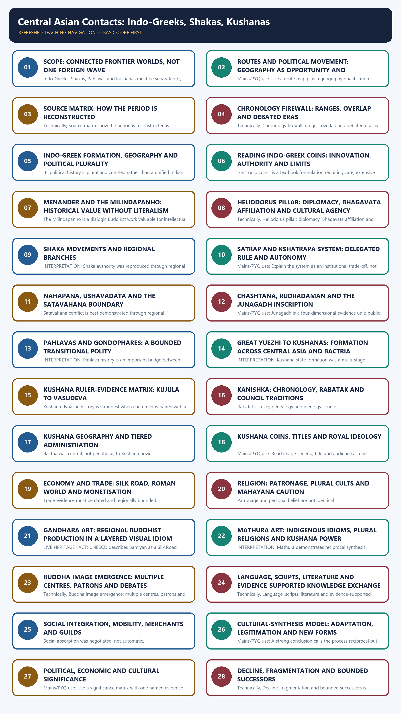

# Central Asian Contacts: Indo-Greeks, Shakas, Pahlavas and Kushanas - Complete Topic Package

> **Subject:** Ancient Indian History | **Paper:** Prelims GS-I + GS-I | **Topic:** 16 | **Date:** 13 August 2026
>
> **Evidence key:** FACT = supported directly by named source; INTERPRETATION = analytical reading; INFERENCE = bounded reconstruction; LIMIT = what the source cannot establish.
>
> **Approval state:** generated, **approved=false**. Only explicit user approval can change this state.

### Package practice counts

| Component | Count |
|---|---:|
| Verified/routed PYQs | 3 |
| Hard MCQs with explanations | 48 |
| Remedial MCQs with explanations | 12 |
| Original solved 10-mark Mains | 3 |
| Original solved 15-mark Mains | 3 |
| Original solved 20-mark Mains | 3 |

### Sources actually used

| Source class | Exact source | Use and caveat |
|---|---|---|
| Repository knowledge | Topic 16 basic/advanced; README; Master Chronology; Revision Chart; syllabus/PYQ routing; Answer-Worthiness Audit; bounded Topics 12, 15, 17, 19, 21 and 25. | Controls sequence, terminology, chronology conflicts, PYQ ownership and answer-worthiness. |
| R. S. Sharma | India's Ancient Past, searchable local PDF pp. 211-222, Chapter 20. | Foundation for political sequence and mutual impact; older AD 78-Kanishka view is flagged. |
| Upinder Singh | A History of Ancient and Early Medieval India, 2nd ed., searchable local PDF pp. 982-1015, 1045-1046, 1083, 1156, 1159-1166 and 1235, 1248-1249. | Primary analytical control for coins, inscriptions, archaeology, chronology and source limits. |
| Official UPSC papers | Locally held official 2019 Mains GS-I, 2020 Prelims GS-I and 2023 Prelims GS-I papers. | Controls exact question wording; unavailable local keys are labelled inferred. |
| Bounded live heritage | UNESCO World Heritage Centre, Cultural Landscape and Archaeological Remains of Bamiyan Valley. | Used only for Silk Road heritage, intercultural art and conservation; not for dynastic chronology. |

#### Bounded authoritative heritage link

- UNESCO, Cultural Landscape and Archaeological Remains of Bamiyan Valley: https://whc.unesco.org/en/list/208

UNESCO is used only to connect Gandharan artistic interchange, Silk Route heritage and modern conservation. It is not used to date Indo-Greek, Shaka or Kushana rulers. Qdrant was not used because repository Markdown and OCR-searchable local books were sufficient.

## BASIC LEARNING SESSION

### DEEP-REVIEW LEARNING CONTRACT

| Control | Binding rule for this package |
|---|---|
| Syllabus boundary | Complete Ancient History Core is taught before optional enrichment. |
| Evidence method | Claim → named site/text/inscription/coin/example → analysis → qualification. |
| Source hierarchy | Archaeology, textual testimony, inscriptions, coins and scholarly interpretation remain visibly distinct. |
| Contested issues | Competing interpretations are attributed, evidenced and bounded; certainty is not manufactured. |
| Practice contract | Every solved item has demand decoding, an examiner-grade model, an executable answer/compression plan, marks rationale and answer-specific improvement. |
| Approval | This immutable successor remains `approved: false` pending explicit approval. |

**Canonical Basic/Core owner:** `upsc-ai-kit\knowledge\Ancient-Indian-History\basic\16_Central-Asian-Contacts-Kushanas.md`  
**Canonical topic owner:** `upsc-ai-kit\knowledge\Ancient-Indian-History\basic\16_Central-Asian-Contacts-Kushanas.md`  
**Optional Advanced owner:** `upsc-ai-kit\knowledge\Ancient-Indian-History\advanced\16_Central-Asian-Contacts-Kushanas.md`  
**Official syllabus mapping:** `upsc-ai-kit\knowledge\Ancient-Indian-History\OFFICIAL-UPSC-SYLLABUS-MAPPING.md`

### EVIDENCE, PYQ AND CURRENT-STATUS CONTROL

- **Archaeological inference:** material context supports bounded reconstruction; absence is not automatic proof of non-existence.
- **Textual testimony:** genre, authorship, redaction, patronage and temporal distance control what a text can prove.
- **Inscription and coin evidence:** contemporary names, titles, claims and circulation are powerful but do not by themselves map uniform territorial control.
- **Scholarly interpretation:** historian labels are arguments to test, not facts to memorise without evidence.
- **PYQ discipline:** repository ledgers and locally held official papers control wording and metadata; reconstructed wording and unavailable official keys must be labelled.
- **Current-status note, rechecked 2026-08-30:** UNESCO Bamiyan was accessed on 29 August 2026 only for Silk Road heritage and the interchange of Indian, Hellenistic, Roman and Sasanian artistic influences.

**Live/primary context sources recorded by the predecessor generation:**

- `https://whc.unesco.org/en/list/208`




*Distinct embedded teaching-navigation image. The separate continuous Cārvāka-style flowchart package remains an independent at-a-glance artifact.*

### SESSION 1 — SCOPE: CONNECTED FRONTIER WORLDS, NOT ONE FOREIGN WAVE

#### DEFINITION / WHAT THIS IS CALLED

**Plain-language definition:** INTERPRETATION: The most useful frame is a connected frontier world linking Bactria, Gandhara, Punjab, Mathura, western India and long-distance routes.

**Technical definition:** Indo-Greeks, Shakas, Pahlavas and Kushanas must be separated by origin, chronology, political form and evidence.

#### ANSWER-GRABBING OPENING — WRITE/ADAPT IN THE EXAM

> INTERPRETATION: The most useful frame is a connected frontier world linking Bactria, Gandhara, Punjab, Mathura, western India and long-distance routes.

#### MUST-WRITE KEYWORDS

- **Scope**
- **connected frontier worlds**
- **not one foreign wave**
- **Mains/PYQ use**
- **Study link**
- **Indo-Greeks**

**How to use them:** Frame the answer through Scope; define connected frontier worlds, connect not one foreign wave with Mains/PYQ use to explain the mechanism, and use Study link for the decisive comparison or qualification.

Between about 200 BCE and 300 CE, the north-west and parts of northern and western India were shaped by several distinct but overlapping polities. Indo-Greeks, Shakas, Pahlavas and Kushanas must be separated by origin, chronology, political form and evidence.

#### Compact visual

```text
POLITICAL MOVEMENTS (schematic; not a single-file succession)
Bactria / Oxus
   |-- Indo-Greeks south of Hindu Kush -> Gandhara / Punjab / selected Ganga routes
   |-- Shaka movements -> Taxila / Mathura / western India / upper Deccan
   |-- Pahlava power -> Afghanistan-Gandhara frontier
   `-- Great Yuezhi -> Bactria -> Kushana consolidation -> Gandhara / Mathura / Ganga nodes

SIMULTANEOUS INDIA
Ganga-centre: Shunga/Kanva     Deccan: Satavahana     South: Tamil polities
```

#### Evidence/comparison matrix

| Claim/category | Named evidence | Significance |
|---|---|---|
| Indo-Greeks | Bactrian Greek lineages south of Hindu Kush | Portrait/bilingual coins, Menander, Heliodorus diplomacy |
| Shakas | Scythian groups moving through Central Asia | Kshatrapa system, Rajuvula, Nahapana, Chashtana, Rudradaman |
| Pahlavas | Parthian/Indo-Parthian rulers | Gondophares, Takht-i-Bahi inscription, coins |
| Kushanas | Guishuang branch of the Great Yuezhi | Kujula-Vima-Kanishka line, Rabatak, plural coinage |

#### Core teaching / solved analysis

- FACT: The groups did not arrive as one homogeneous body and did not rule one identical territory.
- FACT: Several rulers and branches were contemporary; a neat dynasty-by-dynasty queue is misleading.
- INTERPRETATION: The most useful frame is a connected frontier world linking Bactria, Gandhara, Punjab, Mathura, western India and long-distance routes.
- LIMIT: 'Foreign' identifies an origin or political memory, not permanent cultural separation.
- BOUNDARY: Satavahana history is used only where Shaka conflict or trade networks require it.
- ANSWER METHOD: Identify group -> named ruler/source -> region -> significance -> uncertainty.

#### Must-know facts

- Post-Mauryan north-western political history contains overlapping regional rule.
- Shaka and Pahlava are not synonyms, although Indian texts sometimes pair them.
- Kushanas emerged from the Great Yuezhi political movement.
- Political origin and later cultural affiliation are different questions.

#### UPSC traps

- **Wrong:** All Central Asian rulers formed one dynasty. **Correct:** They were distinct polities with different origins, rulers and regional bases.
- **Wrong:** Foreign origin meant cultural isolation. **Correct:** Coins, inscriptions, patronage and titles show reciprocal adaptation and legitimation.

**Mains/PYQ use:** Open with plurality and overlap; reject both invasion-only and harmony-only narratives.

**Study link:** Topics 12, 15 and 17 supply the Achaemenid-Hellenistic prelude, Mauryan transition and Deccan boundary.

#### CLOSING RECALL FLOW — SCOPE: CONNECTED FRONTIER WORLDS, NOT ONE FOREIGN WAVE

```text
START / CONCEPT: Scope: connected frontier worlds, not one foreign wave
        |
        v
EXACT TERMS: Scope · connected frontier worlds · not one foreign wave · Mains/PYQ use · Study link · Indo-Greeks
        |
        v
MECHANISM / ARGUMENT: Indo-Greeks, Shakas, Pahlavas and Kushanas must be separated by origin, chronology, political form and evidence.
        |
        v
CONSEQUENCE / CONTRAST: Between about 200 BCE and 300 CE, the north-west and parts of northern and western India were shaped by several distinct but overlapping polities.
        |
        v
UPSC TRAP / ANSWER-USE: Shaka and Pahlava are not synonyms, although Indian texts sometimes pair them.
        |
        v
ANSWER-GRABBING FORMULATION: INTERPRETATION: The most useful frame is a connected frontier world linking Bactria, Gandhara, Punjab, Mathura, western India and long-distance routes.
```
### SESSION 2 — ROUTES AND POLITICAL MOVEMENT: GEOGRAPHY AS OPPORTUNITY AND CONSTRAINT

#### DEFINITION / WHAT THIS IS CALLED

**Plain-language definition:** Kushana movement into the subcontinent is inferred from Chinese accounts, archaeology and coin distributions.

**Technical definition:** Mains/PYQ use: Use a route map plus a geography qualification: corridors connected nodes, not every locality.

#### ANSWER-GRABBING OPENING — WRITE/ADAPT IN THE EXAM

> Mains/PYQ use: Use a route map plus a geography qualification: corridors connected nodes, not every locality.

#### MUST-WRITE KEYWORDS

- **Routes**
- **political movement**
- **geography as opportunity**
- **constraint**
- **Mains/PYQ use**
- **Study link**

**How to use them:** Frame the answer through Routes; define political movement, connect geography as opportunity with constraint to explain the mechanism, and use Mains/PYQ use for the decisive comparison or qualification.

The Hindu Kush and north-western corridors were filters rather than walls. Movement followed passes, river valleys, caravan nodes and ports, while terrain and distance kept power regionally uneven.

#### Compact visual

```text
TEXT MIGRATION-ROUTE MAP
Gansu / north-west China
        |  Xiongnu pressure (Chinese textual reconstruction)
        v
Great Yuezhi -> Ili / Syr Darya -> north of Amu Darya -> Bactria
                                                   |
                                                   v
                                         Hindu Kush passes
                                                   |
        Bactria -> Kabul/Begram -> Gandhara/Taxila -> Punjab -> Mathura
                                         |                       |
                                         v                       v
                                  Lower Indus/ports          Ganga routes

Shaka branches also moved toward Taxila, Mathura, western India and the upper Deccan.
```

#### Evidence/comparison matrix

| Claim/category | Named evidence | Significance | Limitation |
|---|---|---|---|
| Hindu Kush | Crossing between Bactria and Kabul-Gandhara | Military movement and caravan traffic | Pass control never guaranteed deep plain control |
| Taxila/Sirkap | Route and urban node | Multiple Indo-Greek, Shaka and Parthian phases | Most excavated Sirkap remains are later than its Indo-Greek foundation |
| Mathura | Yamuna-Ganga and western route junction | Shaka and Kushana political/artistic centre | Not a mere eastern copy of Gandhara |
| Lower Indus/Makran | Maritime interface | Indian Ocean access and revenue potential | Port activity does not prove one ruler's monopoly |

#### Core teaching / solved analysis

- FACT: Bactria lay south of the Amu Darya and north-west of the Hindu Kush, at a major long-distance route junction.
- FACT: Aï-Khanoum and Taxila show that urban and political worlds extended across modern borders.
- FACT: Kushana movement into the subcontinent is inferred from Chinese accounts, archaeology and coin distributions.
- INTERPRETATION: Routes allowed rulers to convert a frontier location into revenue, diplomacy and cultural brokerage.
- LIMIT: Coin finds beyond a core area may reflect trade, tribute or later movement; they do not automatically map sovereignty.
- LIMIT: Migration narratives reconstructed from Chinese texts simplify multiple groups and stages.

#### Must-know facts

- Bactria, Kabul-Gandhara, Taxila and Mathura formed connected but distinct zones.
- The lower Indus connected overland and maritime circuits.
- Sirkap has several occupational levels across political phases.
- Modern borders should not be projected onto ancient movement.

#### UPSC traps

- **Wrong:** The Hindu Kush isolated India from Central Asia. **Correct:** It constrained movement but passes repeatedly channelled armies, merchants and religious traffic.
- **Wrong:** A coin find proves direct annexation. **Correct:** Distribution must be checked against inscriptions, minting, hoards and archaeology.

**Mains/PYQ use:** Use a route map plus a geography qualification: corridors connected nodes, not every locality.

**Study link:** Geographical Setting Topic 03; Crafts-Commerce Topic 19.

#### CLOSING RECALL FLOW — ROUTES AND POLITICAL MOVEMENT: GEOGRAPHY AS OPPORTUNITY AND CONSTRAINT

```text
START / CONCEPT: Routes and political movement: geography as opportunity and constraint
        |
        v
EXACT TERMS: Routes · political movement · geography as opportunity · constraint · Mains/PYQ use · Study link
        |
        v
MECHANISM / ARGUMENT: Movement followed passes, river valleys, caravan nodes and ports, while terrain and distance kept power regionally uneven.
        |
        v
CONSEQUENCE / CONTRAST: Coin finds beyond a core area may reflect trade, tribute or later movement; they do not automatically map sovereignty.
        |
        v
UPSC TRAP / ANSWER-USE: Modern borders should not be projected onto ancient movement.
        |
        v
ANSWER-GRABBING FORMULATION: Mains/PYQ use: Use a route map plus a geography qualification: corridors connected nodes, not every locality.
```
### SESSION 3 — SOURCE MATRIX: HOW THE PERIOD IS RECONSTRUCTED

#### DEFINITION / WHAT THIS IS CALLED

**Plain-language definition:** COIN RULE: ruler names are strongest for attribution, but coin distribution is not a ready-made political map.

**Technical definition:** Technically, Source matrix: how the period is reconstructed is analysed by relating Source matrix to how the period is reconstructed, then testing the relationship through Mains/PYQ use and Study link.

#### ANSWER-GRABBING OPENING — WRITE/ADAPT IN THE EXAM

> COIN RULE: ruler names are strongest for attribution, but coin distribution is not a ready-made political map.

#### MUST-WRITE KEYWORDS

- **Source matrix**
- **how the period is reconstructed**
- **Mains/PYQ use**
- **Study link**
- **Coins**
- **Portraits, names, titles, scripts, deities, metals, overstrikes, distributions**

**How to use them:** Frame the answer through Source matrix; define how the period is reconstructed, connect Mains/PYQ use with Study link to explain the mechanism, and use Coins for the decisive comparison or qualification.

Chronology and political geography depend on triangulating coins, inscriptions, archaeology and scattered Indian, classical and Chinese texts. No single archive supplies a continuous narrative.

#### Evidence/comparison matrix

| Claim/category | Named evidence | Significance | Limitation |
|---|---|---|---|
| Coins | Portraits, names, titles, scripts, deities, metals, overstrikes, distributions | Sequence and political-cultural claims | Hoarding/trade can outlive rule; monograms debated |
| Inscriptions | Heliodorus, Junagadh, Rabatak, Mathura, Takht-i-Bahi | Named rulers, offices, gifts, genealogy, royal ideology | Prashasti exaggeration; survival is accidental |
| Archaeology | Aï-Khanoum, Sirkap, Mat, Surkh Kotal, Shah-ji-ki-dheri | Urban phases, materials, shrines and workshops | Political attribution and exact dating may be uncertain |
| Indian texts | Milindapanho, Puranic/Buddhist traditions, grammar/literature | Intellectual memory and social classification | Genre, date and redaction matter |
| Classical/Chinese texts | Plutarch, Periplus, Qian Hanshu, Hou Hanshu, later pilgrims | External chronology, trade and movement | Ethnonyms, hearsay and translation problems |

#### Core teaching / solved analysis

- COIN RULE: ruler names are strongest for attribution, but coin distribution is not a ready-made political map.
- INSCRIPTION RULE: contemporaneity improves value, but royal eulogy still requires corroboration.
- TEXT RULE: identify genre before extracting event claims; a dialogue, prashasti and travel account answer different questions.
- ARCHAEOLOGY RULE: distinguish the foundation of a settlement from the date of its best-preserved layer.
- CHRONOLOGY RULE: use date ranges and competing reconstructions rather than false precision.
- EVIDENCE LADDER: claim -> named object/text/site -> what it proves -> what it cannot prove.

#### Must-know facts

- Many Bactro-Indo-Greek rulers are known only from coins.
- Overstrikes can indicate succession, conflict or metal reuse.
- Rabatak is crucial but its readings and royal claims are debated.
- The Junagadh inscription is both a public-work record and a prashasti.

#### UPSC traps

- **Wrong:** Contemporary inscription equals neutral record. **Correct:** Contemporary evidence can still be selective, formulaic and self-legitimating.
- **Wrong:** Literary silence proves absence. **Correct:** Survival, genre and authorial priorities shape silence.

**Mains/PYQ use:** A source-criticism paragraph can convert narration into analysis.

**Study link:** Topic 02 Sources of Ancient Indian History.

#### CLOSING RECALL FLOW — SOURCE MATRIX: HOW THE PERIOD IS RECONSTRUCTED

```text
START / CONCEPT: Source matrix: how the period is reconstructed
        |
        v
EXACT TERMS: Source matrix · how the period is reconstructed · Mains/PYQ use · Study link · Coins · Portraits, names, titles, scripts, deities, metals, overstrikes, distributions
        |
        v
MECHANISM / ARGUMENT: Mains/PYQ use: A source-criticism paragraph can convert narration into analysis.
        |
        v
CONSEQUENCE / CONTRAST: INSCRIPTION RULE: contemporaneity improves value, but royal eulogy still requires corroboration.
        |
        v
UPSC TRAP / ANSWER-USE: Rabatak is crucial but its readings and royal claims are debated.
        |
        v
ANSWER-GRABBING FORMULATION: COIN RULE: ruler names are strongest for attribution, but coin distribution is not a ready-made political map.
```
### SESSION 4 — CHRONOLOGY FIREWALL: RANGES, OVERLAP AND DEBATED ERAS

#### DEFINITION / WHAT THIS IS CALLED

**Plain-language definition:** The safest chronology is a sequence of broad phases with explicit overlaps.

**Technical definition:** Technically, Chronology firewall: ranges, overlap and debated eras is analysed by relating Chronology firewall to ranges, then testing the relationship through overlap and debated eras.

#### ANSWER-GRABBING OPENING — WRITE/ADAPT IN THE EXAM

> The safest chronology is a sequence of broad phases with explicit overlaps.

#### MUST-WRITE KEYWORDS

- **Chronology firewall**
- **ranges**
- **overlap**
- **debated eras**
- **Mains/PYQ use**
- **Study link**

**How to use them:** Frame the answer through Chronology firewall; define ranges, connect overlap with debated eras to explain the mechanism, and use Mains/PYQ use for the decisive comparison or qualification.

The safest chronology is a sequence of broad phases with explicit overlaps. Kanishka's accession, the Shaka era and some Indo-Greek/Shaka genealogies remain debated.

#### Timeline

| Date/phase | Event |
|---|---|
| c. early 2nd century BCE | Demetrius and other Bactrian Greeks cross south of the Hindu Kush. |
| c. 2nd century BCE | Indo-Greek principalities; Menander belongs broadly to this phase. |
| c. 85 BCE onward | Maues/Moga and later Shaka rulers in the north-west. |
| early 1st century CE | Rajuvula ends Indo-Greek control east of the Jhelum; Gondophares' Indo-Parthian phase. |
| c. 1st century CE | Kujula Kadphises consolidates the Kushana branch of the Great Yuezhi. |
| early 2nd century CE | Vima Kadphises; then Kanishka I, commonly c. 127-150 CE. |
| 150-151 CE | Rudradaman's Junagadh inscription, Shaka year 72. |
| 2nd-3rd centuries CE | Huvishka, Vasudeva and later Kushanas; regional fragmentation and Sasanian pressure. |

#### Evidence/comparison matrix

| Claim/category | Named evidence | Significance | Limitation |
|---|---|---|---|
| Menander | Coin sequence, Milindapanho, Plutarch | Major Indo-Greek ruler centred on Sagala | Exact regnal dates vary by reconstruction |
| Azes/Vikrama era | Coins and era interpretation | Possible Shaka chronological anchor | Azes-Vikrama link has been questioned |
| Shaka era 78 CE | Era use and later interpretation | Firm era date | Founder debated; do not equate automatically with Kanishka |
| Kanishka | Yavanajataka calculation, Rabatak, inscriptions/coins | Common modern accession c. 127 CE | 78 CE survives in older scholarship |

#### Core teaching / solved analysis

- FACT: Upinder Singh states that most scholars now accept c. 127 CE for Kanishka's accession.
- FACT: The Yavanajataka treats the Kushana and Shaka eras as separate.
- INTERPRETATION: Overlapping rulers and regional branches explain why one linear chronology repeatedly fails.
- LIMIT: Era-to-Common-Era conversion depends on identifying the era used in each inscription.
- LIMIT: Genealogies reconstructed from coin links can change with new finds or readings.
- EXAM RULE: State the conventional account, then add one short chronology caveat.

#### Must-know facts

- AD/CE 78 is the Shaka era, but its founder is disputed.
- Kanishka c. 127 CE is the majority view used here.
- Regional Indo-Greek and Shaka rulers overlapped.
- Rudradaman's dated inscription is a strong western-Indian anchor.

#### UPSC traps

- **Wrong:** Kanishka certainly founded the Shaka era. **Correct:** That is the older view; current scholarship often separates the eras.
- **Wrong:** Every ruler can be assigned an exact continuous genealogy. **Correct:** Coins and inscriptions leave gaps, disputed readings and concurrent lines.

**Mains/PYQ use:** Use broad phases and one explicit 'chronology remains reconstructed' sentence.

**Study link:** Master Chronology and Revision Chart.

#### CLOSING RECALL FLOW — CHRONOLOGY FIREWALL: RANGES, OVERLAP AND DEBATED ERAS

```text
START / CONCEPT: Chronology firewall: ranges, overlap and debated eras
        |
        v
EXACT TERMS: Chronology firewall · ranges · overlap · debated eras · Mains/PYQ use · Study link
        |
        v
MECHANISM / ARGUMENT: Era-to-Common-Era conversion depends on identifying the era used in each inscription.
        |
        v
CONSEQUENCE / CONTRAST: AD/CE 78 is the Shaka era, but its founder is disputed.
        |
        v
UPSC TRAP / ANSWER-USE: Do not miss this limiting distinction: overlapping rulers and regional branches explain why one linear chronology repeatedly fails.
        |
        v
ANSWER-GRABBING FORMULATION: The safest chronology is a sequence of broad phases with explicit overlaps.
```
### SESSION 5 — INDO-GREEK FORMATION, GEOGRAPHY AND POLITICAL PLURALITY

#### DEFINITION / WHAT THIS IS CALLED

**Plain-language definition:** Mains/PYQ use: Political plurality + numismatic innovation is the core Indo-Greek thesis.

**Technical definition:** Its political history is plural and coin-led rather than a unified Indian empire.

#### ANSWER-GRABBING OPENING — WRITE/ADAPT IN THE EXAM

> Mains/PYQ use: Political plurality + numismatic innovation is the core Indo-Greek thesis.

#### MUST-WRITE KEYWORDS

- **Indo-Greek formation**
- **geography**
- **political plurality**
- **Mains/PYQ use**
- **Study link**
- **Demetrius I**

**How to use them:** Frame the answer through Indo-Greek formation; define geography, connect political plurality with Mains/PYQ use to explain the mechanism, and use Study link for the decisive comparison or qualification.

Indo-Greek rule grew from the Graeco-Bactrian world and produced several principalities south of the Hindu Kush. Its political history is plural and coin-led rather than a unified Indian empire.

#### Evidence/comparison matrix

| Claim/category | Named evidence | Significance | Limitation |
|---|---|---|---|
| Demetrius I | Elephant-scalp portrait coin; numismatic sequence | Early Bactrian Greek crossing into Indian zones | Extent and campaign detail remain reconstructed |
| Eucratides/other lines | Coins and Aï-Khanoum context | Concurrent royal houses and political conflict | Many rulers lack narrative sources |
| Menander | Large coin corpus; Milindapanho; Plutarch | Wide authority and durable intellectual memory | Textual Menander is mediated by genre |
| Antialcidas | Coins; Heliodorus pillar | Taxila-linked diplomacy with Vidisha court | One embassy does not map his entire realm |

#### Core teaching / solved analysis

- FACT: Graeco-Bactrians ruled north of the Hindu Kush; Indo-Greeks ruled south of it.
- FACT: Demetrius is identified in Upinder Singh as the first Bactrian Greek ruler to cross the Hindu Kush.
- FACT: Many kings ruled concurrently; a large number are known only through numismatics.
- FACT: Sirkap at Taxila began in the Indo-Greek phase, though most visible remains belong to later Shaka-Parthian occupation.
- INTERPRETATION: Political fragmentation did not prevent durable innovations in coin form, titulature and visual representation.
- LIMIT: Claims of deep advances toward Pataliputra rest on contested literary and epigraphic readings.

#### Must-know facts

- Indo-Greek history is reconstructed primarily from coins.
- Portraits and bilingual legends make rulers attributable.
- Multiple royal lines could rule simultaneously.
- Taxila and Sagala were major nodes, not proof of one uniform empire.

#### UPSC traps

- **Wrong:** Indo-Greeks recreated Alexander's empire in India. **Correct:** They formed several later principalities with different territories and evidence.
- **Wrong:** Greek political unity explains all coin similarities. **Correct:** Shared numismatic conventions can cross rival and successor polities.

**Mains/PYQ use:** Political plurality + numismatic innovation is the core Indo-Greek thesis.

**Study link:** Topic 12 for Alexander; do not transfer 326 BCE effects directly to the 2nd century BCE.

#### CLOSING RECALL FLOW — INDO-GREEK FORMATION, GEOGRAPHY AND POLITICAL PLURALITY

```text
START / CONCEPT: Indo-Greek formation, geography and political plurality
        |
        v
EXACT TERMS: Indo-Greek formation · geography · political plurality · Mains/PYQ use · Study link · Demetrius I
        |
        v
MECHANISM / ARGUMENT: Many kings ruled concurrently; a large number are known only through numismatics.
        |
        v
CONSEQUENCE / CONTRAST: Study link: Topic 12 for Alexander; do not transfer 326 BCE effects directly to the 2nd century BCE.
        |
        v
UPSC TRAP / ANSWER-USE: Taxila and Sagala were major nodes, not proof of one uniform empire.
        |
        v
ANSWER-GRABBING FORMULATION: Mains/PYQ use: Political plurality + numismatic innovation is the core Indo-Greek thesis.
```
### SESSION 6 — READING INDO-GREEK COINS: INNOVATION, AUTHORITY AND LIMITS

#### DEFINITION / WHAT THIS IS CALLED

**Plain-language definition:** Indo-Greek coins are unusually informative because portraits, royal names, bilingual legends and reverse motifs can be combined.

**Technical definition:** 'First gold coins' is a textbook formulation requiring care; extensive gold coinage is especially associated with Kushanas.

#### ANSWER-GRABBING OPENING — WRITE/ADAPT IN THE EXAM

> Indo-Greek coins are unusually informative because portraits, royal names, bilingual legends and reverse motifs can be combined.

#### MUST-WRITE KEYWORDS

- **Reading Indo-Greek coins**
- **innovation**
- **authority**
- **limits**
- **Mains/PYQ use**
- **Study link**

**How to use them:** Frame the answer through Reading Indo-Greek coins; define innovation, connect authority with limits to explain the mechanism, and use Mains/PYQ use for the decisive comparison or qualification.

Indo-Greek coins are unusually informative because portraits, royal names, bilingual legends and reverse motifs can be combined. They remain artefacts of authority and circulation, not full political censuses.

#### Compact visual

```text
COIN-READING GUIDE
1. METAL/WEIGHT  -> denomination, standard, exchange zone
2. OBVERSE       -> portrait, royal title, visual sovereignty
3. REVERSE       -> deity/symbol and addressed audiences
4. SCRIPT/LANGUAGE -> Greek + Kharoshthi/Brahmi communication
5. DIE/MONOGRAM  -> production clues; interpretation often debated
6. OVERSTRIKE    -> possible succession/conflict/metal reuse
7. FIND CONTEXT  -> hoard, excavation or stray find
8. LIMIT         -> circulation is not identical with political frontier
```

#### Evidence/comparison matrix

| Claim/category | Named evidence | Significance | Limitation |
|---|---|---|---|
| Graeco-Bactrian | Gold/silver/copper/nickel; Greek legends; Attic standard | Northern Hellenistic monetary world | Not identical to southern issues |
| Indo-Greek | Often silver/copper; Greek-Kharoshthi; Indian weight; portraits | Adaptation to subcontinental users | Rare Brahmi and local variations |
| Agathocles series | Balarama and Vasudeva imagery; Greek/Prakrit legends | Royal recognition of Indian cults | Does not prove the king's personal conversion |
| Overstrikes | One ruler's type over another | Relative sequence or conflict | Precious-metal shortage can also explain reuse |

#### Core teaching / solved analysis

- FACT: Written sources name far fewer Bactro-Indo-Greek rulers than coins do.
- FACT: South-of-Hindu-Kush issues commonly use bilingual Greek and Kharoshthi legends.
- FACT: Royal portraits and legends allow stronger attribution than early punch-marked coins.
- FACT: Agathocles' coins provide early datable Balarama-Vasudeva iconography.
- INTERPRETATION: Bilingual coinage was political communication across plural audiences.
- LIMIT: 'First gold coins' is a textbook formulation requiring care; extensive gold coinage is especially associated with Kushanas.

#### Must-know facts

- Coin obverse and reverse must be read together.
- Indian motifs on Indo-Greek coins show adaptation.
- Monograms are not automatically mint marks.
- Hoard context matters more than isolated discovery.

#### UPSC traps

- **Wrong:** A deity on a coin proves personal faith. **Correct:** Coin imagery may express legitimacy, audience strategy or royal policy.
- **Wrong:** Bilingual legends mean everyone was bilingual. **Correct:** They show official communication choices, not population-wide literacy.

**Mains/PYQ use:** Treat the coin as political text, economic object and cultural interface.

**Study link:** Topic 02 numismatic method.

#### CLOSING RECALL FLOW — READING INDO-GREEK COINS: INNOVATION, AUTHORITY AND LIMITS

```text
START / CONCEPT: Reading Indo-Greek coins: innovation, authority and limits
        |
        v
EXACT TERMS: Reading Indo-Greek coins · innovation · authority · limits · Mains/PYQ use · Study link
        |
        v
MECHANISM / ARGUMENT: Mains/PYQ use: Treat the coin as political text, economic object and cultural interface.
        |
        v
CONSEQUENCE / CONTRAST: Monograms are not automatically mint marks.
        |
        v
UPSC TRAP / ANSWER-USE: Correct: They show official communication choices, not population-wide literacy.
        |
        v
ANSWER-GRABBING FORMULATION: Indo-Greek coins are unusually informative because portraits, royal names, bilingual legends and reverse motifs can be combined.
```
### SESSION 7 — MENANDER AND THE MILINDAPANHO: HISTORICAL VALUE WITHOUT LITERALISM

#### DEFINITION / WHAT THIS IS CALLED

**Plain-language definition:** Menander is unusually visible through a large coin corpus and Buddhist memory.

**Technical definition:** The Milindapanho is a dialogic Buddhist work valuable for intellectual history, but it is not a verbatim court transcript.

#### ANSWER-GRABBING OPENING — WRITE/ADAPT IN THE EXAM

> Menander is unusually visible through a large coin corpus and Buddhist memory.

#### MUST-WRITE KEYWORDS

- **Menander**
- **the Milindapanho**
- **historical value without literalism**
- **Mains/PYQ use**
- **Study link**
- **Menander/Milinda**

**How to use them:** Frame the answer through Menander; define the Milindapanho, connect historical value without literalism with Mains/PYQ use to explain the mechanism, and use Study link for the decisive comparison or qualification.

Menander is unusually visible through a large coin corpus and Buddhist memory. The Milindapanho is a dialogic Buddhist work valuable for intellectual history, but it is not a verbatim court transcript.

#### Evidence/comparison matrix

| Claim/category | Named evidence | Significance | Limitation |
|---|---|---|---|
| Menander/Milinda | Coins in greater numbers than any other Indo-Greek king | Scale, authority and circulation | Distribution requires contextual reading |
| Sagala | Textual identification with Sialkot | Political and trade centre | Archaeological data are limited |
| Milindapanho | Questions between Milinda and Nagasena | Buddhist reasoning, kingship and dialogue | Composite literary/redactional history |
| Plutarch | Conflict over Menander's ashes | External memory of posthumous honour | Later classical narrative, not local contemporary record |

#### Core teaching / solved analysis

- FACT: Menander is the only Indo-Greek king prominently mentioned in an Indian literary source.
- FACT: The text centres on King Milinda questioning the monk Nagasena.
- SOURCE VALUE: It illuminates Buddhist argument, analogy and the representation of a questioning king.
- LIMIT: It cannot establish every biographical detail or reproduce an actual conversation word for word.
- CAUTION: Nagasena must not be confused with Nagarjuna; the 2023 Prelims question exploits this.
- INTERPRETATION: Menander's Buddhist memory shows cultural legitimation, but conversion traditions require genre criticism.

#### Must-know facts

- Milinda is identified with Menander.
- Nagasena is the dialogic interlocutor.
- The work is Buddhist literature, not administrative record.
- Coins and text provide different kinds of evidence.

#### UPSC traps

- **Wrong:** Milindapanho was authored by Nagarjuna. **Correct:** The dialogue is centred on Nagasena; authorship/redaction is not Nagarjuna.
- **Wrong:** The dialogue is a court transcript. **Correct:** It is a literary-philosophical text shaped by Buddhist teaching purposes.

**Mains/PYQ use:** Pair Menander's coins with the Milindapanho and state what each archive can and cannot prove.

**Study link:** Jainism-Buddhism Topic 10.

#### CLOSING RECALL FLOW — MENANDER AND THE MILINDAPANHO: HISTORICAL VALUE WITHOUT LITERALISM

```text
START / CONCEPT: Menander and the Milindapanho: historical value without literalism
        |
        v
EXACT TERMS: Menander · the Milindapanho · historical value without literalism · Mains/PYQ use · Study link · Menander/Milinda
        |
        v
MECHANISM / ARGUMENT: Wrong: Milindapanho was authored by Nagarjuna.
        |
        v
CONSEQUENCE / CONTRAST: The Milindapanho is a dialogic Buddhist work valuable for intellectual history, but it is not a verbatim court transcript.
        |
        v
UPSC TRAP / ANSWER-USE: INTERPRETATION: Menander's Buddhist memory shows cultural legitimation, but conversion traditions require genre criticism.
        |
        v
ANSWER-GRABBING FORMULATION: Menander is unusually visible through a large coin corpus and Buddhist memory.
```
### SESSION 8 — HELIODORUS PILLAR: DIPLOMACY, BHAGAVATA AFFILIATION AND CULTURAL AGENCY

#### DEFINITION / WHAT THIS IS CALLED

**Plain-language definition:** Mains/PYQ use: Use Heliodorus as precise evidence for reciprocal adaptation, not vague 'Indianisation'.

**Technical definition:** Technically, Heliodorus pillar: diplomacy, Bhagavata affiliation and cultural agency is analysed by relating Heliodorus pillar to diplomacy, then testing the relationship through Bhagavata affiliation and cultural agency.

#### ANSWER-GRABBING OPENING — WRITE/ADAPT IN THE EXAM

> Mains/PYQ use: Use Heliodorus as precise evidence for reciprocal adaptation, not vague 'Indianisation'.

#### MUST-WRITE KEYWORDS

- **Heliodorus pillar**
- **diplomacy**
- **Bhagavata affiliation**
- **cultural agency**
- **Mains/PYQ use**
- **Study link**

**How to use them:** Frame the answer through Heliodorus pillar; define diplomacy, connect Bhagavata affiliation with cultural agency to explain the mechanism, and use Mains/PYQ use for the decisive comparison or qualification.

The Besnagar pillar records an Indo-Greek ambassador's Bhagavata affiliation and a diplomatic connection between Antialcidas and Bhagabhadra. It demonstrates individual and courtly interaction, not mass conversion.

#### Evidence/comparison matrix

| Claim/category | Named evidence | Significance | Limitation |
|---|---|---|---|
| Patron | Heliodorus, son of Dion, from Taxila | Named Greek ambassador and mobile elite | Individual identity cannot represent all Greeks |
| Sending ruler | Antialcidas/Antialkidas | Indo-Greek diplomatic authority connected to Taxila | Political extent beyond this link remains coin-led |
| Receiving ruler | Kashiputra Bhagabhadra | Diplomacy with the Vidisha/Shunga sphere | Exact dynastic identification debated |
| Dedication | Garuda pillar of Vasudeva; Heliodorus calls himself Bhagavata | Early Vaishnava devotion and cultural participation | Devotional formula does not prove state religion |

#### Core teaching / solved analysis

- FACT: The inscription is in Prakrit with Brahmi script and includes Sanskritic spellings.
- FACT: Heliodorus identifies himself as a Bhagavata and dedicates the pillar to Vasudeva.
- FACT: Antialcidas is independently known from coins.
- INTERPRETATION: The record joins diplomacy, religious affiliation and mobility in one datable object.
- LIMIT: It does not show that all Indo-Greeks became Vaishnavas or that Bhagavata worship began with them.
- RECIPROCITY: Cultural adaptation involved foreign-origin actors adopting Indian cults while local traditions used transregional media and patrons.

#### Must-know facts

- Besnagar is near ancient Vidisha.
- Heliodorus came from Taxila as ambassador.
- The pillar honours Vasudeva and uses the garuda emblem.
- Individual devotion is not population-wide religious evidence.

#### UPSC traps

- **Wrong:** Heliodorus was an Indo-Greek king. **Correct:** He was an ambassador sent by Antialcidas.
- **Wrong:** The pillar proves an Indo-Greek Vaishnava state. **Correct:** It proves a named ambassador's affiliation and diplomatic-cultural interaction.

**Mains/PYQ use:** Use Heliodorus as precise evidence for reciprocal adaptation, not vague 'Indianisation'.

**Study link:** Vaishnava formation and early temple evidence.

#### CLOSING RECALL FLOW — HELIODORUS PILLAR: DIPLOMACY, BHAGAVATA AFFILIATION AND CULTURAL AGENCY

```text
START / CONCEPT: Heliodorus pillar: diplomacy, Bhagavata affiliation and cultural agency
        |
        v
EXACT TERMS: Heliodorus pillar · diplomacy · Bhagavata affiliation · cultural agency · Mains/PYQ use · Study link
        |
        v
MECHANISM / ARGUMENT: Correct: He was an ambassador sent by Antialcidas.
        |
        v
CONSEQUENCE / CONTRAST: It does not show that all Indo-Greeks became Vaishnavas or that Bhagavata worship began with them.
        |
        v
UPSC TRAP / ANSWER-USE: It demonstrates individual and courtly interaction, not mass conversion.
        |
        v
ANSWER-GRABBING FORMULATION: Mains/PYQ use: Use Heliodorus as precise evidence for reciprocal adaptation, not vague 'Indianisation'.
```
### SESSION 9 — SHAKA MOVEMENTS AND REGIONAL BRANCHES

#### DEFINITION / WHAT THIS IS CALLED

**Plain-language definition:** Shaka power was dispersed among north-western, Mathura and western-Indian branches.

**Technical definition:** INTERPRETATION: Shaka authority was reproduced through regional satrapal offices rather than one stable centre.

#### ANSWER-GRABBING OPENING — WRITE/ADAPT IN THE EXAM

> Mains/PYQ use: Organise Shaka history by region and branch, not by a memorised undifferentiated list.

#### MUST-WRITE KEYWORDS

- **Shaka movements**
- **regional branches**
- **Mains/PYQ use**
- **Study link**
- **Maues/Moga**
- **Taxila inscription; coins**

**How to use them:** Frame the answer through Shaka movements; define regional branches, connect Mains/PYQ use with Study link to explain the mechanism, and use Maues/Moga for the decisive comparison or qualification.

Shaka power was dispersed among north-western, Mathura and western-Indian branches. Kshatrapas could begin as subordinate governors and become effectively independent regional rulers.

#### Compact visual

```text
SHAKA REGIONAL SPREAD (bounded)
Central Asian steppe movements
        |
        +-- Afghanistan / Gandhara -> Maues (Moga), Azes lines
        +-- Taxila / Punjab
        +-- Mathura -> Rajuvula -> Shodasa
        `-- Western India -> Kshaharatas (Bhumaka, Nahapana)
                            -> Kardamakas (Chashtana, Rudradaman)

Do not turn these branches into one continuously centralised Shaka empire.
```

#### Evidence/comparison matrix

| Claim/category | Named evidence | Significance | Limitation |
|---|---|---|---|
| Maues/Moga | Taxila inscription; coins | Early Shaka rule in Gandhara-Taxila | Conquest sequence remains reconstructed |
| Azes I | Coins and north-western sequence | Expansion and possible era association | Azes-Vikrama link disputed |
| Rajuvula | Mathura kshatrapa/mahakshatrapa; coin/text sequence | Ends Indo-Greek control east of Jhelum | Regional, not all-India authority |
| Western branches | Coins and inscriptions | Longer-lived Shaka polity in western India | Two dynastic lines must be separated |

#### Core teaching / solved analysis

- FACT: Great Yuezhi pressure contributed to Shaka movement southwards.
- FACT: Moga is identified with Maues through inscriptional and numismatic evidence.
- FACT: Rajuvula defeated Strato III and captured Sagala in the early 1st century CE.
- FACT: The western Kshatrapas included Kshaharata and Kardamaka lines.
- INTERPRETATION: Shaka authority was reproduced through regional satrapal offices rather than one stable centre.
- LIMIT: Later branch genealogies and era associations remain debated.

#### Must-know facts

- Shakas ruled in more than one region.
- Kshatrapa and mahakshatrapa were political titles.
- Rajuvula belongs to the Mathura branch.
- Western Shaka rule lasted longer than several north-western lines.

#### UPSC traps

- **Wrong:** Every Shaka ruler belonged to the Western Kshatrapas. **Correct:** North-western and Mathura branches must be distinguished.
- **Wrong:** Shakas replaced Indo-Greeks everywhere at one date. **Correct:** Replacement varied regionally and overlapped with other polities.

**Mains/PYQ use:** Organise Shaka history by region and branch, not by a memorised undifferentiated list.

**Study link:** Satavahana Topic 17 for the bounded western-Deccan conflict.

#### CLOSING RECALL FLOW — SHAKA MOVEMENTS AND REGIONAL BRANCHES

```text
START / CONCEPT: Shaka movements and regional branches
        |
        v
EXACT TERMS: Shaka movements · regional branches · Mains/PYQ use · Study link · Maues/Moga · Taxila inscription; coins
        |
        v
MECHANISM / ARGUMENT: INTERPRETATION: Shaka authority was reproduced through regional satrapal offices rather than one stable centre.
        |
        v
CONSEQUENCE / CONTRAST: Shaka power was dispersed among north-western, Mathura and western-Indian branches.
        |
        v
UPSC TRAP / ANSWER-USE: Do not miss this limiting distinction: kshatrapas could begin as subordinate governors and become effectively independent regional rulers.
        |
        v
ANSWER-GRABBING FORMULATION: Mains/PYQ use: Organise Shaka history by region and branch, not by a memorised undifferentiated list.
```
### SESSION 10 — SATRAP AND KSHATRAPA SYSTEM: DELEGATED RULE AND AUTONOMY

#### DEFINITION / WHAT THIS IS CALLED

**Plain-language definition:** Satrap and kshatrapa system: delegated rule and autonomy comprises Satrap, kshatrapa system and delegated rule as its core connected dimensions.

**Technical definition:** Mains/PYQ use: Explain the system as an institutional trade-off, not just define two titles.

#### ANSWER-GRABBING OPENING — WRITE/ADAPT IN THE EXAM

> It enabled expansion and delegated rule, but also allowed subordinates and junior lines to accumulate autonomous power.

#### MUST-WRITE KEYWORDS

- **Satrap**
- **kshatrapa system**
- **delegated rule**
- **autonomy**
- **Mains/PYQ use**
- **Study link**

**How to use them:** Frame the answer through Satrap; define kshatrapa system, connect delegated rule with autonomy to explain the mechanism, and use Mains/PYQ use for the decisive comparison or qualification.

The kshatrapa system adapted an Iranian political term to regional conditions. It enabled expansion and delegated rule, but also allowed subordinates and junior lines to accumulate autonomous power.

#### Compact visual

```text
SATrap SYSTEM (ideal type; actual practice varied)
PARAMOUNT RULER / MAHAKSHATRAPA
              |
      tribute / recognition
              |
   KSHATRAPA (regional governor or junior ruler)
        |             |
   local officers   urban/route elites
        |             |
 taxes, security, donations, mints, public works

TRADE-OFF: flexible expansion <-> weak guarantee of central control
```

#### Evidence/comparison matrix

| Claim/category | Named evidence | Significance | Limitation |
|---|---|---|---|
| Iranian ancestry | Term kshatrapa linked to Achaemenid satrapy | Long contact history | Same word need not mean same institution |
| Rajuvula | Kshatrapa then mahakshatrapa | Office could become sovereign title | Sequence is region-specific |
| Nahapana | Kshatrapa, mahakshatrapa and rajan across records | Growing autonomy and multiple audiences | Title changes do not supply full constitution |
| Kardamaka joint hierarchy | Senior mahakshatrapa and junior kshatrapa | Dynastic succession and co-rule | Not a universal rule across all Shakas |

#### Core teaching / solved analysis

- FACT: Kshatrapas and mahakshatrapas acted as governors, subordinate rulers or effectively independent kings.
- FACT: Kardamaka practice included senior and junior rulers.
- INTERPRETATION: The system reduced the cost of ruling diverse route regions through intermediaries.
- INTERPRETATION: It also created centrifugal potential when regional revenue and military bases strengthened.
- LIMIT: Titulature alone cannot reveal precise revenue, judicial or military chains.
- COMPARISON: Kushanas also used kshatrapa/mahakshatrapa tiers, but their political hierarchy cannot be assumed identical.

#### Must-know facts

- Kshatrapa could be both office and dynastic title.
- Mahakshatrapa generally indicated a higher status.
- Co-rule appears in some coin and inscription sequences.
- Delegation and autonomy were two sides of the same arrangement.

#### UPSC traps

- **Wrong:** Satrapy was a fixed copied Persian constitution. **Correct:** The term was adapted across periods and regions.
- **Wrong:** Every kshatrapa was a powerless governor. **Correct:** Some became autonomous or sovereign in practice.

**Mains/PYQ use:** Explain the system as an institutional trade-off, not just define two titles.

**Study link:** Polity comparison with Kushana tiers of control.

#### CLOSING RECALL FLOW — SATRAP AND KSHATRAPA SYSTEM: DELEGATED RULE AND AUTONOMY

```text
START / CONCEPT: Satrap and kshatrapa system: delegated rule and autonomy
        |
        v
EXACT TERMS: Satrap · kshatrapa system · delegated rule · autonomy · Mains/PYQ use · Study link
        |
        v
MECHANISM / ARGUMENT: Delegation and autonomy were two sides of the same arrangement.
        |
        v
CONSEQUENCE / CONTRAST: Mains/PYQ use: Explain the system as an institutional trade-off, not just define two titles.
        |
        v
UPSC TRAP / ANSWER-USE: Do not miss this limiting distinction: kshatrapa could be both office and dynastic title.
        |
        v
ANSWER-GRABBING FORMULATION: It enabled expansion and delegated rule, but also allowed subordinates and junior lines to accumulate autonomous power.
```
### SESSION 11 — NAHAPANA, USHAVADATA AND THE SATAVAHANA BOUNDARY

#### DEFINITION / WHAT THIS IS CALLED

**Plain-language definition:** Nahapana's authority is reconstructed from coins and the donative inscriptions of his son-in-law Ushavadata.

**Technical definition:** Satavahana conflict is best demonstrated through regional inscriptions and coin restriking.

#### ANSWER-GRABBING OPENING — WRITE/ADAPT IN THE EXAM

> Nahapana's authority is reconstructed from coins and the donative inscriptions of his son-in-law Ushavadata.

#### MUST-WRITE KEYWORDS

- **Nahapana**
- **Ushavadata**
- **the Satavahana boundary**
- **Mains/PYQ use**
- **Study link**
- **Silver/gold coins; title variation**

**How to use them:** Frame the answer through Nahapana; define Ushavadata, connect the Satavahana boundary with Mains/PYQ use to explain the mechanism, and use Study link for the decisive comparison or qualification.

Nahapana's authority is reconstructed from coins and the donative inscriptions of his son-in-law Ushavadata. Satavahana conflict is best demonstrated through regional inscriptions and coin restriking.

#### Evidence/comparison matrix

| Claim/category | Named evidence | Significance | Limitation |
|---|---|---|---|
| Nahapana | Silver/gold coins; title variation | Kshaharata authority in western India | Coin finds do not define a permanent frontier |
| Ushavadata | Nashik and Karle cave inscriptions | Donations, routes and southern viceroyal role | Donative rhetoric is not a fiscal survey |
| Regional extent | Ajmer, Nashik, Junnar and coastal Gujarat evidence | Malwa-Gujarat-Maharashtra network | Control shifted through time |
| Gautamiputra | Nashik evidence and Nahapana overstrikes | Satavahana recovery and conquest | Prashasti claims need numismatic corroboration |

#### Core teaching / solved analysis

- FACT: Nahapana belongs to the Kshaharata line.
- FACT: His coin and inscriptional distribution points to a western-Indian and northern-Maharashtra sphere.
- FACT: Ushavadata's records at Nashik and Karle link political authority to religious donations and route centres.
- FACT: Gautamiputra Satakarni restruck Nahapana's coins, a strong sign of political displacement.
- LIMIT: The conflict concerned changing access to western routes and regions, not a timeless ethnic war.
- BOUNDARY: Full Satavahana administration and chronology remain Topic 17's ownership.

#### Must-know facts

- Nahapana was a Kshaharata.
- Ushavadata was his son-in-law and southern viceroy.
- Nashik/Karle inscriptions are key donative evidence.
- Overstrikes support Satavahana victory.

#### UPSC traps

- **Wrong:** Nahapana was a Kardamaka. **Correct:** He belonged to the earlier Kshaharata line.
- **Wrong:** A prashasti alone proves every territorial claim. **Correct:** Here, coin restriking and regional inscriptions strengthen the case.

**Mains/PYQ use:** Use overstrikes as the bridge from claim to independently testable evidence.

**Study link:** Satavahana Topic 17.

#### CLOSING RECALL FLOW — NAHAPANA, USHAVADATA AND THE SATAVAHANA BOUNDARY

```text
START / CONCEPT: Nahapana, Ushavadata and the Satavahana boundary
        |
        v
EXACT TERMS: Nahapana · Ushavadata · the Satavahana boundary · Mains/PYQ use · Study link · Silver/gold coins; title variation
        |
        v
MECHANISM / ARGUMENT: Satavahana conflict is best demonstrated through regional inscriptions and coin restriking.
        |
        v
CONSEQUENCE / CONTRAST: Ushavadata was his son-in-law and southern viceroy.
        |
        v
UPSC TRAP / ANSWER-USE: Do not miss this limiting distinction: use overstrikes as the bridge from claim to independently testable evidence.
        |
        v
ANSWER-GRABBING FORMULATION: Nahapana's authority is reconstructed from coins and the donative inscriptions of his son-in-law Ushavadata.
```
### SESSION 12 — CHASHTANA, RUDRADAMAN AND THE JUNAGADH INSCRIPTION

#### DEFINITION / WHAT THIS IS CALLED

**Plain-language definition:** Junagadh is the first long Sanskrit inscription in the subcontinent in Upinder Singh's account.

**Technical definition:** Mains/PYQ use: Junagadh is a four-dimensional evidence unit: public work, prashasti, Sanskrit and regional statecraft.

#### ANSWER-GRABBING OPENING — WRITE/ADAPT IN THE EXAM

> Junagadh is the first long Sanskrit inscription in the subcontinent in Upinder Singh's account.

#### MUST-WRITE KEYWORDS

- **Chashtana**
- **Rudradaman**
- **the Junagadh inscription**
- **Mains/PYQ use**
- **Study link**
- **Coins and title progression**

**How to use them:** Frame the answer through Chashtana; define Rudradaman, connect the Junagadh inscription with Mains/PYQ use to explain the mechanism, and use Study link for the decisive comparison or qualification.

The Kardamakas restored western-Kshatrapa power after the Kshaharatas. Rudradaman's Junagadh inscription combines conquest, public works, Sanskrit court culture and ideal kingship.

#### Evidence/comparison matrix

| Claim/category | Named evidence | Significance | Limitation |
|---|---|---|---|
| Chashtana | Coins and title progression | Founder of the Kardamaka line | Possible Kushana subordination and era role debated |
| Rudradaman | Coins; Junagadh inscription | Regional conquests and royal ideology | Prashasti magnifies success |
| Sudarshana lake | Repair after storm; Suvishakha supervision | Public work and Maurya-to-Kshatrapa continuity | Record serves fame and dharma |
| Language | Long Sanskrit inscription in Brahmi | Courtly Sanskrit political expression | Prakrit continued elsewhere |

#### Core teaching / solved analysis

- FACT: Rudradaman's inscription is dated Shaka year 72, equivalent to 150-151 CE.
- FACT: It names Chashtana and Jayadaman in the genealogy.
- FACT: It records repair of the Sudarshana reservoir without claimed oppressive taxation or forced labour.
- FACT: It claims two victories over a Satakarni but says kinship prevented destruction.
- SOURCE CRITICISM: The public-work details are unusually concrete; the ideal-king portrait remains eulogistic.
- INTERPRETATION: Sanskrit, infrastructure and interdynastic marriage were instruments of regional legitimation.

#### Must-know facts

- Rudradaman was a Kardamaka mahakshatrapa.
- Junagadh is the first long Sanskrit inscription in the subcontinent in Upinder Singh's account.
- Suvishakha, a Pahlava officer, supervised the repair.
- The same rock preserves Mauryan, Kshatrapa and Gupta inscriptional layers.

#### UPSC traps

- **Wrong:** Junagadh proves an entirely new reservoir. **Correct:** It records repair of a Mauryan-period reservoir.
- **Wrong:** Sanskrit immediately displaced Prakrit. **Correct:** Sanskrit prestige grew while Prakrit use continued.

**Mains/PYQ use:** Junagadh is a four-dimensional evidence unit: public work, prashasti, Sanskrit and regional statecraft.

**Study link:** Mauryan Topics 14-15; Satavahana Topic 17.

#### CLOSING RECALL FLOW — CHASHTANA, RUDRADAMAN AND THE JUNAGADH INSCRIPTION

```text
START / CONCEPT: Chashtana, Rudradaman and the Junagadh inscription
        |
        v
EXACT TERMS: Chashtana · Rudradaman · the Junagadh inscription · Mains/PYQ use · Study link · Coins and title progression
        |
        v
MECHANISM / ARGUMENT: Rudradaman's inscription is dated Shaka year 72, equivalent to 150-151 CE.
        |
        v
CONSEQUENCE / CONTRAST: Correct: Sanskrit prestige grew while Prakrit use continued.
        |
        v
UPSC TRAP / ANSWER-USE: Do not miss this limiting distinction: junagadh is a four-dimensional evidence unit.
        |
        v
ANSWER-GRABBING FORMULATION: Junagadh is the first long Sanskrit inscription in the subcontinent in Upinder Singh's account.
```
### SESSION 13 — PAHLAVAS AND GONDOPHARES: A BOUNDED TRANSITIONAL POLITY

#### DEFINITION / WHAT THIS IS CALLED

**Plain-language definition:** Indo-Parthian rule in the north-west was shorter and less extensive than several neighbouring polities, but Gondophares is securely anchored by coins and the Takht-i-Bahi inscription.

**Technical definition:** INTERPRETATION: Pahlava history is an important bridge between Shaka and Kushana political layers, not a footnote to either.

#### ANSWER-GRABBING OPENING — WRITE/ADAPT IN THE EXAM

> Indo-Parthian rule in the north-west was shorter and less extensive than several neighbouring polities, but Gondophares is securely anchored by coins and the Takht-i-Bahi inscription.

#### MUST-WRITE KEYWORDS

- **Pahlavas**
- **Gondophares**
- **a bounded transitional polity**
- **Mains/PYQ use**
- **Study link**
- **Origin**

**How to use them:** Frame the answer through Pahlavas; define Gondophares, connect a bounded transitional polity with Mains/PYQ use to explain the mechanism, and use Study link for the decisive comparison or qualification.

Indo-Parthian rule in the north-west was shorter and less extensive than several neighbouring polities, but Gondophares is securely anchored by coins and the Takht-i-Bahi inscription.

#### Evidence/comparison matrix

| Claim/category | Named evidence | Significance | Limitation |
|---|---|---|---|
| Origin | Parthian political world of north-eastern Iran/Afghanistan | Distinct from Shaka origin | Indian texts may pair Shaka-Pahlava |
| Gondophares | Coins with Greek titles; Guduhvara at Takht-i-Bahi | Independent Indo-Parthian kingdom and chronological anchor | Exact territorial reach remains uncertain |
| Successors | Abdagases and other coin-known rulers | Continuing regional line | Sequence is incomplete |
| Kushana transition | Kujula overstrikes on Gondophares coins | Political replacement or succession evidence | Overstrike motive requires caution |

#### Core teaching / solved analysis

- FACT: Gondophares established an Indo-Parthian kingdom in Afghanistan-Gandhara in the early 1st century CE.
- FACT: The Takht-i-Bahi inscription helps place the beginning of his rule around 20 CE in Upinder Singh's reconstruction.
- FACT: His coins use grand Greek royal titles.
- CAUTION: The St Thomas association is a later Christian tradition and should not be treated as contemporary proof without qualification.
- INTERPRETATION: Pahlava history is an important bridge between Shaka and Kushana political layers, not a footnote to either.
- LIMIT: Archaeological and textual evidence is thinner than for major Kushana rulers.

#### Must-know facts

- Pahlavas were Indo-Parthians, not Shakas.
- Gondophares is identified with Guduhvara.
- Coins and one inscription are the main anchors.
- Kujula's overstrikes connect the Pahlava-Kushana transition.

#### UPSC traps

- **Wrong:** Pahlava is another name for every Shaka. **Correct:** The groups were distinct despite paired references.
- **Wrong:** The St Thomas tradition securely narrates Gondophares' court. **Correct:** It is a tradition requiring independent chronological and textual scrutiny.

**Mains/PYQ use:** A short Pahlava paragraph earns marks by preserving dynastic distinctions and source caution.

**Study link:** North-western political sequence between Shaka and Kushana layers.

#### CLOSING RECALL FLOW — PAHLAVAS AND GONDOPHARES: A BOUNDED TRANSITIONAL POLITY

```text
START / CONCEPT: Pahlavas and Gondophares: a bounded transitional polity
        |
        v
EXACT TERMS: Pahlavas · Gondophares · a bounded transitional polity · Mains/PYQ use · Study link · Origin
        |
        v
MECHANISM / ARGUMENT: Mains/PYQ use: A short Pahlava paragraph earns marks by preserving dynastic distinctions and source caution.
        |
        v
CONSEQUENCE / CONTRAST: INTERPRETATION: Pahlava history is an important bridge between Shaka and Kushana political layers, not a footnote to either.
        |
        v
UPSC TRAP / ANSWER-USE: CAUTION: The St Thomas association is a later Christian tradition and should not be treated as contemporary proof without qualification.
        |
        v
ANSWER-GRABBING FORMULATION: Indo-Parthian rule in the north-west was shorter and less extensive than several neighbouring polities, but Gondophares is securely anchored by coins and the Takht-i-Bahi inscription.
```
### SESSION 14 — GREAT YUEZHI TO KUSHANAS: FORMATION ACROSS CENTRAL ASIA AND BACTRIA

#### DEFINITION / WHAT THIS IS CALLED

**Plain-language definition:** Yuezhi and Kushana are related but not interchangeable at every stage.

**Technical definition:** INTERPRETATION: Kushana state formation was a multi-stage political consolidation, not a single invasion.

#### ANSWER-GRABBING OPENING — WRITE/ADAPT IN THE EXAM

> INTERPRETATION: Kushana state formation was a multi-stage political consolidation, not a single invasion.

#### MUST-WRITE KEYWORDS

- **Great Yuezhi to Kushanas**
- **formation across Central Asia**
- **Bactria**
- **Mains/PYQ use**
- **Study link**
- **Chinese texts**

**How to use them:** Frame the answer through Great Yuezhi to Kushanas; define formation across Central Asia, connect Bactria with Mains/PYQ use to explain the mechanism, and use Study link for the decisive comparison or qualification.

Chinese accounts describe the displacement and westward movement of the Yuezhi. Archaeology and coins then trace their Bactrian settlement and the rise of the Guishuang/Kushana branch.

#### Compact visual

```text
FORMATION MODEL
Xiongnu victories over Yuezhi
        |
        +-- Little Yuezhi -> south / Tibetan zone
        `-- Great Yuezhi -> west -> north of Amu Darya -> Bactria
                                      |
                                five yabghu principalities
                                      |
                               Guishuang / Kushana
                                      |
                      Kujula Kadphises unifies principalities
                                      |
                    Afghanistan-Gandhara-Kashmir expansion
```

#### Evidence/comparison matrix

| Claim/category | Named evidence | Significance | Limitation |
|---|---|---|---|
| Chinese texts | Qian Hanshu and Hou Hanshu | Migration and political movement framework | Ethnonyms and chronology are mediated |
| Archaeology | Khalchayan and Takht-e-Sangin | Great Yuezhi presence north of Amu Darya | Material identity cannot be read mechanically |
| Five principalities | Chiefs/yabghus | Pre-unification political plurality | Details and exact boundaries uncertain |
| Guishuang | Kushana branch | Line that achieved wider unification | Later imperial name should not be projected backward uncritically |

#### Core teaching / solved analysis

- FACT: The Yuezhi were based in the Gansu region and were pushed west after defeats by the Xiongnu.
- FACT: The Great Yuezhi moved through Central Asia and eventually into Bactria.
- FACT: Guishuang was one of five principalities.
- FACT: Kujula Kadphises unified the five principalities in the early 1st century CE.
- INTERPRETATION: Kushana state formation was a multi-stage political consolidation, not a single invasion.
- LIMIT: Chinese textual categories cannot be equated automatically with stable ethnic identities.

#### Must-know facts

- Yuezhi and Kushana are related but not interchangeable at every stage.
- Guishuang was the successful branch.
- Bactria was the imperial formation zone.
- Kujula's coins occur south of the Hindu Kush.

#### UPSC traps

- **Wrong:** All Yuezhi were Kushanas from the beginning. **Correct:** Kushana/Guishuang was one branch that later unified the principalities.
- **Wrong:** The formation occurred entirely inside India. **Correct:** Its decisive early stages unfolded in Central Asia and Bactria.

**Mains/PYQ use:** Use a staged migration-consolidation model and mark the Chinese-source limit.

**Study link:** Cultural Interaction with Asia Topic 25.

#### CLOSING RECALL FLOW — GREAT YUEZHI TO KUSHANAS: FORMATION ACROSS CENTRAL ASIA AND BACTRIA

```text
START / CONCEPT: Great Yuezhi to Kushanas: formation across Central Asia and Bactria
        |
        v
EXACT TERMS: Great Yuezhi to Kushanas · formation across Central Asia · Bactria · Mains/PYQ use · Study link · Chinese texts
        |
        v
MECHANISM / ARGUMENT: The Yuezhi were based in the Gansu region and were pushed west after defeats by the Xiongnu.
        |
        v
CONSEQUENCE / CONTRAST: Yuezhi and Kushana are related but not interchangeable at every stage.
        |
        v
UPSC TRAP / ANSWER-USE: Mains/PYQ use: Use a staged migration-consolidation model and mark the Chinese-source limit.
        |
        v
ANSWER-GRABBING FORMULATION: INTERPRETATION: Kushana state formation was a multi-stage political consolidation, not a single invasion.
```
### SESSION 15 — KUSHANA RULER-EVIDENCE MATRIX: KUJULA TO VASUDEVA

#### DEFINITION / WHAT THIS IS CALLED

**Plain-language definition:** Vasudeva is a Kushana ruler with an Indian name; the name alone does not prove a one-way conversion narrative.

**Technical definition:** Kushana dynastic history is strongest when each ruler is paired with a named coin, inscription or site.

#### ANSWER-GRABBING OPENING — WRITE/ADAPT IN THE EXAM

> Vasudeva is a Kushana ruler with an Indian name; the name alone does not prove a one-way conversion narrative.

#### MUST-WRITE KEYWORDS

- **Kushana ruler-evidence matrix**
- **Kujula to Vasudeva**
- **Mains/PYQ use**
- **Study link**
- **Kujula Kadphises**
- **Copper coins; Greek/Prakrit, Greek/Kharoshthi legends; Gondophares overstrikes**

**How to use them:** Frame the answer through Kushana ruler-evidence matrix; define Kujula to Vasudeva, connect Mains/PYQ use with Study link to explain the mechanism, and use Kujula Kadphises for the decisive comparison or qualification.

Kushana dynastic history is strongest when each ruler is paired with a named coin, inscription or site. Rabatak clarifies genealogy but also preserves disputed readings and expansive royal claims.

#### Evidence/comparison matrix

| Claim/category | Named evidence | Significance | Limitation |
|---|---|---|---|
| Kujula Kadphises | Copper coins; Greek/Prakrit, Greek/Kharoshthi legends; Gondophares overstrikes | Unification and south-Hindu-Kush expansion | Date ranges vary |
| Vima Takto/Saddashkana | Rabatak reading and coin debate | Possible intermediate generation | Name and Soter Megas identification disputed |
| Vima Kadphises | Gold/bronze bimetallic coinage; Shiva-linked imagery | Monetary scale and syncretic iconography | Coin deity is not simple private creed |
| Kanishka I | Rabatak, coins, Mathura/Peshawar evidence, reliquary | Imperial zenith and plural patronage | Accession/council traditions debated |
| Huvishka | Gold coins; Mathura inscription and devakula repair | Continued imperial and donative activity | Coin workmanship variation is not a proven crisis |
| Vasudeva I/later rulers | Coins and inscriptions | Indian royal name and later phase | Decline chronology and sequence remain uneven |

#### Core teaching / solved analysis

- FACT: Kujula's epithets include maharaja-rajatiraja and a claim of steadfastness in dharma.
- FACT: Vima Kadphises introduced major gold and bronze issues with complex Shaiva imagery.
- FACT: Rabatak explicitly links Kujula, an intervening ancestor, Vima Kadphises and Kanishka.
- FACT: Huvishka's reign has abundant gold coins and Mathura evidence.
- FACT: Vasudeva is a Kushana ruler with an Indian name; the name alone does not prove a one-way conversion narrative.
- LIMIT: New hoards, readings and era solutions can revise the family sequence.

#### Must-know facts

- Kujula founded unified Kushana power.
- Vima Kadphises is associated with extensive gold coinage.
- Kanishka follows Vima Kadphises in Rabatak.
- Huvishka and Vasudeva belong to the later imperial sequence.

#### UPSC traps

- **Wrong:** Rabatak solved every genealogical question. **Correct:** It clarified major links but left disputed names and readings.
- **Wrong:** Vasudeva's name proves complete cultural absorption. **Correct:** Names, coin imagery and policy show layered adaptation, not a single endpoint.

**Mains/PYQ use:** Never list rulers without attaching a source and an analytical use.

**Study link:** Rabatak, Mat and coin-reading sections.

#### CLOSING RECALL FLOW — KUSHANA RULER-EVIDENCE MATRIX: KUJULA TO VASUDEVA

```text
START / CONCEPT: Kushana ruler-evidence matrix: Kujula to Vasudeva
        |
        v
EXACT TERMS: Kushana ruler-evidence matrix · Kujula to Vasudeva · Mains/PYQ use · Study link · Kujula Kadphises · Copper coins; Greek/Prakrit, Greek/Kharoshthi legends; Gondophares overstrikes
        |
        v
MECHANISM / ARGUMENT: Kushana dynastic history is strongest when each ruler is paired with a named coin, inscription or site.
        |
        v
CONSEQUENCE / CONTRAST: Correct: It clarified major links but left disputed names and readings.
        |
        v
UPSC TRAP / ANSWER-USE: Correct: Names, coin imagery and policy show layered adaptation, not a single endpoint.
        |
        v
ANSWER-GRABBING FORMULATION: Vasudeva is a Kushana ruler with an Indian name; the name alone does not prove a one-way conversion narrative.
```
### SESSION 16 — KANISHKA: CHRONOLOGY, RABATAK AND COUNCIL TRADITIONS

#### DEFINITION / WHAT THIS IS CALLED

**Plain-language definition:** Rabatak is written in Bactrian using Greek script and presents Kanishka as king of kings and son of the gods.

**Technical definition:** Rabatak is a key genealogy and ideology source.

#### ANSWER-GRABBING OPENING — WRITE/ADAPT IN THE EXAM

> Rabatak is written in Bactrian using Greek script and presents Kanishka as king of kings and son of the gods.

#### MUST-WRITE KEYWORDS

- **Kanishka**
- **chronology**
- **Rabatak**
- **council traditions**
- **Mains/PYQ use**
- **Study link**

**How to use them:** Frame the answer through Kanishka; define chronology, connect Rabatak with council traditions to explain the mechanism, and use Mains/PYQ use for the decisive comparison or qualification.

Kanishka's political and religious importance is well supported, but his accession date, the identity of his era and the location/content of the Buddhist council tradition require explicit caution.

#### Evidence/comparison matrix

| Claim/category | Named evidence | Significance | Limitation |
|---|---|---|---|
| Accession | Yavanajataka era calculation and scholarly reconstruction | Common modern date c. 127 CE | Older 78 CE view persists |
| Rabatak | Bactrian in Greek script; genealogy, cities and royal theology | Imperial claims and political ideology | Whole-India claim is exaggerated |
| Purushapura | Shah-ji-ki-dheri stupa/reliquary tradition | Buddhist patronage and monumental centre | Attribution and restoration history need care |
| Council | Later Buddhist traditions and Xuanzang | Kanishka linked to a major conclave | Kashmir/Gandhara/Jalandhara location and details uncertain |

#### Core teaching / solved analysis

- FACT: Most scholars cited by Upinder Singh accept c. 127 CE for Kanishka's accession.
- FACT: Rabatak is written in Bactrian using Greek script and presents Kanishka as king of kings and son of the gods.
- FACT: The inscription orders a temple and images of deities and royal ancestors.
- FACT: It names cities extending into the Ganga valley, while its whole-India claim is rhetorical.
- FACT: Buddhist traditions remember Kanishka as patron; his coins simultaneously display many religious traditions.
- LIMIT: The council tradition cannot be presented as a securely documented contemporary event with one undisputed location.

#### Must-know facts

- Kanishka's era is not securely the Shaka era.
- Rabatak is a key genealogy and ideology source.
- Purushapura and Mathura were major Indian centres.
- Buddhist patronage coexisted with plural coin imagery.

#### UPSC traps

- **Wrong:** The fourth Buddhist council details are uncontested. **Correct:** Traditions vary in location, affiliation and detail.
- **Wrong:** Kanishka's coins were exclusively Buddhist. **Correct:** They include Indian, Iranian and Greek deities.

**Mains/PYQ use:** State the conventional patronage account, then separate secure inscription/coin evidence from later council tradition.

**Study link:** Jainism-Buddhism Topic 10.

#### CLOSING RECALL FLOW — KANISHKA: CHRONOLOGY, RABATAK AND COUNCIL TRADITIONS

```text
START / CONCEPT: Kanishka: chronology, Rabatak and council traditions
        |
        v
EXACT TERMS: Kanishka · chronology · Rabatak · council traditions · Mains/PYQ use · Study link
        |
        v
MECHANISM / ARGUMENT: Kanishka's political and religious importance is well supported, but his accession date, the identity of his era and the location/content of the Buddhist council tradition require explicit caution.
        |
        v
CONSEQUENCE / CONTRAST: It names cities extending into the Ganga valley, while its whole-India claim is rhetorical.
        |
        v
UPSC TRAP / ANSWER-USE: Do not miss this limiting distinction: state the conventional patronage account, then separate secure inscription/coin evidence from later council tradition.
        |
        v
ANSWER-GRABBING FORMULATION: Rabatak is written in Bactrian using Greek script and presents Kanishka as king of kings and son of the gods.
```
### SESSION 17 — KUSHANA GEOGRAPHY AND TIERED ADMINISTRATION

#### DEFINITION / WHAT THIS IS CALLED

**Plain-language definition:** Kushana power joined Bactria, Afghanistan, Gandhara and major north-Indian nodes, but direct control, subordinate kshatrapa rule and wider influence formed different tiers.

**Technical definition:** Bactria was central, not peripheral, to Kushana power.

#### ANSWER-GRABBING OPENING — WRITE/ADAPT IN THE EXAM

> Kushana power joined Bactria, Afghanistan, Gandhara and major north-Indian nodes, but direct control, subordinate kshatrapa rule and wider influence formed different tiers.

#### MUST-WRITE KEYWORDS

- **Kushana geography**
- **tiered administration**
- **Mains/PYQ use**
- **Study link**
- **Bactria**
- **Chinese texts, Rabatak, Surkh Kotal**

**How to use them:** Frame the answer through Kushana geography; define tiered administration, connect Mains/PYQ use with Study link to explain the mechanism, and use Bactria for the decisive comparison or qualification.

Kushana power joined Bactria, Afghanistan, Gandhara and major north-Indian nodes, but direct control, subordinate kshatrapa rule and wider influence formed different tiers.

#### Compact visual

```text
KUSHANA NETWORK MAP (schematic)
CENTRAL CORE: Bactria / Surkh Kotal / Rabatak
       |
AFGHAN-GANDHARA: Begram - Kabul - Purushapura - Taxila
       |
INDIAN NODES: Mathura - Kaushambi - Saketa - selected Ganga centres
       |
WEST/SOUTH INFLUENCE: Malwa and possible subordinate Kshatrapas

CONTROL TEST
inscription + administration + repeated archaeology > coin find alone
```

#### Evidence/comparison matrix

| Claim/category | Named evidence | Significance | Limitation |
|---|---|---|---|
| Bactria | Chinese texts, Rabatak, Surkh Kotal | Central imperial core and royal cult evidence | Modern national categories distort the geography |
| Purushapura | Stupa/reliquary and Buddhist memory | Political-monumental centre | Urban archaeology remains limited |
| Mathura | Inscriptions, coins, sculpture, Mat devakula | Second major Indian centre | Not every Mathura object is directly royal |
| Ganga valley | Rabatak city list and inscriptions at Kaushambi/Varanasi region | Eastern extension | Coins in Bengal/Odisha do not prove annexation |

#### Core teaching / solved analysis

- FACT: Kushana political centres included Bactria, Purushapura and Mathura.
- FACT: Inscriptions occur beyond the main concentration of gold coin finds.
- FACT: Some territories were directly controlled; others were under kshatrapas or tribute-paying subordinates.
- INTERPRETATION: A network empire joined strategic nodes rather than administering every region uniformly.
- LIMIT: Rabatak's city list is a royal claim and must be checked against independent evidence.
- LIMIT: The label 'empire from Oxus to Ganges' is a broad synthesis, not a cadastral boundary.

#### Must-know facts

- Bactria was central, not peripheral, to Kushana power.
- Mathura was political, artistic and inscriptional.
- Direct rule and suzerainty must be distinguished.
- Eastern coin finds can reflect exchange.

#### UPSC traps

- **Wrong:** The Kushana capital was only Peshawar. **Correct:** Bactrian and Indian centres formed a multi-centred imperial network.
- **Wrong:** Rabatak's whole-India phrase is literal cartography. **Correct:** It is a royal universalising claim requiring corroboration.

**Mains/PYQ use:** Map nodes and tiers rather than shade an unqualified maximum empire.

**Study link:** Routes, Rabatak and trade sections.

#### CLOSING RECALL FLOW — KUSHANA GEOGRAPHY AND TIERED ADMINISTRATION

```text
START / CONCEPT: Kushana geography and tiered administration
        |
        v
EXACT TERMS: Kushana geography · tiered administration · Mains/PYQ use · Study link · Bactria · Chinese texts, Rabatak, Surkh Kotal
        |
        v
MECHANISM / ARGUMENT: Bactria was central, not peripheral, to Kushana power.
        |
        v
CONSEQUENCE / CONTRAST: The label 'empire from Oxus to Ganges' is a broad synthesis, not a cadastral boundary.
        |
        v
UPSC TRAP / ANSWER-USE: Do not miss this limiting distinction: bactrian and Indian centres formed a multi-centred imperial network.
        |
        v
ANSWER-GRABBING FORMULATION: Kushana power joined Bactria, Afghanistan, Gandhara and major north-Indian nodes, but direct control, subordinate kshatrapa rule and wider influence formed different tiers.
```
### SESSION 18 — KUSHANA COINS, TITLES AND ROYAL IDEOLOGY

#### DEFINITION / WHAT THIS IS CALLED

**Plain-language definition:** 'Tolerance' is too simple if it ignores legitimation, mint policy and royal hierarchy.

**Technical definition:** Mains/PYQ use: Read image, legend, title and audience as one ideological package.

#### ANSWER-GRABBING OPENING — WRITE/ADAPT IN THE EXAM

> 'Tolerance' is too simple if it ignores legitimation, mint policy and royal hierarchy.

#### MUST-WRITE KEYWORDS

- **Kushana coins**
- **titles**
- **royal ideology**
- **Mains/PYQ use**
- **Study link**
- **Devaputra, bagopouro, bagoshao, king of kings**

**How to use them:** Frame the answer through Kushana coins; define titles, connect royal ideology with Mains/PYQ use to explain the mechanism, and use Study link for the decisive comparison or qualification.

Kushana coinage and royal shrines projected sovereignty through portraiture, sacrifice, divine titles and a multilingual pantheon. Syncretism was a policy of connection as well as a cultural condition.

#### Evidence/comparison matrix

| Claim/category | Named evidence | Significance | Limitation |
|---|---|---|---|
| Titles | Devaputra, bagopouro, bagoshao, king of kings | Close royal-divine association and transregional sovereignty | Degree of literal deification debated |
| Royal image | Halo, shoulder flames, altar sacrifice | Exceptional kingly charisma | Iconography is political representation |
| Pantheon | Buddha, Maitreya, Shiva/Oesho, Nana, Mithra, Atash, Helios, Selene | Acknowledgement of diverse subjects and traditions | Names/readings vary across coin series |
| Devakula | Mat and Surkh Kotal royal statues | Royal portraiture and shrine patronage | Whether kings themselves were worshipped remains unsettled |

#### Core teaching / solved analysis

- FACT: Kanishka's earlier coins use Greek; later issues use Bactrian in Greek script.
- FACT: Vima, Kanishka and Huvishka coin types combine rulers with varied deities.
- FACT: Rabatak links kingship to Nana and other gods.
- INTERPRETATION: Religious variety on coins can be read as imperial communication across constituencies.
- LIMIT: 'Tolerance' is too simple if it ignores legitimation, mint policy and royal hierarchy.
- LIMIT: The Mat devakula does not conclusively prove a formal cult of worshipped divine kings.

#### Must-know facts

- Coins are miniature state media.
- Bactrian was written in Greek script.
- Royal portraits and divine titles worked together.
- Coin pantheons were wider than Buddhist patronage alone.

#### UPSC traps

- **Wrong:** A plural pantheon means religious neutrality. **Correct:** It may reflect strategy, sovereignty and elite communication.
- **Wrong:** Devaputra automatically means the king was worshipped as a god everywhere. **Correct:** Royal-divine association is clear; ritual practice and reception vary.

**Mains/PYQ use:** Read image, legend, title and audience as one ideological package.

**Study link:** Coin-reading guide and religion section.

#### CLOSING RECALL FLOW — KUSHANA COINS, TITLES AND ROYAL IDEOLOGY

```text
START / CONCEPT: Kushana coins, titles and royal ideology
        |
        v
EXACT TERMS: Kushana coins · titles · royal ideology · Mains/PYQ use · Study link · Devaputra, bagopouro, bagoshao, king of kings
        |
        v
MECHANISM / ARGUMENT: Mains/PYQ use: Read image, legend, title and audience as one ideological package.
        |
        v
CONSEQUENCE / CONTRAST: The Mat devakula does not conclusively prove a formal cult of worshipped divine kings.
        |
        v
UPSC TRAP / ANSWER-USE: Do not miss this limiting distinction: later issues use Bactrian in Greek script.
        |
        v
ANSWER-GRABBING FORMULATION: 'Tolerance' is too simple if it ignores legitimation, mint policy and royal hierarchy.
```
### SESSION 19 — ECONOMY AND TRADE: SILK ROAD, ROMAN WORLD AND MONETISATION

#### DEFINITION / WHAT THIS IS CALLED

**Plain-language definition:** 'Silk Road control' should mean strategic participation and taxation, not exclusive ownership of all movement.

**Technical definition:** Trade evidence must be dated and regionally bounded.

#### ANSWER-GRABBING OPENING — WRITE/ADAPT IN THE EXAM

> 'Silk Road control' should mean strategic participation and taxation, not exclusive ownership of all movement.

#### MUST-WRITE KEYWORDS

- **Economy**
- **trade**
- **Silk Road**
- **Roman world**
- **monetisation**
- **Mains/PYQ use**

**How to use them:** Frame the answer through Economy; define trade, connect Silk Road with Roman world to explain the mechanism, and use monetisation for the decisive comparison or qualification.

Kushana and western-Kshatrapa territories occupied strategic overland and maritime interfaces. Coins, ports, texts and urban archaeology support extensive exchange, but not a uniform monetised economy or route monopoly.

#### Compact visual

```text
TRADE FLOW (evidence-led)
China / Xinjiang
      | silk and caravan movement
Central Asia / Bactria
      | horses, metals, highland goods
Gandhara - Taxila - Mathura - Ganga nodes
      | crafts, religious institutions, markets
Lower Indus / Gujarat / western Deccan ports
      | Indian Ocean connections
Roman Mediterranean / West Asia

Evidence: coins + Periplus/classical texts + archaeology + inscriptions
Limit: flows varied by commodity, region and date.
```

#### Evidence/comparison matrix

| Claim/category | Named evidence | Significance | Limitation |
|---|---|---|---|
| Overland | Bactria-Xinjiang-Gandhara corridors | Caravan trade and Buddhist mobility | No single continuous 'road' or constant volume |
| Maritime | Lower Indus, Gujarat and western coast interfaces | Roman/West Asian and peninsular links | Political control of ports shifted |
| Coinage | Kushana gold/copper; western-Kshatrapa silver; Roman finds | Monetary transactions and royal revenue | Coins did not eliminate barter or local media |
| Urban institutions | Mathura Huvishka-era guild endowment; Sirkap/Sunet remains | Guild finance, consumption and pious endowment | Elite/donative records are selective |

#### Core teaching / solved analysis

- FACT: Kushana location connected Central Asian, north-Indian and western routes.
- FACT: The lower Indus and Makran coast entered Indian Ocean exchange networks.
- FACT: Large Kushana gold issues show high-value monetary capacity; western Kshatrapas issued extensive silver.
- FACT: A Mathura inscription records permanent investments with guilds for feeding Brahmanas and the needy.
- INTERPRETATION: Route position supported revenue, urban patronage and imperial reach.
- LIMIT: Roman coins or objects in India prove contact, not a Roman colony or one-way bullion flood everywhere.
- LIMIT: 'Silk Road control' should mean strategic participation and taxation, not exclusive ownership of all movement.

#### Must-know facts

- Silk Roads were a network, not one road.
- Gold, silver and copper served different scales and regions.
- Guilds could receive permanent endowments.
- Trade evidence must be dated and regionally bounded.

#### UPSC traps

- **Wrong:** Gold coins prove universal prosperity. **Correct:** They reveal high-value monetary capacity, not household welfare across all regions.
- **Wrong:** Roman contact explains every Kushana coin feature. **Correct:** Coinage combined several monetary and ideological traditions.

**Mains/PYQ use:** Use commodity-route-institution evidence, then qualify scale and distribution.

**Study link:** Crafts-Commerce Topic 19; Satavahana Topic 17.

#### CLOSING RECALL FLOW — ECONOMY AND TRADE: SILK ROAD, ROMAN WORLD AND MONETISATION

```text
START / CONCEPT: Economy and trade: Silk Road, Roman world and monetisation
        |
        v
EXACT TERMS: Economy · trade · Silk Road · Roman world · monetisation · Mains/PYQ use
        |
        v
MECHANISM / ARGUMENT: Silk Roads were a network, not one road.
        |
        v
CONSEQUENCE / CONTRAST: Roman coins or objects in India prove contact, not a Roman colony or one-way bullion flood everywhere.
        |
        v
UPSC TRAP / ANSWER-USE: Do not miss this limiting distinction: trade evidence must be dated and regionally bounded.
        |
        v
ANSWER-GRABBING FORMULATION: 'Silk Road control' should mean strategic participation and taxation, not exclusive ownership of all movement.
```
### SESSION 20 — RELIGION: PATRONAGE, PLURAL CULTS AND MAHAYANA CAUTION

#### DEFINITION / WHAT THIS IS CALLED

**Plain-language definition:** Kanishka's Buddhist patronage is supported by material and literary traditions, not by an exclusively Buddhist coinage.

**Technical definition:** Patronage and personal belief are not identical.

#### ANSWER-GRABBING OPENING — WRITE/ADAPT IN THE EXAM

> Kanishka's Buddhist patronage was important, but Mahayana development and image worship were multi-centred processes.

#### MUST-WRITE KEYWORDS

- **Religion**
- **patronage**
- **plural cults**
- **Mahayana caution**
- **Mains/PYQ use**
- **Study link**

**How to use them:** Frame the answer through Religion; define patronage, connect plural cults with Mahayana caution to explain the mechanism, and use Mains/PYQ use for the decisive comparison or qualification.

Buddhist expansion operated alongside Vaishnava, Shaiva, Iranian, Greek and local cults. Kanishka's Buddhist patronage was important, but Mahayana development and image worship were multi-centred processes.

#### Evidence/comparison matrix

| Claim/category | Named evidence | Significance | Limitation |
|---|---|---|---|
| Buddhism | Kanishka reliquary/stupa tradition, Buddha/Maitreya coins, missions | Royal and transregional patronage | Council details are later and disputed |
| Vaishnavism | Heliodorus; Agathocles Balarama-Vasudeva coins | Early cult mobility and royal recognition | Not proof of state conversion |
| Shaivism | Vima's Shiva/bull/trident coin types | Early anthropomorphic and emblematic royal imagery | Syncretic attributes complicate identification |
| Iranian/Greek cults | Nana, Mithra, Atash, Helios, Selene | Imperial religious geography | Coin labels do not measure popular adherence |

#### Core teaching / solved analysis

- FACT: Kanishka and Huvishka coins display deities from several traditions.
- FACT: Kanishka's Buddhist patronage is supported by material and literary traditions, not by an exclusively Buddhist coinage.
- FACT: Mahayana's rise predates and exceeds one ruler's patronage.
- FACT: Buddhist transmission used monastic, merchant and route networks across Central Asia.
- INTERPRETATION: Royal pluralism linked rulers to multiple audiences and sacred geographies.
- LIMIT: 'Hinayana' is a polemical later label; use early Buddhist schools or Sthaviravada where precise.

#### Must-know facts

- Patronage and personal belief are not identical.
- Mahayana cannot be reduced to Kanishka's council.
- Kushana religious imagery is deliberately plural.
- Merchants and monasteries mattered alongside kings.

#### UPSC traps

- **Wrong:** Kanishka founded Mahayana Buddhism. **Correct:** He is remembered as a patron; doctrinal development was longer and wider.
- **Wrong:** Sthaviravadins belonged to Mahayana. **Correct:** They belonged to early non-Mahayana school traditions.

**Mains/PYQ use:** Frame religion as institutions + routes + plural patronage + source caveat.

**Study link:** Topic 10 Jainism and Buddhism.

#### CLOSING RECALL FLOW — RELIGION: PATRONAGE, PLURAL CULTS AND MAHAYANA CAUTION

```text
START / CONCEPT: Religion: patronage, plural cults and Mahayana caution
        |
        v
EXACT TERMS: Religion · patronage · plural cults · Mahayana caution · Mains/PYQ use · Study link
        |
        v
MECHANISM / ARGUMENT: Mains/PYQ use: Frame religion as institutions + routes + plural patronage + source caveat.
        |
        v
CONSEQUENCE / CONTRAST: Kanishka's Buddhist patronage is supported by material and literary traditions, not by an exclusively Buddhist coinage.
        |
        v
UPSC TRAP / ANSWER-USE: Patronage and personal belief are not identical.
        |
        v
ANSWER-GRABBING FORMULATION: Kanishka's Buddhist patronage was important, but Mahayana development and image worship were multi-centred processes.
```
### SESSION 21 — GANDHARA ART: REGIONAL BUDDHIST PRODUCTION IN A LAYERED VISUAL IDIOM

#### DEFINITION / WHAT THIS IS CALLED

**Plain-language definition:** Gandhara is regional and Buddhist, not pure Greek.

**Technical definition:** LIVE HERITAGE FACT: UNESCO describes Bamiyan as a Silk Road Buddhist landscape that integrated Indian, Hellenistic, Roman and Sasanian influences; its mainly later remains illustrate the afterlife and conservation of Gandharan interaction, not direct proof of a Kushana decree.

#### ANSWER-GRABBING OPENING — WRITE/ADAPT IN THE EXAM

> Gandhara is regional and Buddhist, not pure Greek.

#### MUST-WRITE KEYWORDS

- **Gandhara art**
- **regional Buddhist production in a layered visual idiom**
- **Mains/PYQ use**
- **Study link**
- **Region/material**
- **Gandhara; schist/grey stone and later stucco**

**How to use them:** Frame the answer through Gandhara art; define regional Buddhist production in a layered visual idiom, connect Mains/PYQ use with Study link to explain the mechanism, and use Region/material for the decisive comparison or qualification.

Gandhara art was a Buddhist iconographic programme created in north-western workshops under plural patronage. Hellenistic, Greco-Bactrian, Parthian, Central Asian and Indian elements were layered, not simply copied.

#### Evidence/comparison matrix

| Claim/category | Named evidence | Significance | Limitation |
|---|---|---|---|
| Region/material | Gandhara; schist/grey stone and later stucco | Workshop and regional identity | Material varied across sites and phases |
| Visual idiom | Modelled anatomy, wavy hair, heavy folded drapery | Hellenised treatment of the body and cloth | Features were adapted to Buddhist subjects |
| Programme | Buddha, bodhisattvas, life scenes, Jatakas, Hariti-Panchika | Buddhist narrative and devotional needs | Surviving corpus favours monastic patronage |
| Patronage/network | Kushana age; Shah-ji-ki-dheri and regional monasteries | Cosmopolitan elites and routes | Not all pieces are royal commissions |

#### Core teaching / solved analysis

- FACT: Gandhara developed in a region successively connected with Indo-Greek, Shaka, Pahlava and Kushana power.
- FACT: Greco-Bactrian/Hellenistic elements are strongest in surface treatment, drapery and human modelling.
- FACT: Central Asian contributions include political patronage, costume and layered frontier contacts.
- FACT: The subject, ritual use and many iconographic meanings remained Buddhist and locally embedded.
- LIVE HERITAGE FACT: UNESCO describes Bamiyan as a Silk Road Buddhist landscape that integrated Indian, Hellenistic, Roman and Sasanian influences; its mainly later remains illustrate the afterlife and conservation of Gandharan interaction, not direct proof of a Kushana decree.
- INTERPRETATION: Calling Gandhara 'Greek art' reverses the relationship between Buddhist programme and borrowed/adapted form.
- LIMIT: Style does not identify an artist's ethnicity or establish one moment of invention.

#### Must-know facts

- Gandhara is regional and Buddhist, not pure Greek.
- Greco-Bactrian and Central Asian elements must be separated.
- Schist/grey stone and stucco are characteristic materials.
- Bodhisattva imagery is a major component.

#### UPSC traps

- **Wrong:** Greek artists created Buddhist art for passive Indians. **Correct:** Local patrons, monks, artisans and transregional styles jointly shaped production.
- **Wrong:** Every classical-looking figure is Indo-Greek-period art. **Correct:** Much Gandhara production belongs to later Kushana and post-Kushana contexts.

**Mains/PYQ use:** For the 2019 PYQ, disaggregate Greco-Bactrian visual form from Central Asian patronage and costume.

**Study link:** Indian Art and Culture Topic 06.

#### CLOSING RECALL FLOW — GANDHARA ART: REGIONAL BUDDHIST PRODUCTION IN A LAYERED VISUAL IDIOM

```text
START / CONCEPT: Gandhara art: regional Buddhist production in a layered visual idiom
        |
        v
EXACT TERMS: Gandhara art · regional Buddhist production in a layered visual idiom · Mains/PYQ use · Study link · Region/material · Gandhara; schist/grey stone and later stucco
        |
        v
MECHANISM / ARGUMENT: Gandhara art was a Buddhist iconographic programme created in north-western workshops under plural patronage.
        |
        v
CONSEQUENCE / CONTRAST: Hellenistic, Greco-Bactrian, Parthian, Central Asian and Indian elements were layered, not simply copied.
        |
        v
UPSC TRAP / ANSWER-USE: LIVE HERITAGE FACT: UNESCO describes Bamiyan as a Silk Road Buddhist landscape that integrated Indian, Hellenistic, Roman and Sasanian influences; its mainly later remains illustrate the afterlife and conservation of Gandharan interaction, not direct proof of a Kushana decree.
        |
        v
ANSWER-GRABBING FORMULATION: Gandhara is regional and Buddhist, not pure Greek.
```
### SESSION 22 — MATHURA ART: INDIGENOUS IDIOMS, PLURAL RELIGIONS AND KUSHANA POWER

#### DEFINITION / WHAT THIS IS CALLED

**Plain-language definition:** Mains/PYQ use: Use Mathura as the control case against simplistic foreign-versus-Indian art binaries.

**Technical definition:** INTERPRETATION: Mathura demonstrates reciprocal synthesis through local workshops and transregional patrons.

#### ANSWER-GRABBING OPENING — WRITE/ADAPT IN THE EXAM

> Mathura was not a derivative of Gandhara.

#### MUST-WRITE KEYWORDS

- **Mathura art**
- **indigenous idioms**
- **plural religions**
- **Kushana power**
- **Mains/PYQ use**
- **Study link**

**How to use them:** Frame the answer through Mathura art; define indigenous idioms, connect plural religions with Kushana power to explain the mechanism, and use Mains/PYQ use for the decisive comparison or qualification.

Mathura was not a derivative of Gandhara. Its red-sandstone workshops developed from earlier yaksha traditions and served Buddhist, Jaina, Brahmanical and royal patrons under Shaka-Kushana rule.

#### Evidence/comparison matrix

| Claim/category | Named evidence | Significance | Limitation |
|---|---|---|---|
| Material | Spotted/mottled red sandstone | Strong workshop signature and distribution | Material alone cannot date every object |
| Religious range | Buddha/bodhisattva, Jaina tirthankaras/ayagapatas, Vaishnava and Shaiva images | Plural patronage and urban sacred life | Survival is uneven |
| Royal portraiture | Headless standing Kanishka; Mat devakula images | Embodied sovereignty and Kushana presence | Cult function debated |
| Distribution | Mathura sculptures found at Sanghol and other sites | Workshop reach along routes | Movement of objects need not equal political annexation |

#### Core teaching / solved analysis

- FACT: Mathura was already an important indigenous sculptural centre.
- FACT: Kushana-period Mathura produced Buddhist, Jaina and Brahmanical images.
- FACT: The inscribed headless Kanishka statue visually combines Central Asian dress and Indian royal setting.
- FACT: The Mat complex preserves royal statues and a devakula inscription.
- INTERPRETATION: Mathura demonstrates reciprocal synthesis through local workshops and transregional patrons.
- LIMIT: The exact ritual status of royal images at Mat remains unresolved.

#### Must-know facts

- Mathura used red sandstone.
- Its religious range was broader than Gandhara's surviving corpus.
- The Kanishka statue is a royal portrait, not a Buddha.
- Mathura and Gandhara interacted without one simply copying the other.

#### UPSC traps

- **Wrong:** Mathura art copied Gandhara. **Correct:** It had an older indigenous workshop tradition and distinct material/iconography.
- **Wrong:** Kanishka's headless statue proves Buddhist devotion. **Correct:** It is evidence of royal portraiture and dress; its shrine context is debated.

**Mains/PYQ use:** Use Mathura as the control case against simplistic foreign-versus-Indian art binaries.

**Study link:** Art comparison and royal ideology.

#### CLOSING RECALL FLOW — MATHURA ART: INDIGENOUS IDIOMS, PLURAL RELIGIONS AND KUSHANA POWER

```text
START / CONCEPT: Mathura art: indigenous idioms, plural religions and Kushana power
        |
        v
EXACT TERMS: Mathura art · indigenous idioms · plural religions · Kushana power · Mains/PYQ use · Study link
        |
        v
MECHANISM / ARGUMENT: INTERPRETATION: Mathura demonstrates reciprocal synthesis through local workshops and transregional patrons.
        |
        v
CONSEQUENCE / CONTRAST: The Kanishka statue is a royal portrait, not a Buddha.
        |
        v
UPSC TRAP / ANSWER-USE: Do not miss this limiting distinction: use Mathura as the control case against simplistic foreign-versus-Indian art binaries.
        |
        v
ANSWER-GRABBING FORMULATION: Mathura was not a derivative of Gandhara.
```
### SESSION 23 — BUDDHA IMAGE EMERGENCE: MULTIPLE CENTRES, PATRONS AND DEBATES

#### DEFINITION / WHAT THIS IS CALLED

**Plain-language definition:** Gandhara and Mathura are both central to the debate.

**Technical definition:** Technically, Buddha image emergence: multiple centres, patrons and debates is analysed by relating Buddha image emergence to multiple centres, then testing the relationship through patrons and debates.

#### ANSWER-GRABBING OPENING — WRITE/ADAPT IN THE EXAM

> Gandhara and Mathura are both central to the debate.

#### MUST-WRITE KEYWORDS

- **Buddha image emergence**
- **multiple centres**
- **patrons**
- **debates**
- **Mains/PYQ use**
- **Study link**

**How to use them:** Frame the answer through Buddha image emergence; define multiple centres, connect patrons with debates to explain the mechanism, and use Mains/PYQ use for the decisive comparison or qualification.

Anthropomorphic Buddha images became prominent in the early centuries CE at both Gandhara and Mathura. Priority, causation and sectarian ownership remain debated; no single Greek-origin formula is defensible.

#### Evidence/comparison matrix

| Claim/category | Named evidence | Significance | Limitation |
|---|---|---|---|
| Earlier phase | Symbols, stupas and narrative scenes at Bharhut/Sanchi/Bodh Gaya | Aniconic or non-anthropomorphic representation | Does not mean the Buddha was never imagined bodily |
| Gandhara | Hellenised modelling in Buddhist images | One major centre of anthropomorphic representation | Style is not sole cause of image worship |
| Mathura | Local red-sandstone Buddha and bodhisattva forms | Independent/interactive centre | Dating and priority debates continue |
| Institutional demand | Monastic, donor and devotional contexts | Images served changing ritual and merit practices | Patron motives varied |

#### Core teaching / solved analysis

- FACT: Both Gandhara and Mathura produced early anthropomorphic Buddha images.
- FACT: Earlier Buddhist art often used symbols and narrative presence rather than a central Buddha figure.
- INTERPRETATION: Image emergence involved devotional change, patronage, workshop skill and interregional contact.
- LIMIT: The statement 'Greek art created the Buddha image' turns one visual influence into a total causal explanation.
- LIMIT: Mahayana alone cannot be assigned exclusive ownership of all early Buddha images.
- ANSWER RULE: Compare material, body, robe, iconography, patronage and region before judging influence.

#### Must-know facts

- Gandhara and Mathura are both central to the debate.
- Priority is disputed.
- Form and religious function must be separated analytically.
- Multiple patrons and workshops shaped iconography.

#### UPSC traps

- **Wrong:** The first Buddha image was certainly made in Gandhara by Greeks. **Correct:** Priority and agency are debated; Mathura developed a major local tradition.
- **Wrong:** Anthropomorphic images replaced every symbolic form. **Correct:** Symbols and narrative forms continued alongside images.

**Mains/PYQ use:** Reject monocausal origin stories and compare interacting production centres.

**Study link:** Jainism-Buddhism Topic 10; Indian Art and Culture Topic 06.

#### CLOSING RECALL FLOW — BUDDHA IMAGE EMERGENCE: MULTIPLE CENTRES, PATRONS AND DEBATES

```text
START / CONCEPT: Buddha image emergence: multiple centres, patrons and debates
        |
        v
EXACT TERMS: Buddha image emergence · multiple centres · patrons · debates · Mains/PYQ use · Study link
        |
        v
MECHANISM / ARGUMENT: Wrong: The first Buddha image was certainly made in Gandhara by Greeks.
        |
        v
CONSEQUENCE / CONTRAST: Anthropomorphic Buddha images became prominent in the early centuries CE at both Gandhara and Mathura.
        |
        v
UPSC TRAP / ANSWER-USE: Do not miss this limiting distinction: the statement 'Greek art created the Buddha image' turns one visual influence into a...
        |
        v
ANSWER-GRABBING FORMULATION: Gandhara and Mathura are both central to the debate.
```
### SESSION 24 — LANGUAGE, SCRIPTS, LITERATURE AND EVIDENCE-SUPPORTED KNOWLEDGE EXCHANGE

#### DEFINITION / WHAT THIS IS CALLED

**Plain-language definition:** Language and script are separate variables.

**Technical definition:** Technically, Language, scripts, literature and evidence-supported knowledge exchange is analysed by relating Language to scripts, then testing the relationship through literature and evidence-supported knowledge exchange.

#### ANSWER-GRABBING OPENING — WRITE/ADAPT IN THE EXAM

> Language and script are separate variables.

#### MUST-WRITE KEYWORDS

- **Language**
- **scripts**
- **literature**
- **evidence-supported knowledge exchange**
- **Mains/PYQ use**
- **Study link**

**How to use them:** Frame the answer through Language; define scripts, connect literature with evidence-supported knowledge exchange to explain the mechanism, and use Mains/PYQ use for the decisive comparison or qualification.

The contact age was multilingual: Greek, Bactrian, Prakrit and Sanskrit appeared in Greek, Kharoshthi and Brahmi scripts. Literary and astronomical exchange was selective and should not become a civilisational debt claim.

#### Evidence/comparison matrix

| Claim/category | Named evidence | Significance | Limitation |
|---|---|---|---|
| Indo-Greek coins | Greek + Kharoshthi/Brahmi | Bilingual political communication | Not population-wide bilingualism |
| Kushana record | Greek, Bactrian in Greek script, Prakrit, Kharoshthi/Brahmi | Imperial adaptation across regions | Usage changed over time |
| Rudradaman | Long Sanskrit Junagadh prashasti | Courtly Sanskrit political language | Prakrit remained active |
| Knowledge exchange | Yavanajataka, Greek astronomical vocabulary, horashastra | Selective astral/technical transfer | Authorship, dating and direction need precise evidence |

#### Core teaching / solved analysis

- FACT: Rabatak uses Bactrian language in Greek script.
- FACT: Indo-Greek coinage often pairs Greek and Prakrit/Kharoshthi legends.
- FACT: Rudradaman's inscription marks an important expansion of Sanskrit epigraphy.
- FACT: Greek astronomical and astrological concepts entered Sanskrit technical traditions through identifiable vocabulary and texts.
- INTERPRETATION: Multilingual rule was practical governance and cultural prestige, not linguistic chaos.
- LIMIT: Claims that Greeks introduced Indian theatre, medicine or science wholesale exceed the evidence; transmission was selective and reciprocal.

#### Must-know facts

- Language and script are separate variables.
- Bactrian used Greek script.
- Kharoshthi was important in the north-west.
- Rudradaman's Sanskrit did not end Prakrit epigraphy.

#### UPSC traps

- **Wrong:** Greek script means Greek language. **Correct:** Rabatak demonstrates Bactrian written in Greek script.
- **Wrong:** Contact proves all scientific advances were borrowed. **Correct:** Each technical claim needs a text, term, chronology and direction of transmission.

**Mains/PYQ use:** Name one script-language pairing, one literary text and one limit.

**Study link:** Sources Topic 02; Cultural Interaction Topic 25.

#### CLOSING RECALL FLOW — LANGUAGE, SCRIPTS, LITERATURE AND EVIDENCE-SUPPORTED KNOWLEDGE EXCHANGE

```text
START / CONCEPT: Language, scripts, literature and evidence-supported knowledge exchange
        |
        v
EXACT TERMS: Language · scripts · literature · evidence-supported knowledge exchange · Mains/PYQ use · Study link
        |
        v
MECHANISM / ARGUMENT: Rabatak uses Bactrian language in Greek script.
        |
        v
CONSEQUENCE / CONTRAST: Literary and astronomical exchange was selective and should not become a civilisational debt claim.
        |
        v
UPSC TRAP / ANSWER-USE: Mains/PYQ use: Name one script-language pairing, one literary text and one limit.
        |
        v
ANSWER-GRABBING FORMULATION: Language and script are separate variables.
```
### SESSION 25 — SOCIAL INTEGRATION, MOBILITY, MERCHANTS AND GUILDS

#### DEFINITION / WHAT THIS IS CALLED

**Plain-language definition:** Guild endowments demonstrate corporate finance connected to religion and welfare.

**Technical definition:** Social absorption was negotiated, not automatic.

#### ANSWER-GRABBING OPENING — WRITE/ADAPT IN THE EXAM

> Social absorption was negotiated, not automatic.

#### MUST-WRITE KEYWORDS

- **Social integration**
- **mobility**
- **merchants**
- **guilds**
- **Mains/PYQ use**
- **Study link**

**How to use them:** Frame the answer through Social integration; define mobility, connect merchants with guilds to explain the mechanism, and use Mains/PYQ use for the decisive comparison or qualification.

Integration occurred through service, marriage, devotion, language, donation, craft and urban life. Brahmanical classifications reveal normative negotiation, while inscriptions reveal actual mobile actors.

#### Evidence/comparison matrix

| Claim/category | Named evidence | Significance | Limitation |
|---|---|---|---|
| Normative classification | Manu's fallen-kshatriya treatment of Shakas/Pahlavas | Brahmanical attempt to place newcomers | Normative text is not census evidence |
| Mobile elites | Heliodorus; Suvishakha the Pahlava officer | Diplomacy and administration across origins | Exceptional named cases |
| Marriage/politics | Rudradaman-Satavahana kinship tradition | Interdynastic legitimation and conflict management | Genealogy must be read cautiously |
| Guild/charity | Huvishka-era Mathura permanent endowments | Corporate finance and urban welfare | One inscription cannot represent all guilds |

#### Core teaching / solved analysis

- FACT: Foreign-origin rulers and officers adopted Indian titles, languages, cults and patronage practices.
- FACT: Indian institutions simultaneously adapted coin forms, dress, titles, deities and transregional networks.
- FACT: Guild endowments demonstrate corporate finance connected to religion and welfare.
- INTERPRETATION: 'Indianisation' is better reframed as reciprocal adaptation, legitimation and synthesis.
- LIMIT: Elite inscriptions and royal coins reveal mobile upper strata better than peasants, women or labourers.
- REGIONAL VARIATION: Integration differed between Gandhara, Mathura, western India and the Deccan frontier.

#### Must-know facts

- Social absorption was negotiated, not automatic.
- Normative varna labels do not describe all lived identities.
- Merchants and guilds linked economy and religion.
- Named officers show cross-origin service.

#### UPSC traps

- **Wrong:** Indianisation was one-way absorption of passive foreigners. **Correct:** Political and cultural forms changed on all sides.
- **Wrong:** Manu's classification proves actual social position everywhere. **Correct:** It is a normative Brahmanical strategy, not empirical uniformity.

**Mains/PYQ use:** Use reciprocal adaptation as the thesis and add an elite-evidence limitation.

**Study link:** Society and crafts sections; Topic 19.

#### CLOSING RECALL FLOW — SOCIAL INTEGRATION, MOBILITY, MERCHANTS AND GUILDS

```text
START / CONCEPT: Social integration, mobility, merchants and guilds
        |
        v
EXACT TERMS: Social integration · mobility · merchants · guilds · Mains/PYQ use · Study link
        |
        v
MECHANISM / ARGUMENT: Guild endowments demonstrate corporate finance connected to religion and welfare.
        |
        v
CONSEQUENCE / CONTRAST: Correct: It is a normative Brahmanical strategy, not empirical uniformity.
        |
        v
UPSC TRAP / ANSWER-USE: Normative varna labels do not describe all lived identities.
        |
        v
ANSWER-GRABBING FORMULATION: Social absorption was negotiated, not automatic.
```
### SESSION 26 — CULTURAL-SYNTHESIS MODEL: ADAPTATION, LEGITIMATION AND NEW FORMS

#### DEFINITION / WHAT THIS IS CALLED

**Plain-language definition:** Cultural-synthesis model: adaptation, legitimation and new forms comprises Cultural-synthesis model, adaptation and legitimation as its core connected dimensions.

**Technical definition:** Mains/PYQ use: A strong conclusion calls the process reciprocal but unequal and regionally varied.

#### ANSWER-GRABBING OPENING — WRITE/ADAPT IN THE EXAM

> Mains/PYQ use: A strong conclusion calls the process reciprocal but unequal and regionally varied.

#### MUST-WRITE KEYWORDS

- **Cultural-synthesis model**
- **adaptation**
- **legitimation**
- **new forms**
- **Mains/PYQ use**
- **Study link**

**How to use them:** Frame the answer through Cultural-synthesis model; define adaptation, connect legitimation with new forms to explain the mechanism, and use Mains/PYQ use for the decisive comparison or qualification.

Cultural synthesis was produced through repeated choices by rulers, monks, merchants, artisans and local communities. It was neither pure fusion nor one-way assimilation.

#### Compact visual

```text
CULTURAL-SYNTHESIS MODEL
MIGRATION / CONQUEST
        |
        v
Need for legitimacy + need for communication + route wealth
        |
        +-- adopt local titles, cults, scripts and donors
        +-- retain/rework Central Asian, Iranian and Hellenistic forms
        +-- support monasteries, guilds, public works and workshops
        v
NEW POLITICAL-RELIGIOUS-ARTISTIC FORMS
        |
LIMITS: elite-heavy evidence, regional variation, conflict and unequal power
```

#### Evidence/comparison matrix

| Claim/category | Named evidence | Significance | Limitation |
|---|---|---|---|
| Political | King of kings, devaputra, kshatrapa | Combined transregional and local legitimacy | Titles did not erase coercion |
| Religious | Heliodorus, plural Kushana pantheon | Cross-affiliation and constituency politics | Coin imagery is not belief survey |
| Artistic | Gandhara and Mathura | Multiple workshops and visual grammars | No single source or ethnicity |
| Economic/social | Guild endowments, route cities, donations | Institutions connected exchange and sacred life | Uneven participation |

#### Core teaching / solved analysis

- ADAPTATION: rulers selected local idioms to make authority intelligible.
- LEGITIMATION: titles, gods, genealogy, Sanskrit/Prakrit and public works justified rule.
- SYNTHESIS: artisans recombined forms within regional materials and iconographies.
- RECIPROCITY: Indian religious and artistic forms travelled into Central Asia while foreign-origin forms entered Indian repertoires.
- POWER: synthesis occurred within conquest, taxation and hierarchy; it was not automatically egalitarian.
- LIMIT: The surviving archive overrepresents royal, monastic, merchant and durable material worlds.

#### Must-know facts

- Synthesis was an institutional process.
- Conflict and accommodation coexisted.
- Regional workshops retained distinctive identities.
- Cultural mobility continued after political dynasties declined.

#### UPSC traps

- **Wrong:** Cultural synthesis means all differences disappeared. **Correct:** Distinct regional forms and political identities persisted.
- **Wrong:** Conflict disproves synthesis. **Correct:** Accommodation often developed within unequal and contested political settings.

**Mains/PYQ use:** A strong conclusion calls the process reciprocal but unequal and regionally varied.

**Study link:** Cultural Interaction Topic 25.

#### CLOSING RECALL FLOW — CULTURAL-SYNTHESIS MODEL: ADAPTATION, LEGITIMATION AND NEW FORMS

```text
START / CONCEPT: Cultural-synthesis model: adaptation, legitimation and new forms
        |
        v
EXACT TERMS: Cultural-synthesis model · adaptation · legitimation · new forms · Mains/PYQ use · Study link
        |
        v
MECHANISM / ARGUMENT: Cultural synthesis was produced through repeated choices by rulers, monks, merchants, artisans and local communities.
        |
        v
CONSEQUENCE / CONTRAST: POWER: synthesis occurred within conquest, taxation and hierarchy; it was not automatically egalitarian.
        |
        v
UPSC TRAP / ANSWER-USE: Do not miss this limiting distinction: accommodation often developed within unequal and contested political settings.
        |
        v
ANSWER-GRABBING FORMULATION: Mains/PYQ use: A strong conclusion calls the process reciprocal but unequal and regionally varied.
```
### SESSION 27 — POLITICAL, ECONOMIC AND CULTURAL SIGNIFICANCE

#### DEFINITION / WHAT THIS IS CALLED

**Plain-language definition:** POLITICAL SIGNIFICANCE: frontier origin became a resource for multi-centred sovereignty.

**Technical definition:** Mains/PYQ use: Use a significance matrix with one named evidence and one limit per dimension.

#### ANSWER-GRABBING OPENING — WRITE/ADAPT IN THE EXAM

> POLITICAL SIGNIFICANCE: frontier origin became a resource for multi-centred sovereignty.

#### MUST-WRITE KEYWORDS

- **Political**
- **economic**
- **cultural significance**
- **Mains/PYQ use**
- **Study link**
- **Satrapies, tiered rule, multi-centred Kushana empire**

**How to use them:** Frame the answer through Political; define economic, connect cultural significance with Mains/PYQ use to explain the mechanism, and use Study link for the decisive comparison or qualification.

The enduring significance of Central Asian contacts lies in frontier-centred state formation, attributable coinage, long-distance networks, plural kingship, religious mobility and regional art.

#### Evidence/comparison matrix

| Claim/category | Named evidence | Significance | Limitation |
|---|---|---|---|
| Political | Satrapies, tiered rule, multi-centred Kushana empire | New regional and imperial forms | Centralisation varied |
| Economic | Gold/silver coinage, routes, ports, guild finance | Exchange and urban patronage | Monetisation was unequal |
| Religious | Buddhist transmission and plural cult policy | Transregional sacred networks | Not one ruler's achievement |
| Artistic | Gandhara-Mathura production | Durable iconographic and workshop traditions | Influence cannot be reduced to copying |
| Linguistic | Bilingual coins, Bactrian, Sanskrit epigraphy | New public languages of rule | No instant linguistic replacement |

#### Core teaching / solved analysis

- POLITICAL SIGNIFICANCE: frontier origin became a resource for multi-centred sovereignty.
- NUMISMATIC SIGNIFICANCE: named portraits and bilingual legends sharpen early-historic chronology.
- ECONOMIC SIGNIFICANCE: route integration connected inland, Central Asian and maritime circuits.
- RELIGIOUS SIGNIFICANCE: monasteries, missions, donors and rulers accelerated Buddhist transmission.
- ARTISTIC SIGNIFICANCE: multiple regional idioms generated enduring Buddha, bodhisattva and royal imagery.
- CULTURAL SIGNIFICANCE: interaction produced new languages of legitimacy and identity.
- QUALIFICATION: Benefits and transformations were concentrated unevenly across classes and regions.

#### Must-know facts

- Coinage is both evidence and historical change.
- Kushana rule connected Central and South Asian nodes.
- Artistic interaction was multi-centred.
- Political fragmentation could coexist with commercial-cultural expansion.

#### UPSC traps

- **Wrong:** Significance equals invasion impact. **Correct:** Institutional adaptation, exchange and regional production are central.
- **Wrong:** The age was uniformly prosperous. **Correct:** Evidence is strongest for selected routes, cities and elites.

**Mains/PYQ use:** Use a significance matrix with one named evidence and one limit per dimension.

**Study link:** Revision Chart post-Mauryan signature.

#### CLOSING RECALL FLOW — POLITICAL, ECONOMIC AND CULTURAL SIGNIFICANCE

```text
START / CONCEPT: Political, economic and cultural significance
        |
        v
EXACT TERMS: Political · economic · cultural significance · Mains/PYQ use · Study link · Satrapies, tiered rule, multi-centred Kushana empire
        |
        v
MECHANISM / ARGUMENT: Mains/PYQ use: Use a significance matrix with one named evidence and one limit per dimension.
        |
        v
CONSEQUENCE / CONTRAST: Political fragmentation could coexist with commercial-cultural expansion.
        |
        v
UPSC TRAP / ANSWER-USE: QUALIFICATION: Benefits and transformations were concentrated unevenly across classes and regions.
        |
        v
ANSWER-GRABBING FORMULATION: POLITICAL SIGNIFICANCE: frontier origin became a resource for multi-centred sovereignty.
```
### SESSION 28 — DECLINE, FRAGMENTATION AND BOUNDED SUCCESSORS

#### DEFINITION / WHAT THIS IS CALLED

**Plain-language definition:** Decline, fragmentation and bounded successors comprises Decline, fragmentation and bounded successors as its core connected dimensions.

**Technical definition:** Technically, Decline, fragmentation and bounded successors is analysed by relating Decline to fragmentation, then testing the relationship through bounded successors and Mains/PYQ use.

#### ANSWER-GRABBING OPENING — WRITE/ADAPT IN THE EXAM

> Wrong: One external invasion explains all fragmentation.

#### MUST-WRITE KEYWORDS

- **Decline**
- **fragmentation**
- **bounded successors**
- **Mains/PYQ use**
- **Study link**
- **Indo-Greeks**

**How to use them:** Frame the answer through Decline; define fragmentation, connect bounded successors with Mains/PYQ use to explain the mechanism, and use Study link for the decisive comparison or qualification.

These polities declined through dynastic rivalry, regional autonomy, shifting trade conditions and external pressure. Political fragmentation did not end coinage, art, cults or route exchange.

#### Evidence/comparison matrix

| Claim/category | Named evidence | Significance | Limitation |
|---|---|---|---|
| Indo-Greeks | Shaka/Pahlava conflict; Rajuvula captures Sagala | Regional replacement | Cultural forms continue |
| Western Kshatrapas | Satavahana conflict; later Malava/Abhira pressure; Gupta conquest later | Long regional life and changing frontiers | Not one sudden fall |
| Kushanas west | Rise of Sasanian Iran | Loss of western territories | Kushano-Sasanian and local continuities |
| Kushanas India | Vasudeva/later rulers; resurfacing ganas and Naga lines | Fragmented successor landscape | Chronology varies by region |

#### Core teaching / solved analysis

- FACT: Indo-Greek control ended regionally under Shaka and Pahlava pressure.
- FACT: Sasanian expansion deprived later Kushanas of western territories.
- FACT: Arjunayanas, Malavas, Yaudheyas, Naga lines and Kshatrapas reappear in the post-Kushana landscape.
- INTERPRETATION: Network empires were vulnerable when route control, tribute and regional loyalty weakened.
- LIMIT: A coin series ending does not by itself prove urban or economic collapse.
- LEGACY: Gandhara/Mathura art, Buddhist routes, titles, scripts and monetary conventions outlived rulers.

#### Must-know facts

- Decline was regionally staggered.
- Sasanian pressure mattered especially in the west.
- Regional polities resurfaced after imperial weakening.
- Cultural continuities crossed political ruptures.

#### UPSC traps

- **Wrong:** Kushana decline ended Silk Road Buddhism. **Correct:** Religious and artistic transmission continued through later Central Asian networks.
- **Wrong:** One external invasion explains all fragmentation. **Correct:** Internal succession, regional autonomy and changing networks interacted.

**Mains/PYQ use:** Use ended/persisted/transformed, not a single-cause fall story.

**Study link:** Gupta Topics 20-21 only for later bounded transition.

#### CLOSING RECALL FLOW — DECLINE, FRAGMENTATION AND BOUNDED SUCCESSORS

```text
START / CONCEPT: Decline, fragmentation and bounded successors
        |
        v
EXACT TERMS: Decline · fragmentation · bounded successors · Mains/PYQ use · Study link · Indo-Greeks
        |
        v
MECHANISM / ARGUMENT: A coin series ending does not by itself prove urban or economic collapse.
        |
        v
CONSEQUENCE / CONTRAST: Mains/PYQ use: Use ended/persisted/transformed, not a single-cause fall story.
        |
        v
UPSC TRAP / ANSWER-USE: Wrong: Kushana decline ended Silk Road Buddhism.
        |
        v
ANSWER-GRABBING FORMULATION: Wrong: One external invasion explains all fragmentation.
```
### 29. Historiography, terminology and examiner-grade answer architecture

Historiography has moved from invasion-and-assimilation narratives toward interaction, regional archaeology, numismatic reconstruction and source criticism. Terminology must preserve distinctions.

#### Compact visual

```text
ANSWER SPINE
DIRECTIVE -> define group/time/region
          -> qualified thesis
          -> claim + named coin/inscription/text/site/ruler
          -> what the evidence proves
          -> source/regional/chronology limit
          -> comparison or counterpoint
          -> graded verdict

10 marks: 2-3 named units | 15 marks: 4-6 | 20 marks: 5-8
```

#### Evidence/comparison matrix

| Claim/category | Named evidence | Significance |
|---|---|---|
| Indo-Greek | Greek dynasties south of Hindu Kush | Not all Greek contact since Alexander |
| Shaka/Indo-Scythian | Scythian-origin regional lines | Not identical with Pahlavas |
| Pahlava/Indo-Parthian | Parthian-origin north-western rulers | Do not erase Gondophares |
| Kushana | Guishuang branch of Great Yuezhi | Yuezhi is wider than Kushana |
| Indianisation | Reciprocal adaptation/legitimation/synthesis | Avoid one-way absorption |

#### Core teaching / solved analysis

- OLDER NARRATIVE: successive foreigners invaded and were absorbed into Indian civilisation.
- CORRECTION: coinage, inscriptions and archaeology reveal concurrent states, regional agency and two-way transformation.
- SOURCE TURN: new finds such as Rabatak can revise genealogy and chronology.
- ART-HISTORY TURN: Gandhara and Mathura are workshops and patronage systems, not ethnic art labels.
- ECONOMIC TURN: trade claims require commodity, route, site and date-specific evidence.
- EXAM STANDARD: Every ruler name must do analytical work; decorative catalogues earn few marks.
- VERDICT: interaction was reciprocal but unequal, cosmopolitan but regional, and reconstructable only through fragmented archives.

#### Must-know facts

- Terminology is an analytical safeguard.
- Rabatak demonstrates how one find can revise history.
- Art style is not artist ethnicity.
- Named evidence must be interpreted and qualified.

#### UPSC traps

- **Wrong:** More ruler names automatically improve a Mains answer. **Correct:** Evidence earns marks only when linked to the demand and a conclusion.
- **Wrong:** A balanced answer must give equal weight to every theory. **Correct:** Evidence strength and relevance should determine emphasis.

**Mains/PYQ use:** This is the universal Topic 16 answer method.

**Study link:** Answer-Worthiness Audit and Sources Topic 02.

## BASIC MCQS / REMEDIATION

### Hard MCQ 01

**Question:** Which sequence best preserves group distinctions?

- (a) Indo-Greek -> Shaka -> Pahlava -> Kushana, with regional overlap
- (b) Greek -> Kushana -> Maurya -> Shaka
- (c) Shaka and Pahlava as one dynasty
- (d) All four as branches of the Yuezhi

**Answer: A** - Indo-Greek -> Shaka -> Pahlava -> Kushana, with regional overlap
**Named evidence/concept:** Terminology and overlap.

**Explanation:** Prevents collapse of separate polities. **Qualification:** Sequence is broad, not universal in every region.

### Hard MCQ 02

**Question:** Which source is most decisive for attributable Indo-Greek rulers?

- (a) Ashokan pillar edicts
- (b) Portrait coins with royal names and bilingual legends
- (c) Sangam poems
- (d) Puranic king lists alone

**Answer: B** - Portrait coins with royal names and bilingual legends
**Named evidence/concept:** Indo-Greek coinage.

**Explanation:** Names rulers and political communication. **Qualification:** Distribution is not an exact frontier.

### Hard MCQ 03

**Question:** Demetrius is important because he is associated with:

- (a) The Junagadh repair
- (b) Founding the Shaka era
- (c) An early Bactrian Greek crossing south of the Hindu Kush
- (d) Unifying the Great Yuezhi

**Answer: C** - An early Bactrian Greek crossing south of the Hindu Kush
**Named evidence/concept:** Demetrius coin sequence.

**Explanation:** Marks Indo-Greek formation. **Qualification:** Campaign extent is reconstructed.

### Hard MCQ 04

**Question:** The safest reading of Menander is:

- (a) A Kardamaka satrap
- (b) The author of Milindapanho
- (c) A Kushana founder
- (d) A coin-rich Indo-Greek ruler remembered as Milinda in Buddhist dialogue literature

**Answer: D** - A coin-rich Indo-Greek ruler remembered as Milinda in Buddhist dialogue literature
**Named evidence/concept:** Coins plus Milindapanho.

**Explanation:** Combines political and intellectual evidence. **Qualification:** Dialogue is not a transcript.

### Hard MCQ 05

**Question:** Milindapanho is best classified as:

- (a) Dialogic Buddhist literature with historical value and genre limits
- (b) A coin catalogue
- (c) A Greek embassy report
- (d) An official court diary

**Answer: A** - Dialogic Buddhist literature with historical value and genre limits
**Named evidence/concept:** Milinda-Nagasena dialogue.

**Explanation:** Illuminates Buddhist reasoning. **Qualification:** Composite literary history.

### Hard MCQ 06

**Question:** The Heliodorus pillar directly records:

- (a) Menander founding a monastery
- (b) An ambassador of Antialcidas dedicating a garuda pillar to Vasudeva
- (c) Rudradaman repairing a lake
- (d) Kanishka founding an era

**Answer: B** - An ambassador of Antialcidas dedicating a garuda pillar to Vasudeva
**Named evidence/concept:** Besnagar inscription.

**Explanation:** Diplomacy and Bhagavata affiliation. **Qualification:** One individual is not a population.

### Hard MCQ 07

**Question:** Agathocles' coin series is significant for:

- (a) Kushana divine kingship
- (b) The first Junagadh Sanskrit prashasti
- (c) Early datable Balarama-Vasudeva imagery with bilingual legends
- (d) A Sasanian conquest

**Answer: C** - Early datable Balarama-Vasudeva imagery with bilingual legends
**Named evidence/concept:** Agathocles coins.

**Explanation:** Royal recognition of Indian cults. **Qualification:** Does not prove private conversion.

### Hard MCQ 08

**Question:** Which statement about Indo-Greek chronology is strongest?

- (a) Indo-Greek rule ended everywhere simultaneously
- (b) One unified dynasty ruled all north India
- (c) Every ruler has exact literary dates
- (d) Several rulers and lines were concurrent and remain coin-reconstructed

**Answer: D** - Several rulers and lines were concurrent and remain coin-reconstructed
**Named evidence/concept:** Numismatic sequence.

**Explanation:** Explains overlap. **Qualification:** Chronology remains revisable.

### Hard MCQ 09

**Question:** Maues/Moga is associated with:

- (a) Early Shaka authority in the Taxila-Gandhara region
- (b) Gupta Udayagiri
- (c) Mauryan Pataliputra
- (d) Kushana Mathura sculpture

**Answer: A** - Early Shaka authority in the Taxila-Gandhara region
**Named evidence/concept:** Taxila inscription and coins.

**Explanation:** Anchors a Shaka line. **Qualification:** Conquest sequence remains debated.

### Hard MCQ 10

**Question:** Rajuvula is best linked to:

- (a) The Kshaharata line at Nashik
- (b) The Mathura Shaka branch and the capture of Sagala
- (c) The Yuezhi migration in Gansu
- (d) The Besnagar embassy

**Answer: B** - The Mathura Shaka branch and the capture of Sagala
**Named evidence/concept:** Shaka sequence.

**Explanation:** Shows regional replacement of Indo-Greeks. **Qualification:** Not all-India rule.

### Hard MCQ 11

**Question:** The kshatrapa system should be understood as:

- (a) A monastic hierarchy
- (b) A fixed Mauryan copied constitution
- (c) Delegated regional rule that could generate autonomy
- (d) A Roman municipal office

**Answer: C** - Delegated regional rule that could generate autonomy
**Named evidence/concept:** Titles and branch histories.

**Explanation:** Explains expansion and fragmentation. **Qualification:** Functions varied.

### Hard MCQ 12

**Question:** Which distinction is correct?

- (a) Nahapana was Kushana
- (b) Rudradaman was Indo-Greek
- (c) All three were Pahlavas
- (d) Nahapana was Kshaharata; Chashtana and Rudradaman were Kardamaka

**Answer: D** - Nahapana was Kshaharata; Chashtana and Rudradaman were Kardamaka
**Named evidence/concept:** Western Kshatrapa lines.

**Explanation:** Prevents dynastic mixing. **Qualification:** Dates still need inscription/coin checks.

### Hard MCQ 13

**Question:** Ushavadata's records are especially useful for:

- (a) Donations, routes and Nahapana's southern political network
- (b) Yuezhi migration
- (c) Menander's ashes
- (d) Kanishka's Bactrian genealogy

**Answer: A** - Donations, routes and Nahapana's southern political network
**Named evidence/concept:** Nashik and Karle inscriptions.

**Explanation:** Connects patronage and region. **Qualification:** Not a fiscal census.

### Hard MCQ 14

**Question:** Nahapana's defeat is strongly supported by:

- (a) Rabatak's genealogy
- (b) Gautamiputra's restriking of Nahapana's coins
- (c) Aï-Khanoum's theatre
- (d) Heliodorus' dedication

**Answer: B** - Gautamiputra's restriking of Nahapana's coins
**Named evidence/concept:** Overstruck silver coins.

**Explanation:** Independent check on political displacement. **Qualification:** Does not map every campaign.

### Hard MCQ 15

**Question:** Rudradaman's Junagadh inscription is dated to:

- (a) Maurya year 72
- (b) Gupta year 72
- (c) Shaka year 72, about 150-151 CE
- (d) Kanishka year 1 with certainty

**Answer: C** - Shaka year 72, about 150-151 CE
**Named evidence/concept:** Dated Junagadh text.

**Explanation:** Strong chronological anchor. **Qualification:** Era founder remains separate debate.

### Hard MCQ 16

**Question:** Junagadh is analytically powerful because it combines:

- (a) Only religious doctrine
- (b) Only a foreign travel report
- (c) Only coin metrology
- (d) Public works, genealogy, conquest, Sanskrit and prashasti

**Answer: D** - Public works, genealogy, conquest, Sanskrit and prashasti
**Named evidence/concept:** Rudradaman inscription.

**Explanation:** Multi-dimensional evidence unit. **Qualification:** Eulogy exaggerates.

### Hard MCQ 17

**Question:** Gondophares belongs to the:

- (a) Indo-Parthian/Pahlava political layer
- (b) Kushana royal house
- (c) Kardamaka line
- (d) Indo-Greek line

**Answer: A** - Indo-Parthian/Pahlava political layer
**Named evidence/concept:** Coins and Takht-i-Bahi.

**Explanation:** Preserves dynastic distinction. **Qualification:** Territorial extent uncertain.

### Hard MCQ 18

**Question:** The most cautious use of the St Thomas-Gondophares tradition is:

- (a) Official Roman inscription
- (b) Later tradition requiring independent corroboration
- (c) Contemporary court transcript
- (d) Proof of empire-wide conversion

**Answer: B** - Later tradition requiring independent corroboration
**Named evidence/concept:** Christian tradition.

**Explanation:** May preserve memory. **Qualification:** Not contemporary proof.

### Hard MCQ 19

**Question:** The Great Yuezhi movement is chiefly reconstructed through:

- (a) Junagadh only
- (b) Ashokan edicts alone
- (c) Chinese texts combined with Central Asian archaeology
- (d) Sangam anthologies

**Answer: C** - Chinese texts combined with Central Asian archaeology
**Named evidence/concept:** Qian Hanshu/Hou Hanshu.

**Explanation:** Explains migration framework. **Qualification:** Ethnonyms are mediated.

### Hard MCQ 20

**Question:** Guishuang was:

- (a) A Satavahana district
- (b) A Greek city
- (c) A Shaka era
- (d) One of the Great Yuezhi principalities that became Kushana

**Answer: D** - One of the Great Yuezhi principalities that became Kushana
**Named evidence/concept:** Chinese and numismatic reconstruction.

**Explanation:** Explains Kushana formation. **Qualification:** Do not project empire backward.

### Hard MCQ 21

**Question:** Kujula Kadphises is associated with:

- (a) Unifying the Kushana branch and expanding south of Hindu Kush
- (b) Composing Buddhacharita
- (c) Repairing Sudarshana lake
- (d) Defeating Strato III at Sagala

**Answer: A** - Unifying the Kushana branch and expanding south of Hindu Kush
**Named evidence/concept:** Coins and Yuezhi sequence.

**Explanation:** Foundational ruler. **Qualification:** Date ranges vary.

### Hard MCQ 22

**Question:** The Vima Takto/Saddashkana problem demonstrates:

- (a) A settled official genealogy
- (b) Disputed inscriptional reading and dynastic reconstruction
- (c) A Roman trade embargo
- (d) A Buddhist council decree

**Answer: B** - Disputed inscriptional reading and dynastic reconstruction
**Named evidence/concept:** Rabatak and coin debate.

**Explanation:** Shows evidence revision. **Qualification:** Name remains contested.

### Hard MCQ 23

**Question:** Vima Kadphises' coins are notable for:

- (a) Purely Greek legends with no adaptation
- (b) No royal portraits
- (c) Gold/bronze issues and syncretic Shiva-linked imagery
- (d) Only Buddhist symbols

**Answer: C** - Gold/bronze issues and syncretic Shiva-linked imagery
**Named evidence/concept:** Vima coin types.

**Explanation:** Monetary and religious policy. **Qualification:** Image is not simple creed.

### Hard MCQ 24

**Question:** Most scholars cited in the package date Kanishka's accession to:

- (a) About 185 BCE
- (b) Exactly 320 CE
- (c) Exactly 78 BCE
- (d) About 127 CE

**Answer: D** - About 127 CE
**Named evidence/concept:** Yavanajataka-era reconstruction.

**Explanation:** Current conventional anchor. **Qualification:** Some scholars retain 78 CE.

### Hard MCQ 25

**Question:** The safest statement on the Shaka era is:

- (a) It begins in 78 CE, but its founder and relation to Kanishka are debated
- (b) Kanishka certainly founded it
- (c) It is identical to Vikrama Samvat
- (d) It began with Menander

**Answer: A** - It begins in 78 CE, but its founder and relation to Kanishka are debated
**Named evidence/concept:** Era scholarship.

**Explanation:** Prevents chronology error. **Qualification:** Alternative proposals remain.

### Hard MCQ 26

**Question:** Rabatak is written in:

- (a) Prakrit in cuneiform
- (b) Bactrian language using Greek script
- (c) Sanskrit in Kharoshthi
- (d) Greek language in Brahmi

**Answer: B** - Bactrian language using Greek script
**Named evidence/concept:** Rabatak inscription.

**Explanation:** Separates language from script. **Qualification:** Readings are specialist reconstructions.

### Hard MCQ 27

**Question:** Rabatak is crucial for:

- (a) Mauryan dhamma
- (b) Sangam port geography
- (c) Kushana genealogy, royal ideology and an expansive city list
- (d) Satavahana matronymics

**Answer: C** - Kushana genealogy, royal ideology and an expansive city list
**Named evidence/concept:** Kanishka's inscription.

**Explanation:** Links rulers and empire claims. **Qualification:** Whole-India claim is rhetorical.

### Hard MCQ 28

**Question:** Which statement about Kanishka's council is safest?

- (a) Coins describe the council
- (b) A contemporary transcript fixes Kashmir beyond doubt
- (c) It founded all Buddhism
- (d) Later traditions connect him with a conclave, but location and details are disputed

**Answer: D** - Later traditions connect him with a conclave, but location and details are disputed
**Named evidence/concept:** Buddhist traditions.

**Explanation:** Preserves patronage memory. **Qualification:** Not secure contemporary documentation.

### Hard MCQ 29

**Question:** Kushana political geography is best modelled as:

- (a) A multi-centred network with direct and subordinate tiers
- (b) One capital and uniform districts everywhere
- (c) Only a Punjab kingdom
- (d) A purely maritime empire

**Answer: A** - A multi-centred network with direct and subordinate tiers
**Named evidence/concept:** Bactria-Purushapura-Mathura evidence.

**Explanation:** Fits varied control. **Qualification:** Boundaries remain approximate.

### Hard MCQ 30

**Question:** A Kushana coin found in Bengal proves:

- (a) A Kushana capital there
- (b) Contact or circulation, not automatically annexation
- (c) The coin was minted there
- (d) Direct taxation beyond doubt

**Answer: B** - Contact or circulation, not automatically annexation
**Named evidence/concept:** Distribution method.

**Explanation:** Protects against map inflation. **Qualification:** Context may refine inference.

### Hard MCQ 31

**Question:** Devaputra and related Kushana titles express:

- (a) Monastic ordination
- (b) Guild autonomy
- (c) A close royal-divine relationship and exalted sovereignty
- (d) Republican equality

**Answer: C** - A close royal-divine relationship and exalted sovereignty
**Named evidence/concept:** Titles and iconography.

**Explanation:** Royal ideology. **Qualification:** Literal worship remains debated.

### Hard MCQ 32

**Question:** The Mat devakula evidence proves most securely:

- (a) A Buddhist-only temple
- (b) The first stone temple in India
- (c) Universal worship of kings
- (d) Royal portraiture and a monumental shrine complex

**Answer: D** - Royal portraiture and a monumental shrine complex
**Named evidence/concept:** Mat inscriptions/statues.

**Explanation:** Shows royal image politics. **Qualification:** Cult function unresolved.

### Hard MCQ 33

**Question:** Kushana coin pantheons are best read as:

- (a) Imperial engagement with diverse religious constituencies
- (b) Proof of one syncretic popular religion
- (c) Random decoration without political meaning
- (d) Exclusive personal Buddhism

**Answer: A** - Imperial engagement with diverse religious constituencies
**Named evidence/concept:** Named deities on coins.

**Explanation:** Explains plural policy. **Qualification:** Popular reception is unknown.

### Hard MCQ 34

**Question:** The phrase 'Silk Road control' should mean:

- (a) Chinese political rule over India
- (b) Strategic participation in and revenue from route networks
- (c) No maritime trade
- (d) Exclusive ownership of one road

**Answer: B** - Strategic participation in and revenue from route networks
**Named evidence/concept:** Route positioning.

**Explanation:** Links empire and exchange. **Qualification:** Traffic volume varied.

### Hard MCQ 35

**Question:** Kushana gold coinage proves:

- (a) Universal peasant prosperity
- (b) Roman political control
- (c) High-value monetary capacity in selected circuits
- (d) End of barter

**Answer: C** - High-value monetary capacity in selected circuits
**Named evidence/concept:** Gold issues.

**Explanation:** Economic and royal scale. **Qualification:** Distribution was unequal.

### Hard MCQ 36

**Question:** The Huvishka-era Mathura guild inscription shows:

- (a) A royal land census
- (b) A Sasanian tax reform
- (c) A Greek theatre company
- (d) Permanent investment with guilds for religious-charitable purposes

**Answer: D** - Permanent investment with guilds for religious-charitable purposes
**Named evidence/concept:** Akshaya-nivi endowment.

**Explanation:** Guild finance and welfare. **Qualification:** One record is not universal.

### Hard MCQ 37

**Question:** Kanishka's religious policy is best summarised as:

- (a) Major Buddhist patronage within a wider plural royal pantheon
- (b) Exclusive Buddhist iconography
- (c) Hostility to Shiva
- (d) Abolition of Iranian cults

**Answer: A** - Major Buddhist patronage within a wider plural royal pantheon
**Named evidence/concept:** Coins plus Buddhist monuments.

**Explanation:** Balanced evidence. **Qualification:** Personal belief cannot be fully recovered.

### Hard MCQ 38

**Question:** Which Mahayana claim is unsafe?

- (a) Merchant-monastic networks mattered
- (b) Kanishka single-handedly founded Mahayana
- (c) Kanishka is remembered as a patron
- (d) Mahayana grew through longer doctrinal and social processes

**Answer: B** - Kanishka single-handedly founded Mahayana
**Named evidence/concept:** Buddhist history.

**Explanation:** Avoids ruler-centred origin myth. **Qualification:** Traditions still value his patronage.

### Hard MCQ 39

**Question:** Gandhara art is best defined as:

- (a) A Mathura copy
- (b) A Gupta-only school
- (c) A Buddhist programme in a layered Hellenised north-western idiom
- (d) Pure Greek art

**Answer: C** - A Buddhist programme in a layered Hellenised north-western idiom
**Named evidence/concept:** Regional sculpture.

**Explanation:** Balances subject and form. **Qualification:** Phases and workshops vary.

### Hard MCQ 40

**Question:** Greco-Bactrian elements in Gandhara are most visible in:

- (a) Kshatrapa tax titles
- (b) Mauryan dhamma formulas
- (c) Tamil-Brahmi graffiti
- (d) Body modelling, wavy hair and folded drapery

**Answer: D** - Body modelling, wavy hair and folded drapery
**Named evidence/concept:** Formal art analysis.

**Explanation:** Answers 2019 demand. **Qualification:** Not proof of Greek artist ethnicity.

### Hard MCQ 41

**Question:** Central Asian elements in Gandhara include especially:

- (a) Kushana patronage, frontier costume and transregional workshop context
- (b) Only Corinthian pillars
- (c) Only Pali canon texts
- (d) Only Gupta land grants

**Answer: A** - Kushana patronage, frontier costume and transregional workshop context
**Named evidence/concept:** Patronage/context.

**Explanation:** Separates strand from Hellenism. **Qualification:** Central Asia was internally diverse.

### Hard MCQ 42

**Question:** Mathura differs from Gandhara through:

- (a) No Buddha images
- (b) Red sandstone, older local idioms and broader surviving religious range
- (c) Pure Roman marble
- (d) Absence of royal portraiture

**Answer: B** - Red sandstone, older local idioms and broader surviving religious range
**Named evidence/concept:** Mathura corpus.

**Explanation:** Strong comparison axis. **Qualification:** Interaction still occurred.

### Hard MCQ 43

**Question:** The Buddha-image emergence debate supports:

- (a) Mahayana alone as sole cause
- (b) Total disappearance of symbols
- (c) Multiple centres and causes rather than a single Greek invention
- (d) A settled Gandhara priority

**Answer: C** - Multiple centres and causes rather than a single Greek invention
**Named evidence/concept:** Gandhara-Mathura evidence.

**Explanation:** Rejects monocausality. **Qualification:** Precise priority remains debated.

### Hard MCQ 44

**Question:** Which pairing is correct?

- (a) Heliodorus-Sanskrit in Kharoshthi
- (b) Junagadh-Greek in Brahmi
- (c) Milindapanho-official Prakrit edict
- (d) Rabatak-Bactrian in Greek script

**Answer: D** - Rabatak-Bactrian in Greek script
**Named evidence/concept:** Script-language method.

**Explanation:** Tests precise source reading. **Qualification:** Translations remain scholarly.

### Hard MCQ 45

**Question:** Rudradaman's Sanskrit inscription demonstrates:

- (a) Expansion of courtly Sanskrit while Prakrit continued
- (b) Kushana Bactrian policy
- (c) Immediate end of Prakrit
- (d) A Greek royal conversion

**Answer: A** - Expansion of courtly Sanskrit while Prakrit continued
**Named evidence/concept:** Junagadh language.

**Explanation:** Language-order change. **Qualification:** Not instant replacement.

### Hard MCQ 46

**Question:** The best evidence-supported knowledge-exchange claim is:

- (a) Greeks created all Indian science
- (b) Greek astral vocabulary and texts influenced Indian astronomy/astrology selectively
- (c) India received no external ideas
- (d) Kushanas invented Sanskrit

**Answer: B** - Greek astral vocabulary and texts influenced Indian astronomy/astrology selectively
**Named evidence/concept:** Yavanajataka/technical terms.

**Explanation:** Specific transfer. **Qualification:** Direction and dating need precision.

### Hard MCQ 47

**Question:** 'Indianisation' should be reframed as:

- (a) One-way cultural surrender
- (b) A purely biological process
- (c) Reciprocal adaptation, legitimation and synthesis
- (d) Complete disappearance of difference

**Answer: C** - Reciprocal adaptation, legitimation and synthesis
**Named evidence/concept:** Cross-source synthesis.

**Explanation:** Captures agency on several sides. **Qualification:** Power remained unequal.

### Hard MCQ 48

**Question:** The decline of Kushana power is linked most securely in the west to:

- (a) Chola naval conquest
- (b) Ashoka's dhamma
- (c) Alexander's invasion
- (d) Sasanian expansion and loss of western territories

**Answer: D** - Sasanian expansion and loss of western territories
**Named evidence/concept:** Later Kushana context.

**Explanation:** External pressure with regional effect. **Qualification:** Not sole all-region cause.

### Remedial MCQ 49

**Question:** Correct the chronology trap:

- (a) Shaka era 78 CE; Kanishka commonly c. 127 CE
- (b) Menander founded 78 CE
- (c) Vikrama and Shaka eras are identical
- (d) Kanishka 78 BCE

**Answer: A** - Shaka era 78 CE; Kanishka commonly c. 127 CE
**Named evidence/concept:** Era separation.

**Explanation:** Repairs the most frequent error. **Qualification:** Older scholarship differs.

### Remedial MCQ 50

**Question:** Correct the identity trap:

- (a) Milinda was Rudradaman
- (b) Nagasena is Milinda's interlocutor; Nagarjuna is different
- (c) Nagarjuna authored the transcript
- (d) Nagasena was Antialcidas

**Answer: B** - Nagasena is Milinda's interlocutor; Nagarjuna is different
**Named evidence/concept:** Milindapanho.

**Explanation:** Direct PYQ repair. **Qualification:** Authorship remains literary history.

### Remedial MCQ 51

**Question:** Correct the dynasty trap:

- (a) Both Kushana
- (b) Both Pahlava
- (c) Nahapana-Kshaharata; Rudradaman-Kardamaka
- (d) Nahapana-Kardamaka; Rudradaman-Kshaharata

**Answer: C** - Nahapana-Kshaharata; Rudradaman-Kardamaka
**Named evidence/concept:** Western Kshatrapas.

**Explanation:** Separates branches. **Qualification:** Regional sequence remains bounded.

### Remedial MCQ 52

**Question:** Correct the source trap:

- (a) Coins cannot identify rulers
- (b) Every coin marks annexation
- (c) Only texts matter
- (d) Coin distribution may show circulation without direct rule

**Answer: D** - Coin distribution may show circulation without direct rule
**Named evidence/concept:** Numismatic method.

**Explanation:** Prevents inflated maps. **Qualification:** Context can strengthen political inference.

### Remedial MCQ 53

**Question:** Correct the art trap:

- (a) Gandhara's Buddhist subjects used layered Hellenised forms
- (b) Gandhara was imported Greek pagan art
- (c) Greek art alone caused image worship
- (d) Mathura copied every Gandhara form

**Answer: A** - Gandhara's Buddhist subjects used layered Hellenised forms
**Named evidence/concept:** Gandhara analysis.

**Explanation:** Restores local agency. **Qualification:** Workshops remain diverse.

### Remedial MCQ 54

**Question:** Correct the Mathura trap:

- (a) Mathura had no Jain art
- (b) Mathura had indigenous red-sandstone workshops and plural patronage
- (c) Mathura used only grey schist
- (d) Mathura was outside Kushana power

**Answer: B** - Mathura had indigenous red-sandstone workshops and plural patronage
**Named evidence/concept:** Mathura corpus.

**Explanation:** Restores regional distinction. **Qualification:** Interaction with Gandhara continued.

### Remedial MCQ 55

**Question:** Correct the religion trap:

- (a) He banned Iranian gods
- (b) His coins were only Buddhist
- (c) Kanishka was a major Buddhist patron with plural coin imagery
- (d) He founded Buddhism

**Answer: C** - Kanishka was a major Buddhist patron with plural coin imagery
**Named evidence/concept:** Coins and monuments.

**Explanation:** Balances patronage and policy. **Qualification:** Personal belief remains incomplete.

### Remedial MCQ 56

**Question:** Correct the council trap:

- (a) Rabatak records the council
- (b) A contemporary transcript fixes Kashmir
- (c) No tradition exists
- (d) A Kanishka-linked conclave is traditional; location/details are disputed

**Answer: D** - A Kanishka-linked conclave is traditional; location/details are disputed
**Named evidence/concept:** Source criticism.

**Explanation:** Separates tradition from inscription. **Qualification:** Patronage remains significant.

### Remedial MCQ 57

**Question:** Correct the Pahlava trap:

- (a) Gondophares was Indo-Parthian, distinct from Shaka rulers
- (b) Gondophares was Kardamaka
- (c) All were Indo-Greeks
- (d) Pahlava means Kushana

**Answer: A** - Gondophares was Indo-Parthian, distinct from Shaka rulers
**Named evidence/concept:** Dynastic terminology.

**Explanation:** Preserves sequence. **Qualification:** Texts sometimes pair Shaka-Pahlava.

### Remedial MCQ 58

**Question:** Correct the trade trap:

- (a) One road was owned completely by Kanishka
- (b) Silk Roads were changing networks; Kushanas occupied strategic nodes
- (c) Only sea trade mattered
- (d) Roman coins prove colonies

**Answer: B** - Silk Roads were changing networks; Kushanas occupied strategic nodes
**Named evidence/concept:** Trade method.

**Explanation:** Adds network and scale caution. **Qualification:** Volumes vary.

### Remedial MCQ 59

**Question:** Correct the social trap:

- (a) Only kings participated
- (b) Manu's label is a census
- (c) Integration was reciprocal and regionally varied
- (d) Foreigners lost all prior forms instantly

**Answer: C** - Integration was reciprocal and regionally varied
**Named evidence/concept:** Cultural synthesis.

**Explanation:** Adds actors and power. **Qualification:** Archive is elite-heavy.

### Remedial MCQ 60

**Question:** Correct the decline trap:

- (a) One invasion ended all regions
- (b) Kushana fall ended Buddhism
- (c) Coins and art vanished immediately
- (d) Political fragmentation coexisted with cultural and commercial continuity

**Answer: D** - Political fragmentation coexisted with cultural and commercial continuity
**Named evidence/concept:** Ended-persisted-transformed.

**Explanation:** Prevents dark-age narrative. **Qualification:** Regional timings differ.

## PYQS AND ANSWER PRACTICE

### PYQ 01 - 2019 GS-I Mains Q1: Gandhara elements

**Status:** Official printed question verified from the locally held UPSC Mains paper.

**Question:** Highlight the Central Asian and Greco-Bactrian elements in the Gandhara art. (10 marks, 150 words)

#### Model solution

Gandhara art was a Buddhist programme created in north-western workshops where Greco-Bactrian visual conventions met Central Asian political and social contexts. Greco-Bactrian/Hellenistic elements are visible in anatomically modelled bodies, wavy hair, naturalistic faces and heavy, pleated drapery; schist and later stucco supported this modelling. Central Asian elements operated especially through Kushana patronage, frontier costume such as tunics and boots, mobile artisans and the route environment linking Bactria, Gandhara and northern India. The Kanishka-associated reliquary from Shah-ji-ki-dheri and the wider Kushana monastic landscape show the patronage mechanism. Yet the subjects-Buddha, bodhisattvas, Jatakas and Buddhist ritual-remained rooted in Buddhist iconography, while Mathura provides an indigenous red-sandstone control. Gandhara was therefore layered Buddhist art in a Hellenised idiom, not imported Greek art.

**Why this earns marks:** It obeys 'highlight', separates the two named external strands, uses material and patronage evidence, identifies the Indian Buddhist core and adds a Mathura qualification.

**Demand decoding:** The directive **answer** requires a direct position on “Highlight the Central Asian and Greco-Bactrian elements in the Gandhara art. (10 marks, 150…”, coverage of every clause, evidence-led analysis and a qualified verdict.

**Detailed examiner-grade model status:** The model answer or solved analysis above is the executable content base; retain its named evidence, causal links and qualification rather than replacing it with a generic summary.

**Executable exam-length answer / compression plan:** For a 10-mark answer, open with a two-sentence thesis; organise three named evidence units as claim → evidence → inference → qualification; reserve the final lines for a graded conclusion.

**How to improve this answer:** For “Highlight the Central Asian and Greco-Bactrian elements in the Gandhara art. (10 marks, 150…”, replace the weakest generalisation with one additional named site, text, inscription, coin, ruler or scholarly position and state exactly what that evidence cannot prove.

### PYQ 02 - 2020 Prelims GS-I Q22: Mahayana schools

**Status:** Official question verified locally; official key unavailable locally. INFERRED ANSWER - NOT OFFICIALLY VERIFIED.

**Question:** Statements: (1) Sthaviravadins belong to Mahayana Buddhism; (2) Lokottaravadin was an offshoot of Mahasanghika; (3) Deification of Buddha by Mahasanghikas fostered Mahayana. Which are correct?

- (A) 1 and 2 only
- (B) 2 and 3 only
- (C) 3 only
- (D) 1, 2 and 3

**Answer:** B

#### Model solution

Statement 1 is incorrect: Sthaviravada belongs to the early Buddhist school traditions and cannot be placed inside Mahayana. Statement 2 is correct: Lokottaravada developed within the Mahasanghika stream. Statement 3 is accepted in the question's doctrinal-history framing: Mahasanghika exaltation of the Buddha helped create an intellectual environment favourable to Mahayana. Hence 2 and 3 only.

**Why this earns marks:** It distinguishes early schools from later Mahayana and avoids making Kanishka the originator of Mahayana.

**Demand decoding:** Treat “Statements: (1) Sthaviravadins belong to Mahayana Buddhism; (2) Lokottaravadin was an…” as a source-and-elimination problem: verify each statement independently, preserve the official wording where available, and separate an inferred key from an official key.

**Detailed examiner-grade model status:** The model answer or solved analysis above is the executable content base; retain its named evidence, causal links and qualification rather than replacing it with a generic summary.

**Executable exam-length answer / compression plan:** Identify the tested chronology, site, text, inscription or institution; eliminate each option with one named fact; then state the evidence limit or key-verification status.

**How to improve this answer:** For “Statements: (1) Sthaviravadins belong to Mahayana Buddhism; (2) Lokottaravadin was an…”, add one explicit sentence explaining why the closest distractor fails on chronology, geography, source class or degree of certainty.

### PYQ 03 - 2023 Prelims GS-I Q46: Milinda-panha attribution

**Status:** Official question verified locally; official key unavailable locally. INFERRED ANSWER - NOT OFFICIALLY VERIFIED.

**Question:** Pairs included Devichandragupta-Bilhana, Hammira-Mahakavya-Nayachandra Suri, Milinda-panha-Nagarjuna and Nitivakyamrita-Somadeva Suri. How many are correctly matched?

- (A) Only one
- (B) Only two
- (C) Only three
- (D) All four

**Answer:** B

#### Model solution

Devichandraguptam is associated with Vishakhadatta, so pair 1 is wrong. Hammira-Mahakavya is associated with Nayachandra Suri, so pair 2 is correct. Milinda-panha centres on the dialogue between Milinda and Nagasena, not authorship by Nagarjuna, so pair 3 is wrong. Nitivakyamrita is associated with Somadeva Suri, so pair 4 is correct. Two pairs are correct.

**Why this earns marks:** It catches the Nagasena-Nagarjuna trap and treats Milindapanho as dialogic Buddhist literature.

**Demand decoding:** Treat “Pairs included Devichandragupta-Bilhana, Hammira-Mahakavya-Nayachandra Suri, Milinda-panha-…” as a source-and-elimination problem: verify each statement independently, preserve the official wording where available, and separate an inferred key from an official key.

**Detailed examiner-grade model status:** The model answer or solved analysis above is the executable content base; retain its named evidence, causal links and qualification rather than replacing it with a generic summary.

**Executable exam-length answer / compression plan:** Identify the tested chronology, site, text, inscription or institution; eliminate each option with one named fact; then state the evidence limit or key-verification status.

**How to improve this answer:** For “Pairs included Devichandragupta-Bilhana, Hammira-Mahakavya-Nayachandra Suri, Milinda-panha-…”, add one explicit sentence explaining why the closest distractor fails on chronology, geography, source class or degree of certainty.

### Mains 10M-1 - Distinguish the Central Asian polities

**Question:** Distinguish the Indo-Greeks, Shakas, Pahlavas and Kushanas in terms of origin, political form and evidence. (10 marks, 150 words)

#### Model answer

**Direct thesis:** These were distinct but overlapping frontier polities, not one undifferentiated succession of foreigners.

1. **Claim and named evidence:** Indo-Greeks: Bactrian Greek lines south of Hindu Kush; portrait and bilingual coins identify rulers such as Menander. **Significance:** Numismatic form, legend and metal make authority or exchange materially testable. **Limit:** Coin imagery does not automatically reveal personal belief, and circulation does not equal a political frontier.
2. **Claim and named evidence:** Shakas: Scythian-origin branches at Taxila, Mathura and western India; kshatrapa titles and the Nahapana/Rudradaman record. **Significance:** Material, workshop and iconographic evidence identifies a regional practice and its patronage context. **Limit:** Style cannot identify an artist's ethnicity or settle priority, belief and political control by itself.
3. **Claim and named evidence:** Pahlavas: Indo-Parthian layer centred on Gondophares, anchored by coins and Takht-i-Bahi. **Significance:** Numismatic form, legend and metal make authority or exchange materially testable. **Limit:** Coin imagery does not automatically reveal personal belief, and circulation does not equal a political frontier.
4. **Claim and named evidence:** Kushanas: Guishuang branch of Great Yuezhi, consolidated by Kujula and clarified by Rabatak. **Significance:** A named and locatable inscription gives a stronger chronological or ideological anchor than a free-floating tradition. **Limit:** Epigraphs remain selective; prashasti, damaged readings and universalising claims require corroboration.

**Balance/source criticism:** Regional overlap and shared titles/coin conventions do not erase differences in origin or dynasty.

**Reasoned conclusion:** The correct historical unit is a connected frontier world with multiple political experiments.

**Why this earns marks:** It maintains directive fidelity, supplies 2-3 or more precise evidence units at the appropriate depth, interprets each unit, adds source/regional qualification and ends with a graded verdict.

**Demand decoding:** The directive **answer** requires a direct position on “Distinguish the Indo-Greeks, Shakas, Pahlavas and Kushanas in terms of origin, political…”, coverage of every clause, evidence-led analysis and a qualified verdict.

**Detailed examiner-grade model status:** The model answer or solved analysis above is the executable content base; retain its named evidence, causal links and qualification rather than replacing it with a generic summary.

**Executable exam-length answer / compression plan:** For a 10-mark answer, open with a two-sentence thesis; organise three named evidence units as claim → evidence → inference → qualification; reserve the final lines for a graded conclusion.

**How to improve this answer:** For “Distinguish the Indo-Greeks, Shakas, Pahlavas and Kushanas in terms of origin, political…”, replace the weakest generalisation with one additional named site, text, inscription, coin, ruler or scholarly position and state exactly what that evidence cannot prove.

### Mains 10M-2 - Menander and the Milindapanho

**Question:** Assess the historical value and limitations of the Milindapanho for understanding Menander and Indo-Greek interaction. (10 marks, 150 words)

#### Model answer

**Direct thesis:** The Milindapanho is indispensable for Buddhist intellectual memory but must be correlated with Menander's coins.

1. **Claim and named evidence:** The text identifies Milinda with a questioning king and structures Buddhist teaching through dialogue with Nagasena. **Significance:** The textual witness preserves intellectual memory, external chronology or a perspective missing from material evidence. **Limit:** Genre, redaction, translation, distance and authorial purpose limit literal event reconstruction.
2. **Claim and named evidence:** Menander's extensive portrait/bilingual coin corpus independently anchors political authority and circulation. **Significance:** Numismatic form, legend and metal make authority or exchange materially testable. **Limit:** Coin imagery does not automatically reveal personal belief, and circulation does not equal a political frontier.
3. **Claim and named evidence:** Sagala provides a plausible political-urban setting, while Plutarch preserves a separate posthumous memory. **Significance:** The textual witness preserves intellectual memory, external chronology or a perspective missing from material evidence. **Limit:** Genre, redaction, translation, distance and authorial purpose limit literal event reconstruction.
4. **Claim and named evidence:** Genre and redaction mean the conversation cannot be read as a verbatim court transcript or full biography. **Significance:** The named unit anchors one required dimension of the answer in precise historical evidence. **Limit:** Its reach must remain bounded by date, region, source class and the uncertainty of reconstruction.

**Balance/source criticism:** Literary construction does not make the text useless; it changes the historical questions it can answer.

**Reasoned conclusion:** Used with numismatics, it reveals the cultural afterlife of Indo-Greek kingship more securely than event detail.

**Why this earns marks:** It maintains directive fidelity, supplies 2-3 or more precise evidence units at the appropriate depth, interprets each unit, adds source/regional qualification and ends with a graded verdict.

**Demand decoding:** The directive **assess** requires a direct position on “Assess the historical value and limitations of the Milindapanho for understanding Menander…”, coverage of every clause, evidence-led analysis and a qualified verdict.

**Detailed examiner-grade model status:** The model answer or solved analysis above is the executable content base; retain its named evidence, causal links and qualification rather than replacing it with a generic summary.

**Executable exam-length answer / compression plan:** For a 10-mark answer, open with a two-sentence thesis; organise three named evidence units as claim → evidence → inference → qualification; reserve the final lines for a graded conclusion.

**How to improve this answer:** For “Assess the historical value and limitations of the Milindapanho for understanding Menander…”, replace the weakest generalisation with one additional named site, text, inscription, coin, ruler or scholarly position and state exactly what that evidence cannot prove.

### Mains 10M-3 - Satrap system

**Question:** Explain the kshatrapa system and its political significance in post-Mauryan India. (10 marks, 150 words)

#### Model answer

**Direct thesis:** The kshatrapa system was a flexible form of delegated regional rule that enabled expansion but encouraged autonomy.

1. **Claim and named evidence:** The Iranian-derived title was adapted by Shaka rulers rather than copied as an unchanged institution. **Significance:** Titulature and hierarchy expose how sovereignty, delegation and royal ideology were organised. **Limit:** A shared title is not a complete constitution, and actual powers varied by ruler, place and time.
2. **Claim and named evidence:** Rajuvula's progression from kshatrapa to mahakshatrapa shows office becoming sovereign status. **Significance:** Titulature and hierarchy expose how sovereignty, delegation and royal ideology were organised. **Limit:** A shared title is not a complete constitution, and actual powers varied by ruler, place and time.
3. **Claim and named evidence:** Nahapana's varied titles and regional coin-inscription network reveal practical autonomy. **Significance:** Numismatic form, legend and metal make authority or exchange materially testable. **Limit:** Coin imagery does not automatically reveal personal belief, and circulation does not equal a political frontier.
4. **Claim and named evidence:** Kardamaka senior-junior rule under Chashtana, Jayadaman and Rudradaman displays dynastic co-rule. **Significance:** The named unit anchors one required dimension of the answer in precise historical evidence. **Limit:** Its reach must remain bounded by date, region, source class and the uncertainty of reconstruction.

**Balance/source criticism:** Titles do not provide a complete administrative constitution, and practice varied by region.

**Reasoned conclusion:** Its significance lies in the trade-off between low-cost imperial reach and centrifugal regional power.

**Why this earns marks:** It maintains directive fidelity, supplies 2-3 or more precise evidence units at the appropriate depth, interprets each unit, adds source/regional qualification and ends with a graded verdict.

**Demand decoding:** The directive **explain** requires a direct position on “Explain the kshatrapa system and its political significance in post-Mauryan India. (10…”, coverage of every clause, evidence-led analysis and a qualified verdict.

**Detailed examiner-grade model status:** The model answer or solved analysis above is the executable content base; retain its named evidence, causal links and qualification rather than replacing it with a generic summary.

**Executable exam-length answer / compression plan:** For a 10-mark answer, open with a two-sentence thesis; organise three named evidence units as claim → evidence → inference → qualification; reserve the final lines for a graded conclusion.

**How to improve this answer:** For “Explain the kshatrapa system and its political significance in post-Mauryan India. (10…”, replace the weakest generalisation with one additional named site, text, inscription, coin, ruler or scholarly position and state exactly what that evidence cannot prove.

### Mains 15M-1 - Kushana imperial structure

**Question:** Analyse the formation and structure of the Kushana Empire as a transregional polity. (15 marks, 250 words)

#### Model answer

**Direct thesis:** Kushana power emerged through staged Yuezhi migration, Bactrian consolidation and a tiered network across Central and South Asia.

1. **Claim and named evidence:** Qian Hanshu/Hou Hanshu describe Yuezhi displacement; Khalchayan and Takht-e-Sangin support the Central Asian phase. **Significance:** The textual witness preserves intellectual memory, external chronology or a perspective missing from material evidence. **Limit:** Genre, redaction, translation, distance and authorial purpose limit literal event reconstruction.
2. **Claim and named evidence:** Kujula Kadphises unified the Guishuang branch and issued coins south of the Hindu Kush. **Significance:** Numismatic form, legend and metal make authority or exchange materially testable. **Limit:** Coin imagery does not automatically reveal personal belief, and circulation does not equal a political frontier.
3. **Claim and named evidence:** Vima Kadphises' gold/bronze coinage marks expanded monetary and ideological capacity. **Significance:** Numismatic form, legend and metal make authority or exchange materially testable. **Limit:** Coin imagery does not automatically reveal personal belief, and circulation does not equal a political frontier.
4. **Claim and named evidence:** Rabatak supplies genealogy, Bactrian royal theology and an eastern city list, though its universal claim is rhetorical. **Significance:** A named and locatable inscription gives a stronger chronological or ideological anchor than a free-floating tradition. **Limit:** Epigraphs remain selective; prashasti, damaged readings and universalising claims require corroboration.
5. **Claim and named evidence:** Bactria, Purushapura and Mathura acted as major centres rather than a single capital hierarchy. **Significance:** Material, workshop and iconographic evidence identifies a regional practice and its patronage context. **Limit:** Style cannot identify an artist's ethnicity or settle priority, belief and political control by itself.
6. **Claim and named evidence:** Kshatrapas and tribute-paying subordinates produced different tiers of control. **Significance:** Titulature and hierarchy expose how sovereignty, delegation and royal ideology were organised. **Limit:** A shared title is not a complete constitution, and actual powers varied by ruler, place and time.

**Balance/source criticism:** Coin finds at distant sites cannot independently establish annexation, and chronology after Kujula remains debated.

**Reasoned conclusion:** The empire's strength came from connecting nodes; the same delegated structure made regional fragmentation possible.

**Why this earns marks:** It maintains directive fidelity, supplies 4-6 or more precise evidence units at the appropriate depth, interprets each unit, adds source/regional qualification and ends with a graded verdict.

**Demand decoding:** The directive **analyse** requires a direct position on “Analyse the formation and structure of the Kushana Empire as a transregional polity. (15…”, coverage of every clause, evidence-led analysis and a qualified verdict.

**Detailed examiner-grade model status:** The model answer or solved analysis above is the executable content base; retain its named evidence, causal links and qualification rather than replacing it with a generic summary.

**Executable exam-length answer / compression plan:** For a 15-mark answer, open with a two-sentence thesis; organise five named evidence units as claim → evidence → inference → qualification; reserve the final lines for a graded conclusion.

**How to improve this answer:** For “Analyse the formation and structure of the Kushana Empire as a transregional polity. (15…”, replace the weakest generalisation with one additional named site, text, inscription, coin, ruler or scholarly position and state exactly what that evidence cannot prove.

### Mains 15M-2 - Coins and royal ideology

**Question:** How do Indo-Greek and Kushana coins illuminate political authority and cultural interaction? (15 marks, 250 words)

#### Model answer

**Direct thesis:** Coins were simultaneously money, royal portrait, multilingual proclamation and religious map.

1. **Claim and named evidence:** Indo-Greek portraits and ruler names make kings attributable unlike early punch-marked coins. **Significance:** Numismatic form, legend and metal make authority or exchange materially testable. **Limit:** Coin imagery does not automatically reveal personal belief, and circulation does not equal a political frontier.
2. **Claim and named evidence:** Greek-Kharoshthi/Brahmi legends adapted authority to different users and weight standards. **Significance:** The named unit anchors one required dimension of the answer in precise historical evidence. **Limit:** Its reach must remain bounded by date, region, source class and the uncertainty of reconstruction.
3. **Claim and named evidence:** Agathocles' Balarama-Vasudeva type shows royal recognition of Indian cults within Greek engraving conventions. **Significance:** The named unit anchors one required dimension of the answer in precise historical evidence. **Limit:** Its reach must remain bounded by date, region, source class and the uncertainty of reconstruction.
4. **Claim and named evidence:** Vima's Shiva-linked types combine trident, bull and syncretic attributes. **Significance:** The named unit anchors one required dimension of the answer in precise historical evidence. **Limit:** Its reach must remain bounded by date, region, source class and the uncertainty of reconstruction.
5. **Claim and named evidence:** Kanishka/Huvishka types name Buddha, Shiva/Oesho, Nana, Mithra, Atash, Helios and Selene. **Significance:** The named unit anchors one required dimension of the answer in precise historical evidence. **Limit:** Its reach must remain bounded by date, region, source class and the uncertainty of reconstruction.
6. **Claim and named evidence:** Kushana titles and halo/flame imagery projected divine or divinely connected kingship. **Significance:** Titulature and hierarchy expose how sovereignty, delegation and royal ideology were organised. **Limit:** A shared title is not a complete constitution, and actual powers varied by ruler, place and time.

**Balance/source criticism:** A coin deity is not proof of personal conversion, and circulation does not equal direct rule.

**Reasoned conclusion:** Numismatics reveals negotiated sovereignty precisely when legend, image, metal and find-context are read together.

**Why this earns marks:** It maintains directive fidelity, supplies 4-6 or more precise evidence units at the appropriate depth, interprets each unit, adds source/regional qualification and ends with a graded verdict.

**Demand decoding:** The directive **answer** requires a direct position on “How do Indo-Greek and Kushana coins illuminate political authority and cultural…”, coverage of every clause, evidence-led analysis and a qualified verdict.

**Detailed examiner-grade model status:** The model answer or solved analysis above is the executable content base; retain its named evidence, causal links and qualification rather than replacing it with a generic summary.

**Executable exam-length answer / compression plan:** For a 15-mark answer, open with a two-sentence thesis; organise five named evidence units as claim → evidence → inference → qualification; reserve the final lines for a graded conclusion.

**How to improve this answer:** For “How do Indo-Greek and Kushana coins illuminate political authority and cultural…”, replace the weakest generalisation with one additional named site, text, inscription, coin, ruler or scholarly position and state exactly what that evidence cannot prove.

### Mains 15M-3 - Gandhara and Mathura

**Question:** Compare Gandhara and Mathura as interacting but distinct centres of early historic sculpture. (15 marks, 250 words)

#### Model answer

**Direct thesis:** Both served Kushana-age devotional change, but differed in materials, workshop ancestry, visual idiom and religious range.

1. **Claim and named evidence:** Gandhara used schist/grey stone and stucco, with Hellenised anatomy, wavy hair and heavy drapery. **Significance:** Material, workshop and iconographic evidence identifies a regional practice and its patronage context. **Limit:** Style cannot identify an artist's ethnicity or settle priority, belief and political control by itself.
2. **Claim and named evidence:** Its Buddhist programme included Buddha, bodhisattvas, life scenes and Hariti-Panchika under frontier patronage. **Significance:** Titulature and hierarchy expose how sovereignty, delegation and royal ideology were organised. **Limit:** A shared title is not a complete constitution, and actual powers varied by ruler, place and time.
3. **Claim and named evidence:** Mathura used mottled red sandstone and drew on older yaksha and local workshop traditions. **Significance:** The textual witness preserves intellectual memory, external chronology or a perspective missing from material evidence. **Limit:** Genre, redaction, translation, distance and authorial purpose limit literal event reconstruction.
4. **Claim and named evidence:** Mathura served Buddhist, Jaina, Vaishnava, Shaiva and royal patrons, including the Kanishka statue and Mat devakula. **Significance:** Material, workshop and iconographic evidence identifies a regional practice and its patronage context. **Limit:** Style cannot identify an artist's ethnicity or settle priority, belief and political control by itself.
5. **Claim and named evidence:** Sanghol's Mathura-school sculptures show object/workshop circulation beyond the city. **Significance:** Material, workshop and iconographic evidence identifies a regional practice and its patronage context. **Limit:** Style cannot identify an artist's ethnicity or settle priority, belief and political control by itself.
6. **Claim and named evidence:** Both centres participated in Buddha-image development, but priority and direct borrowing remain debated. **Significance:** Material, workshop and iconographic evidence identifies a regional practice and its patronage context. **Limit:** Style cannot identify an artist's ethnicity or settle priority, belief and political control by itself.

**Balance/source criticism:** Gandhara is not pure Greek art and Mathura is not an isolated, untouched indigenous essence.

**Reasoned conclusion:** Their comparison demonstrates parallel regional creativity within shared networks rather than a donor-copy relationship.

**Why this earns marks:** It maintains directive fidelity, supplies 4-6 or more precise evidence units at the appropriate depth, interprets each unit, adds source/regional qualification and ends with a graded verdict.

**Demand decoding:** The directive **compare** requires a direct position on “Compare Gandhara and Mathura as interacting but distinct centres of early historic…”, coverage of every clause, evidence-led analysis and a qualified verdict.

**Detailed examiner-grade model status:** The model answer or solved analysis above is the executable content base; retain its named evidence, causal links and qualification rather than replacing it with a generic summary.

**Executable exam-length answer / compression plan:** For a 15-mark answer, open with a two-sentence thesis; organise five named evidence units as claim → evidence → inference → qualification; reserve the final lines for a graded conclusion.

**How to improve this answer:** For “Compare Gandhara and Mathura as interacting but distinct centres of early historic…”, replace the weakest generalisation with one additional named site, text, inscription, coin, ruler or scholarly position and state exactly what that evidence cannot prove.

### Mains 20M-1 - Central Asian contacts and transformation

**Question:** Central Asian contacts transformed post-Mauryan India far beyond the political sphere. Critically examine. (20 marks, 250 words)

#### Model answer

**Direct thesis:** The transformation was substantial in coinage, networks, religion, art and kingship, but uneven and mediated by existing Indian institutions.

1. **Claim and named evidence:** Indo-Greek portrait/bilingual coinage improved ruler attribution and political communication. **Significance:** Numismatic form, legend and metal make authority or exchange materially testable. **Limit:** Coin imagery does not automatically reveal personal belief, and circulation does not equal a political frontier.
2. **Claim and named evidence:** Shaka kshatrapas adapted delegated government; Junagadh links public works, Sanskrit and regional legitimacy. **Significance:** A named and locatable inscription gives a stronger chronological or ideological anchor than a free-floating tradition. **Limit:** Epigraphs remain selective; prashasti, damaged readings and universalising claims require corroboration.
3. **Claim and named evidence:** Kushana Bactria-Purushapura-Mathura networks joined overland and Indian circuits without uniform control. **Significance:** Material, workshop and iconographic evidence identifies a regional practice and its patronage context. **Limit:** Style cannot identify an artist's ethnicity or settle priority, belief and political control by itself.
4. **Claim and named evidence:** Kushana gold, western-Kshatrapa silver and guild endowments supported selected monetised urban sectors. **Significance:** Numismatic form, legend and metal make authority or exchange materially testable. **Limit:** Coin imagery does not automatically reveal personal belief, and circulation does not equal a political frontier.
5. **Claim and named evidence:** Heliodorus, Agathocles types and plural Kushana coins show religious adaptation across cults. **Significance:** Numismatic form, legend and metal make authority or exchange materially testable. **Limit:** Coin imagery does not automatically reveal personal belief, and circulation does not equal a political frontier.
6. **Claim and named evidence:** Kanishka patronage and merchant-monastic routes aided Buddhist transmission into Central Asia. **Significance:** The evidence connects political geography to institutions of exchange, mobility and patronage. **Limit:** The surviving record is urban and elite-heavy; scale and prosperity cannot be generalised to every region or household.
7. **Claim and named evidence:** Gandhara and Mathura demonstrate layered artistic innovation rather than simple import. **Significance:** Material, workshop and iconographic evidence identifies a regional practice and its patronage context. **Limit:** Style cannot identify an artist's ethnicity or settle priority, belief and political control by itself.
8. **Claim and named evidence:** Greek astral vocabulary and multilingual inscriptions reveal selective knowledge and language exchange. **Significance:** A named and locatable inscription gives a stronger chronological or ideological anchor than a free-floating tradition. **Limit:** Epigraphs remain selective; prashasti, damaged readings and universalising claims require corroboration.

**Balance/source criticism:** The archive is elite-heavy; rural life, lower social groups and regional non-participants are less visible, while conflict accompanied synthesis.

**Reasoned conclusion:** The period is best called reciprocal but unequal transformation, not foreign domination followed by passive absorption.

**Why this earns marks:** It maintains directive fidelity, supplies 5-8 or more precise evidence units at the appropriate depth, interprets each unit, adds source/regional qualification and ends with a graded verdict.

**Demand decoding:** The directive **critically examine** requires a direct position on “Central Asian contacts transformed post-Mauryan India far beyond the political sphere.…”, coverage of every clause, evidence-led analysis and a qualified verdict.

**Detailed examiner-grade model status:** The model answer or solved analysis above is the executable content base; retain its named evidence, causal links and qualification rather than replacing it with a generic summary.

**Executable exam-length answer / compression plan:** For a 20-mark answer, open with a two-sentence thesis; organise six to eight named evidence units as claim → evidence → inference → qualification; reserve the final lines for a graded conclusion.

**How to improve this answer:** For “Central Asian contacts transformed post-Mauryan India far beyond the political sphere.…”, replace the weakest generalisation with one additional named site, text, inscription, coin, ruler or scholarly position and state exactly what that evidence cannot prove.

### Mains 20M-2 - Kushana cosmopolitanism

**Question:** Evaluate the nature and limits of Kushana cosmopolitanism. (20 marks, 250 words)

#### Model answer

**Direct thesis:** Kushana cosmopolitanism was an imperial strategy rooted in transregional geography, multilingual media and plural patronage, not a borderless social equality.

1. **Claim and named evidence:** Yuezhi-Bactrian origins and Chinese textual links place the dynasty inside wider Asian history. **Significance:** The textual witness preserves intellectual memory, external chronology or a perspective missing from material evidence. **Limit:** Genre, redaction, translation, distance and authorial purpose limit literal event reconstruction.
2. **Claim and named evidence:** Rabatak's Bactrian-Greek script and Nana-centred royal theology join Iranian, Hellenistic and local idioms. **Significance:** A named and locatable inscription gives a stronger chronological or ideological anchor than a free-floating tradition. **Limit:** Epigraphs remain selective; prashasti, damaged readings and universalising claims require corroboration.
3. **Claim and named evidence:** Coins moved from Greek to Bactrian legends and displayed Indian, Iranian and Greek deities. **Significance:** Numismatic form, legend and metal make authority or exchange materially testable. **Limit:** Coin imagery does not automatically reveal personal belief, and circulation does not equal a political frontier.
4. **Claim and named evidence:** Purushapura and Mathura linked Buddhist, royal and urban patronage across distinct regions. **Significance:** Material, workshop and iconographic evidence identifies a regional practice and its patronage context. **Limit:** Style cannot identify an artist's ethnicity or settle priority, belief and political control by itself.
5. **Claim and named evidence:** Silk-route and lower-Indus positioning connected caravan and maritime exchange. **Significance:** The evidence connects political geography to institutions of exchange, mobility and patronage. **Limit:** The surviving record is urban and elite-heavy; scale and prosperity cannot be generalised to every region or household.
6. **Claim and named evidence:** Buddhist missions and Gandhara imagery travelled toward Central and East Asia. **Significance:** Material, workshop and iconographic evidence identifies a regional practice and its patronage context. **Limit:** Style cannot identify an artist's ethnicity or settle priority, belief and political control by itself.
7. **Claim and named evidence:** Mat and Surkh Kotal royal images created a transregional language of sacral kingship. **Significance:** The named unit anchors one required dimension of the answer in precise historical evidence. **Limit:** Its reach must remain bounded by date, region, source class and the uncertainty of reconstruction.
8. **Claim and named evidence:** Guild endowments and local cults show cosmopolitan rule operating through regional institutions. **Significance:** The evidence connects political geography to institutions of exchange, mobility and patronage. **Limit:** The surviving record is urban and elite-heavy; scale and prosperity cannot be generalised to every region or household.

**Balance/source criticism:** Direct rule was tiered, coin circulation uneven, and elite cultural plurality says little about equality or everyday bilingualism.

**Reasoned conclusion:** Cosmopolitanism describes connected repertoires and audiences; its political foundation remained conquest, hierarchy and selective access.

**Why this earns marks:** It maintains directive fidelity, supplies 5-8 or more precise evidence units at the appropriate depth, interprets each unit, adds source/regional qualification and ends with a graded verdict.

**Demand decoding:** The directive **evaluate** requires a direct position on “Evaluate the nature and limits of Kushana cosmopolitanism. (20 marks, 250 words)”, coverage of every clause, evidence-led analysis and a qualified verdict.

**Detailed examiner-grade model status:** The model answer or solved analysis above is the executable content base; retain its named evidence, causal links and qualification rather than replacing it with a generic summary.

**Executable exam-length answer / compression plan:** For a 20-mark answer, open with a two-sentence thesis; organise six to eight named evidence units as claim → evidence → inference → qualification; reserve the final lines for a graded conclusion.

**How to improve this answer:** For “Evaluate the nature and limits of Kushana cosmopolitanism. (20 marks, 250 words)”, replace the weakest generalisation with one additional named site, text, inscription, coin, ruler or scholarly position and state exactly what that evidence cannot prove.

### Mains 20M-3 - Source criticism and chronology

**Question:** Why are chronology and political geography of the Indo-Greeks, Shakas and Kushanas difficult to reconstruct? Discuss with sources. (20 marks, 250 words)

#### Model answer

**Direct thesis:** The difficulty arises from concurrent rulers, fragmented archives, mobile coinage, rhetorical inscriptions and later textual traditions.

1. **Claim and named evidence:** Dozens of Bactro-Indo-Greek rulers are known only from coins; monograms and sequences remain debated. **Significance:** Numismatic form, legend and metal make authority or exchange materially testable. **Limit:** Coin imagery does not automatically reveal personal belief, and circulation does not equal a political frontier.
2. **Claim and named evidence:** Overstrikes can mean conquest, succession or metal reuse, complicating political inference. **Significance:** Numismatic form, legend and metal make authority or exchange materially testable. **Limit:** Coin imagery does not automatically reveal personal belief, and circulation does not equal a political frontier.
3. **Claim and named evidence:** Milindapanho preserves intellectual memory rather than a continuous reign narrative. **Significance:** The textual witness preserves intellectual memory, external chronology or a perspective missing from material evidence. **Limit:** Genre, redaction, translation, distance and authorial purpose limit literal event reconstruction.
4. **Claim and named evidence:** Shaka branches at Taxila, Mathura and western India overlap and use repeated kshatrapa titles. **Significance:** Material, workshop and iconographic evidence identifies a regional practice and its patronage context. **Limit:** Style cannot identify an artist's ethnicity or settle priority, belief and political control by itself.
5. **Claim and named evidence:** Azes-Vikrama and Shaka-era founder debates reveal uncertain era identification. **Significance:** The named unit anchors one required dimension of the answer in precise historical evidence. **Limit:** Its reach must remain bounded by date, region, source class and the uncertainty of reconstruction.
6. **Claim and named evidence:** Rabatak clarifies Kushana genealogy but includes disputed readings and an exaggerated whole-India claim. **Significance:** A named and locatable inscription gives a stronger chronological or ideological anchor than a free-floating tradition. **Limit:** Epigraphs remain selective; prashasti, damaged readings and universalising claims require corroboration.
7. **Claim and named evidence:** Kanishka's accession is commonly c. 127 CE, while the older 78 CE view survives. **Significance:** The named unit anchors one required dimension of the answer in precise historical evidence. **Limit:** Its reach must remain bounded by date, region, source class and the uncertainty of reconstruction.
8. **Claim and named evidence:** Chinese and classical texts use external ethnonyms and may rely on distance or hearsay. **Significance:** The textual witness preserves intellectual memory, external chronology or a perspective missing from material evidence. **Limit:** Genre, redaction, translation, distance and authorial purpose limit literal event reconstruction.

**Balance/source criticism:** The archive is difficult, not unusable: convergence among dated inscriptions, die studies, archaeology and texts creates bounded conclusions.

**Reasoned conclusion:** A defensible reconstruction therefore uses ranges, regional maps and explicit confidence levels rather than false precision.

**Why this earns marks:** It maintains directive fidelity, supplies 5-8 or more precise evidence units at the appropriate depth, interprets each unit, adds source/regional qualification and ends with a graded verdict.

**Demand decoding:** The directive **discuss** requires a direct position on “Why are chronology and political geography of the Indo-Greeks, Shakas and Kushanas…”, coverage of every clause, evidence-led analysis and a qualified verdict.

**Detailed examiner-grade model status:** The model answer or solved analysis above is the executable content base; retain its named evidence, causal links and qualification rather than replacing it with a generic summary.

**Executable exam-length answer / compression plan:** For a 20-mark answer, open with a two-sentence thesis; organise six to eight named evidence units as claim → evidence → inference → qualification; reserve the final lines for a graded conclusion.

**How to improve this answer:** For “Why are chronology and political geography of the Indo-Greeks, Shakas and Kushanas…”, replace the weakest generalisation with one additional named site, text, inscription, coin, ruler or scholarly position and state exactly what that evidence cannot prove.

## OPTIONAL ADVANCED DEPTH — NOT REQUIRED FOR A CORE ANSWER

> **Subject:** History (Ancient India) · **Tier:** Advanced (analytical + historiographical) · **GS Paper:** GS-I (also Prelims).
> **Grounded in:** Upinder Singh, *A History of Ancient & Early Medieval India*, Ch-8 "Interaction and Innovation, c.200 BCE–300 CE" + current antiquities/calendar context (📰).
> ✅ = from source book · ⚠️ = inference / standard knowledge · 📰 = current affairs.
> *Companion (foundation): `basic/16_Central-Asian-Contacts-Kushanas.md`. Chronology: `00_Master-Chronology.md`.*

---

### Mini-timeline

| Date / phase | Marker | Analytical significance |
|---|---|---|
| ✅ c. 200 BCE–300 CE | Interaction and innovation | Post-Mauryan connected world |
| ✅ 2nd c. BCE | Indo-Greek presence | Coins, Hellenistic contact, Gandhara beginnings |
| ✅ Early 1st c. CE | Shaka Kshatrapa Rajuvula defeats Strato III and captures Sagala | End of Indo-Greek control east of Jhelum |
| ⚠️ AD 78 / c. AD 127 | Shaka era / Kanishka accession | Older association versus current majority chronology |
| ✅ 1st–3rd c. CE | Kushana power | Silk Route, religious pluralism, Gandhara-Mathura art |

### 1. Snapshot & core idea

**Advanced — interaction and innovation, not foreign rule alone.**

✅ Upinder Singh places Indo-Greeks, Shakas, Indo-Parthians and Kushanas in a wider period of **interaction and innovation (c. 200 BCE–300 CE)**.
- ✅ Indo-Greek political control in Gandhara ended due to conflicts with Indo-Parthians and Shakas.
- ✅ Rajuvula, the Shaka Kshatrapa of Mathura, defeated the Indo-Greek Strato III and captured **Sagala (Sialkot)** in the early 1st century CE.
- ✅ Indo-Greek rule had an important cultural impact through the **Gandhara school of art**.
- ✅ The Kushana empire began as a Central Asian kingdom and expanded into the subcontinent.
- ✅ Upinder Singh states that **most scholars now accept c. AD 127** for Kanishka's accession; the *Yavanajataka* treats the Kushana and Shaka eras as separate. The AD 78 association is an older view.

**Advanced — Kushana cosmopolitanism.**

✅ Kushana coinage reveals religious and cultural plurality: Kanishka/Huvishka coins include Indian, Greek and West Asian motifs.
- ✅ Upinder notes coin representations of the **Buddha and Shiva**, Persian deities such as **Atash** and **Mithra**, and Greek deities such as **Helios** and **Selene**.
- ✅ Missionaries were sent to **Kashgar, Yunan and China**, linking Kushana power with Buddhist transmission.
- ✅ Gandhara and Mathura art were not isolated styles; they emerged from patronage, trade, migration and religious change.
- ⚠️ Advanced framing: "foreign" dynasties became part of Indian political and cultural history through assimilation and patronage.

### 2. Key classification / data

| Theme | Upinder-safe reading |
|---|---|
| ✅ Indo-Greeks | Politically limited but culturally important through coins and Gandhara art |
| ✅ Shakas | Kshatrapa polities; Mathura/western India important |
| ✅ Indo-Parthians | Part of the north-western political churn |
| ✅ Kushanas | Central Asian origin; subcontinental expansion; cosmopolitan empire |
| ✅ Coinage | Multi-religious iconography: Indian, Iranian and Greek deities |
| ✅ Buddhism | Missionary movement toward Central Asia/China; Mahayana context |

### 3. Study links

> **Study link:** ✅ Upinder Singh Ch-8 → Interaction and Innovation, c.200 BCE–300 CE.
> **Study link:** ⚠️ Compare with `advanced/12_Iranian-and-Macedonian-Invasions.md`: Alexander is a prelude; Indo-Greeks/Kushanas are the deeper contact phase.
> **Study link:** ⚠️ Art & Culture → Gandhara, Mathura, Buddha images, numismatics.

### 4. Must-Know Facts (Prelims)

- ✅ Rajuvula captured **Sagala** after defeating Indo-Greek **Strato III**.
- ✅ Gandhara art is a major cultural impact of Indo-Greek/north-west contact.
- ✅ Kushana coins show Buddha, Shiva, Atash, Mithra, Helios and Selene.
- ✅ Kushana/Buddhist missions moved toward **Kashgar, Yunan and China**.
- ✅ Kushana empire had Central Asian origins and expanded into India.
- ✅ Shaka era/Kanishka chronology is a source-conflict trap: **AD 78 = Shaka era**, while **Kanishka c. AD 127–150** is Upinder Singh's majority chronology.

### 5. UPSC Traps

> 🔑 Trap: Do not equate **foreign origin** with **cultural separateness**.

- ❌ Kushana coinage was purely Buddhist. → It shows Indian, Iranian and Greek divine motifs.
- ❌ Gandhara art is simply Greek art imported into India. → It is a hybrid north-western Buddhist art form.
- ❌ Indo-Greek political decline ended cultural contact. → Cultural effects continued through art, coins and later dynasties.
- ❌ Mathura art was a copy of Gandhara art. → It had its own indigenous idiom and patronage context.

### 6. 📰 Current link

⚠️ **Current-link discipline:** Verify a repatriated object's provenance from the official catalogue. The safe linkage is careful identification of Gandhara/Kushana coins, sculptures and Buddhist objects across modern borders.

### 7. Mains angles

- ⚠️ "The post-Mauryan north-west was a laboratory of cultural fusion." Discuss through coins, art and religion.
- ⚠️ Analyse Kushana cosmopolitanism using coin iconography and Silk Route-linked Buddhist missions.
- ⚠️ Compare Gandhara and Mathura not as foreign vs Indian, but as two regional idioms shaped by patronage and mobility.

### ➕ Gandhara vs Mathura quick lens

| Dimension | Gandhara | Mathura |
|---|---|---|
| ⚠️ Visual idiom | Hellenistic/north-western modelling | Indigenous Indian sculptural idiom |
| ⚠️ Religious link | Strongly Buddhist in surviving examples | Buddhist, Jaina and Brahmanical images |
| ⚠️ Exam trap | Not "pure Greek" | Not merely a copy of Gandhara |

<!-- BEGIN GENERATED PYQ INTEGRATION: 2018-2023 -->
### Historical PYQ Integration (2018-2023)

> **Status:** Question-level PYQ demand is integrated into this owner.
> **Provenance:** Audited local official-paper routing ledgers: `_PYQ-ROUTING-MAINS-GS1-GS2-ESSAY-2018-2023.md`.

- **Years represented:** 2019
- **Paper(s):** GS-I
- **Routed question demands:** 1

| Year | Paper | Q | PYQ demand (neutral rendering) | Directive / format | Source status | Owner requirement |
|---:|---|---:|---|---|---|---|
| 2019 | GS-I | 1 | Central Asian and Greco-Bactrian elements in Gandhara art | Highlight · 10 marks · 150 words | Cross-cutting; art form and Kushana contact both linked | Prepare context, core dimensions, evidence/examples, counterpoint and a concise conclusion. |

#### What this owner must now support

- Central Asian and Greco-Bactrian elements in Gandhara art

> The table integrates the examinable demand and paper metadata. It does not turn an unkeyed objective question into a solved answer, and it does not claim that lexical presence alone proves full conceptual sufficiency.
<!-- END GENERATED PYQ INTEGRATION: 2018-2023 -->

## CONSOLIDATED REGISTER NOTES

### FINAL REGISTER - Context/routes

#### Compressed revision notes

- c. 200 BCE-300 CE: connected post-Mauryan frontier world.
- Bactria-Oxus-Hindu Kush-Kabul-Gandhara-Taxila-Mathura formed linked nodes.
- Great Yuezhi moved from Gansu westward; Guishuang became Kushana.
- Shaka branches moved into Taxila, Mathura, western India and upper Deccan.
- Routes enabled movement but did not guarantee uniform territorial rule.
- Map answer: Central Asia -> Bactria -> passes -> Gandhara -> Punjab/Mathura -> Ganga; lower Indus to sea.

**Mains/PYQ use:** Claim -> named evidence -> significance -> limitation -> verdict.

### FINAL REGISTER - Sources/chronology

#### Compressed revision notes

- Coins: names, portraits, scripts, deities, metals, overstrikes; circulation != frontier.
- Inscriptions: Heliodorus, Junagadh, Rabatak, Mathura, Takht-i-Bahi; rhetoric survives with fact.
- Archaeology: Aï-Khanoum, Sirkap, Mat, Surkh Kotal, Shah-ji-ki-dheri.
- Texts: Milindapanho is dialogue; Chinese/classical works are external and selective.
- Shaka era 78 CE; founder debated.
- Kanishka commonly c. 127 CE; older 78 CE view must be flagged.
- Chronologies use ranges because rulers overlap and genealogies are reconstructed.

**Mains/PYQ use:** Claim -> named evidence -> significance -> limitation -> verdict.

### FINAL REGISTER - Indo-Greeks

#### Compressed revision notes

- Graeco-Bactrian north of Hindu Kush; Indo-Greek south.
- Demetrius: early crossing, elephant-scalp coin; extent uncertain.
- Menander/Milinda: major coin corpus, Sagala, Buddhist literary memory.
- Antialcidas: Heliodorus embassy link with Taxila and Vidisha.
- Portrait + bilingual Greek/Kharoshthi legends = attributable rule.
- Agathocles: early Balarama-Vasudeva iconography.
- Do not project Alexander's 326 BCE campaign onto all later Hellenistic developments.

**Mains/PYQ use:** Claim -> named evidence -> significance -> limitation -> verdict.

### FINAL REGISTER - Shakas/satraps

#### Compressed revision notes

- Maues/Moga: Taxila-Gandhara Shaka anchor.
- Rajuvula: Mathura kshatrapa/mahakshatrapa; captures Sagala.
- Kshaharata: Bhumaka, Nahapana; Kardamaka: Chashtana, Rudradaman.
- Kshatrapa system = delegated rule + route administration + autonomy risk.
- Nahapana: coins and Ushavadata donations; Gautamiputra overstrikes.
- Rudradaman: Shaka year 72 Junagadh; Sanskrit, Sudarshana repair, prashasti.
- Satavahana conflict must remain regional and chronologically bounded.

**Mains/PYQ use:** Claim -> named evidence -> significance -> limitation -> verdict.

### FINAL REGISTER - Pahlavas

#### Compressed revision notes

- Pahlava = Indo-Parthian, not generic Shaka.
- Gondophares/Guduhvara: coins + Takht-i-Bahi; early 1st century CE.
- Grand Greek titles show inherited political idioms.
- Kujula overstrikes connect the Pahlava-Kushana transition.
- St Thomas association is a later tradition, not contemporary proof.
- Evidence is thinner: keep the paragraph short and source-led.

**Mains/PYQ use:** Claim -> named evidence -> significance -> limitation -> verdict.

### FINAL REGISTER - Kushana rulers/geography

#### Compressed revision notes

- Great Yuezhi -> five yabghus -> Guishuang/Kushana -> Kujula unification.
- Kujula: copper, bilingual/biscript coins, king-of-kings titles.
- Vima Takto/Saddashkana and Soter Megas sequence disputed.
- Vima Kadphises: major gold/bronze issues and Shiva-linked syncretism.
- Kanishka: c. 127-150 CE conventional; Rabatak, Purushapura, Mathura.
- Huvishka: abundant coins and Mathura evidence; Vasudeva: later phase.
- Network: Bactria core -> Purushapura/Taxila -> Mathura/Ganga nodes; tiers of control.

**Mains/PYQ use:** Claim -> named evidence -> significance -> limitation -> verdict.

### FINAL REGISTER - Coins/royal ideology

#### Compressed revision notes

- Read metal -> obverse -> reverse -> legend -> die/monogram -> find context -> limit.
- Indo-Greek coins: portrait, ruler name, Greek + Kharoshthi/Brahmi.
- Kushana coins: Greek/Bactrian legends, plural deities, altar sacrifice.
- Titles: devaputra, king of kings, bagopouro/bagoshao.
- Halo/flames/cloud/mountain imagery exalts kingship.
- Mat/Surkh Kotal royal images support portrait-shrine politics; worship debated.
- Coin deity = policy/legitimation possibility, not automatic private conversion.

**Mains/PYQ use:** Claim -> named evidence -> significance -> limitation -> verdict.

### FINAL REGISTER - Trade/networks

#### Compressed revision notes

- Silk Roads = shifting network, not one owned highway.
- Kushana location joined China-Xinjiang-Bactria-Gandhara-north India.
- Lower Indus/Gujarat connected overland and Indian Ocean circuits.
- Kushana gold and Kshatrapa silver show high-value monetary capacity.
- Roman finds prove exchange, not colonies or universal bullion prosperity.
- Mathura Huvishka inscription: guild endowment for Brahmanas and the needy.
- Always specify route, commodity, date, site and evidentiary limit.

**Mains/PYQ use:** Claim -> named evidence -> significance -> limitation -> verdict.

### FINAL REGISTER - Religion

#### Compressed revision notes

- Heliodorus Bhagavata dedication; Agathocles Balarama-Vasudeva types.
- Vima: Shiva/bull/trident; Kanishka/Huvishka: Buddha, Shiva/Oesho, Nana, Mithra, Atash, Helios, Selene.
- Kanishka = major Buddhist patron, not founder of Mahayana.
- Council tradition: location and details disputed.
- Missions/monasteries/merchants helped Buddhist movement to Central/East Asia.
- Sthaviravada is not Mahayana; Lokottaravada belongs to Mahasanghika stream.
- Patronage, personal belief and public policy are separate variables.

**Mains/PYQ use:** Claim -> named evidence -> significance -> limitation -> verdict.

### FINAL REGISTER - Gandhara-Mathura art

#### Compressed revision notes

- Gandhara: schist/grey stone, stucco; Hellenised anatomy, hair and drapery; Buddhist programme.
- Central Asian strand: Kushana patronage, costume and frontier workshop context.
- Mathura: mottled red sandstone, older local idiom, Buddhist-Jaina-Brahmanical-royal range.
- Kanishka statue and Mat devakula = royal portraiture; ritual function debated.
- Buddha image emerged at multiple centres; priority and sectarian ownership debated.
- Reject 'Greek art created Buddha image' and 'Mathura copied Gandhara'.
- Comparison axes: material, body, robe, iconography, patron, region, distribution.

**Mains/PYQ use:** Claim -> named evidence -> significance -> limitation -> verdict.

### FINAL REGISTER - Cultural synthesis

#### Compressed revision notes

- Replace one-way Indianisation with reciprocal adaptation, legitimation and synthesis.
- Rulers adopted local scripts, titles, cults and donors.
- Indian institutions reworked portraits, garments, divine titles and transregional motifs.
- Monks, merchants, artisans, guilds and officers were active agents.
- Manu's fallen-kshatriya classification is normative negotiation, not census.
- Synthesis coexisted with conquest, hierarchy and regional difference.
- Best verdict: reciprocal but unequal, cosmopolitan but regionally grounded.

**Mains/PYQ use:** Claim -> named evidence -> significance -> limitation -> verdict.

### FINAL REGISTER - Decline/legacy

#### Compressed revision notes

- Indo-Greeks decline regionally under Shaka/Pahlava pressure.
- Western Kshatrapas persist through changing Satavahana and later conflicts.
- Sasanian rise weakens Kushanas in western territories.
- Later Kushana/Naga/gana/Kshatrapa polities resurface regionally.
- Ended: dynasties and some tribute networks.
- Persisted/transformed: coins, art, monasteries, scripts, titles and routes.
- Never convert political fragmentation into instant economic-cultural collapse.

**Mains/PYQ use:** Claim -> named evidence -> significance -> limitation -> verdict.

### FINAL REGISTER - Source limits

#### Compressed revision notes

- Coin distribution != political border; overstrike has several possible meanings.
- Prashasti gives event and ideology; Junagadh's ideal king is not neutral portrait.
- Rabatak genealogy is crucial; name readings and universal claim need caution.
- Milindapanho is dialogic Buddhist literature, not transcript.
- Chinese/classical ethnonyms and distances require translation/context checks.
- Style cannot identify artist ethnicity or exact date by itself.
- Use range + region + confidence, not false precision.

**Mains/PYQ use:** Claim -> named evidence -> significance -> limitation -> verdict.

### FINAL REGISTER - PYQ spine

#### Compressed revision notes

- 2019 GS-I: separate Central Asian patronage/costume from Greco-Bactrian form in Gandhara.
- 2020 Prelims: Sthaviravadin not Mahayana; Lokottaravadin-Mahasanghika; Mahasanghika exaltation link.
- 2023 Prelims: Milinda-panha-Nagarjuna is wrong; Nagasena is the interlocutor.
- 10 marks: 2-3 named evidence units and one qualification.
- 15 marks: 4-6 units, comparison or counterpoint, graded verdict.
- 20 marks: 5-8 units, source criticism, region and historiography.
- Universal formula: claim -> named coin/inscription/text/site/ruler -> significance -> limit.

**Mains/PYQ use:** Claim -> named evidence -> significance -> limitation -> verdict.

### COMPLETE TOPIC ASCII MASTER FLOW DIAGRAM

#### ASCII MASTER FLOW — PANEL 1/12: Connected frontier polities, not one invasion wave

```ascii-master
BACTRIA / OXUS / CENTRAL ASIA
  |-- Indo-Greeks -> Gandhara, Punjab and selected eastern routes
  |-- Shakas -> Taxila, Mathura, western India and upper Deccan
  |-- Pahlavas -> Afghanistan-Gandhara frontier
  `-- Great Yuezhi -> Bactria -> Kushana consolidation
SIMULTANEOUS: Shunga/Kanva, Satavahana and Tamil polities
Groups overlapped in time and space; they were not one dynasty.
Origin, political territory and later cultural affiliation must be separated.
```

#### ASCII MASTER FLOW — PANEL 2/12: Indo-Greek political and numismatic profile

```ascii-master
GRECO-BACTRIAN EXPANSION SOUTH OF HINDU KUSH
                     |
regional Indo-Greek kingdoms and competing rulers
                     |
portrait coins + Greek/Kharosthi legends + deities + monograms
                     v
ruler sequence, titulature, minting and cross-cultural communication
LIMIT: coin distribution maps circulation better than exact sovereign borders.
```

#### ASCII MASTER FLOW — PANEL 3/12: Menander and Heliodorus: two contact mechanisms

```ascii-master
MENANDER / MILINDA                HELIODORUS PILLAR
Indo-Greek ruler                  envoy of Antialcidas
Milindapanho dialogue             Bhagabhadra court at Besnagar
Buddhist memory and debate        Vasudeva devotion and diplomacy
literary text with layers         inscriptional diplomatic evidence
            \                     /
             \-- cultural participation through different institutions
Neither case proves uniform conversion of an entire people.
```

#### ASCII MASTER FLOW — PANEL 4/12: Shakas, Pahlavas and Kshatrapa rule

```ascii-master
SHAKA MOVEMENTS -> regional branches and satrapal/kshatrapa titles
Maues / Azes traditions -> north-western sequences
Rajuvula and successors -> Mathura sphere
Nahapana / Kshaharata -> western India and Satavahana conflict
Chashtana / Rudradaman -> Western Kshatrapa consolidation
PAHLAVA / INDO-PARTHIAN -> Gondophares and frontier rule
TRAP: Nahapana and Rudradaman belong to different Shaka branches.
Use inscription and coin chronology; avoid one neat replacement queue.
```

#### ASCII MASTER FLOW — PANEL 5/12: Kushana formation and chronology

```ascii-master
GREAT YUEZHI MOVEMENT -> BACTRIA -> GUISHUANG / KUSHANA
Kujula Kadphises -> consolidation
Vima Takto / Soter Megas -> debated identification
Vima Kadphises -> gold and Shaiva imagery
Kanishka I -> commonly c. 127 CE, not automatically 78 CE
Huvishka -> Vasudeva -> later Kushana phases
Rabatak inscription helps ruler order and imperial self-definition.
Separate Shaka Era 78 CE from Kanishka's currently favoured chronology.
```

#### ASCII MASTER FLOW — PANEL 6/12: Kushana political geography and governance

```ascii-master
BACTRIA / BEGRAM
       |
PURUSHAPURA / GANDHARA ---- TAXILA ---- PUNJAB
       |                                  |
       +----------- MATHURA --------------+
multi-centred nodes + subordinate rulers + kshatrapa/official titles
Devaputra and royal imagery express exalted sovereignty.
A networked empire need not possess uniform districts or one capital.
```

#### ASCII MASTER FLOW — PANEL 7/12: Coins, trade and route participation

```ascii-master
SILK-ROUTE BRANCHES + INDIAN OCEAN LINKS + INNER-ASIAN CORRIDORS
                            |
gold and copper coinage + customs + caravan/urban demand
                            |
merchants, guilds, monasteries, ports and political nodes
                            v
high-value monetary capacity and transregional exchange
LIMIT: gold coins do not prove universal prosperity or exclusive route control.
```

#### ASCII MASTER FLOW — PANEL 8/12: Religious plurality and Buddhist patronage

```ascii-master
COINS: Iranian, Greek, Indian and Buddhist deities across rulers
MONUMENTS: Buddhist stupas and monasteries in Gandhara and Mathura worlds
KANISHKA MEMORY: major Buddhist patron and council traditions
MAHAYANA: longer doctrinal-social development, not one ruler's invention
MATHURA: Buddhist, Jaina, Brahmanical and royal images
ROYAL POLICY: plural engagement and legitimation across constituencies
Personal belief cannot be reconstructed from one coin or later legend.
Patronage, public iconography and doctrinal origin are different questions.
```

#### ASCII MASTER FLOW — PANEL 9/12: Gandhara and Mathura compared

```ascii-master
GANDHARA                         MATHURA
grey schist and stucco           red sandstone
layered Hellenised forms         older local sculptural idioms
Buddhist narrative prominence    Buddhist, Jaina, Brahmanical and royal range
drapery and body modelling       frontal force and indigenous conventions
             \                   /
              \-- interaction, workshops and Kushana patronage --/
Neither school was pure, isolated or merely a copy of the other.
```

#### ASCII MASTER FLOW — PANEL 10/12: Language, script and knowledge exchange

```ascii-master
GREEK + KHAROSTHI on Indo-Greek and north-western coins
BACTRIAN in Greek script in Kushana royal usage
PRAKRIT-BRAHMI across many Indian inscriptions
SANSKRIT courtly expansion in Rudradaman's Junagadh inscription
ASTRAL KNOWLEDGE: selective Greek vocabulary/textual influence
DIPLOMACY/RELIGION: Heliodorus and multilingual royal communication
Exchange transformed imported forms through local languages and institutions.
Do not infer ethnicity directly from script or single technical term.
```

#### ASCII MASTER FLOW — PANEL 11/12: Mutual impact, adaptation and decline

```ascii-master
INCOMING: coin portraiture, titles, artistic forms and route connections
LOCAL: languages, religions, political offices and patronage networks
                         |
              reciprocal adaptation and legitimation
                         |
regional identities persist; power and exchange remain unequal
DECLINE: Sasanian pressure in west + regional successors + changing routes
VERDICT: 'Indianisation' is negotiated synthesis, not one-way cultural surrender.
```

#### ASCII MASTER FLOW — PANEL 12/12: Examiner-ready Central Asian contacts spine

```ascii-master
INTRO: separate Indo-Greeks, Shakas, Pahlavas and Kushanas by time and region.
BODY 1: routes, political chronology and evidence classes
BODY 2: coins, titles, governance and trade networks
BODY 3: religion, Gandhara-Mathura art and language exchange
BODY 4: reciprocal adaptation, regional variation and chronology disputes
COUNTER: coin-distribution limits, later traditions and 'foreign' essentialism
CONCLUSION: contact produced durable synthesis without erasing difference.
WRITE: group -> ruler/source -> region -> mechanism -> impact -> limit.
```
