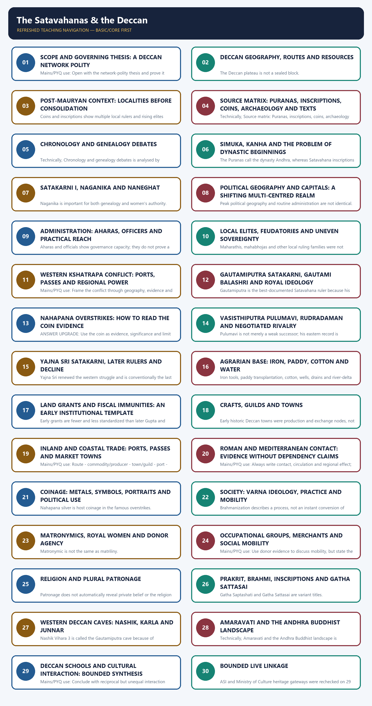

# The Satavahanas & the Deccan - Complete Topic Package

> **Subject:** Ancient Indian History | **Paper:** Prelims GS-I + GS-I | **Topic:** 17 | **Date:** 13 August 2026
>
> **Evidence key:** FACT = supported directly by a named source; INTERPRETATION = analytical reading; INFERENCE = bounded reconstruction; LIMIT = what the source cannot establish.
>
> **Approval state:** generated, **approved=false**. Only explicit user approval can change this state.

## BASIC LEARNING SESSION



*Distinct embedded teaching-navigation image. The separate continuous Cārvāka-style flowchart package remains an independent at-a-glance artifact.*

#### Package practice counts

| Component | Count |
|---|---:|
| Verified/routed PYQs | 4 |
| Hard MCQs with explanations | 48 |
| Remedial MCQs with explanations | 12 |
| Original solved 10-mark Mains | 3 |
| Original solved 15-mark Mains | 3 |
| Original solved 20-mark Mains | 3 |

#### Sources actually used

| Source class | Exact source | Use and caveat |
|---|---|---|
| Repository knowledge | Topic 17 basic/advanced; README; Master Chronology; Revision Chart; syllabus/PYQ routing; Answer-Worthiness Audit; bounded Topics 15, 16, 18, 19, 23 and 25. | Controls sequence, chronology warnings, PYQ ownership, network-polity framing and topic boundaries. |
| R. S. Sharma | *India's Ancient Past*, searchable local PDF pp. 224-233, Chapter 21. | Foundation for rulers, material culture, administration, society, religion, architecture, language and conventional dates; chronology is explicitly source-specific. |
| Upinder Singh | *A History of Ancient and Early Medieval India*, 2nd ed., searchable local PDF pp. 1009-1028, 1066-1070, 1078-1106, 1127-1128, 1153 and 1194-1227. | Analytical control for localities, Naneghat, Nashik, overstrikes, network polity, grants, towns, guilds, Roman contact, gender, caves and Amaravati; all prashasti and coin limits retained. |
| Official UPSC papers/keys | Locally held 2020 Mains GS-I, 2023 Prelims GS-I, 2026 Prelims GS-I Set A and provisional 2026 key. | Controls exact question wording and key status; the 2023 unavailable key is prominently labelled inferred. |
| Bounded official heritage | Archaeological Survey of India list of centrally protected monuments and Amaravati Circle; Ministry of Culture archaeology/ASI pages. | Present-day conservation context only; no dynastic chronology or forced current-affairs claim. |

#### Bounded authoritative heritage links

- ASI, List of Centrally Protected Monuments/Sites: https://asi.nic.in/pdf/CPM_List.pdf
- ASI, Amaravati Circle: https://asi.nic.in/pages/Amaravati-Circle
- Ministry of Culture, Archaeology: https://culture.gov.in/ministry/our-groups/archaeology
- Ministry of Culture, Archaeological Survey of India: https://culture.gov.in/our-organisations/archaeological-survey-india-new-delhi

No specific 2025-2026 Satavahana-site current-affairs claim was sufficiently useful to force into the package. Qdrant was not used because repository Markdown and OCR-searchable local books were sufficient.

#### PART I - COMPLETE LEARNING SESSION

### SESSION 1 — SCOPE AND GOVERNING THESIS: A DECCAN NETWORK POLITY

#### DEFINITION / WHAT THIS IS CALLED

**Plain-language definition:** Network polity means negotiated and layered sovereignty, not absence of kingship.

**Technical definition:** Mains/PYQ use: Open with the network-polity thesis and prove it through one inscription, one coin sequence, one local-elite example and one route or institution.

#### ANSWER-GRABBING OPENING — WRITE/ADAPT IN THE EXAM

> Network polity means negotiated and layered sovereignty, not absence of kingship.

#### MUST-WRITE KEYWORDS

- **Scope**
- **governing thesis**
- **a Deccan network polity**
- **Mains/PYQ use**
- **Study link**
- **Best polity frame**

**How to use them:** Frame the answer through Scope; define governing thesis, connect a Deccan network polity with Mains/PYQ use to explain the mechanism, and use Study link for the decisive comparison or qualification.

The Satavahanas were the first long-lived ruling house to make much of the Deccan a durable arena of state formation after the Mauryas. Their importance lies less in a single fixed border than in their ability to connect plateau agrarian zones, passes, western ports, eastern deltaic centres, local chiefs, merchants, Brahmanas and Buddhist institutions.

#### Compact visual

```text
SATAVAHANA POWER = CONNECTED NODES, NOT UNIFORM CONTROL

Royal house and mobile court
          |
          +-- aharas, amatyas, mahamatras, mahasenapatis
          +-- maharathis / mahabhojas / local ruling families
          +-- villages, cultivators, fields and fiscal rights
          +-- merchants, guilds, inland towns and ports
          `-- Brahmanical rites + Buddhist caves and stupas

Result: strong regional paramountcy, uneven direct administration.
```

#### Evidence / comparison matrix

| Question | Exam-safe answer | Necessary limit |
|---|---|---|
| Was it an empire? | A major Deccan kingdom with periods of wide paramountcy. | Do not assume uniform Mauryan-style rule. |
| Why important? | Linked north, south, coast and interior through political and commercial nodes. | Routes were not controlled equally at all times. |
| Best polity frame | Layered or network polity. | This does not mean weak or stateless rule. |

#### Core teaching / solved analysis

- FACT: Satavahana power eventually covered Andhra and Maharashtra and at times reached northern Karnataka, parts of Madhya Pradesh and Saurashtra.
- INTERPRETATION: The state integrated pre-existing local elites rather than replacing every locality with royal officials.
- EVIDENCE: Aharas, royal officers, maharathis, mahabhojas, cave donors, land grants and coin distributions reveal different layers of authority.
- LIMIT: Royal titles such as Lord of the Dakshinapatha and prashasti geography state political aspiration as well as achieved power.
- ANSWER UPGRADE: Present the dynasty as a mediator between agrarian production, commercial corridors and religious legitimacy.

#### Must-know facts

- Satavahana chronology broadly overlaps Indo-Greeks, Shakas, Kushanas and Sangam polities.
- Their archive is strongest in inscriptions, coins, caves, stupas and excavated towns.
- Network polity means negotiated and layered sovereignty, not absence of kingship.

#### UPSC traps

- **Wrong:** The Satavahanas ruled a uniformly administered peninsula. **Correct:** Their control varied by region and depended on chiefs, officers and institutional networks.
- **Wrong:** Calling the state a network makes it politically weak. **Correct:** Networked rule could mobilize tribute, warfare, grants and legitimacy over a wide but uneven zone.

**Mains/PYQ use:** Open with the network-polity thesis and prove it through one inscription, one coin sequence, one local-elite example and one route or institution.

**Study link:** Topic 15 post-Mauryan regionalization; Topic 16 Shaka conflict; Topics 18-19 southern and commercial worlds.

#### CLOSING RECALL FLOW — SCOPE AND GOVERNING THESIS: A DECCAN NETWORK POLITY

```text
START / CONCEPT: Scope and governing thesis: a Deccan network polity
        |
        v
EXACT TERMS: Scope · governing thesis · a Deccan network polity · Mains/PYQ use · Study link · Best polity frame
        |
        v
MECHANISM / ARGUMENT: Mains/PYQ use: Open with the network-polity thesis and prove it through one inscription, one coin sequence, one local-elite example and one route or institution.
        |
        v
CONSEQUENCE / CONTRAST: Correct: Networked rule could mobilize tribute, warfare, grants and legitimacy over a wide but uneven zone.
        |
        v
UPSC TRAP / ANSWER-USE: Do not miss this limiting distinction: the Satavahanas were the first long-lived ruling house to make much of the Deccan...
        |
        v
ANSWER-GRABBING FORMULATION: Network polity means negotiated and layered sovereignty, not absence of kingship.
```
### SESSION 2 — DECCAN GEOGRAPHY, ROUTES AND RESOURCES

#### DEFINITION / WHAT THIS IS CALLED

**Plain-language definition:** Naneghat is a pass joining the western coastal strip to the Deccan plateau; its royal inscription and portrait gallery turned a route into a statement of power.

**Technical definition:** The Deccan plateau is not a sealed block.

#### ANSWER-GRABBING OPENING — WRITE/ADAPT IN THE EXAM

> Naneghat is a pass joining the western coastal strip to the Deccan plateau; its royal inscription and portrait gallery turned a route into a statement of power.

#### MUST-WRITE KEYWORDS

- **Deccan geography**
- **routes**
- **resources**
- **Mains/PYQ use**
- **Study link**
- **Western Ghats passes**

**How to use them:** Frame the answer through Deccan geography; define routes, connect resources with Mains/PYQ use to explain the mechanism, and use Study link for the decisive comparison or qualification.

The Deccan plateau is not a sealed block. River valleys, basalt passes and coastal outlets created corridors between the Godavari-Krishna interior, the western seaboard, Malwa and the deep south. Political competition repeatedly focused on passes, market towns and ports because these converted geography into revenue and mobility.

#### Compact visual

```text
TEXT MAP: DECCAN ROUTES (schematic)

Malwa / Ujjayini
      |
      v
Narmada - upper Godavari - Pratishthana/Paithan - Tagara/Ter
                         |                         |
                         | via Naneghat            | eastward routes
                         v                         v
                 Kalyan / Sopara / Konkan     Telangana towns
                                                   |
                                                   v
                                      Krishna-Godavari / Dharanikota

North-south links continued toward Karnataka and Tamilakam.
```

#### Evidence / comparison matrix

| Geographic element | Political-economic use | Named anchor |
|---|---|---|
| Western Ghats passes | Connected plateau towns to Konkan ports. | Naneghat |
| Godavari corridor | Linked Pratishthana with inland and eastern routes. | Paithan-Tagara line |
| Krishna-Godavari zone | Wet-rice potential, towns and Buddhist centres. | Dharanikota-Amaravati |
| Mineral zones | Iron, lead and craft production. | Karimnagar-Warangal; lead coinage |

#### Core teaching / solved analysis

- FACT: Naneghat is a pass joining the western coastal strip to the Deccan plateau; its royal inscription and portrait gallery turned a route into a statement of power.
- FACT: The Periplus names Paithana and Tagara as inland market towns linked to western ports.
- FACT: Archaeology at Peddabankur, Dhulikatta, Kondapur, Bhokardan and Adam reveals fortified or dense settlements, wells, drains, mints and craft activity.
- INTERPRETATION: Control of routes enabled rulers and chiefs to tax movement, protect markets and patronize institutions placed near traffic.
- LIMIT: A route map shows connectivity, not continuous royal possession of every segment.

#### Must-know facts

- Pratishthana is modern Paithan on the Godavari.
- Naneghat linked the plateau with the Konkan side.
- Lower Krishna Buddhist sites belong to a long sequence that outlived the Satavahanas.

#### UPSC traps

- **Wrong:** The Deccan was merely a corridor between north and south. **Correct:** It had internal agrarian, mineral, craft and political processes of its own.
- **Wrong:** Every port-route mentioned in a text was continuously Satavahana-controlled. **Correct:** Control shifted, especially during Kshatrapa conflict.

**Mains/PYQ use:** Draw the route map and connect each corridor to a political or economic mechanism.

**Study link:** Topic 03 geography; Topic 19 commerce; Topic 18 Tamilakam.

#### CLOSING RECALL FLOW — DECCAN GEOGRAPHY, ROUTES AND RESOURCES

```text
START / CONCEPT: Deccan geography, routes and resources
        |
        v
EXACT TERMS: Deccan geography · routes · resources · Mains/PYQ use · Study link · Western Ghats passes
        |
        v
MECHANISM / ARGUMENT: Mains/PYQ use: Draw the route map and connect each corridor to a political or economic mechanism.
        |
        v
CONSEQUENCE / CONTRAST: A route map shows connectivity, not continuous royal possession of every segment.
        |
        v
UPSC TRAP / ANSWER-USE: The Deccan plateau is not a sealed block.
        |
        v
ANSWER-GRABBING FORMULATION: Naneghat is a pass joining the western coastal strip to the Deccan plateau; its royal inscription and portrait gallery turned a route into a statement of power.
```
### SESSION 3 — POST-MAURYAN CONTEXT: LOCALITIES BEFORE CONSOLIDATION

#### DEFINITION / WHAT THIS IS CALLED

**Plain-language definition:** Mains/PYQ use: Use the sequence Mauryan contact - localities - Satavahana integration to explain state formation.

**Technical definition:** Coins and inscriptions show multiple local rulers and rising elites across the Deccan before and during early Satavahana expansion.

#### ANSWER-GRABBING OPENING — WRITE/ADAPT IN THE EXAM

> Mains/PYQ use: Use the sequence Mauryan contact - localities - Satavahana integration to explain state formation.

#### MUST-WRITE KEYWORDS

- **Post-Mauryan context**
- **localities before consolidation**
- **Mains/PYQ use**
- **Study link**
- **Verrapuram coins**
- **Brahmapuri Kura coins**

**How to use them:** Frame the answer through Post-Mauryan context; define localities before consolidation, connect Mains/PYQ use with Study link to explain the mechanism, and use Verrapuram coins for the decisive comparison or qualification.

Satavahana state formation followed an interval of regional political growth rather than a simple transfer of Mauryan authority. Coins and inscriptions show multiple local rulers and rising elites across the Deccan before and during early Satavahana expansion.

#### Evidence / comparison matrix

| Evidence | What it indicates | Caution |
|---|---|---|
| Verrapuram coins | Maharathi-bearing local authority in stratified levels. | Title alone does not define one office everywhere. |
| Brahmapuri Kura coins | Pre-Satavahana ruling family or locality. | Coin circulation may exceed political core. |
| Kotalingala names | Gobhadra, Samigopa and other local rulers. | Many finds are unstratified. |
| Bhattiprolu casket inscription | Raja Khubiraka and regional elite power. | One inscription cannot map a full kingdom. |

#### Core teaching / solved analysis

- FACT: Upinder Singh, following B. D. Chattopadhyaya, stresses small principalities or localities in the post-Mauryan Deccan.
- FACT: Rathikas and Bhojas known from Ashokan-era references appear in later political vocabulary as maharathis and mahabhojas.
- INTERPRETATION: Satavahana expansion encapsulated already powerful lineages, which explains why local titles and donor roles remained visible.
- LIMIT: The political sequence differs across western, central and eastern Deccan; there was no single simultaneous transition.
- BOUNDARY: Mauryan legacy supplied some administrative vocabulary, but the Satavahana state cannot be treated as a smaller copy of the Mauryan system.

#### Must-know facts

- Local coins are crucial for the interval between Mauryas and Satavahanas.
- Maharathis and mahabhojas pre-date or stand alongside Satavahana consolidation.
- Regional archaeology complicates dynasty-first narratives.

#### UPSC traps

- **Wrong:** Mauryan decline created a political vacuum. **Correct:** Local ruling families and elites expanded within differentiated sub-regions.
- **Wrong:** The Satavahanas invented every Deccan institution. **Correct:** They inherited and reorganized pre-existing political and social formations.

**Mains/PYQ use:** Use the sequence Mauryan contact -> localities -> Satavahana integration to explain state formation.

**Study link:** Topic 15 continuity and regionalization after Mauryas.

#### CLOSING RECALL FLOW — POST-MAURYAN CONTEXT: LOCALITIES BEFORE CONSOLIDATION

```text
START / CONCEPT: Post-Mauryan context: localities before consolidation
        |
        v
EXACT TERMS: Post-Mauryan context · localities before consolidation · Mains/PYQ use · Study link · Verrapuram coins · Brahmapuri Kura coins
        |
        v
MECHANISM / ARGUMENT: Coins and inscriptions show multiple local rulers and rising elites across the Deccan before and during early Satavahana expansion.
        |
        v
CONSEQUENCE / CONTRAST: Satavahana state formation followed an interval of regional political growth rather than a simple transfer of Mauryan authority.
        |
        v
UPSC TRAP / ANSWER-USE: Do not miss this limiting distinction: satavahana expansion encapsulated already powerful lineages, which explains why local titles and donor roles...
        |
        v
ANSWER-GRABBING FORMULATION: Mains/PYQ use: Use the sequence Mauryan contact - localities - Satavahana integration to explain state formation.
```
### SESSION 4 — SOURCE MATRIX: PURANAS, INSCRIPTIONS, COINS, ARCHAEOLOGY AND TEXTS

#### DEFINITION / WHAT THIS IS CALLED

**Plain-language definition:** Naneghat and Nashik inscriptions are central for early rulers, rituals, genealogy, Gautamiputra and grants.

**Technical definition:** Technically, Source matrix: Puranas, inscriptions, coins, archaeology and texts is analysed by relating Source matrix to Puranas, then testing the relationship through inscriptions and coins.

#### ANSWER-GRABBING OPENING — WRITE/ADAPT IN THE EXAM

> Naneghat and Nashik inscriptions are central for early rulers, rituals, genealogy, Gautamiputra and grants.

#### MUST-WRITE KEYWORDS

- **Source matrix**
- **Puranas**
- **inscriptions**
- **coins**
- **archaeology**
- **texts**

**How to use them:** Frame the answer through Source matrix; define Puranas, connect inscriptions with coins to explain the mechanism, and use archaeology for the decisive comparison or qualification.

Satavahana history has no continuous court chronicle. It must be reconstructed by triangulating king-lists, royal and donative inscriptions, coin sequences, overstrikes, excavated settlements, caves, stupas and external commercial notices.

#### Evidence / comparison matrix

| Source class | High-value information | Limit |
|---|---|---|
| Puranas | Dynastic memory, number of kings, broad duration. | Lists and total years conflict; Andhra/Satavahana identity debated. |
| Inscriptions | Names, titles, rites, grants, donors, political claims. | Damage, formula and prashasti exaggeration. |
| Coins | Ruler names, symbols, metals, overstrikes, distributions. | Find spot or circulation is not automatically sovereignty. |
| Archaeology | Towns, crafts, fortifications, wells, drains, monasteries. | Dating and ruler attribution may remain uncertain. |
| External texts | Ports, routes, market towns and commodities. | Genre, hearsay and outsider perspective. |

#### Core teaching / solved analysis

- FACT: Puranic lists vary between a long chronology of about 30 kings and 460 years and shorter reconstructions.
- FACT: Naneghat and Nashik inscriptions are central for early rulers, rituals, genealogy, Gautamiputra and grants.
- FACT: Coin finds identify later rulers absent from Puranic lists and record conflict through restriking.
- FACT: The Periplus and Pliny illuminate trade and Andhra urban claims but are not administrative surveys.
- METHOD: For every claim state source -> what it proves -> what it cannot prove.

#### Must-know facts

- Prashasti means eulogy; it contains evidence and ideology together.
- Puranic lists cannot be harmonized by silently choosing one sequence.
- A coin hoard gives chronology and circulation clues, not a complete border map.

#### UPSC traps

- **Wrong:** An inscription is true because it is contemporary. **Correct:** Contemporary royal records remain selective and rhetorical.
- **Wrong:** Puranic duration is a fixed calendar. **Correct:** Different recensions preserve conflicting numbers and sequences.

**Mains/PYQ use:** A source-criticism paragraph is mandatory in chronology, extent, social order and decline answers.

**Study link:** Topic 02 source method; Topic 16 coin and prashasti cautions.

#### CLOSING RECALL FLOW — SOURCE MATRIX: PURANAS, INSCRIPTIONS, COINS, ARCHAEOLOGY AND TEXTS

```text
START / CONCEPT: Source matrix: Puranas, inscriptions, coins, archaeology and texts
        |
        v
EXACT TERMS: Source matrix · Puranas · inscriptions · coins · archaeology · texts
        |
        v
MECHANISM / ARGUMENT: It must be reconstructed by triangulating king-lists, royal and donative inscriptions, coin sequences, overstrikes, excavated settlements, caves, stupas and external commercial notices.
        |
        v
CONSEQUENCE / CONTRAST: The Periplus and Pliny illuminate trade and Andhra urban claims but are not administrative surveys.
        |
        v
UPSC TRAP / ANSWER-USE: Wrong: An inscription is true because it is contemporary.
        |
        v
ANSWER-GRABBING FORMULATION: Naneghat and Nashik inscriptions are central for early rulers, rituals, genealogy, Gautamiputra and grants.
```
### SESSION 5 — CHRONOLOGY AND GENEALOGY DEBATES

#### DEFINITION / WHAT THIS IS CALLED

**Plain-language definition:** A genealogy diagram must not imply that missing reigns are known or that every Pulumavi and Satakarni is easily identified.

**Technical definition:** Technically, Chronology and genealogy debates is analysed by relating Chronology to genealogy debates, then testing the relationship through Mains/PYQ use and Study link.

#### ANSWER-GRABBING OPENING — WRITE/ADAPT IN THE EXAM

> A genealogy diagram must not imply that missing reigns are known or that every Pulumavi and Satakarni is easily identified.

#### MUST-WRITE KEYWORDS

- **Chronology**
- **genealogy debates**
- **Mains/PYQ use**
- **Study link**
- **Early/mid-2nd c. BCE onward**
- **1st c. BCE**

**How to use them:** Frame the answer through Chronology; define genealogy debates, connect Mains/PYQ use with Study link to explain the mechanism, and use Early/mid-2nd c. BCE onward for the decisive comparison or qualification.

The sequence of several major rulers is clearer than their absolute dates. A safe answer combines a broad dynastic span with source-specific conventional dates and explicitly marks disagreement.

#### Compact visual

```text
GENEALOGY / SEQUENCE (simplified, not a complete king-list)

Simuka
  |
Kanha (brother)
  |
Satakarni I -- Queen Naganika/Nayanika
  |
... intervening rulers including Hala tradition ...
  |
Gautamiputra Satakarni -- praised by Gautami Balashri
  |
Vasisthiputra Pulumavi
  |
... later rulers ...
  |
Yajna Sri Satakarni
  |
later coin-known rulers -> regional fragmentation
```

#### Timeline

| Phase | Marker |
|---|---|
| Early/mid-2nd c. BCE onward | One major reconstruction for dynastic beginnings; exact start debated. |
| 1st c. BCE | Naneghat royal inscription and early western Deccan expansion. |
| Early 2nd c. CE | Gautamiputra-Nahapana conflict; conventional RS dates 106-130 CE. |
| Mid-2nd c. CE | Pulumavi and Rudradaman phase. |
| Late 2nd c. CE | Yajna Sri Satakarni and renewed western reach. |
| Mid-3rd c. CE | End of dynasty in Upinder Singh's broad chronology. |

#### Core teaching / solved analysis

- FACT: Simuka is conventionally treated as founder, followed by his brother Kanha and then Satakarni I.
- FACT: Some Puranic rulers are not epigraphically or numismatically secure, while some coin-known rulers are absent from lists.
- FACT: RS Sharma supplies ruler-specific dates useful for examination chronology; Upinder Singh emphasizes wider uncertainty.
- LIMIT: A genealogy diagram must not imply that missing reigns are known or that every Pulumavi and Satakarni is easily identified.
- ANSWER RULE: Use broad phases, not false day-and-year precision.

#### Must-know facts

- Simuka, Satakarni I, Gautamiputra, Vasisthiputra Pulumavi and Yajna Sri are distinct anchors.
- Hala's literary association is not a secure chronological biography.
- The dynasty ends broadly by the mid-3rd century CE, though older textbook terminal dates vary.

#### UPSC traps

- **Wrong:** All Puranic kings can be matched to coins and inscriptions. **Correct:** The archives overlap only partially.
- **Wrong:** One exact Satavahana chronology is universally accepted. **Correct:** Both beginning and several reign dates remain debated.

**Mains/PYQ use:** Use a broad timeline followed by a sentence explaining why absolute dates remain contested.

**Study link:** Master Chronology and Topic 16 contemporaneous Shaka-Kushana phases.

#### CLOSING RECALL FLOW — CHRONOLOGY AND GENEALOGY DEBATES

```text
START / CONCEPT: Chronology and genealogy debates
        |
        v
EXACT TERMS: Chronology · genealogy debates · Mains/PYQ use · Study link · Early/mid-2nd c. BCE onward · 1st c. BCE
        |
        v
MECHANISM / ARGUMENT: Mains/PYQ use: Use a broad timeline followed by a sentence explaining why absolute dates remain contested.
        |
        v
CONSEQUENCE / CONTRAST: Some Puranic rulers are not epigraphically or numismatically secure, while some coin-known rulers are absent from lists.
        |
        v
UPSC TRAP / ANSWER-USE: ANSWER RULE: Use broad phases, not false day-and-year precision.
        |
        v
ANSWER-GRABBING FORMULATION: A genealogy diagram must not imply that missing reigns are known or that every Pulumavi and Satakarni is easily identified.
```
### SESSION 6 — SIMUKA, KANHA AND THE PROBLEM OF DYNASTIC BEGINNINGS

#### DEFINITION / WHAT THIS IS CALLED

**Plain-language definition:** Kanha is Simuka's brother in the standard sequence.

**Technical definition:** The Puranas call the dynasty Andhra, whereas Satavahana inscriptions do not use Andhra as the dynastic name.

#### ANSWER-GRABBING OPENING — WRITE/ADAPT IN THE EXAM

> The Puranas call the dynasty Andhra, whereas Satavahana inscriptions do not use Andhra as the dynastic name.

#### MUST-WRITE KEYWORDS

- **Simuka**
- **Kanha**
- **the problem of dynastic beginnings**
- **Mains/PYQ use**
- **Study link**
- **Simuka as founder**

**How to use them:** Frame the answer through Simuka; define Kanha, connect the problem of dynastic beginnings with Mains/PYQ use to explain the mechanism, and use Study link for the decisive comparison or qualification.

The earliest phase is reconstructed from later lists, labels, inscriptions and coins rather than a secure foundation narrative. The central debate is whether initial consolidation began in the western Deccan around Pratishthana or had an eastern base reflected in early coin finds.

#### Evidence / comparison matrix

| Claim | Supporting evidence | Qualification |
|---|---|---|
| Simuka as founder | Puranic/genealogical tradition and Naneghat label. | Absolute date and early territorial base remain debated. |
| Kanha expanded west | Nashik-area inscriptional presence. | Extent cannot be reconstructed as a modern map. |
| Eastern-origin hypothesis | Early coin finds at Kotalingala and Sangareddy. | Coin evidence must be read with context. |
| Western-origin hypothesis | Naneghat and Nashik inscriptions; Pratishthana route zone. | Later prominence may bias survival. |

#### Core teaching / solved analysis

- FACT: The Puranas call the dynasty Andhra, whereas Satavahana inscriptions do not use Andhra as the dynastic name.
- INTERPRETATION: Andhra may indicate region, people, later memory or a complex identification; it is not a simple proof of one birthplace.
- FACT: Kanha's evidence at Nashik demonstrates early western reach.
- LIMIT: Foundation stories often retroject later territorial identity backward.
- VERDICT: State formation was probably multi-regional and cumulative, even if one core preceded another.

#### Must-know facts

- Andhra and Satavahana are related historical labels but not interchangeable without explanation.
- Kanha is Simuka's brother in the standard sequence.
- Origin debates depend on how coins and inscriptions are weighted.

#### UPSC traps

- **Wrong:** Puranic use of Andhra settles the capital and birthplace. **Correct:** It provides dynastic memory but not a complete geographic proof.
- **Wrong:** The western and eastern hypotheses cannot both contain evidence. **Correct:** They can reflect different phases of expansion and uneven survival.

**Mains/PYQ use:** Present both origin hypotheses, rank their evidence and refuse a categorical verdict.

**Study link:** Source matrix and political-geography section.

#### CLOSING RECALL FLOW — SIMUKA, KANHA AND THE PROBLEM OF DYNASTIC BEGINNINGS

```text
START / CONCEPT: Simuka, Kanha and the problem of dynastic beginnings
        |
        v
EXACT TERMS: Simuka · Kanha · the problem of dynastic beginnings · Mains/PYQ use · Study link · Simuka as founder
        |
        v
MECHANISM / ARGUMENT: Origin debates depend on how coins and inscriptions are weighted.
        |
        v
CONSEQUENCE / CONTRAST: Correct: It provides dynastic memory but not a complete geographic proof.
        |
        v
UPSC TRAP / ANSWER-USE: INTERPRETATION: Andhra may indicate region, people, later memory or a complex identification; it is not a simple proof of one birthplace.
        |
        v
ANSWER-GRABBING FORMULATION: The Puranas call the dynasty Andhra, whereas Satavahana inscriptions do not use Andhra as the dynastic name.
```
### SESSION 7 — SATAKARNI I, NAGANIKA AND NANEGHAT

#### DEFINITION / WHAT THIS IS CALLED

**Plain-language definition:** Naneghat is not a Buddhist monastic cave in the same sense as Karla or Nashik viharas.

**Technical definition:** Naganika is important for both genealogy and women's authority.

#### ANSWER-GRABBING OPENING — WRITE/ADAPT IN THE EXAM

> Naneghat is not a Buddhist monastic cave in the same sense as Karla or Nashik viharas.

#### MUST-WRITE KEYWORDS

- **Satakarni I**
- **Naganika**
- **Naneghat**
- **Mains/PYQ use**
- **Study link**
- **Labelled portraits**

**How to use them:** Frame the answer through Satakarni I; define Naganika, connect Naneghat with Mains/PYQ use to explain the mechanism, and use Study link for the decisive comparison or qualification.

Naneghat combines a strategic pass, a damaged royal portrait gallery and a long Prakrit inscription associated with Queen Naganika or Nayanika. It is evidence for genealogy, Brahmanical legitimation, royal women and route politics.

#### Evidence / comparison matrix

| Naneghat feature | Historical use | Limit |
|---|---|---|
| Labelled portraits | Names Simuka, Naganika, Satakarni and princes. | Only traces survive; reconstruction is partial. |
| Sacrifice list | Rajasuya, two ashvamedhas and other rites. | Royal ideology and ritual claim, not popular religious census. |
| Dakshina list | Coins, cattle, horses, chariots and villages. | Normative or eulogistic scale may be inflated. |
| Pass location | Political theatre on coast-plateau corridor. | Route promotion is a strong inference, not a toll ledger. |

#### Core teaching / solved analysis

- FACT: Satakarni I appears with Queen Naganika/Nayanika in the Naneghat record and portrait programme.
- FACT: The inscription invokes Brahmanical deities and records costly shrauta sacrifices and dakshina.
- FACT: The queen is presented as an authoritative royal widow and ritual actor.
- INTERPRETATION: Portraits, inscription, cisterns and pass location fused royal genealogy with commercial geography.
- LIMIT: The damaged inscription does not permit a complete biography or exact revenue reconstruction.

#### Must-know facts

- Naneghat is not a Buddhist monastic cave in the same sense as Karla or Nashik viharas.
- Naganika is important for both genealogy and women's authority.
- The record has a strong Brahmanical ritual stamp.

#### UPSC traps

- **Wrong:** Naneghat proves an exclusively Brahmanical Satavahana society. **Correct:** It records royal legitimation; other inscriptions show Buddhist patronage and diverse donors.
- **Wrong:** Queen Naganika proves female succession. **Correct:** She demonstrates authority and ritual agency within a continuing dynastic framework.

**Mains/PYQ use:** Use Naneghat as a four-dimensional evidence unit: route, genealogy, ritual and royal women.

**Study link:** Society, religion and route geography.

#### CLOSING RECALL FLOW — SATAKARNI I, NAGANIKA AND NANEGHAT

```text
START / CONCEPT: Satakarni I, Naganika and Naneghat
        |
        v
EXACT TERMS: Satakarni I · Naganika · Naneghat · Mains/PYQ use · Study link · Labelled portraits
        |
        v
MECHANISM / ARGUMENT: Mains/PYQ use: Use Naneghat as a four-dimensional evidence unit: route, genealogy, ritual and royal women.
        |
        v
CONSEQUENCE / CONTRAST: The damaged inscription does not permit a complete biography or exact revenue reconstruction.
        |
        v
UPSC TRAP / ANSWER-USE: Do not miss this limiting distinction: naganika is important for both genealogy and women's authority.
        |
        v
ANSWER-GRABBING FORMULATION: Naneghat is not a Buddhist monastic cave in the same sense as Karla or Nashik viharas.
```
### SESSION 8 — POLITICAL GEOGRAPHY AND CAPITALS: A SHIFTING MULTI-CENTRED REALM

#### DEFINITION / WHAT THIS IS CALLED

**Plain-language definition:** The safest formulation is a realm with changing political centres rather than one undisputed capital for every reign.

**Technical definition:** Peak political geography and routine administration are not identical.

#### ANSWER-GRABBING OPENING — WRITE/ADAPT IN THE EXAM

> The safest formulation is a realm with changing political centres rather than one undisputed capital for every reign.

#### MUST-WRITE KEYWORDS

- **Political geography**
- **capitals**
- **a shifting multi-centred realm**
- **Mains/PYQ use**
- **Study link**
- **Pratishthana/Paithan**

**How to use them:** Frame the answer through Political geography; define capitals, connect a shifting multi-centred realm with Mains/PYQ use to explain the mechanism, and use Study link for the decisive comparison or qualification.

Pratishthana or Paithan is a major western Deccan centre, while Dharanikota-Dhanyakataka and the lower Krishna zone became important in later eastern phases. The safest formulation is a realm with changing political centres rather than one undisputed capital for every reign.

#### Evidence / comparison matrix

| Centre/zone | Role | Caution |
|---|---|---|
| Pratishthana/Paithan | Godavari centre and principal western capital association. | Do not make it the only centre across three centuries. |
| Nashik-Junnar-Pune zone | Caves, grants, officials and Kshatrapa contest. | Political control changed hands. |
| Dharanikota/Amaravati zone | Eastern urban-monastic centre and later capital association. | Amaravati's sequence begins earlier and continues later. |
| Malwa-Konkan-Saurashtra | Peak claims and contested western access. | Often indirect or temporary control. |

#### Core teaching / solved analysis

- FACT: Vasisthiputra Pulumavi's coins are widespread in Andhra, showing stronger eastern integration.
- FACT: Gautamiputra's Nashik prashasti names many regions across central and southern India.
- FACT: Rudradaman's Junagadh record demonstrates that western zones were contested rather than permanently Satavahana.
- INTERPRETATION: Capitals, camps, route centres and monastic nodes formed a political geography of movement.
- LIMIT: Literary and inscriptional region names do not always translate into directly governed provinces.

#### Must-know facts

- Paithan equals Pratishthana.
- Dharanikota is associated with the Amaravati urban-monastic landscape.
- Peak political geography and routine administration are not identical.

#### UPSC traps

- **Wrong:** The Satavahana capital was permanently fixed at one city. **Correct:** Different phases and source traditions point to multiple centres.
- **Wrong:** A region named in a prashasti was uniformly annexed. **Correct:** The claim must be checked against coins, rival inscriptions and local elites.

**Mains/PYQ use:** A text map is more accurate than a hard frontier line.

**Study link:** Chronology, network polity and Kshatrapa conflict.

#### CLOSING RECALL FLOW — POLITICAL GEOGRAPHY AND CAPITALS: A SHIFTING MULTI-CENTRED REALM

```text
START / CONCEPT: Political geography and capitals: a shifting multi-centred realm
        |
        v
EXACT TERMS: Political geography · capitals · a shifting multi-centred realm · Mains/PYQ use · Study link · Pratishthana/Paithan
        |
        v
MECHANISM / ARGUMENT: INTERPRETATION: Capitals, camps, route centres and monastic nodes formed a political geography of movement.
        |
        v
CONSEQUENCE / CONTRAST: Peak political geography and routine administration are not identical.
        |
        v
UPSC TRAP / ANSWER-USE: Pratishthana or Paithan is a major western Deccan centre, while Dharanikota-Dhanyakataka and the lower Krishna zone became important in later eastern phases.
        |
        v
ANSWER-GRABBING FORMULATION: The safest formulation is a realm with changing political centres rather than one undisputed capital for every reign.
```
### SESSION 9 — ADMINISTRATION: AHARAS, OFFICERS AND PRACTICAL REACH

#### DEFINITION / WHAT THIS IS CALLED

**Plain-language definition:** Ahara is a high-yield district term.

**Technical definition:** Aharas and officials show governance capacity; they do not prove a fully centralized bureaucratic grid.

#### ANSWER-GRABBING OPENING — WRITE/ADAPT IN THE EXAM

> Aharas and officials show governance capacity; they do not prove a fully centralized bureaucratic grid.

#### MUST-WRITE KEYWORDS

- **Administration**
- **aharas**
- **officers**
- **practical reach**
- **Mains/PYQ use**
- **Study link**

**How to use them:** Frame the answer through Administration; define aharas, connect officers with practical reach to explain the mechanism, and use Mains/PYQ use for the decisive comparison or qualification.

Satavahana administration reused some earlier vocabulary but operated in a different political environment. Aharas and officials show governance capacity; they do not prove a fully centralized bureaucratic grid.

#### Evidence / comparison matrix

| Term | Exam meaning | Source caution |
|---|---|---|
| Ahara | Large administrative division or district. | Boundaries and uniform functions are not fully known. |
| Amatya / mahamatra | Ministerial or high official vocabulary. | Continuity of term does not equal Mauryan institutional identity. |
| Mahasenapati / senapati | High military office; sometimes regional authority. | Titles may combine military and political roles. |
| Gramika | Village headman. | Village practice is unevenly recorded. |
| Kataka / skandhavara | Camp or mobile administrative-military centre. | Presence reflects mobility, not a permanent capital. |

#### Core teaching / solved analysis

- FACT: Inscriptions mention aharas, amatyas, mahamatras, mahasenapatis, scribes and record keepers.
- FACT: Villages were governed through local headmen called gramikas.
- FACT: Military-camp vocabulary suggests itinerant royal presence and coercive capacity.
- INTERPRETATION: Administration combined written orders, officials, local intermediaries and mobile force.
- LIMIT: The archive is too fragmentary to construct a ministry-by-ministry constitution.

#### Must-know facts

- Ahara is a high-yield district term.
- Administrative continuity with Mauryan vocabulary should be qualified.
- Record keepers show documentary practice, especially around grants.

#### UPSC traps

- **Wrong:** Aharas prove Mauryan-level centralization. **Correct:** They prove administrative divisions, not identical state depth.
- **Wrong:** Senapati was only a battlefield commander. **Correct:** Military titles could carry provincial or local political authority.

**Mains/PYQ use:** Pair each official term with a sentence on evidentiary limits.

**Study link:** Mauryan administration comparison and network-polity diagram.

#### CLOSING RECALL FLOW — ADMINISTRATION: AHARAS, OFFICERS AND PRACTICAL REACH

```text
START / CONCEPT: Administration: aharas, officers and practical reach
        |
        v
EXACT TERMS: Administration · aharas · officers · practical reach · Mains/PYQ use · Study link
        |
        v
MECHANISM / ARGUMENT: The archive is too fragmentary to construct a ministry-by-ministry constitution.
        |
        v
CONSEQUENCE / CONTRAST: Correct: They prove administrative divisions, not identical state depth.
        |
        v
UPSC TRAP / ANSWER-USE: Do not miss this limiting distinction: pair each official term with a sentence on evidentiary limits.
        |
        v
ANSWER-GRABBING FORMULATION: Aharas and officials show governance capacity; they do not prove a fully centralized bureaucratic grid.
```
### SESSION 10 — LOCAL ELITES, FEUDATORIES AND UNEVEN SOVEREIGNTY

#### DEFINITION / WHAT THIS IS CALLED

**Plain-language definition:** The later term feudatory is analytically useful only if it does not impose a fixed medieval hierarchy on every case.

**Technical definition:** Maharathis, mahabhojas and other local ruling families were not incidental.

#### ANSWER-GRABBING OPENING — WRITE/ADAPT IN THE EXAM

> Maharathis, mahabhojas and other local ruling families were not incidental.

#### MUST-WRITE KEYWORDS

- **Local elites**
- **feudatories**
- **uneven sovereignty**
- **Mains/PYQ use**
- **Study link**
- **Maharathis**

**How to use them:** Frame the answer through Local elites; define feudatories, connect uneven sovereignty with Mains/PYQ use to explain the mechanism, and use Study link for the decisive comparison or qualification.

Maharathis, mahabhojas and other local ruling families were not incidental. They had coins, marriage ties, donor visibility and territorial bases. Satavahana rule worked by subordinating, allying with or enclosing these powers.

#### Compact visual

```text
LAYERED SOVEREIGNTY

Satavahana raja
      |
      +-- royal officers and aharas
      |
      +-- maharathi / mahabhoja lineages
      |       +-- local land and followers
      |       +-- matrimonial ties
      |       `-- cave and monastery donations
      |
      +-- Kura / Ananda / Sada and other regional families
      |
      `-- village heads, merchants, guilds and religious donees

Power flowed through incorporation, not simple replacement.
```

#### Core teaching / solved analysis

- FACT: Maharathis and mahabhojas appear as donors at western Deccan Buddhist caves.
- FACT: They had matrimonial connections with Satavahanas and among themselves.
- FACT: Coin evidence points to Kura, Ananda, Sada and other regional families.
- INTERPRETATION: Local elites supplied regional anchorage, resources, marriage alliances and institutional patronage.
- LIMIT: The later term feudatory is analytically useful only if it does not impose a fixed medieval hierarchy on every case.

#### Must-know facts

- Maharathi and mahabhoja are political titles with regional histories.
- Local elites persisted before, during and after Satavahana paramountcy.
- Donor inscriptions are political evidence as well as religious records.

#### UPSC traps

- **Wrong:** Local chiefs disappeared under Satavahana administration. **Correct:** They remained visible and were integrated into the polity.
- **Wrong:** Every cave donor was a royal official. **Correct:** Donors included chiefs, merchants, artisans, monks, nuns and householders.

**Mains/PYQ use:** This is the strongest evidence for questioning the centralized-empire model.

**Study link:** Post-Mauryan localities and donation networks.

#### CLOSING RECALL FLOW — LOCAL ELITES, FEUDATORIES AND UNEVEN SOVEREIGNTY

```text
START / CONCEPT: Local elites, feudatories and uneven sovereignty
        |
        v
EXACT TERMS: Local elites · feudatories · uneven sovereignty · Mains/PYQ use · Study link · Maharathis
        |
        v
MECHANISM / ARGUMENT: The later term feudatory is analytically useful only if it does not impose a fixed medieval hierarchy on every case.
        |
        v
CONSEQUENCE / CONTRAST: Mains/PYQ use: This is the strongest evidence for questioning the centralized-empire model.
        |
        v
UPSC TRAP / ANSWER-USE: Do not miss this limiting distinction: they had coins, marriage ties, donor visibility and territorial bases.
        |
        v
ANSWER-GRABBING FORMULATION: Maharathis, mahabhojas and other local ruling families were not incidental.
```
### SESSION 11 — WESTERN KSHATRAPA CONFLICT: PORTS, PASSES AND REGIONAL POWER

#### DEFINITION / WHAT THIS IS CALLED

**Plain-language definition:** Ports and passes explain why the same regions recur in conflict.

**Technical definition:** Mains/PYQ use: Frame the conflict through geography, evidence and changing control rather than a ruler list.

#### ANSWER-GRABBING OPENING — WRITE/ADAPT IN THE EXAM

> Ports and passes explain why the same regions recur in conflict.

#### MUST-WRITE KEYWORDS

- **Western Kshatrapa conflict**
- **ports**
- **passes**
- **regional power**
- **Mains/PYQ use**
- **Study link**

**How to use them:** Frame the answer through Western Kshatrapa conflict; define ports, connect passes with regional power to explain the mechanism, and use Mains/PYQ use for the decisive comparison or qualification.

Satavahana-Kshatrapa warfare was not simply ethnic rivalry. It concerned the western Deccan, Malwa, northern Konkan and access to ports such as Bhrigukachchha, Kalyan and Suparaka. Control changed hands across generations.

#### Causal / analytical flow

1. Kshaharata expansion under Nahapana into western Deccan route zones
2. Ushavadata donations at Nashik and Karla signal authority and public patronage
3. Gautamiputra defeats Nahapana and recovers southern Kshaharata territories
4. Kardamakas under Chashtana and Rudradaman regain western zones
5. Yajna Sri later renews Satavahana western activity

#### Evidence / comparison matrix

| Evidence | Political meaning | Limit |
|---|---|---|
| Nashik/Karla inscriptions of Ushavadata | Kshaharata presence and patronage in route-cave zone. | Donation is not a complete frontier map. |
| Gautamiputra inscriptions | Recovery of Nashik-Pune areas and transferred land jurisdiction. | Royal claim requires corroboration. |
| Nahapana overstrikes | Defeat, coin stock appropriation and restored authority. | Overstrike alone does not date every conquest. |
| Junagadh prashasti | Rudradaman twice defeated a Satakarni and held western regions. | Identity and rhetoric require caution. |

#### Core teaching / solved analysis

- FACT: Nahapana's son-in-law Ushavadata made major donative and endowment records in Nashik and Karla caves.
- FACT: The conflict repeatedly involved access to the western seaboard.
- FACT: Matrimonial ties linked the rival houses even while warfare continued.
- INTERPRETATION: Conflict and kinship were complementary tools of regional politics.
- LIMIT: No single battle permanently settled the western Deccan.

#### Must-know facts

- Nahapana belongs to the Kshaharata line.
- Rudradaman belongs to the Kardamaka line.
- Ports and passes explain why the same regions recur in conflict.

#### UPSC traps

- **Wrong:** Satavahana-Shaka war was one decisive event. **Correct:** It was a prolonged regional contest with recovery and counter-recovery.
- **Wrong:** Intermarriage ended warfare. **Correct:** Kinship could limit destruction without removing strategic rivalry.

**Mains/PYQ use:** Frame the conflict through geography, evidence and changing control rather than a ruler list.

**Study link:** Topic 16 Shakas and satraps.

#### CLOSING RECALL FLOW — WESTERN KSHATRAPA CONFLICT: PORTS, PASSES AND REGIONAL POWER

```text
START / CONCEPT: Western Kshatrapa conflict: ports, passes and regional power
        |
        v
EXACT TERMS: Western Kshatrapa conflict · ports · passes · regional power · Mains/PYQ use · Study link
        |
        v
MECHANISM / ARGUMENT: Mains/PYQ use: Frame the conflict through geography, evidence and changing control rather than a ruler list.
        |
        v
CONSEQUENCE / CONTRAST: INTERPRETATION: Conflict and kinship were complementary tools of regional politics.
        |
        v
UPSC TRAP / ANSWER-USE: Satavahana-Kshatrapa warfare was not simply ethnic rivalry.
        |
        v
ANSWER-GRABBING FORMULATION: Ports and passes explain why the same regions recur in conflict.
```
### SESSION 12 — GAUTAMIPUTRA SATAKARNI, GAUTAMI BALASHRI AND ROYAL IDEOLOGY

#### DEFINITION / WHAT THIS IS CALLED

**Plain-language definition:** Gautami Balashri, not Gautamiputra himself, is the eulogizing donor voice.

**Technical definition:** Gautamiputra is the best-documented Satavahana ruler because his military recovery is supported by a Nashik inscription, transferred grant jurisdiction, coin overstrikes and eastern coin finds.

#### ANSWER-GRABBING OPENING — WRITE/ADAPT IN THE EXAM

> Gautami Balashri, not Gautamiputra himself, is the eulogizing donor voice.

#### MUST-WRITE KEYWORDS

- **Gautamiputra Satakarni**
- **Gautami Balashri**
- **royal ideology**
- **Mains/PYQ use**
- **Study link**
- **Exterminator of Kshaharatas**

**How to use them:** Frame the answer through Gautamiputra Satakarni; define Gautami Balashri, connect royal ideology with Mains/PYQ use to explain the mechanism, and use Study link for the decisive comparison or qualification.

Gautamiputra is the best-documented Satavahana ruler because his military recovery is supported by a Nashik inscription, transferred grant jurisdiction, coin overstrikes and eastern coin finds. Yet the celebrated portrait comes from a posthumous eulogy composed by his mother Gautami Balashri.

#### Evidence / comparison matrix

| Claim in/around the Nashik record | Historical use | Qualification |
|---|---|---|
| Exterminator of Kshaharatas | Matches Nahapana defeat and overstrikes. | Victory does not establish permanent rule over all listed lands. |
| Restorer of Satavahana glory | Dynastic recovery after Kshatrapa pressure. | Formula of legitimation. |
| Peerless Brahmana | Royal self-fashioning and varna ideology. | Not a demographic description of Deccan society. |
| Prevented varna mixture | Normative claim about social order. | Cannot prove actual endogamy or social uniformity. |
| Horses drank three oceans | Universalizing kingship rhetoric. | Not literal administrative control of three coasts. |

#### Core teaching / solved analysis

- FACT: Gautami Balashri's inscription was engraved after Gautamiputra's death, during Pulumavi's reign.
- FACT: It names many regions and enemies, including Shakas, Yavanas and Pahlavas.
- FACT: It also praises fair taxation, festivals and the king's obedience to his mother.
- INTERPRETATION: The text combines political geography, maternal dynastic authority, Brahmanical ideology and ideal kingship.
- LIMIT: Varna and universal conquest claims are ideological statements requiring material corroboration.

#### Must-know facts

- Gautami Balashri, not Gautamiputra himself, is the eulogizing donor voice.
- The inscription is both evidence and prashasti.
- Gautamiputra's coin finds in the eastern Deccan broaden the picture beyond Nashik.

#### UPSC traps

- **Wrong:** The Nashik prashasti is a neutral biography. **Correct:** It is a posthumous dynastic eulogy with recoverable historical data.
- **Wrong:** Varna-restoration language records social reality. **Correct:** It records royal ideology and desired order.

**Mains/PYQ use:** Quote no grand claim without attaching a prashasti caveat.

**Study link:** Source criticism, society and overstrike guide.

#### CLOSING RECALL FLOW — GAUTAMIPUTRA SATAKARNI, GAUTAMI BALASHRI AND ROYAL IDEOLOGY

```text
START / CONCEPT: Gautamiputra Satakarni, Gautami Balashri and royal ideology
        |
        v
EXACT TERMS: Gautamiputra Satakarni · Gautami Balashri · royal ideology · Mains/PYQ use · Study link · Exterminator of Kshaharatas
        |
        v
MECHANISM / ARGUMENT: Gautamiputra is the best-documented Satavahana ruler because his military recovery is supported by a Nashik inscription, transferred grant jurisdiction, coin overstrikes and eastern coin finds.
        |
        v
CONSEQUENCE / CONTRAST: Gautami Balashri's inscription was engraved after Gautamiputra's death, during Pulumavi's reign.
        |
        v
UPSC TRAP / ANSWER-USE: Do not miss this limiting distinction: quote no grand claim without attaching a prashasti caveat.
        |
        v
ANSWER-GRABBING FORMULATION: Gautami Balashri, not Gautamiputra himself, is the eulogizing donor voice.
```
### SESSION 13 — NAHAPANA OVERSTRIKES: HOW TO READ THE COIN EVIDENCE

#### DEFINITION / WHAT THIS IS CALLED

**Plain-language definition:** Gautamiputra's overstrikes are among the strongest event-material correlations in the topic.

**Technical definition:** ANSWER UPGRADE: Use the coin as evidence, significance and limit in one compact sentence.

#### ANSWER-GRABBING OPENING — WRITE/ADAPT IN THE EXAM

> Overstrikes do not independently identify the duration or exact boundaries of restored rule.

#### MUST-WRITE KEYWORDS

- **Nahapana overstrikes**
- **how to read the coin evidence**
- **Mains/PYQ use**
- **Study link**
- **Same silver stock restruck**
- **Large hoard in Nashik region**

**How to use them:** Frame the answer through Nahapana overstrikes; define how to read the coin evidence, connect Mains/PYQ use with Study link to explain the mechanism, and use Same silver stock restruck for the decisive comparison or qualification.

The Jogalthambi hoard near Nashik contained more than 8,000 silver coins of Nahapana in the RS Sharma account, many restruck by Gautamiputra. This is powerful evidence of political reversal, but it must be interpreted as a specific numismatic act.

#### Compact visual

```text
OVERSTRIKE READING GUIDE

1. Identify host coin: Nahapana name/type/metal.
2. Identify new strike: Gautamiputra symbols or legends.
3. Establish context: hoard, find spot, die and wear.
4. Infer: conquest, authority replacement, metal reuse, currency continuity.
5. Limit: not a complete map; not proof every transaction changed instantly.
```

#### Evidence / comparison matrix

| Observation | Safe inference | Unsafe inference |
|---|---|---|
| Same silver stock restruck | Winner appropriated usable currency and marked new authority. | All Nahapana territory was permanently annexed. |
| Large hoard in Nashik region | Strong regional conflict and monetary continuity. | Every coin was restruck in one day or mint. |
| Host design remains partly visible | Material sequence can be read directly. | Religious imagery proves private belief. |

#### Core teaching / solved analysis

- FACT: Overstriking supports the inscriptional claim that Gautamiputra defeated Nahapana.
- INTERPRETATION: Reusing silver saved metal and made authority visible without withdrawing every older coin.
- INTERPRETATION: The act joins military history to monetary administration.
- LIMIT: Overstrikes do not independently identify the duration or exact boundaries of restored rule.
- ANSWER UPGRADE: Use the coin as evidence, significance and limit in one compact sentence.

#### Must-know facts

- Nahapana was a Kshaharata Kshatrapa.
- Gautamiputra's overstrikes are among the strongest event-material correlations in the topic.
- Silver overstrikes should not be confused with ordinary Satavahana lead issues.

#### UPSC traps

- **Wrong:** Overstriking was only economic recycling. **Correct:** It also advertised political succession or conquest.
- **Wrong:** A large hoard proves the whole economy was monetized. **Correct:** It reveals one monetary stock and regional circulation context.

**Mains/PYQ use:** This is an ideal named evidence unit for a 10-marker.

**Study link:** Coinage and Kshatrapa conflict.

#### CLOSING RECALL FLOW — NAHAPANA OVERSTRIKES: HOW TO READ THE COIN EVIDENCE

```text
START / CONCEPT: Nahapana overstrikes: how to read the coin evidence
        |
        v
EXACT TERMS: Nahapana overstrikes · how to read the coin evidence · Mains/PYQ use · Study link · Same silver stock restruck · Large hoard in Nashik region
        |
        v
MECHANISM / ARGUMENT: Silver overstrikes should not be confused with ordinary Satavahana lead issues.
        |
        v
CONSEQUENCE / CONTRAST: ANSWER UPGRADE: Use the coin as evidence, significance and limit in one compact sentence.
        |
        v
UPSC TRAP / ANSWER-USE: This is powerful evidence of political reversal, but it must be interpreted as a specific numismatic act.
        |
        v
ANSWER-GRABBING FORMULATION: Overstrikes do not independently identify the duration or exact boundaries of restored rule.
```
### SESSION 14 — VASISTHIPUTRA PULUMAVI, RUDRADAMAN AND NEGOTIATED RIVALRY

#### DEFINITION / WHAT THIS IS CALLED

**Plain-language definition:** BOUNDARY: Rudradaman belongs primarily to Topic 16; here he is used only for the Satavahana frontier.

**Technical definition:** Pulumavi is not merely a weak successor; his eastern record is significant.

#### ANSWER-GRABBING OPENING — WRITE/ADAPT IN THE EXAM

> BOUNDARY: Rudradaman belongs primarily to Topic 16; here he is used only for the Satavahana frontier.

#### MUST-WRITE KEYWORDS

- **Vasisthiputra Pulumavi**
- **Rudradaman**
- **negotiated rivalry**
- **Mains/PYQ use**
- **Study link**
- **Pulumavi coins in Andhra**

**How to use them:** Frame the answer through Vasisthiputra Pulumavi; define Rudradaman, connect negotiated rivalry with Mains/PYQ use to explain the mechanism, and use Study link for the decisive comparison or qualification.

Vasisthiputra Pulumavi marks a strong eastern Deccan phase, while western Kshatrapa power recovered under Chashtana and Rudradaman. The record suggests conflict, marriage and partitioned regional strength rather than one side's permanent triumph.

#### Evidence / comparison matrix

| Evidence | What it supports | Limit |
|---|---|---|
| Pulumavi coins in Andhra | Eastern integration and political presence. | Coin distribution needs archaeological context. |
| Junagadh inscription | Rudradaman twice defeated a Satakarni but spared him as relative. | Prashasti idealizes the victor. |
| Marriage tradition | Rudradaman's daughter linked to Pulumavi. | Kinship details are reconstructed from inscriptional clues. |
| Kanaganahalli relief label | Pulumavi and Ujjayini political memory. | Interpretation of the represented event is debated. |

#### Core teaching / solved analysis

- FACT: Pulumavi's eastern coin finds are a major marker of Andhra integration.
- FACT: Rudradaman's 150-151 CE Junagadh inscription claims western conquests and victories over Satakarni.
- INTERPRETATION: The rival houses could combine warfare, marriage and negotiated survival.
- LIMIT: The exact Satakarni in the Junagadh text and the chronology of western recoveries have generated debate.
- BOUNDARY: Rudradaman belongs primarily to Topic 16; here he is used only for the Satavahana frontier.

#### Must-know facts

- Vasisthiputra is a matronymic form.
- Pulumavi is not merely a weak successor; his eastern record is significant.
- Rudradaman's Sanskrit prashasti is a rival-source control on Satavahana claims.

#### UPSC traps

- **Wrong:** Gautamiputra's victory ended Kshatrapa power. **Correct:** Kardamaka rulers recovered important western territories.
- **Wrong:** Marriage proves political union. **Correct:** Marriage could moderate conflict without dissolving rival states.

**Mains/PYQ use:** Use rival inscriptions to demonstrate why political history needs triangulation.

**Study link:** Topic 16 Rudradaman and Junagadh.

#### CLOSING RECALL FLOW — VASISTHIPUTRA PULUMAVI, RUDRADAMAN AND NEGOTIATED RIVALRY

```text
START / CONCEPT: Vasisthiputra Pulumavi, Rudradaman and negotiated rivalry
        |
        v
EXACT TERMS: Vasisthiputra Pulumavi · Rudradaman · negotiated rivalry · Mains/PYQ use · Study link · Pulumavi coins in Andhra
        |
        v
MECHANISM / ARGUMENT: INTERPRETATION: The rival houses could combine warfare, marriage and negotiated survival.
        |
        v
CONSEQUENCE / CONTRAST: Pulumavi is not merely a weak successor; his eastern record is significant.
        |
        v
UPSC TRAP / ANSWER-USE: Do not miss this limiting distinction: rudradaman's Sanskrit prashasti is a rival-source control on Satavahana claims.
        |
        v
ANSWER-GRABBING FORMULATION: BOUNDARY: Rudradaman belongs primarily to Topic 16; here he is used only for the Satavahana frontier.
```
### SESSION 15 — YAJNA SRI SATAKARNI, LATER RULERS AND DECLINE

#### DEFINITION / WHAT THIS IS CALLED

**Plain-language definition:** Some later rulers are known only through coins and do not occur in Puranic lists.

**Technical definition:** Yajna Sri renewed the western struggle and is conventionally the last great Satavahana ruler.

#### ANSWER-GRABBING OPENING — WRITE/ADAPT IN THE EXAM

> Some later rulers are known only through coins and do not occur in Puranic lists.

#### MUST-WRITE KEYWORDS

- **Yajna Sri Satakarni**
- **later rulers**
- **decline**
- **Mains/PYQ use**
- **Study link**
- **Ship-type coins**

**How to use them:** Frame the answer through Yajna Sri Satakarni; define later rulers, connect decline with Mains/PYQ use to explain the mechanism, and use Study link for the decisive comparison or qualification.

Yajna Sri Satakarni was the last major ruler to project authority across eastern and western Deccan zones. Later history becomes more numismatic and regionally fragmented, which itself reveals weakening dynastic integration.

#### Evidence / comparison matrix

| Marker | Significance | Limit |
|---|---|---|
| Ship-type coins | Maritime and navigational symbolism; western/eastern circulation. | A ship image does not prove state monopoly over sea trade. |
| Wide coin finds | Activity across Andhra, Maharashtra and western regions. | Find distribution can include later movement. |
| Later coin-only rulers | Numismatics preserves names missing from Puranas. | Political scale often uncertain. |
| Regional successors | Ikshvakus east, Abhiras west and local powers. | Transitions were not simultaneous everywhere. |

#### Core teaching / solved analysis

- FACT: Yajna Sri renewed the western struggle and is conventionally the last great Satavahana ruler.
- FACT: Some later rulers are known only through coins and do not occur in Puranic lists.
- INTERPRETATION: Decline reflects dynastic succession problems, resilient local elites, Kshatrapa pressure and regional differentiation.
- LIMIT: Roman-trade contraction cannot be treated as a single sufficient cause; agrarian and internal networks continued.
- VERDICT: The dynasty fragmented into regional successor formations rather than the Deccan entering a vacuum.

#### Must-know facts

- Yajna Sri Satakarni is associated with ship coins.
- Upinder Singh places the dynastic end broadly in the mid-3rd century CE.
- Nagarjunakonda's main prosperity belongs especially to the successor Ikshvakus.

#### UPSC traps

- **Wrong:** Ship coins prove a Satavahana navy dominated the Indian Ocean. **Correct:** They indicate maritime symbolism and contact, not naval hegemony.
- **Wrong:** Dynastic end caused immediate economic collapse. **Correct:** Regional states, towns and institutions continued with altered patrons.

**Mains/PYQ use:** Explain decline as political fragmentation with economic and institutional continuities.

**Study link:** Topics 19 and 23 for later economic and peninsular developments.

#### CLOSING RECALL FLOW — YAJNA SRI SATAKARNI, LATER RULERS AND DECLINE

```text
START / CONCEPT: Yajna Sri Satakarni, later rulers and decline
        |
        v
EXACT TERMS: Yajna Sri Satakarni · later rulers · decline · Mains/PYQ use · Study link · Ship-type coins
        |
        v
MECHANISM / ARGUMENT: Yajna Sri Satakarni was the last major ruler to project authority across eastern and western Deccan zones.
        |
        v
CONSEQUENCE / CONTRAST: Yajna Sri renewed the western struggle and is conventionally the last great Satavahana ruler.
        |
        v
UPSC TRAP / ANSWER-USE: Do not miss this limiting distinction: explain decline as political fragmentation with economic and institutional continuities.
        |
        v
ANSWER-GRABBING FORMULATION: Some later rulers are known only through coins and do not occur in Puranic lists.
```
### SESSION 16 — AGRARIAN BASE: IRON, PADDY, COTTON AND WATER

#### DEFINITION / WHAT THIS IS CALLED

**Plain-language definition:** Paddy transplantation is a high-yield marker.

**Technical definition:** Iron tools, paddy transplantation, cotton, wells, drains and river-delta agriculture show a productive but regionally uneven agrarian landscape.

#### ANSWER-GRABBING OPENING — WRITE/ADAPT IN THE EXAM

> Iron tools, paddy transplantation, cotton, wells, drains and river-delta agriculture show a productive but regionally uneven agrarian landscape.

#### MUST-WRITE KEYWORDS

- **Agrarian base**
- **iron**
- **paddy**
- **cotton**
- **water**
- **Mains/PYQ use**

**How to use them:** Frame the answer through Agrarian base; define iron, connect paddy with cotton to explain the mechanism, and use water for the decisive comparison or qualification.

Satavahana power rested on rural production as well as trade. Iron tools, paddy transplantation, cotton, wells, drains and river-delta agriculture show a productive but regionally uneven agrarian landscape.

#### Causal / analytical flow

1. Iron tools and local craft knowledge
2. Clearing, cultivation and paddy transplantation
3. Krishna-Godavari wet-rice and Godavari plateau production
4. Surplus supports towns, rulers, donors and monasteries
5. Routes move cotton, grain and craft goods

#### Evidence / comparison matrix

| Evidence | Economic inference | Limit |
|---|---|---|
| Socketed hoes, ploughshares, sickles | Intensified cultivation and craft production. | Tools do not quantify total acreage. |
| Paddy transplantation | Wet-rice intensification in suitable zones. | Not uniform across the whole plateau. |
| Cotton references | Textile raw material and exchange. | Foreign praise may generalize regional reputation. |
| Peddabankur wells/drains | Dense settlement and water management. | Urban infrastructure is not identical to field irrigation. |

#### Core teaching / solved analysis

- FACT: Archaeology records iron working at central Deccan sites and a blacksmith workshop at Peddabankur.
- FACT: The Krishna-Godavari area became a major rice-producing zone in the early centuries CE.
- FACT: Cotton production connected rural output to weaving and trade.
- INTERPRETATION: Agrarian and commercial growth reinforced each other; neither should be treated as the sole base.
- LIMIT: Pliny's army and town numbers are external claims, not a modern census of surplus.

#### Must-know facts

- Lead, iron and agricultural resources made the Deccan an economic region in its own right.
- Paddy transplantation is a high-yield marker.
- Agrarian expansion preceded and supported institutional grants.

#### UPSC traps

- **Wrong:** Satavahana prosperity came only from Roman trade. **Correct:** Agriculture, internal exchange, crafts and regional routes were fundamental.
- **Wrong:** One rice bowl description applies to the whole Deccan. **Correct:** Wet-rice potential was strongest in selected valleys and deltas.

**Mains/PYQ use:** Use agriculture first, then commerce, to avoid an external-trade-only answer.

**Study link:** Land grants, towns and trade sections.

#### CLOSING RECALL FLOW — AGRARIAN BASE: IRON, PADDY, COTTON AND WATER

```text
START / CONCEPT: Agrarian base: iron, paddy, cotton and water
        |
        v
EXACT TERMS: Agrarian base · iron · paddy · cotton · water · Mains/PYQ use
        |
        v
MECHANISM / ARGUMENT: INTERPRETATION: Agrarian and commercial growth reinforced each other; neither should be treated as the sole base.
        |
        v
CONSEQUENCE / CONTRAST: Pliny's army and town numbers are external claims, not a modern census of surplus.
        |
        v
UPSC TRAP / ANSWER-USE: Do not miss this limiting distinction: paddy transplantation is a high-yield marker.
        |
        v
ANSWER-GRABBING FORMULATION: Iron tools, paddy transplantation, cotton, wells, drains and river-delta agriculture show a productive but regionally uneven agrarian landscape.
```
### SESSION 17 — LAND GRANTS AND FISCAL IMMUNITIES: AN EARLY INSTITUTIONAL TEMPLATE

#### DEFINITION / WHAT THIS IS CALLED

**Plain-language definition:** Fiscal immunity vocabulary is more important than merely saying land was donated.

**Technical definition:** Early grants are fewer and less standardized than later Gupta and post-Gupta charters; do not declare mature feudalism.

#### ANSWER-GRABBING OPENING — WRITE/ADAPT IN THE EXAM

> Fiscal immunity vocabulary is more important than merely saying land was donated.

#### MUST-WRITE KEYWORDS

- **Land grants**
- **fiscal immunities**
- **an early institutional template**
- **Mains/PYQ use**
- **Study link**
- **Naneghat of Naganika**

**How to use them:** Frame the answer through Land grants; define fiscal immunities, connect an early institutional template with Mains/PYQ use to explain the mechanism, and use Study link for the decisive comparison or qualification.

Satavahana and Kshatrapa inscriptions preserve some of the earliest technical vocabulary of land and perpetual endowments with privileges. The evidence must distinguish royal Satavahana grants from neighboring Kshatrapa donations.

#### Evidence / comparison matrix

| Record | Grant or institution | Significance |
|---|---|---|
| Naneghat of Naganika | Villages listed among sacrificial dakshina. | Royal ritual redistribution; details remain damaged. |
| Ushavadata at Nashik | Villages and field for Brahmanas/gods and monks; akshaya-nivi. | Kshatrapa evidence for perpetual endowment and guild finance. |
| Gautamiputra at Nashik | Field for monks with entry, salt-digging and official-interference exemptions. | Early explicit fiscal/administrative immunities. |
| Post-Satavahana charters | Copper plates and imprecatory clauses expand. | Shows development, not a fully formed Gupta system from the start. |

#### Core teaching / solved analysis

- FACT: Gautamiputra's grant protected the field from royal agents, soldiers, salt extraction and district interference.
- FACT: The field had previously fallen under Ushavadata's jurisdiction, linking political conquest to grant history.
- INTERPRETATION: Grants transferred revenue and jurisdictional claims while binding religious beneficiaries to the political order.
- INTERPRETATION: Brahmana and Buddhist grants served different ritual, agrarian and institutional needs within plural patronage.
- LIMIT: Early grants are fewer and less standardized than later Gupta and post-Gupta charters; do not declare mature feudalism.

#### Must-know facts

- Akshaya-nivi denotes a perpetual endowment whose principal is preserved.
- Ushavadata is Kshatrapa, not Satavahana.
- Fiscal immunity vocabulary is more important than merely saying land was donated.

#### UPSC traps

- **Wrong:** Land grants begin only in the Gupta period. **Correct:** Satavahana-Kshatrapa records preserve earlier grant and immunity vocabulary.
- **Wrong:** Every early grant proves full feudalism. **Correct:** Scale, rights, beneficiaries and later developments must be distinguished.

**Mains/PYQ use:** State grant -> named inscription -> specific privilege -> political significance -> chronological limit.

**Study link:** Topic 23 later land-grant and rural expansion.

#### CLOSING RECALL FLOW — LAND GRANTS AND FISCAL IMMUNITIES: AN EARLY INSTITUTIONAL TEMPLATE

```text
START / CONCEPT: Land grants and fiscal immunities: an early institutional template
        |
        v
EXACT TERMS: Land grants · fiscal immunities · an early institutional template · Mains/PYQ use · Study link · Naneghat of Naganika
        |
        v
MECHANISM / ARGUMENT: Early grants are fewer and less standardized than later Gupta and post-Gupta charters; do not declare mature feudalism.
        |
        v
CONSEQUENCE / CONTRAST: Mains/PYQ use: State grant - named inscription - specific privilege - political significance - chronological limit.
        |
        v
UPSC TRAP / ANSWER-USE: Wrong: Every early grant proves full feudalism.
        |
        v
ANSWER-GRABBING FORMULATION: Fiscal immunity vocabulary is more important than merely saying land was donated.
```
### SESSION 18 — CRAFTS, GUILDS AND TOWNS

#### DEFINITION / WHAT THIS IS CALLED

**Plain-language definition:** Guilds are shrenis or senis in the relevant linguistic forms.

**Technical definition:** Early historic Deccan towns were production and exchange nodes, not merely royal capitals.

#### ANSWER-GRABBING OPENING — WRITE/ADAPT IN THE EXAM

> Early historic Deccan towns were production and exchange nodes, not merely royal capitals.

#### MUST-WRITE KEYWORDS

- **Crafts**
- **guilds**
- **towns**
- **Mains/PYQ use**
- **Study link**
- **Peddabankur**

**How to use them:** Frame the answer through Crafts; define guilds, connect towns with Mains/PYQ use to explain the mechanism, and use Study link for the decisive comparison or qualification.

Early historic Deccan towns were production and exchange nodes, not merely royal capitals. Excavations and inscriptions reveal metalworking, beads, textiles, pottery, ivory, shell, terracotta, coin minting and corporate guild finance.

#### Evidence / comparison matrix

| Site/record | Evidence | Inference |
|---|---|---|
| Peddabankur | Thousands of Satavahana coins, possible mint, wells, blacksmith workshop. | Money, craft and dense habitation. |
| Bhokardan | Beads, semi-precious stones, moulds, shell, ivory, metal artefacts. | Specialized production on Ujjayini-Pratishthana route. |
| Adam | Thousands of coins, portrait issues, moulds, fortified settlement. | Mint-town and regional market role. |
| Nashik-Junnar inscriptions | Weavers, potters, oil millers, bamboo workers, corn dealers. | Guilds, investment and religious endowment. |

#### Core teaching / solved analysis

- FACT: Western Deccan donor inscriptions name jewellers, goldsmiths, blacksmiths, ironmongers, perfumers and stone masons.
- FACT: Two weavers' guilds at Govardhana received Ushavadata's monetary investments at different interest rates.
- FACT: A Junnar guild of corn dealers donated a cave with cells and cistern.
- INTERPRETATION: Guilds acted as production bodies, trusted repositories and recurring fund managers.
- LIMIT: Surviving religious inscriptions overrepresent donations; ordinary transactions are less visible.

#### Must-know facts

- Guilds are shrenis or senis in the relevant linguistic forms.
- Nigama can indicate a market or corporate urban body depending on context.
- Donations demonstrate social standing but not universal artisan wealth.

#### UPSC traps

- **Wrong:** Guilds were religious associations. **Correct:** They were economic corporate bodies that could manage pious endowments.
- **Wrong:** Urban growth was caused only by royal capitals. **Correct:** Craft, route, market and monastic nodes also generated towns.

**Mains/PYQ use:** Use one excavation, one guild inscription and one occupational list.

**Study link:** Topic 19 owns the all-India commerce synthesis.

#### CLOSING RECALL FLOW — CRAFTS, GUILDS AND TOWNS

```text
START / CONCEPT: Crafts, guilds and towns
        |
        v
EXACT TERMS: Crafts · guilds · towns · Mains/PYQ use · Study link · Peddabankur
        |
        v
MECHANISM / ARGUMENT: Wrong: Urban growth was caused only by royal capitals.
        |
        v
CONSEQUENCE / CONTRAST: Donations demonstrate social standing but not universal artisan wealth.
        |
        v
UPSC TRAP / ANSWER-USE: Do not miss this limiting distinction: guilds are shrenis or senis in the relevant linguistic forms.
        |
        v
ANSWER-GRABBING FORMULATION: Early historic Deccan towns were production and exchange nodes, not merely royal capitals.
```
### SESSION 19 — INLAND AND COASTAL TRADE: PORTS, PASSES AND MARKET TOWNS

#### DEFINITION / WHAT THIS IS CALLED

**Plain-language definition:** Paithana and Tagara were important inland market towns.

**Technical definition:** Mains/PYQ use: Route - commodity/producer - town/guild - port - external circuit - limit.

#### ANSWER-GRABBING OPENING — WRITE/ADAPT IN THE EXAM

> Paithana and Tagara were important inland market towns.

#### MUST-WRITE KEYWORDS

- **Inland**
- **coastal trade**
- **ports**
- **passes**
- **market towns**
- **Mains/PYQ use**

**How to use them:** Frame the answer through Inland; define coastal trade, connect ports with passes to explain the mechanism, and use market towns for the decisive comparison or qualification.

Satavahana commerce joined agrarian hinterlands to inland markets and western/eastern ports. The Periplus, cave inscriptions and archaeology allow a route-based reconstruction, but no source proves a royal monopoly over commerce.

#### Compact visual

```text
TRADE FLOW

Fields / forests / mines
        |
        v
Village markets -> craft towns -> Paithan / Tagara / Bhokardan
        |                         |
        |                         v
        |                    Naneghat pass
        |                         |
        v                         v
Krishna-Godavari towns      Kalyan / Sopara / Bharuch
        |                         |
        +------ coastal exchange-+
                  |
          Red Sea / Gulf / Sri Lanka / Southeast Asian circuits
```

#### Evidence / comparison matrix

| Node | Function | Evidence type |
|---|---|---|
| Paithana/Paithan | Interior political and market centre. | Periplus plus route geography. |
| Tagara/Ter | Large inland emporium connected westward. | Periplus and archaeology. |
| Kalyan/Sopara/Bharuch | Western maritime outlets. | Texts, inscriptions and conflict geography. |
| Dharanikota-Amaravati | Lower Krishna urban, wharf and monastic node. | Excavation and epigraphy. |

#### Core teaching / solved analysis

- FACT: Western cave complexes lie close to routes linking inland markets and ports.
- FACT: Amaravati-Dharanikota archaeology includes a navigational channel and wharf.
- FACT: Caravans, merchants, guilds and monastic establishments formed overlapping networks.
- INTERPRETATION: Religious institutions provided stable places for gifts, memory, lodging and social trust; they were not commercial companies.
- LIMIT: Port references and imported objects cannot calculate total trade volume.

#### Must-know facts

- Bhrigukachchha is Bharuch; Suparaka is Sopara.
- Paithana and Tagara were important inland market towns.
- Trade was multi-directional and involved intermediaries.

#### UPSC traps

- **Wrong:** Buddhist caves prove monks controlled trade. **Correct:** They show route-side patronage by merchants, rulers and other donors.
- **Wrong:** Maritime trade bypassed the agrarian interior. **Correct:** Ports depended on inland production, markets and transport.

**Mains/PYQ use:** Route -> commodity/producer -> town/guild -> port -> external circuit -> limit.

**Study link:** Topics 18-19 and Topic 25 Asian interaction.

#### CLOSING RECALL FLOW — INLAND AND COASTAL TRADE: PORTS, PASSES AND MARKET TOWNS

```text
START / CONCEPT: Inland and coastal trade: ports, passes and market towns
        |
        v
EXACT TERMS: Inland · coastal trade · ports · passes · market towns · Mains/PYQ use
        |
        v
MECHANISM / ARGUMENT: Correct: They show route-side patronage by merchants, rulers and other donors.
        |
        v
CONSEQUENCE / CONTRAST: Mains/PYQ use: Route - commodity/producer - town/guild - port - external circuit - limit.
        |
        v
UPSC TRAP / ANSWER-USE: The Periplus, cave inscriptions and archaeology allow a route-based reconstruction, but no source proves a royal monopoly over commerce.
        |
        v
ANSWER-GRABBING FORMULATION: Paithana and Tagara were important inland market towns.
```
### SESSION 20 — ROMAN AND MEDITERRANEAN CONTACT: EVIDENCE WITHOUT DEPENDENCY CLAIMS

#### DEFINITION / WHAT THIS IS CALLED

**Plain-language definition:** Roman coin concentrations differ regionally; they are not evenly spread across India.

**Technical definition:** Mains/PYQ use: Always write contact, circulation and regional effect; avoid dependency and colony language.

#### ANSWER-GRABBING OPENING — WRITE/ADAPT IN THE EXAM

> Roman coins, amphorae, terra sigillata, rouletted ware and textual notices show Mediterranean-linked exchange.

#### MUST-WRITE KEYWORDS

- **Roman**
- **Mediterranean contact**
- **evidence without dependency claims**
- **Mains/PYQ use**
- **Study link**
- **Roman coin finds**

**How to use them:** Frame the answer through Roman; define Mediterranean contact, connect evidence without dependency claims with Mains/PYQ use to explain the mechanism, and use Study link for the decisive comparison or qualification.

Roman coins, amphorae, terra sigillata, rouletted ware and textual notices show Mediterranean-linked exchange. They do not establish Roman colonies, direct bilateral trade in every case or dependence of the entire Satavahana economy on Rome.

#### Evidence / comparison matrix

| Evidence | Safe conclusion | Do not claim |
|---|---|---|
| Roman coin finds | Imported currency, bullion, savings, ritual deposit or exchange use. | All coins circulated at face value or arrived in their emperor's reign. |
| Amphora fragments | Mediterranean-linked containers and consumption. | A resident Roman colony or known contents in every vessel. |
| Periplus | Ports, routes, market towns and commodities. | A complete Satavahana fiscal record. |
| Imitations/bullae | Local adaptation to foreign objects or images. | Simple cultural dependence. |

#### Core teaching / solved analysis

- FACT: A gold coin of Augustus was found at Peddabankur; Roman coins and related objects occur at several Deccan sites.
- FACT: Roman coin concentrations differ regionally; they are not evenly spread across India.
- FACT: Established Satavahana currency systems may have absorbed imported metal as bullion as well as coin.
- INTERPRETATION: Mediterranean contact intensified selected coastal and urban circuits while internal agriculture and trade remained foundational.
- LIMIT: Coin counts cannot be converted into GDP, balance-of-trade or total dependence figures.

#### Must-know facts

- Indo-Roman trade was part of a larger Indian Ocean network.
- Arabian, Egyptian Greek and other intermediaries mattered.
- The late-2nd-century change in Roman trade did not end all exchange.

#### UPSC traps

- **Wrong:** Roman coin finds mean the Satavahana economy used Roman money everywhere. **Correct:** Use varied by region, and many coins could be bullion or hoards.
- **Wrong:** Trade decline caused the dynasty's fall by itself. **Correct:** Political rivalry, succession and regionalization also mattered.

**Mains/PYQ use:** Always write contact, circulation and regional effect; avoid dependency and colony language.

**Study link:** Topic 19 economic synthesis; Topic 18 Arikamedu caution.

#### CLOSING RECALL FLOW — ROMAN AND MEDITERRANEAN CONTACT: EVIDENCE WITHOUT DEPENDENCY CLAIMS

```text
START / CONCEPT: Roman and Mediterranean contact: evidence without dependency claims
        |
        v
EXACT TERMS: Roman · Mediterranean contact · evidence without dependency claims · Mains/PYQ use · Study link · Roman coin finds
        |
        v
MECHANISM / ARGUMENT: Correct: Use varied by region, and many coins could be bullion or hoards.
        |
        v
CONSEQUENCE / CONTRAST: Mains/PYQ use: Always write contact, circulation and regional effect; avoid dependency and colony language.
        |
        v
UPSC TRAP / ANSWER-USE: They do not establish Roman colonies, direct bilateral trade in every case or dependence of the entire Satavahana economy on Rome.
        |
        v
ANSWER-GRABBING FORMULATION: Roman coins, amphorae, terra sigillata, rouletted ware and textual notices show Mediterranean-linked exchange.
```
### SESSION 21 — COINAGE: METALS, SYMBOLS, PORTRAITS AND POLITICAL USE

#### DEFINITION / WHAT THIS IS CALLED

**Plain-language definition:** Lead is the signature Satavahana metal in many Prelims questions.

**Technical definition:** Nahapana silver is host coinage in the famous overstrikes.

#### ANSWER-GRABBING OPENING — WRITE/ADAPT IN THE EXAM

> Lead is the signature Satavahana metal in many Prelims questions.

#### MUST-WRITE KEYWORDS

- **Coinage**
- **metals**
- **symbols**
- **portraits**
- **political use**
- **Mains/PYQ use**

**How to use them:** Frame the answer through Coinage; define metals, connect symbols with portraits to explain the mechanism, and use political use for the decisive comparison or qualification.

Satavahana coinage is regionally varied. Lead is especially characteristic, alongside potin, copper and bronze; silver is prominent in the Nahapana overstrike episode. Coins reveal authority, economy, iconography and chronology when read with context.

#### Compact visual

```text
COIN READING CHECKLIST

METAL -> WEIGHT/STANDARD -> OBVERSE -> REVERSE -> LEGEND/SCRIPT
      -> DIE/OVERSTRIKE -> MINT/FIND CONTEXT -> POLITICAL LIMIT

Examples:
lead issues = Deccan resource and regional currency
Nahapana silver overstrikes = conquest + reuse
Yajna Sri ship type = maritime symbolism, not automatic naval empire
```

#### Evidence / comparison matrix

| Feature | Use | Limit |
|---|---|---|
| Lead coinage | Regional monetary practice and mineral availability. | Not the only metal or a measure of poverty. |
| Portrait coins | Ruler representation and sequence at some sites. | Portrait identification can be debated. |
| Ship motif | Maritime orientation and royal symbolism. | Not proof of fleet size. |
| Ujjain-type and animal symbols | Regional iconography and circulation. | Symbol meaning is not always certain. |

#### Core teaching / solved analysis

- FACT: RS Sharma notes lead, potin, copper and bronze Satavahana issues and absence of Kushana-style gold coinage.
- FACT: Coin moulds and large finds at Peddabankur and Adam suggest minting activity.
- FACT: Later rulers absent from king-lists survive through coins.
- INTERPRETATION: Metal and motif choices served regional circulation and royal communication.
- LIMIT: Coins illuminate monetized sectors but do not show that barter and payments in kind disappeared.

#### Must-know facts

- Lead is the signature Satavahana metal in many Prelims questions.
- Nahapana silver is host coinage in the famous overstrikes.
- Coin distribution must be cross-checked with inscriptions and stratigraphy.

#### UPSC traps

- **Wrong:** No gold coinage means no long-distance trade. **Correct:** Trade can use bullion, other coinages, credit and commodity exchange.
- **Wrong:** Every symbol has one settled religious meaning. **Correct:** Iconographic meanings and political uses may overlap or remain uncertain.

**Mains/PYQ use:** A coin answer should move from object to function to limit, not list motifs.

**Study link:** Overstrike guide and trade sections.

#### CLOSING RECALL FLOW — COINAGE: METALS, SYMBOLS, PORTRAITS AND POLITICAL USE

```text
START / CONCEPT: Coinage: metals, symbols, portraits and political use
        |
        v
EXACT TERMS: Coinage · metals · symbols · portraits · political use · Mains/PYQ use
        |
        v
MECHANISM / ARGUMENT: Mains/PYQ use: A coin answer should move from object to function to limit, not list motifs.
        |
        v
CONSEQUENCE / CONTRAST: Coins illuminate monetized sectors but do not show that barter and payments in kind disappeared.
        |
        v
UPSC TRAP / ANSWER-USE: Do not miss this limiting distinction: trade can use bullion, other coinages, credit and commodity exchange.
        |
        v
ANSWER-GRABBING FORMULATION: Lead is the signature Satavahana metal in many Prelims questions.
```
### SESSION 22 — SOCIETY: VARNA IDEOLOGY, PRACTICE AND MOBILITY

#### DEFINITION / WHAT THIS IS CALLED

**Plain-language definition:** Royal claims to restore varna order are statements of desired hierarchy, not demographic proof that society matched normative texts.

**Technical definition:** Brahmanization describes a process, not an instant conversion of society.

#### ANSWER-GRABBING OPENING — WRITE/ADAPT IN THE EXAM

> Royal claims to restore varna order are statements of desired hierarchy, not demographic proof that society matched normative texts.

#### MUST-WRITE KEYWORDS

- **Society**
- **varna ideology**
- **practice**
- **mobility**
- **Mains/PYQ use**
- **Study link**

**How to use them:** Frame the answer through Society; define varna ideology, connect practice with mobility to explain the mechanism, and use Mains/PYQ use for the decisive comparison or qualification.

Satavahana inscriptions preserve strong Brahmanical claims, while donor records and urban archaeology reveal socially mixed networks. Royal claims to restore varna order are statements of desired hierarchy, not demographic proof that society matched normative texts.

#### Evidence / comparison matrix

| Evidence | What it shows | What it cannot show |
|---|---|---|
| Gautamiputra eulogy | Royal Brahmana identity and varna-order ideology. | Actual endogamy or occupational closure across the Deccan. |
| Naneghat rites | Elite investment in Vedic legitimation. | Exclusive public religion. |
| Donor inscriptions | Merchants, artisans, women, monks, nuns and chiefs as visible agents. | The full population or poorest groups. |
| Occupational names | Specialization and inherited tendencies. | A frozen caste for every occupation. |

#### Core teaching / solved analysis

- FACT: Gautamiputra is praised as eka-bamhana and as preventing varna mixture.
- INTERPRETATION: The language responds to political competition and legitimating needs in a socially diverse Deccan.
- FACT: Shaka-Satavahana intermarriage itself complicates a literal reading of anti-mixture rhetoric.
- FACT: Artisans and merchants donated publicly, indicating status, surplus and religious participation.
- LIMIT: Normative royal texts and donor inscriptions privilege elites and successful occupational groups.

#### Must-know facts

- Royal ideology is evidence for aspiration and legitimation.
- Intermarriage and occupational mobility qualify rigid models.
- Brahmanization describes a process, not an instant conversion of society.

#### UPSC traps

- **Wrong:** Gautamiputra restored a perfectly functioning four-varna society. **Correct:** The statement is a royal eulogy and normative political claim.
- **Wrong:** Brahmanical kingship excluded Buddhist patronage. **Correct:** The same political world supported Brahmanical rites and Buddhist institutions.

**Mains/PYQ use:** Separate ideology, institution and social practice in three short paragraphs.

**Study link:** Topic 13 varna society and religion sections.

#### CLOSING RECALL FLOW — SOCIETY: VARNA IDEOLOGY, PRACTICE AND MOBILITY

```text
START / CONCEPT: Society: varna ideology, practice and mobility
        |
        v
EXACT TERMS: Society · varna ideology · practice · mobility · Mains/PYQ use · Study link
        |
        v
MECHANISM / ARGUMENT: Mains/PYQ use: Separate ideology, institution and social practice in three short paragraphs.
        |
        v
CONSEQUENCE / CONTRAST: Brahmanization describes a process, not an instant conversion of society.
        |
        v
UPSC TRAP / ANSWER-USE: Do not miss this limiting distinction: gautamiputra is praised as eka-bamhana and as preventing varna mixture.
        |
        v
ANSWER-GRABBING FORMULATION: Royal claims to restore varna order are statements of desired hierarchy, not demographic proof that society matched normative texts.
```
### SESSION 23 — MATRONYMICS, ROYAL WOMEN AND DONOR AGENCY

#### DEFINITION / WHAT THIS IS CALLED

**Plain-language definition:** Royal and donor women are unusually visible because inscription-making required resources.

**Technical definition:** Matronymic is not the same as matriliny.

#### ANSWER-GRABBING OPENING — WRITE/ADAPT IN THE EXAM

> Royal and donor women are unusually visible because inscription-making required resources.

#### MUST-WRITE KEYWORDS

- **Matronymics**
- **royal women**
- **donor agency**
- **Mains/PYQ use**
- **Study link**
- **Gautamiputra / Vasisthiputra**

**How to use them:** Frame the answer through Matronymics; define royal women, connect donor agency with Mains/PYQ use to explain the mechanism, and use Study link for the decisive comparison or qualification.

Names such as Gautamiputra and Vasisthiputra indicate association with the mother's gotra or lineage. Together with inscriptions of Naganika and Gautami Balashri, they show royal women's authority, but they do not prove matriarchy or matrilineal succession.

#### Evidence / comparison matrix

| Evidence | Significance | Limit |
|---|---|---|
| Gautamiputra / Vasisthiputra | Maternal gotra or parentage used in royal identity. | Succession still passed through male dynasts. |
| Naganika at Naneghat | Ritual, genealogical and donor authority. | Not evidence of a queen-regnant system. |
| Gautami Balashri at Nashik | Mother shapes posthumous royal memory and donation. | Eulogy remains dynastic ideology. |
| Women donors at caves/stupas | Some control over household resources and public merit. | Not representative of all women. |

#### Core teaching / solved analysis

- FACT: Upinder Singh suggests matronyms may identify parentage in a polygynous court and may relate to marriage patterns.
- FACT: Royal women issued or sponsored important inscriptions in their own right.
- FACT: A Nashik inscription even identifies a woman pratiharakshi or doorkeeper named Lota.
- INTERPRETATION: Gender, kinship and political legitimacy converged without overturning patriarchy.
- LIMIT: Royal and donor women are unusually visible because inscription-making required resources.

#### Must-know facts

- Matronymic is not the same as matriliny.
- Gautami Balashri is mother of Gautamiputra; Naganika is linked to Satakarni I.
- Women donors broaden the archive beyond queens.

#### UPSC traps

- **Wrong:** Matronymics prove Satavahana matriarchy. **Correct:** They show maternal lineage significance within a basically patrilineal dynasty.
- **Wrong:** Women had no public economic role. **Correct:** Royal and non-royal female donations show at least some resource control and institutional agency.

**Mains/PYQ use:** Write evidence -> significance -> patriarchal limit; avoid celebratory overstatement.

**Study link:** Society and patronage sections.

#### CLOSING RECALL FLOW — MATRONYMICS, ROYAL WOMEN AND DONOR AGENCY

```text
START / CONCEPT: Matronymics, royal women and donor agency
        |
        v
EXACT TERMS: Matronymics · royal women · donor agency · Mains/PYQ use · Study link · Gautamiputra / Vasisthiputra
        |
        v
MECHANISM / ARGUMENT: Correct: Royal and non-royal female donations show at least some resource control and institutional agency.
        |
        v
CONSEQUENCE / CONTRAST: Together with inscriptions of Naganika and Gautami Balashri, they show royal women's authority, but they do not prove matriarchy or matrilineal succession.
        |
        v
UPSC TRAP / ANSWER-USE: Mains/PYQ use: Write evidence - significance - patriarchal limit; avoid celebratory overstatement.
        |
        v
ANSWER-GRABBING FORMULATION: Royal and donor women are unusually visible because inscription-making required resources.
```
### SESSION 24 — OCCUPATIONAL GROUPS, MERCHANTS AND SOCIAL MOBILITY

#### DEFINITION / WHAT THIS IS CALLED

**Plain-language definition:** They show inherited occupational tendencies alongside mobility, corporate organization and new routes to prestige.

**Technical definition:** Mains/PYQ use: Use donor evidence to discuss mobility, but state the elite-survival bias.

#### ANSWER-GRABBING OPENING — WRITE/ADAPT IN THE EXAM

> They show inherited occupational tendencies alongside mobility, corporate organization and new routes to prestige.

#### MUST-WRITE KEYWORDS

- **Occupational groups**
- **merchants**
- **social mobility**
- **Mains/PYQ use**
- **Study link**
- **Gandhika/gadhika**

**How to use them:** Frame the answer through Occupational groups; define merchants, connect social mobility with Mains/PYQ use to explain the mechanism, and use Study link for the decisive comparison or qualification.

Craft and donor records identify perfumers, weavers, metalworkers, stone masons, jewellers, corn dealers and caravan leaders. They show inherited occupational tendencies alongside mobility, corporate organization and new routes to prestige.

#### Evidence / comparison matrix

| Group/term | Evidence | Historical point |
|---|---|---|
| Gandhika/gadhika | Perfumers repeatedly appear as donors. | Commercial identity could become a title or wider shopkeeper label. |
| Weavers | Govardhana guild endowments. | Production corporation and banking function. |
| Vanija / sarthavaha | Merchant and caravan leader records. | Long-distance mobility and donor status. |
| Setthi / gahapati | Merchant-banker and substantial householder categories. | Wealth and local social authority. |

#### Core teaching / solved analysis

- FACT: Donor inscriptions name occupational affiliation and sometimes town of origin.
- FACT: Guild heads and merchant-bankers could interact closely with kings and administrators.
- INTERPRETATION: Urbanization created status outside older ritual rankings, though it did not erase hierarchy.
- INTERPRETATION: Donations converted commercial wealth into religious merit and durable public memory.
- LIMIT: Donor lists disproportionately preserve successful and pious participants.

#### Must-know facts

- Gandhika is linked to the modern title Gandhi in RS Sharma's explanation.
- Guilds could act as bankers for endowments.
- Hereditary occupation and mobility could coexist.

#### UPSC traps

- **Wrong:** Varna texts provide a full occupational census. **Correct:** Inscriptions and archaeology reveal a more varied working society.
- **Wrong:** Merchant patronage made Buddhism merely a traders' religion. **Correct:** Patrons included rulers, chiefs, artisans, women, monks and householders.

**Mains/PYQ use:** Use donor evidence to discuss mobility, but state the elite-survival bias.

**Study link:** Crafts, guilds and religion.

#### CLOSING RECALL FLOW — OCCUPATIONAL GROUPS, MERCHANTS AND SOCIAL MOBILITY

```text
START / CONCEPT: Occupational groups, merchants and social mobility
        |
        v
EXACT TERMS: Occupational groups · merchants · social mobility · Mains/PYQ use · Study link · Gandhika/gadhika
        |
        v
MECHANISM / ARGUMENT: Mains/PYQ use: Use donor evidence to discuss mobility, but state the elite-survival bias.
        |
        v
CONSEQUENCE / CONTRAST: INTERPRETATION: Urbanization created status outside older ritual rankings, though it did not erase hierarchy.
        |
        v
UPSC TRAP / ANSWER-USE: Do not miss this limiting distinction: hereditary occupation and mobility could coexist.
        |
        v
ANSWER-GRABBING FORMULATION: They show inherited occupational tendencies alongside mobility, corporate organization and new routes to prestige.
```
### SESSION 25 — RELIGION AND PLURAL PATRONAGE

#### DEFINITION / WHAT THIS IS CALLED

**Plain-language definition:** Plural patronage was a political and social practice, not a contradiction requiring one exclusive state religion.

**Technical definition:** Patronage does not automatically reveal private belief or the religion of the whole population.

#### ANSWER-GRABBING OPENING — WRITE/ADAPT IN THE EXAM

> Plural patronage was a political and social practice, not a contradiction requiring one exclusive state religion.

#### MUST-WRITE KEYWORDS

- **Religion**
- **plural patronage**
- **Mains/PYQ use**
- **Study link**
- **Brahmanical royal ritual**
- **Brahmana grants**

**How to use them:** Frame the answer through Religion; define plural patronage, connect Mains/PYQ use with Study link to explain the mechanism, and use Brahmanical royal ritual for the decisive comparison or qualification.

Satavahana rulers used Brahmanical rites and descent claims while supporting Buddhist establishments directly or governing within a donor economy that sustained them. Plural patronage was a political and social practice, not a contradiction requiring one exclusive state religion.

#### Evidence / comparison matrix

| Patronage strand | Named evidence | Interpretation |
|---|---|---|
| Brahmanical royal ritual | Naneghat sacrifices and dakshina. | Legitimation through shrauta performance. |
| Brahmana grants | Villages/lands and ritual beneficiaries. | Agrarian and ideological alliance. |
| Buddhist royal/elite support | Gautamiputra Nashik grant; cave patronage. | Institutional support across political rivals. |
| Merchant-artisan support | Karla, Nashik, Junnar and other donor inscriptions. | Monasteries embedded in social and route networks. |

#### Core teaching / solved analysis

- FACT: Satakarni I's household is associated with rajasuya and ashvamedha performances.
- FACT: Gautamiputra granted a field with immunities to Buddhist monks.
- FACT: Kshatrapa Ushavadata also funded Buddhist monks, showing patronage crossed dynastic lines.
- INTERPRETATION: Rulers pursued Brahmanical kingship while supporting institutions valuable to routes, merit and social integration.
- LIMIT: Patronage does not automatically reveal private belief or the religion of the whole population.

#### Must-know facts

- Brahmanical and Buddhist patronage coexisted.
- Karla and Nashik are multi-donor, multi-dynastic archives.
- Nagarjunakonda's greatest phase is mainly Ikshvaku and must be bounded.

#### UPSC traps

- **Wrong:** Satavahanas were exclusively Buddhist. **Correct:** Their royal ideology was strongly Brahmanical while patronage remained plural.
- **Wrong:** A donation proves conversion. **Correct:** Donation may express merit, legitimacy, alliance or institutional support.

**Mains/PYQ use:** Compare patron, object, beneficiary and political purpose.

**Study link:** Topic 10 Buddhism and Topic 16 Kshatrapa patronage.

#### CLOSING RECALL FLOW — RELIGION AND PLURAL PATRONAGE

```text
START / CONCEPT: Religion and plural patronage
        |
        v
EXACT TERMS: Religion · plural patronage · Mains/PYQ use · Study link · Brahmanical royal ritual · Brahmana grants
        |
        v
MECHANISM / ARGUMENT: Patronage does not automatically reveal private belief or the religion of the whole population.
        |
        v
CONSEQUENCE / CONTRAST: Correct: Their royal ideology was strongly Brahmanical while patronage remained plural.
        |
        v
UPSC TRAP / ANSWER-USE: Do not miss this limiting distinction: satakarni I's household is associated with rajasuya and ashvamedha performances.
        |
        v
ANSWER-GRABBING FORMULATION: Plural patronage was a political and social practice, not a contradiction requiring one exclusive state religion.
```
### SESSION 26 — PRAKRIT, BRAHMI, INSCRIPTIONS AND GATHA SATTASAI

#### DEFINITION / WHAT THIS IS CALLED

**Plain-language definition:** Satavahana inscriptions are predominantly in Prakrit or Middle Indic written in Brahmi.

**Technical definition:** Gatha Saptashati and Gatha Sattasai are variant titles.

#### ANSWER-GRABBING OPENING — WRITE/ADAPT IN THE EXAM

> Satavahana inscriptions are predominantly in Prakrit or Middle Indic written in Brahmi.

#### MUST-WRITE KEYWORDS

- **Prakrit**
- **Brahmi**
- **inscriptions**
- **Gatha Sattasai**
- **Mains/PYQ use**
- **Study link**

**How to use them:** Frame the answer through Prakrit; define Brahmi, connect inscriptions with Gatha Sattasai to explain the mechanism, and use Mains/PYQ use for the decisive comparison or qualification.

Satavahana inscriptions are predominantly in Prakrit or Middle Indic written in Brahmi. This language policy differs from the later long Sanskrit prashasti of Rudradaman and helps map regional political communication.

#### Evidence / comparison matrix

| Item | Correct association | Caution |
|---|---|---|
| Royal/donative inscriptions | Prakrit in Brahmi. | Formula and regional variation matter. |
| Naneghat | Long Prakrit royal inscription with labels. | Damaged and partly reconstructed. |
| Nashik records | Prakrit grants and eulogies. | Different donors and reigns must be separated. |
| Gatha Sattasai | Prakrit anthology attributed to King Hala. | Compilation and later retouching make simple authorship unsafe. |

#### Core teaching / solved analysis

- FACT: Hala is traditionally associated with a collection of 700 verses in Maharashtri Prakrit.
- FACT: RS Sharma cautions that the text was finalized or retouched much later.
- FACT: Satavahana epigraphy records political titles, sacrifices, grants, donors and administrative vocabulary.
- INTERPRETATION: Prakrit connected royal communication to established inscriptional and regional literary worlds.
- LIMIT: An attributed anthology cannot be used as a transparent social survey of one reign.

#### Must-know facts

- Official inscriptional language: Prakrit; script: Brahmi.
- Rudradaman's Sanskrit Junagadh prashasti belongs to the rival Kshatrapa context.
- Gatha Saptashati and Gatha Sattasai are variant titles.

#### UPSC traps

- **Wrong:** Satavahana inscriptions were mainly Sanskrit. **Correct:** They were mainly Prakrit in Brahmi.
- **Wrong:** Hala personally wrote the surviving anthology in its final form. **Correct:** Attribution and later redaction must be distinguished.

**Mains/PYQ use:** Use language as political communication, not merely a fact list.

**Study link:** Topics 16 and 25 language and cultural interaction.

#### CLOSING RECALL FLOW — PRAKRIT, BRAHMI, INSCRIPTIONS AND GATHA SATTASAI

```text
START / CONCEPT: Prakrit, Brahmi, inscriptions and Gatha Sattasai
        |
        v
EXACT TERMS: Prakrit · Brahmi · inscriptions · Gatha Sattasai · Mains/PYQ use · Study link
        |
        v
MECHANISM / ARGUMENT: Correct: They were mainly Prakrit in Brahmi.
        |
        v
CONSEQUENCE / CONTRAST: Mains/PYQ use: Use language as political communication, not merely a fact list.
        |
        v
UPSC TRAP / ANSWER-USE: Do not miss this limiting distinction: gatha Saptashati and Gatha Sattasai are variant titles.
        |
        v
ANSWER-GRABBING FORMULATION: Satavahana inscriptions are predominantly in Prakrit or Middle Indic written in Brahmi.
```
### SESSION 27 — WESTERN DECCAN CAVES: NASHIK, KARLA AND JUNNAR

#### DEFINITION / WHAT THIS IS CALLED

**Plain-language definition:** Western Deccan caves: Nashik, Karla and Junnar comprises Western Deccan caves, Nashik and Karla as its core connected dimensions.

**Technical definition:** Nashik Vihara 3 is called the Gautamiputra cave because of associated inscriptions.

#### ANSWER-GRABBING OPENING — WRITE/ADAPT IN THE EXAM

> Wrong: All western Deccan caves are Satavahana royal monuments.

#### MUST-WRITE KEYWORDS

- **Western Deccan caves**
- **Nashik**
- **Karla**
- **Junnar**
- **Mains/PYQ use**
- **Study link**

**How to use them:** Frame the answer through Western Deccan caves; define Nashik, connect Karla with Junnar to explain the mechanism, and use Mains/PYQ use for the decisive comparison or qualification.

Western Ghats Buddhist caves developed across c. 100 BCE-200 CE and later phases. Their architecture, inscriptions and location reveal monastic life, craft, route patronage and political competition.

#### Evidence / comparison matrix

| Site | High-yield evidence | Boundary |
|---|---|---|
| Karla | Grand chaitya, elaborate pillars, merchant and Yavana donors; Ushavadata record. | Not a monument made by one king or dynasty. |
| Nashik | Caves of Nahapana/Ushavadata and Gautamiputra; land and guild records. | Different caves and inscriptions belong to rival patrons. |
| Junnar | Large cave cluster, guild and donor records. | Political attribution varies by phase. |
| Kanheri | Smaller chaitya linked to Yajna Sri phase. | Later development extends beyond Satavahana history. |

#### Core teaching / solved analysis

- FACT: Chaityas are congregational worship halls; viharas are monastic residences.
- FACT: Nashik Vihara 3 is called the Gautamiputra cave because of associated inscriptions.
- FACT: Cave locations near passes and towns support a route-monastery connection.
- INTERPRETATION: Monumental caves materialized partnerships among rulers, chiefs, merchants, artisans and monastic communities.
- LIMIT: Proximity to a route does not mean monks ran caravans or that commerce alone explains devotion.

#### Must-know facts

- Karla is famous for its chaitya hall.
- Nashik preserves both Kshatrapa and Satavahana records.
- Cave phases must be dated separately.

#### UPSC traps

- **Wrong:** All western Deccan caves are Satavahana royal monuments. **Correct:** They had long sequences and diverse patrons.
- **Wrong:** Chaitya and vihara are synonyms. **Correct:** One is a worship hall; the other a residence.

**Mains/PYQ use:** Architecture answer: plan -> patron inscription -> route context -> source limit.

**Study link:** Verified 2020 rock-cut architecture PYQ.

#### CLOSING RECALL FLOW — WESTERN DECCAN CAVES: NASHIK, KARLA AND JUNNAR

```text
START / CONCEPT: Western Deccan caves: Nashik, Karla and Junnar
        |
        v
EXACT TERMS: Western Deccan caves · Nashik · Karla · Junnar · Mains/PYQ use · Study link
        |
        v
MECHANISM / ARGUMENT: Nashik Vihara 3 is called the Gautamiputra cave because of associated inscriptions.
        |
        v
CONSEQUENCE / CONTRAST: Mains/PYQ use: Architecture answer: plan - patron inscription - route context - source limit.
        |
        v
UPSC TRAP / ANSWER-USE: Proximity to a route does not mean monks ran caravans or that commerce alone explains devotion.
        |
        v
ANSWER-GRABBING FORMULATION: Wrong: All western Deccan caves are Satavahana royal monuments.
```
### SESSION 28 — AMARAVATI AND THE ANDHRA BUDDHIST LANDSCAPE

#### DEFINITION / WHAT THIS IS CALLED

**Plain-language definition:** Upinder Singh describes Amaravati as the largest stupa in the Andhra country and an ancient mahachaitya.

**Technical definition:** Technically, Amaravati and the Andhra Buddhist landscape is analysed by relating Amaravati to the Andhra Buddhist landscape, then testing the relationship through Mains/PYQ use and Study link.

#### ANSWER-GRABBING OPENING — WRITE/ADAPT IN THE EXAM

> Wrong: Every Andhra Buddhist monument is Satavahana.

#### MUST-WRITE KEYWORDS

- **Amaravati**
- **the Andhra Buddhist landscape**
- **Mains/PYQ use**
- **Study link**
- **Mahachaitya**
- **Limestone reliefs**

**How to use them:** Frame the answer through Amaravati; define the Andhra Buddhist landscape, connect Mains/PYQ use with Study link to explain the mechanism, and use Mahachaitya for the decisive comparison or qualification.

Amaravati stood beside Dharanikota in the lower Krishna valley. Its mahachaitya and sculptural programme developed over centuries, beginning before the mature Satavahana phase and continuing into successor periods. It must not be reduced to a single king or date.

#### Evidence / comparison matrix

| Feature | Historical value | Caution |
|---|---|---|
| Mahachaitya | Large regional Buddhist monument and pilgrimage centre. | Much of the original fabric was removed or dispersed. |
| Limestone reliefs | Narrative art, donors, symbols and changing Buddha representation. | Style phases overlap; labels such as school are analytical. |
| Dharanikota urban context | Fortification, drains, channel, wharf and crafts. | Monastery and city had related but distinct functions. |
| Andhra-Sri Lanka links | Portable reliefs and stylistic influence. | Art circulation does not prove political rule. |

#### Core teaching / solved analysis

- FACT: Upinder Singh describes Amaravati as the largest stupa in the Andhra country and an ancient mahachaitya.
- FACT: The stupa had a solid brick core, ornamented limestone slabs and narrative reliefs.
- FACT: Andhra stupas could use ayaka platforms and pillars; this feature was not universal at every site.
- FACT: Amaravati sculpture became more natural and deeply carved than earlier central Indian relief traditions.
- LIMIT: Nagarjunakonda's major monuments are largely 3rd-4th century and especially Ikshvaku; keep it outside the Satavahana core.

#### Must-know facts

- Amaravati lies in the lower Krishna valley.
- Its products and style travelled toward Sri Lanka and wider maritime Asia.
- The 2026 provisional UPSC key rejects the claim that it was merely next to Sanchi in size.

#### UPSC traps

- **Wrong:** Amaravati began and ended under the Satavahanas. **Correct:** Its institutional and artistic sequence spans multiple political phases.
- **Wrong:** Every Andhra Buddhist monument is Satavahana. **Correct:** Ikshvaku patronage is central at Nagarjunakonda.

**Mains/PYQ use:** Use monument, urban context, style and chronology caveat together.

**Study link:** Indian Art and Culture owns detailed form analysis; Topic 25 owns trans-Asian interaction.

#### CLOSING RECALL FLOW — AMARAVATI AND THE ANDHRA BUDDHIST LANDSCAPE

```text
START / CONCEPT: Amaravati and the Andhra Buddhist landscape
        |
        v
EXACT TERMS: Amaravati · the Andhra Buddhist landscape · Mains/PYQ use · Study link · Mahachaitya · Limestone reliefs
        |
        v
MECHANISM / ARGUMENT: Upinder Singh describes Amaravati as the largest stupa in the Andhra country and an ancient mahachaitya.
        |
        v
CONSEQUENCE / CONTRAST: Andhra stupas could use ayaka platforms and pillars; this feature was not universal at every site.
        |
        v
UPSC TRAP / ANSWER-USE: It must not be reduced to a single king or date.
        |
        v
ANSWER-GRABBING FORMULATION: Wrong: Every Andhra Buddhist monument is Satavahana.
```
### SESSION 29 — DECCAN SCHOOLS AND CULTURAL INTERACTION: BOUNDED SYNTHESIS

#### DEFINITION / WHAT THIS IS CALLED

**Plain-language definition:** Indianization or diffusion language is inadequate if it treats the Deccan as passive.

**Technical definition:** Mains/PYQ use: Conclude with reciprocal but unequal interaction through institutions and routes.

#### ANSWER-GRABBING OPENING — WRITE/ADAPT IN THE EXAM

> Mains/PYQ use: Conclude with reciprocal but unequal interaction through institutions and routes.

#### MUST-WRITE KEYWORDS

- **Deccan schools**
- **cultural interaction**
- **bounded synthesis**
- **Mains/PYQ use**
- **Study link**
- **North-Deccan**

**How to use them:** Frame the answer through Deccan schools; define cultural interaction, connect bounded synthesis with Mains/PYQ use to explain the mechanism, and use Study link for the decisive comparison or qualification.

The Satavahana age linked western rock-cut traditions, lower Krishna stupa art, Prakrit epigraphy, local cults and wider Buddhist networks. Interaction produced regional forms; it did not erase local workshop histories.

#### Evidence / comparison matrix

| Interaction | Named evidence | Exam-safe conclusion |
|---|---|---|
| North-Deccan | Brahmi, coin forms, administrative terms, Buddhist institutions. | Selective adoption through local processes. |
| Coast-interior | Naneghat, Paithan, Tagara, western ports. | Trade and political geography reinforced each other. |
| Deccan-Sri Lanka | Amaravati-style portable reliefs and Buddhist links. | Cultural movement without Satavahana conquest. |
| Ruler-local society | Matronymics, chiefs, guilds, donors. | Legitimacy was negotiated through regional actors. |

#### Core teaching / solved analysis

- FACT: Prakrit, Brahmi and Buddhist architecture connected the Deccan to wider early historic patterns.
- FACT: Local resources, lead coinage, regional chiefs and workshop styles kept the result distinctively Deccan.
- INTERPRETATION: Cultural interaction worked through merchants, monks, artisans, women and local rulers, not kings alone.
- LIMIT: Indianization or diffusion language is inadequate if it treats the Deccan as passive.
- BOUNDARY: Southeast Asian developments belong mainly to Topic 25; here only the Satavahana-era network preconditions are noted.

#### Must-know facts

- Satavahana significance is connective and regional at the same time.
- Amaravati influence is artistic-religious, not evidence of a maritime empire.
- Local agency must remain visible in any synthesis.

#### UPSC traps

- **Wrong:** Cultural contact was one-way from north India. **Correct:** Deccan societies selected, adapted and transmitted forms through their own networks.
- **Wrong:** Cultural interaction equals political annexation. **Correct:** Texts, art, religion and trade often moved without conquest.

**Mains/PYQ use:** Conclude with reciprocal but unequal interaction through institutions and routes.

**Study link:** Topic 25 cultural interaction with Asia.

#### CLOSING RECALL FLOW — DECCAN SCHOOLS AND CULTURAL INTERACTION: BOUNDED SYNTHESIS

```text
START / CONCEPT: Deccan schools and cultural interaction: bounded synthesis
        |
        v
EXACT TERMS: Deccan schools · cultural interaction · bounded synthesis · Mains/PYQ use · Study link · North-Deccan
        |
        v
MECHANISM / ARGUMENT: Indianization or diffusion language is inadequate if it treats the Deccan as passive.
        |
        v
CONSEQUENCE / CONTRAST: Amaravati influence is artistic-religious, not evidence of a maritime empire.
        |
        v
UPSC TRAP / ANSWER-USE: Do not miss this limiting distinction: local agency must remain visible in any synthesis.
        |
        v
ANSWER-GRABBING FORMULATION: Mains/PYQ use: Conclude with reciprocal but unequal interaction through institutions and routes.
```
### 30. Historiography, terminology and answer architecture

The strongest Satavahana answer is not a king-list. It states the demand, chooses a qualified thesis, ranks evidence by source class and ends with a bounded verdict.

#### Compact visual

```text
ANSWER SPINE

Demand and direct thesis
        |
Geography / chronology / source problem
        |
Named evidence units
  inscription + coin + site + institution
        |
What each proves
        |
Regional or ideological limit
        |
Verdict: networked Deccan state, not uniform empire
```

#### Evidence / comparison matrix

| Term | Correct use | Avoid |
|---|---|---|
| Dakshinapatha | Southern route/region and royal political title context. | A fixed modern state boundary. |
| Prashasti | Eulogy that preserves claims and ideology. | Neutral biography. |
| Matronymic | Name derived through mother/gotra association. | Automatic matriarchy. |
| Ahara | Administrative division. | Proof of total centralization. |
| Network polity | Layered authority across rulers, chiefs, routes and institutions. | A synonym for political weakness. |

#### Core teaching / solved analysis

- 10 marks: use 2-3 named evidence units, one source caveat and a direct verdict.
- 15 marks: use 4-6 units across at least three dimensions and one counterpoint.
- 20 marks: use 5-8 units, a diagram or matrix, regional variation, historiography and source criticism.
- EVIDENCE RULE: claim -> named inscription/coin/site/text/ruler -> significance -> limit.
- COMMON FAILURE: writing Roman trade, Buddhism or Gautamiputra as the entire topic.

#### Must-know facts

- Chronology, capitals, genealogy and extent all require qualification.
- The centralized-empire model is weaker than layered sovereignty.
- Varna and royal ideology must not be turned into population data.

#### UPSC traps

- **Wrong:** More ruler names automatically earn more marks. **Correct:** Evidence linked to analysis earns marks.
- **Wrong:** Every answer needs a modern current-affairs hook. **Correct:** Static history should not force irrelevant current affairs.

**Mains/PYQ use:** Use one compact diagram and evidence-calibrated paragraphs.

**Study link:** Final register notes and solved practice.

#### PART II - VERIFIED/ROUTED PYQS WITH SOLUTIONS

#### PART III - HARD MCQ AND REMEDIAL LEARNING LOOPS

#### PART IV - ORIGINAL SOLVED MAINS PRACTICE

### SESSION 30 — BOUNDED LIVE LINKAGE

#### DEFINITION / WHAT THIS IS CALLED

**Plain-language definition:** Bounded live linkage comprises ASI, Ministry and Culture as its core connected dimensions.

**Technical definition:** ASI and Ministry of Culture heritage gateways were rechecked on 29 August 2026.

#### ANSWER-GRABBING OPENING — WRITE/ADAPT IN THE EXAM

> This linkage does not override the repository chronology, local book evidence, or the source limitations printed throughout the package.

#### MUST-WRITE KEYWORDS

- **Bounded live linkage**
- **ASI**
- **Ministry**
- **Culture**
- **They**
- **Satavahana**

**How to use them:** Frame the answer through Bounded live linkage; define ASI, connect Ministry with Culture to explain the mechanism, and use They for the decisive comparison or qualification.

ASI and Ministry of Culture heritage gateways were rechecked on 29 August 2026. They are used only for present conservation context, not Satavahana chronology.

This linkage does not override the repository chronology, local book evidence, or the source limitations printed throughout the package.

#### CLOSING RECALL FLOW — BOUNDED LIVE LINKAGE

```text
START / CONCEPT: Bounded live linkage
        |
        v
EXACT TERMS: Bounded live linkage · ASI · Ministry · Culture · They · Satavahana
        |
        v
MECHANISM / ARGUMENT: ASI and Ministry of Culture heritage gateways were rechecked on 29 August 2026.
        |
        v
CONSEQUENCE / CONTRAST: They are used only for present conservation context, not Satavahana chronology.
        |
        v
UPSC TRAP / ANSWER-USE: Do not miss this limiting distinction: this linkage does not override the repository chronology, local book evidence, or the source...
        |
        v
ANSWER-GRABBING FORMULATION: This linkage does not override the repository chronology, local book evidence, or the source limitations printed throughout the package.
```
## BASIC MCQS / REMEDIATION

### Hard MCQ 01

**Question:** Which description best captures the Satavahana polity?

- A. A layered Deccan kingdom working through officials, local chiefs and institutional networks.
- B. A uniformly centralized bureaucracy across the peninsula.
- C. A purely coastal thalassocracy.
- D. A stateless merchant federation.

**Answer: A** - A layered Deccan kingdom working through officials, local chiefs and institutional networks.

**Explanation:** Aharas and officers existed, but maharathis, mahabhojas and local families show uneven and negotiated sovereignty.

**Why the distractors fail:** Each wrong option crosses a dynasty/source, erases a chronology caveat, centralizes too much or turns a qualified claim into an absolute.

### Hard MCQ 02

**Question:** Which source combination is most appropriate for Satavahana chronology?

- A. Only Roman geographical texts.
- B. Puranic lists, inscriptions, coins and archaeology read together.
- C. Only Puranic lists.
- D. Only the Gatha Sattasai.

**Answer: B** - Puranic lists, inscriptions, coins and archaeology read together.

**Explanation:** No single source supplies a continuous and uncontested chronology.

**Why the distractors fail:** Each wrong option crosses a dynasty/source, erases a chronology caveat, centralizes too much or turns a qualified claim into an absolute.

### Hard MCQ 03

**Question:** What is the safest identification of Simuka?

- A. The author of the Junagadh inscription.
- B. The Kshatrapa defeated by Gautamiputra.
- C. The conventional founder in the dynastic sequence, with disputed absolute date and core.
- D. The last Satavahana ruler.

**Answer: C** - The conventional founder in the dynastic sequence, with disputed absolute date and core.

**Explanation:** Simuka heads the usual sequence, but the start date and original locus remain debated.

**Why the distractors fail:** Each wrong option crosses a dynasty/source, erases a chronology caveat, centralizes too much or turns a qualified claim into an absolute.

### Hard MCQ 04

**Question:** Why is Naneghat politically important?

- A. It was the principal Ikshvaku capital.
- B. It contains Ashoka's major rock edicts.
- C. It was a Roman colony.
- D. It joined a strategic pass with royal portraits, genealogy and Brahmanical ritual claims.

**Answer: D** - It joined a strategic pass with royal portraits, genealogy and Brahmanical ritual claims.

**Explanation:** The pass made genealogy and ritual visible on a coast-plateau corridor.

**Why the distractors fail:** Each wrong option crosses a dynasty/source, erases a chronology caveat, centralizes too much or turns a qualified claim into an absolute.

### Hard MCQ 05

**Question:** Which statement about Naganika is correct?

- A. She is associated with the Naneghat record and major royal ritual claims.
- B. She composed the Junagadh Sanskrit prashasti.
- C. She was Nahapana's daughter.
- D. She founded the Ikshvaku dynasty.

**Answer: A** - She is associated with the Naneghat record and major royal ritual claims.

**Explanation:** Naganika/Nayanika demonstrates royal women's authority without proving female succession.

**Why the distractors fail:** Each wrong option crosses a dynasty/source, erases a chronology caveat, centralizes too much or turns a qualified claim into an absolute.

### Hard MCQ 06

**Question:** The term ahara in Satavahana records refers most safely to:

- A. A Vedic sacrifice.
- B. A large administrative division or district.
- C. A Buddhist relic mound.
- D. A coin-minting guild.

**Answer: B** - A large administrative division or district.

**Explanation:** Ahara is administrative vocabulary but does not prove Mauryan-level centralization.

**Why the distractors fail:** Each wrong option crosses a dynasty/source, erases a chronology caveat, centralizes too much or turns a qualified claim into an absolute.

### Hard MCQ 07

**Question:** What do maharathis and mahabhojas demonstrate?

- A. A standardized imperial civil service.
- B. Roman control of Deccan ports.
- C. The continuing importance of local ruling elites within Satavahana networks.
- D. The disappearance of local authority.

**Answer: C** - The continuing importance of local ruling elites within Satavahana networks.

**Explanation:** Their donations, coins and marriage ties show incorporation rather than replacement.

**Why the distractors fail:** Each wrong option crosses a dynasty/source, erases a chronology caveat, centralizes too much or turns a qualified claim into an absolute.

### Hard MCQ 08

**Question:** Which pairing is correct?

- A. Gautamiputra - Ikshvaku.
- B. Rudradaman - Satavahana.
- C. Pulumavi - Kushana.
- D. Nahapana - Kshaharata Kshatrapa.

**Answer: D** - Nahapana - Kshaharata Kshatrapa.

**Explanation:** Nahapana belonged to the Kshaharata line; Rudradaman was Kardamaka.

**Why the distractors fail:** Each wrong option crosses a dynasty/source, erases a chronology caveat, centralizes too much or turns a qualified claim into an absolute.

### Hard MCQ 09

**Question:** The main strategic issue in Satavahana-Kshatrapa conflict was:

- A. Changing control of western Deccan routes, Konkan access and ports.
- B. Conquest of Bactria.
- C. Control of the Kaveri delta alone.
- D. Possession of Pataliputra throughout the period.

**Answer: A** - Changing control of western Deccan routes, Konkan access and ports.

**Explanation:** Ports and passes made the western frontier economically and politically valuable.

**Why the distractors fail:** Each wrong option crosses a dynasty/source, erases a chronology caveat, centralizes too much or turns a qualified claim into an absolute.

### Hard MCQ 10

**Question:** Why are Gautamiputra's Nahapana overstrikes important?

- A. They show the dynasty issued no other metal.
- B. They materially corroborate political defeat and appropriation of usable silver stock.
- C. They prove all Indian trade used silver.
- D. They date every Satavahana ruler precisely.

**Answer: B** - They materially corroborate political defeat and appropriation of usable silver stock.

**Explanation:** Overstrikes are powerful event evidence but not complete frontier maps.

**Why the distractors fail:** Each wrong option crosses a dynasty/source, erases a chronology caveat, centralizes too much or turns a qualified claim into an absolute.

### Hard MCQ 11

**Question:** Who composed the best-known posthumous eulogy of Gautamiputra?

- A. Ushavadata.
- B. Queen Naganika.
- C. His mother Gautami Balashri.
- D. Rudradaman.

**Answer: C** - His mother Gautami Balashri.

**Explanation:** The Nashik prashasti is a maternal dynastic eulogy engraved during Pulumavi's reign.

**Why the distractors fail:** Each wrong option crosses a dynasty/source, erases a chronology caveat, centralizes too much or turns a qualified claim into an absolute.

### Hard MCQ 12

**Question:** Gautamiputra's claim to prevent varna mixture should be read as:

- A. Evidence that merchants disappeared.
- B. A Buddhist monastic rule.
- C. Proof of complete endogamy.
- D. Royal Brahmanical ideology rather than a demographic census.

**Answer: D** - Royal Brahmanical ideology rather than a demographic census.

**Explanation:** Prashasti language articulates desired order and political legitimacy.

**Why the distractors fail:** Each wrong option crosses a dynasty/source, erases a chronology caveat, centralizes too much or turns a qualified claim into an absolute.

### Hard MCQ 13

**Question:** Which statement on Vasisthiputra Pulumavi is safest?

- A. His coins in Andhra indicate a strong eastern Deccan phase.
- B. He permanently destroyed all Kshatrapas.
- C. He was the founder Simuka's brother.
- D. He wrote the Periplus.

**Answer: A** - His coins in Andhra indicate a strong eastern Deccan phase.

**Explanation:** Coin finds support eastern presence while western conflict continued.

**Why the distractors fail:** Each wrong option crosses a dynasty/source, erases a chronology caveat, centralizes too much or turns a qualified claim into an absolute.

### Hard MCQ 14

**Question:** Rudradaman's Junagadh inscription is useful because it:

- A. Is a neutral Satavahana tax register.
- B. Provides a rival prashasti claiming victories over a Satakarni and western territorial power.
- C. Proves no matrimonial ties existed.
- D. Was written in Tamil-Brahmi.

**Answer: B** - Provides a rival prashasti claiming victories over a Satakarni and western territorial power.

**Explanation:** Rival royal evidence checks unilateral dynastic narratives.

**Why the distractors fail:** Each wrong option crosses a dynasty/source, erases a chronology caveat, centralizes too much or turns a qualified claim into an absolute.

### Hard MCQ 15

**Question:** Yajna Sri Satakarni's ship coins most safely indicate:

- A. Roman political control.
- B. A documented oceanic empire.
- C. Maritime symbolism and commercial orientation.
- D. The absence of inland trade.

**Answer: C** - Maritime symbolism and commercial orientation.

**Explanation:** A ship motif is meaningful but cannot measure fleet size or monopoly.

**Why the distractors fail:** Each wrong option crosses a dynasty/source, erases a chronology caveat, centralizes too much or turns a qualified claim into an absolute.

### Hard MCQ 16

**Question:** What best describes Satavahana decline?

- A. An instant collapse caused only by Rome.
- B. A peaceful merger into the Kushana Empire.
- C. A single invasion that erased Deccan towns.
- D. Regional fragmentation under dynastic, Kshatrapa and local pressures with institutional continuity.

**Answer: D** - Regional fragmentation under dynastic, Kshatrapa and local pressures with institutional continuity.

**Explanation:** Multiple causes and regional successors are safer than a monocausal fall.

**Why the distractors fail:** Each wrong option crosses a dynasty/source, erases a chronology caveat, centralizes too much or turns a qualified claim into an absolute.

### Hard MCQ 17

**Question:** Which crop-process is a high-yield Deccan marker?

- A. Paddy transplantation in suitable Krishna-Godavari zones.
- B. Tea plantations.
- C. New World maize.
- D. Plantation rubber.

**Answer: A** - Paddy transplantation in suitable Krishna-Godavari zones.

**Explanation:** Wet-rice intensification supported selected eastern agrarian regions.

**Why the distractors fail:** Each wrong option crosses a dynasty/source, erases a chronology caveat, centralizes too much or turns a qualified claim into an absolute.

### Hard MCQ 18

**Question:** Which evidence best supports Deccan metalworking?

- A. Only royal genealogies.
- B. Iron artefacts, slag, forges and a blacksmith workshop at sites such as Peddabankur.
- C. Only the Gatha Sattasai.
- D. Only Pliny's army figures.

**Answer: B** - Iron artefacts, slag, forges and a blacksmith workshop at sites such as Peddabankur.

**Explanation:** Archaeology directly records production technology.

**Why the distractors fail:** Each wrong option crosses a dynasty/source, erases a chronology caveat, centralizes too much or turns a qualified claim into an absolute.

### Hard MCQ 19

**Question:** What is the key caution about Satavahana land grants?

- A. They did not involve land.
- B. They begin only after the Guptas.
- C. Early grants and immunities should not be equated automatically with mature feudalism.
- D. They were all made to Roman traders.

**Answer: C** - Early grants and immunities should not be equated automatically with mature feudalism.

**Explanation:** The records are early and important, but scale and standardization grew later.

**Why the distractors fail:** Each wrong option crosses a dynasty/source, erases a chronology caveat, centralizes too much or turns a qualified claim into an absolute.

### Hard MCQ 20

**Question:** Which donor must be distinguished as Kshatrapa rather than Satavahana?

- A. Gautami Balashri.
- B. Yajna Sri Satakarni.
- C. Naganika.
- D. Ushavadata.

**Answer: D** - Ushavadata.

**Explanation:** Ushavadata, Nahapana's son-in-law, made major Nashik and Karla donations.

**Why the distractors fail:** Each wrong option crosses a dynasty/source, erases a chronology caveat, centralizes too much or turns a qualified claim into an absolute.

### Hard MCQ 21

**Question:** Akshaya-nivi refers to:

- A. A perpetual endowment preserving the principal.
- B. A matronymic.
- C. A ship-type coin.
- D. A military camp.

**Answer: A** - A perpetual endowment preserving the principal.

**Explanation:** The term is important for institutional finance and durable pious endowments.

**Why the distractors fail:** Each wrong option crosses a dynasty/source, erases a chronology caveat, centralizes too much or turns a qualified claim into an absolute.

### Hard MCQ 22

**Question:** Why are guild endowments historically important?

- A. They prove monasteries minted all coins.
- B. They show corporate bodies acting as trusted managers of recurring funds.
- C. They abolished royal taxation.
- D. They were only hereditary priesthoods.

**Answer: B** - They show corporate bodies acting as trusted managers of recurring funds.

**Explanation:** Nashik-Junnar records connect economic corporations and religious support.

**Why the distractors fail:** Each wrong option crosses a dynasty/source, erases a chronology caveat, centralizes too much or turns a qualified claim into an absolute.

### Hard MCQ 23

**Question:** Which site yielded thousands of Satavahana coins and possible mint evidence?

- A. Sarnath.
- B. Uttaramerur.
- C. Peddabankur.
- D. Barabar.

**Answer: C** - Peddabankur.

**Explanation:** Peddabankur also had wells and a blacksmith workshop.

**Why the distractors fail:** Each wrong option crosses a dynasty/source, erases a chronology caveat, centralizes too much or turns a qualified claim into an absolute.

### Hard MCQ 24

**Question:** Bhokardan is especially useful for studying:

- A. Only Gupta temples.
- B. Only Vedic sacrifice.
- C. Only Harappan drainage.
- D. A route-town with bead, shell, ivory and metal crafts.

**Answer: D** - A route-town with bead, shell, ivory and metal crafts.

**Explanation:** Its craft debris and route position illuminate urban production.

**Why the distractors fail:** Each wrong option crosses a dynasty/source, erases a chronology caveat, centralizes too much or turns a qualified claim into an absolute.

### Hard MCQ 25

**Question:** Which inland towns are named by the Periplus in the western Deccan network?

- A. Paithana and Tagara.
- B. Nalanda and Rajagriha.
- C. Taxila and Purushapura.
- D. Puhar and Korkai only.

**Answer: A** - Paithana and Tagara.

**Explanation:** Paithan and Ter were connected to western maritime outlets.

**Why the distractors fail:** Each wrong option crosses a dynasty/source, erases a chronology caveat, centralizes too much or turns a qualified claim into an absolute.

### Hard MCQ 26

**Question:** The safest claim about Roman coins in the Deccan is:

- A. They prove universal Roman legal tender.
- B. They demonstrate contact and could function as coin, bullion, hoard or imported object depending on context.
- C. They show Roman colonies ruled the interior.
- D. They date every site to the issuing emperor's reign.

**Answer: B** - They demonstrate contact and could function as coin, bullion, hoard or imported object depending on context.

**Explanation:** Context determines use; arrival could be later than minting.

**Why the distractors fail:** Each wrong option crosses a dynasty/source, erases a chronology caveat, centralizes too much or turns a qualified claim into an absolute.

### Hard MCQ 27

**Question:** Which statement best bounds Indo-Roman trade?

- A. It ended all barter.
- B. It was a direct two-state treaty system.
- C. It was one strand within wider internal, Arabian Sea, Red Sea and Indian Ocean exchange.
- D. It replaced agriculture.

**Answer: C** - It was one strand within wider internal, Arabian Sea, Red Sea and Indian Ocean exchange.

**Explanation:** Multiple intermediaries and internal production must remain visible.

**Why the distractors fail:** Each wrong option crosses a dynasty/source, erases a chronology caveat, centralizes too much or turns a qualified claim into an absolute.

### Hard MCQ 28

**Question:** Satavahana lead coinage is significant because it:

- A. Was the only coinage in India.
- B. Was imported from Rome.
- C. Proves technological inferiority.
- D. Reflects regional monetary practice and Deccan mineral availability.

**Answer: D** - Reflects regional monetary practice and Deccan mineral availability.

**Explanation:** Metal choice must be interpreted regionally, not ranked as simple progress.

**Why the distractors fail:** Each wrong option crosses a dynasty/source, erases a chronology caveat, centralizes too much or turns a qualified claim into an absolute.

### Hard MCQ 29

**Question:** Which reading of coin distribution is methodologically correct?

- A. It must be cross-checked with mint, hoard, stratigraphy, inscriptions and trade movement.
- B. It measures population.
- C. It directly draws political borders.
- D. It proves personal royal religion.

**Answer: A** - It must be cross-checked with mint, hoard, stratigraphy, inscriptions and trade movement.

**Explanation:** Coins circulate beyond political control and can be redeposited.

**Why the distractors fail:** Each wrong option crosses a dynasty/source, erases a chronology caveat, centralizes too much or turns a qualified claim into an absolute.

### Hard MCQ 30

**Question:** Matronymics such as Gautamiputra indicate:

- A. Absence of royal marriage.
- B. Maternal lineage or gotra significance within a basically patrilineal dynasty.
- C. A proven matriarchal constitution.
- D. Election by Buddhist nuns.

**Answer: B** - Maternal lineage or gotra significance within a basically patrilineal dynasty.

**Explanation:** Royal women's authority and matronymics do not equal female-line succession.

**Why the distractors fail:** Each wrong option crosses a dynasty/source, erases a chronology caveat, centralizes too much or turns a qualified claim into an absolute.

### Hard MCQ 31

**Question:** Which royal woman is linked to Gautamiputra's Nashik eulogy?

- A. Naganika.
- B. Prabhavati Gupta.
- C. Gautami Balashri.
- D. Sanghamitta.

**Answer: C** - Gautami Balashri.

**Explanation:** Gautami Balashri fashioned the posthumous memory of her son.

**Why the distractors fail:** Each wrong option crosses a dynasty/source, erases a chronology caveat, centralizes too much or turns a qualified claim into an absolute.

### Hard MCQ 32

**Question:** Donor inscriptions of merchants and artisans most directly show:

- A. Complete equality in society.
- B. The disappearance of agriculture.
- C. A census of all workers.
- D. Public religious participation, surplus and occupational identity among visible donors.

**Answer: D** - Public religious participation, surplus and occupational identity among visible donors.

**Explanation:** The record is valuable but biased toward resource-holding donors.

**Why the distractors fail:** Each wrong option crosses a dynasty/source, erases a chronology caveat, centralizes too much or turns a qualified claim into an absolute.

### Hard MCQ 33

**Question:** The term gandhika is associated with:

- A. Perfumers or a wider shopkeeper identity in later usage.
- B. Royal mothers.
- C. Village headmen.
- D. Military camps.

**Answer: A** - Perfumers or a wider shopkeeper identity in later usage.

**Explanation:** Perfumers repeatedly appear among donors in the early historic record.

**Why the distractors fail:** Each wrong option crosses a dynasty/source, erases a chronology caveat, centralizes too much or turns a qualified claim into an absolute.

### Hard MCQ 34

**Question:** Which formulation best describes Satavahana religion?

- A. No institutional patronage.
- B. Brahmanical royal legitimation coexisted with Buddhist patronage and diverse donors.
- C. Exclusive rejection of Vedic rites.
- D. Exclusive state Buddhism.

**Answer: B** - Brahmanical royal legitimation coexisted with Buddhist patronage and diverse donors.

**Explanation:** Naneghat sacrifices and Nashik Buddhist grants must be held together.

**Why the distractors fail:** Each wrong option crosses a dynasty/source, erases a chronology caveat, centralizes too much or turns a qualified claim into an absolute.

### Hard MCQ 35

**Question:** What does a Buddhist donation by a ruler prove?

- A. Abolition of Brahmanical ritual.
- B. Monastic control of the state.
- C. Patronage and institutional support, not necessarily exclusive private conversion.
- D. The population's only religion.

**Answer: C** - Patronage and institutional support, not necessarily exclusive private conversion.

**Explanation:** Patronage could serve merit, legitimacy, alliances and route society.

**Why the distractors fail:** Each wrong option crosses a dynasty/source, erases a chronology caveat, centralizes too much or turns a qualified claim into an absolute.

### Hard MCQ 36

**Question:** Which language-script pairing is correct for Satavahana inscriptions?

- A. Tamil in Greek script.
- B. Sanskrit in Kharoshthi only.
- C. Pali in cuneiform.
- D. Prakrit in Brahmi.

**Answer: D** - Prakrit in Brahmi.

**Explanation:** Prakrit-Brahmi is the standard epigraphic association.

**Why the distractors fail:** Each wrong option crosses a dynasty/source, erases a chronology caveat, centralizes too much or turns a qualified claim into an absolute.

### Hard MCQ 37

**Question:** The Gatha Sattasai is:

- A. A Prakrit anthology attributed to Hala but subject to later compilation and retouching.
- B. Rudradaman's inscription.
- C. Gautamiputra's tax code.
- D. A contemporary Greek chronicle.

**Answer: A** - A Prakrit anthology attributed to Hala but subject to later compilation and retouching.

**Explanation:** Attribution and final textual form must be separated.

**Why the distractors fail:** Each wrong option crosses a dynasty/source, erases a chronology caveat, centralizes too much or turns a qualified claim into an absolute.

### Hard MCQ 38

**Question:** Which statement distinguishes Karla correctly?

- A. It contains the Hathigumpha inscription.
- B. It is a major chaitya with diverse merchant, Yavana and elite patronage.
- C. It is only a Satavahana palace.
- D. It is an Ikshvaku brick temple.

**Answer: B** - It is a major chaitya with diverse merchant, Yavana and elite patronage.

**Explanation:** Karla is a multi-donor Buddhist cave complex on a western route.

**Why the distractors fail:** Each wrong option crosses a dynasty/source, erases a chronology caveat, centralizes too much or turns a qualified claim into an absolute.

### Hard MCQ 39

**Question:** Nashik caves are especially valuable because they preserve:

- A. Only Gupta copper plates.
- B. Only Mauryan edicts.
- C. Kshatrapa and Satavahana inscriptions, grants and monastic architecture.
- D. Only Sangam poetry.

**Answer: C** - Kshatrapa and Satavahana inscriptions, grants and monastic architecture.

**Explanation:** Rival political phases and donor records share the same landscape.

**Why the distractors fail:** Each wrong option crosses a dynasty/source, erases a chronology caveat, centralizes too much or turns a qualified claim into an absolute.

### Hard MCQ 40

**Question:** A chaitya is best defined as:

- A. A royal coin mint.
- B. A monastic cell block only.
- C. A village tax unit.
- D. A congregational worship hall, usually with a stupa in Buddhist cave contexts.

**Answer: D** - A congregational worship hall, usually with a stupa in Buddhist cave contexts.

**Explanation:** Chaitya and vihara must not be confused.

**Why the distractors fail:** Each wrong option crosses a dynasty/source, erases a chronology caveat, centralizes too much or turns a qualified claim into an absolute.

### Hard MCQ 41

**Question:** Which statement on Amaravati is correct?

- A. It was a lower Krishna mahachaitya with a long, multi-phase history.
- B. It had no urban context.
- C. It was founded only in the Ikshvaku period.
- D. It stood in Gandhara.

**Answer: A** - It was a lower Krishna mahachaitya with a long, multi-phase history.

**Explanation:** Its sequence begins early and crosses dynastic boundaries.

**Why the distractors fail:** Each wrong option crosses a dynasty/source, erases a chronology caveat, centralizes too much or turns a qualified claim into an absolute.

### Hard MCQ 42

**Question:** Ayaka pillars are associated especially with:

- A. All Gandharan monasteries.
- B. Some Andhra stupa traditions at the cardinal points.
- C. Every Satavahana coin.
- D. Mauryan court halls.

**Answer: B** - Some Andhra stupa traditions at the cardinal points.

**Explanation:** They are important but not universal even within Andhra.

**Why the distractors fail:** Each wrong option crosses a dynasty/source, erases a chronology caveat, centralizes too much or turns a qualified claim into an absolute.

### Hard MCQ 43

**Question:** What is the safest description of Amaravati influence?

- A. Satavahanas conquered Southeast Asia.
- B. Sri Lankan art was an exact copy.
- C. Artistic and Buddhist forms circulated toward Sri Lanka and wider maritime Asia.
- D. Only Roman artists produced the reliefs.

**Answer: C** - Artistic and Buddhist forms circulated toward Sri Lanka and wider maritime Asia.

**Explanation:** Cultural movement does not imply political rule or passive imitation.

**Why the distractors fail:** Each wrong option crosses a dynasty/source, erases a chronology caveat, centralizes too much or turns a qualified claim into an absolute.

### Hard MCQ 44

**Question:** Why must Nagarjunakonda be bounded in this topic?

- A. It has no Buddhist remains.
- B. It predates all Satavahanas by millennia.
- C. It lies in the western Deccan.
- D. Its greatest monumental phase belongs mainly to Ikshvaku successor patronage.

**Answer: D** - Its greatest monumental phase belongs mainly to Ikshvaku successor patronage.

**Explanation:** It belongs to the broader Andhra landscape but is not simply a Satavahana site.

**Why the distractors fail:** Each wrong option crosses a dynasty/source, erases a chronology caveat, centralizes too much or turns a qualified claim into an absolute.

### Hard MCQ 45

**Question:** Which answer best explains Satavahana connective significance?

- A. They linked plateau agriculture, inland towns, western/eastern coasts and north-south cultural routes.
- B. They isolated the Deccan.
- C. They depended on one port.
- D. They abolished local elites.

**Answer: A** - They linked plateau agriculture, inland towns, western/eastern coasts and north-south cultural routes.

**Explanation:** Connectivity is the dynasty's core historical contribution.

**Why the distractors fail:** Each wrong option crosses a dynasty/source, erases a chronology caveat, centralizes too much or turns a qualified claim into an absolute.

### Hard MCQ 46

**Question:** Which source is least suitable as a literal administrative census?

- A. A labelled royal inscription.
- B. Pliny's statement about Andhra towns and army numbers.
- C. A dated land-grant inscription.
- D. A stratified mint context.

**Answer: B** - Pliny's statement about Andhra towns and army numbers.

**Explanation:** External numerical claims require genre and transmission caution.

**Why the distractors fail:** Each wrong option crosses a dynasty/source, erases a chronology caveat, centralizes too much or turns a qualified claim into an absolute.

### Hard MCQ 47

**Question:** What is the best 20-mark thesis?

- A. The dynasty mattered only for one victory over Nahapana.
- B. Roman trade fully explains its rise and fall.
- C. Satavahana power was a layered Deccan network joining agrarian, commercial and religious nodes, with uneven territorial control.
- D. Matronymics prove a matriarchal empire.

**Answer: C** - Satavahana power was a layered Deccan network joining agrarian, commercial and religious nodes, with uneven territorial control.

**Explanation:** The thesis accommodates polity, economy, society, culture and source limits.

**Why the distractors fail:** Each wrong option crosses a dynasty/source, erases a chronology caveat, centralizes too much or turns a qualified claim into an absolute.

### Hard MCQ 48

**Question:** What should a source-critical conclusion emphasize?

- A. Coin finds replace all inscriptions.
- B. One source must always be accepted literally.
- C. Debate makes history impossible.
- D. Convergence among inscriptions, coins, archaeology and texts, while preserving their different limits.

**Answer: D** - Convergence among inscriptions, coins, archaeology and texts, while preserving their different limits.

**Explanation:** Triangulation produces graded confidence rather than certainty or skepticism.

**Why the distractors fail:** Each wrong option crosses a dynasty/source, erases a chronology caveat, centralizes too much or turns a qualified claim into an absolute.

### Remedial MCQ 49

**Question:** Remedial: Satavahana chronology should be written as:

- A. Broad phases with source-specific dates and explicit debate.
- B. Only a Puranic total.
- C. One universally fixed genealogy.
- D. Only the reign of Gautamiputra.

**Answer: A** - Broad phases with source-specific dates and explicit debate.

**Explanation:** Chronology is reconstructed and must remain qualified.

**Why the distractors fail:** Each wrong option crosses a dynasty/source, erases a chronology caveat, centralizes too much or turns a qualified claim into an absolute.

### Remedial MCQ 50

**Question:** Remedial: 'Andhra' in the Puranas means:

- A. A Roman province.
- B. A dynastic/regional identification requiring interpretation, not automatic proof of one origin.
- C. A fixed capital name.
- D. A Buddhist sect.

**Answer: B** - A dynastic/regional identification requiring interpretation, not automatic proof of one origin.

**Explanation:** Puranic and epigraphic naming do not align perfectly.

**Why the distractors fail:** Each wrong option crosses a dynasty/source, erases a chronology caveat, centralizes too much or turns a qualified claim into an absolute.

### Remedial MCQ 51

**Question:** Remedial: Gautamiputra's varna claim is:

- A. A population census.
- B. An archaeological layer.
- C. A royal ideological statement.
- D. A guild contract.

**Answer: C** - A royal ideological statement.

**Explanation:** Prashasti rhetoric is evidence for kingship ideals.

**Why the distractors fail:** Each wrong option crosses a dynasty/source, erases a chronology caveat, centralizes too much or turns a qualified claim into an absolute.

### Remedial MCQ 52

**Question:** Remedial: Matronymic does not mean:

- A. Maternal association.
- B. Gotra relevance.
- C. Parentage identification.
- D. Matriarchy.

**Answer: D** - Matriarchy.

**Explanation:** Succession remained substantially patrilineal.

**Why the distractors fail:** Each wrong option crosses a dynasty/source, erases a chronology caveat, centralizes too much or turns a qualified claim into an absolute.

### Remedial MCQ 53

**Question:** Remedial: Ushavadata was:

- A. Nahapana's son-in-law and a Kshatrapa donor.
- B. A Roman merchant.
- C. A Satavahana founder.
- D. An Ikshvaku king.

**Answer: A** - Nahapana's son-in-law and a Kshatrapa donor.

**Explanation:** Correct patron identification prevents mixing rival archives.

**Why the distractors fail:** Each wrong option crosses a dynasty/source, erases a chronology caveat, centralizes too much or turns a qualified claim into an absolute.

### Remedial MCQ 54

**Question:** Remedial: Nahapana overstrikes prove most securely:

- A. The end of barter.
- B. Gautamiputra's political victory and currency reuse in a regional context.
- C. Permanent control of all western India.
- D. Universal silver coinage.

**Answer: B** - Gautamiputra's political victory and currency reuse in a regional context.

**Explanation:** The evidence is strong but bounded.

**Why the distractors fail:** Each wrong option crosses a dynasty/source, erases a chronology caveat, centralizes too much or turns a qualified claim into an absolute.

### Remedial MCQ 55

**Question:** Remedial: Satavahana prosperity was based on:

- A. Land grants alone.
- B. Roman trade alone.
- C. Agriculture, crafts, internal routes and external exchange together.
- D. War booty alone.

**Answer: C** - Agriculture, crafts, internal routes and external exchange together.

**Explanation:** A multi-base economy avoids dependency narratives.

**Why the distractors fail:** Each wrong option crosses a dynasty/source, erases a chronology caveat, centralizes too much or turns a qualified claim into an absolute.

### Remedial MCQ 56

**Question:** Remedial: Karla and Nashik show:

- A. No political competition.
- B. One exclusive royal religion.
- C. Absence of merchants.
- D. Multi-donor Buddhist institutions connected to route society.

**Answer: D** - Multi-donor Buddhist institutions connected to route society.

**Explanation:** Their inscriptions preserve rulers, chiefs, merchants and artisans.

**Why the distractors fail:** Each wrong option crosses a dynasty/source, erases a chronology caveat, centralizes too much or turns a qualified claim into an absolute.

### Remedial MCQ 57

**Question:** Remedial: Amaravati should be dated as:

- A. A long multi-phase monument spanning more than one dynasty.
- B. Only Ikshvaku.
- C. Only Mauryan.
- D. One building campaign of Yajna Sri.

**Answer: A** - A long multi-phase monument spanning more than one dynasty.

**Explanation:** Its development cannot be compressed into one reign.

**Why the distractors fail:** Each wrong option crosses a dynasty/source, erases a chronology caveat, centralizes too much or turns a qualified claim into an absolute.

### Remedial MCQ 58

**Question:** Remedial: Ship coins of Yajna Sri indicate:

- A. Roman suzerainty.
- B. Maritime orientation and symbolism.
- C. No inland economy.
- D. A documented overseas empire.

**Answer: B** - Maritime orientation and symbolism.

**Explanation:** Iconography must not be overextended.

**Why the distractors fail:** Each wrong option crosses a dynasty/source, erases a chronology caveat, centralizes too much or turns a qualified claim into an absolute.

### Remedial MCQ 59

**Question:** Remedial: The best polity label is:

- A. Stateless tribal zone.
- B. Foreign colony.
- C. Layered or network polity with real but uneven royal power.
- D. Centralized empire with identical administration.

**Answer: C** - Layered or network polity with real but uneven royal power.

**Explanation:** The label integrates offices, chiefs, grants and routes.

**Why the distractors fail:** Each wrong option crosses a dynasty/source, erases a chronology caveat, centralizes too much or turns a qualified claim into an absolute.

### Remedial MCQ 60

**Question:** Remedial: Evidence in a Mains answer should follow:

- A. Name-list -> quotation -> conclusion.
- B. Opinion without source.
- C. Chronology only.
- D. Claim -> named evidence -> significance -> limitation.

**Answer: D** - Claim -> named evidence -> significance -> limitation.

**Explanation:** The sequence converts factual recall into examiner-grade analysis.

**Why the distractors fail:** Each wrong option crosses a dynasty/source, erases a chronology caveat, centralizes too much or turns a qualified claim into an absolute.

## PYQS AND ANSWER PRACTICE

### PYQ 01 - 2026 Prelims GS-I Q13: Amaravati Stupa

**Status:** Official Set-A question verified locally; answer from the locally held provisional 2026 key.

**Question:** Which statements on the Amaravati Stupa and its relief sculpture are correct? (1) It was located in the lower Krishna valley. (2) In India, it was next only to the Sanchi Stupa in size. (3) The Amaravati school made a lasting impact on later South Indian sculpture, and its products were carried to Sri Lanka and Southeast Asia.

- A. 2 and 3 only
- B. 1 only
- C. 1 and 3 only
- D. 1, 2 and 3

**Answer: C** - 1 and 3 only (PROVISIONAL OFFICIAL KEY).

#### Model solution

- Statement 1 is correct: Amaravati-Dharanikota lies in the lower Krishna valley.
- Statement 2 is incorrect in the paper's framing. Amaravati was the great Andhra mahachaitya; the statement making it merely next to Sanchi is not accepted by the provisional key.
- Statement 3 is correct: the Andhra/Amaravati visual idiom influenced later southern production, and portable works or stylistic forms travelled to Sri Lanka and wider maritime networks.
- LIMIT: Artistic movement does not prove Satavahana political control over Sri Lanka or Southeast Asia.

**Why this earns marks:** It uses the provisional key transparently, tests each statement independently and adds the crucial art-circulation versus political-rule distinction.

### PYQ 02 - 2023 Prelims GS-I Q41: Dhanyakataka

**Status:** Official question verified locally; official answer key unavailable locally. INFERRED ANSWER - NOT OFFICIALLY VERIFIED; high confidence.

**Question:** In which region was Dhanyakataka, which flourished as a prominent Buddhist centre under the Mahasanghikas, located?

- A. Andhra
- B. Gandhara
- C. Kalinga
- D. Magadha

**Answer: A** - Andhra (INFERRED ANSWER - NOT OFFICIALLY VERIFIED).

#### Model solution

- Dhanyakataka/Dharanikota belongs to the lower Krishna-Andhra Buddhist landscape associated with Amaravati.
- Gandhara is north-western, Kalinga lies mainly in coastal Odisha, and Magadha belongs to the middle Gangetic region.
- LIMIT: The relationship between named sects, sites and later textual traditions must not be made more uniform than the evidence permits.

**Why this earns marks:** It solves through regional sacred geography and clearly labels the unavailable official key.

### PYQ 03 - 2020 GS-I Mains Q1: rock-cut architecture

**Status:** Official printed Mains question verified from the locally held UPSC paper.

**Question:** The rock-cut architecture represents one of the most important sources of our knowledge of early Indian art and history. Discuss. (10 marks, 150 words)

**Answer:** Model answer

#### Model solution

- Direct thesis: Rock-cut monuments are durable archives because architecture, images and inscriptions preserve institutions, technology, routes and patronage that literary narratives often omit.
- Claim and evidence: Barabar caves donated by Ashoka and Dasharatha to Ajivikas show early royal patronage and polished-stone skill; they also warn against equating rock-cut architecture only with Buddhism.
- Claim and evidence: Bhaja, Karla and Nashik chaitya-viharas reveal congregational halls, monastic cells and changing scale. Karla's merchant and Yavana donors connect art with route society, while Nashik inscriptions of Ushavadata and Gautamiputra record rival rule, endowments and land rights.
- Claim and evidence: Ajanta's early chaityas and later paintings document long religious and artistic change, not one dynastic moment.
- Qualification: Caves privilege patrons and durable religious institutions; they must be phased carefully and checked against settlements, coins and texts.
- Conclusion: Rock-cut sites are therefore combined architectural, epigraphic and social archives rather than monuments of style alone.

**Why this earns marks:** It answers why caves are sources, uses four named evidence clusters, explains what each proves and closes with a methodological limitation.

### PYQ 04 - 2023 Prelims GS-I Q42: stupa origin and function

**Status:** Official question verified locally; official answer key unavailable locally. INFERRED ANSWER - NOT OFFICIALLY VERIFIED; high confidence.

**Question:** With reference to ancient India, consider: (1) the concept of Stupa is Buddhist in origin; (2) Stupa was generally a repository of relics; (3) Stupa was a votive and commemorative structure in Buddhist tradition. How many statements are correct?

- A. Only one
- B. Only two
- C. All three
- D. None

**Answer: B** - Only two (INFERRED ANSWER - NOT OFFICIALLY VERIFIED).

#### Model solution

- Statement 1 is incorrect: funerary mound traditions pre-date or extend beyond Buddhism, although Buddhism transformed and greatly expanded the stupa.
- Statement 2 is correct as a general statement: many Buddhist stupas enshrined corporeal or associated relics, though not every stupa necessarily did so.
- Statement 3 is correct: Buddhist stupas also served votive and commemorative functions.
- Satavahana link: Amaravati was a mahachaitya with a long architectural and sculptural sequence; its history must not be reduced to a relic container alone.

**Why this earns marks:** It evaluates every statement independently, distinguishes origin from Buddhist development and applies the result to Amaravati without overgeneralizing.

### Mains 10M-1 - Network polity

**Question:** Why is the Satavahana state better described as a layered or network polity than as a uniformly centralized empire? (10 marks, 150 words)

#### Model answer

- Direct thesis: Satavahana kings exercised substantial military and fiscal power, but their realm was integrated through graded authority rather than one uniform bureaucracy.
- Claim and evidence: Aharas, amatyas, mahamatras and gramikas show royal administration. Significance: the crown could divide territory, issue records and work through officials. Limit: shared vocabulary with Mauryas does not prove identical administrative depth.
- Claim and evidence: Maharathis and mahabhojas appear as cave donors, coin-issuing local elites and matrimonial partners. Significance: royal power enclosed existing lineages instead of eliminating them. Limit: their precise legal rank varied by place and time.
- Claim and evidence: Kura, Ananda and Sada families plus mobile kataka or skandhavara centres indicate differentiated control. Significance: sovereignty depended on local anchorage and movement.
- Conclusion: The Satavahana realm was therefore a powerful but uneven network connecting court, chiefs, villages, routes and religious institutions.

**Why this earns marks:** It supplies three named evidence units, explains what each proves, qualifies the centralization claim and gives a direct verdict suited to 10 marks.

### Mains 10M-2 - Nahapana overstrikes

**Question:** Assess the historical value of Gautamiputra Satakarni's overstrikes on Nahapana's coins. (10 marks, 150 words)

#### Model answer

- Direct thesis: The overstrikes are unusually strong material evidence for political reversal, but they are not a complete territorial map.
- Claim and evidence: The Jogalthambi hoard near Nashik contained more than 8,000 Nahapana silver coins in RS Sharma's account, many restruck by Gautamiputra. Significance: the new ruler appropriated an existing currency stock while replacing Kshaharata authority.
- Claim and evidence: Gautamiputra's Nashik inscriptions and Gautami Balashri's prashasti call him exterminator of the Kshaharatas. Significance: numismatics independently supports the dynastic victory claim.
- Claim and evidence: A Gautamiputra grant concerns land formerly under Ushavadata's jurisdiction. Significance: conquest altered fiscal and institutional control, not only coin imagery.
- Qualification: Overstriking may also reflect metal economy and currency continuity; it cannot establish the duration or exact frontier of restored rule.
- Conclusion: Read together, coin, inscription and grant form a high-confidence but regionally bounded reconstruction.

**Why this earns marks:** It triangulates coin, prashasti and grant evidence and explicitly separates strong event proof from weak border inference.

### Mains 10M-3 - Matronymics and women

**Question:** What do Satavahana matronymics and inscriptions reveal about royal women? (10 marks, 150 words)

#### Model answer

- Direct thesis: Satavahana evidence gives royal women unusual genealogical and donor visibility, but it does not establish matriarchy.
- Claim and evidence: Names such as Gautamiputra and Vasisthiputra associate kings with the mother's gotra or parentage. Significance: maternal lineage mattered in a polygynous and alliance-based court. Limit: kings still succeeded through a male dynastic line.
- Claim and evidence: Naganika's Naneghat inscription records genealogy, sacrifices and lavish dakshina. Significance: a queen could shape ritual legitimacy and public royal memory.
- Claim and evidence: Gautami Balashri's Nashik inscription eulogizes her deceased son. Significance: the king's mother became an authoritative dynastic voice.
- Claim and evidence: Women donors and the Nashik woman doorkeeper Lota widen the archive beyond queens. Limit: inscription-making privileges resource-holding women.
- Conclusion: The evidence reveals significant female agency within, not outside, a patriarchal political order.

**Why this earns marks:** It answers both matronymics and inscriptional agency, uses more than three precise examples and avoids the matriarchy trap.

### Mains 15M-1 - Chronology, genealogy and political geography

**Question:** Discuss the principal problems in reconstructing Satavahana chronology, genealogy and political geography. (15 marks, 250 words)

#### Model answer

- Direct thesis: Satavahana sequence is recoverable in broad phases, but exact dates, origins, capitals and borders remain debated because the archives are discontinuous and differently motivated.
- Puranic problem: Matsya and Brahmanda traditions list about 30 kings and long duration, while Vayu and shorter reconstructions differ. Significance: they preserve dynastic memory. Limit: recension, total years and Andhra-bhritya interpretation are contested.
- Epigraphic anchor: Naneghat labels Simuka, Naganika, Satakarni and princes; Nashik records anchor Gautamiputra and Pulumavi. Significance: contemporary names and relationships. Limit: damage and prashasti form prevent a complete genealogy.
- Numismatic anchor: early coins at Kotalingala and Sangareddy support an eastern-origin hypothesis; Naneghat-Nashik inscriptions support western beginnings; later coin-only rulers are absent from Puranic lists. Significance: coins fill textual gaps. Limit: circulation is not identical to political core.
- Political-geography control: Gautami Balashri lists many lands, Gautamiputra restrikes Nahapana, and Rudradaman's Junagadh prashasti claims western victories. Together they show wide but shifting power. Limit: universal claims and rival eulogies cannot be literalized.
- Capital problem: Pratishthana was a major western centre; Dharanikota-Dhanyakataka became important in the eastern phase. A single permanent-capital model is unsafe.
- Conclusion: The most credible reconstruction uses broad ranges and a moving map built from convergent evidence, not one harmonized king-list.

**Why this earns marks:** It uses five evidence clusters across every part of the demand, distinguishes source strengths and gives a methodologically reasoned verdict.

### Mains 15M-2 - Agrarian economy, grants and urban growth

**Question:** Analyse the relationship among agrarian expansion, land grants, crafts and towns in the Satavahana Deccan. (15 marks, 250 words)

#### Model answer

- Direct thesis: Satavahana urban and political growth rested on interaction between productive rural zones, transferable fiscal rights, specialized crafts and route-linked towns.
- Agrarian claim and evidence: socketed hoes, ploughshares, sickles and iron-working at Peddabankur and other sites support intensified cultivation. Paddy transplantation and the Krishna-Godavari rice zone increased surplus, while cotton fed textile production. Limit: tools and crop references do not quantify output across the entire plateau.
- Settlement claim and evidence: Peddabankur's wells, drains, possible mint and blacksmith workshop; Dhulikatta's fortification; Bhokardan's bead, shell, ivory and metal debris reveal differentiated towns. Significance: towns concentrated production, exchange and administration.
- Grant claim and evidence: Naganika's Naneghat record includes villages in dakshina; Gautamiputra's Nashik field grant exempted monks from royal entry, salt digging and district interference. Significance: the state transferred revenue and jurisdictional rights. Limit: this is an early template, not proof of mature feudalism.
- Guild claim and evidence: Ushavadata's investment with Govardhana weavers and Junnar corporate donations show guilds managing recurring resources for monasteries. Though Kshatrapa evidence, it belongs to the same western Deccan institutional field.
- Conclusion: Agriculture supplied the base, crafts and routes generated nodal towns, and grants reorganized surplus and authority; none of these mechanisms worked in isolation.

**Why this earns marks:** It integrates five named evidence units into one causal chain and explicitly distinguishes Kshatrapa evidence and later-feudal overstatement.

### Mains 15M-3 - Plural patronage

**Question:** How did Brahmanical legitimation and Buddhist patronage coexist under the Satavahanas? (15 marks, 250 words)

#### Model answer

- Direct thesis: Brahmanical kingship and Buddhist patronage were complementary strategies operating through different institutions, audiences and forms of merit.
- Brahmanical claim and evidence: Naganika's Naneghat inscription invokes deities and records rajasuya, two ashvamedhas and lavish dakshina. Significance: shrauta ritual established royal sovereignty and alliance with Brahmanas. Limit: it describes elite ideology, not exclusive social religion.
- Royal ideology claim and evidence: Gautami Balashri calls Gautamiputra a peerless Brahmana and restorer of varna order. Significance: Brahmanical identity answered political competition. Limit: the eulogy cannot be treated as a demographic fact.
- Buddhist claim and evidence: Gautamiputra granted a Nashik field to monks with fiscal immunities; western caves preserve Satavahana, Kshatrapa, merchant and artisan gifts. Significance: rulers and social groups supported durable route-side institutions.
- Donor-network claim and evidence: Karla's merchants and Yavanas, Junnar guilds and Nashik endowments show that Buddhist establishments drew support beyond the court. Significance: monasteries became nodes of merit, identity and social trust. Limit: patronage does not prove conversion.
- Art claim and evidence: Amaravati's mahachaitya and western chaitya-viharas materialized cumulative patronage across phases. Limit: not every monument or later Andhra development was Satavahana.
- Conclusion: Satavahana plural patronage joined Brahmanical royal legitimacy to socially broad Buddhist institutions without creating a single state religion.

**Why this earns marks:** It uses six evidence units, differentiates ideology from patronage and includes donor, regional and chronological limits.

### Mains 20M-1 - Deccan bridge

**Question:** The Satavahanas connected north and south, coast and interior, agrarian production and long-distance exchange. Critically examine. (20 marks, 250 words)

#### Model answer

- Direct thesis: Satavahana significance was connective, but the connections formed a regionally uneven network rather than a uniformly controlled commercial empire.
- Geography and evidence: Naneghat linked the Konkan coast to the plateau, while the Godavari route joined Pratishthana, Tagara and eastern zones. Significance: passes and river valleys translated terrain into political and commercial nodes. Limit: routes changed hands during Kshatrapa conflict.
- Agrarian base and evidence: iron tools, paddy transplantation in Krishna-Godavari zones and cotton production supported surplus and textile exchange. Significance: connectivity rested on hinterland production, not foreign trade alone.
- Urban-craft evidence: Peddabankur's mint, wells and forge; Bhokardan's bead and ivory industries; Adam's coins and moulds show productive inland towns. Limit: excavated centres cannot represent every locality.
- Coastal and overseas evidence: the Periplus names Paithana and Tagara; Roman coins, amphorae and Amaravati's wharf show Indian Ocean-linked contact. Significance: Deccan goods and bullion entered wider circuits. Limit: imports do not prove economic dependence or Roman settlement.
- Political evidence: Gautamiputra's Nahapana overstrikes and Nashik grants show that control of western access had military and fiscal consequences. Rudradaman's recovery proves unstable frontiers.
- Cultural evidence: Prakrit-Brahmi inscriptions, western caves and Amaravati art connected local patrons to wider Buddhist and Brahmanical worlds. Limit: circulation did not mean political conquest of Sri Lanka or Southeast Asia.
- Conclusion: The Satavahanas' achievement was to stabilize and exploit a Deccan web of production, authority and movement; its very nodal character explains both reach and uneven control.

**Why this earns marks:** It uses more than seven named evidence units across every pair in the question, sustains the critical qualification and ends with a network-based verdict.

### Mains 20M-2 - Centralization debate

**Question:** Critically examine the view that the Satavahanas created a centralized empire in the Deccan. (20 marks, 250 words)

#### Model answer

- Direct thesis: The Satavahanas created durable paramountcy and administrative capacity, but centralized-empire language exaggerates territorial uniformity.
- Case for state capacity: aharas, amatyas, mahamatras, mahasenapatis, gramikas, scribes and record keepers demonstrate administrative divisions and documentary government. Kataka and skandhavara show mobile coercive centres. Gautamiputra's grant immunities presuppose officials whose entry could be prohibited.
- Case for military-fiscal reach: the Nahapana overstrikes, recovery of Nashik-Pune areas and wide regional claims in Gautami Balashri's prashasti show that the crown could conquer, redistribute land and communicate sovereignty.
- Counter-evidence from local elites: maharathis and mahabhojas retained donor, matrimonial and probably territorial importance. Kura, Ananda, Sada and other coin-issuing families reveal regional bases not erased by kingship.
- Counter-evidence from political geography: western ports and Malwa changed hands between Satavahanas and Kshatrapas; Pulumavi's eastern strength coexisted with Rudradaman's western recovery. Prashasti horses drinking three oceans are ideology, not an administrative survey.
- Institutional network: Brahmanas, Buddhist monasteries, guilds and merchants received resources and mediated legitimacy. This widened royal influence while dispersing rights and authority.
- Historiographical verdict: B. D. Chattopadhyaya's locality approach and Upinder Singh's evidence support encapsulation of pre-existing elites. Yet network polity must not be confused with weakness: the crown remained the premier war-making and grant-making power.
- Conclusion: The Satavahana state was neither Mauryan centralization nor loose chiefdom; it was a layered Deccan polity with strong nodes and uneven direct rule.

**Why this earns marks:** It presents both state capacity and counter-evidence, uses administrative, numismatic, inscriptional and local-lineage proof, and gives a graded rather than binary verdict.

### Mains 20M-3 - Source criticism

**Question:** How do inscriptions, coins and archaeology together reconstruct Satavahana history, and where do they leave uncertainty? (20 marks, 250 words)

#### Model answer

- Direct thesis: Satavahana history is strongest where independent source classes converge and weakest where historians force one source to answer questions outside its capacity.
- Inscriptions: Naneghat supplies Simuka-Satakarni-Naganika genealogy, sacrifices and route-side kingship; Nashik supplies Gautamiputra's eulogy, grants and rival Kshatrapa layers. Significance: names, titles and institutions are contemporary. Limit: damage, formula and prashasti exaggeration.
- Coins: Kotalingala and Sangareddy finds enter the origin debate; Jogalthambi overstrikes corroborate Nahapana's defeat; Pulumavi's eastern and Yajna Sri's wide issues map phases; later coin-only rulers fill king-list gaps. Limit: circulation, hoarding and later movement prevent automatic border drawing.
- Archaeology: Peddabankur, Dhulikatta, Bhokardan, Adam and Dharanikota-Amaravati reveal towns, mints, crafts, drains, fortifications, channels and monasteries. Significance: material life and non-royal actors become visible. Limit: dating, site coverage and ruler attribution remain uneven.
- Texts as controls: Puranas preserve conflicting king-lists; the Periplus identifies routes and markets; Pliny offers Andhra town and army claims. Significance: they widen chronology and economy. Limit: recension, genre and outsider perspective.
- Convergence example: Gautamiputra's victory rests on Nashik claims, overstruck coins and land formerly tied to Ushavadata. This is high-confidence regional history.
- Residual uncertainty: original homeland, absolute chronology, capital sequence, exact frontiers, demographic varna practice and causes of decline remain debated.
- Conclusion: Triangulation yields graded confidence, not a single seamless narrative; uncertainty is a feature of disciplined history, not a defect to be hidden.

**Why this earns marks:** It is organized by source class, attaches significance and limit to every named item, demonstrates convergence and explicitly identifies unresolved questions.

## OPTIONAL ADVANCED DEPTH — NOT REQUIRED FOR A CORE ANSWER

### The Satavahanas & the Deccan — ADVANCED

> **Subject:** History (Ancient India) · **Tier:** Advanced (analytical + historiographical) · **GS Paper:** GS-I (also Prelims).
> **Grounded in:** Upinder Singh, *A History of Ancient & Early Medieval India*, sections on early-historic Deccan/Satavahanas + current heritage (📰).
> ✅ = from source book · ⚠️ = inference / standard knowledge · 📰 = current affairs.
> *Companion (foundation): `basic/17_Satavahanas-and-the-Deccan.md`. Chronology: `00_Master-Chronology.md`.*

---

### Mini-timeline

| Phase | Date | Marker |
|---|---|---|
| ✅ Early Satavahana rule | debated; early centuries BC/AD | Simuka and early western Deccan-Andhra expansion |
| ✅ Gautamiputra Satakarni | c. early 2nd c. CE | Nashik prashasti of Gautami Balashri; Kshaharata defeat |
| ✅ Pulumavi II | after Gautamiputra | Eastern Deccan coin finds; reign of Nashik inscription |
| ✅ End of dynasty | mid-3rd c. CE | Later rulers known partly from coins |

### 1. Snapshot & core idea

**Advanced — political geography from inscriptions and coins.**

✅ Upinder Singh stresses that Satavahana history is reconstructed from a mix of **Puranic lists, inscriptions and coins**, so exact origins and dates remain debated. Their kingdom eventually covered modern Andhra Pradesh and Maharashtra and at times northern Karnataka, eastern/southern Madhya Pradesh and Saurashtra.
- ✅ The **Nashik inscription of Gautami Balashri** eulogizes Gautamiputra as restorer of Satavahana glory and exterminator of the Kshaharatas.
- ✅ Gautamiputra's coins occur in the eastern Deccan too, showing that Satavahana power was not confined to one western zone.
- ✅ Pliny's reference to Andhra country with many villages and **30 walled towns** reflects a developed early-historic landscape, but should not be read as a modern census.

**Advanced — state, society and donation networks.**

✅ The Satavahanas claimed Brahmana descent and anchored themselves in Brahmanical tradition, but they also patronized Buddhist monks. Upinder notes that their inscriptions preserve some of the earliest technical vocabulary of **land grants with fiscal exemptions**.
- ✅ Administrative divisions were **aharas**; officials included amatyas, mahamatras, mahasenapatis, scribes and record keepers; villages had **gramikas**.
- ✅ Local elites such as **maharathis/mahabhojas** appear as donors in western Deccan Buddhist caves and had matrimonial ties with Satavahanas.
- ✅ This shows a layered polity: royal power depended on regional chiefs, merchants, monks and Brahmanas rather than a Mauryan-style centralized bureaucracy.
- ✅ Royal matronymics signal lineage and marriage politics, not female succession or a matriarchal state; they coexist with patrilineal dynastic rule.
- ✅ Paddy transplantation, cotton and the Krishna-Godavari rice zone connect political expansion with an increasingly productive rural economy.

### 2. Key classification / data

| Analytical question | Upinder-safe answer |
|---|---|
| ✅ Were Satavahanas "Andhras"? | Often identified, but origins/dates are debated; avoid over-certainty |
| ✅ How do we know Gautamiputra? | Nashik prashasti by his mother Gautami Balashri + coins |
| ✅ Nature of polity | Regional Deccan kingdom using aharas, officials, chiefs and donors |
| ✅ Religious profile | Brahmanical self-fashioning + strong Buddhist donative networks |
| ✅ Economic base | Villages, walled towns, western-coast trade, cave donations, coinage |

### 3. Study links

> **Study link:** ✅ Upinder Singh → early historical Deccan, inscriptions, coins and donation networks.
> **Study link:** ⚠️ Compare with Shakas/Kushanas → `advanced/19_Crafts-Commerce-Urban-Growth.md`; land grants → `advanced/21_Life-and-Culture-in-Gupta-Age.md`.

### 4. Must-Know Facts (Prelims)

- ✅ Gautamiputra's achievements are praised in the **Nashik inscription** of **Gautami Balashri**.
- ✅ Satavahana polity used **aharas** and officials such as amatyas, mahamatras and mahasenapatis.
- ✅ The dynasty claimed Brahmana identity but donated to both Brahmanas and Buddhist monks.
- ✅ Early land-grant vocabulary with fiscal exemptions appears in Satavahana/Kshatrapa inscriptional contexts.
- ✅ Later Satavahana rulers are partly known only through coins; the dynasty ended around the mid-3rd century CE.
- ✅ Local chiefs/donors such as maharathis connect politics with Buddhist cave patronage.

### 5. UPSC Traps

> 🔑 Trap: Treating prashastis as neutral records is unsafe; they are evidence and royal praise at the same time.

- ❌ The Nashik prashasti is a modern biography. → It is a **royal eulogy** with historical clues.
- ❌ Satavahana patronage was exclusively Buddhist. → It combined **Brahmanical identity** with Buddhist donations.
- ❌ Land grants suddenly appear fully developed under Guptas. → Satavahana records show **earlier experiments** with fiscal exemptions.
- ❌ Aharas prove Mauryan-level centralization. → They show administrative continuity, not identical state machinery.

### 6. 📰 Current link

⚠️ **Current-link discipline:** Verify a Karla conservation issue from ASI records. The safe linkage is managing visitor pressure and conserving merchant-supported Buddhist cave architecture.

### 7. Mains angles

- ⚠️ Critically examine Satavahana state formation as a **network polity**: royal claims, regional chiefs, village heads and religious donees.
- ⚠️ Use land grants to discuss the long-term shift from coin-trade urbanism to agrarian rights and religious endowments.
- ⚠️ Read Gautamiputra's "Brahmana" claim as political ideology, not a simple caste biography.

### ➕ Concept — Prashasti as source

- ⚠️ A prashasti must be mined for names, titles, territories and rivals, but its praise-language must be cross-checked with coins, archaeology and rival inscriptions.

## CONSOLIDATED REGISTER NOTES

#### PART V - COMPLETE CONSOLIDATED REGISTER NOTES (LAST)

### FINAL REGISTER - Geography/routes

#### Compressed revision notes

- Deccan plateau = internal agrarian/mineral region, not a passive corridor.
- Naneghat links plateau to Konkan; Godavari route links Pratishthana-Paithan, Tagara and east.
- Lower Krishna-Dharanikota-Amaravati = urban-monastic and maritime node.
- Western ports: Bharuch/Bhrigukachchha, Sopara/Suparaka, Kalyan.
- Map answer: Malwa -> Godavari core -> Naneghat -> west coast; eastward to Krishna-Godavari; south to Karnataka/Tamilakam.

**Mains/PYQ use:** Claim -> named evidence -> significance -> limitation -> verdict.

### FINAL REGISTER - Sources/chronology

#### Compressed revision notes

- Puranas: conflicting 17/19/30 king traditions and total years; Andhra identification debated.
- Inscriptions: Naneghat genealogy/ritual; Nashik grants/prashasti; rival Junagadh control.
- Coins: origin debate, Nahapana overstrikes, eastern Pulumavi, ship-type Yajna Sri, later coin-only rulers.
- Archaeology: towns, mints, crafts, caves, stupas and route contexts.
- Broad span: early/mid-2nd c. BCE possibilities to mid-3rd c. CE; use source-specific dates cautiously.

**Mains/PYQ use:** Claim -> named evidence -> significance -> limitation -> verdict.

### FINAL REGISTER - Rulers/expansion

#### Compressed revision notes

- Simuka founder in standard sequence; Kanha brother and western reach; Satakarni I-Naganika at Naneghat.
- Gautamiputra restores power, defeats Nahapana and is praised by Gautami Balashri.
- Vasisthiputra Pulumavi strengthens eastern phase; western contest continues.
- Yajna Sri last major ruler, wide coin finds and ship motif.
- Do not omit intervening/coin-only rulers or pretend the genealogy is complete.

**Mains/PYQ use:** Claim -> named evidence -> significance -> limitation -> verdict.

### FINAL REGISTER - Network polity

#### Compressed revision notes

- Royal layer: raja, grants, warfare, coinage, mobile court.
- Administrative layer: aharas, amatyas, mahamatras, mahasenapatis, gramikas, scribes.
- Regional layer: maharathis, mahabhojas, Kura/Ananda/Sada and other local families.
- Institutional layer: guilds, merchants, Brahmanas, monasteries and donors.
- Verdict: strong paramountcy plus uneven direct control; not Mauryan uniformity and not statelessness.

**Mains/PYQ use:** Claim -> named evidence -> significance -> limitation -> verdict.

### FINAL REGISTER - Kshatrapa conflict

#### Compressed revision notes

- Kshaharata: Nahapana; son-in-law Ushavadata; Nashik/Karla patronage.
- Gautamiputra: Nashik evidence + land-jurisdiction transfer + Jogalthambi overstrikes.
- Kardamaka: Chashtana/Rudradaman; Junagadh claims two victories over Satakarni.
- Marriage linked rivals without ending war; ports and western routes were the strategic core.
- Overstrike proves regional victory and reuse, not permanent frontier.

**Mains/PYQ use:** Claim -> named evidence -> significance -> limitation -> verdict.

### FINAL REGISTER - Agrarian economy

#### Compressed revision notes

- Iron tools and workshops support cultivation and production.
- Paddy transplantation; Krishna-Godavari wet-rice zones; cotton and textiles.
- Wells, drains and dense settlement at Peddabankur; regional variation remains.
- Agriculture supports rulers, towns, donors and routes; external trade is not the sole base.
- Pliny's numbers are illustrative external claims, not census data.

**Mains/PYQ use:** Claim -> named evidence -> significance -> limitation -> verdict.

### FINAL REGISTER - Trade/coins

#### Compressed revision notes

- Inland: Paithana, Tagara, Bhokardan, Peddabankur, Adam; coast via passes and rivers.
- Guilds manage investment; merchants/artisans donate to caves and monasteries.
- Coin metals: lead signature, potin/copper/bronze; silver overstrike episode; no Kushana-style gold series.
- Roman objects = contact/bullion/circulation possibilities, not colony or whole-economy dependence.
- Coin method: metal -> legend/image -> overstrike -> find context -> limit.

**Mains/PYQ use:** Claim -> named evidence -> significance -> limitation -> verdict.

### FINAL REGISTER - Society/matronymics

#### Compressed revision notes

- Gautamiputra's varna-restoration claim = royal ideology, not demographic fact.
- Matronymics indicate maternal gotra/parentage significance; succession remains male-dynastic.
- Naganika and Gautami Balashri show ritual, donor and memory-making authority.
- Women donors and Lota the pratiharakshi widen the archive but remain survival-biased.
- Occupational specialization, guilds and donations reveal mobility within hierarchy.

**Mains/PYQ use:** Claim -> named evidence -> significance -> limitation -> verdict.

### FINAL REGISTER - Religion/patronage

#### Compressed revision notes

- Brahmanical: rajasuya, ashvamedha, deities, Brahmana identity and grants.
- Buddhist: Nashik field grant, western caves, Amaravati mahachaitya and diverse donors.
- Kshatrapa and Satavahana rivals both support Buddhist institutions.
- Patronage can express merit, legitimacy and alliance; it does not prove exclusive conversion.
- Plural patronage is the rule; do not assign one state religion.

**Mains/PYQ use:** Claim -> named evidence -> significance -> limitation -> verdict.

### FINAL REGISTER - Language/literature

#### Compressed revision notes

- Satavahana inscriptions: Prakrit/Middle Indic in Brahmi.
- Naneghat and Nashik supply political, ritual and grant vocabulary.
- Hala associated with Gatha Sattasai/Gatha Saptashati in Maharashtri Prakrit.
- Surviving anthology is later compiled/retouched; attribution is not simple authorship proof.
- Contrast with Rudradaman's rival Sanskrit Junagadh prashasti.

**Mains/PYQ use:** Claim -> named evidence -> significance -> limitation -> verdict.

### FINAL REGISTER - Art/sites

#### Compressed revision notes

- Karla = grand chaitya and diverse donors; Nashik = rival inscriptions, grants and viharas; Junnar = cave-guild network.
- Chaitya = worship hall; vihara = residence.
- Amaravati = lower Krishna mahachaitya, limestone narratives, long multi-dynastic sequence.
- Ayaka pillars are Andhra features but not universal.
- Nagarjunakonda's major phase is Ikshvaku; art circulation to Sri Lanka is not conquest.

**Mains/PYQ use:** Claim -> named evidence -> significance -> limitation -> verdict.

### FINAL REGISTER - Decline/legacy

#### Compressed revision notes

- Yajna Sri is the last major integrative ruler; later sequence increasingly coin-dependent.
- Causes: succession, local elites, Kshatrapa pressure and regional differentiation; Roman trade decline alone is insufficient.
- Successor zones include Ikshvakus east, Abhiras west and smaller regional powers.
- Institutions, towns, grants, caves, art and routes continue under new patrons.
- Legacy = Deccan state formation, early grant template, Prakrit epigraphy and connective networks.

**Mains/PYQ use:** Claim -> named evidence -> significance -> limitation -> verdict.

### FINAL REGISTER - Source limits

#### Compressed revision notes

- Prashasti = claim plus ideology; never literalize universal conquest or varna order.
- Coin find != frontier; overstrike != whole-economy change.
- Puranic list != fixed chronology; external text != census.
- Donor inscription overrepresents resource-holding participants.
- Site/dynasty labels must respect phases: Amaravati and Nagarjunakonda are not one Satavahana moment.

**Mains/PYQ use:** Claim -> named evidence -> significance -> limitation -> verdict.

### FINAL REGISTER - PYQ spine

#### Compressed revision notes

- 2026 Prelims Amaravati: provisional key C, statements 1 and 3 only.
- 2023 Prelims Dhanyakataka: Andhra; inferred high-confidence answer, not officially verified locally.
- 2020 Mains rock-cut: use architecture + inscriptions + patronage + route + source limits.
- 10 marks = 2-3 precise evidence units; 15 marks = 4-6; 20 marks = 5-8 plus source criticism.
- Universal formula: claim -> named inscription/coin/site/text/ruler -> significance -> limit -> verdict.

**Mains/PYQ use:** Claim -> named evidence -> significance -> limitation -> verdict.

### COMPLETE TOPIC ASCII MASTER FLOW DIAGRAM

**High-yield use:** Follow the panels as one topic-specific conceptual atlas: root question, classifications, processes or arguments, comparisons, objections and a final answer-writing spine. This text-native master is separate from both graphical flowchart artifacts.

#### ASCII MASTER FLOW — PANEL 1/12: Deccan network polity and route frame

```ascii-master
SATAVAHANA POWER
      |-- plateau agrarian zones + Godavari-Krishna corridors
      |-- Naneghat and western passes -> Konkan ports
      |-- aharas and royal officers -> local administration
      |-- maharathis / mahabhojas -> negotiated regional authority
      `-- merchants + Brahmanas + Buddhist institutions -> legitimacy
VERDICT: a strong but uneven network polity, not uniform peninsular bureaucracy.
```

#### ASCII MASTER FLOW — PANEL 2/12: Evidence hierarchy and chronology

```ascii-master
PURANIC LISTS -> genealogy and broad sequence -> redaction limits
INSCRIPTIONS -> rulers, donors, offices and claims -> prashasti limits
COINS -> names, metals, overstrikes and circulation -> borders remain uncertain
ARCHAEOLOGY -> towns, caves, stupas and crafts -> attribution varies
CLASSICAL TEXTS -> routes and commodities -> external perspective
METHOD: converge sources; use ranges rather than one exact dynastic chronology.
```

#### ASCII MASTER FLOW — PANEL 3/12: Early rulers, Satakarni and Naneghat

```ascii-master
SIMUKA -> conventional founder; date and first core debated
KANHA -> early western Deccan inscriptional presence
SATAKARNI I + NAGANIKA
      |-- Naneghat genealogy and portrait memory
      |-- Vedic sacrifices and royal status claims
      `-- route-pass location converts mobility into political display
CAUTION: ritual language and portraits prove claims, not complete territorial maps.
```

#### ASCII MASTER FLOW — PANEL 4/12: Multi-centred political geography

```ascii-master
PRATISHTHANA / PAITHAN -> western-central dynastic anchor
NASHIK / JUNNAR / NANEghat -> passes, caves, donors and conflict zone
TAGARA / TER -> inland market network
KRISHNA-GODAVARI -> Dharanikota-Amaravati and eastern centres
LOCAL CORES SHIFT ACROSS REIGNS AND RIVALRIES
RULE: capitals and coin finds identify nodes; they do not prove equal direct control.
```

#### ASCII MASTER FLOW — PANEL 5/12: Administration and local elites

```ascii-master
KING / MOBILE COURT
      |-- ahara territorial units
      |-- amatya, mahamatra and mahasenapati offices
      |-- revenue, grants, warfare and route protection
      |-- maharathi / mahabhoja / local ruling families
      `-- village, guild, monastery and donor networks
RESULT: royal capacity worked through layered authority and local intermediaries.
```

#### ASCII MASTER FLOW — PANEL 6/12: Kshatrapa conflict and Gautamiputra

```ascii-master
WESTERN PORTS + PASSES + MALWA-DECCAN ROUTES
                 |
SATAVAHANA <-> WESTERN KSHATRAPA RIVALRY
                 |
Nahapana expansion -> Gautamiputra counter-expansion
                 |
Nashik prashasti: royal victory and social-ideological claims
LIMIT: Gautami Balashri's eulogy must be checked against coins and regional evidence.
```

#### ASCII MASTER FLOW — PANEL 7/12: Nahapana overstrikes as evidence

```ascii-master
NAHAPANA SILVER COINS
          |
GAUTAMIPUTRA OVERSTRIKES
          |
secure sequence of displacement / metal reuse in a conflict context
          |
supports restoration of authority in selected western zones
DOES NOT PROVE: one-day conquest, total destruction or unchanged borders afterward.
```

#### ASCII MASTER FLOW — PANEL 8/12: Agrarian expansion and land grants

```ascii-master
IRON + CLEARANCE + PADDY / COTTON + WATER MANAGEMENT
                         |
              expanding agrarian production
                         |
royal grants -> rights, exemptions and religious beneficiaries
                         |
new settlements + fiscal reallocation + local authority
DEBATE: grants aided expansion and legitimation; effects differed by place and date.
```

#### ASCII MASTER FLOW — PANEL 9/12: Crafts, guilds, towns and trade

```ascii-master
VILLAGE RAW MATERIALS -> CRAFT CLUSTERS -> INLAND TOWNS
      |                    |                 |
 cotton / metal         guild bodies      Paithan / Tagara
      |                    |                 |
      `------------ passes and markets ----------->
                         western/eastern ports
EVIDENCE: cave donors, deposits, coins, Periplus and excavated settlements.
LIMIT: connectivity was extensive but neither uniform nor wholly state-controlled.
```

#### ASCII MASTER FLOW — PANEL 10/12: Society, matronymics and women

```ascii-master
VARNA IDEOLOGY -> royal claims and Brahmanical legitimation
SOCIAL PRACTICE -> merchants, artisans, cultivators and local elites
MATRONYMICS -> Gautamiputra, Vasisthiputra and lineage identification
ROYAL WOMEN -> Naganika and Gautami Balashri as inscriptional actors
DONOR WOMEN -> visible in cave and religious patronage
VERDICT: female agency was real but operated within unequal patriarchal structures.
```

#### ASCII MASTER FLOW — PANEL 11/12: Religion, language, caves and Amaravati

```ascii-master
BRAHMANICAL RITES + Prakrit royal inscriptions
BUDDHIST CAVES -> Nashik, Karla and Junnar donor-route landscapes
AMARAVATI -> long stupa, sculpture and patronage sequence
MERCHANTS + ARTISANS + WOMEN + RULERS -> plural donor field
GATHA SATTASAI tradition -> literary memory with attribution cautions
RULE: plural patronage joined belief, legitimacy, routes and social visibility.
```

#### ASCII MASTER FLOW — PANEL 12/12: Decline, legacy and answer spine

```ascii-master
LATER RULERS + REGIONAL SUCCESSORS + SHIFTING ROUTES
                         |
      contraction and fragmentation, not instant disappearance
                         |
LEGACIES: Deccan state forms, grants, Prakrit epigraphy, caves and trade nodes
WRITE: thesis -> chronology/source -> polity -> economy -> society/culture
      -> one debate -> graded verdict
FINAL: integration was durable, but sovereignty and prosperity remained uneven.
```
