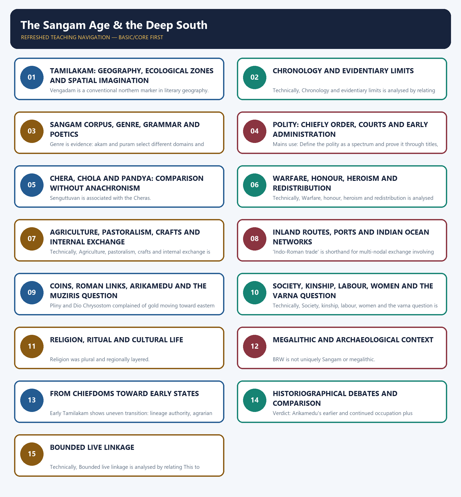
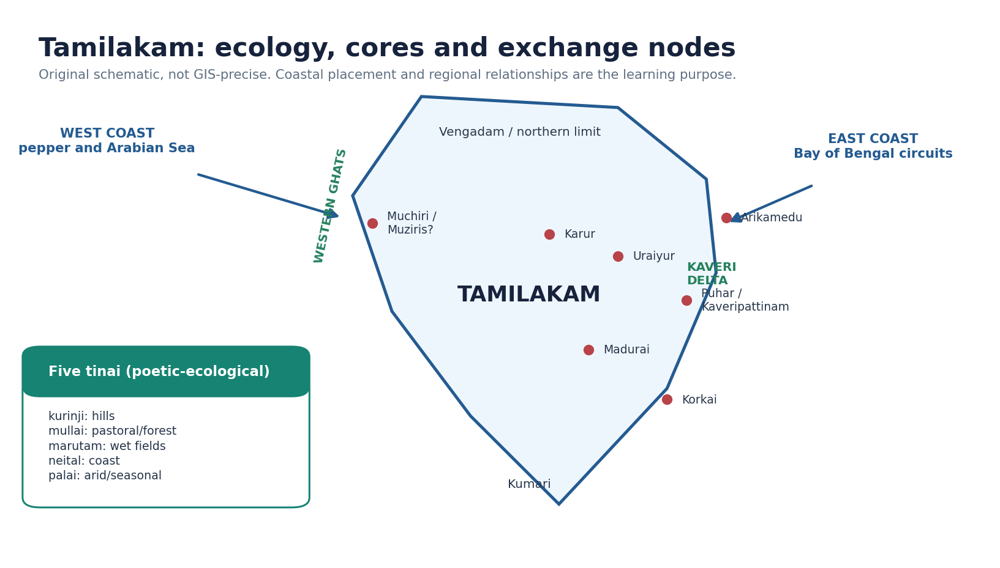
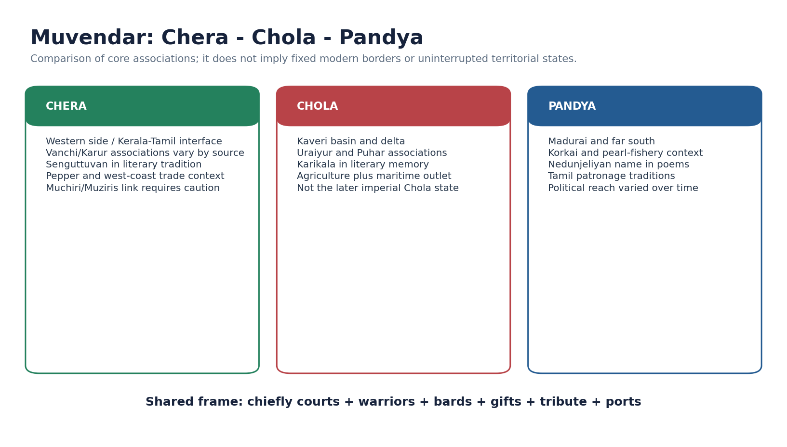
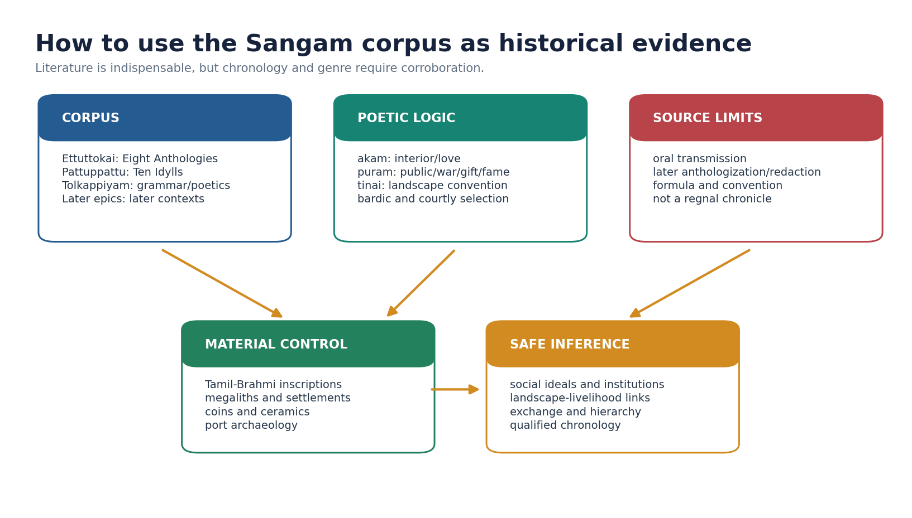
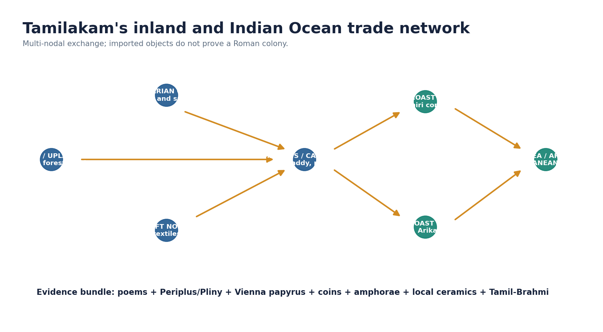
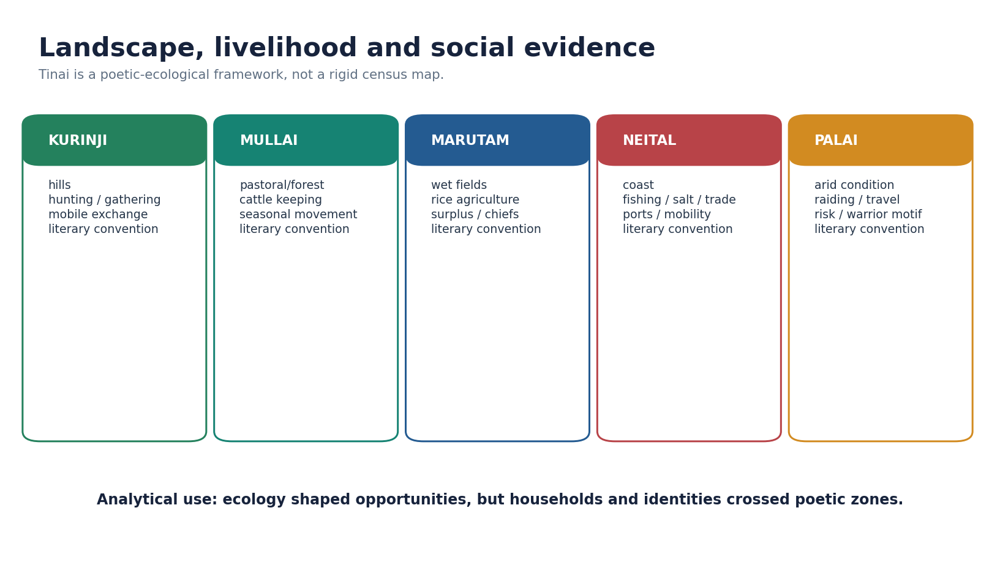
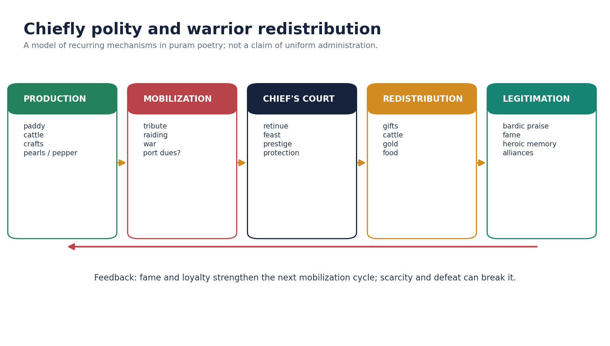
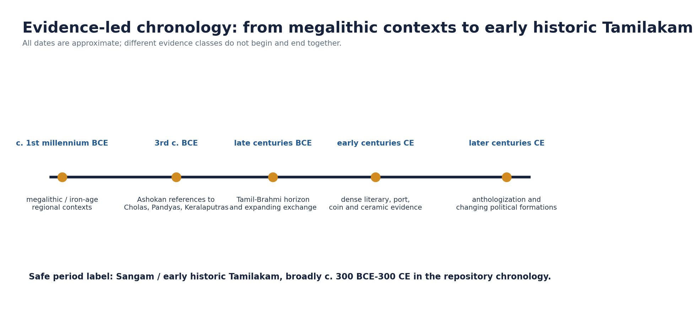
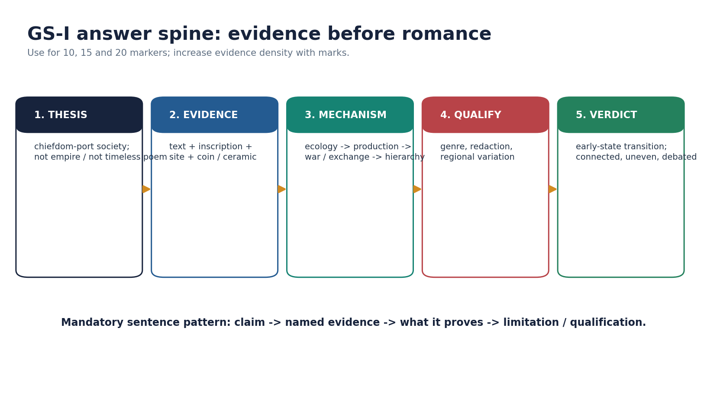

# The Sangam Age & the Deep South - Complete Topic Package

> Subject: Ancient Indian History | Paper: GS-I + Prelims | Topic: 18 | Generated: 14 August 2026
>
> Approval state: generated, approved=false. This package awaits explicit user approval.

## BASIC LEARNING SESSION

### DEEP-REVIEW LEARNING CONTRACT

| Control | Binding rule for this package |
|---|---|
| Syllabus boundary | Complete Ancient History Core is taught before optional enrichment. |
| Evidence method | Claim → named site/text/inscription/coin/example → analysis → qualification. |
| Source hierarchy | Archaeology, textual testimony, inscriptions, coins and scholarly interpretation remain visibly distinct. |
| Contested issues | Competing interpretations are attributed, evidenced and bounded; certainty is not manufactured. |
| Practice contract | Every solved item has demand decoding, an examiner-grade model, an executable answer/compression plan, marks rationale and answer-specific improvement. |
| Approval | This immutable successor remains `approved: false` pending explicit approval. |

**Canonical Basic/Core owner:** `upsc-ai-kit\knowledge\Ancient-Indian-History\basic\18_Sangam-Age-Deep-South.md`  
**Canonical topic owner:** `upsc-ai-kit\knowledge\Ancient-Indian-History\basic\18_Sangam-Age-Deep-South.md`  
**Optional Advanced owner:** `upsc-ai-kit\knowledge\Ancient-Indian-History\advanced\18_Sangam-Age-Deep-South.md`  
**Official syllabus mapping:** `upsc-ai-kit\knowledge\Ancient-Indian-History\OFFICIAL-UPSC-SYLLABUS-MAPPING.md`

### EVIDENCE, PYQ AND CURRENT-STATUS CONTROL

- **Archaeological inference:** material context supports bounded reconstruction; absence is not automatic proof of non-existence.
- **Textual testimony:** genre, authorship, redaction, patronage and temporal distance control what a text can prove.
- **Inscription and coin evidence:** contemporary names, titles, claims and circulation are powerful but do not by themselves map uniform territorial control.
- **Scholarly interpretation:** historian labels are arguments to test, not facts to memorise without evidence.
- **PYQ discipline:** repository ledgers and locally held official papers control wording and metadata; reconstructed wording and unavailable official keys must be labelled.
- **Current-status note, rechecked 2026-08-30:** A live search on 29 August 2026 found no sufficiently specific official Sangam-age update to force into the teaching. Heritage links remain bounded method anchors.

**Live/primary context sources recorded by the predecessor generation:**

- `https://asi.nic.in/`
- `https://culture.gov.in/ministry/our-groups/archaeology`




*Distinct embedded teaching-navigation image. The separate continuous Cārvāka-style flowchart package remains an independent at-a-glance artifact.*

#### Package counts, provenance and limitations

- Main learning cards: 22 including five final register-note modules.
- Workbook cards: 10; direct verified PYQ demands: 4; broad MCQs: 32; remedials: 8; original solved Mains: 6.
- Original deterministic PNG visuals: 8.
- Source order: repository Markdown; OCR-searchable local books; bounded live heritage checks only where relevant; Qdrant not used.
- No direct owned Mains PYQ was identified. Original Mains questions are clearly labelled; objective answers without readable official keys are labelled inferred.
- PDF text is intentionally ASCII-safe; Tamil terms are transliterated.

### Original visual asset index

















### 01. Package method, roadmap and evidence discipline

[FACT] This session reconstructs Sangam-age Tamilakam through a controlled combination of repository knowledge, R.S. Sharma's chronology, Upinder Singh's OCR-searchable discussion, official UPSC papers and bounded heritage sources.

[METHOD] Source order followed: repository Markdown first; local OCR-searchable books second; live heritage verification only where useful; Qdrant not used and did not block the export.


*Original deterministic schematic prepared for this package; see the surrounding source cautions.*

#### Core teaching / solved practice

- [FACT] Core repository owners read: basic/18, advanced/18, Master Chronology, revision chart, README, answer-worthiness audit and PYQ routing ledgers.
- [FACT] OCR evidence used from Upinder Singh includes the far-south polity discussion (PDF pp. 1028-1035), Kaveripumpattinam (p. 1075), crafts (p. 1080), maritime trade (pp. 1090, 1103), Arikamedu reassessment (pp. 1113-1115), Pattanam (pp. 1116-1117) and society/women (pp. 1132-1135).
- [FACT] R.S. Sharma's repository-grounded chapter sequence places the Deep South after the Satavahanas and before the broader crafts-commerce synthesis.
- [METHOD] Evidence labels: [FACT] is source-grounded; [ANALYSIS] is a reasoned inference; [LIMIT] marks uncertainty or overclaim risk.
- [ROADMAP] Geography -> chronology and source limits -> corpus -> polity -> dynasties -> war and redistribution -> production -> trade -> society -> religion and culture -> archaeology -> state formation -> historiography -> PYQs -> answer writing -> final register notes.
- [PYQ STATUS] Direct topic-owned question texts verified locally: Prelims 2022 Q93; Prelims 2023 Q43 and Q44; Prelims 2026 Set A Q14. Local official keys are unavailable for 2022-2023; the 2026 provisional key is image-based and not reliably extractable. Any answer supplied is labelled inferred, not official.
- [CURRENT LINK] No contemporary news item is forced into an ancient-history answer. Heritage/excavation references are used only as method anchors, never to manufacture a dated current-affairs claim.

#### Must-know facts

- Broad repository periodization: c. 300 BCE-300 CE for Sangam/early historic Tamilakam.
- Three crowned lineages are conventionally Chera, Chola and Pandya.
- The poems must be cross-read with archaeology, inscriptions, coins and external texts.

#### UPSC traps

- WRONG: Treat the package as a dynasty chronology alone.
- CORRECT: Its central problem is how ecology, poetry, chiefship, production and exchange formed an early historic regional order.

**Mains use:** Open with a qualified thesis and establish the evidence base before narrating rulers.

**Study link:** Ancient History 02 Sources; 03 Geography; 17 Satavahanas; 19 Crafts and Commerce.

### SESSION 1 — TAMILAKAM: GEOGRAPHY, ECOLOGICAL ZONES AND SPATIAL IMAGINATION

#### DEFINITION / WHAT THIS IS CALLED

**Plain-language definition:** Upinder Singh defines early Tamilakam broadly as the land between the Tirupati/Vengadam hills and the southern tip of the peninsula.

**Technical definition:** Vengadam is a conventional northern marker in literary geography.

#### ANSWER-GRABBING OPENING — WRITE/ADAPT IN THE EXAM

> Geography mattered through river valleys, Ghats, monsoon-facing coasts, uplands and maritime access; it did not mechanically create one political system.

#### MUST-WRITE KEYWORDS

- **Tamilakam**
- **geography**
- **ecological zones**
- **spatial imagination**
- **Study link**
- **Upinder Singh**

**How to use them:** Frame the answer through Tamilakam; define geography, connect ecological zones with spatial imagination to explain the mechanism, and use Study link for the decisive comparison or qualification.

[FACT] Upinder Singh defines early Tamilakam broadly as the land between the Tirupati/Vengadam hills and the southern tip of the peninsula. Political and cultural networks extended across today's state boundaries.

[ANALYSIS] Geography mattered through river valleys, Ghats, monsoon-facing coasts, uplands and maritime access; it did not mechanically create one political system.


*Original deterministic schematic prepared for this package; see the surrounding source cautions.*

#### Core teaching / solved practice

- [FACT] The Kaveri basin supported wet-rice agriculture and important Chola-associated nodes such as Uraiyur and Puhar/Kaveripattinam.
- [FACT] Madurai and Korkai anchor the Pandya-associated south; Korkai is linked to pearl-fishery and maritime contexts.
- [FACT] Western-coast pepper circuits underlie Chera/Muchiri associations, while identification of Pattanam with ancient Muziris remains debated.
- [FACT] Sangam poetics organizes landscapes through tinai: kurinji, mullai, marutam, neital and palai.
- [ANALYSIS] Tinai connects ecology, livelihood, emotion and social action. It is best used as a cultural model rather than a cadastral map.
- [LIMIT] Palai is often treated as an arid landscape/condition in the poetic system; do not convert every poem into a literal ecological survey.
- [COMPARISON] The deep south's historical visibility is organized less by a single imperial capital than by agrarian cores, chiefly courts, inland routes and multiple ports.

#### Must-know facts

- Vengadam is a conventional northern marker in literary geography.
- Marutam is associated with cultivated wetland; neital with the coast.
- Puhar lay at the Kaveri outlet on the Bay of Bengal.

#### UPSC traps

- WRONG: Tinai proves five sealed economic regions.
- CORRECT: It is a poetic-ecological convention whose historical value requires corroboration.
- WRONG: Tamilakam equals the modern state of Tamil Nadu.
- CORRECT: It is an early cultural-geographical term with wider and changing connections.

**Mains use:** Map ecology to production and exchange, then qualify the literary character of tinai.

**Study link:** Ancient History 03 Geography and Ecology.

#### CLOSING RECALL FLOW — TAMILAKAM: GEOGRAPHY, ECOLOGICAL ZONES AND SPATIAL IMAGINATION

```text
START / CONCEPT: Tamilakam: geography, ecological zones and spatial imagination
        |
        v
EXACT TERMS: Tamilakam · geography · ecological zones · spatial imagination · Study link · Upinder Singh
        |
        v
MECHANISM / ARGUMENT: Palai is often treated as an arid landscape/condition in the poetic system; do not convert every poem into a literal ecological survey. [COMPARISON] The deep south's historical visibility is organized less by a single imperial capital than by agrarian cores, chiefly courts, inland routes and multiple ports.
        |
        v
CONSEQUENCE / CONTRAST: Western-coast pepper circuits underlie Chera/Muchiri associations, while identification of Pattanam with ancient Muziris remains debated.
        |
        v
UPSC TRAP / ANSWER-USE: Do not miss this limiting distinction: upinder Singh defines early Tamilakam broadly as the land between the Tirupati/Vengadam hills and...
        |
        v
ANSWER-GRABBING FORMULATION: Geography mattered through river valleys, Ghats, monsoon-facing coasts, uplands and maritime access; it did not mechanically create one political system.
```
### SESSION 2 — CHRONOLOGY AND EVIDENTIARY LIMITS

#### DEFINITION / WHAT THIS IS CALLED

**Plain-language definition:** Burials, inscriptions, poems, coins, imported ceramics and settlement layers each have their own chronology.

**Technical definition:** Technically, Chronology and evidentiary limits is analysed by relating Chronology to evidentiary limits, then testing the relationship through Study link and c. 1st millennium BCE.

#### ANSWER-GRABBING OPENING — WRITE/ADAPT IN THE EXAM

> Burials, inscriptions, poems, coins, imported ceramics and settlement layers each have their own chronology.

#### MUST-WRITE KEYWORDS

- **Chronology**
- **evidentiary limits**
- **Study link**
- **c. 1st millennium BCE**
- **Megalithic/iron-age regional contexts**
- **3rd century BCE**

**How to use them:** Frame the answer through Chronology; define evidentiary limits, connect Study link with c. 1st millennium BCE to explain the mechanism, and use Megalithic/iron-age regional contexts for the decisive comparison or qualification.

[FACT] Repository chronology uses c. 300 BCE-300 CE as a broad Sangam-age frame, with a deeper megalithic/iron-age background and later compilation of texts.

[LIMIT] This is not a single synchronized age. Burials, inscriptions, poems, coins, imported ceramics and settlement layers each have their own chronology.

#### Chronology

| Date/phase | Marker |
|---|---|
| c. 1st millennium BCE | Megalithic/iron-age regional contexts |
| 3rd century BCE | Ashokan references to southern polities |
| late centuries BCE | Tamil-Brahmi and expanding exchange horizon |
| early centuries CE | Dense literary, port, coin and ceramic evidence |
| later | Compilation/redaction and changing state forms |

#### Core teaching / solved practice

- [FACT] Ashokan inscriptions mention Cholas, Pandyas, Keralaputras and Satiyaputras as southern polities outside direct Mauryan rule.
- [FACT] Tamil-Brahmi inscriptions of the late centuries BCE/early centuries CE provide short records of names, donors, chiefs, merchants and functionaries.
- [FACT] Upinder Singh notes a Mangulam reference to a pearl-fishery superintendent who was also connected with a merchant guild, and an Alagarmalai reference to a chief of scribes.
- [FACT] Literary anthologies preserve earlier compositions but reached compiled/redacted forms later; poem, poet and patron traditions cannot always yield exact regnal dates.
- [ANALYSIS] The strongest chronology comes from convergence: a literary institution plus a dated inscriptional/archaeological horizon, not a poem alone.
- [LIMIT] Dynasty names can persist across discontinuous political formations; Sangam Cholas must not be projected directly into the imperial Cholas of c. ninth-thirteenth centuries CE.

#### Must-know facts

- Dates are approximate and evidence-specific.
- Ashokan mention does not prove Mauryan annexation.
- Later redaction does not make the corpus historically useless.

#### UPSC traps

- WRONG: c. 300 BCE-300 CE is an exact dynastic block.
- CORRECT: It is a broad analytical periodization for overlapping evidence.

**Mains use:** Use a source matrix: evidence -> what it can establish -> what it cannot.

**Study link:** Ancient History 02 Sources and Master Chronology.

#### CLOSING RECALL FLOW — CHRONOLOGY AND EVIDENTIARY LIMITS

```text
START / CONCEPT: Chronology and evidentiary limits
        |
        v
EXACT TERMS: Chronology · evidentiary limits · Study link · c. 1st millennium BCE · Megalithic/iron-age regional contexts · 3rd century BCE
        |
        v
MECHANISM / ARGUMENT: Upinder Singh notes a Mangulam reference to a pearl-fishery superintendent who was also connected with a merchant guild, and an Alagarmalai reference to a chief of scribes.
        |
        v
CONSEQUENCE / CONTRAST: Dynasty names can persist across discontinuous political formations; Sangam Cholas must not be projected directly into the imperial Cholas of c. ninth-thirteenth centuries CE.
        |
        v
UPSC TRAP / ANSWER-USE: This is not a single synchronized age.
        |
        v
ANSWER-GRABBING FORMULATION: Burials, inscriptions, poems, coins, imported ceramics and settlement layers each have their own chronology.
```
### SESSION 3 — SANGAM CORPUS, GENRE, GRAMMAR AND POETICS

#### DEFINITION / WHAT THIS IS CALLED

**Plain-language definition:** The corpus conventionally includes the Ettuttokai (Eight Anthologies) and Pattuppattu (Ten Idylls); Tolkappiyam is central to grammar and poetics.

**Technical definition:** Genre is evidence: akam and puram select different domains and therefore preserve different social vocabularies.

#### ANSWER-GRABBING OPENING — WRITE/ADAPT IN THE EXAM

> The corpus conventionally includes the Ettuttokai (Eight Anthologies) and Pattuppattu (Ten Idylls); Tolkappiyam is central to grammar and poetics.

#### MUST-WRITE KEYWORDS

- **Sangam corpus**
- **genre**
- **grammar**
- **poetics**
- **Study link**
- **Akam**

**How to use them:** Frame the answer through Sangam corpus; define genre, connect grammar with poetics to explain the mechanism, and use Study link for the decisive comparison or qualification.

[FACT] The corpus conventionally includes the Ettuttokai (Eight Anthologies) and Pattuppattu (Ten Idylls); Tolkappiyam is central to grammar and poetics. Later Tamil epics belong to later textual contexts and must not be folded uncritically into the earliest layer.

[ANALYSIS] Genre is evidence: akam and puram select different domains and therefore preserve different social vocabularies.


*Original deterministic schematic prepared for this package; see the surrounding source cautions.*

#### Evidence matrix

| Source family | High-value use | Main caution |
|---|---|---|
| Akam | kinship, gender, landscape convention | not a demographic survey |
| Puram | war, gift, honour, chiefship | elite/bardic selection |
| Tolkappiyam | grammar, poetics, social vocabulary | layering and dating debated |
| Later epics | urban/religious cultural memory | later context, not direct Sangam chronology |

#### Core teaching / solved practice

- [FACT] Akam concerns interior/love themes and conventionally avoids named public actors; puram treats war, generosity, public fame, death and bardic praise.
- [FACT] Tinai links landscapes with flora, fauna, occupation, emotional situation and poetic convention.
- [FACT] Pattinappalai provides a celebrated description of Kaveripumpattinam/Puhar, including markets and multilingual inhabitants.
- [FACT] Poems name rulers, chiefs, bards, warriors, cultivators, pastoralists, fishers, salt makers, merchants and craftspeople.
- [ANALYSIS] Bardic praise is not mere fiction: it reveals the values and institutions that made praise useful, especially gift, honour, kinship and martial reputation.
- [LIMIT] Formulaic language, patronage and anthologization make literal event reconstruction hazardous.
- [METHOD] Quote concepts rather than invented translations. This package paraphrases unless an exact local translation is verified.

#### Must-know facts

- Akam and puram are literary categories, not dynasties.
- Pattinappalai is linked with Puhar/Kaveripumpattinam.
- Poems preserve material-cultural references.

#### UPSC traps

- WRONG: Sangam poems contain no material culture.
- CORRECT: They refer to towns, markets, weapons, craft goods, food, ships and exchange.
- WRONG: A poem is equivalent to an inscription.
- CORRECT: Genre, transmission and patronage require different source criticism.

**Mains use:** Turn source criticism into argument: vivid social evidence, weak exact event chronology.

**Study link:** Indian Art and Culture 11 Languages, Scripts and Literature.

#### CLOSING RECALL FLOW — SANGAM CORPUS, GENRE, GRAMMAR AND POETICS

```text
START / CONCEPT: Sangam corpus, genre, grammar and poetics
        |
        v
EXACT TERMS: Sangam corpus · genre · grammar · poetics · Study link · Akam
        |
        v
MECHANISM / ARGUMENT: Genre is evidence: akam and puram select different domains and therefore preserve different social vocabularies.
        |
        v
CONSEQUENCE / CONTRAST: Later Tamil epics belong to later textual contexts and must not be folded uncritically into the earliest layer.
        |
        v
UPSC TRAP / ANSWER-USE: Bardic praise is not mere fiction: it reveals the values and institutions that made praise useful, especially gift, honour, kinship and martial reputation.
        |
        v
ANSWER-GRABBING FORMULATION: The corpus conventionally includes the Ettuttokai (Eight Anthologies) and Pattuppattu (Ten Idylls); Tolkappiyam is central to grammar and poetics.
```
### SESSION 4 — POLITY: CHIEFLY ORDER, COURTS AND EARLY ADMINISTRATION

#### DEFINITION / WHAT THIS IS CALLED

**Plain-language definition:** The safest description is a spectrum from chiefdoms toward early states, varying by region and phase.

**Technical definition:** Mains use: Define the polity as a spectrum and prove it through titles, functionaries, extraction and redistribution.

#### ANSWER-GRABBING OPENING — WRITE/ADAPT IN THE EXAM

> The safest description is a spectrum from chiefdoms toward early states, varying by region and phase.

#### MUST-WRITE KEYWORDS

- **Polity**
- **chiefly order**
- **courts**
- **early administration**
- **Study link**
- **The safest description**

**How to use them:** Frame the answer through Polity; define chiefly order, connect courts with early administration to explain the mechanism, and use Study link for the decisive comparison or qualification.

[FACT] Sangam political language centres on kings/chiefs, retinues, warriors, tribute, raids, gifts, courts and subordinate figures. Inscriptions add glimpses of titles and functionaries.

[ANALYSIS] The safest description is a spectrum from chiefdoms toward early states, varying by region and phase.


*Original deterministic schematic prepared for this package; see the surrounding source cautions.*

#### Core teaching / solved practice

- [FACT] Tamil-Brahmi records use ko/kon for rulers or chiefs and preserve personal and lineage names.
- [FACT] The Pugalur inscription's investiture reference and Mangulam's subordinate/functionary reference suggest more than episodic war bands.
- [FACT] Poems describe courts where bards seek rewards and rulers convert resources into loyalty and fame.
- [ANALYSIS] Authority was relational: control over people, routes, agrarian pockets and redistribution could matter more than continuous surveyed territory.
- [ANALYSIS] Ports and fertile basins enlarged chiefly resources, but neither trade nor iron automatically created bureaucracy.
- [LIMIT] Terms translated as king, tax or officer should not be assumed to denote Mauryan-style centralized administration.
- [COMPARISON] Compared with Mauryan epigraphy, the archive is less bureaucratically explicit; compared with a stateless model, it shows hierarchy, extraction, functionaries and political centres.

#### Must-know facts

- Ko/kon appears in early Tamil epigraphic-political vocabulary.
- Courts redistributed wealth through gifts and feasting.
- Political reach was uneven and negotiated.

#### UPSC traps

- WRONG: Sangam Tamilakam was either a full empire or wholly stateless.
- CORRECT: Evidence supports layered chiefship and uneven early-state formation.

**Mains use:** Define the polity as a spectrum and prove it through titles, functionaries, extraction and redistribution.

**Study link:** Ancient History 13 State and Varna Society; 17 Satavahanas.

#### CLOSING RECALL FLOW — POLITY: CHIEFLY ORDER, COURTS AND EARLY ADMINISTRATION

```text
START / CONCEPT: Polity: chiefly order, courts and early administration
        |
        v
EXACT TERMS: Polity · chiefly order · courts · early administration · Study link · The safest description
        |
        v
MECHANISM / ARGUMENT: Mains use: Define the polity as a spectrum and prove it through titles, functionaries, extraction and redistribution.
        |
        v
CONSEQUENCE / CONTRAST: Ports and fertile basins enlarged chiefly resources, but neither trade nor iron automatically created bureaucracy.
        |
        v
UPSC TRAP / ANSWER-USE: Terms translated as king, tax or officer should not be assumed to denote Mauryan-style centralized administration. [COMPARISON] Compared with Mauryan epigraphy, the archive is less bureaucratically explicit; compared with a stateless model, it shows hierarchy, extraction, functionaries and political centres.
        |
        v
ANSWER-GRABBING FORMULATION: The safest description is a spectrum from chiefdoms toward early states, varying by region and phase.
```
### SESSION 5 — CHERA, CHOLA AND PANDYA: COMPARISON WITHOUT ANACHRONISM

#### DEFINITION / WHAT THIS IS CALLED

**Plain-language definition:** The Muvendar or three crowned lineages are Chera, Chola and Pandya.

**Technical definition:** Senguttuvan is associated with the Cheras.

#### ANSWER-GRABBING OPENING — WRITE/ADAPT IN THE EXAM

> The Muvendar or three crowned lineages are Chera, Chola and Pandya.

#### MUST-WRITE KEYWORDS

- **Chera**
- **Chola**
- **Pandya**
- **comparison without anachronism**
- **Study link**
- **west coast; pepper; Senguttuvan; Muchiri context**

**How to use them:** Frame the answer through Chera; define Chola, connect Pandya with comparison without anachronism to explain the mechanism, and use Study link for the decisive comparison or qualification.

[FACT] The Muvendar or three crowned lineages are Chera, Chola and Pandya. Literary traditions attach named rulers and core places to each, but dynastic lists and reign dates remain difficult.

[LIMIT] Associations are not fixed-border maps, and later imperial achievements must not be back-projected.


*Original deterministic schematic prepared for this package; see the surrounding source cautions.*

#### Evidence matrix

| Lineage | Core associations | High-value caution |
|---|---|---|
| Chera | west coast; pepper; Senguttuvan; Muchiri context | Pattanam=Muziris remains debated |
| Chola | Kaveri; Uraiyur; Puhar; Karikala tradition | not imperial Chola administration |
| Pandya | Madurai; Korkai; pearls; Nedunjeliyan | names may recur; dates uncertain |

#### Core teaching / solved practice

- [FACT] Chera associations include the western side, pepper circuits, Senguttuvan and Muchiri/Muziris contexts; Vanchi/Karur identifications require care.
- [FACT] Chola associations include the Kaveri basin, Uraiyur, Puhar/Kaveripumpattinam and Karikala traditions.
- [FACT] Pandya associations include Madurai, Korkai, pearl-fishery contexts and rulers bearing the Nedunjeliyan name.
- [FACT] The 2026 official paper tests correct pairing of Senguttuvan-Chera, Udiyanjeral-Chola and Nedunjeliyan-Pandya; the second pair is the mismatch.
- [ANALYSIS] The shared institutional ecology - court, warrior following, bard, gift, tribute and port/agrarian resource - matters more than memorizing insecure reign sequences.
- [LIMIT] 'Chera', 'Chola' and 'Pandya' can denote lineages and political traditions across changing centres and phases.

#### Must-know facts

- Senguttuvan is associated with the Cheras.
- Udiyanjeral is Chera, not Chola.
- Nedunjeliyan is associated with the Pandyas.

#### UPSC traps

- WRONG: The three lineages ruled fixed nation-state territories.
- CORRECT: Think changing cores, routes, clients and centres.
- WRONG: Sangam Cholas had Uttaramerur institutions and Brihadisvara.
- CORRECT: Those belong to the much later imperial Chola context.

**Mains use:** Compare resource base, centres and literary associations; close with shared chiefly mechanisms.

**Study link:** Ancient History 27 Imperial Cholas for the chronological firewall.

#### CLOSING RECALL FLOW — CHERA, CHOLA AND PANDYA: COMPARISON WITHOUT ANACHRONISM

```text
START / CONCEPT: Chera, Chola and Pandya: comparison without anachronism
        |
        v
EXACT TERMS: Chera · Chola · Pandya · comparison without anachronism · Study link · west coast; pepper; Senguttuvan; Muchiri context
        |
        v
MECHANISM / ARGUMENT: 'Chera', 'Chola' and 'Pandya' can denote lineages and political traditions across changing centres and phases.
        |
        v
CONSEQUENCE / CONTRAST: Associations are not fixed-border maps, and later imperial achievements must not be back-projected.
        |
        v
UPSC TRAP / ANSWER-USE: Do not miss this limiting distinction: chera associations include the western side, pepper circuits, Senguttuvan and Muchiri/Muziris contexts.
        |
        v
ANSWER-GRABBING FORMULATION: The Muvendar or three crowned lineages are Chera, Chola and Pandya.
```
### SESSION 6 — WARFARE, HONOUR, HEROISM AND REDISTRIBUTION

#### DEFINITION / WHAT THIS IS CALLED

**Plain-language definition:** Cattle and agrarian produce could be objects of raiding and redistribution.

**Technical definition:** Technically, Warfare, honour, heroism and redistribution is analysed by relating Warfare to honour, then testing the relationship through heroism and redistribution.

#### ANSWER-GRABBING OPENING — WRITE/ADAPT IN THE EXAM

> Cattle and agrarian produce could be objects of raiding and redistribution.

#### MUST-WRITE KEYWORDS

- **Warfare**
- **honour**
- **heroism**
- **redistribution**
- **Study link**
- **Cattle**

**How to use them:** Frame the answer through Warfare; define honour, connect heroism with redistribution to explain the mechanism, and use Study link for the decisive comparison or qualification.

[FACT] Puram poetry gives war, cattle raids, siege, victory, defeat, death, gift and fame a central place.

[ANALYSIS] Warfare redistributed resources and reputations; bardic commemoration converted material success into political legitimacy.


*Original deterministic schematic prepared for this package; see the surrounding source cautions.*

#### Core teaching / solved practice

- [FACT] Cattle and agrarian produce could be objects of raiding and redistribution.
- [FACT] Rulers rewarded bards and retainers with food, cattle, ornaments, gold or other valuables in the poetic world.
- [FACT] Heroic death and memorial practices belong to a wider southern megalithic/hero-stone cultural horizon, but individual poems cannot automatically date individual stones.
- [FACT] Vattakirutal in the 2023 UPSC question refers to a defeated king's ritual death by fasting, conventionally facing north.
- [ANALYSIS] Gift was political economy: it sustained followers, broadcast abundance and created ranked reciprocity.
- [LIMIT] Heroic ideals are elite and gendered; they underrepresent ordinary conflict costs, coercion and producers.
- [ANALYSIS] Persistent raiding could inhibit stable agrarian expansion even while successful chiefs protected routes and irrigation zones.

#### Must-know facts

- Vattakirutal is linked with ritual fasting unto death after defeat.
- Puram is central for public fame and war.
- Gift exchange connected economy and legitimacy.

#### UPSC traps

- WRONG: Gift-giving was private generosity without political function.
- CORRECT: It redistributed resources and built prestige, loyalty and bardic memory.

**Mains use:** Use the cycle production -> mobilization -> court -> gift -> fame, then expose its social costs.

**Study link:** Ancient History 05 megalithic context; 17 Deccan network polity.

#### CLOSING RECALL FLOW — WARFARE, HONOUR, HEROISM AND REDISTRIBUTION

```text
START / CONCEPT: Warfare, honour, heroism and redistribution
        |
        v
EXACT TERMS: Warfare · honour · heroism · redistribution · Study link · Cattle
        |
        v
MECHANISM / ARGUMENT: Vattakirutal in the 2023 UPSC question refers to a defeated king's ritual death by fasting, conventionally facing north.
        |
        v
CONSEQUENCE / CONTRAST: Persistent raiding could inhibit stable agrarian expansion even while successful chiefs protected routes and irrigation zones.
        |
        v
UPSC TRAP / ANSWER-USE: Do not miss this limiting distinction: it sustained followers, broadcast abundance and created ranked reciprocity.
        |
        v
ANSWER-GRABBING FORMULATION: Cattle and agrarian produce could be objects of raiding and redistribution.
```
### SESSION 7 — AGRICULTURE, PASTORALISM, CRAFTS AND INTERNAL EXCHANGE

#### DEFINITION / WHAT THIS IS CALLED

**Plain-language definition:** Craft specialization is present in literary and archaeological evidence.

**Technical definition:** Technically, Agriculture, pastoralism, crafts and internal exchange is analysed by relating Agriculture to pastoralism, then testing the relationship through crafts and internal exchange.

#### ANSWER-GRABBING OPENING — WRITE/ADAPT IN THE EXAM

> CORRECT: Agriculture, pastoralism, crafts and internal exchange were foundational.

#### MUST-WRITE KEYWORDS

- **Agriculture**
- **pastoralism**
- **crafts**
- **internal exchange**
- **Study link**
- **Kaveri basin; marutam; paddy movement**

**How to use them:** Frame the answer through Agriculture; define pastoralism, connect crafts with internal exchange to explain the mechanism, and use Study link for the decisive comparison or qualification.

[FACT] Early Tamilakam combined wet-rice pockets, dry cultivation, cattle keeping, fishing, salt making, forest produce and specialized crafts.

[ANALYSIS] The economy was regionally differentiated and connected by barter, markets and caravans rather than uniformly monetized.


*Original deterministic schematic prepared for this package; see the surrounding source cautions.*

#### Evidence matrix

| Sector | Named evidence | Interpretive limit |
|---|---|---|
| Agriculture | Kaveri basin; marutam; paddy movement | not uniform wet-rice landscape |
| Pastoral/forest | mullai/kurinji; cattle; forest produce | poetic zones overlap |
| Crafts | Kodumanal; beads; shell; textiles; metal | workshop scale varies |
| Internal trade | chattu; salt-paddy-pepper movement | routes not fully reconstructable |

#### Core teaching / solved practice

- [FACT] Marutam poetry is associated with cultivated wetland; Kaveri and other riverine zones supported agrarian surplus.
- [FACT] Mullai and kurinji conventions retain pastoral, forest and upland livelihoods; neital foregrounds coastal occupations.
- [FACT] Upinder Singh notes Sangam references to weaving, gem working, shell working and metal working.
- [FACT] Markets at Puhar and Madurai are described with flowers, aromatics, betel, shell bangles, jewellery, cloth, wine and metal goods.
- [FACT] Caravans/chattu carried commodities such as paddy, salt and pepper between interiors and ports.
- [ANALYSIS] Coin finds indicate monetized transactions in some circuits, not universal cash exchange.
- [LIMIT] Literary abundance can be conventional praise; archaeology is needed to measure scale and distribution.

#### Must-know facts

- Craft specialization is present in literary and archaeological evidence.
- Salt linked coast and agrarian interiors.
- Kodumanal is valuable for craft, trade and megalithic context.

#### UPSC traps

- WRONG: Roman trade created the entire Tamil economy.
- CORRECT: Agriculture, pastoralism, crafts and internal exchange were foundational.

**Mains use:** Start from diversified production; treat overseas trade as an amplifier, not an origin.

**Study link:** Ancient History 19 Crafts, Commerce and Urban Growth.

#### CLOSING RECALL FLOW — AGRICULTURE, PASTORALISM, CRAFTS AND INTERNAL EXCHANGE

```text
START / CONCEPT: Agriculture, pastoralism, crafts and internal exchange
        |
        v
EXACT TERMS: Agriculture · pastoralism · crafts · internal exchange · Study link · Kaveri basin; marutam; paddy movement
        |
        v
MECHANISM / ARGUMENT: The economy was regionally differentiated and connected by barter, markets and caravans rather than uniformly monetized.
        |
        v
CONSEQUENCE / CONTRAST: Mains use: Start from diversified production; treat overseas trade as an amplifier, not an origin.
        |
        v
UPSC TRAP / ANSWER-USE: Do not miss this limiting distinction: craft specialization is present in literary and archaeological evidence.
        |
        v
ANSWER-GRABBING FORMULATION: CORRECT: Agriculture, pastoralism, crafts and internal exchange were foundational.
```
### SESSION 8 — INLAND ROUTES, PORTS AND INDIAN OCEAN NETWORKS

#### DEFINITION / WHAT THIS IS CALLED

**Plain-language definition:** Ports were interfaces fed by agrarian, pastoral and craft hinterlands; inland routes are as important as sea lanes.

**Technical definition:** 'Indo-Roman trade' is shorthand for multi-nodal exchange involving Indian, Arab, Egyptian-Greek and other intermediaries.

#### ANSWER-GRABBING OPENING — WRITE/ADAPT IN THE EXAM

> Ports were interfaces fed by agrarian, pastoral and craft hinterlands; inland routes are as important as sea lanes.

#### MUST-WRITE KEYWORDS

- **Inland routes**
- **ports**
- **Indian Ocean networks**
- **Study link**
- **Poems**
- **Greco-Roman**

**How to use them:** Frame the answer through Inland routes; define ports, connect Indian Ocean networks with Study link to explain the mechanism, and use Poems for the decisive comparison or qualification.

[FACT] Poems, Greco-Roman texts, ceramics, coins, inscriptions and excavated port settlements show Tamilakam embedded in Arabian Sea, Red Sea, Bay of Bengal and Southeast Asian circuits.

[LIMIT] 'Indo-Roman trade' is shorthand for multi-nodal exchange involving Indian, Arab, Egyptian-Greek and other intermediaries.


*Original deterministic schematic prepared for this package; see the surrounding source cautions.*

#### Core teaching / solved practice

- [FACT] Puhar/Kaveripumpattinam was a major Chola-associated port and market; Pattinappalai describes multilingual inhabitants.
- [FACT] Korkai is linked with the Pandya south and pearl-fishery context.
- [FACT] Muchiri/Muziris is associated with Malabar exchange; the Vienna papyrus records a business arrangement involving cargo from Muziris.
- [FACT] Arikamedu yields amphorae, terra sigillata/imitations, rouletted ware, beads and evidence of occupation before intensive Mediterranean exchange.
- [FACT] Tamil-Brahmi sherds outside India and imported objects in Tamilakam demonstrate mobility, but objects alone do not identify the ethnicity of every trader.
- [ANALYSIS] Ports were interfaces fed by agrarian, pastoral and craft hinterlands; inland routes are as important as sea lanes.
- [LIMIT] Classical texts emphasize commodities attractive to their authors and should be checked against overwhelmingly local material assemblages.

#### Must-know facts

- Korkai, Poompuhar and Muchiri were ports in the 2023 UPSC question.
- Puhar is Kaveripumpattinam/Kaveripattinam.
- Trade was multi-nodal and intermediary-rich.

#### UPSC traps

- WRONG: A port equals an isolated coastal enclave.
- CORRECT: Ports depended on inland producers, routes, markets and political protection.
- WRONG: Every imported amphora proves a resident Roman merchant.
- CORRECT: Goods could circulate through multiple intermediaries and local consumers.

**Mains use:** Draw a network from hinterland production to port brokerage to overseas circulation.

**Study link:** Ancient History 19; Satavahana western/eastern trade corridors.

#### CLOSING RECALL FLOW — INLAND ROUTES, PORTS AND INDIAN OCEAN NETWORKS

```text
START / CONCEPT: Inland routes, ports and Indian Ocean networks
        |
        v
EXACT TERMS: Inland routes · ports · Indian Ocean networks · Study link · Poems · Greco-Roman
        |
        v
MECHANISM / ARGUMENT: CORRECT: Goods could circulate through multiple intermediaries and local consumers.
        |
        v
CONSEQUENCE / CONTRAST: Tamil-Brahmi sherds outside India and imported objects in Tamilakam demonstrate mobility, but objects alone do not identify the ethnicity of every trader.
        |
        v
UPSC TRAP / ANSWER-USE: Do not miss this limiting distinction: draw a network from hinterland production to port brokerage to overseas circulation.
        |
        v
ANSWER-GRABBING FORMULATION: Ports were interfaces fed by agrarian, pastoral and craft hinterlands; inland routes are as important as sea lanes.
```
### SESSION 9 — COINS, ROMAN LINKS, ARIKAMEDU AND THE MUZIRIS QUESTION

#### DEFINITION / WHAT THIS IS CALLED

**Plain-language definition:** Roman coins and Mediterranean ceramics are important evidence for contact, consumption and chronology; they do not by themselves prove colonization or political dependence.

**Technical definition:** Pliny and Dio Chrysostom complained of gold moving toward eastern trade; this is Roman elite commentary, not a neutral balance-of-payments statistic.

#### ANSWER-GRABBING OPENING — WRITE/ADAPT IN THE EXAM

> Roman coins and Mediterranean ceramics are important evidence for contact, consumption and chronology; they do not by themselves prove colonization or political dependence.

#### MUST-WRITE KEYWORDS

- **Coins**
- **Roman links**
- **Arikamedu**
- **the Muziris question**
- **Study link**
- **Roman coins**

**How to use them:** Frame the answer through Coins; define Roman links, connect Arikamedu with the Muziris question to explain the mechanism, and use Study link for the decisive comparison or qualification.

[FACT] Roman coins and Mediterranean ceramics are important evidence for contact, consumption and chronology; they do not by themselves prove colonization or political dependence.

[LIMIT] Site identifications and cargo meanings remain research questions.


*Original deterministic schematic prepared for this package; see the surrounding source cautions.*

#### Evidence matrix

| Evidence | Safe conclusion | Unsafe leap |
|---|---|---|
| Roman coins | contact, bullion/monetary use, chronology | Roman political rule |
| Amphorae | Mediterranean container circulation | resident Roman colony |
| Rouletted ware | early historic exchange/craft networks | automatically imported Roman ware |
| Pattanam finds | major connected port settlement | final proof of Muziris identity |

#### Core teaching / solved practice

- [FACT] Pliny and Dio Chrysostom complained of gold moving toward eastern trade; this is Roman elite commentary, not a neutral balance-of-payments statistic.
- [FACT] The Vienna papyrus/Hermapollon document illuminates credit, cargo and transport between Muziris, a Red Sea port and Alexandria.
- [FACT] Upinder Singh's Arikamedu reassessment stresses pre-trade settlement, uncertainty over functional sectors, continued occupation and the role of intermediaries.
- [FACT] Amphorae may have contained wine, oil or sauce; their consumers could include local elites as well as foreigners.
- [FACT] At Pattanam, most pottery was local/Indian; foreign ceramics and a wharf/canoe context demonstrate connectivity, while identification with Muchiri/Muziris remains unproven.
- [ANALYSIS] Coin concentrations may reflect trade, hoarding, bullion use, ritual deposition or later movement; context matters.
- [LIMIT] Avoid precise trade-volume totals unless supported by a primary dataset.

#### Must-know facts

- Arikamedu existed before intensive Indo-Mediterranean trade.
- Local pottery dominates the Pattanam assemblage described by Upinder Singh.
- Muziris-Pattanam identification is debated.

#### UPSC traps

- WRONG: Arikamedu was founded as a Roman trading station.
- CORRECT: Later excavations found an earlier settlement and complicated the colony model.

**Mains use:** Use evidence to show connectivity, then explicitly reject colony and dependency overclaims.

**Study link:** Ancient History 02 source criticism; 19 trade.

#### CLOSING RECALL FLOW — COINS, ROMAN LINKS, ARIKAMEDU AND THE MUZIRIS QUESTION

```text
START / CONCEPT: Coins, Roman links, Arikamedu and the Muziris question
        |
        v
EXACT TERMS: Coins · Roman links · Arikamedu · the Muziris question · Study link · Roman coins
        |
        v
MECHANISM / ARGUMENT: WRONG: Arikamedu was founded as a Roman trading station.
        |
        v
CONSEQUENCE / CONTRAST: Pliny and Dio Chrysostom complained of gold moving toward eastern trade; this is Roman elite commentary, not a neutral balance-of-payments statistic.
        |
        v
UPSC TRAP / ANSWER-USE: At Pattanam, most pottery was local/Indian; foreign ceramics and a wharf/canoe context demonstrate connectivity, while identification with Muchiri/Muziris remains unproven.
        |
        v
ANSWER-GRABBING FORMULATION: Roman coins and Mediterranean ceramics are important evidence for contact, consumption and chronology; they do not by themselves prove colonization or political dependence.
```
### SESSION 10 — SOCIETY, KINSHIP, LABOUR, WOMEN AND THE VARNA QUESTION

#### DEFINITION / WHAT THIS IS CALLED

**Plain-language definition:** Elite women and poetesses are visible, but visibility is selective and cannot establish generalized emancipation.

**Technical definition:** Technically, Society, kinship, labour, women and the varna question is analysed by relating Society to kinship, then testing the relationship through labour and women.

#### ANSWER-GRABBING OPENING — WRITE/ADAPT IN THE EXAM

> Elite women and poetesses are visible, but visibility is selective and cannot establish generalized emancipation.

#### MUST-WRITE KEYWORDS

- **Society**
- **kinship**
- **labour**
- **women**
- **the varna question**
- **Study link**

**How to use them:** Frame the answer through Society; define kinship, connect labour with women to explain the mechanism, and use the varna question for the decisive comparison or qualification.

[FACT] Sangam texts reveal differentiated occupations, status, kinship, gendered labour, elites, dependants and outsiders. They also show awareness of northern Brahmanical categories.

[LIMIT] Awareness of varna does not prove uniform four-varna social organization across Tamilakam.


*Original deterministic schematic prepared for this package; see the surrounding source cautions.*

#### Core teaching / solved practice

- [FACT] UPSC 2022 tests that social classification of varna was known to Sangam poets; the other options wrongly deny material culture and warrior ethic or misstate magical belief.
- [FACT] Texts mention cultivators, pastoralists, fishers, salt makers, merchants, artisans, bards, warriors and ritual specialists.
- [FACT] Upinder Singh notes women spinners (parutti pentukal), fisherwomen, salt sellers, basket/pith workers, a potter-poetess and women involved in toddy-related activity.
- [FACT] Elite women and poetesses are visible, but visibility is selective and cannot establish generalized emancipation.
- [ANALYSIS] Kin groups, households, patrons and occupational communities intersected with emerging rank and Brahmanical influence.
- [LIMIT] Terms for low status, servitude or occupational groups must be interpreted in textual context; they should not be mechanically mapped onto later caste lists.
- [ANALYSIS] The social archive is strongest when literary roles are cross-checked with inscriptions and craft/settlement evidence.

#### Must-know facts

- Varna was known, not necessarily uniformly institutionalized.
- Women appear in production, exchange and poetry.
- Poetic visibility is not a census of social power.

#### UPSC traps

- WRONG: Matronyms or poetesses prove matriarchy/equality.
- CORRECT: They are evidence of naming or visibility, not a complete property/power system.
- WRONG: Sangam society had no social hierarchy because categories differed from the north.
- CORRECT: Rank, occupation, dependence and elite power are clearly present.

**Mains use:** Separate awareness, social practice and later codification; use named labour evidence.

**Study link:** Ancient History 13 State and Varna Society.

#### CLOSING RECALL FLOW — SOCIETY, KINSHIP, LABOUR, WOMEN AND THE VARNA QUESTION

```text
START / CONCEPT: Society, kinship, labour, women and the varna question
        |
        v
EXACT TERMS: Society · kinship · labour · women · the varna question · Study link
        |
        v
MECHANISM / ARGUMENT: WRONG: Sangam society had no social hierarchy because categories differed from the north.
        |
        v
CONSEQUENCE / CONTRAST: Awareness of varna does not prove uniform four-varna social organization across Tamilakam.
        |
        v
UPSC TRAP / ANSWER-USE: Varna was known, not necessarily uniformly institutionalized.
        |
        v
ANSWER-GRABBING FORMULATION: Elite women and poetesses are visible, but visibility is selective and cannot establish generalized emancipation.
```
### SESSION 11 — RELIGION, RITUAL AND CULTURAL LIFE

#### DEFINITION / WHAT THIS IS CALLED

**Plain-language definition:** Cultural change is better understood as interaction and layering than as a sudden replacement of local traditions.

**Technical definition:** Religion was plural and regionally layered.

#### ANSWER-GRABBING OPENING — WRITE/ADAPT IN THE EXAM

> Cultural change is better understood as interaction and layering than as a sudden replacement of local traditions.

#### MUST-WRITE KEYWORDS

- **Religion**
- **ritual**
- **cultural life**
- **Study link**
- **Cultural change**
- **Cultural**

**How to use them:** Frame the answer through Religion; define ritual, connect cultural life with Study link to explain the mechanism, and use Cultural change for the decisive comparison or qualification.

[FACT] Early Tamil religious life included local deities, heroism, ancestor/death practices, Brahmanical elements, Jain and Buddhist presence, and ritual specialists.

[ANALYSIS] Cultural change is better understood as interaction and layering than as a sudden replacement of local traditions.

#### Core teaching / solved practice

- [FACT] Murugan is closely associated with hill/kurinji traditions; Mayon and Korravai appear in the literary-religious landscape.
- [FACT] Indra, Brahmanas and sacrificial vocabulary indicate Brahmanical contact and adaptation.
- [FACT] Tamil-Brahmi cave inscriptions and donor records are important for Jain/Buddhist and merchant/elite presence, though sect identification must be inscription-specific.
- [FACT] Megalithic burials and later hero memorial traditions preserve concerns with death, memory and status; their exact theology cannot be read directly from grave goods.
- [ANALYSIS] Court patronage, trade routes and migration enabled religious plurality.
- [LIMIT] Do not call every cave Jain, every symbol Buddhist or every burial a fixed religion without inscriptional/contextual support.
- [COMPARISON] Unlike an edict-based imperial religious policy, the archive shows localized patronage and plural practices.

#### Must-know facts

- Religion was plural and regionally layered.
- Megaliths reveal mortuary practice more securely than doctrine.
- Tamil-Brahmi donor records add social context.

#### UPSC traps

- WRONG: Sangam religion was purely isolated and pre-Brahmanical.
- CORRECT: Local, Brahmanical, Jain and Buddhist strands interacted.

**Mains use:** Organize by local cults, Brahmanical interaction, heterodox presence and mortuary memory.

**Study link:** Ancient History 10 Jainism and Buddhism; Indian Art and Culture religion.

#### CLOSING RECALL FLOW — RELIGION, RITUAL AND CULTURAL LIFE

```text
START / CONCEPT: Religion, ritual and cultural life
        |
        v
EXACT TERMS: Religion · ritual · cultural life · Study link · Cultural change · Cultural
        |
        v
MECHANISM / ARGUMENT: Mains use: Organize by local cults, Brahmanical interaction, heterodox presence and mortuary memory.
        |
        v
CONSEQUENCE / CONTRAST: Do not call every cave Jain, every symbol Buddhist or every burial a fixed religion without inscriptional/contextual support. [COMPARISON] Unlike an edict-based imperial religious policy, the archive shows localized patronage and plural practices.
        |
        v
UPSC TRAP / ANSWER-USE: Do not miss this limiting distinction: religion was plural and regionally layered.
        |
        v
ANSWER-GRABBING FORMULATION: Cultural change is better understood as interaction and layering than as a sudden replacement of local traditions.
```
### SESSION 12 — MEGALITHIC AND ARCHAEOLOGICAL CONTEXT

#### DEFINITION / WHAT THIS IS CALLED

**Plain-language definition:** Megalithic is an archaeological category with regional and chronological variation, not one ethnicity or single political culture.

**Technical definition:** BRW is not uniquely Sangam or megalithic.

#### ANSWER-GRABBING OPENING — WRITE/ADAPT IN THE EXAM

> Megalithic is an archaeological category with regional and chronological variation, not one ethnicity or single political culture.

#### MUST-WRITE KEYWORDS

- **Megalithic**
- **archaeological context**
- **Study link**
- **Burial architecture**
- **mortuary practice and labour**
- **dynasty or exact religion**

**How to use them:** Frame the answer through Megalithic; define archaeological context, connect Study link with Burial architecture to explain the mechanism, and use mortuary practice and labour for the decisive comparison or qualification.

[FACT] R.S. Sharma's approach begins the deep south with megalithic culture: burials, iron objects, black-and-red ware and grave goods precede or overlap the early historic political-literary horizon.

[LIMIT] Megalithic is an archaeological category with regional and chronological variation, not one ethnicity or single political culture.

#### Evidence matrix

| Material clue | What it can support | What it cannot alone prove |
|---|---|---|
| Burial architecture | mortuary practice and labour | dynasty or exact religion |
| Grave goods | technology, exchange, differentiation | complete class system |
| Iron | tool/weapon capability | automatic state formation |
| Black-and-red ware | ceramic context with stratigraphy | single culture or date |

#### Core teaching / solved practice

- [FACT] South Indian megalithic forms include cists, cairn circles, dolmens, urn burials and menhirs in varying combinations.
- [FACT] Grave goods can include pottery, iron implements/weapons, ornaments and other objects; they allow questions about technology, exchange and differentiation.
- [FACT] Settlements are less visible than burials in parts of the record, so burial distribution is not a complete population map.
- [FACT] Black-and-red ware occurs in many periods and regions; it cannot identify a Sangam/megalithic context by itself.
- [FACT] Kodumanal links burials with craft and exchange evidence, including beads and Tamil-Brahmi material.
- [ANALYSIS] Movement toward fertile basins, craft specialization and exchange networks helped create conditions for stronger political centres.
- [LIMIT] Iron technology enabled tools and weapons but did not automatically cause states, war or agrarian expansion.

#### Must-know facts

- Burials are more abundant than known settlements in some areas.
- BRW is not uniquely Sangam or megalithic.
- Kodumanal connects craft, trade, writing and mortuary evidence.

#### UPSC traps

- WRONG: All megaliths are settlements or temples.
- CORRECT: Many are mortuary monuments.
- WRONG: Iron alone explains political centralization.
- CORRECT: Ecology, surplus, exchange, war and institutions interacted.

**Mains use:** Use archaeology to widen history beyond rulers while respecting inference limits.

**Study link:** Ancient History 05 Neolithic and Chalcolithic; 02 Sources.

#### CLOSING RECALL FLOW — MEGALITHIC AND ARCHAEOLOGICAL CONTEXT

```text
START / CONCEPT: Megalithic and archaeological context
        |
        v
EXACT TERMS: Megalithic · archaeological context · Study link · Burial architecture · mortuary practice and labour · dynasty or exact religion
        |
        v
MECHANISM / ARGUMENT: Black-and-red ware occurs in many periods and regions; it cannot identify a Sangam/megalithic context by itself.
        |
        v
CONSEQUENCE / CONTRAST: BRW is not uniquely Sangam or megalithic.
        |
        v
UPSC TRAP / ANSWER-USE: Settlements are less visible than burials in parts of the record, so burial distribution is not a complete population map.
        |
        v
ANSWER-GRABBING FORMULATION: Megalithic is an archaeological category with regional and chronological variation, not one ethnicity or single political culture.
```
### SESSION 13 — FROM CHIEFDOMS TOWARD EARLY STATES

#### DEFINITION / WHAT THIS IS CALLED

**Plain-language definition:** 'Early state' is an analytical category, not a claim that every crowned ruler possessed stable territorial sovereignty.

**Technical definition:** Early Tamilakam shows uneven transition: lineage authority, agrarian surplus, martial followings, ports, tribute, specialized functionaries and ideological patronage accumulated without producing one uniform bureaucratic state.

#### ANSWER-GRABBING OPENING — WRITE/ADAPT IN THE EXAM

> 'Early state' is an analytical category, not a claim that every crowned ruler possessed stable territorial sovereignty.

#### MUST-WRITE KEYWORDS

- **From chiefdoms toward early states**
- **Study link**
- **Early Tamilakam**
- **'Early state'**
- **Early**
- **CLAIM**

**How to use them:** Frame the answer through From chiefdoms toward early states; define Study link, connect Early Tamilakam with 'Early state' to explain the mechanism, and use Early for the decisive comparison or qualification.

[ANALYSIS] Early Tamilakam shows uneven transition: lineage authority, agrarian surplus, martial followings, ports, tribute, specialized functionaries and ideological patronage accumulated without producing one uniform bureaucratic state.

[LIMIT] 'Early state' is an analytical category, not a claim that every crowned ruler possessed stable territorial sovereignty.


*Original deterministic schematic prepared for this package; see the surrounding source cautions.*

#### Core teaching / solved practice

- [CLAIM] Agrarian cores enlarged extractable surplus. [EVIDENCE] Kaveri wet-rice and marutam references. [SIGNIFICANCE] More durable courts and centres became possible. [LIMIT] Wet agriculture remained regionally concentrated.
- [CLAIM] Exchange widened resources. [EVIDENCE] Puhar, Korkai, Muchiri contexts; inland caravans. [SIGNIFICANCE] Chiefs could tax/protect/redistribute routes. [LIMIT] Evidence for precise tax machinery is sparse.
- [CLAIM] War and gift made loyalty. [EVIDENCE] Puram heroic and bardic economy. [SIGNIFICANCE] Material redistribution became legitimacy. [LIMIT] Poems privilege elite ideals.
- [CLAIM] Offices and writing indicate institutionalization. [EVIDENCE] Tamil-Brahmi rulers, pearl-fishery superintendent and chief of scribes. [SIGNIFICANCE] Authority extended beyond personal charisma. [LIMIT] Records are short and scattered.
- [CLAIM] Religious/literary patronage built status. [EVIDENCE] donors, poets, courts and ritual vocabulary. [SIGNIFICANCE] Power acquired cultural forms. [LIMIT] patronage did not imply ideological uniformity.
- [COMPARISON] Satavahana and Tamilakam were contemporaneous regional formations connected through trade, but their epigraphic languages, political archives and territorial scales differ.

#### Must-know facts

- State formation was regional and uneven.
- Ports and agriculture worked together with warfare and patronage.
- Short inscriptions are crucial checks on bardic evidence.

#### UPSC traps

- WRONG: State formation was a linear march from tribe to empire.
- CORRECT: Multiple regions and mechanisms produced uneven, reversible consolidation.

**Mains use:** Build a five-cause answer and attach named evidence plus a limitation to each cause.

**Study link:** Ancient History 17 Satavahanas; 19 commerce.

#### CLOSING RECALL FLOW — FROM CHIEFDOMS TOWARD EARLY STATES

```text
START / CONCEPT: From chiefdoms toward early states
        |
        v
EXACT TERMS: From chiefdoms toward early states · Study link · Early Tamilakam · 'Early state' · Early · CLAIM
        |
        v
MECHANISM / ARGUMENT: Early Tamilakam shows uneven transition: lineage authority, agrarian surplus, martial followings, ports, tribute, specialized functionaries and ideological patronage accumulated without producing one uniform bureaucratic state.
        |
        v
CONSEQUENCE / CONTRAST: Records are short and scattered. [CLAIM] Religious/literary patronage built status. [EVIDENCE] donors, poets, courts and ritual vocabulary. [SIGNIFICANCE] Power acquired cultural forms. patronage did not imply ideological uniformity. [COMPARISON] Satavahana and Tamilakam were contemporaneous regional formations connected through trade, but their epigraphic languages, political archives and territorial scales differ.
        |
        v
UPSC TRAP / ANSWER-USE: WRONG: State formation was a linear march from tribe to empire.
        |
        v
ANSWER-GRABBING FORMULATION: 'Early state' is an analytical category, not a claim that every crowned ruler possessed stable territorial sovereignty.
```
### SESSION 14 — HISTORIOGRAPHICAL DEBATES AND COMPARISON

#### DEFINITION / WHAT THIS IS CALLED

**Plain-language definition:** Verdict: poems are not exact chronicles but remain rich evidence for values, institutions and material culture. [DEBATE] Roman colony versus connected local settlement.

**Technical definition:** Verdict: Arikamedu's earlier and continued occupation plus intermediary trade rejects a simple colony model. [DEBATE] Imported luxury-driven growth versus endogenous production.

#### ANSWER-GRABBING OPENING — WRITE/ADAPT IN THE EXAM

> Verdict: poems are not exact chronicles but remain rich evidence for values, institutions and material culture. [DEBATE] Roman colony versus connected local settlement.

#### MUST-WRITE KEYWORDS

- **Historiographical debates**
- **comparison**
- **Study link**
- **Texts**
- **literal regnal history**
- **poetic-social evidence with corroboration**

**How to use them:** Frame the answer through Historiographical debates; define comparison, connect Study link with Texts to explain the mechanism, and use literal regnal history for the decisive comparison or qualification.

[FACT] Major debates concern dating/redaction, the chiefdom-state spectrum, the relationship of text and archaeology, the meaning of Roman material, Pattanam/Muziris identification, and the social reach of varna/Brahmanization.

[ANALYSIS] Strong answers present alternatives and specify what evidence would decide between them.

#### Evidence matrix

| Question | Overclaim | Defensible formulation |
|---|---|---|
| Texts | literal regnal history | poetic-social evidence with corroboration |
| Roman links | colony/dependence | multi-nodal exchange and selective consumption |
| Polity | empire or statelessness | uneven chiefdom-to-state spectrum |
| Society | no varna / full varna | awareness plus regional social forms |

#### Core teaching / solved practice

- [DEBATE] Chronicle model versus poetic-social archive. Verdict: poems are not exact chronicles but remain rich evidence for values, institutions and material culture.
- [DEBATE] Roman colony versus connected local settlement. Verdict: Arikamedu's earlier and continued occupation plus intermediary trade rejects a simple colony model.
- [DEBATE] Imported luxury-driven growth versus endogenous production. Verdict: overseas demand mattered, but agriculture, crafts and internal routes pre-existed and sustained exchange.
- [DEBATE] Stateless chiefdom versus kingdom. Verdict: a spectrum best fits uneven titles, courts, extraction, offices and political centres.
- [DEBATE] Pattanam equals Muziris. Verdict: strong port evidence and plausible association, but identification remains debated.
- [DEBATE] Four-varna order versus distinct southern society. Verdict: varna awareness and Brahmanical presence coexisted with regional kinship, occupational and status structures.
- [COMPARISON] Maurya: edictal-bureaucratic imperial archive. Satavahana: Prakrit inscriptions, coins, grants and regional network polity. Tamilakam: Tamil poems, Tamil-Brahmi, megaliths and port archaeology.

#### Must-know facts

- Historiography changes the wording of claims.
- Comparison should match source types, not only dynasty names.
- Qualification is evidence discipline, not indecision.

#### UPSC traps

- WRONG: A balanced answer merely lists two views.
- CORRECT: State which evidence supports each and give a graded verdict.

**Mains use:** End debates with the formula: rich convergence, uneven chronology, no single-source certainty.

**Study link:** Ancient History 01 Historiography and 02 Sources.

#### CLOSING RECALL FLOW — HISTORIOGRAPHICAL DEBATES AND COMPARISON

```text
START / CONCEPT: Historiographical debates and comparison
        |
        v
EXACT TERMS: Historiographical debates · comparison · Study link · Texts · literal regnal history · poetic-social evidence with corroboration
        |
        v
MECHANISM / ARGUMENT: Verdict: Arikamedu's earlier and continued occupation plus intermediary trade rejects a simple colony model. [DEBATE] Imported luxury-driven growth versus endogenous production.
        |
        v
CONSEQUENCE / CONTRAST: Verdict: strong port evidence and plausible association, but identification remains debated. [DEBATE] Four-varna order versus distinct southern society.
        |
        v
UPSC TRAP / ANSWER-USE: Comparison should match source types, not only dynasty names.
        |
        v
ANSWER-GRABBING FORMULATION: Verdict: poems are not exact chronicles but remain rich evidence for values, institutions and material culture. [DEBATE] Roman colony versus connected local settlement.
```
### SESSION 15 — BOUNDED LIVE LINKAGE

#### DEFINITION / WHAT THIS IS CALLED

**Plain-language definition:** Bounded live linkage comprises This, Bounded live and live linkage as its core connected dimensions.

**Technical definition:** Technically, Bounded live linkage is analysed by relating This to Bounded live, then testing the relationship through live linkage and live linkage.

#### ANSWER-GRABBING OPENING — WRITE/ADAPT IN THE EXAM

> This linkage does not override the repository chronology, local book evidence, or the source limitations printed throughout the package.

#### MUST-WRITE KEYWORDS

- **Bounded live linkage**
- **This**
- **Bounded live**
- **live linkage**

**How to use them:** Frame the answer through Bounded live linkage; define This, connect Bounded live with live linkage to explain the mechanism, and close with the decisive comparison or qualification.

A live search on 29 August 2026 found no sufficiently specific official Sangam-age update to force into the teaching. Heritage links remain bounded method anchors.

This linkage does not override the repository chronology, local book evidence, or the source limitations printed throughout the package.

#### CLOSING RECALL FLOW — BOUNDED LIVE LINKAGE

```text
START / CONCEPT: Bounded live linkage
        |
        v
EXACT TERMS: Bounded live linkage · This · Bounded live · live linkage
        |
        v
MECHANISM / ARGUMENT: The operative mechanism is that this linkage does not override the repository chronology, local book evidence, or the source...
        |
        v
CONSEQUENCE / CONTRAST: The resulting consequence is that this linkage does not override the repository chronology, local book evidence, or the source...
        |
        v
UPSC TRAP / ANSWER-USE: Do not miss this limiting distinction: this linkage does not override the repository chronology, local book evidence, or the source...
        |
        v
ANSWER-GRABBING FORMULATION: This linkage does not override the repository chronology, local book evidence, or the source limitations printed throughout the package.
```
## BASIC MCQS / REMEDIATION

### 16. Verified PYQs and learning MCQ loops

[FACT] Four direct owner PYQ texts are verified from local official question papers. Official answer keys are not locally readable/available for these items, so the solutions below are explicitly inferred.

[METHOD] The main-session loop uses strict A → B → C → D rotation. The workbook repeats verified PYQs in full and expands the practice set.

#### Core teaching / solved practice

- PYQ 2022 Q93: Which statement about Sangam literature is correct? Inferred answer B: social classification of varna was known. Evidence: the corpus knows Brahmanical/varna vocabulary while also preserving distinct regional structures. Why not A/C: poems contain material culture and warrior ethic. Why not D: the option mischaracterizes the texts' treatment of magical forces. CONFIDENCE: high; not an official key.
- PYQ 2023 Q43: Korkai, Poompuhar and Muchiri were well known as what? Inferred answer B: ports. Korkai is Pandya/pearl context; Poompuhar is Kaveripumpattinam; Muchiri is the Tamil name associated with Muziris. CONFIDENCE: high; not an official key.
- PYQ 2023 Q44: Vattakirutal means what? Inferred answer D: a defeated king committing ritual suicide by fasting. CONFIDENCE: high; not an official key.
- PYQ 2026 Set A Q14: Which king-dynasty pair is not correctly matched? Senguttuvan-Chera; Udiyanjeral-Chola; Nedunjeliyan-Pandya. Inferred answer B: pair 2 only, because Udiyanjeral is Chera. CONFIDENCE: high; provisional local key exists but is not reliably extractable.
#### MCQ 01 - Loop 1

Which source gives the safest exact administrative title?

- A. A Tamil-Brahmi inscription;
- B. a later legend alone;
- C. a modern map;
- D. an undated decorative motif.

**Answer: A** - inscriptions can preserve contemporary titles, though still briefly.

#### MCQ 02 - Loop 2

Which statement is best?

- A. local pottery is absent.
- B. Pattanam is a major connected port site plausibly associated with Muziris, but identification remains debated;
- C. foreign ceramics prove Roman rule;
- D. Pattanam is conclusively Muziris;

**Answer: B** -

#### MCQ 03 - Loop 3

Which combination best identifies Sangam/early historic Tamilakam?

- A. copper plates and imperial temples.
- B. NBPW and mahajanapadas;
- C. Tamil corpus, megalithic context, Tamil-Brahmi and ports;
- D. PGW and ashvamedha;

**Answer: C** -

#### MCQ 04 - Loop 4

Vattakirutal is best understood as:

- A. guarding fields;
- B. philosophical assembly;
- C. women bodyguards;
- D. ritual fasting unto death after defeat.

**Answer: D** -

#### MCQ 05 - Loop 5

What is the best use of tinai?

- A. A poetic-ecological framework linking landscape and social action;
- B. a fixed revenue district;
- C. a Roman port list;
- D. a regnal calendar.

**Answer: A** -

#### MCQ 06 - Loop 6

Which claim about Arikamedu is safest?

- A. it proves Roman sovereignty;
- B. it had a pre-Indo-Mediterranean settlement and later multi-nodal trade evidence;
- C. It began with Roman settlement;
- D. every amphora served resident Romans.

**Answer: B** -

#### MCQ 07 - Loop 7

Which process best explains chiefship?

- A. Roman annexation.
- B. poetry alone;
- C. surplus, war, routes, gifts and patronage interacting;
- D. iron alone;

**Answer: C** -

#### MCQ 08 - Loop 8

Which is a source caution?

- A. coins reveal no exchange;
- B. inscriptions are always complete;
- C. poems reveal no economy;
- D. later anthologization limits exact event chronology but not all social inference.

**Answer: D** -

#### MCQ 09 - Loop 9

Which pair is correct?

- A. Puhar-Chola maritime node;
- B. Udiyanjeral-Chola.
- C. Korkai-Chera capital;
- D. Senguttuvan-Pandya;

**Answer: A** -

#### MCQ 10 - Loop 10

Sangam women are best studied through:

- A. claims of universal equality;
- B. named evidence of spinning, fishing, salt work, poetry and status variation;
- C. silence about labour;
- D. later caste lists alone.

**Answer: B** -

#### MCQ 11 - Loop 11

Which evidence most directly challenges a Roman-colony model?

- A. a single coin;
- B. a modern tourist label.
- C. Arikamedu's pre-trade and continued occupation;
- D. Pliny's complaint alone;

**Answer: C** -

#### MCQ 12 - Loop 12

The best final verdict is:

- A. mature centralized empire;
- B. foreign colony;
- C. isolated tribe;
- D. connected, uneven chiefdom-to-early-state society known through converging sources.

**Answer: D** - 


#### Must-know facts

- Direct owner PYQs: four question demands across 2022, 2023 and 2026.
- All supplied keys are labelled inferred, not official.
- Main-session loop rotation is A-B-C-D repeated three times.

#### UPSC traps

- WRONG: Call an inferred answer an official UPSC key.
- CORRECT: State answer, elimination logic, confidence and key-status limitation.

**Mains use:** Use PYQ wording to prioritize varna awareness, ports, Vattakirutal and ruler-dynasty pairing.

**Study link:** Repository PYQ routing ledgers 2018-2023 and 2026.

### 01. Workbook method, coverage and key-status warning

[FACT] This workbook includes every directly routed Sangam owner PYQ found in the audited local ledgers, broad MCQs, remedials and original solved Mains at 10/15/20 marks.

[METHOD] MCQ keys rotate A -> B -> C -> D without consecutive repeats. PYQ answers remain explicitly inferred where the official key is unavailable or unreadable.

#### Core teaching / solved practice

- Direct PYQs: 2022 Q93; 2023 Q43; 2023 Q44; 2026 Set A Q14.
- Practice: 32 broad MCQs plus 8 remedials, with explanations.
- Mains: 2 solved 10-mark, 2 solved 15-mark and 2 solved 20-mark questions.
- All Mains models use claim -> named evidence -> significance -> limitation and end with Why this earns marks.

#### Must-know facts

- No directly owned Mains PYQ was identified in the audited routing ledgers.
- Original Mains practice is labelled original, not PYQ.
- Qdrant was not needed.

#### UPSC traps

- WRONG: Force an adjacent GS-I question into direct Sangam ownership.
- CORRECT: State direct ownership honestly and use original application questions.

**Mains use:** Use workbook answers for structure, not memorized verbatim reproduction.

**Study link:** Main package sections 16-17.

### 03. Broad MCQs 1-8

[PRACTICE] Answer before reading the explanation.

[ROTATION] This block continues the strict A-B-C-D sequence.

#### Core teaching / solved practice

#### MCQ 13 - Q1

Which combination best identifies early historic Tamilakam?

- A. Tamil corpus + Tamil-Brahmi + megalithic/port evidence
- B. Copper plates + imperial temples
- C. NBPW + mahajanapadas
- D. PGW + Rig Veda

**Answer: A** - Converging Tamil literary, inscriptional and material evidence is diagnostic.

#### MCQ 14 - Q2

Which statement on Pattanam is safest?

- A. It conclusively proves every literary detail of Muziris
- B. It is a major connected port site plausibly linked with Muziris, but identification remains debated
- C. It contains only Roman pottery
- D. It was a Roman province

**Answer: B** - Connectivity is well supported; identity remains debated.

#### MCQ 15 - Q3

Which category is most associated with public war, gift and fame?

- A. mullai
- B. akam
- C. puram
- D. neital

**Answer: C** - Puram is the public/heroic domain.

#### MCQ 16 - Q4

Vattakirutal refers to

- A. a court debate
- B. women guarding crops
- C. a pearl-fishery tax
- D. ritual fasting unto death after defeat

**Answer: D** - This is the high-yield 2023 distinction.

#### MCQ 17 - Q5

Which ruler-lineage pair is correct?

- A. Senguttuvan-Chera
- B. Nedunjeliyan-Chera
- C. Karikala-Pandya
- D. Udiyanjeral-Chola

**Answer: A** - Senguttuvan is associated with the Cheras.

#### MCQ 18 - Q6

What is the best description of tinai?

- A. A fixed tax district
- B. A poetic-ecological framework
- C. A list of Ashokan officers
- D. A Roman commodity list

**Answer: B** - Tinai links landscape, livelihood and poetic situation.

#### MCQ 19 - Q7

Which evidence most directly supplies short contemporary titles/names?

- A. A single unstratified coin
- B. A modern heritage board
- C. Tamil-Brahmi inscriptions
- D. A later epic alone

**Answer: C** - Tamil-Brahmi preserves names, donors and offices in short records.

#### MCQ 20 - Q8

Which statement about Arikamedu is incorrect?

- A. Trade involved intermediaries
- B. It had an earlier settlement
- C. It yielded Mediterranean ceramics
- D. It proves Roman political sovereignty

**Answer: D** - Objects and trade do not establish sovereignty.


#### Must-know facts

- Keys 1-8: A-B-C-D-A-B-C-D

#### UPSC traps

- WRONG: Choose by familiar word alone.
- CORRECT: Test chronology, evidence type and overclaim language.

**Mains use:** Convert each eliminated option into a one-line trap note.

**Study link:** Main package subtopics 2-15.

### 04. Broad MCQs 9-16

[PRACTICE] Answer before reading the explanation.

[ROTATION] This block continues the strict A-B-C-D sequence.

#### Core teaching / solved practice

#### MCQ 21 - Q9

Korkai is most strongly associated with

- A. Pandya south and pearl context
- B. Gupta gold coinage
- C. imperial Chola local assemblies
- D. Chera pepper hinterland only

**Answer: A** - Korkai is a Pandya-associated port/pearl centre.

#### MCQ 22 - Q10

The relation between Roman trade and local economy is best stated as

- A. Every coin was daily currency
- B. Overseas trade amplified local agriculture, crafts and routes
- C. Roman demand created agriculture
- D. Trade eliminated barter

**Answer: B** - Local production and inland networks were foundational.

#### MCQ 23 - Q11

Which occupation is named in the cited social evidence for women?

- A. Only queenship
- B. No productive labour
- C. Spinning and fish/salt-related work
- D. Only priesthood

**Answer: C** - The archive includes women spinners, fisherwomen and salt exchange.

#### MCQ 24 - Q12

Which is an unsafe inference from grave goods?

- A. Exchange links can be investigated
- B. Technology can be investigated
- C. Differentiation can be investigated
- D. Exact religion and rigid class can be read automatically

**Answer: D** - Mortuary evidence requires contextual restraint.

#### MCQ 25 - Q13

Which port is linked to an entire Sangam poem, Pattinappalai?

- A. Kaveripumpattinam/Puhar
- B. Bharuch only
- C. Tamralipti only
- D. Taxila

**Answer: A** - Pattinappalai describes Puhar.

#### MCQ 26 - Q14

Which statement about varna is defensible?

- A. It proves later caste lists existed unchanged
- B. It was known, but uniform four-varna practice cannot be assumed
- C. It was absent from all poetry
- D. It erased occupational identities

**Answer: B** - Awareness and social implementation must be separated.

#### MCQ 27 - Q15

Which mechanism best explains chiefly legitimacy?

- A. Imports alone
- B. A written constitution
- C. Redistribution plus bardic fame and warrior following
- D. Iron alone

**Answer: C** - Material gifts and public praise reinforced authority.

#### MCQ 28 - Q16

Which is not a safe equation?

- A. Muchiri=Muziris tradition
- B. Korkai=Pandya port context
- C. Poompuhar=Puhar
- D. Pattanam=Muziris conclusively

**Answer: D** - The Pattanam identification is debated.


#### Must-know facts

- Keys 9-16: A-B-C-D-A-B-C-D

#### UPSC traps

- WRONG: Choose by familiar word alone.
- CORRECT: Test chronology, evidence type and overclaim language.

**Mains use:** Convert each eliminated option into a one-line trap note.

**Study link:** Main package subtopics 2-15.

### 05. Broad MCQs 17-24

[PRACTICE] Answer before reading the explanation.

[ROTATION] This block continues the strict A-B-C-D sequence.

#### Core teaching / solved practice

#### MCQ 29 - Q17

What does Ashokan mention of Cholas/Pandyas/Keralaputras show?

- A. Recognized southern polities outside direct Mauryan annexation
- B. Exact Sangam reign dates
- C. Full Mauryan provincial control
- D. Imperial Chola administration

**Answer: A** - Mention establishes awareness and political existence, not annexation.

#### MCQ 30 - Q18

Which source is strongest for cargo-credit arrangements linked to Muziris?

- A. A hero stone
- B. Vienna papyrus/Hermapollon document
- C. A later temple copper plate
- D. Tolkappiyam alone

**Answer: B** - The papyrus records a commercial arrangement and transport chain.

#### MCQ 31 - Q19

Which material is not uniquely Sangam/megalithic?

- A. Tamil-Brahmi in context
- B. A stratified amphora
- C. Black-and-red ware
- D. A dated inscription

**Answer: C** - BRW occurs widely across periods and regions.

#### MCQ 32 - Q20

Which formulation best compares Sangam and imperial Cholas?

- A. Both used Uttaramerur rules
- B. Both built Brihadisvara
- C. They are identical states
- D. They share a lineage label but belong to very different political and chronological formations

**Answer: D** - The chronological firewall prevents anachronism.

#### MCQ 33 - Q21

Which economy was foundational?

- A. Diversified agro-pastoral, craft and coastal production
- B. Roman subsidies
- C. Only pearl fishing
- D. Only paddy cultivation

**Answer: A** - The economy combined multiple ecological and occupational sectors.

#### MCQ 34 - Q22

Which source caution is correct?

- A. Poems are useless
- B. Poems are rich social evidence but weak exact chronicles
- C. Archaeology gives personal motives
- D. Inscriptions never require interpretation

**Answer: B** - Genre and redaction limit chronology, not all historical value.

#### MCQ 35 - Q23

Which site is especially valuable for beads, craft, Tamil-Brahmi and megalithic context?

- A. Nalanda
- B. Hastinapura
- C. Kodumanal
- D. Sanchi

**Answer: C** - Kodumanal joins production, exchange, writing and burials.

#### MCQ 36 - Q24

Which claim about coins is unsafe?

- A. They can show authority/iconography
- B. They may circulate as bullion
- C. They can aid chronology
- D. They prove universal monetization

**Answer: D** - Coin use was uneven and context-dependent.


#### Must-know facts

- Keys 17-24: A-B-C-D-A-B-C-D

#### UPSC traps

- WRONG: Choose by familiar word alone.
- CORRECT: Test chronology, evidence type and overclaim language.

**Mains use:** Convert each eliminated option into a one-line trap note.

**Study link:** Main package subtopics 2-15.

### 06. Broad MCQs 25-32

[PRACTICE] Answer before reading the explanation.

[ROTATION] This block continues the strict A-B-C-D sequence.

#### Core teaching / solved practice

#### MCQ 37 - Q25

Which is the best political label?

- A. Uneven chiefdom-to-early-state spectrum
- B. Roman colony
- C. Stateless equality
- D. Modern nation-state

**Answer: A** - It captures hierarchy and institutionalization without overclaiming.

#### MCQ 38 - Q26

Which landscape is conventionally coastal?

- A. kurinji
- B. neital
- C. marutam
- D. mullai

**Answer: B** - Neital is the coastal tinai.

#### MCQ 39 - Q27

Which evidence challenges a purely exogenous-growth thesis?

- A. A single amphora
- B. A modern map
- C. Arikamedu's earlier settlement and local production evidence
- D. Pliny's complaint

**Answer: C** - Local foundations predated intensive Mediterranean exchange.

#### MCQ 40 - Q28

Which is the strongest 20-mark conclusion?

- A. The poems are fiction
- B. All three dynasties were empires
- C. Rome created Tamilakam
- D. Trade, ecology, war and patronage produced connected but uneven early states

**Answer: D** - It synthesizes mechanisms and preserves qualifications.

#### MCQ 41 - Q29

Which pair is correct?

- A. Nedunjeliyan-Pandya
- B. Udiyanjeral-Chola
- C. Senguttuvan-Pandya
- D. Karikala-Chera

**Answer: A** - Nedunjeliyan is Pandya-associated.

#### MCQ 42 - Q30

Which statement about imported amphorae is best?

- A. They are always local BRW
- B. They indicate container circulation; contents and consumers require caution
- C. They prove resident Romans
- D. They prove conquest

**Answer: B** - Containers support contact, not ethnic or political certainty.

#### MCQ 43 - Q31

Which is the most direct literary-economic clue?

- A. A later genealogy alone
- B. An undated legend
- C. Pattinappalai's markets and multilingual Puhar
- D. A Gupta prashasti

**Answer: C** - It describes a connected port-market world.

#### MCQ 44 - Q32

What should a Mains answer do after naming evidence?

- A. Ignore source limits
- B. Move to another fact
- C. Add a quotation of uncertain origin
- D. Explain significance and limitation

**Answer: D** - Evidence must prove a claim and be qualified.


#### Must-know facts

- Keys 25-32: A-B-C-D-A-B-C-D

#### UPSC traps

- WRONG: Choose by familiar word alone.
- CORRECT: Test chronology, evidence type and overclaim language.

**Mains use:** Convert each eliminated option into a one-line trap note.

**Study link:** Main package subtopics 2-15.

### 07. Remedial MCQs: eight recurring errors

[PRACTICE] These questions target overclaiming, anachronism and source misuse.

[ROTATION] Keys again follow A-B-C-D twice.

#### Core teaching / solved practice

#### MCQ 45 - R1

Which correction is safest?

- A. A Roman coin proves contact/circulation but not colony.
- B. It proves daily wages.
- C. It proves Roman sovereignty.
- D. It dates every nearby layer.

**Answer: A** - context controls inference.

#### MCQ 46 - R2

Which statement repairs the tinai trap?

- A. It is a tax schedule.
- B. It is a poetic-ecological model, not a census map.
- C. It is a dynasty.
- D. It is a fixed border.

**Answer: B** - poetic convention can still preserve ecological knowledge.

#### MCQ 47 - R3

Which statement repairs the varna trap?

- A. Varna was uniform.
- B. Every occupation equals later caste.
- C. Varna was known, while practice remained regional and uneven.
- D. Varna was absent.

**Answer: C** - distinguish awareness from social uniformity.

#### MCQ 48 - R4

Which statement repairs the chronology trap?

- A. Every dynasty ruled continuously.
- B. Every burial is Sangam.
- C. Every poem dates to 300 BCE.
- D. c. 300 BCE-300 CE is a broad overlapping evidentiary frame.

**Answer: D** - evidence classes have different chronologies.

#### MCQ 49 - R5

Which correction is safest for trade?

- A. External demand amplified an already diversified economy.
- B. Local pottery was absent.
- C. Ports lacked hinterlands.
- D. Rome invented Tamil agriculture.

**Answer: A** - production and inland exchange were foundational.

#### MCQ 50 - R6

Which correction is safest for Arikamedu?

- A. Trade was only direct.
- B. Earlier and continued occupation complicates the Roman-station model.
- C. Amphorae prove colonists.
- D. It was founded by Rome.

**Answer: B** - newer excavation revised older conclusions.

#### MCQ 51 - R7

Which correction is safest for polity?

- A. It was wholly stateless.
- B. It was an imperial Chola bureaucracy.
- C. Authority ranged from chiefship toward early states with uneven institutionalization.
- D. It was a Mauryan province.

**Answer: C** - spectrum avoids the false binary.

#### MCQ 52 - R8

Which correction is safest for Pattanam?

- A. It was inland.
- B. It proves every classical claim.
- C. It has no foreign finds.
- D. It is a major port site plausibly associated with Muziris, but identity is debated.

**Answer: D** - strong association is not final identification.


#### Must-know facts

- Remedial keys: A-B-C-D-A-B-C-D.
- Each explanation states the corrected claim.
- Use 'does not by itself prove' precisely.

#### UPSC traps

- WRONG: Replace one absolute with another.
- CORRECT: Repair the inference by adding the missing context or limitation.

**Mains use:** Turn each correction into a source-criticism sentence.

**Study link:** Main package historiography section.

## PYQS AND ANSWER PRACTICE

### 17. Original solved Mains practice and answer architecture

[METHOD] Every model follows claim -> named evidence -> significance -> limitation/qualification and ends with Why this earns marks.

[ANALYSIS] Evidence density rises with marks; the answer must still remain directive-focused.


*Original deterministic schematic prepared for this package; see the surrounding source cautions.*

#### Core teaching / solved practice

- 10 marks - Examine how Sangam poetry can be used to reconstruct early Tamil society. Model answer: Thesis: It is a rich social archive but not a literal chronicle. Claim: poems reveal political values; evidence: puram war, gift and bardic praise; significance: they expose how fame and redistribution legitimized chiefs; limitation: elite patronage selects the view. Claim: poems reveal economy; evidence: Pattinappalai's Puhar markets and references to salt, paddy, pepper and crafts; significance: they connect hinterland and port; limitation: literary abundance cannot measure volume. Claim: poems reveal social relations; evidence: akam/tinai, occupational groups and women spinners/fishers; significance: ecology, labour and kinship become visible; limitation: later anthologization and convention restrict exact dating. Verdict: cross-read with Tamil-Brahmi, megaliths, coins and ports. Why this earns marks: direct thesis, three named evidence families, analytical significance and source qualification.
- 15 marks - Analyze the relationship between warfare, gift-giving and political authority in Sangam Tamilakam. Model answer: Thesis: authority rested less on impersonal bureaucracy than on mobilizing and redistributing resources through a martial-prestige system. Claim: war generated resources; evidence: puram cattle raids, victory and booty motifs; significance: chiefs converted coercion into material capacity; limitation: poems celebrate victors and mute producer costs. Claim: gifts generated followers; evidence: bardic requests and rewards of cattle, food, ornaments and gold; significance: redistribution created loyalty and advertised abundance; limitation: gift exchange did not eliminate tribute or coercion. Claim: praise generated legitimacy; evidence: poets preserved fame and heroic death, while Vattakirutal dramatized honour after defeat; significance: reputation extended authority beyond immediate force; limitation: heroic ideology was elite and gendered. Claim: institutionalization emerged; evidence: ko/kon titles, Pugalur investiture and Mangulam functionary; significance: authority was moving beyond episodic bands; limitation: evidence is scattered. Verdict: war-gift-fame formed a political economy within an uneven chiefdom-to-state transition. Why this earns marks: causal chain, named poems/practices/inscriptions, social costs and graded verdict.
- 20 marks - Critically examine the proposition that overseas trade created the Sangam state system. Model answer: Thesis: maritime exchange enlarged resources and urban nodes, but it amplified rather than created an economy rooted in agriculture, pastoralism, crafts and inland routes. Claim: trade strengthened ports and courts; evidence: Muchiri, Puhar, Korkai, Vienna papyrus and imported ceramics; significance: brokerage, prestige goods and possible dues widened chiefly resources; limitation: precise revenue mechanisms are poorly documented. Claim: external demand linked hinterlands; evidence: pepper, pearls, beads, textiles and chattu movement of paddy/salt/pepper; significance: ports depended on producers and caravans; limitation: literary commodity lists exaggerate spectacular goods. Claim: local foundations predated intensive Roman links; evidence: Arikamedu's earlier settlement, overwhelmingly local Pattanam pottery, Kaveri agriculture and Kodumanal crafts; significance: endogenous capacity explains participation; limitation: chronology varies by site. Claim: the 'Roman' label is misleading; evidence: Arab and Egyptian-Greek intermediaries and uncertain amphora consumers; significance: exchange was multi-nodal, not colonial dependency; limitation: Mediterranean demand still affected selected sectors. Claim: state formation had other drivers; evidence: war-gift redistribution, titles, functionaries and agrarian cores; significance: political consolidation cannot be reduced to trade. Verdict: overseas commerce was an accelerator embedded in local production and competitive chiefship. Why this earns marks: it answers 'created' critically, uses seven named evidence units, separates cause from amplifier and rejects both isolation and dependency.

#### Must-know facts

- 10-marker uses 2-3 precise evidence units; 15-marker 4-6; 20-marker 5-8.
- Every answer needs a source limitation, not a token 'however'.
- Use a map/flow only if it advances the argument.

#### UPSC traps

- WRONG: Write a catalogue of ports for a causal question.
- CORRECT: Explain the mechanism linking port, hinterland, resources and political authority.

**Mains use:** Memorize the five-stage visual: thesis -> evidence -> mechanism -> qualification -> verdict.

**Study link:** Workbook contains expanded solved practice.

### 02. Direct verified Prelims PYQs with inferred solutions

[FACT] Question texts below were extracted from local official papers.

[LIMIT] The answer labels are inferred, not official, for the reasons stated.

#### Core teaching / solved practice

- 2022 Q93. Which one of the following statements about Sangam literature in ancient South India is correct? (a) Sangam poems are devoid of any reference to material culture. (b) The social classification of Varna was known to Sangam poets. (c) Sangam poems have no reference to warrior ethic. (d) Sangam literature refers to magical forces as irrational. INFERRED ANSWER: B, high confidence. Explanation: material culture and warrior ethic are prominent; the corpus knew varna/Brahmanical categories, though practice was regionally uneven. Official key unavailable locally.
- 2023 Q43. With reference to ancient South India, Korkai, Poompuhar and Muchiri were well known as (a) capital cities (b) ports (c) centres of iron-and-steel making (d) shrines of Jain Tirthankaras. INFERRED ANSWER: B, high confidence. Explanation: Korkai was a southern pearl/port context, Poompuhar was Kaveripumpattinam and Muchiri corresponds to the Muziris tradition. Official key unavailable locally.
- 2023 Q44. Which one of the following explains the practice of Vattakirutal as mentioned in Sangam poems? (a) Kings employing women bodyguards (b) Learned persons assembling in royal courts to discuss religious and philosophical matters (c) Young girls guarding agricultural fields (d) A king defeated in battle committing ritual suicide by starving himself to death. INFERRED ANSWER: D, high confidence. Official key unavailable locally.
- 2026 Set A Q14. Which pairs of king and dynasty in early historical Tamilakam are not correctly matched? 1 Senguttuvan-Chera; 2 Udiyanjeral-Chola; 3 Nedunjeliyan-Pandya. Codes: (a) 1 and 2 (b) 2 only (c) 1 and 3 (d) 3 only. INFERRED ANSWER: B, high confidence. Udiyanjeral is Chera; the other associations are correct. A provisional local key exists but is not reliably machine-readable, so this is not presented as official.

#### Must-know facts

- Four direct objective demands verified.
- No direct owned Mains PYQ identified.
- Answer confidence does not replace official-key status.

#### UPSC traps

- WRONG: Use modern political borders to answer dynasty questions.
- CORRECT: Recall ruler-lineage and core-place associations.

**Mains use:** Translate objective distinctions into evidence-led short notes.

**Study link:** Audited local official papers and routing ledgers.

### 08. Original solved 10-mark questions

[METHOD] Two original 10-markers; target about 150 words in exam conditions.

#### Core teaching / solved practice

- Q1. Examine the historical value of tinai. Model answer: Thesis: Tinai is a poetic-ecological framework that helps reconstruct how early Tamil culture connected landscape, livelihood and social action, but it is not a literal regional census. Claim: landscape coded production; evidence: marutam-wet cultivation, neital-fishing/salt, mullai-pastoral and kurinji-upland associations; significance: the poems preserve an indigenous spatial imagination linking ecology and economy; limitation: conventions idealize and households crossed zones. Claim: tinai organized emotion and social conduct; evidence: akam situations mapped onto landscapes; significance: environment became a cultural language, not mere backdrop; limitation: literary symbolism cannot establish exact settlement distribution. Claim: it aids comparison with archaeology; evidence: coastal ports, agrarian basins and upland craft/exchange sites; significance: convergence strengthens inference; limitation: no one-to-one mapping is safe. Verdict: use tinai as a hypothesis-generating cultural model checked by material evidence. Why this earns marks: it defines the concept, supplies named examples, explains value and limits literalism.
- Q2. How do Tamil-Brahmi inscriptions improve our understanding of Sangam polity? Model answer: Thesis: They add short contemporary institutional anchors to a literary archive rich in ideals but weak in exact chronology. Claim: titles identify authority; evidence: ko/kon usage; significance: chiefship and rulership had recognized vocabulary; limitation: titles do not reveal territorial scale. Claim: records show succession and subordination; evidence: Pugalur investiture and Mangulam subordinate/functionary reference; significance: authority extended beyond episodic war bands; limitation: examples are scattered. Claim: offices connect polity and economy; evidence: Mangulam pearl-fishery superintendent/merchant-guild connection and Alagarmalai chief of scribes; significance: extraction, commerce and writing were becoming institutionalized; limitation: one office cannot prove a uniform bureaucracy. Verdict: inscriptions do not replace poetry; they calibrate it. Why this earns marks: direct answer, four named epigraphic units, significance and qualification.

#### Must-know facts

- 10 markers need a crisp thesis and 2-3 evidence blocks.
- Do not spend half the answer defining Sangam.
- End with a graded verdict.

#### UPSC traps

- WRONG: Write all five tinai in detail without answering historical value.
- CORRECT: Use selected examples to prove value and limitations.

**Mains use:** Practice in 7 minutes plus 2 minutes review.

**Study link:** Main sections 2-5.

**Demand decoding:** The directive **answer** requires a direct position on “08. Original solved 10-mark questions”, coverage of every clause, evidence-led analysis and a qualified verdict.

**Detailed examiner-grade model status:** The model answer or solved analysis above is the executable content base; retain its named evidence, causal links and qualification rather than replacing it with a generic summary.

**Executable exam-length answer / compression plan:** For a 15-mark answer, open with a two-sentence thesis; organise five named evidence units as claim → evidence → inference → qualification; reserve the final lines for a graded conclusion.

**How to improve this answer:** For “08. Original solved 10-mark questions”, replace the weakest generalisation with one additional named site, text, inscription, coin, ruler or scholarly position and state exactly what that evidence cannot prove.

### 09. Original solved 15-mark questions

[METHOD] Two original 15-markers; target about 250 words where the paper specifies it.

#### Core teaching / solved practice

- Q1. Analyze the role of women in the economy and culture of Sangam Tamilakam. Model answer: Thesis: The sources reveal women as producers, exchangers, performers of kinship and poets, but this visibility coexisted with hierarchy and cannot be converted into a claim of general equality. Claim: women contributed to textile production; evidence: parutti pentukal or women spinners; significance: household labour fed specialized craft and exchange; limitation: texts do not give wages, ownership or the scale of weaving by women. Claim: coastal women participated in subsistence and markets; evidence: fisherwomen, fish-oil activity and salt-for-paddy exchange in Akananuru; significance: women linked neital and agrarian economies; limitation: poetic scenes can be conventional. Claim: diverse craft and cultural roles existed; evidence: basket/pith work and Vennikuyattiyar, the potter woman-poet associated with Karikala's Venni victory; significance: occupation and literary authorship could intersect; limitation: celebrated exceptions cannot represent all women. Claim: elite and affective worlds are visible in akam; significance: poems reveal gender norms, desire and kinship; limitation: voice is mediated by genre and anthology. Verdict: women were economically and culturally active within differentiated, patriarchal and status-marked settings. Why this earns marks: named occupational and literary evidence, analysis of economic linkage and explicit equality caution.
- Q2. Compare the political economies of the Satavahana Deccan and Sangam Tamilakam. Model answer: Thesis: Both were post-Mauryan regional formations sustained by agriculture, routes, crafts and long-distance trade, but their archives and institutional profiles differ. Claim: both mobilized regional surplus; evidence: Satavahana agrarian cores/grants and Tamil Kaveri-marutam production; significance: durable courts depended on hinterlands; limitation: ecological patterns varied. Claim: both benefited from routes and ports; evidence: Naneghat-west coast/Deccan corridors versus Puhar-Korkai-Muchiri and chattu; significance: brokerage and customs enhanced authority; limitation: precise revenue shares are unknown. Claim: political archives differ; evidence: Satavahana Prakrit inscriptions, coins, grants and cave donations versus Tamil poems, Tamil-Brahmi and megalithic/port archaeology; significance: apparent bureaucratic contrast partly reflects source survival; limitation: absence of documents is not absence of institutions. Claim: legitimacy differed in emphasis; evidence: Satavahana royal genealogy/Brahmanical claims and Buddhist donation networks versus Sangam war-gift-bardic fame; significance: regional idioms shaped power; limitation: both were internally plural. Verdict: compare mechanisms and source visibility, not a crude advanced/backward hierarchy. Why this earns marks: balanced comparison, named routes/sources, source-survival caveat and analytical verdict.

#### Must-know facts

- Comparison needs common dimensions.
- Women answer must avoid both invisibility and romantic equality.
- Every paragraph should carry a named source or practice.

#### UPSC traps

- WRONG: Compare dynasty lists only.
- CORRECT: Compare resource base, archive, institutions and legitimacy.

**Mains use:** Practice a four-row comparison table before writing.

**Study link:** Main sections 8, 11 and 14.

**Demand decoding:** The directive **answer** requires a direct position on “09. Original solved 15-mark questions”, coverage of every clause, evidence-led analysis and a qualified verdict.

**Detailed examiner-grade model status:** The model answer or solved analysis above is the executable content base; retain its named evidence, causal links and qualification rather than replacing it with a generic summary.

**Executable exam-length answer / compression plan:** For a 15-mark answer, open with a two-sentence thesis; organise five named evidence units as claim → evidence → inference → qualification; reserve the final lines for a graded conclusion.

**How to improve this answer:** For “09. Original solved 15-mark questions”, replace the weakest generalisation with one additional named site, text, inscription, coin, ruler or scholarly position and state exactly what that evidence cannot prove.

### 10. Original solved 20-mark questions

[METHOD] Two original 20-markers with historiography and evidence-led verdicts.

#### Core teaching / solved practice

- Q1. 'Sangam literature is indispensable but insufficient for writing the history of early South India.' Critically examine. Model answer: Thesis: The corpus is indispensable because it gives an unmatched indigenous vocabulary of landscape, emotion, war, gift, labour and exchange; it is insufficient because genre, oral transmission and later anthology obstruct exact chronology and social representativeness. Claim: it reconstructs political culture; evidence: puram kings/chiefs, cattle raids, gifts, bardic fame and Vattakirutal; significance: authority appears as a warrior-redistributive system; limitation: elite patrons dominate. Claim: it reconstructs economy; evidence: Pattinappalai's Puhar markets, chattu, salt-paddy-pepper movement and crafts; significance: hinterland-port integration becomes visible; limitation: poetry cannot measure trade volume. Claim: it reconstructs society; evidence: akam/tinai, occupational groups, women spinners/fishers and varna awareness; significance: kinship, labour and status are visible; limitation: convention and selection prevent census-like claims. Corroboration 1: Tamil-Brahmi ko/kon, Pugalur and Mangulam add contemporary titles/offices. Corroboration 2: megaliths, Kodumanal, Arikamedu and Pattanam add burial, craft and port contexts. Corroboration 3: Periplus, Pliny and Vienna papyrus widen the maritime view but bring external biases. Critical balance: material evidence also has limits - grave goods do not state beliefs, imported objects do not state ethnicity and site identity can be debated. Verdict: history emerges from triangulation, with literature supplying social language and archaeology/epigraphy controlling chronology and scale. Why this earns marks: answers both indispensable and insufficient, uses eight named units, criticizes every source family and gives a methodological verdict.
- Q2. Assess the character of state formation in Sangam Tamilakam. Model answer: Thesis: State formation was an uneven movement from lineage chiefship toward more durable early states, driven by agrarian cores, warfare, redistribution, trade and institutional specialization rather than a single imperial bureaucracy. Claim: ecology created differentiated resource bases; evidence: Kaveri-marutam wet agriculture, pastoral/upland production and coastal salt/pearls; significance: chiefs could combine complementary zones; limitation: tinai is poetic and wet surplus was uneven. Claim: warfare mobilized people and goods; evidence: puram raids, retinues and heroic honour; significance: coercion created followings and resources; limitation: celebration conceals social costs. Claim: redistribution legitimized authority; evidence: bardic gifts, feasts and fame; significance: courts converted surplus into loyalty; limitation: reciprocity coexisted with extraction. Claim: trade enlarged strategic nodes; evidence: Puhar, Korkai, Muchiri, caravans and Mediterranean/Indian Ocean links; significance: brokerage strengthened courts; limitation: trade did not create local production. Claim: institutions were emerging; evidence: ko/kon, Pugalur investiture, Mangulam pearl officer and Alagarmalai scribe; significance: authority acquired roles and succession practices; limitation: scattered records do not prove uniform bureaucracy. Claim: Muvendar lineages supplied enduring political idioms; evidence: Chera-Chola-Pandya traditions; significance: dynastic memory organized allegiance; limitation: fixed borders and continuous reign lists are unsafe. Historiographical balance: 'chiefdom' captures personal redistribution; 'state' captures extraction, centres and offices. Verdict: use a spectrum - connected and increasingly institutionalized, but regionally uneven and reversible. Why this earns marks: causal synthesis, named literary/epigraphic/archaeological evidence, category debate and qualified conclusion.

#### Must-know facts

- 20 markers need historiography or a strong counter-reading.
- Use 5-8 precise evidence units.
- The verdict must answer the proposition, not merely summarize.

#### UPSC traps

- WRONG: Call all limitations 'lack of sources'.
- CORRECT: Specify genre, chronology, representativeness, context or identification limits.

**Mains use:** Draft the thesis and verdict first; then build evidence blocks.

**Study link:** Main sections 3, 5, 14 and 15.

**Demand decoding:** The directive **answer** requires a direct position on “10. Original solved 20-mark questions”, coverage of every clause, evidence-led analysis and a qualified verdict.

**Detailed examiner-grade model status:** The model answer or solved analysis above is the executable content base; retain its named evidence, causal links and qualification rather than replacing it with a generic summary.

**Executable exam-length answer / compression plan:** For a 15-mark answer, open with a two-sentence thesis; organise five named evidence units as claim → evidence → inference → qualification; reserve the final lines for a graded conclusion.

**How to improve this answer:** For “10. Original solved 20-mark questions”, replace the weakest generalisation with one additional named site, text, inscription, coin, ruler or scholarly position and state exactly what that evidence cannot prove.

## OPTIONAL ADVANCED DEPTH — NOT REQUIRED FOR A CORE ANSWER

### The Sangam Age & the Deep South — ADVANCED

> **Subject:** History (Ancient India) · **Tier:** Advanced (analytical + historiographical) · **GS Paper:** GS-I (also Prelims).
> **Grounded in:** Upinder Singh, *A History of Ancient & Early Medieval India*, sections on Tamilakam, trade and early historic archaeology + current archaeology (📰).
> ✅ = from source book · ⚠️ = inference / standard knowledge · 📰 = current affairs.
> *Companion (foundation): `basic/18_Sangam-Age-Deep-South.md`. Chronology: `00_Master-Chronology.md`.*

---

### Mini-timeline

| Phase | Date | Marker |
|---|---|---|
| ✅ Megalithic background | c. 1st millennium BC onward | Burials, iron, black-and-red ware |
| ✅ Early Tamil-Brahmi horizon | c. late centuries BC | Short inscriptions and personal names |
| ✅ Sangam/early historic Tamilakam | c. 300 BC–AD 300 | Poems, ports, chiefs, exchange networks |
| ✅ Continued port activity | early centuries CE and later | Arikamedu/Pattanam debates on continuity |

### 1. Snapshot & core idea

**Advanced — Tamilakam as a literary-archaeological problem.**

✅ Upinder Singh emphasizes that early south Indian history must be built by reading **poems, inscriptions, coins, ceramics, burials and port archaeology** together. Sangam poems are vivid but not simple chronicles.
- ✅ Markets of **Puhar and Madurai** had sellers of flowers, garlands, aromatic powders, betel, shell bangles, jewellery, cloth, wine and bronze.
- ✅ Caravans (*chattu*) carried paddy, salt and pepper between interiors and ports.
- ✅ Tamil traders were active in Indian Ocean exchange; Tamil-Brahmi potsherds occur even on the Red Sea coast.

**Advanced — Indo-Roman trade beyond a Roman colony model.**

✅ Upinder Singh cautions against treating Arikamedu as a straightforward "Roman trading station". Recent work shows settlement before Indo-Roman trade, uncertainty over amphora contents, and continued occupation after the supposed 2nd-century decline.
- ✅ Mediterranean amphorae and terra sigillata are important, but they do not prove large resident Roman colonies.
- ✅ Middlemen including Arabs and Greeks of Egypt participated; trade was multi-nodal, not simply India ↔ Rome.
- ✅ Pepper, beads, textiles, pearls and ceramics connect Tamilakam to the Arabian Sea, Red Sea and Bay of Bengal worlds.

### 2. Key classification / data

| Evidence type | What it tells us | Caution |
|---|---|---|
| ✅ Sangam poems | Chiefs, war, gift-giving, towns, markets | Literary conventions; later compilation |
| ✅ Tamil-Brahmi | Literacy, names, merchant/donor presence | Short records, not narrative history |
| ✅ Arikamedu | Amphorae, rouletted ware, beads, craft/trade | Not automatically a Roman colony |
| ✅ Pattanam/Muziris | Malabar maritime hub hypothesis | Identification debated |
| ✅ Megaliths | Funerary practice and iron-age material culture | Burials ≠ full settlement map |

### 3. Study links

> **Study link:** ✅ Upinder Singh → Tamilakam, trade networks, Arikamedu, Pattanam/Muziris debate.
> **Study link:** ⚠️ Indian Ocean commerce → `advanced/19_Crafts-Commerce-Urban-Growth.md`; megalithic base → `basic/18_Sangam-Age-Deep-South.md`.

### 4. Must-Know Facts (Prelims)

- ✅ Sangam-era trade evidence includes poems, Greco-Roman notices, amphorae, rouletted ware and Tamil-Brahmi sherds.
- ✅ Arikamedu was occupied before Indo-Roman trade and did not simply end after the 2nd century CE.
- ✅ Upinder notes uncertainty over amphora contents and consumers: wine/oil/sauce; foreign traders, wealthy Indians, or both.
- ✅ Tamilakam markets had specialized goods and itinerant traders; caravans carried paddy, salt and pepper.
- ✅ Pattanam is often linked with Muziris, but its precise identification remains debated.

### 5. UPSC Traps

> 🔑 Trap: "Roman artefact" does not automatically mean "Roman settlement".

- ❌ Arikamedu was founded only when Romans arrived. → Excavations show an earlier settlement.
- ❌ Indo-Roman trade was purely direct. → It involved **middlemen** and multiple regions.
- ❌ Sangam poems alone prove exact events. → They need archaeological and inscriptional control.
- ❌ Muziris = Pattanam is fully settled. → It is a strong but debated identification.

### 6. 📰 Current link

⚠️ **Current-link discipline:** A Pattanam aDNA or survey claim requires publication. The safe linkage is that new science may refine—but cannot instantly settle—the debated Pattanam/Muziris identification.

### 7. Mains angles

- ⚠️ Analyze Sangam Tamilakam as a **cosmopolitan littoral society**: chiefs, bards, caravans, ports and foreign goods.
- ⚠️ Critique the old "Roman trading station" model using Arikamedu's pre-trade settlement and continued occupation.
- ⚠️ Discuss how archaeology democratizes Sangam history by adding merchants, craft workers and port communities to royal poems.

### ➕ Concept — Tinai and ecology

- ⚠️ The *tinai* ecological-poetic framework is useful for explaining how landscape, economy and emotion are linked in Sangam texts, but exam answers should not reduce all history to literary symbolism.

## CONSOLIDATED REGISTER NOTES

### FINAL REGISTER 1/5 - Evidence base and chronology

[REVISION] Sangam/early historic Tamilakam is reconstructed through convergence, not a single master source.

#### Core teaching / solved practice

- Broad frame: c. 300 BCE-300 CE; megalithic/iron-age background; later compilation/redaction.
- Text: Ettuttokai, Pattuppattu, Tolkappiyam; akam, puram, tinai.
- Epigraphy: Ashokan southern-polity references; Tamil-Brahmi names, donors, chiefs and functionaries.
- Material: megaliths, settlements, iron, BRW with context, craft debris, coins and port ceramics.
- External: Periplus, Pliny/Dio, Vienna papyrus; each has authorial and geographical limits.
- Rule: poem = social/ideological evidence; inscription = short contemporary record; archaeology = material context; none is complete.

#### Must-know facts

- Later redaction limits exact event dating, not all historical use.
- Ashokan mention does not equal Mauryan annexation.
- BRW alone cannot date or identify a culture.

#### UPSC traps

- WRONG: One text, one date, one polity.
- CORRECT: Use evidence-specific chronology and convergence.

**Mains use:** Opening line: 'The period is an evidentiary horizon, not a single synchronized dynasty block.'

**Study link:** Sources -> chronology -> qualified claim.

### FINAL REGISTER 2/5 - Geography, economy and trade

[REVISION] Tamilakam joined agrarian cores, uplands, pastoral zones, coasts and ports.

#### Core teaching / solved practice

- Tinai: kurinji hills; mullai pastoral/forest; marutam wet agriculture; neital coast; palai arid condition.
- Production: paddy, cattle, fish, salt, forest goods, pearls, pepper; weaving, beads, shell and metal crafts.
- Internal exchange: markets and chattu caravans linked salt, paddy, pepper and craft goods.
- Ports: Puhar/Kaveripumpattinam, Korkai, Muchiri/Muziris context; Arikamedu as connected settlement.
- Roman link caution: coins/amphorae show circulation and consumption, not sovereignty or colonies.
- Pattanam: major connected port evidence; identification with Muziris remains debated.

#### Must-know facts

- Ports require hinterlands.
- Arikamedu predates intensive Mediterranean trade.
- Most Pattanam pottery in the cited excavation summary was local/Indian.

#### UPSC traps

- WRONG: Overseas trade created all production.
- CORRECT: It amplified local agrarian, craft and route systems.

**Mains use:** Draw hinterland -> caravan/market -> port -> intermediary -> overseas network.

**Study link:** Topics 03, 17 and 19.

### FINAL REGISTER 3/5 - Polity, dynasties and society

[REVISION] Use the chiefdom-to-early-state spectrum and prove it through mechanisms.

#### Core teaching / solved practice

- Muvendar: Chera-west/pepper/Senguttuvan; Chola-Kaveri/Uraiyur/Puhar/Karikala; Pandya-Madurai/Korkai/pearls/Nedunjeliyan.
- Polity mechanism: production -> tribute/raid -> court -> gift -> follower/bard -> fame and renewed mobilization.
- Institutional clues: ko/kon, Pugalur investiture, Mangulam subordinate/pearl officer, Alagarmalai chief of scribes.
- Warfare: cattle, raids, honour, heroic death; Vattakirutal = defeated king's fasting unto death.
- Society: occupational differentiation, kinship, elites/dependants, varna awareness and regional social forms.
- Women: spinning, fishing, salt exchange, baskets/pith, poetry and other labour; visibility does not prove equality.

#### Must-know facts

- Udiyanjeral is Chera, not Chola.
- Varna was known to poets.
- Sangam Cholas are not imperial Cholas.

#### UPSC traps

- WRONG: Empire or statelessness binary.
- CORRECT: Uneven territorialization and layered authority.

**Mains use:** Attach a named title, place, practice or occupation to every claim.

**Study link:** Topics 13, 17 and 27.

### FINAL REGISTER 4/5 - Culture, archaeology and debates

[REVISION] Cultural plurality and source criticism are scoring dimensions, not appendices.

#### Core teaching / solved practice

- Religion: Murugan, Mayon, Korravai; Brahmanical vocabulary; Jain/Buddhist donors and caves; mortuary memory.
- Literature: akam interior/love; puram public/war/gift/fame; tinai landscape-poetics.
- Megaliths: varied burial forms, grave goods, iron and pottery; burial map is not settlement map.
- Debate 1: poems are not chronicles but are strong social archives.
- Debate 2: Arikamedu connected settlement, not simple Roman colony.
- Debate 3: Pattanam-Muziris plausible but unsettled.
- Debate 4: varna awareness did not erase regional kinship/occupation structures.

#### Must-know facts

- Imported object does not identify every trader.
- Iron is enabling technology, not a single cause.
- Grave goods do not yield exact theology.

#### UPSC traps

- WRONG: Qualification weakens the answer.
- CORRECT: A precise limitation demonstrates command of evidence.

**Mains use:** Use 'supports', 'suggests', 'is consistent with' and 'does not by itself prove' accurately.

**Study link:** Topics 01, 02, 05 and 10.

### FINAL REGISTER 5/5 - PYQ routes and answer spines

[REVISION] The direct owned PYQs define four high-yield prelims clusters; Mains requires synthesis.

#### Core teaching / solved practice

- 2022 Q93: varna awareness; eliminate denials of material culture and warrior ethic. Inferred B; key unavailable.
- 2023 Q43: Korkai-Poompuhar-Muchiri = ports. Inferred B; key unavailable.
- 2023 Q44: Vattakirutal = defeated king's ritual fasting unto death. Inferred D; key unavailable.
- 2026 Q14: mismatch is Udiyanjeral-Chola; Udiyanjeral is Chera. Inferred B; provisional key unreadable.
- 10 marks: thesis + 3 evidence blocks + one source limit + verdict.
- 15 marks: 4-6 evidence units, mechanism and counterpoint.
- 20 marks: 5-8 evidence units, comparison/debate and graded conclusion.
- Master sentence: claim -> named evidence -> what it proves -> limitation -> answer to directive.

#### Must-know facts

- Never label inferred keys official.
- Register notes are the final content in the main package.
- Use evidence density proportional to marks.

#### UPSC traps

- WRONG: A list of facts is an analytical answer.
- CORRECT: Every fact must prove a claim and survive a qualification.

**Mains use:** Verdict: connected, uneven chiefdom-to-early-state society known through converging literary and material archives.

**Study link:** End of complete package.


The separate solved-workbook PDF contains the following complete practice content.

### COMPLETE TOPIC ASCII MASTER FLOW DIAGRAM

#### ASCII MASTER FLOW — PANEL 1/12: Tamilakam geography and tinai

```ascii-master
VENKATAM / TIRUPATI HILLS -> conventional northern marker
WESTERN UPLANDS -> Chera-linked pepper and coast
KAVERI-MARUTAM -> wet agriculture, Uraiyur and Puhar
MADURAI-KORKAI -> Pandya court, pearls and southern coast
TINAI: kurinji | mullai | marutam | neital | palai
RULE: tinai is a poetic-ecological model, not a fixed revenue or cadastral map.
```

#### ASCII MASTER FLOW — PANEL 2/12: Evidence and chronology architecture

```ascii-master
MEGALITHIC / IRON-AGE BACKGROUND
        -> Ashokan southern-polity references
        -> Tamil-Brahmi names, donors and offices
        -> early historic poems, coins, ports and ceramics
        -> later anthology and redaction
METHOD: poem + inscription + archaeology + external text
LIMIT: c. 300 BCE-300 CE is a broad evidentiary horizon, not one synchronized reign.
```

#### ASCII MASTER FLOW — PANEL 3/12: Sangam corpus: akam and puram

```ascii-master
ETTUTTOKAI + PATTUPPATTU + TOLKAPPIYAM
AKAM                         PURAM
interior / love              public / war / gift / fame
landscape convention         chief, bard and heroic ethic
social and emotional codes   political-redistributive values
USE: recover vocabulary and institutions.
LIMIT: genre and later compilation prevent literal chronicle reading.
```

#### ASCII MASTER FLOW — PANEL 4/12: Chera, Chola and Pandya comparison

```ascii-master
CHERA -> western routes / pepper / Muchiri / Senguttuvan
CHOLA -> Kaveri basin / Uraiyur / Puhar / Karikala
PANDYA -> Madurai / Korkai / pearls / Nedunjeliyan
MUVENDAR = three crowned lineages in literary memory
BOUNDARY: named rulers and places do not yield fixed continuous borders.
TRAP: Sangam Cholas are not the later imperial Cholas.
```

#### ASCII MASTER FLOW — PANEL 5/12: Chiefship, warfare, gift and fame

```ascii-master
AGRARIAN / PASTORAL / COASTAL RESOURCES
                  |
raids + warfare + tribute / booty
                  |
court feast and gifts -> followers + bards + dependants
                  |
praise, honour and heroic memory -> renewed legitimacy
VATTakirutal: defeated ruler's ritual fasting in the heroic code.
LIMIT: celebratory poems mute producer costs and coercion.
```

#### ASCII MASTER FLOW — PANEL 6/12: Production and internal exchange

```ascii-master
ECOLOGICAL ZONES
  |-- paddy and wet cultivation
  |-- cattle and pastoral products
  |-- fish, salt, pearls, pepper and forest goods
  `-- weaving, beads, shell, iron and other crafts
                         |
markets + chattu caravans + river/coastal movement
RESULT: diversified local production underpinned courts and overseas exchange.
```

#### ASCII MASTER FLOW — PANEL 7/12: Port and hinterland network

```ascii-master
HINTERLAND PRODUCTION -> MARKET / CARAVAN -> PORT
KAVERI BASIN --------------------------------------> PUHAR
PANDYA SOUTH / PEARL ZONE ------------------------> KORKAI
WESTERN PEPPER CIRCUITS --------------------------> MUCHIRI / MUZIRIS TRADITION
PORT FUNCTIONS: aggregation + customs + shipping + redistribution
RULE: no port flourished without inland producers, routes and consumers.
```

#### ASCII MASTER FLOW — PANEL 8/12: Mediterranean links, Arikamedu and Pattanam

```ascii-master
COINS + AMPHORAE + CERAMICS + PAPYRUS / CLASSICAL TEXTS
                         |
Indian Ocean and Mediterranean-linked exchange
ARIKAMEDU: earlier settlement + local craft + imported material
PATTANAM: major connected port evidence; Muziris identification debated
NOT PROVED: Roman colony, Roman sovereignty or foreign creation of Tamil economy.
VERDICT: multi-nodal contact amplified indigenous production and routes.
```

#### ASCII MASTER FLOW — PANEL 9/12: Society, labour, women and varna

```ascii-master
COURT ELITES / CHIEFS / BARDS / WARRIORS
MERCHANTS / ARTISANS / CULTIVATORS / PASTORALISTS
FISHERS / SALT WORKERS / OTHER DEPENDANT LABOUR
WOMEN: poetry, spinning, fishing, salt exchange and household work
VARNA vocabulary was known; regional social practice was not a neat four-box census.
RULE: occupational visibility or named women does not prove equality.
```

#### ASCII MASTER FLOW — PANEL 10/12: Religion, culture and megalithic context

```ascii-master
MURUGAN / MAYON / KORRAVAI + Brahmanical vocabulary
JAIN / BUDDHIST donors and cave contexts
HEROIC AND MORTUARY MEMORY -> poems, stones and burials
MEGALITHS -> varied forms, grave goods, iron and pottery
LIMIT: burial evidence does not automatically disclose settlement map or exact belief.
CULTURE: plurality emerged through local traditions and wider exchanges.
```

#### ASCII MASTER FLOW — PANEL 11/12: Chiefdom-to-state debate

```ascii-master
CHIEFDOM READING -> personal retinue, raid, gift and bardic prestige
STATE READING -> centres, extraction, titles, offices and durable lineages
EVIDENCE -> ko/kon, Pugalur, Mangulam, ports and agrarian cores
TRADE -> amplifier, not sole creator
IRON -> enabling technology, not sole cause
VERDICT: uneven movement toward early states; regional and reversible.
```

#### ASCII MASTER FLOW — PANEL 12/12: PYQ and answer spine

```ascii-master
PRELIMS: varna awareness | ports | Vattakirutal | ruler-lineage pairs
MAINS OPENING: evidentiary horizon, not one synchronized dynasty block
BODY 1: geography and source method
BODY 2: polity + economy + society + culture
BODY 3: port-hinterland mechanism and one historiographical debate
QUALIFY: genre, chronology, identification and representativeness
VERDICT: connected, uneven chiefdom-to-early-state Tamilakam.
```
