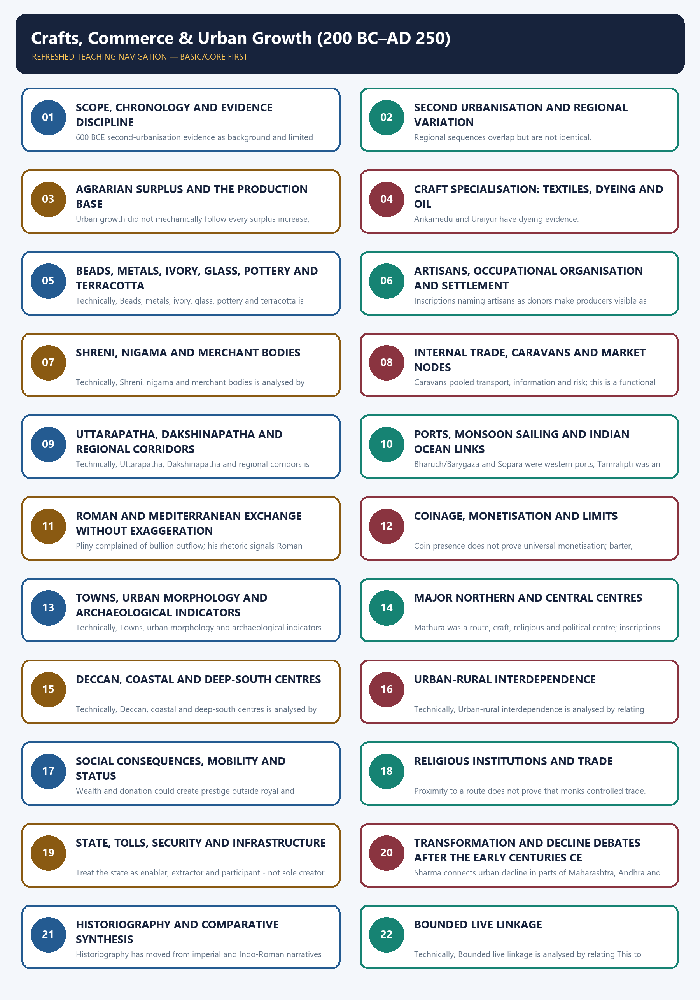
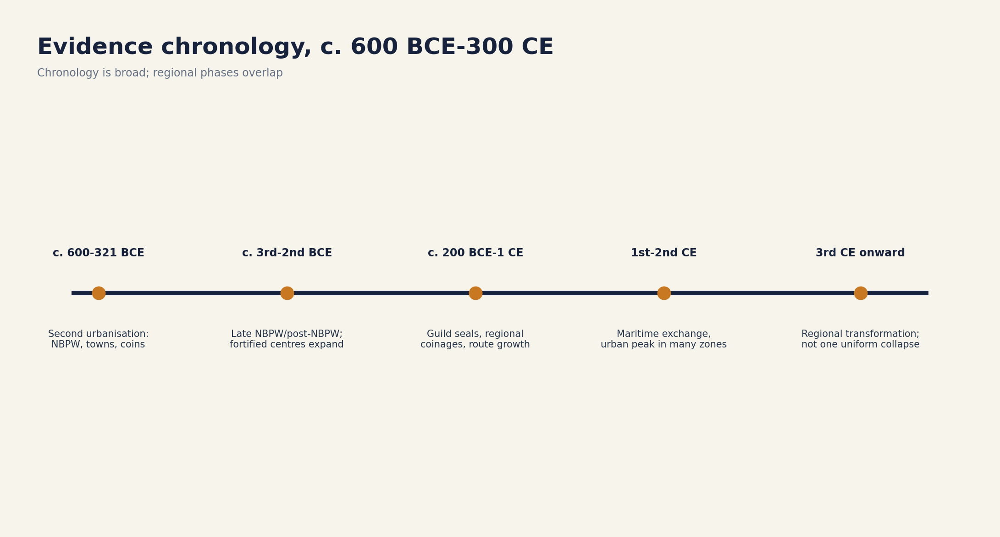
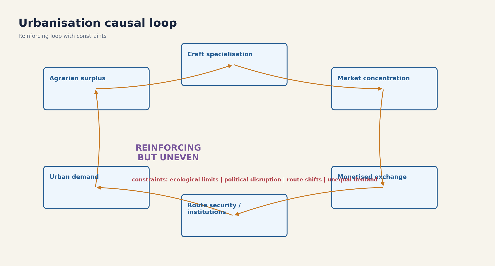
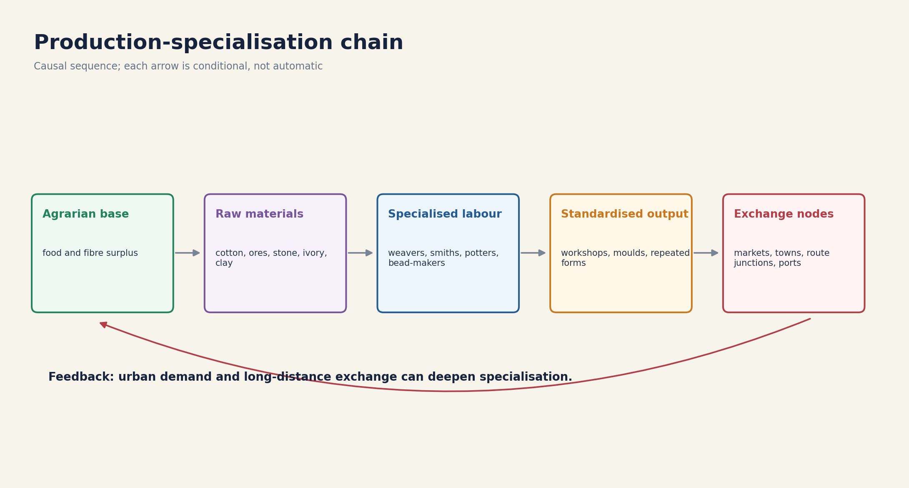
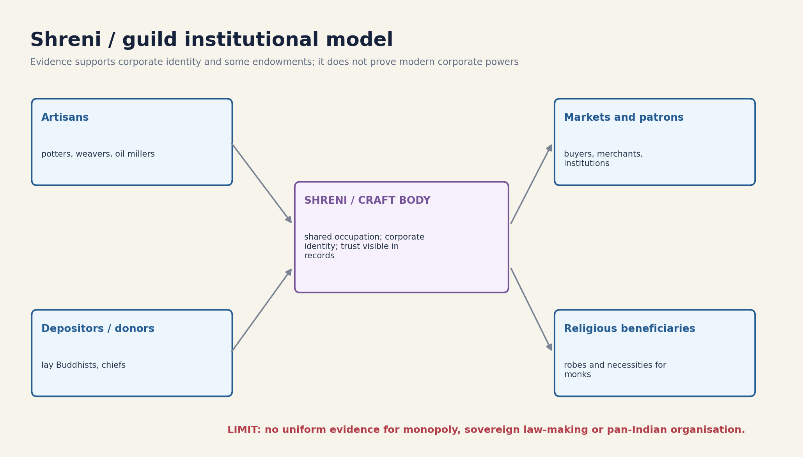
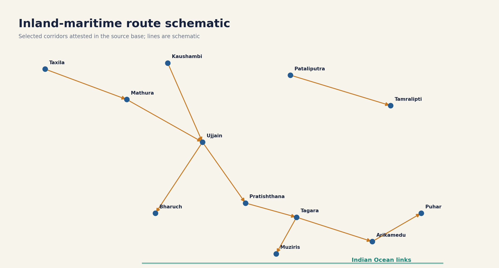
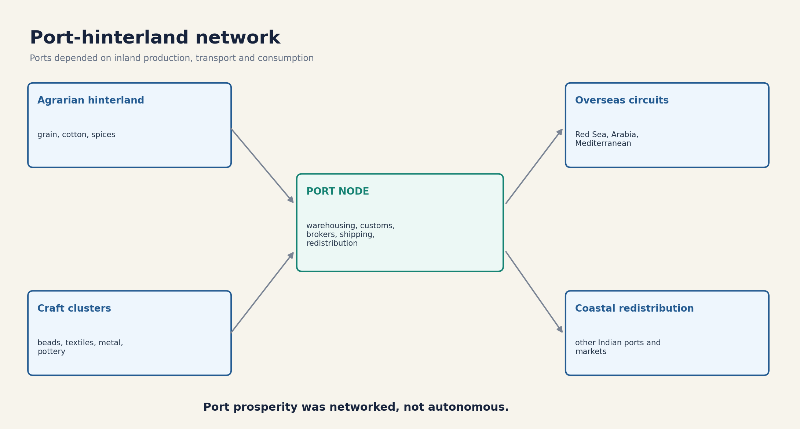
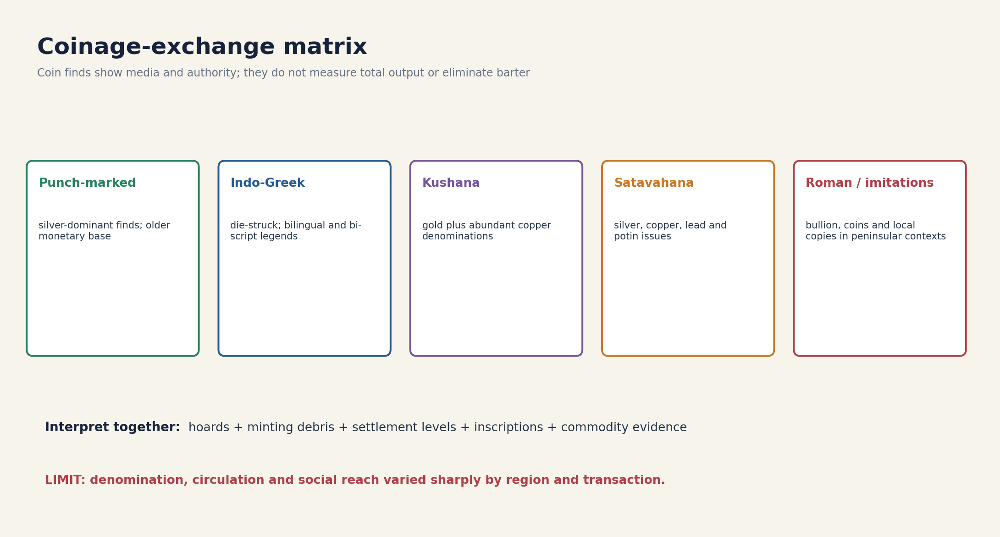
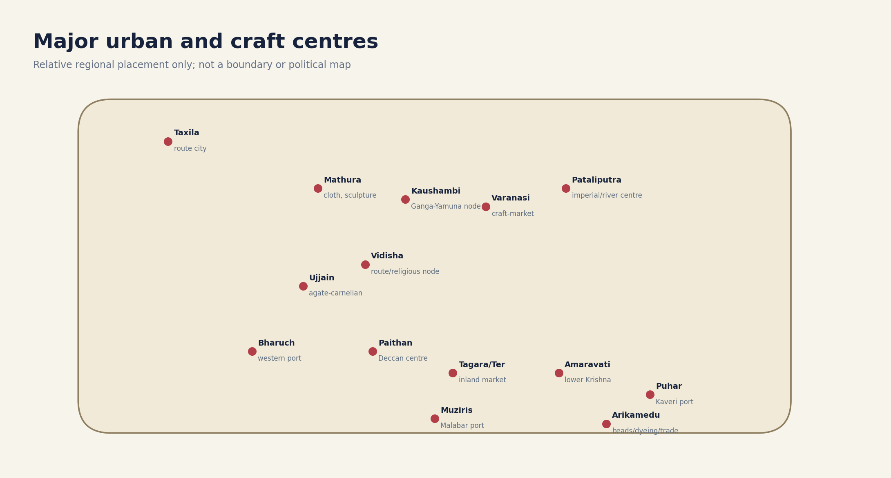
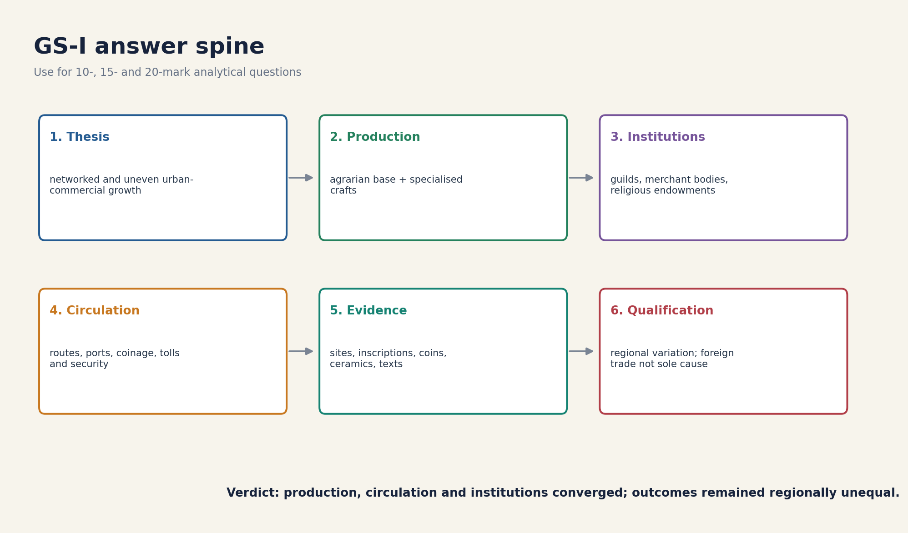

# Crafts, Commerce & Urban Growth (200 BC–AD 250) - Complete Topic Package

> **Subject:** Ancient Indian History | **GS:** Prelims GS-I; GS-I analytical/culture support  
> **Export date:** 2026-08-14 | **Approval:** false - awaiting explicit user approval  
> **Source order used:** repository Markdown -> OCR-searchable R.S. Sharma and Upinder Singh PDFs -> no live current-affairs claim added because none was necessary -> Qdrant not used.  
> **Tag rule:** [FACT] directly sourced; [ANALYSIS] reasoned synthesis; [LIMIT] evidentiary or chronological boundary.

## BASIC LEARNING SESSION



*Distinct embedded teaching-navigation image. The separate continuous Cārvāka-style flowchart package remains an independent at-a-glance artifact.*

#### Package counts, provenance and limitations

- Learning sections: 22; integrated main-PDF practice sections: 4; final register sections: 6.
- Workbook: 4 routed PYQs, 32 broad MCQs, 8 remedials and 6 solved Mains questions.
- Original PNG visuals: 9. They are deterministic teaching schematics, not archaeological reconstructions or scale maps.
- Direct locally routed Mains PYQ: none found. This absence is stated rather than filled with an invented PYQ.
- Heritage/current linkage is bounded to general interpretation of ancient ports; no dated current project claim is made.

#### Original visual asset index

- `notes\Ancient-Indian-History\assets\19_Crafts-Commerce-Urban-Growth\01_production_specialisation_chain.png`
- `notes\Ancient-Indian-History\assets\19_Crafts-Commerce-Urban-Growth\02_guild_shreni_institutional_model.png`
- `notes\Ancient-Indian-History\assets\19_Crafts-Commerce-Urban-Growth\03_inland_maritime_route_schematic.png`
- `notes\Ancient-Indian-History\assets\19_Crafts-Commerce-Urban-Growth\04_major_urban_craft_centres_map.png`
- `notes\Ancient-Indian-History\assets\19_Crafts-Commerce-Urban-Growth\05_coinage_exchange_matrix.png`
- `notes\Ancient-Indian-History\assets\19_Crafts-Commerce-Urban-Growth\06_port_hinterland_network.png`
- `notes\Ancient-Indian-History\assets\19_Crafts-Commerce-Urban-Growth\07_urbanisation_causal_loop.png`
- `notes\Ancient-Indian-History\assets\19_Crafts-Commerce-Urban-Growth\08_evidence_chronology.png`
- `notes\Ancient-Indian-History\assets\19_Crafts-Commerce-Urban-Growth\09_gs1_answer_spine.png`

### SESSION 1 — SCOPE, CHRONOLOGY AND EVIDENCE DISCIPLINE

#### DEFINITION / WHAT THIS IS CALLED

**Plain-language definition:** Scope, chronology and evidence discipline comprises Scope, chronology and evidence discipline as its core connected dimensions.

**Technical definition:** 600 BCE second-urbanisation evidence as background and limited third-century evidence to explain transformation.

#### ANSWER-GRABBING OPENING — WRITE/ADAPT IN THE EXAM

> 600 BCE second-urbanisation evidence as background and limited third-century evidence to explain transformation.

#### MUST-WRITE KEYWORDS

- **Scope**
- **chronology**
- **evidence discipline**
- **Mains angle**
- **Study link**
- **c. 600-321 BCE**

**How to use them:** Frame the answer through Scope; define chronology, connect evidence discipline with Mains angle to explain the mechanism, and use Study link for the decisive comparison or qualification.

[FACT] The package studies c. 200 BCE-250 CE, while using c. 600 BCE second-urbanisation evidence as background and limited third-century evidence to explain transformation.

#### Chronology

| Date | Marker |
|---|---|
| c. 600-321 BCE | Second urbanisation: NBPW, towns and punch-marked coins. |
| c. 200 BCE | Post-Mauryan regional polities and wider craft-trade networks. |
| 1st-2nd c. CE | Many urban and maritime networks reach a high point. |
| 3rd c. CE onward | Regional decline, continuity and route transformation coexist. |



*Original deterministic schematic prepared for this topic export.*

#### Core teaching / solved practice

- [FACT] Repository chronology places the post-Mauryan commercial world after Mauryan rule and alongside Indo-Greek, Shaka, Kushana, Satavahana and early Tamil polities.
- [FACT] The source base combines literary texts, inscriptions, coins, seals and sealings, pottery, craft debris, architecture, settlement archaeology and Graeco-Roman accounts.
- [LIMIT] Dynastic labels such as 'Shunga-Kushana level' are archaeological shorthand and may be misleading where the named dynasty did not rule.
- [LIMIT] Towns and durable materials are more visible than villages, perishables, informal exchange, women workers and low-value transactions.
- [ANALYSIS] Evidence must therefore be triangulated: one coin hoard or imported ceramic cannot by itself prove prosperity, ethnicity or trade volume.

#### Must-know facts

- The core window is c. 200 BCE-250 CE.
- Evidence is multi-source and regionally uneven.

#### UPSC traps

- WRONG: Every 'Kushana' layer proves Kushana political rule.
  CORRECT: The label can denote a broad archaeological phase.

**Mains angle:** Begin with period and source caution; avoid treating a textbook peak as a uniform subcontinental condition.

**Study link:** Master Chronology; Core/Advanced Topic 19; Topics 16-18.

#### CLOSING RECALL FLOW — SCOPE, CHRONOLOGY AND EVIDENCE DISCIPLINE

```text
START / CONCEPT: Scope, chronology and evidence discipline
        |
        v
EXACT TERMS: Scope · chronology · evidence discipline · Mains angle · Study link · c. 600-321 BCE
        |
        v
MECHANISM / ARGUMENT: Evidence must therefore be triangulated: one coin hoard or imported ceramic cannot by itself prove prosperity, ethnicity or trade volume.
        |
        v
CONSEQUENCE / CONTRAST: Dynastic labels such as 'Shunga-Kushana level' are archaeological shorthand and may be misleading where the named dynasty did not rule.
        |
        v
UPSC TRAP / ANSWER-USE: Do not miss this limiting distinction: towns and durable materials are more visible than villages, perishables, informal exchange, women workers...
        |
        v
ANSWER-GRABBING FORMULATION: 600 BCE second-urbanisation evidence as background and limited third-century evidence to explain transformation.
```
### SESSION 2 — SECOND URBANISATION AND REGIONAL VARIATION

#### DEFINITION / WHAT THIS IS CALLED

**Plain-language definition:** 'Second urbanisation' is strongest as a north Indian frame; it should not erase distinct Deccan and Tamil pathways.

**Technical definition:** Regional sequences overlap but are not identical.

#### ANSWER-GRABBING OPENING — WRITE/ADAPT IN THE EXAM

> 'Second urbanisation' is strongest as a north Indian frame; it should not erase distinct Deccan and Tamil pathways.

#### MUST-WRITE KEYWORDS

- **Second urbanisation**
- **regional variation**
- **Mains angle**
- **Study link**
- **North / Ganga-NW**
- **Older town networks, fortified centres, route cities**

**How to use them:** Frame the answer through Second urbanisation; define regional variation, connect Mains angle with Study link to explain the mechanism, and use North / Ganga-NW for the decisive comparison or qualification.

[FACT] The older second-urbanisation base included iron use, agricultural expansion, NBPW, writing, punch-marked coins, towns and heterodox religious movements in the middle Ganga region.



*Original deterministic schematic prepared for this topic export.*

#### Evidence / comparison matrix

| Region | Dominant pattern | Qualification |
| --- | --- | --- |
| North / Ganga-NW | Older town networks, fortified centres, route cities | Not all centres peaked together |
| Deccan | Agrarian expansion, inland markets, caves and western/eastern routes | Political control and evidence vary |
| Deep south | Megalithic background, ports, Tamil-Brahmi and chiefdom/state growth | Literary and archaeological chronologies differ |

#### Core teaching / solved practice

- [ANALYSIS] Post-Mauryan urban growth intensified an older process rather than creating towns from nothing.
- [FACT] Late NBPW and post-NBPW settlements in north India often show fortifications, planning, burnt brick, red ware, coins, seals and fine terracottas.
- [FACT] In the Deccan and south, early historic levels may overlap with megalithic horizons; other towns lack known prehistoric antecedents.
- [LIMIT] 'Second urbanisation' is strongest as a north Indian frame; it should not erase distinct Deccan and Tamil pathways.
- [ANALYSIS] Regional comparison must ask what combination of agrarian growth, political power, routes, crafts and ports sustained each centre.

#### Must-know facts

- Urbanisation was polycentric.
- Regional sequences overlap but are not identical.

#### UPSC traps

- WRONG: One all-India urban model explains every region.
  CORRECT: Use north, Deccan and deep-south comparison.

**Mains angle:** Use continuity plus intensification, then qualify by regional paths.

**Study link:** Topics 11, 17 and 18.

#### CLOSING RECALL FLOW — SECOND URBANISATION AND REGIONAL VARIATION

```text
START / CONCEPT: Second urbanisation and regional variation
        |
        v
EXACT TERMS: Second urbanisation · regional variation · Mains angle · Study link · North / Ganga-NW · Older town networks, fortified centres, route cities
        |
        v
MECHANISM / ARGUMENT: Use continuity plus intensification, then qualify by regional paths.
        |
        v
CONSEQUENCE / CONTRAST: Regional sequences overlap but are not identical.
        |
        v
UPSC TRAP / ANSWER-USE: Do not miss this limiting distinction: regional comparison must ask what combination of agrarian growth, political power, routes, crafts and...
        |
        v
ANSWER-GRABBING FORMULATION: 'Second urbanisation' is strongest as a north Indian frame; it should not erase distinct Deccan and Tamil pathways.
```
### SESSION 3 — AGRARIAN SURPLUS AND THE PRODUCTION BASE

#### DEFINITION / WHAT THIS IS CALLED

**Plain-language definition:** Sanghol's early-centuries-CE plant remains include cereals, pulses, oilseeds, cotton, spices, fruits and a dye plant, demonstrating a diversified agrarian base at one excavated site.

**Technical definition:** Urban growth did not mechanically follow every surplus increase; transport, demand, institutions and security also mattered.

#### ANSWER-GRABBING OPENING — WRITE/ADAPT IN THE EXAM

> Urban growth did not mechanically follow every surplus increase; transport, demand, institutions and security also mattered.

#### MUST-WRITE KEYWORDS

- **Agrarian surplus**
- **the production base**
- **Mains angle**
- **Study link**
- **Sanghol's**
- **CE**

**How to use them:** Frame the answer through Agrarian surplus; define the production base, connect Mains angle with Study link to explain the mechanism, and use Sanghol's for the decisive comparison or qualification.

[FACT] Long-term urban growth required expanded agricultural production as well as specialised crafts and wider trade.



*Original deterministic schematic prepared for this topic export.*

#### Core teaching / solved practice

- [FACT] Sanghol's early-centuries-CE plant remains include cereals, pulses, oilseeds, cotton, spices, fruits and a dye plant, demonstrating a diversified agrarian base at one excavated site.
- [FACT] Deccan contexts support paddy transplantation, cotton production and the Krishna-Godavari rice zone as important economic foundations.
- [FACT] Villages associated with potters, carpenters, smiths, reed workers, salt makers, hunters, fishers and other occupations appear in textual evidence.
- [ANALYSIS] Surplus meant more than grain: fibres, oilseeds, timber, ores, stone, salt, aromatics and animal products fed craft and trade chains.
- [LIMIT] Archaeobotanical evidence is site-specific and cannot be projected as a uniform crop map of the subcontinent.
- [LIMIT] Urban growth did not mechanically follow every surplus increase; transport, demand, institutions and security also mattered.

#### Must-know facts

- Agrarian and craft economies were interdependent.
- Cotton linked fields to textile production.

#### UPSC traps

- WRONG: Urbanisation can be explained without villages.
  CORRECT: Towns depended on food, fibre, labour and raw materials from hinterlands.

**Mains angle:** Make the village-town relationship causal, not decorative.

**Study link:** Satavahana agrarian base; Sanghol evidence.

#### CLOSING RECALL FLOW — AGRARIAN SURPLUS AND THE PRODUCTION BASE

```text
START / CONCEPT: Agrarian surplus and the production base
        |
        v
EXACT TERMS: Agrarian surplus · the production base · Mains angle · Study link · Sanghol's · CE
        |
        v
MECHANISM / ARGUMENT: Sanghol's early-centuries-CE plant remains include cereals, pulses, oilseeds, cotton, spices, fruits and a dye plant, demonstrating a diversified agrarian base at one excavated site.
        |
        v
CONSEQUENCE / CONTRAST: Archaeobotanical evidence is site-specific and cannot be projected as a uniform crop map of the subcontinent.
        |
        v
UPSC TRAP / ANSWER-USE: Do not miss this limiting distinction: agrarian and craft economies were interdependent.
        |
        v
ANSWER-GRABBING FORMULATION: Urban growth did not mechanically follow every surplus increase; transport, demand, institutions and security also mattered.
```
### SESSION 4 — CRAFT SPECIALISATION: TEXTILES, DYEING AND OIL

#### DEFINITION / WHAT THIS IS CALLED

**Plain-language definition:** A dyeing vat proves local processing, not the scale, ownership or destination of every textile produced.

**Technical definition:** Arikamedu and Uraiyur have dyeing evidence.

#### ANSWER-GRABBING OPENING — WRITE/ADAPT IN THE EXAM

> A dyeing vat proves local processing, not the scale, ownership or destination of every textile produced.

#### MUST-WRITE KEYWORDS

- **Craft specialisation**
- **textiles**
- **dyeing**
- **oil**
- **Mains angle**
- **Study link**

**How to use them:** Frame the answer through Craft specialisation; define textiles, connect dyeing with oil to explain the mechanism, and use Mains angle for the decisive comparison or qualification.

[FACT] Texts and inscriptions name more specialised workers than earlier sources, while excavations provide production installations and finished goods.

#### Evidence / comparison matrix

| Stage | Evidence-safe inference | Do not claim |
| --- | --- | --- |
| Fibre supply | Cotton and other fibres linked countryside and workshops | Uniform plantation economy |
| Weaving/dyeing | Named workers and vats show specialisation | State-owned factories everywhere |
| Distribution | Cloth travelled through inland and maritime markets | Every textile was exported to Rome |

#### Core teaching / solved practice

- [FACT] Mathura was associated in R.S. Sharma's account with a special cloth called sataka.
- [FACT] Brick-built dyeing vats at Uraiyur/Tiruchirapalli and Arikamedu belong broadly to the first to third centuries CE in the textbook account.
- [FACT] Inscriptions mention weavers and dyers as donors; oil millers appear in guild-deposit evidence from Maharashtra.
- [ANALYSIS] Textile production joined agrarian cotton or silk supply, spinning, weaving, dyeing, finishing, transport and market demand.
- [LIMIT] A dyeing vat proves local processing, not the scale, ownership or destination of every textile produced.
- [LIMIT] Occupational names do not automatically reveal wages, gender composition or workshop size.

#### Must-know facts

- Arikamedu and Uraiyur have dyeing evidence.
- Weavers and oil millers appear in deposit records.

#### UPSC traps

- WRONG: Imported ceramics explain textile production.
  CORRECT: Production evidence must come from installations, tools, texts and donor records.

**Mains angle:** Trace the full production chain and end with evidentiary limits.

**Study link:** Sangam markets and port networks.

#### CLOSING RECALL FLOW — CRAFT SPECIALISATION: TEXTILES, DYEING AND OIL

```text
START / CONCEPT: Craft specialisation: textiles, dyeing and oil
        |
        v
EXACT TERMS: Craft specialisation · textiles · dyeing · oil · Mains angle · Study link
        |
        v
MECHANISM / ARGUMENT: Brick-built dyeing vats at Uraiyur/Tiruchirapalli and Arikamedu belong broadly to the first to third centuries CE in the textbook account.
        |
        v
CONSEQUENCE / CONTRAST: Occupational names do not automatically reveal wages, gender composition or workshop size.
        |
        v
UPSC TRAP / ANSWER-USE: Do not miss this limiting distinction: arikamedu and Uraiyur have dyeing evidence.
        |
        v
ANSWER-GRABBING FORMULATION: A dyeing vat proves local processing, not the scale, ownership or destination of every textile produced.
```
### SESSION 5 — BEADS, METALS, IVORY, GLASS, POTTERY AND TERRACOTTA

#### DEFINITION / WHAT THIS IS CALLED

**Plain-language definition:** Indian ivory objects are reported beyond India, while Roman glass occurs at north-western sites; glass-blowing expanded around the beginning of the Common Era in Sharma's account.

**Technical definition:** Technically, Beads, metals, ivory, glass, pottery and terracotta is analysed by relating Beads to metals, then testing the relationship through ivory and glass.

#### ANSWER-GRABBING OPENING — WRITE/ADAPT IN THE EXAM

> Indian ivory objects are reported beyond India, while Roman glass occurs at north-western sites; glass-blowing expanded around the beginning of the Common Era in Sharma's account.

#### MUST-WRITE KEYWORDS

- **Beads**
- **metals**
- **ivory**
- **glass**
- **pottery**
- **terracotta**

**How to use them:** Frame the answer through Beads; define metals, connect ivory with glass to explain the mechanism, and use pottery for the decisive comparison or qualification.

[FACT] The period displays a wide craft spectrum: bead cutting, metallurgy, iron working, ivory, glass, pottery, terracotta, jewellery, sculpture and coin minting.

#### Evidence / comparison matrix

| Craft | Named evidence | Interpretive limit |
| --- | --- | --- |
| Beads | Ujjain agate/carnelian; Arikamedu/Kodumanal contexts | Distribution does not identify maker ethnicity |
| Metals | Telangana iron; coin moulds; lead/potin/copper issues | Find counts are excavation-dependent |
| Ivory/glass | Indian ivories abroad; imported glass in NW | Prestige trade is not total trade |
| Pottery/terracotta | Stamped red ware, moulds, figurines | Style is not a political boundary |

#### Core teaching / solved practice

- [FACT] Ujjain worked agate, jasper and carnelian on a large scale for beads after c. 200 BCE, using raw material available in the Sipra region.
- [FACT] Iron artefacts increase in many Kushana and Satavahana levels; Telangana evidence includes tools, weapons and agricultural implements.
- [FACT] Indian ivory objects are reported beyond India, while Roman glass occurs at north-western sites; glass-blowing expanded around the beginning of the Common Era in Sharma's account.
- [FACT] Pottery, coin moulds, terracotta moulds and production debris reveal repeated manufacture rather than isolated consumption.
- [ANALYSIS] Standard forms and moulds suggest batch production, but not necessarily centralised factories.
- [LIMIT] Luxury objects overrepresent elite demand; archaeologically invisible everyday crafts remain undercounted.

#### Must-know facts

- Ujjain was both a route node and bead-working centre.
- Coin minting itself was a specialised craft.

#### UPSC traps

- WRONG: Moulds prove modern mass industry.
  CORRECT: They show repeated production, not modern scale or labour relations.

**Mains angle:** Use at least three craft classes and connect each to evidence and market.

**Study link:** Ujjain; Deccan craft sites; port archaeology.

#### CLOSING RECALL FLOW — BEADS, METALS, IVORY, GLASS, POTTERY AND TERRACOTTA

```text
START / CONCEPT: Beads, metals, ivory, glass, pottery and terracotta
        |
        v
EXACT TERMS: Beads · metals · ivory · glass · pottery · terracotta
        |
        v
MECHANISM / ARGUMENT: Iron artefacts increase in many Kushana and Satavahana levels; Telangana evidence includes tools, weapons and agricultural implements.
        |
        v
CONSEQUENCE / CONTRAST: CORRECT: They show repeated production, not modern scale or labour relations.
        |
        v
UPSC TRAP / ANSWER-USE: Do not miss this limiting distinction: use at least three craft classes and connect each to evidence and market.
        |
        v
ANSWER-GRABBING FORMULATION: Indian ivory objects are reported beyond India, while Roman glass occurs at north-western sites; glass-blowing expanded around the beginning of the Common Era in Sharma's account.
```
### SESSION 6 — ARTISANS, OCCUPATIONAL ORGANISATION AND SETTLEMENT

#### DEFINITION / WHAT THIS IS CALLED

**Plain-language definition:** A Karimnagar village settlement reportedly had separate quarters for carpenters, blacksmiths, goldsmiths and potters, with other labourers at one end.

**Technical definition:** Inscriptions naming artisans as donors make producers visible as social actors, but donors were not necessarily representative of all workers.

#### ANSWER-GRABBING OPENING — WRITE/ADAPT IN THE EXAM

> Inscriptions naming artisans as donors make producers visible as social actors, but donors were not necessarily representative of all workers.

#### MUST-WRITE KEYWORDS

- **Artisans**
- **occupational organisation**
- **settlement**
- **Mains angle**
- **Study link**
- **Karimnagar**

**How to use them:** Frame the answer through Artisans; define occupational organisation, connect settlement with Mains angle to explain the mechanism, and use Study link for the decisive comparison or qualification.

[FACT] Literary lists associate many craftsmen with towns, while excavations also reveal occupational clustering in villages.

#### Core teaching / solved practice

- [FACT] The Mahavastu lists 36 kinds of workers at Rajgir; the Milindapanha enumerates many occupations, most craft-related, in Sharma's summary.
- [FACT] A Karimnagar village settlement reportedly had separate quarters for carpenters, blacksmiths, goldsmiths and potters, with other labourers at one end.
- [ANALYSIS] Occupational clustering can lower transaction costs, share furnaces or skills and reinforce social identity.
- [LIMIT] Spatial clustering does not automatically prove hereditary caste closure or guild membership.
- [ANALYSIS] Inscriptions naming artisans as donors make producers visible as social actors, but donors were not necessarily representative of all workers.
- [LIMIT] The evidence is much stronger for named male donors and durable crafts than for household, female and seasonal labour.

#### Must-know facts

- Craftsmen lived in both towns and some villages.
- Donor inscriptions reveal agency but are socially selective.

#### UPSC traps

- WRONG: All artisans were urban guild members.
  CORRECT: Village craft quarters and independent producers also existed.

**Mains angle:** Separate occupation, residence, corporate organisation and social status.

**Study link:** Urban-rural interdependence; donation records.

#### CLOSING RECALL FLOW — ARTISANS, OCCUPATIONAL ORGANISATION AND SETTLEMENT

```text
START / CONCEPT: Artisans, occupational organisation and settlement
        |
        v
EXACT TERMS: Artisans · occupational organisation · settlement · Mains angle · Study link · Karimnagar
        |
        v
MECHANISM / ARGUMENT: A Karimnagar village settlement reportedly had separate quarters for carpenters, blacksmiths, goldsmiths and potters, with other labourers at one end.
        |
        v
CONSEQUENCE / CONTRAST: Spatial clustering does not automatically prove hereditary caste closure or guild membership.
        |
        v
UPSC TRAP / ANSWER-USE: Donor inscriptions reveal agency but are socially selective.
        |
        v
ANSWER-GRABBING FORMULATION: Inscriptions naming artisans as donors make producers visible as social actors, but donors were not necessarily representative of all workers.
```
### SESSION 7 — SHRENI, NIGAMA AND MERCHANT BODIES

#### DEFINITION / WHAT THIS IS CALLED

**Plain-language definition:** A handful of negama/nigama coins are interpreted by Upinder Singh as reflecting merchant-guild authority.

**Technical definition:** Technically, Shreni, nigama and merchant bodies is analysed by relating Shreni to nigama, then testing the relationship through merchant bodies and Mains angle.

#### ANSWER-GRABBING OPENING — WRITE/ADAPT IN THE EXAM

> A handful of negama/nigama coins are interpreted by Upinder Singh as reflecting merchant-guild authority.

#### MUST-WRITE KEYWORDS

- **Shreni**
- **nigama**
- **merchant bodies**
- **Mains angle**
- **Study link**
- **Shreni / seni**

**How to use them:** Frame the answer through Shreni; define nigama, connect merchant bodies with Mains angle to explain the mechanism, and use Study link for the decisive comparison or qualification.

[FACT] Guild-related seals, inscriptions, deposits and a small group of nigama coins support corporate craft and merchant identities.



*Original deterministic schematic prepared for this topic export.*

#### Evidence / comparison matrix

| Term/evidence | Safe meaning | Limit |
| --- | --- | --- |
| Shreni / seni | Occupational corporate body | Not a modern company or universal monopoly |
| Nigama / negama | Merchant/corporate or market-town association in context | Meaning varies by record |
| Deposit/endowment | Principal entrusted for recurring religious provision | Interest mechanics not always fully preserved |

#### Core teaching / solved practice

- [FACT] A second-century-BCE sealing read as shulaphalayikanam may refer to makers of arrowheads or spearheads.
- [FACT] An Ahichchhatra seal with kumhakara seniya refers to a potters' guild in first-century-CE writing.
- [FACT] Sharma reports money deposits with guilds of potters, oil millers and weavers in second-century-CE Maharashtra for monastic necessities.
- [FACT] A chief's deposit with flour makers at Mathura funded daily service to Brahmanas from monthly income.
- [FACT] A handful of negama/nigama coins are interpreted by Upinder Singh as reflecting merchant-guild authority.
- [ANALYSIS] Corporate reputation made some guilds credible custodians of endowments and recurring payments.
- [LIMIT] 'Banking' is an analogy: evidence supports deposits and income-bearing endowments, not a complete modern banking system.
- [LIMIT] Guild powers, membership rules and territorial reach cannot be standardised across all regions from a few records.

#### Must-know facts

- Potter, oil-miller, weaver and flour-maker bodies appear in deposit contexts.
- Corporate evidence is concentrated and uneven.

#### UPSC traps

- WRONG: Guilds exercised sovereign authority throughout India.
  CORRECT: Some corporate identity and economic authority are visible; scale varied.

**Mains angle:** Claim institution, name record, explain function, then state what remains unknown.

**Study link:** Mathura and western Deccan inscriptions.

#### CLOSING RECALL FLOW — SHRENI, NIGAMA AND MERCHANT BODIES

```text
START / CONCEPT: Shreni, nigama and merchant bodies
        |
        v
EXACT TERMS: Shreni · nigama · merchant bodies · Mains angle · Study link · Shreni / seni
        |
        v
MECHANISM / ARGUMENT: An Ahichchhatra seal with kumhakara seniya refers to a potters' guild in first-century-CE writing.
        |
        v
CONSEQUENCE / CONTRAST: 'Banking' is an analogy: evidence supports deposits and income-bearing endowments, not a complete modern banking system.
        |
        v
UPSC TRAP / ANSWER-USE: Do not miss this limiting distinction: some corporate identity and economic authority are visible.
        |
        v
ANSWER-GRABBING FORMULATION: A handful of negama/nigama coins are interpreted by Upinder Singh as reflecting merchant-guild authority.
```
### SESSION 8 — INTERNAL TRADE, CARAVANS AND MARKET NODES

#### DEFINITION / WHAT THIS IS CALLED

**Plain-language definition:** Sangam material refers to chattu caravans carrying paddy, salt and pepper.

**Technical definition:** Caravans pooled transport, information and risk; this is a functional inference, not proof of one standard caravan organisation.

#### ANSWER-GRABBING OPENING — WRITE/ADAPT IN THE EXAM

> Caravans pooled transport, information and risk; this is a functional inference, not proof of one standard caravan organisation.

#### MUST-WRITE KEYWORDS

- **Internal trade**
- **caravans**
- **market nodes**
- **Mains angle**
- **Study link**
- **Sangam material**

**How to use them:** Frame the answer through Internal trade; define caravans, connect market nodes with Mains angle to explain the mechanism, and use Study link for the decisive comparison or qualification.

[FACT] Internal trade connected production zones, villages, urban markets, religious sites and ports.



*Original deterministic schematic prepared for this topic export.*

#### Core teaching / solved practice

- [FACT] Sangam material refers to chattu caravans carrying paddy, salt and pepper.
- [FACT] Market towns and route junctions such as Mathura, Ujjain, Kaushambi and Taxila linked multiple corridors.
- [ANALYSIS] Caravans pooled transport, information and risk; this is a functional inference, not proof of one standard caravan organisation.
- [FACT] Goods moving internally included food, salt, fibre, metals, stones, pottery, beads, textiles, animals and luxury goods.
- [ANALYSIS] Market nodes performed aggregation, exchange, storage, taxation and redistribution functions.
- [LIMIT] Route maps reconstruct corridors from scattered texts, finds and geography; they are not modern timetables.

#### Must-know facts

- Internal trade sustained overseas trade.
- Caravans linked hinterlands with towns and ports.

#### UPSC traps

- WRONG: Foreign trade bypassed internal markets.
  CORRECT: Exports first moved through inland production and redistribution networks.

**Mains angle:** Start with inland circulation before discussing the sea.

**Study link:** Sangam chattu; route cities.

#### CLOSING RECALL FLOW — INTERNAL TRADE, CARAVANS AND MARKET NODES

```text
START / CONCEPT: Internal trade, caravans and market nodes
        |
        v
EXACT TERMS: Internal trade · caravans · market nodes · Mains angle · Study link · Sangam material
        |
        v
MECHANISM / ARGUMENT: Sangam material refers to chattu caravans carrying paddy, salt and pepper.
        |
        v
CONSEQUENCE / CONTRAST: Route maps reconstruct corridors from scattered texts, finds and geography; they are not modern timetables.
        |
        v
UPSC TRAP / ANSWER-USE: Do not miss this limiting distinction: caravans pooled transport, information and risk.
        |
        v
ANSWER-GRABBING FORMULATION: Caravans pooled transport, information and risk; this is a functional inference, not proof of one standard caravan organisation.
```
### SESSION 9 — UTTARAPATHA, DAKSHINAPATHA AND REGIONAL CORRIDORS

#### DEFINITION / WHAT THIS IS CALLED

**Plain-language definition:** 'Uttarapatha' and 'Dakshinapatha' can denote broad route regions or corridors; do not force one immutable road line.

**Technical definition:** Technically, Uttarapatha, Dakshinapatha and regional corridors is analysed by relating Uttarapatha to Dakshinapatha, then testing the relationship through regional corridors and Mains angle.

#### ANSWER-GRABBING OPENING — WRITE/ADAPT IN THE EXAM

> 'Uttarapatha' and 'Dakshinapatha' can denote broad route regions or corridors; do not force one immutable road line.

#### MUST-WRITE KEYWORDS

- **Uttarapatha**
- **Dakshinapatha**
- **regional corridors**
- **Mains angle**
- **Study link**
- **Gangetic**

**How to use them:** Frame the answer through Uttarapatha; define Dakshinapatha, connect regional corridors with Mains angle to explain the mechanism, and use Study link for the decisive comparison or qualification.

[FACT] The textbook route reconstruction links north-western, Gangetic, Malwa, Deccan and coastal zones.

#### Core teaching / solved practice

- [FACT] Taxila connected with Central Asian routes and with corridors towards the lower Indus and Bharuch.
- [FACT] A frequently used northern corridor ran Taxila-Punjab-Yamuna-Mathura-Ujjain-Bharuch in Sharma's reconstruction.
- [FACT] Ujjain also connected with Kaushambi, making it a major junction rather than a terminal.
- [ANALYSIS] 'Uttarapatha' and 'Dakshinapatha' can denote broad route regions or corridors; do not force one immutable road line.
- [FACT] Deccan routes linked western-coast ports with Pratishthana/Paithan, Tagara/Ter and eastern/southern centres.
- [LIMIT] Political boundaries shifted, and control over a route did not equal control over every caravan or local market.

#### Must-know facts

- Taxila, Mathura, Ujjain and Bharuch form a high-yield corridor.
- Ujjain joined the Mathura and Kaushambi approaches.

#### UPSC traps

- WRONG: Uttarapatha was one paved imperial highway with fixed branches.
  CORRECT: Treat it as a historically changing northern corridor/network.

**Mains angle:** Name nodes, goods and political contexts; avoid drawing a single rigid line.

**Study link:** Central Asian contacts; Satavahana Deccan.

#### CLOSING RECALL FLOW — UTTARAPATHA, DAKSHINAPATHA AND REGIONAL CORRIDORS

```text
START / CONCEPT: Uttarapatha, Dakshinapatha and regional corridors
        |
        v
EXACT TERMS: Uttarapatha · Dakshinapatha · regional corridors · Mains angle · Study link · Gangetic
        |
        v
MECHANISM / ARGUMENT: WRONG: Uttarapatha was one paved imperial highway with fixed branches.
        |
        v
CONSEQUENCE / CONTRAST: The textbook route reconstruction links north-western, Gangetic, Malwa, Deccan and coastal zones.
        |
        v
UPSC TRAP / ANSWER-USE: Do not miss this limiting distinction: treat it as a historically changing northern corridor/network.
        |
        v
ANSWER-GRABBING FORMULATION: 'Uttarapatha' and 'Dakshinapatha' can denote broad route regions or corridors; do not force one immutable road line.
```
### SESSION 10 — PORTS, MONSOON SAILING AND INDIAN OCEAN LINKS

#### DEFINITION / WHAT THIS IS CALLED

**Plain-language definition:** Knowledge of monsoon wind regimes enabled more direct seasonal crossings, but the old 'discovery by one Greek sailor' story should not erase accumulated Indian Ocean expertise.

**Technical definition:** Bharuch/Barygaza and Sopara were western ports; Tamralipti was an eastern outlet; Arikamedu, Muziris and Kaveripattinam/Puhar belong to southern maritime networks.

#### ANSWER-GRABBING OPENING — WRITE/ADAPT IN THE EXAM

> Knowledge of monsoon wind regimes enabled more direct seasonal crossings, but the old 'discovery by one Greek sailor' story should not erase accumulated Indian Ocean expertise.

#### MUST-WRITE KEYWORDS

- **Ports**
- **monsoon sailing**
- **Indian Ocean links**
- **Mains angle**
- **Study link**
- **Bharuch**

**How to use them:** Frame the answer through Ports; define monsoon sailing, connect Indian Ocean links with Mains angle to explain the mechanism, and use Study link for the decisive comparison or qualification.

[FACT] Ports joined inland supply networks to coastal and overseas exchange in the Arabian Sea, Bay of Bengal and Red Sea worlds.



*Original deterministic schematic prepared for this topic export.*

#### Core teaching / solved practice

- [FACT] Bharuch/Barygaza and Sopara were western ports; Tamralipti was an eastern outlet; Arikamedu, Muziris and Kaveripattinam/Puhar belong to southern maritime networks.
- [FACT] Graeco-Roman texts, including the Periplus, are important for trade geography but reflect external commercial perspectives.
- [ANALYSIS] Knowledge of monsoon wind regimes enabled more direct seasonal crossings, but the old 'discovery by one Greek sailor' story should not erase accumulated Indian Ocean expertise.
- [FACT] Ports handled aggregation, storage, customs, brokerage, shipping and redistribution.
- [ANALYSIS] A port's vitality depended on its hinterland, river or road access and political security.
- [LIMIT] Identification of Pattanam with Muziris remains debated; Arikamedu should not be labelled a Roman colony.

#### Must-know facts

- Bharuch was a major western outlet.
- Ports were parts of networks, not isolated coastal enclaves.

#### UPSC traps

- WRONG: Roman objects prove a resident Roman colony.
  CORRECT: They prove contact and consumption; resident identity needs separate evidence.

**Mains angle:** Use a port-hinterland model and include intermediaries.

**Study link:** Sangam Topic 18; Periplus; Arikamedu caution.

#### CLOSING RECALL FLOW — PORTS, MONSOON SAILING AND INDIAN OCEAN LINKS

```text
START / CONCEPT: Ports, monsoon sailing and Indian Ocean links
        |
        v
EXACT TERMS: Ports · monsoon sailing · Indian Ocean links · Mains angle · Study link · Bharuch
        |
        v
MECHANISM / ARGUMENT: Bharuch/Barygaza and Sopara were western ports; Tamralipti was an eastern outlet; Arikamedu, Muziris and Kaveripattinam/Puhar belong to southern maritime networks.
        |
        v
CONSEQUENCE / CONTRAST: Ports were parts of networks, not isolated coastal enclaves.
        |
        v
UPSC TRAP / ANSWER-USE: Graeco-Roman texts, including the Periplus, are important for trade geography but reflect external commercial perspectives.
        |
        v
ANSWER-GRABBING FORMULATION: Knowledge of monsoon wind regimes enabled more direct seasonal crossings, but the old 'discovery by one Greek sailor' story should not erase accumulated Indian Ocean expertise.
```
### SESSION 11 — ROMAN AND MEDITERRANEAN EXCHANGE WITHOUT EXAGGERATION

#### DEFINITION / WHAT THIS IS CALLED

**Plain-language definition:** Roman coin finds are concentrated south of the Vindhyas, though north-western contacts also existed through wider routes.

**Technical definition:** Pliny complained of bullion outflow; his rhetoric signals Roman anxiety but is not a statistical trade balance.

#### ANSWER-GRABBING OPENING — WRITE/ADAPT IN THE EXAM

> Roman coin finds are concentrated south of the Vindhyas, though north-western contacts also existed through wider routes.

#### MUST-WRITE KEYWORDS

- **Roman**
- **Mediterranean exchange without exaggeration**
- **Mains angle**
- **Study link**
- **Indo-Mediterranean**
- **India**

**How to use them:** Frame the answer through Roman; define Mediterranean exchange without exaggeration, connect Mains angle with Study link to explain the mechanism, and use Indo-Mediterranean for the decisive comparison or qualification.

[FACT] Indo-Mediterranean exchange was substantial in selected luxury and high-value commodities, especially through western and southern India.

#### Core teaching / solved practice

- [FACT] Exports included pepper and other spices, textiles/muslin, pearls, precious stones, beads, ivory and iron/steel goods in the textbook synthesis.
- [FACT] Imports included wine amphorae, ceramics, glassware, metals and gold/silver coins or bullion.
- [FACT] Roman coin finds are concentrated south of the Vindhyas, though north-western contacts also existed through wider routes.
- [FACT] Pliny complained of bullion outflow; his rhetoric signals Roman anxiety but is not a statistical trade balance.
- [ANALYSIS] 'Indo-Roman trade' is shorthand for a multi-nodal Indian Ocean system involving Indian, Arabian, Egyptian-Greek and other intermediaries.
- [LIMIT] Imported amphorae do not reveal their contents in every case, the identity of all consumers or a permanent foreign community.
- [LIMIT] Overseas commerce was important but cannot alone explain agrarian production, internal markets or every town.

#### Must-know facts

- Pepper and luxury goods were important.
- Pliny is evidence of perception, not precise volume.

#### UPSC traps

- WRONG: Rome directly controlled Indian ports.
  CORRECT: Exchange involved local polities, merchants and multiple intermediaries.

**Mains angle:** Reframe bilateral 'Roman trade' as a wider Indian Ocean network.

**Study link:** Arikamedu, Muziris, Bharuch and Red Sea contacts.

#### CLOSING RECALL FLOW — ROMAN AND MEDITERRANEAN EXCHANGE WITHOUT EXAGGERATION

```text
START / CONCEPT: Roman and Mediterranean exchange without exaggeration
        |
        v
EXACT TERMS: Roman · Mediterranean exchange without exaggeration · Mains angle · Study link · Indo-Mediterranean · India
        |
        v
MECHANISM / ARGUMENT: Indo-Mediterranean exchange was substantial in selected luxury and high-value commodities, especially through western and southern India.
        |
        v
CONSEQUENCE / CONTRAST: Pliny complained of bullion outflow; his rhetoric signals Roman anxiety but is not a statistical trade balance.
        |
        v
UPSC TRAP / ANSWER-USE: Imported amphorae do not reveal their contents in every case, the identity of all consumers or a permanent foreign community.
        |
        v
ANSWER-GRABBING FORMULATION: Roman coin finds are concentrated south of the Vindhyas, though north-western contacts also existed through wider routes.
```
### SESSION 12 — COINAGE, MONETISATION AND LIMITS

#### DEFINITION / WHAT THIS IS CALLED

**Plain-language definition:** Gold coinage is a poor proxy for everyday transactions, which often depended on lower denominations or non-coin exchange.

**Technical definition:** Coin presence does not prove universal monetisation; barter, payments in kind and customary exchange continued.

#### ANSWER-GRABBING OPENING — WRITE/ADAPT IN THE EXAM

> Coin presence does not prove universal monetisation; barter, payments in kind and customary exchange continued.

#### MUST-WRITE KEYWORDS

- **Coinage**
- **monetisation**
- **limits**
- **Mains angle**
- **Study link**
- **Indo-Greek**

**How to use them:** Frame the answer through Coinage; define monetisation, connect limits with Mains angle to explain the mechanism, and use Study link for the decisive comparison or qualification.

[FACT] Coinage diversified across regions and authorities: punch-marked survivals, Indo-Greek, Shaka, Kushana, Satavahana, civic, corporate, Tamil and Roman-linked issues.



*Original deterministic schematic prepared for this topic export.*

#### Core teaching / solved practice

- [FACT] Indo-Greek coins introduced bilingual and bi-script legends; Kushanas issued gold and large copper series.
- [FACT] Satavahanas issued silver, copper, lead and potin; Tamil dynastic issues were mostly copper with some silver.
- [FACT] City coins are associated with centres including Ujjayini, Kaushambi, Vidisha, Varanasi and Taxila; a few negama coins relate to merchant authority.
- [FACT] Pali texts name monetary terms such as kahapana, nikkha, kamsa and kakanika; archaeological punch-marked silver coins corroborate an earlier money economy.
- [ANALYSIS] Coins facilitated taxation, military payment, market exchange, savings, prestige and political messaging in different proportions.
- [LIMIT] Coin presence does not prove universal monetisation; barter, payments in kind and customary exchange continued.
- [LIMIT] Gold coinage is a poor proxy for everyday transactions, which often depended on lower denominations or non-coin exchange.

#### Must-know facts

- Coin metals and denominations varied regionally.
- Pali textual terms and punch-marked finds must be read together.

#### UPSC traps

- WRONG: Roman gold created all Kushana gold coinage.
  CORRECT: Kushanas had multiple gold sources; Roman bullion was not the sole source.

**Mains angle:** Always add the monetisation limit after discussing coin abundance.

**Study link:** 2026 routed PYQ; Central Asian and Satavahana coinage.

#### CLOSING RECALL FLOW — COINAGE, MONETISATION AND LIMITS

```text
START / CONCEPT: Coinage, monetisation and limits
        |
        v
EXACT TERMS: Coinage · monetisation · limits · Mains angle · Study link · Indo-Greek
        |
        v
MECHANISM / ARGUMENT: Satavahanas issued silver, copper, lead and potin; Tamil dynastic issues were mostly copper with some silver.
        |
        v
CONSEQUENCE / CONTRAST: CORRECT: Kushanas had multiple gold sources; Roman bullion was not the sole source.
        |
        v
UPSC TRAP / ANSWER-USE: Do not miss this limiting distinction: gold coinage is a poor proxy for everyday transactions, which often depended on lower...
        |
        v
ANSWER-GRABBING FORMULATION: Coin presence does not prove universal monetisation; barter, payments in kind and customary exchange continued.
```
### SESSION 13 — TOWNS, URBAN MORPHOLOGY AND ARCHAEOLOGICAL INDICATORS

#### DEFINITION / WHAT THIS IS CALLED

**Plain-language definition:** Urban morphology reveals differentiated residence, production, exchange, defence and ritual, but excavation exposure is often tiny.

**Technical definition:** Technically, Towns, urban morphology and archaeological indicators is analysed by relating Towns to urban morphology, then testing the relationship through archaeological indicators and Mains angle.

#### ANSWER-GRABBING OPENING — WRITE/ADAPT IN THE EXAM

> Urban morphology reveals differentiated residence, production, exchange, defence and ritual, but excavation exposure is often tiny.

#### MUST-WRITE KEYWORDS

- **Towns**
- **urban morphology**
- **archaeological indicators**
- **Mains angle**
- **Study link**
- **Fortification/planning**

**How to use them:** Frame the answer through Towns; define urban morphology, connect archaeological indicators with Mains angle to explain the mechanism, and use Study link for the decisive comparison or qualification.

[FACT] Urban identification rests on converging indicators rather than one artefact.

#### Evidence / comparison matrix

| Indicator | What it can show | Limit |
| --- | --- | --- |
| Fortification/planning | Defence, authority, organised space | Also found at non-metropolitan sites |
| Bricks/drains/ring wells | Investment in built environment and water/waste systems | Preservation and excavation bias |
| Coins/seals/moulds | Exchange, administration, production | Cannot quantify whole economy |
| Craft debris/imports | Specialisation and contact | May represent a small elite sector |

#### Core teaching / solved practice

- [FACT] Fortifications, planned streets, burnt-brick or stone houses, courtyards, drains, ring wells, shops, storage areas, seals, coins and craft debris are recurring indicators.
- [FACT] Taxila's Sirkap had an orderly street layout, fortifications, courtyard houses, possible shops and religious structures; Sirsukh represents a later Kushana foundation.
- [FACT] Hastinapura's early-historic phase had burnt-brick houses, a ring well, tools, beads, terracottas, inscriptions and coins.
- [FACT] Sunet yielded a substantial burnt-brick house with drainage, seals and a large body of Yaudheya coin moulds.
- [ANALYSIS] Urban morphology reveals differentiated residence, production, exchange, defence and ritual, but excavation exposure is often tiny.
- [LIMIT] Fortification does not by itself prove a city; ring wells or NBPW alone are insufficient.

#### Must-know facts

- Use indicator clusters, not single-object urbanism.
- Archaeological exposure is uneven.

#### UPSC traps

- WRONG: Any site with a ring well was a major city.
  CORRECT: Urban status requires multiple contextual indicators.

**Mains angle:** Define urbanism through functions and material clusters.

**Study link:** Taxila, Hastinapura, Sunet and Purana Qila.

#### CLOSING RECALL FLOW — TOWNS, URBAN MORPHOLOGY AND ARCHAEOLOGICAL INDICATORS

```text
START / CONCEPT: Towns, urban morphology and archaeological indicators
        |
        v
EXACT TERMS: Towns · urban morphology · archaeological indicators · Mains angle · Study link · Fortification/planning
        |
        v
MECHANISM / ARGUMENT: Fortification does not by itself prove a city; ring wells or NBPW alone are insufficient.
        |
        v
CONSEQUENCE / CONTRAST: Use indicator clusters, not single-object urbanism.
        |
        v
UPSC TRAP / ANSWER-USE: Do not miss this limiting distinction: urban status requires multiple contextual indicators.
        |
        v
ANSWER-GRABBING FORMULATION: Urban morphology reveals differentiated residence, production, exchange, defence and ritual, but excavation exposure is often tiny.
```
### SESSION 14 — MAJOR NORTHERN AND CENTRAL CENTRES

#### DEFINITION / WHAT THIS IS CALLED

**Plain-language definition:** Kaushambi, Varanasi and Pataliputra continued as major Ganga-region centres, but their fortunes and archaeological profiles were not identical.

**Technical definition:** Mathura was a route, craft, religious and political centre; inscriptions preserve artisan and endowment evidence.

#### ANSWER-GRABBING OPENING — WRITE/ADAPT IN THE EXAM

> Kaushambi, Varanasi and Pataliputra continued as major Ganga-region centres, but their fortunes and archaeological profiles were not identical.

#### MUST-WRITE KEYWORDS

- **Major northern**
- **central centres**
- **Mains angle**
- **Study link**
- **Taxila**
- **Mathura**

**How to use them:** Frame the answer through Major northern; define central centres, connect Mains angle with Study link to explain the mechanism, and use Taxila for the decisive comparison or qualification.

[FACT] Important centres differed in function, chronology and evidentiary depth.



*Original deterministic schematic prepared for this topic export.*

#### Core teaching / solved practice

- [FACT] Taxila was a north-western route city with successive urban foundations and transregional contacts.
- [FACT] Mathura was a route, craft, religious and political centre; inscriptions preserve artisan and endowment evidence.
- [FACT] Ujjain linked routes from Mathura and Kaushambi to Bharuch and supported agate-carnelian bead work.
- [FACT] Vidisha/Besnagar combined route location with political and religious importance.
- [FACT] Kaushambi, Varanasi and Pataliputra continued as major Ganga-region centres, but their fortunes and archaeological profiles were not identical.
- [ANALYSIS] A city could combine administrative, sacred, manufacturing and exchange functions; one label rarely captures its whole role.
- [LIMIT] Literary fame does not guarantee that every excavated phase was equally prosperous.

#### Must-know facts

- Mathura and Ujjain were multifunctional nodes.
- Pataliputra's political fame should not flatten later urban change.

#### UPSC traps

- WRONG: All major cities were imperial capitals.
  CORRECT: Route, craft, religious and market functions also produced importance.

**Mains angle:** Compare city functions rather than listing names.

**Study link:** Taxila, Mathura, Ujjain, Vidisha, Kaushambi, Varanasi, Pataliputra.

#### CLOSING RECALL FLOW — MAJOR NORTHERN AND CENTRAL CENTRES

```text
START / CONCEPT: Major northern and central centres
        |
        v
EXACT TERMS: Major northern · central centres · Mains angle · Study link · Taxila · Mathura
        |
        v
MECHANISM / ARGUMENT: Mathura was a route, craft, religious and political centre; inscriptions preserve artisan and endowment evidence.
        |
        v
CONSEQUENCE / CONTRAST: Literary fame does not guarantee that every excavated phase was equally prosperous.
        |
        v
UPSC TRAP / ANSWER-USE: Pataliputra's political fame should not flatten later urban change.
        |
        v
ANSWER-GRABBING FORMULATION: Kaushambi, Varanasi and Pataliputra continued as major Ganga-region centres, but their fortunes and archaeological profiles were not identical.
```
### SESSION 15 — DECCAN, COASTAL AND DEEP-SOUTH CENTRES

#### DEFINITION / WHAT THIS IS CALLED

**Plain-language definition:** Pratishthana/Paithan and Tagara/Ter were major inland Deccan centres connected with western routes.

**Technical definition:** Technically, Deccan, coastal and deep-south centres is analysed by relating Deccan to coastal, then testing the relationship through deep-south centres and Mains angle.

#### ANSWER-GRABBING OPENING — WRITE/ADAPT IN THE EXAM

> Pratishthana/Paithan and Tagara/Ter were major inland Deccan centres connected with western routes.

#### MUST-WRITE KEYWORDS

- **Deccan**
- **coastal**
- **deep-south centres**
- **Mains angle**
- **Study link**
- **Pratishthana**

**How to use them:** Frame the answer through Deccan; define coastal, connect deep-south centres with Mains angle to explain the mechanism, and use Study link for the decisive comparison or qualification.

[FACT] Satavahana and Tamil-region towns joined inland production, religious patronage and coastal trade.

#### Core teaching / solved practice

- [FACT] Pratishthana/Paithan and Tagara/Ter were major inland Deccan centres connected with western routes.
- [FACT] Dhanyakataka/Amaravati and Nagarjunakonda belonged to lower Krishna-Andhra religious and urban landscapes.
- [FACT] Western Deccan cave zones such as Nashik, Junnar and Karle preserve merchant, artisan and elite donations along trade corridors.
- [FACT] Arikamedu shows settlement, craft and maritime contact; Puhar/Kaveripattinam and Muziris belong to Tamil-Malabar exchange traditions.
- [FACT] Uraiyur/Tiruchirapalli has textile-dyeing evidence; Korkai is linked with Pandya and pearl contexts.
- [LIMIT] Do not import later medieval port prominence backwards without early-historic evidence.
- [LIMIT] Port identifications and occupation spans require site-specific caution.

#### Must-know facts

- Deccan inland towns fed coastal exchange.
- Religious centres often sat within commercial landscapes.

#### UPSC traps

- WRONG: Every coastal centre was primarily a Roman port.
  CORRECT: Local, coastal and Indian Ocean functions overlapped.

**Mains angle:** Pair each port with its hinterland and inland nodes.

**Study link:** Topics 17-18.

#### CLOSING RECALL FLOW — DECCAN, COASTAL AND DEEP-SOUTH CENTRES

```text
START / CONCEPT: Deccan, coastal and deep-south centres
        |
        v
EXACT TERMS: Deccan · coastal · deep-south centres · Mains angle · Study link · Pratishthana
        |
        v
MECHANISM / ARGUMENT: WRONG: Every coastal centre was primarily a Roman port.
        |
        v
CONSEQUENCE / CONTRAST: Do not import later medieval port prominence backwards without early-historic evidence.
        |
        v
UPSC TRAP / ANSWER-USE: Do not miss this limiting distinction: arikamedu shows settlement, craft and maritime contact.
        |
        v
ANSWER-GRABBING FORMULATION: Pratishthana/Paithan and Tagara/Ter were major inland Deccan centres connected with western routes.
```
### SESSION 16 — URBAN-RURAL INTERDEPENDENCE

#### DEFINITION / WHAT THIS IS CALLED

**Plain-language definition:** Nor should interdependence be romanticised: status hierarchy, taxation, labour inequality and unequal market power existed.

**Technical definition:** Technically, Urban-rural interdependence is analysed by relating Mains angle to Study link, then testing the relationship through Occupational and Port.

#### ANSWER-GRABBING OPENING — WRITE/ADAPT IN THE EXAM

> Nor should interdependence be romanticised: status hierarchy, taxation, labour inequality and unequal market power existed.

#### MUST-WRITE KEYWORDS

- **Urban-rural interdependence**
- **Mains angle**
- **Study link**
- **Occupational**
- **Port**
- **Nor**

**How to use them:** Frame the answer through Urban-rural interdependence; define Mains angle, connect Study link with Occupational to explain the mechanism, and use Port for the decisive comparison or qualification.

[FACT] Towns concentrated non-food-producing groups but depended on villages and ecological zones for subsistence, labour and raw materials.

#### Core teaching / solved practice

- [FACT] Occupational villages and crop remains show production beyond city walls.
- [ANALYSIS] Towns supplied tools, finished goods, credit or endowment services, religious demand and larger markets to rural producers.
- [ANALYSIS] Port and route demand could encourage specialised crops or crafts, but local consumption remained fundamental.
- [FACT] Grain, salt, cotton, oilseeds, metals, timber, stone and animal products moved into urban circuits; finished goods and coin moved outward unevenly.
- [LIMIT] The evidence does not support a simple exploitative town-versus-village binary for every region.
- [LIMIT] Nor should interdependence be romanticised: status hierarchy, taxation, labour inequality and unequal market power existed.

#### Must-know facts

- Urban prosperity rested on hinterlands.
- Exchange moved in both directions.

#### UPSC traps

- WRONG: Cities were economically self-sufficient.
  CORRECT: Food, fibre, fuel and raw materials came largely from rural zones.

**Mains angle:** Use a two-way flow model and add inequality.

**Study link:** Agrarian base; port-hinterland visual.

#### CLOSING RECALL FLOW — URBAN-RURAL INTERDEPENDENCE

```text
START / CONCEPT: Urban-rural interdependence
        |
        v
EXACT TERMS: Urban-rural interdependence · Mains angle · Study link · Occupational · Port · Nor
        |
        v
MECHANISM / ARGUMENT: Occupational villages and crop remains show production beyond city walls.
        |
        v
CONSEQUENCE / CONTRAST: Port and route demand could encourage specialised crops or crafts, but local consumption remained fundamental.
        |
        v
UPSC TRAP / ANSWER-USE: The evidence does not support a simple exploitative town-versus-village binary for every region.
        |
        v
ANSWER-GRABBING FORMULATION: Nor should interdependence be romanticised: status hierarchy, taxation, labour inequality and unequal market power existed.
```
### SESSION 17 — SOCIAL CONSEQUENCES, MOBILITY AND STATUS

#### DEFINITION / WHAT THIS IS CALLED

**Plain-language definition:** Economic status could complicate social hierarchy.

**Technical definition:** Wealth and donation could create prestige outside royal and Brahmanical rank, but did not dissolve varna, kinship or local hierarchy.

#### ANSWER-GRABBING OPENING — WRITE/ADAPT IN THE EXAM

> Economic status could complicate social hierarchy.

#### MUST-WRITE KEYWORDS

- **Social consequences**
- **mobility**
- **status**
- **Mains angle**
- **Study link**
- **Wealth**

**How to use them:** Frame the answer through Social consequences; define mobility, connect status with Mains angle to explain the mechanism, and use Study link for the decisive comparison or qualification.

[FACT] Commercial expansion increased the visibility of merchants, artisans, donors, caravan actors and urban consumers.

#### Core teaching / solved practice

- [FACT] Inscriptions record weavers, metalworkers, ivory workers, perfumers, fishers and others as donors to Buddhist establishments.
- [ANALYSIS] Wealth and donation could create prestige outside royal and Brahmanical rank, but did not dissolve varna, kinship or local hierarchy.
- [FACT] Urban populations were socially heterogeneous; texts describe many occupations and service groups.
- [ANALYSIS] Guild identity, merchant networks and religious patronage offered forms of collective standing and mobility.
- [LIMIT] Donation records overrepresent those able and willing to donate; silence does not prove absence of poorer workers or women.
- [LIMIT] Matronymics, donor names or occupational labels should not be converted automatically into claims of matriarchy, caste equality or free labour.

#### Must-know facts

- Economic status could complicate social hierarchy.
- Mobility was real but bounded.

#### UPSC traps

- WRONG: Commerce abolished varna hierarchy.
  CORRECT: New wealth and corporate identities coexisted with older social orders.

**Mains angle:** Write 'mobility within hierarchy', not a commercial social revolution.

**Study link:** Donative inscriptions; Satavahana and Buddhist networks.

#### CLOSING RECALL FLOW — SOCIAL CONSEQUENCES, MOBILITY AND STATUS

```text
START / CONCEPT: Social consequences, mobility and status
        |
        v
EXACT TERMS: Social consequences · mobility · status · Mains angle · Study link · Wealth
        |
        v
MECHANISM / ARGUMENT: Wealth and donation could create prestige outside royal and Brahmanical rank, but did not dissolve varna, kinship or local hierarchy.
        |
        v
CONSEQUENCE / CONTRAST: Donation records overrepresent those able and willing to donate; silence does not prove absence of poorer workers or women.
        |
        v
UPSC TRAP / ANSWER-USE: Matronymics, donor names or occupational labels should not be converted automatically into claims of matriarchy, caste equality or free labour.
        |
        v
ANSWER-GRABBING FORMULATION: Economic status could complicate social hierarchy.
```
### SESSION 18 — RELIGIOUS INSTITUTIONS AND TRADE

#### DEFINITION / WHAT THIS IS CALLED

**Plain-language definition:** Religious institutions and trade comprises Religious institutions, trade and Mains angle as its core connected dimensions.

**Technical definition:** Proximity to a route does not prove that monks controlled trade.

#### ANSWER-GRABBING OPENING — WRITE/ADAPT IN THE EXAM

> Proximity to a route does not prove that monks controlled trade.

#### MUST-WRITE KEYWORDS

- **Religious institutions**
- **trade**
- **Mains angle**
- **Study link**
- **Monasteries**
- **Buddhism**

**How to use them:** Frame the answer through Religious institutions; define trade, connect Mains angle with Study link to explain the mechanism, and use Monasteries for the decisive comparison or qualification.

[FACT] Buddhist caves, monasteries and stupas received donations from rulers, merchants, guilds, artisans and lay devotees.

#### Core teaching / solved practice

- [FACT] Western Deccan cave inscriptions preserve donors associated with commercial corridors.
- [FACT] Guild deposits in Maharashtra funded recurring monastic needs, showing interaction between corporate wealth and religious institutions.
- [ANALYSIS] Monasteries could offer stable nodes of congregation, reputation, storage or hospitality within route landscapes, but each function requires evidence.
- [FACT] Religious art and construction generated demand for stonework, sculpture, metalwork, painting and transport.
- [ANALYSIS] Donation converted economic surplus into merit, prestige and durable public memory.
- [LIMIT] Buddhism was not simply a 'merchant religion'; doctrinal, political, monastic and popular factors also mattered.
- [LIMIT] Proximity to a route does not prove that monks controlled trade.

#### Must-know facts

- Donations connect commercial groups with Buddhist institutions.
- Economic and religious motives can coexist.

#### UPSC traps

- WRONG: Monasteries were commercial corporations.
  CORRECT: They were religious institutions embedded in wider economic landscapes.

**Mains angle:** Explain reciprocal support without reducing religion to economics.

**Study link:** Nashik, Karle, Junnar, Amaravati and Mathura.

#### CLOSING RECALL FLOW — RELIGIOUS INSTITUTIONS AND TRADE

```text
START / CONCEPT: Religious institutions and trade
        |
        v
EXACT TERMS: Religious institutions · trade · Mains angle · Study link · Monasteries · Buddhism
        |
        v
MECHANISM / ARGUMENT: CORRECT: They were religious institutions embedded in wider economic landscapes.
        |
        v
CONSEQUENCE / CONTRAST: Monasteries could offer stable nodes of congregation, reputation, storage or hospitality within route landscapes, but each function requires evidence.
        |
        v
UPSC TRAP / ANSWER-USE: Buddhism was not simply a 'merchant religion'; doctrinal, political, monastic and popular factors also mattered.
        |
        v
ANSWER-GRABBING FORMULATION: Proximity to a route does not prove that monks controlled trade.
```
### SESSION 19 — STATE, TOLLS, SECURITY AND INFRASTRUCTURE

#### DEFINITION / WHAT THIS IS CALLED

**Plain-language definition:** Tamil rulers are associated with port development and tolls/customs in Upinder Singh's synthesis.

**Technical definition:** Treat the state as enabler, extractor and participant - not sole creator.

#### ANSWER-GRABBING OPENING — WRITE/ADAPT IN THE EXAM

> Tamil rulers are associated with port development and tolls/customs in Upinder Singh's synthesis.

#### MUST-WRITE KEYWORDS

- **tolls**
- **security**
- **infrastructure**
- **Mains angle**
- **Study link**
- **Tamil rulers**

**How to use them:** Frame the answer through tolls; define security, connect infrastructure with Mains angle to explain the mechanism, and use Study link for the decisive comparison or qualification.

[FACT] Polities affected commerce through coinage, route security, ports, tolls, customs, administrative centres and political stability.

#### Core teaching / solved practice

- [FACT] Tamil rulers are associated with port development and tolls/customs in Upinder Singh's synthesis.
- [FACT] Kushana power linked north-western and Mathura zones and helped sustain route-city networks; Satavahana power connected Deccan interiors and coasts.
- [ANALYSIS] Security reduces risk, while tolls finance or burden circulation depending on context.
- [FACT] Roads, ferries, wells, tanks, warehouses and port facilities are relevant categories, but direct evidence is uneven and often site-specific.
- [LIMIT] The state did not necessarily own production or control every merchant body.
- [LIMIT] Political unity is neither necessary nor sufficient for trade: competing polities can trade, and empires can contain weak local markets.

#### Must-know facts

- State action shaped risk and transaction costs.
- Merchants retained agency within political frameworks.

#### UPSC traps

- WRONG: Trade flourished only under one empire.
  CORRECT: Regional states and cross-border networks also supported exchange.

**Mains angle:** Treat the state as enabler, extractor and participant - not sole creator.

**Study link:** Kushana, Satavahana and Tamil polities.

#### CLOSING RECALL FLOW — STATE, TOLLS, SECURITY AND INFRASTRUCTURE

```text
START / CONCEPT: State, tolls, security and infrastructure
        |
        v
EXACT TERMS: tolls · security · infrastructure · Mains angle · Study link · Tamil rulers
        |
        v
MECHANISM / ARGUMENT: Treat the state as enabler, extractor and participant - not sole creator.
        |
        v
CONSEQUENCE / CONTRAST: Roads, ferries, wells, tanks, warehouses and port facilities are relevant categories, but direct evidence is uneven and often site-specific.
        |
        v
UPSC TRAP / ANSWER-USE: Do not miss this limiting distinction: political unity is neither necessary nor sufficient for trade.
        |
        v
ANSWER-GRABBING FORMULATION: Tamil rulers are associated with port development and tolls/customs in Upinder Singh's synthesis.
```
### SESSION 20 — TRANSFORMATION AND DECLINE DEBATES AFTER THE EARLY CENTURIES CE

#### DEFINITION / WHAT THIS IS CALLED

**Plain-language definition:** Decline and transformation are not synonyms.

**Technical definition:** Sharma connects urban decline in parts of Maharashtra, Andhra and Tamil Nadu from the third century CE with changes in Roman trade and the end of Kushana/Satavahana power.

#### ANSWER-GRABBING OPENING — WRITE/ADAPT IN THE EXAM

> Decline and transformation are not synonyms.

#### MUST-WRITE KEYWORDS

- **Transformation**
- **decline debates after the early centuries CE**
- **Mains angle**
- **Study link**
- **Foreign-trade decline**
- **Reduced Roman-linked flows affected selected port/town economies**

**How to use them:** Frame the answer through Transformation; define decline debates after the early centuries CE, connect Mains angle with Study link to explain the mechanism, and use Foreign-trade decline for the decisive comparison or qualification.

[FACT] Sharma connects urban decline in parts of Maharashtra, Andhra and Tamil Nadu from the third century CE with changes in Roman trade and the end of Kushana/Satavahana power.

#### Evidence / comparison matrix

| Thesis | Evidence contribution | Required qualification |
| --- | --- | --- |
| Foreign-trade decline | Reduced Roman-linked flows affected selected port/town economies | Internal and eastern trade continued |
| Political disruption | Kushana/Satavahana changes altered security and patronage | No uniform all-India collapse |
| Agrarian/land-grant shift | Power and surplus moved toward rural rights and institutions | Chronology and regional intensity differ |
| Urban transformation | Functions relocated or changed | Decline must be demonstrated site by site |

#### Core teaching / solved practice

- [ANALYSIS] This is an important macro-thesis, but 'Roman ban caused collapse' is too simple and the textbook formulation itself requires qualification.
- [FACT] Archaeological sequences show regional contraction, rebuilding, continuity and relocation rather than one simultaneous end.
- [ANALYSIS] Explanations include route shifts, political fragmentation, changing demand, coin circulation, agrarianisation, land grants and reconfigured religious centres.
- [LIMIT] Reduced imported ceramics or coins may indicate changed trade form, not disappearance of all commerce.
- [LIMIT] Gupta and post-Gupta evidence varies: some old towns weakened, while other centres and routes continued or emerged.
- [ANALYSIS] Prefer 'transformation of urban systems' unless a site's stratigraphy clearly supports abandonment or decline.

#### Must-know facts

- Third-century change was regionally uneven.
- Decline and transformation are not synonyms.

#### UPSC traps

- WRONG: All Indian towns collapsed when Roman trade weakened.
  CORRECT: Selected networks contracted while others persisted or changed.

**Mains angle:** Present at least three causes and conclude with regional variation.

**Study link:** Topic 20-22 and ancient-to-medieval transition.

#### CLOSING RECALL FLOW — TRANSFORMATION AND DECLINE DEBATES AFTER THE EARLY CENTURIES CE

```text
START / CONCEPT: Transformation and decline debates after the early centuries CE
        |
        v
EXACT TERMS: Transformation · decline debates after the early centuries CE · Mains angle · Study link · Foreign-trade decline · Reduced Roman-linked flows affected selected port/town economies
        |
        v
MECHANISM / ARGUMENT: Sharma connects urban decline in parts of Maharashtra, Andhra and Tamil Nadu from the third century CE with changes in Roman trade and the end of Kushana/Satavahana power.
        |
        v
CONSEQUENCE / CONTRAST: This is an important macro-thesis, but 'Roman ban caused collapse' is too simple and the textbook formulation itself requires qualification.
        |
        v
UPSC TRAP / ANSWER-USE: Gupta and post-Gupta evidence varies: some old towns weakened, while other centres and routes continued or emerged.
        |
        v
ANSWER-GRABBING FORMULATION: Decline and transformation are not synonyms.
```
### SESSION 21 — HISTORIOGRAPHY AND COMPARATIVE SYNTHESIS

#### DEFINITION / WHAT THIS IS CALLED

**Plain-language definition:** Historiography and comparative synthesis comprises Historiography, comparative synthesis and Mains angle as its core connected dimensions.

**Technical definition:** Historiography has moved from imperial and Indo-Roman narratives toward regional networks, production systems, institutions and archaeological source criticism.

#### ANSWER-GRABBING OPENING — WRITE/ADAPT IN THE EXAM

> WRONG: Historiography is a list of historians' names.

#### MUST-WRITE KEYWORDS

- **Historiography**
- **comparative synthesis**
- **Mains angle**
- **Study link**
- **North**
- **Late NBPW/post-NBPW towns, route cities, diverse coinage**

**How to use them:** Frame the answer through Historiography; define comparative synthesis, connect Mains angle with Study link to explain the mechanism, and use North for the decisive comparison or qualification.

[ANALYSIS] Historiography has moved from imperial and Indo-Roman narratives toward regional networks, production systems, institutions and archaeological source criticism.

#### Evidence / comparison matrix

| Region | High-yield evidence | Best qualification |
| --- | --- | --- |
| North | Late NBPW/post-NBPW towns, route cities, diverse coinage | Dynastic labels and uneven excavation |
| Deccan | Satavahana coins, caves, donors, Paithan-Tagara corridors | State control and chronology vary |
| Deep south | Tamil-Brahmi, ports, dynastic coins, craft sites | Literary compilation and port-identification debates |

#### Core teaching / solved practice

- [FACT] R.S. Sharma stresses the exceptional growth of crafts, commerce, money and towns and links later decline to political and overseas-trade change.
- [FACT] Upinder Singh emphasises mixed evidence, regional urban profiles, corporate records and the multi-directional character of trade.
- [ANALYSIS] Network approaches correct a simple empire-centred story by placing merchants, artisans, monasteries, villages and ports in one system.
- [ANALYSIS] Regional comparison: north India shows older urban continuity and route cities; the Deccan links agrarian growth, caves and inland-coastal corridors; the deep south combines megalithic background, Tamil-Brahmi, ports and emerging states.
- [LIMIT] Network language can become vague unless tied to named nodes, commodities and records.
- [LIMIT] Materialist explanations remain powerful but should not reduce religion, polity or culture to automatic reflections of trade.

#### Must-know facts

- Use both Sharma's macro-thesis and Singh's source caution.
- Comparison must name evidence.

#### UPSC traps

- WRONG: Historiography is a list of historians' names.
  CORRECT: It is a debate over causation, evidence and scale.

**Mains angle:** Build a qualified network thesis, then test it region by region.

**Study link:** Core and Advanced Topic 19; Topics 16-18.

#### CLOSING RECALL FLOW — HISTORIOGRAPHY AND COMPARATIVE SYNTHESIS

```text
START / CONCEPT: Historiography and comparative synthesis
        |
        v
EXACT TERMS: Historiography · comparative synthesis · Mains angle · Study link · North · Late NBPW/post-NBPW towns, route cities, diverse coinage
        |
        v
MECHANISM / ARGUMENT: Build a qualified network thesis, then test it region by region.
        |
        v
CONSEQUENCE / CONTRAST: Materialist explanations remain powerful but should not reduce religion, polity or culture to automatic reflections of trade.
        |
        v
UPSC TRAP / ANSWER-USE: Do not miss this limiting distinction: historiography has moved from imperial and Indo-Roman narratives toward regional networks, production systems, institutions...
        |
        v
ANSWER-GRABBING FORMULATION: WRONG: Historiography is a list of historians' names.
```
### 22. Answer architecture and UPSC trap bank

[ANALYSIS] A high-scoring answer connects production, institutions, circulation, urban form and social consequences while controlling exaggeration.



*Original deterministic schematic prepared for this topic export.*

#### Core teaching / solved practice

- [ANALYSIS] Thesis: post-Mauryan urban-commercial growth was a networked and regionally uneven intensification of the second-urbanisation base.
- [ANALYSIS] Body 1 - production: agrarian surplus and source-supported craft specialisation.
- [ANALYSIS] Body 2 - institutions: shrenis, nigama evidence, donors and religious endowments with limits.
- [ANALYSIS] Body 3 - circulation: internal routes, caravans, ports, coinage and state security.
- [ANALYSIS] Body 4 - urban effects: multifunctional centres, morphology, social mobility and urban-rural interdependence.
- [ANALYSIS] Counterpoint: foreign trade was selective; monetisation incomplete; evidence uneven; decline regionally differentiated.
- [ANALYSIS] Verdict: production, circulation and institutional concentration reinforced one another, but no single empire, coin or overseas market explains the whole process.

#### Must-know facts

- Every paragraph should contain claim, named evidence, significance and qualification.

#### UPSC traps

- WRONG: Guild = modern bank/company.
  CORRECT: Corporate body with limited, context-specific deposit and authority evidence.
- WRONG: Roman coin = Roman colony.
  CORRECT: Contact/bullion/consumption; ethnicity requires separate evidence.
- WRONG: Coin abundance = universal cash economy.
  CORRECT: Monetisation varied and non-coin exchange persisted.

**Mains angle:** Use the six-step answer spine and evidence density appropriate to marks.

**Study link:** All Topic 19 sections.

### SESSION 22 — BOUNDED LIVE LINKAGE

#### DEFINITION / WHAT THIS IS CALLED

**Plain-language definition:** Bounded live linkage comprises This, Bounded live and live linkage as its core connected dimensions.

**Technical definition:** Technically, Bounded live linkage is analysed by relating This to Bounded live, then testing the relationship through live linkage and live linkage.

#### ANSWER-GRABBING OPENING — WRITE/ADAPT IN THE EXAM

> This linkage does not override the repository chronology, local book evidence, or the source limitations printed throughout the package.

#### MUST-WRITE KEYWORDS

- **Bounded live linkage**
- **This**
- **Bounded live**
- **live linkage**

**How to use them:** Frame the answer through Bounded live linkage; define This, connect Bounded live with live linkage to explain the mechanism, and close with the decisive comparison or qualification.

The 2026 heritage-policy search was used only to connect archaeological-site preservation with evidence recovery; no ancient trade statistic is inferred.

This linkage does not override the repository chronology, local book evidence, or the source limitations printed throughout the package.

#### CLOSING RECALL FLOW — BOUNDED LIVE LINKAGE

```text
START / CONCEPT: Bounded live linkage
        |
        v
EXACT TERMS: Bounded live linkage · This · Bounded live · live linkage
        |
        v
MECHANISM / ARGUMENT: The 2026 heritage-policy search was used only to connect archaeological-site preservation with evidence recovery; no ancient trade statistic is inferred.
        |
        v
CONSEQUENCE / CONTRAST: The resulting consequence is that this linkage does not override the repository chronology, local book evidence, or the source...
        |
        v
UPSC TRAP / ANSWER-USE: Do not miss this limiting distinction: this linkage does not override the repository chronology, local book evidence, or the source...
        |
        v
ANSWER-GRABBING FORMULATION: This linkage does not override the repository chronology, local book evidence, or the source limitations printed throughout the package.
```
## BASIC MCQS / REMEDIATION

### 24. Learning MCQ loop 1-8

[ANALYSIS] Original questions use strict A → B → C → D rotation. Each solution explains the tested distinction.

#### Core teaching / solved practice

#### MCQ 01 - Q1

Which statement best captures the relation between second urbanisation and c. 200 BCE-250 CE growth?

- A. Post-Mauryan growth intensified an older urban base but followed regionally different paths
- B. Only overseas trade created towns
- C. The Deccan copied one Ganga model unchanged
- D. Towns first appeared only after 200 BCE

**Answer: A** - The correct frame is continuity plus intensification, with regional variation.

#### MCQ 02 - Q2

Which evidence most directly supports specialised textile processing at Arikamedu and Uraiyur?

- A. Ring wells
- B. Brick-built dyeing vats
- C. Roman coins
- D. Royal prashastis

**Answer: B** - Dyeing vats are production installations; coins or ring wells are indirect.

#### MCQ 03 - Q3

A mould producing repeated objects most safely indicates:

- A. Hereditary caste closure
- B. State monopoly
- C. Batch production or standardisation
- D. Export to Rome

**Answer: C** - Moulds show repeatability, not ownership, labour status or destination.

#### MCQ 04 - Q4

Which is the strongest caution about occupational clustering in a village?

- A. It proves no specialisation
- B. It proves all workers were slaves
- C. It proves the settlement was a capital
- D. It does not by itself prove guild membership or hereditary closure

**Answer: D** - Residence pattern, corporate membership and social status are distinct questions.

#### MCQ 05 - Q5

The Ahichchhatra expression kumhakara seniya is linked with:

- A. A potters' guild
- B. A caravan tax
- C. A royal mint
- D. A monastic council

**Answer: A** - The seal is used as evidence for a potters' corporate body.

#### MCQ 06 - Q6

Why are Maharashtra guild deposits significant?

- A. They prove state ownership of guilds
- B. They show corporate bodies entrusted with recurring religious provision
- C. They establish uniform interest rates
- D. They prove universal banking

**Answer: B** - Deposits show trust and endowment roles, but not a full modern banking system.

#### MCQ 07 - Q7

The route Taxila-Mathura-Ujjain-Bharuch primarily illustrates:

- A. A single Roman military road
- B. A purely coastal route
- C. An inland corridor linking the north-west to a western port
- D. A Gupta pilgrimage circuit

**Answer: C** - It connects inland nodes to Bharuch; route lines remain schematic.

#### MCQ 08 - Q8

Which statement about caravans is least defensible?

- A. Sangam material mentions chattu
- B. They moved inland goods
- C. They could pool risk and transport
- D. One uniform empire-wide caravan organisation is fully documented

**Answer: D** - Evidence supports caravans, not a standard pan-Indian corporate form.


#### Must-know facts

- Q1 key B: The correct frame is continuity plus intensification, with regional variation.
- Q2 key C: Dyeing vats are production installations; coins or ring wells are indirect.
- Q3 key A: Moulds show repeatability, not ownership, labour status or destination.
- Q4 key D: Residence pattern, corporate membership and social status are distinct questions.
- Q5 key B: The seal is used as evidence for a potters' corporate body.
- Q6 key C: Deposits show trust and endowment roles, but not a full modern banking system.
- Q7 key A: It connects inland nodes to Bharuch; route lines remain schematic.
- Q8 key D: Evidence supports caravans, not a standard pan-Indian corporate form.

#### UPSC traps

- WRONG: Memorise the option letter.
  CORRECT: Revise the evidence distinction and elimination logic.

**Mains angle:** Use errors to revisit the relevant teaching section.

**Study link:** Topic 19 learning session.

### 25. Learning MCQ loop 9-16

[ANALYSIS] Original questions use strict A → B → C → D rotation. Each solution explains the tested distinction.

#### Core teaching / solved practice

#### MCQ 09 - Q9

A port-hinterland approach begins with:

- A. Agrarian and craft supply feeding the port
- B. Imported amphorae alone
- C. Foreign colonies
- D. Royal capitals only

**Answer: A** - Ports depended on production, transport and inland consumption.

#### MCQ 10 - Q10

Which is the safest statement about the monsoon and maritime trade?

- A. Monsoon sailing eliminated coastal trade
- B. Seasonal wind knowledge enabled direct crossings within long-evolving Indian Ocean expertise
- C. It began only after 300 CE
- D. A single foreign sailor taught India sea travel

**Answer: B** - Avoid the one-discoverer myth and preserve accumulated regional knowledge.

#### MCQ 11 - Q11

Pliny's complaint about bullion outflow is best used as:

- A. Proof of Roman rule in India
- B. Proof that only pepper was traded
- C. Evidence of Roman anxiety about luxury imports
- D. A precise trade-balance statistic

**Answer: C** - It is rhetorical evidence, not a quantified balance sheet.

#### MCQ 12 - Q12

Amphorae at an Indian site do NOT by themselves prove:

- A. Elite consumption possibilities
- B. Imported container circulation
- C. Mediterranean-linked contact
- D. A resident Roman colony

**Answer: D** - Material contact and resident ethnicity are separate claims.

#### MCQ 13 - Q13

Which pairing is correct?

- A. Ujjain - agate and carnelian bead work
- B. Tamralipti - north-western caravan capital
- C. Mathura - Malabar pepper port
- D. Taxila - Tamil pearl fishery

**Answer: A** - Ujjain was a route junction and bead-working centre.

#### MCQ 14 - Q14

Kushana coinage is especially associated with:

- A. Roman imperial portraits only
- B. Gold and abundant copper denominations
- C. Only lead issues
- D. No legends

**Answer: B** - Kushanas issued both high-value gold and low-denomination copper.

#### MCQ 15 - Q15

Why is gold coinage an incomplete measure of monetisation?

- A. Gold never circulated
- B. Coins were only ritual
- C. Everyday exchange could use lower denominations, kind or barter
- D. Gold is archaeologically invisible

**Answer: C** - Different transaction scales used different media.

#### MCQ 16 - Q16

Which conclusion from city coins is excessive?

- A. Cities had political-economic identities
- B. Coinage can reveal institutions
- C. Urban authorities could issue coins
- D. Every city had sovereign independence

**Answer: D** - Issuing authority does not automatically equal full sovereignty.


#### Must-know facts

- Q9 key C: Ports depended on production, transport and inland consumption.
- Q10 key A: Avoid the one-discoverer myth and preserve accumulated regional knowledge.
- Q11 key B: It is rhetorical evidence, not a quantified balance sheet.
- Q12 key D: Material contact and resident ethnicity are separate claims.
- Q13 key C: Ujjain was a route junction and bead-working centre.
- Q14 key A: Kushanas issued both high-value gold and low-denomination copper.
- Q15 key B: Different transaction scales used different media.
- Q16 key D: Issuing authority does not automatically equal full sovereignty.

#### UPSC traps

- WRONG: Memorise the option letter.
  CORRECT: Revise the evidence distinction and elimination logic.

**Mains angle:** Use errors to revisit the relevant teaching section.

**Study link:** Topic 19 learning session.

### 01. Workbook method and PYQ ownership

[FACT] The workbook contains four locally routed Prelims PYQs, 32 broad original MCQs, eight remedials and six solved Mains questions.

#### Core teaching / solved practice

- [LIMIT] No directly owned Mains PYQ was located in the audited local ledgers.
- [FACT] Original MCQs rotate A-B-C-D strictly across the 32-question broad sequence and again across the eight-question remedial sequence.
- [LIMIT] Actual PYQ answer letters are preserved and are not altered to fit rotation.

#### Must-know facts

- 2020 keys inferred; 2025 key official locally; 2026 key provisional.

#### UPSC traps

- WRONG: Provisional or inferred means official.
  CORRECT: Status labels remain visible.

**Mains angle:** Use explanations for elimination practice.

**Study link:** Local routing ledgers.

### 03. Broad MCQs 1-8

[ANALYSIS] Original questions use strict A → B → C → D rotation. Each solution explains the tested distinction.

#### Core teaching / solved practice

#### MCQ 17 - Q1

Which statement best captures the relation between second urbanisation and c. 200 BCE-250 CE growth?

- A. Post-Mauryan growth intensified an older urban base but followed regionally different paths
- B. Towns first appeared only after 200 BCE
- C. Only overseas trade created towns
- D. The Deccan copied one Ganga model unchanged

**Answer: A** - The correct frame is continuity plus intensification, with regional variation.

#### MCQ 18 - Q2

Which evidence most directly supports specialised textile processing at Arikamedu and Uraiyur?

- A. Royal prashastis
- B. Brick-built dyeing vats
- C. Ring wells
- D. Roman coins

**Answer: B** - Dyeing vats are production installations; coins or ring wells are indirect.

#### MCQ 19 - Q3

A mould producing repeated objects most safely indicates:

- A. Export to Rome
- B. State monopoly
- C. Batch production or standardisation
- D. Hereditary caste closure

**Answer: C** - Moulds show repeatability, not ownership, labour status or destination.

#### MCQ 20 - Q4

Which is the strongest caution about occupational clustering in a village?

- A. It proves all workers were slaves
- B. It proves no specialisation
- C. It proves the settlement was a capital
- D. It does not by itself prove guild membership or hereditary closure

**Answer: D** - Residence pattern, corporate membership and social status are distinct questions.

#### MCQ 21 - Q5

The Ahichchhatra expression kumhakara seniya is linked with:

- A. A potters' guild
- B. A monastic council
- C. A caravan tax
- D. A royal mint

**Answer: A** - The seal is used as evidence for a potters' corporate body.

#### MCQ 22 - Q6

Why are Maharashtra guild deposits significant?

- A. They establish uniform interest rates
- B. They show corporate bodies entrusted with recurring religious provision
- C. They prove universal banking
- D. They prove state ownership of guilds

**Answer: B** - Deposits show trust and endowment roles, but not a full modern banking system.

#### MCQ 23 - Q7

The route Taxila-Mathura-Ujjain-Bharuch primarily illustrates:

- A. A single Roman military road
- B. A Gupta pilgrimage circuit
- C. An inland corridor linking the north-west to a western port
- D. A purely coastal route

**Answer: C** - It connects inland nodes to Bharuch; route lines remain schematic.

#### MCQ 24 - Q8

Which statement about caravans is least defensible?

- A. Sangam material mentions chattu
- B. They moved inland goods
- C. They could pool risk and transport
- D. One uniform empire-wide caravan organisation is fully documented

**Answer: D** - Evidence supports caravans, not a standard pan-Indian corporate form.


#### Must-know facts

- Q1 key B: The correct frame is continuity plus intensification, with regional variation.
- Q2 key C: Dyeing vats are production installations; coins or ring wells are indirect.
- Q3 key A: Moulds show repeatability, not ownership, labour status or destination.
- Q4 key D: Residence pattern, corporate membership and social status are distinct questions.
- Q5 key B: The seal is used as evidence for a potters' corporate body.
- Q6 key C: Deposits show trust and endowment roles, but not a full modern banking system.
- Q7 key A: It connects inland nodes to Bharuch; route lines remain schematic.
- Q8 key D: Evidence supports caravans, not a standard pan-Indian corporate form.

#### UPSC traps

- WRONG: Memorise the option letter.
  CORRECT: Revise the evidence distinction and elimination logic.

**Mains angle:** Use errors to revisit the relevant teaching section.

**Study link:** Topic 19 learning session.

### 04. Broad MCQs 9-16

[ANALYSIS] Original questions use strict A → B → C → D rotation. Each solution explains the tested distinction.

#### Core teaching / solved practice

#### MCQ 25 - Q9

A port-hinterland approach begins with:

- A. Agrarian and craft supply feeding the port
- B. Royal capitals only
- C. Foreign colonies
- D. Imported amphorae alone

**Answer: A** - Ports depended on production, transport and inland consumption.

#### MCQ 26 - Q10

Which is the safest statement about the monsoon and maritime trade?

- A. It began only after 300 CE
- B. Seasonal wind knowledge enabled direct crossings within long-evolving Indian Ocean expertise
- C. Monsoon sailing eliminated coastal trade
- D. A single foreign sailor taught India sea travel

**Answer: B** - Avoid the one-discoverer myth and preserve accumulated regional knowledge.

#### MCQ 27 - Q11

Pliny's complaint about bullion outflow is best used as:

- A. Proof of Roman rule in India
- B. Proof that only pepper was traded
- C. Evidence of Roman anxiety about luxury imports
- D. A precise trade-balance statistic

**Answer: C** - It is rhetorical evidence, not a quantified balance sheet.

#### MCQ 28 - Q12

Amphorae at an Indian site do NOT by themselves prove:

- A. Imported container circulation
- B. Elite consumption possibilities
- C. Mediterranean-linked contact
- D. A resident Roman colony

**Answer: D** - Material contact and resident ethnicity are separate claims.

#### MCQ 29 - Q13

Which pairing is correct?

- A. Ujjain - agate and carnelian bead work
- B. Tamralipti - north-western caravan capital
- C. Taxila - Tamil pearl fishery
- D. Mathura - Malabar pepper port

**Answer: A** - Ujjain was a route junction and bead-working centre.

#### MCQ 30 - Q14

Kushana coinage is especially associated with:

- A. No legends
- B. Gold and abundant copper denominations
- C. Roman imperial portraits only
- D. Only lead issues

**Answer: B** - Kushanas issued both high-value gold and low-denomination copper.

#### MCQ 31 - Q15

Why is gold coinage an incomplete measure of monetisation?

- A. Gold never circulated
- B. Gold is archaeologically invisible
- C. Everyday exchange could use lower denominations, kind or barter
- D. Coins were only ritual

**Answer: C** - Different transaction scales used different media.

#### MCQ 32 - Q16

Which conclusion from city coins is excessive?

- A. Cities had political-economic identities
- B. Urban authorities could issue coins
- C. Coinage can reveal institutions
- D. Every city had sovereign independence

**Answer: D** - Issuing authority does not automatically equal full sovereignty.


#### Must-know facts

- Q9 key B: Ports depended on production, transport and inland consumption.
- Q10 key A: Avoid the one-discoverer myth and preserve accumulated regional knowledge.
- Q11 key C: It is rhetorical evidence, not a quantified balance sheet.
- Q12 key D: Material contact and resident ethnicity are separate claims.
- Q13 key B: Ujjain was a route junction and bead-working centre.
- Q14 key A: Kushanas issued both high-value gold and low-denomination copper.
- Q15 key C: Different transaction scales used different media.
- Q16 key D: Issuing authority does not automatically equal full sovereignty.

#### UPSC traps

- WRONG: Memorise the option letter.
  CORRECT: Revise the evidence distinction and elimination logic.

**Mains angle:** Use errors to revisit the relevant teaching section.

**Study link:** Topic 19 learning session.

### 05. Broad MCQs 17-24

[ANALYSIS] Original questions use strict A → B → C → D rotation. Each solution explains the tested distinction.

#### Core teaching / solved practice

#### MCQ 33 - Q17

Which cluster most strongly supports an urban interpretation?

- A. Fortification, planned streets, drains, coins and craft debris together
- B. One imported sherd
- C. One gold coin outside context
- D. One literary mention

**Answer: A** - Urbanism is inferred from converging indicators.

#### MCQ 34 - Q18

Taxila's Sirkap is notable for:

- A. Only cave monasteries
- B. Orderly street layout, fortifications and courtyard houses
- C. No evidence of shops
- D. A Chola dockyard

**Answer: B** - Its morphology shows planned and differentiated urban space.

#### MCQ 35 - Q19

Which statement about ring wells is correct?

- A. They are always ritual
- B. They occur only in Tamilakam
- C. They are one water/sanitation indicator requiring context
- D. They prove a metropolis

**Answer: C** - A ring well is useful but not sufficient for urban classification.

#### MCQ 36 - Q20

Which city should NOT be reduced to a single political-capital function?

- A. Mathura
- B. Ujjain
- C. Taxila
- D. All of these

**Answer: D** - Each combined route, craft, sacred, market or political roles.

#### MCQ 37 - Q21

Paithan and Tagara are best placed in:

- A. Inland Deccan commercial networks
- B. The lower Indus delta
- C. Roman Italy
- D. The middle Ganga NBPW core only

**Answer: A** - They connected Deccan production to western and other routes.

#### MCQ 38 - Q22

Arikamedu is best described as:

- A. A securely proven Roman colony
- B. An early historic settlement with craft and Mediterranean-linked trade evidence
- C. Only a Buddhist pilgrimage site
- D. A Gupta capital

**Answer: B** - Settlement chronology and material contact are real; colony language overstates.

#### MCQ 39 - Q23

Urban-rural interdependence means:

- A. Villages only supplied tax
- B. Towns were self-sufficient
- C. Two-way flows linked food/raw materials with tools, markets and institutions
- D. Cities replaced agriculture

**Answer: C** - The relationship involved production, demand and redistribution in both directions.

#### MCQ 40 - Q24

Which claim about commercial mobility is excessive?

- A. Donors gained visibility
- B. Merchants could acquire prestige
- C. Corporate identity could create standing
- D. Commerce abolished hierarchy

**Answer: D** - Commercial wealth complicated but did not erase social hierarchy.


#### Must-know facts

- Q17 key A: Urbanism is inferred from converging indicators.
- Q18 key C: Its morphology shows planned and differentiated urban space.
- Q19 key B: A ring well is useful but not sufficient for urban classification.
- Q20 key D: Each combined route, craft, sacred, market or political roles.
- Q21 key A: They connected Deccan production to western and other routes.
- Q22 key C: Settlement chronology and material contact are real; colony language overstates.
- Q23 key B: The relationship involved production, demand and redistribution in both directions.
- Q24 key D: Commercial wealth complicated but did not erase social hierarchy.

#### UPSC traps

- WRONG: Memorise the option letter.
  CORRECT: Revise the evidence distinction and elimination logic.

**Mains angle:** Use errors to revisit the relevant teaching section.

**Study link:** Topic 19 learning session.

### 06. Broad MCQs 25-32

[ANALYSIS] Original questions use strict A → B → C → D rotation. Each solution explains the tested distinction.

#### Core teaching / solved practice

#### MCQ 41 - Q25

Buddhist cave donations most directly reveal:

- A. A diverse donor world including merchants and artisans
- B. No economic role for religion
- C. Absence of royal donors
- D. Monastic control of every route

**Answer: A** - They connect religious patronage with multiple social groups.

#### MCQ 42 - Q26

Which formulation is safest?

- A. Monks were customs officials
- B. Monasteries were religious institutions embedded in economic landscapes
- C. Buddhism was only a merchant religion
- D. All guilds were Buddhist

**Answer: B** - Economic embeddedness should not reduce religion to commerce.

#### MCQ 43 - Q27

The state-commerce relationship is best understood as:

- A. No political role
- B. State ownership of all trade
- C. Enabling, extracting and participating in varying combinations
- D. Uniform free trade

**Answer: C** - Security, tolls, coinage and infrastructure could help or burden exchange.

#### MCQ 44 - Q28

Which statement is least defensible?

- A. Tamil rulers levied tolls/customs
- B. Satavahana networks linked interiors and coasts
- C. Kushana power affected route security
- D. Political unity was necessary for all trade

**Answer: D** - Trade also crossed political boundaries and survived divided sovereignty.

#### MCQ 45 - Q29

What is the strongest first step in a decline answer?

- A. Separate site-specific decline from wider transformation
- B. Ignore archaeology
- C. Blame Rome alone
- D. Assume all towns vanished in 250 CE

**Answer: A** - Define the spatial and evidentiary scope before explaining causes.

#### MCQ 46 - Q30

Which factor should qualify the Roman-trade decline thesis?

- A. Coins never changed
- B. Internal, eastern and regional networks could continue
- C. Ports had no hinterlands
- D. No internal trade existed

**Answer: B** - A contraction in one circuit need not end all exchange.

#### MCQ 47 - Q31

A north-Deccan-deep south comparison should emphasise:

- A. Only dynastic lists
- B. One uniform chronology
- C. Different evidence combinations and pathways
- D. No interaction between regions

**Answer: C** - Comparison requires both regional specificity and interconnection.

#### MCQ 48 - Q32

A high-scoring verdict should avoid:

- A. Causal linkage
- B. Regional qualification
- C. Named evidence
- D. A single-cause claim that foreign trade created and destroyed all towns

**Answer: D** - The process was multi-causal and uneven.


#### Must-know facts

- Q25 key C: They connect religious patronage with multiple social groups.
- Q26 key B: Economic embeddedness should not reduce religion to commerce.
- Q27 key A: Security, tolls, coinage and infrastructure could help or burden exchange.
- Q28 key D: Trade also crossed political boundaries and survived divided sovereignty.
- Q29 key C: Define the spatial and evidentiary scope before explaining causes.
- Q30 key B: A contraction in one circuit need not end all exchange.
- Q31 key A: Comparison requires both regional specificity and interconnection.
- Q32 key D: The process was multi-causal and uneven.

#### UPSC traps

- WRONG: Memorise the option letter.
  CORRECT: Revise the evidence distinction and elimination logic.

**Mains angle:** Use errors to revisit the relevant teaching section.

**Study link:** Topic 19 learning session.

### 07. Remedial MCQs 1-8

[ANALYSIS] Original questions use strict A → B → C → D rotation. Each solution explains the tested distinction.

#### Core teaching / solved practice

#### MCQ 49 - Q1

Roman coins at a site prove first and foremost:

- A. Contact, bullion flow or circulation in context
- B. Roman sovereignty
- C. A Roman colony
- D. Latin-speaking majority

**Answer: A** - Start with the narrowest evidence-safe inference.

#### MCQ 50 - Q2

A guild deposit proves:

- A. Royal ownership
- B. Entrusted corporate endowment activity
- C. Uniform interest law
- D. Modern deposit insurance

**Answer: B** - The record supports custody/income provision, not a modern system.

#### MCQ 51 - Q3

Uttarapatha should be treated as:

- A. A coastal shipping lane
- B. A Gupta-only term
- C. A broad and changing northern corridor/network
- D. One surviving paved road

**Answer: C** - Do not turn a route concept into one immutable line.

#### MCQ 52 - Q4

One coin hoard cannot by itself establish:

- A. A chronological clue
- B. Coin presence
- C. Metal composition
- D. Total regional prosperity

**Answer: D** - Prosperity needs settlement and production evidence too.

#### MCQ 53 - Q5

The safest description of Pattanam is:

- A. A strong but debated Muziris identification
- B. Gupta capital
- C. Inland Kushana mint
- D. Secure Roman colony

**Answer: A** - Keep the identification debate visible.

#### MCQ 54 - Q6

Araghatta belongs in this package mainly as:

- A. Proof of Roman technology
- B. An adjacent routed PYQ with chronology caution
- C. A coin type
- D. A guild office

**Answer: B** - It is included because the local ledger routes it here.

#### MCQ 55 - Q7

Hundi should be described as:

- A. A c. 200 BCE coin
- B. A Roman amphora
- C. A post-Harsha credit/bill-of-exchange concept, not back-projected
- D. A Satavahana tax

**Answer: C** - Respect the later chronological owner.

#### MCQ 56 - Q8

The best decline conclusion is:

- A. Rome alone caused collapse
- B. All cities vanished
- C. Trade ended permanently
- D. Urban systems transformed unevenly across regions

**Answer: D** - Use decline only where site evidence supports it.


#### Must-know facts

- Q1 key B: Start with the narrowest evidence-safe inference.
- Q2 key A: The record supports custody/income provision, not a modern system.
- Q3 key C: Do not turn a route concept into one immutable line.
- Q4 key D: Prosperity needs settlement and production evidence too.
- Q5 key B: Keep the identification debate visible.
- Q6 key A: It is included because the local ledger routes it here.
- Q7 key C: Respect the later chronological owner.
- Q8 key D: Use decline only where site evidence supports it.

#### UPSC traps

- WRONG: Memorise the option letter.
  CORRECT: Revise the evidence distinction and elimination logic.

**Mains angle:** Use errors to revisit the relevant teaching section.

**Study link:** Topic 19 learning session.

## PYQS AND ANSWER PRACTICE

### 23. Verified PYQ audit and direct/adjacent ownership

[FACT] No directly owned UPSC Mains PYQ was found in the locally audited routing ledgers. Four routed Prelims demands are included; three are adjacent in chronology or technology.

#### Core teaching / solved practice

- UPSC Prelims 2020 Q25 - adjacent chronological owner: Which phrase defines the nature of the 'Hundi' generally referred to in sources of the post-Harsha period? Options included an advisory, a daily-account diary, a bill of exchange, and a feudal order. Answer: bill of exchange (option C in the locally held paper). [FACT] A hundi was a credit/remittance instrument, not a coin. [LIMIT] This PYQ concerns the post-Harsha period and is included only because the local routing ledger assigns it to Topic 19; it must not be back-projected as a fully developed instrument in c. 200 BCE-250 CE. Status: INFERRED FROM AUTHORITATIVE SUBJECT KNOWLEDGE - official 2020 key not held locally.
- UPSC Prelims 2020 Q82 - adjacent Gupta-period owner: With reference to the Gupta period, Ghantasala, Kadura and Chaul were known as what? Options included ports handling foreign trade, capitals, stone-art centres and Buddhist pilgrimage centres. Answer: ports handling foreign trade (option A in the locally held paper). [ANALYSIS] The question tests continuity and relocation of maritime nodes beyond Topic 19's core window. [LIMIT] It is not evidence that every named port peaked before 250 CE. Status: INFERRED FROM AUTHORITATIVE SUBJECT KNOWLEDGE - official 2020 key not held locally.
- UPSC Prelims 2025 Q13 - adjacent technology route: The irrigation device called Araghatta was: leather bag over a pulley; large wheel with earthen pots tied to the outer ends of its spokes; large earthen pot driven by bullocks; or hand-pulled bucket. Answer: a large wheel with earthen pots tied to the outer ends of its spokes (option B; official Set-A key is held locally). [LIMIT] The local canonical file places the term cautiously and notes that its exact earliest attestation is debated; it is not a core craft-commerce institution of 200 BCE-250 CE. Status: OFFICIALLY KEYED LOCALLY.
- UPSC Prelims 2026 routed question - direct money-economy demand: Pali texts contain definite coin references such as kahapana, nikkha, kamsa and kakanika; archaeological punch-marked coins, mostly silver, corroborate the literary evidence. With which developments are these statements associated: emergence of urban life and/or transition to money economy? Answer: both emergence of urban life and transition to money economy (option C in the locally held provisional Set-A material). The textual-archaeological pairing is the key: terminology alone is not enough, and punch-marked finds alone do not reveal every monetary practice. Status: PROVISIONAL 2026 KEY - NOT OFFICIALLY VERIFIED.

#### Must-know facts

- Direct: 2026 Pali coin/money-economy demand.
- Adjacent: 2020 Hundi, 2020 Gupta ports, 2025 Araghatta.

#### UPSC traps

- WRONG: Treat every routed question as core-window evidence.
  CORRECT: Label actual owner and chronology explicitly.

**Mains angle:** Do not invent a direct Mains PYQ; use originals for answer writing.

**Study link:** Local Prelims routing ledgers 2018-2026.

### 26. Solved Mains practice - 10, 15 and 20 marks

[ANALYSIS] Each answer follows claim - named evidence - significance - limitation and ends with 'Why this earns marks'.

#### Core teaching / solved practice

- 10 marks / 150 words - Explain how agrarian surplus and craft specialisation reinforced early historic urban growth. Model solution: [ANALYSIS] Early historic towns were concentrations of non-food-producing groups, so urban growth required a productive countryside and mechanisms for converting surplus into specialised output. First, diversified agriculture supplied food and raw materials. [FACT] Sanghol's early-centuries-CE plant record includes cereals, pulses, oilseeds, cotton, spices and a dye plant; Deccan evidence supports cotton and paddy expansion. This sustained consumers and fed textile and dyeing chains. Second, specialisation multiplied value. [FACT] Ujjain's agate-carnelian working, Arikamedu/Uraiyur dyeing vats and Telangana iron artefacts show regionally distinct production. Third, towns and routes concentrated demand, exchange and skills, while moulds and repeated forms suggest batch production. [LIMIT] Surplus did not automatically create cities: political security, transport, institutions and market demand remained necessary, and site evidence is uneven. Thus agrarian production and craft specialisation formed a reciprocal rather than one-way urban system.
Why this earns marks: It gives a direct causal thesis, four named evidence units, explains significance and ends with a qualification.
- 15 marks / 250 words - Examine the relationship between internal trade routes and overseas exchange in c. 200 BCE-250 CE. Model solution: [ANALYSIS] Overseas exchange was the seaward extension of inland production and redistribution, not an autonomous 'Roman trade' enclave. [FACT] The Taxila-Mathura-Ujjain-Bharuch corridor linked the north-west and Malwa to a western port; Ujjain also received the Kaushambi route and worked agate-carnelian beads. [FACT] Deccan nodes such as Paithan and Tagara channelled agrarian and craft goods towards western and southern outlets. Sangam chattu caravans carried paddy, salt and pepper, showing inland movement behind coastal trade. At ports, [FACT] Bharuch, Muziris, Arikamedu, Puhar and Tamralipti aggregated goods, collected customs, enabled shipping and redistributed imports. Mediterranean-linked exchange moved pepper, textiles, beads, pearls, stones, ivory and iron/steel outward, while coins/bullion, amphorae, ceramics, glass and metals came inward. [ANALYSIS] Ports therefore depended on hinterland routes, while overseas demand could deepen selected craft specialisation and urban consumption. State security under Kushana and Satavahana polities and local toll/custom arrangements affected transaction costs. [LIMIT] Route maps are reconstructions, not fixed highways; imported ceramics do not prove foreign colonies; and luxury trade did not replace internal or subsistence exchange. The relationship was nested: village and craft cluster to market node, route junction, port and multi-nodal Indian Ocean circuit.
Why this earns marks: It answers relationship rather than listing routes, uses six named nodes and goods, and qualifies maps, colony claims and trade composition.
- 20 marks / 250 words - 'Crafts, commerce and urban growth formed a mutually reinforcing system in post-Mauryan India.' Critically discuss. Model solution: [ANALYSIS] The proposition is persuasive if treated as a networked, regionally uneven process rooted in an older agrarian-urban base. Production came first but was not isolated. [FACT] Sanghol's diversified crop record and Deccan cotton/paddy evidence supplied food and fibre; Ujjain bead working, Telangana iron, Arikamedu/Uraiyur dyeing vats, ivory, glass, pottery and coin moulds show specialised manufacture. Commerce connected these clusters. [FACT] Taxila-Mathura-Ujjain-Bharuch and Kaushambi-Ujjain corridors, Paithan-Tagara routes and Sangam caravans linked hinterlands to ports. Institutions reduced continuity and trust problems: [FACT] potter, oil-miller, weaver and flour-maker bodies received deposits for recurring religious provision; merchant and artisan donors appear at western Deccan caves. Coinage widened transaction options through Kushana gold/copper, Satavahana multi-metal issues, civic coins and Roman-linked bullion. Urban nodes concentrated consumers, workshops, rulers and religious establishments. [FACT] Sirkap's streets, fortifications, courtyard houses and possible shops, and Hastinapura's bricks, ring well, tools, beads and coins illustrate functional concentration. The loop was reinforcing: urban demand deepened crafts, commerce expanded markets, and surplus sustained non-producers.
[LIMIT] It was not automatic or uniform. Guild evidence is local, monetisation incomplete, imported ceramics do not prove colonies, and foreign luxury trade cannot explain every town. From the third century, some regions contracted while others transformed, reflecting political and route change as well as overseas demand. The system therefore explains a major early-historic florescence, but only through regional comparison and source triangulation.
Why this earns marks: It integrates production, institutions, routes, coins, morphology and decline with more than eight named evidence units and sustained qualification.

#### Must-know facts

- 10M: 2-3 precise examples.
- 15M: 4-6 examples.
- 20M: 5-8 or more integrated evidence units.

#### UPSC traps

- WRONG: List sites without inference.
  CORRECT: Explain what each named site or record proves and its limit.

**Mains angle:** Practise thesis, thematic body, counterpoint and graded verdict.

**Study link:** Answer spine.

### 02. Solved verified/routed Prelims PYQs

[FACT] Wording is taken from the locally held papers or their audited neutral rendering; ownership is labelled.

#### Core teaching / solved practice

- UPSC Prelims 2020 Q25 - adjacent chronological owner. Question: Which phrase defines the nature of the 'Hundi' generally referred to in sources of the post-Harsha period? Options included an advisory, a daily-account diary, a bill of exchange, and a feudal order. Solution: Answer: bill of exchange (option C in the locally held paper). [FACT] A hundi was a credit/remittance instrument, not a coin. [LIMIT] This PYQ concerns the post-Harsha period and is included only because the local routing ledger assigns it to Topic 19; it must not be back-projected as a fully developed instrument in c. 200 BCE-250 CE. Key status: INFERRED FROM AUTHORITATIVE SUBJECT KNOWLEDGE - official 2020 key not held locally.
- UPSC Prelims 2020 Q82 - adjacent Gupta-period owner. Question: With reference to the Gupta period, Ghantasala, Kadura and Chaul were known as what? Options included ports handling foreign trade, capitals, stone-art centres and Buddhist pilgrimage centres. Solution: Answer: ports handling foreign trade (option A in the locally held paper). [ANALYSIS] The question tests continuity and relocation of maritime nodes beyond Topic 19's core window. [LIMIT] It is not evidence that every named port peaked before 250 CE. Key status: INFERRED FROM AUTHORITATIVE SUBJECT KNOWLEDGE - official 2020 key not held locally.
- UPSC Prelims 2025 Q13 - adjacent technology route. Question: The irrigation device called Araghatta was: leather bag over a pulley; large wheel with earthen pots tied to the outer ends of its spokes; large earthen pot driven by bullocks; or hand-pulled bucket. Solution: Answer: a large wheel with earthen pots tied to the outer ends of its spokes (option B; official Set-A key is held locally). [LIMIT] The local canonical file places the term cautiously and notes that its exact earliest attestation is debated; it is not a core craft-commerce institution of 200 BCE-250 CE. Key status: OFFICIALLY KEYED LOCALLY.
- UPSC Prelims 2026 routed question - direct money-economy demand. Question: Pali texts contain definite coin references such as kahapana, nikkha, kamsa and kakanika; archaeological punch-marked coins, mostly silver, corroborate the literary evidence. With which developments are these statements associated: emergence of urban life and/or transition to money economy? Solution: Answer: both emergence of urban life and transition to money economy (option C in the locally held provisional Set-A material). The textual-archaeological pairing is the key: terminology alone is not enough, and punch-marked finds alone do not reveal every monetary practice. Key status: PROVISIONAL 2026 KEY - NOT OFFICIALLY VERIFIED.

#### Must-know facts

- Hundi = bill of exchange.
- Ghantasala/Kadura/Chaul = foreign-trade ports.
- Araghatta = wheel with earthen pots.
- Pali evidence supports urban and money transitions.

#### UPSC traps

- WRONG: Back-project later Hundi evidence.
  CORRECT: Keep it post-Harsha.

**Mains angle:** Convert objective distinctions into source-aware notes.

**Study link:** PYQ ledgers.

### 08. Solved 10-mark questions

[ANALYSIS] Two 150-word models with compact evidence density.

#### Core teaching / solved practice

- 10 marks / 150 words - Explain how agrarian surplus and craft specialisation reinforced early historic urban growth. Model solution: [ANALYSIS] Early historic towns were concentrations of non-food-producing groups, so urban growth required a productive countryside and mechanisms for converting surplus into specialised output. First, diversified agriculture supplied food and raw materials. [FACT] Sanghol's early-centuries-CE plant record includes cereals, pulses, oilseeds, cotton, spices and a dye plant; Deccan evidence supports cotton and paddy expansion. This sustained consumers and fed textile and dyeing chains. Second, specialisation multiplied value. [FACT] Ujjain's agate-carnelian working, Arikamedu/Uraiyur dyeing vats and Telangana iron artefacts show regionally distinct production. Third, towns and routes concentrated demand, exchange and skills, while moulds and repeated forms suggest batch production. [LIMIT] Surplus did not automatically create cities: political security, transport, institutions and market demand remained necessary, and site evidence is uneven. Thus agrarian production and craft specialisation formed a reciprocal rather than one-way urban system.
Why this earns marks: It gives a direct causal thesis, four named evidence units, explains significance and ends with a qualification.
- 10 marks / 150 words - Distinguish evidence for guild corporate identity from claims about modern banking. Model solution: [ANALYSIS] Shrenis were occupational corporate bodies, but equating them with modern banks overstates the evidence. [FACT] The Ahichchhatra kumhakara seniya seal records a potters' guild; another sealing may refer to arrowhead/spearhead makers. These establish corporate identity. [FACT] Second-century-CE Maharashtra records entrusted money with potter, oil-miller and weaver guilds to provide monastic necessities, while a Mathura flour-makers' deposit funded recurring Brahmana service. These show reputation, custody and income-bearing endowment functions. [ANALYSIS] Such arrangements reduced continuity risk by attaching obligations to a body rather than an individual. [LIMIT] The records do not establish universal deposits, regulated reserves, negotiable instruments, deposit insurance or uniform interest rates. Nigama coins similarly indicate limited merchant authority, not sovereignty. Therefore 'financial intermediary' or 'endowment custodian' is safer than 'bank'.
Why this earns marks: It distinguishes concepts, names three records, explains institutional significance and explicitly controls analogy.

#### Must-know facts

- Direct thesis; 2-3 precise examples; one explicit limit.

#### UPSC traps

- WRONG: Use a 20-mark structure for 10 marks.
  CORRECT: Prioritise the causal core and concise qualification.

**Mains angle:** Rewrite each in 7 minutes.

**Study link:** Production and guild sections.

### 09. Solved 15-mark questions

[ANALYSIS] Two 250-word models requiring relationship and critical assessment.

#### Core teaching / solved practice

- 15 marks / 250 words - Examine the relationship between internal trade routes and overseas exchange in c. 200 BCE-250 CE. Model solution: [ANALYSIS] Overseas exchange was the seaward extension of inland production and redistribution, not an autonomous 'Roman trade' enclave. [FACT] The Taxila-Mathura-Ujjain-Bharuch corridor linked the north-west and Malwa to a western port; Ujjain also received the Kaushambi route and worked agate-carnelian beads. [FACT] Deccan nodes such as Paithan and Tagara channelled agrarian and craft goods towards western and southern outlets. Sangam chattu caravans carried paddy, salt and pepper, showing inland movement behind coastal trade. At ports, [FACT] Bharuch, Muziris, Arikamedu, Puhar and Tamralipti aggregated goods, collected customs, enabled shipping and redistributed imports. Mediterranean-linked exchange moved pepper, textiles, beads, pearls, stones, ivory and iron/steel outward, while coins/bullion, amphorae, ceramics, glass and metals came inward. [ANALYSIS] Ports therefore depended on hinterland routes, while overseas demand could deepen selected craft specialisation and urban consumption. State security under Kushana and Satavahana polities and local toll/custom arrangements affected transaction costs. [LIMIT] Route maps are reconstructions, not fixed highways; imported ceramics do not prove foreign colonies; and luxury trade did not replace internal or subsistence exchange. The relationship was nested: village and craft cluster to market node, route junction, port and multi-nodal Indian Ocean circuit.
Why this earns marks: It answers relationship rather than listing routes, uses six named nodes and goods, and qualifies maps, colony claims and trade composition.
- 15 marks / 250 words - Critically assess coinage as evidence for monetisation and prosperity. Model solution: [ANALYSIS] Coinage is indispensable evidence for authority, exchange and connectivity, but it is not a self-sufficient index of prosperity. [FACT] Indo-Greek bilingual and bi-script issues illuminate rulers otherwise poorly known; Kushanas issued gold and abundant copper; Satavahanas used silver, copper, lead and potin; Tamil dynastic issues and Roman-linked coins widened the peninsular record. [FACT] City coins from Ujjayini, Kaushambi, Vidisha, Varanasi and Taxila and a few negama issues reveal civic and corporate authority. Coin moulds at sites such as Sunet demonstrate minting activity, while Pali terms such as kahapana and kakanika are corroborated by punch-marked silver finds. These data show multiple denominations, issuers and transaction spheres. Yet [LIMIT] hoards may represent savings, crisis concealment or bullion rather than routine market use; gold was unsuitable for most small transactions; coin survival is shaped by metal and excavation; and barter, kind payments and customary obligations continued. Roman coins may have circulated, been valued as bullion, imitated or counter-struck, so their exact use needs context. [ANALYSIS] Prosperity should therefore be tested through coinage plus settlement expansion, craft debris, inscriptions, route evidence and consumption patterns. Coinage demonstrates monetisation's reach and political symbolism, not a universal cash economy or ancient GDP.
Why this earns marks: It balances six coin classes with four methodological limits and provides a clear corroboration protocol.

#### Must-know facts

- Use 4-6 examples and a clear counterpoint.

#### UPSC traps

- WRONG: Route list without relationship.
  CORRECT: Show how inland, port and overseas levels connect.

**Mains angle:** Rewrite each in 11 minutes.

**Study link:** Routes and coinage sections.

### 10. Solved 20-mark questions

[ANALYSIS] Two synthesis models integrate the whole topic and regional comparison.

#### Core teaching / solved practice

- 20 marks / 250 words - 'Crafts, commerce and urban growth formed a mutually reinforcing system in post-Mauryan India.' Critically discuss. Model solution: [ANALYSIS] The proposition is persuasive if treated as a networked, regionally uneven process rooted in an older agrarian-urban base. Production came first but was not isolated. [FACT] Sanghol's diversified crop record and Deccan cotton/paddy evidence supplied food and fibre; Ujjain bead working, Telangana iron, Arikamedu/Uraiyur dyeing vats, ivory, glass, pottery and coin moulds show specialised manufacture. Commerce connected these clusters. [FACT] Taxila-Mathura-Ujjain-Bharuch and Kaushambi-Ujjain corridors, Paithan-Tagara routes and Sangam caravans linked hinterlands to ports. Institutions reduced continuity and trust problems: [FACT] potter, oil-miller, weaver and flour-maker bodies received deposits for recurring religious provision; merchant and artisan donors appear at western Deccan caves. Coinage widened transaction options through Kushana gold/copper, Satavahana multi-metal issues, civic coins and Roman-linked bullion. Urban nodes concentrated consumers, workshops, rulers and religious establishments. [FACT] Sirkap's streets, fortifications, courtyard houses and possible shops, and Hastinapura's bricks, ring well, tools, beads and coins illustrate functional concentration. The loop was reinforcing: urban demand deepened crafts, commerce expanded markets, and surplus sustained non-producers.
[LIMIT] It was not automatic or uniform. Guild evidence is local, monetisation incomplete, imported ceramics do not prove colonies, and foreign luxury trade cannot explain every town. From the third century, some regions contracted while others transformed, reflecting political and route change as well as overseas demand. The system therefore explains a major early-historic florescence, but only through regional comparison and source triangulation.
Why this earns marks: It integrates production, institutions, routes, coins, morphology and decline with more than eight named evidence units and sustained qualification.
- 20 marks / 250 words - Compare the urban-commercial trajectories of north India, the Deccan and the deep south in c. 200 BCE-250 CE. Model solution: [ANALYSIS] The three zones participated in interconnected early-historic growth, but their starting points, evidence and political forms differed. North India built on the second-urbanisation legacy of NBPW, punch-marked coins and Ganga towns. [FACT] Taxila's successive cities, Mathura's route-religious-craft role, Ujjain's bead industry and junction position, and burnt-brick/ring-well levels at Hastinapura show established urban continuity intensified under Indo-Greek, Shaka and Kushana contexts. The Deccan combined agrarian expansion with inland-coastal routes and religious patronage. [FACT] Satavahana multi-metal coinage, Paithan and Tagara, western Deccan cave donors, guild deposits in Maharashtra and lower-Krishna centres such as Amaravati reveal a network polity and commercial landscape. The deep south grew from megalithic and chiefly backgrounds into literate port-centred systems. [FACT] Tamil-Brahmi at craft and Red Sea-linked sites, dynastic coins, Sangam caravans, Uraiyur dyeing, Arikamedu craft/import evidence and Muziris/Puhar traditions show production and maritime integration.
[ANALYSIS] North India's route cities were more closely tied to older urban sequences; Deccan growth joined plateau interiors to two coasts; deep-south centres reveal strong port and literary visibility alongside emerging state structures. [LIMIT] These are tendencies, not sealed regions: routes and commodities crossed them, excavation is unequal, Sangam texts were later compiled, Pattanam-Muziris remains debated and dynastic archaeological labels can mislead. Thus comparison should recognise shared drivers - surplus, crafts, routes, institutions and coinage - while preserving distinct regional chronologies and evidence profiles.
Why this earns marks: It uses a consistent comparative framework, gives named evidence in all three regions and avoids both uniformity and isolation.

#### Must-know facts

- Use 5-8+ evidence units and a graded verdict.

#### UPSC traps

- WRONG: Foreign trade monocause.
  CORRECT: Integrate production, institutions, circulation and regional limits.

**Mains angle:** Rewrite each in 14 minutes.

**Study link:** Historiography and answer architecture.


### FINAL CONSOLIDATED REGISTER NOTES - PLACED LAST

## OPTIONAL ADVANCED DEPTH — NOT REQUIRED FOR A CORE ANSWER

### Crafts, Commerce & Urban Growth (200 BC–AD 250) — ADVANCED

> **Subject:** History (Ancient India) · **Tier:** Advanced (analytical + historiographical) · **GS Paper:** GS-I (also Prelims).
> **Grounded in:** Upinder Singh, *A History of Ancient & Early Medieval India*, sections on early historic urbanism, guilds, traders and long-distance trade + current affairs (📰).
> ✅ = from source book · ⚠️ = inference / standard knowledge · 📰 = current affairs.
> *Companion (foundation): `basic/19_Crafts-Commerce-Urban-Growth.md`. Chronology: `00_Master-Chronology.md`.*

---

### Mini-timeline

| Phase | Date | Marker |
|---|---|---|
| ✅ Late NBPW/post-NBPW levels | c. 3rd c. BC onward | Burnt brick, ring wells, coins, fortified towns |
| ✅ Trade expansion | c. 200 BCE–300 CE | Internal + overseas commerce grows sharply |
| ✅ Guild records | 2nd c. BCE–1st c. CE examples | Seals/legends of maker or potter guilds |
| ✅ Mature port networks | 1st–3rd c. CE | Arikamedu, Pattanam, western coast, Red Sea links |

### 1. Snapshot & core idea

**Advanced — early historic economy as a network.**

✅ Upinder Singh describes c. 200 BCE–300 CE as a period of significant trade expansion within the subcontinent and across the Indian Ocean. The evidence is mixed: texts, coins, inscriptions, sealings, ceramics, ports and shipwreck/marine archaeology.
- ✅ A 2nd-century BCE sealing with **shulaphalayikanam** may refer to a guild of arrowhead/spearhead makers.
- ✅ An Ahichchhatra seal has **kumhakara seniya** — "of the guild of potters" — in 1st-century CE writing.
- ✅ Late NBPW and post-NBPW levels show expanding urban centres, often fortified and rich in coins, terracotta sealings and craft debris.

**Advanced — trade was not one route or one empire.**

✅ Long-distance trade connected north-west India, the Ganga plain, Deccan routes, ports, the Roman eastern Mediterranean, Arabia, the Red Sea and Southeast Asia. Upinder's stress is on **multi-directional exchange**, not a single Indo-Roman pipeline.
- ✅ Lapis, silver, ceramics, amphorae, rouletted ware, beads and coins help map contact.
- ✅ Marine archaeology has added evidence for coastal cities and submerged remains.
- ✅ Urban growth was uneven: some centres flourished due to political patronage and routes; others declined when trade patterns shifted.

### 2. Key classification / data

| Evidence | What to infer | What not to overstate |
|---|---|---|
| ✅ Guild seals | Corporate craft identity | Not modern companies |
| ✅ Coin hoards | Monetized exchange and political authority | Not exact GDP/trade volume |
| ✅ Rouletted ware/amphorae | Long-distance contact | Not always foreign residents |
| ✅ Fortified towns/ring wells | Urban living and infrastructure | Not uniform urbanization everywhere |
| ✅ Buddhist cave donations | Merchant-artisan religious patronage | Not purely devotional economy |

### 3. Study links

> **Study link:** ✅ Upinder Singh → trade/traders, guilds, NBPW/post-NBPW urban archaeology.
> **Study link:** ⚠️ Arikamedu caution → `advanced/18_Sangam-Age-Deep-South.md`; Satavahana donations → `advanced/17_Satavahanas-and-the-Deccan.md`.

### 4. Must-Know Facts (Prelims)

- ✅ c. 200 BCE–300 CE saw major expansion of internal and external trade.
- ✅ Guild evidence includes shulaphalayikanam and **kumhakara seniya** sealings.
- ✅ NBPW is a well-fired deluxe pottery; its distribution signals inter-regional contacts.
- ✅ Late NBPW/post-NBPW levels have punch-marked coins, cast coins, copper coins and terracotta sealings.
- ✅ Rouletted ware and amphorae are trade indicators but require careful interpretation.
- ✅ Ports and route-nodes mattered as much as imperial capitals.

### 5. UPSC Traps

> 🔑 Trap: Archaeological trade markers prove contact, but not automatically the nationality of every trader.

- ❌ Amphorae prove Roman colonies in India. → They prove Mediterranean-linked goods/contact; settlement identity is debated.
- ❌ Guilds were only urban. → Guild activity is urban-visible, but production and procurement linked towns with hinterlands.
- ❌ NBPW means only north India. → The name is misleading; the ware travels widely.
- ❌ Coins alone measure prosperity. → Coins must be read with settlement, craft and inscriptional evidence.

### 6. 📰 Current link

⚠️ **Current-link discipline:** Verify a maritime-museum collaboration from the official agreement. The safe linkage is how museums interpret ancient ports, merchant networks and route knowledge.

### 7. Mains angles

- ⚠️ Write early historic urbanization as a **network phenomenon**: routes, ports, guilds, religious institutions and coinage.
- ⚠️ Contrast archaeological and textual evidence: material remains reveal producers and traders often absent from royal narratives.
- ⚠️ Discuss why "trade with Rome" should be reframed as Indian Ocean trade involving multiple intermediaries.

### ➕ Concept — Second urbanisation to post-Mauryan boom

- ⚠️ UPSC can ask continuity: NBPW towns and monetization create the base; post-Mauryan polities and overseas trade intensify it.

## CONSOLIDATED REGISTER NOTES

### FINAL REGISTER 1/6 - Chronology and evidence rules

[FACT] Core window c. 200 BCE-250 CE; c. 600 BCE second urbanisation is background; third-century change is used cautiously.

#### Core teaching / solved practice

- [FACT] Sources: archaeology, texts, inscriptions, coins, seals, ceramics and foreign accounts.
- [LIMIT] Dynastic layer labels, literary compilation, imported objects and coin hoards all need context.
- [ANALYSIS] Triangulate at least two source classes before making a large claim.

#### Must-know facts

- No single artefact proves urbanism, prosperity or ethnicity.

#### UPSC traps

- WRONG: One source settles the debate.
  CORRECT: Use converging evidence and regional chronology.

**Mains angle:** Open with periodisation and source limits.

**Study link:** Sections 1-2.

### FINAL REGISTER 2/6 - Production and institutions

[FACT] Agrarian diversity, cotton/paddy, craft specialisation and corporate bodies sustained exchange.

#### Core teaching / solved practice

- [FACT] Named crafts: textiles/dyeing, beads, iron/metals, ivory, glass, pottery, terracotta and minting.
- [FACT] Named evidence: Ujjain beads; Arikamedu/Uraiyur vats; Telangana iron; kumhakara seniya; Maharashtra deposits.
- [LIMIT] Guilds were not uniform modern banks, monopolies or sovereign corporations.

#### Must-know facts

- Use production chain: surplus - raw material - skill - output - market.

#### UPSC traps

- WRONG: All artisans were urban guild members.
  CORRECT: Village craft clustering and varied organisation existed.

**Mains angle:** Name the craft, evidence, market role and limitation.

**Study link:** Sections 3-7.

### FINAL REGISTER 3/6 - Routes, ports and overseas exchange

[FACT] Internal corridors and caravans fed coastal and overseas exchange.

#### Core teaching / solved practice

- [FACT] Taxila-Mathura-Ujjain-Bharuch; Kaushambi-Ujjain; Paithan-Tagara; Sangam chattu.
- [FACT] Ports: Bharuch, Sopara, Tamralipti, Muziris, Arikamedu and Puhar.
- [LIMIT] Indo-Roman trade was multi-nodal; Roman objects do not prove colonies; Pattanam-Muziris is debated.

#### Must-know facts

- Port = hinterland + transport + customs + shipping + redistribution.

#### UPSC traps

- WRONG: Foreign trade bypassed inland India.
  CORRECT: Exports were assembled through internal production and market networks.

**Mains angle:** Write inland-to-port-to-ocean as one nested network.

**Study link:** Sections 8-11.

### FINAL REGISTER 4/6 - Money, towns and regional centres

[FACT] Diverse coinages and material urban indicators reveal differentiated exchange and settlement.

#### Core teaching / solved practice

- [FACT] Coin classes: punch-marked, Indo-Greek, Kushana, Satavahana, civic, nigama, Tamil and Roman-linked.
- [FACT] Urban indicators: planning, fortifications, bricks, drains, ring wells, shops, seals, coins and craft debris.
- [LIMIT] Monetisation was incomplete; gold is not everyday cash; indicator clusters are essential.

#### Must-know facts

- North: Taxila/Mathura/Ujjain; Deccan: Paithan/Tagara/Amaravati; south: Arikamedu/Puhar/Muziris.

#### UPSC traps

- WRONG: Coin abundance equals total prosperity.
  CORRECT: Corroborate with settlement, craft and inscriptional evidence.

**Mains angle:** Compare functions, not just city names.

**Study link:** Sections 12-15.

### FINAL REGISTER 5/6 - Society, religion, state and transformation

[ANALYSIS] Commerce enabled bounded mobility and institutional patronage within persistent hierarchy.

#### Core teaching / solved practice

- [FACT] Merchants and artisans appear as donors; monasteries received recurring endowments.
- [ANALYSIS] States enabled, taxed and participated through security, tolls, ports and coinage.
- [LIMIT] Religion was not only economic; the state did not control all trade; third-century change was uneven transformation.

#### Must-know facts

- Mobility within hierarchy; religion embedded in economy; state as enabler/extractor/participant.

#### UPSC traps

- WRONG: Roman decline ended all towns.
  CORRECT: Test decline site by site and allow continuity or relocation.

**Mains angle:** Use multi-causal decline and regional variation.

**Study link:** Sections 16-20.

### FINAL REGISTER 6/6 - PYQ route and answer spine

[FACT] Direct routed demand: 2026 Pali coin terms plus punch-marked evidence. Adjacent: 2020 Hundi, 2020 Gupta ports, 2025 Araghatta.


*Original deterministic schematic prepared for this topic export.*

#### Core teaching / solved practice

- [ANALYSIS] Answer spine: thesis - production - institutions - circulation - urban effects - qualification - verdict.
- [ANALYSIS] Evidence density: 10M 2-3; 15M 4-6; 20M 5-8+ named units.
- [LIMIT] No directly owned local Mains PYQ was found; original solved questions are clearly labelled.

#### Must-know facts

- Claim - named evidence - significance - limitation in every paragraph.

#### UPSC traps

- WRONG: Decorative site list earns marks.
  CORRECT: Evidence must prove an argument and carry a qualification.

**Mains angle:** Verdict: mutually reinforcing network, regionally uneven and never explained by foreign trade alone.

**Study link:** Sections 21-26 and workbook.

### COMPLETE TOPIC ASCII MASTER FLOW DIAGRAM

**High-yield use:** Follow the panels as one topic-specific conceptual atlas: root question, classifications, processes or arguments, comparisons, objections and a final answer-writing spine. This text-native master is separate from both graphical flowchart artifacts.

#### ASCII MASTER FLOW — PANEL 1/12: Periodization and evidence discipline

```ascii-master
c. 600 BCE -> second-urbanisation background
c. 200 BCE -> regional polities and wider craft-trade networks
1st-2nd c. CE -> dense urban and maritime evidence in selected regions
3rd c. CE onward -> decline, continuity and route change coexist
SOURCES: texts + inscriptions + coins + craft debris + settlements + imports
RULE: archaeological phase labels do not automatically prove dynastic rule.
```

#### ASCII MASTER FLOW — PANEL 2/12: Agrarian base of urban growth

```ascii-master
LAND + WATER + LABOUR + DIVERSE CROPS
                  |
food surplus + cotton / oilseeds / timber / ores / salt
                  |
supports non-food producers and supplies craft chains
                  |
town demand returns tools, markets, credit and institutions
VERDICT: village and town formed an interdependent system, not separate economies.
```

#### ASCII MASTER FLOW — PANEL 3/12: Craft production chains

```ascii-master
RAW MATERIAL -> SPECIALISED LABOUR -> INSTALLATION / TOOL -> FINISHED GOOD
cotton -> spinning -> weaving -> dyeing -> cloth
agate/carnelian -> cutting -> drilling -> polishing -> beads
ore -> smelting -> forging/casting -> tools and ornaments
clay/glass/ivory/shell -> repeated forms and elite/common consumption
LIMIT: one vat, mould or workshop cannot establish ownership, scale or export destination.
```

#### ASCII MASTER FLOW — PANEL 4/12: Shreni, nigama and merchant bodies

```ascii-master
ARTISANS / MERCHANTS
        |
shreni / corporate body / nigama identities
        |
deposits + endowments + standards + representation + donor visibility
        |
recurring provision for religious institutions
CAUTION: local records show corporate capacity, not one pan-Indian guild law
or a modern banking system.
```

#### ASCII MASTER FLOW — PANEL 5/12: Inland corridors and market nodes

```ascii-master
NORTH-WEST -> Taxila -> Mathura -> Ujjain -> Bharuch
GANGA ROUTES -> Kaushambi and other urban nodes
DECCAN -> Paithan / Tagara -> western and eastern outlets
TAMILAKAM -> production zones -> chattu caravans -> ports
UTTARAPATHA / DAKSHINAPATHA = broad changing route concepts
RULE: route lines show connectivity, not permanent paved highways or one ruler's monopoly.
```

#### ASCII MASTER FLOW — PANEL 6/12: Ports, monsoon and Indian Ocean exchange

```ascii-master
HINTERLAND SURPLUS -> MARKET NODE -> PORT
                                  |
aggregation + customs + storage + shipping + redistribution
                                  |
seasonal winds + accumulated navigation knowledge
                                  |
Arabian Sea / Red Sea / Bay of Bengal networks
TRAP: no single foreign discoverer created monsoon sailing or Indian maritime trade.
```

#### ASCII MASTER FLOW — PANEL 7/12: Mediterranean exchange without colony claims

```ascii-master
PEPPER / TEXTILES / BEADS / PEARLS / IVORY / STONES OUTWARD
COINS / BULLION / AMPHORAE / GLASS / CERAMICS / METALS INWARD
EVIDENCE -> Periplus, Pliny, papyrus, archaeology and coin contexts
PLINY -> Roman anxiety, not an audited Indian trade balance
IMPORTED OBJECT -> contact and consumption possibility
NOT PROVED -> resident Roman colony, sovereignty or universal prosperity.
```

#### ASCII MASTER FLOW — PANEL 8/12: Coinage and uneven monetisation

```ascii-master
KUSHANA -> gold and copper
WESTERN KSHATRAPA -> silver
SATAVAHANA -> lead, copper, potin and selected silver/portrait issues
CIVIC / PUNCH-MARKED / ROMAN-LINKED FINDS -> varied monetary worlds
COINS aided payments, revenue and exchange.
LIMIT: coin abundance does not erase barter, kind payments or regional monetary gaps.
```

#### ASCII MASTER FLOW — PANEL 9/12: Urban morphology and regional centres

```ascii-master
URBAN INDICATORS
fortification | planned streets | brick | drains | wells | coins | seals | crafts
NORTH-WEST / NORTH: Taxila, Mathura, Kaushambi and other nodes
CENTRAL / WEST: Ujjain, Bharuch and route centres
DECCAN / SOUTH: Paithan, Tagara, Arikamedu, Puhar and others
RULE: infer urban function from a cluster of indicators, never one imported sherd.
```

#### ASCII MASTER FLOW — PANEL 10/12: Religion, state and urban-rural systems

```ascii-master
VILLAGES -> food, fibre, labour and raw materials
TOWNS -> workshops, markets, rulers and consumers
ROUTES / PORTS -> wider demand and movement
RELIGIOUS INSTITUTIONS -> donors, endowments, lodging and legitimacy
STATE -> security + tolls + coinage + infrastructure + extraction
RESULT: mutually reinforcing functions, but burdens and benefits were unequal.
```

#### ASCII MASTER FLOW — PANEL 11/12: Transformation and decline debate

```ascii-master
OBSERVED: contraction at some sites / coin changes / route shifts
POSSIBLE CAUSES: political fragmentation + demand change + ecology + local restructuring
ROMAN-TRADE DECLINE -> relevant to selected circuits, never a universal single cause
CONTINUITIES: internal, eastern and regional networks; new centres can rise
METHOD: separate one site's decline from subcontinental transformation
VERDICT: early historic urbanism changed unevenly after the second century CE.
```

#### ASCII MASTER FLOW — PANEL 12/12: UPSC answer spine

```ascii-master
DEFINE PERIOD + SOURCE CAUTION
      -> agrarian and raw-material base
      -> crafts and corporate institutions
      -> inland routes + port-hinterland mechanism
      -> money + urban morphology + religious/state roles
      -> regional comparison + decline debate
WRITE EACH UNIT: claim -> named evidence -> significance -> limit
VERDICT: a networked, mutually reinforcing but regionally uneven florescence.
```
