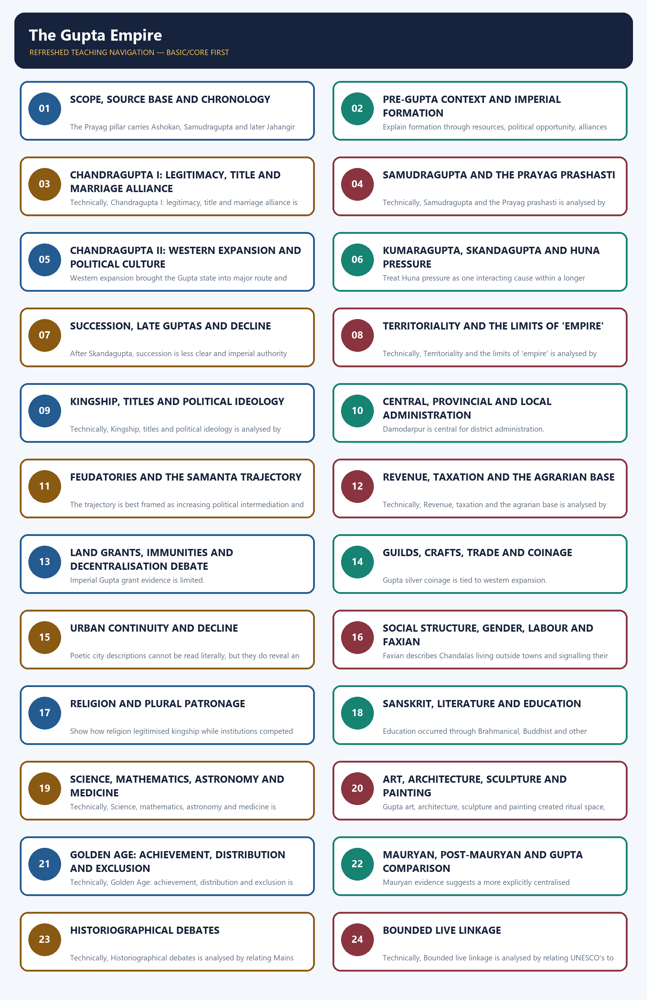
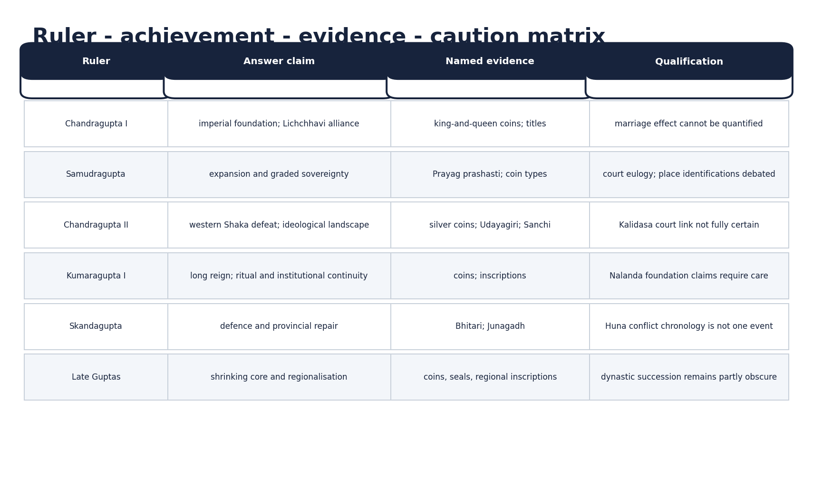
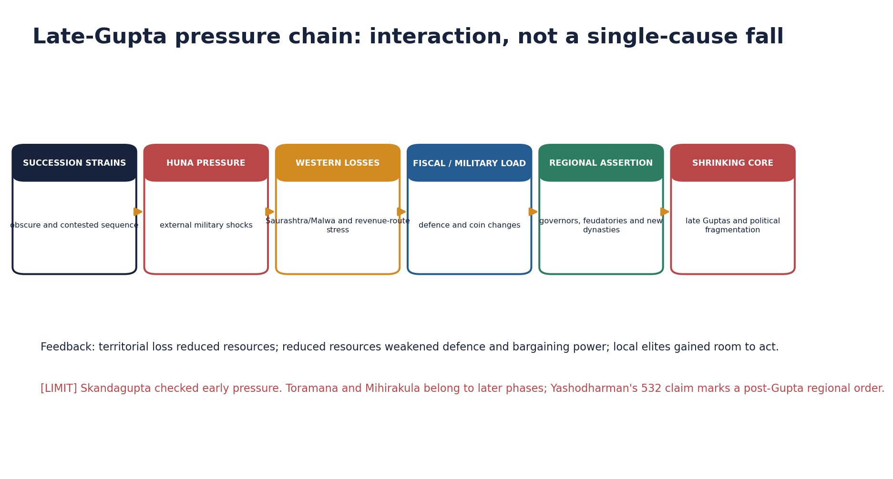
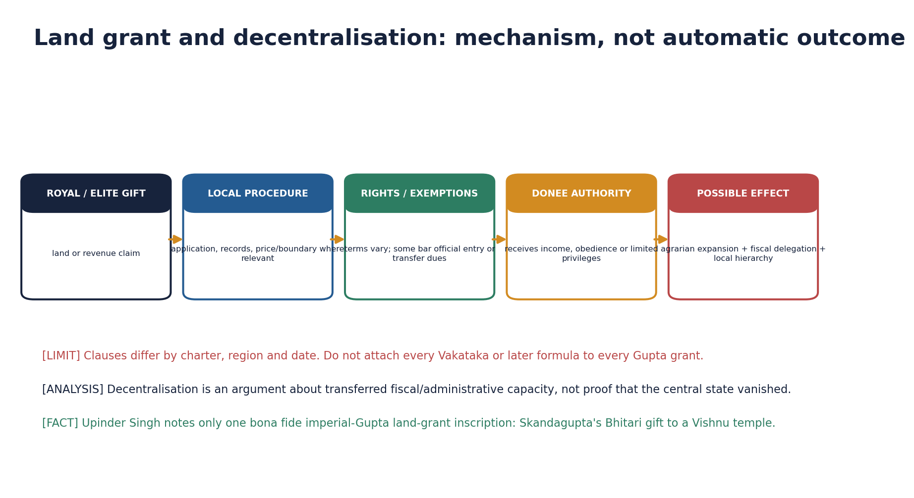
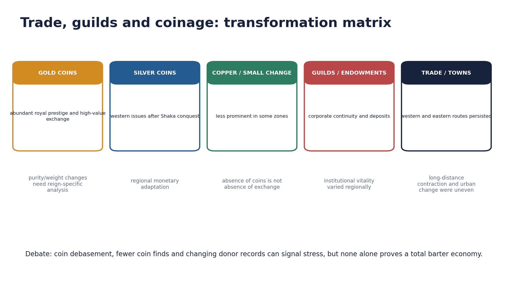
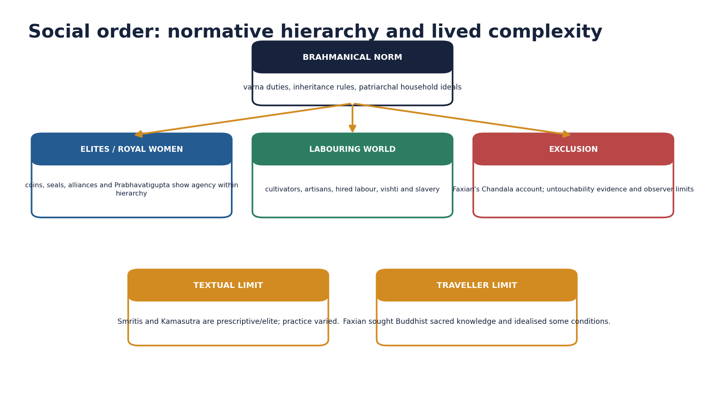
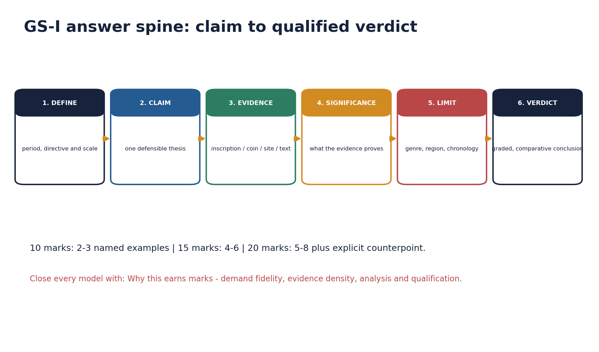

# The Gupta Empire - Complete Topic Package

> **Subject:** Ancient Indian History | **GS:** Prelims GS-I; GS-I culture/analysis support | **Topic:** 20  
> **Export date:** 2026-08-14 | **Approval:** false - awaiting explicit user approval  
> **Source order used:** repository Markdown -> OCR-searchable R.S. Sharma and Upinder Singh PDFs -> no forced live current-affairs claim -> Qdrant not used.  
> **Tag rule:** [FACT] directly sourced; [ANALYSIS] evidence-led synthesis; [LIMIT] evidentiary, regional or chronological boundary.

## BASIC LEARNING SESSION

### DEEP-REVIEW LEARNING CONTRACT

| Control | Binding rule for this package |
|---|---|
| Syllabus boundary | Complete Ancient History Core is taught before optional enrichment. |
| Evidence method | Claim → named site/text/inscription/coin/example → analysis → qualification. |
| Source hierarchy | Archaeology, textual testimony, inscriptions, coins and scholarly interpretation remain visibly distinct. |
| Contested issues | Competing interpretations are attributed, evidenced and bounded; certainty is not manufactured. |
| Practice contract | Every solved item has demand decoding, an examiner-grade model, an executable answer/compression plan, marks rationale and answer-specific improvement. |
| Approval | This immutable successor remains `approved: false` pending explicit approval. |

**Canonical Basic/Core owner:** `upsc-ai-kit\knowledge\Ancient-Indian-History\basic\20_Gupta-Empire.md`  
**Canonical topic owner:** `upsc-ai-kit\knowledge\Ancient-Indian-History\basic\20_Gupta-Empire.md`  
**Optional Advanced owner:** `upsc-ai-kit\knowledge\Ancient-Indian-History\advanced\20_Gupta-Empire.md`  
**Official syllabus mapping:** `upsc-ai-kit\knowledge\Ancient-Indian-History\OFFICIAL-UPSC-SYLLABUS-MAPPING.md`

### EVIDENCE, PYQ AND CURRENT-STATUS CONTROL

- **Archaeological inference:** material context supports bounded reconstruction; absence is not automatic proof of non-existence.
- **Textual testimony:** genre, authorship, redaction, patronage and temporal distance control what a text can prove.
- **Inscription and coin evidence:** contemporary names, titles, claims and circulation are powerful but do not by themselves map uniform territorial control.
- **Scholarly interpretation:** historian labels are arguments to test, not facts to memorise without evidence.
- **PYQ discipline:** repository ledgers and locally held official papers control wording and metadata; reconstructed wording and unavailable official keys must be labelled.
- **Current-status note, rechecked 2026-08-30:** UNESCO's serial tentative listing of Gupta temples was rechecked on 29 August 2026 and is used only for heritage attribution and conservation linkage.

**Live/primary context sources recorded by the predecessor generation:**

- `https://whc.unesco.org/en/tentativelists/6805/`
- `https://culture.gov.in/ministry/our-groups/archaeology`




*Distinct embedded teaching-navigation image. The separate continuous Cārvāka-style flowchart package remains an independent at-a-glance artifact.*

#### Package counts, provenance and honest limitations

- Complete learning sections: 24; integrated verified/routed PYQs: 6; broad MCQs: 32; remedials: 8; solved original Mains: 6; final register modules: 6.
- Original PNG visuals: 12, all deterministic and fact-checked against the named sources. The territorial visual is explicitly schematic and not to scale.
- Direct topic-owned Mains PYQ: none found. The 2022 Gupta-Chola culture question is cross-owned and labelled accordingly.
- Prelims 2019 and 2020 official keys are not held locally; answers are prominently labelled inferred rather than official.
- No dated current-affairs claim was necessary. Heritage linkage is bounded to source criticism, conservation and attribution.

#### Original visual asset index

- `notes/Ancient-Indian-History/assets/20_Gupta-Empire/01_evidence_led_chronology.png`
- `notes/Ancient-Indian-History/assets/20_Gupta-Empire/02_territorial_influence_schematic_map.png`
- `notes/Ancient-Indian-History/assets/20_Gupta-Empire/03_ruler_achievement_evidence_matrix.png`
- `notes/Ancient-Indian-History/assets/20_Gupta-Empire/04_administration_hierarchy.png`
- `notes/Ancient-Indian-History/assets/20_Gupta-Empire/05_land_grant_decentralisation_process.png`
- `notes/Ancient-Indian-History/assets/20_Gupta-Empire/06_agrarian_fiscal_system_flow.png`
- `notes/Ancient-Indian-History/assets/20_Gupta-Empire/07_trade_coinage_transformation_matrix.png`
- `notes/Ancient-Indian-History/assets/20_Gupta-Empire/08_social_order_evidence_diagram.png`
- `notes/Ancient-Indian-History/assets/20_Gupta-Empire/09_science_literature_art_ecosystem.png`
- `notes/Ancient-Indian-History/assets/20_Gupta-Empire/10_huna_late_gupta_pressure_chain.png`
- `notes/Ancient-Indian-History/assets/20_Gupta-Empire/11_historiography_debate_map.png`
- `notes/Ancient-Indian-History/assets/20_Gupta-Empire/12_gs1_answer_spine.png`

### SESSION 1 — SCOPE, SOURCE BASE AND CHRONOLOGY

#### DEFINITION / WHAT THIS IS CALLED

**Plain-language definition:** Scope, source base and chronology comprises Scope, source base and chronology as its core connected dimensions.

**Technical definition:** The Prayag pillar carries Ashokan, Samudragupta and later Jahangir inscriptions; Samudragupta's Sanskrit prashasti was composed by Harishena.

#### ANSWER-GRABBING OPENING — WRITE/ADAPT IN THE EXAM

> Scope, source base and chronology comprises Scope, source base and chronology as its core connected dimensions.

#### MUST-WRITE KEYWORDS

- **Scope**
- **source base**
- **chronology**
- **Mains angle**
- **Study link**
- **Prayag prashasti**

**How to use them:** Frame the answer through Scope; define source base, connect chronology with Mains angle to explain the mechanism, and use Study link for the decisive comparison or qualification.

[FACT] The Gupta political phase is conventionally placed c. 319-550 CE. Its reconstruction is inscription- and coin-led, supplemented by seals, sculpture, architecture, legal-literary texts and Faxian.


*Original deterministic teaching schematic; any scale or attribution caveat is printed on the visual.*

| Source | Best use | Limit |
|---|---|---|
| Prayag prashasti | campaign categories and royal ideology | eulogistic; identifications disputed |
| Coins | titles, images, ritual and monetary zones | circulation is uneven |
| Copper plates / seals | administration, land and local actors | regionally concentrated |
| Faxian | Buddhist sites and selected social observations | idealising pilgrim perspective |
| Sites / art | patronage, technique and religious landscape | dating and attribution require care |

#### Core teaching / solved practice

- [FACT] The Prayag pillar carries Ashokan, Samudragupta and later Jahangir inscriptions; Samudragupta's Sanskrit prashasti was composed by Harishena.
- [FACT] Coins communicate titles, ritual claims, marriage, martial prowess, sectarian emblems and monetary choices; they do not by themselves map exact borders.
- [FACT] Damodarpur copper plates and Vaishali/Bhita seals illuminate offices and land transactions, especially in Bengal.
- [LIMIT] Prashastis are courtly eulogies, Smritis are prescriptive, coins are selective royal media and Faxian wrote for a Buddhist audience.
- [ANALYSIS] A safe answer triangulates at least two source classes and states what each can and cannot prove.

#### Must-know facts

- Gupta era begins in 319-20 CE.
- Harishena composed the Prayag prashasti.
- Evidence categories must not be collapsed.

#### UPSC traps

- WRONG: Every inscription is a neutral chronicle.
  CORRECT: Prashasti genre amplifies conquest and virtue.
- WRONG: One date sequence is uncontested.
  CORRECT: Regnal dates vary across scholarly reconstructions.

**Mains angle:** Open with method: 'Gupta history is visible through royal media, but its social reach requires non-royal and material evidence.'

**Study link:** Master Chronology; basic/20; advanced/20; Topic 21 culture files.

#### CLOSING RECALL FLOW — SCOPE, SOURCE BASE AND CHRONOLOGY

```text
START / CONCEPT: Scope, source base and chronology
        |
        v
EXACT TERMS: Scope · source base · chronology · Mains angle · Study link · Prayag prashasti
        |
        v
MECHANISM / ARGUMENT: The Prayag pillar carries Ashokan, Samudragupta and later Jahangir inscriptions; Samudragupta's Sanskrit prashasti was composed by Harishena.
        |
        v
CONSEQUENCE / CONTRAST: Coins communicate titles, ritual claims, marriage, martial prowess, sectarian emblems and monetary choices; they do not by themselves map exact borders.
        |
        v
UPSC TRAP / ANSWER-USE: Open with method: 'Gupta history is visible through royal media, but its social reach requires non-royal and material evidence.'.
        |
        v
ANSWER-GRABBING FORMULATION: Scope, source base and chronology comprises Scope, source base and chronology as its core connected dimensions.
```
### SESSION 2 — PRE-GUPTA CONTEXT AND IMPERIAL FORMATION

#### DEFINITION / WHAT THIS IS CALLED

**Plain-language definition:** The Guptas emerged after centuries of post-Mauryan regional state formation, commercial integration and Sanskrit political expression.

**Technical definition:** Explain formation through resources, political opportunity, alliances and symbolic legitimacy rather than a founder-only story.

#### ANSWER-GRABBING OPENING — WRITE/ADAPT IN THE EXAM

> Explain formation through resources, political opportunity, alliances and symbolic legitimacy rather than a founder-only story.

#### MUST-WRITE KEYWORDS

- **Pre-Gupta context**
- **imperial formation**
- **Mains angle**
- **Study link**
- **The Guptas**
- **Mauryan**

**How to use them:** Frame the answer through Pre-Gupta context; define imperial formation, connect Mains angle with Study link to explain the mechanism, and use The Guptas for the decisive comparison or qualification.

[FACT] The Guptas emerged after centuries of post-Mauryan regional state formation, commercial integration and Sanskrit political expression. Their early base lay in the middle Ganga region, but the precise homeland and early territorial extent remain debated.

#### Core teaching / solved practice

- [FACT] Genealogies name Sri Gupta and Ghatotkacha before Chandragupta I; their title maharaja does not prove a large empire.
- [ANALYSIS] Gupta consolidation benefited from a productive Ganga agrarian core, older urban-route networks, political fragmentation and alliance-building.
- [LIMIT] 'Second empire after the Mauryas' is a textbook comparison of scale and prestige, not proof of identical institutions.
- [ANALYSIS] The transition was cumulative: earlier coinage, Sanskrit inscriptions, devotional cults and regional elites supplied reusable political resources.

#### Must-know facts

- Early Guptas preceded the imperial title maharajadhiraja.
- Pre-Gupta institutions shaped Gupta state formation.

#### UPSC traps

- WRONG: The Guptas rose in an institutional vacuum.
  CORRECT: They inherited post-Mauryan political, commercial and cultural developments.

**Mains angle:** Explain formation through resources, political opportunity, alliances and symbolic legitimacy rather than a founder-only story.

**Study link:** Topics 16-19; Mauryan comparison.

#### CLOSING RECALL FLOW — PRE-GUPTA CONTEXT AND IMPERIAL FORMATION

```text
START / CONCEPT: Pre-Gupta context and imperial formation
        |
        v
EXACT TERMS: Pre-Gupta context · imperial formation · Mains angle · Study link · The Guptas · Mauryan
        |
        v
MECHANISM / ARGUMENT: The Guptas emerged after centuries of post-Mauryan regional state formation, commercial integration and Sanskrit political expression.
        |
        v
CONSEQUENCE / CONTRAST: Genealogies name Sri Gupta and Ghatotkacha before Chandragupta I; their title maharaja does not prove a large empire.
        |
        v
UPSC TRAP / ANSWER-USE: 'Second empire after the Mauryas' is a textbook comparison of scale and prestige, not proof of identical institutions.
        |
        v
ANSWER-GRABBING FORMULATION: Explain formation through resources, political opportunity, alliances and symbolic legitimacy rather than a founder-only story.
```
### SESSION 3 — CHANDRAGUPTA I: LEGITIMACY, TITLE AND MARRIAGE ALLIANCE

#### DEFINITION / WHAT THIS IS CALLED

**Plain-language definition:** The proposition that Chandragupta I directly controlled every territory later held by Samudragupta is unsupported.

**Technical definition:** Technically, Chandragupta I: legitimacy, title and marriage alliance is analysed by relating Chandragupta I to legitimacy, then testing the relationship through title and marriage alliance.

#### ANSWER-GRABBING OPENING — WRITE/ADAPT IN THE EXAM

> The proposition that Chandragupta I directly controlled every territory later held by Samudragupta is unsupported.

#### MUST-WRITE KEYWORDS

- **Chandragupta I**
- **legitimacy**
- **title**
- **marriage alliance**
- **Mains angle**
- **Study link**

**How to use them:** Frame the answer through Chandragupta I; define legitimacy, connect title with marriage alliance to explain the mechanism, and use Mains angle for the decisive comparison or qualification.

[FACT] Chandragupta I marks the imperial phase. He used maharajadhiraja and is associated with the Gupta era beginning 319-20 CE and with Kumaradevi-Lichchhavi coin imagery.

#### Core teaching / solved practice

- [FACT] The king-and-queen coin type names Kumaradevi and the Lichchhavis, showing that the alliance was publicly commemorated.
- [ANALYSIS] Marriage supplied legitimacy, alliance and possibly access to networks or territory, but the exact material gain cannot be calculated.
- [LIMIT] The proposition that Chandragupta I directly controlled every territory later held by Samudragupta is unsupported.
- [ANALYSIS] Use the marriage coin as evidence of dynastic politics, not as a romantic anecdote.

#### Must-know facts

- Kumaradevi was a Lichchhavi princess.
- Marriage imagery was political communication.

#### UPSC traps

- WRONG: A marriage coin proves the precise dowry or border change.
  CORRECT: It proves advertised alliance and status, not quantified transfer.

**Mains angle:** Claim: imperial formation joined coercive capacity with alliance-based legitimacy.

**Study link:** Dynastic alliances; Prabhavatigupta-Vakataka bridge.

#### CLOSING RECALL FLOW — CHANDRAGUPTA I: LEGITIMACY, TITLE AND MARRIAGE ALLIANCE

```text
START / CONCEPT: Chandragupta I: legitimacy, title and marriage alliance
        |
        v
EXACT TERMS: Chandragupta I · legitimacy · title · marriage alliance · Mains angle · Study link
        |
        v
MECHANISM / ARGUMENT: The king-and-queen coin type names Kumaradevi and the Lichchhavis, showing that the alliance was publicly commemorated.
        |
        v
CONSEQUENCE / CONTRAST: Use the marriage coin as evidence of dynastic politics, not as a romantic anecdote.
        |
        v
UPSC TRAP / ANSWER-USE: CORRECT: It proves advertised alliance and status, not quantified transfer.
        |
        v
ANSWER-GRABBING FORMULATION: The proposition that Chandragupta I directly controlled every territory later held by Samudragupta is unsupported.
```
### SESSION 4 — SAMUDRAGUPTA AND THE PRAYAG PRASHASTI

#### DEFINITION / WHAT THIS IS CALLED

**Plain-language definition:** Samudragupta's reign is reconstructed chiefly from coins and the Prayag prashasti.

**Technical definition:** Technically, Samudragupta and the Prayag prashasti is analysed by relating Samudragupta to the Prayag prashasti, then testing the relationship through Mains angle and Study link.

#### ANSWER-GRABBING OPENING — WRITE/ADAPT IN THE EXAM

> Samudragupta's reign is reconstructed chiefly from coins and the Prayag prashasti.

#### MUST-WRITE KEYWORDS

- **Samudragupta**
- **the Prayag prashasti**
- **Mains angle**
- **Study link**
- **Aryavarta**
- **uprooted / exterminated**

**How to use them:** Frame the answer through Samudragupta; define the Prayag prashasti, connect Mains angle with Study link to explain the mechanism, and use Aryavarta for the decisive comparison or qualification.

[FACT] Samudragupta's reign is reconstructed chiefly from coins and the Prayag prashasti. The inscription presents the Gupta centre within a web of differentiated political relationships.


*Original deterministic teaching schematic; any scale or attribution caveat is printed on the visual.*

| Campaign category | Prashasti treatment | Safe inference |
|---|---|---|
| Aryavarta | uprooted / exterminated | stronger incorporation into core |
| Atavika rulers | made servants | subordination; exact machinery unclear |
| Frontier states and ganas | tribute, orders, obeisance | layered dependence |
| Dakshinapatha | captured then released | demonstration and reinstatement |
| Distant rulers / islands | service, gifts, seal, alliances | prestige diplomacy, not provinces |

#### Core teaching / solved practice

- [FACT] Aryavarta rulers are described as violently uprooted; their territories appear to have been incorporated into the northern core.
- [FACT] Forest rulers were made servants/subordinates, while frontier states and ganas offered tribute, obeyed orders and performed obeisance.
- [FACT] Southern rulers were captured and released; this is not the language of permanent provincial annexation.
- [FACT] Distant north-western rulers and Sri Lanka appear in a prestige-diplomatic category involving service, seal requests, gifts or alliance.
- [LIMIT] Place identifications and court claims are debated; 'conquered India' is an overstatement.
- [ANALYSIS] Samudragupta's significance lies in graded sovereignty: annexation, subordination, reinstatement and prestige coexisted.

#### Must-know facts

- Harishena held multiple high titles.
- Southern campaign did not yield uniform annexation.
- The pillar is a layered archive.

#### UPSC traps

- WRONG: Every named ruler became a provincial subject.
  CORRECT: The inscription itself distinguishes modes of relationship.
- WRONG: The prashasti is useless because it is praise.
  CORRECT: Genre-aware reading still yields names, categories and ideology.

**Mains angle:** Use campaign categories as the body headings of any territoriality answer.

**Study link:** Source criticism; layered sovereignty.

#### CLOSING RECALL FLOW — SAMUDRAGUPTA AND THE PRAYAG PRASHASTI

```text
START / CONCEPT: Samudragupta and the Prayag prashasti
        |
        v
EXACT TERMS: Samudragupta · the Prayag prashasti · Mains angle · Study link · Aryavarta · uprooted / exterminated
        |
        v
MECHANISM / ARGUMENT: WRONG: The prashasti is useless because it is praise.
        |
        v
CONSEQUENCE / CONTRAST: Forest rulers were made servants/subordinates, while frontier states and ganas offered tribute, obeyed orders and performed obeisance.
        |
        v
UPSC TRAP / ANSWER-USE: Southern rulers were captured and released; this is not the language of permanent provincial annexation.
        |
        v
ANSWER-GRABBING FORMULATION: Samudragupta's reign is reconstructed chiefly from coins and the Prayag prashasti.
```
### SESSION 5 — CHANDRAGUPTA II: WESTERN EXPANSION AND POLITICAL CULTURE

#### DEFINITION / WHAT THIS IS CALLED

**Plain-language definition:** Western Shaka defeat is a central achievement.

**Technical definition:** Western expansion brought the Gupta state into major route and coastal zones; Ujjain was an important political-commercial centre.

#### ANSWER-GRABBING OPENING — WRITE/ADAPT IN THE EXAM

> Western Shaka defeat is a central achievement.

#### MUST-WRITE KEYWORDS

- **Chandragupta II**
- **western expansion**
- **political culture**
- **Mains angle**
- **Study link**
- **Western**

**How to use them:** Frame the answer through Chandragupta II; define western expansion, connect political culture with Mains angle to explain the mechanism, and use Study link for the decisive comparison or qualification.

[FACT] Chandragupta II defeated the western Kshatrapas, issued silver coins in a western monetary idiom and strengthened Gupta power in Malwa and Gujarat.



*Original deterministic teaching schematic; any scale or attribution caveat is printed on the visual.*

#### Core teaching / solved practice

- [FACT] Western expansion brought the Gupta state into major route and coastal zones; Ujjain was an important political-commercial centre.
- [FACT] Udayagiri's early fifth-century complex links Vaishnava imagery, royal presence and conquest symbolism; it also contains Shaiva and Jaina evidence.
- [FACT] A Sanchi inscription records land and money support connected with Chandragupta II and commander Amrakardava.
- [FACT] Faxian travelled in India during this broad reign-context.
- [LIMIT] Kalidasa's exact date and identification as a formal court 'navaratna' are not securely established.
- [ANALYSIS] Chandragupta II combined expansion, monetary adaptation and sacred-political communication.

#### Must-know facts

- Western Shaka defeat is a central achievement.
- Silver coinage reflects regional adaptation.
- Udayagiri is ideological and plural, not only decorative.

#### UPSC traps

- WRONG: Vikramaditya proves every later Vikrama legend belongs to this king.
  CORRECT: The title and later legendary cycles must be separated.
- WRONG: Udayagiri shows exclusive religious intolerance.
  CORRECT: Its landscape contains multiple traditions and multidirectional gifts.

**Mains angle:** Connect western conquest to routes, coinage and Udayagiri rather than listing victories alone.

**Study link:** Trade transformation; royal ideology.

#### CLOSING RECALL FLOW — CHANDRAGUPTA II: WESTERN EXPANSION AND POLITICAL CULTURE

```text
START / CONCEPT: Chandragupta II: western expansion and political culture
        |
        v
EXACT TERMS: Chandragupta II · western expansion · political culture · Mains angle · Study link · Western
        |
        v
MECHANISM / ARGUMENT: Western expansion brought the Gupta state into major route and coastal zones; Ujjain was an important political-commercial centre.
        |
        v
CONSEQUENCE / CONTRAST: Kalidasa's exact date and identification as a formal court 'navaratna' are not securely established.
        |
        v
UPSC TRAP / ANSWER-USE: Udayagiri is ideological and plural, not only decorative.
        |
        v
ANSWER-GRABBING FORMULATION: Western Shaka defeat is a central achievement.
```
### SESSION 6 — KUMARAGUPTA, SKANDAGUPTA AND HUNA PRESSURE

#### DEFINITION / WHAT THIS IS CALLED

**Plain-language definition:** Kumaragupta, Skandagupta and Huna pressure comprises Kumaragupta, Skandagupta and Huna pressure as its core connected dimensions.

**Technical definition:** Treat Huna pressure as one interacting cause within a longer fragmentation process.

#### ANSWER-GRABBING OPENING — WRITE/ADAPT IN THE EXAM

> Early Huna pressure could be checked, but sustained frontier warfare increased military and fiscal strain.

#### MUST-WRITE KEYWORDS

- **Kumaragupta**
- **Skandagupta**
- **Huna pressure**
- **Mains angle**
- **Study link**
- **456-57 CE**

**How to use them:** Frame the answer through Kumaragupta; define Skandagupta, connect Huna pressure with Mains angle to explain the mechanism, and use Study link for the decisive comparison or qualification.

[FACT] Kumaragupta I's long reign continued imperial authority and coin-ritual communication. Skandagupta's inscriptions emphasise restoration, defence and provincial public works.



*Original deterministic teaching schematic; any scale or attribution caveat is printed on the visual.*

#### Core teaching / solved practice

- [FACT] Kumaragupta issued varied gold coin types, including ashvamedha imagery; ritual claims should be read as royal communication.
- [FACT] Skandagupta's Junagadh inscription records appointment of Parnadatta and repair of the Sudarshana lake breach by Chakrapalita in 456-57 CE.
- [FACT] Bhitari evidence presents Skandagupta as restoring family fortune amid enemies; exact identification and sequence of every conflict require caution.
- [ANALYSIS] Early Huna pressure could be checked, but sustained frontier warfare increased military and fiscal strain.
- [LIMIT] Hunas did not end the empire in one invasion, and Toramana-Mihirakula belong to later stages of north Indian power change.

#### Must-know facts

- Junagadh links provincial delegation with waterwork repair.
- Huna pressure was prolonged and phased.

#### UPSC traps

- WRONG: Skandagupta's success means no later Huna impact.
  CORRECT: A checked incursion can precede later penetration.
- WRONG: Every late coin change has one cause.
  CORRECT: Weight, purity, metal supply, territory and fiscal needs must be assessed together.

**Mains angle:** Treat Huna pressure as one interacting cause within a longer fragmentation process.

**Study link:** Late-Gupta decline; post-Gupta Topic 22.

#### CLOSING RECALL FLOW — KUMARAGUPTA, SKANDAGUPTA AND HUNA PRESSURE

```text
START / CONCEPT: Kumaragupta, Skandagupta and Huna pressure
        |
        v
EXACT TERMS: Kumaragupta · Skandagupta · Huna pressure · Mains angle · Study link · 456-57 CE
        |
        v
MECHANISM / ARGUMENT: Treat Huna pressure as one interacting cause within a longer fragmentation process.
        |
        v
CONSEQUENCE / CONTRAST: WRONG: Skandagupta's success means no later Huna impact.
        |
        v
UPSC TRAP / ANSWER-USE: Do not miss this limiting distinction: huna pressure was prolonged and phased.
        |
        v
ANSWER-GRABBING FORMULATION: Early Huna pressure could be checked, but sustained frontier warfare increased military and fiscal strain.
```
### SESSION 7 — SUCCESSION, LATE GUPTAS AND DECLINE

#### DEFINITION / WHAT THIS IS CALLED

**Plain-language definition:** 'Decline' describes contraction and political regionalisation, not disappearance of Gupta lineages, culture or institutions.

**Technical definition:** After Skandagupta, succession is less clear and imperial authority contracted.

#### ANSWER-GRABBING OPENING — WRITE/ADAPT IN THE EXAM

> 'Decline' describes contraction and political regionalisation, not disappearance of Gupta lineages, culture or institutions.

#### MUST-WRITE KEYWORDS

- **Succession**
- **late Guptas**
- **decline**
- **Mains angle**
- **Study link**
- **After Skandagupta, succession**

**How to use them:** Frame the answer through Succession; define late Guptas, connect decline with Mains angle to explain the mechanism, and use Study link for the decisive comparison or qualification.

[FACT] After Skandagupta, succession is less clear and imperial authority contracted. Western losses, external pressure and regional rulers changed the balance of power.

#### Core teaching / solved practice

- [FACT] Coin and inscription finds become sparse in western Malwa and Saurashtra after the later fifth century, consistent with loss of western authority.
- [FACT] Toramana and Mihirakula represent Huna power in north and central India; Yashodharman's 532 inscription marks a later regional challenge.
- [ANALYSIS] Causes interacted: succession disputes, military costs, territorial revenue loss, changing trade, delegated power and regional assertion.
- [LIMIT] 'Decline' describes contraction and political regionalisation, not disappearance of Gupta lineages, culture or institutions.
- [ANALYSIS] The strongest causal answer uses a feedback loop, not a shopping list.

#### Must-know facts

- Decline was gradual and uneven.
- Political fragmentation did not erase cultural continuities.

#### UPSC traps

- WRONG: A single invasion gives a complete explanation.
  CORRECT: Multi-causal interaction is required.
- WRONG: The year 550 is an event-date for total collapse.
  CORRECT: It is a periodisation marker.

**Mains angle:** Organise causes as external pressure, internal political strain, fiscal-territorial change and regionalisation.

**Study link:** Topic 22; early-medieval transition.

#### CLOSING RECALL FLOW — SUCCESSION, LATE GUPTAS AND DECLINE

```text
START / CONCEPT: Succession, late Guptas and decline
        |
        v
EXACT TERMS: Succession · late Guptas · decline · Mains angle · Study link · After Skandagupta, succession
        |
        v
MECHANISM / ARGUMENT: After Skandagupta, succession is less clear and imperial authority contracted.
        |
        v
CONSEQUENCE / CONTRAST: The strongest causal answer uses a feedback loop, not a shopping list.
        |
        v
UPSC TRAP / ANSWER-USE: WRONG: The year 550 is an event-date for total collapse.
        |
        v
ANSWER-GRABBING FORMULATION: 'Decline' describes contraction and political regionalisation, not disappearance of Gupta lineages, culture or institutions.
```
### SESSION 8 — TERRITORIALITY AND THE LIMITS OF 'EMPIRE'

#### DEFINITION / WHAT THIS IS CALLED

**Plain-language definition:** Territoriality and the limits of 'empire' comprises Territoriality, the limits of 'empire' and Mains angle as its core connected dimensions.

**Technical definition:** Technically, Territoriality and the limits of 'empire' is analysed by relating Territoriality to the limits of 'empire', then testing the relationship through Mains angle and Study link.

#### ANSWER-GRABBING OPENING — WRITE/ADAPT IN THE EXAM

> The Gupta order was an empire because it possessed a substantial core, military capacity, paramount titles and a wide hierarchy of subordinate relations; it was not a uniform map of direct administration.

#### MUST-WRITE KEYWORDS

- **Territoriality**
- **the limits of 'empire'**
- **Mains angle**
- **Study link**
- **The Gupta**
- **Subordinate**

**How to use them:** Frame the answer through Territoriality; define the limits of 'empire', connect Mains angle with Study link to explain the mechanism, and use The Gupta for the decisive comparison or qualification.

[ANALYSIS] The Gupta order was an empire because it possessed a substantial core, military capacity, paramount titles and a wide hierarchy of subordinate relations; it was not a uniform map of direct administration.


*Original deterministic teaching schematic; any scale or attribution caveat is printed on the visual.*

#### Core teaching / solved practice

- [FACT] Samudragupta's own prashasti differentiates annexed northern lands, frontier tribute, ganas, forest rulers, reinstated southern kings and distant prestige relations.
- [FACT] Subordinate rulers could be powerful in their own domains and reproduce imperial-style praise.
- [ANALYSIS] 'Layered hegemony' or 'graded sovereignty' describes this structure better than either a Mauryan clone or a loose cultural sphere.
- [LIMIT] Modern border lines and continuous territorial colour falsely imply equivalent control everywhere.
- [ANALYSIS] Territoriality changed by reign: Chandragupta II's westward expansion and late-Gupta western losses matter.

#### Must-know facts

- Core and periphery differed in control.
- The empire's reach was relational as well as territorial.

#### UPSC traps

- WRONG: Political influence equals direct tax administration.
  CORRECT: Tribute and prestige relations may lack provincial machinery.

**Mains angle:** Define empire operationally: core extraction + military superiority + recognised paramountcy + differentiated peripheries.

**Study link:** Mauryan and post-Mauryan comparison.

#### CLOSING RECALL FLOW — TERRITORIALITY AND THE LIMITS OF 'EMPIRE'

```text
START / CONCEPT: Territoriality and the limits of 'empire'
        |
        v
EXACT TERMS: Territoriality · the limits of 'empire' · Mains angle · Study link · The Gupta · Subordinate
        |
        v
MECHANISM / ARGUMENT: Subordinate rulers could be powerful in their own domains and reproduce imperial-style praise.
        |
        v
CONSEQUENCE / CONTRAST: 'Layered hegemony' or 'graded sovereignty' describes this structure better than either a Mauryan clone or a loose cultural sphere.
        |
        v
UPSC TRAP / ANSWER-USE: Do not miss this limiting distinction: the empire's reach was relational as well as territorial.
        |
        v
ANSWER-GRABBING FORMULATION: The Gupta order was an empire because it possessed a substantial core, military capacity, paramount titles and a wide hierarchy of subordinate relations; it was not a uniform map of direct administration.
```
### SESSION 9 — KINGSHIP, TITLES AND POLITICAL IDEOLOGY

#### DEFINITION / WHAT THIS IS CALLED

**Plain-language definition:** Ideology was productive: it converted military success, piety and prosperity into legitimate paramountcy.

**Technical definition:** Technically, Kingship, titles and political ideology is analysed by relating Kingship to titles, then testing the relationship through political ideology and Mains angle.

#### ANSWER-GRABBING OPENING — WRITE/ADAPT IN THE EXAM

> Ideology was productive: it converted military success, piety and prosperity into legitimate paramountcy.

#### MUST-WRITE KEYWORDS

- **Kingship**
- **titles**
- **political ideology**
- **Mains angle**
- **Study link**
- **Comparison with gods**

**How to use them:** Frame the answer through Kingship; define titles, connect political ideology with Mains angle to explain the mechanism, and use Study link for the decisive comparison or qualification.

[FACT] Gupta kingship used paramount titles, Sanskrit prashasti, coins, ritual, genealogy and sectarian affiliation to represent exceptional but not simply divine rulers.


*Original deterministic teaching schematic; any scale or attribution caveat is printed on the visual.*

#### Core teaching / solved practice

- [FACT] Maharajadhiraja, parama-bhattaraka and related titles articulated hierarchy; title meanings depend on context.
- [FACT] Coins portray kings as warriors, hunters, sacrificers, musicians and recipients of Shri/Lakshmi's favour; Garuda communicates Vaishnava association.
- [FACT] Udayagiri's Varaha imagery entwines cosmic rescue, conquest and royal power while leaving room for interpretive ambiguity.
- [LIMIT] Comparison with gods is not identical to a formal claim that the king is a god.
- [ANALYSIS] Ideology was productive: it converted military success, piety and prosperity into legitimate paramountcy.

#### Must-know facts

- Coins had wider physical circulation than monumental prashastis.
- Inclusive sectarianism is safer than blanket 'tolerance'.

#### UPSC traps

- WRONG: Paramabhagavata means worship by subjects as a god.
  CORRECT: It identifies the ruler as foremost devotee.
- WRONG: Political religion excluded every rival tradition.
  CORRECT: Donative and site evidence shows plural patronage.

**Mains angle:** Use one coin image and Udayagiri as named evidence for the political work of culture.

**Study link:** Religion, art and legitimacy.

#### CLOSING RECALL FLOW — KINGSHIP, TITLES AND POLITICAL IDEOLOGY

```text
START / CONCEPT: Kingship, titles and political ideology
        |
        v
EXACT TERMS: Kingship · titles · political ideology · Mains angle · Study link · Comparison with gods
        |
        v
MECHANISM / ARGUMENT: WRONG: Paramabhagavata means worship by subjects as a god.
        |
        v
CONSEQUENCE / CONTRAST: Comparison with gods is not identical to a formal claim that the king is a god.
        |
        v
UPSC TRAP / ANSWER-USE: Do not miss this limiting distinction: use one coin image and Udayagiri as named evidence for the political work of...
        |
        v
ANSWER-GRABBING FORMULATION: Ideology was productive: it converted military success, piety and prosperity into legitimate paramountcy.
```
### SESSION 10 — CENTRAL, PROVINCIAL AND LOCAL ADMINISTRATION

#### DEFINITION / WHAT THIS IS CALLED

**Plain-language definition:** Gupta administration had central officers, provinces (desha/bhukti), districts (vishaya), sub-district units and village institutions, but the exact function of many titles is uncertain and regionally variable.

**Technical definition:** Damodarpur is central for district administration.

#### ANSWER-GRABBING OPENING — WRITE/ADAPT IN THE EXAM

> Gupta administration had central officers, provinces (desha/bhukti), districts (vishaya), sub-district units and village institutions, but the exact function of many titles is uncertain and regionally variable.

#### MUST-WRITE KEYWORDS

- **Central**
- **provincial**
- **local administration**
- **Mains angle**
- **Study link**
- **Court**

**How to use them:** Frame the answer through Central; define provincial, connect local administration with Mains angle to explain the mechanism, and use Study link for the decisive comparison or qualification.

[FACT] Gupta administration had central officers, provinces (desha/bhukti), districts (vishaya), sub-district units and village institutions, but the exact function of many titles is uncertain and regionally variable.


*Original deterministic teaching schematic; any scale or attribution caveat is printed on the visual.*

| Level | Common term / actor | Caution |
|---|---|---|
| Court | kumaramatya, sandhivigrahika, mahadandanayaka | rank and function can overlap |
| Province | desha/bhukti; uparika/goptri/lokapala | terminology varies |
| District | vishaya; vishayapati; adhikarana | Bengal evidence is unusually rich |
| Town board | sreshthin, sarthavaha, kulika, kayastha | elite participation, not mass franchise |
| Village | gramika, elders, householders | local practice is uneven |

#### Core teaching / solved practice

- [FACT] Kumaramatya was a high rank; Harishena also held sandhivigrahika and mahadandanayaka, demonstrating multiple titles.
- [FACT] Uparikas governed provinces and often appointed district heads; Damodarpur records provide detailed Bengal examples.
- [FACT] District boards could include the chief merchant/banker, caravan leader, chief artisan and chief scribe alongside the official head.
- [FACT] Village elders, gramika/gramadhyaksha and record-keeping actors appear, but no single all-India panchayat template is proven.
- [ANALYSIS] Participation of notables can indicate administrative incorporation of local wealth, not democratic representation.
- [LIMIT] Translating every Sanskrit title into a fixed modern ministry creates false precision.

#### Must-know facts

- Damodarpur is central for district administration.
- Junagadh shows delegated provincial works.

#### UPSC traps

- WRONG: The Guptas had no bureaucracy.
  CORRECT: They had offices and records, though less elaborate than Mauryan descriptions.
- WRONG: All offices were hereditary.
  CORRECT: Some family continuities exist; universal heredity is unproven.

**Mains angle:** Compare administrative depth, local notables and delegation; avoid a static organogram.

**Study link:** Mauryan comparison; land transactions.

#### CLOSING RECALL FLOW — CENTRAL, PROVINCIAL AND LOCAL ADMINISTRATION

```text
START / CONCEPT: Central, provincial and local administration
        |
        v
EXACT TERMS: Central · provincial · local administration · Mains angle · Study link · Court
        |
        v
MECHANISM / ARGUMENT: Damodarpur is central for district administration.
        |
        v
CONSEQUENCE / CONTRAST: Participation of notables can indicate administrative incorporation of local wealth, not democratic representation.
        |
        v
UPSC TRAP / ANSWER-USE: Village elders, gramika/gramadhyaksha and record-keeping actors appear, but no single all-India panchayat template is proven.
        |
        v
ANSWER-GRABBING FORMULATION: Gupta administration had central officers, provinces (desha/bhukti), districts (vishaya), sub-district units and village institutions, but the exact function of many titles is uncertain and regionally variable.
```
### SESSION 11 — FEUDATORIES AND THE SAMANTA TRAJECTORY

#### DEFINITION / WHAT THIS IS CALLED

**Plain-language definition:** 'Feudatory' is an analytical translation; specific obligations such as troop supply should be stated only where the source supports them.

**Technical definition:** The trajectory is best framed as increasing political intermediation and regional assertion, not a completed system born on one date.

#### ANSWER-GRABBING OPENING — WRITE/ADAPT IN THE EXAM

> Gupta political hierarchy included subordinate rulers, but the fully developed early-medieval samanta system should not be projected backwards without evidence.

#### MUST-WRITE KEYWORDS

- **Feudatories**
- **the samanta trajectory**
- **Mains angle**
- **Study link**
- **Gupta**
- **The Prayag inscription**

**How to use them:** Frame the answer through Feudatories; define the samanta trajectory, connect Mains angle with Study link to explain the mechanism, and use Gupta for the decisive comparison or qualification.

[ANALYSIS] Gupta political hierarchy included subordinate rulers, but the fully developed early-medieval samanta system should not be projected backwards without evidence.

#### Core teaching / solved practice

- [FACT] The Prayag inscription describes frontier rulers and ganas offering tribute and obeying orders; later records show maharajas under Gupta paramountcy.
- [FACT] Subordinate rulers could retain local power, imitate imperial titles and become autonomous as central power weakened.
- [LIMIT] 'Feudatory' is an analytical translation; specific obligations such as troop supply should be stated only where the source supports them.
- [ANALYSIS] The trajectory is best framed as increasing political intermediation and regional assertion, not a completed system born on one date.
- [ANALYSIS] Compare the language of subordination with actual fiscal, military and territorial evidence.

#### Must-know facts

- Hierarchy was fluid.
- Subordinate status did not mean administrative insignificance.

#### UPSC traps

- WRONG: Every local ruler was a samanta with identical duties.
  CORRECT: Status and obligations differed by source and region.

**Mains angle:** Use 'trajectory' and 'intermediation' to remain accurate in feudalism debates.

**Study link:** Land grants; decline; Topic 26.

#### CLOSING RECALL FLOW — FEUDATORIES AND THE SAMANTA TRAJECTORY

```text
START / CONCEPT: Feudatories and the samanta trajectory
        |
        v
EXACT TERMS: Feudatories · the samanta trajectory · Mains angle · Study link · Gupta · The Prayag inscription
        |
        v
MECHANISM / ARGUMENT: 'Feudatory' is an analytical translation; specific obligations such as troop supply should be stated only where the source supports them.
        |
        v
CONSEQUENCE / CONTRAST: The trajectory is best framed as increasing political intermediation and regional assertion, not a completed system born on one date.
        |
        v
UPSC TRAP / ANSWER-USE: WRONG: Every local ruler was a samanta with identical duties.
        |
        v
ANSWER-GRABBING FORMULATION: Gupta political hierarchy included subordinate rulers, but the fully developed early-medieval samanta system should not be projected backwards without evidence.
```
### SESSION 12 — REVENUE, TAXATION AND THE AGRARIAN BASE

#### DEFINITION / WHAT THIS IS CALLED

**Plain-language definition:** Revenue, taxation and the agrarian base comprises Revenue, taxation and the agrarian base as its core connected dimensions.

**Technical definition:** Technically, Revenue, taxation and the agrarian base is analysed by relating Revenue to taxation, then testing the relationship through the agrarian base and Mains angle.

#### ANSWER-GRABBING OPENING — WRITE/ADAPT IN THE EXAM

> Revenue, taxation and the agrarian base comprises Revenue, taxation and the agrarian base as its core connected dimensions.

#### MUST-WRITE KEYWORDS

- **Revenue**
- **taxation**
- **the agrarian base**
- **Mains angle**
- **Study link**
- **Texts**

**How to use them:** Frame the answer through Revenue; define taxation, connect the agrarian base with Mains angle to explain the mechanism, and use Study link for the decisive comparison or qualification.

[FACT] Agriculture remained the principal fiscal base. Texts and inscriptions mention cultivated, waste, pasture and habitat land, irrigation works, measures, produce shares, cash dues and labour obligations.


*Original deterministic teaching schematic; any scale or attribution caveat is printed on the visual.*

#### Core teaching / solved practice

- [FACT] Eastern records use adhavapa, dronavapa and kulyavapa; their values and use are regional, not universal.
- [FACT] The Junagadh repair record shows provincial responsibility for a major waterwork.
- [FACT] Land-sale records show application, record consultation, payment, inspection, demarcation and public notification.
- [FACT] Vishti appears with taxes in grant inscriptions and can be treated as a labour contribution; evidence is concentrated in central and western regions.
- [LIMIT] Textual tax rates are prescriptions, not direct accounts of actual collection.
- [ANALYSIS] Fiscal power concerned control over streams of produce, cash and labour as much as abstract ownership of soil.

#### Must-know facts

- Land measures varied regionally.
- Vishti was a burden and fiscal resource.
- Private rights coexisted with overarching royal claims.

#### UPSC traps

- WRONG: Kulyavapa was a uniform all-India acre.
  CORRECT: It was an eastern sowing-based measure with variable conversion.
- WRONG: The king legally owned every field absolutely.
  CORRECT: Sources show layered and sometimes conflicting rights.

**Mains angle:** Build the answer from production -> assessment -> collection -> use -> social burden.

**Study link:** Topic 21; agrarian transition.

#### CLOSING RECALL FLOW — REVENUE, TAXATION AND THE AGRARIAN BASE

```text
START / CONCEPT: Revenue, taxation and the agrarian base
        |
        v
EXACT TERMS: Revenue · taxation · the agrarian base · Mains angle · Study link · Texts
        |
        v
MECHANISM / ARGUMENT: Texts and inscriptions mention cultivated, waste, pasture and habitat land, irrigation works, measures, produce shares, cash dues and labour obligations.
        |
        v
CONSEQUENCE / CONTRAST: Textual tax rates are prescriptions, not direct accounts of actual collection.
        |
        v
UPSC TRAP / ANSWER-USE: Do not miss this limiting distinction: the Junagadh repair record shows provincial responsibility for a major waterwork.
        |
        v
ANSWER-GRABBING FORMULATION: Revenue, taxation and the agrarian base comprises Revenue, taxation and the agrarian base as its core connected dimensions.
```
### SESSION 13 — LAND GRANTS, IMMUNITIES AND DECENTRALISATION DEBATE

#### DEFINITION / WHAT THIS IS CALLED

**Plain-language definition:** Royal land grants expanded from the fourth-fifth centuries, but the imperial Guptas themselves are not represented by a large body of secure grant charters.

**Technical definition:** Imperial Gupta grant evidence is limited.

#### ANSWER-GRABBING OPENING — WRITE/ADAPT IN THE EXAM

> Royal land grants expanded from the fourth-fifth centuries, but the imperial Guptas themselves are not represented by a large body of secure grant charters.

#### MUST-WRITE KEYWORDS

- **Land grants**
- **immunities**
- **decentralisation debate**
- **Mains angle**
- **Study link**
- **Royal**

**How to use them:** Frame the answer through Land grants; define immunities, connect decentralisation debate with Mains angle to explain the mechanism, and use Study link for the decisive comparison or qualification.

[FACT] Royal land grants expanded from the fourth-fifth centuries, but the imperial Guptas themselves are not represented by a large body of secure grant charters.



*Original deterministic teaching schematic; any scale or attribution caveat is printed on the visual.*

#### Core teaching / solved practice

- [FACT] Upinder Singh identifies Skandagupta's Bhitari temple gift as the one bona fide imperial-Gupta grant inscription; Gaya and Nalanda plates attributed to Samudragupta are disputed.
- [FACT] Vakataka and subordinate-ruler charters provide richer evidence for exemptions, non-entry clauses, rights and agrarian expansion.
- [ANALYSIS] Grants could reclaim wasteland, support Brahmanas or institutions, transfer revenue, build local authority and extend cultural-political integration.
- [LIMIT] Not every grant transferred police, judicial, mineral, labour and tax rights; clauses must be charter-specific.
- [ANALYSIS] Decentralisation is strongest when demonstrated as cumulative fiscal and administrative delegation, not assumed from the existence of a pious gift.
- [ANALYSIS] The same instrument could strengthen royal integration in the short run and empower intermediaries over time.

#### Must-know facts

- Imperial Gupta grant evidence is limited.
- Vakataka evidence cannot be silently relabelled Gupta.
- Effects could be integrative and decentralising.

#### UPSC traps

- WRONG: All Gupta grants contained full fiscal immunities.
  CORRECT: Terms vary and many famous clauses come from related or later polities.
- WRONG: Every grant immediately caused feudalism.
  CORRECT: Mechanism, scale and regional chronology must be shown.

**Mains angle:** Present a two-sided verdict: agrarian-cultural integration versus delegated fiscal power and hierarchy.

**Study link:** Feudalism debate; Topic 26.

#### CLOSING RECALL FLOW — LAND GRANTS, IMMUNITIES AND DECENTRALISATION DEBATE

```text
START / CONCEPT: Land grants, immunities and decentralisation debate
        |
        v
EXACT TERMS: Land grants · immunities · decentralisation debate · Mains angle · Study link · Royal
        |
        v
MECHANISM / ARGUMENT: CORRECT: Mechanism, scale and regional chronology must be shown.
        |
        v
CONSEQUENCE / CONTRAST: Not every grant transferred police, judicial, mineral, labour and tax rights; clauses must be charter-specific.
        |
        v
UPSC TRAP / ANSWER-USE: Decentralisation is strongest when demonstrated as cumulative fiscal and administrative delegation, not assumed from the existence of a pious gift.
        |
        v
ANSWER-GRABBING FORMULATION: Royal land grants expanded from the fourth-fifth centuries, but the imperial Guptas themselves are not represented by a large body of secure grant charters.
```
### SESSION 14 — GUILDS, CRAFTS, TRADE AND COINAGE

#### DEFINITION / WHAT THIS IS CALLED

**Plain-language definition:** The question is transformation: trade circuits and media changed rather than commerce simply ending.

**Technical definition:** Gupta silver coinage is tied to western expansion.

#### ANSWER-GRABBING OPENING — WRITE/ADAPT IN THE EXAM

> The question is transformation: trade circuits and media changed rather than commerce simply ending.

#### MUST-WRITE KEYWORDS

- **Guilds**
- **crafts**
- **trade**
- **coinage**
- **Mains angle**
- **Study link**

**How to use them:** Frame the answer through Guilds; define crafts, connect trade with coinage to explain the mechanism, and use Mains angle for the decisive comparison or qualification.

[FACT] Gupta economic history combines continued craft skill, guild and endowment evidence, long-distance routes and impressive coinage with signs of regional commercial change.



*Original deterministic teaching schematic; any scale or attribution caveat is printed on the visual.*

#### Core teaching / solved practice

- [FACT] Gold coins carried royal iconography and high-value functions; Chandragupta II adapted western silver coin traditions after defeating the Shakas.
- [FACT] Faxian's Tamralipti and links with Sri Lanka, China, Southeast Asia, Persia, Arabia and Byzantium indicate continuing exchange.
- [FACT] Texts and art attest textiles, jewellery, stone work, architecture, painting and other specialist crafts.
- [ANALYSIS] Changes in gold purity/weight, fewer low-denomination finds or declining donor references can indicate stress but require regional and chronological control.
- [LIMIT] Coin abundance among royal issues does not prove a uniformly monetised peasant economy.
- [ANALYSIS] The question is transformation: trade circuits and media changed rather than commerce simply ending.

#### Must-know facts

- Gupta silver coinage is tied to western expansion.
- Tamralipti remained an eastern maritime node.

#### UPSC traps

- WRONG: Gold coinage proves universal prosperity.
  CORRECT: It disproportionately reflects elite/state transactions.
- WRONG: Trade decline means zero overseas contact.
  CORRECT: Multiple circuits continued.

**Mains angle:** Use a matrix of coin type, route, guild/craft evidence and regional variation.

**Study link:** Topic 19 continuity; urban debate.

#### CLOSING RECALL FLOW — GUILDS, CRAFTS, TRADE AND COINAGE

```text
START / CONCEPT: Guilds, crafts, trade and coinage
        |
        v
EXACT TERMS: Guilds · crafts · trade · coinage · Mains angle · Study link
        |
        v
MECHANISM / ARGUMENT: Use a matrix of coin type, route, guild/craft evidence and regional variation.
        |
        v
CONSEQUENCE / CONTRAST: Changes in gold purity/weight, fewer low-denomination finds or declining donor references can indicate stress but require regional and chronological control.
        |
        v
UPSC TRAP / ANSWER-USE: Coin abundance among royal issues does not prove a uniformly monetised peasant economy.
        |
        v
ANSWER-GRABBING FORMULATION: The question is transformation: trade circuits and media changed rather than commerce simply ending.
```
### SESSION 15 — URBAN CONTINUITY AND DECLINE

#### DEFINITION / WHAT THIS IS CALLED

**Plain-language definition:** Sharma links reduced long-distance trade, fewer merchant/artisan references and archaeological contraction to urban decay.

**Technical definition:** Poetic city descriptions cannot be read literally, but they do reveal an urban social imagination and audience.

#### ANSWER-GRABBING OPENING — WRITE/ADAPT IN THE EXAM

> Poetic city descriptions cannot be read literally, but they do reveal an urban social imagination and audience.

#### MUST-WRITE KEYWORDS

- **Urban continuity**
- **decline**
- **Mains angle**
- **Study link**
- **Sharma**
- **Land-grant inscriptions naturally describe rural land and**

**How to use them:** Frame the answer through Urban continuity; define decline, connect Mains angle with Study link to explain the mechanism, and use Sharma for the decisive comparison or qualification.

[ANALYSIS] The urban-decline thesis identifies contraction after the early-historic peak, but a subcontinental, simultaneous collapse is difficult to sustain.


*Original deterministic teaching schematic; any scale or attribution caveat is printed on the visual.*

#### Core teaching / solved practice

- [FACT] R.S. Sharma links reduced long-distance trade, fewer merchant/artisan references and archaeological contraction to urban decay.
- [FACT] Upinder Singh notes counter-evidence: urban Sanskrit literary worlds, continued craft production, Sanchi/Sarnath/Nalanda/Ajanta activity and flourishing southern cities.
- [LIMIT] Land-grant inscriptions naturally describe rural land and are a biased corpus for counting cities.
- [LIMIT] Poetic city descriptions cannot be read literally, but they do reveal an urban social imagination and audience.
- [ANALYSIS] Best verdict: decline, continuity and relocation occurred at different sites and times; ask which urban functions changed.

#### Must-know facts

- Urban change was regional and functional.
- Literature and archaeology must be read by genre and context.

#### UPSC traps

- WRONG: Every Gupta city declined.
  CORRECT: Site histories diverge.
- WRONG: Literary cities directly measure population.
  CORRECT: They are stylised but historically informative.

**Mains angle:** Define urban function - administration, craft, sacred centre, market, port - before judging decline.

**Study link:** Topic 19; historiography.

#### CLOSING RECALL FLOW — URBAN CONTINUITY AND DECLINE

```text
START / CONCEPT: Urban continuity and decline
        |
        v
EXACT TERMS: Urban continuity · decline · Mains angle · Study link · Sharma · Land-grant inscriptions naturally describe rural land and
        |
        v
MECHANISM / ARGUMENT: Literature and archaeology must be read by genre and context.
        |
        v
CONSEQUENCE / CONTRAST: The urban-decline thesis identifies contraction after the early-historic peak, but a subcontinental, simultaneous collapse is difficult to sustain.
        |
        v
UPSC TRAP / ANSWER-USE: CORRECT: They are stylised but historically informative.
        |
        v
ANSWER-GRABBING FORMULATION: Poetic city descriptions cannot be read literally, but they do reveal an urban social imagination and audience.
```
### SESSION 16 — SOCIAL STRUCTURE, GENDER, LABOUR AND FAXIAN

#### DEFINITION / WHAT THIS IS CALLED

**Plain-language definition:** Vishti, hired labour and slavery are distinct categories and should not be merged.

**Technical definition:** Faxian describes Chandalas living outside towns and signalling their approach, important evidence for untouchability.

#### ANSWER-GRABBING OPENING — WRITE/ADAPT IN THE EXAM

> Gupta-period sources show Brahmanical varna norms, multiplying jati and occupational distinctions, patriarchy, labour dependence, slavery and untouchability alongside elite female agency and varied lived practice.

#### MUST-WRITE KEYWORDS

- **Social structure**
- **gender**
- **labour**
- **Faxian**
- **Mains angle**
- **Study link**

**How to use them:** Frame the answer through Social structure; define gender, connect labour with Faxian to explain the mechanism, and use Mains angle for the decisive comparison or qualification.

[FACT] Gupta-period sources show Brahmanical varna norms, multiplying jati and occupational distinctions, patriarchy, labour dependence, slavery and untouchability alongside elite female agency and varied lived practice.



*Original deterministic teaching schematic; any scale or attribution caveat is printed on the visual.*

#### Core teaching / solved practice

- [FACT] Smritis discuss inheritance, property, wages, slavery and gender from a normative Brahmanical perspective.
- [FACT] Royal women appear on coins and seals; Prabhavatigupta exercised regency and issued grants in the Vakataka realm.
- [FACT] Vishti, hired labour and slavery are distinct categories and should not be merged.
- [FACT] Faxian describes Chandalas living outside towns and signalling their approach, important evidence for untouchability.
- [LIMIT] Faxian idealises peace and prosperity and selects details relevant to Buddhist pilgrimage; his silence is not proof of absence.
- [LIMIT] Prescriptive subordination of women does not erase agency, and exceptional royal women do not prove general equality.
- [ANALYSIS] The Golden Age label must be tested against peasants, labourers, women and excluded communities.

#### Must-know facts

- Faxian visited during Chandragupta II's broad reign context.
- Chandala evidence must retain traveller-source limits.
- Prabhavatigupta is a named example of political agency.

#### UPSC traps

- WRONG: Faxian gives a census-like social report.
  CORRECT: His account is selective and religiously purposed.
- WRONG: Golden Age equals egalitarian age.
  CORRECT: Cultural achievement coexisted with hierarchy.

**Mains angle:** Write social history through norm, practice, agency and exclusion.

**Study link:** Topic 21; Golden Age debate.

#### CLOSING RECALL FLOW — SOCIAL STRUCTURE, GENDER, LABOUR AND FAXIAN

```text
START / CONCEPT: Social structure, gender, labour and Faxian
        |
        v
EXACT TERMS: Social structure · gender · labour · Faxian · Mains angle · Study link
        |
        v
MECHANISM / ARGUMENT: Vishti, hired labour and slavery are distinct categories and should not be merged.
        |
        v
CONSEQUENCE / CONTRAST: Faxian idealises peace and prosperity and selects details relevant to Buddhist pilgrimage; his silence is not proof of absence.
        |
        v
UPSC TRAP / ANSWER-USE: Prescriptive subordination of women does not erase agency, and exceptional royal women do not prove general equality.
        |
        v
ANSWER-GRABBING FORMULATION: Gupta-period sources show Brahmanical varna norms, multiplying jati and occupational distinctions, patriarchy, labour dependence, slavery and untouchability alongside elite female agency and varied lived practice.
```
### SESSION 17 — RELIGION AND PLURAL PATRONAGE

#### DEFINITION / WHAT THIS IS CALLED

**Plain-language definition:** Plural patronage does not prove absence of competition or hierarchy among traditions.

**Technical definition:** Show how religion legitimised kingship while institutions competed and coexisted.

#### ANSWER-GRABBING OPENING — WRITE/ADAPT IN THE EXAM

> Plural patronage does not prove absence of competition or hierarchy among traditions.

#### MUST-WRITE KEYWORDS

- **Religion**
- **plural patronage**
- **Mains angle**
- **Study link**
- **Udayagiri**
- **Vishnu**

**How to use them:** Frame the answer through Religion; define plural patronage, connect Mains angle with Study link to explain the mechanism, and use Udayagiri for the decisive comparison or qualification.

[FACT] Gupta rulers prominently used Vaishnava titles and Garuda imagery, while Shaiva, Buddhist, Jaina and local traditions continued to receive patronage.


*Original deterministic teaching schematic; any scale or attribution caveat is printed on the visual.*

#### Core teaching / solved practice

- [FACT] Udayagiri combines dominant Vishnu imagery with Shaiva, Durga, Ganesha and Jaina remains.
- [FACT] Chandragupta II-associated support at Sanchi and Sri Lankan monastery diplomacy at Bodh Gaya complicate a single-sect patronage story.
- [FACT] Puranic Hinduism consolidated temple-based devotional traditions while Buddhism and Jainism remained institutionally active.
- [ANALYSIS] 'Inclusive sectarianism' captures rulers' strong affiliations combined with accommodation better than assuming modern secularism.
- [LIMIT] Plural patronage does not prove absence of competition or hierarchy among traditions.

#### Must-know facts

- Garuda was a royal Vaishnava emblem.
- Plural patronage and strong sectarian affiliation coexisted.

#### UPSC traps

- WRONG: Brahmanical consolidation means Buddhism vanished.
  CORRECT: Major monasteries and donations continued.
- WRONG: Tolerance is self-explanatory.
  CORRECT: Specify the evidence and its limits.

**Mains angle:** Show how religion legitimised kingship while institutions competed and coexisted.

**Study link:** Udayagiri; Sanchi; Nalanda.

#### CLOSING RECALL FLOW — RELIGION AND PLURAL PATRONAGE

```text
START / CONCEPT: Religion and plural patronage
        |
        v
EXACT TERMS: Religion · plural patronage · Mains angle · Study link · Udayagiri · Vishnu
        |
        v
MECHANISM / ARGUMENT: Show how religion legitimised kingship while institutions competed and coexisted.
        |
        v
CONSEQUENCE / CONTRAST: Udayagiri combines dominant Vishnu imagery with Shaiva, Durga, Ganesha and Jaina remains.
        |
        v
UPSC TRAP / ANSWER-USE: Do not miss this limiting distinction: 'Inclusive sectarianism' captures rulers' strong affiliations combined with accommodation better than assuming modern secularism.
        |
        v
ANSWER-GRABBING FORMULATION: Plural patronage does not prove absence of competition or hierarchy among traditions.
```
### SESSION 18 — SANSKRIT, LITERATURE AND EDUCATION

#### DEFINITION / WHAT THIS IS CALLED

**Plain-language definition:** Kalidasa's dramas and poems are central to classical Sanskrit literature; his precise date and Chandragupta II court link remain debated.

**Technical definition:** Education occurred through Brahmanical, Buddhist and other institutions; Nalanda's early Gupta-period development should be stated without inventing a single founder claim.

#### ANSWER-GRABBING OPENING — WRITE/ADAPT IN THE EXAM

> Kalidasa's dramas and poems are central to classical Sanskrit literature; his precise date and Chandragupta II court link remain debated.

#### MUST-WRITE KEYWORDS

- **Sanskrit**
- **literature**
- **education**
- **Mains angle**
- **Study link**
- **Prakrit**

**How to use them:** Frame the answer through Sanskrit; define literature, connect education with Mains angle to explain the mechanism, and use Study link for the decisive comparison or qualification.

[FACT] Sanskrit became the principal language of royal eulogy and elite literary culture, though Prakrit and regional languages did not disappear.

#### Core teaching / solved practice

- [FACT] Kalidasa's dramas and poems are central to classical Sanskrit literature; his precise date and Chandragupta II court link remain debated.
- [FACT] Amarasimha is associated with the Amarakosha, an important lexicon; the popular 'nine gems' list is later tradition, not a secure court roster.
- [FACT] Education occurred through Brahmanical, Buddhist and other institutions; Nalanda's early Gupta-period development should be stated without inventing a single founder claim.
- [ANALYSIS] Sanskrit served aesthetic, intellectual and political integration across regional courts.
- [LIMIT] Elite literary florescence does not directly reveal mass literacy or vernacular cultural absence.

#### Must-know facts

- Kalidasa chronology needs caution.
- Amarakosha is linked with Amarasimha.
- Nalanda grew through stages.

#### UPSC traps

- WRONG: Panini was a Gupta scholar.
  CORRECT: Panini predates the Guptas by many centuries.
- WRONG: Navaratnas are an inscriptionally verified cabinet.
  CORRECT: The roster is a later literary tradition.

**Mains angle:** Connect language, patronage, political communication and education, then qualify social reach.

**Study link:** Topic 21; Art and Culture literature.

#### CLOSING RECALL FLOW — SANSKRIT, LITERATURE AND EDUCATION

```text
START / CONCEPT: Sanskrit, literature and education
        |
        v
EXACT TERMS: Sanskrit · literature · education · Mains angle · Study link · Prakrit
        |
        v
MECHANISM / ARGUMENT: Education occurred through Brahmanical, Buddhist and other institutions; Nalanda's early Gupta-period development should be stated without inventing a single founder claim.
        |
        v
CONSEQUENCE / CONTRAST: Sanskrit became the principal language of royal eulogy and elite literary culture, though Prakrit and regional languages did not disappear.
        |
        v
UPSC TRAP / ANSWER-USE: Amarasimha is associated with the Amarakosha, an important lexicon; the popular 'nine gems' list is later tradition, not a secure court roster.
        |
        v
ANSWER-GRABBING FORMULATION: Kalidasa's dramas and poems are central to classical Sanskrit literature; his precise date and Chandragupta II court link remain debated.
```
### SESSION 19 — SCIENCE, MATHEMATICS, ASTRONOMY AND MEDICINE

#### DEFINITION / WHAT THIS IS CALLED

**Plain-language definition:** Aryabhata completed the Aryabhatiya in 499 CE; it treats mathematics and astronomy and explains the apparent daily motion of the heavens through Earth's rotation.

**Technical definition:** Technically, Science, mathematics, astronomy and medicine is analysed by relating Science to mathematics, then testing the relationship through astronomy and medicine.

#### ANSWER-GRABBING OPENING — WRITE/ADAPT IN THE EXAM

> Aryabhata completed the Aryabhatiya in 499 CE; it treats mathematics and astronomy and explains the apparent daily motion of the heavens through Earth's rotation.

#### MUST-WRITE KEYWORDS

- **Science**
- **mathematics**
- **astronomy**
- **medicine**
- **Mains angle**
- **Study link**

**How to use them:** Frame the answer through Science; define mathematics, connect astronomy with medicine to explain the mechanism, and use Mains angle for the decisive comparison or qualification.

[FACT] The Gupta and immediately post-Gupta centuries produced major mathematical-astronomical texts, but chronology and attribution must be exact.


*Original deterministic teaching schematic; any scale or attribution caveat is printed on the visual.*

#### Core teaching / solved practice

- [FACT] Aryabhata completed the Aryabhatiya in 499 CE; it treats mathematics and astronomy and explains the apparent daily motion of the heavens through Earth's rotation.
- [FACT] Aryabhata's procedures presuppose decimal place value; this must be distinguished from the separate history of zero as a numeral and number.
- [FACT] Varahamihira belongs to the sixth century and synthesised astronomical traditions; Brahmagupta belongs to the seventh century and is post-Gupta.
- [FACT] Medical traditions continued through Ayurveda and compendia, but sweeping claims about a specific 'Gupta invention' require named texts and dates.
- [LIMIT] Scientific achievements were cumulative and connected with earlier Indian and Greek-inspired streams; civilisational isolation claims are inaccurate.
- [ANALYSIS] Use 'classical scientific tradition' rather than assigning every later scholar to the Gupta court.

#### Must-know facts

- Aryabhatiya: 499 CE.
- Varahamihira: sixth century.
- Brahmagupta: seventh century, post-Gupta.

#### UPSC traps

- WRONG: Aryabhata invented every aspect of zero.
  CORRECT: Place value, placeholder notation and zero as number have distinct histories.
- WRONG: All three scholars served Chandragupta II.
  CORRECT: Their chronologies differ.

**Mains angle:** Score with accurate chronology, one named contribution and a cumulative-knowledge qualification.

**Study link:** Topic 21; history of science.

#### CLOSING RECALL FLOW — SCIENCE, MATHEMATICS, ASTRONOMY AND MEDICINE

```text
START / CONCEPT: Science, mathematics, astronomy and medicine
        |
        v
EXACT TERMS: Science · mathematics · astronomy · medicine · Mains angle · Study link
        |
        v
MECHANISM / ARGUMENT: The Gupta and immediately post-Gupta centuries produced major mathematical-astronomical texts, but chronology and attribution must be exact.
        |
        v
CONSEQUENCE / CONTRAST: Aryabhata's procedures presuppose decimal place value; this must be distinguished from the separate history of zero as a numeral and number.
        |
        v
UPSC TRAP / ANSWER-USE: Do not miss this limiting distinction: varahamihira belongs to the sixth century and synthesised astronomical traditions.
        |
        v
ANSWER-GRABBING FORMULATION: Aryabhata completed the Aryabhatiya in 499 CE; it treats mathematics and astronomy and explains the apparent daily motion of the heavens through Earth's rotation.
```
### SESSION 20 — ART, ARCHITECTURE, SCULPTURE AND PAINTING

#### DEFINITION / WHAT THIS IS CALLED

**Plain-language definition:** Bagh paintings are broadly associated with the Gupta-Vakataka cultural horizon, with site-specific chronology.

**Technical definition:** Gupta art, architecture, sculpture and painting created ritual space, political meaning and durable cultural models.

#### ANSWER-GRABBING OPENING — WRITE/ADAPT IN THE EXAM

> Gupta art, architecture, sculpture and painting created ritual space, political meaning and durable cultural models.

#### MUST-WRITE KEYWORDS

- **Art**
- **architecture**
- **sculpture**
- **painting**
- **Mains angle**
- **Study link**

**How to use them:** Frame the answer through Art; define architecture, connect sculpture with painting to explain the mechanism, and use Mains angle for the decisive comparison or qualification.

[FACT] Gupta-period art is marked by refined sculptural idioms, early structural temples and powerful religious-political imagery, while major Vakataka Ajanta work belongs to a connected but distinct patronage context.


*Original deterministic teaching schematic; any scale or attribution caveat is printed on the visual.*

| Form | Named example | Safe significance |
|---|---|---|
| Rock-cut sacred landscape | Udayagiri Varaha | royal-religious ideology |
| Structural temple | Bhitargaon | early brick shikhara-form evidence |
| Stone temple | Deogarh Dashavatara | early developed temple iconographic programme |
| Buddha sculpture | Sarnath / Mathura | distinct regional idioms |
| Painting | Ajanta; Bagh | courtly-monastic narratives; patronage must be distinguished |

#### Core teaching / solved practice

- [FACT] Named temple examples include the brick temple at Bhitargaon and the stone Dashavatara temple at Deogarh; dating and reconstruction details should follow specialist art-history evidence.
- [FACT] Udayagiri Varaha connects sacred landscape with kingship; Sarnath and Mathura developed influential Buddha-image styles.
- [FACT] Ajanta's fifth-century phase flourished under Vakataka Harishena and elite donors, not directly as an imperial Gupta court project.
- [FACT] Bagh paintings are broadly associated with the Gupta-Vakataka cultural horizon, with site-specific chronology.
- [LIMIT] 'Gupta style' is a useful art-historical category but can hide regional workshops and non-Gupta patrons.
- [ANALYSIS] Gupta art, architecture, sculpture and painting created ritual space, political meaning and durable cultural models.

#### Must-know facts

- Ajanta's major fifth-century patronage is Vakataka.
- Deogarh and Bhitargaon are named structural examples.

#### UPSC traps

- WRONG: All Ajanta caves were made by Gupta emperors.
  CORRECT: Major fifth-century work is Vakataka and donor-led.
- WRONG: Gupta temples already had the scale of later complexes.
  CORRECT: They are formative structural examples.

**Mains angle:** Name forms and sites, explain innovation, then distinguish political patronage and regional workshop.

**Study link:** Indian Art and Culture owners; Topic 21.

#### CLOSING RECALL FLOW — ART, ARCHITECTURE, SCULPTURE AND PAINTING

```text
START / CONCEPT: Art, architecture, sculpture and painting
        |
        v
EXACT TERMS: Art · architecture · sculpture · painting · Mains angle · Study link
        |
        v
MECHANISM / ARGUMENT: Gupta-period art is marked by refined sculptural idioms, early structural temples and powerful religious-political imagery, while major Vakataka Ajanta work belongs to a connected but distinct patronage context.
        |
        v
CONSEQUENCE / CONTRAST: 'Gupta style' is a useful art-historical category but can hide regional workshops and non-Gupta patrons.
        |
        v
UPSC TRAP / ANSWER-USE: Do not miss this limiting distinction: bagh paintings are broadly associated with the Gupta-Vakataka cultural horizon, with site-specific chronology.
        |
        v
ANSWER-GRABBING FORMULATION: Gupta art, architecture, sculpture and painting created ritual space, political meaning and durable cultural models.
```
### SESSION 21 — GOLDEN AGE: ACHIEVEMENT, DISTRIBUTION AND EXCLUSION

#### DEFINITION / WHAT THIS IS CALLED

**Plain-language definition:** Golden Age is an evaluative label, not a date.

**Technical definition:** Technically, Golden Age: achievement, distribution and exclusion is analysed by relating Golden Age to achievement, then testing the relationship through distribution and exclusion.

#### ANSWER-GRABBING OPENING — WRITE/ADAPT IN THE EXAM

> 'Golden Age' captures exceptional elite literary, artistic, scientific and political production, but becomes misleading when converted into universal prosperity or equality.

#### MUST-WRITE KEYWORDS

- **Golden Age**
- **achievement**
- **distribution**
- **exclusion**
- **Mains angle**
- **Study link**

**How to use them:** Frame the answer through Golden Age; define achievement, connect distribution with exclusion to explain the mechanism, and use Mains angle for the decisive comparison or qualification.

[ANALYSIS] 'Golden Age' captures exceptional elite literary, artistic, scientific and political production, but becomes misleading when converted into universal prosperity or equality.


*Original deterministic teaching schematic; any scale or attribution caveat is printed on the visual.*

#### Core teaching / solved practice

- [FACT] Evidence supports major Sanskrit works, mathematics-astronomy, refined sculpture, early temples, coin artistry and broad political prestige.
- [FACT] The same period provides evidence for forced labour, slavery, untouchability, patriarchal norms, fiscal delegation and uneven urban change.
- [ANALYSIS] Ask four questions: golden in which domain, for which group, in which region and for how long?
- [LIMIT] Rejecting the label entirely can obscure real achievement; accepting it uncritically erases social distribution.
- [ANALYSIS] Best verdict: a classical age of high culture and knowledge, socially selective and regionally uneven.

#### Must-know facts

- Golden Age is an evaluative label, not a date.
- Achievement and inequality must appear in the same answer.

#### UPSC traps

- WRONG: Critical evaluation means only criticism.
  CORRECT: It requires achievement, counter-evidence and a graded verdict.

**Mains angle:** Use domain-group-region-duration as the four-part test.

**Study link:** Historiography; Topic 21.

#### CLOSING RECALL FLOW — GOLDEN AGE: ACHIEVEMENT, DISTRIBUTION AND EXCLUSION

```text
START / CONCEPT: Golden Age: achievement, distribution and exclusion
        |
        v
EXACT TERMS: Golden Age · achievement · distribution · exclusion · Mains angle · Study link
        |
        v
MECHANISM / ARGUMENT: Rejecting the label entirely can obscure real achievement; accepting it uncritically erases social distribution.
        |
        v
CONSEQUENCE / CONTRAST: Golden Age is an evaluative label, not a date.
        |
        v
UPSC TRAP / ANSWER-USE: Do not miss this limiting distinction: achievement and inequality must appear in the same answer.
        |
        v
ANSWER-GRABBING FORMULATION: 'Golden Age' captures exceptional elite literary, artistic, scientific and political production, but becomes misleading when converted into universal prosperity or equality.
```
### SESSION 22 — MAURYAN, POST-MAURYAN AND GUPTA COMPARISON

#### DEFINITION / WHAT THIS IS CALLED

**Plain-language definition:** Arthashastra prescriptions are not a photograph of Mauryan practice, just as Gupta grants are not a complete administrative census.

**Technical definition:** Mauryan evidence suggests a more explicitly centralised fiscal-administrative ideal and empire-wide edict communication; Gupta evidence shows strong cores with more visible local notables and subordinate rulers.

#### ANSWER-GRABBING OPENING — WRITE/ADAPT IN THE EXAM

> Mauryan evidence suggests a more explicitly centralised fiscal-administrative ideal and empire-wide edict communication; Gupta evidence shows strong cores with more visible local notables and subordinate rulers.

#### MUST-WRITE KEYWORDS

- **Mauryan**
- **post-Mauryan**
- **Gupta comparison**
- **Mains angle**
- **Study link**
- **Territorial form**

**How to use them:** Frame the answer through Mauryan; define post-Mauryan, connect Gupta comparison with Mains angle to explain the mechanism, and use Study link for the decisive comparison or qualification.

[ANALYSIS] Comparison should identify dimensions rather than rank dynasties on a single scale.

| Dimension | Mauryan | Post-Mauryan | Gupta |
|---|---|---|---|
| Territorial form | large directly articulated imperial project | regional polities and networks | substantial core plus layered hegemony |
| Public ideology | dhamma edicts and royal orders | plural titles, coin languages, donations | Sanskrit prashasti, coins, sectarian kingship |
| Administration | elaborate textual/epigraphic ideal | regional institutions | provinces/districts plus notables/delegation |
| Economy | agrarian-tax base and routes | commercial and coinage expansion | agrarian base with commercial transformation |
| Legacy | imperial governance model | cultural-economic interaction | classical culture and regionalisation trajectory |

#### Core teaching / solved practice

- [FACT] Mauryan evidence suggests a more explicitly centralised fiscal-administrative ideal and empire-wide edict communication; Gupta evidence shows strong cores with more visible local notables and subordinate rulers.
- [FACT] Post-Mauryan centuries expanded coinage, trade, Sanskrit-Prakrit political forms, devotional cults and regional state traditions inherited by the Guptas.
- [ANALYSIS] Gupta rule was less bureaucratically documented than Mauryan rule but more than a mere ritual confederacy.
- [LIMIT] Arthashastra prescriptions are not a photograph of Mauryan practice, just as Gupta grants are not a complete administrative census.
- [ANALYSIS] Compare evidence, territorial form, ideology, economy, local institutions and legacy.

#### Must-know facts

- Comparison must be evidence-aware.
- Gupta was neither Mauryan copy nor powerless shell.

#### UPSC traps

- WRONG: Less centralised means weak everywhere.
  CORRECT: Core power and delegated systems can coexist.

**Mains angle:** Use a dimension table and end with a non-teleological verdict.

**Study link:** Topics 14-19.

#### CLOSING RECALL FLOW — MAURYAN, POST-MAURYAN AND GUPTA COMPARISON

```text
START / CONCEPT: Mauryan, post-Mauryan and Gupta comparison
        |
        v
EXACT TERMS: Mauryan · post-Mauryan · Gupta comparison · Mains angle · Study link · Territorial form
        |
        v
MECHANISM / ARGUMENT: Gupta rule was less bureaucratically documented than Mauryan rule but more than a mere ritual confederacy.
        |
        v
CONSEQUENCE / CONTRAST: Arthashastra prescriptions are not a photograph of Mauryan practice, just as Gupta grants are not a complete administrative census.
        |
        v
UPSC TRAP / ANSWER-USE: Do not miss this limiting distinction: gupta was neither Mauryan copy nor powerless shell.
        |
        v
ANSWER-GRABBING FORMULATION: Mauryan evidence suggests a more explicitly centralised fiscal-administrative ideal and empire-wide edict communication; Gupta evidence shows strong cores with more visible local notables and subordinate rulers.
```
### SESSION 23 — HISTORIOGRAPHICAL DEBATES

#### DEFINITION / WHAT THIS IS CALLED

**Plain-language definition:** Gupta history is a field of debates over feudalism, land grants, urban decline, decentralisation, empire and social distribution.

**Technical definition:** Technically, Historiographical debates is analysed by relating Mains angle to Study link, then testing the relationship through Gupta history and Gupta.

#### ANSWER-GRABBING OPENING — WRITE/ADAPT IN THE EXAM

> Gupta history is a field of debates over feudalism, land grants, urban decline, decentralisation, empire and social distribution.

#### MUST-WRITE KEYWORDS

- **Historiographical debates**
- **Mains angle**
- **Study link**
- **Gupta history**
- **Gupta**
- **Feudalism**

**How to use them:** Frame the answer through Historiographical debates; define Mains angle, connect Study link with Gupta history to explain the mechanism, and use Gupta for the decisive comparison or qualification.

[ANALYSIS] Gupta history is a field of debates over feudalism, land grants, urban decline, decentralisation, empire and social distribution.


*Original deterministic teaching schematic; any scale or attribution caveat is printed on the visual.*

#### Core teaching / solved practice

- [ANALYSIS] Feudalism thesis: grants, intermediaries, vishti, agrarian dependence and reduced monetisation are linked into a structural transition.
- [LIMIT] Critics stress regional diversity, continuing trade/towns, varied grant clauses and the danger of importing a rigid European model.
- [ANALYSIS] Urban-decline thesis is strongest at specific sites and functions, weakest as a simultaneous all-India disappearance.
- [ANALYSIS] Land grants may expand cultivation and integrate frontier zones while also transferring fiscal authority and strengthening hierarchy.
- [ANALYSIS] Decentralisation may be an intended mode of imperial governance before becoming a route to autonomy.
- [ANALYSIS] The answer should name the mechanism and counter-evidence, not merely cite historians as labels.

#### Must-know facts

- A debate answer needs thesis, evidence, counter-evidence and scale.
- Regional variation is a central qualification.

#### UPSC traps

- WRONG: One historian's model is a settled fact.
  CORRECT: Historiographical claims must be tested against evidence.
- WRONG: Debate means indecision.
  CORRECT: A graded conclusion is expected.

**Mains angle:** For each debate: define proposition -> evidence -> criticism -> regional/time qualification -> verdict.

**Study link:** Topic 26 transition.

#### CLOSING RECALL FLOW — HISTORIOGRAPHICAL DEBATES

```text
START / CONCEPT: Historiographical debates
        |
        v
EXACT TERMS: Historiographical debates · Mains angle · Study link · Gupta history · Gupta · Feudalism
        |
        v
MECHANISM / ARGUMENT: The answer should name the mechanism and counter-evidence, not merely cite historians as labels.
        |
        v
CONSEQUENCE / CONTRAST: Feudalism thesis: grants, intermediaries, vishti, agrarian dependence and reduced monetisation are linked into a structural transition.
        |
        v
UPSC TRAP / ANSWER-USE: Do not miss this limiting distinction: historiographical claims must be tested against evidence.
        |
        v
ANSWER-GRABBING FORMULATION: Gupta history is a field of debates over feudalism, land grants, urban decline, decentralisation, empire and social distribution.
```
### 24. Bounded heritage linkage and answer architecture

[LIMIT] No current-affairs story is forced into this export. The useful contemporary linkage is methodological: conservation, provenance, museum interpretation and public claims about Udayagiri, Sanchi, Deogarh, Ajanta, inscriptions and coins must preserve chronology and patronage distinctions.



*Original deterministic teaching schematic; any scale or attribution caveat is printed on the visual.*

#### Core teaching / solved practice

- [ANALYSIS] Heritage linkage is strongest when it shows why source criticism matters: reused pillars, disputed attributions, conservation layers and illicit-provenance risks.
- [LIMIT] A modern heritage label cannot prove an ancient political claim.
- [ANALYSIS] For 10 marks use 2-3 named pieces of evidence; 15 marks use 4-6; 20 marks use 5-8 plus counterpoint and historiography.
- [ANALYSIS] Every paragraph should follow claim -> named evidence -> significance -> limitation/qualification.
- [ANALYSIS] End with a verdict that answers the directive, not a slogan.

#### Must-know facts

- No dated current claim was needed.
- Answer evidence must scale to marks.

#### UPSC traps

- WRONG: More names automatically mean analysis.
  CORRECT: Each example must prove a claim.
- WRONG: Conclusion can repeat the introduction.
  CORRECT: It must weigh evidence and answer the directive.

**Mains angle:** Use the six-stage visual spine for every Gupta answer.

**Study link:** Workbook and final register notes.

### SESSION 24 — BOUNDED LIVE LINKAGE

#### DEFINITION / WHAT THIS IS CALLED

**Plain-language definition:** UNESCO's serial tentative listing of Gupta temples was rechecked on 29 August 2026 and is used only for heritage attribution and conservation linkage.

**Technical definition:** Technically, Bounded live linkage is analysed by relating UNESCO's to Gupta, then testing the relationship through This and This.

#### ANSWER-GRABBING OPENING — WRITE/ADAPT IN THE EXAM

> UNESCO's serial tentative listing of Gupta temples was rechecked on 29 August 2026 and is used only for heritage attribution and conservation linkage.

#### MUST-WRITE KEYWORDS

- **Bounded live linkage**
- **UNESCO's**
- **Gupta**
- **This**

**How to use them:** Frame the answer through Bounded live linkage; define UNESCO's, connect Gupta with This to explain the mechanism, and close with the decisive comparison or qualification.

UNESCO's serial tentative listing of Gupta temples was rechecked on 29 August 2026 and is used only for heritage attribution and conservation linkage.

This linkage does not override the repository chronology, local book evidence, or the source limitations printed throughout the package.

#### CLOSING RECALL FLOW — BOUNDED LIVE LINKAGE

```text
START / CONCEPT: Bounded live linkage
        |
        v
EXACT TERMS: Bounded live linkage · UNESCO's · Gupta · This
        |
        v
MECHANISM / ARGUMENT: This linkage does not override the repository chronology, local book evidence, or the source limitations printed throughout the package.
        |
        v
CONSEQUENCE / CONTRAST: The resulting consequence is that this linkage does not override the repository chronology, local book evidence, or the source...
        |
        v
UPSC TRAP / ANSWER-USE: Do not miss this limiting distinction: this linkage does not override the repository chronology, local book evidence, or the source...
        |
        v
ANSWER-GRABBING FORMULATION: UNESCO's serial tentative listing of Gupta temples was rechecked on 29 August 2026 and is used only for heritage attribution and conservation linkage.
```
## BASIC MCQS / REMEDIATION

### Broad MCQs 1-8

#### MCQ 01 - Q1

Which source most directly classifies Samudragupta's campaign relationships?

A. Prayag prashasti
B. Amarakosha
C. Junagadh inscription
D. Faxian's account

**Answer: A.** The Prayag prashasti supplies the categories, while its eulogistic genre limits literal use.

#### MCQ 02 - Q2

Which ruler is linked with the Lichchhavi Kumaradevi coin type?

A. Skandagupta
B. Chandragupta I
C. Budhagupta
D. Sri Gupta

**Answer: B.** The coin publicly advertises Chandragupta I's alliance with Kumaradevi.

#### MCQ 03 - Q3

Southern rulers in Samudragupta's prashasti were generally described as:

A. made hereditary governors
B. ignored after tribute
C. captured and released
D. annexed into bhuktis

**Answer: C.** Capture-release indicates demonstration and reinstatement, not uniform annexation.

#### MCQ 04 - Q4

Which inference from the Gupta territorial map is least defensible?

A. Political relationships varied
B. Frontier tribute did not equal a province
C. Core and periphery differed
D. Every coloured zone had identical direct taxation

**Answer: D.** Layered influence must not be converted into uniform administration.

#### MCQ 05 - Q5

Chandragupta II's western conquest is best linked with:

A. Shaka defeat and western silver issues
B. Huna conquest of Magadha
C. founding the Mauryan Sudarshana lake
D. annexation of Sri Lanka

**Answer: A.** Western Shaka defeat and adapted silver coinage form the secure pair.

#### MCQ 06 - Q6

The Udayagiri Varaha complex is primarily useful for studying:

A. a Gupta naval battle
B. royal-religious ideology with plural remains
C. a land-measure system
D. only Buddhist monastic law

**Answer: B.** It links Vaishnava power symbolism with Shaiva and Jaina evidence.

#### MCQ 07 - Q7

The Junagadh inscription of Skandagupta records:

A. Samudragupta's southern route
B. Faxian's monastery list
C. repair of the Sudarshana lake under provincial officials
D. Aryabhata's calculations

**Answer: C.** Parnadatta and Chakrapalita illustrate delegated provincial responsibility.

#### MCQ 08 - Q8

Which statement on Huna pressure is incorrect?

A. Skandagupta could check early pressure
B. It intensified in phases
C. Later Huna rulers affected north India
D. One invasion instantaneously ended all Gupta power

**Answer: D.** Decline was prolonged and multi-causal.

### Broad MCQs 9-16

#### MCQ 09 - Q9

Maharajadhiraja is best treated as:

A. a paramount title whose practical reach needs evidence
B. a fixed district office
C. a land measure
D. a guild title

**Answer: A.** Titles express claims and hierarchy but do not map administration by themselves.

#### MCQ 10 - Q10

Kumaramatya in Gupta records most safely denotes:

A. a village tax
B. a high-ranking officer/rank
C. a coin standard
D. a Buddhist sect

**Answer: B.** Its exact duties varied; it was a high rank associated with offices.

#### MCQ 11 - Q11

A Gupta vishaya was generally a:

A. guild
B. village
C. district
D. province

**Answer: C.** Bhukti/desha were provincial terms; vishaya was a district.

#### MCQ 12 - Q12

Which claim about town-board notables is excessive?

A. Local wealth was incorporated
B. Merchants and artisans could assist administration
C. Damodarpur is key evidence
D. They prove universal democratic elections

**Answer: D.** Elite participation is not the same as representative democracy.

#### MCQ 13 - Q13

The safest use of 'samanta trajectory' is:

A. growing political intermediation over time
B. a fully uniform Gupta legal code
C. a synonym for every village elder
D. proof of no central power

**Answer: A.** Trajectory avoids projecting a mature later system backwards.

#### MCQ 14 - Q14

Which eastern land measure appears in Gupta-period records?

A. Nishka
B. Kulyavapa
C. Karshapana
D. Yojana only

**Answer: B.** Kulyavapa and dronavapa are sowing-based land measures in eastern records.

#### MCQ 15 - Q15

Vishti is best distinguished as:

A. a gold coin
B. a royal title
C. forced labour obligation
D. a temple style

**Answer: C.** It appears with taxes and could function as labour-form revenue.

#### MCQ 16 - Q16

Which land-right claim is least defensible?

A. Private rights existed
B. Royal claims could overlay private rights
C. Land transactions were recorded
D. The king was always absolute modern owner of every field

**Answer: D.** Sources reveal layered and contested ownership concepts.

### Broad MCQs 17-24

#### MCQ 17 - Q17

What is the strongest fact-check on imperial Gupta grants?

A. Secure imperial grant evidence is limited
B. All grants were to Buddhist monasteries
C. No related polity issued grants
D. Every Gupta king issued hundreds

**Answer: A.** Upinder Singh stresses the limited bona fide imperial-Gupta corpus.

#### MCQ 18 - Q18

A non-entry or immunity clause should be used only when:

A. a prashasti praises the king
B. the specific charter supports it
C. it is famous in any textbook
D. a later dynasty used it

**Answer: B.** Grant clauses are document-, region- and date-specific.

#### MCQ 19 - Q19

Land grants could simultaneously:

A. prove urban prosperity
B. end all state authority
C. integrate frontiers and empower intermediaries
D. abolish cultivation

**Answer: C.** Their effects could be integrative in the short run and decentralising over time.

#### MCQ 20 - Q20

Which statement is incorrect?

A. Grant effects varied
B. Vakataka grants illuminate the age
C. Subordinate rulers also granted land
D. Every Vakataka clause can be attributed to Gupta emperors

**Answer: D.** Related-polity evidence must remain correctly labelled.

#### MCQ 21 - Q21

Chandragupta II's silver coinage most directly reflects:

A. adaptation after western expansion
B. Roman provincial rule
C. Huna minting
D. a ban on gold

**Answer: A.** Western monetary adaptation followed the Shaka conquest.

#### MCQ 22 - Q22

Tamralipti in Faxian is evidence for:

A. a vanished desert town
B. an eastern maritime node
C. a Huna fort
D. a Gupta capital in Gujarat

**Answer: B.** It linked eastern India with sea routes.

#### MCQ 23 - Q23

The urban-decline debate is best resolved by:

A. assuming uniform collapse
B. one coin hoard
C. regional and functional comparison
D. one literary quotation

**Answer: C.** Different urban functions and sites changed at different times.

#### MCQ 24 - Q24

Which inference from gold coins is excessive?

A. High-value exchange existed
B. Political communication travelled
C. Royal imagery mattered
D. All peasants used gold daily

**Answer: D.** Elite gold issues cannot establish universal everyday monetisation.

### Broad MCQs 25-32

#### MCQ 25 - Q25

Faxian's social account should be read as:

A. important but selective pilgrim evidence
B. a neutral court chronicle
C. a Gupta tax manual
D. a modern census

**Answer: A.** Purpose and audience shape his idealised and selective account.

#### MCQ 26 - Q26

Which named woman exercised political authority in the Gupta-Vakataka world?

A. Gargi under Chandragupta II
B. Prabhavatigupta
C. Kumaradevi only as poet
D. Vasantasena

**Answer: B.** Prabhavatigupta's regency and grants are secure named evidence.

#### MCQ 27 - Q27

Which group is linked in Faxian with residence outside towns and avoidance practices?

A. Sarthavahas
B. Kumaramatyas
C. Chandalas
D. Uparikas

**Answer: C.** The passage is important evidence for untouchability, with traveller limits.

#### MCQ 28 - Q28

Which conclusion is least defensible?

A. Normative texts reveal ideals
B. Elite women could show agency
C. Labour forms differed
D. One royal woman proves general gender equality

**Answer: D.** Exceptional agency does not erase wider patriarchal structure.

#### MCQ 29 - Q29

Aryabhatiya is dated to:

A. 499 CE
B. c. 800 CE
C. 319 CE
D. 606 CE

**Answer: A.** Aryabhata's text is securely dated 499 CE.

#### MCQ 30 - Q30

Who belongs primarily to the sixth century?

A. Harishena
B. Varahamihira
C. Brahmagupta
D. Panini

**Answer: B.** Varahamihira is sixth century; Brahmagupta is seventh.

#### MCQ 31 - Q31

Ajanta's major fifth-century phase is principally linked with:

A. Chola emperors
B. imperial Mauryas
C. Vakataka Harishena and elite donors
D. Skandagupta alone

**Answer: C.** The cultural horizon overlaps but patronage must be correctly labelled.

#### MCQ 32 - Q32

Which Golden Age formulation is weakest?

A. Distribution was unequal
B. Regional variation mattered
C. Classical production was substantial
D. The age was uniformly golden for every social group

**Answer: D.** The label needs domain, group, region and duration qualifications.

### Remedial MCQs

#### MCQ 33 - R1

A map shading southern India under Samudragupta should be labelled as:

A. campaign/prestige influence with reinstated rulers
B. permanent Gupta tax district
C. direct province
D. archaeologically proven border

**Answer: A.** Southern rulers were captured and released; avoid direct-rule shading.

#### MCQ 34 - R2

Harishena's titles prove that Gupta offices were:

A. always elected
B. overlapping ranks and functions
C. all hereditary
D. single-purpose modern ministries

**Answer: B.** He held several titles, so fixed one-to-one translation is unsafe.

#### MCQ 35 - R3

The safest statement on Kalidasa is:

A. unrelated to Gupta culture
B. certainly pre-Mauryan
C. major classical author whose exact court/date remain debated
D. securely one of nine ministers

**Answer: C.** Preserve achievement and chronology caution.

#### MCQ 36 - R4

The first step in a feudalism answer is to:

A. list every tax term
B. assume no trade
C. equate grant with serfdom
D. define the mechanism being claimed

**Answer: D.** A model must specify intermediation, rights, labour and regional chronology.

#### MCQ 37 - R5

A claim that every Gupta town declined is corrected by:

A. comparing site functions and regional continuities
B. ignoring archaeology
C. using only poetry
D. counting gold coins alone

**Answer: A.** Urban change was uneven and multi-evidentiary.

#### MCQ 38 - R6

The distinction between place value and zero matters because:

A. neither existed
B. their evidence and chronology differ
C. Aryabhata rejected calculation
D. both are identical inventions

**Answer: B.** Do not compress several mathematical histories into one slogan.

#### MCQ 39 - R7

Which answer ending is inadequate?

A. return to directive
B. comparison with limitations
C. Guptas were great, therefore Golden Age
D. graded verdict

**Answer: C.** The celebratory option is analytically empty.

#### MCQ 40 - R8

For a 20-marker, named evidence should normally be:

A. only dates
B. one example repeated
C. no sources
D. 5-8 units plus counterpoint

**Answer: D.** Evidence density must scale to marks.

## PYQS AND ANSWER PRACTICE

### PYQ 1. UPSC Prelims 2019 Q10 - direct owner: Vishti

**Question / demand:** Locally routed wording tests the nature of forced labour (vishti) in the Gupta period.

**Solution:** INFERRED ANSWER - NOT OFFICIALLY VERIFIED LOCALLY: vishti could be treated as a source of state income, a labour-form tax. Upinder Singh notes its appearance with taxes in land-grant inscriptions and its concentration in Madhya Pradesh and Kathiawar evidence. Eliminate claims of absence from these regions or guaranteed wage rights. Confidence: high.

**Demand decoding:** Treat “PYQ 1. UPSC Prelims 2019 Q10 - direct owner: Vishti” as a source-and-elimination problem: verify each statement independently, preserve the official wording where available, and separate an inferred key from an official key.

**Detailed examiner-grade model status:** The model answer or solved analysis above is the executable content base; retain its named evidence, causal links and qualification rather than replacing it with a generic summary.

**Executable exam-length answer / compression plan:** Identify the tested chronology, site, text, inscription or institution; eliminate each option with one named fact; then state the evidence limit or key-verification status.

**Why this earns marks:** It preserves statement-level integrity, uses named evidence instead of familiar-name guessing, and does not promote an inferred key to official status.

**How to improve this answer:** For “PYQ 1. UPSC Prelims 2019 Q10 - direct owner: Vishti”, add one explicit sentence explaining why the closest distractor fails on chronology, geography, source class or degree of certainty.

### PYQ 2. UPSC Prelims 2020 Q36 - direct owner: scholar-dynasty matching

**Question / demand:** Locally routed wording pairs Panini, Amarasimha and Kalidasa with dynasties.

**Solution:** INFERRED ANSWER - NOT OFFICIALLY VERIFIED LOCALLY: the safe distinction is that Panini long predates the Guptas; Amarasimha is associated with the Gupta classical milieu and Amarakosha; Kalidasa is conventionally associated with Chandragupta II but exact court chronology is debated. Solve by chronology, not by accepting the later Navaratna roster. Confidence: high on chronology, moderate on the question's conventional court association.

**Demand decoding:** Treat “PYQ 2. UPSC Prelims 2020 Q36 - direct owner: scholar-dynasty matching” as a source-and-elimination problem: verify each statement independently, preserve the official wording where available, and separate an inferred key from an official key.

**Detailed examiner-grade model status:** The model answer or solved analysis above is the executable content base; retain its named evidence, causal links and qualification rather than replacing it with a generic summary.

**Executable exam-length answer / compression plan:** Identify the tested chronology, site, text, inscription or institution; eliminate each option with one named fact; then state the evidence limit or key-verification status.

**Why this earns marks:** It preserves statement-level integrity, uses named evidence instead of familiar-name guessing, and does not promote an inferred key to official status.

**How to improve this answer:** For “PYQ 2. UPSC Prelims 2020 Q36 - direct owner: scholar-dynasty matching”, add one explicit sentence explaining why the closest distractor fails on chronology, geography, source class or degree of certainty.

### PYQ 3. UPSC Prelims 2025 Q15 - direct owner: Faxian

**Question / demand:** Fa-hien (Faxian), the Chinese pilgrim, travelled to India during whose reign?

**Solution:** OFFICIALLY KEYED LOCALLY: Chandragupta II. The trap is ruler sequence: Samudragupta precedes the visit, while Kumaragupta I and Skandagupta are later. Retain the source limitation: the visit gives a pilgrim's selective view, not a census.

**Demand decoding:** Treat “PYQ 3. UPSC Prelims 2025 Q15 - direct owner: Faxian” as a source-and-elimination problem: verify each statement independently, preserve the official wording where available, and separate an inferred key from an official key.

**Detailed examiner-grade model status:** The model answer or solved analysis above is the executable content base; retain its named evidence, causal links and qualification rather than replacing it with a generic summary.

**Executable exam-length answer / compression plan:** Identify the tested chronology, site, text, inscription or institution; eliminate each option with one named fact; then state the evidence limit or key-verification status.

**Why this earns marks:** It preserves statement-level integrity, uses named evidence instead of familiar-name guessing, and does not promote an inferred key to official status.

**How to improve this answer:** For “PYQ 3. UPSC Prelims 2025 Q15 - direct owner: Faxian”, add one explicit sentence explaining why the closest distractor fails on chronology, geography, source class or degree of certainty.

### PYQ 4. UPSC Mains 2022 GS-I Q12 - cross-owner Gupta and Chola culture

**Question / demand:** Discuss the main contributions of Gupta period and Chola period to Indian heritage and culture. (15 marks, 250 words)

**Solution:** **Model (15 marks).** [CLAIM] The Gupta and Chola periods created two durable but regionally distinct classical repertoires: the former in Sanskritic literature, science, sculpture and formative temples; the latter in monumental Dravida temples, bronzes, inscriptions and temple-centred institutions. [EVIDENCE AND ANALYSIS] 1. Gupta Sanskrit production is represented by Kalidasa and Amarasimha, while Aryabhata's 499 CE Aryabhatiya anchors mathematical-astronomical achievement. 2. Udayagiri, Sarnath/Mathura sculpture, Bhitargaon and Deogarh show Gupta innovation in sacred imagery and structural temple forms. 3. Chola Brihadishvara at Thanjavur demonstrates mature Dravida architecture and imperial inscriptional patronage. 4. Chola Nataraja bronzes join metallurgical skill, bhakti theology and mobile ritual practice. 5. Temple institutions under the Cholas linked land, craft, performance and local society, while Gupta-Vakataka patronage connected courts, temples and monasteries. [LIMIT] Neither period was culturally uniform or socially golden; Ajanta's major fifth-century phase is Vakataka, and Chola achievements must not erase regional patrons or labour. [VERDICT] Together they shaped literary, scientific, visual and institutional traditions, but a high-scoring answer preserves chronology, region and patronage. **Why this earns marks:** It answers the directive directly, uses 5 named evidence units, states what each proves, adds a qualification and closes with a graded judgement.

**Demand decoding:** The directive **answer** requires a direct position on “PYQ 4. UPSC Mains 2022 GS-I Q12 - cross-owner Gupta and Chola culture”, coverage of every clause, evidence-led analysis and a qualified verdict.

**Detailed examiner-grade model status:** The model answer or solved analysis above is the executable content base; retain its named evidence, causal links and qualification rather than replacing it with a generic summary.

**Executable exam-length answer / compression plan:** For a 15-mark answer, open with a two-sentence thesis; organise five named evidence units as claim → evidence → inference → qualification; reserve the final lines for a graded conclusion.

**How to improve this answer:** For “PYQ 4. UPSC Mains 2022 GS-I Q12 - cross-owner Gupta and Chola culture”, replace the weakest generalisation with one additional named site, text, inscription, coin, ruler or scholarly position and state exactly what that evidence cannot prove.

### PYQ 5. UPSC Prelims 2020 Q82 - adjacent true owner Topic 19

**Question / demand:** With reference to the Gupta period, Ghantasala, Kadura and Chaul were known as what?

**Solution:** INFERRED ANSWER - NOT OFFICIALLY VERIFIED LOCALLY: ports handling foreign trade. Included as an adjacent commercial-change application; true owner is Topic 19. The item demonstrates continuing maritime nodes but does not prove uniform urban prosperity.

**Demand decoding:** Treat “PYQ 5. UPSC Prelims 2020 Q82 - adjacent true owner Topic 19” as a source-and-elimination problem: verify each statement independently, preserve the official wording where available, and separate an inferred key from an official key.

**Detailed examiner-grade model status:** The model answer or solved analysis above is the executable content base; retain its named evidence, causal links and qualification rather than replacing it with a generic summary.

**Executable exam-length answer / compression plan:** Identify the tested chronology, site, text, inscription or institution; eliminate each option with one named fact; then state the evidence limit or key-verification status.

**Why this earns marks:** It preserves statement-level integrity, uses named evidence instead of familiar-name guessing, and does not promote an inferred key to official status.

**How to improve this answer:** For “PYQ 5. UPSC Prelims 2020 Q82 - adjacent true owner Topic 19”, add one explicit sentence explaining why the closest distractor fails on chronology, geography, source class or degree of certainty.

### PYQ 6. UPSC Prelims 2020 Q29 - adjacent true owner Topic 21

**Question / demand:** Kulyavapa and dronavapa denote what?

**Solution:** INFERRED ANSWER - NOT OFFICIALLY VERIFIED LOCALLY: measures of land based on the area sown by quantities of grain. Included as an adjacent agrarian application; true owner is Topic 21. Values varied regionally and should not be memorised as one all-India acre standard.

### Original solved Mains practice

**Demand decoding:** Treat “PYQ 6. UPSC Prelims 2020 Q29 - adjacent true owner Topic 21” as a source-and-elimination problem: verify each statement independently, preserve the official wording where available, and separate an inferred key from an official key.

**Detailed examiner-grade model status:** The model answer or solved analysis above is the executable content base; retain its named evidence, causal links and qualification rather than replacing it with a generic summary.

**Executable exam-length answer / compression plan:** Identify the tested chronology, site, text, inscription or institution; eliminate each option with one named fact; then state the evidence limit or key-verification status.

**Why this earns marks:** It preserves statement-level integrity, uses named evidence instead of familiar-name guessing, and does not promote an inferred key to official status.

**How to improve this answer:** For “PYQ 6. UPSC Prelims 2020 Q29 - adjacent true owner Topic 21”, add one explicit sentence explaining why the closest distractor fails on chronology, geography, source class or degree of certainty.

#### M1. 10 marks - Examine the evidentiary value and limits of the Prayag prashasti for reconstructing Samudragupta's empire.

**Model (10 marks).** [CLAIM] The Prayag prashasti is indispensable because it classifies Samudragupta's relationships, but it reconstructs an imperial self-image rather than a neutral territorial survey. [EVIDENCE AND ANALYSIS] 1. Harishena's list of uprooted Aryavarta rulers supports a directly incorporated northern core. 2. Captured-and-released Dakshinapatha rulers prove differentiated policy rather than uniform annexation. 3. Frontier tribute, ganas and distant seal/gift relations reveal layered paramountcy. [LIMIT] It is a court eulogy; several places and rulers remain disputed, and silence cannot prove absence. [VERDICT] Used with coins and regional inscriptions, it supports graded sovereignty, not an all-India province map. **Why this earns marks:** It answers the directive directly, uses 3 named evidence units, states what each proves, adds a qualification and closes with a graded judgement.

**Demand decoding:** The directive **examine** requires a direct position on “M1. 10 marks - Examine the evidentiary value and limits of the Prayag prashasti for…”, coverage of every clause, evidence-led analysis and a qualified verdict.

**Detailed examiner-grade model status:** The model answer or solved analysis above is the executable content base; retain its named evidence, causal links and qualification rather than replacing it with a generic summary.

**Executable exam-length answer / compression plan:** For a 10-mark answer, open with a two-sentence thesis; organise three named evidence units as claim → evidence → inference → qualification; reserve the final lines for a graded conclusion.

**How to improve this answer:** For “M1. 10 marks - Examine the evidentiary value and limits of the Prayag prashasti for…”, replace the weakest generalisation with one additional named site, text, inscription, coin, ruler or scholarly position and state exactly what that evidence cannot prove.

#### M2. 10 marks - Why should the Gupta age be described as a qualified Golden Age?

**Model (10 marks).** [CLAIM] The label is defensible for elite cultural production but not as a universal social condition. [EVIDENCE AND ANALYSIS] 1. Kalidasa and Amarasimha represent Sanskrit florescence. 2. Aryabhata's 499 CE work anchors mathematical-astronomical achievement. 3. Udayagiri, Deogarh, Bhitargaon and Sarnath/Mathura show visual and architectural innovation. [LIMIT] Vishti, untouchability, patriarchal norms and uneven urban change expose unequal distribution. [VERDICT] It was a classical age in selected domains, socially selective and regionally varied. **Why this earns marks:** It answers the directive directly, uses 3 named evidence units, states what each proves, adds a qualification and closes with a graded judgement.

**Demand decoding:** The directive **answer** requires a direct position on “M2. 10 marks - Why should the Gupta age be described as a qualified Golden Age?”, coverage of every clause, evidence-led analysis and a qualified verdict.

**Detailed examiner-grade model status:** The model answer or solved analysis above is the executable content base; retain its named evidence, causal links and qualification rather than replacing it with a generic summary.

**Executable exam-length answer / compression plan:** For a 10-mark answer, open with a two-sentence thesis; organise three named evidence units as claim → evidence → inference → qualification; reserve the final lines for a graded conclusion.

**How to improve this answer:** For “M2. 10 marks - Why should the Gupta age be described as a qualified Golden Age?”, replace the weakest generalisation with one additional named site, text, inscription, coin, ruler or scholarly position and state exactly what that evidence cannot prove.

#### M3. 15 marks - Analyse the Gupta administrative system and the role of local notables.

**Model (15 marks).** [CLAIM] Gupta government combined royal appointment and provincial hierarchy with incorporation of local commercial and scribal elites. [EVIDENCE AND ANALYSIS] 1. Damodarpur records uparikas appointed by the king and district heads under provincial authority. 2. Kotivarsha's board included nagara-sreshthin, sarthavaha, prathama-kulika and prathama-kayastha. 3. Junagadh shows Parnadatta and Chakrapalita handling provincial and city responsibilities, including lake repair. 4. Village elders and record offices participated in land transactions. 5. Harishena's multiple titles show overlapping high ranks rather than rigid departments. [LIMIT] Bengal's detailed epigraphy cannot be generalised mechanically to every province, and office translations remain uncertain. [VERDICT] The system was real and layered, less uniformly centralised than Mauryan ideals but not administratively empty. **Why this earns marks:** It answers the directive directly, uses 5 named evidence units, states what each proves, adds a qualification and closes with a graded judgement.

**Demand decoding:** The directive **analyse** requires a direct position on “M3. 15 marks - Analyse the Gupta administrative system and the role of local notables.”, coverage of every clause, evidence-led analysis and a qualified verdict.

**Detailed examiner-grade model status:** The model answer or solved analysis above is the executable content base; retain its named evidence, causal links and qualification rather than replacing it with a generic summary.

**Executable exam-length answer / compression plan:** For a 15-mark answer, open with a two-sentence thesis; organise five named evidence units as claim → evidence → inference → qualification; reserve the final lines for a graded conclusion.

**How to improve this answer:** For “M3. 15 marks - Analyse the Gupta administrative system and the role of local notables.”, replace the weakest generalisation with one additional named site, text, inscription, coin, ruler or scholarly position and state exactly what that evidence cannot prove.

#### M4. 15 marks - Discuss land grants as instruments of agrarian expansion and decentralisation.

**Model (15 marks).** [CLAIM] Land grants could extend cultivation and ideological integration while transferring revenue and strengthening intermediaries. [EVIDENCE AND ANALYSIS] 1. Applications for wasteland and boundary demarcation indicate reclamation and regulated land transactions. 2. Agrahara and institutional gifts directed resources to Brahmanas, temples and monasteries. 3. Vakataka charters preserve exemptions and non-entry clauses that illuminate fiscal delegation in the age. 4. Subordinate rulers' grants show that authority operated below imperial level. 5. Vishti and dues could be redirected toward beneficiaries in some charters. [LIMIT] Imperial Gupta grant evidence is limited; the Gaya/Nalanda plates are disputed and clauses vary by document. [VERDICT] Grants were neither harmless piety nor automatic feudalism: their effects depended on rights, scale, region and time. **Why this earns marks:** It answers the directive directly, uses 5 named evidence units, states what each proves, adds a qualification and closes with a graded judgement.

**Demand decoding:** The directive **discuss** requires a direct position on “M4. 15 marks - Discuss land grants as instruments of agrarian expansion and…”, coverage of every clause, evidence-led analysis and a qualified verdict.

**Detailed examiner-grade model status:** The model answer or solved analysis above is the executable content base; retain its named evidence, causal links and qualification rather than replacing it with a generic summary.

**Executable exam-length answer / compression plan:** For a 15-mark answer, open with a two-sentence thesis; organise five named evidence units as claim → evidence → inference → qualification; reserve the final lines for a graded conclusion.

**How to improve this answer:** For “M4. 15 marks - Discuss land grants as instruments of agrarian expansion and…”, replace the weakest generalisation with one additional named site, text, inscription, coin, ruler or scholarly position and state exactly what that evidence cannot prove.

#### M5. 20 marks - Evaluate the nature and causes of Gupta decline.

**Model (20 marks).** [CLAIM] Gupta decline was a prolonged contraction produced by interacting external, fiscal and regional pressures rather than a single Huna invasion. [EVIDENCE AND ANALYSIS] 1. Skandagupta's defence claims show serious military pressure but also initial resilience. 2. Later Huna power under Toramana and Mihirakula altered north-central Indian politics. 3. Loss of Saurashtra and western Malwa narrowed route, coin and revenue bases. 4. Obscure succession after Skandagupta weakened coherent dynastic authority. 5. Subordinate rulers and governors possessed local resources that could support autonomy. 6. Changing coinage and uneven commercial contraction may reflect fiscal stress. 7. Yashodharman's 532 claim marks the success of new regional powers. [LIMIT] Regional state formation and cultural continuity mean 'collapse' is too abrupt; some Gupta lineages and institutions survived. [VERDICT] The empire declined through a feedback loop of military cost, territorial loss, reduced resources and regional assertion. **Why this earns marks:** It answers the directive directly, uses 7 named evidence units, states what each proves, adds a qualification and closes with a graded judgement.

**Demand decoding:** The directive **evaluate** requires a direct position on “M5. 20 marks - Evaluate the nature and causes of Gupta decline.”, coverage of every clause, evidence-led analysis and a qualified verdict.

**Detailed examiner-grade model status:** The model answer or solved analysis above is the executable content base; retain its named evidence, causal links and qualification rather than replacing it with a generic summary.

**Executable exam-length answer / compression plan:** For a 20-mark answer, open with a two-sentence thesis; organise six to eight named evidence units as claim → evidence → inference → qualification; reserve the final lines for a graded conclusion.

**How to improve this answer:** For “M5. 20 marks - Evaluate the nature and causes of Gupta decline.”, replace the weakest generalisation with one additional named site, text, inscription, coin, ruler or scholarly position and state exactly what that evidence cannot prove.

#### M6. 20 marks - Critically examine whether the Gupta state was a centralised empire or a layered hegemony.

**Model (20 marks).** [CLAIM] The Guptas formed a genuine empire with a powerful core and recognised paramountcy, but their own evidence describes differentiated control that is better called layered hegemony. [EVIDENCE AND ANALYSIS] 1. Aryavarta annexations support direct expansion in the Ganga-Yamuna core. 2. Frontier states and ganas paid tribute and obeyed orders without becoming identical provinces. 3. Southern kings were captured and released, preserving local rule. 4. Bhukti-vishaya administration and Damodarpur records prove direct machinery in core provinces. 5. Subordinate maharajas retained substantial local authority. 6. Coins and Udayagiri projected sovereignty beyond routine administration. 7. Late-Gupta regional assertion reveals the structural importance of intermediaries. [LIMIT] The Mauryan comparison is source-skewed: Arthashastra and edicts also cannot be treated as a complete administrative census. [VERDICT] Gupta power was neither uniform centralisation nor symbolic emptiness; it was a core-centred imperial network with graded sovereignty. **Why this earns marks:** It answers the directive directly, uses 7 named evidence units, states what each proves, adds a qualification and closes with a graded judgement.

**Demand decoding:** The directive **critically examine** requires a direct position on “M6. 20 marks - Critically examine whether the Gupta state was a centralised empire or a…”, coverage of every clause, evidence-led analysis and a qualified verdict.

**Detailed examiner-grade model status:** The model answer or solved analysis above is the executable content base; retain its named evidence, causal links and qualification rather than replacing it with a generic summary.

**Executable exam-length answer / compression plan:** For a 20-mark answer, open with a two-sentence thesis; organise six to eight named evidence units as claim → evidence → inference → qualification; reserve the final lines for a graded conclusion.

**How to improve this answer:** For “M6. 20 marks - Critically examine whether the Gupta state was a centralised empire or a…”, replace the weakest generalisation with one additional named site, text, inscription, coin, ruler or scholarly position and state exactly what that evidence cannot prove.

## OPTIONAL ADVANCED DEPTH — NOT REQUIRED FOR A CORE ANSWER

### The Gupta Empire — ADVANCED

> **Subject:** History (Ancient India) · **Tier:** Advanced (analytical + historiographical) · **GS Paper:** GS-I (also Prelims).
> **Grounded in:** Upinder Singh, *A History of Ancient & Early Medieval India*, sections on Gupta political history, inscriptions and ideology + current affairs (📰).
> ✅ = from source book · ⚠️ = inference / standard knowledge · 📰 = current affairs.
> *Companion (foundation): `basic/20_Gupta-Empire.md`. Chronology: `00_Master-Chronology.md`.*

---

### Mini-timeline

| Phase | Date | Marker |
|---|---|---|
| ✅ Chandragupta I | 319–335/36 CE | Maharajadhiraja; Lichchhavi marriage |
| ✅ Samudragupta | c. 350–370 CE in Upinder's discussion | Allahabad pillar prashasti; coins |
| ✅ Chandragupta II | c. late 4th–early 5th c. CE | Shaka defeat; Udayagiri; Fa-hien context |
| ✅ Kumaragupta-Skandagupta | 5th c. CE | Ashvamedha, Huna pressure |
| ✅ Post-Gupta fragmentation | 6th c. CE | Yashodharman and regional powers |

### 1. Snapshot & core idea

**Advanced — empire through epigraphy, coins and ideology.**

✅ Upinder Singh treats Gupta political history as inscription-led: the Allahabad/Prayagraj pillar is crucial because it carries Ashokan, Gupta and later Mughal layers, while Samudragupta's prashasti in prose and verse eulogizes conquest and personality.
- ✅ The composer was **Harishena**, a court figure; therefore the inscription is both evidence and ideology.
- ✅ Chandragupta I's **maharajadhiraja** title signals imperial aspiration; the Lichchhavi marriage was important enough to be commemorated on coins.
- ✅ Some inscriptions attributed to Samudragupta are considered spurious by many historians, reminding us to verify provenance.

**Advanced — conquest model and political integration.**

✅ Samudragupta did not annex every conquered region in the same way. The prashasti distinguishes directly conquered territories, defeated rulers, frontier states and rulers who submitted or paid homage.
- ✅ This shows a flexible imperial system: core control, tributary relations and prestige diplomacy.
- ✅ Chandragupta II's western campaign against Shakas gave access to rich trade zones and strengthened Ujjain's importance.
- ✅ Decline involved Huna invasions, succession strains and regional feudatories; it was not a single collapse event.

### 2. Key classification / data

| Source / category | Use in answers |
|---|---|
| ✅ Allahabad/Prayag Prashasti | Samudragupta's campaigns, imperial ideology, Harishena's eulogy |
| ✅ Coins | Lichchhavi marriage, ashvamedha claims, royal titles and images |
| ✅ Udayagiri inscriptions/art | Chandragupta II-period Vaishnava royal symbolism |
| ✅ Fa-hien | Social-religious observations during Gupta age |
| ✅ Huna evidence | Regional weakening and post-Gupta transition |

### 3. Study links

> **Study link:** ✅ Upinder Singh → Gupta political ideology, prashastis, coins and inscriptions.
> **Study link:** ⚠️ Gupta society/culture → `advanced/21_Life-and-Culture-in-Gupta-Age.md`; primary-source caution → Harappan undeciphered evidence contrast.

### 4. Must-Know Facts (Prelims)

- ✅ Chandragupta I is the third Gupta ruler in Upinder's sequence and lays imperial foundations.
- ✅ The Allahabad pillar inscription of Samudragupta was composed by **Harishena**.
- ✅ The pillar also carries Ashokan inscriptions and a later Jahangir inscription.
- ✅ Gupta claims used Sanskrit prashasti, titles, coins and ritual symbolism.
- ✅ Chandragupta II is associated with the defeat of western Shakas and the title Vikramaditya.
- ✅ Huna pressure and feudatory autonomy weakened Gupta power in the 5th–6th centuries.

### 5. UPSC Traps

> 🔑 Trap: Prashasti categories are political language; do not convert every claim into direct annexation.

- ❌ Samudragupta directly ruled every defeated territory. → The prashasti shows multiple modes of subordination.
- ❌ All inscriptions attributed to a ruler are equally reliable. → Upinder notes some are considered spurious.
- ❌ Gupta imperial ideology was only military. → It used marriage, titles, coins, Sanskrit and religion.
- ❌ Decline equals one Huna invasion. → It was a process of pressure and fragmentation.

### 6. 📰 Current link

⚠️ **Current-link discipline:** Verify digitisation totals from the responsible mission. The safe linkage is that cataloguing coins, inscriptions and sculpture improves provenance and source criticism.

### 7. Mains angles

- ⚠️ Evaluate the Gupta Empire as a **ritual-symbolic empire** as much as a territorial state.
- ⚠️ Use Samudragupta to explain graded sovereignty: annexation, tribute, frontier submission and prestige diplomacy.
- ⚠️ Discuss how source criticism changes Gupta history: prashasti exaggeration, coin evidence and spurious inscriptions.

### ➕ Concept — Allahabad pillar as layered archive

- ⚠️ The same pillar carrying Ashokan and Gupta records is a perfect mains example for the reuse of political space and memory across Indian history.

<!-- BEGIN GENERATED PYQ INTEGRATION: 2018-2023 -->
### Historical PYQ Integration (2018-2023)

> **Status:** Question-level PYQ demand is integrated into this owner.
> **Provenance:** Audited local official-paper routing ledgers: `_PYQ-ROUTING-MAINS-GS1-GS2-ESSAY-2018-2023.md`.

- **Years represented:** 2022
- **Paper(s):** GS-I
- **Routed question demands:** 1

| Year | Paper | Q | PYQ demand (neutral rendering) | Directive / format | Source status | Owner requirement |
|---:|---|---:|---|---|---|---|
| 2022 | GS-I | 12 | Gupta and Chola contributions to Indian heritage and culture | Discuss · 15 marks · 250 words | Cross-cutting; the question names two dynastic periods | Prepare context, core dimensions, evidence/examples, counterpoint and a concise conclusion. |

#### What this owner must now support

- Gupta and Chola contributions to Indian heritage and culture

> The table integrates the examinable demand and paper metadata. It does not turn an unkeyed objective question into a solved answer, and it does not claim that lexical presence alone proves full conceptual sufficiency.
<!-- END GENERATED PYQ INTEGRATION: 2018-2023 -->

## CONSOLIDATED REGISTER NOTES

### Final Register 1 - Chronology and ruler anchors

[FACT] Rapid sequence for revision.


*Original deterministic teaching schematic; any scale or attribution caveat is printed on the visual.*

#### Core teaching / solved practice

- 319-20: Gupta era; Chandragupta I imperial phase.
- Mid-fourth century: Samudragupta and Prayag categories.
- Late fourth-early fifth: Chandragupta II, Shaka defeat, Udayagiri, Faxian.
- Fifth century: Kumaragupta and Skandagupta; Junagadh repair; Huna pressure.
- Late fifth-sixth: western loss, Huna states, regionalisation and late Guptas.

#### Must-know facts

- Kumaradevi coin = alliance legitimacy.
- Harishena = Prayag composer.
- Faxian = Chandragupta II context.

#### UPSC traps

- WRONG: Treat dates as perfectly fixed.
  CORRECT: Use source-aware ranges where scholarship differs.

**Mains angle:** Chronology should support causation, not replace it.

**Study link:** Sections 1-7.

### Final Register 2 - Empire, ideology and administration

[ANALYSIS] Core formula: substantial core + differentiated peripheries + symbolic paramountcy.


*Original deterministic teaching schematic; any scale or attribution caveat is printed on the visual.*

#### Core teaching / solved practice

- Campaign categories: Aryavarta annexation; atavika subordination; frontier tribute; southern release; distant prestige.
- Ideology: titles + Sanskrit prashasti + coins + ritual + Garuda/Lakshmi + Udayagiri.
- Administration: court ranks -> bhukti/desha -> vishaya -> sub-district -> village.
- Title caution: rank and function overlap; Bengal evidence is not automatically all-India.
- Notables on district board reveal elite incorporation, not democracy.

#### Must-know facts

- Uparika = common provincial designation.
- Vishayapati = district head.
- Damodarpur = key record set.

#### UPSC traps

- WRONG: Empire means one intensity of rule.
  CORRECT: Gupta sovereignty was graded.

**Mains angle:** Compare with Mauryas dimension by dimension.

**Study link:** Sections 8-11.

### Final Register 3 - Agrarian fiscal order and grants

[FACT] Agrarian surplus, land transactions and delegated claims form the fiscal spine.


*Original deterministic teaching schematic; any scale or attribution caveat is printed on the visual.*

#### Core teaching / solved practice

- Land categories and measures were regionally varied; kulyavapa/dronavapa are eastern terms.
- Vishti = forced labour obligation appearing with taxes; do not merge with hired labour or slavery.
- Grant process can include application, records, price, survey, boundaries and public notice.
- Imperial Gupta secure grant corpus is limited; Vakataka/subordinate evidence must retain labels.
- Grant verdict: cultivation/integration plus fiscal intermediation and possible decentralisation.

#### Must-know facts

- Junagadh = waterwork and provincial delegation.
- Private rights coexisted with overarching royal claims.

#### UPSC traps

- WRONG: Every grant had every immunity.
  CORRECT: Use charter-specific clauses.

**Mains angle:** Show mechanism and two-sided effect.

**Study link:** Sections 12-13.

### Final Register 4 - Economy, towns and society

[ANALYSIS] Transformation and unevenness are the safe master terms.


*Original deterministic teaching schematic; any scale or attribution caveat is printed on the visual.*

#### Core teaching / solved practice

- Gold and silver coinage show royal communication and regional monetary adaptation, not universal prosperity.
- Tamralipti and other routes indicate continuing exchange; trade contraction was not total.
- Urban debate: site-specific decline, continuity, relocation and sacred/administrative functions.
- Society: varna-jati norms, patriarchy, vishti, slavery, untouchability and elite female agency.
- Faxian is valuable but selective and idealising.

#### Must-know facts

- Prabhavatigupta = political agency.
- Chandala passage = exclusion evidence with source limits.

#### UPSC traps

- WRONG: Gold coins describe peasant daily life.
  CORRECT: High-value media are socially selective.

**Mains angle:** Always ask region, social group and evidence genre.

**Study link:** Sections 14-16.

### Final Register 5 - Culture, science and Golden Age

[ANALYSIS] Classical achievement must be chronologically exact and socially qualified.


*Original deterministic teaching schematic; any scale or attribution caveat is printed on the visual.*

#### Core teaching / solved practice

- Religion: Vaishnava kingship with plural Shaiva, Buddhist and Jaina patronage.
- Literature: Kalidasa and Amarasimha; Navaratna roster and exact court claims need caution.
- Science: Aryabhata 499; Varahamihira sixth century; Brahmagupta seventh/post-Gupta.
- Art: Udayagiri, Sarnath/Mathura, Bhitargaon, Deogarh; Ajanta major phase is Vakataka.
- Golden Age verdict: elite cultural florescence, unequal distribution, regional variation.

#### Must-know facts

- Place value is not identical to the full history of zero.
- Nalanda developed in stages.

#### UPSC traps

- WRONG: All classical scholars served one Gupta king.
  CORRECT: Chronology disproves this.

**Mains angle:** Use domain-group-region-duration test.

**Study link:** Sections 17-21.

### Final Register 6 - Historiography, traps and answer spine

[ANALYSIS] Debate formula: proposition -> named evidence -> counter-evidence -> scale -> verdict.


*Original deterministic teaching schematic; any scale or attribution caveat is printed on the visual.*

#### Core teaching / solved practice

- Feudalism: grants/intermediaries/labour versus regional continuity and model caution.
- Urban decline: archaeological contraction versus continuing literary, sacred and southern urban worlds.
- Decentralisation: delegated integration can later enable autonomy.
- Top traps: prashasti = fact; all conquests = annexation; all grants = full immunity; all Ajanta = Gupta; Golden Age = all people.
- Answer rule: claim -> named evidence -> significance -> limitation; scale examples to marks.

#### Must-know facts

- No direct owned Mains PYQ exists beyond the cross-owned 2022 culture question.
- Adjacent PYQs retain true owners.

#### UPSC traps

- WRONG: A debate answer may remain neutral.
  CORRECT: UPSC needs a reasoned, graded conclusion.

**Mains angle:** Finish with the directive and a qualified judgement.

**Study link:** Workbook and Topics 21, 22, 26.

### COMPLETE TOPIC ASCII MASTER FLOW DIAGRAM

#### ASCII MASTER FLOW — PANEL 1/12: Source-led chronology

```ascii-master
GUPTA ERA 319-20 CE -> conventional imperial phase
PRAYAG PRASHASTI -> campaign categories + royal ideology
COINS -> titles, images, ritual and monetary zones
COPPER PLATES / SEALS -> offices, grants and local actors
FAXIAN -> selected Buddhist and social observations
RULE: triangulate sources; prashasti praise and coin circulation are not border maps.
```

#### ASCII MASTER FLOW — PANEL 2/12: Formation and Chandragupta I

```ascii-master
SRI GUPTA -> GHATOTKACHA -> CHANDRAGUPTA I
maharaja                  maharajadhiraja
                              |
Kumaradevi-Lichchhavi alliance represented on coin type
                              |
Ganga core + alliance + inherited routes + symbolic legitimacy
LIMIT: the coin proves advertised alliance, not a measurable dowry or exact border.
```

#### ASCII MASTER FLOW — PANEL 3/12: Samudragupta's graded sovereignty

```ascii-master
ARYAVARTA -> rulers uprooted -> stronger core incorporation
ATAVIKA -> subordinated forest rulers
FRONTIER STATES / GANAS -> tribute, orders and obeisance
DAKSHINAPATHA -> captured, released and reinstated
DISTANT RULERS / ISLANDS -> gifts, service and prestige diplomacy
VERDICT: annexation, subordination and hegemony coexisted; not every name was a province.
```

#### ASCII MASTER FLOW — PANEL 4/12: Chandragupta II and western expansion

```ascii-master
SUCCESSION AND ALLIANCE CAPACITY
          |
defeat of western Kshatrapas in Malwa-Gujarat
          |
access to western routes, silver-coin zone and prestige centres
          |
Udayagiri and royal imagery strengthen Vaishnava political communication
CAUTION: Vikramaditya/Navaratna traditions require source and chronology control.
```

#### ASCII MASTER FLOW — PANEL 5/12: Late Guptas, Hunas and decline

```ascii-master
KUMARAGUPTA -> SKANDAGUPTA -> LATER GUPTAS
                         |
succession strains + Huna pressure + feudatory autonomy
                         |
fiscal and military burdens + regional powers + changing networks
                         |
contracting imperial authority
VERDICT: decline was cumulative and regional, not one invasion or instant collapse.
```

#### ASCII MASTER FLOW — PANEL 6/12: Territoriality and administration

```ascii-master
KING / COURT
   -> bhukti provincial level
   -> vishaya district level
   -> town / village bodies and local notables
   -> feudatories and frontier rulers
OFFICES and practice varied by region; Bengal plates are especially visible.
EMPIRE = directly ruled core + delegated administration + layered hegemony.
```

#### ASCII MASTER FLOW — PANEL 7/12: Land grants and fiscal decentralisation

```ascii-master
ROYAL CHARTER
    -> land / revenue rights + exemptions + boundary record
    -> Brahmana or religious beneficiary
    -> local cultivators, labour and intermediaries
    -> agrarian expansion + legitimation + fiscal reallocation
DEBATE: grants could strengthen frontier integration while also enlarging local autonomy.
RULE: read the exact rights; do not assume every grant transferred total sovereignty.
```

#### ASCII MASTER FLOW — PANEL 8/12: Economy, coinage and urban change

```ascii-master
GOLD COINS -> royal high-value capacity and imagery
SILVER ISSUES -> western zone after Kshatrapa conquest
COPPER SCARCITY / REGIONAL MEDIA -> uneven everyday monetisation
GUILDS / CRAFTS / PORTS -> continuity in selected nodes
URBAN EVIDENCE -> contraction in some centres, persistence or relocation in others
VERDICT: neither universal prosperity nor total urban collapse fits the evidence.
```

#### ASCII MASTER FLOW — PANEL 9/12: Society, Faxian and religion

```ascii-master
VARNA / JATI / OCCUPATION -> norm and lived diversity
VISHTI -> labour obligation in selected grants
FAXIAN -> Buddhist pilgrim lens; Chandala passage and institutional observations
VAISHNAVA / SHAIVA / SHAKTA patronage + Buddhist and Jain continuities
ROYAL AND NON-ROYAL DONORS -> plural religious landscape
LIMIT: normative texts and traveller accounts are not censuses.
```

#### ASCII MASTER FLOW — PANEL 10/12: Literature, science and arts

```ascii-master
SANSKRIT COURT CULTURE -> Kalidasa / Amarasimha traditions
MATHEMATICS-ASTRONOMY -> Aryabhatiya, 499 CE
METALLURGY -> Mehrauli iron pillar with attribution caution
ARCHITECTURE -> Udayagiri, Sanchi 17, Bhitargaon and Deogarh
SCULPTURE / PAINTING -> Mathura, Sarnath and Vakataka-context Ajanta
RULE: name work, date, patronage context and ownership limit.
```

#### ASCII MASTER FLOW — PANEL 11/12: Golden Age and historiography

```ascii-master
FOR: durable literature + science + sculpture + temple forms + political prestige
AGAINST UNIVERSAL LABEL:
  |-- regional production beyond direct Gupta rule
  |-- hierarchy, exclusion, vishti and patriarchal norms
  |-- uneven urban and monetary conditions
  `-- elite-source bias
VERDICT: a bounded classical florescence, not a census judgement on all society.
```

#### ASCII MASTER FLOW — PANEL 12/12: Gupta answer spine

```ascii-master
OPEN: inscription- and coin-led layered empire, c. 319-550 CE
RULERS: formation -> Samudragupta -> Chandragupta II -> late pressures
POLITY: graded sovereignty + administration + feudatories
ECONOMY: grants + agrarian base + coins + urban variation
CULTURE: use only bounded examples; Topic 21 owns social-cultural depth
QUALIFY: genre, region, attribution and distribution
VERDICT: high-capacity core with negotiated and changing peripheries.
```
