# Life & Culture in the Gupta Age - Complete Topic Package

> **Subject:** Ancient Indian History | **Topic:** 21 | **Export date:** 2026-08-14
>
> **Approval:** false - awaiting explicit user approval.
>
> **Source order:** repository Markdown -> local OCR-searchable R.S. Sharma, Upinder Singh and Nitin Singhania PDFs -> no forced live current-affairs claim -> Qdrant not used.
>
> **Tag rule:** [FACT] source-grounded statement; [ANALYSIS] evidence-led synthesis; [LIMIT] boundary, uncertainty or representativeness caution.

## BASIC LEARNING SESSION

### DEEP-REVIEW LEARNING CONTRACT

| Control | Binding rule for this package |
|---|---|
| Syllabus boundary | Complete Ancient History Core is taught before optional enrichment. |
| Evidence method | Claim → named site/text/inscription/coin/example → analysis → qualification. |
| Source hierarchy | Archaeology, textual testimony, inscriptions, coins and scholarly interpretation remain visibly distinct. |
| Contested issues | Competing interpretations are attributed, evidenced and bounded; certainty is not manufactured. |
| Practice contract | Every solved item has demand decoding, an examiner-grade model, an executable answer/compression plan, marks rationale and answer-specific improvement. |
| Approval | This immutable successor remains `approved: false` pending explicit approval. |

**Canonical Basic/Core owner:** `upsc-ai-kit\knowledge\Ancient-Indian-History\basic\21_Life-and-Culture-in-Gupta-Age.md`  
**Canonical topic owner:** `upsc-ai-kit\knowledge\Ancient-Indian-History\basic\21_Life-and-Culture-in-Gupta-Age.md`  
**Optional Advanced owner:** `upsc-ai-kit\knowledge\Ancient-Indian-History\advanced\21_Life-and-Culture-in-Gupta-Age.md`  
**Official syllabus mapping:** `upsc-ai-kit\knowledge\Ancient-Indian-History\OFFICIAL-UPSC-SYLLABUS-MAPPING.md`

### EVIDENCE, PYQ AND CURRENT-STATUS CONTROL

- **Archaeological inference:** material context supports bounded reconstruction; absence is not automatic proof of non-existence.
- **Textual testimony:** genre, authorship, redaction, patronage and temporal distance control what a text can prove.
- **Inscription and coin evidence:** contemporary names, titles, claims and circulation are powerful but do not by themselves map uniform territorial control.
- **Scholarly interpretation:** historian labels are arguments to test, not facts to memorise without evidence.
- **PYQ discipline:** repository ledgers and locally held official papers control wording and metadata; reconstructed wording and unavailable official keys must be labelled.
- **Current-status note, rechecked 2026-08-30:** The UNESCO Gupta-temple listing and Ministry of Culture Gyan Bharatam update were rechecked on 29 August 2026 for bounded heritage and manuscript linkages.

**Live/primary context sources recorded by the predecessor generation:**

- `https://whc.unesco.org/en/tentativelists/6805/`
- `https://culture.gov.in/events/ministry-culture-showcases-confluence-heritage-and-technology-india-ai-impact-summit-2026`


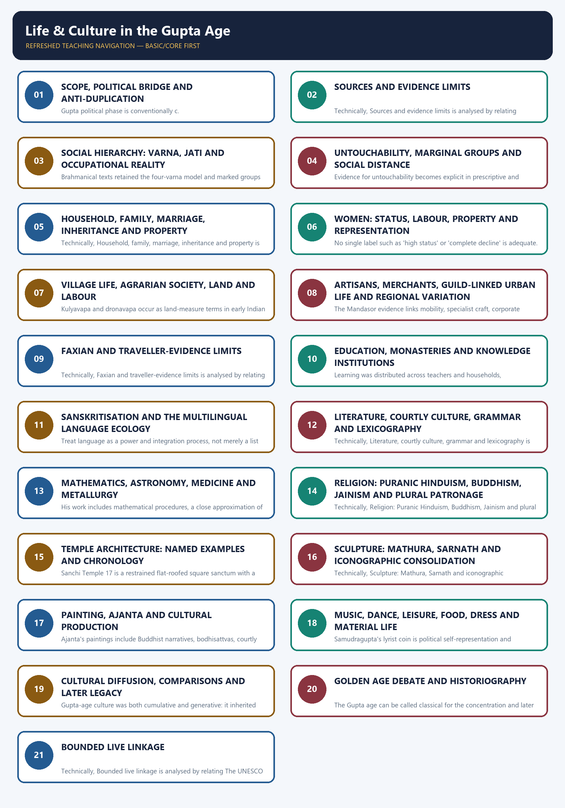

*Distinct embedded teaching-navigation image. The separate continuous Cārvāka-style flowchart package remains an independent at-a-glance artifact.*

#### Package counts and honest limitations

- Learning sections: 21; main learning MCQs: 16; main solved Mains: 3.
- Workbook: 5 verified/routed PYQs, 48 broad MCQs, 8 remedials and 3 original solved Mains.
- Original PNG visuals: 14.
- Direct topic-owned Mains PYQ: none. The 2022 Gupta-Chola culture question is cross-owned and labelled.
- Official 2020-2021 Prelims keys are not held locally; inferred/provisional solutions are explicitly labelled. The 2025 Faxian item has a local official Set A key.
- No dated current-affairs item was necessary. Heritage references are bounded historical/conservation links, not a manufactured current hook.
- Topic 20 remains the owner of Gupta chronology, campaigns, administration, land-grant machinery and decline; repetition is intentionally restricted.

#### Original visual asset index

- `notes/Ancient-Indian-History/assets/21_Life-Culture-Gupta-Age/01_social_hierarchy_evidence_map.png`
- `notes/Ancient-Indian-History/assets/21_Life-Culture-Gupta-Age/02_varna_jati_occupation_matrix.png`
- `notes/Ancient-Indian-History/assets/21_Life-Culture-Gupta-Age/03_women_status_source_comparison.png`
- `notes/Ancient-Indian-History/assets/21_Life-Culture-Gupta-Age/04_village_town_household_flow.png`
- `notes/Ancient-Indian-History/assets/21_Life-Culture-Gupta-Age/05_education_knowledge_ecosystem.png`
- `notes/Ancient-Indian-History/assets/21_Life-Culture-Gupta-Age/06_sanskrit_literature_genre_map.png`
- `notes/Ancient-Indian-History/assets/21_Life-Culture-Gupta-Age/07_science_chronology_attribution.png`
- `notes/Ancient-Indian-History/assets/21_Life-Culture-Gupta-Age/08_religion_plural_patronage.png`
- `notes/Ancient-Indian-History/assets/21_Life-Culture-Gupta-Age/09_temple_architecture_evolution.png`
- `notes/Ancient-Indian-History/assets/21_Life-Culture-Gupta-Age/10_sculpture_school_comparison.png`
- `notes/Ancient-Indian-History/assets/21_Life-Culture-Gupta-Age/11_painting_cultural_map.png`
- `notes/Ancient-Indian-History/assets/21_Life-Culture-Gupta-Age/12_golden_age_distribution_debate.png`
- `notes/Ancient-Indian-History/assets/21_Life-Culture-Gupta-Age/13_daily_life_evidence_wheel.png`
- `notes/Ancient-Indian-History/assets/21_Life-Culture-Gupta-Age/14_gs1_answer_spine.png`

### SESSION 1 — SCOPE, POLITICAL BRIDGE AND ANTI-DUPLICATION

#### DEFINITION / WHAT THIS IS CALLED

**Plain-language definition:** Scope, political bridge and anti-duplication comprises Scope, political bridge and anti-duplication as its core connected dimensions.

**Technical definition:** Gupta political phase is conventionally c.

#### ANSWER-GRABBING OPENING — WRITE/ADAPT IN THE EXAM

> Correct: It is a social-cultural reconstruction with only a concise political bridge.

#### MUST-WRITE KEYWORDS

- **Scope**
- **political bridge**
- **anti-duplication**
- **Mains angle**
- **Study / ownership link**
- **319-550 CE**

**How to use them:** Frame the answer through Scope; define political bridge, connect anti-duplication with Mains angle to explain the mechanism, and use Study / ownership link for the decisive comparison or qualification.

[FACT] Topic 21 is the social-cultural companion to Topic 20. The political frame is limited to c. 319-550 CE, Gupta-Vakataka patronage, agrarian surplus and regional networks; rulers, campaigns, administration, land-grant machinery and decline remain owned by Topic 20.

- [ANALYSIS] The organising question is not 'what did the Guptas conquer?' but 'how were hierarchy, work, belief and patronage converted into cultural production?'
- [FACT] Court Sanskrit, Puranic devotional formations, early structural temples, mature iconic sculpture and major mathematical-astronomical works make the period culturally consequential.
- [LIMIT] 'Gupta age' is a chronological-cultural shorthand. Important production occurred under Vakatakas and other regional powers, and not every part of India shared the same institutions.
- [LIMIT] This package cross-references, rather than repeats, Topic 20 on chronology, Samudragupta, Chandragupta II, offices, revenue, land grants and political decline.
- [ANALYSIS] The answer method throughout is claim -> named evidence -> what it proves -> source or distribution limit.

#### Must-know facts
- Gupta political phase is conventionally c. 319-550 CE.
- Ajanta's principal late phase is Vakataka-context culture of the Gupta age, not simply Gupta-imperial art.
- Cultural history must name its social and economic base.

#### UPSC traps
- **Wrong:** Topic 21 is another ruler-by-ruler Gupta history. **Correct:** It is a social-cultural reconstruction with only a concise political bridge.
- **Wrong:** All classical production occurred under direct Gupta patronage. **Correct:** Regional courts, monasteries, guilds and donors also mattered.

**Mains angle:** Open with the anti-duplication boundary, then connect social base to cultural forms.

**Study / ownership link:** Primary political owner: Ancient History Topic 20.

#### CLOSING RECALL FLOW — SCOPE, POLITICAL BRIDGE AND ANTI-DUPLICATION

```text
START / CONCEPT: Scope, political bridge and anti-duplication
        |
        v
EXACT TERMS: Scope · political bridge · anti-duplication · Mains angle · Study / ownership link · 319-550 CE
        |
        v
MECHANISM / ARGUMENT: Wrong: Topic 21 is another ruler-by-ruler Gupta history.
        |
        v
CONSEQUENCE / CONTRAST: The answer method throughout is claim - named evidence - what it proves - source or distribution limit.
        |
        v
UPSC TRAP / ANSWER-USE: Ajanta's principal late phase is Vakataka-context culture of the Gupta age, not simply Gupta-imperial art.
        |
        v
ANSWER-GRABBING FORMULATION: Correct: It is a social-cultural reconstruction with only a concise political bridge.
```
### SESSION 2 — SOURCES AND EVIDENCE LIMITS

#### DEFINITION / WHAT THIS IS CALLED

**Plain-language definition:** Sources and evidence limits comprises Sources, evidence limits and Mains angle as its core connected dimensions.

**Technical definition:** Technically, Sources and evidence limits is analysed by relating Sources to evidence limits, then testing the relationship through Mains angle and Study / ownership link.

#### ANSWER-GRABBING OPENING — WRITE/ADAPT IN THE EXAM

> Sources and evidence limits comprises Sources, evidence limits and Mains angle as its core connected dimensions.

#### MUST-WRITE KEYWORDS

- **Sources**
- **evidence limits**
- **Mains angle**
- **Study / ownership link**
- **Smriti / law text**
- **Norm, kinship, hierarchy**

**How to use them:** Frame the answer through Sources; define evidence limits, connect Mains angle with Study / ownership link to explain the mechanism, and use Smriti / law text for the decisive comparison or qualification.

[FACT] Gupta-age society is reconstructed from prescriptive texts, literary works, inscriptions and grants, coins and seals, Faxian, temples, sculpture, paintings, settlements and objects. Each source answers a different question.

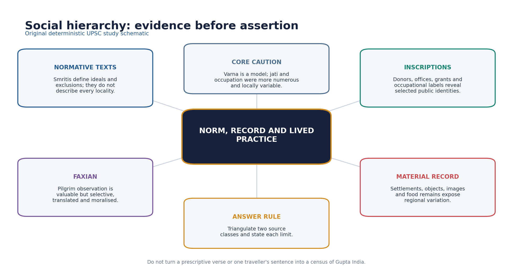

*Original deterministic schematic; factual and chronology limits remain in the surrounding text.*

| Source | Best use | Primary limit |
|---|---|---|
| Smriti / law text | Norm, kinship, hierarchy | Prescriptive and layered |
| Inscription / grant | Patron, office, right, donor | Public and regionally uneven |
| Kavya / drama | Ideals, genre, court culture | Aesthetic convention |
| Faxian | Selected observation | Pilgrim lens |
| Art / archaeology | Material and visual practice | Dating and survival |

- [FACT] Smritis and legal-didactic texts reveal normative ordering, permissible conduct and elite anxieties; they do not prove uniform enforcement.
- [FACT] Prashastis and royal images communicate legitimacy; donative inscriptions reveal selected patrons, institutions and occupational identities.
- [FACT] Literary kavya and drama reveal aesthetic ideals, courtly language and social imagination, but genre conventions shape their worlds.
- [FACT] Faxian offers observations linked to a Buddhist pilgrimage itinerary and translation history; he is not a neutral administrator.
- [FACT] Archaeology and art expose material practice, workshop technique and regional diversity, but dating, survival and representativeness remain problems.
- [ANALYSIS] Triangulation is compulsory: use at least two source classes and state what each cannot establish.

#### Must-know facts
- Normative text is not a census.
- Traveller evidence is situated.
- Material survival is selective.

#### UPSC traps
- **Wrong:** A Smriti statement proves universal custom. **Correct:** It establishes a norm or debate, which must be tested against other evidence.
- **Wrong:** Faxian described every social group and region. **Correct:** His route, purpose and interests were selective.

**Mains angle:** A high-scoring social-history answer begins with a source-method sentence.

**Study / ownership link:** Sources method: Ancient History Topics 01-02.

#### CLOSING RECALL FLOW — SOURCES AND EVIDENCE LIMITS

```text
START / CONCEPT: Sources and evidence limits
        |
        v
EXACT TERMS: Sources · evidence limits · Mains angle · Study / ownership link · Smriti / law text · Norm, kinship, hierarchy
        |
        v
MECHANISM / ARGUMENT: Gupta-age society is reconstructed from prescriptive texts, literary works, inscriptions and grants, coins and seals, Faxian, temples, sculpture, paintings, settlements and objects.
        |
        v
CONSEQUENCE / CONTRAST: Smritis and legal-didactic texts reveal normative ordering, permissible conduct and elite anxieties; they do not prove uniform enforcement.
        |
        v
UPSC TRAP / ANSWER-USE: Faxian offers observations linked to a Buddhist pilgrimage itinerary and translation history; he is not a neutral administrator.
        |
        v
ANSWER-GRABBING FORMULATION: Sources and evidence limits comprises Sources, evidence limits and Mains angle as its core connected dimensions.
```
### SESSION 3 — SOCIAL HIERARCHY: VARNA, JATI AND OCCUPATIONAL REALITY

#### DEFINITION / WHAT THIS IS CALLED

**Plain-language definition:** Social hierarchy: varna, jati and occupational reality comprises Social hierarchy, varna and jati as its core connected dimensions.

**Technical definition:** Brahmanical texts retained the four-varna model and marked groups beyond it, while inscriptions and social practice disclose many occupational and local identities that cannot be compressed into four boxes.

#### ANSWER-GRABBING OPENING — WRITE/ADAPT IN THE EXAM

> Brahmanical texts retained the four-varna model and marked groups beyond it, while inscriptions and social practice disclose many occupational and local identities that cannot be compressed into four boxes.

#### MUST-WRITE KEYWORDS

- **Social hierarchy**
- **varna**
- **jati**
- **occupational reality**
- **Mains angle**
- **Study / ownership link**

**How to use them:** Frame the answer through Social hierarchy; define varna, connect jati with occupational reality to explain the mechanism, and use Mains angle for the decisive comparison or qualification.

[FACT] Brahmanical texts retained the four-varna model and marked groups beyond it, while inscriptions and social practice disclose many occupational and local identities that cannot be compressed into four boxes.

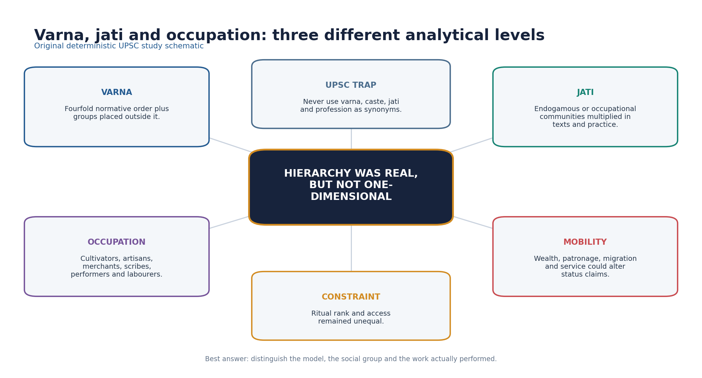

*Original deterministic schematic; factual and chronology limits remain in the surrounding text.*

- [FACT] Brahmanas enjoyed ideological prestige and benefited from patronage and land grants, but Brahmanas themselves were internally differentiated by learning, locality and livelihood.
- [FACT] Kshatriya status was claimed through genealogy, conquest and ritual language; social rank could be politically negotiated.
- [FACT] Vaishya and Shudra labels in texts do not map neatly onto every merchant, cultivator or artisan in inscriptions.
- [ANALYSIS] Jati proliferation reflected occupation, migration, incorporation of communities, inter-group marriage classifications and local ranking.
- [FACT] Scribes appear in administrative and inscriptional settings; later Kayastha caste consolidation must not be projected fully into the fourth-fifth centuries.
- [LIMIT] Mobility and status claims coexisted with entrenched inequality; evidence for exceptional advancement does not dissolve the hierarchy.

#### Must-know facts
- Varna is a normative macro-model.
- Jati and occupation were more numerous and locally variable.
- Status could be claimed, but access remained unequal.

#### UPSC traps
- **Wrong:** Varna, jati and profession are identical. **Correct:** They are analytically distinct even when they overlap.
- **Wrong:** Some mobility means caste hierarchy was absent. **Correct:** Negotiated rank operated within an unequal order.

**Mains angle:** Distinguish model, community and livelihood before discussing social change.

**Study / ownership link:** Compare Topic 13 (Buddha-age varna society) and Topic 26 (later transition).

#### CLOSING RECALL FLOW — SOCIAL HIERARCHY: VARNA, JATI AND OCCUPATIONAL REALITY

```text
START / CONCEPT: Social hierarchy: varna, jati and occupational reality
        |
        v
EXACT TERMS: Social hierarchy · varna · jati · occupational reality · Mains angle · Study / ownership link
        |
        v
MECHANISM / ARGUMENT: Kshatriya status was claimed through genealogy, conquest and ritual language; social rank could be politically negotiated.
        |
        v
CONSEQUENCE / CONTRAST: Mobility and status claims coexisted with entrenched inequality; evidence for exceptional advancement does not dissolve the hierarchy.
        |
        v
UPSC TRAP / ANSWER-USE: Brahmanas enjoyed ideological prestige and benefited from patronage and land grants, but Brahmanas themselves were internally differentiated by learning, locality and livelihood.
        |
        v
ANSWER-GRABBING FORMULATION: Brahmanical texts retained the four-varna model and marked groups beyond it, while inscriptions and social practice disclose many occupational and local identities that cannot be compressed into four boxes.
```
### SESSION 4 — UNTOUCHABILITY, MARGINAL GROUPS AND SOCIAL DISTANCE

#### DEFINITION / WHAT THIS IS CALLED

**Plain-language definition:** 'Untouchable' is a modern umbrella for historically varied named groups; avoid inventing a fixed Gupta-period pan-Indian caste list.

**Technical definition:** Evidence for untouchability becomes explicit in prescriptive and traveller accounts, but terminology, practice and regional intensity must be handled cautiously.

#### ANSWER-GRABBING OPENING — WRITE/ADAPT IN THE EXAM

> Evidence for untouchability becomes explicit in prescriptive and traveller accounts, but terminology, practice and regional intensity must be handled cautiously.

#### MUST-WRITE KEYWORDS

- **Untouchability**
- **marginal groups**
- **social distance**
- **Mains angle**
- **Study / ownership link**
- **Faxian's account**

**How to use them:** Frame the answer through Untouchability; define marginal groups, connect social distance with Mains angle to explain the mechanism, and use Study / ownership link for the decisive comparison or qualification.

[FACT] Evidence for untouchability becomes explicit in prescriptive and traveller accounts, but terminology, practice and regional intensity must be handled cautiously.

- [FACT] Faxian's account describes Chandalas as living apart and signalling their presence when entering a town; this is important evidence of social exclusion.
- [LIMIT] Faxian's statement is a pilgrim observation transmitted through texts and translations; it cannot quantify all communities or all regions.
- [FACT] Brahmanical texts associated some occupations, birth categories and forms of contact with impurity and exclusion.
- [ANALYSIS] Occupational stigma, spatial separation and ritual avoidance reinforced one another, but the exact relationship differed locally.
- [LIMIT] 'Untouchable' is a modern umbrella for historically varied named groups; avoid inventing a fixed Gupta-period pan-Indian caste list.
- [ANALYSIS] The Golden Age label must be tested against the visibility of exclusion, not merely elite achievement.

#### Must-know facts
- Faxian's Chandala passage is evidence of exclusion, not a census.
- Spatial and ritual distance could overlap.
- Named groups require source-specific use.

#### UPSC traps
- **Wrong:** Faxian proves identical untouchability throughout India. **Correct:** He supplies strong but situated evidence.
- **Wrong:** Marginal groups left no history. **Correct:** Texts, travellers, labour relations and archaeology offer indirect, unequal access.

**Mains angle:** Use the Chandala evidence as a limitation on universal Golden Age claims.

**Study / ownership link:** Traveller method in Section 09; Golden Age debate in Section 20.

#### CLOSING RECALL FLOW — UNTOUCHABILITY, MARGINAL GROUPS AND SOCIAL DISTANCE

```text
START / CONCEPT: Untouchability, marginal groups and social distance
        |
        v
EXACT TERMS: Untouchability · marginal groups · social distance · Mains angle · Study / ownership link · Faxian's account
        |
        v
MECHANISM / ARGUMENT: Faxian's statement is a pilgrim observation transmitted through texts and translations; it cannot quantify all communities or all regions.
        |
        v
CONSEQUENCE / CONTRAST: The Golden Age label must be tested against the visibility of exclusion, not merely elite achievement.
        |
        v
UPSC TRAP / ANSWER-USE: Faxian's Chandala passage is evidence of exclusion, not a census.
        |
        v
ANSWER-GRABBING FORMULATION: Evidence for untouchability becomes explicit in prescriptive and traveller accounts, but terminology, practice and regional intensity must be handled cautiously.
```
### SESSION 5 — HOUSEHOLD, FAMILY, MARRIAGE, INHERITANCE AND PROPERTY

#### DEFINITION / WHAT THIS IS CALLED

**Plain-language definition:** Stridhana was a recognised category of women's property, although definitions, control and inheritance varied across legal texts and circumstances.

**Technical definition:** Technically, Household, family, marriage, inheritance and property is analysed by relating Household to family, then testing the relationship through marriage and inheritance.

#### ANSWER-GRABBING OPENING — WRITE/ADAPT IN THE EXAM

> Stridhana was a recognised category of women's property, although definitions, control and inheritance varied across legal texts and circumstances.

#### MUST-WRITE KEYWORDS

- **Household**
- **family**
- **marriage**
- **inheritance**
- **property**
- **Mains angle**

**How to use them:** Frame the answer through Household; define family, connect marriage with inheritance to explain the mechanism, and use property for the decisive comparison or qualification.

[FACT] Gupta-age family history is text-heavy. Smritis discuss marriage forms, guardianship, lineage, property and inheritance, but lived arrangements varied by region, class and community.

- [FACT] Patrilineal descent and patriarchal household authority remained the dominant normative framework.
- [FACT] Stridhana was a recognised category of women's property, although definitions, control and inheritance varied across legal texts and circumstances.
- [LIMIT] Widow inheritance and women's claims cannot be summarised by one timeless Hindu-law rule; texts differ and later commentarial schools belong to later centuries.
- [FACT] Mitakshara is the later commentary of Vijnaneshwara on the Yajnavalkya Smriti; Dayabhaga is associated with Jimutavahana. They are not Gupta-period legal codes.
- [ANALYSIS] The 2021 Prelims route tests the contrast between joint birthright under Mitakshara and succession after the father's death in Dayabhaga, not a Gupta-age custom claim.
- [LIMIT] Literary marriages, royal genealogies and legal prescriptions disproportionately represent elites.

#### Must-know facts
- Stridhana is not identical to equal coparcenary rights.
- Mitakshara and Dayabhaga are later schools.
- Kinship evidence must be source-dated.

#### UPSC traps
- **Wrong:** Mitakshara and Dayabhaga were two Gupta royal codes. **Correct:** They are later commentarial schools of Hindu law.
- **Wrong:** Recognition of stridhana proves gender-equal property relations. **Correct:** Recognition existed within a patriarchal and textually variable framework.

**Mains angle:** When asked about women or inheritance, separate norm, property category, legal school chronology and lived evidence.

**Study / ownership link:** PYQ route: 2021 Prelims Q40, neutral demand locally audited.

#### CLOSING RECALL FLOW — HOUSEHOLD, FAMILY, MARRIAGE, INHERITANCE AND PROPERTY

```text
START / CONCEPT: Household, family, marriage, inheritance and property
        |
        v
EXACT TERMS: Household · family · marriage · inheritance · property · Mains angle
        |
        v
MECHANISM / ARGUMENT: Wrong: Recognition of stridhana proves gender-equal property relations.
        |
        v
CONSEQUENCE / CONTRAST: They are not Gupta-period legal codes.
        |
        v
UPSC TRAP / ANSWER-USE: Stridhana is not identical to equal coparcenary rights.
        |
        v
ANSWER-GRABBING FORMULATION: Stridhana was a recognised category of women's property, although definitions, control and inheritance varied across legal texts and circumstances.
```
### SESSION 6 — WOMEN: STATUS, LABOUR, PROPERTY AND REPRESENTATION

#### DEFINITION / WHAT THIS IS CALLED

**Plain-language definition:** Household, agricultural, craft and service labour by women is under-described in elite literary texts; absence of description is not evidence of absence.

**Technical definition:** No single label such as 'high status' or 'complete decline' is adequate.

#### ANSWER-GRABBING OPENING — WRITE/ADAPT IN THE EXAM

> Household, agricultural, craft and service labour by women is under-described in elite literary texts; absence of description is not evidence of absence.

#### MUST-WRITE KEYWORDS

- **Women**
- **status**
- **labour**
- **property**
- **representation**
- **Mains angle**

**How to use them:** Frame the answer through Women; define status, connect labour with property to explain the mechanism, and use representation for the decisive comparison or qualification.

[FACT] The evidence shows patriarchal constraint alongside differentiated forms of agency. No single label such as 'high status' or 'complete decline' is adequate.

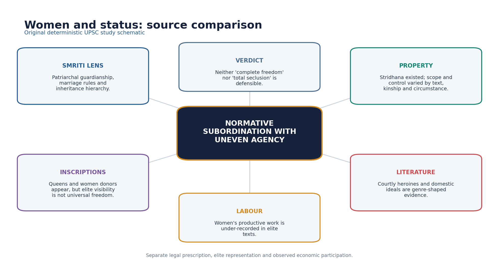

*Original deterministic schematic; factual and chronology limits remain in the surrounding text.*

- [FACT] Smriti norms emphasised male guardianship, patriliny and controlled sexuality; these are evidence of normative hierarchy.
- [FACT] Queens such as Prabhavatigupta could exercise political and donative authority, but elite regency cannot stand for all women.
- [FACT] Women appear as donors and participants in religious life in inscriptions across early historic India; the surviving Gupta-age record remains selective.
- [ANALYSIS] Household, agricultural, craft and service labour by women is under-described in elite literary texts; absence of description is not evidence of absence.
- [FACT] Courtly literature gives women narrative intelligence, desire and aesthetic centrality while still operating inside elite gender conventions.
- [LIMIT] Claims about universal child marriage, purdah, sati frequency or educational exclusion require precise sources; this package does not generalise them.

#### Must-know facts
- Elite agency and general equality are different claims.
- Literary visibility is genre-shaped.
- Women's labour is under-recorded.

#### UPSC traps
- **Wrong:** Prabhavatigupta proves all women held political power. **Correct:** She proves possible elite female authority under specific dynastic conditions.
- **Wrong:** Courtly heroines transparently depict ordinary women. **Correct:** They reveal aesthetic and social ideals, not representative daily life.

**Mains angle:** Build a three-column answer: normative position, observed agency, evidentiary limit.

**Study / ownership link:** Political details remain in Topic 20; gender method links Indian Society.

#### CLOSING RECALL FLOW — WOMEN: STATUS, LABOUR, PROPERTY AND REPRESENTATION

```text
START / CONCEPT: Women: status, labour, property and representation
        |
        v
EXACT TERMS: Women · status · labour · property · representation · Mains angle
        |
        v
MECHANISM / ARGUMENT: No single label such as 'high status' or 'complete decline' is adequate.
        |
        v
CONSEQUENCE / CONTRAST: Queens such as Prabhavatigupta could exercise political and donative authority, but elite regency cannot stand for all women.
        |
        v
UPSC TRAP / ANSWER-USE: Claims about universal child marriage, purdah, sati frequency or educational exclusion require precise sources; this package does not generalise them.
        |
        v
ANSWER-GRABBING FORMULATION: Household, agricultural, craft and service labour by women is under-described in elite literary texts; absence of description is not evidence of absence.
```
### SESSION 7 — VILLAGE LIFE, AGRARIAN SOCIETY, LAND AND LABOUR

#### DEFINITION / WHAT THIS IS CALLED

**Plain-language definition:** Grants could expand cultivation and transmit agrarian techniques while also strengthening beneficiaries' claims over revenue and labour.

**Technical definition:** Kulyavapa and dronavapa occur as land-measure terms in early Indian epigraphic contexts; the 2020 official paper identifies them as measurements of land.

#### ANSWER-GRABBING OPENING — WRITE/ADAPT IN THE EXAM

> Grants could expand cultivation and transmit agrarian techniques while also strengthening beneficiaries' claims over revenue and labour.

#### MUST-WRITE KEYWORDS

- **Village life**
- **agrarian society**
- **land**
- **labour**
- **Mains angle**
- **Study / ownership link**

**How to use them:** Frame the answer through Village life; define agrarian society, connect land with labour to explain the mechanism, and use Mains angle for the decisive comparison or qualification.

[FACT] The village and agrarian household generated much of the surplus that supported courts, religious institutions, learning and artistic production.

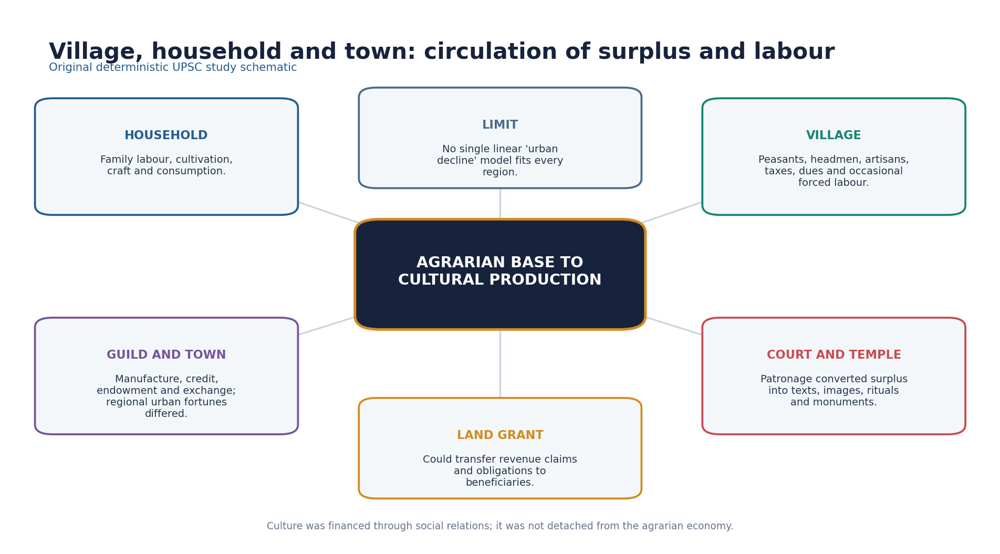

*Original deterministic schematic; factual and chronology limits remain in the surrounding text.*

- [FACT] Land grants recorded plots, boundaries, revenue claims and exemptions; the administrative mechanics and political debate remain owned by Topic 20.
- [FACT] Kulyavapa and dronavapa occur as land-measure terms in early Indian epigraphic contexts; the 2020 official paper identifies them as measurements of land.
- [FACT] Cultivators faced taxes, shares, dues and, in some contexts, vishti or forced labour obligations.
- [ANALYSIS] Grants could expand cultivation and transmit agrarian techniques while also strengthening beneficiaries' claims over revenue and labour.
- [LIMIT] 'Feudalism' is a historiographical model, not a label to substitute for evidence; regional chronology and the bundle of transferred rights matter.
- [ANALYSIS] Village society included landholders, tenants or dependent cultivators, artisans, servants and officials in varying combinations.

#### Must-know facts
- Kulyavapa and dronavapa denote land measurement.
- Vishti was a labour obligation, not a tax coin.
- Land grants could have expansionary and coercive effects.

#### UPSC traps
- **Wrong:** Every grant transferred full private ownership. **Correct:** Rights transferred varied by charter and region.
- **Wrong:** Agrarian expansion benefited all cultivators equally. **Correct:** Expansion could coexist with new obligations and unequal control.

**Mains angle:** Connect cultural florescence to the agrarian surplus and labour relations that sustained it.

**Study / ownership link:** Topic 20 owns grant administration; Topic 26 owns longer early-medieval debate.

#### CLOSING RECALL FLOW — VILLAGE LIFE, AGRARIAN SOCIETY, LAND AND LABOUR

```text
START / CONCEPT: Village life, agrarian society, land and labour
        |
        v
EXACT TERMS: Village life · agrarian society · land · labour · Mains angle · Study / ownership link
        |
        v
MECHANISM / ARGUMENT: Kulyavapa and dronavapa occur as land-measure terms in early Indian epigraphic contexts; the 2020 official paper identifies them as measurements of land.
        |
        v
CONSEQUENCE / CONTRAST: Vishti was a labour obligation, not a tax coin.
        |
        v
UPSC TRAP / ANSWER-USE: 'Feudalism' is a historiographical model, not a label to substitute for evidence; regional chronology and the bundle of transferred rights matter.
        |
        v
ANSWER-GRABBING FORMULATION: Grants could expand cultivation and transmit agrarian techniques while also strengthening beneficiaries' claims over revenue and labour.
```
### SESSION 8 — ARTISANS, MERCHANTS, GUILD-LINKED URBAN LIFE AND REGIONAL VARIATION

#### DEFINITION / WHAT THIS IS CALLED

**Plain-language definition:** Regional variation is central: route shifts, ports, courts, pilgrimage and agrarian hinterlands produced different urban trajectories.

**Technical definition:** The Mandasor evidence links mobility, specialist craft, corporate identity, religion and urban patronage.

#### ANSWER-GRABBING OPENING — WRITE/ADAPT IN THE EXAM

> Regional variation is central: route shifts, ports, courts, pilgrimage and agrarian hinterlands produced different urban trajectories.

#### MUST-WRITE KEYWORDS

- **Artisans**
- **merchants**
- **guild-linked urban life**
- **regional variation**
- **Mains angle**
- **Study / ownership link**

**How to use them:** Frame the answer through Artisans; define merchants, connect guild-linked urban life with regional variation to explain the mechanism, and use Mains angle for the decisive comparison or qualification.

[FACT] Gupta-age urban history was uneven: some older towns contracted, while political, pilgrimage, craft and exchange centres persisted or changed function.

- [FACT] The Mandasor inscriptions of silk weavers record a migrant corporate group, temple patronage and the repair or renewal of a Sun temple.
- [ANALYSIS] The Mandasor evidence links mobility, specialist craft, corporate identity, religion and urban patronage.
- [FACT] Guilds and occupational corporations could receive endowments and manage funds, but they were not modern banks or democratic trade unions.
- [FACT] Artisans worked in textiles, metal, ivory, terracotta, stone, brick and other materials; archaeological visibility varies sharply by craft.
- [LIMIT] Coin finds and textual comments suggest monetary and commercial change, but a uniform collapse of trade cannot be inferred.
- [ANALYSIS] Regional variation is central: route shifts, ports, courts, pilgrimage and agrarian hinterlands produced different urban trajectories.

#### Must-know facts
- Mandasor silk weavers are a named Gupta-age corporate example.
- Guild endowments show institutional capacity.
- Urban change was regional, not one-directional.

#### UPSC traps
- **Wrong:** All Gupta towns declined simultaneously. **Correct:** Urban contraction, persistence and functional change varied by region.
- **Wrong:** A guild was identical to a modern corporation. **Correct:** It was a historically specific occupational-corporate institution.

**Mains angle:** Use Mandasor as a compact evidence chain: migration -> guild identity -> wealth -> temple patronage -> cultural production.

**Study / ownership link:** Economic baseline: Topic 19; political economy: Topic 20.

#### CLOSING RECALL FLOW — ARTISANS, MERCHANTS, GUILD-LINKED URBAN LIFE AND REGIONAL VARIATION

```text
START / CONCEPT: Artisans, merchants, guild-linked urban life and regional variation
        |
        v
EXACT TERMS: Artisans · merchants · guild-linked urban life · regional variation · Mains angle · Study / ownership link
        |
        v
MECHANISM / ARGUMENT: Urban change was regional, not one-directional.
        |
        v
CONSEQUENCE / CONTRAST: Gupta-age urban history was uneven: some older towns contracted, while political, pilgrimage, craft and exchange centres persisted or changed function.
        |
        v
UPSC TRAP / ANSWER-USE: Guilds and occupational corporations could receive endowments and manage funds, but they were not modern banks or democratic trade unions.
        |
        v
ANSWER-GRABBING FORMULATION: Regional variation is central: route shifts, ports, courts, pilgrimage and agrarian hinterlands produced different urban trajectories.
```
### SESSION 9 — FAXIAN AND TRAVELLER-EVIDENCE LIMITS

#### DEFINITION / WHAT THIS IS CALLED

**Plain-language definition:** His account is especially valuable for Buddhist geography, monastic conditions, pilgrimage and selected social observations.

**Technical definition:** Technically, Faxian and traveller-evidence limits is analysed by relating Faxian to traveller-evidence limits, then testing the relationship through Mains angle and Study / ownership link.

#### ANSWER-GRABBING OPENING — WRITE/ADAPT IN THE EXAM

> His account is especially valuable for Buddhist geography, monastic conditions, pilgrimage and selected social observations.

#### MUST-WRITE KEYWORDS

- **Faxian**
- **traveller-evidence limits**
- **Mains angle**
- **Study / ownership link**
- **His account**
- **399-414 CE**

**How to use them:** Frame the answer through Faxian; define traveller-evidence limits, connect Mains angle with Study / ownership link to explain the mechanism, and use His account for the decisive comparison or qualification.

[FACT] Faxian travelled in India c. 399-414 CE, broadly during Chandragupta II's reign, to obtain Buddhist texts and visit sacred sites.

- [FACT] The official 2025 Prelims Set A question asks which reign Faxian visited; the official key route identifies Chandragupta II.
- [FACT] His account is especially valuable for Buddhist geography, monastic conditions, pilgrimage and selected social observations.
- [FACT] His Chandala passage is frequently used for social exclusion; his descriptions of punishment or prosperity must be read in route and purpose context.
- [LIMIT] Silence about an institution does not prove its absence, and praise of a region does not establish empire-wide conditions.
- [LIMIT] Names and details pass through Chinese transcription and later translation; exact equivalences require scholarly care.
- [ANALYSIS] Best practice is corroboration with inscriptions, archaeology or legal-literary evidence.

#### Must-know facts
- Faxian visited during Chandragupta II.
- He was a Buddhist pilgrim, not a Gupta official.
- His account is selective but indispensable.

#### UPSC traps
- **Wrong:** Faxian's silence disproves a practice. **Correct:** Silence may reflect route, genre or interest.
- **Wrong:** Traveller bias makes the account useless. **Correct:** Source-aware use preserves its strong observational value.

**Mains angle:** State both value and limit in the same paragraph.

**Study / ownership link:** Official 2025 Prelims owner is Topic 20; this section owns traveller methodology.

#### CLOSING RECALL FLOW — FAXIAN AND TRAVELLER-EVIDENCE LIMITS

```text
START / CONCEPT: Faxian and traveller-evidence limits
        |
        v
EXACT TERMS: Faxian · traveller-evidence limits · Mains angle · Study / ownership link · His account · 399-414 CE
        |
        v
MECHANISM / ARGUMENT: Study / ownership link: Official 2025 Prelims owner is Topic 20; this section owns traveller methodology.
        |
        v
CONSEQUENCE / CONTRAST: Silence about an institution does not prove its absence, and praise of a region does not establish empire-wide conditions.
        |
        v
UPSC TRAP / ANSWER-USE: His account is selective but indispensable.
        |
        v
ANSWER-GRABBING FORMULATION: His account is especially valuable for Buddhist geography, monastic conditions, pilgrimage and selected social observations.
```
### SESSION 10 — EDUCATION, MONASTERIES AND KNOWLEDGE INSTITUTIONS

#### DEFINITION / WHAT THIS IS CALLED

**Plain-language definition:** Monasteries were learning nodes, not the only institutions.

**Technical definition:** Learning was distributed across teachers and households, Brahmanical centres, monasteries, courts and specialist communities rather than concentrated in one modern university system.

#### ANSWER-GRABBING OPENING — WRITE/ADAPT IN THE EXAM

> Monasteries were learning nodes, not the only institutions.

#### MUST-WRITE KEYWORDS

- **Education**
- **monasteries**
- **knowledge institutions**
- **Mains angle**
- **Study / ownership link**
- **Learning**

**How to use them:** Frame the answer through Education; define monasteries, connect knowledge institutions with Mains angle to explain the mechanism, and use Study / ownership link for the decisive comparison or qualification.

[FACT] Learning was distributed across teachers and households, Brahmanical centres, monasteries, courts and specialist communities rather than concentrated in one modern university system.

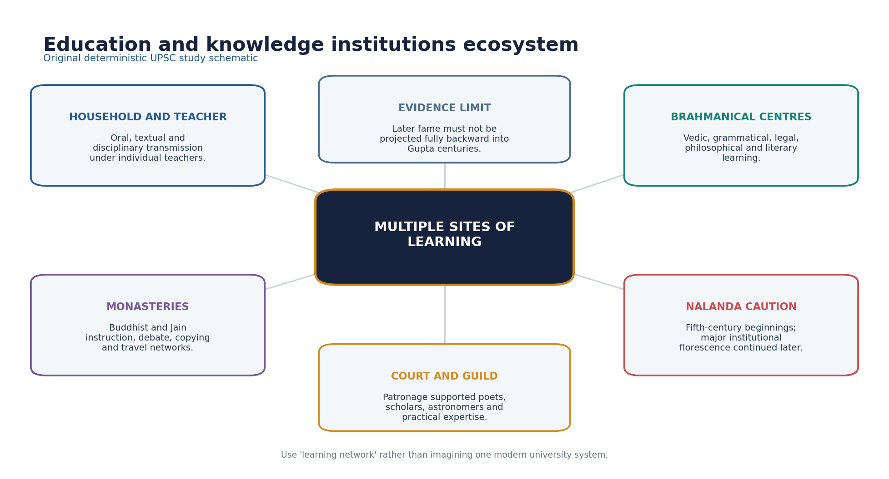

*Original deterministic schematic; factual and chronology limits remain in the surrounding text.*

- [FACT] Vedic, grammatical, legal, philosophical and literary learning relied strongly on oral-textual transmission under teachers.
- [FACT] Buddhist monasteries supported instruction, debate, manuscript movement and pilgrim networks; Jain institutions also sustained textual traditions.
- [FACT] Nalanda's beginnings are associated with the fifth century, but its great institutional prominence and Xuanzang-Yijing descriptions belong substantially to later centuries.
- [LIMIT] 'Founded by Kumaragupta as a fully developed university' compresses uncertain foundation traditions and later expansion.
- [ANALYSIS] Court patronage, religious endowment and agrarian resources created the material conditions for specialist learning.
- [LIMIT] Literacy levels, access by gender and class, curricula and student numbers cannot be safely quantified.

#### Must-know facts
- Nalanda chronology must be phased.
- Monasteries were learning nodes, not the only institutions.
- Later fame cannot be projected backward.

#### UPSC traps
- **Wrong:** Fifth-century Nalanda already had every seventh-century feature. **Correct:** Institutional development was cumulative.
- **Wrong:** Education was exclusively Brahmanical. **Correct:** Buddhist, Jain, courtly and practical knowledge networks also operated.

**Mains angle:** Explain the ecosystem and then add the Nalanda chronology caution.

**Study / ownership link:** Post-Gupta institutional detail: Topic 22.

#### CLOSING RECALL FLOW — EDUCATION, MONASTERIES AND KNOWLEDGE INSTITUTIONS

```text
START / CONCEPT: Education, monasteries and knowledge institutions
        |
        v
EXACT TERMS: Education · monasteries · knowledge institutions · Mains angle · Study / ownership link · Learning
        |
        v
MECHANISM / ARGUMENT: 'Founded by Kumaragupta as a fully developed university' compresses uncertain foundation traditions and later expansion.
        |
        v
CONSEQUENCE / CONTRAST: Nalanda's beginnings are associated with the fifth century, but its great institutional prominence and Xuanzang-Yijing descriptions belong substantially to later centuries.
        |
        v
UPSC TRAP / ANSWER-USE: Learning was distributed across teachers and households, Brahmanical centres, monasteries, courts and specialist communities rather than concentrated in one modern university system.
        |
        v
ANSWER-GRABBING FORMULATION: Monasteries were learning nodes, not the only institutions.
```
### SESSION 11 — SANSKRITISATION AND THE MULTILINGUAL LANGUAGE ECOLOGY

#### DEFINITION / WHAT THIS IS CALLED

**Plain-language definition:** Sanskritisation involved adoption and adaptation of Brahmanical idioms, genealogies, rituals and social claims by rulers and communities; it was not simple top-down homogenisation.

**Technical definition:** Treat language as a power and integration process, not merely a list of texts.

#### ANSWER-GRABBING OPENING — WRITE/ADAPT IN THE EXAM

> Sanskritisation involved adoption and adaptation of Brahmanical idioms, genealogies, rituals and social claims by rulers and communities; it was not simple top-down homogenisation.

#### MUST-WRITE KEYWORDS

- **Sanskritisation**
- **the multilingual language ecology**
- **Mains angle**
- **Study / ownership link**
- **Sanskrit**
- **Brahmanical**

**How to use them:** Frame the answer through Sanskritisation; define the multilingual language ecology, connect Mains angle with Study / ownership link to explain the mechanism, and use Sanskrit for the decisive comparison or qualification.

[FACT] Sanskrit became a major transregional language of royal inscription, courtly literature and Brahmanical learning, but it did not replace Prakrits or spoken regional languages.

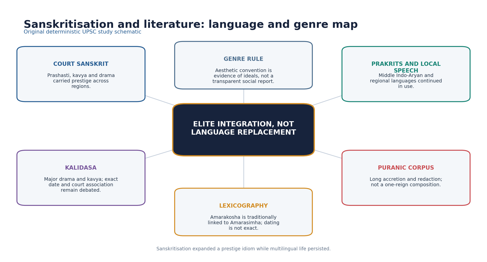

*Original deterministic schematic; factual and chronology limits remain in the surrounding text.*

- [FACT] Gupta inscriptions and prashastis demonstrate the prestige and political reach of polished Sanskrit.
- [ANALYSIS] Sanskritisation involved adoption and adaptation of Brahmanical idioms, genealogies, rituals and social claims by rulers and communities; it was not simple top-down homogenisation.
- [FACT] Prakrit literary and inscriptional traditions continued, while vernacular speech remained the medium of ordinary communication.
- [FACT] Buddhist authors used Sanskrit and hybrid registers alongside Middle Indo-Aryan traditions.
- [LIMIT] A Sanskrit inscription proves public elite communication, not the mother tongue of the entire population.
- [ANALYSIS] Regional courts could use Sanskrit to join a wider prestige world while maintaining local identities.

#### Must-know facts
- Sanskrit was a prestige and integrative language.
- Multilingualism persisted.
- Sanskritisation was negotiated and regionally adapted.

#### UPSC traps
- **Wrong:** Sanskrit became the sole language of Gupta India. **Correct:** Courtly prominence coexisted with Prakrits and regional speech.
- **Wrong:** Sanskritisation erased all local culture. **Correct:** It often produced hybrid and locally reworked forms.

**Mains angle:** Treat language as a power and integration process, not merely a list of texts.

**Study / ownership link:** Literature and manuscript form ownership also links Indian Art and Culture Topic 11.

#### CLOSING RECALL FLOW — SANSKRITISATION AND THE MULTILINGUAL LANGUAGE ECOLOGY

```text
START / CONCEPT: Sanskritisation and the multilingual language ecology
        |
        v
EXACT TERMS: Sanskritisation · the multilingual language ecology · Mains angle · Study / ownership link · Sanskrit · Brahmanical
        |
        v
MECHANISM / ARGUMENT: Sanskrit became a major transregional language of royal inscription, courtly literature and Brahmanical learning, but it did not replace Prakrits or spoken regional languages.
        |
        v
CONSEQUENCE / CONTRAST: Treat language as a power and integration process, not merely a list of texts.
        |
        v
UPSC TRAP / ANSWER-USE: A Sanskrit inscription proves public elite communication, not the mother tongue of the entire population.
        |
        v
ANSWER-GRABBING FORMULATION: Sanskritisation involved adoption and adaptation of Brahmanical idioms, genealogies, rituals and social claims by rulers and communities; it was not simple top-down homogenisation.
```
### SESSION 12 — LITERATURE, COURTLY CULTURE, GRAMMAR AND LEXICOGRAPHY

#### DEFINITION / WHAT THIS IS CALLED

**Plain-language definition:** Literature, courtly culture, grammar and lexicography comprises Literature, courtly culture and grammar as its core connected dimensions.

**Technical definition:** Technically, Literature, courtly culture, grammar and lexicography is analysed by relating Literature to courtly culture, then testing the relationship through grammar and lexicography.

#### ANSWER-GRABBING OPENING — WRITE/ADAPT IN THE EXAM

> Literature, courtly culture, grammar and lexicography comprises Literature, courtly culture and grammar as its core connected dimensions.

#### MUST-WRITE KEYWORDS

- **Literature**
- **courtly culture**
- **grammar**
- **lexicography**
- **Mains angle**
- **Study / ownership link**

**How to use them:** Frame the answer through Literature; define courtly culture, connect grammar with lexicography to explain the mechanism, and use Mains angle for the decisive comparison or qualification.

[FACT] Kalidasa is the central literary figure associated with the broad Gupta age, but his exact date and formal membership of Chandragupta II's court are not securely established.

- [FACT] Kalidasa's securely attributed major dramas include Abhijnanashakuntala, Malavikagnimitra and Vikramorvashiya; major poems include Raghuvamsha, Kumarasambhava and Meghaduta.
- [LIMIT] Literary plots, dynastic allusions and later Vikramaditya traditions do not fix an uncontested biography.
- [FACT] The 2020 official paper's scholar association item treats Kalidasa with Chandragupta II as the defensible pair while Panini-Pushyamitra and Amarasimha-Harsha are incorrect.
- [FACT] Vishakhadatta's Mudrarakshasa is historically valuable as political drama, but its precise date remains debated.
- [FACT] Amarakosha is a major Sanskrit lexicon traditionally attributed to Amarasimha; exact dating and 'navaratna' claims need caution.
- [LIMIT] Bhasa is earlier or uncertain and should not be presented as a securely documented Gupta court poet; Bharavi is often placed around the sixth century.
- [ANALYSIS] Puranic texts underwent long compilation and redaction, supporting devotional, genealogical and sacred-geographical integration without being products of one reign.

#### Must-know facts
- Kalidasa's works are safer than his court biography.
- Amarakosha is lexicography, not grammar.
- Puranas are layered texts.

#### UPSC traps
- **Wrong:** All nine jewels of Vikramaditya are securely documented contemporaries. **Correct:** The navaratna list is later tradition.
- **Wrong:** A literary work is a transparent chronicle. **Correct:** Genre and date must be established before historical use.

**Mains angle:** Name work, genre, cultural function and chronology limit.

**Study / ownership link:** Form-centric literature owner: Indian Art and Culture Topic 11.

#### CLOSING RECALL FLOW — LITERATURE, COURTLY CULTURE, GRAMMAR AND LEXICOGRAPHY

```text
START / CONCEPT: Literature, courtly culture, grammar and lexicography
        |
        v
EXACT TERMS: Literature · courtly culture · grammar · lexicography · Mains angle · Study / ownership link
        |
        v
MECHANISM / ARGUMENT: Kalidasa's securely attributed major dramas include Abhijnanashakuntala, Malavikagnimitra and Vikramorvashiya; major poems include Raghuvamsha, Kumarasambhava and Meghaduta.
        |
        v
CONSEQUENCE / CONTRAST: Literary plots, dynastic allusions and later Vikramaditya traditions do not fix an uncontested biography.
        |
        v
UPSC TRAP / ANSWER-USE: The 2020 official paper's scholar association item treats Kalidasa with Chandragupta II as the defensible pair while Panini-Pushyamitra and Amarasimha-Harsha are incorrect.
        |
        v
ANSWER-GRABBING FORMULATION: Literature, courtly culture, grammar and lexicography comprises Literature, courtly culture and grammar as its core connected dimensions.
```
### SESSION 13 — MATHEMATICS, ASTRONOMY, MEDICINE AND METALLURGY

#### DEFINITION / WHAT THIS IS CALLED

**Plain-language definition:** Vagbhata's date is debated, usually around the sixth-seventh centuries; medicine should be presented as a broader classical tradition rather than a secure Gupta-court achievement.

**Technical definition:** His work includes mathematical procedures, a close approximation of pi, trigonometric methods, astronomy, an explanation of eclipses through shadows and the rotation of the earth.

#### ANSWER-GRABBING OPENING — WRITE/ADAPT IN THE EXAM

> Vagbhata's date is debated, usually around the sixth-seventh centuries; medicine should be presented as a broader classical tradition rather than a secure Gupta-court achievement.

#### MUST-WRITE KEYWORDS

- **Mathematics**
- **astronomy**
- **medicine**
- **metallurgy**
- **Mains angle**
- **Study / ownership link**

**How to use them:** Frame the answer through Mathematics; define astronomy, connect medicine with metallurgy to explain the mechanism, and use Mains angle for the decisive comparison or qualification.

[FACT] Gupta-age scientific importance rests most securely on Aryabhata and on material evidence such as the Mehrauli iron pillar; later scientists should be placed in correct chronology.

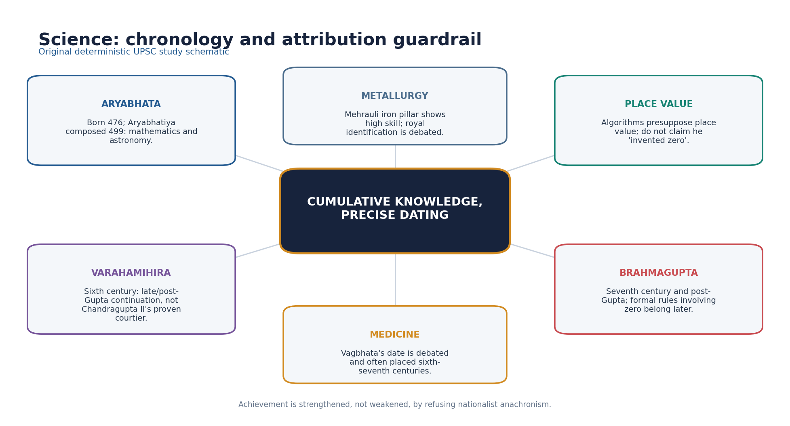

*Original deterministic schematic; factual and chronology limits remain in the surrounding text.*

| Figure / evidence | Secure contribution | Chronology caution |
|---|---|---|
| Aryabhata | Aryabhatiya; maths and astronomy | 499 CE |
| Varahamihira | Panchasiddhantika; Brihatsamhita | Sixth century |
| Brahmagupta | Rules including zero; astronomy | 628 CE, post-Gupta |
| Vagbhata | Medical synthesis tradition | Date debated |
| Iron pillar | Advanced wrought iron | King Chandra identification debated |

- [FACT] Aryabhata was born in 476 CE and composed the Aryabhatiya in 499 CE.
- [FACT] His work includes mathematical procedures, a close approximation of pi, trigonometric methods, astronomy, an explanation of eclipses through shadows and the rotation of the earth.
- [LIMIT] Aryabhata's algorithms presuppose decimal place value; this is not evidence that he single-handedly invented the numeral zero.
- [FACT] Varahamihira's Panchasiddhantika and Brihatsamhita belong to the sixth century, a late/post-Gupta continuation.
- [FACT] Brahmagupta's Brahmasphutasiddhanta dates to 628 CE and is post-Gupta; formal arithmetic rules involving zero must not be backdated.
- [LIMIT] Vagbhata's date is debated, usually around the sixth-seventh centuries; medicine should be presented as a broader classical tradition rather than a secure Gupta-court achievement.
- [FACT] The Mehrauli iron pillar displays sophisticated wrought-iron production and corrosion resistance; the king 'Chandra' is often identified with Chandragupta II, but identification is debated.

#### Must-know facts
- Aryabhatiya: 499 CE.
- Varahamihira: sixth century.
- Brahmagupta: seventh century.
- Iron pillar attribution requires caution.

#### UPSC traps
- **Wrong:** Aryabhata invented zero. **Correct:** His procedures use place-value logic; zero's conceptual and epigraphic histories are separate.
- **Wrong:** All major classical scientists were Chandragupta II's nine jewels. **Correct:** That is a later, chronologically impossible tradition.

**Mains angle:** Chronology is the argument: sequence Aryabhata -> Varahamihira -> Brahmagupta and mark the political-period boundary.

**Study / ownership link:** Scientific heritage current links are unnecessary unless officially verified.

#### CLOSING RECALL FLOW — MATHEMATICS, ASTRONOMY, MEDICINE AND METALLURGY

```text
START / CONCEPT: Mathematics, astronomy, medicine and metallurgy
        |
        v
EXACT TERMS: Mathematics · astronomy · medicine · metallurgy · Mains angle · Study / ownership link
        |
        v
MECHANISM / ARGUMENT: His work includes mathematical procedures, a close approximation of pi, trigonometric methods, astronomy, an explanation of eclipses through shadows and the rotation of the earth.
        |
        v
CONSEQUENCE / CONTRAST: Aryabhata's algorithms presuppose decimal place value; this is not evidence that he single-handedly invented the numeral zero.
        |
        v
UPSC TRAP / ANSWER-USE: Brahmagupta's Brahmasphutasiddhanta dates to 628 CE and is post-Gupta; formal arithmetic rules involving zero must not be backdated.
        |
        v
ANSWER-GRABBING FORMULATION: Vagbhata's date is debated, usually around the sixth-seventh centuries; medicine should be presented as a broader classical tradition rather than a secure Gupta-court achievement.
```
### SESSION 14 — RELIGION: PURANIC HINDUISM, BUDDHISM, JAINISM AND PLURAL PATRONAGE

#### DEFINITION / WHAT THIS IS CALLED

**Plain-language definition:** Religion: Puranic Hinduism, Buddhism, Jainism and plural patronage comprises Religion, Puranic Hinduism and Buddhism as its core connected dimensions.

**Technical definition:** Technically, Religion: Puranic Hinduism, Buddhism, Jainism and plural patronage is analysed by relating Religion to Puranic Hinduism, then testing the relationship through Buddhism and Jainism.

#### ANSWER-GRABBING OPENING — WRITE/ADAPT IN THE EXAM

> Correct: Evidence shows plural landscapes and patronage.

#### MUST-WRITE KEYWORDS

- **Religion**
- **Puranic Hinduism**
- **Buddhism**
- **Jainism**
- **plural patronage**
- **Mains angle**

**How to use them:** Frame the answer through Religion; define Puranic Hinduism, connect Buddhism with Jainism to explain the mechanism, and use plural patronage for the decisive comparison or qualification.

[FACT] Puranic Vaishnava, Shaiva and goddess traditions expanded through image worship, myth, pilgrimage, ritual and temple patronage while Buddhism and Jainism continued.

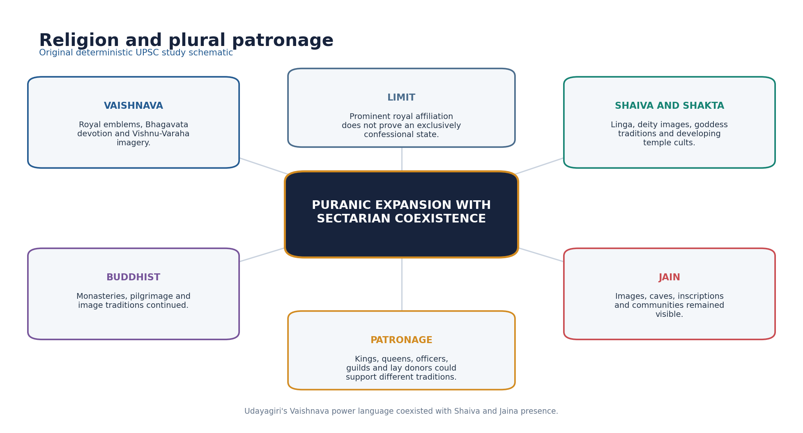

*Original deterministic schematic; factual and chronology limits remain in the surrounding text.*

- [FACT] Gupta royal symbolism prominently used Vaishnava forms, including Garuda and Vishnu-Varaha imagery.
- [FACT] Udayagiri's Varaha relief joined cosmic rescue, sacred landscape and royal power; the complex also preserves Shaiva and Jaina evidence.
- [FACT] Linga worship, Shiva images and goddess traditions developed alongside Vaishnava cults; 'Hinduism' should not be written as one uniform sect.
- [FACT] Buddhist monasteries, sacred sites and image production continued; Faxian's journey itself demonstrates active Buddhist networks.
- [FACT] Jain communities and images remained present, including at Udayagiri and other regional sites.
- [ANALYSIS] Patronage was multi-level: kings, queens, officers, guilds and lay donors could support different traditions.
- [LIMIT] Prominent royal Vaishnavism does not establish forced religious uniformity or the disappearance of heterodox traditions.

#### Must-know facts
- Royal affiliation and social plurality coexisted.
- Puranic Hinduism included multiple sectarian traditions.
- Buddhism and Jainism continued.

#### UPSC traps
- **Wrong:** Gupta rulers suppressed all non-Vaishnava religion. **Correct:** Evidence shows plural landscapes and patronage.
- **Wrong:** Puranic religion was unchanged Vedic ritualism. **Correct:** Image, myth, bhakti, pilgrimage and temple worship marked significant developments.

**Mains angle:** Use belief -> patronage -> image/temple -> social integration -> plurality.

**Study / ownership link:** Doctrinal depth: Philosophy Topic 24; form ownership: Indian Art and Culture.

#### CLOSING RECALL FLOW — RELIGION: PURANIC HINDUISM, BUDDHISM, JAINISM AND PLURAL PATRONAGE

```text
START / CONCEPT: Religion: Puranic Hinduism, Buddhism, Jainism and plural patronage
        |
        v
EXACT TERMS: Religion · Puranic Hinduism · Buddhism · Jainism · plural patronage · Mains angle
        |
        v
MECHANISM / ARGUMENT: Wrong: Puranic religion was unchanged Vedic ritualism.
        |
        v
CONSEQUENCE / CONTRAST: Linga worship, Shiva images and goddess traditions developed alongside Vaishnava cults; 'Hinduism' should not be written as one uniform sect.
        |
        v
UPSC TRAP / ANSWER-USE: Prominent royal Vaishnavism does not establish forced religious uniformity or the disappearance of heterodox traditions.
        |
        v
ANSWER-GRABBING FORMULATION: Correct: Evidence shows plural landscapes and patronage.
```
### SESSION 15 — TEMPLE ARCHITECTURE: NAMED EXAMPLES AND CHRONOLOGY

#### DEFINITION / WHAT THIS IS CALLED

**Plain-language definition:** Gupta and Gupta-age architecture is important for experimentation with free-standing structural temples and integrated iconographic programmes, not for the scale of later temple cities.

**Technical definition:** Sanchi Temple 17 is a restrained flat-roofed square sanctum with a pillared porch, often used to illustrate an early structural form.

#### ANSWER-GRABBING OPENING — WRITE/ADAPT IN THE EXAM

> Gupta and Gupta-age architecture is important for experimentation with free-standing structural temples and integrated iconographic programmes, not for the scale of later temple cities.

#### MUST-WRITE KEYWORDS

- **Temple architecture**
- **named examples**
- **chronology**
- **Mains angle**
- **Study / ownership link**
- **Gupta and Gupta-age architecture**

**How to use them:** Frame the answer through Temple architecture; define named examples, connect chronology with Mains angle to explain the mechanism, and use Study / ownership link for the decisive comparison or qualification.

[FACT] Gupta and Gupta-age architecture is important for experimentation with free-standing structural temples and integrated iconographic programmes, not for the scale of later temple cities.

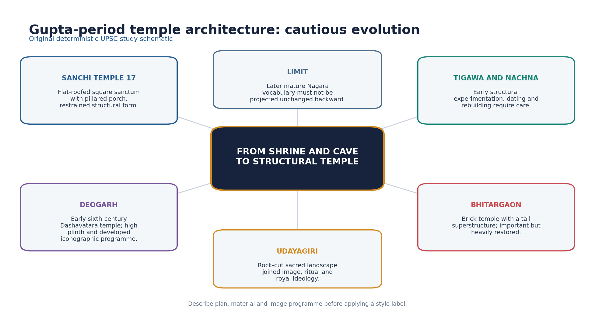

*Original deterministic schematic; factual and chronology limits remain in the surrounding text.*

- [FACT] Sanchi Temple 17 is a restrained flat-roofed square sanctum with a pillared porch, often used to illustrate an early structural form.
- [FACT] Tigawa and Nachna provide early structural examples, though precise dating, alterations and labels require care.
- [FACT] Deogarh's Dashavatara temple is generally placed in the early sixth century and has a high plinth and important Vaishnava relief programme.
- [FACT] Bhitargaon is a major brick temple, commonly placed in the fifth century; restoration complicates reading its original superstructure.
- [FACT] Udayagiri is a rock-cut sacred-political landscape rather than a free-standing structural-temple type.
- [LIMIT] The fully developed Nagara vocabulary and later panchayatana complexes should not be projected mechanically onto every early shrine.
- [ANALYSIS] Temple development linked durable sacred space, deity image, patronage and regional workshop innovation.

#### Must-know facts
- Sanchi 17: early flat-roofed form.
- Deogarh: early sixth-century Vaishnava temple.
- Bhitargaon: major brick temple.
- Udayagiri: rock-cut complex.

#### UPSC traps
- **Wrong:** Gupta temples matched later Khajuraho in scale and form. **Correct:** They are earlier and generally more modest experiments.
- **Wrong:** Every named structure has an uncontested exact date. **Correct:** Dating often rests on style, inscription and archaeological sequence.

**Mains angle:** Describe plan, material, superstructure and iconographic programme; then state chronology.

**Study / ownership link:** Primary form owner: Indian Art and Culture Topic 03.

#### CLOSING RECALL FLOW — TEMPLE ARCHITECTURE: NAMED EXAMPLES AND CHRONOLOGY

```text
START / CONCEPT: Temple architecture: named examples and chronology
        |
        v
EXACT TERMS: Temple architecture · named examples · chronology · Mains angle · Study / ownership link · Gupta and Gupta-age architecture
        |
        v
MECHANISM / ARGUMENT: Sanchi Temple 17 is a restrained flat-roofed square sanctum with a pillared porch, often used to illustrate an early structural form.
        |
        v
CONSEQUENCE / CONTRAST: The fully developed Nagara vocabulary and later panchayatana complexes should not be projected mechanically onto every early shrine.
        |
        v
UPSC TRAP / ANSWER-USE: Do not miss this limiting distinction: deogarh's Dashavatara temple is generally placed in the early sixth century and has a...
        |
        v
ANSWER-GRABBING FORMULATION: Gupta and Gupta-age architecture is important for experimentation with free-standing structural temples and integrated iconographic programmes, not for the scale of later temple cities.
```
### SESSION 16 — SCULPTURE: MATHURA, SARNATH AND ICONOGRAPHIC CONSOLIDATION

#### DEFINITION / WHAT THIS IS CALLED

**Plain-language definition:** Sculpture: Mathura, Sarnath and iconographic consolidation comprises Sculpture, Mathura and Sarnath as its core connected dimensions.

**Technical definition:** Technically, Sculpture: Mathura, Sarnath and iconographic consolidation is analysed by relating Sculpture to Mathura, then testing the relationship through Sarnath and iconographic consolidation.

#### ANSWER-GRABBING OPENING — WRITE/ADAPT IN THE EXAM

> Gupta sculpture refined inherited Mathura and other early-CE traditions while Sarnath became especially associated with subtly modelled Buddha images.

#### MUST-WRITE KEYWORDS

- **Sculpture**
- **Mathura**
- **Sarnath**
- **iconographic consolidation**
- **Mains angle**
- **Study / ownership link**

**How to use them:** Frame the answer through Sculpture; define Mathura, connect Sarnath with iconographic consolidation to explain the mechanism, and use Mains angle for the decisive comparison or qualification.

[FACT] Gupta sculpture refined inherited Mathura and other early-CE traditions while Sarnath became especially associated with subtly modelled Buddha images.

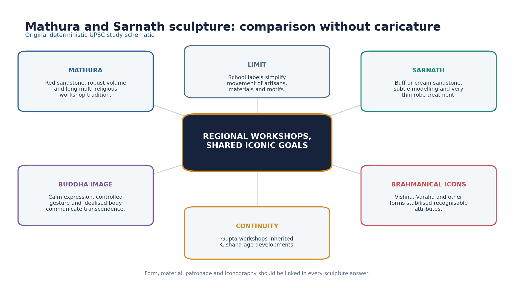

*Original deterministic schematic; factual and chronology limits remain in the surrounding text.*

- [FACT] Mathura workshops used red sandstone and served Buddhist, Jain and Brahmanical patrons across a long chronology.
- [FACT] Sarnath sculpture often uses buff or cream sandstone, a smooth body treatment, controlled modelling and an almost transparent robe convention.
- [ANALYSIS] Calm expression, mudra, halo and idealised body converted doctrine into a legible visual language.
- [FACT] Brahmanical iconography developed recognisable Vishnu, Varaha, Shiva and goddess forms through attributes, posture and narrative panels.
- [FACT] Udayagiri's Varaha and Deogarh's Vaishnava reliefs connect theology, political symbolism and workshop practice.
- [LIMIT] 'Gupta style' was not one workshop or one material; school labels simplify exchange among artisans and regions.

#### Must-know facts
- Mathura: red sandstone and multi-religious continuity.
- Sarnath: refined Buddha image convention.
- Iconography linked belief and patronage.

#### UPSC traps
- **Wrong:** Sarnath and Mathura are identical schools. **Correct:** They share broad developments but differ in material and treatment.
- **Wrong:** Every iconographic meaning is obvious and uncontested. **Correct:** Meaning must be grounded in attribute, context and source.

**Mains angle:** Compare material + bodily treatment + religious function + limitation.

**Study / ownership link:** Primary sculpture owner: Indian Art and Culture Topic 06.

#### CLOSING RECALL FLOW — SCULPTURE: MATHURA, SARNATH AND ICONOGRAPHIC CONSOLIDATION

```text
START / CONCEPT: Sculpture: Mathura, Sarnath and iconographic consolidation
        |
        v
EXACT TERMS: Sculpture · Mathura · Sarnath · iconographic consolidation · Mains angle · Study / ownership link
        |
        v
MECHANISM / ARGUMENT: Sarnath sculpture often uses buff or cream sandstone, a smooth body treatment, controlled modelling and an almost transparent robe convention.
        |
        v
CONSEQUENCE / CONTRAST: 'Gupta style' was not one workshop or one material; school labels simplify exchange among artisans and regions.
        |
        v
UPSC TRAP / ANSWER-USE: Wrong: Sarnath and Mathura are identical schools.
        |
        v
ANSWER-GRABBING FORMULATION: Gupta sculpture refined inherited Mathura and other early-CE traditions while Sarnath became especially associated with subtly modelled Buddha images.
```
### SESSION 17 — PAINTING, AJANTA AND CULTURAL PRODUCTION

#### DEFINITION / WHAT THIS IS CALLED

**Plain-language definition:** Painting is evidence filtered by convention.

**Technical definition:** Ajanta's paintings include Buddhist narratives, bodhisattvas, courtly interiors, processions, dress, gesture, landscape and performance.

#### ANSWER-GRABBING OPENING — WRITE/ADAPT IN THE EXAM

> Painting is evidence filtered by convention.

#### MUST-WRITE KEYWORDS

- **Painting**
- **Ajanta**
- **cultural production**
- **Mains angle**
- **Study / ownership link**
- **Ajanta's**

**How to use them:** Frame the answer through Painting; define Ajanta, connect cultural production with Mains angle to explain the mechanism, and use Study / ownership link for the decisive comparison or qualification.

[FACT] The great late fifth-century phase at Ajanta belongs chiefly to Vakataka patronage within the broader Gupta-Vakataka cultural age.

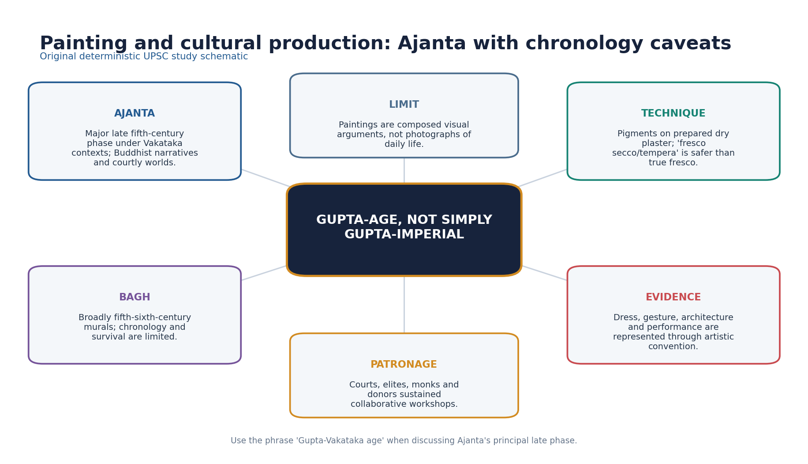

*Original deterministic schematic; factual and chronology limits remain in the surrounding text.*

- [FACT] Ajanta's paintings include Buddhist narratives, bodhisattvas, courtly interiors, processions, dress, gesture, landscape and performance.
- [LIMIT] These are composed religious-aesthetic images, not direct photographs of social life.
- [FACT] Pigments were applied to prepared plaster after drying; 'fresco secco/tempera' is safer than calling the method true wet fresco.
- [FACT] Bagh murals are broadly placed in the fifth-sixth centuries, but survival and exact chronology are limited.
- [ANALYSIS] Murals reveal collaborative workshops, patronage, narrative intelligence and exchanges among courtly and monastic worlds.
- [LIMIT] Calling Ajanta simply 'Gupta painting' erases Vakataka political context and complex cave chronologies.

#### Must-know facts
- Ajanta late phase: Vakataka context.
- Technique: prepared dry plaster.
- Painting is evidence filtered by convention.

#### UPSC traps
- **Wrong:** Ajanta was commissioned as one Gupta imperial project. **Correct:** Caves have multiple phases and the principal late phase is Vakataka-context.
- **Wrong:** Paintings give unmediated everyday-life data. **Correct:** They require genre and iconographic criticism.

**Mains angle:** Use the formulation 'Gupta-Vakataka age' and name the patronage caveat.

**Study / ownership link:** Primary painting owner: Indian Art and Culture Topic 07.

#### CLOSING RECALL FLOW — PAINTING, AJANTA AND CULTURAL PRODUCTION

```text
START / CONCEPT: Painting, Ajanta and cultural production
        |
        v
EXACT TERMS: Painting · Ajanta · cultural production · Mains angle · Study / ownership link · Ajanta's
        |
        v
MECHANISM / ARGUMENT: Ajanta's paintings include Buddhist narratives, bodhisattvas, courtly interiors, processions, dress, gesture, landscape and performance.
        |
        v
CONSEQUENCE / CONTRAST: These are composed religious-aesthetic images, not direct photographs of social life.
        |
        v
UPSC TRAP / ANSWER-USE: Bagh murals are broadly placed in the fifth-sixth centuries, but survival and exact chronology are limited.
        |
        v
ANSWER-GRABBING FORMULATION: Painting is evidence filtered by convention.
```
### SESSION 18 — MUSIC, DANCE, LEISURE, FOOD, DRESS AND MATERIAL LIFE

#### DEFINITION / WHAT THIS IS CALLED

**Plain-language definition:** Kalidasa's works and Ajanta paintings depict music, dance, courtly leisure, seasons, dress and adornment, but both are elite aesthetic sources.

**Technical definition:** Samudragupta's lyrist coin is political self-representation and evidence of musical kingship imagery, not a survey of popular music.

#### ANSWER-GRABBING OPENING — WRITE/ADAPT IN THE EXAM

> Kalidasa's works and Ajanta paintings depict music, dance, courtly leisure, seasons, dress and adornment, but both are elite aesthetic sources.

#### MUST-WRITE KEYWORDS

- **Music**
- **dance**
- **leisure**
- **food**
- **dress**
- **material life**

**How to use them:** Frame the answer through Music; define dance, connect leisure with food to explain the mechanism, and use dress for the decisive comparison or qualification.

[FACT] Daily and performative life can be reconstructed only through securely sourced, socially located evidence from texts, images and objects.

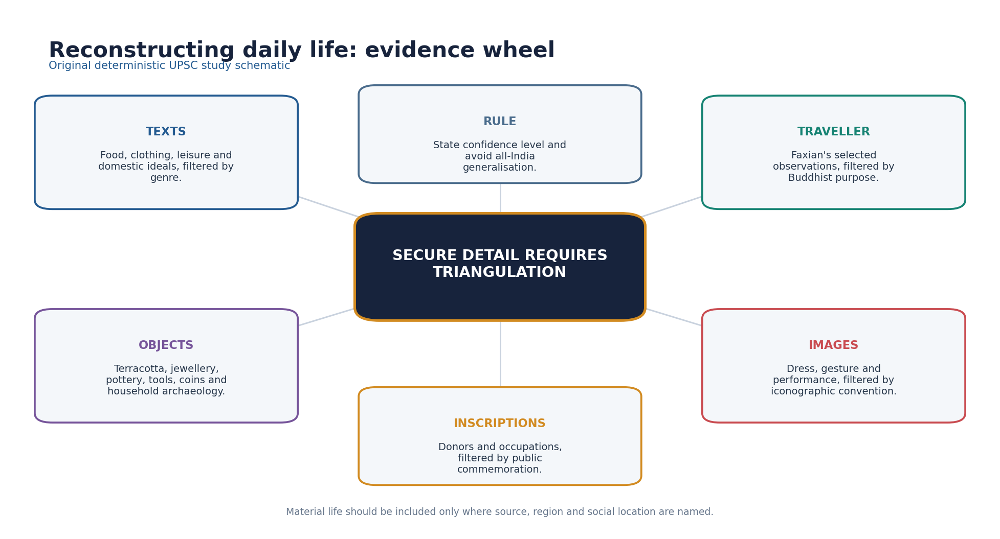

*Original deterministic schematic; factual and chronology limits remain in the surrounding text.*

- [FACT] Kalidasa's works and Ajanta paintings depict music, dance, courtly leisure, seasons, dress and adornment, but both are elite aesthetic sources.
- [FACT] Samudragupta's lyrist coin is political self-representation and evidence of musical kingship imagery, not a survey of popular music.
- [FACT] Jewellery, textiles, terracottas, pottery and household objects show skilled material production; survival biases favour durable materials.
- [FACT] Kalidasa mentions chinamshuka, Chinese silk, as a luxury textile, indicating elite consumption and long-distance cultural-economic links.
- [LIMIT] Food taboos and diet varied by community, region, livelihood and text; avoid universal vegetarian or meat-eating claims.
- [LIMIT] No all-India Gupta dress code or leisure pattern can be reconstructed.

#### Must-know facts
- Courtly evidence must be labelled courtly.
- Chinese silk was a luxury reference.
- Durable objects overrepresent some aspects of life.

#### UPSC traps
- **Wrong:** Ajanta clothing represents every class and region. **Correct:** It is valuable but composed and patronage-specific.
- **Wrong:** One text proves a universal Gupta diet. **Correct:** Dietary practice was plural and evidence must be located.

**Mains angle:** Include material-life detail only when source, social location and confidence are stated.

**Study / ownership link:** Visual reading method: Indian Art and Culture Topics 06-09.

#### CLOSING RECALL FLOW — MUSIC, DANCE, LEISURE, FOOD, DRESS AND MATERIAL LIFE

```text
START / CONCEPT: Music, dance, leisure, food, dress and material life
        |
        v
EXACT TERMS: Music · dance · leisure · food · dress · material life
        |
        v
MECHANISM / ARGUMENT: Daily and performative life can be reconstructed only through securely sourced, socially located evidence from texts, images and objects.
        |
        v
CONSEQUENCE / CONTRAST: Samudragupta's lyrist coin is political self-representation and evidence of musical kingship imagery, not a survey of popular music.
        |
        v
UPSC TRAP / ANSWER-USE: Do not miss this limiting distinction: no all-India Gupta dress code or leisure pattern can be reconstructed.
        |
        v
ANSWER-GRABBING FORMULATION: Kalidasa's works and Ajanta paintings depict music, dance, courtly leisure, seasons, dress and adornment, but both are elite aesthetic sources.
```
### SESSION 19 — CULTURAL DIFFUSION, COMPARISONS AND LATER LEGACY

#### DEFINITION / WHAT THIS IS CALLED

**Plain-language definition:** Later legacy was adaptive, not copied whole.

**Technical definition:** Gupta-age culture was both cumulative and generative: it inherited post-Mauryan forms and influenced later regional traditions without creating them from nothing.

#### ANSWER-GRABBING OPENING — WRITE/ADAPT IN THE EXAM

> Later legacy was adaptive, not copied whole.

#### MUST-WRITE KEYWORDS

- **Cultural diffusion**
- **comparisons**
- **later legacy**
- **Mains angle**
- **Study / ownership link**
- **Gupta-age**

**How to use them:** Frame the answer through Cultural diffusion; define comparisons, connect later legacy with Mains angle to explain the mechanism, and use Study / ownership link for the decisive comparison or qualification.

[ANALYSIS] Gupta-age culture was both cumulative and generative: it inherited post-Mauryan forms and influenced later regional traditions without creating them from nothing.

- [FACT] Compared with Mauryan culture, Gupta-age patronage was less centred on a single imperial edict-and-pillar idiom and more visible in Sanskrit court expression, sectarian icons and structural temples.
- [FACT] Compared with Kushana/post-Mauryan art, Gupta sculpture refined already established anthropomorphic and regional workshop traditions.
- [ANALYSIS] Sanskrit political and literary culture travelled across regional courts, including into Southeast Asian inscriptional and courtly worlds, but local adaptation mattered.
- [ANALYSIS] Puranic myths, temple forms and iconographies provided repertoires later kingdoms expanded rather than fixed blueprints.
- [FACT] Aryabhata's scientific tradition continued through Varahamihira and Brahmagupta, with changing chronology and problems.
- [LIMIT] 'Diffusion' must not imply one-way civilising export; merchants, monks, artisans, texts and local patrons produced reciprocal translation.

#### Must-know facts
- Gupta culture had antecedents.
- Later legacy was adaptive, not copied whole.
- Regional agency matters.

#### UPSC traps
- **Wrong:** The Guptas invented all classical Indian culture. **Correct:** They consolidated and transformed earlier and regional developments.
- **Wrong:** Indian cultural circulation was one-way export. **Correct:** Transmission involved selection, translation and local patronage.

**Mains angle:** Compare one earlier baseline, one Gupta transformation and one later adaptation.

**Study / ownership link:** Asian circulation: Topic 25; transition: Topic 26.

#### CLOSING RECALL FLOW — CULTURAL DIFFUSION, COMPARISONS AND LATER LEGACY

```text
START / CONCEPT: Cultural diffusion, comparisons and later legacy
        |
        v
EXACT TERMS: Cultural diffusion · comparisons · later legacy · Mains angle · Study / ownership link · Gupta-age
        |
        v
MECHANISM / ARGUMENT: Gupta-age culture was both cumulative and generative: it inherited post-Mauryan forms and influenced later regional traditions without creating them from nothing.
        |
        v
CONSEQUENCE / CONTRAST: 'Diffusion' must not imply one-way civilising export; merchants, monks, artisans, texts and local patrons produced reciprocal translation.
        |
        v
UPSC TRAP / ANSWER-USE: Do not miss this limiting distinction: compared with Mauryan culture, Gupta-age patronage was less centred on a single imperial edict-and-pillar...
        |
        v
ANSWER-GRABBING FORMULATION: Later legacy was adaptive, not copied whole.
```
### SESSION 20 — GOLDEN AGE DEBATE AND HISTORIOGRAPHY

#### DEFINITION / WHAT THIS IS CALLED

**Plain-language definition:** Golden Age debate and historiography comprises Golden Age debate, historiography and Mains angle as its core connected dimensions.

**Technical definition:** The Gupta age can be called classical for the concentration and later influence of elite literary, artistic and scientific production, but 'Golden Age' is indefensible as a universal social verdict.

#### ANSWER-GRABBING OPENING — WRITE/ADAPT IN THE EXAM

> The Gupta age can be called classical for the concentration and later influence of elite literary, artistic and scientific production, but 'Golden Age' is indefensible as a universal social verdict.

#### MUST-WRITE KEYWORDS

- **Golden Age debate**
- **historiography**
- **Mains angle**
- **Study / ownership link**
- **The Gupta**
- **Golden Age**

**How to use them:** Frame the answer through Golden Age debate; define historiography, connect Mains angle with Study / ownership link to explain the mechanism, and use The Gupta for the decisive comparison or qualification.

[ANALYSIS] The Gupta age can be called classical for the concentration and later influence of elite literary, artistic and scientific production, but 'Golden Age' is indefensible as a universal social verdict.

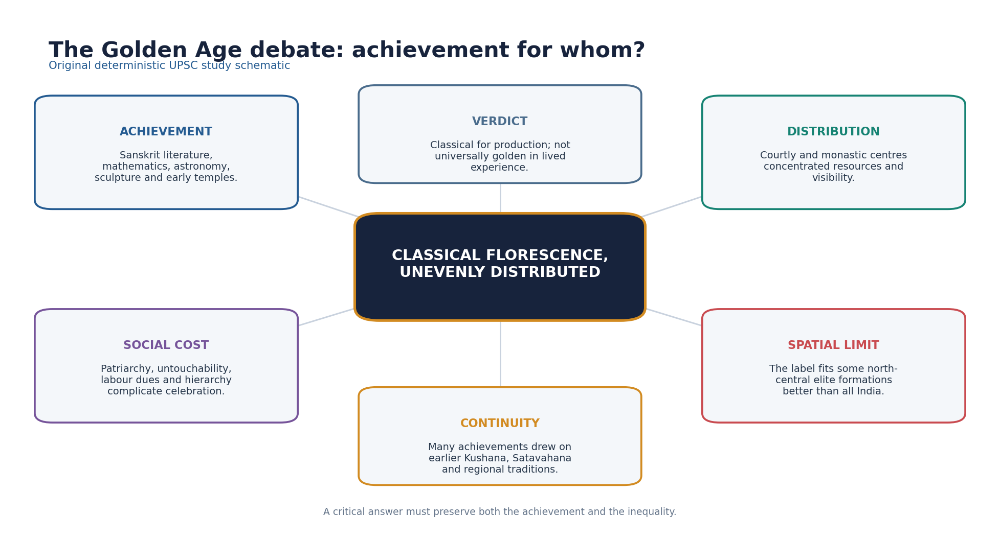

*Original deterministic schematic; factual and chronology limits remain in the surrounding text.*

- [FACT] The achievement case rests on Kalidasa, Aryabhata, Sanskrit inscriptions, iconic sculpture, early structural temples, murals and plural intellectual-religious production.
- [ANALYSIS] The distribution question asks who had access to patronage, education, property, mobility and representation.
- [FACT] Patriarchal norms, untouchability evidence, vishti and agrarian inequality complicate civilisational celebration.
- [LIMIT] Spatially, the label privileges north-central and allied elite formations while peninsular and regional histories followed distinct trajectories.
- [ANALYSIS] Nationalist historiography used Golden Age language to counter colonial denigration; materialist and social histories exposed class, caste and gender limits.
- [LIMIT] Rejecting the label must not become denial of genuine achievement; critique should grade, not invert, the evidence.
- [ANALYSIS] Best verdict: a classical florescence of enduring importance whose benefits, visibility and freedoms were socially and spatially unequal.

#### Must-know facts
- Classical achievement is real.
- Universal social goldenness is not.
- Historiography explains why the label became powerful.

#### UPSC traps
- **Wrong:** Critical history requires dismissing Gupta achievement. **Correct:** It requires locating achievement and testing its distribution.
- **Wrong:** Golden Age is a neutral chronological term. **Correct:** It is an evaluative historiographical label.

**Mains angle:** Organise the answer as achievement -> social base -> exclusions -> spatial limits -> graded verdict.

**Study / ownership link:** Stress test route: Ancient History Answer-Worthiness Audit.

#### CLOSING RECALL FLOW — GOLDEN AGE DEBATE AND HISTORIOGRAPHY

```text
START / CONCEPT: Golden Age debate and historiography
        |
        v
EXACT TERMS: Golden Age debate · historiography · Mains angle · Study / ownership link · The Gupta · Golden Age
        |
        v
MECHANISM / ARGUMENT: Historiography explains why the label became powerful.
        |
        v
CONSEQUENCE / CONTRAST: Spatially, the label privileges north-central and allied elite formations while peninsular and regional histories followed distinct trajectories.
        |
        v
UPSC TRAP / ANSWER-USE: Rejecting the label must not become denial of genuine achievement; critique should grade, not invert, the evidence.
        |
        v
ANSWER-GRABBING FORMULATION: The Gupta age can be called classical for the concentration and later influence of elite literary, artistic and scientific production, but 'Golden Age' is indefensible as a universal social verdict.
```
### 21. UPSC traps, PYQ ownership and answer architecture

[FACT] Topic 21 directly owns social-cultural reconstruction. Political chronology and the 2025 Faxian-reign question remain Topic 20; form-heavy art and architecture questions remain primarily Indian Art and Culture.

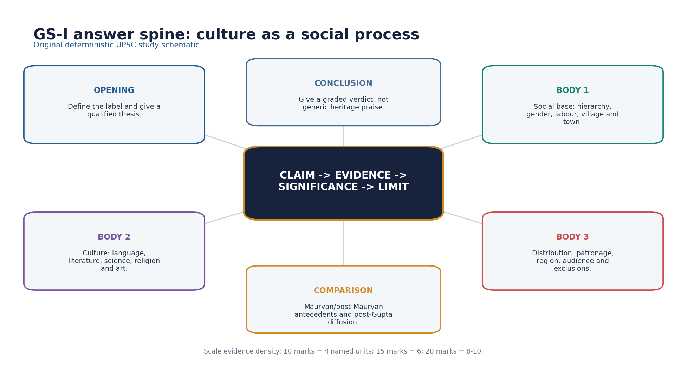

*Original deterministic schematic; factual and chronology limits remain in the surrounding text.*

- [FACT] Direct/routed objective demands: 2020 Q29 kulyavapa-dronavapa; 2020 Q36 ancient scholar associations; 2021 Q40 Mitakshara-Dayabhaga.
- [FACT] The 2022 GS-I Gupta-Chola heritage question is cross-owned: Gupta cultural evidence is supported here, the political Gupta comparison in Topic 20, Chola context in Ancient Topic 27, and form depth in Indian Art and Culture.
- [FACT] The 2025 Faxian question is locally verified with official Set A key and owned by Topic 20; this package uses it only for traveller method.
- [LIMIT] Official 2020-2021 keys are not held locally. Q29 can be solved directly from the official stem and source knowledge; Q36 and Q40 answers are labelled inferred/provisional where appropriate.
- [ANALYSIS] A 10-mark answer should deploy about four named evidence units; 15 marks about six; 20 marks eight to ten, each linked to significance.
- [ANALYSIS] Every model answer follows claim -> named evidence -> significance -> limitation and ends with 'Why this earns marks'.

#### Must-know facts
- No fabricated PYQ ownership.
- Unavailable official keys are labelled.
- Answer evidence must be analytical, not decorative.

#### UPSC traps
- **Wrong:** Any Gupta art PYQ belongs only to Ancient History. **Correct:** Form-centric ownership remains Indian Art and Culture.
- **Wrong:** A named example automatically earns marks. **Correct:** The answer must explain what the example proves and its limit.

**Mains angle:** Use the visual spine and finish with a graded verdict answering the directive.

**Study / ownership link:** Practice follows; final register notes are last.

### SESSION 21 — BOUNDED LIVE LINKAGE

#### DEFINITION / WHAT THIS IS CALLED

**Plain-language definition:** The UNESCO Gupta-temple listing and Ministry of Culture Gyan Bharatam update were rechecked on 29 August 2026 for bounded heritage and manuscript linkages.

**Technical definition:** Technically, Bounded live linkage is analysed by relating The UNESCO Gupta-temple to Ministry, then testing the relationship through Culture Gyan Bharatam and This.

#### ANSWER-GRABBING OPENING — WRITE/ADAPT IN THE EXAM

> This linkage does not override the repository chronology, local book evidence, or the source limitations printed throughout the package.

#### MUST-WRITE KEYWORDS

- **Bounded live linkage**
- **The UNESCO Gupta-temple**
- **Ministry**
- **Culture Gyan Bharatam**
- **This**

**How to use them:** Frame the answer through Bounded live linkage; define The UNESCO Gupta-temple, connect Ministry with Culture Gyan Bharatam to explain the mechanism, and use This for the decisive comparison or qualification.

The UNESCO Gupta-temple listing and Ministry of Culture Gyan Bharatam update were rechecked on 29 August 2026 for bounded heritage and manuscript linkages.

This linkage does not override the repository chronology, local book evidence, or the source limitations printed throughout the package.

#### CLOSING RECALL FLOW — BOUNDED LIVE LINKAGE

```text
START / CONCEPT: Bounded live linkage
        |
        v
EXACT TERMS: Bounded live linkage · The UNESCO Gupta-temple · Ministry · Culture Gyan Bharatam · This
        |
        v
MECHANISM / ARGUMENT: The UNESCO Gupta-temple listing and Ministry of Culture Gyan Bharatam update were rechecked on 29 August 2026 for bounded heritage and manuscript linkages.
        |
        v
CONSEQUENCE / CONTRAST: The resulting consequence is that this linkage does not override the repository chronology, local book evidence, or the source...
        |
        v
UPSC TRAP / ANSWER-USE: Do not miss this limiting distinction: this linkage does not override the repository chronology, local book evidence, or the source...
        |
        v
ANSWER-GRABBING FORMULATION: This linkage does not override the repository chronology, local book evidence, or the source limitations printed throughout the package.
```
## BASIC MCQS / REMEDIATION

### Learning MCQ 01

Which source pairing best tests a claim about Gupta social hierarchy?

- A. Smriti and inscription
- B. Only one coin type
- C. Only a modern textbook label
- D. Only a later legend

**Answer: A.** A prescriptive text establishes the norm; an inscription can test selected public practice.

### Learning MCQ 02

Kulyavapa and dronavapa are best understood as

- A. marriage forms
- B. land-measure terms
- C. coin denominations
- D. guild offices

**Answer: B.** The official 2020 paper asks this exact distinction; they denote measurement of land.

### Learning MCQ 03

Which statement is safest regarding Gupta-age women?

- A. Purdah was universal
- B. Women were absent from production
- C. Patriarchal norms coexisted with uneven agency
- D. All women enjoyed equal inheritance

**Answer: C.** The evidence supports a differentiated, source-aware conclusion.

### Learning MCQ 04

Faxian's account should primarily be read as

- A. a Gupta revenue manual
- B. a complete census
- C. a neutral legal code
- D. a Buddhist pilgrim's situated account

**Answer: D.** His route and religious purpose shape both observation and silence.

### Learning MCQ 05

The Mandasor silk-weaver inscriptions are especially useful for linking

- A. migration, corporate craft identity and patronage
- B. only village taxation
- C. only royal conquest
- D. only Buddhist doctrine

**Answer: A.** They connect mobility, guild identity, wealth and temple support.

### Learning MCQ 06

Which is the correct chronology?

- A. Brahmagupta before Aryabhata
- B. Aryabhata before Varahamihira
- C. Vagbhata securely under Samudragupta
- D. Varahamihira before Kalidasa with certainty

**Answer: B.** Aryabhatiya is 499 CE; Varahamihira belongs to the sixth century.

### Learning MCQ 07

The strongest caution about Aryabhata is that

- A. he wrote no mathematical work
- B. he lived in the Mauryan age
- C. place-value use is not the same as inventing zero
- D. he denied astronomy

**Answer: C.** Zero, place value and epigraphic notation have distinct histories.

### Learning MCQ 08

Ajanta's major late phase is best described as

- A. Gupta imperial only
- B. Mauryan imperial
- C. Kushana court
- D. Vakataka-context within the Gupta-Vakataka age

**Answer: D.** This preserves the political and chronological caveat.

### Learning MCQ 09

Sanskritisation in this period is best treated as

- A. adoption and local adaptation of prestige idioms
- B. one royal language law
- C. extinction of all Prakrits
- D. proof of universal literacy

**Answer: A.** It was negotiated and multilingual.

### Learning MCQ 10

Sarnath Gupta sculpture is especially associated with

- A. blue-grey schist
- B. buff/cream sandstone and subtle robe treatment
- C. black basalt only
- D. bronze Nataraja

**Answer: B.** The material and modelling distinguish the Sarnath convention.

### Learning MCQ 11

Which temple claim is safest?

- A. Bhitargaon is a rock-cut cave
- B. All Gupta temples had later Khajuraho scale
- C. Deogarh is an early sixth-century Vaishnava structural temple
- D. Sanchi Temple 17 is a Chola gopuram

**Answer: C.** Deogarh is a key early structural and iconographic example.

### Learning MCQ 12

The Golden Age label is best evaluated as

- A. equally valid for every region and class
- B. a neutral census term
- C. false because no achievements occurred
- D. useful for classical production but socially uneven

**Answer: D.** This is the required graded verdict.

### Learning MCQ 13

Which evidence most directly demonstrates plural patronage?

- A. Udayagiri's multiple religious presences and varied donors
- B. absence of all Buddhist sites
- C. one later court legend
- D. one modern nationalist slogan

**Answer: A.** Udayagiri combines Vaishnava royal imagery with Shaiva and Jaina presence.

### Learning MCQ 14

Mitakshara and Dayabhaga should be treated as

- A. two Buddhist monasteries
- B. later Hindu-law commentarial schools
- C. two Gupta coin series
- D. two Gupta temple plans

**Answer: B.** They are later legal schools and must not be backdated.

### Learning MCQ 15

Which claim about Kalidasa is most defensible?

- A. His date is fixed by a birth inscription
- B. Every navaratna legend is contemporary
- C. His works are secure but exact court association is debated
- D. He wrote the Aryabhatiya

**Answer: C.** The works are firmer evidence than the later biography.

### Learning MCQ 16

A social-history answer should conclude with

- A. a ruler list
- B. a generic heritage slogan
- C. an unsupported quotation
- D. a graded verdict tied to distribution and evidence limits

**Answer: D.** The directive requires evaluation, not celebration.

### Workbook MCQ 01

Which source pairing best tests a claim about Gupta social hierarchy?

- A. a ruler list
- B. a generic heritage slogan
- C. an unsupported quotation
- D. a graded verdict tied to distribution and evidence limits

**Answer: A.** A prescriptive text establishes the norm; an inscription can test selected public practice.

### Workbook MCQ 02

Kulyavapa and dronavapa are best understood as

- A. a ruler list
- B. a generic heritage slogan
- C. an unsupported quotation
- D. a graded verdict tied to distribution and evidence limits

**Answer: B.** The official 2020 paper asks this exact distinction; they denote measurement of land.

### Workbook MCQ 03

Which statement is safest regarding Gupta-age women?

- A. a ruler list
- B. a generic heritage slogan
- C. an unsupported quotation
- D. a graded verdict tied to distribution and evidence limits

**Answer: C.** The evidence supports a differentiated, source-aware conclusion.

### Workbook MCQ 04

Faxian's account should primarily be read as

- A. a ruler list
- B. a generic heritage slogan
- C. an unsupported quotation
- D. a graded verdict tied to distribution and evidence limits

**Answer: D.** His route and religious purpose shape both observation and silence.

### Workbook MCQ 05

The Mandasor silk-weaver inscriptions are especially useful for linking

- A. a ruler list
- B. a generic heritage slogan
- C. an unsupported quotation
- D. a graded verdict tied to distribution and evidence limits

**Answer: A.** They connect mobility, guild identity, wealth and temple support.

### Workbook MCQ 06

Which is the correct chronology?

- A. a ruler list
- B. a generic heritage slogan
- C. an unsupported quotation
- D. a graded verdict tied to distribution and evidence limits

**Answer: B.** Aryabhatiya is 499 CE; Varahamihira belongs to the sixth century.

### Workbook MCQ 07

The strongest caution about Aryabhata is that

- A. a ruler list
- B. a generic heritage slogan
- C. an unsupported quotation
- D. a graded verdict tied to distribution and evidence limits

**Answer: C.** Zero, place value and epigraphic notation have distinct histories.

### Workbook MCQ 08

Ajanta's major late phase is best described as

- A. a ruler list
- B. a generic heritage slogan
- C. an unsupported quotation
- D. a graded verdict tied to distribution and evidence limits

**Answer: D.** This preserves the political and chronological caveat.

### Workbook MCQ 09

Sanskritisation in this period is best treated as

- A. a ruler list
- B. a generic heritage slogan
- C. an unsupported quotation
- D. a graded verdict tied to distribution and evidence limits

**Answer: A.** It was negotiated and multilingual.

### Workbook MCQ 10

Sarnath Gupta sculpture is especially associated with

- A. a ruler list
- B. a generic heritage slogan
- C. an unsupported quotation
- D. a graded verdict tied to distribution and evidence limits

**Answer: B.** The material and modelling distinguish the Sarnath convention.

### Workbook MCQ 11

Which temple claim is safest?

- A. a ruler list
- B. a generic heritage slogan
- C. an unsupported quotation
- D. a graded verdict tied to distribution and evidence limits

**Answer: C.** Deogarh is a key early structural and iconographic example.

### Workbook MCQ 12

The Golden Age label is best evaluated as

- A. a ruler list
- B. a generic heritage slogan
- C. an unsupported quotation
- D. a graded verdict tied to distribution and evidence limits

**Answer: D.** This is the required graded verdict.

### Workbook MCQ 13

Which evidence most directly demonstrates plural patronage?

- A. a ruler list
- B. a generic heritage slogan
- C. an unsupported quotation
- D. a graded verdict tied to distribution and evidence limits

**Answer: A.** Udayagiri combines Vaishnava royal imagery with Shaiva and Jaina presence.

### Workbook MCQ 14

Mitakshara and Dayabhaga should be treated as

- A. a ruler list
- B. a generic heritage slogan
- C. an unsupported quotation
- D. a graded verdict tied to distribution and evidence limits

**Answer: B.** They are later legal schools and must not be backdated.

### Workbook MCQ 15

Which claim about Kalidasa is most defensible?

- A. a ruler list
- B. a generic heritage slogan
- C. an unsupported quotation
- D. a graded verdict tied to distribution and evidence limits

**Answer: C.** The works are firmer evidence than the later biography.

### Workbook MCQ 16

A social-history answer should conclude with

- A. a ruler list
- B. a generic heritage slogan
- C. an unsupported quotation
- D. a graded verdict tied to distribution and evidence limits

**Answer: D.** The directive requires evaluation, not celebration.

### Workbook MCQ 17

Which statement about the Mehrauli iron pillar is safest?

- A. a ruler list
- B. a generic heritage slogan
- C. an unsupported quotation
- D. a graded verdict tied to distribution and evidence limits

**Answer: A.** Technical skill is secure; ruler identification and modern labels need caution.

### Workbook MCQ 18

The Mandasor silk weavers most directly demonstrate

- A. a ruler list
- B. a generic heritage slogan
- C. an unsupported quotation
- D. a graded verdict tied to distribution and evidence limits

**Answer: B.** The inscriptions connect migration, occupation and religious endowment.

### Workbook MCQ 19

Which statement best distinguishes stridhana?

- A. a ruler list
- B. a generic heritage slogan
- C. an unsupported quotation
- D. a graded verdict tied to distribution and evidence limits

**Answer: C.** Recognition did not make the entire property regime equal.

### Workbook MCQ 20

Which is NOT a safe Gupta-age claim?

- A. a ruler list
- B. a generic heritage slogan
- C. an unsupported quotation
- D. a graded verdict tied to distribution and evidence limits

**Answer: D.** Brahmagupta is seventh-century and post-Gupta.

### Workbook MCQ 21

Sanchi Temple 17 is useful as evidence for

- A. a ruler list
- B. a generic heritage slogan
- C. an unsupported quotation
- D. a graded verdict tied to distribution and evidence limits

**Answer: A.** It illustrates restrained early structural-temple form.

### Workbook MCQ 22

Which pair is correctly matched?

- A. a ruler list
- B. a generic heritage slogan
- C. an unsupported quotation
- D. a graded verdict tied to distribution and evidence limits

**Answer: B.** Sarnath is a major Gupta sculpture centre.

### Workbook MCQ 23

The term 'Gupta-Vakataka age' is especially useful for

- A. a ruler list
- B. a generic heritage slogan
- C. an unsupported quotation
- D. a graded verdict tied to distribution and evidence limits

**Answer: C.** It preserves broad chronology and actual patronage context.

### Workbook MCQ 24

Which conclusion is least defensible?

- A. a ruler list
- B. a generic heritage slogan
- C. an unsupported quotation
- D. a graded verdict tied to distribution and evidence limits

**Answer: D.** The universal prosperity claim contradicts hierarchy and labour evidence.

### Workbook MCQ 25

Which source is most directly prescriptive?

- A. a ruler list
- B. a generic heritage slogan
- C. an unsupported quotation
- D. a graded verdict tied to distribution and evidence limits

**Answer: A.** Smritis set normative rules.

### Workbook MCQ 26

A guild endowment primarily indicates

- A. a ruler list
- B. a generic heritage slogan
- C. an unsupported quotation
- D. a graded verdict tied to distribution and evidence limits

**Answer: B.** It shows historically specific financial and corporate capacity.

### Workbook MCQ 27

Which statement about Kalidasa is safest?

- A. a ruler list
- B. a generic heritage slogan
- C. an unsupported quotation
- D. a graded verdict tied to distribution and evidence limits

**Answer: C.** Works and later court legend must be separated.

### Workbook MCQ 28

Which answer structure best fits 'critically examine Golden Age'?

- A. a ruler list
- B. a generic heritage slogan
- C. an unsupported quotation
- D. a graded verdict tied to distribution and evidence limits

**Answer: D.** Critical examination needs criterion and balance.

### Workbook MCQ 29

Which is a strong source-limit sentence?

- A. a ruler list
- B. a generic heritage slogan
- C. an unsupported quotation
- D. a graded verdict tied to distribution and evidence limits

**Answer: A.** Genre-aware use is neither credulous nor dismissive.

### Workbook MCQ 30

Aryabhata's eclipse explanation relied on

- A. a ruler list
- B. a generic heritage slogan
- C. an unsupported quotation
- D. a graded verdict tied to distribution and evidence limits

**Answer: B.** His astronomy explained eclipses through shadows.

### Workbook MCQ 31

Which statement about language is correct?

- A. a ruler list
- B. a generic heritage slogan
- C. an unsupported quotation
- D. a graded verdict tied to distribution and evidence limits

**Answer: C.** Court prestige did not eliminate other languages.

### Workbook MCQ 32

Which is the proper ownership statement?

- A. a ruler list
- B. a generic heritage slogan
- C. an unsupported quotation
- D. a graded verdict tied to distribution and evidence limits

**Answer: D.** Ownership must reflect actual syllabus and source function.

### Workbook MCQ 33

The strongest use of Faxian is

- A. a ruler list
- B. a generic heritage slogan
- C. an unsupported quotation
- D. a graded verdict tied to distribution and evidence limits

**Answer: A.** His account is valuable when route and purpose are stated.

### Workbook MCQ 34

Which is correctly paired?

- A. a ruler list
- B. a generic heritage slogan
- C. an unsupported quotation
- D. a graded verdict tied to distribution and evidence limits

**Answer: B.** Amarakosha is traditionally attributed to Amarasimha.

### Workbook MCQ 35

What most directly complicates a universal Golden Age?

- A. a ruler list
- B. a generic heritage slogan
- C. an unsupported quotation
- D. a graded verdict tied to distribution and evidence limits

**Answer: C.** Social distribution is the decisive test.

### Workbook MCQ 36

Which claim requires the strongest caveat?

- A. a ruler list
- B. a generic heritage slogan
- C. an unsupported quotation
- D. a graded verdict tied to distribution and evidence limits

**Answer: D.** Nalanda developed over time.

### Workbook MCQ 37

Varna should be used as

- A. a ruler list
- B. a generic heritage slogan
- C. an unsupported quotation
- D. a graded verdict tied to distribution and evidence limits

**Answer: A.** The model/practice distinction is fundamental.

### Workbook MCQ 38

The principal value of Ajanta for daily life is

- A. a ruler list
- B. a generic heritage slogan
- C. an unsupported quotation
- D. a graded verdict tied to distribution and evidence limits

**Answer: B.** Visual evidence is rich but composed.

### Workbook MCQ 39

Which statement about Puranas is safest?

- A. a ruler list
- B. a generic heritage slogan
- C. an unsupported quotation
- D. a graded verdict tied to distribution and evidence limits

**Answer: C.** Their formation was cumulative.

### Workbook MCQ 40

A good 20-mark conclusion should

- A. a ruler list
- B. a generic heritage slogan
- C. an unsupported quotation
- D. a graded verdict tied to distribution and evidence limits

**Answer: D.** The verdict should follow from the demonstrated criterion.

### Workbook MCQ 41

Which named example best links artisans and patronage?

- A. a ruler list
- B. a generic heritage slogan
- C. an unsupported quotation
- D. a graded verdict tied to distribution and evidence limits

**Answer: A.** Mandasor is the relevant Gupta-age corporate example.

### Workbook MCQ 42

Deogarh is primarily associated here with

- A. a ruler list
- B. a generic heritage slogan
- C. an unsupported quotation
- D. a graded verdict tied to distribution and evidence limits

**Answer: B.** The Dashavatara temple anchors early sixth-century architecture.

### Workbook MCQ 43

Which comparison is defensible?

- A. a ruler list
- B. a generic heritage slogan
- C. an unsupported quotation
- D. a graded verdict tied to distribution and evidence limits

**Answer: C.** The comparison should avoid caricature while naming real differences.

### Workbook MCQ 44

The phrase 'achievement for whom?' tests

- A. a ruler list
- B. a generic heritage slogan
- C. an unsupported quotation
- D. a graded verdict tied to distribution and evidence limits

**Answer: D.** It turns Golden Age into an evaluative question.

### Workbook MCQ 45

Which route is correct for the 2025 Faxian question?

- A. a ruler list
- B. a generic heritage slogan
- C. an unsupported quotation
- D. a graded verdict tied to distribution and evidence limits

**Answer: A.** This is the explicit anti-duplication boundary.

### Workbook MCQ 46

Which statement about Buddhism is safest?

- A. a ruler list
- B. a generic heritage slogan
- C. an unsupported quotation
- D. a graded verdict tied to distribution and evidence limits

**Answer: B.** Continuity coexisted with Puranic expansion.

### Workbook MCQ 47

Which scientific figure is post-Gupta?

- A. a ruler list
- B. a generic heritage slogan
- C. an unsupported quotation
- D. a graded verdict tied to distribution and evidence limits

**Answer: C.** Brahmagupta's 628 work is post-Gupta.

### Workbook MCQ 48

Which is an invalid inference from Prabhavatigupta?

- A. a ruler list
- B. a generic heritage slogan
- C. an unsupported quotation
- D. a graded verdict tied to distribution and evidence limits

**Answer: D.** An exceptional elite case cannot establish universal status.

### Remedial 1 - Zero claim

Correct the statement: 'Aryabhata invented zero.'

**Correction:** Aryabhata's 499 CE procedures presuppose decimal place-value logic. The conceptual and epigraphic histories of zero are separate; Brahmagupta's explicit arithmetic rules belong to 628 CE.

**Why this earns marks:** the correction is dated, bounded and source-aware.

### Remedial 2 - Ajanta ownership

Correct the statement: 'Ajanta is Gupta imperial painting.'

**Correction:** The principal late fifth-century phase is chiefly Vakataka-context production within the broader Gupta-Vakataka cultural age.

**Why this earns marks:** the correction is dated, bounded and source-aware.

### Remedial 3 - Women

Correct the statement: 'Prabhavatigupta proves women had equal status.'

**Correction:** She proves specific elite female authority. General status needs normative, inscriptional, labour and property evidence.

**Why this earns marks:** the correction is dated, bounded and source-aware.

### Remedial 4 - Faxian

Correct the statement: 'Faxian gives an objective census.'

**Correction:** He provides situated pilgrim observation. Corroborate route-specific claims and do not infer from silence.

**Why this earns marks:** the correction is dated, bounded and source-aware.

### Remedial 5 - Golden Age

Correct the statement: 'Social inequality means there was no cultural achievement.'

**Correction:** Critical evaluation preserves achievement while testing its social and spatial distribution.

**Why this earns marks:** the correction is dated, bounded and source-aware.

### Remedial 6 - Temple style

Correct the statement: 'Gupta temples were mature Khajuraho-style Nagara temples.'

**Correction:** They represent earlier structural experiments; describe plan, material and superstructure before applying later style vocabulary.

**Why this earns marks:** the correction is dated, bounded and source-aware.

### Remedial 7 - Mitakshara

Correct the statement: 'Mitakshara was a Gupta legal code.'

**Correction:** It is Vijnaneshwara's later commentary on Yajnavalkya Smriti; Dayabhaga is also later.

**Why this earns marks:** the correction is dated, bounded and source-aware.

### Remedial 8 - Sanskrit

Correct the statement: 'Sanskrit replaced all other languages.'

**Correction:** It became a transregional prestige idiom while Prakrits and regional speech persisted.

**Why this earns marks:** the correction is dated, bounded and source-aware.

## PYQS AND ANSWER PRACTICE

### Critically examine the description of the Gupta age as a Golden Age.

**Demand and thesis (20 marks):** The label captures a real classical florescence but fails as a universal social judgement.

**Evidence density target:** 8-10 named units, each linked to significance.

**Model answer:**

[CLAIM] Literary and scientific production was exceptional. [EVIDENCE] Kalidasa's drama and kavya and Aryabhata's Aryabhatiya (499 CE). [SIGNIFICANCE] They created influential literary and mathematical-astronomical canons. [LIMIT] Both belong to specialist, largely elite knowledge worlds.

[CLAIM] Art and sacred architecture developed durable forms. [EVIDENCE] Sarnath Buddha images, Udayagiri Varaha, Sanchi Temple 17, Bhitargaon and Deogarh. [SIGNIFICANCE] Image, deity, patron and structural shrine became integrated. [LIMIT] Dating is not equally secure and later Nagara scale must not be projected backward.

[CLAIM] Cultural integration widened. [EVIDENCE] Sanskrit prashastis, Puranic redaction, Vaishnava-Shaiva-Shakta traditions, continuing Buddhist and Jain institutions. [SIGNIFICANCE] A transregional prestige idiom coexisted with sectarian plurality. [LIMIT] Sanskrit prominence did not erase multilingualism.

[CLAIM] The social base was unequal. [EVIDENCE] Faxian's Chandala passage, vishti, patriarchal Smriti norms and agrarian grants. [SIGNIFICANCE] Exclusion and labour obligations financed or accompanied elite visibility. [LIMIT] Sources are normative and regionally uneven, so inequality must be demonstrated without claiming a uniform condition.

[CLAIM] The label is spatially selective. [EVIDENCE] Ajanta's Vakataka setting and distinct peninsular trajectories. [SIGNIFICANCE] 'Gupta age' extends beyond direct Gupta rule. [LIMIT] It cannot replace regional histories.

**Conclusion:** The Gupta age was classical in enduring production, but golden only as a bounded historiographical description of selected achievements, not as a verdict on every region or social group.

**Why this earns marks:** It answers the directive directly, links each claim to named evidence, explains significance, states limitations and gives a graded verdict.

### Discuss the relationship between social hierarchy and cultural production in the Gupta age.

**Demand and thesis (15 marks):** Cultural production drew resources and legitimacy from a hierarchical agrarian order while also creating integrative languages and institutions.

**Evidence density target:** 6-7 named units, each linked to significance.

**Model answer:**

[CLAIM] Agrarian surplus enabled patronage. [EVIDENCE] land-grant charters, kulyavapa/dronavapa measures and labour dues. [SIGNIFICANCE] Courts and religious beneficiaries could support texts, temples and specialists. [LIMIT] grant rights varied.

[CLAIM] Corporate wealth widened patronage. [EVIDENCE] Mandasor silk weavers and their Sun-temple support. [SIGNIFICANCE] Artisans and migrants were cultural agents, not passive subjects. [LIMIT] one inscription is not an all-India guild map.

[CLAIM] Hierarchy shaped access and representation. [EVIDENCE] Smriti norms, stridhana limits and Faxian's Chandala passage. [SIGNIFICANCE] education, property and public visibility were unequal. [LIMIT] normative and traveller evidence requires corroboration.

[CLAIM] Culture also integrated diverse regions. [EVIDENCE] Sanskrit inscription, Puranic traditions and shared iconographies. [SIGNIFICANCE] elites could communicate across polities. [LIMIT] Prakrits and local languages persisted.

**Conclusion:** Gupta culture was neither detached genius nor mere ideological cover: it was an unequal social process in which surplus, rank, mobility and plural patronage interacted.

**Why this earns marks:** It answers the directive directly, links each claim to named evidence, explains significance, states limitations and gives a graded verdict.

### Explain the contribution of Gupta-age mathematics, astronomy and metallurgy, with chronology cautions.

**Demand and thesis (10 marks):** The secure contribution is substantial when Aryabhata and material metallurgy are separated from later attributions.

**Evidence density target:** 4-5 named units, each linked to significance.

**Model answer:**

[CLAIM] Aryabhata synthesised mathematics and astronomy. [EVIDENCE] Aryabhatiya, 499 CE, with pi approximation, trigonometric procedures, eclipse explanation and earth-rotation argument. [SIGNIFICANCE] It systematised computation and astronomical reasoning. [LIMIT] place-value use is not a claim that he invented zero.

[CLAIM] The tradition continued after the main Gupta phase. [EVIDENCE] Varahamihira in the sixth century and Brahmagupta's Brahmasphutasiddhanta in 628 CE. [SIGNIFICANCE] classical science was cumulative. [LIMIT] Brahmagupta is post-Gupta.

[CLAIM] Metallurgy achieved high technical control. [EVIDENCE] Mehrauli iron pillar. [SIGNIFICANCE] large wrought-iron manufacture and corrosion resistance. [LIMIT] the king Chandra identification is debated.

**Conclusion:** Precise chronology converts a triumphalist list into a defensible history of cumulative scientific practice.

**Why this earns marks:** It answers the directive directly, links each claim to named evidence, explains significance, states limitations and gives a graded verdict.


The separate workbook PDF contains the same PYQ, MCQ, remedial and original Mains material below.

### Verified PYQ 1 - Prelims 2020 Q29 (direct owner)

With reference to the history of India, the terms "kulyavapa" and "dronavapa" denote: (a) measurement of land (b) coins of different monetary value (c) classification of urban land (d) religious rituals.

**Status:** INFERRED FROM AUTHORITATIVE SUBJECT KNOWLEDGE - OFFICIAL 2020 KEY NOT HELD LOCALLY.

**Answer / route:** A - measurement of land.

The terms occur in land-recording and agrarian-measure contexts. The distractors shift them into coinage, urban classification or ritual. Confidence: high.

**Why this earns marks:** ownership, answer-key status, evidence and limitation are explicit.

**Demand decoding:** Treat “Verified PYQ 1 - Prelims 2020 Q29 (direct owner)” as a source-and-elimination problem: verify each statement independently, preserve the official wording where available, and separate an inferred key from an official key.

**Detailed examiner-grade model status:** The model answer or solved analysis above is the executable content base; retain its named evidence, causal links and qualification rather than replacing it with a generic summary.

**Executable exam-length answer / compression plan:** Identify the tested chronology, site, text, inscription or institution; eliminate each option with one named fact; then state the evidence limit or key-verification status.

**How to improve this answer:** For “Verified PYQ 1 - Prelims 2020 Q29 (direct owner)”, add one explicit sentence explaining why the closest distractor fails on chronology, geography, source class or degree of certainty.

### Verified PYQ 2 - Prelims 2020 Q36 (literature bridge)

With reference to scholars/litterateurs of ancient India: 1. Panini is associated with Pushyamitra Shunga. 2. Amarasimha is associated with Harshavardhana. 3. Kalidasa is associated with Chandragupta II. Which statements are correct?

**Status:** INFERRED ANSWER - OFFICIAL 2020 KEY NOT HELD LOCALLY.

**Answer / route:** Statement 3 only; option C in the locally extracted Set A paper.

Panini predates Pushyamitra; Amarasimha is traditionally associated with the Gupta/Vikramaditya milieu rather than Harsha; the exam convention accepts Kalidasa-Chandragupta II while scholarship still cautions that exact court biography is debated. Confidence: high for exam elimination.

**Why this earns marks:** ownership, answer-key status, evidence and limitation are explicit.

**Demand decoding:** Treat “Verified PYQ 2 - Prelims 2020 Q36 (literature bridge)” as a source-and-elimination problem: verify each statement independently, preserve the official wording where available, and separate an inferred key from an official key.

**Detailed examiner-grade model status:** The model answer or solved analysis above is the executable content base; retain its named evidence, causal links and qualification rather than replacing it with a generic summary.

**Executable exam-length answer / compression plan:** Identify the tested chronology, site, text, inscription or institution; eliminate each option with one named fact; then state the evidence limit or key-verification status.

**How to improve this answer:** For “Verified PYQ 2 - Prelims 2020 Q36 (literature bridge)”, add one explicit sentence explaining why the closest distractor fails on chronology, geography, source class or degree of certainty.

### Verified PYQ 3 - Prelims 2021 Q40 (routed demand)

Locally audited demand: distinguish Mitakshara and Dayabhaga systems of property inheritance.

**Status:** ROUTED DEMAND; EXACT LOCAL PAPER/KEY NOT HELD. PROVISIONAL CONCEPT SOLUTION, NOT AN OFFICIAL KEY.

**Answer / route:** Core distinction: Mitakshara recognises a son's interest by birth in joint ancestral property; Dayabhaga generally opens the son's succession after the father's death.

Do not treat the schools as Gupta codes. Mitakshara is Vijnaneshwara's later commentary on Yajnavalkya Smriti; Dayabhaga is associated with Jimutavahana. The question is cross-temporal legal history.

**Why this earns marks:** ownership, answer-key status, evidence and limitation are explicit.

**Demand decoding:** Treat “Verified PYQ 3 - Prelims 2021 Q40 (routed demand)” as a source-and-elimination problem: verify each statement independently, preserve the official wording where available, and separate an inferred key from an official key.

**Detailed examiner-grade model status:** The model answer or solved analysis above is the executable content base; retain its named evidence, causal links and qualification rather than replacing it with a generic summary.

**Executable exam-length answer / compression plan:** Identify the tested chronology, site, text, inscription or institution; eliminate each option with one named fact; then state the evidence limit or key-verification status.

**How to improve this answer:** For “Verified PYQ 3 - Prelims 2021 Q40 (routed demand)”, add one explicit sentence explaining why the closest distractor fails on chronology, geography, source class or degree of certainty.

### Verified PYQ 4 - GS-I Mains 2022 Q12 (cross-owned)

Discuss the main contributions of Gupta period and Chola period to Indian heritage and culture. (15 marks, 250 words)

**Status:** VERIFIED ROUTING; Gupta culture supported here, Gupta polity Topic 20, Chola context Topic 27, form depth Indian Art and Culture.

**Answer / route:** Cross-owned model route.

Thesis: both periods created enduring cultural repertoires through different political economies. Gupta evidence: Kalidasa, Aryabhata, Sarnath/Mathura sculpture, early structural temples, Puranic plurality and Sanskrit prestige, qualified by regional patronage and social inequality. Chola evidence: Brihadishvara and other Great Living Chola Temples, bronze Nataraja, Tamil inscriptions, temple institutions and maritime-linked patronage, qualified by regional diversity. Comparison: Gupta contribution is especially canonical in Sanskritic literary-scientific and iconic vocabularies; Chola contribution is especially monumental, inscription-rich and temple-institutional. Why this earns marks: balanced periods, named evidence, comparison, qualification and direct discussion.

**Why this earns marks:** ownership, answer-key status, evidence and limitation are explicit.

**Demand decoding:** The directive **answer** requires a direct position on “Verified PYQ 4 - GS-I Mains 2022 Q12 (cross-owned)”, coverage of every clause, evidence-led analysis and a qualified verdict.

**Detailed examiner-grade model status:** The model answer or solved analysis above is the executable content base; retain its named evidence, causal links and qualification rather than replacing it with a generic summary.

**Executable exam-length answer / compression plan:** For a 15-mark answer, open with a two-sentence thesis; organise five named evidence units as claim → evidence → inference → qualification; reserve the final lines for a graded conclusion.

**How to improve this answer:** For “Verified PYQ 4 - GS-I Mains 2022 Q12 (cross-owned)”, replace the weakest generalisation with one additional named site, text, inscription, coin, ruler or scholarly position and state exactly what that evidence cannot prove.

### Verified PYQ 5 - Prelims 2025 Q15 (cross-owned official key)

Fa-hien (Faxian), the Chinese pilgrim, travelled to India during the reign of: Samudragupta / Chandragupta II / Kumaragupta I / Skandagupta.

**Status:** OFFICIAL 2025 SET A QUESTION AND KEY LOCALLY AVAILABLE; PRIMARY OWNER TOPIC 20.

**Answer / route:** B - Chandragupta II.

Faxian travelled c. 399-414 CE, overlapping Chandragupta II. Topic 21 uses the item to teach traveller-source limits.

**Why this earns marks:** ownership, answer-key status, evidence and limitation are explicit.

### Original solved Mains - Explain how sources shape our understanding of daily life in the Gupta age.

**Demand and thesis (10 marks):** Daily life is recoverable only through triangulation because every source overrepresents a particular social world.

**Evidence density target:** 4-5 named units, each linked to significance.

**Model answer:**

[CLAIM] Normative texts reveal household and hierarchy ideals. [EVIDENCE] Smriti rules on guardianship and property. [SIGNIFICANCE] They disclose the elite social order. [LIMIT] They are prescriptive.

[CLAIM] Traveller observation adds selected practice. [EVIDENCE] Faxian's Chandala passage. [SIGNIFICANCE] It records exclusion. [LIMIT] It is route- and purpose-bound.

[CLAIM] Images and objects recover material and performative life. [EVIDENCE] Ajanta dress and gesture, terracotta and pottery. [SIGNIFICANCE] They widen the record beyond law. [LIMIT] artistic convention and survival bias remain.

**Conclusion:** The strongest reconstruction names the source, the social location and the confidence level for every detail.

**Why this earns marks:** It answers the directive directly, links each claim to named evidence, explains significance, states limitations and gives a graded verdict.

### Original solved Mains - Analyse the role of Sanskritisation in Gupta-age cultural integration.

**Demand and thesis (15 marks):** Sanskritisation created a shared elite idiom but operated through regional negotiation rather than language replacement.

**Evidence density target:** 6-7 named units, each linked to significance.

**Model answer:**

[CLAIM] Sanskrit connected courts. [EVIDENCE] prashastis and kavya. [SIGNIFICANCE] rulers entered a transregional political-aesthetic field. [LIMIT] inscriptions do not prove popular speech.

[CLAIM] Puranic myths and sectarian icons widened cultural repertoires. [EVIDENCE] Udayagiri Varaha and Deogarh Vaishnava programme. [SIGNIFICANCE] belief, kingship and sacred space became mutually legible. [LIMIT] Shaiva, Shakta, Buddhist and Jain traditions continued.

[CLAIM] Local agents adapted the idiom. [EVIDENCE] regional courts, donors and workshops. [SIGNIFICANCE] integration did not erase locality. [LIMIT] Sanskritisation should not be described as frictionless.

[CLAIM] Multilingualism remained. [EVIDENCE] Prakrit and regional speech traditions. [SIGNIFICANCE] the process was layered. [LIMIT] literacy and language use cannot be quantified.

**Conclusion:** Sanskritisation was powerful because it was portable and adaptable, not because it created cultural uniformity.

**Why this earns marks:** It answers the directive directly, links each claim to named evidence, explains significance, states limitations and gives a graded verdict.

### Original solved Mains - Assess the relationship between religion, royal power and artistic production in the Gupta-Vakataka age.

**Demand and thesis (20 marks):** Religion supplied symbols of sovereignty and fields of patronage, while artistic production depended on plural donors, workshops and regional courts.

**Evidence density target:** 8-10 named units, each linked to significance.

**Model answer:**

[CLAIM] Royal Vaishnavism translated power into cosmic order. [EVIDENCE] Udayagiri Varaha and Garuda symbolism. [SIGNIFICANCE] the king could be associated with protection and restoration. [LIMIT] iconography is not a literal political event.

[CLAIM] Structural temples stabilised deity-centred sacred space. [EVIDENCE] Sanchi 17, Deogarh and Bhitargaon. [SIGNIFICANCE] patronage joined image, ritual and architecture. [LIMIT] chronology and reconstruction differ by site.

[CLAIM] Plural traditions remained productive. [EVIDENCE] Shaiva and Jaina evidence at Udayagiri, Buddhist networks described by Faxian. [SIGNIFICANCE] royal preference did not eliminate multiple communities. [LIMIT] surviving monuments are uneven.

[CLAIM] Regional courts were decisive. [EVIDENCE] Vakataka-context Ajanta. [SIGNIFICANCE] the age's finest painting was not simply imperial Gupta output. [LIMIT] cave phases and patrons require care.

[CLAIM] Non-royal patrons mattered. [EVIDENCE] Mandasor silk weavers and lay donative traditions. [SIGNIFICANCE] merchants and artisans converted wealth into sacred culture. [LIMIT] corporate inscriptions are selective.

**Conclusion:** Gupta-Vakataka art was a negotiated field where sovereignty, devotion, corporate wealth and workshop skill converged without producing religious uniformity.

**Why this earns marks:** It answers the directive directly, links each claim to named evidence, explains significance, states limitations and gives a graded verdict.


> These topic-specific register notes are deliberately last.

**Demand decoding:** Treat “Verified PYQ 5 - Prelims 2025 Q15 (cross-owned official key)” as a source-and-elimination problem: verify each statement independently, preserve the official wording where available, and separate an inferred key from an official key.

**Detailed examiner-grade model status:** The model answer or solved analysis above is the executable content base; retain its named evidence, causal links and qualification rather than replacing it with a generic summary.

**Executable exam-length answer / compression plan:** Identify the tested chronology, site, text, inscription or institution; eliminate each option with one named fact; then state the evidence limit or key-verification status.

**How to improve this answer:** For “Verified PYQ 5 - Prelims 2025 Q15 (cross-owned official key)”, add one explicit sentence explaining why the closest distractor fails on chronology, geography, source class or degree of certainty.

## OPTIONAL ADVANCED DEPTH — NOT REQUIRED FOR A CORE ANSWER

### Life & Culture in the Gupta Age — ADVANCED

> **Subject:** History (Ancient India) · **Tier:** Advanced (analytical + historiographical) · **GS Paper:** GS-I (also Prelims).
> **Grounded in:** Upinder Singh, *A History of Ancient & Early Medieval India*, sections on Gupta-Vakataka administration, society, art, textual production and science + current affairs (📰).
> ✅ = from source book · ⚠️ = inference / standard knowledge · 📰 = current affairs.
> *Companion (foundation): `basic/21_Life-and-Culture-in-Gupta-Age.md`. Chronology: `00_Master-Chronology.md`.*

---

### Mini-timeline

| Phase | Date | Marker |
|---|---|---|
| ✅ Gupta-Vakataka age | 4th–6th c. CE | Royal ideology, land grants, Sanskritization |
| ✅ Udayagiri horizon | early 5th c. CE | Varaha relief and royal Vaishnava symbolism |
| ✅ Kalidasa | uncertain exact date | Major kavya/drama figure of the period |
| ✅ Aryabhata | late 5th–early 6th c. CE tradition | Astronomy-mathematics synthesis |
| ✅ Post-Gupta science | 6th–7th c. CE | Varahamihira, Brahmagupta continue tradition |

### 1. Snapshot & core idea

**Advanced — culture as power, not decoration.**

✅ Upinder Singh frames Gupta-Vakataka culture through royal ideology, land ownership, revenue, grants, urban patterns, guilds, gender, labour and religious art. Culture is therefore linked to power and economy, not merely "golden" achievements.
- ✅ Land grants record types of land, rights, exemptions and local authority.
- ✅ Royal imagery, such as the **Varaha relief at Udayagiri**, expressed kingship through Vaishnava cosmic order.
- ✅ Sanskrit inscriptions and kavya show elite cultural integration across regions.

**Advanced — classical age debate.**

✅ Upinder asks whether this was a "classical age of art" rather than assuming it. The answer is balanced: major achievements existed, but they were courtly, elite and regionally uneven.
- ✅ Kalidasa is counted among the greatest playwrights/poets, but his exact date and association with Chandragupta II's court are not certain.
- ✅ Aryabhata brought together Greek-inspired astronomy and Shulbasutra geometry with decimal arithmetic as a binding element.
- ✅ Social history includes hierarchy, gender constraints, labour forms, slavery and untouchability, which complicate a simple golden-age label.

### 2. Key classification / data

| Domain | Advanced framing |
|---|---|
| ✅ Administration | Governors + local notables; grants reshape authority |
| ✅ Economy | Agrarian expansion, land measures, tenures, revenue rights |
| ✅ Society | Varna hierarchy, gender and labour questions; not uniformly golden |
| ✅ Religion | Vaishnava royal ideology with Buddhist/Jain continuities |
| ✅ Art | Udayagiri, sculpture, early temple forms, symbolic kingship |
| ✅ Texts | Sanskrit kavya, political/didactic literature, drama |
| ✅ Science | Aryabhata's astronomy-mathematics synthesis; later Varahamihira/Brahmagupta |

### 3. Study links

> **Study link:** ✅ Upinder Singh → Gupta-Vakataka royal ideology, land grants, art, textual production and science.
> **Study link:** ⚠️ Political frame → `advanced/20_Gupta-Empire.md`; source criticism → inscriptions/coins/prashastis.

### 4. Must-Know Facts (Prelims)

- ✅ Udayagiri's Varaha relief is a key Gupta-period royal-religious artwork.
- ✅ Kalidasa wrote *Abhijnanashakuntala*, *Malavikagnimitra*, *Vikramorvashiya* and major poems, though exact chronology is debated.
- ✅ Aryabhata's work joined astronomy and mathematics; Upinder notes Greek-inspired astronomy and Shulbasutra geometry streams.
- ✅ Upinder distinguishes a decimal system (counting by tens), decimal **place value**, and zero as a number/placeholder. Aryabhata's algorithms presuppose place value, while epigraphic diffusion must be dated separately.
- ✅ Gupta-Vakataka land grants reveal land categories, revenue rights and local authority.
- ✅ "Classical age" should be used analytically, not as blanket praise.
- ✅ Social history includes gender, labour, slavery and untouchability themes.

### 5. UPSC Traps

> 🔑 Trap: Cultural achievement and social progress are not identical.

- ❌ Kalidasa's exact court position under Chandragupta II is fully certain. → Tradition links him with Vikramaditya, but dating is debated.
- ❌ Gupta art was only Buddhist or only Hindu. → Multiple religious traditions continued, though Vaishnava royal ideology was prominent.
- ❌ Land grants were harmless piety. → They transferred fiscal/administrative rights and reshaped rural society.
- ❌ Aryabhata worked in isolation from earlier/global knowledge. → Upinder notes a synthesis of Indian and Greek-inspired traditions.

### 6. 📰 Current link

⚠️ **Current-link discipline:** The satellite named Aryabhata is a valid legacy bridge, but dated anniversaries should be checked from ISRO/PIB. Keep the historical mathematician and the modern satellite analytically distinct.

### 7. Mains angles

- ⚠️ Critically examine the Gupta age as "classical": elite Sanskrit culture and science flourished alongside hierarchy and agrarian subordination.
- ⚠️ Use Udayagiri to show how art, religion and kingship formed one political language.
- ⚠️ Explain Gupta science as cumulative and connected: Shulbasutra geometry, Greek-inspired astronomy, decimal arithmetic and later developments.

### ➕ Concept — Golden age with a critical note

- ⚠️ Best UPSC line: "The Gupta age was classical in elite literary-artistic-scientific production, but not golden in a universal social sense."

## CONSOLIDATED REGISTER NOTES

### FINAL REGISTER 1/5 - Evidence base and political boundary

[FACT] c. 319-550 CE is only the frame. Topic 20 owns rulers, campaigns, administration, grants and decline; Topic 21 owns society, everyday life and culture.

- Source ladder: normative text -> inscription/coin -> traveller -> art/archaeology.
- Method: claim -> named evidence -> significance -> limitation.
- Faxian is situated; Smriti is prescriptive; kavya is genre-shaped; material survival is selective.
- Use Gupta-Vakataka age for Ajanta's principal late phase.

#### Must-know facts
- Never duplicate Topic 20.
- Triangulate at least two source classes.

#### UPSC traps
- **Wrong:** One source gives a total social picture. **Correct:** Every source has a different field of vision.

**Mains angle:** Open with source method and scope.

**Study / ownership link:** Sections 01-02.

### FINAL REGISTER 2/5 - Society, household, women and exclusion

[ANALYSIS] Varna was a normative macro-model; jatis, occupations and regional rankings were more complex.

- Brahmana prestige and political status claims coexisted with occupational diversity.
- Faxian's Chandala passage: strong evidence of exclusion, not a pan-Indian census.
- Patriliny and guardianship shaped norms; stridhana existed within unequal property relations.
- Prabhavatigupta proves specific elite female authority, not universal equality.
- Mitakshara and Dayabhaga are later schools; do not backdate them.

#### Must-know facts
- Women answer = norm + agency + labour invisibility + limit.
- Untouchability qualifies Golden Age.

#### UPSC traps
- **Wrong:** Elite example equals general status. **Correct:** State social location and representativeness.

**Mains angle:** Use three columns: norm, observed practice, evidence limit.

**Study / ownership link:** Sections 03-06.

### FINAL REGISTER 3/5 - Agrarian base, labour, craft and urban life

[FACT] Cultural production rested on agrarian surplus, labour, corporate wealth and patronage.

- Kulyavapa and dronavapa = land measures.
- Vishti = labour obligation.
- Grant effects: cultivation and integration plus transferred revenue/labour claims.
- Mandasor silk weavers = migration + guild identity + Sun-temple patronage.
- Urban change was regionally uneven; avoid a single collapse thesis.

#### Must-know facts
- Culture has a material base.
- Guilds are historical corporations, not modern banks.

#### UPSC traps
- **Wrong:** Every grant conveyed identical ownership. **Correct:** Read the specific bundle of rights.

**Mains angle:** Link surplus to institutions and forms.

**Study / ownership link:** Sections 07-08.

### FINAL REGISTER 4/5 - Learning, languages, literature and science

[FACT] Learning moved through teachers, Brahmanical centres, monasteries, courts and specialist communities; Sanskrit prestige coexisted with multilingual life.

- Nalanda: fifth-century beginnings; later institutional fame must be phased.
- Kalidasa: works secure, exact date/court debated; Amarakosha: lexicon with dating caution; Puranas: layered texts.
- Aryabhata: born 476, Aryabhatiya 499; place value is not identical to inventing zero.
- Varahamihira: sixth century; Brahmagupta: 628 CE and post-Gupta; Vagbhata dating debated.
- Mehrauli iron pillar: advanced metallurgy; king Chandra identification debated.

#### Must-know facts
- Language answer = prestige + multilingualism + adaptation.
- Science answer = attribution + sequence + caution.

#### UPSC traps
- **Wrong:** Later navaratna lists are contemporary evidence. **Correct:** Test every author and scientist against chronology.
- **Wrong:** Nalanda's later scale existed fully in the fifth century. **Correct:** Institutional development was cumulative.

**Mains angle:** Name text/work, date, contribution, significance and limit.

**Study / ownership link:** Sections 10-13.

### FINAL REGISTER 5/5 - Religion, arts, Golden Age and answer routes

[ANALYSIS] Puranic expansion, plural patronage and durable artistic forms support a classical-age claim; hierarchy and uneven distribution prevent a universal Golden Age verdict.

- Udayagiri: Vaishnava royal symbolism plus Shaiva/Jaina presence; Buddhism continued through monasteries, pilgrimage and images.
- Architecture: Sanchi 17, Tigawa/Nachna, Deogarh, Bhitargaon; describe plan and material before style label.
- Sculpture: Mathura red sandstone and multi-religious continuity; Sarnath buff/cream sandstone and refined Buddha convention.
- Painting: Ajanta late phase is Vakataka-context; use Gupta-Vakataka age and dry-plaster technique caution.
- Achievement: Kalidasa, Aryabhata, Sanskrit, sculpture, temples and murals; limits: patriarchy, untouchability, vishti and spatial selectivity.
- PYQ routes: direct/routed 2020 Q29, 2020 Q36, 2021 Q40; cross-owned 2022 Gupta-Chola culture and 2025 Faxian.
- Answer spine: claim -> evidence -> significance -> limitation -> graded verdict; end every solution with Why this earns marks.

#### Must-know facts
- Classical production was real.
- Social goldenness was not universal.
- Never fabricate an official key or ownership.

#### UPSC traps
- **Wrong:** Ajanta is simply Gupta imperial art. **Correct:** Use its Vakataka and cave-phase context.
- **Wrong:** Golden Age can be asserted without a distribution test. **Correct:** Ask achievement for whom and where.

**Mains angle:** 10 marks: 4-5 evidence units; 15: 6-7; 20: 8-10.

**Study / ownership link:** End of complete main package.

### COMPLETE TOPIC ASCII MASTER FLOW DIAGRAM

#### ASCII MASTER FLOW — PANEL 1/12: Topic boundary and source matrix

```ascii-master
OWNER: society, daily life, knowledge, religion and arts in the Gupta age
TOPIC 20 RETAINS: rulers, campaigns, offices, grants machinery and decline
SOURCES: Smriti | literature | inscriptions | coins | Faxian | art | archaeology
TEXT -> norm / imagination; INSCRIPTION -> selected public actor
TRAVELLER -> situated observation; MATERIAL -> practice with dating limits
METHOD: use at least two source classes and state each limitation.
```

#### ASCII MASTER FLOW — PANEL 2/12: Varna, jati and exclusion

```ascii-master
VARNA -> normative four-fold macro-model
JATI / OCCUPATION -> numerous local and professional identities
STATUS CLAIM -> genealogy, office, patronage and Sanskritic idiom
EXCLUSION -> Chandala evidence, occupational stigma and spatial distance
MOBILITY and hierarchy coexisted.
RULE: one Smriti norm or Faxian passage cannot become a uniform all-India census.
```

#### ASCII MASTER FLOW — PANEL 3/12: Family, women and property

```ascii-master
PATRILINEAL / PATRIARCHAL NORM -> dominant prescriptive frame
MARRIAGE / INHERITANCE -> text-specific and socially varied
STRIDHANA -> recognized category with differing control and succession rules
WOMEN'S AGENCY -> queens, donors, workers and literary representations
LIMIT: elite visibility does not prove general equality.
TRAP: Mitakshara and Dayabhaga are later schools, not Gupta legal codes.
```

#### ASCII MASTER FLOW — PANEL 4/12: Village, labour, craft and urban life

```ascii-master
VILLAGE -> cultivators + land + taxes + vishti + household production
                           |
                 food / fibre / revenue
                           v
TOWN -> artisans + merchants + guild-linked groups + markets + sacred institutions
MANDASOR SILK WEAVERS -> migration, corporate identity and patronage
VERDICT: agrarian surplus and urban craft networks interacted, but regionally unevenly.
```

#### ASCII MASTER FLOW — PANEL 5/12: Faxian and daily-life reconstruction

```ascii-master
FAXIAN c. 399-414 CE -> Buddhist pilgrimage purpose
        |
monasteries, routes, selected customs and Chandala passage
        |
valuable near-contemporary social and religious observations
        |
LIMITS: itinerary + audience + translation + silence + idealisation
USE: corroborate with inscriptions, texts and archaeology; never quote as a census.
```

#### ASCII MASTER FLOW — PANEL 6/12: Education, Sanskrit and multilingualism

```ascii-master
COURTS + BRAHMANICAL CENTRES + MONASTERIES + TEACHER-PUPIL NETWORKS
                              |
Sanskrit prestige in kavya, prashasti, theology and science
                              |
Prakrits, regional speech and local inscriptions continue
                              |
SANSKRITISATION = adoption + negotiation + local adaptation
NOT: one royal language law, universal literacy or extinction of other languages.
```

#### ASCII MASTER FLOW — PANEL 7/12: Literature and genre map

```ascii-master
KAVYA / DRAMA -> Kalidasa and courtly aesthetic worlds
LEXICOGRAPHY -> Amarasimha / Amarakosha tradition
PURANIC TEXTS -> layered redaction and devotional-cosmological synthesis
SMRITI -> prescriptive law and social norm
BUDDHIST / JAIN WRITING -> continuing intellectual plurality
RULE: secure work and genre are stronger than later court-biography legends.
```

#### ASCII MASTER FLOW — PANEL 8/12: Mathematics, astronomy and metallurgy

```ascii-master
499 CE -> ARYABHATIYA: computation, astronomy, pi and earth-rotation argument
6th c. -> VARAHAMIHIRA: post-main-Gupta continuation
628 CE -> BRAHMAGUPTA: explicitly post-Gupta chronology
MEHRAULI IRON PILLAR -> large wrought iron and corrosion resistance
CAUTION: place value != sole invention of zero; King Chandra identification debated.
VERDICT: cumulative specialist traditions, not isolated miracle claims.
```

#### ASCII MASTER FLOW — PANEL 9/12: Religious plurality and patronage

```ascii-master
VAISHNAVA + SHAIVA + SHAKTA Puranic formations
BUDDHIST monasteries, images and pilgrimage networks
JAIN communities, images and sites
ROYAL COURTS + regional rulers + guilds + households + monks -> patrons
Udayagiri joins royal Vaishnava imagery with wider sacred presence.
RULE: plural patronage was unequal and strategic; it is not modern secular neutrality.
```

#### ASCII MASTER FLOW — PANEL 10/12: Temples, sculpture, painting and Ajanta

```ascii-master
TEMPLES -> Sanchi 17 | Udayagiri | Bhitargaon | Deogarh
SCULPTURE -> Mathura and Sarnath materials, modelling and robe conventions
PAINTING -> Ajanta narrative, courtly, devotional and workshop production
ARCHITECTURAL TREND -> garbhagriha + porch/mandapa + emerging superstructure
OWNERSHIP LIMIT: major fifth-century Ajanta phase is Vakataka-context.
RULE: name object/site, form, date, patronage and attribution caution.
```

#### ASCII MASTER FLOW — PANEL 11/12: Golden Age and social distribution

```ascii-master
CLASSICAL ACHIEVEMENT
literature + science + iconic art + structural temples + prestige language
                         |
TEST DISTRIBUTION
region | class | caste | gender | labour | literacy | patronage
                         |
COUNTER-EVIDENCE: exclusion, vishti, patriarchal norms and elite archives
VERDICT: culturally consequential and enduring, but neither uniform nor universally golden.
```

#### ASCII MASTER FLOW — PANEL 12/12: Culture answer spine

```ascii-master
OPEN: social-cultural companion to Gupta polity, reconstructed through mixed sources
BODY 1: hierarchy + household + women + labour
BODY 2: village-town and patronage institutions
BODY 3: language + literature + science + religion + arts
EACH EXAMPLE: claim -> named evidence -> significance -> limit
QUALIFY: chronology, regional ownership, source genre and social distribution
VERDICT: classical production emerged from plural but unequal social worlds.
```
