# Post-Gupta India: Harsha & Eastern India - Complete Topic Package

---
---

# Post-Gupta India: Harsha & Eastern India - Complete Topic Package

> **Subject:** Ancient Indian History | **Topic:** 22 | **Export date:** 2026-08-15
>
> **Approval:** false - awaiting explicit user approval.
>
> **Source order:** repository Markdown -> local OCR-searchable R.S. Sharma and Upinder Singh PDFs -> no forced live current-affairs claim -> Qdrant not used.
>
> **Tag rule:** [FACT] source-grounded statement; [ANALYSIS] evidence-led synthesis; [LIMIT] evidentiary, chronological or historiographical caution.

## BASIC LEARNING SESSION

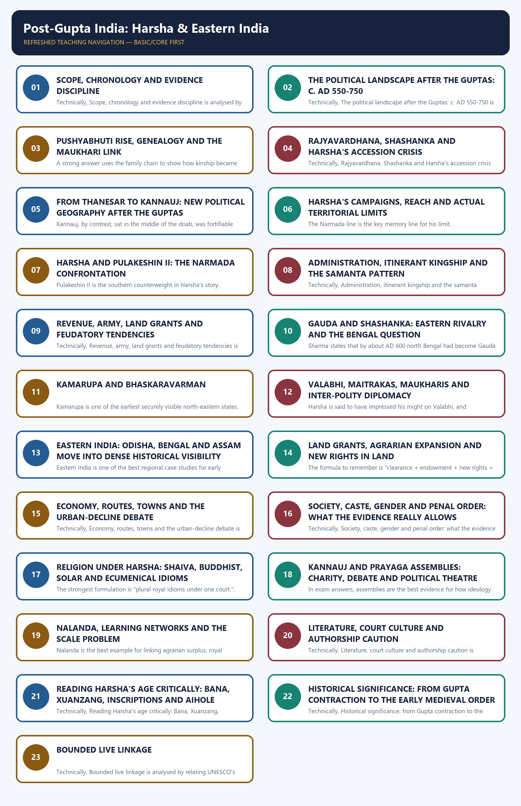

*Distinct embedded teaching-navigation image. The separate continuous Cārvāka-style flowchart package remains an independent at-a-glance artifact.*

#### Package counts, provenance and honest limitations

- Learning sections: 23; learning MCQ loops: 16.
- Workbook content: 4 verified or audited-routed PYQs; 40 broad MCQs; 8 remedials; 6 original solved Mains questions; final register modules: 6.
- Original PNG visuals: 14. All maps are schematic and explicitly marked not to scale.
- Exact local wording is securely available for 1 topic-owned or topic-routed Mains PYQ: 2020 GS-I Q2 on Pala Buddhism, preserved inside the repository's Jainism-Buddhism package and routing ledgers. Three relevant Prelims demands are locally routed but the original 2020-2021 papers and official keys are not held here.
- OCR caveat: the Sharma OCR is serviceable but noisy; Upinder's Harsha pages sometimes truncate line ends in automated extraction. Claims below are therefore bounded to named evidence and repeated across source types where possible.
- No dated current-affairs item was necessary. The historical topic is taught through texts, inscriptions, coins, archaeology and historiography rather than manufactured news linkage.

#### Original visual asset index

- `notes/Ancient-Indian-History/assets/22_Post-Gupta-Harsha-and-Eastern-India/01_post_gupta_evidence_chronology.png`
- `notes/Ancient-Indian-History/assets/22_Post-Gupta-Harsha-and-Eastern-India/02_fragmentation_schematic_map.png`
- `notes/Ancient-Indian-History/assets/22_Post-Gupta-Harsha-and-Eastern-India/03_pushyabhuti_genealogy_rise.png`
- `notes/Ancient-Indian-History/assets/22_Post-Gupta-Harsha-and-Eastern-India/04_harsha_expansion_limits_map.png`
- `notes/Ancient-Indian-History/assets/22_Post-Gupta-Harsha-and-Eastern-India/05_thanesar_kannauj_shift.png`
- `notes/Ancient-Indian-History/assets/22_Post-Gupta-Harsha-and-Eastern-India/06_narmada_confrontation_matrix.png`
- `notes/Ancient-Indian-History/assets/22_Post-Gupta-Harsha-and-Eastern-India/07_administration_feudatory_hierarchy.png`
- `notes/Ancient-Indian-History/assets/22_Post-Gupta-Harsha-and-Eastern-India/08_land_grant_agrarian_change_flow.png`
- `notes/Ancient-Indian-History/assets/22_Post-Gupta-Harsha-and-Eastern-India/09_economy_society_transition_matrix.png`
- `notes/Ancient-Indian-History/assets/22_Post-Gupta-Harsha-and-Eastern-India/10_religion_cultural_patronage.png`
- `notes/Ancient-Indian-History/assets/22_Post-Gupta-Harsha-and-Eastern-India/11_nalanda_learning_networks.png`
- `notes/Ancient-Indian-History/assets/22_Post-Gupta-Harsha-and-Eastern-India/12_xuanzang_bana_source_criticism_matrix.png`
- `notes/Ancient-Indian-History/assets/22_Post-Gupta-Harsha-and-Eastern-India/13_eastern_india_transition_network.png`
- `notes/Ancient-Indian-History/assets/22_Post-Gupta-Harsha-and-Eastern-India/14_gs1_answer_spine.png`

### SESSION 1 — SCOPE, CHRONOLOGY AND EVIDENCE DISCIPLINE

#### DEFINITION / WHAT THIS IS CALLED

**Plain-language definition:** Scope, chronology and evidence discipline comprises Scope, chronology and evidence discipline as its core connected dimensions.

**Technical definition:** Technically, Scope, chronology and evidence discipline is analysed by relating Scope to chronology, then testing the relationship through evidence discipline and Mains angle.

#### ANSWER-GRABBING OPENING — WRITE/ADAPT IN THE EXAM

> Scope, chronology and evidence discipline comprises Scope, chronology and evidence discipline as its core connected dimensions.

#### MUST-WRITE KEYWORDS

- **Scope**
- **chronology**
- **evidence discipline**
- **Mains angle**
- **Study link**
- **Bana's Harshacharita**

**How to use them:** Frame the answer through Scope; define chronology, connect evidence discipline with Mains angle to explain the mechanism, and use Study link for the decisive comparison or qualification.

[FACT] This package owns the bridge between late Gupta contraction and the early medieval regional order in north and eastern India, especially c. AD 550-750. It extends briefly to the mid-8th century only where that is necessary to explain eastern transition and the routed 2020 Pala-Buddhism PYQ.

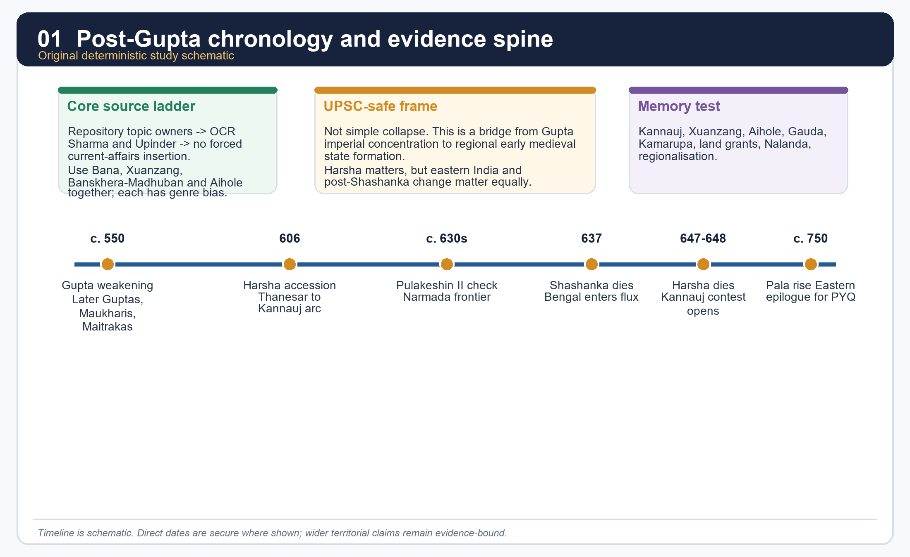

*Original deterministic schematic prepared for this package; dates and borders remain evidence-bound in the surrounding text.*

#### Evidence map

| Source family | Best use | Main limit |
|---|---|---|
| Bana's *Harshacharita* | accession crisis, court world, political self-image | literary selection and eulogy |
| Xuanzang | routes, monasteries, court encounter, selected customs | Buddhist purpose, later writing, occasional hearsay |
| Banskhera and Madhuban inscriptions | offices, taxes, grant procedure, royal camp | issue-specific, not a total social census |
| Aihole inscription | southern check on Harsha | rival Chalukya victory rhetoric |
| Bengal and eastern copper plates | land sales, agrarian expansion, local administration | region-bound archive |

#### Core teaching / solved practice

- [FACT] Repository source owners read first: basic/22, advanced/22, 00_Master-Chronology, revision chart, README, answer-worthiness audit, Topic 20 Gupta polity, Topic 21 Gupta society/culture, Topic 23 Pallava-Chalukya bridge and Topic 26 transition debate.
- [FACT] OCR evidence used from R.S. Sharma includes the chapters "Spread of Civilization in Eastern India" and "Harsha and His Times," especially the sections on Pundravardhanabhukti plates, Gauda under Shashanka, Kamarupa, the rise of Kannauj and Nalanda.
- [FACT] OCR evidence used from Upinder Singh includes the post-Gupta political matrix (Later Guptas, Maukharis, Pushyabhutis, Maitrakas), Harsha's accession, expansion, Banskhera-Madhuban records, Xuanzang's travel account, and eastern India after Shashanka.
- [ANALYSIS] The safe thesis is neither "Harsha restored empire" nor "everything declined after the Guptas." The stronger frame is regional reorganisation: Harsha created a major north Indian hegemony, while eastern India moved into dense inscriptional, agrarian and political visibility.
- [LIMIT] The package deliberately distinguishes secure evidence from contested reconstruction. Where the repository holds only a routed PYQ demand and not the original paper or official key, it says so explicitly.

#### Must-know facts

- Topic 22 is a bridge topic: north Indian power, eastern integration and the early medieval threshold.
- Harsha is central, but Gauda, Kamarupa, Odisha and land-grant society are not side notes.
- Source criticism is not optional; it is part of the content.

#### UPSC traps

- **Wrong:** Post-Gupta means only political collapse. **Correct:** It means political fragmentation, agrarian expansion, new centres and reworked sovereignty.
- **Wrong:** One court source can settle every question. **Correct:** Harsha's age must be triangulated through literary, epigraphic and rival evidence.

**Mains angle:** Open with the phrase "regional reorganisation after Gupta contraction" and then anchor it in named evidence.

**Study link:** Topic 20 for Gupta decline; Topic 23 for the southern frontier; Topic 26 for the larger transition debate.

#### CLOSING RECALL FLOW — SCOPE, CHRONOLOGY AND EVIDENCE DISCIPLINE

```text
START / CONCEPT: Scope, chronology and evidence discipline
        |
        v
EXACT TERMS: Scope · chronology · evidence discipline · Mains angle · Study link · Bana's Harshacharita
        |
        v
MECHANISM / ARGUMENT: Correct: Harsha's age must be triangulated through literary, epigraphic and rival evidence.
        |
        v
CONSEQUENCE / CONTRAST: The safe thesis is neither "Harsha restored empire" nor "everything declined after the Guptas." The stronger frame is regional reorganisation: Harsha created a major north Indian hegemony, while eastern India moved into dense inscriptional, agrarian and political visibility.
        |
        v
UPSC TRAP / ANSWER-USE: Where the repository holds only a routed PYQ demand and not the original paper or official key, it says so explicitly.
        |
        v
ANSWER-GRABBING FORMULATION: Scope, chronology and evidence discipline comprises Scope, chronology and evidence discipline as its core connected dimensions.
```
### SESSION 2 — THE POLITICAL LANDSCAPE AFTER THE GUPTAS: C. AD 550-750

#### DEFINITION / WHAT THIS IS CALLED

**Plain-language definition:** Post-Gupta North India is plural: Later Guptas, Maukharis, Pushyabhutis and Maitrakas all matter.

**Technical definition:** Technically, The political landscape after the Guptas: c. AD 550-750 is analysed by relating The political landscape after the Guptas to c. AD 550-750, then testing the relationship through Mains angle and Study link.

#### ANSWER-GRABBING OPENING — WRITE/ADAPT IN THE EXAM

> Post-Gupta North India is plural: Later Guptas, Maukharis, Pushyabhutis and Maitrakas all matter.

#### MUST-WRITE KEYWORDS

- **The political landscape after the Guptas**
- **c. AD 550-750**
- **Mains angle**
- **Study link**
- **Later Guptas**
- **middle Ganga belt**

**How to use them:** Frame the answer through The political landscape after the Guptas; define c. AD 550-750, connect Mains angle with Study link to explain the mechanism, and use Later Guptas for the decisive comparison or qualification.

[FACT] Upinder Singh's post-Gupta matrix explicitly places Later Guptas, Maukharis, Pushyabhutis and Maitrakas in the north-western and middle Ganga political field, alongside Gauda in Bengal, Kamarupa in Assam and Chalukya power pressing from the Deccan.

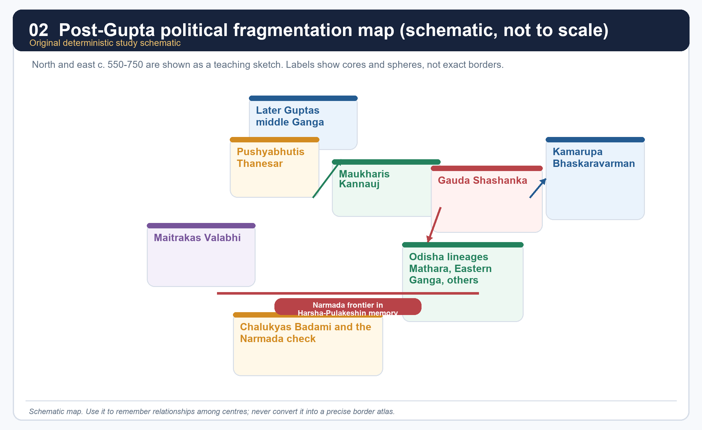

*Teaching map only. It is not a scale map and does not claim exact borders.*

#### Polity grid

| Polity | Main centre | Why it matters here | Core caution |
|---|---|---|---|
| Later Guptas | middle Ganga belt | shows imperial afterlife rather than instant disappearance | not the same as the imperial Gupta apex |
| Maukharis | Kannauj | connect the post-Gupta field to Harsha through marriage and inheritance politics | separate line before absorption |
| Pushyabhutis | Thanesar -> Kannauj | Harsha's dynasty | early pedigree is not fully transparent |
| Maitrakas | Valabhi | western counterpoint and possible allegiance relation | do not convert influence into annexation |
| Gauda | Bengal under Shashanka | Harsha's major eastern rival | post-Shashanka Bengal remains unstable |
| Kamarupa | Assam | major eastern state, especially under Bhaskaravarman | not a Harsha province |
| Chalukyas | Badami | Deccan check on Harsha | southern frontier remembered through a rival inscription |

#### Core teaching / solved practice

- [FACT] After the imperial Guptas, subordinate rulers increasingly asserted autonomy. Upinder links this world to several coexisting royal houses rather than to one clear successor state.
- [FACT] Sharma also sees north and west India passing under multiple feudatories, one of whose lines - the Thanesar dynasty - gradually overshadowed others under Harsha.
- [ANALYSIS] The key UPSC move is to convert this list of dynasties into a pattern: direct rule shrank, layered sovereignty grew, marriage and alliance mattered more, and strategic capitals replaced older all-India centres.
- [FACT] The eastern belt did not merely receive this process from the Gangetic core; by the 5th-7th centuries it generated its own military camps, land charters, districts, endowments and regional courts.
- [LIMIT] Do not write this period as if all polities were equal in scale or evidence density. Harsha's world is richly illuminated; many eastern dynasties are known more fragmentarily.

#### Must-know facts

- Post-Gupta North India is plural: Later Guptas, Maukharis, Pushyabhutis and Maitrakas all matter.
- Gauda and Kamarupa are part of the core story, not merely eastern appendices.
- The south appears here mainly as the frontier of Harsha's limits through Pulakeshin II.

#### UPSC traps

- **Wrong:** Treat the post-Gupta field as a simple relay from Guptas to Harsha. **Correct:** It is a crowded and competitive political arena.
- **Wrong:** Put every named polity inside Harsha's empire. **Correct:** Distinguish direct core, wider influence and autonomous rivals.

**Mains angle:** A 15- or 20-marker should present this landscape as the context for Harsha, not as a list to be memorised separately.

**Study link:** Topic 20 on Gupta weakening; Topic 26 on regional state formation.

#### CLOSING RECALL FLOW — THE POLITICAL LANDSCAPE AFTER THE GUPTAS: C. AD 550-750

```text
START / CONCEPT: The political landscape after the Guptas: c. AD 550-750
        |
        v
EXACT TERMS: The political landscape after the Guptas · c. AD 550-750 · Mains angle · Study link · Later Guptas · middle Ganga belt
        |
        v
MECHANISM / ARGUMENT: The key UPSC move is to convert this list of dynasties into a pattern: direct rule shrank, layered sovereignty grew, marriage and alliance mattered more, and strategic capitals replaced older all-India centres.
        |
        v
CONSEQUENCE / CONTRAST: A 15- or 20-marker should present this landscape as the context for Harsha, not as a list to be memorised separately.
        |
        v
UPSC TRAP / ANSWER-USE: Do not write this period as if all polities were equal in scale or evidence density.
        |
        v
ANSWER-GRABBING FORMULATION: Post-Gupta North India is plural: Later Guptas, Maukharis, Pushyabhutis and Maitrakas all matter.
```
### SESSION 3 — PUSHYABHUTI RISE, GENEALOGY AND THE MAUKHARI LINK

#### DEFINITION / WHAT THIS IS CALLED

**Plain-language definition:** Prabhakaravardhana is presented in Harshacharita as a powerful general and the turning point in the rise of the dynasty.

**Technical definition:** A strong answer uses the family chain to show how kinship became statecraft: military rise at Thanesar + alliance with Maukharis + crisis in Kannauj = Harsha's political opening.

#### ANSWER-GRABBING OPENING — WRITE/ADAPT IN THE EXAM

> A strong answer uses the family chain to show how kinship became statecraft: military rise at Thanesar + alliance with Maukharis + crisis in Kannauj = Harsha's political opening.

#### MUST-WRITE KEYWORDS

- **Pushyabhuti rise**
- **genealogy**
- **the Maukhari link**
- **Mains angle**
- **Study link**
- **Upinder explicitly cautions that Bana's court biography**

**How to use them:** Frame the answer through Pushyabhuti rise; define genealogy, connect the Maukhari link with Mains angle to explain the mechanism, and use Study link for the decisive comparison or qualification.

[FACT] The politically secure Pushyabhuti story begins with Prabhakaravardhana, Rajyavardhana, Harsha and Rajyashri. Upinder explicitly cautions that Bana's court biography is indispensable but literary, and the earlier lineage before Prabhakaravardhana is not transparent enough for overconfident reconstruction.

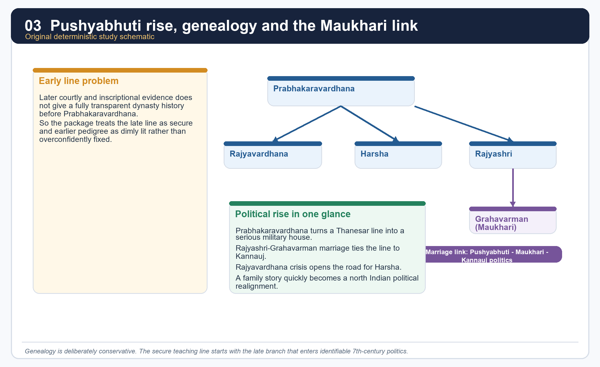

*This schematic intentionally privileges the secure late branch over dim early pedigree.*

#### Core teaching / solved practice

- [FACT] Prabhakaravardhana is presented in *Harshacharita* as a powerful general and the turning point in the rise of the dynasty.
- [FACT] The marriage of Rajyashri to the Maukhari ruler Grahavarman forged a crucial political alliance between Thanesar and Kanyakubja (Kannauj).
- [ANALYSIS] This marriage link is not biographical ornament. It explains why the Pushyabhutis could move from a Haryana base into the centre of the middle Ganga political world.
- [LIMIT] Do not turn uncertain early genealogy into a false certainty. For UPSC, the late secure branch matters more than speculative dynastic antiquity.
- [ANALYSIS] A strong answer uses the family chain to show how kinship became statecraft: military rise at Thanesar + alliance with Maukharis + crisis in Kannauj = Harsha's political opening.

#### Must-know facts

- Prabhakaravardhana is the decisive pre-Harsha figure in the secure political narrative.
- Rajyashri's marriage ties the Pushyabhutis to Kannauj.
- The package intentionally avoids overclaiming earlier genealogy.

#### UPSC traps

- **Wrong:** Memorise a long early pedigree without evidentiary caution. **Correct:** Use the late branch where politics becomes securely visible.
- **Wrong:** Treat Rajyashri's marriage as a personal anecdote. **Correct:** It is a state-building alliance.

**Mains angle:** Kinship, marriage and succession are political mechanisms, not side stories.

**Study link:** Sections 4-6 below; source-criticism section on Bana.

#### CLOSING RECALL FLOW — PUSHYABHUTI RISE, GENEALOGY AND THE MAUKHARI LINK

```text
START / CONCEPT: Pushyabhuti rise, genealogy and the Maukhari link
        |
        v
EXACT TERMS: Pushyabhuti rise · genealogy · the Maukhari link · Mains angle · Study link · Upinder explicitly cautions that Bana's court biography
        |
        v
MECHANISM / ARGUMENT: It explains why the Pushyabhutis could move from a Haryana base into the centre of the middle Ganga political world.
        |
        v
CONSEQUENCE / CONTRAST: Do not turn uncertain early genealogy into a false certainty.
        |
        v
UPSC TRAP / ANSWER-USE: Upinder explicitly cautions that Bana's court biography is indispensable but literary, and the earlier lineage before Prabhakaravardhana is not transparent enough for overconfident reconstruction.
        |
        v
ANSWER-GRABBING FORMULATION: A strong answer uses the family chain to show how kinship became statecraft: military rise at Thanesar + alliance with Maukharis + crisis in Kannauj = Harsha's political opening.
```
### SESSION 4 — RAJYAVARDHANA, SHASHANKA AND HARSHA'S ACCESSION CRISIS

#### DEFINITION / WHAT THIS IS CALLED

**Plain-language definition:** Harsha's accession is rooted in crisis, not smooth dynastic continuity.

**Technical definition:** Technically, Rajyavardhana, Shashanka and Harsha's accession crisis is analysed by relating Rajyavardhana to Shashanka, then testing the relationship through Harsha's accession crisis and Mains angle.

#### ANSWER-GRABBING OPENING — WRITE/ADAPT IN THE EXAM

> Harsha's accession is rooted in crisis, not smooth dynastic continuity.

#### MUST-WRITE KEYWORDS

- **Rajyavardhana**
- **Shashanka**
- **Harsha's accession crisis**
- **Mains angle**
- **Study link**
- **605 CE**

**How to use them:** Frame the answer through Rajyavardhana; define Shashanka, connect Harsha's accession crisis with Mains angle to explain the mechanism, and use Study link for the decisive comparison or qualification.

[FACT] Upinder's reconstruction from Bana states that Prabhakaravardhana died around 605 CE; Rajyavardhana succeeded him; Grahavarman was killed by the king of Malava; Rajyashri was imprisoned; Rajyavardhana marched east, defeated the Malava force and then encountered Shashanka of Gauda; according to *Harshacharita*, Rajyavardhana was killed by stratagem.

#### Core teaching / solved practice

- [FACT] Harsha's accession is rooted in crisis, not smooth dynastic continuity. The chain of events includes death, captivity, alliance breakdown and an eastern rival.
- [FACT] Bana's narrative ends with Harsha rescuing Rajyashri and securing the thrones of Thanesar and Kannauj. Upinder notes debate over whether the work is incomplete or complete by literary design.
- [ANALYSIS] This matters because the accession story is both history and political theatre. Rajyashri is not only a sister to be rescued; scholars have also read her symbolically as royal fortune or legitimacy.
- [LIMIT] The manner of Rajyavardhana's death comes through courtly narration. It should be cited as Bana's story, not as a forensically verified fact.
- [ANALYSIS] For exam purposes, Harsha's rise should be written as "crisis-driven consolidation" rather than as a miraculous hero episode.

#### Must-know facts

- Grahavarman's killing and Rajyashri's imprisonment trigger the Kannauj crisis.
- Shashanka enters the story before Harsha's eastern career fully develops.
- Bana is indispensable for this sequence but cannot be read as a neutral chronicle.

#### UPSC traps

- **Wrong:** Harsha simply inherited a ready-made empire. **Correct:** He inherited a crisis and converted it into a kingdom.
- **Wrong:** Quote the stratagem story as uncontested fact. **Correct:** Attribute it to Bana and mark the source limit.

**Mains angle:** This episode is the best place to show how literary narrative and political history overlap.

**Study link:** Section 21 on source criticism.

#### CLOSING RECALL FLOW — RAJYAVARDHANA, SHASHANKA AND HARSHA'S ACCESSION CRISIS

```text
START / CONCEPT: Rajyavardhana, Shashanka and Harsha's accession crisis
        |
        v
EXACT TERMS: Rajyavardhana · Shashanka · Harsha's accession crisis · Mains angle · Study link · 605 CE
        |
        v
MECHANISM / ARGUMENT: Upinder's reconstruction from Bana states that Prabhakaravardhana died around 605 CE; Rajyavardhana succeeded him; Grahavarman was killed by the king of Malava; Rajyashri was imprisoned; Rajyavardhana marched east, defeated the Malava force and then encountered Shashanka of Gauda; according to Harshacharita, Rajyavardhana was killed by stratagem.
        |
        v
CONSEQUENCE / CONTRAST: Rajyashri is not only a sister to be rescued; scholars have also read her symbolically as royal fortune or legitimacy.
        |
        v
UPSC TRAP / ANSWER-USE: It should be cited as Bana's story, not as a forensically verified fact.
        |
        v
ANSWER-GRABBING FORMULATION: Harsha's accession is rooted in crisis, not smooth dynastic continuity.
```
### SESSION 5 — FROM THANESAR TO KANNAUJ: NEW POLITICAL GEOGRAPHY AFTER THE GUPTAS

#### DEFINITION / WHAT THIS IS CALLED

**Plain-language definition:** Sharma's explanation for Kannauj's rise is structural: Pataliputra had flourished in a money-rich, trade-linked imperial order, while Kannauj rose in an age of military camps, land grants, fortifiable nodes and middle-doab control.

**Technical definition:** Kannauj, by contrast, sat in the middle of the doab, was fortifiable and could control eastern and western movement by both land and water.

#### ANSWER-GRABBING OPENING — WRITE/ADAPT IN THE EXAM

> Sharma's explanation for Kannauj's rise is structural: Pataliputra had flourished in a money-rich, trade-linked imperial order, while Kannauj rose in an age of military camps, land grants, fortifiable nodes and middle-doab control.

#### MUST-WRITE KEYWORDS

- **From Thanesar to Kannauj**
- **new political geography after the Guptas**
- **Mains angle**
- **Study link**
- **Sharma's explanation for Kannauj's rise**
- **Sharma's**

**How to use them:** Frame the answer through From Thanesar to Kannauj; define new political geography after the Guptas, connect Mains angle with Study link to explain the mechanism, and use Sharma's explanation for Kannauj's rise for the decisive comparison or qualification.

[FACT] Sharma's explanation for Kannauj's rise is structural: Pataliputra had flourished in a money-rich, trade-linked imperial order, while Kannauj rose in an age of military camps, land grants, fortifiable nodes and middle-doab control.

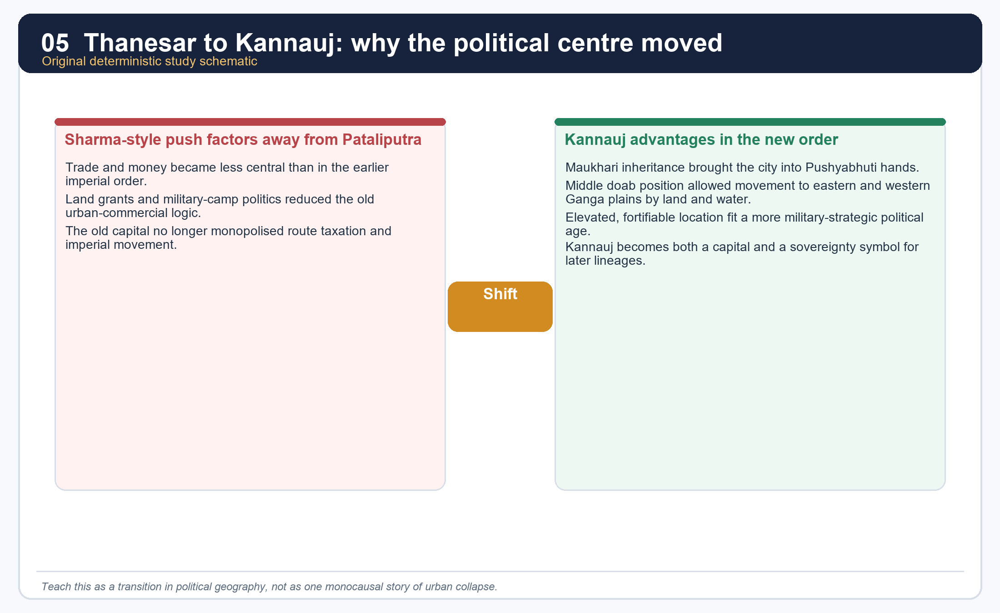

*This visual summarises Sharma's argument but the package later balances it with the uneven-change model.*

#### Core teaching / solved practice

- [FACT] Sharma directly connects the loss of Pataliputra's importance with reduced trade prominence, reduced coined exchange and the spread of land-based remuneration.
- [FACT] Kannauj, by contrast, sat in the middle of the doab, was fortifiable and could control eastern and western movement by both land and water.
- [FACT] The Maukhari connection gave Harsha a political right as well as an opportunity to take over Kannauj.
- [ANALYSIS] The capital shift therefore joins political inheritance to strategic geography. It is not just personal preference by Harsha.
- [LIMIT] A capital shift does not prove uniform urban collapse across India. Later sections show continued coin use, monastic wealth and regional state activity in the east.

#### Must-know facts

- Kannauj becomes the signature post-Gupta capital.
- Sharma treats this shift as a marker of the emerging early medieval order.
- Strategy and alliance matter as much as economics.

#### UPSC traps

- **Wrong:** Kannauj rose only because Harsha moved there. **Correct:** Harsha's move worked because the city already mattered strategically and politically.
- **Wrong:** Sharma's thesis proves every town declined. **Correct:** It highlights a broad tendency, not a uniform rule.

**Mains angle:** Compare Pataliputra and Kannauj as two political geographies tied to two different state logics.

**Study link:** Section 15 on the urban-decline debate.

#### CLOSING RECALL FLOW — FROM THANESAR TO KANNAUJ: NEW POLITICAL GEOGRAPHY AFTER THE GUPTAS

```text
START / CONCEPT: From Thanesar to Kannauj: new political geography after the Guptas
        |
        v
EXACT TERMS: From Thanesar to Kannauj · new political geography after the Guptas · Mains angle · Study link · Sharma's explanation for Kannauj's rise · Sharma's
        |
        v
MECHANISM / ARGUMENT: Kannauj, by contrast, sat in the middle of the doab, was fortifiable and could control eastern and western movement by both land and water.
        |
        v
CONSEQUENCE / CONTRAST: A capital shift does not prove uniform urban collapse across India.
        |
        v
UPSC TRAP / ANSWER-USE: It is not just personal preference by Harsha.
        |
        v
ANSWER-GRABBING FORMULATION: Sharma's explanation for Kannauj's rise is structural: Pataliputra had flourished in a money-rich, trade-linked imperial order, while Kannauj rose in an age of military camps, land grants, fortifiable nodes and middle-doab control.
```
### SESSION 6 — HARSHA'S CAMPAIGNS, REACH AND ACTUAL TERRITORIAL LIMITS

#### DEFINITION / WHAT THIS IS CALLED

**Plain-language definition:** The right exam formula is "direct core + peripheral allegiance + frontier limit." This is stronger than both extreme claims: total empire or merely symbolic kingship.

**Technical definition:** The Narmada line is the key memory line for his limit.

#### ANSWER-GRABBING OPENING — WRITE/ADAPT IN THE EXAM

> The right exam formula is "direct core + peripheral allegiance + frontier limit." This is stronger than both extreme claims: total empire or merely symbolic kingship.

#### MUST-WRITE KEYWORDS

- **Harsha's campaigns**
- **reach**
- **actual territorial limits**
- **Mains angle**
- **Study link**
- **Direct core**

**How to use them:** Frame the answer through Harsha's campaigns; define reach, connect actual territorial limits with Mains angle to explain the mechanism, and use Study link for the decisive comparison or qualification.

[FACT] Upinder's summary is restrained: Harsha defeated Shashanka but the latter seems to have recovered lost territories; Harsha impressed his might on Sindh, Valabhi and Kashmir; he was checked by Pulakeshin II; his direct core included Haryana, parts of southern Punjab and eastern Rajasthan, and with Maukhari inheritance it extended over much of Uttar Pradesh and parts of Bihar; Odisha also seems to have fallen within his effective reach.

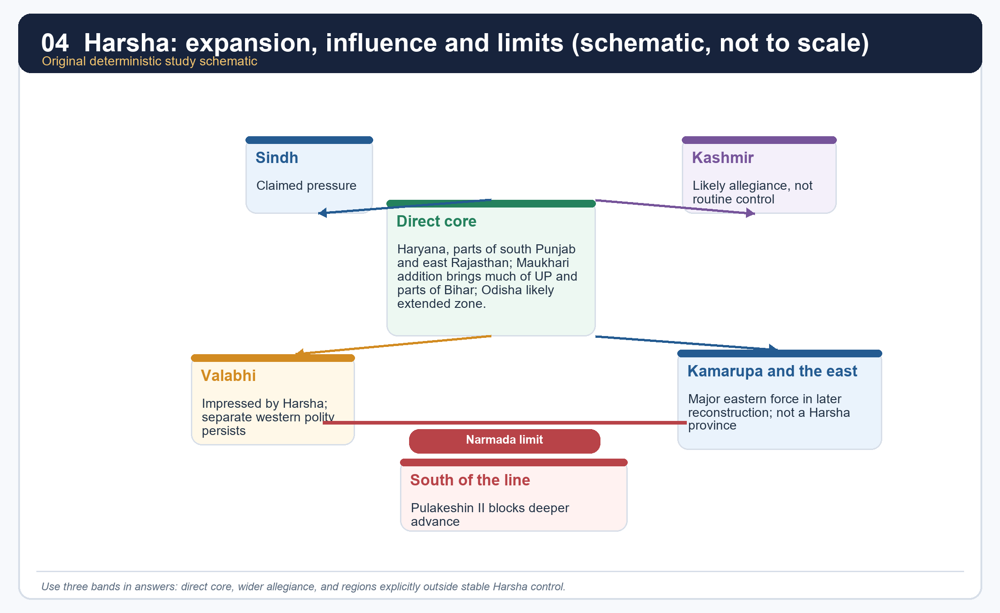

*Use this as a graded-sovereignty map, not as a province map.*

#### Territorial grid

| Zone | What the package treats as safe | What not to claim |
|---|---|---|
| Direct core | Thanesar-Haryana base; much of UP; parts of Bihar; likely Odisha extension | a pan-Indian empire |
| Wider influence | Kamarupa, Kashmir, Valabhi, Malava may have acknowledged superiority or attended assemblies | routine provincial administration |
| Outside stable control | Deccan south of the Narmada after Pulakeshin's resistance | Harsha's conquest of the Chalukya south |

#### Core teaching / solved practice

- [FACT] Harsha's power was real and extensive in north India, but his own evidence and rival evidence point to layered sovereignty rather than uniform annexation.
- [ANALYSIS] The right exam formula is "direct core + peripheral allegiance + frontier limit." This is stronger than both extreme claims: total empire or merely symbolic kingship.
- [FACT] Some subordinate rulers using titles such as *raja*, *samanta* and *mahasamanta* dated inscriptions in the Harsha era, suggesting broad recognition of his authority.
- [LIMIT] Presence at an assembly, diplomatic contact or tributary language does not equal incorporation into a standardised province.
- [ANALYSIS] Harsha is therefore best read as a north Indian hegemon with wider prestige, not as a Mauryan-style all-India emperor.

#### Must-know facts

- Harsha's direct core is north Indian and Ganga-based.
- Peripheral acknowledgement matters, but it must be distinguished from annexation.
- The Narmada line is the key memory line for his limit.

#### UPSC traps

- **Wrong:** Harsha ruled the whole subcontinent. **Correct:** His authority was large but graded and bounded.
- **Wrong:** If a ruler attended his assembly, the area became a province. **Correct:** assembly politics can express hierarchy without direct administration.

**Mains angle:** Use the vocabulary of graded sovereignty and bound the map carefully.

**Study link:** Section 7 for the Narmada confrontation; Section 8 for subordinate rulers and assemblies.

#### CLOSING RECALL FLOW — HARSHA'S CAMPAIGNS, REACH AND ACTUAL TERRITORIAL LIMITS

```text
START / CONCEPT: Harsha's campaigns, reach and actual territorial limits
        |
        v
EXACT TERMS: Harsha's campaigns · reach · actual territorial limits · Mains angle · Study link · Direct core
        |
        v
MECHANISM / ARGUMENT: Upinder's summary is restrained: Harsha defeated Shashanka but the latter seems to have recovered lost territories; Harsha impressed his might on Sindh, Valabhi and Kashmir; he was checked by Pulakeshin II; his direct core included Haryana, parts of southern Punjab and eastern Rajasthan, and with Maukhari inheritance it extended over much of Uttar Pradesh and parts of Bihar; Odisha also seems to have fallen within his effective reach.
        |
        v
CONSEQUENCE / CONTRAST: Harsha's power was real and extensive in north India, but his own evidence and rival evidence point to layered sovereignty rather than uniform annexation.
        |
        v
UPSC TRAP / ANSWER-USE: The Narmada line is the key memory line for his limit.
        |
        v
ANSWER-GRABBING FORMULATION: The right exam formula is "direct core + peripheral allegiance + frontier limit." This is stronger than both extreme claims: total empire or merely symbolic kingship.
```
### SESSION 7 — HARSHA AND PULAKESHIN II: THE NARMADA CONFRONTATION

#### DEFINITION / WHAT THIS IS CALLED

**Plain-language definition:** Harsha and Pulakeshin II: the Narmada confrontation comprises Harsha, Pulakeshin II and the Narmada confrontation as its core connected dimensions.

**Technical definition:** Pulakeshin II is the southern counterweight in Harsha's story.

#### ANSWER-GRABBING OPENING — WRITE/ADAPT IN THE EXAM

> Upinder states that Harsha received a crushing defeat at the hands of Pulakeshin II, but also notes scholarly differences over the exact date and even over whether the event was a full defeat or a forced retreat.

#### MUST-WRITE KEYWORDS

- **Harsha**
- **Pulakeshin II**
- **the Narmada confrontation**
- **Mains angle**
- **Study link**
- **The Aihole inscription of Ravikirti**

**How to use them:** Frame the answer through Harsha; define Pulakeshin II, connect the Narmada confrontation with Mains angle to explain the mechanism, and use Study link for the decisive comparison or qualification.

[FACT] The Aihole inscription of Ravikirti is the crucial counter-source. Upinder states that Harsha received a crushing defeat at the hands of Pulakeshin II, but also notes scholarly differences over the exact date and even over whether the event was a full defeat or a forced retreat.

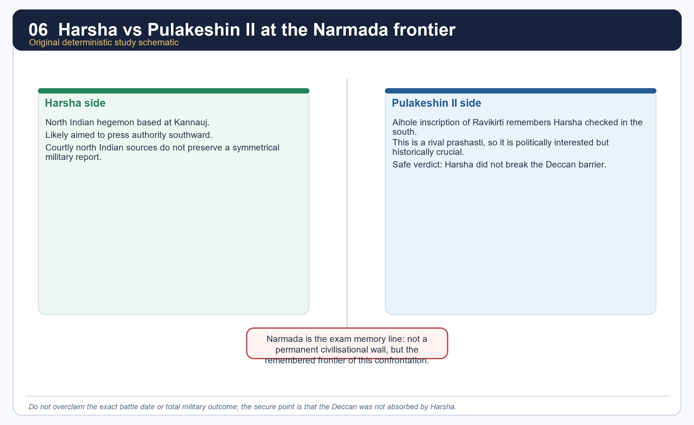

*The point of the image is evidentiary balance, not battle-map precision.*

#### Core teaching / solved practice

- [FACT] The confrontation survives in memory above all because the Chalukya record preserves it as a southern check on Harsha.
- [FACT] Sharma also presents Pulakeshin II as the ruler who stopped Harsha at the Narmada.
- [ANALYSIS] The Narmada becomes a remembered frontier here not because it was a timeless civilisational wall, but because it marks the limit of Harsha's expansion in this specific contest.
- [LIMIT] Aihole is a royal eulogy. It must be used critically, just as Bana must be used critically from the opposite side.
- [ANALYSIS] This confrontation is one of the best UPSC examples of why rival inscriptions are historically precious: they puncture unilateral imperial memory.

#### Must-know facts

- Pulakeshin II is the southern counterweight in Harsha's story.
- The Aihole inscription is the key rival text.
- Safe verdict: Harsha did not absorb the Deccan.

#### UPSC traps

- **Wrong:** Fix one exact year and one absolute battle description without caution. **Correct:** say the broad 7th-century confrontation is secure; details remain debated.
- **Wrong:** Use only Bana for Harsha's political reach. **Correct:** bring in Aihole as the essential check.

**Mains angle:** This episode is the model answer for "use rival evidence to limit imperial overclaim."

**Study link:** Topic 23 for Pulakeshin II and the Chalukya side of the story.

#### CLOSING RECALL FLOW — HARSHA AND PULAKESHIN II: THE NARMADA CONFRONTATION

```text
START / CONCEPT: Harsha and Pulakeshin II: the Narmada confrontation
        |
        v
EXACT TERMS: Harsha · Pulakeshin II · the Narmada confrontation · Mains angle · Study link · The Aihole inscription of Ravikirti
        |
        v
MECHANISM / ARGUMENT: Sharma also presents Pulakeshin II as the ruler who stopped Harsha at the Narmada.
        |
        v
CONSEQUENCE / CONTRAST: The Narmada becomes a remembered frontier here not because it was a timeless civilisational wall, but because it marks the limit of Harsha's expansion in this specific contest.
        |
        v
UPSC TRAP / ANSWER-USE: This episode is the model answer for "use rival evidence to limit imperial overclaim.".
        |
        v
ANSWER-GRABBING FORMULATION: Upinder states that Harsha received a crushing defeat at the hands of Pulakeshin II, but also notes scholarly differences over the exact date and even over whether the event was a full defeat or a forced retreat.
```
### SESSION 8 — ADMINISTRATION, ITINERANT KINGSHIP AND THE SAMANTA PATTERN

#### DEFINITION / WHAT THIS IS CALLED

**Plain-language definition:** Administration, itinerant kingship and the samanta pattern comprises Administration, itinerant kingship and the samanta pattern as its core connected dimensions.

**Technical definition:** Technically, Administration, itinerant kingship and the samanta pattern is analysed by relating Administration to itinerant kingship, then testing the relationship through the samanta pattern and Mains angle.

#### ANSWER-GRABBING OPENING — WRITE/ADAPT IN THE EXAM

> This is a vivid sign of itinerant kingship and military presence.

#### MUST-WRITE KEYWORDS

- **Administration**
- **itinerant kingship**
- **the samanta pattern**
- **Mains angle**
- **Study link**
- **Banskhera and Madhuban inscriptions**

**How to use them:** Frame the answer through Administration; define itinerant kingship, connect the samanta pattern with Mains angle to explain the mechanism, and use Study link for the decisive comparison or qualification.

[FACT] Upinder says Harsha's kingdom broadly continued Gupta administrative units and many older official designations. The kingdom was divided into *bhuktis*, which were in turn divided into *vishayas*; inscriptions mention high officials, revenue terms and a camp-centred royal presence.

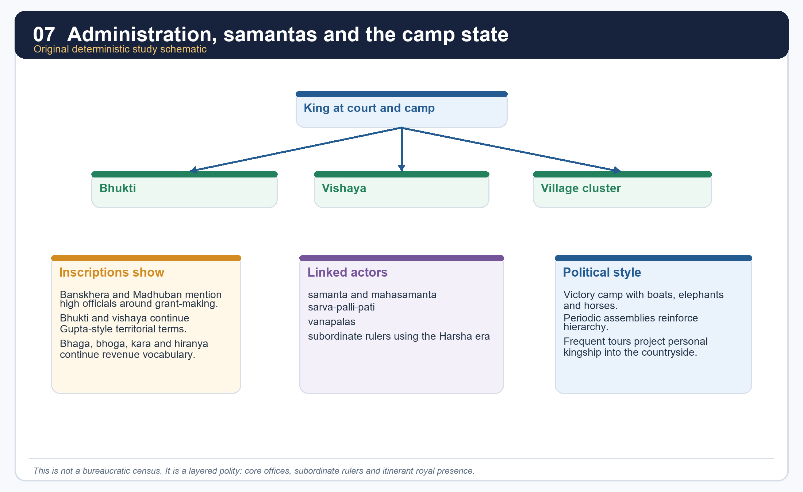

*This hierarchy is conceptual, not a claim that every office is equally documented in every region.*

#### Core teaching / solved practice

- [FACT] Banskhera and Madhuban inscriptions are key administrative windows. They mention high-level officials associated with grant-making.
- [FACT] Bana mentions *vanapalas* (forest guards), and Upinder notes the official *sarva-palli-pati* (chief of all villages).
- [FACT] The inscriptions refer to the royal "camp of victory" containing boats, horses and elephants. This is a vivid sign of itinerant kingship and military presence.
- [FACT] Subordinate rulers using titles such as *raja*, *samanta* and *mahasamanta* also dated records in the Harsha era.
- [ANALYSIS] The polity was therefore neither empty nor uniformly bureaucratic. It worked through a blend of inherited units, royal movement, subordinate chiefs and event-specific record keeping.

#### Must-know facts

- *Bhukti* and *vishaya* continue into Harsha's age.
- Camp, tour and assembly are as important as office names.
- The samanta pattern is visible in the language of subordinate rulers.

#### UPSC traps

- **Wrong:** Assume Harsha's state had no administration because evidence is thin. **Correct:** the evidence is selective, not absent.
- **Wrong:** Translate every title into a modern fixed department. **Correct:** many ranks overlapped and varied in real scope.

**Mains angle:** Write administration as "continuity plus layered delegation," not as a full Mauryan-style machine.

**Study link:** Section 9 for revenue and grants.

#### CLOSING RECALL FLOW — ADMINISTRATION, ITINERANT KINGSHIP AND THE SAMANTA PATTERN

```text
START / CONCEPT: Administration, itinerant kingship and the samanta pattern
        |
        v
EXACT TERMS: Administration · itinerant kingship · the samanta pattern · Mains angle · Study link · Banskhera and Madhuban inscriptions
        |
        v
MECHANISM / ARGUMENT: Wrong: Assume Harsha's state had no administration because evidence is thin.
        |
        v
CONSEQUENCE / CONTRAST: The samanta pattern is visible in the language of subordinate rulers.
        |
        v
UPSC TRAP / ANSWER-USE: Do not miss this limiting distinction: the polity was therefore neither empty nor uniformly bureaucratic.
        |
        v
ANSWER-GRABBING FORMULATION: This is a vivid sign of itinerant kingship and military presence.
```
### SESSION 9 — REVENUE, ARMY, LAND GRANTS AND FEUDATORY TENDENCIES

#### DEFINITION / WHAT THIS IS CALLED

**Plain-language definition:** Revenue, army, land grants and feudatory tendencies comprises Revenue, army and land grants as its core connected dimensions.

**Technical definition:** Technically, Revenue, army, land grants and feudatory tendencies is analysed by relating Revenue to army, then testing the relationship through land grants and feudatory tendencies.

#### ANSWER-GRABBING OPENING — WRITE/ADAPT IN THE EXAM

> This is a critical link in the "feudatory tendency" argument: military capacity increasingly rested on the support of subordinate landed powers rather than only on centrally salaried troops.

#### MUST-WRITE KEYWORDS

- **Revenue**
- **army**
- **land grants**
- **feudatory tendencies**
- **Mains angle**
- **Study link**

**How to use them:** Frame the answer through Revenue; define army, connect land grants with feudatory tendencies to explain the mechanism, and use Mains angle for the decisive comparison or qualification.

[FACT] Xuanzang says people were taxed lightly and that the king took one-sixth of the farmer's produce as grain share. Inscriptions preserve earlier revenue vocabulary such as *bhaga*, *bhoga*, *kara* and *hiranya*. Sharma additionally argues that the practice of endowing ministers and officers with land became more visible under Harsha.

#### Core teaching / solved practice

- [FACT] Upinder connects Harsha's grant records to the continuing use of older dues and tax terms.
- [FACT] Sharma reports that one part of Harsha's revenues went to officials and public servants, and that ministers and high officers could be endowed with land.
- [FACT] Sharma also treats the huge army numbers attributed to Harsha - 100,000 horses and 60,000 elephants - as unrealistic unless feudatory contingents were being mobilised.
- [ANALYSIS] This is a critical link in the "feudatory tendency" argument: military capacity increasingly rested on the support of subordinate landed powers rather than only on centrally salaried troops.
- [LIMIT] Because much of this argument comes through Xuanzang and later historical reconstruction, it is safer to write "suggests growing land-based payment and delegation" rather than "proves a fully developed feudal order under Harsha."
- [FACT] Xuanzang's own experience of robbery also cautions against an over-idealised picture of law and order.

#### Must-know facts

- Revenue vocabulary continues from earlier inscriptions.
- Land-based endowment of officers is a key transition clue.
- Army size should be treated critically.

#### UPSC traps

- **Wrong:** One-sixth grain share means a fully quantified all-India fiscal manual survives. **Correct:** it is one strand in a mixed evidentiary picture.
- **Wrong:** Harsha's army figures are literal standing-strength numbers. **Correct:** they likely incorporate feudatory support and rhetorical inflation.

**Mains angle:** The safer phrase is "expanding land-based reward and delegated power" rather than the stronger unqualified word "feudalism."

**Study link:** Topic 26 for the historiographical debate on feudal tendency versus regionalisation.

#### CLOSING RECALL FLOW — REVENUE, ARMY, LAND GRANTS AND FEUDATORY TENDENCIES

```text
START / CONCEPT: Revenue, army, land grants and feudatory tendencies
        |
        v
EXACT TERMS: Revenue · army · land grants · feudatory tendencies · Mains angle · Study link
        |
        v
MECHANISM / ARGUMENT: Xuanzang says people were taxed lightly and that the king took one-sixth of the farmer's produce as grain share.
        |
        v
CONSEQUENCE / CONTRAST: Sharma reports that one part of Harsha's revenues went to officials and public servants, and that ministers and high officers could be endowed with land.
        |
        v
UPSC TRAP / ANSWER-USE: Do not miss this limiting distinction: sharma also treats the huge army numbers attributed to Harsha - 100,000 horses and...
        |
        v
ANSWER-GRABBING FORMULATION: This is a critical link in the "feudatory tendency" argument: military capacity increasingly rested on the support of subordinate landed powers rather than only on centrally salaried troops.
```
### SESSION 10 — GAUDA AND SHASHANKA: EASTERN RIVALRY AND THE BENGAL QUESTION

#### DEFINITION / WHAT THIS IS CALLED

**Plain-language definition:** Gauda under Shashanka is one of the best fixed political labels in the eastern field.

**Technical definition:** Sharma states that by about AD 600 north Bengal had become Gauda under Shashanka, the adversary of Harsha.

#### ANSWER-GRABBING OPENING — WRITE/ADAPT IN THE EXAM

> Gauda under Shashanka is one of the best fixed political labels in the eastern field.

#### MUST-WRITE KEYWORDS

- **Gauda**
- **Shashanka**
- **eastern rivalry**
- **the Bengal question**
- **Mains angle**
- **Study link**

**How to use them:** Frame the answer through Gauda; define Shashanka, connect eastern rivalry with the Bengal question to explain the mechanism, and use Mains angle for the decisive comparison or qualification.

[FACT] Sharma states that by about AD 600 north Bengal had become Gauda under Shashanka, the adversary of Harsha. Upinder places Shashanka at the centre of Harsha's accession crisis and later eastern conflict.

#### Core teaching / solved practice

- [FACT] Rajyavardhana's last encounter in Bana's narrative is with Shashanka's army.
- [FACT] Upinder says Harsha defeated Shashanka but that the latter seems to have recovered lost territories soon after.
- [FACT] Upinder also notes that 6th-7th century kings of Bengal such as Shashanka issued gold coins. This is a useful anti-simplification point in economic debate.
- [FACT] In parts of Odisha, Upinder mentions feudatories of Shashanka such as Shubhakirti and the Dattas.
- [ANALYSIS] Shashanka matters because he turns Bengal from a vague frontier into a named counter-power in north Indian politics.
- [LIMIT] The exact sequence of Harsha's eastern gains and Shashanka's recoveries is not fully transparent. Do not oversimplify the east into a one-battle result.

#### Must-know facts

- Gauda under Shashanka is one of the best fixed political labels in the eastern field.
- Shashanka is not merely Harsha's villain in Bana; he is a ruler with his own territorial and numismatic profile.
- Post-Shashanka Bengal does not immediately stabilise.

#### UPSC traps

- **Wrong:** Harsha permanently annexed Gauda. **Correct:** eastern control was contested and unstable.
- **Wrong:** Bengal had no monetised or organised state activity in this period. **Correct:** coin issues, camps and charters point otherwise.

**Mains angle:** Use Shashanka to widen the frame beyond "Harsha the restorer."

**Study link:** Section 13 on eastern state formation; Section 15 on coin and urban debate.

#### CLOSING RECALL FLOW — GAUDA AND SHASHANKA: EASTERN RIVALRY AND THE BENGAL QUESTION

```text
START / CONCEPT: Gauda and Shashanka: eastern rivalry and the Bengal question
        |
        v
EXACT TERMS: Gauda · Shashanka · eastern rivalry · the Bengal question · Mains angle · Study link
        |
        v
MECHANISM / ARGUMENT: Sharma states that by about AD 600 north Bengal had become Gauda under Shashanka, the adversary of Harsha.
        |
        v
CONSEQUENCE / CONTRAST: Upinder says Harsha defeated Shashanka but that the latter seems to have recovered lost territories soon after.
        |
        v
UPSC TRAP / ANSWER-USE: The exact sequence of Harsha's eastern gains and Shashanka's recoveries is not fully transparent.
        |
        v
ANSWER-GRABBING FORMULATION: Gauda under Shashanka is one of the best fixed political labels in the eastern field.
```
### SESSION 11 — KAMARUPA AND BHASKARAVARMAN

#### DEFINITION / WHAT THIS IS CALLED

**Plain-language definition:** Sharma places Kamarupa in the Brahmaputra basin and notes that by the 6th century Sanskrit and writing are clearly visible there; the ruling line used the suffix varman.

**Technical definition:** Kamarupa is one of the earliest securely visible north-eastern states.

#### ANSWER-GRABBING OPENING — WRITE/ADAPT IN THE EXAM

> Sharma places Kamarupa in the Brahmaputra basin and notes that by the 6th century Sanskrit and writing are clearly visible there; the ruling line used the suffix varman.

#### MUST-WRITE KEYWORDS

- **Kamarupa**
- **Bhaskaravarman**
- **Mains angle**
- **Study link**
- **Samudragupta's**
- **Upinder**

**How to use them:** Frame the answer through Kamarupa; define Bhaskaravarman, connect Mains angle with Study link to explain the mechanism, and use Samudragupta's for the decisive comparison or qualification.

[FACT] Kamarupa had already appeared in Samudragupta's frontier list, and Upinder notes that in the Brahmaputra valley the kingdoms of Kamarupa and Davaka emerged in the 4th century CE. By the 7th century Bhaskaravarman had become the major ruler of a large Kamarupa state.

#### Core teaching / solved practice

- [FACT] Sharma places Kamarupa in the Brahmaputra basin and notes that by the 6th century Sanskrit and writing are clearly visible there; the ruling line used the suffix *varman*.
- [FACT] Land grants to Brahmanas, along with settlement growth, strengthened state formation in Assam.
- [FACT] Upinder says that beyond Harsha's areas of direct control, rulers of Kamarupa may have owed him allegiance; after Shashanka's death much of Bengal passed into Bhaskaravarman's hands.
- [ANALYSIS] Kamarupa is therefore not a remote frontier. It is an expanding eastern state that can act in Bengal and in the Harsha world.
- [LIMIT] Standard textbook narratives often speak of a firm Harsha-Bhaskaravarman alliance against Shashanka. Because the locally extracted source base here is more cautious, the package states the political intersection firmly but does not over-elaborate unquoted diplomacy.

#### Must-know facts

- Kamarupa is one of the earliest securely visible north-eastern states.
- Bhaskaravarman is the crucial 7th-century eastern ruler to remember.
- Assam enters the mainstream early medieval map through inscriptions, grants and regional politics.

#### UPSC traps

- **Wrong:** Kamarupa was simply absorbed by Harsha. **Correct:** it was a strong eastern polity with its own agency.
- **Wrong:** Assam becomes historically visible only in much later centuries. **Correct:** the 4th-7th centuries already provide a substantial state-formation record.

**Mains angle:** Kamarupa proves that eastern India was politically generative, not merely receptive.

**Study link:** Section 13 and Topic 26's regional-state model.

#### CLOSING RECALL FLOW — KAMARUPA AND BHASKARAVARMAN

```text
START / CONCEPT: Kamarupa and Bhaskaravarman
        |
        v
EXACT TERMS: Kamarupa · Bhaskaravarman · Mains angle · Study link · Samudragupta's · Upinder
        |
        v
MECHANISM / ARGUMENT: By the 7th century Bhaskaravarman had become the major ruler of a large Kamarupa state.
        |
        v
CONSEQUENCE / CONTRAST: Kamarupa proves that eastern India was politically generative, not merely receptive.
        |
        v
UPSC TRAP / ANSWER-USE: Kamarupa is therefore not a remote frontier.
        |
        v
ANSWER-GRABBING FORMULATION: Sharma places Kamarupa in the Brahmaputra basin and notes that by the 6th century Sanskrit and writing are clearly visible there; the ruling line used the suffix varman.
```
### SESSION 12 — VALABHI, MAITRAKAS, MAUKHARIS AND INTER-POLITY DIPLOMACY

#### DEFINITION / WHAT THIS IS CALLED

**Plain-language definition:** Inter-polity diplomacy is the connective tissue of this age.

**Technical definition:** Harsha is said to have impressed his might on Valabhi, and Xuanzang's account of Prayaga describes kings including those of Assam and Valabhi attending the assembly.

#### ANSWER-GRABBING OPENING — WRITE/ADAPT IN THE EXAM

> Harsha's world includes western Maitrakas of Valabhi, absorbed Maukharis of Kannauj and subordinate rulers performing allegiance politics.

#### MUST-WRITE KEYWORDS

- **Valabhi**
- **Maitrakas**
- **Maukharis**
- **inter-polity diplomacy**
- **Mains angle**
- **Study link**

**How to use them:** Frame the answer through Valabhi; define Maitrakas, connect Maukharis with inter-polity diplomacy to explain the mechanism, and use Mains angle for the decisive comparison or qualification.

[FACT] Post-Gupta political order is best understood through interconnected houses rather than isolated kingdoms. Harsha's world includes western Maitrakas of Valabhi, absorbed Maukharis of Kannauj and subordinate rulers performing allegiance politics.

#### Core teaching / solved practice

- [FACT] Upinder lists the Maitrakas of Valabhi among the important post-Gupta lines.
- [FACT] Harsha is said to have impressed his might on Valabhi, and Xuanzang's account of Prayaga describes kings including those of Assam and Valabhi attending the assembly.
- [FACT] The Maukharis matter not only as a pre-Harsha line but as the political bridge by which the Pushyabhutis acquire Kannauj.
- [ANALYSIS] Together these examples show that post-Gupta diplomacy is inseparable from kinship, assembly, era-dating, alliance and controlled prestige.
- [LIMIT] Attendance at an assembly or acknowledgement of superiority does not settle the question of durable administrative control.

#### Must-know facts

- Valabhi is a western comparator and occasional subordinate or allied node in Harsha's world.
- Maukharis are indispensable for explaining why Kannauj passes to Harsha.
- Post-Gupta politics works through networks, not just conquests.

#### UPSC traps

- **Wrong:** Treat every named kingdom as either fully independent or fully annexed. **Correct:** many relationships lie in between.
- **Wrong:** Forget the Maukharis once Harsha appears. **Correct:** they are the hinge of his expansion eastward.

**Mains angle:** Inter-polity diplomacy is the connective tissue of this age.

**Study link:** Sections 3-6 and 18.

#### CLOSING RECALL FLOW — VALABHI, MAITRAKAS, MAUKHARIS AND INTER-POLITY DIPLOMACY

```text
START / CONCEPT: Valabhi, Maitrakas, Maukharis and inter-polity diplomacy
        |
        v
EXACT TERMS: Valabhi · Maitrakas · Maukharis · inter-polity diplomacy · Mains angle · Study link
        |
        v
MECHANISM / ARGUMENT: Post-Gupta political order is best understood through interconnected houses rather than isolated kingdoms.
        |
        v
CONSEQUENCE / CONTRAST: Attendance at an assembly or acknowledgement of superiority does not settle the question of durable administrative control.
        |
        v
UPSC TRAP / ANSWER-USE: Do not miss this limiting distinction: inter-polity diplomacy is the connective tissue of this age.
        |
        v
ANSWER-GRABBING FORMULATION: Harsha's world includes western Maitrakas of Valabhi, absorbed Maukharis of Kannauj and subordinate rulers performing allegiance politics.
```
### SESSION 13 — EASTERN INDIA: ODISHA, BENGAL AND ASSAM MOVE INTO DENSE HISTORICAL VISIBILITY

#### DEFINITION / WHAT THIS IS CALLED

**Plain-language definition:** He explicitly describes the 4th-7th centuries as the period in which eastern Madhya Pradesh, Odisha, Bengal, south-east Bengal and Assam entered the orbit of advanced rural economy, inscriptional culture, state systems and social differentiation.

**Technical definition:** Eastern India is one of the best regional case studies for early medieval state formation.

#### ANSWER-GRABBING OPENING — WRITE/ADAPT IN THE EXAM

> He explicitly describes the 4th-7th centuries as the period in which eastern Madhya Pradesh, Odisha, Bengal, south-east Bengal and Assam entered the orbit of advanced rural economy, inscriptional culture, state systems and social differentiation.

#### MUST-WRITE KEYWORDS

- **Eastern India**
- **Odisha**
- **Bengal**
- **Assam move into dense historical visibility**
- **Mains angle**
- **Study link**

**How to use them:** Frame the answer through Eastern India; define Odisha, connect Bengal with Assam move into dense historical visibility to explain the mechanism, and use Mains angle for the decisive comparison or qualification.

[FACT] Sharma's eastern chapters are central here. He explicitly describes the 4th-7th centuries as the period in which eastern Madhya Pradesh, Odisha, Bengal, south-east Bengal and Assam entered the orbit of advanced rural economy, inscriptional culture, state systems and social differentiation.

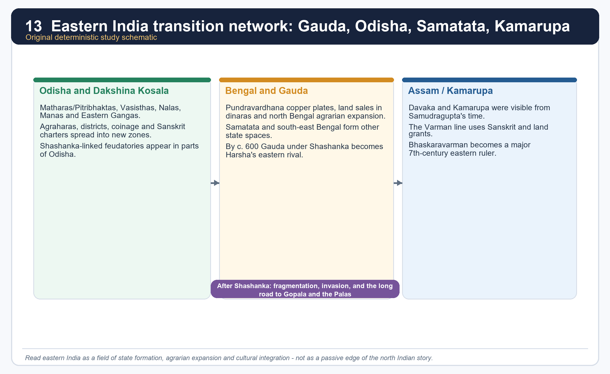

*The eastern panels summarise state formation, not exact dynastic sequence or exact territorial shape.*

#### Region matrix

| Region | Named evidence | Main process | Key caution |
|---|---|---|---|
| Odisha and Dakshina Kosala | Matharas/Pitribhaktas, Vasisthas, Nalas, Manas, Eastern Gangas | districts, coinage, agraharas, Sanskrit spread, cultivation into new zones | dynasties are many and unevenly documented |
| Bengal and Samatata | Pundravardhanabhukti copper plates, Gauda under Shashanka, Khadgas, Dandabhukti | land sales, dinara payments, military camps, local administration, agrarian expansion | north and south-east Bengal differ |
| Assam/Kamarupa | Ambari settlement, Davaka and Kamarupa, Varman line, Bhaskaravarman | grants, Sanskritic state formation, Brahmaputra basin consolidation | not all of Assam is equally documented |

#### Core teaching / solved practice

- [FACT] Sharma treats the eastern centuries from the mid-5th onward as momentous because multiple states, fiscal districts and military camps emerge in Bengal.
- [FACT] In Bengal, land sale documents in Pundravardhanabhukti from AD 432-33 onward show gold coin purchase, tax remission after endowment and the participation of scribes, merchants and landholders in local administration.
- [FACT] Odisha generated several states with taxation, military organisation, coinage and agrahara endowments; Sanskrit charters spread beyond the old coastal belt.
- [FACT] Assam/Kamarupa shows clear settlement, script, Sanskrit and grant evidence by the 6th-7th centuries.
- [ANALYSIS] Eastern India therefore exemplifies a historically powerful pattern: agrarian expansion, cultural integration and new political centres develop together.
- [LIMIT] A fully connected dynastic narrative is difficult; the stronger answer stresses process rather than pretending to know every royal succession equally well.

#### Must-know facts

- Eastern India is one of the best regional case studies for early medieval state formation.
- Military camps with horses, elephants and boats are a repeated Bengal marker in Sharma.
- Sanskritisation and agrarian expansion move together in the record.

#### UPSC traps

- **Wrong:** Eastern India appears suddenly only under the Palas. **Correct:** the post-Gupta centuries already show dense political and agrarian change.
- **Wrong:** One eastern model fits Odisha, Bengal and Assam equally. **Correct:** write the east comparatively.

**Mains angle:** This section is where Topic 22 becomes more than Harsha biography; it becomes a structural regional history answer.

**Study link:** Sections 14-16; Topic 26 on regionalisation.

#### CLOSING RECALL FLOW — EASTERN INDIA: ODISHA, BENGAL AND ASSAM MOVE INTO DENSE HISTORICAL VISIBILITY

```text
START / CONCEPT: Eastern India: Odisha, Bengal and Assam move into dense historical visibility
        |
        v
EXACT TERMS: Eastern India · Odisha · Bengal · Assam move into dense historical visibility · Mains angle · Study link
        |
        v
MECHANISM / ARGUMENT: Sharma treats the eastern centuries from the mid-5th onward as momentous because multiple states, fiscal districts and military camps emerge in Bengal.
        |
        v
CONSEQUENCE / CONTRAST: Eastern India is one of the best regional case studies for early medieval state formation.
        |
        v
UPSC TRAP / ANSWER-USE: Do not miss this limiting distinction: in Bengal, land sale documents in Pundravardhanabhukti from AD 432-33 onward show gold coin...
        |
        v
ANSWER-GRABBING FORMULATION: He explicitly describes the 4th-7th centuries as the period in which eastern Madhya Pradesh, Odisha, Bengal, south-east Bengal and Assam entered the orbit of advanced rural economy, inscriptional culture, state systems and social differentiation.
```
### SESSION 14 — LAND GRANTS, AGRARIAN EXPANSION AND NEW RIGHTS IN LAND

#### DEFINITION / WHAT THIS IS CALLED

**Plain-language definition:** The historical importance of grants is social and agrarian, not merely religious.

**Technical definition:** The formula to remember is "clearance + endowment + new rights + hierarchy.".

#### ANSWER-GRABBING OPENING — WRITE/ADAPT IN THE EXAM

> The historical importance of grants is social and agrarian, not merely religious.

#### MUST-WRITE KEYWORDS

- **Land grants**
- **agrarian expansion**
- **new rights in land**
- **Mains angle**
- **Study link**
- **Sharma's**

**How to use them:** Frame the answer through Land grants; define agrarian expansion, connect new rights in land with Mains angle to explain the mechanism, and use Study link for the decisive comparison or qualification.

[FACT] Sharma's eastern evidence shows land sale, purchase and endowment working together. Fallow or uncultivated plots were often purchased for religious endowments; once granted, donees did not pay tax. Upinder's broader synthesis adds that grants must be read as part of larger agrarian, caste and cultural processes rather than as isolated pious acts.

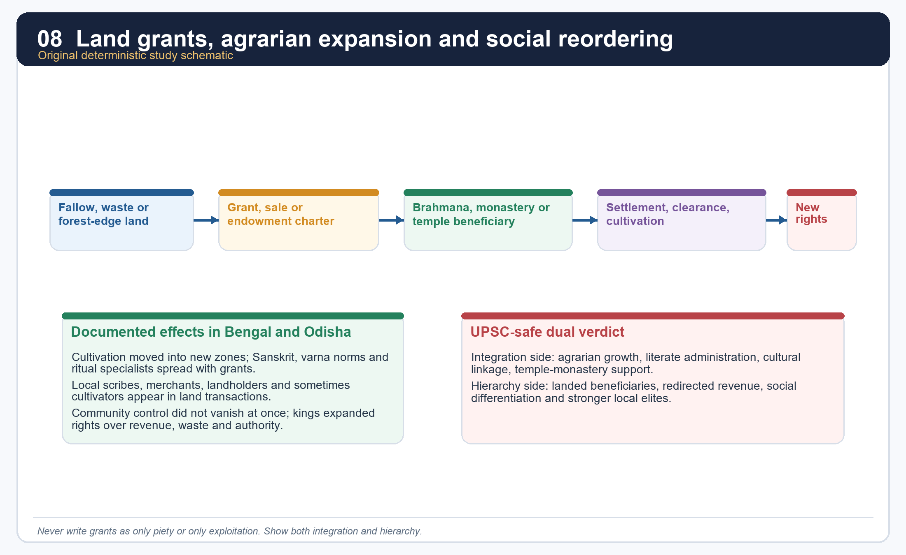

*This is a process diagram, not a claim that every grant followed one identical script.*

#### Core teaching / solved practice

- [FACT] Pundravardhanabhukti records show land bought with *dinaras*, then reclassified through religious endowment.
- [FACT] Sharma notes that ordinary cultivators could be consulted in village land-sale matters, even while leading artisans, merchants, landowners and scribes dominated community authority.
- [FACT] The king increasingly claimed rights over waste and fallow land, making large-scale grants possible.
- [FACT] Odisha's agraharas and Bengal's charters demonstrate the spread of new rights in land and revenue.
- [ANALYSIS] The grants did two things at once: they extended cultivation and they strengthened beneficiary control over resources, labour and status.
- [LIMIT] Neither "all land was privately owned" nor "all land remained communally held" fits the evidence. Rights were layered and in transition.

#### Must-know facts

- Grants often targeted uncultivated or frontier land.
- Communities retained some say, but royal and donee rights expanded.
- The historical importance of grants is social and agrarian, not merely religious.

#### UPSC traps

- **Wrong:** Land grants were only harmless charity. **Correct:** they reorganised rural power.
- **Wrong:** All communal authority disappeared immediately. **Correct:** local participation and layered rights remained visible.

**Mains angle:** The formula to remember is "clearance + endowment + new rights + hierarchy."

**Study link:** Section 15 on the economy debate; Topic 26 on grant historiography.

#### CLOSING RECALL FLOW — LAND GRANTS, AGRARIAN EXPANSION AND NEW RIGHTS IN LAND

```text
START / CONCEPT: Land grants, agrarian expansion and new rights in land
        |
        v
EXACT TERMS: Land grants · agrarian expansion · new rights in land · Mains angle · Study link · Sharma's
        |
        v
MECHANISM / ARGUMENT: Pundravardhanabhukti records show land bought with dinaras, then reclassified through religious endowment.
        |
        v
CONSEQUENCE / CONTRAST: Communities retained some say, but royal and donee rights expanded.
        |
        v
UPSC TRAP / ANSWER-USE: Fallow or uncultivated plots were often purchased for religious endowments; once granted, donees did not pay tax.
        |
        v
ANSWER-GRABBING FORMULATION: The historical importance of grants is social and agrarian, not merely religious.
```
### SESSION 15 — ECONOMY, ROUTES, TOWNS AND THE URBAN-DECLINE DEBATE

#### DEFINITION / WHAT THIS IS CALLED

**Plain-language definition:** Economy, routes, towns and the urban-decline debate comprises Economy, routes and towns as its core connected dimensions.

**Technical definition:** Technically, Economy, routes, towns and the urban-decline debate is analysed by relating Economy to routes, then testing the relationship through towns and the urban-decline debate.

#### ANSWER-GRABBING OPENING — WRITE/ADAPT IN THE EXAM

> Economy, routes, towns and the urban-decline debate comprises Economy, routes and towns as its core connected dimensions.

#### MUST-WRITE KEYWORDS

- **Economy**
- **routes**
- **towns**
- **the urban-decline debate**
- **Mains angle**
- **Study link**

**How to use them:** Frame the answer through Economy; define routes, connect towns with the urban-decline debate to explain the mechanism, and use Mains angle for the decisive comparison or qualification.

[FACT] Sharma's capital-shift argument is important, but Topic 22 cannot stop there. The same eastern record also shows coin purchase of land, organised military camps, tax machinery, monastic wealth and state activity. Upinder's regional-state approach helps correct the overly uniform decline model.

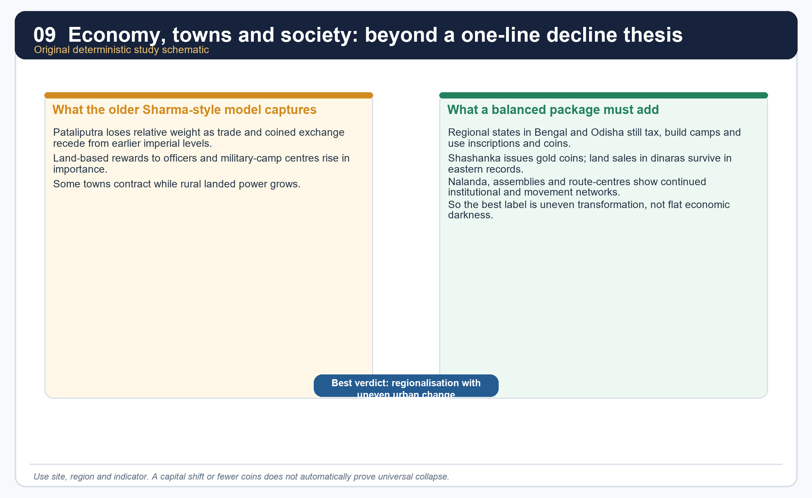

*The matrix contrasts a useful older model with a more balanced synthetic reading.*

#### Core teaching / solved practice

- [FACT] Sharma reads the decline of Pataliputra and the rise of Kannauj as tied to reduced money use, land grants and the greater importance of strategic-camp centres.
- [FACT] Yet eastern Bengal plates show land purchased with gold coin, and Upinder notes that kings such as Shashanka issued gold coins in Bengal.
- [FACT] Nalanda was supported by revenues from many villages, showing the concentration of agrarian surplus into large institutions.
- [ANALYSIS] Uneven transformation denotes the coexistence of declining older urban centrality with growing regional nodes, monasteries and political centres.
- [LIMIT] Do not infer trade volume, urban population or monetisation level from one type of evidence alone.
- [ANALYSIS] Topic 22 is a good place to demonstrate the difference between "urban contraction in some zones" and "civilisational darkness everywhere."

#### Must-know facts

- Sharma's decline thesis remains useful, especially for Pataliputra versus Kannauj.
- Coin use and institutional wealth did not disappear uniformly.
- Regionalisation is the key corrective category.

#### UPSC traps

- **Wrong:** Harsha's age was either fully prosperous or fully collapsed. **Correct:** it was regionally uneven.
- **Wrong:** One capital shift proves a total subcontinental economic law. **Correct:** compare multiple indicators.

**Mains angle:** Use one line from Sharma, one eastern counter-indicator, and one balanced verdict.

**Study link:** Topic 19 on crafts and commerce; Topic 26 on transition debate.

#### CLOSING RECALL FLOW — ECONOMY, ROUTES, TOWNS AND THE URBAN-DECLINE DEBATE

```text
START / CONCEPT: Economy, routes, towns and the urban-decline debate
        |
        v
EXACT TERMS: Economy · routes · towns · the urban-decline debate · Mains angle · Study link
        |
        v
MECHANISM / ARGUMENT: Nalanda was supported by revenues from many villages, showing the concentration of agrarian surplus into large institutions.
        |
        v
CONSEQUENCE / CONTRAST: Do not infer trade volume, urban population or monetisation level from one type of evidence alone.
        |
        v
UPSC TRAP / ANSWER-USE: Coin use and institutional wealth did not disappear uniformly.
        |
        v
ANSWER-GRABBING FORMULATION: Economy, routes, towns and the urban-decline debate comprises Economy, routes and towns as its core connected dimensions.
```
### SESSION 16 — SOCIETY, CASTE, GENDER AND PENAL ORDER: WHAT THE EVIDENCE REALLY ALLOWS

#### DEFINITION / WHAT THIS IS CALLED

**Plain-language definition:** Society, caste, gender and penal order: what the evidence really allows comprises Society, caste and gender as its core connected dimensions.

**Technical definition:** Technically, Society, caste, gender and penal order: what the evidence really allows is analysed by relating Society to caste, then testing the relationship through gender and penal order.

#### ANSWER-GRABBING OPENING — WRITE/ADAPT IN THE EXAM

> Wrong: Eastern grants only show institutions, not society.

#### MUST-WRITE KEYWORDS

- **Society**
- **caste**
- **gender**
- **penal order**
- **what the evidence really allows**
- **Mains angle**

**How to use them:** Frame the answer through Society; define caste, connect gender with penal order to explain the mechanism, and use what the evidence really allows for the decisive comparison or qualification.

[FACT] The eastern charters, Bana and Xuanzang together suggest a society of cultivators, scribes, merchants, beneficiaries, subordinate rulers and growing Brahmanical normativity. But the evidence is uneven and often elite.

#### Core teaching / solved practice

- [FACT] Sharma repeatedly notes the spread of Sanskrit, varna ideology and Brahmanical learning into eastern regions through grants and official culture.
- [FACT] Local records reveal scribes, merchants, landholders and peasants participating in land transactions and administration.
- [FACT] Rajyashri's near-sati episode is an important narrative detail, but it is the experience of an elite princess in a courtly text, not a social census.
- [FACT] Xuanzang reports severe punishments and legal order, but he also seems at times to idealise or translate Indian social reality for a Chinese audience.
- [ANALYSIS] The best social answer therefore balances what is visible - landed differentiation, Brahmanical integration, peasant consultation, elite women in dynastic politics - against what remains opaque, especially common women's work and subaltern voices.
- [LIMIT] Topic 22 should not import without care all the Gupta-age social evidence of Topic 21. The overlap exists, but the post-Gupta archive has its own regional emphases.

#### Must-know facts

- Social evidence here is more agrarian and administrative than literary-domestic.
- Rajyashri is politically central but socially unrepresentative.
- Penal descriptions in Xuanzang need source caution.

#### UPSC traps

- **Wrong:** One dramatic elite episode proves a general social custom. **Correct:** state the social level and source type.
- **Wrong:** Eastern grants only show institutions, not society. **Correct:** they reveal social groups and changing landed relations.

**Mains angle:** Social answers should move from visible groups to invisible gaps, not pretend equal evidence for everyone.

**Study link:** Topic 21 for the earlier Gupta social archive.

#### CLOSING RECALL FLOW — SOCIETY, CASTE, GENDER AND PENAL ORDER: WHAT THE EVIDENCE REALLY ALLOWS

```text
START / CONCEPT: Society, caste, gender and penal order: what the evidence really allows
        |
        v
EXACT TERMS: Society · caste · gender · penal order · what the evidence really allows · Mains angle
        |
        v
MECHANISM / ARGUMENT: Social answers should move from visible groups to invisible gaps, not pretend equal evidence for everyone.
        |
        v
CONSEQUENCE / CONTRAST: Rajyashri's near-sati episode is an important narrative detail, but it is the experience of an elite princess in a courtly text, not a social census.
        |
        v
UPSC TRAP / ANSWER-USE: Do not miss this limiting distinction: the best social answer therefore balances what is visible - landed differentiation, Brahmanical integration...
        |
        v
ANSWER-GRABBING FORMULATION: Wrong: Eastern grants only show institutions, not society.
```
### SESSION 17 — RELIGION UNDER HARSHA: SHAIVA, BUDDHIST, SOLAR AND ECUMENICAL IDIOMS

#### DEFINITION / WHAT THIS IS CALLED

**Plain-language definition:** Sharma describes Harsha as tolerant: initially Shaiva, later a great patron of Buddhism.

**Technical definition:** The strongest formulation is "plural royal idioms under one court.".

#### ANSWER-GRABBING OPENING — WRITE/ADAPT IN THE EXAM

> His inscriptions and Bana point Shaiva; Xuanzang points Buddhist preference; the assemblies show Buddha, Shiva and Sun worship on successive days.

#### MUST-WRITE KEYWORDS

- **Religion under Harsha**
- **Shaiva**
- **Buddhist**
- **solar**
- **ecumenical idioms**
- **Mains angle**

**How to use them:** Frame the answer through Religion under Harsha; define Shaiva, connect Buddhist with solar to explain the mechanism, and use ecumenical idioms for the decisive comparison or qualification.

[FACT] Upinder provides a nuanced religious profile: early Pushyabhuti rulers seem to have been worshippers of Surya; Rajyavardhana was a devotee of the Buddha; Harsha appears as a devotee of Shiva in *Harshacharita* and his inscriptions, while Xuanzang depicts him as especially inclined toward Buddhism.

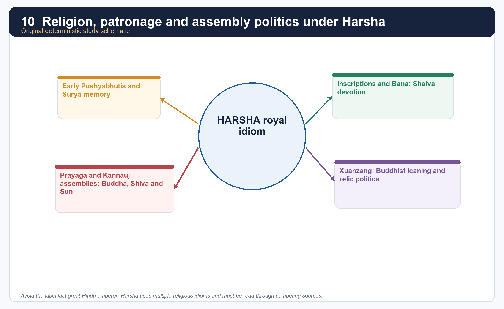

*This diagram emphasises overlapping idioms, not a single label.*

#### Core teaching / solved practice

- [FACT] Harsha's religious image cannot be reduced to one term. His inscriptions and Bana point Shaiva; Xuanzang points Buddhist preference; the assemblies show Buddha, Shiva and Sun worship on successive days.
- [FACT] Sharma describes Harsha as tolerant: initially Shaiva, later a great patron of Buddhism.
- [FACT] Upinder also records Harsha's aggressive demand from the king of Kashmir for a Buddha tooth relic, showing that Buddhist patronage could also take competitive political form.
- [ANALYSIS] The word "eclectic" is useful if it means strategic multi-sect legitimation, not vague syncretism.
- [LIMIT] Do not call Harsha secular in a modern constitutional sense. His religious patronage is explicitly political and royal.

#### Must-know facts

- Surya, Shiva and Buddha all appear in the Pushyabhuti-Harsha record.
- Harsha's profile changes depending on which source one reads.
- Religious policy is part of kingship, not separate from it.

#### UPSC traps

- **Wrong:** Harsha was only a Buddhist ruler. **Correct:** Buddhist preference coexists with Shaiva and solar idioms.
- **Wrong:** "Tolerant" means politically neutral. **Correct:** patronage and assembly ritual also stage royal hierarchy.

**Mains angle:** The strongest formulation is "plural royal idioms under one court."

**Study link:** Section 18 on assemblies and Section 19 on Nalanda.

#### CLOSING RECALL FLOW — RELIGION UNDER HARSHA: SHAIVA, BUDDHIST, SOLAR AND ECUMENICAL IDIOMS

```text
START / CONCEPT: Religion under Harsha: Shaiva, Buddhist, solar and ecumenical idioms
        |
        v
EXACT TERMS: Religion under Harsha · Shaiva · Buddhist · solar · ecumenical idioms · Mains angle
        |
        v
MECHANISM / ARGUMENT: Sharma describes Harsha as tolerant: initially Shaiva, later a great patron of Buddhism.
        |
        v
CONSEQUENCE / CONTRAST: Do not call Harsha secular in a modern constitutional sense.
        |
        v
UPSC TRAP / ANSWER-USE: Upinder provides a nuanced religious profile: early Pushyabhuti rulers seem to have been worshippers of Surya; Rajyavardhana was a devotee of the Buddha; Harsha appears as a devotee of Shiva in Harshacharita and his inscriptions, while Xuanzang depicts him as especially inclined toward Buddhism.
        |
        v
ANSWER-GRABBING FORMULATION: His inscriptions and Bana point Shaiva; Xuanzang points Buddhist preference; the assemblies show Buddha, Shiva and Sun worship on successive days.
```
### SESSION 18 — KANNAUJ AND PRAYAGA ASSEMBLIES: CHARITY, DEBATE AND POLITICAL THEATRE

#### DEFINITION / WHAT THIS IS CALLED

**Plain-language definition:** Prayaga assembly is a key memory site of Harsha's kingship.

**Technical definition:** In exam answers, assemblies are the best evidence for how ideology and hierarchy were performed before a multi-polity audience.

#### ANSWER-GRABBING OPENING — WRITE/ADAPT IN THE EXAM

> Prayaga assembly is a key memory site of Harsha's kingship.

#### MUST-WRITE KEYWORDS

- **Kannauj**
- **Prayaga assemblies**
- **charity**
- **debate**
- **political theatre**
- **Mains angle**

**How to use them:** Frame the answer through Kannauj; define Prayaga assemblies, connect charity with debate to explain the mechanism, and use political theatre for the decisive comparison or qualification.

[FACT] Upinder says Harsha convened a great assembly at Kannauj and quinquennial assemblies at Prayaga; Xuanzang personally attended one of the latter. Many kings including those of Assam and Valabhi were present, along with shramanas, Brahmanas and adherents of various sects.

#### Core teaching / solved practice

- [FACT] Xuanzang describes religious discourses, lavish distribution of gifts and worship of the Buddha, Shiva and the Sun on consecutive days.
- [FACT] Sharma echoes the image of extraordinary royal generosity at Prayaga.
- [ANALYSIS] These assemblies were not only acts of piety. They were imperial spectacles where subordinate presence, doctrinal display, charity and public ranking fused into one event.
- [ANALYSIS] In exam answers, assemblies are the best evidence for how ideology and hierarchy were performed before a multi-polity audience.
- [LIMIT] Xuanzang admired Harsha; therefore the generosity and harmony of the occasion should be read as both observation and political idealisation.

#### Must-know facts

- Prayaga assembly is a key memory site of Harsha's kingship.
- Valabhi and Assam are named in the assembly context.
- Multi-sect presence does not erase royal hierarchy; it dramatizes it.

#### UPSC traps

- **Wrong:** Treat the assemblies as only religious festivals. **Correct:** they are political theatre as well.
- **Wrong:** Assume all attendees were equal partners. **Correct:** the event reinforces graded power.

**Mains angle:** Assemblies convert soft power into visible sovereignty.

**Study link:** Sections 6, 12 and 17.

#### CLOSING RECALL FLOW — KANNAUJ AND PRAYAGA ASSEMBLIES: CHARITY, DEBATE AND POLITICAL THEATRE

```text
START / CONCEPT: Kannauj and Prayaga assemblies: charity, debate and political theatre
        |
        v
EXACT TERMS: Kannauj · Prayaga assemblies · charity · debate · political theatre · Mains angle
        |
        v
MECHANISM / ARGUMENT: Correct: they are political theatre as well.
        |
        v
CONSEQUENCE / CONTRAST: Xuanzang admired Harsha; therefore the generosity and harmony of the occasion should be read as both observation and political idealisation.
        |
        v
UPSC TRAP / ANSWER-USE: These assemblies were not only acts of piety.
        |
        v
ANSWER-GRABBING FORMULATION: Prayaga assembly is a key memory site of Harsha's kingship.
```
### SESSION 19 — NALANDA, LEARNING NETWORKS AND THE SCALE PROBLEM

#### DEFINITION / WHAT THIS IS CALLED

**Plain-language definition:** Nalanda is central to Harsha's age, but it must be dated carefully.

**Technical definition:** Nalanda is the best example for linking agrarian surplus, royal patronage and intellectual prestige.

#### ANSWER-GRABBING OPENING — WRITE/ADAPT IN THE EXAM

> Nalanda is central to Harsha's age, but it must be dated carefully.

#### MUST-WRITE KEYWORDS

- **Nalanda**
- **learning networks**
- **the scale problem**
- **Mains angle**
- **Study link**
- **627 CE**

**How to use them:** Frame the answer through Nalanda; define learning networks, connect the scale problem with Mains angle to explain the mechanism, and use Study link for the decisive comparison or qualification.

[FACT] Nalanda is central to Harsha's age, but it must be dated carefully. Topic 21 already warns that Nalanda's beginnings lie in the 5th century; Topic 22 adds that its institutional fame is fully visible in the 7th century through Xuanzang and later Yijing.

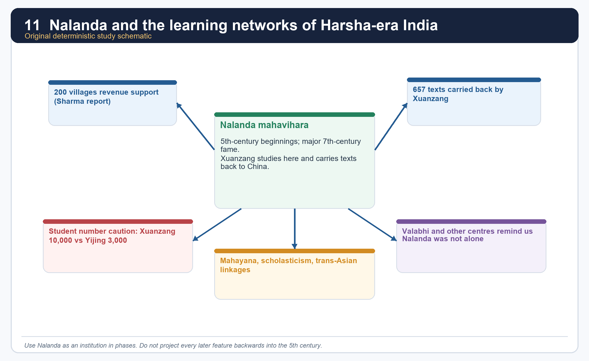

*The numbers in the image are comparative teaching aids, not a claim of exact campus census.*

#### Core teaching / solved practice

- [FACT] Sharma says Nalanda was the most famous Buddhist centre in the time of the Chinese pilgrim and that it was supported by revenues from 200 villages.
- [FACT] Sharma also notes the famous claim of 10,000 students, all monks, but uses archaeology and Yijing's later figure of 3,000 monks to question the literal magnitude.
- [FACT] Upinder records Xuanzang's long scholarly journey, his departure from China in 627 CE, his return in 645 CE and the transport of 657 Buddhist texts back to China.
- [FACT] Upinder also points to Valabhi as another important centre in the wider scholastic world.
- [ANALYSIS] Nalanda therefore teaches three exam lessons at once: institutional scale, agrarian support base and trans-Asian intellectual movement.
- [LIMIT] Do not project all later Buddhist institutional features backward into Harsha's precise moment, and do not repeat the 10,000 figure uncritically.

#### Must-know facts

- Nalanda's support base was agrarian as well as scholastic.
- Xuanzang's journey made India-China intellectual exchange visible.
- Student numbers require caution.

#### UPSC traps

- **Wrong:** Nalanda was already identical in the 5th and 7th centuries. **Correct:** institutional development was cumulative.
- **Wrong:** One giant student number is more important than the support structure. **Correct:** the 200-village support claim is equally revealing.

**Mains angle:** Nalanda is the best example for linking agrarian surplus, royal patronage and intellectual prestige.

**Study link:** Topic 10 on Buddhism; Section 17 on religious patronage.

#### CLOSING RECALL FLOW — NALANDA, LEARNING NETWORKS AND THE SCALE PROBLEM

```text
START / CONCEPT: Nalanda, learning networks and the scale problem
        |
        v
EXACT TERMS: Nalanda · learning networks · the scale problem · Mains angle · Study link · 627 CE
        |
        v
MECHANISM / ARGUMENT: Sharma says Nalanda was the most famous Buddhist centre in the time of the Chinese pilgrim and that it was supported by revenues from 200 villages.
        |
        v
CONSEQUENCE / CONTRAST: Sharma also notes the famous claim of 10,000 students, all monks, but uses archaeology and Yijing's later figure of 3,000 monks to question the literal magnitude.
        |
        v
UPSC TRAP / ANSWER-USE: Do not project all later Buddhist institutional features backward into Harsha's precise moment, and do not repeat the 10,000 figure uncritically.
        |
        v
ANSWER-GRABBING FORMULATION: Nalanda is central to Harsha's age, but it must be dated carefully.
```
### SESSION 20 — LITERATURE, COURT CULTURE AND AUTHORSHIP CAUTION

#### DEFINITION / WHAT THIS IS CALLED

**Plain-language definition:** Court association is meaningful, but ancient authorship traditions are not modern publication contracts.

**Technical definition:** Technically, Literature, court culture and authorship caution is analysed by relating Literature to court culture, then testing the relationship through authorship caution and Mains angle.

#### ANSWER-GRABBING OPENING — WRITE/ADAPT IN THE EXAM

> Court association is meaningful, but ancient authorship traditions are not modern publication contracts.

#### MUST-WRITE KEYWORDS

- **Literature**
- **court culture**
- **authorship caution**
- **Mains angle**
- **Study link**
- **Harsha's age**

**How to use them:** Frame the answer through Literature; define court culture, connect authorship caution with Mains angle to explain the mechanism, and use Study link for the decisive comparison or qualification.

[FACT] Harsha's age is rich in literary association: Bana's *Harshacharita* and *Kadambari*; Harsha's attributed plays *Ratnavali*, *Priyadarshika* and *Nagananda*; and the courtly association of writers such as Bana, Mayura and Matanga Divakara.

#### Core teaching / solved practice

- [FACT] Upinder says Harsha was a patron of learning and arts and that he may himself have composed the text of the Banskhera and Madhuban inscriptions; the Banskhera charter carries the king's signature and reflects calligraphic skill.
- [FACT] Upinder also reports the literary tradition that Harsha wrote three dramas, a work on grammar and at least two sutra works.
- [ANALYSIS] The correct exam posture is respect plus caution. Court association is meaningful, but ancient authorship traditions are not modern publication contracts.
- [FACT] Sharma also preserves the image of Harsha as a literary ruler and generous patron.
- [LIMIT] Do not write as if every attributed text and every court association is equally certain. The safer phrase is "texts attributed to Harsha" or "the courtly tradition associates Harsha with..."

#### Must-know facts

- Bana is both source and stylistic monument.
- Harsha's literary aura is part of kingship, not only cultural trivia.
- Authorship caution is essential.

#### UPSC traps

- **Wrong:** Treat attributed plays as unquestioned autograph manuscripts of the king. **Correct:** state the attribution carefully.
- **Wrong:** Separate culture from politics. **Correct:** court literature is political communication too.

**Mains angle:** The court is a cultural machine: inscription, drama, biography and patronage reinforce kingship.

**Study link:** Section 21 on source criticism.

#### CLOSING RECALL FLOW — LITERATURE, COURT CULTURE AND AUTHORSHIP CAUTION

```text
START / CONCEPT: Literature, court culture and authorship caution
        |
        v
EXACT TERMS: Literature · court culture · authorship caution · Mains angle · Study link · Harsha's age
        |
        v
MECHANISM / ARGUMENT: Correct: court literature is political communication too.
        |
        v
CONSEQUENCE / CONTRAST: Do not write as if every attributed text and every court association is equally certain.
        |
        v
UPSC TRAP / ANSWER-USE: Harsha's literary aura is part of kingship, not only cultural trivia.
        |
        v
ANSWER-GRABBING FORMULATION: Court association is meaningful, but ancient authorship traditions are not modern publication contracts.
```
### SESSION 21 — READING HARSHA'S AGE CRITICALLY: BANA, XUANZANG, INSCRIPTIONS AND AIHOLE TOGETHER

#### DEFINITION / WHAT THIS IS CALLED

**Plain-language definition:** Bana and Xuanzang are not to be rejected; they are to be triangulated.

**Technical definition:** Technically, Reading Harsha's age critically: Bana, Xuanzang, inscriptions and Aihole together is analysed by relating Reading Harsha's age critically to Bana, then testing the relationship through Xuanzang and inscriptions.

#### ANSWER-GRABBING OPENING — WRITE/ADAPT IN THE EXAM

> Bana and Xuanzang are not to be rejected; they are to be triangulated.

#### MUST-WRITE KEYWORDS

- **Reading Harsha's age critically**
- **Bana**
- **Xuanzang**
- **inscriptions**
- **Aihole together**
- **Mains angle**

**How to use them:** Frame the answer through Reading Harsha's age critically; define Bana, connect Xuanzang with inscriptions to explain the mechanism, and use Aihole together for the decisive comparison or qualification.

[FACT] This topic is one of the clearest UPSC training grounds for source criticism. Bana, Xuanzang, the Banskhera-Madhuban charters and the Aihole inscription illuminate the same world from different angles.

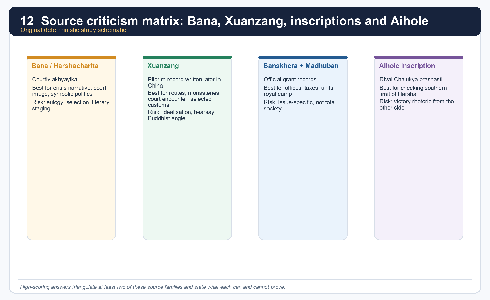

*The matrix is meant to be used directly in answer writing.*

#### Comparison matrix

| Source | Best for | Main problem | Safe use formula |
|---|---|---|---|
| *Harshacharita* | accession crisis, courtly ideals, symbolic politics | praise, selective narration, literary design | "Bana suggests..." |
| Xuanzang | routes, monasteries, royal encounter, selected customs | Buddhist agenda, later composition, occasional hearsay | "Xuanzang reports..." |
| Banskhera/Madhuban | offices, dues, administrative vocabulary, grant context | narrow documentary purpose | "inscriptions indicate..." |
| Aihole | Pulakeshin's memory of checking Harsha | rival victory rhetoric | "Aihole provides the crucial southern counter-evidence..." |

#### Core teaching / solved practice

- [FACT] Upinder explicitly asks the historian to keep authors' perspective, purpose and audience in mind.
- [FACT] She notes that Xuanzang wrote after returning to China, for a Tang imperial and monastic audience, and that not every place he described was necessarily personally visited.
- [FACT] She also stresses the literary-aesthetic structure of Bana's biography and the possibility of symbolic reading in the Rajyashri episode.
- [ANALYSIS] The payoff is large: once source criticism is built in, Harsha's age becomes richer, not poorer. One can see statecraft, ideology, ritual and historical memory operating together.
- [LIMIT] A weak answer strips isolated facts from these texts and treats them as flat data. A strong answer states who is speaking and why.

#### Must-know facts

- Source criticism is itself examinable content.
- Bana and Xuanzang are not to be rejected; they are to be triangulated.
- Aihole is the indispensable rival voice.

#### UPSC traps

- **Wrong:** Bana is useless because he flatters. **Correct:** Bana is usable when genre is acknowledged.
- **Wrong:** Xuanzang visited and verified every single place he wrote about. **Correct:** hearsay and earlier descriptions matter in parts of his account.

**Mains angle:** The best answer on Harsha almost always improves when it contains one sentence on genre and perspective.

**Study link:** Topic 02 sources; Topic 01 historiography.

#### CLOSING RECALL FLOW — READING HARSHA'S AGE CRITICALLY: BANA, XUANZANG, INSCRIPTIONS AND AIHOLE TOGETHER

```text
START / CONCEPT: Reading Harsha's age critically: Bana, Xuanzang, inscriptions and Aihole together
        |
        v
EXACT TERMS: Reading Harsha's age critically · Bana · Xuanzang · inscriptions · Aihole together · Mains angle
        |
        v
MECHANISM / ARGUMENT: Wrong: Bana is useless because he flatters.
        |
        v
CONSEQUENCE / CONTRAST: She notes that Xuanzang wrote after returning to China, for a Tang imperial and monastic audience, and that not every place he described was necessarily personally visited.
        |
        v
UPSC TRAP / ANSWER-USE: The payoff is large: once source criticism is built in, Harsha's age becomes richer, not poorer.
        |
        v
ANSWER-GRABBING FORMULATION: Bana and Xuanzang are not to be rejected; they are to be triangulated.
```
### SESSION 22 — HISTORICAL SIGNIFICANCE: FROM GUPTA CONTRACTION TO THE EARLY MEDIEVAL ORDER

#### DEFINITION / WHAT THIS IS CALLED

**Plain-language definition:** Eastern India is one of the clearest birth-zones of the early medieval order.

**Technical definition:** Technically, Historical significance: from Gupta contraction to the early medieval order is analysed by relating Historical significance to from Gupta contraction to the early medieval order, then testing the relationship through Mains angle and Study link.

#### ANSWER-GRABBING OPENING — WRITE/ADAPT IN THE EXAM

> Eastern India is one of the clearest birth-zones of the early medieval order.

#### MUST-WRITE KEYWORDS

- **Historical significance**
- **from Gupta contraction to the early medieval order**
- **Mains angle**
- **Study link**
- **Topic**
- **648 CE**

**How to use them:** Frame the answer through Historical significance; define from Gupta contraction to the early medieval order, connect Mains angle with Study link to explain the mechanism, and use Topic for the decisive comparison or qualification.

[FACT] Topic 26 already gives the historiographical debate. Topic 22 supplies one of its best historical laboratories. Sharma reads the period through land grants, declining old centres, military camps, growing landed intermediaries and the rise of Kannauj; later regional-state interpretations stress proliferation of new polities, agrarian expansion and cultural integration.

#### Core teaching / solved practice

- [FACT] Harsha gave a measure of political unity to a large part of north India, but not to the Deccan or the whole subcontinent.
- [FACT] Eastern India saw the spread of writing, Sanskrit, grants, districts, new states, military camps and expanding cultivation in precisely this period.
- [ANALYSIS] That means the post-Gupta age is both a contraction and a creation: contraction of one imperial centre, creation of many regional state societies.
- [ANALYSIS] The stronger answer therefore combines Sharma's structural sharpness with Upinder's wider regional-state model. It neither erases urban decline tendencies nor calls the period a dark age.
- [FACT] Harsha's death in 648 CE is followed by political turbulence and later the struggle for Kannauj among powers such as the Palas, Pratiharas and Rashtrakutas.
- [LIMIT] Pala rise belongs to the next large phase, but the route to it runs through Topic 22's eastern and Kannauj transitions.

#### Must-know facts

- Harsha is a major but bounded hegemon.
- Eastern India is one of the clearest birth-zones of the early medieval order.
- The best label is regional reorganisation.

#### UPSC traps

- **Wrong:** Medieval India begins only with later invasions. **Correct:** many social-political transitions are already underway here.
- **Wrong:** Post-Gupta equals only decline. **Correct:** it is decline in some earlier forms and growth in new regional forms.

**Mains angle:** The sentence to remember is: "The age was neither a blank dark interlude nor a restored pan-Indian empire; it was a phase of regional reorganisation anchored in land, legitimacy and new political centres."

**Study link:** Topic 26 in full.

#### CLOSING RECALL FLOW — HISTORICAL SIGNIFICANCE: FROM GUPTA CONTRACTION TO THE EARLY MEDIEVAL ORDER

```text
START / CONCEPT: Historical significance: from Gupta contraction to the early medieval order
        |
        v
EXACT TERMS: Historical significance · from Gupta contraction to the early medieval order · Mains angle · Study link · Topic · 648 CE
        |
        v
MECHANISM / ARGUMENT: Harsha's death in 648 CE is followed by political turbulence and later the struggle for Kannauj among powers such as the Palas, Pratiharas and Rashtrakutas.
        |
        v
CONSEQUENCE / CONTRAST: Harsha gave a measure of political unity to a large part of north India, but not to the Deccan or the whole subcontinent.
        |
        v
UPSC TRAP / ANSWER-USE: Harsha is a major but bounded hegemon.
        |
        v
ANSWER-GRABBING FORMULATION: Eastern India is one of the clearest birth-zones of the early medieval order.
```
### 23. UPSC answer architecture, owner boundaries and memory map

[FACT] Topic 22 sits between Topic 20 (Gupta polity), Topic 21 (Gupta society/culture), Topic 23 (Pallava-Chalukya south) and Topic 26 (full ancient-to-medieval debate). A high-scoring answer uses this package to bridge them without duplication.

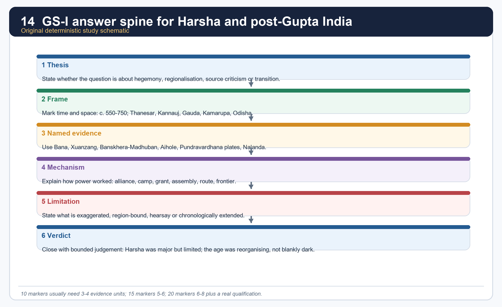

*This answer spine is deliberately compact so it can be recalled in the exam hall.*

#### Core teaching / solved practice

- [ANALYSIS] For 10 marks: 3-4 evidence units are enough if they are precise - for example Bana, Xuanzang, Aihole and Nalanda.
- [ANALYSIS] For 15 marks: use 5-6 units and organise them under sub-headings such as political landscape, Harsha's limits, eastern transition and source criticism.
- [ANALYSIS] For 20 marks: move from crisis to state structure to regionalisation to historiography, and end with a bounded verdict rather than a slogan.
- [FACT] PYQ memory anchors owned or routed here: 2020 GS-I Q2 on Pala Buddhism; 2020 Prelims Q24 chronology of Pratihara-Pallava-Chola-Pala; 2020 Prelims Q97 historical places; 2021 Prelims Q34 kingdoms after Gupta decline.
- [FACT] Owner boundary: Pulakeshin's southern polity is elaborated in Topic 23; Gupta administrative deep background in Topic 20; social-culture background in Topic 21; extended feudal-regional debate in Topic 26.

#### Must-know facts

- Named evidence must lead every answer.
- Harsha's age is a source-criticism gift.
- Kannauj plus the east plus the Narmada limit is the memory triangle.

#### UPSC traps

- **Wrong:** Write only ruler biography. **Correct:** integrate structure, region and source method.
- **Wrong:** Borrow all southern detail into this topic. **Correct:** keep Topic 23 as the owner of the Deccan and Pallava-Chalukya depth.

**Mains angle:** The best opening line usually combines period, process and boundary: "In the century after Gupta concentration weakened, Harsha briefly reunited much of north India while eastern India moved rapidly into regional state formation."

**Study link:** entire package.

### SESSION 23 — BOUNDED LIVE LINKAGE

#### DEFINITION / WHAT THIS IS CALLED

**Plain-language definition:** They are used only for present conservation, manuscript access and evidence-method linkages; they do not alter the post-Gupta chronology.

**Technical definition:** Technically, Bounded live linkage is analysed by relating UNESCO's Nalanda Mahavihara to Ministry, then testing the relationship through Culture's and They.

#### ANSWER-GRABBING OPENING — WRITE/ADAPT IN THE EXAM

> They are used only for present conservation, manuscript access and evidence-method linkages; they do not alter the post-Gupta chronology.

#### MUST-WRITE KEYWORDS

- **Bounded live linkage**
- **UNESCO's Nalanda Mahavihara**
- **Ministry**
- **Culture's**
- **They**
- **Gupta**

**How to use them:** Frame the answer through Bounded live linkage; define UNESCO's Nalanda Mahavihara, connect Ministry with Culture's to explain the mechanism, and use They for the decisive comparison or qualification.

UNESCO's Nalanda Mahavihara record and the Ministry of Culture's 2026 heritage-technology update were rechecked on 30 August 2026. They are used only for present conservation, manuscript access and evidence-method linkages; they do not alter the post-Gupta chronology.

This linkage does not override repository chronology, OCR-searchable book evidence, verified PYQ routing or the source limitations printed throughout.

#### CLOSING RECALL FLOW — BOUNDED LIVE LINKAGE

```text
START / CONCEPT: Bounded live linkage
        |
        v
EXACT TERMS: Bounded live linkage · UNESCO's Nalanda Mahavihara · Ministry · Culture's · They · Gupta
        |
        v
MECHANISM / ARGUMENT: UNESCO's Nalanda Mahavihara record and the Ministry of Culture's 2026 heritage-technology update were rechecked on 30 August 2026.
        |
        v
CONSEQUENCE / CONTRAST: This linkage does not override repository chronology, OCR-searchable book evidence, verified PYQ routing or the source limitations printed throughout.
        |
        v
UPSC TRAP / ANSWER-USE: Do not miss this limiting distinction: they are used only for present conservation, manuscript access and evidence-method linkages.
        |
        v
ANSWER-GRABBING FORMULATION: They are used only for present conservation, manuscript access and evidence-method linkages; they do not alter the post-Gupta chronology.
```
## BASIC MCQS / REMEDIATION

### Learning MCQ 01

Which source most directly narrates the crisis involving Rajyashri, Grahavarman and Rajyavardhana?

- A. Bana's *Harshacharita*
- B. Hathigumpha inscription
- C. Junagadh inscription
- D. *Arthashastra*

**Answer: A.** Bana is the primary narrative source for Harsha's accession crisis, though it remains literary and court-centred.

### Learning MCQ 02

The rise of Kannauj in Harsha's age is best explained by which combination?

- A. direct Mauryan continuity without interruption
- B. Maukhari connection, strategic doab location and a more camp-oriented political order
- C. Buddhist monastic control of all taxation
- D. maritime trade and Roman coin hoards alone

**Answer: B.** Sharma's argument and the Maukhari link together make Kannauj a strategic-political successor centre.

### Learning MCQ 03

The safest use of the Aihole inscription in Topic 22 is to treat it as:

- A. proof that Harsha ruled Karnataka
- B. a Buddhist monastic record of the Narmada battle
- C. rival Chalukya evidence checking Harsha's southern claims
- D. a neutral chronicle of Harsha's reign

**Answer: C.** Aihole is a royal eulogy from the other side, which is exactly why it is valuable.

### Learning MCQ 04

Which cluster of fiscal terms continues into Harsha's inscriptional vocabulary?

- A. vishti, bhatta, tulamana, shulka
- B. uparika, vithi, dronavapa, kulyavapa
- C. bhoga, setu, panya, karshapana
- D. bhaga, bhoga, kara and hiranya

**Answer: D.** Upinder explicitly notes these older revenue terms in Harsha's records.

### Learning MCQ 05

Which statement about Kamarupa is the safest?

- A. It was already visible from Samudragupta's time and became a major eastern state by Bhaskaravarman's age.
- B. It was a direct Chalukya province.
- C. It was simply a district of Gauda.
- D. It first appears only after Harsha's death.

**Answer: A.** Both earlier frontier listing and later 7th-century expansion matter.

### Learning MCQ 06

Rajyashri's marriage linked the Pushyabhutis to which dynasty?

- A. Nalas
- B. Maukharis
- C. Maitrakas
- D. Pandyas

**Answer: B.** The Maukhari link explains how Kannauj enters Harsha's political horizon.

### Learning MCQ 07

Which statement best captures Shashanka's place in this topic?

- A. He was Harsha's confirmed feudatory throughout.
- B. He was a minor hill chief without wider role.
- C. He was the ruler of Gauda and a major eastern rival in Harsha's rise.
- D. He was only a literary villain invented by Bana.

**Answer: C.** Shashanka has both narrative and regional-political significance.

### Learning MCQ 08

What is the safest way to handle Xuanzang's famous numbers for Nalanda?

- A. Treat the claim as proof of Gupta-period origins only.
- B. Accept them as exact because they come from a pilgrim.
- C. Reject Nalanda's importance completely because archaeology is incomplete.
- D. Use the fame of the institution, but qualify the 10,000 figure through archaeology and Yijing's smaller number.

**Answer: D.** Institutional significance is secure; exact magnitude is not.

### Learning MCQ 09

Which period label is the best fit for Topic 22?

- A. c. AD 550-750 as a bridge from Gupta contraction to early medieval regionalisation
- B. c. AD 1200-1526
- C. only the single year 606 CE
- D. c. AD 200 BCE-AD 200 only

**Answer: A.** The topic owns the transition zone, not only Harsha's accession year.

### Learning MCQ 10

Which territorial description is safest for Harsha's direct core?

- A. only Thanesar and nothing more
- B. Haryana and adjacent north-west core plus Maukhari UP-Bihar, with probable extension into Odisha
- C. Kashmir, Sindh and all of Gujarat as provinces
- D. all of peninsular India south to Kanchi

**Answer: B.** This is the most evidence-bound summary from Upinder's reconstruction.

### Learning MCQ 11

Eastern land grants in Topic 22 are most useful for understanding:

- A. only coin minting formulas
- B. only temple sculpture styles
- C. agrarian expansion, local administration and new landed rights
- D. only abstract religious merit

**Answer: C.** The charters are social-economic and political evidence as much as religious records.

### Learning MCQ 12

At the Prayaga assembly, Harsha is described as worshipping which sequence on successive days?

- A. Surya, Agni and Buddha
- B. Shiva, Vishnu and Surya
- C. Buddha, Vishnu and Ganga
- D. Buddha, Shiva and the Sun

**Answer: D.** The sequence matters because it illustrates multi-sect royal theatre.

### Learning MCQ 13

The Banskhera inscription is especially memorable because it:

- A. preserves Harsha's signature and possibly his own inscriptional drafting hand
- B. is Ravikirti's Chalukya poem
- C. gives the exact official key to a Prelims question
- D. announces the conquest of Sri Lanka

**Answer: A.** It is one of the best personal-courtly touches in Harsha's epigraphic record.

### Learning MCQ 14

Which statement does Sharma's capital-shift thesis NOT justify?

- A. Pataliputra lost earlier centrality.
- B. Every Indian town collapsed uniformly in the 7th century.
- C. Land-grant politics changed state geography.
- D. Kannauj's doab position mattered strategically.

**Answer: B.** The thesis is broad and structural, not a license for total-uniform decline.

### Learning MCQ 15

Xuanzang is best used as:

- A. a Chalukya court poet
- B. an unproblematic secular administrator
- C. a valuable but situated Buddhist pilgrim-source written for a Chinese audience
- D. a modern census officer

**Answer: C.** His value grows when audience, purpose and hearsay are acknowledged.

### Learning MCQ 16

What follows most safely from Shashanka's death in c. 637?

- A. instant permanent Harsha rule over the whole east
- B. automatic Pala monarchy
- C. total disappearance of eastern politics
- D. a prolonged phase of confusion and competing powers before later consolidation

**Answer: D.** Upinder explicitly places over a century of turbulence after Shashanka before the Pala resolution.


> Objective answers without local official keys are labelled inferred or route-based. This is deliberate and mandatory.

### Workbook MCQ 01

Which line belongs squarely to the immediate post-Gupta north Indian field?

- A. Later Guptas
- B. Ikshvakus
- C. Kushanas
- D. Satavahanas

**Answer: A.** Later Guptas are part of the directly relevant north Indian matrix after the imperial Gupta phase.

### Workbook MCQ 02

The Maukharis are most closely tied in Topic 22 to:

- A. Badami
- B. Kannauj
- C. Amaravati
- D. Korkai

**Answer: B.** Kannauj is the key Maukhari centre that later becomes central to Harsha's order.

### Workbook MCQ 03

Rajyashri's husband was:

- A. Gopala
- B. Bhaskaravarman
- C. Grahavarman
- D. Pulakeshin II

**Answer: C.** Grahavarman, the Maukhari ruler, is the crucial marriage link in the accession crisis.

### Workbook MCQ 04

The most accurate statement about Harsha's capital shift is:

- A. He made Valabhi his capital.
- B. He never moved beyond Thanesar.
- C. He ruled permanently from Pataliputra.
- D. He moved the effective centre from Thanesar to Kannauj at some stage of his reign.

**Answer: D.** Kannauj becomes the signature centre of Harsha's mature political order.

### Workbook MCQ 05

The Narmada in Topic 22 is primarily remembered as:

- A. the line where Pulakeshin II checked Harsha
- B. the location of Nalanda
- C. the core river of Kamarupa
- D. Harsha's southernmost province

**Answer: A.** It marks the remembered frontier of Harsha's southern limit.

### Workbook MCQ 06

Which source pairing reconstructs Harsha's world most directly?

- A. Sangam poems and *Arthashastra*
- B. *Harshacharita* and Xuanzang
- C. Ashokan edicts and *Periplus*
- D. *Rajatarangini* and *Ain-i-Akbari*

**Answer: B.** These are the two classic narrative anchors, supplemented by inscriptions.

### Workbook MCQ 07

Banskhera and Madhuban inscriptions are most useful for studying:

- A. Chola naval expeditions
- B. Harappan drainage
- C. offices, dues and grant procedure under Harsha
- D. Satavahana cave donations

**Answer: C.** They are the documentary core for Harsha's state structure.

### Workbook MCQ 08

What is the safest reading of Harsha's huge army figures in Sharma?

- A. Proof that Harsha ruled the whole south
- B. Exact standing-strength census
- C. Pure fiction with no historical value
- D. Likely inclusion of feudatory contingents and rhetorical inflation

**Answer: D.** The numbers are best treated critically, not literally.

### Workbook MCQ 09

Shashanka was ruler of:

- A. Gauda
- B. Kamarupa
- C. Malava only
- D. Valabhi

**Answer: A.** Gauda under Shashanka is one of the core eastern markers of the period.

### Workbook MCQ 10

Kamarupa corresponds most closely to:

- A. Saurashtra coast
- B. the Brahmaputra basin and adjoining Assam region
- C. central Rajasthan
- D. lower Godavari delta

**Answer: B.** It is the major north-eastern polity of the age.

### Workbook MCQ 11

Which polity in Topic 22 provides the major western comparator to Harsha's north Indian core?

- A. Pandyas
- B. Kakatiyas
- C. Maitrakas of Valabhi
- D. Cholas

**Answer: C.** Valabhi matters as a western political node, not as Harsha's settled province.

### Workbook MCQ 12

Which city becomes a wider sovereignty symbol after Harsha, especially in later north Indian struggles?

- A. Kanchi
- B. Ujjain
- C. Pataliputra
- D. Kannauj

**Answer: D.** Control over Kannauj becomes a hallmark of later early medieval power politics.

### Workbook MCQ 13

The Pundravardhanabhukti land-sale records often describe endowed land as:

- A. fallow or uncultivated before settlement
- B. sea-borne customs territory only
- C. military cantonment alone
- D. purely temple-owned from time immemorial

**Answer: A.** That point is central to Sharma's agrarian-expansion reading.

### Workbook MCQ 14

The mention of *dinaras* in Bengal charters mainly shows that:

- A. the area was outside all fiscal administration
- B. land could be purchased with gold coin in some eastern transactions
- C. only cowries were used
- D. all taxes had vanished

**Answer: B.** The plates show coin purchase and then tax-remitted religious endowment.

### Workbook MCQ 15

Which statement best captures the role of grants in the east?

- A. They were only anti-peasant instruments.
- B. They ended all community authority instantly.
- C. They could aid cultivation and literacy while also strengthening intermediaries.
- D. They mattered only ritually.

**Answer: C.** The strongest answer is dual, not one-sided.

### Workbook MCQ 16

The repeated mention of victory or military camps with horses, elephants and boats in Bengal suggests:

- A. Mauryan continuity in identical form
- B. a stateless forest society
- C. only literary imagination
- D. organised taxation, warfare and administration in regional states

**Answer: D.** This is one of Sharma's clearest signs of state formation in Bengal.

### Workbook MCQ 17

Which ruler becomes especially important in the east after Shashanka's death?

- A. Bhaskaravarman
- B. Kanishka
- C. Pushyamitra
- D. Bimbisara

**Answer: A.** Bhaskaravarman's Kamarupa is central to the post-Shashanka eastern field.

### Workbook MCQ 18

Why must Xuanzang be read with audience and purpose in mind?

- A. Because he wrote only about South India
- B. Because he wrote for a Tang imperial-monastic audience and could idealise or rely on hearsay
- C. Because he never studied Buddhism
- D. Because he was Harsha's court poet

**Answer: B.** Upinder makes this one of the key source-method lessons.

### Workbook MCQ 19

The best generic label for *Harshacharita* is:

- A. copper-plate charter
- B. neutral district gazetteer
- C. courtly biography or akhyayika
- D. maritime trade manual

**Answer: C.** It is literary, political and historically valuable at the same time.

### Workbook MCQ 20

Which statement on Harsha's religious profile is safest?

- A. He was only a Shaiva monarch with no Buddhist link.
- B. He was only a Buddhist king with no Shaiva link.
- C. He was secular in the modern constitutional sense.
- D. He appears Shaiva in inscriptions and Bana, but Buddhist-leaning in Xuanzang, with ecumenical public ritual.

**Answer: D.** That is the most evidence-balanced formulation.

### Workbook MCQ 21

What is the safest statement on Nalanda in Topic 22?

- A. It developed over time but had major 7th-century prestige linked with Xuanzang.
- B. It had no agrarian support base.
- C. It was already the same institution in every century from its origin onward.
- D. It belonged only to the Gupta topic and not to Harsha's age.

**Answer: A.** Nalanda must be phased historically, not frozen into one static picture.

### Workbook MCQ 22

Valabhi functions in Topic 22 primarily as:

- A. Harsha's Deccan capital
- B. a western polity and wider learning centre in the larger cultural-political field
- C. the site of Aihole inscription
- D. a Sangam port

**Answer: B.** Its value here is comparative and networked, not merely local.

### Workbook MCQ 23

Which title or office appears in Harsha's administrative context?

- A. amatyaputra of Megasthenes
- B. adhyaksha of the Mauryan type only
- C. sarva-palli-pati
- D. gopa

**Answer: C.** Upinder explicitly notes the official called sarva-palli-pati.

### Workbook MCQ 24

Which later development most clearly shows that Harsha's death did not produce a stable successor empire?

- A. Hoysala expansion
- B. Mauryan restoration
- C. Satavahana resurgence
- D. later struggle for Kannauj among major regional powers

**Answer: D.** The later contest for Kannauj proves the open-endedness of the post-Harsha field.

### Workbook MCQ 25

Which claim about Rajyashri should be avoided?

- A. One elite crisis narrative proves the social status of all women in the age.
- B. Her rescue matters in Bana's design of Harsha's rise.
- C. Her marriage mattered politically.
- D. The episode is source-sensitive.

**Answer: A.** That is the classic overgeneralisation trap.

### Workbook MCQ 26

Sharma's explanation of Kannauj's rise is best captured by which statement?

- A. It replaced all eastern states completely.
- B. It fit a strategic doab-centred and more camp-oriented political order.
- C. It was a purely sacred city without military role.
- D. It rose only because Roman trade shifted there.

**Answer: B.** Strategic location plus changing state structure is the key.

### Workbook MCQ 27

Which source most directly checks Harsha's southward imperial image?

- A. *Nagananda*
- B. Banskhera inscription
- C. Aihole inscription
- D. Pundravardhanabhukti plates

**Answer: C.** Aihole is the rival prashasti that matters most for the Narmada frontier.

### Workbook MCQ 28

Which tax sequence belongs to the Harsha-age inscriptional vocabulary discussed in this package?

- A. bhatta, vishti, setu
- B. tulamana, dronavapa, kulyavapa
- C. shreni, nigama, nagara
- D. bhaga, bhoga, kara, hiranya

**Answer: D.** This is the secure cluster noted in Upinder's summary.

### Workbook MCQ 29

Early Pushyabhuti rulers are linked in inscriptional memory with the worship of:

- A. Surya
- B. only Ganga
- C. only Krishna
- D. only Skanda

**Answer: A.** Upinder explicitly notes early Pushyabhuti solar association.

### Workbook MCQ 30

Why is eastern India especially significant in this topic?

- A. It proves Harsha ruled Assam directly as a province.
- B. It shows the integration of new agrarian-literate state societies into the mainstream historical record.
- C. It eliminates the need to study land grants.
- D. It adds a decorative regional appendix.

**Answer: B.** Eastern integration is one of the deepest historical processes in Topic 22.

### Workbook MCQ 31

Which statement on urban decline is safest?

- A. Every town vanished after the Guptas.
- B. Urban history becomes irrelevant after 550 CE.
- C. Some earlier centres lost weight, but regional states, coins, monasteries and strategic capitals show uneven transformation rather than total collapse.
- D. No change occurred in any urban centre.

**Answer: C.** The best answer is nuanced and indicator-based.

### Workbook MCQ 32

Which figure below is NOT a direct courtly or textual association of Harsha's age in this topic?

- A. Mayura
- B. Matanga Divakara
- C. Bana
- D. Kalidasa

**Answer: D.** Kalidasa belongs to the Gupta classical world, not Harsha's own courtly package.

### Workbook MCQ 33

What immediately followed Prabhakaravardhana's death in Bana's sequence?

- A. Rajyavardhana's accession amid crisis
- B. Gopala's election in Bengal
- C. Harsha's conquest of the Deccan
- D. Xuanzang's return to China

**Answer: A.** The accession crisis begins before Harsha himself takes power.

### Workbook MCQ 34

The phrase that best captures Harsha's rule is:

- A. total pan-Indian empire on the Mauryan model
- B. north Indian hegemon with layered allegiances and a bounded frontier
- C. purely symbolic kingship without territorial core
- D. only a monastery-state

**Answer: B.** That description holds direct rule, influence and limit together.

### Workbook MCQ 35

Which reading of the Prayaga assembly is strongest?

- A. It was only a revenue audit.
- B. It had no political dimension.
- C. It fused royal charity, multi-sect display and the public ranking of subordinate powers.
- D. It was only a private devotional retreat.

**Answer: C.** This is the most UPSC-useful interpretation.

### Workbook MCQ 36

Which process is clearly documented in eastern charters of this age?

- A. elimination of Sanskrit
- B. abolition of all land rights
- C. disappearance of districts
- D. grants, fiscal units, Sanskrit charters and settlement expansion

**Answer: D.** That is the core eastern process package.

### Workbook MCQ 37

Which statement about Bhaskaravarman is the safest?

- A. He was a major 7th-century Kamarupa ruler whose rise shaped the eastern field after Shashanka.
- B. He was the author of *Harshacharita*.
- C. He founded the Gupta era.
- D. He was a Chalukya subordinate.

**Answer: A.** This is the securely useful level of formulation.

### Workbook MCQ 38

Which historiographical pairing gives the best balanced answer to Topic 22?

- A. only a traveller's narrative
- B. Sharma's structural model plus later regional-state corrections
- C. only colonial dismissal
- D. pure nationalist triumphalism and nothing else

**Answer: B.** The package's final synthesis depends on this balance.

### Workbook MCQ 39

Which question-type most strongly requires explicit source criticism?

- A. List Harsha's plays only.
- B. Name one eastern state only.
- C. Evaluate Xuanzang and Bana as sources for Harsha's age.
- D. Match one place with one river only.

**Answer: C.** This demand fails without discussion of genre, audience and bias.

### Workbook MCQ 40

Pala Buddhism fits Topic 22 mainly because:

- A. it belongs to the Mauryan age
- B. it has no relation to eastern India
- C. it replaces all Gupta history
- D. the eastern transition after Shashanka eventually culminates in major Buddhist-political consolidation under the Palas

**Answer: D.** The workbook includes it as the east's longer arc, not because Topic 22 is secretly a Pala topic.

### Remedial MCQ 01 - Harsha and all-India empire

Which correction is the most defensible?

- A. Harsha was a major north Indian hegemon, but the Deccan remained outside stable control and peripheral regions require graded language.
- B. Harsha's empire was identical to Ashoka's.
- C. Harsha had no military role at all.
- D. Harsha ruled only one district around Thanesar.

**Answer: A.** This correction is bounded, evidence-led and avoids both exaggeration and trivialisation. **Why this earns marks:** the correction restores direct core, peripheral influence and frontier limit in one sentence.

### Remedial MCQ 02 - Bana as source

What is the correct correction to the statement "Banabhatta is a neutral historian"?

- A. Bana wrote only legal charters.
- B. Bana is a court poet and literary biographer whose work is indispensable but eulogistic and selective.
- C. Bana never wrote about Harsha.
- D. Bana is identical with Xuanzang.

**Answer: B.** That is the exact source-method posture required in this topic. **Why this earns marks:** it keeps the source usable while preventing naive literalism.

### Remedial MCQ 03 - Meaning of land grants

Which correction best repairs the claim "Land grants were only religious charity"?

- A. They had no effect on society.
- B. They abolished kingship.
- C. They also expanded cultivation, redistributed fiscal rights and strengthened local intermediaries.
- D. They mattered only to monks.

**Answer: C.** Grants are political and agrarian technology, not only pious gesture. **Why this earns marks:** it gives both sides of the process and avoids ideological simplification.

### Remedial MCQ 04 - Nalanda numbers

How should the famous Nalanda numbers be handled?

- A. Use only archaeology and ignore texts.
- B. Accept 10,000 as exact because it sounds grand.
- C. Reject every traveller statement automatically.
- D. Accept Nalanda's fame, but qualify the 10,000 figure through archaeology and Yijing's smaller number.

**Answer: D.** This is the most honest and historically mature answer. **Why this earns marks:** it preserves institutional significance while controlling numerical overclaim.

### Remedial MCQ 05 - Dark age language

Which correction best repairs the phrase "Post-Gupta age was a dark age"?

- A. Better to describe it as regional reorganisation with uneven urban decline, agrarian expansion and new state formation.
- B. Better to call it timeless stagnation.
- C. Better to treat Harsha as a global emperor.
- D. Better to erase all conflict and change.

**Answer: A.** The package's final verdict is exactly this kind of bounded correction. **Why this earns marks:** it replaces slogan with process and respects both decline and creation.

### Remedial MCQ 06 - Why Kannauj rose

Which correction best answers the oversimplified claim "Kannauj rose because Harsha liked it"?

- A. It was chosen randomly.
- B. Its strategic doab position, fortifiability and Maukhari inheritance mattered within a changed political order.
- C. It had no relation to routes.
- D. It rose only because of Buddhism.

**Answer: B.** This restores historical causation. **Why this earns marks:** it converts personality into structure, which is exactly what UPSC rewards.

### Remedial MCQ 07 - Xuanzang's travel account

Which correction best addresses the claim "Xuanzang personally verified every place he described"?

- A. He wrote only about Sri Lanka.
- B. He never visited India.
- C. Parts of his account may depend on hearsay or earlier reports, so his text must be read through audience and genre.
- D. He was a Chalukya general.

**Answer: C.** Upinder explicitly builds this caution into the reading of the source. **Why this earns marks:** it keeps the source useful while marking its epistemic boundary.

### Remedial MCQ 08 - Eastern India's timing

Which correction best repairs the statement "Eastern India became important only in the Pala age"?

- A. It was significant only for ports.
- B. It mattered only to Chinese pilgrims.
- C. It was historically empty before 750 CE.
- D. Gupta and post-Gupta centuries already show grants, states, Sanskrit charters, military camps and agrarian expansion across Bengal, Odisha and Assam.

**Answer: D.** This is one of the deepest structural lessons of Topic 22. **Why this earns marks:** it restores the long eastern transition rather than starting history too late.

## PYQS AND ANSWER PRACTICE

### Solved topic-specific MCQs

### Verified PYQ 1 - GS-I Mains 2020 Q2 (exact wording locally preserved)

Pala period is the most significant phase in the history of Buddhism in India. Enumerate. (150 words)

**Status:** Exact wording preserved locally through the repository's verified package for Topic 10 and the 2018-2023 Mains routing ledger. This topic owns the eastern-transition bridge needed to answer it.

**Model answer:** [CLAIM] The Pala centuries were the highest late-Indian institutional phase of Buddhism, though the superlative "most significant" must be qualified against earlier Ashokan and early-sangha milestones. [EVIDENCE AND ANALYSIS] 1. The Pala world sustained the great mahavihara network of Nalanda, Vikramashila, Odantapuri and Somapura, proving concentration of scholastic institutions in eastern India. 2. Mahayana and Vajrayana thought flourished in these centres, showing doctrinal vitality rather than mere survival. 3. Teachers such as Atisha Dipankara illustrate trans-Himalayan circulation of persons and texts. 4. Pala bronze, stone and palm-leaf manuscript traditions influenced Nepal and Tibet, proving artistic and ritual transmission beyond India. 5. Royal and landed support tied Buddhism to the agrarian-political consolidation of the east after earlier post-Harsha turbulence. [LIMIT] The claim should not erase the foundational significance of early Buddhism, Ashoka or non-royal Buddhist communities. [VERDICT] The Pala phase was therefore the decisive late-classical peak of Indian Buddhism, especially in institutional, scholastic and trans-regional terms. **Why this earns marks:** It answers the directive directly, gives five named evidence units, ties them to what they prove, adds a qualification and closes with a graded verdict.

### Routed PYQ 2 - Prelims GS-I 2020 Q24 (audited demand; original paper and key not held locally)

**Locally audited demand:** chronological order involving the Pratihara, Pallava, Chola and Pala dynasties.

**Status:** Audited routed demand from the 2018-2023 Prelims ledger. Official key unavailable locally.

**Answer / route:** INFERRED ORDER FROM STANDARD CHRONOLOGY: Pallava -> Gurjara-Pratihara -> Pala -> Imperial Chola.

- Pallavas are securely earlier, with their major political arc beginning centuries before the Palas and imperial Cholas.
- Gurjara-Pratiharas emerge in the 8th century, slightly before or at the very beginning of the Pala line.
- Palas begin in the mid-8th century with Gopala.
- Imperial Cholas belong mainly from the 9th century onward.

**Why this earns marks:** It states the best-supported chronological route while clearly marking that the official 2020 key is not held locally.

### Routed PYQ 3 - Prelims GS-I 2020 Q97 (audited demand; exact options not held locally)

**Locally audited demand:** historical places Bhilsa, Dwarasamudra, Girinagar and Sthanesvara in state-dynasty matching.

**Status:** Routed demand only. Official key unavailable locally; exact option wording not held in the repository.

**Answer / route:** Use elimination through fixed pairs rather than claim an unheld option letter.

- Dwarasamudra = Hoysala centre (later medieval, not Topic 22's Harsha world).
- Sthanesvara = Thanesar, the Pushyabhuti-Harsha base.
- Girinagar = Junagadh/Girnar-Saurashtra zone in western India.
- Bhilsa = Vidisha/Malwa region in central India.

The likely official option would depend on how the paper paired these places with states or dynasties; since that sheet is not locally present, this workbook honestly stops at the concept route.

**Why this earns marks:** It gives all secure pairings while refusing to invent a missing option letter.

### Routed PYQ 4 - Prelims GS-I 2021 Q34 (audited demand; original paper and key not held locally)

**Locally audited demand:** kingdoms of northern India after Gupta decline.

**Status:** Routed demand from the 2018-2023 Prelims ledger. Official key unavailable locally.

**Answer / route:** The safe north-Indian post-Gupta cluster includes Later Guptas, Maukharis, Pushyabhutis, Maitrakas and Gauda under Shashanka. If the question mixes northern and southern houses, eliminate Pallavas, Cholas or deeper Deccan lines unless the option specifically asks for a contrast.

This is a concept-solving route, not an official-key claim.

**Why this earns marks:** It converts a missing paper into a high-quality elimination framework instead of pretending access to an unavailable official key.

### Original solved Mains 01 - Why is Harsha better described as a north Indian hegemon than a pan-Indian emperor?

**Demand and thesis (10 marks):** The answer must show both real power and hard limits.

**Model answer:** [CLAIM] Harsha was a substantial north Indian hegemon, but not a pan-Indian emperor on the Mauryan or Ashokan scale. [EVIDENCE AND ANALYSIS] 1. His direct core included Thanesar, much of Uttar Pradesh and parts of Bihar, with probable extension into Odisha after Maukhari absorption. 2. Peripheral rulers such as those of Kamarupa and Valabhi may have acknowledged his superiority, showing wide prestige. 3. The Aihole inscription records that Pulakeshin II checked him at the Narmada, proving that the Deccan lay beyond stable control. 4. Gauda under Shashanka remained a serious eastern rival, and even victory there was not permanently final. [LIMIT] Bana magnifies the ruler and Xuanzang admires him, so territorial language must be graded. [VERDICT] Harsha therefore unified much of north India but ruled through layered influence and sharp frontiers rather than all-India imperial incorporation. **Why this earns marks:** It answers the directive directly, uses four named evidence units, shows what each proves, adds a source qualification and ends with a bounded verdict.

### Original solved Mains 02 - How do land grants illuminate the spread of civilisation in eastern India between the 4th and 7th centuries?

**Demand and thesis (10 marks):** The answer must turn charters into process, not just list gifts.

**Model answer:** [CLAIM] Eastern land grants illuminate how frontier or thinly integrated regions became agrarian, literate and politically ordered state societies. [EVIDENCE AND ANALYSIS] 1. Pundravardhanabhukti plates record the purchase of fallow land with *dinaras*, then its donation for religious purposes, proving both monetised transaction and agrarian expansion. 2. Odisha charters and agraharas show the spread of Sanskrit, Brahmanical learning and new fiscal districts into fresh zones. 3. Sharma notes that scribes, merchants, landholders and even cultivators could appear in land transactions, revealing local administration and social layering. 4. The king's growing rights over waste land and revenue show that grants created new landed authority. [LIMIT] Charters privilege elite beneficiaries and do not directly narrate peasant experience in equal detail. [VERDICT] Land grants are thus key windows into eastern state formation, agrarian growth and social differentiation. **Why this earns marks:** It converts records into historical mechanism and keeps an explicit elite-source caution.

### Original solved Mains 03 - Assess the importance of Kannauj in the post-Gupta political order.

**Demand and thesis (15 marks):** The answer must move beyond city-description to political geography.

**Model answer:** [CLAIM] Kannauj became important because it embodied the changed political geography of the post-Gupta age: inheritance politics, strategic control of the doab and the prestige of a new sovereignty centre converged there. [EVIDENCE AND ANALYSIS] 1. The Maukhari connection brought Kannauj into the Pushyabhuti sphere through Rajyashri's marriage to Grahavarman. 2. Sharma argues that while Pataliputra had belonged to a trade-rich earlier imperial order, Kannauj suited a more military-camp-centred age. 3. Its middle-doab location allowed movement into eastern and western Ganga plains by land and water, making it a superior command node. 4. Harsha's move from Thanesar to Kannauj transformed the city into the main emblem of north Indian sovereignty. 5. After Harsha's death, the later struggle for Kannauj among major lineages proves that its symbolic and strategic value outlived the king himself. [LIMIT] Its rise should not be used to claim uniform urban collapse elsewhere. [VERDICT] Kannauj mattered because it crystallised the transition from older imperial geography to an early medieval politics of strategic regional capitals. **Why this earns marks:** It links alliance, geography, strategy and later significance into one argument instead of writing a flat city note.

### Original solved Mains 04 - Evaluate Xuanzang as a source for Harsha's India.

**Demand and thesis (15 marks):** The answer must balance value and bias.

**Model answer:** [CLAIM] Xuanzang is one of the most valuable sources for Harsha's India, but only when read as a Buddhist pilgrim-intellectual writing later in China for a specific audience. [EVIDENCE AND ANALYSIS] 1. He offers vivid material on Kannauj, Harsha's court, the Prayaga assembly and the prestige of Nalanda, giving historians otherwise unavailable descriptive detail. 2. His route record illuminates monasteries, pilgrimage networks and the intellectual movement of texts between India and China. 3. He preserves important fiscal and administrative clues, such as light taxation and the one-sixth grain share, though these must be checked against inscriptions. 4. Upinder notes that some of his descriptions may rest on hearsay or earlier reports, and that he could idealise India for Tang monastic-imperial purposes. 5. His presentation of Harsha as a model Buddhist king therefore requires comparison with Bana, inscriptions and Aihole. [LIMIT] Xuanzang's silence is as important as his narrative; he does not provide an evenly distributed social survey. [VERDICT] Xuanzang is indispensable, but not self-sufficient: his true value emerges when triangulated with literary and epigraphic counter-evidence. **Why this earns marks:** It answers value and limitation together, uses named examples and ends with a method-aware verdict.

### Original solved Mains 05 - Discuss the transition from imperial Gupta rule to regional early medieval formations with special reference to Harsha, Gauda and Kamarupa.

**Demand and thesis (20 marks):** The answer must connect political fragmentation with regional state formation.

**Model answer:** [CLAIM] The transition from imperial Gupta concentration to the early medieval order was not a simple collapse; it was a redistribution of power into regional state formations, with Harsha, Gauda and Kamarupa standing at different points in that process. [EVIDENCE AND ANALYSIS] 1. After the imperial Guptas, Upinder identifies Later Guptas, Maukharis, Pushyabhutis and Maitrakas as coexisting northern lines, showing fragmentation rather than a single successor empire. 2. Harsha built a real north Indian core from Thanesar and Kannauj, proving that reunification remained possible at a regional scale. 3. Shashanka's Gauda shows Bengal emerging as an autonomous eastern power, not merely a dependent frontier of the Ganga core. 4. Kamarupa under Bhaskaravarman illustrates simultaneous state consolidation in the Brahmaputra valley through grants, Sanskritic kingship and wider political intervention. 5. Bengal and Odisha land charters reveal military camps, fiscal districts and agrarian expansion, proving that political fragmentation could coexist with stronger local state structures. 6. The Narmada check by Pulakeshin II demonstrates the southern limit of north Indian hegemonic expansion. 7. Harsha's death and the later Kannauj struggle show that no all-India successor emerged, while the east continued toward later Pala consolidation. [LIMIT] Source density is uneven and much depends on literary or routed evidence. [VERDICT] The post-Gupta world was therefore a field of regional reorganisation in which Harsha, Gauda and Kamarupa each exemplified a different scale of early medieval state formation. **Why this earns marks:** It integrates seven evidence units into one causal argument, balances contraction and creation, and does not mistake regionalisation for mere anarchy.

### Original solved Mains 06 - Critically examine whether the post-Gupta age was mainly an age of decline or of regional reorganisation.

**Demand and thesis (20 marks):** The answer must show historiographical balance, not slogan warfare.

**Model answer:** [CLAIM] The post-Gupta age contained real decline in some earlier imperial and urban forms, but its dominant long-term historical significance lies in regional reorganisation through land grants, new states, agrarian expansion and reworked sovereignty. [EVIDENCE AND ANALYSIS] 1. Sharma's contrast between falling Pataliputra and rising Kannauj captures a structural shift from old commercial-imperial centrality to a more military-strategic political geography. 2. The growth of land-based remuneration and stronger intermediaries under Harsha points toward decentralising tendencies. 3. Yet Bengal, Odisha and Assam simultaneously show expanding inscriptions, fiscal districts, grants, military camps and new state systems, proving that the period was politically generative. 4. Shashanka's Gauda and Bhaskaravarman's Kamarupa show that the east was not declining into silence; it was entering mature regional visibility. 5. Nalanda's fame and trans-Asian intellectual traffic reveal concentrated institutional vitality rather than civilisational exhaustion. 6. The Aihole check on Harsha proves not simple weakness, but the multiplication of strong regional powers. 7. Later struggles for Kannauj and eventual Pala consolidation show that the age generated enduring regional-centred political structures. [LIMIT] The answer should not deny local urban contraction, monetisation change or growing rural hierarchy where evidence supports them. [VERDICT] The most defensible judgement is that decline in certain older forms and regional reorganisation in new forms occurred together, but the longer historical arc favours the language of early medieval reorganisation over that of a dark age. **Why this earns marks:** It directly stages the historiographical issue, uses seven named evidence units, grants real weight to decline arguments and still reaches a reasoned synthesis.

## OPTIONAL ADVANCED DEPTH — NOT REQUIRED FOR A CORE ANSWER

### Post-Gupta India: Harsha & Eastern India — ADVANCED

> **Subject:** History (Ancient India) · **Tier:** Advanced (analytical + historiographical) · **GS Paper:** GS-I (also Prelims).
> **Grounded in:** Upinder Singh, *A History of Ancient & Early Medieval India*, Ch-10 "Political Processes and the Structure of Polity" + current archaeology (📰).
> ✅ = from source book · ⚠️ = inference / standard knowledge · 📰 = current affairs.
> *Companion (foundation): `basic/22_Post-Gupta-Harsha-and-Eastern-India.md`. Chronology: `00_Master-Chronology.md`.*

---

### Mini-timeline

| Phase | Date | Marker |
|---|---|---|
| ✅ Pushyabhuti rise | late 6th–early 7th c. AD | Sthanishvara/Thanesar base |
| ✅ Harsha | **AD 606–647** | Kannauj, Xuanzang, Bana, political campaigns |
| ✅ Regional early medieval processes | c. AD 600 onward | Odisha/eastern dynasties, grants, local state formation |

### 1. Snapshot & core idea

**Advanced — sources as political texts, not neutral mirrors.**

✅ Upinder Singh foregrounds the problem of reconstructing Harsha's world from **Bana's courtly biography** and **Xuanzang's Buddhist travel account**. Both are invaluable, but both have perspectives: royal eulogy and pilgrim observation.
- ✅ The Pushyabhutis initially had their base around **Sthanishvara/Thanesar**.
- ✅ Harsha's reign involved military engagements; claims of success must be tested against rival records.
- ✅ The **Aihole inscription** records that Pulakeshin II defeated Harsha, showing the limits of Harsha's southern expansion.
- ⚠️ A UPSC-safe answer should use Harsha as a case of **regional hegemony + source criticism**, not simple imperial glory.

**Advanced — eastern India and the language of state formation.**

✅ Upinder Singh places eastern India in a wider early-medieval process: local dynasties, origin myths, Brahmana settlements, land grants and agrarian relations.
- ✅ Land grants were not merely religious donations; they formed part of larger social and cultural processes.
- ✅ Brahmana settlements could transform local society through agrarian expansion, caste formation and cult appropriation.
- ✅ Political history in this period is often a tangle of grandiose claims and counter-claims.
- ⚠️ Eastern India should be written as a zone of **state-society formation**, not as a late appendix to north Indian history.

### 2. Key classification / data

| Evidence type | What it reveals | Caution |
|---|---|---|
| ✅ `Harshacharita` | Genealogy, court ideals, political narrative | Eulogistic court prose |
| ✅ Xuanzang | Monasteries, routes, court, Nalanda | Buddhist pilgrim lens |
| ✅ Aihole inscription | Pulakeshin II's defeat of Harsha | Rival royal claim but important counter-evidence |
| ✅ Land grants | Brahmana beneficiaries, agrarian relations | Formulaic but socio-economic evidence |

| Analytical theme | UPSC use |
|---|---|
| ⚠️ Source criticism | Separate fact, praise and political legitimation |
| ⚠️ Regionalisation | Early medieval India = multiple centres |
| ⚠️ Agrarian expansion | Land grants connect polity, economy and society |

### 3. Study links

> **Study link:** ✅ Harsha → source criticism; Pallava-Chalukya conflict → `advanced/23_Peninsular-India-Pallavas-Chalukyas.md`.
> **Study link:** ✅ Land grants → `advanced/26_From-Ancient-to-Medieval-Legacy.md`; chronology → `00_Master-Chronology.md`.

### 4. Must-Know Facts (Prelims)

- ✅ Two major sources for Pushyabhuti-Harsha history: **Bana** and **Xuanzang**.
- ✅ Pushyabhuti early base: **Sthanishvara/Thanesar**.
- ✅ Harsha's southern ambition was checked by **Pulakeshin II**, known from the **Aihole inscription**.
- ✅ Eastern India in this phase involves Odisha-origin myths, local dynasties and land-grant processes.
- ✅ Land grants strengthened Brahmana positions and affected agrarian relations.

### 5. UPSC Traps

> 🔑 Trap: Do not convert court praise into confirmed empire-wide control.

- ❌ Bana is a neutral historian. → He is a court poet; use him with caution.
- ❌ Xuanzang wrote from a secular administrative perspective. → He was a Buddhist pilgrim and scholar.
- ❌ Harsha conquered the Deccan. → Pulakeshin II checked him according to Aihole.
- ❌ Land grants are only piety. → They also changed agrarian relations and local power.

### 6. 📰 Current link

⚠️ **Current-link discipline:** Use a Purunagarh or other Odisha excavation only from its official report. The safe linkage is the role of local resource zones, fortification and craft production in eastern state formation.

### 7. Mains angles

- ⚠️ "Harsha's age is a lesson in source criticism." Discuss using Bana, Xuanzang and Aihole.
- ⚠️ Eastern India shows how agrarian expansion and Brahmana settlements converted local landscapes into political-cultural regions.
- ⚠️ Post-Gupta polity should be framed as **regionalisation**, not simply decline.

<!-- BEGIN GENERATED PYQ INTEGRATION: 2018-2023 -->
### Historical PYQ Integration (2018-2023)

> **Status:** Question-level PYQ demand is integrated into this owner.
> **Provenance:** Audited local official-paper routing ledgers: `_PYQ-ROUTING-MAINS-GS1-GS2-ESSAY-2018-2023.md`.

- **Years represented:** 2020
- **Paper(s):** GS-I
- **Routed question demands:** 1

| Year | Paper | Q | PYQ demand (neutral rendering) | Directive / format | Source status | Owner requirement |
|---:|---|---:|---|---|---|---|
| 2020 | GS-I | 2 | Pala period in the history of Buddhism in India | Enumerate · 10 marks · 150 words | Routed to owning topic | Prepare context, core dimensions, evidence/examples, counterpoint and a concise conclusion. |

#### What this owner must now support

- Pala period in the history of Buddhism in India

> The table integrates the examinable demand and paper metadata. It does not turn an unkeyed objective question into a solved answer, and it does not claim that lexical presence alone proves full conceptual sufficiency.
<!-- END GENERATED PYQ INTEGRATION: 2018-2023 -->

## CONSOLIDATED REGISTER NOTES

> These topic-specific register notes are deliberately last.

### Final Register 1/6 - Political map and chronology

[FACT] Memorise the age as c. AD 550-750 with an eastern epilogue to c. 750 for the Pala bridge.


*Use the timeline as a recall spine, not as a substitute for evidence.*

#### Core teaching / solved practice

- c. 550: imperial Gupta concentration weakens; Later Guptas, Maukharis, Maitrakas and others matter.
- 606: Harsha's accession after Rajyavardhana crisis.
- c. 630s: Pulakeshin II checks Harsha at the Narmada frontier.
- 637: Shashanka dies; eastern turbulence deepens.
- 647-648: Harsha dies; no stable all-India successor emerges.
- c. 750: Gopala and Pala consolidation belong to the next phase, but grow out of Topic 22's eastern transition.

#### Must-know facts

- Kannauj, Gauda, Kamarupa and Nalanda are the four memory poles.
- The age is a bridge, not an isolated ruler chapter.
- Aihole is the essential limit-source.

#### UPSC traps

- **Wrong:** collapse then blank gap. **Correct:** contraction plus regional growth.

**Mains angle:** Put dates only where they help causation.

### Final Register 2/6 - Pushyabhutis, Maukharis and Kannauj

[ANALYSIS] The dynasty rose through military consolidation plus kinship politics.


*Read the tree politically, not genealogically for its own sake.*

#### Core teaching / solved practice

- Prabhakaravardhana = decisive pre-Harsha power-builder.
- Rajyashri-Grahavarman marriage = Maukhari bridge to Kannauj.
- Rajyavardhana's death and Rajyashri's rescue = accession crisis.
- Thanesar -> Kannauj = strategic and political shift, not random royal preference.

#### Must-know facts

- Maukharis are essential to Harsha's story.
- Bana is indispensable but literary.
- Kannauj becomes the sovereignty symbol.

#### UPSC traps

- **Wrong:** Harsha simply inherited a ready empire. **Correct:** he inherited crisis and converted it into hegemony.

**Mains angle:** Use kinship as statecraft.

### Final Register 3/6 - Reach, limit and the Narmada test

[ANALYSIS] Harsha's power is strongest when written as graded sovereignty.


*Three bands: direct core, wider allegiance, clear limit.*

#### Core teaching / solved practice

- Direct core: Haryana, south Punjab, east Rajasthan, UP, parts of Bihar; likely Odisha reach.
- Wider allegiance: Kamarupa, Kashmir, Valabhi, Malava in varying degrees.
- Clear limit: Pulakeshin II and the Narmada frontier.
- Do not turn assembly presence or prestige into provincial control.

#### Must-know facts

- Harsha = major north Indian hegemon.
- Not a pan-Indian emperor.
- Aihole keeps the answer honest.

#### UPSC traps

- **Wrong:** "last great Hindu emperor" as a factual summary. **Correct:** too triumphalist and too imprecise.

**Mains angle:** Direct core + peripheral influence + frontier defeat.

### Final Register 4/6 - Eastern India and land-grant state formation

[FACT] This is the part most students underwrite and therefore the part that earns marks.


*The east must be written comparatively: Odisha, Bengal and Assam are not identical.*

#### Core teaching / solved practice

- Odisha: Matharas/Pitribhaktas, Eastern Gangas, agraharas, Sanskrit charters, cultivation into new zones.
- Bengal: Pundravardhanabhukti plates, *dinaras*, Gauda under Shashanka, Samatata, Khadgas, Dandabhukti.
- Assam: Kamarupa, Davaka, Varman line, Bhaskaravarman.
- Land grants = agrarian expansion + new landed rights + cultural integration + hierarchy.

#### Must-know facts

- Eastern India is one of the best regional-state formation case studies in the syllabus.
- Military camps, districts and grants matter as much as dynastic names.
- Shashanka and Bhaskaravarman are exam anchors.

#### UPSC traps

- **Wrong:** start eastern history only with the Palas. **Correct:** the 4th-7th centuries already matter deeply.

**Mains angle:** Use process over excessive dynastic list.

### Final Register 5/6 - Religion, Nalanda and cultural patronage

[ANALYSIS] Harsha's religious world is plural, political and performative.


*The key is not to pick one label too early.*

#### Core teaching / solved practice

- Early Pushyabhutis linked with Surya; Rajyavardhana with Buddhism; Harsha with Shaiva and Buddhist idioms together.
- Prayaga/Kannauj assemblies = charity + public hierarchy + multi-sect ritual.
- Nalanda = 5th-century beginnings, 7th-century fame, 200-village support, Xuanzang link, number caution.
- Harsha's court = Bana, attributed plays, signature at Banskhera, literary patronage.

#### Must-know facts

- Buddha, Shiva and Sun on successive days at Prayaga.
- Nalanda's scale must be qualified.
- Court culture is part of kingship.

#### UPSC traps

- **Wrong:** Harsha was only Buddhist or only Shaiva. **Correct:** royal idioms overlap.
- **Wrong:** Nalanda's big number matters more than its support structure. **Correct:** both matter, but one is less secure.

**Mains angle:** Political theatre and patronage should be written together.

### Final Register 6/6 - Source criticism, historiography and PYQ routes

[ANALYSIS] Topic 22 is one of the cleanest places to prove method in Ancient History.


*Source criticism is not ornament; it is answer substance.*

#### Core teaching / solved practice

- Bana = courtly biography; Xuanzang = pilgrim-intellectual writing later in China; Banskhera-Madhuban = documentary state evidence; Aihole = rival check.
- Historiography: Sharma's structural shift and feudal-tendency language versus later regional-state formation corrections.
- Routed and verified PYQs: 2020 GS-I Q2 on Pala Buddhism; 2020 Prelims chronology; 2020 Prelims historical places; 2021 Prelims kingdoms after Gupta decline.
- Answer spine: claim -> named evidence -> what it proves -> limitation -> verdict.

#### Must-know facts

- Never invent a missing official key.
- Harsha's age is ideal for triangulation answers.
- Topic 22 is the bridge from Gupta to early medieval India.

#### UPSC traps

- **Wrong:** quote one source as total truth. **Correct:** compare, qualify and bound.
- **Wrong:** call the whole age dark. **Correct:** show decline in some forms and regional creation in others.

**Mains angle:** End with bounded judgement, not slogan.

### COMPLETE TOPIC ASCII MASTER FLOW DIAGRAM

**High-yield use:** Follow the panels as one topic-specific conceptual atlas: root question, classifications, processes or arguments, comparisons, objections and a final answer-writing spine. This text-native master is separate from both graphical flowchart artifacts.

#### ASCII MASTER FLOW — PANEL 1/12: Chronology and evidence discipline

```ascii-master
c. 550 CE -> Gupta concentration weakens; regional houses multiply
606 CE -> Harsha succeeds amid the Rajyavardhana-Rajyashri crisis
c. 630s -> Pulakeshin II checks northern expansion near the Narmada
637 CE -> Shashanka dies; eastern competition continues
647-648 CE -> Harsha dies without a durable successor empire
SOURCES: Bana + Xuanzang + charters + coins + Aihole + archaeology
RULE: triangulate literary praise, pilgrim report and rival inscription.
```

#### ASCII MASTER FLOW — PANEL 2/12: Post-Gupta political landscape

```ascii-master
NORTH-WEST / WEST -> Maitrakas and other regional powers
MIDDLE GANGA -> Later Guptas + Maukharis
THANESAR-KANNAUJ -> Pushyabhutis under Harsha
GAUDA -> Shashanka
KAMARUPA -> Bhaskaravarman
DECCAN LIMIT -> Badami Chalukyas under Pulakeshin II
VERDICT: several strong regional states replaced one uncontested imperial centre.
```

#### ASCII MASTER FLOW — PANEL 3/12: Pushyabhuti rise and Kannauj shift

```ascii-master
PRABHAKARAVARDHANA -> stronger Thanesar line
RAJYASHRI + GRAHAVARMAN -> Maukhari marriage bridge
Grahavarman killed -> Rajyavardhana campaigns -> accession crisis
HARSHAVARDHANA -> rescue + consolidation + Maukhari inheritance
THANESAR -> KANNAUJ
MECHANISM: kinship + strategy + Ganga-doab access + sovereignty prestige
LIMIT: Harsha inherited a crisis, not a ready-made pan-Indian empire.
```

#### ASCII MASTER FLOW — PANEL 4/12: Harsha's graded sovereignty and Narmada limit

```ascii-master
DIRECT CORE -> Haryana, much of UP and parts of Bihar
PROBABLE REACH -> selected eastern territories including Odisha
WIDER ALLEGIANCE -> Kamarupa, Valabhi and other rulers in varying degrees
HARD LIMIT -> Pulakeshin II and the Narmada frontier
BANA / XUANZANG -> prestige-heavy northern view
AIHOLE -> rival Chalukya check
VERDICT: major north Indian hegemon; not a stable all-India emperor.
```

#### ASCII MASTER FLOW — PANEL 5/12: Administration, revenue and samanta order

```ascii-master
KING / MOBILE CAMP
   -> bhukti provincial units
   -> vishaya district units
   -> officers, villages and revenue collectors
   -> samantas and feudatory rulers
REVENUE: bhaga + bhoga + kara + hiranya
ARMY: royal forces reinforced by subordinate chiefs
TENSION: delegated reach could integrate territory and enlarge local autonomy.
```

#### ASCII MASTER FLOW — PANEL 6/12: Eastern India regional state formation

```ascii-master
BENGAL / GAUDA -> Shashanka, Pundravardhana, Samatata, gold issues
ODISHA -> regional lines, charters, agraharas and expanding settlement
ASSAM -> Kamarupa, Varman line and Bhaskaravarman
COMMON PROCESS -> Sanskrit charters + fiscal districts + military camps
                + land rights + agrarian expansion
DIFFERENCE -> chronology, ecology and political scale varied sharply
RULE: do not begin eastern state history only with the Palas.
```

#### ASCII MASTER FLOW — PANEL 7/12: Land grants and agrarian transformation

```ascii-master
FALLOW / CULTIVATED LAND + ROYAL CLAIM
                  |
purchase, charter, boundary record and tax remission
                  |
Brahmana / monastery / religious beneficiary
                  |
cultivation + literacy + fiscal reallocation + landed hierarchy
EASTERN PLATES -> local scribes, merchants, landholders and cultivators
LIMIT: elite charters reveal process more clearly than peasant experience.
```

#### ASCII MASTER FLOW — PANEL 8/12: Economy and urban change debate

```ascii-master
DECLINE EVIDENCE -> contraction of selected older towns and coin changes
REORGANISATION EVIDENCE:
  |-- Kannauj rises as a strategic centre
  |-- eastern land was purchased with gold in selected records
  |-- new camps, grants, monasteries and regional capitals appear
  `-- routes and markets persist unevenly
NALANDA -> institutional concentration, not proof of universal prosperity
VERDICT: decline in older forms coexisted with regional creation.
```

#### ASCII MASTER FLOW — PANEL 9/12: Religion, assemblies and political theatre

```ascii-master
EARLY LINE -> solar associations
HARSHACHARITA / CHARTERS -> Shaiva idioms
XUANZANG -> strong Buddhist patronage
KANNAUJ ASSEMBLY -> debate, hierarchy and royal display
PRAYAGA ASSEMBLY -> Buddha + Shiva + Sun across successive days
CHARITY -> piety + redistribution + sovereignty performance
VERDICT: overlapping royal affiliations, not one exclusive religious label.
```

#### ASCII MASTER FLOW — PANEL 10/12: Nalanda and trans-Asian learning networks

```ascii-master
ROYAL / LANDED SUPPORT -> monastic infrastructure
INDIAN TEACHERS <-> Nalanda study and debate <-> ASIAN PILGRIMS
XUANZANG -> study, travel and carriage of Buddhist texts to China
YIJING -> comparative evidence and numerical caution
UNESCO SITE -> surviving viharas, temples, art and planned layout
SECURE CLAIM: major scholastic network
CAUTION: famous enrolment figures are estimates, not census data.
```

#### ASCII MASTER FLOW — PANEL 11/12: Source criticism and historiography

```ascii-master
BANA -> accession and court world | literary praise / elite focus
XUANZANG -> routes, Nalanda, assemblies | pilgrim purpose / later writing
CHARTERS -> offices, grants, taxes | selective documentary survival
COINS -> rulers, economy, symbols | circulation is not a border map
AIHOLE -> Narmada limit | rival prashasti and exaggeration
SHARMA -> structural transition | avoid universal decline
METHOD: claim -> source -> corroboration -> limitation.
```

#### ASCII MASTER FLOW — PANEL 12/12: Post-Gupta answer spine

```ascii-master
OPEN -> c. 550-750 as contraction plus regional reorganisation
POLITY -> Pushyabhuti rise + Kannauj + graded sovereignty
LIMIT -> Pulakeshin II and the Narmada
EAST -> Gauda + Kamarupa + Odisha/Bengal grants
STRUCTURE -> samantas + land rights + agrarian change
CULTURE -> assemblies + Nalanda + source triangulation
CLOSE -> Harsha briefly reunited the north while regional states deepened.
```
