# From Ancient to Medieval: Social Change & Legacy - Complete Topic Package

---
---

# Ancient History 26 - From Ancient to Medieval: Social Change & Legacy - Complete Topic Package

> **Subject:** Ancient Indian History | **Topic:** 26 | **Export date:** 2026-08-15
>
> **Approval:** false - awaiting explicit user approval.
>
> **Source order:** repository Markdown -> local OCR-searchable Upinder Singh and R. S. Sharma -> bounded cross-owner Ancient History Topics 20-25 and 27 for routed continuity -> bounded official heritage-preservation linkage -> Qdrant not used.
>
> **Tag rule:** [FACT] source-grounded statement; [ANALYSIS] evidence-led synthesis; [DEBATE] historiographical disagreement or competing model; [LIMIT] evidentiary, chronological or source-critical caution.

## BASIC LEARNING SESSION

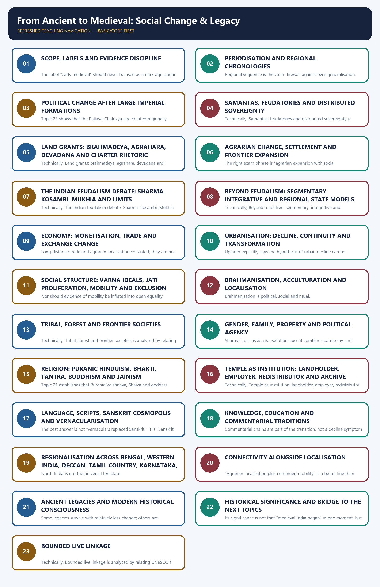

*Distinct embedded teaching-navigation image. The separate continuous Cārvāka-style flowchart package remains an independent at-a-glance artifact.*

#### Package counts, provenance and honest limitations

- Learning sections: 22; learning MCQ loops: 16.
- Workbook content: 10 verified/routed/adjacent PYQs; 32 broad MCQs; 8 remedials; 6 original solved Mains questions; final register modules: 8.
- Original PNG visuals: 22. All are deterministic schematics. Any spatial diagram is region-based and not to scale; none claims a hard political map.
- Repository sources used most heavily: Ancient History Topics 20-25, the basic and advanced Topic 26 owners, and Topic 27 only as a bridge marker.
- OCR evidence used most heavily from Upinder Singh's discussions of royal land grants, agrarian relations, brahmadeyas, early medieval debates, urban processes, temples, vernacularisation and South Indian historiography; and from R. S. Sharma's chapters on transition, social change, agrarian expansion, landlordism, brahmanisation and legacy.
- No live current-affairs source was forced into the package. This is deliberate. The brief asked for live material only if genuinely relevant to heritage or historiography; the static historical evidence base was already strong enough.
- Harbans Mukhia is included as a line of historiographical critique because the brief explicitly requires him. The repository's strongest local phrasing for that critique is indirect rather than quotation-based, so the package states only the safe core point: the European manor-serf bundle cannot be mechanically transferred to India.
- Topic 26 is a synthesis owner, not a stitched "decline of ancient India" chapter. It cross-references earlier topics but does not copy them as standalone mini-packages.
- Exact PYQ wording is used only where it is locally preserved. Routed demands remain clearly marked as routed or inferred; provisional answer keys are never presented as official.
- The package distinguishes evidence, interpretation and inference throughout because early medieval debates often collapse these levels. That collapse is a major UPSC trap.

#### Original visual asset index

- `notes/Ancient-Indian-History/assets/26_From-Ancient-to-Medieval-Social-Change-and-Legacy/01_multitrack_transition_chronology.png`
- `notes/Ancient-Indian-History/assets/26_From-Ancient-to-Medieval-Social-Change-and-Legacy/02_continuity_change_regional_variation_framework.png`
- `notes/Ancient-Indian-History/assets/26_From-Ancient-to-Medieval-Social-Change-and-Legacy/03_imperial_to_regional_polity_transformation.png`
- `notes/Ancient-Indian-History/assets/26_From-Ancient-to-Medieval-Social-Change-and-Legacy/04_samanta_distributed_sovereignty_network.png`
- `notes/Ancient-Indian-History/assets/26_From-Ancient-to-Medieval-Social-Change-and-Legacy/05_land_grant_charter_to_ground_effects_flow.png`
- `notes/Ancient-Indian-History/assets/26_From-Ancient-to-Medieval-Social-Change-and-Legacy/06_agrarian_frontier_settlement_process.png`
- `notes/Ancient-Indian-History/assets/26_From-Ancient-to-Medieval-Social-Change-and-Legacy/07_indian_feudalism_historiography_comparison.png`
- `notes/Ancient-Indian-History/assets/26_From-Ancient-to-Medieval-Social-Change-and-Legacy/08_state_models_segmentary_integrative_regional.png`
- `notes/Ancient-Indian-History/assets/26_From-Ancient-to-Medieval-Social-Change-and-Legacy/09_urban_decline_vs_transformation_matrix.png`
- `notes/Ancient-Indian-History/assets/26_From-Ancient-to-Medieval-Social-Change-and-Legacy/10_trade_town_temple_network.png`
- `notes/Ancient-Indian-History/assets/26_From-Ancient-to-Medieval-Social-Change-and-Legacy/11_varna_text_vs_jati_social_process_matrix.png`
- `notes/Ancient-Indian-History/assets/26_From-Ancient-to-Medieval-Social-Change-and-Legacy/12_brahmanisation_localisation_multidirectional_model.png`
- `notes/Ancient-Indian-History/assets/26_From-Ancient-to-Medieval-Social-Change-and-Legacy/13_frontier_lineage_state_pathways.png`
- `notes/Ancient-Indian-History/assets/26_From-Ancient-to-Medieval-Social-Change-and-Legacy/14_gender_evidence_ladder.png`
- `notes/Ancient-Indian-History/assets/26_From-Ancient-to-Medieval-Social-Change-and-Legacy/15_religious_institutional_field.png`
- `notes/Ancient-Indian-History/assets/26_From-Ancient-to-Medieval-Social-Change-and-Legacy/16_temple_institution_ecosystem.png`
- `notes/Ancient-Indian-History/assets/26_From-Ancient-to-Medieval-Social-Change-and-Legacy/17_sanskrit_to_vernacularisation_interaction_map.png`
- `notes/Ancient-Indian-History/assets/26_From-Ancient-to-Medieval-Social-Change-and-Legacy/18_regional_comparison_matrix.png`
- `notes/Ancient-Indian-History/assets/26_From-Ancient-to-Medieval-Social-Change-and-Legacy/19_connectivity_vs_localisation_balance.png`
- `notes/Ancient-Indian-History/assets/26_From-Ancient-to-Medieval-Social-Change-and-Legacy/20_ancient_legacies_survival_transformation_reinvention.png`
- `notes/Ancient-Indian-History/assets/26_From-Ancient-to-Medieval-Social-Change-and-Legacy/21_source_criticism_matrix.png`
- `notes/Ancient-Indian-History/assets/26_From-Ancient-to-Medieval-Social-Change-and-Legacy/22_gs1_synthesis_answer_spine.png`

### SESSION 1 — SCOPE, LABELS AND EVIDENCE DISCIPLINE

#### DEFINITION / WHAT THIS IS CALLED

**Plain-language definition:** "Ancient", "early medieval" and "medieval" are analytical labels used by modern historians.

**Technical definition:** The label "early medieval" should never be used as a dark-age slogan.

#### ANSWER-GRABBING OPENING — WRITE/ADAPT IN THE EXAM

> "Ancient", "early medieval" and "medieval" are analytical labels used by modern historians.

#### MUST-WRITE KEYWORDS

- **Scope**
- **labels**
- **evidence discipline**
- **Mains angle**
- **Study link**
- **Medieval = sudden break in AD 1206**

**How to use them:** Frame the answer through Scope; define labels, connect evidence discipline with Mains angle to explain the mechanism, and use Study link for the decisive comparison or qualification.

[FACT] "Ancient", "early medieval" and "medieval" are analytical labels used by modern historians. They are useful, but they are not indigenous period names accepted uniformly by the historical actors themselves.

[ANALYSIS] Topic 26 must therefore be written as a transition problem. The exam-safe line is that no single date cleanly turns ancient India into medieval India. Different domains moved at different speeds: large imperial concentration weakened earlier than agrarian production; Sanskrit prestige persisted alongside vernacularisation; long-distance trade changed form rather than disappearing all at once.

[LIMIT] The label "early medieval" should never be used as a dark-age slogan. It is best used to organise change between c. AD 300-750 and c. AD 750-1200 as heuristic phases, while explicitly allowing regional overlap and mismatch.

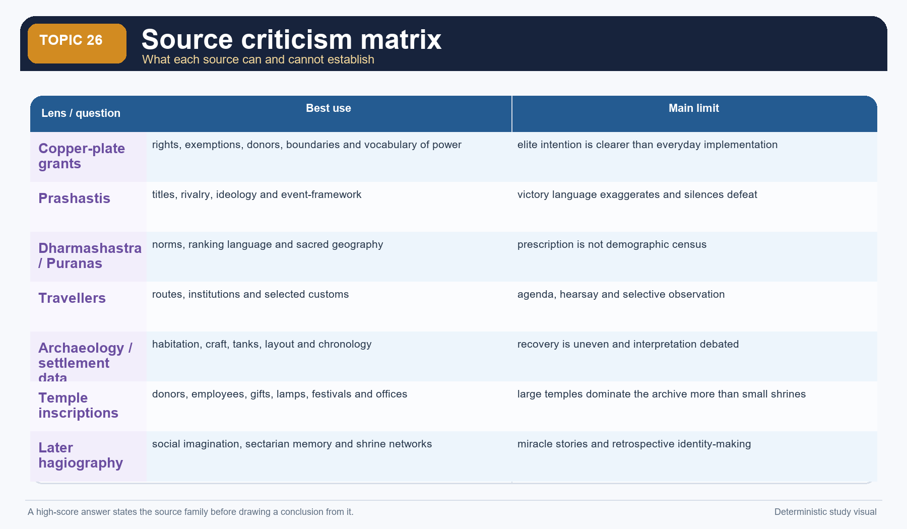

*The topic begins with source discipline because periodisation debates collapse quickly if charters, texts, travellers and archaeology are all treated as equally transparent.*

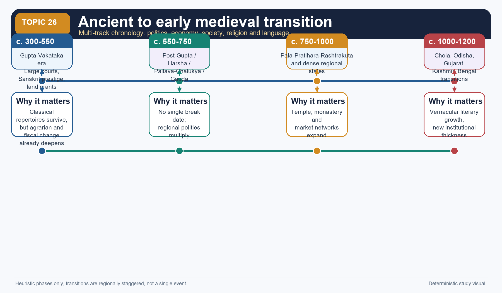

*The transition has multiple tracks. Politics, agrarian change, institutions, religion and language do not all turn at the same historical speed.*

#### Framing grid

| What not to do | Better historical move |
|---|---|
| Medieval = sudden break in AD 1206 | Show earlier social and political transition before Turkish conquest |
| Early medieval = total decay | Show decline in some older forms plus creation of new regional structures |
| One India, one trajectory | Compare east, Deccan, Tamil region, Gujarat-Rajasthan and hill zones |
| Texts = census | Separate norms, rhetoric and lived process |

#### Core teaching / solved practice

- [FACT] The basic and advanced Topic 26 owners already identify land grants, regional state formation and legacy as the chapter spine.
- [FACT] Upinder Singh explicitly frames c. 300-1200 as a debate-ridden but highly productive historical field, not a dead interval between "classical" and "medieval" India.
- [FACT] R. S. Sharma's chapter structure itself shows that the transition problem was built around social change, not around one dynastic fall.
- [ANALYSIS] The strongest thesis line is: "The ancient-to-medieval transition in India was an uneven early medieval reorganisation through land, locality, institutions and regional cultures."

#### Must-know facts

- There is no single all-India transition date.
- c. AD 300-750 and c. AD 750-1200 are useful heuristic clusters.
- Regional chronology matters more than textbook rupture language.

#### UPSC traps

- **Wrong:** the chapter is about "the fall of ancient India". **Correct:** it is about multiple overlapping transitions.
- **Wrong:** early medieval means only decline. **Correct:** it also means new state formation, temple institutions and regional cultures.

**Mains angle:** Begin by defining the label and refusing a one-date answer.

**Study link:** Topic 01 on historiography, Topic 02 on source criticism, Topic 22 on post-Gupta transition, Topic 27 on the Chola bridge.

#### CLOSING RECALL FLOW — SCOPE, LABELS AND EVIDENCE DISCIPLINE

```text
START / CONCEPT: Scope, labels and evidence discipline
        |
        v
EXACT TERMS: Scope · labels · evidence discipline · Mains angle · Study link · Medieval = sudden break in AD 1206
        |
        v
MECHANISM / ARGUMENT: They are useful, but they are not indigenous period names accepted uniformly by the historical actors themselves.
        |
        v
CONSEQUENCE / CONTRAST: Topic 26 must therefore be written as a transition problem.
        |
        v
UPSC TRAP / ANSWER-USE: AD 750-1200 as heuristic phases, while explicitly allowing regional overlap and mismatch.
        |
        v
ANSWER-GRABBING FORMULATION: "Ancient", "early medieval" and "medieval" are analytical labels used by modern historians.
```
### SESSION 2 — PERIODISATION AND REGIONAL CHRONOLOGIES

#### DEFINITION / WHAT THIS IS CALLED

**Plain-language definition:** Once regional chronology is foregrounded, the question changes from "When did ancient India end?" to "Which structures changed first in which region?".

**Technical definition:** Regional sequence is the exam firewall against over-generalisation.

#### ANSWER-GRABBING OPENING — WRITE/ADAPT IN THE EXAM

> Once regional chronology is foregrounded, the question changes from "When did ancient India end?" to "Which structures changed first in which region?".

#### MUST-WRITE KEYWORDS

- **Periodisation**
- **regional chronologies**
- **Mains angle**
- **Study link**
- **c. AD 300-550**
- **c. AD 550-750**

**How to use them:** Frame the answer through Periodisation; define regional chronologies, connect Mains angle with Study link to explain the mechanism, and use c. AD 300-550 for the decisive comparison or qualification.

[FACT] The repository's chronology spine and the Topic 22-25 packages together show that the centuries after Gupta predominance were not a uniform void. North India saw post-Gupta reorganisation, Harsha's bounded hegemony and later tripartite struggle; the peninsula saw Pallava-Chalukya-Pandya competition and, later, Chola expansion; eastern India saw Gauda, Pala and related agrarian-monastic concentration.

[ANALYSIS] The safest use of phase labels is therefore domain-specific. c. AD 300-750 works well for the weakening of large imperial formations, the spread of land grants and the rise of regional houses. c. AD 750-1200 works well for denser regional state systems, major temple institutions, stronger vernacular political-literary cultures and more visible regional comparison.

[LIMIT] This is a heuristic convenience, not a law. Some developments in one region appear earlier or later elsewhere; for example, vernacular devotional efflorescence is visible in the Tamil region earlier than in some northern zones.

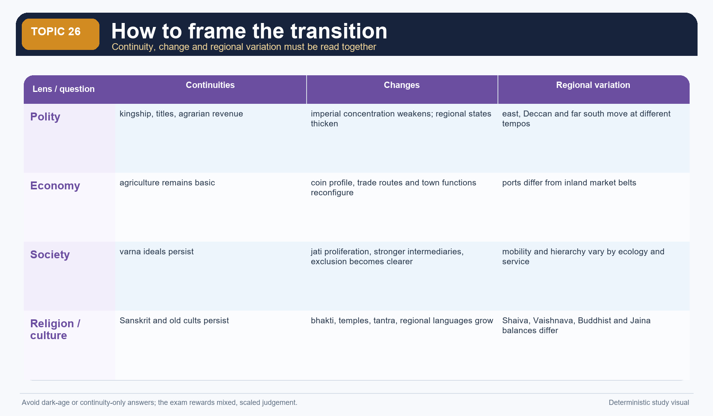

*Continuity, change and regional variation are not three separate answers. They are the same answer, arranged properly.*

#### Comparative grid

| Phase | Best used for | Caution |
|---|---|---|
| c. AD 300-550 | Gupta-Vakataka classical repertoires plus deepening agrarian and grant structures | do not flatten this into either pure Golden Age or pure feudal crisis |
| c. AD 550-750 | post-Gupta, Harsha, Gauda, Pallava-Chalukya transition | not every region is post-Gupta in the same sense |
| c. AD 750-1200 | regional polities, temple institutions, Pala networks, Chola afterlife, vernacular growth | owner boundaries still matter; Topic 27 takes full Chola detail |

#### Core teaching / solved practice

- [FACT] Sharma's contrast between fading Pataliputra and rising Kannauj is one way to periodise political geography.
- [FACT] Topic 23 already treats c. AD 550-900 as a foundational peninsular phase.
- [FACT] Topic 22 frames Bengal, Odisha and Kamarupa as zones of mature regional visibility rather than peripheral afterthoughts.
- [ANALYSIS] Once regional chronology is foregrounded, the question changes from "When did ancient India end?" to "Which structures changed first in which region?"

#### Must-know facts

- Period labels are analytical.
- The same century can show continuity in one sphere and transition in another.
- Regional sequence is the exam firewall against over-generalisation.

#### UPSC traps

- **Wrong:** c. AD 600 = medieval India everywhere. **Correct:** use it as a useful but partial turning zone.
- **Wrong:** Gupta decline automatically explains south Indian chronology. **Correct:** compare north, east and south on separate terms.

**Mains angle:** Add one sentence on why no single date works, then proceed by theme or region.

**Study link:** `00_Master-Chronology.md` and Topics 20-23.

#### CLOSING RECALL FLOW — PERIODISATION AND REGIONAL CHRONOLOGIES

```text
START / CONCEPT: Periodisation and regional chronologies
        |
        v
EXACT TERMS: Periodisation · regional chronologies · Mains angle · Study link · c. AD 300-550 · c. AD 550-750
        |
        v
MECHANISM / ARGUMENT: The repository's chronology spine and the Topic 22-25 packages together show that the centuries after Gupta predominance were not a uniform void.
        |
        v
CONSEQUENCE / CONTRAST: The safest use of phase labels is therefore domain-specific. c.
        |
        v
UPSC TRAP / ANSWER-USE: Do not miss this limiting distinction: sharma's contrast between fading Pataliputra and rising Kannauj is one way to periodise political...
        |
        v
ANSWER-GRABBING FORMULATION: Once regional chronology is foregrounded, the question changes from "When did ancient India end?" to "Which structures changed first in which region?".
```
### SESSION 3 — POLITICAL CHANGE AFTER LARGE IMPERIAL FORMATIONS

#### DEFINITION / WHAT THIS IS CALLED

**Plain-language definition:** Sharma notes that large parts of the Gupta order were already held through feudatory chiefs.

**Technical definition:** Topic 23 shows that the Pallava-Chalukya age created regionally rooted political systems, not merely war memories.

#### ANSWER-GRABBING OPENING — WRITE/ADAPT IN THE EXAM

> Topic 23 shows that the Pallava-Chalukya age created regionally rooted political systems, not merely war memories.

#### MUST-WRITE KEYWORDS

- **Political change after large imperial formations**
- **Mains angle**
- **Study link**
- **post-Gupta decentralising strain**
- **Gupta feudatories, tribute-bearing vassals, land-based concessions**
- **rulers increasingly mediated power through subordinates**

**How to use them:** Frame the answer through Political change after large imperial formations; define Mains angle, connect Study link with post-Gupta decentralising strain to explain the mechanism, and use Gupta feudatories, tribute-bearing vassals, land-based concessions for the decisive comparison or qualification.

[FACT] After the Gupta age, the subcontinent saw fewer truly pan-subcontinental empires and more regionally anchored state systems. Topic 22 shows this clearly in north India and the east; Topic 23 does so for the peninsula.

[ANALYSIS] This should not be written as simple political collapse. Upinder Singh argues that the early medieval period was marked by an unprecedented proliferation of state polities at the regional, sub-regional and trans-regional levels. In other words, the weakening of one scale of empire was accompanied by strengthening at other scales.

[LIMIT] Political multiplication did not mean uniformly strong administration everywhere. Core zones, frontiers, suzerainty claims and real control must be separated.

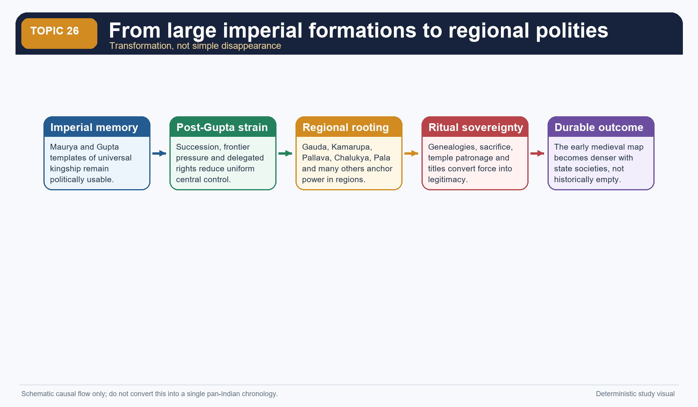

*The major shift is from a smaller number of larger imperial formations to a denser field of regional polities, not from order to emptiness.*

#### Mechanism ladder

| Change | Named evidence / route | Significance |
|---|---|---|
| post-Gupta decentralising strain | Gupta feudatories, tribute-bearing vassals, land-based concessions | rulers increasingly mediated power through subordinates |
| regional rooting | Gauda, Kamarupa, Pallavas, Chalukyas, later Palas and Rashtrakutas | politics acquired stronger regional bases |
| ritual sovereignty | prashastis, sacrifice, temple patronage, genealogies | force alone did not legitimate new dynasties |

#### Core teaching / solved practice

- [FACT] Sharma notes that large parts of the Gupta order were already held through feudatory chiefs.
- [FACT] Topic 22's Harsha answer architecture shows a bounded north Indian hegemon rather than a Mauryan-style all-India empire.
- [FACT] Topic 23 shows that the Pallava-Chalukya age created regionally rooted political systems, not merely war memories.
- [ANALYSIS] A strong answer says "imperial weakening from one viewpoint, regional consolidation from another."

#### Must-know facts

- Large empire weakened; regional states multiplied.
- Ritual and genealogy mattered as much as conquest.
- Different scales of state power coexisted.

#### UPSC traps

- **Wrong:** decentralisation means disappearance of kingship. **Correct:** kingship changed scale and mode.
- **Wrong:** regional states were minor afterthoughts. **Correct:** they became the main political grammar of the age.

**Mains angle:** Replace "fragmentation" with "reorganisation" unless the evidence specifically demands a decline claim.

**Study link:** Topic 20 on Gupta polity, Topic 22 on Harsha and the east, Topic 23 on peninsular rivalry.

#### CLOSING RECALL FLOW — POLITICAL CHANGE AFTER LARGE IMPERIAL FORMATIONS

```text
START / CONCEPT: Political change after large imperial formations
        |
        v
EXACT TERMS: Political change after large imperial formations · Mains angle · Study link · post-Gupta decentralising strain · Gupta feudatories, tribute-bearing vassals, land-based concessions · rulers increasingly mediated power through subordinates
        |
        v
MECHANISM / ARGUMENT: Sharma notes that large parts of the Gupta order were already held through feudatory chiefs.
        |
        v
CONSEQUENCE / CONTRAST: This should not be written as simple political collapse.
        |
        v
UPSC TRAP / ANSWER-USE: Do not miss this limiting distinction: they became the main political grammar of the age.
        |
        v
ANSWER-GRABBING FORMULATION: Topic 23 shows that the Pallava-Chalukya age created regionally rooted political systems, not merely war memories.
```
### SESSION 4 — SAMANTAS, FEUDATORIES AND DISTRIBUTED SOVEREIGNTY

#### DEFINITION / WHAT THIS IS CALLED

**Plain-language definition:** The exam-safe formulation is not "decentralisation" alone but "distributed sovereignty." Authority travelled through layered chains: tribute, service, marriage, military aid, rituals of obeisance, land rights and political recognition.

**Technical definition:** Technically, Samantas, feudatories and distributed sovereignty is analysed by relating Samantas to feudatories, then testing the relationship through distributed sovereignty and Mains angle.

#### ANSWER-GRABBING OPENING — WRITE/ADAPT IN THE EXAM

> The exam-safe formulation is not "decentralisation" alone but "distributed sovereignty." Authority travelled through layered chains: tribute, service, marriage, military aid, rituals of obeisance, land rights and political recognition.

#### MUST-WRITE KEYWORDS

- **Samantas**
- **feudatories**
- **distributed sovereignty**
- **Mains angle**
- **Study link**
- **Gupta and post-Gupta polity chapters**

**How to use them:** Frame the answer through Samantas; define feudatories, connect distributed sovereignty with Mains angle to explain the mechanism, and use Study link for the decisive comparison or qualification.

[FACT] Sharma's Gupta discussion and Upinder's early medieval debate both emphasise subordinate rulers, samantas and similar intermediaries. Upinder notes titles such as samanta, mahasamanta, ranaka and mahasamantadhipati; Sharma records tribute, personal attendance and even dynastic marriage as obligations of subordinates.

[ANALYSIS] The exam-safe formulation is not "decentralisation" alone but "distributed sovereignty." Authority travelled through layered chains: tribute, service, marriage, military aid, rituals of obeisance, land rights and political recognition.

[LIMIT] The term samanta did not designate one identical legal office everywhere. It is a family of subordinate or feudatory positions whose meaning changed by region and context.

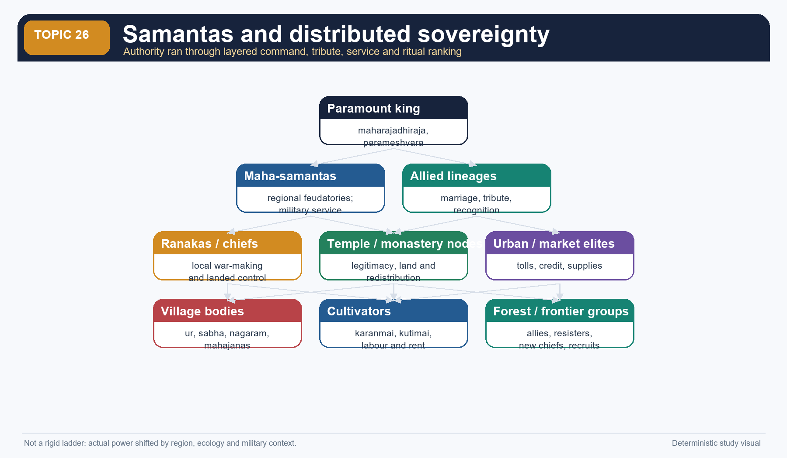

*The hierarchy is real, but it is not a neat bureaucratic ladder. Temples, market elites and local bodies also matter inside the same field of power.*

#### Evidence frame

| Source | What it shows | What it does not settle |
|---|---|---|
| Gupta and post-Gupta polity chapters | tribute, homage, marital and military obligations | exact power balance in every locality |
| early medieval inscriptions | titles and chains of subordination | everyday village authority in equal detail |
| topic 23 peninsular evidence | local institutions plus kingship | a total absence of central power |

#### Core teaching / solved practice

- [FACT] Sharma explicitly describes vassals paying tribute, attending court and offering daughters in marriage.
- [FACT] Upinder states that subordinate rulers could be described as commanding allegiance while themselves obeying a larger suzerain.
- [ANALYSIS] This layered structure explains how strong local elites could coexist with real kingship.
- [ANALYSIS] The best phrase is "layered command" or "distributed sovereignty," not "statelessness."

#### Must-know facts

- Samanta = subordinate / feudatory line, not one fixed office everywhere.
- Tribute, service and symbolic subordination were crucial.
- Local elites and kings were interlocked, not mutually exclusive.

#### UPSC traps

- **Wrong:** samantas only emerged after all state power collapsed. **Correct:** they formed part of the very structure of many states.
- **Wrong:** every local ruler was a samanta in the same sense. **Correct:** titles and functions vary.

**Mains angle:** Use samantas to explain the mechanics of regional state formation.

**Study link:** Topic 20 on Gupta feudatories and Topic 22 on post-Gupta hierarchies.

#### CLOSING RECALL FLOW — SAMANTAS, FEUDATORIES AND DISTRIBUTED SOVEREIGNTY

```text
START / CONCEPT: Samantas, feudatories and distributed sovereignty
        |
        v
EXACT TERMS: Samantas · feudatories · distributed sovereignty · Mains angle · Study link · Gupta and post-Gupta polity chapters
        |
        v
MECHANISM / ARGUMENT: It is a family of subordinate or feudatory positions whose meaning changed by region and context.
        |
        v
CONSEQUENCE / CONTRAST: The best phrase is "layered command" or "distributed sovereignty," not "statelessness.".
        |
        v
UPSC TRAP / ANSWER-USE: Upinder states that subordinate rulers could be described as commanding allegiance while themselves obeying a larger suzerain.
        |
        v
ANSWER-GRABBING FORMULATION: The exam-safe formulation is not "decentralisation" alone but "distributed sovereignty." Authority travelled through layered chains: tribute, service, marriage, military aid, rituals of obeisance, land rights and political recognition.
```
### SESSION 5 — LAND GRANTS: BRAHMADEYA, AGRAHARA, DEVADANA AND CHARTER RHETORIC

#### DEFINITION / WHAT THIS IS CALLED

**Plain-language definition:** Royal grants also went to Buddhist and Jaina monasteries and to temples; devadana is a common later label for grants to deities or temples.

**Technical definition:** Technically, Land grants: brahmadeya, agrahara, devadana and charter rhetoric is analysed by relating Land grants to brahmadeya, then testing the relationship through agrahara and devadana.

#### ANSWER-GRABBING OPENING — WRITE/ADAPT IN THE EXAM

> Royal grants also went to Buddhist and Jaina monasteries and to temples; devadana is a common later label for grants to deities or temples.

#### MUST-WRITE KEYWORDS

- **Land grants**
- **brahmadeya**
- **agrahara**
- **devadana**
- **charter rhetoric**
- **Mains angle**

**How to use them:** Frame the answer through Land grants; define brahmadeya, connect agrahara with devadana to explain the mechanism, and use charter rhetoric for the decisive comparison or qualification.

[FACT] Upinder Singh's land-grant pages are central here. She notes that from the 5th/6th century kings across the subcontinent increasingly issued copper-plate charters, and villages granted to Brahmanas were known as agraharas, brahmadeyas or shasanas. Royal grants also went to Buddhist and Jaina monasteries and to temples; devadana is a common later label for grants to deities or temples.

[FACT] The Prabhavatigupta charter cited by Upinder illustrates the concrete rights involved: exemptions from entry by soldiers and policemen, relief from various supplies to touring officers, and rights over taxes and hidden treasures. The Pulankurichi inscription records a brahmadeya and distinguishes the superior rights of donees from subordinate rights of cultivators.

[ANALYSIS] Therefore land grants are not merely pious charity. They are legal-political instruments that declare authority over revenue, labour, exemptions, cult and locality.

[LIMIT] A charter states a claim, not a full social photograph. Implementation varied, and some rights remained with cultivators, village bodies or prior occupants. This is why "charter rhetoric versus ground reality" must be kept explicit.

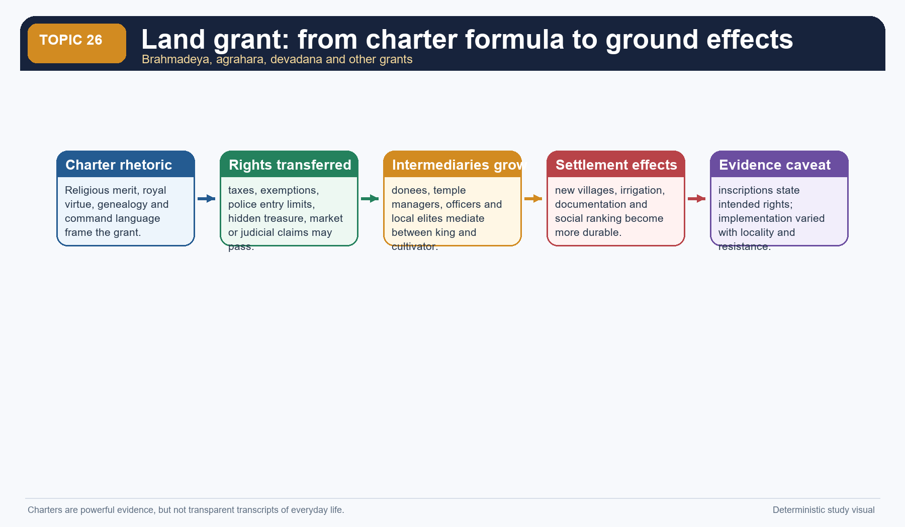

*The grant matters because it links political language, fiscal rights, social hierarchy and settlement expansion in one document form.*

#### Grant vocabulary table

| Term | Safer meaning |
|---|---|
| brahmadeya | land gifted to Brahmanas |
| agrahara | Brahmana settlement or grant-village; context decides emphasis |
| devadana | land or revenue assigned to a deity / temple |
| shasana | chartered grant, often used for Brahmana landholding |
| bhatta-grama | more neutral term for a Brahmana village, not always identical to a fresh royal grant |

#### Core teaching / solved practice

- [FACT] Upinder notes that most early grants before about the 10th century went to Brahmanas, though other beneficiaries existed.
- [FACT] Kings were the prime donors, but private individuals and officials could also participate in land transfer.
- [FACT] Chola and Pandya evidence later distinguishes cultivation rights and superior possessive rights; that helps caution us against treating "grant" as single-layer ownership.
- [ANALYSIS] A strong answer names both the charter formula and the ground ambiguity.

#### Must-know facts

- Land grants expanded sharply from the 4th-6th centuries.
- Rights could include taxes, police entry restrictions and judicial or market claims.
- Cultivator rights and donee rights were not identical.

#### UPSC traps

- **Wrong:** land grants were only for spiritual merit. **Correct:** they also redistributed authority.
- **Wrong:** once a charter is issued, practice is fully known. **Correct:** inscriptions declare intended order, not automatic enforcement.

**Mains angle:** Quote one grant right, then explain what social or fiscal power it implies.

**Study link:** Topic 20 land-grant debate, Topic 22 eastern charters, Topic 23 brahmadeyas in the south.

#### CLOSING RECALL FLOW — LAND GRANTS: BRAHMADEYA, AGRAHARA, DEVADANA AND CHARTER RHETORIC

```text
START / CONCEPT: Land grants: brahmadeya, agrahara, devadana and charter rhetoric
        |
        v
EXACT TERMS: Land grants · brahmadeya · agrahara · devadana · charter rhetoric · Mains angle
        |
        v
MECHANISM / ARGUMENT: She notes that from the 5th/6th century kings across the subcontinent increasingly issued copper-plate charters, and villages granted to Brahmanas were known as agraharas, brahmadeyas or shasanas.
        |
        v
CONSEQUENCE / CONTRAST: Therefore land grants are not merely pious charity.
        |
        v
UPSC TRAP / ANSWER-USE: Kings were the prime donors, but private individuals and officials could also participate in land transfer.
        |
        v
ANSWER-GRABBING FORMULATION: Royal grants also went to Buddhist and Jaina monasteries and to temples; devadana is a common later label for grants to deities or temples.
```
### SESSION 6 — AGRARIAN CHANGE, SETTLEMENT AND FRONTIER EXPANSION

#### DEFINITION / WHAT THIS IS CALLED

**Plain-language definition:** Agrarian change is therefore not just "more villages." It includes forest clearance, tanks and irrigation works, peasantisation, incorporation of frontier groups, and the establishment of new social intermediaries between ruler and cultivator.

**Technical definition:** The right exam phrase is "agrarian expansion with social differentiation.".

#### ANSWER-GRABBING OPENING — WRITE/ADAPT IN THE EXAM

> Agrarian change is therefore not just "more villages." It includes forest clearance, tanks and irrigation works, peasantisation, incorporation of frontier groups, and the establishment of new social intermediaries between ruler and cultivator.

#### MUST-WRITE KEYWORDS

- **Agrarian change**
- **settlement**
- **frontier expansion**
- **Mains angle**
- **Study link**
- **clearance / reclamation**

**How to use them:** Frame the answer through Agrarian change; define settlement, connect frontier expansion with Mains angle to explain the mechanism, and use Study link for the decisive comparison or qualification.

[FACT] Sharma's eastern India and peninsular chapters are explicit that grants in tribal, forest and red-soil areas helped bring new lands under cultivation, spread agrarian routines and increase the size of rural communities. Topic 22's Odisha and Bengal sections show grants of fallow or waste land being brought into cultivation. Topic 23 shows similar processes in the south.

[ANALYSIS] Agrarian change is therefore not just "more villages." It includes forest clearance, tanks and irrigation works, peasantisation, incorporation of frontier groups, and the establishment of new social intermediaries between ruler and cultivator.

[LIMIT] This is not a one-way civilising story. Some frontier groups retained autonomy, some resisted, some became chiefs or kings, and some were incorporated in unequal ways into caste society.

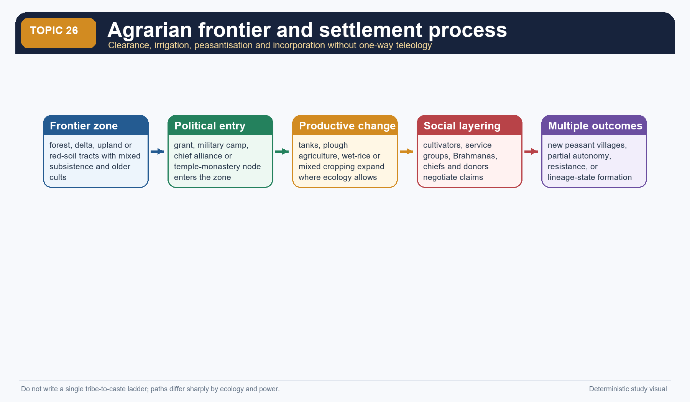

*Frontier incorporation can produce peasants, chiefs, monasteries, temples and conflict at the same time. There is no single ladder of progress.*

#### Agrarian process grid

| Process | Historical effect |
|---|---|
| clearance / reclamation | new arable zones, new claims in land |
| irrigation / tanks / sluices | productivity rise and denser settlement |
| grant-mediated incorporation | new donees and local hierarchies |
| peasantisation | cultivator communities become more legible to the state |
| frontier contact | chiefs, lineages and cults are politically reworked |

#### Core teaching / solved practice

- [FACT] Sharma states that grants in Orissa and other frontier areas brought new lands under cultivation and improved agriculture.
- [FACT] Topic 22's Pundravardhanabhukti evidence links monetised purchase of fallow land with later agrarian endowment.
- [FACT] Topic 23's tank and irrigation evidence shows that agrarian expansion had infrastructural form, not only legal form.
- [ANALYSIS] The right exam phrase is "agrarian expansion with social differentiation."

#### Must-know facts

- Agrarian change was ecological as well as political.
- Fallow land, frontier zones and irrigation matter.
- Incorporation did not erase frontier agency.

#### UPSC traps

- **Wrong:** tribe -> caste -> peasant is an automatic ladder. **Correct:** use multiple outcomes and power imbalance.
- **Wrong:** land expansion means identical crop pattern everywhere. **Correct:** ecology and crop regime vary by region.

**Mains angle:** Show how agrarian expansion changes state, society and religion together.

**Study link:** Topic 22 eastern agrarian growth and Topic 23 locality and settlement.

#### CLOSING RECALL FLOW — AGRARIAN CHANGE, SETTLEMENT AND FRONTIER EXPANSION

```text
START / CONCEPT: Agrarian change, settlement and frontier expansion
        |
        v
EXACT TERMS: Agrarian change · settlement · frontier expansion · Mains angle · Study link · clearance / reclamation
        |
        v
MECHANISM / ARGUMENT: Show how agrarian expansion changes state, society and religion together.
        |
        v
CONSEQUENCE / CONTRAST: Topic 23's tank and irrigation evidence shows that agrarian expansion had infrastructural form, not only legal form.
        |
        v
UPSC TRAP / ANSWER-USE: This is not a one-way civilising story.
        |
        v
ANSWER-GRABBING FORMULATION: Agrarian change is therefore not just "more villages." It includes forest clearance, tanks and irrigation works, peasantisation, incorporation of frontier groups, and the establishment of new social intermediaries between ruler and cultivator.
```
### SESSION 7 — THE INDIAN FEUDALISM DEBATE: SHARMA, KOSAMBI, MUKHIA AND LIMITS

#### DEFINITION / WHAT THIS IS CALLED

**Plain-language definition:** Sharma records that artisans and peasants could be asked not to leave granted villages, which is key evidence in labour-dependence arguments.

**Technical definition:** Technically, The Indian feudalism debate: Sharma, Kosambi, Mukhia and limits is analysed by relating The Indian feudalism debate to Sharma, then testing the relationship through Kosambi and Mukhia.

#### ANSWER-GRABBING OPENING — WRITE/ADAPT IN THE EXAM

> Sharma records that artisans and peasants could be asked not to leave granted villages, which is key evidence in labour-dependence arguments.

#### MUST-WRITE KEYWORDS

- **The Indian feudalism debate**
- **Sharma**
- **Kosambi**
- **Mukhia**
- **limits**
- **Mains angle**

**How to use them:** Frame the answer through The Indian feudalism debate; define Sharma, connect Kosambi with Mukhia to explain the mechanism, and use limits for the decisive comparison or qualification.

[DEBATE] Upinder summarises Sharma's model sharply: royal land grants; transfer of fiscal and judicial rights; rights over peasants, artisans and merchants; forced labour; decline in trade and coinage; payment of officials through land revenue assignments; and stronger obligations of samantas. For Sharma, these features made c. AD 300 onward a long phase of feudal tendencies, political fragmentation and urban contraction.

[DEBATE] Kosambi had earlier written about a feudal stage and linked landed magnates, literary change, commentary traditions and religious-cultural shifts to wider social transformation. Sharma's own chapter on social change explicitly connects landed elites, commentaries, tantra and new patterns of hierarchical culture.

[DEBATE] The line associated with Harbans Mukhia and other critics warns against equating Indian history with a European manor-serf model. The safe core of that critique is that the exact European bundle - manor, serfdom and mounted-feudal package - is absent or not identical in India, so the concept must remain heuristic and regional.

[ANALYSIS] The best UPSC verdict is neither blind acceptance nor dismissal. Feudal tendencies can illuminate labour dependence, intermediation and urban change, but they cannot substitute for specific regional evidence or rival models of state formation.

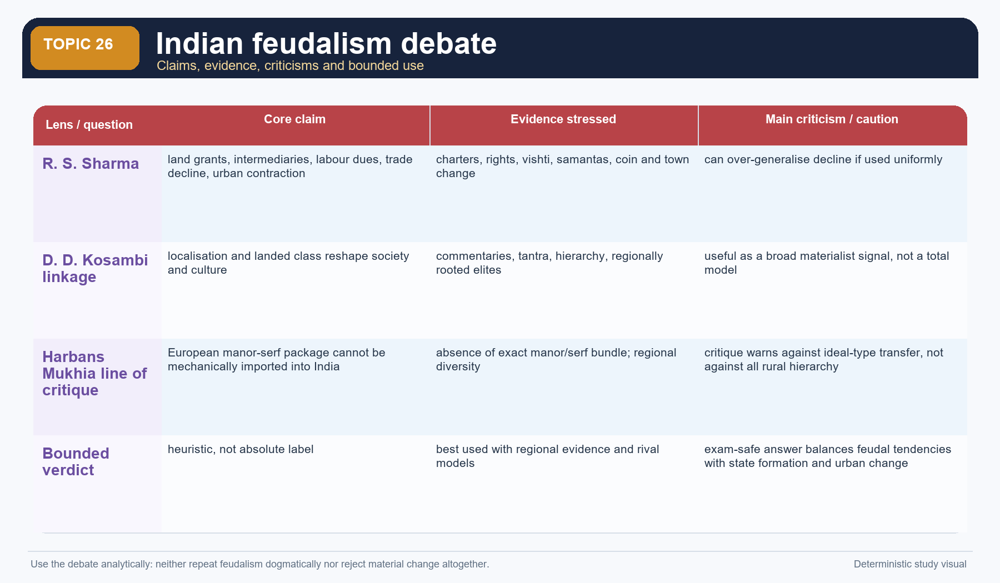

*The debate should be used as a thinking tool, not as a label to be pasted on every region.*

#### Comparison table

| Position | Strongest contribution | Main caution |
|---|---|---|
| Sharma | keeps land, labour and exchange at the centre | can be over-generalised into total decline |
| Kosambi line | links social formation to culture and ideology | needs regional refinement |
| Mukhia-type critique | warns against crude European analogy | should not erase real rural hierarchy |

#### Core teaching / solved practice

- [FACT] Upinder notes that the feudalism hypothesis remained dominant for many years because it raised major questions about political and economic change.
- [FACT] Sharma records that artisans and peasants could be asked not to leave granted villages, which is key evidence in labour-dependence arguments.
- [ANALYSIS] A high-mark answer should explicitly say "feudal tendencies" rather than treat the term as completely settled fact.
- [LIMIT] Not every change in the period follows from feudalism alone; temples, vernaculars, pilgrimage and new state cultures need wider explanation.

#### Must-know facts

- Sharma: land grants + intermediaries + decline signals.
- Critique: no exact European one-to-one transfer.
- Best answer: bounded, comparative use.

#### UPSC traps

- **Wrong:** "Indian feudalism" is unquestionably established. **Correct:** it is debated.
- **Wrong:** because the European manor is absent, rural hierarchy does not matter. **Correct:** absence of exact identity does not erase material change.

**Mains angle:** Define the model, list evidence, state criticism, then deliver a bounded verdict.

**Study link:** Topic 20 on land grants and Topic 22 on regional reorganisation.

#### CLOSING RECALL FLOW — THE INDIAN FEUDALISM DEBATE: SHARMA, KOSAMBI, MUKHIA AND LIMITS

```text
START / CONCEPT: The Indian feudalism debate: Sharma, Kosambi, Mukhia and limits
        |
        v
EXACT TERMS: The Indian feudalism debate · Sharma · Kosambi · Mukhia · limits · Mains angle
        |
        v
MECHANISM / ARGUMENT: [DEBATE] Kosambi had earlier written about a feudal stage and linked landed magnates, literary change, commentary traditions and religious-cultural shifts to wider social transformation.
        |
        v
CONSEQUENCE / CONTRAST: Not every change in the period follows from feudalism alone; temples, vernaculars, pilgrimage and new state cultures need wider explanation.
        |
        v
UPSC TRAP / ANSWER-USE: The safe core of that critique is that the exact European bundle - manor, serfdom and mounted-feudal package - is absent or not identical in India, so the concept must remain heuristic and regional.
        |
        v
ANSWER-GRABBING FORMULATION: Sharma records that artisans and peasants could be asked not to leave granted villages, which is key evidence in labour-dependence arguments.
```
### SESSION 8 — BEYOND FEUDALISM: SEGMENTARY, INTEGRATIVE AND REGIONAL-STATE MODELS

#### DEFINITION / WHAT THIS IS CALLED

**Plain-language definition:** Together these models correct the false choice between "powerful central empire" and "political vacuum." The more defensible phrase is that many early medieval polities exercised layered and uneven control while still building real state structures.

**Technical definition:** Technically, Beyond feudalism: segmentary, integrative and regional-state models is analysed by relating Beyond feudalism to segmentary, then testing the relationship through integrative and regional-state models.

#### ANSWER-GRABBING OPENING — WRITE/ADAPT IN THE EXAM

> Together these models correct the false choice between "powerful central empire" and "political vacuum." The more defensible phrase is that many early medieval polities exercised layered and uneven control while still building real state structures.

#### MUST-WRITE KEYWORDS

- **Beyond feudalism**
- **segmentary**
- **integrative**
- **regional-state models**
- **Mains angle**
- **Study link**

**How to use them:** Frame the answer through Beyond feudalism; define segmentary, connect integrative with regional-state models to explain the mechanism, and use Mains angle for the decisive comparison or qualification.

[DEBATE] Upinder's South India historiography section describes Burton Stein's critique of the glorified centralised Chola image. Stein's segmentary-state model emphasised sacred kingship, strong core zones, weak outer control and the limited reach of formal revenue machinery beyond the centre.

[DEBATE] Kulke's line of thought highlights integrative legitimation: kings tied regions through major cult centres, ritual sovereignty and alliance-building. Chattopadhyaya argued that the early medieval period in many parts of India saw the formation of state society at regional and sub-regional levels through grants, cult appropriation, peasantisation and caste formation.

[ANALYSIS] Together these models correct the false choice between "powerful central empire" and "political vacuum." The more defensible phrase is that many early medieval polities exercised layered and uneven control while still building real state structures.

[LIMIT] No one model fits the whole subcontinent. Stein works best for specific South Indian questions; Chattopadhyaya and Kulke travel further, but still require regional evidence.

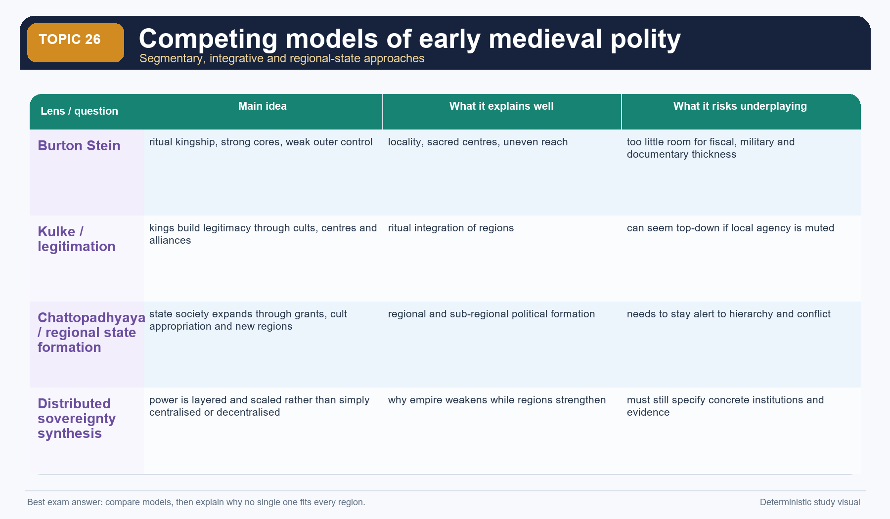

*Model comparison matters because Topic 26 is a debate chapter. UPSC rewards knowing why historians disagree, not merely knowing their names.*

#### Model-use grid

| Model | Best question type |
|---|---|
| segmentary state | south Indian kingship, centre-periphery, ritual rule |
| integrative legitimation | temples, cult centres, ritual sovereignty |
| regional state formation | grants, peasantisation, locality, new political cultures |
| distributed sovereignty | synthesis answers across the subcontinent |

#### Core teaching / solved practice

- [FACT] Upinder criticises the older "dark age" approach directly and shows why later research shifted toward regional dynamism.
- [FACT] Topic 23 already uses the phrase "regional state formation" as its closing verdict.
- [ANALYSIS] In a 20-marker, compare Sharma and Stein only if you then show why regional evidence changes the picture.
- [ANALYSIS] A good bridge phrase is: "From a pan-Indian imperial angle the period may look decentralised; from a regional angle it looks intensely state-forming."

#### Must-know facts

- Stein = segmentary critique of over-centralisation.
- Kulke = legitimacy and integration.
- Chattopadhyaya = regional state formation and state society expansion.

#### UPSC traps

- **Wrong:** one model alone explains all India. **Correct:** use model-region fit.
- **Wrong:** segmentary means powerless kings. **Correct:** it means uneven reach and ritual-political centrality.

**Mains angle:** Compare models only after identifying the region and evidence type.

**Study link:** Topic 23 for Stein-related caution and Topic 17 for Chattopadhyaya's locality approach.

#### CLOSING RECALL FLOW — BEYOND FEUDALISM: SEGMENTARY, INTEGRATIVE AND REGIONAL-STATE MODELS

```text
START / CONCEPT: Beyond feudalism: segmentary, integrative and regional-state models
        |
        v
EXACT TERMS: Beyond feudalism · segmentary · integrative · regional-state models · Mains angle · Study link
        |
        v
MECHANISM / ARGUMENT: Wrong: one model alone explains all India.
        |
        v
CONSEQUENCE / CONTRAST: [DEBATE] Upinder's South India historiography section describes Burton Stein's critique of the glorified centralised Chola image.
        |
        v
UPSC TRAP / ANSWER-USE: Do not miss this limiting distinction: upinder criticises the older "dark age" approach directly and shows why later research shifted...
        |
        v
ANSWER-GRABBING FORMULATION: Together these models correct the false choice between "powerful central empire" and "political vacuum." The more defensible phrase is that many early medieval polities exercised layered and uneven control while still building real state structures.
```
### SESSION 9 — ECONOMY: MONETISATION, TRADE AND EXCHANGE CHANGE

#### DEFINITION / WHAT THIS IS CALLED

**Plain-language definition:** Topic 19 already shows how crafts, guilds and exchange networks are the prehistory of later reconfigured trade.

**Technical definition:** Long-distance trade and agrarian localisation coexisted; they are not mutually exclusive.

#### ANSWER-GRABBING OPENING — WRITE/ADAPT IN THE EXAM

> Topic 19 already shows how crafts, guilds and exchange networks are the prehistory of later reconfigured trade.

#### MUST-WRITE KEYWORDS

- **Economy**
- **monetisation**
- **trade**
- **exchange change**
- **Mains angle**
- **Study link**

**How to use them:** Frame the answer through Economy; define monetisation, connect trade with exchange change to explain the mechanism, and use Mains angle for the decisive comparison or qualification.

[FACT] Early medieval economic change is not reducible to either barter or boom. Upinder, following monetary historians such as John Deyell, argues that money was not simply absent; coin types reduced and silver shortages mattered, but mixed monetary systems, moneys of account and cowries remained important in different zones.

[FACT] Trade also changed in institutional form. Upinder highlights mandapikas as intermediate exchange centres between small periodic markets and larger trade centres. Topic 23 adds penthas and nagarams in the Deccan and south.

[ANALYSIS] Therefore the better formulation is "reconfigured exchange." Some long-distance circuits weakened or shifted, yet intermediate markets, ports, temple-centred redistribution and merchant networks remained active.

[LIMIT] Coin scarcity in one metal or region cannot be equated with economic collapse everywhere.

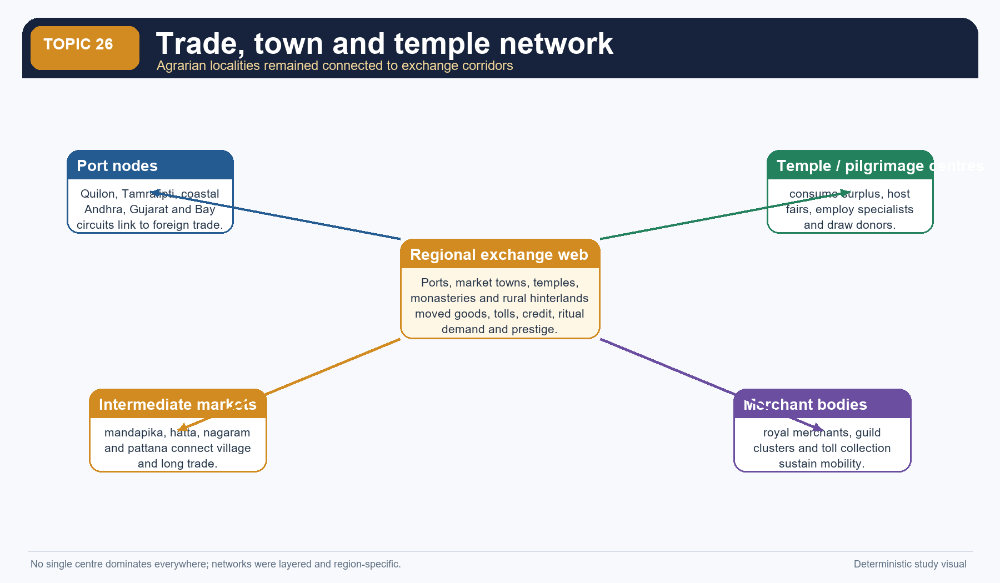

*The exchange world is layered: village, market, town, port, temple and merchant body all interact.*

#### Exchange vocabulary

| Institution | Safer use |
|---|---|
| mandapika | intermediate exchange and toll point |
| hatta / hattika | smaller periodic market |
| pattana | larger trade centre or town |
| nagaram | south Indian merchant-town formation or market node |
| royal merchants | high-value procurement and court-linked trade actors |

#### Core teaching / solved practice

- [FACT] Upinder argues that debasement is not automatically proof of state crisis.
- [FACT] Topic 19 already shows how crafts, guilds and exchange networks are the prehistory of later reconfigured trade.
- [ANALYSIS] Long-distance trade and agrarian localisation coexisted; they are not mutually exclusive.
- [LIMIT] Merchant bodies are better documented in some regions than others; do not universalise south Indian patterns.

#### Must-know facts

- Coin change does not equal zero monetisation.
- Intermediate markets are crucial.
- Temple, port and market circuits overlap.

#### UPSC traps

- **Wrong:** early medieval economy = barter only. **Correct:** mixed monetary systems and exchange nodes persisted.
- **Wrong:** all trade collapsed after Rome. **Correct:** route shifts and regional networks continued.

**Mains angle:** Move from coins to institutions to routes, not from coins straight to collapse.

**Study link:** Topic 19 on commerce and Topic 25 on wider Asian connectivity.

#### CLOSING RECALL FLOW — ECONOMY: MONETISATION, TRADE AND EXCHANGE CHANGE

```text
START / CONCEPT: Economy: monetisation, trade and exchange change
        |
        v
EXACT TERMS: Economy · monetisation · trade · exchange change · Mains angle · Study link
        |
        v
MECHANISM / ARGUMENT: Coin change does not equal zero monetisation.
        |
        v
CONSEQUENCE / CONTRAST: Long-distance trade and agrarian localisation coexisted; they are not mutually exclusive.
        |
        v
UPSC TRAP / ANSWER-USE: Early medieval economic change is not reducible to either barter or boom.
        |
        v
ANSWER-GRABBING FORMULATION: Topic 19 already shows how crafts, guilds and exchange networks are the prehistory of later reconfigured trade.
```
### SESSION 10 — URBANISATION: DECLINE, CONTINUITY AND TRANSFORMATION

#### DEFINITION / WHAT THIS IS CALLED

**Plain-language definition:** The safest phrase is "urban transformation" or "urban change with local decline." The distinction between town and village could blur in some cases, but temple towns, pilgrimage centres, port towns and fortified administrative centres also gained strength.

**Technical definition:** Upinder explicitly says the hypothesis of urban decline can be questioned on textual, archaeological and inscriptional grounds.

#### ANSWER-GRABBING OPENING — WRITE/ADAPT IN THE EXAM

> The safest phrase is "urban transformation" or "urban change with local decline." The distinction between town and village could blur in some cases, but temple towns, pilgrimage centres, port towns and fortified administrative centres also gained strength.

#### MUST-WRITE KEYWORDS

- **Urbanisation**
- **decline**
- **continuity**
- **transformation**
- **Mains angle**
- **Study link**

**How to use them:** Frame the answer through Urbanisation; define decline, connect continuity with transformation to explain the mechanism, and use Mains angle for the decisive comparison or qualification.

[DEBATE] The feudalism thesis made urban decline central. Upinder summarises Sharma's two-stage urban decay argument and the claim that declining long-distance trade undermined artisans and traders. But she also notes the counter-argument: some centres declined, others endured and new ones emerged.

[FACT] Upinder specifically names continuing or later-important centres, and cites Chattopadhyaya's epigraphic evidence from places such as Pehoa, Ahar, Siyadoni and Gwalior to show 9th-10th century urban status. Topic 22 makes a parallel argument: some old centres lost earlier centrality while strategic capitals, monasteries and regional towns grew.

[ANALYSIS] The safest phrase is "urban transformation" or "urban change with local decline." The distinction between town and village could blur in some cases, but temple towns, pilgrimage centres, port towns and fortified administrative centres also gained strength.

[LIMIT] Early medieval archaeology remains patchy. Silence of evidence cannot be turned into proof of non-urbanity.

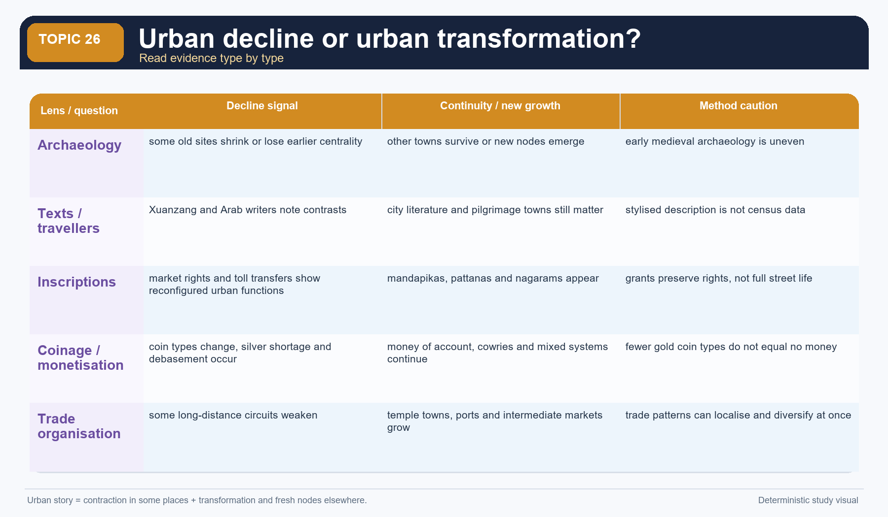

*The question is not whether every town declined or survived. The question is which towns changed function, which shrank and which newly grew.*

#### Urban question grid

| If the question asks... | Safer answer |
|---|---|
| "Was there urban decline?" | yes in some older centres, but not uniformly |
| "What replaced old urbanism?" | fortified capitals, temple towns, ports, market nodes, monastery centres |
| "What is the evidence?" | archaeology, inscriptions, travellers, literary city profiles, coinage |

#### Core teaching / solved practice

- [FACT] Upinder explicitly says the hypothesis of urban decline can be questioned on textual, archaeological and inscriptional grounds.
- [FACT] Topic 22's Nalanda and Kannauj material shows institutional and political concentration, not urban silence.
- [ANALYSIS] Urban life in the period often moved through political, pilgrimage and temple functions, not only through classical commercial forms.
- [LIMIT] "Third urbanisation" language can be suggestive, but should be used only with explanation.

#### Must-know facts

- Some old centres contracted.
- Other urban nodes survived or emerged.
- Function matters as much as size.

#### UPSC traps

- **Wrong:** urban decline was total and permanent. **Correct:** contraction and transformation coexisted.
- **Wrong:** every large temple proves a city. **Correct:** temple scale and urban scale are related but not identical.

**Mains angle:** Add one line on evidence type before stating the verdict.

**Study link:** Topic 19 on urban growth and Topic 22 on post-Gupta reorganisation.

#### CLOSING RECALL FLOW — URBANISATION: DECLINE, CONTINUITY AND TRANSFORMATION

```text
START / CONCEPT: Urbanisation: decline, continuity and transformation
        |
        v
EXACT TERMS: Urbanisation · decline · continuity · transformation · Mains angle · Study link
        |
        v
MECHANISM / ARGUMENT: Upinder explicitly says the hypothesis of urban decline can be questioned on textual, archaeological and inscriptional grounds.
        |
        v
CONSEQUENCE / CONTRAST: "Third urbanisation" language can be suggestive, but should be used only with explanation.
        |
        v
UPSC TRAP / ANSWER-USE: But she also notes the counter-argument: some centres declined, others endured and new ones emerged.
        |
        v
ANSWER-GRABBING FORMULATION: The safest phrase is "urban transformation" or "urban change with local decline." The distinction between town and village could blur in some cases, but temple towns, pilgrimage centres, port towns and fortified administrative centres also gained strength.
```
### SESSION 11 — SOCIAL STRUCTURE: VARNA IDEALS, JATI PROLIFERATION, MOBILITY AND EXCLUSION

#### DEFINITION / WHAT THIS IS CALLED

**Plain-language definition:** Sharma and the earlier topic packages stress that the varna order remained a strong normative language, but actual society was made of multiplying jatis, occupations, localities and ranked communities.

**Technical definition:** Nor should evidence of mobility be inflated into open equality.

#### ANSWER-GRABBING OPENING — WRITE/ADAPT IN THE EXAM

> Sharma and the earlier topic packages stress that the varna order remained a strong normative language, but actual society was made of multiplying jatis, occupations, localities and ranked communities.

#### MUST-WRITE KEYWORDS

- **Social structure**
- **varna ideals**
- **jati proliferation**
- **mobility**
- **exclusion**
- **Mains angle**

**How to use them:** Frame the answer through Social structure; define varna ideals, connect jati proliferation with mobility to explain the mechanism, and use exclusion for the decisive comparison or qualification.

[FACT] Sharma and the earlier topic packages stress that the varna order remained a strong normative language, but actual society was made of multiplying jatis, occupations, localities and ranked communities.

[FACT] Sharma explicitly connects proliferation of castes to the assimilation of foreigners and to the absorption of tribal groups via land grants. He also notes some improved social-economic space for certain shudra groups in agriculture while insisting that hierarchy remained steep.

[ANALYSIS] The evidence supports a clear distinction: varna remained the ideal hierarchy; jati marked the proliferating social process. Mixed-caste lists tell us more about classificatory anxiety than about exact demographic reality.

[LIMIT] Prescriptive lists and law codes must not be treated as census data. Nor should evidence of mobility be inflated into open equality.

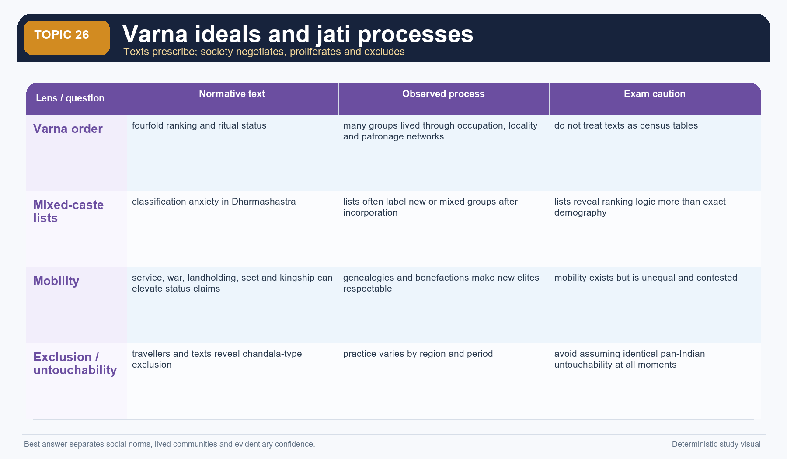

*Texts classify and rank, but lived social worlds are built through occupation, locality, service, warfare, cult and land.*

#### Social process table

| Process | Safer explanation |
|---|---|
| mixed-caste lists | normative effort to label new or awkward groups |
| mobility by service / war | new elites seek kshatriya or brahmana respectability |
| caste proliferation | incorporation plus ranking, not static fourfold order |
| exclusion | hierarchy hardens in some contexts, especially around untouchability evidence |

#### Core teaching / solved practice

- [FACT] Topic 20 already treats Gupta society as a field of varna-jati norms, labour dependence, slavery and explicit chandala evidence.
- [FACT] Topic 21 cautions that Faxian's evidence is strong but situated; it cannot stand for every region.
- [ANALYSIS] Mobility through land, warfare, sect, kingship and genealogy existed, but under structured hierarchy.
- [LIMIT] Social categories were not identical from Kashmir to Kanchi.

#### Must-know facts

- Varna = normative order; jati = proliferating social formation.
- New elites used genealogy and patronage to rise.
- Exclusion evidence must be regionally and source-wise qualified.

#### UPSC traps

- **Wrong:** the four varnas describe society exhaustively. **Correct:** jati proliferation and local worlds matter.
- **Wrong:** texts directly count people. **Correct:** they primarily rank and prescribe.

**Mains angle:** One sentence distinguishing varna and jati often lifts the answer immediately.

**Study link:** Topic 13 on varna society and Topic 21 on Gupta social evidence.

#### CLOSING RECALL FLOW — SOCIAL STRUCTURE: VARNA IDEALS, JATI PROLIFERATION, MOBILITY AND EXCLUSION

```text
START / CONCEPT: Social structure: varna ideals, jati proliferation, mobility and exclusion
        |
        v
EXACT TERMS: Social structure · varna ideals · jati proliferation · mobility · exclusion · Mains angle
        |
        v
MECHANISM / ARGUMENT: Nor should evidence of mobility be inflated into open equality.
        |
        v
CONSEQUENCE / CONTRAST: Social categories were not identical from Kashmir to Kanchi.
        |
        v
UPSC TRAP / ANSWER-USE: Prescriptive lists and law codes must not be treated as census data.
        |
        v
ANSWER-GRABBING FORMULATION: Sharma and the earlier topic packages stress that the varna order remained a strong normative language, but actual society was made of multiplying jatis, occupations, localities and ranked communities.
```
### SESSION 12 — BRAHMANISATION, ACCULTURATION AND LOCALISATION

#### DEFINITION / WHAT THIS IS CALLED

**Plain-language definition:** "Acculturation" is a safer word than "replacement," but it must still register inequality.

**Technical definition:** Brahmanisation is political, social and ritual.

#### ANSWER-GRABBING OPENING — WRITE/ADAPT IN THE EXAM

> But Brahmanisation must not be presented as a one-way civilising march.

#### MUST-WRITE KEYWORDS

- **Brahmanisation**
- **acculturation**
- **localisation**
- **Mains angle**
- **Study link**
- **genealogies and titles**

**How to use them:** Frame the answer through Brahmanisation; define acculturation, connect localisation with Mains angle to explain the mechanism, and use Study link for the decisive comparison or qualification.

[FACT] The south Indian and eastern Indian packages already show the main mechanism: grants, agraharas, temples, calendars, Sanskrit charters, genealogies and Puranic or sectarian cults spread into new regions.

[ANALYSIS] But Brahmanisation must not be presented as a one-way civilising march. Upinder and Topic 23 both support a more careful account: local elites sought Brahmanical legitimation, local cults were absorbed and transformed, and older deities or sacred sites remained active inside new ritual languages.

[LIMIT] "Acculturation" is a safer word than "replacement," but it must still register inequality. Reciprocal process does not mean equal bargaining power.

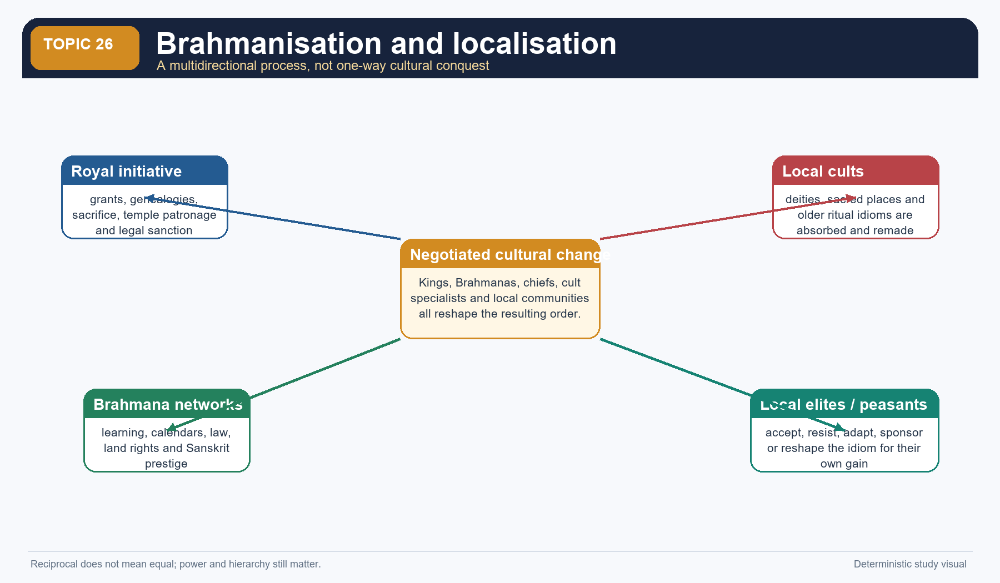

*The process runs through kings, donees, local cults and local communities simultaneously. This is why simplistic conquest language fails.*

#### Mechanism table

| Instrument | Historical effect |
|---|---|
| genealogies and titles | new chiefs become respectable dynasts |
| agraharas / brahmadeyas | literate and ritual specialists gain locality |
| temple patronage | sacred geography ties polity to place |
| cult appropriation | local deities enter wider textual and sectarian worlds |

#### Core teaching / solved practice

- [FACT] Sharma says priests invented respectable family trees for local chiefs and linked them to solar or lunar lines.
- [FACT] Topic 23 insists that "Brahmanisation" remains useful only if tied to land, cult and power.
- [FACT] Topic 22's Odisha material shows Sanskrit and charters moving beyond earlier coastal belts.
- [ANALYSIS] The safest phrase is "multidirectional but unequal integration."

#### Must-know facts

- Brahmanisation is political, social and ritual.
- Local elites had agency; local cults were not simply erased.
- Genealogy and land rights are part of the same process.

#### UPSC traps

- **Wrong:** Brahmanisation means one-way cultural conquest. **Correct:** it is negotiated, though unequal.
- **Wrong:** localisation means absence of wider ideological frameworks. **Correct:** it often operates through them.

**Mains angle:** Define the process through land, cult and legitimacy together.

**Study link:** Topic 23 on Brahmanisation and Topic 21 on Puranic expansion.

#### CLOSING RECALL FLOW — BRAHMANISATION, ACCULTURATION AND LOCALISATION

```text
START / CONCEPT: Brahmanisation, acculturation and localisation
        |
        v
EXACT TERMS: Brahmanisation · acculturation · localisation · Mains angle · Study link · genealogies and titles
        |
        v
MECHANISM / ARGUMENT: The south Indian and eastern Indian packages already show the main mechanism: grants, agraharas, temples, calendars, Sanskrit charters, genealogies and Puranic or sectarian cults spread into new regions.
        |
        v
CONSEQUENCE / CONTRAST: "Acculturation" is a safer word than "replacement," but it must still register inequality.
        |
        v
UPSC TRAP / ANSWER-USE: Local elites had agency; local cults were not simply erased.
        |
        v
ANSWER-GRABBING FORMULATION: But Brahmanisation must not be presented as a one-way civilising march.
```
### SESSION 13 — TRIBAL, FOREST AND FRONTIER SOCIETIES

#### DEFINITION / WHAT THIS IS CALLED

**Plain-language definition:** Terms like "tribe" or "forest people" are historian's convenience labels, not neutral self-descriptions.

**Technical definition:** Technically, Tribal, forest and frontier societies is analysed by relating Tribal to forest, then testing the relationship through frontier societies and Mains angle.

#### ANSWER-GRABBING OPENING — WRITE/ADAPT IN THE EXAM

> Frontier societies were not passive recipients.

#### MUST-WRITE KEYWORDS

- **Tribal**
- **forest**
- **frontier societies**
- **Mains angle**
- **Study link**
- **all tribal groups became castes**

**How to use them:** Frame the answer through Tribal; define forest, connect frontier societies with Mains angle to explain the mechanism, and use Study link for the decisive comparison or qualification.

[FACT] Upinder explicitly warns that forest and forest people remained under-studied in older historiography. Her examples from the Guhila-Bhil interaction, the Shabaras of Odisha and the Jagannatha cult show why this matters.

[ANALYSIS] Frontier societies were not passive recipients. Some groups resisted, some allied, some produced chiefs who rose into kingship, and some retained partial autonomy even while new agrarian and ritual systems spread around them.

[LIMIT] Much of the surviving evidence comes from elite charters or later narratives. Terms like "tribe" or "forest people" are historian's convenience labels, not neutral self-descriptions.

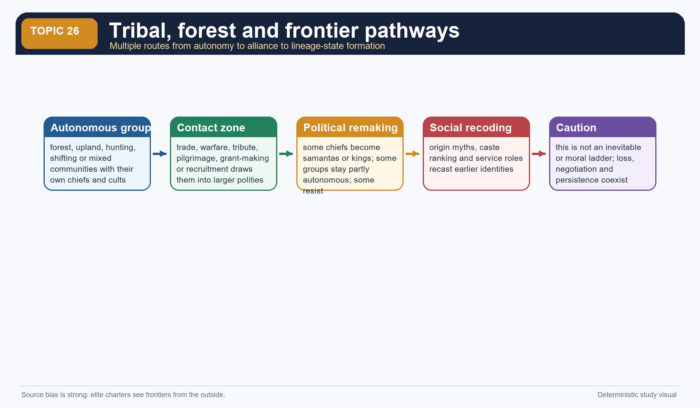

*The figure is deliberately non-teleological. The point is to block the false idea that every frontier group moved through one fixed historical ladder.*

#### Frontier caution grid

| Overclaim | Safer reformulation |
|---|---|
| all tribal groups became castes | some were incorporated, some resisted, some became ruling lineages |
| frontier = uncivilised void | frontier = political, ecological and cultural contact zone |
| forest groups disappear | many remain visible through cults, chiefs and service roles |

#### Core teaching / solved practice

- [FACT] Upinder notes that some dynasties may themselves have emerged from successful tribal chiefs.
- [FACT] Topic 22's eastern state formation and Topic 23's peninsular protests both require frontier agency.
- [ANALYSIS] Early medieval regionalisation often includes frontier incorporation, not just court politics.
- [LIMIT] Source voice belongs mostly to winners and donors.

#### Must-know facts

- Frontier societies shaped the transition.
- Incorporation, autonomy and resistance coexisted.
- Ecological context matters.

#### UPSC traps

- **Wrong:** tribe-to-caste is a universal historical law. **Correct:** it is one possible path among many.
- **Wrong:** frontier questions are outside political history. **Correct:** they are central to state formation.

**Mains angle:** Add one example - Bhils, Shabaras or Jagannatha's tribal connections - to prevent abstraction.

**Study link:** Topic 22 on Odisha and Topic 23 on peninsular peasant protest and locality.

#### CLOSING RECALL FLOW — TRIBAL, FOREST AND FRONTIER SOCIETIES

```text
START / CONCEPT: Tribal, forest and frontier societies
        |
        v
EXACT TERMS: Tribal · forest · frontier societies · Mains angle · Study link · all tribal groups became castes
        |
        v
MECHANISM / ARGUMENT: Terms like "tribe" or "forest people" are historian's convenience labels, not neutral self-descriptions.
        |
        v
CONSEQUENCE / CONTRAST: Early medieval regionalisation often includes frontier incorporation, not just court politics.
        |
        v
UPSC TRAP / ANSWER-USE: Some groups resisted, some allied, some produced chiefs who rose into kingship, and some retained partial autonomy even while new agrarian and ritual systems spread around them.
        |
        v
ANSWER-GRABBING FORMULATION: Frontier societies were not passive recipients.
```
### SESSION 14 — GENDER, FAMILY, PROPERTY AND POLITICAL AGENCY

#### DEFINITION / WHAT THIS IS CALLED

**Plain-language definition:** Upinder's Prabhavatigupta charter is vital evidence of queenly political agency.

**Technical definition:** Sharma's discussion is useful because it combines patriarchy and limited property rights.

#### ANSWER-GRABBING OPENING — WRITE/ADAPT IN THE EXAM

> Upinder's Prabhavatigupta charter is vital evidence of queenly political agency.

#### MUST-WRITE KEYWORDS

- **Gender**
- **family**
- **property**
- **political agency**
- **Mains angle**
- **Study link**

**How to use them:** Frame the answer through Gender; define family, connect property with political agency to explain the mechanism, and use Mains angle for the decisive comparison or qualification.

[FACT] Sharma's discussion is useful because it combines patriarchy and limited property rights. He notes the expansion of stridhana in Gupta and post-Gupta law, Katyayana's formulation that a woman could sell or mortgage her immovable property together with stridhana, and the first known widow immolation example in 510 CE - while still presenting the larger structure as patriarchal.

[FACT] Upinder's Prabhavatigupta charter is vital evidence of queenly political agency. Topic 21 already uses Prabhavatigupta as a major example of elite female power without pretending that such cases prove general equality.

[FACT] Upinder's research note on Chola temple women is equally important: early medieval "temple women" should not be collapsed into the later or colonial stereotype of the devadasi.

[ANALYSIS] Thus the historical field contains both subordination and agency: patriliny, ranked marriage norms and inheritance limits coexist with queens, donors, temple women and locally visible female resource control.

[LIMIT] Prescriptive texts, inscriptions and later memory must be separated. One queen or one law-book sentence cannot be universalised.

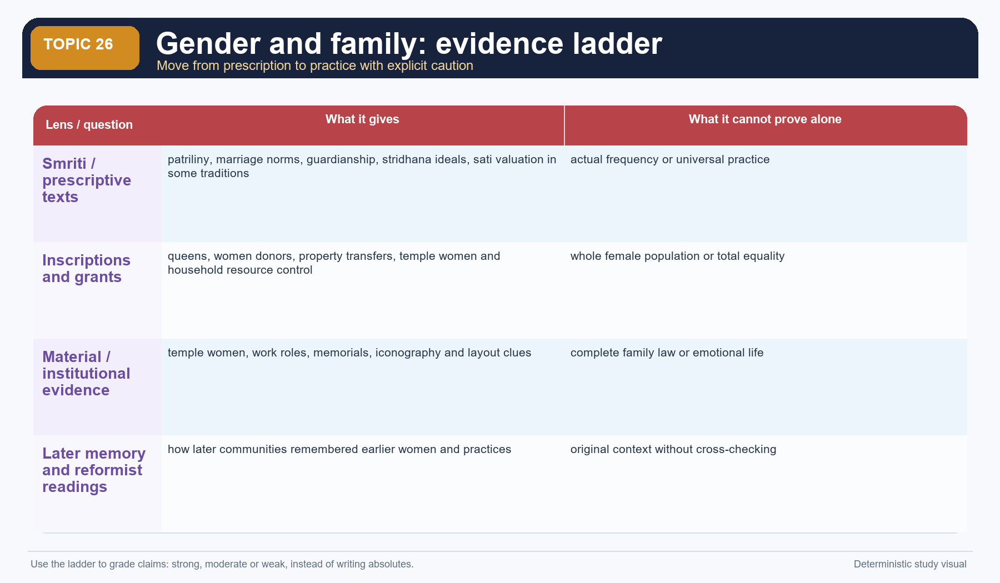

*A good answer climbs the evidence ladder carefully: norm -> inscription -> institution -> caution.*

#### Key distinction table

| Theme | Safer line |
|---|---|
| patriliny | normatively strong, but not the whole lived record |
| stridhana | real but bounded property sphere |
| sati | evidence exists, but chronology and region must be specified |
| temple women | institutionally visible; not identical to later devadasi stereotype |
| queens | clear elite agency; not proof of broad gender equality |

#### Core teaching / solved practice

- [FACT] Topic 21 repeatedly cautions against reading stridhana as modern gender equality.
- [FACT] Upinder states that temple women in Chola inscriptions were connected to temples largely through donation and honours, not through the later stereotype of ritual prostitution.
- [ANALYSIS] Women donors in inscriptions matter because they reveal access to resources and public religious presence.
- [LIMIT] Many ordinary women's lives remain less visible than elite or institutional women.

#### Must-know facts

- Patriarchy remained strong.
- Stridhana enlarged but stayed bounded.
- Queens and donors show agency.

#### UPSC traps

- **Wrong:** one mention of stridhana proves equal inheritance. **Correct:** property rights remained unequal overall.
- **Wrong:** every temple woman was a medieval devadasi in the later sense. **Correct:** institutional context changed over time.

**Mains angle:** Separate prescriptive patriarchy from inscriptional agency.

**Study link:** Topic 21 on Gupta social history and Topic 23 on temple women and bhakti limits.

#### CLOSING RECALL FLOW — GENDER, FAMILY, PROPERTY AND POLITICAL AGENCY

```text
START / CONCEPT: Gender, family, property and political agency
        |
        v
EXACT TERMS: Gender · family · property · political agency · Mains angle · Study link
        |
        v
MECHANISM / ARGUMENT: Sharma's discussion is useful because it combines patriarchy and limited property rights.
        |
        v
CONSEQUENCE / CONTRAST: He notes the expansion of stridhana in Gupta and post-Gupta law, Katyayana's formulation that a woman could sell or mortgage her immovable property together with stridhana, and the first known widow immolation example in 510 CE - while still presenting the larger structure as patriarchal.
        |
        v
UPSC TRAP / ANSWER-USE: Upinder's research note on Chola temple women is equally important: early medieval "temple women" should not be collapsed into the later or colonial stereotype of the devadasi.
        |
        v
ANSWER-GRABBING FORMULATION: Upinder's Prabhavatigupta charter is vital evidence of queenly political agency.
```
### SESSION 15 — RELIGION: PURANIC HINDUISM, BHAKTI, TANTRA, BUDDHISM AND JAINISM

#### DEFINITION / WHAT THIS IS CALLED

**Plain-language definition:** Bhakti, temple-centred religion and tantric practice are not "outside" polity and economy; they are central to them.

**Technical definition:** Topic 21 establishes that Puranic Vaishnava, Shaiva and goddess traditions expanded through image worship, myth, pilgrimage and temple patronage, while Buddhism and Jainism remained active.

#### ANSWER-GRABBING OPENING — WRITE/ADAPT IN THE EXAM

> Topic 21 establishes that Puranic Vaishnava, Shaiva and goddess traditions expanded through image worship, myth, pilgrimage and temple patronage, while Buddhism and Jainism remained active.

#### MUST-WRITE KEYWORDS

- **Religion**
- **Puranic Hinduism**
- **bhakti**
- **tantra**
- **Buddhism**
- **Jainism**

**How to use them:** Frame the answer through Religion; define Puranic Hinduism, connect bhakti with tantra to explain the mechanism, and use Buddhism for the decisive comparison or qualification.

[FACT] Topic 21 establishes that Puranic Vaishnava, Shaiva and goddess traditions expanded through image worship, myth, pilgrimage and temple patronage, while Buddhism and Jainism remained active. Topic 23 shows that bhakti in the south worked through shrine networks, vernacular songs and image worship, but did not abolish hierarchy.

[FACT] Topic 22 and Topic 25 show that Buddhism did not simply vanish; it persisted and was transformed through monasteries, Pala mahaviharas, trans-Himalayan links and regional strongholds. Jainism also remained regionally important in many zones.

[ANALYSIS] The early medieval religious field is therefore best written as competition plus coexistence. Sectarian consolidation, temple building, pilgrimage growth, tantra and scholastic monasticism all deepen at once.

[LIMIT] No single religious arc dominates the whole subcontinent. Even persecution stories in hagiographies must be read cautiously and often as boundary-making narratives.

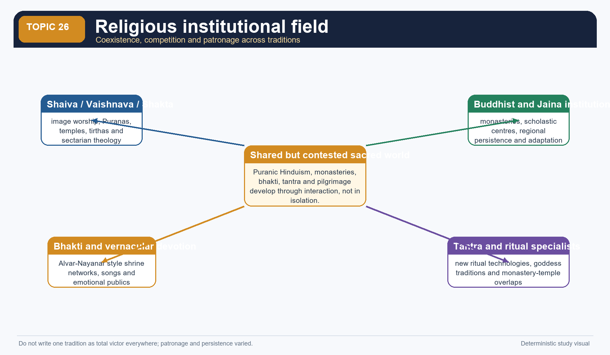

*This is not a winner-takes-all diagram. It is a field of overlapping institutional energies.*

#### Religious process grid

| Process | Why it matters |
|---|---|
| Puranic expansion | links myth, image, sacred geography and kingship |
| bhakti | vernacular devotional publics and shrine circuits |
| tantra | ritual innovation across Buddhist and Brahmanical worlds |
| monastery persistence | shows continuing Buddhist and Jaina institutional depth |
| pilgrimage | ties locality to transregional sacred networks |

#### Core teaching / solved practice

- [FACT] Topic 23 cites Sharma's statement that from the 7th century the Alvars and Nayanars helped bhakti dominate much religious life in the south.
- [FACT] Topic 22's Nalanda material ties religion to agrarian surplus and trans-Asian movement.
- [FACT] Topic 25's Buddhist interaction routes show that doctrinal and institutional transmission remained active well into the early medieval centuries.
- [ANALYSIS] Bhakti, temple-centred religion and tantric practice are not "outside" polity and economy; they are central to them.

#### Must-know facts

- Puranic Hinduism is sectarian and plural, not uniform.
- Bhakti widens devotional access but does not erase hierarchy.
- Buddhism and Jainism persist through transformed institutions.

#### UPSC traps

- **Wrong:** early medieval religion means simple Buddhist decline and Hindu rise. **Correct:** write persistence, competition and regional variation.
- **Wrong:** bhakti was a complete anti-caste revolution. **Correct:** its social opening was real but bounded.

**Mains angle:** Religion in this period is institutional history, not just belief history.

**Study link:** Topics 10, 21, 22, 23, 24 and 25.

#### CLOSING RECALL FLOW — RELIGION: PURANIC HINDUISM, BHAKTI, TANTRA, BUDDHISM AND JAINISM

```text
START / CONCEPT: Religion: Puranic Hinduism, bhakti, tantra, Buddhism and Jainism
        |
        v
EXACT TERMS: Religion · Puranic Hinduism · bhakti · tantra · Buddhism · Jainism
        |
        v
MECHANISM / ARGUMENT: Topic 23 shows that bhakti in the south worked through shrine networks, vernacular songs and image worship, but did not abolish hierarchy.
        |
        v
CONSEQUENCE / CONTRAST: Bhakti, temple-centred religion and tantric practice are not "outside" polity and economy; they are central to them.
        |
        v
UPSC TRAP / ANSWER-USE: Puranic Hinduism is sectarian and plural, not uniform.
        |
        v
ANSWER-GRABBING FORMULATION: Topic 21 establishes that Puranic Vaishnava, Shaiva and goddess traditions expanded through image worship, myth, pilgrimage and temple patronage, while Buddhism and Jainism remained active.
```
### SESSION 16 — TEMPLE AS INSTITUTION: LANDHOLDER, EMPLOYER, REDISTRIBUTOR AND ARCHIVE

#### DEFINITION / WHAT THIS IS CALLED

**Plain-language definition:** Temples are prominent because stone inscriptions survive; perishable institutions are less visible.

**Technical definition:** Technically, Temple as institution: landholder, employer, redistributor and archive is analysed by relating Temple as institution to landholder, then testing the relationship through employer and redistributor.

#### ANSWER-GRABBING OPENING — WRITE/ADAPT IN THE EXAM

> Therefore the temple should be written as an ecosystem: ritual centre, employer, redistributor, legitimising device, craft node and archival surface.

#### MUST-WRITE KEYWORDS

- **Temple as institution**
- **landholder**
- **employer**
- **redistributor**
- **archive**
- **Mains angle**

**How to use them:** Frame the answer through Temple as institution; define landholder, connect employer with redistributor to explain the mechanism, and use archive for the decisive comparison or qualification.

[FACT] Upinder's temple pages are unusually concrete. She notes large-scale royal grants to temples, increased donations from Pallava to Chola times, merchant gifts of money, livestock and land, and major labour establishments. She records 54 employees for Mukteshvara and over 600 for Brihadishvara.

[FACT] Temples could employ drummers, accountants, tailors, goldsmiths and dancing women; collect or manage land and grain; host festivals; support lamps; and preserve inscriptions that function as local archives of power and memory.

[ANALYSIS] Therefore the temple should be written as an ecosystem: ritual centre, employer, redistributor, legitimising device, craft node and archival surface.

[LIMIT] Do not project the largest Chola temples onto every region or century. Small shrines, monasteries and multi-religious local worlds remained crucial too.

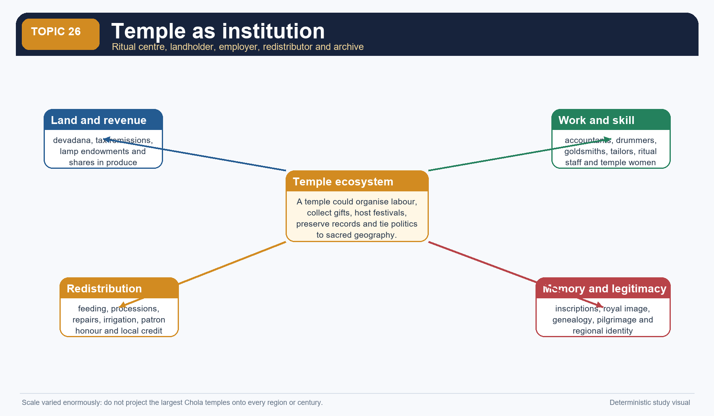

*Temple history in this period becomes richer when inscriptions, donors, workforces and festivals are treated together.*

#### Institutional table

| Temple function | Example of evidence |
|---|---|
| landholder | devadana, produce shares, perpetual grants |
| employer | named workers and revenue assignments |
| redistributor | feeding, lamp maintenance, irrigation, processions |
| archive | inscriptions of gifts, rights, offices, identities |
| legitimacy node | royal patronage and imperial cults |

#### Core teaching / solved practice

- [FACT] Upinder says the relation between kings and temples was fundamentally one of alliance, not rivalry.
- [FACT] Merchant and artisan groups could also enter temple management or donate to temple maintenance.
- [ANALYSIS] This is why temple growth can signify both sacrality and political economy.
- [LIMIT] Temples are prominent because stone inscriptions survive; perishable institutions are less visible.

#### Must-know facts

- Temple = institution, not only shrine.
- Kings, merchants and local communities all appear as donors.
- Labour history and record-keeping belong inside temple history.

#### UPSC traps

- **Wrong:** temple history is only architecture. **Correct:** add land, labour, gifts and legitimacy.
- **Wrong:** temple wealth automatically proves state weakness. **Correct:** alliance and integration often explain it better.

**Mains angle:** One strong sentence is: "Temple growth converted fiscal geography into sacred geography."

**Study link:** Topic 23 on bhakti and temples, Topic 27 on later Chola intensification.

#### CLOSING RECALL FLOW — TEMPLE AS INSTITUTION: LANDHOLDER, EMPLOYER, REDISTRIBUTOR AND ARCHIVE

```text
START / CONCEPT: Temple as institution: landholder, employer, redistributor and archive
        |
        v
EXACT TERMS: Temple as institution · landholder · employer · redistributor · archive · Mains angle
        |
        v
MECHANISM / ARGUMENT: Temples are prominent because stone inscriptions survive; perishable institutions are less visible.
        |
        v
CONSEQUENCE / CONTRAST: Do not project the largest Chola temples onto every region or century.
        |
        v
UPSC TRAP / ANSWER-USE: Upinder says the relation between kings and temples was fundamentally one of alliance, not rivalry.
        |
        v
ANSWER-GRABBING FORMULATION: Therefore the temple should be written as an ecosystem: ritual centre, employer, redistributor, legitimising device, craft node and archival surface.
```
### SESSION 17 — LANGUAGE, SCRIPTS, SANSKRIT COSMOPOLIS AND VERNACULARISATION

#### DEFINITION / WHAT THIS IS CALLED

**Plain-language definition:** The Pollock-style "Sanskrit cosmopolis" frame is useful for elite language politics, but should not be treated as the entire cultural field.

**Technical definition:** The best answer is not "vernaculars replaced Sanskrit." It is "Sanskrit and regional languages increasingly interacted in unequal but creative ways.".

#### ANSWER-GRABBING OPENING — WRITE/ADAPT IN THE EXAM

> The Pollock-style "Sanskrit cosmopolis" frame is useful for elite language politics, but should not be treated as the entire cultural field.

#### MUST-WRITE KEYWORDS

- **Language**
- **scripts**
- **Sanskrit cosmopolis**
- **vernacularisation**
- **Mains angle**
- **Study link**

**How to use them:** Frame the answer through Language; define scripts, connect Sanskrit cosmopolis with vernacularisation to explain the mechanism, and use Mains angle for the decisive comparison or qualification.

[FACT] Upinder's discussion of early medieval textual culture is decisive here. She notes that Sanskrit had ceased to be an ordinary spoken language long before, yet remained a major prestige language for theology, law, grammar, poetics, medicine, architecture and political expression.

[FACT] She also adopts the vernacularisation framework: regional languages first appear more strongly in documentary details and then increasingly in politically expressive and literary roles. Tamil develops earlier than many other zones, but the larger shift continues into the second millennium.

[ANALYSIS] The best answer is not "vernaculars replaced Sanskrit." It is "Sanskrit and regional languages increasingly interacted in unequal but creative ways."

[LIMIT] The Pollock-style "Sanskrit cosmopolis" frame is useful for elite language politics, but should not be treated as the entire cultural field.

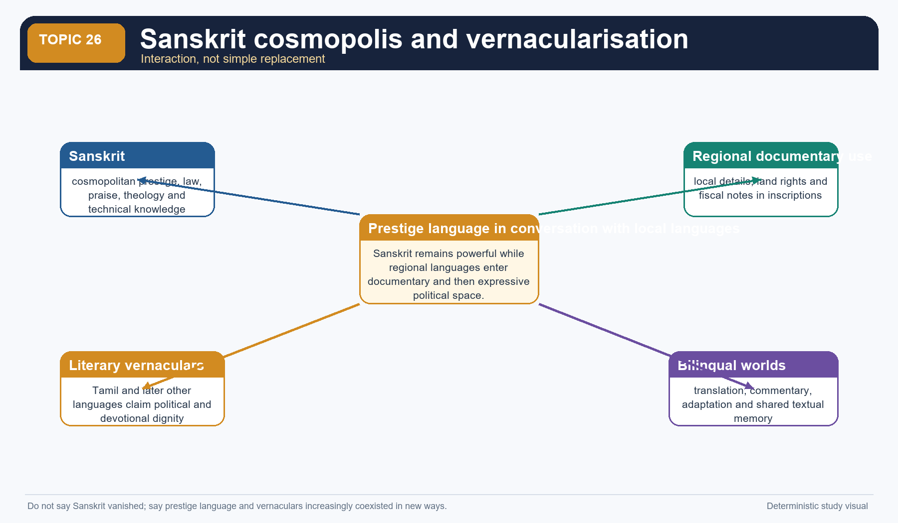

*Language history here is an interaction map, not a replacement chart.*

#### Language process table

| Layer | Historical role |
|---|---|
| Sanskrit | prestige, law, praise, theology, technical learning |
| regional documentary language | local land details, fiscal description, place idiom |
| literary vernacular | devotional, courtly and political self-expression |
| bilingual inscriptional world | mediation between cosmopolitan prestige and local rootedness |

#### Core teaching / solved practice

- [FACT] Topic 23 already uses bilingual Pallava epigraphy and Tamil bhakti as key evidence.
- [FACT] Topic 22 shows Sanskrit charters spreading into eastern zones with agrarian and state formation.
- [ANALYSIS] Vernacularisation is tied to regional configuration, not merely to literary taste.
- [LIMIT] Script and language must be kept distinct; one script can serve more than one language.

#### Must-know facts

- Sanskrit remains powerful in the early medieval period.
- Vernacular literary-political assertion grows in conversation with it.
- Bilinguality is historically central.

#### UPSC traps

- **Wrong:** vernacularisation means Sanskrit disappears. **Correct:** prestige coexistence continues.
- **Wrong:** script and language are the same category. **Correct:** separate them analytically.

**Mains angle:** The transition produces multilingual power, not linguistic replacement alone.

**Study link:** Topic 23 on Tamil bhakti and Topic 25 on script-language transmission across Asia.

#### CLOSING RECALL FLOW — LANGUAGE, SCRIPTS, SANSKRIT COSMOPOLIS AND VERNACULARISATION

```text
START / CONCEPT: Language, scripts, Sanskrit cosmopolis and vernacularisation
        |
        v
EXACT TERMS: Language · scripts · Sanskrit cosmopolis · vernacularisation · Mains angle · Study link
        |
        v
MECHANISM / ARGUMENT: She notes that Sanskrit had ceased to be an ordinary spoken language long before, yet remained a major prestige language for theology, law, grammar, poetics, medicine, architecture and political expression.
        |
        v
CONSEQUENCE / CONTRAST: The best answer is not "vernaculars replaced Sanskrit." It is "Sanskrit and regional languages increasingly interacted in unequal but creative ways.".
        |
        v
UPSC TRAP / ANSWER-USE: Vernacularisation is tied to regional configuration, not merely to literary taste.
        |
        v
ANSWER-GRABBING FORMULATION: The Pollock-style "Sanskrit cosmopolis" frame is useful for elite language politics, but should not be treated as the entire cultural field.
```
### SESSION 18 — KNOWLEDGE, EDUCATION AND COMMENTARIAL TRADITIONS

#### DEFINITION / WHAT THIS IS CALLED

**Plain-language definition:** Survival of texts is uneven and often privileges elite literate traditions.

**Technical definition:** Commentarial chains are part of the transition, not a decline symptom alone.

#### ANSWER-GRABBING OPENING — WRITE/ADAPT IN THE EXAM

> Therefore knowledge institutions in Topic 26 include agraharas, temples, monasteries, courts and oral/commentarial chains.

#### MUST-WRITE KEYWORDS

- **Knowledge**
- **education**
- **commentarial traditions**
- **Mains angle**
- **Study link**
- **monastery / mahavihara**

**How to use them:** Frame the answer through Knowledge; define education, connect commentarial traditions with Mains angle to explain the mechanism, and use Study link for the decisive comparison or qualification.

[FACT] Topic 24 emphasises that ancient and early medieval knowledge moved through sutra, commentary, sub-commentary, debate, public disputation, monasteries, courts and household or lineage teaching. Topic 21 adds that learning was distributed across teachers, Brahmanical centres, monasteries, courts and specialist communities rather than concentrated in one modern-university form.

[FACT] Topic 22's Nalanda section is crucial: Sharma says Nalanda was supported by revenue from 200 villages, but the package also warns that the most famous numerical claims must be used cautiously and not treated as exact census figures.

[ANALYSIS] Therefore knowledge institutions in Topic 26 include agraharas, temples, monasteries, courts and oral/commentarial chains. Nalanda is emblematic, but not the whole story.

[LIMIT] Do not project the modern university model backward. Nor should every scholastic centre be treated as equally well documented.

#### Institutional grid

| Institution | Best use in answer |
|---|---|
| monastery / mahavihara | scholastic concentration, manuscript movement, pilgrim networks |
| agrahara / Brahmana settlement | learning, law, calendars, ritual and social status |
| court | patronage of literature, grammar, commentary, praise and technical texts |
| temple | archive, performance, festival, donor memory, some educational functions |
| oral / commentarial chain | durability of compressed texts and school formation |

#### Core teaching / solved practice

- [FACT] Topic 24 stresses the pattern sutra -> commentary -> sub-commentary as a major civilisational form.
- [FACT] Topic 22 shows Nalanda's support base was agrarian as well as scholastic.
- [ANALYSIS] Knowledge was materially sustained by land, donations and institutions, not by detached "civilisation" alone.
- [LIMIT] Survival of texts is uneven and often privileges elite literate traditions.

#### Must-know facts

- Education was institutionally plural.
- Nalanda is important, but must be historically phased and numerically qualified.
- Commentarial chains are part of the transition, not a decline symptom alone.

#### UPSC traps

- **Wrong:** early medieval knowledge means only monastic Buddhism. **Correct:** include agraharas, courts, temples and commentaries.
- **Wrong:** oral transmission means no intellectual rigour. **Correct:** it often coexists with exact technical learning.

**Mains angle:** Link knowledge to its material support base.

**Study link:** Topic 22 on Nalanda and Topic 24 on philosophy and commentary.

#### CLOSING RECALL FLOW — KNOWLEDGE, EDUCATION AND COMMENTARIAL TRADITIONS

```text
START / CONCEPT: Knowledge, education and commentarial traditions
        |
        v
EXACT TERMS: Knowledge · education · commentarial traditions · Mains angle · Study link · monastery / mahavihara
        |
        v
MECHANISM / ARGUMENT: Knowledge was materially sustained by land, donations and institutions, not by detached "civilisation" alone.
        |
        v
CONSEQUENCE / CONTRAST: Commentarial chains are part of the transition, not a decline symptom alone.
        |
        v
UPSC TRAP / ANSWER-USE: Topic 22's Nalanda section is crucial: Sharma says Nalanda was supported by revenue from 200 villages, but the package also warns that the most famous numerical claims must be used cautiously and not treated as exact census figures.
        |
        v
ANSWER-GRABBING FORMULATION: Therefore knowledge institutions in Topic 26 include agraharas, temples, monasteries, courts and oral/commentarial chains.
```
### SESSION 19 — REGIONALISATION ACROSS BENGAL, WESTERN INDIA, DECCAN, TAMIL COUNTRY, KARNATAKA, ODISHA AND THE HILLS

#### DEFINITION / WHAT THIS IS CALLED

**Plain-language definition:** Regionalisation is not a decorative appendix.

**Technical definition:** North India is not the universal template.

#### ANSWER-GRABBING OPENING — WRITE/ADAPT IN THE EXAM

> Regionalisation is not a decorative appendix.

#### MUST-WRITE KEYWORDS

- **Regionalisation across Bengal**
- **western India**
- **Deccan**
- **Tamil country**
- **Karnataka**
- **Odisha**

**How to use them:** Frame the answer through Regionalisation across Bengal; define western India, connect Deccan with Tamil country to explain the mechanism, and use Karnataka for the decisive comparison or qualification.

[ANALYSIS] Topic 26 becomes much stronger when the answer briefly regionalises. Earlier topics already supply the evidence: Bengal and eastern India with charters and Nalanda; Rajasthan-Gujarat with merchant and silver questions; Deccan with penthas and layered feudatories; Tamil region with brahmadeya, bhakti and temple networks; Karnataka with samantas and village bodies; Odisha with agraharas and Jagannatha; Himalayan zones with Kashmir's textual and religious density.

[LIMIT] Regionalisation is not a decorative appendix. It is the main method by which over-generalisation is controlled.

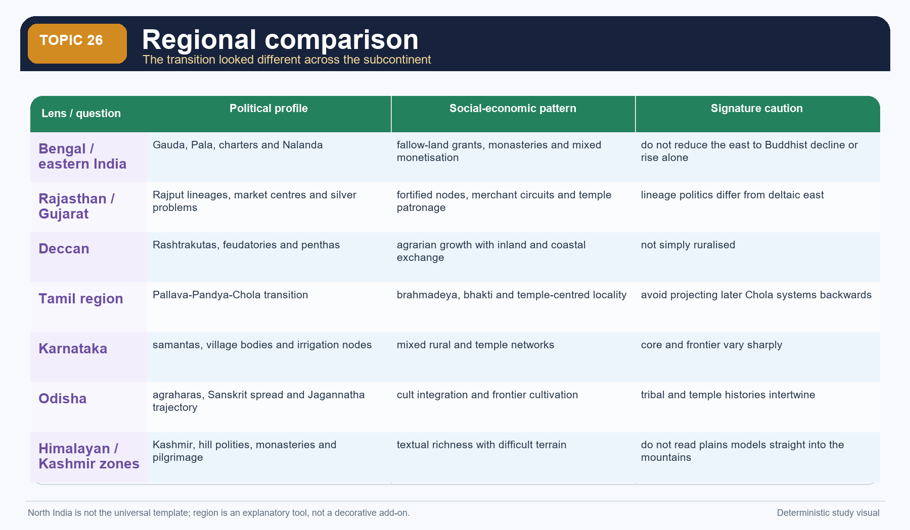

*Once the matrix is visible, the impossibility of a single transition formula becomes obvious.*

#### Quick comparative takeaways

- [FACT] Bengal / east: charters, monasteries, agrarian growth, Pala visibility.
- [FACT] Rajasthan / Gujarat: forts, market centres, silver and trade adaptation.
- [FACT] Deccan / Karnataka: penthas, feudatories, temples and irrigation nodes.
- [FACT] Tamil region: bhakti, brahmadeya, temple-centred locality, early vernacular public.
- [FACT] Odisha: Sanskrit spread, agraharas, frontier integration, Jagannatha trajectory.
- [FACT] Himalayan / Kashmir zones: pilgrimage, monasteries, courts and text-rich political culture.

#### Must-know facts

- Regional comparison is essential, not optional.
- The east and the south are especially important to this chapter.
- North India is not the universal template.

#### UPSC traps

- **Wrong:** treat post-Gupta north India as the entire transition. **Correct:** regionalise immediately.
- **Wrong:** add regions only as a final list. **Correct:** use them to structure the argument.

**Mains angle:** One comparative sentence in the middle of the answer prevents pan-Indian overreach.

**Study link:** Topics 22, 23, 25 and 27.

#### CLOSING RECALL FLOW — REGIONALISATION ACROSS BENGAL, WESTERN INDIA, DECCAN, TAMIL COUNTRY, KARNATAKA, ODISHA AND THE HILLS

```text
START / CONCEPT: Regionalisation across Bengal, western India, Deccan, Tamil country, Karnataka, Odisha and the hills
        |
        v
EXACT TERMS: Regionalisation across Bengal · western India · Deccan · Tamil country · Karnataka · Odisha
        |
        v
MECHANISM / ARGUMENT: It is the main method by which over-generalisation is controlled.
        |
        v
CONSEQUENCE / CONTRAST: North India is not the universal template.
        |
        v
UPSC TRAP / ANSWER-USE: Regional comparison is essential, not optional.
        |
        v
ANSWER-GRABBING FORMULATION: Regionalisation is not a decorative appendix.
```
### SESSION 20 — CONNECTIVITY ALONGSIDE LOCALISATION

#### DEFINITION / WHAT THIS IS CALLED

**Plain-language definition:** Connectivity alongside localisation comprises Mains angle, Study link and Indian Ocean as its core connected dimensions.

**Technical definition:** "Agrarian localisation plus continued mobility" is a better line than "ruralisation versus trade." No single route dominated every century.

#### ANSWER-GRABBING OPENING — WRITE/ADAPT IN THE EXAM

> This is a key synthesis point: localisation did not mean isolation.

#### MUST-WRITE KEYWORDS

- **Connectivity alongside localisation**
- **Mains angle**
- **Study link**
- **Indian Ocean**
- **ports, horses, aromatics, textiles, Arab trade circuits**
- **Bay of Bengal**

**How to use them:** Frame the answer through Connectivity alongside localisation; define Mains angle, connect Study link with Indian Ocean to explain the mechanism, and use ports, horses, aromatics, textiles, Arab trade circuits for the decisive comparison or qualification.

[FACT] Upinder's trade and monetary discussion, together with Topic 25's interaction package, shows continued external and inter-regional mobility. Arab control over large segments of Indian Ocean trade, Bay of Bengal links, merchant movement, pilgrimage and trans-Himalayan scholastic traffic continued even as agrarian localities thickened.

[ANALYSIS] This is a key synthesis point: localisation did not mean isolation. In many cases, local agrarian surplus financed the very monasteries, ports, temples and merchant houses that sustained wider mobility.

[LIMIT] Connectivity should not be exaggerated into empire. A route or donor network is not the same as political sovereignty.

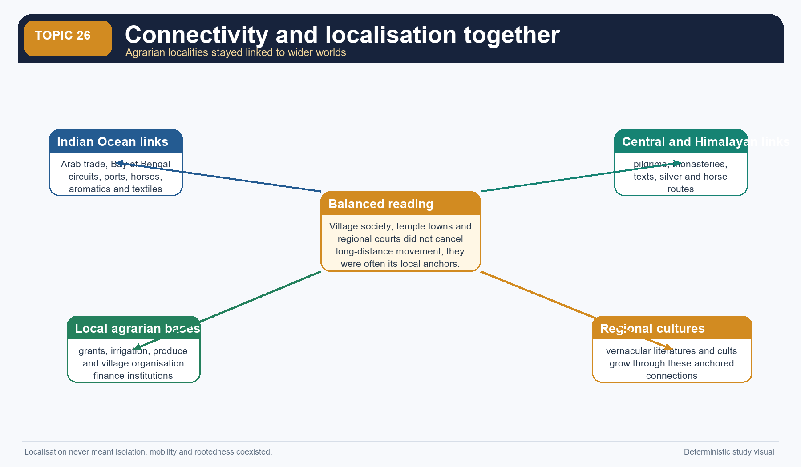

*The strongest wording is "rooted mobility": local institutions and wider exchange fed each other.*

#### Connectivity table

| Route type | Best example in this chapter |
|---|---|
| Indian Ocean | ports, horses, aromatics, textiles, Arab trade circuits |
| Bay of Bengal | Pala-Southeast Asian monastic and trade links; later Chola boundary marker |
| Himalayan / trans-Himalayan | Nalanda to Tibet, pilgrim routes, texts |
| inland-regional | mandapikas, temple fairs, political capitals, market towns |

#### Core teaching / solved practice

- [FACT] Topic 25 repeatedly shows that merchants, monks and texts travelled together.
- [FACT] Topic 22's Pala and Nalanda material demonstrates eastern connectivity after Harsha.
- [ANALYSIS] "Agrarian localisation plus continued mobility" is a better line than "ruralisation versus trade."
- [LIMIT] No single route dominated every century.

#### Must-know facts

- Localisation and connectivity coexist.
- Merchant, pilgrim and scholastic routes all matter.
- Ports, temple towns and monasteries can be local anchors of global movement.

#### UPSC traps

- **Wrong:** local agrarian growth ended all long-distance mobility. **Correct:** it often supported it.
- **Wrong:** one maritime campaign proves enduring overseas empire. **Correct:** distinguish mobility from sovereignty.

**Mains angle:** Use connectivity to prevent a closed-village caricature of the early medieval period.

**Study link:** Topic 25 on Asian interaction and Topic 27 on the Chola next-step boundary.

#### CLOSING RECALL FLOW — CONNECTIVITY ALONGSIDE LOCALISATION

```text
START / CONCEPT: Connectivity alongside localisation
        |
        v
EXACT TERMS: Connectivity alongside localisation · Mains angle · Study link · Indian Ocean · ports, horses, aromatics, textiles, Arab trade circuits · Bay of Bengal
        |
        v
MECHANISM / ARGUMENT: Topic 22's Pala and Nalanda material demonstrates eastern connectivity after Harsha.
        |
        v
CONSEQUENCE / CONTRAST: Connectivity should not be exaggerated into empire.
        |
        v
UPSC TRAP / ANSWER-USE: A route or donor network is not the same as political sovereignty.
        |
        v
ANSWER-GRABBING FORMULATION: This is a key synthesis point: localisation did not mean isolation.
```
### SESSION 21 — ANCIENT LEGACIES AND MODERN HISTORICAL CONSCIOUSNESS

#### DEFINITION / WHAT THIS IS CALLED

**Plain-language definition:** Modern historical consciousness is selective and political.

**Technical definition:** Some legacies survive with relatively less change; others are transformed through bhakti, tantra, vernacularisation or temple institutions; still others are modern reinventions through archaeology, museums, tourism, public symbols, schoolbooks or identity politics.

#### ANSWER-GRABBING OPENING — WRITE/ADAPT IN THE EXAM

> Modern historical consciousness is selective and political.

#### MUST-WRITE KEYWORDS

- **Ancient legacies**
- **modern historical consciousness**
- **Mains angle**
- **Study link**
- **political memory**
- **social categories**

**How to use them:** Frame the answer through Ancient legacies; define modern historical consciousness, connect Mains angle with Study link to explain the mechanism, and use political memory for the decisive comparison or qualification.

[FACT] Sharma's legacy chapter and Topics 21, 24 and 25 together show that the transition did not erase ancient inheritances. Philosophical traditions, epics and Puranas, temple vocabularies, scientific and grammatical traditions, pilgrimage routes and political idioms persisted into new settings.

[ANALYSIS] But persistence should be classified, not romanticised. Some legacies survive with relatively less change; others are transformed through bhakti, tantra, vernacularisation or temple institutions; still others are modern reinventions through archaeology, museums, tourism, public symbols, schoolbooks or identity politics.

[LIMIT] Present-day heritage language must not be read back unchanged into the early medieval past. Modern pride, grievance or nationalism are not the same as historical explanation.

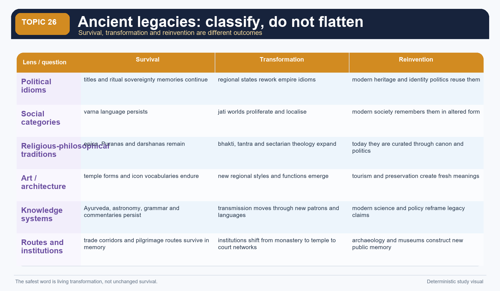

*The correct legacy language is survival, transformation and reinvention - not frozen continuity.*

#### Legacy grid

| Legacy field | Safer verdict |
|---|---|
| political memory | empire idioms survive, but are regionally reworked |
| social categories | varna language persists, jati worlds transform |
| religion | epic and Puranic frames persist through new sectarian and devotional forms |
| architecture / art | early forms survive through strong regional re-elaboration |
| knowledge systems | grammar, Ayurveda, mathematics, philosophy and commentary continue through new institutions |
| public memory | archaeology and heritage create new civic meanings and contestations |

#### Core teaching / solved practice

- [FACT] Topic 21 already distinguishes Gupta contribution from its unequal social distribution.
- [FACT] Topic 24 shows how philosophical plurality survives through commentaries and school formation.
- [ANALYSIS] Topic 26 should not end in triumphalism; its legacy argument is strongest when it distinguishes continuity from reinvention.
- [LIMIT] Heritage politics often simplifies messy regional histories.

#### Must-know facts

- Ancient India survives through transformation, not stasis.
- Modern historical consciousness is selective and political.
- Archaeology and heritage curation are part of the afterlife of the past.

#### UPSC traps

- **Wrong:** legacy means unchanged civilisational continuity. **Correct:** most important legacies are transformed.
- **Wrong:** heritage debates can be used as historical proof. **Correct:** they show present uses of the past.

**Mains angle:** End legacy answers with "living transformation" rather than civilisational slogan.

**Study link:** Topics 21, 24 and 25; bridge forward to temple architecture and Bhakti owners.

#### CLOSING RECALL FLOW — ANCIENT LEGACIES AND MODERN HISTORICAL CONSCIOUSNESS

```text
START / CONCEPT: Ancient legacies and modern historical consciousness
        |
        v
EXACT TERMS: Ancient legacies · modern historical consciousness · Mains angle · Study link · political memory · social categories
        |
        v
MECHANISM / ARGUMENT: Some legacies survive with relatively less change; others are transformed through bhakti, tantra, vernacularisation or temple institutions; still others are modern reinventions through archaeology, museums, tourism, public symbols, schoolbooks or identity politics.
        |
        v
CONSEQUENCE / CONTRAST: Sharma's legacy chapter and Topics 21, 24 and 25 together show that the transition did not erase ancient inheritances.
        |
        v
UPSC TRAP / ANSWER-USE: Modern pride, grievance or nationalism are not the same as historical explanation.
        |
        v
ANSWER-GRABBING FORMULATION: Modern historical consciousness is selective and political.
```
### SESSION 22 — HISTORICAL SIGNIFICANCE AND BRIDGE TO THE NEXT TOPICS

#### DEFINITION / WHAT THIS IS CALLED

**Plain-language definition:** Historical significance and bridge to the next topics comprises Historical significance, bridge to the next topics and Mains angle as its core connected dimensions.

**Technical definition:** Its significance is not that "medieval India began" in one moment, but that a new configuration of power, society and culture became historically dominant.

#### ANSWER-GRABBING OPENING — WRITE/ADAPT IN THE EXAM

> That is why Topic 26 naturally feeds Topic 27 on the Imperial Cholas and later owners on Bhakti, medieval polity, temple architecture and social history.

#### MUST-WRITE KEYWORDS

- **Historical significance**
- **bridge to the next topics**
- **Mains angle**
- **Study link**
- **That**
- **Topic**

**How to use them:** Frame the answer through Historical significance; define bridge to the next topics, connect Mains angle with Study link to explain the mechanism, and use That for the decisive comparison or qualification.

[ANALYSIS] The early medieval transition matters because it produced the durable historical grammar of many later Indian worlds: regional kingdoms, shrine-centred localities, vernacular devotional cultures, temple institutions, layered sovereignty, frontier incorporation, and new social classifications.

[ANALYSIS] That is why Topic 26 naturally feeds Topic 27 on the Imperial Cholas and later owners on Bhakti, medieval polity, temple architecture and social history. Topic 27 intensifies what Topic 26 synthesises: not the birth of history out of nothing, but the consolidation of already visible early medieval processes.

[LIMIT] The chapter should still leave room for older survivals and for regional differences. Its significance is not that "medieval India began" in one moment, but that a new configuration of power, society and culture became historically dominant.


*The answer spine is the package's final teaching move: define, compare, evidence, qualify, conclude.*

#### Final synthesis

- [FACT] Regional cultures were not by-products; they were central outcomes.
- [FACT] Temple and monastic institutions reorganised labour, memory and surplus.
- [FACT] Vernacularisation and bhakti gave many regions new cultural publics.
- [ANALYSIS] The "mere decline" model misses the creation of durable institutions and identities.
- [ANALYSIS] The "pure continuity" model misses the redistribution of power and hierarchy.

#### Must-know facts

- Topic 26 is the hinge between ancient and medieval owners.
- It explains why later regional power looks the way it does.
- Its strongest verdict is "creative reorganisation under constraint."

#### UPSC traps

- **Wrong:** close with civilisational rise/fall rhetoric. **Correct:** close with a graded historical judgement.
- **Wrong:** end with a dynastic list. **Correct:** end with significance.

**Mains angle:** Conclude that the period produced regional cultures, durable institutions and new political-social forms rather than mere decline.

**Study link:** Topic 27 on Cholas; future medieval owners on regional kingdoms, Bhakti and state-society themes.

#### CLOSING RECALL FLOW — HISTORICAL SIGNIFICANCE AND BRIDGE TO THE NEXT TOPICS

```text
START / CONCEPT: Historical significance and bridge to the next topics
        |
        v
EXACT TERMS: Historical significance · bridge to the next topics · Mains angle · Study link · That · Topic
        |
        v
MECHANISM / ARGUMENT: Regional cultures were not by-products; they were central outcomes.
        |
        v
CONSEQUENCE / CONTRAST: Its significance is not that "medieval India began" in one moment, but that a new configuration of power, society and culture became historically dominant.
        |
        v
UPSC TRAP / ANSWER-USE: Do not miss this limiting distinction: topic 26 is the hinge between ancient and medieval owners.
        |
        v
ANSWER-GRABBING FORMULATION: That is why Topic 26 naturally feeds Topic 27 on the Imperial Cholas and later owners on Bhakti, medieval polity, temple architecture and social history.
```
### SESSION 23 — BOUNDED LIVE LINKAGE

#### DEFINITION / WHAT THIS IS CALLED

**Plain-language definition:** They provide bounded evidence-preservation and access context only; they do not establish early-medieval chronology or settle the feudalism and regionalisation debates.

**Technical definition:** Technically, Bounded live linkage is analysed by relating UNESCO's August to Ministry, then testing the relationship through Culture's February and Gyan Bharatam.

#### ANSWER-GRABBING OPENING — WRITE/ADAPT IN THE EXAM

> They provide bounded evidence-preservation and access context only; they do not establish early-medieval chronology or settle the feudalism and regionalisation debates.

#### MUST-WRITE KEYWORDS

- **Bounded live linkage**
- **UNESCO's August**
- **Ministry**
- **Culture's February**
- **Gyan Bharatam**
- **They**

**How to use them:** Frame the answer through Bounded live linkage; define UNESCO's August, connect Ministry with Culture's February to explain the mechanism, and use Gyan Bharatam for the decisive comparison or qualification.

UNESCO's August 2026 consultation on preserving and providing access to documentary heritage, including digital heritage, and the Ministry of Culture's February 2026 Gyan Bharatam update were rechecked on 30 August 2026. They provide bounded evidence-preservation and access context only; they do not establish early-medieval chronology or settle the feudalism and regionalisation debates.

This linkage does not override repository chronology, OCR-searchable book evidence, verified PYQ routing or the source limitations printed throughout.

#### CLOSING RECALL FLOW — BOUNDED LIVE LINKAGE

```text
START / CONCEPT: Bounded live linkage
        |
        v
EXACT TERMS: Bounded live linkage · UNESCO's August · Ministry · Culture's February · Gyan Bharatam · They
        |
        v
MECHANISM / ARGUMENT: UNESCO's August 2026 consultation on preserving and providing access to documentary heritage, including digital heritage, and the Ministry of Culture's February 2026 Gyan Bharatam update were rechecked on 30 August 2026.
        |
        v
CONSEQUENCE / CONTRAST: This linkage does not override repository chronology, OCR-searchable book evidence, verified PYQ routing or the source limitations printed throughout.
        |
        v
UPSC TRAP / ANSWER-USE: Do not miss this limiting distinction: they provide bounded evidence-preservation and access context only.
        |
        v
ANSWER-GRABBING FORMULATION: They provide bounded evidence-preservation and access context only; they do not establish early-medieval chronology or settle the feudalism and regionalisation debates.
```
## BASIC MCQS / REMEDIATION

### Learning MCQ 01

Why is AD 1206 alone an inadequate starting point for the "medieval" in Indian history?

- A. because social, agrarian and regional political changes had already begun centuries earlier
- B. because no earlier transition processes existed
- C. because chronology does not matter in history
- D. because all historians reject periodisation altogether

**Answer: A.** The chapter is about earlier transition processes - land grants, regional states, changing urbanism and institutional reorganisation.

### Learning MCQ 02

What is the safest meaning of "early medieval" in Topic 26?

- A. a dark age between Gupta brilliance and Sultanate revival
- B. a modern analytical period label for overlapping regional transitions
- C. the exact indigenous name used by all rulers after the Guptas
- D. a purely economic term with no political or cultural content

**Answer: B.** It is an analytical label, not an indigenous self-description or a pure slogan of decline.

### Learning MCQ 03

What is the key gain in replacing "decentralisation" with "distributed sovereignty"?

- A. it proves bureaucracy disappeared
- B. it removes all kings from the picture
- C. it captures layered command among kings, samantas, donees and local institutions
- D. it treats every village as independent

**Answer: C.** Power became layered, not absent.

### Learning MCQ 04

Which statement best captures the historical use of land-grant charters?

- A. they are only records of spiritual merit
- B. they prove every grant was fully implemented without resistance
- C. they are census-style records of village population
- D. they reveal fiscal, judicial and social claims as well as religious language

**Answer: D.** A charter is a political-legal text framed in religious language.

### Learning MCQ 05

Why must brahmadeya and agrahara be used carefully?

- A. because they refer to Brahmana-linked settlements or grants, but context changes their exact force
- B. because both are modern historian's inventions
- C. because they belong only to the Mauryan period
- D. because both always mean identical ownership structures everywhere

**Answer: A.** The words overlap with, but do not flatten, all regional realities.

### Learning MCQ 06

What is the best caution about agrarian frontier history?

- A. tribe-to-caste is an inevitable single ladder
- B. incorporation, autonomy, resistance and lineage formation can coexist
- C. frontier societies are irrelevant to state formation
- D. all frontier groups remained unchanged

**Answer: B.** Non-teleology is central to this chapter.

### Learning MCQ 07

Which cluster belongs directly to Sharma's feudalism thesis as summarised by Upinder?

- A. cash salaries only, strong bureaucratic uniformity and urban boom
- B. vernacularisation only
- C. land grants, rights over peasants, forced labour, trade decline and samanta obligations
- D. total abolition of cult and temple institutions

**Answer: C.** That is the classic feature-set Upinder lists when summarising Sharma.

### Learning MCQ 08

What is the safest one-line summary of the Mukhia-type critique?

- A. Indian rural hierarchy did not exist
- B. state formation ended after the Guptas
- C. all land grants are fake
- D. European manor-serf feudalism cannot be transplanted mechanically into India

**Answer: D.** The critique targets crude transfer of an ideal type, not historical change itself.

### Learning MCQ 09

What does Burton Stein's segmentary-state model mainly insist on?

- A. ritual kingship with uneven outer control beyond core zones
- B. uniformly bureaucratic monarchy across the countryside
- C. absence of all revenue systems
- D. no role for temples in politics

**Answer: A.** The model emphasises core strength, ritual centrality and peripheral segmentation.

### Learning MCQ 10

Which line best captures the urban question in Topic 26?

- A. no town ever declined
- B. urban decay and urban transformation are both historically visible
- C. all towns disappeared after AD 600
- D. archaeology makes the urban question unnecessary

**Answer: B.** Some older centres declined, while other nodes endured or newly grew.

### Learning MCQ 11

Why should varna and jati be analytically separated in this chapter?

- A. because jati did not exist
- B. because varna belongs only to Buddhism
- C. because varna is a normative hierarchy while jati reflects proliferating social process
- D. because jati is only a colonial category

**Answer: C.** That distinction prevents text-as-census errors.

### Learning MCQ 12

What is the strongest formulation of Brahmanisation for Topic 26?

- A. only temple construction
- B. one-way cultural conquest without local agency
- C. total replacement of regional languages by Sanskrit
- D. a negotiated but unequal process linking land, cult, genealogy and local incorporation

**Answer: D.** This is the multidirectional model the chapter requires.

### Learning MCQ 13

Which combination best captures the gender evidence field?

- A. prescriptive texts, inscriptions, donors, queens and institutional evidence must be combined
- B. only Smriti matters
- C. only temple women matter
- D. only queens matter

**Answer: A.** No single source family can stand alone here.

### Learning MCQ 14

What is the safest sentence on bhakti in this transition?

- A. bhakti abolished hierarchy everywhere
- B. bhakti created vernacular devotional publics but remained embedded in hierarchical institutions
- C. bhakti belongs only to the modern period
- D. bhakti was pure Sanskrit court ritual

**Answer: B.** This preserves both openness and limit.

### Learning MCQ 15

Which statement best describes vernacularisation?

- A. it concerned only scripts and not power
- B. Sanskrit disappeared once vernaculars appeared
- C. local languages gained documentary and later literary-political force in conversation with Sanskrit
- D. all regional languages became literary at the same time

**Answer: C.** Vernacularisation is political and literary, not merely linguistic.

### Learning MCQ 16

What is the best final verdict on Topic 26?

- A. abrupt birth of medieval India in one year
- B. total decline after the Guptas
- C. complete continuity without structural change
- D. uneven early medieval reorganisation producing regional cultures and durable institutions

**Answer: D.** That conclusion carries continuity, change, regionalisation and significance together.


> Objective answers without secure local official keys are labelled inferred, routed, adjacent or boundary-marked exactly as required.

### Broad topic coverage MCQs

> Programmatic answer rotation for this section is strict A -> C -> A -> D with no consecutive repeats.

### Workbook MCQ 01

Which statement best captures why no single transition date works for Topic 26?

- A. different domains changed at different speeds across regions
- B. all historians reject chronology
- C. medieval features appeared only after the Cholas
- D. political change always follows religious change by one century

**Answer: A.** This is the chapter's opening method: staggered transition, not one-event rupture.

### Workbook MCQ 02

Why is c. AD 300-750 a useful heuristic phase?

- A. it is the only phase any historian uses
- B. it captures early land-grant expansion and post-imperial restructuring without claiming full uniformity
- C. it begins exactly with all regional languages becoming literary
- D. it excludes south India

**Answer: B.** The phase is a tool, not a law.

### Workbook MCQ 03

What is the strongest political description of the post-Gupta centuries?

- A. single imperial continuity
- B. permanent military paralysis
- C. multiplication of regional and sub-regional polities
- D. absence of states

**Answer: C.** Upinder's strongest corrective is proliferation of state polities.

### Workbook MCQ 04

In Topic 26, samantas are best understood as:

- A. village schoolteachers
- B. merchants with tax immunity
- C. Buddhist monks only
- D. subordinate or feudatory rulers within layered political hierarchies

**Answer: D.** The term belongs to distributed sovereignty, not to one rigid office.

### Workbook MCQ 05

Which feature is most directly shown by many land-grant charters?

- A. transfer of fiscal and other rights to donees
- B. disappearance of all cultivator claims
- C. abolition of royal authority
- D. exact annual production totals

**Answer: A.** Fiscal rights, exemptions and jurisdiction are central charter clues.

### Workbook MCQ 06

The safest distinction between brahmadeya and agrahara is that:

- A. agrahara refers only to Buddhist villages
- B. both are Brahmana-linked grant or settlement terms, but context determines emphasis
- C. both are identical everywhere and need no qualification
- D. brahmadeya refers only to medieval Kashmir

**Answer: B.** The chapter requires contextual rather than mechanical use.

### Workbook MCQ 07

Which statement best describes agrarian frontier expansion?

- A. it was unrelated to ecology
- B. it always destroyed all earlier local cults instantly
- C. it involved clearance, irrigation, incorporation and new hierarchies
- D. it happened only in the Ganga plain

**Answer: C.** Agrarian expansion is ecological, political and social at once.

### Workbook MCQ 08

What is the strongest caution about frontier groups?

- A. they mattered only after AD 1200
- B. frontier societies are historically invisible
- C. every frontier group became a caste in the same way
- D. autonomy, alliance, resistance and rulership can all emerge from frontier contact

**Answer: D.** That is why one-way teleology is unsafe.

### Workbook MCQ 09

Which cluster belongs most closely to Sharma's Indian feudalism thesis?

- A. land grants, intermediaries, labour dependence and urban decline signals
- B. full village democracy
- C. total disappearance of religion from politics
- D. strong salaried bureaucracy and cash-only economy

**Answer: A.** Those are the recurrent features of the thesis.

### Workbook MCQ 10

The Mukhia-type critique is strongest when it says:

- A. regional evidence is useless
- B. the European manor-serf complex cannot be copied onto India without distortion
- C. all decline arguments are nationalist myths
- D. land grants do not exist

**Answer: B.** The critique blocks mechanical analogy, not all agrarian change.

### Workbook MCQ 11

Burton Stein's segmentary-state model mainly highlights:

- A. the complete absence of ritual
- B. a perfectly centralised fiscal state
- C. sacred kingship with limited effective reach beyond core zones
- D. pan-Indian bureaucratic uniformity

**Answer: C.** The model is about uneven reach, not about non-existence of power.

### Workbook MCQ 12

Which description best fits Chattopadhyaya's regional-state approach?

- A. early medieval India was only a dark age
- B. state society vanished into isolated villages
- C. no political change after the Guptas
- D. regional and sub-regional polities formed through grants, locality and social incorporation

**Answer: D.** That is the key corrective to total-breakdown narratives.

### Workbook MCQ 13

Which statement best captures the urban question?

- A. some old centres declined, but others survived or newly grew
- B. no new trade nodes appeared
- C. archaeology has already resolved every case
- D. all old urban centres grew continuously

**Answer: A.** Topic 26 prefers urban transformation with local decline.

### Workbook MCQ 14

What were mandapikas in Upinder's discussion?

- A. Brahmana marriage halls
- B. intermediate exchange nodes between periodic markets and larger trade centres
- C. military camps only
- D. Buddhist forest monasteries

**Answer: B.** They are crucial to reconfigured early medieval exchange.

### Workbook MCQ 15

Which statement on monetisation is safest?

- A. fewer gold coin types prove barter economy everywhere
- B. early medieval India had no money at all
- C. mixed monetary systems, money of account and regional shortages matter more than simple "scarcity"
- D. all rulers minted identical silver systems

**Answer: C.** Coin change is more complex than collapse.

### Workbook MCQ 16

Why should texts not be treated as caste census data?

- A. because texts only describe kings
- B. because all texts are fictional
- C. because caste did not exist before the British
- D. because prescriptive ranking language and mixed-caste lists classify rather than count society

**Answer: D.** This is one of the chapter's most important source cautions.

### Workbook MCQ 17

Which is the strongest evidence route for untouchability in the transition era?

- A. traveller and textual evidence such as the chandala references, used with caution
- B. temple plans alone
- C. bilingual inscriptions alone
- D. only Mahayana doctrine

**Answer: A.** Untouchability evidence must be strong but source-qualified.

### Workbook MCQ 18

What is the best formulation of Brahmanisation in Topic 26?

- A. total erasure of all local cults
- B. a negotiated but unequal linkage of land, legitimacy, ritual specialists and localisation
- C. only a linguistic shift into Sanskrit
- D. a process confined to north India

**Answer: B.** The chapter rejects both denial and one-way conquest language.

### Workbook MCQ 19

Which statement about stridhana is safest?

- A. it made inheritance fully equal
- B. it had no legal recognition at all
- C. it marks a bounded but real sphere of women's property claims within patriarchy
- D. it belonged only to temple women

**Answer: C.** Topic 26 requires precisely that balanced line.

### Workbook MCQ 20

What is the key caution about early medieval temple women?

- A. they were identical to every later devadasi stereotype
- B. they had no relation to donation
- C. they never appear in inscriptions
- D. their institutional identity in inscriptions should not be collapsed into much later categories

**Answer: D.** Upinder's Chola note is explicit on this point.

### Workbook MCQ 21

Which sentence on bhakti is strongest?

- A. it created vernacular devotional publics but remained institutionally embedded in hierarchy
- B. it was only a Sanskrit court phenomenon
- C. it ended temple-centred religion
- D. it abolished all caste boundaries

**Answer: A.** This is the balanced line used in Topic 23 and carried into Topic 26.

### Workbook MCQ 22

What is the safest statement on tantra in the early medieval transition?

- A. it replaced all bhakti
- B. it marks ritual and sectarian innovation across both Buddhist and Brahmanical worlds
- C. it existed only outside institutions
- D. it ended pilgrimage

**Answer: B.** Topic 26 treats tantra as part of broader institutional change.

### Workbook MCQ 23

Which phrase best describes the temple in this chapter?

- A. an anti-political zone
- B. only a site of private prayer
- C. a ritual, fiscal, labour, memory and legitimacy institution
- D. a purely architectural specimen

**Answer: C.** Temple as institution is one of the central transition arguments.

### Workbook MCQ 24

What is vernacularisation?

- A. disappearance of all prestige languages
- B. replacement of temples by courts
- C. translation of every Sanskrit text into one local language
- D. growing literary and political use of regional languages in conversation with Sanskrit

**Answer: D.** The interaction model is decisive here.

### Workbook MCQ 25

What is the best way to use Nalanda in Topic 26?

- A. as evidence of scholastic concentration supported by agrarian surplus
- B. as the only educational institution in India
- C. as a purely urban-commercial site with no religious role
- D. as proof that every number reported by pilgrims is exact

**Answer: A.** Nalanda connects land, institution, travel and knowledge.

### Workbook MCQ 26

Which cluster best captures eastern India's early medieval transition?

- A. complete historical silence after the Guptas
- B. charters, agrarian expansion, monasteries and regional state visibility
- C. only tribal autonomy with no state formation
- D. only maritime trade without land change

**Answer: B.** Topic 22's east is a major transition laboratory.

### Workbook MCQ 27

Which sentence on the Tamil region is strongest?

- A. it only copied Gupta models
- B. it had no political rivalry
- C. brahmadeya, bhakti and temple-centred locality made it a key early medieval zone
- D. it remained outside the transition

**Answer: C.** Topic 23 and Topic 27 together support this.

### Workbook MCQ 28

Which statement best captures localisation and connectivity together?

- A. connectivity and rooted agrarian localities often sustained each other
- B. Indian Ocean links mattered only to ports and never to villages
- C. localisation ended all long-distance contact
- D. regional cultures grew through rooted localities that remained linked to wider routes

**Answer: D.** Option D captures the full synthesis best: rooted localities and wider routes grew together, rather than in isolation.

### Workbook MCQ 29

Which classification best fits the chapter's legacy method?

- A. survival, transformation and reinvention
- B. temple, mosque and church
- C. glory, fall and rebirth
- D. empire, republic and modernity

**Answer: A.** The chapter's modern afterlife argument depends on that three-part classification.

### Workbook MCQ 30

Why must modern historical consciousness be handled carefully?

- A. because heritage is always neutral
- B. because present political uses of the past are not the same as historical explanation
- C. because no ancient legacy survives
- D. because archaeology is irrelevant

**Answer: B.** Topic 26 explicitly separates historical analysis from presentist appropriation.

### Workbook MCQ 31

How does Topic 26 connect to Topic 27?

- A. Topic 27 replaces all early medieval processes with a new civilisational break
- B. there is no connection between the topics
- C. Topic 27 intensifies regional-state, temple and maritime processes already visible in Topic 26
- D. Topic 26 ends the story before the south becomes important

**Answer: C.** The Cholas are a bridge, not an unrelated afterthought.

### Workbook MCQ 32

Which conclusion is the most defensible for a long answer on Topic 26?

- A. continuity alone explains everything
- B. the period is best ignored as a confused interval
- C. medieval India began only with foreign conquest
- D. early medieval transition produced regional cultures, durable institutions and new political-social forms

**Answer: D.** That is the package's final historical significance verdict.

### Remedial MCQ 01

Which sentence should be rejected first in a weak Topic 26 answer?

- A. "The medieval period in India began suddenly in 1206 and all earlier centuries were still ancient."
- B. "Different spheres changed at different speeds."
- C. "Regional comparison matters."
- D. "Land grants are historically important."

**Answer: A.** This is exactly the rupture trap the package is designed to fix.

### Remedial MCQ 02

What is the best corrective to "land grants prove kings simply lost power"?

- A. no grants existed before the Cholas
- B. grants could also integrate elites, expand cultivation and legitimise rulers
- C. all grants were fake
- D. grants mattered only to monks

**Answer: B.** Upinder's correction is integrative and legitimising, not collapse-only.

### Remedial MCQ 03

Which statement about caste lists is safest?

- A. they are full demographic surveys
- B. they only describe foreigners
- C. they reveal classificatory and ranking efforts more than exact population composition
- D. they show equality among all occupational groups

**Answer: C.** This prevents the most common text-as-census mistake.

### Remedial MCQ 04

What is the strongest correction to "temples only mattered ritually"?

- A. temples were only archives
- B. temples were only merchant houses
- C. temples had no employees
- D. temples also managed labour, gifts, legitimacy and redistribution

**Answer: D.** Topic 26 treats temple history as institutional history.

### Remedial MCQ 05

Which statement should be avoided in frontier history?

- A. every frontier group followed one inevitable path into caste society
- B. frontier groups could resist or become chiefs
- C. source bias is strong
- D. ecological frontiers mattered to political change

**Answer: A.** Non-teleology is the central corrective.

### Remedial MCQ 06

What is the best summary of the Mukhia critique for an exam answer?

- A. kings disappeared after the Guptas
- B. one must question a direct import of the European manor-serf model
- C. no agrarian inequality existed
- D. Indian feudalism is a useless topic

**Answer: B.** It is a conceptual caution, not a denial of all structural change.

### Remedial MCQ 07

Which line best corrects a weak language answer?

- A. regional languages only carried village gossip
- B. scripts and languages are identical
- C. Sanskrit prestige and vernacular growth increasingly coexisted in layered ways
- D. Sanskrit vanished once Tamil bhakti appeared

**Answer: C.** This is the safe language-history verdict.

### Remedial MCQ 08

Which statement best corrects civilisational triumphalism in the legacy section?

- A. legacy means unchanged survival
- B. legacy means only pride and glory
- C. modern identity claims are identical to early medieval consciousness
- D. legacy should be classified as survival, transformation and reinvention

**Answer: D.** This is the most disciplined way to handle legacy.

## PYQS AND ANSWER PRACTICE

### Solved topic-specific MCQs

### Verified PYQ 1 - GS-I Mains 2022 Q12 (cross-owned; exact wording locally preserved)

Discuss the main contributions of Gupta period and Chola period to Indian heritage and culture. (15 marks, 250 words)

**Status:** Exact wording preserved locally through the repository's Topic 21 package and the 2024-2025 Mains routing notes. Gupta culture is a primary owner in Topic 21; Chola detail belongs to Topic 27; Topic 26 uses the question as a direct legacy bridge.

**Model answer:** [CLAIM] The Gupta and Chola periods are both major contributors to Indian heritage and culture, but they do so through different political economies and institutional forms. [NAMED EVIDENCE -> MECHANISM] Gupta evidence includes Kalidasa, Aryabhata, early structural temples such as Deogarh, Udayagiri's Vaishnava royal symbolism, mature Sarnath-Mathura sculpture and the consolidation of Sanskrit prestige. This establishes the Gupta contribution to classical literary, scientific and iconographic repertoires. Chola evidence includes Brihadishvara, later great temple institutions, bronze Nataraja, extensive Tamil inscriptions and temple-centred labour and redistribution. This shows a more monumental, inscription-rich and institutionally dense cultural field. [ANALYSIS] The comparison itself is historically valuable: the Guptas offer a strongly classicised cultural vocabulary, while the Cholas intensify early medieval regional state culture into large temple-centred systems. [LIMIT] Neither period should be romanticised as universally prosperous or culturally homogeneous; both were socially stratified and regionally uneven. [VERDICT] Together they show how ancient repertoires survived through transformation - from Gupta classical prestige to Chola regional-institutional power. **Why this earns marks:** It directly compares the two periods, uses named evidence from both, explains what each proves and closes with a transition-focused verdict.

### Verified PYQ 2 - GS-I Mains 2020 Q2 (exact wording locally preserved)

Pala period is the most significant phase in the history of Buddhism in India. Enumerate. (150 words)

**Status:** Exact wording preserved locally through Topic 22's verified package and the Ancient History routing ledger.

**Model answer:** [CLAIM] The Pala period was the highest late-Indian institutional phase of Buddhism, although the phrase "most significant" must be qualified against earlier Ashokan and early-sangha milestones. [NAMED EVIDENCE -> MECHANISM] Nalanda, Vikramashila, Odantapuri and Somapura show concentrated mahavihara networks supported by agrarian surplus. Mahayana and Vajrayana scholasticism remained vibrant in these institutions, and figures such as Atisha reflect trans-Himalayan circulation of teachers and texts. Pala bronze, stone and manuscript traditions also influenced Nepal and Tibet. [ANALYSIS] In Topic 26 this matters because it disproves the simplistic idea that the early medieval period was only a story of Buddhist disappearance. It was also a period of transformed institutional concentration in eastern India. [LIMIT] The answer must not erase the foundational importance of the earlier Buddhist age or the uneven decline of Buddhism in other regions. [VERDICT] The Pala centuries therefore represent the decisive late-classical peak of Indian Buddhism in institutional, scholastic and trans-regional terms. **Why this earns marks:** It answers the superlative carefully, uses named institutional evidence and turns a religious question into a transition argument.

### Verified PYQ 3 - GS-I Mains 2024 Q2 (exact wording locally preserved)

Estimate the contribution of Pallavas of Kanchi for the development of art and literature of South India. (Answer in 150 words)

**Status:** Exact wording preserved locally in the official `UPSC Mains 2024 GS Paper I.pdf` and in Topic 23's solved package.

**Model answer:** [CLAIM] The Pallavas of Kanchi were foundational because they linked art, literature, temple patronage and multilingual political culture in an early medieval regional state. [NAMED EVIDENCE -> MECHANISM] Mahendravarman I began the major rock-cut phase at sites such as Mandagapattu and Mamandur and is linked with *Mattavilasa-prahasana*. Narasimhavarman I's Mamallapuram programme turned stone experimentation into political landscape, while Narasimhavarman II Rajasimha's Shore Temple and Kailasanatha mark mature structural temple development. Pallava literary culture includes Kanchi's Sanskrit scholarship, Dandin's association and bilingual Tamil-Sanskrit inscriptions. [ANALYSIS] In Topic 26, the question is significant because it shows how regionalisation created durable artistic and linguistic institutions rather than mere post-imperial decline. [LIMIT] Surviving evidence is heavily courtly and monumental; everyday cultural life is less evenly visible. [VERDICT] The Pallava contribution was therefore transitional and foundational at once: it regionalised power while expanding South India's long cultural legacy. **Why this earns marks:** It answers both art and literature, links them to early medieval state formation and ends with historical significance.

### Verified PYQ 4 - Prelims GS-I 2025 Q14 (exact wording and official Set-A key held locally)

Who among the following rulers in ancient India had assumed the titles Mattavilasa, Vichitrachitta and Gunabhara?

- A. Mahendravarman I
- B. Simhavishnu
- C. Narasimhavarman I
- D. Simhavarman

**Official local key status:** Set-A official answer key present locally. Correct option: **A. Mahendravarman I**.

**Explanation:** The titles point to Mahendravarman I, the Pallava ruler associated with early rock-cut patronage, Kanchi's court culture and *Mattavilasa-prahasana*. Topic 26 uses the question because regional courts, temple patronage and literary prestige are core signs of early medieval transition. **Why this earns marks:** It joins factual recall to the wider logic of regional state culture.

### Routed PYQ 5 - Prelims GS-I 2020 Q24 (exact event list preserved locally; official key unavailable)

1. Rise of Pratiharas under King Bhoja  
2. Establishment of Pallava power under Mahendravarman I  
3. Establishment of Chola power by Parantaka I  
4. Pala dynasty founded by Gopala  

What is the correct chronological order of the above events, starting from the earliest time?

**Status:** Original official paper held locally. The stem and event list are readable from the official paper; the option OCR is imperfect, and no official 2020 key is held locally.

**Answer / route:** **INFERRED ORDER - 2 -> 4 -> 1 -> 3.**

- Mahendravarman I belongs to the early 7th century.
- Gopala's foundation of the Pala dynasty belongs to the mid-8th century.
- The question specifies the rise of the Pratiharas **under King Bhoja**, that is the 9th-century Bhoja phase.
- Parantaka I belongs to the early 10th century.

**Why this earns marks:** It is a direct Topic 26 chronology discriminator: different regional histories are placed on one analytical line without pretending that the official 2020 key is locally secure.

### Verified PYQ 6 - Prelims GS-I 2025 Q15 (exact wording locally preserved; official Set-A key available locally)

Fa-hien (Faxian), the Chinese pilgrim, travelled to India during the reign of:

- A. Samudragupta
- B. Chandragupta II
- C. Kumaragupta I
- D. Skandagupta

**Status:** Exact wording preserved locally in the official 2025 Set-A paper. Official local answer: **B. Chandragupta II**.

**Explanation:** Faxian's journey belongs to the late Gupta world, but Topic 26 uses the question for a source-critical point: traveller evidence is selective, strong and bounded. Faxian is important for Buddhist geography and social observations, yet he is not a neutral administrative survey. **Why this earns marks:** It gives the official answer and the source-use caution that this topic requires.

### Verified PYQ 7 - Prelims GS-I 2024 Q64 (exact wording and audited route preserved locally)

Sanghabhuti, an Indian Buddhist monk who travelled to China at the end of the fourth century CE, authored a commentary on:

- A. Prajnaparamita Sutra
- B. Visuddhimagga
- C. Sarvastivada Vinaya
- D. Lalitavistara

**Status:** Audited local route already preserved in Topic 25. Answer: **C. Sarvastivada Vinaya**.

**Explanation:** Topic 26 uses this question as evidence that late ancient and early medieval transitions still preserved strong scholastic and trans-Asian Buddhist channels. It is especially useful for the continuity side of the continuity-change debate. **Why this earns marks:** It turns a rare-name prelim item into evidence for institutional and intellectual connectivity.

### Adjacent PYQ 8 - Prelims GS-I 2026 Q4 (exact wording held locally; provisional key not converted into an official answer here)

Which of the following temples has/have a Nagara-style shikhara?

1. Malegitti Shivalaya, Badami  
2. Huchimalligudi Temple, Aihole  
3. Dashavatara Temple, Deogarh  
4. Virupaksha Temple, Pattadakal  

Select the answer using the code given below.

**Status:** Exact wording preserved locally in the official 2026 Set-A paper. The repository also holds the provisional Set-A key, but the controlling rule does not convert a provisional key into an official answer.

**Concept route:** Deogarh is the obvious Nagara anchor. Virupaksha at Pattadakal is the Dravida side of the Pattadakal pair. Topic 26 includes the question because early medieval transition is also visible in temple-style regionalisation and the continued reworking of earlier forms. **Why this earns marks:** It uses the item honestly as adjacent evidence for stylistic regionalisation without faking official key certainty.

### Routed PYQ 9 - Prelims GS-I 2021 Q34 (audited demand; exact local paper and key not held)

**Locally audited demand:** kingdoms of northern India after Gupta decline.

**Status:** Routed demand from the Ancient History Prelims ledger. Exact official paper text and key are not held locally.

**Answer / route:** The safe post-Gupta north Indian cluster includes Later Guptas, Maukharis, Pushyabhutis, Maitrakas and Gauda under Shashanka. If options mix northern and southern houses, eliminate Pallavas, Cholas or deeper Deccan lines unless the question explicitly asks for contrast.

**Why this earns marks:** It gives a real elimination route for Topic 26's north Indian transition without inventing unavailable wording or an unavailable key.

### Routed PYQ 10 - Prelims GS-I 2020 Q97 (audited demand; exact options not held locally)

**Locally audited demand:** matching historical places such as Bhilsa, Dwarasamudra, Girinagar and Sthanesvara with their state-dynasty contexts.

**Status:** Routed demand only. Official key unavailable locally; exact option wording not held in the repository.

**Answer / route:** Use fixed pairs, not a guessed letter:

- Sthanesvara = Thanesar, the Pushyabhuti-Harsha base.
- Girinagar = Junagadh / Girnar-Saurashtra zone.
- Bhilsa = Vidisha-Malwa region.
- Dwarasamudra = Hoysala centre and therefore later than Topic 26's core Harsha phase.

**Why this earns marks:** It teaches place-political discrimination honestly, without fabricating a missing option letter.

### Original Mains Practice 01 - 10 marks - 150 words

Explain why no single date can mark the transition from ancient to medieval India.

**Model answer:** [CLAIM] No single date can mark the ancient-to-medieval transition because the change was multi-domain and regionally staggered. [NAMED EVIDENCE -> MECHANISM] Gupta imperial prestige persisted even as land grants and feudatory structures deepened. Post-Gupta north India saw Kannauj, Gauda and Kamarupa emerge in new ways, while the south developed Pallava-Chalukya regional state systems and later Chola intensification. Upinder Singh's early medieval framing and Chattopadhyaya's regional-state perspective both show that polity, agrarian change, urban transformation, bhakti and vernacularisation moved at different speeds. [LIMIT] A heuristic split such as c. AD 300-750 and c. AD 750-1200 remains useful, but only as a teaching device. [VERDICT] The transition is therefore best seen as uneven early medieval reorganisation, not as a one-date civilisational break. **Why this earns marks:** It directly answers the date problem, gives named evidence and turns chronology into analysis.

### Original Mains Practice 02 - 10 marks - 150 words

How far did land grants restructure rural society in early medieval India?

**Model answer:** [CLAIM] Land grants significantly restructured rural society, but they did so unevenly and not in a mechanically identical way everywhere. [NAMED EVIDENCE -> MECHANISM] Upinder's Prabhavatigupta charter shows exemptions, tax rights and control language; the Pulankurichi inscription distinguishes donee and cultivator rights; Sharma's eastern and peninsular chapters connect grants to frontier cultivation, brahmana settlement and new hierarchies. Such grants created or strengthened intermediaries, tied agrarian surplus to religious or political institutions and gave new social prestige to donees. [LIMIT] A charter is a claim, not a full ethnography; implementation varied by locality, prior occupants and resistance. [VERDICT] Land grants were therefore among the strongest engines of early medieval rural restructuring, but they must be read with ground-level caution. **Why this earns marks:** It converts document form into social mechanism and keeps a source limit visible.

### Original Mains Practice 03 - 15 marks - 250 words

Critically examine the Indian feudalism thesis with reference to the transition from ancient to early medieval India.

**Model answer:** [CLAIM] The Indian feudalism thesis remains indispensable as a heuristic, but it is too blunt if used as a total description of c. AD 300-1200. [NAMED EVIDENCE -> MECHANISM] R. S. Sharma highlighted royal land grants, transfer of fiscal and judicial rights, labour dependence, samanta obligations, payment of officials through land assignments, trade decline and urban contraction. Upinder's summary of this thesis shows exactly why it was powerful: it forced historians to connect polity, agrarian relations and exchange. Sharma's own treatment of peasants being tied to granted land and his contrast between Pataliputra and Kannauj add real structural force. D. D. Kosambi's materialist line also linked landed magnates and cultural change. [ANALYSIS] Yet later historians challenged the model's total reach. Harbans Mukhia-type critiques object that the European manor-serf bundle cannot be simply imported into India. Chattopadhyaya and Kulke show that the same centuries also saw state formation, not merely disintegration. Upinder similarly argues that land grants could be integrative and legitimising rather than simple proof of royal collapse. [LIMIT] The evidence is regionally uneven, and urban or monetary change does not follow one line everywhere. [VERDICT] Indian feudalism is therefore most useful as a limited analytical lens for labour dependence, intermediation and uneven urban change; it becomes misleading when treated as a universal master key. **Why this earns marks:** It stages thesis, evidence, critique and a bounded verdict in the directive's own critical register.

### Original Mains Practice 04 - 15 marks - 250 words

Compare Brahmanisation with localisation as ways of explaining early medieval social change.

**Model answer:** [CLAIM] Brahmanisation and localisation are not rival slogans so much as two levels of the same early medieval process. [NAMED EVIDENCE -> MECHANISM] Sharma shows how priests gave chiefs respectable genealogies, how agraharas and brahmadeyas spread into frontier zones, and how Sanskrit charters and varna claims reordered new regions such as Odisha. Topic 23 adds that Pallava and Chalukya grants, shrine patronage and bhakti worked through temple-centred localities. Upinder then sharpens the picture: land grants to Brahmanas were integrative strategies, while local cults and elites actively reshaped the received idiom. [ANALYSIS] "Brahmanisation" is strongest when used for the spread of Brahmana-linked ritual, law, calendars, genealogy and status. "Localisation" is strongest when used for the adaptation of these wider idioms within specific sacred places, local languages, donor communities and cult traditions. The two meet in temple towns, regional languages and reworked deities such as Jagannatha. [LIMIT] Both terms can become too smooth if conflict, hierarchy and resistance are ignored. [VERDICT] The most defensible answer therefore treats Brahmanisation as the wider ideological-political movement and localisation as its regionally negotiated, uneven and often reciprocal embedding. **Why this earns marks:** It compares without flattening, uses named evidence from east and south and ends with a conceptual distinction.

### Original Mains Practice 05 - 20 marks - 250 words

Evaluate the proposition that early medieval India witnessed urban transformation rather than blanket urban decline.

**Model answer:** [CLAIM] The proposition is broadly persuasive, provided one does not deny genuine decline in some older centres. [NAMED EVIDENCE -> MECHANISM] Sharma's urban-decay thesis, as summarised by Upinder, linked long-distance trade decline to artisan migration, weaker trader capacity and a blurred town-village distinction. This remains important because some sites did contract. However, Upinder also marshals the counter-case: texts, inscriptions and archaeology reveal continued or renewed urban life in centres such as Thaneswar, Varanasi and Kanyakubja, and Chattopadhyaya's evidence from Pehoa, Ahar, Siyadoni and Gwalior points to 9th-10th century urbanity. Mandapikas, pattanas and nagarams show a reconfigured market hierarchy, not a void. Temple towns, pilgrimage centres and fortified capitals further broaden the urban vocabulary. Deyell's monetary work likewise warns that coin change is not equivalent to economic collapse. [ANALYSIS] Thus the strongest reading is not "decline versus no decline" but "functional reorganisation." The relative weight of political, sacred, market and port functions changed from region to region. [LIMIT] Early medieval archaeology remains uneven, so silence cannot be overread. [VERDICT] Blanket urban decline is too crude; the better verdict is partial contraction combined with substantial transformation and regional regeneration. **Why this earns marks:** It grants real force to the decline thesis, names counter-evidence and reaches a graded conclusion rather than a slogan.

### Original Mains Practice 06 - 20 marks - 250 words

Why is the ancient-to-early medieval transition historically significant for understanding later Indian regional cultures and institutions?

**Model answer:** [CLAIM] The transition is historically significant because it produced many of the durable regional institutions, identities and cultural idioms that later Indian history inherited and reworked. [NAMED EVIDENCE -> MECHANISM] Politically, the weakening of large imperial concentration and the growth of samanta-linked hierarchies generated regionally anchored state systems in the east, Deccan and south. Agrarianly, land grants, irrigation and frontier settlement created thicker rural societies and stronger intermediaries. Religiously, Puranic sects, bhakti, tantra and temple patronage tied sacred geographies to locality and kingship. Institutionally, temples and monasteries became landholders, employers, archives and redistributors; Nalanda and later eastern mahaviharas show how knowledge, surplus and connectivity could be concentrated. Linguistically, Sanskrit prestige endured while vernacularisation made regional political-literary cultures increasingly visible. [ANALYSIS] These changes did not destroy ancient inheritances; they transformed them. That is why later Chola power, medieval temple architecture, Bhakti movements and regional literary traditions make more sense when read as developments of early medieval structures. [LIMIT] The process was uneven and often hierarchical; exclusion, patriarchy and contest remained integral to it. [VERDICT] The ancient-to-early medieval transition matters because it turned older repertoires into regionally durable social and institutional worlds rather than leaving a simple story of decline. **Why this earns marks:** It integrates polity, economy, religion, language and legacy into one causal significance answer and closes with a balanced verdict.

### Final examiner checklist for Topic 26 answers

Use this before closing any long answer or before self-marking a workbook response.

| If the answer discusses... | Do not miss |
|---|---|
| periodisation | no single transition date; use heuristic phases carefully |
| polity | regional state formation plus samantas or layered sovereignty |
| land grants | one concrete right, one social effect, one source caution |
| feudalism debate | Sharma + one critique + bounded verdict |
| economy / towns | decline in some centres + transformation in others |
| social history | varna / jati distinction and one exclusion or mobility example |
| religion | Puranic growth + bhakti / tantra + Buddhist / Jaina persistence |
| institutions | temple or monastery as labour / archive / legitimacy node |
| language | Sanskrit prestige plus vernacularisation, not simple replacement |
| conclusion | regional cultures and durable institutions, not "mere decline" |

- If you cite a charter, say what right it transferred.
- If you say "regional variation", name at least one region.
- If you say "legacy", classify it as survival, transformation or reinvention.
- If you mention Nalanda, add the agrarian support base and a number-caution line.

## OPTIONAL ADVANCED DEPTH — NOT REQUIRED FOR A CORE ANSWER

### From Ancient to Medieval: Social Change & Legacy — ADVANCED

> **Subject:** History (Ancient India) · **Tier:** Advanced (analytical + historiographical) · **GS Paper:** GS-I (also Essay/Ethics).
> **Grounded in:** Upinder Singh, *A History of Ancient & Early Medieval India*, sections on royal land grants, agrarian relations, rural society, urban processes, regional state formation and conclusions + current policy (📰).
> ✅ = from source book · ⚠️ = inference / standard knowledge · 📰 = current affairs.
> *Companion (foundation): `basic/26_From-Ancient-to-Medieval-Legacy.md`. Chronology: `00_Master-Chronology.md`.*

---

### Mini-timeline

| Phase | Date | Marker |
|---|---|---|
| ✅ Early medieval processes | c. AD 600–1200 | Land grants, agrarian expansion, regional states |
| ✅ Historiographical debate | 1970s–1980s scholarship onward | Feudalism vs regional state formation models |
| ✅ Regional cultures | early medieval | Languages, cults, temples and local polities |
| ⚠️ Heritage-language policy | contemporary | Classical-language and manuscript initiatives |

### 1. Snapshot & core idea

**Advanced — beyond decline: regional state formation.**

✅ Upinder Singh presents the early medieval period as marked by **proliferation and expansion of states** across the subcontinent. Land grants to Brahmanas helped legitimise political power and affected agrarian relations.
- ✅ Agrarian expansion occurred in various regions and rural societies became increasingly complex.
- ✅ Land grants could transfer fiscal, administrative and social rights, reshaping the relation between ruler, donee and cultivator.
- ✅ Brahmana beneficiaries and brahmadeya settlements are central to understanding agrarian and cultural change.
- ⚠️ Do not write the period only as "decay"; it also generated regional polities, temples, literatures and new identities.

**Advanced — historiography of the transition.**

✅ Upinder notes that scholars such as **B. D. Chattopadhyaya** and **Hermann Kulke** offered alternatives to simple political-breakdown models: early medieval India saw intensive **state formation at regional and sub-regional levels**.
- ✅ Land grants were one strategy among several for rulers to legitimise power.
- ✅ Chattopadhyaya's larger processes include expansion of state society, transformation of tribes into peasants, caste formation and cult appropriation.
- ✅ Urban processes did not disappear uniformly; contraction in some zones coexisted with agrarian expansion and later renewal.
- ⚠️ The best answer contrasts RS Sharma's feudal-tendency thesis with regional-process models.

### 2. Key classification / data

| Framework | Core argument | Use in answer |
|---|---|---|
| ✅ RS Sharma | Land grants, landed intermediaries, feudal tendencies, trade/town decline | Foundation model |
| ✅ Chattopadhyaya/Kulke | Regional/sub-regional state formation, legitimation strategies | Corrective model |
| ✅ Upinder synthesis | Land grants matter, but within wider social-cultural processes | Balanced UPSC frame |

| Process | Evidence / marker |
|---|---|
| ✅ Brahmana beneficiaries | Land grants and settlements |
| ✅ Agrarian relations | Rights over revenue, labour, markets, local resources |
| ✅ Rural society | Peasants, Brahmanas, chiefs, temples, local groups |
| ✅ Regional identities | Language, cult, temple, lineage and local political claims |
| ⚠️ Legacy | Science, medicine, philosophy and art preserved through texts/institutions |

### 3. Study links

> **Study link:** ✅ Land grants → east (`advanced/22`) and south (`advanced/23`).
> **Study link:** ⚠️ Philosophy/manuscripts → `advanced/24`; cultural links → `advanced/25`.

### 4. Must-Know Facts (Prelims)

- ✅ Upinder: early medieval political history saw proliferation/expansion of states, not only collapse.
- ✅ Land grants to Brahmanas legitimised power and affected agrarian relations.
- ✅ Brahmadeya settlements are central to agrarian and cultural transformation.
- ✅ Chattopadhyaya/Kulke emphasised regional state formation as an alternative paradigm.
- ✅ Transformation of tribes into peasants and caste formation are part of the larger process.

### 5. UPSC Traps

> 🔑 Trap: Advanced answers must avoid one-school historiography.

- ❌ Early medieval = total dark age. → It saw regional states, temples, literature and agrarian expansion.
- ❌ RS Sharma's model is the only interpretation. → Later historians modified it with regional state-formation models.
- ❌ Land grants only affected religion. → They altered fiscal and agrarian relations.
- ❌ Urban decline was uniform and permanent. → It varied by region and time.

### 6. 📰 Current link

⚠️ **Current-link discipline:** Verify current curriculum or funding claims from official education documents. The safe linkage is critical study of inherited knowledge—preservation and testing, not uncritical civilisational assertion.

### 7. Mains angles

- ⚠️ A strong answer compares **feudalisation** and **regional state formation** rather than choosing one mechanically.
- ⚠️ Land grants were political technology: they created allies, opened agrarian frontiers and sacralised authority.
- ⚠️ India's legacy is not static inheritance; it survives through language policy, manuscript preservation, medicine, temples and contested social memory.

### ➕ Historiography quick grid

| Question | Balanced answer |
|---|---|
| ⚠️ Was it decline? | Decline of some urban/trade patterns, but growth of regional polities |
| ⚠️ Was it feudalism? | Feudal tendencies are useful, but not identical to European feudalism |
| ⚠️ Why land grants matter? | Economy + polity + religion + caste + settlement expansion |

## CONSOLIDATED REGISTER NOTES

### Final Register 1/8 - Labels, chronology and source discipline

[ANALYSIS] Topic 26 begins with method: analytical labels, staggered chronology and source control.


#### Core teaching / solved practice

- No single date converts ancient India into medieval India.
- c. AD 300-750 and c. AD 750-1200 are heuristic teaching bands, not hard civilisational walls.
- Separate charter, prashasti, text, traveller and archaeology before arguing from them.
- Best framing: continuity + change + regional variation.

#### Must-know facts

- Early medieval is an analytical label.
- Topic 26 is a synthesis owner, not a dynasty list.

#### UPSC traps

- **Wrong:** early medieval = dark age. **Correct:** early medieval = uneven reorganisation.

**Mains angle:** Define the label before narrating events.

### Final Register 2/8 - Polity, samantas and distributed sovereignty

[ANALYSIS] Political change is best remembered as empire thinning plus regional state thickening.


#### Core teaching / solved practice

- Samantas = subordinate / feudatory rulers, not one rigid office everywhere.
- Obligations: tribute, attendance, military service, symbolic obeisance; sometimes marriage alliance.
- Regional states: Gauda, Kamarupa, Pallavas, Chalukyas, Palas and later larger formations.
- Strong phrase: distributed sovereignty.

#### Must-know facts

- Imperial weakening and regional consolidation can coexist.
- Titles matter as evidence of rank and aspiration.

#### UPSC traps

- **Wrong:** decentralisation means statelessness. **Correct:** it means layered power.

**Mains angle:** Add one regional example after using the word samanta.

### Final Register 3/8 - Grants, agrarian frontiers and the feudalism debate

[ANALYSIS] Land grants are the chapter's hinge between polity, economy and society.


#### Core teaching / solved practice

- brahmadeya / agrahara / devadana = key grant vocabulary.
- Grant rights can include taxes, exemptions, police-entry limits, market or judicial claims.
- Frontier agrarian expansion = cultivation + irrigation + social hierarchy + local incorporation.
- Sharma = feudal tendencies; Mukhia-type critique = no mechanical European transfer.
- Best verdict = heuristic feudalism plus regional-state correction.

#### Must-know facts

- Charters state claims; practice must still be inferred carefully.
- Grants could integrate elites as well as empower intermediaries.

#### UPSC traps

- **Wrong:** grants prove only piety or only collapse. **Correct:** they can show piety, policy and power at once.

**Mains angle:** Name one right, then explain its effect.

### Final Register 4/8 - Economy, towns and exchange

[ANALYSIS] Urban change is mixed: contraction in some older nodes, transformation and new growth in others.


#### Core teaching / solved practice

- Coin change does not equal no monetisation.
- mandapika / pattana / nagaram = market hierarchy clues.
- Temple towns, ports, pilgrimage centres and fortified capitals matter.
- Mixed systems of coin, money of account and cowries may coexist.

#### Must-know facts

- Urban decline is not blanket.
- Trade localises and connects at once.

#### UPSC traps

- **Wrong:** fewer coin types = barter everywhere. **Correct:** monetisation is regionally mixed.

**Mains angle:** Use "urban transformation" unless the evidence clearly demands a decline emphasis.

### Final Register 5/8 - Society, gender and frontier groups

[ANALYSIS] Social history here means ranking, mobility and exclusion together.


#### Core teaching / solved practice

- Varna = ideal order; jati = proliferating social process.
- Foreigners and frontier groups could be incorporated unequally into ranked society.
- Untouchability evidence exists, but must be source-qualified.
- Patriliny is strong; stridhana is real but bounded; queens and women donors show agency.
- Temple women cannot be collapsed into later devadasi stereotypes.

#### Must-know facts

- Social mobility exists through service, war, land, sect and kingship.
- Frontier groups can resist, ally or rule.

#### UPSC traps

- **Wrong:** texts are census. **Correct:** texts prescribe and classify.

**Mains angle:** Put one [LIMIT] line into every gender or caste answer.

### Final Register 6/8 - Religion, temple institutions and knowledge systems

[ANALYSIS] The religious field is institutional and material, not merely doctrinal.


#### Core teaching / solved practice

- Puranic Shaiva, Vaishnava and Shakta growth coexists with Buddhist and Jaina persistence.
- bhakti = vernacular devotional publics within hierarchical institutions.
- tantra = ritual innovation across traditions.
- Temple = shrine + landholder + employer + archive + legitimacy node.
- Nalanda = scholastic prestige plus agrarian support base.

#### Must-know facts

- Religion is tied to land, labour and locality.
- Monasteries and temples both matter.

#### UPSC traps

- **Wrong:** early medieval religion = simple Buddhist disappearance. **Correct:** transformation and regional persistence.

**Mains angle:** Tie institution to surplus and legitimacy.

### Final Register 7/8 - Language, regionalisation and connectivity

[ANALYSIS] Topic 26 is strongest when Sanskrit, vernaculars and routes are held together.


#### Core teaching / solved practice

- Sanskrit remains a prestige language for law, praise and technical learning.
- Vernacularisation = documentary and then literary-political promotion of local languages.
- Regional comparison is the main guardrail against over-generalisation.
- Local agrarian worlds and long-distance connectivity coexist.

#### Must-know facts

- Script and language are separate analytical categories.
- Regional cultures are created, not merely inherited.

#### UPSC traps

- **Wrong:** vernaculars replaced Sanskrit suddenly. **Correct:** interaction and layered coexistence.

**Mains angle:** One region-comparison line plus one route line lifts the answer above generic prose.

### Final Register 8/8 - Legacy, significance and GS-I answer route

[ANALYSIS] The safest closing verdict is "living transformation."


#### Core teaching / solved practice

- Classify legacy as survival, transformation or reinvention.
- Topic 26 explains why later regional states, Bhakti cultures and temple institutions look the way they do.
- Strong conclusion = early medieval transition produced regional cultures, durable institutions and new political-social forms.
- Answer spine = define -> evidence -> debate -> limitation -> verdict.

#### Must-know facts

- Register notes should close on significance, not on a dynasty list.
- Topic 27 is the immediate next bridge.

#### UPSC traps

- **Wrong:** conclude with glory or ruin slogans. **Correct:** conclude with a graded historical judgement.

**Mains angle:** Final sentence should hold continuity and transformation together.

### COMPLETE TOPIC ASCII MASTER FLOW DIAGRAM

**High-yield use:** Follow the panels as one topic-specific conceptual atlas: root question, classifications, processes or arguments, comparisons, objections and a final answer-writing spine. This text-native master is separate from both graphical flowchart artifacts.

#### ASCII MASTER FLOW — PANEL 1/12: A multitrack transition, not one date

```ascii-master
c. 300-550 -> Gupta-Vakataka repertoires and widening land-grant practice
c. 550-750 -> post-Gupta polities, samantas and stronger regional houses
c. 750-1200 -> temple institutions, regional states and vernacular cultures
POLITICS -> AGRARIAN ORDER -> SOCIETY -> RELIGION -> LANGUAGE
Each track changes at a different speed and in a different region.
RULE: 1206 is not the single birth date of medieval India.
```

#### ASCII MASTER FLOW — PANEL 2/12: Continuity, change and regional variation

```ascii-master
CONTINUITY -> Sanskrit prestige, inherited law, pilgrimage and sacred centres
CHANGE -> distributed sovereignty, denser grants and temple-centred institutions
REGIONAL VARIATION -> Bengal != Rajasthan != Deccan != Tamil country
DECLINE -> selected older towns, coin streams and political centres contract
CREATION -> new capitals, markets, settlements and literary cultures emerge
VERDICT: transition means reorganisation, not uniform rupture or stasis.
```

#### ASCII MASTER FLOW — PANEL 3/12: Imperial concentration to regional sovereignty

```ascii-master
LARGE IMPERIAL CORE WEAKENS
          |
regional dynasties + feudatories + marriage + warfare
          |
KING -> SAMANTA -> DISTRICT / LOCALITY -> VILLAGE
          |
tribute, military service, grants and negotiated obedience
TENSION: integration can enlarge both royal reach and local landed power.
```

#### ASCII MASTER FLOW — PANEL 4/12: Land grant: charter to ground effects

```ascii-master
ROYAL OR LOCAL CLAIM OVER LAND
          |
brahmadeya / agrahara / devadana grant with boundaries and exemptions
          |
beneficiary rights + fiscal reassignment + local intermediaries
          |
settlement, cultivation, hierarchy and institutional endowment
LIMIT: charter rhetoric proves a claim; implementation needs other evidence.
```

#### ASCII MASTER FLOW — PANEL 5/12: Agrarian frontier and social incorporation

```ascii-master
FOREST / PASTORAL / CULTIVATED ZONES
          |
irrigation + plough expansion + grants + temples + new settlements
          |
chiefs, peasants, Brahmanas, artisans and labour groups negotiate place
          |
surplus extraction + ranked rights + new regional political society
CAUTION: incorporation could create mobility and deepen exclusion together.
```

#### ASCII MASTER FLOW — PANEL 6/12: Indian feudalism debate

```ascii-master
R. S. SHARMA -> grants, intermediaries, landlordism and reduced mobility
D. D. KOSAMBI -> change from above and below; social-formation approach
HAR BANS MUKHIA -> warns against mechanical European manor-serf transfer
REGIONAL STUDIES -> chronology, ecology and exchange vary substantially
USEFUL CORE -> ask who controlled land, surplus, labour and armed force
VERDICT: use feudalism as a tested model, not a universal label.
```

#### ASCII MASTER FLOW — PANEL 7/12: Trade, money and town transformation

```ascii-master
CONTRACTION CLAIM              TRANSFORMATION CLAIM
selected coin decline           monetisation varies by region
older urban centres weaken      new capitals and temple towns emerge
some long routes contract       coastal and regional exchange continues
merchant visibility changes     guilds and markets persist unevenly
SYNTHESIS -> old urban forms decline while new nodes and circuits grow.
```

#### ASCII MASTER FLOW — PANEL 8/12: Varna text and jati process

```ascii-master
VARNA -> normative fourfold vocabulary in prescriptive texts
JATI -> numerous lived, occupational and regional social groups
MOBILITY -> rulers and communities seek ranked identities and genealogies
EXCLUSION -> untouchability and unequal labour become more visible
EVIDENCE -> law text + inscription + donation + settlement + material record
TRAP: a normative text is not a demographic census.
```

#### ASCII MASTER FLOW — PANEL 9/12: Brahmanisation, localisation, gender and frontier

```ascii-master
BRAHMANICAL IDIOMS <-> local cults, chiefs and community practice
GENEALOGY + RITUAL + GRANT -> political legitimation
LOCAL DEITIES + CUSTOM -> reshape received Sanskritic forms
WOMEN -> queens and donors visible; ordinary labour remains under-recorded
FRONTIER GROUPS -> incorporation, resistance and layered identity
VERDICT: cultural change is multidirectional, unequal and locally remade.
```

#### ASCII MASTER FLOW — PANEL 10/12: Religion and temple as institution

```ascii-master
TEMPLE
  |-- sacred centre: ritual, bhakti and pilgrimage
  |-- landholder: grants, fields and irrigation rights
  |-- employer: priests, artisans, dancers and service groups
  |-- redistributor: food, gifts, credit and festival expenditure
  `-- archive: inscriptions preserve donors, taxes and local decisions
PLURAL FIELD -> Puranic, Buddhist, Jaina, tantric and local traditions.
```

#### ASCII MASTER FLOW — PANEL 11/12: Language, knowledge and regional cultures

```ascii-master
SANSKRIT COSMOPOLIS -> portable prestige, genealogy and political idiom
          |
Tamil, Kannada, Telugu, Bengali and other literary worlds deepen
          |
translation + commentary + inscription + devotional performance
          |
regional cultures become locally rooted yet interregionally connected
CONTINUITY: Sanskrit does not vanish. CHANGE: vernacular agency expands.
```

#### ASCII MASTER FLOW — PANEL 12/12: Evidence-led synthesis answer spine

```ascii-master
OPEN -> define early medieval as an uneven transition
POLITY -> regional states + samantas + negotiated sovereignty
ECONOMY -> grants + agrarian expansion + transformed exchange and towns
SOCIETY -> jati, mobility, exclusion, gender and frontier incorporation
CULTURE -> temple institutions + bhakti + vernacularisation
DEBATE -> test feudalism against regional evidence
CLOSE -> ancient legacies survive through transformation and reinvention.
```
