# Imperial Cholas: State, Society, Economy & Maritime Power - Complete Topic Package

---
---

# Ancient History 27 - Imperial Cholas: State, Society, Economy & Maritime Power - Complete Topic Package

> **Subject:** Ancient Indian History | **Topic:** 27 | **Export date:** 2026-08-16
>
> **Approval:** false - awaiting explicit user approval.
>
> **Source order:** repository Markdown -> local OCR-searchable Upinder Singh, R. S. Sharma and owner-topic notes -> bounded official web confirmation for UNESCO Great Living Chola Temples, IGNCA Brihadisvara donor inscription, and Tamil Virtual Academy's Uttaramerur inscription explainer -> Qdrant not used.
>
> **Tag rule:** [FACT] source-grounded statement; [ANALYSIS] evidence-led synthesis; [DEBATE] historiographical disagreement or conceptual caution; [LIMIT] evidentiary, chronological or source-critical warning.

## BASIC LEARNING SESSION

### DEEP-REVIEW LEARNING CONTRACT

| Control | Binding rule for this package |
|---|---|
| Syllabus boundary | Complete Ancient History Core is taught before optional enrichment. |
| Evidence method | Claim → named site/text/inscription/coin/example → analysis → qualification. |
| Source hierarchy | Archaeology, textual testimony, inscriptions, coins and scholarly interpretation remain visibly distinct. |
| Contested issues | Competing interpretations are attributed, evidenced and bounded; certainty is not manufactured. |
| Practice contract | Every solved item has demand decoding, an examiner-grade model, an executable answer/compression plan, marks rationale and answer-specific improvement. |
| Approval | This immutable successor remains `approved: false` pending explicit approval. |

**Canonical Basic/Core owner:** `upsc-ai-kit\knowledge\Ancient-Indian-History\basic\27_Imperial-Cholas-State-Society-Economy-and-Maritime-Power.md`  
**Canonical topic owner:** `upsc-ai-kit\knowledge\Ancient-Indian-History\basic\27_Imperial-Cholas-State-Society-Economy-and-Maritime-Power.md`  
**Optional Advanced owner:** `upsc-ai-kit\knowledge\Ancient-Indian-History\advanced\27_Chola-State-Formation-Locality-Debates-and-Indian-Ocean-Networks.md`  
**Official syllabus mapping:** `upsc-ai-kit\knowledge\Ancient-Indian-History\OFFICIAL-UPSC-SYLLABUS-MAPPING.md`

### EVIDENCE, PYQ AND CURRENT-STATUS CONTROL

- **Archaeological inference:** material context supports bounded reconstruction; absence is not automatic proof of non-existence.
- **Textual testimony:** genre, authorship, redaction, patronage and temporal distance control what a text can prove.
- **Inscription and coin evidence:** contemporary names, titles, claims and circulation are powerful but do not by themselves map uniform territorial control.
- **Scholarly interpretation:** historian labels are arguments to test, not facts to memorise without evidence.
- **PYQ discipline:** repository ledgers and locally held official papers control wording and metadata; reconstructed wording and unavailable official keys must be labelled.
- **Current-status note, rechecked 2026-08-30:** UNESCO's Great Living Chola Temples record and the May 2026 PIB repatriation report on Chola-period Nataraja and Somaskanda bronzes were rechecked on 30 August 2026. The July 2025 India-ASEAN brief supplies bounded modern maritime-diplomacy context. These sources support conservation, provenance and present connectivity only; they do not prove a permanent Chola overseas empire.

**Live/primary context sources recorded by the predecessor generation:**

- `https://whc.unesco.org/en/list/250/`
- `https://pib.gov.in/PressReleasePage.aspx?PRID=2260755`
- `https://www.mea.gov.in/Portal/ForeignRelation/India-ASEAN-july-2025.pdf`


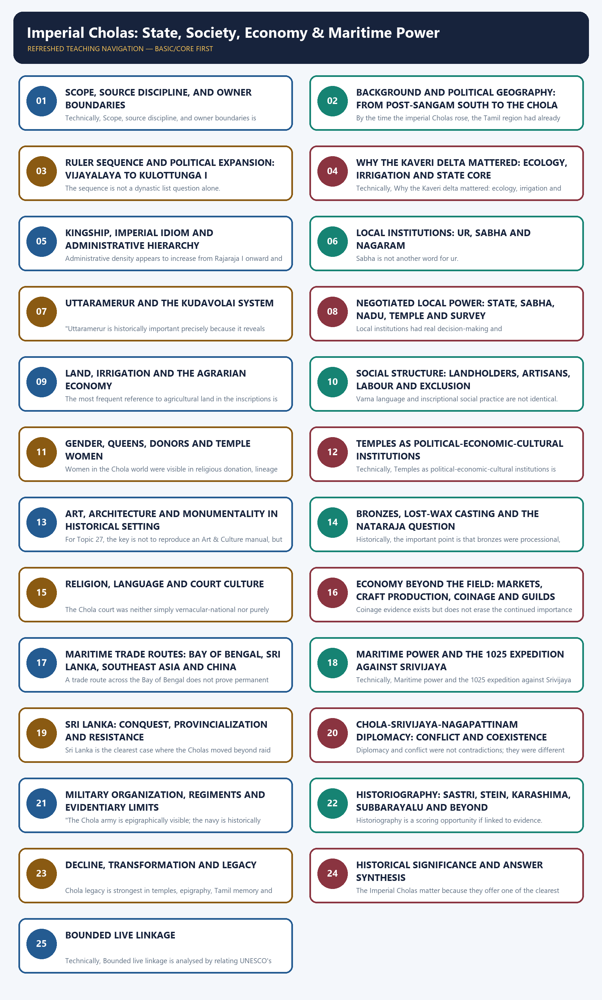

*Distinct embedded teaching-navigation image. The separate continuous Cārvāka-style flowchart package remains an independent at-a-glance artifact.*

#### Package counts, provenance and honest limitations

- Learning sections: 24; learning MCQ loops: 16.
- Workbook content: 4 verified/routed PYQs; 32 broad MCQs; 10 remedials; 6 original solved Mains questions; final register modules: 8.
- Original PNG visuals: 25 total - 24 body visuals plus 1 topic-specific cover visual. All maps are schematic and not to scale.
- Repository sources used most heavily: Ancient History Topic 18 on the Sangam age, Topic 23 on Pallavas-Chalukyas, Topic 25 on Asian interaction, Topic 26 on early-medieval transition, Topic 27 basic and advanced owners, and Art & Culture owners on temple architecture and bronzes.
- OCR evidence used most heavily from Upinder Singh's chapter on emerging regional configurations: Vijayalaya to Kulottunga, Chola administration, local institutions, agrarian society, merchant guilds, temples, literature, Chola-Srivijaya relations and historiography. R. S. Sharma remains the earlier structural spine for southern background, agrarian change and early-medieval transition, but Upinder is the denser Chola evidence base.
- Bounded official web support was used only where it genuinely strengthened export accuracy: UNESCO's Great Living Chola Temples page for present heritage wording; IGNCA's Brihadisvara inscription page to confirm Kundavai's donor visibility; Tamil Virtual Academy's Uttaramerur page for committee names, age-rule changes and the draw-by-pot procedure.
- [LIMIT] Chola inscriptions are abundant but they are not neutral chronicles. They over-represent landed, temple and royal interests, and many grand titles or conquest lists require comparison with chronology, Sri Lankan evidence and later outcomes.
- [LIMIT] Evidence on the navy is much thinner than evidence on agrarian administration, temples and local bodies. This package therefore speaks confidently about maritime expeditions and logistics, but cautiously about ship types, permanent naval organization or long-term oceanic control.
- [LIMIT] The topic owns the historical setting of Chola art and architecture but not the full formal analysis of Dravida temple vocabulary. Detailed stylistic ownership remains with Indian Art & Culture Topic 03 and Topic 06.
- Topic boundaries are explicit. Topic 23 owns Pallava-Chalukya state formation and pre-Chola southern background. Topic 25 owns wider India-Asia interaction before it narrows to Chola maritime power. Topic 26 owns transition-level synthesis and debates across regions. This package must stand alone as a Chola package rather than as stitched repetition of those topics.

#### Original visual asset index

- `notes/Ancient-Indian-History/assets/27_Imperial-Cholas-State-Society-Economy-Maritime-Power/00_chola_cover_delta_temple_ocean.png`
- `notes/Ancient-Indian-History/assets/27_Imperial-Cholas-State-Society-Economy-Maritime-Power/01_chronology_evidence_spine.png`
- `notes/Ancient-Indian-History/assets/27_Imperial-Cholas-State-Society-Economy-Maritime-Power/02_chola_political_geography_schematic.png`
- `notes/Ancient-Indian-History/assets/27_Imperial-Cholas-State-Society-Economy-Maritime-Power/03_ruler_expansion_setback_ladder.png`
- `notes/Ancient-Indian-History/assets/27_Imperial-Cholas-State-Society-Economy-Maritime-Power/04_kaveri_delta_ecological_core.png`
- `notes/Ancient-Indian-History/assets/27_Imperial-Cholas-State-Society-Economy-Maritime-Power/05_administrative_hierarchy_variation.png`
- `notes/Ancient-Indian-History/assets/27_Imperial-Cholas-State-Society-Economy-Maritime-Power/06_ur_sabha_nagaram_comparison.png`
- `notes/Ancient-Indian-History/assets/27_Imperial-Cholas-State-Society-Economy-Maritime-Power/07_uttaramerur_kudavolai_process.png`
- `notes/Ancient-Indian-History/assets/27_Imperial-Cholas-State-Society-Economy-Maritime-Power/08_state_local_negotiated_power_network.png`
- `notes/Ancient-Indian-History/assets/27_Imperial-Cholas-State-Society-Economy-Maritime-Power/09_irrigation_land_tax_process.png`
- `notes/Ancient-Indian-History/assets/27_Imperial-Cholas-State-Society-Economy-Maritime-Power/10_agrarian_society_social_groups_matrix.png`
- `notes/Ancient-Indian-History/assets/27_Imperial-Cholas-State-Society-Economy-Maritime-Power/11_gender_donor_institution_matrix.png`
- `notes/Ancient-Indian-History/assets/27_Imperial-Cholas-State-Society-Economy-Maritime-Power/12_temple_institutional_ecosystem.png`
- `notes/Ancient-Indian-History/assets/27_Imperial-Cholas-State-Society-Economy-Maritime-Power/13_brihadisvara_gkc_airavatesvara_comparison.png`
- `notes/Ancient-Indian-History/assets/27_Imperial-Cholas-State-Society-Economy-Maritime-Power/14_bronze_lost_wax_and_nataraja_caution.png`
- `notes/Ancient-Indian-History/assets/27_Imperial-Cholas-State-Society-Economy-Maritime-Power/15_religion_language_court_culture_field.png`
- `notes/Ancient-Indian-History/assets/27_Imperial-Cholas-State-Society-Economy-Maritime-Power/16_merchant_guild_network.png`
- `notes/Ancient-Indian-History/assets/27_Imperial-Cholas-State-Society-Economy-Maritime-Power/17_bay_of_bengal_trade_route_schematic.png`
- `notes/Ancient-Indian-History/assets/27_Imperial-Cholas-State-Society-Economy-Maritime-Power/18_srivijaya_1025_targets_evidence_limits.png`
- `notes/Ancient-Indian-History/assets/27_Imperial-Cholas-State-Society-Economy-Maritime-Power/19_sri_lanka_campaign_chronology_source_matrix.png`
- `notes/Ancient-Indian-History/assets/27_Imperial-Cholas-State-Society-Economy-Maritime-Power/20_diplomacy_conflict_coexistence_nagapattinam.png`
- `notes/Ancient-Indian-History/assets/27_Imperial-Cholas-State-Society-Economy-Maritime-Power/21_military_organisation_and_limits.png`
- `notes/Ancient-Indian-History/assets/27_Imperial-Cholas-State-Society-Economy-Maritime-Power/22_centralised_segmentary_negotiated_historiography_matrix.png`
- `notes/Ancient-Indian-History/assets/27_Imperial-Cholas-State-Society-Economy-Maritime-Power/23_decline_transformation_causal_web.png`
- `notes/Ancient-Indian-History/assets/27_Imperial-Cholas-State-Society-Economy-Maritime-Power/24_gs1_answer_spine.png`

### SESSION 1 — SCOPE, SOURCE DISCIPLINE, AND OWNER BOUNDARIES

#### DEFINITION / WHAT THIS IS CALLED

**Plain-language definition:** Scope, source discipline, and owner boundaries comprises Scope, source discipline and owner boundaries as its core connected dimensions.

**Technical definition:** Technically, Scope, source discipline, and owner boundaries is analysed by relating Scope to source discipline, then testing the relationship through owner boundaries and Mains angle.

#### ANSWER-GRABBING OPENING — WRITE/ADAPT IN THE EXAM

> Scope, source discipline, and owner boundaries comprises Scope, source discipline and owner boundaries as its core connected dimensions.

#### MUST-WRITE KEYWORDS

- **Scope**
- **source discipline**
- **owner boundaries**
- **Mains angle**
- **Study link**
- **Chola inscriptions and copper plates**

**How to use them:** Frame the answer through Scope; define source discipline, connect owner boundaries with Mains angle to explain the mechanism, and use Study link for the decisive comparison or qualification.

[FACT] The Imperial Cholas belong to the early-medieval south, broadly from the mid-9th century to the 13th century, and must be distinguished from the much earlier Sangam-age Cholas of Topic 18.

[ANALYSIS] The right frame is not "golden age" or "ancient navy", but a Kaveri-centred regional empire whose power rested on agrarian intensification, local corporate institutions, temple-centred legitimation, military coercion and selective maritime reach.

[LIMIT] The sources are unusually rich but uneven. We have many Chola inscriptions, later Sri Lankan narrative material, merchant and diplomatic clues, monumental temples and bronzes, and strong later historiography. That is not the same as having a complete archive of village life, social protest, naval organization or day-to-day administration.

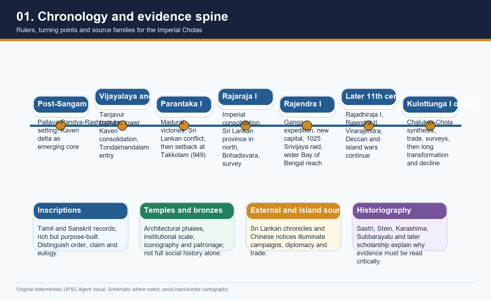

*Original chronology-and-source visual. It distinguishes phases, turning points and source families so that narrative and evidence are never collapsed into each other.*

#### Source discipline grid

| Source family | What it anchors securely | What it cannot do alone |
|---|---|---|
| [FACT] Chola inscriptions and copper plates | chronology, titles, orders, grants, taxes, temple endowments, committee rules, royal claims | [LIMIT] cannot be read as universal practice or neutral reportage |
| [FACT] Temple complexes and bronzes | patronage, institutional scale, iconography, labour demand, artistic phases | [LIMIT] do not directly reveal the full social world beyond preserved institutions |
| [FACT] Sri Lankan and Chinese materials | island campaigns, embassies, wider trade and diplomatic context | [LIMIT] each comes with its own agenda and selectivity |
| [FACT] Historiography from Sastri to Karashima | competing state models and inscription-led corrections | [LIMIT] historians are interpreting the evidence, not replacing it |

#### Topic ownership firewall

- [FACT] Topic 23 owns Pallava-Chalukya detail and the pre-imperial southern backdrop.
- [FACT] Topic 25 owns broad India-Asia interaction before it narrows to Chola merchant and war questions.
- [FACT] Topic 26 owns transition-level synthesis such as early-medieval reorganisation and comparative regionalization.
- [FACT] Indian Art & Culture owners retain the deepest form-analysis of temple architecture and bronze technique.
- [ANALYSIS] Topic 27 therefore owns the Chola combination: ruler sequence, political geography, local bodies, agrarian base, social hierarchy, temple economy, merchant guilds, Sri Lanka, Srivijaya, historiography and decline.

#### Must-know facts

- Imperial Cholas were a major early-medieval south Indian power, not a Sangam continuation in unchanged form.
- Kaveri delta surplus and locality institutions are as important as conquest.
- Rajendra I's 1025 expedition is central, but it was not a permanent overseas empire.

#### UPSC traps

- **Wrong:** Chola history is mostly temple art. **Correct:** temples matter, but as political-economic institutions within a larger state system.
- **Wrong:** the Cholas prove either perfect centralisation or pure village autonomy. **Correct:** the evidence shows negotiated but unequal power.

**Mains angle:** Open with "Kaveri-centred early-medieval imperial-commercial formation" and then specify the evidence.

**Study link:** Topic 18 for early Tamil background; Topic 23 for Pallava-Chalukya prelude; Topic 26 for transition debates.

#### CLOSING RECALL FLOW — SCOPE, SOURCE DISCIPLINE, AND OWNER BOUNDARIES

```text
START / CONCEPT: Scope, source discipline, and owner boundaries
        |
        v
EXACT TERMS: Scope · source discipline · owner boundaries · Mains angle · Study link · Chola inscriptions and copper plates
        |
        v
MECHANISM / ARGUMENT: The Imperial Cholas belong to the early-medieval south, broadly from the mid-9th century to the 13th century, and must be distinguished from the much earlier Sangam-age Cholas of Topic 18.
        |
        v
CONSEQUENCE / CONTRAST: That is not the same as having a complete archive of village life, social protest, naval organization or day-to-day administration.
        |
        v
UPSC TRAP / ANSWER-USE: Imperial Cholas were a major early-medieval south Indian power, not a Sangam continuation in unchanged form.
        |
        v
ANSWER-GRABBING FORMULATION: Scope, source discipline, and owner boundaries comprises Scope, source discipline and owner boundaries as its core connected dimensions.
```
### SESSION 2 — BACKGROUND AND POLITICAL GEOGRAPHY: FROM POST-SANGAM SOUTH TO THE CHOLA CORE

#### DEFINITION / WHAT THIS IS CALLED

**Plain-language definition:** The Kaveri delta is the material centre of Chola power.

**Technical definition:** By the time the imperial Cholas rose, the Tamil region had already been shaped by post-Sangam developments, Pallava expansion in Tondaimandalam, Pandya resurgence in the far south, Rashtrakuta pressure from the Deccan, and long-standing coastal-commercial links.

#### ANSWER-GRABBING OPENING — WRITE/ADAPT IN THE EXAM

> Wrong: show the Chola realm as one solid block from the Maldives to Southeast Asia.

#### MUST-WRITE KEYWORDS

- **Background**
- **political geography**
- **from post-Sangam south to the Chola core**
- **Mains angle**
- **Study link**
- **Lower Kaveri delta**

**How to use them:** Frame the answer through Background; define political geography, connect from post-Sangam south to the Chola core with Mains angle to explain the mechanism, and use Study link for the decisive comparison or qualification.

[FACT] By the time the imperial Cholas rose, the Tamil region had already been shaped by post-Sangam developments, Pallava expansion in Tondaimandalam, Pandya resurgence in the far south, Rashtrakuta pressure from the Deccan, and long-standing coastal-commercial links.

[ANALYSIS] The Chola empire was not built on a blank slate. It inherited political corridors, bhakti sacred geographies, temple technology, agrarian expansion and strategic rivalries from the earlier south.

[LIMIT] Boundaries must be drawn as layers, not as hard modern-state borders. Core territory, zones of annexation, tributary claims, campaign corridors and commercial influence differed from one another.

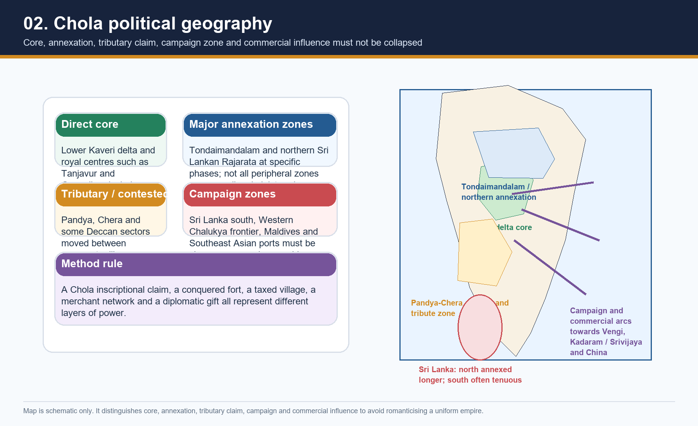

*This schematic map deliberately separates the Kaveri core, major annexation, tributary conflict belts, Sri Lankan control zones and maritime arcs. It is not to scale.*

#### Political geography table

| Zone | Historical role | How to describe it safely |
|---|---|---|
| [FACT] Lower Kaveri delta | agrarian and political core; base of Tanjavur and later Gangaikondacholapuram | direct core |
| [FACT] Tondaimandalam | northern annexation after Pallava defeat; major strategic region | annexed and integrated at key phases |
| [FACT] Pandya and Chera country | continual war, tribute, alliance and re-conquest | contested belt, not permanently uniform control |
| [FACT] Northern Sri Lanka / Rajarata | province for a substantial period after Rajaraja | annexed zone with stronger northern than southern control |
| [FACT] Vengi and Deccan frontier | dynastic and military hinge with Eastern and Western Chalukyas | frontier of expansion, marriage politics and war |
| [FACT] Srivijaya-linked ports and Maldives | expeditionary or maritime-reach zone | raid / campaign / influence space, not mainland-style province |

#### Background discipline

- [FACT] Topic 23 ends with a south already regionalised by Pallavas, Chalukyas, bhakti and brahmadeya growth.
- [FACT] Topic 26 uses the Cholas as one of the clearest examples of early-medieval intensification rather than simple decline.
- [ANALYSIS] Topic 27 begins where those processes converge into a Kaveri-centred imperial formation.

#### Must-know facts

- The Kaveri delta is the material centre of Chola power.
- Tondaimandalam, Pandya country, Sri Lanka and Vengi were not identical in administrative status.
- Maritime arcs must be visually and conceptually separated from inland core.

#### UPSC traps

- **Wrong:** show the Chola realm as one solid block from the Maldives to Southeast Asia. **Correct:** use zones and changing intensity of control.
- **Wrong:** attribute every southern development after the 7th century to the Cholas. **Correct:** acknowledge Pallava-Pandya-Rashtrakuta inheritance.

**Mains angle:** Geography matters only when tied to surplus, ports, corridors and rivals.

**Study link:** Topic 23 for Pallava-Chalukya context; Topic 25 for wider Asian sea routes.

#### CLOSING RECALL FLOW — BACKGROUND AND POLITICAL GEOGRAPHY: FROM POST-SANGAM SOUTH TO THE CHOLA CORE

```text
START / CONCEPT: Background and political geography: from post-Sangam south to the Chola core
        |
        v
EXACT TERMS: Background · political geography · from post-Sangam south to the Chola core · Mains angle · Study link · Lower Kaveri delta
        |
        v
MECHANISM / ARGUMENT: By the time the imperial Cholas rose, the Tamil region had already been shaped by post-Sangam developments, Pallava expansion in Tondaimandalam, Pandya resurgence in the far south, Rashtrakuta pressure from the Deccan, and long-standing coastal-commercial links.
        |
        v
CONSEQUENCE / CONTRAST: The Chola empire was not built on a blank slate.
        |
        v
UPSC TRAP / ANSWER-USE: Boundaries must be drawn as layers, not as hard modern-state borders.
        |
        v
ANSWER-GRABBING FORMULATION: Wrong: show the Chola realm as one solid block from the Maldives to Southeast Asia.
```
### SESSION 3 — RULER SEQUENCE AND POLITICAL EXPANSION: VIJAYALAYA TO KULOTTUNGA I

#### DEFINITION / WHAT THIS IS CALLED

**Plain-language definition:** Kulottunga I is the boundary to the later phase, not the start of a wholly new subject unrelated to the earlier imperial Cholas.

**Technical definition:** The sequence is not a dynastic list question alone.

#### ANSWER-GRABBING OPENING — WRITE/ADAPT IN THE EXAM

> Kulottunga I is the boundary to the later phase, not the start of a wholly new subject unrelated to the earlier imperial Cholas.

#### MUST-WRITE KEYWORDS

- **Ruler sequence**
- **political expansion**
- **Vijayalaya to Kulottunga I**
- **Mains angle**
- **Vijayalaya**
- **Aditya I**

**How to use them:** Frame the answer through Ruler sequence; define political expansion, connect Vijayalaya to Kulottunga I with Mains angle to explain the mechanism, and use Vijayalaya for the decisive comparison or qualification.

[FACT] The founder of the early-medieval Chola line was Vijayalaya, who captured Tanjavur from the Muttaraiyar chiefs and established power around Uraiyur and the lower Kaveri.

[FACT] Aditya I defeated his Pallava overlord Aparajita and gained Tondaimandalam. Parantaka I expanded into the Pandya country and took Madurai, but the Chola position was badly shaken by the Rashtrakuta victory at Takkolam in 949 CE.

[FACT] Recovery under Parantaka II and Uttama prepared the way for Rajaraja I (985-1014), under whom Chola power reached a new level. Rajendra I (1012-1044) continued expansion into Vengi, the Ganga basin memory-world, Sri Lanka and Southeast Asian waters. Later 11th-century rulers fought repeatedly in the Deccan and the island world, and Kulottunga I (1070-1120) represented a long consolidating reign and a Chalukya-Chola synthesis.

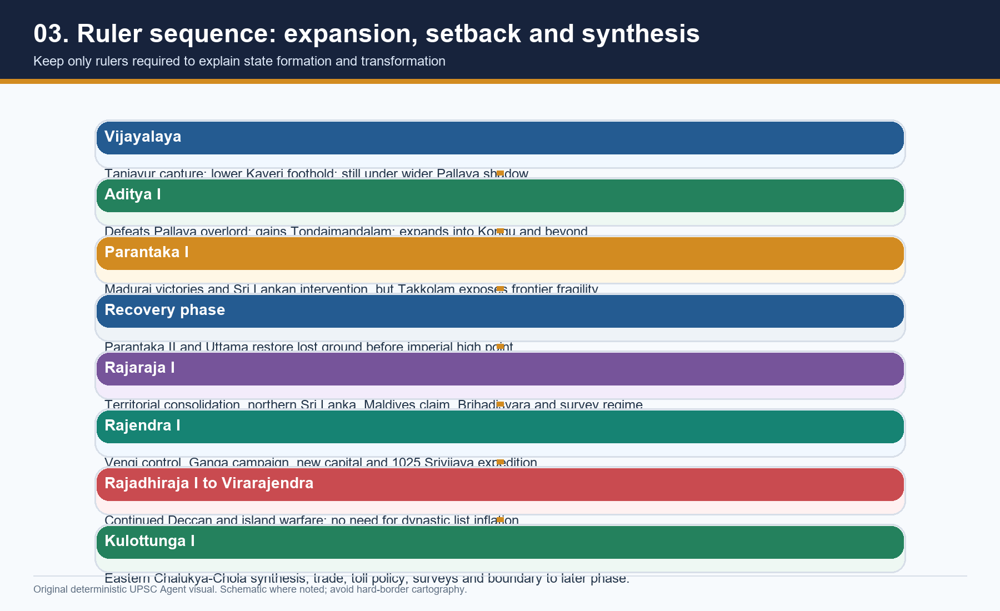

*The ladder keeps only rulers required for state-formation logic: foundation, northern gain, Rashtrakuta setback, imperial consolidation, oceanic projection and later synthesis.*

#### Working chronology

| Ruler / phase | Exam significance |
|---|---|
| [FACT] Vijayalaya | Tanjavur capture; founder of the imperial line |
| [FACT] Aditya I | Pallava eclipse and Tondaimandalam |
| [FACT] Parantaka I | Madurai victory and Takkolam setback |
| [FACT] Parantaka II / Uttama | recovery phase; bridge to high empire |
| [FACT] Rajaraja I | empire-building, Sri Lanka, survey, Brihadisvara |
| [FACT] Rajendra I | Gangaikonda claim, new capital, Srivijaya raid |
| [FACT] Rajadhiraja I / Rajendra II / Virarajendra | continuing Deccan and island warfare |
| [FACT] Kulottunga I | long reign, trade, survey and Chalukya-Chola linkage |

#### How to use this chronology

- [ANALYSIS] The sequence is not a dynastic list question alone. It is an argument about why the Chola state was resilient after setbacks and how it rebalanced between land power and oceanic projection.
- [LIMIT] Rajendra's Ganga campaign was commemorative and symbolic as well as military; it should not be confused with permanent north Indian administration.
- [LIMIT] Kulottunga I is the boundary to the later phase, not the start of a wholly new subject unrelated to the earlier imperial Cholas.

#### Must-know facts

- Takkolam is the major 10th-century setback.
- Rajaraja I and Rajendra I form the two-name imperial peak.
- Kulottunga I is both continuity and transition.

#### UPSC traps

- **Wrong:** the Cholas rise only with Rajaraja. **Correct:** Vijayalaya, Aditya I and Parantaka I create the platform.
- **Wrong:** every later ruler needs equal space. **Correct:** use only those needed for expansion, recovery, synthesis and decline.

**Mains angle:** Periodise the Cholas as foundation -> expansion -> setback -> imperial peak -> late transformation.

#### CLOSING RECALL FLOW — RULER SEQUENCE AND POLITICAL EXPANSION: VIJAYALAYA TO KULOTTUNGA I

```text
START / CONCEPT: Ruler sequence and political expansion: Vijayalaya to Kulottunga I
        |
        v
EXACT TERMS: Ruler sequence · political expansion · Vijayalaya to Kulottunga I · Mains angle · Vijayalaya · Aditya I
        |
        v
MECHANISM / ARGUMENT: Parantaka I expanded into the Pandya country and took Madurai, but the Chola position was badly shaken by the Rashtrakuta victory at Takkolam in 949 CE.
        |
        v
CONSEQUENCE / CONTRAST: The sequence is not a dynastic list question alone.
        |
        v
UPSC TRAP / ANSWER-USE: Rajendra's Ganga campaign was commemorative and symbolic as well as military; it should not be confused with permanent north Indian administration.
        |
        v
ANSWER-GRABBING FORMULATION: Kulottunga I is the boundary to the later phase, not the start of a wholly new subject unrelated to the earlier imperial Cholas.
```
### SESSION 4 — WHY THE KAVERI DELTA MATTERED: ECOLOGY, IRRIGATION AND STATE CORE

#### DEFINITION / WHAT THIS IS CALLED

**Plain-language definition:** Kaveri delta is a fiscal fact, not only a geographical fact.

**Technical definition:** Technically, Why the Kaveri delta mattered: ecology, irrigation and state core is analysed by relating Why the Kaveri delta mattered to ecology, then testing the relationship through irrigation and Mains angle.

#### ANSWER-GRABBING OPENING — WRITE/ADAPT IN THE EXAM

> Kaveri delta is a fiscal fact, not only a geographical fact.

#### MUST-WRITE KEYWORDS

- **Why the Kaveri delta mattered**
- **ecology**
- **irrigation**
- **Mains angle**
- **branch rivers and canal systems**
- **expand wet cultivation and reliable grain revenue**

**How to use them:** Frame the answer through Why the Kaveri delta mattered; define ecology, connect irrigation with Mains angle to explain the mechanism, and use branch rivers and canal systems for the decisive comparison or qualification.

[FACT] Thanjavur stood on the edge of the fertile Kaveri delta, and Gangaikondacholapuram was also located at the northern edge of this rich agrarian zone.

[ANALYSIS] The Chola state cannot be understood apart from this ecology. Delta irrigation, canals, tanks, wet-rice cultivation, high population density, temple-town concentration and revenue assignment created the resource base for military campaigns, monumental architecture and elite patronage.

[LIMIT] Ecology did not automatically produce empire. Maintenance labour, tank management, local corporate power and political extraction remained essential. The same fertile core could still become a zone of burdensome levies and unequal landholding.

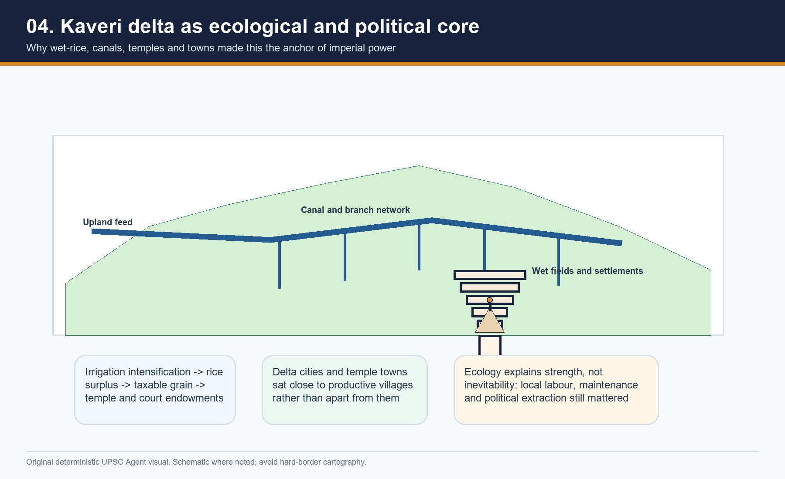

*The visual shows why the delta was not just a backdrop: river branches, canals, fields, temple towns and surplus extraction formed a single political ecology.*

#### Ecological mechanism table

| Feature | Political-economic effect | Caution |
|---|---|---|
| [FACT] branch rivers and canal systems | expand wet cultivation and reliable grain revenue | ecological advantage still requires labour and repair |
| [FACT] tank and sluice maintenance | ties villages, nattar and endowments to long-term agrarian productivity | not all irrigation was state-built |
| [FACT] temple-town clustering | converts surplus into ritual, archive and labour demand | temple concentration is not the whole economy |
| [FACT] fertile rice belt | supports denser settlements and army provisioning | regional variation persists outside the core |

#### Historical significance

- [FACT] Upinder explicitly places both Thanjavur and Gangaikondacholapuram within the Kaveri-rich zone.
- [ANALYSIS] This explains why imperial symbolism in the Chola case is inseparable from irrigation, rather than from conquest alone.

#### Must-know facts

- Kaveri delta is a fiscal fact, not only a geographical fact.
- Temple cities were embedded in surrounding productive villages.
- Chola strength radiates from an agrarian core before it reaches the sea.

#### UPSC traps

- **Wrong:** describe the Cholas first as oceanic. **Correct:** start inland with the delta and move outward.
- **Wrong:** assume every irrigation work was centrally planned. **Correct:** stress mixed agency - kings, nattar, Brahmanas, villagers, chieftains.

**Mains angle:** "The Chola sea rested on the Kaveri field."

#### CLOSING RECALL FLOW — WHY THE KAVERI DELTA MATTERED: ECOLOGY, IRRIGATION AND STATE CORE

```text
START / CONCEPT: Why the Kaveri delta mattered: ecology, irrigation and state core
        |
        v
EXACT TERMS: Why the Kaveri delta mattered · ecology · irrigation · Mains angle · branch rivers and canal systems · expand wet cultivation and reliable grain revenue
        |
        v
MECHANISM / ARGUMENT: Delta irrigation, canals, tanks, wet-rice cultivation, high population density, temple-town concentration and revenue assignment created the resource base for military campaigns, monumental architecture and elite patronage.
        |
        v
CONSEQUENCE / CONTRAST: Thanjavur stood on the edge of the fertile Kaveri delta, and Gangaikondacholapuram was also located at the northern edge of this rich agrarian zone.
        |
        v
UPSC TRAP / ANSWER-USE: This explains why imperial symbolism in the Chola case is inseparable from irrigation, rather than from conquest alone.
        |
        v
ANSWER-GRABBING FORMULATION: Kaveri delta is a fiscal fact, not only a geographical fact.
```
### SESSION 5 — KINGSHIP, IMPERIAL IDIOM AND ADMINISTRATIVE HIERARCHY

#### DEFINITION / WHAT THIS IS CALLED

**Plain-language definition:** Valanadu is particularly associated with later Chola administrative reorganisation.

**Technical definition:** Administrative density appears to increase from Rajaraja I onward and thin after Kulottunga I.

#### ANSWER-GRABBING OPENING — WRITE/ADAPT IN THE EXAM

> Chola kingship was therefore both coercive and ritual.

#### MUST-WRITE KEYWORDS

- **Kingship**
- **imperial idiom**
- **administrative hierarchy**
- **Mains angle**
- **king and court**
- **orders, appointments, war, survey, major endowments, ritual sovereignty**

**How to use them:** Frame the answer through Kingship; define imperial idiom, connect administrative hierarchy with Mains angle to explain the mechanism, and use king and court for the decisive comparison or qualification.

[FACT] Chola inscriptions refer to the king as ko, perumal or peruman adigal, and also use grander titles such as raja-rajadhiraja and ko-konmai-kondan, signalling paramountcy.

[FACT] Inscriptions present the king as conqueror, protector of varnashrama dharma, donor to Brahmanas and patron of the arts. Rajaraja's title Ulakalanda Perumal carried a double resonance: the king who measured the earth and Vishnu who strode across the universe.

[ANALYSIS] Chola kingship was therefore both coercive and ritual. It used war, survey, temple patronage, genealogy, heroic language and monumental architecture to frame imperial authority.

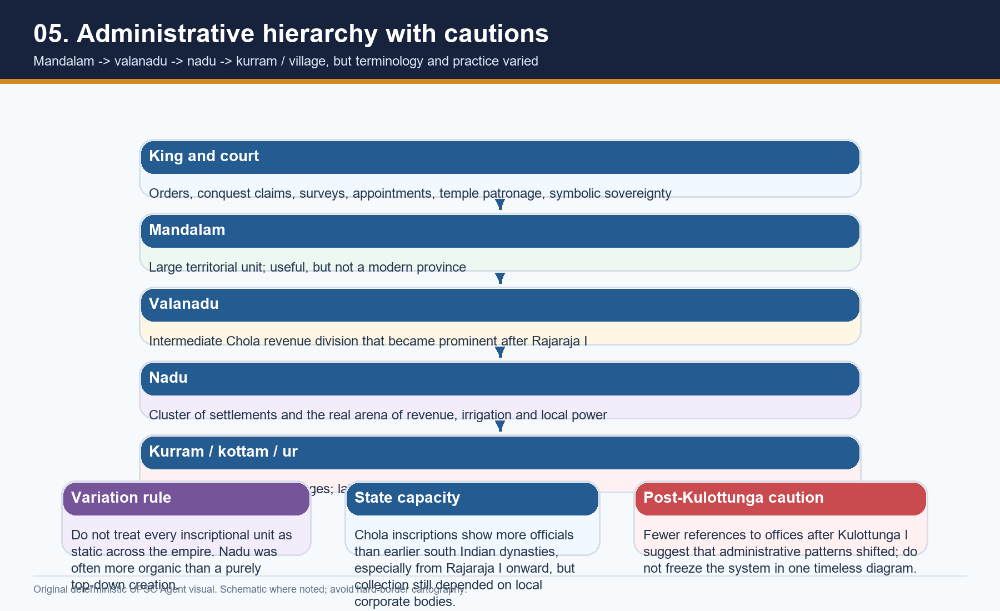

*The hierarchy is useful as a teaching device, but the diagram itself carries the caution that terms, scale and institutional density varied over time and space.*

#### Administrative ladder

| Level | Working function | Care needed |
|---|---|---|
| [FACT] king and court | orders, appointments, war, survey, major endowments, ritual sovereignty | not a modern ministry-state |
| [FACT] mandalam | large territorial unit | not identical to later province structures |
| [FACT] valanadu | important Chola intermediate revenue unit, especially after Rajaraja I | becomes prominent in a specific phase |
| [FACT] nadu | cluster of settlements and locality assembly arena | often more organic than purely top-down |
| [FACT] kurram / village level | sub-local divisions and settlements | terminology and functions vary |

#### Kingship beyond bureaucracy

- [FACT] The Brihadisvara temple was also known as Rajarajeshvara, visibly binding monument and monarch.
- [FACT] Tripurantaka imagery in the Thanjavur temple strengthened Shaiva victory symbolism and Rajaraja's conqueror image.
- [ANALYSIS] Survey, title and ritual were not separate. They were different languages of authority.

#### Must-know facts

- Chola kingship was inscriptionally and ritually thick.
- Valanadu is particularly associated with later Chola administrative reorganisation.
- Administrative density appears to increase from Rajaraja I onward and thin after Kulottunga I.

#### UPSC traps

- **Wrong:** imagine a neat textbook bureaucracy that eliminated local bodies. **Correct:** the centre expanded without replacing locality institutions.
- **Wrong:** reduce titles to empty flattery. **Correct:** titles reveal the ideological grammar of kingship.

**Mains angle:** Present Chola kingship as conquest plus ritual plus documentation.

#### CLOSING RECALL FLOW — KINGSHIP, IMPERIAL IDIOM AND ADMINISTRATIVE HIERARCHY

```text
START / CONCEPT: Kingship, imperial idiom and administrative hierarchy
        |
        v
EXACT TERMS: Kingship · imperial idiom · administrative hierarchy · Mains angle · king and court · orders, appointments, war, survey, major endowments, ritual sovereignty
        |
        v
MECHANISM / ARGUMENT: Administrative density appears to increase from Rajaraja I onward and thin after Kulottunga I.
        |
        v
CONSEQUENCE / CONTRAST: Survey, title and ritual were not separate.
        |
        v
UPSC TRAP / ANSWER-USE: Do not miss this limiting distinction: chola kingship was inscriptionally and ritually thick.
        |
        v
ANSWER-GRABBING FORMULATION: Chola kingship was therefore both coercive and ritual.
```
### SESSION 6 — LOCAL INSTITUTIONS: UR, SABHA AND NAGARAM

#### DEFINITION / WHAT THIS IS CALLED

**Plain-language definition:** Nagaram can own land and make donations; it is not only a market street.

**Technical definition:** Sabha is not another word for ur.

#### ANSWER-GRABBING OPENING — WRITE/ADAPT IN THE EXAM

> Local institutions were real, but none of them represented universal citizenship.

#### MUST-WRITE KEYWORDS

- **Local institutions**
- **ur**
- **sabha**
- **nagaram**
- **Mains angle**
- **tax-paying landholders of non-brahmadeya village**

**How to use them:** Frame the answer through Local institutions; define ur, connect sabha with nagaram to explain the mechanism, and use Mains angle for the decisive comparison or qualification.

[FACT] The ur was the corporate body of the non-brahmadeya village. The sabha or mahasabha was the Brahmana assembly in brahmadeya settlements. The nagaram was an urban-corporate body associated with market and merchant space.

[ANALYSIS] These three must never be treated as synonyms. They belonged to different social bases, handled different kinds of property and interacted differently with temples and the state.

[LIMIT] Local institutions were real, but none of them represented universal citizenship. Membership usually rested on tax-paying, landed or corporate status. Excluded labouring groups remain visible mainly in indirect ways.

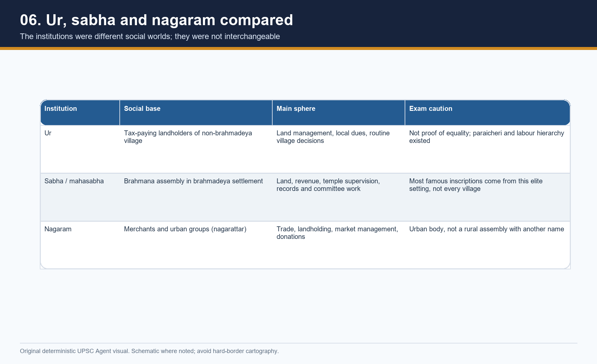

*The comparison visual is an exam firewall: if ur, sabha and nagaram collapse into one another, almost every Chola answer becomes sloppy.*

#### Core distinctions

| Institution | Social base | Main role |
|---|---|---|
| [FACT] ur | tax-paying landholders of non-brahmadeya village | land management, exemptions, village-level decisions |
| [FACT] sabha / mahasabha | Brahmana assembly | revenue, temple property, committees, accounts, decisions backed by strong sanctions |
| [FACT] nagaram | merchants and urban groups | trade, landholding, market management, endowments |

#### Why UPSC likes this cluster

- [FACT] It tests whether a candidate can connect polity and society.
- [ANALYSIS] The best answers show that local power in Chola India was institutional but stratified: land, temple wealth and status shaped participation.
- [LIMIT] The fullest inscriptional detail often comes from elite brahmadeya settings. This must be stated.

#### Must-know facts

- Sabha is not another word for ur.
- Nagaram can own land and make donations; it is not only a market street.
- Local institutions and royal authority operated together.

#### UPSC traps

- **Wrong:** local self-government = modern democracy. **Correct:** participatory elite corporate governance inside hierarchy.
- **Wrong:** nagaram means capital city. **Correct:** it is a corporate urban-merchant institution.

**Mains angle:** Use institutional comparison to show why the Chola state had both reach and local articulation.

#### CLOSING RECALL FLOW — LOCAL INSTITUTIONS: UR, SABHA AND NAGARAM

```text
START / CONCEPT: Local institutions: ur, sabha and nagaram
        |
        v
EXACT TERMS: Local institutions · ur · sabha · nagaram · Mains angle · tax-paying landholders of non-brahmadeya village
        |
        v
MECHANISM / ARGUMENT: The nagaram was an urban-corporate body associated with market and merchant space.
        |
        v
CONSEQUENCE / CONTRAST: Nagaram can own land and make donations; it is not only a market street.
        |
        v
UPSC TRAP / ANSWER-USE: The best answers show that local power in Chola India was institutional but stratified: land, temple wealth and status shaped participation.
        |
        v
ANSWER-GRABBING FORMULATION: Local institutions were real, but none of them represented universal citizenship.
```
### SESSION 7 — UTTARAMERUR AND THE KUDAVOLAI SYSTEM

#### DEFINITION / WHAT THIS IS CALLED

**Plain-language definition:** Uttaramerur is tied to Parantaka I, not Rajendra's Srivijaya campaign.

**Technical definition:** "Uttaramerur is historically important precisely because it reveals accountability inside hierarchy.".

#### ANSWER-GRABBING OPENING — WRITE/ADAPT IN THE EXAM

> Uttaramerur is tied to Parantaka I, not Rajendra's Srivijaya campaign.

#### MUST-WRITE KEYWORDS

- **Uttaramerur**
- **the kudavolai system**
- **Mains angle**
- **procedure**
- **public selection by pot-draw from written names**
- **qualifications**

**How to use them:** Frame the answer through Uttaramerur; define the kudavolai system, connect Mains angle with procedure to explain the mechanism, and use public selection by pot-draw from written names for the decisive comparison or qualification.

[FACT] Uttaramerur inscriptions from the reign of Parantaka I give detailed procedural evidence about committee formation in a Brahmadeya sabha.

[FACT] The names of qualified members were written on palm leaves, placed in a pot and publicly drawn. This is the famous kudavolai method.

[FACT] Officially noted committees include Samvatsara Variyam, Thotta Variyam, Eri Variyam, Pon Variyam and Panchavara Variyam. The later inscription raises the age range from 30-60 to 35-70 and adds stricter disqualifications.

[LIMIT] Tamil Virtual Academy's official summary itself warns against projecting this as universal "people's democracy". Uttaramerur was a Brahmana settlement, and the qualifications stress Vedic-Sastra competence, landed status, good conduct and exclusion of relatives, offenders, bribery-takers and those who failed to render accounts.

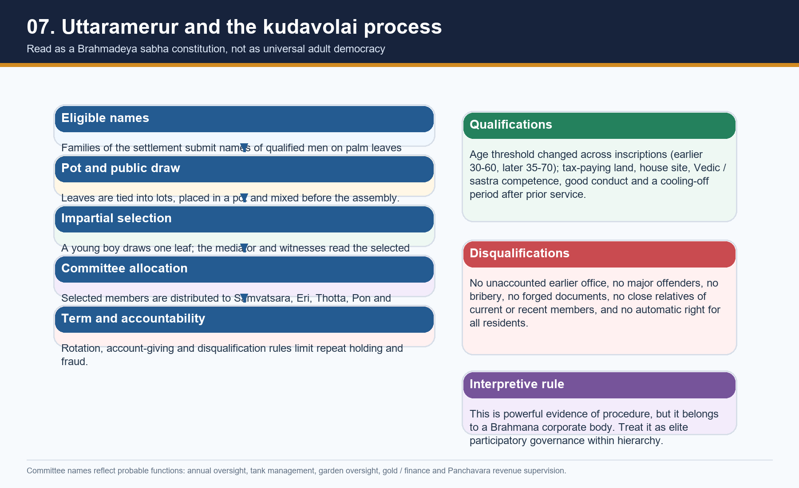

*This visual keeps procedure and exclusion together: the draw-by-pot is only one half of the historical meaning; the other half is who qualified to enter the pot at all.*

#### What the inscriptions actually help us say

| Dimension | Safe conclusion |
|---|---|
| [FACT] procedure | public selection by pot-draw from written names |
| [FACT] qualifications | land, house site, age, scriptural competence, moral standing, cooling-off period |
| [FACT] disqualifications | prior unrendered accounts, serious offences, bribery, forged documents, close kinship links |
| [ANALYSIS] historical meaning | highly structured elite self-management, not universal franchise |

#### Why the democracy claim must be qualified

- [FACT] The settlement was a Brahmadeya / Chaturvedimangalam.
- [FACT] Knowledge of Veda and Sastra appears as an eligibility criterion.
- [ANALYSIS] The system is impressive for procedural regularity and accountability, but it remains socially bounded and inscription-specific.

#### Must-know facts

- Uttaramerur is tied to Parantaka I, not Rajendra's Srivijaya campaign.
- Kudavolai means pot-ticket / lot-draw procedure.
- Committee names and age-rule change are historically important.

#### UPSC traps

- **Wrong:** "the Cholas invented modern democracy." **Correct:** Uttaramerur shows sophisticated committee governance in a landed Brahmana assembly.
- **Wrong:** all villages followed the same rule book. **Correct:** we have strong inscriptional evidence for a specific institutional context.

**Mains angle:** "Uttaramerur is historically important precisely because it reveals accountability inside hierarchy."

#### CLOSING RECALL FLOW — UTTARAMERUR AND THE KUDAVOLAI SYSTEM

```text
START / CONCEPT: Uttaramerur and the kudavolai system
        |
        v
EXACT TERMS: Uttaramerur · the kudavolai system · Mains angle · procedure · public selection by pot-draw from written names · qualifications
        |
        v
MECHANISM / ARGUMENT: "Uttaramerur is historically important precisely because it reveals accountability inside hierarchy.".
        |
        v
CONSEQUENCE / CONTRAST: The system is impressive for procedural regularity and accountability, but it remains socially bounded and inscription-specific.
        |
        v
UPSC TRAP / ANSWER-USE: Do not miss this limiting distinction: and the qualifications stress Vedic-Sastra competence, landed status, good conduct and exclusion of relatives...
        |
        v
ANSWER-GRABBING FORMULATION: Uttaramerur is tied to Parantaka I, not Rajendra's Srivijaya campaign.
```
### SESSION 8 — NEGOTIATED LOCAL POWER: STATE, SABHA, NADU, TEMPLE AND SURVEY

#### DEFINITION / WHAT THIS IS CALLED

**Plain-language definition:** Negotiated local power: state, sabha, nadu, temple and survey comprises Negotiated local power, sabha and nadu as its core connected dimensions.

**Technical definition:** Local institutions had real decision-making and resource-management power. [DEBATE] The historiographical issue is therefore about balance, not about choosing only one side.

#### ANSWER-GRABBING OPENING — WRITE/ADAPT IN THE EXAM

> This is the heart of the "negotiated state" interpretation: local bodies were not evidence of state absence; they were channels through which state power was articulated, resisted, recorded and localized.

#### MUST-WRITE KEYWORDS

- **Negotiated local power**
- **sabha**
- **nadu**
- **temple**
- **survey**
- **Mains angle**

**How to use them:** Frame the answer through Negotiated local power; define sabha, connect nadu with temple to explain the mechanism, and use survey for the decisive comparison or qualification.

[FACT] Chola inscriptions show more offices and functionaries than earlier Pallava, Pandya or Chera records, especially from Rajaraja I onward, but assessment and collection were often carried out through ur, sabha, nadu and nagaram.

[FACT] Rajaraja I initiated a massive land survey and assessment project. Two surveys are also associated with Kulottunga I.

[FACT] Royal officials could be present in sabha proceedings. Rajaraja I also issued orders to sabhas of Cholamandalam to perform services in the Brihadisvara temple.

[ANALYSIS] This is the heart of the "negotiated state" interpretation: local bodies were not evidence of state absence; they were channels through which state power was articulated, resisted, recorded and localized.

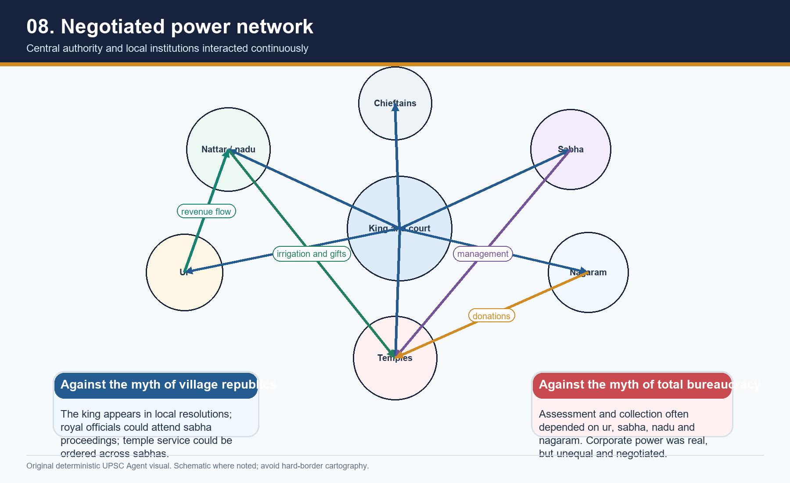

*The network visual is designed against both clichés at once: neither sovereign villages without kings, nor a uniform bureaucracy without local corporate strength.*

#### Key institutional links

| Link | What it shows |
|---|---|
| [FACT] king -> sabha | official presence and ordered temple service |
| [FACT] nadu -> revenue and irrigation | nattar as major corporate actors |
| [FACT] nagaram -> temple and land | merchants enter fiscal and sacred worlds |
| [FACT] survey -> valanadu and accounts | centralising move with local execution |

#### Conceptual payoff

- [ANALYSIS] The Chola state had real extractive and symbolic power.
- [ANALYSIS] Local institutions had real decision-making and resource-management power.
- [DEBATE] The historiographical issue is therefore about balance, not about choosing only one side.

#### Must-know facts

- Rajaraja's survey is central to administrative discussion.
- Local corporate bodies often handled assessment and collection.
- Temple service could be ordered across sabhas.

#### UPSC traps

- **Wrong:** village institutions prove the segmentary model fully. **Correct:** they also coexist with survey, office-expansion and military campaigning.
- **Wrong:** land survey proves a modern bureaucratic state. **Correct:** implementation remained locality-dependent.

**Mains angle:** Describe the Chola state as "central authority working through, over and with strong local corporations."

#### CLOSING RECALL FLOW — NEGOTIATED LOCAL POWER: STATE, SABHA, NADU, TEMPLE AND SURVEY

```text
START / CONCEPT: Negotiated local power: state, sabha, nadu, temple and survey
        |
        v
EXACT TERMS: Negotiated local power · sabha · nadu · temple · survey · Mains angle
        |
        v
MECHANISM / ARGUMENT: Chola inscriptions show more offices and functionaries than earlier Pallava, Pandya or Chera records, especially from Rajaraja I onward, but assessment and collection were often carried out through ur, sabha, nadu and nagaram.
        |
        v
CONSEQUENCE / CONTRAST: Local institutions had real decision-making and resource-management power. [DEBATE] The historiographical issue is therefore about balance, not about choosing only one side.
        |
        v
UPSC TRAP / ANSWER-USE: Do not miss this limiting distinction: temple service could be ordered across sabhas.
        |
        v
ANSWER-GRABBING FORMULATION: This is the heart of the "negotiated state" interpretation: local bodies were not evidence of state absence; they were channels through which state power was articulated, resisted, recorded and localized.
```
### SESSION 9 — LAND, IRRIGATION AND THE AGRARIAN ECONOMY

#### DEFINITION / WHAT THIS IS CALLED

**Plain-language definition:** Chola agrarian history is inseparable from irrigation.

**Technical definition:** The most frequent reference to agricultural land in the inscriptions is wet land, though dry and other classifications also appear.

#### ANSWER-GRABBING OPENING — WRITE/ADAPT IN THE EXAM

> The agrarian economy was not just "agriculture happened".

#### MUST-WRITE KEYWORDS

- **Land**
- **irrigation**
- **the agrarian economy**
- **Mains angle**
- **brahmadeya**
- **Brahmana land grant settlement; often sabha-centred**

**How to use them:** Frame the answer through Land; define irrigation, connect the agrarian economy with Mains angle to explain the mechanism, and use brahmadeya for the decisive comparison or qualification.

[FACT] The most frequent reference to agricultural land in the inscriptions is wet land, though dry and other classifications also appear. Rajaraja I's survey and later Chola assessments suggest a state increasingly concerned with measurability, taxable capacity and assignment.

[FACT] Upinder notes several key revenue terms: puravu and irai as general taxes; kadamai as dues, perhaps heavy in some cases; antarayam in cash; eccoru, vetti and kudimai as labour or service burdens. The evidence also shows rights such as kani, karanmai and mitacci / mitatchi over land.

[ANALYSIS] The agrarian economy was not just "agriculture happened". It involved land classification, irrigation repair, labour obligations, entitlements, exemptions, temple assignments and local recording. Wet-rice intensification made the delta rich; institutions determined who captured that richness.

[LIMIT] Exact tax rates are uncertain. Where secondary literature suggests figures like 40-50 percent for some dues, they must be presented as possible or debated rather than as fixed empire-wide rates.

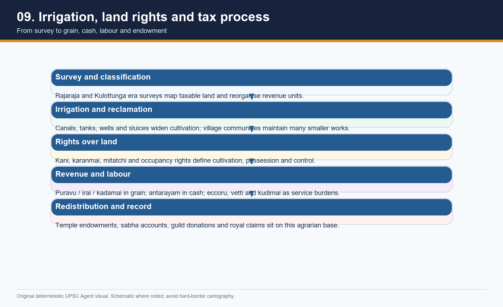

*The process visual shows why Chola agrarian history should be read as survey -> irrigation -> rights -> dues -> redistribution, not as a simple "peasants paid land revenue" line.*

#### Agrarian terms you should know

| Term / cluster | Safe use in answer |
|---|---|
| [FACT] brahmadeya | Brahmana land grant settlement; often sabha-centred |
| [FACT] devadana | land assigned to temple support |
| [FACT] wet / dry classifications | revenue and crop logic varied by ecology |
| [FACT] puravu / irai / kadamai | general dues and taxes |
| [FACT] vetti / kudimai / eccoru | labour or service burden terms |

#### Mechanism of rural extraction

- [FACT] irrigation intensification increased crop reliability and taxable output.
- [FACT] local bodies and nattar frequently managed tanks, sluices, embankments and distribution.
- [ANALYSIS] endowments to temple lamps, feeding, festivals or staff only make sense because a prior agrarian surplus existed and could be recorded against specific fields and villages.
- [LIMIT] large irrigation claims in royal eulogies should still be cross-read with evidence of local management.

#### Must-know facts

- Brahmadeya and devadana shaped land and social geography.
- Chola agrarian history is inseparable from irrigation.
- Revenue categories include grain, cash and labour/service.

#### UPSC traps

- **Wrong:** all irrigation was centrally engineered by the king. **Correct:** small and medium works often depended on local management.
- **Wrong:** taxes can be quoted in a precise empire-wide percentage. **Correct:** the evidence is uneven and rates varied.

**Mains angle:** "The Chola state was agrarian first, maritime later; even the sea depended on the field."

#### CLOSING RECALL FLOW — LAND, IRRIGATION AND THE AGRARIAN ECONOMY

```text
START / CONCEPT: Land, irrigation and the agrarian economy
        |
        v
EXACT TERMS: Land · irrigation · the agrarian economy · Mains angle · brahmadeya · Brahmana land grant settlement; often sabha-centred
        |
        v
MECHANISM / ARGUMENT: irrigation intensification increased crop reliability and taxable output. local bodies and nattar frequently managed tanks, sluices, embankments and distribution. endowments to temple lamps, feeding, festivals or staff only make sense because a prior agrarian surplus existed and could be recorded against specific fields and villages. large irrigation claims in royal eulogies should still be cross-read with evidence of local management.
        |
        v
CONSEQUENCE / CONTRAST: Chola agrarian history is inseparable from irrigation.
        |
        v
UPSC TRAP / ANSWER-USE: Do not miss this limiting distinction: the most frequent reference to agricultural land in the inscriptions is wet land, though...
        |
        v
ANSWER-GRABBING FORMULATION: The agrarian economy was not just "agriculture happened".
```
### SESSION 10 — SOCIAL STRUCTURE: LANDHOLDERS, ARTISANS, LABOUR AND EXCLUSION

#### DEFINITION / WHAT THIS IS CALLED

**Plain-language definition:** Vellalas are central to Chola social history.

**Technical definition:** Varna language and inscriptional social practice are not identical.

#### ANSWER-GRABBING OPENING — WRITE/ADAPT IN THE EXAM

> In many Brahmana settlements the agraharam and brahmadeya world enjoyed privileges, but vellalas were also major cultivators and landholders.

#### MUST-WRITE KEYWORDS

- **Social structure**
- **landholders**
- **artisans**
- **labour**
- **exclusion**
- **Mains angle**

**How to use them:** Frame the answer through Social structure; define landholders, connect artisans with labour to explain the mechanism, and use exclusion for the decisive comparison or qualification.

[FACT] In many Brahmana settlements the agraharam and brahmadeya world enjoyed privileges, but vellalas were also major cultivators and landholders. Upinder notes that vellala families were often the most powerful section among peasants and, despite Shudra classification in brahmanical theory, occupied high status in Tamil society.

[FACT] Inscriptions also indicate segregated settlements and occupational spaces such as ur-nattam, kammana-cheri and parai-cheri, alongside rights-bearing residents and more dependent groups.

[ANALYSIS] Chola society was not a simple four-varna chart. It was a layered regional order in which textual varna language, landed power, ritual status, occupational identity and spatial segregation interacted in historically specific ways.

[LIMIT] We know much more about landed and endowed groups than about the everyday lives of excluded labourers, forest-edge communities or mobile groups. Silence in elite records is not evidence of their absence.

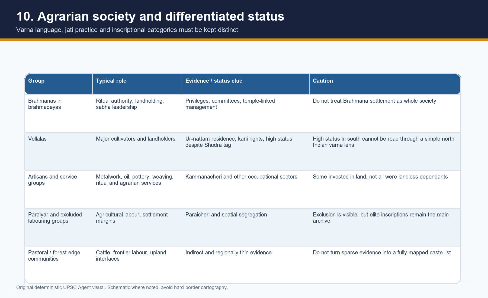

*This matrix is designed to stop flattening: each social layer had a different relation to land, record and political visibility.*

#### Social differentiation table

| Group | Broad historical role | Caution |
|---|---|---|
| [FACT] Brahmanas in brahmadeyas | ritual authority, land control, sabha participation | not the whole countryside |
| [FACT] vellalas | powerful cultivators and local elites | Shudra label in texts does not capture actual regional status |
| [FACT] artisans and service groups | metalwork, weaving, oil, pottery, ritual and agrarian support | some held land and corporate weight |
| [FACT] paraiyar and other excluded groups | labouring and service roles, often spatially segregated | under-recorded in elite inscriptions |

#### What changes under the Cholas

- [ANALYSIS] agrarian expansion and temple-centred redistribution widened the importance of cultivators, artisans and service specialists.
- [ANALYSIS] corporate institutions could coexist with deep hierarchy.
- [DEBATE] the best answers reject both "rigid static caste block" and "harmonious village republic".

#### Must-know facts

- Vellalas are central to Chola social history.
- Segregated settlement terms matter for showing inequality.
- Varna language and inscriptional social practice are not identical.

#### UPSC traps

- **Wrong:** Chola society was egalitarian because local assemblies existed. **Correct:** assemblies functioned inside unequal landed and caste structures.
- **Wrong:** only Brahmanas mattered. **Correct:** vellalas, artisans, merchants and labouring groups all matter, though unequally.

**Mains angle:** "Social power followed land, ritual and record, not a simple textbook varna grid."

#### CLOSING RECALL FLOW — SOCIAL STRUCTURE: LANDHOLDERS, ARTISANS, LABOUR AND EXCLUSION

```text
START / CONCEPT: Social structure: landholders, artisans, labour and exclusion
        |
        v
EXACT TERMS: Social structure · landholders · artisans · labour · exclusion · Mains angle
        |
        v
MECHANISM / ARGUMENT: Wrong: Chola society was egalitarian because local assemblies existed.
        |
        v
CONSEQUENCE / CONTRAST: "Social power followed land, ritual and record, not a simple textbook varna grid.".
        |
        v
UPSC TRAP / ANSWER-USE: Varna language and inscriptional social practice are not identical.
        |
        v
ANSWER-GRABBING FORMULATION: In many Brahmana settlements the agraharam and brahmadeya world enjoyed privileges, but vellalas were also major cultivators and landholders.
```
### SESSION 11 — GENDER, QUEENS, DONORS AND TEMPLE WOMEN

#### DEFINITION / WHAT THIS IS CALLED

**Plain-language definition:** Sembiyan Mahadevi and Kundavai are the two safest named women.

**Technical definition:** Women in the Chola world were visible in religious donation, lineage prestige and temple-linked labour, but visibility was structured by class, kinship and institution.

#### ANSWER-GRABBING OPENING — WRITE/ADAPT IN THE EXAM

> Sembiyan Mahadevi and Kundavai are the two safest named women.

#### MUST-WRITE KEYWORDS

- **Gender**
- **queens**
- **donors**
- **temple women**
- **Mains angle**
- **Sembiyan Mahadevi**

**How to use them:** Frame the answer through Gender; define queens, connect donors with temple women to explain the mechanism, and use Mains angle for the decisive comparison or qualification.

[FACT] Sembiyan Mahadevi, wife of Gandaraditya, was a major Chola patron whose piety and rebuilding activity shaped early stone-temple and image history. Kundavai Pirattiyar, Rajaraja's elder sister, appears in the Brihadisvara donor inscription, where Rajaraja ordered that his own gifts, those of his sister, his wives and other donors be inscribed.

[FACT] Women also appear as donors of lamps, vessels and endowments, and temple-linked women appear under terms such as tevaratiyar or tevanar makal in the broader record.

[ANALYSIS] Women in the Chola world were visible in religious donation, lineage prestige and temple-linked labour, but visibility was structured by class, kinship and institution. Royal women's patronage does not automatically mean generalized female autonomy.

[LIMIT] The term "devadasi" should be used with chronological caution. The early-medieval evidence should not be collapsed into the much later colonial-era stereotype of a single institution with unchanging meaning.

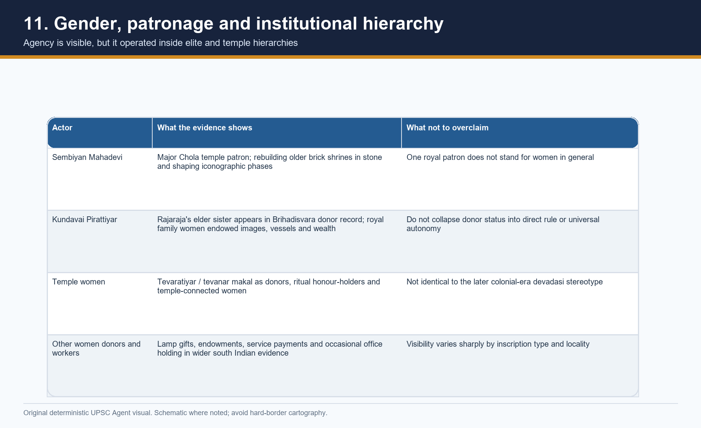

*The visual keeps agency and hierarchy together: women appear in Chola records, but not outside structures of property, kinship and temple authority.*

#### Evidence grid

| Figure / category | What can be said safely |
|---|---|
| [FACT] Sembiyan Mahadevi | major temple patron, associated with rebuilding and image donations |
| [FACT] Kundavai | securely visible as donor in Brihadisvara inscriptional record |
| [FACT] temple women | participated in ritual and endowed institutions under varied terms |
| [LIMIT] wider women's property rights | visible in fragments, but not enough for sweeping claims of universal female empowerment |

#### Historical use

- [ANALYSIS] Royal women widened the temple-patronage network and helped create durable public memory.
- [ANALYSIS] Temple-linked women show labour, status and ritual honour inside institutional structures.
- [LIMIT] Avoid romanticizing Chola gender history into either pure freedom or pure victimhood.

#### Must-know facts

- Sembiyan Mahadevi and Kundavai are the two safest named women.
- Women appear as donors and institutional participants.
- Terminology around temple women requires caution.

#### UPSC traps

- **Wrong:** royal women prove matriarchy. **Correct:** they prove high-status female patronage within dynastic structures.
- **Wrong:** every temple woman was a later-style devadasi. **Correct:** use the inscriptional terminology and context carefully.

**Mains angle:** Use gender as a window into patronage, institution and hierarchy.

#### CLOSING RECALL FLOW — GENDER, QUEENS, DONORS AND TEMPLE WOMEN

```text
START / CONCEPT: Gender, queens, donors and temple women
        |
        v
EXACT TERMS: Gender · queens · donors · temple women · Mains angle · Sembiyan Mahadevi
        |
        v
MECHANISM / ARGUMENT: Women in the Chola world were visible in religious donation, lineage prestige and temple-linked labour, but visibility was structured by class, kinship and institution.
        |
        v
CONSEQUENCE / CONTRAST: Royal women's patronage does not automatically mean generalized female autonomy.
        |
        v
UPSC TRAP / ANSWER-USE: The early-medieval evidence should not be collapsed into the much later colonial-era stereotype of a single institution with unchanging meaning.
        |
        v
ANSWER-GRABBING FORMULATION: Sembiyan Mahadevi and Kundavai are the two safest named women.
```
### SESSION 12 — TEMPLES AS POLITICAL-ECONOMIC-CULTURAL INSTITUTIONS

#### DEFINITION / WHAT THIS IS CALLED

**Plain-language definition:** Overstating temple control is as misleading as reducing temples to "mere religion".

**Technical definition:** Technically, Temples as political-economic-cultural institutions is analysed by relating Mains angle to ritual and legitimacy, then testing the relationship through archive and inscription and land and grain management.

#### ANSWER-GRABBING OPENING — WRITE/ADAPT IN THE EXAM

> Overstating temple control is as misleading as reducing temples to "mere religion".

#### MUST-WRITE KEYWORDS

- **Temples as political-economic-cultural institutions**
- **Mains angle**
- **ritual and legitimacy**
- **archive and inscription**
- **land and grain management**
- **temples sit on agrarian surplus and endowment**

**How to use them:** Frame the answer through Temples as political-economic-cultural institutions; define Mains angle, connect ritual and legitimacy with archive and inscription to explain the mechanism, and use land and grain management for the decisive comparison or qualification.

[FACT] Brihadisvara at Thanjavur was endowed by Rajaraja I and his wider circle, employed a very large staff, received assignments from many villages and served as a ritual and archival centre. Gangaikondacholapuram projected Rajendra I's imperial claim in a new capital context.

[ANALYSIS] Chola temples were not only ritual spaces. They could hold land, record gifts, employ priests, dancers, guards, accountants and craftsmen, receive grain, organise festivals, display royal ideology and mediate redistribution.

[LIMIT] Yet temples did not control the whole economy. Merchant corporations, cultivator bodies, royal offices and other sacred centres remained important. Overstating temple control is as misleading as reducing temples to "mere religion".

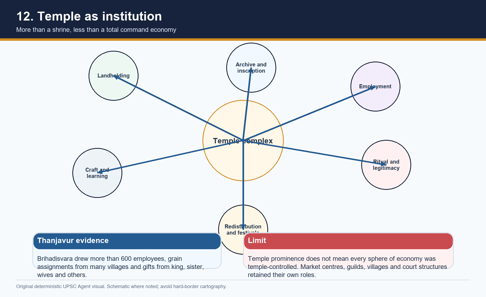

*The ecosystem visual helps answer the standard UPSC question: what did a major Chola temple actually do in society?*

#### Temple functions table

| Function | Historical meaning |
|---|---|
| [FACT] ritual and legitimacy | royal conquest and Shaiva sovereignty gain visible sacred form |
| [FACT] archive and inscription | gifts, taxes, salaries and service are recorded |
| [FACT] land and grain management | temples sit on agrarian surplus and endowment |
| [FACT] employment and craft | large labour ecosystems emerge around great temples |
| [FACT] redistribution and festivals | ritual consumption recycles elite and popular resources |

#### Brihadisvara as exemplar

- [FACT] UNESCO identifies Thanjavur, Gangaikondacholapuram and Darasuram as the Great Living Chola Temples.
- [FACT] IGNCA's inscriptional summary explicitly notes Rajaraja's order to inscribe gifts by himself, Kundavaiyar, his wives and others.
- [ANALYSIS] Thanjavur thus works as both monument and archive.

#### Must-know facts

- Chola temples are political-economic institutions.
- Brihadisvara is the clearest case for scale and documentation.
- Temple prominence does not equal total command over society.

#### UPSC traps

- **Wrong:** temple = only architecture. **Correct:** treat architecture as the visible tip of a larger institution.
- **Wrong:** temples controlled all trade and land. **Correct:** they were major nodes, not the whole system.

**Mains angle:** "Temple power in Chola India was archival, agrarian, ritual and redistributive."

#### CLOSING RECALL FLOW — TEMPLES AS POLITICAL-ECONOMIC-CULTURAL INSTITUTIONS

```text
START / CONCEPT: Temples as political-economic-cultural institutions
        |
        v
EXACT TERMS: Temples as political-economic-cultural institutions · Mains angle · ritual and legitimacy · archive and inscription · land and grain management · temples sit on agrarian surplus and endowment
        |
        v
MECHANISM / ARGUMENT: Brihadisvara at Thanjavur was endowed by Rajaraja I and his wider circle, employed a very large staff, received assignments from many villages and served as a ritual and archival centre.
        |
        v
CONSEQUENCE / CONTRAST: Chola temples were not only ritual spaces.
        |
        v
UPSC TRAP / ANSWER-USE: Temple prominence does not equal total command over society.
        |
        v
ANSWER-GRABBING FORMULATION: Overstating temple control is as misleading as reducing temples to "mere religion".
```
### SESSION 13 — ART, ARCHITECTURE AND MONUMENTALITY IN HISTORICAL SETTING

#### DEFINITION / WHAT THIS IS CALLED

**Plain-language definition:** Art, architecture and monumentality in historical setting comprises Art, architecture and monumentality in historical setting as its core connected dimensions.

**Technical definition:** For Topic 27, the key is not to reproduce an Art & Culture manual, but to show how monumentality worked historically: as conquest memory, dynastic prestige, urban-centrality, labour mobilisation and temple institutional growth.

#### ANSWER-GRABBING OPENING — WRITE/ADAPT IN THE EXAM

> For Topic 27, the key is not to reproduce an Art & Culture manual, but to show how monumentality worked historically: as conquest memory, dynastic prestige, urban-centrality, labour mobilisation and temple institutional growth.

#### MUST-WRITE KEYWORDS

- **Art**
- **architecture**
- **monumentality in historical setting**
- **Mains angle**
- **Brihadisvara, Thanjavur**
- **Rajaraja's imperial scale, donor archive, employee network**

**How to use them:** Frame the answer through Art; define architecture, connect monumentality in historical setting with Mains angle to explain the mechanism, and use Brihadisvara, Thanjavur for the decisive comparison or qualification.

[FACT] The Cholas were major builders in the Dravida mode. Brihadisvara at Thanjavur, Brihadisvara at Gangaikondacholapuram and Airavatesvara at Darasuram form the UNESCO-listed Great Living Chola Temples.

[FACT] Thanjavur's vimana exemplifies high middle-Chola monumentality, Gangaikondacholapuram modifies the form with a more curved profile and richer sculptural treatment, and Darasuram represents a later, smaller but highly ornate phase.

[ANALYSIS] For Topic 27, the key is not to reproduce an Art & Culture manual, but to show how monumentality worked historically: as conquest memory, dynastic prestige, urban-centrality, labour mobilisation and temple institutional growth.

[LIMIT] Do not force a linear "vimana then gopura" oversimplification without chronology. Gopura prominence rises more clearly in later centuries; high imperial Chola emphasis still lies strongly on the sanctum-centred monumental core.

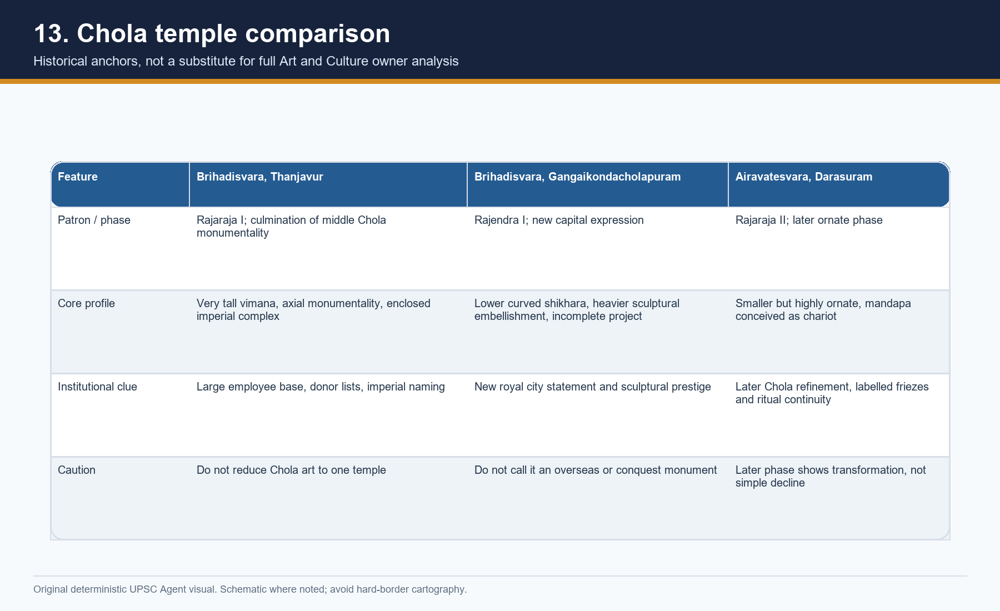

*The comparison keeps architecture tied to patronage and phase, rather than turning the temples into a static style chart.*

#### Historical reading, not pure style chart

| Monument | Historical use in answer |
|---|---|
| [FACT] Brihadisvara, Thanjavur | Rajaraja's imperial scale, donor archive, employee network |
| [FACT] Gangaikondacholapuram | Rajendra's new-capital claim and sculptural refinement |
| [FACT] Airavatesvara, Darasuram | later Chola continuity, ornamental richness and transformation |

#### Why UPSC asks this

- [FACT] 2024 GS-I directly asked about Chola contributions to Indian art and architecture.
- [ANALYSIS] The best answer connects form, patronage and political setting.
- [LIMIT] Avoid claiming that Chola architecture alone "defined all South Indian art."

#### Must-know facts

- Great Living Chola Temples are a secure UNESCO cluster.
- Thanjavur, Gangaikondacholapuram and Darasuram represent different moments within Chola monumentality.
- Historical context matters as much as form.

#### UPSC traps

- **Wrong:** Chola architecture is only about one famous temple. **Correct:** use all three anchor monuments.
- **Wrong:** art history can be answered without politics or economy. **Correct:** temple form must be tied to patronage and institution.

**Mains angle:** "Chola architecture monumentalised agrarian-imperial power in stone."

#### CLOSING RECALL FLOW — ART, ARCHITECTURE AND MONUMENTALITY IN HISTORICAL SETTING

```text
START / CONCEPT: Art, architecture and monumentality in historical setting
        |
        v
EXACT TERMS: Art · architecture · monumentality in historical setting · Mains angle · Brihadisvara, Thanjavur · Rajaraja's imperial scale, donor archive, employee network
        |
        v
MECHANISM / ARGUMENT: Wrong: Chola architecture is only about one famous temple.
        |
        v
CONSEQUENCE / CONTRAST: Do not force a linear "vimana then gopura" oversimplification without chronology.
        |
        v
UPSC TRAP / ANSWER-USE: Wrong: art history can be answered without politics or economy.
        |
        v
ANSWER-GRABBING FORMULATION: For Topic 27, the key is not to reproduce an Art & Culture manual, but to show how monumentality worked historically: as conquest memory, dynastic prestige, urban-centrality, labour mobilisation and temple institutional growth.
```
### SESSION 14 — BRONZES, LOST-WAX CASTING AND THE NATARAJA QUESTION

#### DEFINITION / WHAT THIS IS CALLED

**Plain-language definition:** Chola bronzes are among the most celebrated metal icons in Indian history, and they were produced through the lost-wax method.

**Technical definition:** Historically, the important point is that bronzes were processional, ritual and institutional objects.

#### ANSWER-GRABBING OPENING — WRITE/ADAPT IN THE EXAM

> Chola bronzes are among the most celebrated metal icons in Indian history, and they were produced through the lost-wax method.

#### MUST-WRITE KEYWORDS

- **Bronzes**
- **lost-wax casting**
- **the Nataraja question**
- **Mains angle**
- **damaru**
- **creation / rhythm**

**How to use them:** Frame the answer through Bronzes; define lost-wax casting, connect the Nataraja question with Mains angle to explain the mechanism, and use damaru for the decisive comparison or qualification.

[FACT] Chola bronzes are among the most celebrated metal icons in Indian history, and they were produced through the lost-wax method. The Nataraja form achieved extraordinary refinement in the Chola period.

[ANALYSIS] Historically, the important point is that bronzes were processional, ritual and institutional objects. They travelled within temple festivals, received offerings, embodied theological meaning and reflected workshops sustained by patronage and craft skill.

[LIMIT] Do not say the Cholas invented Nataraja from nothing. Evidence suggests earlier Pallava-period forms or antecedents, while the Cholas developed the image into one of the great achievements of Indian iconography.

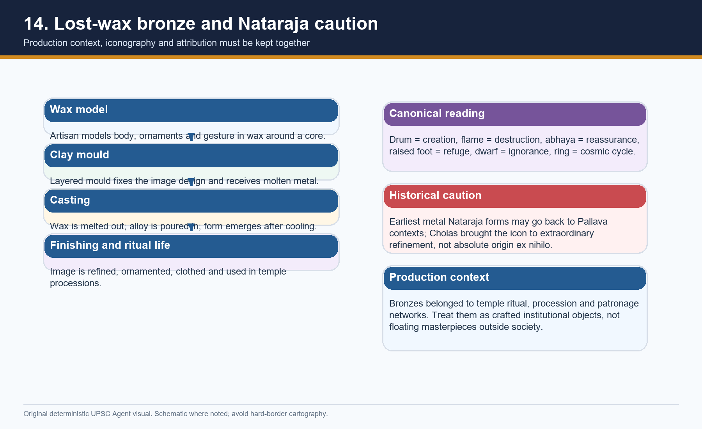

*The visual explicitly joins craft process, iconographic meaning and historical caution about origins and attribution.*

#### Nataraja interpretive spine

| Element | Standard reading |
|---|---|
| [FACT] damaru | creation / rhythm |
| [FACT] flame | destruction |
| [FACT] raised hand | reassurance |
| [FACT] raised foot | grace and refuge |
| [FACT] apasmara dwarf | ignorance |

#### Historical caution

- [ANALYSIS] Nataraja should be read as a Chola-era theological-artistic high point, not as evidence of an isolated civilisational essence.
- [LIMIT] The bronze tradition belongs to wider Dravida temple culture, artisan lineages and institutional patronage.

#### Must-know facts

- Lost-wax technique is central.
- Chola bronzes were meant for ritual life, not museum display.
- Nataraja is a secure but historically layered symbol.

#### UPSC traps

- **Wrong:** Chola bronzes are "secular art objects". **Correct:** they were embedded in sacred institutional use.
- **Wrong:** earliest Nataraja = definitely Chola. **Correct:** Chola refinement is secure; absolute origin claims need caution.

**Mains angle:** Tie bronze skill to temple ritual and ideological expression.

#### CLOSING RECALL FLOW — BRONZES, LOST-WAX CASTING AND THE NATARAJA QUESTION

```text
START / CONCEPT: Bronzes, lost-wax casting and the Nataraja question
        |
        v
EXACT TERMS: Bronzes · lost-wax casting · the Nataraja question · Mains angle · damaru · creation / rhythm
        |
        v
MECHANISM / ARGUMENT: Historically, the important point is that bronzes were processional, ritual and institutional objects.
        |
        v
CONSEQUENCE / CONTRAST: Chola bronzes were meant for ritual life, not museum display.
        |
        v
UPSC TRAP / ANSWER-USE: Nataraja should be read as a Chola-era theological-artistic high point, not as evidence of an isolated civilisational essence.
        |
        v
ANSWER-GRABBING FORMULATION: Chola bronzes are among the most celebrated metal icons in Indian history, and they were produced through the lost-wax method.
```
### SESSION 15 — RELIGION, LANGUAGE AND COURT CULTURE

#### DEFINITION / WHAT THIS IS CALLED

**Plain-language definition:** Kamban and Sekkilar belong broadly to the later Chola cultural horizon, but their dates and exact court placements must not be flattened into one simplistic imperial moment.

**Technical definition:** The Chola court was neither simply vernacular-national nor purely Sanskritic; it was bilingual and layered.

#### ANSWER-GRABBING OPENING — WRITE/ADAPT IN THE EXAM

> Kamban and Sekkilar belong broadly to the later Chola cultural horizon, but their dates and exact court placements must not be flattened into one simplistic imperial moment.

#### MUST-WRITE KEYWORDS

- **Religion**
- **language**
- **court culture**
- **Mains angle**
- **Shaiva dominance**
- **especially strong in royal monumentality and temple patronage**

**How to use them:** Frame the answer through Religion; define language, connect court culture with Mains angle to explain the mechanism, and use Shaiva dominance for the decisive comparison or qualification.

[FACT] Shaivism enjoyed strong Chola patronage, but Vaishnava traditions, Jain survivals and Buddhist institutions also persisted in the wider Tamil and coastal world. The bhakti canon was progressively institutionalised in temple contexts.

[FACT] Tamil and Sanskrit worked together in the Chola cultural field. Upinder notes that Sanskrit often carried royal eulogy while Tamil carried documentary material, though from Rajendra's time Tamil increasingly handled both functions.

[FACT] Kamban and Sekkilar belong broadly to the later Chola cultural horizon, but their dates and exact court placements must not be flattened into one simplistic imperial moment.

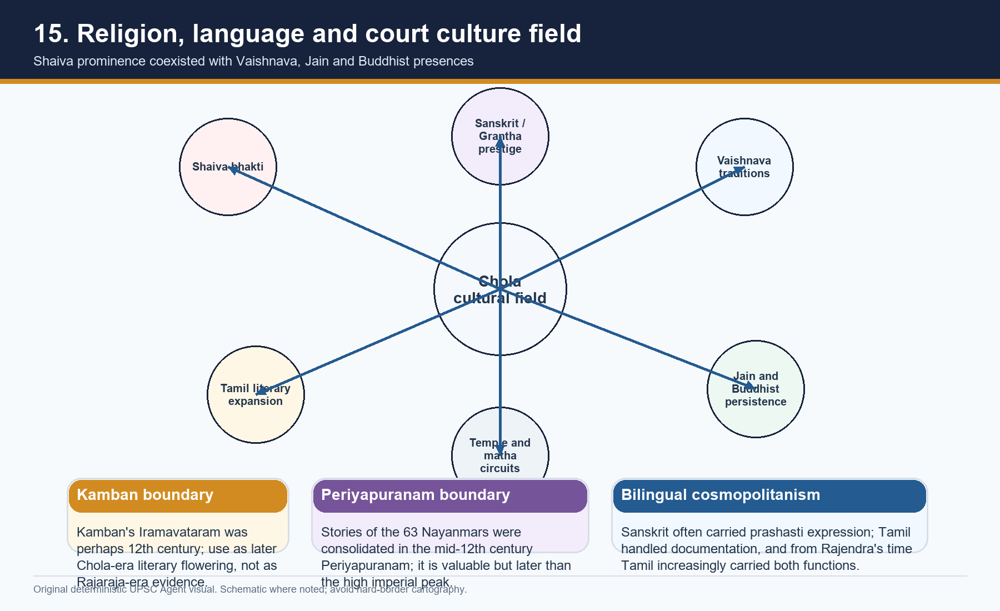

*The field visual emphasises coexistence and hierarchy rather than a single civilisational voice.*

#### Cultural field table

| Theme | Historically safe statement |
|---|---|
| [FACT] Shaiva dominance | especially strong in royal monumentality and temple patronage |
| [FACT] Vaishnava presence | significant, especially in wider Tamil sacred geography |
| [FACT] Jain and Buddhist persistence | not erased by Shaiva predominance |
| [FACT] Tamil-Sanskrit bilingualism | marks cosmopolitan court and inscriptional culture |
| [LIMIT] sectarian conflict | must be handled cautiously unless clearly evidenced |

#### Why language matters here

- [ANALYSIS] Language use reveals both record-keeping practice and political style.
- [ANALYSIS] The Chola court was neither simply vernacular-national nor purely Sanskritic; it was bilingual and layered.

#### Must-know facts

- Shaiva patronage dominates but does not eliminate other traditions.
- Tamil and Sanskrit divide labour but also overlap.
- Later Chola literary flowering needs chronology care.

#### UPSC traps

- **Wrong:** Chola culture was monolingual Tamil. **Correct:** it was strongly Tamil but also Sanskritic and cosmopolitan.
- **Wrong:** bhakti means the end of all other traditions. **Correct:** coexistence continued, though unequally.

**Mains angle:** Cultural policy was plural in archive, hierarchical in patronage and Tamil-Sanskrit in expression.

#### CLOSING RECALL FLOW — RELIGION, LANGUAGE AND COURT CULTURE

```text
START / CONCEPT: Religion, language and court culture
        |
        v
EXACT TERMS: Religion · language · court culture · Mains angle · Shaiva dominance · especially strong in royal monumentality and temple patronage
        |
        v
MECHANISM / ARGUMENT: The Chola court was neither simply vernacular-national nor purely Sanskritic; it was bilingual and layered.
        |
        v
CONSEQUENCE / CONTRAST: Correct: it was strongly Tamil but also Sanskritic and cosmopolitan.
        |
        v
UPSC TRAP / ANSWER-USE: Shaiva patronage dominates but does not eliminate other traditions.
        |
        v
ANSWER-GRABBING FORMULATION: Kamban and Sekkilar belong broadly to the later Chola cultural horizon, but their dates and exact court placements must not be flattened into one simplistic imperial moment.
```
### SESSION 16 — ECONOMY BEYOND THE FIELD: MARKETS, CRAFT PRODUCTION, COINAGE AND GUILDS

#### DEFINITION / WHAT THIS IS CALLED

**Plain-language definition:** Ayyavole / Ainnurruvar is the best-known transregional guild name.

**Technical definition:** Coinage evidence exists but does not erase the continued importance of grain, assignment and corporate networks.

#### ANSWER-GRABBING OPENING — WRITE/ADAPT IN THE EXAM

> Strong merchant guilds do not prove a fully monetised market economy of the modern type.

#### MUST-WRITE KEYWORDS

- **Economy beyond the field**
- **markets**
- **craft production**
- **coinage**
- **guilds**
- **Mains angle**

**How to use them:** Frame the answer through Economy beyond the field; define markets, connect craft production with coinage to explain the mechanism, and use guilds for the decisive comparison or qualification.

[FACT] The Chola economy rested on agriculture, but it also included textiles, metalwork, oil processing, temple-oriented craft demand, market centres and merchant corporations with intra- and inter-regional reach.

[FACT] Important guild names include Ayyavole / Ainnurruvar, Manigramam, Nanadesi and Anjuvannam, though chronology and local composition varied.

[ANALYSIS] The Chola world was commercially dynamic because agrarian surplus, temple consumption, road-port links, guild protection and political prestige reinforced each other. Guilds could transact with rulers, own property, donate to temples and operate across regions.

[LIMIT] Strong merchant guilds do not prove a fully monetised market economy of the modern type. Coinage evidence exists but does not erase the continued importance of grain, assignment and corporate networks.

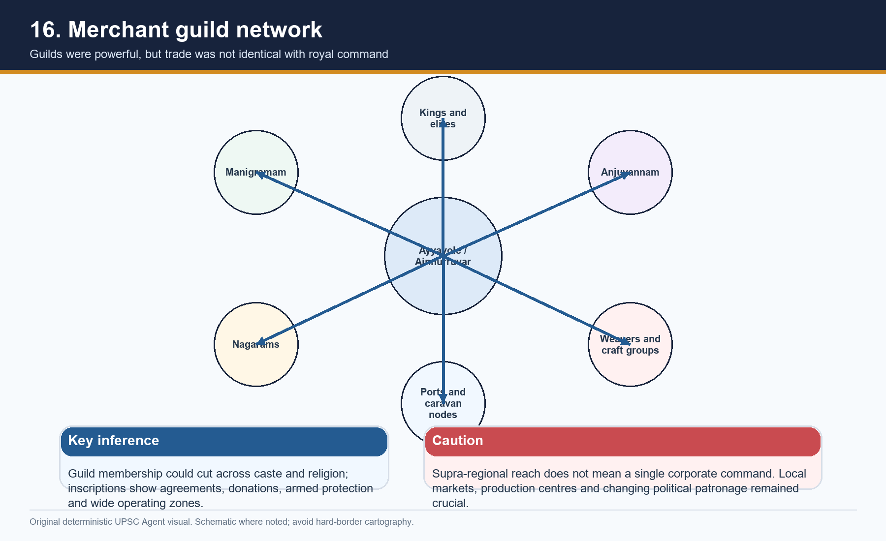

*Guilds are shown as a network, not a monolith: they link ports, crafts, nagarams and rulers without collapsing them into one institution.*

#### Commercial clusters

| Cluster | Historical significance |
|---|---|
| [FACT] nagaram and market nodes | urban-commercial articulation within the Chola countryside |
| [FACT] merchant guilds | long-distance trade, donations, agreements, possibly armed protection |
| [FACT] craft production | metal, textile and ritual industries tied to temple and market demand |
| [LIMIT] monetisation | important but uneven; do not overstate cash economy |

#### Bridge to maritime history

- [ANALYSIS] Merchant guilds provide the connective tissue between the inland agrarian core and the overseas Bay of Bengal world.
- [LIMIT] But merchant presence abroad does not automatically mean Chola political sovereignty abroad.

#### Must-know facts

- Ayyavole / Ainnurruvar is the best-known transregional guild name.
- Market institutions and temple institutions often overlapped through donations and landholding.
- Commercial dynamism strengthens, but does not replace, agrarian explanation.

#### UPSC traps

- **Wrong:** guild = state department. **Correct:** guilds interacted with kings but had their own corporate identity.
- **Wrong:** trade proves complete monetisation. **Correct:** grain and land assignment remained central.

**Mains angle:** "The Chola economy was agrarian-commercial, not agrarian versus commercial."

#### CLOSING RECALL FLOW — ECONOMY BEYOND THE FIELD: MARKETS, CRAFT PRODUCTION, COINAGE AND GUILDS

```text
START / CONCEPT: Economy beyond the field: markets, craft production, coinage and guilds
        |
        v
EXACT TERMS: Economy beyond the field · markets · craft production · coinage · guilds · Mains angle
        |
        v
MECHANISM / ARGUMENT: The Chola world was commercially dynamic because agrarian surplus, temple consumption, road-port links, guild protection and political prestige reinforced each other.
        |
        v
CONSEQUENCE / CONTRAST: Coinage evidence exists but does not erase the continued importance of grain, assignment and corporate networks.
        |
        v
UPSC TRAP / ANSWER-USE: Correct: guilds interacted with kings but had their own corporate identity.
        |
        v
ANSWER-GRABBING FORMULATION: Strong merchant guilds do not prove a fully monetised market economy of the modern type.
```
### SESSION 17 — MARITIME TRADE ROUTES: BAY OF BENGAL, SRI LANKA, SOUTHEAST ASIA AND CHINA

#### DEFINITION / WHAT THIS IS CALLED

**Plain-language definition:** Sri Lanka is both campaign zone and trade corridor.

**Technical definition:** A trade route across the Bay of Bengal does not prove permanent Chola political control over every place connected by that route.

#### ANSWER-GRABBING OPENING — WRITE/ADAPT IN THE EXAM

> A trade route across the Bay of Bengal does not prove permanent Chola political control over every place connected by that route.

#### MUST-WRITE KEYWORDS

- **Maritime trade routes**
- **Bay of Bengal**
- **Sri Lanka**
- **Southeast Asia**
- **China**
- **Mains angle**

**How to use them:** Frame the answer through Maritime trade routes; define Bay of Bengal, connect Sri Lanka with Southeast Asia to explain the mechanism, and use China for the decisive comparison or qualification.

[FACT] Chola maritime commerce moved through the Bay of Bengal world linking the Tamil coast with Sri Lanka, Srivijaya-linked ports, Southeast Asia and China. Ports such as Nagapattinam mattered because they connected inland surplus, customs, merchant groups, religious traffic and embassies.

[ANALYSIS] The Chola sea should be understood as a route-system shaped by monsoon winds, port hierarchies, merchant corporations, state support and episodic coercion. The same route could carry monks, envoys, ceramics, cloth, metal goods, ritual donations and armies.

[LIMIT] Route arrows are not empire borders. A trade route across the Bay of Bengal does not prove permanent Chola political control over every place connected by that route.

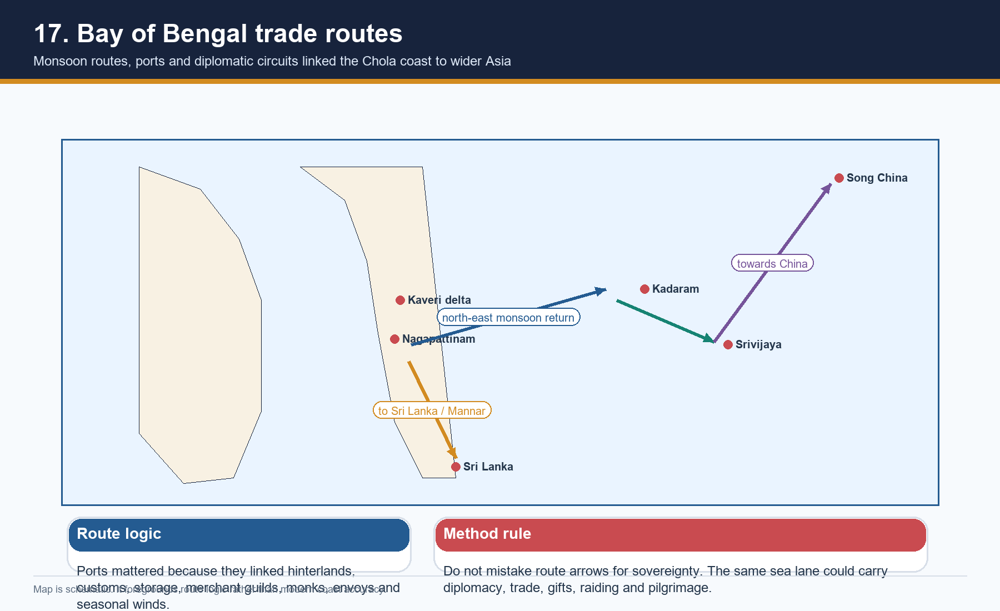

*This route map is deliberately schematic. It foregrounds connections and caution rather than cartographic precision.*

#### Maritime route table

| Corridor | Historical use |
|---|---|
| [FACT] Kaveri coast -> Sri Lanka | trade, war, horse and pearl interfaces, strategic stepping stone |
| [FACT] Coromandel -> Kadaram / Srivijaya | trade plus Rajendra's 1025 coercive strike |
| [FACT] Chola coast -> China | missions and wider Song-era commercial linkage |
| [FACT] internal delta -> port | inland agrarian surplus feeds maritime activity |

#### Why Nagapattinam matters

- [FACT] It appears in Buddhist and commercial contexts, including the Chudamani Vihara grant tradition.
- [ANALYSIS] It shows how Chola maritime history cannot be reduced to warfare alone.

#### Must-know facts

- Sri Lanka is both campaign zone and trade corridor.
- Nagapattinam is a key named port.
- Monsoon-route logic is essential for explaining maritime reach.

#### UPSC traps

- **Wrong:** maritime trade was detached from inland society. **Correct:** routes began in the agrarian-port nexus.
- **Wrong:** any connection to China proves Chola diplomatic supremacy. **Correct:** it shows participation in a larger Asian commercial-diplomatic order.

**Mains angle:** Connect routes to ports, merchants, diplomacy and warfare in one paragraph.

#### CLOSING RECALL FLOW — MARITIME TRADE ROUTES: BAY OF BENGAL, SRI LANKA, SOUTHEAST ASIA AND CHINA

```text
START / CONCEPT: Maritime trade routes: Bay of Bengal, Sri Lanka, Southeast Asia and China
        |
        v
EXACT TERMS: Maritime trade routes · Bay of Bengal · Sri Lanka · Southeast Asia · China · Mains angle
        |
        v
MECHANISM / ARGUMENT: The Chola sea should be understood as a route-system shaped by monsoon winds, port hierarchies, merchant corporations, state support and episodic coercion.
        |
        v
CONSEQUENCE / CONTRAST: Route arrows are not empire borders.
        |
        v
UPSC TRAP / ANSWER-USE: Do not miss this limiting distinction: sri Lanka is both campaign zone and trade corridor.
        |
        v
ANSWER-GRABBING FORMULATION: A trade route across the Bay of Bengal does not prove permanent Chola political control over every place connected by that route.
```
### SESSION 18 — MARITIME POWER AND THE 1025 EXPEDITION AGAINST SRIVIJAYA

#### DEFINITION / WHAT THIS IS CALLED

**Plain-language definition:** The attack is among the strongest pieces of evidence for Chola maritime power.

**Technical definition:** Technically, Maritime power and the 1025 expedition against Srivijaya is analysed by relating Maritime power to the 1025 expedition against Srivijaya, then testing the relationship through Mains angle and target.

#### ANSWER-GRABBING OPENING — WRITE/ADAPT IN THE EXAM

> The attack is among the strongest pieces of evidence for Chola maritime power.

#### MUST-WRITE KEYWORDS

- **Maritime power**
- **the 1025 expedition against Srivijaya**
- **Mains angle**
- **target**
- **Srivijaya-linked ports such as Kadaram**
- **Chola inscriptions and external corroboration of disrupted missions**

**How to use them:** Frame the answer through Maritime power; define the 1025 expedition against Srivijaya, connect Mains angle with target to explain the mechanism, and use Srivijaya-linked ports such as Kadaram for the decisive comparison or qualification.

[FACT] Rajendra I's 1025 campaign targeted Srivijaya-linked centres including Kadaram. Chola inscriptions celebrate the victory, and later Chinese evidence suggests disruption followed by renewed diplomatic patterns.

[ANALYSIS] This expedition shows a high level of maritime logistics and coercive capacity. It also shows that the Cholas understood the commercial-strategic value of the Straits world. The likely motives included prestige, commercial competition, route security and a desire to project imperial force into the Bay of Bengal arena.

[LIMIT] The expedition should be described as a raid or coercive maritime strike, not as colonisation or proof of a permanent Chola overseas empire. Evidence for actual ship types, standing naval institutions and long-term occupation is limited.

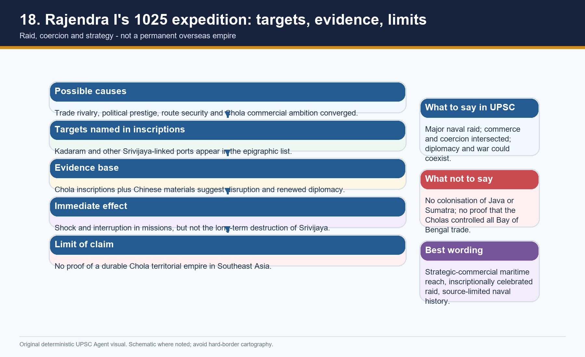

*The visual is built around a single exam discipline: targets, evidence and limits must all appear together.*

#### Answer architecture

| Step | What to write |
|---|---|
| [FACT] target | Srivijaya-linked ports such as Kadaram |
| [FACT] evidence | Chola inscriptions and external corroboration of disrupted missions |
| [ANALYSIS] motive | prestige plus strategic-commercial calculation |
| [LIMIT] verdict | raid / coercive projection, not permanent colonial empire |

#### Secure takeaways

- [FACT] Rajendra I is the ruler tied to the 1025 expedition.
- [FACT] The attack is among the strongest pieces of evidence for Chola maritime power.
- [LIMIT] It cannot bear claims about total Bay of Bengal domination.

#### Must-know facts

- Kadaram is the safest named target for UPSC use.
- The raid and the diplomatic-commercial network coexisted.
- Naval evidence is thinner than inscriptional celebration.

#### UPSC traps

- **Wrong:** Rajendra created a Southeast Asian empire. **Correct:** he launched a powerful raid against Srivijaya-linked nodes.
- **Wrong:** maritime power here means only trade. **Correct:** trade and coercion intersect.

**Mains angle:** "Rajendra's expedition was strategically commercial coercion, not oceanic colonisation."

#### CLOSING RECALL FLOW — MARITIME POWER AND THE 1025 EXPEDITION AGAINST SRIVIJAYA

```text
START / CONCEPT: Maritime power and the 1025 expedition against Srivijaya
        |
        v
EXACT TERMS: Maritime power · the 1025 expedition against Srivijaya · Mains angle · target · Srivijaya-linked ports such as Kadaram · Chola inscriptions and external corroboration of disrupted missions
        |
        v
MECHANISM / ARGUMENT: Chola inscriptions celebrate the victory, and later Chinese evidence suggests disruption followed by renewed diplomatic patterns.
        |
        v
CONSEQUENCE / CONTRAST: The expedition should be described as a raid or coercive maritime strike, not as colonisation or proof of a permanent Chola overseas empire.
        |
        v
UPSC TRAP / ANSWER-USE: "Rajendra's expedition was strategically commercial coercion, not oceanic colonisation.".
        |
        v
ANSWER-GRABBING FORMULATION: The attack is among the strongest pieces of evidence for Chola maritime power.
```
### SESSION 19 — SRI LANKA: CONQUEST, PROVINCIALIZATION AND RESISTANCE

#### DEFINITION / WHAT THIS IS CALLED

**Plain-language definition:** Sri Lanka is the best Chola case for discussing conquest, incorporation and resistance together.

**Technical definition:** Sri Lanka is the clearest case where the Cholas moved beyond raid into more durable annexation - but even here the degree of control was uneven.

#### ANSWER-GRABBING OPENING — WRITE/ADAPT IN THE EXAM

> Sri Lanka is the best Chola case for discussing conquest, incorporation and resistance together.

#### MUST-WRITE KEYWORDS

- **Sri Lanka**
- **conquest**
- **provincialization**
- **resistance**
- **Mains angle**
- **Rajarata / north**

**How to use them:** Frame the answer through Sri Lanka; define conquest, connect provincialization with resistance to explain the mechanism, and use Mains angle for the decisive comparison or qualification.

[FACT] Chola involvement in Sri Lanka began before Rajaraja, but Rajaraja I decisively attacked the island, destroyed Anuradhapura and occupied Rajarata. The northern part of the island was organised as a Chola province.

[FACT] Rajendra I continued island campaigning and claimed full conquest, but control over the south remained less secure than control over the north. By 1070, Vijayabahu I had expelled the Cholas from Sri Lanka.

[ANALYSIS] Sri Lanka is the clearest case where the Cholas moved beyond raid into more durable annexation - but even here the degree of control was uneven. This is the best case for showing the difference between conquest claim and durable administration.

[LIMIT] Sri Lankan chronicles stress violence and damage; Chola inscriptions stress victory and control. Both must be read together.

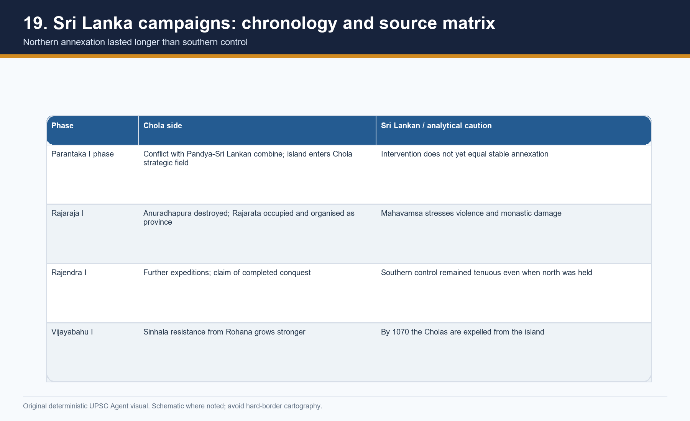

*The source matrix helps distinguish the relatively durable northern annexation from the more fragile southern hold.*

#### Sri Lanka answer grid

| Zone / phase | Safe conclusion |
|---|---|
| [FACT] Rajarata / north | annexed and provincialized for a substantial period |
| [FACT] south / Rohana | recurrent resistance, weaker Chola hold |
| [FACT] Vijayabahu I | key to Chola expulsion by 1070 |
| [ANALYSIS] exam use | best example of uneven imperial incorporation |

#### Must-know facts

- Rajaraja destroyed Anuradhapura and shifted the political balance.
- Northern Sri Lanka mattered more in administrative terms than the southern hill-country.
- The island experience qualifies all simplistic empire maps.

#### UPSC traps

- **Wrong:** the whole island remained smoothly Chola-controlled. **Correct:** north stronger, south more contested.
- **Wrong:** Sri Lanka proves a modern naval empire. **Correct:** it proves strong maritime campaigning with uneven territorial control.

**Mains angle:** Sri Lanka is the best Chola case for discussing conquest, incorporation and resistance together.

#### CLOSING RECALL FLOW — SRI LANKA: CONQUEST, PROVINCIALIZATION AND RESISTANCE

```text
START / CONCEPT: Sri Lanka: conquest, provincialization and resistance
        |
        v
EXACT TERMS: Sri Lanka · conquest · provincialization · resistance · Mains angle · Rajarata / north
        |
        v
MECHANISM / ARGUMENT: By 1070, Vijayabahu I had expelled the Cholas from Sri Lanka.
        |
        v
CONSEQUENCE / CONTRAST: Sri Lanka is the clearest case where the Cholas moved beyond raid into more durable annexation - but even here the degree of control was uneven.
        |
        v
UPSC TRAP / ANSWER-USE: Do not miss this limiting distinction: this is the best case for showing the difference between conquest claim and durable...
        |
        v
ANSWER-GRABBING FORMULATION: Sri Lanka is the best Chola case for discussing conquest, incorporation and resistance together.
```
### SESSION 20 — CHOLA-SRIVIJAYA-NAGAPATTINAM DIPLOMACY: CONFLICT AND COEXISTENCE

#### DEFINITION / WHAT THIS IS CALLED

**Plain-language definition:** Nagapattinam is the best named site for diplomacy plus maritime commerce.

**Technical definition:** Diplomacy and conflict were not contradictions; they were different instruments within the same arena.

#### ANSWER-GRABBING OPENING — WRITE/ADAPT IN THE EXAM

> Diplomacy and conflict were not contradictions; they were different instruments within the same arena.

#### MUST-WRITE KEYWORDS

- **Chola-Srivijaya-Nagapattinam diplomacy**
- **conflict**
- **coexistence**
- **Mains angle**
- **Leiden plates / Anaimangalam grant**
- **Chola recognition of Srivijaya-linked Buddhist patronage at Nagapattinam**

**How to use them:** Frame the answer through Chola-Srivijaya-Nagapattinam diplomacy; define conflict, connect coexistence with Mains angle to explain the mechanism, and use Leiden plates / Anaimangalam grant for the decisive comparison or qualification.

[FACT] The Leiden plates record Rajaraja's grant of the village of Anaimangalam to the Buddhist Chudamani Vihara at Nagapattinam, which had been built by a ruler of Srivijaya / Kataha. Kulottunga I later confirmed villages to the same institution after an embassy from Kadaram.

[ANALYSIS] This evidence is vital because it prevents one-dimensional stories. The same broad Chola-Southeast Asian field includes Buddhist patronage, merchant connectivity, embassies and military action. Diplomacy and conflict were not contradictions; they were different instruments within the same arena.

[LIMIT] The older 9th-century Balaputradeva-Nalanda connection belongs to an earlier Pala-Srivijaya world and must not be confused with the later Chola-Srivijaya episode, even though both show transregional Buddhist diplomacy.

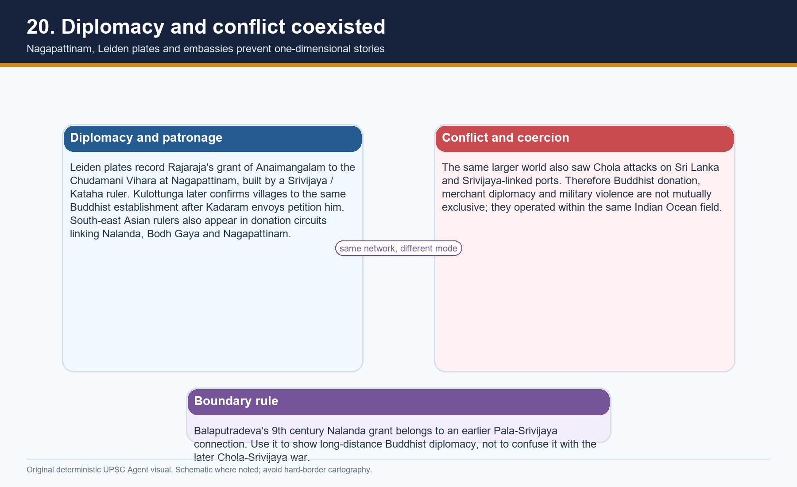

*This visual prevents a common exam mistake: turning Nagapattinam's Buddhist connections into evidence against war, or war into evidence against diplomacy.*

#### Diplomatic significance

| Evidence | What it proves |
|---|---|
| [FACT] Leiden plates / Anaimangalam grant | Chola recognition of Srivijaya-linked Buddhist patronage at Nagapattinam |
| [FACT] Kulottunga's confirmation | continuing diplomatic connection after earlier conflict |
| [ANALYSIS] wider implication | trade, religion and power politics overlapped in the Bay of Bengal |

#### Must-know facts

- Nagapattinam is the best named site for diplomacy plus maritime commerce.
- Rajaraja and Kulottunga both matter in this story.
- War and patronage coexisted.

#### UPSC traps

- **Wrong:** Cholas were either Buddhist patrons or Buddhist destroyers. **Correct:** they acted within a plural political-commercial field.
- **Wrong:** one Buddhist grant cancels the evidence of maritime warfare. **Correct:** both belong in the same answer.

**Mains angle:** Use Nagapattinam to show the layered nature of Indian Ocean power.

#### CLOSING RECALL FLOW — CHOLA-SRIVIJAYA-NAGAPATTINAM DIPLOMACY: CONFLICT AND COEXISTENCE

```text
START / CONCEPT: Chola-Srivijaya-Nagapattinam diplomacy: conflict and coexistence
        |
        v
EXACT TERMS: Chola-Srivijaya-Nagapattinam diplomacy · conflict · coexistence · Mains angle · Leiden plates / Anaimangalam grant · Chola recognition of Srivijaya-linked Buddhist patronage at Nagapattinam
        |
        v
MECHANISM / ARGUMENT: The Leiden plates record Rajaraja's grant of the village of Anaimangalam to the Buddhist Chudamani Vihara at Nagapattinam, which had been built by a ruler of Srivijaya / Kataha.
        |
        v
CONSEQUENCE / CONTRAST: The older 9th-century Balaputradeva-Nalanda connection belongs to an earlier Pala-Srivijaya world and must not be confused with the later Chola-Srivijaya episode, even though both show transregional Buddhist diplomacy.
        |
        v
UPSC TRAP / ANSWER-USE: Do not miss this limiting distinction: nagapattinam is the best named site for diplomacy plus maritime commerce.
        |
        v
ANSWER-GRABBING FORMULATION: Diplomacy and conflict were not contradictions; they were different instruments within the same arena.
```
### SESSION 21 — MILITARY ORGANIZATION, REGIMENTS AND EVIDENTIARY LIMITS

#### DEFINITION / WHAT THIS IS CALLED

**Plain-language definition:** The Chola military should be seen as a flexible campaign machine rooted in agrarian provisioning, not as a modern national army.

**Technical definition:** "The Chola army is epigraphically visible; the navy is historically inferred through expeditionary success.".

#### ANSWER-GRABBING OPENING — WRITE/ADAPT IN THE EXAM

> The Chola military should be seen as a flexible campaign machine rooted in agrarian provisioning, not as a modern national army.

#### MUST-WRITE KEYWORDS

- **Military organization**
- **regiments**
- **evidentiary limits**
- **Mains angle**
- **army**
- **regular force plus subordinate support**

**How to use them:** Frame the answer through Military organization; define regiments, connect evidentiary limits with Mains angle to explain the mechanism, and use army for the decisive comparison or qualification.

[FACT] The Chola state maintained a substantial military force, supported by both the crown and subordinate chiefs. Inscriptions refer to standing troops, military officers, cantonments and army-linked endowments.

[FACT] Elephants, cavalry and infantry remained basic components of warfare. Maritime expeditions to Sri Lanka and Southeast Asia imply transport capacity and careful provisioning. The later Velaikkara / Velakkara traditions point to elite oath-bound military groups and royal bodyguard functions.

[ANALYSIS] The Chola military should be seen as a flexible campaign machine rooted in agrarian provisioning, not as a modern national army. Its strength lay in repeated campaigning across the Deccan, the island world and the coast.

[LIMIT] Numbers in eulogies are unreliable, and naval institutional detail is sparse. We should resist pretending that the Cholas left us a modern naval manual.

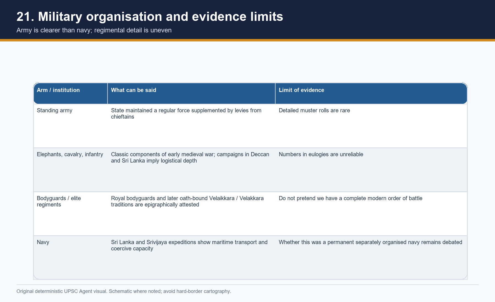

*The military visual is intentionally conservative: army evidence is clearer than naval detail, so the diagram states precisely that imbalance.*

#### Military reading

| Arm / institution | Safe conclusion |
|---|---|
| [FACT] army | regular force plus subordinate support |
| [FACT] elephants / cavalry / infantry | standard combined arms of early-medieval warfare |
| [FACT] elite regiments / guards | epigraphically visible, especially in later oath-bound contexts |
| [LIMIT] navy | maritime capacity is certain; permanent formal naval structure is debated |

#### Must-know facts

- Chola military power rested on land revenue and logistics.
- Sri Lanka and Srivijaya campaigns prove seaborne capacity.
- Evidence is stronger for campaigns than for technical naval structure.

#### UPSC traps

- **Wrong:** write about a blue-water navy in modern terms. **Correct:** say maritime transport and coercive capacity with limited organisational detail.
- **Wrong:** army and navy were separate modern branches. **Correct:** campaigns emerged from a single agrarian-imperial apparatus.

**Mains angle:** "The Chola army is epigraphically visible; the navy is historically inferred through expeditionary success."

#### CLOSING RECALL FLOW — MILITARY ORGANIZATION, REGIMENTS AND EVIDENTIARY LIMITS

```text
START / CONCEPT: Military organization, regiments and evidentiary limits
        |
        v
EXACT TERMS: Military organization · regiments · evidentiary limits · Mains angle · army · regular force plus subordinate support
        |
        v
MECHANISM / ARGUMENT: "The Chola army is epigraphically visible; the navy is historically inferred through expeditionary success.".
        |
        v
CONSEQUENCE / CONTRAST: Numbers in eulogies are unreliable, and naval institutional detail is sparse.
        |
        v
UPSC TRAP / ANSWER-USE: Do not miss this limiting distinction: we should resist pretending that the Cholas left us a modern naval manual.
        |
        v
ANSWER-GRABBING FORMULATION: The Chola military should be seen as a flexible campaign machine rooted in agrarian provisioning, not as a modern national army.
```
### SESSION 22 — HISTORIOGRAPHY: SASTRI, STEIN, KARASHIMA, SUBBARAYALU AND BEYOND

#### DEFINITION / WHAT THIS IS CALLED

**Plain-language definition:** Karashima and Subbarayalu matter because they are inscription-led correctives, not just abstract theorists.

**Technical definition:** Historiography is a scoring opportunity if linked to evidence.

#### ANSWER-GRABBING OPENING — WRITE/ADAPT IN THE EXAM

> Karashima and Subbarayalu show that close epigraphic work can recover changing degrees of centralisation, locality and revenue articulation.

#### MUST-WRITE KEYWORDS

- **Historiography**
- **Sastri**
- **Stein**
- **Karashima**
- **Subbarayalu**
- **beyond**

**How to use them:** Frame the answer through Historiography; define Sastri, connect Stein with Karashima to explain the mechanism, and use Subbarayalu for the decisive comparison or qualification.

[FACT] K. A. Nilakanta Sastri presented the Cholas as an impressive imperial state with strong kingship, administration, temple-building and maritime reach. Burton Stein argued for a segmentary state in which sovereignty radiated ritually and local corporate bodies retained substantial autonomy. Noboru Karashima and Y. Subbarayalu, using inscriptional data, refined the picture through detailed work on offices, taxes, localities and temporal change.

[ANALYSIS] The debate is not "who is right forever?" but what each model reveals. Sastri explains expansion and integration. Stein warns against projecting a modern bureaucratic state backwards. Karashima and Subbarayalu show that close epigraphic work can recover changing degrees of centralisation, locality and revenue articulation.

[LIMIT] Every model becomes misleading when absolutised. A fully centralised machine and a purely ritual-segmentary polity are both caricatures if used alone.

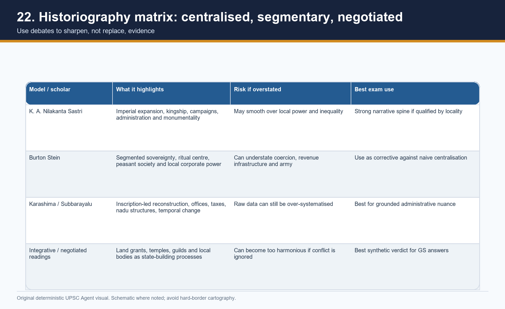

*This matrix is not for name-dropping. It is for sharpening the final verdict in essays and GS-I answers.*

#### Historiography answer rule

| Historian / model | Best use in answer |
|---|---|
| [FACT] Sastri | narrative of expansion, kingship, administration and monumentality |
| [FACT] Stein | corrective against naive bureaucratic centralism |
| [FACT] Karashima / Subbarayalu | inscription-led administrative and social nuance |
| [ANALYSIS] synthetic reading | negotiated / integrative state with real central power and strong local mediation |

#### Must-know facts

- Historiography is a scoring opportunity if linked to evidence.
- Karashima and Subbarayalu matter because they are inscription-led correctives, not just abstract theorists.
- The best final answer is balanced, not centrist for its own sake.

#### UPSC traps

- **Wrong:** quote Stein to deny Chola state power. **Correct:** use him to qualify the nature of state power.
- **Wrong:** quote Sastri to erase locality. **Correct:** pair narrative grandeur with inscriptional nuance.

**Mains angle:** "The Chola state was neither a modern bureaucracy nor a hollow ritual shell, but a negotiated imperial formation."

#### CLOSING RECALL FLOW — HISTORIOGRAPHY: SASTRI, STEIN, KARASHIMA, SUBBARAYALU AND BEYOND

```text
START / CONCEPT: Historiography: Sastri, Stein, Karashima, Subbarayalu and beyond
        |
        v
EXACT TERMS: Historiography · Sastri · Stein · Karashima · Subbarayalu · beyond
        |
        v
MECHANISM / ARGUMENT: Karashima and Subbarayalu matter because they are inscription-led correctives, not just abstract theorists.
        |
        v
CONSEQUENCE / CONTRAST: The debate is not "who is right forever?" but what each model reveals.
        |
        v
UPSC TRAP / ANSWER-USE: The best final answer is balanced, not centrist for its own sake.
        |
        v
ANSWER-GRABBING FORMULATION: Karashima and Subbarayalu show that close epigraphic work can recover changing degrees of centralisation, locality and revenue articulation.
```
### SESSION 23 — DECLINE, TRANSFORMATION AND LEGACY

#### DEFINITION / WHAT THIS IS CALLED

**Plain-language definition:** The term "decline" is useful only if we also speak of transformation.

**Technical definition:** Chola legacy is strongest in temples, epigraphy, Tamil memory and institutional forms.

#### ANSWER-GRABBING OPENING — WRITE/ADAPT IN THE EXAM

> The term "decline" is useful only if we also speak of transformation.

#### MUST-WRITE KEYWORDS

- **Decline**
- **transformation**
- **legacy**
- **Mains angle**
- **political contraction**
- **cumulative result of war, succession and regional rebalancing**

**How to use them:** Frame the answer through Decline; define transformation, connect legacy with Mains angle to explain the mechanism, and use political contraction for the decisive comparison or qualification.

[FACT] Later Chola power weakened under the pressure of succession strains, Deccan rivals, Pandya resurgence, changing local power-balances and broader reorganisation of networks. The empire did not collapse in a single event.

[ANALYSIS] The term "decline" is useful only if we also speak of transformation. Administrative density changed, regional rivals strengthened, local elites acquired room for manoeuvre and older centres no longer monopolised authority in the same way.

[FACT] Yet the legacy endured in temple networks, water institutions, Tamil cultural memory, land-charter practice, iconography, sacred geography and Bay of Bengal historical imagination.

[LIMIT] Legacy is not survival unchanged. Institutions can persist by being reworked under new powers.

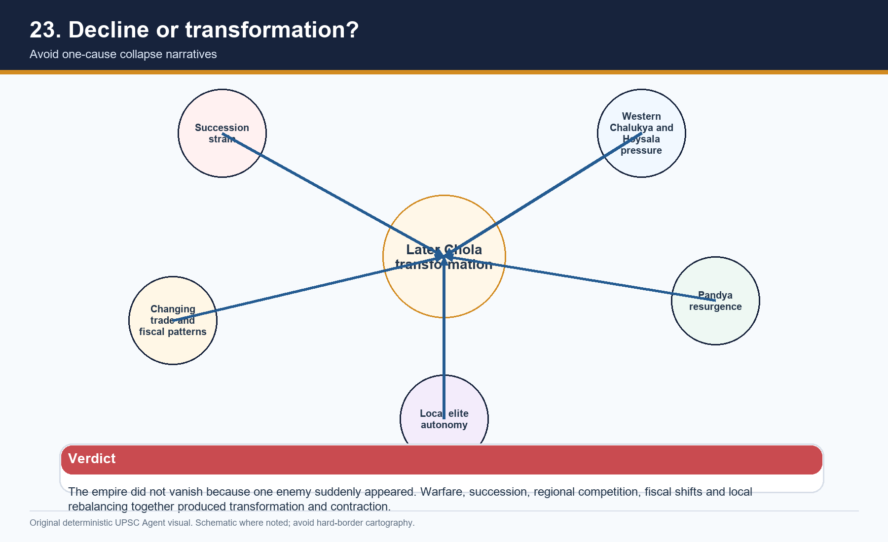

*The causal web is a guardrail against one-cause explanations such as "just Pandya revival" or "just succession crisis".*

#### Decline and legacy table

| Theme | Safe conclusion |
|---|---|
| [FACT] political contraction | cumulative result of war, succession and regional rebalancing |
| [FACT] institutional continuity | temples, inscriptions, agrarian structures and cultural memory endure |
| [ANALYSIS] transformation | decline in imperial command can coexist with continuity of social forms |

#### Must-know facts

- Decline is multicausal.
- Chola legacy is strongest in temples, epigraphy, Tamil memory and institutional forms.
- Continuity and change must be stated together.

#### UPSC traps

- **Wrong:** one decisive collapse event explains everything. **Correct:** frame decline as cumulative transformation.
- **Wrong:** legacy means unchanged survival. **Correct:** institutions survive by adaptation.

**Mains angle:** Conclude with "imperial contraction, institutional afterlife."

#### CLOSING RECALL FLOW — DECLINE, TRANSFORMATION AND LEGACY

```text
START / CONCEPT: Decline, transformation and legacy
        |
        v
EXACT TERMS: Decline · transformation · legacy · Mains angle · political contraction · cumulative result of war, succession and regional rebalancing
        |
        v
MECHANISM / ARGUMENT: Institutions can persist by being reworked under new powers.
        |
        v
CONSEQUENCE / CONTRAST: Chola legacy is strongest in temples, epigraphy, Tamil memory and institutional forms.
        |
        v
UPSC TRAP / ANSWER-USE: Do not miss this limiting distinction: administrative density changed, regional rivals strengthened, local elites acquired room for manoeuvre and older...
        |
        v
ANSWER-GRABBING FORMULATION: The term "decline" is useful only if we also speak of transformation.
```
### SESSION 24 — HISTORICAL SIGNIFICANCE AND ANSWER SYNTHESIS

#### DEFINITION / WHAT THIS IS CALLED

**Plain-language definition:** Balanced polity line: "The Cholas built one of early-medieval India's strongest regional empires, but their authority always moved through negotiated local institutions and uneven frontiers." Economy line: "Their maritime profile rested on a wet-rice inland base, not on the sea alone." Source line: "The Cholas are powerful precisely because their archive is rich enough to reveal both imperial ambition and its limits.".

**Technical definition:** The Imperial Cholas matter because they offer one of the clearest Indian examples of how agrarian intensification, locality institutions, temple-centred public authority, long-distance commerce and selective maritime coercion could fuse into a powerful early-medieval regional empire.

#### ANSWER-GRABBING OPENING — WRITE/ADAPT IN THE EXAM

> Balanced polity line: "The Cholas built one of early-medieval India's strongest regional empires, but their authority always moved through negotiated local institutions and uneven frontiers." Economy line: "Their maritime profile rested on a wet-rice inland base, not on the sea alone." Source line: "The Cholas are powerful precisely because their archive is rich enough to reveal both imperial ambition and its limits.".

#### MUST-WRITE KEYWORDS

- **Historical significance**
- **synthesis**
- **Balanced polity line**
- **Economy line**
- **Source line**
- **The Imperial Cholas**

**How to use them:** Frame the answer through Historical significance; define synthesis, connect Balanced polity line with Economy line to explain the mechanism, and use Source line for the decisive comparison or qualification.

[ANALYSIS] The Imperial Cholas matter because they offer one of the clearest Indian examples of how agrarian intensification, locality institutions, temple-centred public authority, long-distance commerce and selective maritime coercion could fuse into a powerful early-medieval regional empire.

[ANALYSIS] They are also historically important because they force precision. They caution us against reading temples as merely artistic, villages as automatically democratic, merchant reach as sovereignty, and inscriptions as transparent truth.

[FACT] For GS-I and Prelims, the highest-yield anchors are Rajaraja I, Rajendra I, Kaveri delta, Uttaramerur, Brihadisvara, merchant guilds, Sri Lanka, Kadaram / Srivijaya and the Sastri-Stein-Karashima debate.

[LIMIT] Every strong Chola answer needs at least one qualifying sentence on evidence, control or chronology.

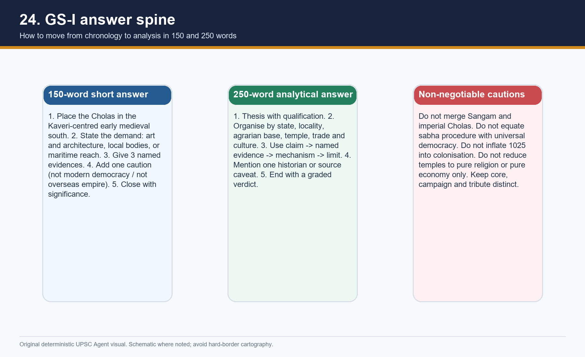

*Final answer spine: thesis, named evidence, mechanism, limitation, verdict.*

#### One-line significance formula

- Cholas = Kaveri-centred agrarian empire + locality institutions + temple power + commercial guild networks + source-rich but claim-heavy archive.

#### 10-second conclusion options

1. **Balanced polity line:** "The Cholas built one of early-medieval India's strongest regional empires, but their authority always moved through negotiated local institutions and uneven frontiers."
2. **Economy line:** "Their maritime profile rested on a wet-rice inland base, not on the sea alone."
3. **Source line:** "The Cholas are powerful precisely because their archive is rich enough to reveal both imperial ambition and its limits."

#### CLOSING RECALL FLOW — HISTORICAL SIGNIFICANCE AND ANSWER SYNTHESIS

```text
START / CONCEPT: Historical significance and answer synthesis
        |
        v
EXACT TERMS: Historical significance · synthesis · Balanced polity line · Economy line · Source line · The Imperial Cholas
        |
        v
MECHANISM / ARGUMENT: The Imperial Cholas matter because they offer one of the clearest Indian examples of how agrarian intensification, locality institutions, temple-centred public authority, long-distance commerce and selective maritime coercion could fuse into a powerful early-medieval regional empire.
        |
        v
CONSEQUENCE / CONTRAST: For GS-I and Prelims, the highest-yield anchors are Rajaraja I, Rajendra I, Kaveri delta, Uttaramerur, Brihadisvara, merchant guilds, Sri Lanka, Kadaram / Srivijaya and the Sastri-Stein-Karashima debate.
        |
        v
UPSC TRAP / ANSWER-USE: Do not miss this limiting distinction: they are also historically important because they force precision.
        |
        v
ANSWER-GRABBING FORMULATION: Balanced polity line: "The Cholas built one of early-medieval India's strongest regional empires, but their authority always moved through negotiated local institutions and uneven frontiers." Economy line: "Their maritime profile rested on a wet-rice inland base, not on the sea alone." Source line: "The Cholas are powerful precisely because their archive is rich enough to reveal both imperial ambition and its limits.".
```
### SESSION 25 — BOUNDED LIVE LINKAGE

#### DEFINITION / WHAT THIS IS CALLED

**Plain-language definition:** The July 2025 India-ASEAN brief supplies bounded modern maritime-diplomacy context.

**Technical definition:** Technically, Bounded live linkage is analysed by relating UNESCO's Great Living Chola Temples to PIB, then testing the relationship through Chola-period Nataraja and Somaskanda.

#### ANSWER-GRABBING OPENING — WRITE/ADAPT IN THE EXAM

> This linkage does not override repository chronology, OCR-searchable book evidence, verified PYQ routing or the source limitations printed throughout.

#### MUST-WRITE KEYWORDS

- **Bounded live linkage**
- **UNESCO's Great Living Chola Temples**
- **PIB**
- **Chola-period Nataraja**
- **Somaskanda**
- **The July**

**How to use them:** Frame the answer through Bounded live linkage; define UNESCO's Great Living Chola Temples, connect PIB with Chola-period Nataraja to explain the mechanism, and use Somaskanda for the decisive comparison or qualification.

UNESCO's Great Living Chola Temples record and the May 2026 PIB repatriation report on Chola-period Nataraja and Somaskanda bronzes were rechecked on 30 August 2026. The July 2025 India-ASEAN brief supplies bounded modern maritime-diplomacy context. These sources support conservation, provenance and present connectivity only; they do not prove a permanent Chola overseas empire.

This linkage does not override repository chronology, OCR-searchable book evidence, verified PYQ routing or the source limitations printed throughout.

#### CLOSING RECALL FLOW — BOUNDED LIVE LINKAGE

```text
START / CONCEPT: Bounded live linkage
        |
        v
EXACT TERMS: Bounded live linkage · UNESCO's Great Living Chola Temples · PIB · Chola-period Nataraja · Somaskanda · The July
        |
        v
MECHANISM / ARGUMENT: UNESCO's Great Living Chola Temples record and the May 2026 PIB repatriation report on Chola-period Nataraja and Somaskanda bronzes were rechecked on 30 August 2026.
        |
        v
CONSEQUENCE / CONTRAST: These sources support conservation, provenance and present connectivity only; they do not prove a permanent Chola overseas empire.
        |
        v
UPSC TRAP / ANSWER-USE: Do not miss this limiting distinction: the July 2025 India-ASEAN brief supplies bounded modern maritime-diplomacy context.
        |
        v
ANSWER-GRABBING FORMULATION: This linkage does not override repository chronology, OCR-searchable book evidence, verified PYQ routing or the source limitations printed throughout.
```
## BASIC MCQS / REMEDIATION

### Learning MCQ 01

**Question:** Which statement best captures the correct frame for studying the Imperial Cholas?

A. They were an early-medieval Kaveri-centred empire linking agrarian power, local institutions, temples and maritime reach.
B. They were a permanent overseas empire ruling Southeast Asia directly.
C. They were mainly a golden-age temple civilisation detached from society.
D. They were a Sangam-age polity that continued unchanged.

**Answer: A.**
**Why:** This option preserves chronology, core geography and the combination of agrarian, institutional and maritime power.

### Learning MCQ 02

**Question:** Tondaimandalam is best described in Chola history as:

A. a Buddhist monastic confederacy.
B. a major northern annexation zone gained after Pallava defeat.
C. a term for Chola naval bases only.
D. a Southeast Asian colony.

**Answer: B.**
**Why:** Aditya I's defeat of the Pallava overlord opened the way to Chola control over Tondaimandalam.

### Learning MCQ 03

**Question:** The event that most clearly marks the major 10th-century setback in Chola expansion is:

A. the grant to Chudamani Vihara.
B. Vijayalaya's capture of Tanjavur.
C. the battle of Takkolam.
D. the Srivijaya raid.

**Answer: C.**
**Why:** Takkolam in 949 CE exposed Chola vulnerability to Rashtrakuta power.

### Learning MCQ 04

**Question:** Why is the Kaveri delta central to Chola history?

A. It allowed immediate control of all Indian Ocean trade.
B. It isolated the Cholas from outside influence.
C. It was chiefly important as a bronze-producing zone.
D. It provided the wet-rice, irrigation and settlement density that sustained imperial power.

**Answer: D.**
**Why:** The delta was the resource core behind revenue, temple endowment and campaigning.

### Learning MCQ 05

**Question:** Which institutional pairing is correct?

A. sabha - Brahmana assembly in a brahmadeya settlement
B. nagaram - royal women donors
C. ur - overseas merchant guild
D. valanadu - temple bronze type

**Answer: A.**
**Why:** Sabha or mahasabha refers to the Brahmana corporate assembly, unlike ur and nagaram.

### Learning MCQ 06

**Question:** The most accurate description of Uttaramerur is:

A. evidence of universal adult franchise across Chola India
B. a Brahmadeya sabha constitution with detailed committee-selection rules
C. a merchant guild charter from Nagapattinam
D. a naval regulation text of Rajendra I

**Answer: B.**
**Why:** Uttaramerur is famous for kudavolai committee selection in a Brahmana assembly.

### Learning MCQ 07

**Question:** Rajaraja I's land survey is historically important because it shows:

A. total replacement of temples by officials.
B. that local institutions disappeared.
C. an attempt to tighten fiscal-administrative articulation across the realm.
D. that the Cholas stopped using inscriptions.

**Answer: C.**
**Why:** Survey is a strong indicator of state capacity, though it still relied on local bodies for execution.

### Learning MCQ 08

**Question:** Which social group is especially important in Chola agrarian society as major cultivators and landholders?

A. Yavanas
B. Kushanas
C. Hunas
D. vellalas

**Answer: D.**
**Why:** Vellalas are central to Chola social history and cannot be ignored in any serious answer.

### Learning MCQ 09

**Question:** Which named royal woman is most securely associated with major temple patronage and rebuilding activity?

A. Sembiyan Mahadevi
B. Didda
C. Razia
D. Gautami Balashri

**Answer: A.**
**Why:** Sembiyan Mahadevi is a high-yield name for Chola-era female patronage.

### Learning MCQ 10

**Question:** A major Chola temple should best be viewed as:

A. a modern municipal corporation.
B. a political-economic-cultural institution with land, labour and archive functions.
C. only a religious shrine.
D. only an art object.

**Answer: B.**
**Why:** The Chola temple linked ritual, patronage, labour, record and redistribution.

### Learning MCQ 11

**Question:** Which statement about Chola bronzes is most accurate?

A. Nataraja certainly originated only in the Chola period.
B. They were mainly created for museum display.
C. They were ritual-processional icons produced through the lost-wax method.
D. They were detached from temple life.

**Answer: C.**
**Why:** Chola bronzes were embedded in temple ritual and produced through cire perdue / lost-wax casting.

### Learning MCQ 12

**Question:** The best way to describe Tamil and Sanskrit in Chola court culture is:

A. only Tamil mattered.
B. only Sanskrit mattered.
C. neither language was used in inscriptions.
D. both languages operated in a layered bilingual order.

**Answer: D.**
**Why:** Chola records show a bilingual cultural field rather than a monolingual political culture.

### Learning MCQ 13

**Question:** Which guild name is most strongly associated with long-distance merchant activity in the Chola world?

A. Ayyavole / Ainnurruvar
B. Sreni of Takshashila only
C. Nigama Sabha of Vaishali
D. Gahapati Sangha

**Answer: A.**
**Why:** Ayyavole / Ainnurruvar is the best-known transregional merchant guild name in Chola-era trade.

### Learning MCQ 14

**Question:** Rajendra I's 1025 expedition should be described primarily as:

A. first spread of Buddhism to Southeast Asia
B. a coercive maritime strike against Srivijaya-linked ports
C. permanent colonisation of Southeast Asia
D. conquest of China

**Answer: B.**
**Why:** The expedition shows maritime power but not durable overseas territorial empire.

### Learning MCQ 15

**Question:** Which historian is most associated with the segmentary-state interpretation of the Chola polity?

A. K. A. Nilakanta Sastri
B. Noboru Karashima
C. Burton Stein
D. Y. Subbarayalu

**Answer: C.**
**Why:** Stein's model emphasised ritually radiating sovereignty and strong local corporate space.

### Learning MCQ 16

**Question:** The best concluding line on Chola decline is that it was:

A. the end of Bay of Bengal trade itself.
B. the end of all temple traditions in Tamil country.
C. caused by one sudden invasion only.
D. a multicausal political transformation with enduring institutional legacies.

**Answer: D.**
**Why:** Later Chola contraction resulted from interacting pressures, not a single-cause collapse.# PART III - Solved practice workbook

#### Original broad-coverage MCQs

##### MCQ 01

**Question:** Which combination best explains why the Imperial Cholas are treated as a major early-medieval regional empire?

A. Agrarian surplus, conquest, local institutions, temple power and selective maritime reach
B. Only local democracy without kingship
C. Only maritime trade without agrarian foundations
D. Purely temple-centred art without military activity

**Answer: A.**
**Explanation:** Chola power rested on a fusion of delta agriculture, conquest, temple-centered legitimacy, locality institutions and wider commercial-maritime projection.

##### MCQ 02

**Question:** Vijayalaya's historical significance lies primarily in:

A. launching the 1025 raid on Srivijaya
B. capturing Tanjavur and establishing the lower Kaveri foothold of the imperial line
C. building Airavatesvara temple
D. expelling the Cholas from Sri Lanka

**Answer: B.**
**Explanation:** Vijayalaya is the founder figure who secured Tanjavur and laid the territorial base for later imperial expansion.

##### MCQ 03

**Question:** The battle of Takkolam is most important because it:

A. created the Chudamani Vihara
B. ended Tamil-Sanskrit bilingualism
C. marked a major Chola setback before later recovery
D. destroyed Srivijaya

**Answer: C.**
**Explanation:** The Rashtrakuta victory at Takkolam sharply checked Chola expansion and is the key 10th-century reversal.

##### MCQ 04

**Question:** Which ruler is most closely associated with Brihadisvara at Thanjavur and the great imperial survey?

A. Aditya I
B. Kulottunga II
C. Vijayalaya
D. Rajaraja I

**Answer: D.**
**Explanation:** Rajaraja I anchors both the monumental temple and the survey-based articulation of imperial revenue and control.

##### MCQ 05

**Question:** In Chola political geography, the safest description of the Maldives is:

A. campaign or maritime-reach zone, not core territory
B. permanent province equivalent to the Kaveri delta
C. brahmadeya heartland
D. hereditary Chola homeland

**Answer: A.**
**Explanation:** Evidence supports Chola capture claims, but not treatment of the Maldives as a stable core province.

##### MCQ 06

**Question:** Which division became especially important in Chola revenue administration after Rajaraja I?

A. ahara
B. valanadu
C. visaya
D. janapada

**Answer: B.**
**Explanation:** Valanadu is a high-yield Chola revenue-administrative term, especially in the later 10th and 11th centuries.

##### MCQ 07

**Question:** The ur in Chola inscriptions refers primarily to:

A. a bronze-casting guild
B. the royal court
C. the corporate body of a non-brahmadeya village
D. a Southeast Asian trade mission

**Answer: C.**
**Explanation:** Ur is the village assembly or corporate body of the ordinary village, distinct from sabha and nagaram.

##### MCQ 08

**Question:** Which statement best captures the historical importance of the sabha?

A. It was a title used only for kings.
B. It was a Buddhist monastery network.
C. It was identical to nagaram.
D. It was the Brahmana assembly of a brahmadeya settlement with strong committee and fiscal functions.

**Answer: D.**
**Explanation:** Sabha or mahasabha denotes the Brahmana corporate assembly, especially important in land and committee management.

##### MCQ 09

**Question:** The most accurate statement about Uttaramerur is that it:

A. offers detailed procedural evidence for committee selection in a Brahmadeya sabha
B. established universal suffrage in all Chola villages
C. records only temple architecture
D. proves that all social groups participated equally

**Answer: A.**
**Explanation:** Uttaramerur is a procedural charter-like inscription for committee-based governance within a bounded elite setting.

##### MCQ 10

**Question:** Which named committee at Uttaramerur is associated with tank management?

A. Samvatsara Variyam
B. Eri Variyam
C. Thotta Variyam
D. Pon Variyam

**Answer: B.**
**Explanation:** Eri refers to tank, making Eri Variyam the high-yield committee name for irrigation management.

##### MCQ 11

**Question:** Which statement about Chola land surveys is most accurate?

A. They ended temple endowments.
B. They eliminated local institutions entirely.
C. They reveal stronger fiscal articulation while still depending on local implementation.
D. They belong only to Sangam times.

**Answer: C.**
**Explanation:** Survey evidence indicates state capacity, but the collection and local management still moved through village and nadu-level bodies.

##### MCQ 12

**Question:** The term brahmadeya most directly refers to:

A. an overseas commercial pact
B. a military regiment
C. a sculptural style
D. a Brahmana land-grant settlement

**Answer: D.**
**Explanation:** Brahmadeya settlements are central to Chola agrarian, social and institutional history.

##### MCQ 13

**Question:** Which statement best describes the place of vellalas in Chola society?

A. They were major cultivators and powerful local landholders.
B. They were foreign merchants from Southeast Asia.
C. They had no connection to landholding.
D. They were marginal forest nomads only.

**Answer: A.**
**Explanation:** Vellalas are crucial agrarian elites and must be integrated into any serious account of Chola society.

##### MCQ 14

**Question:** Which named royal woman is most closely linked with temple rebuilding and image patronage?

A. Nur Jahan
B. Sembiyan Mahadevi
C. Didda
D. Prabhavati Gupta

**Answer: B.**
**Explanation:** Sembiyan Mahadevi is the safest and most important named example for Chola female patronage.

##### MCQ 15

**Question:** The most secure evidence for Kundavai's public role in this package is:

A. the Mahavamsa's account of Sri Lanka
B. the 1025 Srivijaya raid list
C. her appearance in the Brihadisvara donor inscriptional record
D. a modern novel

**Answer: C.**
**Explanation:** The IGNCA inscriptional summary confirms Rajaraja's order to record gifts by Kundavaiyar along with royal and other donors.

##### MCQ 16

**Question:** Which statement best defines the Chola temple institution?

A. only a site of personal devotion
B. a foreign merchant office
C. only a landlord without ritual significance
D. a political-economic-cultural institution combining ritual, archive, labour and redistribution

**Answer: D.**
**Explanation:** Great Chola temples functioned as sacred centres, employers, archives and nodes of redistribution.

##### MCQ 17

**Question:** The Great Living Chola Temples UNESCO cluster includes:

A. Thanjavur, Gangaikondacholapuram and Darasuram
B. Chidambaram, Madurai and Kanchi
C. Pattadakal, Badami and Aihole
D. Mahabalipuram, Kanchipuram and Darasuram

**Answer: A.**
**Explanation:** UNESCO identifies these three as the Great Living Chola Temples.

##### MCQ 18

**Question:** Which statement about Chola bronzes is correct?

A. They were detached from temple institutions.
B. They were made through the lost-wax process.
C. They were carved only in granite.
D. They never moved in procession.

**Answer: B.**
**Explanation:** Chola bronzes are produced by lost-wax casting and were often processional cult images.

##### MCQ 19

**Question:** The most balanced statement about Nataraja is that:

A. it had no theological meaning
B. it was a Mughal court icon
C. the Cholas brought the form to exceptional refinement, though antecedents may be earlier
D. it proves total Chola political control over India

**Answer: C.**
**Explanation:** The Cholas perfected the image, but overclaiming absolute origin ignores earlier evidence and iconographic development.

##### MCQ 20

**Question:** Which statement best captures language use in Chola inscriptions and court culture?

A. Tamil fully replaced Sanskrit from the beginning
B. neither language appears in political texts
C. Sanskrit fully excluded Tamil
D. Tamil and Sanskrit functioned in a layered bilingual order

**Answer: D.**
**Explanation:** Chola cultural politics was bilingual; Sanskrit often carried eulogy while Tamil handled documentation and increasingly more.

##### MCQ 21

**Question:** Which guild name is most strongly linked with transregional long-distance trade in the Chola world?

A. Ayyavole / Ainnurruvar
B. gana-sangha of the Mallas
C. Kula of the Yavanas
D. Licchavi gana

**Answer: A.**
**Explanation:** Ayyavole / Ainnurruvar is the best-known merchant guild with broad operating range in the Chola period.

##### MCQ 22

**Question:** Nagapattinam is historically important because it:

A. served only as a cavalry cantonment
B. linked port activity, Buddhist patronage and Chola-Srivijaya diplomacy
C. was the site of Takkolam
D. was the birthplace of Mahendravarman I

**Answer: B.**
**Explanation:** Nagapattinam connects trade, Buddhist institutions, diplomatic grants and wider maritime networks.

##### MCQ 23

**Question:** Which statement about the 1025 expedition is most accurate?

A. It ended all trade with Southeast Asia.
B. It was led by Kulottunga I.
C. It was a successful maritime strike against Srivijaya-linked targets.
D. It created a permanent Chola colony in Java.

**Answer: C.**
**Explanation:** Rajendra I's expedition demonstrated maritime coercion but not durable overseas territorial rule.

##### MCQ 24

**Question:** The safest interpretation of Chola maritime power is that it:

A. consisted only of peaceful trade
B. eliminated the need for agrarian revenue
C. proves a modern-style blue-water naval state
D. combined trade, diplomacy and episodic coercive capability

**Answer: D.**
**Explanation:** Chola maritime power is best framed as strategic-commercial reach with coercive capacity, not as modern naval imperialism.

##### MCQ 25

**Question:** In Sri Lanka, the area most durably integrated into the Chola realm was:

A. the northern Rajarata zone
B. the whole island equally
C. only the western coast
D. Rohana alone

**Answer: A.**
**Explanation:** Northern Sri Lanka was more durably annexed and provincialized than the southern regions.

##### MCQ 26

**Question:** Which statement is correct about the Chudamani Vihara connection?

A. it belongs to Gupta north India
B. Rajaraja granted Anaimangalam to the Buddhist establishment at Nagapattinam
C. Rajendra I built it after conquering China
D. it proves the absence of war with Srivijaya

**Answer: B.**
**Explanation:** The Leiden plates and related evidence tie Rajaraja to the grant of Anaimangalam for the Chudamani Vihara at Nagapattinam.

##### MCQ 27

**Question:** Which statement best captures the state of evidence on the Chola navy?

A. Detailed ship blueprints are preserved in abundance.
B. The Cholas never used sea transport.
C. Maritime capacity is clear, but technical and institutional naval detail remains limited.
D. The navy is better documented than local taxation.

**Answer: C.**
**Explanation:** Expeditions to Sri Lanka and Srivijaya confirm capability, but evidence on permanent naval structure remains thin.

##### MCQ 28

**Question:** The historian most associated with the strongly imperial and centralized narrative of the Cholas is:

A. Noboru Karashima
B. Burton Stein
C. B. D. Chattopadhyaya
D. K. A. Nilakanta Sastri

**Answer: D.**
**Explanation:** Sastri's classic narrative emphasizes imperial kingship, campaigns, temples and administrative strength.

##### MCQ 29

**Question:** Which statement most closely reflects Burton Stein's intervention?

A. Locality and ritual sovereignty complicate any simple bureaucratic-state model.
B. The Chola state had no kings at all.
C. Merchant guilds alone made the empire.
D. Chola history can be written only from UNESCO reports.

**Answer: A.**
**Explanation:** Stein highlighted a segmentary pattern of power and warned against projecting a fully centralized bureaucracy backward.

##### MCQ 30

**Question:** Why are Karashima and Subbarayalu important for Chola studies?

A. They rejected chronology altogether.
B. They pushed close inscription-based reconstruction of offices, taxes and locality structures.
C. They denied the existence of all temples.
D. They worked only on Mughal India.

**Answer: B.**
**Explanation:** Their work refines debate through epigraphic detail rather than broad abstract claims alone.

##### MCQ 31

**Question:** The best way to describe later Chola decline is:

A. complete end of Tamil political memory
B. sudden disappearance after Rajendra I
C. multicausal contraction shaped by succession, rivals and regional rebalancing
D. immediate conversion of all temples into forts

**Answer: C.**
**Explanation:** Later Chola weakening came through interacting pressures rather than one decisive collapse event.

##### MCQ 32

**Question:** Which concluding statement is most historically sound?

A. Chola history proves that local assemblies abolish hierarchy.
B. Chola history proves that trade alone creates empire.
C. The Cholas are only relevant for art history.
D. The Cholas are best understood as a source-rich early-medieval empire of uneven control, strong agrarian foundations and wide cultural legacy.

**Answer: D.**
**Explanation:** This conclusion preserves state power, local mediation, agrarian base, uneven frontiers and long afterlife.

#### Remedial MCQs: trap-focused corrections

##### Remedial MCQ 01
**Question:** Which statement is the **least** defensible?

A. Chola village institutions were universal modern democracies.
B. Chola inscriptions need source criticism.
C. Rajendra's raid had commercial-strategic meaning.
D. Uttaramerur shows procedural sophistication.

**Answer: A.**
**Explanation:** This is the classic trap. Uttaramerur reveals elite participatory governance inside hierarchy, not modern universal democracy.

##### Remedial MCQ 02
**Question:** Which statement is safest regarding Chola maritime power?

A. It had nothing to do with Sri Lanka.
B. It must be separated into trade, diplomacy and coercion, not turned into a modern nation-state navy.
C. It had no relation to merchant guilds.
D. It began only with European ships.

**Answer: B.**
**Explanation:** The best corrective is to refuse presentism while still recognising real maritime capacity.

##### Remedial MCQ 03
**Question:** Which description of the Chola temple is most misleading?

A. a redistributive node
B. a monument of political legitimacy
C. a purely artistic object unrelated to agrarian endowment and labour
D. an archive and ritual centre

**Answer: C.**
**Explanation:** Temples must be treated as institutions embedded in surplus, labour and political symbolism.

##### Remedial MCQ 04
**Question:** Which statement best corrects the "segmentary state only" oversimplification?

A. Merchant guilds replaced the king.
B. Chola rulers never conducted surveys.
C. Local bodies did not exist.
D. Evidence also shows surveys, offices, campaigning and direct intervention by kings.

**Answer: D.**
**Explanation:** A balanced answer recognises both local corporate strength and clear signs of centralized initiative.

##### Remedial MCQ 05
**Question:** Which statement about Chola-Srivijaya relations is least accurate?

A. one raid proves a permanent Chola colony in Southeast Asia
B. diplomacy and conflict could coexist
C. Nagapattinam links Buddhist patronage with maritime networks
D. Kulottunga's confirmation matters for continuity

**Answer: A.**
**Explanation:** The 1025 strike was significant, but there is no basis for claiming a durable overseas colony.

##### Remedial MCQ 06
**Question:** Which statement best corrects a simplistic caste reading?

A. Chola society fits a rigid four-varna chart perfectly.
B. Vellalas were major cultivators and local elites despite textual Shudra labeling.
C. No occupational segregation is visible.
D. Only Brahmanas mattered in the Chola countryside.

**Answer: B.**
**Explanation:** Regional status and landed power complicate textbook varna schemes; vellalas are the clearest example.

##### Remedial MCQ 07
**Question:** Which statement best corrects an art-only reading of the Cholas?

A. Brihadisvara matters only for sculpture.
B. Architecture can be separated from state formation.
C. Monumental temples also reveal donor records, labour, endowment and kingship.
D. Bronze icons had no ritual role.

**Answer: C.**
**Explanation:** Chola monuments must be read institutionally as well as aesthetically.

##### Remedial MCQ 08
**Question:** Which statement best illustrates chronological compression in Chola studies?

A. Takkolam belongs before Rajaraja I's imperial high point.
B. Rajendra I followed Rajaraja I.
C. Vijayalaya belongs before Rajaraja I in the building of Chola power.
D. Kamban and Rajaraja belong to exactly the same court moment without qualification.

**Answer: D.**
**Explanation:** Many weak answers collapse later Chola literary flowering into Rajaraja's exact moment without qualification; this is a classic chronology trap.

##### Remedial MCQ 09
**Question:** Which statement most needs rejection in map-based answers?

A. Southeast Asia can be shaded as a stable Chola province.
B. Tondaimandalam mattered strategically.
C. The Kaveri delta was the core.
D. Northern Sri Lanka was more durably held than the south.

**Answer: A.**
**Explanation:** Campaign or commercial reach must not be shaded as permanent provincial control.

##### Remedial MCQ 10
**Question:** Which summary best corrects overstatement in Chola decline narratives?

A. Temple and inscriptional legacies disappeared instantly.
B. Decline is best treated as political contraction plus long institutional afterlife.
C. The empire vanished overnight for one reason only.
D. Chola relevance ended in the 11th century.

**Answer: B.**
**Explanation:** Later Chola decline should be written as multicausal transformation with strong cultural and institutional legacy.

## PYQS AND ANSWER PRACTICE

### Solved topic-specific MCQs

#### Verified and routed PYQs

##### PYQ 01 - UPSC Prelims 2020 GS-I (verified stem and event list; official key unavailable locally)

**Question:** Consider the following events in the history of India:

1. Rise of Pratiharas under King Bhoja  
2. Establishment of Pallava power under Mahendravarman-I  
3. Establishment of Chola power by Parantaka-I  
4. Pala dynasty founded by Gopala

What is the correct chronological order of the above events, starting from the earliest time?

**Answer route:** Mahendravarman I belongs to the early 7th century, Gopala to the mid-8th century, Bhoja of the Pratiharas to the 9th century, and Parantaka I to the early 10th century.

**Model solution:** The deduced order is **2 -> 4 -> 1 -> 3**. This PYQ is relevant because the Chola event is not asked in isolation. UPSC tests whether one can place Chola power within wider early-medieval chronology.

**Limitation note:** Local repository material verifies the stem and event list, but the official answer-key letter was not available locally at validation time because the option text was OCR-garbled in the stored extract.

**Why this earns marks:** It shows chronology control and places the Cholas inside the larger post-Gupta regionalization process.

**Demand decoding:** Treat “Consider the following events in the history of India: 1. Rise of Pratiharas under King…” as a source-and-elimination problem: verify each statement independently, preserve the official wording where available, and separate an inferred key from an official key.

**Detailed examiner-grade model status:** The model answer or solved analysis above is the executable content base; retain its named evidence, causal links and qualification rather than replacing it with a generic summary.

**Executable exam-length answer / compression plan:** Identify the tested chronology, site, text, inscription or institution; eliminate each option with one named fact; then state the evidence limit or key-verification status.

**How to improve this answer:** For “Consider the following events in the history of India: 1. Rise of Pratiharas under King…”, add one explicit sentence explaining why the closest distractor fails on chronology, geography, source class or degree of certainty.

##### PYQ 02 - UPSC GS-I 2022 (exact wording verified locally)

**Question:** Discuss the main contributions of Gupta period and Chola period to Indian heritage and culture. (Answer in 250 words) 15

**Model answer:**

The Gupta and Chola periods belong to different regional and chronological worlds, yet both profoundly shaped Indian heritage and culture.  

**First, the Gupta contribution** lay in classical synthesis. In north India, the period saw important developments in sculpture, temple beginnings, Sanskrit court culture and the consolidation of Puranic Hindu traditions. Gupta coinage, inscriptions and art created a durable idiom of kingship and sacred representation.  

**Second, the Chola contribution** was especially strong in the south through mature Dravida architecture, temple-centered institutional life and bronze iconography. Brihadisvara at Thanjavur, Gangaikondacholapuram and Airavatesvara at Darasuram represent monumental temple achievement, while Chola bronzes - especially Nataraja - embody high metal craftsmanship and theological imagination.  

**Third, both periods shaped intangible heritage.** Gupta-era Sanskritic learning and Chola-era Tamil-Sanskrit bilingual culture, bhakti institutionalization and sacred geographies entered long civilizational memory.  

**However, the contributions differed in texture.** Gupta heritage is often associated with classical north Indian cultural synthesis; Chola heritage is marked by temple institutions, agrarian endowments, maritime links and durable regional-cultural power.  

**Verdict:** Together they show that Indian heritage evolved through multiple classical centres, not a single civilizational line.

**Why this earns marks:** It compares rather than listing randomly, names monuments, distinguishes regions and ends with a civilizational synthesis.

**Demand decoding:** The directive **discuss** requires a direct position on “Discuss the main contributions of Gupta period and Chola period to Indian heritage and…”, coverage of every clause, evidence-led analysis and a qualified verdict.

**Detailed examiner-grade model status:** The model answer or solved analysis above is the executable content base; retain its named evidence, causal links and qualification rather than replacing it with a generic summary.

**Executable exam-length answer / compression plan:** For a 15-mark answer, open with a two-sentence thesis; organise five named evidence units as claim → evidence → inference → qualification; reserve the final lines for a graded conclusion.

**How to improve this answer:** For “Discuss the main contributions of Gupta period and Chola period to Indian heritage and…”, replace the weakest generalisation with one additional named site, text, inscription, coin, ruler or scholarly position and state exactly what that evidence cannot prove.

##### PYQ 03 - UPSC GS-I 2024 (exact wording verified locally)

**Question:** "Though the great Cholas are no more yet their name is still remembered with great pride because of their highest achievements in the domain of art and architecture." Comment. (Answer in 250 words) 15

**Model answer:**

The statement is broadly valid because Chola art and architecture transformed political memory into enduring stone and bronze.  

**The strongest evidence lies in temple architecture.** Rajaraja I's Brihadisvara at Thanjavur, Rajendra I's Brihadisvara at Gangaikondacholapuram and Rajaraja II's Airavatesvara at Darasuram together mark the maturity, variation and continuity of Chola monumentality. They combine scale, planning, sculptural detail and durable sacred use; UNESCO's "Great Living Chola Temples" label captures their continued significance.  

**The second major achievement lies in bronze casting.** Chola bronzes, especially Nataraja, represent extraordinary mastery of the lost-wax method. These were not museum pieces but ritual-processional icons embedded in temple life.  

**Third, art and architecture reflected wider institutions.** Great temples were also archives, employers and redistributive centres. Thus Chola art was sustained by agrarian surplus, royal patronage and corporate local society.  

**Yet pride should not become myth.** Chola achievement was not merely aesthetic; it was historical, institutional and regional. Nor should it erase earlier Pallava contributions or later developments.  

**Conclusion:** The Cholas are remembered proudly because their artistic legacy united sacred function, technical excellence and imperial public culture.

**Why this earns marks:** It converts a quote-based prompt into evidence-backed argument with monument names, bronze example, institutional context and measured qualification.

**Demand decoding:** The directive **answer** requires a direct position on “"Though the great Cholas are no more yet their name is still remembered with great pride…”, coverage of every clause, evidence-led analysis and a qualified verdict.

**Detailed examiner-grade model status:** The model answer or solved analysis above is the executable content base; retain its named evidence, causal links and qualification rather than replacing it with a generic summary.

**Executable exam-length answer / compression plan:** For a 15-mark answer, open with a two-sentence thesis; organise five named evidence units as claim → evidence → inference → qualification; reserve the final lines for a graded conclusion.

**How to improve this answer:** For “"Though the great Cholas are no more yet their name is still remembered with great pride…”, replace the weakest generalisation with one additional named site, text, inscription, coin, ruler or scholarly position and state exactly what that evidence cannot prove.

##### PYQ 04 - UPSC Prelims 2025 GS-I Set A (exact wording and official key verified locally)

**Question:** Who among the following led a successful military campaign against the kingdom of Srivijaya, the powerful maritime State, which ruled the Malay Peninsula, Sumatra, Java and the neighbouring islands?

A. Amoghavarsha (Rashtrakuta)  
B. Prataparudra (Kakatiya)  
C. Rajendra I (Chola)  
D. Vishnuvardhana (Hoysala)

**Answer: C.**
**Explanation:** Rajendra I's 1025 expedition against Srivijaya-linked centres is the classic Chola maritime-power event. It shows a successful coercive strike, but not a durable overseas territorial empire.

**Why this earns marks:** It combines ruler identification with the required caution on the nature of Chola sea power.

#### Original solved Mains questions

**Demand decoding:** Treat “Who among the following led a successful military campaign against the kingdom of…” as a source-and-elimination problem: verify each statement independently, preserve the official wording where available, and separate an inferred key from an official key.

**Detailed examiner-grade model status:** The model answer or solved analysis above is the executable content base; retain its named evidence, causal links and qualification rather than replacing it with a generic summary.

**Executable exam-length answer / compression plan:** Identify the tested chronology, site, text, inscription or institution; eliminate each option with one named fact; then state the evidence limit or key-verification status.

**How to improve this answer:** For “Who among the following led a successful military campaign against the kingdom of…”, add one explicit sentence explaining why the closest distractor fails on chronology, geography, source class or degree of certainty.

##### Mains 01 - 10 marks - Answer in 150 words

**Question:** "The Kaveri delta, not the open sea, was the real engine of Chola power." Discuss.

**Model answer:**

The statement is substantially correct. The Cholas became a major early-medieval power because the Kaveri delta generated the surplus that sustained war, temples and administration.  

**First,** delta ecology enabled wet-rice intensification through channels, tanks and branch-river systems. This produced dense settlements, grain assignments and dependable taxation.  

**Second,** the political core of Thanjavur and later Gangaikondacholapuram stood inside this productive zone. Great temples such as Brihadisvara were possible because endowments could be tied to named villages and fields.  

**Third,** maritime activity itself depended on this inland base. Ports, guilds and naval expeditions required food, labour, craft production and fiscal backing.  

**However,** the sea still mattered. Rajendra I's Srivijaya raid and the Sri Lankan campaigns show that the Cholas could project force outward.  

**Verdict:** Chola maritime reach was real, but it rested on the agrarian depth of the Kaveri delta.

**Why this earns marks:** It states the claim, provides mechanism, concedes the role of the sea and ends with a balanced verdict.

**Demand decoding:** The directive **discuss** requires a direct position on “"The Kaveri delta, not the open sea, was the real engine of Chola power." Discuss.”, coverage of every clause, evidence-led analysis and a qualified verdict.

**Detailed examiner-grade model status:** The model answer or solved analysis above is the executable content base; retain its named evidence, causal links and qualification rather than replacing it with a generic summary.

**Executable exam-length answer / compression plan:** For a 10-mark answer, open with a two-sentence thesis; organise three named evidence units as claim → evidence → inference → qualification; reserve the final lines for a graded conclusion.

**How to improve this answer:** For “"The Kaveri delta, not the open sea, was the real engine of Chola power." Discuss.”, replace the weakest generalisation with one additional named site, text, inscription, coin, ruler or scholarly position and state exactly what that evidence cannot prove.

##### Mains 02 - 10 marks - Answer in 150 words

**Question:** How far does Uttaramerur justify the claim that the Cholas practised local self-government?

**Model answer:**

Uttaramerur strongly supports the claim that the Cholas recognised structured local self-management, but only with major qualifications.  

**In support,** the inscriptions describe a clear committee system, public lot-drawing through kudavolai, age rules, qualifications, disqualifications and accountability for office-holders. This shows procedural sophistication.  

**However,** Uttaramerur was a Brahmadeya settlement. Eligibility depended on land, house site, scriptural competence and moral standing. Those who failed to render accounts, their close relatives and other excluded groups could not participate.  

**Therefore,** the inscription does not prove universal village democracy. It reveals elite participatory governance within a socially restricted corporate body.  

**Conclusion:** Uttaramerur is excellent evidence of local self-government in a limited, stratified institutional sense - not of modern democratic equality.

**Why this earns marks:** It gives both the positive and the qualifying half of the answer, which is where most candidates lose marks.

**Demand decoding:** The directive **answer** requires a direct position on “How far does Uttaramerur justify the claim that the Cholas practised local self-government?”, coverage of every clause, evidence-led analysis and a qualified verdict.

**Detailed examiner-grade model status:** The model answer or solved analysis above is the executable content base; retain its named evidence, causal links and qualification rather than replacing it with a generic summary.

**Executable exam-length answer / compression plan:** For a 10-mark answer, open with a two-sentence thesis; organise three named evidence units as claim → evidence → inference → qualification; reserve the final lines for a graded conclusion.

**How to improve this answer:** For “How far does Uttaramerur justify the claim that the Cholas practised local self-government?”, replace the weakest generalisation with one additional named site, text, inscription, coin, ruler or scholarly position and state exactly what that evidence cannot prove.

##### Mains 03 - 15 marks - Answer in 250 words

**Question:** Temples were central to Chola state formation. Examine.

**Model answer:**

Temples were central to Chola state formation, though not in an all-controlling sense.  

**At the ideological level,** temples transformed royal conquest into visible sacred legitimacy. Rajaraja I's Brihadisvara, also called Rajarajeshvara, monumentalised imperial authority. Tripurantaka and other Shaiva imagery connected kingship with victory and cosmic order.  

**At the agrarian level,** temples received land endowments, grain assignments and tax-linked support from villages. This tied local surplus to royal and elite religious projects.  

**At the administrative level,** inscriptions on temple walls recorded gifts, offices, salaries, committee decisions and service obligations. Temples functioned as public archives.  

**At the social-economic level,** great temples employed priests, dancers, guards, accountants, artisans and other service groups. Festivals redistributed resources and integrated town and countryside.  

**However,** it would be wrong to say temples controlled the whole economy. Merchant guilds, nagarams, nattar and royal officers retained distinct roles, and not all production or exchange moved through temples.  

**Verdict:** Chola temples were central because they linked kingship, agrarian surplus, public record and social labour, but they were one powerful node within a broader state-society network.

**Why this earns marks:** It organizes the answer by function, names Brihadisvara, and adds the required limitation instead of overclaiming.

**Demand decoding:** The directive **examine** requires a direct position on “Temples were central to Chola state formation. Examine.”, coverage of every clause, evidence-led analysis and a qualified verdict.

**Detailed examiner-grade model status:** The model answer or solved analysis above is the executable content base; retain its named evidence, causal links and qualification rather than replacing it with a generic summary.

**Executable exam-length answer / compression plan:** For a 15-mark answer, open with a two-sentence thesis; organise five named evidence units as claim → evidence → inference → qualification; reserve the final lines for a graded conclusion.

**How to improve this answer:** For “Temples were central to Chola state formation. Examine.”, replace the weakest generalisation with one additional named site, text, inscription, coin, ruler or scholarly position and state exactly what that evidence cannot prove.

##### Mains 04 - 15 marks - Answer in 250 words

**Question:** Assess the role of merchant guilds in the Chola economy.

**Model answer:**

Merchant guilds were highly important in the Chola economy, but their role must be assessed in relation to agrarian surplus and state structures rather than as a separate commercial universe.  

**First, guilds such as Ayyavole / Ainnurruvar, Manigramam, Nanadesi and Anjuvannam** gave the Chola world transregional commercial reach. Their activities connect inland markets, port towns, craft production and overseas circuits.  

**Second,** they participated in temple endowments, agreements and property transactions. This shows that commerce, religion and public institutions overlapped.  

**Third,** guilds helped connect the Kaveri agrarian core to Bay of Bengal routes. Ports such as Nagapattinam make sense only when inland production, merchant organization and maritime exchange are brought together.  

**Yet their role must not be exaggerated.** Strong guilds do not prove that the Chola economy was driven by trade alone, nor do they show that all maritime activity was directed by the state. Grain assignments, tax extraction, village institutions and temple demand remained fundamental.  

**Verdict:** Merchant guilds were powerful connectors and multipliers within the Chola economy, but they rested on - and did not replace - the agrarian core.

**Why this earns marks:** It avoids the false choice between "agrarian economy" and "commercial economy" and gives named guilds as evidence.

**Demand decoding:** The directive **assess** requires a direct position on “Assess the role of merchant guilds in the Chola economy.”, coverage of every clause, evidence-led analysis and a qualified verdict.

**Detailed examiner-grade model status:** The model answer or solved analysis above is the executable content base; retain its named evidence, causal links and qualification rather than replacing it with a generic summary.

**Executable exam-length answer / compression plan:** For a 15-mark answer, open with a two-sentence thesis; organise five named evidence units as claim → evidence → inference → qualification; reserve the final lines for a graded conclusion.

**How to improve this answer:** For “Assess the role of merchant guilds in the Chola economy.”, replace the weakest generalisation with one additional named site, text, inscription, coin, ruler or scholarly position and state exactly what that evidence cannot prove.

##### Mains 05 - 20 marks - Answer in 250 words

**Question:** Discuss the nature of Chola maritime power with special reference to Sri Lanka and the 1025 expedition against Srivijaya.

**Model answer:**

Chola maritime power was real, strategically significant and historically unusual in scale for early-medieval India, but it should not be described in modern imperial-naval terms.  

**Sri Lanka provides the clearest evidence of sustained maritime campaigning.** Rajaraja I attacked the island, destroyed Anuradhapura and annexed Rajarata in the north. Rajendra I continued intervention. This shows that Chola rulers could mobilize shipping, provisioning and military coordination across the sea. Yet southern Sri Lanka remained less securely controlled, and Vijayabahu I eventually expelled the Cholas by 1070.  

**The 1025 expedition against Srivijaya demonstrates another dimension.** Rajendra I's forces struck Srivijaya-linked ports such as Kadaram. The likely motives were prestige, strategic control over trade routes and commercial competition. This was a coercive maritime projection into the Bay of Bengal world.  

**However, both episodes must be qualified.** Sri Lanka was not uniformly controlled; Srivijaya was raided, not permanently colonised. Evidence on ships and formal naval institutions remains limited compared to the rich inscriptional celebration of victory.  

**Conclusion:** Chola maritime power combined transport capacity, coastal-military coordination, strategic commerce and selective coercion. It was stronger than a mere trading presence, but far short of a modern overseas empire.

**Why this earns marks:** It divides the answer into Sri Lanka, Srivijaya, limitation and verdict - the most scorer-friendly structure.

**Demand decoding:** The directive **discuss** requires a direct position on “Discuss the nature of Chola maritime power with special reference to Sri Lanka and the 1025…”, coverage of every clause, evidence-led analysis and a qualified verdict.

**Detailed examiner-grade model status:** The model answer or solved analysis above is the executable content base; retain its named evidence, causal links and qualification rather than replacing it with a generic summary.

**Executable exam-length answer / compression plan:** For a 20-mark answer, open with a two-sentence thesis; organise six to eight named evidence units as claim → evidence → inference → qualification; reserve the final lines for a graded conclusion.

**How to improve this answer:** For “Discuss the nature of Chola maritime power with special reference to Sri Lanka and the 1025…”, replace the weakest generalisation with one additional named site, text, inscription, coin, ruler or scholarly position and state exactly what that evidence cannot prove.

##### Mains 06 - 20 marks - Answer in 250 words

**Question:** Critically examine the major historiographical debates on the Chola state.

**Model answer:**

The Chola state has generated one of the richest historiographical debates in Indian history because the evidence supports both strong kingship and strong local corporate power.  

**K. A. Nilakanta Sastri's classic view** highlights imperial expansion, ambitious kings, impressive administration, temple-building and maritime achievements. This view captures the scale of Chola power and remains useful for narrative structure.  

**Burton Stein's segmentary-state model** shifted attention to ritual sovereignty, peasant society and the autonomy of locality institutions such as nadu and sabha. His intervention was valuable because it warned historians against reading the Cholas as a modern bureaucratic state.  

**Inscription-led scholars such as Noboru Karashima and Y. Subbarayalu** complicated both views. Their close studies of revenue terms, offices, local divisions, surveys and temporal change show that the Chola polity could centralize in some respects while still depending heavily on local corporate mediation.  

**A critical synthesis is therefore necessary.** Pure centralisation ignores locality; pure segmentary interpretation underplays surveys, campaigns, officials and direct royal intervention.  

**Verdict:** The Chola state is best understood as a negotiated imperial formation - coercive and expansive at the top, but articulated through locally embedded institutions below.

**Why this earns marks:** It names the major historians, states what each contributes, and ends with an evidence-linked synthetic verdict.

**Demand decoding:** The directive **critically examine** requires a direct position on “Critically examine the major historiographical debates on the Chola state.”, coverage of every clause, evidence-led analysis and a qualified verdict.

**Detailed examiner-grade model status:** The model answer or solved analysis above is the executable content base; retain its named evidence, causal links and qualification rather than replacing it with a generic summary.

**Executable exam-length answer / compression plan:** For a 20-mark answer, open with a two-sentence thesis; organise six to eight named evidence units as claim → evidence → inference → qualification; reserve the final lines for a graded conclusion.

**How to improve this answer:** For “Critically examine the major historiographical debates on the Chola state.”, replace the weakest generalisation with one additional named site, text, inscription, coin, ruler or scholarly position and state exactly what that evidence cannot prove.

## OPTIONAL ADVANCED DEPTH — NOT REQUIRED FOR A CORE ANSWER

### Chola State Formation, Locality Debates and Indian Ocean Networks - OPTIONAL ADVANCED

> **Subject:** Ancient and Early Medieval Indian History | **Tier:** Optional Advanced.
> **Prerequisite:** `../basic/27_Imperial-Cholas-State-Society-Economy-and-Maritime-Power.md`
> **Firewall:** This file adds historiographical and comparative depth. No indispensable PYQ fact or
> mechanism is owned only here.

---

### 1. How to interpret the Chola state

The evidence permits competing emphases:

| Emphasis | What it explains | Risk if treated as complete |
|---|---|---|
| **Centralised imperial state** | Conquest, royal orders, surveys, taxation, army and monumental patronage | Understates locality institutions and negotiated power |
| **Segmentary/locality model** | Ritual sovereignty and relatively autonomous local centres | Can understate coercion, extraction and administrative reach |
| **Integrative/network approach** | Interaction among court, nadus, assemblies, temples and merchants | Must still specify unequal power and regional variation |

A strong answer treats central authority and local corporate power as interacting rather than
mutually exclusive.

---

### 2. Reading inscriptions critically

- Inscriptions are abundant but purpose-built records of gifts, privileges, orders and praise.
- Normative committee rules do not automatically prove universal implementation.
- Survival is uneven: temple records over-represent institutions able to create and preserve stone
  inscriptions.
- Royal titles and conquest lists are political claims requiring comparison with chronology and
  other evidence.

---

### 3. Temple-centred integration

Temples could link:

```text
royal legitimacy
 + landed endowments
 + irrigation and agrarian surplus
 + craft and ritual employment
 + merchant donations
 + festivals and redistribution
```

This does not justify describing the Chola economy as a single temple command system. Temples varied
in wealth, reach and function.

---

### 4. Local institutions and social power

The celebrated assembly evidence must be read with its exclusions:

- eligibility rules favoured property, learning and established status;
- brahmadeya sabhas cannot stand for every village;
- ur, nadu, nagaram and temple bodies could cooperate, compete or overlap;
- accountability mechanisms existed within a hierarchical social order.

The analytical gain is to distinguish **participatory corporate governance** from modern democratic
citizenship.

---

### 5. Maritime power without exaggeration

| Claim | Better formulation |
|---|---|
| "The Cholas conquered Southeast Asia" | Rajendra I launched a major raid against Srivijaya-linked centres; lasting territorial rule is not established |
| "Trade caused the raid" | Commercial-strategic interests are plausible, alongside prestige, diplomacy and political rivalry |
| "The navy controlled all trade" | Naval capacity influenced routes and coercion, while merchant networks retained their own organisation |
| "Indianisation was one-way colonisation" | Cultural interaction involved selective adoption, local agency, merchants, monks, courts and long-term exchange |

---

### 6. Comparative frames

#### Gupta and Chola cultural contributions

Compare without forcing symmetry:

- different chronological and regional settings;
- Sanskrit cosmopolitanism alongside strong Tamil production;
- early structural-temple development versus mature monumental Dravida complexes;
- distinct political institutions and inscriptional landscapes;
- both used patronage and religious culture to articulate authority.

#### Pallava to Chola

The Cholas inherited and transformed South Indian traditions rather than creating them from nothing:
temple technology, sacred centres, bhakti, agrarian expansion and political symbolism had earlier
roots.

---

### 7. Advanced answer architecture

For a 250-word analytical answer:

1. locate the Cholas in the Kaveri-centred early medieval setting;
2. state the tension or debate;
3. organise evidence under state/locality, agrarian-temple, commercial-maritime and cultural axes;
4. include one source caveat;
5. conclude with integration plus hierarchy, not a one-model verdict.

## CONSOLIDATED REGISTER NOTES

#### Module 1 - Chronology and political geography

- Imperial Cholas are early-medieval, not Sangam-age Cholas continued unchanged.
- Founder sequence: Vijayalaya -> Aditya I -> Parantaka I -> recovery -> Rajaraja I -> Rajendra I -> later 11th-century rulers -> Kulottunga I.
- Takkolam (949 CE) is the big pre-imperial setback.
- Kaveri delta = core; Tondaimandalam = major annexation; Pandya-Chera country = contested belt; northern Sri Lanka = stronger annexation zone; Southeast Asia = campaign / influence space.
- Never shade the Maldives or Srivijaya as core province.
- Topic 23 owns Pallava-Chalukya build-up; Topic 26 owns macro transition; Topic 27 owns Chola synthesis.
- Key answer phrase: **uneven control across core, annexation, tributary and campaign zones**.
- Trap: "Chola empire from Maldives to Java" as one block map.

#### Module 2 - Kingship, state formation and administration

- Titles: ko, perumal / peruman adigal, raja-rajadhiraja, ko-konmai-kondan.
- Rajaraja's Ulakalanda Perumal imagery links survey and cosmic sovereignty.
- Kingship = conquest + ritual + temple patronage + inscription + survey.
- Administrative ladder: king / court -> mandalam -> valanadu -> nadu -> kurram / village.
- Valanadu becomes especially prominent under later-10th / 11th-century Cholas.
- Rajaraja I and Kulottunga I are associated with major surveys.
- Chola state stronger than a loose chiefdom, weaker / different from a modern bureaucracy.
- Trap: "complete centralisation" or "no state at all."

#### Module 3 - Local institutions and Uttaramerur

- Ur = non-brahmadeya village assembly.
- Sabha / mahasabha = Brahmana assembly in brahmadeya settlement.
- Nagaram = merchant / urban corporate body.
- Uttaramerur = Parantaka I era Brahmadeya procedural inscription.
- Kudavolai = pot-lot method of selecting committee members from eligible names.
- Committee names: Samvatsara, Eri, Thotta, Pon, Panchavara.
- Qualifications: land, house site, age, scriptural competence, moral standing, cooling-off rule.
- Disqualifications: non-rendering of accounts, offences, bribery, forgery, close relatives of disqualified persons.
- Correct phrase: **elite participatory self-management within hierarchy**.
- Trap: "first democracy in the world."

#### Module 4 - Agrarian economy and irrigation

- Chola power rises from wet-rice delta ecology.
- Wet land most frequent in records, but dry and other land categories also exist.
- Important land-grant forms: brahmadeya, devadana.
- Important revenue / burden terms: puravu, irai, kadamai, antarayam, vetti, kudimai, eccoru.
- Rights and control terms: kani, karanmai, mitacci / mitatchi.
- Irrigation works include canals, tanks, wells, sluices, embankments and local repairs.
- Temples and port activity depend on this inland agrarian surplus.
- Trap: every irrigation work was state-built; trap: all taxes had one fixed percentage.

#### Module 5 - Society and gender

- Vellalas = major cultivators and local landed elites.
- Brahmanas in brahmadeyas = ritual and institutional weight, not the whole society.
- Artisans and service groups matter: metalworkers, oil-pressers, weavers, potters, temple workers.
- Spatial differentiation visible in ur-nattam, kammana-cheri, parai-cheri and similar terms.
- Chola society must be read through varna language plus regional jati-land realities.
- Sembiyan Mahadevi = safest named royal patroness.
- Kundavai = securely visible in Brihadisvara donor inscription.
- Temple women appear under inscriptional terms like tevaratiyar; do not flatten into later devadasi stereotype.
- Trap: local institutions imply social equality.

#### Module 6 - Temple, architecture, bronzes and culture

- Great Living Chola Temples: Thanjavur, Gangaikondacholapuram, Darasuram.
- Brihadisvara = Rajaraja I; Gangaikondacholapuram = Rajendra I; Airavatesvara = Rajaraja II.
- Temple = shrine + archive + employer + landlord + ritual centre + redistributive node.
- Brihadisvara inscription records gifts by king, Kundavai, queens and others.
- Chola bronzes = lost-wax processional icons.
- Nataraja = creation, destruction, reassurance, grace, ignorance motif cluster.
- Cholas refine Nataraja magnificently, but earlier antecedents likely exist.
- Shaiva dominance strong; Vaishnava, Jain and Buddhist presence continues.
- Tamil-Sanskrit bilingualism is central to court and inscriptional culture.
- Trap: temple = art only; trap: Chola culture = monolingual Tamil only.

#### Module 7 - Trade, maritime power and external links

- Key guilds: Ayyavole / Ainnurruvar, Manigramam, Nanadesi, Anjuvannam.
- Nagapattinam = port, Buddhist connection, merchant route and diplomacy site.
- Sri Lanka = best case of maritime campaigning plus partial annexation.
- Rajendra I's 1025 expedition = coercive strike on Srivijaya-linked ports such as Kadaram.
- Same sea lanes carried merchants, monks, envoys and armies.
- Chudamani Vihara / Anaimangalam grant proves Chola-Srivijaya diplomatic-patronage link.
- Kulottunga I's confirmation shows continuity after conflict.
- Correct verdict: **strategic-commercial maritime reach with selective coercion**.
- Trap: "permanent Southeast Asian empire."

#### Module 8 - Historiography, decline and answer formula

- Sastri: imperial grandeur, kingship, campaigns, administration.
- Stein: segmentary state, ritual centre, locality autonomy.
- Karashima and Subbarayalu: inscription-led administrative and social nuance.
- Best synthesis: negotiated / integrative imperial formation.
- Decline = succession strain + Deccan rivalry + Pandya rise + local rebalancing + network shifts.
- Legacy = temples, epigraphy, Tamil political memory, water-land institutions, bronzes, Bay of Bengal imagination.
- Prelims anchors: Vijayalaya, Rajaraja I, Rajendra I, Uttaramerur, Brihadisvara, Kadaram.
- GS-I answer formula: **claim -> named evidence -> mechanism -> limitation -> verdict**.
- Final caution line: **do not romanticise village democracy, naval empire or unbroken golden age**.

### COMPLETE TOPIC ASCII MASTER FLOW DIAGRAM

#### ASCII MASTER FLOW — PANEL 1/12: Ruler chronology and turning points

```ascii-master
c. 850 -> Vijayalaya secures Tanjavur and a lower-Kaveri foothold
949 -> Takkolam marks a major setback under Parantaka I
985-1014 -> Rajaraja I expands, surveys and builds Brihadisvara
1012-1044 -> Rajendra I; Gangaikondacholapuram and 1025 expedition
1070 onward -> Kulottunga I links Chola and Eastern Chalukya lines
13th c. -> Pandya resurgence and other pressures end imperial primacy.
```

#### ASCII MASTER FLOW — PANEL 2/12: Political geography as zones

```ascii-master
DIRECT CORE -> lower Kaveri delta, Tanjavur and royal-temple centres
ANNEXED ZONES -> Tondaimandalam and changing southern territories
CONTESTED BELTS -> Pandya, Chera and western Deccan frontiers
DYNASTIC HINGE -> Vengi and Eastern Chalukya marriage politics
ISLAND CONTROL -> stronger and longer in northern Sri Lanka
MARITIME ARC -> Maldives and Srivijaya targets; not mainland-style provinces.
```

#### ASCII MASTER FLOW — PANEL 3/12: Kaveri ecology to imperial capacity

```ascii-master
KAVERI WATER + DELTA SOILS
          |
tanks, channels, bunds and coordinated irrigation
          |
wet-rice surplus + dense settlement + taxable agrarian base
          |
temples, armies, officials and monumental building
          |
imperial projection inland and across the Bay of Bengal
LIMIT: ecology enabled power; institutions and coercion organised it.
```

#### ASCII MASTER FLOW — PANEL 4/12: State hierarchy and local institutions

```ascii-master
KING / ROYAL HOUSE
   -> mandalam
      -> valanadu
         -> nadu
            -> ur / sabha / nagaram
UR -> general village assembly
SABHA -> Brahmadeya corporate body
NAGARAM -> merchant or market-centred body
VERDICT: royal command and locality institutions operated together unequally.
```

#### ASCII MASTER FLOW — PANEL 5/12: Uttaramerur without the democracy myth

```ascii-master
ELIGIBLE LOCAL NOTABLES -> qualifications and disqualifications
          |
WARD NOMINATIONS -> names placed on tickets
          |
KUDAVOLAI -> pot-ticket selection for committees
          |
COMMITTEE SERVICE -> rotation, accounts and removal rules
SECURE CLAIM: sophisticated sabha procedure
LIMIT: restricted Brahmadeya participation, not universal adult franchise.
```

#### ASCII MASTER FLOW — PANEL 6/12: Land, revenue and social differentiation

```ascii-master
LAND -> surveyed, classified, endowed and taxed through varied rights
REVENUE -> land dues plus labour, produce and transaction-linked demands
POWER -> vellala landholders, Brahmana bodies, temples and royal agents
PRODUCTION -> cultivators, artisans, herders and service communities
EXCLUSION -> unequal status and segregated labour remain visible
GENDER -> queens and temple donors appear more clearly than ordinary women.
```

#### ASCII MASTER FLOW — PANEL 7/12: Temple, monument and institutional power

```ascii-master
BRIHADISVARA / OTHER GREAT TEMPLES
  |-- royal ideology and public monumentality
  |-- endowed land, lamps, food and ritual services
  |-- employment for specialists, artisans and performers
  |-- inscriptions recording donors, taxes and institutional decisions
  `-- living worship across later political periods
RULE: read architecture together with surplus, labour and authority.
```

#### ASCII MASTER FLOW — PANEL 8/12: Bronzes, religion and language

```ascii-master
LOST-WAX CASTING -> individually modelled processional icons
NATARAJA -> theology, movement, ritual use and technical mastery
SHAIVA BHAKTI -> temple liturgy and Nayanmar memory
VAISHNAVA / BUDDHIST / JAINA -> plural but uneven institutional presence
TAMIL + SANSKRIT -> bilingual political, devotional and learned culture
PROVENANCE RULE -> an art object also has a temple and ownership history.
```

#### ASCII MASTER FLOW — PANEL 9/12: Guilds, ports and Bay of Bengal exchange

```ascii-master
KAVERI HINTERLAND -> produce, textiles, metalwork and temple demand
          |
NAGAPATTINAM + OTHER PORTS
          |
merchant bodies: Ayyavole / Manigramam / Anjuvannam
          |
SRI LANKA -> MALDIVES -> STRAITS -> SOUTHEAST ASIA -> CHINA
MONSOON + SHIPPING + CREDIT + DIPLOMACY sustain movement
LIMIT: trade networks were not simply state-owned fleets.
```

#### ASCII MASTER FLOW — PANEL 10/12: Sri Lanka and Srivijaya: coercion with limits

```ascii-master
SRI LANKA                       SRIVIJAYA, 1025
territorial conquest            rapid strike on linked centres
provincial administration       no durable mainland-style province
long resistance and reconquest  commercial-strategic signalling
stronger northern control       target list from Chola inscription
COMMON POINT -> maritime logistics and royal coercive capacity
CAUTION -> expeditionary success != permanent oceanic empire.
```

#### ASCII MASTER FLOW — PANEL 11/12: How historians model the Chola state

```ascii-master
CENTRALISED VIEW -> strong monarchy, hierarchy, survey and taxation
BURTON STEIN -> segmentary state and ritually radiating sovereignty
KARASHIMA / SUBBARAYALU -> inscription-led locality, land and social analysis
NEGOTIATED MODEL -> royal force + temple + nadu + sabha + local elites
BEST USE -> compare evidence by region and reign
VERDICT: neither perfect bureaucracy nor autonomous village republic.
```

#### ASCII MASTER FLOW — PANEL 12/12: Decline, legacy and answer spine

```ascii-master
CAUSES -> succession strains + frontier wars + Pandya resurgence
        + Hoysala pressure + locality and resource shifts
END OF EMPIRE != end of temples, irrigation, Tamil culture or trade
OPEN -> Kaveri-centred agrarian-imperial-commercial formation
BODY -> state/locality + economy/society + temple/culture + maritime reach
QUALIFY -> inscriptions are elite; sea power was selective
CLOSE -> durable regional institutions outlasted imperial primacy.
```
