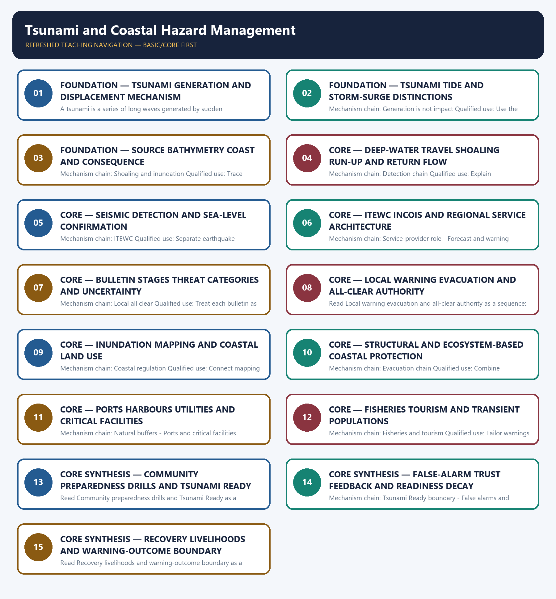

# Tsunami and Coastal Hazard Management — Learner-v2 Complete Learning Session

> **Authoring-only generation:** 2026-09-04. No PDF was rendered and no tracker or index was mutated.

### SOURCE, PROGRESSION AND CURRENT-LINKAGE AUDIT

- **Generation date:** 2026-09-04.
- **Repository-first evidence:** the Basic owner is taught first and preserved in full; the Advanced owner is retained only in the optional final teaching block.
- **OCR evidence:** Repository Markdown was primary. OCR-searchable official UPSC papers were supplementary only for printed routed demands. No answer key, warning performance, notification effect, implementation outcome, casualty reduction or disaster metric was inferred.
- **Qdrant:** not used; repository Markdown and available OCR context were sufficient.
- **PYQ integrity:** The 2025 GS-I formation card and 2023 GS-I coastline card are verified cross-paper routes. The 2024 resilience card is a conservative application and does not displace Topic 01 ownership.
- **Live-link boundary:** Official attempts covered ITEWC procedures, INCOIS Tsunami Ready material, PIB/MoES institutional updates and NDMA guidance. Thin, blocked and transport-failed sources are logged; no universal lead time, inundation figure, recipient count, false-alarm rate or avoided-loss outcome was invented.
- **Fact/inference discipline:** no current-affairs item, PYQ wording, figure or quotation is invented.

### LIVE OFFICIAL-SOURCE ATTEMPT LOG

The checks below were made on 2026-09-04. Substantive official text is used only for the proposition it supports; title-only, blocked or thin pages are recorded and supply no factual claim.

- https://tsunami.incois.gov.in/TEWS/dsssop.jsp — fetched 2026-09-04; the official ITEWC procedure confirmed staged bulletins, model and sea-level confirmation, threat categories and the local-authority all-clear boundary. Technical thresholds were not converted into a universal evacuation rule or a last-mile outcome.
- https://tsunami.incois.gov.in/TEWS/tsunamiready.jsp — fetched 2026-09-04; the official page identified the INCOIS, IOTWMS, IOTIC and UNESCO-IOC setting but was content-thin for the current community roster. No nationwide readiness claim was inferred.
- https://pib.gov.in/PressReleasePage.aspx?PRID=2226879&reg=3&lang=1 — attempted 2026-09-04; the official PIB page returned HTTP 403. Official search metadata was used only to cross-check ITEWC's current institutional role and exercise context, not warning performance.
- https://ndma.gov.in/Natural-Hazards/Tsunami — attempted 2026-09-04; the official NDMA page failed at the transport layer. The module therefore retains only coastal-preparedness measures already audited in the canonical owners.

## BASIC LEARNING SESSION

### DEEP-REVIEW LEARNING CONTRACT

| Control | Binding rule for this package |
|---|---|
| Syllabus boundary | Complete Disaster Management Basic/Core is easy-first and answer-complete before optional Advanced depth. |
| Risk boundary | Hazard, exposure, vulnerability, capacity, risk, disaster impact, resilience and recovery outcome remain distinct. |
| Cycle boundary | Prevention, mitigation, preparedness, response, relief, rehabilitation, recovery and Build Back Better are not conflated. |
| Law/status boundary | Enacted Act, amendment, notified rule, plan, guideline, scheme, alert, announcement, operationalisation and measured outcome retain exact status. |
| Institutional boundary | NDMA, NEC, NIDM, NDRF, SDMA, SEC, DDMA, civil administration, response forces and armed-forces support retain exact mandates and levels. |
| Warning boundary | Observation, forecast, watch, warning, dissemination, receipt, evacuation order, evacuation and safe return remain separate. |
| Finance/data boundary | Allocation, release, expenditure, capacity, deployment, relief norm, entitlement, event fact and analytical inference retain source/date/unit/status. |
| Practice contract | Every solved item has demand decoding, detailed examiner-grade model, executable timed/compression plan, marks rationale and answer-specific improvement. |
| PYQ contract | Official wording and keys are asserted only when verified; routed or reconstructed demands remain labelled. |
| Dual-flow contract | Graphical and ASCII masters independently reconstruct the same complete Basic-to-optional-Advanced evidence ledger. |
| Cross-ownership | Environment Topic 26 owns environmental/climate-law base; Internal Security owns hostile-threat operations; Disaster Management owns civilian risk governance and response. |
| Approval | This immutable successor remains `approved: false` pending explicit approval. |

**Canonical Basic/Core owner:** `upsc-ai-kit\knowledge\Disaster-Management\basic\06_Tsunami-and-Coastal-Hazard-Management.md`  
**Substantive canonical provenance owner:** `upsc-ai-kit\knowledge\Disaster-Management\learning-sessions\v2\subject-wide-syllabus\disaster-management-06_Learning-Session.md`  
**Optional Advanced owner:** `upsc-ai-kit\knowledge\Disaster-Management\advanced\06_Tsunami-and-Coastal-Hazard-Management.md`  
**Official syllabus mapping:** `upsc-ai-kit\knowledge\Disaster-Management\OFFICIAL-UPSC-SYLLABUS-MAPPING.md`

### EVIDENCE, PYQ AND CURRENT-STATUS CONTROL

- Every law, guideline, scheme, institution, alert, event, casualty, magnitude, rainfall, temperature, fund, target, date and policy claim retains source, date, unit, jurisdiction and status.
- Hazard occurrence is separated from disaster impact; structural from non-structural mitigation; response output from recovery and resilience outcome.
- Sendai priorities are separated from seven global targets and global from national indicators; climate adaptation, DRR and loss-and-damage boundaries remain explicit.
- Announcement is separated from operationalisation; allocation from release and expenditure; capacity from deployment; relief norm from legal entitlement.
- **Current-status note, rechecked 2026-09-06:** failed official fetches remain explicit and supply no invented fact.

**Generation-local live/current sources:**
- `https://tsunami.incois.gov.in/TEWS/dsssop.jsp — fetched 2026-09-04; the official ITEWC procedure confirmed staged bulletins, model and sea-level confirmation, threat categories and the local-authority all-clear boundary. Technical thresholds were not converted into a universal evacuation rule or a last-mile outcome.`
- `https://tsunami.incois.gov.in/TEWS/tsunamiready.jsp — fetched 2026-09-04; the official page identified the INCOIS, IOTWMS, IOTIC and UNESCO-IOC setting but was content-thin for the current community roster. No nationwide readiness claim was inferred.`
- `https://pib.gov.in/PressReleasePage.aspx?PRID=2226879&reg=3&lang=1 — attempted 2026-09-04; the official PIB page returned HTTP 403. Official search metadata was used only to cross-check ITEWC's current institutional role and exercise context, not warning performance.`
- `https://ndma.gov.in/Natural-Hazards/Tsunami — attempted 2026-09-04; the official NDMA page failed at the transport layer. The module therefore retains only coastal-preparedness measures already audited in the canonical owners.`

**Topic-routed verified PYQ owners:**
- Repository PYQ routing ledgers control wording, year, marks and verification status.




*Distinct embedded teaching-navigation image. The separate continuous Cārvāka-style flowchart package remains an independent at-a-glance artifact.*

### SESSION 1 — FOUNDATION — TSUNAMI GENERATION AND DISPLACEMENT MECHANISM

#### DEFINITION / WHAT THIS IS CALLED

**Plain-language definition:** A tsunami is not an astronomical tide and not a cyclone storm surge; tides follow gravitational cycles, storm surge is chiefly wind-and-pressure driven, and tsunami generation begins with sudden water displacement.

**Technical definition:** A tsunami is a series of long waves generated by sudden displacement of a large water volume, commonly from vertical seabed movement during an undersea earthquake but also from landslides, volcanic activity or other displacement events.

#### ANSWER-GRABBING OPENING — WRITE/ADAPT IN THE EXAM

> A tsunami is not an astronomical tide and not a cyclone storm surge; tides follow gravitational cycles, storm surge is chiefly wind-and-pressure driven, and tsunami generation begins with sudden water displacement.

#### MUST-WRITE KEYWORDS

- **FOUNDATION**
- **Tsunami generation**
- **displacement mechanism**
- **Mechanism chain**
- **Qualified use**
- **A tsunami**

**How to use them:** Frame the answer through FOUNDATION; define Tsunami generation, connect displacement mechanism with Mechanism chain to explain the mechanism, and use Qualified use for the decisive comparison or qualification.

#### VISUAL FIRST

```text
TSUNAMI GENERATION AND DISPLACEMENT MECHANISM
01. Tsunami generation
    |
    v
02. Tide and storm-surge boundary
STATUS / CATEGORY FIREWALL -> Do not describe a tsunami as a tide or cyclone-driven storm surge.
```

*The rail fixes the institutional sequence and claim boundary before explanation.*

#### CORE EXPLANATION

A tsunami is a series of long waves generated by sudden displacement of a large water volume, commonly from vertical seabed movement during an undersea earthquake but also from landslides, volcanic activity or other displacement events. A tsunami is not an astronomical tide and not a cyclone storm surge; tides follow gravitational cycles, storm surge is chiefly wind-and-pressure driven, and tsunami generation begins with sudden water displacement.

#### SIMPLE SYSTEM EXAMPLE

Read Tsunami generation and displacement mechanism as a sequence: identify Tsunami generation, follow the named mechanism to its institutional response, and stop at the last verified status rather than assuming the next stage.

#### TECHNICAL DISTINCTION

The decisive boundary is Do not describe a tsunami as a tide or cyclone-driven storm surge. This keeps Tsunami generation and Tide and storm-surge boundary in the correct risk category, institutional mandate and evidence status.

#### NAMED EVIDENCE AND MECHANISM

- A tsunami is a series of long waves generated by sudden displacement of a large water volume, commonly from vertical seabed movement during an undersea earthquake but also from landslides, volcanic activity or other displacement events.
- A tsunami is not an astronomical tide and not a cyclone storm surge; tides follow gravitational cycles, storm surge is chiefly wind-and-pressure driven, and tsunami generation begins with sudden water displacement.

#### EXAMINER CAUTION

- Do not describe a tsunami as a tide or cyclone-driven storm surge.

#### EXAM LINK

- **Prelims:** Keep hazard, forecast, warning, institution, law, plan, force, fund, scheme and outcome in their exact category.
- **Mains:** Start with sudden displacement rather than a generic large-wave definition.

#### MINI RECAP

- **Mechanism chain:** Tsunami generation -> Tide and storm-surge boundary
- **Qualified use:** Start with sudden displacement rather than a generic large-wave definition.

#### CLOSING RECALL FLOW — FOUNDATION — TSUNAMI GENERATION AND DISPLACEMENT MECHANISM

```text
START / CONCEPT: FOUNDATION — Tsunami generation and displacement mechanism
        |
        v
EXACT TERMS: FOUNDATION · Tsunami generation · displacement mechanism · Mechanism chain · Qualified use · A tsunami
        |
        v
MECHANISM / ARGUMENT: Mechanism chain: Tsunami generation - Tide and storm-surge boundary Qualified use: Start with sudden displacement rather than a generic large-wave definition.
        |
        v
CONSEQUENCE / CONTRAST: A tsunami is a series of long waves generated by sudden displacement of a large water volume, commonly from vertical seabed movement during an undersea earthquake but also from landslides, volcanic activity or other displacement events.
        |
        v
UPSC TRAP / ANSWER-USE: Read Tsunami generation and displacement mechanism as a sequence: identify Tsunami generation, follow the named mechanism to its institutional response, and stop at the last verified status rather than assuming the next stage.
        |
        v
ANSWER-GRABBING FORMULATION: A tsunami is not an astronomical tide and not a cyclone storm surge; tides follow gravitational cycles, storm surge is chiefly wind-and-pressure driven, and tsunami generation begins with sudden water displacement.
```
### SESSION 2 — FOUNDATION — TSUNAMI TIDE AND STORM-SURGE DISTINCTIONS

#### DEFINITION / WHAT THIS IS CALLED

**Plain-language definition:** Read Tsunami tide and storm-surge distinctions as a sequence: identify Generation is not impact, follow the named mechanism to its institutional response, and stop at the last verified status rather than assuming the next stage.

**Technical definition:** Mechanism chain: Generation is not impact Qualified use: Use the energy source to separate tsunami tide and storm surge.

#### ANSWER-GRABBING OPENING — WRITE/ADAPT IN THE EXAM

> Read Tsunami tide and storm-surge distinctions as a sequence: identify Generation is not impact, follow the named mechanism to its institutional response, and stop at the last verified status rather than assuming the next stage.

#### MUST-WRITE KEYWORDS

- **FOUNDATION**
- **Tsunami tide**
- **storm-surge distinctions**
- **Mechanism chain**
- **Qualified use**
- **Read Tsunami**

**How to use them:** Frame the answer through FOUNDATION; define Tsunami tide, connect storm-surge distinctions with Mechanism chain to explain the mechanism, and use Qualified use for the decisive comparison or qualification.

#### VISUAL FIRST

```text
TSUNAMI TIDE AND STORM-SURGE DISTINCTIONS
01. Generation is not impact
STATUS / CATEGORY FIREWALL -> Do not assume every undersea earthquake generates a destructive tsunami.
```

*The rail fixes the institutional sequence and claim boundary before explanation.*

#### CORE EXPLANATION

An undersea earthquake does not automatically create a destructive tsunami; source mechanism, depth, displacement, distance, bathymetry and coastal form influence whether and how waves affect a coast.

#### SIMPLE SYSTEM EXAMPLE

Read Tsunami tide and storm-surge distinctions as a sequence: identify Generation is not impact, follow the named mechanism to its institutional response, and stop at the last verified status rather than assuming the next stage.

#### TECHNICAL DISTINCTION

The decisive boundary is Do not assume every undersea earthquake generates a destructive tsunami. This keeps Generation is not impact in the correct risk category, institutional mandate and evidence status.

#### NAMED EVIDENCE AND MECHANISM

- An undersea earthquake does not automatically create a destructive tsunami; source mechanism, depth, displacement, distance, bathymetry and coastal form influence whether and how waves affect a coast.

#### EXAMINER CAUTION

- Do not assume every undersea earthquake generates a destructive tsunami.

#### EXAM LINK

- **Prelims:** Keep hazard, forecast, warning, institution, law, plan, force, fund, scheme and outcome in their exact category.
- **Mains:** Use the energy source to separate tsunami tide and storm surge.

#### MINI RECAP

- **Mechanism chain:** Generation is not impact
- **Qualified use:** Use the energy source to separate tsunami tide and storm surge.

#### CLOSING RECALL FLOW — FOUNDATION — TSUNAMI TIDE AND STORM-SURGE DISTINCTIONS

```text
START / CONCEPT: FOUNDATION — Tsunami tide and storm-surge distinctions
        |
        v
EXACT TERMS: FOUNDATION · Tsunami tide · storm-surge distinctions · Mechanism chain · Qualified use · Read Tsunami
        |
        v
MECHANISM / ARGUMENT: Mechanism chain: Generation is not impact Qualified use: Use the energy source to separate tsunami tide and storm surge.
        |
        v
CONSEQUENCE / CONTRAST: An undersea earthquake does not automatically create a destructive tsunami; source mechanism, depth, displacement, distance, bathymetry and coastal form influence whether and how waves affect a coast.
        |
        v
UPSC TRAP / ANSWER-USE: The decisive boundary is Do not assume every undersea earthquake generates a destructive tsunami.
        |
        v
ANSWER-GRABBING FORMULATION: Read Tsunami tide and storm-surge distinctions as a sequence: identify Generation is not impact, follow the named mechanism to its institutional response, and stop at the last verified status rather than assuming the next stage.
```
### SESSION 3 — FOUNDATION — SOURCE BATHYMETRY COAST AND CONSEQUENCE

#### DEFINITION / WHAT THIS IS CALLED

**Plain-language definition:** Read Source bathymetry coast and consequence as a sequence: identify Shoaling and inundation, follow the named mechanism to its institutional response, and stop at the last verified status rather than assuming the next stage.

**Technical definition:** Mechanism chain: Shoaling and inundation Qualified use: Trace source mechanism through bathymetry and coastal form.

#### ANSWER-GRABBING OPENING — WRITE/ADAPT IN THE EXAM

> Read Source bathymetry coast and consequence as a sequence: identify Shoaling and inundation, follow the named mechanism to its institutional response, and stop at the last verified status rather than assuming the next stage.

#### MUST-WRITE KEYWORDS

- **FOUNDATION**
- **Source bathymetry coast**
- **consequence**
- **Mechanism chain**
- **Qualified use**
- **Tsunami**

**How to use them:** Frame the answer through FOUNDATION; define Source bathymetry coast, connect consequence with Mechanism chain to explain the mechanism, and use Qualified use for the decisive comparison or qualification.

#### VISUAL FIRST

```text
SOURCE BATHYMETRY COAST AND CONSEQUENCE
01. Shoaling and inundation
STATUS / CATEGORY FIREWALL -> Do not collapse earthquake detection, tsunami confirmation, bulletin and local warning into one step.
```

*The rail fixes the institutional sequence and claim boundary before explanation.*

#### CORE EXPLANATION

Tsunami waves change as they enter shallower water, producing run-up, inundation and damaging return flow; no universal wave height, speed or inland distance should be assumed.

#### SIMPLE SYSTEM EXAMPLE

Read Source bathymetry coast and consequence as a sequence: identify Shoaling and inundation, follow the named mechanism to its institutional response, and stop at the last verified status rather than assuming the next stage.

#### TECHNICAL DISTINCTION

The decisive boundary is Do not collapse earthquake detection, tsunami confirmation, bulletin and local warning into one step. This keeps Shoaling and inundation in the correct risk category, institutional mandate and evidence status.

#### NAMED EVIDENCE AND MECHANISM

- Tsunami waves change as they enter shallower water, producing run-up, inundation and damaging return flow; no universal wave height, speed or inland distance should be assumed.

#### EXAMINER CAUTION

- Do not collapse earthquake detection, tsunami confirmation, bulletin and local warning into one step.

#### EXAM LINK

- **Prelims:** Keep hazard, forecast, warning, institution, law, plan, force, fund, scheme and outcome in their exact category.
- **Mains:** Trace source mechanism through bathymetry and coastal form.

#### MINI RECAP

- **Mechanism chain:** Shoaling and inundation
- **Qualified use:** Trace source mechanism through bathymetry and coastal form.

#### CLOSING RECALL FLOW — FOUNDATION — SOURCE BATHYMETRY COAST AND CONSEQUENCE

```text
START / CONCEPT: FOUNDATION — Source bathymetry coast and consequence
        |
        v
EXACT TERMS: FOUNDATION · Source bathymetry coast · consequence · Mechanism chain · Qualified use · Tsunami
        |
        v
MECHANISM / ARGUMENT: Mechanism chain: Shoaling and inundation Qualified use: Trace source mechanism through bathymetry and coastal form.
        |
        v
CONSEQUENCE / CONTRAST: The decisive boundary is Do not collapse earthquake detection, tsunami confirmation, bulletin and local warning into one step.
        |
        v
UPSC TRAP / ANSWER-USE: Do not collapse earthquake detection, tsunami confirmation, bulletin and local warning into one step.
        |
        v
ANSWER-GRABBING FORMULATION: Read Source bathymetry coast and consequence as a sequence: identify Shoaling and inundation, follow the named mechanism to its institutional response, and stop at the last verified status rather than assuming the next stage.
```
### SESSION 4 — CORE — DEEP-WATER TRAVEL SHOALING RUN-UP AND RETURN FLOW

#### DEFINITION / WHAT THIS IS CALLED

**Plain-language definition:** Read Deep-water travel shoaling run-up and return flow as a sequence: identify Detection chain, follow the named mechanism to its institutional response, and stop at the last verified status rather than assuming the next stage.

**Technical definition:** Mechanism chain: Detection chain Qualified use: Explain consequence without inventing universal speed or height figures.

#### ANSWER-GRABBING OPENING — WRITE/ADAPT IN THE EXAM

> Read Deep-water travel shoaling run-up and return flow as a sequence: identify Detection chain, follow the named mechanism to its institutional response, and stop at the last verified status rather than assuming the next stage.

#### MUST-WRITE KEYWORDS

- **Deep-water travel shoaling run-up**
- **return flow**
- **Mechanism chain**
- **Qualified use**
- **Read Deep-water**
- **Detection**

**How to use them:** Frame the answer through Deep-water travel shoaling run-up; define return flow, connect Mechanism chain with Qualified use to explain the mechanism, and use Read Deep-water for the decisive comparison or qualification.

#### VISUAL FIRST

```text
DEEP-WATER TRAVEL SHOALING RUN-UP AND RETURN FLOW
01. Detection chain
STATUS / CATEGORY FIREWALL -> Do not invent a universal wave height, speed, inundation distance or warning lead time.
```

*The rail fixes the institutional sequence and claim boundary before explanation.*

#### CORE EXPLANATION

Seismic analysis identifies earthquake parameters, while open-ocean and coastal sea-level observations help confirm wave generation and update the assessment.

#### SIMPLE SYSTEM EXAMPLE

Read Deep-water travel shoaling run-up and return flow as a sequence: identify Detection chain, follow the named mechanism to its institutional response, and stop at the last verified status rather than assuming the next stage.

#### TECHNICAL DISTINCTION

The decisive boundary is Do not invent a universal wave height, speed, inundation distance or warning lead time. This keeps Detection chain in the correct risk category, institutional mandate and evidence status.

#### NAMED EVIDENCE AND MECHANISM

- Seismic analysis identifies earthquake parameters, while open-ocean and coastal sea-level observations help confirm wave generation and update the assessment.

#### EXAMINER CAUTION

- Do not invent a universal wave height, speed, inundation distance or warning lead time.

#### EXAM LINK

- **Prelims:** Keep hazard, forecast, warning, institution, law, plan, force, fund, scheme and outcome in their exact category.
- **Mains:** Explain consequence without inventing universal speed or height figures.

#### MINI RECAP

- **Mechanism chain:** Detection chain
- **Qualified use:** Explain consequence without inventing universal speed or height figures.

#### CLOSING RECALL FLOW — CORE — DEEP-WATER TRAVEL SHOALING RUN-UP AND RETURN FLOW

```text
START / CONCEPT: CORE — Deep-water travel shoaling run-up and return flow
        |
        v
EXACT TERMS: Deep-water travel shoaling run-up · return flow · Mechanism chain · Qualified use · Read Deep-water · Detection
        |
        v
MECHANISM / ARGUMENT: Mechanism chain: Detection chain Qualified use: Explain consequence without inventing universal speed or height figures.
        |
        v
CONSEQUENCE / CONTRAST: The decisive boundary is Do not invent a universal wave height, speed, inundation distance or warning lead time.
        |
        v
UPSC TRAP / ANSWER-USE: Do not invent a universal wave height, speed, inundation distance or warning lead time.
        |
        v
ANSWER-GRABBING FORMULATION: Read Deep-water travel shoaling run-up and return flow as a sequence: identify Detection chain, follow the named mechanism to its institutional response, and stop at the last verified status rather than assuming the next stage.
```
### SESSION 5 — CORE — SEISMIC DETECTION AND SEA-LEVEL CONFIRMATION

#### DEFINITION / WHAT THIS IS CALLED

**Plain-language definition:** Read Seismic detection and sea-level confirmation as a sequence: identify ITEWC, follow the named mechanism to its institutional response, and stop at the last verified status rather than assuming the next stage.

**Technical definition:** Mechanism chain: ITEWC Qualified use: Separate earthquake parameters from observed sea-level confirmation.

#### ANSWER-GRABBING OPENING — WRITE/ADAPT IN THE EXAM

> Read Seismic detection and sea-level confirmation as a sequence: identify ITEWC, follow the named mechanism to its institutional response, and stop at the last verified status rather than assuming the next stage.

#### MUST-WRITE KEYWORDS

- **Seismic detection**
- **sea-level confirmation**
- **Mechanism chain**
- **Qualified use**
- **Read Seismic**
- **ITEWC**

**How to use them:** Frame the answer through Seismic detection; define sea-level confirmation, connect Mechanism chain with Qualified use to explain the mechanism, and use Read Seismic for the decisive comparison or qualification.

#### VISUAL FIRST

```text
SEISMIC DETECTION AND SEA-LEVEL CONFIRMATION
01. ITEWC
STATUS / CATEGORY FIREWALL -> Do not treat a regional advisory as a local evacuation or all-clear order.
```

*The rail fixes the institutional sequence and claim boundary before explanation.*

#### CORE EXPLANATION

The Indian Tsunami Early Warning Centre at INCOIS integrates earthquake analysis, pre-run model scenarios and sea-level observations to issue tsunami bulletins for Indian and regional service responsibilities.

#### SIMPLE SYSTEM EXAMPLE

Read Seismic detection and sea-level confirmation as a sequence: identify ITEWC, follow the named mechanism to its institutional response, and stop at the last verified status rather than assuming the next stage.

#### TECHNICAL DISTINCTION

The decisive boundary is Do not treat a regional advisory as a local evacuation or all-clear order. This keeps ITEWC in the correct risk category, institutional mandate and evidence status.

#### NAMED EVIDENCE AND MECHANISM

- The Indian Tsunami Early Warning Centre at INCOIS integrates earthquake analysis, pre-run model scenarios and sea-level observations to issue tsunami bulletins for Indian and regional service responsibilities.

#### EXAMINER CAUTION

- Do not treat a regional advisory as a local evacuation or all-clear order.

#### EXAM LINK

- **Prelims:** Keep hazard, forecast, warning, institution, law, plan, force, fund, scheme and outcome in their exact category.
- **Mains:** Separate earthquake parameters from observed sea-level confirmation.

#### MINI RECAP

- **Mechanism chain:** ITEWC
- **Qualified use:** Separate earthquake parameters from observed sea-level confirmation.

#### CLOSING RECALL FLOW — CORE — SEISMIC DETECTION AND SEA-LEVEL CONFIRMATION

```text
START / CONCEPT: CORE — Seismic detection and sea-level confirmation
        |
        v
EXACT TERMS: Seismic detection · sea-level confirmation · Mechanism chain · Qualified use · Read Seismic · ITEWC
        |
        v
MECHANISM / ARGUMENT: Mechanism chain: ITEWC Qualified use: Separate earthquake parameters from observed sea-level confirmation.
        |
        v
CONSEQUENCE / CONTRAST: The decisive boundary is Do not treat a regional advisory as a local evacuation or all-clear order.
        |
        v
UPSC TRAP / ANSWER-USE: Do not treat a regional advisory as a local evacuation or all-clear order.
        |
        v
ANSWER-GRABBING FORMULATION: Read Seismic detection and sea-level confirmation as a sequence: identify ITEWC, follow the named mechanism to its institutional response, and stop at the last verified status rather than assuming the next stage.
```
### SESSION 6 — CORE — ITEWC INCOIS AND REGIONAL SERVICE ARCHITECTURE

#### DEFINITION / WHAT THIS IS CALLED

**Plain-language definition:** Read ITEWC INCOIS and regional service architecture as a sequence: identify Service-provider role, follow the named mechanism to its institutional response, and stop at the last verified status rather than assuming the next stage.

**Technical definition:** Mechanism chain: Service-provider role - Forecast and warning Qualified use: Name ITEWC INCOIS and its regional service context precisely.

#### ANSWER-GRABBING OPENING — WRITE/ADAPT IN THE EXAM

> ITEWC functions within the UNESCO-IOC Indian Ocean Tsunami Warning and Mitigation System as a Tsunami Service Provider; regional advisory responsibility does not transfer local evacuation authority.

#### MUST-WRITE KEYWORDS

- **ITEWC INCOIS**
- **regional service architecture**
- **Mechanism chain**
- **Qualified use**
- **ITEWC**
- **UNESCO-IOC Indian Ocean Tsunami Warning**

**How to use them:** Frame the answer through ITEWC INCOIS; define regional service architecture, connect Mechanism chain with Qualified use to explain the mechanism, and use ITEWC for the decisive comparison or qualification.

#### VISUAL FIRST

```text
ITEWC INCOIS AND REGIONAL SERVICE ARCHITECTURE
01. Service-provider role
    |
    v
02. Forecast and warning
STATUS / CATEGORY FIREWALL -> Do not present one sea wall, mangrove belt or CRZ rule as sufficient everywhere.
```

*The rail fixes the institutional sequence and claim boundary before explanation.*

#### CORE EXPLANATION

ITEWC functions within the UNESCO-IOC Indian Ocean Tsunami Warning and Mitigation System as a Tsunami Service Provider; regional advisory responsibility does not transfer local evacuation authority. A tsunami assessment may progress from preliminary earthquake information to model-based threat categories and observation-informed updates; each bulletin is evidence at its own stage, not certainty about local impact.

#### SIMPLE SYSTEM EXAMPLE

Read ITEWC INCOIS and regional service architecture as a sequence: identify Service-provider role, follow the named mechanism to its institutional response, and stop at the last verified status rather than assuming the next stage.

#### TECHNICAL DISTINCTION

The decisive boundary is Do not present one sea wall, mangrove belt or CRZ rule as sufficient everywhere. This keeps Service-provider role and Forecast and warning in the correct risk category, institutional mandate and evidence status.

#### NAMED EVIDENCE AND MECHANISM

- ITEWC functions within the UNESCO-IOC Indian Ocean Tsunami Warning and Mitigation System as a Tsunami Service Provider; regional advisory responsibility does not transfer local evacuation authority.
- A tsunami assessment may progress from preliminary earthquake information to model-based threat categories and observation-informed updates; each bulletin is evidence at its own stage, not certainty about local impact.

#### EXAMINER CAUTION

- Do not present one sea wall, mangrove belt or CRZ rule as sufficient everywhere.

#### EXAM LINK

- **Prelims:** Keep hazard, forecast, warning, institution, law, plan, force, fund, scheme and outcome in their exact category.
- **Mains:** Name ITEWC INCOIS and its regional service context precisely.

#### MINI RECAP

- **Mechanism chain:** Service-provider role -> Forecast and warning
- **Qualified use:** Name ITEWC INCOIS and its regional service context precisely.

#### CLOSING RECALL FLOW — CORE — ITEWC INCOIS AND REGIONAL SERVICE ARCHITECTURE

```text
START / CONCEPT: CORE — ITEWC INCOIS and regional service architecture
        |
        v
EXACT TERMS: ITEWC INCOIS · regional service architecture · Mechanism chain · Qualified use · ITEWC · UNESCO-IOC Indian Ocean Tsunami Warning
        |
        v
MECHANISM / ARGUMENT: Read ITEWC INCOIS and regional service architecture as a sequence: identify Service-provider role, follow the named mechanism to its institutional response, and stop at the last verified status rather than assuming the next stage.
        |
        v
CONSEQUENCE / CONTRAST: Mechanism chain: Service-provider role - Forecast and warning Qualified use: Name ITEWC INCOIS and its regional service context precisely.
        |
        v
UPSC TRAP / ANSWER-USE: A tsunami assessment may progress from preliminary earthquake information to model-based threat categories and observation-informed updates; each bulletin is evidence at its own stage, not certainty about local impact.
        |
        v
ANSWER-GRABBING FORMULATION: ITEWC functions within the UNESCO-IOC Indian Ocean Tsunami Warning and Mitigation System as a Tsunami Service Provider; regional advisory responsibility does not transfer local evacuation authority.
```
### SESSION 7 — CORE — BULLETIN STAGES THREAT CATEGORIES AND UNCERTAINTY

#### DEFINITION / WHAT THIS IS CALLED

**Plain-language definition:** Read Bulletin stages threat categories and uncertainty as a sequence: identify Local all clear, follow the named mechanism to its institutional response, and stop at the last verified status rather than assuming the next stage.

**Technical definition:** Mechanism chain: Local all clear Qualified use: Treat each bulletin as a staged assessment with uncertainty.

#### ANSWER-GRABBING OPENING — WRITE/ADAPT IN THE EXAM

> Read Bulletin stages threat categories and uncertainty as a sequence: identify Local all clear, follow the named mechanism to its institutional response, and stop at the last verified status rather than assuming the next stage.

#### MUST-WRITE KEYWORDS

- **Bulletin stages threat categories**
- **uncertainty**
- **Mechanism chain**
- **Qualified use**
- **ITEWC**
- **Read Bulletin**

**How to use them:** Frame the answer through Bulletin stages threat categories; define uncertainty, connect Mechanism chain with Qualified use to explain the mechanism, and use ITEWC for the decisive comparison or qualification.

#### VISUAL FIRST

```text
BULLETIN STAGES THREAT CATEGORIES AND UNCERTAINTY
01. Local all clear
STATUS / CATEGORY FIREWALL -> Do not omit ports, fisheries, tourists or hazardous coastal facilities.
```

*The rail fixes the institutional sequence and claim boundary before explanation.*

#### CORE EXPLANATION

ITEWC may issue threat-passed or final information, but local conditions can vary and the all-clear decision remains with competent local authorities.

#### SIMPLE SYSTEM EXAMPLE

Read Bulletin stages threat categories and uncertainty as a sequence: identify Local all clear, follow the named mechanism to its institutional response, and stop at the last verified status rather than assuming the next stage.

#### TECHNICAL DISTINCTION

The decisive boundary is Do not omit ports, fisheries, tourists or hazardous coastal facilities. This keeps Local all clear in the correct risk category, institutional mandate and evidence status.

#### NAMED EVIDENCE AND MECHANISM

- ITEWC may issue threat-passed or final information, but local conditions can vary and the all-clear decision remains with competent local authorities.

#### EXAMINER CAUTION

- Do not omit ports, fisheries, tourists or hazardous coastal facilities.

#### EXAM LINK

- **Prelims:** Keep hazard, forecast, warning, institution, law, plan, force, fund, scheme and outcome in their exact category.
- **Mains:** Treat each bulletin as a staged assessment with uncertainty.

#### MINI RECAP

- **Mechanism chain:** Local all clear
- **Qualified use:** Treat each bulletin as a staged assessment with uncertainty.

#### CLOSING RECALL FLOW — CORE — BULLETIN STAGES THREAT CATEGORIES AND UNCERTAINTY

```text
START / CONCEPT: CORE — Bulletin stages threat categories and uncertainty
        |
        v
EXACT TERMS: Bulletin stages threat categories · uncertainty · Mechanism chain · Qualified use · ITEWC · Read Bulletin
        |
        v
MECHANISM / ARGUMENT: Mechanism chain: Local all clear Qualified use: Treat each bulletin as a staged assessment with uncertainty.
        |
        v
CONSEQUENCE / CONTRAST: ITEWC may issue threat-passed or final information, but local conditions can vary and the all-clear decision remains with competent local authorities.
        |
        v
UPSC TRAP / ANSWER-USE: The decisive boundary is Do not omit ports, fisheries, tourists or hazardous coastal facilities.
        |
        v
ANSWER-GRABBING FORMULATION: Read Bulletin stages threat categories and uncertainty as a sequence: identify Local all clear, follow the named mechanism to its institutional response, and stop at the last verified status rather than assuming the next stage.
```
### SESSION 8 — CORE — LOCAL WARNING EVACUATION AND ALL-CLEAR AUTHORITY

#### DEFINITION / WHAT THIS IS CALLED

**Plain-language definition:** Coastal topography, near-shore bathymetry, source scenarios, land use and exposed assets are combined in inundation or hazard maps for evacuation, siting and preparedness.

**Technical definition:** Read Local warning evacuation and all-clear authority as a sequence: identify Inundation mapping, follow the named mechanism to its institutional response, and stop at the last verified status rather than assuming the next stage.

#### ANSWER-GRABBING OPENING — WRITE/ADAPT IN THE EXAM

> Read Local warning evacuation and all-clear authority as a sequence: identify Inundation mapping, follow the named mechanism to its institutional response, and stop at the last verified status rather than assuming the next stage.

#### MUST-WRITE KEYWORDS

- **Local warning evacuation**
- **all-clear authority**
- **Mechanism chain**
- **Qualified use**
- **Coastal**
- **Read Local**

**How to use them:** Frame the answer through Local warning evacuation; define all-clear authority, connect Mechanism chain with Qualified use to explain the mechanism, and use Coastal for the decisive comparison or qualification.

#### VISUAL FIRST

```text
LOCAL WARNING EVACUATION AND ALL-CLEAR AUTHORITY
01. Inundation mapping
STATUS / CATEGORY FIREWALL -> Do not call Tsunami Ready a national certification.
```

*The rail fixes the institutional sequence and claim boundary before explanation.*

#### CORE EXPLANATION

Coastal topography, near-shore bathymetry, source scenarios, land use and exposed assets are combined in inundation or hazard maps for evacuation, siting and preparedness.

#### SIMPLE SYSTEM EXAMPLE

Read Local warning evacuation and all-clear authority as a sequence: identify Inundation mapping, follow the named mechanism to its institutional response, and stop at the last verified status rather than assuming the next stage.

#### TECHNICAL DISTINCTION

The decisive boundary is Do not call Tsunami Ready a national certification. This keeps Inundation mapping in the correct risk category, institutional mandate and evidence status.

#### NAMED EVIDENCE AND MECHANISM

- Coastal topography, near-shore bathymetry, source scenarios, land use and exposed assets are combined in inundation or hazard maps for evacuation, siting and preparedness.

#### EXAMINER CAUTION

- Do not call Tsunami Ready a national certification.

#### EXAM LINK

- **Prelims:** Keep hazard, forecast, warning, institution, law, plan, force, fund, scheme and outcome in their exact category.
- **Mains:** Assign evacuation and all-clear decisions to competent local authorities.

#### MINI RECAP

- **Mechanism chain:** Inundation mapping
- **Qualified use:** Assign evacuation and all-clear decisions to competent local authorities.

#### CLOSING RECALL FLOW — CORE — LOCAL WARNING EVACUATION AND ALL-CLEAR AUTHORITY

```text
START / CONCEPT: CORE — Local warning evacuation and all-clear authority
        |
        v
EXACT TERMS: Local warning evacuation · all-clear authority · Mechanism chain · Qualified use · Coastal · Read Local
        |
        v
MECHANISM / ARGUMENT: Mechanism chain: Inundation mapping Qualified use: Assign evacuation and all-clear decisions to competent local authorities.
        |
        v
CONSEQUENCE / CONTRAST: The decisive boundary is Do not call Tsunami Ready a national certification.
        |
        v
UPSC TRAP / ANSWER-USE: Do not call Tsunami Ready a national certification.
        |
        v
ANSWER-GRABBING FORMULATION: Read Local warning evacuation and all-clear authority as a sequence: identify Inundation mapping, follow the named mechanism to its institutional response, and stop at the last verified status rather than assuming the next stage.
```
### SESSION 9 — CORE — INUNDATION MAPPING AND COASTAL LAND USE

#### DEFINITION / WHAT THIS IS CALLED

**Plain-language definition:** Read Inundation mapping and coastal land use as a sequence: identify Coastal regulation, follow the named mechanism to its institutional response, and stop at the last verified status rather than assuming the next stage.

**Technical definition:** Mechanism chain: Coastal regulation Qualified use: Connect mapping to routes refuge siting and development control.

#### ANSWER-GRABBING OPENING — WRITE/ADAPT IN THE EXAM

> Read Inundation mapping and coastal land use as a sequence: identify Coastal regulation, follow the named mechanism to its institutional response, and stop at the last verified status rather than assuming the next stage.

#### MUST-WRITE KEYWORDS

- **Inundation mapping**
- **coastal land use**
- **Mechanism chain**
- **Qualified use**
- **CRZ**
- **Read Inundation**

**How to use them:** Frame the answer through Inundation mapping; define coastal land use, connect Mechanism chain with Qualified use to explain the mechanism, and use CRZ for the decisive comparison or qualification.

#### VISUAL FIRST

```text
INUNDATION MAPPING AND COASTAL LAND USE
01. Coastal regulation
STATUS / CATEGORY FIREWALL -> Do not treat precaution under uncertainty as institutional failure merely because impact is limited.
```

*The rail fixes the institutional sequence and claim boundary before explanation.*

#### CORE EXPLANATION

CRZ category-specific controls and tsunami hazard mapping support risk-sensitive coastal development; they do not create one universal setback or elevation rule for every coast.

#### SIMPLE SYSTEM EXAMPLE

Read Inundation mapping and coastal land use as a sequence: identify Coastal regulation, follow the named mechanism to its institutional response, and stop at the last verified status rather than assuming the next stage.

#### TECHNICAL DISTINCTION

The decisive boundary is Do not treat precaution under uncertainty as institutional failure merely because impact is limited. This keeps Coastal regulation in the correct risk category, institutional mandate and evidence status.

#### NAMED EVIDENCE AND MECHANISM

- CRZ category-specific controls and tsunami hazard mapping support risk-sensitive coastal development; they do not create one universal setback or elevation rule for every coast.

#### EXAMINER CAUTION

- Do not treat precaution under uncertainty as institutional failure merely because impact is limited.

#### EXAM LINK

- **Prelims:** Keep hazard, forecast, warning, institution, law, plan, force, fund, scheme and outcome in their exact category.
- **Mains:** Connect mapping to routes refuge siting and development control.

#### MINI RECAP

- **Mechanism chain:** Coastal regulation
- **Qualified use:** Connect mapping to routes refuge siting and development control.

#### CLOSING RECALL FLOW — CORE — INUNDATION MAPPING AND COASTAL LAND USE

```text
START / CONCEPT: CORE — Inundation mapping and coastal land use
        |
        v
EXACT TERMS: Inundation mapping · coastal land use · Mechanism chain · Qualified use · CRZ · Read Inundation
        |
        v
MECHANISM / ARGUMENT: Mechanism chain: Coastal regulation Qualified use: Connect mapping to routes refuge siting and development control.
        |
        v
CONSEQUENCE / CONTRAST: CRZ category-specific controls and tsunami hazard mapping support risk-sensitive coastal development; they do not create one universal setback or elevation rule for every coast.
        |
        v
UPSC TRAP / ANSWER-USE: The decisive boundary is Do not treat precaution under uncertainty as institutional failure merely because impact is limited.
        |
        v
ANSWER-GRABBING FORMULATION: Read Inundation mapping and coastal land use as a sequence: identify Coastal regulation, follow the named mechanism to its institutional response, and stop at the last verified status rather than assuming the next stage.
```
### SESSION 10 — CORE — STRUCTURAL AND ECOSYSTEM-BASED COASTAL PROTECTION

#### DEFINITION / WHAT THIS IS CALLED

**Plain-language definition:** Read Structural and ecosystem-based coastal protection as a sequence: identify Evacuation chain, follow the named mechanism to its institutional response, and stop at the last verified status rather than assuming the next stage.

**Technical definition:** Mechanism chain: Evacuation chain Qualified use: Combine engineered protection with conserved natural buffers.

#### ANSWER-GRABBING OPENING — WRITE/ADAPT IN THE EXAM

> Read Structural and ecosystem-based coastal protection as a sequence: identify Evacuation chain, follow the named mechanism to its institutional response, and stop at the last verified status rather than assuming the next stage.

#### MUST-WRITE KEYWORDS

- **Structural**
- **ecosystem-based coastal protection**
- **Mechanism chain**
- **Qualified use**
- **Preparedness**
- **Read Structural**

**How to use them:** Frame the answer through Structural; define ecosystem-based coastal protection, connect Mechanism chain with Qualified use to explain the mechanism, and use Preparedness for the decisive comparison or qualification.

#### VISUAL FIRST

```text
STRUCTURAL AND ECOSYSTEM-BASED COASTAL PROTECTION
01. Evacuation chain
STATUS / CATEGORY FIREWALL -> Do not infer last-mile safety or avoided loss from warning-system capability.
```

*The rail fixes the institutional sequence and claim boundary before explanation.*

#### CORE EXPLANATION

Preparedness requires recognisable warnings, mapped routes, vertical or horizontal refuge options where appropriate, accessible transport, assembly points, accountability and repeated drills.

#### SIMPLE SYSTEM EXAMPLE

Read Structural and ecosystem-based coastal protection as a sequence: identify Evacuation chain, follow the named mechanism to its institutional response, and stop at the last verified status rather than assuming the next stage.

#### TECHNICAL DISTINCTION

The decisive boundary is Do not infer last-mile safety or avoided loss from warning-system capability. This keeps Evacuation chain in the correct risk category, institutional mandate and evidence status.

#### NAMED EVIDENCE AND MECHANISM

- Preparedness requires recognisable warnings, mapped routes, vertical or horizontal refuge options where appropriate, accessible transport, assembly points, accountability and repeated drills.

#### EXAMINER CAUTION

- Do not infer last-mile safety or avoided loss from warning-system capability.

#### EXAM LINK

- **Prelims:** Keep hazard, forecast, warning, institution, law, plan, force, fund, scheme and outcome in their exact category.
- **Mains:** Combine engineered protection with conserved natural buffers.

#### MINI RECAP

- **Mechanism chain:** Evacuation chain
- **Qualified use:** Combine engineered protection with conserved natural buffers.

#### CLOSING RECALL FLOW — CORE — STRUCTURAL AND ECOSYSTEM-BASED COASTAL PROTECTION

```text
START / CONCEPT: CORE — Structural and ecosystem-based coastal protection
        |
        v
EXACT TERMS: Structural · ecosystem-based coastal protection · Mechanism chain · Qualified use · Preparedness · Read Structural
        |
        v
MECHANISM / ARGUMENT: Mechanism chain: Evacuation chain Qualified use: Combine engineered protection with conserved natural buffers.
        |
        v
CONSEQUENCE / CONTRAST: The decisive boundary is Do not infer last-mile safety or avoided loss from warning-system capability.
        |
        v
UPSC TRAP / ANSWER-USE: Do not infer last-mile safety or avoided loss from warning-system capability.
        |
        v
ANSWER-GRABBING FORMULATION: Read Structural and ecosystem-based coastal protection as a sequence: identify Evacuation chain, follow the named mechanism to its institutional response, and stop at the last verified status rather than assuming the next stage.
```
### SESSION 11 — CORE — PORTS HARBOURS UTILITIES AND CRITICAL FACILITIES

#### DEFINITION / WHAT THIS IS CALLED

**Plain-language definition:** Read Ports harbours utilities and critical facilities as a sequence: identify Natural buffers, follow the named mechanism to its institutional response, and stop at the last verified status rather than assuming the next stage.

**Technical definition:** Mechanism chain: Natural buffers - Ports and critical facilities Qualified use: Plan shutdown access redundancy and service restoration.

#### ANSWER-GRABBING OPENING — WRITE/ADAPT IN THE EXAM

> Read Ports harbours utilities and critical facilities as a sequence: identify Natural buffers, follow the named mechanism to its institutional response, and stop at the last verified status rather than assuming the next stage.

#### MUST-WRITE KEYWORDS

- **Ports harbours utilities**
- **critical facilities**
- **Mechanism chain**
- **Qualified use**
- **Mangroves**
- **Read Ports**

**How to use them:** Frame the answer through Ports harbours utilities; define critical facilities, connect Mechanism chain with Qualified use to explain the mechanism, and use Mangroves for the decisive comparison or qualification.

#### VISUAL FIRST

```text
PORTS HARBOURS UTILITIES AND CRITICAL FACILITIES
01. Natural buffers
    |
    v
02. Ports and critical facilities
STATUS / CATEGORY FIREWALL -> Do not describe a tsunami as a tide or cyclone-driven storm surge.
```

*The rail fixes the institutional sequence and claim boundary before explanation.*

#### CORE EXPLANATION

Mangroves, coastal forests, dunes, reefs and other natural features can reduce some impacts and provide co-benefits, but their protection is location-specific and they do not eliminate tsunami risk. Ports, harbours, coastal roads, power, communications, hospitals and fuel or hazardous-material facilities need shutdown, access, continuity and recovery plans tailored to tsunami and multi-hazard exposure.

#### SIMPLE SYSTEM EXAMPLE

Read Ports harbours utilities and critical facilities as a sequence: identify Natural buffers, follow the named mechanism to its institutional response, and stop at the last verified status rather than assuming the next stage.

#### TECHNICAL DISTINCTION

The decisive boundary is Do not describe a tsunami as a tide or cyclone-driven storm surge. This keeps Natural buffers and Ports and critical facilities in the correct risk category, institutional mandate and evidence status.

#### NAMED EVIDENCE AND MECHANISM

- Mangroves, coastal forests, dunes, reefs and other natural features can reduce some impacts and provide co-benefits, but their protection is location-specific and they do not eliminate tsunami risk.
- Ports, harbours, coastal roads, power, communications, hospitals and fuel or hazardous-material facilities need shutdown, access, continuity and recovery plans tailored to tsunami and multi-hazard exposure.

#### EXAMINER CAUTION

- Do not describe a tsunami as a tide or cyclone-driven storm surge.

#### EXAM LINK

- **Prelims:** Keep hazard, forecast, warning, institution, law, plan, force, fund, scheme and outcome in their exact category.
- **Mains:** Plan shutdown access redundancy and service restoration.

#### MINI RECAP

- **Mechanism chain:** Natural buffers -> Ports and critical facilities
- **Qualified use:** Plan shutdown access redundancy and service restoration.

#### CLOSING RECALL FLOW — CORE — PORTS HARBOURS UTILITIES AND CRITICAL FACILITIES

```text
START / CONCEPT: CORE — Ports harbours utilities and critical facilities
        |
        v
EXACT TERMS: Ports harbours utilities · critical facilities · Mechanism chain · Qualified use · Mangroves · Read Ports
        |
        v
MECHANISM / ARGUMENT: Mechanism chain: Natural buffers - Ports and critical facilities Qualified use: Plan shutdown access redundancy and service restoration.
        |
        v
CONSEQUENCE / CONTRAST: Mangroves, coastal forests, dunes, reefs and other natural features can reduce some impacts and provide co-benefits, but their protection is location-specific and they do not eliminate tsunami risk.
        |
        v
UPSC TRAP / ANSWER-USE: The decisive boundary is Do not describe a tsunami as a tide or cyclone-driven storm surge.
        |
        v
ANSWER-GRABBING FORMULATION: Read Ports harbours utilities and critical facilities as a sequence: identify Natural buffers, follow the named mechanism to its institutional response, and stop at the last verified status rather than assuming the next stage.
```
### SESSION 12 — CORE — FISHERIES TOURISM AND TRANSIENT POPULATIONS

#### DEFINITION / WHAT THIS IS CALLED

**Plain-language definition:** Read Fisheries tourism and transient populations as a sequence: identify Fisheries and tourism, follow the named mechanism to its institutional response, and stop at the last verified status rather than assuming the next stage.

**Technical definition:** Mechanism chain: Fisheries and tourism Qualified use: Tailor warnings and reopening to livelihood and visitor conditions.

#### ANSWER-GRABBING OPENING — WRITE/ADAPT IN THE EXAM

> Read Fisheries tourism and transient populations as a sequence: identify Fisheries and tourism, follow the named mechanism to its institutional response, and stop at the last verified status rather than assuming the next stage.

#### MUST-WRITE KEYWORDS

- **Fisheries tourism**
- **transient populations**
- **Mechanism chain**
- **Qualified use**
- **Fishers**
- **Read Fisheries**

**How to use them:** Frame the answer through Fisheries tourism; define transient populations, connect Mechanism chain with Qualified use to explain the mechanism, and use Fishers for the decisive comparison or qualification.

#### VISUAL FIRST

```text
FISHERIES TOURISM AND TRANSIENT POPULATIONS
01. Fisheries and tourism
STATUS / CATEGORY FIREWALL -> Do not assume every undersea earthquake generates a destructive tsunami.
```

*The rail fixes the institutional sequence and claim boundary before explanation.*

#### CORE EXPLANATION

Fishers, harbour workers, tourists and seasonal visitors may lack local risk knowledge or face livelihood pressure, so warnings, signage, route information and reopening decisions must be sector-specific.

#### SIMPLE SYSTEM EXAMPLE

Read Fisheries tourism and transient populations as a sequence: identify Fisheries and tourism, follow the named mechanism to its institutional response, and stop at the last verified status rather than assuming the next stage.

#### TECHNICAL DISTINCTION

The decisive boundary is Do not assume every undersea earthquake generates a destructive tsunami. This keeps Fisheries and tourism in the correct risk category, institutional mandate and evidence status.

#### NAMED EVIDENCE AND MECHANISM

- Fishers, harbour workers, tourists and seasonal visitors may lack local risk knowledge or face livelihood pressure, so warnings, signage, route information and reopening decisions must be sector-specific.

#### EXAMINER CAUTION

- Do not assume every undersea earthquake generates a destructive tsunami.

#### EXAM LINK

- **Prelims:** Keep hazard, forecast, warning, institution, law, plan, force, fund, scheme and outcome in their exact category.
- **Mains:** Tailor warnings and reopening to livelihood and visitor conditions.

#### MINI RECAP

- **Mechanism chain:** Fisheries and tourism
- **Qualified use:** Tailor warnings and reopening to livelihood and visitor conditions.

#### CLOSING RECALL FLOW — CORE — FISHERIES TOURISM AND TRANSIENT POPULATIONS

```text
START / CONCEPT: CORE — Fisheries tourism and transient populations
        |
        v
EXACT TERMS: Fisheries tourism · transient populations · Mechanism chain · Qualified use · Fishers · Read Fisheries
        |
        v
MECHANISM / ARGUMENT: Mechanism chain: Fisheries and tourism Qualified use: Tailor warnings and reopening to livelihood and visitor conditions.
        |
        v
CONSEQUENCE / CONTRAST: The decisive boundary is Do not assume every undersea earthquake generates a destructive tsunami.
        |
        v
UPSC TRAP / ANSWER-USE: Do not assume every undersea earthquake generates a destructive tsunami.
        |
        v
ANSWER-GRABBING FORMULATION: Read Fisheries tourism and transient populations as a sequence: identify Fisheries and tourism, follow the named mechanism to its institutional response, and stop at the last verified status rather than assuming the next stage.
```
### SESSION 13 — CORE SYNTHESIS — COMMUNITY PREPAREDNESS DRILLS AND TSUNAMI READY

#### DEFINITION / WHAT THIS IS CALLED

**Plain-language definition:** The decisive boundary is Do not collapse earthquake detection, tsunami confirmation, bulletin and local warning into one step.

**Technical definition:** Read Community preparedness drills and Tsunami Ready as a sequence: identify Community preparedness, follow the named mechanism to its institutional response, and stop at the last verified status rather than assuming the next stage.

#### ANSWER-GRABBING OPENING — WRITE/ADAPT IN THE EXAM

> Read Community preparedness drills and Tsunami Ready as a sequence: identify Community preparedness, follow the named mechanism to its institutional response, and stop at the last verified status rather than assuming the next stage.

#### MUST-WRITE KEYWORDS

- **CORE SYNTHESIS**
- **Community preparedness drills**
- **Tsunami Ready**
- **Mechanism chain**
- **Qualified use**
- **Last-mile**

**How to use them:** Frame the answer through CORE SYNTHESIS; define Community preparedness drills, connect Tsunami Ready with Mechanism chain to explain the mechanism, and use Qualified use for the decisive comparison or qualification.

#### VISUAL FIRST

```text
COMMUNITY PREPAREDNESS DRILLS AND TSUNAMI READY
01. Community preparedness
STATUS / CATEGORY FIREWALL -> Do not collapse earthquake detection, tsunami confirmation, bulletin and local warning into one step.
```

*The rail fixes the institutional sequence and claim boundary before explanation.*

#### CORE EXPLANATION

Last-mile safety depends on trusted local relay, natural-warning awareness, inclusive evacuation assistance, drills, family plans and community feedback, not warning-centre capability alone.

#### SIMPLE SYSTEM EXAMPLE

Read Community preparedness drills and Tsunami Ready as a sequence: identify Community preparedness, follow the named mechanism to its institutional response, and stop at the last verified status rather than assuming the next stage.

#### TECHNICAL DISTINCTION

The decisive boundary is Do not collapse earthquake detection, tsunami confirmation, bulletin and local warning into one step. This keeps Community preparedness in the correct risk category, institutional mandate and evidence status.

#### NAMED EVIDENCE AND MECHANISM

- Last-mile safety depends on trusted local relay, natural-warning awareness, inclusive evacuation assistance, drills, family plans and community feedback, not warning-centre capability alone.

#### EXAMINER CAUTION

- Do not collapse earthquake detection, tsunami confirmation, bulletin and local warning into one step.

#### EXAM LINK

- **Prelims:** Keep hazard, forecast, warning, institution, law, plan, force, fund, scheme and outcome in their exact category.
- **Mains:** Use recognition as a maintained community process not a national label.

#### MINI RECAP

- **Mechanism chain:** Community preparedness
- **Qualified use:** Use recognition as a maintained community process not a national label.

#### CLOSING RECALL FLOW — CORE SYNTHESIS — COMMUNITY PREPAREDNESS DRILLS AND TSUNAMI READY

```text
START / CONCEPT: CORE SYNTHESIS — Community preparedness drills and Tsunami Ready
        |
        v
EXACT TERMS: CORE SYNTHESIS · Community preparedness drills · Tsunami Ready · Mechanism chain · Qualified use · Last-mile
        |
        v
MECHANISM / ARGUMENT: Mechanism chain: Community preparedness Qualified use: Use recognition as a maintained community process not a national label.
        |
        v
CONSEQUENCE / CONTRAST: Last-mile safety depends on trusted local relay, natural-warning awareness, inclusive evacuation assistance, drills, family plans and community feedback, not warning-centre capability alone.
        |
        v
UPSC TRAP / ANSWER-USE: The decisive boundary is Do not collapse earthquake detection, tsunami confirmation, bulletin and local warning into one step.
        |
        v
ANSWER-GRABBING FORMULATION: Read Community preparedness drills and Tsunami Ready as a sequence: identify Community preparedness, follow the named mechanism to its institutional response, and stop at the last verified status rather than assuming the next stage.
```
### SESSION 14 — CORE SYNTHESIS — FALSE-ALARM TRUST FEEDBACK AND READINESS DECAY

#### DEFINITION / WHAT THIS IS CALLED

**Plain-language definition:** Read False-alarm trust feedback and readiness decay as a sequence: identify Tsunami Ready boundary, follow the named mechanism to its institutional response, and stop at the last verified status rather than assuming the next stage.

**Technical definition:** Mechanism chain: Tsunami Ready boundary - False alarms and uncertainty Qualified use: Protect trust through transparent updates drills and feedback.

#### ANSWER-GRABBING OPENING — WRITE/ADAPT IN THE EXAM

> Read False-alarm trust feedback and readiness decay as a sequence: identify Tsunami Ready boundary, follow the named mechanism to its institutional response, and stop at the last verified status rather than assuming the next stage.

#### MUST-WRITE KEYWORDS

- **CORE SYNTHESIS**
- **False-alarm trust feedback**
- **readiness decay**
- **Mechanism chain**
- **Qualified use**
- **UNESCO-IOC Tsunami Ready**

**How to use them:** Frame the answer through CORE SYNTHESIS; define False-alarm trust feedback, connect readiness decay with Mechanism chain to explain the mechanism, and use Qualified use for the decisive comparison or qualification.

#### VISUAL FIRST

```text
FALSE-ALARM TRUST FEEDBACK AND READINESS DECAY
01. Tsunami Ready boundary
    |
    v
02. False alarms and uncertainty
STATUS / CATEGORY FIREWALL -> Do not invent a universal wave height, speed, inundation distance or warning lead time.
```

*The rail fixes the institutional sequence and claim boundary before explanation.*

#### CORE EXPLANATION

UNESCO-IOC Tsunami Ready is community-level, indicator-based recognition that requires maintained preparedness; recognition of named communities is not certification of an entire State or country. Precautionary action under uncertainty may produce apparent false alarms, but warning evaluation must consider available evidence, missed-event risk, public trust and transparent updating rather than demand impossible certainty.

#### SIMPLE SYSTEM EXAMPLE

Read False-alarm trust feedback and readiness decay as a sequence: identify Tsunami Ready boundary, follow the named mechanism to its institutional response, and stop at the last verified status rather than assuming the next stage.

#### TECHNICAL DISTINCTION

The decisive boundary is Do not invent a universal wave height, speed, inundation distance or warning lead time. This keeps Tsunami Ready boundary and False alarms and uncertainty in the correct risk category, institutional mandate and evidence status.

#### NAMED EVIDENCE AND MECHANISM

- UNESCO-IOC Tsunami Ready is community-level, indicator-based recognition that requires maintained preparedness; recognition of named communities is not certification of an entire State or country.
- Precautionary action under uncertainty may produce apparent false alarms, but warning evaluation must consider available evidence, missed-event risk, public trust and transparent updating rather than demand impossible certainty.

#### EXAMINER CAUTION

- Do not invent a universal wave height, speed, inundation distance or warning lead time.

#### EXAM LINK

- **Prelims:** Keep hazard, forecast, warning, institution, law, plan, force, fund, scheme and outcome in their exact category.
- **Mains:** Protect trust through transparent updates drills and feedback.

#### MINI RECAP

- **Mechanism chain:** Tsunami Ready boundary -> False alarms and uncertainty
- **Qualified use:** Protect trust through transparent updates drills and feedback.

#### CLOSING RECALL FLOW — CORE SYNTHESIS — FALSE-ALARM TRUST FEEDBACK AND READINESS DECAY

```text
START / CONCEPT: CORE SYNTHESIS — False-alarm trust feedback and readiness decay
        |
        v
EXACT TERMS: CORE SYNTHESIS · False-alarm trust feedback · readiness decay · Mechanism chain · Qualified use · UNESCO-IOC Tsunami Ready
        |
        v
MECHANISM / ARGUMENT: Mechanism chain: Tsunami Ready boundary - False alarms and uncertainty Qualified use: Protect trust through transparent updates drills and feedback.
        |
        v
CONSEQUENCE / CONTRAST: Precautionary action under uncertainty may produce apparent false alarms, but warning evaluation must consider available evidence, missed-event risk, public trust and transparent updating rather than demand impossible certainty.
        |
        v
UPSC TRAP / ANSWER-USE: UNESCO-IOC Tsunami Ready is community-level, indicator-based recognition that requires maintained preparedness; recognition of named communities is not certification of an entire State or country.
        |
        v
ANSWER-GRABBING FORMULATION: Read False-alarm trust feedback and readiness decay as a sequence: identify Tsunami Ready boundary, follow the named mechanism to its institutional response, and stop at the last verified status rather than assuming the next stage.
```
### SESSION 15 — CORE SYNTHESIS — RECOVERY LIVELIHOODS AND WARNING-OUTCOME BOUNDARY

#### DEFINITION / WHAT THIS IS CALLED

**Plain-language definition:** The decisive boundary is Do not treat a regional advisory as a local evacuation or all-clear order.

**Technical definition:** Read Recovery livelihoods and warning-outcome boundary as a sequence: identify Recovery and livelihoods, follow the named mechanism to its institutional response, and stop at the last verified status rather than assuming the next stage.

#### ANSWER-GRABBING OPENING — WRITE/ADAPT IN THE EXAM

> Read Recovery livelihoods and warning-outcome boundary as a sequence: identify Recovery and livelihoods, follow the named mechanism to its institutional response, and stop at the last verified status rather than assuming the next stage.

#### MUST-WRITE KEYWORDS

- **CORE SYNTHESIS**
- **Recovery livelihoods**
- **warning-outcome boundary**
- **Mechanism chain**
- **Qualified use**
- **Subject**

**How to use them:** Frame the answer through CORE SYNTHESIS; define Recovery livelihoods, connect warning-outcome boundary with Mechanism chain to explain the mechanism, and use Qualified use for the decisive comparison or qualification.

#### VISUAL FIRST

```text
RECOVERY LIVELIHOODS AND WARNING-OUTCOME BOUNDARY
01. Recovery and livelihoods
    |
    v
02. Warning-outcome firewall
STATUS / CATEGORY FIREWALL -> Do not treat a regional advisory as a local evacuation or all-clear order.
```

*The rail fixes the institutional sequence and claim boundary before explanation.*

#### CORE EXPLANATION

Recovery should restore ports, fisheries, tourism, housing, services and ecosystems while using safer siting and Build Back Better principles instead of recreating exposed coastal development. A sensor network, model run, bulletin, siren, map, drill or recognition proves an input or capability; receipt, evacuation, safe shelter, livelihood continuity and avoided loss require separate evidence.

#### SIMPLE SYSTEM EXAMPLE

Read Recovery livelihoods and warning-outcome boundary as a sequence: identify Recovery and livelihoods, follow the named mechanism to its institutional response, and stop at the last verified status rather than assuming the next stage.

#### TECHNICAL DISTINCTION

The decisive boundary is Do not treat a regional advisory as a local evacuation or all-clear order. This keeps Recovery and livelihoods and Warning-outcome firewall in the correct risk category, institutional mandate and evidence status.

#### NAMED EVIDENCE AND MECHANISM

- Recovery should restore ports, fisheries, tourism, housing, services and ecosystems while using safer siting and Build Back Better principles instead of recreating exposed coastal development.
- A sensor network, model run, bulletin, siren, map, drill or recognition proves an input or capability; receipt, evacuation, safe shelter, livelihood continuity and avoided loss require separate evidence.

#### EXAMINER CAUTION

- Do not treat a regional advisory as a local evacuation or all-clear order.

#### EXAM LINK

- **Prelims:** Keep hazard, forecast, warning, institution, law, plan, force, fund, scheme and outcome in their exact category.
- **Mains:** Conclude with safe action and resilient recovery rather than system inputs.

#### MINI RECAP

- **Mechanism chain:** Recovery and livelihoods -> Warning-outcome firewall
- **Qualified use:** Conclude with safe action and resilient recovery rather than system inputs.
#### COMPLETE BASIC OWNER EVIDENCE BANK

> **Subject:** Disaster Management | **Tier:** Must-Do (foundation) | **GS Paper:** GS-III.
> **Core area:** Tsunami causation, risk assessment, the Indian Tsunami
> Early Warning System, structural mitigation, evacuation and coastal
> natural buffers.
> **Grounded in:** *VisionIAS Value Added Material Disaster Management*,
> PDF pp. 21-25 (causes, risk, NDMA measures, Indian warning system);
> `00_Master-Framework.md` Section 5.
> ✅ = source-grounded | ⚠️ = analytical inference | 📰 = current anchor | ❌ = boundary/trap.
> *Companion: `advanced/06_Tsunami-and-Coastal-Hazard-Management.md`.*

#### 1. Visual foundation

```text
SEABED DISPLACEMENT
(earthquake, landslide, volcanic activity, meteorite impact)
        |
        v
TSUNAMI WAVE GENERATION
        |
        v
DETECTION: seismic network + Bottom Pressure Recorders + tide gauges
        |
        v
WARNING: <10 minutes for tsunamigenic-earthquake detection
        |
        v
STRUCTURAL + NON-STRUCTURAL MITIGATION
(bio-shields, shelters, coastal-zone regulation, evacuation)
```

**Core proposition:** ✅ VisionIAS defines a tsunami as "a series of large
waves of extremely long wavelength and period usually generated by an
undersea disturbance," most commonly earthquake-driven vertical seabed
movement, but also triggerable by landslides, volcanic activity and
meteorite impacts (PDF p. 23).

#### 2. Essential definitions

| Concept | Exam-ready meaning |
|---|---|
| ✅ **Tsunami** | Japanese for "harbour wave"; large waves of extremely long wavelength/period from an undersea disturbance near the coast or in the ocean (PDF p. 23). |
| ✅ **Effect-determining factors** | Characteristics of the generating seismic event; distance from origin/magnitude; and bathymetry (ocean depth configuration) (PDF p. 23). |
| ✅ **Indian Tsunami Early Warning System** | Established with the Department of Space, Department of Science and Technology and CSIR; a real-time network of seismic stations, Bottom Pressure Recorders and tide gauges, detecting tsunamigenic earthquakes in the Indian Ocean in under 10 minutes (PDF pp. 24-25). 📰 The **Indian Tsunami Early Warning Centre (ITEWC)** at INCOIS, Hyderabad, has been operational since **15 October 2007**; it detects tsunamigenic earthquakes within about **10 minutes** and disseminates advisories within about **20 minutes**, serving India's coastal States/UTs and the regional IOTWMS service. ⚠️ Recipient-country counts differ across dated official descriptions; use the current INCOIS recipient roster rather than memorising a number (PIB, 4 February 2026). |
| 📰 **UNESCO-IOC Tsunami Service Provider (TSP)** | ITEWC operates as an approved Tsunami Service Provider under the UNESCO Intergovernmental Oceanographic Commission's Indian Ocean Tsunami Warning and Mitigation System (IOTWMS) — i.e. it issues advisories not only for India but for the regional framework. ⚠️ The exact date of initial formal TSP designation is not established by a dated first-party source; state the role, not a designation year. |
| 📰 **"Tsunami Ready"** | A UNESCO-IOC **community-level performance recognition** programme (not a national certification). India's first recognised communities were **Venkatraipur (Ganjam)** and **Noliasahi (Jagatsinghpur)** in **Odisha**, recognised on **7 August 2020**. ⚠️ Recognition attaches to named communities meeting defined indicators; do not describe an entire State as "fully Tsunami Ready" without a dated source saying so. |
| ✅ **Bio-shield** | A narrow, thickly planted strip of land along the coastline, developed as a coastal-zone disaster-management sanctuary with public-awareness spaces (PDF p. 24). |
| ✅ **Coastal-zone regulation and tsunami hazard mapping** | Tsunami-safe coastal development is governed by the **CRZ Notification, 2019's** category-specific controls (CRZ-I to CRZ-IV, each with distinct no-development/regulated-development zones), combined with tsunami inundation and hazard mapping — not a single universal distance/elevation rule applicable everywhere (PDF p. 24, updated per the current CRZ Notification, 2019). |

#### 3. Risk/problem mechanism

1. **Causation**: earthquakes generate tsunamis via vertical seabed
   movement; landslides (into/under water), volcanic activity and
   meteorite impacts are alternative triggers; Bay of Bengal/Arabian Sea
   sediment deposition from the Ganges/Indus makes landslide-triggered
   tsunamis a plausible regional scenario (PDF p. 23).
2. **India's exposure**: both East and West coastlines are vulnerable,
   with more than 2,200 km of heavily populated shoreline; in the last
   300 years the Indian Ocean region recorded 13 tsunamis, 3 in the
   Andaman and Nicobar region, with the 26 December 2004 Indian Ocean
   Tsunami being the most destructive to hit India (PDF p. 23).
3. **Impact determinants**: the 2004 tsunami showed maximum damage in
   low-lying coastal areas with high population density, while
   mangroves, forests, sand dunes and coastal cliffs provided the best
   natural barriers — heavy damage occurred where sand dunes were
   heavily mined (PDF p. 23).

#### 4. Disaster-management cycle application

- ✅ **Risk assessment/preparedness**: NDMA recommends vulnerability/risk
  mapping using coastal land-use maps and bathymetry, with the Indian
  Naval Hydrographic Department (INHD) regularly supplying bathymetry
  information for inundation maps; a 17-station Real Time Seismic
  Monitoring Network (RTSMN) was envisaged by IMD, with Bottom Pressure
  Recorders detecting open-ocean wave propagation (PDF pp. 23-24).
- ✅ **Structural mitigation**: cyclone shelters, submerged sand
  barriers/dykes, sand dunes with sea-weed planting, mangrove/coastal-
  forest plantation, local knowledge centres (e.g. M.S. Swaminathan
  Foundation, Pondicherry), location-specific sea walls/coral reefs,
  breakwaters, bio-shields, and vulnerable-structure retrofitting
  identification (PDF p. 24).
- ✅ **Response**: community as first responder, with public-awareness
  campaigns; SHGs/NGOs/CBOs involved in search and rescue; inflatable
  motorised boats, helicopters and search/rescue equipment required
  immediately post-event (PDF p. 24). The Indian Naval Hydrographic
  Department deployed seven survey ships during the 2004 tsunami to open
  sea lines of communication and re-chart bathymetry (PDF p. 24).

#### 5. Institutions and policy tools

- ✅ **Indian Tsunami Early Warning System** — established with
  Department of Space, DST and CSIR; seismic subsystem receives real-
  time data from IMD's national seismic network and international
  networks, detecting events in under 10 minutes (PDF p. 25).
- ✅ **Tsunami N2 model** — customised by the Integrated Coastal and
  Marine Area Management (ICMAM) and INCOIS to predict surges for
  different earthquake scenarios and inundation extent, informing
  evacuation, settlement-avoidance and structural-design decisions (PDF
  p. 25).
- ✅ **Techno-legal regime**: coastal-zone development is regulated via
  the **CRZ Notification, 2019's** category-specific controls (CRZ-I to
  CRZ-IV), combined with tsunami inundation/hazard mapping, plus MHA's
  model techno-legal framework for tsunami-safe zoning, planning, design
  and construction (PDF p. 24, updated per the current CRZ Notification,
  2019).

#### 6. India applications and examples

- ✅ The 26 December 2004 Indian Ocean Tsunami remains the source
  document's central Indian case; the Naval Hydrographic Department's
  seven-survey-ship deployment illustrates the operational, multi-
  agency scale of a real tsunami response (PDF p. 24).
- ⚠️ **PYQ mapping:** the 2025 seawater-intrusion question ("Seawater
  intrusion in the coastal aquifers is a major concern in India... What
  are the causes... and the remedial measures?") is an **adjacent-only**
  cross-link to Geography/coastal-water management, not a direct tsunami
  question — do not force-fit it as testing this topic; cite it only for
  its shared coastal-vulnerability context.

#### 7. Must-Know Facts for Prelims

- ✅ India's Tsunami Early Warning System detects tsunamigenic
  earthquakes in the Indian Ocean in under 10 minutes.
- ✅ The system was established with Department of Space, DST and CSIR.
- 📰 The **Indian Tsunami Early Warning Centre (ITEWC)** at INCOIS,
  Hyderabad, has been operational since **15 October 2007**, detects
  tsunamigenic earthquakes in about **10 minutes**, disseminates
  advisories in about **20 minutes**, and serves India's coast through
  the regional IOTWMS service. ⚠️ Use the current INCOIS recipient roster
  for a country count rather than memorising one (PIB, 4 February 2026).
- 📰 ITEWC is an approved **UNESCO-IOC Tsunami Service Provider** under
  the Indian Ocean Tsunami Warning and Mitigation System (IOTWMS).
- 📰 **Venkatraipur (Ganjam)** and **Noliasahi (Jagatsinghpur)** in
  **Odisha** were India's first UNESCO-IOC **"Tsunami Ready"**-recognised
  communities, recognised on **7 August 2020**.
- ✅ INCOIS and ICMAM jointly customised the Tsunami N2 model.
- ✅ The CRZ Notification, 2019's category-specific controls (CRZ-I to
  CRZ-IV), together with tsunami inundation/hazard mapping, govern
  tsunami-safe coastal zoning — not a single universal distance/
  elevation rule.
- ✅ In the last 300 years, the Indian Ocean region recorded 13 tsunamis,
  3 in the Andaman and Nicobar region (document-period figure).

#### 8. ❌ Traps and stale-claim cautions

- ❌ Tsunamis are caused only by earthquakes. -> VisionIAS names
  landslides, volcanic activity and meteorite impacts as additional
  triggers (PDF p. 23).
- ❌ Coastal defences (sea walls, embankments) are always the preferred
  mitigation. -> VisionIAS explicitly highlights natural barriers
  (mangroves, sand dunes, coastal cliffs) as having provided "the best
  natural barriers," with heavy damage occurring where sand dunes were
  mined (PDF p. 23) — ecosystem-based measures are not a secondary
  option to structural ones.
- ❌ The 2,200 km shoreline and "13 tsunamis in 300 years" figures are
  current statistics requiring no further check. -> Treat as document-
  period figures reported from historical record; cite a current INCOIS/
  GSI source for any precision-dependent claim.
- ❌ 2025's seawater-intrusion PYQ is a direct tsunami/coastal-hazard
  question. -> It is an adjacent Geography/Environment cross-link only
  (README/Master Framework Section 7); do not present it as testing this
  topic directly.
- ❌ "Tsunami Ready" is a national certification India has achieved. ->
  It is a **UNESCO-IOC community-level recognition** awarded against
  defined preparedness indicators; India's first recognised communities
  were Venkatraipur and Noliasahi (Odisha) on 7 August 2020. Do not
  describe a State or the country as "fully Tsunami Ready" without a
  dated source using that wording.
- ❌ Detection time and warning time are the same number. -> ITEWC
  detects a tsunamigenic earthquake in roughly **10 minutes** but
  disseminates the advisory in roughly **20 minutes**; the gap is
  confirmation and authorisation, and quoting one figure for both
  collapses precisely the detection-versus-dissemination distinction
  topic `04` builds on.

#### 9. 📰 Current official anchor

- 📰 **INCOIS/ITEWC's 24×7 tsunami-service** and its role as a UNESCO-IOC
  regional/global tsunami service provider, checked as of the 18 July
  2026 research cutoff, is the correct current anchor for tsunami-
  warning operational status — VisionIAS's RTSMN/monitoring-station
  descriptions are document-period and require this verification before
  being cited as current infrastructure counts.

#### 11. Mains framework

1. **Name the specific trigger mechanism** (Section 3) — earthquake,
   landslide, volcanic, or meteorite — rather than assuming earthquake-
   only causation.
2. **Cite the warning chain's precise components and speed** (Section
   2) — seismic network, BPRs, tide gauges, sub-10-minute detection.
3. **Balance structural and ecosystem-based measures explicitly**
   (Section 4) — naming mangroves/bio-shields alongside sea walls/
   embankments, following the source's own evidence on natural-barrier
   effectiveness.
4. **Cite the specific techno-legal instrument** (CRZ Notification 2019's
   category-specific controls, MHA's model framework, tsunami hazard
   mapping) rather than a vague "regulation."
5. **Close by relating tsunami preparedness to the resilience framework**
   (topic `01`) and to community first-response capacity (topic `03`).

#### 12. Study links

- ✅ Advanced companion:
  `advanced/06_Tsunami-and-Coastal-Hazard-Management.md`.
- ✅ `00_Master-Framework.md` Section 5 — tsunami is classified under the
  geological hazard family alongside topics 05 and 10.
- ⚠️ **Downstream topics in this folder:** Topic 04 develops the
  detection-to-dissemination warning chain generally; topic 07 develops
  cyclone/storm-surge coastal preparedness; topic 15 develops the
  climate-linked coastal displacement dimension.

<!-- BEGIN GENERATED PYQ INTEGRATION: 2024-2025 -->

#### 13. Core-only answer architecture — generation, warning and coast

> **Core firewall:** this section independently supplies the
> disaster-management application for the **Geography-owned** 2025 GS-I
> formation/consequences route and for coastal-preparedness demands. It
> does not require an Advanced file or a 2025 seawater-intrusion detour.

##### 13.1 Claim-to-evidence bank

| Claim | Named evidence/example | Significance | Limitation/qualification |
|---|---|---|---|
| A tsunami is a displacement wave, not simply a large storm wave. | Vertical seabed displacement after an undersea earthquake; landslide and volcanic triggers are also possible. | It explains why trigger mechanism, bathymetry and coast shape govern consequences. | An undersea earthquake does not automatically produce a destructive tsunami. |
| Offshore movement and onshore impact are different stages. | Long waves travel through deep water; shallowing water slows and steepens them (shoaling), enabling run-up, inundation and damaging return flow. | This supplies the missing formation-to-consequence causal chain in a short answer. | Do not supply an unverified speed, height or inundation distance. |
| India has a named detection-to-action architecture. | ITEWC/INCOIS (operational since 15 October 2007), seismic network/BPR/tide gauges, about-10-minute detection and about-20-minute advisory; evacuation and community preparedness. | It ties technical warning to a response decision. | Use INCOIS's current roster for recipient-country counts; detection is not last-mile safety. |
| Coastal ecosystems and regulation reduce exposure but do not eliminate risk. | 2004 Indian Ocean tsunami: VisionIAS records heavier damage where dunes were mined; CRZ 2019 category-specific controls, hazard mapping and bio-shields. | It supports an evidence-led structural-plus-ecosystem argument. | Do not call sea walls or mangroves sufficient everywhere, or turn the adjacent 2025 seawater-intrusion question into a tsunami PYQ. |

##### 13.2 Executable spines

- **10 marks — formation and consequences:** definition → trigger and
  water displacement → deep-ocean travel/shallow-water shoaling →
  inundation/return-flow exposure → one warning/evacuation line. Use the
  2004 case only for a specified lesson, not a casualty recital.
- **15 marks — preparedness:** thesis: safety depends on the full chain,
  not ITEWC alone. Organise risk mapping/CRZ, detection/advisory,
  accessible coastal dissemination and evacuation drills, structural
  protection and dunes/mangroves; include one data/community limitation.
- **20 marks — evaluate coastal resilience:** compare rare,
  high-consequence tsunami readiness with recurrent cyclone risk; use
  Tsunami Ready recognition as a community-level indicator, not a
  national outcome; conclude with maintained drills, land-use discipline
  and mixed ecosystem/engineered protection.

#### CLOSING RECALL FLOW — CORE SYNTHESIS — RECOVERY LIVELIHOODS AND WARNING-OUTCOME BOUNDARY

```text
START / CONCEPT: CORE SYNTHESIS — Recovery livelihoods and warning-outcome boundary
        |
        v
EXACT TERMS: CORE SYNTHESIS · Recovery livelihoods · warning-outcome boundary · Mechanism chain · Qualified use · Subject
        |
        v
MECHANISM / ARGUMENT: Mechanism chain: Recovery and livelihoods - Warning-outcome firewall Qualified use: Conclude with safe action and resilient recovery rather than system inputs.
        |
        v
CONSEQUENCE / CONTRAST: Recovery should restore ports, fisheries, tourism, housing, services and ecosystems while using safer siting and Build Back Better principles instead of recreating exposed coastal development.
        |
        v
UPSC TRAP / ANSWER-USE: The decisive boundary is Do not treat a regional advisory as a local evacuation or all-clear order.
        |
        v
ANSWER-GRABBING FORMULATION: Read Recovery livelihoods and warning-outcome boundary as a sequence: identify Recovery and livelihoods, follow the named mechanism to its institutional response, and stop at the last verified status rather than assuming the next stage.
```
### DISASTER MANAGEMENT DEEP-REVIEW CORE CONTROL

- **Must remember:** Tsunami risk management links offshore detection, seismic and sea-level confirmation, modelling, INCOIS warning, coastal dissemination, signed evacuation routes, vertical or horizontal evacuation, shelters and safe return.
- **Close distinction:** Earthquake detection is not tsunami confirmation; advisory/watch/warning is not evacuation; coastal hazard is not coastal disaster; warning capability is not last-mile compliance or avoided loss.
- **Mechanism / status / evidence limit:** State the issuing agency, bulletin category, time, coastal reach and protective-action owner; distinguish ecosystem-based coastal buffering from engineered protection and emergency evacuation.


## BASIC MCQS / REMEDIATION

### Q1. Which statement correctly identifies Tsunami generation?

A. A tsunami is a series of long waves generated by sudden displacement of a large water volume, commonly from vertical seabed movement during an undersea earthquake but also from landslides, volcanic activity or other displacement events.
B. Tsunami waves change as they enter shallower water, producing run-up, inundation and damaging return flow; no universal wave height, speed or inland distance should be assumed.
C. A tsunami is not an astronomical tide and not a cyclone storm surge; tides follow gravitational cycles, storm surge is chiefly wind-and-pressure driven, and tsunami generation begins with sudden water displacement.
D. An undersea earthquake does not automatically create a destructive tsunami; source mechanism, depth, displacement, distance, bathymetry and coastal form influence whether and how waves affect a coast.

**Answer: A.**
**Explanation:** A tsunami is a series of long waves generated by sudden displacement of a large water volume, commonly from vertical seabed movement during an undersea earthquake but also from landslides, volcanic activity or other displacement events. The other options change the hazard or risk category, institutional owner, legal instrument, warning stage, evidence rung or implementation status.

### Q2. Which option preserves the risk or institutional boundary of Tsunami generation?

A. An undersea earthquake does not automatically create a destructive tsunami; source mechanism, depth, displacement, distance, bathymetry and coastal form influence whether and how waves affect a coast.
B. A tsunami is a series of long waves generated by sudden displacement of a large water volume, commonly from vertical seabed movement during an undersea earthquake but also from landslides, volcanic activity or other displacement events.
C. Tsunami waves change as they enter shallower water, producing run-up, inundation and damaging return flow; no universal wave height, speed or inland distance should be assumed.
D. Seismic analysis identifies earthquake parameters, while open-ocean and coastal sea-level observations help confirm wave generation and update the assessment.

**Answer: B.**
**Explanation:** A tsunami is a series of long waves generated by sudden displacement of a large water volume, commonly from vertical seabed movement during an undersea earthquake but also from landslides, volcanic activity or other displacement events. The other options change the hazard or risk category, institutional owner, legal instrument, warning stage, evidence rung or implementation status.

### Q3. Which statement uses Tsunami generation without changing its hazard, mandate or status?

A. Tsunami waves change as they enter shallower water, producing run-up, inundation and damaging return flow; no universal wave height, speed or inland distance should be assumed.
B. The Indian Tsunami Early Warning Centre at INCOIS integrates earthquake analysis, pre-run model scenarios and sea-level observations to issue tsunami bulletins for Indian and regional service responsibilities.
C. A tsunami is a series of long waves generated by sudden displacement of a large water volume, commonly from vertical seabed movement during an undersea earthquake but also from landslides, volcanic activity or other displacement events.
D. Seismic analysis identifies earthquake parameters, while open-ocean and coastal sea-level observations help confirm wave generation and update the assessment.

**Answer: C.**
**Explanation:** A tsunami is a series of long waves generated by sudden displacement of a large water volume, commonly from vertical seabed movement during an undersea earthquake but also from landslides, volcanic activity or other displacement events. The other options change the hazard or risk category, institutional owner, legal instrument, warning stage, evidence rung or implementation status.

### Q4. Which option avoids the standard UPSC close-option trap about Tsunami generation?

A. Seismic analysis identifies earthquake parameters, while open-ocean and coastal sea-level observations help confirm wave generation and update the assessment.
B. The Indian Tsunami Early Warning Centre at INCOIS integrates earthquake analysis, pre-run model scenarios and sea-level observations to issue tsunami bulletins for Indian and regional service responsibilities.
C. ITEWC functions within the UNESCO-IOC Indian Ocean Tsunami Warning and Mitigation System as a Tsunami Service Provider; regional advisory responsibility does not transfer local evacuation authority.
D. A tsunami is a series of long waves generated by sudden displacement of a large water volume, commonly from vertical seabed movement during an undersea earthquake but also from landslides, volcanic activity or other displacement events.

**Answer: D.**
**Explanation:** A tsunami is a series of long waves generated by sudden displacement of a large water volume, commonly from vertical seabed movement during an undersea earthquake but also from landslides, volcanic activity or other displacement events. The other options change the hazard or risk category, institutional owner, legal instrument, warning stage, evidence rung or implementation status.

### Q5. Which statement correctly identifies Tide and storm-surge boundary?

A. A tsunami is not an astronomical tide and not a cyclone storm surge; tides follow gravitational cycles, storm surge is chiefly wind-and-pressure driven, and tsunami generation begins with sudden water displacement.
B. Tsunami waves change as they enter shallower water, producing run-up, inundation and damaging return flow; no universal wave height, speed or inland distance should be assumed.
C. Seismic analysis identifies earthquake parameters, while open-ocean and coastal sea-level observations help confirm wave generation and update the assessment.
D. An undersea earthquake does not automatically create a destructive tsunami; source mechanism, depth, displacement, distance, bathymetry and coastal form influence whether and how waves affect a coast.

**Answer: A.**
**Explanation:** A tsunami is not an astronomical tide and not a cyclone storm surge; tides follow gravitational cycles, storm surge is chiefly wind-and-pressure driven, and tsunami generation begins with sudden water displacement. The other options change the hazard or risk category, institutional owner, legal instrument, warning stage, evidence rung or implementation status.

### Q6. Which option preserves the risk or institutional boundary of Tide and storm-surge boundary?

A. Seismic analysis identifies earthquake parameters, while open-ocean and coastal sea-level observations help confirm wave generation and update the assessment.
B. A tsunami is not an astronomical tide and not a cyclone storm surge; tides follow gravitational cycles, storm surge is chiefly wind-and-pressure driven, and tsunami generation begins with sudden water displacement.
C. Tsunami waves change as they enter shallower water, producing run-up, inundation and damaging return flow; no universal wave height, speed or inland distance should be assumed.
D. The Indian Tsunami Early Warning Centre at INCOIS integrates earthquake analysis, pre-run model scenarios and sea-level observations to issue tsunami bulletins for Indian and regional service responsibilities.

**Answer: B.**
**Explanation:** A tsunami is not an astronomical tide and not a cyclone storm surge; tides follow gravitational cycles, storm surge is chiefly wind-and-pressure driven, and tsunami generation begins with sudden water displacement. The other options change the hazard or risk category, institutional owner, legal instrument, warning stage, evidence rung or implementation status.

### Q7. Which statement uses Tide and storm-surge boundary without changing its hazard, mandate or status?

A. Seismic analysis identifies earthquake parameters, while open-ocean and coastal sea-level observations help confirm wave generation and update the assessment.
B. ITEWC functions within the UNESCO-IOC Indian Ocean Tsunami Warning and Mitigation System as a Tsunami Service Provider; regional advisory responsibility does not transfer local evacuation authority.
C. A tsunami is not an astronomical tide and not a cyclone storm surge; tides follow gravitational cycles, storm surge is chiefly wind-and-pressure driven, and tsunami generation begins with sudden water displacement.
D. The Indian Tsunami Early Warning Centre at INCOIS integrates earthquake analysis, pre-run model scenarios and sea-level observations to issue tsunami bulletins for Indian and regional service responsibilities.

**Answer: C.**
**Explanation:** A tsunami is not an astronomical tide and not a cyclone storm surge; tides follow gravitational cycles, storm surge is chiefly wind-and-pressure driven, and tsunami generation begins with sudden water displacement. The other options change the hazard or risk category, institutional owner, legal instrument, warning stage, evidence rung or implementation status.

### Q8. Which option avoids the standard UPSC close-option trap about Tide and storm-surge boundary?

A. A tsunami assessment may progress from preliminary earthquake information to model-based threat categories and observation-informed updates; each bulletin is evidence at its own stage, not certainty about local impact.
B. The Indian Tsunami Early Warning Centre at INCOIS integrates earthquake analysis, pre-run model scenarios and sea-level observations to issue tsunami bulletins for Indian and regional service responsibilities.
C. ITEWC functions within the UNESCO-IOC Indian Ocean Tsunami Warning and Mitigation System as a Tsunami Service Provider; regional advisory responsibility does not transfer local evacuation authority.
D. A tsunami is not an astronomical tide and not a cyclone storm surge; tides follow gravitational cycles, storm surge is chiefly wind-and-pressure driven, and tsunami generation begins with sudden water displacement.

**Answer: D.**
**Explanation:** A tsunami is not an astronomical tide and not a cyclone storm surge; tides follow gravitational cycles, storm surge is chiefly wind-and-pressure driven, and tsunami generation begins with sudden water displacement. The other options change the hazard or risk category, institutional owner, legal instrument, warning stage, evidence rung or implementation status.

### Q9. Which statement correctly identifies Generation is not impact?

A. An undersea earthquake does not automatically create a destructive tsunami; source mechanism, depth, displacement, distance, bathymetry and coastal form influence whether and how waves affect a coast.
B. The Indian Tsunami Early Warning Centre at INCOIS integrates earthquake analysis, pre-run model scenarios and sea-level observations to issue tsunami bulletins for Indian and regional service responsibilities.
C. Seismic analysis identifies earthquake parameters, while open-ocean and coastal sea-level observations help confirm wave generation and update the assessment.
D. Tsunami waves change as they enter shallower water, producing run-up, inundation and damaging return flow; no universal wave height, speed or inland distance should be assumed.

**Answer: A.**
**Explanation:** An undersea earthquake does not automatically create a destructive tsunami; source mechanism, depth, displacement, distance, bathymetry and coastal form influence whether and how waves affect a coast. The other options change the hazard or risk category, institutional owner, legal instrument, warning stage, evidence rung or implementation status.

### Q10. Which option preserves the risk or institutional boundary of Generation is not impact?

A. The Indian Tsunami Early Warning Centre at INCOIS integrates earthquake analysis, pre-run model scenarios and sea-level observations to issue tsunami bulletins for Indian and regional service responsibilities.
B. An undersea earthquake does not automatically create a destructive tsunami; source mechanism, depth, displacement, distance, bathymetry and coastal form influence whether and how waves affect a coast.
C. Seismic analysis identifies earthquake parameters, while open-ocean and coastal sea-level observations help confirm wave generation and update the assessment.
D. ITEWC functions within the UNESCO-IOC Indian Ocean Tsunami Warning and Mitigation System as a Tsunami Service Provider; regional advisory responsibility does not transfer local evacuation authority.

**Answer: B.**
**Explanation:** An undersea earthquake does not automatically create a destructive tsunami; source mechanism, depth, displacement, distance, bathymetry and coastal form influence whether and how waves affect a coast. The other options change the hazard or risk category, institutional owner, legal instrument, warning stage, evidence rung or implementation status.

### Q11. Which statement uses Generation is not impact without changing its hazard, mandate or status?

A. ITEWC functions within the UNESCO-IOC Indian Ocean Tsunami Warning and Mitigation System as a Tsunami Service Provider; regional advisory responsibility does not transfer local evacuation authority.
B. A tsunami assessment may progress from preliminary earthquake information to model-based threat categories and observation-informed updates; each bulletin is evidence at its own stage, not certainty about local impact.
C. An undersea earthquake does not automatically create a destructive tsunami; source mechanism, depth, displacement, distance, bathymetry and coastal form influence whether and how waves affect a coast.
D. The Indian Tsunami Early Warning Centre at INCOIS integrates earthquake analysis, pre-run model scenarios and sea-level observations to issue tsunami bulletins for Indian and regional service responsibilities.

**Answer: C.**
**Explanation:** An undersea earthquake does not automatically create a destructive tsunami; source mechanism, depth, displacement, distance, bathymetry and coastal form influence whether and how waves affect a coast. The other options change the hazard or risk category, institutional owner, legal instrument, warning stage, evidence rung or implementation status.

### Q12. Which option avoids the standard UPSC close-option trap about Generation is not impact?

A. A tsunami assessment may progress from preliminary earthquake information to model-based threat categories and observation-informed updates; each bulletin is evidence at its own stage, not certainty about local impact.
B. ITEWC may issue threat-passed or final information, but local conditions can vary and the all-clear decision remains with competent local authorities.
C. ITEWC functions within the UNESCO-IOC Indian Ocean Tsunami Warning and Mitigation System as a Tsunami Service Provider; regional advisory responsibility does not transfer local evacuation authority.
D. An undersea earthquake does not automatically create a destructive tsunami; source mechanism, depth, displacement, distance, bathymetry and coastal form influence whether and how waves affect a coast.

**Answer: D.**
**Explanation:** An undersea earthquake does not automatically create a destructive tsunami; source mechanism, depth, displacement, distance, bathymetry and coastal form influence whether and how waves affect a coast. The other options change the hazard or risk category, institutional owner, legal instrument, warning stage, evidence rung or implementation status.

### Q13. Which statement correctly identifies Shoaling and inundation?

A. Tsunami waves change as they enter shallower water, producing run-up, inundation and damaging return flow; no universal wave height, speed or inland distance should be assumed.
B. Seismic analysis identifies earthquake parameters, while open-ocean and coastal sea-level observations help confirm wave generation and update the assessment.
C. The Indian Tsunami Early Warning Centre at INCOIS integrates earthquake analysis, pre-run model scenarios and sea-level observations to issue tsunami bulletins for Indian and regional service responsibilities.
D. ITEWC functions within the UNESCO-IOC Indian Ocean Tsunami Warning and Mitigation System as a Tsunami Service Provider; regional advisory responsibility does not transfer local evacuation authority.

**Answer: A.**
**Explanation:** Tsunami waves change as they enter shallower water, producing run-up, inundation and damaging return flow; no universal wave height, speed or inland distance should be assumed. The other options change the hazard or risk category, institutional owner, legal instrument, warning stage, evidence rung or implementation status.

### Q14. Which option preserves the risk or institutional boundary of Shoaling and inundation?

A. A tsunami assessment may progress from preliminary earthquake information to model-based threat categories and observation-informed updates; each bulletin is evidence at its own stage, not certainty about local impact.
B. Tsunami waves change as they enter shallower water, producing run-up, inundation and damaging return flow; no universal wave height, speed or inland distance should be assumed.
C. ITEWC functions within the UNESCO-IOC Indian Ocean Tsunami Warning and Mitigation System as a Tsunami Service Provider; regional advisory responsibility does not transfer local evacuation authority.
D. The Indian Tsunami Early Warning Centre at INCOIS integrates earthquake analysis, pre-run model scenarios and sea-level observations to issue tsunami bulletins for Indian and regional service responsibilities.

**Answer: B.**
**Explanation:** Tsunami waves change as they enter shallower water, producing run-up, inundation and damaging return flow; no universal wave height, speed or inland distance should be assumed. The other options change the hazard or risk category, institutional owner, legal instrument, warning stage, evidence rung or implementation status.

### Q15. Which statement uses Shoaling and inundation without changing its hazard, mandate or status?

A. ITEWC functions within the UNESCO-IOC Indian Ocean Tsunami Warning and Mitigation System as a Tsunami Service Provider; regional advisory responsibility does not transfer local evacuation authority.
B. A tsunami assessment may progress from preliminary earthquake information to model-based threat categories and observation-informed updates; each bulletin is evidence at its own stage, not certainty about local impact.
C. Tsunami waves change as they enter shallower water, producing run-up, inundation and damaging return flow; no universal wave height, speed or inland distance should be assumed.
D. ITEWC may issue threat-passed or final information, but local conditions can vary and the all-clear decision remains with competent local authorities.

**Answer: C.**
**Explanation:** Tsunami waves change as they enter shallower water, producing run-up, inundation and damaging return flow; no universal wave height, speed or inland distance should be assumed. The other options change the hazard or risk category, institutional owner, legal instrument, warning stage, evidence rung or implementation status.

### Q16. Which option avoids the standard UPSC close-option trap about Shoaling and inundation?

A. Coastal topography, near-shore bathymetry, source scenarios, land use and exposed assets are combined in inundation or hazard maps for evacuation, siting and preparedness.
B. ITEWC may issue threat-passed or final information, but local conditions can vary and the all-clear decision remains with competent local authorities.
C. A tsunami assessment may progress from preliminary earthquake information to model-based threat categories and observation-informed updates; each bulletin is evidence at its own stage, not certainty about local impact.
D. Tsunami waves change as they enter shallower water, producing run-up, inundation and damaging return flow; no universal wave height, speed or inland distance should be assumed.

**Answer: D.**
**Explanation:** Tsunami waves change as they enter shallower water, producing run-up, inundation and damaging return flow; no universal wave height, speed or inland distance should be assumed. The other options change the hazard or risk category, institutional owner, legal instrument, warning stage, evidence rung or implementation status.

### Q17. Which statement correctly identifies Detection chain?

A. Seismic analysis identifies earthquake parameters, while open-ocean and coastal sea-level observations help confirm wave generation and update the assessment.
B. ITEWC functions within the UNESCO-IOC Indian Ocean Tsunami Warning and Mitigation System as a Tsunami Service Provider; regional advisory responsibility does not transfer local evacuation authority.
C. The Indian Tsunami Early Warning Centre at INCOIS integrates earthquake analysis, pre-run model scenarios and sea-level observations to issue tsunami bulletins for Indian and regional service responsibilities.
D. A tsunami assessment may progress from preliminary earthquake information to model-based threat categories and observation-informed updates; each bulletin is evidence at its own stage, not certainty about local impact.

**Answer: A.**
**Explanation:** Seismic analysis identifies earthquake parameters, while open-ocean and coastal sea-level observations help confirm wave generation and update the assessment. The other options change the hazard or risk category, institutional owner, legal instrument, warning stage, evidence rung or implementation status.

### Q18. Which option preserves the risk or institutional boundary of Detection chain?

A. ITEWC functions within the UNESCO-IOC Indian Ocean Tsunami Warning and Mitigation System as a Tsunami Service Provider; regional advisory responsibility does not transfer local evacuation authority.
B. Seismic analysis identifies earthquake parameters, while open-ocean and coastal sea-level observations help confirm wave generation and update the assessment.
C. ITEWC may issue threat-passed or final information, but local conditions can vary and the all-clear decision remains with competent local authorities.
D. A tsunami assessment may progress from preliminary earthquake information to model-based threat categories and observation-informed updates; each bulletin is evidence at its own stage, not certainty about local impact.

**Answer: B.**
**Explanation:** Seismic analysis identifies earthquake parameters, while open-ocean and coastal sea-level observations help confirm wave generation and update the assessment. The other options change the hazard or risk category, institutional owner, legal instrument, warning stage, evidence rung or implementation status.

### Q19. Which statement uses Detection chain without changing its hazard, mandate or status?

A. Coastal topography, near-shore bathymetry, source scenarios, land use and exposed assets are combined in inundation or hazard maps for evacuation, siting and preparedness.
B. ITEWC may issue threat-passed or final information, but local conditions can vary and the all-clear decision remains with competent local authorities.
C. Seismic analysis identifies earthquake parameters, while open-ocean and coastal sea-level observations help confirm wave generation and update the assessment.
D. A tsunami assessment may progress from preliminary earthquake information to model-based threat categories and observation-informed updates; each bulletin is evidence at its own stage, not certainty about local impact.

**Answer: C.**
**Explanation:** Seismic analysis identifies earthquake parameters, while open-ocean and coastal sea-level observations help confirm wave generation and update the assessment. The other options change the hazard or risk category, institutional owner, legal instrument, warning stage, evidence rung or implementation status.

### Q20. Which option avoids the standard UPSC close-option trap about Detection chain?

A. CRZ category-specific controls and tsunami hazard mapping support risk-sensitive coastal development; they do not create one universal setback or elevation rule for every coast.
B. ITEWC may issue threat-passed or final information, but local conditions can vary and the all-clear decision remains with competent local authorities.
C. Coastal topography, near-shore bathymetry, source scenarios, land use and exposed assets are combined in inundation or hazard maps for evacuation, siting and preparedness.
D. Seismic analysis identifies earthquake parameters, while open-ocean and coastal sea-level observations help confirm wave generation and update the assessment.

**Answer: D.**
**Explanation:** Seismic analysis identifies earthquake parameters, while open-ocean and coastal sea-level observations help confirm wave generation and update the assessment. The other options change the hazard or risk category, institutional owner, legal instrument, warning stage, evidence rung or implementation status.

### Q21. Which statement correctly identifies ITEWC?

A. The Indian Tsunami Early Warning Centre at INCOIS integrates earthquake analysis, pre-run model scenarios and sea-level observations to issue tsunami bulletins for Indian and regional service responsibilities.
B. ITEWC functions within the UNESCO-IOC Indian Ocean Tsunami Warning and Mitigation System as a Tsunami Service Provider; regional advisory responsibility does not transfer local evacuation authority.
C. ITEWC may issue threat-passed or final information, but local conditions can vary and the all-clear decision remains with competent local authorities.
D. A tsunami assessment may progress from preliminary earthquake information to model-based threat categories and observation-informed updates; each bulletin is evidence at its own stage, not certainty about local impact.

**Answer: A.**
**Explanation:** The Indian Tsunami Early Warning Centre at INCOIS integrates earthquake analysis, pre-run model scenarios and sea-level observations to issue tsunami bulletins for Indian and regional service responsibilities. The other options change the hazard or risk category, institutional owner, legal instrument, warning stage, evidence rung or implementation status.

### Q22. Which option preserves the risk or institutional boundary of ITEWC?

A. A tsunami assessment may progress from preliminary earthquake information to model-based threat categories and observation-informed updates; each bulletin is evidence at its own stage, not certainty about local impact.
B. The Indian Tsunami Early Warning Centre at INCOIS integrates earthquake analysis, pre-run model scenarios and sea-level observations to issue tsunami bulletins for Indian and regional service responsibilities.
C. ITEWC may issue threat-passed or final information, but local conditions can vary and the all-clear decision remains with competent local authorities.
D. Coastal topography, near-shore bathymetry, source scenarios, land use and exposed assets are combined in inundation or hazard maps for evacuation, siting and preparedness.

**Answer: B.**
**Explanation:** The Indian Tsunami Early Warning Centre at INCOIS integrates earthquake analysis, pre-run model scenarios and sea-level observations to issue tsunami bulletins for Indian and regional service responsibilities. The other options change the hazard or risk category, institutional owner, legal instrument, warning stage, evidence rung or implementation status.

### Q23. Which statement uses ITEWC without changing its hazard, mandate or status?

A. CRZ category-specific controls and tsunami hazard mapping support risk-sensitive coastal development; they do not create one universal setback or elevation rule for every coast.
B. Coastal topography, near-shore bathymetry, source scenarios, land use and exposed assets are combined in inundation or hazard maps for evacuation, siting and preparedness.
C. The Indian Tsunami Early Warning Centre at INCOIS integrates earthquake analysis, pre-run model scenarios and sea-level observations to issue tsunami bulletins for Indian and regional service responsibilities.
D. ITEWC may issue threat-passed or final information, but local conditions can vary and the all-clear decision remains with competent local authorities.

**Answer: C.**
**Explanation:** The Indian Tsunami Early Warning Centre at INCOIS integrates earthquake analysis, pre-run model scenarios and sea-level observations to issue tsunami bulletins for Indian and regional service responsibilities. The other options change the hazard or risk category, institutional owner, legal instrument, warning stage, evidence rung or implementation status.

### Q24. Which option avoids the standard UPSC close-option trap about ITEWC?

A. Coastal topography, near-shore bathymetry, source scenarios, land use and exposed assets are combined in inundation or hazard maps for evacuation, siting and preparedness.
B. Preparedness requires recognisable warnings, mapped routes, vertical or horizontal refuge options where appropriate, accessible transport, assembly points, accountability and repeated drills.
C. CRZ category-specific controls and tsunami hazard mapping support risk-sensitive coastal development; they do not create one universal setback or elevation rule for every coast.
D. The Indian Tsunami Early Warning Centre at INCOIS integrates earthquake analysis, pre-run model scenarios and sea-level observations to issue tsunami bulletins for Indian and regional service responsibilities.

**Answer: D.**
**Explanation:** The Indian Tsunami Early Warning Centre at INCOIS integrates earthquake analysis, pre-run model scenarios and sea-level observations to issue tsunami bulletins for Indian and regional service responsibilities. The other options change the hazard or risk category, institutional owner, legal instrument, warning stage, evidence rung or implementation status.

### Q25. Which statement correctly identifies Service-provider role?

A. ITEWC functions within the UNESCO-IOC Indian Ocean Tsunami Warning and Mitigation System as a Tsunami Service Provider; regional advisory responsibility does not transfer local evacuation authority.
B. Coastal topography, near-shore bathymetry, source scenarios, land use and exposed assets are combined in inundation or hazard maps for evacuation, siting and preparedness.
C. ITEWC may issue threat-passed or final information, but local conditions can vary and the all-clear decision remains with competent local authorities.
D. A tsunami assessment may progress from preliminary earthquake information to model-based threat categories and observation-informed updates; each bulletin is evidence at its own stage, not certainty about local impact.

**Answer: A.**
**Explanation:** ITEWC functions within the UNESCO-IOC Indian Ocean Tsunami Warning and Mitigation System as a Tsunami Service Provider; regional advisory responsibility does not transfer local evacuation authority. The other options change the hazard or risk category, institutional owner, legal instrument, warning stage, evidence rung or implementation status.

### Q26. Which option preserves the risk or institutional boundary of Service-provider role?

A. Coastal topography, near-shore bathymetry, source scenarios, land use and exposed assets are combined in inundation or hazard maps for evacuation, siting and preparedness.
B. ITEWC functions within the UNESCO-IOC Indian Ocean Tsunami Warning and Mitigation System as a Tsunami Service Provider; regional advisory responsibility does not transfer local evacuation authority.
C. ITEWC may issue threat-passed or final information, but local conditions can vary and the all-clear decision remains with competent local authorities.
D. CRZ category-specific controls and tsunami hazard mapping support risk-sensitive coastal development; they do not create one universal setback or elevation rule for every coast.

**Answer: B.**
**Explanation:** ITEWC functions within the UNESCO-IOC Indian Ocean Tsunami Warning and Mitigation System as a Tsunami Service Provider; regional advisory responsibility does not transfer local evacuation authority. The other options change the hazard or risk category, institutional owner, legal instrument, warning stage, evidence rung or implementation status.

### Q27. Which statement uses Service-provider role without changing its hazard, mandate or status?

A. Coastal topography, near-shore bathymetry, source scenarios, land use and exposed assets are combined in inundation or hazard maps for evacuation, siting and preparedness.
B. Preparedness requires recognisable warnings, mapped routes, vertical or horizontal refuge options where appropriate, accessible transport, assembly points, accountability and repeated drills.
C. ITEWC functions within the UNESCO-IOC Indian Ocean Tsunami Warning and Mitigation System as a Tsunami Service Provider; regional advisory responsibility does not transfer local evacuation authority.
D. CRZ category-specific controls and tsunami hazard mapping support risk-sensitive coastal development; they do not create one universal setback or elevation rule for every coast.

**Answer: C.**
**Explanation:** ITEWC functions within the UNESCO-IOC Indian Ocean Tsunami Warning and Mitigation System as a Tsunami Service Provider; regional advisory responsibility does not transfer local evacuation authority. The other options change the hazard or risk category, institutional owner, legal instrument, warning stage, evidence rung or implementation status.

### Q28. Which option avoids the standard UPSC close-option trap about Service-provider role?

A. Preparedness requires recognisable warnings, mapped routes, vertical or horizontal refuge options where appropriate, accessible transport, assembly points, accountability and repeated drills.
B. CRZ category-specific controls and tsunami hazard mapping support risk-sensitive coastal development; they do not create one universal setback or elevation rule for every coast.
C. Mangroves, coastal forests, dunes, reefs and other natural features can reduce some impacts and provide co-benefits, but their protection is location-specific and they do not eliminate tsunami risk.
D. ITEWC functions within the UNESCO-IOC Indian Ocean Tsunami Warning and Mitigation System as a Tsunami Service Provider; regional advisory responsibility does not transfer local evacuation authority.

**Answer: D.**
**Explanation:** ITEWC functions within the UNESCO-IOC Indian Ocean Tsunami Warning and Mitigation System as a Tsunami Service Provider; regional advisory responsibility does not transfer local evacuation authority. The other options change the hazard or risk category, institutional owner, legal instrument, warning stage, evidence rung or implementation status.

### Q29. Which statement correctly identifies Forecast and warning?

A. A tsunami assessment may progress from preliminary earthquake information to model-based threat categories and observation-informed updates; each bulletin is evidence at its own stage, not certainty about local impact.
B. Coastal topography, near-shore bathymetry, source scenarios, land use and exposed assets are combined in inundation or hazard maps for evacuation, siting and preparedness.
C. ITEWC may issue threat-passed or final information, but local conditions can vary and the all-clear decision remains with competent local authorities.
D. CRZ category-specific controls and tsunami hazard mapping support risk-sensitive coastal development; they do not create one universal setback or elevation rule for every coast.

**Answer: A.**
**Explanation:** A tsunami assessment may progress from preliminary earthquake information to model-based threat categories and observation-informed updates; each bulletin is evidence at its own stage, not certainty about local impact. The other options change the hazard or risk category, institutional owner, legal instrument, warning stage, evidence rung or implementation status.

### Q30. Which option preserves the risk or institutional boundary of Forecast and warning?

A. CRZ category-specific controls and tsunami hazard mapping support risk-sensitive coastal development; they do not create one universal setback or elevation rule for every coast.
B. A tsunami assessment may progress from preliminary earthquake information to model-based threat categories and observation-informed updates; each bulletin is evidence at its own stage, not certainty about local impact.
C. Preparedness requires recognisable warnings, mapped routes, vertical or horizontal refuge options where appropriate, accessible transport, assembly points, accountability and repeated drills.
D. Coastal topography, near-shore bathymetry, source scenarios, land use and exposed assets are combined in inundation or hazard maps for evacuation, siting and preparedness.

**Answer: B.**
**Explanation:** A tsunami assessment may progress from preliminary earthquake information to model-based threat categories and observation-informed updates; each bulletin is evidence at its own stage, not certainty about local impact. The other options change the hazard or risk category, institutional owner, legal instrument, warning stage, evidence rung or implementation status.

### Q31. Which statement uses Forecast and warning without changing its hazard, mandate or status?

A. Preparedness requires recognisable warnings, mapped routes, vertical or horizontal refuge options where appropriate, accessible transport, assembly points, accountability and repeated drills.
B. Mangroves, coastal forests, dunes, reefs and other natural features can reduce some impacts and provide co-benefits, but their protection is location-specific and they do not eliminate tsunami risk.
C. A tsunami assessment may progress from preliminary earthquake information to model-based threat categories and observation-informed updates; each bulletin is evidence at its own stage, not certainty about local impact.
D. CRZ category-specific controls and tsunami hazard mapping support risk-sensitive coastal development; they do not create one universal setback or elevation rule for every coast.

**Answer: C.**
**Explanation:** A tsunami assessment may progress from preliminary earthquake information to model-based threat categories and observation-informed updates; each bulletin is evidence at its own stage, not certainty about local impact. The other options change the hazard or risk category, institutional owner, legal instrument, warning stage, evidence rung or implementation status.

### Q32. Which option avoids the standard UPSC close-option trap about Forecast and warning?

A. Mangroves, coastal forests, dunes, reefs and other natural features can reduce some impacts and provide co-benefits, but their protection is location-specific and they do not eliminate tsunami risk.
B. Ports, harbours, coastal roads, power, communications, hospitals and fuel or hazardous-material facilities need shutdown, access, continuity and recovery plans tailored to tsunami and multi-hazard exposure.
C. Preparedness requires recognisable warnings, mapped routes, vertical or horizontal refuge options where appropriate, accessible transport, assembly points, accountability and repeated drills.
D. A tsunami assessment may progress from preliminary earthquake information to model-based threat categories and observation-informed updates; each bulletin is evidence at its own stage, not certainty about local impact.

**Answer: D.**
**Explanation:** A tsunami assessment may progress from preliminary earthquake information to model-based threat categories and observation-informed updates; each bulletin is evidence at its own stage, not certainty about local impact. The other options change the hazard or risk category, institutional owner, legal instrument, warning stage, evidence rung or implementation status.

### Q33. Which statement correctly identifies Local all clear?

A. ITEWC may issue threat-passed or final information, but local conditions can vary and the all-clear decision remains with competent local authorities.
B. CRZ category-specific controls and tsunami hazard mapping support risk-sensitive coastal development; they do not create one universal setback or elevation rule for every coast.
C. Preparedness requires recognisable warnings, mapped routes, vertical or horizontal refuge options where appropriate, accessible transport, assembly points, accountability and repeated drills.
D. Coastal topography, near-shore bathymetry, source scenarios, land use and exposed assets are combined in inundation or hazard maps for evacuation, siting and preparedness.

**Answer: A.**
**Explanation:** ITEWC may issue threat-passed or final information, but local conditions can vary and the all-clear decision remains with competent local authorities. The other options change the hazard or risk category, institutional owner, legal instrument, warning stage, evidence rung or implementation status.

### Q34. Which option preserves the risk or institutional boundary of Local all clear?

A. Mangroves, coastal forests, dunes, reefs and other natural features can reduce some impacts and provide co-benefits, but their protection is location-specific and they do not eliminate tsunami risk.
B. ITEWC may issue threat-passed or final information, but local conditions can vary and the all-clear decision remains with competent local authorities.
C. CRZ category-specific controls and tsunami hazard mapping support risk-sensitive coastal development; they do not create one universal setback or elevation rule for every coast.
D. Preparedness requires recognisable warnings, mapped routes, vertical or horizontal refuge options where appropriate, accessible transport, assembly points, accountability and repeated drills.

**Answer: B.**
**Explanation:** ITEWC may issue threat-passed or final information, but local conditions can vary and the all-clear decision remains with competent local authorities. The other options change the hazard or risk category, institutional owner, legal instrument, warning stage, evidence rung or implementation status.

### Q35. Which statement uses Local all clear without changing its hazard, mandate or status?

A. Preparedness requires recognisable warnings, mapped routes, vertical or horizontal refuge options where appropriate, accessible transport, assembly points, accountability and repeated drills.
B. Ports, harbours, coastal roads, power, communications, hospitals and fuel or hazardous-material facilities need shutdown, access, continuity and recovery plans tailored to tsunami and multi-hazard exposure.
C. ITEWC may issue threat-passed or final information, but local conditions can vary and the all-clear decision remains with competent local authorities.
D. Mangroves, coastal forests, dunes, reefs and other natural features can reduce some impacts and provide co-benefits, but their protection is location-specific and they do not eliminate tsunami risk.

**Answer: C.**
**Explanation:** ITEWC may issue threat-passed or final information, but local conditions can vary and the all-clear decision remains with competent local authorities. The other options change the hazard or risk category, institutional owner, legal instrument, warning stage, evidence rung or implementation status.

### Q36. Which option avoids the standard UPSC close-option trap about Local all clear?

A. Fishers, harbour workers, tourists and seasonal visitors may lack local risk knowledge or face livelihood pressure, so warnings, signage, route information and reopening decisions must be sector-specific.
B. Mangroves, coastal forests, dunes, reefs and other natural features can reduce some impacts and provide co-benefits, but their protection is location-specific and they do not eliminate tsunami risk.
C. Ports, harbours, coastal roads, power, communications, hospitals and fuel or hazardous-material facilities need shutdown, access, continuity and recovery plans tailored to tsunami and multi-hazard exposure.
D. ITEWC may issue threat-passed or final information, but local conditions can vary and the all-clear decision remains with competent local authorities.

**Answer: D.**
**Explanation:** ITEWC may issue threat-passed or final information, but local conditions can vary and the all-clear decision remains with competent local authorities. The other options change the hazard or risk category, institutional owner, legal instrument, warning stage, evidence rung or implementation status.

### Q37. Which statement correctly identifies Inundation mapping?

A. Coastal topography, near-shore bathymetry, source scenarios, land use and exposed assets are combined in inundation or hazard maps for evacuation, siting and preparedness.
B. CRZ category-specific controls and tsunami hazard mapping support risk-sensitive coastal development; they do not create one universal setback or elevation rule for every coast.
C. Mangroves, coastal forests, dunes, reefs and other natural features can reduce some impacts and provide co-benefits, but their protection is location-specific and they do not eliminate tsunami risk.
D. Preparedness requires recognisable warnings, mapped routes, vertical or horizontal refuge options where appropriate, accessible transport, assembly points, accountability and repeated drills.

**Answer: A.**
**Explanation:** Coastal topography, near-shore bathymetry, source scenarios, land use and exposed assets are combined in inundation or hazard maps for evacuation, siting and preparedness. The other options change the hazard or risk category, institutional owner, legal instrument, warning stage, evidence rung or implementation status.

### Q38. Which option preserves the risk or institutional boundary of Inundation mapping?

A. Preparedness requires recognisable warnings, mapped routes, vertical or horizontal refuge options where appropriate, accessible transport, assembly points, accountability and repeated drills.
B. Coastal topography, near-shore bathymetry, source scenarios, land use and exposed assets are combined in inundation or hazard maps for evacuation, siting and preparedness.
C. Ports, harbours, coastal roads, power, communications, hospitals and fuel or hazardous-material facilities need shutdown, access, continuity and recovery plans tailored to tsunami and multi-hazard exposure.
D. Mangroves, coastal forests, dunes, reefs and other natural features can reduce some impacts and provide co-benefits, but their protection is location-specific and they do not eliminate tsunami risk.

**Answer: B.**
**Explanation:** Coastal topography, near-shore bathymetry, source scenarios, land use and exposed assets are combined in inundation or hazard maps for evacuation, siting and preparedness. The other options change the hazard or risk category, institutional owner, legal instrument, warning stage, evidence rung or implementation status.

### Q39. Which statement uses Inundation mapping without changing its hazard, mandate or status?

A. Mangroves, coastal forests, dunes, reefs and other natural features can reduce some impacts and provide co-benefits, but their protection is location-specific and they do not eliminate tsunami risk.
B. Fishers, harbour workers, tourists and seasonal visitors may lack local risk knowledge or face livelihood pressure, so warnings, signage, route information and reopening decisions must be sector-specific.
C. Coastal topography, near-shore bathymetry, source scenarios, land use and exposed assets are combined in inundation or hazard maps for evacuation, siting and preparedness.
D. Ports, harbours, coastal roads, power, communications, hospitals and fuel or hazardous-material facilities need shutdown, access, continuity and recovery plans tailored to tsunami and multi-hazard exposure.

**Answer: C.**
**Explanation:** Coastal topography, near-shore bathymetry, source scenarios, land use and exposed assets are combined in inundation or hazard maps for evacuation, siting and preparedness. The other options change the hazard or risk category, institutional owner, legal instrument, warning stage, evidence rung or implementation status.

### Q40. Which option avoids the standard UPSC close-option trap about Inundation mapping?

A. Ports, harbours, coastal roads, power, communications, hospitals and fuel or hazardous-material facilities need shutdown, access, continuity and recovery plans tailored to tsunami and multi-hazard exposure.
B. Last-mile safety depends on trusted local relay, natural-warning awareness, inclusive evacuation assistance, drills, family plans and community feedback, not warning-centre capability alone.
C. Fishers, harbour workers, tourists and seasonal visitors may lack local risk knowledge or face livelihood pressure, so warnings, signage, route information and reopening decisions must be sector-specific.
D. Coastal topography, near-shore bathymetry, source scenarios, land use and exposed assets are combined in inundation or hazard maps for evacuation, siting and preparedness.

**Answer: D.**
**Explanation:** Coastal topography, near-shore bathymetry, source scenarios, land use and exposed assets are combined in inundation or hazard maps for evacuation, siting and preparedness. The other options change the hazard or risk category, institutional owner, legal instrument, warning stage, evidence rung or implementation status.

### Q41. Which statement correctly identifies Coastal regulation?

A. CRZ category-specific controls and tsunami hazard mapping support risk-sensitive coastal development; they do not create one universal setback or elevation rule for every coast.
B. Preparedness requires recognisable warnings, mapped routes, vertical or horizontal refuge options where appropriate, accessible transport, assembly points, accountability and repeated drills.
C. Mangroves, coastal forests, dunes, reefs and other natural features can reduce some impacts and provide co-benefits, but their protection is location-specific and they do not eliminate tsunami risk.
D. Ports, harbours, coastal roads, power, communications, hospitals and fuel or hazardous-material facilities need shutdown, access, continuity and recovery plans tailored to tsunami and multi-hazard exposure.

**Answer: A.**
**Explanation:** CRZ category-specific controls and tsunami hazard mapping support risk-sensitive coastal development; they do not create one universal setback or elevation rule for every coast. The other options change the hazard or risk category, institutional owner, legal instrument, warning stage, evidence rung or implementation status.

### Q42. Which option preserves the risk or institutional boundary of Coastal regulation?

A. Mangroves, coastal forests, dunes, reefs and other natural features can reduce some impacts and provide co-benefits, but their protection is location-specific and they do not eliminate tsunami risk.
B. CRZ category-specific controls and tsunami hazard mapping support risk-sensitive coastal development; they do not create one universal setback or elevation rule for every coast.
C. Ports, harbours, coastal roads, power, communications, hospitals and fuel or hazardous-material facilities need shutdown, access, continuity and recovery plans tailored to tsunami and multi-hazard exposure.
D. Fishers, harbour workers, tourists and seasonal visitors may lack local risk knowledge or face livelihood pressure, so warnings, signage, route information and reopening decisions must be sector-specific.

**Answer: B.**
**Explanation:** CRZ category-specific controls and tsunami hazard mapping support risk-sensitive coastal development; they do not create one universal setback or elevation rule for every coast. The other options change the hazard or risk category, institutional owner, legal instrument, warning stage, evidence rung or implementation status.

### Q43. Which statement uses Coastal regulation without changing its hazard, mandate or status?

A. Fishers, harbour workers, tourists and seasonal visitors may lack local risk knowledge or face livelihood pressure, so warnings, signage, route information and reopening decisions must be sector-specific.
B. Ports, harbours, coastal roads, power, communications, hospitals and fuel or hazardous-material facilities need shutdown, access, continuity and recovery plans tailored to tsunami and multi-hazard exposure.
C. CRZ category-specific controls and tsunami hazard mapping support risk-sensitive coastal development; they do not create one universal setback or elevation rule for every coast.
D. Last-mile safety depends on trusted local relay, natural-warning awareness, inclusive evacuation assistance, drills, family plans and community feedback, not warning-centre capability alone.

**Answer: C.**
**Explanation:** CRZ category-specific controls and tsunami hazard mapping support risk-sensitive coastal development; they do not create one universal setback or elevation rule for every coast. The other options change the hazard or risk category, institutional owner, legal instrument, warning stage, evidence rung or implementation status.

### Q44. Which option avoids the standard UPSC close-option trap about Coastal regulation?

A. UNESCO-IOC Tsunami Ready is community-level, indicator-based recognition that requires maintained preparedness; recognition of named communities is not certification of an entire State or country.
B. Last-mile safety depends on trusted local relay, natural-warning awareness, inclusive evacuation assistance, drills, family plans and community feedback, not warning-centre capability alone.
C. Fishers, harbour workers, tourists and seasonal visitors may lack local risk knowledge or face livelihood pressure, so warnings, signage, route information and reopening decisions must be sector-specific.
D. CRZ category-specific controls and tsunami hazard mapping support risk-sensitive coastal development; they do not create one universal setback or elevation rule for every coast.

**Answer: D.**
**Explanation:** CRZ category-specific controls and tsunami hazard mapping support risk-sensitive coastal development; they do not create one universal setback or elevation rule for every coast. The other options change the hazard or risk category, institutional owner, legal instrument, warning stage, evidence rung or implementation status.

### Q45. Which statement correctly identifies Evacuation chain?

A. Preparedness requires recognisable warnings, mapped routes, vertical or horizontal refuge options where appropriate, accessible transport, assembly points, accountability and repeated drills.
B. Mangroves, coastal forests, dunes, reefs and other natural features can reduce some impacts and provide co-benefits, but their protection is location-specific and they do not eliminate tsunami risk.
C. Fishers, harbour workers, tourists and seasonal visitors may lack local risk knowledge or face livelihood pressure, so warnings, signage, route information and reopening decisions must be sector-specific.
D. Ports, harbours, coastal roads, power, communications, hospitals and fuel or hazardous-material facilities need shutdown, access, continuity and recovery plans tailored to tsunami and multi-hazard exposure.

**Answer: A.**
**Explanation:** Preparedness requires recognisable warnings, mapped routes, vertical or horizontal refuge options where appropriate, accessible transport, assembly points, accountability and repeated drills. The other options change the hazard or risk category, institutional owner, legal instrument, warning stage, evidence rung or implementation status.

### Q46. Which option preserves the risk or institutional boundary of Evacuation chain?

A. Ports, harbours, coastal roads, power, communications, hospitals and fuel or hazardous-material facilities need shutdown, access, continuity and recovery plans tailored to tsunami and multi-hazard exposure.
B. Preparedness requires recognisable warnings, mapped routes, vertical or horizontal refuge options where appropriate, accessible transport, assembly points, accountability and repeated drills.
C. Last-mile safety depends on trusted local relay, natural-warning awareness, inclusive evacuation assistance, drills, family plans and community feedback, not warning-centre capability alone.
D. Fishers, harbour workers, tourists and seasonal visitors may lack local risk knowledge or face livelihood pressure, so warnings, signage, route information and reopening decisions must be sector-specific.

**Answer: B.**
**Explanation:** Preparedness requires recognisable warnings, mapped routes, vertical or horizontal refuge options where appropriate, accessible transport, assembly points, accountability and repeated drills. The other options change the hazard or risk category, institutional owner, legal instrument, warning stage, evidence rung or implementation status.

### Q47. Which statement uses Evacuation chain without changing its hazard, mandate or status?

A. Last-mile safety depends on trusted local relay, natural-warning awareness, inclusive evacuation assistance, drills, family plans and community feedback, not warning-centre capability alone.
B. Fishers, harbour workers, tourists and seasonal visitors may lack local risk knowledge or face livelihood pressure, so warnings, signage, route information and reopening decisions must be sector-specific.
C. Preparedness requires recognisable warnings, mapped routes, vertical or horizontal refuge options where appropriate, accessible transport, assembly points, accountability and repeated drills.
D. UNESCO-IOC Tsunami Ready is community-level, indicator-based recognition that requires maintained preparedness; recognition of named communities is not certification of an entire State or country.

**Answer: C.**
**Explanation:** Preparedness requires recognisable warnings, mapped routes, vertical or horizontal refuge options where appropriate, accessible transport, assembly points, accountability and repeated drills. The other options change the hazard or risk category, institutional owner, legal instrument, warning stage, evidence rung or implementation status.

### Q48. Which option avoids the standard UPSC close-option trap about Evacuation chain?

A. Precautionary action under uncertainty may produce apparent false alarms, but warning evaluation must consider available evidence, missed-event risk, public trust and transparent updating rather than demand impossible certainty.
B. Last-mile safety depends on trusted local relay, natural-warning awareness, inclusive evacuation assistance, drills, family plans and community feedback, not warning-centre capability alone.
C. UNESCO-IOC Tsunami Ready is community-level, indicator-based recognition that requires maintained preparedness; recognition of named communities is not certification of an entire State or country.
D. Preparedness requires recognisable warnings, mapped routes, vertical or horizontal refuge options where appropriate, accessible transport, assembly points, accountability and repeated drills.

**Answer: D.**
**Explanation:** Preparedness requires recognisable warnings, mapped routes, vertical or horizontal refuge options where appropriate, accessible transport, assembly points, accountability and repeated drills. The other options change the hazard or risk category, institutional owner, legal instrument, warning stage, evidence rung or implementation status.

### Q49. Which statement correctly identifies Natural buffers?

A. Mangroves, coastal forests, dunes, reefs and other natural features can reduce some impacts and provide co-benefits, but their protection is location-specific and they do not eliminate tsunami risk.
B. Fishers, harbour workers, tourists and seasonal visitors may lack local risk knowledge or face livelihood pressure, so warnings, signage, route information and reopening decisions must be sector-specific.
C. Last-mile safety depends on trusted local relay, natural-warning awareness, inclusive evacuation assistance, drills, family plans and community feedback, not warning-centre capability alone.
D. Ports, harbours, coastal roads, power, communications, hospitals and fuel or hazardous-material facilities need shutdown, access, continuity and recovery plans tailored to tsunami and multi-hazard exposure.

**Answer: A.**
**Explanation:** Mangroves, coastal forests, dunes, reefs and other natural features can reduce some impacts and provide co-benefits, but their protection is location-specific and they do not eliminate tsunami risk. The other options change the hazard or risk category, institutional owner, legal instrument, warning stage, evidence rung or implementation status.

### Q50. Which option preserves the risk or institutional boundary of Natural buffers?

A. Last-mile safety depends on trusted local relay, natural-warning awareness, inclusive evacuation assistance, drills, family plans and community feedback, not warning-centre capability alone.
B. Mangroves, coastal forests, dunes, reefs and other natural features can reduce some impacts and provide co-benefits, but their protection is location-specific and they do not eliminate tsunami risk.
C. UNESCO-IOC Tsunami Ready is community-level, indicator-based recognition that requires maintained preparedness; recognition of named communities is not certification of an entire State or country.
D. Fishers, harbour workers, tourists and seasonal visitors may lack local risk knowledge or face livelihood pressure, so warnings, signage, route information and reopening decisions must be sector-specific.

**Answer: B.**
**Explanation:** Mangroves, coastal forests, dunes, reefs and other natural features can reduce some impacts and provide co-benefits, but their protection is location-specific and they do not eliminate tsunami risk. The other options change the hazard or risk category, institutional owner, legal instrument, warning stage, evidence rung or implementation status.

### Q51. Which statement uses Natural buffers without changing its hazard, mandate or status?

A. Last-mile safety depends on trusted local relay, natural-warning awareness, inclusive evacuation assistance, drills, family plans and community feedback, not warning-centre capability alone.
B. Precautionary action under uncertainty may produce apparent false alarms, but warning evaluation must consider available evidence, missed-event risk, public trust and transparent updating rather than demand impossible certainty.
C. Mangroves, coastal forests, dunes, reefs and other natural features can reduce some impacts and provide co-benefits, but their protection is location-specific and they do not eliminate tsunami risk.
D. UNESCO-IOC Tsunami Ready is community-level, indicator-based recognition that requires maintained preparedness; recognition of named communities is not certification of an entire State or country.

**Answer: C.**
**Explanation:** Mangroves, coastal forests, dunes, reefs and other natural features can reduce some impacts and provide co-benefits, but their protection is location-specific and they do not eliminate tsunami risk. The other options change the hazard or risk category, institutional owner, legal instrument, warning stage, evidence rung or implementation status.

### Q52. Which option avoids the standard UPSC close-option trap about Natural buffers?

A. Recovery should restore ports, fisheries, tourism, housing, services and ecosystems while using safer siting and Build Back Better principles instead of recreating exposed coastal development.
B. Precautionary action under uncertainty may produce apparent false alarms, but warning evaluation must consider available evidence, missed-event risk, public trust and transparent updating rather than demand impossible certainty.
C. UNESCO-IOC Tsunami Ready is community-level, indicator-based recognition that requires maintained preparedness; recognition of named communities is not certification of an entire State or country.
D. Mangroves, coastal forests, dunes, reefs and other natural features can reduce some impacts and provide co-benefits, but their protection is location-specific and they do not eliminate tsunami risk.

**Answer: D.**
**Explanation:** Mangroves, coastal forests, dunes, reefs and other natural features can reduce some impacts and provide co-benefits, but their protection is location-specific and they do not eliminate tsunami risk. The other options change the hazard or risk category, institutional owner, legal instrument, warning stage, evidence rung or implementation status.

### Q53. Which statement correctly identifies Ports and critical facilities?

A. Ports, harbours, coastal roads, power, communications, hospitals and fuel or hazardous-material facilities need shutdown, access, continuity and recovery plans tailored to tsunami and multi-hazard exposure.
B. Fishers, harbour workers, tourists and seasonal visitors may lack local risk knowledge or face livelihood pressure, so warnings, signage, route information and reopening decisions must be sector-specific.
C. UNESCO-IOC Tsunami Ready is community-level, indicator-based recognition that requires maintained preparedness; recognition of named communities is not certification of an entire State or country.
D. Last-mile safety depends on trusted local relay, natural-warning awareness, inclusive evacuation assistance, drills, family plans and community feedback, not warning-centre capability alone.

**Answer: A.**
**Explanation:** Ports, harbours, coastal roads, power, communications, hospitals and fuel or hazardous-material facilities need shutdown, access, continuity and recovery plans tailored to tsunami and multi-hazard exposure. The other options change the hazard or risk category, institutional owner, legal instrument, warning stage, evidence rung or implementation status.

### Q54. Which option preserves the risk or institutional boundary of Ports and critical facilities?

A. UNESCO-IOC Tsunami Ready is community-level, indicator-based recognition that requires maintained preparedness; recognition of named communities is not certification of an entire State or country.
B. Ports, harbours, coastal roads, power, communications, hospitals and fuel or hazardous-material facilities need shutdown, access, continuity and recovery plans tailored to tsunami and multi-hazard exposure.
C. Precautionary action under uncertainty may produce apparent false alarms, but warning evaluation must consider available evidence, missed-event risk, public trust and transparent updating rather than demand impossible certainty.
D. Last-mile safety depends on trusted local relay, natural-warning awareness, inclusive evacuation assistance, drills, family plans and community feedback, not warning-centre capability alone.

**Answer: B.**
**Explanation:** Ports, harbours, coastal roads, power, communications, hospitals and fuel or hazardous-material facilities need shutdown, access, continuity and recovery plans tailored to tsunami and multi-hazard exposure. The other options change the hazard or risk category, institutional owner, legal instrument, warning stage, evidence rung or implementation status.

### Q55. Which statement uses Ports and critical facilities without changing its hazard, mandate or status?

A. UNESCO-IOC Tsunami Ready is community-level, indicator-based recognition that requires maintained preparedness; recognition of named communities is not certification of an entire State or country.
B. Recovery should restore ports, fisheries, tourism, housing, services and ecosystems while using safer siting and Build Back Better principles instead of recreating exposed coastal development.
C. Ports, harbours, coastal roads, power, communications, hospitals and fuel or hazardous-material facilities need shutdown, access, continuity and recovery plans tailored to tsunami and multi-hazard exposure.
D. Precautionary action under uncertainty may produce apparent false alarms, but warning evaluation must consider available evidence, missed-event risk, public trust and transparent updating rather than demand impossible certainty.

**Answer: C.**
**Explanation:** Ports, harbours, coastal roads, power, communications, hospitals and fuel or hazardous-material facilities need shutdown, access, continuity and recovery plans tailored to tsunami and multi-hazard exposure. The other options change the hazard or risk category, institutional owner, legal instrument, warning stage, evidence rung or implementation status.

### Q56. Which option avoids the standard UPSC close-option trap about Ports and critical facilities?

A. Recovery should restore ports, fisheries, tourism, housing, services and ecosystems while using safer siting and Build Back Better principles instead of recreating exposed coastal development.
B. Precautionary action under uncertainty may produce apparent false alarms, but warning evaluation must consider available evidence, missed-event risk, public trust and transparent updating rather than demand impossible certainty.
C. A sensor network, model run, bulletin, siren, map, drill or recognition proves an input or capability; receipt, evacuation, safe shelter, livelihood continuity and avoided loss require separate evidence.
D. Ports, harbours, coastal roads, power, communications, hospitals and fuel or hazardous-material facilities need shutdown, access, continuity and recovery plans tailored to tsunami and multi-hazard exposure.

**Answer: D.**
**Explanation:** Ports, harbours, coastal roads, power, communications, hospitals and fuel or hazardous-material facilities need shutdown, access, continuity and recovery plans tailored to tsunami and multi-hazard exposure. The other options change the hazard or risk category, institutional owner, legal instrument, warning stage, evidence rung or implementation status.

### Q57. Which statement correctly identifies Fisheries and tourism?

A. Fishers, harbour workers, tourists and seasonal visitors may lack local risk knowledge or face livelihood pressure, so warnings, signage, route information and reopening decisions must be sector-specific.
B. Last-mile safety depends on trusted local relay, natural-warning awareness, inclusive evacuation assistance, drills, family plans and community feedback, not warning-centre capability alone.
C. Precautionary action under uncertainty may produce apparent false alarms, but warning evaluation must consider available evidence, missed-event risk, public trust and transparent updating rather than demand impossible certainty.
D. UNESCO-IOC Tsunami Ready is community-level, indicator-based recognition that requires maintained preparedness; recognition of named communities is not certification of an entire State or country.

**Answer: A.**
**Explanation:** Fishers, harbour workers, tourists and seasonal visitors may lack local risk knowledge or face livelihood pressure, so warnings, signage, route information and reopening decisions must be sector-specific. The other options change the hazard or risk category, institutional owner, legal instrument, warning stage, evidence rung or implementation status.

### Q58. Which option preserves the risk or institutional boundary of Fisheries and tourism?

A. UNESCO-IOC Tsunami Ready is community-level, indicator-based recognition that requires maintained preparedness; recognition of named communities is not certification of an entire State or country.
B. Fishers, harbour workers, tourists and seasonal visitors may lack local risk knowledge or face livelihood pressure, so warnings, signage, route information and reopening decisions must be sector-specific.
C. Recovery should restore ports, fisheries, tourism, housing, services and ecosystems while using safer siting and Build Back Better principles instead of recreating exposed coastal development.
D. Precautionary action under uncertainty may produce apparent false alarms, but warning evaluation must consider available evidence, missed-event risk, public trust and transparent updating rather than demand impossible certainty.

**Answer: B.**
**Explanation:** Fishers, harbour workers, tourists and seasonal visitors may lack local risk knowledge or face livelihood pressure, so warnings, signage, route information and reopening decisions must be sector-specific. The other options change the hazard or risk category, institutional owner, legal instrument, warning stage, evidence rung or implementation status.

### Q59. Which statement uses Fisheries and tourism without changing its hazard, mandate or status?

A. Precautionary action under uncertainty may produce apparent false alarms, but warning evaluation must consider available evidence, missed-event risk, public trust and transparent updating rather than demand impossible certainty.
B. Recovery should restore ports, fisheries, tourism, housing, services and ecosystems while using safer siting and Build Back Better principles instead of recreating exposed coastal development.
C. Fishers, harbour workers, tourists and seasonal visitors may lack local risk knowledge or face livelihood pressure, so warnings, signage, route information and reopening decisions must be sector-specific.
D. A sensor network, model run, bulletin, siren, map, drill or recognition proves an input or capability; receipt, evacuation, safe shelter, livelihood continuity and avoided loss require separate evidence.

**Answer: C.**
**Explanation:** Fishers, harbour workers, tourists and seasonal visitors may lack local risk knowledge or face livelihood pressure, so warnings, signage, route information and reopening decisions must be sector-specific. The other options change the hazard or risk category, institutional owner, legal instrument, warning stage, evidence rung or implementation status.

### Q60. Which option avoids the standard UPSC close-option trap about Fisheries and tourism?

A. A sensor network, model run, bulletin, siren, map, drill or recognition proves an input or capability; receipt, evacuation, safe shelter, livelihood continuity and avoided loss require separate evidence.
B. Recovery should restore ports, fisheries, tourism, housing, services and ecosystems while using safer siting and Build Back Better principles instead of recreating exposed coastal development.
C. A tsunami is a series of long waves generated by sudden displacement of a large water volume, commonly from vertical seabed movement during an undersea earthquake but also from landslides, volcanic activity or other displacement events.
D. Fishers, harbour workers, tourists and seasonal visitors may lack local risk knowledge or face livelihood pressure, so warnings, signage, route information and reopening decisions must be sector-specific.

**Answer: D.**
**Explanation:** Fishers, harbour workers, tourists and seasonal visitors may lack local risk knowledge or face livelihood pressure, so warnings, signage, route information and reopening decisions must be sector-specific. The other options change the hazard or risk category, institutional owner, legal instrument, warning stage, evidence rung or implementation status.

### Q61. Which statement correctly identifies Community preparedness?

A. Last-mile safety depends on trusted local relay, natural-warning awareness, inclusive evacuation assistance, drills, family plans and community feedback, not warning-centre capability alone.
B. Recovery should restore ports, fisheries, tourism, housing, services and ecosystems while using safer siting and Build Back Better principles instead of recreating exposed coastal development.
C. UNESCO-IOC Tsunami Ready is community-level, indicator-based recognition that requires maintained preparedness; recognition of named communities is not certification of an entire State or country.
D. Precautionary action under uncertainty may produce apparent false alarms, but warning evaluation must consider available evidence, missed-event risk, public trust and transparent updating rather than demand impossible certainty.

**Answer: A.**
**Explanation:** Last-mile safety depends on trusted local relay, natural-warning awareness, inclusive evacuation assistance, drills, family plans and community feedback, not warning-centre capability alone. The other options change the hazard or risk category, institutional owner, legal instrument, warning stage, evidence rung or implementation status.

### Q62. Which option preserves the risk or institutional boundary of Community preparedness?

A. A sensor network, model run, bulletin, siren, map, drill or recognition proves an input or capability; receipt, evacuation, safe shelter, livelihood continuity and avoided loss require separate evidence.
B. Last-mile safety depends on trusted local relay, natural-warning awareness, inclusive evacuation assistance, drills, family plans and community feedback, not warning-centre capability alone.
C. Precautionary action under uncertainty may produce apparent false alarms, but warning evaluation must consider available evidence, missed-event risk, public trust and transparent updating rather than demand impossible certainty.
D. Recovery should restore ports, fisheries, tourism, housing, services and ecosystems while using safer siting and Build Back Better principles instead of recreating exposed coastal development.

**Answer: B.**
**Explanation:** Last-mile safety depends on trusted local relay, natural-warning awareness, inclusive evacuation assistance, drills, family plans and community feedback, not warning-centre capability alone. The other options change the hazard or risk category, institutional owner, legal instrument, warning stage, evidence rung or implementation status.

### Q63. Which statement uses Community preparedness without changing its hazard, mandate or status?

A. Recovery should restore ports, fisheries, tourism, housing, services and ecosystems while using safer siting and Build Back Better principles instead of recreating exposed coastal development.
B. A sensor network, model run, bulletin, siren, map, drill or recognition proves an input or capability; receipt, evacuation, safe shelter, livelihood continuity and avoided loss require separate evidence.
C. Last-mile safety depends on trusted local relay, natural-warning awareness, inclusive evacuation assistance, drills, family plans and community feedback, not warning-centre capability alone.
D. A tsunami is a series of long waves generated by sudden displacement of a large water volume, commonly from vertical seabed movement during an undersea earthquake but also from landslides, volcanic activity or other displacement events.

**Answer: C.**
**Explanation:** Last-mile safety depends on trusted local relay, natural-warning awareness, inclusive evacuation assistance, drills, family plans and community feedback, not warning-centre capability alone. The other options change the hazard or risk category, institutional owner, legal instrument, warning stage, evidence rung or implementation status.

### Q64. Which option avoids the standard UPSC close-option trap about Community preparedness?

A. A tsunami is not an astronomical tide and not a cyclone storm surge; tides follow gravitational cycles, storm surge is chiefly wind-and-pressure driven, and tsunami generation begins with sudden water displacement.
B. A tsunami is a series of long waves generated by sudden displacement of a large water volume, commonly from vertical seabed movement during an undersea earthquake but also from landslides, volcanic activity or other displacement events.
C. A sensor network, model run, bulletin, siren, map, drill or recognition proves an input or capability; receipt, evacuation, safe shelter, livelihood continuity and avoided loss require separate evidence.
D. Last-mile safety depends on trusted local relay, natural-warning awareness, inclusive evacuation assistance, drills, family plans and community feedback, not warning-centre capability alone.

**Answer: D.**
**Explanation:** Last-mile safety depends on trusted local relay, natural-warning awareness, inclusive evacuation assistance, drills, family plans and community feedback, not warning-centre capability alone. The other options change the hazard or risk category, institutional owner, legal instrument, warning stage, evidence rung or implementation status.

### Q65. Which statement correctly identifies Tsunami Ready boundary?

A. UNESCO-IOC Tsunami Ready is community-level, indicator-based recognition that requires maintained preparedness; recognition of named communities is not certification of an entire State or country.
B. A sensor network, model run, bulletin, siren, map, drill or recognition proves an input or capability; receipt, evacuation, safe shelter, livelihood continuity and avoided loss require separate evidence.
C. Precautionary action under uncertainty may produce apparent false alarms, but warning evaluation must consider available evidence, missed-event risk, public trust and transparent updating rather than demand impossible certainty.
D. Recovery should restore ports, fisheries, tourism, housing, services and ecosystems while using safer siting and Build Back Better principles instead of recreating exposed coastal development.

**Answer: A.**
**Explanation:** UNESCO-IOC Tsunami Ready is community-level, indicator-based recognition that requires maintained preparedness; recognition of named communities is not certification of an entire State or country. The other options change the hazard or risk category, institutional owner, legal instrument, warning stage, evidence rung or implementation status.

### Q66. Which option preserves the risk or institutional boundary of Tsunami Ready boundary?

A. A sensor network, model run, bulletin, siren, map, drill or recognition proves an input or capability; receipt, evacuation, safe shelter, livelihood continuity and avoided loss require separate evidence.
B. UNESCO-IOC Tsunami Ready is community-level, indicator-based recognition that requires maintained preparedness; recognition of named communities is not certification of an entire State or country.
C. A tsunami is a series of long waves generated by sudden displacement of a large water volume, commonly from vertical seabed movement during an undersea earthquake but also from landslides, volcanic activity or other displacement events.
D. Recovery should restore ports, fisheries, tourism, housing, services and ecosystems while using safer siting and Build Back Better principles instead of recreating exposed coastal development.

**Answer: B.**
**Explanation:** UNESCO-IOC Tsunami Ready is community-level, indicator-based recognition that requires maintained preparedness; recognition of named communities is not certification of an entire State or country. The other options change the hazard or risk category, institutional owner, legal instrument, warning stage, evidence rung or implementation status.

### Q67. Which statement uses Tsunami Ready boundary without changing its hazard, mandate or status?

A. A sensor network, model run, bulletin, siren, map, drill or recognition proves an input or capability; receipt, evacuation, safe shelter, livelihood continuity and avoided loss require separate evidence.
B. A tsunami is not an astronomical tide and not a cyclone storm surge; tides follow gravitational cycles, storm surge is chiefly wind-and-pressure driven, and tsunami generation begins with sudden water displacement.
C. UNESCO-IOC Tsunami Ready is community-level, indicator-based recognition that requires maintained preparedness; recognition of named communities is not certification of an entire State or country.
D. A tsunami is a series of long waves generated by sudden displacement of a large water volume, commonly from vertical seabed movement during an undersea earthquake but also from landslides, volcanic activity or other displacement events.

**Answer: C.**
**Explanation:** UNESCO-IOC Tsunami Ready is community-level, indicator-based recognition that requires maintained preparedness; recognition of named communities is not certification of an entire State or country. The other options change the hazard or risk category, institutional owner, legal instrument, warning stage, evidence rung or implementation status.

### Q68. Which option avoids the standard UPSC close-option trap about Tsunami Ready boundary?

A. A tsunami is a series of long waves generated by sudden displacement of a large water volume, commonly from vertical seabed movement during an undersea earthquake but also from landslides, volcanic activity or other displacement events.
B. A tsunami is not an astronomical tide and not a cyclone storm surge; tides follow gravitational cycles, storm surge is chiefly wind-and-pressure driven, and tsunami generation begins with sudden water displacement.
C. An undersea earthquake does not automatically create a destructive tsunami; source mechanism, depth, displacement, distance, bathymetry and coastal form influence whether and how waves affect a coast.
D. UNESCO-IOC Tsunami Ready is community-level, indicator-based recognition that requires maintained preparedness; recognition of named communities is not certification of an entire State or country.

**Answer: D.**
**Explanation:** UNESCO-IOC Tsunami Ready is community-level, indicator-based recognition that requires maintained preparedness; recognition of named communities is not certification of an entire State or country. The other options change the hazard or risk category, institutional owner, legal instrument, warning stage, evidence rung or implementation status.

### Q69. Which statement correctly identifies False alarms and uncertainty?

A. Precautionary action under uncertainty may produce apparent false alarms, but warning evaluation must consider available evidence, missed-event risk, public trust and transparent updating rather than demand impossible certainty.
B. Recovery should restore ports, fisheries, tourism, housing, services and ecosystems while using safer siting and Build Back Better principles instead of recreating exposed coastal development.
C. A tsunami is a series of long waves generated by sudden displacement of a large water volume, commonly from vertical seabed movement during an undersea earthquake but also from landslides, volcanic activity or other displacement events.
D. A sensor network, model run, bulletin, siren, map, drill or recognition proves an input or capability; receipt, evacuation, safe shelter, livelihood continuity and avoided loss require separate evidence.

**Answer: A.**
**Explanation:** Precautionary action under uncertainty may produce apparent false alarms, but warning evaluation must consider available evidence, missed-event risk, public trust and transparent updating rather than demand impossible certainty. The other options change the hazard or risk category, institutional owner, legal instrument, warning stage, evidence rung or implementation status.

### Q70. Which option preserves the risk or institutional boundary of False alarms and uncertainty?

A. A tsunami is not an astronomical tide and not a cyclone storm surge; tides follow gravitational cycles, storm surge is chiefly wind-and-pressure driven, and tsunami generation begins with sudden water displacement.
B. Precautionary action under uncertainty may produce apparent false alarms, but warning evaluation must consider available evidence, missed-event risk, public trust and transparent updating rather than demand impossible certainty.
C. A tsunami is a series of long waves generated by sudden displacement of a large water volume, commonly from vertical seabed movement during an undersea earthquake but also from landslides, volcanic activity or other displacement events.
D. A sensor network, model run, bulletin, siren, map, drill or recognition proves an input or capability; receipt, evacuation, safe shelter, livelihood continuity and avoided loss require separate evidence.

**Answer: B.**
**Explanation:** Precautionary action under uncertainty may produce apparent false alarms, but warning evaluation must consider available evidence, missed-event risk, public trust and transparent updating rather than demand impossible certainty. The other options change the hazard or risk category, institutional owner, legal instrument, warning stage, evidence rung or implementation status.

### Q71. Which statement uses False alarms and uncertainty without changing its hazard, mandate or status?

A. A tsunami is a series of long waves generated by sudden displacement of a large water volume, commonly from vertical seabed movement during an undersea earthquake but also from landslides, volcanic activity or other displacement events.
B. A tsunami is not an astronomical tide and not a cyclone storm surge; tides follow gravitational cycles, storm surge is chiefly wind-and-pressure driven, and tsunami generation begins with sudden water displacement.
C. Precautionary action under uncertainty may produce apparent false alarms, but warning evaluation must consider available evidence, missed-event risk, public trust and transparent updating rather than demand impossible certainty.
D. An undersea earthquake does not automatically create a destructive tsunami; source mechanism, depth, displacement, distance, bathymetry and coastal form influence whether and how waves affect a coast.

**Answer: C.**
**Explanation:** Precautionary action under uncertainty may produce apparent false alarms, but warning evaluation must consider available evidence, missed-event risk, public trust and transparent updating rather than demand impossible certainty. The other options change the hazard or risk category, institutional owner, legal instrument, warning stage, evidence rung or implementation status.

### Q72. Which option avoids the standard UPSC close-option trap about False alarms and uncertainty?

A. A tsunami is not an astronomical tide and not a cyclone storm surge; tides follow gravitational cycles, storm surge is chiefly wind-and-pressure driven, and tsunami generation begins with sudden water displacement.
B. An undersea earthquake does not automatically create a destructive tsunami; source mechanism, depth, displacement, distance, bathymetry and coastal form influence whether and how waves affect a coast.
C. Tsunami waves change as they enter shallower water, producing run-up, inundation and damaging return flow; no universal wave height, speed or inland distance should be assumed.
D. Precautionary action under uncertainty may produce apparent false alarms, but warning evaluation must consider available evidence, missed-event risk, public trust and transparent updating rather than demand impossible certainty.

**Answer: D.**
**Explanation:** Precautionary action under uncertainty may produce apparent false alarms, but warning evaluation must consider available evidence, missed-event risk, public trust and transparent updating rather than demand impossible certainty. The other options change the hazard or risk category, institutional owner, legal instrument, warning stage, evidence rung or implementation status.

### Q73. Which statement correctly identifies Recovery and livelihoods?

A. Recovery should restore ports, fisheries, tourism, housing, services and ecosystems while using safer siting and Build Back Better principles instead of recreating exposed coastal development.
B. A tsunami is not an astronomical tide and not a cyclone storm surge; tides follow gravitational cycles, storm surge is chiefly wind-and-pressure driven, and tsunami generation begins with sudden water displacement.
C. A sensor network, model run, bulletin, siren, map, drill or recognition proves an input or capability; receipt, evacuation, safe shelter, livelihood continuity and avoided loss require separate evidence.
D. A tsunami is a series of long waves generated by sudden displacement of a large water volume, commonly from vertical seabed movement during an undersea earthquake but also from landslides, volcanic activity or other displacement events.

**Answer: A.**
**Explanation:** Recovery should restore ports, fisheries, tourism, housing, services and ecosystems while using safer siting and Build Back Better principles instead of recreating exposed coastal development. The other options change the hazard or risk category, institutional owner, legal instrument, warning stage, evidence rung or implementation status.

### Q74. Which option preserves the risk or institutional boundary of Recovery and livelihoods?

A. A tsunami is not an astronomical tide and not a cyclone storm surge; tides follow gravitational cycles, storm surge is chiefly wind-and-pressure driven, and tsunami generation begins with sudden water displacement.
B. Recovery should restore ports, fisheries, tourism, housing, services and ecosystems while using safer siting and Build Back Better principles instead of recreating exposed coastal development.
C. An undersea earthquake does not automatically create a destructive tsunami; source mechanism, depth, displacement, distance, bathymetry and coastal form influence whether and how waves affect a coast.
D. A tsunami is a series of long waves generated by sudden displacement of a large water volume, commonly from vertical seabed movement during an undersea earthquake but also from landslides, volcanic activity or other displacement events.

**Answer: B.**
**Explanation:** Recovery should restore ports, fisheries, tourism, housing, services and ecosystems while using safer siting and Build Back Better principles instead of recreating exposed coastal development. The other options change the hazard or risk category, institutional owner, legal instrument, warning stage, evidence rung or implementation status.

### Q75. Which statement uses Recovery and livelihoods without changing its hazard, mandate or status?

A. An undersea earthquake does not automatically create a destructive tsunami; source mechanism, depth, displacement, distance, bathymetry and coastal form influence whether and how waves affect a coast.
B. Tsunami waves change as they enter shallower water, producing run-up, inundation and damaging return flow; no universal wave height, speed or inland distance should be assumed.
C. Recovery should restore ports, fisheries, tourism, housing, services and ecosystems while using safer siting and Build Back Better principles instead of recreating exposed coastal development.
D. A tsunami is not an astronomical tide and not a cyclone storm surge; tides follow gravitational cycles, storm surge is chiefly wind-and-pressure driven, and tsunami generation begins with sudden water displacement.

**Answer: C.**
**Explanation:** Recovery should restore ports, fisheries, tourism, housing, services and ecosystems while using safer siting and Build Back Better principles instead of recreating exposed coastal development. The other options change the hazard or risk category, institutional owner, legal instrument, warning stage, evidence rung or implementation status.

### Q76. Which option avoids the standard UPSC close-option trap about Recovery and livelihoods?

A. An undersea earthquake does not automatically create a destructive tsunami; source mechanism, depth, displacement, distance, bathymetry and coastal form influence whether and how waves affect a coast.
B. Seismic analysis identifies earthquake parameters, while open-ocean and coastal sea-level observations help confirm wave generation and update the assessment.
C. Tsunami waves change as they enter shallower water, producing run-up, inundation and damaging return flow; no universal wave height, speed or inland distance should be assumed.
D. Recovery should restore ports, fisheries, tourism, housing, services and ecosystems while using safer siting and Build Back Better principles instead of recreating exposed coastal development.

**Answer: D.**
**Explanation:** Recovery should restore ports, fisheries, tourism, housing, services and ecosystems while using safer siting and Build Back Better principles instead of recreating exposed coastal development. The other options change the hazard or risk category, institutional owner, legal instrument, warning stage, evidence rung or implementation status.

### Q77. Which statement correctly identifies Warning-outcome firewall?

A. A sensor network, model run, bulletin, siren, map, drill or recognition proves an input or capability; receipt, evacuation, safe shelter, livelihood continuity and avoided loss require separate evidence.
B. A tsunami is a series of long waves generated by sudden displacement of a large water volume, commonly from vertical seabed movement during an undersea earthquake but also from landslides, volcanic activity or other displacement events.
C. An undersea earthquake does not automatically create a destructive tsunami; source mechanism, depth, displacement, distance, bathymetry and coastal form influence whether and how waves affect a coast.
D. A tsunami is not an astronomical tide and not a cyclone storm surge; tides follow gravitational cycles, storm surge is chiefly wind-and-pressure driven, and tsunami generation begins with sudden water displacement.

**Answer: A.**
**Explanation:** A sensor network, model run, bulletin, siren, map, drill or recognition proves an input or capability; receipt, evacuation, safe shelter, livelihood continuity and avoided loss require separate evidence. The other options change the hazard or risk category, institutional owner, legal instrument, warning stage, evidence rung or implementation status.

### Q78. Which option preserves the risk or institutional boundary of Warning-outcome firewall?

A. A tsunami is not an astronomical tide and not a cyclone storm surge; tides follow gravitational cycles, storm surge is chiefly wind-and-pressure driven, and tsunami generation begins with sudden water displacement.
B. A sensor network, model run, bulletin, siren, map, drill or recognition proves an input or capability; receipt, evacuation, safe shelter, livelihood continuity and avoided loss require separate evidence.
C. An undersea earthquake does not automatically create a destructive tsunami; source mechanism, depth, displacement, distance, bathymetry and coastal form influence whether and how waves affect a coast.
D. Tsunami waves change as they enter shallower water, producing run-up, inundation and damaging return flow; no universal wave height, speed or inland distance should be assumed.

**Answer: B.**
**Explanation:** A sensor network, model run, bulletin, siren, map, drill or recognition proves an input or capability; receipt, evacuation, safe shelter, livelihood continuity and avoided loss require separate evidence. The other options change the hazard or risk category, institutional owner, legal instrument, warning stage, evidence rung or implementation status.

### Q79. Which statement uses Warning-outcome firewall without changing its hazard, mandate or status?

A. Seismic analysis identifies earthquake parameters, while open-ocean and coastal sea-level observations help confirm wave generation and update the assessment.
B. Tsunami waves change as they enter shallower water, producing run-up, inundation and damaging return flow; no universal wave height, speed or inland distance should be assumed.
C. A sensor network, model run, bulletin, siren, map, drill or recognition proves an input or capability; receipt, evacuation, safe shelter, livelihood continuity and avoided loss require separate evidence.
D. An undersea earthquake does not automatically create a destructive tsunami; source mechanism, depth, displacement, distance, bathymetry and coastal form influence whether and how waves affect a coast.

**Answer: C.**
**Explanation:** A sensor network, model run, bulletin, siren, map, drill or recognition proves an input or capability; receipt, evacuation, safe shelter, livelihood continuity and avoided loss require separate evidence. The other options change the hazard or risk category, institutional owner, legal instrument, warning stage, evidence rung or implementation status.

### Q80. Which option avoids the standard UPSC close-option trap about Warning-outcome firewall?

A. Seismic analysis identifies earthquake parameters, while open-ocean and coastal sea-level observations help confirm wave generation and update the assessment.
B. Tsunami waves change as they enter shallower water, producing run-up, inundation and damaging return flow; no universal wave height, speed or inland distance should be assumed.
C. The Indian Tsunami Early Warning Centre at INCOIS integrates earthquake analysis, pre-run model scenarios and sea-level observations to issue tsunami bulletins for Indian and regional service responsibilities.
D. A sensor network, model run, bulletin, siren, map, drill or recognition proves an input or capability; receipt, evacuation, safe shelter, livelihood continuity and avoided loss require separate evidence.

**Answer: D.**
**Explanation:** A sensor network, model run, bulletin, siren, map, drill or recognition proves an input or capability; receipt, evacuation, safe shelter, livelihood continuity and avoided loss require separate evidence. The other options change the hazard or risk category, institutional owner, legal instrument, warning stage, evidence rung or implementation status.

## PYQS AND ANSWER PRACTICE

### AUDITED TOPIC-SPECIFIC PYQ OWNERSHIP

The 2025 GS-I formation card and 2023 GS-I coastline card are verified cross-paper routes. The 2024 resilience card is a conservative application and does not displace Topic 01 ownership.

### PYQ DEMAND CARD 1 — 2025 GS-I

**Demand:** Explain tsunami formation and consequences.

**Status:** Verified cross-paper route: Explain · 10 marks · 150 words; Geography retains physical-process ownership and this card supplies the disaster-management application.

**Model solution:** **Tsunami generation:** A tsunami is a series of long waves generated by sudden displacement of a large water volume, commonly from vertical seabed movement during an undersea earthquake but also from landslides, volcanic activity or other displacement events. **Tide and storm-surge boundary:** A tsunami is not an astronomical tide and not a cyclone storm surge; tides follow gravitational cycles, storm surge is chiefly wind-and-pressure driven, and tsunami generation begins with sudden water displacement. **Generation is not impact:** An undersea earthquake does not automatically create a destructive tsunami; source mechanism, depth, displacement, distance, bathymetry and coastal form influence whether and how waves affect a coast. **Shoaling and inundation:** Tsunami waves change as they enter shallower water, producing run-up, inundation and damaging return flow; no universal wave height, speed or inland distance should be assumed. **Detection chain:** Seismic analysis identifies earthquake parameters, while open-ocean and coastal sea-level observations help confirm wave generation and update the assessment. **Local all clear:** ITEWC may issue threat-passed or final information, but local conditions can vary and the all-clear decision remains with competent local authorities. **Evacuation chain:** Preparedness requires recognisable warnings, mapped routes, vertical or horizontal refuge options where appropriate, accessible transport, assembly points, accountability and repeated drills. **Natural buffers:** Mangroves, coastal forests, dunes, reefs and other natural features can reduce some impacts and provide co-benefits, but their protection is location-specific and they do not eliminate tsunami risk. The solution therefore answers the routed demand without inventing an official model answer or an objective answer key.

**Demand decoding:** The directive **answer** requires a direct position on ‘PYQ DEMAND CARD 1 — 2025 GS-I’, each clause, risk mechanism, named Indian law/institution/event, dated status, implementation and qualification.

**Detailed examiner-grade model answer:**

**Introduction and thesis:** **Tsunami generation:** A tsunami is a series of long waves generated by sudden displacement of a large water volume, commonly from vertical seabed movement during an undersea earthquake but also from landslides, volcanic activity or other displacement events. **Tide and storm-surge boundary:** A tsunami is not an astronomical tide and not a cyclone storm surge; tides follow gravitational cycles, storm surge is chiefly wind-and-pressure driven, and tsunami generation begins with sudden water displacement. **Generation is not impact:** An undersea earthquake does not automatically create a destructive tsunami; source mechanism, depth, displacement, distance, bathymetry and coastal form influence whether and how waves affect a coast. **Shoaling and inundation:** Tsunami waves change as they enter shallower water, producing run-up, inundation and damaging return flow; no universal wave height, speed or inland distance should be assumed. **Detection chain:** Seismic analysis identifies earthquake parameters, while open-ocean and coastal sea-level observations help confirm wave generation and update the assessment. **Local all clear:** ITEWC may issue threat-passed or final information, but local conditions can vary and the all-clear decision remains with competent local authorities. **Evacuation chain:** Preparedness requires recognisable warnings, mapped routes, vertical or horizontal refuge options where appropriate, accessible transport, assembly points, accountability and repeated drills. **Natural buffers:** Mangroves, coastal forests, dunes, reefs and other natural features can reduce some impacts and provide co-benefits, but their protection is location-specific and they do not eliminate tsunami risk. The solution therefore answers the routed demand without inventing an official model answer or an objective answer key.

**Analytical body:**

1. **Claim:** Demand: Explain tsunami formation and consequences. **Named evidence/example:** Identify the exact Indian law, institution, guideline, warning system, fund, plan or dated event owned by the source. **Analysis:** Connect hazard -> exposure/vulnerability/capacity -> disaster consequence -> competent prevention/response/recovery route. **Qualification:** State source/date/unit/status, mandate, uncertainty, implementation gap, inclusion limit, event/inference boundary or residual risk.
2. **Claim:** Status: Verified cross-paper route: Explain · 10 marks · 150 words; Geography retains physical-process ownership and this card supplies the disaster-management application. **Named evidence/example:** Identify the exact Indian law, institution, guideline, warning system, fund, plan or dated event owned by the source. **Analysis:** Connect hazard -> exposure/vulnerability/capacity -> disaster consequence -> competent prevention/response/recovery route. **Qualification:** State source/date/unit/status, mandate, uncertainty, implementation gap, inclusion limit, event/inference boundary or residual risk.

**Counter-position / limit:** An Act, plan, guideline, scheme, forecast, warning, drill, team, sanctioned capacity, allocation or dispatch cannot alone establish implementation, evacuation, expenditure, reduced loss, equitable recovery or resilience; test mandate, process, status and evidence.

**Qualified conclusion:** **Tsunami generation:** A tsunami is a series of long waves generated by sudden displacement of a large water volume, commonly from vertical seabed movement during an undersea earthquake but also from landslides, volcanic activity or other displacement events. **Tide and storm-surge boundary:** A tsunami is not an astronomical tide and not a cyclone storm surge; tides follow gravitational cycles, storm surge is chiefly wind-and-pressure driven, and tsunami generation begins with sudden water displacement. **Generation is not impact:** An undersea earthquake does not automatically create a destructive tsunami; source mechanism, depth, displacement, distance, bathymetry and coastal form influence whether and how waves affect a coast. **Shoaling and inundation:** Tsunami waves change as they enter shallower water, producing run-up, inundation and damaging return flow; no universal wave height, speed or inland distance should be assumed. **Detection chain:** Seismic analysis identifies earthquake parameters, while open-ocean and coastal sea-level observations help confirm wave generation and update the assessment. **Local all clear:** ITEWC may issue threat-passed or final information, but local conditions can vary and the all-clear decision remains with competent local authorities. **Evacuation chain:** Preparedness requires recognisable warnings, mapped routes, vertical or horizontal refuge options where appropriate, accessible transport, assembly points, accountability and repeated drills. **Natural buffers:** Mangroves, coastal forests, dunes, reefs and other natural features can reduce some impacts and provide co-benefits, but their protection is location-specific and they do not eliminate tsunami risk. The solution therefore answers the routed demand without inventing an official model answer or an objective answer key.

**Executable exam-length answer / compression plan:** For 15 marks, spend one-sixth of the time decoding the directive and drawing hazard -> exposure/vulnerability/capacity -> risk/impact -> prevention/mitigation/preparedness -> response/recovery/BBB; write four to seven claim -> named evidence/example -> analysis -> qualification points; reserve the final minute for source, date, unit, status, mandate and event/inference checks.

**Why this earns marks:** The answer obeys the directive, uses India-centric evidence, and preserves risk terms, legal character, institutional mandate, warning/cycle stage, finance status, implementation and resilience distinctions.

**How to improve this answer:** For ‘PYQ DEMAND CARD 1 — 2025 GS-I’, replace the weakest generic point with one exact Indian mechanism, institution/guideline/event, dated source and unit, implementation bottleneck, local-capacity or inclusion safeguard and answer-specific qualification.

### PYQ DEMAND CARD 2 — 2023 GS-I

**Demand:** Comment on the resource potential of India's coastline and highlight hazard preparedness.

**Status:** Verified cross-cutting route: Comment and highlight · 15 marks · 250 words; this card addresses only tsunami and coastal-preparedness dimensions.

**Model solution:** **ITEWC:** The Indian Tsunami Early Warning Centre at INCOIS integrates earthquake analysis, pre-run model scenarios and sea-level observations to issue tsunami bulletins for Indian and regional service responsibilities. **Inundation mapping:** Coastal topography, near-shore bathymetry, source scenarios, land use and exposed assets are combined in inundation or hazard maps for evacuation, siting and preparedness. **Coastal regulation:** CRZ category-specific controls and tsunami hazard mapping support risk-sensitive coastal development; they do not create one universal setback or elevation rule for every coast. **Evacuation chain:** Preparedness requires recognisable warnings, mapped routes, vertical or horizontal refuge options where appropriate, accessible transport, assembly points, accountability and repeated drills. **Natural buffers:** Mangroves, coastal forests, dunes, reefs and other natural features can reduce some impacts and provide co-benefits, but their protection is location-specific and they do not eliminate tsunami risk. **Ports and critical facilities:** Ports, harbours, coastal roads, power, communications, hospitals and fuel or hazardous-material facilities need shutdown, access, continuity and recovery plans tailored to tsunami and multi-hazard exposure. **Fisheries and tourism:** Fishers, harbour workers, tourists and seasonal visitors may lack local risk knowledge or face livelihood pressure, so warnings, signage, route information and reopening decisions must be sector-specific. **Community preparedness:** Last-mile safety depends on trusted local relay, natural-warning awareness, inclusive evacuation assistance, drills, family plans and community feedback, not warning-centre capability alone. **Recovery and livelihoods:** Recovery should restore ports, fisheries, tourism, housing, services and ecosystems while using safer siting and Build Back Better principles instead of recreating exposed coastal development. The solution therefore answers the routed demand without inventing an official model answer or an objective answer key.

**Demand decoding:** The directive **answer** requires a direct position on ‘PYQ DEMAND CARD 2 — 2023 GS-I’, each clause, risk mechanism, named Indian law/institution/event, dated status, implementation and qualification.

**Detailed examiner-grade model answer:**

**Introduction and thesis:** **ITEWC:** The Indian Tsunami Early Warning Centre at INCOIS integrates earthquake analysis, pre-run model scenarios and sea-level observations to issue tsunami bulletins for Indian and regional service responsibilities. **Inundation mapping:** Coastal topography, near-shore bathymetry, source scenarios, land use and exposed assets are combined in inundation or hazard maps for evacuation, siting and preparedness. **Coastal regulation:** CRZ category-specific controls and tsunami hazard mapping support risk-sensitive coastal development; they do not create one universal setback or elevation rule for every coast. **Evacuation chain:** Preparedness requires recognisable warnings, mapped routes, vertical or horizontal refuge options where appropriate, accessible transport, assembly points, accountability and repeated drills. **Natural buffers:** Mangroves, coastal forests, dunes, reefs and other natural features can reduce some impacts and provide co-benefits, but their protection is location-specific and they do not eliminate tsunami risk. **Ports and critical facilities:** Ports, harbours, coastal roads, power, communications, hospitals and fuel or hazardous-material facilities need shutdown, access, continuity and recovery plans tailored to tsunami and multi-hazard exposure. **Fisheries and tourism:** Fishers, harbour workers, tourists and seasonal visitors may lack local risk knowledge or face livelihood pressure, so warnings, signage, route information and reopening decisions must be sector-specific. **Community preparedness:** Last-mile safety depends on trusted local relay, natural-warning awareness, inclusive evacuation assistance, drills, family plans and community feedback, not warning-centre capability alone. **Recovery and livelihoods:** Recovery should restore ports, fisheries, tourism, housing, services and ecosystems while using safer siting and Build Back Better principles instead of recreating exposed coastal development. The solution therefore answers the routed demand without inventing an official model answer or an objective answer key.

**Analytical body:**

1. **Claim:** Demand: Comment on the resource potential of India's coastline and highlight hazard preparedness. **Named evidence/example:** Identify the exact Indian law, institution, guideline, warning system, fund, plan or dated event owned by the source. **Analysis:** Connect hazard -> exposure/vulnerability/capacity -> disaster consequence -> competent prevention/response/recovery route. **Qualification:** State source/date/unit/status, mandate, uncertainty, implementation gap, inclusion limit, event/inference boundary or residual risk.
2. **Claim:** Status: Verified cross-cutting route: Comment and highlight · 15 marks · 250 words; this card addresses only tsunami and coastal-preparedness dimensions. **Named evidence/example:** Identify the exact Indian law, institution, guideline, warning system, fund, plan or dated event owned by the source. **Analysis:** Connect hazard -> exposure/vulnerability/capacity -> disaster consequence -> competent prevention/response/recovery route. **Qualification:** State source/date/unit/status, mandate, uncertainty, implementation gap, inclusion limit, event/inference boundary or residual risk.

**Counter-position / limit:** An Act, plan, guideline, scheme, forecast, warning, drill, team, sanctioned capacity, allocation or dispatch cannot alone establish implementation, evacuation, expenditure, reduced loss, equitable recovery or resilience; test mandate, process, status and evidence.

**Qualified conclusion:** **ITEWC:** The Indian Tsunami Early Warning Centre at INCOIS integrates earthquake analysis, pre-run model scenarios and sea-level observations to issue tsunami bulletins for Indian and regional service responsibilities. **Inundation mapping:** Coastal topography, near-shore bathymetry, source scenarios, land use and exposed assets are combined in inundation or hazard maps for evacuation, siting and preparedness. **Coastal regulation:** CRZ category-specific controls and tsunami hazard mapping support risk-sensitive coastal development; they do not create one universal setback or elevation rule for every coast. **Evacuation chain:** Preparedness requires recognisable warnings, mapped routes, vertical or horizontal refuge options where appropriate, accessible transport, assembly points, accountability and repeated drills. **Natural buffers:** Mangroves, coastal forests, dunes, reefs and other natural features can reduce some impacts and provide co-benefits, but their protection is location-specific and they do not eliminate tsunami risk. **Ports and critical facilities:** Ports, harbours, coastal roads, power, communications, hospitals and fuel or hazardous-material facilities need shutdown, access, continuity and recovery plans tailored to tsunami and multi-hazard exposure. **Fisheries and tourism:** Fishers, harbour workers, tourists and seasonal visitors may lack local risk knowledge or face livelihood pressure, so warnings, signage, route information and reopening decisions must be sector-specific. **Community preparedness:** Last-mile safety depends on trusted local relay, natural-warning awareness, inclusive evacuation assistance, drills, family plans and community feedback, not warning-centre capability alone. **Recovery and livelihoods:** Recovery should restore ports, fisheries, tourism, housing, services and ecosystems while using safer siting and Build Back Better principles instead of recreating exposed coastal development. The solution therefore answers the routed demand without inventing an official model answer or an objective answer key.

**Executable exam-length answer / compression plan:** For 15 marks, spend one-sixth of the time decoding the directive and drawing hazard -> exposure/vulnerability/capacity -> risk/impact -> prevention/mitigation/preparedness -> response/recovery/BBB; write four to seven claim -> named evidence/example -> analysis -> qualification points; reserve the final minute for source, date, unit, status, mandate and event/inference checks.

**Why this earns marks:** The answer obeys the directive, uses India-centric evidence, and preserves risk terms, legal character, institutional mandate, warning/cycle stage, finance status, implementation and resilience distinctions.

**How to improve this answer:** For ‘PYQ DEMAND CARD 2 — 2023 GS-I’, replace the weakest generic point with one exact Indian mechanism, institution/guideline/event, dated source and unit, implementation bottleneck, local-capacity or inclusion safeguard and answer-specific qualification.

### PYQ DEMAND CARD 3 — 2024 GS-III

**Demand:** Describe the elements that determine disaster resilience.

**Status:** Verified direct ownership remains Topic 01; this conservative card routes warning, redundancy, community readiness, natural buffers and livelihood recovery as tsunami-resilience elements.

**Model solution:** **Detection chain:** Seismic analysis identifies earthquake parameters, while open-ocean and coastal sea-level observations help confirm wave generation and update the assessment. **ITEWC:** The Indian Tsunami Early Warning Centre at INCOIS integrates earthquake analysis, pre-run model scenarios and sea-level observations to issue tsunami bulletins for Indian and regional service responsibilities. **Local all clear:** ITEWC may issue threat-passed or final information, but local conditions can vary and the all-clear decision remains with competent local authorities. **Evacuation chain:** Preparedness requires recognisable warnings, mapped routes, vertical or horizontal refuge options where appropriate, accessible transport, assembly points, accountability and repeated drills. **Natural buffers:** Mangroves, coastal forests, dunes, reefs and other natural features can reduce some impacts and provide co-benefits, but their protection is location-specific and they do not eliminate tsunami risk. **Community preparedness:** Last-mile safety depends on trusted local relay, natural-warning awareness, inclusive evacuation assistance, drills, family plans and community feedback, not warning-centre capability alone. **Tsunami Ready boundary:** UNESCO-IOC Tsunami Ready is community-level, indicator-based recognition that requires maintained preparedness; recognition of named communities is not certification of an entire State or country. **Recovery and livelihoods:** Recovery should restore ports, fisheries, tourism, housing, services and ecosystems while using safer siting and Build Back Better principles instead of recreating exposed coastal development. **Warning-outcome firewall:** A sensor network, model run, bulletin, siren, map, drill or recognition proves an input or capability; receipt, evacuation, safe shelter, livelihood continuity and avoided loss require separate evidence. The solution therefore answers the routed demand without inventing an official model answer or an objective answer key.

**Demand decoding:** The directive **answer** requires a direct position on ‘PYQ DEMAND CARD 3 — 2024 GS-III’, each clause, risk mechanism, named Indian law/institution/event, dated status, implementation and qualification.

**Detailed examiner-grade model answer:**

**Introduction and thesis:** **Detection chain:** Seismic analysis identifies earthquake parameters, while open-ocean and coastal sea-level observations help confirm wave generation and update the assessment. **ITEWC:** The Indian Tsunami Early Warning Centre at INCOIS integrates earthquake analysis, pre-run model scenarios and sea-level observations to issue tsunami bulletins for Indian and regional service responsibilities. **Local all clear:** ITEWC may issue threat-passed or final information, but local conditions can vary and the all-clear decision remains with competent local authorities. **Evacuation chain:** Preparedness requires recognisable warnings, mapped routes, vertical or horizontal refuge options where appropriate, accessible transport, assembly points, accountability and repeated drills. **Natural buffers:** Mangroves, coastal forests, dunes, reefs and other natural features can reduce some impacts and provide co-benefits, but their protection is location-specific and they do not eliminate tsunami risk. **Community preparedness:** Last-mile safety depends on trusted local relay, natural-warning awareness, inclusive evacuation assistance, drills, family plans and community feedback, not warning-centre capability alone. **Tsunami Ready boundary:** UNESCO-IOC Tsunami Ready is community-level, indicator-based recognition that requires maintained preparedness; recognition of named communities is not certification of an entire State or country. **Recovery and livelihoods:** Recovery should restore ports, fisheries, tourism, housing, services and ecosystems while using safer siting and Build Back Better principles instead of recreating exposed coastal development. **Warning-outcome firewall:** A sensor network, model run, bulletin, siren, map, drill or recognition proves an input or capability; receipt, evacuation, safe shelter, livelihood continuity and avoided loss require separate evidence. The solution therefore answers the routed demand without inventing an official model answer or an objective answer key.

**Analytical body:**

1. **Claim:** Demand: Describe the elements that determine disaster resilience. **Named evidence/example:** Identify the exact Indian law, institution, guideline, warning system, fund, plan or dated event owned by the source. **Analysis:** Connect hazard -> exposure/vulnerability/capacity -> disaster consequence -> competent prevention/response/recovery route. **Qualification:** State source/date/unit/status, mandate, uncertainty, implementation gap, inclusion limit, event/inference boundary or residual risk.
2. **Claim:** Status: Verified direct ownership remains Topic 01; this conservative card routes warning, redundancy, community readiness, natural buffers and livelihood recovery as tsunami-resilience elements. **Named evidence/example:** Identify the exact Indian law, institution, guideline, warning system, fund, plan or dated event owned by the source. **Analysis:** Connect hazard -> exposure/vulnerability/capacity -> disaster consequence -> competent prevention/response/recovery route. **Qualification:** State source/date/unit/status, mandate, uncertainty, implementation gap, inclusion limit, event/inference boundary or residual risk.

**Counter-position / limit:** An Act, plan, guideline, scheme, forecast, warning, drill, team, sanctioned capacity, allocation or dispatch cannot alone establish implementation, evacuation, expenditure, reduced loss, equitable recovery or resilience; test mandate, process, status and evidence.

**Qualified conclusion:** **Detection chain:** Seismic analysis identifies earthquake parameters, while open-ocean and coastal sea-level observations help confirm wave generation and update the assessment. **ITEWC:** The Indian Tsunami Early Warning Centre at INCOIS integrates earthquake analysis, pre-run model scenarios and sea-level observations to issue tsunami bulletins for Indian and regional service responsibilities. **Local all clear:** ITEWC may issue threat-passed or final information, but local conditions can vary and the all-clear decision remains with competent local authorities. **Evacuation chain:** Preparedness requires recognisable warnings, mapped routes, vertical or horizontal refuge options where appropriate, accessible transport, assembly points, accountability and repeated drills. **Natural buffers:** Mangroves, coastal forests, dunes, reefs and other natural features can reduce some impacts and provide co-benefits, but their protection is location-specific and they do not eliminate tsunami risk. **Community preparedness:** Last-mile safety depends on trusted local relay, natural-warning awareness, inclusive evacuation assistance, drills, family plans and community feedback, not warning-centre capability alone. **Tsunami Ready boundary:** UNESCO-IOC Tsunami Ready is community-level, indicator-based recognition that requires maintained preparedness; recognition of named communities is not certification of an entire State or country. **Recovery and livelihoods:** Recovery should restore ports, fisheries, tourism, housing, services and ecosystems while using safer siting and Build Back Better principles instead of recreating exposed coastal development. **Warning-outcome firewall:** A sensor network, model run, bulletin, siren, map, drill or recognition proves an input or capability; receipt, evacuation, safe shelter, livelihood continuity and avoided loss require separate evidence. The solution therefore answers the routed demand without inventing an official model answer or an objective answer key.

**Executable exam-length answer / compression plan:** For 15 marks, spend one-sixth of the time decoding the directive and drawing hazard -> exposure/vulnerability/capacity -> risk/impact -> prevention/mitigation/preparedness -> response/recovery/BBB; write four to seven claim -> named evidence/example -> analysis -> qualification points; reserve the final minute for source, date, unit, status, mandate and event/inference checks.

**Why this earns marks:** The answer obeys the directive, uses India-centric evidence, and preserves risk terms, legal character, institutional mandate, warning/cycle stage, finance status, implementation and resilience distinctions.

**How to improve this answer:** For ‘PYQ DEMAND CARD 3 — 2024 GS-III’, replace the weakest generic point with one exact Indian mechanism, institution/guideline/event, dated source and unit, implementation bottleneck, local-capacity or inclusion safeguard and answer-specific qualification.

### ORIGINAL MAINS 1 — 10 MARKS

**Question:** Distinguish tsunami generation from tides and cyclone storm surge. Answer in about 150 words.

**Model thesis:** **Claim:** Tsunami generation. **Named evidence/example:** A tsunami is a series of long waves generated by sudden displacement of a large water volume, commonly from vertical seabed movement during an undersea earthquake but also from landslides, volcanic activity or other displacement events. **Analysis:** This fixes the hazard, risk or protection category, institutional mandate and verified evidence rung before drawing the policy implication. **Qualification:** The conclusion retains the owner's date, institution, legal character and the mandate-to-implementation-to-outcome boundary. **Claim:** Tide and storm-surge boundary. **Named evidence/example:** A tsunami is not an astronomical tide and not a cyclone storm surge; tides follow gravitational cycles, storm surge is chiefly wind-and-pressure driven, and tsunami generation begins with sudden water displacement. **Analysis:** This fixes the hazard, risk or protection category, institutional mandate and verified evidence rung before drawing the policy implication. **Qualification:** The conclusion retains the owner's date, institution, legal character and the mandate-to-implementation-to-outcome boundary. **Claim:** Generation is not impact. **Named evidence/example:** An undersea earthquake does not automatically create a destructive tsunami; source mechanism, depth, displacement, distance, bathymetry and coastal form influence whether and how waves affect a coast. **Analysis:** This fixes the hazard, risk or protection category, institutional mandate and verified evidence rung before drawing the policy implication. **Qualification:** The conclusion retains the owner's date, institution, legal character and the mandate-to-implementation-to-outcome boundary. **Claim:** Shoaling and inundation. **Named evidence/example:** Tsunami waves change as they enter shallower water, producing run-up, inundation and damaging return flow; no universal wave height, speed or inland distance should be assumed. **Analysis:** This fixes the hazard, risk or protection category, institutional mandate and verified evidence rung before drawing the policy implication. **Qualification:** The conclusion retains the owner's date, institution, legal character and the mandate-to-implementation-to-outcome boundary.

**Claim → named evidence → analysis → qualification:**

- A tsunami is a series of long waves generated by sudden displacement of a large water volume, commonly from vertical seabed movement during an undersea earthquake but also from landslides, volcanic activity or other displacement events.
- A tsunami is not an astronomical tide and not a cyclone storm surge; tides follow gravitational cycles, storm surge is chiefly wind-and-pressure driven, and tsunami generation begins with sudden water displacement.
- An undersea earthquake does not automatically create a destructive tsunami; source mechanism, depth, displacement, distance, bathymetry and coastal form influence whether and how waves affect a coast.
- Tsunami waves change as they enter shallower water, producing run-up, inundation and damaging return flow; no universal wave height, speed or inland distance should be assumed.

**Qualified conclusion:** **Claim:** Tsunami generation. **Named evidence/example:** A tsunami is a series of long waves generated by sudden displacement of a large water volume, commonly from vertical seabed movement during an undersea earthquake but also from landslides, volcanic activity or other displacement events. **Analysis:** This fixes the hazard, risk or protection category, institutional mandate and verified evidence rung before drawing the policy implication. **Qualification:** The conclusion retains the owner's date, institution, legal character and the mandate-to-implementation-to-outcome boundary. **Claim:** Tide and storm-surge boundary. **Named evidence/example:** A tsunami is not an astronomical tide and not a cyclone storm surge; tides follow gravitational cycles, storm surge is chiefly wind-and-pressure driven, and tsunami generation begins with sudden water displacement. **Analysis:** This fixes the hazard, risk or protection category, institutional mandate and verified evidence rung before drawing the policy implication. **Qualification:** The conclusion retains the owner's date, institution, legal character and the mandate-to-implementation-to-outcome boundary. **Claim:** Generation is not impact. **Named evidence/example:** An undersea earthquake does not automatically create a destructive tsunami; source mechanism, depth, displacement, distance, bathymetry and coastal form influence whether and how waves affect a coast. **Analysis:** This fixes the hazard, risk or protection category, institutional mandate and verified evidence rung before drawing the policy implication. **Qualification:** The conclusion retains the owner's date, institution, legal character and the mandate-to-implementation-to-outcome boundary. **Claim:** Shoaling and inundation. **Named evidence/example:** Tsunami waves change as they enter shallower water, producing run-up, inundation and damaging return flow; no universal wave height, speed or inland distance should be assumed. **Analysis:** This fixes the hazard, risk or protection category, institutional mandate and verified evidence rung before drawing the policy implication. **Qualification:** The conclusion retains the owner's date, institution, legal character and the mandate-to-implementation-to-outcome boundary.

**Demand decoding:** The directive **answer** requires a direct position on ‘Distinguish tsunami generation from tides and cyclone storm surge. Answer in about 150 words.’, each clause, risk mechanism, named Indian law/institution/event, dated status, implementation and qualification.

**Detailed examiner-grade model answer:**

**Introduction and thesis:** **Claim:** Tsunami generation. **Named evidence/example:** A tsunami is a series of long waves generated by sudden displacement of a large water volume, commonly from vertical seabed movement during an undersea earthquake but also from landslides, volcanic activity or other displacement events. **Analysis:** This fixes the hazard, risk or protection category, institutional mandate and verified evidence rung before drawing the policy implication. **Qualification:** The conclusion retains the owner's date, institution, legal character and the mandate-to-implementation-to-outcome boundary. **Claim:** Tide and storm-surge boundary. **Named evidence/example:** A tsunami is not an astronomical tide and not a cyclone storm surge; tides follow gravitational cycles, storm surge is chiefly wind-and-pressure driven, and tsunami generation begins with sudden water displacement. **Analysis:** This fixes the hazard, risk or protection category, institutional mandate and verified evidence rung before drawing the policy implication. **Qualification:** The conclusion retains the owner's date, institution, legal character and the mandate-to-implementation-to-outcome boundary. **Claim:** Generation is not impact. **Named evidence/example:** An undersea earthquake does not automatically create a destructive tsunami; source mechanism, depth, displacement, distance, bathymetry and coastal form influence whether and how waves affect a coast. **Analysis:** This fixes the hazard, risk or protection category, institutional mandate and verified evidence rung before drawing the policy implication. **Qualification:** The conclusion retains the owner's date, institution, legal character and the mandate-to-implementation-to-outcome boundary. **Claim:** Shoaling and inundation. **Named evidence/example:** Tsunami waves change as they enter shallower water, producing run-up, inundation and damaging return flow; no universal wave height, speed or inland distance should be assumed. **Analysis:** This fixes the hazard, risk or protection category, institutional mandate and verified evidence rung before drawing the policy implication. **Qualification:** The conclusion retains the owner's date, institution, legal character and the mandate-to-implementation-to-outcome boundary.

**Analytical body:**

1. **Claim:** A tsunami is a series of long waves generated by sudden displacement of a large water volume, commonly from vertical seabed movement during an undersea earthquake but also from landslides, volcanic activity or other displacement events. **Named evidence/example:** Identify the exact Indian law, institution, guideline, warning system, fund, plan or dated event owned by the source. **Analysis:** Connect hazard -> exposure/vulnerability/capacity -> disaster consequence -> competent prevention/response/recovery route. **Qualification:** State source/date/unit/status, mandate, uncertainty, implementation gap, inclusion limit, event/inference boundary or residual risk.
2. **Claim:** A tsunami is not an astronomical tide and not a cyclone storm surge; tides follow gravitational cycles, storm surge is chiefly wind-and-pressure driven, and tsunami generation begins with sudden water displacement. **Named evidence/example:** Identify the exact Indian law, institution, guideline, warning system, fund, plan or dated event owned by the source. **Analysis:** Connect hazard -> exposure/vulnerability/capacity -> disaster consequence -> competent prevention/response/recovery route. **Qualification:** State source/date/unit/status, mandate, uncertainty, implementation gap, inclusion limit, event/inference boundary or residual risk.
3. **Claim:** An undersea earthquake does not automatically create a destructive tsunami; source mechanism, depth, displacement, distance, bathymetry and coastal form influence whether and how waves affect a coast. **Named evidence/example:** Identify the exact Indian law, institution, guideline, warning system, fund, plan or dated event owned by the source. **Analysis:** Connect hazard -> exposure/vulnerability/capacity -> disaster consequence -> competent prevention/response/recovery route. **Qualification:** State source/date/unit/status, mandate, uncertainty, implementation gap, inclusion limit, event/inference boundary or residual risk.
4. **Claim:** Tsunami waves change as they enter shallower water, producing run-up, inundation and damaging return flow; no universal wave height, speed or inland distance should be assumed. **Named evidence/example:** Identify the exact Indian law, institution, guideline, warning system, fund, plan or dated event owned by the source. **Analysis:** Connect hazard -> exposure/vulnerability/capacity -> disaster consequence -> competent prevention/response/recovery route. **Qualification:** State source/date/unit/status, mandate, uncertainty, implementation gap, inclusion limit, event/inference boundary or residual risk.

**Counter-position / limit:** An Act, plan, guideline, scheme, forecast, warning, drill, team, sanctioned capacity, allocation or dispatch cannot alone establish implementation, evacuation, expenditure, reduced loss, equitable recovery or resilience; test mandate, process, status and evidence.

**Qualified conclusion:** **Claim:** Tsunami generation. **Named evidence/example:** A tsunami is a series of long waves generated by sudden displacement of a large water volume, commonly from vertical seabed movement during an undersea earthquake but also from landslides, volcanic activity or other displacement events. **Analysis:** This fixes the hazard, risk or protection category, institutional mandate and verified evidence rung before drawing the policy implication. **Qualification:** The conclusion retains the owner's date, institution, legal character and the mandate-to-implementation-to-outcome boundary. **Claim:** Tide and storm-surge boundary. **Named evidence/example:** A tsunami is not an astronomical tide and not a cyclone storm surge; tides follow gravitational cycles, storm surge is chiefly wind-and-pressure driven, and tsunami generation begins with sudden water displacement. **Analysis:** This fixes the hazard, risk or protection category, institutional mandate and verified evidence rung before drawing the policy implication. **Qualification:** The conclusion retains the owner's date, institution, legal character and the mandate-to-implementation-to-outcome boundary. **Claim:** Generation is not impact. **Named evidence/example:** An undersea earthquake does not automatically create a destructive tsunami; source mechanism, depth, displacement, distance, bathymetry and coastal form influence whether and how waves affect a coast. **Analysis:** This fixes the hazard, risk or protection category, institutional mandate and verified evidence rung before drawing the policy implication. **Qualification:** The conclusion retains the owner's date, institution, legal character and the mandate-to-implementation-to-outcome boundary. **Claim:** Shoaling and inundation. **Named evidence/example:** Tsunami waves change as they enter shallower water, producing run-up, inundation and damaging return flow; no universal wave height, speed or inland distance should be assumed. **Analysis:** This fixes the hazard, risk or protection category, institutional mandate and verified evidence rung before drawing the policy implication. **Qualification:** The conclusion retains the owner's date, institution, legal character and the mandate-to-implementation-to-outcome boundary.

**Executable exam-length answer / compression plan:** For 10 marks, spend one-sixth of the time decoding the directive and drawing hazard -> exposure/vulnerability/capacity -> risk/impact -> prevention/mitigation/preparedness -> response/recovery/BBB; write four to seven claim -> named evidence/example -> analysis -> qualification points; reserve the final minute for source, date, unit, status, mandate and event/inference checks.

**Why this earns marks:** The answer obeys the directive, uses India-centric evidence, and preserves risk terms, legal character, institutional mandate, warning/cycle stage, finance status, implementation and resilience distinctions.

**How to improve this answer:** For ‘Distinguish tsunami generation from tides and cyclone storm surge. Answer in about 150 words.’, replace the weakest generic point with one exact Indian mechanism, institution/guideline/event, dated source and unit, implementation bottleneck, local-capacity or inclusion safeguard and answer-specific qualification.

### ORIGINAL MAINS 2 — 10 MARKS

**Question:** Explain the detection, forecast, warning and local all-clear chain for tsunamis. Answer in about 150 words.

**Model thesis:** **Claim:** Detection chain. **Named evidence/example:** Seismic analysis identifies earthquake parameters, while open-ocean and coastal sea-level observations help confirm wave generation and update the assessment. **Analysis:** This fixes the hazard, risk or protection category, institutional mandate and verified evidence rung before drawing the policy implication. **Qualification:** The conclusion retains the owner's date, institution, legal character and the mandate-to-implementation-to-outcome boundary. **Claim:** ITEWC. **Named evidence/example:** The Indian Tsunami Early Warning Centre at INCOIS integrates earthquake analysis, pre-run model scenarios and sea-level observations to issue tsunami bulletins for Indian and regional service responsibilities. **Analysis:** This fixes the hazard, risk or protection category, institutional mandate and verified evidence rung before drawing the policy implication. **Qualification:** The conclusion retains the owner's date, institution, legal character and the mandate-to-implementation-to-outcome boundary. **Claim:** Service-provider role. **Named evidence/example:** ITEWC functions within the UNESCO-IOC Indian Ocean Tsunami Warning and Mitigation System as a Tsunami Service Provider; regional advisory responsibility does not transfer local evacuation authority. **Analysis:** This fixes the hazard, risk or protection category, institutional mandate and verified evidence rung before drawing the policy implication. **Qualification:** The conclusion retains the owner's date, institution, legal character and the mandate-to-implementation-to-outcome boundary. **Claim:** Forecast and warning. **Named evidence/example:** A tsunami assessment may progress from preliminary earthquake information to model-based threat categories and observation-informed updates; each bulletin is evidence at its own stage, not certainty about local impact. **Analysis:** This fixes the hazard, risk or protection category, institutional mandate and verified evidence rung before drawing the policy implication. **Qualification:** The conclusion retains the owner's date, institution, legal character and the mandate-to-implementation-to-outcome boundary. **Claim:** Local all clear. **Named evidence/example:** ITEWC may issue threat-passed or final information, but local conditions can vary and the all-clear decision remains with competent local authorities. **Analysis:** This fixes the hazard, risk or protection category, institutional mandate and verified evidence rung before drawing the policy implication. **Qualification:** The conclusion retains the owner's date, institution, legal character and the mandate-to-implementation-to-outcome boundary.

**Claim → named evidence → analysis → qualification:**

- Seismic analysis identifies earthquake parameters, while open-ocean and coastal sea-level observations help confirm wave generation and update the assessment.
- The Indian Tsunami Early Warning Centre at INCOIS integrates earthquake analysis, pre-run model scenarios and sea-level observations to issue tsunami bulletins for Indian and regional service responsibilities.
- ITEWC functions within the UNESCO-IOC Indian Ocean Tsunami Warning and Mitigation System as a Tsunami Service Provider; regional advisory responsibility does not transfer local evacuation authority.
- A tsunami assessment may progress from preliminary earthquake information to model-based threat categories and observation-informed updates; each bulletin is evidence at its own stage, not certainty about local impact.
- ITEWC may issue threat-passed or final information, but local conditions can vary and the all-clear decision remains with competent local authorities.

**Qualified conclusion:** **Claim:** Detection chain. **Named evidence/example:** Seismic analysis identifies earthquake parameters, while open-ocean and coastal sea-level observations help confirm wave generation and update the assessment. **Analysis:** This fixes the hazard, risk or protection category, institutional mandate and verified evidence rung before drawing the policy implication. **Qualification:** The conclusion retains the owner's date, institution, legal character and the mandate-to-implementation-to-outcome boundary. **Claim:** ITEWC. **Named evidence/example:** The Indian Tsunami Early Warning Centre at INCOIS integrates earthquake analysis, pre-run model scenarios and sea-level observations to issue tsunami bulletins for Indian and regional service responsibilities. **Analysis:** This fixes the hazard, risk or protection category, institutional mandate and verified evidence rung before drawing the policy implication. **Qualification:** The conclusion retains the owner's date, institution, legal character and the mandate-to-implementation-to-outcome boundary. **Claim:** Service-provider role. **Named evidence/example:** ITEWC functions within the UNESCO-IOC Indian Ocean Tsunami Warning and Mitigation System as a Tsunami Service Provider; regional advisory responsibility does not transfer local evacuation authority. **Analysis:** This fixes the hazard, risk or protection category, institutional mandate and verified evidence rung before drawing the policy implication. **Qualification:** The conclusion retains the owner's date, institution, legal character and the mandate-to-implementation-to-outcome boundary. **Claim:** Forecast and warning. **Named evidence/example:** A tsunami assessment may progress from preliminary earthquake information to model-based threat categories and observation-informed updates; each bulletin is evidence at its own stage, not certainty about local impact. **Analysis:** This fixes the hazard, risk or protection category, institutional mandate and verified evidence rung before drawing the policy implication. **Qualification:** The conclusion retains the owner's date, institution, legal character and the mandate-to-implementation-to-outcome boundary. **Claim:** Local all clear. **Named evidence/example:** ITEWC may issue threat-passed or final information, but local conditions can vary and the all-clear decision remains with competent local authorities. **Analysis:** This fixes the hazard, risk or protection category, institutional mandate and verified evidence rung before drawing the policy implication. **Qualification:** The conclusion retains the owner's date, institution, legal character and the mandate-to-implementation-to-outcome boundary.

**Demand decoding:** The directive **explain** requires a direct position on ‘Explain the detection, forecast, warning and local all-clear chain for tsunamis. Answer in…’, each clause, risk mechanism, named Indian law/institution/event, dated status, implementation and qualification.

**Detailed examiner-grade model answer:**

**Introduction and thesis:** **Claim:** Detection chain. **Named evidence/example:** Seismic analysis identifies earthquake parameters, while open-ocean and coastal sea-level observations help confirm wave generation and update the assessment. **Analysis:** This fixes the hazard, risk or protection category, institutional mandate and verified evidence rung before drawing the policy implication. **Qualification:** The conclusion retains the owner's date, institution, legal character and the mandate-to-implementation-to-outcome boundary. **Claim:** ITEWC. **Named evidence/example:** The Indian Tsunami Early Warning Centre at INCOIS integrates earthquake analysis, pre-run model scenarios and sea-level observations to issue tsunami bulletins for Indian and regional service responsibilities. **Analysis:** This fixes the hazard, risk or protection category, institutional mandate and verified evidence rung before drawing the policy implication. **Qualification:** The conclusion retains the owner's date, institution, legal character and the mandate-to-implementation-to-outcome boundary. **Claim:** Service-provider role. **Named evidence/example:** ITEWC functions within the UNESCO-IOC Indian Ocean Tsunami Warning and Mitigation System as a Tsunami Service Provider; regional advisory responsibility does not transfer local evacuation authority. **Analysis:** This fixes the hazard, risk or protection category, institutional mandate and verified evidence rung before drawing the policy implication. **Qualification:** The conclusion retains the owner's date, institution, legal character and the mandate-to-implementation-to-outcome boundary. **Claim:** Forecast and warning. **Named evidence/example:** A tsunami assessment may progress from preliminary earthquake information to model-based threat categories and observation-informed updates; each bulletin is evidence at its own stage, not certainty about local impact. **Analysis:** This fixes the hazard, risk or protection category, institutional mandate and verified evidence rung before drawing the policy implication. **Qualification:** The conclusion retains the owner's date, institution, legal character and the mandate-to-implementation-to-outcome boundary. **Claim:** Local all clear. **Named evidence/example:** ITEWC may issue threat-passed or final information, but local conditions can vary and the all-clear decision remains with competent local authorities. **Analysis:** This fixes the hazard, risk or protection category, institutional mandate and verified evidence rung before drawing the policy implication. **Qualification:** The conclusion retains the owner's date, institution, legal character and the mandate-to-implementation-to-outcome boundary.

**Analytical body:**

1. **Claim:** Seismic analysis identifies earthquake parameters, while open-ocean and coastal sea-level observations help confirm wave generation and update the assessment. **Named evidence/example:** Identify the exact Indian law, institution, guideline, warning system, fund, plan or dated event owned by the source. **Analysis:** Connect hazard -> exposure/vulnerability/capacity -> disaster consequence -> competent prevention/response/recovery route. **Qualification:** State source/date/unit/status, mandate, uncertainty, implementation gap, inclusion limit, event/inference boundary or residual risk.
2. **Claim:** The Indian Tsunami Early Warning Centre at INCOIS integrates earthquake analysis, pre-run model scenarios and sea-level observations to issue tsunami bulletins for Indian and regional service responsibilities. **Named evidence/example:** Identify the exact Indian law, institution, guideline, warning system, fund, plan or dated event owned by the source. **Analysis:** Connect hazard -> exposure/vulnerability/capacity -> disaster consequence -> competent prevention/response/recovery route. **Qualification:** State source/date/unit/status, mandate, uncertainty, implementation gap, inclusion limit, event/inference boundary or residual risk.
3. **Claim:** ITEWC functions within the UNESCO-IOC Indian Ocean Tsunami Warning and Mitigation System as a Tsunami Service Provider; regional advisory responsibility does not transfer local evacuation authority. **Named evidence/example:** Identify the exact Indian law, institution, guideline, warning system, fund, plan or dated event owned by the source. **Analysis:** Connect hazard -> exposure/vulnerability/capacity -> disaster consequence -> competent prevention/response/recovery route. **Qualification:** State source/date/unit/status, mandate, uncertainty, implementation gap, inclusion limit, event/inference boundary or residual risk.
4. **Claim:** A tsunami assessment may progress from preliminary earthquake information to model-based threat categories and observation-informed updates; each bulletin is evidence at its own stage, not certainty about local impact. **Named evidence/example:** Identify the exact Indian law, institution, guideline, warning system, fund, plan or dated event owned by the source. **Analysis:** Connect hazard -> exposure/vulnerability/capacity -> disaster consequence -> competent prevention/response/recovery route. **Qualification:** State source/date/unit/status, mandate, uncertainty, implementation gap, inclusion limit, event/inference boundary or residual risk.
5. **Claim:** ITEWC may issue threat-passed or final information, but local conditions can vary and the all-clear decision remains with competent local authorities. **Named evidence/example:** Identify the exact Indian law, institution, guideline, warning system, fund, plan or dated event owned by the source. **Analysis:** Connect hazard -> exposure/vulnerability/capacity -> disaster consequence -> competent prevention/response/recovery route. **Qualification:** State source/date/unit/status, mandate, uncertainty, implementation gap, inclusion limit, event/inference boundary or residual risk.

**Counter-position / limit:** An Act, plan, guideline, scheme, forecast, warning, drill, team, sanctioned capacity, allocation or dispatch cannot alone establish implementation, evacuation, expenditure, reduced loss, equitable recovery or resilience; test mandate, process, status and evidence.

**Qualified conclusion:** **Claim:** Detection chain. **Named evidence/example:** Seismic analysis identifies earthquake parameters, while open-ocean and coastal sea-level observations help confirm wave generation and update the assessment. **Analysis:** This fixes the hazard, risk or protection category, institutional mandate and verified evidence rung before drawing the policy implication. **Qualification:** The conclusion retains the owner's date, institution, legal character and the mandate-to-implementation-to-outcome boundary. **Claim:** ITEWC. **Named evidence/example:** The Indian Tsunami Early Warning Centre at INCOIS integrates earthquake analysis, pre-run model scenarios and sea-level observations to issue tsunami bulletins for Indian and regional service responsibilities. **Analysis:** This fixes the hazard, risk or protection category, institutional mandate and verified evidence rung before drawing the policy implication. **Qualification:** The conclusion retains the owner's date, institution, legal character and the mandate-to-implementation-to-outcome boundary. **Claim:** Service-provider role. **Named evidence/example:** ITEWC functions within the UNESCO-IOC Indian Ocean Tsunami Warning and Mitigation System as a Tsunami Service Provider; regional advisory responsibility does not transfer local evacuation authority. **Analysis:** This fixes the hazard, risk or protection category, institutional mandate and verified evidence rung before drawing the policy implication. **Qualification:** The conclusion retains the owner's date, institution, legal character and the mandate-to-implementation-to-outcome boundary. **Claim:** Forecast and warning. **Named evidence/example:** A tsunami assessment may progress from preliminary earthquake information to model-based threat categories and observation-informed updates; each bulletin is evidence at its own stage, not certainty about local impact. **Analysis:** This fixes the hazard, risk or protection category, institutional mandate and verified evidence rung before drawing the policy implication. **Qualification:** The conclusion retains the owner's date, institution, legal character and the mandate-to-implementation-to-outcome boundary. **Claim:** Local all clear. **Named evidence/example:** ITEWC may issue threat-passed or final information, but local conditions can vary and the all-clear decision remains with competent local authorities. **Analysis:** This fixes the hazard, risk or protection category, institutional mandate and verified evidence rung before drawing the policy implication. **Qualification:** The conclusion retains the owner's date, institution, legal character and the mandate-to-implementation-to-outcome boundary.

**Executable exam-length answer / compression plan:** For 10 marks, spend one-sixth of the time decoding the directive and drawing hazard -> exposure/vulnerability/capacity -> risk/impact -> prevention/mitigation/preparedness -> response/recovery/BBB; write four to seven claim -> named evidence/example -> analysis -> qualification points; reserve the final minute for source, date, unit, status, mandate and event/inference checks.

**Why this earns marks:** The answer obeys the directive, uses India-centric evidence, and preserves risk terms, legal character, institutional mandate, warning/cycle stage, finance status, implementation and resilience distinctions.

**How to improve this answer:** For ‘Explain the detection, forecast, warning and local all-clear chain for tsunamis. Answer in…’, replace the weakest generic point with one exact Indian mechanism, institution/guideline/event, dated source and unit, implementation bottleneck, local-capacity or inclusion safeguard and answer-specific qualification.

### ORIGINAL MAINS 3 — 15 MARKS

**Question:** Analyse inundation mapping, coastal regulation, evacuation and natural buffers in tsunami preparedness. Answer in about 250 words.

**Model thesis:** **Claim:** Inundation mapping. **Named evidence/example:** Coastal topography, near-shore bathymetry, source scenarios, land use and exposed assets are combined in inundation or hazard maps for evacuation, siting and preparedness. **Analysis:** This fixes the hazard, risk or protection category, institutional mandate and verified evidence rung before drawing the policy implication. **Qualification:** The conclusion retains the owner's date, institution, legal character and the mandate-to-implementation-to-outcome boundary. **Claim:** Coastal regulation. **Named evidence/example:** CRZ category-specific controls and tsunami hazard mapping support risk-sensitive coastal development; they do not create one universal setback or elevation rule for every coast. **Analysis:** This fixes the hazard, risk or protection category, institutional mandate and verified evidence rung before drawing the policy implication. **Qualification:** The conclusion retains the owner's date, institution, legal character and the mandate-to-implementation-to-outcome boundary. **Claim:** Evacuation chain. **Named evidence/example:** Preparedness requires recognisable warnings, mapped routes, vertical or horizontal refuge options where appropriate, accessible transport, assembly points, accountability and repeated drills. **Analysis:** This fixes the hazard, risk or protection category, institutional mandate and verified evidence rung before drawing the policy implication. **Qualification:** The conclusion retains the owner's date, institution, legal character and the mandate-to-implementation-to-outcome boundary. **Claim:** Natural buffers. **Named evidence/example:** Mangroves, coastal forests, dunes, reefs and other natural features can reduce some impacts and provide co-benefits, but their protection is location-specific and they do not eliminate tsunami risk. **Analysis:** This fixes the hazard, risk or protection category, institutional mandate and verified evidence rung before drawing the policy implication. **Qualification:** The conclusion retains the owner's date, institution, legal character and the mandate-to-implementation-to-outcome boundary.

**Claim → named evidence → analysis → qualification:**

- Coastal topography, near-shore bathymetry, source scenarios, land use and exposed assets are combined in inundation or hazard maps for evacuation, siting and preparedness.
- CRZ category-specific controls and tsunami hazard mapping support risk-sensitive coastal development; they do not create one universal setback or elevation rule for every coast.
- Preparedness requires recognisable warnings, mapped routes, vertical or horizontal refuge options where appropriate, accessible transport, assembly points, accountability and repeated drills.
- Mangroves, coastal forests, dunes, reefs and other natural features can reduce some impacts and provide co-benefits, but their protection is location-specific and they do not eliminate tsunami risk.

**Qualified conclusion:** **Claim:** Inundation mapping. **Named evidence/example:** Coastal topography, near-shore bathymetry, source scenarios, land use and exposed assets are combined in inundation or hazard maps for evacuation, siting and preparedness. **Analysis:** This fixes the hazard, risk or protection category, institutional mandate and verified evidence rung before drawing the policy implication. **Qualification:** The conclusion retains the owner's date, institution, legal character and the mandate-to-implementation-to-outcome boundary. **Claim:** Coastal regulation. **Named evidence/example:** CRZ category-specific controls and tsunami hazard mapping support risk-sensitive coastal development; they do not create one universal setback or elevation rule for every coast. **Analysis:** This fixes the hazard, risk or protection category, institutional mandate and verified evidence rung before drawing the policy implication. **Qualification:** The conclusion retains the owner's date, institution, legal character and the mandate-to-implementation-to-outcome boundary. **Claim:** Evacuation chain. **Named evidence/example:** Preparedness requires recognisable warnings, mapped routes, vertical or horizontal refuge options where appropriate, accessible transport, assembly points, accountability and repeated drills. **Analysis:** This fixes the hazard, risk or protection category, institutional mandate and verified evidence rung before drawing the policy implication. **Qualification:** The conclusion retains the owner's date, institution, legal character and the mandate-to-implementation-to-outcome boundary. **Claim:** Natural buffers. **Named evidence/example:** Mangroves, coastal forests, dunes, reefs and other natural features can reduce some impacts and provide co-benefits, but their protection is location-specific and they do not eliminate tsunami risk. **Analysis:** This fixes the hazard, risk or protection category, institutional mandate and verified evidence rung before drawing the policy implication. **Qualification:** The conclusion retains the owner's date, institution, legal character and the mandate-to-implementation-to-outcome boundary.

**Demand decoding:** The directive **analyse** requires a direct position on ‘Analyse inundation mapping, coastal regulation, evacuation and natural buffers in tsunami…’, each clause, risk mechanism, named Indian law/institution/event, dated status, implementation and qualification.

**Detailed examiner-grade model answer:**

**Introduction and thesis:** **Claim:** Inundation mapping. **Named evidence/example:** Coastal topography, near-shore bathymetry, source scenarios, land use and exposed assets are combined in inundation or hazard maps for evacuation, siting and preparedness. **Analysis:** This fixes the hazard, risk or protection category, institutional mandate and verified evidence rung before drawing the policy implication. **Qualification:** The conclusion retains the owner's date, institution, legal character and the mandate-to-implementation-to-outcome boundary. **Claim:** Coastal regulation. **Named evidence/example:** CRZ category-specific controls and tsunami hazard mapping support risk-sensitive coastal development; they do not create one universal setback or elevation rule for every coast. **Analysis:** This fixes the hazard, risk or protection category, institutional mandate and verified evidence rung before drawing the policy implication. **Qualification:** The conclusion retains the owner's date, institution, legal character and the mandate-to-implementation-to-outcome boundary. **Claim:** Evacuation chain. **Named evidence/example:** Preparedness requires recognisable warnings, mapped routes, vertical or horizontal refuge options where appropriate, accessible transport, assembly points, accountability and repeated drills. **Analysis:** This fixes the hazard, risk or protection category, institutional mandate and verified evidence rung before drawing the policy implication. **Qualification:** The conclusion retains the owner's date, institution, legal character and the mandate-to-implementation-to-outcome boundary. **Claim:** Natural buffers. **Named evidence/example:** Mangroves, coastal forests, dunes, reefs and other natural features can reduce some impacts and provide co-benefits, but their protection is location-specific and they do not eliminate tsunami risk. **Analysis:** This fixes the hazard, risk or protection category, institutional mandate and verified evidence rung before drawing the policy implication. **Qualification:** The conclusion retains the owner's date, institution, legal character and the mandate-to-implementation-to-outcome boundary.

**Analytical body:**

1. **Claim:** Coastal topography, near-shore bathymetry, source scenarios, land use and exposed assets are combined in inundation or hazard maps for evacuation, siting and preparedness. **Named evidence/example:** Identify the exact Indian law, institution, guideline, warning system, fund, plan or dated event owned by the source. **Analysis:** Connect hazard -> exposure/vulnerability/capacity -> disaster consequence -> competent prevention/response/recovery route. **Qualification:** State source/date/unit/status, mandate, uncertainty, implementation gap, inclusion limit, event/inference boundary or residual risk.
2. **Claim:** CRZ category-specific controls and tsunami hazard mapping support risk-sensitive coastal development; they do not create one universal setback or elevation rule for every coast. **Named evidence/example:** Identify the exact Indian law, institution, guideline, warning system, fund, plan or dated event owned by the source. **Analysis:** Connect hazard -> exposure/vulnerability/capacity -> disaster consequence -> competent prevention/response/recovery route. **Qualification:** State source/date/unit/status, mandate, uncertainty, implementation gap, inclusion limit, event/inference boundary or residual risk.
3. **Claim:** Preparedness requires recognisable warnings, mapped routes, vertical or horizontal refuge options where appropriate, accessible transport, assembly points, accountability and repeated drills. **Named evidence/example:** Identify the exact Indian law, institution, guideline, warning system, fund, plan or dated event owned by the source. **Analysis:** Connect hazard -> exposure/vulnerability/capacity -> disaster consequence -> competent prevention/response/recovery route. **Qualification:** State source/date/unit/status, mandate, uncertainty, implementation gap, inclusion limit, event/inference boundary or residual risk.
4. **Claim:** Mangroves, coastal forests, dunes, reefs and other natural features can reduce some impacts and provide co-benefits, but their protection is location-specific and they do not eliminate tsunami risk. **Named evidence/example:** Identify the exact Indian law, institution, guideline, warning system, fund, plan or dated event owned by the source. **Analysis:** Connect hazard -> exposure/vulnerability/capacity -> disaster consequence -> competent prevention/response/recovery route. **Qualification:** State source/date/unit/status, mandate, uncertainty, implementation gap, inclusion limit, event/inference boundary or residual risk.

**Counter-position / limit:** An Act, plan, guideline, scheme, forecast, warning, drill, team, sanctioned capacity, allocation or dispatch cannot alone establish implementation, evacuation, expenditure, reduced loss, equitable recovery or resilience; test mandate, process, status and evidence.

**Qualified conclusion:** **Claim:** Inundation mapping. **Named evidence/example:** Coastal topography, near-shore bathymetry, source scenarios, land use and exposed assets are combined in inundation or hazard maps for evacuation, siting and preparedness. **Analysis:** This fixes the hazard, risk or protection category, institutional mandate and verified evidence rung before drawing the policy implication. **Qualification:** The conclusion retains the owner's date, institution, legal character and the mandate-to-implementation-to-outcome boundary. **Claim:** Coastal regulation. **Named evidence/example:** CRZ category-specific controls and tsunami hazard mapping support risk-sensitive coastal development; they do not create one universal setback or elevation rule for every coast. **Analysis:** This fixes the hazard, risk or protection category, institutional mandate and verified evidence rung before drawing the policy implication. **Qualification:** The conclusion retains the owner's date, institution, legal character and the mandate-to-implementation-to-outcome boundary. **Claim:** Evacuation chain. **Named evidence/example:** Preparedness requires recognisable warnings, mapped routes, vertical or horizontal refuge options where appropriate, accessible transport, assembly points, accountability and repeated drills. **Analysis:** This fixes the hazard, risk or protection category, institutional mandate and verified evidence rung before drawing the policy implication. **Qualification:** The conclusion retains the owner's date, institution, legal character and the mandate-to-implementation-to-outcome boundary. **Claim:** Natural buffers. **Named evidence/example:** Mangroves, coastal forests, dunes, reefs and other natural features can reduce some impacts and provide co-benefits, but their protection is location-specific and they do not eliminate tsunami risk. **Analysis:** This fixes the hazard, risk or protection category, institutional mandate and verified evidence rung before drawing the policy implication. **Qualification:** The conclusion retains the owner's date, institution, legal character and the mandate-to-implementation-to-outcome boundary.

**Executable exam-length answer / compression plan:** For 15 marks, spend one-sixth of the time decoding the directive and drawing hazard -> exposure/vulnerability/capacity -> risk/impact -> prevention/mitigation/preparedness -> response/recovery/BBB; write four to seven claim -> named evidence/example -> analysis -> qualification points; reserve the final minute for source, date, unit, status, mandate and event/inference checks.

**Why this earns marks:** The answer obeys the directive, uses India-centric evidence, and preserves risk terms, legal character, institutional mandate, warning/cycle stage, finance status, implementation and resilience distinctions.

**How to improve this answer:** For ‘Analyse inundation mapping, coastal regulation, evacuation and natural buffers in tsunami…’, replace the weakest generic point with one exact Indian mechanism, institution/guideline/event, dated source and unit, implementation bottleneck, local-capacity or inclusion safeguard and answer-specific qualification.

### ORIGINAL MAINS 4 — 15 MARKS

**Question:** Examine tsunami preparedness for ports, fisheries, tourism and critical coastal services. Answer in about 250 words.

**Model thesis:** **Claim:** Ports and critical facilities. **Named evidence/example:** Ports, harbours, coastal roads, power, communications, hospitals and fuel or hazardous-material facilities need shutdown, access, continuity and recovery plans tailored to tsunami and multi-hazard exposure. **Analysis:** This fixes the hazard, risk or protection category, institutional mandate and verified evidence rung before drawing the policy implication. **Qualification:** The conclusion retains the owner's date, institution, legal character and the mandate-to-implementation-to-outcome boundary. **Claim:** Fisheries and tourism. **Named evidence/example:** Fishers, harbour workers, tourists and seasonal visitors may lack local risk knowledge or face livelihood pressure, so warnings, signage, route information and reopening decisions must be sector-specific. **Analysis:** This fixes the hazard, risk or protection category, institutional mandate and verified evidence rung before drawing the policy implication. **Qualification:** The conclusion retains the owner's date, institution, legal character and the mandate-to-implementation-to-outcome boundary. **Claim:** Community preparedness. **Named evidence/example:** Last-mile safety depends on trusted local relay, natural-warning awareness, inclusive evacuation assistance, drills, family plans and community feedback, not warning-centre capability alone. **Analysis:** This fixes the hazard, risk or protection category, institutional mandate and verified evidence rung before drawing the policy implication. **Qualification:** The conclusion retains the owner's date, institution, legal character and the mandate-to-implementation-to-outcome boundary. **Claim:** Recovery and livelihoods. **Named evidence/example:** Recovery should restore ports, fisheries, tourism, housing, services and ecosystems while using safer siting and Build Back Better principles instead of recreating exposed coastal development. **Analysis:** This fixes the hazard, risk or protection category, institutional mandate and verified evidence rung before drawing the policy implication. **Qualification:** The conclusion retains the owner's date, institution, legal character and the mandate-to-implementation-to-outcome boundary.

**Claim → named evidence → analysis → qualification:**

- Ports, harbours, coastal roads, power, communications, hospitals and fuel or hazardous-material facilities need shutdown, access, continuity and recovery plans tailored to tsunami and multi-hazard exposure.
- Fishers, harbour workers, tourists and seasonal visitors may lack local risk knowledge or face livelihood pressure, so warnings, signage, route information and reopening decisions must be sector-specific.
- Last-mile safety depends on trusted local relay, natural-warning awareness, inclusive evacuation assistance, drills, family plans and community feedback, not warning-centre capability alone.
- Recovery should restore ports, fisheries, tourism, housing, services and ecosystems while using safer siting and Build Back Better principles instead of recreating exposed coastal development.

**Qualified conclusion:** **Claim:** Ports and critical facilities. **Named evidence/example:** Ports, harbours, coastal roads, power, communications, hospitals and fuel or hazardous-material facilities need shutdown, access, continuity and recovery plans tailored to tsunami and multi-hazard exposure. **Analysis:** This fixes the hazard, risk or protection category, institutional mandate and verified evidence rung before drawing the policy implication. **Qualification:** The conclusion retains the owner's date, institution, legal character and the mandate-to-implementation-to-outcome boundary. **Claim:** Fisheries and tourism. **Named evidence/example:** Fishers, harbour workers, tourists and seasonal visitors may lack local risk knowledge or face livelihood pressure, so warnings, signage, route information and reopening decisions must be sector-specific. **Analysis:** This fixes the hazard, risk or protection category, institutional mandate and verified evidence rung before drawing the policy implication. **Qualification:** The conclusion retains the owner's date, institution, legal character and the mandate-to-implementation-to-outcome boundary. **Claim:** Community preparedness. **Named evidence/example:** Last-mile safety depends on trusted local relay, natural-warning awareness, inclusive evacuation assistance, drills, family plans and community feedback, not warning-centre capability alone. **Analysis:** This fixes the hazard, risk or protection category, institutional mandate and verified evidence rung before drawing the policy implication. **Qualification:** The conclusion retains the owner's date, institution, legal character and the mandate-to-implementation-to-outcome boundary. **Claim:** Recovery and livelihoods. **Named evidence/example:** Recovery should restore ports, fisheries, tourism, housing, services and ecosystems while using safer siting and Build Back Better principles instead of recreating exposed coastal development. **Analysis:** This fixes the hazard, risk or protection category, institutional mandate and verified evidence rung before drawing the policy implication. **Qualification:** The conclusion retains the owner's date, institution, legal character and the mandate-to-implementation-to-outcome boundary.

**Demand decoding:** The directive **examine** requires a direct position on ‘Examine tsunami preparedness for ports, fisheries, tourism and critical coastal services.…’, each clause, risk mechanism, named Indian law/institution/event, dated status, implementation and qualification.

**Detailed examiner-grade model answer:**

**Introduction and thesis:** **Claim:** Ports and critical facilities. **Named evidence/example:** Ports, harbours, coastal roads, power, communications, hospitals and fuel or hazardous-material facilities need shutdown, access, continuity and recovery plans tailored to tsunami and multi-hazard exposure. **Analysis:** This fixes the hazard, risk or protection category, institutional mandate and verified evidence rung before drawing the policy implication. **Qualification:** The conclusion retains the owner's date, institution, legal character and the mandate-to-implementation-to-outcome boundary. **Claim:** Fisheries and tourism. **Named evidence/example:** Fishers, harbour workers, tourists and seasonal visitors may lack local risk knowledge or face livelihood pressure, so warnings, signage, route information and reopening decisions must be sector-specific. **Analysis:** This fixes the hazard, risk or protection category, institutional mandate and verified evidence rung before drawing the policy implication. **Qualification:** The conclusion retains the owner's date, institution, legal character and the mandate-to-implementation-to-outcome boundary. **Claim:** Community preparedness. **Named evidence/example:** Last-mile safety depends on trusted local relay, natural-warning awareness, inclusive evacuation assistance, drills, family plans and community feedback, not warning-centre capability alone. **Analysis:** This fixes the hazard, risk or protection category, institutional mandate and verified evidence rung before drawing the policy implication. **Qualification:** The conclusion retains the owner's date, institution, legal character and the mandate-to-implementation-to-outcome boundary. **Claim:** Recovery and livelihoods. **Named evidence/example:** Recovery should restore ports, fisheries, tourism, housing, services and ecosystems while using safer siting and Build Back Better principles instead of recreating exposed coastal development. **Analysis:** This fixes the hazard, risk or protection category, institutional mandate and verified evidence rung before drawing the policy implication. **Qualification:** The conclusion retains the owner's date, institution, legal character and the mandate-to-implementation-to-outcome boundary.

**Analytical body:**

1. **Claim:** Ports, harbours, coastal roads, power, communications, hospitals and fuel or hazardous-material facilities need shutdown, access, continuity and recovery plans tailored to tsunami and multi-hazard exposure. **Named evidence/example:** Identify the exact Indian law, institution, guideline, warning system, fund, plan or dated event owned by the source. **Analysis:** Connect hazard -> exposure/vulnerability/capacity -> disaster consequence -> competent prevention/response/recovery route. **Qualification:** State source/date/unit/status, mandate, uncertainty, implementation gap, inclusion limit, event/inference boundary or residual risk.
2. **Claim:** Fishers, harbour workers, tourists and seasonal visitors may lack local risk knowledge or face livelihood pressure, so warnings, signage, route information and reopening decisions must be sector-specific. **Named evidence/example:** Identify the exact Indian law, institution, guideline, warning system, fund, plan or dated event owned by the source. **Analysis:** Connect hazard -> exposure/vulnerability/capacity -> disaster consequence -> competent prevention/response/recovery route. **Qualification:** State source/date/unit/status, mandate, uncertainty, implementation gap, inclusion limit, event/inference boundary or residual risk.
3. **Claim:** Last-mile safety depends on trusted local relay, natural-warning awareness, inclusive evacuation assistance, drills, family plans and community feedback, not warning-centre capability alone. **Named evidence/example:** Identify the exact Indian law, institution, guideline, warning system, fund, plan or dated event owned by the source. **Analysis:** Connect hazard -> exposure/vulnerability/capacity -> disaster consequence -> competent prevention/response/recovery route. **Qualification:** State source/date/unit/status, mandate, uncertainty, implementation gap, inclusion limit, event/inference boundary or residual risk.
4. **Claim:** Recovery should restore ports, fisheries, tourism, housing, services and ecosystems while using safer siting and Build Back Better principles instead of recreating exposed coastal development. **Named evidence/example:** Identify the exact Indian law, institution, guideline, warning system, fund, plan or dated event owned by the source. **Analysis:** Connect hazard -> exposure/vulnerability/capacity -> disaster consequence -> competent prevention/response/recovery route. **Qualification:** State source/date/unit/status, mandate, uncertainty, implementation gap, inclusion limit, event/inference boundary or residual risk.

**Counter-position / limit:** An Act, plan, guideline, scheme, forecast, warning, drill, team, sanctioned capacity, allocation or dispatch cannot alone establish implementation, evacuation, expenditure, reduced loss, equitable recovery or resilience; test mandate, process, status and evidence.

**Qualified conclusion:** **Claim:** Ports and critical facilities. **Named evidence/example:** Ports, harbours, coastal roads, power, communications, hospitals and fuel or hazardous-material facilities need shutdown, access, continuity and recovery plans tailored to tsunami and multi-hazard exposure. **Analysis:** This fixes the hazard, risk or protection category, institutional mandate and verified evidence rung before drawing the policy implication. **Qualification:** The conclusion retains the owner's date, institution, legal character and the mandate-to-implementation-to-outcome boundary. **Claim:** Fisheries and tourism. **Named evidence/example:** Fishers, harbour workers, tourists and seasonal visitors may lack local risk knowledge or face livelihood pressure, so warnings, signage, route information and reopening decisions must be sector-specific. **Analysis:** This fixes the hazard, risk or protection category, institutional mandate and verified evidence rung before drawing the policy implication. **Qualification:** The conclusion retains the owner's date, institution, legal character and the mandate-to-implementation-to-outcome boundary. **Claim:** Community preparedness. **Named evidence/example:** Last-mile safety depends on trusted local relay, natural-warning awareness, inclusive evacuation assistance, drills, family plans and community feedback, not warning-centre capability alone. **Analysis:** This fixes the hazard, risk or protection category, institutional mandate and verified evidence rung before drawing the policy implication. **Qualification:** The conclusion retains the owner's date, institution, legal character and the mandate-to-implementation-to-outcome boundary. **Claim:** Recovery and livelihoods. **Named evidence/example:** Recovery should restore ports, fisheries, tourism, housing, services and ecosystems while using safer siting and Build Back Better principles instead of recreating exposed coastal development. **Analysis:** This fixes the hazard, risk or protection category, institutional mandate and verified evidence rung before drawing the policy implication. **Qualification:** The conclusion retains the owner's date, institution, legal character and the mandate-to-implementation-to-outcome boundary.

**Executable exam-length answer / compression plan:** For 15 marks, spend one-sixth of the time decoding the directive and drawing hazard -> exposure/vulnerability/capacity -> risk/impact -> prevention/mitigation/preparedness -> response/recovery/BBB; write four to seven claim -> named evidence/example -> analysis -> qualification points; reserve the final minute for source, date, unit, status, mandate and event/inference checks.

**Why this earns marks:** The answer obeys the directive, uses India-centric evidence, and preserves risk terms, legal character, institutional mandate, warning/cycle stage, finance status, implementation and resilience distinctions.

**How to improve this answer:** For ‘Examine tsunami preparedness for ports, fisheries, tourism and critical coastal services.…’, replace the weakest generic point with one exact Indian mechanism, institution/guideline/event, dated source and unit, implementation bottleneck, local-capacity or inclusion safeguard and answer-specific qualification.

### ORIGINAL MAINS 5 — 20 MARKS

**Question:** Evaluate India's ITEWC-centred tsunami warning architecture while preserving uncertainty and last-mile boundaries. Answer in about 300 words.

**Model thesis:** **Claim:** Detection chain. **Named evidence/example:** Seismic analysis identifies earthquake parameters, while open-ocean and coastal sea-level observations help confirm wave generation and update the assessment. **Analysis:** This fixes the hazard, risk or protection category, institutional mandate and verified evidence rung before drawing the policy implication. **Qualification:** The conclusion retains the owner's date, institution, legal character and the mandate-to-implementation-to-outcome boundary. **Claim:** ITEWC. **Named evidence/example:** The Indian Tsunami Early Warning Centre at INCOIS integrates earthquake analysis, pre-run model scenarios and sea-level observations to issue tsunami bulletins for Indian and regional service responsibilities. **Analysis:** This fixes the hazard, risk or protection category, institutional mandate and verified evidence rung before drawing the policy implication. **Qualification:** The conclusion retains the owner's date, institution, legal character and the mandate-to-implementation-to-outcome boundary. **Claim:** Service-provider role. **Named evidence/example:** ITEWC functions within the UNESCO-IOC Indian Ocean Tsunami Warning and Mitigation System as a Tsunami Service Provider; regional advisory responsibility does not transfer local evacuation authority. **Analysis:** This fixes the hazard, risk or protection category, institutional mandate and verified evidence rung before drawing the policy implication. **Qualification:** The conclusion retains the owner's date, institution, legal character and the mandate-to-implementation-to-outcome boundary. **Claim:** Forecast and warning. **Named evidence/example:** A tsunami assessment may progress from preliminary earthquake information to model-based threat categories and observation-informed updates; each bulletin is evidence at its own stage, not certainty about local impact. **Analysis:** This fixes the hazard, risk or protection category, institutional mandate and verified evidence rung before drawing the policy implication. **Qualification:** The conclusion retains the owner's date, institution, legal character and the mandate-to-implementation-to-outcome boundary. **Claim:** Local all clear. **Named evidence/example:** ITEWC may issue threat-passed or final information, but local conditions can vary and the all-clear decision remains with competent local authorities. **Analysis:** This fixes the hazard, risk or protection category, institutional mandate and verified evidence rung before drawing the policy implication. **Qualification:** The conclusion retains the owner's date, institution, legal character and the mandate-to-implementation-to-outcome boundary. **Claim:** Community preparedness. **Named evidence/example:** Last-mile safety depends on trusted local relay, natural-warning awareness, inclusive evacuation assistance, drills, family plans and community feedback, not warning-centre capability alone. **Analysis:** This fixes the hazard, risk or protection category, institutional mandate and verified evidence rung before drawing the policy implication. **Qualification:** The conclusion retains the owner's date, institution, legal character and the mandate-to-implementation-to-outcome boundary. **Claim:** False alarms and uncertainty. **Named evidence/example:** Precautionary action under uncertainty may produce apparent false alarms, but warning evaluation must consider available evidence, missed-event risk, public trust and transparent updating rather than demand impossible certainty. **Analysis:** This fixes the hazard, risk or protection category, institutional mandate and verified evidence rung before drawing the policy implication. **Qualification:** The conclusion retains the owner's date, institution, legal character and the mandate-to-implementation-to-outcome boundary. **Claim:** Warning-outcome firewall. **Named evidence/example:** A sensor network, model run, bulletin, siren, map, drill or recognition proves an input or capability; receipt, evacuation, safe shelter, livelihood continuity and avoided loss require separate evidence. **Analysis:** This fixes the hazard, risk or protection category, institutional mandate and verified evidence rung before drawing the policy implication. **Qualification:** The conclusion retains the owner's date, institution, legal character and the mandate-to-implementation-to-outcome boundary.

**Claim → named evidence → analysis → qualification:**

- Seismic analysis identifies earthquake parameters, while open-ocean and coastal sea-level observations help confirm wave generation and update the assessment.
- The Indian Tsunami Early Warning Centre at INCOIS integrates earthquake analysis, pre-run model scenarios and sea-level observations to issue tsunami bulletins for Indian and regional service responsibilities.
- ITEWC functions within the UNESCO-IOC Indian Ocean Tsunami Warning and Mitigation System as a Tsunami Service Provider; regional advisory responsibility does not transfer local evacuation authority.
- A tsunami assessment may progress from preliminary earthquake information to model-based threat categories and observation-informed updates; each bulletin is evidence at its own stage, not certainty about local impact.
- ITEWC may issue threat-passed or final information, but local conditions can vary and the all-clear decision remains with competent local authorities.
- Last-mile safety depends on trusted local relay, natural-warning awareness, inclusive evacuation assistance, drills, family plans and community feedback, not warning-centre capability alone.
- Precautionary action under uncertainty may produce apparent false alarms, but warning evaluation must consider available evidence, missed-event risk, public trust and transparent updating rather than demand impossible certainty.
- A sensor network, model run, bulletin, siren, map, drill or recognition proves an input or capability; receipt, evacuation, safe shelter, livelihood continuity and avoided loss require separate evidence.

**Qualified conclusion:** **Claim:** Detection chain. **Named evidence/example:** Seismic analysis identifies earthquake parameters, while open-ocean and coastal sea-level observations help confirm wave generation and update the assessment. **Analysis:** This fixes the hazard, risk or protection category, institutional mandate and verified evidence rung before drawing the policy implication. **Qualification:** The conclusion retains the owner's date, institution, legal character and the mandate-to-implementation-to-outcome boundary. **Claim:** ITEWC. **Named evidence/example:** The Indian Tsunami Early Warning Centre at INCOIS integrates earthquake analysis, pre-run model scenarios and sea-level observations to issue tsunami bulletins for Indian and regional service responsibilities. **Analysis:** This fixes the hazard, risk or protection category, institutional mandate and verified evidence rung before drawing the policy implication. **Qualification:** The conclusion retains the owner's date, institution, legal character and the mandate-to-implementation-to-outcome boundary. **Claim:** Service-provider role. **Named evidence/example:** ITEWC functions within the UNESCO-IOC Indian Ocean Tsunami Warning and Mitigation System as a Tsunami Service Provider; regional advisory responsibility does not transfer local evacuation authority. **Analysis:** This fixes the hazard, risk or protection category, institutional mandate and verified evidence rung before drawing the policy implication. **Qualification:** The conclusion retains the owner's date, institution, legal character and the mandate-to-implementation-to-outcome boundary. **Claim:** Forecast and warning. **Named evidence/example:** A tsunami assessment may progress from preliminary earthquake information to model-based threat categories and observation-informed updates; each bulletin is evidence at its own stage, not certainty about local impact. **Analysis:** This fixes the hazard, risk or protection category, institutional mandate and verified evidence rung before drawing the policy implication. **Qualification:** The conclusion retains the owner's date, institution, legal character and the mandate-to-implementation-to-outcome boundary. **Claim:** Local all clear. **Named evidence/example:** ITEWC may issue threat-passed or final information, but local conditions can vary and the all-clear decision remains with competent local authorities. **Analysis:** This fixes the hazard, risk or protection category, institutional mandate and verified evidence rung before drawing the policy implication. **Qualification:** The conclusion retains the owner's date, institution, legal character and the mandate-to-implementation-to-outcome boundary. **Claim:** Community preparedness. **Named evidence/example:** Last-mile safety depends on trusted local relay, natural-warning awareness, inclusive evacuation assistance, drills, family plans and community feedback, not warning-centre capability alone. **Analysis:** This fixes the hazard, risk or protection category, institutional mandate and verified evidence rung before drawing the policy implication. **Qualification:** The conclusion retains the owner's date, institution, legal character and the mandate-to-implementation-to-outcome boundary. **Claim:** False alarms and uncertainty. **Named evidence/example:** Precautionary action under uncertainty may produce apparent false alarms, but warning evaluation must consider available evidence, missed-event risk, public trust and transparent updating rather than demand impossible certainty. **Analysis:** This fixes the hazard, risk or protection category, institutional mandate and verified evidence rung before drawing the policy implication. **Qualification:** The conclusion retains the owner's date, institution, legal character and the mandate-to-implementation-to-outcome boundary. **Claim:** Warning-outcome firewall. **Named evidence/example:** A sensor network, model run, bulletin, siren, map, drill or recognition proves an input or capability; receipt, evacuation, safe shelter, livelihood continuity and avoided loss require separate evidence. **Analysis:** This fixes the hazard, risk or protection category, institutional mandate and verified evidence rung before drawing the policy implication. **Qualification:** The conclusion retains the owner's date, institution, legal character and the mandate-to-implementation-to-outcome boundary.

**Demand decoding:** The directive **evaluate** requires a direct position on ‘Evaluate India's ITEWC-centred tsunami warning architecture while preserving uncertainty and…’, each clause, risk mechanism, named Indian law/institution/event, dated status, implementation and qualification.

**Detailed examiner-grade model answer:**

**Introduction and thesis:** **Claim:** Detection chain. **Named evidence/example:** Seismic analysis identifies earthquake parameters, while open-ocean and coastal sea-level observations help confirm wave generation and update the assessment. **Analysis:** This fixes the hazard, risk or protection category, institutional mandate and verified evidence rung before drawing the policy implication. **Qualification:** The conclusion retains the owner's date, institution, legal character and the mandate-to-implementation-to-outcome boundary. **Claim:** ITEWC. **Named evidence/example:** The Indian Tsunami Early Warning Centre at INCOIS integrates earthquake analysis, pre-run model scenarios and sea-level observations to issue tsunami bulletins for Indian and regional service responsibilities. **Analysis:** This fixes the hazard, risk or protection category, institutional mandate and verified evidence rung before drawing the policy implication. **Qualification:** The conclusion retains the owner's date, institution, legal character and the mandate-to-implementation-to-outcome boundary. **Claim:** Service-provider role. **Named evidence/example:** ITEWC functions within the UNESCO-IOC Indian Ocean Tsunami Warning and Mitigation System as a Tsunami Service Provider; regional advisory responsibility does not transfer local evacuation authority. **Analysis:** This fixes the hazard, risk or protection category, institutional mandate and verified evidence rung before drawing the policy implication. **Qualification:** The conclusion retains the owner's date, institution, legal character and the mandate-to-implementation-to-outcome boundary. **Claim:** Forecast and warning. **Named evidence/example:** A tsunami assessment may progress from preliminary earthquake information to model-based threat categories and observation-informed updates; each bulletin is evidence at its own stage, not certainty about local impact. **Analysis:** This fixes the hazard, risk or protection category, institutional mandate and verified evidence rung before drawing the policy implication. **Qualification:** The conclusion retains the owner's date, institution, legal character and the mandate-to-implementation-to-outcome boundary. **Claim:** Local all clear. **Named evidence/example:** ITEWC may issue threat-passed or final information, but local conditions can vary and the all-clear decision remains with competent local authorities. **Analysis:** This fixes the hazard, risk or protection category, institutional mandate and verified evidence rung before drawing the policy implication. **Qualification:** The conclusion retains the owner's date, institution, legal character and the mandate-to-implementation-to-outcome boundary. **Claim:** Community preparedness. **Named evidence/example:** Last-mile safety depends on trusted local relay, natural-warning awareness, inclusive evacuation assistance, drills, family plans and community feedback, not warning-centre capability alone. **Analysis:** This fixes the hazard, risk or protection category, institutional mandate and verified evidence rung before drawing the policy implication. **Qualification:** The conclusion retains the owner's date, institution, legal character and the mandate-to-implementation-to-outcome boundary. **Claim:** False alarms and uncertainty. **Named evidence/example:** Precautionary action under uncertainty may produce apparent false alarms, but warning evaluation must consider available evidence, missed-event risk, public trust and transparent updating rather than demand impossible certainty. **Analysis:** This fixes the hazard, risk or protection category, institutional mandate and verified evidence rung before drawing the policy implication. **Qualification:** The conclusion retains the owner's date, institution, legal character and the mandate-to-implementation-to-outcome boundary. **Claim:** Warning-outcome firewall. **Named evidence/example:** A sensor network, model run, bulletin, siren, map, drill or recognition proves an input or capability; receipt, evacuation, safe shelter, livelihood continuity and avoided loss require separate evidence. **Analysis:** This fixes the hazard, risk or protection category, institutional mandate and verified evidence rung before drawing the policy implication. **Qualification:** The conclusion retains the owner's date, institution, legal character and the mandate-to-implementation-to-outcome boundary.

**Analytical body:**

1. **Claim:** Seismic analysis identifies earthquake parameters, while open-ocean and coastal sea-level observations help confirm wave generation and update the assessment. **Named evidence/example:** Identify the exact Indian law, institution, guideline, warning system, fund, plan or dated event owned by the source. **Analysis:** Connect hazard -> exposure/vulnerability/capacity -> disaster consequence -> competent prevention/response/recovery route. **Qualification:** State source/date/unit/status, mandate, uncertainty, implementation gap, inclusion limit, event/inference boundary or residual risk.
2. **Claim:** The Indian Tsunami Early Warning Centre at INCOIS integrates earthquake analysis, pre-run model scenarios and sea-level observations to issue tsunami bulletins for Indian and regional service responsibilities. **Named evidence/example:** Identify the exact Indian law, institution, guideline, warning system, fund, plan or dated event owned by the source. **Analysis:** Connect hazard -> exposure/vulnerability/capacity -> disaster consequence -> competent prevention/response/recovery route. **Qualification:** State source/date/unit/status, mandate, uncertainty, implementation gap, inclusion limit, event/inference boundary or residual risk.
3. **Claim:** ITEWC functions within the UNESCO-IOC Indian Ocean Tsunami Warning and Mitigation System as a Tsunami Service Provider; regional advisory responsibility does not transfer local evacuation authority. **Named evidence/example:** Identify the exact Indian law, institution, guideline, warning system, fund, plan or dated event owned by the source. **Analysis:** Connect hazard -> exposure/vulnerability/capacity -> disaster consequence -> competent prevention/response/recovery route. **Qualification:** State source/date/unit/status, mandate, uncertainty, implementation gap, inclusion limit, event/inference boundary or residual risk.
4. **Claim:** A tsunami assessment may progress from preliminary earthquake information to model-based threat categories and observation-informed updates; each bulletin is evidence at its own stage, not certainty about local impact. **Named evidence/example:** Identify the exact Indian law, institution, guideline, warning system, fund, plan or dated event owned by the source. **Analysis:** Connect hazard -> exposure/vulnerability/capacity -> disaster consequence -> competent prevention/response/recovery route. **Qualification:** State source/date/unit/status, mandate, uncertainty, implementation gap, inclusion limit, event/inference boundary or residual risk.
5. **Claim:** ITEWC may issue threat-passed or final information, but local conditions can vary and the all-clear decision remains with competent local authorities. **Named evidence/example:** Identify the exact Indian law, institution, guideline, warning system, fund, plan or dated event owned by the source. **Analysis:** Connect hazard -> exposure/vulnerability/capacity -> disaster consequence -> competent prevention/response/recovery route. **Qualification:** State source/date/unit/status, mandate, uncertainty, implementation gap, inclusion limit, event/inference boundary or residual risk.
6. **Claim:** Last-mile safety depends on trusted local relay, natural-warning awareness, inclusive evacuation assistance, drills, family plans and community feedback, not warning-centre capability alone. **Named evidence/example:** Identify the exact Indian law, institution, guideline, warning system, fund, plan or dated event owned by the source. **Analysis:** Connect hazard -> exposure/vulnerability/capacity -> disaster consequence -> competent prevention/response/recovery route. **Qualification:** State source/date/unit/status, mandate, uncertainty, implementation gap, inclusion limit, event/inference boundary or residual risk.
7. **Claim:** Precautionary action under uncertainty may produce apparent false alarms, but warning evaluation must consider available evidence, missed-event risk, public trust and transparent updating rather than demand impossible certainty. **Named evidence/example:** Identify the exact Indian law, institution, guideline, warning system, fund, plan or dated event owned by the source. **Analysis:** Connect hazard -> exposure/vulnerability/capacity -> disaster consequence -> competent prevention/response/recovery route. **Qualification:** State source/date/unit/status, mandate, uncertainty, implementation gap, inclusion limit, event/inference boundary or residual risk.
8. **Claim:** A sensor network, model run, bulletin, siren, map, drill or recognition proves an input or capability; receipt, evacuation, safe shelter, livelihood continuity and avoided loss require separate evidence. **Named evidence/example:** Identify the exact Indian law, institution, guideline, warning system, fund, plan or dated event owned by the source. **Analysis:** Connect hazard -> exposure/vulnerability/capacity -> disaster consequence -> competent prevention/response/recovery route. **Qualification:** State source/date/unit/status, mandate, uncertainty, implementation gap, inclusion limit, event/inference boundary or residual risk.

**Counter-position / limit:** An Act, plan, guideline, scheme, forecast, warning, drill, team, sanctioned capacity, allocation or dispatch cannot alone establish implementation, evacuation, expenditure, reduced loss, equitable recovery or resilience; test mandate, process, status and evidence.

**Qualified conclusion:** **Claim:** Detection chain. **Named evidence/example:** Seismic analysis identifies earthquake parameters, while open-ocean and coastal sea-level observations help confirm wave generation and update the assessment. **Analysis:** This fixes the hazard, risk or protection category, institutional mandate and verified evidence rung before drawing the policy implication. **Qualification:** The conclusion retains the owner's date, institution, legal character and the mandate-to-implementation-to-outcome boundary. **Claim:** ITEWC. **Named evidence/example:** The Indian Tsunami Early Warning Centre at INCOIS integrates earthquake analysis, pre-run model scenarios and sea-level observations to issue tsunami bulletins for Indian and regional service responsibilities. **Analysis:** This fixes the hazard, risk or protection category, institutional mandate and verified evidence rung before drawing the policy implication. **Qualification:** The conclusion retains the owner's date, institution, legal character and the mandate-to-implementation-to-outcome boundary. **Claim:** Service-provider role. **Named evidence/example:** ITEWC functions within the UNESCO-IOC Indian Ocean Tsunami Warning and Mitigation System as a Tsunami Service Provider; regional advisory responsibility does not transfer local evacuation authority. **Analysis:** This fixes the hazard, risk or protection category, institutional mandate and verified evidence rung before drawing the policy implication. **Qualification:** The conclusion retains the owner's date, institution, legal character and the mandate-to-implementation-to-outcome boundary. **Claim:** Forecast and warning. **Named evidence/example:** A tsunami assessment may progress from preliminary earthquake information to model-based threat categories and observation-informed updates; each bulletin is evidence at its own stage, not certainty about local impact. **Analysis:** This fixes the hazard, risk or protection category, institutional mandate and verified evidence rung before drawing the policy implication. **Qualification:** The conclusion retains the owner's date, institution, legal character and the mandate-to-implementation-to-outcome boundary. **Claim:** Local all clear. **Named evidence/example:** ITEWC may issue threat-passed or final information, but local conditions can vary and the all-clear decision remains with competent local authorities. **Analysis:** This fixes the hazard, risk or protection category, institutional mandate and verified evidence rung before drawing the policy implication. **Qualification:** The conclusion retains the owner's date, institution, legal character and the mandate-to-implementation-to-outcome boundary. **Claim:** Community preparedness. **Named evidence/example:** Last-mile safety depends on trusted local relay, natural-warning awareness, inclusive evacuation assistance, drills, family plans and community feedback, not warning-centre capability alone. **Analysis:** This fixes the hazard, risk or protection category, institutional mandate and verified evidence rung before drawing the policy implication. **Qualification:** The conclusion retains the owner's date, institution, legal character and the mandate-to-implementation-to-outcome boundary. **Claim:** False alarms and uncertainty. **Named evidence/example:** Precautionary action under uncertainty may produce apparent false alarms, but warning evaluation must consider available evidence, missed-event risk, public trust and transparent updating rather than demand impossible certainty. **Analysis:** This fixes the hazard, risk or protection category, institutional mandate and verified evidence rung before drawing the policy implication. **Qualification:** The conclusion retains the owner's date, institution, legal character and the mandate-to-implementation-to-outcome boundary. **Claim:** Warning-outcome firewall. **Named evidence/example:** A sensor network, model run, bulletin, siren, map, drill or recognition proves an input or capability; receipt, evacuation, safe shelter, livelihood continuity and avoided loss require separate evidence. **Analysis:** This fixes the hazard, risk or protection category, institutional mandate and verified evidence rung before drawing the policy implication. **Qualification:** The conclusion retains the owner's date, institution, legal character and the mandate-to-implementation-to-outcome boundary.

**Executable exam-length answer / compression plan:** For 20 marks, spend one-sixth of the time decoding the directive and drawing hazard -> exposure/vulnerability/capacity -> risk/impact -> prevention/mitigation/preparedness -> response/recovery/BBB; write four to seven claim -> named evidence/example -> analysis -> qualification points; reserve the final minute for source, date, unit, status, mandate and event/inference checks.

**Why this earns marks:** The answer obeys the directive, uses India-centric evidence, and preserves risk terms, legal character, institutional mandate, warning/cycle stage, finance status, implementation and resilience distinctions.

**How to improve this answer:** For ‘Evaluate India's ITEWC-centred tsunami warning architecture while preserving uncertainty and…’, replace the weakest generic point with one exact Indian mechanism, institution/guideline/event, dated source and unit, implementation bottleneck, local-capacity or inclusion safeguard and answer-specific qualification.

### ORIGINAL MAINS 6 — 20 MARKS

**Question:** Design a sustained coastal-resilience framework for a low-frequency high-consequence tsunami risk. Answer in about 300 words.

**Model thesis:** **Claim:** Generation is not impact. **Named evidence/example:** An undersea earthquake does not automatically create a destructive tsunami; source mechanism, depth, displacement, distance, bathymetry and coastal form influence whether and how waves affect a coast. **Analysis:** This fixes the hazard, risk or protection category, institutional mandate and verified evidence rung before drawing the policy implication. **Qualification:** The conclusion retains the owner's date, institution, legal character and the mandate-to-implementation-to-outcome boundary. **Claim:** Inundation mapping. **Named evidence/example:** Coastal topography, near-shore bathymetry, source scenarios, land use and exposed assets are combined in inundation or hazard maps for evacuation, siting and preparedness. **Analysis:** This fixes the hazard, risk or protection category, institutional mandate and verified evidence rung before drawing the policy implication. **Qualification:** The conclusion retains the owner's date, institution, legal character and the mandate-to-implementation-to-outcome boundary. **Claim:** Coastal regulation. **Named evidence/example:** CRZ category-specific controls and tsunami hazard mapping support risk-sensitive coastal development; they do not create one universal setback or elevation rule for every coast. **Analysis:** This fixes the hazard, risk or protection category, institutional mandate and verified evidence rung before drawing the policy implication. **Qualification:** The conclusion retains the owner's date, institution, legal character and the mandate-to-implementation-to-outcome boundary. **Claim:** Evacuation chain. **Named evidence/example:** Preparedness requires recognisable warnings, mapped routes, vertical or horizontal refuge options where appropriate, accessible transport, assembly points, accountability and repeated drills. **Analysis:** This fixes the hazard, risk or protection category, institutional mandate and verified evidence rung before drawing the policy implication. **Qualification:** The conclusion retains the owner's date, institution, legal character and the mandate-to-implementation-to-outcome boundary. **Claim:** Natural buffers. **Named evidence/example:** Mangroves, coastal forests, dunes, reefs and other natural features can reduce some impacts and provide co-benefits, but their protection is location-specific and they do not eliminate tsunami risk. **Analysis:** This fixes the hazard, risk or protection category, institutional mandate and verified evidence rung before drawing the policy implication. **Qualification:** The conclusion retains the owner's date, institution, legal character and the mandate-to-implementation-to-outcome boundary. **Claim:** Ports and critical facilities. **Named evidence/example:** Ports, harbours, coastal roads, power, communications, hospitals and fuel or hazardous-material facilities need shutdown, access, continuity and recovery plans tailored to tsunami and multi-hazard exposure. **Analysis:** This fixes the hazard, risk or protection category, institutional mandate and verified evidence rung before drawing the policy implication. **Qualification:** The conclusion retains the owner's date, institution, legal character and the mandate-to-implementation-to-outcome boundary. **Claim:** Fisheries and tourism. **Named evidence/example:** Fishers, harbour workers, tourists and seasonal visitors may lack local risk knowledge or face livelihood pressure, so warnings, signage, route information and reopening decisions must be sector-specific. **Analysis:** This fixes the hazard, risk or protection category, institutional mandate and verified evidence rung before drawing the policy implication. **Qualification:** The conclusion retains the owner's date, institution, legal character and the mandate-to-implementation-to-outcome boundary. **Claim:** Community preparedness. **Named evidence/example:** Last-mile safety depends on trusted local relay, natural-warning awareness, inclusive evacuation assistance, drills, family plans and community feedback, not warning-centre capability alone. **Analysis:** This fixes the hazard, risk or protection category, institutional mandate and verified evidence rung before drawing the policy implication. **Qualification:** The conclusion retains the owner's date, institution, legal character and the mandate-to-implementation-to-outcome boundary. **Claim:** Tsunami Ready boundary. **Named evidence/example:** UNESCO-IOC Tsunami Ready is community-level, indicator-based recognition that requires maintained preparedness; recognition of named communities is not certification of an entire State or country. **Analysis:** This fixes the hazard, risk or protection category, institutional mandate and verified evidence rung before drawing the policy implication. **Qualification:** The conclusion retains the owner's date, institution, legal character and the mandate-to-implementation-to-outcome boundary. **Claim:** False alarms and uncertainty. **Named evidence/example:** Precautionary action under uncertainty may produce apparent false alarms, but warning evaluation must consider available evidence, missed-event risk, public trust and transparent updating rather than demand impossible certainty. **Analysis:** This fixes the hazard, risk or protection category, institutional mandate and verified evidence rung before drawing the policy implication. **Qualification:** The conclusion retains the owner's date, institution, legal character and the mandate-to-implementation-to-outcome boundary. **Claim:** Recovery and livelihoods. **Named evidence/example:** Recovery should restore ports, fisheries, tourism, housing, services and ecosystems while using safer siting and Build Back Better principles instead of recreating exposed coastal development. **Analysis:** This fixes the hazard, risk or protection category, institutional mandate and verified evidence rung before drawing the policy implication. **Qualification:** The conclusion retains the owner's date, institution, legal character and the mandate-to-implementation-to-outcome boundary. **Claim:** Warning-outcome firewall. **Named evidence/example:** A sensor network, model run, bulletin, siren, map, drill or recognition proves an input or capability; receipt, evacuation, safe shelter, livelihood continuity and avoided loss require separate evidence. **Analysis:** This fixes the hazard, risk or protection category, institutional mandate and verified evidence rung before drawing the policy implication. **Qualification:** The conclusion retains the owner's date, institution, legal character and the mandate-to-implementation-to-outcome boundary.

**Claim → named evidence → analysis → qualification:**

- An undersea earthquake does not automatically create a destructive tsunami; source mechanism, depth, displacement, distance, bathymetry and coastal form influence whether and how waves affect a coast.
- Coastal topography, near-shore bathymetry, source scenarios, land use and exposed assets are combined in inundation or hazard maps for evacuation, siting and preparedness.
- CRZ category-specific controls and tsunami hazard mapping support risk-sensitive coastal development; they do not create one universal setback or elevation rule for every coast.
- Preparedness requires recognisable warnings, mapped routes, vertical or horizontal refuge options where appropriate, accessible transport, assembly points, accountability and repeated drills.
- Mangroves, coastal forests, dunes, reefs and other natural features can reduce some impacts and provide co-benefits, but their protection is location-specific and they do not eliminate tsunami risk.
- Ports, harbours, coastal roads, power, communications, hospitals and fuel or hazardous-material facilities need shutdown, access, continuity and recovery plans tailored to tsunami and multi-hazard exposure.
- Fishers, harbour workers, tourists and seasonal visitors may lack local risk knowledge or face livelihood pressure, so warnings, signage, route information and reopening decisions must be sector-specific.
- Last-mile safety depends on trusted local relay, natural-warning awareness, inclusive evacuation assistance, drills, family plans and community feedback, not warning-centre capability alone.
- UNESCO-IOC Tsunami Ready is community-level, indicator-based recognition that requires maintained preparedness; recognition of named communities is not certification of an entire State or country.
- Precautionary action under uncertainty may produce apparent false alarms, but warning evaluation must consider available evidence, missed-event risk, public trust and transparent updating rather than demand impossible certainty.
- Recovery should restore ports, fisheries, tourism, housing, services and ecosystems while using safer siting and Build Back Better principles instead of recreating exposed coastal development.
- A sensor network, model run, bulletin, siren, map, drill or recognition proves an input or capability; receipt, evacuation, safe shelter, livelihood continuity and avoided loss require separate evidence.

**Qualified conclusion:** **Claim:** Generation is not impact. **Named evidence/example:** An undersea earthquake does not automatically create a destructive tsunami; source mechanism, depth, displacement, distance, bathymetry and coastal form influence whether and how waves affect a coast. **Analysis:** This fixes the hazard, risk or protection category, institutional mandate and verified evidence rung before drawing the policy implication. **Qualification:** The conclusion retains the owner's date, institution, legal character and the mandate-to-implementation-to-outcome boundary. **Claim:** Inundation mapping. **Named evidence/example:** Coastal topography, near-shore bathymetry, source scenarios, land use and exposed assets are combined in inundation or hazard maps for evacuation, siting and preparedness. **Analysis:** This fixes the hazard, risk or protection category, institutional mandate and verified evidence rung before drawing the policy implication. **Qualification:** The conclusion retains the owner's date, institution, legal character and the mandate-to-implementation-to-outcome boundary. **Claim:** Coastal regulation. **Named evidence/example:** CRZ category-specific controls and tsunami hazard mapping support risk-sensitive coastal development; they do not create one universal setback or elevation rule for every coast. **Analysis:** This fixes the hazard, risk or protection category, institutional mandate and verified evidence rung before drawing the policy implication. **Qualification:** The conclusion retains the owner's date, institution, legal character and the mandate-to-implementation-to-outcome boundary. **Claim:** Evacuation chain. **Named evidence/example:** Preparedness requires recognisable warnings, mapped routes, vertical or horizontal refuge options where appropriate, accessible transport, assembly points, accountability and repeated drills. **Analysis:** This fixes the hazard, risk or protection category, institutional mandate and verified evidence rung before drawing the policy implication. **Qualification:** The conclusion retains the owner's date, institution, legal character and the mandate-to-implementation-to-outcome boundary. **Claim:** Natural buffers. **Named evidence/example:** Mangroves, coastal forests, dunes, reefs and other natural features can reduce some impacts and provide co-benefits, but their protection is location-specific and they do not eliminate tsunami risk. **Analysis:** This fixes the hazard, risk or protection category, institutional mandate and verified evidence rung before drawing the policy implication. **Qualification:** The conclusion retains the owner's date, institution, legal character and the mandate-to-implementation-to-outcome boundary. **Claim:** Ports and critical facilities. **Named evidence/example:** Ports, harbours, coastal roads, power, communications, hospitals and fuel or hazardous-material facilities need shutdown, access, continuity and recovery plans tailored to tsunami and multi-hazard exposure. **Analysis:** This fixes the hazard, risk or protection category, institutional mandate and verified evidence rung before drawing the policy implication. **Qualification:** The conclusion retains the owner's date, institution, legal character and the mandate-to-implementation-to-outcome boundary. **Claim:** Fisheries and tourism. **Named evidence/example:** Fishers, harbour workers, tourists and seasonal visitors may lack local risk knowledge or face livelihood pressure, so warnings, signage, route information and reopening decisions must be sector-specific. **Analysis:** This fixes the hazard, risk or protection category, institutional mandate and verified evidence rung before drawing the policy implication. **Qualification:** The conclusion retains the owner's date, institution, legal character and the mandate-to-implementation-to-outcome boundary. **Claim:** Community preparedness. **Named evidence/example:** Last-mile safety depends on trusted local relay, natural-warning awareness, inclusive evacuation assistance, drills, family plans and community feedback, not warning-centre capability alone. **Analysis:** This fixes the hazard, risk or protection category, institutional mandate and verified evidence rung before drawing the policy implication. **Qualification:** The conclusion retains the owner's date, institution, legal character and the mandate-to-implementation-to-outcome boundary. **Claim:** Tsunami Ready boundary. **Named evidence/example:** UNESCO-IOC Tsunami Ready is community-level, indicator-based recognition that requires maintained preparedness; recognition of named communities is not certification of an entire State or country. **Analysis:** This fixes the hazard, risk or protection category, institutional mandate and verified evidence rung before drawing the policy implication. **Qualification:** The conclusion retains the owner's date, institution, legal character and the mandate-to-implementation-to-outcome boundary. **Claim:** False alarms and uncertainty. **Named evidence/example:** Precautionary action under uncertainty may produce apparent false alarms, but warning evaluation must consider available evidence, missed-event risk, public trust and transparent updating rather than demand impossible certainty. **Analysis:** This fixes the hazard, risk or protection category, institutional mandate and verified evidence rung before drawing the policy implication. **Qualification:** The conclusion retains the owner's date, institution, legal character and the mandate-to-implementation-to-outcome boundary. **Claim:** Recovery and livelihoods. **Named evidence/example:** Recovery should restore ports, fisheries, tourism, housing, services and ecosystems while using safer siting and Build Back Better principles instead of recreating exposed coastal development. **Analysis:** This fixes the hazard, risk or protection category, institutional mandate and verified evidence rung before drawing the policy implication. **Qualification:** The conclusion retains the owner's date, institution, legal character and the mandate-to-implementation-to-outcome boundary. **Claim:** Warning-outcome firewall. **Named evidence/example:** A sensor network, model run, bulletin, siren, map, drill or recognition proves an input or capability; receipt, evacuation, safe shelter, livelihood continuity and avoided loss require separate evidence. **Analysis:** This fixes the hazard, risk or protection category, institutional mandate and verified evidence rung before drawing the policy implication. **Qualification:** The conclusion retains the owner's date, institution, legal character and the mandate-to-implementation-to-outcome boundary.

**Demand decoding:** The directive **answer** requires a direct position on ‘Design a sustained coastal-resilience framework for a low-frequency high-consequence tsunami…’, each clause, risk mechanism, named Indian law/institution/event, dated status, implementation and qualification.

**Detailed examiner-grade model answer:**

**Introduction and thesis:** **Claim:** Generation is not impact. **Named evidence/example:** An undersea earthquake does not automatically create a destructive tsunami; source mechanism, depth, displacement, distance, bathymetry and coastal form influence whether and how waves affect a coast. **Analysis:** This fixes the hazard, risk or protection category, institutional mandate and verified evidence rung before drawing the policy implication. **Qualification:** The conclusion retains the owner's date, institution, legal character and the mandate-to-implementation-to-outcome boundary. **Claim:** Inundation mapping. **Named evidence/example:** Coastal topography, near-shore bathymetry, source scenarios, land use and exposed assets are combined in inundation or hazard maps for evacuation, siting and preparedness. **Analysis:** This fixes the hazard, risk or protection category, institutional mandate and verified evidence rung before drawing the policy implication. **Qualification:** The conclusion retains the owner's date, institution, legal character and the mandate-to-implementation-to-outcome boundary. **Claim:** Coastal regulation. **Named evidence/example:** CRZ category-specific controls and tsunami hazard mapping support risk-sensitive coastal development; they do not create one universal setback or elevation rule for every coast. **Analysis:** This fixes the hazard, risk or protection category, institutional mandate and verified evidence rung before drawing the policy implication. **Qualification:** The conclusion retains the owner's date, institution, legal character and the mandate-to-implementation-to-outcome boundary. **Claim:** Evacuation chain. **Named evidence/example:** Preparedness requires recognisable warnings, mapped routes, vertical or horizontal refuge options where appropriate, accessible transport, assembly points, accountability and repeated drills. **Analysis:** This fixes the hazard, risk or protection category, institutional mandate and verified evidence rung before drawing the policy implication. **Qualification:** The conclusion retains the owner's date, institution, legal character and the mandate-to-implementation-to-outcome boundary. **Claim:** Natural buffers. **Named evidence/example:** Mangroves, coastal forests, dunes, reefs and other natural features can reduce some impacts and provide co-benefits, but their protection is location-specific and they do not eliminate tsunami risk. **Analysis:** This fixes the hazard, risk or protection category, institutional mandate and verified evidence rung before drawing the policy implication. **Qualification:** The conclusion retains the owner's date, institution, legal character and the mandate-to-implementation-to-outcome boundary. **Claim:** Ports and critical facilities. **Named evidence/example:** Ports, harbours, coastal roads, power, communications, hospitals and fuel or hazardous-material facilities need shutdown, access, continuity and recovery plans tailored to tsunami and multi-hazard exposure. **Analysis:** This fixes the hazard, risk or protection category, institutional mandate and verified evidence rung before drawing the policy implication. **Qualification:** The conclusion retains the owner's date, institution, legal character and the mandate-to-implementation-to-outcome boundary. **Claim:** Fisheries and tourism. **Named evidence/example:** Fishers, harbour workers, tourists and seasonal visitors may lack local risk knowledge or face livelihood pressure, so warnings, signage, route information and reopening decisions must be sector-specific. **Analysis:** This fixes the hazard, risk or protection category, institutional mandate and verified evidence rung before drawing the policy implication. **Qualification:** The conclusion retains the owner's date, institution, legal character and the mandate-to-implementation-to-outcome boundary. **Claim:** Community preparedness. **Named evidence/example:** Last-mile safety depends on trusted local relay, natural-warning awareness, inclusive evacuation assistance, drills, family plans and community feedback, not warning-centre capability alone. **Analysis:** This fixes the hazard, risk or protection category, institutional mandate and verified evidence rung before drawing the policy implication. **Qualification:** The conclusion retains the owner's date, institution, legal character and the mandate-to-implementation-to-outcome boundary. **Claim:** Tsunami Ready boundary. **Named evidence/example:** UNESCO-IOC Tsunami Ready is community-level, indicator-based recognition that requires maintained preparedness; recognition of named communities is not certification of an entire State or country. **Analysis:** This fixes the hazard, risk or protection category, institutional mandate and verified evidence rung before drawing the policy implication. **Qualification:** The conclusion retains the owner's date, institution, legal character and the mandate-to-implementation-to-outcome boundary. **Claim:** False alarms and uncertainty. **Named evidence/example:** Precautionary action under uncertainty may produce apparent false alarms, but warning evaluation must consider available evidence, missed-event risk, public trust and transparent updating rather than demand impossible certainty. **Analysis:** This fixes the hazard, risk or protection category, institutional mandate and verified evidence rung before drawing the policy implication. **Qualification:** The conclusion retains the owner's date, institution, legal character and the mandate-to-implementation-to-outcome boundary. **Claim:** Recovery and livelihoods. **Named evidence/example:** Recovery should restore ports, fisheries, tourism, housing, services and ecosystems while using safer siting and Build Back Better principles instead of recreating exposed coastal development. **Analysis:** This fixes the hazard, risk or protection category, institutional mandate and verified evidence rung before drawing the policy implication. **Qualification:** The conclusion retains the owner's date, institution, legal character and the mandate-to-implementation-to-outcome boundary. **Claim:** Warning-outcome firewall. **Named evidence/example:** A sensor network, model run, bulletin, siren, map, drill or recognition proves an input or capability; receipt, evacuation, safe shelter, livelihood continuity and avoided loss require separate evidence. **Analysis:** This fixes the hazard, risk or protection category, institutional mandate and verified evidence rung before drawing the policy implication. **Qualification:** The conclusion retains the owner's date, institution, legal character and the mandate-to-implementation-to-outcome boundary.

**Analytical body:**

1. **Claim:** An undersea earthquake does not automatically create a destructive tsunami; source mechanism, depth, displacement, distance, bathymetry and coastal form influence whether and how waves affect a coast. **Named evidence/example:** Identify the exact Indian law, institution, guideline, warning system, fund, plan or dated event owned by the source. **Analysis:** Connect hazard -> exposure/vulnerability/capacity -> disaster consequence -> competent prevention/response/recovery route. **Qualification:** State source/date/unit/status, mandate, uncertainty, implementation gap, inclusion limit, event/inference boundary or residual risk.
2. **Claim:** Coastal topography, near-shore bathymetry, source scenarios, land use and exposed assets are combined in inundation or hazard maps for evacuation, siting and preparedness. **Named evidence/example:** Identify the exact Indian law, institution, guideline, warning system, fund, plan or dated event owned by the source. **Analysis:** Connect hazard -> exposure/vulnerability/capacity -> disaster consequence -> competent prevention/response/recovery route. **Qualification:** State source/date/unit/status, mandate, uncertainty, implementation gap, inclusion limit, event/inference boundary or residual risk.
3. **Claim:** CRZ category-specific controls and tsunami hazard mapping support risk-sensitive coastal development; they do not create one universal setback or elevation rule for every coast. **Named evidence/example:** Identify the exact Indian law, institution, guideline, warning system, fund, plan or dated event owned by the source. **Analysis:** Connect hazard -> exposure/vulnerability/capacity -> disaster consequence -> competent prevention/response/recovery route. **Qualification:** State source/date/unit/status, mandate, uncertainty, implementation gap, inclusion limit, event/inference boundary or residual risk.
4. **Claim:** Preparedness requires recognisable warnings, mapped routes, vertical or horizontal refuge options where appropriate, accessible transport, assembly points, accountability and repeated drills. **Named evidence/example:** Identify the exact Indian law, institution, guideline, warning system, fund, plan or dated event owned by the source. **Analysis:** Connect hazard -> exposure/vulnerability/capacity -> disaster consequence -> competent prevention/response/recovery route. **Qualification:** State source/date/unit/status, mandate, uncertainty, implementation gap, inclusion limit, event/inference boundary or residual risk.
5. **Claim:** Mangroves, coastal forests, dunes, reefs and other natural features can reduce some impacts and provide co-benefits, but their protection is location-specific and they do not eliminate tsunami risk. **Named evidence/example:** Identify the exact Indian law, institution, guideline, warning system, fund, plan or dated event owned by the source. **Analysis:** Connect hazard -> exposure/vulnerability/capacity -> disaster consequence -> competent prevention/response/recovery route. **Qualification:** State source/date/unit/status, mandate, uncertainty, implementation gap, inclusion limit, event/inference boundary or residual risk.
6. **Claim:** Ports, harbours, coastal roads, power, communications, hospitals and fuel or hazardous-material facilities need shutdown, access, continuity and recovery plans tailored to tsunami and multi-hazard exposure. **Named evidence/example:** Identify the exact Indian law, institution, guideline, warning system, fund, plan or dated event owned by the source. **Analysis:** Connect hazard -> exposure/vulnerability/capacity -> disaster consequence -> competent prevention/response/recovery route. **Qualification:** State source/date/unit/status, mandate, uncertainty, implementation gap, inclusion limit, event/inference boundary or residual risk.
7. **Claim:** Fishers, harbour workers, tourists and seasonal visitors may lack local risk knowledge or face livelihood pressure, so warnings, signage, route information and reopening decisions must be sector-specific. **Named evidence/example:** Identify the exact Indian law, institution, guideline, warning system, fund, plan or dated event owned by the source. **Analysis:** Connect hazard -> exposure/vulnerability/capacity -> disaster consequence -> competent prevention/response/recovery route. **Qualification:** State source/date/unit/status, mandate, uncertainty, implementation gap, inclusion limit, event/inference boundary or residual risk.
8. **Claim:** Last-mile safety depends on trusted local relay, natural-warning awareness, inclusive evacuation assistance, drills, family plans and community feedback, not warning-centre capability alone. **Named evidence/example:** Identify the exact Indian law, institution, guideline, warning system, fund, plan or dated event owned by the source. **Analysis:** Connect hazard -> exposure/vulnerability/capacity -> disaster consequence -> competent prevention/response/recovery route. **Qualification:** State source/date/unit/status, mandate, uncertainty, implementation gap, inclusion limit, event/inference boundary or residual risk.
9. **Claim:** UNESCO-IOC Tsunami Ready is community-level, indicator-based recognition that requires maintained preparedness; recognition of named communities is not certification of an entire State or country. **Named evidence/example:** Identify the exact Indian law, institution, guideline, warning system, fund, plan or dated event owned by the source. **Analysis:** Connect hazard -> exposure/vulnerability/capacity -> disaster consequence -> competent prevention/response/recovery route. **Qualification:** State source/date/unit/status, mandate, uncertainty, implementation gap, inclusion limit, event/inference boundary or residual risk.
10. **Claim:** Precautionary action under uncertainty may produce apparent false alarms, but warning evaluation must consider available evidence, missed-event risk, public trust and transparent updating rather than demand impossible certainty. **Named evidence/example:** Identify the exact Indian law, institution, guideline, warning system, fund, plan or dated event owned by the source. **Analysis:** Connect hazard -> exposure/vulnerability/capacity -> disaster consequence -> competent prevention/response/recovery route. **Qualification:** State source/date/unit/status, mandate, uncertainty, implementation gap, inclusion limit, event/inference boundary or residual risk.
11. **Claim:** Recovery should restore ports, fisheries, tourism, housing, services and ecosystems while using safer siting and Build Back Better principles instead of recreating exposed coastal development. **Named evidence/example:** Identify the exact Indian law, institution, guideline, warning system, fund, plan or dated event owned by the source. **Analysis:** Connect hazard -> exposure/vulnerability/capacity -> disaster consequence -> competent prevention/response/recovery route. **Qualification:** State source/date/unit/status, mandate, uncertainty, implementation gap, inclusion limit, event/inference boundary or residual risk.
12. **Claim:** A sensor network, model run, bulletin, siren, map, drill or recognition proves an input or capability; receipt, evacuation, safe shelter, livelihood continuity and avoided loss require separate evidence. **Named evidence/example:** Identify the exact Indian law, institution, guideline, warning system, fund, plan or dated event owned by the source. **Analysis:** Connect hazard -> exposure/vulnerability/capacity -> disaster consequence -> competent prevention/response/recovery route. **Qualification:** State source/date/unit/status, mandate, uncertainty, implementation gap, inclusion limit, event/inference boundary or residual risk.

**Counter-position / limit:** An Act, plan, guideline, scheme, forecast, warning, drill, team, sanctioned capacity, allocation or dispatch cannot alone establish implementation, evacuation, expenditure, reduced loss, equitable recovery or resilience; test mandate, process, status and evidence.

**Qualified conclusion:** **Claim:** Generation is not impact. **Named evidence/example:** An undersea earthquake does not automatically create a destructive tsunami; source mechanism, depth, displacement, distance, bathymetry and coastal form influence whether and how waves affect a coast. **Analysis:** This fixes the hazard, risk or protection category, institutional mandate and verified evidence rung before drawing the policy implication. **Qualification:** The conclusion retains the owner's date, institution, legal character and the mandate-to-implementation-to-outcome boundary. **Claim:** Inundation mapping. **Named evidence/example:** Coastal topography, near-shore bathymetry, source scenarios, land use and exposed assets are combined in inundation or hazard maps for evacuation, siting and preparedness. **Analysis:** This fixes the hazard, risk or protection category, institutional mandate and verified evidence rung before drawing the policy implication. **Qualification:** The conclusion retains the owner's date, institution, legal character and the mandate-to-implementation-to-outcome boundary. **Claim:** Coastal regulation. **Named evidence/example:** CRZ category-specific controls and tsunami hazard mapping support risk-sensitive coastal development; they do not create one universal setback or elevation rule for every coast. **Analysis:** This fixes the hazard, risk or protection category, institutional mandate and verified evidence rung before drawing the policy implication. **Qualification:** The conclusion retains the owner's date, institution, legal character and the mandate-to-implementation-to-outcome boundary. **Claim:** Evacuation chain. **Named evidence/example:** Preparedness requires recognisable warnings, mapped routes, vertical or horizontal refuge options where appropriate, accessible transport, assembly points, accountability and repeated drills. **Analysis:** This fixes the hazard, risk or protection category, institutional mandate and verified evidence rung before drawing the policy implication. **Qualification:** The conclusion retains the owner's date, institution, legal character and the mandate-to-implementation-to-outcome boundary. **Claim:** Natural buffers. **Named evidence/example:** Mangroves, coastal forests, dunes, reefs and other natural features can reduce some impacts and provide co-benefits, but their protection is location-specific and they do not eliminate tsunami risk. **Analysis:** This fixes the hazard, risk or protection category, institutional mandate and verified evidence rung before drawing the policy implication. **Qualification:** The conclusion retains the owner's date, institution, legal character and the mandate-to-implementation-to-outcome boundary. **Claim:** Ports and critical facilities. **Named evidence/example:** Ports, harbours, coastal roads, power, communications, hospitals and fuel or hazardous-material facilities need shutdown, access, continuity and recovery plans tailored to tsunami and multi-hazard exposure. **Analysis:** This fixes the hazard, risk or protection category, institutional mandate and verified evidence rung before drawing the policy implication. **Qualification:** The conclusion retains the owner's date, institution, legal character and the mandate-to-implementation-to-outcome boundary. **Claim:** Fisheries and tourism. **Named evidence/example:** Fishers, harbour workers, tourists and seasonal visitors may lack local risk knowledge or face livelihood pressure, so warnings, signage, route information and reopening decisions must be sector-specific. **Analysis:** This fixes the hazard, risk or protection category, institutional mandate and verified evidence rung before drawing the policy implication. **Qualification:** The conclusion retains the owner's date, institution, legal character and the mandate-to-implementation-to-outcome boundary. **Claim:** Community preparedness. **Named evidence/example:** Last-mile safety depends on trusted local relay, natural-warning awareness, inclusive evacuation assistance, drills, family plans and community feedback, not warning-centre capability alone. **Analysis:** This fixes the hazard, risk or protection category, institutional mandate and verified evidence rung before drawing the policy implication. **Qualification:** The conclusion retains the owner's date, institution, legal character and the mandate-to-implementation-to-outcome boundary. **Claim:** Tsunami Ready boundary. **Named evidence/example:** UNESCO-IOC Tsunami Ready is community-level, indicator-based recognition that requires maintained preparedness; recognition of named communities is not certification of an entire State or country. **Analysis:** This fixes the hazard, risk or protection category, institutional mandate and verified evidence rung before drawing the policy implication. **Qualification:** The conclusion retains the owner's date, institution, legal character and the mandate-to-implementation-to-outcome boundary. **Claim:** False alarms and uncertainty. **Named evidence/example:** Precautionary action under uncertainty may produce apparent false alarms, but warning evaluation must consider available evidence, missed-event risk, public trust and transparent updating rather than demand impossible certainty. **Analysis:** This fixes the hazard, risk or protection category, institutional mandate and verified evidence rung before drawing the policy implication. **Qualification:** The conclusion retains the owner's date, institution, legal character and the mandate-to-implementation-to-outcome boundary. **Claim:** Recovery and livelihoods. **Named evidence/example:** Recovery should restore ports, fisheries, tourism, housing, services and ecosystems while using safer siting and Build Back Better principles instead of recreating exposed coastal development. **Analysis:** This fixes the hazard, risk or protection category, institutional mandate and verified evidence rung before drawing the policy implication. **Qualification:** The conclusion retains the owner's date, institution, legal character and the mandate-to-implementation-to-outcome boundary. **Claim:** Warning-outcome firewall. **Named evidence/example:** A sensor network, model run, bulletin, siren, map, drill or recognition proves an input or capability; receipt, evacuation, safe shelter, livelihood continuity and avoided loss require separate evidence. **Analysis:** This fixes the hazard, risk or protection category, institutional mandate and verified evidence rung before drawing the policy implication. **Qualification:** The conclusion retains the owner's date, institution, legal character and the mandate-to-implementation-to-outcome boundary.

**Executable exam-length answer / compression plan:** For 20 marks, spend one-sixth of the time decoding the directive and drawing hazard -> exposure/vulnerability/capacity -> risk/impact -> prevention/mitigation/preparedness -> response/recovery/BBB; write four to seven claim -> named evidence/example -> analysis -> qualification points; reserve the final minute for source, date, unit, status, mandate and event/inference checks.

**Why this earns marks:** The answer obeys the directive, uses India-centric evidence, and preserves risk terms, legal character, institutional mandate, warning/cycle stage, finance status, implementation and resilience distinctions.

**How to improve this answer:** For ‘Design a sustained coastal-resilience framework for a low-frequency high-consequence tsunami…’, replace the weakest generic point with one exact Indian mechanism, institution/guideline/event, dated source and unit, implementation bottleneck, local-capacity or inclusion safeguard and answer-specific qualification.

## OPTIONAL ADVANCED DEPTH — NOT REQUIRED FOR A CORE ANSWER

> **Subject:** Disaster Management | **Tier:** Advanced | **GS Paper:** GS-III.
> **Core area:** ITEWC's regional service role; tsunami-ready community
> design; coastal-zone development trade-offs; compound coastal hazards.
> **Grounded in:** *VisionIAS Value Added Material Disaster Management*,
> PDF pp. 21-25; `00_Master-Framework.md` Sections 5, 7.
> ✅ = source-grounded | ⚠️ = inference/analysis | 📰 = current anchor | ❌ = boundary/trap.
> *Companion: `basic/06_Tsunami-and-Coastal-Hazard-Management.md`.*

#### 1. Advanced proposition

**Thesis:** ⚠️ Tsunami risk in India is a *low-frequency, high-consequence*
hazard whose management strategy differs structurally from high-
frequency hazards (cyclone, flood): because tsunamis are rare (13 events
in 300 years per the source's historical record, PDF p. 23), sustained
institutional readiness (monitoring, evacuation drills, structural
retrofitting) is harder to maintain politically and financially than for
annually recurring hazards, even though consequence severity can exceed
them. **Boundary:** ❌ this topic does not cover CRZ law or marine
ecology in general (Environment/Geography's domain) beyond their direct
use in tsunami/coastal DRR.

#### 2. Risk-system analysis

```text
LOW-FREQUENCY HAZARD
(rare seabed-displacement events)
        |
        v
READINESS-DECAY RISK
(monitoring/evacuation-drill priority erodes between events,
absent institutional discipline)
        |
        v
HIGH-CONSEQUENCE REALISATION
(when it occurs, impact is catastrophic and
compounded by coastal population density)
        |
        v
POST-EVENT INSTITUTION-BUILDING SPIKE
(e.g. ITEWC created after 2004) followed by
gradual readiness decay until the next event
```

**Analytical claim:** ⚠️ The Indian Tsunami Early Warning System's own
genesis — a direct institutional response to the 26 December 2004
disaster (PDF pp. 24-25) — illustrates a recurring disaster-governance
pattern: major institution-building follows catastrophic low-frequency
events rather than preceding them. An advanced answer should name this
"readiness decay" risk explicitly as the reason low-frequency hazards
need *institutionalised* (not merely announced) monitoring and drill
schedules.

#### 3. Legal/institutional depth

- ✅ **Multi-agency warning architecture**: the Indian Tsunami Early
  Warning System integrates the Department of Space, DST and CSIR (PDF
  p. 24), while the seismic subsystem draws on IMD's national seismic
  network and international seismic networks (PDF p. 25) — an advanced
  answer should note this as a genuinely inter-agency, not single-
  ministry, architecture, raising coordination questions similar to
  those flagged generically in topic `04`.
- ✅ **Techno-legal regime is dual-purpose**: the **CRZ Notification,
  2019's** category-specific controls (CRZ-I to CRZ-IV) combined with
  tsunami inundation/hazard mapping, and MHA's model techno-legal
  framework (PDF p. 24, updated per the current CRZ Notification, 2019),
  serve both tsunami-safety and general coastal-development regulation —
  meaning enforcement gaps in general CRZ compliance (a Geography/
  Environment concern) directly undermine tsunami-specific safety, a
  genuine boundary-crossing dependency worth naming explicitly rather
  than ignoring.

#### 4. Evidence and Indian applications

- ✅ **Natural-barrier evidence from the 2004 event**: VisionIAS records
  that "heavy damage was reported in areas where sand dunes were heavily
  mined" (PDF p. 23) — direct evidence that anthropogenic degradation of
  natural buffers (sand mining) measurably increased disaster losses, a
  concrete causal claim an advanced answer can cite rather than assert
  ecosystem-based mitigation's value abstractly.
- ✅ **Naval Hydrographic Department's dual civil-military role**: seven
  survey ships were deployed during the 2004 tsunami response for sea-
  lane clearance, medical aid and bathymetry re-charting (PDF p. 24) —
  an example of defence-asset repurposing for civilian disaster response,
  relevant to any question on inter-agency/civil-military coordination
  in disaster response (kept within Disaster Management's civilian-
  management scope, not Internal Security's operational scope).

#### 5. Technology/data and warning limits

- ⚠️ **The bathymetry data gap is explicitly named as a limiting
  factor**: VisionIAS lists "lack of high resolution near-shore
  bathymetric and topographic data" as a limiting factor for inundation
  models (PDF p. 25) — meaning the warning system's *accuracy*, not only
  its speed, depends on a data-quality input that is itself incomplete;
  an advanced answer should distinguish detection speed (strong, <10
  minutes) from inundation-modelling precision (weaker, data-limited).
- ⚠️ **Physical vulnerability of the sensing network itself**:
  unattended ocean observation platforms "being vandalized" (PDF p. 24)
  is a concrete, named threat to warning-system integrity — an advanced
  answer can use this to argue for redundant, tamper-resistant sensing
  infrastructure as a specific recommendation.

#### 6. Vulnerability, equity and community lens

- ⚠️ VisionIAS names "inadequate community awareness on tsunami risk and
  vulnerability" and "lack of people's participation in strengthening
  disaster preparedness" as existing challenges (PDF p. 25) — an
  advanced answer should connect this directly to topic `03`'s
  community-based DRR framework, arguing that a technologically capable
  warning system (Section 2) still fails if community-level
  comprehension and evacuation capacity are not separately built and
  maintained between rare events.

#### 7. Prevention/mitigation/response/recovery trade-offs

- ⚠️ **Structural versus ecosystem-based coastal defence is a genuine,
  evidence-supported trade-off**, not a purely aesthetic choice: sea
  walls and embankments offer more predictable, engineered protection
  but higher cost and potential ecological disruption; bio-shields/
  mangroves/sand dunes offer lower cost and co-benefits (fisheries,
  carbon storage) but require decades to mature and are vulnerable to
  the same mining/encroachment pressures that degraded them before 2004
  (Section 4). An advanced answer should recommend a combined strategy
  rather than treating either as a complete solution alone.

#### 8. Governance and implementation gaps

- ❌ **The "warning system exists, therefore coastal safety is assured"
  fallacy.** VisionIAS's own "existing challenges" list (Section 5-6)
  shows detection capability, inundation-modelling data, community
  awareness and natural-barrier protection are four *separate* gaps that
  must each be closed; a strong warning system alone does not close the
  other three.
- ⚠️ **Traditional-knowledge documentation gap**: VisionIAS names "lack
  of documentation of traditional knowledge for tsunami risk management"
  (PDF p. 25) as an existing challenge — an under-cited point relevant
  to any question on indigenous/local knowledge integration into formal
  DRR systems.

#### 9. Financing/monitoring/accountability

- ⚠️ VisionIAS does not detail tsunami-specific financing (structural
  bio-shield/sea-wall construction costs, warning-system maintenance
  budgets); any current claim requires a dated NDMA/INCOIS/Ministry of
  Earth Sciences source.
- 📰 Monitoring paleo-tsunami studies and documentation — flagged by
  VisionIAS as lacking (PDF p. 25) — should be checked against current
  GSI/INCOIS research output before claiming this gap remains unaddressed
  today.

#### 10. 📰 Current official anchor and freshness protocol

- 📰 **INCOIS/ITEWC's official tsunami-service-provider status** —
  operational since **15 October 2007**, an approved UNESCO-IOC Tsunami
  Service Provider under IOTWMS, detecting in ~10 minutes and
  disseminating in ~20 minutes to India and the regional IOTWMS service
  (PIB, 4 February 2026) — is the correct current anchor for
  warning-system operational status, service-provider scope and any claim
  about monitoring-station counts. ⚠️ Recipient-country counts differ
  across dated official descriptions; use INCOIS's current roster rather
  than memorising a number.
- 📰 **UNESCO-IOC "Tsunami Ready"** is the correct anchor for
  community-preparedness claims: recognition is community-level and
  indicator-based, first awarded in India to **Venkatraipur** and
  **Noliasahi**, Odisha, on **7 August 2020**. ⚠️ Recognition is
  **periodically renewable**, which is precisely why it is the right
  instrument for this topic's readiness-decay problem (Section 2): it
  converts preparedness from a one-off investment into a recurring
  verification, addressing the low-frequency hazard's characteristic
  failure mode rather than merely documenting a moment of readiness.
- ❌ Do not present VisionIAS's RTSMN/monitoring-station description or
  the "13 tsunamis in 300 years" figure as necessarily current without
  this verification.

#### 12. Mains-ready framework

**Central thesis:** Tsunami risk management in India is best understood
as a low-frequency, high-consequence governance problem in which
technical detection capability (strong, sub-10-minute) outpaces
inundation-modelling data quality, community-level readiness and natural-
buffer protection — meaning sustained institutional discipline between
rare events, not only technology, determines actual resilience.

1. **Name the low-frequency/readiness-decay dynamic** (Section 2) as the
   distinguishing analytical feature of this hazard.
2. **Distinguish detection speed from inundation-modelling precision**
   (Section 5) — both matter, and both have separate gaps.
3. **Cite the concrete 2004 evidence on natural-barrier value** (Section
   4) to support ecosystem-based measures with data, not assertion.
4. **Name the specific existing-challenges gaps** (community awareness,
   traditional-knowledge documentation, bathymetric data) rather than a
   generic "more preparedness needed" statement.
5. **Recommend a combined structural-plus-ecosystem-based strategy**
   (Section 7), not either alone.
6. **Close by linking tsunami preparedness to community-level resilience
   maintenance** (topic `03`) as the corrective to readiness decay.

#### 13. Study links

- ✅ Foundation companion:
  `basic/06_Tsunami-and-Coastal-Hazard-Management.md`.
- ✅ `00_Master-Framework.md` Sections 5 and 7 — the geological-hazard
  grouping and the Sendai-priority PYQ box reused across this folder.
- ⚠️ **Downstream topics in this folder:** Topic 04 develops the general
  detection-to-dissemination chain; topic 07 develops cyclone/storm-
  surge coastal preparedness in full; topic 15 develops the climate-
  linked coastal displacement/loss-and-damage dimension.

<!-- BEGIN GENERATED PYQ INTEGRATION: 2018-2023 -->

## CONSOLIDATED REGISTER NOTES

### Tsunami and Coastal Hazard Management: GENERATION TIDE SURGE SHOALING AND INUNDATION MAP

1. **Tsunami generation:** A tsunami is a series of long waves generated by sudden displacement of a large water volume, commonly from vertical seabed movement during an undersea earthquake but also from landslides, volcanic activity or other displacement events.
2. **Tide and storm-surge boundary:** A tsunami is not an astronomical tide and not a cyclone storm surge; tides follow gravitational cycles, storm surge is chiefly wind-and-pressure driven, and tsunami generation begins with sudden water displacement.
3. **Generation is not impact:** An undersea earthquake does not automatically create a destructive tsunami; source mechanism, depth, displacement, distance, bathymetry and coastal form influence whether and how waves affect a coast.
4. **Shoaling and inundation:** Tsunami waves change as they enter shallower water, producing run-up, inundation and damaging return flow; no universal wave height, speed or inland distance should be assumed.
5. **Detection chain:** Seismic analysis identifies earthquake parameters, while open-ocean and coastal sea-level observations help confirm wave generation and update the assessment.
6. **ITEWC:** The Indian Tsunami Early Warning Centre at INCOIS integrates earthquake analysis, pre-run model scenarios and sea-level observations to issue tsunami bulletins for Indian and regional service responsibilities.
7. **Service-provider role:** ITEWC functions within the UNESCO-IOC Indian Ocean Tsunami Warning and Mitigation System as a Tsunami Service Provider; regional advisory responsibility does not transfer local evacuation authority.
8. **Forecast and warning:** A tsunami assessment may progress from preliminary earthquake information to model-based threat categories and observation-informed updates; each bulletin is evidence at its own stage, not certainty about local impact.
9. **Local all clear:** ITEWC may issue threat-passed or final information, but local conditions can vary and the all-clear decision remains with competent local authorities.
10. **Inundation mapping:** Coastal topography, near-shore bathymetry, source scenarios, land use and exposed assets are combined in inundation or hazard maps for evacuation, siting and preparedness.
11. **Coastal regulation:** CRZ category-specific controls and tsunami hazard mapping support risk-sensitive coastal development; they do not create one universal setback or elevation rule for every coast.
12. **Evacuation chain:** Preparedness requires recognisable warnings, mapped routes, vertical or horizontal refuge options where appropriate, accessible transport, assembly points, accountability and repeated drills.
13. **Natural buffers:** Mangroves, coastal forests, dunes, reefs and other natural features can reduce some impacts and provide co-benefits, but their protection is location-specific and they do not eliminate tsunami risk.
14. **Ports and critical facilities:** Ports, harbours, coastal roads, power, communications, hospitals and fuel or hazardous-material facilities need shutdown, access, continuity and recovery plans tailored to tsunami and multi-hazard exposure.
15. **Fisheries and tourism:** Fishers, harbour workers, tourists and seasonal visitors may lack local risk knowledge or face livelihood pressure, so warnings, signage, route information and reopening decisions must be sector-specific.
16. **Community preparedness:** Last-mile safety depends on trusted local relay, natural-warning awareness, inclusive evacuation assistance, drills, family plans and community feedback, not warning-centre capability alone.
17. **Tsunami Ready boundary:** UNESCO-IOC Tsunami Ready is community-level, indicator-based recognition that requires maintained preparedness; recognition of named communities is not certification of an entire State or country.
18. **False alarms and uncertainty:** Precautionary action under uncertainty may produce apparent false alarms, but warning evaluation must consider available evidence, missed-event risk, public trust and transparent updating rather than demand impossible certainty.
19. **Recovery and livelihoods:** Recovery should restore ports, fisheries, tourism, housing, services and ecosystems while using safer siting and Build Back Better principles instead of recreating exposed coastal development.
20. **Warning-outcome firewall:** A sensor network, model run, bulletin, siren, map, drill or recognition proves an input or capability; receipt, evacuation, safe shelter, livelihood continuity and avoided loss require separate evidence.

### Tsunami and Coastal Hazard Management: ITEWC BULLETIN LOCAL-AUTHORITY AND EVACUATION FIREWALLS

- Do not describe a tsunami as a tide or cyclone-driven storm surge.
- Do not assume every undersea earthquake generates a destructive tsunami.
- Do not collapse earthquake detection, tsunami confirmation, bulletin and local warning into one step.
- Do not invent a universal wave height, speed, inundation distance or warning lead time.
- Do not treat a regional advisory as a local evacuation or all-clear order.
- Do not present one sea wall, mangrove belt or CRZ rule as sufficient everywhere.
- Do not omit ports, fisheries, tourists or hazardous coastal facilities.
- Do not call Tsunami Ready a national certification.
- Do not treat precaution under uncertainty as institutional failure merely because impact is limited.
- Do not infer last-mile safety or avoided loss from warning-system capability.

### Tsunami and Coastal Hazard Management: COASTAL BUFFERS PORTS LIVELIHOODS AND READINESS ANSWER SPINE

```text
DEFINE TSUNAMI AS SUDDEN WATER-DISPLACEMENT WAVES
-> DISTINGUISH TIDE STORM SURGE AND NON-GENERATING EARTHQUAKES
-> TRACE SOURCE PATH SHOALING RUN-UP INUNDATION AND RETURN FLOW
-> MAP SEISMIC ANALYSIS MODEL SEA LEVEL BULLETIN AND LOCAL AUTHORITY
-> CONNECT INUNDATION MAPS TO ACCESSIBLE EVACUATION AND REFUGE
-> COMBINE REGULATION NATURAL BUFFERS PORTS FISHERIES AND TOURISM
-> MAINTAIN COMMUNITY READINESS AND VERIFY ACTION AND RECOVERY
```

### Tsunami and Coastal Hazard Management: CURRENT INCOIS NDMA AND WARNING-OUTCOME EVIDENCE BOUNDARY

Official attempts covered ITEWC procedures, INCOIS Tsunami Ready material, PIB/MoES institutional updates and NDMA guidance. Thin, blocked and transport-failed sources are logged; no universal lead time, inundation figure, recipient count, false-alarm rate or avoided-loss outcome was invented.

### COMPLETE TOPIC ASCII MASTER FLOW DIAGRAM

#### ASCII MASTER FLOW — PANEL 1/12: Tsunami generation chain

```ascii-master
SUDDEN WATER DISPLACEMENT
EARTHQUAKE | LANDSLIDE | VOLCANIC ACTIVITY
LONG WAVES -> COASTAL TRANSFORMATION
RUN-UP + INUNDATION + RETURN FLOW
```

#### ASCII MASTER FLOW — PANEL 2/12: Coastal-hazard firewall

```ascii-master
TSUNAMI -> sudden displacement
TIDE -> gravitational cycle
STORM SURGE -> cyclone wind + pressure
RULE -> different monitoring and response logic
```

#### ASCII MASTER FLOW — PANEL 3/12: Source-to-impact matrix

```ascii-master
SOURCE -> mechanism depth displacement
PATH -> distance and ocean configuration
COAST -> bathymetry topography land use
OUTCOME -> exposure vulnerability and action
```

#### ASCII MASTER FLOW — PANEL 4/12: Detection-confirmation rail

```ascii-master
1 SEISMIC EVENT ANALYSIS
2 PRE-RUN MODEL SCENARIO
3 SEA-LEVEL MONITORING
4 UPDATED BULLETIN / THREAT STATUS
```

#### ASCII MASTER FLOW — PANEL 5/12: ITEWC authority map

```ascii-master
INCOIS / ITEWC -> analysis and advisory
IOTWMS / UNESCO-IOC -> regional framework
STATE / DISTRICT / LOCAL -> protective action
LOCAL AUTHORITY -> all clear
```

#### ASCII MASTER FLOW — PANEL 6/12: Warning-uncertainty ladder

```ascii-master
PRELIMINARY INFORMATION
MODEL-BASED THREAT
OBSERVATION-INFORMED UPDATE
FINAL / THREAT PASSED -> local all-clear check
```

#### ASCII MASTER FLOW — PANEL 7/12: Inundation-to-evacuation map

```ascii-master
HAZARD / INUNDATION MAP
-> ZONE + ROUTE + REFUGE + ASSEMBLY
-> ACCESSIBLE TRANSPORT + ACCOUNTABILITY
-> DRILL + FEEDBACK + REVISION
```

#### ASCII MASTER FLOW — PANEL 8/12: Coastal protection portfolio

```ascii-master
ENGINEERED -> shelters walls breakwaters where justified
NATURAL -> dunes mangroves forests reefs
REGULATORY -> CRZ + risk-sensitive siting
RULE -> layered and location-specific
```

#### ASCII MASTER FLOW — PANEL 9/12: Coastal economy continuity

```ascii-master
PORT / HARBOUR -> shutdown access reopening
FISHERIES -> boats landing centres markets
TOURISM -> visitor warning signage route
UTILITIES / HOSPITAL -> continuity and safe recovery
```

#### ASCII MASTER FLOW — PANEL 10/12: Tsunami Ready cycle

```ascii-master
MAP RISK -> EDUCATE -> WARN
EVACUATION MAP + SIGNAGE -> DRILL
EVALUATE INDICATORS -> RENEW READINESS
COMMUNITY RECOGNITION -> NOT NATIONAL CERTIFICATION
MUST REMEMBER: Tsunami risk management links offshore detection, seismic and sea-level...
MUST REMEMBER: Tsunami risk management links offshore detection, seismic and sea-level...
```

#### ASCII MASTER FLOW — PANEL 11/12: Trust under uncertainty

```ascii-master
THREAT POSSIBLE? -> ISSUE PRECAUTIONARY MESSAGE
NEW DATA? -> UPDATE / UPGRADE / DOWNGRADE
EXPLAIN REASON -> PRESERVE TRUST
LIMITED IMPACT -> NOT AUTOMATIC FALSE-ALARM FAILURE
CLOSE DISTINCTION: Earthquake detection is not tsunami confirmation;...
CLOSE DISTINCTION: Earthquake detection is not tsunami confirmation;...
```

#### ASCII MASTER FLOW — PANEL 12/12: Tsunami answer spine

```ascii-master
DEFINE DISPLACEMENT -> TRACE SHOALING AND CONSEQUENCE
MAP DETECTION MODEL SEA LEVEL BULLETIN AND AUTHORITY
CONNECT MAP TO EVACUATION BUFFERS PORTS AND LIVELIHOODS
QUALIFY UNCERTAINTY READINESS RECOVERY AND OUTCOME
EVIDENCE LIMIT: MECHANISM / STATUS / CAUSATION: State the issuing agency, bulletin...
EVIDENCE LIMIT: MECHANISM / STATUS / CAUSATION: State the issuing agency, bulletin...
```
