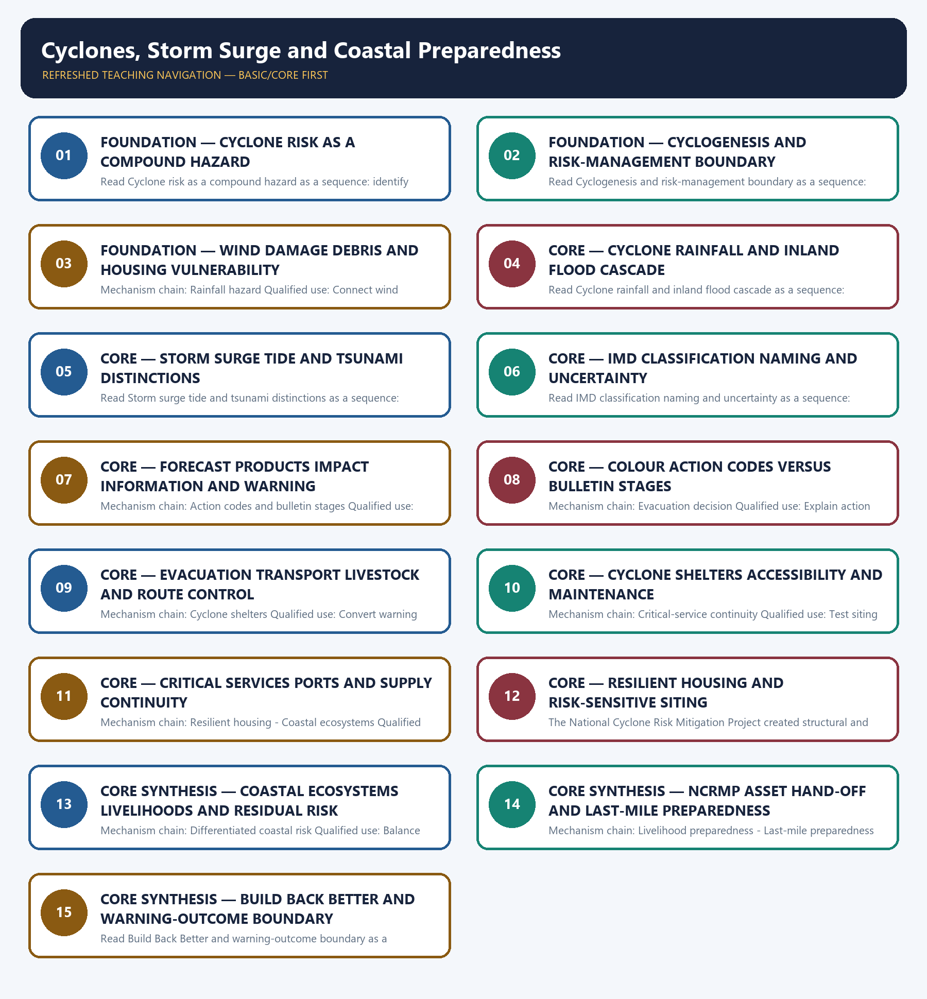

# Cyclones, Storm Surge and Coastal Preparedness — Learner-v2 Complete Learning Session

> **Authoring-only generation:** 2026-09-04. No PDF was rendered and no tracker or index was mutated.

### SOURCE, PROGRESSION AND CURRENT-LINKAGE AUDIT

- **Generation date:** 2026-09-04.
- **Repository-first evidence:** the Basic owner is taught first and preserved in full; the Advanced owner is retained only in the optional final teaching block.
- **OCR evidence:** Repository Markdown was primary. OCR-searchable official UPSC papers were supplementary only for printed routed demands. No answer key, warning performance, notification effect, implementation outcome, casualty reduction or disaster metric was inferred.
- **Qdrant:** not used; repository Markdown and available OCR context were sufficient.
- **PYQ integrity:** The 2022 GS-I warning-colour card is directly routed. The two 2024 GS-III cards are conservative resilience and flood-cascade applications and retain Topics 01 and 08 as primary owners.
- **Live-link boundary:** Official attempts covered IMD cyclone services and SOP material, NDMA's NCRMP portal, PIB's Cyclone Remal case and SACHET. Raw, thin, blocked or transport-failed pages are logged; no track, landfall, surge, rainfall, casualty, damage, shelter-readiness or avoided-loss figure was invented.
- **Fact/inference discipline:** no current-affairs item, PYQ wording, figure or quotation is invented.

### LIVE OFFICIAL-SOURCE ATTEMPT LOG

The checks below were made on 2026-09-04. Substantive official text is used only for the proposition it supports; title-only, blocked or thin pages are recorded and supply no factual claim.

- https://mausam.imd.gov.in/responsive/cycloneinformation.php — fetched 2026-09-04; the official IMD page exposed a tropical-weather outlook link but was content-thin for warning architecture. No current storm category, track, surge height or performance claim was inferred.
- https://mausam.imd.gov.in/imd_latest/contents/pdf/cyclone_sop.pdf — fetched 2026-09-04; the official IMD SOP returned as a raw PDF. Exact classification and bulletin details remain bounded to the audited canonical owner; no operational forecast was reconstructed.
- https://mitigation.ndma.gov.in/ncrmp/ — attempted 2026-09-04; the official NDMA NCRMP portal failed at the transport layer. The module therefore records NCRMP as the completed project status already cross-checked in the owner and does not claim a Phase III.
- https://pib.gov.in/PressReleaseIframePage.aspx?PRID=2021706 — attempted 2026-09-04; the official PIB Cyclone Remal page returned HTTP 403. The case is used only as an owner-audited warning, evacuation and cascading-impact illustration, without casualty or damage figures.
- https://sachet.ndma.gov.in/ — attempted 2026-09-04; the official SACHET portal failed at the transport layer. Platform availability is not treated as proof of message receipt, evacuation or protection.

## BASIC LEARNING SESSION



*Distinct embedded teaching-navigation image. The separate continuous Cārvāka-style flowchart package remains an independent at-a-glance artifact.*

### SESSION 1 — FOUNDATION — CYCLONE RISK AS A COMPOUND HAZARD

#### DEFINITION / WHAT THIS IS CALLED

**Plain-language definition:** The decisive boundary is Do not reduce cyclone risk to wind alone.

**Technical definition:** Read Cyclone risk as a compound hazard as a sequence: identify Compound cyclone hazard, follow the named mechanism to its institutional response, and stop at the last verified status rather than assuming the next stage.

#### ANSWER-GRABBING OPENING — WRITE/ADAPT IN THE EXAM

> Read Cyclone risk as a compound hazard as a sequence: identify Compound cyclone hazard, follow the named mechanism to its institutional response, and stop at the last verified status rather than assuming the next stage.

#### MUST-WRITE KEYWORDS

- **FOUNDATION**
- **Cyclone risk as a compound hazard**
- **Mechanism chain**
- **Qualified use**
- **Read Cyclone**
- **Compound**

**How to use them:** Frame the answer through FOUNDATION; define Cyclone risk as a compound hazard, connect Mechanism chain with Qualified use to explain the mechanism, and use Read Cyclone for the decisive comparison or qualification.

#### VISUAL FIRST

```text
CYCLONE RISK AS A COMPOUND HAZARD
01. Compound cyclone hazard
    |
    v
02. Cyclogenesis boundary
STATUS / CATEGORY FIREWALL -> Do not reduce cyclone risk to wind alone.
```

*The rail fixes the institutional sequence and claim boundary before explanation.*

#### CORE EXPLANATION

Tropical-cyclone risk combines destructive wind, intense rainfall, storm surge, waves, river or urban flooding, erosion and cascading failure of power, communications, transport and health services. Warm water, atmospheric instability, moisture, Coriolis force, a pre-existing disturbance and limited vertical wind shear support tropical cyclogenesis, but disaster management focuses on the resulting risk and action chain rather than detailed meteorological derivation.

#### SIMPLE SYSTEM EXAMPLE

Read Cyclone risk as a compound hazard as a sequence: identify Compound cyclone hazard, follow the named mechanism to its institutional response, and stop at the last verified status rather than assuming the next stage.

#### TECHNICAL DISTINCTION

The decisive boundary is Do not reduce cyclone risk to wind alone. This keeps Compound cyclone hazard and Cyclogenesis boundary in the correct risk category, institutional mandate and evidence status.

#### NAMED EVIDENCE AND MECHANISM

- Tropical-cyclone risk combines destructive wind, intense rainfall, storm surge, waves, river or urban flooding, erosion and cascading failure of power, communications, transport and health services.
- Warm water, atmospheric instability, moisture, Coriolis force, a pre-existing disturbance and limited vertical wind shear support tropical cyclogenesis, but disaster management focuses on the resulting risk and action chain rather than detailed meteorological derivation.

#### EXAMINER CAUTION

- Do not reduce cyclone risk to wind alone.

#### EXAM LINK

- **Prelims:** Keep hazard, forecast, warning, institution, law, plan, force, fund, scheme and outcome in their exact category.
- **Mains:** Name wind rain surge waves flooding and service cascades.

#### MINI RECAP

- **Mechanism chain:** Compound cyclone hazard -> Cyclogenesis boundary
- **Qualified use:** Name wind rain surge waves flooding and service cascades.

#### CLOSING RECALL FLOW — FOUNDATION — CYCLONE RISK AS A COMPOUND HAZARD

```text
START / CONCEPT: FOUNDATION — Cyclone risk as a compound hazard
        |
        v
EXACT TERMS: FOUNDATION · Cyclone risk as a compound hazard · Mechanism chain · Qualified use · Read Cyclone · Compound
        |
        v
MECHANISM / ARGUMENT: Mechanism chain: Compound cyclone hazard - Cyclogenesis boundary Qualified use: Name wind rain surge waves flooding and service cascades.
        |
        v
CONSEQUENCE / CONTRAST: The decisive boundary is Do not reduce cyclone risk to wind alone.
        |
        v
UPSC TRAP / ANSWER-USE: Do not reduce cyclone risk to wind alone.
        |
        v
ANSWER-GRABBING FORMULATION: Read Cyclone risk as a compound hazard as a sequence: identify Compound cyclone hazard, follow the named mechanism to its institutional response, and stop at the last verified status rather than assuming the next stage.
```
### SESSION 2 — FOUNDATION — CYCLOGENESIS AND RISK-MANAGEMENT BOUNDARY

#### DEFINITION / WHAT THIS IS CALLED

**Plain-language definition:** The decisive boundary is Do not confuse storm surge with tide, tsunami or ordinary high waves.

**Technical definition:** Read Cyclogenesis and risk-management boundary as a sequence: identify Wind hazard, follow the named mechanism to its institutional response, and stop at the last verified status rather than assuming the next stage.

#### ANSWER-GRABBING OPENING — WRITE/ADAPT IN THE EXAM

> Read Cyclogenesis and risk-management boundary as a sequence: identify Wind hazard, follow the named mechanism to its institutional response, and stop at the last verified status rather than assuming the next stage.

#### MUST-WRITE KEYWORDS

- **FOUNDATION**
- **Cyclogenesis**
- **risk-management boundary**
- **Mechanism chain**
- **Qualified use**
- **Cyclone**

**How to use them:** Frame the answer through FOUNDATION; define Cyclogenesis, connect risk-management boundary with Mechanism chain to explain the mechanism, and use Qualified use for the decisive comparison or qualification.

#### VISUAL FIRST

```text
CYCLOGENESIS AND RISK-MANAGEMENT BOUNDARY
01. Wind hazard
STATUS / CATEGORY FIREWALL -> Do not confuse storm surge with tide, tsunami or ordinary high waves.
```

*The rail fixes the institutional sequence and claim boundary before explanation.*

#### CORE EXPLANATION

Cyclone wind can damage roofs, weak structures, trees, transmission systems and communications, while debris and prolonged service interruption extend impacts beyond the landfall point.

#### SIMPLE SYSTEM EXAMPLE

Read Cyclogenesis and risk-management boundary as a sequence: identify Wind hazard, follow the named mechanism to its institutional response, and stop at the last verified status rather than assuming the next stage.

#### TECHNICAL DISTINCTION

The decisive boundary is Do not confuse storm surge with tide, tsunami or ordinary high waves. This keeps Wind hazard in the correct risk category, institutional mandate and evidence status.

#### NAMED EVIDENCE AND MECHANISM

- Cyclone wind can damage roofs, weak structures, trees, transmission systems and communications, while debris and prolonged service interruption extend impacts beyond the landfall point.

#### EXAMINER CAUTION

- Do not confuse storm surge with tide, tsunami or ordinary high waves.

#### EXAM LINK

- **Prelims:** Keep hazard, forecast, warning, institution, law, plan, force, fund, scheme and outcome in their exact category.
- **Mains:** State the formation requirements briefly and return to risk management.

#### MINI RECAP

- **Mechanism chain:** Wind hazard
- **Qualified use:** State the formation requirements briefly and return to risk management.

#### CLOSING RECALL FLOW — FOUNDATION — CYCLOGENESIS AND RISK-MANAGEMENT BOUNDARY

```text
START / CONCEPT: FOUNDATION — Cyclogenesis and risk-management boundary
        |
        v
EXACT TERMS: FOUNDATION · Cyclogenesis · risk-management boundary · Mechanism chain · Qualified use · Cyclone
        |
        v
MECHANISM / ARGUMENT: Mechanism chain: Wind hazard Qualified use: State the formation requirements briefly and return to risk management.
        |
        v
CONSEQUENCE / CONTRAST: The decisive boundary is Do not confuse storm surge with tide, tsunami or ordinary high waves.
        |
        v
UPSC TRAP / ANSWER-USE: Cyclone wind can damage roofs, weak structures, trees, transmission systems and communications, while debris and prolonged service interruption extend impacts beyond the landfall point.
        |
        v
ANSWER-GRABBING FORMULATION: Read Cyclogenesis and risk-management boundary as a sequence: identify Wind hazard, follow the named mechanism to its institutional response, and stop at the last verified status rather than assuming the next stage.
```
### SESSION 3 — FOUNDATION — WIND DAMAGE DEBRIS AND HOUSING VULNERABILITY

#### DEFINITION / WHAT THIS IS CALLED

**Plain-language definition:** Read Wind damage debris and housing vulnerability as a sequence: identify Rainfall hazard, follow the named mechanism to its institutional response, and stop at the last verified status rather than assuming the next stage.

**Technical definition:** Mechanism chain: Rainfall hazard Qualified use: Connect wind exposure to weak housing debris and utilities.

#### ANSWER-GRABBING OPENING — WRITE/ADAPT IN THE EXAM

> Read Wind damage debris and housing vulnerability as a sequence: identify Rainfall hazard, follow the named mechanism to its institutional response, and stop at the last verified status rather than assuming the next stage.

#### MUST-WRITE KEYWORDS

- **FOUNDATION**
- **Wind damage debris**
- **housing vulnerability**
- **Mechanism chain**
- **Qualified use**
- **Cyclone**

**How to use them:** Frame the answer through FOUNDATION; define Wind damage debris, connect housing vulnerability with Mechanism chain to explain the mechanism, and use Qualified use for the decisive comparison or qualification.

#### VISUAL FIRST

```text
WIND DAMAGE DEBRIS AND HOUSING VULNERABILITY
01. Rainfall hazard
STATUS / CATEGORY FIREWALL -> Do not merge IMD action colour codes with bulletin lead-time stages.
```

*The rail fixes the institutional sequence and claim boundary before explanation.*

#### CORE EXPLANATION

Cyclone rainfall can produce riverine, flash, pluvial and urban flooding well inland, so coastal landfall warnings must connect to catchment and city preparedness.

#### SIMPLE SYSTEM EXAMPLE

Read Wind damage debris and housing vulnerability as a sequence: identify Rainfall hazard, follow the named mechanism to its institutional response, and stop at the last verified status rather than assuming the next stage.

#### TECHNICAL DISTINCTION

The decisive boundary is Do not merge IMD action colour codes with bulletin lead-time stages. This keeps Rainfall hazard in the correct risk category, institutional mandate and evidence status.

#### NAMED EVIDENCE AND MECHANISM

- Cyclone rainfall can produce riverine, flash, pluvial and urban flooding well inland, so coastal landfall warnings must connect to catchment and city preparedness.

#### EXAMINER CAUTION

- Do not merge IMD action colour codes with bulletin lead-time stages.

#### EXAM LINK

- **Prelims:** Keep hazard, forecast, warning, institution, law, plan, force, fund, scheme and outcome in their exact category.
- **Mains:** Connect wind exposure to weak housing debris and utilities.

#### MINI RECAP

- **Mechanism chain:** Rainfall hazard
- **Qualified use:** Connect wind exposure to weak housing debris and utilities.

#### CLOSING RECALL FLOW — FOUNDATION — WIND DAMAGE DEBRIS AND HOUSING VULNERABILITY

```text
START / CONCEPT: FOUNDATION — Wind damage debris and housing vulnerability
        |
        v
EXACT TERMS: FOUNDATION · Wind damage debris · housing vulnerability · Mechanism chain · Qualified use · Cyclone
        |
        v
MECHANISM / ARGUMENT: Mechanism chain: Rainfall hazard Qualified use: Connect wind exposure to weak housing debris and utilities.
        |
        v
CONSEQUENCE / CONTRAST: The decisive boundary is Do not merge IMD action colour codes with bulletin lead-time stages.
        |
        v
UPSC TRAP / ANSWER-USE: Do not merge IMD action colour codes with bulletin lead-time stages.
        |
        v
ANSWER-GRABBING FORMULATION: Read Wind damage debris and housing vulnerability as a sequence: identify Rainfall hazard, follow the named mechanism to its institutional response, and stop at the last verified status rather than assuming the next stage.
```
### SESSION 4 — CORE — CYCLONE RAINFALL AND INLAND FLOOD CASCADE

#### DEFINITION / WHAT THIS IS CALLED

**Plain-language definition:** Storm surge is abnormal coastal water-level rise driven chiefly by cyclone winds and low pressure; impact varies with storm track, intensity, coast shape, bathymetry and tide.

**Technical definition:** Read Cyclone rainfall and inland flood cascade as a sequence: identify Storm surge, follow the named mechanism to its institutional response, and stop at the last verified status rather than assuming the next stage.

#### ANSWER-GRABBING OPENING — WRITE/ADAPT IN THE EXAM

> Read Cyclone rainfall and inland flood cascade as a sequence: identify Storm surge, follow the named mechanism to its institutional response, and stop at the last verified status rather than assuming the next stage.

#### MUST-WRITE KEYWORDS

- **Cyclone rainfall**
- **inland flood cascade**
- **Mechanism chain**
- **Qualified use**
- **Storm surge**
- **Storm**

**How to use them:** Frame the answer through Cyclone rainfall; define inland flood cascade, connect Mechanism chain with Qualified use to explain the mechanism, and use Storm surge for the decisive comparison or qualification.

#### VISUAL FIRST

```text
CYCLONE RAINFALL AND INLAND FLOOD CASCADE
01. Storm surge
STATUS / CATEGORY FIREWALL -> Do not quote classification thresholds without a current official IMD source.
```

*The rail fixes the institutional sequence and claim boundary before explanation.*

#### CORE EXPLANATION

Storm surge is abnormal coastal water-level rise driven chiefly by cyclone winds and low pressure; impact varies with storm track, intensity, coast shape, bathymetry and tide.

#### SIMPLE SYSTEM EXAMPLE

Read Cyclone rainfall and inland flood cascade as a sequence: identify Storm surge, follow the named mechanism to its institutional response, and stop at the last verified status rather than assuming the next stage.

#### TECHNICAL DISTINCTION

The decisive boundary is Do not quote classification thresholds without a current official IMD source. This keeps Storm surge in the correct risk category, institutional mandate and evidence status.

#### NAMED EVIDENCE AND MECHANISM

- Storm surge is abnormal coastal water-level rise driven chiefly by cyclone winds and low pressure; impact varies with storm track, intensity, coast shape, bathymetry and tide.

#### EXAMINER CAUTION

- Do not quote classification thresholds without a current official IMD source.

#### EXAM LINK

- **Prelims:** Keep hazard, forecast, warning, institution, law, plan, force, fund, scheme and outcome in their exact category.
- **Mains:** Trace landfall rain into basin city and inland preparedness.

#### MINI RECAP

- **Mechanism chain:** Storm surge
- **Qualified use:** Trace landfall rain into basin city and inland preparedness.

#### CLOSING RECALL FLOW — CORE — CYCLONE RAINFALL AND INLAND FLOOD CASCADE

```text
START / CONCEPT: CORE — Cyclone rainfall and inland flood cascade
        |
        v
EXACT TERMS: Cyclone rainfall · inland flood cascade · Mechanism chain · Qualified use · Storm surge · Storm
        |
        v
MECHANISM / ARGUMENT: Mechanism chain: Storm surge Qualified use: Trace landfall rain into basin city and inland preparedness.
        |
        v
CONSEQUENCE / CONTRAST: Storm surge is abnormal coastal water-level rise driven chiefly by cyclone winds and low pressure; impact varies with storm track, intensity, coast shape, bathymetry and tide.
        |
        v
UPSC TRAP / ANSWER-USE: The decisive boundary is Do not quote classification thresholds without a current official IMD source.
        |
        v
ANSWER-GRABBING FORMULATION: Read Cyclone rainfall and inland flood cascade as a sequence: identify Storm surge, follow the named mechanism to its institutional response, and stop at the last verified status rather than assuming the next stage.
```
### SESSION 5 — CORE — STORM SURGE TIDE AND TSUNAMI DISTINCTIONS

#### DEFINITION / WHAT THIS IS CALLED

**Plain-language definition:** Storm surge is not an astronomical tide and not a tsunami; tide can modify the total coastal water level, while tsunami generation involves sudden water displacement rather than cyclone forcing.

**Technical definition:** Read Storm surge tide and tsunami distinctions as a sequence: identify Surge tide tsunami firewall, follow the named mechanism to its institutional response, and stop at the last verified status rather than assuming the next stage.

#### ANSWER-GRABBING OPENING — WRITE/ADAPT IN THE EXAM

> Storm surge is not an astronomical tide and not a tsunami; tide can modify the total coastal water level, while tsunami generation involves sudden water displacement rather than cyclone forcing.

#### MUST-WRITE KEYWORDS

- **Storm surge tide**
- **tsunami distinctions**
- **Mechanism chain**
- **Qualified use**
- **Storm surge**
- **Storm**

**How to use them:** Frame the answer through Storm surge tide; define tsunami distinctions, connect Mechanism chain with Qualified use to explain the mechanism, and use Storm surge for the decisive comparison or qualification.

#### VISUAL FIRST

```text
STORM SURGE TIDE AND TSUNAMI DISTINCTIONS
01. Surge tide tsunami firewall
STATUS / CATEGORY FIREWALL -> Do not treat a forecast track, category or red alert as guaranteed impact.
```

*The rail fixes the institutional sequence and claim boundary before explanation.*

#### CORE EXPLANATION

Storm surge is not an astronomical tide and not a tsunami; tide can modify the total coastal water level, while tsunami generation involves sudden water displacement rather than cyclone forcing.

#### SIMPLE SYSTEM EXAMPLE

Read Storm surge tide and tsunami distinctions as a sequence: identify Surge tide tsunami firewall, follow the named mechanism to its institutional response, and stop at the last verified status rather than assuming the next stage.

#### TECHNICAL DISTINCTION

The decisive boundary is Do not treat a forecast track, category or red alert as guaranteed impact. This keeps Surge tide tsunami firewall in the correct risk category, institutional mandate and evidence status.

#### NAMED EVIDENCE AND MECHANISM

- Storm surge is not an astronomical tide and not a tsunami; tide can modify the total coastal water level, while tsunami generation involves sudden water displacement rather than cyclone forcing.

#### EXAMINER CAUTION

- Do not treat a forecast track, category or red alert as guaranteed impact.

#### EXAM LINK

- **Prelims:** Keep hazard, forecast, warning, institution, law, plan, force, fund, scheme and outcome in their exact category.
- **Mains:** Separate all three coastal water-level mechanisms.

#### MINI RECAP

- **Mechanism chain:** Surge tide tsunami firewall
- **Qualified use:** Separate all three coastal water-level mechanisms.

#### CLOSING RECALL FLOW — CORE — STORM SURGE TIDE AND TSUNAMI DISTINCTIONS

```text
START / CONCEPT: CORE — Storm surge tide and tsunami distinctions
        |
        v
EXACT TERMS: Storm surge tide · tsunami distinctions · Mechanism chain · Qualified use · Storm surge · Storm
        |
        v
MECHANISM / ARGUMENT: Read Storm surge tide and tsunami distinctions as a sequence: identify Surge tide tsunami firewall, follow the named mechanism to its institutional response, and stop at the last verified status rather than assuming the next stage.
        |
        v
CONSEQUENCE / CONTRAST: Mechanism chain: Surge tide tsunami firewall Qualified use: Separate all three coastal water-level mechanisms.
        |
        v
UPSC TRAP / ANSWER-USE: The decisive boundary is Do not treat a forecast track, category or red alert as guaranteed impact.
        |
        v
ANSWER-GRABBING FORMULATION: Storm surge is not an astronomical tide and not a tsunami; tide can modify the total coastal water level, while tsunami generation involves sudden water displacement rather than cyclone forcing.
```
### SESSION 6 — CORE — IMD CLASSIFICATION NAMING AND UNCERTAINTY

#### DEFINITION / WHAT THIS IS CALLED

**Plain-language definition:** IMD monitoring and forecasts communicate track, intensity, rainfall, wind, sea condition, storm-surge and likely impact information with uncertainty; a forecast is not a deterministic outcome.

**Technical definition:** Read IMD classification naming and uncertainty as a sequence: identify IMD classification, follow the named mechanism to its institutional response, and stop at the last verified status rather than assuming the next stage.

#### ANSWER-GRABBING OPENING — WRITE/ADAPT IN THE EXAM

> IMD monitoring and forecasts communicate track, intensity, rainfall, wind, sea condition, storm-surge and likely impact information with uncertainty; a forecast is not a deterministic outcome.

#### MUST-WRITE KEYWORDS

- **IMD classification naming**
- **uncertainty**
- **Mechanism chain**
- **Qualified use**
- **IMD**
- **Cyclonic Storm**

**How to use them:** Frame the answer through IMD classification naming; define uncertainty, connect Mechanism chain with Qualified use to explain the mechanism, and use IMD for the decisive comparison or qualification.

#### VISUAL FIRST

```text
IMD CLASSIFICATION NAMING AND UNCERTAINTY
01. IMD classification
    |
    v
02. Forecast and warning
STATUS / CATEGORY FIREWALL -> Do not describe evacuation without transport shelter and assistance arrangements.
```

*The rail fixes the institutional sequence and claim boundary before explanation.*

#### CORE EXPLANATION

IMD classifies cyclonic disturbances by maximum sustained wind speed and names systems from the Cyclonic Storm stage; exact category thresholds should be quoted only from the current official IMD standard. IMD monitoring and forecasts communicate track, intensity, rainfall, wind, sea condition, storm-surge and likely impact information with uncertainty; a forecast is not a deterministic outcome.

#### SIMPLE SYSTEM EXAMPLE

Read IMD classification naming and uncertainty as a sequence: identify IMD classification, follow the named mechanism to its institutional response, and stop at the last verified status rather than assuming the next stage.

#### TECHNICAL DISTINCTION

The decisive boundary is Do not describe evacuation without transport shelter and assistance arrangements. This keeps IMD classification and Forecast and warning in the correct risk category, institutional mandate and evidence status.

#### NAMED EVIDENCE AND MECHANISM

- IMD classifies cyclonic disturbances by maximum sustained wind speed and names systems from the Cyclonic Storm stage; exact category thresholds should be quoted only from the current official IMD standard.
- IMD monitoring and forecasts communicate track, intensity, rainfall, wind, sea condition, storm-surge and likely impact information with uncertainty; a forecast is not a deterministic outcome.

#### EXAMINER CAUTION

- Do not describe evacuation without transport shelter and assistance arrangements.

#### EXAM LINK

- **Prelims:** Keep hazard, forecast, warning, institution, law, plan, force, fund, scheme and outcome in their exact category.
- **Mains:** Use only current official IMD classification and naming language.

#### MINI RECAP

- **Mechanism chain:** IMD classification -> Forecast and warning
- **Qualified use:** Use only current official IMD classification and naming language.

#### CLOSING RECALL FLOW — CORE — IMD CLASSIFICATION NAMING AND UNCERTAINTY

```text
START / CONCEPT: CORE — IMD classification naming and uncertainty
        |
        v
EXACT TERMS: IMD classification naming · uncertainty · Mechanism chain · Qualified use · IMD · Cyclonic Storm
        |
        v
MECHANISM / ARGUMENT: Read IMD classification naming and uncertainty as a sequence: identify IMD classification, follow the named mechanism to its institutional response, and stop at the last verified status rather than assuming the next stage.
        |
        v
CONSEQUENCE / CONTRAST: The decisive boundary is Do not describe evacuation without transport shelter and assistance arrangements.
        |
        v
UPSC TRAP / ANSWER-USE: Do not describe evacuation without transport shelter and assistance arrangements.
        |
        v
ANSWER-GRABBING FORMULATION: IMD monitoring and forecasts communicate track, intensity, rainfall, wind, sea condition, storm-surge and likely impact information with uncertainty; a forecast is not a deterministic outcome.
```
### SESSION 7 — CORE — FORECAST PRODUCTS IMPACT INFORMATION AND WARNING

#### DEFINITION / WHAT THIS IS CALLED

**Plain-language definition:** Read Forecast products impact information and warning as a sequence: identify Action codes and bulletin stages, follow the named mechanism to its institutional response, and stop at the last verified status rather than assuming the next stage.

**Technical definition:** Mechanism chain: Action codes and bulletin stages Qualified use: Communicate uncertainty and impact without deterministic claims.

#### ANSWER-GRABBING OPENING — WRITE/ADAPT IN THE EXAM

> Read Forecast products impact information and warning as a sequence: identify Action codes and bulletin stages, follow the named mechanism to its institutional response, and stop at the last verified status rather than assuming the next stage.

#### MUST-WRITE KEYWORDS

- **Forecast products impact information**
- **warning**
- **Mechanism chain**
- **Qualified use**
- **Read Forecast**
- **Action**

**How to use them:** Frame the answer through Forecast products impact information; define warning, connect Mechanism chain with Qualified use to explain the mechanism, and use Read Forecast for the decisive comparison or qualification.

#### VISUAL FIRST

```text
FORECAST PRODUCTS IMPACT INFORMATION AND WARNING
01. Action codes and bulletin stages
STATUS / CATEGORY FIREWALL -> Do not equate shelter construction with accessible maintained readiness.
```

*The rail fixes the institutional sequence and claim boundary before explanation.*

#### CORE EXPLANATION

Green, Yellow, Orange and Red communicate action levels, while Pre-Cyclone Watch, Cyclone Alert, Cyclone Warning and Post-Landfall Outlook form a separate lead-time bulletin sequence.

#### SIMPLE SYSTEM EXAMPLE

Read Forecast products impact information and warning as a sequence: identify Action codes and bulletin stages, follow the named mechanism to its institutional response, and stop at the last verified status rather than assuming the next stage.

#### TECHNICAL DISTINCTION

The decisive boundary is Do not equate shelter construction with accessible maintained readiness. This keeps Action codes and bulletin stages in the correct risk category, institutional mandate and evidence status.

#### NAMED EVIDENCE AND MECHANISM

- Green, Yellow, Orange and Red communicate action levels, while Pre-Cyclone Watch, Cyclone Alert, Cyclone Warning and Post-Landfall Outlook form a separate lead-time bulletin sequence.

#### EXAMINER CAUTION

- Do not equate shelter construction with accessible maintained readiness.

#### EXAM LINK

- **Prelims:** Keep hazard, forecast, warning, institution, law, plan, force, fund, scheme and outcome in their exact category.
- **Mains:** Communicate uncertainty and impact without deterministic claims.

#### MINI RECAP

- **Mechanism chain:** Action codes and bulletin stages
- **Qualified use:** Communicate uncertainty and impact without deterministic claims.

#### CLOSING RECALL FLOW — CORE — FORECAST PRODUCTS IMPACT INFORMATION AND WARNING

```text
START / CONCEPT: CORE — Forecast products impact information and warning
        |
        v
EXACT TERMS: Forecast products impact information · warning · Mechanism chain · Qualified use · Read Forecast · Action
        |
        v
MECHANISM / ARGUMENT: Mechanism chain: Action codes and bulletin stages Qualified use: Communicate uncertainty and impact without deterministic claims.
        |
        v
CONSEQUENCE / CONTRAST: The decisive boundary is Do not equate shelter construction with accessible maintained readiness.
        |
        v
UPSC TRAP / ANSWER-USE: Do not equate shelter construction with accessible maintained readiness.
        |
        v
ANSWER-GRABBING FORMULATION: Read Forecast products impact information and warning as a sequence: identify Action codes and bulletin stages, follow the named mechanism to its institutional response, and stop at the last verified status rather than assuming the next stage.
```
### SESSION 8 — CORE — COLOUR ACTION CODES VERSUS BULLETIN STAGES

#### DEFINITION / WHAT THIS IS CALLED

**Plain-language definition:** Read Colour action codes versus bulletin stages as a sequence: identify Evacuation decision, follow the named mechanism to its institutional response, and stop at the last verified status rather than assuming the next stage.

**Technical definition:** Mechanism chain: Evacuation decision Qualified use: Explain action level and lead-time sequence as different systems.

#### ANSWER-GRABBING OPENING — WRITE/ADAPT IN THE EXAM

> Read Colour action codes versus bulletin stages as a sequence: identify Evacuation decision, follow the named mechanism to its institutional response, and stop at the last verified status rather than assuming the next stage.

#### MUST-WRITE KEYWORDS

- **Colour action codes versus bulletin stages**
- **Mechanism chain**
- **Qualified use**
- **Read Colour**
- **Evacuation**
- **The decisive boundary**

**How to use them:** Frame the answer through Colour action codes versus bulletin stages; define Mechanism chain, connect Qualified use with Read Colour to explain the mechanism, and use Evacuation for the decisive comparison or qualification.

#### VISUAL FIRST

```text
COLOUR ACTION CODES VERSUS BULLETIN STAGES
01. Evacuation decision
STATUS / CATEGORY FIREWALL -> Do not present ecosystems as a complete substitute for built protection.
```

*The rail fixes the institutional sequence and claim boundary before explanation.*

#### CORE EXPLANATION

Authorities convert official forecasts into area-specific evacuation, sheltering, route control, transport, livestock and asset-protection decisions, with priority assistance for people unable to self-evacuate.

#### SIMPLE SYSTEM EXAMPLE

Read Colour action codes versus bulletin stages as a sequence: identify Evacuation decision, follow the named mechanism to its institutional response, and stop at the last verified status rather than assuming the next stage.

#### TECHNICAL DISTINCTION

The decisive boundary is Do not present ecosystems as a complete substitute for built protection. This keeps Evacuation decision in the correct risk category, institutional mandate and evidence status.

#### NAMED EVIDENCE AND MECHANISM

- Authorities convert official forecasts into area-specific evacuation, sheltering, route control, transport, livestock and asset-protection decisions, with priority assistance for people unable to self-evacuate.

#### EXAMINER CAUTION

- Do not present ecosystems as a complete substitute for built protection.

#### EXAM LINK

- **Prelims:** Keep hazard, forecast, warning, institution, law, plan, force, fund, scheme and outcome in their exact category.
- **Mains:** Explain action level and lead-time sequence as different systems.

#### MINI RECAP

- **Mechanism chain:** Evacuation decision
- **Qualified use:** Explain action level and lead-time sequence as different systems.

#### CLOSING RECALL FLOW — CORE — COLOUR ACTION CODES VERSUS BULLETIN STAGES

```text
START / CONCEPT: CORE — Colour action codes versus bulletin stages
        |
        v
EXACT TERMS: Colour action codes versus bulletin stages · Mechanism chain · Qualified use · Read Colour · Evacuation · The decisive boundary
        |
        v
MECHANISM / ARGUMENT: Mechanism chain: Evacuation decision Qualified use: Explain action level and lead-time sequence as different systems.
        |
        v
CONSEQUENCE / CONTRAST: The decisive boundary is Do not present ecosystems as a complete substitute for built protection.
        |
        v
UPSC TRAP / ANSWER-USE: Do not present ecosystems as a complete substitute for built protection.
        |
        v
ANSWER-GRABBING FORMULATION: Read Colour action codes versus bulletin stages as a sequence: identify Evacuation decision, follow the named mechanism to its institutional response, and stop at the last verified status rather than assuming the next stage.
```
### SESSION 9 — CORE — EVACUATION TRANSPORT LIVESTOCK AND ROUTE CONTROL

#### DEFINITION / WHAT THIS IS CALLED

**Plain-language definition:** Read Evacuation transport livestock and route control as a sequence: identify Cyclone shelters, follow the named mechanism to its institutional response, and stop at the last verified status rather than assuming the next stage.

**Technical definition:** Mechanism chain: Cyclone shelters Qualified use: Convert warning into area transport shelter livestock and inclusion decisions.

#### ANSWER-GRABBING OPENING — WRITE/ADAPT IN THE EXAM

> Read Evacuation transport livestock and route control as a sequence: identify Cyclone shelters, follow the named mechanism to its institutional response, and stop at the last verified status rather than assuming the next stage.

#### MUST-WRITE KEYWORDS

- **Evacuation transport livestock**
- **route control**
- **Mechanism chain**
- **Qualified use**
- **Multi-purpose**
- **Read Evacuation**

**How to use them:** Frame the answer through Evacuation transport livestock; define route control, connect Mechanism chain with Qualified use to explain the mechanism, and use Multi-purpose for the decisive comparison or qualification.

#### VISUAL FIRST

```text
EVACUATION TRANSPORT LIVESTOCK AND ROUTE CONTROL
01. Cyclone shelters
STATUS / CATEGORY FIREWALL -> Do not describe the completed NCRMP as an automatically ongoing new phase.
```

*The rail fixes the institutional sequence and claim boundary before explanation.*

#### CORE EXPLANATION

Multi-purpose cyclone shelters require safe siting, all-weather access, water, sanitation, backup power, accessibility, protection, management and maintenance; construction alone does not prove readiness.

#### SIMPLE SYSTEM EXAMPLE

Read Evacuation transport livestock and route control as a sequence: identify Cyclone shelters, follow the named mechanism to its institutional response, and stop at the last verified status rather than assuming the next stage.

#### TECHNICAL DISTINCTION

The decisive boundary is Do not describe the completed NCRMP as an automatically ongoing new phase. This keeps Cyclone shelters in the correct risk category, institutional mandate and evidence status.

#### NAMED EVIDENCE AND MECHANISM

- Multi-purpose cyclone shelters require safe siting, all-weather access, water, sanitation, backup power, accessibility, protection, management and maintenance; construction alone does not prove readiness.

#### EXAMINER CAUTION

- Do not describe the completed NCRMP as an automatically ongoing new phase.

#### EXAM LINK

- **Prelims:** Keep hazard, forecast, warning, institution, law, plan, force, fund, scheme and outcome in their exact category.
- **Mains:** Convert warning into area transport shelter livestock and inclusion decisions.

#### MINI RECAP

- **Mechanism chain:** Cyclone shelters
- **Qualified use:** Convert warning into area transport shelter livestock and inclusion decisions.

#### CLOSING RECALL FLOW — CORE — EVACUATION TRANSPORT LIVESTOCK AND ROUTE CONTROL

```text
START / CONCEPT: CORE — Evacuation transport livestock and route control
        |
        v
EXACT TERMS: Evacuation transport livestock · route control · Mechanism chain · Qualified use · Multi-purpose · Read Evacuation
        |
        v
MECHANISM / ARGUMENT: Mechanism chain: Cyclone shelters Qualified use: Convert warning into area transport shelter livestock and inclusion decisions.
        |
        v
CONSEQUENCE / CONTRAST: Multi-purpose cyclone shelters require safe siting, all-weather access, water, sanitation, backup power, accessibility, protection, management and maintenance; construction alone does not prove readiness.
        |
        v
UPSC TRAP / ANSWER-USE: The decisive boundary is Do not describe the completed NCRMP as an automatically ongoing new phase.
        |
        v
ANSWER-GRABBING FORMULATION: Read Evacuation transport livestock and route control as a sequence: identify Cyclone shelters, follow the named mechanism to its institutional response, and stop at the last verified status rather than assuming the next stage.
```
### SESSION 10 — CORE — CYCLONE SHELTERS ACCESSIBILITY AND MAINTENANCE

#### DEFINITION / WHAT THIS IS CALLED

**Plain-language definition:** Read Cyclone shelters accessibility and maintenance as a sequence: identify Critical-service continuity, follow the named mechanism to its institutional response, and stop at the last verified status rather than assuming the next stage.

**Technical definition:** Mechanism chain: Critical-service continuity Qualified use: Test siting access services management maintenance and accessibility.

#### ANSWER-GRABBING OPENING — WRITE/ADAPT IN THE EXAM

> Read Cyclone shelters accessibility and maintenance as a sequence: identify Critical-service continuity, follow the named mechanism to its institutional response, and stop at the last verified status rather than assuming the next stage.

#### MUST-WRITE KEYWORDS

- **Cyclone shelters accessibility**
- **maintenance**
- **Mechanism chain**
- **Qualified use**
- **Read Cyclone**
- **Critical-service**

**How to use them:** Frame the answer through Cyclone shelters accessibility; define maintenance, connect Mechanism chain with Qualified use to explain the mechanism, and use Read Cyclone for the decisive comparison or qualification.

#### VISUAL FIRST

```text
CYCLONE SHELTERS ACCESSIBILITY AND MAINTENANCE
01. Critical-service continuity
STATUS / CATEGORY FIREWALL -> Do not infer protection or reduced loss from warning issuance or asset creation.
```

*The rail fixes the institutional sequence and claim boundary before explanation.*

#### CORE EXPLANATION

Hospitals, emergency operations, power, water, telecom, roads, ports and supply chains need redundancy, shutdown protocols, rapid assessment and restoration plans.

#### SIMPLE SYSTEM EXAMPLE

Read Cyclone shelters accessibility and maintenance as a sequence: identify Critical-service continuity, follow the named mechanism to its institutional response, and stop at the last verified status rather than assuming the next stage.

#### TECHNICAL DISTINCTION

The decisive boundary is Do not infer protection or reduced loss from warning issuance or asset creation. This keeps Critical-service continuity in the correct risk category, institutional mandate and evidence status.

#### NAMED EVIDENCE AND MECHANISM

- Hospitals, emergency operations, power, water, telecom, roads, ports and supply chains need redundancy, shutdown protocols, rapid assessment and restoration plans.

#### EXAMINER CAUTION

- Do not infer protection or reduced loss from warning issuance or asset creation.

#### EXAM LINK

- **Prelims:** Keep hazard, forecast, warning, institution, law, plan, force, fund, scheme and outcome in their exact category.
- **Mains:** Test siting access services management maintenance and accessibility.

#### MINI RECAP

- **Mechanism chain:** Critical-service continuity
- **Qualified use:** Test siting access services management maintenance and accessibility.

#### CLOSING RECALL FLOW — CORE — CYCLONE SHELTERS ACCESSIBILITY AND MAINTENANCE

```text
START / CONCEPT: CORE — Cyclone shelters accessibility and maintenance
        |
        v
EXACT TERMS: Cyclone shelters accessibility · maintenance · Mechanism chain · Qualified use · Read Cyclone · Critical-service
        |
        v
MECHANISM / ARGUMENT: Mechanism chain: Critical-service continuity Qualified use: Test siting access services management maintenance and accessibility.
        |
        v
CONSEQUENCE / CONTRAST: The decisive boundary is Do not infer protection or reduced loss from warning issuance or asset creation.
        |
        v
UPSC TRAP / ANSWER-USE: Do not infer protection or reduced loss from warning issuance or asset creation.
        |
        v
ANSWER-GRABBING FORMULATION: Read Cyclone shelters accessibility and maintenance as a sequence: identify Critical-service continuity, follow the named mechanism to its institutional response, and stop at the last verified status rather than assuming the next stage.
```
### SESSION 11 — CORE — CRITICAL SERVICES PORTS AND SUPPLY CONTINUITY

#### DEFINITION / WHAT THIS IS CALLED

**Plain-language definition:** Read Critical services ports and supply continuity as a sequence: identify Resilient housing, follow the named mechanism to its institutional response, and stop at the last verified status rather than assuming the next stage.

**Technical definition:** Mechanism chain: Resilient housing - Coastal ecosystems Qualified use: Protect emergency health power water telecom port and road functions.

#### ANSWER-GRABBING OPENING — WRITE/ADAPT IN THE EXAM

> Read Critical services ports and supply continuity as a sequence: identify Resilient housing, follow the named mechanism to its institutional response, and stop at the last verified status rather than assuming the next stage.

#### MUST-WRITE KEYWORDS

- **Critical services ports**
- **supply continuity**
- **Mechanism chain**
- **Qualified use**
- **Risk-sensitive**
- **Mangroves**

**How to use them:** Frame the answer through Critical services ports; define supply continuity, connect Mechanism chain with Qualified use to explain the mechanism, and use Risk-sensitive for the decisive comparison or qualification.

#### VISUAL FIRST

```text
CRITICAL SERVICES PORTS AND SUPPLY CONTINUITY
01. Resilient housing
    |
    v
02. Coastal ecosystems
STATUS / CATEGORY FIREWALL -> Do not reduce cyclone risk to wind alone.
```

*The rail fixes the institutional sequence and claim boundary before explanation.*

#### CORE EXPLANATION

Risk-sensitive siting, code-compliant construction, roof and connection safety, maintenance and safer repair reduce housing vulnerability; exam answers should not prescribe engineering details. Mangroves, dunes, wetlands and other coastal ecosystems can moderate some wind-wave-surge effects and support livelihoods, but they complement rather than replace warnings, shelters and resilient infrastructure.

#### SIMPLE SYSTEM EXAMPLE

Read Critical services ports and supply continuity as a sequence: identify Resilient housing, follow the named mechanism to its institutional response, and stop at the last verified status rather than assuming the next stage.

#### TECHNICAL DISTINCTION

The decisive boundary is Do not reduce cyclone risk to wind alone. This keeps Resilient housing and Coastal ecosystems in the correct risk category, institutional mandate and evidence status.

#### NAMED EVIDENCE AND MECHANISM

- Risk-sensitive siting, code-compliant construction, roof and connection safety, maintenance and safer repair reduce housing vulnerability; exam answers should not prescribe engineering details.
- Mangroves, dunes, wetlands and other coastal ecosystems can moderate some wind-wave-surge effects and support livelihoods, but they complement rather than replace warnings, shelters and resilient infrastructure.

#### EXAMINER CAUTION

- Do not reduce cyclone risk to wind alone.

#### EXAM LINK

- **Prelims:** Keep hazard, forecast, warning, institution, law, plan, force, fund, scheme and outcome in their exact category.
- **Mains:** Protect emergency health power water telecom port and road functions.

#### MINI RECAP

- **Mechanism chain:** Resilient housing -> Coastal ecosystems
- **Qualified use:** Protect emergency health power water telecom port and road functions.

#### CLOSING RECALL FLOW — CORE — CRITICAL SERVICES PORTS AND SUPPLY CONTINUITY

```text
START / CONCEPT: CORE — Critical services ports and supply continuity
        |
        v
EXACT TERMS: Critical services ports · supply continuity · Mechanism chain · Qualified use · Risk-sensitive · Mangroves
        |
        v
MECHANISM / ARGUMENT: Mechanism chain: Resilient housing - Coastal ecosystems Qualified use: Protect emergency health power water telecom port and road functions.
        |
        v
CONSEQUENCE / CONTRAST: Risk-sensitive siting, code-compliant construction, roof and connection safety, maintenance and safer repair reduce housing vulnerability; exam answers should not prescribe engineering details.
        |
        v
UPSC TRAP / ANSWER-USE: Mangroves, dunes, wetlands and other coastal ecosystems can moderate some wind-wave-surge effects and support livelihoods, but they complement rather than replace warnings, shelters and resilient infrastructure.
        |
        v
ANSWER-GRABBING FORMULATION: Read Critical services ports and supply continuity as a sequence: identify Resilient housing, follow the named mechanism to its institutional response, and stop at the last verified status rather than assuming the next stage.
```
### SESSION 12 — CORE — RESILIENT HOUSING AND RISK-SENSITIVE SITING

#### DEFINITION / WHAT THIS IS CALLED

**Plain-language definition:** Read Resilient housing and risk-sensitive siting as a sequence: identify NCRMP status, follow the named mechanism to its institutional response, and stop at the last verified status rather than assuming the next stage.

**Technical definition:** The National Cyclone Risk Mitigation Project created structural and non-structural coastal-risk assets through completed phases; asset operation, maintenance and current readiness now require separate evidence.

#### ANSWER-GRABBING OPENING — WRITE/ADAPT IN THE EXAM

> Read Resilient housing and risk-sensitive siting as a sequence: identify NCRMP status, follow the named mechanism to its institutional response, and stop at the last verified status rather than assuming the next stage.

#### MUST-WRITE KEYWORDS

- **Resilient housing**
- **risk-sensitive siting**
- **Mechanism chain**
- **Qualified use**
- **The National Cyclone Risk Mitigation**
- **Project**

**How to use them:** Frame the answer through Resilient housing; define risk-sensitive siting, connect Mechanism chain with Qualified use to explain the mechanism, and use The National Cyclone Risk Mitigation for the decisive comparison or qualification.

#### VISUAL FIRST

```text
RESILIENT HOUSING AND RISK-SENSITIVE SITING
01. NCRMP status
STATUS / CATEGORY FIREWALL -> Do not confuse storm surge with tide, tsunami or ordinary high waves.
```

*The rail fixes the institutional sequence and claim boundary before explanation.*

#### CORE EXPLANATION

The National Cyclone Risk Mitigation Project created structural and non-structural coastal-risk assets through completed phases; asset operation, maintenance and current readiness now require separate evidence.

#### SIMPLE SYSTEM EXAMPLE

Read Resilient housing and risk-sensitive siting as a sequence: identify NCRMP status, follow the named mechanism to its institutional response, and stop at the last verified status rather than assuming the next stage.

#### TECHNICAL DISTINCTION

The decisive boundary is Do not confuse storm surge with tide, tsunami or ordinary high waves. This keeps NCRMP status in the correct risk category, institutional mandate and evidence status.

#### NAMED EVIDENCE AND MECHANISM

- The National Cyclone Risk Mitigation Project created structural and non-structural coastal-risk assets through completed phases; asset operation, maintenance and current readiness now require separate evidence.

#### EXAMINER CAUTION

- Do not confuse storm surge with tide, tsunami or ordinary high waves.

#### EXAM LINK

- **Prelims:** Keep hazard, forecast, warning, institution, law, plan, force, fund, scheme and outcome in their exact category.
- **Mains:** Keep construction measures exam-safe and governance-focused.

#### MINI RECAP

- **Mechanism chain:** NCRMP status
- **Qualified use:** Keep construction measures exam-safe and governance-focused.

#### CLOSING RECALL FLOW — CORE — RESILIENT HOUSING AND RISK-SENSITIVE SITING

```text
START / CONCEPT: CORE — Resilient housing and risk-sensitive siting
        |
        v
EXACT TERMS: Resilient housing · risk-sensitive siting · Mechanism chain · Qualified use · The National Cyclone Risk Mitigation · Project
        |
        v
MECHANISM / ARGUMENT: The National Cyclone Risk Mitigation Project created structural and non-structural coastal-risk assets through completed phases; asset operation, maintenance and current readiness now require separate evidence.
        |
        v
CONSEQUENCE / CONTRAST: The decisive boundary is Do not confuse storm surge with tide, tsunami or ordinary high waves.
        |
        v
UPSC TRAP / ANSWER-USE: Do not confuse storm surge with tide, tsunami or ordinary high waves.
        |
        v
ANSWER-GRABBING FORMULATION: Read Resilient housing and risk-sensitive siting as a sequence: identify NCRMP status, follow the named mechanism to its institutional response, and stop at the last verified status rather than assuming the next stage.
```
### SESSION 13 — CORE SYNTHESIS — COASTAL ECOSYSTEMS LIVELIHOODS AND RESIDUAL RISK

#### DEFINITION / WHAT THIS IS CALLED

**Plain-language definition:** Cyclone frequency, coast geometry, exposure, housing, poverty, ecosystems and local capacity differ across coasts, so a lower-category or less-frequent area is not risk-free.

**Technical definition:** Mechanism chain: Differentiated coastal risk Qualified use: Balance ecosystem protection livelihood needs and residual risk.

#### ANSWER-GRABBING OPENING — WRITE/ADAPT IN THE EXAM

> Mechanism chain: Differentiated coastal risk Qualified use: Balance ecosystem protection livelihood needs and residual risk.

#### MUST-WRITE KEYWORDS

- **CORE SYNTHESIS**
- **Coastal ecosystems livelihoods**
- **residual risk**
- **Mechanism chain**
- **Qualified use**
- **Cyclone**

**How to use them:** Frame the answer through CORE SYNTHESIS; define Coastal ecosystems livelihoods, connect residual risk with Mechanism chain to explain the mechanism, and use Qualified use for the decisive comparison or qualification.

#### VISUAL FIRST

```text
COASTAL ECOSYSTEMS LIVELIHOODS AND RESIDUAL RISK
01. Differentiated coastal risk
STATUS / CATEGORY FIREWALL -> Do not merge IMD action colour codes with bulletin lead-time stages.
```

*The rail fixes the institutional sequence and claim boundary before explanation.*

#### CORE EXPLANATION

Cyclone frequency, coast geometry, exposure, housing, poverty, ecosystems and local capacity differ across coasts, so a lower-category or less-frequent area is not risk-free.

#### SIMPLE SYSTEM EXAMPLE

Read Coastal ecosystems livelihoods and residual risk as a sequence: identify Differentiated coastal risk, follow the named mechanism to its institutional response, and stop at the last verified status rather than assuming the next stage.

#### TECHNICAL DISTINCTION

The decisive boundary is Do not merge IMD action colour codes with bulletin lead-time stages. This keeps Differentiated coastal risk in the correct risk category, institutional mandate and evidence status.

#### NAMED EVIDENCE AND MECHANISM

- Cyclone frequency, coast geometry, exposure, housing, poverty, ecosystems and local capacity differ across coasts, so a lower-category or less-frequent area is not risk-free.

#### EXAMINER CAUTION

- Do not merge IMD action colour codes with bulletin lead-time stages.

#### EXAM LINK

- **Prelims:** Keep hazard, forecast, warning, institution, law, plan, force, fund, scheme and outcome in their exact category.
- **Mains:** Balance ecosystem protection livelihood needs and residual risk.

#### MINI RECAP

- **Mechanism chain:** Differentiated coastal risk
- **Qualified use:** Balance ecosystem protection livelihood needs and residual risk.

#### CLOSING RECALL FLOW — CORE SYNTHESIS — COASTAL ECOSYSTEMS LIVELIHOODS AND RESIDUAL RISK

```text
START / CONCEPT: CORE SYNTHESIS — Coastal ecosystems livelihoods and residual risk
        |
        v
EXACT TERMS: CORE SYNTHESIS · Coastal ecosystems livelihoods · residual risk · Mechanism chain · Qualified use · Cyclone
        |
        v
MECHANISM / ARGUMENT: Read Coastal ecosystems livelihoods and residual risk as a sequence: identify Differentiated coastal risk, follow the named mechanism to its institutional response, and stop at the last verified status rather than assuming the next stage.
        |
        v
CONSEQUENCE / CONTRAST: Cyclone frequency, coast geometry, exposure, housing, poverty, ecosystems and local capacity differ across coasts, so a lower-category or less-frequent area is not risk-free.
        |
        v
UPSC TRAP / ANSWER-USE: The decisive boundary is Do not merge IMD action colour codes with bulletin lead-time stages.
        |
        v
ANSWER-GRABBING FORMULATION: Mechanism chain: Differentiated coastal risk Qualified use: Balance ecosystem protection livelihood needs and residual risk.
```
### SESSION 14 — CORE SYNTHESIS — NCRMP ASSET HAND-OFF AND LAST-MILE PREPAREDNESS

#### DEFINITION / WHAT THIS IS CALLED

**Plain-language definition:** Read NCRMP asset hand-off and last-mile preparedness as a sequence: identify Livelihood preparedness, follow the named mechanism to its institutional response, and stop at the last verified status rather than assuming the next stage.

**Technical definition:** Mechanism chain: Livelihood preparedness - Last-mile preparedness Qualified use: Move from completed project assets to current operation and drills.

#### ANSWER-GRABBING OPENING — WRITE/ADAPT IN THE EXAM

> Read NCRMP asset hand-off and last-mile preparedness as a sequence: identify Livelihood preparedness, follow the named mechanism to its institutional response, and stop at the last verified status rather than assuming the next stage.

#### MUST-WRITE KEYWORDS

- **CORE SYNTHESIS**
- **NCRMP asset hand-off**
- **last-mile preparedness**
- **Mechanism chain**
- **Qualified use**
- **Warnings**

**How to use them:** Frame the answer through CORE SYNTHESIS; define NCRMP asset hand-off, connect last-mile preparedness with Mechanism chain to explain the mechanism, and use Qualified use for the decisive comparison or qualification.

#### VISUAL FIRST

```text
NCRMP ASSET HAND-OFF AND LAST-MILE PREPAREDNESS
01. Livelihood preparedness
    |
    v
02. Last-mile preparedness
STATUS / CATEGORY FIREWALL -> Do not quote classification thresholds without a current official IMD source.
```

*The rail fixes the institutional sequence and claim boundary before explanation.*

#### CORE EXPLANATION

Fishers, farmers, coastal workers, vendors and tourism-dependent households need vessel and gear safety, market and income continuity, livestock arrangements and timely reopening information. Warnings require trusted multilingual relay, drills, local volunteers, accessible transport, route familiarity and shelter management; warning issuance does not demonstrate household action.

#### SIMPLE SYSTEM EXAMPLE

Read NCRMP asset hand-off and last-mile preparedness as a sequence: identify Livelihood preparedness, follow the named mechanism to its institutional response, and stop at the last verified status rather than assuming the next stage.

#### TECHNICAL DISTINCTION

The decisive boundary is Do not quote classification thresholds without a current official IMD source. This keeps Livelihood preparedness and Last-mile preparedness in the correct risk category, institutional mandate and evidence status.

#### NAMED EVIDENCE AND MECHANISM

- Fishers, farmers, coastal workers, vendors and tourism-dependent households need vessel and gear safety, market and income continuity, livestock arrangements and timely reopening information.
- Warnings require trusted multilingual relay, drills, local volunteers, accessible transport, route familiarity and shelter management; warning issuance does not demonstrate household action.

#### EXAMINER CAUTION

- Do not quote classification thresholds without a current official IMD source.

#### EXAM LINK

- **Prelims:** Keep hazard, forecast, warning, institution, law, plan, force, fund, scheme and outcome in their exact category.
- **Mains:** Move from completed project assets to current operation and drills.

#### MINI RECAP

- **Mechanism chain:** Livelihood preparedness -> Last-mile preparedness
- **Qualified use:** Move from completed project assets to current operation and drills.

#### CLOSING RECALL FLOW — CORE SYNTHESIS — NCRMP ASSET HAND-OFF AND LAST-MILE PREPAREDNESS

```text
START / CONCEPT: CORE SYNTHESIS — NCRMP asset hand-off and last-mile preparedness
        |
        v
EXACT TERMS: CORE SYNTHESIS · NCRMP asset hand-off · last-mile preparedness · Mechanism chain · Qualified use · Warnings
        |
        v
MECHANISM / ARGUMENT: Mechanism chain: Livelihood preparedness - Last-mile preparedness Qualified use: Move from completed project assets to current operation and drills.
        |
        v
CONSEQUENCE / CONTRAST: Warnings require trusted multilingual relay, drills, local volunteers, accessible transport, route familiarity and shelter management; warning issuance does not demonstrate household action.
        |
        v
UPSC TRAP / ANSWER-USE: The decisive boundary is Do not quote classification thresholds without a current official IMD source.
        |
        v
ANSWER-GRABBING FORMULATION: Read NCRMP asset hand-off and last-mile preparedness as a sequence: identify Livelihood preparedness, follow the named mechanism to its institutional response, and stop at the last verified status rather than assuming the next stage.
```
### SESSION 15 — CORE SYNTHESIS — BUILD BACK BETTER AND WARNING-OUTCOME BOUNDARY

#### DEFINITION / WHAT THIS IS CALLED

**Plain-language definition:** The decisive boundary is Do not treat a forecast track, category or red alert as guaranteed impact.

**Technical definition:** Read Build Back Better and warning-outcome boundary as a sequence: identify Build Back Better, follow the named mechanism to its institutional response, and stop at the last verified status rather than assuming the next stage.

#### ANSWER-GRABBING OPENING — WRITE/ADAPT IN THE EXAM

> Read Build Back Better and warning-outcome boundary as a sequence: identify Build Back Better, follow the named mechanism to its institutional response, and stop at the last verified status rather than assuming the next stage.

#### MUST-WRITE KEYWORDS

- **CORE SYNTHESIS**
- **Build Back Better**
- **warning-outcome boundary**
- **Mechanism chain**
- **Qualified use**
- **Subject**

**How to use them:** Frame the answer through CORE SYNTHESIS; define Build Back Better, connect warning-outcome boundary with Mechanism chain to explain the mechanism, and use Qualified use for the decisive comparison or qualification.

#### VISUAL FIRST

```text
BUILD BACK BETTER AND WARNING-OUTCOME BOUNDARY
01. Build Back Better
    |
    v
02. Warning-outcome firewall
STATUS / CATEGORY FIREWALL -> Do not treat a forecast track, category or red alert as guaranteed impact.
```

*The rail fixes the institutional sequence and claim boundary before explanation.*

#### CORE EXPLANATION

Recovery should restore housing, services, ecosystems and livelihoods with safer siting and construction, risk-informed finance and social protection rather than recreate pre-cyclone vulnerability. A forecast, colour code, alert, shelter, embankment, ecosystem project or deployment proves an input; timely evacuation, service continuity, maintained assets and reduced loss require separate verification.

#### SIMPLE SYSTEM EXAMPLE

Read Build Back Better and warning-outcome boundary as a sequence: identify Build Back Better, follow the named mechanism to its institutional response, and stop at the last verified status rather than assuming the next stage.

#### TECHNICAL DISTINCTION

The decisive boundary is Do not treat a forecast track, category or red alert as guaranteed impact. This keeps Build Back Better and Warning-outcome firewall in the correct risk category, institutional mandate and evidence status.

#### NAMED EVIDENCE AND MECHANISM

- Recovery should restore housing, services, ecosystems and livelihoods with safer siting and construction, risk-informed finance and social protection rather than recreate pre-cyclone vulnerability.
- A forecast, colour code, alert, shelter, embankment, ecosystem project or deployment proves an input; timely evacuation, service continuity, maintained assets and reduced loss require separate verification.

#### EXAMINER CAUTION

- Do not treat a forecast track, category or red alert as guaranteed impact.

#### EXAM LINK

- **Prelims:** Keep hazard, forecast, warning, institution, law, plan, force, fund, scheme and outcome in their exact category.
- **Mains:** End with safer recovery and verified outcomes.

#### MINI RECAP

- **Mechanism chain:** Build Back Better -> Warning-outcome firewall
- **Qualified use:** End with safer recovery and verified outcomes.
#### COMPLETE BASIC OWNER EVIDENCE BANK

> **Subject:** Disaster Management | **Tier:** Must-Do (foundation) | **GS Paper:** GS-III.
> **Core area:** Cyclone formation and risk; IMD warning architecture and
> colour codes; National Cyclone Risk Mitigation Project; shelters,
> evacuation and ecosystem buffers.
> **Grounded in:** *VisionIAS Value Added Material Disaster Management*,
> PDF pp. 33-38 (cyclone risk, IMD warnings, NCRMP and gaps); `00_Master-
> Framework.md` Section 5.
> ✅ = source-grounded | ⚠️ = analytical inference | 📰 = current anchor | ❌ = boundary/trap.
> *Companion: `advanced/07_Cyclones-Storm-Surge-and-Coastal-Preparedness.md`.*

#### 1. Visual foundation

```text
WARM OCEAN SURFACE -> LOW PRESSURE -> RISING MOIST AIR
        |
        v
CYCLOGENESIS (6 requirements: SST, instability, humidity,
Coriolis force, pre-existing disturbance, low wind shear)
        |
        v
IMD WARNING (ACWC/CWC network + Doppler radar + colour codes)
        |
        v
NCRMP: shelters + evacuation + saline embankments + bio-shields
```

**Core proposition:** ✅ VisionIAS defines a cyclone as "a region of low
atmospheric pressure surrounded by high atmospheric pressure resulting
in swirling atmospheric disturbance accompanied by powerful winds," with
winds increasing to a peak (often exceeding 150 km/h) 20-30 km from the
calm "eye" before decreasing (PDF p. 35).

#### 2. Essential definitions

| Concept | Exam-ready meaning |
|---|---|
| ✅ **Six requirements for tropical cyclogenesis** | Sufficiently warm sea-surface temperatures; atmospheric instability; high humidity in the lower-to-middle troposphere; sufficient Coriolis force; a pre-existing low-level disturbance; and low vertical wind shear (PDF pp. 35-36). |
| ✅ **Area Cyclone Warning Centers (ACWCs) / Cyclone Warning Centers (CWCs)** | IMD's warning-issuing network — ACWCs at Kolkata, Chennai, Mumbai; CWCs at Bhubaneswar, Visakhapatnam, Ahmedabad — under the satellite-based Cyclone Warning Dissemination System (PDF p. 36). |
| ✅ **IMD's four colour codes** | Green ("no warning"); Yellow ("be updated" — watch and stay informed); Orange ("be prepared" — extremely bad weather, possible blackouts/communication disruption); Red ("take action" — severe weather expected, significant life risk) (PDF p. 37). ⚠️ A Red warning signals expected severe weather requiring action; it is a forecast-based alert, not a guarantee that severe weather will occur. |
| 📰 **IMD's four-stage cyclone bulletin scheme** | **Pre-Cyclone Watch** — issued at least **72 hours** ahead; **Cyclone Alert** — at least **48 hours**; **Cyclone Warning** — at least **24 hours**; **Post-Landfall Outlook** — at least **12 hours** before landfall (IMD Cyclone Warning SOP, 23 March 2021). ⚠️ Do not conflate this bulletin *sequence* with the Green/Yellow/Orange/Red *colour* scheme — they are two different systems, one describing lead time and one describing action level. |
| 📰 **IMD's classification of cyclonic disturbances by wind speed** | Depression 17-27 kt (31-49 kmph); Deep Depression 28-33 kt (50-61); Cyclonic Storm 34-47 kt (62-88); Severe Cyclonic Storm 48-63 kt (89-117); Very Severe Cyclonic Storm 64-89 kt (118-166); Extremely Severe Cyclonic Storm 90-119 kt (167-221); Super Cyclonic Storm ≥120 kt (≥222) (IMD/RSMC New Delhi, *Tropical Cyclones in the North Indian Ocean*, 2022 edition). ⚠️ A system is named only from **Cyclonic Storm** stage upward. |
| ✅ **National Cyclone Risk Mitigation Project (NCRMP)** | Undertakes structural/non-structural measures across 13 identified cyclone-prone States/UTs, split into Category I (higher vulnerability: Andhra Pradesh, Gujarat, Odisha, Tamil Nadu, West Bengal) and Category II (lower vulnerability: Maharashtra, Karnataka, Kerala, Goa, Puducherry, Lakshadweep, Daman and Diu, Andaman and Nicobar), implemented by NDMA/MHA with NIDM, partially World Bank-funded (PDF p. 37). |
| ✅ **Aircraft Probing of Cyclone (APC)** | Recommended facility enabling upper-air/cloud-aerosol observation to understand the cyclone core environment (PDF p. 36). |

#### 3. Risk/problem mechanism

1. **Formation cycle**: warm moist air rises, creating a low-pressure
   zone; surrounding higher-pressure air moves in, warms, moistens and
   rises again, forming clouds; the system grows and an eye forms at the
   low-pressure centre (PDF p. 35).
2. **India's exposure**: the official 2025 GIS/HWL remeasurement places
   India's coastline at **11,098.81 km**. The VisionIAS “over 8,000 km”
   figure is document-period evidence, not the current baseline. The coast faces
   tropical cyclones, storm surges and heavy rainfall before/after the
   monsoon; post-monsoon cyclones are typically more intense; over 58%
   of Bay of Bengal cyclonic storms approach/cross the east coast in
   October-November, versus only 25% of Arabian Sea storms hitting the
   west coast; thirteen coastal States/UTs across 84 coastal districts
   are affected (PDF pp. 35-36).
3. **Warning-to-preparedness chain**: IMD warnings via ACWCs/CWCs and
   Doppler radar feed into the four-tier colour-code system, which in
   turn should trigger NCRMP-built shelter evacuation and structural
   protections (Sections 2, 5).

#### 4. Disaster-management cycle application

- ✅ **Mitigation**: structural safety of coastal lifeline
  infrastructure; multi-purpose cyclone shelters and cattle mounds with
  all-weather access roads; coastal flood zoning and flood-plain
  development regulation; saline embankments and coastal bio-shields to
  prevent storm-surge saline ingress; drain/canal capacity maintenance
  (PDF pp. 36-37).
- ✅ **Preparedness**: National Disaster Communication Infrastructure
  (NDCI) commissioning at NDMA/MHA and coastal-State SDMAs; Aircraft
  Probing of Cyclone facilities (PDF p. 36).
- ✅ **Response**: colour-code-triggered evacuation and action protocols
  (Section 2); NCRMP's improved early-warning dissemination and enhanced
  local-community response capacity (PDF p. 37).

#### 5. Institutions and policy tools

- ✅ **NDMA's National Guidelines on Management of Cyclones (2008)** —
  premised on multi-sectoral mitigation (PDF p. 36).
- ✅ **NCRMP** — implemented by NDMA under MHA, in coordination with
  participating State Governments and NIDM, partially World Bank-funded;
  objective is reducing coastal-community vulnerability via improved
  warning dissemination, enhanced local response capacity, improved
  shelter/evacuation access, and strengthened DRM capacity for
  mainstreaming risk mitigation into development (PDF p. 37). 📰 **NCRMP
  Phase I closed in December 2018** (reported expenditure ₹2,524.84
  crore) and **Phase II in March 2023** (₹1,806.84 crore) — MHA/PIB,
  1 April 2026. Multi-Purpose Cyclone Shelters reported State-wise
  include Odisha 316, Andhra Pradesh 219, West Bengal 146, Gujarat 76,
  Kerala 17, Goa 11 and Karnataka 10 (MHA/PIB, 4 February 2025). ⚠️ No
  dated official source confirms an NCRMP-III or a named successor
  project — describe NCRMP in the **past tense as a completed project**,
  not as an ongoing programme, and do not treat MoEFCC's separate
  National Coastal Mission as its successor.
- ✅ **Cyclone Disaster Management Information System (CDMIS)** —
  recommended comprehensive, all-DM-phase online system for State
  disaster-management departments (PDF p. 38).

#### 6. India applications and examples

- ✅ VisionIAS's own worked example uses the October 1994 Odisha cyclone
  as historical evidence of cyclone-generated severe flooding causing
  "unprecedented loss of life and property" (PDF p. 26, cross-referenced
  from the floods section) — an illustration of the cyclone-to-flood
  cascading-hazard link developed further in topic `08`.
- ⚠️ **PYQ mapping:** no GS-III Mains question in the audited 2024-2025
  papers directly tests cyclone/storm-surge management by name; this
  topic supports 2024 Q17's resilience framework (structural/ecosystem
  mitigation as resilience elements) and topic `14`'s urban/critical-
  infrastructure coastal-resilience discussion.

#### 7. Must-Know Facts for Prelims

- ✅ IMD uses four colour codes: Green (no warning), Yellow (be
  updated), Orange (be prepared), Red (take action).
- 📰 IMD's cyclone bulletins run in four stages by lead time:
  **Pre-Cyclone Watch (72 h) → Cyclone Alert (48 h) → Cyclone Warning
  (24 h) → Post-Landfall Outlook (12 h)**.
- 📰 Wind-speed thresholds: Cyclonic Storm begins at **34 kt (62 kmph)**;
  Very Severe Cyclonic Storm at 64 kt (118 kmph); **Super Cyclonic Storm
  at ≥120 kt (≥222 kmph)**.
- ✅ ACWCs are at Kolkata, Chennai and Mumbai; CWCs at Bhubaneswar,
  Visakhapatnam and Ahmedabad.
- ✅ NCRMP covers 13 cyclone-prone States/UTs in two vulnerability
  categories (Category I and Category II); 📰 Phase I closed December
  2018 and Phase II March 2023.
- ✅ Over 58% of Bay of Bengal cyclonic storms cross the east coast in
  October-November (document-period estimate).
- ✅ Six conditions are required for tropical cyclogenesis (Section 2).

#### 8. ❌ Traps and stale-claim cautions

- ❌ Cyclone winds are strongest at the centre ("eye"). -> The eye is
  "very little and generally free from cloud and rain"; winds peak 20-30
  km from the centre (PDF p. 35).
- ❌ A Red warning guarantees that severe weather will actually occur. ->
  Red ("take action") signals that severe weather is expected and
  significant life risk is present; it is a forecast-based alert
  requiring precautionary action, not a guarantee of the forecast event
  (Section 2).
- ❌ All 13 cyclone-prone States/UTs face equal risk. -> NCRMP explicitly
  splits them into Category I (higher vulnerability) and Category II
  (lower vulnerability) based on cyclone frequency, population and
  existing institutional mechanisms (PDF p. 37).
- ❌ The east and west coasts face equal cyclone frequency. -> Bay of
  Bengal storms (east coast) are markedly more frequent than Arabian Sea
  storms (west coast) per the source's own percentages (PDF p. 36) —
  though this document-period estimate should be checked against a
  current IMD climatology for precision.
- ❌ NCRMP funding and coastal-district counts are current without
  verification. -> These are document-period figures (PDF p. 37); 📰 MHA
  reported (1 April 2026) that **Phase I closed in December 2018** and
  **Phase II in March 2023** — NCRMP is a completed project, not a live
  programme, and no dated official source confirms a Phase III.
- ❌ The colour codes and the cyclone bulletin stages are the same
  system. -> Green/Yellow/Orange/Red communicate **action level**;
  Pre-Cyclone Watch/Alert/Warning/Post-Landfall Outlook communicate
  **lead time** (72/48/24/12 hours). Both may apply to the same system
  simultaneously.
- ❌ Every named storm is a "cyclone." -> A system is named only from the
  **Cyclonic Storm** stage (≥34 kt / 62 kmph); Depressions and Deep
  Depressions are unnamed and still cause major flooding — the
  under-warned category behind several inland flood events.

#### 9. 📰 Current official anchor

- 📰 **Cyclone Remal (May 2024):** IMD tracked a severe cyclonic storm
  making landfall between Sagar Island and Khepupara. Official releases
  document pre-emptive evacuation, NDRF/ICG/Navy readiness and cascading
  impacts in the Northeast—an applied warning → evacuation → response case.
  [PIB/IMD case source](https://pib.gov.in/PressReleaseIframePage.aspx?PRID=2021706).
- 📰 **Coastline baseline:** 11,098.81 km after the official 2025
  remeasurement; this updates exposure/planning baselines but does not itself
  redraw CRZ HTL boundaries. [PIB source](https://pib.gov.in/PressReleasePage.aspx?PRID=2198800).
- 📰 **IMD's cyclone bulletin and warning-service pages**, active as of
  the 18 July 2026 research cutoff, are the correct current anchor for
  colour-code issuance practice, current cyclone tracks and any
  numerically precise coastal-district/State vulnerability claim —
  VisionIAS's 1994-era example and document-period NCRMP description
  must not be presented as current operational status without this
  check.

#### 11. Mains framework

1. **Name the specific warning institution and colour-code stage**
   (Section 2) rather than a generic "IMD warns of cyclones" statement.
2. **Cite NCRMP's precise category split** (Section 2) when discussing
   vulnerability-differentiated investment.
3. **Balance structural and ecosystem-based measures** (Section 4) —
   embankments/shelters alongside bio-shields — as with tsunami (topic
   `06`).
4. **Name the cyclone-to-flood cascading link** (Section 6) where
   relevant, connecting this topic to topic `08`.
5. **Close by relating cyclone preparedness to the resilience framework**
   (topic `01`) and community first-response capacity (topic `03`).

#### 12. Study links

- ✅ Advanced companion:
  `advanced/07_Cyclones-Storm-Surge-and-Coastal-Preparedness.md`.
- ✅ `00_Master-Framework.md` Section 5 — cyclone is classified under the
  hydro-meteorological hazard family alongside topics 08 and 09.
- ⚠️ **Downstream topics in this folder:** Topic 04 develops the general
  early-warning chain; topic 06 develops tsunami/coastal-hazard
  management for comparison; topic 08 develops the cyclone-to-flood
  cascade; topic 14 develops coastal critical-infrastructure resilience.

#### 13. Core-only answer architecture — forecast to coastal action

> **Core firewall:** a cyclone answer must distinguish cyclone wind,
> rainfall and storm surge, and must prove the warning became an
> evacuation/continuity decision. Advanced critique is optional.

##### 13.1 Claim-to-evidence bank

| Claim | Named evidence/example | Significance | Limitation/qualification |
|---|---|---|---|
| Cyclone risk is compound rather than wind-only. | Wind, intense rain, storm surge, river/urban flooding and lifeline disruption; **storm surge** is abnormal sea-level rise driven chiefly by wind and low pressure, distinct from astronomical tide. | It stops a narrow wind-warning answer and supports multi-sector preparedness. | Surge severity also depends on coast shape, bathymetry and tide; do not state a universal surge height. |
| Warning content and lead-time stages serve different functions. | IMD Green/Yellow/Orange/Red action codes; Pre-Cyclone Watch/Alert/Warning/Post-Landfall Outlook lead-time sequence. | A 2022 answer can explain meaning and action rather than merely expand colours. | A red alert is an action-oriented forecast, not a guarantee of impact; colour codes are not the bulletin sequence. |
| Coastal protection needs both built and ecosystem measures. | NCRMP shelters/evacuation roads/saline embankments plus bio-shields; Cyclone Remal (May 2024) as a warning–evacuation–response case. | Links forecast to shelter, evacuation, power/telecom and recovery. | NCRMP Phases I/II are completed projects; do not claim a Phase III or treat an asset created as proof of maintained readiness. |
| Differential risk needs differential investment and last-mile capacity. | NCRMP Category I/II classification and the source's warning-response/grassroots-participation challenges. | Lets an answer explain why the weakest link is often action, not detection. | Category II is not risk-free; shelter construction does not demonstrate community use, accessibility or maintenance. |

##### 13.2 Executable spines

- **10 marks — 2022 colour-warning route:** open that colours communicate
  action thresholds; give Green/no warning, Yellow/be updated,
  Orange/be prepared and Red/take action; distinguish from the
  72/48/24/12-hour bulletin sequence; close with household and authority
  action, not a generic weather description.
- **15 marks — coastal preparedness:** use risk chain (cyclogenesis →
  wind/rain/surge exposure → warning → evacuation/shelter → restoration).
  Cite IMD, a shelter/road or bio-shield measure, and Remal or NCRMP;
  add the warning-to-action limitation.
- **20 marks — evaluate cyclone resilience:** organise prevention
  (risk-sensitive siting/buffers), mitigation (resilient lifelines),
  preparedness (graded alerts, drills, evacuation), response and BBB.
  Include equity for fishers, persons with disabilities and remote
  coastlines, then conclude that reduced mortality alone cannot prove
  lower economic exposure or durable resilience.

#### CLOSING RECALL FLOW — CORE SYNTHESIS — BUILD BACK BETTER AND WARNING-OUTCOME BOUNDARY

```text
START / CONCEPT: CORE SYNTHESIS — Build Back Better and warning-outcome boundary
        |
        v
EXACT TERMS: CORE SYNTHESIS · Build Back Better · warning-outcome boundary · Mechanism chain · Qualified use · Subject
        |
        v
MECHANISM / ARGUMENT: Mechanism chain: Build Back Better - Warning-outcome firewall Qualified use: End with safer recovery and verified outcomes.
        |
        v
CONSEQUENCE / CONTRAST: This keeps Build Back Better and Warning-outcome firewall in the correct risk category, institutional mandate and evidence status.
        |
        v
UPSC TRAP / ANSWER-USE: The decisive boundary is Do not treat a forecast track, category or red alert as guaranteed impact.
        |
        v
ANSWER-GRABBING FORMULATION: Read Build Back Better and warning-outcome boundary as a sequence: identify Build Back Better, follow the named mechanism to its institutional response, and stop at the last verified status rather than assuming the next stage.
```
## BASIC MCQS / REMEDIATION

### Q1. Which statement correctly identifies Compound cyclone hazard?

A. Tropical-cyclone risk combines destructive wind, intense rainfall, storm surge, waves, river or urban flooding, erosion and cascading failure of power, communications, transport and health services.
B. Cyclone wind can damage roofs, weak structures, trees, transmission systems and communications, while debris and prolonged service interruption extend impacts beyond the landfall point.
C. Cyclone rainfall can produce riverine, flash, pluvial and urban flooding well inland, so coastal landfall warnings must connect to catchment and city preparedness.
D. Warm water, atmospheric instability, moisture, Coriolis force, a pre-existing disturbance and limited vertical wind shear support tropical cyclogenesis, but disaster management focuses on the resulting risk and action chain rather than detailed meteorological derivation.

**Answer: A.**
**Explanation:** Tropical-cyclone risk combines destructive wind, intense rainfall, storm surge, waves, river or urban flooding, erosion and cascading failure of power, communications, transport and health services. The other options change the hazard or risk category, institutional owner, legal instrument, warning stage, evidence rung or implementation status.

### Q2. Which option preserves the risk or institutional boundary of Compound cyclone hazard?

A. Cyclone wind can damage roofs, weak structures, trees, transmission systems and communications, while debris and prolonged service interruption extend impacts beyond the landfall point.
B. Tropical-cyclone risk combines destructive wind, intense rainfall, storm surge, waves, river or urban flooding, erosion and cascading failure of power, communications, transport and health services.
C. Cyclone rainfall can produce riverine, flash, pluvial and urban flooding well inland, so coastal landfall warnings must connect to catchment and city preparedness.
D. Storm surge is abnormal coastal water-level rise driven chiefly by cyclone winds and low pressure; impact varies with storm track, intensity, coast shape, bathymetry and tide.

**Answer: B.**
**Explanation:** Tropical-cyclone risk combines destructive wind, intense rainfall, storm surge, waves, river or urban flooding, erosion and cascading failure of power, communications, transport and health services. The other options change the hazard or risk category, institutional owner, legal instrument, warning stage, evidence rung or implementation status.

### Q3. Which statement uses Compound cyclone hazard without changing its hazard, mandate or status?

A. Cyclone rainfall can produce riverine, flash, pluvial and urban flooding well inland, so coastal landfall warnings must connect to catchment and city preparedness.
B. Storm surge is abnormal coastal water-level rise driven chiefly by cyclone winds and low pressure; impact varies with storm track, intensity, coast shape, bathymetry and tide.
C. Tropical-cyclone risk combines destructive wind, intense rainfall, storm surge, waves, river or urban flooding, erosion and cascading failure of power, communications, transport and health services.
D. Storm surge is not an astronomical tide and not a tsunami; tide can modify the total coastal water level, while tsunami generation involves sudden water displacement rather than cyclone forcing.

**Answer: C.**
**Explanation:** Tropical-cyclone risk combines destructive wind, intense rainfall, storm surge, waves, river or urban flooding, erosion and cascading failure of power, communications, transport and health services. The other options change the hazard or risk category, institutional owner, legal instrument, warning stage, evidence rung or implementation status.

### Q4. Which option avoids the standard UPSC close-option trap about Compound cyclone hazard?

A. Storm surge is abnormal coastal water-level rise driven chiefly by cyclone winds and low pressure; impact varies with storm track, intensity, coast shape, bathymetry and tide.
B. Storm surge is not an astronomical tide and not a tsunami; tide can modify the total coastal water level, while tsunami generation involves sudden water displacement rather than cyclone forcing.
C. IMD classifies cyclonic disturbances by maximum sustained wind speed and names systems from the Cyclonic Storm stage; exact category thresholds should be quoted only from the current official IMD standard.
D. Tropical-cyclone risk combines destructive wind, intense rainfall, storm surge, waves, river or urban flooding, erosion and cascading failure of power, communications, transport and health services.

**Answer: D.**
**Explanation:** Tropical-cyclone risk combines destructive wind, intense rainfall, storm surge, waves, river or urban flooding, erosion and cascading failure of power, communications, transport and health services. The other options change the hazard or risk category, institutional owner, legal instrument, warning stage, evidence rung or implementation status.

### Q5. Which statement correctly identifies Cyclogenesis boundary?

A. Warm water, atmospheric instability, moisture, Coriolis force, a pre-existing disturbance and limited vertical wind shear support tropical cyclogenesis, but disaster management focuses on the resulting risk and action chain rather than detailed meteorological derivation.
B. Storm surge is abnormal coastal water-level rise driven chiefly by cyclone winds and low pressure; impact varies with storm track, intensity, coast shape, bathymetry and tide.
C. Cyclone rainfall can produce riverine, flash, pluvial and urban flooding well inland, so coastal landfall warnings must connect to catchment and city preparedness.
D. Cyclone wind can damage roofs, weak structures, trees, transmission systems and communications, while debris and prolonged service interruption extend impacts beyond the landfall point.

**Answer: A.**
**Explanation:** Warm water, atmospheric instability, moisture, Coriolis force, a pre-existing disturbance and limited vertical wind shear support tropical cyclogenesis, but disaster management focuses on the resulting risk and action chain rather than detailed meteorological derivation. The other options change the hazard or risk category, institutional owner, legal instrument, warning stage, evidence rung or implementation status.

### Q6. Which option preserves the risk or institutional boundary of Cyclogenesis boundary?

A. Storm surge is abnormal coastal water-level rise driven chiefly by cyclone winds and low pressure; impact varies with storm track, intensity, coast shape, bathymetry and tide.
B. Warm water, atmospheric instability, moisture, Coriolis force, a pre-existing disturbance and limited vertical wind shear support tropical cyclogenesis, but disaster management focuses on the resulting risk and action chain rather than detailed meteorological derivation.
C. Storm surge is not an astronomical tide and not a tsunami; tide can modify the total coastal water level, while tsunami generation involves sudden water displacement rather than cyclone forcing.
D. Cyclone rainfall can produce riverine, flash, pluvial and urban flooding well inland, so coastal landfall warnings must connect to catchment and city preparedness.

**Answer: B.**
**Explanation:** Warm water, atmospheric instability, moisture, Coriolis force, a pre-existing disturbance and limited vertical wind shear support tropical cyclogenesis, but disaster management focuses on the resulting risk and action chain rather than detailed meteorological derivation. The other options change the hazard or risk category, institutional owner, legal instrument, warning stage, evidence rung or implementation status.

### Q7. Which statement uses Cyclogenesis boundary without changing its hazard, mandate or status?

A. Storm surge is abnormal coastal water-level rise driven chiefly by cyclone winds and low pressure; impact varies with storm track, intensity, coast shape, bathymetry and tide.
B. IMD classifies cyclonic disturbances by maximum sustained wind speed and names systems from the Cyclonic Storm stage; exact category thresholds should be quoted only from the current official IMD standard.
C. Warm water, atmospheric instability, moisture, Coriolis force, a pre-existing disturbance and limited vertical wind shear support tropical cyclogenesis, but disaster management focuses on the resulting risk and action chain rather than detailed meteorological derivation.
D. Storm surge is not an astronomical tide and not a tsunami; tide can modify the total coastal water level, while tsunami generation involves sudden water displacement rather than cyclone forcing.

**Answer: C.**
**Explanation:** Warm water, atmospheric instability, moisture, Coriolis force, a pre-existing disturbance and limited vertical wind shear support tropical cyclogenesis, but disaster management focuses on the resulting risk and action chain rather than detailed meteorological derivation. The other options change the hazard or risk category, institutional owner, legal instrument, warning stage, evidence rung or implementation status.

### Q8. Which option avoids the standard UPSC close-option trap about Cyclogenesis boundary?

A. IMD classifies cyclonic disturbances by maximum sustained wind speed and names systems from the Cyclonic Storm stage; exact category thresholds should be quoted only from the current official IMD standard.
B. Storm surge is not an astronomical tide and not a tsunami; tide can modify the total coastal water level, while tsunami generation involves sudden water displacement rather than cyclone forcing.
C. IMD monitoring and forecasts communicate track, intensity, rainfall, wind, sea condition, storm-surge and likely impact information with uncertainty; a forecast is not a deterministic outcome.
D. Warm water, atmospheric instability, moisture, Coriolis force, a pre-existing disturbance and limited vertical wind shear support tropical cyclogenesis, but disaster management focuses on the resulting risk and action chain rather than detailed meteorological derivation.

**Answer: D.**
**Explanation:** Warm water, atmospheric instability, moisture, Coriolis force, a pre-existing disturbance and limited vertical wind shear support tropical cyclogenesis, but disaster management focuses on the resulting risk and action chain rather than detailed meteorological derivation. The other options change the hazard or risk category, institutional owner, legal instrument, warning stage, evidence rung or implementation status.

### Q9. Which statement correctly identifies Wind hazard?

A. Cyclone wind can damage roofs, weak structures, trees, transmission systems and communications, while debris and prolonged service interruption extend impacts beyond the landfall point.
B. Cyclone rainfall can produce riverine, flash, pluvial and urban flooding well inland, so coastal landfall warnings must connect to catchment and city preparedness.
C. Storm surge is not an astronomical tide and not a tsunami; tide can modify the total coastal water level, while tsunami generation involves sudden water displacement rather than cyclone forcing.
D. Storm surge is abnormal coastal water-level rise driven chiefly by cyclone winds and low pressure; impact varies with storm track, intensity, coast shape, bathymetry and tide.

**Answer: A.**
**Explanation:** Cyclone wind can damage roofs, weak structures, trees, transmission systems and communications, while debris and prolonged service interruption extend impacts beyond the landfall point. The other options change the hazard or risk category, institutional owner, legal instrument, warning stage, evidence rung or implementation status.

### Q10. Which option preserves the risk or institutional boundary of Wind hazard?

A. IMD classifies cyclonic disturbances by maximum sustained wind speed and names systems from the Cyclonic Storm stage; exact category thresholds should be quoted only from the current official IMD standard.
B. Cyclone wind can damage roofs, weak structures, trees, transmission systems and communications, while debris and prolonged service interruption extend impacts beyond the landfall point.
C. Storm surge is not an astronomical tide and not a tsunami; tide can modify the total coastal water level, while tsunami generation involves sudden water displacement rather than cyclone forcing.
D. Storm surge is abnormal coastal water-level rise driven chiefly by cyclone winds and low pressure; impact varies with storm track, intensity, coast shape, bathymetry and tide.

**Answer: B.**
**Explanation:** Cyclone wind can damage roofs, weak structures, trees, transmission systems and communications, while debris and prolonged service interruption extend impacts beyond the landfall point. The other options change the hazard or risk category, institutional owner, legal instrument, warning stage, evidence rung or implementation status.

### Q11. Which statement uses Wind hazard without changing its hazard, mandate or status?

A. IMD classifies cyclonic disturbances by maximum sustained wind speed and names systems from the Cyclonic Storm stage; exact category thresholds should be quoted only from the current official IMD standard.
B. IMD monitoring and forecasts communicate track, intensity, rainfall, wind, sea condition, storm-surge and likely impact information with uncertainty; a forecast is not a deterministic outcome.
C. Cyclone wind can damage roofs, weak structures, trees, transmission systems and communications, while debris and prolonged service interruption extend impacts beyond the landfall point.
D. Storm surge is not an astronomical tide and not a tsunami; tide can modify the total coastal water level, while tsunami generation involves sudden water displacement rather than cyclone forcing.

**Answer: C.**
**Explanation:** Cyclone wind can damage roofs, weak structures, trees, transmission systems and communications, while debris and prolonged service interruption extend impacts beyond the landfall point. The other options change the hazard or risk category, institutional owner, legal instrument, warning stage, evidence rung or implementation status.

### Q12. Which option avoids the standard UPSC close-option trap about Wind hazard?

A. IMD monitoring and forecasts communicate track, intensity, rainfall, wind, sea condition, storm-surge and likely impact information with uncertainty; a forecast is not a deterministic outcome.
B. IMD classifies cyclonic disturbances by maximum sustained wind speed and names systems from the Cyclonic Storm stage; exact category thresholds should be quoted only from the current official IMD standard.
C. Green, Yellow, Orange and Red communicate action levels, while Pre-Cyclone Watch, Cyclone Alert, Cyclone Warning and Post-Landfall Outlook form a separate lead-time bulletin sequence.
D. Cyclone wind can damage roofs, weak structures, trees, transmission systems and communications, while debris and prolonged service interruption extend impacts beyond the landfall point.

**Answer: D.**
**Explanation:** Cyclone wind can damage roofs, weak structures, trees, transmission systems and communications, while debris and prolonged service interruption extend impacts beyond the landfall point. The other options change the hazard or risk category, institutional owner, legal instrument, warning stage, evidence rung or implementation status.

### Q13. Which statement correctly identifies Rainfall hazard?

A. Cyclone rainfall can produce riverine, flash, pluvial and urban flooding well inland, so coastal landfall warnings must connect to catchment and city preparedness.
B. IMD classifies cyclonic disturbances by maximum sustained wind speed and names systems from the Cyclonic Storm stage; exact category thresholds should be quoted only from the current official IMD standard.
C. Storm surge is abnormal coastal water-level rise driven chiefly by cyclone winds and low pressure; impact varies with storm track, intensity, coast shape, bathymetry and tide.
D. Storm surge is not an astronomical tide and not a tsunami; tide can modify the total coastal water level, while tsunami generation involves sudden water displacement rather than cyclone forcing.

**Answer: A.**
**Explanation:** Cyclone rainfall can produce riverine, flash, pluvial and urban flooding well inland, so coastal landfall warnings must connect to catchment and city preparedness. The other options change the hazard or risk category, institutional owner, legal instrument, warning stage, evidence rung or implementation status.

### Q14. Which option preserves the risk or institutional boundary of Rainfall hazard?

A. IMD classifies cyclonic disturbances by maximum sustained wind speed and names systems from the Cyclonic Storm stage; exact category thresholds should be quoted only from the current official IMD standard.
B. Cyclone rainfall can produce riverine, flash, pluvial and urban flooding well inland, so coastal landfall warnings must connect to catchment and city preparedness.
C. Storm surge is not an astronomical tide and not a tsunami; tide can modify the total coastal water level, while tsunami generation involves sudden water displacement rather than cyclone forcing.
D. IMD monitoring and forecasts communicate track, intensity, rainfall, wind, sea condition, storm-surge and likely impact information with uncertainty; a forecast is not a deterministic outcome.

**Answer: B.**
**Explanation:** Cyclone rainfall can produce riverine, flash, pluvial and urban flooding well inland, so coastal landfall warnings must connect to catchment and city preparedness. The other options change the hazard or risk category, institutional owner, legal instrument, warning stage, evidence rung or implementation status.

### Q15. Which statement uses Rainfall hazard without changing its hazard, mandate or status?

A. Green, Yellow, Orange and Red communicate action levels, while Pre-Cyclone Watch, Cyclone Alert, Cyclone Warning and Post-Landfall Outlook form a separate lead-time bulletin sequence.
B. IMD monitoring and forecasts communicate track, intensity, rainfall, wind, sea condition, storm-surge and likely impact information with uncertainty; a forecast is not a deterministic outcome.
C. Cyclone rainfall can produce riverine, flash, pluvial and urban flooding well inland, so coastal landfall warnings must connect to catchment and city preparedness.
D. IMD classifies cyclonic disturbances by maximum sustained wind speed and names systems from the Cyclonic Storm stage; exact category thresholds should be quoted only from the current official IMD standard.

**Answer: C.**
**Explanation:** Cyclone rainfall can produce riverine, flash, pluvial and urban flooding well inland, so coastal landfall warnings must connect to catchment and city preparedness. The other options change the hazard or risk category, institutional owner, legal instrument, warning stage, evidence rung or implementation status.

### Q16. Which option avoids the standard UPSC close-option trap about Rainfall hazard?

A. Green, Yellow, Orange and Red communicate action levels, while Pre-Cyclone Watch, Cyclone Alert, Cyclone Warning and Post-Landfall Outlook form a separate lead-time bulletin sequence.
B. Authorities convert official forecasts into area-specific evacuation, sheltering, route control, transport, livestock and asset-protection decisions, with priority assistance for people unable to self-evacuate.
C. IMD monitoring and forecasts communicate track, intensity, rainfall, wind, sea condition, storm-surge and likely impact information with uncertainty; a forecast is not a deterministic outcome.
D. Cyclone rainfall can produce riverine, flash, pluvial and urban flooding well inland, so coastal landfall warnings must connect to catchment and city preparedness.

**Answer: D.**
**Explanation:** Cyclone rainfall can produce riverine, flash, pluvial and urban flooding well inland, so coastal landfall warnings must connect to catchment and city preparedness. The other options change the hazard or risk category, institutional owner, legal instrument, warning stage, evidence rung or implementation status.

### Q17. Which statement correctly identifies Storm surge?

A. Storm surge is abnormal coastal water-level rise driven chiefly by cyclone winds and low pressure; impact varies with storm track, intensity, coast shape, bathymetry and tide.
B. IMD monitoring and forecasts communicate track, intensity, rainfall, wind, sea condition, storm-surge and likely impact information with uncertainty; a forecast is not a deterministic outcome.
C. IMD classifies cyclonic disturbances by maximum sustained wind speed and names systems from the Cyclonic Storm stage; exact category thresholds should be quoted only from the current official IMD standard.
D. Storm surge is not an astronomical tide and not a tsunami; tide can modify the total coastal water level, while tsunami generation involves sudden water displacement rather than cyclone forcing.

**Answer: A.**
**Explanation:** Storm surge is abnormal coastal water-level rise driven chiefly by cyclone winds and low pressure; impact varies with storm track, intensity, coast shape, bathymetry and tide. The other options change the hazard or risk category, institutional owner, legal instrument, warning stage, evidence rung or implementation status.

### Q18. Which option preserves the risk or institutional boundary of Storm surge?

A. Green, Yellow, Orange and Red communicate action levels, while Pre-Cyclone Watch, Cyclone Alert, Cyclone Warning and Post-Landfall Outlook form a separate lead-time bulletin sequence.
B. Storm surge is abnormal coastal water-level rise driven chiefly by cyclone winds and low pressure; impact varies with storm track, intensity, coast shape, bathymetry and tide.
C. IMD classifies cyclonic disturbances by maximum sustained wind speed and names systems from the Cyclonic Storm stage; exact category thresholds should be quoted only from the current official IMD standard.
D. IMD monitoring and forecasts communicate track, intensity, rainfall, wind, sea condition, storm-surge and likely impact information with uncertainty; a forecast is not a deterministic outcome.

**Answer: B.**
**Explanation:** Storm surge is abnormal coastal water-level rise driven chiefly by cyclone winds and low pressure; impact varies with storm track, intensity, coast shape, bathymetry and tide. The other options change the hazard or risk category, institutional owner, legal instrument, warning stage, evidence rung or implementation status.

### Q19. Which statement uses Storm surge without changing its hazard, mandate or status?

A. IMD monitoring and forecasts communicate track, intensity, rainfall, wind, sea condition, storm-surge and likely impact information with uncertainty; a forecast is not a deterministic outcome.
B. Authorities convert official forecasts into area-specific evacuation, sheltering, route control, transport, livestock and asset-protection decisions, with priority assistance for people unable to self-evacuate.
C. Storm surge is abnormal coastal water-level rise driven chiefly by cyclone winds and low pressure; impact varies with storm track, intensity, coast shape, bathymetry and tide.
D. Green, Yellow, Orange and Red communicate action levels, while Pre-Cyclone Watch, Cyclone Alert, Cyclone Warning and Post-Landfall Outlook form a separate lead-time bulletin sequence.

**Answer: C.**
**Explanation:** Storm surge is abnormal coastal water-level rise driven chiefly by cyclone winds and low pressure; impact varies with storm track, intensity, coast shape, bathymetry and tide. The other options change the hazard or risk category, institutional owner, legal instrument, warning stage, evidence rung or implementation status.

### Q20. Which option avoids the standard UPSC close-option trap about Storm surge?

A. Green, Yellow, Orange and Red communicate action levels, while Pre-Cyclone Watch, Cyclone Alert, Cyclone Warning and Post-Landfall Outlook form a separate lead-time bulletin sequence.
B. Authorities convert official forecasts into area-specific evacuation, sheltering, route control, transport, livestock and asset-protection decisions, with priority assistance for people unable to self-evacuate.
C. Multi-purpose cyclone shelters require safe siting, all-weather access, water, sanitation, backup power, accessibility, protection, management and maintenance; construction alone does not prove readiness.
D. Storm surge is abnormal coastal water-level rise driven chiefly by cyclone winds and low pressure; impact varies with storm track, intensity, coast shape, bathymetry and tide.

**Answer: D.**
**Explanation:** Storm surge is abnormal coastal water-level rise driven chiefly by cyclone winds and low pressure; impact varies with storm track, intensity, coast shape, bathymetry and tide. The other options change the hazard or risk category, institutional owner, legal instrument, warning stage, evidence rung or implementation status.

### Q21. Which statement correctly identifies Surge tide tsunami firewall?

A. Storm surge is not an astronomical tide and not a tsunami; tide can modify the total coastal water level, while tsunami generation involves sudden water displacement rather than cyclone forcing.
B. Green, Yellow, Orange and Red communicate action levels, while Pre-Cyclone Watch, Cyclone Alert, Cyclone Warning and Post-Landfall Outlook form a separate lead-time bulletin sequence.
C. IMD monitoring and forecasts communicate track, intensity, rainfall, wind, sea condition, storm-surge and likely impact information with uncertainty; a forecast is not a deterministic outcome.
D. IMD classifies cyclonic disturbances by maximum sustained wind speed and names systems from the Cyclonic Storm stage; exact category thresholds should be quoted only from the current official IMD standard.

**Answer: A.**
**Explanation:** Storm surge is not an astronomical tide and not a tsunami; tide can modify the total coastal water level, while tsunami generation involves sudden water displacement rather than cyclone forcing. The other options change the hazard or risk category, institutional owner, legal instrument, warning stage, evidence rung or implementation status.

### Q22. Which option preserves the risk or institutional boundary of Surge tide tsunami firewall?

A. IMD monitoring and forecasts communicate track, intensity, rainfall, wind, sea condition, storm-surge and likely impact information with uncertainty; a forecast is not a deterministic outcome.
B. Storm surge is not an astronomical tide and not a tsunami; tide can modify the total coastal water level, while tsunami generation involves sudden water displacement rather than cyclone forcing.
C. Green, Yellow, Orange and Red communicate action levels, while Pre-Cyclone Watch, Cyclone Alert, Cyclone Warning and Post-Landfall Outlook form a separate lead-time bulletin sequence.
D. Authorities convert official forecasts into area-specific evacuation, sheltering, route control, transport, livestock and asset-protection decisions, with priority assistance for people unable to self-evacuate.

**Answer: B.**
**Explanation:** Storm surge is not an astronomical tide and not a tsunami; tide can modify the total coastal water level, while tsunami generation involves sudden water displacement rather than cyclone forcing. The other options change the hazard or risk category, institutional owner, legal instrument, warning stage, evidence rung or implementation status.

### Q23. Which statement uses Surge tide tsunami firewall without changing its hazard, mandate or status?

A. Green, Yellow, Orange and Red communicate action levels, while Pre-Cyclone Watch, Cyclone Alert, Cyclone Warning and Post-Landfall Outlook form a separate lead-time bulletin sequence.
B. Multi-purpose cyclone shelters require safe siting, all-weather access, water, sanitation, backup power, accessibility, protection, management and maintenance; construction alone does not prove readiness.
C. Storm surge is not an astronomical tide and not a tsunami; tide can modify the total coastal water level, while tsunami generation involves sudden water displacement rather than cyclone forcing.
D. Authorities convert official forecasts into area-specific evacuation, sheltering, route control, transport, livestock and asset-protection decisions, with priority assistance for people unable to self-evacuate.

**Answer: C.**
**Explanation:** Storm surge is not an astronomical tide and not a tsunami; tide can modify the total coastal water level, while tsunami generation involves sudden water displacement rather than cyclone forcing. The other options change the hazard or risk category, institutional owner, legal instrument, warning stage, evidence rung or implementation status.

### Q24. Which option avoids the standard UPSC close-option trap about Surge tide tsunami firewall?

A. Authorities convert official forecasts into area-specific evacuation, sheltering, route control, transport, livestock and asset-protection decisions, with priority assistance for people unable to self-evacuate.
B. Hospitals, emergency operations, power, water, telecom, roads, ports and supply chains need redundancy, shutdown protocols, rapid assessment and restoration plans.
C. Multi-purpose cyclone shelters require safe siting, all-weather access, water, sanitation, backup power, accessibility, protection, management and maintenance; construction alone does not prove readiness.
D. Storm surge is not an astronomical tide and not a tsunami; tide can modify the total coastal water level, while tsunami generation involves sudden water displacement rather than cyclone forcing.

**Answer: D.**
**Explanation:** Storm surge is not an astronomical tide and not a tsunami; tide can modify the total coastal water level, while tsunami generation involves sudden water displacement rather than cyclone forcing. The other options change the hazard or risk category, institutional owner, legal instrument, warning stage, evidence rung or implementation status.

### Q25. Which statement correctly identifies IMD classification?

A. IMD classifies cyclonic disturbances by maximum sustained wind speed and names systems from the Cyclonic Storm stage; exact category thresholds should be quoted only from the current official IMD standard.
B. Green, Yellow, Orange and Red communicate action levels, while Pre-Cyclone Watch, Cyclone Alert, Cyclone Warning and Post-Landfall Outlook form a separate lead-time bulletin sequence.
C. Authorities convert official forecasts into area-specific evacuation, sheltering, route control, transport, livestock and asset-protection decisions, with priority assistance for people unable to self-evacuate.
D. IMD monitoring and forecasts communicate track, intensity, rainfall, wind, sea condition, storm-surge and likely impact information with uncertainty; a forecast is not a deterministic outcome.

**Answer: A.**
**Explanation:** IMD classifies cyclonic disturbances by maximum sustained wind speed and names systems from the Cyclonic Storm stage; exact category thresholds should be quoted only from the current official IMD standard. The other options change the hazard or risk category, institutional owner, legal instrument, warning stage, evidence rung or implementation status.

### Q26. Which option preserves the risk or institutional boundary of IMD classification?

A. Multi-purpose cyclone shelters require safe siting, all-weather access, water, sanitation, backup power, accessibility, protection, management and maintenance; construction alone does not prove readiness.
B. IMD classifies cyclonic disturbances by maximum sustained wind speed and names systems from the Cyclonic Storm stage; exact category thresholds should be quoted only from the current official IMD standard.
C. Authorities convert official forecasts into area-specific evacuation, sheltering, route control, transport, livestock and asset-protection decisions, with priority assistance for people unable to self-evacuate.
D. Green, Yellow, Orange and Red communicate action levels, while Pre-Cyclone Watch, Cyclone Alert, Cyclone Warning and Post-Landfall Outlook form a separate lead-time bulletin sequence.

**Answer: B.**
**Explanation:** IMD classifies cyclonic disturbances by maximum sustained wind speed and names systems from the Cyclonic Storm stage; exact category thresholds should be quoted only from the current official IMD standard. The other options change the hazard or risk category, institutional owner, legal instrument, warning stage, evidence rung or implementation status.

### Q27. Which statement uses IMD classification without changing its hazard, mandate or status?

A. Hospitals, emergency operations, power, water, telecom, roads, ports and supply chains need redundancy, shutdown protocols, rapid assessment and restoration plans.
B. Multi-purpose cyclone shelters require safe siting, all-weather access, water, sanitation, backup power, accessibility, protection, management and maintenance; construction alone does not prove readiness.
C. IMD classifies cyclonic disturbances by maximum sustained wind speed and names systems from the Cyclonic Storm stage; exact category thresholds should be quoted only from the current official IMD standard.
D. Authorities convert official forecasts into area-specific evacuation, sheltering, route control, transport, livestock and asset-protection decisions, with priority assistance for people unable to self-evacuate.

**Answer: C.**
**Explanation:** IMD classifies cyclonic disturbances by maximum sustained wind speed and names systems from the Cyclonic Storm stage; exact category thresholds should be quoted only from the current official IMD standard. The other options change the hazard or risk category, institutional owner, legal instrument, warning stage, evidence rung or implementation status.

### Q28. Which option avoids the standard UPSC close-option trap about IMD classification?

A. Multi-purpose cyclone shelters require safe siting, all-weather access, water, sanitation, backup power, accessibility, protection, management and maintenance; construction alone does not prove readiness.
B. Hospitals, emergency operations, power, water, telecom, roads, ports and supply chains need redundancy, shutdown protocols, rapid assessment and restoration plans.
C. Risk-sensitive siting, code-compliant construction, roof and connection safety, maintenance and safer repair reduce housing vulnerability; exam answers should not prescribe engineering details.
D. IMD classifies cyclonic disturbances by maximum sustained wind speed and names systems from the Cyclonic Storm stage; exact category thresholds should be quoted only from the current official IMD standard.

**Answer: D.**
**Explanation:** IMD classifies cyclonic disturbances by maximum sustained wind speed and names systems from the Cyclonic Storm stage; exact category thresholds should be quoted only from the current official IMD standard. The other options change the hazard or risk category, institutional owner, legal instrument, warning stage, evidence rung or implementation status.

### Q29. Which statement correctly identifies Forecast and warning?

A. IMD monitoring and forecasts communicate track, intensity, rainfall, wind, sea condition, storm-surge and likely impact information with uncertainty; a forecast is not a deterministic outcome.
B. Authorities convert official forecasts into area-specific evacuation, sheltering, route control, transport, livestock and asset-protection decisions, with priority assistance for people unable to self-evacuate.
C. Multi-purpose cyclone shelters require safe siting, all-weather access, water, sanitation, backup power, accessibility, protection, management and maintenance; construction alone does not prove readiness.
D. Green, Yellow, Orange and Red communicate action levels, while Pre-Cyclone Watch, Cyclone Alert, Cyclone Warning and Post-Landfall Outlook form a separate lead-time bulletin sequence.

**Answer: A.**
**Explanation:** IMD monitoring and forecasts communicate track, intensity, rainfall, wind, sea condition, storm-surge and likely impact information with uncertainty; a forecast is not a deterministic outcome. The other options change the hazard or risk category, institutional owner, legal instrument, warning stage, evidence rung or implementation status.

### Q30. Which option preserves the risk or institutional boundary of Forecast and warning?

A. Authorities convert official forecasts into area-specific evacuation, sheltering, route control, transport, livestock and asset-protection decisions, with priority assistance for people unable to self-evacuate.
B. IMD monitoring and forecasts communicate track, intensity, rainfall, wind, sea condition, storm-surge and likely impact information with uncertainty; a forecast is not a deterministic outcome.
C. Multi-purpose cyclone shelters require safe siting, all-weather access, water, sanitation, backup power, accessibility, protection, management and maintenance; construction alone does not prove readiness.
D. Hospitals, emergency operations, power, water, telecom, roads, ports and supply chains need redundancy, shutdown protocols, rapid assessment and restoration plans.

**Answer: B.**
**Explanation:** IMD monitoring and forecasts communicate track, intensity, rainfall, wind, sea condition, storm-surge and likely impact information with uncertainty; a forecast is not a deterministic outcome. The other options change the hazard or risk category, institutional owner, legal instrument, warning stage, evidence rung or implementation status.

### Q31. Which statement uses Forecast and warning without changing its hazard, mandate or status?

A. Hospitals, emergency operations, power, water, telecom, roads, ports and supply chains need redundancy, shutdown protocols, rapid assessment and restoration plans.
B. Risk-sensitive siting, code-compliant construction, roof and connection safety, maintenance and safer repair reduce housing vulnerability; exam answers should not prescribe engineering details.
C. IMD monitoring and forecasts communicate track, intensity, rainfall, wind, sea condition, storm-surge and likely impact information with uncertainty; a forecast is not a deterministic outcome.
D. Multi-purpose cyclone shelters require safe siting, all-weather access, water, sanitation, backup power, accessibility, protection, management and maintenance; construction alone does not prove readiness.

**Answer: C.**
**Explanation:** IMD monitoring and forecasts communicate track, intensity, rainfall, wind, sea condition, storm-surge and likely impact information with uncertainty; a forecast is not a deterministic outcome. The other options change the hazard or risk category, institutional owner, legal instrument, warning stage, evidence rung or implementation status.

### Q32. Which option avoids the standard UPSC close-option trap about Forecast and warning?

A. Mangroves, dunes, wetlands and other coastal ecosystems can moderate some wind-wave-surge effects and support livelihoods, but they complement rather than replace warnings, shelters and resilient infrastructure.
B. Risk-sensitive siting, code-compliant construction, roof and connection safety, maintenance and safer repair reduce housing vulnerability; exam answers should not prescribe engineering details.
C. Hospitals, emergency operations, power, water, telecom, roads, ports and supply chains need redundancy, shutdown protocols, rapid assessment and restoration plans.
D. IMD monitoring and forecasts communicate track, intensity, rainfall, wind, sea condition, storm-surge and likely impact information with uncertainty; a forecast is not a deterministic outcome.

**Answer: D.**
**Explanation:** IMD monitoring and forecasts communicate track, intensity, rainfall, wind, sea condition, storm-surge and likely impact information with uncertainty; a forecast is not a deterministic outcome. The other options change the hazard or risk category, institutional owner, legal instrument, warning stage, evidence rung or implementation status.

### Q33. Which statement correctly identifies Action codes and bulletin stages?

A. Green, Yellow, Orange and Red communicate action levels, while Pre-Cyclone Watch, Cyclone Alert, Cyclone Warning and Post-Landfall Outlook form a separate lead-time bulletin sequence.
B. Authorities convert official forecasts into area-specific evacuation, sheltering, route control, transport, livestock and asset-protection decisions, with priority assistance for people unable to self-evacuate.
C. Hospitals, emergency operations, power, water, telecom, roads, ports and supply chains need redundancy, shutdown protocols, rapid assessment and restoration plans.
D. Multi-purpose cyclone shelters require safe siting, all-weather access, water, sanitation, backup power, accessibility, protection, management and maintenance; construction alone does not prove readiness.

**Answer: A.**
**Explanation:** Green, Yellow, Orange and Red communicate action levels, while Pre-Cyclone Watch, Cyclone Alert, Cyclone Warning and Post-Landfall Outlook form a separate lead-time bulletin sequence. The other options change the hazard or risk category, institutional owner, legal instrument, warning stage, evidence rung or implementation status.

### Q34. Which option preserves the risk or institutional boundary of Action codes and bulletin stages?

A. Risk-sensitive siting, code-compliant construction, roof and connection safety, maintenance and safer repair reduce housing vulnerability; exam answers should not prescribe engineering details.
B. Green, Yellow, Orange and Red communicate action levels, while Pre-Cyclone Watch, Cyclone Alert, Cyclone Warning and Post-Landfall Outlook form a separate lead-time bulletin sequence.
C. Multi-purpose cyclone shelters require safe siting, all-weather access, water, sanitation, backup power, accessibility, protection, management and maintenance; construction alone does not prove readiness.
D. Hospitals, emergency operations, power, water, telecom, roads, ports and supply chains need redundancy, shutdown protocols, rapid assessment and restoration plans.

**Answer: B.**
**Explanation:** Green, Yellow, Orange and Red communicate action levels, while Pre-Cyclone Watch, Cyclone Alert, Cyclone Warning and Post-Landfall Outlook form a separate lead-time bulletin sequence. The other options change the hazard or risk category, institutional owner, legal instrument, warning stage, evidence rung or implementation status.

### Q35. Which statement uses Action codes and bulletin stages without changing its hazard, mandate or status?

A. Hospitals, emergency operations, power, water, telecom, roads, ports and supply chains need redundancy, shutdown protocols, rapid assessment and restoration plans.
B. Mangroves, dunes, wetlands and other coastal ecosystems can moderate some wind-wave-surge effects and support livelihoods, but they complement rather than replace warnings, shelters and resilient infrastructure.
C. Green, Yellow, Orange and Red communicate action levels, while Pre-Cyclone Watch, Cyclone Alert, Cyclone Warning and Post-Landfall Outlook form a separate lead-time bulletin sequence.
D. Risk-sensitive siting, code-compliant construction, roof and connection safety, maintenance and safer repair reduce housing vulnerability; exam answers should not prescribe engineering details.

**Answer: C.**
**Explanation:** Green, Yellow, Orange and Red communicate action levels, while Pre-Cyclone Watch, Cyclone Alert, Cyclone Warning and Post-Landfall Outlook form a separate lead-time bulletin sequence. The other options change the hazard or risk category, institutional owner, legal instrument, warning stage, evidence rung or implementation status.

### Q36. Which option avoids the standard UPSC close-option trap about Action codes and bulletin stages?

A. Mangroves, dunes, wetlands and other coastal ecosystems can moderate some wind-wave-surge effects and support livelihoods, but they complement rather than replace warnings, shelters and resilient infrastructure.
B. The National Cyclone Risk Mitigation Project created structural and non-structural coastal-risk assets through completed phases; asset operation, maintenance and current readiness now require separate evidence.
C. Risk-sensitive siting, code-compliant construction, roof and connection safety, maintenance and safer repair reduce housing vulnerability; exam answers should not prescribe engineering details.
D. Green, Yellow, Orange and Red communicate action levels, while Pre-Cyclone Watch, Cyclone Alert, Cyclone Warning and Post-Landfall Outlook form a separate lead-time bulletin sequence.

**Answer: D.**
**Explanation:** Green, Yellow, Orange and Red communicate action levels, while Pre-Cyclone Watch, Cyclone Alert, Cyclone Warning and Post-Landfall Outlook form a separate lead-time bulletin sequence. The other options change the hazard or risk category, institutional owner, legal instrument, warning stage, evidence rung or implementation status.

### Q37. Which statement correctly identifies Evacuation decision?

A. Authorities convert official forecasts into area-specific evacuation, sheltering, route control, transport, livestock and asset-protection decisions, with priority assistance for people unable to self-evacuate.
B. Hospitals, emergency operations, power, water, telecom, roads, ports and supply chains need redundancy, shutdown protocols, rapid assessment and restoration plans.
C. Risk-sensitive siting, code-compliant construction, roof and connection safety, maintenance and safer repair reduce housing vulnerability; exam answers should not prescribe engineering details.
D. Multi-purpose cyclone shelters require safe siting, all-weather access, water, sanitation, backup power, accessibility, protection, management and maintenance; construction alone does not prove readiness.

**Answer: A.**
**Explanation:** Authorities convert official forecasts into area-specific evacuation, sheltering, route control, transport, livestock and asset-protection decisions, with priority assistance for people unable to self-evacuate. The other options change the hazard or risk category, institutional owner, legal instrument, warning stage, evidence rung or implementation status.

### Q38. Which option preserves the risk or institutional boundary of Evacuation decision?

A. Mangroves, dunes, wetlands and other coastal ecosystems can moderate some wind-wave-surge effects and support livelihoods, but they complement rather than replace warnings, shelters and resilient infrastructure.
B. Authorities convert official forecasts into area-specific evacuation, sheltering, route control, transport, livestock and asset-protection decisions, with priority assistance for people unable to self-evacuate.
C. Risk-sensitive siting, code-compliant construction, roof and connection safety, maintenance and safer repair reduce housing vulnerability; exam answers should not prescribe engineering details.
D. Hospitals, emergency operations, power, water, telecom, roads, ports and supply chains need redundancy, shutdown protocols, rapid assessment and restoration plans.

**Answer: B.**
**Explanation:** Authorities convert official forecasts into area-specific evacuation, sheltering, route control, transport, livestock and asset-protection decisions, with priority assistance for people unable to self-evacuate. The other options change the hazard or risk category, institutional owner, legal instrument, warning stage, evidence rung or implementation status.

### Q39. Which statement uses Evacuation decision without changing its hazard, mandate or status?

A. Mangroves, dunes, wetlands and other coastal ecosystems can moderate some wind-wave-surge effects and support livelihoods, but they complement rather than replace warnings, shelters and resilient infrastructure.
B. Risk-sensitive siting, code-compliant construction, roof and connection safety, maintenance and safer repair reduce housing vulnerability; exam answers should not prescribe engineering details.
C. Authorities convert official forecasts into area-specific evacuation, sheltering, route control, transport, livestock and asset-protection decisions, with priority assistance for people unable to self-evacuate.
D. The National Cyclone Risk Mitigation Project created structural and non-structural coastal-risk assets through completed phases; asset operation, maintenance and current readiness now require separate evidence.

**Answer: C.**
**Explanation:** Authorities convert official forecasts into area-specific evacuation, sheltering, route control, transport, livestock and asset-protection decisions, with priority assistance for people unable to self-evacuate. The other options change the hazard or risk category, institutional owner, legal instrument, warning stage, evidence rung or implementation status.

### Q40. Which option avoids the standard UPSC close-option trap about Evacuation decision?

A. The National Cyclone Risk Mitigation Project created structural and non-structural coastal-risk assets through completed phases; asset operation, maintenance and current readiness now require separate evidence.
B. Mangroves, dunes, wetlands and other coastal ecosystems can moderate some wind-wave-surge effects and support livelihoods, but they complement rather than replace warnings, shelters and resilient infrastructure.
C. Cyclone frequency, coast geometry, exposure, housing, poverty, ecosystems and local capacity differ across coasts, so a lower-category or less-frequent area is not risk-free.
D. Authorities convert official forecasts into area-specific evacuation, sheltering, route control, transport, livestock and asset-protection decisions, with priority assistance for people unable to self-evacuate.

**Answer: D.**
**Explanation:** Authorities convert official forecasts into area-specific evacuation, sheltering, route control, transport, livestock and asset-protection decisions, with priority assistance for people unable to self-evacuate. The other options change the hazard or risk category, institutional owner, legal instrument, warning stage, evidence rung or implementation status.

### Q41. Which statement correctly identifies Cyclone shelters?

A. Multi-purpose cyclone shelters require safe siting, all-weather access, water, sanitation, backup power, accessibility, protection, management and maintenance; construction alone does not prove readiness.
B. Mangroves, dunes, wetlands and other coastal ecosystems can moderate some wind-wave-surge effects and support livelihoods, but they complement rather than replace warnings, shelters and resilient infrastructure.
C. Risk-sensitive siting, code-compliant construction, roof and connection safety, maintenance and safer repair reduce housing vulnerability; exam answers should not prescribe engineering details.
D. Hospitals, emergency operations, power, water, telecom, roads, ports and supply chains need redundancy, shutdown protocols, rapid assessment and restoration plans.

**Answer: A.**
**Explanation:** Multi-purpose cyclone shelters require safe siting, all-weather access, water, sanitation, backup power, accessibility, protection, management and maintenance; construction alone does not prove readiness. The other options change the hazard or risk category, institutional owner, legal instrument, warning stage, evidence rung or implementation status.

### Q42. Which option preserves the risk or institutional boundary of Cyclone shelters?

A. Mangroves, dunes, wetlands and other coastal ecosystems can moderate some wind-wave-surge effects and support livelihoods, but they complement rather than replace warnings, shelters and resilient infrastructure.
B. Multi-purpose cyclone shelters require safe siting, all-weather access, water, sanitation, backup power, accessibility, protection, management and maintenance; construction alone does not prove readiness.
C. The National Cyclone Risk Mitigation Project created structural and non-structural coastal-risk assets through completed phases; asset operation, maintenance and current readiness now require separate evidence.
D. Risk-sensitive siting, code-compliant construction, roof and connection safety, maintenance and safer repair reduce housing vulnerability; exam answers should not prescribe engineering details.

**Answer: B.**
**Explanation:** Multi-purpose cyclone shelters require safe siting, all-weather access, water, sanitation, backup power, accessibility, protection, management and maintenance; construction alone does not prove readiness. The other options change the hazard or risk category, institutional owner, legal instrument, warning stage, evidence rung or implementation status.

### Q43. Which statement uses Cyclone shelters without changing its hazard, mandate or status?

A. Mangroves, dunes, wetlands and other coastal ecosystems can moderate some wind-wave-surge effects and support livelihoods, but they complement rather than replace warnings, shelters and resilient infrastructure.
B. The National Cyclone Risk Mitigation Project created structural and non-structural coastal-risk assets through completed phases; asset operation, maintenance and current readiness now require separate evidence.
C. Multi-purpose cyclone shelters require safe siting, all-weather access, water, sanitation, backup power, accessibility, protection, management and maintenance; construction alone does not prove readiness.
D. Cyclone frequency, coast geometry, exposure, housing, poverty, ecosystems and local capacity differ across coasts, so a lower-category or less-frequent area is not risk-free.

**Answer: C.**
**Explanation:** Multi-purpose cyclone shelters require safe siting, all-weather access, water, sanitation, backup power, accessibility, protection, management and maintenance; construction alone does not prove readiness. The other options change the hazard or risk category, institutional owner, legal instrument, warning stage, evidence rung or implementation status.

### Q44. Which option avoids the standard UPSC close-option trap about Cyclone shelters?

A. Fishers, farmers, coastal workers, vendors and tourism-dependent households need vessel and gear safety, market and income continuity, livestock arrangements and timely reopening information.
B. The National Cyclone Risk Mitigation Project created structural and non-structural coastal-risk assets through completed phases; asset operation, maintenance and current readiness now require separate evidence.
C. Cyclone frequency, coast geometry, exposure, housing, poverty, ecosystems and local capacity differ across coasts, so a lower-category or less-frequent area is not risk-free.
D. Multi-purpose cyclone shelters require safe siting, all-weather access, water, sanitation, backup power, accessibility, protection, management and maintenance; construction alone does not prove readiness.

**Answer: D.**
**Explanation:** Multi-purpose cyclone shelters require safe siting, all-weather access, water, sanitation, backup power, accessibility, protection, management and maintenance; construction alone does not prove readiness. The other options change the hazard or risk category, institutional owner, legal instrument, warning stage, evidence rung or implementation status.

### Q45. Which statement correctly identifies Critical-service continuity?

A. Hospitals, emergency operations, power, water, telecom, roads, ports and supply chains need redundancy, shutdown protocols, rapid assessment and restoration plans.
B. Mangroves, dunes, wetlands and other coastal ecosystems can moderate some wind-wave-surge effects and support livelihoods, but they complement rather than replace warnings, shelters and resilient infrastructure.
C. The National Cyclone Risk Mitigation Project created structural and non-structural coastal-risk assets through completed phases; asset operation, maintenance and current readiness now require separate evidence.
D. Risk-sensitive siting, code-compliant construction, roof and connection safety, maintenance and safer repair reduce housing vulnerability; exam answers should not prescribe engineering details.

**Answer: A.**
**Explanation:** Hospitals, emergency operations, power, water, telecom, roads, ports and supply chains need redundancy, shutdown protocols, rapid assessment and restoration plans. The other options change the hazard or risk category, institutional owner, legal instrument, warning stage, evidence rung or implementation status.

### Q46. Which option preserves the risk or institutional boundary of Critical-service continuity?

A. The National Cyclone Risk Mitigation Project created structural and non-structural coastal-risk assets through completed phases; asset operation, maintenance and current readiness now require separate evidence.
B. Hospitals, emergency operations, power, water, telecom, roads, ports and supply chains need redundancy, shutdown protocols, rapid assessment and restoration plans.
C. Cyclone frequency, coast geometry, exposure, housing, poverty, ecosystems and local capacity differ across coasts, so a lower-category or less-frequent area is not risk-free.
D. Mangroves, dunes, wetlands and other coastal ecosystems can moderate some wind-wave-surge effects and support livelihoods, but they complement rather than replace warnings, shelters and resilient infrastructure.

**Answer: B.**
**Explanation:** Hospitals, emergency operations, power, water, telecom, roads, ports and supply chains need redundancy, shutdown protocols, rapid assessment and restoration plans. The other options change the hazard or risk category, institutional owner, legal instrument, warning stage, evidence rung or implementation status.

### Q47. Which statement uses Critical-service continuity without changing its hazard, mandate or status?

A. The National Cyclone Risk Mitigation Project created structural and non-structural coastal-risk assets through completed phases; asset operation, maintenance and current readiness now require separate evidence.
B. Cyclone frequency, coast geometry, exposure, housing, poverty, ecosystems and local capacity differ across coasts, so a lower-category or less-frequent area is not risk-free.
C. Hospitals, emergency operations, power, water, telecom, roads, ports and supply chains need redundancy, shutdown protocols, rapid assessment and restoration plans.
D. Fishers, farmers, coastal workers, vendors and tourism-dependent households need vessel and gear safety, market and income continuity, livestock arrangements and timely reopening information.

**Answer: C.**
**Explanation:** Hospitals, emergency operations, power, water, telecom, roads, ports and supply chains need redundancy, shutdown protocols, rapid assessment and restoration plans. The other options change the hazard or risk category, institutional owner, legal instrument, warning stage, evidence rung or implementation status.

### Q48. Which option avoids the standard UPSC close-option trap about Critical-service continuity?

A. Warnings require trusted multilingual relay, drills, local volunteers, accessible transport, route familiarity and shelter management; warning issuance does not demonstrate household action.
B. Cyclone frequency, coast geometry, exposure, housing, poverty, ecosystems and local capacity differ across coasts, so a lower-category or less-frequent area is not risk-free.
C. Fishers, farmers, coastal workers, vendors and tourism-dependent households need vessel and gear safety, market and income continuity, livestock arrangements and timely reopening information.
D. Hospitals, emergency operations, power, water, telecom, roads, ports and supply chains need redundancy, shutdown protocols, rapid assessment and restoration plans.

**Answer: D.**
**Explanation:** Hospitals, emergency operations, power, water, telecom, roads, ports and supply chains need redundancy, shutdown protocols, rapid assessment and restoration plans. The other options change the hazard or risk category, institutional owner, legal instrument, warning stage, evidence rung or implementation status.

### Q49. Which statement correctly identifies Resilient housing?

A. Risk-sensitive siting, code-compliant construction, roof and connection safety, maintenance and safer repair reduce housing vulnerability; exam answers should not prescribe engineering details.
B. The National Cyclone Risk Mitigation Project created structural and non-structural coastal-risk assets through completed phases; asset operation, maintenance and current readiness now require separate evidence.
C. Mangroves, dunes, wetlands and other coastal ecosystems can moderate some wind-wave-surge effects and support livelihoods, but they complement rather than replace warnings, shelters and resilient infrastructure.
D. Cyclone frequency, coast geometry, exposure, housing, poverty, ecosystems and local capacity differ across coasts, so a lower-category or less-frequent area is not risk-free.

**Answer: A.**
**Explanation:** Risk-sensitive siting, code-compliant construction, roof and connection safety, maintenance and safer repair reduce housing vulnerability; exam answers should not prescribe engineering details. The other options change the hazard or risk category, institutional owner, legal instrument, warning stage, evidence rung or implementation status.

### Q50. Which option preserves the risk or institutional boundary of Resilient housing?

A. Cyclone frequency, coast geometry, exposure, housing, poverty, ecosystems and local capacity differ across coasts, so a lower-category or less-frequent area is not risk-free.
B. Risk-sensitive siting, code-compliant construction, roof and connection safety, maintenance and safer repair reduce housing vulnerability; exam answers should not prescribe engineering details.
C. Fishers, farmers, coastal workers, vendors and tourism-dependent households need vessel and gear safety, market and income continuity, livestock arrangements and timely reopening information.
D. The National Cyclone Risk Mitigation Project created structural and non-structural coastal-risk assets through completed phases; asset operation, maintenance and current readiness now require separate evidence.

**Answer: B.**
**Explanation:** Risk-sensitive siting, code-compliant construction, roof and connection safety, maintenance and safer repair reduce housing vulnerability; exam answers should not prescribe engineering details. The other options change the hazard or risk category, institutional owner, legal instrument, warning stage, evidence rung or implementation status.

### Q51. Which statement uses Resilient housing without changing its hazard, mandate or status?

A. Warnings require trusted multilingual relay, drills, local volunteers, accessible transport, route familiarity and shelter management; warning issuance does not demonstrate household action.
B. Fishers, farmers, coastal workers, vendors and tourism-dependent households need vessel and gear safety, market and income continuity, livestock arrangements and timely reopening information.
C. Risk-sensitive siting, code-compliant construction, roof and connection safety, maintenance and safer repair reduce housing vulnerability; exam answers should not prescribe engineering details.
D. Cyclone frequency, coast geometry, exposure, housing, poverty, ecosystems and local capacity differ across coasts, so a lower-category or less-frequent area is not risk-free.

**Answer: C.**
**Explanation:** Risk-sensitive siting, code-compliant construction, roof and connection safety, maintenance and safer repair reduce housing vulnerability; exam answers should not prescribe engineering details. The other options change the hazard or risk category, institutional owner, legal instrument, warning stage, evidence rung or implementation status.

### Q52. Which option avoids the standard UPSC close-option trap about Resilient housing?

A. Recovery should restore housing, services, ecosystems and livelihoods with safer siting and construction, risk-informed finance and social protection rather than recreate pre-cyclone vulnerability.
B. Warnings require trusted multilingual relay, drills, local volunteers, accessible transport, route familiarity and shelter management; warning issuance does not demonstrate household action.
C. Fishers, farmers, coastal workers, vendors and tourism-dependent households need vessel and gear safety, market and income continuity, livestock arrangements and timely reopening information.
D. Risk-sensitive siting, code-compliant construction, roof and connection safety, maintenance and safer repair reduce housing vulnerability; exam answers should not prescribe engineering details.

**Answer: D.**
**Explanation:** Risk-sensitive siting, code-compliant construction, roof and connection safety, maintenance and safer repair reduce housing vulnerability; exam answers should not prescribe engineering details. The other options change the hazard or risk category, institutional owner, legal instrument, warning stage, evidence rung or implementation status.

### Q53. Which statement correctly identifies Coastal ecosystems?

A. Mangroves, dunes, wetlands and other coastal ecosystems can moderate some wind-wave-surge effects and support livelihoods, but they complement rather than replace warnings, shelters and resilient infrastructure.
B. Cyclone frequency, coast geometry, exposure, housing, poverty, ecosystems and local capacity differ across coasts, so a lower-category or less-frequent area is not risk-free.
C. Fishers, farmers, coastal workers, vendors and tourism-dependent households need vessel and gear safety, market and income continuity, livestock arrangements and timely reopening information.
D. The National Cyclone Risk Mitigation Project created structural and non-structural coastal-risk assets through completed phases; asset operation, maintenance and current readiness now require separate evidence.

**Answer: A.**
**Explanation:** Mangroves, dunes, wetlands and other coastal ecosystems can moderate some wind-wave-surge effects and support livelihoods, but they complement rather than replace warnings, shelters and resilient infrastructure. The other options change the hazard or risk category, institutional owner, legal instrument, warning stage, evidence rung or implementation status.

### Q54. Which option preserves the risk or institutional boundary of Coastal ecosystems?

A. Cyclone frequency, coast geometry, exposure, housing, poverty, ecosystems and local capacity differ across coasts, so a lower-category or less-frequent area is not risk-free.
B. Mangroves, dunes, wetlands and other coastal ecosystems can moderate some wind-wave-surge effects and support livelihoods, but they complement rather than replace warnings, shelters and resilient infrastructure.
C. Fishers, farmers, coastal workers, vendors and tourism-dependent households need vessel and gear safety, market and income continuity, livestock arrangements and timely reopening information.
D. Warnings require trusted multilingual relay, drills, local volunteers, accessible transport, route familiarity and shelter management; warning issuance does not demonstrate household action.

**Answer: B.**
**Explanation:** Mangroves, dunes, wetlands and other coastal ecosystems can moderate some wind-wave-surge effects and support livelihoods, but they complement rather than replace warnings, shelters and resilient infrastructure. The other options change the hazard or risk category, institutional owner, legal instrument, warning stage, evidence rung or implementation status.

### Q55. Which statement uses Coastal ecosystems without changing its hazard, mandate or status?

A. Fishers, farmers, coastal workers, vendors and tourism-dependent households need vessel and gear safety, market and income continuity, livestock arrangements and timely reopening information.
B. Warnings require trusted multilingual relay, drills, local volunteers, accessible transport, route familiarity and shelter management; warning issuance does not demonstrate household action.
C. Mangroves, dunes, wetlands and other coastal ecosystems can moderate some wind-wave-surge effects and support livelihoods, but they complement rather than replace warnings, shelters and resilient infrastructure.
D. Recovery should restore housing, services, ecosystems and livelihoods with safer siting and construction, risk-informed finance and social protection rather than recreate pre-cyclone vulnerability.

**Answer: C.**
**Explanation:** Mangroves, dunes, wetlands and other coastal ecosystems can moderate some wind-wave-surge effects and support livelihoods, but they complement rather than replace warnings, shelters and resilient infrastructure. The other options change the hazard or risk category, institutional owner, legal instrument, warning stage, evidence rung or implementation status.

### Q56. Which option avoids the standard UPSC close-option trap about Coastal ecosystems?

A. A forecast, colour code, alert, shelter, embankment, ecosystem project or deployment proves an input; timely evacuation, service continuity, maintained assets and reduced loss require separate verification.
B. Warnings require trusted multilingual relay, drills, local volunteers, accessible transport, route familiarity and shelter management; warning issuance does not demonstrate household action.
C. Recovery should restore housing, services, ecosystems and livelihoods with safer siting and construction, risk-informed finance and social protection rather than recreate pre-cyclone vulnerability.
D. Mangroves, dunes, wetlands and other coastal ecosystems can moderate some wind-wave-surge effects and support livelihoods, but they complement rather than replace warnings, shelters and resilient infrastructure.

**Answer: D.**
**Explanation:** Mangroves, dunes, wetlands and other coastal ecosystems can moderate some wind-wave-surge effects and support livelihoods, but they complement rather than replace warnings, shelters and resilient infrastructure. The other options change the hazard or risk category, institutional owner, legal instrument, warning stage, evidence rung or implementation status.

### Q57. Which statement correctly identifies NCRMP status?

A. The National Cyclone Risk Mitigation Project created structural and non-structural coastal-risk assets through completed phases; asset operation, maintenance and current readiness now require separate evidence.
B. Warnings require trusted multilingual relay, drills, local volunteers, accessible transport, route familiarity and shelter management; warning issuance does not demonstrate household action.
C. Cyclone frequency, coast geometry, exposure, housing, poverty, ecosystems and local capacity differ across coasts, so a lower-category or less-frequent area is not risk-free.
D. Fishers, farmers, coastal workers, vendors and tourism-dependent households need vessel and gear safety, market and income continuity, livestock arrangements and timely reopening information.

**Answer: A.**
**Explanation:** The National Cyclone Risk Mitigation Project created structural and non-structural coastal-risk assets through completed phases; asset operation, maintenance and current readiness now require separate evidence. The other options change the hazard or risk category, institutional owner, legal instrument, warning stage, evidence rung or implementation status.

### Q58. Which option preserves the risk or institutional boundary of NCRMP status?

A. Fishers, farmers, coastal workers, vendors and tourism-dependent households need vessel and gear safety, market and income continuity, livestock arrangements and timely reopening information.
B. The National Cyclone Risk Mitigation Project created structural and non-structural coastal-risk assets through completed phases; asset operation, maintenance and current readiness now require separate evidence.
C. Recovery should restore housing, services, ecosystems and livelihoods with safer siting and construction, risk-informed finance and social protection rather than recreate pre-cyclone vulnerability.
D. Warnings require trusted multilingual relay, drills, local volunteers, accessible transport, route familiarity and shelter management; warning issuance does not demonstrate household action.

**Answer: B.**
**Explanation:** The National Cyclone Risk Mitigation Project created structural and non-structural coastal-risk assets through completed phases; asset operation, maintenance and current readiness now require separate evidence. The other options change the hazard or risk category, institutional owner, legal instrument, warning stage, evidence rung or implementation status.

### Q59. Which statement uses NCRMP status without changing its hazard, mandate or status?

A. Recovery should restore housing, services, ecosystems and livelihoods with safer siting and construction, risk-informed finance and social protection rather than recreate pre-cyclone vulnerability.
B. Warnings require trusted multilingual relay, drills, local volunteers, accessible transport, route familiarity and shelter management; warning issuance does not demonstrate household action.
C. The National Cyclone Risk Mitigation Project created structural and non-structural coastal-risk assets through completed phases; asset operation, maintenance and current readiness now require separate evidence.
D. A forecast, colour code, alert, shelter, embankment, ecosystem project or deployment proves an input; timely evacuation, service continuity, maintained assets and reduced loss require separate verification.

**Answer: C.**
**Explanation:** The National Cyclone Risk Mitigation Project created structural and non-structural coastal-risk assets through completed phases; asset operation, maintenance and current readiness now require separate evidence. The other options change the hazard or risk category, institutional owner, legal instrument, warning stage, evidence rung or implementation status.

### Q60. Which option avoids the standard UPSC close-option trap about NCRMP status?

A. A forecast, colour code, alert, shelter, embankment, ecosystem project or deployment proves an input; timely evacuation, service continuity, maintained assets and reduced loss require separate verification.
B. Tropical-cyclone risk combines destructive wind, intense rainfall, storm surge, waves, river or urban flooding, erosion and cascading failure of power, communications, transport and health services.
C. Recovery should restore housing, services, ecosystems and livelihoods with safer siting and construction, risk-informed finance and social protection rather than recreate pre-cyclone vulnerability.
D. The National Cyclone Risk Mitigation Project created structural and non-structural coastal-risk assets through completed phases; asset operation, maintenance and current readiness now require separate evidence.

**Answer: D.**
**Explanation:** The National Cyclone Risk Mitigation Project created structural and non-structural coastal-risk assets through completed phases; asset operation, maintenance and current readiness now require separate evidence. The other options change the hazard or risk category, institutional owner, legal instrument, warning stage, evidence rung or implementation status.

### Q61. Which statement correctly identifies Differentiated coastal risk?

A. Cyclone frequency, coast geometry, exposure, housing, poverty, ecosystems and local capacity differ across coasts, so a lower-category or less-frequent area is not risk-free.
B. Recovery should restore housing, services, ecosystems and livelihoods with safer siting and construction, risk-informed finance and social protection rather than recreate pre-cyclone vulnerability.
C. Fishers, farmers, coastal workers, vendors and tourism-dependent households need vessel and gear safety, market and income continuity, livestock arrangements and timely reopening information.
D. Warnings require trusted multilingual relay, drills, local volunteers, accessible transport, route familiarity and shelter management; warning issuance does not demonstrate household action.

**Answer: A.**
**Explanation:** Cyclone frequency, coast geometry, exposure, housing, poverty, ecosystems and local capacity differ across coasts, so a lower-category or less-frequent area is not risk-free. The other options change the hazard or risk category, institutional owner, legal instrument, warning stage, evidence rung or implementation status.

### Q62. Which option preserves the risk or institutional boundary of Differentiated coastal risk?

A. Warnings require trusted multilingual relay, drills, local volunteers, accessible transport, route familiarity and shelter management; warning issuance does not demonstrate household action.
B. Cyclone frequency, coast geometry, exposure, housing, poverty, ecosystems and local capacity differ across coasts, so a lower-category or less-frequent area is not risk-free.
C. Recovery should restore housing, services, ecosystems and livelihoods with safer siting and construction, risk-informed finance and social protection rather than recreate pre-cyclone vulnerability.
D. A forecast, colour code, alert, shelter, embankment, ecosystem project or deployment proves an input; timely evacuation, service continuity, maintained assets and reduced loss require separate verification.

**Answer: B.**
**Explanation:** Cyclone frequency, coast geometry, exposure, housing, poverty, ecosystems and local capacity differ across coasts, so a lower-category or less-frequent area is not risk-free. The other options change the hazard or risk category, institutional owner, legal instrument, warning stage, evidence rung or implementation status.

### Q63. Which statement uses Differentiated coastal risk without changing its hazard, mandate or status?

A. Tropical-cyclone risk combines destructive wind, intense rainfall, storm surge, waves, river or urban flooding, erosion and cascading failure of power, communications, transport and health services.
B. Recovery should restore housing, services, ecosystems and livelihoods with safer siting and construction, risk-informed finance and social protection rather than recreate pre-cyclone vulnerability.
C. Cyclone frequency, coast geometry, exposure, housing, poverty, ecosystems and local capacity differ across coasts, so a lower-category or less-frequent area is not risk-free.
D. A forecast, colour code, alert, shelter, embankment, ecosystem project or deployment proves an input; timely evacuation, service continuity, maintained assets and reduced loss require separate verification.

**Answer: C.**
**Explanation:** Cyclone frequency, coast geometry, exposure, housing, poverty, ecosystems and local capacity differ across coasts, so a lower-category or less-frequent area is not risk-free. The other options change the hazard or risk category, institutional owner, legal instrument, warning stage, evidence rung or implementation status.

### Q64. Which option avoids the standard UPSC close-option trap about Differentiated coastal risk?

A. A forecast, colour code, alert, shelter, embankment, ecosystem project or deployment proves an input; timely evacuation, service continuity, maintained assets and reduced loss require separate verification.
B. Tropical-cyclone risk combines destructive wind, intense rainfall, storm surge, waves, river or urban flooding, erosion and cascading failure of power, communications, transport and health services.
C. Warm water, atmospheric instability, moisture, Coriolis force, a pre-existing disturbance and limited vertical wind shear support tropical cyclogenesis, but disaster management focuses on the resulting risk and action chain rather than detailed meteorological derivation.
D. Cyclone frequency, coast geometry, exposure, housing, poverty, ecosystems and local capacity differ across coasts, so a lower-category or less-frequent area is not risk-free.

**Answer: D.**
**Explanation:** Cyclone frequency, coast geometry, exposure, housing, poverty, ecosystems and local capacity differ across coasts, so a lower-category or less-frequent area is not risk-free. The other options change the hazard or risk category, institutional owner, legal instrument, warning stage, evidence rung or implementation status.

### Q65. Which statement correctly identifies Livelihood preparedness?

A. Fishers, farmers, coastal workers, vendors and tourism-dependent households need vessel and gear safety, market and income continuity, livestock arrangements and timely reopening information.
B. Warnings require trusted multilingual relay, drills, local volunteers, accessible transport, route familiarity and shelter management; warning issuance does not demonstrate household action.
C. A forecast, colour code, alert, shelter, embankment, ecosystem project or deployment proves an input; timely evacuation, service continuity, maintained assets and reduced loss require separate verification.
D. Recovery should restore housing, services, ecosystems and livelihoods with safer siting and construction, risk-informed finance and social protection rather than recreate pre-cyclone vulnerability.

**Answer: A.**
**Explanation:** Fishers, farmers, coastal workers, vendors and tourism-dependent households need vessel and gear safety, market and income continuity, livestock arrangements and timely reopening information. The other options change the hazard or risk category, institutional owner, legal instrument, warning stage, evidence rung or implementation status.

### Q66. Which option preserves the risk or institutional boundary of Livelihood preparedness?

A. A forecast, colour code, alert, shelter, embankment, ecosystem project or deployment proves an input; timely evacuation, service continuity, maintained assets and reduced loss require separate verification.
B. Fishers, farmers, coastal workers, vendors and tourism-dependent households need vessel and gear safety, market and income continuity, livestock arrangements and timely reopening information.
C. Recovery should restore housing, services, ecosystems and livelihoods with safer siting and construction, risk-informed finance and social protection rather than recreate pre-cyclone vulnerability.
D. Tropical-cyclone risk combines destructive wind, intense rainfall, storm surge, waves, river or urban flooding, erosion and cascading failure of power, communications, transport and health services.

**Answer: B.**
**Explanation:** Fishers, farmers, coastal workers, vendors and tourism-dependent households need vessel and gear safety, market and income continuity, livestock arrangements and timely reopening information. The other options change the hazard or risk category, institutional owner, legal instrument, warning stage, evidence rung or implementation status.

### Q67. Which statement uses Livelihood preparedness without changing its hazard, mandate or status?

A. Tropical-cyclone risk combines destructive wind, intense rainfall, storm surge, waves, river or urban flooding, erosion and cascading failure of power, communications, transport and health services.
B. A forecast, colour code, alert, shelter, embankment, ecosystem project or deployment proves an input; timely evacuation, service continuity, maintained assets and reduced loss require separate verification.
C. Fishers, farmers, coastal workers, vendors and tourism-dependent households need vessel and gear safety, market and income continuity, livestock arrangements and timely reopening information.
D. Warm water, atmospheric instability, moisture, Coriolis force, a pre-existing disturbance and limited vertical wind shear support tropical cyclogenesis, but disaster management focuses on the resulting risk and action chain rather than detailed meteorological derivation.

**Answer: C.**
**Explanation:** Fishers, farmers, coastal workers, vendors and tourism-dependent households need vessel and gear safety, market and income continuity, livestock arrangements and timely reopening information. The other options change the hazard or risk category, institutional owner, legal instrument, warning stage, evidence rung or implementation status.

### Q68. Which option avoids the standard UPSC close-option trap about Livelihood preparedness?

A. Warm water, atmospheric instability, moisture, Coriolis force, a pre-existing disturbance and limited vertical wind shear support tropical cyclogenesis, but disaster management focuses on the resulting risk and action chain rather than detailed meteorological derivation.
B. Tropical-cyclone risk combines destructive wind, intense rainfall, storm surge, waves, river or urban flooding, erosion and cascading failure of power, communications, transport and health services.
C. Cyclone wind can damage roofs, weak structures, trees, transmission systems and communications, while debris and prolonged service interruption extend impacts beyond the landfall point.
D. Fishers, farmers, coastal workers, vendors and tourism-dependent households need vessel and gear safety, market and income continuity, livestock arrangements and timely reopening information.

**Answer: D.**
**Explanation:** Fishers, farmers, coastal workers, vendors and tourism-dependent households need vessel and gear safety, market and income continuity, livestock arrangements and timely reopening information. The other options change the hazard or risk category, institutional owner, legal instrument, warning stage, evidence rung or implementation status.

### Q69. Which statement correctly identifies Last-mile preparedness?

A. Warnings require trusted multilingual relay, drills, local volunteers, accessible transport, route familiarity and shelter management; warning issuance does not demonstrate household action.
B. A forecast, colour code, alert, shelter, embankment, ecosystem project or deployment proves an input; timely evacuation, service continuity, maintained assets and reduced loss require separate verification.
C. Tropical-cyclone risk combines destructive wind, intense rainfall, storm surge, waves, river or urban flooding, erosion and cascading failure of power, communications, transport and health services.
D. Recovery should restore housing, services, ecosystems and livelihoods with safer siting and construction, risk-informed finance and social protection rather than recreate pre-cyclone vulnerability.

**Answer: A.**
**Explanation:** Warnings require trusted multilingual relay, drills, local volunteers, accessible transport, route familiarity and shelter management; warning issuance does not demonstrate household action. The other options change the hazard or risk category, institutional owner, legal instrument, warning stage, evidence rung or implementation status.

### Q70. Which option preserves the risk or institutional boundary of Last-mile preparedness?

A. Tropical-cyclone risk combines destructive wind, intense rainfall, storm surge, waves, river or urban flooding, erosion and cascading failure of power, communications, transport and health services.
B. Warnings require trusted multilingual relay, drills, local volunteers, accessible transport, route familiarity and shelter management; warning issuance does not demonstrate household action.
C. A forecast, colour code, alert, shelter, embankment, ecosystem project or deployment proves an input; timely evacuation, service continuity, maintained assets and reduced loss require separate verification.
D. Warm water, atmospheric instability, moisture, Coriolis force, a pre-existing disturbance and limited vertical wind shear support tropical cyclogenesis, but disaster management focuses on the resulting risk and action chain rather than detailed meteorological derivation.

**Answer: B.**
**Explanation:** Warnings require trusted multilingual relay, drills, local volunteers, accessible transport, route familiarity and shelter management; warning issuance does not demonstrate household action. The other options change the hazard or risk category, institutional owner, legal instrument, warning stage, evidence rung or implementation status.

### Q71. Which statement uses Last-mile preparedness without changing its hazard, mandate or status?

A. Tropical-cyclone risk combines destructive wind, intense rainfall, storm surge, waves, river or urban flooding, erosion and cascading failure of power, communications, transport and health services.
B. Warm water, atmospheric instability, moisture, Coriolis force, a pre-existing disturbance and limited vertical wind shear support tropical cyclogenesis, but disaster management focuses on the resulting risk and action chain rather than detailed meteorological derivation.
C. Warnings require trusted multilingual relay, drills, local volunteers, accessible transport, route familiarity and shelter management; warning issuance does not demonstrate household action.
D. Cyclone wind can damage roofs, weak structures, trees, transmission systems and communications, while debris and prolonged service interruption extend impacts beyond the landfall point.

**Answer: C.**
**Explanation:** Warnings require trusted multilingual relay, drills, local volunteers, accessible transport, route familiarity and shelter management; warning issuance does not demonstrate household action. The other options change the hazard or risk category, institutional owner, legal instrument, warning stage, evidence rung or implementation status.

### Q72. Which option avoids the standard UPSC close-option trap about Last-mile preparedness?

A. Cyclone rainfall can produce riverine, flash, pluvial and urban flooding well inland, so coastal landfall warnings must connect to catchment and city preparedness.
B. Warm water, atmospheric instability, moisture, Coriolis force, a pre-existing disturbance and limited vertical wind shear support tropical cyclogenesis, but disaster management focuses on the resulting risk and action chain rather than detailed meteorological derivation.
C. Cyclone wind can damage roofs, weak structures, trees, transmission systems and communications, while debris and prolonged service interruption extend impacts beyond the landfall point.
D. Warnings require trusted multilingual relay, drills, local volunteers, accessible transport, route familiarity and shelter management; warning issuance does not demonstrate household action.

**Answer: D.**
**Explanation:** Warnings require trusted multilingual relay, drills, local volunteers, accessible transport, route familiarity and shelter management; warning issuance does not demonstrate household action. The other options change the hazard or risk category, institutional owner, legal instrument, warning stage, evidence rung or implementation status.

### Q73. Which statement correctly identifies Build Back Better?

A. Recovery should restore housing, services, ecosystems and livelihoods with safer siting and construction, risk-informed finance and social protection rather than recreate pre-cyclone vulnerability.
B. Warm water, atmospheric instability, moisture, Coriolis force, a pre-existing disturbance and limited vertical wind shear support tropical cyclogenesis, but disaster management focuses on the resulting risk and action chain rather than detailed meteorological derivation.
C. A forecast, colour code, alert, shelter, embankment, ecosystem project or deployment proves an input; timely evacuation, service continuity, maintained assets and reduced loss require separate verification.
D. Tropical-cyclone risk combines destructive wind, intense rainfall, storm surge, waves, river or urban flooding, erosion and cascading failure of power, communications, transport and health services.

**Answer: A.**
**Explanation:** Recovery should restore housing, services, ecosystems and livelihoods with safer siting and construction, risk-informed finance and social protection rather than recreate pre-cyclone vulnerability. The other options change the hazard or risk category, institutional owner, legal instrument, warning stage, evidence rung or implementation status.

### Q74. Which option preserves the risk or institutional boundary of Build Back Better?

A. Cyclone wind can damage roofs, weak structures, trees, transmission systems and communications, while debris and prolonged service interruption extend impacts beyond the landfall point.
B. Recovery should restore housing, services, ecosystems and livelihoods with safer siting and construction, risk-informed finance and social protection rather than recreate pre-cyclone vulnerability.
C. Warm water, atmospheric instability, moisture, Coriolis force, a pre-existing disturbance and limited vertical wind shear support tropical cyclogenesis, but disaster management focuses on the resulting risk and action chain rather than detailed meteorological derivation.
D. Tropical-cyclone risk combines destructive wind, intense rainfall, storm surge, waves, river or urban flooding, erosion and cascading failure of power, communications, transport and health services.

**Answer: B.**
**Explanation:** Recovery should restore housing, services, ecosystems and livelihoods with safer siting and construction, risk-informed finance and social protection rather than recreate pre-cyclone vulnerability. The other options change the hazard or risk category, institutional owner, legal instrument, warning stage, evidence rung or implementation status.

### Q75. Which statement uses Build Back Better without changing its hazard, mandate or status?

A. Warm water, atmospheric instability, moisture, Coriolis force, a pre-existing disturbance and limited vertical wind shear support tropical cyclogenesis, but disaster management focuses on the resulting risk and action chain rather than detailed meteorological derivation.
B. Cyclone rainfall can produce riverine, flash, pluvial and urban flooding well inland, so coastal landfall warnings must connect to catchment and city preparedness.
C. Recovery should restore housing, services, ecosystems and livelihoods with safer siting and construction, risk-informed finance and social protection rather than recreate pre-cyclone vulnerability.
D. Cyclone wind can damage roofs, weak structures, trees, transmission systems and communications, while debris and prolonged service interruption extend impacts beyond the landfall point.

**Answer: C.**
**Explanation:** Recovery should restore housing, services, ecosystems and livelihoods with safer siting and construction, risk-informed finance and social protection rather than recreate pre-cyclone vulnerability. The other options change the hazard or risk category, institutional owner, legal instrument, warning stage, evidence rung or implementation status.

### Q76. Which option avoids the standard UPSC close-option trap about Build Back Better?

A. Storm surge is abnormal coastal water-level rise driven chiefly by cyclone winds and low pressure; impact varies with storm track, intensity, coast shape, bathymetry and tide.
B. Cyclone wind can damage roofs, weak structures, trees, transmission systems and communications, while debris and prolonged service interruption extend impacts beyond the landfall point.
C. Cyclone rainfall can produce riverine, flash, pluvial and urban flooding well inland, so coastal landfall warnings must connect to catchment and city preparedness.
D. Recovery should restore housing, services, ecosystems and livelihoods with safer siting and construction, risk-informed finance and social protection rather than recreate pre-cyclone vulnerability.

**Answer: D.**
**Explanation:** Recovery should restore housing, services, ecosystems and livelihoods with safer siting and construction, risk-informed finance and social protection rather than recreate pre-cyclone vulnerability. The other options change the hazard or risk category, institutional owner, legal instrument, warning stage, evidence rung or implementation status.

### Q77. Which statement correctly identifies Warning-outcome firewall?

A. A forecast, colour code, alert, shelter, embankment, ecosystem project or deployment proves an input; timely evacuation, service continuity, maintained assets and reduced loss require separate verification.
B. Warm water, atmospheric instability, moisture, Coriolis force, a pre-existing disturbance and limited vertical wind shear support tropical cyclogenesis, but disaster management focuses on the resulting risk and action chain rather than detailed meteorological derivation.
C. Cyclone wind can damage roofs, weak structures, trees, transmission systems and communications, while debris and prolonged service interruption extend impacts beyond the landfall point.
D. Tropical-cyclone risk combines destructive wind, intense rainfall, storm surge, waves, river or urban flooding, erosion and cascading failure of power, communications, transport and health services.

**Answer: A.**
**Explanation:** A forecast, colour code, alert, shelter, embankment, ecosystem project or deployment proves an input; timely evacuation, service continuity, maintained assets and reduced loss require separate verification. The other options change the hazard or risk category, institutional owner, legal instrument, warning stage, evidence rung or implementation status.

### Q78. Which option preserves the risk or institutional boundary of Warning-outcome firewall?

A. Cyclone wind can damage roofs, weak structures, trees, transmission systems and communications, while debris and prolonged service interruption extend impacts beyond the landfall point.
B. A forecast, colour code, alert, shelter, embankment, ecosystem project or deployment proves an input; timely evacuation, service continuity, maintained assets and reduced loss require separate verification.
C. Cyclone rainfall can produce riverine, flash, pluvial and urban flooding well inland, so coastal landfall warnings must connect to catchment and city preparedness.
D. Warm water, atmospheric instability, moisture, Coriolis force, a pre-existing disturbance and limited vertical wind shear support tropical cyclogenesis, but disaster management focuses on the resulting risk and action chain rather than detailed meteorological derivation.

**Answer: B.**
**Explanation:** A forecast, colour code, alert, shelter, embankment, ecosystem project or deployment proves an input; timely evacuation, service continuity, maintained assets and reduced loss require separate verification. The other options change the hazard or risk category, institutional owner, legal instrument, warning stage, evidence rung or implementation status.

### Q79. Which statement uses Warning-outcome firewall without changing its hazard, mandate or status?

A. Cyclone wind can damage roofs, weak structures, trees, transmission systems and communications, while debris and prolonged service interruption extend impacts beyond the landfall point.
B. Cyclone rainfall can produce riverine, flash, pluvial and urban flooding well inland, so coastal landfall warnings must connect to catchment and city preparedness.
C. A forecast, colour code, alert, shelter, embankment, ecosystem project or deployment proves an input; timely evacuation, service continuity, maintained assets and reduced loss require separate verification.
D. Storm surge is abnormal coastal water-level rise driven chiefly by cyclone winds and low pressure; impact varies with storm track, intensity, coast shape, bathymetry and tide.

**Answer: C.**
**Explanation:** A forecast, colour code, alert, shelter, embankment, ecosystem project or deployment proves an input; timely evacuation, service continuity, maintained assets and reduced loss require separate verification. The other options change the hazard or risk category, institutional owner, legal instrument, warning stage, evidence rung or implementation status.

### Q80. Which option avoids the standard UPSC close-option trap about Warning-outcome firewall?

A. Storm surge is not an astronomical tide and not a tsunami; tide can modify the total coastal water level, while tsunami generation involves sudden water displacement rather than cyclone forcing.
B. Storm surge is abnormal coastal water-level rise driven chiefly by cyclone winds and low pressure; impact varies with storm track, intensity, coast shape, bathymetry and tide.
C. Cyclone rainfall can produce riverine, flash, pluvial and urban flooding well inland, so coastal landfall warnings must connect to catchment and city preparedness.
D. A forecast, colour code, alert, shelter, embankment, ecosystem project or deployment proves an input; timely evacuation, service continuity, maintained assets and reduced loss require separate verification.

**Answer: D.**
**Explanation:** A forecast, colour code, alert, shelter, embankment, ecosystem project or deployment proves an input; timely evacuation, service continuity, maintained assets and reduced loss require separate verification. The other options change the hazard or risk category, institutional owner, legal instrument, warning stage, evidence rung or implementation status.

## PYQS AND ANSWER PRACTICE

### AUDITED TOPIC-SPECIFIC PYQ OWNERSHIP

The 2022 GS-I warning-colour card is directly routed. The two 2024 GS-III cards are conservative resilience and flood-cascade applications and retain Topics 01 and 08 as primary owners.

### PYQ DEMAND CARD 1 — 2022 GS-I

**Demand:** Discuss the meaning of colour-coded weather warnings for cyclone-prone areas.

**Status:** Verified direct routing: Discuss the meaning · 10 marks · 150 words; the solution must distinguish action colours from the separate cyclone bulletin sequence.

**Model solution:** **Forecast and warning:** IMD monitoring and forecasts communicate track, intensity, rainfall, wind, sea condition, storm-surge and likely impact information with uncertainty; a forecast is not a deterministic outcome. **Action codes and bulletin stages:** Green, Yellow, Orange and Red communicate action levels, while Pre-Cyclone Watch, Cyclone Alert, Cyclone Warning and Post-Landfall Outlook form a separate lead-time bulletin sequence. **Evacuation decision:** Authorities convert official forecasts into area-specific evacuation, sheltering, route control, transport, livestock and asset-protection decisions, with priority assistance for people unable to self-evacuate. **Last-mile preparedness:** Warnings require trusted multilingual relay, drills, local volunteers, accessible transport, route familiarity and shelter management; warning issuance does not demonstrate household action. **Warning-outcome firewall:** A forecast, colour code, alert, shelter, embankment, ecosystem project or deployment proves an input; timely evacuation, service continuity, maintained assets and reduced loss require separate verification. The solution therefore answers the routed demand without inventing an official model answer or an objective answer key.

### PYQ DEMAND CARD 2 — 2024 GS-III

**Demand:** Describe the elements that determine disaster resilience.

**Status:** Verified direct ownership remains Topic 01; this conservative card routes shelters, lifeline continuity, resilient housing, ecosystems, livelihoods and recovery as cyclone-resilience elements.

**Model solution:** **Cyclone shelters:** Multi-purpose cyclone shelters require safe siting, all-weather access, water, sanitation, backup power, accessibility, protection, management and maintenance; construction alone does not prove readiness. **Critical-service continuity:** Hospitals, emergency operations, power, water, telecom, roads, ports and supply chains need redundancy, shutdown protocols, rapid assessment and restoration plans. **Resilient housing:** Risk-sensitive siting, code-compliant construction, roof and connection safety, maintenance and safer repair reduce housing vulnerability; exam answers should not prescribe engineering details. **Coastal ecosystems:** Mangroves, dunes, wetlands and other coastal ecosystems can moderate some wind-wave-surge effects and support livelihoods, but they complement rather than replace warnings, shelters and resilient infrastructure. **Livelihood preparedness:** Fishers, farmers, coastal workers, vendors and tourism-dependent households need vessel and gear safety, market and income continuity, livestock arrangements and timely reopening information. **Last-mile preparedness:** Warnings require trusted multilingual relay, drills, local volunteers, accessible transport, route familiarity and shelter management; warning issuance does not demonstrate household action. **Build Back Better:** Recovery should restore housing, services, ecosystems and livelihoods with safer siting and construction, risk-informed finance and social protection rather than recreate pre-cyclone vulnerability. **Warning-outcome firewall:** A forecast, colour code, alert, shelter, embankment, ecosystem project or deployment proves an input; timely evacuation, service continuity, maintained assets and reduced loss require separate verification. The solution therefore answers the routed demand without inventing an official model answer or an objective answer key.

### PYQ DEMAND CARD 3 — 2024 GS-III

**Demand:** Discuss causes, cases, policies and frameworks for urban flooding.

**Status:** Verified direct ownership remains Topic 08; this card is limited to cyclone rainfall, storm surge and service-cascade contributions to coastal and urban flooding.

**Model solution:** **Compound cyclone hazard:** Tropical-cyclone risk combines destructive wind, intense rainfall, storm surge, waves, river or urban flooding, erosion and cascading failure of power, communications, transport and health services. **Rainfall hazard:** Cyclone rainfall can produce riverine, flash, pluvial and urban flooding well inland, so coastal landfall warnings must connect to catchment and city preparedness. **Storm surge:** Storm surge is abnormal coastal water-level rise driven chiefly by cyclone winds and low pressure; impact varies with storm track, intensity, coast shape, bathymetry and tide. **Forecast and warning:** IMD monitoring and forecasts communicate track, intensity, rainfall, wind, sea condition, storm-surge and likely impact information with uncertainty; a forecast is not a deterministic outcome. **Evacuation decision:** Authorities convert official forecasts into area-specific evacuation, sheltering, route control, transport, livestock and asset-protection decisions, with priority assistance for people unable to self-evacuate. **Critical-service continuity:** Hospitals, emergency operations, power, water, telecom, roads, ports and supply chains need redundancy, shutdown protocols, rapid assessment and restoration plans. **Warning-outcome firewall:** A forecast, colour code, alert, shelter, embankment, ecosystem project or deployment proves an input; timely evacuation, service continuity, maintained assets and reduced loss require separate verification. The solution therefore answers the routed demand without inventing an official model answer or an objective answer key.

### ORIGINAL MAINS 1 — 10 MARKS

**Question:** Distinguish cyclone wind, rainfall and storm-surge hazards. Answer in about 150 words.

**Model thesis:** **Claim:** Compound cyclone hazard. **Named evidence/example:** Tropical-cyclone risk combines destructive wind, intense rainfall, storm surge, waves, river or urban flooding, erosion and cascading failure of power, communications, transport and health services. **Analysis:** This fixes the hazard, risk or protection category, institutional mandate and verified evidence rung before drawing the policy implication. **Qualification:** The conclusion retains the owner's date, institution, legal character and the mandate-to-implementation-to-outcome boundary. **Claim:** Wind hazard. **Named evidence/example:** Cyclone wind can damage roofs, weak structures, trees, transmission systems and communications, while debris and prolonged service interruption extend impacts beyond the landfall point. **Analysis:** This fixes the hazard, risk or protection category, institutional mandate and verified evidence rung before drawing the policy implication. **Qualification:** The conclusion retains the owner's date, institution, legal character and the mandate-to-implementation-to-outcome boundary. **Claim:** Rainfall hazard. **Named evidence/example:** Cyclone rainfall can produce riverine, flash, pluvial and urban flooding well inland, so coastal landfall warnings must connect to catchment and city preparedness. **Analysis:** This fixes the hazard, risk or protection category, institutional mandate and verified evidence rung before drawing the policy implication. **Qualification:** The conclusion retains the owner's date, institution, legal character and the mandate-to-implementation-to-outcome boundary. **Claim:** Storm surge. **Named evidence/example:** Storm surge is abnormal coastal water-level rise driven chiefly by cyclone winds and low pressure; impact varies with storm track, intensity, coast shape, bathymetry and tide. **Analysis:** This fixes the hazard, risk or protection category, institutional mandate and verified evidence rung before drawing the policy implication. **Qualification:** The conclusion retains the owner's date, institution, legal character and the mandate-to-implementation-to-outcome boundary. **Claim:** Surge tide tsunami firewall. **Named evidence/example:** Storm surge is not an astronomical tide and not a tsunami; tide can modify the total coastal water level, while tsunami generation involves sudden water displacement rather than cyclone forcing. **Analysis:** This fixes the hazard, risk or protection category, institutional mandate and verified evidence rung before drawing the policy implication. **Qualification:** The conclusion retains the owner's date, institution, legal character and the mandate-to-implementation-to-outcome boundary.

**Claim → named evidence → analysis → qualification:**

- Tropical-cyclone risk combines destructive wind, intense rainfall, storm surge, waves, river or urban flooding, erosion and cascading failure of power, communications, transport and health services.
- Cyclone wind can damage roofs, weak structures, trees, transmission systems and communications, while debris and prolonged service interruption extend impacts beyond the landfall point.
- Cyclone rainfall can produce riverine, flash, pluvial and urban flooding well inland, so coastal landfall warnings must connect to catchment and city preparedness.
- Storm surge is abnormal coastal water-level rise driven chiefly by cyclone winds and low pressure; impact varies with storm track, intensity, coast shape, bathymetry and tide.
- Storm surge is not an astronomical tide and not a tsunami; tide can modify the total coastal water level, while tsunami generation involves sudden water displacement rather than cyclone forcing.

**Qualified conclusion:** **Claim:** Compound cyclone hazard. **Named evidence/example:** Tropical-cyclone risk combines destructive wind, intense rainfall, storm surge, waves, river or urban flooding, erosion and cascading failure of power, communications, transport and health services. **Analysis:** This fixes the hazard, risk or protection category, institutional mandate and verified evidence rung before drawing the policy implication. **Qualification:** The conclusion retains the owner's date, institution, legal character and the mandate-to-implementation-to-outcome boundary. **Claim:** Wind hazard. **Named evidence/example:** Cyclone wind can damage roofs, weak structures, trees, transmission systems and communications, while debris and prolonged service interruption extend impacts beyond the landfall point. **Analysis:** This fixes the hazard, risk or protection category, institutional mandate and verified evidence rung before drawing the policy implication. **Qualification:** The conclusion retains the owner's date, institution, legal character and the mandate-to-implementation-to-outcome boundary. **Claim:** Rainfall hazard. **Named evidence/example:** Cyclone rainfall can produce riverine, flash, pluvial and urban flooding well inland, so coastal landfall warnings must connect to catchment and city preparedness. **Analysis:** This fixes the hazard, risk or protection category, institutional mandate and verified evidence rung before drawing the policy implication. **Qualification:** The conclusion retains the owner's date, institution, legal character and the mandate-to-implementation-to-outcome boundary. **Claim:** Storm surge. **Named evidence/example:** Storm surge is abnormal coastal water-level rise driven chiefly by cyclone winds and low pressure; impact varies with storm track, intensity, coast shape, bathymetry and tide. **Analysis:** This fixes the hazard, risk or protection category, institutional mandate and verified evidence rung before drawing the policy implication. **Qualification:** The conclusion retains the owner's date, institution, legal character and the mandate-to-implementation-to-outcome boundary. **Claim:** Surge tide tsunami firewall. **Named evidence/example:** Storm surge is not an astronomical tide and not a tsunami; tide can modify the total coastal water level, while tsunami generation involves sudden water displacement rather than cyclone forcing. **Analysis:** This fixes the hazard, risk or protection category, institutional mandate and verified evidence rung before drawing the policy implication. **Qualification:** The conclusion retains the owner's date, institution, legal character and the mandate-to-implementation-to-outcome boundary.

### ORIGINAL MAINS 2 — 10 MARKS

**Question:** Explain how IMD classification, forecasts, action codes and bulletin stages differ. Answer in about 150 words.

**Model thesis:** **Claim:** IMD classification. **Named evidence/example:** IMD classifies cyclonic disturbances by maximum sustained wind speed and names systems from the Cyclonic Storm stage; exact category thresholds should be quoted only from the current official IMD standard. **Analysis:** This fixes the hazard, risk or protection category, institutional mandate and verified evidence rung before drawing the policy implication. **Qualification:** The conclusion retains the owner's date, institution, legal character and the mandate-to-implementation-to-outcome boundary. **Claim:** Forecast and warning. **Named evidence/example:** IMD monitoring and forecasts communicate track, intensity, rainfall, wind, sea condition, storm-surge and likely impact information with uncertainty; a forecast is not a deterministic outcome. **Analysis:** This fixes the hazard, risk or protection category, institutional mandate and verified evidence rung before drawing the policy implication. **Qualification:** The conclusion retains the owner's date, institution, legal character and the mandate-to-implementation-to-outcome boundary. **Claim:** Action codes and bulletin stages. **Named evidence/example:** Green, Yellow, Orange and Red communicate action levels, while Pre-Cyclone Watch, Cyclone Alert, Cyclone Warning and Post-Landfall Outlook form a separate lead-time bulletin sequence. **Analysis:** This fixes the hazard, risk or protection category, institutional mandate and verified evidence rung before drawing the policy implication. **Qualification:** The conclusion retains the owner's date, institution, legal character and the mandate-to-implementation-to-outcome boundary.

**Claim → named evidence → analysis → qualification:**

- IMD classifies cyclonic disturbances by maximum sustained wind speed and names systems from the Cyclonic Storm stage; exact category thresholds should be quoted only from the current official IMD standard.
- IMD monitoring and forecasts communicate track, intensity, rainfall, wind, sea condition, storm-surge and likely impact information with uncertainty; a forecast is not a deterministic outcome.
- Green, Yellow, Orange and Red communicate action levels, while Pre-Cyclone Watch, Cyclone Alert, Cyclone Warning and Post-Landfall Outlook form a separate lead-time bulletin sequence.

**Qualified conclusion:** **Claim:** IMD classification. **Named evidence/example:** IMD classifies cyclonic disturbances by maximum sustained wind speed and names systems from the Cyclonic Storm stage; exact category thresholds should be quoted only from the current official IMD standard. **Analysis:** This fixes the hazard, risk or protection category, institutional mandate and verified evidence rung before drawing the policy implication. **Qualification:** The conclusion retains the owner's date, institution, legal character and the mandate-to-implementation-to-outcome boundary. **Claim:** Forecast and warning. **Named evidence/example:** IMD monitoring and forecasts communicate track, intensity, rainfall, wind, sea condition, storm-surge and likely impact information with uncertainty; a forecast is not a deterministic outcome. **Analysis:** This fixes the hazard, risk or protection category, institutional mandate and verified evidence rung before drawing the policy implication. **Qualification:** The conclusion retains the owner's date, institution, legal character and the mandate-to-implementation-to-outcome boundary. **Claim:** Action codes and bulletin stages. **Named evidence/example:** Green, Yellow, Orange and Red communicate action levels, while Pre-Cyclone Watch, Cyclone Alert, Cyclone Warning and Post-Landfall Outlook form a separate lead-time bulletin sequence. **Analysis:** This fixes the hazard, risk or protection category, institutional mandate and verified evidence rung before drawing the policy implication. **Qualification:** The conclusion retains the owner's date, institution, legal character and the mandate-to-implementation-to-outcome boundary.

### ORIGINAL MAINS 3 — 15 MARKS

**Question:** Analyse the warning-to-evacuation and cyclone-shelter preparedness chain. Answer in about 250 words.

**Model thesis:** **Claim:** Forecast and warning. **Named evidence/example:** IMD monitoring and forecasts communicate track, intensity, rainfall, wind, sea condition, storm-surge and likely impact information with uncertainty; a forecast is not a deterministic outcome. **Analysis:** This fixes the hazard, risk or protection category, institutional mandate and verified evidence rung before drawing the policy implication. **Qualification:** The conclusion retains the owner's date, institution, legal character and the mandate-to-implementation-to-outcome boundary. **Claim:** Action codes and bulletin stages. **Named evidence/example:** Green, Yellow, Orange and Red communicate action levels, while Pre-Cyclone Watch, Cyclone Alert, Cyclone Warning and Post-Landfall Outlook form a separate lead-time bulletin sequence. **Analysis:** This fixes the hazard, risk or protection category, institutional mandate and verified evidence rung before drawing the policy implication. **Qualification:** The conclusion retains the owner's date, institution, legal character and the mandate-to-implementation-to-outcome boundary. **Claim:** Evacuation decision. **Named evidence/example:** Authorities convert official forecasts into area-specific evacuation, sheltering, route control, transport, livestock and asset-protection decisions, with priority assistance for people unable to self-evacuate. **Analysis:** This fixes the hazard, risk or protection category, institutional mandate and verified evidence rung before drawing the policy implication. **Qualification:** The conclusion retains the owner's date, institution, legal character and the mandate-to-implementation-to-outcome boundary. **Claim:** Cyclone shelters. **Named evidence/example:** Multi-purpose cyclone shelters require safe siting, all-weather access, water, sanitation, backup power, accessibility, protection, management and maintenance; construction alone does not prove readiness. **Analysis:** This fixes the hazard, risk or protection category, institutional mandate and verified evidence rung before drawing the policy implication. **Qualification:** The conclusion retains the owner's date, institution, legal character and the mandate-to-implementation-to-outcome boundary. **Claim:** Last-mile preparedness. **Named evidence/example:** Warnings require trusted multilingual relay, drills, local volunteers, accessible transport, route familiarity and shelter management; warning issuance does not demonstrate household action. **Analysis:** This fixes the hazard, risk or protection category, institutional mandate and verified evidence rung before drawing the policy implication. **Qualification:** The conclusion retains the owner's date, institution, legal character and the mandate-to-implementation-to-outcome boundary. **Claim:** Warning-outcome firewall. **Named evidence/example:** A forecast, colour code, alert, shelter, embankment, ecosystem project or deployment proves an input; timely evacuation, service continuity, maintained assets and reduced loss require separate verification. **Analysis:** This fixes the hazard, risk or protection category, institutional mandate and verified evidence rung before drawing the policy implication. **Qualification:** The conclusion retains the owner's date, institution, legal character and the mandate-to-implementation-to-outcome boundary.

**Claim → named evidence → analysis → qualification:**

- IMD monitoring and forecasts communicate track, intensity, rainfall, wind, sea condition, storm-surge and likely impact information with uncertainty; a forecast is not a deterministic outcome.
- Green, Yellow, Orange and Red communicate action levels, while Pre-Cyclone Watch, Cyclone Alert, Cyclone Warning and Post-Landfall Outlook form a separate lead-time bulletin sequence.
- Authorities convert official forecasts into area-specific evacuation, sheltering, route control, transport, livestock and asset-protection decisions, with priority assistance for people unable to self-evacuate.
- Multi-purpose cyclone shelters require safe siting, all-weather access, water, sanitation, backup power, accessibility, protection, management and maintenance; construction alone does not prove readiness.
- Warnings require trusted multilingual relay, drills, local volunteers, accessible transport, route familiarity and shelter management; warning issuance does not demonstrate household action.
- A forecast, colour code, alert, shelter, embankment, ecosystem project or deployment proves an input; timely evacuation, service continuity, maintained assets and reduced loss require separate verification.

**Qualified conclusion:** **Claim:** Forecast and warning. **Named evidence/example:** IMD monitoring and forecasts communicate track, intensity, rainfall, wind, sea condition, storm-surge and likely impact information with uncertainty; a forecast is not a deterministic outcome. **Analysis:** This fixes the hazard, risk or protection category, institutional mandate and verified evidence rung before drawing the policy implication. **Qualification:** The conclusion retains the owner's date, institution, legal character and the mandate-to-implementation-to-outcome boundary. **Claim:** Action codes and bulletin stages. **Named evidence/example:** Green, Yellow, Orange and Red communicate action levels, while Pre-Cyclone Watch, Cyclone Alert, Cyclone Warning and Post-Landfall Outlook form a separate lead-time bulletin sequence. **Analysis:** This fixes the hazard, risk or protection category, institutional mandate and verified evidence rung before drawing the policy implication. **Qualification:** The conclusion retains the owner's date, institution, legal character and the mandate-to-implementation-to-outcome boundary. **Claim:** Evacuation decision. **Named evidence/example:** Authorities convert official forecasts into area-specific evacuation, sheltering, route control, transport, livestock and asset-protection decisions, with priority assistance for people unable to self-evacuate. **Analysis:** This fixes the hazard, risk or protection category, institutional mandate and verified evidence rung before drawing the policy implication. **Qualification:** The conclusion retains the owner's date, institution, legal character and the mandate-to-implementation-to-outcome boundary. **Claim:** Cyclone shelters. **Named evidence/example:** Multi-purpose cyclone shelters require safe siting, all-weather access, water, sanitation, backup power, accessibility, protection, management and maintenance; construction alone does not prove readiness. **Analysis:** This fixes the hazard, risk or protection category, institutional mandate and verified evidence rung before drawing the policy implication. **Qualification:** The conclusion retains the owner's date, institution, legal character and the mandate-to-implementation-to-outcome boundary. **Claim:** Last-mile preparedness. **Named evidence/example:** Warnings require trusted multilingual relay, drills, local volunteers, accessible transport, route familiarity and shelter management; warning issuance does not demonstrate household action. **Analysis:** This fixes the hazard, risk or protection category, institutional mandate and verified evidence rung before drawing the policy implication. **Qualification:** The conclusion retains the owner's date, institution, legal character and the mandate-to-implementation-to-outcome boundary. **Claim:** Warning-outcome firewall. **Named evidence/example:** A forecast, colour code, alert, shelter, embankment, ecosystem project or deployment proves an input; timely evacuation, service continuity, maintained assets and reduced loss require separate verification. **Analysis:** This fixes the hazard, risk or protection category, institutional mandate and verified evidence rung before drawing the policy implication. **Qualification:** The conclusion retains the owner's date, institution, legal character and the mandate-to-implementation-to-outcome boundary.

### ORIGINAL MAINS 4 — 15 MARKS

**Question:** Examine resilient housing, critical services and coastal ecosystems as a layered cyclone-risk portfolio. Answer in about 250 words.

**Model thesis:** **Claim:** Critical-service continuity. **Named evidence/example:** Hospitals, emergency operations, power, water, telecom, roads, ports and supply chains need redundancy, shutdown protocols, rapid assessment and restoration plans. **Analysis:** This fixes the hazard, risk or protection category, institutional mandate and verified evidence rung before drawing the policy implication. **Qualification:** The conclusion retains the owner's date, institution, legal character and the mandate-to-implementation-to-outcome boundary. **Claim:** Resilient housing. **Named evidence/example:** Risk-sensitive siting, code-compliant construction, roof and connection safety, maintenance and safer repair reduce housing vulnerability; exam answers should not prescribe engineering details. **Analysis:** This fixes the hazard, risk or protection category, institutional mandate and verified evidence rung before drawing the policy implication. **Qualification:** The conclusion retains the owner's date, institution, legal character and the mandate-to-implementation-to-outcome boundary. **Claim:** Coastal ecosystems. **Named evidence/example:** Mangroves, dunes, wetlands and other coastal ecosystems can moderate some wind-wave-surge effects and support livelihoods, but they complement rather than replace warnings, shelters and resilient infrastructure. **Analysis:** This fixes the hazard, risk or protection category, institutional mandate and verified evidence rung before drawing the policy implication. **Qualification:** The conclusion retains the owner's date, institution, legal character and the mandate-to-implementation-to-outcome boundary. **Claim:** Differentiated coastal risk. **Named evidence/example:** Cyclone frequency, coast geometry, exposure, housing, poverty, ecosystems and local capacity differ across coasts, so a lower-category or less-frequent area is not risk-free. **Analysis:** This fixes the hazard, risk or protection category, institutional mandate and verified evidence rung before drawing the policy implication. **Qualification:** The conclusion retains the owner's date, institution, legal character and the mandate-to-implementation-to-outcome boundary.

**Claim → named evidence → analysis → qualification:**

- Hospitals, emergency operations, power, water, telecom, roads, ports and supply chains need redundancy, shutdown protocols, rapid assessment and restoration plans.
- Risk-sensitive siting, code-compliant construction, roof and connection safety, maintenance and safer repair reduce housing vulnerability; exam answers should not prescribe engineering details.
- Mangroves, dunes, wetlands and other coastal ecosystems can moderate some wind-wave-surge effects and support livelihoods, but they complement rather than replace warnings, shelters and resilient infrastructure.
- Cyclone frequency, coast geometry, exposure, housing, poverty, ecosystems and local capacity differ across coasts, so a lower-category or less-frequent area is not risk-free.

**Qualified conclusion:** **Claim:** Critical-service continuity. **Named evidence/example:** Hospitals, emergency operations, power, water, telecom, roads, ports and supply chains need redundancy, shutdown protocols, rapid assessment and restoration plans. **Analysis:** This fixes the hazard, risk or protection category, institutional mandate and verified evidence rung before drawing the policy implication. **Qualification:** The conclusion retains the owner's date, institution, legal character and the mandate-to-implementation-to-outcome boundary. **Claim:** Resilient housing. **Named evidence/example:** Risk-sensitive siting, code-compliant construction, roof and connection safety, maintenance and safer repair reduce housing vulnerability; exam answers should not prescribe engineering details. **Analysis:** This fixes the hazard, risk or protection category, institutional mandate and verified evidence rung before drawing the policy implication. **Qualification:** The conclusion retains the owner's date, institution, legal character and the mandate-to-implementation-to-outcome boundary. **Claim:** Coastal ecosystems. **Named evidence/example:** Mangroves, dunes, wetlands and other coastal ecosystems can moderate some wind-wave-surge effects and support livelihoods, but they complement rather than replace warnings, shelters and resilient infrastructure. **Analysis:** This fixes the hazard, risk or protection category, institutional mandate and verified evidence rung before drawing the policy implication. **Qualification:** The conclusion retains the owner's date, institution, legal character and the mandate-to-implementation-to-outcome boundary. **Claim:** Differentiated coastal risk. **Named evidence/example:** Cyclone frequency, coast geometry, exposure, housing, poverty, ecosystems and local capacity differ across coasts, so a lower-category or less-frequent area is not risk-free. **Analysis:** This fixes the hazard, risk or protection category, institutional mandate and verified evidence rung before drawing the policy implication. **Qualification:** The conclusion retains the owner's date, institution, legal character and the mandate-to-implementation-to-outcome boundary.

### ORIGINAL MAINS 5 — 20 MARKS

**Question:** Evaluate India's coastal cyclone preparedness after NCRMP, focusing on maintenance, last-mile action and differentiated risk. Answer in about 300 words.

**Model thesis:** **Claim:** Evacuation decision. **Named evidence/example:** Authorities convert official forecasts into area-specific evacuation, sheltering, route control, transport, livestock and asset-protection decisions, with priority assistance for people unable to self-evacuate. **Analysis:** This fixes the hazard, risk or protection category, institutional mandate and verified evidence rung before drawing the policy implication. **Qualification:** The conclusion retains the owner's date, institution, legal character and the mandate-to-implementation-to-outcome boundary. **Claim:** Cyclone shelters. **Named evidence/example:** Multi-purpose cyclone shelters require safe siting, all-weather access, water, sanitation, backup power, accessibility, protection, management and maintenance; construction alone does not prove readiness. **Analysis:** This fixes the hazard, risk or protection category, institutional mandate and verified evidence rung before drawing the policy implication. **Qualification:** The conclusion retains the owner's date, institution, legal character and the mandate-to-implementation-to-outcome boundary. **Claim:** Critical-service continuity. **Named evidence/example:** Hospitals, emergency operations, power, water, telecom, roads, ports and supply chains need redundancy, shutdown protocols, rapid assessment and restoration plans. **Analysis:** This fixes the hazard, risk or protection category, institutional mandate and verified evidence rung before drawing the policy implication. **Qualification:** The conclusion retains the owner's date, institution, legal character and the mandate-to-implementation-to-outcome boundary. **Claim:** NCRMP status. **Named evidence/example:** The National Cyclone Risk Mitigation Project created structural and non-structural coastal-risk assets through completed phases; asset operation, maintenance and current readiness now require separate evidence. **Analysis:** This fixes the hazard, risk or protection category, institutional mandate and verified evidence rung before drawing the policy implication. **Qualification:** The conclusion retains the owner's date, institution, legal character and the mandate-to-implementation-to-outcome boundary. **Claim:** Differentiated coastal risk. **Named evidence/example:** Cyclone frequency, coast geometry, exposure, housing, poverty, ecosystems and local capacity differ across coasts, so a lower-category or less-frequent area is not risk-free. **Analysis:** This fixes the hazard, risk or protection category, institutional mandate and verified evidence rung before drawing the policy implication. **Qualification:** The conclusion retains the owner's date, institution, legal character and the mandate-to-implementation-to-outcome boundary. **Claim:** Livelihood preparedness. **Named evidence/example:** Fishers, farmers, coastal workers, vendors and tourism-dependent households need vessel and gear safety, market and income continuity, livestock arrangements and timely reopening information. **Analysis:** This fixes the hazard, risk or protection category, institutional mandate and verified evidence rung before drawing the policy implication. **Qualification:** The conclusion retains the owner's date, institution, legal character and the mandate-to-implementation-to-outcome boundary. **Claim:** Last-mile preparedness. **Named evidence/example:** Warnings require trusted multilingual relay, drills, local volunteers, accessible transport, route familiarity and shelter management; warning issuance does not demonstrate household action. **Analysis:** This fixes the hazard, risk or protection category, institutional mandate and verified evidence rung before drawing the policy implication. **Qualification:** The conclusion retains the owner's date, institution, legal character and the mandate-to-implementation-to-outcome boundary. **Claim:** Warning-outcome firewall. **Named evidence/example:** A forecast, colour code, alert, shelter, embankment, ecosystem project or deployment proves an input; timely evacuation, service continuity, maintained assets and reduced loss require separate verification. **Analysis:** This fixes the hazard, risk or protection category, institutional mandate and verified evidence rung before drawing the policy implication. **Qualification:** The conclusion retains the owner's date, institution, legal character and the mandate-to-implementation-to-outcome boundary.

**Claim → named evidence → analysis → qualification:**

- Authorities convert official forecasts into area-specific evacuation, sheltering, route control, transport, livestock and asset-protection decisions, with priority assistance for people unable to self-evacuate.
- Multi-purpose cyclone shelters require safe siting, all-weather access, water, sanitation, backup power, accessibility, protection, management and maintenance; construction alone does not prove readiness.
- Hospitals, emergency operations, power, water, telecom, roads, ports and supply chains need redundancy, shutdown protocols, rapid assessment and restoration plans.
- The National Cyclone Risk Mitigation Project created structural and non-structural coastal-risk assets through completed phases; asset operation, maintenance and current readiness now require separate evidence.
- Cyclone frequency, coast geometry, exposure, housing, poverty, ecosystems and local capacity differ across coasts, so a lower-category or less-frequent area is not risk-free.
- Fishers, farmers, coastal workers, vendors and tourism-dependent households need vessel and gear safety, market and income continuity, livestock arrangements and timely reopening information.
- Warnings require trusted multilingual relay, drills, local volunteers, accessible transport, route familiarity and shelter management; warning issuance does not demonstrate household action.
- A forecast, colour code, alert, shelter, embankment, ecosystem project or deployment proves an input; timely evacuation, service continuity, maintained assets and reduced loss require separate verification.

**Qualified conclusion:** **Claim:** Evacuation decision. **Named evidence/example:** Authorities convert official forecasts into area-specific evacuation, sheltering, route control, transport, livestock and asset-protection decisions, with priority assistance for people unable to self-evacuate. **Analysis:** This fixes the hazard, risk or protection category, institutional mandate and verified evidence rung before drawing the policy implication. **Qualification:** The conclusion retains the owner's date, institution, legal character and the mandate-to-implementation-to-outcome boundary. **Claim:** Cyclone shelters. **Named evidence/example:** Multi-purpose cyclone shelters require safe siting, all-weather access, water, sanitation, backup power, accessibility, protection, management and maintenance; construction alone does not prove readiness. **Analysis:** This fixes the hazard, risk or protection category, institutional mandate and verified evidence rung before drawing the policy implication. **Qualification:** The conclusion retains the owner's date, institution, legal character and the mandate-to-implementation-to-outcome boundary. **Claim:** Critical-service continuity. **Named evidence/example:** Hospitals, emergency operations, power, water, telecom, roads, ports and supply chains need redundancy, shutdown protocols, rapid assessment and restoration plans. **Analysis:** This fixes the hazard, risk or protection category, institutional mandate and verified evidence rung before drawing the policy implication. **Qualification:** The conclusion retains the owner's date, institution, legal character and the mandate-to-implementation-to-outcome boundary. **Claim:** NCRMP status. **Named evidence/example:** The National Cyclone Risk Mitigation Project created structural and non-structural coastal-risk assets through completed phases; asset operation, maintenance and current readiness now require separate evidence. **Analysis:** This fixes the hazard, risk or protection category, institutional mandate and verified evidence rung before drawing the policy implication. **Qualification:** The conclusion retains the owner's date, institution, legal character and the mandate-to-implementation-to-outcome boundary. **Claim:** Differentiated coastal risk. **Named evidence/example:** Cyclone frequency, coast geometry, exposure, housing, poverty, ecosystems and local capacity differ across coasts, so a lower-category or less-frequent area is not risk-free. **Analysis:** This fixes the hazard, risk or protection category, institutional mandate and verified evidence rung before drawing the policy implication. **Qualification:** The conclusion retains the owner's date, institution, legal character and the mandate-to-implementation-to-outcome boundary. **Claim:** Livelihood preparedness. **Named evidence/example:** Fishers, farmers, coastal workers, vendors and tourism-dependent households need vessel and gear safety, market and income continuity, livestock arrangements and timely reopening information. **Analysis:** This fixes the hazard, risk or protection category, institutional mandate and verified evidence rung before drawing the policy implication. **Qualification:** The conclusion retains the owner's date, institution, legal character and the mandate-to-implementation-to-outcome boundary. **Claim:** Last-mile preparedness. **Named evidence/example:** Warnings require trusted multilingual relay, drills, local volunteers, accessible transport, route familiarity and shelter management; warning issuance does not demonstrate household action. **Analysis:** This fixes the hazard, risk or protection category, institutional mandate and verified evidence rung before drawing the policy implication. **Qualification:** The conclusion retains the owner's date, institution, legal character and the mandate-to-implementation-to-outcome boundary. **Claim:** Warning-outcome firewall. **Named evidence/example:** A forecast, colour code, alert, shelter, embankment, ecosystem project or deployment proves an input; timely evacuation, service continuity, maintained assets and reduced loss require separate verification. **Analysis:** This fixes the hazard, risk or protection category, institutional mandate and verified evidence rung before drawing the policy implication. **Qualification:** The conclusion retains the owner's date, institution, legal character and the mandate-to-implementation-to-outcome boundary.

### ORIGINAL MAINS 6 — 20 MARKS

**Question:** Design a Build Back Better framework for cyclone-affected coastal communities and livelihoods. Answer in about 300 words.

**Model thesis:** **Claim:** Compound cyclone hazard. **Named evidence/example:** Tropical-cyclone risk combines destructive wind, intense rainfall, storm surge, waves, river or urban flooding, erosion and cascading failure of power, communications, transport and health services. **Analysis:** This fixes the hazard, risk or protection category, institutional mandate and verified evidence rung before drawing the policy implication. **Qualification:** The conclusion retains the owner's date, institution, legal character and the mandate-to-implementation-to-outcome boundary. **Claim:** Critical-service continuity. **Named evidence/example:** Hospitals, emergency operations, power, water, telecom, roads, ports and supply chains need redundancy, shutdown protocols, rapid assessment and restoration plans. **Analysis:** This fixes the hazard, risk or protection category, institutional mandate and verified evidence rung before drawing the policy implication. **Qualification:** The conclusion retains the owner's date, institution, legal character and the mandate-to-implementation-to-outcome boundary. **Claim:** Resilient housing. **Named evidence/example:** Risk-sensitive siting, code-compliant construction, roof and connection safety, maintenance and safer repair reduce housing vulnerability; exam answers should not prescribe engineering details. **Analysis:** This fixes the hazard, risk or protection category, institutional mandate and verified evidence rung before drawing the policy implication. **Qualification:** The conclusion retains the owner's date, institution, legal character and the mandate-to-implementation-to-outcome boundary. **Claim:** Coastal ecosystems. **Named evidence/example:** Mangroves, dunes, wetlands and other coastal ecosystems can moderate some wind-wave-surge effects and support livelihoods, but they complement rather than replace warnings, shelters and resilient infrastructure. **Analysis:** This fixes the hazard, risk or protection category, institutional mandate and verified evidence rung before drawing the policy implication. **Qualification:** The conclusion retains the owner's date, institution, legal character and the mandate-to-implementation-to-outcome boundary. **Claim:** Livelihood preparedness. **Named evidence/example:** Fishers, farmers, coastal workers, vendors and tourism-dependent households need vessel and gear safety, market and income continuity, livestock arrangements and timely reopening information. **Analysis:** This fixes the hazard, risk or protection category, institutional mandate and verified evidence rung before drawing the policy implication. **Qualification:** The conclusion retains the owner's date, institution, legal character and the mandate-to-implementation-to-outcome boundary. **Claim:** Last-mile preparedness. **Named evidence/example:** Warnings require trusted multilingual relay, drills, local volunteers, accessible transport, route familiarity and shelter management; warning issuance does not demonstrate household action. **Analysis:** This fixes the hazard, risk or protection category, institutional mandate and verified evidence rung before drawing the policy implication. **Qualification:** The conclusion retains the owner's date, institution, legal character and the mandate-to-implementation-to-outcome boundary. **Claim:** Build Back Better. **Named evidence/example:** Recovery should restore housing, services, ecosystems and livelihoods with safer siting and construction, risk-informed finance and social protection rather than recreate pre-cyclone vulnerability. **Analysis:** This fixes the hazard, risk or protection category, institutional mandate and verified evidence rung before drawing the policy implication. **Qualification:** The conclusion retains the owner's date, institution, legal character and the mandate-to-implementation-to-outcome boundary. **Claim:** Warning-outcome firewall. **Named evidence/example:** A forecast, colour code, alert, shelter, embankment, ecosystem project or deployment proves an input; timely evacuation, service continuity, maintained assets and reduced loss require separate verification. **Analysis:** This fixes the hazard, risk or protection category, institutional mandate and verified evidence rung before drawing the policy implication. **Qualification:** The conclusion retains the owner's date, institution, legal character and the mandate-to-implementation-to-outcome boundary.

**Claim → named evidence → analysis → qualification:**

- Tropical-cyclone risk combines destructive wind, intense rainfall, storm surge, waves, river or urban flooding, erosion and cascading failure of power, communications, transport and health services.
- Hospitals, emergency operations, power, water, telecom, roads, ports and supply chains need redundancy, shutdown protocols, rapid assessment and restoration plans.
- Risk-sensitive siting, code-compliant construction, roof and connection safety, maintenance and safer repair reduce housing vulnerability; exam answers should not prescribe engineering details.
- Mangroves, dunes, wetlands and other coastal ecosystems can moderate some wind-wave-surge effects and support livelihoods, but they complement rather than replace warnings, shelters and resilient infrastructure.
- Fishers, farmers, coastal workers, vendors and tourism-dependent households need vessel and gear safety, market and income continuity, livestock arrangements and timely reopening information.
- Warnings require trusted multilingual relay, drills, local volunteers, accessible transport, route familiarity and shelter management; warning issuance does not demonstrate household action.
- Recovery should restore housing, services, ecosystems and livelihoods with safer siting and construction, risk-informed finance and social protection rather than recreate pre-cyclone vulnerability.
- A forecast, colour code, alert, shelter, embankment, ecosystem project or deployment proves an input; timely evacuation, service continuity, maintained assets and reduced loss require separate verification.

**Qualified conclusion:** **Claim:** Compound cyclone hazard. **Named evidence/example:** Tropical-cyclone risk combines destructive wind, intense rainfall, storm surge, waves, river or urban flooding, erosion and cascading failure of power, communications, transport and health services. **Analysis:** This fixes the hazard, risk or protection category, institutional mandate and verified evidence rung before drawing the policy implication. **Qualification:** The conclusion retains the owner's date, institution, legal character and the mandate-to-implementation-to-outcome boundary. **Claim:** Critical-service continuity. **Named evidence/example:** Hospitals, emergency operations, power, water, telecom, roads, ports and supply chains need redundancy, shutdown protocols, rapid assessment and restoration plans. **Analysis:** This fixes the hazard, risk or protection category, institutional mandate and verified evidence rung before drawing the policy implication. **Qualification:** The conclusion retains the owner's date, institution, legal character and the mandate-to-implementation-to-outcome boundary. **Claim:** Resilient housing. **Named evidence/example:** Risk-sensitive siting, code-compliant construction, roof and connection safety, maintenance and safer repair reduce housing vulnerability; exam answers should not prescribe engineering details. **Analysis:** This fixes the hazard, risk or protection category, institutional mandate and verified evidence rung before drawing the policy implication. **Qualification:** The conclusion retains the owner's date, institution, legal character and the mandate-to-implementation-to-outcome boundary. **Claim:** Coastal ecosystems. **Named evidence/example:** Mangroves, dunes, wetlands and other coastal ecosystems can moderate some wind-wave-surge effects and support livelihoods, but they complement rather than replace warnings, shelters and resilient infrastructure. **Analysis:** This fixes the hazard, risk or protection category, institutional mandate and verified evidence rung before drawing the policy implication. **Qualification:** The conclusion retains the owner's date, institution, legal character and the mandate-to-implementation-to-outcome boundary. **Claim:** Livelihood preparedness. **Named evidence/example:** Fishers, farmers, coastal workers, vendors and tourism-dependent households need vessel and gear safety, market and income continuity, livestock arrangements and timely reopening information. **Analysis:** This fixes the hazard, risk or protection category, institutional mandate and verified evidence rung before drawing the policy implication. **Qualification:** The conclusion retains the owner's date, institution, legal character and the mandate-to-implementation-to-outcome boundary. **Claim:** Last-mile preparedness. **Named evidence/example:** Warnings require trusted multilingual relay, drills, local volunteers, accessible transport, route familiarity and shelter management; warning issuance does not demonstrate household action. **Analysis:** This fixes the hazard, risk or protection category, institutional mandate and verified evidence rung before drawing the policy implication. **Qualification:** The conclusion retains the owner's date, institution, legal character and the mandate-to-implementation-to-outcome boundary. **Claim:** Build Back Better. **Named evidence/example:** Recovery should restore housing, services, ecosystems and livelihoods with safer siting and construction, risk-informed finance and social protection rather than recreate pre-cyclone vulnerability. **Analysis:** This fixes the hazard, risk or protection category, institutional mandate and verified evidence rung before drawing the policy implication. **Qualification:** The conclusion retains the owner's date, institution, legal character and the mandate-to-implementation-to-outcome boundary. **Claim:** Warning-outcome firewall. **Named evidence/example:** A forecast, colour code, alert, shelter, embankment, ecosystem project or deployment proves an input; timely evacuation, service continuity, maintained assets and reduced loss require separate verification. **Analysis:** This fixes the hazard, risk or protection category, institutional mandate and verified evidence rung before drawing the policy implication. **Qualification:** The conclusion retains the owner's date, institution, legal character and the mandate-to-implementation-to-outcome boundary.

## OPTIONAL ADVANCED DEPTH — NOT REQUIRED FOR A CORE ANSWER

> **Subject:** Disaster Management | **Tier:** Advanced | **GS Paper:** GS-III.
> **Core area:** Multi-sectoral coastal resilience; the warning-to-action
> chain's weak points; resilient coastal infrastructure and recovery.
> **Grounded in:** *VisionIAS Value Added Material Disaster Management*,
> PDF pp. 33-38; `00_Master-Framework.md` Sections 5, 8.
> ✅ = source-grounded | ⚠️ = inference/analysis | 📰 = current anchor | ❌ = boundary/trap.
> *Companion: `basic/07_Cyclones-Storm-Surge-and-Coastal-Preparedness.md`.*

#### 1. Advanced proposition

**Thesis:** ⚠️ NCRMP's own two-category classification (Category I/II by
vulnerability, PDF p. 37) shows India's cyclone-risk governance already
recognises differentiated risk — yet VisionIAS's own "challenges" list
(failure to respond to warnings, lack of grassroots participation, an
under-equipped national operations centre, PDF pp. 37-38) shows the
binding constraint is not risk classification but the warning-to-action
conversion chain — a distinct problem from detection accuracy (topic
`04`). **Boundary:** ❌ this topic does not cover the meteorological
physics of cyclogenesis beyond what informs risk management (Geography's
domain).

#### 2. Risk-system analysis

```text
DIFFERENTIATED RISK CLASSIFICATION
(NCRMP Category I / Category II States)
        |
        v
WARNING ISSUANCE
(ACWC/CWC network, colour codes)
        |
        v
WARNING-TO-ACTION CONVERSION
(does the warning trigger actual evacuation
and shelter use at the household level?)
        |
        v
OUTCOME GAP
(VisionIAS's own challenges: "failure to adequately
respond to warnings," "lack of grass root
level participation")
```

**Analytical claim:** ✅ VisionIAS explicitly names the conversion gap as
a challenge, not a detection gap: "the failure to adequately respond to
warnings, stemming from lack of planning and coordination at the
national and local levels, as well as a lack of understanding by people
of their risks" (PDF p. 37) — i.e., the technical warning chain (Section
2, ACWC/CWC, colour codes) can function correctly while the human/
institutional response chain still fails. An advanced answer must
analyse both chains separately.

#### 3. Legal/institutional depth

- ✅ **Multi-sectoral premise, explicitly stated**: NDMA's 2008 cyclone
  guidelines rest on the basic premise that "mitigation has to be multi-
  sectoral" (PDF p. 36) — meaning no single ministry/department can
  deliver cyclone resilience alone; an advanced answer should name the
  specific sectors involved (meteorology/IMD, infrastructure/shelters,
  coastal-zone regulation, communication/NDCI, agriculture/embankments)
  rather than assert "multi-sectoral" as a label without content.
- ✅ **NCRMP's institutional structure**: NDMA (under MHA) implements in
  coordination with State Governments and NIDM, with partial World Bank
  funding (PDF p. 37) — an example of blended domestic-institutional and
  multilateral-development-finance architecture, relevant to any
  question on financing resilience infrastructure (cross-link topic
  `16`).

#### 4. Evidence and Indian applications

- ✅ **Asymmetric coastal exposure, precisely quantified in the source**:
  over 58% of Bay of Bengal storms cross the east coast in October-
  November versus only 25% of Arabian Sea storms hitting the west coast
  (PDF p. 36) — an advanced answer should use this asymmetry to argue
  east-coast States legitimately warrant proportionately higher
  structural investment, consistent with (but going beyond) NCRMP's own
  Category I/II split.
- ⚠️ **1994 Odisha cyclone as a cascading-hazard case**: cyclone-
  generated storm surge caused "unprecedented loss of life and property"
  through flooding (PDF p. 26) — evidence that cyclone risk assessment
  cannot be siloed from flood risk assessment (topic `08`); an advanced
  answer should explicitly name this cascading dependency rather than
  treat cyclone and flood as unrelated hazard categories.

#### 5. Technology/data and warning limits

- ⚠️ **Aircraft Probing of Cyclone (APC) as an under-institutionalised
  recommendation**: VisionIAS records APC facilities as a guideline-
  level *recommendation* to understand "the cyclone core environment"
  (PDF p. 36), not a description of an established, universally deployed
  capability — an advanced answer should note the difference between a
  guideline recommending a capability and confirmed nationwide
  deployment, and should verify current status before asserting APC is
  operational.
- ⚠️ VisionIAS names "a lack of a fully automated and state-of-the-art
  operation centre at NDMA and MHA with all terminal-end facilities and
  communication connectivity" as an existing challenge (PDF p. 37) — a
  concrete, named capability gap at the apex coordination level itself,
  not merely at the community last mile.

#### 6. Vulnerability, equity and community lens

- ⚠️ VisionIAS's "lack of grass root level participation in disaster
  management to build up effective resilience" (PDF p. 37) directly
  parallels topic `03`'s community-based DRR argument: cyclone shelters
  and evacuation routes are only effective if community members know,
  trust and practise using them — an advanced answer should connect
  NCRMP's physical shelter-building to the separate, non-automatic task
  of building community usage habits (mock drills, local ownership).

#### 7. Prevention/mitigation/response/recovery trade-offs

- ⚠️ **Category-based investment prioritisation is itself a trade-off.**
  Concentrating structural investment in Category I States (Andhra
  Pradesh, Gujarat, Odisha, Tamil Nadu, West Bengal) is efficient given
  higher cyclone frequency, but risks under-preparing Category II States
  for lower-frequency, still-possible events (e.g. a rare but severe
  Arabian Sea cyclone hitting Kerala/Karnataka) — an advanced answer
  should name this residual-risk trade-off rather than treat Category
  II as risk-free.
- ⚠️ **Saline-embankment/bio-shield maintenance versus new-construction
  investment**: like the earthquake retrofitting trade-off (topic `05`),
  maintaining existing coastal-protection infrastructure competes for
  the same NCRMP-linked funding as building new shelters — a genuine,
  source-unaddressed allocation choice.

#### 8. Governance and implementation gaps

- ❌ **The "NCRMP exists, therefore coastal States are protected"
  fallacy.** VisionIAS's own challenges list (Section 2) shows the
  project's existence does not resolve the warning-to-action conversion
  gap, the apex operations-centre capability gap, or the network-
  integration gap ("need for integration of networks set up by various
  agencies," PDF p. 38).
- ⚠️ **Network fragmentation across agencies**: the explicit call for
  integrating "networks set up by various agencies to establish various
  types of networks in the country" (PDF p. 38) signals an
  interoperability problem structurally identical to the one flagged
  generically in topic `04`'s advanced file — an advanced answer can
  cross-reference this rather than treat it as cyclone-specific alone.

#### 9. Financing/monitoring/accountability

- ✅ NCRMP's blended financing (NDMA/MHA-led, State-coordinated,
  partially World Bank-funded, PDF p. 37) is a concrete example
  applicable to topic `16`'s disaster-finance discussion; an advanced
  answer connecting cyclone-resilience infrastructure to multilateral
  development financing should cite this specific project rather than
  assert generic "international funding" support.
- 📰 Any current claim about NCRMP's project phase, disbursement status
  or additional State coverage requires a dated NDMA/World Bank source;
  VisionIAS's 13-State, two-category description is document-period.

#### 10. 📰 Current official anchor and freshness protocol

- 📰 **Cyclone Remal (May 2024)** is the current worked case: official
  IMD/PIB material links forecasting and warning to evacuation, NDRF/ICG/Navy
  readiness and cascading Northeast impacts. Use it to test the
  warning-to-action chain, not merely to narrate damage.
  [Official case source](https://pib.gov.in/PressReleaseIframePage.aspx?PRID=2021706).
- 📰 The current official coastline baseline is **11,098.81 km** after the
  2025 GIS/HWL remeasurement; legacy coastline figures must remain labelled as
  document-period. [PIB source](https://pib.gov.in/PressReleasePage.aspx?PRID=2198800).
- 📰 **IMD's cyclone bulletin/service pages**, active as of 18 July 2026,
  are the correct current anchor for warning-issuance practice and
  current cyclone-season status — including the four-stage bulletin
  scheme (72/48/24/12 hours) and the wind-speed classification, both of
  which VisionIAS omits.
- 📰 **NCRMP is a closed project, not a live programme:** MHA reported
  (1 April 2026) Phase I completion in **December 2018** (₹2,524.84
  crore) and Phase II in **March 2023** (₹1,806.84 crore). ⚠️ An advanced
  answer should draw the governance inference rather than merely note the
  dates: the asset base NCRMP created — cyclone shelters, saline
  embankments, evacuation roads — now sits with State governments under
  routine budgets, so the live question has shifted from *construction*
  to **operation and maintenance liability**, which no dated source
  reports as separately funded. Naming this hand-off risk is a stronger
  point than describing NCRMP's original objectives.
- ❌ Do not present the document-period NCRMP State list, coastal-district
  count, or 1994 Odisha-cyclone example as evidence of current
  operational capability without verification, and do not assert an
  NCRMP-III or a named successor — none is officially confirmed.

#### 12. Mains-ready framework

**Central thesis:** India's cyclone-risk governance is comparatively
mature at risk classification (NCRMP's Category I/II split) and warning
issuance (ACWC/CWC, colour codes), but VisionIAS's own evidence shows the
persistent weak link is warning-to-action conversion — community
response readiness and apex-level operational-centre capability — which
must be addressed as a distinct governance problem from detection
technology.

1. **Name the differentiated-risk classification** (Category I/II,
   Section 2) precisely.
2. **Separate the technical warning chain from the human/institutional
   response chain** (Section 2), diagnosing which is weaker for the
   specific case asked about.
3. **Cite the cascading cyclone-to-flood link** (Section 4) where
   relevant, connecting to topic `08`.
4. **Name the specific, source-evidenced gaps** (apex operations centre,
   network integration, grassroots participation) rather than a generic
   "more preparedness needed."
5. **Flag the Category I/II residual-risk trade-off** (Section 7) as a
   genuine, unresolved allocation question.
6. **Close by linking cyclone resilience to community capacity** (topic
   `03`) and disaster finance (topic `16`).

#### 13. Study links

- ✅ Foundation companion:
  `basic/07_Cyclones-Storm-Surge-and-Coastal-Preparedness.md`.
- ✅ `00_Master-Framework.md` Sections 5 and 8 — the hydro-meteorological
  hazard grouping and recurring analytical gaps reused across this
  folder.
- ⚠️ **Downstream topics in this folder:** Topic 04 develops the general
  warning-chain interoperability problem; topic 06 develops tsunami/
  coastal hazard management for comparison; topic 08 develops the
  cyclone-to-flood cascade; topic 14 develops coastal critical-
  infrastructure resilience; topic 16 develops NCRMP-style blended
  financing.

<!-- BEGIN GENERATED PYQ INTEGRATION: 2018-2023 -->

## CONSOLIDATED REGISTER NOTES

### Cyclones, Storm Surge and Coastal Preparedness: WIND RAIN STORM-SURGE CASCADE AND COASTAL-RISK MAP

1. **Compound cyclone hazard:** Tropical-cyclone risk combines destructive wind, intense rainfall, storm surge, waves, river or urban flooding, erosion and cascading failure of power, communications, transport and health services.
2. **Cyclogenesis boundary:** Warm water, atmospheric instability, moisture, Coriolis force, a pre-existing disturbance and limited vertical wind shear support tropical cyclogenesis, but disaster management focuses on the resulting risk and action chain rather than detailed meteorological derivation.
3. **Wind hazard:** Cyclone wind can damage roofs, weak structures, trees, transmission systems and communications, while debris and prolonged service interruption extend impacts beyond the landfall point.
4. **Rainfall hazard:** Cyclone rainfall can produce riverine, flash, pluvial and urban flooding well inland, so coastal landfall warnings must connect to catchment and city preparedness.
5. **Storm surge:** Storm surge is abnormal coastal water-level rise driven chiefly by cyclone winds and low pressure; impact varies with storm track, intensity, coast shape, bathymetry and tide.
6. **Surge tide tsunami firewall:** Storm surge is not an astronomical tide and not a tsunami; tide can modify the total coastal water level, while tsunami generation involves sudden water displacement rather than cyclone forcing.
7. **IMD classification:** IMD classifies cyclonic disturbances by maximum sustained wind speed and names systems from the Cyclonic Storm stage; exact category thresholds should be quoted only from the current official IMD standard.
8. **Forecast and warning:** IMD monitoring and forecasts communicate track, intensity, rainfall, wind, sea condition, storm-surge and likely impact information with uncertainty; a forecast is not a deterministic outcome.
9. **Action codes and bulletin stages:** Green, Yellow, Orange and Red communicate action levels, while Pre-Cyclone Watch, Cyclone Alert, Cyclone Warning and Post-Landfall Outlook form a separate lead-time bulletin sequence.
10. **Evacuation decision:** Authorities convert official forecasts into area-specific evacuation, sheltering, route control, transport, livestock and asset-protection decisions, with priority assistance for people unable to self-evacuate.
11. **Cyclone shelters:** Multi-purpose cyclone shelters require safe siting, all-weather access, water, sanitation, backup power, accessibility, protection, management and maintenance; construction alone does not prove readiness.
12. **Critical-service continuity:** Hospitals, emergency operations, power, water, telecom, roads, ports and supply chains need redundancy, shutdown protocols, rapid assessment and restoration plans.
13. **Resilient housing:** Risk-sensitive siting, code-compliant construction, roof and connection safety, maintenance and safer repair reduce housing vulnerability; exam answers should not prescribe engineering details.
14. **Coastal ecosystems:** Mangroves, dunes, wetlands and other coastal ecosystems can moderate some wind-wave-surge effects and support livelihoods, but they complement rather than replace warnings, shelters and resilient infrastructure.
15. **NCRMP status:** The National Cyclone Risk Mitigation Project created structural and non-structural coastal-risk assets through completed phases; asset operation, maintenance and current readiness now require separate evidence.
16. **Differentiated coastal risk:** Cyclone frequency, coast geometry, exposure, housing, poverty, ecosystems and local capacity differ across coasts, so a lower-category or less-frequent area is not risk-free.
17. **Livelihood preparedness:** Fishers, farmers, coastal workers, vendors and tourism-dependent households need vessel and gear safety, market and income continuity, livestock arrangements and timely reopening information.
18. **Last-mile preparedness:** Warnings require trusted multilingual relay, drills, local volunteers, accessible transport, route familiarity and shelter management; warning issuance does not demonstrate household action.
19. **Build Back Better:** Recovery should restore housing, services, ecosystems and livelihoods with safer siting and construction, risk-informed finance and social protection rather than recreate pre-cyclone vulnerability.
20. **Warning-outcome firewall:** A forecast, colour code, alert, shelter, embankment, ecosystem project or deployment proves an input; timely evacuation, service continuity, maintained assets and reduced loss require separate verification.

### Cyclones, Storm Surge and Coastal Preparedness: IMD CLASSIFICATION COLOUR BULLETIN EVACUATION AND SHELTER FIREWALLS

- Do not reduce cyclone risk to wind alone.
- Do not confuse storm surge with tide, tsunami or ordinary high waves.
- Do not merge IMD action colour codes with bulletin lead-time stages.
- Do not quote classification thresholds without a current official IMD source.
- Do not treat a forecast track, category or red alert as guaranteed impact.
- Do not describe evacuation without transport shelter and assistance arrangements.
- Do not equate shelter construction with accessible maintained readiness.
- Do not present ecosystems as a complete substitute for built protection.
- Do not describe the completed NCRMP as an automatically ongoing new phase.
- Do not infer protection or reduced loss from warning issuance or asset creation.

### Cyclones, Storm Surge and Coastal Preparedness: LIFELINE HOUSING ECOSYSTEM LIVELIHOOD AND BBB ANSWER SPINE

```text
DEFINE CYCLONE RISK AS WIND RAIN SURGE WAVES AND CASCADES
-> DISTINGUISH STORM SURGE TIDE TSUNAMI AND TOTAL WATER LEVEL
-> NAME IMD CLASSIFICATION FORECAST UNCERTAINTY AND OFFICIAL WARNING
-> SEPARATE ACTION COLOUR CODES FROM BULLETIN LEAD-TIME STAGES
-> CONVERT WARNING INTO INCLUSIVE EVACUATION AND MAINTAINED SHELTER
-> PROTECT HOUSING LIFELINES ECOSYSTEMS AND LIVELIHOODS
-> BUILD BACK BETTER AND VERIFY ACTION CONTINUITY AND OUTCOME
```

### Cyclones, Storm Surge and Coastal Preparedness: CURRENT IMD NDMA NCRMP AND WARNING-OUTCOME EVIDENCE BOUNDARY

Official attempts covered IMD cyclone services and SOP material, NDMA's NCRMP portal, PIB's Cyclone Remal case and SACHET. Raw, thin, blocked or transport-failed pages are logged; no track, landfall, surge, rainfall, casualty, damage, shelter-readiness or avoided-loss figure was invented.

### COMPLETE TOPIC ASCII MASTER FLOW DIAGRAM

**High-yield use:** Follow the panels as one topic-specific conceptual atlas: root question, classifications, processes or arguments, comparisons, objections and a final answer-writing spine. This text-native master is separate from both graphical flowchart artifacts.

#### ASCII MASTER FLOW — PANEL 1/12: Compound cyclone hazard map

```ascii-master
WIND -> structure debris power telecom
RAIN -> riverine flash pluvial urban flood
STORM SURGE + WAVES -> coastal inundation erosion
CASCADE -> transport health water and livelihoods
```

#### ASCII MASTER FLOW — PANEL 2/12: Cyclogenesis boundary

```ascii-master
WARM WATER + INSTABILITY + MOISTURE
CORIOLIS + DISTURBANCE + LIMITED SHEAR
CYCLONIC SYSTEM
DM FOCUS -> exposure warning action continuity
```

#### ASCII MASTER FLOW — PANEL 3/12: Coastal water firewall

```ascii-master
STORM SURGE -> cyclone wind and pressure
TIDE -> astronomical gravitational cycle
TSUNAMI -> sudden water displacement
TOTAL WATER LEVEL -> interacting but distinct components
```

#### ASCII MASTER FLOW — PANEL 4/12: IMD information rail

```ascii-master
1 OBSERVE / ANALYSE
2 CLASSIFY / FORECAST TRACK AND INTENSITY
3 ISSUE IMPACT AND HAZARD INFORMATION
4 UPDATE AS UNCERTAINTY CHANGES
```

#### ASCII MASTER FLOW — PANEL 5/12: Colour-stage matrix

```ascii-master
GREEN / YELLOW / ORANGE / RED -> ACTION LEVEL
WATCH / ALERT / WARNING / POST-LANDFALL -> BULLETIN STAGE
COLOUR != LEAD-TIME SEQUENCE
BOTH -> require local action protocol
```

#### ASCII MASTER FLOW — PANEL 6/12: Warning-to-evacuation chain

```ascii-master
OFFICIAL FORECAST -> AREA DECISION
TRANSPORT + ROUTE + LIVESTOCK / ASSET PLAN
ACCESSIBLE SHELTER + REGISTRATION
ALL CLEAR / RETURN -> COMPETENT AUTHORITY
```

#### ASCII MASTER FLOW — PANEL 7/12: Shelter readiness test

```ascii-master
SAFE SITE AND ACCESS?
WATER SANITATION POWER ACCESSIBILITY?
TRAINED MANAGEMENT AND MAINTENANCE?
NO -> ASSET EXISTS BUT READINESS UNPROVEN
```

#### ASCII MASTER FLOW — PANEL 8/12: Critical-service web

```ascii-master
EOC / HOSPITAL / RESCUE
POWER / WATER / TELECOM
ROAD / PORT / SUPPLY CHAIN
REDUNDANCY -> ASSESS -> RESTORE
```

#### ASCII MASTER FLOW — PANEL 9/12: Housing-to-ecosystem portfolio

```ascii-master
HOUSING -> siting code compliance maintenance
INFRASTRUCTURE -> lifeline hardening and redundancy
ECOSYSTEM -> mangrove dune wetland protection
RULE -> layered defence with residual risk
```

#### ASCII MASTER FLOW — PANEL 10/12: NCRMP status ladder

```ascii-master
PROJECT APPROVAL -> ASSET CREATION
PHASE COMPLETION -> STATE / LOCAL HAND-OFF
OPERATION + MAINTENANCE + DRILLS
CURRENT READINESS -> needs separate evidence
```

#### ASCII MASTER FLOW — PANEL 11/12: Livelihood recovery loop

```ascii-master
WARNING -> BOAT GEAR LIVESTOCK AND MARKET ACTION
IMPACT -> RELIEF + SOCIAL PROTECTION
REPAIR / REOPEN -> SAFER CONDITIONS
BUILD BACK BETTER -> REDUCE FUTURE EXPOSURE
```

#### ASCII MASTER FLOW — PANEL 12/12: Cyclone answer spine

```ascii-master
DEFINE COMPOUND HAZARD -> SEPARATE SURGE TIDE TSUNAMI
MAP IMD CLASSIFICATION FORECAST COLOUR AND BULLETIN STAGE
CONNECT EVACUATION SHELTER LIFELINES HOUSING AND ECOSYSTEMS
ADD LIVELIHOODS BBB MAINTENANCE AND OUTCOME QUALIFICATION
```
