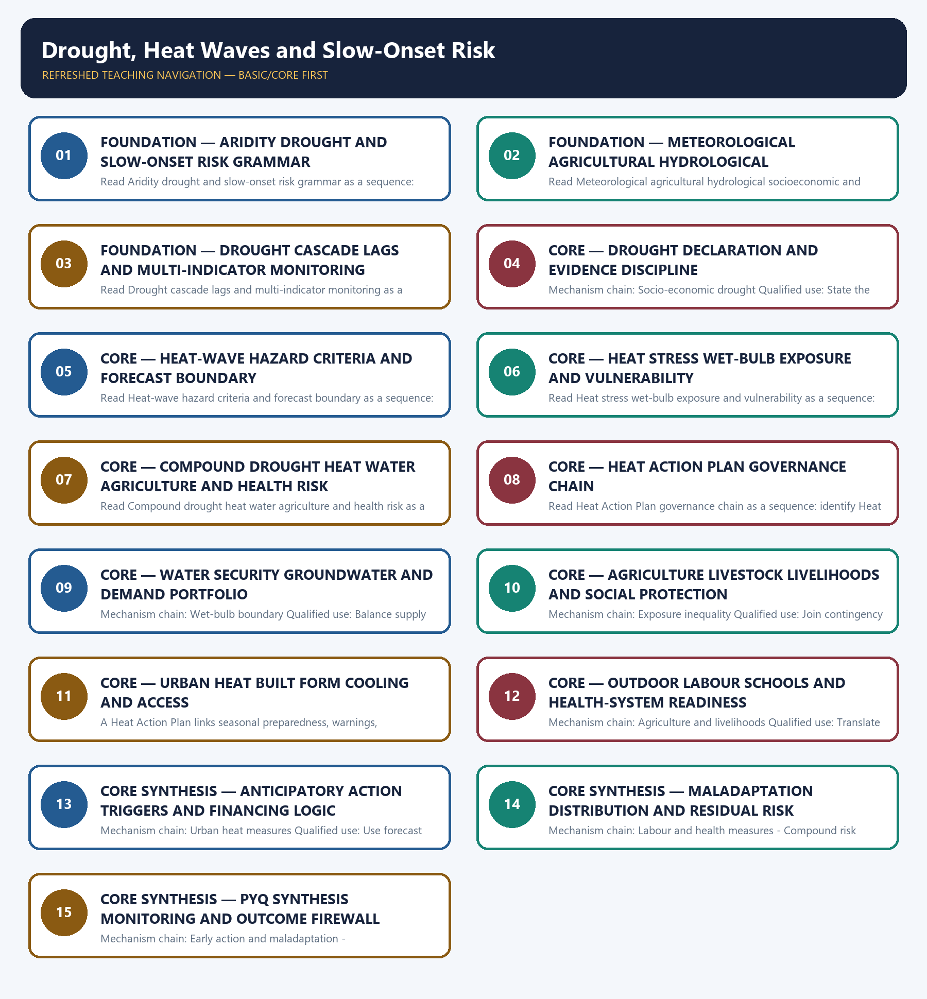

# Drought, Heat Waves and Slow-Onset Risk — Learner-v2 Complete Learning Session

> **Authoring-only generation:** 2026-09-04. No PDF was rendered and no tracker or index was mutated.

### SOURCE, PROGRESSION AND CURRENT-LINKAGE AUDIT

- **Generation date:** 2026-09-04.
- **Repository-first evidence:** the Basic owner is taught first and preserved in full; the Advanced owner is retained only in the optional final teaching block.
- **OCR evidence:** Repository Markdown was primary. OCR-searchable official UPSC papers were supplementary only for printed routed demands. No answer key, warning performance, notification effect, implementation outcome, casualty reduction or disaster metric was inferred.
- **Qdrant:** not used; repository Markdown and available OCR context were sufficient.
- **PYQ integrity:** The 2025 wet-bulb card is the only direct topic-specific route. The 2024 resilience and 2020 proactive-governance cards are explicitly support/adjacent applications and do not manufacture drought- or heat-specific PYQs.
- **Live-link boundary:** Official attempts covered the Agriculture drought manual, IMD heat guidance, CGWB/CWC water mandates, ICAR-CRIDA and a PIB Heat Action Plan route. Raw, thin, blocked and failed pages are recorded; no current drought grade, rainfall, groundwater, crop-loss, HAP coverage, temperature, illness or mortality figure was imported.
- **Fact/inference discipline:** no current-affairs item, PYQ wording, figure or quotation is invented.

### LIVE OFFICIAL-SOURCE ATTEMPT LOG

The checks below were made on 2026-09-04. Substantive official text is used only for the proposition it supports; title-only, blocked or thin pages are recorded and supply no factual claim.

- https://agriwelfare.gov.in/Documents/Updated%20Drought%20Manual_0.pdf — fetched 2026-09-04; the official Department of Agriculture PDF was reachable only as raw PDF content. It confirms the owner route to the updated drought manual, but no unparsed threshold was imported. https://ndma.gov.in/Natural-Hazards/Drought — searched 2026-09-04; the NDMA route supplied no retrievable text.
- https://mausam.imd.gov.in/responsive/heatwave_guidance.php — attempted 2026-09-04; the official IMD page returned HTTP 500. Heat-wave criteria therefore remain bounded to the audited owner, with no current event, forecast or temperature claim added.
- https://cgwb.gov.in/ — fetched 2026-09-04; the official CGWB landing page confirmed its groundwater exploration, assessment, conservation, augmentation, pollution-protection and policy-monitoring remit. https://cwc.gov.in/ — fetched 2026-09-04; CWC described its water-resources control, conservation and utilisation responsibilities. Neither page was used to infer current drought severity.
- https://icar-crida.res.in/ — fetched 2026-09-04; the official ICAR-CRIDA page returned thin publication-list content. https://pib.gov.in/PressReleaseIframePage.aspx?PRID=1982978 — attempted 2026-09-04; PIB returned HTTP 403. No crop contingency, Heat Action Plan coverage or implementation figure was inferred.
- https://nidm.gov.in/pdf/trgReports/2026/March/Trg_25-27March2026ms.pdf — searched 2026-09-04; the official NIDM result identified a dated drought-management training route. It was not used to create new declaration thresholds or performance claims.

## BASIC LEARNING SESSION



*Distinct embedded teaching-navigation image. The separate continuous Cārvāka-style flowchart package remains an independent at-a-glance artifact.*

### SESSION 1 — FOUNDATION — ARIDITY DROUGHT AND SLOW-ONSET RISK GRAMMAR

#### DEFINITION / WHAT THIS IS CALLED

**Plain-language definition:** Aridity is a long-term climatic condition of low moisture availability, whereas drought is a temporary or episodic deficit relative to the expected local water regime.

**Technical definition:** Read Aridity drought and slow-onset risk grammar as a sequence: identify Aridity versus drought, follow the named mechanism to its institutional response, and stop at the last verified status rather than assuming the next stage.

#### ANSWER-GRABBING OPENING — WRITE/ADAPT IN THE EXAM

> Read Aridity drought and slow-onset risk grammar as a sequence: identify Aridity versus drought, follow the named mechanism to its institutional response, and stop at the last verified status rather than assuming the next stage.

#### MUST-WRITE KEYWORDS

- **FOUNDATION**
- **Aridity drought**
- **slow-onset risk grammar**
- **Mechanism chain**
- **Qualified use**
- **Aridity**

**How to use them:** Frame the answer through FOUNDATION; define Aridity drought, connect slow-onset risk grammar with Mechanism chain to explain the mechanism, and use Qualified use for the decisive comparison or qualification.

#### VISUAL FIRST

```text
ARIDITY DROUGHT AND SLOW-ONSET RISK GRAMMAR
01. Aridity versus drought
    |
    v
02. Meteorological drought
STATUS / CATEGORY FIREWALL -> Do not use aridity and drought as synonyms.
```

*The rail fixes the institutional sequence and claim boundary before explanation.*

#### CORE EXPLANATION

Aridity is a long-term climatic condition of low moisture availability, whereas drought is a temporary or episodic deficit relative to the expected local water regime. Meteorological drought concerns prolonged inadequate or poorly distributed precipitation relative to the relevant climatology; it is a hazard indicator, not a complete account of impacts.

#### SIMPLE SYSTEM EXAMPLE

Read Aridity drought and slow-onset risk grammar as a sequence: identify Aridity versus drought, follow the named mechanism to its institutional response, and stop at the last verified status rather than assuming the next stage.

#### TECHNICAL DISTINCTION

The decisive boundary is Do not use aridity and drought as synonyms. This keeps Aridity versus drought and Meteorological drought in the correct risk category, institutional mandate and evidence status.

#### NAMED EVIDENCE AND MECHANISM

- Aridity is a long-term climatic condition of low moisture availability, whereas drought is a temporary or episodic deficit relative to the expected local water regime.
- Meteorological drought concerns prolonged inadequate or poorly distributed precipitation relative to the relevant climatology; it is a hazard indicator, not a complete account of impacts.

#### EXAMINER CAUTION

- Do not use aridity and drought as synonyms.

#### EXAM LINK

- **Prelims:** Keep hazard, forecast, warning, institution, law, plan, force, fund, scheme and outcome in their exact category.
- **Mains:** Open by distinguishing a climatic baseline from an episodic deficit.

#### MINI RECAP

- **Mechanism chain:** Aridity versus drought -> Meteorological drought
- **Qualified use:** Open by distinguishing a climatic baseline from an episodic deficit.

#### CLOSING RECALL FLOW — FOUNDATION — ARIDITY DROUGHT AND SLOW-ONSET RISK GRAMMAR

```text
START / CONCEPT: FOUNDATION — Aridity drought and slow-onset risk grammar
        |
        v
EXACT TERMS: FOUNDATION · Aridity drought · slow-onset risk grammar · Mechanism chain · Qualified use · Aridity
        |
        v
MECHANISM / ARGUMENT: Mechanism chain: Aridity versus drought - Meteorological drought Qualified use: Open by distinguishing a climatic baseline from an episodic deficit.
        |
        v
CONSEQUENCE / CONTRAST: Aridity is a long-term climatic condition of low moisture availability, whereas drought is a temporary or episodic deficit relative to the expected local water regime.
        |
        v
UPSC TRAP / ANSWER-USE: The decisive boundary is Do not use aridity and drought as synonyms.
        |
        v
ANSWER-GRABBING FORMULATION: Read Aridity drought and slow-onset risk grammar as a sequence: identify Aridity versus drought, follow the named mechanism to its institutional response, and stop at the last verified status rather than assuming the next stage.
```
### SESSION 2 — FOUNDATION — METEOROLOGICAL AGRICULTURAL HYDROLOGICAL SOCIOECONOMIC AND ECOLOGICAL DROUGHT

#### DEFINITION / WHAT THIS IS CALLED

**Plain-language definition:** The decisive boundary is Do not reduce drought to rainfall deficiency or omit socioeconomic impacts.

**Technical definition:** Read Meteorological agricultural hydrological socioeconomic and ecological drought as a sequence: identify Agricultural drought, follow the named mechanism to its institutional response, and stop at the last verified status rather than assuming the next stage.

#### ANSWER-GRABBING OPENING — WRITE/ADAPT IN THE EXAM

> Read Meteorological agricultural hydrological socioeconomic and ecological drought as a sequence: identify Agricultural drought, follow the named mechanism to its institutional response, and stop at the last verified status rather than assuming the next stage.

#### MUST-WRITE KEYWORDS

- **FOUNDATION**
- **Meteorological agricultural hydrological socioeconomic**
- **ecological drought**
- **Mechanism chain**
- **Qualified use**
- **Agricultural**

**How to use them:** Frame the answer through FOUNDATION; define Meteorological agricultural hydrological socioeconomic, connect ecological drought with Mechanism chain to explain the mechanism, and use Qualified use for the decisive comparison or qualification.

#### VISUAL FIRST

```text
METEOROLOGICAL AGRICULTURAL HYDROLOGICAL SOCIOECONOMIC AND ECOLOGICAL DROUGHT
01. Agricultural drought
STATUS / CATEGORY FIREWALL -> Do not reduce drought to rainfall deficiency or omit socioeconomic impacts.
```

*The rail fixes the institutional sequence and claim boundary before explanation.*

#### CORE EXPLANATION

Agricultural drought arises when soil moisture and crop-water availability become inadequate for crops, so rainfall information must be read with sowing, vegetation and soil-moisture evidence.

#### SIMPLE SYSTEM EXAMPLE

Read Meteorological agricultural hydrological socioeconomic and ecological drought as a sequence: identify Agricultural drought, follow the named mechanism to its institutional response, and stop at the last verified status rather than assuming the next stage.

#### TECHNICAL DISTINCTION

The decisive boundary is Do not reduce drought to rainfall deficiency or omit socioeconomic impacts. This keeps Agricultural drought in the correct risk category, institutional mandate and evidence status.

#### NAMED EVIDENCE AND MECHANISM

- Agricultural drought arises when soil moisture and crop-water availability become inadequate for crops, so rainfall information must be read with sowing, vegetation and soil-moisture evidence.

#### EXAMINER CAUTION

- Do not reduce drought to rainfall deficiency or omit socioeconomic impacts.

#### EXAM LINK

- **Prelims:** Keep hazard, forecast, warning, institution, law, plan, force, fund, scheme and outcome in their exact category.
- **Mains:** Name the drought type before choosing an indicator or measure.

#### MINI RECAP

- **Mechanism chain:** Agricultural drought
- **Qualified use:** Name the drought type before choosing an indicator or measure.

#### CLOSING RECALL FLOW — FOUNDATION — METEOROLOGICAL AGRICULTURAL HYDROLOGICAL SOCIOECONOMIC AND ECOLOGICAL DROUGHT

```text
START / CONCEPT: FOUNDATION — Meteorological agricultural hydrological socioeconomic and ecological drought
        |
        v
EXACT TERMS: FOUNDATION · Meteorological agricultural hydrological socioeconomic · ecological drought · Mechanism chain · Qualified use · Agricultural
        |
        v
MECHANISM / ARGUMENT: Mechanism chain: Agricultural drought Qualified use: Name the drought type before choosing an indicator or measure.
        |
        v
CONSEQUENCE / CONTRAST: The decisive boundary is Do not reduce drought to rainfall deficiency or omit socioeconomic impacts.
        |
        v
UPSC TRAP / ANSWER-USE: Do not reduce drought to rainfall deficiency or omit socioeconomic impacts.
        |
        v
ANSWER-GRABBING FORMULATION: Read Meteorological agricultural hydrological socioeconomic and ecological drought as a sequence: identify Agricultural drought, follow the named mechanism to its institutional response, and stop at the last verified status rather than assuming the next stage.
```
### SESSION 3 — FOUNDATION — DROUGHT CASCADE LAGS AND MULTI-INDICATOR MONITORING

#### DEFINITION / WHAT THIS IS CALLED

**Plain-language definition:** The decisive boundary is Do not replace a multi-indicator drought assessment with a guessed crop-loss cut-off.

**Technical definition:** Read Drought cascade lags and multi-indicator monitoring as a sequence: identify Hydrological drought, follow the named mechanism to its institutional response, and stop at the last verified status rather than assuming the next stage.

#### ANSWER-GRABBING OPENING — WRITE/ADAPT IN THE EXAM

> Read Drought cascade lags and multi-indicator monitoring as a sequence: identify Hydrological drought, follow the named mechanism to its institutional response, and stop at the last verified status rather than assuming the next stage.

#### MUST-WRITE KEYWORDS

- **FOUNDATION**
- **Drought cascade lags**
- **multi-indicator monitoring**
- **Mechanism chain**
- **Qualified use**
- **Read Drought**

**How to use them:** Frame the answer through FOUNDATION; define Drought cascade lags, connect multi-indicator monitoring with Mechanism chain to explain the mechanism, and use Qualified use for the decisive comparison or qualification.

#### VISUAL FIRST

```text
DROUGHT CASCADE LAGS AND MULTI-INDICATOR MONITORING
01. Hydrological drought
STATUS / CATEGORY FIREWALL -> Do not replace a multi-indicator drought assessment with a guessed crop-loss cut-off.
```

*The rail fixes the institutional sequence and claim boundary before explanation.*

#### CORE EXPLANATION

Hydrological drought concerns below-normal availability in rivers, reservoirs, lakes or aquifers and may lag behind the rainfall deficit that initiated it.

#### SIMPLE SYSTEM EXAMPLE

Read Drought cascade lags and multi-indicator monitoring as a sequence: identify Hydrological drought, follow the named mechanism to its institutional response, and stop at the last verified status rather than assuming the next stage.

#### TECHNICAL DISTINCTION

The decisive boundary is Do not replace a multi-indicator drought assessment with a guessed crop-loss cut-off. This keeps Hydrological drought in the correct risk category, institutional mandate and evidence status.

#### NAMED EVIDENCE AND MECHANISM

- Hydrological drought concerns below-normal availability in rivers, reservoirs, lakes or aquifers and may lag behind the rainfall deficit that initiated it.

#### EXAMINER CAUTION

- Do not replace a multi-indicator drought assessment with a guessed crop-loss cut-off.

#### EXAM LINK

- **Prelims:** Keep hazard, forecast, warning, institution, law, plan, force, fund, scheme and outcome in their exact category.
- **Mains:** Trace time lags from rainfall to soil storage livelihood and health.

#### MINI RECAP

- **Mechanism chain:** Hydrological drought
- **Qualified use:** Trace time lags from rainfall to soil storage livelihood and health.

#### CLOSING RECALL FLOW — FOUNDATION — DROUGHT CASCADE LAGS AND MULTI-INDICATOR MONITORING

```text
START / CONCEPT: FOUNDATION — Drought cascade lags and multi-indicator monitoring
        |
        v
EXACT TERMS: FOUNDATION · Drought cascade lags · multi-indicator monitoring · Mechanism chain · Qualified use · Read Drought
        |
        v
MECHANISM / ARGUMENT: Mechanism chain: Hydrological drought Qualified use: Trace time lags from rainfall to soil storage livelihood and health.
        |
        v
CONSEQUENCE / CONTRAST: The decisive boundary is Do not replace a multi-indicator drought assessment with a guessed crop-loss cut-off.
        |
        v
UPSC TRAP / ANSWER-USE: Do not replace a multi-indicator drought assessment with a guessed crop-loss cut-off.
        |
        v
ANSWER-GRABBING FORMULATION: Read Drought cascade lags and multi-indicator monitoring as a sequence: identify Hydrological drought, follow the named mechanism to its institutional response, and stop at the last verified status rather than assuming the next stage.
```
### SESSION 4 — CORE — DROUGHT DECLARATION AND EVIDENCE DISCIPLINE

#### DEFINITION / WHAT THIS IS CALLED

**Plain-language definition:** Read Drought declaration and evidence discipline as a sequence: identify Socio-economic drought, follow the named mechanism to its institutional response, and stop at the last verified status rather than assuming the next stage.

**Technical definition:** Mechanism chain: Socio-economic drought Qualified use: State the Manual's indicator families without inventing cut-offs.

#### ANSWER-GRABBING OPENING — WRITE/ADAPT IN THE EXAM

> Read Drought declaration and evidence discipline as a sequence: identify Socio-economic drought, follow the named mechanism to its institutional response, and stop at the last verified status rather than assuming the next stage.

#### MUST-WRITE KEYWORDS

- **Drought declaration**
- **evidence discipline**
- **Mechanism chain**
- **Qualified use**
- **Socio-economic**
- **Read Drought**

**How to use them:** Frame the answer through Drought declaration; define evidence discipline, connect Mechanism chain with Qualified use to explain the mechanism, and use Socio-economic for the decisive comparison or qualification.

#### VISUAL FIRST

```text
DROUGHT DECLARATION AND EVIDENCE DISCIPLINE
01. Socio-economic drought
STATUS / CATEGORY FIREWALL -> Do not treat a heat-wave bulletin as proof of heat stress, exposure or illness.
```

*The rail fixes the institutional sequence and claim boundary before explanation.*

#### CORE EXPLANATION

Socio-economic drought occurs when water shortage disrupts the supply of goods, services, livelihoods or essential uses; it expresses the interaction of physical scarcity with demand and unequal access.

#### SIMPLE SYSTEM EXAMPLE

Read Drought declaration and evidence discipline as a sequence: identify Socio-economic drought, follow the named mechanism to its institutional response, and stop at the last verified status rather than assuming the next stage.

#### TECHNICAL DISTINCTION

The decisive boundary is Do not treat a heat-wave bulletin as proof of heat stress, exposure or illness. This keeps Socio-economic drought in the correct risk category, institutional mandate and evidence status.

#### NAMED EVIDENCE AND MECHANISM

- Socio-economic drought occurs when water shortage disrupts the supply of goods, services, livelihoods or essential uses; it expresses the interaction of physical scarcity with demand and unequal access.

#### EXAMINER CAUTION

- Do not treat a heat-wave bulletin as proof of heat stress, exposure or illness.

#### EXAM LINK

- **Prelims:** Keep hazard, forecast, warning, institution, law, plan, force, fund, scheme and outcome in their exact category.
- **Mains:** State the Manual's indicator families without inventing cut-offs.

#### MINI RECAP

- **Mechanism chain:** Socio-economic drought
- **Qualified use:** State the Manual's indicator families without inventing cut-offs.

#### CLOSING RECALL FLOW — CORE — DROUGHT DECLARATION AND EVIDENCE DISCIPLINE

```text
START / CONCEPT: CORE — Drought declaration and evidence discipline
        |
        v
EXACT TERMS: Drought declaration · evidence discipline · Mechanism chain · Qualified use · Socio-economic · Read Drought
        |
        v
MECHANISM / ARGUMENT: Mechanism chain: Socio-economic drought Qualified use: State the Manual's indicator families without inventing cut-offs.
        |
        v
CONSEQUENCE / CONTRAST: The decisive boundary is Do not treat a heat-wave bulletin as proof of heat stress, exposure or illness.
        |
        v
UPSC TRAP / ANSWER-USE: Do not treat a heat-wave bulletin as proof of heat stress, exposure or illness.
        |
        v
ANSWER-GRABBING FORMULATION: Read Drought declaration and evidence discipline as a sequence: identify Socio-economic drought, follow the named mechanism to its institutional response, and stop at the last verified status rather than assuming the next stage.
```
### SESSION 5 — CORE — HEAT-WAVE HAZARD CRITERIA AND FORECAST BOUNDARY

#### DEFINITION / WHAT THIS IS CALLED

**Plain-language definition:** The decisive boundary is Do not substitute wet-bulb temperature for IMD heat-wave declaration criteria.

**Technical definition:** Read Heat-wave hazard criteria and forecast boundary as a sequence: identify Ecological drought, follow the named mechanism to its institutional response, and stop at the last verified status rather than assuming the next stage.

#### ANSWER-GRABBING OPENING — WRITE/ADAPT IN THE EXAM

> Read Heat-wave hazard criteria and forecast boundary as a sequence: identify Ecological drought, follow the named mechanism to its institutional response, and stop at the last verified status rather than assuming the next stage.

#### MUST-WRITE KEYWORDS

- **Heat-wave hazard criteria**
- **forecast boundary**
- **Mechanism chain**
- **Qualified use**
- **Ecological drought**
- **Ecological**

**How to use them:** Frame the answer through Heat-wave hazard criteria; define forecast boundary, connect Mechanism chain with Qualified use to explain the mechanism, and use Ecological drought for the decisive comparison or qualification.

#### VISUAL FIRST

```text
HEAT-WAVE HAZARD CRITERIA AND FORECAST BOUNDARY
01. Ecological drought
STATUS / CATEGORY FIREWALL -> Do not substitute wet-bulb temperature for IMD heat-wave declaration criteria.
```

*The rail fixes the institutional sequence and claim boundary before explanation.*

#### CORE EXPLANATION

Ecological drought describes water shortage severe enough to impair ecosystem productivity or function; it must not be silently substituted for socio-economic drought.

#### SIMPLE SYSTEM EXAMPLE

Read Heat-wave hazard criteria and forecast boundary as a sequence: identify Ecological drought, follow the named mechanism to its institutional response, and stop at the last verified status rather than assuming the next stage.

#### TECHNICAL DISTINCTION

The decisive boundary is Do not substitute wet-bulb temperature for IMD heat-wave declaration criteria. This keeps Ecological drought in the correct risk category, institutional mandate and evidence status.

#### NAMED EVIDENCE AND MECHANISM

- Ecological drought describes water shortage severe enough to impair ecosystem productivity or function; it must not be silently substituted for socio-economic drought.

#### EXAMINER CAUTION

- Do not substitute wet-bulb temperature for IMD heat-wave declaration criteria.

#### EXAM LINK

- **Prelims:** Keep hazard, forecast, warning, institution, law, plan, force, fund, scheme and outcome in their exact category.
- **Mains:** Separate meteorological classification from public-health consequence.

#### MINI RECAP

- **Mechanism chain:** Ecological drought
- **Qualified use:** Separate meteorological classification from public-health consequence.

#### CLOSING RECALL FLOW — CORE — HEAT-WAVE HAZARD CRITERIA AND FORECAST BOUNDARY

```text
START / CONCEPT: CORE — Heat-wave hazard criteria and forecast boundary
        |
        v
EXACT TERMS: Heat-wave hazard criteria · forecast boundary · Mechanism chain · Qualified use · Ecological drought · Ecological
        |
        v
MECHANISM / ARGUMENT: Mechanism chain: Ecological drought Qualified use: Separate meteorological classification from public-health consequence.
        |
        v
CONSEQUENCE / CONTRAST: The decisive boundary is Do not substitute wet-bulb temperature for IMD heat-wave declaration criteria.
        |
        v
UPSC TRAP / ANSWER-USE: Do not substitute wet-bulb temperature for IMD heat-wave declaration criteria.
        |
        v
ANSWER-GRABBING FORMULATION: Read Heat-wave hazard criteria and forecast boundary as a sequence: identify Ecological drought, follow the named mechanism to its institutional response, and stop at the last verified status rather than assuming the next stage.
```
### SESSION 6 — CORE — HEAT STRESS WET-BULB EXPOSURE AND VULNERABILITY

#### DEFINITION / WHAT THIS IS CALLED

**Plain-language definition:** The decisive boundary is Do not present Heat Action Plan adoption as enforceable worker protection or measured mortality reduction.

**Technical definition:** Read Heat stress wet-bulb exposure and vulnerability as a sequence: identify Slow-onset cascade, follow the named mechanism to its institutional response, and stop at the last verified status rather than assuming the next stage.

#### ANSWER-GRABBING OPENING — WRITE/ADAPT IN THE EXAM

> Read Heat stress wet-bulb exposure and vulnerability as a sequence: identify Slow-onset cascade, follow the named mechanism to its institutional response, and stop at the last verified status rather than assuming the next stage.

#### MUST-WRITE KEYWORDS

- **Heat stress wet-bulb exposure**
- **vulnerability**
- **Mechanism chain**
- **Qualified use**
- **Drought**
- **India's Manual**

**How to use them:** Frame the answer through Heat stress wet-bulb exposure; define vulnerability, connect Mechanism chain with Qualified use to explain the mechanism, and use Drought for the decisive comparison or qualification.

#### VISUAL FIRST

```text
HEAT STRESS WET-BULB EXPOSURE AND VULNERABILITY
01. Slow-onset cascade
    |
    v
02. Multi-indicator declaration
STATUS / CATEGORY FIREWALL -> Do not present Heat Action Plan adoption as enforceable worker protection or measured mortality reduction.
```

*The rail fixes the institutional sequence and claim boundary before explanation.*

#### CORE EXPLANATION

Drought can unfold from rainfall deficit through soil-moisture stress, storage decline, ecosystem damage, livelihood loss and health effects over different time scales, so one indicator cannot represent every stage. India's Manual for Drought Management uses rainfall, vegetative indices, crop-sowing progression, soil moisture and hydrological indices in a graded assessment rather than one universal crop-loss percentage.

#### SIMPLE SYSTEM EXAMPLE

Read Heat stress wet-bulb exposure and vulnerability as a sequence: identify Slow-onset cascade, follow the named mechanism to its institutional response, and stop at the last verified status rather than assuming the next stage.

#### TECHNICAL DISTINCTION

The decisive boundary is Do not present Heat Action Plan adoption as enforceable worker protection or measured mortality reduction. This keeps Slow-onset cascade and Multi-indicator declaration in the correct risk category, institutional mandate and evidence status.

#### NAMED EVIDENCE AND MECHANISM

- Drought can unfold from rainfall deficit through soil-moisture stress, storage decline, ecosystem damage, livelihood loss and health effects over different time scales, so one indicator cannot represent every stage.
- India's Manual for Drought Management uses rainfall, vegetative indices, crop-sowing progression, soil moisture and hydrological indices in a graded assessment rather than one universal crop-loss percentage.

#### EXAMINER CAUTION

- Do not present Heat Action Plan adoption as enforceable worker protection or measured mortality reduction.

#### EXAM LINK

- **Prelims:** Keep hazard, forecast, warning, institution, law, plan, force, fund, scheme and outcome in their exact category.
- **Mains:** Explain evaporative cooling and differentiated exposure without using a false universal threshold.

#### MINI RECAP

- **Mechanism chain:** Slow-onset cascade -> Multi-indicator declaration
- **Qualified use:** Explain evaporative cooling and differentiated exposure without using a false universal threshold.

#### CLOSING RECALL FLOW — CORE — HEAT STRESS WET-BULB EXPOSURE AND VULNERABILITY

```text
START / CONCEPT: CORE — Heat stress wet-bulb exposure and vulnerability
        |
        v
EXACT TERMS: Heat stress wet-bulb exposure · vulnerability · Mechanism chain · Qualified use · Drought · India's Manual
        |
        v
MECHANISM / ARGUMENT: Mechanism chain: Slow-onset cascade - Multi-indicator declaration Qualified use: Explain evaporative cooling and differentiated exposure without using a false universal threshold.
        |
        v
CONSEQUENCE / CONTRAST: The decisive boundary is Do not present Heat Action Plan adoption as enforceable worker protection or measured mortality reduction.
        |
        v
UPSC TRAP / ANSWER-USE: Do not present Heat Action Plan adoption as enforceable worker protection or measured mortality reduction.
        |
        v
ANSWER-GRABBING FORMULATION: Read Heat stress wet-bulb exposure and vulnerability as a sequence: identify Slow-onset cascade, follow the named mechanism to its institutional response, and stop at the last verified status rather than assuming the next stage.
```
### SESSION 7 — CORE — COMPOUND DROUGHT HEAT WATER AGRICULTURE AND HEALTH RISK

#### DEFINITION / WHAT THIS IS CALLED

**Plain-language definition:** A heat wave is a meteorological hazard identified through IMD's station and departure or actual-temperature criteria; it is not synonymous with every hot day or every episode of heat illness.

**Technical definition:** Read Compound drought heat water agriculture and health risk as a sequence: identify Heat-wave hazard, follow the named mechanism to its institutional response, and stop at the last verified status rather than assuming the next stage.

#### ANSWER-GRABBING OPENING — WRITE/ADAPT IN THE EXAM

> Read Compound drought heat water agriculture and health risk as a sequence: identify Heat-wave hazard, follow the named mechanism to its institutional response, and stop at the last verified status rather than assuming the next stage.

#### MUST-WRITE KEYWORDS

- **Compound drought heat water agriculture**
- **health risk**
- **Mechanism chain**
- **Qualified use**
- **A heat wave**
- **IMD's**

**How to use them:** Frame the answer through Compound drought heat water agriculture; define health risk, connect Mechanism chain with Qualified use to explain the mechanism, and use A heat wave for the decisive comparison or qualification.

#### VISUAL FIRST

```text
COMPOUND DROUGHT HEAT WATER AGRICULTURE AND HEALTH RISK
01. Heat-wave hazard
STATUS / CATEGORY FIREWALL -> Do not treat emergency water supply as a substitute for groundwater, cropping and demand governance.
```

*The rail fixes the institutional sequence and claim boundary before explanation.*

#### CORE EXPLANATION

A heat wave is a meteorological hazard identified through IMD's station and departure or actual-temperature criteria; it is not synonymous with every hot day or every episode of heat illness.

#### SIMPLE SYSTEM EXAMPLE

Read Compound drought heat water agriculture and health risk as a sequence: identify Heat-wave hazard, follow the named mechanism to its institutional response, and stop at the last verified status rather than assuming the next stage.

#### TECHNICAL DISTINCTION

The decisive boundary is Do not treat emergency water supply as a substitute for groundwater, cropping and demand governance. This keeps Heat-wave hazard in the correct risk category, institutional mandate and evidence status.

#### NAMED EVIDENCE AND MECHANISM

- A heat wave is a meteorological hazard identified through IMD's station and departure or actual-temperature criteria; it is not synonymous with every hot day or every episode of heat illness.

#### EXAMINER CAUTION

- Do not treat emergency water supply as a substitute for groundwater, cropping and demand governance.

#### EXAM LINK

- **Prelims:** Keep hazard, forecast, warning, institution, law, plan, force, fund, scheme and outcome in their exact category.
- **Mains:** Map interactions while avoiding unsupported event attribution.

#### MINI RECAP

- **Mechanism chain:** Heat-wave hazard
- **Qualified use:** Map interactions while avoiding unsupported event attribution.

#### CLOSING RECALL FLOW — CORE — COMPOUND DROUGHT HEAT WATER AGRICULTURE AND HEALTH RISK

```text
START / CONCEPT: CORE — Compound drought heat water agriculture and health risk
        |
        v
EXACT TERMS: Compound drought heat water agriculture · health risk · Mechanism chain · Qualified use · A heat wave · IMD's
        |
        v
MECHANISM / ARGUMENT: A heat wave is a meteorological hazard identified through IMD's station and departure or actual-temperature criteria; it is not synonymous with every hot day or every episode of heat illness.
        |
        v
CONSEQUENCE / CONTRAST: The decisive boundary is Do not treat emergency water supply as a substitute for groundwater, cropping and demand governance.
        |
        v
UPSC TRAP / ANSWER-USE: Do not treat emergency water supply as a substitute for groundwater, cropping and demand governance.
        |
        v
ANSWER-GRABBING FORMULATION: Read Compound drought heat water agriculture and health risk as a sequence: identify Heat-wave hazard, follow the named mechanism to its institutional response, and stop at the last verified status rather than assuming the next stage.
```
### SESSION 8 — CORE — HEAT ACTION PLAN GOVERNANCE CHAIN

#### DEFINITION / WHAT THIS IS CALLED

**Plain-language definition:** Heat stress is the physiological burden produced by temperature, humidity, radiation, wind, exertion, clothing, health and access to rest, water or cooling; exposure and vulnerability therefore mediate the hazard.

**Technical definition:** Read Heat Action Plan governance chain as a sequence: identify Heat stress, follow the named mechanism to its institutional response, and stop at the last verified status rather than assuming the next stage.

#### ANSWER-GRABBING OPENING — WRITE/ADAPT IN THE EXAM

> Read Heat Action Plan governance chain as a sequence: identify Heat stress, follow the named mechanism to its institutional response, and stop at the last verified status rather than assuming the next stage.

#### MUST-WRITE KEYWORDS

- **Heat Action Plan governance chain**
- **Mechanism chain**
- **Qualified use**
- **Heat stress**
- **Heat**
- **Read Heat Action Plan**

**How to use them:** Frame the answer through Heat Action Plan governance chain; define Mechanism chain, connect Qualified use with Heat stress to explain the mechanism, and use Heat for the decisive comparison or qualification.

#### VISUAL FIRST

```text
HEAT ACTION PLAN GOVERNANCE CHAIN
01. Heat stress
STATUS / CATEGORY FIREWALL -> Do not recommend cooling measures without testing water, energy, access and maintenance burdens.
```

*The rail fixes the institutional sequence and claim boundary before explanation.*

#### CORE EXPLANATION

Heat stress is the physiological burden produced by temperature, humidity, radiation, wind, exertion, clothing, health and access to rest, water or cooling; exposure and vulnerability therefore mediate the hazard.

#### SIMPLE SYSTEM EXAMPLE

Read Heat Action Plan governance chain as a sequence: identify Heat stress, follow the named mechanism to its institutional response, and stop at the last verified status rather than assuming the next stage.

#### TECHNICAL DISTINCTION

The decisive boundary is Do not recommend cooling measures without testing water, energy, access and maintenance burdens. This keeps Heat stress in the correct risk category, institutional mandate and evidence status.

#### NAMED EVIDENCE AND MECHANISM

- Heat stress is the physiological burden produced by temperature, humidity, radiation, wind, exertion, clothing, health and access to rest, water or cooling; exposure and vulnerability therefore mediate the hazard.

#### EXAMINER CAUTION

- Do not recommend cooling measures without testing water, energy, access and maintenance burdens.

#### EXAM LINK

- **Prelims:** Keep hazard, forecast, warning, institution, law, plan, force, fund, scheme and outcome in their exact category.
- **Mains:** Assign forecast health labour water communication and urban responsibilities.

#### MINI RECAP

- **Mechanism chain:** Heat stress
- **Qualified use:** Assign forecast health labour water communication and urban responsibilities.

#### CLOSING RECALL FLOW — CORE — HEAT ACTION PLAN GOVERNANCE CHAIN

```text
START / CONCEPT: CORE — Heat Action Plan governance chain
        |
        v
EXACT TERMS: Heat Action Plan governance chain · Mechanism chain · Qualified use · Heat stress · Heat · Read Heat Action Plan
        |
        v
MECHANISM / ARGUMENT: Mechanism chain: Heat stress Qualified use: Assign forecast health labour water communication and urban responsibilities.
        |
        v
CONSEQUENCE / CONTRAST: Heat stress is the physiological burden produced by temperature, humidity, radiation, wind, exertion, clothing, health and access to rest, water or cooling; exposure and vulnerability therefore mediate the hazard.
        |
        v
UPSC TRAP / ANSWER-USE: The decisive boundary is Do not recommend cooling measures without testing water, energy, access and maintenance burdens.
        |
        v
ANSWER-GRABBING FORMULATION: Read Heat Action Plan governance chain as a sequence: identify Heat stress, follow the named mechanism to its institutional response, and stop at the last verified status rather than assuming the next stage.
```
### SESSION 9 — CORE — WATER SECURITY GROUNDWATER AND DEMAND PORTFOLIO

#### DEFINITION / WHAT THIS IS CALLED

**Plain-language definition:** Read Water security groundwater and demand portfolio as a sequence: identify Wet-bulb boundary, follow the named mechanism to its institutional response, and stop at the last verified status rather than assuming the next stage.

**Technical definition:** Mechanism chain: Wet-bulb boundary Qualified use: Balance supply augmentation demand management monitoring and equity.

#### ANSWER-GRABBING OPENING — WRITE/ADAPT IN THE EXAM

> Read Water security groundwater and demand portfolio as a sequence: identify Wet-bulb boundary, follow the named mechanism to its institutional response, and stop at the last verified status rather than assuming the next stage.

#### MUST-WRITE KEYWORDS

- **Water security groundwater**
- **demand portfolio**
- **Mechanism chain**
- **Qualified use**
- **Wet-bulb**
- **IMD**

**How to use them:** Frame the answer through Water security groundwater; define demand portfolio, connect Mechanism chain with Qualified use to explain the mechanism, and use Wet-bulb for the decisive comparison or qualification.

#### VISUAL FIRST

```text
WATER SECURITY GROUNDWATER AND DEMAND PORTFOLIO
01. Wet-bulb boundary
STATUS / CATEGORY FIREWALL -> Do not attribute a named event or outcome to climate change without source-specific evidence.
```

*The rail fixes the institutional sequence and claim boundary before explanation.*

#### CORE EXPLANATION

Wet-bulb temperature combines heat and humidity by representing evaporative-cooling potential; it is not an IMD heat-wave declaration threshold, and dangerous stress can occur below a theoretical upper-limit benchmark.

#### SIMPLE SYSTEM EXAMPLE

Read Water security groundwater and demand portfolio as a sequence: identify Wet-bulb boundary, follow the named mechanism to its institutional response, and stop at the last verified status rather than assuming the next stage.

#### TECHNICAL DISTINCTION

The decisive boundary is Do not attribute a named event or outcome to climate change without source-specific evidence. This keeps Wet-bulb boundary in the correct risk category, institutional mandate and evidence status.

#### NAMED EVIDENCE AND MECHANISM

- Wet-bulb temperature combines heat and humidity by representing evaporative-cooling potential; it is not an IMD heat-wave declaration threshold, and dangerous stress can occur below a theoretical upper-limit benchmark.

#### EXAMINER CAUTION

- Do not attribute a named event or outcome to climate change without source-specific evidence.

#### EXAM LINK

- **Prelims:** Keep hazard, forecast, warning, institution, law, plan, force, fund, scheme and outcome in their exact category.
- **Mains:** Balance supply augmentation demand management monitoring and equity.

#### MINI RECAP

- **Mechanism chain:** Wet-bulb boundary
- **Qualified use:** Balance supply augmentation demand management monitoring and equity.

#### CLOSING RECALL FLOW — CORE — WATER SECURITY GROUNDWATER AND DEMAND PORTFOLIO

```text
START / CONCEPT: CORE — Water security groundwater and demand portfolio
        |
        v
EXACT TERMS: Water security groundwater · demand portfolio · Mechanism chain · Qualified use · Wet-bulb · IMD
        |
        v
MECHANISM / ARGUMENT: Mechanism chain: Wet-bulb boundary Qualified use: Balance supply augmentation demand management monitoring and equity.
        |
        v
CONSEQUENCE / CONTRAST: Wet-bulb temperature combines heat and humidity by representing evaporative-cooling potential; it is not an IMD heat-wave declaration threshold, and dangerous stress can occur below a theoretical upper-limit benchmark.
        |
        v
UPSC TRAP / ANSWER-USE: The decisive boundary is Do not attribute a named event or outcome to climate change without source-specific evidence.
        |
        v
ANSWER-GRABBING FORMULATION: Read Water security groundwater and demand portfolio as a sequence: identify Wet-bulb boundary, follow the named mechanism to its institutional response, and stop at the last verified status rather than assuming the next stage.
```
### SESSION 10 — CORE — AGRICULTURE LIVESTOCK LIVELIHOODS AND SOCIAL PROTECTION

#### DEFINITION / WHAT THIS IS CALLED

**Plain-language definition:** Read Agriculture livestock livelihoods and social protection as a sequence: identify Exposure inequality, follow the named mechanism to its institutional response, and stop at the last verified status rather than assuming the next stage.

**Technical definition:** Mechanism chain: Exposure inequality Qualified use: Join contingency agriculture with livelihood continuity and social protection.

#### ANSWER-GRABBING OPENING — WRITE/ADAPT IN THE EXAM

> Read Agriculture livestock livelihoods and social protection as a sequence: identify Exposure inequality, follow the named mechanism to its institutional response, and stop at the last verified status rather than assuming the next stage.

#### MUST-WRITE KEYWORDS

- **Agriculture livestock livelihoods**
- **social protection**
- **Mechanism chain**
- **Qualified use**
- **Read Agriculture**
- **Exposure**

**How to use them:** Frame the answer through Agriculture livestock livelihoods; define social protection, connect Mechanism chain with Qualified use to explain the mechanism, and use Read Agriculture for the decisive comparison or qualification.

#### VISUAL FIRST

```text
AGRICULTURE LIVESTOCK LIVELIHOODS AND SOCIAL PROTECTION
01. Exposure inequality
STATUS / CATEGORY FIREWALL -> Do not infer preparedness or reduced loss from a plan, forecast, scheme or declaration.
```

*The rail fixes the institutional sequence and claim boundary before explanation.*

#### CORE EXPLANATION

Outdoor and informal workers, older persons, children, people with illness, poorly housed households and those lacking dependable water or cooling may face different risk under the same forecast temperature.

#### SIMPLE SYSTEM EXAMPLE

Read Agriculture livestock livelihoods and social protection as a sequence: identify Exposure inequality, follow the named mechanism to its institutional response, and stop at the last verified status rather than assuming the next stage.

#### TECHNICAL DISTINCTION

The decisive boundary is Do not infer preparedness or reduced loss from a plan, forecast, scheme or declaration. This keeps Exposure inequality in the correct risk category, institutional mandate and evidence status.

#### NAMED EVIDENCE AND MECHANISM

- Outdoor and informal workers, older persons, children, people with illness, poorly housed households and those lacking dependable water or cooling may face different risk under the same forecast temperature.

#### EXAMINER CAUTION

- Do not infer preparedness or reduced loss from a plan, forecast, scheme or declaration.

#### EXAM LINK

- **Prelims:** Keep hazard, forecast, warning, institution, law, plan, force, fund, scheme and outcome in their exact category.
- **Mains:** Join contingency agriculture with livelihood continuity and social protection.

#### MINI RECAP

- **Mechanism chain:** Exposure inequality
- **Qualified use:** Join contingency agriculture with livelihood continuity and social protection.

#### CLOSING RECALL FLOW — CORE — AGRICULTURE LIVESTOCK LIVELIHOODS AND SOCIAL PROTECTION

```text
START / CONCEPT: CORE — Agriculture livestock livelihoods and social protection
        |
        v
EXACT TERMS: Agriculture livestock livelihoods · social protection · Mechanism chain · Qualified use · Read Agriculture · Exposure
        |
        v
MECHANISM / ARGUMENT: Mechanism chain: Exposure inequality Qualified use: Join contingency agriculture with livelihood continuity and social protection.
        |
        v
CONSEQUENCE / CONTRAST: The decisive boundary is Do not infer preparedness or reduced loss from a plan, forecast, scheme or declaration.
        |
        v
UPSC TRAP / ANSWER-USE: Do not infer preparedness or reduced loss from a plan, forecast, scheme or declaration.
        |
        v
ANSWER-GRABBING FORMULATION: Read Agriculture livestock livelihoods and social protection as a sequence: identify Exposure inequality, follow the named mechanism to its institutional response, and stop at the last verified status rather than assuming the next stage.
```
### SESSION 11 — CORE — URBAN HEAT BUILT FORM COOLING AND ACCESS

#### DEFINITION / WHAT THIS IS CALLED

**Plain-language definition:** Read Urban heat built form cooling and access as a sequence: identify Heat Action Plan, follow the named mechanism to its institutional response, and stop at the last verified status rather than assuming the next stage.

**Technical definition:** A Heat Action Plan links seasonal preparedness, warnings, health-system readiness, public communication, water and cooling access, work or school timing and longer-term urban measures through locally assigned responsibilities.

#### ANSWER-GRABBING OPENING — WRITE/ADAPT IN THE EXAM

> Read Urban heat built form cooling and access as a sequence: identify Heat Action Plan, follow the named mechanism to its institutional response, and stop at the last verified status rather than assuming the next stage.

#### MUST-WRITE KEYWORDS

- **Urban heat built form cooling**
- **access**
- **Mechanism chain**
- **Qualified use**
- **Heat Action Plan**
- **Drought**

**How to use them:** Frame the answer through Urban heat built form cooling; define access, connect Mechanism chain with Qualified use to explain the mechanism, and use Heat Action Plan for the decisive comparison or qualification.

#### VISUAL FIRST

```text
URBAN HEAT BUILT FORM COOLING AND ACCESS
01. Heat Action Plan
    |
    v
02. Water-risk portfolio
STATUS / CATEGORY FIREWALL -> Do not use aridity and drought as synonyms.
```

*The rail fixes the institutional sequence and claim boundary before explanation.*

#### CORE EXPLANATION

A Heat Action Plan links seasonal preparedness, warnings, health-system readiness, public communication, water and cooling access, work or school timing and longer-term urban measures through locally assigned responsibilities. Drought management requires demand management, drinking-water security, groundwater and surface-water monitoring, watershed or recharge measures, storage governance and protection against shifting scarcity to weaker users.

#### SIMPLE SYSTEM EXAMPLE

Read Urban heat built form cooling and access as a sequence: identify Heat Action Plan, follow the named mechanism to its institutional response, and stop at the last verified status rather than assuming the next stage.

#### TECHNICAL DISTINCTION

The decisive boundary is Do not use aridity and drought as synonyms. This keeps Heat Action Plan and Water-risk portfolio in the correct risk category, institutional mandate and evidence status.

#### NAMED EVIDENCE AND MECHANISM

- A Heat Action Plan links seasonal preparedness, warnings, health-system readiness, public communication, water and cooling access, work or school timing and longer-term urban measures through locally assigned responsibilities.
- Drought management requires demand management, drinking-water security, groundwater and surface-water monitoring, watershed or recharge measures, storage governance and protection against shifting scarcity to weaker users.

#### EXAMINER CAUTION

- Do not use aridity and drought as synonyms.

#### EXAM LINK

- **Prelims:** Keep hazard, forecast, warning, institution, law, plan, force, fund, scheme and outcome in their exact category.
- **Mains:** Evaluate cooling, shade, ventilation, trees and water through access and maintenance.

#### MINI RECAP

- **Mechanism chain:** Heat Action Plan -> Water-risk portfolio
- **Qualified use:** Evaluate cooling, shade, ventilation, trees and water through access and maintenance.

#### CLOSING RECALL FLOW — CORE — URBAN HEAT BUILT FORM COOLING AND ACCESS

```text
START / CONCEPT: CORE — Urban heat built form cooling and access
        |
        v
EXACT TERMS: Urban heat built form cooling · access · Mechanism chain · Qualified use · Heat Action Plan · Drought
        |
        v
MECHANISM / ARGUMENT: A Heat Action Plan links seasonal preparedness, warnings, health-system readiness, public communication, water and cooling access, work or school timing and longer-term urban measures through locally assigned responsibilities.
        |
        v
CONSEQUENCE / CONTRAST: Mechanism chain: Heat Action Plan - Water-risk portfolio Qualified use: Evaluate cooling, shade, ventilation, trees and water through access and maintenance.
        |
        v
UPSC TRAP / ANSWER-USE: The decisive boundary is Do not use aridity and drought as synonyms.
        |
        v
ANSWER-GRABBING FORMULATION: Read Urban heat built form cooling and access as a sequence: identify Heat Action Plan, follow the named mechanism to its institutional response, and stop at the last verified status rather than assuming the next stage.
```
### SESSION 12 — CORE — OUTDOOR LABOUR SCHOOLS AND HEALTH-SYSTEM READINESS

#### DEFINITION / WHAT THIS IS CALLED

**Plain-language definition:** Read Outdoor labour schools and health-system readiness as a sequence: identify Agriculture and livelihoods, follow the named mechanism to its institutional response, and stop at the last verified status rather than assuming the next stage.

**Technical definition:** Mechanism chain: Agriculture and livelihoods Qualified use: Translate a warning into work-rest, water, outreach and clinical action.

#### ANSWER-GRABBING OPENING — WRITE/ADAPT IN THE EXAM

> Read Outdoor labour schools and health-system readiness as a sequence: identify Agriculture and livelihoods, follow the named mechanism to its institutional response, and stop at the last verified status rather than assuming the next stage.

#### MUST-WRITE KEYWORDS

- **Outdoor labour schools**
- **health-system readiness**
- **Mechanism chain**
- **Qualified use**
- **Read Outdoor**
- **Agriculture**

**How to use them:** Frame the answer through Outdoor labour schools; define health-system readiness, connect Mechanism chain with Qualified use to explain the mechanism, and use Read Outdoor for the decisive comparison or qualification.

#### VISUAL FIRST

```text
OUTDOOR LABOUR SCHOOLS AND HEALTH-SYSTEM READINESS
01. Agriculture and livelihoods
STATUS / CATEGORY FIREWALL -> Do not reduce drought to rainfall deficiency or omit socioeconomic impacts.
```

*The rail fixes the institutional sequence and claim boundary before explanation.*

#### CORE EXPLANATION

Crop choice, contingency planning, soil-moisture conservation, livestock support, insurance or social protection and alternative livelihoods address agricultural and socioeconomic drought without treating relief as adaptation.

#### SIMPLE SYSTEM EXAMPLE

Read Outdoor labour schools and health-system readiness as a sequence: identify Agriculture and livelihoods, follow the named mechanism to its institutional response, and stop at the last verified status rather than assuming the next stage.

#### TECHNICAL DISTINCTION

The decisive boundary is Do not reduce drought to rainfall deficiency or omit socioeconomic impacts. This keeps Agriculture and livelihoods in the correct risk category, institutional mandate and evidence status.

#### NAMED EVIDENCE AND MECHANISM

- Crop choice, contingency planning, soil-moisture conservation, livestock support, insurance or social protection and alternative livelihoods address agricultural and socioeconomic drought without treating relief as adaptation.

#### EXAMINER CAUTION

- Do not reduce drought to rainfall deficiency or omit socioeconomic impacts.

#### EXAM LINK

- **Prelims:** Keep hazard, forecast, warning, institution, law, plan, force, fund, scheme and outcome in their exact category.
- **Mains:** Translate a warning into work-rest, water, outreach and clinical action.

#### MINI RECAP

- **Mechanism chain:** Agriculture and livelihoods
- **Qualified use:** Translate a warning into work-rest, water, outreach and clinical action.

#### CLOSING RECALL FLOW — CORE — OUTDOOR LABOUR SCHOOLS AND HEALTH-SYSTEM READINESS

```text
START / CONCEPT: CORE — Outdoor labour schools and health-system readiness
        |
        v
EXACT TERMS: Outdoor labour schools · health-system readiness · Mechanism chain · Qualified use · Read Outdoor · Agriculture
        |
        v
MECHANISM / ARGUMENT: Mechanism chain: Agriculture and livelihoods Qualified use: Translate a warning into work-rest, water, outreach and clinical action.
        |
        v
CONSEQUENCE / CONTRAST: The decisive boundary is Do not reduce drought to rainfall deficiency or omit socioeconomic impacts.
        |
        v
UPSC TRAP / ANSWER-USE: Do not reduce drought to rainfall deficiency or omit socioeconomic impacts.
        |
        v
ANSWER-GRABBING FORMULATION: Read Outdoor labour schools and health-system readiness as a sequence: identify Agriculture and livelihoods, follow the named mechanism to its institutional response, and stop at the last verified status rather than assuming the next stage.
```
### SESSION 13 — CORE SYNTHESIS — ANTICIPATORY ACTION TRIGGERS AND FINANCING LOGIC

#### DEFINITION / WHAT THIS IS CALLED

**Plain-language definition:** Read Anticipatory action triggers and financing logic as a sequence: identify Urban heat measures, follow the named mechanism to its institutional response, and stop at the last verified status rather than assuming the next stage.

**Technical definition:** Mechanism chain: Urban heat measures Qualified use: Use forecast information before impact and retain uncertainty.

#### ANSWER-GRABBING OPENING — WRITE/ADAPT IN THE EXAM

> Read Anticipatory action triggers and financing logic as a sequence: identify Urban heat measures, follow the named mechanism to its institutional response, and stop at the last verified status rather than assuming the next stage.

#### MUST-WRITE KEYWORDS

- **CORE SYNTHESIS**
- **Anticipatory action triggers**
- **financing logic**
- **Mechanism chain**
- **Qualified use**
- **Cool**

**How to use them:** Frame the answer through CORE SYNTHESIS; define Anticipatory action triggers, connect financing logic with Mechanism chain to explain the mechanism, and use Qualified use for the decisive comparison or qualification.

#### VISUAL FIRST

```text
ANTICIPATORY ACTION TRIGGERS AND FINANCING LOGIC
01. Urban heat measures
STATUS / CATEGORY FIREWALL -> Do not replace a multi-indicator drought assessment with a guessed crop-loss cut-off.
```

*The rail fixes the institutional sequence and claim boundary before explanation.*

#### CORE EXPLANATION

Cool roofs, shade, ventilation, trees and water bodies can reduce selected exposures, but benefits depend on design, maintenance, local climate and access; a cooling intervention can transfer costs or water demand.

#### SIMPLE SYSTEM EXAMPLE

Read Anticipatory action triggers and financing logic as a sequence: identify Urban heat measures, follow the named mechanism to its institutional response, and stop at the last verified status rather than assuming the next stage.

#### TECHNICAL DISTINCTION

The decisive boundary is Do not replace a multi-indicator drought assessment with a guessed crop-loss cut-off. This keeps Urban heat measures in the correct risk category, institutional mandate and evidence status.

#### NAMED EVIDENCE AND MECHANISM

- Cool roofs, shade, ventilation, trees and water bodies can reduce selected exposures, but benefits depend on design, maintenance, local climate and access; a cooling intervention can transfer costs or water demand.

#### EXAMINER CAUTION

- Do not replace a multi-indicator drought assessment with a guessed crop-loss cut-off.

#### EXAM LINK

- **Prelims:** Keep hazard, forecast, warning, institution, law, plan, force, fund, scheme and outcome in their exact category.
- **Mains:** Use forecast information before impact and retain uncertainty.

#### MINI RECAP

- **Mechanism chain:** Urban heat measures
- **Qualified use:** Use forecast information before impact and retain uncertainty.

#### CLOSING RECALL FLOW — CORE SYNTHESIS — ANTICIPATORY ACTION TRIGGERS AND FINANCING LOGIC

```text
START / CONCEPT: CORE SYNTHESIS — Anticipatory action triggers and financing logic
        |
        v
EXACT TERMS: CORE SYNTHESIS · Anticipatory action triggers · financing logic · Mechanism chain · Qualified use · Cool
        |
        v
MECHANISM / ARGUMENT: Mechanism chain: Urban heat measures Qualified use: Use forecast information before impact and retain uncertainty.
        |
        v
CONSEQUENCE / CONTRAST: Cool roofs, shade, ventilation, trees and water bodies can reduce selected exposures, but benefits depend on design, maintenance, local climate and access; a cooling intervention can transfer costs or water demand.
        |
        v
UPSC TRAP / ANSWER-USE: The decisive boundary is Do not replace a multi-indicator drought assessment with a guessed crop-loss cut-off.
        |
        v
ANSWER-GRABBING FORMULATION: Read Anticipatory action triggers and financing logic as a sequence: identify Urban heat measures, follow the named mechanism to its institutional response, and stop at the last verified status rather than assuming the next stage.
```
### SESSION 14 — CORE SYNTHESIS — MALADAPTATION DISTRIBUTION AND RESIDUAL RISK

#### DEFINITION / WHAT THIS IS CALLED

**Plain-language definition:** Read Maladaptation distribution and residual risk as a sequence: identify Labour and health measures, follow the named mechanism to its institutional response, and stop at the last verified status rather than assuming the next stage.

**Technical definition:** Mechanism chain: Labour and health measures - Compound risk Qualified use: Test every measure for transferred water energy land and inequality burdens.

#### ANSWER-GRABBING OPENING — WRITE/ADAPT IN THE EXAM

> Read Maladaptation distribution and residual risk as a sequence: identify Labour and health measures, follow the named mechanism to its institutional response, and stop at the last verified status rather than assuming the next stage.

#### MUST-WRITE KEYWORDS

- **CORE SYNTHESIS**
- **Maladaptation distribution**
- **residual risk**
- **Mechanism chain**
- **Qualified use**
- **Risk-sensitive**

**How to use them:** Frame the answer through CORE SYNTHESIS; define Maladaptation distribution, connect residual risk with Mechanism chain to explain the mechanism, and use Qualified use for the decisive comparison or qualification.

#### VISUAL FIRST

```text
MALADAPTATION DISTRIBUTION AND RESIDUAL RISK
01. Labour and health measures
    |
    v
02. Compound risk
STATUS / CATEGORY FIREWALL -> Do not treat a heat-wave bulletin as proof of heat stress, exposure or illness.
```

*The rail fixes the institutional sequence and claim boundary before explanation.*

#### CORE EXPLANATION

Risk-sensitive work-rest scheduling, drinking water, shaded rest, worker communication, clinical readiness and surveillance are distinct from the meteorological forecast and require responsible employers and public agencies. Drought, water scarcity, heat, wildfire risk, crop stress, power demand and public-health pressure can interact, while humid heat or hot nights may intensify harm without changing the formal hazard label.

#### SIMPLE SYSTEM EXAMPLE

Read Maladaptation distribution and residual risk as a sequence: identify Labour and health measures, follow the named mechanism to its institutional response, and stop at the last verified status rather than assuming the next stage.

#### TECHNICAL DISTINCTION

The decisive boundary is Do not treat a heat-wave bulletin as proof of heat stress, exposure or illness. This keeps Labour and health measures and Compound risk in the correct risk category, institutional mandate and evidence status.

#### NAMED EVIDENCE AND MECHANISM

- Risk-sensitive work-rest scheduling, drinking water, shaded rest, worker communication, clinical readiness and surveillance are distinct from the meteorological forecast and require responsible employers and public agencies.
- Drought, water scarcity, heat, wildfire risk, crop stress, power demand and public-health pressure can interact, while humid heat or hot nights may intensify harm without changing the formal hazard label.

#### EXAMINER CAUTION

- Do not treat a heat-wave bulletin as proof of heat stress, exposure or illness.

#### EXAM LINK

- **Prelims:** Keep hazard, forecast, warning, institution, law, plan, force, fund, scheme and outcome in their exact category.
- **Mains:** Test every measure for transferred water energy land and inequality burdens.

#### MINI RECAP

- **Mechanism chain:** Labour and health measures -> Compound risk
- **Qualified use:** Test every measure for transferred water energy land and inequality burdens.

#### CLOSING RECALL FLOW — CORE SYNTHESIS — MALADAPTATION DISTRIBUTION AND RESIDUAL RISK

```text
START / CONCEPT: CORE SYNTHESIS — Maladaptation distribution and residual risk
        |
        v
EXACT TERMS: CORE SYNTHESIS · Maladaptation distribution · residual risk · Mechanism chain · Qualified use · Risk-sensitive
        |
        v
MECHANISM / ARGUMENT: Mechanism chain: Labour and health measures - Compound risk Qualified use: Test every measure for transferred water energy land and inequality burdens.
        |
        v
CONSEQUENCE / CONTRAST: Drought, water scarcity, heat, wildfire risk, crop stress, power demand and public-health pressure can interact, while humid heat or hot nights may intensify harm without changing the formal hazard label.
        |
        v
UPSC TRAP / ANSWER-USE: The decisive boundary is Do not treat a heat-wave bulletin as proof of heat stress, exposure or illness.
        |
        v
ANSWER-GRABBING FORMULATION: Read Maladaptation distribution and residual risk as a sequence: identify Labour and health measures, follow the named mechanism to its institutional response, and stop at the last verified status rather than assuming the next stage.
```
### SESSION 15 — CORE SYNTHESIS — PYQ SYNTHESIS MONITORING AND OUTCOME FIREWALL

#### DEFINITION / WHAT THIS IS CALLED

**Plain-language definition:** Read PYQ synthesis monitoring and outcome firewall as a sequence: identify Early action and maladaptation, follow the named mechanism to its institutional response, and stop at the last verified status rather than assuming the next stage.

**Technical definition:** Mechanism chain: Early action and maladaptation - Monitoring-to-outcome firewall Qualified use: Conclude with observed reach and outcomes rather than plan existence.

#### ANSWER-GRABBING OPENING — WRITE/ADAPT IN THE EXAM

> Read PYQ synthesis monitoring and outcome firewall as a sequence: identify Early action and maladaptation, follow the named mechanism to its institutional response, and stop at the last verified status rather than assuming the next stage.

#### MUST-WRITE KEYWORDS

- **CORE SYNTHESIS**
- **PYQ synthesis monitoring**
- **outcome firewall**
- **Mechanism chain**
- **Qualified use**
- **Subject**

**How to use them:** Frame the answer through CORE SYNTHESIS; define PYQ synthesis monitoring, connect outcome firewall with Mechanism chain to explain the mechanism, and use Qualified use for the decisive comparison or qualification.

#### VISUAL FIRST

```text
PYQ SYNTHESIS MONITORING AND OUTCOME FIREWALL
01. Early action and maladaptation
    |
    v
02. Monitoring-to-outcome firewall
STATUS / CATEGORY FIREWALL -> Do not substitute wet-bulb temperature for IMD heat-wave declaration criteria.
```

*The rail fixes the institutional sequence and claim boundary before explanation.*

#### CORE EXPLANATION

Forecast-triggered early action should precede severe impacts, but water-intensive cooling, indiscriminate groundwater extraction or unequal greening can increase future vulnerability and become maladaptation. A drought declaration, forecast, Heat Action Plan, dashboard, water scheme or contingency plan proves a classification or input; timely reach, equitable access, livelihood continuity and reduced illness require separate evidence.

#### SIMPLE SYSTEM EXAMPLE

Read PYQ synthesis monitoring and outcome firewall as a sequence: identify Early action and maladaptation, follow the named mechanism to its institutional response, and stop at the last verified status rather than assuming the next stage.

#### TECHNICAL DISTINCTION

The decisive boundary is Do not substitute wet-bulb temperature for IMD heat-wave declaration criteria. This keeps Early action and maladaptation and Monitoring-to-outcome firewall in the correct risk category, institutional mandate and evidence status.

#### NAMED EVIDENCE AND MECHANISM

- Forecast-triggered early action should precede severe impacts, but water-intensive cooling, indiscriminate groundwater extraction or unequal greening can increase future vulnerability and become maladaptation.
- A drought declaration, forecast, Heat Action Plan, dashboard, water scheme or contingency plan proves a classification or input; timely reach, equitable access, livelihood continuity and reduced illness require separate evidence.

#### EXAMINER CAUTION

- Do not substitute wet-bulb temperature for IMD heat-wave declaration criteria.

#### EXAM LINK

- **Prelims:** Keep hazard, forecast, warning, institution, law, plan, force, fund, scheme and outcome in their exact category.
- **Mains:** Conclude with observed reach and outcomes rather than plan existence.

#### MINI RECAP

- **Mechanism chain:** Early action and maladaptation -> Monitoring-to-outcome firewall
- **Qualified use:** Conclude with observed reach and outcomes rather than plan existence.
#### COMPLETE BASIC OWNER EVIDENCE BANK

> **Subject:** Disaster Management | **Tier:** Must-Do (foundation) | **GS Paper:** GS-III.
> **Core area:** Drought typology; heat-wave, cold-wave and
> thunderstorm/lightning criteria and risk; Heat Action Plans; water/
> livelihood protection; slow-onset/"creeping emergency" management.
> **Grounded in:** *VisionIAS Value Added Material Disaster Management*,
> PDF pp. 36-44 (drought, heat waves, cold waves, HAPs); `00_Master-
> Framework.md` Section 5.
> ✅ = source-grounded | ⚠️ = analytical inference | 📰 = current anchor | ❌ = boundary/trap.
> *Companion: `advanced/09_Drought-Heat-Waves-and-Slow-Onset-Risk.md`.*

#### 1. Visual foundation

```text
RAINFALL DEFICIENCY / EXTREME TEMPERATURE
        |
        v
METEOROLOGICAL -> AGRICULTURAL -> HYDROLOGICAL -> ECOLOGICAL DROUGHT
   (rainfall)      (soil moisture)   (storage)      (ecosystem)
        |
        v
SLOW ONSET ("creeping emergency") -- unfolds over months/years
        |
        v
HEAT ACTION PLAN / DROUGHT MONITORING CELL RESPONSE
```

**Core proposition:** ✅ VisionIAS defines drought as "a serious shortfall
in availability of water, mainly, but not exclusively, due to deficiency
of rains," explicitly a "slow onset disaster which evolves over months
or even years and affects a large spatial extent" (PDF p. 35).

#### 2. Essential definitions

| Concept | Exam-ready meaning |
|---|---|
| ✅ **Meteorological drought** | Prolonged inadequate/maldistributed rainfall; rainfall below 90% of average (PDF p. 36). |
- ✅ **Agricultural drought** | Low soil moisture causing crop failure; areas with over 30% gross cropped area under irrigation are excluded from drought-prone classification; 📰 drought-affected status is declared under the Ministry of Agriculture's **Manual for Drought Management (2016, updated to December 2020)**, which grades drought Normal/Moderate/Severe on five indicator families — rainfall, vegetative indices, crop-sowing progression, soil moisture and hydrological indices — not a single universal crop-loss percentage (PDF p. 36, updated per the current Manual). |
| ✅ **Hydrological drought** | Water availability in aquifers/lakes/reservoirs falling below what precipitation can replenish (PDF p. 36). |
| ✅ **Ecological drought** | Natural ecosystem productivity failure from water shortage, with consequent ecosystem damage (PDF p. 36). |
| ✅ **IMD's five drought situations** | Drought Week (weekly rainfall under half normal); Agricultural Drought (four consecutive drought weeks, mid-June to September); Seasonal Drought (seasonal rainfall deficient beyond standard deviation); Drought Year (annual rainfall deficient by 20%+); Severe Drought Year (deficient by 25-40%+) (PDF p. 39). |
| ✅ **Heat Wave criteria (IMD)** | Not considered until maximum temperature reaches at least 40°C (plains) or 30°C (hilly regions); Heat Wave = departure of **4.5°C to 6.4°C** from normal, Severe Heat Wave = departure of **more than 6.4°C**; **independently**, an actual maximum of **≥45°C** is itself sufficient to declare a Heat Wave and **≥47°C** a Severe Heat Wave, regardless of departure. For **coastal stations**, departure must be **≥4.5°C** *and* actual maximum **≥37°C**. 📰 Declaration requires the criteria to be met at **at least two stations in a meteorological subdivision for at least two consecutive days**, and is made on the second day (IMD FAQ: Heat Wave, 18 June 2024; PDF p. 42 records the same departure thresholds). |
| ✅ **Cold Wave** | Marked cooling/invasion of very cold air over a large area, sometimes with blizzards/ice storms; a drop of more than 4°C in minimum temperature, persisting 3-5 days, peaking in January, driven by western disturbances/La Niña/jet streams (PDF pp. 43-44). |
| 📰 **Thunderstorm and lightning** | A rapid-onset atmospheric hazard sitting alongside — not inside — the heat/cold-wave family. VisionIAS records lightning only as a forest-fire ignition source (PDF p. 47) and thunderstorm *frequency* as a Vulnerability Atlas layer (PDF p. 18). The governing national document is **NDMA's Guidelines on Prevention & Management of Thunderstorm & Lightning / Squall / Dust / Hailstorm & Strong Winds (March 2019)**; the public warning tool is the **Damini** app of **IITM Pune** (Ministry of Earth Sciences). 📰 The current MHA response-fund page, retrieved **15 August 2026**, lists both **heatwave and lightning** among the **14 nationally notified** SDRF disasters. The Sixteenth Finance Commission's earlier record that 16 States had notified lightning locally is historical context, not the current national-list status. ❌ Do not quote annual lightning-death figures without a dated official (e.g. NCRB) source. |

#### 3. Risk/problem mechanism

1. **Drought's peculiar Indian causation**: average annual rainfall of
   ~1,150 mm with considerable annual variation; over 80% of rainfall
   received in under 100 days during the SW monsoon with uneven
   geographic spread; 21% of area receives under 700 mm annually (drought
   hotspots); declining per capita water availability; abandonment of
   traditional water-harvesting systems; water-intensive cash-crop
   production in drought-prone areas (e.g. Mentha in Bundelkhand); El
   Niño; deforestation/wetland encroachment; and climate-pattern shifts
   (PDF pp. 36-37).
2. **Severity zonation**: Extreme (western Rajasthan/Marusthali/Kachchh,
   e.g. Jaisalmer/Barmer, under 90 mm annual rainfall); Severe (eastern
   Rajasthan, most of MP, eastern Maharashtra, interior AP/Karnataka,
   northern interior TN, southern Jharkhand/interior Odisha); Moderate
   (northern Rajasthan, Haryana, southern UP, remaining Gujarat/
   Maharashtra, Jharkhand, Coimbatore plateau/interior Karnataka) (PDF p.
   38).
3. **Heat-wave risk mechanism**: departure-from-normal thresholds
   (Section 2) are station-specific, not a single national number,
   reflecting that "heat wave" is a relative, not absolute, temperature
   concept — except at the independent ≥45°C/≥47°C absolute-trigger
   levels. ⚠️ The financing consequence is decisive: because heat wave is
   **now listed nationally alongside lightning** on MHA's current
   response-fund page (retrieved 15 August 2026). The earlier
   State-specific-notification/10%-local-window position is historical,
   not a present-tense rule; do not infer from the Finance Commission's
   recommendation alone when the current MHA list is the available
   status source (topic `16`).

#### 4. Disaster-management cycle application

- ✅ **Drought — NDMA's 2010 guidelines**: State-level Drought Monitoring
  Cells under SDMAs, preparing vulnerability maps with the National
  Remote Sensing Centre; a control room with ICT-based real-time
  information; watershed-development-approach programmes (PDF p. 40).
- ✅ **Heat wave — Heat Action Plans (HAPs)**: NDMA-initiated, first HAP
  for Ahmedabad; require dense temperature-monitoring networks; working/
  school-hour regulation, water-availability assurance, and health-
  system training as preparedness measures; and restored water bodies,
  vegetation cover, cool roofs and ventilation as longer-term solutions
  (PDF p. 42). Four criteria for prevention/mitigation: forecasting/
  early warning; healthcare-professional capacity building; community
  outreach; and inter-agency/civil-society cooperation (PDF p. 42).
- ✅ **Cold wave — location-specific measures**: District Crop
  Contingency Plans with State Agricultural Universities; farmer actions
  (light irrigation, pruning, smoke-based frost protection, foliar
  fertiliser sprays); shelter conversion of schools/public buildings;
  water-line insulation (PDF pp. 43-44).

#### 5. Institutions and policy tools

- ✅ **Composite Water Management Index (CWMI)**, NITI Aayog — nine
  sectors, 28 indicators covering groundwater, water-body restoration,
  irrigation, farm practices, drinking water, policy/governance,
  evaluating State-level water management (PDF p. 37).
- ✅ **Falkenmark Index** — official water-scarcity threshold of ~1,000
  m³ per capita; ~820 million Indians across twelve river basins were
  recorded near or below this threshold (PDF p. 37) — ⚠️ document-period
  figure requiring current verification.
- ✅ **Heat Action Plans (HAPs)** — NDMA-encouraged, locally tailored;
  three support strands: monitoring (dense weather-station networks),
  preparedness (working-hour regulation, water access, health-system
  training) and long-term solutions (water bodies, vegetation, cool
  roofs) (PDF p. 42). 📰 More than **250 cities and districts across 23
  heat-prone States** had operational Heat Action Plans as of 7 June
  2025 (PIB). The governing NDMA document is the **Guidelines for
  Preparation of Action Plan — Prevention and Management of Heat Wave
  (October 2019)**, complemented on the health side by MoHFW/NCDC's
  **National Action Plan on Heat-Related Illness (July 2021)** and, for
  cooling infrastructure, NDMA's **National Guidelines for Cooling
  Centers (November 2025)**.
- 📰 **Drought declaration is governed by the Ministry of Agriculture's
  Manual for Drought Management (2016, updated to December 2020)**,
  which uses a multi-indicator structure — **rainfall; vegetative
  indices; crop-sowing progression; soil moisture; and hydrological
  indices** — rather than a single crop-loss percentage, with drought
  graded Normal / Moderate / Severe. ⚠️ Detailed threshold and
  decision rules from the December 2020 update are not established by a
  dated public source; cite the indicator structure, not specific
  cut-offs.
- 📰 **Cold wave/frost** is covered by NDMA's **National Guidelines for
  Preparation of Action Plan — Prevention and Management of Cold Wave
  and Frost (October 2021)**, consistent with VisionIAS's point that this
  is a localised, State-planned hazard (PDF p. 44).
- 📰 **Thunderstorm/lightning** is covered by NDMA's **Guidelines on
  Prevention & Management of Thunderstorm & Lightning / Squall / Dust /
  Hailstorm & Strong Winds (March 2019)**, with **Damini** (IITM Pune)
  as the public lightning-warning app. ⚠️ Lightning warning is the
  clearest case in this topic of **nowcasting rather than forecasting**
  (topic `04`): usable lead time is minutes, so the operative measure is
  behavioural — seek a proper building, avoid isolated trees and open
  fields — rather than institutional evacuation. This is why an
  app-based, individually addressed alert matters more here than for any
  slow-onset hazard in this file.

#### 6. India applications and examples

- ✅ VisionIAS names Bundelkhand's Mentha (mint) cultivation as a "stark
  example" of water-intensive cash-crop production in a drought-prone
  region (PDF p. 37) — a specific, citable illustration of the
  agriculture-water-drought policy tension.
- ⚠️ **PYQ mapping:** no GS-III Mains question in the audited 2024-2025
  papers directly tests drought/heat-wave management by name; this topic
  supports the "slow onset" dimension of 2024 Q17's resilience framework
  and topic `15`'s climate-risk/adaptation discussion.

#### 7. Must-Know Facts for Prelims

- ✅ Four drought types: meteorological, agricultural, hydrological,
  ecological (Section 2).
- ✅ IMD names five drought situations (Section 2).
- ✅ Heat-wave declaration is threshold- and departure-based (departure
  **4.5-6.4°C** = Heat Wave, **>6.4°C** = Severe), not a single fixed
  temperature, plus independent absolute triggers at **≥45°C** (Heat
  Wave) and **≥47°C** (Severe); coastal stations need departure ≥4.5°C
  *and* actual maximum ≥37°C (Section 2).
- 📰 A heat wave is declared when criteria are met at **at least two
  stations in a meteorological subdivision for at least two consecutive
  days**, on the second day.
- 📰 **Heatwave and lightning are nationally notified SDRF disasters**
  on MHA's current response-fund page (retrieved 15 August 2026), which
  lists **14** hazards. The Sixteenth Finance Commission's 1 February
  2026 record of **11 State heat-wave** and **16 State lightning**
  notifications is a pre-list-expansion fact; do not present its
  recommendation as the legal act that notified them.
- ✅ Ahmedabad had India's first Heat Action Plan (operational in the
  summer of 2013).
- 📰 More than **250 cities and districts across 23 States** had Heat
  Action Plans as of 7 June 2025; the governing NDMA document is the
  October 2019 heat-wave action-plan guidelines.
- 📰 NDMA's thunderstorm/lightning guidelines date to **March 2019**;
  **Damini** (IITM Pune) is the public lightning-warning app.
- ✅ The Falkenmark Index sets water scarcity at ~1,000 m³ per capita
  annually.
- ✅ Around 68% of India is prone to drought in varying degrees
  (document-period estimate).
- 📰 Drought-affected status is declared using the **Manual for Drought
  Management (2016, updated to December 2020)** and its five indicator
  families — rainfall, vegetative indices, crop-sowing progression, soil
  moisture and hydrological indices — not a single universal crop-loss
  percentage.

#### 8. ❌ Traps and stale-claim cautions

- ❌ "Drought" refers only to meteorological rainfall deficiency. ->
  VisionIAS names four distinct types (meteorological, agricultural,
  hydrological, ecological), each with a different trigger and metric
  (PDF p. 36).
- ❌ Drought-affected status is declared purely on a universal ">50%
  crop-loss" threshold. -> Declaration follows the **Manual for Drought
  Management (2016, updated to December 2020)** and its five indicator
  families — rainfall, vegetative indices, crop-sowing progression, soil
  moisture and hydrological indices — jointly, not one fixed national
  crop-loss percentage.
- ❌ A fixed national temperature (e.g. "45°C") always defines a heat
  wave. -> IMD's criteria are primarily departure-from-normal (**4.5-6.4°C**
  Heat Wave, **>6.4°C** Severe) and station-specific (≥40°C plains, ≥30°C
  hills; coastal stations need departure ≥4.5°C *and* ≥37°C actual); the
  ≥45°C/≥47°C absolute triggers apply independently, and declaration
  requires two stations in a subdivision on two consecutive days.
- ❌ Heat wave and lightning remain only State-specific disasters funded
  from the 10% local-disaster window. -> This was the earlier position:
  MHA's current response-fund page, retrieved **15 August 2026**, lists
  both in the national **14-disaster** SDRF list. Keep the 11-State/
  16-State FC16 figures only as dated historical context; a Finance
  Commission recommendation is not itself a notification (topic `16`).
- ❌ A Heat Action Plan is a legal instrument that binds employers or
  local bodies. -> HAPs are administrative action plans prepared under
  NDMA's October 2019 guidelines; their coverage (250+ cities/districts
  across 23 States as of 7 June 2025) measures *adoption*, not
  enforceable obligation or measured mortality reduction.
- ❌ The 68%-drought-prone and ~820-million-water-scarce figures, and the
  CWMI's specific state rankings, are current without verification. ->
  These are document-period statistics; verify against current NITI
  Aayog/IMD/Jal Shakti sources before precision-dependent citation.
- ❌ Cold waves warrant a uniform national-level plan like cyclones. ->
  VisionIAS explicitly notes Cold Wave/Frost is "a localised disaster
  event" requiring State-specific, not national-level, mitigation plans
  (PDF p. 44).

#### 9. 📰 Current official anchor

- 📰 **IMD's Heat Wave Guidance and daily bulletins**, active as of the
  18 July 2026 research cutoff, are the correct current anchor for
  heat-wave criteria application, current HAP coverage and any current
  temperature/departure-threshold claim — VisionIAS's Ahmedabad-first-
  HAP example and document-period statistics require this verification
  before being cited as the current state of Heat Action Plan rollout.

#### 11. Mains framework

1. **Name the specific drought type** (Section 2) rather than "drought"
   generically — meteorological, agricultural, hydrological or
   ecological each implies a different response.
2. **Cite IMD's precise heat-wave departure criteria** (Section 2) when
   discussing heat-wave declaration, not a single fixed temperature.
3. **Name Heat Action Plans' three support strands** (Section 4) — 
   monitoring, preparedness, long-term solutions — for a complete
   answer.
4. **Cite the specific agriculture-water tension** (Bundelkhand Mentha
   example, Section 6) to demonstrate applied understanding.
5. **Close by relating drought/heat-wave management to slow-onset risk**
   generally (topic `01`) and climate adaptation (topic `15`).

#### 12. Study links

- ✅ Advanced companion:
  `advanced/09_Drought-Heat-Waves-and-Slow-Onset-Risk.md`.
- ✅ `00_Master-Framework.md` Section 5 — drought/heat wave is classified
  under the hydro-meteorological hazard family alongside topics 07-08.
- ⚠️ **Downstream topics in this folder:** Topic 03 develops inclusive
  protection for heat-vulnerable groups; topic 14 develops urban heat-
  island/infrastructure resilience; topic 15 develops the climate-
  attribution and slow-onset-risk discussion in full.

<!-- BEGIN GENERATED PYQ INTEGRATION: 2024-2025 -->

#### 13. Core-only answer architecture — slow-onset and humid-heat risk

> **Core firewall:** Core now includes the 2025 Prelims wet-bulb demand
> as well as a directive-sensitive drought/heat answer. It does not rely
> on an Advanced companion for physiological or finance distinctions.

##### 13.1 Claim-to-evidence bank

**Wet-bulb temperature** combines air temperature and humidity by
representing the lowest temperature achievable through evaporation. It
therefore measures whether sweat can cool the body, unlike dry-bulb
temperature alone. **Around 35°C wet-bulb** is a theoretical
upper-limit benchmark for sustained human heat dissipation under highly
protective assumptions (shade, rest, adequate water); dangerous
heat-stress and work limits occur well below it depending on exertion,
health, acclimatisation, clothing, wind and access to cooling. It is
**not** IMD's heat-wave declaration threshold and must not be substituted
for the 40°C/30°C station thresholds, departure criteria, or
two-station/two-day declaration rule above.

| Claim | Named evidence/example | Significance | Limitation/qualification |
|---|---|---|---|
| Drought is a cascade, not merely rainfall shortage. | Meteorological → agricultural → hydrological → ecological drought; Manual for Drought Management's multi-indicator assessment. | Each stage requires a different metric and response: crop/soil moisture, storage, ecosystems and livelihoods. | Do not replace the Manual's multi-indicator process with a guessed crop-loss cut-off. |
| Heat risk combines hazard and social/physiological exposure. | IMD criteria; wet-bulb/evaporative-cooling distinction; outdoor workers, older people, poor housing and urban heat islands. | It explains why a temperature bulletin alone is inadequate. | Do not call 35°C wet-bulb a routinely observed Indian threshold or an official declaration trigger without a dated source. |
| HAPs need prevention, preparedness and long-term adaptation. | Ahmedabad-first HAP; NDMA heat-action guidance; alerts, health training, water/work-hour measures, cool roofs/trees/water bodies. | Gives a complete time-horizon answer. | A plan's adoption/coverage is not proof of mortality reduction or enforceable worker protection. |
| Finance/listing status must be current. | MHA response-fund page retrieved 15 August 2026 lists heatwave/lightning among 14 SDRF disasters. | Corrects the prior State-specific-only framing. | Relief eligibility does not prove accessible cooling, warning receipt or heat-health outcomes. |

##### 13.2 Executable spines

- **10 marks — 2025 Prelims concept:** define wet-bulb; distinguish it
  from air temperature and IMD heat-wave declaration; explain failed
  evaporative cooling, heat illness and heightened risk in humid/coastal,
  outdoor-work and poorly cooled settings; retain the threshold caveat.
- **15 marks — drought or heat wave:** thesis that slow onset needs
  anticipatory social protection and adaptation. Use the relevant
  drought type/cascade or heat-risk chain, named HAP measures, one
  equity channel (ASHA/anganwadi/SEWA or worker timing), and a
  prevention-versus-relief distinction.
- **20 marks — critically evaluate slow-onset preparedness:** compare
  trigger/declaration systems with continuing livelihood and health
  needs; cover water/crop choices, forecasts, HAP/cooling, funding,
  inclusion and monitoring. End with an outcome test: lower exposure and
  preventable illness/livelihood loss, not simply a declared disaster.

#### CLOSING RECALL FLOW — CORE SYNTHESIS — PYQ SYNTHESIS MONITORING AND OUTCOME FIREWALL

```text
START / CONCEPT: CORE SYNTHESIS — PYQ synthesis monitoring and outcome firewall
        |
        v
EXACT TERMS: CORE SYNTHESIS · PYQ synthesis monitoring · outcome firewall · Mechanism chain · Qualified use · Subject
        |
        v
MECHANISM / ARGUMENT: Mechanism chain: Early action and maladaptation - Monitoring-to-outcome firewall Qualified use: Conclude with observed reach and outcomes rather than plan existence.
        |
        v
CONSEQUENCE / CONTRAST: Forecast-triggered early action should precede severe impacts, but water-intensive cooling, indiscriminate groundwater extraction or unequal greening can increase future vulnerability and become maladaptation.
        |
        v
UPSC TRAP / ANSWER-USE: The decisive boundary is Do not substitute wet-bulb temperature for IMD heat-wave declaration criteria.
        |
        v
ANSWER-GRABBING FORMULATION: Read PYQ synthesis monitoring and outcome firewall as a sequence: identify Early action and maladaptation, follow the named mechanism to its institutional response, and stop at the last verified status rather than assuming the next stage.
```
## BASIC MCQS / REMEDIATION

### Q1. Which statement correctly identifies Aridity versus drought?

A. Aridity is a long-term climatic condition of low moisture availability, whereas drought is a temporary or episodic deficit relative to the expected local water regime.
B. Meteorological drought concerns prolonged inadequate or poorly distributed precipitation relative to the relevant climatology; it is a hazard indicator, not a complete account of impacts.
C. Agricultural drought arises when soil moisture and crop-water availability become inadequate for crops, so rainfall information must be read with sowing, vegetation and soil-moisture evidence.
D. Hydrological drought concerns below-normal availability in rivers, reservoirs, lakes or aquifers and may lag behind the rainfall deficit that initiated it.

**Answer: A.**
**Explanation:** Aridity is a long-term climatic condition of low moisture availability, whereas drought is a temporary or episodic deficit relative to the expected local water regime. The other options change the hazard or risk category, institutional owner, legal instrument, warning stage, evidence rung or implementation status.

### Q2. Which option preserves the risk or institutional boundary of Aridity versus drought?

A. Socio-economic drought occurs when water shortage disrupts the supply of goods, services, livelihoods or essential uses; it expresses the interaction of physical scarcity with demand and unequal access.
B. Aridity is a long-term climatic condition of low moisture availability, whereas drought is a temporary or episodic deficit relative to the expected local water regime.
C. Hydrological drought concerns below-normal availability in rivers, reservoirs, lakes or aquifers and may lag behind the rainfall deficit that initiated it.
D. Agricultural drought arises when soil moisture and crop-water availability become inadequate for crops, so rainfall information must be read with sowing, vegetation and soil-moisture evidence.

**Answer: B.**
**Explanation:** Aridity is a long-term climatic condition of low moisture availability, whereas drought is a temporary or episodic deficit relative to the expected local water regime. The other options change the hazard or risk category, institutional owner, legal instrument, warning stage, evidence rung or implementation status.

### Q3. Which statement uses Aridity versus drought without changing its hazard, mandate or status?

A. Socio-economic drought occurs when water shortage disrupts the supply of goods, services, livelihoods or essential uses; it expresses the interaction of physical scarcity with demand and unequal access.
B. Ecological drought describes water shortage severe enough to impair ecosystem productivity or function; it must not be silently substituted for socio-economic drought.
C. Aridity is a long-term climatic condition of low moisture availability, whereas drought is a temporary or episodic deficit relative to the expected local water regime.
D. Hydrological drought concerns below-normal availability in rivers, reservoirs, lakes or aquifers and may lag behind the rainfall deficit that initiated it.

**Answer: C.**
**Explanation:** Aridity is a long-term climatic condition of low moisture availability, whereas drought is a temporary or episodic deficit relative to the expected local water regime. The other options change the hazard or risk category, institutional owner, legal instrument, warning stage, evidence rung or implementation status.

### Q4. Which option avoids the standard UPSC close-option trap about Aridity versus drought?

A. Drought can unfold from rainfall deficit through soil-moisture stress, storage decline, ecosystem damage, livelihood loss and health effects over different time scales, so one indicator cannot represent every stage.
B. Ecological drought describes water shortage severe enough to impair ecosystem productivity or function; it must not be silently substituted for socio-economic drought.
C. Socio-economic drought occurs when water shortage disrupts the supply of goods, services, livelihoods or essential uses; it expresses the interaction of physical scarcity with demand and unequal access.
D. Aridity is a long-term climatic condition of low moisture availability, whereas drought is a temporary or episodic deficit relative to the expected local water regime.

**Answer: D.**
**Explanation:** Aridity is a long-term climatic condition of low moisture availability, whereas drought is a temporary or episodic deficit relative to the expected local water regime. The other options change the hazard or risk category, institutional owner, legal instrument, warning stage, evidence rung or implementation status.

### Q5. Which statement correctly identifies Meteorological drought?

A. Meteorological drought concerns prolonged inadequate or poorly distributed precipitation relative to the relevant climatology; it is a hazard indicator, not a complete account of impacts.
B. Hydrological drought concerns below-normal availability in rivers, reservoirs, lakes or aquifers and may lag behind the rainfall deficit that initiated it.
C. Socio-economic drought occurs when water shortage disrupts the supply of goods, services, livelihoods or essential uses; it expresses the interaction of physical scarcity with demand and unequal access.
D. Agricultural drought arises when soil moisture and crop-water availability become inadequate for crops, so rainfall information must be read with sowing, vegetation and soil-moisture evidence.

**Answer: A.**
**Explanation:** Meteorological drought concerns prolonged inadequate or poorly distributed precipitation relative to the relevant climatology; it is a hazard indicator, not a complete account of impacts. The other options change the hazard or risk category, institutional owner, legal instrument, warning stage, evidence rung or implementation status.

### Q6. Which option preserves the risk or institutional boundary of Meteorological drought?

A. Ecological drought describes water shortage severe enough to impair ecosystem productivity or function; it must not be silently substituted for socio-economic drought.
B. Meteorological drought concerns prolonged inadequate or poorly distributed precipitation relative to the relevant climatology; it is a hazard indicator, not a complete account of impacts.
C. Hydrological drought concerns below-normal availability in rivers, reservoirs, lakes or aquifers and may lag behind the rainfall deficit that initiated it.
D. Socio-economic drought occurs when water shortage disrupts the supply of goods, services, livelihoods or essential uses; it expresses the interaction of physical scarcity with demand and unequal access.

**Answer: B.**
**Explanation:** Meteorological drought concerns prolonged inadequate or poorly distributed precipitation relative to the relevant climatology; it is a hazard indicator, not a complete account of impacts. The other options change the hazard or risk category, institutional owner, legal instrument, warning stage, evidence rung or implementation status.

### Q7. Which statement uses Meteorological drought without changing its hazard, mandate or status?

A. Ecological drought describes water shortage severe enough to impair ecosystem productivity or function; it must not be silently substituted for socio-economic drought.
B. Socio-economic drought occurs when water shortage disrupts the supply of goods, services, livelihoods or essential uses; it expresses the interaction of physical scarcity with demand and unequal access.
C. Meteorological drought concerns prolonged inadequate or poorly distributed precipitation relative to the relevant climatology; it is a hazard indicator, not a complete account of impacts.
D. Drought can unfold from rainfall deficit through soil-moisture stress, storage decline, ecosystem damage, livelihood loss and health effects over different time scales, so one indicator cannot represent every stage.

**Answer: C.**
**Explanation:** Meteorological drought concerns prolonged inadequate or poorly distributed precipitation relative to the relevant climatology; it is a hazard indicator, not a complete account of impacts. The other options change the hazard or risk category, institutional owner, legal instrument, warning stage, evidence rung or implementation status.

### Q8. Which option avoids the standard UPSC close-option trap about Meteorological drought?

A. Drought can unfold from rainfall deficit through soil-moisture stress, storage decline, ecosystem damage, livelihood loss and health effects over different time scales, so one indicator cannot represent every stage.
B. Ecological drought describes water shortage severe enough to impair ecosystem productivity or function; it must not be silently substituted for socio-economic drought.
C. India's Manual for Drought Management uses rainfall, vegetative indices, crop-sowing progression, soil moisture and hydrological indices in a graded assessment rather than one universal crop-loss percentage.
D. Meteorological drought concerns prolonged inadequate or poorly distributed precipitation relative to the relevant climatology; it is a hazard indicator, not a complete account of impacts.

**Answer: D.**
**Explanation:** Meteorological drought concerns prolonged inadequate or poorly distributed precipitation relative to the relevant climatology; it is a hazard indicator, not a complete account of impacts. The other options change the hazard or risk category, institutional owner, legal instrument, warning stage, evidence rung or implementation status.

### Q9. Which statement correctly identifies Agricultural drought?

A. Agricultural drought arises when soil moisture and crop-water availability become inadequate for crops, so rainfall information must be read with sowing, vegetation and soil-moisture evidence.
B. Ecological drought describes water shortage severe enough to impair ecosystem productivity or function; it must not be silently substituted for socio-economic drought.
C. Socio-economic drought occurs when water shortage disrupts the supply of goods, services, livelihoods or essential uses; it expresses the interaction of physical scarcity with demand and unequal access.
D. Hydrological drought concerns below-normal availability in rivers, reservoirs, lakes or aquifers and may lag behind the rainfall deficit that initiated it.

**Answer: A.**
**Explanation:** Agricultural drought arises when soil moisture and crop-water availability become inadequate for crops, so rainfall information must be read with sowing, vegetation and soil-moisture evidence. The other options change the hazard or risk category, institutional owner, legal instrument, warning stage, evidence rung or implementation status.

### Q10. Which option preserves the risk or institutional boundary of Agricultural drought?

A. Drought can unfold from rainfall deficit through soil-moisture stress, storage decline, ecosystem damage, livelihood loss and health effects over different time scales, so one indicator cannot represent every stage.
B. Agricultural drought arises when soil moisture and crop-water availability become inadequate for crops, so rainfall information must be read with sowing, vegetation and soil-moisture evidence.
C. Ecological drought describes water shortage severe enough to impair ecosystem productivity or function; it must not be silently substituted for socio-economic drought.
D. Socio-economic drought occurs when water shortage disrupts the supply of goods, services, livelihoods or essential uses; it expresses the interaction of physical scarcity with demand and unequal access.

**Answer: B.**
**Explanation:** Agricultural drought arises when soil moisture and crop-water availability become inadequate for crops, so rainfall information must be read with sowing, vegetation and soil-moisture evidence. The other options change the hazard or risk category, institutional owner, legal instrument, warning stage, evidence rung or implementation status.

### Q11. Which statement uses Agricultural drought without changing its hazard, mandate or status?

A. India's Manual for Drought Management uses rainfall, vegetative indices, crop-sowing progression, soil moisture and hydrological indices in a graded assessment rather than one universal crop-loss percentage.
B. Ecological drought describes water shortage severe enough to impair ecosystem productivity or function; it must not be silently substituted for socio-economic drought.
C. Agricultural drought arises when soil moisture and crop-water availability become inadequate for crops, so rainfall information must be read with sowing, vegetation and soil-moisture evidence.
D. Drought can unfold from rainfall deficit through soil-moisture stress, storage decline, ecosystem damage, livelihood loss and health effects over different time scales, so one indicator cannot represent every stage.

**Answer: C.**
**Explanation:** Agricultural drought arises when soil moisture and crop-water availability become inadequate for crops, so rainfall information must be read with sowing, vegetation and soil-moisture evidence. The other options change the hazard or risk category, institutional owner, legal instrument, warning stage, evidence rung or implementation status.

### Q12. Which option avoids the standard UPSC close-option trap about Agricultural drought?

A. India's Manual for Drought Management uses rainfall, vegetative indices, crop-sowing progression, soil moisture and hydrological indices in a graded assessment rather than one universal crop-loss percentage.
B. A heat wave is a meteorological hazard identified through IMD's station and departure or actual-temperature criteria; it is not synonymous with every hot day or every episode of heat illness.
C. Drought can unfold from rainfall deficit through soil-moisture stress, storage decline, ecosystem damage, livelihood loss and health effects over different time scales, so one indicator cannot represent every stage.
D. Agricultural drought arises when soil moisture and crop-water availability become inadequate for crops, so rainfall information must be read with sowing, vegetation and soil-moisture evidence.

**Answer: D.**
**Explanation:** Agricultural drought arises when soil moisture and crop-water availability become inadequate for crops, so rainfall information must be read with sowing, vegetation and soil-moisture evidence. The other options change the hazard or risk category, institutional owner, legal instrument, warning stage, evidence rung or implementation status.

### Q13. Which statement correctly identifies Hydrological drought?

A. Hydrological drought concerns below-normal availability in rivers, reservoirs, lakes or aquifers and may lag behind the rainfall deficit that initiated it.
B. Socio-economic drought occurs when water shortage disrupts the supply of goods, services, livelihoods or essential uses; it expresses the interaction of physical scarcity with demand and unequal access.
C. Ecological drought describes water shortage severe enough to impair ecosystem productivity or function; it must not be silently substituted for socio-economic drought.
D. Drought can unfold from rainfall deficit through soil-moisture stress, storage decline, ecosystem damage, livelihood loss and health effects over different time scales, so one indicator cannot represent every stage.

**Answer: A.**
**Explanation:** Hydrological drought concerns below-normal availability in rivers, reservoirs, lakes or aquifers and may lag behind the rainfall deficit that initiated it. The other options change the hazard or risk category, institutional owner, legal instrument, warning stage, evidence rung or implementation status.

### Q14. Which option preserves the risk or institutional boundary of Hydrological drought?

A. India's Manual for Drought Management uses rainfall, vegetative indices, crop-sowing progression, soil moisture and hydrological indices in a graded assessment rather than one universal crop-loss percentage.
B. Hydrological drought concerns below-normal availability in rivers, reservoirs, lakes or aquifers and may lag behind the rainfall deficit that initiated it.
C. Drought can unfold from rainfall deficit through soil-moisture stress, storage decline, ecosystem damage, livelihood loss and health effects over different time scales, so one indicator cannot represent every stage.
D. Ecological drought describes water shortage severe enough to impair ecosystem productivity or function; it must not be silently substituted for socio-economic drought.

**Answer: B.**
**Explanation:** Hydrological drought concerns below-normal availability in rivers, reservoirs, lakes or aquifers and may lag behind the rainfall deficit that initiated it. The other options change the hazard or risk category, institutional owner, legal instrument, warning stage, evidence rung or implementation status.

### Q15. Which statement uses Hydrological drought without changing its hazard, mandate or status?

A. India's Manual for Drought Management uses rainfall, vegetative indices, crop-sowing progression, soil moisture and hydrological indices in a graded assessment rather than one universal crop-loss percentage.
B. A heat wave is a meteorological hazard identified through IMD's station and departure or actual-temperature criteria; it is not synonymous with every hot day or every episode of heat illness.
C. Hydrological drought concerns below-normal availability in rivers, reservoirs, lakes or aquifers and may lag behind the rainfall deficit that initiated it.
D. Drought can unfold from rainfall deficit through soil-moisture stress, storage decline, ecosystem damage, livelihood loss and health effects over different time scales, so one indicator cannot represent every stage.

**Answer: C.**
**Explanation:** Hydrological drought concerns below-normal availability in rivers, reservoirs, lakes or aquifers and may lag behind the rainfall deficit that initiated it. The other options change the hazard or risk category, institutional owner, legal instrument, warning stage, evidence rung or implementation status.

### Q16. Which option avoids the standard UPSC close-option trap about Hydrological drought?

A. A heat wave is a meteorological hazard identified through IMD's station and departure or actual-temperature criteria; it is not synonymous with every hot day or every episode of heat illness.
B. India's Manual for Drought Management uses rainfall, vegetative indices, crop-sowing progression, soil moisture and hydrological indices in a graded assessment rather than one universal crop-loss percentage.
C. Heat stress is the physiological burden produced by temperature, humidity, radiation, wind, exertion, clothing, health and access to rest, water or cooling; exposure and vulnerability therefore mediate the hazard.
D. Hydrological drought concerns below-normal availability in rivers, reservoirs, lakes or aquifers and may lag behind the rainfall deficit that initiated it.

**Answer: D.**
**Explanation:** Hydrological drought concerns below-normal availability in rivers, reservoirs, lakes or aquifers and may lag behind the rainfall deficit that initiated it. The other options change the hazard or risk category, institutional owner, legal instrument, warning stage, evidence rung or implementation status.

### Q17. Which statement correctly identifies Socio-economic drought?

A. Socio-economic drought occurs when water shortage disrupts the supply of goods, services, livelihoods or essential uses; it expresses the interaction of physical scarcity with demand and unequal access.
B. India's Manual for Drought Management uses rainfall, vegetative indices, crop-sowing progression, soil moisture and hydrological indices in a graded assessment rather than one universal crop-loss percentage.
C. Drought can unfold from rainfall deficit through soil-moisture stress, storage decline, ecosystem damage, livelihood loss and health effects over different time scales, so one indicator cannot represent every stage.
D. Ecological drought describes water shortage severe enough to impair ecosystem productivity or function; it must not be silently substituted for socio-economic drought.

**Answer: A.**
**Explanation:** Socio-economic drought occurs when water shortage disrupts the supply of goods, services, livelihoods or essential uses; it expresses the interaction of physical scarcity with demand and unequal access. The other options change the hazard or risk category, institutional owner, legal instrument, warning stage, evidence rung or implementation status.

### Q18. Which option preserves the risk or institutional boundary of Socio-economic drought?

A. India's Manual for Drought Management uses rainfall, vegetative indices, crop-sowing progression, soil moisture and hydrological indices in a graded assessment rather than one universal crop-loss percentage.
B. Socio-economic drought occurs when water shortage disrupts the supply of goods, services, livelihoods or essential uses; it expresses the interaction of physical scarcity with demand and unequal access.
C. Drought can unfold from rainfall deficit through soil-moisture stress, storage decline, ecosystem damage, livelihood loss and health effects over different time scales, so one indicator cannot represent every stage.
D. A heat wave is a meteorological hazard identified through IMD's station and departure or actual-temperature criteria; it is not synonymous with every hot day or every episode of heat illness.

**Answer: B.**
**Explanation:** Socio-economic drought occurs when water shortage disrupts the supply of goods, services, livelihoods or essential uses; it expresses the interaction of physical scarcity with demand and unequal access. The other options change the hazard or risk category, institutional owner, legal instrument, warning stage, evidence rung or implementation status.

### Q19. Which statement uses Socio-economic drought without changing its hazard, mandate or status?

A. India's Manual for Drought Management uses rainfall, vegetative indices, crop-sowing progression, soil moisture and hydrological indices in a graded assessment rather than one universal crop-loss percentage.
B. A heat wave is a meteorological hazard identified through IMD's station and departure or actual-temperature criteria; it is not synonymous with every hot day or every episode of heat illness.
C. Socio-economic drought occurs when water shortage disrupts the supply of goods, services, livelihoods or essential uses; it expresses the interaction of physical scarcity with demand and unequal access.
D. Heat stress is the physiological burden produced by temperature, humidity, radiation, wind, exertion, clothing, health and access to rest, water or cooling; exposure and vulnerability therefore mediate the hazard.

**Answer: C.**
**Explanation:** Socio-economic drought occurs when water shortage disrupts the supply of goods, services, livelihoods or essential uses; it expresses the interaction of physical scarcity with demand and unequal access. The other options change the hazard or risk category, institutional owner, legal instrument, warning stage, evidence rung or implementation status.

### Q20. Which option avoids the standard UPSC close-option trap about Socio-economic drought?

A. Wet-bulb temperature combines heat and humidity by representing evaporative-cooling potential; it is not an IMD heat-wave declaration threshold, and dangerous stress can occur below a theoretical upper-limit benchmark.
B. A heat wave is a meteorological hazard identified through IMD's station and departure or actual-temperature criteria; it is not synonymous with every hot day or every episode of heat illness.
C. Heat stress is the physiological burden produced by temperature, humidity, radiation, wind, exertion, clothing, health and access to rest, water or cooling; exposure and vulnerability therefore mediate the hazard.
D. Socio-economic drought occurs when water shortage disrupts the supply of goods, services, livelihoods or essential uses; it expresses the interaction of physical scarcity with demand and unequal access.

**Answer: D.**
**Explanation:** Socio-economic drought occurs when water shortage disrupts the supply of goods, services, livelihoods or essential uses; it expresses the interaction of physical scarcity with demand and unequal access. The other options change the hazard or risk category, institutional owner, legal instrument, warning stage, evidence rung or implementation status.

### Q21. Which statement correctly identifies Ecological drought?

A. Ecological drought describes water shortage severe enough to impair ecosystem productivity or function; it must not be silently substituted for socio-economic drought.
B. A heat wave is a meteorological hazard identified through IMD's station and departure or actual-temperature criteria; it is not synonymous with every hot day or every episode of heat illness.
C. Drought can unfold from rainfall deficit through soil-moisture stress, storage decline, ecosystem damage, livelihood loss and health effects over different time scales, so one indicator cannot represent every stage.
D. India's Manual for Drought Management uses rainfall, vegetative indices, crop-sowing progression, soil moisture and hydrological indices in a graded assessment rather than one universal crop-loss percentage.

**Answer: A.**
**Explanation:** Ecological drought describes water shortage severe enough to impair ecosystem productivity or function; it must not be silently substituted for socio-economic drought. The other options change the hazard or risk category, institutional owner, legal instrument, warning stage, evidence rung or implementation status.

### Q22. Which option preserves the risk or institutional boundary of Ecological drought?

A. Heat stress is the physiological burden produced by temperature, humidity, radiation, wind, exertion, clothing, health and access to rest, water or cooling; exposure and vulnerability therefore mediate the hazard.
B. Ecological drought describes water shortage severe enough to impair ecosystem productivity or function; it must not be silently substituted for socio-economic drought.
C. India's Manual for Drought Management uses rainfall, vegetative indices, crop-sowing progression, soil moisture and hydrological indices in a graded assessment rather than one universal crop-loss percentage.
D. A heat wave is a meteorological hazard identified through IMD's station and departure or actual-temperature criteria; it is not synonymous with every hot day or every episode of heat illness.

**Answer: B.**
**Explanation:** Ecological drought describes water shortage severe enough to impair ecosystem productivity or function; it must not be silently substituted for socio-economic drought. The other options change the hazard or risk category, institutional owner, legal instrument, warning stage, evidence rung or implementation status.

### Q23. Which statement uses Ecological drought without changing its hazard, mandate or status?

A. Heat stress is the physiological burden produced by temperature, humidity, radiation, wind, exertion, clothing, health and access to rest, water or cooling; exposure and vulnerability therefore mediate the hazard.
B. Wet-bulb temperature combines heat and humidity by representing evaporative-cooling potential; it is not an IMD heat-wave declaration threshold, and dangerous stress can occur below a theoretical upper-limit benchmark.
C. Ecological drought describes water shortage severe enough to impair ecosystem productivity or function; it must not be silently substituted for socio-economic drought.
D. A heat wave is a meteorological hazard identified through IMD's station and departure or actual-temperature criteria; it is not synonymous with every hot day or every episode of heat illness.

**Answer: C.**
**Explanation:** Ecological drought describes water shortage severe enough to impair ecosystem productivity or function; it must not be silently substituted for socio-economic drought. The other options change the hazard or risk category, institutional owner, legal instrument, warning stage, evidence rung or implementation status.

### Q24. Which option avoids the standard UPSC close-option trap about Ecological drought?

A. Heat stress is the physiological burden produced by temperature, humidity, radiation, wind, exertion, clothing, health and access to rest, water or cooling; exposure and vulnerability therefore mediate the hazard.
B. Outdoor and informal workers, older persons, children, people with illness, poorly housed households and those lacking dependable water or cooling may face different risk under the same forecast temperature.
C. Wet-bulb temperature combines heat and humidity by representing evaporative-cooling potential; it is not an IMD heat-wave declaration threshold, and dangerous stress can occur below a theoretical upper-limit benchmark.
D. Ecological drought describes water shortage severe enough to impair ecosystem productivity or function; it must not be silently substituted for socio-economic drought.

**Answer: D.**
**Explanation:** Ecological drought describes water shortage severe enough to impair ecosystem productivity or function; it must not be silently substituted for socio-economic drought. The other options change the hazard or risk category, institutional owner, legal instrument, warning stage, evidence rung or implementation status.

### Q25. Which statement correctly identifies Slow-onset cascade?

A. Drought can unfold from rainfall deficit through soil-moisture stress, storage decline, ecosystem damage, livelihood loss and health effects over different time scales, so one indicator cannot represent every stage.
B. India's Manual for Drought Management uses rainfall, vegetative indices, crop-sowing progression, soil moisture and hydrological indices in a graded assessment rather than one universal crop-loss percentage.
C. A heat wave is a meteorological hazard identified through IMD's station and departure or actual-temperature criteria; it is not synonymous with every hot day or every episode of heat illness.
D. Heat stress is the physiological burden produced by temperature, humidity, radiation, wind, exertion, clothing, health and access to rest, water or cooling; exposure and vulnerability therefore mediate the hazard.

**Answer: A.**
**Explanation:** Drought can unfold from rainfall deficit through soil-moisture stress, storage decline, ecosystem damage, livelihood loss and health effects over different time scales, so one indicator cannot represent every stage. The other options change the hazard or risk category, institutional owner, legal instrument, warning stage, evidence rung or implementation status.

### Q26. Which option preserves the risk or institutional boundary of Slow-onset cascade?

A. Heat stress is the physiological burden produced by temperature, humidity, radiation, wind, exertion, clothing, health and access to rest, water or cooling; exposure and vulnerability therefore mediate the hazard.
B. Drought can unfold from rainfall deficit through soil-moisture stress, storage decline, ecosystem damage, livelihood loss and health effects over different time scales, so one indicator cannot represent every stage.
C. A heat wave is a meteorological hazard identified through IMD's station and departure or actual-temperature criteria; it is not synonymous with every hot day or every episode of heat illness.
D. Wet-bulb temperature combines heat and humidity by representing evaporative-cooling potential; it is not an IMD heat-wave declaration threshold, and dangerous stress can occur below a theoretical upper-limit benchmark.

**Answer: B.**
**Explanation:** Drought can unfold from rainfall deficit through soil-moisture stress, storage decline, ecosystem damage, livelihood loss and health effects over different time scales, so one indicator cannot represent every stage. The other options change the hazard or risk category, institutional owner, legal instrument, warning stage, evidence rung or implementation status.

### Q27. Which statement uses Slow-onset cascade without changing its hazard, mandate or status?

A. Wet-bulb temperature combines heat and humidity by representing evaporative-cooling potential; it is not an IMD heat-wave declaration threshold, and dangerous stress can occur below a theoretical upper-limit benchmark.
B. Outdoor and informal workers, older persons, children, people with illness, poorly housed households and those lacking dependable water or cooling may face different risk under the same forecast temperature.
C. Drought can unfold from rainfall deficit through soil-moisture stress, storage decline, ecosystem damage, livelihood loss and health effects over different time scales, so one indicator cannot represent every stage.
D. Heat stress is the physiological burden produced by temperature, humidity, radiation, wind, exertion, clothing, health and access to rest, water or cooling; exposure and vulnerability therefore mediate the hazard.

**Answer: C.**
**Explanation:** Drought can unfold from rainfall deficit through soil-moisture stress, storage decline, ecosystem damage, livelihood loss and health effects over different time scales, so one indicator cannot represent every stage. The other options change the hazard or risk category, institutional owner, legal instrument, warning stage, evidence rung or implementation status.

### Q28. Which option avoids the standard UPSC close-option trap about Slow-onset cascade?

A. Wet-bulb temperature combines heat and humidity by representing evaporative-cooling potential; it is not an IMD heat-wave declaration threshold, and dangerous stress can occur below a theoretical upper-limit benchmark.
B. A Heat Action Plan links seasonal preparedness, warnings, health-system readiness, public communication, water and cooling access, work or school timing and longer-term urban measures through locally assigned responsibilities.
C. Outdoor and informal workers, older persons, children, people with illness, poorly housed households and those lacking dependable water or cooling may face different risk under the same forecast temperature.
D. Drought can unfold from rainfall deficit through soil-moisture stress, storage decline, ecosystem damage, livelihood loss and health effects over different time scales, so one indicator cannot represent every stage.

**Answer: D.**
**Explanation:** Drought can unfold from rainfall deficit through soil-moisture stress, storage decline, ecosystem damage, livelihood loss and health effects over different time scales, so one indicator cannot represent every stage. The other options change the hazard or risk category, institutional owner, legal instrument, warning stage, evidence rung or implementation status.

### Q29. Which statement correctly identifies Multi-indicator declaration?

A. India's Manual for Drought Management uses rainfall, vegetative indices, crop-sowing progression, soil moisture and hydrological indices in a graded assessment rather than one universal crop-loss percentage.
B. Wet-bulb temperature combines heat and humidity by representing evaporative-cooling potential; it is not an IMD heat-wave declaration threshold, and dangerous stress can occur below a theoretical upper-limit benchmark.
C. A heat wave is a meteorological hazard identified through IMD's station and departure or actual-temperature criteria; it is not synonymous with every hot day or every episode of heat illness.
D. Heat stress is the physiological burden produced by temperature, humidity, radiation, wind, exertion, clothing, health and access to rest, water or cooling; exposure and vulnerability therefore mediate the hazard.

**Answer: A.**
**Explanation:** India's Manual for Drought Management uses rainfall, vegetative indices, crop-sowing progression, soil moisture and hydrological indices in a graded assessment rather than one universal crop-loss percentage. The other options change the hazard or risk category, institutional owner, legal instrument, warning stage, evidence rung or implementation status.

### Q30. Which option preserves the risk or institutional boundary of Multi-indicator declaration?

A. Wet-bulb temperature combines heat and humidity by representing evaporative-cooling potential; it is not an IMD heat-wave declaration threshold, and dangerous stress can occur below a theoretical upper-limit benchmark.
B. India's Manual for Drought Management uses rainfall, vegetative indices, crop-sowing progression, soil moisture and hydrological indices in a graded assessment rather than one universal crop-loss percentage.
C. Outdoor and informal workers, older persons, children, people with illness, poorly housed households and those lacking dependable water or cooling may face different risk under the same forecast temperature.
D. Heat stress is the physiological burden produced by temperature, humidity, radiation, wind, exertion, clothing, health and access to rest, water or cooling; exposure and vulnerability therefore mediate the hazard.

**Answer: B.**
**Explanation:** India's Manual for Drought Management uses rainfall, vegetative indices, crop-sowing progression, soil moisture and hydrological indices in a graded assessment rather than one universal crop-loss percentage. The other options change the hazard or risk category, institutional owner, legal instrument, warning stage, evidence rung or implementation status.

### Q31. Which statement uses Multi-indicator declaration without changing its hazard, mandate or status?

A. Wet-bulb temperature combines heat and humidity by representing evaporative-cooling potential; it is not an IMD heat-wave declaration threshold, and dangerous stress can occur below a theoretical upper-limit benchmark.
B. A Heat Action Plan links seasonal preparedness, warnings, health-system readiness, public communication, water and cooling access, work or school timing and longer-term urban measures through locally assigned responsibilities.
C. India's Manual for Drought Management uses rainfall, vegetative indices, crop-sowing progression, soil moisture and hydrological indices in a graded assessment rather than one universal crop-loss percentage.
D. Outdoor and informal workers, older persons, children, people with illness, poorly housed households and those lacking dependable water or cooling may face different risk under the same forecast temperature.

**Answer: C.**
**Explanation:** India's Manual for Drought Management uses rainfall, vegetative indices, crop-sowing progression, soil moisture and hydrological indices in a graded assessment rather than one universal crop-loss percentage. The other options change the hazard or risk category, institutional owner, legal instrument, warning stage, evidence rung or implementation status.

### Q32. Which option avoids the standard UPSC close-option trap about Multi-indicator declaration?

A. Drought management requires demand management, drinking-water security, groundwater and surface-water monitoring, watershed or recharge measures, storage governance and protection against shifting scarcity to weaker users.
B. A Heat Action Plan links seasonal preparedness, warnings, health-system readiness, public communication, water and cooling access, work or school timing and longer-term urban measures through locally assigned responsibilities.
C. Outdoor and informal workers, older persons, children, people with illness, poorly housed households and those lacking dependable water or cooling may face different risk under the same forecast temperature.
D. India's Manual for Drought Management uses rainfall, vegetative indices, crop-sowing progression, soil moisture and hydrological indices in a graded assessment rather than one universal crop-loss percentage.

**Answer: D.**
**Explanation:** India's Manual for Drought Management uses rainfall, vegetative indices, crop-sowing progression, soil moisture and hydrological indices in a graded assessment rather than one universal crop-loss percentage. The other options change the hazard or risk category, institutional owner, legal instrument, warning stage, evidence rung or implementation status.

### Q33. Which statement correctly identifies Heat-wave hazard?

A. A heat wave is a meteorological hazard identified through IMD's station and departure or actual-temperature criteria; it is not synonymous with every hot day or every episode of heat illness.
B. Heat stress is the physiological burden produced by temperature, humidity, radiation, wind, exertion, clothing, health and access to rest, water or cooling; exposure and vulnerability therefore mediate the hazard.
C. Outdoor and informal workers, older persons, children, people with illness, poorly housed households and those lacking dependable water or cooling may face different risk under the same forecast temperature.
D. Wet-bulb temperature combines heat and humidity by representing evaporative-cooling potential; it is not an IMD heat-wave declaration threshold, and dangerous stress can occur below a theoretical upper-limit benchmark.

**Answer: A.**
**Explanation:** A heat wave is a meteorological hazard identified through IMD's station and departure or actual-temperature criteria; it is not synonymous with every hot day or every episode of heat illness. The other options change the hazard or risk category, institutional owner, legal instrument, warning stage, evidence rung or implementation status.

### Q34. Which option preserves the risk or institutional boundary of Heat-wave hazard?

A. Outdoor and informal workers, older persons, children, people with illness, poorly housed households and those lacking dependable water or cooling may face different risk under the same forecast temperature.
B. A heat wave is a meteorological hazard identified through IMD's station and departure or actual-temperature criteria; it is not synonymous with every hot day or every episode of heat illness.
C. Wet-bulb temperature combines heat and humidity by representing evaporative-cooling potential; it is not an IMD heat-wave declaration threshold, and dangerous stress can occur below a theoretical upper-limit benchmark.
D. A Heat Action Plan links seasonal preparedness, warnings, health-system readiness, public communication, water and cooling access, work or school timing and longer-term urban measures through locally assigned responsibilities.

**Answer: B.**
**Explanation:** A heat wave is a meteorological hazard identified through IMD's station and departure or actual-temperature criteria; it is not synonymous with every hot day or every episode of heat illness. The other options change the hazard or risk category, institutional owner, legal instrument, warning stage, evidence rung or implementation status.

### Q35. Which statement uses Heat-wave hazard without changing its hazard, mandate or status?

A. Drought management requires demand management, drinking-water security, groundwater and surface-water monitoring, watershed or recharge measures, storage governance and protection against shifting scarcity to weaker users.
B. A Heat Action Plan links seasonal preparedness, warnings, health-system readiness, public communication, water and cooling access, work or school timing and longer-term urban measures through locally assigned responsibilities.
C. A heat wave is a meteorological hazard identified through IMD's station and departure or actual-temperature criteria; it is not synonymous with every hot day or every episode of heat illness.
D. Outdoor and informal workers, older persons, children, people with illness, poorly housed households and those lacking dependable water or cooling may face different risk under the same forecast temperature.

**Answer: C.**
**Explanation:** A heat wave is a meteorological hazard identified through IMD's station and departure or actual-temperature criteria; it is not synonymous with every hot day or every episode of heat illness. The other options change the hazard or risk category, institutional owner, legal instrument, warning stage, evidence rung or implementation status.

### Q36. Which option avoids the standard UPSC close-option trap about Heat-wave hazard?

A. Crop choice, contingency planning, soil-moisture conservation, livestock support, insurance or social protection and alternative livelihoods address agricultural and socioeconomic drought without treating relief as adaptation.
B. Drought management requires demand management, drinking-water security, groundwater and surface-water monitoring, watershed or recharge measures, storage governance and protection against shifting scarcity to weaker users.
C. A Heat Action Plan links seasonal preparedness, warnings, health-system readiness, public communication, water and cooling access, work or school timing and longer-term urban measures through locally assigned responsibilities.
D. A heat wave is a meteorological hazard identified through IMD's station and departure or actual-temperature criteria; it is not synonymous with every hot day or every episode of heat illness.

**Answer: D.**
**Explanation:** A heat wave is a meteorological hazard identified through IMD's station and departure or actual-temperature criteria; it is not synonymous with every hot day or every episode of heat illness. The other options change the hazard or risk category, institutional owner, legal instrument, warning stage, evidence rung or implementation status.

### Q37. Which statement correctly identifies Heat stress?

A. Heat stress is the physiological burden produced by temperature, humidity, radiation, wind, exertion, clothing, health and access to rest, water or cooling; exposure and vulnerability therefore mediate the hazard.
B. Outdoor and informal workers, older persons, children, people with illness, poorly housed households and those lacking dependable water or cooling may face different risk under the same forecast temperature.
C. Wet-bulb temperature combines heat and humidity by representing evaporative-cooling potential; it is not an IMD heat-wave declaration threshold, and dangerous stress can occur below a theoretical upper-limit benchmark.
D. A Heat Action Plan links seasonal preparedness, warnings, health-system readiness, public communication, water and cooling access, work or school timing and longer-term urban measures through locally assigned responsibilities.

**Answer: A.**
**Explanation:** Heat stress is the physiological burden produced by temperature, humidity, radiation, wind, exertion, clothing, health and access to rest, water or cooling; exposure and vulnerability therefore mediate the hazard. The other options change the hazard or risk category, institutional owner, legal instrument, warning stage, evidence rung or implementation status.

### Q38. Which option preserves the risk or institutional boundary of Heat stress?

A. Outdoor and informal workers, older persons, children, people with illness, poorly housed households and those lacking dependable water or cooling may face different risk under the same forecast temperature.
B. Heat stress is the physiological burden produced by temperature, humidity, radiation, wind, exertion, clothing, health and access to rest, water or cooling; exposure and vulnerability therefore mediate the hazard.
C. Drought management requires demand management, drinking-water security, groundwater and surface-water monitoring, watershed or recharge measures, storage governance and protection against shifting scarcity to weaker users.
D. A Heat Action Plan links seasonal preparedness, warnings, health-system readiness, public communication, water and cooling access, work or school timing and longer-term urban measures through locally assigned responsibilities.

**Answer: B.**
**Explanation:** Heat stress is the physiological burden produced by temperature, humidity, radiation, wind, exertion, clothing, health and access to rest, water or cooling; exposure and vulnerability therefore mediate the hazard. The other options change the hazard or risk category, institutional owner, legal instrument, warning stage, evidence rung or implementation status.

### Q39. Which statement uses Heat stress without changing its hazard, mandate or status?

A. Drought management requires demand management, drinking-water security, groundwater and surface-water monitoring, watershed or recharge measures, storage governance and protection against shifting scarcity to weaker users.
B. A Heat Action Plan links seasonal preparedness, warnings, health-system readiness, public communication, water and cooling access, work or school timing and longer-term urban measures through locally assigned responsibilities.
C. Heat stress is the physiological burden produced by temperature, humidity, radiation, wind, exertion, clothing, health and access to rest, water or cooling; exposure and vulnerability therefore mediate the hazard.
D. Crop choice, contingency planning, soil-moisture conservation, livestock support, insurance or social protection and alternative livelihoods address agricultural and socioeconomic drought without treating relief as adaptation.

**Answer: C.**
**Explanation:** Heat stress is the physiological burden produced by temperature, humidity, radiation, wind, exertion, clothing, health and access to rest, water or cooling; exposure and vulnerability therefore mediate the hazard. The other options change the hazard or risk category, institutional owner, legal instrument, warning stage, evidence rung or implementation status.

### Q40. Which option avoids the standard UPSC close-option trap about Heat stress?

A. Cool roofs, shade, ventilation, trees and water bodies can reduce selected exposures, but benefits depend on design, maintenance, local climate and access; a cooling intervention can transfer costs or water demand.
B. Crop choice, contingency planning, soil-moisture conservation, livestock support, insurance or social protection and alternative livelihoods address agricultural and socioeconomic drought without treating relief as adaptation.
C. Drought management requires demand management, drinking-water security, groundwater and surface-water monitoring, watershed or recharge measures, storage governance and protection against shifting scarcity to weaker users.
D. Heat stress is the physiological burden produced by temperature, humidity, radiation, wind, exertion, clothing, health and access to rest, water or cooling; exposure and vulnerability therefore mediate the hazard.

**Answer: D.**
**Explanation:** Heat stress is the physiological burden produced by temperature, humidity, radiation, wind, exertion, clothing, health and access to rest, water or cooling; exposure and vulnerability therefore mediate the hazard. The other options change the hazard or risk category, institutional owner, legal instrument, warning stage, evidence rung or implementation status.

### Q41. Which statement correctly identifies Wet-bulb boundary?

A. Wet-bulb temperature combines heat and humidity by representing evaporative-cooling potential; it is not an IMD heat-wave declaration threshold, and dangerous stress can occur below a theoretical upper-limit benchmark.
B. A Heat Action Plan links seasonal preparedness, warnings, health-system readiness, public communication, water and cooling access, work or school timing and longer-term urban measures through locally assigned responsibilities.
C. Drought management requires demand management, drinking-water security, groundwater and surface-water monitoring, watershed or recharge measures, storage governance and protection against shifting scarcity to weaker users.
D. Outdoor and informal workers, older persons, children, people with illness, poorly housed households and those lacking dependable water or cooling may face different risk under the same forecast temperature.

**Answer: A.**
**Explanation:** Wet-bulb temperature combines heat and humidity by representing evaporative-cooling potential; it is not an IMD heat-wave declaration threshold, and dangerous stress can occur below a theoretical upper-limit benchmark. The other options change the hazard or risk category, institutional owner, legal instrument, warning stage, evidence rung or implementation status.

### Q42. Which option preserves the risk or institutional boundary of Wet-bulb boundary?

A. Crop choice, contingency planning, soil-moisture conservation, livestock support, insurance or social protection and alternative livelihoods address agricultural and socioeconomic drought without treating relief as adaptation.
B. Wet-bulb temperature combines heat and humidity by representing evaporative-cooling potential; it is not an IMD heat-wave declaration threshold, and dangerous stress can occur below a theoretical upper-limit benchmark.
C. Drought management requires demand management, drinking-water security, groundwater and surface-water monitoring, watershed or recharge measures, storage governance and protection against shifting scarcity to weaker users.
D. A Heat Action Plan links seasonal preparedness, warnings, health-system readiness, public communication, water and cooling access, work or school timing and longer-term urban measures through locally assigned responsibilities.

**Answer: B.**
**Explanation:** Wet-bulb temperature combines heat and humidity by representing evaporative-cooling potential; it is not an IMD heat-wave declaration threshold, and dangerous stress can occur below a theoretical upper-limit benchmark. The other options change the hazard or risk category, institutional owner, legal instrument, warning stage, evidence rung or implementation status.

### Q43. Which statement uses Wet-bulb boundary without changing its hazard, mandate or status?

A. Cool roofs, shade, ventilation, trees and water bodies can reduce selected exposures, but benefits depend on design, maintenance, local climate and access; a cooling intervention can transfer costs or water demand.
B. Drought management requires demand management, drinking-water security, groundwater and surface-water monitoring, watershed or recharge measures, storage governance and protection against shifting scarcity to weaker users.
C. Wet-bulb temperature combines heat and humidity by representing evaporative-cooling potential; it is not an IMD heat-wave declaration threshold, and dangerous stress can occur below a theoretical upper-limit benchmark.
D. Crop choice, contingency planning, soil-moisture conservation, livestock support, insurance or social protection and alternative livelihoods address agricultural and socioeconomic drought without treating relief as adaptation.

**Answer: C.**
**Explanation:** Wet-bulb temperature combines heat and humidity by representing evaporative-cooling potential; it is not an IMD heat-wave declaration threshold, and dangerous stress can occur below a theoretical upper-limit benchmark. The other options change the hazard or risk category, institutional owner, legal instrument, warning stage, evidence rung or implementation status.

### Q44. Which option avoids the standard UPSC close-option trap about Wet-bulb boundary?

A. Cool roofs, shade, ventilation, trees and water bodies can reduce selected exposures, but benefits depend on design, maintenance, local climate and access; a cooling intervention can transfer costs or water demand.
B. Crop choice, contingency planning, soil-moisture conservation, livestock support, insurance or social protection and alternative livelihoods address agricultural and socioeconomic drought without treating relief as adaptation.
C. Risk-sensitive work-rest scheduling, drinking water, shaded rest, worker communication, clinical readiness and surveillance are distinct from the meteorological forecast and require responsible employers and public agencies.
D. Wet-bulb temperature combines heat and humidity by representing evaporative-cooling potential; it is not an IMD heat-wave declaration threshold, and dangerous stress can occur below a theoretical upper-limit benchmark.

**Answer: D.**
**Explanation:** Wet-bulb temperature combines heat and humidity by representing evaporative-cooling potential; it is not an IMD heat-wave declaration threshold, and dangerous stress can occur below a theoretical upper-limit benchmark. The other options change the hazard or risk category, institutional owner, legal instrument, warning stage, evidence rung or implementation status.

### Q45. Which statement correctly identifies Exposure inequality?

A. Outdoor and informal workers, older persons, children, people with illness, poorly housed households and those lacking dependable water or cooling may face different risk under the same forecast temperature.
B. Drought management requires demand management, drinking-water security, groundwater and surface-water monitoring, watershed or recharge measures, storage governance and protection against shifting scarcity to weaker users.
C. A Heat Action Plan links seasonal preparedness, warnings, health-system readiness, public communication, water and cooling access, work or school timing and longer-term urban measures through locally assigned responsibilities.
D. Crop choice, contingency planning, soil-moisture conservation, livestock support, insurance or social protection and alternative livelihoods address agricultural and socioeconomic drought without treating relief as adaptation.

**Answer: A.**
**Explanation:** Outdoor and informal workers, older persons, children, people with illness, poorly housed households and those lacking dependable water or cooling may face different risk under the same forecast temperature. The other options change the hazard or risk category, institutional owner, legal instrument, warning stage, evidence rung or implementation status.

### Q46. Which option preserves the risk or institutional boundary of Exposure inequality?

A. Crop choice, contingency planning, soil-moisture conservation, livestock support, insurance or social protection and alternative livelihoods address agricultural and socioeconomic drought without treating relief as adaptation.
B. Outdoor and informal workers, older persons, children, people with illness, poorly housed households and those lacking dependable water or cooling may face different risk under the same forecast temperature.
C. Drought management requires demand management, drinking-water security, groundwater and surface-water monitoring, watershed or recharge measures, storage governance and protection against shifting scarcity to weaker users.
D. Cool roofs, shade, ventilation, trees and water bodies can reduce selected exposures, but benefits depend on design, maintenance, local climate and access; a cooling intervention can transfer costs or water demand.

**Answer: B.**
**Explanation:** Outdoor and informal workers, older persons, children, people with illness, poorly housed households and those lacking dependable water or cooling may face different risk under the same forecast temperature. The other options change the hazard or risk category, institutional owner, legal instrument, warning stage, evidence rung or implementation status.

### Q47. Which statement uses Exposure inequality without changing its hazard, mandate or status?

A. Cool roofs, shade, ventilation, trees and water bodies can reduce selected exposures, but benefits depend on design, maintenance, local climate and access; a cooling intervention can transfer costs or water demand.
B. Crop choice, contingency planning, soil-moisture conservation, livestock support, insurance or social protection and alternative livelihoods address agricultural and socioeconomic drought without treating relief as adaptation.
C. Outdoor and informal workers, older persons, children, people with illness, poorly housed households and those lacking dependable water or cooling may face different risk under the same forecast temperature.
D. Risk-sensitive work-rest scheduling, drinking water, shaded rest, worker communication, clinical readiness and surveillance are distinct from the meteorological forecast and require responsible employers and public agencies.

**Answer: C.**
**Explanation:** Outdoor and informal workers, older persons, children, people with illness, poorly housed households and those lacking dependable water or cooling may face different risk under the same forecast temperature. The other options change the hazard or risk category, institutional owner, legal instrument, warning stage, evidence rung or implementation status.

### Q48. Which option avoids the standard UPSC close-option trap about Exposure inequality?

A. Risk-sensitive work-rest scheduling, drinking water, shaded rest, worker communication, clinical readiness and surveillance are distinct from the meteorological forecast and require responsible employers and public agencies.
B. Cool roofs, shade, ventilation, trees and water bodies can reduce selected exposures, but benefits depend on design, maintenance, local climate and access; a cooling intervention can transfer costs or water demand.
C. Drought, water scarcity, heat, wildfire risk, crop stress, power demand and public-health pressure can interact, while humid heat or hot nights may intensify harm without changing the formal hazard label.
D. Outdoor and informal workers, older persons, children, people with illness, poorly housed households and those lacking dependable water or cooling may face different risk under the same forecast temperature.

**Answer: D.**
**Explanation:** Outdoor and informal workers, older persons, children, people with illness, poorly housed households and those lacking dependable water or cooling may face different risk under the same forecast temperature. The other options change the hazard or risk category, institutional owner, legal instrument, warning stage, evidence rung or implementation status.

### Q49. Which statement correctly identifies Heat Action Plan?

A. A Heat Action Plan links seasonal preparedness, warnings, health-system readiness, public communication, water and cooling access, work or school timing and longer-term urban measures through locally assigned responsibilities.
B. Crop choice, contingency planning, soil-moisture conservation, livestock support, insurance or social protection and alternative livelihoods address agricultural and socioeconomic drought without treating relief as adaptation.
C. Drought management requires demand management, drinking-water security, groundwater and surface-water monitoring, watershed or recharge measures, storage governance and protection against shifting scarcity to weaker users.
D. Cool roofs, shade, ventilation, trees and water bodies can reduce selected exposures, but benefits depend on design, maintenance, local climate and access; a cooling intervention can transfer costs or water demand.

**Answer: A.**
**Explanation:** A Heat Action Plan links seasonal preparedness, warnings, health-system readiness, public communication, water and cooling access, work or school timing and longer-term urban measures through locally assigned responsibilities. The other options change the hazard or risk category, institutional owner, legal instrument, warning stage, evidence rung or implementation status.

### Q50. Which option preserves the risk or institutional boundary of Heat Action Plan?

A. Cool roofs, shade, ventilation, trees and water bodies can reduce selected exposures, but benefits depend on design, maintenance, local climate and access; a cooling intervention can transfer costs or water demand.
B. A Heat Action Plan links seasonal preparedness, warnings, health-system readiness, public communication, water and cooling access, work or school timing and longer-term urban measures through locally assigned responsibilities.
C. Crop choice, contingency planning, soil-moisture conservation, livestock support, insurance or social protection and alternative livelihoods address agricultural and socioeconomic drought without treating relief as adaptation.
D. Risk-sensitive work-rest scheduling, drinking water, shaded rest, worker communication, clinical readiness and surveillance are distinct from the meteorological forecast and require responsible employers and public agencies.

**Answer: B.**
**Explanation:** A Heat Action Plan links seasonal preparedness, warnings, health-system readiness, public communication, water and cooling access, work or school timing and longer-term urban measures through locally assigned responsibilities. The other options change the hazard or risk category, institutional owner, legal instrument, warning stage, evidence rung or implementation status.

### Q51. Which statement uses Heat Action Plan without changing its hazard, mandate or status?

A. Cool roofs, shade, ventilation, trees and water bodies can reduce selected exposures, but benefits depend on design, maintenance, local climate and access; a cooling intervention can transfer costs or water demand.
B. Risk-sensitive work-rest scheduling, drinking water, shaded rest, worker communication, clinical readiness and surveillance are distinct from the meteorological forecast and require responsible employers and public agencies.
C. A Heat Action Plan links seasonal preparedness, warnings, health-system readiness, public communication, water and cooling access, work or school timing and longer-term urban measures through locally assigned responsibilities.
D. Drought, water scarcity, heat, wildfire risk, crop stress, power demand and public-health pressure can interact, while humid heat or hot nights may intensify harm without changing the formal hazard label.

**Answer: C.**
**Explanation:** A Heat Action Plan links seasonal preparedness, warnings, health-system readiness, public communication, water and cooling access, work or school timing and longer-term urban measures through locally assigned responsibilities. The other options change the hazard or risk category, institutional owner, legal instrument, warning stage, evidence rung or implementation status.

### Q52. Which option avoids the standard UPSC close-option trap about Heat Action Plan?

A. Drought, water scarcity, heat, wildfire risk, crop stress, power demand and public-health pressure can interact, while humid heat or hot nights may intensify harm without changing the formal hazard label.
B. Risk-sensitive work-rest scheduling, drinking water, shaded rest, worker communication, clinical readiness and surveillance are distinct from the meteorological forecast and require responsible employers and public agencies.
C. Forecast-triggered early action should precede severe impacts, but water-intensive cooling, indiscriminate groundwater extraction or unequal greening can increase future vulnerability and become maladaptation.
D. A Heat Action Plan links seasonal preparedness, warnings, health-system readiness, public communication, water and cooling access, work or school timing and longer-term urban measures through locally assigned responsibilities.

**Answer: D.**
**Explanation:** A Heat Action Plan links seasonal preparedness, warnings, health-system readiness, public communication, water and cooling access, work or school timing and longer-term urban measures through locally assigned responsibilities. The other options change the hazard or risk category, institutional owner, legal instrument, warning stage, evidence rung or implementation status.

### Q53. Which statement correctly identifies Water-risk portfolio?

A. Drought management requires demand management, drinking-water security, groundwater and surface-water monitoring, watershed or recharge measures, storage governance and protection against shifting scarcity to weaker users.
B. Cool roofs, shade, ventilation, trees and water bodies can reduce selected exposures, but benefits depend on design, maintenance, local climate and access; a cooling intervention can transfer costs or water demand.
C. Crop choice, contingency planning, soil-moisture conservation, livestock support, insurance or social protection and alternative livelihoods address agricultural and socioeconomic drought without treating relief as adaptation.
D. Risk-sensitive work-rest scheduling, drinking water, shaded rest, worker communication, clinical readiness and surveillance are distinct from the meteorological forecast and require responsible employers and public agencies.

**Answer: A.**
**Explanation:** Drought management requires demand management, drinking-water security, groundwater and surface-water monitoring, watershed or recharge measures, storage governance and protection against shifting scarcity to weaker users. The other options change the hazard or risk category, institutional owner, legal instrument, warning stage, evidence rung or implementation status.

### Q54. Which option preserves the risk or institutional boundary of Water-risk portfolio?

A. Risk-sensitive work-rest scheduling, drinking water, shaded rest, worker communication, clinical readiness and surveillance are distinct from the meteorological forecast and require responsible employers and public agencies.
B. Drought management requires demand management, drinking-water security, groundwater and surface-water monitoring, watershed or recharge measures, storage governance and protection against shifting scarcity to weaker users.
C. Drought, water scarcity, heat, wildfire risk, crop stress, power demand and public-health pressure can interact, while humid heat or hot nights may intensify harm without changing the formal hazard label.
D. Cool roofs, shade, ventilation, trees and water bodies can reduce selected exposures, but benefits depend on design, maintenance, local climate and access; a cooling intervention can transfer costs or water demand.

**Answer: B.**
**Explanation:** Drought management requires demand management, drinking-water security, groundwater and surface-water monitoring, watershed or recharge measures, storage governance and protection against shifting scarcity to weaker users. The other options change the hazard or risk category, institutional owner, legal instrument, warning stage, evidence rung or implementation status.

### Q55. Which statement uses Water-risk portfolio without changing its hazard, mandate or status?

A. Risk-sensitive work-rest scheduling, drinking water, shaded rest, worker communication, clinical readiness and surveillance are distinct from the meteorological forecast and require responsible employers and public agencies.
B. Forecast-triggered early action should precede severe impacts, but water-intensive cooling, indiscriminate groundwater extraction or unequal greening can increase future vulnerability and become maladaptation.
C. Drought management requires demand management, drinking-water security, groundwater and surface-water monitoring, watershed or recharge measures, storage governance and protection against shifting scarcity to weaker users.
D. Drought, water scarcity, heat, wildfire risk, crop stress, power demand and public-health pressure can interact, while humid heat or hot nights may intensify harm without changing the formal hazard label.

**Answer: C.**
**Explanation:** Drought management requires demand management, drinking-water security, groundwater and surface-water monitoring, watershed or recharge measures, storage governance and protection against shifting scarcity to weaker users. The other options change the hazard or risk category, institutional owner, legal instrument, warning stage, evidence rung or implementation status.

### Q56. Which option avoids the standard UPSC close-option trap about Water-risk portfolio?

A. Forecast-triggered early action should precede severe impacts, but water-intensive cooling, indiscriminate groundwater extraction or unequal greening can increase future vulnerability and become maladaptation.
B. Drought, water scarcity, heat, wildfire risk, crop stress, power demand and public-health pressure can interact, while humid heat or hot nights may intensify harm without changing the formal hazard label.
C. A drought declaration, forecast, Heat Action Plan, dashboard, water scheme or contingency plan proves a classification or input; timely reach, equitable access, livelihood continuity and reduced illness require separate evidence.
D. Drought management requires demand management, drinking-water security, groundwater and surface-water monitoring, watershed or recharge measures, storage governance and protection against shifting scarcity to weaker users.

**Answer: D.**
**Explanation:** Drought management requires demand management, drinking-water security, groundwater and surface-water monitoring, watershed or recharge measures, storage governance and protection against shifting scarcity to weaker users. The other options change the hazard or risk category, institutional owner, legal instrument, warning stage, evidence rung or implementation status.

### Q57. Which statement correctly identifies Agriculture and livelihoods?

A. Crop choice, contingency planning, soil-moisture conservation, livestock support, insurance or social protection and alternative livelihoods address agricultural and socioeconomic drought without treating relief as adaptation.
B. Risk-sensitive work-rest scheduling, drinking water, shaded rest, worker communication, clinical readiness and surveillance are distinct from the meteorological forecast and require responsible employers and public agencies.
C. Drought, water scarcity, heat, wildfire risk, crop stress, power demand and public-health pressure can interact, while humid heat or hot nights may intensify harm without changing the formal hazard label.
D. Cool roofs, shade, ventilation, trees and water bodies can reduce selected exposures, but benefits depend on design, maintenance, local climate and access; a cooling intervention can transfer costs or water demand.

**Answer: A.**
**Explanation:** Crop choice, contingency planning, soil-moisture conservation, livestock support, insurance or social protection and alternative livelihoods address agricultural and socioeconomic drought without treating relief as adaptation. The other options change the hazard or risk category, institutional owner, legal instrument, warning stage, evidence rung or implementation status.

### Q58. Which option preserves the risk or institutional boundary of Agriculture and livelihoods?

A. Forecast-triggered early action should precede severe impacts, but water-intensive cooling, indiscriminate groundwater extraction or unequal greening can increase future vulnerability and become maladaptation.
B. Crop choice, contingency planning, soil-moisture conservation, livestock support, insurance or social protection and alternative livelihoods address agricultural and socioeconomic drought without treating relief as adaptation.
C. Drought, water scarcity, heat, wildfire risk, crop stress, power demand and public-health pressure can interact, while humid heat or hot nights may intensify harm without changing the formal hazard label.
D. Risk-sensitive work-rest scheduling, drinking water, shaded rest, worker communication, clinical readiness and surveillance are distinct from the meteorological forecast and require responsible employers and public agencies.

**Answer: B.**
**Explanation:** Crop choice, contingency planning, soil-moisture conservation, livestock support, insurance or social protection and alternative livelihoods address agricultural and socioeconomic drought without treating relief as adaptation. The other options change the hazard or risk category, institutional owner, legal instrument, warning stage, evidence rung or implementation status.

### Q59. Which statement uses Agriculture and livelihoods without changing its hazard, mandate or status?

A. A drought declaration, forecast, Heat Action Plan, dashboard, water scheme or contingency plan proves a classification or input; timely reach, equitable access, livelihood continuity and reduced illness require separate evidence.
B. Drought, water scarcity, heat, wildfire risk, crop stress, power demand and public-health pressure can interact, while humid heat or hot nights may intensify harm without changing the formal hazard label.
C. Crop choice, contingency planning, soil-moisture conservation, livestock support, insurance or social protection and alternative livelihoods address agricultural and socioeconomic drought without treating relief as adaptation.
D. Forecast-triggered early action should precede severe impacts, but water-intensive cooling, indiscriminate groundwater extraction or unequal greening can increase future vulnerability and become maladaptation.

**Answer: C.**
**Explanation:** Crop choice, contingency planning, soil-moisture conservation, livestock support, insurance or social protection and alternative livelihoods address agricultural and socioeconomic drought without treating relief as adaptation. The other options change the hazard or risk category, institutional owner, legal instrument, warning stage, evidence rung or implementation status.

### Q60. Which option avoids the standard UPSC close-option trap about Agriculture and livelihoods?

A. Forecast-triggered early action should precede severe impacts, but water-intensive cooling, indiscriminate groundwater extraction or unequal greening can increase future vulnerability and become maladaptation.
B. Aridity is a long-term climatic condition of low moisture availability, whereas drought is a temporary or episodic deficit relative to the expected local water regime.
C. A drought declaration, forecast, Heat Action Plan, dashboard, water scheme or contingency plan proves a classification or input; timely reach, equitable access, livelihood continuity and reduced illness require separate evidence.
D. Crop choice, contingency planning, soil-moisture conservation, livestock support, insurance or social protection and alternative livelihoods address agricultural and socioeconomic drought without treating relief as adaptation.

**Answer: D.**
**Explanation:** Crop choice, contingency planning, soil-moisture conservation, livestock support, insurance or social protection and alternative livelihoods address agricultural and socioeconomic drought without treating relief as adaptation. The other options change the hazard or risk category, institutional owner, legal instrument, warning stage, evidence rung or implementation status.

### Q61. Which statement correctly identifies Urban heat measures?

A. Cool roofs, shade, ventilation, trees and water bodies can reduce selected exposures, but benefits depend on design, maintenance, local climate and access; a cooling intervention can transfer costs or water demand.
B. Risk-sensitive work-rest scheduling, drinking water, shaded rest, worker communication, clinical readiness and surveillance are distinct from the meteorological forecast and require responsible employers and public agencies.
C. Forecast-triggered early action should precede severe impacts, but water-intensive cooling, indiscriminate groundwater extraction or unequal greening can increase future vulnerability and become maladaptation.
D. Drought, water scarcity, heat, wildfire risk, crop stress, power demand and public-health pressure can interact, while humid heat or hot nights may intensify harm without changing the formal hazard label.

**Answer: A.**
**Explanation:** Cool roofs, shade, ventilation, trees and water bodies can reduce selected exposures, but benefits depend on design, maintenance, local climate and access; a cooling intervention can transfer costs or water demand. The other options change the hazard or risk category, institutional owner, legal instrument, warning stage, evidence rung or implementation status.

### Q62. Which option preserves the risk or institutional boundary of Urban heat measures?

A. A drought declaration, forecast, Heat Action Plan, dashboard, water scheme or contingency plan proves a classification or input; timely reach, equitable access, livelihood continuity and reduced illness require separate evidence.
B. Cool roofs, shade, ventilation, trees and water bodies can reduce selected exposures, but benefits depend on design, maintenance, local climate and access; a cooling intervention can transfer costs or water demand.
C. Forecast-triggered early action should precede severe impacts, but water-intensive cooling, indiscriminate groundwater extraction or unequal greening can increase future vulnerability and become maladaptation.
D. Drought, water scarcity, heat, wildfire risk, crop stress, power demand and public-health pressure can interact, while humid heat or hot nights may intensify harm without changing the formal hazard label.

**Answer: B.**
**Explanation:** Cool roofs, shade, ventilation, trees and water bodies can reduce selected exposures, but benefits depend on design, maintenance, local climate and access; a cooling intervention can transfer costs or water demand. The other options change the hazard or risk category, institutional owner, legal instrument, warning stage, evidence rung or implementation status.

### Q63. Which statement uses Urban heat measures without changing its hazard, mandate or status?

A. Forecast-triggered early action should precede severe impacts, but water-intensive cooling, indiscriminate groundwater extraction or unequal greening can increase future vulnerability and become maladaptation.
B. Aridity is a long-term climatic condition of low moisture availability, whereas drought is a temporary or episodic deficit relative to the expected local water regime.
C. Cool roofs, shade, ventilation, trees and water bodies can reduce selected exposures, but benefits depend on design, maintenance, local climate and access; a cooling intervention can transfer costs or water demand.
D. A drought declaration, forecast, Heat Action Plan, dashboard, water scheme or contingency plan proves a classification or input; timely reach, equitable access, livelihood continuity and reduced illness require separate evidence.

**Answer: C.**
**Explanation:** Cool roofs, shade, ventilation, trees and water bodies can reduce selected exposures, but benefits depend on design, maintenance, local climate and access; a cooling intervention can transfer costs or water demand. The other options change the hazard or risk category, institutional owner, legal instrument, warning stage, evidence rung or implementation status.

### Q64. Which option avoids the standard UPSC close-option trap about Urban heat measures?

A. Meteorological drought concerns prolonged inadequate or poorly distributed precipitation relative to the relevant climatology; it is a hazard indicator, not a complete account of impacts.
B. A drought declaration, forecast, Heat Action Plan, dashboard, water scheme or contingency plan proves a classification or input; timely reach, equitable access, livelihood continuity and reduced illness require separate evidence.
C. Aridity is a long-term climatic condition of low moisture availability, whereas drought is a temporary or episodic deficit relative to the expected local water regime.
D. Cool roofs, shade, ventilation, trees and water bodies can reduce selected exposures, but benefits depend on design, maintenance, local climate and access; a cooling intervention can transfer costs or water demand.

**Answer: D.**
**Explanation:** Cool roofs, shade, ventilation, trees and water bodies can reduce selected exposures, but benefits depend on design, maintenance, local climate and access; a cooling intervention can transfer costs or water demand. The other options change the hazard or risk category, institutional owner, legal instrument, warning stage, evidence rung or implementation status.

### Q65. Which statement correctly identifies Labour and health measures?

A. Risk-sensitive work-rest scheduling, drinking water, shaded rest, worker communication, clinical readiness and surveillance are distinct from the meteorological forecast and require responsible employers and public agencies.
B. Forecast-triggered early action should precede severe impacts, but water-intensive cooling, indiscriminate groundwater extraction or unequal greening can increase future vulnerability and become maladaptation.
C. A drought declaration, forecast, Heat Action Plan, dashboard, water scheme or contingency plan proves a classification or input; timely reach, equitable access, livelihood continuity and reduced illness require separate evidence.
D. Drought, water scarcity, heat, wildfire risk, crop stress, power demand and public-health pressure can interact, while humid heat or hot nights may intensify harm without changing the formal hazard label.

**Answer: A.**
**Explanation:** Risk-sensitive work-rest scheduling, drinking water, shaded rest, worker communication, clinical readiness and surveillance are distinct from the meteorological forecast and require responsible employers and public agencies. The other options change the hazard or risk category, institutional owner, legal instrument, warning stage, evidence rung or implementation status.

### Q66. Which option preserves the risk or institutional boundary of Labour and health measures?

A. A drought declaration, forecast, Heat Action Plan, dashboard, water scheme or contingency plan proves a classification or input; timely reach, equitable access, livelihood continuity and reduced illness require separate evidence.
B. Risk-sensitive work-rest scheduling, drinking water, shaded rest, worker communication, clinical readiness and surveillance are distinct from the meteorological forecast and require responsible employers and public agencies.
C. Aridity is a long-term climatic condition of low moisture availability, whereas drought is a temporary or episodic deficit relative to the expected local water regime.
D. Forecast-triggered early action should precede severe impacts, but water-intensive cooling, indiscriminate groundwater extraction or unequal greening can increase future vulnerability and become maladaptation.

**Answer: B.**
**Explanation:** Risk-sensitive work-rest scheduling, drinking water, shaded rest, worker communication, clinical readiness and surveillance are distinct from the meteorological forecast and require responsible employers and public agencies. The other options change the hazard or risk category, institutional owner, legal instrument, warning stage, evidence rung or implementation status.

### Q67. Which statement uses Labour and health measures without changing its hazard, mandate or status?

A. Meteorological drought concerns prolonged inadequate or poorly distributed precipitation relative to the relevant climatology; it is a hazard indicator, not a complete account of impacts.
B. A drought declaration, forecast, Heat Action Plan, dashboard, water scheme or contingency plan proves a classification or input; timely reach, equitable access, livelihood continuity and reduced illness require separate evidence.
C. Risk-sensitive work-rest scheduling, drinking water, shaded rest, worker communication, clinical readiness and surveillance are distinct from the meteorological forecast and require responsible employers and public agencies.
D. Aridity is a long-term climatic condition of low moisture availability, whereas drought is a temporary or episodic deficit relative to the expected local water regime.

**Answer: C.**
**Explanation:** Risk-sensitive work-rest scheduling, drinking water, shaded rest, worker communication, clinical readiness and surveillance are distinct from the meteorological forecast and require responsible employers and public agencies. The other options change the hazard or risk category, institutional owner, legal instrument, warning stage, evidence rung or implementation status.

### Q68. Which option avoids the standard UPSC close-option trap about Labour and health measures?

A. Agricultural drought arises when soil moisture and crop-water availability become inadequate for crops, so rainfall information must be read with sowing, vegetation and soil-moisture evidence.
B. Aridity is a long-term climatic condition of low moisture availability, whereas drought is a temporary or episodic deficit relative to the expected local water regime.
C. Meteorological drought concerns prolonged inadequate or poorly distributed precipitation relative to the relevant climatology; it is a hazard indicator, not a complete account of impacts.
D. Risk-sensitive work-rest scheduling, drinking water, shaded rest, worker communication, clinical readiness and surveillance are distinct from the meteorological forecast and require responsible employers and public agencies.

**Answer: D.**
**Explanation:** Risk-sensitive work-rest scheduling, drinking water, shaded rest, worker communication, clinical readiness and surveillance are distinct from the meteorological forecast and require responsible employers and public agencies. The other options change the hazard or risk category, institutional owner, legal instrument, warning stage, evidence rung or implementation status.

### Q69. Which statement correctly identifies Compound risk?

A. Drought, water scarcity, heat, wildfire risk, crop stress, power demand and public-health pressure can interact, while humid heat or hot nights may intensify harm without changing the formal hazard label.
B. A drought declaration, forecast, Heat Action Plan, dashboard, water scheme or contingency plan proves a classification or input; timely reach, equitable access, livelihood continuity and reduced illness require separate evidence.
C. Aridity is a long-term climatic condition of low moisture availability, whereas drought is a temporary or episodic deficit relative to the expected local water regime.
D. Forecast-triggered early action should precede severe impacts, but water-intensive cooling, indiscriminate groundwater extraction or unequal greening can increase future vulnerability and become maladaptation.

**Answer: A.**
**Explanation:** Drought, water scarcity, heat, wildfire risk, crop stress, power demand and public-health pressure can interact, while humid heat or hot nights may intensify harm without changing the formal hazard label. The other options change the hazard or risk category, institutional owner, legal instrument, warning stage, evidence rung or implementation status.

### Q70. Which option preserves the risk or institutional boundary of Compound risk?

A. Aridity is a long-term climatic condition of low moisture availability, whereas drought is a temporary or episodic deficit relative to the expected local water regime.
B. Drought, water scarcity, heat, wildfire risk, crop stress, power demand and public-health pressure can interact, while humid heat or hot nights may intensify harm without changing the formal hazard label.
C. A drought declaration, forecast, Heat Action Plan, dashboard, water scheme or contingency plan proves a classification or input; timely reach, equitable access, livelihood continuity and reduced illness require separate evidence.
D. Meteorological drought concerns prolonged inadequate or poorly distributed precipitation relative to the relevant climatology; it is a hazard indicator, not a complete account of impacts.

**Answer: B.**
**Explanation:** Drought, water scarcity, heat, wildfire risk, crop stress, power demand and public-health pressure can interact, while humid heat or hot nights may intensify harm without changing the formal hazard label. The other options change the hazard or risk category, institutional owner, legal instrument, warning stage, evidence rung or implementation status.

### Q71. Which statement uses Compound risk without changing its hazard, mandate or status?

A. Aridity is a long-term climatic condition of low moisture availability, whereas drought is a temporary or episodic deficit relative to the expected local water regime.
B. Agricultural drought arises when soil moisture and crop-water availability become inadequate for crops, so rainfall information must be read with sowing, vegetation and soil-moisture evidence.
C. Drought, water scarcity, heat, wildfire risk, crop stress, power demand and public-health pressure can interact, while humid heat or hot nights may intensify harm without changing the formal hazard label.
D. Meteorological drought concerns prolonged inadequate or poorly distributed precipitation relative to the relevant climatology; it is a hazard indicator, not a complete account of impacts.

**Answer: C.**
**Explanation:** Drought, water scarcity, heat, wildfire risk, crop stress, power demand and public-health pressure can interact, while humid heat or hot nights may intensify harm without changing the formal hazard label. The other options change the hazard or risk category, institutional owner, legal instrument, warning stage, evidence rung or implementation status.

### Q72. Which option avoids the standard UPSC close-option trap about Compound risk?

A. Agricultural drought arises when soil moisture and crop-water availability become inadequate for crops, so rainfall information must be read with sowing, vegetation and soil-moisture evidence.
B. Hydrological drought concerns below-normal availability in rivers, reservoirs, lakes or aquifers and may lag behind the rainfall deficit that initiated it.
C. Meteorological drought concerns prolonged inadequate or poorly distributed precipitation relative to the relevant climatology; it is a hazard indicator, not a complete account of impacts.
D. Drought, water scarcity, heat, wildfire risk, crop stress, power demand and public-health pressure can interact, while humid heat or hot nights may intensify harm without changing the formal hazard label.

**Answer: D.**
**Explanation:** Drought, water scarcity, heat, wildfire risk, crop stress, power demand and public-health pressure can interact, while humid heat or hot nights may intensify harm without changing the formal hazard label. The other options change the hazard or risk category, institutional owner, legal instrument, warning stage, evidence rung or implementation status.

### Q73. Which statement correctly identifies Early action and maladaptation?

A. Forecast-triggered early action should precede severe impacts, but water-intensive cooling, indiscriminate groundwater extraction or unequal greening can increase future vulnerability and become maladaptation.
B. Aridity is a long-term climatic condition of low moisture availability, whereas drought is a temporary or episodic deficit relative to the expected local water regime.
C. A drought declaration, forecast, Heat Action Plan, dashboard, water scheme or contingency plan proves a classification or input; timely reach, equitable access, livelihood continuity and reduced illness require separate evidence.
D. Meteorological drought concerns prolonged inadequate or poorly distributed precipitation relative to the relevant climatology; it is a hazard indicator, not a complete account of impacts.

**Answer: A.**
**Explanation:** Forecast-triggered early action should precede severe impacts, but water-intensive cooling, indiscriminate groundwater extraction or unequal greening can increase future vulnerability and become maladaptation. The other options change the hazard or risk category, institutional owner, legal instrument, warning stage, evidence rung or implementation status.

### Q74. Which option preserves the risk or institutional boundary of Early action and maladaptation?

A. Meteorological drought concerns prolonged inadequate or poorly distributed precipitation relative to the relevant climatology; it is a hazard indicator, not a complete account of impacts.
B. Forecast-triggered early action should precede severe impacts, but water-intensive cooling, indiscriminate groundwater extraction or unequal greening can increase future vulnerability and become maladaptation.
C. Aridity is a long-term climatic condition of low moisture availability, whereas drought is a temporary or episodic deficit relative to the expected local water regime.
D. Agricultural drought arises when soil moisture and crop-water availability become inadequate for crops, so rainfall information must be read with sowing, vegetation and soil-moisture evidence.

**Answer: B.**
**Explanation:** Forecast-triggered early action should precede severe impacts, but water-intensive cooling, indiscriminate groundwater extraction or unequal greening can increase future vulnerability and become maladaptation. The other options change the hazard or risk category, institutional owner, legal instrument, warning stage, evidence rung or implementation status.

### Q75. Which statement uses Early action and maladaptation without changing its hazard, mandate or status?

A. Meteorological drought concerns prolonged inadequate or poorly distributed precipitation relative to the relevant climatology; it is a hazard indicator, not a complete account of impacts.
B. Agricultural drought arises when soil moisture and crop-water availability become inadequate for crops, so rainfall information must be read with sowing, vegetation and soil-moisture evidence.
C. Forecast-triggered early action should precede severe impacts, but water-intensive cooling, indiscriminate groundwater extraction or unequal greening can increase future vulnerability and become maladaptation.
D. Hydrological drought concerns below-normal availability in rivers, reservoirs, lakes or aquifers and may lag behind the rainfall deficit that initiated it.

**Answer: C.**
**Explanation:** Forecast-triggered early action should precede severe impacts, but water-intensive cooling, indiscriminate groundwater extraction or unequal greening can increase future vulnerability and become maladaptation. The other options change the hazard or risk category, institutional owner, legal instrument, warning stage, evidence rung or implementation status.

### Q76. Which option avoids the standard UPSC close-option trap about Early action and maladaptation?

A. Hydrological drought concerns below-normal availability in rivers, reservoirs, lakes or aquifers and may lag behind the rainfall deficit that initiated it.
B. Socio-economic drought occurs when water shortage disrupts the supply of goods, services, livelihoods or essential uses; it expresses the interaction of physical scarcity with demand and unequal access.
C. Agricultural drought arises when soil moisture and crop-water availability become inadequate for crops, so rainfall information must be read with sowing, vegetation and soil-moisture evidence.
D. Forecast-triggered early action should precede severe impacts, but water-intensive cooling, indiscriminate groundwater extraction or unequal greening can increase future vulnerability and become maladaptation.

**Answer: D.**
**Explanation:** Forecast-triggered early action should precede severe impacts, but water-intensive cooling, indiscriminate groundwater extraction or unequal greening can increase future vulnerability and become maladaptation. The other options change the hazard or risk category, institutional owner, legal instrument, warning stage, evidence rung or implementation status.

### Q77. Which statement correctly identifies Monitoring-to-outcome firewall?

A. A drought declaration, forecast, Heat Action Plan, dashboard, water scheme or contingency plan proves a classification or input; timely reach, equitable access, livelihood continuity and reduced illness require separate evidence.
B. Aridity is a long-term climatic condition of low moisture availability, whereas drought is a temporary or episodic deficit relative to the expected local water regime.
C. Agricultural drought arises when soil moisture and crop-water availability become inadequate for crops, so rainfall information must be read with sowing, vegetation and soil-moisture evidence.
D. Meteorological drought concerns prolonged inadequate or poorly distributed precipitation relative to the relevant climatology; it is a hazard indicator, not a complete account of impacts.

**Answer: A.**
**Explanation:** A drought declaration, forecast, Heat Action Plan, dashboard, water scheme or contingency plan proves a classification or input; timely reach, equitable access, livelihood continuity and reduced illness require separate evidence. The other options change the hazard or risk category, institutional owner, legal instrument, warning stage, evidence rung or implementation status.

### Q78. Which option preserves the risk or institutional boundary of Monitoring-to-outcome firewall?

A. Meteorological drought concerns prolonged inadequate or poorly distributed precipitation relative to the relevant climatology; it is a hazard indicator, not a complete account of impacts.
B. A drought declaration, forecast, Heat Action Plan, dashboard, water scheme or contingency plan proves a classification or input; timely reach, equitable access, livelihood continuity and reduced illness require separate evidence.
C. Agricultural drought arises when soil moisture and crop-water availability become inadequate for crops, so rainfall information must be read with sowing, vegetation and soil-moisture evidence.
D. Hydrological drought concerns below-normal availability in rivers, reservoirs, lakes or aquifers and may lag behind the rainfall deficit that initiated it.

**Answer: B.**
**Explanation:** A drought declaration, forecast, Heat Action Plan, dashboard, water scheme or contingency plan proves a classification or input; timely reach, equitable access, livelihood continuity and reduced illness require separate evidence. The other options change the hazard or risk category, institutional owner, legal instrument, warning stage, evidence rung or implementation status.

### Q79. Which statement uses Monitoring-to-outcome firewall without changing its hazard, mandate or status?

A. Agricultural drought arises when soil moisture and crop-water availability become inadequate for crops, so rainfall information must be read with sowing, vegetation and soil-moisture evidence.
B. Hydrological drought concerns below-normal availability in rivers, reservoirs, lakes or aquifers and may lag behind the rainfall deficit that initiated it.
C. A drought declaration, forecast, Heat Action Plan, dashboard, water scheme or contingency plan proves a classification or input; timely reach, equitable access, livelihood continuity and reduced illness require separate evidence.
D. Socio-economic drought occurs when water shortage disrupts the supply of goods, services, livelihoods or essential uses; it expresses the interaction of physical scarcity with demand and unequal access.

**Answer: C.**
**Explanation:** A drought declaration, forecast, Heat Action Plan, dashboard, water scheme or contingency plan proves a classification or input; timely reach, equitable access, livelihood continuity and reduced illness require separate evidence. The other options change the hazard or risk category, institutional owner, legal instrument, warning stage, evidence rung or implementation status.

### Q80. Which option avoids the standard UPSC close-option trap about Monitoring-to-outcome firewall?

A. Socio-economic drought occurs when water shortage disrupts the supply of goods, services, livelihoods or essential uses; it expresses the interaction of physical scarcity with demand and unequal access.
B. Hydrological drought concerns below-normal availability in rivers, reservoirs, lakes or aquifers and may lag behind the rainfall deficit that initiated it.
C. Ecological drought describes water shortage severe enough to impair ecosystem productivity or function; it must not be silently substituted for socio-economic drought.
D. A drought declaration, forecast, Heat Action Plan, dashboard, water scheme or contingency plan proves a classification or input; timely reach, equitable access, livelihood continuity and reduced illness require separate evidence.

**Answer: D.**
**Explanation:** A drought declaration, forecast, Heat Action Plan, dashboard, water scheme or contingency plan proves a classification or input; timely reach, equitable access, livelihood continuity and reduced illness require separate evidence. The other options change the hazard or risk category, institutional owner, legal instrument, warning stage, evidence rung or implementation status.

## PYQS AND ANSWER PRACTICE

### AUDITED TOPIC-SPECIFIC PYQ OWNERSHIP

The 2025 wet-bulb card is the only direct topic-specific route. The 2024 resilience and 2020 proactive-governance cards are explicitly support/adjacent applications and do not manufacture drought- or heat-specific PYQs.

### PYQ DEMAND CARD 1 — 2025 Prelims GS-I

**Demand:** Assess the implications of wet-bulb temperature crossing the stated benchmark.

**Status:** Verified direct objective route; the official Set-A key exists locally, but this card records no answer option and preserves the wet-bulb-versus-IMD-threshold distinction.

**Model solution:** **Heat-wave hazard:** A heat wave is a meteorological hazard identified through IMD's station and departure or actual-temperature criteria; it is not synonymous with every hot day or every episode of heat illness. **Heat stress:** Heat stress is the physiological burden produced by temperature, humidity, radiation, wind, exertion, clothing, health and access to rest, water or cooling; exposure and vulnerability therefore mediate the hazard. **Wet-bulb boundary:** Wet-bulb temperature combines heat and humidity by representing evaporative-cooling potential; it is not an IMD heat-wave declaration threshold, and dangerous stress can occur below a theoretical upper-limit benchmark. **Exposure inequality:** Outdoor and informal workers, older persons, children, people with illness, poorly housed households and those lacking dependable water or cooling may face different risk under the same forecast temperature. The solution therefore answers the routed demand without inventing an official model answer or an objective answer key.

### PYQ DEMAND CARD 2 — 2024 GS-III

**Demand:** Describe disaster resilience, its determination and the Sendai Framework elements.

**Status:** Verified support route, not a drought-specific PYQ; use slow-onset monitoring, early action and outcome evidence only as a bounded illustration.

**Model solution:** **Slow-onset cascade:** Drought can unfold from rainfall deficit through soil-moisture stress, storage decline, ecosystem damage, livelihood loss and health effects over different time scales, so one indicator cannot represent every stage. **Heat Action Plan:** A Heat Action Plan links seasonal preparedness, warnings, health-system readiness, public communication, water and cooling access, work or school timing and longer-term urban measures through locally assigned responsibilities. **Compound risk:** Drought, water scarcity, heat, wildfire risk, crop stress, power demand and public-health pressure can interact, while humid heat or hot nights may intensify harm without changing the formal hazard label. **Early action and maladaptation:** Forecast-triggered early action should precede severe impacts, but water-intensive cooling, indiscriminate groundwater extraction or unequal greening can increase future vulnerability and become maladaptation. **Monitoring-to-outcome firewall:** A drought declaration, forecast, Heat Action Plan, dashboard, water scheme or contingency plan proves a classification or input; timely reach, equitable access, livelihood continuity and reduced illness require separate evidence. The solution therefore answers the routed demand without inventing an official model answer or an objective answer key.

### PYQ DEMAND CARD 3 — 2020 GS-III

**Demand:** Discuss the shift from reactive to proactive disaster management in India.

**Status:** Verified adjacent governance route; drought and heat supply an anticipatory-action example, not a claim that the printed question named either hazard.

**Model solution:** **Slow-onset cascade:** Drought can unfold from rainfall deficit through soil-moisture stress, storage decline, ecosystem damage, livelihood loss and health effects over different time scales, so one indicator cannot represent every stage. **Multi-indicator declaration:** India's Manual for Drought Management uses rainfall, vegetative indices, crop-sowing progression, soil moisture and hydrological indices in a graded assessment rather than one universal crop-loss percentage. **Heat Action Plan:** A Heat Action Plan links seasonal preparedness, warnings, health-system readiness, public communication, water and cooling access, work or school timing and longer-term urban measures through locally assigned responsibilities. **Early action and maladaptation:** Forecast-triggered early action should precede severe impacts, but water-intensive cooling, indiscriminate groundwater extraction or unequal greening can increase future vulnerability and become maladaptation. **Monitoring-to-outcome firewall:** A drought declaration, forecast, Heat Action Plan, dashboard, water scheme or contingency plan proves a classification or input; timely reach, equitable access, livelihood continuity and reduced illness require separate evidence. The solution therefore answers the routed demand without inventing an official model answer or an objective answer key.

### ORIGINAL MAINS 1 — 10 MARKS

**Question:** Distinguish aridity, water scarcity and the principal drought types. Answer in about 150 words.

**Model thesis:** **Claim:** Aridity versus drought. **Named evidence/example:** Aridity is a long-term climatic condition of low moisture availability, whereas drought is a temporary or episodic deficit relative to the expected local water regime. **Analysis:** This fixes the hazard, risk or protection category, institutional mandate and verified evidence rung before drawing the policy implication. **Qualification:** The conclusion retains the owner's date, institution, legal character and the mandate-to-implementation-to-outcome boundary. **Claim:** Meteorological drought. **Named evidence/example:** Meteorological drought concerns prolonged inadequate or poorly distributed precipitation relative to the relevant climatology; it is a hazard indicator, not a complete account of impacts. **Analysis:** This fixes the hazard, risk or protection category, institutional mandate and verified evidence rung before drawing the policy implication. **Qualification:** The conclusion retains the owner's date, institution, legal character and the mandate-to-implementation-to-outcome boundary. **Claim:** Agricultural drought. **Named evidence/example:** Agricultural drought arises when soil moisture and crop-water availability become inadequate for crops, so rainfall information must be read with sowing, vegetation and soil-moisture evidence. **Analysis:** This fixes the hazard, risk or protection category, institutional mandate and verified evidence rung before drawing the policy implication. **Qualification:** The conclusion retains the owner's date, institution, legal character and the mandate-to-implementation-to-outcome boundary. **Claim:** Hydrological drought. **Named evidence/example:** Hydrological drought concerns below-normal availability in rivers, reservoirs, lakes or aquifers and may lag behind the rainfall deficit that initiated it. **Analysis:** This fixes the hazard, risk or protection category, institutional mandate and verified evidence rung before drawing the policy implication. **Qualification:** The conclusion retains the owner's date, institution, legal character and the mandate-to-implementation-to-outcome boundary. **Claim:** Socio-economic drought. **Named evidence/example:** Socio-economic drought occurs when water shortage disrupts the supply of goods, services, livelihoods or essential uses; it expresses the interaction of physical scarcity with demand and unequal access. **Analysis:** This fixes the hazard, risk or protection category, institutional mandate and verified evidence rung before drawing the policy implication. **Qualification:** The conclusion retains the owner's date, institution, legal character and the mandate-to-implementation-to-outcome boundary. **Claim:** Ecological drought. **Named evidence/example:** Ecological drought describes water shortage severe enough to impair ecosystem productivity or function; it must not be silently substituted for socio-economic drought. **Analysis:** This fixes the hazard, risk or protection category, institutional mandate and verified evidence rung before drawing the policy implication. **Qualification:** The conclusion retains the owner's date, institution, legal character and the mandate-to-implementation-to-outcome boundary.

**Claim → named evidence → analysis → qualification:**

- Aridity is a long-term climatic condition of low moisture availability, whereas drought is a temporary or episodic deficit relative to the expected local water regime.
- Meteorological drought concerns prolonged inadequate or poorly distributed precipitation relative to the relevant climatology; it is a hazard indicator, not a complete account of impacts.
- Agricultural drought arises when soil moisture and crop-water availability become inadequate for crops, so rainfall information must be read with sowing, vegetation and soil-moisture evidence.
- Hydrological drought concerns below-normal availability in rivers, reservoirs, lakes or aquifers and may lag behind the rainfall deficit that initiated it.
- Socio-economic drought occurs when water shortage disrupts the supply of goods, services, livelihoods or essential uses; it expresses the interaction of physical scarcity with demand and unequal access.
- Ecological drought describes water shortage severe enough to impair ecosystem productivity or function; it must not be silently substituted for socio-economic drought.

**Qualified conclusion:** **Claim:** Aridity versus drought. **Named evidence/example:** Aridity is a long-term climatic condition of low moisture availability, whereas drought is a temporary or episodic deficit relative to the expected local water regime. **Analysis:** This fixes the hazard, risk or protection category, institutional mandate and verified evidence rung before drawing the policy implication. **Qualification:** The conclusion retains the owner's date, institution, legal character and the mandate-to-implementation-to-outcome boundary. **Claim:** Meteorological drought. **Named evidence/example:** Meteorological drought concerns prolonged inadequate or poorly distributed precipitation relative to the relevant climatology; it is a hazard indicator, not a complete account of impacts. **Analysis:** This fixes the hazard, risk or protection category, institutional mandate and verified evidence rung before drawing the policy implication. **Qualification:** The conclusion retains the owner's date, institution, legal character and the mandate-to-implementation-to-outcome boundary. **Claim:** Agricultural drought. **Named evidence/example:** Agricultural drought arises when soil moisture and crop-water availability become inadequate for crops, so rainfall information must be read with sowing, vegetation and soil-moisture evidence. **Analysis:** This fixes the hazard, risk or protection category, institutional mandate and verified evidence rung before drawing the policy implication. **Qualification:** The conclusion retains the owner's date, institution, legal character and the mandate-to-implementation-to-outcome boundary. **Claim:** Hydrological drought. **Named evidence/example:** Hydrological drought concerns below-normal availability in rivers, reservoirs, lakes or aquifers and may lag behind the rainfall deficit that initiated it. **Analysis:** This fixes the hazard, risk or protection category, institutional mandate and verified evidence rung before drawing the policy implication. **Qualification:** The conclusion retains the owner's date, institution, legal character and the mandate-to-implementation-to-outcome boundary. **Claim:** Socio-economic drought. **Named evidence/example:** Socio-economic drought occurs when water shortage disrupts the supply of goods, services, livelihoods or essential uses; it expresses the interaction of physical scarcity with demand and unequal access. **Analysis:** This fixes the hazard, risk or protection category, institutional mandate and verified evidence rung before drawing the policy implication. **Qualification:** The conclusion retains the owner's date, institution, legal character and the mandate-to-implementation-to-outcome boundary. **Claim:** Ecological drought. **Named evidence/example:** Ecological drought describes water shortage severe enough to impair ecosystem productivity or function; it must not be silently substituted for socio-economic drought. **Analysis:** This fixes the hazard, risk or protection category, institutional mandate and verified evidence rung before drawing the policy implication. **Qualification:** The conclusion retains the owner's date, institution, legal character and the mandate-to-implementation-to-outcome boundary.

### ORIGINAL MAINS 2 — 10 MARKS

**Question:** Explain why heat-wave hazard and heat stress are not interchangeable. Answer in about 150 words.

**Model thesis:** **Claim:** Heat-wave hazard. **Named evidence/example:** A heat wave is a meteorological hazard identified through IMD's station and departure or actual-temperature criteria; it is not synonymous with every hot day or every episode of heat illness. **Analysis:** This fixes the hazard, risk or protection category, institutional mandate and verified evidence rung before drawing the policy implication. **Qualification:** The conclusion retains the owner's date, institution, legal character and the mandate-to-implementation-to-outcome boundary. **Claim:** Heat stress. **Named evidence/example:** Heat stress is the physiological burden produced by temperature, humidity, radiation, wind, exertion, clothing, health and access to rest, water or cooling; exposure and vulnerability therefore mediate the hazard. **Analysis:** This fixes the hazard, risk or protection category, institutional mandate and verified evidence rung before drawing the policy implication. **Qualification:** The conclusion retains the owner's date, institution, legal character and the mandate-to-implementation-to-outcome boundary. **Claim:** Wet-bulb boundary. **Named evidence/example:** Wet-bulb temperature combines heat and humidity by representing evaporative-cooling potential; it is not an IMD heat-wave declaration threshold, and dangerous stress can occur below a theoretical upper-limit benchmark. **Analysis:** This fixes the hazard, risk or protection category, institutional mandate and verified evidence rung before drawing the policy implication. **Qualification:** The conclusion retains the owner's date, institution, legal character and the mandate-to-implementation-to-outcome boundary. **Claim:** Exposure inequality. **Named evidence/example:** Outdoor and informal workers, older persons, children, people with illness, poorly housed households and those lacking dependable water or cooling may face different risk under the same forecast temperature. **Analysis:** This fixes the hazard, risk or protection category, institutional mandate and verified evidence rung before drawing the policy implication. **Qualification:** The conclusion retains the owner's date, institution, legal character and the mandate-to-implementation-to-outcome boundary.

**Claim → named evidence → analysis → qualification:**

- A heat wave is a meteorological hazard identified through IMD's station and departure or actual-temperature criteria; it is not synonymous with every hot day or every episode of heat illness.
- Heat stress is the physiological burden produced by temperature, humidity, radiation, wind, exertion, clothing, health and access to rest, water or cooling; exposure and vulnerability therefore mediate the hazard.
- Wet-bulb temperature combines heat and humidity by representing evaporative-cooling potential; it is not an IMD heat-wave declaration threshold, and dangerous stress can occur below a theoretical upper-limit benchmark.
- Outdoor and informal workers, older persons, children, people with illness, poorly housed households and those lacking dependable water or cooling may face different risk under the same forecast temperature.

**Qualified conclusion:** **Claim:** Heat-wave hazard. **Named evidence/example:** A heat wave is a meteorological hazard identified through IMD's station and departure or actual-temperature criteria; it is not synonymous with every hot day or every episode of heat illness. **Analysis:** This fixes the hazard, risk or protection category, institutional mandate and verified evidence rung before drawing the policy implication. **Qualification:** The conclusion retains the owner's date, institution, legal character and the mandate-to-implementation-to-outcome boundary. **Claim:** Heat stress. **Named evidence/example:** Heat stress is the physiological burden produced by temperature, humidity, radiation, wind, exertion, clothing, health and access to rest, water or cooling; exposure and vulnerability therefore mediate the hazard. **Analysis:** This fixes the hazard, risk or protection category, institutional mandate and verified evidence rung before drawing the policy implication. **Qualification:** The conclusion retains the owner's date, institution, legal character and the mandate-to-implementation-to-outcome boundary. **Claim:** Wet-bulb boundary. **Named evidence/example:** Wet-bulb temperature combines heat and humidity by representing evaporative-cooling potential; it is not an IMD heat-wave declaration threshold, and dangerous stress can occur below a theoretical upper-limit benchmark. **Analysis:** This fixes the hazard, risk or protection category, institutional mandate and verified evidence rung before drawing the policy implication. **Qualification:** The conclusion retains the owner's date, institution, legal character and the mandate-to-implementation-to-outcome boundary. **Claim:** Exposure inequality. **Named evidence/example:** Outdoor and informal workers, older persons, children, people with illness, poorly housed households and those lacking dependable water or cooling may face different risk under the same forecast temperature. **Analysis:** This fixes the hazard, risk or protection category, institutional mandate and verified evidence rung before drawing the policy implication. **Qualification:** The conclusion retains the owner's date, institution, legal character and the mandate-to-implementation-to-outcome boundary.

### ORIGINAL MAINS 3 — 15 MARKS

**Question:** Analyse drought as a slow-onset cascade requiring multi-indicator monitoring and early action. Answer in about 250 words.

**Model thesis:** **Claim:** Meteorological drought. **Named evidence/example:** Meteorological drought concerns prolonged inadequate or poorly distributed precipitation relative to the relevant climatology; it is a hazard indicator, not a complete account of impacts. **Analysis:** This fixes the hazard, risk or protection category, institutional mandate and verified evidence rung before drawing the policy implication. **Qualification:** The conclusion retains the owner's date, institution, legal character and the mandate-to-implementation-to-outcome boundary. **Claim:** Agricultural drought. **Named evidence/example:** Agricultural drought arises when soil moisture and crop-water availability become inadequate for crops, so rainfall information must be read with sowing, vegetation and soil-moisture evidence. **Analysis:** This fixes the hazard, risk or protection category, institutional mandate and verified evidence rung before drawing the policy implication. **Qualification:** The conclusion retains the owner's date, institution, legal character and the mandate-to-implementation-to-outcome boundary. **Claim:** Hydrological drought. **Named evidence/example:** Hydrological drought concerns below-normal availability in rivers, reservoirs, lakes or aquifers and may lag behind the rainfall deficit that initiated it. **Analysis:** This fixes the hazard, risk or protection category, institutional mandate and verified evidence rung before drawing the policy implication. **Qualification:** The conclusion retains the owner's date, institution, legal character and the mandate-to-implementation-to-outcome boundary. **Claim:** Socio-economic drought. **Named evidence/example:** Socio-economic drought occurs when water shortage disrupts the supply of goods, services, livelihoods or essential uses; it expresses the interaction of physical scarcity with demand and unequal access. **Analysis:** This fixes the hazard, risk or protection category, institutional mandate and verified evidence rung before drawing the policy implication. **Qualification:** The conclusion retains the owner's date, institution, legal character and the mandate-to-implementation-to-outcome boundary. **Claim:** Slow-onset cascade. **Named evidence/example:** Drought can unfold from rainfall deficit through soil-moisture stress, storage decline, ecosystem damage, livelihood loss and health effects over different time scales, so one indicator cannot represent every stage. **Analysis:** This fixes the hazard, risk or protection category, institutional mandate and verified evidence rung before drawing the policy implication. **Qualification:** The conclusion retains the owner's date, institution, legal character and the mandate-to-implementation-to-outcome boundary. **Claim:** Multi-indicator declaration. **Named evidence/example:** India's Manual for Drought Management uses rainfall, vegetative indices, crop-sowing progression, soil moisture and hydrological indices in a graded assessment rather than one universal crop-loss percentage. **Analysis:** This fixes the hazard, risk or protection category, institutional mandate and verified evidence rung before drawing the policy implication. **Qualification:** The conclusion retains the owner's date, institution, legal character and the mandate-to-implementation-to-outcome boundary. **Claim:** Early action and maladaptation. **Named evidence/example:** Forecast-triggered early action should precede severe impacts, but water-intensive cooling, indiscriminate groundwater extraction or unequal greening can increase future vulnerability and become maladaptation. **Analysis:** This fixes the hazard, risk or protection category, institutional mandate and verified evidence rung before drawing the policy implication. **Qualification:** The conclusion retains the owner's date, institution, legal character and the mandate-to-implementation-to-outcome boundary.

**Claim → named evidence → analysis → qualification:**

- Meteorological drought concerns prolonged inadequate or poorly distributed precipitation relative to the relevant climatology; it is a hazard indicator, not a complete account of impacts.
- Agricultural drought arises when soil moisture and crop-water availability become inadequate for crops, so rainfall information must be read with sowing, vegetation and soil-moisture evidence.
- Hydrological drought concerns below-normal availability in rivers, reservoirs, lakes or aquifers and may lag behind the rainfall deficit that initiated it.
- Socio-economic drought occurs when water shortage disrupts the supply of goods, services, livelihoods or essential uses; it expresses the interaction of physical scarcity with demand and unequal access.
- Drought can unfold from rainfall deficit through soil-moisture stress, storage decline, ecosystem damage, livelihood loss and health effects over different time scales, so one indicator cannot represent every stage.
- India's Manual for Drought Management uses rainfall, vegetative indices, crop-sowing progression, soil moisture and hydrological indices in a graded assessment rather than one universal crop-loss percentage.
- Forecast-triggered early action should precede severe impacts, but water-intensive cooling, indiscriminate groundwater extraction or unequal greening can increase future vulnerability and become maladaptation.

**Qualified conclusion:** **Claim:** Meteorological drought. **Named evidence/example:** Meteorological drought concerns prolonged inadequate or poorly distributed precipitation relative to the relevant climatology; it is a hazard indicator, not a complete account of impacts. **Analysis:** This fixes the hazard, risk or protection category, institutional mandate and verified evidence rung before drawing the policy implication. **Qualification:** The conclusion retains the owner's date, institution, legal character and the mandate-to-implementation-to-outcome boundary. **Claim:** Agricultural drought. **Named evidence/example:** Agricultural drought arises when soil moisture and crop-water availability become inadequate for crops, so rainfall information must be read with sowing, vegetation and soil-moisture evidence. **Analysis:** This fixes the hazard, risk or protection category, institutional mandate and verified evidence rung before drawing the policy implication. **Qualification:** The conclusion retains the owner's date, institution, legal character and the mandate-to-implementation-to-outcome boundary. **Claim:** Hydrological drought. **Named evidence/example:** Hydrological drought concerns below-normal availability in rivers, reservoirs, lakes or aquifers and may lag behind the rainfall deficit that initiated it. **Analysis:** This fixes the hazard, risk or protection category, institutional mandate and verified evidence rung before drawing the policy implication. **Qualification:** The conclusion retains the owner's date, institution, legal character and the mandate-to-implementation-to-outcome boundary. **Claim:** Socio-economic drought. **Named evidence/example:** Socio-economic drought occurs when water shortage disrupts the supply of goods, services, livelihoods or essential uses; it expresses the interaction of physical scarcity with demand and unequal access. **Analysis:** This fixes the hazard, risk or protection category, institutional mandate and verified evidence rung before drawing the policy implication. **Qualification:** The conclusion retains the owner's date, institution, legal character and the mandate-to-implementation-to-outcome boundary. **Claim:** Slow-onset cascade. **Named evidence/example:** Drought can unfold from rainfall deficit through soil-moisture stress, storage decline, ecosystem damage, livelihood loss and health effects over different time scales, so one indicator cannot represent every stage. **Analysis:** This fixes the hazard, risk or protection category, institutional mandate and verified evidence rung before drawing the policy implication. **Qualification:** The conclusion retains the owner's date, institution, legal character and the mandate-to-implementation-to-outcome boundary. **Claim:** Multi-indicator declaration. **Named evidence/example:** India's Manual for Drought Management uses rainfall, vegetative indices, crop-sowing progression, soil moisture and hydrological indices in a graded assessment rather than one universal crop-loss percentage. **Analysis:** This fixes the hazard, risk or protection category, institutional mandate and verified evidence rung before drawing the policy implication. **Qualification:** The conclusion retains the owner's date, institution, legal character and the mandate-to-implementation-to-outcome boundary. **Claim:** Early action and maladaptation. **Named evidence/example:** Forecast-triggered early action should precede severe impacts, but water-intensive cooling, indiscriminate groundwater extraction or unequal greening can increase future vulnerability and become maladaptation. **Analysis:** This fixes the hazard, risk or protection category, institutional mandate and verified evidence rung before drawing the policy implication. **Qualification:** The conclusion retains the owner's date, institution, legal character and the mandate-to-implementation-to-outcome boundary.

### ORIGINAL MAINS 4 — 15 MARKS

**Question:** Examine a Heat Action Plan through forecast, health, labour, water and urban-governance responsibilities. Answer in about 250 words.

**Model thesis:** **Claim:** Heat-wave hazard. **Named evidence/example:** A heat wave is a meteorological hazard identified through IMD's station and departure or actual-temperature criteria; it is not synonymous with every hot day or every episode of heat illness. **Analysis:** This fixes the hazard, risk or protection category, institutional mandate and verified evidence rung before drawing the policy implication. **Qualification:** The conclusion retains the owner's date, institution, legal character and the mandate-to-implementation-to-outcome boundary. **Claim:** Heat stress. **Named evidence/example:** Heat stress is the physiological burden produced by temperature, humidity, radiation, wind, exertion, clothing, health and access to rest, water or cooling; exposure and vulnerability therefore mediate the hazard. **Analysis:** This fixes the hazard, risk or protection category, institutional mandate and verified evidence rung before drawing the policy implication. **Qualification:** The conclusion retains the owner's date, institution, legal character and the mandate-to-implementation-to-outcome boundary. **Claim:** Exposure inequality. **Named evidence/example:** Outdoor and informal workers, older persons, children, people with illness, poorly housed households and those lacking dependable water or cooling may face different risk under the same forecast temperature. **Analysis:** This fixes the hazard, risk or protection category, institutional mandate and verified evidence rung before drawing the policy implication. **Qualification:** The conclusion retains the owner's date, institution, legal character and the mandate-to-implementation-to-outcome boundary. **Claim:** Heat Action Plan. **Named evidence/example:** A Heat Action Plan links seasonal preparedness, warnings, health-system readiness, public communication, water and cooling access, work or school timing and longer-term urban measures through locally assigned responsibilities. **Analysis:** This fixes the hazard, risk or protection category, institutional mandate and verified evidence rung before drawing the policy implication. **Qualification:** The conclusion retains the owner's date, institution, legal character and the mandate-to-implementation-to-outcome boundary. **Claim:** Urban heat measures. **Named evidence/example:** Cool roofs, shade, ventilation, trees and water bodies can reduce selected exposures, but benefits depend on design, maintenance, local climate and access; a cooling intervention can transfer costs or water demand. **Analysis:** This fixes the hazard, risk or protection category, institutional mandate and verified evidence rung before drawing the policy implication. **Qualification:** The conclusion retains the owner's date, institution, legal character and the mandate-to-implementation-to-outcome boundary. **Claim:** Labour and health measures. **Named evidence/example:** Risk-sensitive work-rest scheduling, drinking water, shaded rest, worker communication, clinical readiness and surveillance are distinct from the meteorological forecast and require responsible employers and public agencies. **Analysis:** This fixes the hazard, risk or protection category, institutional mandate and verified evidence rung before drawing the policy implication. **Qualification:** The conclusion retains the owner's date, institution, legal character and the mandate-to-implementation-to-outcome boundary. **Claim:** Monitoring-to-outcome firewall. **Named evidence/example:** A drought declaration, forecast, Heat Action Plan, dashboard, water scheme or contingency plan proves a classification or input; timely reach, equitable access, livelihood continuity and reduced illness require separate evidence. **Analysis:** This fixes the hazard, risk or protection category, institutional mandate and verified evidence rung before drawing the policy implication. **Qualification:** The conclusion retains the owner's date, institution, legal character and the mandate-to-implementation-to-outcome boundary.

**Claim → named evidence → analysis → qualification:**

- A heat wave is a meteorological hazard identified through IMD's station and departure or actual-temperature criteria; it is not synonymous with every hot day or every episode of heat illness.
- Heat stress is the physiological burden produced by temperature, humidity, radiation, wind, exertion, clothing, health and access to rest, water or cooling; exposure and vulnerability therefore mediate the hazard.
- Outdoor and informal workers, older persons, children, people with illness, poorly housed households and those lacking dependable water or cooling may face different risk under the same forecast temperature.
- A Heat Action Plan links seasonal preparedness, warnings, health-system readiness, public communication, water and cooling access, work or school timing and longer-term urban measures through locally assigned responsibilities.
- Cool roofs, shade, ventilation, trees and water bodies can reduce selected exposures, but benefits depend on design, maintenance, local climate and access; a cooling intervention can transfer costs or water demand.
- Risk-sensitive work-rest scheduling, drinking water, shaded rest, worker communication, clinical readiness and surveillance are distinct from the meteorological forecast and require responsible employers and public agencies.
- A drought declaration, forecast, Heat Action Plan, dashboard, water scheme or contingency plan proves a classification or input; timely reach, equitable access, livelihood continuity and reduced illness require separate evidence.

**Qualified conclusion:** **Claim:** Heat-wave hazard. **Named evidence/example:** A heat wave is a meteorological hazard identified through IMD's station and departure or actual-temperature criteria; it is not synonymous with every hot day or every episode of heat illness. **Analysis:** This fixes the hazard, risk or protection category, institutional mandate and verified evidence rung before drawing the policy implication. **Qualification:** The conclusion retains the owner's date, institution, legal character and the mandate-to-implementation-to-outcome boundary. **Claim:** Heat stress. **Named evidence/example:** Heat stress is the physiological burden produced by temperature, humidity, radiation, wind, exertion, clothing, health and access to rest, water or cooling; exposure and vulnerability therefore mediate the hazard. **Analysis:** This fixes the hazard, risk or protection category, institutional mandate and verified evidence rung before drawing the policy implication. **Qualification:** The conclusion retains the owner's date, institution, legal character and the mandate-to-implementation-to-outcome boundary. **Claim:** Exposure inequality. **Named evidence/example:** Outdoor and informal workers, older persons, children, people with illness, poorly housed households and those lacking dependable water or cooling may face different risk under the same forecast temperature. **Analysis:** This fixes the hazard, risk or protection category, institutional mandate and verified evidence rung before drawing the policy implication. **Qualification:** The conclusion retains the owner's date, institution, legal character and the mandate-to-implementation-to-outcome boundary. **Claim:** Heat Action Plan. **Named evidence/example:** A Heat Action Plan links seasonal preparedness, warnings, health-system readiness, public communication, water and cooling access, work or school timing and longer-term urban measures through locally assigned responsibilities. **Analysis:** This fixes the hazard, risk or protection category, institutional mandate and verified evidence rung before drawing the policy implication. **Qualification:** The conclusion retains the owner's date, institution, legal character and the mandate-to-implementation-to-outcome boundary. **Claim:** Urban heat measures. **Named evidence/example:** Cool roofs, shade, ventilation, trees and water bodies can reduce selected exposures, but benefits depend on design, maintenance, local climate and access; a cooling intervention can transfer costs or water demand. **Analysis:** This fixes the hazard, risk or protection category, institutional mandate and verified evidence rung before drawing the policy implication. **Qualification:** The conclusion retains the owner's date, institution, legal character and the mandate-to-implementation-to-outcome boundary. **Claim:** Labour and health measures. **Named evidence/example:** Risk-sensitive work-rest scheduling, drinking water, shaded rest, worker communication, clinical readiness and surveillance are distinct from the meteorological forecast and require responsible employers and public agencies. **Analysis:** This fixes the hazard, risk or protection category, institutional mandate and verified evidence rung before drawing the policy implication. **Qualification:** The conclusion retains the owner's date, institution, legal character and the mandate-to-implementation-to-outcome boundary. **Claim:** Monitoring-to-outcome firewall. **Named evidence/example:** A drought declaration, forecast, Heat Action Plan, dashboard, water scheme or contingency plan proves a classification or input; timely reach, equitable access, livelihood continuity and reduced illness require separate evidence. **Analysis:** This fixes the hazard, risk or protection category, institutional mandate and verified evidence rung before drawing the policy implication. **Qualification:** The conclusion retains the owner's date, institution, legal character and the mandate-to-implementation-to-outcome boundary.

### ORIGINAL MAINS 5 — 20 MARKS

**Question:** Design an integrated drought-risk strategy for water, agriculture, livelihoods, health and social protection. Answer in about 300 words.

**Model thesis:** **Claim:** Aridity versus drought. **Named evidence/example:** Aridity is a long-term climatic condition of low moisture availability, whereas drought is a temporary or episodic deficit relative to the expected local water regime. **Analysis:** This fixes the hazard, risk or protection category, institutional mandate and verified evidence rung before drawing the policy implication. **Qualification:** The conclusion retains the owner's date, institution, legal character and the mandate-to-implementation-to-outcome boundary. **Claim:** Meteorological drought. **Named evidence/example:** Meteorological drought concerns prolonged inadequate or poorly distributed precipitation relative to the relevant climatology; it is a hazard indicator, not a complete account of impacts. **Analysis:** This fixes the hazard, risk or protection category, institutional mandate and verified evidence rung before drawing the policy implication. **Qualification:** The conclusion retains the owner's date, institution, legal character and the mandate-to-implementation-to-outcome boundary. **Claim:** Agricultural drought. **Named evidence/example:** Agricultural drought arises when soil moisture and crop-water availability become inadequate for crops, so rainfall information must be read with sowing, vegetation and soil-moisture evidence. **Analysis:** This fixes the hazard, risk or protection category, institutional mandate and verified evidence rung before drawing the policy implication. **Qualification:** The conclusion retains the owner's date, institution, legal character and the mandate-to-implementation-to-outcome boundary. **Claim:** Hydrological drought. **Named evidence/example:** Hydrological drought concerns below-normal availability in rivers, reservoirs, lakes or aquifers and may lag behind the rainfall deficit that initiated it. **Analysis:** This fixes the hazard, risk or protection category, institutional mandate and verified evidence rung before drawing the policy implication. **Qualification:** The conclusion retains the owner's date, institution, legal character and the mandate-to-implementation-to-outcome boundary. **Claim:** Socio-economic drought. **Named evidence/example:** Socio-economic drought occurs when water shortage disrupts the supply of goods, services, livelihoods or essential uses; it expresses the interaction of physical scarcity with demand and unequal access. **Analysis:** This fixes the hazard, risk or protection category, institutional mandate and verified evidence rung before drawing the policy implication. **Qualification:** The conclusion retains the owner's date, institution, legal character and the mandate-to-implementation-to-outcome boundary. **Claim:** Slow-onset cascade. **Named evidence/example:** Drought can unfold from rainfall deficit through soil-moisture stress, storage decline, ecosystem damage, livelihood loss and health effects over different time scales, so one indicator cannot represent every stage. **Analysis:** This fixes the hazard, risk or protection category, institutional mandate and verified evidence rung before drawing the policy implication. **Qualification:** The conclusion retains the owner's date, institution, legal character and the mandate-to-implementation-to-outcome boundary. **Claim:** Multi-indicator declaration. **Named evidence/example:** India's Manual for Drought Management uses rainfall, vegetative indices, crop-sowing progression, soil moisture and hydrological indices in a graded assessment rather than one universal crop-loss percentage. **Analysis:** This fixes the hazard, risk or protection category, institutional mandate and verified evidence rung before drawing the policy implication. **Qualification:** The conclusion retains the owner's date, institution, legal character and the mandate-to-implementation-to-outcome boundary. **Claim:** Water-risk portfolio. **Named evidence/example:** Drought management requires demand management, drinking-water security, groundwater and surface-water monitoring, watershed or recharge measures, storage governance and protection against shifting scarcity to weaker users. **Analysis:** This fixes the hazard, risk or protection category, institutional mandate and verified evidence rung before drawing the policy implication. **Qualification:** The conclusion retains the owner's date, institution, legal character and the mandate-to-implementation-to-outcome boundary. **Claim:** Agriculture and livelihoods. **Named evidence/example:** Crop choice, contingency planning, soil-moisture conservation, livestock support, insurance or social protection and alternative livelihoods address agricultural and socioeconomic drought without treating relief as adaptation. **Analysis:** This fixes the hazard, risk or protection category, institutional mandate and verified evidence rung before drawing the policy implication. **Qualification:** The conclusion retains the owner's date, institution, legal character and the mandate-to-implementation-to-outcome boundary. **Claim:** Compound risk. **Named evidence/example:** Drought, water scarcity, heat, wildfire risk, crop stress, power demand and public-health pressure can interact, while humid heat or hot nights may intensify harm without changing the formal hazard label. **Analysis:** This fixes the hazard, risk or protection category, institutional mandate and verified evidence rung before drawing the policy implication. **Qualification:** The conclusion retains the owner's date, institution, legal character and the mandate-to-implementation-to-outcome boundary. **Claim:** Monitoring-to-outcome firewall. **Named evidence/example:** A drought declaration, forecast, Heat Action Plan, dashboard, water scheme or contingency plan proves a classification or input; timely reach, equitable access, livelihood continuity and reduced illness require separate evidence. **Analysis:** This fixes the hazard, risk or protection category, institutional mandate and verified evidence rung before drawing the policy implication. **Qualification:** The conclusion retains the owner's date, institution, legal character and the mandate-to-implementation-to-outcome boundary.

**Claim → named evidence → analysis → qualification:**

- Aridity is a long-term climatic condition of low moisture availability, whereas drought is a temporary or episodic deficit relative to the expected local water regime.
- Meteorological drought concerns prolonged inadequate or poorly distributed precipitation relative to the relevant climatology; it is a hazard indicator, not a complete account of impacts.
- Agricultural drought arises when soil moisture and crop-water availability become inadequate for crops, so rainfall information must be read with sowing, vegetation and soil-moisture evidence.
- Hydrological drought concerns below-normal availability in rivers, reservoirs, lakes or aquifers and may lag behind the rainfall deficit that initiated it.
- Socio-economic drought occurs when water shortage disrupts the supply of goods, services, livelihoods or essential uses; it expresses the interaction of physical scarcity with demand and unequal access.
- Drought can unfold from rainfall deficit through soil-moisture stress, storage decline, ecosystem damage, livelihood loss and health effects over different time scales, so one indicator cannot represent every stage.
- India's Manual for Drought Management uses rainfall, vegetative indices, crop-sowing progression, soil moisture and hydrological indices in a graded assessment rather than one universal crop-loss percentage.
- Drought management requires demand management, drinking-water security, groundwater and surface-water monitoring, watershed or recharge measures, storage governance and protection against shifting scarcity to weaker users.
- Crop choice, contingency planning, soil-moisture conservation, livestock support, insurance or social protection and alternative livelihoods address agricultural and socioeconomic drought without treating relief as adaptation.
- Drought, water scarcity, heat, wildfire risk, crop stress, power demand and public-health pressure can interact, while humid heat or hot nights may intensify harm without changing the formal hazard label.
- A drought declaration, forecast, Heat Action Plan, dashboard, water scheme or contingency plan proves a classification or input; timely reach, equitable access, livelihood continuity and reduced illness require separate evidence.

**Qualified conclusion:** **Claim:** Aridity versus drought. **Named evidence/example:** Aridity is a long-term climatic condition of low moisture availability, whereas drought is a temporary or episodic deficit relative to the expected local water regime. **Analysis:** This fixes the hazard, risk or protection category, institutional mandate and verified evidence rung before drawing the policy implication. **Qualification:** The conclusion retains the owner's date, institution, legal character and the mandate-to-implementation-to-outcome boundary. **Claim:** Meteorological drought. **Named evidence/example:** Meteorological drought concerns prolonged inadequate or poorly distributed precipitation relative to the relevant climatology; it is a hazard indicator, not a complete account of impacts. **Analysis:** This fixes the hazard, risk or protection category, institutional mandate and verified evidence rung before drawing the policy implication. **Qualification:** The conclusion retains the owner's date, institution, legal character and the mandate-to-implementation-to-outcome boundary. **Claim:** Agricultural drought. **Named evidence/example:** Agricultural drought arises when soil moisture and crop-water availability become inadequate for crops, so rainfall information must be read with sowing, vegetation and soil-moisture evidence. **Analysis:** This fixes the hazard, risk or protection category, institutional mandate and verified evidence rung before drawing the policy implication. **Qualification:** The conclusion retains the owner's date, institution, legal character and the mandate-to-implementation-to-outcome boundary. **Claim:** Hydrological drought. **Named evidence/example:** Hydrological drought concerns below-normal availability in rivers, reservoirs, lakes or aquifers and may lag behind the rainfall deficit that initiated it. **Analysis:** This fixes the hazard, risk or protection category, institutional mandate and verified evidence rung before drawing the policy implication. **Qualification:** The conclusion retains the owner's date, institution, legal character and the mandate-to-implementation-to-outcome boundary. **Claim:** Socio-economic drought. **Named evidence/example:** Socio-economic drought occurs when water shortage disrupts the supply of goods, services, livelihoods or essential uses; it expresses the interaction of physical scarcity with demand and unequal access. **Analysis:** This fixes the hazard, risk or protection category, institutional mandate and verified evidence rung before drawing the policy implication. **Qualification:** The conclusion retains the owner's date, institution, legal character and the mandate-to-implementation-to-outcome boundary. **Claim:** Slow-onset cascade. **Named evidence/example:** Drought can unfold from rainfall deficit through soil-moisture stress, storage decline, ecosystem damage, livelihood loss and health effects over different time scales, so one indicator cannot represent every stage. **Analysis:** This fixes the hazard, risk or protection category, institutional mandate and verified evidence rung before drawing the policy implication. **Qualification:** The conclusion retains the owner's date, institution, legal character and the mandate-to-implementation-to-outcome boundary. **Claim:** Multi-indicator declaration. **Named evidence/example:** India's Manual for Drought Management uses rainfall, vegetative indices, crop-sowing progression, soil moisture and hydrological indices in a graded assessment rather than one universal crop-loss percentage. **Analysis:** This fixes the hazard, risk or protection category, institutional mandate and verified evidence rung before drawing the policy implication. **Qualification:** The conclusion retains the owner's date, institution, legal character and the mandate-to-implementation-to-outcome boundary. **Claim:** Water-risk portfolio. **Named evidence/example:** Drought management requires demand management, drinking-water security, groundwater and surface-water monitoring, watershed or recharge measures, storage governance and protection against shifting scarcity to weaker users. **Analysis:** This fixes the hazard, risk or protection category, institutional mandate and verified evidence rung before drawing the policy implication. **Qualification:** The conclusion retains the owner's date, institution, legal character and the mandate-to-implementation-to-outcome boundary. **Claim:** Agriculture and livelihoods. **Named evidence/example:** Crop choice, contingency planning, soil-moisture conservation, livestock support, insurance or social protection and alternative livelihoods address agricultural and socioeconomic drought without treating relief as adaptation. **Analysis:** This fixes the hazard, risk or protection category, institutional mandate and verified evidence rung before drawing the policy implication. **Qualification:** The conclusion retains the owner's date, institution, legal character and the mandate-to-implementation-to-outcome boundary. **Claim:** Compound risk. **Named evidence/example:** Drought, water scarcity, heat, wildfire risk, crop stress, power demand and public-health pressure can interact, while humid heat or hot nights may intensify harm without changing the formal hazard label. **Analysis:** This fixes the hazard, risk or protection category, institutional mandate and verified evidence rung before drawing the policy implication. **Qualification:** The conclusion retains the owner's date, institution, legal character and the mandate-to-implementation-to-outcome boundary. **Claim:** Monitoring-to-outcome firewall. **Named evidence/example:** A drought declaration, forecast, Heat Action Plan, dashboard, water scheme or contingency plan proves a classification or input; timely reach, equitable access, livelihood continuity and reduced illness require separate evidence. **Analysis:** This fixes the hazard, risk or protection category, institutional mandate and verified evidence rung before drawing the policy implication. **Qualification:** The conclusion retains the owner's date, institution, legal character and the mandate-to-implementation-to-outcome boundary.

### ORIGINAL MAINS 6 — 20 MARKS

**Question:** Critically evaluate compound drought-heat risk, anticipatory action and maladaptation in Indian cities and rural regions. Answer in about 300 words.

**Model thesis:** **Claim:** Slow-onset cascade. **Named evidence/example:** Drought can unfold from rainfall deficit through soil-moisture stress, storage decline, ecosystem damage, livelihood loss and health effects over different time scales, so one indicator cannot represent every stage. **Analysis:** This fixes the hazard, risk or protection category, institutional mandate and verified evidence rung before drawing the policy implication. **Qualification:** The conclusion retains the owner's date, institution, legal character and the mandate-to-implementation-to-outcome boundary. **Claim:** Heat stress. **Named evidence/example:** Heat stress is the physiological burden produced by temperature, humidity, radiation, wind, exertion, clothing, health and access to rest, water or cooling; exposure and vulnerability therefore mediate the hazard. **Analysis:** This fixes the hazard, risk or protection category, institutional mandate and verified evidence rung before drawing the policy implication. **Qualification:** The conclusion retains the owner's date, institution, legal character and the mandate-to-implementation-to-outcome boundary. **Claim:** Wet-bulb boundary. **Named evidence/example:** Wet-bulb temperature combines heat and humidity by representing evaporative-cooling potential; it is not an IMD heat-wave declaration threshold, and dangerous stress can occur below a theoretical upper-limit benchmark. **Analysis:** This fixes the hazard, risk or protection category, institutional mandate and verified evidence rung before drawing the policy implication. **Qualification:** The conclusion retains the owner's date, institution, legal character and the mandate-to-implementation-to-outcome boundary. **Claim:** Exposure inequality. **Named evidence/example:** Outdoor and informal workers, older persons, children, people with illness, poorly housed households and those lacking dependable water or cooling may face different risk under the same forecast temperature. **Analysis:** This fixes the hazard, risk or protection category, institutional mandate and verified evidence rung before drawing the policy implication. **Qualification:** The conclusion retains the owner's date, institution, legal character and the mandate-to-implementation-to-outcome boundary. **Claim:** Heat Action Plan. **Named evidence/example:** A Heat Action Plan links seasonal preparedness, warnings, health-system readiness, public communication, water and cooling access, work or school timing and longer-term urban measures through locally assigned responsibilities. **Analysis:** This fixes the hazard, risk or protection category, institutional mandate and verified evidence rung before drawing the policy implication. **Qualification:** The conclusion retains the owner's date, institution, legal character and the mandate-to-implementation-to-outcome boundary. **Claim:** Water-risk portfolio. **Named evidence/example:** Drought management requires demand management, drinking-water security, groundwater and surface-water monitoring, watershed or recharge measures, storage governance and protection against shifting scarcity to weaker users. **Analysis:** This fixes the hazard, risk or protection category, institutional mandate and verified evidence rung before drawing the policy implication. **Qualification:** The conclusion retains the owner's date, institution, legal character and the mandate-to-implementation-to-outcome boundary. **Claim:** Urban heat measures. **Named evidence/example:** Cool roofs, shade, ventilation, trees and water bodies can reduce selected exposures, but benefits depend on design, maintenance, local climate and access; a cooling intervention can transfer costs or water demand. **Analysis:** This fixes the hazard, risk or protection category, institutional mandate and verified evidence rung before drawing the policy implication. **Qualification:** The conclusion retains the owner's date, institution, legal character and the mandate-to-implementation-to-outcome boundary. **Claim:** Labour and health measures. **Named evidence/example:** Risk-sensitive work-rest scheduling, drinking water, shaded rest, worker communication, clinical readiness and surveillance are distinct from the meteorological forecast and require responsible employers and public agencies. **Analysis:** This fixes the hazard, risk or protection category, institutional mandate and verified evidence rung before drawing the policy implication. **Qualification:** The conclusion retains the owner's date, institution, legal character and the mandate-to-implementation-to-outcome boundary. **Claim:** Compound risk. **Named evidence/example:** Drought, water scarcity, heat, wildfire risk, crop stress, power demand and public-health pressure can interact, while humid heat or hot nights may intensify harm without changing the formal hazard label. **Analysis:** This fixes the hazard, risk or protection category, institutional mandate and verified evidence rung before drawing the policy implication. **Qualification:** The conclusion retains the owner's date, institution, legal character and the mandate-to-implementation-to-outcome boundary. **Claim:** Early action and maladaptation. **Named evidence/example:** Forecast-triggered early action should precede severe impacts, but water-intensive cooling, indiscriminate groundwater extraction or unequal greening can increase future vulnerability and become maladaptation. **Analysis:** This fixes the hazard, risk or protection category, institutional mandate and verified evidence rung before drawing the policy implication. **Qualification:** The conclusion retains the owner's date, institution, legal character and the mandate-to-implementation-to-outcome boundary. **Claim:** Monitoring-to-outcome firewall. **Named evidence/example:** A drought declaration, forecast, Heat Action Plan, dashboard, water scheme or contingency plan proves a classification or input; timely reach, equitable access, livelihood continuity and reduced illness require separate evidence. **Analysis:** This fixes the hazard, risk or protection category, institutional mandate and verified evidence rung before drawing the policy implication. **Qualification:** The conclusion retains the owner's date, institution, legal character and the mandate-to-implementation-to-outcome boundary.

**Claim → named evidence → analysis → qualification:**

- Drought can unfold from rainfall deficit through soil-moisture stress, storage decline, ecosystem damage, livelihood loss and health effects over different time scales, so one indicator cannot represent every stage.
- Heat stress is the physiological burden produced by temperature, humidity, radiation, wind, exertion, clothing, health and access to rest, water or cooling; exposure and vulnerability therefore mediate the hazard.
- Wet-bulb temperature combines heat and humidity by representing evaporative-cooling potential; it is not an IMD heat-wave declaration threshold, and dangerous stress can occur below a theoretical upper-limit benchmark.
- Outdoor and informal workers, older persons, children, people with illness, poorly housed households and those lacking dependable water or cooling may face different risk under the same forecast temperature.
- A Heat Action Plan links seasonal preparedness, warnings, health-system readiness, public communication, water and cooling access, work or school timing and longer-term urban measures through locally assigned responsibilities.
- Drought management requires demand management, drinking-water security, groundwater and surface-water monitoring, watershed or recharge measures, storage governance and protection against shifting scarcity to weaker users.
- Cool roofs, shade, ventilation, trees and water bodies can reduce selected exposures, but benefits depend on design, maintenance, local climate and access; a cooling intervention can transfer costs or water demand.
- Risk-sensitive work-rest scheduling, drinking water, shaded rest, worker communication, clinical readiness and surveillance are distinct from the meteorological forecast and require responsible employers and public agencies.
- Drought, water scarcity, heat, wildfire risk, crop stress, power demand and public-health pressure can interact, while humid heat or hot nights may intensify harm without changing the formal hazard label.
- Forecast-triggered early action should precede severe impacts, but water-intensive cooling, indiscriminate groundwater extraction or unequal greening can increase future vulnerability and become maladaptation.
- A drought declaration, forecast, Heat Action Plan, dashboard, water scheme or contingency plan proves a classification or input; timely reach, equitable access, livelihood continuity and reduced illness require separate evidence.

**Qualified conclusion:** **Claim:** Slow-onset cascade. **Named evidence/example:** Drought can unfold from rainfall deficit through soil-moisture stress, storage decline, ecosystem damage, livelihood loss and health effects over different time scales, so one indicator cannot represent every stage. **Analysis:** This fixes the hazard, risk or protection category, institutional mandate and verified evidence rung before drawing the policy implication. **Qualification:** The conclusion retains the owner's date, institution, legal character and the mandate-to-implementation-to-outcome boundary. **Claim:** Heat stress. **Named evidence/example:** Heat stress is the physiological burden produced by temperature, humidity, radiation, wind, exertion, clothing, health and access to rest, water or cooling; exposure and vulnerability therefore mediate the hazard. **Analysis:** This fixes the hazard, risk or protection category, institutional mandate and verified evidence rung before drawing the policy implication. **Qualification:** The conclusion retains the owner's date, institution, legal character and the mandate-to-implementation-to-outcome boundary. **Claim:** Wet-bulb boundary. **Named evidence/example:** Wet-bulb temperature combines heat and humidity by representing evaporative-cooling potential; it is not an IMD heat-wave declaration threshold, and dangerous stress can occur below a theoretical upper-limit benchmark. **Analysis:** This fixes the hazard, risk or protection category, institutional mandate and verified evidence rung before drawing the policy implication. **Qualification:** The conclusion retains the owner's date, institution, legal character and the mandate-to-implementation-to-outcome boundary. **Claim:** Exposure inequality. **Named evidence/example:** Outdoor and informal workers, older persons, children, people with illness, poorly housed households and those lacking dependable water or cooling may face different risk under the same forecast temperature. **Analysis:** This fixes the hazard, risk or protection category, institutional mandate and verified evidence rung before drawing the policy implication. **Qualification:** The conclusion retains the owner's date, institution, legal character and the mandate-to-implementation-to-outcome boundary. **Claim:** Heat Action Plan. **Named evidence/example:** A Heat Action Plan links seasonal preparedness, warnings, health-system readiness, public communication, water and cooling access, work or school timing and longer-term urban measures through locally assigned responsibilities. **Analysis:** This fixes the hazard, risk or protection category, institutional mandate and verified evidence rung before drawing the policy implication. **Qualification:** The conclusion retains the owner's date, institution, legal character and the mandate-to-implementation-to-outcome boundary. **Claim:** Water-risk portfolio. **Named evidence/example:** Drought management requires demand management, drinking-water security, groundwater and surface-water monitoring, watershed or recharge measures, storage governance and protection against shifting scarcity to weaker users. **Analysis:** This fixes the hazard, risk or protection category, institutional mandate and verified evidence rung before drawing the policy implication. **Qualification:** The conclusion retains the owner's date, institution, legal character and the mandate-to-implementation-to-outcome boundary. **Claim:** Urban heat measures. **Named evidence/example:** Cool roofs, shade, ventilation, trees and water bodies can reduce selected exposures, but benefits depend on design, maintenance, local climate and access; a cooling intervention can transfer costs or water demand. **Analysis:** This fixes the hazard, risk or protection category, institutional mandate and verified evidence rung before drawing the policy implication. **Qualification:** The conclusion retains the owner's date, institution, legal character and the mandate-to-implementation-to-outcome boundary. **Claim:** Labour and health measures. **Named evidence/example:** Risk-sensitive work-rest scheduling, drinking water, shaded rest, worker communication, clinical readiness and surveillance are distinct from the meteorological forecast and require responsible employers and public agencies. **Analysis:** This fixes the hazard, risk or protection category, institutional mandate and verified evidence rung before drawing the policy implication. **Qualification:** The conclusion retains the owner's date, institution, legal character and the mandate-to-implementation-to-outcome boundary. **Claim:** Compound risk. **Named evidence/example:** Drought, water scarcity, heat, wildfire risk, crop stress, power demand and public-health pressure can interact, while humid heat or hot nights may intensify harm without changing the formal hazard label. **Analysis:** This fixes the hazard, risk or protection category, institutional mandate and verified evidence rung before drawing the policy implication. **Qualification:** The conclusion retains the owner's date, institution, legal character and the mandate-to-implementation-to-outcome boundary. **Claim:** Early action and maladaptation. **Named evidence/example:** Forecast-triggered early action should precede severe impacts, but water-intensive cooling, indiscriminate groundwater extraction or unequal greening can increase future vulnerability and become maladaptation. **Analysis:** This fixes the hazard, risk or protection category, institutional mandate and verified evidence rung before drawing the policy implication. **Qualification:** The conclusion retains the owner's date, institution, legal character and the mandate-to-implementation-to-outcome boundary. **Claim:** Monitoring-to-outcome firewall. **Named evidence/example:** A drought declaration, forecast, Heat Action Plan, dashboard, water scheme or contingency plan proves a classification or input; timely reach, equitable access, livelihood continuity and reduced illness require separate evidence. **Analysis:** This fixes the hazard, risk or protection category, institutional mandate and verified evidence rung before drawing the policy implication. **Qualification:** The conclusion retains the owner's date, institution, legal character and the mandate-to-implementation-to-outcome boundary.

## OPTIONAL ADVANCED DEPTH — NOT REQUIRED FOR A CORE ANSWER

> **Subject:** Disaster Management | **Tier:** Advanced | **GS Paper:** GS-III.
> **Core area:** Compound drought-heat-health-agriculture risk;
> threshold design, equity, anticipatory action and urban heat
> governance.
> **Grounded in:** *VisionIAS Value Added Material Disaster Management*,
> PDF pp. 36-44; `00_Master-Framework.md` Sections 5, 8.
> ✅ = source-grounded | ⚠️ = inference/analysis | 📰 = current anchor | ❌ = boundary/trap.
> *Companion: `basic/09_Drought-Heat-Waves-and-Slow-Onset-Risk.md`.*

#### 1. Advanced proposition

**Thesis:** ⚠️ Drought and heat waves are frequently under-classified as
"disasters" in India's institutional imagination precisely because they
are slow-onset. VisionIAS records a source-period reliance on locally
initiated HAPs rather than a uniform delivery framework, while drought
triggers a formal declaration only after a **Manual for Drought
Management** multi-indicator assessment (rainfall, vegetation/crop
condition, soil moisture, hydrological indicators). MHA's 15 August 2026
response-fund page now lists heatwave and lightning among 14 nationally
notified SDRF disasters; that eligibility change does not itself
establish uniform HAP delivery, cooling access or worker protection.
**Boundary:** ❌ this topic does not cover
monsoon/climate physics (Geography/Environment's domain) or irrigation-
infrastructure policy generally (Economy's domain) beyond their direct
disaster-risk relevance.

#### 2. Risk-system analysis

```text
RAINFALL DEFICIENCY / TEMPERATURE EXTREME
        |
        v
COMPOUND RISK CASCADE
drought -> reduced soil moisture -> crop failure ->
livelihood loss -> distress migration/health stress
heat wave -> health stress -> compounded by
concurrent drought-driven water scarcity
        |
        v
INSTITUTIONAL VISIBILITY LAG
(threshold-triggered declaration; variable
HAP delivery and local capacity)
        |
        v
DELAYED OR PARTIAL RESPONSE
```

**Analytical claim:** ⚠️ VisionIAS's four-fold drought typology (Section 2
of the basic file) shows drought's *impact* cascades sequentially from
meteorological to agricultural to hydrological to ecological — meaning a
single rainfall deficit can, over time, sequentially degrade multiple
distinct systems. An advanced answer should use this cascade explicitly
to argue that drought response measured only against the meteorological
trigger (rainfall %) is too narrow; agricultural, hydrological and
ecological drought each require separate monitoring indicators and
separate response measures.

#### 3. Legal/institutional depth

- ✅ **Heat-wave local-status statement as document-period evidence**:
  VisionIAS states that heat waves were then considered local disasters,
  with HAPs financed through a pooling arrangement, and that a broader
  national approach was needed (PDF p. 42). 📰 MHA's 15 August 2026
  response-fund page now lists heatwave and lightning among 14 nationally
  notified SDRF disasters. The remaining answer-worthy gap is therefore
  uneven HAP, cooling, occupational-protection and last-mile delivery,
  not a claim that heat waves lack national relief eligibility.
- ✅ **Cold wave's explicit non-national-plan design**: VisionIAS states
  Cold Wave/Frost being "a localised disaster event" should have "location
  specific mitigation plans... drawn up by the concerned State
  Governments instead of a National level plan" (PDF p. 44) — an advanced
  answer should contrast this deliberate localisation choice with heat
  waves' variable subnational delivery (HAP coverage and implementation
  remain separate from national relief eligibility) — a subtle but real
  distinction.
- ⚠️ **Drought's multi-indicator declaration process**: drought-affected
  status is declared following the **Manual for Drought Management's**
  joint assessment of rainfall deficiency, vegetation/crop-condition
  indices, soil moisture and hydrological indicators (updated per the
  current Manual, superseding any single fixed crop-loss percentage) —
  an advanced answer should note this multi-indicator design is itself a
  response to the discontinuity/gaming risk of a single binary
  threshold, since a composite assessment is harder to game at the
  margin than one fixed percentage cut-off.

#### 4. Evidence and Indian applications

- ✅ **Bundelkhand Mentha cultivation as a concrete political-economy
  case**: VisionIAS's citation of water-intensive mint cultivation in a
  drought-prone region (PDF p. 37) illustrates how agricultural-market
  incentives (crop profitability) can directly conflict with water-
  security policy — a genuine, source-grounded example of perverse
  incentive an advanced answer can build a "critically examine"
  response around.
- ✅ **CWMI and the Falkenmark Index as two distinct measurement
  approaches**: NITI Aayog's CWMI is a *governance-performance* index
  (nine sectors/28 indicators assessing State management), while the
  Falkenmark Index is a *physical-scarcity* threshold (~1,000 m³ per
  capita) (PDF p. 37) — an advanced answer should not conflate the two;
  a State can perform well on CWMI (governance) while its population
  remains below the Falkenmark threshold (physical scarcity), and vice
  versa.

#### 5. Technology/data and warning limits

- ⚠️ VisionIAS's own critique of heat-wave management names "lack of
  research using sub-district level data" and "narrow analysis of urban
  ward-level data" as existing challenges (PDF p. 42) — meaning even
  where a HAP exists, intra-city/intra-district heat-vulnerability
  variation is poorly captured, undermining precisely targeted
  intervention; an advanced answer should cite this granularity gap
  explicitly as distinct from a lack of any data at all.
- ⚠️ **Anticipatory action potential**: because drought is explicitly a
  slow-onset hazard "predicted much further in advance" (topic `01`,
  PDF p. 6), it is the paradigmatic candidate for anticipatory
  (pre-emptive, forecast-triggered) financing and response, in contrast
  to rapid-onset hazards where anticipatory windows are much shorter —
  an advanced, ⚠️ analytically extended point not explicitly named by
  VisionIAS but directly implied by its own slow-onset/rapid-onset
  distinction.

#### 6. Vulnerability, equity and community lens

- ✅ VisionIAS's HAP community-outreach material names specific
  vulnerable-population mobilisers — Mahila Arogya Samiti, Self-Employed
  Women's Association (SEWA), ASHA workers, anganwadis, municipal
  councils (PDF p. 42) — an advanced answer should cite these specific
  channels rather than a generic "community awareness" recommendation,
  demonstrating that heat-wave equity work already has a named
  institutional entry point through the existing health/gender workforce.
- ⚠️ Drought-linked distress migration and heat-linked occupational
  health risk (outdoor/informal workers) are compounding equity
  concerns implied by, but not separately detailed in, VisionIAS's
  material — cross-reference topic `03`'s vulnerability typology for
  full treatment.

#### 7. Prevention/mitigation/response/recovery trade-offs

- ⚠️ **Short-term relief versus long-term structural adaptation is the
  central drought/heat trade-off.** VisionIAS's HAP framework explicitly
  separates "preparedness measures" (immediate: water access, working-
  hour regulation) from "long-term" solutions (green cover, cool roofs,
  restored water bodies) (PDF p. 42) — an advanced answer should note
  these require different financing horizons and cannot substitute for
  each other; short-term relief without long-term investment produces
  recurring, undiminished annual risk.
- ⚠️ **Water-intensive cropping versus farmer income**: discouraging
  Mentha-style water-intensive cash cropping in drought-prone regions
  (Section 4) risks reducing farmer income without an equally profitable
  alternative crop — a genuine, source-unaddressed policy trade-off an
  advanced answer should name rather than recommend crop diversification
  as costless.

#### 8. Governance and implementation gaps

- ❌ **The "a Heat Action Plan exists, therefore heat risk is managed"
  fallacy.** VisionIAS's own challenges list (Section 5) shows HAP
  existence does not resolve sub-district data gaps, under-used public-
  messaging channels, or half-hearted traditional-adaptation-practice
  promotion (PDF p. 42).
- ⚠️ **Uniform HAP implementation remains a governance gap.** The
  source-period call for a broader approach (PDF p. 42) cannot override
  current national SDRF eligibility; it supports a narrower critique:
  relief listing alone does not ensure ward-level heat-risk data,
  accessible cooling, worker protection or accountable HAP delivery.

#### 9. Financing/monitoring/accountability

- ⚠️ VisionIAS notes HAP financing "needs to be evolved based on a
  pooling arrangement" across government levels and the private sector
  (PDF p. 42) — meaning, at the time of writing, no settled, adequate
  financing mechanism existed; any current claim about HAP financing
  status requires a dated NDMA/State-government source.
- 📰 Drought-relief financing flows through SDRF/NDRF (developed
  generically in topic `16`); any current claim about drought-specific
  fund disbursement requires a dated MHA/State source, not VisionIAS's
  generic fund description.

#### 10. 📰 Current official anchor and freshness protocol

- 📰 **IMD's Heat Wave Guidance and daily bulletins**, active as of 18
  July 2026, are the correct current anchor for heat-wave criteria,
  current HAP coverage and any current departure-threshold or mortality
  claim (Heat Wave = departure 4.5-6.4°C, Severe = >6.4°C; declaration
  needs two stations on two consecutive days).
- 📰 **The notified-disaster boundary changed during this file's source
  window.** MHA's current response-fund page, retrieved **15 August
  2026**, lists heatwave and lightning in the national **14-disaster**
  SDRF list. FC16's 1 February 2026 record of 11 State heat-wave and 16
  State lightning notifications is therefore historical context, and its
  recommendation must not be represented as the act of notification.
  ⚠️ The durable analytical point is narrower: formal national listing
  enables relief support but does not prove heat-health prevention,
  last-mile warning, cooling access, worker protection or mortality
  reduction. Those are implementation and outcome questions, not solved
  by classification alone.
- ❌ Do not cite VisionIAS's document-period 68%-drought-prone,
  ~820-million-water-scarce, or CWMI state-ranking figures as current
  without verification; and do not report FC16's recommendation as
  though heat wave were already nationally notified.

#### 12. Mains-ready framework

**Central thesis:** Drought and heat waves are slow-onset hazards whose
cumulative human cost can remain under-visible in India's institutional
response. Drought triggers formal support only after a Manual for Drought
Management multi-indicator assessment; heatwave/lightning now have
national SDRF eligibility, but that does not ensure equitable HAP,
cooling or worker-protection delivery. Closing this implementation gap,
not merely adding technical monitoring, is the central governance reform.

1. **Name the specific drought type and its cascade** (Section 2) rather
   than "drought" generically.
2. **Cite the institutional-visibility gap explicitly** (Sections 1, 3)
   — threshold-triggered declaration, locally institutionalised heat
   waves — as the central governance critique.
3. **Use the Bundelkhand Mentha example** (Section 4) to demonstrate the
   agriculture-water policy tension with specificity.
4. **Distinguish CWMI (governance performance) from the Falkenmark
   Index (physical scarcity)** (Section 4) precisely.
5. **Name the short-term-relief-versus-long-term-adaptation financing
   trade-off** (Section 7) as the central resourcing challenge.
6. **Cite specific community-outreach channels** (Section 6) — SEWA,
   ASHA, anganwadis — for a concrete equity answer.
7. **Close by relating slow-onset risk back to climate adaptation**
   (topic `15`) and disaster finance (topic `16`).

#### 13. Study links

- ✅ Foundation companion:
  `basic/09_Drought-Heat-Waves-and-Slow-Onset-Risk.md`.
- ✅ `00_Master-Framework.md` Sections 5 and 8 — the hydro-meteorological
  hazard grouping and recurring analytical gaps reused across this
  folder.
- ⚠️ **Downstream topics in this folder:** Topic 03 develops inclusive
  protection for heat/drought-vulnerable groups; topic 14 develops urban
  heat-island governance; topic 15 develops climate attribution and
  slow-onset adaptation in full; topic 16 develops drought/heat-relief
  financing.

## CONSOLIDATED REGISTER NOTES

### Drought, Heat Waves and Slow-Onset Risk: DROUGHT TYPE ARIDITY SCARCITY HEAT HAZARD AND EXPOSURE MAP

1. **Aridity versus drought:** Aridity is a long-term climatic condition of low moisture availability, whereas drought is a temporary or episodic deficit relative to the expected local water regime.
2. **Meteorological drought:** Meteorological drought concerns prolonged inadequate or poorly distributed precipitation relative to the relevant climatology; it is a hazard indicator, not a complete account of impacts.
3. **Agricultural drought:** Agricultural drought arises when soil moisture and crop-water availability become inadequate for crops, so rainfall information must be read with sowing, vegetation and soil-moisture evidence.
4. **Hydrological drought:** Hydrological drought concerns below-normal availability in rivers, reservoirs, lakes or aquifers and may lag behind the rainfall deficit that initiated it.
5. **Socio-economic drought:** Socio-economic drought occurs when water shortage disrupts the supply of goods, services, livelihoods or essential uses; it expresses the interaction of physical scarcity with demand and unequal access.
6. **Ecological drought:** Ecological drought describes water shortage severe enough to impair ecosystem productivity or function; it must not be silently substituted for socio-economic drought.
7. **Slow-onset cascade:** Drought can unfold from rainfall deficit through soil-moisture stress, storage decline, ecosystem damage, livelihood loss and health effects over different time scales, so one indicator cannot represent every stage.
8. **Multi-indicator declaration:** India's Manual for Drought Management uses rainfall, vegetative indices, crop-sowing progression, soil moisture and hydrological indices in a graded assessment rather than one universal crop-loss percentage.
9. **Heat-wave hazard:** A heat wave is a meteorological hazard identified through IMD's station and departure or actual-temperature criteria; it is not synonymous with every hot day or every episode of heat illness.
10. **Heat stress:** Heat stress is the physiological burden produced by temperature, humidity, radiation, wind, exertion, clothing, health and access to rest, water or cooling; exposure and vulnerability therefore mediate the hazard.
11. **Wet-bulb boundary:** Wet-bulb temperature combines heat and humidity by representing evaporative-cooling potential; it is not an IMD heat-wave declaration threshold, and dangerous stress can occur below a theoretical upper-limit benchmark.
12. **Exposure inequality:** Outdoor and informal workers, older persons, children, people with illness, poorly housed households and those lacking dependable water or cooling may face different risk under the same forecast temperature.
13. **Heat Action Plan:** A Heat Action Plan links seasonal preparedness, warnings, health-system readiness, public communication, water and cooling access, work or school timing and longer-term urban measures through locally assigned responsibilities.
14. **Water-risk portfolio:** Drought management requires demand management, drinking-water security, groundwater and surface-water monitoring, watershed or recharge measures, storage governance and protection against shifting scarcity to weaker users.
15. **Agriculture and livelihoods:** Crop choice, contingency planning, soil-moisture conservation, livestock support, insurance or social protection and alternative livelihoods address agricultural and socioeconomic drought without treating relief as adaptation.
16. **Urban heat measures:** Cool roofs, shade, ventilation, trees and water bodies can reduce selected exposures, but benefits depend on design, maintenance, local climate and access; a cooling intervention can transfer costs or water demand.
17. **Labour and health measures:** Risk-sensitive work-rest scheduling, drinking water, shaded rest, worker communication, clinical readiness and surveillance are distinct from the meteorological forecast and require responsible employers and public agencies.
18. **Compound risk:** Drought, water scarcity, heat, wildfire risk, crop stress, power demand and public-health pressure can interact, while humid heat or hot nights may intensify harm without changing the formal hazard label.
19. **Early action and maladaptation:** Forecast-triggered early action should precede severe impacts, but water-intensive cooling, indiscriminate groundwater extraction or unequal greening can increase future vulnerability and become maladaptation.
20. **Monitoring-to-outcome firewall:** A drought declaration, forecast, Heat Action Plan, dashboard, water scheme or contingency plan proves a classification or input; timely reach, equitable access, livelihood continuity and reduced illness require separate evidence.

### Drought, Heat Waves and Slow-Onset Risk: DECLARATION WET-BULB HAP FORECAST AND OUTCOME FIREWALLS

- Do not use aridity and drought as synonyms.
- Do not reduce drought to rainfall deficiency or omit socioeconomic impacts.
- Do not replace a multi-indicator drought assessment with a guessed crop-loss cut-off.
- Do not treat a heat-wave bulletin as proof of heat stress, exposure or illness.
- Do not substitute wet-bulb temperature for IMD heat-wave declaration criteria.
- Do not present Heat Action Plan adoption as enforceable worker protection or measured mortality reduction.
- Do not treat emergency water supply as a substitute for groundwater, cropping and demand governance.
- Do not recommend cooling measures without testing water, energy, access and maintenance burdens.
- Do not attribute a named event or outcome to climate change without source-specific evidence.
- Do not infer preparedness or reduced loss from a plan, forecast, scheme or declaration.

### Drought, Heat Waves and Slow-Onset Risk: WATER AGRICULTURE URBAN LABOUR HEALTH EARLY-ACTION SPINE

```text
DISTINGUISH ARIDITY SCARCITY AND EACH DROUGHT TYPE
-> TRACE RAINFALL SOIL STORAGE ECOSYSTEM LIVELIHOOD AND HEALTH LAGS
-> NAME THE MANUAL'S MULTI-INDICATOR STRUCTURE WITHOUT GUESSED CUT-OFFS
-> SEPARATE IMD HEAT HAZARD FROM HEAT STRESS WET-BULB AND EXPOSURE
-> ASSIGN HAP WATER AGRICULTURE URBAN LABOUR AND HEALTH ACTIONS
-> TRIGGER EARLY ACTION AND TEST MALADAPTATION EQUITY AND RESIDUAL RISK
-> VERIFY REACH ACCESS CONTINUITY AND OUTCOMES
```

### Drought, Heat Waves and Slow-Onset Risk: CURRENT IMD AGRICULTURE CGWB CWC ICAR AND EVIDENCE BOUNDARY

Official attempts covered the Agriculture drought manual, IMD heat guidance, CGWB/CWC water mandates, ICAR-CRIDA and a PIB Heat Action Plan route. Raw, thin, blocked and failed pages are recorded; no current drought grade, rainfall, groundwater, crop-loss, HAP coverage, temperature, illness or mortality figure was imported.

### COMPLETE TOPIC ASCII MASTER FLOW DIAGRAM

**High-yield use:** Follow the panels as one topic-specific conceptual atlas: root question, classifications, processes or arguments, comparisons, objections and a final answer-writing spine. This text-native master is separate from both graphical flowchart artifacts.

#### ASCII MASTER FLOW — PANEL 1/12: Drought identity firewall

```ascii-master
ARIDITY -> persistent climatic moisture condition
DROUGHT -> temporary deficit relative to local expectation
SCARCITY -> supply-demand-access condition
DISASTER -> serious disruption beyond coping capacity
```

#### ASCII MASTER FLOW — PANEL 2/12: Drought-family matrix

```ascii-master
METEOROLOGICAL -> precipitation
AGRICULTURAL -> soil moisture / crop water
HYDROLOGICAL -> rivers reservoirs lakes aquifers
SOCIOECONOMIC / ECOLOGICAL -> services-livelihoods / ecosystems
```

#### ASCII MASTER FLOW — PANEL 3/12: Slow-onset cascade

```ascii-master
RAINFALL DEFICIT -> SOIL-MOISTURE STRESS
-> STORAGE / GROUNDWATER DECLINE
-> CROP ECOSYSTEM LIVELIHOOD AND HEALTH EFFECTS
LAGS DIFFER -> MONITOR EACH STAGE
```

#### ASCII MASTER FLOW — PANEL 4/12: Declaration dashboard

```ascii-master
RAINFALL + VEGETATIVE INDICES
CROP-SOWING PROGRESSION + SOIL MOISTURE
HYDROLOGICAL INDICES
GRADE STATUS -> DO NOT INVENT ONE CUT-OFF
```

#### ASCII MASTER FLOW — PANEL 5/12: Heat hazard-to-harm chain

```ascii-master
IMD HAZARD CLASSIFICATION
+ HUMIDITY / RADIATION / WIND / HOT NIGHT
+ WORK / HEALTH / HOUSING / WATER / COOLING
= HEAT STRESS AND UNEQUAL HARM
```

#### ASCII MASTER FLOW — PANEL 6/12: Wet-bulb firewall

```ascii-master
DRY-BULB -> ambient air temperature
WET-BULB -> evaporative-cooling potential
IMD HEAT WAVE -> operational meteorological criteria
TRAP -> NONE IS A UNIVERSAL PERSON-SAFE THRESHOLD
```

#### ASCII MASTER FLOW — PANEL 7/12: Heat Action Plan rail

```ascii-master
1 SEASONAL RISK AND RESPONSIBILITY MAP
2 FORECAST / WARNING AND PUBLIC MESSAGE
3 WATER COOLING WORK SCHOOL AND HEALTH ACTION
4 REVIEW REACH EQUITY AND OUTCOMES
```

#### ASCII MASTER FLOW — PANEL 8/12: Water-agriculture portfolio

```ascii-master
DRINKING WATER + DEMAND MANAGEMENT
GROUND / SURFACE WATER MONITORING
WATERSHED RECHARGE STORAGE GOVERNANCE
CROP LIVESTOCK LIVELIHOOD CONTINGENCY
```

#### ASCII MASTER FLOW — PANEL 9/12: Urban-labour-health matrix

```ascii-master
BUILT FORM -> cool roof shade ventilation trees
LABOUR -> timing rest water communication
HEALTH -> surveillance triage referral continuity
ACCESS -> poor housing informal work vulnerable groups
```

#### ASCII MASTER FLOW — PANEL 10/12: Compound-risk web

```ascii-master
DROUGHT -> WATER / CROP / POWER PRESSURE
HEAT -> HEALTH / LABOUR / COOLING DEMAND
DRY FUEL -> FIRE RISK
FEEDBACK -> DEEPER LIVELIHOOD AND SERVICE STRESS
```

#### ASCII MASTER FLOW — PANEL 11/12: Early action or maladaptation

```ascii-master
FORECAST + VULNERABILITY SIGNAL?
YES -> EARLY WATER HEALTH LABOUR LIVELIHOOD ACTION
TEST -> ENERGY WATER LAND ACCESS MAINTENANCE
FAIL TEST -> MALADAPTATION / TRANSFERRED RISK
```

#### ASCII MASTER FLOW — PANEL 12/12: Slow-onset answer spine

```ascii-master
DISTINGUISH ARIDITY SCARCITY AND DROUGHT TYPES
TRACE LAGS + MONITOR MULTIPLE INDICATORS
SEPARATE HEAT HAZARD FROM STRESS AND EXPOSURE
DESIGN EARLY ACTION + TEST EQUITY MALADAPTATION OUTCOME
```
