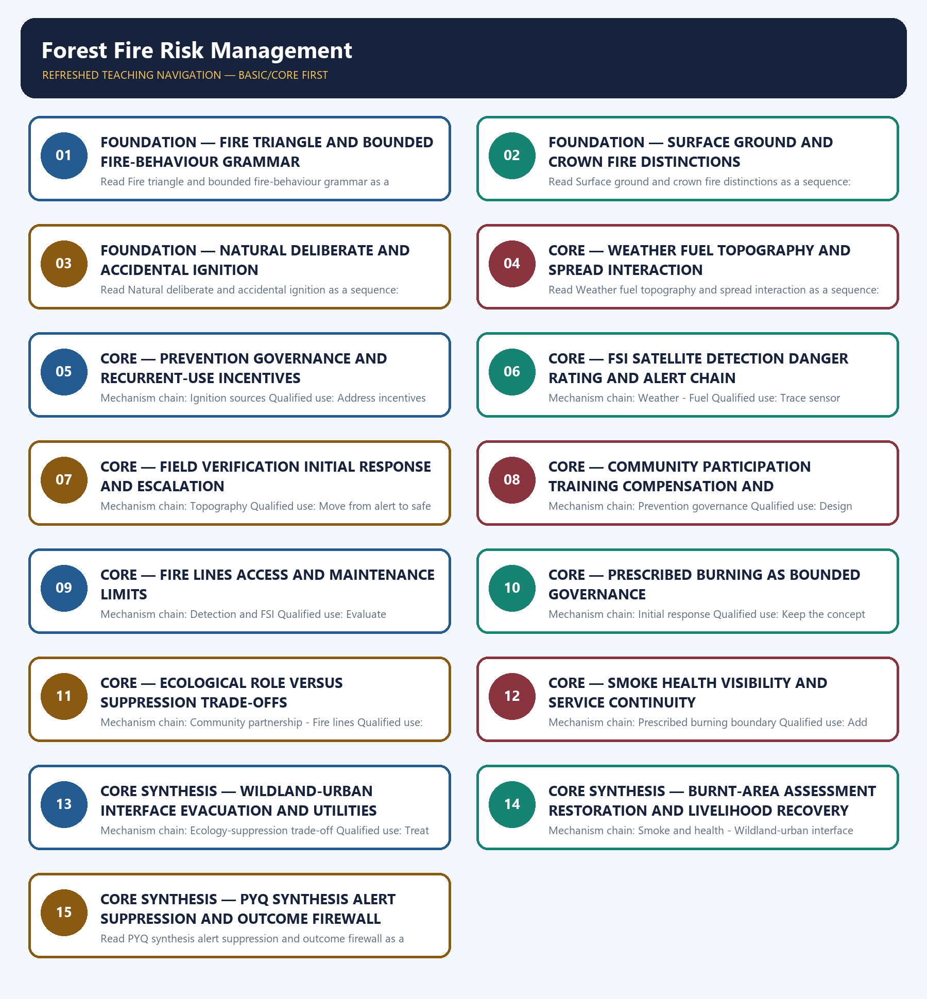

# Forest Fire Risk Management — Learner-v2 Complete Learning Session

> **Authoring-only generation:** 2026-09-04. No PDF was rendered and no tracker or index was mutated.

### SOURCE, PROGRESSION AND CURRENT-LINKAGE AUDIT

- **Generation date:** 2026-09-04.
- **Repository-first evidence:** the Basic owner is taught first and preserved in full; the Advanced owner is retained only in the optional final teaching block.
- **OCR evidence:** Repository Markdown was primary. OCR-searchable official UPSC papers were supplementary only for printed routed demands. No answer key, warning performance, notification effect, implementation outcome, casualty reduction or disaster metric was inferred.
- **Qdrant:** not used; repository Markdown and available OCR context were sufficient.
- **PYQ integrity:** No audited GS-III route directly names forest-fire management. The 2024 resilience and 2020 proactive-governance cards are support/adjacent applications; the 2025 Ethics card is cross-paper context only and remains Ethics-owned.
- **Live-link boundary:** Official attempts covered FSI's monitoring and alert architecture, the forest-fire dashboard, ISRO disaster support, the MoEFCC/FPM PIB route and NDMA. Thin, blocked, missing and transport-failed pages are recorded; no current fire count, affected area, crew strength, response time, containment, casualty, health or restoration outcome was invented.
- **Fact/inference discipline:** no current-affairs item, PYQ wording, figure or quotation is invented.

### LIVE OFFICIAL-SOURCE ATTEMPT LOG

The checks below were made on 2026-09-04. Substantive official text is used only for the proposition it supports; title-only, blocked or thin pages are recorded and supply no factual claim.

- https://fsi.nic.in/focus-areas?pgID=focus-areas — fetched 2026-09-04; FSI described MODIS and SNPP-VIIRS near-real-time detection, automated dissemination, Large Forest Fire monitoring and danger-rating development. https://www.isro.gov.in/DisasterManagementSupport.html — fetched 2026-09-04 but returned only a thin title. No response-time or containment outcome was inferred.
- https://fsiforestfire.gov.in/ — fetched 2026-09-04; the official FSI dashboard returned only an SMS-registration notice. https://pib.gov.in/PressReleasePage.aspx?PRID=2035043 — attempted 2026-09-04; PIB returned HTTP 403, so the FPM Scheme is used only at the owner-verified centrally sponsored support rung.
- https://moef.gov.in/forest-protection-forest-fire — attempted 2026-09-04; the official MoEFCC route returned HTTP 404. https://ndma.gov.in/Natural-Hazards/Forest-Fire — attempted 2026-09-04; the NDMA page failed at the transport layer. No current budget, incidence, crew-capacity or national-readiness claim was added.
- https://nidm.gov.in/iec.asp — searched 2026-09-04; the official NIDM awareness-material route was identified. No fire-behaviour, crew readiness, containment or ecological-outcome proposition was imported.

## BASIC LEARNING SESSION



*Distinct embedded teaching-navigation image. The separate continuous Cārvāka-style flowchart package remains an independent at-a-glance artifact.*

### SESSION 1 — FOUNDATION — FIRE TRIANGLE AND BOUNDED FIRE-BEHAVIOUR GRAMMAR

#### DEFINITION / WHAT THIS IS CALLED

**Plain-language definition:** The decisive boundary is Do not omit ground fire or collapse all fire types into surface and crown.

**Technical definition:** Read Fire triangle and bounded fire-behaviour grammar as a sequence: identify Fire triangle, follow the named mechanism to its institutional response, and stop at the last verified status rather than assuming the next stage.

#### ANSWER-GRABBING OPENING — WRITE/ADAPT IN THE EXAM

> Read Fire triangle and bounded fire-behaviour grammar as a sequence: identify Fire triangle, follow the named mechanism to its institutional response, and stop at the last verified status rather than assuming the next stage.

#### MUST-WRITE KEYWORDS

- **FOUNDATION**
- **Fire triangle**
- **bounded fire-behaviour grammar**
- **Mechanism chain**
- **Qualified use**
- **Combustion**

**How to use them:** Frame the answer through FOUNDATION; define Fire triangle, connect bounded fire-behaviour grammar with Mechanism chain to explain the mechanism, and use Qualified use for the decisive comparison or qualification.

#### VISUAL FIRST

```text
FIRE TRIANGLE AND BOUNDED FIRE-BEHAVIOUR GRAMMAR
01. Fire triangle
    |
    v
02. Fire behaviour
STATUS / CATEGORY FIREWALL -> Do not omit ground fire or collapse all fire types into surface and crown.
```

*The rail fixes the institutional sequence and claim boundary before explanation.*

#### CORE EXPLANATION

Combustion requires fuel, heat and oxygen; forest-fire prevention and suppression act by limiting ignition, fuel continuity or heat transfer without assuming every forest can be made fire-free. Rate and direction of spread, flame intensity, spotting and persistence are shaped by fuel condition and arrangement, weather and topography; detection alone does not reveal safe tactical access.

#### SIMPLE SYSTEM EXAMPLE

Read Fire triangle and bounded fire-behaviour grammar as a sequence: identify Fire triangle, follow the named mechanism to its institutional response, and stop at the last verified status rather than assuming the next stage.

#### TECHNICAL DISTINCTION

The decisive boundary is Do not omit ground fire or collapse all fire types into surface and crown. This keeps Fire triangle and Fire behaviour in the correct risk category, institutional mandate and evidence status.

#### NAMED EVIDENCE AND MECHANISM

- Combustion requires fuel, heat and oxygen; forest-fire prevention and suppression act by limiting ignition, fuel continuity or heat transfer without assuming every forest can be made fire-free.
- Rate and direction of spread, flame intensity, spotting and persistence are shaped by fuel condition and arrangement, weather and topography; detection alone does not reveal safe tactical access.

#### EXAMINER CAUTION

- Do not omit ground fire or collapse all fire types into surface and crown.

#### EXAM LINK

- **Prelims:** Keep hazard, forecast, warning, institution, law, plan, force, fund, scheme and outcome in their exact category.
- **Mains:** Start with fuel heat oxygen and identify the controllable link.

#### MINI RECAP

- **Mechanism chain:** Fire triangle -> Fire behaviour
- **Qualified use:** Start with fuel heat oxygen and identify the controllable link.

#### CLOSING RECALL FLOW — FOUNDATION — FIRE TRIANGLE AND BOUNDED FIRE-BEHAVIOUR GRAMMAR

```text
START / CONCEPT: FOUNDATION — Fire triangle and bounded fire-behaviour grammar
        |
        v
EXACT TERMS: FOUNDATION · Fire triangle · bounded fire-behaviour grammar · Mechanism chain · Qualified use · Combustion
        |
        v
MECHANISM / ARGUMENT: Mechanism chain: Fire triangle - Fire behaviour Qualified use: Start with fuel heat oxygen and identify the controllable link.
        |
        v
CONSEQUENCE / CONTRAST: The decisive boundary is Do not omit ground fire or collapse all fire types into surface and crown.
        |
        v
UPSC TRAP / ANSWER-USE: Do not omit ground fire or collapse all fire types into surface and crown.
        |
        v
ANSWER-GRABBING FORMULATION: Read Fire triangle and bounded fire-behaviour grammar as a sequence: identify Fire triangle, follow the named mechanism to its institutional response, and stop at the last verified status rather than assuming the next stage.
```
### SESSION 2 — FOUNDATION — SURFACE GROUND AND CROWN FIRE DISTINCTIONS

#### DEFINITION / WHAT THIS IS CALLED

**Plain-language definition:** The decisive boundary is Do not treat every forest fire as unnatural or every fire as ecologically beneficial.

**Technical definition:** Read Surface ground and crown fire distinctions as a sequence: identify Surface fire, follow the named mechanism to its institutional response, and stop at the last verified status rather than assuming the next stage.

#### ANSWER-GRABBING OPENING — WRITE/ADAPT IN THE EXAM

> Read Surface ground and crown fire distinctions as a sequence: identify Surface fire, follow the named mechanism to its institutional response, and stop at the last verified status rather than assuming the next stage.

#### MUST-WRITE KEYWORDS

- **FOUNDATION**
- **Surface ground**
- **crown fire distinctions**
- **Mechanism chain**
- **Qualified use**
- **Read Surface**

**How to use them:** Frame the answer through FOUNDATION; define Surface ground, connect crown fire distinctions with Mechanism chain to explain the mechanism, and use Qualified use for the decisive comparison or qualification.

#### VISUAL FIRST

```text
SURFACE GROUND AND CROWN FIRE DISTINCTIONS
01. Surface fire
STATUS / CATEGORY FIREWALL -> Do not treat every forest fire as unnatural or every fire as ecologically beneficial.
```

*The rail fixes the institutional sequence and claim boundary before explanation.*

#### CORE EXPLANATION

A surface fire burns litter, grasses, shrubs and other material near the ground and may provide the heat pathway into tree crowns.

#### SIMPLE SYSTEM EXAMPLE

Read Surface ground and crown fire distinctions as a sequence: identify Surface fire, follow the named mechanism to its institutional response, and stop at the last verified status rather than assuming the next stage.

#### TECHNICAL DISTINCTION

The decisive boundary is Do not treat every forest fire as unnatural or every fire as ecologically beneficial. This keeps Surface fire in the correct risk category, institutional mandate and evidence status.

#### NAMED EVIDENCE AND MECHANISM

- A surface fire burns litter, grasses, shrubs and other material near the ground and may provide the heat pathway into tree crowns.

#### EXAMINER CAUTION

- Do not treat every forest fire as unnatural or every fire as ecologically beneficial.

#### EXAM LINK

- **Prelims:** Keep hazard, forecast, warning, institution, law, plan, force, fund, scheme and outcome in their exact category.
- **Mains:** Classify the burning layer before discussing behaviour or response.

#### MINI RECAP

- **Mechanism chain:** Surface fire
- **Qualified use:** Classify the burning layer before discussing behaviour or response.

#### CLOSING RECALL FLOW — FOUNDATION — SURFACE GROUND AND CROWN FIRE DISTINCTIONS

```text
START / CONCEPT: FOUNDATION — Surface ground and crown fire distinctions
        |
        v
EXACT TERMS: FOUNDATION · Surface ground · crown fire distinctions · Mechanism chain · Qualified use · Read Surface
        |
        v
MECHANISM / ARGUMENT: Mechanism chain: Surface fire Qualified use: Classify the burning layer before discussing behaviour or response.
        |
        v
CONSEQUENCE / CONTRAST: The decisive boundary is Do not treat every forest fire as unnatural or every fire as ecologically beneficial.
        |
        v
UPSC TRAP / ANSWER-USE: Do not treat every forest fire as unnatural or every fire as ecologically beneficial.
        |
        v
ANSWER-GRABBING FORMULATION: Read Surface ground and crown fire distinctions as a sequence: identify Surface fire, follow the named mechanism to its institutional response, and stop at the last verified status rather than assuming the next stage.
```
### SESSION 3 — FOUNDATION — NATURAL DELIBERATE AND ACCIDENTAL IGNITION

#### DEFINITION / WHAT THIS IS CALLED

**Plain-language definition:** The decisive boundary is Do not convert a weather or danger rating into certainty that ignition will occur.

**Technical definition:** Read Natural deliberate and accidental ignition as a sequence: identify Ground fire, follow the named mechanism to its institutional response, and stop at the last verified status rather than assuming the next stage.

#### ANSWER-GRABBING OPENING — WRITE/ADAPT IN THE EXAM

> Read Natural deliberate and accidental ignition as a sequence: identify Ground fire, follow the named mechanism to its institutional response, and stop at the last verified status rather than assuming the next stage.

#### MUST-WRITE KEYWORDS

- **FOUNDATION**
- **Natural deliberate**
- **accidental ignition**
- **Mechanism chain**
- **Qualified use**
- **Read Natural**

**How to use them:** Frame the answer through FOUNDATION; define Natural deliberate, connect accidental ignition with Mechanism chain to explain the mechanism, and use Qualified use for the decisive comparison or qualification.

#### VISUAL FIRST

```text
NATURAL DELIBERATE AND ACCIDENTAL IGNITION
01. Ground fire
STATUS / CATEGORY FIREWALL -> Do not convert a weather or danger rating into certainty that ignition will occur.
```

*The rail fixes the institutional sequence and claim boundary before explanation.*

#### CORE EXPLANATION

A ground fire burns organic matter below or within the surface layer and can persist or re-emerge, making it distinct from a visible surface flame front.

#### SIMPLE SYSTEM EXAMPLE

Read Natural deliberate and accidental ignition as a sequence: identify Ground fire, follow the named mechanism to its institutional response, and stop at the last verified status rather than assuming the next stage.

#### TECHNICAL DISTINCTION

The decisive boundary is Do not convert a weather or danger rating into certainty that ignition will occur. This keeps Ground fire in the correct risk category, institutional mandate and evidence status.

#### NAMED EVIDENCE AND MECHANISM

- A ground fire burns organic matter below or within the surface layer and can persist or re-emerge, making it distinct from a visible surface flame front.

#### EXAMINER CAUTION

- Do not convert a weather or danger rating into certainty that ignition will occur.

#### EXAM LINK

- **Prelims:** Keep hazard, forecast, warning, institution, law, plan, force, fund, scheme and outcome in their exact category.
- **Mains:** Separate natural ignition from deliberate and accidental human causes.

#### MINI RECAP

- **Mechanism chain:** Ground fire
- **Qualified use:** Separate natural ignition from deliberate and accidental human causes.

#### CLOSING RECALL FLOW — FOUNDATION — NATURAL DELIBERATE AND ACCIDENTAL IGNITION

```text
START / CONCEPT: FOUNDATION — Natural deliberate and accidental ignition
        |
        v
EXACT TERMS: FOUNDATION · Natural deliberate · accidental ignition · Mechanism chain · Qualified use · Read Natural
        |
        v
MECHANISM / ARGUMENT: Mechanism chain: Ground fire Qualified use: Separate natural ignition from deliberate and accidental human causes.
        |
        v
CONSEQUENCE / CONTRAST: The decisive boundary is Do not convert a weather or danger rating into certainty that ignition will occur.
        |
        v
UPSC TRAP / ANSWER-USE: Do not convert a weather or danger rating into certainty that ignition will occur.
        |
        v
ANSWER-GRABBING FORMULATION: Read Natural deliberate and accidental ignition as a sequence: identify Ground fire, follow the named mechanism to its institutional response, and stop at the last verified status rather than assuming the next stage.
```
### SESSION 4 — CORE — WEATHER FUEL TOPOGRAPHY AND SPREAD INTERACTION

#### DEFINITION / WHAT THIS IS CALLED

**Plain-language definition:** A crown fire spreads through tree canopies, often supported by surface fire and fuel continuity; it is not simply a larger surface fire.

**Technical definition:** Read Weather fuel topography and spread interaction as a sequence: identify Crown fire, follow the named mechanism to its institutional response, and stop at the last verified status rather than assuming the next stage.

#### ANSWER-GRABBING OPENING — WRITE/ADAPT IN THE EXAM

> Read Weather fuel topography and spread interaction as a sequence: identify Crown fire, follow the named mechanism to its institutional response, and stop at the last verified status rather than assuming the next stage.

#### MUST-WRITE KEYWORDS

- **Weather fuel topography**
- **spread interaction**
- **Mechanism chain**
- **Qualified use**
- **Read Weather**
- **Crown**

**How to use them:** Frame the answer through Weather fuel topography; define spread interaction, connect Mechanism chain with Qualified use to explain the mechanism, and use Read Weather for the decisive comparison or qualification.

#### VISUAL FIRST

```text
WEATHER FUEL TOPOGRAPHY AND SPREAD INTERACTION
01. Crown fire
STATUS / CATEGORY FIREWALL -> Do not confuse satellite detection with field verification or suppression.
```

*The rail fixes the institutional sequence and claim boundary before explanation.*

#### CORE EXPLANATION

A crown fire spreads through tree canopies, often supported by surface fire and fuel continuity; it is not simply a larger surface fire.

#### SIMPLE SYSTEM EXAMPLE

Read Weather fuel topography and spread interaction as a sequence: identify Crown fire, follow the named mechanism to its institutional response, and stop at the last verified status rather than assuming the next stage.

#### TECHNICAL DISTINCTION

The decisive boundary is Do not confuse satellite detection with field verification or suppression. This keeps Crown fire in the correct risk category, institutional mandate and evidence status.

#### NAMED EVIDENCE AND MECHANISM

- A crown fire spreads through tree canopies, often supported by surface fire and fuel continuity; it is not simply a larger surface fire.

#### EXAMINER CAUTION

- Do not confuse satellite detection with field verification or suppression.

#### EXAM LINK

- **Prelims:** Keep hazard, forecast, warning, institution, law, plan, force, fund, scheme and outcome in their exact category.
- **Mains:** Explain interaction rather than assigning spread to one variable.

#### MINI RECAP

- **Mechanism chain:** Crown fire
- **Qualified use:** Explain interaction rather than assigning spread to one variable.

#### CLOSING RECALL FLOW — CORE — WEATHER FUEL TOPOGRAPHY AND SPREAD INTERACTION

```text
START / CONCEPT: CORE — Weather fuel topography and spread interaction
        |
        v
EXACT TERMS: Weather fuel topography · spread interaction · Mechanism chain · Qualified use · Read Weather · Crown
        |
        v
MECHANISM / ARGUMENT: Mechanism chain: Crown fire Qualified use: Explain interaction rather than assigning spread to one variable.
        |
        v
CONSEQUENCE / CONTRAST: A crown fire spreads through tree canopies, often supported by surface fire and fuel continuity; it is not simply a larger surface fire.
        |
        v
UPSC TRAP / ANSWER-USE: The decisive boundary is Do not confuse satellite detection with field verification or suppression.
        |
        v
ANSWER-GRABBING FORMULATION: Read Weather fuel topography and spread interaction as a sequence: identify Crown fire, follow the named mechanism to its institutional response, and stop at the last verified status rather than assuming the next stage.
```
### SESSION 5 — CORE — PREVENTION GOVERNANCE AND RECURRENT-USE INCENTIVES

#### DEFINITION / WHAT THIS IS CALLED

**Plain-language definition:** Read Prevention governance and recurrent-use incentives as a sequence: identify Ignition sources, follow the named mechanism to its institutional response, and stop at the last verified status rather than assuming the next stage.

**Technical definition:** Mechanism chain: Ignition sources Qualified use: Address incentives rules readiness and recurrent local practices.

#### ANSWER-GRABBING OPENING — WRITE/ADAPT IN THE EXAM

> Read Prevention governance and recurrent-use incentives as a sequence: identify Ignition sources, follow the named mechanism to its institutional response, and stop at the last verified status rather than assuming the next stage.

#### MUST-WRITE KEYWORDS

- **Prevention governance**
- **recurrent-use incentives**
- **Mechanism chain**
- **Qualified use**
- **Natural**
- **Read Prevention**

**How to use them:** Frame the answer through Prevention governance; define recurrent-use incentives, connect Mechanism chain with Qualified use to explain the mechanism, and use Natural for the decisive comparison or qualification.

#### VISUAL FIRST

```text
PREVENTION GOVERNANCE AND RECURRENT-USE INCENTIVES
01. Ignition sources
STATUS / CATEGORY FIREWALL -> Do not describe communities as a substitute for trained and accountable State capacity.
```

*The rail fixes the institutional sequence and claim boundary before explanation.*

#### CORE EXPLANATION

Natural ignition can include lightning, while human ignition may be deliberate or accidental through land or resource use, discarded smoking material, escaped burning, equipment or other heat sources.

#### SIMPLE SYSTEM EXAMPLE

Read Prevention governance and recurrent-use incentives as a sequence: identify Ignition sources, follow the named mechanism to its institutional response, and stop at the last verified status rather than assuming the next stage.

#### TECHNICAL DISTINCTION

The decisive boundary is Do not describe communities as a substitute for trained and accountable State capacity. This keeps Ignition sources in the correct risk category, institutional mandate and evidence status.

#### NAMED EVIDENCE AND MECHANISM

- Natural ignition can include lightning, while human ignition may be deliberate or accidental through land or resource use, discarded smoking material, escaped burning, equipment or other heat sources.

#### EXAMINER CAUTION

- Do not describe communities as a substitute for trained and accountable State capacity.

#### EXAM LINK

- **Prelims:** Keep hazard, forecast, warning, institution, law, plan, force, fund, scheme and outcome in their exact category.
- **Mains:** Address incentives rules readiness and recurrent local practices.

#### MINI RECAP

- **Mechanism chain:** Ignition sources
- **Qualified use:** Address incentives rules readiness and recurrent local practices.

#### CLOSING RECALL FLOW — CORE — PREVENTION GOVERNANCE AND RECURRENT-USE INCENTIVES

```text
START / CONCEPT: CORE — Prevention governance and recurrent-use incentives
        |
        v
EXACT TERMS: Prevention governance · recurrent-use incentives · Mechanism chain · Qualified use · Natural · Read Prevention
        |
        v
MECHANISM / ARGUMENT: Mechanism chain: Ignition sources Qualified use: Address incentives rules readiness and recurrent local practices.
        |
        v
CONSEQUENCE / CONTRAST: Natural ignition can include lightning, while human ignition may be deliberate or accidental through land or resource use, discarded smoking material, escaped burning, equipment or other heat sources.
        |
        v
UPSC TRAP / ANSWER-USE: The decisive boundary is Do not describe communities as a substitute for trained and accountable State capacity.
        |
        v
ANSWER-GRABBING FORMULATION: Read Prevention governance and recurrent-use incentives as a sequence: identify Ignition sources, follow the named mechanism to its institutional response, and stop at the last verified status rather than assuming the next stage.
```
### SESSION 6 — CORE — FSI SATELLITE DETECTION DANGER RATING AND ALERT CHAIN

#### DEFINITION / WHAT THIS IS CALLED

**Plain-language definition:** Read FSI satellite detection danger rating and alert chain as a sequence: identify Weather, follow the named mechanism to its institutional response, and stop at the last verified status rather than assuming the next stage.

**Technical definition:** Mechanism chain: Weather - Fuel Qualified use: Trace sensor processing dissemination and field-verification boundaries.

#### ANSWER-GRABBING OPENING — WRITE/ADAPT IN THE EXAM

> Read FSI satellite detection danger rating and alert chain as a sequence: identify Weather, follow the named mechanism to its institutional response, and stop at the last verified status rather than assuming the next stage.

#### MUST-WRITE KEYWORDS

- **FSI satellite detection danger rating**
- **alert chain**
- **Mechanism chain**
- **Qualified use**
- **Temperature**
- **Fuel**

**How to use them:** Frame the answer through FSI satellite detection danger rating; define alert chain, connect Mechanism chain with Qualified use to explain the mechanism, and use Temperature for the decisive comparison or qualification.

#### VISUAL FIRST

```text
FSI SATELLITE DETECTION DANGER RATING AND ALERT CHAIN
01. Weather
    |
    v
02. Fuel
STATUS / CATEGORY FIREWALL -> Do not present fire lines as maintenance-free or guaranteed barriers.
```

*The rail fixes the institutional sequence and claim boundary before explanation.*

#### CORE EXPLANATION

Temperature, humidity, wind and recent precipitation affect fuel dryness, ignition probability, spread and smoke, but a weather signal is not proof that a fire will start or be contained. Fuel type, load, moisture, continuity and vertical arrangement influence fire behaviour; unmanaged accumulation, invasive biomass or post-disturbance debris can alter risk.

#### SIMPLE SYSTEM EXAMPLE

Read FSI satellite detection danger rating and alert chain as a sequence: identify Weather, follow the named mechanism to its institutional response, and stop at the last verified status rather than assuming the next stage.

#### TECHNICAL DISTINCTION

The decisive boundary is Do not present fire lines as maintenance-free or guaranteed barriers. This keeps Weather and Fuel in the correct risk category, institutional mandate and evidence status.

#### NAMED EVIDENCE AND MECHANISM

- Temperature, humidity, wind and recent precipitation affect fuel dryness, ignition probability, spread and smoke, but a weather signal is not proof that a fire will start or be contained.
- Fuel type, load, moisture, continuity and vertical arrangement influence fire behaviour; unmanaged accumulation, invasive biomass or post-disturbance debris can alter risk.

#### EXAMINER CAUTION

- Do not present fire lines as maintenance-free or guaranteed barriers.

#### EXAM LINK

- **Prelims:** Keep hazard, forecast, warning, institution, law, plan, force, fund, scheme and outcome in their exact category.
- **Mains:** Trace sensor processing dissemination and field-verification boundaries.

#### MINI RECAP

- **Mechanism chain:** Weather -> Fuel
- **Qualified use:** Trace sensor processing dissemination and field-verification boundaries.

#### CLOSING RECALL FLOW — CORE — FSI SATELLITE DETECTION DANGER RATING AND ALERT CHAIN

```text
START / CONCEPT: CORE — FSI satellite detection danger rating and alert chain
        |
        v
EXACT TERMS: FSI satellite detection danger rating · alert chain · Mechanism chain · Qualified use · Temperature · Fuel
        |
        v
MECHANISM / ARGUMENT: Mechanism chain: Weather - Fuel Qualified use: Trace sensor processing dissemination and field-verification boundaries.
        |
        v
CONSEQUENCE / CONTRAST: Temperature, humidity, wind and recent precipitation affect fuel dryness, ignition probability, spread and smoke, but a weather signal is not proof that a fire will start or be contained.
        |
        v
UPSC TRAP / ANSWER-USE: The decisive boundary is Do not present fire lines as maintenance-free or guaranteed barriers.
        |
        v
ANSWER-GRABBING FORMULATION: Read FSI satellite detection danger rating and alert chain as a sequence: identify Weather, follow the named mechanism to its institutional response, and stop at the last verified status rather than assuming the next stage.
```
### SESSION 7 — CORE — FIELD VERIFICATION INITIAL RESPONSE AND ESCALATION

#### DEFINITION / WHAT THIS IS CALLED

**Plain-language definition:** Read Field verification initial response and escalation as a sequence: identify Topography, follow the named mechanism to its institutional response, and stop at the last verified status rather than assuming the next stage.

**Technical definition:** Mechanism chain: Topography Qualified use: Move from alert to safe verification command resources and escalation.

#### ANSWER-GRABBING OPENING — WRITE/ADAPT IN THE EXAM

> Read Field verification initial response and escalation as a sequence: identify Topography, follow the named mechanism to its institutional response, and stop at the last verified status rather than assuming the next stage.

#### MUST-WRITE KEYWORDS

- **Field verification initial response**
- **escalation**
- **Mechanism chain**
- **Qualified use**
- **Slope**
- **Read Field**

**How to use them:** Frame the answer through Field verification initial response; define escalation, connect Mechanism chain with Qualified use to explain the mechanism, and use Slope for the decisive comparison or qualification.

#### VISUAL FIRST

```text
FIELD VERIFICATION INITIAL RESPONSE AND ESCALATION
01. Topography
STATUS / CATEGORY FIREWALL -> Do not provide actionable ignition detail or portray prescribed burning as uncontrolled burning.
```

*The rail fixes the institutional sequence and claim boundary before explanation.*

#### CORE EXPLANATION

Slope, aspect, valleys and access shape heating, wind and spread as well as crew movement; fire commonly moves faster upslope, but site conditions remain decisive.

#### SIMPLE SYSTEM EXAMPLE

Read Field verification initial response and escalation as a sequence: identify Topography, follow the named mechanism to its institutional response, and stop at the last verified status rather than assuming the next stage.

#### TECHNICAL DISTINCTION

The decisive boundary is Do not provide actionable ignition detail or portray prescribed burning as uncontrolled burning. This keeps Topography in the correct risk category, institutional mandate and evidence status.

#### NAMED EVIDENCE AND MECHANISM

- Slope, aspect, valleys and access shape heating, wind and spread as well as crew movement; fire commonly moves faster upslope, but site conditions remain decisive.

#### EXAMINER CAUTION

- Do not provide actionable ignition detail or portray prescribed burning as uncontrolled burning.

#### EXAM LINK

- **Prelims:** Keep hazard, forecast, warning, institution, law, plan, force, fund, scheme and outcome in their exact category.
- **Mains:** Move from alert to safe verification command resources and escalation.

#### MINI RECAP

- **Mechanism chain:** Topography
- **Qualified use:** Move from alert to safe verification command resources and escalation.

#### CLOSING RECALL FLOW — CORE — FIELD VERIFICATION INITIAL RESPONSE AND ESCALATION

```text
START / CONCEPT: CORE — Field verification initial response and escalation
        |
        v
EXACT TERMS: Field verification initial response · escalation · Mechanism chain · Qualified use · Slope · Read Field
        |
        v
MECHANISM / ARGUMENT: Mechanism chain: Topography Qualified use: Move from alert to safe verification command resources and escalation.
        |
        v
CONSEQUENCE / CONTRAST: Slope, aspect, valleys and access shape heating, wind and spread as well as crew movement; fire commonly moves faster upslope, but site conditions remain decisive.
        |
        v
UPSC TRAP / ANSWER-USE: The decisive boundary is Do not provide actionable ignition detail or portray prescribed burning as uncontrolled burning.
        |
        v
ANSWER-GRABBING FORMULATION: Read Field verification initial response and escalation as a sequence: identify Topography, follow the named mechanism to its institutional response, and stop at the last verified status rather than assuming the next stage.
```
### SESSION 8 — CORE — COMMUNITY PARTICIPATION TRAINING COMPENSATION AND ACCOUNTABILITY

#### DEFINITION / WHAT THIS IS CALLED

**Plain-language definition:** Read Community participation training compensation and accountability as a sequence: identify Prevention governance, follow the named mechanism to its institutional response, and stop at the last verified status rather than assuming the next stage.

**Technical definition:** Mechanism chain: Prevention governance Qualified use: Design participation with training compensation and continuing State duty.

#### ANSWER-GRABBING OPENING — WRITE/ADAPT IN THE EXAM

> Read Community participation training compensation and accountability as a sequence: identify Prevention governance, follow the named mechanism to its institutional response, and stop at the last verified status rather than assuming the next stage.

#### MUST-WRITE KEYWORDS

- **Community participation training compensation**
- **accountability**
- **Mechanism chain**
- **Qualified use**
- **Prevention**
- **Read Community**

**How to use them:** Frame the answer through Community participation training compensation; define accountability, connect Mechanism chain with Qualified use to explain the mechanism, and use Prevention for the decisive comparison or qualification.

#### VISUAL FIRST

```text
COMMUNITY PARTICIPATION TRAINING COMPENSATION AND ACCOUNTABILITY
01. Prevention governance
STATUS / CATEGORY FIREWALL -> Do not recommend total suppression without considering fuel and ecosystem context.
```

*The rail fixes the institutional sequence and claim boundary before explanation.*

#### CORE EXPLANATION

Prevention combines locally legitimate resource-use rules, awareness, patrols, equipment maintenance, fire-season readiness and action on recurrent human ignition rather than relying only on punitive messaging.

#### SIMPLE SYSTEM EXAMPLE

Read Community participation training compensation and accountability as a sequence: identify Prevention governance, follow the named mechanism to its institutional response, and stop at the last verified status rather than assuming the next stage.

#### TECHNICAL DISTINCTION

The decisive boundary is Do not recommend total suppression without considering fuel and ecosystem context. This keeps Prevention governance in the correct risk category, institutional mandate and evidence status.

#### NAMED EVIDENCE AND MECHANISM

- Prevention combines locally legitimate resource-use rules, awareness, patrols, equipment maintenance, fire-season readiness and action on recurrent human ignition rather than relying only on punitive messaging.

#### EXAMINER CAUTION

- Do not recommend total suppression without considering fuel and ecosystem context.

#### EXAM LINK

- **Prelims:** Keep hazard, forecast, warning, institution, law, plan, force, fund, scheme and outcome in their exact category.
- **Mains:** Design participation with training compensation and continuing State duty.

#### MINI RECAP

- **Mechanism chain:** Prevention governance
- **Qualified use:** Design participation with training compensation and continuing State duty.

#### CLOSING RECALL FLOW — CORE — COMMUNITY PARTICIPATION TRAINING COMPENSATION AND ACCOUNTABILITY

```text
START / CONCEPT: CORE — Community participation training compensation and accountability
        |
        v
EXACT TERMS: Community participation training compensation · accountability · Mechanism chain · Qualified use · Prevention · Read Community
        |
        v
MECHANISM / ARGUMENT: Mechanism chain: Prevention governance Qualified use: Design participation with training compensation and continuing State duty.
        |
        v
CONSEQUENCE / CONTRAST: The decisive boundary is Do not recommend total suppression without considering fuel and ecosystem context.
        |
        v
UPSC TRAP / ANSWER-USE: Do not recommend total suppression without considering fuel and ecosystem context.
        |
        v
ANSWER-GRABBING FORMULATION: Read Community participation training compensation and accountability as a sequence: identify Prevention governance, follow the named mechanism to its institutional response, and stop at the last verified status rather than assuming the next stage.
```
### SESSION 9 — CORE — FIRE LINES ACCESS AND MAINTENANCE LIMITS

#### DEFINITION / WHAT THIS IS CALLED

**Plain-language definition:** Read Fire lines access and maintenance limits as a sequence: identify Detection and FSI, follow the named mechanism to its institutional response, and stop at the last verified status rather than assuming the next stage.

**Technical definition:** Mechanism chain: Detection and FSI Qualified use: Evaluate placement maintenance conditions and residual risk.

#### ANSWER-GRABBING OPENING — WRITE/ADAPT IN THE EXAM

> Read Fire lines access and maintenance limits as a sequence: identify Detection and FSI, follow the named mechanism to its institutional response, and stop at the last verified status rather than assuming the next stage.

#### MUST-WRITE KEYWORDS

- **Fire lines access**
- **maintenance limits**
- **Mechanism chain**
- **Qualified use**
- **Read Fire**
- **Detection**

**How to use them:** Frame the answer through Fire lines access; define maintenance limits, connect Mechanism chain with Qualified use to explain the mechanism, and use Read Fire for the decisive comparison or qualification.

#### VISUAL FIRST

```text
FIRE LINES ACCESS AND MAINTENANCE LIMITS
01. Detection and FSI
STATUS / CATEGORY FIREWALL -> Do not omit smoke, responder safety, evacuation and service continuity.
```

*The rail fixes the institutional sequence and claim boundary before explanation.*

#### CORE EXPLANATION

FSI's satellite-based monitoring processes MODIS and SNPP-VIIRS detections and disseminates alerts, while Large Forest Fire monitoring tracks selected events; these systems locate possible fire, not field suppression.

#### SIMPLE SYSTEM EXAMPLE

Read Fire lines access and maintenance limits as a sequence: identify Detection and FSI, follow the named mechanism to its institutional response, and stop at the last verified status rather than assuming the next stage.

#### TECHNICAL DISTINCTION

The decisive boundary is Do not omit smoke, responder safety, evacuation and service continuity. This keeps Detection and FSI in the correct risk category, institutional mandate and evidence status.

#### NAMED EVIDENCE AND MECHANISM

- FSI's satellite-based monitoring processes MODIS and SNPP-VIIRS detections and disseminates alerts, while Large Forest Fire monitoring tracks selected events; these systems locate possible fire, not field suppression.

#### EXAMINER CAUTION

- Do not omit smoke, responder safety, evacuation and service continuity.

#### EXAM LINK

- **Prelims:** Keep hazard, forecast, warning, institution, law, plan, force, fund, scheme and outcome in their exact category.
- **Mains:** Evaluate placement maintenance conditions and residual risk.

#### MINI RECAP

- **Mechanism chain:** Detection and FSI
- **Qualified use:** Evaluate placement maintenance conditions and residual risk.

#### CLOSING RECALL FLOW — CORE — FIRE LINES ACCESS AND MAINTENANCE LIMITS

```text
START / CONCEPT: CORE — Fire lines access and maintenance limits
        |
        v
EXACT TERMS: Fire lines access · maintenance limits · Mechanism chain · Qualified use · Read Fire · Detection
        |
        v
MECHANISM / ARGUMENT: Mechanism chain: Detection and FSI Qualified use: Evaluate placement maintenance conditions and residual risk.
        |
        v
CONSEQUENCE / CONTRAST: The decisive boundary is Do not omit smoke, responder safety, evacuation and service continuity.
        |
        v
UPSC TRAP / ANSWER-USE: Do not omit smoke, responder safety, evacuation and service continuity.
        |
        v
ANSWER-GRABBING FORMULATION: Read Fire lines access and maintenance limits as a sequence: identify Detection and FSI, follow the named mechanism to its institutional response, and stop at the last verified status rather than assuming the next stage.
```
### SESSION 10 — CORE — PRESCRIBED BURNING AS BOUNDED GOVERNANCE

#### DEFINITION / WHAT THIS IS CALLED

**Plain-language definition:** Read Prescribed burning as bounded governance as a sequence: identify Initial response, follow the named mechanism to its institutional response, and stop at the last verified status rather than assuming the next stage.

**Technical definition:** Mechanism chain: Initial response Qualified use: Keep the concept authorised planned supervised monitored and non-instructional.

#### ANSWER-GRABBING OPENING — WRITE/ADAPT IN THE EXAM

> Read Prescribed burning as bounded governance as a sequence: identify Initial response, follow the named mechanism to its institutional response, and stop at the last verified status rather than assuming the next stage.

#### MUST-WRITE KEYWORDS

- **Prescribed burning as bounded governance**
- **Mechanism chain**
- **Qualified use**
- **Initial**
- **Read Prescribed**
- **The decisive boundary**

**How to use them:** Frame the answer through Prescribed burning as bounded governance; define Mechanism chain, connect Qualified use with Initial to explain the mechanism, and use Read Prescribed for the decisive comparison or qualification.

#### VISUAL FIRST

```text
PRESCRIBED BURNING AS BOUNDED GOVERNANCE
01. Initial response
STATUS / CATEGORY FIREWALL -> Do not infer containment or restoration success from an alert, scheme or plan.
```

*The rail fixes the institutional sequence and claim boundary before explanation.*

#### CORE EXPLANATION

Initial response requires rapid verification, incident reporting, trained and protected crews, access assessment, local command, communication, water or tools suited to the setting and escalation when capacity is exceeded.

#### SIMPLE SYSTEM EXAMPLE

Read Prescribed burning as bounded governance as a sequence: identify Initial response, follow the named mechanism to its institutional response, and stop at the last verified status rather than assuming the next stage.

#### TECHNICAL DISTINCTION

The decisive boundary is Do not infer containment or restoration success from an alert, scheme or plan. This keeps Initial response in the correct risk category, institutional mandate and evidence status.

#### NAMED EVIDENCE AND MECHANISM

- Initial response requires rapid verification, incident reporting, trained and protected crews, access assessment, local command, communication, water or tools suited to the setting and escalation when capacity is exceeded.

#### EXAMINER CAUTION

- Do not infer containment or restoration success from an alert, scheme or plan.

#### EXAM LINK

- **Prelims:** Keep hazard, forecast, warning, institution, law, plan, force, fund, scheme and outcome in their exact category.
- **Mains:** Keep the concept authorised planned supervised monitored and non-instructional.

#### MINI RECAP

- **Mechanism chain:** Initial response
- **Qualified use:** Keep the concept authorised planned supervised monitored and non-instructional.

#### CLOSING RECALL FLOW — CORE — PRESCRIBED BURNING AS BOUNDED GOVERNANCE

```text
START / CONCEPT: CORE — Prescribed burning as bounded governance
        |
        v
EXACT TERMS: Prescribed burning as bounded governance · Mechanism chain · Qualified use · Initial · Read Prescribed · The decisive boundary
        |
        v
MECHANISM / ARGUMENT: Mechanism chain: Initial response Qualified use: Keep the concept authorised planned supervised monitored and non-instructional.
        |
        v
CONSEQUENCE / CONTRAST: The decisive boundary is Do not infer containment or restoration success from an alert, scheme or plan.
        |
        v
UPSC TRAP / ANSWER-USE: Do not infer containment or restoration success from an alert, scheme or plan.
        |
        v
ANSWER-GRABBING FORMULATION: Read Prescribed burning as bounded governance as a sequence: identify Initial response, follow the named mechanism to its institutional response, and stop at the last verified status rather than assuming the next stage.
```
### SESSION 11 — CORE — ECOLOGICAL ROLE VERSUS SUPPRESSION TRADE-OFFS

#### DEFINITION / WHAT THIS IS CALLED

**Plain-language definition:** Read Ecological role versus suppression trade-offs as a sequence: identify Community partnership, follow the named mechanism to its institutional response, and stop at the last verified status rather than assuming the next stage.

**Technical definition:** Mechanism chain: Community partnership - Fire lines Qualified use: Balance life safety fuel accumulation ecosystem process and livelihood use.

#### ANSWER-GRABBING OPENING — WRITE/ADAPT IN THE EXAM

> Read Ecological role versus suppression trade-offs as a sequence: identify Community partnership, follow the named mechanism to its institutional response, and stop at the last verified status rather than assuming the next stage.

#### MUST-WRITE KEYWORDS

- **Ecological role versus suppression trade-offs**
- **Mechanism chain**
- **Qualified use**
- **Forest-dependent**
- **Fire lines**
- **Fire**

**How to use them:** Frame the answer through Ecological role versus suppression trade-offs; define Mechanism chain, connect Qualified use with Forest-dependent to explain the mechanism, and use Fire lines for the decisive comparison or qualification.

#### VISUAL FIRST

```text
ECOLOGICAL ROLE VERSUS SUPPRESSION TRADE-OFFS
01. Community partnership
    |
    v
02. Fire lines
STATUS / CATEGORY FIREWALL -> Do not omit ground fire or collapse all fire types into surface and crown.
```

*The rail fixes the institutional sequence and claim boundary before explanation.*

#### CORE EXPLANATION

Forest-dependent and forest-fringe communities can support prevention, early reporting and response when participation is institutionalised, compensated, trained and linked to State responsibility rather than used as unpaid crisis labour. Fire lines are breaks in fuel continuity maintained for prevention or control; their usefulness depends on placement, width, maintenance, terrain and conditions and they do not guarantee containment.

#### SIMPLE SYSTEM EXAMPLE

Read Ecological role versus suppression trade-offs as a sequence: identify Community partnership, follow the named mechanism to its institutional response, and stop at the last verified status rather than assuming the next stage.

#### TECHNICAL DISTINCTION

The decisive boundary is Do not omit ground fire or collapse all fire types into surface and crown. This keeps Community partnership and Fire lines in the correct risk category, institutional mandate and evidence status.

#### NAMED EVIDENCE AND MECHANISM

- Forest-dependent and forest-fringe communities can support prevention, early reporting and response when participation is institutionalised, compensated, trained and linked to State responsibility rather than used as unpaid crisis labour.
- Fire lines are breaks in fuel continuity maintained for prevention or control; their usefulness depends on placement, width, maintenance, terrain and conditions and they do not guarantee containment.

#### EXAMINER CAUTION

- Do not omit ground fire or collapse all fire types into surface and crown.

#### EXAM LINK

- **Prelims:** Keep hazard, forecast, warning, institution, law, plan, force, fund, scheme and outcome in their exact category.
- **Mains:** Balance life safety fuel accumulation ecosystem process and livelihood use.

#### MINI RECAP

- **Mechanism chain:** Community partnership -> Fire lines
- **Qualified use:** Balance life safety fuel accumulation ecosystem process and livelihood use.

#### CLOSING RECALL FLOW — CORE — ECOLOGICAL ROLE VERSUS SUPPRESSION TRADE-OFFS

```text
START / CONCEPT: CORE — Ecological role versus suppression trade-offs
        |
        v
EXACT TERMS: Ecological role versus suppression trade-offs · Mechanism chain · Qualified use · Forest-dependent · Fire lines · Fire
        |
        v
MECHANISM / ARGUMENT: Mechanism chain: Community partnership - Fire lines Qualified use: Balance life safety fuel accumulation ecosystem process and livelihood use.
        |
        v
CONSEQUENCE / CONTRAST: Fire lines are breaks in fuel continuity maintained for prevention or control; their usefulness depends on placement, width, maintenance, terrain and conditions and they do not guarantee containment.
        |
        v
UPSC TRAP / ANSWER-USE: The decisive boundary is Do not omit ground fire or collapse all fire types into surface and crown.
        |
        v
ANSWER-GRABBING FORMULATION: Read Ecological role versus suppression trade-offs as a sequence: identify Community partnership, follow the named mechanism to its institutional response, and stop at the last verified status rather than assuming the next stage.
```
### SESSION 12 — CORE — SMOKE HEALTH VISIBILITY AND SERVICE CONTINUITY

#### DEFINITION / WHAT THIS IS CALLED

**Plain-language definition:** Read Smoke health visibility and service continuity as a sequence: identify Prescribed burning boundary, follow the named mechanism to its institutional response, and stop at the last verified status rather than assuming the next stage.

**Technical definition:** Mechanism chain: Prescribed burning boundary Qualified use: Add health advisories visibility worker safety and essential services.

#### ANSWER-GRABBING OPENING — WRITE/ADAPT IN THE EXAM

> Read Smoke health visibility and service continuity as a sequence: identify Prescribed burning boundary, follow the named mechanism to its institutional response, and stop at the last verified status rather than assuming the next stage.

#### MUST-WRITE KEYWORDS

- **Smoke health visibility**
- **service continuity**
- **Mechanism chain**
- **Qualified use**
- **Prescribed burning**
- **Prescribed**

**How to use them:** Frame the answer through Smoke health visibility; define service continuity, connect Mechanism chain with Qualified use to explain the mechanism, and use Prescribed burning for the decisive comparison or qualification.

#### VISUAL FIRST

```text
SMOKE HEALTH VISIBILITY AND SERVICE CONTINUITY
01. Prescribed burning boundary
STATUS / CATEGORY FIREWALL -> Do not treat every forest fire as unnatural or every fire as ecologically beneficial.
```

*The rail fixes the institutional sequence and claim boundary before explanation.*

#### CORE EXPLANATION

Prescribed burning is a planned, authorised and ecologically informed fuel-management concept with objectives, weather limits, trained supervision, contingency arrangements and monitoring; it is not permission for uncontrolled ignition.

#### SIMPLE SYSTEM EXAMPLE

Read Smoke health visibility and service continuity as a sequence: identify Prescribed burning boundary, follow the named mechanism to its institutional response, and stop at the last verified status rather than assuming the next stage.

#### TECHNICAL DISTINCTION

The decisive boundary is Do not treat every forest fire as unnatural or every fire as ecologically beneficial. This keeps Prescribed burning boundary in the correct risk category, institutional mandate and evidence status.

#### NAMED EVIDENCE AND MECHANISM

- Prescribed burning is a planned, authorised and ecologically informed fuel-management concept with objectives, weather limits, trained supervision, contingency arrangements and monitoring; it is not permission for uncontrolled ignition.

#### EXAMINER CAUTION

- Do not treat every forest fire as unnatural or every fire as ecologically beneficial.

#### EXAM LINK

- **Prelims:** Keep hazard, forecast, warning, institution, law, plan, force, fund, scheme and outcome in their exact category.
- **Mains:** Add health advisories visibility worker safety and essential services.

#### MINI RECAP

- **Mechanism chain:** Prescribed burning boundary
- **Qualified use:** Add health advisories visibility worker safety and essential services.

#### CLOSING RECALL FLOW — CORE — SMOKE HEALTH VISIBILITY AND SERVICE CONTINUITY

```text
START / CONCEPT: CORE — Smoke health visibility and service continuity
        |
        v
EXACT TERMS: Smoke health visibility · service continuity · Mechanism chain · Qualified use · Prescribed burning · Prescribed
        |
        v
MECHANISM / ARGUMENT: Mechanism chain: Prescribed burning boundary Qualified use: Add health advisories visibility worker safety and essential services.
        |
        v
CONSEQUENCE / CONTRAST: Prescribed burning is a planned, authorised and ecologically informed fuel-management concept with objectives, weather limits, trained supervision, contingency arrangements and monitoring; it is not permission for uncontrolled ignition.
        |
        v
UPSC TRAP / ANSWER-USE: The decisive boundary is Do not treat every forest fire as unnatural or every fire as ecologically beneficial.
        |
        v
ANSWER-GRABBING FORMULATION: Read Smoke health visibility and service continuity as a sequence: identify Prescribed burning boundary, follow the named mechanism to its institutional response, and stop at the last verified status rather than assuming the next stage.
```
### SESSION 13 — CORE SYNTHESIS — WILDLAND-URBAN INTERFACE EVACUATION AND UTILITIES

#### DEFINITION / WHAT THIS IS CALLED

**Plain-language definition:** Read Wildland-urban interface evacuation and utilities as a sequence: identify Ecology-suppression trade-off, follow the named mechanism to its institutional response, and stop at the last verified status rather than assuming the next stage.

**Technical definition:** Mechanism chain: Ecology-suppression trade-off Qualified use: Treat forest-edge settlements and infrastructure as a distinct risk interface.

#### ANSWER-GRABBING OPENING — WRITE/ADAPT IN THE EXAM

> Read Wildland-urban interface evacuation and utilities as a sequence: identify Ecology-suppression trade-off, follow the named mechanism to its institutional response, and stop at the last verified status rather than assuming the next stage.

#### MUST-WRITE KEYWORDS

- **CORE SYNTHESIS**
- **Wildland-urban interface evacuation**
- **utilities**
- **Mechanism chain**
- **Qualified use**
- **Some**

**How to use them:** Frame the answer through CORE SYNTHESIS; define Wildland-urban interface evacuation, connect utilities with Mechanism chain to explain the mechanism, and use Qualified use for the decisive comparison or qualification.

#### VISUAL FIRST

```text
WILDLAND-URBAN INTERFACE EVACUATION AND UTILITIES
01. Ecology-suppression trade-off
STATUS / CATEGORY FIREWALL -> Do not convert a weather or danger rating into certainty that ignition will occur.
```

*The rail fixes the institutional sequence and claim boundary before explanation.*

#### CORE EXPLANATION

Some ecosystems and livelihoods interact with periodic fire, while severe or poorly timed fire can damage life, assets and ecological function; universal exclusion or universal burning are both unsafe prescriptions.

#### SIMPLE SYSTEM EXAMPLE

Read Wildland-urban interface evacuation and utilities as a sequence: identify Ecology-suppression trade-off, follow the named mechanism to its institutional response, and stop at the last verified status rather than assuming the next stage.

#### TECHNICAL DISTINCTION

The decisive boundary is Do not convert a weather or danger rating into certainty that ignition will occur. This keeps Ecology-suppression trade-off in the correct risk category, institutional mandate and evidence status.

#### NAMED EVIDENCE AND MECHANISM

- Some ecosystems and livelihoods interact with periodic fire, while severe or poorly timed fire can damage life, assets and ecological function; universal exclusion or universal burning are both unsafe prescriptions.

#### EXAMINER CAUTION

- Do not convert a weather or danger rating into certainty that ignition will occur.

#### EXAM LINK

- **Prelims:** Keep hazard, forecast, warning, institution, law, plan, force, fund, scheme and outcome in their exact category.
- **Mains:** Treat forest-edge settlements and infrastructure as a distinct risk interface.

#### MINI RECAP

- **Mechanism chain:** Ecology-suppression trade-off
- **Qualified use:** Treat forest-edge settlements and infrastructure as a distinct risk interface.

#### CLOSING RECALL FLOW — CORE SYNTHESIS — WILDLAND-URBAN INTERFACE EVACUATION AND UTILITIES

```text
START / CONCEPT: CORE SYNTHESIS — Wildland-urban interface evacuation and utilities
        |
        v
EXACT TERMS: CORE SYNTHESIS · Wildland-urban interface evacuation · utilities · Mechanism chain · Qualified use · Some
        |
        v
MECHANISM / ARGUMENT: Mechanism chain: Ecology-suppression trade-off Qualified use: Treat forest-edge settlements and infrastructure as a distinct risk interface.
        |
        v
CONSEQUENCE / CONTRAST: Some ecosystems and livelihoods interact with periodic fire, while severe or poorly timed fire can damage life, assets and ecological function; universal exclusion or universal burning are both unsafe prescriptions.
        |
        v
UPSC TRAP / ANSWER-USE: The decisive boundary is Do not convert a weather or danger rating into certainty that ignition will occur.
        |
        v
ANSWER-GRABBING FORMULATION: Read Wildland-urban interface evacuation and utilities as a sequence: identify Ecology-suppression trade-off, follow the named mechanism to its institutional response, and stop at the last verified status rather than assuming the next stage.
```
### SESSION 14 — CORE SYNTHESIS — BURNT-AREA ASSESSMENT RESTORATION AND LIVELIHOOD RECOVERY

#### DEFINITION / WHAT THIS IS CALLED

**Plain-language definition:** Read Burnt-area assessment restoration and livelihood recovery as a sequence: identify Smoke and health, follow the named mechanism to its institutional response, and stop at the last verified status rather than assuming the next stage.

**Technical definition:** Mechanism chain: Smoke and health - Wildland-urban interface Qualified use: Sequence safety erosion severity livelihood and ecological restoration.

#### ANSWER-GRABBING OPENING — WRITE/ADAPT IN THE EXAM

> Read Burnt-area assessment restoration and livelihood recovery as a sequence: identify Smoke and health, follow the named mechanism to its institutional response, and stop at the last verified status rather than assuming the next stage.

#### MUST-WRITE KEYWORDS

- **CORE SYNTHESIS**
- **Burnt-area assessment restoration**
- **livelihood recovery**
- **Mechanism chain**
- **Qualified use**
- **Smoke**

**How to use them:** Frame the answer through CORE SYNTHESIS; define Burnt-area assessment restoration, connect livelihood recovery with Mechanism chain to explain the mechanism, and use Qualified use for the decisive comparison or qualification.

#### VISUAL FIRST

```text
BURNT-AREA ASSESSMENT RESTORATION AND LIVELIHOOD RECOVERY
01. Smoke and health
    |
    v
02. Wildland-urban interface
STATUS / CATEGORY FIREWALL -> Do not confuse satellite detection with field verification or suppression.
```

*The rail fixes the institutional sequence and claim boundary before explanation.*

#### CORE EXPLANATION

Smoke can expose firefighters and communities to hazardous air pollution, reduce visibility and disrupt transport or services, requiring public-health communication, protective measures and continuity planning. Settlements, roads, tourism sites and utilities at the forest edge create two-way exposure between vegetation fire and structures, requiring defensible planning, evacuation routes and utility coordination.

#### SIMPLE SYSTEM EXAMPLE

Read Burnt-area assessment restoration and livelihood recovery as a sequence: identify Smoke and health, follow the named mechanism to its institutional response, and stop at the last verified status rather than assuming the next stage.

#### TECHNICAL DISTINCTION

The decisive boundary is Do not confuse satellite detection with field verification or suppression. This keeps Smoke and health and Wildland-urban interface in the correct risk category, institutional mandate and evidence status.

#### NAMED EVIDENCE AND MECHANISM

- Smoke can expose firefighters and communities to hazardous air pollution, reduce visibility and disrupt transport or services, requiring public-health communication, protective measures and continuity planning.
- Settlements, roads, tourism sites and utilities at the forest edge create two-way exposure between vegetation fire and structures, requiring defensible planning, evacuation routes and utility coordination.

#### EXAMINER CAUTION

- Do not confuse satellite detection with field verification or suppression.

#### EXAM LINK

- **Prelims:** Keep hazard, forecast, warning, institution, law, plan, force, fund, scheme and outcome in their exact category.
- **Mains:** Sequence safety erosion severity livelihood and ecological restoration.

#### MINI RECAP

- **Mechanism chain:** Smoke and health -> Wildland-urban interface
- **Qualified use:** Sequence safety erosion severity livelihood and ecological restoration.

#### CLOSING RECALL FLOW — CORE SYNTHESIS — BURNT-AREA ASSESSMENT RESTORATION AND LIVELIHOOD RECOVERY

```text
START / CONCEPT: CORE SYNTHESIS — Burnt-area assessment restoration and livelihood recovery
        |
        v
EXACT TERMS: CORE SYNTHESIS · Burnt-area assessment restoration · livelihood recovery · Mechanism chain · Qualified use · Smoke
        |
        v
MECHANISM / ARGUMENT: Mechanism chain: Smoke and health - Wildland-urban interface Qualified use: Sequence safety erosion severity livelihood and ecological restoration.
        |
        v
CONSEQUENCE / CONTRAST: The decisive boundary is Do not confuse satellite detection with field verification or suppression.
        |
        v
UPSC TRAP / ANSWER-USE: Do not confuse satellite detection with field verification or suppression.
        |
        v
ANSWER-GRABBING FORMULATION: Read Burnt-area assessment restoration and livelihood recovery as a sequence: identify Smoke and health, follow the named mechanism to its institutional response, and stop at the last verified status rather than assuming the next stage.
```
### SESSION 15 — CORE SYNTHESIS — PYQ SYNTHESIS ALERT SUPPRESSION AND OUTCOME FIREWALL

#### DEFINITION / WHAT THIS IS CALLED

**Plain-language definition:** 📰 FSI's Forest Fire Monitoring and Alert System — comprising FAST 3.0 (launched 16 January 2019) and the Van Agni geoportal, using MODIS (from 2004) and SNPP-VIIRS (from 2017) — is the correct current anchor for registered-user counts, detection-system status and any current fire-incidence statistic; FSI's forest-fire activities page was last updated 15 April 2026.

**Technical definition:** Read PYQ synthesis alert suppression and outcome firewall as a sequence: identify Restoration, follow the named mechanism to its institutional response, and stop at the last verified status rather than assuming the next stage.

#### ANSWER-GRABBING OPENING — WRITE/ADAPT IN THE EXAM

> Read PYQ synthesis alert suppression and outcome firewall as a sequence: identify Restoration, follow the named mechanism to its institutional response, and stop at the last verified status rather than assuming the next stage.

#### MUST-WRITE KEYWORDS

- **CORE SYNTHESIS**
- **PYQ synthesis alert suppression**
- **outcome firewall**
- **Mechanism chain**
- **Qualified use**
- **Subject**

**How to use them:** Frame the answer through CORE SYNTHESIS; define PYQ synthesis alert suppression, connect outcome firewall with Mechanism chain to explain the mechanism, and use Qualified use for the decisive comparison or qualification.

#### VISUAL FIRST

```text
PYQ SYNTHESIS ALERT SUPPRESSION AND OUTCOME FIREWALL
01. Restoration
    |
    v
02. Alert-outcome firewall
STATUS / CATEGORY FIREWALL -> Do not describe communities as a substitute for trained and accountable State capacity.
```

*The rail fixes the institutional sequence and claim boundary before explanation.*

#### CORE EXPLANATION

Post-fire work may include safety assessment, burnt-area and severity mapping, erosion and runoff control, invasive-species surveillance, livelihood support and ecologically suitable restoration rather than automatic mass planting. A hotspot, danger rating, SMS, fire line, trained crew, scheme or restoration plan proves an input; verified ignition reduction, safe response, containment, health protection and ecological recovery require separate evidence.

#### SIMPLE SYSTEM EXAMPLE

Read PYQ synthesis alert suppression and outcome firewall as a sequence: identify Restoration, follow the named mechanism to its institutional response, and stop at the last verified status rather than assuming the next stage.

#### TECHNICAL DISTINCTION

The decisive boundary is Do not describe communities as a substitute for trained and accountable State capacity. This keeps Restoration and Alert-outcome firewall in the correct risk category, institutional mandate and evidence status.

#### NAMED EVIDENCE AND MECHANISM

- Post-fire work may include safety assessment, burnt-area and severity mapping, erosion and runoff control, invasive-species surveillance, livelihood support and ecologically suitable restoration rather than automatic mass planting.
- A hotspot, danger rating, SMS, fire line, trained crew, scheme or restoration plan proves an input; verified ignition reduction, safe response, containment, health protection and ecological recovery require separate evidence.

#### EXAMINER CAUTION

- Do not describe communities as a substitute for trained and accountable State capacity.

#### EXAM LINK

- **Prelims:** Keep hazard, forecast, warning, institution, law, plan, force, fund, scheme and outcome in their exact category.
- **Mains:** Conclude with measured alert-to-action and recovery evidence.

#### MINI RECAP

- **Mechanism chain:** Restoration -> Alert-outcome firewall
- **Qualified use:** Conclude with measured alert-to-action and recovery evidence.
#### COMPLETE BASIC OWNER EVIDENCE BANK

> **Subject:** Disaster Management | **Tier:** Must-Do (foundation) | **GS Paper:** GS-III.
> **Core area:** Forest-fire causes and impacts; community-based
> prevention; detection technology (FAST/Large Forest Fire Monitoring);
> response and recovery.
> **Grounded in:** *VisionIAS Value Added Material Disaster Management*,
> PDF pp. 45-49 (wildfire causes, impacts, FAST and challenges);
> `00_Master-Framework.md` Section 5.
> ✅ = source-grounded | ⚠️ = analytical inference | 📰 = current anchor | ❌ = boundary/trap.
> *Companion: `advanced/11_Forest-Fire-Risk-Management.md`.*

#### 1. Visual foundation

```text
FIRE TRIANGLE: fuel (present) + oxygen (present) + HEAT (the trigger)
        |
        v
NATURAL HEAT SOURCES          ANTHROPOGENIC HEAT SOURCES
lightning, rock friction,      deliberate (Jhumming, tendu-leaf
bamboo-clump rubbing,          flush, land encroachment) +
volcanic explosion             accidental (farm-residue burning,
                                cigarette/bidi, vehicle sparks)
        |
        v
SURFACE FIRE  or  CROWN FIRE
        |
        v
DETECTION (FAST 3.0 / Large Forest Fire Monitoring Programme)
```

**Core proposition:** ✅ VisionIAS states more than 95% of forest fires
are "caused either by negligence or unknowingly by human beings," even
though fuel and oxygen are naturally present in forests — heat is "the
third component" that "really initiates fire" (PDF p. 47).

#### 2. Essential definitions

| Concept | Exam-ready meaning |
|---|---|
| ✅ **Surface fire** | Burns along the ground, consuming surface litter (senescent leaves, twigs, dry grass) (PDF p. 47). |
| ✅ **Crown fire** | Burns the crown of trees/shrubs, often sustained by a surface fire; particularly dangerous in coniferous forests due to resinous material (PDF p. 47). |
| ✅ **Forest Fire Line** | A British-period practice: removal of forest litter along the forest boundary in summer to prevent fire spreading between compartments (PDF p. 48). |
| ✅ **FAST 3.0 (FSI Fire Alerts System)** | Collaborative NASA-ISRO-FSI programme; NASA's active-fire data flows to ISRO's National Remote Sensing Centre (Hyderabad), then to FSI, which labels fires by forest-range naming convention and updates ~40,000 registered users (government and public) in near real time (PDF p. 48). |
| ✅ **Burnt Scar Assessment** | Assessing forest area affected by fire to gauge damage; historically used high-temporal IRS AWiFS data (2015-16); FSI is developing semi-automated burnt-area/severity classification (PDF p. 48). |

#### 3. Risk/problem mechanism

1. **Natural heat-supply factors**: lightning, rolling-stone friction, dry
   bamboo-clump rubbing, volcanic explosion (PDF p. 47).
2. **Anthropogenic heat-supply factors**: deliberate causes (shifting
   cultivation, fires to induce tendu-leaf flush or grass/fodder growth,
   forest-land encroachment, concealing illicit felling) and accidental
   causes (farm-residue burning, picnicker campfires, vehicle-exhaust
   sparks, resin tapping, discarded bidis/cigarettes) (PDF p. 47).
3. **Topography's role**: on hill slopes, a fire starting downhill
   spreads upward fast (heated air rises along the slope, carrying
   flames); a fire starting uphill is less likely to spread downward
   (PDF p. 47).
4. **India's distribution pattern**: forest fires occur annually in
   around half of India's 647 districts and in nearly all States; just
   20 districts (3% of India's land area) accounted for 44% of all
   forest-fire detections from 2003-2016; the Himalayan coniferous belt
   (fir, spruce, deodar, pine) and the Ganga-Yamuna watershed are
   especially fire-prone; 54.40% of Indian forests are exposed to
   occasional fires, 7.49% to moderately frequent fires, 2.40% to high-
   incidence levels (PDF p. 47).

#### 4. Disaster-management cycle application

- ✅ **Prevention**: firebreaks (small clearings/ditches preventing fuel
  continuity); volunteer participation in firefighting and early
  alerting; frequent firefighting drills; effective media/technology use
  for information dissemination (PDF p. 48).
- ✅ **Detection**: the 2016 indigenous "Pre Warning Alert System" (Forest
  Cover, Forest Type, temperature/rainfall variables, recent-fire
  history), shifted to a 5km × 5km grid system in 2017; the 2019 Large
  Forest Fire Monitoring Programme (beta, SNPP-VIIRS near-real-time
  data) under FAST 3.0 (PDF p. 48).
- ✅ **Institutionalised community partnership**: the Forest Fire
  Prevention & Management Scheme (Centrally Sponsored) focuses solely on
  fire prevention/management through awareness campaigns, improved
  traditional practices, community participation and training, seeking
  long-term institutionalised partnership with forest communities and a
  forecasting system (PDF p. 48).

#### 5. Institutions and policy tools

- ✅ **Forest Survey of India (FSI)** — developed the Pre Warning Alert
  System (2016), the grid-based system (2017), and the Large Forest
  Fire Monitoring Programme (2019, FAST 3.0), working with NASA and
  ISRO's National Remote Sensing Centre (PDF p. 48). 📰 FSI describes its
  operational system as the satellite-based **Forest Fire Monitoring and
  Alert System**, disseminating alerts by SMS and e-mail to registered
  users; MODIS-based alerts began in **2004** and **SNPP-VIIRS** was added
  in **2017**, with **FAST 3.0** launched **16 January 2019** (FSI,
  page last updated 15 April 2026).
- 📰 **Van Agni** — FSI's single-point geoportal, operational from 2019,
  for near-real-time monitoring and tracking of **large forest fires**,
  also carrying pre-fire and near-real-time alerts. ⚠️ Van Agni and
  FAST 3.0 are components of the same FSI alert architecture, not
  competing systems; no dated official source shows FAST 3.0 superseded,
  so do not cite a later version number.
- ✅ **National Master Plan for Forest Fire Control** (MoEF) — a well-
  coordinated, integrated fire-management programme covering prevention
  of human-caused fires, Joint Forest Fire Management (community
  participation), prompt multi-point detection/patrolling/
  communication, and remote-sensing prioritisation; recommends a
  National Fire Danger Rating System and Fire Forecasting System (PDF p.
  54, cross-referenced from the Vision-test-series answer).
- 📰 **Forest Fire Prevention and Management (FPM) Scheme** — MoEFCC's
  continuing centrally sponsored scheme supporting State Governments and
  UT administrations on fire prevention and management (PIB/MoEFCC,
  22 July 2024).

#### 6. India applications and examples

- ✅ The joint MoEFCC-World Bank report "Strengthening Forest Fire
  Management in India" is VisionIAS's cited source for the district-
  concentration statistic (20 districts = 3% of land area = 44% of
  detections, 2003-2016) (PDF p. 47) — a precisely citable, source-
  grounded statistic for a "distribution pattern" Mains answer.
- ⚠️ **PYQ mapping:** no GS-III Mains question in the audited 2024-2025
  papers directly tests forest-fire risk management by name; this topic
  supports the general "measures for a specific hazard" structure common
  to 2024 Q17's resilience framework.

#### 7. Must-Know Facts for Prelims

- ✅ More than 95% of forest fires are human-caused (negligent or
  deliberate).
- ✅ FAST 3.0 is a NASA-ISRO-FSI collaboration; 📰 it was launched on
  **16 January 2019**.
- 📰 FSI's satellite alerting used **MODIS from 2004** and added
  **SNPP-VIIRS in 2017**; **Van Agni** is FSI's geoportal for
  near-real-time large-forest-fire monitoring.
- 📰 The **Forest Fire Prevention and Management (FPM) Scheme** is
  MoEFCC's centrally sponsored scheme supporting States/UTs on forest-fire
  prevention and management.
- ✅ India's fire triangle: fuel + oxygen (naturally present) + heat
  (the initiating factor).
- ✅ Two forest-fire types: surface fire and crown fire.
- ✅ 20 districts (3% of India's land area) accounted for 44% of forest-
  fire detections 2003-2016 (document-period statistic from the joint
  MoEFCC-World Bank report).

#### 8. ❌ Traps and stale-claim cautions

- ❌ Forest fires are inherently bad for forest ecosystems and always
  unnatural. -> VisionIAS notes fires "are not unnatural and are usually
  considered good for natural forest development and regeneration" (PDF
  p. 47) — the disaster-management concern is *uncontrolled* combustion,
  not fire's ecological role per se; ecological detail belongs to
  Environment.
- ❌ The "95% human-caused" and district-concentration percentages are
  necessarily current. -> These are document-period statistics; verify
  against current FSI/MoEFCC reporting before precision-dependent
  citation.
- ❌ FAST 3.0 and the Large Forest Fire Monitoring Programme are the same
  thing. -> The Large Forest Fire Monitoring Programme (2019, SNPP-VIIRS
  data) is explicitly "a part of" FAST 3.0, not identical to it (PDF p.
  48).
- ❌ Forest-fire management is primarily an ecological/biodiversity
  subject. -> Ecology, forest law and biodiversity belong to Environment;
  this folder's scope is prevention, detection, response and community
  fire-risk governance.

#### 9. 📰 Current official anchor

- 📰 **FSI's Forest Fire Monitoring and Alert System** — comprising
  **FAST 3.0** (launched 16 January 2019) and the **Van Agni** geoportal,
  using **MODIS (from 2004)** and **SNPP-VIIRS (from 2017)** — is the
  correct current anchor for registered-user counts, detection-system
  status and any current fire-incidence statistic; FSI's forest-fire
  activities page was last updated 15 April 2026. VisionIAS's 2015-2016
  percentages and 2003-2016 district-concentration figure must be
  cross-checked against current FSI data before being cited as present
  fact.
- 📰 **MoEFCC's Forest Fire Prevention and Management (FPM) Scheme** is
  the correct anchor for the funding/community-partnership limb of any
  forest-fire answer. ⚠️ Distinguish **detection capability** (satellite
  alerts, near-real-time, well documented) from **suppression capacity**
  (State forest-department crews, equipment and response time), which no
  dated national source quantifies — the gap between the two is the
  substance of this topic's governance critique.

#### 11. Mains framework

1. **Name the fire-triangle logic precisely** (Section 1) — fuel and
   oxygen are naturally present; heat (usually human-caused) is the
   controllable variable.
2. **Distinguish deliberate from accidental anthropogenic causes**
   (Section 3) for a precise "causes" answer.
3. **Cite FAST 3.0's specific institutional chain** (NASA → ISRO NRSC →
   FSI → ~40,000 registered users) rather than "satellite monitoring"
   vaguely.
4. **Cite the district-concentration statistic** (Section 6) to
   demonstrate a spatially precise, not generic, understanding of fire
   distribution.
5. **Close by linking forest-fire management to community-based DRR**
   (topic `03`) and the resilience framework (topic `01`).

#### 12. Study links

- ✅ Advanced companion: `advanced/11_Forest-Fire-Risk-Management.md`.
- ✅ `00_Master-Framework.md` Section 5 — forest fire is classified under
  the ecological hazard family, the only topic in that category.
- ⚠️ **Downstream topics in this folder:** Topic 04 develops satellite/
  remote-sensing technology application generally; topic 03 develops
  community-based fire-prevention partnership; topic 15 develops the
  climate-linked fire-risk-intensification dimension.

#### 13. Core-only answer architecture — detect, suppress, govern fuel

> **Core firewall:** forest-fire answers require the fire triangle,
> deliberate/accidental ignition distinction, community incentives and
> the alert-to-suppression gap. FAST 3.0 alone is not an answer.

##### 13.1 Claim-to-evidence bank

| Claim | Named evidence/example | Significance | Limitation/qualification |
|---|---|---|---|
| Most controllable fire risk lies at the heat/ignition link. | VisionIAS: fuel and oxygen are present; heat initiates fire; deliberate and accidental human causes exceed natural ones in its document-period account. | It directs prevention toward use practices, fire lines, patrols and incentives rather than “plant more trees.” | Do not present a document-period percentage as a current national rate without FSI/MoEFCC verification. |
| Fire type and terrain govern suppression risk. | Surface versus crown fire; uphill spread on slopes; resinous conifer crown-fire danger. | Supports a mechanism-led response and crew safety argument. | Not every fire is ecologically abnormal; intensity, regime and ecosystem context matter. |
| Satellite alerts are a detection asset, not field suppression. | FSI FAST 3.0/Forest Fire Monitoring and Alert System; Van Agni; FPM Scheme. | Gives a named technology-to-institution chain. | An alert does not demonstrate crew availability, access, water/equipment, response time or extinguishment. |
| Community partnership is prevention infrastructure. | Joint Forest Fire Management/National Master Plan and VisionIAS's critique of crisis-only expectation from forest communities. | Explains why routine participation can reduce deliberate ignition and improve early reporting. | Do not romanticise community participation or ignore forest-dependent livelihoods and grievance incentives. |

##### 13.2 Executable spines

- **10 marks — causes/management:** fire triangle → deliberate versus
  accidental causes → surface/crown spread → prevention/detection/
  suppression/recovery; use FAST/Van Agni and one community measure.
- **15 marks — evaluate technology:** thesis that India can detect more
  than it can necessarily suppress. Use the FSI alert chain, targeted
  high-incidence logic, State crew/terrain limitation and FPM/JFM; close
  with measurable alert-to-response and burnt-area outcomes.
- **20 marks — governance:** compare suppression spending with preventive
  fuel/use management, discuss wildland–urban interface, climate-linked
  fire-weather context without event attribution, and conclude on
  accountable multi-level fire management.

#### CLOSING RECALL FLOW — CORE SYNTHESIS — PYQ SYNTHESIS ALERT SUPPRESSION AND OUTCOME FIREWALL

```text
START / CONCEPT: CORE SYNTHESIS — PYQ synthesis alert suppression and outcome firewall
        |
        v
EXACT TERMS: CORE SYNTHESIS · PYQ synthesis alert suppression · outcome firewall · Mechanism chain · Qualified use · Subject
        |
        v
MECHANISM / ARGUMENT: Mechanism chain: Restoration - Alert-outcome firewall Qualified use: Conclude with measured alert-to-action and recovery evidence.
        |
        v
CONSEQUENCE / CONTRAST: 48). 📰 FSI describes its operational system as the satellite-based Forest Fire Monitoring and Alert System, disseminating alerts by SMS and e-mail to registered users; MODIS-based alerts began in 2004 and SNPP-VIIRS was added page last updated 15 April 2026). 📰 Van Agni — FSI's single-point geoportal, operational from 2019, for near-real-time monitoring and tracking of large forest fires, also carrying pre-fire and near-real-time alerts. ⚠️ Van Agni and FAST 3.0 are components of the same FSI alert architecture, not competing systems; no dated official source shows FAST 3.0 superseded, so do not cite a later version number. ✅ National Master Plan for Forest Fire Control (MoEF) — a well coordinated, integrated fire-management programme covering prevention of human-caused fires, Joint Forest Fire Management (community participation), prompt multi-point detection/patrolling/ communication, and remote-sensing prioritisation; recommends a National Fire Danger Rating System and Fire Forecasting System (PDF p.
        |
        v
UPSC TRAP / ANSWER-USE: The decisive boundary is Do not describe communities as a substitute for trained and accountable State capacity.
        |
        v
ANSWER-GRABBING FORMULATION: Read PYQ synthesis alert suppression and outcome firewall as a sequence: identify Restoration, follow the named mechanism to its institutional response, and stop at the last verified status rather than assuming the next stage.
```
## BASIC MCQS / REMEDIATION

### Q1. Which statement correctly identifies Fire triangle?

A. Combustion requires fuel, heat and oxygen; forest-fire prevention and suppression act by limiting ignition, fuel continuity or heat transfer without assuming every forest can be made fire-free.
B. Rate and direction of spread, flame intensity, spotting and persistence are shaped by fuel condition and arrangement, weather and topography; detection alone does not reveal safe tactical access.
C. A ground fire burns organic matter below or within the surface layer and can persist or re-emerge, making it distinct from a visible surface flame front.
D. A surface fire burns litter, grasses, shrubs and other material near the ground and may provide the heat pathway into tree crowns.

**Answer: A.**
**Explanation:** Combustion requires fuel, heat and oxygen; forest-fire prevention and suppression act by limiting ignition, fuel continuity or heat transfer without assuming every forest can be made fire-free. The other options change the hazard or risk category, institutional owner, legal instrument, warning stage, evidence rung or implementation status.

### Q2. Which option preserves the risk or institutional boundary of Fire triangle?

A. A crown fire spreads through tree canopies, often supported by surface fire and fuel continuity; it is not simply a larger surface fire.
B. Combustion requires fuel, heat and oxygen; forest-fire prevention and suppression act by limiting ignition, fuel continuity or heat transfer without assuming every forest can be made fire-free.
C. A ground fire burns organic matter below or within the surface layer and can persist or re-emerge, making it distinct from a visible surface flame front.
D. A surface fire burns litter, grasses, shrubs and other material near the ground and may provide the heat pathway into tree crowns.

**Answer: B.**
**Explanation:** Combustion requires fuel, heat and oxygen; forest-fire prevention and suppression act by limiting ignition, fuel continuity or heat transfer without assuming every forest can be made fire-free. The other options change the hazard or risk category, institutional owner, legal instrument, warning stage, evidence rung or implementation status.

### Q3. Which statement uses Fire triangle without changing its hazard, mandate or status?

A. Natural ignition can include lightning, while human ignition may be deliberate or accidental through land or resource use, discarded smoking material, escaped burning, equipment or other heat sources.
B. A ground fire burns organic matter below or within the surface layer and can persist or re-emerge, making it distinct from a visible surface flame front.
C. Combustion requires fuel, heat and oxygen; forest-fire prevention and suppression act by limiting ignition, fuel continuity or heat transfer without assuming every forest can be made fire-free.
D. A crown fire spreads through tree canopies, often supported by surface fire and fuel continuity; it is not simply a larger surface fire.

**Answer: C.**
**Explanation:** Combustion requires fuel, heat and oxygen; forest-fire prevention and suppression act by limiting ignition, fuel continuity or heat transfer without assuming every forest can be made fire-free. The other options change the hazard or risk category, institutional owner, legal instrument, warning stage, evidence rung or implementation status.

### Q4. Which option avoids the standard UPSC close-option trap about Fire triangle?

A. Natural ignition can include lightning, while human ignition may be deliberate or accidental through land or resource use, discarded smoking material, escaped burning, equipment or other heat sources.
B. Temperature, humidity, wind and recent precipitation affect fuel dryness, ignition probability, spread and smoke, but a weather signal is not proof that a fire will start or be contained.
C. A crown fire spreads through tree canopies, often supported by surface fire and fuel continuity; it is not simply a larger surface fire.
D. Combustion requires fuel, heat and oxygen; forest-fire prevention and suppression act by limiting ignition, fuel continuity or heat transfer without assuming every forest can be made fire-free.

**Answer: D.**
**Explanation:** Combustion requires fuel, heat and oxygen; forest-fire prevention and suppression act by limiting ignition, fuel continuity or heat transfer without assuming every forest can be made fire-free. The other options change the hazard or risk category, institutional owner, legal instrument, warning stage, evidence rung or implementation status.

### Q5. Which statement correctly identifies Fire behaviour?

A. Rate and direction of spread, flame intensity, spotting and persistence are shaped by fuel condition and arrangement, weather and topography; detection alone does not reveal safe tactical access.
B. A ground fire burns organic matter below or within the surface layer and can persist or re-emerge, making it distinct from a visible surface flame front.
C. A crown fire spreads through tree canopies, often supported by surface fire and fuel continuity; it is not simply a larger surface fire.
D. A surface fire burns litter, grasses, shrubs and other material near the ground and may provide the heat pathway into tree crowns.

**Answer: A.**
**Explanation:** Rate and direction of spread, flame intensity, spotting and persistence are shaped by fuel condition and arrangement, weather and topography; detection alone does not reveal safe tactical access. The other options change the hazard or risk category, institutional owner, legal instrument, warning stage, evidence rung or implementation status.

### Q6. Which option preserves the risk or institutional boundary of Fire behaviour?

A. A crown fire spreads through tree canopies, often supported by surface fire and fuel continuity; it is not simply a larger surface fire.
B. Rate and direction of spread, flame intensity, spotting and persistence are shaped by fuel condition and arrangement, weather and topography; detection alone does not reveal safe tactical access.
C. A ground fire burns organic matter below or within the surface layer and can persist or re-emerge, making it distinct from a visible surface flame front.
D. Natural ignition can include lightning, while human ignition may be deliberate or accidental through land or resource use, discarded smoking material, escaped burning, equipment or other heat sources.

**Answer: B.**
**Explanation:** Rate and direction of spread, flame intensity, spotting and persistence are shaped by fuel condition and arrangement, weather and topography; detection alone does not reveal safe tactical access. The other options change the hazard or risk category, institutional owner, legal instrument, warning stage, evidence rung or implementation status.

### Q7. Which statement uses Fire behaviour without changing its hazard, mandate or status?

A. Natural ignition can include lightning, while human ignition may be deliberate or accidental through land or resource use, discarded smoking material, escaped burning, equipment or other heat sources.
B. Temperature, humidity, wind and recent precipitation affect fuel dryness, ignition probability, spread and smoke, but a weather signal is not proof that a fire will start or be contained.
C. Rate and direction of spread, flame intensity, spotting and persistence are shaped by fuel condition and arrangement, weather and topography; detection alone does not reveal safe tactical access.
D. A crown fire spreads through tree canopies, often supported by surface fire and fuel continuity; it is not simply a larger surface fire.

**Answer: C.**
**Explanation:** Rate and direction of spread, flame intensity, spotting and persistence are shaped by fuel condition and arrangement, weather and topography; detection alone does not reveal safe tactical access. The other options change the hazard or risk category, institutional owner, legal instrument, warning stage, evidence rung or implementation status.

### Q8. Which option avoids the standard UPSC close-option trap about Fire behaviour?

A. Fuel type, load, moisture, continuity and vertical arrangement influence fire behaviour; unmanaged accumulation, invasive biomass or post-disturbance debris can alter risk.
B. Natural ignition can include lightning, while human ignition may be deliberate or accidental through land or resource use, discarded smoking material, escaped burning, equipment or other heat sources.
C. Temperature, humidity, wind and recent precipitation affect fuel dryness, ignition probability, spread and smoke, but a weather signal is not proof that a fire will start or be contained.
D. Rate and direction of spread, flame intensity, spotting and persistence are shaped by fuel condition and arrangement, weather and topography; detection alone does not reveal safe tactical access.

**Answer: D.**
**Explanation:** Rate and direction of spread, flame intensity, spotting and persistence are shaped by fuel condition and arrangement, weather and topography; detection alone does not reveal safe tactical access. The other options change the hazard or risk category, institutional owner, legal instrument, warning stage, evidence rung or implementation status.

### Q9. Which statement correctly identifies Surface fire?

A. A surface fire burns litter, grasses, shrubs and other material near the ground and may provide the heat pathway into tree crowns.
B. A ground fire burns organic matter below or within the surface layer and can persist or re-emerge, making it distinct from a visible surface flame front.
C. Natural ignition can include lightning, while human ignition may be deliberate or accidental through land or resource use, discarded smoking material, escaped burning, equipment or other heat sources.
D. A crown fire spreads through tree canopies, often supported by surface fire and fuel continuity; it is not simply a larger surface fire.

**Answer: A.**
**Explanation:** A surface fire burns litter, grasses, shrubs and other material near the ground and may provide the heat pathway into tree crowns. The other options change the hazard or risk category, institutional owner, legal instrument, warning stage, evidence rung or implementation status.

### Q10. Which option preserves the risk or institutional boundary of Surface fire?

A. Natural ignition can include lightning, while human ignition may be deliberate or accidental through land or resource use, discarded smoking material, escaped burning, equipment or other heat sources.
B. A surface fire burns litter, grasses, shrubs and other material near the ground and may provide the heat pathway into tree crowns.
C. Temperature, humidity, wind and recent precipitation affect fuel dryness, ignition probability, spread and smoke, but a weather signal is not proof that a fire will start or be contained.
D. A crown fire spreads through tree canopies, often supported by surface fire and fuel continuity; it is not simply a larger surface fire.

**Answer: B.**
**Explanation:** A surface fire burns litter, grasses, shrubs and other material near the ground and may provide the heat pathway into tree crowns. The other options change the hazard or risk category, institutional owner, legal instrument, warning stage, evidence rung or implementation status.

### Q11. Which statement uses Surface fire without changing its hazard, mandate or status?

A. Temperature, humidity, wind and recent precipitation affect fuel dryness, ignition probability, spread and smoke, but a weather signal is not proof that a fire will start or be contained.
B. Natural ignition can include lightning, while human ignition may be deliberate or accidental through land or resource use, discarded smoking material, escaped burning, equipment or other heat sources.
C. A surface fire burns litter, grasses, shrubs and other material near the ground and may provide the heat pathway into tree crowns.
D. Fuel type, load, moisture, continuity and vertical arrangement influence fire behaviour; unmanaged accumulation, invasive biomass or post-disturbance debris can alter risk.

**Answer: C.**
**Explanation:** A surface fire burns litter, grasses, shrubs and other material near the ground and may provide the heat pathway into tree crowns. The other options change the hazard or risk category, institutional owner, legal instrument, warning stage, evidence rung or implementation status.

### Q12. Which option avoids the standard UPSC close-option trap about Surface fire?

A. Slope, aspect, valleys and access shape heating, wind and spread as well as crew movement; fire commonly moves faster upslope, but site conditions remain decisive.
B. Temperature, humidity, wind and recent precipitation affect fuel dryness, ignition probability, spread and smoke, but a weather signal is not proof that a fire will start or be contained.
C. Fuel type, load, moisture, continuity and vertical arrangement influence fire behaviour; unmanaged accumulation, invasive biomass or post-disturbance debris can alter risk.
D. A surface fire burns litter, grasses, shrubs and other material near the ground and may provide the heat pathway into tree crowns.

**Answer: D.**
**Explanation:** A surface fire burns litter, grasses, shrubs and other material near the ground and may provide the heat pathway into tree crowns. The other options change the hazard or risk category, institutional owner, legal instrument, warning stage, evidence rung or implementation status.

### Q13. Which statement correctly identifies Ground fire?

A. A ground fire burns organic matter below or within the surface layer and can persist or re-emerge, making it distinct from a visible surface flame front.
B. Temperature, humidity, wind and recent precipitation affect fuel dryness, ignition probability, spread and smoke, but a weather signal is not proof that a fire will start or be contained.
C. A crown fire spreads through tree canopies, often supported by surface fire and fuel continuity; it is not simply a larger surface fire.
D. Natural ignition can include lightning, while human ignition may be deliberate or accidental through land or resource use, discarded smoking material, escaped burning, equipment or other heat sources.

**Answer: A.**
**Explanation:** A ground fire burns organic matter below or within the surface layer and can persist or re-emerge, making it distinct from a visible surface flame front. The other options change the hazard or risk category, institutional owner, legal instrument, warning stage, evidence rung or implementation status.

### Q14. Which option preserves the risk or institutional boundary of Ground fire?

A. Natural ignition can include lightning, while human ignition may be deliberate or accidental through land or resource use, discarded smoking material, escaped burning, equipment or other heat sources.
B. A ground fire burns organic matter below or within the surface layer and can persist or re-emerge, making it distinct from a visible surface flame front.
C. Fuel type, load, moisture, continuity and vertical arrangement influence fire behaviour; unmanaged accumulation, invasive biomass or post-disturbance debris can alter risk.
D. Temperature, humidity, wind and recent precipitation affect fuel dryness, ignition probability, spread and smoke, but a weather signal is not proof that a fire will start or be contained.

**Answer: B.**
**Explanation:** A ground fire burns organic matter below or within the surface layer and can persist or re-emerge, making it distinct from a visible surface flame front. The other options change the hazard or risk category, institutional owner, legal instrument, warning stage, evidence rung or implementation status.

### Q15. Which statement uses Ground fire without changing its hazard, mandate or status?

A. Fuel type, load, moisture, continuity and vertical arrangement influence fire behaviour; unmanaged accumulation, invasive biomass or post-disturbance debris can alter risk.
B. Slope, aspect, valleys and access shape heating, wind and spread as well as crew movement; fire commonly moves faster upslope, but site conditions remain decisive.
C. A ground fire burns organic matter below or within the surface layer and can persist or re-emerge, making it distinct from a visible surface flame front.
D. Temperature, humidity, wind and recent precipitation affect fuel dryness, ignition probability, spread and smoke, but a weather signal is not proof that a fire will start or be contained.

**Answer: C.**
**Explanation:** A ground fire burns organic matter below or within the surface layer and can persist or re-emerge, making it distinct from a visible surface flame front. The other options change the hazard or risk category, institutional owner, legal instrument, warning stage, evidence rung or implementation status.

### Q16. Which option avoids the standard UPSC close-option trap about Ground fire?

A. Slope, aspect, valleys and access shape heating, wind and spread as well as crew movement; fire commonly moves faster upslope, but site conditions remain decisive.
B. Fuel type, load, moisture, continuity and vertical arrangement influence fire behaviour; unmanaged accumulation, invasive biomass or post-disturbance debris can alter risk.
C. Prevention combines locally legitimate resource-use rules, awareness, patrols, equipment maintenance, fire-season readiness and action on recurrent human ignition rather than relying only on punitive messaging.
D. A ground fire burns organic matter below or within the surface layer and can persist or re-emerge, making it distinct from a visible surface flame front.

**Answer: D.**
**Explanation:** A ground fire burns organic matter below or within the surface layer and can persist or re-emerge, making it distinct from a visible surface flame front. The other options change the hazard or risk category, institutional owner, legal instrument, warning stage, evidence rung or implementation status.

### Q17. Which statement correctly identifies Crown fire?

A. A crown fire spreads through tree canopies, often supported by surface fire and fuel continuity; it is not simply a larger surface fire.
B. Fuel type, load, moisture, continuity and vertical arrangement influence fire behaviour; unmanaged accumulation, invasive biomass or post-disturbance debris can alter risk.
C. Temperature, humidity, wind and recent precipitation affect fuel dryness, ignition probability, spread and smoke, but a weather signal is not proof that a fire will start or be contained.
D. Natural ignition can include lightning, while human ignition may be deliberate or accidental through land or resource use, discarded smoking material, escaped burning, equipment or other heat sources.

**Answer: A.**
**Explanation:** A crown fire spreads through tree canopies, often supported by surface fire and fuel continuity; it is not simply a larger surface fire. The other options change the hazard or risk category, institutional owner, legal instrument, warning stage, evidence rung or implementation status.

### Q18. Which option preserves the risk or institutional boundary of Crown fire?

A. Slope, aspect, valleys and access shape heating, wind and spread as well as crew movement; fire commonly moves faster upslope, but site conditions remain decisive.
B. A crown fire spreads through tree canopies, often supported by surface fire and fuel continuity; it is not simply a larger surface fire.
C. Temperature, humidity, wind and recent precipitation affect fuel dryness, ignition probability, spread and smoke, but a weather signal is not proof that a fire will start or be contained.
D. Fuel type, load, moisture, continuity and vertical arrangement influence fire behaviour; unmanaged accumulation, invasive biomass or post-disturbance debris can alter risk.

**Answer: B.**
**Explanation:** A crown fire spreads through tree canopies, often supported by surface fire and fuel continuity; it is not simply a larger surface fire. The other options change the hazard or risk category, institutional owner, legal instrument, warning stage, evidence rung or implementation status.

### Q19. Which statement uses Crown fire without changing its hazard, mandate or status?

A. Slope, aspect, valleys and access shape heating, wind and spread as well as crew movement; fire commonly moves faster upslope, but site conditions remain decisive.
B. Fuel type, load, moisture, continuity and vertical arrangement influence fire behaviour; unmanaged accumulation, invasive biomass or post-disturbance debris can alter risk.
C. A crown fire spreads through tree canopies, often supported by surface fire and fuel continuity; it is not simply a larger surface fire.
D. Prevention combines locally legitimate resource-use rules, awareness, patrols, equipment maintenance, fire-season readiness and action on recurrent human ignition rather than relying only on punitive messaging.

**Answer: C.**
**Explanation:** A crown fire spreads through tree canopies, often supported by surface fire and fuel continuity; it is not simply a larger surface fire. The other options change the hazard or risk category, institutional owner, legal instrument, warning stage, evidence rung or implementation status.

### Q20. Which option avoids the standard UPSC close-option trap about Crown fire?

A. Slope, aspect, valleys and access shape heating, wind and spread as well as crew movement; fire commonly moves faster upslope, but site conditions remain decisive.
B. FSI's satellite-based monitoring processes MODIS and SNPP-VIIRS detections and disseminates alerts, while Large Forest Fire monitoring tracks selected events; these systems locate possible fire, not field suppression.
C. Prevention combines locally legitimate resource-use rules, awareness, patrols, equipment maintenance, fire-season readiness and action on recurrent human ignition rather than relying only on punitive messaging.
D. A crown fire spreads through tree canopies, often supported by surface fire and fuel continuity; it is not simply a larger surface fire.

**Answer: D.**
**Explanation:** A crown fire spreads through tree canopies, often supported by surface fire and fuel continuity; it is not simply a larger surface fire. The other options change the hazard or risk category, institutional owner, legal instrument, warning stage, evidence rung or implementation status.

### Q21. Which statement correctly identifies Ignition sources?

A. Natural ignition can include lightning, while human ignition may be deliberate or accidental through land or resource use, discarded smoking material, escaped burning, equipment or other heat sources.
B. Slope, aspect, valleys and access shape heating, wind and spread as well as crew movement; fire commonly moves faster upslope, but site conditions remain decisive.
C. Fuel type, load, moisture, continuity and vertical arrangement influence fire behaviour; unmanaged accumulation, invasive biomass or post-disturbance debris can alter risk.
D. Temperature, humidity, wind and recent precipitation affect fuel dryness, ignition probability, spread and smoke, but a weather signal is not proof that a fire will start or be contained.

**Answer: A.**
**Explanation:** Natural ignition can include lightning, while human ignition may be deliberate or accidental through land or resource use, discarded smoking material, escaped burning, equipment or other heat sources. The other options change the hazard or risk category, institutional owner, legal instrument, warning stage, evidence rung or implementation status.

### Q22. Which option preserves the risk or institutional boundary of Ignition sources?

A. Prevention combines locally legitimate resource-use rules, awareness, patrols, equipment maintenance, fire-season readiness and action on recurrent human ignition rather than relying only on punitive messaging.
B. Natural ignition can include lightning, while human ignition may be deliberate or accidental through land or resource use, discarded smoking material, escaped burning, equipment or other heat sources.
C. Fuel type, load, moisture, continuity and vertical arrangement influence fire behaviour; unmanaged accumulation, invasive biomass or post-disturbance debris can alter risk.
D. Slope, aspect, valleys and access shape heating, wind and spread as well as crew movement; fire commonly moves faster upslope, but site conditions remain decisive.

**Answer: B.**
**Explanation:** Natural ignition can include lightning, while human ignition may be deliberate or accidental through land or resource use, discarded smoking material, escaped burning, equipment or other heat sources. The other options change the hazard or risk category, institutional owner, legal instrument, warning stage, evidence rung or implementation status.

### Q23. Which statement uses Ignition sources without changing its hazard, mandate or status?

A. Slope, aspect, valleys and access shape heating, wind and spread as well as crew movement; fire commonly moves faster upslope, but site conditions remain decisive.
B. FSI's satellite-based monitoring processes MODIS and SNPP-VIIRS detections and disseminates alerts, while Large Forest Fire monitoring tracks selected events; these systems locate possible fire, not field suppression.
C. Natural ignition can include lightning, while human ignition may be deliberate or accidental through land or resource use, discarded smoking material, escaped burning, equipment or other heat sources.
D. Prevention combines locally legitimate resource-use rules, awareness, patrols, equipment maintenance, fire-season readiness and action on recurrent human ignition rather than relying only on punitive messaging.

**Answer: C.**
**Explanation:** Natural ignition can include lightning, while human ignition may be deliberate or accidental through land or resource use, discarded smoking material, escaped burning, equipment or other heat sources. The other options change the hazard or risk category, institutional owner, legal instrument, warning stage, evidence rung or implementation status.

### Q24. Which option avoids the standard UPSC close-option trap about Ignition sources?

A. Initial response requires rapid verification, incident reporting, trained and protected crews, access assessment, local command, communication, water or tools suited to the setting and escalation when capacity is exceeded.
B. Prevention combines locally legitimate resource-use rules, awareness, patrols, equipment maintenance, fire-season readiness and action on recurrent human ignition rather than relying only on punitive messaging.
C. FSI's satellite-based monitoring processes MODIS and SNPP-VIIRS detections and disseminates alerts, while Large Forest Fire monitoring tracks selected events; these systems locate possible fire, not field suppression.
D. Natural ignition can include lightning, while human ignition may be deliberate or accidental through land or resource use, discarded smoking material, escaped burning, equipment or other heat sources.

**Answer: D.**
**Explanation:** Natural ignition can include lightning, while human ignition may be deliberate or accidental through land or resource use, discarded smoking material, escaped burning, equipment or other heat sources. The other options change the hazard or risk category, institutional owner, legal instrument, warning stage, evidence rung or implementation status.

### Q25. Which statement correctly identifies Weather?

A. Temperature, humidity, wind and recent precipitation affect fuel dryness, ignition probability, spread and smoke, but a weather signal is not proof that a fire will start or be contained.
B. Fuel type, load, moisture, continuity and vertical arrangement influence fire behaviour; unmanaged accumulation, invasive biomass or post-disturbance debris can alter risk.
C. Prevention combines locally legitimate resource-use rules, awareness, patrols, equipment maintenance, fire-season readiness and action on recurrent human ignition rather than relying only on punitive messaging.
D. Slope, aspect, valleys and access shape heating, wind and spread as well as crew movement; fire commonly moves faster upslope, but site conditions remain decisive.

**Answer: A.**
**Explanation:** Temperature, humidity, wind and recent precipitation affect fuel dryness, ignition probability, spread and smoke, but a weather signal is not proof that a fire will start or be contained. The other options change the hazard or risk category, institutional owner, legal instrument, warning stage, evidence rung or implementation status.

### Q26. Which option preserves the risk or institutional boundary of Weather?

A. FSI's satellite-based monitoring processes MODIS and SNPP-VIIRS detections and disseminates alerts, while Large Forest Fire monitoring tracks selected events; these systems locate possible fire, not field suppression.
B. Temperature, humidity, wind and recent precipitation affect fuel dryness, ignition probability, spread and smoke, but a weather signal is not proof that a fire will start or be contained.
C. Prevention combines locally legitimate resource-use rules, awareness, patrols, equipment maintenance, fire-season readiness and action on recurrent human ignition rather than relying only on punitive messaging.
D. Slope, aspect, valleys and access shape heating, wind and spread as well as crew movement; fire commonly moves faster upslope, but site conditions remain decisive.

**Answer: B.**
**Explanation:** Temperature, humidity, wind and recent precipitation affect fuel dryness, ignition probability, spread and smoke, but a weather signal is not proof that a fire will start or be contained. The other options change the hazard or risk category, institutional owner, legal instrument, warning stage, evidence rung or implementation status.

### Q27. Which statement uses Weather without changing its hazard, mandate or status?

A. FSI's satellite-based monitoring processes MODIS and SNPP-VIIRS detections and disseminates alerts, while Large Forest Fire monitoring tracks selected events; these systems locate possible fire, not field suppression.
B. Initial response requires rapid verification, incident reporting, trained and protected crews, access assessment, local command, communication, water or tools suited to the setting and escalation when capacity is exceeded.
C. Temperature, humidity, wind and recent precipitation affect fuel dryness, ignition probability, spread and smoke, but a weather signal is not proof that a fire will start or be contained.
D. Prevention combines locally legitimate resource-use rules, awareness, patrols, equipment maintenance, fire-season readiness and action on recurrent human ignition rather than relying only on punitive messaging.

**Answer: C.**
**Explanation:** Temperature, humidity, wind and recent precipitation affect fuel dryness, ignition probability, spread and smoke, but a weather signal is not proof that a fire will start or be contained. The other options change the hazard or risk category, institutional owner, legal instrument, warning stage, evidence rung or implementation status.

### Q28. Which option avoids the standard UPSC close-option trap about Weather?

A. Initial response requires rapid verification, incident reporting, trained and protected crews, access assessment, local command, communication, water or tools suited to the setting and escalation when capacity is exceeded.
B. FSI's satellite-based monitoring processes MODIS and SNPP-VIIRS detections and disseminates alerts, while Large Forest Fire monitoring tracks selected events; these systems locate possible fire, not field suppression.
C. Forest-dependent and forest-fringe communities can support prevention, early reporting and response when participation is institutionalised, compensated, trained and linked to State responsibility rather than used as unpaid crisis labour.
D. Temperature, humidity, wind and recent precipitation affect fuel dryness, ignition probability, spread and smoke, but a weather signal is not proof that a fire will start or be contained.

**Answer: D.**
**Explanation:** Temperature, humidity, wind and recent precipitation affect fuel dryness, ignition probability, spread and smoke, but a weather signal is not proof that a fire will start or be contained. The other options change the hazard or risk category, institutional owner, legal instrument, warning stage, evidence rung or implementation status.

### Q29. Which statement correctly identifies Fuel?

A. Fuel type, load, moisture, continuity and vertical arrangement influence fire behaviour; unmanaged accumulation, invasive biomass or post-disturbance debris can alter risk.
B. Prevention combines locally legitimate resource-use rules, awareness, patrols, equipment maintenance, fire-season readiness and action on recurrent human ignition rather than relying only on punitive messaging.
C. FSI's satellite-based monitoring processes MODIS and SNPP-VIIRS detections and disseminates alerts, while Large Forest Fire monitoring tracks selected events; these systems locate possible fire, not field suppression.
D. Slope, aspect, valleys and access shape heating, wind and spread as well as crew movement; fire commonly moves faster upslope, but site conditions remain decisive.

**Answer: A.**
**Explanation:** Fuel type, load, moisture, continuity and vertical arrangement influence fire behaviour; unmanaged accumulation, invasive biomass or post-disturbance debris can alter risk. The other options change the hazard or risk category, institutional owner, legal instrument, warning stage, evidence rung or implementation status.

### Q30. Which option preserves the risk or institutional boundary of Fuel?

A. Prevention combines locally legitimate resource-use rules, awareness, patrols, equipment maintenance, fire-season readiness and action on recurrent human ignition rather than relying only on punitive messaging.
B. Fuel type, load, moisture, continuity and vertical arrangement influence fire behaviour; unmanaged accumulation, invasive biomass or post-disturbance debris can alter risk.
C. Initial response requires rapid verification, incident reporting, trained and protected crews, access assessment, local command, communication, water or tools suited to the setting and escalation when capacity is exceeded.
D. FSI's satellite-based monitoring processes MODIS and SNPP-VIIRS detections and disseminates alerts, while Large Forest Fire monitoring tracks selected events; these systems locate possible fire, not field suppression.

**Answer: B.**
**Explanation:** Fuel type, load, moisture, continuity and vertical arrangement influence fire behaviour; unmanaged accumulation, invasive biomass or post-disturbance debris can alter risk. The other options change the hazard or risk category, institutional owner, legal instrument, warning stage, evidence rung or implementation status.

### Q31. Which statement uses Fuel without changing its hazard, mandate or status?

A. FSI's satellite-based monitoring processes MODIS and SNPP-VIIRS detections and disseminates alerts, while Large Forest Fire monitoring tracks selected events; these systems locate possible fire, not field suppression.
B. Initial response requires rapid verification, incident reporting, trained and protected crews, access assessment, local command, communication, water or tools suited to the setting and escalation when capacity is exceeded.
C. Fuel type, load, moisture, continuity and vertical arrangement influence fire behaviour; unmanaged accumulation, invasive biomass or post-disturbance debris can alter risk.
D. Forest-dependent and forest-fringe communities can support prevention, early reporting and response when participation is institutionalised, compensated, trained and linked to State responsibility rather than used as unpaid crisis labour.

**Answer: C.**
**Explanation:** Fuel type, load, moisture, continuity and vertical arrangement influence fire behaviour; unmanaged accumulation, invasive biomass or post-disturbance debris can alter risk. The other options change the hazard or risk category, institutional owner, legal instrument, warning stage, evidence rung or implementation status.

### Q32. Which option avoids the standard UPSC close-option trap about Fuel?

A. Forest-dependent and forest-fringe communities can support prevention, early reporting and response when participation is institutionalised, compensated, trained and linked to State responsibility rather than used as unpaid crisis labour.
B. Fire lines are breaks in fuel continuity maintained for prevention or control; their usefulness depends on placement, width, maintenance, terrain and conditions and they do not guarantee containment.
C. Initial response requires rapid verification, incident reporting, trained and protected crews, access assessment, local command, communication, water or tools suited to the setting and escalation when capacity is exceeded.
D. Fuel type, load, moisture, continuity and vertical arrangement influence fire behaviour; unmanaged accumulation, invasive biomass or post-disturbance debris can alter risk.

**Answer: D.**
**Explanation:** Fuel type, load, moisture, continuity and vertical arrangement influence fire behaviour; unmanaged accumulation, invasive biomass or post-disturbance debris can alter risk. The other options change the hazard or risk category, institutional owner, legal instrument, warning stage, evidence rung or implementation status.

### Q33. Which statement correctly identifies Topography?

A. Slope, aspect, valleys and access shape heating, wind and spread as well as crew movement; fire commonly moves faster upslope, but site conditions remain decisive.
B. FSI's satellite-based monitoring processes MODIS and SNPP-VIIRS detections and disseminates alerts, while Large Forest Fire monitoring tracks selected events; these systems locate possible fire, not field suppression.
C. Prevention combines locally legitimate resource-use rules, awareness, patrols, equipment maintenance, fire-season readiness and action on recurrent human ignition rather than relying only on punitive messaging.
D. Initial response requires rapid verification, incident reporting, trained and protected crews, access assessment, local command, communication, water or tools suited to the setting and escalation when capacity is exceeded.

**Answer: A.**
**Explanation:** Slope, aspect, valleys and access shape heating, wind and spread as well as crew movement; fire commonly moves faster upslope, but site conditions remain decisive. The other options change the hazard or risk category, institutional owner, legal instrument, warning stage, evidence rung or implementation status.

### Q34. Which option preserves the risk or institutional boundary of Topography?

A. FSI's satellite-based monitoring processes MODIS and SNPP-VIIRS detections and disseminates alerts, while Large Forest Fire monitoring tracks selected events; these systems locate possible fire, not field suppression.
B. Slope, aspect, valleys and access shape heating, wind and spread as well as crew movement; fire commonly moves faster upslope, but site conditions remain decisive.
C. Forest-dependent and forest-fringe communities can support prevention, early reporting and response when participation is institutionalised, compensated, trained and linked to State responsibility rather than used as unpaid crisis labour.
D. Initial response requires rapid verification, incident reporting, trained and protected crews, access assessment, local command, communication, water or tools suited to the setting and escalation when capacity is exceeded.

**Answer: B.**
**Explanation:** Slope, aspect, valleys and access shape heating, wind and spread as well as crew movement; fire commonly moves faster upslope, but site conditions remain decisive. The other options change the hazard or risk category, institutional owner, legal instrument, warning stage, evidence rung or implementation status.

### Q35. Which statement uses Topography without changing its hazard, mandate or status?

A. Forest-dependent and forest-fringe communities can support prevention, early reporting and response when participation is institutionalised, compensated, trained and linked to State responsibility rather than used as unpaid crisis labour.
B. Initial response requires rapid verification, incident reporting, trained and protected crews, access assessment, local command, communication, water or tools suited to the setting and escalation when capacity is exceeded.
C. Slope, aspect, valleys and access shape heating, wind and spread as well as crew movement; fire commonly moves faster upslope, but site conditions remain decisive.
D. Fire lines are breaks in fuel continuity maintained for prevention or control; their usefulness depends on placement, width, maintenance, terrain and conditions and they do not guarantee containment.

**Answer: C.**
**Explanation:** Slope, aspect, valleys and access shape heating, wind and spread as well as crew movement; fire commonly moves faster upslope, but site conditions remain decisive. The other options change the hazard or risk category, institutional owner, legal instrument, warning stage, evidence rung or implementation status.

### Q36. Which option avoids the standard UPSC close-option trap about Topography?

A. Forest-dependent and forest-fringe communities can support prevention, early reporting and response when participation is institutionalised, compensated, trained and linked to State responsibility rather than used as unpaid crisis labour.
B. Fire lines are breaks in fuel continuity maintained for prevention or control; their usefulness depends on placement, width, maintenance, terrain and conditions and they do not guarantee containment.
C. Prescribed burning is a planned, authorised and ecologically informed fuel-management concept with objectives, weather limits, trained supervision, contingency arrangements and monitoring; it is not permission for uncontrolled ignition.
D. Slope, aspect, valleys and access shape heating, wind and spread as well as crew movement; fire commonly moves faster upslope, but site conditions remain decisive.

**Answer: D.**
**Explanation:** Slope, aspect, valleys and access shape heating, wind and spread as well as crew movement; fire commonly moves faster upslope, but site conditions remain decisive. The other options change the hazard or risk category, institutional owner, legal instrument, warning stage, evidence rung or implementation status.

### Q37. Which statement correctly identifies Prevention governance?

A. Prevention combines locally legitimate resource-use rules, awareness, patrols, equipment maintenance, fire-season readiness and action on recurrent human ignition rather than relying only on punitive messaging.
B. Initial response requires rapid verification, incident reporting, trained and protected crews, access assessment, local command, communication, water or tools suited to the setting and escalation when capacity is exceeded.
C. FSI's satellite-based monitoring processes MODIS and SNPP-VIIRS detections and disseminates alerts, while Large Forest Fire monitoring tracks selected events; these systems locate possible fire, not field suppression.
D. Forest-dependent and forest-fringe communities can support prevention, early reporting and response when participation is institutionalised, compensated, trained and linked to State responsibility rather than used as unpaid crisis labour.

**Answer: A.**
**Explanation:** Prevention combines locally legitimate resource-use rules, awareness, patrols, equipment maintenance, fire-season readiness and action on recurrent human ignition rather than relying only on punitive messaging. The other options change the hazard or risk category, institutional owner, legal instrument, warning stage, evidence rung or implementation status.

### Q38. Which option preserves the risk or institutional boundary of Prevention governance?

A. Fire lines are breaks in fuel continuity maintained for prevention or control; their usefulness depends on placement, width, maintenance, terrain and conditions and they do not guarantee containment.
B. Prevention combines locally legitimate resource-use rules, awareness, patrols, equipment maintenance, fire-season readiness and action on recurrent human ignition rather than relying only on punitive messaging.
C. Forest-dependent and forest-fringe communities can support prevention, early reporting and response when participation is institutionalised, compensated, trained and linked to State responsibility rather than used as unpaid crisis labour.
D. Initial response requires rapid verification, incident reporting, trained and protected crews, access assessment, local command, communication, water or tools suited to the setting and escalation when capacity is exceeded.

**Answer: B.**
**Explanation:** Prevention combines locally legitimate resource-use rules, awareness, patrols, equipment maintenance, fire-season readiness and action on recurrent human ignition rather than relying only on punitive messaging. The other options change the hazard or risk category, institutional owner, legal instrument, warning stage, evidence rung or implementation status.

### Q39. Which statement uses Prevention governance without changing its hazard, mandate or status?

A. Fire lines are breaks in fuel continuity maintained for prevention or control; their usefulness depends on placement, width, maintenance, terrain and conditions and they do not guarantee containment.
B. Forest-dependent and forest-fringe communities can support prevention, early reporting and response when participation is institutionalised, compensated, trained and linked to State responsibility rather than used as unpaid crisis labour.
C. Prevention combines locally legitimate resource-use rules, awareness, patrols, equipment maintenance, fire-season readiness and action on recurrent human ignition rather than relying only on punitive messaging.
D. Prescribed burning is a planned, authorised and ecologically informed fuel-management concept with objectives, weather limits, trained supervision, contingency arrangements and monitoring; it is not permission for uncontrolled ignition.

**Answer: C.**
**Explanation:** Prevention combines locally legitimate resource-use rules, awareness, patrols, equipment maintenance, fire-season readiness and action on recurrent human ignition rather than relying only on punitive messaging. The other options change the hazard or risk category, institutional owner, legal instrument, warning stage, evidence rung or implementation status.

### Q40. Which option avoids the standard UPSC close-option trap about Prevention governance?

A. Fire lines are breaks in fuel continuity maintained for prevention or control; their usefulness depends on placement, width, maintenance, terrain and conditions and they do not guarantee containment.
B. Some ecosystems and livelihoods interact with periodic fire, while severe or poorly timed fire can damage life, assets and ecological function; universal exclusion or universal burning are both unsafe prescriptions.
C. Prescribed burning is a planned, authorised and ecologically informed fuel-management concept with objectives, weather limits, trained supervision, contingency arrangements and monitoring; it is not permission for uncontrolled ignition.
D. Prevention combines locally legitimate resource-use rules, awareness, patrols, equipment maintenance, fire-season readiness and action on recurrent human ignition rather than relying only on punitive messaging.

**Answer: D.**
**Explanation:** Prevention combines locally legitimate resource-use rules, awareness, patrols, equipment maintenance, fire-season readiness and action on recurrent human ignition rather than relying only on punitive messaging. The other options change the hazard or risk category, institutional owner, legal instrument, warning stage, evidence rung or implementation status.

### Q41. Which statement correctly identifies Detection and FSI?

A. FSI's satellite-based monitoring processes MODIS and SNPP-VIIRS detections and disseminates alerts, while Large Forest Fire monitoring tracks selected events; these systems locate possible fire, not field suppression.
B. Forest-dependent and forest-fringe communities can support prevention, early reporting and response when participation is institutionalised, compensated, trained and linked to State responsibility rather than used as unpaid crisis labour.
C. Fire lines are breaks in fuel continuity maintained for prevention or control; their usefulness depends on placement, width, maintenance, terrain and conditions and they do not guarantee containment.
D. Initial response requires rapid verification, incident reporting, trained and protected crews, access assessment, local command, communication, water or tools suited to the setting and escalation when capacity is exceeded.

**Answer: A.**
**Explanation:** FSI's satellite-based monitoring processes MODIS and SNPP-VIIRS detections and disseminates alerts, while Large Forest Fire monitoring tracks selected events; these systems locate possible fire, not field suppression. The other options change the hazard or risk category, institutional owner, legal instrument, warning stage, evidence rung or implementation status.

### Q42. Which option preserves the risk or institutional boundary of Detection and FSI?

A. Fire lines are breaks in fuel continuity maintained for prevention or control; their usefulness depends on placement, width, maintenance, terrain and conditions and they do not guarantee containment.
B. FSI's satellite-based monitoring processes MODIS and SNPP-VIIRS detections and disseminates alerts, while Large Forest Fire monitoring tracks selected events; these systems locate possible fire, not field suppression.
C. Prescribed burning is a planned, authorised and ecologically informed fuel-management concept with objectives, weather limits, trained supervision, contingency arrangements and monitoring; it is not permission for uncontrolled ignition.
D. Forest-dependent and forest-fringe communities can support prevention, early reporting and response when participation is institutionalised, compensated, trained and linked to State responsibility rather than used as unpaid crisis labour.

**Answer: B.**
**Explanation:** FSI's satellite-based monitoring processes MODIS and SNPP-VIIRS detections and disseminates alerts, while Large Forest Fire monitoring tracks selected events; these systems locate possible fire, not field suppression. The other options change the hazard or risk category, institutional owner, legal instrument, warning stage, evidence rung or implementation status.

### Q43. Which statement uses Detection and FSI without changing its hazard, mandate or status?

A. Fire lines are breaks in fuel continuity maintained for prevention or control; their usefulness depends on placement, width, maintenance, terrain and conditions and they do not guarantee containment.
B. Prescribed burning is a planned, authorised and ecologically informed fuel-management concept with objectives, weather limits, trained supervision, contingency arrangements and monitoring; it is not permission for uncontrolled ignition.
C. FSI's satellite-based monitoring processes MODIS and SNPP-VIIRS detections and disseminates alerts, while Large Forest Fire monitoring tracks selected events; these systems locate possible fire, not field suppression.
D. Some ecosystems and livelihoods interact with periodic fire, while severe or poorly timed fire can damage life, assets and ecological function; universal exclusion or universal burning are both unsafe prescriptions.

**Answer: C.**
**Explanation:** FSI's satellite-based monitoring processes MODIS and SNPP-VIIRS detections and disseminates alerts, while Large Forest Fire monitoring tracks selected events; these systems locate possible fire, not field suppression. The other options change the hazard or risk category, institutional owner, legal instrument, warning stage, evidence rung or implementation status.

### Q44. Which option avoids the standard UPSC close-option trap about Detection and FSI?

A. Prescribed burning is a planned, authorised and ecologically informed fuel-management concept with objectives, weather limits, trained supervision, contingency arrangements and monitoring; it is not permission for uncontrolled ignition.
B. Some ecosystems and livelihoods interact with periodic fire, while severe or poorly timed fire can damage life, assets and ecological function; universal exclusion or universal burning are both unsafe prescriptions.
C. Smoke can expose firefighters and communities to hazardous air pollution, reduce visibility and disrupt transport or services, requiring public-health communication, protective measures and continuity planning.
D. FSI's satellite-based monitoring processes MODIS and SNPP-VIIRS detections and disseminates alerts, while Large Forest Fire monitoring tracks selected events; these systems locate possible fire, not field suppression.

**Answer: D.**
**Explanation:** FSI's satellite-based monitoring processes MODIS and SNPP-VIIRS detections and disseminates alerts, while Large Forest Fire monitoring tracks selected events; these systems locate possible fire, not field suppression. The other options change the hazard or risk category, institutional owner, legal instrument, warning stage, evidence rung or implementation status.

### Q45. Which statement correctly identifies Initial response?

A. Initial response requires rapid verification, incident reporting, trained and protected crews, access assessment, local command, communication, water or tools suited to the setting and escalation when capacity is exceeded.
B. Forest-dependent and forest-fringe communities can support prevention, early reporting and response when participation is institutionalised, compensated, trained and linked to State responsibility rather than used as unpaid crisis labour.
C. Prescribed burning is a planned, authorised and ecologically informed fuel-management concept with objectives, weather limits, trained supervision, contingency arrangements and monitoring; it is not permission for uncontrolled ignition.
D. Fire lines are breaks in fuel continuity maintained for prevention or control; their usefulness depends on placement, width, maintenance, terrain and conditions and they do not guarantee containment.

**Answer: A.**
**Explanation:** Initial response requires rapid verification, incident reporting, trained and protected crews, access assessment, local command, communication, water or tools suited to the setting and escalation when capacity is exceeded. The other options change the hazard or risk category, institutional owner, legal instrument, warning stage, evidence rung or implementation status.

### Q46. Which option preserves the risk or institutional boundary of Initial response?

A. Prescribed burning is a planned, authorised and ecologically informed fuel-management concept with objectives, weather limits, trained supervision, contingency arrangements and monitoring; it is not permission for uncontrolled ignition.
B. Initial response requires rapid verification, incident reporting, trained and protected crews, access assessment, local command, communication, water or tools suited to the setting and escalation when capacity is exceeded.
C. Some ecosystems and livelihoods interact with periodic fire, while severe or poorly timed fire can damage life, assets and ecological function; universal exclusion or universal burning are both unsafe prescriptions.
D. Fire lines are breaks in fuel continuity maintained for prevention or control; their usefulness depends on placement, width, maintenance, terrain and conditions and they do not guarantee containment.

**Answer: B.**
**Explanation:** Initial response requires rapid verification, incident reporting, trained and protected crews, access assessment, local command, communication, water or tools suited to the setting and escalation when capacity is exceeded. The other options change the hazard or risk category, institutional owner, legal instrument, warning stage, evidence rung or implementation status.

### Q47. Which statement uses Initial response without changing its hazard, mandate or status?

A. Some ecosystems and livelihoods interact with periodic fire, while severe or poorly timed fire can damage life, assets and ecological function; universal exclusion or universal burning are both unsafe prescriptions.
B. Prescribed burning is a planned, authorised and ecologically informed fuel-management concept with objectives, weather limits, trained supervision, contingency arrangements and monitoring; it is not permission for uncontrolled ignition.
C. Initial response requires rapid verification, incident reporting, trained and protected crews, access assessment, local command, communication, water or tools suited to the setting and escalation when capacity is exceeded.
D. Smoke can expose firefighters and communities to hazardous air pollution, reduce visibility and disrupt transport or services, requiring public-health communication, protective measures and continuity planning.

**Answer: C.**
**Explanation:** Initial response requires rapid verification, incident reporting, trained and protected crews, access assessment, local command, communication, water or tools suited to the setting and escalation when capacity is exceeded. The other options change the hazard or risk category, institutional owner, legal instrument, warning stage, evidence rung or implementation status.

### Q48. Which option avoids the standard UPSC close-option trap about Initial response?

A. Some ecosystems and livelihoods interact with periodic fire, while severe or poorly timed fire can damage life, assets and ecological function; universal exclusion or universal burning are both unsafe prescriptions.
B. Settlements, roads, tourism sites and utilities at the forest edge create two-way exposure between vegetation fire and structures, requiring defensible planning, evacuation routes and utility coordination.
C. Smoke can expose firefighters and communities to hazardous air pollution, reduce visibility and disrupt transport or services, requiring public-health communication, protective measures and continuity planning.
D. Initial response requires rapid verification, incident reporting, trained and protected crews, access assessment, local command, communication, water or tools suited to the setting and escalation when capacity is exceeded.

**Answer: D.**
**Explanation:** Initial response requires rapid verification, incident reporting, trained and protected crews, access assessment, local command, communication, water or tools suited to the setting and escalation when capacity is exceeded. The other options change the hazard or risk category, institutional owner, legal instrument, warning stage, evidence rung or implementation status.

### Q49. Which statement correctly identifies Community partnership?

A. Forest-dependent and forest-fringe communities can support prevention, early reporting and response when participation is institutionalised, compensated, trained and linked to State responsibility rather than used as unpaid crisis labour.
B. Fire lines are breaks in fuel continuity maintained for prevention or control; their usefulness depends on placement, width, maintenance, terrain and conditions and they do not guarantee containment.
C. Some ecosystems and livelihoods interact with periodic fire, while severe or poorly timed fire can damage life, assets and ecological function; universal exclusion or universal burning are both unsafe prescriptions.
D. Prescribed burning is a planned, authorised and ecologically informed fuel-management concept with objectives, weather limits, trained supervision, contingency arrangements and monitoring; it is not permission for uncontrolled ignition.

**Answer: A.**
**Explanation:** Forest-dependent and forest-fringe communities can support prevention, early reporting and response when participation is institutionalised, compensated, trained and linked to State responsibility rather than used as unpaid crisis labour. The other options change the hazard or risk category, institutional owner, legal instrument, warning stage, evidence rung or implementation status.

### Q50. Which option preserves the risk or institutional boundary of Community partnership?

A. Some ecosystems and livelihoods interact with periodic fire, while severe or poorly timed fire can damage life, assets and ecological function; universal exclusion or universal burning are both unsafe prescriptions.
B. Forest-dependent and forest-fringe communities can support prevention, early reporting and response when participation is institutionalised, compensated, trained and linked to State responsibility rather than used as unpaid crisis labour.
C. Smoke can expose firefighters and communities to hazardous air pollution, reduce visibility and disrupt transport or services, requiring public-health communication, protective measures and continuity planning.
D. Prescribed burning is a planned, authorised and ecologically informed fuel-management concept with objectives, weather limits, trained supervision, contingency arrangements and monitoring; it is not permission for uncontrolled ignition.

**Answer: B.**
**Explanation:** Forest-dependent and forest-fringe communities can support prevention, early reporting and response when participation is institutionalised, compensated, trained and linked to State responsibility rather than used as unpaid crisis labour. The other options change the hazard or risk category, institutional owner, legal instrument, warning stage, evidence rung or implementation status.

### Q51. Which statement uses Community partnership without changing its hazard, mandate or status?

A. Smoke can expose firefighters and communities to hazardous air pollution, reduce visibility and disrupt transport or services, requiring public-health communication, protective measures and continuity planning.
B. Settlements, roads, tourism sites and utilities at the forest edge create two-way exposure between vegetation fire and structures, requiring defensible planning, evacuation routes and utility coordination.
C. Forest-dependent and forest-fringe communities can support prevention, early reporting and response when participation is institutionalised, compensated, trained and linked to State responsibility rather than used as unpaid crisis labour.
D. Some ecosystems and livelihoods interact with periodic fire, while severe or poorly timed fire can damage life, assets and ecological function; universal exclusion or universal burning are both unsafe prescriptions.

**Answer: C.**
**Explanation:** Forest-dependent and forest-fringe communities can support prevention, early reporting and response when participation is institutionalised, compensated, trained and linked to State responsibility rather than used as unpaid crisis labour. The other options change the hazard or risk category, institutional owner, legal instrument, warning stage, evidence rung or implementation status.

### Q52. Which option avoids the standard UPSC close-option trap about Community partnership?

A. Post-fire work may include safety assessment, burnt-area and severity mapping, erosion and runoff control, invasive-species surveillance, livelihood support and ecologically suitable restoration rather than automatic mass planting.
B. Settlements, roads, tourism sites and utilities at the forest edge create two-way exposure between vegetation fire and structures, requiring defensible planning, evacuation routes and utility coordination.
C. Smoke can expose firefighters and communities to hazardous air pollution, reduce visibility and disrupt transport or services, requiring public-health communication, protective measures and continuity planning.
D. Forest-dependent and forest-fringe communities can support prevention, early reporting and response when participation is institutionalised, compensated, trained and linked to State responsibility rather than used as unpaid crisis labour.

**Answer: D.**
**Explanation:** Forest-dependent and forest-fringe communities can support prevention, early reporting and response when participation is institutionalised, compensated, trained and linked to State responsibility rather than used as unpaid crisis labour. The other options change the hazard or risk category, institutional owner, legal instrument, warning stage, evidence rung or implementation status.

### Q53. Which statement correctly identifies Fire lines?

A. Fire lines are breaks in fuel continuity maintained for prevention or control; their usefulness depends on placement, width, maintenance, terrain and conditions and they do not guarantee containment.
B. Some ecosystems and livelihoods interact with periodic fire, while severe or poorly timed fire can damage life, assets and ecological function; universal exclusion or universal burning are both unsafe prescriptions.
C. Smoke can expose firefighters and communities to hazardous air pollution, reduce visibility and disrupt transport or services, requiring public-health communication, protective measures and continuity planning.
D. Prescribed burning is a planned, authorised and ecologically informed fuel-management concept with objectives, weather limits, trained supervision, contingency arrangements and monitoring; it is not permission for uncontrolled ignition.

**Answer: A.**
**Explanation:** Fire lines are breaks in fuel continuity maintained for prevention or control; their usefulness depends on placement, width, maintenance, terrain and conditions and they do not guarantee containment. The other options change the hazard or risk category, institutional owner, legal instrument, warning stage, evidence rung or implementation status.

### Q54. Which option preserves the risk or institutional boundary of Fire lines?

A. Some ecosystems and livelihoods interact with periodic fire, while severe or poorly timed fire can damage life, assets and ecological function; universal exclusion or universal burning are both unsafe prescriptions.
B. Fire lines are breaks in fuel continuity maintained for prevention or control; their usefulness depends on placement, width, maintenance, terrain and conditions and they do not guarantee containment.
C. Smoke can expose firefighters and communities to hazardous air pollution, reduce visibility and disrupt transport or services, requiring public-health communication, protective measures and continuity planning.
D. Settlements, roads, tourism sites and utilities at the forest edge create two-way exposure between vegetation fire and structures, requiring defensible planning, evacuation routes and utility coordination.

**Answer: B.**
**Explanation:** Fire lines are breaks in fuel continuity maintained for prevention or control; their usefulness depends on placement, width, maintenance, terrain and conditions and they do not guarantee containment. The other options change the hazard or risk category, institutional owner, legal instrument, warning stage, evidence rung or implementation status.

### Q55. Which statement uses Fire lines without changing its hazard, mandate or status?

A. Post-fire work may include safety assessment, burnt-area and severity mapping, erosion and runoff control, invasive-species surveillance, livelihood support and ecologically suitable restoration rather than automatic mass planting.
B. Smoke can expose firefighters and communities to hazardous air pollution, reduce visibility and disrupt transport or services, requiring public-health communication, protective measures and continuity planning.
C. Fire lines are breaks in fuel continuity maintained for prevention or control; their usefulness depends on placement, width, maintenance, terrain and conditions and they do not guarantee containment.
D. Settlements, roads, tourism sites and utilities at the forest edge create two-way exposure between vegetation fire and structures, requiring defensible planning, evacuation routes and utility coordination.

**Answer: C.**
**Explanation:** Fire lines are breaks in fuel continuity maintained for prevention or control; their usefulness depends on placement, width, maintenance, terrain and conditions and they do not guarantee containment. The other options change the hazard or risk category, institutional owner, legal instrument, warning stage, evidence rung or implementation status.

### Q56. Which option avoids the standard UPSC close-option trap about Fire lines?

A. A hotspot, danger rating, SMS, fire line, trained crew, scheme or restoration plan proves an input; verified ignition reduction, safe response, containment, health protection and ecological recovery require separate evidence.
B. Settlements, roads, tourism sites and utilities at the forest edge create two-way exposure between vegetation fire and structures, requiring defensible planning, evacuation routes and utility coordination.
C. Post-fire work may include safety assessment, burnt-area and severity mapping, erosion and runoff control, invasive-species surveillance, livelihood support and ecologically suitable restoration rather than automatic mass planting.
D. Fire lines are breaks in fuel continuity maintained for prevention or control; their usefulness depends on placement, width, maintenance, terrain and conditions and they do not guarantee containment.

**Answer: D.**
**Explanation:** Fire lines are breaks in fuel continuity maintained for prevention or control; their usefulness depends on placement, width, maintenance, terrain and conditions and they do not guarantee containment. The other options change the hazard or risk category, institutional owner, legal instrument, warning stage, evidence rung or implementation status.

### Q57. Which statement correctly identifies Prescribed burning boundary?

A. Prescribed burning is a planned, authorised and ecologically informed fuel-management concept with objectives, weather limits, trained supervision, contingency arrangements and monitoring; it is not permission for uncontrolled ignition.
B. Settlements, roads, tourism sites and utilities at the forest edge create two-way exposure between vegetation fire and structures, requiring defensible planning, evacuation routes and utility coordination.
C. Smoke can expose firefighters and communities to hazardous air pollution, reduce visibility and disrupt transport or services, requiring public-health communication, protective measures and continuity planning.
D. Some ecosystems and livelihoods interact with periodic fire, while severe or poorly timed fire can damage life, assets and ecological function; universal exclusion or universal burning are both unsafe prescriptions.

**Answer: A.**
**Explanation:** Prescribed burning is a planned, authorised and ecologically informed fuel-management concept with objectives, weather limits, trained supervision, contingency arrangements and monitoring; it is not permission for uncontrolled ignition. The other options change the hazard or risk category, institutional owner, legal instrument, warning stage, evidence rung or implementation status.

### Q58. Which option preserves the risk or institutional boundary of Prescribed burning boundary?

A. Settlements, roads, tourism sites and utilities at the forest edge create two-way exposure between vegetation fire and structures, requiring defensible planning, evacuation routes and utility coordination.
B. Prescribed burning is a planned, authorised and ecologically informed fuel-management concept with objectives, weather limits, trained supervision, contingency arrangements and monitoring; it is not permission for uncontrolled ignition.
C. Post-fire work may include safety assessment, burnt-area and severity mapping, erosion and runoff control, invasive-species surveillance, livelihood support and ecologically suitable restoration rather than automatic mass planting.
D. Smoke can expose firefighters and communities to hazardous air pollution, reduce visibility and disrupt transport or services, requiring public-health communication, protective measures and continuity planning.

**Answer: B.**
**Explanation:** Prescribed burning is a planned, authorised and ecologically informed fuel-management concept with objectives, weather limits, trained supervision, contingency arrangements and monitoring; it is not permission for uncontrolled ignition. The other options change the hazard or risk category, institutional owner, legal instrument, warning stage, evidence rung or implementation status.

### Q59. Which statement uses Prescribed burning boundary without changing its hazard, mandate or status?

A. Settlements, roads, tourism sites and utilities at the forest edge create two-way exposure between vegetation fire and structures, requiring defensible planning, evacuation routes and utility coordination.
B. Post-fire work may include safety assessment, burnt-area and severity mapping, erosion and runoff control, invasive-species surveillance, livelihood support and ecologically suitable restoration rather than automatic mass planting.
C. Prescribed burning is a planned, authorised and ecologically informed fuel-management concept with objectives, weather limits, trained supervision, contingency arrangements and monitoring; it is not permission for uncontrolled ignition.
D. A hotspot, danger rating, SMS, fire line, trained crew, scheme or restoration plan proves an input; verified ignition reduction, safe response, containment, health protection and ecological recovery require separate evidence.

**Answer: C.**
**Explanation:** Prescribed burning is a planned, authorised and ecologically informed fuel-management concept with objectives, weather limits, trained supervision, contingency arrangements and monitoring; it is not permission for uncontrolled ignition. The other options change the hazard or risk category, institutional owner, legal instrument, warning stage, evidence rung or implementation status.

### Q60. Which option avoids the standard UPSC close-option trap about Prescribed burning boundary?

A. Combustion requires fuel, heat and oxygen; forest-fire prevention and suppression act by limiting ignition, fuel continuity or heat transfer without assuming every forest can be made fire-free.
B. A hotspot, danger rating, SMS, fire line, trained crew, scheme or restoration plan proves an input; verified ignition reduction, safe response, containment, health protection and ecological recovery require separate evidence.
C. Post-fire work may include safety assessment, burnt-area and severity mapping, erosion and runoff control, invasive-species surveillance, livelihood support and ecologically suitable restoration rather than automatic mass planting.
D. Prescribed burning is a planned, authorised and ecologically informed fuel-management concept with objectives, weather limits, trained supervision, contingency arrangements and monitoring; it is not permission for uncontrolled ignition.

**Answer: D.**
**Explanation:** Prescribed burning is a planned, authorised and ecologically informed fuel-management concept with objectives, weather limits, trained supervision, contingency arrangements and monitoring; it is not permission for uncontrolled ignition. The other options change the hazard or risk category, institutional owner, legal instrument, warning stage, evidence rung or implementation status.

### Q61. Which statement correctly identifies Ecology-suppression trade-off?

A. Some ecosystems and livelihoods interact with periodic fire, while severe or poorly timed fire can damage life, assets and ecological function; universal exclusion or universal burning are both unsafe prescriptions.
B. Smoke can expose firefighters and communities to hazardous air pollution, reduce visibility and disrupt transport or services, requiring public-health communication, protective measures and continuity planning.
C. Settlements, roads, tourism sites and utilities at the forest edge create two-way exposure between vegetation fire and structures, requiring defensible planning, evacuation routes and utility coordination.
D. Post-fire work may include safety assessment, burnt-area and severity mapping, erosion and runoff control, invasive-species surveillance, livelihood support and ecologically suitable restoration rather than automatic mass planting.

**Answer: A.**
**Explanation:** Some ecosystems and livelihoods interact with periodic fire, while severe or poorly timed fire can damage life, assets and ecological function; universal exclusion or universal burning are both unsafe prescriptions. The other options change the hazard or risk category, institutional owner, legal instrument, warning stage, evidence rung or implementation status.

### Q62. Which option preserves the risk or institutional boundary of Ecology-suppression trade-off?

A. Settlements, roads, tourism sites and utilities at the forest edge create two-way exposure between vegetation fire and structures, requiring defensible planning, evacuation routes and utility coordination.
B. Some ecosystems and livelihoods interact with periodic fire, while severe or poorly timed fire can damage life, assets and ecological function; universal exclusion or universal burning are both unsafe prescriptions.
C. Post-fire work may include safety assessment, burnt-area and severity mapping, erosion and runoff control, invasive-species surveillance, livelihood support and ecologically suitable restoration rather than automatic mass planting.
D. A hotspot, danger rating, SMS, fire line, trained crew, scheme or restoration plan proves an input; verified ignition reduction, safe response, containment, health protection and ecological recovery require separate evidence.

**Answer: B.**
**Explanation:** Some ecosystems and livelihoods interact with periodic fire, while severe or poorly timed fire can damage life, assets and ecological function; universal exclusion or universal burning are both unsafe prescriptions. The other options change the hazard or risk category, institutional owner, legal instrument, warning stage, evidence rung or implementation status.

### Q63. Which statement uses Ecology-suppression trade-off without changing its hazard, mandate or status?

A. Combustion requires fuel, heat and oxygen; forest-fire prevention and suppression act by limiting ignition, fuel continuity or heat transfer without assuming every forest can be made fire-free.
B. Post-fire work may include safety assessment, burnt-area and severity mapping, erosion and runoff control, invasive-species surveillance, livelihood support and ecologically suitable restoration rather than automatic mass planting.
C. Some ecosystems and livelihoods interact with periodic fire, while severe or poorly timed fire can damage life, assets and ecological function; universal exclusion or universal burning are both unsafe prescriptions.
D. A hotspot, danger rating, SMS, fire line, trained crew, scheme or restoration plan proves an input; verified ignition reduction, safe response, containment, health protection and ecological recovery require separate evidence.

**Answer: C.**
**Explanation:** Some ecosystems and livelihoods interact with periodic fire, while severe or poorly timed fire can damage life, assets and ecological function; universal exclusion or universal burning are both unsafe prescriptions. The other options change the hazard or risk category, institutional owner, legal instrument, warning stage, evidence rung or implementation status.

### Q64. Which option avoids the standard UPSC close-option trap about Ecology-suppression trade-off?

A. Rate and direction of spread, flame intensity, spotting and persistence are shaped by fuel condition and arrangement, weather and topography; detection alone does not reveal safe tactical access.
B. A hotspot, danger rating, SMS, fire line, trained crew, scheme or restoration plan proves an input; verified ignition reduction, safe response, containment, health protection and ecological recovery require separate evidence.
C. Combustion requires fuel, heat and oxygen; forest-fire prevention and suppression act by limiting ignition, fuel continuity or heat transfer without assuming every forest can be made fire-free.
D. Some ecosystems and livelihoods interact with periodic fire, while severe or poorly timed fire can damage life, assets and ecological function; universal exclusion or universal burning are both unsafe prescriptions.

**Answer: D.**
**Explanation:** Some ecosystems and livelihoods interact with periodic fire, while severe or poorly timed fire can damage life, assets and ecological function; universal exclusion or universal burning are both unsafe prescriptions. The other options change the hazard or risk category, institutional owner, legal instrument, warning stage, evidence rung or implementation status.

### Q65. Which statement correctly identifies Smoke and health?

A. Smoke can expose firefighters and communities to hazardous air pollution, reduce visibility and disrupt transport or services, requiring public-health communication, protective measures and continuity planning.
B. Post-fire work may include safety assessment, burnt-area and severity mapping, erosion and runoff control, invasive-species surveillance, livelihood support and ecologically suitable restoration rather than automatic mass planting.
C. A hotspot, danger rating, SMS, fire line, trained crew, scheme or restoration plan proves an input; verified ignition reduction, safe response, containment, health protection and ecological recovery require separate evidence.
D. Settlements, roads, tourism sites and utilities at the forest edge create two-way exposure between vegetation fire and structures, requiring defensible planning, evacuation routes and utility coordination.

**Answer: A.**
**Explanation:** Smoke can expose firefighters and communities to hazardous air pollution, reduce visibility and disrupt transport or services, requiring public-health communication, protective measures and continuity planning. The other options change the hazard or risk category, institutional owner, legal instrument, warning stage, evidence rung or implementation status.

### Q66. Which option preserves the risk or institutional boundary of Smoke and health?

A. Combustion requires fuel, heat and oxygen; forest-fire prevention and suppression act by limiting ignition, fuel continuity or heat transfer without assuming every forest can be made fire-free.
B. Smoke can expose firefighters and communities to hazardous air pollution, reduce visibility and disrupt transport or services, requiring public-health communication, protective measures and continuity planning.
C. A hotspot, danger rating, SMS, fire line, trained crew, scheme or restoration plan proves an input; verified ignition reduction, safe response, containment, health protection and ecological recovery require separate evidence.
D. Post-fire work may include safety assessment, burnt-area and severity mapping, erosion and runoff control, invasive-species surveillance, livelihood support and ecologically suitable restoration rather than automatic mass planting.

**Answer: B.**
**Explanation:** Smoke can expose firefighters and communities to hazardous air pollution, reduce visibility and disrupt transport or services, requiring public-health communication, protective measures and continuity planning. The other options change the hazard or risk category, institutional owner, legal instrument, warning stage, evidence rung or implementation status.

### Q67. Which statement uses Smoke and health without changing its hazard, mandate or status?

A. Combustion requires fuel, heat and oxygen; forest-fire prevention and suppression act by limiting ignition, fuel continuity or heat transfer without assuming every forest can be made fire-free.
B. A hotspot, danger rating, SMS, fire line, trained crew, scheme or restoration plan proves an input; verified ignition reduction, safe response, containment, health protection and ecological recovery require separate evidence.
C. Smoke can expose firefighters and communities to hazardous air pollution, reduce visibility and disrupt transport or services, requiring public-health communication, protective measures and continuity planning.
D. Rate and direction of spread, flame intensity, spotting and persistence are shaped by fuel condition and arrangement, weather and topography; detection alone does not reveal safe tactical access.

**Answer: C.**
**Explanation:** Smoke can expose firefighters and communities to hazardous air pollution, reduce visibility and disrupt transport or services, requiring public-health communication, protective measures and continuity planning. The other options change the hazard or risk category, institutional owner, legal instrument, warning stage, evidence rung or implementation status.

### Q68. Which option avoids the standard UPSC close-option trap about Smoke and health?

A. Rate and direction of spread, flame intensity, spotting and persistence are shaped by fuel condition and arrangement, weather and topography; detection alone does not reveal safe tactical access.
B. Combustion requires fuel, heat and oxygen; forest-fire prevention and suppression act by limiting ignition, fuel continuity or heat transfer without assuming every forest can be made fire-free.
C. A surface fire burns litter, grasses, shrubs and other material near the ground and may provide the heat pathway into tree crowns.
D. Smoke can expose firefighters and communities to hazardous air pollution, reduce visibility and disrupt transport or services, requiring public-health communication, protective measures and continuity planning.

**Answer: D.**
**Explanation:** Smoke can expose firefighters and communities to hazardous air pollution, reduce visibility and disrupt transport or services, requiring public-health communication, protective measures and continuity planning. The other options change the hazard or risk category, institutional owner, legal instrument, warning stage, evidence rung or implementation status.

### Q69. Which statement correctly identifies Wildland-urban interface?

A. Settlements, roads, tourism sites and utilities at the forest edge create two-way exposure between vegetation fire and structures, requiring defensible planning, evacuation routes and utility coordination.
B. A hotspot, danger rating, SMS, fire line, trained crew, scheme or restoration plan proves an input; verified ignition reduction, safe response, containment, health protection and ecological recovery require separate evidence.
C. Post-fire work may include safety assessment, burnt-area and severity mapping, erosion and runoff control, invasive-species surveillance, livelihood support and ecologically suitable restoration rather than automatic mass planting.
D. Combustion requires fuel, heat and oxygen; forest-fire prevention and suppression act by limiting ignition, fuel continuity or heat transfer without assuming every forest can be made fire-free.

**Answer: A.**
**Explanation:** Settlements, roads, tourism sites and utilities at the forest edge create two-way exposure between vegetation fire and structures, requiring defensible planning, evacuation routes and utility coordination. The other options change the hazard or risk category, institutional owner, legal instrument, warning stage, evidence rung or implementation status.

### Q70. Which option preserves the risk or institutional boundary of Wildland-urban interface?

A. A hotspot, danger rating, SMS, fire line, trained crew, scheme or restoration plan proves an input; verified ignition reduction, safe response, containment, health protection and ecological recovery require separate evidence.
B. Settlements, roads, tourism sites and utilities at the forest edge create two-way exposure between vegetation fire and structures, requiring defensible planning, evacuation routes and utility coordination.
C. Combustion requires fuel, heat and oxygen; forest-fire prevention and suppression act by limiting ignition, fuel continuity or heat transfer without assuming every forest can be made fire-free.
D. Rate and direction of spread, flame intensity, spotting and persistence are shaped by fuel condition and arrangement, weather and topography; detection alone does not reveal safe tactical access.

**Answer: B.**
**Explanation:** Settlements, roads, tourism sites and utilities at the forest edge create two-way exposure between vegetation fire and structures, requiring defensible planning, evacuation routes and utility coordination. The other options change the hazard or risk category, institutional owner, legal instrument, warning stage, evidence rung or implementation status.

### Q71. Which statement uses Wildland-urban interface without changing its hazard, mandate or status?

A. Combustion requires fuel, heat and oxygen; forest-fire prevention and suppression act by limiting ignition, fuel continuity or heat transfer without assuming every forest can be made fire-free.
B. Rate and direction of spread, flame intensity, spotting and persistence are shaped by fuel condition and arrangement, weather and topography; detection alone does not reveal safe tactical access.
C. Settlements, roads, tourism sites and utilities at the forest edge create two-way exposure between vegetation fire and structures, requiring defensible planning, evacuation routes and utility coordination.
D. A surface fire burns litter, grasses, shrubs and other material near the ground and may provide the heat pathway into tree crowns.

**Answer: C.**
**Explanation:** Settlements, roads, tourism sites and utilities at the forest edge create two-way exposure between vegetation fire and structures, requiring defensible planning, evacuation routes and utility coordination. The other options change the hazard or risk category, institutional owner, legal instrument, warning stage, evidence rung or implementation status.

### Q72. Which option avoids the standard UPSC close-option trap about Wildland-urban interface?

A. A ground fire burns organic matter below or within the surface layer and can persist or re-emerge, making it distinct from a visible surface flame front.
B. A surface fire burns litter, grasses, shrubs and other material near the ground and may provide the heat pathway into tree crowns.
C. Rate and direction of spread, flame intensity, spotting and persistence are shaped by fuel condition and arrangement, weather and topography; detection alone does not reveal safe tactical access.
D. Settlements, roads, tourism sites and utilities at the forest edge create two-way exposure between vegetation fire and structures, requiring defensible planning, evacuation routes and utility coordination.

**Answer: D.**
**Explanation:** Settlements, roads, tourism sites and utilities at the forest edge create two-way exposure between vegetation fire and structures, requiring defensible planning, evacuation routes and utility coordination. The other options change the hazard or risk category, institutional owner, legal instrument, warning stage, evidence rung or implementation status.

### Q73. Which statement correctly identifies Restoration?

A. Post-fire work may include safety assessment, burnt-area and severity mapping, erosion and runoff control, invasive-species surveillance, livelihood support and ecologically suitable restoration rather than automatic mass planting.
B. Rate and direction of spread, flame intensity, spotting and persistence are shaped by fuel condition and arrangement, weather and topography; detection alone does not reveal safe tactical access.
C. A hotspot, danger rating, SMS, fire line, trained crew, scheme or restoration plan proves an input; verified ignition reduction, safe response, containment, health protection and ecological recovery require separate evidence.
D. Combustion requires fuel, heat and oxygen; forest-fire prevention and suppression act by limiting ignition, fuel continuity or heat transfer without assuming every forest can be made fire-free.

**Answer: A.**
**Explanation:** Post-fire work may include safety assessment, burnt-area and severity mapping, erosion and runoff control, invasive-species surveillance, livelihood support and ecologically suitable restoration rather than automatic mass planting. The other options change the hazard or risk category, institutional owner, legal instrument, warning stage, evidence rung or implementation status.

### Q74. Which option preserves the risk or institutional boundary of Restoration?

A. Rate and direction of spread, flame intensity, spotting and persistence are shaped by fuel condition and arrangement, weather and topography; detection alone does not reveal safe tactical access.
B. Post-fire work may include safety assessment, burnt-area and severity mapping, erosion and runoff control, invasive-species surveillance, livelihood support and ecologically suitable restoration rather than automatic mass planting.
C. Combustion requires fuel, heat and oxygen; forest-fire prevention and suppression act by limiting ignition, fuel continuity or heat transfer without assuming every forest can be made fire-free.
D. A surface fire burns litter, grasses, shrubs and other material near the ground and may provide the heat pathway into tree crowns.

**Answer: B.**
**Explanation:** Post-fire work may include safety assessment, burnt-area and severity mapping, erosion and runoff control, invasive-species surveillance, livelihood support and ecologically suitable restoration rather than automatic mass planting. The other options change the hazard or risk category, institutional owner, legal instrument, warning stage, evidence rung or implementation status.

### Q75. Which statement uses Restoration without changing its hazard, mandate or status?

A. A surface fire burns litter, grasses, shrubs and other material near the ground and may provide the heat pathway into tree crowns.
B. A ground fire burns organic matter below or within the surface layer and can persist or re-emerge, making it distinct from a visible surface flame front.
C. Post-fire work may include safety assessment, burnt-area and severity mapping, erosion and runoff control, invasive-species surveillance, livelihood support and ecologically suitable restoration rather than automatic mass planting.
D. Rate and direction of spread, flame intensity, spotting and persistence are shaped by fuel condition and arrangement, weather and topography; detection alone does not reveal safe tactical access.

**Answer: C.**
**Explanation:** Post-fire work may include safety assessment, burnt-area and severity mapping, erosion and runoff control, invasive-species surveillance, livelihood support and ecologically suitable restoration rather than automatic mass planting. The other options change the hazard or risk category, institutional owner, legal instrument, warning stage, evidence rung or implementation status.

### Q76. Which option avoids the standard UPSC close-option trap about Restoration?

A. A crown fire spreads through tree canopies, often supported by surface fire and fuel continuity; it is not simply a larger surface fire.
B. A surface fire burns litter, grasses, shrubs and other material near the ground and may provide the heat pathway into tree crowns.
C. A ground fire burns organic matter below or within the surface layer and can persist or re-emerge, making it distinct from a visible surface flame front.
D. Post-fire work may include safety assessment, burnt-area and severity mapping, erosion and runoff control, invasive-species surveillance, livelihood support and ecologically suitable restoration rather than automatic mass planting.

**Answer: D.**
**Explanation:** Post-fire work may include safety assessment, burnt-area and severity mapping, erosion and runoff control, invasive-species surveillance, livelihood support and ecologically suitable restoration rather than automatic mass planting. The other options change the hazard or risk category, institutional owner, legal instrument, warning stage, evidence rung or implementation status.

### Q77. Which statement correctly identifies Alert-outcome firewall?

A. A hotspot, danger rating, SMS, fire line, trained crew, scheme or restoration plan proves an input; verified ignition reduction, safe response, containment, health protection and ecological recovery require separate evidence.
B. A surface fire burns litter, grasses, shrubs and other material near the ground and may provide the heat pathway into tree crowns.
C. Combustion requires fuel, heat and oxygen; forest-fire prevention and suppression act by limiting ignition, fuel continuity or heat transfer without assuming every forest can be made fire-free.
D. Rate and direction of spread, flame intensity, spotting and persistence are shaped by fuel condition and arrangement, weather and topography; detection alone does not reveal safe tactical access.

**Answer: A.**
**Explanation:** A hotspot, danger rating, SMS, fire line, trained crew, scheme or restoration plan proves an input; verified ignition reduction, safe response, containment, health protection and ecological recovery require separate evidence. The other options change the hazard or risk category, institutional owner, legal instrument, warning stage, evidence rung or implementation status.

### Q78. Which option preserves the risk or institutional boundary of Alert-outcome firewall?

A. A ground fire burns organic matter below or within the surface layer and can persist or re-emerge, making it distinct from a visible surface flame front.
B. A hotspot, danger rating, SMS, fire line, trained crew, scheme or restoration plan proves an input; verified ignition reduction, safe response, containment, health protection and ecological recovery require separate evidence.
C. Rate and direction of spread, flame intensity, spotting and persistence are shaped by fuel condition and arrangement, weather and topography; detection alone does not reveal safe tactical access.
D. A surface fire burns litter, grasses, shrubs and other material near the ground and may provide the heat pathway into tree crowns.

**Answer: B.**
**Explanation:** A hotspot, danger rating, SMS, fire line, trained crew, scheme or restoration plan proves an input; verified ignition reduction, safe response, containment, health protection and ecological recovery require separate evidence. The other options change the hazard or risk category, institutional owner, legal instrument, warning stage, evidence rung or implementation status.

### Q79. Which statement uses Alert-outcome firewall without changing its hazard, mandate or status?

A. A crown fire spreads through tree canopies, often supported by surface fire and fuel continuity; it is not simply a larger surface fire.
B. A ground fire burns organic matter below or within the surface layer and can persist or re-emerge, making it distinct from a visible surface flame front.
C. A hotspot, danger rating, SMS, fire line, trained crew, scheme or restoration plan proves an input; verified ignition reduction, safe response, containment, health protection and ecological recovery require separate evidence.
D. A surface fire burns litter, grasses, shrubs and other material near the ground and may provide the heat pathway into tree crowns.

**Answer: C.**
**Explanation:** A hotspot, danger rating, SMS, fire line, trained crew, scheme or restoration plan proves an input; verified ignition reduction, safe response, containment, health protection and ecological recovery require separate evidence. The other options change the hazard or risk category, institutional owner, legal instrument, warning stage, evidence rung or implementation status.

### Q80. Which option avoids the standard UPSC close-option trap about Alert-outcome firewall?

A. A crown fire spreads through tree canopies, often supported by surface fire and fuel continuity; it is not simply a larger surface fire.
B. Natural ignition can include lightning, while human ignition may be deliberate or accidental through land or resource use, discarded smoking material, escaped burning, equipment or other heat sources.
C. A ground fire burns organic matter below or within the surface layer and can persist or re-emerge, making it distinct from a visible surface flame front.
D. A hotspot, danger rating, SMS, fire line, trained crew, scheme or restoration plan proves an input; verified ignition reduction, safe response, containment, health protection and ecological recovery require separate evidence.

**Answer: D.**
**Explanation:** A hotspot, danger rating, SMS, fire line, trained crew, scheme or restoration plan proves an input; verified ignition reduction, safe response, containment, health protection and ecological recovery require separate evidence. The other options change the hazard or risk category, institutional owner, legal instrument, warning stage, evidence rung or implementation status.

## PYQS AND ANSWER PRACTICE

### AUDITED TOPIC-SPECIFIC PYQ OWNERSHIP

No audited GS-III route directly names forest-fire management. The 2024 resilience and 2020 proactive-governance cards are support/adjacent applications; the 2025 Ethics card is cross-paper context only and remains Ethics-owned.

### PYQ DEMAND CARD 1 — 2024 GS-III

**Demand:** Describe disaster resilience, its determination and the Sendai Framework elements.

**Status:** Verified support route, not a forest-fire-specific PYQ; use prevention, detection, community capacity and restoration only as a bounded resilience illustration.

**Model solution:** **Fire triangle:** Combustion requires fuel, heat and oxygen; forest-fire prevention and suppression act by limiting ignition, fuel continuity or heat transfer without assuming every forest can be made fire-free. **Prevention governance:** Prevention combines locally legitimate resource-use rules, awareness, patrols, equipment maintenance, fire-season readiness and action on recurrent human ignition rather than relying only on punitive messaging. **Detection and FSI:** FSI's satellite-based monitoring processes MODIS and SNPP-VIIRS detections and disseminates alerts, while Large Forest Fire monitoring tracks selected events; these systems locate possible fire, not field suppression. **Initial response:** Initial response requires rapid verification, incident reporting, trained and protected crews, access assessment, local command, communication, water or tools suited to the setting and escalation when capacity is exceeded. **Community partnership:** Forest-dependent and forest-fringe communities can support prevention, early reporting and response when participation is institutionalised, compensated, trained and linked to State responsibility rather than used as unpaid crisis labour. **Restoration:** Post-fire work may include safety assessment, burnt-area and severity mapping, erosion and runoff control, invasive-species surveillance, livelihood support and ecologically suitable restoration rather than automatic mass planting. **Alert-outcome firewall:** A hotspot, danger rating, SMS, fire line, trained crew, scheme or restoration plan proves an input; verified ignition reduction, safe response, containment, health protection and ecological recovery require separate evidence. The solution therefore answers the routed demand without inventing an official model answer or an objective answer key.

### PYQ DEMAND CARD 2 — 2020 GS-III

**Demand:** Discuss the shift from reactive to proactive disaster management in India.

**Status:** Verified adjacent governance route; prevention, danger rating and community partnership illustrate proactivity without claiming the printed question named forest fire.

**Model solution:** **Ignition sources:** Natural ignition can include lightning, while human ignition may be deliberate or accidental through land or resource use, discarded smoking material, escaped burning, equipment or other heat sources. **Weather:** Temperature, humidity, wind and recent precipitation affect fuel dryness, ignition probability, spread and smoke, but a weather signal is not proof that a fire will start or be contained. **Fuel:** Fuel type, load, moisture, continuity and vertical arrangement influence fire behaviour; unmanaged accumulation, invasive biomass or post-disturbance debris can alter risk. **Prevention governance:** Prevention combines locally legitimate resource-use rules, awareness, patrols, equipment maintenance, fire-season readiness and action on recurrent human ignition rather than relying only on punitive messaging. **Detection and FSI:** FSI's satellite-based monitoring processes MODIS and SNPP-VIIRS detections and disseminates alerts, while Large Forest Fire monitoring tracks selected events; these systems locate possible fire, not field suppression. **Community partnership:** Forest-dependent and forest-fringe communities can support prevention, early reporting and response when participation is institutionalised, compensated, trained and linked to State responsibility rather than used as unpaid crisis labour. **Prescribed burning boundary:** Prescribed burning is a planned, authorised and ecologically informed fuel-management concept with objectives, weather limits, trained supervision, contingency arrangements and monitoring; it is not permission for uncontrolled ignition. **Alert-outcome firewall:** A hotspot, danger rating, SMS, fire line, trained crew, scheme or restoration plan proves an input; verified ignition reduction, safe response, containment, health protection and ecological recovery require separate evidence. The solution therefore answers the routed demand without inventing an official model answer or an objective answer key.

### PYQ DEMAND CARD 3 — 2025 GS-IV

**Demand:** Examine an administrative case involving deforestation for housing and social-welfare objectives.

**Status:** Verified cross-paper adjacent card owned by Ethics; this topic contributes only the bounded wildland-interface, fuel and community-governance risk lens.

**Model solution:** **Fuel:** Fuel type, load, moisture, continuity and vertical arrangement influence fire behaviour; unmanaged accumulation, invasive biomass or post-disturbance debris can alter risk. **Prevention governance:** Prevention combines locally legitimate resource-use rules, awareness, patrols, equipment maintenance, fire-season readiness and action on recurrent human ignition rather than relying only on punitive messaging. **Community partnership:** Forest-dependent and forest-fringe communities can support prevention, early reporting and response when participation is institutionalised, compensated, trained and linked to State responsibility rather than used as unpaid crisis labour. **Ecology-suppression trade-off:** Some ecosystems and livelihoods interact with periodic fire, while severe or poorly timed fire can damage life, assets and ecological function; universal exclusion or universal burning are both unsafe prescriptions. **Wildland-urban interface:** Settlements, roads, tourism sites and utilities at the forest edge create two-way exposure between vegetation fire and structures, requiring defensible planning, evacuation routes and utility coordination. **Alert-outcome firewall:** A hotspot, danger rating, SMS, fire line, trained crew, scheme or restoration plan proves an input; verified ignition reduction, safe response, containment, health protection and ecological recovery require separate evidence. The solution therefore answers the routed demand without inventing an official model answer or an objective answer key.

### ORIGINAL MAINS 1 — 10 MARKS

**Question:** Explain the fire triangle and distinguish surface, ground and crown fires. Answer in about 150 words.

**Model thesis:** **Claim:** Fire triangle. **Named evidence/example:** Combustion requires fuel, heat and oxygen; forest-fire prevention and suppression act by limiting ignition, fuel continuity or heat transfer without assuming every forest can be made fire-free. **Analysis:** This fixes the hazard, risk or protection category, institutional mandate and verified evidence rung before drawing the policy implication. **Qualification:** The conclusion retains the owner's date, institution, legal character and the mandate-to-implementation-to-outcome boundary. **Claim:** Surface fire. **Named evidence/example:** A surface fire burns litter, grasses, shrubs and other material near the ground and may provide the heat pathway into tree crowns. **Analysis:** This fixes the hazard, risk or protection category, institutional mandate and verified evidence rung before drawing the policy implication. **Qualification:** The conclusion retains the owner's date, institution, legal character and the mandate-to-implementation-to-outcome boundary. **Claim:** Ground fire. **Named evidence/example:** A ground fire burns organic matter below or within the surface layer and can persist or re-emerge, making it distinct from a visible surface flame front. **Analysis:** This fixes the hazard, risk or protection category, institutional mandate and verified evidence rung before drawing the policy implication. **Qualification:** The conclusion retains the owner's date, institution, legal character and the mandate-to-implementation-to-outcome boundary. **Claim:** Crown fire. **Named evidence/example:** A crown fire spreads through tree canopies, often supported by surface fire and fuel continuity; it is not simply a larger surface fire. **Analysis:** This fixes the hazard, risk or protection category, institutional mandate and verified evidence rung before drawing the policy implication. **Qualification:** The conclusion retains the owner's date, institution, legal character and the mandate-to-implementation-to-outcome boundary.

**Claim → named evidence → analysis → qualification:**

- Combustion requires fuel, heat and oxygen; forest-fire prevention and suppression act by limiting ignition, fuel continuity or heat transfer without assuming every forest can be made fire-free.
- A surface fire burns litter, grasses, shrubs and other material near the ground and may provide the heat pathway into tree crowns.
- A ground fire burns organic matter below or within the surface layer and can persist or re-emerge, making it distinct from a visible surface flame front.
- A crown fire spreads through tree canopies, often supported by surface fire and fuel continuity; it is not simply a larger surface fire.

**Qualified conclusion:** **Claim:** Fire triangle. **Named evidence/example:** Combustion requires fuel, heat and oxygen; forest-fire prevention and suppression act by limiting ignition, fuel continuity or heat transfer without assuming every forest can be made fire-free. **Analysis:** This fixes the hazard, risk or protection category, institutional mandate and verified evidence rung before drawing the policy implication. **Qualification:** The conclusion retains the owner's date, institution, legal character and the mandate-to-implementation-to-outcome boundary. **Claim:** Surface fire. **Named evidence/example:** A surface fire burns litter, grasses, shrubs and other material near the ground and may provide the heat pathway into tree crowns. **Analysis:** This fixes the hazard, risk or protection category, institutional mandate and verified evidence rung before drawing the policy implication. **Qualification:** The conclusion retains the owner's date, institution, legal character and the mandate-to-implementation-to-outcome boundary. **Claim:** Ground fire. **Named evidence/example:** A ground fire burns organic matter below or within the surface layer and can persist or re-emerge, making it distinct from a visible surface flame front. **Analysis:** This fixes the hazard, risk or protection category, institutional mandate and verified evidence rung before drawing the policy implication. **Qualification:** The conclusion retains the owner's date, institution, legal character and the mandate-to-implementation-to-outcome boundary. **Claim:** Crown fire. **Named evidence/example:** A crown fire spreads through tree canopies, often supported by surface fire and fuel continuity; it is not simply a larger surface fire. **Analysis:** This fixes the hazard, risk or protection category, institutional mandate and verified evidence rung before drawing the policy implication. **Qualification:** The conclusion retains the owner's date, institution, legal character and the mandate-to-implementation-to-outcome boundary.

### ORIGINAL MAINS 2 — 10 MARKS

**Question:** Show how weather, fuel and topography interact to shape forest-fire behaviour. Answer in about 150 words.

**Model thesis:** **Claim:** Fire behaviour. **Named evidence/example:** Rate and direction of spread, flame intensity, spotting and persistence are shaped by fuel condition and arrangement, weather and topography; detection alone does not reveal safe tactical access. **Analysis:** This fixes the hazard, risk or protection category, institutional mandate and verified evidence rung before drawing the policy implication. **Qualification:** The conclusion retains the owner's date, institution, legal character and the mandate-to-implementation-to-outcome boundary. **Claim:** Weather. **Named evidence/example:** Temperature, humidity, wind and recent precipitation affect fuel dryness, ignition probability, spread and smoke, but a weather signal is not proof that a fire will start or be contained. **Analysis:** This fixes the hazard, risk or protection category, institutional mandate and verified evidence rung before drawing the policy implication. **Qualification:** The conclusion retains the owner's date, institution, legal character and the mandate-to-implementation-to-outcome boundary. **Claim:** Fuel. **Named evidence/example:** Fuel type, load, moisture, continuity and vertical arrangement influence fire behaviour; unmanaged accumulation, invasive biomass or post-disturbance debris can alter risk. **Analysis:** This fixes the hazard, risk or protection category, institutional mandate and verified evidence rung before drawing the policy implication. **Qualification:** The conclusion retains the owner's date, institution, legal character and the mandate-to-implementation-to-outcome boundary. **Claim:** Topography. **Named evidence/example:** Slope, aspect, valleys and access shape heating, wind and spread as well as crew movement; fire commonly moves faster upslope, but site conditions remain decisive. **Analysis:** This fixes the hazard, risk or protection category, institutional mandate and verified evidence rung before drawing the policy implication. **Qualification:** The conclusion retains the owner's date, institution, legal character and the mandate-to-implementation-to-outcome boundary.

**Claim → named evidence → analysis → qualification:**

- Rate and direction of spread, flame intensity, spotting and persistence are shaped by fuel condition and arrangement, weather and topography; detection alone does not reveal safe tactical access.
- Temperature, humidity, wind and recent precipitation affect fuel dryness, ignition probability, spread and smoke, but a weather signal is not proof that a fire will start or be contained.
- Fuel type, load, moisture, continuity and vertical arrangement influence fire behaviour; unmanaged accumulation, invasive biomass or post-disturbance debris can alter risk.
- Slope, aspect, valleys and access shape heating, wind and spread as well as crew movement; fire commonly moves faster upslope, but site conditions remain decisive.

**Qualified conclusion:** **Claim:** Fire behaviour. **Named evidence/example:** Rate and direction of spread, flame intensity, spotting and persistence are shaped by fuel condition and arrangement, weather and topography; detection alone does not reveal safe tactical access. **Analysis:** This fixes the hazard, risk or protection category, institutional mandate and verified evidence rung before drawing the policy implication. **Qualification:** The conclusion retains the owner's date, institution, legal character and the mandate-to-implementation-to-outcome boundary. **Claim:** Weather. **Named evidence/example:** Temperature, humidity, wind and recent precipitation affect fuel dryness, ignition probability, spread and smoke, but a weather signal is not proof that a fire will start or be contained. **Analysis:** This fixes the hazard, risk or protection category, institutional mandate and verified evidence rung before drawing the policy implication. **Qualification:** The conclusion retains the owner's date, institution, legal character and the mandate-to-implementation-to-outcome boundary. **Claim:** Fuel. **Named evidence/example:** Fuel type, load, moisture, continuity and vertical arrangement influence fire behaviour; unmanaged accumulation, invasive biomass or post-disturbance debris can alter risk. **Analysis:** This fixes the hazard, risk or protection category, institutional mandate and verified evidence rung before drawing the policy implication. **Qualification:** The conclusion retains the owner's date, institution, legal character and the mandate-to-implementation-to-outcome boundary. **Claim:** Topography. **Named evidence/example:** Slope, aspect, valleys and access shape heating, wind and spread as well as crew movement; fire commonly moves faster upslope, but site conditions remain decisive. **Analysis:** This fixes the hazard, risk or protection category, institutional mandate and verified evidence rung before drawing the policy implication. **Qualification:** The conclusion retains the owner's date, institution, legal character and the mandate-to-implementation-to-outcome boundary.

### ORIGINAL MAINS 3 — 15 MARKS

**Question:** Evaluate FSI satellite detection and the alert-to-initial-response chain. Answer in about 250 words.

**Model thesis:** **Claim:** Detection and FSI. **Named evidence/example:** FSI's satellite-based monitoring processes MODIS and SNPP-VIIRS detections and disseminates alerts, while Large Forest Fire monitoring tracks selected events; these systems locate possible fire, not field suppression. **Analysis:** This fixes the hazard, risk or protection category, institutional mandate and verified evidence rung before drawing the policy implication. **Qualification:** The conclusion retains the owner's date, institution, legal character and the mandate-to-implementation-to-outcome boundary. **Claim:** Initial response. **Named evidence/example:** Initial response requires rapid verification, incident reporting, trained and protected crews, access assessment, local command, communication, water or tools suited to the setting and escalation when capacity is exceeded. **Analysis:** This fixes the hazard, risk or protection category, institutional mandate and verified evidence rung before drawing the policy implication. **Qualification:** The conclusion retains the owner's date, institution, legal character and the mandate-to-implementation-to-outcome boundary. **Claim:** Alert-outcome firewall. **Named evidence/example:** A hotspot, danger rating, SMS, fire line, trained crew, scheme or restoration plan proves an input; verified ignition reduction, safe response, containment, health protection and ecological recovery require separate evidence. **Analysis:** This fixes the hazard, risk or protection category, institutional mandate and verified evidence rung before drawing the policy implication. **Qualification:** The conclusion retains the owner's date, institution, legal character and the mandate-to-implementation-to-outcome boundary.

**Claim → named evidence → analysis → qualification:**

- FSI's satellite-based monitoring processes MODIS and SNPP-VIIRS detections and disseminates alerts, while Large Forest Fire monitoring tracks selected events; these systems locate possible fire, not field suppression.
- Initial response requires rapid verification, incident reporting, trained and protected crews, access assessment, local command, communication, water or tools suited to the setting and escalation when capacity is exceeded.
- A hotspot, danger rating, SMS, fire line, trained crew, scheme or restoration plan proves an input; verified ignition reduction, safe response, containment, health protection and ecological recovery require separate evidence.

**Qualified conclusion:** **Claim:** Detection and FSI. **Named evidence/example:** FSI's satellite-based monitoring processes MODIS and SNPP-VIIRS detections and disseminates alerts, while Large Forest Fire monitoring tracks selected events; these systems locate possible fire, not field suppression. **Analysis:** This fixes the hazard, risk or protection category, institutional mandate and verified evidence rung before drawing the policy implication. **Qualification:** The conclusion retains the owner's date, institution, legal character and the mandate-to-implementation-to-outcome boundary. **Claim:** Initial response. **Named evidence/example:** Initial response requires rapid verification, incident reporting, trained and protected crews, access assessment, local command, communication, water or tools suited to the setting and escalation when capacity is exceeded. **Analysis:** This fixes the hazard, risk or protection category, institutional mandate and verified evidence rung before drawing the policy implication. **Qualification:** The conclusion retains the owner's date, institution, legal character and the mandate-to-implementation-to-outcome boundary. **Claim:** Alert-outcome firewall. **Named evidence/example:** A hotspot, danger rating, SMS, fire line, trained crew, scheme or restoration plan proves an input; verified ignition reduction, safe response, containment, health protection and ecological recovery require separate evidence. **Analysis:** This fixes the hazard, risk or protection category, institutional mandate and verified evidence rung before drawing the policy implication. **Qualification:** The conclusion retains the owner's date, institution, legal character and the mandate-to-implementation-to-outcome boundary.

### ORIGINAL MAINS 4 — 15 MARKS

**Question:** Examine community participation, fire lines and prescribed burning as bounded governance tools. Answer in about 250 words.

**Model thesis:** **Claim:** Prevention governance. **Named evidence/example:** Prevention combines locally legitimate resource-use rules, awareness, patrols, equipment maintenance, fire-season readiness and action on recurrent human ignition rather than relying only on punitive messaging. **Analysis:** This fixes the hazard, risk or protection category, institutional mandate and verified evidence rung before drawing the policy implication. **Qualification:** The conclusion retains the owner's date, institution, legal character and the mandate-to-implementation-to-outcome boundary. **Claim:** Community partnership. **Named evidence/example:** Forest-dependent and forest-fringe communities can support prevention, early reporting and response when participation is institutionalised, compensated, trained and linked to State responsibility rather than used as unpaid crisis labour. **Analysis:** This fixes the hazard, risk or protection category, institutional mandate and verified evidence rung before drawing the policy implication. **Qualification:** The conclusion retains the owner's date, institution, legal character and the mandate-to-implementation-to-outcome boundary. **Claim:** Fire lines. **Named evidence/example:** Fire lines are breaks in fuel continuity maintained for prevention or control; their usefulness depends on placement, width, maintenance, terrain and conditions and they do not guarantee containment. **Analysis:** This fixes the hazard, risk or protection category, institutional mandate and verified evidence rung before drawing the policy implication. **Qualification:** The conclusion retains the owner's date, institution, legal character and the mandate-to-implementation-to-outcome boundary. **Claim:** Prescribed burning boundary. **Named evidence/example:** Prescribed burning is a planned, authorised and ecologically informed fuel-management concept with objectives, weather limits, trained supervision, contingency arrangements and monitoring; it is not permission for uncontrolled ignition. **Analysis:** This fixes the hazard, risk or protection category, institutional mandate and verified evidence rung before drawing the policy implication. **Qualification:** The conclusion retains the owner's date, institution, legal character and the mandate-to-implementation-to-outcome boundary. **Claim:** Ecology-suppression trade-off. **Named evidence/example:** Some ecosystems and livelihoods interact with periodic fire, while severe or poorly timed fire can damage life, assets and ecological function; universal exclusion or universal burning are both unsafe prescriptions. **Analysis:** This fixes the hazard, risk or protection category, institutional mandate and verified evidence rung before drawing the policy implication. **Qualification:** The conclusion retains the owner's date, institution, legal character and the mandate-to-implementation-to-outcome boundary.

**Claim → named evidence → analysis → qualification:**

- Prevention combines locally legitimate resource-use rules, awareness, patrols, equipment maintenance, fire-season readiness and action on recurrent human ignition rather than relying only on punitive messaging.
- Forest-dependent and forest-fringe communities can support prevention, early reporting and response when participation is institutionalised, compensated, trained and linked to State responsibility rather than used as unpaid crisis labour.
- Fire lines are breaks in fuel continuity maintained for prevention or control; their usefulness depends on placement, width, maintenance, terrain and conditions and they do not guarantee containment.
- Prescribed burning is a planned, authorised and ecologically informed fuel-management concept with objectives, weather limits, trained supervision, contingency arrangements and monitoring; it is not permission for uncontrolled ignition.
- Some ecosystems and livelihoods interact with periodic fire, while severe or poorly timed fire can damage life, assets and ecological function; universal exclusion or universal burning are both unsafe prescriptions.

**Qualified conclusion:** **Claim:** Prevention governance. **Named evidence/example:** Prevention combines locally legitimate resource-use rules, awareness, patrols, equipment maintenance, fire-season readiness and action on recurrent human ignition rather than relying only on punitive messaging. **Analysis:** This fixes the hazard, risk or protection category, institutional mandate and verified evidence rung before drawing the policy implication. **Qualification:** The conclusion retains the owner's date, institution, legal character and the mandate-to-implementation-to-outcome boundary. **Claim:** Community partnership. **Named evidence/example:** Forest-dependent and forest-fringe communities can support prevention, early reporting and response when participation is institutionalised, compensated, trained and linked to State responsibility rather than used as unpaid crisis labour. **Analysis:** This fixes the hazard, risk or protection category, institutional mandate and verified evidence rung before drawing the policy implication. **Qualification:** The conclusion retains the owner's date, institution, legal character and the mandate-to-implementation-to-outcome boundary. **Claim:** Fire lines. **Named evidence/example:** Fire lines are breaks in fuel continuity maintained for prevention or control; their usefulness depends on placement, width, maintenance, terrain and conditions and they do not guarantee containment. **Analysis:** This fixes the hazard, risk or protection category, institutional mandate and verified evidence rung before drawing the policy implication. **Qualification:** The conclusion retains the owner's date, institution, legal character and the mandate-to-implementation-to-outcome boundary. **Claim:** Prescribed burning boundary. **Named evidence/example:** Prescribed burning is a planned, authorised and ecologically informed fuel-management concept with objectives, weather limits, trained supervision, contingency arrangements and monitoring; it is not permission for uncontrolled ignition. **Analysis:** This fixes the hazard, risk or protection category, institutional mandate and verified evidence rung before drawing the policy implication. **Qualification:** The conclusion retains the owner's date, institution, legal character and the mandate-to-implementation-to-outcome boundary. **Claim:** Ecology-suppression trade-off. **Named evidence/example:** Some ecosystems and livelihoods interact with periodic fire, while severe or poorly timed fire can damage life, assets and ecological function; universal exclusion or universal burning are both unsafe prescriptions. **Analysis:** This fixes the hazard, risk or protection category, institutional mandate and verified evidence rung before drawing the policy implication. **Qualification:** The conclusion retains the owner's date, institution, legal character and the mandate-to-implementation-to-outcome boundary.

### ORIGINAL MAINS 5 — 20 MARKS

**Question:** Design an integrated forest-fire strategy covering prevention, detection, response, smoke health and restoration. Answer in about 300 words.

**Model thesis:** **Claim:** Fire triangle. **Named evidence/example:** Combustion requires fuel, heat and oxygen; forest-fire prevention and suppression act by limiting ignition, fuel continuity or heat transfer without assuming every forest can be made fire-free. **Analysis:** This fixes the hazard, risk or protection category, institutional mandate and verified evidence rung before drawing the policy implication. **Qualification:** The conclusion retains the owner's date, institution, legal character and the mandate-to-implementation-to-outcome boundary. **Claim:** Fire behaviour. **Named evidence/example:** Rate and direction of spread, flame intensity, spotting and persistence are shaped by fuel condition and arrangement, weather and topography; detection alone does not reveal safe tactical access. **Analysis:** This fixes the hazard, risk or protection category, institutional mandate and verified evidence rung before drawing the policy implication. **Qualification:** The conclusion retains the owner's date, institution, legal character and the mandate-to-implementation-to-outcome boundary. **Claim:** Ignition sources. **Named evidence/example:** Natural ignition can include lightning, while human ignition may be deliberate or accidental through land or resource use, discarded smoking material, escaped burning, equipment or other heat sources. **Analysis:** This fixes the hazard, risk or protection category, institutional mandate and verified evidence rung before drawing the policy implication. **Qualification:** The conclusion retains the owner's date, institution, legal character and the mandate-to-implementation-to-outcome boundary. **Claim:** Weather. **Named evidence/example:** Temperature, humidity, wind and recent precipitation affect fuel dryness, ignition probability, spread and smoke, but a weather signal is not proof that a fire will start or be contained. **Analysis:** This fixes the hazard, risk or protection category, institutional mandate and verified evidence rung before drawing the policy implication. **Qualification:** The conclusion retains the owner's date, institution, legal character and the mandate-to-implementation-to-outcome boundary. **Claim:** Fuel. **Named evidence/example:** Fuel type, load, moisture, continuity and vertical arrangement influence fire behaviour; unmanaged accumulation, invasive biomass or post-disturbance debris can alter risk. **Analysis:** This fixes the hazard, risk or protection category, institutional mandate and verified evidence rung before drawing the policy implication. **Qualification:** The conclusion retains the owner's date, institution, legal character and the mandate-to-implementation-to-outcome boundary. **Claim:** Topography. **Named evidence/example:** Slope, aspect, valleys and access shape heating, wind and spread as well as crew movement; fire commonly moves faster upslope, but site conditions remain decisive. **Analysis:** This fixes the hazard, risk or protection category, institutional mandate and verified evidence rung before drawing the policy implication. **Qualification:** The conclusion retains the owner's date, institution, legal character and the mandate-to-implementation-to-outcome boundary. **Claim:** Prevention governance. **Named evidence/example:** Prevention combines locally legitimate resource-use rules, awareness, patrols, equipment maintenance, fire-season readiness and action on recurrent human ignition rather than relying only on punitive messaging. **Analysis:** This fixes the hazard, risk or protection category, institutional mandate and verified evidence rung before drawing the policy implication. **Qualification:** The conclusion retains the owner's date, institution, legal character and the mandate-to-implementation-to-outcome boundary. **Claim:** Detection and FSI. **Named evidence/example:** FSI's satellite-based monitoring processes MODIS and SNPP-VIIRS detections and disseminates alerts, while Large Forest Fire monitoring tracks selected events; these systems locate possible fire, not field suppression. **Analysis:** This fixes the hazard, risk or protection category, institutional mandate and verified evidence rung before drawing the policy implication. **Qualification:** The conclusion retains the owner's date, institution, legal character and the mandate-to-implementation-to-outcome boundary. **Claim:** Initial response. **Named evidence/example:** Initial response requires rapid verification, incident reporting, trained and protected crews, access assessment, local command, communication, water or tools suited to the setting and escalation when capacity is exceeded. **Analysis:** This fixes the hazard, risk or protection category, institutional mandate and verified evidence rung before drawing the policy implication. **Qualification:** The conclusion retains the owner's date, institution, legal character and the mandate-to-implementation-to-outcome boundary. **Claim:** Smoke and health. **Named evidence/example:** Smoke can expose firefighters and communities to hazardous air pollution, reduce visibility and disrupt transport or services, requiring public-health communication, protective measures and continuity planning. **Analysis:** This fixes the hazard, risk or protection category, institutional mandate and verified evidence rung before drawing the policy implication. **Qualification:** The conclusion retains the owner's date, institution, legal character and the mandate-to-implementation-to-outcome boundary. **Claim:** Restoration. **Named evidence/example:** Post-fire work may include safety assessment, burnt-area and severity mapping, erosion and runoff control, invasive-species surveillance, livelihood support and ecologically suitable restoration rather than automatic mass planting. **Analysis:** This fixes the hazard, risk or protection category, institutional mandate and verified evidence rung before drawing the policy implication. **Qualification:** The conclusion retains the owner's date, institution, legal character and the mandate-to-implementation-to-outcome boundary. **Claim:** Alert-outcome firewall. **Named evidence/example:** A hotspot, danger rating, SMS, fire line, trained crew, scheme or restoration plan proves an input; verified ignition reduction, safe response, containment, health protection and ecological recovery require separate evidence. **Analysis:** This fixes the hazard, risk or protection category, institutional mandate and verified evidence rung before drawing the policy implication. **Qualification:** The conclusion retains the owner's date, institution, legal character and the mandate-to-implementation-to-outcome boundary.

**Claim → named evidence → analysis → qualification:**

- Combustion requires fuel, heat and oxygen; forest-fire prevention and suppression act by limiting ignition, fuel continuity or heat transfer without assuming every forest can be made fire-free.
- Rate and direction of spread, flame intensity, spotting and persistence are shaped by fuel condition and arrangement, weather and topography; detection alone does not reveal safe tactical access.
- Natural ignition can include lightning, while human ignition may be deliberate or accidental through land or resource use, discarded smoking material, escaped burning, equipment or other heat sources.
- Temperature, humidity, wind and recent precipitation affect fuel dryness, ignition probability, spread and smoke, but a weather signal is not proof that a fire will start or be contained.
- Fuel type, load, moisture, continuity and vertical arrangement influence fire behaviour; unmanaged accumulation, invasive biomass or post-disturbance debris can alter risk.
- Slope, aspect, valleys and access shape heating, wind and spread as well as crew movement; fire commonly moves faster upslope, but site conditions remain decisive.
- Prevention combines locally legitimate resource-use rules, awareness, patrols, equipment maintenance, fire-season readiness and action on recurrent human ignition rather than relying only on punitive messaging.
- FSI's satellite-based monitoring processes MODIS and SNPP-VIIRS detections and disseminates alerts, while Large Forest Fire monitoring tracks selected events; these systems locate possible fire, not field suppression.
- Initial response requires rapid verification, incident reporting, trained and protected crews, access assessment, local command, communication, water or tools suited to the setting and escalation when capacity is exceeded.
- Smoke can expose firefighters and communities to hazardous air pollution, reduce visibility and disrupt transport or services, requiring public-health communication, protective measures and continuity planning.
- Post-fire work may include safety assessment, burnt-area and severity mapping, erosion and runoff control, invasive-species surveillance, livelihood support and ecologically suitable restoration rather than automatic mass planting.
- A hotspot, danger rating, SMS, fire line, trained crew, scheme or restoration plan proves an input; verified ignition reduction, safe response, containment, health protection and ecological recovery require separate evidence.

**Qualified conclusion:** **Claim:** Fire triangle. **Named evidence/example:** Combustion requires fuel, heat and oxygen; forest-fire prevention and suppression act by limiting ignition, fuel continuity or heat transfer without assuming every forest can be made fire-free. **Analysis:** This fixes the hazard, risk or protection category, institutional mandate and verified evidence rung before drawing the policy implication. **Qualification:** The conclusion retains the owner's date, institution, legal character and the mandate-to-implementation-to-outcome boundary. **Claim:** Fire behaviour. **Named evidence/example:** Rate and direction of spread, flame intensity, spotting and persistence are shaped by fuel condition and arrangement, weather and topography; detection alone does not reveal safe tactical access. **Analysis:** This fixes the hazard, risk or protection category, institutional mandate and verified evidence rung before drawing the policy implication. **Qualification:** The conclusion retains the owner's date, institution, legal character and the mandate-to-implementation-to-outcome boundary. **Claim:** Ignition sources. **Named evidence/example:** Natural ignition can include lightning, while human ignition may be deliberate or accidental through land or resource use, discarded smoking material, escaped burning, equipment or other heat sources. **Analysis:** This fixes the hazard, risk or protection category, institutional mandate and verified evidence rung before drawing the policy implication. **Qualification:** The conclusion retains the owner's date, institution, legal character and the mandate-to-implementation-to-outcome boundary. **Claim:** Weather. **Named evidence/example:** Temperature, humidity, wind and recent precipitation affect fuel dryness, ignition probability, spread and smoke, but a weather signal is not proof that a fire will start or be contained. **Analysis:** This fixes the hazard, risk or protection category, institutional mandate and verified evidence rung before drawing the policy implication. **Qualification:** The conclusion retains the owner's date, institution, legal character and the mandate-to-implementation-to-outcome boundary. **Claim:** Fuel. **Named evidence/example:** Fuel type, load, moisture, continuity and vertical arrangement influence fire behaviour; unmanaged accumulation, invasive biomass or post-disturbance debris can alter risk. **Analysis:** This fixes the hazard, risk or protection category, institutional mandate and verified evidence rung before drawing the policy implication. **Qualification:** The conclusion retains the owner's date, institution, legal character and the mandate-to-implementation-to-outcome boundary. **Claim:** Topography. **Named evidence/example:** Slope, aspect, valleys and access shape heating, wind and spread as well as crew movement; fire commonly moves faster upslope, but site conditions remain decisive. **Analysis:** This fixes the hazard, risk or protection category, institutional mandate and verified evidence rung before drawing the policy implication. **Qualification:** The conclusion retains the owner's date, institution, legal character and the mandate-to-implementation-to-outcome boundary. **Claim:** Prevention governance. **Named evidence/example:** Prevention combines locally legitimate resource-use rules, awareness, patrols, equipment maintenance, fire-season readiness and action on recurrent human ignition rather than relying only on punitive messaging. **Analysis:** This fixes the hazard, risk or protection category, institutional mandate and verified evidence rung before drawing the policy implication. **Qualification:** The conclusion retains the owner's date, institution, legal character and the mandate-to-implementation-to-outcome boundary. **Claim:** Detection and FSI. **Named evidence/example:** FSI's satellite-based monitoring processes MODIS and SNPP-VIIRS detections and disseminates alerts, while Large Forest Fire monitoring tracks selected events; these systems locate possible fire, not field suppression. **Analysis:** This fixes the hazard, risk or protection category, institutional mandate and verified evidence rung before drawing the policy implication. **Qualification:** The conclusion retains the owner's date, institution, legal character and the mandate-to-implementation-to-outcome boundary. **Claim:** Initial response. **Named evidence/example:** Initial response requires rapid verification, incident reporting, trained and protected crews, access assessment, local command, communication, water or tools suited to the setting and escalation when capacity is exceeded. **Analysis:** This fixes the hazard, risk or protection category, institutional mandate and verified evidence rung before drawing the policy implication. **Qualification:** The conclusion retains the owner's date, institution, legal character and the mandate-to-implementation-to-outcome boundary. **Claim:** Smoke and health. **Named evidence/example:** Smoke can expose firefighters and communities to hazardous air pollution, reduce visibility and disrupt transport or services, requiring public-health communication, protective measures and continuity planning. **Analysis:** This fixes the hazard, risk or protection category, institutional mandate and verified evidence rung before drawing the policy implication. **Qualification:** The conclusion retains the owner's date, institution, legal character and the mandate-to-implementation-to-outcome boundary. **Claim:** Restoration. **Named evidence/example:** Post-fire work may include safety assessment, burnt-area and severity mapping, erosion and runoff control, invasive-species surveillance, livelihood support and ecologically suitable restoration rather than automatic mass planting. **Analysis:** This fixes the hazard, risk or protection category, institutional mandate and verified evidence rung before drawing the policy implication. **Qualification:** The conclusion retains the owner's date, institution, legal character and the mandate-to-implementation-to-outcome boundary. **Claim:** Alert-outcome firewall. **Named evidence/example:** A hotspot, danger rating, SMS, fire line, trained crew, scheme or restoration plan proves an input; verified ignition reduction, safe response, containment, health protection and ecological recovery require separate evidence. **Analysis:** This fixes the hazard, risk or protection category, institutional mandate and verified evidence rung before drawing the policy implication. **Qualification:** The conclusion retains the owner's date, institution, legal character and the mandate-to-implementation-to-outcome boundary.

### ORIGINAL MAINS 6 — 20 MARKS

**Question:** Critically analyse ecological, suppression and wildland-urban-interface trade-offs in forest-fire governance. Answer in about 300 words.

**Model thesis:** **Claim:** Fuel. **Named evidence/example:** Fuel type, load, moisture, continuity and vertical arrangement influence fire behaviour; unmanaged accumulation, invasive biomass or post-disturbance debris can alter risk. **Analysis:** This fixes the hazard, risk or protection category, institutional mandate and verified evidence rung before drawing the policy implication. **Qualification:** The conclusion retains the owner's date, institution, legal character and the mandate-to-implementation-to-outcome boundary. **Claim:** Community partnership. **Named evidence/example:** Forest-dependent and forest-fringe communities can support prevention, early reporting and response when participation is institutionalised, compensated, trained and linked to State responsibility rather than used as unpaid crisis labour. **Analysis:** This fixes the hazard, risk or protection category, institutional mandate and verified evidence rung before drawing the policy implication. **Qualification:** The conclusion retains the owner's date, institution, legal character and the mandate-to-implementation-to-outcome boundary. **Claim:** Fire lines. **Named evidence/example:** Fire lines are breaks in fuel continuity maintained for prevention or control; their usefulness depends on placement, width, maintenance, terrain and conditions and they do not guarantee containment. **Analysis:** This fixes the hazard, risk or protection category, institutional mandate and verified evidence rung before drawing the policy implication. **Qualification:** The conclusion retains the owner's date, institution, legal character and the mandate-to-implementation-to-outcome boundary. **Claim:** Prescribed burning boundary. **Named evidence/example:** Prescribed burning is a planned, authorised and ecologically informed fuel-management concept with objectives, weather limits, trained supervision, contingency arrangements and monitoring; it is not permission for uncontrolled ignition. **Analysis:** This fixes the hazard, risk or protection category, institutional mandate and verified evidence rung before drawing the policy implication. **Qualification:** The conclusion retains the owner's date, institution, legal character and the mandate-to-implementation-to-outcome boundary. **Claim:** Ecology-suppression trade-off. **Named evidence/example:** Some ecosystems and livelihoods interact with periodic fire, while severe or poorly timed fire can damage life, assets and ecological function; universal exclusion or universal burning are both unsafe prescriptions. **Analysis:** This fixes the hazard, risk or protection category, institutional mandate and verified evidence rung before drawing the policy implication. **Qualification:** The conclusion retains the owner's date, institution, legal character and the mandate-to-implementation-to-outcome boundary. **Claim:** Smoke and health. **Named evidence/example:** Smoke can expose firefighters and communities to hazardous air pollution, reduce visibility and disrupt transport or services, requiring public-health communication, protective measures and continuity planning. **Analysis:** This fixes the hazard, risk or protection category, institutional mandate and verified evidence rung before drawing the policy implication. **Qualification:** The conclusion retains the owner's date, institution, legal character and the mandate-to-implementation-to-outcome boundary. **Claim:** Wildland-urban interface. **Named evidence/example:** Settlements, roads, tourism sites and utilities at the forest edge create two-way exposure between vegetation fire and structures, requiring defensible planning, evacuation routes and utility coordination. **Analysis:** This fixes the hazard, risk or protection category, institutional mandate and verified evidence rung before drawing the policy implication. **Qualification:** The conclusion retains the owner's date, institution, legal character and the mandate-to-implementation-to-outcome boundary. **Claim:** Restoration. **Named evidence/example:** Post-fire work may include safety assessment, burnt-area and severity mapping, erosion and runoff control, invasive-species surveillance, livelihood support and ecologically suitable restoration rather than automatic mass planting. **Analysis:** This fixes the hazard, risk or protection category, institutional mandate and verified evidence rung before drawing the policy implication. **Qualification:** The conclusion retains the owner's date, institution, legal character and the mandate-to-implementation-to-outcome boundary. **Claim:** Alert-outcome firewall. **Named evidence/example:** A hotspot, danger rating, SMS, fire line, trained crew, scheme or restoration plan proves an input; verified ignition reduction, safe response, containment, health protection and ecological recovery require separate evidence. **Analysis:** This fixes the hazard, risk or protection category, institutional mandate and verified evidence rung before drawing the policy implication. **Qualification:** The conclusion retains the owner's date, institution, legal character and the mandate-to-implementation-to-outcome boundary.

**Claim → named evidence → analysis → qualification:**

- Fuel type, load, moisture, continuity and vertical arrangement influence fire behaviour; unmanaged accumulation, invasive biomass or post-disturbance debris can alter risk.
- Forest-dependent and forest-fringe communities can support prevention, early reporting and response when participation is institutionalised, compensated, trained and linked to State responsibility rather than used as unpaid crisis labour.
- Fire lines are breaks in fuel continuity maintained for prevention or control; their usefulness depends on placement, width, maintenance, terrain and conditions and they do not guarantee containment.
- Prescribed burning is a planned, authorised and ecologically informed fuel-management concept with objectives, weather limits, trained supervision, contingency arrangements and monitoring; it is not permission for uncontrolled ignition.
- Some ecosystems and livelihoods interact with periodic fire, while severe or poorly timed fire can damage life, assets and ecological function; universal exclusion or universal burning are both unsafe prescriptions.
- Smoke can expose firefighters and communities to hazardous air pollution, reduce visibility and disrupt transport or services, requiring public-health communication, protective measures and continuity planning.
- Settlements, roads, tourism sites and utilities at the forest edge create two-way exposure between vegetation fire and structures, requiring defensible planning, evacuation routes and utility coordination.
- Post-fire work may include safety assessment, burnt-area and severity mapping, erosion and runoff control, invasive-species surveillance, livelihood support and ecologically suitable restoration rather than automatic mass planting.
- A hotspot, danger rating, SMS, fire line, trained crew, scheme or restoration plan proves an input; verified ignition reduction, safe response, containment, health protection and ecological recovery require separate evidence.

**Qualified conclusion:** **Claim:** Fuel. **Named evidence/example:** Fuel type, load, moisture, continuity and vertical arrangement influence fire behaviour; unmanaged accumulation, invasive biomass or post-disturbance debris can alter risk. **Analysis:** This fixes the hazard, risk or protection category, institutional mandate and verified evidence rung before drawing the policy implication. **Qualification:** The conclusion retains the owner's date, institution, legal character and the mandate-to-implementation-to-outcome boundary. **Claim:** Community partnership. **Named evidence/example:** Forest-dependent and forest-fringe communities can support prevention, early reporting and response when participation is institutionalised, compensated, trained and linked to State responsibility rather than used as unpaid crisis labour. **Analysis:** This fixes the hazard, risk or protection category, institutional mandate and verified evidence rung before drawing the policy implication. **Qualification:** The conclusion retains the owner's date, institution, legal character and the mandate-to-implementation-to-outcome boundary. **Claim:** Fire lines. **Named evidence/example:** Fire lines are breaks in fuel continuity maintained for prevention or control; their usefulness depends on placement, width, maintenance, terrain and conditions and they do not guarantee containment. **Analysis:** This fixes the hazard, risk or protection category, institutional mandate and verified evidence rung before drawing the policy implication. **Qualification:** The conclusion retains the owner's date, institution, legal character and the mandate-to-implementation-to-outcome boundary. **Claim:** Prescribed burning boundary. **Named evidence/example:** Prescribed burning is a planned, authorised and ecologically informed fuel-management concept with objectives, weather limits, trained supervision, contingency arrangements and monitoring; it is not permission for uncontrolled ignition. **Analysis:** This fixes the hazard, risk or protection category, institutional mandate and verified evidence rung before drawing the policy implication. **Qualification:** The conclusion retains the owner's date, institution, legal character and the mandate-to-implementation-to-outcome boundary. **Claim:** Ecology-suppression trade-off. **Named evidence/example:** Some ecosystems and livelihoods interact with periodic fire, while severe or poorly timed fire can damage life, assets and ecological function; universal exclusion or universal burning are both unsafe prescriptions. **Analysis:** This fixes the hazard, risk or protection category, institutional mandate and verified evidence rung before drawing the policy implication. **Qualification:** The conclusion retains the owner's date, institution, legal character and the mandate-to-implementation-to-outcome boundary. **Claim:** Smoke and health. **Named evidence/example:** Smoke can expose firefighters and communities to hazardous air pollution, reduce visibility and disrupt transport or services, requiring public-health communication, protective measures and continuity planning. **Analysis:** This fixes the hazard, risk or protection category, institutional mandate and verified evidence rung before drawing the policy implication. **Qualification:** The conclusion retains the owner's date, institution, legal character and the mandate-to-implementation-to-outcome boundary. **Claim:** Wildland-urban interface. **Named evidence/example:** Settlements, roads, tourism sites and utilities at the forest edge create two-way exposure between vegetation fire and structures, requiring defensible planning, evacuation routes and utility coordination. **Analysis:** This fixes the hazard, risk or protection category, institutional mandate and verified evidence rung before drawing the policy implication. **Qualification:** The conclusion retains the owner's date, institution, legal character and the mandate-to-implementation-to-outcome boundary. **Claim:** Restoration. **Named evidence/example:** Post-fire work may include safety assessment, burnt-area and severity mapping, erosion and runoff control, invasive-species surveillance, livelihood support and ecologically suitable restoration rather than automatic mass planting. **Analysis:** This fixes the hazard, risk or protection category, institutional mandate and verified evidence rung before drawing the policy implication. **Qualification:** The conclusion retains the owner's date, institution, legal character and the mandate-to-implementation-to-outcome boundary. **Claim:** Alert-outcome firewall. **Named evidence/example:** A hotspot, danger rating, SMS, fire line, trained crew, scheme or restoration plan proves an input; verified ignition reduction, safe response, containment, health protection and ecological recovery require separate evidence. **Analysis:** This fixes the hazard, risk or protection category, institutional mandate and verified evidence rung before drawing the policy implication. **Qualification:** The conclusion retains the owner's date, institution, legal character and the mandate-to-implementation-to-outcome boundary.

## OPTIONAL ADVANCED DEPTH — NOT REQUIRED FOR A CORE ANSWER

> **Subject:** Disaster Management | **Tier:** Advanced | **GS Paper:** GS-III.
> **Core area:** Fire governance design; the wildland-urban interface;
> ecological trade-offs; data and institutional limits.
> **Grounded in:** *VisionIAS Value Added Material Disaster Management*,
> PDF pp. 45-49; `00_Master-Framework.md` Sections 5, 8.
> ✅ = source-grounded | ⚠️ = inference/analysis | 📰 = current anchor | ❌ = boundary/trap.
> *Companion: `basic/11_Forest-Fire-Risk-Management.md`.*

#### 1. Advanced proposition

**Thesis:** ⚠️ VisionIAS's own diagnosis of India's forest-fire
management failure is explicit and unusually direct: "the major cause of
this failure is the piecemeal approach to the problem," with "both the
national focus and the technical resources required for sustaining a
systematic forest fire management programme" lacking (PDF p. 49) — an
advanced answer should treat this as the central governance thesis, not
merely one item in a list of challenges. **Boundary:** ❌ this topic does
not cover forest ecology, biodiversity impact or forest law in general
(Environment's domain) beyond their direct disaster-risk-governance
relevance.

#### 2. Risk-system analysis

```text
COMMUNITY-DEPENDENT FOREST-RESOURCE USE
(fuelwood, grazing, NTFP collection, shifting
cultivation, tendu-leaf harvesting)
        |
        v
FIRE-INDUCING PRACTICES
(deliberate ignition for grass/fodder growth,
land clearing, concealment of illicit felling)
        |
        v
"WE NEVER ASK... TO PARTICIPATE... BUT EXPECT
THEIR SUPPORT AT TIMES OF CRISIS" (source's own framing)
        |
        v
PIECEMEAL, CRISIS-ONLY RESPONSE
(no sustained national fire-management system)
```

**Analytical claim:** ✅ VisionIAS states plainly: "We never ask village
communities to participate in managing forest resources, but expect
their support at times of crisis. Such attitude and approach should be
changed" (PDF p. 49). An advanced answer should treat this as direct
source evidence for a governance-design critique: fire risk is partly
produced by excluding communities from routine forest-resource
governance, then relying on the same communities for emergency
firefighting labour — a structural inconsistency, not a resourcing
problem alone.

#### 3. Legal/institutional depth

- ✅ **National Master Plan for Forest Fire Control's four-part design**:
  prevention of human-caused fires; Joint Forest Fire Management
  (participatory prevention); prompt detection via observation-point/
  patrol/communication networks; and remote-sensing prioritisation (PDF
  p. 54, Vision-test-series cross-reference) — an advanced answer should
  note Joint Forest Fire Management is explicitly named as a *component*
  of the national plan, meaning the community-exclusion critique
  (Section 2) is a known, named policy gap, not an unaddressed blind
  spot at the plan-design level; the gap is in implementation.
- ⚠️ **Missing dedicated institution**: VisionIAS explicitly recommends
  "a National Institute of Forest Fire Management with satellite centres
  in different parts of the country" (PDF p. 49) as a still-needed
  reform — an advanced answer should note this recommendation's current
  implementation status requires verification, since its absence (at
  the time of the source) was named as a structural gap.

#### 4. Evidence and Indian applications

- ✅ **The FAST 3.0 institutional chain as a genuine technology-transfer
  success**: NASA's active-fire data reaching ~40,000 registered Indian
  users via ISRO's National Remote Sensing Centre and FSI (PDF p. 48) is
  a concrete, functioning multi-agency, cross-national technology
  pipeline — an advanced answer can cite this as evidence that the
  *detection* layer of fire management is comparatively well-developed,
  sharpening the contrast with the community-participation gap (Section
  2), which is not a technology problem.
- ✅ **The 44%-detections-in-3%-of-land-area concentration** (PDF p. 47)
  supports a targeted-resource-allocation argument: an advanced answer
  can argue that national fire-management resourcing should be
  disproportionately concentrated in these named high-incidence
  districts rather than spread uniformly — a resource-allocation
  recommendation directly derivable from the source's own statistic.

#### 5. Technology/data and warning limits

- ⚠️ VisionIAS names several specific research/data gaps: "inadequate
  research on previous wildfires, including ignition sources, burn
  severity patterns, season of burning, and fire size"; "half-hearted
  attempts to study the effects of post fire runoff and erosion on
  aquatic ecosystems"; and "narrow spatial reach to monitor and provide
  early warnings using new technology, sensor webs, and satellite
  technology" (PDF p. 49) — an advanced answer should cite these
  precisely as distinct data gaps (ignition-source research, downstream
  ecological-impact research, monitoring-reach limits), not a single
  generic "more research needed" line.

#### 6. Vulnerability, equity and community lens

- ✅ VisionIAS's own critique (Section 2) is fundamentally an equity/
  governance-inclusion argument: forest-dependent communities bear fire
  risk and provide crisis-response labour while being excluded from
  routine forest-resource governance decisions — an advanced answer
  should name this exclusion as the structural driver of "deliberate"
  fire-inducing practices (Section 2 of the basic file), not merely
  attribute deliberate fires to carelessness or malice.

#### 7. Prevention/mitigation/response/recovery trade-offs

- ⚠️ **Fire-suppression cost versus long-term forest-management
  investment**: VisionIAS's impact section names "huge investment by the
  government to suppress wildfires" (PDF p. 48) as a direct cost,
  implicitly distinct from the lower recurring cost of preventive
  community partnership and controlled traditional burning practices —
  an advanced answer should frame suppression spending as evidence of
  under-investment in the cheaper, preventive alternative.
- ⚠️ **Wildland-urban interface risk** (a concept VisionIAS's own
  "existing challenges" list names as needing dedicated tools, PDF p.
  49: "minimize impacts on human life and property, especially in the
  wild land urban interface") is a growing, source-acknowledged but
  under-detailed risk category as settlements expand into forest-fringe
  areas — an advanced answer should name this explicitly as a distinct
  emerging risk zone requiring its own mitigation approach, not a
  standard rural-forest fire-management approach.

#### 8. Governance and implementation gaps

- ❌ **The "FAST 3.0 exists, therefore forest-fire risk is managed"
  fallacy.** VisionIAS's own piecemeal-approach critique (Section 1)
  shows detection technology's existence does not resolve the missing
  "national focus," "technical resources... for a systematic... 
  programme," missing dedicated institute, "strategic fire centres,"
  inter-Ministry coordination, funding, human-resource development, fire
  research and extension programmes — all explicitly named as "missing"
  (PDF p. 49).
- ⚠️ This is a long, source-explicit list of named institutional gaps —
  an advanced answer should cite several of these precisely (strategic
  fire centres; inter-Ministry coordination; funding; HR development;
  fire research; extension programmes) rather than summarising them as
  "more resources are needed."

#### 9. Financing/monitoring/accountability

- ⚠️ VisionIAS explicitly names "funding" as one of the "missing"
  elements of forest-fire management (PDF p. 49); any current claim
  about the Forest Fire Prevention & Management Scheme's budget or
  coverage requires a dated MoEFCC source.
- 📰 Burnt Scar Assessment's semi-automated methodology (under FSI
  development at the time of writing, PDF p. 48) should be checked
  against FSI's current published methodology and coverage before being
  cited as an operational, comprehensive damage-accounting system.

#### 10. 📰 Current official anchor and freshness protocol

- 📰 **FSI's Forest Fire Monitoring and Alert System** — FAST 3.0
  (launched 16 January 2019) plus the **Van Agni** large-fire geoportal,
  on MODIS (2004) and SNPP-VIIRS (2017) feeds — is the correct current
  anchor for detection-system status, registered-user counts and current
  fire-season data (FSI page last updated 15 April 2026).
- ⚠️ **The alert-to-suppression asymmetry is this topic's strongest
  advanced point.** India's detection layer is satellite-based,
  near-real-time and nationally uniform; its suppression layer is a
  State forest department's crew strength, equipment and access time,
  which no dated national source quantifies. An SMS alert with no crew
  within reach is a *measurement* of failure, not a mitigation of it —
  a precise formulation of the same technology-versus-capacity gap topic
  `04` develops for warning generally.
- ❌ Do not present the document-period "95% human-caused" or district-
  concentration statistics as necessarily current without this
  verification, and do not cite a FAST version later than 3.0 — none is
  officially documented.

#### 12. Mains-ready framework

**Central thesis:** India's forest-fire risk is managed reasonably well
at the detection-technology layer (FAST 3.0) but suffers, by the source's
own explicit diagnosis, from a piecemeal, crisis-only governance
approach that excludes forest-dependent communities from routine
resource governance while relying on them for emergency response — a
structural inconsistency requiring sustained institutional investment
(a dedicated institute, funding, research, genuine Joint Forest Fire
Management), not additional technology alone.

1. **Open with the source's own piecemeal-approach diagnosis** (Section
   1) as the central governance critique.
2. **Name the community-exclusion-versus-crisis-reliance
   inconsistency** (Section 2) with the source's own quoted language.
3. **Cite FAST 3.0's institutional chain precisely** (Section 4) as
   evidence the detection layer is comparatively strong.
4. **List the specific, source-named missing institutional elements**
   (Section 8) rather than a generic "capacity needed" recommendation.
5. **Name the wildland-urban interface** (Section 7) as an emerging,
   distinct risk category.
6. **Close by relating forest-fire governance to community-based DRR**
   (topic `03`) and climate-linked fire-risk intensification (topic
   `15`).

#### 13. Study links

- ✅ Foundation companion: `basic/11_Forest-Fire-Risk-Management.md`.
- ✅ `00_Master-Framework.md` Sections 5 and 8 — the ecological-hazard
  category and recurring analytical gaps reused across this folder.
- ⚠️ **Downstream topics in this folder:** Topic 03 develops community-
  based fire-prevention partnership in full; topic 04 develops satellite/
  remote-sensing technology application generally; topic 15 develops
  climate-linked fire-risk intensification.

## CONSOLIDATED REGISTER NOTES

### Forest Fire Risk Management: FIRE TRIANGLE TYPE IGNITION WEATHER FUEL TOPOGRAPHY AND WUI MAP

1. **Fire triangle:** Combustion requires fuel, heat and oxygen; forest-fire prevention and suppression act by limiting ignition, fuel continuity or heat transfer without assuming every forest can be made fire-free.
2. **Fire behaviour:** Rate and direction of spread, flame intensity, spotting and persistence are shaped by fuel condition and arrangement, weather and topography; detection alone does not reveal safe tactical access.
3. **Surface fire:** A surface fire burns litter, grasses, shrubs and other material near the ground and may provide the heat pathway into tree crowns.
4. **Ground fire:** A ground fire burns organic matter below or within the surface layer and can persist or re-emerge, making it distinct from a visible surface flame front.
5. **Crown fire:** A crown fire spreads through tree canopies, often supported by surface fire and fuel continuity; it is not simply a larger surface fire.
6. **Ignition sources:** Natural ignition can include lightning, while human ignition may be deliberate or accidental through land or resource use, discarded smoking material, escaped burning, equipment or other heat sources.
7. **Weather:** Temperature, humidity, wind and recent precipitation affect fuel dryness, ignition probability, spread and smoke, but a weather signal is not proof that a fire will start or be contained.
8. **Fuel:** Fuel type, load, moisture, continuity and vertical arrangement influence fire behaviour; unmanaged accumulation, invasive biomass or post-disturbance debris can alter risk.
9. **Topography:** Slope, aspect, valleys and access shape heating, wind and spread as well as crew movement; fire commonly moves faster upslope, but site conditions remain decisive.
10. **Prevention governance:** Prevention combines locally legitimate resource-use rules, awareness, patrols, equipment maintenance, fire-season readiness and action on recurrent human ignition rather than relying only on punitive messaging.
11. **Detection and FSI:** FSI's satellite-based monitoring processes MODIS and SNPP-VIIRS detections and disseminates alerts, while Large Forest Fire monitoring tracks selected events; these systems locate possible fire, not field suppression.
12. **Initial response:** Initial response requires rapid verification, incident reporting, trained and protected crews, access assessment, local command, communication, water or tools suited to the setting and escalation when capacity is exceeded.
13. **Community partnership:** Forest-dependent and forest-fringe communities can support prevention, early reporting and response when participation is institutionalised, compensated, trained and linked to State responsibility rather than used as unpaid crisis labour.
14. **Fire lines:** Fire lines are breaks in fuel continuity maintained for prevention or control; their usefulness depends on placement, width, maintenance, terrain and conditions and they do not guarantee containment.
15. **Prescribed burning boundary:** Prescribed burning is a planned, authorised and ecologically informed fuel-management concept with objectives, weather limits, trained supervision, contingency arrangements and monitoring; it is not permission for uncontrolled ignition.
16. **Ecology-suppression trade-off:** Some ecosystems and livelihoods interact with periodic fire, while severe or poorly timed fire can damage life, assets and ecological function; universal exclusion or universal burning are both unsafe prescriptions.
17. **Smoke and health:** Smoke can expose firefighters and communities to hazardous air pollution, reduce visibility and disrupt transport or services, requiring public-health communication, protective measures and continuity planning.
18. **Wildland-urban interface:** Settlements, roads, tourism sites and utilities at the forest edge create two-way exposure between vegetation fire and structures, requiring defensible planning, evacuation routes and utility coordination.
19. **Restoration:** Post-fire work may include safety assessment, burnt-area and severity mapping, erosion and runoff control, invasive-species surveillance, livelihood support and ecologically suitable restoration rather than automatic mass planting.
20. **Alert-outcome firewall:** A hotspot, danger rating, SMS, fire line, trained crew, scheme or restoration plan proves an input; verified ignition reduction, safe response, containment, health protection and ecological recovery require separate evidence.

### Forest Fire Risk Management: SATELLITE ALERT FIRE-LINE PRESCRIBED-BURN AND OUTCOME FIREWALLS

- Do not omit ground fire or collapse all fire types into surface and crown.
- Do not treat every forest fire as unnatural or every fire as ecologically beneficial.
- Do not convert a weather or danger rating into certainty that ignition will occur.
- Do not confuse satellite detection with field verification or suppression.
- Do not describe communities as a substitute for trained and accountable State capacity.
- Do not present fire lines as maintenance-free or guaranteed barriers.
- Do not provide actionable ignition detail or portray prescribed burning as uncontrolled burning.
- Do not recommend total suppression without considering fuel and ecosystem context.
- Do not omit smoke, responder safety, evacuation and service continuity.
- Do not infer containment or restoration success from an alert, scheme or plan.

### Forest Fire Risk Management: PREVENT DETECT VERIFY RESPOND PROTECT HEALTH AND RESTORE SPINE

```text
START WITH FUEL HEAT OXYGEN AND CLASSIFY SURFACE GROUND OR CROWN
-> SEPARATE NATURAL DELIBERATE AND ACCIDENTAL IGNITION
-> TRACE WEATHER FUEL TOPOGRAPHY AND ACCESS INTERACTION
-> CONNECT FSI DETECTION TO FIELD VERIFICATION COMMAND AND ESCALATION
-> DESIGN ACCOUNTABLE COMMUNITY PARTICIPATION AND MAINTAINED FIRE LINES
-> BOUND PRESCRIBED BURNING BY AUTHORISATION ECOLOGY SUPERVISION AND MONITORING
-> ADD SMOKE HEALTH WUI EVACUATION RESTORATION AND VERIFIED OUTCOMES
```

### Forest Fire Risk Management: CURRENT FSI MOEFCC ISRO NDMA AND CAPACITY EVIDENCE BOUNDARY

Official attempts covered FSI's monitoring and alert architecture, the forest-fire dashboard, ISRO disaster support, the MoEFCC/FPM PIB route and NDMA. Thin, blocked, missing and transport-failed pages are recorded; no current fire count, affected area, crew strength, response time, containment, casualty, health or restoration outcome was invented.

### COMPLETE TOPIC ASCII MASTER FLOW DIAGRAM

**High-yield use:** Follow the panels as one topic-specific conceptual atlas: root question, classifications, processes or arguments, comparisons, objections and a final answer-writing spine. This text-native master is separate from both graphical flowchart artifacts.

#### ASCII MASTER FLOW — PANEL 1/12: Fire triangle and control

```ascii-master
FUEL + HEAT + OXYGEN -> COMBUSTION
PREVENT -> reduce unsafe ignition / fuel continuity
RESPOND -> interrupt heat transfer where safe
LIMIT -> FIRE-FREE FOREST IS NOT A UNIVERSAL GOAL
```

#### ASCII MASTER FLOW — PANEL 2/12: Fire-type matrix

```ascii-master
SURFACE -> litter grass shrub layer
GROUND -> organic matter below / within surface
CROWN -> tree canopy
TRANSITION -> vertical fuel and conditions connect layers
```

#### ASCII MASTER FLOW — PANEL 3/12: Fire-behaviour triangle

```ascii-master
WEATHER -> dryness wind humidity temperature
FUEL -> type load moisture continuity
TOPOGRAPHY -> slope aspect valley access
INTERACTION -> spread intensity smoke and response limits
```

#### ASCII MASTER FLOW — PANEL 4/12: Ignition governance map

```ascii-master
NATURAL -> lightning and source-bounded causes
DELIBERATE HUMAN -> land / resource-use motive
ACCIDENTAL HUMAN -> escaped heat / equipment / smoking
RESPONSE -> prevention by cause not generic blame
```

#### ASCII MASTER FLOW — PANEL 5/12: FSI alert rail

```ascii-master
1 MODIS / SNPP-VIIRS DETECTION
2 AUTOMATED PROCESSING AND FOREST FILTER
3 SMS / EMAIL / MAP DISSEMINATION
4 FIELD VERIFY -> COMMAND -> RESPONSE
```

#### ASCII MASTER FLOW — PANEL 6/12: Initial response chain

```ascii-master
ALERT -> VERIFY LOCATION AND ACCESS
LOCAL COMMAND + TRAINED PROTECTED CREW
TOOLS WATER COMMUNICATION AND SAFETY
ESCALATE IF CAPACITY / CONDITIONS EXCEEDED
```

#### ASCII MASTER FLOW — PANEL 7/12: Community partnership ladder

```ascii-master
CONSULT ON RESOURCE-USE AND IGNITION DRIVERS
TRAIN + EQUIP + COMPENSATE
LINK EARLY REPORTING TO FOREST DEPARTMENT
DO NOT OFFLOAD STATE DUTY
```

#### ASCII MASTER FLOW — PANEL 8/12: Fuel-break boundary

```ascii-master
FIRE LINE -> maintained break in fuel continuity
PRESCRIBED BURN -> authorised planned fuel treatment
BOTH -> objectives conditions supervision contingency
NEITHER -> guaranteed containment or licence for ignition
```

#### ASCII MASTER FLOW — PANEL 9/12: Ecology-suppression balance

```ascii-master
WHAT ECOSYSTEM / FIRE REGIME / SEASON / INTENSITY?
LIFE OR ASSET THREAT -> SAFETY-LED RESPONSE
FUEL / ECOLOGY OBJECTIVE -> BOUNDED MANAGEMENT
TRAP -> UNIVERSAL EXCLUSION OR UNIVERSAL BURNING
```

#### ASCII MASTER FLOW — PANEL 10/12: Smoke and interface map

```ascii-master
FIRE -> SMOKE / VISIBILITY / TRANSPORT
FOREST EDGE -> HOME ROAD POWER TOURISM SITE
HEALTH MESSAGE + EVACUATION + UTILITY ACTION
RESPONDER AND VULNERABLE-GROUP PROTECTION
```

#### ASCII MASTER FLOW — PANEL 11/12: Restoration sequence

```ascii-master
SAFETY + BURNT AREA / SEVERITY ASSESSMENT
EROSION RUNOFF AND INVASIVE-SPECIES CONTROL
LIVELIHOOD SUPPORT + ECOLOGICALLY SUITABLE RESTORATION
MONITOR RECOVERY -> DO NOT EQUATE WITH PLANTING COUNT
```

#### ASCII MASTER FLOW — PANEL 12/12: Forest-fire answer spine

```ascii-master
CLASSIFY FIRE + TRACE IGNITION WEATHER FUEL TOPOGRAPHY
PREVENT -> DETECT -> VERIFY -> RESPOND -> RESTORE
ADD COMMUNITY FIRE-LINE ECOLOGY SMOKE AND WUI GOVERNANCE
SEPARATE ALERT CAPACITY CONTAINMENT AND RECOVERY OUTCOMES
```
