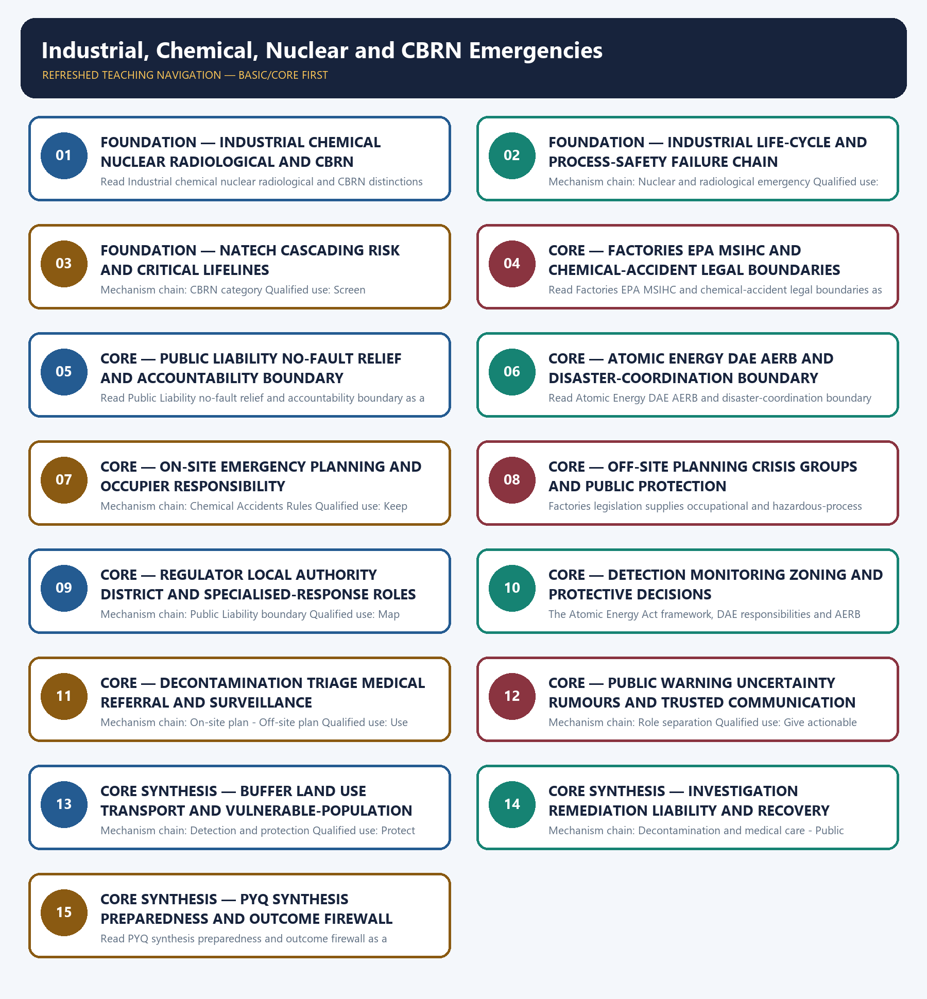

# Industrial, Chemical, Nuclear and CBRN Emergencies — Learner-v2 Complete Learning Session

> **Authoring-only generation:** 2026-09-04. No PDF was rendered and no tracker or index was mutated.

### SOURCE, PROGRESSION AND CURRENT-LINKAGE AUDIT

- **Generation date:** 2026-09-04.
- **Repository-first evidence:** the Basic owner is taught first and preserved in full; the Advanced owner is retained only in the optional final teaching block.
- **OCR evidence:** Repository Markdown was primary. OCR-searchable official UPSC papers were supplementary only for printed routed demands. No answer key, warning performance, notification effect, implementation outcome, casualty reduction or disaster metric was inferred.
- **Qdrant:** not used; repository Markdown and available OCR context were sufficient.
- **PYQ integrity:** No audited GS-III route directly names industrial, chemical, nuclear or CBRN emergency governance. The 2023 oil-pollution card is cross-owned adjacent context; the 2024 resilience and 2020 proactive-governance cards are explicit support routes.
- **Live-link boundary:** Official attempts covered PESO's rules inventory, India Code law routes, CPCB chemical-emergency content, NDMA guidance, DAE, AERB and NDRF. Blocked, thin, redirected and transport-failed pages are recorded; no hazardous synthesis, dispersal, facility weakness, exposure zone, casualty, contamination, readiness or response outcome was invented.
- **Fact/inference discipline:** no current-affairs item, PYQ wording, figure or quotation is invented.

### LIVE OFFICIAL-SOURCE ATTEMPT LOG

The checks below were made on 2026-09-04. Substantive official text is used only for the proposition it supports; title-only, blocked or thin pages are recorded and supply no factual claim.

- https://peso.gov.in/web/en/rti/rules-regulations-instructions-manuals-and-records-held-it-or-under-its-control-or-used-its — fetched 2026-09-04; PESO listed the Explosives Act, Petroleum Act, related rules and entrusted MSIHC/Chemical Accidents functions. https://www.indiacode.nic.in/ — searched 2026-09-04; direct Public Liability, Factories and Atomic Energy PDF routes returned HTTP 403, so no section-level proposition was reconstructed.
- https://cpcb.nic.in/chemical-emergency/ — fetched 2026-09-04 after redirect and returned only a thin CPCB title. https://ndma.gov.in/Man-made-Hazards/Chemical — attempted 2026-09-04; the NDMA route failed at the transport layer. Chemical-response content remains at the audited owner and exam-safe level.
- https://www.aerb.gov.in/english/regulatory-facilities/nuclear-power-plants/emergency-preparedness — fetched 2026-09-04 but redirected to a thin Hindi home item. https://dae.gov.in/ — fetched 2026-09-04; DAE confirmed its Central Government atomic-energy business remit. https://ndrf.gov.in/en/about-us — fetched 2026-09-04 for the general specialised natural/man-made disaster-response role only.
- https://ndma.gov.in/sites/default/files/PDF/Guidelines/chemical-disaster.pdf — attempted 2026-09-04; transport failed. https://www.mha.gov.in/en/commoncontent/disaster-management-act-2005 — attempted 2026-09-04; MHA returned HTTP 403. No force readiness, facility vulnerability, dispersion, casualty or response outcome was inferred.
- https://nidm.gov.in/PDF/pubs/CHEMICAL%20DISASTER%20MANAGEMENT.pdf — searched 2026-09-04; the official NIDM publication route was found but not parsed into section-level legal or operational claims.

## BASIC LEARNING SESSION



*Distinct embedded teaching-navigation image. The separate continuous Cārvāka-style flowchart package remains an independent at-a-glance artifact.*

### SESSION 1 — FOUNDATION — INDUSTRIAL CHEMICAL NUCLEAR RADIOLOGICAL AND CBRN DISTINCTIONS

#### DEFINITION / WHAT THIS IS CALLED

**Plain-language definition:** The decisive boundary is Do not use industrial accident, chemical emergency, nuclear emergency and CBRN as synonyms.

**Technical definition:** Read Industrial chemical nuclear radiological and CBRN distinctions as a sequence: identify Industrial accident, follow the named mechanism to its institutional response, and stop at the last verified status rather than assuming the next stage.

#### ANSWER-GRABBING OPENING — WRITE/ADAPT IN THE EXAM

> Read Industrial chemical nuclear radiological and CBRN distinctions as a sequence: identify Industrial accident, follow the named mechanism to its institutional response, and stop at the last verified status rather than assuming the next stage.

#### MUST-WRITE KEYWORDS

- **FOUNDATION**
- **Industrial chemical nuclear radiological**
- **CBRN distinctions**
- **Mechanism chain**
- **Qualified use**
- **An industrial accident**

**How to use them:** Frame the answer through FOUNDATION; define Industrial chemical nuclear radiological, connect CBRN distinctions with Mechanism chain to explain the mechanism, and use Qualified use for the decisive comparison or qualification.

#### VISUAL FIRST

```text
INDUSTRIAL CHEMICAL NUCLEAR RADIOLOGICAL AND CBRN DISTINCTIONS
01. Industrial accident
    |
    v
02. Chemical emergency
STATUS / CATEGORY FIREWALL -> Do not use industrial accident, chemical emergency, nuclear emergency and CBRN as synonyms.
```

*The rail fixes the institutional sequence and claim boundary before explanation.*

#### CORE EXPLANATION

An industrial accident is an unintended event arising from an industrial process, facility, storage or transport system that can cause fire, explosion, release, injury, contamination or service disruption. A chemical emergency involves an actual or threatened hazardous-chemical release, fire or reaction requiring chemical-specific identification, protective action, medical management and environmental control.

#### SIMPLE SYSTEM EXAMPLE

Read Industrial chemical nuclear radiological and CBRN distinctions as a sequence: identify Industrial accident, follow the named mechanism to its institutional response, and stop at the last verified status rather than assuming the next stage.

#### TECHNICAL DISTINCTION

The decisive boundary is Do not use industrial accident, chemical emergency, nuclear emergency and CBRN as synonyms. This keeps Industrial accident and Chemical emergency in the correct risk category, institutional mandate and evidence status.

#### NAMED EVIDENCE AND MECHANISM

- An industrial accident is an unintended event arising from an industrial process, facility, storage or transport system that can cause fire, explosion, release, injury, contamination or service disruption.
- A chemical emergency involves an actual or threatened hazardous-chemical release, fire or reaction requiring chemical-specific identification, protective action, medical management and environmental control.

#### EXAMINER CAUTION

- Do not use industrial accident, chemical emergency, nuclear emergency and CBRN as synonyms.

#### EXAM LINK

- **Prelims:** Keep hazard, forecast, warning, institution, law, plan, force, fund, scheme and outcome in their exact category.
- **Mains:** Identify the hazard class before naming a law, institution or response.

#### MINI RECAP

- **Mechanism chain:** Industrial accident -> Chemical emergency
- **Qualified use:** Identify the hazard class before naming a law, institution or response.

#### CLOSING RECALL FLOW — FOUNDATION — INDUSTRIAL CHEMICAL NUCLEAR RADIOLOGICAL AND CBRN DISTINCTIONS

```text
START / CONCEPT: FOUNDATION — Industrial chemical nuclear radiological and CBRN distinctions
        |
        v
EXACT TERMS: FOUNDATION · Industrial chemical nuclear radiological · CBRN distinctions · Mechanism chain · Qualified use · An industrial accident
        |
        v
MECHANISM / ARGUMENT: Mechanism chain: Industrial accident - Chemical emergency Qualified use: Identify the hazard class before naming a law, institution or response.
        |
        v
CONSEQUENCE / CONTRAST: The decisive boundary is Do not use industrial accident, chemical emergency, nuclear emergency and CBRN as synonyms.
        |
        v
UPSC TRAP / ANSWER-USE: Do not use industrial accident, chemical emergency, nuclear emergency and CBRN as synonyms.
        |
        v
ANSWER-GRABBING FORMULATION: Read Industrial chemical nuclear radiological and CBRN distinctions as a sequence: identify Industrial accident, follow the named mechanism to its institutional response, and stop at the last verified status rather than assuming the next stage.
```
### SESSION 2 — FOUNDATION — INDUSTRIAL LIFE-CYCLE AND PROCESS-SAFETY FAILURE CHAIN

#### DEFINITION / WHAT THIS IS CALLED

**Plain-language definition:** Read Industrial life-cycle and process-safety failure chain as a sequence: identify Nuclear and radiological emergency, follow the named mechanism to its institutional response, and stop at the last verified status rather than assuming the next stage.

**Technical definition:** Mechanism chain: Nuclear and radiological emergency Qualified use: Trace failure across design operation maintenance change and safety culture.

#### ANSWER-GRABBING OPENING — WRITE/ADAPT IN THE EXAM

> Read Industrial life-cycle and process-safety failure chain as a sequence: identify Nuclear and radiological emergency, follow the named mechanism to its institutional response, and stop at the last verified status rather than assuming the next stage.

#### MUST-WRITE KEYWORDS

- **FOUNDATION**
- **Industrial life-cycle**
- **process-safety failure chain**
- **Mechanism chain**
- **Qualified use**
- **Read Industrial**

**How to use them:** Frame the answer through FOUNDATION; define Industrial life-cycle, connect process-safety failure chain with Mechanism chain to explain the mechanism, and use Qualified use for the decisive comparison or qualification.

#### VISUAL FIRST

```text
INDUSTRIAL LIFE-CYCLE AND PROCESS-SAFETY FAILURE CHAIN
01. Nuclear and radiological emergency
STATUS / CATEGORY FIREWALL -> Do not merge nuclear and radiological emergencies.
```

*The rail fixes the institutional sequence and claim boundary before explanation.*

#### CORE EXPLANATION

A nuclear emergency arises from a nuclear-facility or nuclear-chain context, while a radiological emergency may involve radioactive material or exposure without a nuclear-chain event; the terms are related but not interchangeable.

#### SIMPLE SYSTEM EXAMPLE

Read Industrial life-cycle and process-safety failure chain as a sequence: identify Nuclear and radiological emergency, follow the named mechanism to its institutional response, and stop at the last verified status rather than assuming the next stage.

#### TECHNICAL DISTINCTION

The decisive boundary is Do not merge nuclear and radiological emergencies. This keeps Nuclear and radiological emergency in the correct risk category, institutional mandate and evidence status.

#### NAMED EVIDENCE AND MECHANISM

- A nuclear emergency arises from a nuclear-facility or nuclear-chain context, while a radiological emergency may involve radioactive material or exposure without a nuclear-chain event; the terms are related but not interchangeable.

#### EXAMINER CAUTION

- Do not merge nuclear and radiological emergencies.

#### EXAM LINK

- **Prelims:** Keep hazard, forecast, warning, institution, law, plan, force, fund, scheme and outcome in their exact category.
- **Mains:** Trace failure across design operation maintenance change and safety culture.

#### MINI RECAP

- **Mechanism chain:** Nuclear and radiological emergency
- **Qualified use:** Trace failure across design operation maintenance change and safety culture.

#### CLOSING RECALL FLOW — FOUNDATION — INDUSTRIAL LIFE-CYCLE AND PROCESS-SAFETY FAILURE CHAIN

```text
START / CONCEPT: FOUNDATION — Industrial life-cycle and process-safety failure chain
        |
        v
EXACT TERMS: FOUNDATION · Industrial life-cycle · process-safety failure chain · Mechanism chain · Qualified use · Read Industrial
        |
        v
MECHANISM / ARGUMENT: Mechanism chain: Nuclear and radiological emergency Qualified use: Trace failure across design operation maintenance change and safety culture.
        |
        v
CONSEQUENCE / CONTRAST: A nuclear emergency arises from a nuclear-facility or nuclear-chain context, while a radiological emergency may involve radioactive material or exposure without a nuclear-chain event; the terms are related but not interchangeable.
        |
        v
UPSC TRAP / ANSWER-USE: The decisive boundary is Do not merge nuclear and radiological emergencies.
        |
        v
ANSWER-GRABBING FORMULATION: Read Industrial life-cycle and process-safety failure chain as a sequence: identify Nuclear and radiological emergency, follow the named mechanism to its institutional response, and stop at the last verified status rather than assuming the next stage.
```
### SESSION 3 — FOUNDATION — NATECH CASCADING RISK AND CRITICAL LIFELINES

#### DEFINITION / WHAT THIS IS CALLED

**Plain-language definition:** Read NaTech cascading risk and critical lifelines as a sequence: identify CBRN category, follow the named mechanism to its institutional response, and stop at the last verified status rather than assuming the next stage.

**Technical definition:** Mechanism chain: CBRN category Qualified use: Screen natural-hazard loads and cascading lifeline failure.

#### ANSWER-GRABBING OPENING — WRITE/ADAPT IN THE EXAM

> Read NaTech cascading risk and critical lifelines as a sequence: identify CBRN category, follow the named mechanism to its institutional response, and stop at the last verified status rather than assuming the next stage.

#### MUST-WRITE KEYWORDS

- **FOUNDATION**
- **NaTech cascading risk**
- **critical lifelines**
- **Mechanism chain**
- **Qualified use**
- **CBRN**

**How to use them:** Frame the answer through FOUNDATION; define NaTech cascading risk, connect critical lifelines with Mechanism chain to explain the mechanism, and use Qualified use for the decisive comparison or qualification.

#### VISUAL FIRST

```text
NATECH CASCADING RISK AND CRITICAL LIFELINES
01. CBRN category
STATUS / CATEGORY FIREWALL -> Do not treat CBRN as one detection, protection or medical protocol.
```

*The rail fixes the institutional sequence and claim boundary before explanation.*

#### CORE EXPLANATION

CBRN is the umbrella category chemical, biological, radiological and nuclear; each component has a different hazard mechanism, regulator, detection basis, protective approach and medical pathway.

#### SIMPLE SYSTEM EXAMPLE

Read NaTech cascading risk and critical lifelines as a sequence: identify CBRN category, follow the named mechanism to its institutional response, and stop at the last verified status rather than assuming the next stage.

#### TECHNICAL DISTINCTION

The decisive boundary is Do not treat CBRN as one detection, protection or medical protocol. This keeps CBRN category in the correct risk category, institutional mandate and evidence status.

#### NAMED EVIDENCE AND MECHANISM

- CBRN is the umbrella category chemical, biological, radiological and nuclear; each component has a different hazard mechanism, regulator, detection basis, protective approach and medical pathway.

#### EXAMINER CAUTION

- Do not treat CBRN as one detection, protection or medical protocol.

#### EXAM LINK

- **Prelims:** Keep hazard, forecast, warning, institution, law, plan, force, fund, scheme and outcome in their exact category.
- **Mains:** Screen natural-hazard loads and cascading lifeline failure.

#### MINI RECAP

- **Mechanism chain:** CBRN category
- **Qualified use:** Screen natural-hazard loads and cascading lifeline failure.

#### CLOSING RECALL FLOW — FOUNDATION — NATECH CASCADING RISK AND CRITICAL LIFELINES

```text
START / CONCEPT: FOUNDATION — NaTech cascading risk and critical lifelines
        |
        v
EXACT TERMS: FOUNDATION · NaTech cascading risk · critical lifelines · Mechanism chain · Qualified use · CBRN
        |
        v
MECHANISM / ARGUMENT: Mechanism chain: CBRN category Qualified use: Screen natural-hazard loads and cascading lifeline failure.
        |
        v
CONSEQUENCE / CONTRAST: The decisive boundary is Do not treat CBRN as one detection, protection or medical protocol.
        |
        v
UPSC TRAP / ANSWER-USE: Do not treat CBRN as one detection, protection or medical protocol.
        |
        v
ANSWER-GRABBING FORMULATION: Read NaTech cascading risk and critical lifelines as a sequence: identify CBRN category, follow the named mechanism to its institutional response, and stop at the last verified status rather than assuming the next stage.
```
### SESSION 4 — CORE — FACTORIES EPA MSIHC AND CHEMICAL-ACCIDENT LEGAL BOUNDARIES

#### DEFINITION / WHAT THIS IS CALLED

**Plain-language definition:** The decisive boundary is Do not imply the Factories Act alone governs off-site chemical consequences.

**Technical definition:** Read Factories EPA MSIHC and chemical-accident legal boundaries as a sequence: identify Industrial life cycle, follow the named mechanism to its institutional response, and stop at the last verified status rather than assuming the next stage.

#### ANSWER-GRABBING OPENING — WRITE/ADAPT IN THE EXAM

> Read Factories EPA MSIHC and chemical-accident legal boundaries as a sequence: identify Industrial life cycle, follow the named mechanism to its institutional response, and stop at the last verified status rather than assuming the next stage.

#### MUST-WRITE KEYWORDS

- **ories EPA MSIHC**
- **chemical-accident legal boundaries**
- **Mechanism chain**
- **Qualified use**
- **Hazard**
- **Read Factories EPA MSIHC**

**How to use them:** Frame the answer through ories EPA MSIHC; define chemical-accident legal boundaries, connect Mechanism chain with Qualified use to explain the mechanism, and use Hazard for the decisive comparison or qualification.

#### VISUAL FIRST

```text
FACTORIES EPA MSIHC AND CHEMICAL-ACCIDENT LEGAL BOUNDARIES
01. Industrial life cycle
STATUS / CATEGORY FIREWALL -> Do not imply the Factories Act alone governs off-site chemical consequences.
```

*The rail fixes the institutional sequence and claim boundary before explanation.*

#### CORE EXPLANATION

Hazard can arise during extraction, manufacture, processing, storage, transport, use, maintenance, waste handling or disposal, so prevention must follow the material and process life cycle.

#### SIMPLE SYSTEM EXAMPLE

Read Factories EPA MSIHC and chemical-accident legal boundaries as a sequence: identify Industrial life cycle, follow the named mechanism to its institutional response, and stop at the last verified status rather than assuming the next stage.

#### TECHNICAL DISTINCTION

The decisive boundary is Do not imply the Factories Act alone governs off-site chemical consequences. This keeps Industrial life cycle in the correct risk category, institutional mandate and evidence status.

#### NAMED EVIDENCE AND MECHANISM

- Hazard can arise during extraction, manufacture, processing, storage, transport, use, maintenance, waste handling or disposal, so prevention must follow the material and process life cycle.

#### EXAMINER CAUTION

- Do not imply the Factories Act alone governs off-site chemical consequences.

#### EXAM LINK

- **Prelims:** Keep hazard, forecast, warning, institution, law, plan, force, fund, scheme and outcome in their exact category.
- **Mains:** Assign each instrument only its owner-verified field.

#### MINI RECAP

- **Mechanism chain:** Industrial life cycle
- **Qualified use:** Assign each instrument only its owner-verified field.

#### CLOSING RECALL FLOW — CORE — FACTORIES EPA MSIHC AND CHEMICAL-ACCIDENT LEGAL BOUNDARIES

```text
START / CONCEPT: CORE — Factories EPA MSIHC and chemical-accident legal boundaries
        |
        v
EXACT TERMS: ories EPA MSIHC · chemical-accident legal boundaries · Mechanism chain · Qualified use · Hazard · Read Factories EPA MSIHC
        |
        v
MECHANISM / ARGUMENT: Mechanism chain: Industrial life cycle Qualified use: Assign each instrument only its owner-verified field.
        |
        v
CONSEQUENCE / CONTRAST: The decisive boundary is Do not imply the Factories Act alone governs off-site chemical consequences.
        |
        v
UPSC TRAP / ANSWER-USE: Do not imply the Factories Act alone governs off-site chemical consequences.
        |
        v
ANSWER-GRABBING FORMULATION: Read Factories EPA MSIHC and chemical-accident legal boundaries as a sequence: identify Industrial life cycle, follow the named mechanism to its institutional response, and stop at the last verified status rather than assuming the next stage.
```
### SESSION 5 — CORE — PUBLIC LIABILITY NO-FAULT RELIEF AND ACCOUNTABILITY BOUNDARY

#### DEFINITION / WHAT THIS IS CALLED

**Plain-language definition:** The decisive boundary is Do not confuse the MSIHC Rules with the Chemical Accidents Rules.

**Technical definition:** Read Public Liability no-fault relief and accountability boundary as a sequence: identify Process-safety causes, follow the named mechanism to its institutional response, and stop at the last verified status rather than assuming the next stage.

#### ANSWER-GRABBING OPENING — WRITE/ADAPT IN THE EXAM

> Read Public Liability no-fault relief and accountability boundary as a sequence: identify Process-safety causes, follow the named mechanism to its institutional response, and stop at the last verified status rather than assuming the next stage.

#### MUST-WRITE KEYWORDS

- **Public Liability no-fault relief**
- **accountability boundary**
- **Mechanism chain**
- **Qualified use**
- **Design**
- **Read Public Liability**

**How to use them:** Frame the answer through Public Liability no-fault relief; define accountability boundary, connect Mechanism chain with Qualified use to explain the mechanism, and use Design for the decisive comparison or qualification.

#### VISUAL FIRST

```text
PUBLIC LIABILITY NO-FAULT RELIEF AND ACCOUNTABILITY BOUNDARY
01. Process-safety causes
STATUS / CATEGORY FIREWALL -> Do not confuse the MSIHC Rules with the Chemical Accidents Rules.
```

*The rail fixes the institutional sequence and claim boundary before explanation.*

#### CORE EXPLANATION

Design error, corrosion, fatigue, loss of containment, utility failure, poor maintenance, unsafe change, human or organisational error and weak safety culture can combine rather than operate as one isolated cause.

#### SIMPLE SYSTEM EXAMPLE

Read Public Liability no-fault relief and accountability boundary as a sequence: identify Process-safety causes, follow the named mechanism to its institutional response, and stop at the last verified status rather than assuming the next stage.

#### TECHNICAL DISTINCTION

The decisive boundary is Do not confuse the MSIHC Rules with the Chemical Accidents Rules. This keeps Process-safety causes in the correct risk category, institutional mandate and evidence status.

#### NAMED EVIDENCE AND MECHANISM

- Design error, corrosion, fatigue, loss of containment, utility failure, poor maintenance, unsafe change, human or organisational error and weak safety culture can combine rather than operate as one isolated cause.

#### EXAMINER CAUTION

- Do not confuse the MSIHC Rules with the Chemical Accidents Rules.

#### EXAM LINK

- **Prelims:** Keep hazard, forecast, warning, institution, law, plan, force, fund, scheme and outcome in their exact category.
- **Mains:** Separate immediate no-fault relief from final liability and prevention.

#### MINI RECAP

- **Mechanism chain:** Process-safety causes
- **Qualified use:** Separate immediate no-fault relief from final liability and prevention.

#### CLOSING RECALL FLOW — CORE — PUBLIC LIABILITY NO-FAULT RELIEF AND ACCOUNTABILITY BOUNDARY

```text
START / CONCEPT: CORE — Public Liability no-fault relief and accountability boundary
        |
        v
EXACT TERMS: Public Liability no-fault relief · accountability boundary · Mechanism chain · Qualified use · Design · Read Public Liability
        |
        v
MECHANISM / ARGUMENT: Mechanism chain: Process-safety causes Qualified use: Separate immediate no-fault relief from final liability and prevention.
        |
        v
CONSEQUENCE / CONTRAST: The decisive boundary is Do not confuse the MSIHC Rules with the Chemical Accidents Rules.
        |
        v
UPSC TRAP / ANSWER-USE: Do not confuse the MSIHC Rules with the Chemical Accidents Rules.
        |
        v
ANSWER-GRABBING FORMULATION: Read Public Liability no-fault relief and accountability boundary as a sequence: identify Process-safety causes, follow the named mechanism to its institutional response, and stop at the last verified status rather than assuming the next stage.
```
### SESSION 6 — CORE — ATOMIC ENERGY DAE AERB AND DISASTER-COORDINATION BOUNDARY

#### DEFINITION / WHAT THIS IS CALLED

**Plain-language definition:** The decisive boundary is Do not describe no-fault civil relief as automatic criminal guilt or full compensation.

**Technical definition:** Read Atomic Energy DAE AERB and disaster-coordination boundary as a sequence: identify NaTech risk, follow the named mechanism to its institutional response, and stop at the last verified status rather than assuming the next stage.

#### ANSWER-GRABBING OPENING — WRITE/ADAPT IN THE EXAM

> Read Atomic Energy DAE AERB and disaster-coordination boundary as a sequence: identify NaTech risk, follow the named mechanism to its institutional response, and stop at the last verified status rather than assuming the next stage.

#### MUST-WRITE KEYWORDS

- **Atomic Energy DAE AERB**
- **disaster-coordination boundary**
- **Mechanism chain**
- **Qualified use**
- **The Manufacture**
- **Storage**

**How to use them:** Frame the answer through Atomic Energy DAE AERB; define disaster-coordination boundary, connect Mechanism chain with Qualified use to explain the mechanism, and use The Manufacture for the decisive comparison or qualification.

#### VISUAL FIRST

```text
ATOMIC ENERGY DAE AERB AND DISASTER-COORDINATION BOUNDARY
01. NaTech risk
    |
    v
02. MSIHC boundary
STATUS / CATEGORY FIREWALL -> Do not describe no-fault civil relief as automatic criminal guilt or full compensation.
```

*The rail fixes the institutional sequence and claim boundary before explanation.*

#### CORE EXPLANATION

A natural hazard can trigger a technological accident through flood, earthquake, cyclone, heat or other stresses on hazardous facilities and lifelines; natural and industrial risk therefore require joint screening. The Manufacture, Storage and Import of Hazardous Chemical Rules, 1989 operate under the Environment (Protection) framework and allocate preventive information, safety-report and emergency-planning duties for covered hazardous chemicals and installations.

#### SIMPLE SYSTEM EXAMPLE

Read Atomic Energy DAE AERB and disaster-coordination boundary as a sequence: identify NaTech risk, follow the named mechanism to its institutional response, and stop at the last verified status rather than assuming the next stage.

#### TECHNICAL DISTINCTION

The decisive boundary is Do not describe no-fault civil relief as automatic criminal guilt or full compensation. This keeps NaTech risk and MSIHC boundary in the correct risk category, institutional mandate and evidence status.

#### NAMED EVIDENCE AND MECHANISM

- A natural hazard can trigger a technological accident through flood, earthquake, cyclone, heat or other stresses on hazardous facilities and lifelines; natural and industrial risk therefore require joint screening.
- The Manufacture, Storage and Import of Hazardous Chemical Rules, 1989 operate under the Environment (Protection) framework and allocate preventive information, safety-report and emergency-planning duties for covered hazardous chemicals and installations.

#### EXAMINER CAUTION

- Do not describe no-fault civil relief as automatic criminal guilt or full compensation.

#### EXAM LINK

- **Prelims:** Keep hazard, forecast, warning, institution, law, plan, force, fund, scheme and outcome in their exact category.
- **Mains:** Preserve technical regulation and general coordination as complementary.

#### MINI RECAP

- **Mechanism chain:** NaTech risk -> MSIHC boundary
- **Qualified use:** Preserve technical regulation and general coordination as complementary.

#### CLOSING RECALL FLOW — CORE — ATOMIC ENERGY DAE AERB AND DISASTER-COORDINATION BOUNDARY

```text
START / CONCEPT: CORE — Atomic Energy DAE AERB and disaster-coordination boundary
        |
        v
EXACT TERMS: Atomic Energy DAE AERB · disaster-coordination boundary · Mechanism chain · Qualified use · The Manufacture · Storage
        |
        v
MECHANISM / ARGUMENT: Mechanism chain: NaTech risk - MSIHC boundary Qualified use: Preserve technical regulation and general coordination as complementary.
        |
        v
CONSEQUENCE / CONTRAST: The decisive boundary is Do not describe no-fault civil relief as automatic criminal guilt or full compensation.
        |
        v
UPSC TRAP / ANSWER-USE: Do not miss this limiting distinction: a natural hazard can trigger a technological accident through flood, earthquake, cyclone, heat or...
        |
        v
ANSWER-GRABBING FORMULATION: Read Atomic Energy DAE AERB and disaster-coordination boundary as a sequence: identify NaTech risk, follow the named mechanism to its institutional response, and stop at the last verified status rather than assuming the next stage.
```
### SESSION 7 — CORE — ON-SITE EMERGENCY PLANNING AND OCCUPIER RESPONSIBILITY

#### DEFINITION / WHAT THIS IS CALLED

**Plain-language definition:** Read On-site emergency planning and occupier responsibility as a sequence: identify Chemical Accidents Rules, follow the named mechanism to its institutional response, and stop at the last verified status rather than assuming the next stage.

**Technical definition:** Mechanism chain: Chemical Accidents Rules Qualified use: Keep source control worker safety communication and external liaison with the occupier.

#### ANSWER-GRABBING OPENING — WRITE/ADAPT IN THE EXAM

> Read On-site emergency planning and occupier responsibility as a sequence: identify Chemical Accidents Rules, follow the named mechanism to its institutional response, and stop at the last verified status rather than assuming the next stage.

#### MUST-WRITE KEYWORDS

- **On-site emergency planning**
- **occupier responsibility**
- **Mechanism chain**
- **Qualified use**
- **Read On-site**
- **Chemical Accidents Rules**

**How to use them:** Frame the answer through On-site emergency planning; define occupier responsibility, connect Mechanism chain with Qualified use to explain the mechanism, and use Read On-site for the decisive comparison or qualification.

#### VISUAL FIRST

```text
ON-SITE EMERGENCY PLANNING AND OCCUPIER RESPONSIBILITY
01. Chemical Accidents Rules
STATUS / CATEGORY FIREWALL -> Do not shift the occupier's prevention duty to NDRF or district authorities.
```

*The rail fixes the institutional sequence and claim boundary before explanation.*

#### CORE EXPLANATION

The Chemical Accidents (Emergency Planning, Preparedness and Response) Rules, 1996 establish Central, State, District and Local Crisis Group architecture for chemical-accident planning, coordination and review.

#### SIMPLE SYSTEM EXAMPLE

Read On-site emergency planning and occupier responsibility as a sequence: identify Chemical Accidents Rules, follow the named mechanism to its institutional response, and stop at the last verified status rather than assuming the next stage.

#### TECHNICAL DISTINCTION

The decisive boundary is Do not shift the occupier's prevention duty to NDRF or district authorities. This keeps Chemical Accidents Rules in the correct risk category, institutional mandate and evidence status.

#### NAMED EVIDENCE AND MECHANISM

- The Chemical Accidents (Emergency Planning, Preparedness and Response) Rules, 1996 establish Central, State, District and Local Crisis Group architecture for chemical-accident planning, coordination and review.

#### EXAMINER CAUTION

- Do not shift the occupier's prevention duty to NDRF or district authorities.

#### EXAM LINK

- **Prelims:** Keep hazard, forecast, warning, institution, law, plan, force, fund, scheme and outcome in their exact category.
- **Mains:** Keep source control worker safety communication and external liaison with the occupier.

#### MINI RECAP

- **Mechanism chain:** Chemical Accidents Rules
- **Qualified use:** Keep source control worker safety communication and external liaison with the occupier.

#### CLOSING RECALL FLOW — CORE — ON-SITE EMERGENCY PLANNING AND OCCUPIER RESPONSIBILITY

```text
START / CONCEPT: CORE — On-site emergency planning and occupier responsibility
        |
        v
EXACT TERMS: On-site emergency planning · occupier responsibility · Mechanism chain · Qualified use · Read On-site · Chemical Accidents Rules
        |
        v
MECHANISM / ARGUMENT: Mechanism chain: Chemical Accidents Rules Qualified use: Keep source control worker safety communication and external liaison with the occupier.
        |
        v
CONSEQUENCE / CONTRAST: The decisive boundary is Do not shift the occupier's prevention duty to NDRF or district authorities.
        |
        v
UPSC TRAP / ANSWER-USE: Do not shift the occupier's prevention duty to NDRF or district authorities.
        |
        v
ANSWER-GRABBING FORMULATION: Read On-site emergency planning and occupier responsibility as a sequence: identify Chemical Accidents Rules, follow the named mechanism to its institutional response, and stop at the last verified status rather than assuming the next stage.
```
### SESSION 8 — CORE — OFF-SITE PLANNING CRISIS GROUPS AND PUBLIC PROTECTION

#### DEFINITION / WHAT THIS IS CALLED

**Plain-language definition:** Read Off-site planning crisis groups and public protection as a sequence: identify Factories-law boundary, follow the named mechanism to its institutional response, and stop at the last verified status rather than assuming the next stage.

**Technical definition:** Factories legislation supplies occupational and hazardous-process safety duties within its field, but it does not replace environmental chemical rules, off-site planning, public liability or disaster-response coordination.

#### ANSWER-GRABBING OPENING — WRITE/ADAPT IN THE EXAM

> Read Off-site planning crisis groups and public protection as a sequence: identify Factories-law boundary, follow the named mechanism to its institutional response, and stop at the last verified status rather than assuming the next stage.

#### MUST-WRITE KEYWORDS

- **Off-site planning crisis groups**
- **public protection**
- **Mechanism chain**
- **Qualified use**
- **ories**
- **Read Off-site**

**How to use them:** Frame the answer through Off-site planning crisis groups; define public protection, connect Mechanism chain with Qualified use to explain the mechanism, and use ories for the decisive comparison or qualification.

#### VISUAL FIRST

```text
OFF-SITE PLANNING CRISIS GROUPS AND PUBLIC PROTECTION
01. Factories-law boundary
STATUS / CATEGORY FIREWALL -> Do not provide harmful synthesis, dispersal, exploitation or facility-vulnerability detail.
```

*The rail fixes the institutional sequence and claim boundary before explanation.*

#### CORE EXPLANATION

Factories legislation supplies occupational and hazardous-process safety duties within its field, but it does not replace environmental chemical rules, off-site planning, public liability or disaster-response coordination.

#### SIMPLE SYSTEM EXAMPLE

Read Off-site planning crisis groups and public protection as a sequence: identify Factories-law boundary, follow the named mechanism to its institutional response, and stop at the last verified status rather than assuming the next stage.

#### TECHNICAL DISTINCTION

The decisive boundary is Do not provide harmful synthesis, dispersal, exploitation or facility-vulnerability detail. This keeps Factories-law boundary in the correct risk category, institutional mandate and evidence status.

#### NAMED EVIDENCE AND MECHANISM

- Factories legislation supplies occupational and hazardous-process safety duties within its field, but it does not replace environmental chemical rules, off-site planning, public liability or disaster-response coordination.

#### EXAMINER CAUTION

- Do not provide harmful synthesis, dispersal, exploitation or facility-vulnerability detail.

#### EXAM LINK

- **Prelims:** Keep hazard, forecast, warning, institution, law, plan, force, fund, scheme and outcome in their exact category.
- **Mains:** Translate facility information into public warning protection health and traffic decisions.

#### MINI RECAP

- **Mechanism chain:** Factories-law boundary
- **Qualified use:** Translate facility information into public warning protection health and traffic decisions.

#### CLOSING RECALL FLOW — CORE — OFF-SITE PLANNING CRISIS GROUPS AND PUBLIC PROTECTION

```text
START / CONCEPT: CORE — Off-site planning crisis groups and public protection
        |
        v
EXACT TERMS: Off-site planning crisis groups · public protection · Mechanism chain · Qualified use · ories · Read Off-site
        |
        v
MECHANISM / ARGUMENT: Mechanism chain: Factories-law boundary Qualified use: Translate facility information into public warning protection health and traffic decisions.
        |
        v
CONSEQUENCE / CONTRAST: Factories legislation supplies occupational and hazardous-process safety duties within its field, but it does not replace environmental chemical rules, off-site planning, public liability or disaster-response coordination.
        |
        v
UPSC TRAP / ANSWER-USE: The decisive boundary is Do not provide harmful synthesis, dispersal, exploitation or facility-vulnerability detail.
        |
        v
ANSWER-GRABBING FORMULATION: Read Off-site planning crisis groups and public protection as a sequence: identify Factories-law boundary, follow the named mechanism to its institutional response, and stop at the last verified status rather than assuming the next stage.
```
### SESSION 9 — CORE — REGULATOR LOCAL AUTHORITY DISTRICT AND SPECIALISED-RESPONSE ROLES

#### DEFINITION / WHAT THIS IS CALLED

**Plain-language definition:** Read Regulator local authority district and specialised-response roles as a sequence: identify Public Liability boundary, follow the named mechanism to its institutional response, and stop at the last verified status rather than assuming the next stage.

**Technical definition:** Mechanism chain: Public Liability boundary Qualified use: Map prevention regulation coordination and specialist response separately.

#### ANSWER-GRABBING OPENING — WRITE/ADAPT IN THE EXAM

> Read Regulator local authority district and specialised-response roles as a sequence: identify Public Liability boundary, follow the named mechanism to its institutional response, and stop at the last verified status rather than assuming the next stage.

#### MUST-WRITE KEYWORDS

- **Regulator local authority district**
- **specialised-response roles**
- **Mechanism chain**
- **Qualified use**
- **The Public Liability Insurance Act**
- **Read Regulator**

**How to use them:** Frame the answer through Regulator local authority district; define specialised-response roles, connect Mechanism chain with Qualified use to explain the mechanism, and use The Public Liability Insurance Act for the decisive comparison or qualification.

#### VISUAL FIRST

```text
REGULATOR LOCAL AUTHORITY DISTRICT AND SPECIALISED-RESPONSE ROLES
01. Public Liability boundary
STATUS / CATEGORY FIREWALL -> Do not assume a drill, licence, audit or plan proves compliance or readiness.
```

*The rail fixes the institutional sequence and claim boundary before explanation.*

#### CORE EXPLANATION

The Public Liability Insurance Act, 1991 provides a no-fault civil-relief route for accidents involving hazardous substances; immediate relief is distinct from final damages, criminal liability or proof that prevention was adequate.

#### SIMPLE SYSTEM EXAMPLE

Read Regulator local authority district and specialised-response roles as a sequence: identify Public Liability boundary, follow the named mechanism to its institutional response, and stop at the last verified status rather than assuming the next stage.

#### TECHNICAL DISTINCTION

The decisive boundary is Do not assume a drill, licence, audit or plan proves compliance or readiness. This keeps Public Liability boundary in the correct risk category, institutional mandate and evidence status.

#### NAMED EVIDENCE AND MECHANISM

- The Public Liability Insurance Act, 1991 provides a no-fault civil-relief route for accidents involving hazardous substances; immediate relief is distinct from final damages, criminal liability or proof that prevention was adequate.

#### EXAMINER CAUTION

- Do not assume a drill, licence, audit or plan proves compliance or readiness.

#### EXAM LINK

- **Prelims:** Keep hazard, forecast, warning, institution, law, plan, force, fund, scheme and outcome in their exact category.
- **Mains:** Map prevention regulation coordination and specialist response separately.

#### MINI RECAP

- **Mechanism chain:** Public Liability boundary
- **Qualified use:** Map prevention regulation coordination and specialist response separately.

#### CLOSING RECALL FLOW — CORE — REGULATOR LOCAL AUTHORITY DISTRICT AND SPECIALISED-RESPONSE ROLES

```text
START / CONCEPT: CORE — Regulator local authority district and specialised-response roles
        |
        v
EXACT TERMS: Regulator local authority district · specialised-response roles · Mechanism chain · Qualified use · The Public Liability Insurance Act · Read Regulator
        |
        v
MECHANISM / ARGUMENT: Mechanism chain: Public Liability boundary Qualified use: Map prevention regulation coordination and specialist response separately.
        |
        v
CONSEQUENCE / CONTRAST: The decisive boundary is Do not assume a drill, licence, audit or plan proves compliance or readiness.
        |
        v
UPSC TRAP / ANSWER-USE: Do not assume a drill, licence, audit or plan proves compliance or readiness.
        |
        v
ANSWER-GRABBING FORMULATION: Read Regulator local authority district and specialised-response roles as a sequence: identify Public Liability boundary, follow the named mechanism to its institutional response, and stop at the last verified status rather than assuming the next stage.
```
### SESSION 10 — CORE — DETECTION MONITORING ZONING AND PROTECTIVE DECISIONS

#### DEFINITION / WHAT THIS IS CALLED

**Plain-language definition:** Read Detection monitoring zoning and protective decisions as a sequence: identify Atomic-energy boundary, follow the named mechanism to its institutional response, and stop at the last verified status rather than assuming the next stage.

**Technical definition:** The Atomic Energy Act framework, DAE responsibilities and AERB regulatory review govern nuclear and radiological safety within their mandates; general disaster authorities do not substitute for technical regulation.

#### ANSWER-GRABBING OPENING — WRITE/ADAPT IN THE EXAM

> Read Detection monitoring zoning and protective decisions as a sequence: identify Atomic-energy boundary, follow the named mechanism to its institutional response, and stop at the last verified status rather than assuming the next stage.

#### MUST-WRITE KEYWORDS

- **Detection monitoring zoning**
- **protective decisions**
- **Mechanism chain**
- **Qualified use**
- **The Atomic Energy Act**
- **DAE**

**How to use them:** Frame the answer through Detection monitoring zoning; define protective decisions, connect Mechanism chain with Qualified use to explain the mechanism, and use The Atomic Energy Act for the decisive comparison or qualification.

#### VISUAL FIRST

```text
DETECTION MONITORING ZONING AND PROTECTIVE DECISIONS
01. Atomic-energy boundary
STATUS / CATEGORY FIREWALL -> Do not infer safe recovery, liability resolution or reduced harm from reopening or deployment.
```

*The rail fixes the institutional sequence and claim boundary before explanation.*

#### CORE EXPLANATION

The Atomic Energy Act framework, DAE responsibilities and AERB regulatory review govern nuclear and radiological safety within their mandates; general disaster authorities do not substitute for technical regulation.

#### SIMPLE SYSTEM EXAMPLE

Read Detection monitoring zoning and protective decisions as a sequence: identify Atomic-energy boundary, follow the named mechanism to its institutional response, and stop at the last verified status rather than assuming the next stage.

#### TECHNICAL DISTINCTION

The decisive boundary is Do not infer safe recovery, liability resolution or reduced harm from reopening or deployment. This keeps Atomic-energy boundary in the correct risk category, institutional mandate and evidence status.

#### NAMED EVIDENCE AND MECHANISM

- The Atomic Energy Act framework, DAE responsibilities and AERB regulatory review govern nuclear and radiological safety within their mandates; general disaster authorities do not substitute for technical regulation.

#### EXAMINER CAUTION

- Do not infer safe recovery, liability resolution or reduced harm from reopening or deployment.

#### EXAM LINK

- **Prelims:** Keep hazard, forecast, warning, institution, law, plan, force, fund, scheme and outcome in their exact category.
- **Mains:** State only exam-safe detection-to-protection functions and retain uncertainty.

#### MINI RECAP

- **Mechanism chain:** Atomic-energy boundary
- **Qualified use:** State only exam-safe detection-to-protection functions and retain uncertainty.

#### CLOSING RECALL FLOW — CORE — DETECTION MONITORING ZONING AND PROTECTIVE DECISIONS

```text
START / CONCEPT: CORE — Detection monitoring zoning and protective decisions
        |
        v
EXACT TERMS: Detection monitoring zoning · protective decisions · Mechanism chain · Qualified use · The Atomic Energy Act · DAE
        |
        v
MECHANISM / ARGUMENT: Mechanism chain: Atomic-energy boundary Qualified use: State only exam-safe detection-to-protection functions and retain uncertainty.
        |
        v
CONSEQUENCE / CONTRAST: The Atomic Energy Act framework, DAE responsibilities and AERB regulatory review govern nuclear and radiological safety within their mandates; general disaster authorities do not substitute for technical regulation.
        |
        v
UPSC TRAP / ANSWER-USE: The decisive boundary is Do not infer safe recovery, liability resolution or reduced harm from reopening or deployment.
        |
        v
ANSWER-GRABBING FORMULATION: Read Detection monitoring zoning and protective decisions as a sequence: identify Atomic-energy boundary, follow the named mechanism to its institutional response, and stop at the last verified status rather than assuming the next stage.
```
### SESSION 11 — CORE — DECONTAMINATION TRIAGE MEDICAL REFERRAL AND SURVEILLANCE

#### DEFINITION / WHAT THIS IS CALLED

**Plain-language definition:** Read Decontamination triage medical referral and surveillance as a sequence: identify On-site plan, follow the named mechanism to its institutional response, and stop at the last verified status rather than assuming the next stage.

**Technical definition:** Mechanism chain: On-site plan - Off-site plan Qualified use: Use hazard-specific decontamination and medicine without operational recipes.

#### ANSWER-GRABBING OPENING — WRITE/ADAPT IN THE EXAM

> Read Decontamination triage medical referral and surveillance as a sequence: identify On-site plan, follow the named mechanism to its institutional response, and stop at the last verified status rather than assuming the next stage.

#### MUST-WRITE KEYWORDS

- **Decontamination triage medical referral**
- **surveillance**
- **Mechanism chain**
- **Qualified use**
- **Read Decontamination**
- **On-site**

**How to use them:** Frame the answer through Decontamination triage medical referral; define surveillance, connect Mechanism chain with Qualified use to explain the mechanism, and use Read Decontamination for the decisive comparison or qualification.

#### VISUAL FIRST

```text
DECONTAMINATION TRIAGE MEDICAL REFERRAL AND SURVEILLANCE
01. On-site plan
    |
    v
02. Off-site plan
STATUS / CATEGORY FIREWALL -> Do not use industrial accident, chemical emergency, nuclear emergency and CBRN as synonyms.
```

*The rail fixes the institutional sequence and claim boundary before explanation.*

#### CORE EXPLANATION

The occupier's on-site emergency plan addresses foreseeable facility emergencies, internal command, alarms, shutdown or isolation, worker protection, resources, communication and coordination with outside authorities. The off-site plan addresses consequences beyond the premises and requires the designated district or local authority to coordinate public warning, protective action, traffic, health, environment and external resources using facility information.

#### SIMPLE SYSTEM EXAMPLE

Read Decontamination triage medical referral and surveillance as a sequence: identify On-site plan, follow the named mechanism to its institutional response, and stop at the last verified status rather than assuming the next stage.

#### TECHNICAL DISTINCTION

The decisive boundary is Do not use industrial accident, chemical emergency, nuclear emergency and CBRN as synonyms. This keeps On-site plan and Off-site plan in the correct risk category, institutional mandate and evidence status.

#### NAMED EVIDENCE AND MECHANISM

- The occupier's on-site emergency plan addresses foreseeable facility emergencies, internal command, alarms, shutdown or isolation, worker protection, resources, communication and coordination with outside authorities.
- The off-site plan addresses consequences beyond the premises and requires the designated district or local authority to coordinate public warning, protective action, traffic, health, environment and external resources using facility information.

#### EXAMINER CAUTION

- Do not use industrial accident, chemical emergency, nuclear emergency and CBRN as synonyms.

#### EXAM LINK

- **Prelims:** Keep hazard, forecast, warning, institution, law, plan, force, fund, scheme and outcome in their exact category.
- **Mains:** Use hazard-specific decontamination and medicine without operational recipes.

#### MINI RECAP

- **Mechanism chain:** On-site plan -> Off-site plan
- **Qualified use:** Use hazard-specific decontamination and medicine without operational recipes.

#### CLOSING RECALL FLOW — CORE — DECONTAMINATION TRIAGE MEDICAL REFERRAL AND SURVEILLANCE

```text
START / CONCEPT: CORE — Decontamination triage medical referral and surveillance
        |
        v
EXACT TERMS: Decontamination triage medical referral · surveillance · Mechanism chain · Qualified use · Read Decontamination · On-site
        |
        v
MECHANISM / ARGUMENT: Mechanism chain: On-site plan - Off-site plan Qualified use: Use hazard-specific decontamination and medicine without operational recipes.
        |
        v
CONSEQUENCE / CONTRAST: The decisive boundary is Do not use industrial accident, chemical emergency, nuclear emergency and CBRN as synonyms.
        |
        v
UPSC TRAP / ANSWER-USE: Do not use industrial accident, chemical emergency, nuclear emergency and CBRN as synonyms.
        |
        v
ANSWER-GRABBING FORMULATION: Read Decontamination triage medical referral and surveillance as a sequence: identify On-site plan, follow the named mechanism to its institutional response, and stop at the last verified status rather than assuming the next stage.
```
### SESSION 12 — CORE — PUBLIC WARNING UNCERTAINTY RUMOURS AND TRUSTED COMMUNICATION

#### DEFINITION / WHAT THIS IS CALLED

**Plain-language definition:** Read Public warning uncertainty rumours and trusted communication as a sequence: identify Role separation, follow the named mechanism to its institutional response, and stop at the last verified status rather than assuming the next stage.

**Technical definition:** Mechanism chain: Role separation Qualified use: Give actionable authorised public information without speculation.

#### ANSWER-GRABBING OPENING — WRITE/ADAPT IN THE EXAM

> Read Public warning uncertainty rumours and trusted communication as a sequence: identify Role separation, follow the named mechanism to its institutional response, and stop at the last verified status rather than assuming the next stage.

#### MUST-WRITE KEYWORDS

- **Public warning uncertainty rumours**
- **trusted communication**
- **Mechanism chain**
- **Qualified use**
- **Read Public**
- **Role**

**How to use them:** Frame the answer through Public warning uncertainty rumours; define trusted communication, connect Mechanism chain with Qualified use to explain the mechanism, and use Read Public for the decisive comparison or qualification.

#### VISUAL FIRST

```text
PUBLIC WARNING UNCERTAINTY RUMOURS AND TRUSTED COMMUNICATION
01. Role separation
STATUS / CATEGORY FIREWALL -> Do not merge nuclear and radiological emergencies.
```

*The rail fixes the institutional sequence and claim boundary before explanation.*

#### CORE EXPLANATION

The occupier prevents and controls the source, regulators enforce specialised safety, local and district authorities protect the public, and NDRF or other specialised teams support response when requested; overlapping roles require a unified plan.

#### SIMPLE SYSTEM EXAMPLE

Read Public warning uncertainty rumours and trusted communication as a sequence: identify Role separation, follow the named mechanism to its institutional response, and stop at the last verified status rather than assuming the next stage.

#### TECHNICAL DISTINCTION

The decisive boundary is Do not merge nuclear and radiological emergencies. This keeps Role separation in the correct risk category, institutional mandate and evidence status.

#### NAMED EVIDENCE AND MECHANISM

- The occupier prevents and controls the source, regulators enforce specialised safety, local and district authorities protect the public, and NDRF or other specialised teams support response when requested; overlapping roles require a unified plan.

#### EXAMINER CAUTION

- Do not merge nuclear and radiological emergencies.

#### EXAM LINK

- **Prelims:** Keep hazard, forecast, warning, institution, law, plan, force, fund, scheme and outcome in their exact category.
- **Mains:** Give actionable authorised public information without speculation.

#### MINI RECAP

- **Mechanism chain:** Role separation
- **Qualified use:** Give actionable authorised public information without speculation.

#### CLOSING RECALL FLOW — CORE — PUBLIC WARNING UNCERTAINTY RUMOURS AND TRUSTED COMMUNICATION

```text
START / CONCEPT: CORE — Public warning uncertainty rumours and trusted communication
        |
        v
EXACT TERMS: Public warning uncertainty rumours · trusted communication · Mechanism chain · Qualified use · Read Public · Role
        |
        v
MECHANISM / ARGUMENT: Mechanism chain: Role separation Qualified use: Give actionable authorised public information without speculation.
        |
        v
CONSEQUENCE / CONTRAST: The decisive boundary is Do not merge nuclear and radiological emergencies.
        |
        v
UPSC TRAP / ANSWER-USE: Do not merge nuclear and radiological emergencies.
        |
        v
ANSWER-GRABBING FORMULATION: Read Public warning uncertainty rumours and trusted communication as a sequence: identify Role separation, follow the named mechanism to its institutional response, and stop at the last verified status rather than assuming the next stage.
```
### SESSION 13 — CORE SYNTHESIS — BUFFER LAND USE TRANSPORT AND VULNERABLE-POPULATION PLANNING

#### DEFINITION / WHAT THIS IS CALLED

**Plain-language definition:** Read Buffer land use transport and vulnerable-population planning as a sequence: identify Detection and protection, follow the named mechanism to its institutional response, and stop at the last verified status rather than assuming the next stage.

**Technical definition:** Mechanism chain: Detection and protection Qualified use: Protect surrounding settlements workers travellers and service-dependent groups.

#### ANSWER-GRABBING OPENING — WRITE/ADAPT IN THE EXAM

> Read Buffer land use transport and vulnerable-population planning as a sequence: identify Detection and protection, follow the named mechanism to its institutional response, and stop at the last verified status rather than assuming the next stage.

#### MUST-WRITE KEYWORDS

- **CORE SYNTHESIS**
- **Buffer land use transport**
- **vulnerable-population planning**
- **Mechanism chain**
- **Qualified use**
- **Detection**

**How to use them:** Frame the answer through CORE SYNTHESIS; define Buffer land use transport, connect vulnerable-population planning with Mechanism chain to explain the mechanism, and use Qualified use for the decisive comparison or qualification.

#### VISUAL FIRST

```text
BUFFER LAND USE TRANSPORT AND VULNERABLE-POPULATION PLANNING
01. Detection and protection
STATUS / CATEGORY FIREWALL -> Do not treat CBRN as one detection, protection or medical protocol.
```

*The rail fixes the institutional sequence and claim boundary before explanation.*

#### CORE EXPLANATION

Detection, identification, monitoring, zoning of the affected area, suitable responder protection, public shelter or evacuation decisions and access control should follow authorised technical assessment without exposing operational vulnerabilities.

#### SIMPLE SYSTEM EXAMPLE

Read Buffer land use transport and vulnerable-population planning as a sequence: identify Detection and protection, follow the named mechanism to its institutional response, and stop at the last verified status rather than assuming the next stage.

#### TECHNICAL DISTINCTION

The decisive boundary is Do not treat CBRN as one detection, protection or medical protocol. This keeps Detection and protection in the correct risk category, institutional mandate and evidence status.

#### NAMED EVIDENCE AND MECHANISM

- Detection, identification, monitoring, zoning of the affected area, suitable responder protection, public shelter or evacuation decisions and access control should follow authorised technical assessment without exposing operational vulnerabilities.

#### EXAMINER CAUTION

- Do not treat CBRN as one detection, protection or medical protocol.

#### EXAM LINK

- **Prelims:** Keep hazard, forecast, warning, institution, law, plan, force, fund, scheme and outcome in their exact category.
- **Mains:** Protect surrounding settlements workers travellers and service-dependent groups.

#### MINI RECAP

- **Mechanism chain:** Detection and protection
- **Qualified use:** Protect surrounding settlements workers travellers and service-dependent groups.

#### CLOSING RECALL FLOW — CORE SYNTHESIS — BUFFER LAND USE TRANSPORT AND VULNERABLE-POPULATION PLANNING

```text
START / CONCEPT: CORE SYNTHESIS — Buffer land use transport and vulnerable-population planning
        |
        v
EXACT TERMS: CORE SYNTHESIS · Buffer land use transport · vulnerable-population planning · Mechanism chain · Qualified use · Detection
        |
        v
MECHANISM / ARGUMENT: Mechanism chain: Detection and protection Qualified use: Protect surrounding settlements workers travellers and service-dependent groups.
        |
        v
CONSEQUENCE / CONTRAST: The decisive boundary is Do not treat CBRN as one detection, protection or medical protocol.
        |
        v
UPSC TRAP / ANSWER-USE: Do not treat CBRN as one detection, protection or medical protocol.
        |
        v
ANSWER-GRABBING FORMULATION: Read Buffer land use transport and vulnerable-population planning as a sequence: identify Detection and protection, follow the named mechanism to its institutional response, and stop at the last verified status rather than assuming the next stage.
```
### SESSION 14 — CORE SYNTHESIS — INVESTIGATION REMEDIATION LIABILITY AND RECOVERY

#### DEFINITION / WHAT THIS IS CALLED

**Plain-language definition:** Read Investigation remediation liability and recovery as a sequence: identify Decontamination and medical care, follow the named mechanism to its institutional response, and stop at the last verified status rather than assuming the next stage.

**Technical definition:** Mechanism chain: Decontamination and medical care - Public communication Qualified use: Continue through remediation health livelihoods investigation and corrective action.

#### ANSWER-GRABBING OPENING — WRITE/ADAPT IN THE EXAM

> Read Investigation remediation liability and recovery as a sequence: identify Decontamination and medical care, follow the named mechanism to its institutional response, and stop at the last verified status rather than assuming the next stage.

#### MUST-WRITE KEYWORDS

- **CORE SYNTHESIS**
- **Investigation remediation liability**
- **recovery**
- **Mechanism chain**
- **Qualified use**
- **Decontamination**

**How to use them:** Frame the answer through CORE SYNTHESIS; define Investigation remediation liability, connect recovery with Mechanism chain to explain the mechanism, and use Qualified use for the decisive comparison or qualification.

#### VISUAL FIRST

```text
INVESTIGATION REMEDIATION LIABILITY AND RECOVERY
01. Decontamination and medical care
    |
    v
02. Public communication
STATUS / CATEGORY FIREWALL -> Do not imply the Factories Act alone governs off-site chemical consequences.
```

*The rail fixes the institutional sequence and claim boundary before explanation.*

#### CORE EXPLANATION

Decontamination, triage, antidote or treatment decisions, referral, responder monitoring and longer-term health surveillance require hazard-specific protocols and trained medical leadership; generic first aid is insufficient. Authorities should communicate what happened, which area and population are affected, what protective action is authorised, where care is available and what uncertainty remains, while preventing rumours and stigma.

#### SIMPLE SYSTEM EXAMPLE

Read Investigation remediation liability and recovery as a sequence: identify Decontamination and medical care, follow the named mechanism to its institutional response, and stop at the last verified status rather than assuming the next stage.

#### TECHNICAL DISTINCTION

The decisive boundary is Do not imply the Factories Act alone governs off-site chemical consequences. This keeps Decontamination and medical care and Public communication in the correct risk category, institutional mandate and evidence status.

#### NAMED EVIDENCE AND MECHANISM

- Decontamination, triage, antidote or treatment decisions, referral, responder monitoring and longer-term health surveillance require hazard-specific protocols and trained medical leadership; generic first aid is insufficient.
- Authorities should communicate what happened, which area and population are affected, what protective action is authorised, where care is available and what uncertainty remains, while preventing rumours and stigma.

#### EXAMINER CAUTION

- Do not imply the Factories Act alone governs off-site chemical consequences.

#### EXAM LINK

- **Prelims:** Keep hazard, forecast, warning, institution, law, plan, force, fund, scheme and outcome in their exact category.
- **Mains:** Continue through remediation health livelihoods investigation and corrective action.

#### MINI RECAP

- **Mechanism chain:** Decontamination and medical care -> Public communication
- **Qualified use:** Continue through remediation health livelihoods investigation and corrective action.

#### CLOSING RECALL FLOW — CORE SYNTHESIS — INVESTIGATION REMEDIATION LIABILITY AND RECOVERY

```text
START / CONCEPT: CORE SYNTHESIS — Investigation remediation liability and recovery
        |
        v
EXACT TERMS: CORE SYNTHESIS · Investigation remediation liability · recovery · Mechanism chain · Qualified use · Decontamination
        |
        v
MECHANISM / ARGUMENT: Mechanism chain: Decontamination and medical care - Public communication Qualified use: Continue through remediation health livelihoods investigation and corrective action.
        |
        v
CONSEQUENCE / CONTRAST: Authorities should communicate what happened, which area and population are affected, what protective action is authorised, where care is available and what uncertainty remains, while preventing rumours and stigma.
        |
        v
UPSC TRAP / ANSWER-USE: The decisive boundary is Do not imply the Factories Act alone governs off-site chemical consequences.
        |
        v
ANSWER-GRABBING FORMULATION: Read Investigation remediation liability and recovery as a sequence: identify Decontamination and medical care, follow the named mechanism to its institutional response, and stop at the last verified status rather than assuming the next stage.
```
### SESSION 15 — CORE SYNTHESIS — PYQ SYNTHESIS PREPAREDNESS AND OUTCOME FIREWALL

#### DEFINITION / WHAT THIS IS CALLED

**Plain-language definition:** 55-56). 📰 The NDMA guideline set for this hazard family — Guidelines on Chemical Disasters (April 2007), Guidelines on Management of Nuclear and Radiological Emergencies (February 2009) and Guidelines on Medical Preparedness and Mass Casualty Management (October 2007) — name the specific document and year rather than "NDMA guidelines" generically. ✅ Indian Coast Guard's National Oil Spill Disaster Contingency Plan (NOSDCP) — coordinated multi-agency oil-spill response strategy (25th NOSDCP meeting cited at Vadinar, Gujarat, 23 November 2023); Merchant Shipping Act, 1958 provides for prevention/containment of sea oil pollution; India is party to SOLAS, MARPOL and the Bunker Convention (2001) (PDF p.

**Technical definition:** Read PYQ synthesis preparedness and outcome firewall as a sequence: identify Liability and recovery, follow the named mechanism to its institutional response, and stop at the last verified status rather than assuming the next stage.

#### ANSWER-GRABBING OPENING — WRITE/ADAPT IN THE EXAM

> Read PYQ synthesis preparedness and outcome firewall as a sequence: identify Liability and recovery, follow the named mechanism to its institutional response, and stop at the last verified status rather than assuming the next stage.

#### MUST-WRITE KEYWORDS

- **CORE SYNTHESIS**
- **PYQ synthesis preparedness**
- **outcome firewall**
- **Mechanism chain**
- **Qualified use**
- **Subject**

**How to use them:** Frame the answer through CORE SYNTHESIS; define PYQ synthesis preparedness, connect outcome firewall with Mechanism chain to explain the mechanism, and use Qualified use for the decisive comparison or qualification.

#### VISUAL FIRST

```text
PYQ SYNTHESIS PREPAREDNESS AND OUTCOME FIREWALL
01. Liability and recovery
    |
    v
02. Preparedness-outcome firewall
STATUS / CATEGORY FIREWALL -> Do not confuse the MSIHC Rules with the Chemical Accidents Rules.
```

*The rail fixes the institutional sequence and claim boundary before explanation.*

#### CORE EXPLANATION

Recovery can require site and environmental remediation, health monitoring, livelihood restoration, investigation, disclosure, compensation or relief and regulatory correction; reopening is not itself proof of restored safety. A law, licence, safety audit, on-site or off-site plan, drill, detector, team or liability mechanism proves a mandate or input; compliance, safe public protection, decontamination, compensation and reduced harm require separate evidence.

#### SIMPLE SYSTEM EXAMPLE

Read PYQ synthesis preparedness and outcome firewall as a sequence: identify Liability and recovery, follow the named mechanism to its institutional response, and stop at the last verified status rather than assuming the next stage.

#### TECHNICAL DISTINCTION

The decisive boundary is Do not confuse the MSIHC Rules with the Chemical Accidents Rules. This keeps Liability and recovery and Preparedness-outcome firewall in the correct risk category, institutional mandate and evidence status.

#### NAMED EVIDENCE AND MECHANISM

- Recovery can require site and environmental remediation, health monitoring, livelihood restoration, investigation, disclosure, compensation or relief and regulatory correction; reopening is not itself proof of restored safety.
- A law, licence, safety audit, on-site or off-site plan, drill, detector, team or liability mechanism proves a mandate or input; compliance, safe public protection, decontamination, compensation and reduced harm require separate evidence.

#### EXAMINER CAUTION

- Do not confuse the MSIHC Rules with the Chemical Accidents Rules.

#### EXAM LINK

- **Prelims:** Keep hazard, forecast, warning, institution, law, plan, force, fund, scheme and outcome in their exact category.
- **Mains:** Conclude with verified compliance protection compensation and recovery evidence.

#### MINI RECAP

- **Mechanism chain:** Liability and recovery -> Preparedness-outcome firewall
- **Qualified use:** Conclude with verified compliance protection compensation and recovery evidence.
#### COMPLETE BASIC OWNER EVIDENCE BANK

> **Subject:** Disaster Management | **Tier:** Must-Do (foundation) | **GS Paper:** GS-III.
> **Core area:** Industrial/chemical hazard sources; the statutory
> chemical-accident regime; nuclear/radiological risk and protection
> principles; oil spills as an industrial-hazard variant.
> **Grounded in:** *VisionIAS Value Added Material Disaster Management*,
> PDF pp. 50-57 (industrial chemicals, nuclear, oil spills); `00_Master-
> Framework.md` Section 5.
> ✅ = source-grounded | ⚠️ = analytical inference | 📰 = current anchor | ❌ = boundary/trap.
> *Companion: `advanced/12_Industrial-Chemical-Nuclear-and-CBRN-Emergencies.md`.*

#### 1. Visual foundation

```text
PROCESS/SYSTEM FAILURE   NATURAL TRIGGER   SABOTAGE/TERRORISM
   (design, human error)  (earthquake,       (deliberate attack)
                            cyclone)
        \                     |                    /
         v                    v                   v
              FIRE / EXPLOSION / TOXIC RELEASE / POISONING
                              |
                              v
     STATUTORY REGIME: Factories Act 1948 -> EPA 1986 ->
     MSIHC Rules 1989 -> Chemical Accident Rules 1996 ->
     Public Liability Insurance Act 1991 / NGT (2010)
```

**Core proposition:** ✅ VisionIAS defines industrial hazards as "threats
to people and life-support systems that arise from the mass production
of goods and services," becoming disasters "when these threats exceed
human coping capabilities or the absorptive capacities of environmental
systems" (PDF p. 51).

#### 2. Essential definitions

| Concept | Exam-ready meaning |
|---|---|
| ✅ **Sources of industrial hazard** | Any production stage — extraction, processing, manufacture, transportation, storage, use, disposal; accidents from process/system failure, natural calamities, or sabotage/terrorism (PDF p. 51). |
| ✅ **Chemical Accidents (Emergency Planning, Preparedness and Response) Rules, 1996** | Define "chemical accident" and "major chemical accident"; set up a Central Crisis Group (Environment Ministry Secretary as chairman) with State/district/local crisis-group provisions (PDF pp. 51-52). |
| ✅ **Public Liability Insurance Act, 1991** | Immediate/interim relief to disaster victims pending compensation determination; establishes the "principle of no fault liability" — a company is liable even if it took every preventive precaution; compensation credited to the Environmental Relief Fund (2008) (PDF p. 52). |
| ✅ **Major Accident Hazard (MAH) unit** | A classified category of high-risk industrial unit; document-period count of "about 1,861 MAH units" spread across 301 districts, 25 States and 3 UTs (PDF p. 52) — ⚠️ treat as document-period; verify current count. |
| ✅ **Nuclear hazard's four protection principles** | Limiting exposure time; distance from source; shielding (lead/concrete/water barriers); and containment (closed-system confinement) (PDF p. 55). |

#### 3. Risk/problem mechanism

1. **Chemical-accident triggers**: process/system failures (design
   defects, fatigue, corrosion, human error, poor emergency planning);
   natural calamities (e.g. acrylonitrile release during the 2001 Kandla
   earthquake; phosphoric-acid-sludge containment damage during the 1999
   Odisha cyclone); and sabotage/terrorism (PDF p. 51).
2. **Statutory evolution, post-Bhopal**: the Factories Act, 1948 and
   chemical-class laws (Explosives Act 1884, Insecticide Act 1968,
   Petroleum Act 1934) preceded the umbrella Environment (Protection)
   Act, 1986; the Bhopal disaster directly prompted the Manufacture,
   Storage and Import of Hazardous Substances (MSIHC) Rules, 1989, and
   later the Hazardous Wastes (Management, Handling and Transboundary
   Movement) Rules, 2008 (PDF p. 51).
3. **Nuclear-hazard sources**: natural (cosmic rays, earth's-crust
   radioactive emissions) and man-made (power plants, X-rays, nuclear
   bombs/weapons, accidents, ore mining/processing); emergencies can also
   arise from factors "beyond the control of the operating agencies" —
   human error, system failure, sabotage, earthquake, cyclone, flood
   (PDF p. 54).
4. **Oil-spill causation**: accidents involving tankers, barges,
   pipelines, refineries, drilling rigs and storage facilities; harm
   magnitude depends on oil amount/type, location, season, weather and
   clean-up response speed (PDF p. 56).

#### 4. Disaster-management cycle application

- ✅ **Chemical-disaster prevention/mitigation**: design/pre-modification
  review (toxic-chemical substitution, reduced inventory); chemical risk
  assessment (compatibility, flammability, toxicity, explosion hazard,
  storage); process safety management; safety audits; emergency
  planning; training; special escort arrangements for dangerous
  vehicles; public awareness; proper hazardous-material storage; buffer/
  "no-man's" zone legislation around industries; safety-performance
  awards (PDF pp. 52-53).
- ✅ **Nuclear preparedness**: the Atomic Energy Regulatory Board (AERB)
  grants siting/construction/commissioning/decommissioning consent after
  safety review, develops safety codes/guides/standards, reviews
  emergency-preparedness plans (including for transportation of
  radioactive sources/fuel), keeps the public informed on radiological-
  safety issues, and reviews training/licensing policies (PDF pp.
  55-56).
- ✅ **Oil-spill response**: containment (floating barriers); chemical
  dispersants (surfactants); in-situ burning; bioremediation, including
  India-developed Oilzapper and Oilivorous-S (TERI, jointly with Indian
  Oil Corporation for the latter) (PDF p. 57).

#### 5. Institutions and policy tools

- ✅ **Central Crisis Group** — under the Chemical Accident Rules, 1996,
  chaired by the Environment Ministry Secretary; monitors post-accident
  situations, analyses accidents, suggests preventive steps (PDF p. 52).
- ✅ **Department of Atomic Energy (DAE)** — nodal agency for man-made
  radiological emergencies in the public domain; its Crisis Management
  Group (CMG, chaired by the Additional Secretary, DAE) coordinates with
  local authorities and central bodies (NCMC/NEC/NDMA) during an
  emergency (PDF p. 55).
- ✅ **Atomic Energy Regulatory Board (AERB)** — India's nuclear
  regulatory authority under the Atomic Energy Act, 1962 (PDF pp.
  55-56).
- 📰 **The NDMA guideline set for this hazard family** — **Guidelines on
  Chemical Disasters (April 2007)**, **Guidelines on Management of
  Nuclear and Radiological Emergencies (February 2009)** and
  **Guidelines on Medical Preparedness and Mass Casualty Management
  (October 2007)** — name the specific document and year rather than
  "NDMA guidelines" generically.
- ✅ **Indian Coast Guard's National Oil Spill Disaster Contingency Plan
  (NOSDCP)** — coordinated multi-agency oil-spill response strategy
  (25th NOSDCP meeting cited at Vadinar, Gujarat, 23 November 2023);
  Merchant Shipping Act, 1958 provides for prevention/containment of sea
  oil pollution; India is party to SOLAS, MARPOL and the Bunker
  Convention (2001) (PDF p. 57).

#### 6. India applications and examples

- ✅ VisionIAS cites the December 2023 Chennai Petroleum Corporation Ltd
  (CPCL) refinery oil spill, reaching at least 20 sq km into the sea and
  damaging the ecologically sensitive Ennore creek and Kosasthalaiyar
  river (PDF p. 56) — a specific, recent, citable Indian oil-spill case.
- ⚠️ **PYQ mapping:** no GS-III Mains question in the audited 2024-2025
  papers directly tests industrial/chemical/nuclear/CBRN emergencies by
  name; the 2023 UPSC oil-pollution question (outside the audited
  2024-2025 window) shows this sub-area's recurring relevance.

#### 7. Must-Know Facts for Prelims

- ✅ The Chemical Accident Rules, 1996 established a Central Crisis
  Group chaired by the Environment Ministry Secretary.
- ✅ The Public Liability Insurance Act, 1991 introduced "no fault
  liability" and established the Environmental Relief Fund (2008).
- ✅ AERB is India's nuclear regulatory authority; DAE is the nodal
  agency for radiological emergencies.
- 📰 NDMA guideline years for this hazard family: **Chemical Disasters
  (April 2007)**, **Nuclear and Radiological Emergencies (February
  2009)**, **Medical Preparedness and Mass Casualty Management (October
  2007)**.
- ✅ Four nuclear-radiation protection principles: time, distance,
  shielding, containment.
- ✅ Oilzapper and Oilivorous-S are TERI-developed (the latter jointly
  with Indian Oil Corporation) bioremediation technologies for oil
  spills.

#### 8. ❌ Traps and stale-claim cautions

- ❌ The Epidemic Diseases Act, 1897 governs chemical/industrial
  disasters. -> That Act governs biological/epidemic disasters (topic
  `13`); industrial-chemical disasters are governed by the Factories
  Act 1948, EPA 1986, MSIHC Rules 1989, Chemical Accident Rules 1996 and
  related instruments.
- ❌ The "1,861 MAH units across 301 districts" figure is current
  without verification. -> This is a document-period count (PDF p. 52);
  verify against current MoEFCC/State pollution-control-board data.
- ❌ India's nuclear-power capacity/target figures cited by VisionIAS are
  current. -> Any nuclear-capacity claim (e.g. electricity-share targets)
  requires current DAE/AERB verification; do not assume document-period
  ambitions remain the current plan.
- ❌ "No fault liability" means the company faces criminal, not civil,
  liability regardless of precaution. -> It specifically means civil
  compensation liability persists "even if it had done everything in its
  power to prevent the accident" (PDF p. 52) — a civil-liability
  principle, not a criminal-liability standard.

#### 9. 📰 Current official anchor

- 📰 For any **nuclear-specific current claim**, use **DAE/AERB official
  documents**; for public-health-chemical-emergency guidance, use
  **NCDC's "Public Health Management of Chemical Emergencies" resource
  (October 2025)**, checked as of the 18 July 2026 research cutoff —
  VisionIAS's MAH-unit count, rules nomenclature and nuclear-capacity
  figures require this verification before being cited as current.

#### 11. Mains framework

1. **Name the specific trigger category** (process/system failure,
   natural calamity, sabotage) precisely (Section 3), rather than a
   generic "industrial accidents happen."
2. **Cite the correct statutory instrument** for the specific hazard —
   Chemical Accident Rules 1996 for chemical accidents; Atomic Energy
   Act 1962/AERB for nuclear; Merchant Shipping Act 1958/NOSDCP for oil
   spills — never conflating them.
3. **Name the four nuclear-protection principles precisely** (Section
   2) when discussing radiological safety.
4. **Cite India-specific bioremediation innovations** (Oilzapper,
   Oilivorous-S) to demonstrate applied technological awareness.
5. **Close by linking industrial/CBRN risk governance to the broader
   institutional architecture** (topic `02`) and to public-health
   emergency response (topic `13`).

#### 12. Study links

- ✅ Advanced companion:
  `advanced/12_Industrial-Chemical-Nuclear-and-CBRN-Emergencies.md`.
- ✅ `00_Master-Framework.md` Section 5 — this topic is classified under
  the technological/biological hazard family alongside topic 13.
- ⚠️ **Downstream topics in this folder:** Topic 02 develops the general
  DM Act institutional architecture; topic 13 develops the biological/
  public-health emergency interface; topic 17 develops relief/
  rehabilitation operations for industrial-disaster victims.

#### 13. Core-only answer architecture — prevention, specialised command and NaTech

> **Core firewall:** an industrial/CBRN answer must identify the hazard
> class, prevention control, specialised command, public protection and
> recovery. It cannot be answered by saying “NDRF should respond.”

##### 13.1 Claim-to-evidence bank

| Claim | Named evidence/example | Significance | Limitation/qualification |
|---|---|---|---|
| Industrial accidents are preventable system failures across a life cycle. | Hazard source chain: extraction/processing/manufacture/transport/storage/disposal; process safety, inventory reduction, safety audit, on-site/off-site plans and buffer zones. | Links prevention to the specific failure point rather than only post-release relief. | A rule, audit or buffer-zone recommendation is not proof of compliance, maintenance or safe relocation. |
| Chemical, nuclear/radiological and biological emergencies need different specialist regimes. | Chemical Accident Rules 1996/Central Crisis Group; PLI Act no-fault civil relief; AERB/DAE CMG and time-distance-shielding-containment; biological response cross-links to NCDC/MoHFW. | Prevents a generic all-hazards answer from erasing technical command and decontamination/medical differences. | CBRN is a category; do not merge chemical risk, radiological exposure and biological transmission mechanisms. |
| Natural and technological risk can cascade. | **2001 Kandla earthquake–acrylonitrile release** and **1999 Odisha cyclone–phosphoric-acid-sludge containment damage** in VisionIAS. | Provides named NaTech evidence that plant safety cannot ignore flood, quake or cyclone exposure. | These cases establish a risk-assessment lesson, not that every facility suffered the same failure. |
| Recovery includes remediation, liability and health surveillance. | PLI Act/Environmental Relief Fund, oil-spill containment/bioremediation, and the CPCL Chennai 2023 spill as a bounded Indian case. | Extends the answer beyond evacuation to accountability and long-term harm. | Do not quote MAH-unit counts, contamination extent or compensation figures without dated official sources. |

##### 13.2 Executable spines

- **10 marks — chemical accident:** identify release/fire/explosion
  pathway → prevention (process safety, audit, inventory, siting) →
  preparedness (plans, drills, information) → isolate/evacuate/
  decontaminate/triage → remediation and no-fault relief.
- **15 marks — CBRN/industrial governance:** use a hazard-specific
  table: chemical/Crisis Group, radiological/DAE-AERB, biological/NCDC,
  then add NaTech exposure and buffer-zone equity. State enforcement and
  response capability separately from statutory coverage.
- **20 marks — critically examine regulation:** thesis that dense law is
  necessary but enforcement, land-use and cascade screening decide
  safety. Use Kandla/Odisha NaTech evidence, CPCL as current case,
  prevention versus relocation trade-off and a BBB/remediation verdict.

#### CLOSING RECALL FLOW — CORE SYNTHESIS — PYQ SYNTHESIS PREPAREDNESS AND OUTCOME FIREWALL

```text
START / CONCEPT: CORE SYNTHESIS — PYQ synthesis preparedness and outcome firewall
        |
        v
EXACT TERMS: CORE SYNTHESIS · PYQ synthesis preparedness · outcome firewall · Mechanism chain · Qualified use · Subject
        |
        v
MECHANISM / ARGUMENT: Mechanism chain: Liability and recovery - Preparedness-outcome firewall Qualified use: Conclude with verified compliance protection compensation and recovery evidence.
        |
        v
CONSEQUENCE / CONTRAST: Recovery can require site and environmental remediation, health monitoring, livelihood restoration, investigation, disclosure, compensation or relief and regulatory correction; reopening is not itself proof of restored safety.
        |
        v
UPSC TRAP / ANSWER-USE: The decisive boundary is Do not confuse the MSIHC Rules with the Chemical Accidents Rules.
        |
        v
ANSWER-GRABBING FORMULATION: Read PYQ synthesis preparedness and outcome firewall as a sequence: identify Liability and recovery, follow the named mechanism to its institutional response, and stop at the last verified status rather than assuming the next stage.
```
## BASIC MCQS / REMEDIATION

### Q1. Which statement correctly identifies Industrial accident?

A. An industrial accident is an unintended event arising from an industrial process, facility, storage or transport system that can cause fire, explosion, release, injury, contamination or service disruption.
B. CBRN is the umbrella category chemical, biological, radiological and nuclear; each component has a different hazard mechanism, regulator, detection basis, protective approach and medical pathway.
C. A nuclear emergency arises from a nuclear-facility or nuclear-chain context, while a radiological emergency may involve radioactive material or exposure without a nuclear-chain event; the terms are related but not interchangeable.
D. A chemical emergency involves an actual or threatened hazardous-chemical release, fire or reaction requiring chemical-specific identification, protective action, medical management and environmental control.

**Answer: A.**
**Explanation:** An industrial accident is an unintended event arising from an industrial process, facility, storage or transport system that can cause fire, explosion, release, injury, contamination or service disruption. The other options change the hazard or risk category, institutional owner, legal instrument, warning stage, evidence rung or implementation status.

### Q2. Which option preserves the risk or institutional boundary of Industrial accident?

A. A nuclear emergency arises from a nuclear-facility or nuclear-chain context, while a radiological emergency may involve radioactive material or exposure without a nuclear-chain event; the terms are related but not interchangeable.
B. An industrial accident is an unintended event arising from an industrial process, facility, storage or transport system that can cause fire, explosion, release, injury, contamination or service disruption.
C. CBRN is the umbrella category chemical, biological, radiological and nuclear; each component has a different hazard mechanism, regulator, detection basis, protective approach and medical pathway.
D. Hazard can arise during extraction, manufacture, processing, storage, transport, use, maintenance, waste handling or disposal, so prevention must follow the material and process life cycle.

**Answer: B.**
**Explanation:** An industrial accident is an unintended event arising from an industrial process, facility, storage or transport system that can cause fire, explosion, release, injury, contamination or service disruption. The other options change the hazard or risk category, institutional owner, legal instrument, warning stage, evidence rung or implementation status.

### Q3. Which statement uses Industrial accident without changing its hazard, mandate or status?

A. Design error, corrosion, fatigue, loss of containment, utility failure, poor maintenance, unsafe change, human or organisational error and weak safety culture can combine rather than operate as one isolated cause.
B. Hazard can arise during extraction, manufacture, processing, storage, transport, use, maintenance, waste handling or disposal, so prevention must follow the material and process life cycle.
C. An industrial accident is an unintended event arising from an industrial process, facility, storage or transport system that can cause fire, explosion, release, injury, contamination or service disruption.
D. CBRN is the umbrella category chemical, biological, radiological and nuclear; each component has a different hazard mechanism, regulator, detection basis, protective approach and medical pathway.

**Answer: C.**
**Explanation:** An industrial accident is an unintended event arising from an industrial process, facility, storage or transport system that can cause fire, explosion, release, injury, contamination or service disruption. The other options change the hazard or risk category, institutional owner, legal instrument, warning stage, evidence rung or implementation status.

### Q4. Which option avoids the standard UPSC close-option trap about Industrial accident?

A. A natural hazard can trigger a technological accident through flood, earthquake, cyclone, heat or other stresses on hazardous facilities and lifelines; natural and industrial risk therefore require joint screening.
B. Design error, corrosion, fatigue, loss of containment, utility failure, poor maintenance, unsafe change, human or organisational error and weak safety culture can combine rather than operate as one isolated cause.
C. Hazard can arise during extraction, manufacture, processing, storage, transport, use, maintenance, waste handling or disposal, so prevention must follow the material and process life cycle.
D. An industrial accident is an unintended event arising from an industrial process, facility, storage or transport system that can cause fire, explosion, release, injury, contamination or service disruption.

**Answer: D.**
**Explanation:** An industrial accident is an unintended event arising from an industrial process, facility, storage or transport system that can cause fire, explosion, release, injury, contamination or service disruption. The other options change the hazard or risk category, institutional owner, legal instrument, warning stage, evidence rung or implementation status.

### Q5. Which statement correctly identifies Chemical emergency?

A. A chemical emergency involves an actual or threatened hazardous-chemical release, fire or reaction requiring chemical-specific identification, protective action, medical management and environmental control.
B. CBRN is the umbrella category chemical, biological, radiological and nuclear; each component has a different hazard mechanism, regulator, detection basis, protective approach and medical pathway.
C. A nuclear emergency arises from a nuclear-facility or nuclear-chain context, while a radiological emergency may involve radioactive material or exposure without a nuclear-chain event; the terms are related but not interchangeable.
D. Hazard can arise during extraction, manufacture, processing, storage, transport, use, maintenance, waste handling or disposal, so prevention must follow the material and process life cycle.

**Answer: A.**
**Explanation:** A chemical emergency involves an actual or threatened hazardous-chemical release, fire or reaction requiring chemical-specific identification, protective action, medical management and environmental control. The other options change the hazard or risk category, institutional owner, legal instrument, warning stage, evidence rung or implementation status.

### Q6. Which option preserves the risk or institutional boundary of Chemical emergency?

A. CBRN is the umbrella category chemical, biological, radiological and nuclear; each component has a different hazard mechanism, regulator, detection basis, protective approach and medical pathway.
B. A chemical emergency involves an actual or threatened hazardous-chemical release, fire or reaction requiring chemical-specific identification, protective action, medical management and environmental control.
C. Design error, corrosion, fatigue, loss of containment, utility failure, poor maintenance, unsafe change, human or organisational error and weak safety culture can combine rather than operate as one isolated cause.
D. Hazard can arise during extraction, manufacture, processing, storage, transport, use, maintenance, waste handling or disposal, so prevention must follow the material and process life cycle.

**Answer: B.**
**Explanation:** A chemical emergency involves an actual or threatened hazardous-chemical release, fire or reaction requiring chemical-specific identification, protective action, medical management and environmental control. The other options change the hazard or risk category, institutional owner, legal instrument, warning stage, evidence rung or implementation status.

### Q7. Which statement uses Chemical emergency without changing its hazard, mandate or status?

A. Design error, corrosion, fatigue, loss of containment, utility failure, poor maintenance, unsafe change, human or organisational error and weak safety culture can combine rather than operate as one isolated cause.
B. Hazard can arise during extraction, manufacture, processing, storage, transport, use, maintenance, waste handling or disposal, so prevention must follow the material and process life cycle.
C. A chemical emergency involves an actual or threatened hazardous-chemical release, fire or reaction requiring chemical-specific identification, protective action, medical management and environmental control.
D. A natural hazard can trigger a technological accident through flood, earthquake, cyclone, heat or other stresses on hazardous facilities and lifelines; natural and industrial risk therefore require joint screening.

**Answer: C.**
**Explanation:** A chemical emergency involves an actual or threatened hazardous-chemical release, fire or reaction requiring chemical-specific identification, protective action, medical management and environmental control. The other options change the hazard or risk category, institutional owner, legal instrument, warning stage, evidence rung or implementation status.

### Q8. Which option avoids the standard UPSC close-option trap about Chemical emergency?

A. The Manufacture, Storage and Import of Hazardous Chemical Rules, 1989 operate under the Environment (Protection) framework and allocate preventive information, safety-report and emergency-planning duties for covered hazardous chemicals and installations.
B. A natural hazard can trigger a technological accident through flood, earthquake, cyclone, heat or other stresses on hazardous facilities and lifelines; natural and industrial risk therefore require joint screening.
C. Design error, corrosion, fatigue, loss of containment, utility failure, poor maintenance, unsafe change, human or organisational error and weak safety culture can combine rather than operate as one isolated cause.
D. A chemical emergency involves an actual or threatened hazardous-chemical release, fire or reaction requiring chemical-specific identification, protective action, medical management and environmental control.

**Answer: D.**
**Explanation:** A chemical emergency involves an actual or threatened hazardous-chemical release, fire or reaction requiring chemical-specific identification, protective action, medical management and environmental control. The other options change the hazard or risk category, institutional owner, legal instrument, warning stage, evidence rung or implementation status.

### Q9. Which statement correctly identifies Nuclear and radiological emergency?

A. A nuclear emergency arises from a nuclear-facility or nuclear-chain context, while a radiological emergency may involve radioactive material or exposure without a nuclear-chain event; the terms are related but not interchangeable.
B. CBRN is the umbrella category chemical, biological, radiological and nuclear; each component has a different hazard mechanism, regulator, detection basis, protective approach and medical pathway.
C. Design error, corrosion, fatigue, loss of containment, utility failure, poor maintenance, unsafe change, human or organisational error and weak safety culture can combine rather than operate as one isolated cause.
D. Hazard can arise during extraction, manufacture, processing, storage, transport, use, maintenance, waste handling or disposal, so prevention must follow the material and process life cycle.

**Answer: A.**
**Explanation:** A nuclear emergency arises from a nuclear-facility or nuclear-chain context, while a radiological emergency may involve radioactive material or exposure without a nuclear-chain event; the terms are related but not interchangeable. The other options change the hazard or risk category, institutional owner, legal instrument, warning stage, evidence rung or implementation status.

### Q10. Which option preserves the risk or institutional boundary of Nuclear and radiological emergency?

A. Hazard can arise during extraction, manufacture, processing, storage, transport, use, maintenance, waste handling or disposal, so prevention must follow the material and process life cycle.
B. A nuclear emergency arises from a nuclear-facility or nuclear-chain context, while a radiological emergency may involve radioactive material or exposure without a nuclear-chain event; the terms are related but not interchangeable.
C. Design error, corrosion, fatigue, loss of containment, utility failure, poor maintenance, unsafe change, human or organisational error and weak safety culture can combine rather than operate as one isolated cause.
D. A natural hazard can trigger a technological accident through flood, earthquake, cyclone, heat or other stresses on hazardous facilities and lifelines; natural and industrial risk therefore require joint screening.

**Answer: B.**
**Explanation:** A nuclear emergency arises from a nuclear-facility or nuclear-chain context, while a radiological emergency may involve radioactive material or exposure without a nuclear-chain event; the terms are related but not interchangeable. The other options change the hazard or risk category, institutional owner, legal instrument, warning stage, evidence rung or implementation status.

### Q11. Which statement uses Nuclear and radiological emergency without changing its hazard, mandate or status?

A. The Manufacture, Storage and Import of Hazardous Chemical Rules, 1989 operate under the Environment (Protection) framework and allocate preventive information, safety-report and emergency-planning duties for covered hazardous chemicals and installations.
B. A natural hazard can trigger a technological accident through flood, earthquake, cyclone, heat or other stresses on hazardous facilities and lifelines; natural and industrial risk therefore require joint screening.
C. A nuclear emergency arises from a nuclear-facility or nuclear-chain context, while a radiological emergency may involve radioactive material or exposure without a nuclear-chain event; the terms are related but not interchangeable.
D. Design error, corrosion, fatigue, loss of containment, utility failure, poor maintenance, unsafe change, human or organisational error and weak safety culture can combine rather than operate as one isolated cause.

**Answer: C.**
**Explanation:** A nuclear emergency arises from a nuclear-facility or nuclear-chain context, while a radiological emergency may involve radioactive material or exposure without a nuclear-chain event; the terms are related but not interchangeable. The other options change the hazard or risk category, institutional owner, legal instrument, warning stage, evidence rung or implementation status.

### Q12. Which option avoids the standard UPSC close-option trap about Nuclear and radiological emergency?

A. The Manufacture, Storage and Import of Hazardous Chemical Rules, 1989 operate under the Environment (Protection) framework and allocate preventive information, safety-report and emergency-planning duties for covered hazardous chemicals and installations.
B. A natural hazard can trigger a technological accident through flood, earthquake, cyclone, heat or other stresses on hazardous facilities and lifelines; natural and industrial risk therefore require joint screening.
C. The Chemical Accidents (Emergency Planning, Preparedness and Response) Rules, 1996 establish Central, State, District and Local Crisis Group architecture for chemical-accident planning, coordination and review.
D. A nuclear emergency arises from a nuclear-facility or nuclear-chain context, while a radiological emergency may involve radioactive material or exposure without a nuclear-chain event; the terms are related but not interchangeable.

**Answer: D.**
**Explanation:** A nuclear emergency arises from a nuclear-facility or nuclear-chain context, while a radiological emergency may involve radioactive material or exposure without a nuclear-chain event; the terms are related but not interchangeable. The other options change the hazard or risk category, institutional owner, legal instrument, warning stage, evidence rung or implementation status.

### Q13. Which statement correctly identifies CBRN category?

A. CBRN is the umbrella category chemical, biological, radiological and nuclear; each component has a different hazard mechanism, regulator, detection basis, protective approach and medical pathway.
B. Design error, corrosion, fatigue, loss of containment, utility failure, poor maintenance, unsafe change, human or organisational error and weak safety culture can combine rather than operate as one isolated cause.
C. A natural hazard can trigger a technological accident through flood, earthquake, cyclone, heat or other stresses on hazardous facilities and lifelines; natural and industrial risk therefore require joint screening.
D. Hazard can arise during extraction, manufacture, processing, storage, transport, use, maintenance, waste handling or disposal, so prevention must follow the material and process life cycle.

**Answer: A.**
**Explanation:** CBRN is the umbrella category chemical, biological, radiological and nuclear; each component has a different hazard mechanism, regulator, detection basis, protective approach and medical pathway. The other options change the hazard or risk category, institutional owner, legal instrument, warning stage, evidence rung or implementation status.

### Q14. Which option preserves the risk or institutional boundary of CBRN category?

A. Design error, corrosion, fatigue, loss of containment, utility failure, poor maintenance, unsafe change, human or organisational error and weak safety culture can combine rather than operate as one isolated cause.
B. CBRN is the umbrella category chemical, biological, radiological and nuclear; each component has a different hazard mechanism, regulator, detection basis, protective approach and medical pathway.
C. A natural hazard can trigger a technological accident through flood, earthquake, cyclone, heat or other stresses on hazardous facilities and lifelines; natural and industrial risk therefore require joint screening.
D. The Manufacture, Storage and Import of Hazardous Chemical Rules, 1989 operate under the Environment (Protection) framework and allocate preventive information, safety-report and emergency-planning duties for covered hazardous chemicals and installations.

**Answer: B.**
**Explanation:** CBRN is the umbrella category chemical, biological, radiological and nuclear; each component has a different hazard mechanism, regulator, detection basis, protective approach and medical pathway. The other options change the hazard or risk category, institutional owner, legal instrument, warning stage, evidence rung or implementation status.

### Q15. Which statement uses CBRN category without changing its hazard, mandate or status?

A. The Manufacture, Storage and Import of Hazardous Chemical Rules, 1989 operate under the Environment (Protection) framework and allocate preventive information, safety-report and emergency-planning duties for covered hazardous chemicals and installations.
B. The Chemical Accidents (Emergency Planning, Preparedness and Response) Rules, 1996 establish Central, State, District and Local Crisis Group architecture for chemical-accident planning, coordination and review.
C. CBRN is the umbrella category chemical, biological, radiological and nuclear; each component has a different hazard mechanism, regulator, detection basis, protective approach and medical pathway.
D. A natural hazard can trigger a technological accident through flood, earthquake, cyclone, heat or other stresses on hazardous facilities and lifelines; natural and industrial risk therefore require joint screening.

**Answer: C.**
**Explanation:** CBRN is the umbrella category chemical, biological, radiological and nuclear; each component has a different hazard mechanism, regulator, detection basis, protective approach and medical pathway. The other options change the hazard or risk category, institutional owner, legal instrument, warning stage, evidence rung or implementation status.

### Q16. Which option avoids the standard UPSC close-option trap about CBRN category?

A. The Chemical Accidents (Emergency Planning, Preparedness and Response) Rules, 1996 establish Central, State, District and Local Crisis Group architecture for chemical-accident planning, coordination and review.
B. The Manufacture, Storage and Import of Hazardous Chemical Rules, 1989 operate under the Environment (Protection) framework and allocate preventive information, safety-report and emergency-planning duties for covered hazardous chemicals and installations.
C. Factories legislation supplies occupational and hazardous-process safety duties within its field, but it does not replace environmental chemical rules, off-site planning, public liability or disaster-response coordination.
D. CBRN is the umbrella category chemical, biological, radiological and nuclear; each component has a different hazard mechanism, regulator, detection basis, protective approach and medical pathway.

**Answer: D.**
**Explanation:** CBRN is the umbrella category chemical, biological, radiological and nuclear; each component has a different hazard mechanism, regulator, detection basis, protective approach and medical pathway. The other options change the hazard or risk category, institutional owner, legal instrument, warning stage, evidence rung or implementation status.

### Q17. Which statement correctly identifies Industrial life cycle?

A. Hazard can arise during extraction, manufacture, processing, storage, transport, use, maintenance, waste handling or disposal, so prevention must follow the material and process life cycle.
B. A natural hazard can trigger a technological accident through flood, earthquake, cyclone, heat or other stresses on hazardous facilities and lifelines; natural and industrial risk therefore require joint screening.
C. Design error, corrosion, fatigue, loss of containment, utility failure, poor maintenance, unsafe change, human or organisational error and weak safety culture can combine rather than operate as one isolated cause.
D. The Manufacture, Storage and Import of Hazardous Chemical Rules, 1989 operate under the Environment (Protection) framework and allocate preventive information, safety-report and emergency-planning duties for covered hazardous chemicals and installations.

**Answer: A.**
**Explanation:** Hazard can arise during extraction, manufacture, processing, storage, transport, use, maintenance, waste handling or disposal, so prevention must follow the material and process life cycle. The other options change the hazard or risk category, institutional owner, legal instrument, warning stage, evidence rung or implementation status.

### Q18. Which option preserves the risk or institutional boundary of Industrial life cycle?

A. The Manufacture, Storage and Import of Hazardous Chemical Rules, 1989 operate under the Environment (Protection) framework and allocate preventive information, safety-report and emergency-planning duties for covered hazardous chemicals and installations.
B. Hazard can arise during extraction, manufacture, processing, storage, transport, use, maintenance, waste handling or disposal, so prevention must follow the material and process life cycle.
C. A natural hazard can trigger a technological accident through flood, earthquake, cyclone, heat or other stresses on hazardous facilities and lifelines; natural and industrial risk therefore require joint screening.
D. The Chemical Accidents (Emergency Planning, Preparedness and Response) Rules, 1996 establish Central, State, District and Local Crisis Group architecture for chemical-accident planning, coordination and review.

**Answer: B.**
**Explanation:** Hazard can arise during extraction, manufacture, processing, storage, transport, use, maintenance, waste handling or disposal, so prevention must follow the material and process life cycle. The other options change the hazard or risk category, institutional owner, legal instrument, warning stage, evidence rung or implementation status.

### Q19. Which statement uses Industrial life cycle without changing its hazard, mandate or status?

A. Factories legislation supplies occupational and hazardous-process safety duties within its field, but it does not replace environmental chemical rules, off-site planning, public liability or disaster-response coordination.
B. The Manufacture, Storage and Import of Hazardous Chemical Rules, 1989 operate under the Environment (Protection) framework and allocate preventive information, safety-report and emergency-planning duties for covered hazardous chemicals and installations.
C. Hazard can arise during extraction, manufacture, processing, storage, transport, use, maintenance, waste handling or disposal, so prevention must follow the material and process life cycle.
D. The Chemical Accidents (Emergency Planning, Preparedness and Response) Rules, 1996 establish Central, State, District and Local Crisis Group architecture for chemical-accident planning, coordination and review.

**Answer: C.**
**Explanation:** Hazard can arise during extraction, manufacture, processing, storage, transport, use, maintenance, waste handling or disposal, so prevention must follow the material and process life cycle. The other options change the hazard or risk category, institutional owner, legal instrument, warning stage, evidence rung or implementation status.

### Q20. Which option avoids the standard UPSC close-option trap about Industrial life cycle?

A. Factories legislation supplies occupational and hazardous-process safety duties within its field, but it does not replace environmental chemical rules, off-site planning, public liability or disaster-response coordination.
B. The Chemical Accidents (Emergency Planning, Preparedness and Response) Rules, 1996 establish Central, State, District and Local Crisis Group architecture for chemical-accident planning, coordination and review.
C. The Public Liability Insurance Act, 1991 provides a no-fault civil-relief route for accidents involving hazardous substances; immediate relief is distinct from final damages, criminal liability or proof that prevention was adequate.
D. Hazard can arise during extraction, manufacture, processing, storage, transport, use, maintenance, waste handling or disposal, so prevention must follow the material and process life cycle.

**Answer: D.**
**Explanation:** Hazard can arise during extraction, manufacture, processing, storage, transport, use, maintenance, waste handling or disposal, so prevention must follow the material and process life cycle. The other options change the hazard or risk category, institutional owner, legal instrument, warning stage, evidence rung or implementation status.

### Q21. Which statement correctly identifies Process-safety causes?

A. Design error, corrosion, fatigue, loss of containment, utility failure, poor maintenance, unsafe change, human or organisational error and weak safety culture can combine rather than operate as one isolated cause.
B. The Chemical Accidents (Emergency Planning, Preparedness and Response) Rules, 1996 establish Central, State, District and Local Crisis Group architecture for chemical-accident planning, coordination and review.
C. A natural hazard can trigger a technological accident through flood, earthquake, cyclone, heat or other stresses on hazardous facilities and lifelines; natural and industrial risk therefore require joint screening.
D. The Manufacture, Storage and Import of Hazardous Chemical Rules, 1989 operate under the Environment (Protection) framework and allocate preventive information, safety-report and emergency-planning duties for covered hazardous chemicals and installations.

**Answer: A.**
**Explanation:** Design error, corrosion, fatigue, loss of containment, utility failure, poor maintenance, unsafe change, human or organisational error and weak safety culture can combine rather than operate as one isolated cause. The other options change the hazard or risk category, institutional owner, legal instrument, warning stage, evidence rung or implementation status.

### Q22. Which option preserves the risk or institutional boundary of Process-safety causes?

A. The Manufacture, Storage and Import of Hazardous Chemical Rules, 1989 operate under the Environment (Protection) framework and allocate preventive information, safety-report and emergency-planning duties for covered hazardous chemicals and installations.
B. Design error, corrosion, fatigue, loss of containment, utility failure, poor maintenance, unsafe change, human or organisational error and weak safety culture can combine rather than operate as one isolated cause.
C. The Chemical Accidents (Emergency Planning, Preparedness and Response) Rules, 1996 establish Central, State, District and Local Crisis Group architecture for chemical-accident planning, coordination and review.
D. Factories legislation supplies occupational and hazardous-process safety duties within its field, but it does not replace environmental chemical rules, off-site planning, public liability or disaster-response coordination.

**Answer: B.**
**Explanation:** Design error, corrosion, fatigue, loss of containment, utility failure, poor maintenance, unsafe change, human or organisational error and weak safety culture can combine rather than operate as one isolated cause. The other options change the hazard or risk category, institutional owner, legal instrument, warning stage, evidence rung or implementation status.

### Q23. Which statement uses Process-safety causes without changing its hazard, mandate or status?

A. Factories legislation supplies occupational and hazardous-process safety duties within its field, but it does not replace environmental chemical rules, off-site planning, public liability or disaster-response coordination.
B. The Chemical Accidents (Emergency Planning, Preparedness and Response) Rules, 1996 establish Central, State, District and Local Crisis Group architecture for chemical-accident planning, coordination and review.
C. Design error, corrosion, fatigue, loss of containment, utility failure, poor maintenance, unsafe change, human or organisational error and weak safety culture can combine rather than operate as one isolated cause.
D. The Public Liability Insurance Act, 1991 provides a no-fault civil-relief route for accidents involving hazardous substances; immediate relief is distinct from final damages, criminal liability or proof that prevention was adequate.

**Answer: C.**
**Explanation:** Design error, corrosion, fatigue, loss of containment, utility failure, poor maintenance, unsafe change, human or organisational error and weak safety culture can combine rather than operate as one isolated cause. The other options change the hazard or risk category, institutional owner, legal instrument, warning stage, evidence rung or implementation status.

### Q24. Which option avoids the standard UPSC close-option trap about Process-safety causes?

A. Factories legislation supplies occupational and hazardous-process safety duties within its field, but it does not replace environmental chemical rules, off-site planning, public liability or disaster-response coordination.
B. The Atomic Energy Act framework, DAE responsibilities and AERB regulatory review govern nuclear and radiological safety within their mandates; general disaster authorities do not substitute for technical regulation.
C. The Public Liability Insurance Act, 1991 provides a no-fault civil-relief route for accidents involving hazardous substances; immediate relief is distinct from final damages, criminal liability or proof that prevention was adequate.
D. Design error, corrosion, fatigue, loss of containment, utility failure, poor maintenance, unsafe change, human or organisational error and weak safety culture can combine rather than operate as one isolated cause.

**Answer: D.**
**Explanation:** Design error, corrosion, fatigue, loss of containment, utility failure, poor maintenance, unsafe change, human or organisational error and weak safety culture can combine rather than operate as one isolated cause. The other options change the hazard or risk category, institutional owner, legal instrument, warning stage, evidence rung or implementation status.

### Q25. Which statement correctly identifies NaTech risk?

A. A natural hazard can trigger a technological accident through flood, earthquake, cyclone, heat or other stresses on hazardous facilities and lifelines; natural and industrial risk therefore require joint screening.
B. The Manufacture, Storage and Import of Hazardous Chemical Rules, 1989 operate under the Environment (Protection) framework and allocate preventive information, safety-report and emergency-planning duties for covered hazardous chemicals and installations.
C. Factories legislation supplies occupational and hazardous-process safety duties within its field, but it does not replace environmental chemical rules, off-site planning, public liability or disaster-response coordination.
D. The Chemical Accidents (Emergency Planning, Preparedness and Response) Rules, 1996 establish Central, State, District and Local Crisis Group architecture for chemical-accident planning, coordination and review.

**Answer: A.**
**Explanation:** A natural hazard can trigger a technological accident through flood, earthquake, cyclone, heat or other stresses on hazardous facilities and lifelines; natural and industrial risk therefore require joint screening. The other options change the hazard or risk category, institutional owner, legal instrument, warning stage, evidence rung or implementation status.

### Q26. Which option preserves the risk or institutional boundary of NaTech risk?

A. The Public Liability Insurance Act, 1991 provides a no-fault civil-relief route for accidents involving hazardous substances; immediate relief is distinct from final damages, criminal liability or proof that prevention was adequate.
B. A natural hazard can trigger a technological accident through flood, earthquake, cyclone, heat or other stresses on hazardous facilities and lifelines; natural and industrial risk therefore require joint screening.
C. Factories legislation supplies occupational and hazardous-process safety duties within its field, but it does not replace environmental chemical rules, off-site planning, public liability or disaster-response coordination.
D. The Chemical Accidents (Emergency Planning, Preparedness and Response) Rules, 1996 establish Central, State, District and Local Crisis Group architecture for chemical-accident planning, coordination and review.

**Answer: B.**
**Explanation:** A natural hazard can trigger a technological accident through flood, earthquake, cyclone, heat or other stresses on hazardous facilities and lifelines; natural and industrial risk therefore require joint screening. The other options change the hazard or risk category, institutional owner, legal instrument, warning stage, evidence rung or implementation status.

### Q27. Which statement uses NaTech risk without changing its hazard, mandate or status?

A. The Atomic Energy Act framework, DAE responsibilities and AERB regulatory review govern nuclear and radiological safety within their mandates; general disaster authorities do not substitute for technical regulation.
B. The Public Liability Insurance Act, 1991 provides a no-fault civil-relief route for accidents involving hazardous substances; immediate relief is distinct from final damages, criminal liability or proof that prevention was adequate.
C. A natural hazard can trigger a technological accident through flood, earthquake, cyclone, heat or other stresses on hazardous facilities and lifelines; natural and industrial risk therefore require joint screening.
D. Factories legislation supplies occupational and hazardous-process safety duties within its field, but it does not replace environmental chemical rules, off-site planning, public liability or disaster-response coordination.

**Answer: C.**
**Explanation:** A natural hazard can trigger a technological accident through flood, earthquake, cyclone, heat or other stresses on hazardous facilities and lifelines; natural and industrial risk therefore require joint screening. The other options change the hazard or risk category, institutional owner, legal instrument, warning stage, evidence rung or implementation status.

### Q28. Which option avoids the standard UPSC close-option trap about NaTech risk?

A. The Atomic Energy Act framework, DAE responsibilities and AERB regulatory review govern nuclear and radiological safety within their mandates; general disaster authorities do not substitute for technical regulation.
B. The occupier's on-site emergency plan addresses foreseeable facility emergencies, internal command, alarms, shutdown or isolation, worker protection, resources, communication and coordination with outside authorities.
C. The Public Liability Insurance Act, 1991 provides a no-fault civil-relief route for accidents involving hazardous substances; immediate relief is distinct from final damages, criminal liability or proof that prevention was adequate.
D. A natural hazard can trigger a technological accident through flood, earthquake, cyclone, heat or other stresses on hazardous facilities and lifelines; natural and industrial risk therefore require joint screening.

**Answer: D.**
**Explanation:** A natural hazard can trigger a technological accident through flood, earthquake, cyclone, heat or other stresses on hazardous facilities and lifelines; natural and industrial risk therefore require joint screening. The other options change the hazard or risk category, institutional owner, legal instrument, warning stage, evidence rung or implementation status.

### Q29. Which statement correctly identifies MSIHC boundary?

A. The Manufacture, Storage and Import of Hazardous Chemical Rules, 1989 operate under the Environment (Protection) framework and allocate preventive information, safety-report and emergency-planning duties for covered hazardous chemicals and installations.
B. The Public Liability Insurance Act, 1991 provides a no-fault civil-relief route for accidents involving hazardous substances; immediate relief is distinct from final damages, criminal liability or proof that prevention was adequate.
C. The Chemical Accidents (Emergency Planning, Preparedness and Response) Rules, 1996 establish Central, State, District and Local Crisis Group architecture for chemical-accident planning, coordination and review.
D. Factories legislation supplies occupational and hazardous-process safety duties within its field, but it does not replace environmental chemical rules, off-site planning, public liability or disaster-response coordination.

**Answer: A.**
**Explanation:** The Manufacture, Storage and Import of Hazardous Chemical Rules, 1989 operate under the Environment (Protection) framework and allocate preventive information, safety-report and emergency-planning duties for covered hazardous chemicals and installations. The other options change the hazard or risk category, institutional owner, legal instrument, warning stage, evidence rung or implementation status.

### Q30. Which option preserves the risk or institutional boundary of MSIHC boundary?

A. The Atomic Energy Act framework, DAE responsibilities and AERB regulatory review govern nuclear and radiological safety within their mandates; general disaster authorities do not substitute for technical regulation.
B. The Manufacture, Storage and Import of Hazardous Chemical Rules, 1989 operate under the Environment (Protection) framework and allocate preventive information, safety-report and emergency-planning duties for covered hazardous chemicals and installations.
C. Factories legislation supplies occupational and hazardous-process safety duties within its field, but it does not replace environmental chemical rules, off-site planning, public liability or disaster-response coordination.
D. The Public Liability Insurance Act, 1991 provides a no-fault civil-relief route for accidents involving hazardous substances; immediate relief is distinct from final damages, criminal liability or proof that prevention was adequate.

**Answer: B.**
**Explanation:** The Manufacture, Storage and Import of Hazardous Chemical Rules, 1989 operate under the Environment (Protection) framework and allocate preventive information, safety-report and emergency-planning duties for covered hazardous chemicals and installations. The other options change the hazard or risk category, institutional owner, legal instrument, warning stage, evidence rung or implementation status.

### Q31. Which statement uses MSIHC boundary without changing its hazard, mandate or status?

A. The Atomic Energy Act framework, DAE responsibilities and AERB regulatory review govern nuclear and radiological safety within their mandates; general disaster authorities do not substitute for technical regulation.
B. The Public Liability Insurance Act, 1991 provides a no-fault civil-relief route for accidents involving hazardous substances; immediate relief is distinct from final damages, criminal liability or proof that prevention was adequate.
C. The Manufacture, Storage and Import of Hazardous Chemical Rules, 1989 operate under the Environment (Protection) framework and allocate preventive information, safety-report and emergency-planning duties for covered hazardous chemicals and installations.
D. The occupier's on-site emergency plan addresses foreseeable facility emergencies, internal command, alarms, shutdown or isolation, worker protection, resources, communication and coordination with outside authorities.

**Answer: C.**
**Explanation:** The Manufacture, Storage and Import of Hazardous Chemical Rules, 1989 operate under the Environment (Protection) framework and allocate preventive information, safety-report and emergency-planning duties for covered hazardous chemicals and installations. The other options change the hazard or risk category, institutional owner, legal instrument, warning stage, evidence rung or implementation status.

### Q32. Which option avoids the standard UPSC close-option trap about MSIHC boundary?

A. The occupier's on-site emergency plan addresses foreseeable facility emergencies, internal command, alarms, shutdown or isolation, worker protection, resources, communication and coordination with outside authorities.
B. The Atomic Energy Act framework, DAE responsibilities and AERB regulatory review govern nuclear and radiological safety within their mandates; general disaster authorities do not substitute for technical regulation.
C. The off-site plan addresses consequences beyond the premises and requires the designated district or local authority to coordinate public warning, protective action, traffic, health, environment and external resources using facility information.
D. The Manufacture, Storage and Import of Hazardous Chemical Rules, 1989 operate under the Environment (Protection) framework and allocate preventive information, safety-report and emergency-planning duties for covered hazardous chemicals and installations.

**Answer: D.**
**Explanation:** The Manufacture, Storage and Import of Hazardous Chemical Rules, 1989 operate under the Environment (Protection) framework and allocate preventive information, safety-report and emergency-planning duties for covered hazardous chemicals and installations. The other options change the hazard or risk category, institutional owner, legal instrument, warning stage, evidence rung or implementation status.

### Q33. Which statement correctly identifies Chemical Accidents Rules?

A. The Chemical Accidents (Emergency Planning, Preparedness and Response) Rules, 1996 establish Central, State, District and Local Crisis Group architecture for chemical-accident planning, coordination and review.
B. Factories legislation supplies occupational and hazardous-process safety duties within its field, but it does not replace environmental chemical rules, off-site planning, public liability or disaster-response coordination.
C. The Atomic Energy Act framework, DAE responsibilities and AERB regulatory review govern nuclear and radiological safety within their mandates; general disaster authorities do not substitute for technical regulation.
D. The Public Liability Insurance Act, 1991 provides a no-fault civil-relief route for accidents involving hazardous substances; immediate relief is distinct from final damages, criminal liability or proof that prevention was adequate.

**Answer: A.**
**Explanation:** The Chemical Accidents (Emergency Planning, Preparedness and Response) Rules, 1996 establish Central, State, District and Local Crisis Group architecture for chemical-accident planning, coordination and review. The other options change the hazard or risk category, institutional owner, legal instrument, warning stage, evidence rung or implementation status.

### Q34. Which option preserves the risk or institutional boundary of Chemical Accidents Rules?

A. The Atomic Energy Act framework, DAE responsibilities and AERB regulatory review govern nuclear and radiological safety within their mandates; general disaster authorities do not substitute for technical regulation.
B. The Chemical Accidents (Emergency Planning, Preparedness and Response) Rules, 1996 establish Central, State, District and Local Crisis Group architecture for chemical-accident planning, coordination and review.
C. The Public Liability Insurance Act, 1991 provides a no-fault civil-relief route for accidents involving hazardous substances; immediate relief is distinct from final damages, criminal liability or proof that prevention was adequate.
D. The occupier's on-site emergency plan addresses foreseeable facility emergencies, internal command, alarms, shutdown or isolation, worker protection, resources, communication and coordination with outside authorities.

**Answer: B.**
**Explanation:** The Chemical Accidents (Emergency Planning, Preparedness and Response) Rules, 1996 establish Central, State, District and Local Crisis Group architecture for chemical-accident planning, coordination and review. The other options change the hazard or risk category, institutional owner, legal instrument, warning stage, evidence rung or implementation status.

### Q35. Which statement uses Chemical Accidents Rules without changing its hazard, mandate or status?

A. The off-site plan addresses consequences beyond the premises and requires the designated district or local authority to coordinate public warning, protective action, traffic, health, environment and external resources using facility information.
B. The Atomic Energy Act framework, DAE responsibilities and AERB regulatory review govern nuclear and radiological safety within their mandates; general disaster authorities do not substitute for technical regulation.
C. The Chemical Accidents (Emergency Planning, Preparedness and Response) Rules, 1996 establish Central, State, District and Local Crisis Group architecture for chemical-accident planning, coordination and review.
D. The occupier's on-site emergency plan addresses foreseeable facility emergencies, internal command, alarms, shutdown or isolation, worker protection, resources, communication and coordination with outside authorities.

**Answer: C.**
**Explanation:** The Chemical Accidents (Emergency Planning, Preparedness and Response) Rules, 1996 establish Central, State, District and Local Crisis Group architecture for chemical-accident planning, coordination and review. The other options change the hazard or risk category, institutional owner, legal instrument, warning stage, evidence rung or implementation status.

### Q36. Which option avoids the standard UPSC close-option trap about Chemical Accidents Rules?

A. The occupier prevents and controls the source, regulators enforce specialised safety, local and district authorities protect the public, and NDRF or other specialised teams support response when requested; overlapping roles require a unified plan.
B. The off-site plan addresses consequences beyond the premises and requires the designated district or local authority to coordinate public warning, protective action, traffic, health, environment and external resources using facility information.
C. The occupier's on-site emergency plan addresses foreseeable facility emergencies, internal command, alarms, shutdown or isolation, worker protection, resources, communication and coordination with outside authorities.
D. The Chemical Accidents (Emergency Planning, Preparedness and Response) Rules, 1996 establish Central, State, District and Local Crisis Group architecture for chemical-accident planning, coordination and review.

**Answer: D.**
**Explanation:** The Chemical Accidents (Emergency Planning, Preparedness and Response) Rules, 1996 establish Central, State, District and Local Crisis Group architecture for chemical-accident planning, coordination and review. The other options change the hazard or risk category, institutional owner, legal instrument, warning stage, evidence rung or implementation status.

### Q37. Which statement correctly identifies Factories-law boundary?

A. Factories legislation supplies occupational and hazardous-process safety duties within its field, but it does not replace environmental chemical rules, off-site planning, public liability or disaster-response coordination.
B. The occupier's on-site emergency plan addresses foreseeable facility emergencies, internal command, alarms, shutdown or isolation, worker protection, resources, communication and coordination with outside authorities.
C. The Public Liability Insurance Act, 1991 provides a no-fault civil-relief route for accidents involving hazardous substances; immediate relief is distinct from final damages, criminal liability or proof that prevention was adequate.
D. The Atomic Energy Act framework, DAE responsibilities and AERB regulatory review govern nuclear and radiological safety within their mandates; general disaster authorities do not substitute for technical regulation.

**Answer: A.**
**Explanation:** Factories legislation supplies occupational and hazardous-process safety duties within its field, but it does not replace environmental chemical rules, off-site planning, public liability or disaster-response coordination. The other options change the hazard or risk category, institutional owner, legal instrument, warning stage, evidence rung or implementation status.

### Q38. Which option preserves the risk or institutional boundary of Factories-law boundary?

A. The off-site plan addresses consequences beyond the premises and requires the designated district or local authority to coordinate public warning, protective action, traffic, health, environment and external resources using facility information.
B. Factories legislation supplies occupational and hazardous-process safety duties within its field, but it does not replace environmental chemical rules, off-site planning, public liability or disaster-response coordination.
C. The Atomic Energy Act framework, DAE responsibilities and AERB regulatory review govern nuclear and radiological safety within their mandates; general disaster authorities do not substitute for technical regulation.
D. The occupier's on-site emergency plan addresses foreseeable facility emergencies, internal command, alarms, shutdown or isolation, worker protection, resources, communication and coordination with outside authorities.

**Answer: B.**
**Explanation:** Factories legislation supplies occupational and hazardous-process safety duties within its field, but it does not replace environmental chemical rules, off-site planning, public liability or disaster-response coordination. The other options change the hazard or risk category, institutional owner, legal instrument, warning stage, evidence rung or implementation status.

### Q39. Which statement uses Factories-law boundary without changing its hazard, mandate or status?

A. The off-site plan addresses consequences beyond the premises and requires the designated district or local authority to coordinate public warning, protective action, traffic, health, environment and external resources using facility information.
B. The occupier prevents and controls the source, regulators enforce specialised safety, local and district authorities protect the public, and NDRF or other specialised teams support response when requested; overlapping roles require a unified plan.
C. Factories legislation supplies occupational and hazardous-process safety duties within its field, but it does not replace environmental chemical rules, off-site planning, public liability or disaster-response coordination.
D. The occupier's on-site emergency plan addresses foreseeable facility emergencies, internal command, alarms, shutdown or isolation, worker protection, resources, communication and coordination with outside authorities.

**Answer: C.**
**Explanation:** Factories legislation supplies occupational and hazardous-process safety duties within its field, but it does not replace environmental chemical rules, off-site planning, public liability or disaster-response coordination. The other options change the hazard or risk category, institutional owner, legal instrument, warning stage, evidence rung or implementation status.

### Q40. Which option avoids the standard UPSC close-option trap about Factories-law boundary?

A. The off-site plan addresses consequences beyond the premises and requires the designated district or local authority to coordinate public warning, protective action, traffic, health, environment and external resources using facility information.
B. Detection, identification, monitoring, zoning of the affected area, suitable responder protection, public shelter or evacuation decisions and access control should follow authorised technical assessment without exposing operational vulnerabilities.
C. The occupier prevents and controls the source, regulators enforce specialised safety, local and district authorities protect the public, and NDRF or other specialised teams support response when requested; overlapping roles require a unified plan.
D. Factories legislation supplies occupational and hazardous-process safety duties within its field, but it does not replace environmental chemical rules, off-site planning, public liability or disaster-response coordination.

**Answer: D.**
**Explanation:** Factories legislation supplies occupational and hazardous-process safety duties within its field, but it does not replace environmental chemical rules, off-site planning, public liability or disaster-response coordination. The other options change the hazard or risk category, institutional owner, legal instrument, warning stage, evidence rung or implementation status.

### Q41. Which statement correctly identifies Public Liability boundary?

A. The Public Liability Insurance Act, 1991 provides a no-fault civil-relief route for accidents involving hazardous substances; immediate relief is distinct from final damages, criminal liability or proof that prevention was adequate.
B. The occupier's on-site emergency plan addresses foreseeable facility emergencies, internal command, alarms, shutdown or isolation, worker protection, resources, communication and coordination with outside authorities.
C. The off-site plan addresses consequences beyond the premises and requires the designated district or local authority to coordinate public warning, protective action, traffic, health, environment and external resources using facility information.
D. The Atomic Energy Act framework, DAE responsibilities and AERB regulatory review govern nuclear and radiological safety within their mandates; general disaster authorities do not substitute for technical regulation.

**Answer: A.**
**Explanation:** The Public Liability Insurance Act, 1991 provides a no-fault civil-relief route for accidents involving hazardous substances; immediate relief is distinct from final damages, criminal liability or proof that prevention was adequate. The other options change the hazard or risk category, institutional owner, legal instrument, warning stage, evidence rung or implementation status.

### Q42. Which option preserves the risk or institutional boundary of Public Liability boundary?

A. The off-site plan addresses consequences beyond the premises and requires the designated district or local authority to coordinate public warning, protective action, traffic, health, environment and external resources using facility information.
B. The Public Liability Insurance Act, 1991 provides a no-fault civil-relief route for accidents involving hazardous substances; immediate relief is distinct from final damages, criminal liability or proof that prevention was adequate.
C. The occupier prevents and controls the source, regulators enforce specialised safety, local and district authorities protect the public, and NDRF or other specialised teams support response when requested; overlapping roles require a unified plan.
D. The occupier's on-site emergency plan addresses foreseeable facility emergencies, internal command, alarms, shutdown or isolation, worker protection, resources, communication and coordination with outside authorities.

**Answer: B.**
**Explanation:** The Public Liability Insurance Act, 1991 provides a no-fault civil-relief route for accidents involving hazardous substances; immediate relief is distinct from final damages, criminal liability or proof that prevention was adequate. The other options change the hazard or risk category, institutional owner, legal instrument, warning stage, evidence rung or implementation status.

### Q43. Which statement uses Public Liability boundary without changing its hazard, mandate or status?

A. The occupier prevents and controls the source, regulators enforce specialised safety, local and district authorities protect the public, and NDRF or other specialised teams support response when requested; overlapping roles require a unified plan.
B. Detection, identification, monitoring, zoning of the affected area, suitable responder protection, public shelter or evacuation decisions and access control should follow authorised technical assessment without exposing operational vulnerabilities.
C. The Public Liability Insurance Act, 1991 provides a no-fault civil-relief route for accidents involving hazardous substances; immediate relief is distinct from final damages, criminal liability or proof that prevention was adequate.
D. The off-site plan addresses consequences beyond the premises and requires the designated district or local authority to coordinate public warning, protective action, traffic, health, environment and external resources using facility information.

**Answer: C.**
**Explanation:** The Public Liability Insurance Act, 1991 provides a no-fault civil-relief route for accidents involving hazardous substances; immediate relief is distinct from final damages, criminal liability or proof that prevention was adequate. The other options change the hazard or risk category, institutional owner, legal instrument, warning stage, evidence rung or implementation status.

### Q44. Which option avoids the standard UPSC close-option trap about Public Liability boundary?

A. Decontamination, triage, antidote or treatment decisions, referral, responder monitoring and longer-term health surveillance require hazard-specific protocols and trained medical leadership; generic first aid is insufficient.
B. The occupier prevents and controls the source, regulators enforce specialised safety, local and district authorities protect the public, and NDRF or other specialised teams support response when requested; overlapping roles require a unified plan.
C. Detection, identification, monitoring, zoning of the affected area, suitable responder protection, public shelter or evacuation decisions and access control should follow authorised technical assessment without exposing operational vulnerabilities.
D. The Public Liability Insurance Act, 1991 provides a no-fault civil-relief route for accidents involving hazardous substances; immediate relief is distinct from final damages, criminal liability or proof that prevention was adequate.

**Answer: D.**
**Explanation:** The Public Liability Insurance Act, 1991 provides a no-fault civil-relief route for accidents involving hazardous substances; immediate relief is distinct from final damages, criminal liability or proof that prevention was adequate. The other options change the hazard or risk category, institutional owner, legal instrument, warning stage, evidence rung or implementation status.

### Q45. Which statement correctly identifies Atomic-energy boundary?

A. The Atomic Energy Act framework, DAE responsibilities and AERB regulatory review govern nuclear and radiological safety within their mandates; general disaster authorities do not substitute for technical regulation.
B. The occupier prevents and controls the source, regulators enforce specialised safety, local and district authorities protect the public, and NDRF or other specialised teams support response when requested; overlapping roles require a unified plan.
C. The occupier's on-site emergency plan addresses foreseeable facility emergencies, internal command, alarms, shutdown or isolation, worker protection, resources, communication and coordination with outside authorities.
D. The off-site plan addresses consequences beyond the premises and requires the designated district or local authority to coordinate public warning, protective action, traffic, health, environment and external resources using facility information.

**Answer: A.**
**Explanation:** The Atomic Energy Act framework, DAE responsibilities and AERB regulatory review govern nuclear and radiological safety within their mandates; general disaster authorities do not substitute for technical regulation. The other options change the hazard or risk category, institutional owner, legal instrument, warning stage, evidence rung or implementation status.

### Q46. Which option preserves the risk or institutional boundary of Atomic-energy boundary?

A. Detection, identification, monitoring, zoning of the affected area, suitable responder protection, public shelter or evacuation decisions and access control should follow authorised technical assessment without exposing operational vulnerabilities.
B. The Atomic Energy Act framework, DAE responsibilities and AERB regulatory review govern nuclear and radiological safety within their mandates; general disaster authorities do not substitute for technical regulation.
C. The off-site plan addresses consequences beyond the premises and requires the designated district or local authority to coordinate public warning, protective action, traffic, health, environment and external resources using facility information.
D. The occupier prevents and controls the source, regulators enforce specialised safety, local and district authorities protect the public, and NDRF or other specialised teams support response when requested; overlapping roles require a unified plan.

**Answer: B.**
**Explanation:** The Atomic Energy Act framework, DAE responsibilities and AERB regulatory review govern nuclear and radiological safety within their mandates; general disaster authorities do not substitute for technical regulation. The other options change the hazard or risk category, institutional owner, legal instrument, warning stage, evidence rung or implementation status.

### Q47. Which statement uses Atomic-energy boundary without changing its hazard, mandate or status?

A. Detection, identification, monitoring, zoning of the affected area, suitable responder protection, public shelter or evacuation decisions and access control should follow authorised technical assessment without exposing operational vulnerabilities.
B. The occupier prevents and controls the source, regulators enforce specialised safety, local and district authorities protect the public, and NDRF or other specialised teams support response when requested; overlapping roles require a unified plan.
C. The Atomic Energy Act framework, DAE responsibilities and AERB regulatory review govern nuclear and radiological safety within their mandates; general disaster authorities do not substitute for technical regulation.
D. Decontamination, triage, antidote or treatment decisions, referral, responder monitoring and longer-term health surveillance require hazard-specific protocols and trained medical leadership; generic first aid is insufficient.

**Answer: C.**
**Explanation:** The Atomic Energy Act framework, DAE responsibilities and AERB regulatory review govern nuclear and radiological safety within their mandates; general disaster authorities do not substitute for technical regulation. The other options change the hazard or risk category, institutional owner, legal instrument, warning stage, evidence rung or implementation status.

### Q48. Which option avoids the standard UPSC close-option trap about Atomic-energy boundary?

A. Decontamination, triage, antidote or treatment decisions, referral, responder monitoring and longer-term health surveillance require hazard-specific protocols and trained medical leadership; generic first aid is insufficient.
B. Detection, identification, monitoring, zoning of the affected area, suitable responder protection, public shelter or evacuation decisions and access control should follow authorised technical assessment without exposing operational vulnerabilities.
C. Authorities should communicate what happened, which area and population are affected, what protective action is authorised, where care is available and what uncertainty remains, while preventing rumours and stigma.
D. The Atomic Energy Act framework, DAE responsibilities and AERB regulatory review govern nuclear and radiological safety within their mandates; general disaster authorities do not substitute for technical regulation.

**Answer: D.**
**Explanation:** The Atomic Energy Act framework, DAE responsibilities and AERB regulatory review govern nuclear and radiological safety within their mandates; general disaster authorities do not substitute for technical regulation. The other options change the hazard or risk category, institutional owner, legal instrument, warning stage, evidence rung or implementation status.

### Q49. Which statement correctly identifies On-site plan?

A. The occupier's on-site emergency plan addresses foreseeable facility emergencies, internal command, alarms, shutdown or isolation, worker protection, resources, communication and coordination with outside authorities.
B. Detection, identification, monitoring, zoning of the affected area, suitable responder protection, public shelter or evacuation decisions and access control should follow authorised technical assessment without exposing operational vulnerabilities.
C. The occupier prevents and controls the source, regulators enforce specialised safety, local and district authorities protect the public, and NDRF or other specialised teams support response when requested; overlapping roles require a unified plan.
D. The off-site plan addresses consequences beyond the premises and requires the designated district or local authority to coordinate public warning, protective action, traffic, health, environment and external resources using facility information.

**Answer: A.**
**Explanation:** The occupier's on-site emergency plan addresses foreseeable facility emergencies, internal command, alarms, shutdown or isolation, worker protection, resources, communication and coordination with outside authorities. The other options change the hazard or risk category, institutional owner, legal instrument, warning stage, evidence rung or implementation status.

### Q50. Which option preserves the risk or institutional boundary of On-site plan?

A. Detection, identification, monitoring, zoning of the affected area, suitable responder protection, public shelter or evacuation decisions and access control should follow authorised technical assessment without exposing operational vulnerabilities.
B. The occupier's on-site emergency plan addresses foreseeable facility emergencies, internal command, alarms, shutdown or isolation, worker protection, resources, communication and coordination with outside authorities.
C. The occupier prevents and controls the source, regulators enforce specialised safety, local and district authorities protect the public, and NDRF or other specialised teams support response when requested; overlapping roles require a unified plan.
D. Decontamination, triage, antidote or treatment decisions, referral, responder monitoring and longer-term health surveillance require hazard-specific protocols and trained medical leadership; generic first aid is insufficient.

**Answer: B.**
**Explanation:** The occupier's on-site emergency plan addresses foreseeable facility emergencies, internal command, alarms, shutdown or isolation, worker protection, resources, communication and coordination with outside authorities. The other options change the hazard or risk category, institutional owner, legal instrument, warning stage, evidence rung or implementation status.

### Q51. Which statement uses On-site plan without changing its hazard, mandate or status?

A. Authorities should communicate what happened, which area and population are affected, what protective action is authorised, where care is available and what uncertainty remains, while preventing rumours and stigma.
B. Detection, identification, monitoring, zoning of the affected area, suitable responder protection, public shelter or evacuation decisions and access control should follow authorised technical assessment without exposing operational vulnerabilities.
C. The occupier's on-site emergency plan addresses foreseeable facility emergencies, internal command, alarms, shutdown or isolation, worker protection, resources, communication and coordination with outside authorities.
D. Decontamination, triage, antidote or treatment decisions, referral, responder monitoring and longer-term health surveillance require hazard-specific protocols and trained medical leadership; generic first aid is insufficient.

**Answer: C.**
**Explanation:** The occupier's on-site emergency plan addresses foreseeable facility emergencies, internal command, alarms, shutdown or isolation, worker protection, resources, communication and coordination with outside authorities. The other options change the hazard or risk category, institutional owner, legal instrument, warning stage, evidence rung or implementation status.

### Q52. Which option avoids the standard UPSC close-option trap about On-site plan?

A. Recovery can require site and environmental remediation, health monitoring, livelihood restoration, investigation, disclosure, compensation or relief and regulatory correction; reopening is not itself proof of restored safety.
B. Authorities should communicate what happened, which area and population are affected, what protective action is authorised, where care is available and what uncertainty remains, while preventing rumours and stigma.
C. Decontamination, triage, antidote or treatment decisions, referral, responder monitoring and longer-term health surveillance require hazard-specific protocols and trained medical leadership; generic first aid is insufficient.
D. The occupier's on-site emergency plan addresses foreseeable facility emergencies, internal command, alarms, shutdown or isolation, worker protection, resources, communication and coordination with outside authorities.

**Answer: D.**
**Explanation:** The occupier's on-site emergency plan addresses foreseeable facility emergencies, internal command, alarms, shutdown or isolation, worker protection, resources, communication and coordination with outside authorities. The other options change the hazard or risk category, institutional owner, legal instrument, warning stage, evidence rung or implementation status.

### Q53. Which statement correctly identifies Off-site plan?

A. The off-site plan addresses consequences beyond the premises and requires the designated district or local authority to coordinate public warning, protective action, traffic, health, environment and external resources using facility information.
B. Detection, identification, monitoring, zoning of the affected area, suitable responder protection, public shelter or evacuation decisions and access control should follow authorised technical assessment without exposing operational vulnerabilities.
C. The occupier prevents and controls the source, regulators enforce specialised safety, local and district authorities protect the public, and NDRF or other specialised teams support response when requested; overlapping roles require a unified plan.
D. Decontamination, triage, antidote or treatment decisions, referral, responder monitoring and longer-term health surveillance require hazard-specific protocols and trained medical leadership; generic first aid is insufficient.

**Answer: A.**
**Explanation:** The off-site plan addresses consequences beyond the premises and requires the designated district or local authority to coordinate public warning, protective action, traffic, health, environment and external resources using facility information. The other options change the hazard or risk category, institutional owner, legal instrument, warning stage, evidence rung or implementation status.

### Q54. Which option preserves the risk or institutional boundary of Off-site plan?

A. Authorities should communicate what happened, which area and population are affected, what protective action is authorised, where care is available and what uncertainty remains, while preventing rumours and stigma.
B. The off-site plan addresses consequences beyond the premises and requires the designated district or local authority to coordinate public warning, protective action, traffic, health, environment and external resources using facility information.
C. Detection, identification, monitoring, zoning of the affected area, suitable responder protection, public shelter or evacuation decisions and access control should follow authorised technical assessment without exposing operational vulnerabilities.
D. Decontamination, triage, antidote or treatment decisions, referral, responder monitoring and longer-term health surveillance require hazard-specific protocols and trained medical leadership; generic first aid is insufficient.

**Answer: B.**
**Explanation:** The off-site plan addresses consequences beyond the premises and requires the designated district or local authority to coordinate public warning, protective action, traffic, health, environment and external resources using facility information. The other options change the hazard or risk category, institutional owner, legal instrument, warning stage, evidence rung or implementation status.

### Q55. Which statement uses Off-site plan without changing its hazard, mandate or status?

A. Decontamination, triage, antidote or treatment decisions, referral, responder monitoring and longer-term health surveillance require hazard-specific protocols and trained medical leadership; generic first aid is insufficient.
B. Recovery can require site and environmental remediation, health monitoring, livelihood restoration, investigation, disclosure, compensation or relief and regulatory correction; reopening is not itself proof of restored safety.
C. The off-site plan addresses consequences beyond the premises and requires the designated district or local authority to coordinate public warning, protective action, traffic, health, environment and external resources using facility information.
D. Authorities should communicate what happened, which area and population are affected, what protective action is authorised, where care is available and what uncertainty remains, while preventing rumours and stigma.

**Answer: C.**
**Explanation:** The off-site plan addresses consequences beyond the premises and requires the designated district or local authority to coordinate public warning, protective action, traffic, health, environment and external resources using facility information. The other options change the hazard or risk category, institutional owner, legal instrument, warning stage, evidence rung or implementation status.

### Q56. Which option avoids the standard UPSC close-option trap about Off-site plan?

A. Authorities should communicate what happened, which area and population are affected, what protective action is authorised, where care is available and what uncertainty remains, while preventing rumours and stigma.
B. Recovery can require site and environmental remediation, health monitoring, livelihood restoration, investigation, disclosure, compensation or relief and regulatory correction; reopening is not itself proof of restored safety.
C. A law, licence, safety audit, on-site or off-site plan, drill, detector, team or liability mechanism proves a mandate or input; compliance, safe public protection, decontamination, compensation and reduced harm require separate evidence.
D. The off-site plan addresses consequences beyond the premises and requires the designated district or local authority to coordinate public warning, protective action, traffic, health, environment and external resources using facility information.

**Answer: D.**
**Explanation:** The off-site plan addresses consequences beyond the premises and requires the designated district or local authority to coordinate public warning, protective action, traffic, health, environment and external resources using facility information. The other options change the hazard or risk category, institutional owner, legal instrument, warning stage, evidence rung or implementation status.

### Q57. Which statement correctly identifies Role separation?

A. The occupier prevents and controls the source, regulators enforce specialised safety, local and district authorities protect the public, and NDRF or other specialised teams support response when requested; overlapping roles require a unified plan.
B. Authorities should communicate what happened, which area and population are affected, what protective action is authorised, where care is available and what uncertainty remains, while preventing rumours and stigma.
C. Decontamination, triage, antidote or treatment decisions, referral, responder monitoring and longer-term health surveillance require hazard-specific protocols and trained medical leadership; generic first aid is insufficient.
D. Detection, identification, monitoring, zoning of the affected area, suitable responder protection, public shelter or evacuation decisions and access control should follow authorised technical assessment without exposing operational vulnerabilities.

**Answer: A.**
**Explanation:** The occupier prevents and controls the source, regulators enforce specialised safety, local and district authorities protect the public, and NDRF or other specialised teams support response when requested; overlapping roles require a unified plan. The other options change the hazard or risk category, institutional owner, legal instrument, warning stage, evidence rung or implementation status.

### Q58. Which option preserves the risk or institutional boundary of Role separation?

A. Recovery can require site and environmental remediation, health monitoring, livelihood restoration, investigation, disclosure, compensation or relief and regulatory correction; reopening is not itself proof of restored safety.
B. The occupier prevents and controls the source, regulators enforce specialised safety, local and district authorities protect the public, and NDRF or other specialised teams support response when requested; overlapping roles require a unified plan.
C. Decontamination, triage, antidote or treatment decisions, referral, responder monitoring and longer-term health surveillance require hazard-specific protocols and trained medical leadership; generic first aid is insufficient.
D. Authorities should communicate what happened, which area and population are affected, what protective action is authorised, where care is available and what uncertainty remains, while preventing rumours and stigma.

**Answer: B.**
**Explanation:** The occupier prevents and controls the source, regulators enforce specialised safety, local and district authorities protect the public, and NDRF or other specialised teams support response when requested; overlapping roles require a unified plan. The other options change the hazard or risk category, institutional owner, legal instrument, warning stage, evidence rung or implementation status.

### Q59. Which statement uses Role separation without changing its hazard, mandate or status?

A. A law, licence, safety audit, on-site or off-site plan, drill, detector, team or liability mechanism proves a mandate or input; compliance, safe public protection, decontamination, compensation and reduced harm require separate evidence.
B. Recovery can require site and environmental remediation, health monitoring, livelihood restoration, investigation, disclosure, compensation or relief and regulatory correction; reopening is not itself proof of restored safety.
C. The occupier prevents and controls the source, regulators enforce specialised safety, local and district authorities protect the public, and NDRF or other specialised teams support response when requested; overlapping roles require a unified plan.
D. Authorities should communicate what happened, which area and population are affected, what protective action is authorised, where care is available and what uncertainty remains, while preventing rumours and stigma.

**Answer: C.**
**Explanation:** The occupier prevents and controls the source, regulators enforce specialised safety, local and district authorities protect the public, and NDRF or other specialised teams support response when requested; overlapping roles require a unified plan. The other options change the hazard or risk category, institutional owner, legal instrument, warning stage, evidence rung or implementation status.

### Q60. Which option avoids the standard UPSC close-option trap about Role separation?

A. An industrial accident is an unintended event arising from an industrial process, facility, storage or transport system that can cause fire, explosion, release, injury, contamination or service disruption.
B. Recovery can require site and environmental remediation, health monitoring, livelihood restoration, investigation, disclosure, compensation or relief and regulatory correction; reopening is not itself proof of restored safety.
C. A law, licence, safety audit, on-site or off-site plan, drill, detector, team or liability mechanism proves a mandate or input; compliance, safe public protection, decontamination, compensation and reduced harm require separate evidence.
D. The occupier prevents and controls the source, regulators enforce specialised safety, local and district authorities protect the public, and NDRF or other specialised teams support response when requested; overlapping roles require a unified plan.

**Answer: D.**
**Explanation:** The occupier prevents and controls the source, regulators enforce specialised safety, local and district authorities protect the public, and NDRF or other specialised teams support response when requested; overlapping roles require a unified plan. The other options change the hazard or risk category, institutional owner, legal instrument, warning stage, evidence rung or implementation status.

### Q61. Which statement correctly identifies Detection and protection?

A. Detection, identification, monitoring, zoning of the affected area, suitable responder protection, public shelter or evacuation decisions and access control should follow authorised technical assessment without exposing operational vulnerabilities.
B. Recovery can require site and environmental remediation, health monitoring, livelihood restoration, investigation, disclosure, compensation or relief and regulatory correction; reopening is not itself proof of restored safety.
C. Decontamination, triage, antidote or treatment decisions, referral, responder monitoring and longer-term health surveillance require hazard-specific protocols and trained medical leadership; generic first aid is insufficient.
D. Authorities should communicate what happened, which area and population are affected, what protective action is authorised, where care is available and what uncertainty remains, while preventing rumours and stigma.

**Answer: A.**
**Explanation:** Detection, identification, monitoring, zoning of the affected area, suitable responder protection, public shelter or evacuation decisions and access control should follow authorised technical assessment without exposing operational vulnerabilities. The other options change the hazard or risk category, institutional owner, legal instrument, warning stage, evidence rung or implementation status.

### Q62. Which option preserves the risk or institutional boundary of Detection and protection?

A. Authorities should communicate what happened, which area and population are affected, what protective action is authorised, where care is available and what uncertainty remains, while preventing rumours and stigma.
B. Detection, identification, monitoring, zoning of the affected area, suitable responder protection, public shelter or evacuation decisions and access control should follow authorised technical assessment without exposing operational vulnerabilities.
C. Recovery can require site and environmental remediation, health monitoring, livelihood restoration, investigation, disclosure, compensation or relief and regulatory correction; reopening is not itself proof of restored safety.
D. A law, licence, safety audit, on-site or off-site plan, drill, detector, team or liability mechanism proves a mandate or input; compliance, safe public protection, decontamination, compensation and reduced harm require separate evidence.

**Answer: B.**
**Explanation:** Detection, identification, monitoring, zoning of the affected area, suitable responder protection, public shelter or evacuation decisions and access control should follow authorised technical assessment without exposing operational vulnerabilities. The other options change the hazard or risk category, institutional owner, legal instrument, warning stage, evidence rung or implementation status.

### Q63. Which statement uses Detection and protection without changing its hazard, mandate or status?

A. An industrial accident is an unintended event arising from an industrial process, facility, storage or transport system that can cause fire, explosion, release, injury, contamination or service disruption.
B. A law, licence, safety audit, on-site or off-site plan, drill, detector, team or liability mechanism proves a mandate or input; compliance, safe public protection, decontamination, compensation and reduced harm require separate evidence.
C. Detection, identification, monitoring, zoning of the affected area, suitable responder protection, public shelter or evacuation decisions and access control should follow authorised technical assessment without exposing operational vulnerabilities.
D. Recovery can require site and environmental remediation, health monitoring, livelihood restoration, investigation, disclosure, compensation or relief and regulatory correction; reopening is not itself proof of restored safety.

**Answer: C.**
**Explanation:** Detection, identification, monitoring, zoning of the affected area, suitable responder protection, public shelter or evacuation decisions and access control should follow authorised technical assessment without exposing operational vulnerabilities. The other options change the hazard or risk category, institutional owner, legal instrument, warning stage, evidence rung or implementation status.

### Q64. Which option avoids the standard UPSC close-option trap about Detection and protection?

A. An industrial accident is an unintended event arising from an industrial process, facility, storage or transport system that can cause fire, explosion, release, injury, contamination or service disruption.
B. A law, licence, safety audit, on-site or off-site plan, drill, detector, team or liability mechanism proves a mandate or input; compliance, safe public protection, decontamination, compensation and reduced harm require separate evidence.
C. A chemical emergency involves an actual or threatened hazardous-chemical release, fire or reaction requiring chemical-specific identification, protective action, medical management and environmental control.
D. Detection, identification, monitoring, zoning of the affected area, suitable responder protection, public shelter or evacuation decisions and access control should follow authorised technical assessment without exposing operational vulnerabilities.

**Answer: D.**
**Explanation:** Detection, identification, monitoring, zoning of the affected area, suitable responder protection, public shelter or evacuation decisions and access control should follow authorised technical assessment without exposing operational vulnerabilities. The other options change the hazard or risk category, institutional owner, legal instrument, warning stage, evidence rung or implementation status.

### Q65. Which statement correctly identifies Decontamination and medical care?

A. Decontamination, triage, antidote or treatment decisions, referral, responder monitoring and longer-term health surveillance require hazard-specific protocols and trained medical leadership; generic first aid is insufficient.
B. A law, licence, safety audit, on-site or off-site plan, drill, detector, team or liability mechanism proves a mandate or input; compliance, safe public protection, decontamination, compensation and reduced harm require separate evidence.
C. Recovery can require site and environmental remediation, health monitoring, livelihood restoration, investigation, disclosure, compensation or relief and regulatory correction; reopening is not itself proof of restored safety.
D. Authorities should communicate what happened, which area and population are affected, what protective action is authorised, where care is available and what uncertainty remains, while preventing rumours and stigma.

**Answer: A.**
**Explanation:** Decontamination, triage, antidote or treatment decisions, referral, responder monitoring and longer-term health surveillance require hazard-specific protocols and trained medical leadership; generic first aid is insufficient. The other options change the hazard or risk category, institutional owner, legal instrument, warning stage, evidence rung or implementation status.

### Q66. Which option preserves the risk or institutional boundary of Decontamination and medical care?

A. A law, licence, safety audit, on-site or off-site plan, drill, detector, team or liability mechanism proves a mandate or input; compliance, safe public protection, decontamination, compensation and reduced harm require separate evidence.
B. Decontamination, triage, antidote or treatment decisions, referral, responder monitoring and longer-term health surveillance require hazard-specific protocols and trained medical leadership; generic first aid is insufficient.
C. An industrial accident is an unintended event arising from an industrial process, facility, storage or transport system that can cause fire, explosion, release, injury, contamination or service disruption.
D. Recovery can require site and environmental remediation, health monitoring, livelihood restoration, investigation, disclosure, compensation or relief and regulatory correction; reopening is not itself proof of restored safety.

**Answer: B.**
**Explanation:** Decontamination, triage, antidote or treatment decisions, referral, responder monitoring and longer-term health surveillance require hazard-specific protocols and trained medical leadership; generic first aid is insufficient. The other options change the hazard or risk category, institutional owner, legal instrument, warning stage, evidence rung or implementation status.

### Q67. Which statement uses Decontamination and medical care without changing its hazard, mandate or status?

A. An industrial accident is an unintended event arising from an industrial process, facility, storage or transport system that can cause fire, explosion, release, injury, contamination or service disruption.
B. A law, licence, safety audit, on-site or off-site plan, drill, detector, team or liability mechanism proves a mandate or input; compliance, safe public protection, decontamination, compensation and reduced harm require separate evidence.
C. Decontamination, triage, antidote or treatment decisions, referral, responder monitoring and longer-term health surveillance require hazard-specific protocols and trained medical leadership; generic first aid is insufficient.
D. A chemical emergency involves an actual or threatened hazardous-chemical release, fire or reaction requiring chemical-specific identification, protective action, medical management and environmental control.

**Answer: C.**
**Explanation:** Decontamination, triage, antidote or treatment decisions, referral, responder monitoring and longer-term health surveillance require hazard-specific protocols and trained medical leadership; generic first aid is insufficient. The other options change the hazard or risk category, institutional owner, legal instrument, warning stage, evidence rung or implementation status.

### Q68. Which option avoids the standard UPSC close-option trap about Decontamination and medical care?

A. A chemical emergency involves an actual or threatened hazardous-chemical release, fire or reaction requiring chemical-specific identification, protective action, medical management and environmental control.
B. An industrial accident is an unintended event arising from an industrial process, facility, storage or transport system that can cause fire, explosion, release, injury, contamination or service disruption.
C. A nuclear emergency arises from a nuclear-facility or nuclear-chain context, while a radiological emergency may involve radioactive material or exposure without a nuclear-chain event; the terms are related but not interchangeable.
D. Decontamination, triage, antidote or treatment decisions, referral, responder monitoring and longer-term health surveillance require hazard-specific protocols and trained medical leadership; generic first aid is insufficient.

**Answer: D.**
**Explanation:** Decontamination, triage, antidote or treatment decisions, referral, responder monitoring and longer-term health surveillance require hazard-specific protocols and trained medical leadership; generic first aid is insufficient. The other options change the hazard or risk category, institutional owner, legal instrument, warning stage, evidence rung or implementation status.

### Q69. Which statement correctly identifies Public communication?

A. Authorities should communicate what happened, which area and population are affected, what protective action is authorised, where care is available and what uncertainty remains, while preventing rumours and stigma.
B. A law, licence, safety audit, on-site or off-site plan, drill, detector, team or liability mechanism proves a mandate or input; compliance, safe public protection, decontamination, compensation and reduced harm require separate evidence.
C. An industrial accident is an unintended event arising from an industrial process, facility, storage or transport system that can cause fire, explosion, release, injury, contamination or service disruption.
D. Recovery can require site and environmental remediation, health monitoring, livelihood restoration, investigation, disclosure, compensation or relief and regulatory correction; reopening is not itself proof of restored safety.

**Answer: A.**
**Explanation:** Authorities should communicate what happened, which area and population are affected, what protective action is authorised, where care is available and what uncertainty remains, while preventing rumours and stigma. The other options change the hazard or risk category, institutional owner, legal instrument, warning stage, evidence rung or implementation status.

### Q70. Which option preserves the risk or institutional boundary of Public communication?

A. An industrial accident is an unintended event arising from an industrial process, facility, storage or transport system that can cause fire, explosion, release, injury, contamination or service disruption.
B. Authorities should communicate what happened, which area and population are affected, what protective action is authorised, where care is available and what uncertainty remains, while preventing rumours and stigma.
C. A law, licence, safety audit, on-site or off-site plan, drill, detector, team or liability mechanism proves a mandate or input; compliance, safe public protection, decontamination, compensation and reduced harm require separate evidence.
D. A chemical emergency involves an actual or threatened hazardous-chemical release, fire or reaction requiring chemical-specific identification, protective action, medical management and environmental control.

**Answer: B.**
**Explanation:** Authorities should communicate what happened, which area and population are affected, what protective action is authorised, where care is available and what uncertainty remains, while preventing rumours and stigma. The other options change the hazard or risk category, institutional owner, legal instrument, warning stage, evidence rung or implementation status.

### Q71. Which statement uses Public communication without changing its hazard, mandate or status?

A. A chemical emergency involves an actual or threatened hazardous-chemical release, fire or reaction requiring chemical-specific identification, protective action, medical management and environmental control.
B. A nuclear emergency arises from a nuclear-facility or nuclear-chain context, while a radiological emergency may involve radioactive material or exposure without a nuclear-chain event; the terms are related but not interchangeable.
C. Authorities should communicate what happened, which area and population are affected, what protective action is authorised, where care is available and what uncertainty remains, while preventing rumours and stigma.
D. An industrial accident is an unintended event arising from an industrial process, facility, storage or transport system that can cause fire, explosion, release, injury, contamination or service disruption.

**Answer: C.**
**Explanation:** Authorities should communicate what happened, which area and population are affected, what protective action is authorised, where care is available and what uncertainty remains, while preventing rumours and stigma. The other options change the hazard or risk category, institutional owner, legal instrument, warning stage, evidence rung or implementation status.

### Q72. Which option avoids the standard UPSC close-option trap about Public communication?

A. A nuclear emergency arises from a nuclear-facility or nuclear-chain context, while a radiological emergency may involve radioactive material or exposure without a nuclear-chain event; the terms are related but not interchangeable.
B. CBRN is the umbrella category chemical, biological, radiological and nuclear; each component has a different hazard mechanism, regulator, detection basis, protective approach and medical pathway.
C. A chemical emergency involves an actual or threatened hazardous-chemical release, fire or reaction requiring chemical-specific identification, protective action, medical management and environmental control.
D. Authorities should communicate what happened, which area and population are affected, what protective action is authorised, where care is available and what uncertainty remains, while preventing rumours and stigma.

**Answer: D.**
**Explanation:** Authorities should communicate what happened, which area and population are affected, what protective action is authorised, where care is available and what uncertainty remains, while preventing rumours and stigma. The other options change the hazard or risk category, institutional owner, legal instrument, warning stage, evidence rung or implementation status.

### Q73. Which statement correctly identifies Liability and recovery?

A. Recovery can require site and environmental remediation, health monitoring, livelihood restoration, investigation, disclosure, compensation or relief and regulatory correction; reopening is not itself proof of restored safety.
B. A chemical emergency involves an actual or threatened hazardous-chemical release, fire or reaction requiring chemical-specific identification, protective action, medical management and environmental control.
C. An industrial accident is an unintended event arising from an industrial process, facility, storage or transport system that can cause fire, explosion, release, injury, contamination or service disruption.
D. A law, licence, safety audit, on-site or off-site plan, drill, detector, team or liability mechanism proves a mandate or input; compliance, safe public protection, decontamination, compensation and reduced harm require separate evidence.

**Answer: A.**
**Explanation:** Recovery can require site and environmental remediation, health monitoring, livelihood restoration, investigation, disclosure, compensation or relief and regulatory correction; reopening is not itself proof of restored safety. The other options change the hazard or risk category, institutional owner, legal instrument, warning stage, evidence rung or implementation status.

### Q74. Which option preserves the risk or institutional boundary of Liability and recovery?

A. An industrial accident is an unintended event arising from an industrial process, facility, storage or transport system that can cause fire, explosion, release, injury, contamination or service disruption.
B. Recovery can require site and environmental remediation, health monitoring, livelihood restoration, investigation, disclosure, compensation or relief and regulatory correction; reopening is not itself proof of restored safety.
C. A chemical emergency involves an actual or threatened hazardous-chemical release, fire or reaction requiring chemical-specific identification, protective action, medical management and environmental control.
D. A nuclear emergency arises from a nuclear-facility or nuclear-chain context, while a radiological emergency may involve radioactive material or exposure without a nuclear-chain event; the terms are related but not interchangeable.

**Answer: B.**
**Explanation:** Recovery can require site and environmental remediation, health monitoring, livelihood restoration, investigation, disclosure, compensation or relief and regulatory correction; reopening is not itself proof of restored safety. The other options change the hazard or risk category, institutional owner, legal instrument, warning stage, evidence rung or implementation status.

### Q75. Which statement uses Liability and recovery without changing its hazard, mandate or status?

A. A nuclear emergency arises from a nuclear-facility or nuclear-chain context, while a radiological emergency may involve radioactive material or exposure without a nuclear-chain event; the terms are related but not interchangeable.
B. CBRN is the umbrella category chemical, biological, radiological and nuclear; each component has a different hazard mechanism, regulator, detection basis, protective approach and medical pathway.
C. Recovery can require site and environmental remediation, health monitoring, livelihood restoration, investigation, disclosure, compensation or relief and regulatory correction; reopening is not itself proof of restored safety.
D. A chemical emergency involves an actual or threatened hazardous-chemical release, fire or reaction requiring chemical-specific identification, protective action, medical management and environmental control.

**Answer: C.**
**Explanation:** Recovery can require site and environmental remediation, health monitoring, livelihood restoration, investigation, disclosure, compensation or relief and regulatory correction; reopening is not itself proof of restored safety. The other options change the hazard or risk category, institutional owner, legal instrument, warning stage, evidence rung or implementation status.

### Q76. Which option avoids the standard UPSC close-option trap about Liability and recovery?

A. CBRN is the umbrella category chemical, biological, radiological and nuclear; each component has a different hazard mechanism, regulator, detection basis, protective approach and medical pathway.
B. A nuclear emergency arises from a nuclear-facility or nuclear-chain context, while a radiological emergency may involve radioactive material or exposure without a nuclear-chain event; the terms are related but not interchangeable.
C. Hazard can arise during extraction, manufacture, processing, storage, transport, use, maintenance, waste handling or disposal, so prevention must follow the material and process life cycle.
D. Recovery can require site and environmental remediation, health monitoring, livelihood restoration, investigation, disclosure, compensation or relief and regulatory correction; reopening is not itself proof of restored safety.

**Answer: D.**
**Explanation:** Recovery can require site and environmental remediation, health monitoring, livelihood restoration, investigation, disclosure, compensation or relief and regulatory correction; reopening is not itself proof of restored safety. The other options change the hazard or risk category, institutional owner, legal instrument, warning stage, evidence rung or implementation status.

### Q77. Which statement correctly identifies Preparedness-outcome firewall?

A. A law, licence, safety audit, on-site or off-site plan, drill, detector, team or liability mechanism proves a mandate or input; compliance, safe public protection, decontamination, compensation and reduced harm require separate evidence.
B. A chemical emergency involves an actual or threatened hazardous-chemical release, fire or reaction requiring chemical-specific identification, protective action, medical management and environmental control.
C. An industrial accident is an unintended event arising from an industrial process, facility, storage or transport system that can cause fire, explosion, release, injury, contamination or service disruption.
D. A nuclear emergency arises from a nuclear-facility or nuclear-chain context, while a radiological emergency may involve radioactive material or exposure without a nuclear-chain event; the terms are related but not interchangeable.

**Answer: A.**
**Explanation:** A law, licence, safety audit, on-site or off-site plan, drill, detector, team or liability mechanism proves a mandate or input; compliance, safe public protection, decontamination, compensation and reduced harm require separate evidence. The other options change the hazard or risk category, institutional owner, legal instrument, warning stage, evidence rung or implementation status.

### Q78. Which option preserves the risk or institutional boundary of Preparedness-outcome firewall?

A. A nuclear emergency arises from a nuclear-facility or nuclear-chain context, while a radiological emergency may involve radioactive material or exposure without a nuclear-chain event; the terms are related but not interchangeable.
B. A law, licence, safety audit, on-site or off-site plan, drill, detector, team or liability mechanism proves a mandate or input; compliance, safe public protection, decontamination, compensation and reduced harm require separate evidence.
C. CBRN is the umbrella category chemical, biological, radiological and nuclear; each component has a different hazard mechanism, regulator, detection basis, protective approach and medical pathway.
D. A chemical emergency involves an actual or threatened hazardous-chemical release, fire or reaction requiring chemical-specific identification, protective action, medical management and environmental control.

**Answer: B.**
**Explanation:** A law, licence, safety audit, on-site or off-site plan, drill, detector, team or liability mechanism proves a mandate or input; compliance, safe public protection, decontamination, compensation and reduced harm require separate evidence. The other options change the hazard or risk category, institutional owner, legal instrument, warning stage, evidence rung or implementation status.

### Q79. Which statement uses Preparedness-outcome firewall without changing its hazard, mandate or status?

A. A nuclear emergency arises from a nuclear-facility or nuclear-chain context, while a radiological emergency may involve radioactive material or exposure without a nuclear-chain event; the terms are related but not interchangeable.
B. CBRN is the umbrella category chemical, biological, radiological and nuclear; each component has a different hazard mechanism, regulator, detection basis, protective approach and medical pathway.
C. A law, licence, safety audit, on-site or off-site plan, drill, detector, team or liability mechanism proves a mandate or input; compliance, safe public protection, decontamination, compensation and reduced harm require separate evidence.
D. Hazard can arise during extraction, manufacture, processing, storage, transport, use, maintenance, waste handling or disposal, so prevention must follow the material and process life cycle.

**Answer: C.**
**Explanation:** A law, licence, safety audit, on-site or off-site plan, drill, detector, team or liability mechanism proves a mandate or input; compliance, safe public protection, decontamination, compensation and reduced harm require separate evidence. The other options change the hazard or risk category, institutional owner, legal instrument, warning stage, evidence rung or implementation status.

### Q80. Which option avoids the standard UPSC close-option trap about Preparedness-outcome firewall?

A. Hazard can arise during extraction, manufacture, processing, storage, transport, use, maintenance, waste handling or disposal, so prevention must follow the material and process life cycle.
B. CBRN is the umbrella category chemical, biological, radiological and nuclear; each component has a different hazard mechanism, regulator, detection basis, protective approach and medical pathway.
C. Design error, corrosion, fatigue, loss of containment, utility failure, poor maintenance, unsafe change, human or organisational error and weak safety culture can combine rather than operate as one isolated cause.
D. A law, licence, safety audit, on-site or off-site plan, drill, detector, team or liability mechanism proves a mandate or input; compliance, safe public protection, decontamination, compensation and reduced harm require separate evidence.

**Answer: D.**
**Explanation:** A law, licence, safety audit, on-site or off-site plan, drill, detector, team or liability mechanism proves a mandate or input; compliance, safe public protection, decontamination, compensation and reduced harm require separate evidence. The other options change the hazard or risk category, institutional owner, legal instrument, warning stage, evidence rung or implementation status.

## PYQS AND ANSWER PRACTICE

### AUDITED TOPIC-SPECIFIC PYQ OWNERSHIP

No audited GS-III route directly names industrial, chemical, nuclear or CBRN emergency governance. The 2023 oil-pollution card is cross-owned adjacent context; the 2024 resilience and 2020 proactive-governance cards are explicit support routes.

### PYQ DEMAND CARD 1 — 2023 GS-III

**Demand:** Discuss oil-pollution impacts on marine ecosystems and India's vulnerability.

**Status:** Verified cross-owned adjacent route led by Environment; this topic contributes only the industrial life-cycle, response, remediation and liability lens without claiming a direct CBRN PYQ.

**Model solution:** **Industrial accident:** An industrial accident is an unintended event arising from an industrial process, facility, storage or transport system that can cause fire, explosion, release, injury, contamination or service disruption. **Industrial life cycle:** Hazard can arise during extraction, manufacture, processing, storage, transport, use, maintenance, waste handling or disposal, so prevention must follow the material and process life cycle. **Process-safety causes:** Design error, corrosion, fatigue, loss of containment, utility failure, poor maintenance, unsafe change, human or organisational error and weak safety culture can combine rather than operate as one isolated cause. **Off-site plan:** The off-site plan addresses consequences beyond the premises and requires the designated district or local authority to coordinate public warning, protective action, traffic, health, environment and external resources using facility information. **Role separation:** The occupier prevents and controls the source, regulators enforce specialised safety, local and district authorities protect the public, and NDRF or other specialised teams support response when requested; overlapping roles require a unified plan. **Liability and recovery:** Recovery can require site and environmental remediation, health monitoring, livelihood restoration, investigation, disclosure, compensation or relief and regulatory correction; reopening is not itself proof of restored safety. **Preparedness-outcome firewall:** A law, licence, safety audit, on-site or off-site plan, drill, detector, team or liability mechanism proves a mandate or input; compliance, safe public protection, decontamination, compensation and reduced harm require separate evidence. The solution therefore answers the routed demand without inventing an official model answer or an objective answer key.

### PYQ DEMAND CARD 2 — 2024 GS-III

**Demand:** Describe disaster resilience, its determination and the Sendai Framework elements.

**Status:** Verified support route, not an industrial-emergency-specific PYQ; use process safety, NaTech screening, preparedness and recovery as bounded illustrations.

**Model solution:** **Industrial life cycle:** Hazard can arise during extraction, manufacture, processing, storage, transport, use, maintenance, waste handling or disposal, so prevention must follow the material and process life cycle. **Process-safety causes:** Design error, corrosion, fatigue, loss of containment, utility failure, poor maintenance, unsafe change, human or organisational error and weak safety culture can combine rather than operate as one isolated cause. **NaTech risk:** A natural hazard can trigger a technological accident through flood, earthquake, cyclone, heat or other stresses on hazardous facilities and lifelines; natural and industrial risk therefore require joint screening. **On-site plan:** The occupier's on-site emergency plan addresses foreseeable facility emergencies, internal command, alarms, shutdown or isolation, worker protection, resources, communication and coordination with outside authorities. **Off-site plan:** The off-site plan addresses consequences beyond the premises and requires the designated district or local authority to coordinate public warning, protective action, traffic, health, environment and external resources using facility information. **Liability and recovery:** Recovery can require site and environmental remediation, health monitoring, livelihood restoration, investigation, disclosure, compensation or relief and regulatory correction; reopening is not itself proof of restored safety. **Preparedness-outcome firewall:** A law, licence, safety audit, on-site or off-site plan, drill, detector, team or liability mechanism proves a mandate or input; compliance, safe public protection, decontamination, compensation and reduced harm require separate evidence. The solution therefore answers the routed demand without inventing an official model answer or an objective answer key.

### PYQ DEMAND CARD 3 — 2020 GS-III

**Demand:** Discuss the shift from reactive to proactive disaster management in India.

**Status:** Verified adjacent governance route; on-site/off-site plans, prevention and drills illustrate proactivity without altering the printed demand.

**Model solution:** **Industrial life cycle:** Hazard can arise during extraction, manufacture, processing, storage, transport, use, maintenance, waste handling or disposal, so prevention must follow the material and process life cycle. **Process-safety causes:** Design error, corrosion, fatigue, loss of containment, utility failure, poor maintenance, unsafe change, human or organisational error and weak safety culture can combine rather than operate as one isolated cause. **MSIHC boundary:** The Manufacture, Storage and Import of Hazardous Chemical Rules, 1989 operate under the Environment (Protection) framework and allocate preventive information, safety-report and emergency-planning duties for covered hazardous chemicals and installations. **Chemical Accidents Rules:** The Chemical Accidents (Emergency Planning, Preparedness and Response) Rules, 1996 establish Central, State, District and Local Crisis Group architecture for chemical-accident planning, coordination and review. **On-site plan:** The occupier's on-site emergency plan addresses foreseeable facility emergencies, internal command, alarms, shutdown or isolation, worker protection, resources, communication and coordination with outside authorities. **Off-site plan:** The off-site plan addresses consequences beyond the premises and requires the designated district or local authority to coordinate public warning, protective action, traffic, health, environment and external resources using facility information. **Role separation:** The occupier prevents and controls the source, regulators enforce specialised safety, local and district authorities protect the public, and NDRF or other specialised teams support response when requested; overlapping roles require a unified plan. **Preparedness-outcome firewall:** A law, licence, safety audit, on-site or off-site plan, drill, detector, team or liability mechanism proves a mandate or input; compliance, safe public protection, decontamination, compensation and reduced harm require separate evidence. The solution therefore answers the routed demand without inventing an official model answer or an objective answer key.

### ORIGINAL MAINS 1 — 10 MARKS

**Question:** Distinguish industrial accidents, chemical emergencies, nuclear/radiological emergencies and CBRN. Answer in about 150 words.

**Model thesis:** **Claim:** Industrial accident. **Named evidence/example:** An industrial accident is an unintended event arising from an industrial process, facility, storage or transport system that can cause fire, explosion, release, injury, contamination or service disruption. **Analysis:** This fixes the hazard, risk or protection category, institutional mandate and verified evidence rung before drawing the policy implication. **Qualification:** The conclusion retains the owner's date, institution, legal character and the mandate-to-implementation-to-outcome boundary. **Claim:** Chemical emergency. **Named evidence/example:** A chemical emergency involves an actual or threatened hazardous-chemical release, fire or reaction requiring chemical-specific identification, protective action, medical management and environmental control. **Analysis:** This fixes the hazard, risk or protection category, institutional mandate and verified evidence rung before drawing the policy implication. **Qualification:** The conclusion retains the owner's date, institution, legal character and the mandate-to-implementation-to-outcome boundary. **Claim:** Nuclear and radiological emergency. **Named evidence/example:** A nuclear emergency arises from a nuclear-facility or nuclear-chain context, while a radiological emergency may involve radioactive material or exposure without a nuclear-chain event; the terms are related but not interchangeable. **Analysis:** This fixes the hazard, risk or protection category, institutional mandate and verified evidence rung before drawing the policy implication. **Qualification:** The conclusion retains the owner's date, institution, legal character and the mandate-to-implementation-to-outcome boundary. **Claim:** CBRN category. **Named evidence/example:** CBRN is the umbrella category chemical, biological, radiological and nuclear; each component has a different hazard mechanism, regulator, detection basis, protective approach and medical pathway. **Analysis:** This fixes the hazard, risk or protection category, institutional mandate and verified evidence rung before drawing the policy implication. **Qualification:** The conclusion retains the owner's date, institution, legal character and the mandate-to-implementation-to-outcome boundary.

**Claim → named evidence → analysis → qualification:**

- An industrial accident is an unintended event arising from an industrial process, facility, storage or transport system that can cause fire, explosion, release, injury, contamination or service disruption.
- A chemical emergency involves an actual or threatened hazardous-chemical release, fire or reaction requiring chemical-specific identification, protective action, medical management and environmental control.
- A nuclear emergency arises from a nuclear-facility or nuclear-chain context, while a radiological emergency may involve radioactive material or exposure without a nuclear-chain event; the terms are related but not interchangeable.
- CBRN is the umbrella category chemical, biological, radiological and nuclear; each component has a different hazard mechanism, regulator, detection basis, protective approach and medical pathway.

**Qualified conclusion:** **Claim:** Industrial accident. **Named evidence/example:** An industrial accident is an unintended event arising from an industrial process, facility, storage or transport system that can cause fire, explosion, release, injury, contamination or service disruption. **Analysis:** This fixes the hazard, risk or protection category, institutional mandate and verified evidence rung before drawing the policy implication. **Qualification:** The conclusion retains the owner's date, institution, legal character and the mandate-to-implementation-to-outcome boundary. **Claim:** Chemical emergency. **Named evidence/example:** A chemical emergency involves an actual or threatened hazardous-chemical release, fire or reaction requiring chemical-specific identification, protective action, medical management and environmental control. **Analysis:** This fixes the hazard, risk or protection category, institutional mandate and verified evidence rung before drawing the policy implication. **Qualification:** The conclusion retains the owner's date, institution, legal character and the mandate-to-implementation-to-outcome boundary. **Claim:** Nuclear and radiological emergency. **Named evidence/example:** A nuclear emergency arises from a nuclear-facility or nuclear-chain context, while a radiological emergency may involve radioactive material or exposure without a nuclear-chain event; the terms are related but not interchangeable. **Analysis:** This fixes the hazard, risk or protection category, institutional mandate and verified evidence rung before drawing the policy implication. **Qualification:** The conclusion retains the owner's date, institution, legal character and the mandate-to-implementation-to-outcome boundary. **Claim:** CBRN category. **Named evidence/example:** CBRN is the umbrella category chemical, biological, radiological and nuclear; each component has a different hazard mechanism, regulator, detection basis, protective approach and medical pathway. **Analysis:** This fixes the hazard, risk or protection category, institutional mandate and verified evidence rung before drawing the policy implication. **Qualification:** The conclusion retains the owner's date, institution, legal character and the mandate-to-implementation-to-outcome boundary.

### ORIGINAL MAINS 2 — 10 MARKS

**Question:** Explain the respective purposes of on-site and off-site emergency plans. Answer in about 150 words.

**Model thesis:** **Claim:** On-site plan. **Named evidence/example:** The occupier's on-site emergency plan addresses foreseeable facility emergencies, internal command, alarms, shutdown or isolation, worker protection, resources, communication and coordination with outside authorities. **Analysis:** This fixes the hazard, risk or protection category, institutional mandate and verified evidence rung before drawing the policy implication. **Qualification:** The conclusion retains the owner's date, institution, legal character and the mandate-to-implementation-to-outcome boundary. **Claim:** Off-site plan. **Named evidence/example:** The off-site plan addresses consequences beyond the premises and requires the designated district or local authority to coordinate public warning, protective action, traffic, health, environment and external resources using facility information. **Analysis:** This fixes the hazard, risk or protection category, institutional mandate and verified evidence rung before drawing the policy implication. **Qualification:** The conclusion retains the owner's date, institution, legal character and the mandate-to-implementation-to-outcome boundary. **Claim:** Role separation. **Named evidence/example:** The occupier prevents and controls the source, regulators enforce specialised safety, local and district authorities protect the public, and NDRF or other specialised teams support response when requested; overlapping roles require a unified plan. **Analysis:** This fixes the hazard, risk or protection category, institutional mandate and verified evidence rung before drawing the policy implication. **Qualification:** The conclusion retains the owner's date, institution, legal character and the mandate-to-implementation-to-outcome boundary.

**Claim → named evidence → analysis → qualification:**

- The occupier's on-site emergency plan addresses foreseeable facility emergencies, internal command, alarms, shutdown or isolation, worker protection, resources, communication and coordination with outside authorities.
- The off-site plan addresses consequences beyond the premises and requires the designated district or local authority to coordinate public warning, protective action, traffic, health, environment and external resources using facility information.
- The occupier prevents and controls the source, regulators enforce specialised safety, local and district authorities protect the public, and NDRF or other specialised teams support response when requested; overlapping roles require a unified plan.

**Qualified conclusion:** **Claim:** On-site plan. **Named evidence/example:** The occupier's on-site emergency plan addresses foreseeable facility emergencies, internal command, alarms, shutdown or isolation, worker protection, resources, communication and coordination with outside authorities. **Analysis:** This fixes the hazard, risk or protection category, institutional mandate and verified evidence rung before drawing the policy implication. **Qualification:** The conclusion retains the owner's date, institution, legal character and the mandate-to-implementation-to-outcome boundary. **Claim:** Off-site plan. **Named evidence/example:** The off-site plan addresses consequences beyond the premises and requires the designated district or local authority to coordinate public warning, protective action, traffic, health, environment and external resources using facility information. **Analysis:** This fixes the hazard, risk or protection category, institutional mandate and verified evidence rung before drawing the policy implication. **Qualification:** The conclusion retains the owner's date, institution, legal character and the mandate-to-implementation-to-outcome boundary. **Claim:** Role separation. **Named evidence/example:** The occupier prevents and controls the source, regulators enforce specialised safety, local and district authorities protect the public, and NDRF or other specialised teams support response when requested; overlapping roles require a unified plan. **Analysis:** This fixes the hazard, risk or protection category, institutional mandate and verified evidence rung before drawing the policy implication. **Qualification:** The conclusion retains the owner's date, institution, legal character and the mandate-to-implementation-to-outcome boundary.

### ORIGINAL MAINS 3 — 15 MARKS

**Question:** Analyse the legal boundaries among factories law, MSIHC Rules, Chemical Accidents Rules and public liability. Answer in about 250 words.

**Model thesis:** **Claim:** MSIHC boundary. **Named evidence/example:** The Manufacture, Storage and Import of Hazardous Chemical Rules, 1989 operate under the Environment (Protection) framework and allocate preventive information, safety-report and emergency-planning duties for covered hazardous chemicals and installations. **Analysis:** This fixes the hazard, risk or protection category, institutional mandate and verified evidence rung before drawing the policy implication. **Qualification:** The conclusion retains the owner's date, institution, legal character and the mandate-to-implementation-to-outcome boundary. **Claim:** Chemical Accidents Rules. **Named evidence/example:** The Chemical Accidents (Emergency Planning, Preparedness and Response) Rules, 1996 establish Central, State, District and Local Crisis Group architecture for chemical-accident planning, coordination and review. **Analysis:** This fixes the hazard, risk or protection category, institutional mandate and verified evidence rung before drawing the policy implication. **Qualification:** The conclusion retains the owner's date, institution, legal character and the mandate-to-implementation-to-outcome boundary. **Claim:** Factories-law boundary. **Named evidence/example:** Factories legislation supplies occupational and hazardous-process safety duties within its field, but it does not replace environmental chemical rules, off-site planning, public liability or disaster-response coordination. **Analysis:** This fixes the hazard, risk or protection category, institutional mandate and verified evidence rung before drawing the policy implication. **Qualification:** The conclusion retains the owner's date, institution, legal character and the mandate-to-implementation-to-outcome boundary. **Claim:** Public Liability boundary. **Named evidence/example:** The Public Liability Insurance Act, 1991 provides a no-fault civil-relief route for accidents involving hazardous substances; immediate relief is distinct from final damages, criminal liability or proof that prevention was adequate. **Analysis:** This fixes the hazard, risk or protection category, institutional mandate and verified evidence rung before drawing the policy implication. **Qualification:** The conclusion retains the owner's date, institution, legal character and the mandate-to-implementation-to-outcome boundary.

**Claim → named evidence → analysis → qualification:**

- The Manufacture, Storage and Import of Hazardous Chemical Rules, 1989 operate under the Environment (Protection) framework and allocate preventive information, safety-report and emergency-planning duties for covered hazardous chemicals and installations.
- The Chemical Accidents (Emergency Planning, Preparedness and Response) Rules, 1996 establish Central, State, District and Local Crisis Group architecture for chemical-accident planning, coordination and review.
- Factories legislation supplies occupational and hazardous-process safety duties within its field, but it does not replace environmental chemical rules, off-site planning, public liability or disaster-response coordination.
- The Public Liability Insurance Act, 1991 provides a no-fault civil-relief route for accidents involving hazardous substances; immediate relief is distinct from final damages, criminal liability or proof that prevention was adequate.

**Qualified conclusion:** **Claim:** MSIHC boundary. **Named evidence/example:** The Manufacture, Storage and Import of Hazardous Chemical Rules, 1989 operate under the Environment (Protection) framework and allocate preventive information, safety-report and emergency-planning duties for covered hazardous chemicals and installations. **Analysis:** This fixes the hazard, risk or protection category, institutional mandate and verified evidence rung before drawing the policy implication. **Qualification:** The conclusion retains the owner's date, institution, legal character and the mandate-to-implementation-to-outcome boundary. **Claim:** Chemical Accidents Rules. **Named evidence/example:** The Chemical Accidents (Emergency Planning, Preparedness and Response) Rules, 1996 establish Central, State, District and Local Crisis Group architecture for chemical-accident planning, coordination and review. **Analysis:** This fixes the hazard, risk or protection category, institutional mandate and verified evidence rung before drawing the policy implication. **Qualification:** The conclusion retains the owner's date, institution, legal character and the mandate-to-implementation-to-outcome boundary. **Claim:** Factories-law boundary. **Named evidence/example:** Factories legislation supplies occupational and hazardous-process safety duties within its field, but it does not replace environmental chemical rules, off-site planning, public liability or disaster-response coordination. **Analysis:** This fixes the hazard, risk or protection category, institutional mandate and verified evidence rung before drawing the policy implication. **Qualification:** The conclusion retains the owner's date, institution, legal character and the mandate-to-implementation-to-outcome boundary. **Claim:** Public Liability boundary. **Named evidence/example:** The Public Liability Insurance Act, 1991 provides a no-fault civil-relief route for accidents involving hazardous substances; immediate relief is distinct from final damages, criminal liability or proof that prevention was adequate. **Analysis:** This fixes the hazard, risk or protection category, institutional mandate and verified evidence rung before drawing the policy implication. **Qualification:** The conclusion retains the owner's date, institution, legal character and the mandate-to-implementation-to-outcome boundary.

### ORIGINAL MAINS 4 — 15 MARKS

**Question:** Examine nuclear/radiological emergency governance through DAE, AERB, disaster authorities and specialised response. Answer in about 250 words.

**Model thesis:** **Claim:** Nuclear and radiological emergency. **Named evidence/example:** A nuclear emergency arises from a nuclear-facility or nuclear-chain context, while a radiological emergency may involve radioactive material or exposure without a nuclear-chain event; the terms are related but not interchangeable. **Analysis:** This fixes the hazard, risk or protection category, institutional mandate and verified evidence rung before drawing the policy implication. **Qualification:** The conclusion retains the owner's date, institution, legal character and the mandate-to-implementation-to-outcome boundary. **Claim:** CBRN category. **Named evidence/example:** CBRN is the umbrella category chemical, biological, radiological and nuclear; each component has a different hazard mechanism, regulator, detection basis, protective approach and medical pathway. **Analysis:** This fixes the hazard, risk or protection category, institutional mandate and verified evidence rung before drawing the policy implication. **Qualification:** The conclusion retains the owner's date, institution, legal character and the mandate-to-implementation-to-outcome boundary. **Claim:** Atomic-energy boundary. **Named evidence/example:** The Atomic Energy Act framework, DAE responsibilities and AERB regulatory review govern nuclear and radiological safety within their mandates; general disaster authorities do not substitute for technical regulation. **Analysis:** This fixes the hazard, risk or protection category, institutional mandate and verified evidence rung before drawing the policy implication. **Qualification:** The conclusion retains the owner's date, institution, legal character and the mandate-to-implementation-to-outcome boundary. **Claim:** Role separation. **Named evidence/example:** The occupier prevents and controls the source, regulators enforce specialised safety, local and district authorities protect the public, and NDRF or other specialised teams support response when requested; overlapping roles require a unified plan. **Analysis:** This fixes the hazard, risk or protection category, institutional mandate and verified evidence rung before drawing the policy implication. **Qualification:** The conclusion retains the owner's date, institution, legal character and the mandate-to-implementation-to-outcome boundary. **Claim:** Detection and protection. **Named evidence/example:** Detection, identification, monitoring, zoning of the affected area, suitable responder protection, public shelter or evacuation decisions and access control should follow authorised technical assessment without exposing operational vulnerabilities. **Analysis:** This fixes the hazard, risk or protection category, institutional mandate and verified evidence rung before drawing the policy implication. **Qualification:** The conclusion retains the owner's date, institution, legal character and the mandate-to-implementation-to-outcome boundary. **Claim:** Decontamination and medical care. **Named evidence/example:** Decontamination, triage, antidote or treatment decisions, referral, responder monitoring and longer-term health surveillance require hazard-specific protocols and trained medical leadership; generic first aid is insufficient. **Analysis:** This fixes the hazard, risk or protection category, institutional mandate and verified evidence rung before drawing the policy implication. **Qualification:** The conclusion retains the owner's date, institution, legal character and the mandate-to-implementation-to-outcome boundary.

**Claim → named evidence → analysis → qualification:**

- A nuclear emergency arises from a nuclear-facility or nuclear-chain context, while a radiological emergency may involve radioactive material or exposure without a nuclear-chain event; the terms are related but not interchangeable.
- CBRN is the umbrella category chemical, biological, radiological and nuclear; each component has a different hazard mechanism, regulator, detection basis, protective approach and medical pathway.
- The Atomic Energy Act framework, DAE responsibilities and AERB regulatory review govern nuclear and radiological safety within their mandates; general disaster authorities do not substitute for technical regulation.
- The occupier prevents and controls the source, regulators enforce specialised safety, local and district authorities protect the public, and NDRF or other specialised teams support response when requested; overlapping roles require a unified plan.
- Detection, identification, monitoring, zoning of the affected area, suitable responder protection, public shelter or evacuation decisions and access control should follow authorised technical assessment without exposing operational vulnerabilities.
- Decontamination, triage, antidote or treatment decisions, referral, responder monitoring and longer-term health surveillance require hazard-specific protocols and trained medical leadership; generic first aid is insufficient.

**Qualified conclusion:** **Claim:** Nuclear and radiological emergency. **Named evidence/example:** A nuclear emergency arises from a nuclear-facility or nuclear-chain context, while a radiological emergency may involve radioactive material or exposure without a nuclear-chain event; the terms are related but not interchangeable. **Analysis:** This fixes the hazard, risk or protection category, institutional mandate and verified evidence rung before drawing the policy implication. **Qualification:** The conclusion retains the owner's date, institution, legal character and the mandate-to-implementation-to-outcome boundary. **Claim:** CBRN category. **Named evidence/example:** CBRN is the umbrella category chemical, biological, radiological and nuclear; each component has a different hazard mechanism, regulator, detection basis, protective approach and medical pathway. **Analysis:** This fixes the hazard, risk or protection category, institutional mandate and verified evidence rung before drawing the policy implication. **Qualification:** The conclusion retains the owner's date, institution, legal character and the mandate-to-implementation-to-outcome boundary. **Claim:** Atomic-energy boundary. **Named evidence/example:** The Atomic Energy Act framework, DAE responsibilities and AERB regulatory review govern nuclear and radiological safety within their mandates; general disaster authorities do not substitute for technical regulation. **Analysis:** This fixes the hazard, risk or protection category, institutional mandate and verified evidence rung before drawing the policy implication. **Qualification:** The conclusion retains the owner's date, institution, legal character and the mandate-to-implementation-to-outcome boundary. **Claim:** Role separation. **Named evidence/example:** The occupier prevents and controls the source, regulators enforce specialised safety, local and district authorities protect the public, and NDRF or other specialised teams support response when requested; overlapping roles require a unified plan. **Analysis:** This fixes the hazard, risk or protection category, institutional mandate and verified evidence rung before drawing the policy implication. **Qualification:** The conclusion retains the owner's date, institution, legal character and the mandate-to-implementation-to-outcome boundary. **Claim:** Detection and protection. **Named evidence/example:** Detection, identification, monitoring, zoning of the affected area, suitable responder protection, public shelter or evacuation decisions and access control should follow authorised technical assessment without exposing operational vulnerabilities. **Analysis:** This fixes the hazard, risk or protection category, institutional mandate and verified evidence rung before drawing the policy implication. **Qualification:** The conclusion retains the owner's date, institution, legal character and the mandate-to-implementation-to-outcome boundary. **Claim:** Decontamination and medical care. **Named evidence/example:** Decontamination, triage, antidote or treatment decisions, referral, responder monitoring and longer-term health surveillance require hazard-specific protocols and trained medical leadership; generic first aid is insufficient. **Analysis:** This fixes the hazard, risk or protection category, institutional mandate and verified evidence rung before drawing the policy implication. **Qualification:** The conclusion retains the owner's date, institution, legal character and the mandate-to-implementation-to-outcome boundary.

### ORIGINAL MAINS 5 — 20 MARKS

**Question:** Design an industrial-chemical emergency framework from prevention and NaTech screening to public protection and recovery. Answer in about 300 words.

**Model thesis:** **Claim:** Industrial accident. **Named evidence/example:** An industrial accident is an unintended event arising from an industrial process, facility, storage or transport system that can cause fire, explosion, release, injury, contamination or service disruption. **Analysis:** This fixes the hazard, risk or protection category, institutional mandate and verified evidence rung before drawing the policy implication. **Qualification:** The conclusion retains the owner's date, institution, legal character and the mandate-to-implementation-to-outcome boundary. **Claim:** Chemical emergency. **Named evidence/example:** A chemical emergency involves an actual or threatened hazardous-chemical release, fire or reaction requiring chemical-specific identification, protective action, medical management and environmental control. **Analysis:** This fixes the hazard, risk or protection category, institutional mandate and verified evidence rung before drawing the policy implication. **Qualification:** The conclusion retains the owner's date, institution, legal character and the mandate-to-implementation-to-outcome boundary. **Claim:** Industrial life cycle. **Named evidence/example:** Hazard can arise during extraction, manufacture, processing, storage, transport, use, maintenance, waste handling or disposal, so prevention must follow the material and process life cycle. **Analysis:** This fixes the hazard, risk or protection category, institutional mandate and verified evidence rung before drawing the policy implication. **Qualification:** The conclusion retains the owner's date, institution, legal character and the mandate-to-implementation-to-outcome boundary. **Claim:** Process-safety causes. **Named evidence/example:** Design error, corrosion, fatigue, loss of containment, utility failure, poor maintenance, unsafe change, human or organisational error and weak safety culture can combine rather than operate as one isolated cause. **Analysis:** This fixes the hazard, risk or protection category, institutional mandate and verified evidence rung before drawing the policy implication. **Qualification:** The conclusion retains the owner's date, institution, legal character and the mandate-to-implementation-to-outcome boundary. **Claim:** NaTech risk. **Named evidence/example:** A natural hazard can trigger a technological accident through flood, earthquake, cyclone, heat or other stresses on hazardous facilities and lifelines; natural and industrial risk therefore require joint screening. **Analysis:** This fixes the hazard, risk or protection category, institutional mandate and verified evidence rung before drawing the policy implication. **Qualification:** The conclusion retains the owner's date, institution, legal character and the mandate-to-implementation-to-outcome boundary. **Claim:** MSIHC boundary. **Named evidence/example:** The Manufacture, Storage and Import of Hazardous Chemical Rules, 1989 operate under the Environment (Protection) framework and allocate preventive information, safety-report and emergency-planning duties for covered hazardous chemicals and installations. **Analysis:** This fixes the hazard, risk or protection category, institutional mandate and verified evidence rung before drawing the policy implication. **Qualification:** The conclusion retains the owner's date, institution, legal character and the mandate-to-implementation-to-outcome boundary. **Claim:** Chemical Accidents Rules. **Named evidence/example:** The Chemical Accidents (Emergency Planning, Preparedness and Response) Rules, 1996 establish Central, State, District and Local Crisis Group architecture for chemical-accident planning, coordination and review. **Analysis:** This fixes the hazard, risk or protection category, institutional mandate and verified evidence rung before drawing the policy implication. **Qualification:** The conclusion retains the owner's date, institution, legal character and the mandate-to-implementation-to-outcome boundary. **Claim:** On-site plan. **Named evidence/example:** The occupier's on-site emergency plan addresses foreseeable facility emergencies, internal command, alarms, shutdown or isolation, worker protection, resources, communication and coordination with outside authorities. **Analysis:** This fixes the hazard, risk or protection category, institutional mandate and verified evidence rung before drawing the policy implication. **Qualification:** The conclusion retains the owner's date, institution, legal character and the mandate-to-implementation-to-outcome boundary. **Claim:** Off-site plan. **Named evidence/example:** The off-site plan addresses consequences beyond the premises and requires the designated district or local authority to coordinate public warning, protective action, traffic, health, environment and external resources using facility information. **Analysis:** This fixes the hazard, risk or protection category, institutional mandate and verified evidence rung before drawing the policy implication. **Qualification:** The conclusion retains the owner's date, institution, legal character and the mandate-to-implementation-to-outcome boundary. **Claim:** Role separation. **Named evidence/example:** The occupier prevents and controls the source, regulators enforce specialised safety, local and district authorities protect the public, and NDRF or other specialised teams support response when requested; overlapping roles require a unified plan. **Analysis:** This fixes the hazard, risk or protection category, institutional mandate and verified evidence rung before drawing the policy implication. **Qualification:** The conclusion retains the owner's date, institution, legal character and the mandate-to-implementation-to-outcome boundary. **Claim:** Detection and protection. **Named evidence/example:** Detection, identification, monitoring, zoning of the affected area, suitable responder protection, public shelter or evacuation decisions and access control should follow authorised technical assessment without exposing operational vulnerabilities. **Analysis:** This fixes the hazard, risk or protection category, institutional mandate and verified evidence rung before drawing the policy implication. **Qualification:** The conclusion retains the owner's date, institution, legal character and the mandate-to-implementation-to-outcome boundary. **Claim:** Decontamination and medical care. **Named evidence/example:** Decontamination, triage, antidote or treatment decisions, referral, responder monitoring and longer-term health surveillance require hazard-specific protocols and trained medical leadership; generic first aid is insufficient. **Analysis:** This fixes the hazard, risk or protection category, institutional mandate and verified evidence rung before drawing the policy implication. **Qualification:** The conclusion retains the owner's date, institution, legal character and the mandate-to-implementation-to-outcome boundary. **Claim:** Public communication. **Named evidence/example:** Authorities should communicate what happened, which area and population are affected, what protective action is authorised, where care is available and what uncertainty remains, while preventing rumours and stigma. **Analysis:** This fixes the hazard, risk or protection category, institutional mandate and verified evidence rung before drawing the policy implication. **Qualification:** The conclusion retains the owner's date, institution, legal character and the mandate-to-implementation-to-outcome boundary. **Claim:** Liability and recovery. **Named evidence/example:** Recovery can require site and environmental remediation, health monitoring, livelihood restoration, investigation, disclosure, compensation or relief and regulatory correction; reopening is not itself proof of restored safety. **Analysis:** This fixes the hazard, risk or protection category, institutional mandate and verified evidence rung before drawing the policy implication. **Qualification:** The conclusion retains the owner's date, institution, legal character and the mandate-to-implementation-to-outcome boundary. **Claim:** Preparedness-outcome firewall. **Named evidence/example:** A law, licence, safety audit, on-site or off-site plan, drill, detector, team or liability mechanism proves a mandate or input; compliance, safe public protection, decontamination, compensation and reduced harm require separate evidence. **Analysis:** This fixes the hazard, risk or protection category, institutional mandate and verified evidence rung before drawing the policy implication. **Qualification:** The conclusion retains the owner's date, institution, legal character and the mandate-to-implementation-to-outcome boundary.

**Claim → named evidence → analysis → qualification:**

- An industrial accident is an unintended event arising from an industrial process, facility, storage or transport system that can cause fire, explosion, release, injury, contamination or service disruption.
- A chemical emergency involves an actual or threatened hazardous-chemical release, fire or reaction requiring chemical-specific identification, protective action, medical management and environmental control.
- Hazard can arise during extraction, manufacture, processing, storage, transport, use, maintenance, waste handling or disposal, so prevention must follow the material and process life cycle.
- Design error, corrosion, fatigue, loss of containment, utility failure, poor maintenance, unsafe change, human or organisational error and weak safety culture can combine rather than operate as one isolated cause.
- A natural hazard can trigger a technological accident through flood, earthquake, cyclone, heat or other stresses on hazardous facilities and lifelines; natural and industrial risk therefore require joint screening.
- The Manufacture, Storage and Import of Hazardous Chemical Rules, 1989 operate under the Environment (Protection) framework and allocate preventive information, safety-report and emergency-planning duties for covered hazardous chemicals and installations.
- The Chemical Accidents (Emergency Planning, Preparedness and Response) Rules, 1996 establish Central, State, District and Local Crisis Group architecture for chemical-accident planning, coordination and review.
- The occupier's on-site emergency plan addresses foreseeable facility emergencies, internal command, alarms, shutdown or isolation, worker protection, resources, communication and coordination with outside authorities.
- The off-site plan addresses consequences beyond the premises and requires the designated district or local authority to coordinate public warning, protective action, traffic, health, environment and external resources using facility information.
- The occupier prevents and controls the source, regulators enforce specialised safety, local and district authorities protect the public, and NDRF or other specialised teams support response when requested; overlapping roles require a unified plan.
- Detection, identification, monitoring, zoning of the affected area, suitable responder protection, public shelter or evacuation decisions and access control should follow authorised technical assessment without exposing operational vulnerabilities.
- Decontamination, triage, antidote or treatment decisions, referral, responder monitoring and longer-term health surveillance require hazard-specific protocols and trained medical leadership; generic first aid is insufficient.
- Authorities should communicate what happened, which area and population are affected, what protective action is authorised, where care is available and what uncertainty remains, while preventing rumours and stigma.
- Recovery can require site and environmental remediation, health monitoring, livelihood restoration, investigation, disclosure, compensation or relief and regulatory correction; reopening is not itself proof of restored safety.
- A law, licence, safety audit, on-site or off-site plan, drill, detector, team or liability mechanism proves a mandate or input; compliance, safe public protection, decontamination, compensation and reduced harm require separate evidence.

**Qualified conclusion:** **Claim:** Industrial accident. **Named evidence/example:** An industrial accident is an unintended event arising from an industrial process, facility, storage or transport system that can cause fire, explosion, release, injury, contamination or service disruption. **Analysis:** This fixes the hazard, risk or protection category, institutional mandate and verified evidence rung before drawing the policy implication. **Qualification:** The conclusion retains the owner's date, institution, legal character and the mandate-to-implementation-to-outcome boundary. **Claim:** Chemical emergency. **Named evidence/example:** A chemical emergency involves an actual or threatened hazardous-chemical release, fire or reaction requiring chemical-specific identification, protective action, medical management and environmental control. **Analysis:** This fixes the hazard, risk or protection category, institutional mandate and verified evidence rung before drawing the policy implication. **Qualification:** The conclusion retains the owner's date, institution, legal character and the mandate-to-implementation-to-outcome boundary. **Claim:** Industrial life cycle. **Named evidence/example:** Hazard can arise during extraction, manufacture, processing, storage, transport, use, maintenance, waste handling or disposal, so prevention must follow the material and process life cycle. **Analysis:** This fixes the hazard, risk or protection category, institutional mandate and verified evidence rung before drawing the policy implication. **Qualification:** The conclusion retains the owner's date, institution, legal character and the mandate-to-implementation-to-outcome boundary. **Claim:** Process-safety causes. **Named evidence/example:** Design error, corrosion, fatigue, loss of containment, utility failure, poor maintenance, unsafe change, human or organisational error and weak safety culture can combine rather than operate as one isolated cause. **Analysis:** This fixes the hazard, risk or protection category, institutional mandate and verified evidence rung before drawing the policy implication. **Qualification:** The conclusion retains the owner's date, institution, legal character and the mandate-to-implementation-to-outcome boundary. **Claim:** NaTech risk. **Named evidence/example:** A natural hazard can trigger a technological accident through flood, earthquake, cyclone, heat or other stresses on hazardous facilities and lifelines; natural and industrial risk therefore require joint screening. **Analysis:** This fixes the hazard, risk or protection category, institutional mandate and verified evidence rung before drawing the policy implication. **Qualification:** The conclusion retains the owner's date, institution, legal character and the mandate-to-implementation-to-outcome boundary. **Claim:** MSIHC boundary. **Named evidence/example:** The Manufacture, Storage and Import of Hazardous Chemical Rules, 1989 operate under the Environment (Protection) framework and allocate preventive information, safety-report and emergency-planning duties for covered hazardous chemicals and installations. **Analysis:** This fixes the hazard, risk or protection category, institutional mandate and verified evidence rung before drawing the policy implication. **Qualification:** The conclusion retains the owner's date, institution, legal character and the mandate-to-implementation-to-outcome boundary. **Claim:** Chemical Accidents Rules. **Named evidence/example:** The Chemical Accidents (Emergency Planning, Preparedness and Response) Rules, 1996 establish Central, State, District and Local Crisis Group architecture for chemical-accident planning, coordination and review. **Analysis:** This fixes the hazard, risk or protection category, institutional mandate and verified evidence rung before drawing the policy implication. **Qualification:** The conclusion retains the owner's date, institution, legal character and the mandate-to-implementation-to-outcome boundary. **Claim:** On-site plan. **Named evidence/example:** The occupier's on-site emergency plan addresses foreseeable facility emergencies, internal command, alarms, shutdown or isolation, worker protection, resources, communication and coordination with outside authorities. **Analysis:** This fixes the hazard, risk or protection category, institutional mandate and verified evidence rung before drawing the policy implication. **Qualification:** The conclusion retains the owner's date, institution, legal character and the mandate-to-implementation-to-outcome boundary. **Claim:** Off-site plan. **Named evidence/example:** The off-site plan addresses consequences beyond the premises and requires the designated district or local authority to coordinate public warning, protective action, traffic, health, environment and external resources using facility information. **Analysis:** This fixes the hazard, risk or protection category, institutional mandate and verified evidence rung before drawing the policy implication. **Qualification:** The conclusion retains the owner's date, institution, legal character and the mandate-to-implementation-to-outcome boundary. **Claim:** Role separation. **Named evidence/example:** The occupier prevents and controls the source, regulators enforce specialised safety, local and district authorities protect the public, and NDRF or other specialised teams support response when requested; overlapping roles require a unified plan. **Analysis:** This fixes the hazard, risk or protection category, institutional mandate and verified evidence rung before drawing the policy implication. **Qualification:** The conclusion retains the owner's date, institution, legal character and the mandate-to-implementation-to-outcome boundary. **Claim:** Detection and protection. **Named evidence/example:** Detection, identification, monitoring, zoning of the affected area, suitable responder protection, public shelter or evacuation decisions and access control should follow authorised technical assessment without exposing operational vulnerabilities. **Analysis:** This fixes the hazard, risk or protection category, institutional mandate and verified evidence rung before drawing the policy implication. **Qualification:** The conclusion retains the owner's date, institution, legal character and the mandate-to-implementation-to-outcome boundary. **Claim:** Decontamination and medical care. **Named evidence/example:** Decontamination, triage, antidote or treatment decisions, referral, responder monitoring and longer-term health surveillance require hazard-specific protocols and trained medical leadership; generic first aid is insufficient. **Analysis:** This fixes the hazard, risk or protection category, institutional mandate and verified evidence rung before drawing the policy implication. **Qualification:** The conclusion retains the owner's date, institution, legal character and the mandate-to-implementation-to-outcome boundary. **Claim:** Public communication. **Named evidence/example:** Authorities should communicate what happened, which area and population are affected, what protective action is authorised, where care is available and what uncertainty remains, while preventing rumours and stigma. **Analysis:** This fixes the hazard, risk or protection category, institutional mandate and verified evidence rung before drawing the policy implication. **Qualification:** The conclusion retains the owner's date, institution, legal character and the mandate-to-implementation-to-outcome boundary. **Claim:** Liability and recovery. **Named evidence/example:** Recovery can require site and environmental remediation, health monitoring, livelihood restoration, investigation, disclosure, compensation or relief and regulatory correction; reopening is not itself proof of restored safety. **Analysis:** This fixes the hazard, risk or protection category, institutional mandate and verified evidence rung before drawing the policy implication. **Qualification:** The conclusion retains the owner's date, institution, legal character and the mandate-to-implementation-to-outcome boundary. **Claim:** Preparedness-outcome firewall. **Named evidence/example:** A law, licence, safety audit, on-site or off-site plan, drill, detector, team or liability mechanism proves a mandate or input; compliance, safe public protection, decontamination, compensation and reduced harm require separate evidence. **Analysis:** This fixes the hazard, risk or protection category, institutional mandate and verified evidence rung before drawing the policy implication. **Qualification:** The conclusion retains the owner's date, institution, legal character and the mandate-to-implementation-to-outcome boundary.

### ORIGINAL MAINS 6 — 20 MARKS

**Question:** Critically evaluate whether dense law and preparedness plans ensure CBRN readiness and accountable outcomes. Answer in about 300 words.

**Model thesis:** **Claim:** CBRN category. **Named evidence/example:** CBRN is the umbrella category chemical, biological, radiological and nuclear; each component has a different hazard mechanism, regulator, detection basis, protective approach and medical pathway. **Analysis:** This fixes the hazard, risk or protection category, institutional mandate and verified evidence rung before drawing the policy implication. **Qualification:** The conclusion retains the owner's date, institution, legal character and the mandate-to-implementation-to-outcome boundary. **Claim:** MSIHC boundary. **Named evidence/example:** The Manufacture, Storage and Import of Hazardous Chemical Rules, 1989 operate under the Environment (Protection) framework and allocate preventive information, safety-report and emergency-planning duties for covered hazardous chemicals and installations. **Analysis:** This fixes the hazard, risk or protection category, institutional mandate and verified evidence rung before drawing the policy implication. **Qualification:** The conclusion retains the owner's date, institution, legal character and the mandate-to-implementation-to-outcome boundary. **Claim:** Chemical Accidents Rules. **Named evidence/example:** The Chemical Accidents (Emergency Planning, Preparedness and Response) Rules, 1996 establish Central, State, District and Local Crisis Group architecture for chemical-accident planning, coordination and review. **Analysis:** This fixes the hazard, risk or protection category, institutional mandate and verified evidence rung before drawing the policy implication. **Qualification:** The conclusion retains the owner's date, institution, legal character and the mandate-to-implementation-to-outcome boundary. **Claim:** Factories-law boundary. **Named evidence/example:** Factories legislation supplies occupational and hazardous-process safety duties within its field, but it does not replace environmental chemical rules, off-site planning, public liability or disaster-response coordination. **Analysis:** This fixes the hazard, risk or protection category, institutional mandate and verified evidence rung before drawing the policy implication. **Qualification:** The conclusion retains the owner's date, institution, legal character and the mandate-to-implementation-to-outcome boundary. **Claim:** Public Liability boundary. **Named evidence/example:** The Public Liability Insurance Act, 1991 provides a no-fault civil-relief route for accidents involving hazardous substances; immediate relief is distinct from final damages, criminal liability or proof that prevention was adequate. **Analysis:** This fixes the hazard, risk or protection category, institutional mandate and verified evidence rung before drawing the policy implication. **Qualification:** The conclusion retains the owner's date, institution, legal character and the mandate-to-implementation-to-outcome boundary. **Claim:** Atomic-energy boundary. **Named evidence/example:** The Atomic Energy Act framework, DAE responsibilities and AERB regulatory review govern nuclear and radiological safety within their mandates; general disaster authorities do not substitute for technical regulation. **Analysis:** This fixes the hazard, risk or protection category, institutional mandate and verified evidence rung before drawing the policy implication. **Qualification:** The conclusion retains the owner's date, institution, legal character and the mandate-to-implementation-to-outcome boundary. **Claim:** On-site plan. **Named evidence/example:** The occupier's on-site emergency plan addresses foreseeable facility emergencies, internal command, alarms, shutdown or isolation, worker protection, resources, communication and coordination with outside authorities. **Analysis:** This fixes the hazard, risk or protection category, institutional mandate and verified evidence rung before drawing the policy implication. **Qualification:** The conclusion retains the owner's date, institution, legal character and the mandate-to-implementation-to-outcome boundary. **Claim:** Off-site plan. **Named evidence/example:** The off-site plan addresses consequences beyond the premises and requires the designated district or local authority to coordinate public warning, protective action, traffic, health, environment and external resources using facility information. **Analysis:** This fixes the hazard, risk or protection category, institutional mandate and verified evidence rung before drawing the policy implication. **Qualification:** The conclusion retains the owner's date, institution, legal character and the mandate-to-implementation-to-outcome boundary. **Claim:** Role separation. **Named evidence/example:** The occupier prevents and controls the source, regulators enforce specialised safety, local and district authorities protect the public, and NDRF or other specialised teams support response when requested; overlapping roles require a unified plan. **Analysis:** This fixes the hazard, risk or protection category, institutional mandate and verified evidence rung before drawing the policy implication. **Qualification:** The conclusion retains the owner's date, institution, legal character and the mandate-to-implementation-to-outcome boundary. **Claim:** Decontamination and medical care. **Named evidence/example:** Decontamination, triage, antidote or treatment decisions, referral, responder monitoring and longer-term health surveillance require hazard-specific protocols and trained medical leadership; generic first aid is insufficient. **Analysis:** This fixes the hazard, risk or protection category, institutional mandate and verified evidence rung before drawing the policy implication. **Qualification:** The conclusion retains the owner's date, institution, legal character and the mandate-to-implementation-to-outcome boundary. **Claim:** Public communication. **Named evidence/example:** Authorities should communicate what happened, which area and population are affected, what protective action is authorised, where care is available and what uncertainty remains, while preventing rumours and stigma. **Analysis:** This fixes the hazard, risk or protection category, institutional mandate and verified evidence rung before drawing the policy implication. **Qualification:** The conclusion retains the owner's date, institution, legal character and the mandate-to-implementation-to-outcome boundary. **Claim:** Liability and recovery. **Named evidence/example:** Recovery can require site and environmental remediation, health monitoring, livelihood restoration, investigation, disclosure, compensation or relief and regulatory correction; reopening is not itself proof of restored safety. **Analysis:** This fixes the hazard, risk or protection category, institutional mandate and verified evidence rung before drawing the policy implication. **Qualification:** The conclusion retains the owner's date, institution, legal character and the mandate-to-implementation-to-outcome boundary. **Claim:** Preparedness-outcome firewall. **Named evidence/example:** A law, licence, safety audit, on-site or off-site plan, drill, detector, team or liability mechanism proves a mandate or input; compliance, safe public protection, decontamination, compensation and reduced harm require separate evidence. **Analysis:** This fixes the hazard, risk or protection category, institutional mandate and verified evidence rung before drawing the policy implication. **Qualification:** The conclusion retains the owner's date, institution, legal character and the mandate-to-implementation-to-outcome boundary.

**Claim → named evidence → analysis → qualification:**

- CBRN is the umbrella category chemical, biological, radiological and nuclear; each component has a different hazard mechanism, regulator, detection basis, protective approach and medical pathway.
- The Manufacture, Storage and Import of Hazardous Chemical Rules, 1989 operate under the Environment (Protection) framework and allocate preventive information, safety-report and emergency-planning duties for covered hazardous chemicals and installations.
- The Chemical Accidents (Emergency Planning, Preparedness and Response) Rules, 1996 establish Central, State, District and Local Crisis Group architecture for chemical-accident planning, coordination and review.
- Factories legislation supplies occupational and hazardous-process safety duties within its field, but it does not replace environmental chemical rules, off-site planning, public liability or disaster-response coordination.
- The Public Liability Insurance Act, 1991 provides a no-fault civil-relief route for accidents involving hazardous substances; immediate relief is distinct from final damages, criminal liability or proof that prevention was adequate.
- The Atomic Energy Act framework, DAE responsibilities and AERB regulatory review govern nuclear and radiological safety within their mandates; general disaster authorities do not substitute for technical regulation.
- The occupier's on-site emergency plan addresses foreseeable facility emergencies, internal command, alarms, shutdown or isolation, worker protection, resources, communication and coordination with outside authorities.
- The off-site plan addresses consequences beyond the premises and requires the designated district or local authority to coordinate public warning, protective action, traffic, health, environment and external resources using facility information.
- The occupier prevents and controls the source, regulators enforce specialised safety, local and district authorities protect the public, and NDRF or other specialised teams support response when requested; overlapping roles require a unified plan.
- Decontamination, triage, antidote or treatment decisions, referral, responder monitoring and longer-term health surveillance require hazard-specific protocols and trained medical leadership; generic first aid is insufficient.
- Authorities should communicate what happened, which area and population are affected, what protective action is authorised, where care is available and what uncertainty remains, while preventing rumours and stigma.
- Recovery can require site and environmental remediation, health monitoring, livelihood restoration, investigation, disclosure, compensation or relief and regulatory correction; reopening is not itself proof of restored safety.
- A law, licence, safety audit, on-site or off-site plan, drill, detector, team or liability mechanism proves a mandate or input; compliance, safe public protection, decontamination, compensation and reduced harm require separate evidence.

**Qualified conclusion:** **Claim:** CBRN category. **Named evidence/example:** CBRN is the umbrella category chemical, biological, radiological and nuclear; each component has a different hazard mechanism, regulator, detection basis, protective approach and medical pathway. **Analysis:** This fixes the hazard, risk or protection category, institutional mandate and verified evidence rung before drawing the policy implication. **Qualification:** The conclusion retains the owner's date, institution, legal character and the mandate-to-implementation-to-outcome boundary. **Claim:** MSIHC boundary. **Named evidence/example:** The Manufacture, Storage and Import of Hazardous Chemical Rules, 1989 operate under the Environment (Protection) framework and allocate preventive information, safety-report and emergency-planning duties for covered hazardous chemicals and installations. **Analysis:** This fixes the hazard, risk or protection category, institutional mandate and verified evidence rung before drawing the policy implication. **Qualification:** The conclusion retains the owner's date, institution, legal character and the mandate-to-implementation-to-outcome boundary. **Claim:** Chemical Accidents Rules. **Named evidence/example:** The Chemical Accidents (Emergency Planning, Preparedness and Response) Rules, 1996 establish Central, State, District and Local Crisis Group architecture for chemical-accident planning, coordination and review. **Analysis:** This fixes the hazard, risk or protection category, institutional mandate and verified evidence rung before drawing the policy implication. **Qualification:** The conclusion retains the owner's date, institution, legal character and the mandate-to-implementation-to-outcome boundary. **Claim:** Factories-law boundary. **Named evidence/example:** Factories legislation supplies occupational and hazardous-process safety duties within its field, but it does not replace environmental chemical rules, off-site planning, public liability or disaster-response coordination. **Analysis:** This fixes the hazard, risk or protection category, institutional mandate and verified evidence rung before drawing the policy implication. **Qualification:** The conclusion retains the owner's date, institution, legal character and the mandate-to-implementation-to-outcome boundary. **Claim:** Public Liability boundary. **Named evidence/example:** The Public Liability Insurance Act, 1991 provides a no-fault civil-relief route for accidents involving hazardous substances; immediate relief is distinct from final damages, criminal liability or proof that prevention was adequate. **Analysis:** This fixes the hazard, risk or protection category, institutional mandate and verified evidence rung before drawing the policy implication. **Qualification:** The conclusion retains the owner's date, institution, legal character and the mandate-to-implementation-to-outcome boundary. **Claim:** Atomic-energy boundary. **Named evidence/example:** The Atomic Energy Act framework, DAE responsibilities and AERB regulatory review govern nuclear and radiological safety within their mandates; general disaster authorities do not substitute for technical regulation. **Analysis:** This fixes the hazard, risk or protection category, institutional mandate and verified evidence rung before drawing the policy implication. **Qualification:** The conclusion retains the owner's date, institution, legal character and the mandate-to-implementation-to-outcome boundary. **Claim:** On-site plan. **Named evidence/example:** The occupier's on-site emergency plan addresses foreseeable facility emergencies, internal command, alarms, shutdown or isolation, worker protection, resources, communication and coordination with outside authorities. **Analysis:** This fixes the hazard, risk or protection category, institutional mandate and verified evidence rung before drawing the policy implication. **Qualification:** The conclusion retains the owner's date, institution, legal character and the mandate-to-implementation-to-outcome boundary. **Claim:** Off-site plan. **Named evidence/example:** The off-site plan addresses consequences beyond the premises and requires the designated district or local authority to coordinate public warning, protective action, traffic, health, environment and external resources using facility information. **Analysis:** This fixes the hazard, risk or protection category, institutional mandate and verified evidence rung before drawing the policy implication. **Qualification:** The conclusion retains the owner's date, institution, legal character and the mandate-to-implementation-to-outcome boundary. **Claim:** Role separation. **Named evidence/example:** The occupier prevents and controls the source, regulators enforce specialised safety, local and district authorities protect the public, and NDRF or other specialised teams support response when requested; overlapping roles require a unified plan. **Analysis:** This fixes the hazard, risk or protection category, institutional mandate and verified evidence rung before drawing the policy implication. **Qualification:** The conclusion retains the owner's date, institution, legal character and the mandate-to-implementation-to-outcome boundary. **Claim:** Decontamination and medical care. **Named evidence/example:** Decontamination, triage, antidote or treatment decisions, referral, responder monitoring and longer-term health surveillance require hazard-specific protocols and trained medical leadership; generic first aid is insufficient. **Analysis:** This fixes the hazard, risk or protection category, institutional mandate and verified evidence rung before drawing the policy implication. **Qualification:** The conclusion retains the owner's date, institution, legal character and the mandate-to-implementation-to-outcome boundary. **Claim:** Public communication. **Named evidence/example:** Authorities should communicate what happened, which area and population are affected, what protective action is authorised, where care is available and what uncertainty remains, while preventing rumours and stigma. **Analysis:** This fixes the hazard, risk or protection category, institutional mandate and verified evidence rung before drawing the policy implication. **Qualification:** The conclusion retains the owner's date, institution, legal character and the mandate-to-implementation-to-outcome boundary. **Claim:** Liability and recovery. **Named evidence/example:** Recovery can require site and environmental remediation, health monitoring, livelihood restoration, investigation, disclosure, compensation or relief and regulatory correction; reopening is not itself proof of restored safety. **Analysis:** This fixes the hazard, risk or protection category, institutional mandate and verified evidence rung before drawing the policy implication. **Qualification:** The conclusion retains the owner's date, institution, legal character and the mandate-to-implementation-to-outcome boundary. **Claim:** Preparedness-outcome firewall. **Named evidence/example:** A law, licence, safety audit, on-site or off-site plan, drill, detector, team or liability mechanism proves a mandate or input; compliance, safe public protection, decontamination, compensation and reduced harm require separate evidence. **Analysis:** This fixes the hazard, risk or protection category, institutional mandate and verified evidence rung before drawing the policy implication. **Qualification:** The conclusion retains the owner's date, institution, legal character and the mandate-to-implementation-to-outcome boundary.

## OPTIONAL ADVANCED DEPTH — NOT REQUIRED FOR A CORE ANSWER

> **Subject:** Disaster Management | **Tier:** Advanced | **GS Paper:** GS-III.
> **Core area:** Chemical-accident rules' enforcement depth; crisis-group
> design; cascading NaTech risk; CBRN coordination and risk
> communication.
> **Grounded in:** *VisionIAS Value Added Material Disaster Management*,
> PDF pp. 50-57; `00_Master-Framework.md` Sections 5, 8.
> ✅ = source-grounded | ⚠️ = inference/analysis | 📰 = current anchor | ❌ = boundary/trap.
> *Companion: `basic/12_Industrial-Chemical-Nuclear-and-CBRN-Emergencies.md`.*

#### 1. Advanced proposition

**Thesis:** ⚠️ VisionIAS's own "existing challenges" list for industrial
disasters is essentially an enforcement-and-harmonisation critique, not
a legal-framework-absence critique — "in spite of the existence of a
large number of laws, their enforcement has left much to be desired"
(PDF p. 53) — meaning the advanced analytical task is diagnosing why a
comparatively dense statutory regime (Factories Act, EPA, MSIHC Rules,
Chemical Accident Rules, Public Liability Insurance Act) still produces
weak field-level compliance. **Boundary:** ❌ this topic does not cover
reactor engineering/nuclear physics (Science & Technology's domain) or
security-operational CBRN response (Internal Security's domain).

#### 2. Risk-system analysis

```text
DENSE STATUTORY REGIME
(Factories Act 1948 -> EPA 1986 -> MSIHC Rules 1989 ->
Chemical Accident Rules 1996 -> PLI Act 1991/NGT)
        |
        v
FIELD-LEVEL ENFORCEMENT GAP
("enforcement has left much to be desired")
        |
        v
NaTech RISK (Natural-hazard-Triggered Technological accident)
(2001 Kandla earthquake -> acrylonitrile release;
1999 Odisha cyclone -> phosphoric-acid sludge damage)
        |
        v
COMPOUNDED, CASCADING DISASTER
(natural hazard converts a contained industrial
risk into an active chemical emergency)
```

**Analytical claim:** ✅ VisionIAS's own two named examples — the 2001
Kandla earthquake causing acrylonitrile release, and the 1999 Odisha
cyclone damaging phosphoric-acid-sludge containment (PDF p. 51) — are
textbook NaTech (Natural-hazard-Triggered Technological) events. An
advanced answer should name this cascading-risk category explicitly:
industrial/chemical risk assessment cannot be siloed from the natural-
hazard topics (05-10) in this folder, since a well-managed chemical
facility can still fail catastrophically when hit by an unrelated
natural hazard.

#### 3. Legal/institutional depth

- ✅ **Crisis-group cascading structure**: the Chemical Accident Rules,
  1996 create a Central Crisis Group (Environment Secretary-chaired)
  "with provisions for state-, district- and even local-level crisis
  groups" (PDF p. 52) — an advanced answer should note this mirrors the
  NDMA-SDMA-DDMA cascade (topic `02`) but as a *parallel, hazard-
  specific* structure, raising a coordination question: which body
  takes precedence when a chemical emergency also triggers the general
  DM Act machinery (e.g. via NDRF deployment)?
- ✅ **"No fault liability" as a deliberately victim-protective legal
  design choice**: the Public Liability Insurance Act's principle
  holding a company liable "even if it had done everything in its power
  to prevent the accident" (PDF p. 52) is a strict-liability standard —
  an advanced answer should note this shifts the compensation burden
  onto industry regardless of fault-finding delay, addressing a
  specific post-Bhopal problem (slow, contested liability determination)
  rather than functioning as a generic environmental-law provision.
- 📰 Any current claim about AERB's licensing standards, MAH-unit
  reclassification, or nuclear-capacity targets requires DAE/AERB
  verification; VisionIAS's descriptions are document-period.

#### 4. Evidence and Indian applications

- ✅ **CPCL Chennai spill (December 2023) as a recent, precisely
  documented case**: reaching at least 20 sq km into the sea, damaging
  the Ennore creek and Kosasthalaiyar river over a week-long event (PDF
  p. 56) — an advanced answer should use this, rather than only the
  much older Deepwater Horizon comparison, as the primary Indian
  evidentiary anchor, since it demonstrates a contemporary, domestically
  regulated facility's failure mode.
- ⚠️ **Deepwater Horizon as an international benchmark, not an Indian
  case**: VisionIAS cites it (4.9 million barrels over 87 days) as an
  international comparator (PDF p. 56) — an advanced answer should use
  it only to illustrate scale/consequence severity, not as evidence
  about India's regulatory context.

#### 5. Technology/data and warning limits

- ⚠️ VisionIAS's own oil-spill "existing challenges" material (industrial
  section generally) implies chemical-risk-assessment tools (chemical
  compatibility, flammability, toxicity assessment, PDF p. 52) exist at
  the facility-design level, but does not describe a real-time, cross-
  facility monitoring/early-warning network comparable to FAST 3.0
  (topic `11`) or the tsunami/cyclone warning chains (topics `06-07`) —
  an advanced answer should name this as a comparative institutional-
  maturity gap: industrial-hazard early warning is less developed than
  several natural-hazard warning chains in this folder.

#### 6. Vulnerability, equity and community lens

- ⚠️ VisionIAS's own recommendation for a "legislation on the buffer
  zone (or... 'no man's' zone)... so that residential/slum colonies are
  not established in proximity to industries," with "already settled
  residential colonies... relocated" (PDF p. 53), directly implicates an
  equity dimension: informal/slum settlements are disproportionately
  likely to encroach on industrial buffer zones due to land-cost
  pressure, meaning the most vulnerable populations are systematically
  closest to MAH units — an advanced answer should name this settlement-
  pattern equity dimension explicitly.

#### 7. Prevention/mitigation/response/recovery trade-offs

- ⚠️ **Toxic-chemical substitution versus production-cost/process
  feasibility**: VisionIAS recommends substituting "extremely toxic
  chemicals with safer ones" and reducing chemical inventory (PDF p.
  52) — a design principle with a genuine cost/feasibility trade-off for
  industry not detailed in the source; an advanced answer should name
  this as a real economic constraint on prevention, not assume
  substitution is costlessly available.
- ⚠️ **Relocation versus buffer-zone retrofitting for existing settled
  colonies** (Section 6): relocating "already settled residential
  colonies" (PDF p. 53) carries major social and livelihood-disruption
  costs not addressed by the source — an advanced answer should note
  this recommendation's implementation is far more socially costly than
  applying a buffer-zone rule prospectively to new development.

#### 8. Governance and implementation gaps

- ❌ **The "chemical safety laws exist, therefore chemical risk is
  managed" fallacy.** VisionIAS's own list is explicit: harmonisation of
  classification/definitions across regulations (including petroleum
  products); absence of regulations on cryogenics storage/transport;
  lack of risk-assessment/classification/labelling/packaging
  legislation; non-availability of victim-compensation statutes beyond
  the PLI Act; and weak international-law harmonisation in chemical
  management (PDF p. 53) — a specific, multi-part enforcement-and-
  harmonisation gap, not a single generic weakness.
- ⚠️ **No national biological-warfare-specific institutional parallel**
  named in the source for chemical/nuclear crisis groups (the Central
  Crisis Group is chemical-specific; DAE's CMG is nuclear-specific) —
  an advanced answer can note this institutional asymmetry when
  comparing to topic `13`'s biological-disaster institutional gaps.

#### 9. Financing/monitoring/accountability

- ✅ **Environmental Relief Fund (2008)**, funded by NGT-ordered
  compensation under the Public Liability Insurance Act, 1991 (PDF p.
  52) is the specific accountability/compensation mechanism to cite
  precisely, rather than a vague "victims are compensated" statement.
- 📰 Current MAH-unit counts, district/State distribution, and any
  compensation-fund disbursement data require a dated MoEFCC/State
  pollution-control-board source; VisionIAS's 1,861-unit, 301-district
  figure is document-period.

#### 10. 📰 Current official anchor and freshness protocol

- 📰 **NCDC's "Public Health Management of Chemical Emergencies"
  resource (October 2025)**, checked as of 18 July 2026, is the correct
  current anchor for chemical-emergency public-health response
  guidance; use **DAE/AERB official documents** for any nuclear-specific
  current claim.
- 📰 The governing NDMA documents are dated and should be named as such:
  **Chemical Disasters (April 2007)**, **Nuclear and Radiological
  Emergencies (February 2009)** and **Medical Preparedness and Mass
  Casualty Management (October 2007)**. ⚠️ An advanced answer can make
  the freshness point directly: this hazard family's national guidance is
  roughly two decades old and predates the current industrial-chemical
  inventory, the growth of chemical logistics by road and rail, and the
  NaTech risk profile created by siting hazardous plant in
  cyclone/flood-exposed coastal industrial belts — a documented case of
  guidance ageing while exposure changed.
- ❌ Do not cite VisionIAS's MAH-unit count or nuclear-capacity
  projection as current without this verification.

#### 12. Mains-ready framework

**Central thesis:** India's industrial/chemical/nuclear-hazard
governance possesses a comparatively dense statutory architecture, but
VisionIAS's own diagnosis shows the binding constraint is enforcement,
harmonisation and buffer-zone/settlement-pattern management — not an
absence of law — and this risk cannot be assessed in isolation from
natural-hazard-triggered (NaTech) cascading failure.

1. **Open with the enforcement-not-legislation diagnosis** (Section 1)
   as the central governance critique.
2. **Name the NaTech cascading-risk category explicitly** (Section 2),
   citing the Kandla-earthquake and Odisha-cyclone examples precisely.
3. **Cite the "no fault liability" principle and its policy purpose**
   (Section 3) — addressing slow post-Bhopal-style liability
   determination.
4. **Use the CPCL Chennai 2023 spill** (Section 4) as the primary,
   contemporary Indian evidentiary case.
5. **Name the settlement-pattern equity dimension** (Section 6) — buffer-
   zone encroachment by informal settlements.
6. **List the specific, source-named enforcement/harmonisation gaps**
   (Section 8) rather than a generic "better enforcement needed" line.
7. **Close by relating industrial/CBRN risk governance back to the
   institutional architecture** (topic `02`) and public-health emergency
   response (topic `13`).

#### 13. Study links

- ✅ Foundation companion:
  `basic/12_Industrial-Chemical-Nuclear-and-CBRN-Emergencies.md`.
- ✅ `00_Master-Framework.md` Sections 5 and 8 — the technological/
  biological hazard family and recurring analytical gaps (single-hazard-
  silo gap, applied here as NaTech risk) reused across this folder.
- ⚠️ **Downstream topics in this folder:** Topic 02 develops the general
  institutional architecture; topic 13 develops the biological/public-
  health emergency interface; topic 17 develops relief/rehabilitation
  for industrial-disaster victims.

## CONSOLIDATED REGISTER NOTES

### Industrial, Chemical, Nuclear and CBRN Emergencies: INDUSTRIAL CHEMICAL RADIOLOGICAL NUCLEAR CBRN AND NATECH MAP

1. **Industrial accident:** An industrial accident is an unintended event arising from an industrial process, facility, storage or transport system that can cause fire, explosion, release, injury, contamination or service disruption.
2. **Chemical emergency:** A chemical emergency involves an actual or threatened hazardous-chemical release, fire or reaction requiring chemical-specific identification, protective action, medical management and environmental control.
3. **Nuclear and radiological emergency:** A nuclear emergency arises from a nuclear-facility or nuclear-chain context, while a radiological emergency may involve radioactive material or exposure without a nuclear-chain event; the terms are related but not interchangeable.
4. **CBRN category:** CBRN is the umbrella category chemical, biological, radiological and nuclear; each component has a different hazard mechanism, regulator, detection basis, protective approach and medical pathway.
5. **Industrial life cycle:** Hazard can arise during extraction, manufacture, processing, storage, transport, use, maintenance, waste handling or disposal, so prevention must follow the material and process life cycle.
6. **Process-safety causes:** Design error, corrosion, fatigue, loss of containment, utility failure, poor maintenance, unsafe change, human or organisational error and weak safety culture can combine rather than operate as one isolated cause.
7. **NaTech risk:** A natural hazard can trigger a technological accident through flood, earthquake, cyclone, heat or other stresses on hazardous facilities and lifelines; natural and industrial risk therefore require joint screening.
8. **MSIHC boundary:** The Manufacture, Storage and Import of Hazardous Chemical Rules, 1989 operate under the Environment (Protection) framework and allocate preventive information, safety-report and emergency-planning duties for covered hazardous chemicals and installations.
9. **Chemical Accidents Rules:** The Chemical Accidents (Emergency Planning, Preparedness and Response) Rules, 1996 establish Central, State, District and Local Crisis Group architecture for chemical-accident planning, coordination and review.
10. **Factories-law boundary:** Factories legislation supplies occupational and hazardous-process safety duties within its field, but it does not replace environmental chemical rules, off-site planning, public liability or disaster-response coordination.
11. **Public Liability boundary:** The Public Liability Insurance Act, 1991 provides a no-fault civil-relief route for accidents involving hazardous substances; immediate relief is distinct from final damages, criminal liability or proof that prevention was adequate.
12. **Atomic-energy boundary:** The Atomic Energy Act framework, DAE responsibilities and AERB regulatory review govern nuclear and radiological safety within their mandates; general disaster authorities do not substitute for technical regulation.
13. **On-site plan:** The occupier's on-site emergency plan addresses foreseeable facility emergencies, internal command, alarms, shutdown or isolation, worker protection, resources, communication and coordination with outside authorities.
14. **Off-site plan:** The off-site plan addresses consequences beyond the premises and requires the designated district or local authority to coordinate public warning, protective action, traffic, health, environment and external resources using facility information.
15. **Role separation:** The occupier prevents and controls the source, regulators enforce specialised safety, local and district authorities protect the public, and NDRF or other specialised teams support response when requested; overlapping roles require a unified plan.
16. **Detection and protection:** Detection, identification, monitoring, zoning of the affected area, suitable responder protection, public shelter or evacuation decisions and access control should follow authorised technical assessment without exposing operational vulnerabilities.
17. **Decontamination and medical care:** Decontamination, triage, antidote or treatment decisions, referral, responder monitoring and longer-term health surveillance require hazard-specific protocols and trained medical leadership; generic first aid is insufficient.
18. **Public communication:** Authorities should communicate what happened, which area and population are affected, what protective action is authorised, where care is available and what uncertainty remains, while preventing rumours and stigma.
19. **Liability and recovery:** Recovery can require site and environmental remediation, health monitoring, livelihood restoration, investigation, disclosure, compensation or relief and regulatory correction; reopening is not itself proof of restored safety.
20. **Preparedness-outcome firewall:** A law, licence, safety audit, on-site or off-site plan, drill, detector, team or liability mechanism proves a mandate or input; compliance, safe public protection, decontamination, compensation and reduced harm require separate evidence.

### Industrial, Chemical, Nuclear and CBRN Emergencies: LEGAL OWNER ON-SITE OFF-SITE LIABILITY AND OUTCOME FIREWALLS

- Do not use industrial accident, chemical emergency, nuclear emergency and CBRN as synonyms.
- Do not merge nuclear and radiological emergencies.
- Do not treat CBRN as one detection, protection or medical protocol.
- Do not imply the Factories Act alone governs off-site chemical consequences.
- Do not confuse the MSIHC Rules with the Chemical Accidents Rules.
- Do not describe no-fault civil relief as automatic criminal guilt or full compensation.
- Do not shift the occupier's prevention duty to NDRF or district authorities.
- Do not provide harmful synthesis, dispersal, exploitation or facility-vulnerability detail.
- Do not assume a drill, licence, audit or plan proves compliance or readiness.
- Do not infer safe recovery, liability resolution or reduced harm from reopening or deployment.

### Industrial, Chemical, Nuclear and CBRN Emergencies: PREVENT DETECT PROTECT DECONTAMINATE COMMUNICATE RECOVER SPINE

```text
CLASSIFY INDUSTRIAL CHEMICAL RADIOLOGICAL NUCLEAR OR BIOLOGICAL HAZARD
-> TRACE LIFE-CYCLE PROCESS-SAFETY AND NATECH FAILURE
-> ASSIGN FACTORIES EPA MSIHC CHEMICAL-ACCIDENT PLI AND ATOMIC-ENERGY FIELDS
-> KEEP OCCUPIER REGULATOR LOCAL AUTHORITY DISTRICT AND SPECIALIST ROLES DISTINCT
-> LINK ON-SITE SOURCE CONTROL TO OFF-SITE PUBLIC PROTECTION
-> ADD EXAM-SAFE DETECTION DECONTAMINATION MEDICAL AND COMMUNICATION FUNCTIONS
-> VERIFY REMEDIATION HEALTH LIABILITY COMPENSATION AND RECOVERY OUTCOMES
```

### Industrial, Chemical, Nuclear and CBRN Emergencies: CURRENT INDIA-CODE PESO CPCB DAE AERB NDRF NDMA EVIDENCE BOUNDARY

Official attempts covered PESO's rules inventory, India Code law routes, CPCB chemical-emergency content, NDMA guidance, DAE, AERB and NDRF. Blocked, thin, redirected and transport-failed pages are recorded; no hazardous synthesis, dispersal, facility weakness, exposure zone, casualty, contamination, readiness or response outcome was invented.

### COMPLETE TOPIC ASCII MASTER FLOW DIAGRAM

**High-yield use:** Follow the panels as one topic-specific conceptual atlas: root question, classifications, processes or arguments, comparisons, objections and a final answer-writing spine. This text-native master is separate from both graphical flowchart artifacts.

#### ASCII MASTER FLOW — PANEL 1/12: Hazard-family matrix

```ascii-master
INDUSTRIAL -> facility / process / transport accident
CHEMICAL -> hazardous release fire or reaction
RADIOLOGICAL / NUCLEAR -> exposure / nuclear-facility context
CBRN -> umbrella; mechanisms and owners remain distinct
```

#### ASCII MASTER FLOW — PANEL 2/12: Industrial life-cycle rail

```ascii-master
1 DESIGN / MATERIAL SELECTION
2 MANUFACTURE PROCESS STORAGE TRANSPORT
3 OPERATION MAINTENANCE AND CHANGE
4 WASTE DISPOSAL REMEDIATION AND LEARNING
```

#### ASCII MASTER FLOW — PANEL 3/12: NaTech cascade

```ascii-master
FLOOD QUAKE CYCLONE HEAT OR LIFELINE FAILURE
-> CONTAINMENT / POWER / COOLING / ACCESS STRESS
-> FIRE EXPLOSION RELEASE OR CONTAMINATION
-> COMPOUND PUBLIC HEALTH AND ENVIRONMENTAL EMERGENCY
```

#### ASCII MASTER FLOW — PANEL 4/12: Chemical-law boundary

```ascii-master
FACTORIES LAW -> workplace / hazardous-process field
EPA + MSIHC -> covered hazardous-chemical prevention duties
CHEMICAL ACCIDENTS RULES -> crisis-group preparedness / response
PLI ACT -> no-fault immediate civil-relief route
```

#### ASCII MASTER FLOW — PANEL 5/12: Nuclear governance boundary

```ascii-master
ATOMIC ENERGY FRAMEWORK -> CENTRAL TECHNICAL DOMAIN
DAE -> atomic-energy and emergency coordination role
AERB -> regulatory safety review / consent functions
DM AUTHORITIES / NDRF -> public coordination and specialised support
```

#### ASCII MASTER FLOW — PANEL 6/12: On-site plan

```ascii-master
DETECT / ALARM -> INTERNAL COMMAND
SOURCE CONTROL / SHUTDOWN OR ISOLATION
WORKER PROTECTION + ACCOUNTING
INFORM OUTSIDE AUTHORITY + REQUEST SUPPORT
```

#### ASCII MASTER FLOW — PANEL 7/12: Off-site plan

```ascii-master
FACILITY INFORMATION -> DISTRICT / LOCAL ASSESSMENT
PUBLIC WARNING -> SHELTER / EVACUATION DECISION
TRAFFIC HEALTH ENVIRONMENT AND RESOURCE COORDINATION
MONITOR -> UPDATE -> RECOVERY
```

#### ASCII MASTER FLOW — PANEL 8/12: Actor-role matrix

```ascii-master
OCCUPIER -> prevent control disclose and support
REGULATOR -> standards inspection consent enforcement
LOCAL / DISTRICT -> public protective action and coordination
SPECIALISED TEAMS -> technical response support
```

#### ASCII MASTER FLOW — PANEL 9/12: Protective-action ladder

```ascii-master
DETECT / IDENTIFY / MONITOR
ASSESS AREA AND POPULATION AT RISK
AUTHORISE SHELTER EVACUATION ACCESS CONTROL
DECONTAMINATE TRIAGE REFER AND MONITOR
```

#### ASCII MASTER FLOW — PANEL 10/12: Risk communication card

```ascii-master
WHAT HAPPENED + OFFICIAL UNCERTAINTY
WHO / WHERE + WHAT ACTION
CARE LOCATION + UPDATE CHANNEL
RUMOUR CORRECTION WITHOUT STIGMA OR SPECULATION
```

#### ASCII MASTER FLOW — PANEL 11/12: Recovery-accountability loop

```ascii-master
REMEDIATE SITE AND ENVIRONMENT
MONITOR HEALTH + RESTORE LIVELIHOODS
INVESTIGATE DISCLOSE RELIEF / COMPENSATION
CORRECT DESIGN REGULATION PLAN AND LAND USE
```

#### ASCII MASTER FLOW — PANEL 12/12: Industrial-CBRN answer spine

```ascii-master
CLASSIFY HAZARD -> TRACE LIFE-CYCLE / NATECH FAILURE
ASSIGN LAW REGULATOR OCCUPIER LOCAL AUTHORITY AND RESPONSE
CONNECT ON-SITE / OFF-SITE PLANS TO PUBLIC AND MEDICAL ACTION
END WITH REMEDIATION LIABILITY AND VERIFIED OUTCOME
```
