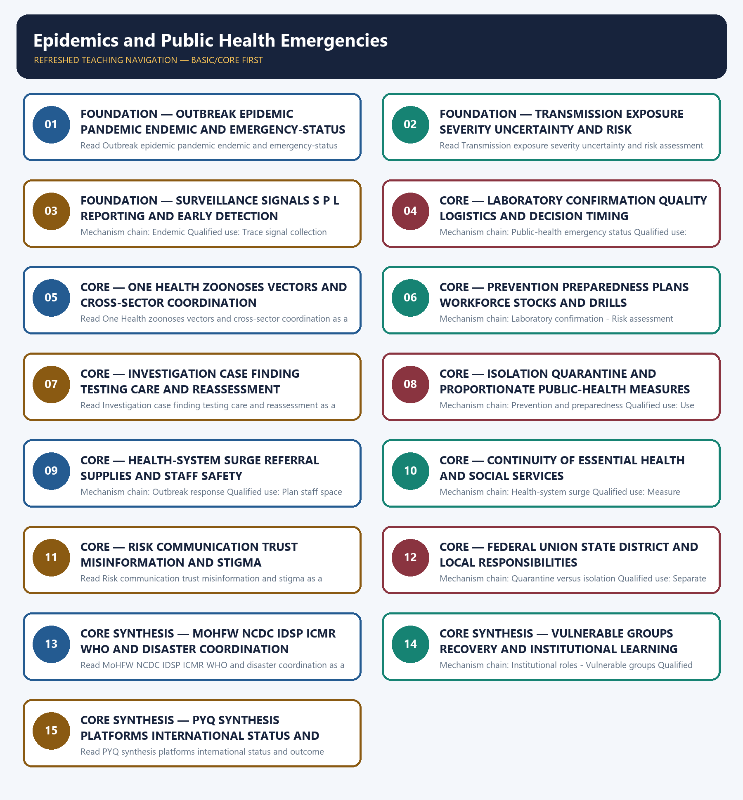

# Epidemics and Public Health Emergencies — Learner-v2 Complete Learning Session

> **Authoring-only generation:** 2026-09-04. No PDF was rendered and no tracker or index was mutated.

### SOURCE, PROGRESSION AND CURRENT-LINKAGE AUDIT

- **Generation date:** 2026-09-04.
- **Repository-first evidence:** the Basic owner is taught first and preserved in full; the Advanced owner is retained only in the optional final teaching block.
- **OCR evidence:** Repository Markdown was primary. OCR-searchable official UPSC papers were supplementary only for printed routed demands. No answer key, warning performance, notification effect, implementation outcome, casualty reduction or disaster metric was inferred.
- **Qdrant:** not used; repository Markdown and available OCR context were sufficient.
- **PYQ integrity:** The 2020 GS-III technology-in-COVID card is the verified direct route. The 2020 GS-II WHO card is cross-paper and remains global-governance-owned; the 2024 resilience card is an explicit support route.
- **Live-link boundary:** Official attempts covered NCDC/IDSP, ICMR, MoHFW/MHA/NDMA routes and WHO's amended IHR and Pandemic Agreement/PABS status. Thin, blocked and transport-failed pages are logged; no current outbreak total, forecast, laboratory readiness, stock, vaccine performance, casualty, event outcome or international compliance claim was invented.
- **Fact/inference discipline:** no current-affairs item, PYQ wording, figure or quotation is invented.

### LIVE OFFICIAL-SOURCE ATTEMPT LOG

The checks below were made on 2026-09-04. Substantive official text is used only for the proposition it supports; title-only, blocked or thin pages are recorded and supply no factual claim.

- https://ncdc.mohfw.gov.in/includes/About/CentresAndDivision/IDSP.php — fetched 2026-09-04; NCDC described decentralised laboratory-based IT-enabled surveillance, Centre/State/district units, S/P/L reporting, Rapid Response Teams, laboratories and zoonotic coordination. https://ndma.gov.in/Man-made-Hazards/Biological — attempted 2026-09-04; the NDMA page failed at the transport layer.
- https://www.icmr.gov.in/ — fetched 2026-09-04 but returned a thin institutional feature rather than emergency guidance. https://www.mohfw.gov.in/ — attempted 2026-09-04 and returned HTTP 403. https://www.mha.gov.in/en/commoncontent/disaster-management-act-2005 — attempted 2026-09-04; MHA returned HTTP 403. No laboratory, vaccine, workforce, outbreak or operational-readiness figure was imported.
- https://www.who.int/news/item/19-09-2025-amended-international-health-regulations-enter-into-force — fetched 2026-09-04; WHO confirmed the 2024 IHR amendments, pandemic-emergency alert and national sovereignty boundary. https://ndrf.gov.in/en/about-us — fetched 2026-09-04 only for the general specialised disaster-response role.
- https://www.who.int/news/item/20-07-2026-who-member-states-continue-negotiations-on-the-pathogen-access-and-benefit-sharing-annex — searched 2026-09-04; official WHO results showed PABS negotiations continuing. https://pib.gov.in/ — searched 2026-09-04 for an Indian official corroboration route but no additional status proposition was used. The Pandemic Agreement was not described as in force.
- https://nidm.gov.in/documentations.asp — searched 2026-09-04; the official NIDM documentation route was identified but did not supply additional current epidemic-readiness evidence.

## BASIC LEARNING SESSION

### DEEP-REVIEW LEARNING CONTRACT

| Control | Binding rule for this package |
|---|---|
| Syllabus boundary | Complete Disaster Management Basic/Core is easy-first and answer-complete before optional Advanced depth. |
| Risk boundary | Hazard, exposure, vulnerability, capacity, risk, disaster impact, resilience and recovery outcome remain distinct. |
| Cycle boundary | Prevention, mitigation, preparedness, response, relief, rehabilitation, recovery and Build Back Better are not conflated. |
| Law/status boundary | Enacted Act, amendment, notified rule, plan, guideline, scheme, alert, announcement, operationalisation and measured outcome retain exact status. |
| Institutional boundary | NDMA, NEC, NIDM, NDRF, SDMA, SEC, DDMA, civil administration, response forces and armed-forces support retain exact mandates and levels. |
| Warning boundary | Observation, forecast, watch, warning, dissemination, receipt, evacuation order, evacuation and safe return remain separate. |
| Finance/data boundary | Allocation, release, expenditure, capacity, deployment, relief norm, entitlement, event fact and analytical inference retain source/date/unit/status. |
| Practice contract | Every solved item has demand decoding, detailed examiner-grade model, executable timed/compression plan, marks rationale and answer-specific improvement. |
| PYQ contract | Official wording and keys are asserted only when verified; routed or reconstructed demands remain labelled. |
| Dual-flow contract | Graphical and ASCII masters independently reconstruct the same complete Basic-to-optional-Advanced evidence ledger. |
| Cross-ownership | Environment Topic 26 owns environmental/climate-law base; Internal Security owns hostile-threat operations; Disaster Management owns civilian risk governance and response. |
| Approval | This immutable successor remains `approved: false` pending explicit approval. |

**Canonical Basic/Core owner:** `upsc-ai-kit\knowledge\Disaster-Management\basic\13_Epidemics-and-Public-Health-Emergencies.md`  
**Substantive canonical provenance owner:** `upsc-ai-kit\knowledge\Disaster-Management\learning-sessions\v2\subject-wide-syllabus\disaster-management-13_Learning-Session.md`  
**Optional Advanced owner:** `upsc-ai-kit\knowledge\Disaster-Management\advanced\13_Epidemics-and-Public-Health-Emergencies.md`  
**Official syllabus mapping:** `upsc-ai-kit\knowledge\Disaster-Management\OFFICIAL-UPSC-SYLLABUS-MAPPING.md`

### EVIDENCE, PYQ AND CURRENT-STATUS CONTROL

- Every law, guideline, scheme, institution, alert, event, casualty, magnitude, rainfall, temperature, fund, target, date and policy claim retains source, date, unit, jurisdiction and status.
- Hazard occurrence is separated from disaster impact; structural from non-structural mitigation; response output from recovery and resilience outcome.
- Sendai priorities are separated from seven global targets and global from national indicators; climate adaptation, DRR and loss-and-damage boundaries remain explicit.
- Announcement is separated from operationalisation; allocation from release and expenditure; capacity from deployment; relief norm from legal entitlement.
- **Current-status note, rechecked 2026-09-06:** failed official fetches remain explicit and supply no invented fact.

**Generation-local live/current sources:**
- `https://ncdc.mohfw.gov.in/includes/About/CentresAndDivision/IDSP.php — fetched 2026-09-04; NCDC described decentralised laboratory-based IT-enabled surveillance, Centre/State/district units, S/P/L reporting, Rapid Response Teams, laboratories and zoonotic coordination. https://ndma.gov.in/Man-made-Hazards/Biological — attempted 2026-09-04; the NDMA page failed at the transport layer.`
- `https://www.icmr.gov.in/ — fetched 2026-09-04 but returned a thin institutional feature rather than emergency guidance. https://www.mohfw.gov.in/ — attempted 2026-09-04 and returned HTTP 403. https://www.mha.gov.in/en/commoncontent/disaster-management-act-2005 — attempted 2026-09-04; MHA returned HTTP 403. No laboratory, vaccine, workforce, outbreak or operational-readiness figure was imported.`
- `https://www.who.int/news/item/19-09-2025-amended-international-health-regulations-enter-into-force — fetched 2026-09-04; WHO confirmed the 2024 IHR amendments, pandemic-emergency alert and national sovereignty boundary. https://ndrf.gov.in/en/about-us — fetched 2026-09-04 only for the general specialised disaster-response role.`
- `https://www.who.int/news/item/20-07-2026-who-member-states-continue-negotiations-on-the-pathogen-access-and-benefit-sharing-annex — searched 2026-09-04; official WHO results showed PABS negotiations continuing. https://pib.gov.in/ — searched 2026-09-04 for an Indian official corroboration route but no additional status proposition was used. The Pandemic Agreement was not described as in force.`
- `https://nidm.gov.in/documentations.asp — searched 2026-09-04; the official NIDM documentation route was identified but did not supply additional current epidemic-readiness evidence.`

**Topic-routed verified PYQ owners:**
- Repository PYQ routing ledgers control wording, year, marks and verification status.




*Distinct embedded teaching-navigation image. The separate continuous Cārvāka-style flowchart package remains an independent at-a-glance artifact.*

### SESSION 1 — FOUNDATION — OUTBREAK EPIDEMIC PANDEMIC ENDEMIC AND EMERGENCY-STATUS GRAMMAR

#### DEFINITION / WHAT THIS IS CALLED

**Plain-language definition:** The decisive boundary is Do not use outbreak, epidemic, pandemic and endemic as synonyms.

**Technical definition:** Read Outbreak epidemic pandemic endemic and emergency-status grammar as a sequence: identify Outbreak, follow the named mechanism to its institutional response, and stop at the last verified status rather than assuming the next stage.

#### ANSWER-GRABBING OPENING — WRITE/ADAPT IN THE EXAM

> Read Outbreak epidemic pandemic endemic and emergency-status grammar as a sequence: identify Outbreak, follow the named mechanism to its institutional response, and stop at the last verified status rather than assuming the next stage.

#### MUST-WRITE KEYWORDS

- **FOUNDATION**
- **Outbreak epidemic pandemic endemic**
- **emergency-status grammar**
- **Mechanism chain**
- **Qualified use**
- **An outbreak**

**How to use them:** Frame the answer through FOUNDATION; define Outbreak epidemic pandemic endemic, connect emergency-status grammar with Mechanism chain to explain the mechanism, and use Qualified use for the decisive comparison or qualification.

#### VISUAL FIRST

```text
OUTBREAK EPIDEMIC PANDEMIC ENDEMIC AND EMERGENCY-STATUS GRAMMAR
01. Outbreak
    |
    v
02. Epidemic
STATUS / CATEGORY FIREWALL -> Do not use outbreak, epidemic, pandemic and endemic as synonyms.
```

*The rail fixes the institutional sequence and claim boundary before explanation.*

#### CORE EXPLANATION

An outbreak is the occurrence of disease cases above what is normally expected in a limited place, population or period; scale and baseline determine the label. An epidemic is occurrence of disease above the expected level in a community, region or population; it does not require international spread.

#### SIMPLE SYSTEM EXAMPLE

Read Outbreak epidemic pandemic endemic and emergency-status grammar as a sequence: identify Outbreak, follow the named mechanism to its institutional response, and stop at the last verified status rather than assuming the next stage.

#### TECHNICAL DISTINCTION

The decisive boundary is Do not use outbreak, epidemic, pandemic and endemic as synonyms. This keeps Outbreak and Epidemic in the correct risk category, institutional mandate and evidence status.

#### NAMED EVIDENCE AND MECHANISM

- An outbreak is the occurrence of disease cases above what is normally expected in a limited place, population or period; scale and baseline determine the label.
- An epidemic is occurrence of disease above the expected level in a community, region or population; it does not require international spread.

#### EXAMINER CAUTION

- Do not use outbreak, epidemic, pandemic and endemic as synonyms.

#### EXAM LINK

- **Prelims:** Keep hazard, forecast, warning, institution, law, plan, force, fund, scheme and outcome in their exact category.
- **Mains:** Fix the epidemiological and legal status before selecting measures.

#### MINI RECAP

- **Mechanism chain:** Outbreak -> Epidemic
- **Qualified use:** Fix the epidemiological and legal status before selecting measures.

#### CLOSING RECALL FLOW — FOUNDATION — OUTBREAK EPIDEMIC PANDEMIC ENDEMIC AND EMERGENCY-STATUS GRAMMAR

```text
START / CONCEPT: FOUNDATION — Outbreak epidemic pandemic endemic and emergency-status grammar
        |
        v
EXACT TERMS: FOUNDATION · Outbreak epidemic pandemic endemic · emergency-status grammar · Mechanism chain · Qualified use · An outbreak
        |
        v
MECHANISM / ARGUMENT: Mechanism chain: Outbreak - Epidemic Qualified use: Fix the epidemiological and legal status before selecting measures.
        |
        v
CONSEQUENCE / CONTRAST: The decisive boundary is Do not use outbreak, epidemic, pandemic and endemic as synonyms.
        |
        v
UPSC TRAP / ANSWER-USE: Do not use outbreak, epidemic, pandemic and endemic as synonyms.
        |
        v
ANSWER-GRABBING FORMULATION: Read Outbreak epidemic pandemic endemic and emergency-status grammar as a sequence: identify Outbreak, follow the named mechanism to its institutional response, and stop at the last verified status rather than assuming the next stage.
```
### SESSION 2 — FOUNDATION — TRANSMISSION EXPOSURE SEVERITY UNCERTAINTY AND RISK ASSESSMENT

#### DEFINITION / WHAT THIS IS CALLED

**Plain-language definition:** The decisive boundary is Do not infer severity solely from the geographic label pandemic.

**Technical definition:** Read Transmission exposure severity uncertainty and risk assessment as a sequence: identify Pandemic, follow the named mechanism to its institutional response, and stop at the last verified status rather than assuming the next stage.

#### ANSWER-GRABBING OPENING — WRITE/ADAPT IN THE EXAM

> Read Transmission exposure severity uncertainty and risk assessment as a sequence: identify Pandemic, follow the named mechanism to its institutional response, and stop at the last verified status rather than assuming the next stage.

#### MUST-WRITE KEYWORDS

- **FOUNDATION**
- **Transmission exposure severity uncertainty**
- **risk assessment**
- **Mechanism chain**
- **Qualified use**
- **A pandemic**

**How to use them:** Frame the answer through FOUNDATION; define Transmission exposure severity uncertainty, connect risk assessment with Mechanism chain to explain the mechanism, and use Qualified use for the decisive comparison or qualification.

#### VISUAL FIRST

```text
TRANSMISSION EXPOSURE SEVERITY UNCERTAINTY AND RISK ASSESSMENT
01. Pandemic
STATUS / CATEGORY FIREWALL -> Do not infer severity solely from the geographic label pandemic.
```

*The rail fixes the institutional sequence and claim boundary before explanation.*

#### CORE EXPLANATION

A pandemic is an epidemic with sustained spread across countries or continents and substantial population reach; severity is not defined by geography alone.

#### SIMPLE SYSTEM EXAMPLE

Read Transmission exposure severity uncertainty and risk assessment as a sequence: identify Pandemic, follow the named mechanism to its institutional response, and stop at the last verified status rather than assuming the next stage.

#### TECHNICAL DISTINCTION

The decisive boundary is Do not infer severity solely from the geographic label pandemic. This keeps Pandemic in the correct risk category, institutional mandate and evidence status.

#### NAMED EVIDENCE AND MECHANISM

- A pandemic is an epidemic with sustained spread across countries or continents and substantial population reach; severity is not defined by geography alone.

#### EXAMINER CAUTION

- Do not infer severity solely from the geographic label pandemic.

#### EXAM LINK

- **Prelims:** Keep hazard, forecast, warning, institution, law, plan, force, fund, scheme and outcome in their exact category.
- **Mains:** Assess hazard route exposure vulnerability capacity and uncertainty.

#### MINI RECAP

- **Mechanism chain:** Pandemic
- **Qualified use:** Assess hazard route exposure vulnerability capacity and uncertainty.

#### CLOSING RECALL FLOW — FOUNDATION — TRANSMISSION EXPOSURE SEVERITY UNCERTAINTY AND RISK ASSESSMENT

```text
START / CONCEPT: FOUNDATION — Transmission exposure severity uncertainty and risk assessment
        |
        v
EXACT TERMS: FOUNDATION · Transmission exposure severity uncertainty · risk assessment · Mechanism chain · Qualified use · A pandemic
        |
        v
MECHANISM / ARGUMENT: Mechanism chain: Pandemic Qualified use: Assess hazard route exposure vulnerability capacity and uncertainty.
        |
        v
CONSEQUENCE / CONTRAST: A pandemic is an epidemic with sustained spread across countries or continents and substantial population reach; severity is not defined by geography alone.
        |
        v
UPSC TRAP / ANSWER-USE: The decisive boundary is Do not infer severity solely from the geographic label pandemic.
        |
        v
ANSWER-GRABBING FORMULATION: Read Transmission exposure severity uncertainty and risk assessment as a sequence: identify Pandemic, follow the named mechanism to its institutional response, and stop at the last verified status rather than assuming the next stage.
```
### SESSION 3 — FOUNDATION — SURVEILLANCE SIGNALS S P L REPORTING AND EARLY DETECTION

#### DEFINITION / WHAT THIS IS CALLED

**Plain-language definition:** Read Surveillance signals S P L reporting and early detection as a sequence: identify Endemic, follow the named mechanism to its institutional response, and stop at the last verified status rather than assuming the next stage.

**Technical definition:** Mechanism chain: Endemic Qualified use: Trace signal collection analysis verification and response.

#### ANSWER-GRABBING OPENING — WRITE/ADAPT IN THE EXAM

> Read Surveillance signals S P L reporting and early detection as a sequence: identify Endemic, follow the named mechanism to its institutional response, and stop at the last verified status rather than assuming the next stage.

#### MUST-WRITE KEYWORDS

- **FOUNDATION**
- **Surveillance signals S P L reporting**
- **early detection**
- **Mechanism chain**
- **Qualified use**
- **Read Surveillance**

**How to use them:** Frame the answer through FOUNDATION; define Surveillance signals S P L reporting, connect early detection with Mechanism chain to explain the mechanism, and use Qualified use for the decisive comparison or qualification.

#### VISUAL FIRST

```text
SURVEILLANCE SIGNALS S P L REPORTING AND EARLY DETECTION
01. Endemic
STATUS / CATEGORY FIREWALL -> Do not treat endemic as harmless or static.
```

*The rail fixes the institutional sequence and claim boundary before explanation.*

#### CORE EXPLANATION

An endemic disease has a persistent or expected presence in a particular area or population; endemicity does not mean harmlessness or absence of outbreaks.

#### SIMPLE SYSTEM EXAMPLE

Read Surveillance signals S P L reporting and early detection as a sequence: identify Endemic, follow the named mechanism to its institutional response, and stop at the last verified status rather than assuming the next stage.

#### TECHNICAL DISTINCTION

The decisive boundary is Do not treat endemic as harmless or static. This keeps Endemic in the correct risk category, institutional mandate and evidence status.

#### NAMED EVIDENCE AND MECHANISM

- An endemic disease has a persistent or expected presence in a particular area or population; endemicity does not mean harmlessness or absence of outbreaks.

#### EXAMINER CAUTION

- Do not treat endemic as harmless or static.

#### EXAM LINK

- **Prelims:** Keep hazard, forecast, warning, institution, law, plan, force, fund, scheme and outcome in their exact category.
- **Mains:** Trace signal collection analysis verification and response.

#### MINI RECAP

- **Mechanism chain:** Endemic
- **Qualified use:** Trace signal collection analysis verification and response.

#### CLOSING RECALL FLOW — FOUNDATION — SURVEILLANCE SIGNALS S P L REPORTING AND EARLY DETECTION

```text
START / CONCEPT: FOUNDATION — Surveillance signals S P L reporting and early detection
        |
        v
EXACT TERMS: FOUNDATION · Surveillance signals S P L reporting · early detection · Mechanism chain · Qualified use · Read Surveillance
        |
        v
MECHANISM / ARGUMENT: Mechanism chain: Endemic Qualified use: Trace signal collection analysis verification and response.
        |
        v
CONSEQUENCE / CONTRAST: An endemic disease has a persistent or expected presence in a particular area or population; endemicity does not mean harmlessness or absence of outbreaks.
        |
        v
UPSC TRAP / ANSWER-USE: The decisive boundary is Do not treat endemic as harmless or static.
        |
        v
ANSWER-GRABBING FORMULATION: Read Surveillance signals S P L reporting and early detection as a sequence: identify Endemic, follow the named mechanism to its institutional response, and stop at the last verified status rather than assuming the next stage.
```
### SESSION 4 — CORE — LABORATORY CONFIRMATION QUALITY LOGISTICS AND DECISION TIMING

#### DEFINITION / WHAT THIS IS CALLED

**Plain-language definition:** Read Laboratory confirmation quality logistics and decision timing as a sequence: identify Public-health emergency status, follow the named mechanism to its institutional response, and stop at the last verified status rather than assuming the next stage.

**Technical definition:** Mechanism chain: Public-health emergency status Qualified use: Explain confirmation as a chain, not a laboratory label alone.

#### ANSWER-GRABBING OPENING — WRITE/ADAPT IN THE EXAM

> Read Laboratory confirmation quality logistics and decision timing as a sequence: identify Public-health emergency status, follow the named mechanism to its institutional response, and stop at the last verified status rather than assuming the next stage.

#### MUST-WRITE KEYWORDS

- **Laboratory confirmation quality logistics**
- **decision timing**
- **Mechanism chain**
- **Qualified use**
- **Public Health Emergency**
- **International Concern**

**How to use them:** Frame the answer through Laboratory confirmation quality logistics; define decision timing, connect Mechanism chain with Qualified use to explain the mechanism, and use Public Health Emergency for the decisive comparison or qualification.

#### VISUAL FIRST

```text
LABORATORY CONFIRMATION QUALITY LOGISTICS AND DECISION TIMING
01. Public-health emergency status
STATUS / CATEGORY FIREWALL -> Do not confuse a domestic emergency, PHEIC and pandemic emergency.
```

*The rail fixes the institutional sequence and claim boundary before explanation.*

#### CORE EXPLANATION

A domestic public-health emergency, a Public Health Emergency of International Concern and the amended IHR's pandemic emergency are different legal or operational statuses with different authorities and tests.

#### SIMPLE SYSTEM EXAMPLE

Read Laboratory confirmation quality logistics and decision timing as a sequence: identify Public-health emergency status, follow the named mechanism to its institutional response, and stop at the last verified status rather than assuming the next stage.

#### TECHNICAL DISTINCTION

The decisive boundary is Do not confuse a domestic emergency, PHEIC and pandemic emergency. This keeps Public-health emergency status in the correct risk category, institutional mandate and evidence status.

#### NAMED EVIDENCE AND MECHANISM

- A domestic public-health emergency, a Public Health Emergency of International Concern and the amended IHR's pandemic emergency are different legal or operational statuses with different authorities and tests.

#### EXAMINER CAUTION

- Do not confuse a domestic emergency, PHEIC and pandemic emergency.

#### EXAM LINK

- **Prelims:** Keep hazard, forecast, warning, institution, law, plan, force, fund, scheme and outcome in their exact category.
- **Mains:** Explain confirmation as a chain, not a laboratory label alone.

#### MINI RECAP

- **Mechanism chain:** Public-health emergency status
- **Qualified use:** Explain confirmation as a chain, not a laboratory label alone.

#### CLOSING RECALL FLOW — CORE — LABORATORY CONFIRMATION QUALITY LOGISTICS AND DECISION TIMING

```text
START / CONCEPT: CORE — Laboratory confirmation quality logistics and decision timing
        |
        v
EXACT TERMS: Laboratory confirmation quality logistics · decision timing · Mechanism chain · Qualified use · Public Health Emergency · International Concern
        |
        v
MECHANISM / ARGUMENT: Mechanism chain: Public-health emergency status Qualified use: Explain confirmation as a chain, not a laboratory label alone.
        |
        v
CONSEQUENCE / CONTRAST: Mains: Explain confirmation as a chain, not a laboratory label alone.
        |
        v
UPSC TRAP / ANSWER-USE: The decisive boundary is Do not confuse a domestic emergency, PHEIC and pandemic emergency.
        |
        v
ANSWER-GRABBING FORMULATION: Read Laboratory confirmation quality logistics and decision timing as a sequence: identify Public-health emergency status, follow the named mechanism to its institutional response, and stop at the last verified status rather than assuming the next stage.
```
### SESSION 5 — CORE — ONE HEALTH ZOONOSES VECTORS AND CROSS-SECTOR COORDINATION

#### DEFINITION / WHAT THIS IS CALLED

**Plain-language definition:** Surveillance is continuous collection, analysis, interpretation and use of health information for action; it includes signals and trends rather than only confirmed case totals.

**Technical definition:** Read One Health zoonoses vectors and cross-sector coordination as a sequence: identify Surveillance, follow the named mechanism to its institutional response, and stop at the last verified status rather than assuming the next stage.

#### ANSWER-GRABBING OPENING — WRITE/ADAPT IN THE EXAM

> Read One Health zoonoses vectors and cross-sector coordination as a sequence: identify Surveillance, follow the named mechanism to its institutional response, and stop at the last verified status rather than assuming the next stage.

#### MUST-WRITE KEYWORDS

- **One Health zoonoses vectors**
- **cross-sector coordination**
- **Mechanism chain**
- **Qualified use**
- **Surveillance**
- **Read One Health**

**How to use them:** Frame the answer through One Health zoonoses vectors; define cross-sector coordination, connect Mechanism chain with Qualified use to explain the mechanism, and use Surveillance for the decisive comparison or qualification.

#### VISUAL FIRST

```text
ONE HEALTH ZOONOSES VECTORS AND CROSS-SECTOR COORDINATION
01. Surveillance
STATUS / CATEGORY FIREWALL -> Do not equate surveillance signals with laboratory-confirmed cases.
```

*The rail fixes the institutional sequence and claim boundary before explanation.*

#### CORE EXPLANATION

Surveillance is continuous collection, analysis, interpretation and use of health information for action; it includes signals and trends rather than only confirmed case totals.

#### SIMPLE SYSTEM EXAMPLE

Read One Health zoonoses vectors and cross-sector coordination as a sequence: identify Surveillance, follow the named mechanism to its institutional response, and stop at the last verified status rather than assuming the next stage.

#### TECHNICAL DISTINCTION

The decisive boundary is Do not equate surveillance signals with laboratory-confirmed cases. This keeps Surveillance in the correct risk category, institutional mandate and evidence status.

#### NAMED EVIDENCE AND MECHANISM

- Surveillance is continuous collection, analysis, interpretation and use of health information for action; it includes signals and trends rather than only confirmed case totals.

#### EXAMINER CAUTION

- Do not equate surveillance signals with laboratory-confirmed cases.

#### EXAM LINK

- **Prelims:** Keep hazard, forecast, warning, institution, law, plan, force, fund, scheme and outcome in their exact category.
- **Mains:** Link human animal environment sectors without erasing ownership.

#### MINI RECAP

- **Mechanism chain:** Surveillance
- **Qualified use:** Link human animal environment sectors without erasing ownership.

#### CLOSING RECALL FLOW — CORE — ONE HEALTH ZOONOSES VECTORS AND CROSS-SECTOR COORDINATION

```text
START / CONCEPT: CORE — One Health zoonoses vectors and cross-sector coordination
        |
        v
EXACT TERMS: One Health zoonoses vectors · cross-sector coordination · Mechanism chain · Qualified use · Surveillance · Read One Health
        |
        v
MECHANISM / ARGUMENT: Mechanism chain: Surveillance Qualified use: Link human animal environment sectors without erasing ownership.
        |
        v
CONSEQUENCE / CONTRAST: The decisive boundary is Do not equate surveillance signals with laboratory-confirmed cases.
        |
        v
UPSC TRAP / ANSWER-USE: Do not equate surveillance signals with laboratory-confirmed cases.
        |
        v
ANSWER-GRABBING FORMULATION: Read One Health zoonoses vectors and cross-sector coordination as a sequence: identify Surveillance, follow the named mechanism to its institutional response, and stop at the last verified status rather than assuming the next stage.
```
### SESSION 6 — CORE — PREVENTION PREPAREDNESS PLANS WORKFORCE STOCKS AND DRILLS

#### DEFINITION / WHAT THIS IS CALLED

**Plain-language definition:** Read Prevention preparedness plans workforce stocks and drills as a sequence: identify Laboratory confirmation, follow the named mechanism to its institutional response, and stop at the last verified status rather than assuming the next stage.

**Technical definition:** Mechanism chain: Laboratory confirmation - Risk assessment Qualified use: Build capability before the surge and retain routine services.

#### ANSWER-GRABBING OPENING — WRITE/ADAPT IN THE EXAM

> Read Prevention preparedness plans workforce stocks and drills as a sequence: identify Laboratory confirmation, follow the named mechanism to its institutional response, and stop at the last verified status rather than assuming the next stage.

#### MUST-WRITE KEYWORDS

- **Prevention preparedness plans workforce stocks**
- **drills**
- **Mechanism chain**
- **Qualified use**
- **Laboratory**
- **Risk**

**How to use them:** Frame the answer through Prevention preparedness plans workforce stocks; define drills, connect Mechanism chain with Qualified use to explain the mechanism, and use Laboratory for the decisive comparison or qualification.

#### VISUAL FIRST

```text
PREVENTION PREPAREDNESS PLANS WORKFORCE STOCKS AND DRILLS
01. Laboratory confirmation
    |
    v
02. Risk assessment
STATUS / CATEGORY FIREWALL -> Do not treat laboratory confirmation as timely action without logistics and interpretation.
```

*The rail fixes the institutional sequence and claim boundary before explanation.*

#### CORE EXPLANATION

Laboratory evidence supports diagnosis and classification, but sampling, transport, quality, turnaround and interpretation determine whether confirmation can guide timely public-health action. Risk assessment integrates hazard, transmissibility or route, severity, exposure, vulnerable groups, uncertainty, health-system capacity and geographic or temporal context before selecting proportionate measures.

#### SIMPLE SYSTEM EXAMPLE

Read Prevention preparedness plans workforce stocks and drills as a sequence: identify Laboratory confirmation, follow the named mechanism to its institutional response, and stop at the last verified status rather than assuming the next stage.

#### TECHNICAL DISTINCTION

The decisive boundary is Do not treat laboratory confirmation as timely action without logistics and interpretation. This keeps Laboratory confirmation and Risk assessment in the correct risk category, institutional mandate and evidence status.

#### NAMED EVIDENCE AND MECHANISM

- Laboratory evidence supports diagnosis and classification, but sampling, transport, quality, turnaround and interpretation determine whether confirmation can guide timely public-health action.
- Risk assessment integrates hazard, transmissibility or route, severity, exposure, vulnerable groups, uncertainty, health-system capacity and geographic or temporal context before selecting proportionate measures.

#### EXAMINER CAUTION

- Do not treat laboratory confirmation as timely action without logistics and interpretation.

#### EXAM LINK

- **Prelims:** Keep hazard, forecast, warning, institution, law, plan, force, fund, scheme and outcome in their exact category.
- **Mains:** Build capability before the surge and retain routine services.

#### MINI RECAP

- **Mechanism chain:** Laboratory confirmation -> Risk assessment
- **Qualified use:** Build capability before the surge and retain routine services.

#### CLOSING RECALL FLOW — CORE — PREVENTION PREPAREDNESS PLANS WORKFORCE STOCKS AND DRILLS

```text
START / CONCEPT: CORE — Prevention preparedness plans workforce stocks and drills
        |
        v
EXACT TERMS: Prevention preparedness plans workforce stocks · drills · Mechanism chain · Qualified use · Laboratory · Risk
        |
        v
MECHANISM / ARGUMENT: Mechanism chain: Laboratory confirmation - Risk assessment Qualified use: Build capability before the surge and retain routine services.
        |
        v
CONSEQUENCE / CONTRAST: Laboratory evidence supports diagnosis and classification, but sampling, transport, quality, turnaround and interpretation determine whether confirmation can guide timely public-health action.
        |
        v
UPSC TRAP / ANSWER-USE: The decisive boundary is Do not treat laboratory confirmation as timely action without logistics and interpretation.
        |
        v
ANSWER-GRABBING FORMULATION: Read Prevention preparedness plans workforce stocks and drills as a sequence: identify Laboratory confirmation, follow the named mechanism to its institutional response, and stop at the last verified status rather than assuming the next stage.
```
### SESSION 7 — CORE — INVESTIGATION CASE FINDING TESTING CARE AND REASSESSMENT

#### DEFINITION / WHAT THIS IS CALLED

**Plain-language definition:** The decisive boundary is Do not use quarantine for known infected cases or isolation for merely exposed persons.

**Technical definition:** Read Investigation case finding testing care and reassessment as a sequence: identify One Health, follow the named mechanism to its institutional response, and stop at the last verified status rather than assuming the next stage.

#### ANSWER-GRABBING OPENING — WRITE/ADAPT IN THE EXAM

> Read Investigation case finding testing care and reassessment as a sequence: identify One Health, follow the named mechanism to its institutional response, and stop at the last verified status rather than assuming the next stage.

#### MUST-WRITE KEYWORDS

- **Investigation case finding testing care**
- **reassessment**
- **Mechanism chain**
- **Qualified use**
- **Read Investigation**
- **One Health**

**How to use them:** Frame the answer through Investigation case finding testing care; define reassessment, connect Mechanism chain with Qualified use to explain the mechanism, and use Read Investigation for the decisive comparison or qualification.

#### VISUAL FIRST

```text
INVESTIGATION CASE FINDING TESTING CARE AND REASSESSMENT
01. One Health
STATUS / CATEGORY FIREWALL -> Do not use quarantine for known infected cases or isolation for merely exposed persons.
```

*The rail fixes the institutional sequence and claim boundary before explanation.*

#### CORE EXPLANATION

One Health coordinates human, animal and environmental health knowledge and action, especially for zoonotic and vector-borne threats, while preserving sector-specific expertise and accountability.

#### SIMPLE SYSTEM EXAMPLE

Read Investigation case finding testing care and reassessment as a sequence: identify One Health, follow the named mechanism to its institutional response, and stop at the last verified status rather than assuming the next stage.

#### TECHNICAL DISTINCTION

The decisive boundary is Do not use quarantine for known infected cases or isolation for merely exposed persons. This keeps One Health in the correct risk category, institutional mandate and evidence status.

#### NAMED EVIDENCE AND MECHANISM

- One Health coordinates human, animal and environmental health knowledge and action, especially for zoonotic and vector-borne threats, while preserving sector-specific expertise and accountability.

#### EXAMINER CAUTION

- Do not use quarantine for known infected cases or isolation for merely exposed persons.

#### EXAM LINK

- **Prelims:** Keep hazard, forecast, warning, institution, law, plan, force, fund, scheme and outcome in their exact category.
- **Mains:** Sequence investigation care community action and repeated assessment.

#### MINI RECAP

- **Mechanism chain:** One Health
- **Qualified use:** Sequence investigation care community action and repeated assessment.

#### CLOSING RECALL FLOW — CORE — INVESTIGATION CASE FINDING TESTING CARE AND REASSESSMENT

```text
START / CONCEPT: CORE — Investigation case finding testing care and reassessment
        |
        v
EXACT TERMS: Investigation case finding testing care · reassessment · Mechanism chain · Qualified use · Read Investigation · One Health
        |
        v
MECHANISM / ARGUMENT: Mechanism chain: One Health Qualified use: Sequence investigation care community action and repeated assessment.
        |
        v
CONSEQUENCE / CONTRAST: The decisive boundary is Do not use quarantine for known infected cases or isolation for merely exposed persons.
        |
        v
UPSC TRAP / ANSWER-USE: Do not use quarantine for known infected cases or isolation for merely exposed persons.
        |
        v
ANSWER-GRABBING FORMULATION: Read Investigation case finding testing care and reassessment as a sequence: identify One Health, follow the named mechanism to its institutional response, and stop at the last verified status rather than assuming the next stage.
```
### SESSION 8 — CORE — ISOLATION QUARANTINE AND PROPORTIONATE PUBLIC-HEALTH MEASURES

#### DEFINITION / WHAT THIS IS CALLED

**Plain-language definition:** Read Isolation quarantine and proportionate public-health measures as a sequence: identify Prevention and preparedness, follow the named mechanism to its institutional response, and stop at the last verified status rather than assuming the next stage.

**Technical definition:** Mechanism chain: Prevention and preparedness Qualified use: Use the correct person-status distinction and proportionality.

#### ANSWER-GRABBING OPENING — WRITE/ADAPT IN THE EXAM

> Read Isolation quarantine and proportionate public-health measures as a sequence: identify Prevention and preparedness, follow the named mechanism to its institutional response, and stop at the last verified status rather than assuming the next stage.

#### MUST-WRITE KEYWORDS

- **Isolation quarantine**
- **proportionate public-health measures**
- **Mechanism chain**
- **Qualified use**
- **Prevention**
- **Read Isolation**

**How to use them:** Frame the answer through Isolation quarantine; define proportionate public-health measures, connect Mechanism chain with Qualified use to explain the mechanism, and use Prevention for the decisive comparison or qualification.

#### VISUAL FIRST

```text
ISOLATION QUARANTINE AND PROPORTIONATE PUBLIC-HEALTH MEASURES
01. Prevention and preparedness
STATUS / CATEGORY FIREWALL -> Do not infer that State-list health excludes Union or inter-State roles.
```

*The rail fixes the institutional sequence and claim boundary before explanation.*

#### CORE EXPLANATION

Prevention and preparedness include water, sanitation, vector control, infection prevention, routine immunisation where applicable, stock and workforce planning, laboratories, plans, training, drills and trusted communication.

#### SIMPLE SYSTEM EXAMPLE

Read Isolation quarantine and proportionate public-health measures as a sequence: identify Prevention and preparedness, follow the named mechanism to its institutional response, and stop at the last verified status rather than assuming the next stage.

#### TECHNICAL DISTINCTION

The decisive boundary is Do not infer that State-list health excludes Union or inter-State roles. This keeps Prevention and preparedness in the correct risk category, institutional mandate and evidence status.

#### NAMED EVIDENCE AND MECHANISM

- Prevention and preparedness include water, sanitation, vector control, infection prevention, routine immunisation where applicable, stock and workforce planning, laboratories, plans, training, drills and trusted communication.

#### EXAMINER CAUTION

- Do not infer that State-list health excludes Union or inter-State roles.

#### EXAM LINK

- **Prelims:** Keep hazard, forecast, warning, institution, law, plan, force, fund, scheme and outcome in their exact category.
- **Mains:** Use the correct person-status distinction and proportionality.

#### MINI RECAP

- **Mechanism chain:** Prevention and preparedness
- **Qualified use:** Use the correct person-status distinction and proportionality.

#### CLOSING RECALL FLOW — CORE — ISOLATION QUARANTINE AND PROPORTIONATE PUBLIC-HEALTH MEASURES

```text
START / CONCEPT: CORE — Isolation quarantine and proportionate public-health measures
        |
        v
EXACT TERMS: Isolation quarantine · proportionate public-health measures · Mechanism chain · Qualified use · Prevention · Read Isolation
        |
        v
MECHANISM / ARGUMENT: Mechanism chain: Prevention and preparedness Qualified use: Use the correct person-status distinction and proportionality.
        |
        v
CONSEQUENCE / CONTRAST: The decisive boundary is Do not infer that State-list health excludes Union or inter-State roles.
        |
        v
UPSC TRAP / ANSWER-USE: Do not infer that State-list health excludes Union or inter-State roles.
        |
        v
ANSWER-GRABBING FORMULATION: Read Isolation quarantine and proportionate public-health measures as a sequence: identify Prevention and preparedness, follow the named mechanism to its institutional response, and stop at the last verified status rather than assuming the next stage.
```
### SESSION 9 — CORE — HEALTH-SYSTEM SURGE REFERRAL SUPPLIES AND STAFF SAFETY

#### DEFINITION / WHAT THIS IS CALLED

**Plain-language definition:** Read Health-system surge referral supplies and staff safety as a sequence: identify Outbreak response, follow the named mechanism to its institutional response, and stop at the last verified status rather than assuming the next stage.

**Technical definition:** Mechanism chain: Outbreak response Qualified use: Plan staff space supplies referral transport information and safety.

#### ANSWER-GRABBING OPENING — WRITE/ADAPT IN THE EXAM

> Read Health-system surge referral supplies and staff safety as a sequence: identify Outbreak response, follow the named mechanism to its institutional response, and stop at the last verified status rather than assuming the next stage.

#### MUST-WRITE KEYWORDS

- **Health-system surge referral supplies**
- **staff safety**
- **Mechanism chain**
- **Qualified use**
- **Response**
- **Read Health-system**

**How to use them:** Frame the answer through Health-system surge referral supplies; define staff safety, connect Mechanism chain with Qualified use to explain the mechanism, and use Response for the decisive comparison or qualification.

#### VISUAL FIRST

```text
HEALTH-SYSTEM SURGE REFERRAL SUPPLIES AND STAFF SAFETY
01. Outbreak response
STATUS / CATEGORY FIREWALL -> Do not route vaccine platforms, diagnostics or biotechnology internals away from their Science and Technology owners.
```

*The rail fixes the institutional sequence and claim boundary before explanation.*

#### CORE EXPLANATION

Response links verification, investigation, case finding, testing, clinical care, isolation where indicated, contact or exposure management, community measures, logistics and iterative reassessment.

#### SIMPLE SYSTEM EXAMPLE

Read Health-system surge referral supplies and staff safety as a sequence: identify Outbreak response, follow the named mechanism to its institutional response, and stop at the last verified status rather than assuming the next stage.

#### TECHNICAL DISTINCTION

The decisive boundary is Do not route vaccine platforms, diagnostics or biotechnology internals away from their Science and Technology owners. This keeps Outbreak response in the correct risk category, institutional mandate and evidence status.

#### NAMED EVIDENCE AND MECHANISM

- Response links verification, investigation, case finding, testing, clinical care, isolation where indicated, contact or exposure management, community measures, logistics and iterative reassessment.

#### EXAMINER CAUTION

- Do not route vaccine platforms, diagnostics or biotechnology internals away from their Science and Technology owners.

#### EXAM LINK

- **Prelims:** Keep hazard, forecast, warning, institution, law, plan, force, fund, scheme and outcome in their exact category.
- **Mains:** Plan staff space supplies referral transport information and safety.

#### MINI RECAP

- **Mechanism chain:** Outbreak response
- **Qualified use:** Plan staff space supplies referral transport information and safety.

#### CLOSING RECALL FLOW — CORE — HEALTH-SYSTEM SURGE REFERRAL SUPPLIES AND STAFF SAFETY

```text
START / CONCEPT: CORE — Health-system surge referral supplies and staff safety
        |
        v
EXACT TERMS: Health-system surge referral supplies · staff safety · Mechanism chain · Qualified use · Response · Read Health-system
        |
        v
MECHANISM / ARGUMENT: Mechanism chain: Outbreak response Qualified use: Plan staff space supplies referral transport information and safety.
        |
        v
CONSEQUENCE / CONTRAST: Mains: Plan staff space supplies referral transport information and safety.
        |
        v
UPSC TRAP / ANSWER-USE: The decisive boundary is Do not route vaccine platforms, diagnostics or biotechnology internals away from their Science and Technology owners.
        |
        v
ANSWER-GRABBING FORMULATION: Read Health-system surge referral supplies and staff safety as a sequence: identify Outbreak response, follow the named mechanism to its institutional response, and stop at the last verified status rather than assuming the next stage.
```
### SESSION 10 — CORE — CONTINUITY OF ESSENTIAL HEALTH AND SOCIAL SERVICES

#### DEFINITION / WHAT THIS IS CALLED

**Plain-language definition:** Read Continuity of essential health and social services as a sequence: identify Health-system surge, follow the named mechanism to its institutional response, and stop at the last verified status rather than assuming the next stage.

**Technical definition:** Mechanism chain: Health-system surge Qualified use: Measure indirect harm and preserve non-outbreak care.

#### ANSWER-GRABBING OPENING — WRITE/ADAPT IN THE EXAM

> Read Continuity of essential health and social services as a sequence: identify Health-system surge, follow the named mechanism to its institutional response, and stop at the last verified status rather than assuming the next stage.

#### MUST-WRITE KEYWORDS

- **Continuity of essential health**
- **social services**
- **Mechanism chain**
- **Qualified use**
- **Surge**
- **Read Continuity**

**How to use them:** Frame the answer through Continuity of essential health; define social services, connect Mechanism chain with Qualified use to explain the mechanism, and use Surge for the decisive comparison or qualification.

#### VISUAL FIRST

```text
CONTINUITY OF ESSENTIAL HEALTH AND SOCIAL SERVICES
01. Health-system surge
STATUS / CATEGORY FIREWALL -> Do not infer preparedness or successful outcomes from a portal, app, plan, declaration or agreement.
```

*The rail fixes the institutional sequence and claim boundary before explanation.*

#### CORE EXPLANATION

Surge capacity covers trained staff, beds and referral, laboratories, medicines and supplies, oxygen or other clinical support where relevant, transport, information systems and staff safety without abandoning routine care.

#### SIMPLE SYSTEM EXAMPLE

Read Continuity of essential health and social services as a sequence: identify Health-system surge, follow the named mechanism to its institutional response, and stop at the last verified status rather than assuming the next stage.

#### TECHNICAL DISTINCTION

The decisive boundary is Do not infer preparedness or successful outcomes from a portal, app, plan, declaration or agreement. This keeps Health-system surge in the correct risk category, institutional mandate and evidence status.

#### NAMED EVIDENCE AND MECHANISM

- Surge capacity covers trained staff, beds and referral, laboratories, medicines and supplies, oxygen or other clinical support where relevant, transport, information systems and staff safety without abandoning routine care.

#### EXAMINER CAUTION

- Do not infer preparedness or successful outcomes from a portal, app, plan, declaration or agreement.

#### EXAM LINK

- **Prelims:** Keep hazard, forecast, warning, institution, law, plan, force, fund, scheme and outcome in their exact category.
- **Mains:** Measure indirect harm and preserve non-outbreak care.

#### MINI RECAP

- **Mechanism chain:** Health-system surge
- **Qualified use:** Measure indirect harm and preserve non-outbreak care.

#### CLOSING RECALL FLOW — CORE — CONTINUITY OF ESSENTIAL HEALTH AND SOCIAL SERVICES

```text
START / CONCEPT: CORE — Continuity of essential health and social services
        |
        v
EXACT TERMS: Continuity of essential health · social services · Mechanism chain · Qualified use · Surge · Read Continuity
        |
        v
MECHANISM / ARGUMENT: Mechanism chain: Health-system surge Qualified use: Measure indirect harm and preserve non-outbreak care.
        |
        v
CONSEQUENCE / CONTRAST: The decisive boundary is Do not infer preparedness or successful outcomes from a portal, app, plan, declaration or agreement.
        |
        v
UPSC TRAP / ANSWER-USE: Do not infer preparedness or successful outcomes from a portal, app, plan, declaration or agreement.
        |
        v
ANSWER-GRABBING FORMULATION: Read Continuity of essential health and social services as a sequence: identify Health-system surge, follow the named mechanism to its institutional response, and stop at the last verified status rather than assuming the next stage.
```
### SESSION 11 — CORE — RISK COMMUNICATION TRUST MISINFORMATION AND STIGMA

#### DEFINITION / WHAT THIS IS CALLED

**Plain-language definition:** Risk communication should be timely, transparent, multilingual, accessible and updateable, explaining what is known, unknown, changing and expected from the public without blame or false certainty.

**Technical definition:** Read Risk communication trust misinformation and stigma as a sequence: identify Continuity of essential services, follow the named mechanism to its institutional response, and stop at the last verified status rather than assuming the next stage.

#### ANSWER-GRABBING OPENING — WRITE/ADAPT IN THE EXAM

> Read Risk communication trust misinformation and stigma as a sequence: identify Continuity of essential services, follow the named mechanism to its institutional response, and stop at the last verified status rather than assuming the next stage.

#### MUST-WRITE KEYWORDS

- **Risk communication trust misinformation**
- **stigma**
- **Mechanism chain**
- **Qualified use**
- **Risk**
- **Read Risk**

**How to use them:** Frame the answer through Risk communication trust misinformation; define stigma, connect Mechanism chain with Qualified use to explain the mechanism, and use Risk for the decisive comparison or qualification.

#### VISUAL FIRST

```text
RISK COMMUNICATION TRUST MISINFORMATION AND STIGMA
01. Continuity of essential services
    |
    v
02. Risk communication
STATUS / CATEGORY FIREWALL -> Do not use outbreak, epidemic, pandemic and endemic as synonyms.
```

*The rail fixes the institutional sequence and claim boundary before explanation.*

#### CORE EXPLANATION

A health emergency plan must preserve maternal, child, chronic-disease, emergency and other essential services as far as possible because response measures can create indirect harm. Risk communication should be timely, transparent, multilingual, accessible and updateable, explaining what is known, unknown, changing and expected from the public without blame or false certainty.

#### SIMPLE SYSTEM EXAMPLE

Read Risk communication trust misinformation and stigma as a sequence: identify Continuity of essential services, follow the named mechanism to its institutional response, and stop at the last verified status rather than assuming the next stage.

#### TECHNICAL DISTINCTION

The decisive boundary is Do not use outbreak, epidemic, pandemic and endemic as synonyms. This keeps Continuity of essential services and Risk communication in the correct risk category, institutional mandate and evidence status.

#### NAMED EVIDENCE AND MECHANISM

- A health emergency plan must preserve maternal, child, chronic-disease, emergency and other essential services as far as possible because response measures can create indirect harm.
- Risk communication should be timely, transparent, multilingual, accessible and updateable, explaining what is known, unknown, changing and expected from the public without blame or false certainty.

#### EXAMINER CAUTION

- Do not use outbreak, epidemic, pandemic and endemic as synonyms.

#### EXAM LINK

- **Prelims:** Keep hazard, forecast, warning, institution, law, plan, force, fund, scheme and outcome in their exact category.
- **Mains:** State known unknown action update and correction channels.

#### MINI RECAP

- **Mechanism chain:** Continuity of essential services -> Risk communication
- **Qualified use:** State known unknown action update and correction channels.

#### CLOSING RECALL FLOW — CORE — RISK COMMUNICATION TRUST MISINFORMATION AND STIGMA

```text
START / CONCEPT: CORE — Risk communication trust misinformation and stigma
        |
        v
EXACT TERMS: Risk communication trust misinformation · stigma · Mechanism chain · Qualified use · Risk · Read Risk
        |
        v
MECHANISM / ARGUMENT: Mechanism chain: Continuity of essential services - Risk communication Qualified use: State known unknown action update and correction channels.
        |
        v
CONSEQUENCE / CONTRAST: Risk communication should be timely, transparent, multilingual, accessible and updateable, explaining what is known, unknown, changing and expected from the public without blame or false certainty.
        |
        v
UPSC TRAP / ANSWER-USE: The decisive boundary is Do not use outbreak, epidemic, pandemic and endemic as synonyms.
        |
        v
ANSWER-GRABBING FORMULATION: Read Risk communication trust misinformation and stigma as a sequence: identify Continuity of essential services, follow the named mechanism to its institutional response, and stop at the last verified status rather than assuming the next stage.
```
### SESSION 12 — CORE — FEDERAL UNION STATE DISTRICT AND LOCAL RESPONSIBILITIES

#### DEFINITION / WHAT THIS IS CALLED

**Plain-language definition:** Read Federal Union State district and local responsibilities as a sequence: identify Quarantine versus isolation, follow the named mechanism to its institutional response, and stop at the last verified status rather than assuming the next stage.

**Technical definition:** Mechanism chain: Quarantine versus isolation Qualified use: Separate national standards and inter-State coordination from local delivery.

#### ANSWER-GRABBING OPENING — WRITE/ADAPT IN THE EXAM

> Read Federal Union State district and local responsibilities as a sequence: identify Quarantine versus isolation, follow the named mechanism to its institutional response, and stop at the last verified status rather than assuming the next stage.

#### MUST-WRITE KEYWORDS

- **Federal Union State district**
- **local responsibilities**
- **Mechanism chain**
- **Qualified use**
- **Quarantine**
- **Read Federal Union State**

**How to use them:** Frame the answer through Federal Union State district; define local responsibilities, connect Mechanism chain with Qualified use to explain the mechanism, and use Quarantine for the decisive comparison or qualification.

#### VISUAL FIRST

```text
FEDERAL UNION STATE DISTRICT AND LOCAL RESPONSIBILITIES
01. Quarantine versus isolation
STATUS / CATEGORY FIREWALL -> Do not infer severity solely from the geographic label pandemic.
```

*The rail fixes the institutional sequence and claim boundary before explanation.*

#### CORE EXPLANATION

Quarantine separates or restricts movement of persons who may have been exposed but are not known to be infected; isolation separates infected or ill persons under applicable public-health protocols.

#### SIMPLE SYSTEM EXAMPLE

Read Federal Union State district and local responsibilities as a sequence: identify Quarantine versus isolation, follow the named mechanism to its institutional response, and stop at the last verified status rather than assuming the next stage.

#### TECHNICAL DISTINCTION

The decisive boundary is Do not infer severity solely from the geographic label pandemic. This keeps Quarantine versus isolation in the correct risk category, institutional mandate and evidence status.

#### NAMED EVIDENCE AND MECHANISM

- Quarantine separates or restricts movement of persons who may have been exposed but are not known to be infected; isolation separates infected or ill persons under applicable public-health protocols.

#### EXAMINER CAUTION

- Do not infer severity solely from the geographic label pandemic.

#### EXAM LINK

- **Prelims:** Keep hazard, forecast, warning, institution, law, plan, force, fund, scheme and outcome in their exact category.
- **Mains:** Separate national standards and inter-State coordination from local delivery.

#### MINI RECAP

- **Mechanism chain:** Quarantine versus isolation
- **Qualified use:** Separate national standards and inter-State coordination from local delivery.

#### CLOSING RECALL FLOW — CORE — FEDERAL UNION STATE DISTRICT AND LOCAL RESPONSIBILITIES

```text
START / CONCEPT: CORE — Federal Union State district and local responsibilities
        |
        v
EXACT TERMS: Federal Union State district · local responsibilities · Mechanism chain · Qualified use · Quarantine · Read Federal Union State
        |
        v
MECHANISM / ARGUMENT: Mechanism chain: Quarantine versus isolation Qualified use: Separate national standards and inter-State coordination from local delivery.
        |
        v
CONSEQUENCE / CONTRAST: Quarantine separates or restricts movement of persons who may have been exposed but are not known to be infected; isolation separates infected or ill persons under applicable public-health protocols.
        |
        v
UPSC TRAP / ANSWER-USE: The decisive boundary is Do not infer severity solely from the geographic label pandemic.
        |
        v
ANSWER-GRABBING FORMULATION: Read Federal Union State district and local responsibilities as a sequence: identify Quarantine versus isolation, follow the named mechanism to its institutional response, and stop at the last verified status rather than assuming the next stage.
```
### SESSION 13 — CORE SYNTHESIS — MOHFW NCDC IDSP ICMR WHO AND DISASTER COORDINATION

#### DEFINITION / WHAT THIS IS CALLED

**Plain-language definition:** Health is principally a State field, while Union law, inter-State disease control, national standards, laboratories, border health and disaster coordination can support or direct specified functions; implementation remains local and multi-level.

**Technical definition:** Read MoHFW NCDC IDSP ICMR WHO and disaster coordination as a sequence: identify Federal and local roles, follow the named mechanism to its institutional response, and stop at the last verified status rather than assuming the next stage.

#### ANSWER-GRABBING OPENING — WRITE/ADAPT IN THE EXAM

> Read MoHFW NCDC IDSP ICMR WHO and disaster coordination as a sequence: identify Federal and local roles, follow the named mechanism to its institutional response, and stop at the last verified status rather than assuming the next stage.

#### MUST-WRITE KEYWORDS

- **CORE SYNTHESIS**
- **MoHFW NCDC IDSP ICMR WHO**
- **disaster coordination**
- **Mechanism chain**
- **Qualified use**
- **Health**

**How to use them:** Frame the answer through CORE SYNTHESIS; define MoHFW NCDC IDSP ICMR WHO, connect disaster coordination with Mechanism chain to explain the mechanism, and use Qualified use for the decisive comparison or qualification.

#### VISUAL FIRST

```text
MOHFW NCDC IDSP ICMR WHO AND DISASTER COORDINATION
01. Federal and local roles
STATUS / CATEGORY FIREWALL -> Do not treat endemic as harmless or static.
```

*The rail fixes the institutional sequence and claim boundary before explanation.*

#### CORE EXPLANATION

Health is principally a State field, while Union law, inter-State disease control, national standards, laboratories, border health and disaster coordination can support or direct specified functions; implementation remains local and multi-level.

#### SIMPLE SYSTEM EXAMPLE

Read MoHFW NCDC IDSP ICMR WHO and disaster coordination as a sequence: identify Federal and local roles, follow the named mechanism to its institutional response, and stop at the last verified status rather than assuming the next stage.

#### TECHNICAL DISTINCTION

The decisive boundary is Do not treat endemic as harmless or static. This keeps Federal and local roles in the correct risk category, institutional mandate and evidence status.

#### NAMED EVIDENCE AND MECHANISM

- Health is principally a State field, while Union law, inter-State disease control, national standards, laboratories, border health and disaster coordination can support or direct specified functions; implementation remains local and multi-level.

#### EXAMINER CAUTION

- Do not treat endemic as harmless or static.

#### EXAM LINK

- **Prelims:** Keep hazard, forecast, warning, institution, law, plan, force, fund, scheme and outcome in their exact category.
- **Mains:** Assign surveillance research health delivery international and disaster roles.

#### MINI RECAP

- **Mechanism chain:** Federal and local roles
- **Qualified use:** Assign surveillance research health delivery international and disaster roles.

#### CLOSING RECALL FLOW — CORE SYNTHESIS — MOHFW NCDC IDSP ICMR WHO AND DISASTER COORDINATION

```text
START / CONCEPT: CORE SYNTHESIS — MoHFW NCDC IDSP ICMR WHO and disaster coordination
        |
        v
EXACT TERMS: CORE SYNTHESIS · MoHFW NCDC IDSP ICMR WHO · disaster coordination · Mechanism chain · Qualified use · Health
        |
        v
MECHANISM / ARGUMENT: Mechanism chain: Federal and local roles Qualified use: Assign surveillance research health delivery international and disaster roles.
        |
        v
CONSEQUENCE / CONTRAST: Health is principally a State field, while Union law, inter-State disease control, national standards, laboratories, border health and disaster coordination can support or direct specified functions; implementation remains local and multi-level.
        |
        v
UPSC TRAP / ANSWER-USE: The decisive boundary is Do not treat endemic as harmless or static.
        |
        v
ANSWER-GRABBING FORMULATION: Read MoHFW NCDC IDSP ICMR WHO and disaster coordination as a sequence: identify Federal and local roles, follow the named mechanism to its institutional response, and stop at the last verified status rather than assuming the next stage.
```
### SESSION 14 — CORE SYNTHESIS — VULNERABLE GROUPS RECOVERY AND INSTITUTIONAL LEARNING

#### DEFINITION / WHAT THIS IS CALLED

**Plain-language definition:** Read Vulnerable groups recovery and institutional learning as a sequence: identify Institutional roles, follow the named mechanism to its institutional response, and stop at the last verified status rather than assuming the next stage.

**Technical definition:** Mechanism chain: Institutional roles - Vulnerable groups Qualified use: Design accessible care support recovery and lesson adoption.

#### ANSWER-GRABBING OPENING — WRITE/ADAPT IN THE EXAM

> Read Vulnerable groups recovery and institutional learning as a sequence: identify Institutional roles, follow the named mechanism to its institutional response, and stop at the last verified status rather than assuming the next stage.

#### MUST-WRITE KEYWORDS

- **CORE SYNTHESIS**
- **Vulnerable groups recovery**
- **institutional learning**
- **Mechanism chain**
- **Qualified use**
- **MoHFW**

**How to use them:** Frame the answer through CORE SYNTHESIS; define Vulnerable groups recovery, connect institutional learning with Mechanism chain to explain the mechanism, and use Qualified use for the decisive comparison or qualification.

#### VISUAL FIRST

```text
VULNERABLE GROUPS RECOVERY AND INSTITUTIONAL LEARNING
01. Institutional roles
    |
    v
02. Vulnerable groups
STATUS / CATEGORY FIREWALL -> Do not confuse a domestic emergency, PHEIC and pandemic emergency.
```

*The rail fixes the institutional sequence and claim boundary before explanation.*

#### CORE EXPLANATION

MoHFW provides national health leadership, NCDC and IDSP support surveillance and outbreak response, ICMR supports research and technical evidence, States deliver public health, and WHO coordinates the international IHR framework. Risk and access differ for older people, children, pregnant persons, persons with disabilities or chronic illness, health workers, migrants, crowded households and those facing digital, language, income or care barriers.

#### SIMPLE SYSTEM EXAMPLE

Read Vulnerable groups recovery and institutional learning as a sequence: identify Institutional roles, follow the named mechanism to its institutional response, and stop at the last verified status rather than assuming the next stage.

#### TECHNICAL DISTINCTION

The decisive boundary is Do not confuse a domestic emergency, PHEIC and pandemic emergency. This keeps Institutional roles and Vulnerable groups in the correct risk category, institutional mandate and evidence status.

#### NAMED EVIDENCE AND MECHANISM

- MoHFW provides national health leadership, NCDC and IDSP support surveillance and outbreak response, ICMR supports research and technical evidence, States deliver public health, and WHO coordinates the international IHR framework.
- Risk and access differ for older people, children, pregnant persons, persons with disabilities or chronic illness, health workers, migrants, crowded households and those facing digital, language, income or care barriers.

#### EXAMINER CAUTION

- Do not confuse a domestic emergency, PHEIC and pandemic emergency.

#### EXAM LINK

- **Prelims:** Keep hazard, forecast, warning, institution, law, plan, force, fund, scheme and outcome in their exact category.
- **Mains:** Design accessible care support recovery and lesson adoption.

#### MINI RECAP

- **Mechanism chain:** Institutional roles -> Vulnerable groups
- **Qualified use:** Design accessible care support recovery and lesson adoption.

#### CLOSING RECALL FLOW — CORE SYNTHESIS — VULNERABLE GROUPS RECOVERY AND INSTITUTIONAL LEARNING

```text
START / CONCEPT: CORE SYNTHESIS — Vulnerable groups recovery and institutional learning
        |
        v
EXACT TERMS: CORE SYNTHESIS · Vulnerable groups recovery · institutional learning · Mechanism chain · Qualified use · MoHFW
        |
        v
MECHANISM / ARGUMENT: Mechanism chain: Institutional roles - Vulnerable groups Qualified use: Design accessible care support recovery and lesson adoption.
        |
        v
CONSEQUENCE / CONTRAST: The decisive boundary is Do not confuse a domestic emergency, PHEIC and pandemic emergency.
        |
        v
UPSC TRAP / ANSWER-USE: Do not confuse a domestic emergency, PHEIC and pandemic emergency.
        |
        v
ANSWER-GRABBING FORMULATION: Read Vulnerable groups recovery and institutional learning as a sequence: identify Institutional roles, follow the named mechanism to its institutional response, and stop at the last verified status rather than assuming the next stage.
```
### SESSION 15 — CORE SYNTHESIS — PYQ SYNTHESIS PLATFORMS INTERNATIONAL STATUS AND OUTCOME FIREWALL

#### DEFINITION / WHAT THIS IS CALLED

**Plain-language definition:** CORE SYNTHESIS — PYQ synthesis platforms international status and outcome firewall comprises CORE SYNTHESIS, PYQ synthesis platforms international status and outcome firewall as its core connected dimensions.

**Technical definition:** Read PYQ synthesis platforms international status and outcome firewall as a sequence: identify Misinformation and recovery, follow the named mechanism to its institutional response, and stop at the last verified status rather than assuming the next stage.

#### ANSWER-GRABBING OPENING — WRITE/ADAPT IN THE EXAM

> Read PYQ synthesis platforms international status and outcome firewall as a sequence: identify Misinformation and recovery, follow the named mechanism to its institutional response, and stop at the last verified status rather than assuming the next stage.

#### MUST-WRITE KEYWORDS

- **CORE SYNTHESIS**
- **PYQ synthesis platforms international status**
- **outcome firewall**
- **Mechanism chain**
- **Qualified use**
- **Subject**

**How to use them:** Frame the answer through CORE SYNTHESIS; define PYQ synthesis platforms international status, connect outcome firewall with Mechanism chain to explain the mechanism, and use Qualified use for the decisive comparison or qualification.

#### VISUAL FIRST

```text
PYQ SYNTHESIS PLATFORMS INTERNATIONAL STATUS AND OUTCOME FIREWALL
01. Misinformation and recovery
    |
    v
02. Platform-outcome firewall
STATUS / CATEGORY FIREWALL -> Do not equate surveillance signals with laboratory-confirmed cases.
```

*The rail fixes the institutional sequence and claim boundary before explanation.*

#### CORE EXPLANATION

Rumours, stigma and information overload can undermine response; recovery should restore services, address interrupted care and livelihoods, support workers and communities, review excess harm and institutionalise lessons. A surveillance portal, laboratory, app, guideline, emergency declaration, agreement or vaccination platform proves a tool or status; early detection, equitable care, trust, continuity and reduced harm require separate evidence.

#### SIMPLE SYSTEM EXAMPLE

Read PYQ synthesis platforms international status and outcome firewall as a sequence: identify Misinformation and recovery, follow the named mechanism to its institutional response, and stop at the last verified status rather than assuming the next stage.

#### TECHNICAL DISTINCTION

The decisive boundary is Do not equate surveillance signals with laboratory-confirmed cases. This keeps Misinformation and recovery and Platform-outcome firewall in the correct risk category, institutional mandate and evidence status.

#### NAMED EVIDENCE AND MECHANISM

- Rumours, stigma and information overload can undermine response; recovery should restore services, address interrupted care and livelihoods, support workers and communities, review excess harm and institutionalise lessons.
- A surveillance portal, laboratory, app, guideline, emergency declaration, agreement or vaccination platform proves a tool or status; early detection, equitable care, trust, continuity and reduced harm require separate evidence.

#### EXAMINER CAUTION

- Do not equate surveillance signals with laboratory-confirmed cases.

#### EXAM LINK

- **Prelims:** Keep hazard, forecast, warning, institution, law, plan, force, fund, scheme and outcome in their exact category.
- **Mains:** Conclude with detected-to-acted, equitable and continuity outcomes.

#### MINI RECAP

- **Mechanism chain:** Misinformation and recovery -> Platform-outcome firewall
- **Qualified use:** Conclude with detected-to-acted, equitable and continuity outcomes.
#### COMPLETE BASIC OWNER EVIDENCE BANK

> **Subject:** Disaster Management | **Tier:** Must-Do (foundation) | **GS Paper:** GS-III.
> **Core area:** Outbreak causation and prevention; nodal institutions;
> the legal/constitutional basis for public-health disaster response;
> the COVID-19-DM Act interface.
> **Grounded in:** *VisionIAS Value Added Material Disaster Management*,
> PDF pp. 48-52 (biological disasters, response); `00_Master-Framework.md`
> Section 5.
> ✅ = source-grounded | ⚠️ = analytical inference | 📰 = current anchor | ❌ = boundary/trap.
> *Companion: `advanced/13_Epidemics-and-Public-Health-Emergencies.md`.*

#### 1. Visual foundation

```text
NATURAL (epidemic/pandemic)     MAN-MADE (bioterrorism/biowarfare)
        \                              /
         v                            v
              BIOLOGICAL DISASTER
                     |
                     v
   WATER-BORNE | VECTOR-BORNE | PERSON-TO-PERSON | AIR-BORNE
                     |
                     v
   SURVEILLANCE -> ISOLATION -> VACCINATION -> HEALTH-SYSTEM SURGE
```

**Core proposition:** ✅ VisionIAS defines biological disasters as
"scenarios involving disease, disability or death on a large scale among
humans, animals and plants due to toxins or disease caused by live
organisms or their products," occurring naturally (epidemic/pandemic) or
being man-made (Biological Warfare/Bioterrorism) (PDF p. 48).

#### 2. Essential definitions

| Concept | Exam-ready meaning |
|---|---|
| ✅ **Epidemic causes** | Poor sanitary conditions contaminating food/water; inadequate carcass disposal post-disaster; risk spikes during floods/earthquakes; poor solid-waste management (e.g. plague) (PDF p. 48). |
| ✅ **Source categories of Indian epidemics** | Water-borne (cholera, typhoid, Hepatitis A/B); vector-borne (dengue, chikungunya, Japanese encephalitis, malaria, kala-azar); person-to-person (AIDS, venereal diseases); air-borne (influenza, measles, transmissible via fomites) (PDF p. 48). |
| ✅ **Trends favouring biological disaster/bioterrorism** | Low cost and wide availability; efficiency per kilogram of payload; biotechnology-enabled easy production; use of natural pathogens simulating existing disease; unmatched destructive potential; long infection-to-symptom lag versus chemical exposure (PDF p. 49). |
| ✅ **Legal basis for pandemic response under the DM Act** | The Constitution is silent on "disaster"; the DM Act's legal basis draws on Concurrent List Entry 23 ("Social security and social insurance") and, for disease-specific action, Entry 29 ("Prevention of the extension from one State to another of infectious or contagious diseases... affecting men, animals or plants") (PDF p. 52). |

#### 3. Risk/problem mechanism

1. **Historical case evidence**: the 1994 Surat plague outbreak and the
   2006 avian-influenza outbreak are named as lessons underscoring the
   need for "coordination with other sectors like animal health, home
   department, communication, media" (PDF p. 51).
2. **Structural vulnerabilities named by the source**: shortage of
   medical/paramedical staff at district/sub-district levels; acute
   shortage of public-health specialists, epidemiologists, clinical
   microbiologists and virologists; limited teaching/training
   institutions historically; and infrastructural gaps (biosafety
   laboratories, sub-centre/PHC/CHC networks, essential-medicine/
   vaccine stockpiles) (PDF p. 51).
3. **COVID-19 as the first pan-India test of the legal framework**: the
   DM Act, 2005 was invoked "for the first time" for a nationwide
   lockdown, with NDMA directing Ministries/Departments/State
   Governments/SDMAs to ensure "social distancing so as to prevent the
   spread of COVID-19" (PDF p. 52).

#### 4. Disaster-management cycle application

- ✅ **Prevention/mitigation**: public education on threats/risks; only
  cooked food and boiled/chlorinated/filtered water; insect/rodent
  control; clinical isolation of suspected/confirmed cases; laboratory
  networks for diagnosis; rigorous disease-surveillance/vector-control;
  rigorous mass immunisation in suspected areas; vaccine research focus
  (PDF p. 49).
- ✅ **Steps required for management** (VisionIAS's own framework):
  legal-framework reform (the Epidemic Diseases Act, 1897 "needs to be
  repealed" for lacking Centre-intervention power in biological
  emergencies); operational-framework strengthening (the ~10-year-old
  MoH&FW contingency plan needing "extensive revision"); command/
  control/coordination (cross-sector, continuous, per the Surat/avian-
  flu lessons); human-resource augmentation; and basic infrastructure
  expansion (PDF p. 51).

#### 5. Institutions and policy tools

- ✅ **Ministry of Health and Family Welfare (MoH&FW)** — nodal agency
  for handling epidemics; chief decision-making/advisory body (PDF p.
  51).
- ✅ **National Institute of Communicable Diseases (NICD)** — VisionIAS's
  named nodal agency for outbreak investigation (PDF p. 51) — ⚠️ note
  NICD's functions were subsumed into the National Centre for Disease
  Control (NCDC); use "NCDC" for any current reference, not "NICD."
- ✅ **Ministry of Home Affairs** — nodal ministry for biological warfare
  specifically, since BW is "the use of biological agents as an act of
  war" (PDF p. 51).
- ✅ **Health as a State Subject** — under Schedule VII, primary
  responsibility for biological-disaster response rests with State
  Governments (PDF p. 51).
- 📰 **NDMA's Guidelines on Management of Biological Disasters (July
  2008)** remain the national guideline for this hazard, alongside the
  **Guidelines on Medical Preparedness and Mass Casualty Management
  (October 2007)** — the two documents an answer should name rather than
  referring to "NDMA guidelines" generically.
- 📰 **The international layer has changed twice since VisionIAS's
  text.** Amendments to the **International Health Regulations (2005)**,
  adopted at WHA77 on 1 June 2024, **entered into force on 19 September
  2025** and created a new **"pandemic emergency"** alert tier above a
  PHEIC. Separately, the **WHO Pandemic Agreement** was **adopted at
  WHA78 on 20 May 2025** but is **not yet in force**: it opens for
  signature only after the Pathogen Access and Benefit-Sharing (PABS)
  annex is adopted, and requires **60 ratifications**. ⚠️ Distinguish
  **adopted** from **in force** precisely — this is the exact
  announced-versus-implemented distinction this folder enforces.

#### 6. India applications and examples

- ✅ VisionIAS's own worked examples: the 1994 Surat plague outbreak and
  the 2006 avian-influenza outbreak are the two named historical Indian
  case studies illustrating coordination lessons (PDF p. 51); COVID-19
  is separately named as the "first pan India biological disaster being
  handled by the legal and constitutional institutions of the country"
  (PDF p. 52).
- ⚠️ **PYQ mapping:** no GS-III Mains question in the audited 2024-2025
  papers directly tests epidemics/public-health emergencies by name;
  this topic supports the "biological disaster" component of a
  comprehensive DM-cycle answer and topic `18`'s international-
  cooperation discussion (WHO's role).

#### 7. Must-Know Facts for Prelims

- ✅ MoH&FW is the nodal agency for handling epidemics; the National
  Centre for Disease Control (NCDC, VisionIAS names its predecessor
  NICD) is the nodal outbreak-investigation agency.
- ✅ MHA is the nodal ministry for biological-warfare response
  specifically.
- ✅ Health is a State Subject under Schedule VII of the Constitution.
- ✅ The DM Act's legal basis for pandemic action draws on Concurrent
  List Entries 23 and 29.
- ✅ COVID-19 was the first pan-India disaster managed via the DM Act,
  2005's legal machinery.
- 📰 The amended **International Health Regulations (2005)** entered into
  force on **19 September 2025**, adding a **"pandemic emergency"** tier
  above a PHEIC.
- 📰 The **WHO Pandemic Agreement** was **adopted at WHA78 on 20 May
  2025** but is **not yet in force**; it needs **60 ratifications** and
  opens for signature only after the **PABS annex** is adopted.
- 📰 NDMA's biological-hazard documents are the **Guidelines on
  Management of Biological Disasters (July 2008)** and the **Guidelines
  on Medical Preparedness and Mass Casualty Management (October 2007)**.

#### 8. ❌ Traps and stale-claim cautions

- ❌ NICD remains the correct current name of India's nodal outbreak-
  investigation institute. -> Replace with **NCDC** (National Centre for
  Disease Control) for any current reference; NICD is VisionIAS's
  document-period name (PDF p. 51).
- ❌ "No policy or framework exists" for biological disasters in India
  today. -> VisionIAS's claim that "at the national level, there is no
  policy on biological disasters" and the MoH&FW contingency plan is "10
  years old" (PDF p. 51) is a document-period assessment predating
  COVID-19's major institutional and policy response; do not repeat this
  claim as current without verification.
- ❌ The Epidemic Diseases Act, 1897 has already been repealed and
  replaced. -> VisionIAS records this as a *recommendation* ("needs to
  be repealed"), not a completed reform (PDF p. 51); verify current
  legal status before asserting repeal/replacement.
- ❌ The WHO Pandemic Agreement now binds India's pandemic response. ->
  It was **adopted** at WHA78 on 20 May 2025 but is **not in force**: it
  is not yet open for signature (pending the PABS annex) and needs 60
  ratifications. Adoption, signature, ratification and entry into force
  are four distinct stages — collapsing them is the commonest error on
  this topic.
- ❌ A "pandemic emergency" is just another name for a PHEIC. -> The
  amended IHR (in force 19 September 2025) create **"pandemic emergency"
  as a higher-alert category** for a communicable-disease event with, or
  at high risk of, wide international spread requiring coordinated
  international response — a tier above, not a synonym for, a PHEIC.
- ❌ "Health is a State Subject" means the Centre has no legal role in a
  pandemic. -> The DM Act's Concurrent List basis (Entries 23, 29)
  explicitly enables central action, as demonstrated by the COVID-19
  lockdown (PDF p. 52).

#### 9. 📰 Current official anchor

- 📰 **NCDC's IDSP (Integrated Disease Surveillance Programme) and
  technical-guideline resources** are the correct current anchor for
  outbreak-surveillance architecture and current institutional status —
  replace VisionIAS's "NICD" reference and its "no policy exists" claim
  with this source's current description before citing as present fact.
- 📰 **International Health Regulations (2005), as amended:** amendments
  adopted at WHA77 on **1 June 2024** **entered into force on
  19 September 2025**, introducing a new **"pandemic emergency"**
  category — a higher-alert tier within the PHEIC framework for a
  communicable-disease event with, or at high risk of, wide international
  spread requiring coordinated international response. This, not the
  unamended IHR, is the current international legal baseline.
- 📰 **WHO Pandemic Agreement:** adopted by consensus at **WHA78 on
  20 May 2025**. ⚠️ It is **not yet in force and not yet open for
  signature**: signature opens only after the Pathogen Access and
  Benefit-Sharing (PABS) annex is adopted, and **60 ratifications** are
  needed for entry into force. WHO reported PABS negotiations still
  continuing on 20 July 2026. ❌ Do not describe it as a binding treaty
  currently governing pandemic response, and do not state India's
  signature/ratification status without a dated official source.

#### 11. Mains framework

1. **Name the specific disease-transmission category** (water-borne,
   vector-borne, person-to-person, air-borne) precisely (Section 2)
   rather than "epidemics" generically.
2. **Cite the precise legal basis** for pandemic action (Concurrent List
   Entries 23, 29) rather than a vague "the government can act."
3. **Use NCDC, not NICD**, for any current institutional reference
   (Section 8).
4. **Cite the Surat plague/avian-flu coordination lessons** (Section 6)
   as concrete historical evidence for cross-sector coordination needs.
5. **Close by relating epidemic preparedness to the resilience
   framework** (topic `01`) and to industrial/CBRN institutional design
   (topic `12`) for a comparative institutional view.

#### 12. Study links

- ✅ Advanced companion: `advanced/13_Epidemics-and-Public-Health-Emergencies.md`.
- ✅ `00_Master-Framework.md` Section 5 — this topic is classified under
  the technological/biological hazard family alongside topic 12.
- ⚠️ **Downstream topics in this folder:** Topic 03 develops inclusive/
  vulnerable-group protection during health emergencies; topic 12
  develops the comparative industrial/CBRN institutional design; topic
  18 develops WHO/international health-emergency cooperation.

#### 13. Core-only answer architecture — public health is a resilience system

> **Core firewall:** the 2020 COVID-technology route terminates here.
> An answer needs technologies linked to public-health functions and
> their equity/governance limits, not a list of apps.

##### 13.1 Claim-to-evidence bank

| Claim | Named evidence/example | Significance | Limitation/qualification |
|---|---|---|---|
| Epidemic preparedness begins before a clinical surge. | NCDC/IDSP surveillance, laboratory diagnosis, water/vector control, risk communication and One-Health coordination implied by Surat plague and avian-influenza lessons. | It maps prevention, detection and preparedness across the DM cycle. | Surveillance data are not the same as timely testing, local staff or action; do not claim any platform eliminates outbreaks. |
| Technology supports separate functions in COVID management. | RT-PCR confirms an RNA-virus infection; **Aarogya Setu** supplied contact-tracing/self-assessment functionality; **CoWIN** later supported vaccination registration, scheduling and certificates. | Gives a function-specific 2020-route answer: diagnosis, contact/risk communication, and vaccination delivery. | Digital access, data quality/privacy, language and smartphone gaps mean an app is not a substitute for public-health workers or care. CoWIN is a vaccine-phase example, not evidence that every 2020 control problem was solved. |
| Health emergency coordination is multi-level. | MoHFW/NCDC technical role; States' primary health responsibility; DM Act/Concurrent List entries used for COVID-19 coordination. | Explains why outbreak control requires both national standards and local health-system capacity. | Central emergency directions should not be mistaken for proof of proportionate, locally calibrated public-health outcomes. |
| Resilience includes essential-service continuity and recovery. | District/sub-district staff, laboratory, PHC/CHC, medicine/vaccine stockpile gaps listed in the source. | Moves an answer beyond lockdown or case detection to surge capacity and non-COVID care. | Do not repeat VisionIAS's document-period “no policy” assessment as current without NCDC/MoHFW verification. |

##### 13.2 Executable spines

- **15 marks — 2020 technology in COVID management:** thesis that
  technology was useful only when embedded in test–trace–treat–vaccinate
  and health-system capacity. Organise diagnosis (RT-PCR/labs),
  surveillance/contact/risk communication (IDSP/Aarogya Setu), delivery
  (CoWIN in vaccine phase), and remote/data support; then give the
  digital-divide, privacy/data-quality and staff/bed/oxygen-continuity
  limits. End with a public-health, not app-centric, verdict.
- **10 marks — biological-disaster preparedness:** transmission pathway
  → prevention/surveillance → isolation/treatment/surge → risk
  communication and community support; use Surat/avian flu as
  coordination evidence.
- **20 marks — evaluate pandemic resilience:** contrast legal
  improvisation, health-federal coordination, surveillance/data,
  workforce and equity. Separate a guideline/law/platform from
  implemented reach and health outcome, and conclude with One-Health,
  local capacity and continuity of essential care.

#### CLOSING RECALL FLOW — CORE SYNTHESIS — PYQ SYNTHESIS PLATFORMS INTERNATIONAL STATUS AND OUTCOME FIREWALL

```text
START / CONCEPT: CORE SYNTHESIS — PYQ synthesis platforms international status and outcome firewall
        |
        v
EXACT TERMS: CORE SYNTHESIS · PYQ synthesis platforms international status · outcome firewall · Mechanism chain · Qualified use · Subject
        |
        v
MECHANISM / ARGUMENT: Mechanism chain: Misinformation and recovery - Platform-outcome firewall Qualified use: Conclude with detected-to-acted, equitable and continuity outcomes.
        |
        v
CONSEQUENCE / CONTRAST: WHO reported PABS negotiations still continuing on 20 July 2026. ❌ Do not describe it as a binding treaty currently governing pandemic response, and do not state India's signature/ratification status without a dated official source.
        |
        v
UPSC TRAP / ANSWER-USE: Adoption, signature, ratification and entry into force are four distinct stages — collapsing them is the commonest error on this topic. ❌ A "pandemic emergency" is just another name for a PHEIC. - The amended IHR (in force 19 September 2025) create "pandemic emergency" as a higher-alert category for a communicable-disease event with, or at high risk of, wide international spread requiring coordinated international response — a tier above, not a synonym for, a PHEIC. ❌ "Health is a State Subject" means the Centre has no legal role in a pandemic. - The DM Act's Concurrent List basis (Entries 23, 29) explicitly enables central action, as demonstrated by the COVID-19 lockdown (PDF p.
        |
        v
ANSWER-GRABBING FORMULATION: Read PYQ synthesis platforms international status and outcome firewall as a sequence: identify Misinformation and recovery, follow the named mechanism to its institutional response, and stop at the last verified status rather than assuming the next stage.
```
### DISASTER MANAGEMENT DEEP-REVIEW CORE CONTROL

- **Must remember:** Public-health emergency management joins surveillance, risk assessment, laboratory confirmation, clinical and public-health response, logistics, risk communication, continuity, social protection and recovery.
- **Close distinction:** Case is not outbreak; outbreak is not automatically epidemic or pandemic; alert is not laboratory confirmation; emergency declaration is not proof of transmission control; hospital capacity is not deployable staffed capacity.
- **Mechanism / status / evidence limit:** Preserve disease/event definition, reporting date, numerator, denominator, geography, legal status and data revision; separate health ownership from disaster-support coordination.


## BASIC MCQS / REMEDIATION

### Q1. Which statement correctly identifies Outbreak?

A. An outbreak is the occurrence of disease cases above what is normally expected in a limited place, population or period; scale and baseline determine the label.
B. An epidemic is occurrence of disease above the expected level in a community, region or population; it does not require international spread.
C. An endemic disease has a persistent or expected presence in a particular area or population; endemicity does not mean harmlessness or absence of outbreaks.
D. A pandemic is an epidemic with sustained spread across countries or continents and substantial population reach; severity is not defined by geography alone.

**Answer: A.**
**Explanation:** An outbreak is the occurrence of disease cases above what is normally expected in a limited place, population or period; scale and baseline determine the label. The other options change the hazard or risk category, institutional owner, legal instrument, warning stage, evidence rung or implementation status.

### Q2. Which option preserves the risk or institutional boundary of Outbreak?

A. A domestic public-health emergency, a Public Health Emergency of International Concern and the amended IHR's pandemic emergency are different legal or operational statuses with different authorities and tests.
B. An outbreak is the occurrence of disease cases above what is normally expected in a limited place, population or period; scale and baseline determine the label.
C. A pandemic is an epidemic with sustained spread across countries or continents and substantial population reach; severity is not defined by geography alone.
D. An endemic disease has a persistent or expected presence in a particular area or population; endemicity does not mean harmlessness or absence of outbreaks.

**Answer: B.**
**Explanation:** An outbreak is the occurrence of disease cases above what is normally expected in a limited place, population or period; scale and baseline determine the label. The other options change the hazard or risk category, institutional owner, legal instrument, warning stage, evidence rung or implementation status.

### Q3. Which statement uses Outbreak without changing its hazard, mandate or status?

A. Surveillance is continuous collection, analysis, interpretation and use of health information for action; it includes signals and trends rather than only confirmed case totals.
B. A domestic public-health emergency, a Public Health Emergency of International Concern and the amended IHR's pandemic emergency are different legal or operational statuses with different authorities and tests.
C. An outbreak is the occurrence of disease cases above what is normally expected in a limited place, population or period; scale and baseline determine the label.
D. An endemic disease has a persistent or expected presence in a particular area or population; endemicity does not mean harmlessness or absence of outbreaks.

**Answer: C.**
**Explanation:** An outbreak is the occurrence of disease cases above what is normally expected in a limited place, population or period; scale and baseline determine the label. The other options change the hazard or risk category, institutional owner, legal instrument, warning stage, evidence rung or implementation status.

### Q4. Which option avoids the standard UPSC close-option trap about Outbreak?

A. Surveillance is continuous collection, analysis, interpretation and use of health information for action; it includes signals and trends rather than only confirmed case totals.
B. Laboratory evidence supports diagnosis and classification, but sampling, transport, quality, turnaround and interpretation determine whether confirmation can guide timely public-health action.
C. A domestic public-health emergency, a Public Health Emergency of International Concern and the amended IHR's pandemic emergency are different legal or operational statuses with different authorities and tests.
D. An outbreak is the occurrence of disease cases above what is normally expected in a limited place, population or period; scale and baseline determine the label.

**Answer: D.**
**Explanation:** An outbreak is the occurrence of disease cases above what is normally expected in a limited place, population or period; scale and baseline determine the label. The other options change the hazard or risk category, institutional owner, legal instrument, warning stage, evidence rung or implementation status.

### Q5. Which statement correctly identifies Epidemic?

A. An epidemic is occurrence of disease above the expected level in a community, region or population; it does not require international spread.
B. A domestic public-health emergency, a Public Health Emergency of International Concern and the amended IHR's pandemic emergency are different legal or operational statuses with different authorities and tests.
C. A pandemic is an epidemic with sustained spread across countries or continents and substantial population reach; severity is not defined by geography alone.
D. An endemic disease has a persistent or expected presence in a particular area or population; endemicity does not mean harmlessness or absence of outbreaks.

**Answer: A.**
**Explanation:** An epidemic is occurrence of disease above the expected level in a community, region or population; it does not require international spread. The other options change the hazard or risk category, institutional owner, legal instrument, warning stage, evidence rung or implementation status.

### Q6. Which option preserves the risk or institutional boundary of Epidemic?

A. Surveillance is continuous collection, analysis, interpretation and use of health information for action; it includes signals and trends rather than only confirmed case totals.
B. An epidemic is occurrence of disease above the expected level in a community, region or population; it does not require international spread.
C. A domestic public-health emergency, a Public Health Emergency of International Concern and the amended IHR's pandemic emergency are different legal or operational statuses with different authorities and tests.
D. An endemic disease has a persistent or expected presence in a particular area or population; endemicity does not mean harmlessness or absence of outbreaks.

**Answer: B.**
**Explanation:** An epidemic is occurrence of disease above the expected level in a community, region or population; it does not require international spread. The other options change the hazard or risk category, institutional owner, legal instrument, warning stage, evidence rung or implementation status.

### Q7. Which statement uses Epidemic without changing its hazard, mandate or status?

A. Laboratory evidence supports diagnosis and classification, but sampling, transport, quality, turnaround and interpretation determine whether confirmation can guide timely public-health action.
B. A domestic public-health emergency, a Public Health Emergency of International Concern and the amended IHR's pandemic emergency are different legal or operational statuses with different authorities and tests.
C. An epidemic is occurrence of disease above the expected level in a community, region or population; it does not require international spread.
D. Surveillance is continuous collection, analysis, interpretation and use of health information for action; it includes signals and trends rather than only confirmed case totals.

**Answer: C.**
**Explanation:** An epidemic is occurrence of disease above the expected level in a community, region or population; it does not require international spread. The other options change the hazard or risk category, institutional owner, legal instrument, warning stage, evidence rung or implementation status.

### Q8. Which option avoids the standard UPSC close-option trap about Epidemic?

A. Risk assessment integrates hazard, transmissibility or route, severity, exposure, vulnerable groups, uncertainty, health-system capacity and geographic or temporal context before selecting proportionate measures.
B. Laboratory evidence supports diagnosis and classification, but sampling, transport, quality, turnaround and interpretation determine whether confirmation can guide timely public-health action.
C. Surveillance is continuous collection, analysis, interpretation and use of health information for action; it includes signals and trends rather than only confirmed case totals.
D. An epidemic is occurrence of disease above the expected level in a community, region or population; it does not require international spread.

**Answer: D.**
**Explanation:** An epidemic is occurrence of disease above the expected level in a community, region or population; it does not require international spread. The other options change the hazard or risk category, institutional owner, legal instrument, warning stage, evidence rung or implementation status.

### Q9. Which statement correctly identifies Pandemic?

A. A pandemic is an epidemic with sustained spread across countries or continents and substantial population reach; severity is not defined by geography alone.
B. An endemic disease has a persistent or expected presence in a particular area or population; endemicity does not mean harmlessness or absence of outbreaks.
C. Surveillance is continuous collection, analysis, interpretation and use of health information for action; it includes signals and trends rather than only confirmed case totals.
D. A domestic public-health emergency, a Public Health Emergency of International Concern and the amended IHR's pandemic emergency are different legal or operational statuses with different authorities and tests.

**Answer: A.**
**Explanation:** A pandemic is an epidemic with sustained spread across countries or continents and substantial population reach; severity is not defined by geography alone. The other options change the hazard or risk category, institutional owner, legal instrument, warning stage, evidence rung or implementation status.

### Q10. Which option preserves the risk or institutional boundary of Pandemic?

A. Laboratory evidence supports diagnosis and classification, but sampling, transport, quality, turnaround and interpretation determine whether confirmation can guide timely public-health action.
B. A pandemic is an epidemic with sustained spread across countries or continents and substantial population reach; severity is not defined by geography alone.
C. A domestic public-health emergency, a Public Health Emergency of International Concern and the amended IHR's pandemic emergency are different legal or operational statuses with different authorities and tests.
D. Surveillance is continuous collection, analysis, interpretation and use of health information for action; it includes signals and trends rather than only confirmed case totals.

**Answer: B.**
**Explanation:** A pandemic is an epidemic with sustained spread across countries or continents and substantial population reach; severity is not defined by geography alone. The other options change the hazard or risk category, institutional owner, legal instrument, warning stage, evidence rung or implementation status.

### Q11. Which statement uses Pandemic without changing its hazard, mandate or status?

A. Surveillance is continuous collection, analysis, interpretation and use of health information for action; it includes signals and trends rather than only confirmed case totals.
B. Laboratory evidence supports diagnosis and classification, but sampling, transport, quality, turnaround and interpretation determine whether confirmation can guide timely public-health action.
C. A pandemic is an epidemic with sustained spread across countries or continents and substantial population reach; severity is not defined by geography alone.
D. Risk assessment integrates hazard, transmissibility or route, severity, exposure, vulnerable groups, uncertainty, health-system capacity and geographic or temporal context before selecting proportionate measures.

**Answer: C.**
**Explanation:** A pandemic is an epidemic with sustained spread across countries or continents and substantial population reach; severity is not defined by geography alone. The other options change the hazard or risk category, institutional owner, legal instrument, warning stage, evidence rung or implementation status.

### Q12. Which option avoids the standard UPSC close-option trap about Pandemic?

A. Laboratory evidence supports diagnosis and classification, but sampling, transport, quality, turnaround and interpretation determine whether confirmation can guide timely public-health action.
B. Risk assessment integrates hazard, transmissibility or route, severity, exposure, vulnerable groups, uncertainty, health-system capacity and geographic or temporal context before selecting proportionate measures.
C. One Health coordinates human, animal and environmental health knowledge and action, especially for zoonotic and vector-borne threats, while preserving sector-specific expertise and accountability.
D. A pandemic is an epidemic with sustained spread across countries or continents and substantial population reach; severity is not defined by geography alone.

**Answer: D.**
**Explanation:** A pandemic is an epidemic with sustained spread across countries or continents and substantial population reach; severity is not defined by geography alone. The other options change the hazard or risk category, institutional owner, legal instrument, warning stage, evidence rung or implementation status.

### Q13. Which statement correctly identifies Endemic?

A. An endemic disease has a persistent or expected presence in a particular area or population; endemicity does not mean harmlessness or absence of outbreaks.
B. Laboratory evidence supports diagnosis and classification, but sampling, transport, quality, turnaround and interpretation determine whether confirmation can guide timely public-health action.
C. A domestic public-health emergency, a Public Health Emergency of International Concern and the amended IHR's pandemic emergency are different legal or operational statuses with different authorities and tests.
D. Surveillance is continuous collection, analysis, interpretation and use of health information for action; it includes signals and trends rather than only confirmed case totals.

**Answer: A.**
**Explanation:** An endemic disease has a persistent or expected presence in a particular area or population; endemicity does not mean harmlessness or absence of outbreaks. The other options change the hazard or risk category, institutional owner, legal instrument, warning stage, evidence rung or implementation status.

### Q14. Which option preserves the risk or institutional boundary of Endemic?

A. Risk assessment integrates hazard, transmissibility or route, severity, exposure, vulnerable groups, uncertainty, health-system capacity and geographic or temporal context before selecting proportionate measures.
B. An endemic disease has a persistent or expected presence in a particular area or population; endemicity does not mean harmlessness or absence of outbreaks.
C. Surveillance is continuous collection, analysis, interpretation and use of health information for action; it includes signals and trends rather than only confirmed case totals.
D. Laboratory evidence supports diagnosis and classification, but sampling, transport, quality, turnaround and interpretation determine whether confirmation can guide timely public-health action.

**Answer: B.**
**Explanation:** An endemic disease has a persistent or expected presence in a particular area or population; endemicity does not mean harmlessness or absence of outbreaks. The other options change the hazard or risk category, institutional owner, legal instrument, warning stage, evidence rung or implementation status.

### Q15. Which statement uses Endemic without changing its hazard, mandate or status?

A. Laboratory evidence supports diagnosis and classification, but sampling, transport, quality, turnaround and interpretation determine whether confirmation can guide timely public-health action.
B. One Health coordinates human, animal and environmental health knowledge and action, especially for zoonotic and vector-borne threats, while preserving sector-specific expertise and accountability.
C. An endemic disease has a persistent or expected presence in a particular area or population; endemicity does not mean harmlessness or absence of outbreaks.
D. Risk assessment integrates hazard, transmissibility or route, severity, exposure, vulnerable groups, uncertainty, health-system capacity and geographic or temporal context before selecting proportionate measures.

**Answer: C.**
**Explanation:** An endemic disease has a persistent or expected presence in a particular area or population; endemicity does not mean harmlessness or absence of outbreaks. The other options change the hazard or risk category, institutional owner, legal instrument, warning stage, evidence rung or implementation status.

### Q16. Which option avoids the standard UPSC close-option trap about Endemic?

A. Prevention and preparedness include water, sanitation, vector control, infection prevention, routine immunisation where applicable, stock and workforce planning, laboratories, plans, training, drills and trusted communication.
B. Risk assessment integrates hazard, transmissibility or route, severity, exposure, vulnerable groups, uncertainty, health-system capacity and geographic or temporal context before selecting proportionate measures.
C. One Health coordinates human, animal and environmental health knowledge and action, especially for zoonotic and vector-borne threats, while preserving sector-specific expertise and accountability.
D. An endemic disease has a persistent or expected presence in a particular area or population; endemicity does not mean harmlessness or absence of outbreaks.

**Answer: D.**
**Explanation:** An endemic disease has a persistent or expected presence in a particular area or population; endemicity does not mean harmlessness or absence of outbreaks. The other options change the hazard or risk category, institutional owner, legal instrument, warning stage, evidence rung or implementation status.

### Q17. Which statement correctly identifies Public-health emergency status?

A. A domestic public-health emergency, a Public Health Emergency of International Concern and the amended IHR's pandemic emergency are different legal or operational statuses with different authorities and tests.
B. Laboratory evidence supports diagnosis and classification, but sampling, transport, quality, turnaround and interpretation determine whether confirmation can guide timely public-health action.
C. Risk assessment integrates hazard, transmissibility or route, severity, exposure, vulnerable groups, uncertainty, health-system capacity and geographic or temporal context before selecting proportionate measures.
D. Surveillance is continuous collection, analysis, interpretation and use of health information for action; it includes signals and trends rather than only confirmed case totals.

**Answer: A.**
**Explanation:** A domestic public-health emergency, a Public Health Emergency of International Concern and the amended IHR's pandemic emergency are different legal or operational statuses with different authorities and tests. The other options change the hazard or risk category, institutional owner, legal instrument, warning stage, evidence rung or implementation status.

### Q18. Which option preserves the risk or institutional boundary of Public-health emergency status?

A. Laboratory evidence supports diagnosis and classification, but sampling, transport, quality, turnaround and interpretation determine whether confirmation can guide timely public-health action.
B. A domestic public-health emergency, a Public Health Emergency of International Concern and the amended IHR's pandemic emergency are different legal or operational statuses with different authorities and tests.
C. Risk assessment integrates hazard, transmissibility or route, severity, exposure, vulnerable groups, uncertainty, health-system capacity and geographic or temporal context before selecting proportionate measures.
D. One Health coordinates human, animal and environmental health knowledge and action, especially for zoonotic and vector-borne threats, while preserving sector-specific expertise and accountability.

**Answer: B.**
**Explanation:** A domestic public-health emergency, a Public Health Emergency of International Concern and the amended IHR's pandemic emergency are different legal or operational statuses with different authorities and tests. The other options change the hazard or risk category, institutional owner, legal instrument, warning stage, evidence rung or implementation status.

### Q19. Which statement uses Public-health emergency status without changing its hazard, mandate or status?

A. Prevention and preparedness include water, sanitation, vector control, infection prevention, routine immunisation where applicable, stock and workforce planning, laboratories, plans, training, drills and trusted communication.
B. One Health coordinates human, animal and environmental health knowledge and action, especially for zoonotic and vector-borne threats, while preserving sector-specific expertise and accountability.
C. A domestic public-health emergency, a Public Health Emergency of International Concern and the amended IHR's pandemic emergency are different legal or operational statuses with different authorities and tests.
D. Risk assessment integrates hazard, transmissibility or route, severity, exposure, vulnerable groups, uncertainty, health-system capacity and geographic or temporal context before selecting proportionate measures.

**Answer: C.**
**Explanation:** A domestic public-health emergency, a Public Health Emergency of International Concern and the amended IHR's pandemic emergency are different legal or operational statuses with different authorities and tests. The other options change the hazard or risk category, institutional owner, legal instrument, warning stage, evidence rung or implementation status.

### Q20. Which option avoids the standard UPSC close-option trap about Public-health emergency status?

A. Response links verification, investigation, case finding, testing, clinical care, isolation where indicated, contact or exposure management, community measures, logistics and iterative reassessment.
B. Prevention and preparedness include water, sanitation, vector control, infection prevention, routine immunisation where applicable, stock and workforce planning, laboratories, plans, training, drills and trusted communication.
C. One Health coordinates human, animal and environmental health knowledge and action, especially for zoonotic and vector-borne threats, while preserving sector-specific expertise and accountability.
D. A domestic public-health emergency, a Public Health Emergency of International Concern and the amended IHR's pandemic emergency are different legal or operational statuses with different authorities and tests.

**Answer: D.**
**Explanation:** A domestic public-health emergency, a Public Health Emergency of International Concern and the amended IHR's pandemic emergency are different legal or operational statuses with different authorities and tests. The other options change the hazard or risk category, institutional owner, legal instrument, warning stage, evidence rung or implementation status.

### Q21. Which statement correctly identifies Surveillance?

A. Surveillance is continuous collection, analysis, interpretation and use of health information for action; it includes signals and trends rather than only confirmed case totals.
B. Risk assessment integrates hazard, transmissibility or route, severity, exposure, vulnerable groups, uncertainty, health-system capacity and geographic or temporal context before selecting proportionate measures.
C. Laboratory evidence supports diagnosis and classification, but sampling, transport, quality, turnaround and interpretation determine whether confirmation can guide timely public-health action.
D. One Health coordinates human, animal and environmental health knowledge and action, especially for zoonotic and vector-borne threats, while preserving sector-specific expertise and accountability.

**Answer: A.**
**Explanation:** Surveillance is continuous collection, analysis, interpretation and use of health information for action; it includes signals and trends rather than only confirmed case totals. The other options change the hazard or risk category, institutional owner, legal instrument, warning stage, evidence rung or implementation status.

### Q22. Which option preserves the risk or institutional boundary of Surveillance?

A. Prevention and preparedness include water, sanitation, vector control, infection prevention, routine immunisation where applicable, stock and workforce planning, laboratories, plans, training, drills and trusted communication.
B. Surveillance is continuous collection, analysis, interpretation and use of health information for action; it includes signals and trends rather than only confirmed case totals.
C. One Health coordinates human, animal and environmental health knowledge and action, especially for zoonotic and vector-borne threats, while preserving sector-specific expertise and accountability.
D. Risk assessment integrates hazard, transmissibility or route, severity, exposure, vulnerable groups, uncertainty, health-system capacity and geographic or temporal context before selecting proportionate measures.

**Answer: B.**
**Explanation:** Surveillance is continuous collection, analysis, interpretation and use of health information for action; it includes signals and trends rather than only confirmed case totals. The other options change the hazard or risk category, institutional owner, legal instrument, warning stage, evidence rung or implementation status.

### Q23. Which statement uses Surveillance without changing its hazard, mandate or status?

A. One Health coordinates human, animal and environmental health knowledge and action, especially for zoonotic and vector-borne threats, while preserving sector-specific expertise and accountability.
B. Response links verification, investigation, case finding, testing, clinical care, isolation where indicated, contact or exposure management, community measures, logistics and iterative reassessment.
C. Surveillance is continuous collection, analysis, interpretation and use of health information for action; it includes signals and trends rather than only confirmed case totals.
D. Prevention and preparedness include water, sanitation, vector control, infection prevention, routine immunisation where applicable, stock and workforce planning, laboratories, plans, training, drills and trusted communication.

**Answer: C.**
**Explanation:** Surveillance is continuous collection, analysis, interpretation and use of health information for action; it includes signals and trends rather than only confirmed case totals. The other options change the hazard or risk category, institutional owner, legal instrument, warning stage, evidence rung or implementation status.

### Q24. Which option avoids the standard UPSC close-option trap about Surveillance?

A. Surge capacity covers trained staff, beds and referral, laboratories, medicines and supplies, oxygen or other clinical support where relevant, transport, information systems and staff safety without abandoning routine care.
B. Prevention and preparedness include water, sanitation, vector control, infection prevention, routine immunisation where applicable, stock and workforce planning, laboratories, plans, training, drills and trusted communication.
C. Response links verification, investigation, case finding, testing, clinical care, isolation where indicated, contact or exposure management, community measures, logistics and iterative reassessment.
D. Surveillance is continuous collection, analysis, interpretation and use of health information for action; it includes signals and trends rather than only confirmed case totals.

**Answer: D.**
**Explanation:** Surveillance is continuous collection, analysis, interpretation and use of health information for action; it includes signals and trends rather than only confirmed case totals. The other options change the hazard or risk category, institutional owner, legal instrument, warning stage, evidence rung or implementation status.

### Q25. Which statement correctly identifies Laboratory confirmation?

A. Laboratory evidence supports diagnosis and classification, but sampling, transport, quality, turnaround and interpretation determine whether confirmation can guide timely public-health action.
B. Risk assessment integrates hazard, transmissibility or route, severity, exposure, vulnerable groups, uncertainty, health-system capacity and geographic or temporal context before selecting proportionate measures.
C. Prevention and preparedness include water, sanitation, vector control, infection prevention, routine immunisation where applicable, stock and workforce planning, laboratories, plans, training, drills and trusted communication.
D. One Health coordinates human, animal and environmental health knowledge and action, especially for zoonotic and vector-borne threats, while preserving sector-specific expertise and accountability.

**Answer: A.**
**Explanation:** Laboratory evidence supports diagnosis and classification, but sampling, transport, quality, turnaround and interpretation determine whether confirmation can guide timely public-health action. The other options change the hazard or risk category, institutional owner, legal instrument, warning stage, evidence rung or implementation status.

### Q26. Which option preserves the risk or institutional boundary of Laboratory confirmation?

A. One Health coordinates human, animal and environmental health knowledge and action, especially for zoonotic and vector-borne threats, while preserving sector-specific expertise and accountability.
B. Laboratory evidence supports diagnosis and classification, but sampling, transport, quality, turnaround and interpretation determine whether confirmation can guide timely public-health action.
C. Prevention and preparedness include water, sanitation, vector control, infection prevention, routine immunisation where applicable, stock and workforce planning, laboratories, plans, training, drills and trusted communication.
D. Response links verification, investigation, case finding, testing, clinical care, isolation where indicated, contact or exposure management, community measures, logistics and iterative reassessment.

**Answer: B.**
**Explanation:** Laboratory evidence supports diagnosis and classification, but sampling, transport, quality, turnaround and interpretation determine whether confirmation can guide timely public-health action. The other options change the hazard or risk category, institutional owner, legal instrument, warning stage, evidence rung or implementation status.

### Q27. Which statement uses Laboratory confirmation without changing its hazard, mandate or status?

A. Prevention and preparedness include water, sanitation, vector control, infection prevention, routine immunisation where applicable, stock and workforce planning, laboratories, plans, training, drills and trusted communication.
B. Response links verification, investigation, case finding, testing, clinical care, isolation where indicated, contact or exposure management, community measures, logistics and iterative reassessment.
C. Laboratory evidence supports diagnosis and classification, but sampling, transport, quality, turnaround and interpretation determine whether confirmation can guide timely public-health action.
D. Surge capacity covers trained staff, beds and referral, laboratories, medicines and supplies, oxygen or other clinical support where relevant, transport, information systems and staff safety without abandoning routine care.

**Answer: C.**
**Explanation:** Laboratory evidence supports diagnosis and classification, but sampling, transport, quality, turnaround and interpretation determine whether confirmation can guide timely public-health action. The other options change the hazard or risk category, institutional owner, legal instrument, warning stage, evidence rung or implementation status.

### Q28. Which option avoids the standard UPSC close-option trap about Laboratory confirmation?

A. A health emergency plan must preserve maternal, child, chronic-disease, emergency and other essential services as far as possible because response measures can create indirect harm.
B. Response links verification, investigation, case finding, testing, clinical care, isolation where indicated, contact or exposure management, community measures, logistics and iterative reassessment.
C. Surge capacity covers trained staff, beds and referral, laboratories, medicines and supplies, oxygen or other clinical support where relevant, transport, information systems and staff safety without abandoning routine care.
D. Laboratory evidence supports diagnosis and classification, but sampling, transport, quality, turnaround and interpretation determine whether confirmation can guide timely public-health action.

**Answer: D.**
**Explanation:** Laboratory evidence supports diagnosis and classification, but sampling, transport, quality, turnaround and interpretation determine whether confirmation can guide timely public-health action. The other options change the hazard or risk category, institutional owner, legal instrument, warning stage, evidence rung or implementation status.

### Q29. Which statement correctly identifies Risk assessment?

A. Risk assessment integrates hazard, transmissibility or route, severity, exposure, vulnerable groups, uncertainty, health-system capacity and geographic or temporal context before selecting proportionate measures.
B. Prevention and preparedness include water, sanitation, vector control, infection prevention, routine immunisation where applicable, stock and workforce planning, laboratories, plans, training, drills and trusted communication.
C. Response links verification, investigation, case finding, testing, clinical care, isolation where indicated, contact or exposure management, community measures, logistics and iterative reassessment.
D. One Health coordinates human, animal and environmental health knowledge and action, especially for zoonotic and vector-borne threats, while preserving sector-specific expertise and accountability.

**Answer: A.**
**Explanation:** Risk assessment integrates hazard, transmissibility or route, severity, exposure, vulnerable groups, uncertainty, health-system capacity and geographic or temporal context before selecting proportionate measures. The other options change the hazard or risk category, institutional owner, legal instrument, warning stage, evidence rung or implementation status.

### Q30. Which option preserves the risk or institutional boundary of Risk assessment?

A. Prevention and preparedness include water, sanitation, vector control, infection prevention, routine immunisation where applicable, stock and workforce planning, laboratories, plans, training, drills and trusted communication.
B. Risk assessment integrates hazard, transmissibility or route, severity, exposure, vulnerable groups, uncertainty, health-system capacity and geographic or temporal context before selecting proportionate measures.
C. Response links verification, investigation, case finding, testing, clinical care, isolation where indicated, contact or exposure management, community measures, logistics and iterative reassessment.
D. Surge capacity covers trained staff, beds and referral, laboratories, medicines and supplies, oxygen or other clinical support where relevant, transport, information systems and staff safety without abandoning routine care.

**Answer: B.**
**Explanation:** Risk assessment integrates hazard, transmissibility or route, severity, exposure, vulnerable groups, uncertainty, health-system capacity and geographic or temporal context before selecting proportionate measures. The other options change the hazard or risk category, institutional owner, legal instrument, warning stage, evidence rung or implementation status.

### Q31. Which statement uses Risk assessment without changing its hazard, mandate or status?

A. A health emergency plan must preserve maternal, child, chronic-disease, emergency and other essential services as far as possible because response measures can create indirect harm.
B. Response links verification, investigation, case finding, testing, clinical care, isolation where indicated, contact or exposure management, community measures, logistics and iterative reassessment.
C. Risk assessment integrates hazard, transmissibility or route, severity, exposure, vulnerable groups, uncertainty, health-system capacity and geographic or temporal context before selecting proportionate measures.
D. Surge capacity covers trained staff, beds and referral, laboratories, medicines and supplies, oxygen or other clinical support where relevant, transport, information systems and staff safety without abandoning routine care.

**Answer: C.**
**Explanation:** Risk assessment integrates hazard, transmissibility or route, severity, exposure, vulnerable groups, uncertainty, health-system capacity and geographic or temporal context before selecting proportionate measures. The other options change the hazard or risk category, institutional owner, legal instrument, warning stage, evidence rung or implementation status.

### Q32. Which option avoids the standard UPSC close-option trap about Risk assessment?

A. Surge capacity covers trained staff, beds and referral, laboratories, medicines and supplies, oxygen or other clinical support where relevant, transport, information systems and staff safety without abandoning routine care.
B. A health emergency plan must preserve maternal, child, chronic-disease, emergency and other essential services as far as possible because response measures can create indirect harm.
C. Risk communication should be timely, transparent, multilingual, accessible and updateable, explaining what is known, unknown, changing and expected from the public without blame or false certainty.
D. Risk assessment integrates hazard, transmissibility or route, severity, exposure, vulnerable groups, uncertainty, health-system capacity and geographic or temporal context before selecting proportionate measures.

**Answer: D.**
**Explanation:** Risk assessment integrates hazard, transmissibility or route, severity, exposure, vulnerable groups, uncertainty, health-system capacity and geographic or temporal context before selecting proportionate measures. The other options change the hazard or risk category, institutional owner, legal instrument, warning stage, evidence rung or implementation status.

### Q33. Which statement correctly identifies One Health?

A. One Health coordinates human, animal and environmental health knowledge and action, especially for zoonotic and vector-borne threats, while preserving sector-specific expertise and accountability.
B. Surge capacity covers trained staff, beds and referral, laboratories, medicines and supplies, oxygen or other clinical support where relevant, transport, information systems and staff safety without abandoning routine care.
C. Prevention and preparedness include water, sanitation, vector control, infection prevention, routine immunisation where applicable, stock and workforce planning, laboratories, plans, training, drills and trusted communication.
D. Response links verification, investigation, case finding, testing, clinical care, isolation where indicated, contact or exposure management, community measures, logistics and iterative reassessment.

**Answer: A.**
**Explanation:** One Health coordinates human, animal and environmental health knowledge and action, especially for zoonotic and vector-borne threats, while preserving sector-specific expertise and accountability. The other options change the hazard or risk category, institutional owner, legal instrument, warning stage, evidence rung or implementation status.

### Q34. Which option preserves the risk or institutional boundary of One Health?

A. A health emergency plan must preserve maternal, child, chronic-disease, emergency and other essential services as far as possible because response measures can create indirect harm.
B. One Health coordinates human, animal and environmental health knowledge and action, especially for zoonotic and vector-borne threats, while preserving sector-specific expertise and accountability.
C. Response links verification, investigation, case finding, testing, clinical care, isolation where indicated, contact or exposure management, community measures, logistics and iterative reassessment.
D. Surge capacity covers trained staff, beds and referral, laboratories, medicines and supplies, oxygen or other clinical support where relevant, transport, information systems and staff safety without abandoning routine care.

**Answer: B.**
**Explanation:** One Health coordinates human, animal and environmental health knowledge and action, especially for zoonotic and vector-borne threats, while preserving sector-specific expertise and accountability. The other options change the hazard or risk category, institutional owner, legal instrument, warning stage, evidence rung or implementation status.

### Q35. Which statement uses One Health without changing its hazard, mandate or status?

A. A health emergency plan must preserve maternal, child, chronic-disease, emergency and other essential services as far as possible because response measures can create indirect harm.
B. Surge capacity covers trained staff, beds and referral, laboratories, medicines and supplies, oxygen or other clinical support where relevant, transport, information systems and staff safety without abandoning routine care.
C. One Health coordinates human, animal and environmental health knowledge and action, especially for zoonotic and vector-borne threats, while preserving sector-specific expertise and accountability.
D. Risk communication should be timely, transparent, multilingual, accessible and updateable, explaining what is known, unknown, changing and expected from the public without blame or false certainty.

**Answer: C.**
**Explanation:** One Health coordinates human, animal and environmental health knowledge and action, especially for zoonotic and vector-borne threats, while preserving sector-specific expertise and accountability. The other options change the hazard or risk category, institutional owner, legal instrument, warning stage, evidence rung or implementation status.

### Q36. Which option avoids the standard UPSC close-option trap about One Health?

A. Risk communication should be timely, transparent, multilingual, accessible and updateable, explaining what is known, unknown, changing and expected from the public without blame or false certainty.
B. Quarantine separates or restricts movement of persons who may have been exposed but are not known to be infected; isolation separates infected or ill persons under applicable public-health protocols.
C. A health emergency plan must preserve maternal, child, chronic-disease, emergency and other essential services as far as possible because response measures can create indirect harm.
D. One Health coordinates human, animal and environmental health knowledge and action, especially for zoonotic and vector-borne threats, while preserving sector-specific expertise and accountability.

**Answer: D.**
**Explanation:** One Health coordinates human, animal and environmental health knowledge and action, especially for zoonotic and vector-borne threats, while preserving sector-specific expertise and accountability. The other options change the hazard or risk category, institutional owner, legal instrument, warning stage, evidence rung or implementation status.

### Q37. Which statement correctly identifies Prevention and preparedness?

A. Prevention and preparedness include water, sanitation, vector control, infection prevention, routine immunisation where applicable, stock and workforce planning, laboratories, plans, training, drills and trusted communication.
B. Response links verification, investigation, case finding, testing, clinical care, isolation where indicated, contact or exposure management, community measures, logistics and iterative reassessment.
C. Surge capacity covers trained staff, beds and referral, laboratories, medicines and supplies, oxygen or other clinical support where relevant, transport, information systems and staff safety without abandoning routine care.
D. A health emergency plan must preserve maternal, child, chronic-disease, emergency and other essential services as far as possible because response measures can create indirect harm.

**Answer: A.**
**Explanation:** Prevention and preparedness include water, sanitation, vector control, infection prevention, routine immunisation where applicable, stock and workforce planning, laboratories, plans, training, drills and trusted communication. The other options change the hazard or risk category, institutional owner, legal instrument, warning stage, evidence rung or implementation status.

### Q38. Which option preserves the risk or institutional boundary of Prevention and preparedness?

A. A health emergency plan must preserve maternal, child, chronic-disease, emergency and other essential services as far as possible because response measures can create indirect harm.
B. Prevention and preparedness include water, sanitation, vector control, infection prevention, routine immunisation where applicable, stock and workforce planning, laboratories, plans, training, drills and trusted communication.
C. Surge capacity covers trained staff, beds and referral, laboratories, medicines and supplies, oxygen or other clinical support where relevant, transport, information systems and staff safety without abandoning routine care.
D. Risk communication should be timely, transparent, multilingual, accessible and updateable, explaining what is known, unknown, changing and expected from the public without blame or false certainty.

**Answer: B.**
**Explanation:** Prevention and preparedness include water, sanitation, vector control, infection prevention, routine immunisation where applicable, stock and workforce planning, laboratories, plans, training, drills and trusted communication. The other options change the hazard or risk category, institutional owner, legal instrument, warning stage, evidence rung or implementation status.

### Q39. Which statement uses Prevention and preparedness without changing its hazard, mandate or status?

A. Risk communication should be timely, transparent, multilingual, accessible and updateable, explaining what is known, unknown, changing and expected from the public without blame or false certainty.
B. Quarantine separates or restricts movement of persons who may have been exposed but are not known to be infected; isolation separates infected or ill persons under applicable public-health protocols.
C. Prevention and preparedness include water, sanitation, vector control, infection prevention, routine immunisation where applicable, stock and workforce planning, laboratories, plans, training, drills and trusted communication.
D. A health emergency plan must preserve maternal, child, chronic-disease, emergency and other essential services as far as possible because response measures can create indirect harm.

**Answer: C.**
**Explanation:** Prevention and preparedness include water, sanitation, vector control, infection prevention, routine immunisation where applicable, stock and workforce planning, laboratories, plans, training, drills and trusted communication. The other options change the hazard or risk category, institutional owner, legal instrument, warning stage, evidence rung or implementation status.

### Q40. Which option avoids the standard UPSC close-option trap about Prevention and preparedness?

A. Health is principally a State field, while Union law, inter-State disease control, national standards, laboratories, border health and disaster coordination can support or direct specified functions; implementation remains local and multi-level.
B. Risk communication should be timely, transparent, multilingual, accessible and updateable, explaining what is known, unknown, changing and expected from the public without blame or false certainty.
C. Quarantine separates or restricts movement of persons who may have been exposed but are not known to be infected; isolation separates infected or ill persons under applicable public-health protocols.
D. Prevention and preparedness include water, sanitation, vector control, infection prevention, routine immunisation where applicable, stock and workforce planning, laboratories, plans, training, drills and trusted communication.

**Answer: D.**
**Explanation:** Prevention and preparedness include water, sanitation, vector control, infection prevention, routine immunisation where applicable, stock and workforce planning, laboratories, plans, training, drills and trusted communication. The other options change the hazard or risk category, institutional owner, legal instrument, warning stage, evidence rung or implementation status.

### Q41. Which statement correctly identifies Outbreak response?

A. Response links verification, investigation, case finding, testing, clinical care, isolation where indicated, contact or exposure management, community measures, logistics and iterative reassessment.
B. A health emergency plan must preserve maternal, child, chronic-disease, emergency and other essential services as far as possible because response measures can create indirect harm.
C. Risk communication should be timely, transparent, multilingual, accessible and updateable, explaining what is known, unknown, changing and expected from the public without blame or false certainty.
D. Surge capacity covers trained staff, beds and referral, laboratories, medicines and supplies, oxygen or other clinical support where relevant, transport, information systems and staff safety without abandoning routine care.

**Answer: A.**
**Explanation:** Response links verification, investigation, case finding, testing, clinical care, isolation where indicated, contact or exposure management, community measures, logistics and iterative reassessment. The other options change the hazard or risk category, institutional owner, legal instrument, warning stage, evidence rung or implementation status.

### Q42. Which option preserves the risk or institutional boundary of Outbreak response?

A. A health emergency plan must preserve maternal, child, chronic-disease, emergency and other essential services as far as possible because response measures can create indirect harm.
B. Response links verification, investigation, case finding, testing, clinical care, isolation where indicated, contact or exposure management, community measures, logistics and iterative reassessment.
C. Risk communication should be timely, transparent, multilingual, accessible and updateable, explaining what is known, unknown, changing and expected from the public without blame or false certainty.
D. Quarantine separates or restricts movement of persons who may have been exposed but are not known to be infected; isolation separates infected or ill persons under applicable public-health protocols.

**Answer: B.**
**Explanation:** Response links verification, investigation, case finding, testing, clinical care, isolation where indicated, contact or exposure management, community measures, logistics and iterative reassessment. The other options change the hazard or risk category, institutional owner, legal instrument, warning stage, evidence rung or implementation status.

### Q43. Which statement uses Outbreak response without changing its hazard, mandate or status?

A. Quarantine separates or restricts movement of persons who may have been exposed but are not known to be infected; isolation separates infected or ill persons under applicable public-health protocols.
B. Risk communication should be timely, transparent, multilingual, accessible and updateable, explaining what is known, unknown, changing and expected from the public without blame or false certainty.
C. Response links verification, investigation, case finding, testing, clinical care, isolation where indicated, contact or exposure management, community measures, logistics and iterative reassessment.
D. Health is principally a State field, while Union law, inter-State disease control, national standards, laboratories, border health and disaster coordination can support or direct specified functions; implementation remains local and multi-level.

**Answer: C.**
**Explanation:** Response links verification, investigation, case finding, testing, clinical care, isolation where indicated, contact or exposure management, community measures, logistics and iterative reassessment. The other options change the hazard or risk category, institutional owner, legal instrument, warning stage, evidence rung or implementation status.

### Q44. Which option avoids the standard UPSC close-option trap about Outbreak response?

A. Quarantine separates or restricts movement of persons who may have been exposed but are not known to be infected; isolation separates infected or ill persons under applicable public-health protocols.
B. MoHFW provides national health leadership, NCDC and IDSP support surveillance and outbreak response, ICMR supports research and technical evidence, States deliver public health, and WHO coordinates the international IHR framework.
C. Health is principally a State field, while Union law, inter-State disease control, national standards, laboratories, border health and disaster coordination can support or direct specified functions; implementation remains local and multi-level.
D. Response links verification, investigation, case finding, testing, clinical care, isolation where indicated, contact or exposure management, community measures, logistics and iterative reassessment.

**Answer: D.**
**Explanation:** Response links verification, investigation, case finding, testing, clinical care, isolation where indicated, contact or exposure management, community measures, logistics and iterative reassessment. The other options change the hazard or risk category, institutional owner, legal instrument, warning stage, evidence rung or implementation status.

### Q45. Which statement correctly identifies Health-system surge?

A. Surge capacity covers trained staff, beds and referral, laboratories, medicines and supplies, oxygen or other clinical support where relevant, transport, information systems and staff safety without abandoning routine care.
B. Risk communication should be timely, transparent, multilingual, accessible and updateable, explaining what is known, unknown, changing and expected from the public without blame or false certainty.
C. A health emergency plan must preserve maternal, child, chronic-disease, emergency and other essential services as far as possible because response measures can create indirect harm.
D. Quarantine separates or restricts movement of persons who may have been exposed but are not known to be infected; isolation separates infected or ill persons under applicable public-health protocols.

**Answer: A.**
**Explanation:** Surge capacity covers trained staff, beds and referral, laboratories, medicines and supplies, oxygen or other clinical support where relevant, transport, information systems and staff safety without abandoning routine care. The other options change the hazard or risk category, institutional owner, legal instrument, warning stage, evidence rung or implementation status.

### Q46. Which option preserves the risk or institutional boundary of Health-system surge?

A. Risk communication should be timely, transparent, multilingual, accessible and updateable, explaining what is known, unknown, changing and expected from the public without blame or false certainty.
B. Surge capacity covers trained staff, beds and referral, laboratories, medicines and supplies, oxygen or other clinical support where relevant, transport, information systems and staff safety without abandoning routine care.
C. Quarantine separates or restricts movement of persons who may have been exposed but are not known to be infected; isolation separates infected or ill persons under applicable public-health protocols.
D. Health is principally a State field, while Union law, inter-State disease control, national standards, laboratories, border health and disaster coordination can support or direct specified functions; implementation remains local and multi-level.

**Answer: B.**
**Explanation:** Surge capacity covers trained staff, beds and referral, laboratories, medicines and supplies, oxygen or other clinical support where relevant, transport, information systems and staff safety without abandoning routine care. The other options change the hazard or risk category, institutional owner, legal instrument, warning stage, evidence rung or implementation status.

### Q47. Which statement uses Health-system surge without changing its hazard, mandate or status?

A. MoHFW provides national health leadership, NCDC and IDSP support surveillance and outbreak response, ICMR supports research and technical evidence, States deliver public health, and WHO coordinates the international IHR framework.
B. Health is principally a State field, while Union law, inter-State disease control, national standards, laboratories, border health and disaster coordination can support or direct specified functions; implementation remains local and multi-level.
C. Surge capacity covers trained staff, beds and referral, laboratories, medicines and supplies, oxygen or other clinical support where relevant, transport, information systems and staff safety without abandoning routine care.
D. Quarantine separates or restricts movement of persons who may have been exposed but are not known to be infected; isolation separates infected or ill persons under applicable public-health protocols.

**Answer: C.**
**Explanation:** Surge capacity covers trained staff, beds and referral, laboratories, medicines and supplies, oxygen or other clinical support where relevant, transport, information systems and staff safety without abandoning routine care. The other options change the hazard or risk category, institutional owner, legal instrument, warning stage, evidence rung or implementation status.

### Q48. Which option avoids the standard UPSC close-option trap about Health-system surge?

A. Health is principally a State field, while Union law, inter-State disease control, national standards, laboratories, border health and disaster coordination can support or direct specified functions; implementation remains local and multi-level.
B. Risk and access differ for older people, children, pregnant persons, persons with disabilities or chronic illness, health workers, migrants, crowded households and those facing digital, language, income or care barriers.
C. MoHFW provides national health leadership, NCDC and IDSP support surveillance and outbreak response, ICMR supports research and technical evidence, States deliver public health, and WHO coordinates the international IHR framework.
D. Surge capacity covers trained staff, beds and referral, laboratories, medicines and supplies, oxygen or other clinical support where relevant, transport, information systems and staff safety without abandoning routine care.

**Answer: D.**
**Explanation:** Surge capacity covers trained staff, beds and referral, laboratories, medicines and supplies, oxygen or other clinical support where relevant, transport, information systems and staff safety without abandoning routine care. The other options change the hazard or risk category, institutional owner, legal instrument, warning stage, evidence rung or implementation status.

### Q49. Which statement correctly identifies Continuity of essential services?

A. A health emergency plan must preserve maternal, child, chronic-disease, emergency and other essential services as far as possible because response measures can create indirect harm.
B. Health is principally a State field, while Union law, inter-State disease control, national standards, laboratories, border health and disaster coordination can support or direct specified functions; implementation remains local and multi-level.
C. Risk communication should be timely, transparent, multilingual, accessible and updateable, explaining what is known, unknown, changing and expected from the public without blame or false certainty.
D. Quarantine separates or restricts movement of persons who may have been exposed but are not known to be infected; isolation separates infected or ill persons under applicable public-health protocols.

**Answer: A.**
**Explanation:** A health emergency plan must preserve maternal, child, chronic-disease, emergency and other essential services as far as possible because response measures can create indirect harm. The other options change the hazard or risk category, institutional owner, legal instrument, warning stage, evidence rung or implementation status.

### Q50. Which option preserves the risk or institutional boundary of Continuity of essential services?

A. Health is principally a State field, while Union law, inter-State disease control, national standards, laboratories, border health and disaster coordination can support or direct specified functions; implementation remains local and multi-level.
B. A health emergency plan must preserve maternal, child, chronic-disease, emergency and other essential services as far as possible because response measures can create indirect harm.
C. MoHFW provides national health leadership, NCDC and IDSP support surveillance and outbreak response, ICMR supports research and technical evidence, States deliver public health, and WHO coordinates the international IHR framework.
D. Quarantine separates or restricts movement of persons who may have been exposed but are not known to be infected; isolation separates infected or ill persons under applicable public-health protocols.

**Answer: B.**
**Explanation:** A health emergency plan must preserve maternal, child, chronic-disease, emergency and other essential services as far as possible because response measures can create indirect harm. The other options change the hazard or risk category, institutional owner, legal instrument, warning stage, evidence rung or implementation status.

### Q51. Which statement uses Continuity of essential services without changing its hazard, mandate or status?

A. Health is principally a State field, while Union law, inter-State disease control, national standards, laboratories, border health and disaster coordination can support or direct specified functions; implementation remains local and multi-level.
B. MoHFW provides national health leadership, NCDC and IDSP support surveillance and outbreak response, ICMR supports research and technical evidence, States deliver public health, and WHO coordinates the international IHR framework.
C. A health emergency plan must preserve maternal, child, chronic-disease, emergency and other essential services as far as possible because response measures can create indirect harm.
D. Risk and access differ for older people, children, pregnant persons, persons with disabilities or chronic illness, health workers, migrants, crowded households and those facing digital, language, income or care barriers.

**Answer: C.**
**Explanation:** A health emergency plan must preserve maternal, child, chronic-disease, emergency and other essential services as far as possible because response measures can create indirect harm. The other options change the hazard or risk category, institutional owner, legal instrument, warning stage, evidence rung or implementation status.

### Q52. Which option avoids the standard UPSC close-option trap about Continuity of essential services?

A. Risk and access differ for older people, children, pregnant persons, persons with disabilities or chronic illness, health workers, migrants, crowded households and those facing digital, language, income or care barriers.
B. MoHFW provides national health leadership, NCDC and IDSP support surveillance and outbreak response, ICMR supports research and technical evidence, States deliver public health, and WHO coordinates the international IHR framework.
C. Rumours, stigma and information overload can undermine response; recovery should restore services, address interrupted care and livelihoods, support workers and communities, review excess harm and institutionalise lessons.
D. A health emergency plan must preserve maternal, child, chronic-disease, emergency and other essential services as far as possible because response measures can create indirect harm.

**Answer: D.**
**Explanation:** A health emergency plan must preserve maternal, child, chronic-disease, emergency and other essential services as far as possible because response measures can create indirect harm. The other options change the hazard or risk category, institutional owner, legal instrument, warning stage, evidence rung or implementation status.

### Q53. Which statement correctly identifies Risk communication?

A. Risk communication should be timely, transparent, multilingual, accessible and updateable, explaining what is known, unknown, changing and expected from the public without blame or false certainty.
B. Health is principally a State field, while Union law, inter-State disease control, national standards, laboratories, border health and disaster coordination can support or direct specified functions; implementation remains local and multi-level.
C. MoHFW provides national health leadership, NCDC and IDSP support surveillance and outbreak response, ICMR supports research and technical evidence, States deliver public health, and WHO coordinates the international IHR framework.
D. Quarantine separates or restricts movement of persons who may have been exposed but are not known to be infected; isolation separates infected or ill persons under applicable public-health protocols.

**Answer: A.**
**Explanation:** Risk communication should be timely, transparent, multilingual, accessible and updateable, explaining what is known, unknown, changing and expected from the public without blame or false certainty. The other options change the hazard or risk category, institutional owner, legal instrument, warning stage, evidence rung or implementation status.

### Q54. Which option preserves the risk or institutional boundary of Risk communication?

A. Health is principally a State field, while Union law, inter-State disease control, national standards, laboratories, border health and disaster coordination can support or direct specified functions; implementation remains local and multi-level.
B. Risk communication should be timely, transparent, multilingual, accessible and updateable, explaining what is known, unknown, changing and expected from the public without blame or false certainty.
C. MoHFW provides national health leadership, NCDC and IDSP support surveillance and outbreak response, ICMR supports research and technical evidence, States deliver public health, and WHO coordinates the international IHR framework.
D. Risk and access differ for older people, children, pregnant persons, persons with disabilities or chronic illness, health workers, migrants, crowded households and those facing digital, language, income or care barriers.

**Answer: B.**
**Explanation:** Risk communication should be timely, transparent, multilingual, accessible and updateable, explaining what is known, unknown, changing and expected from the public without blame or false certainty. The other options change the hazard or risk category, institutional owner, legal instrument, warning stage, evidence rung or implementation status.

### Q55. Which statement uses Risk communication without changing its hazard, mandate or status?

A. MoHFW provides national health leadership, NCDC and IDSP support surveillance and outbreak response, ICMR supports research and technical evidence, States deliver public health, and WHO coordinates the international IHR framework.
B. Rumours, stigma and information overload can undermine response; recovery should restore services, address interrupted care and livelihoods, support workers and communities, review excess harm and institutionalise lessons.
C. Risk communication should be timely, transparent, multilingual, accessible and updateable, explaining what is known, unknown, changing and expected from the public without blame or false certainty.
D. Risk and access differ for older people, children, pregnant persons, persons with disabilities or chronic illness, health workers, migrants, crowded households and those facing digital, language, income or care barriers.

**Answer: C.**
**Explanation:** Risk communication should be timely, transparent, multilingual, accessible and updateable, explaining what is known, unknown, changing and expected from the public without blame or false certainty. The other options change the hazard or risk category, institutional owner, legal instrument, warning stage, evidence rung or implementation status.

### Q56. Which option avoids the standard UPSC close-option trap about Risk communication?

A. Risk and access differ for older people, children, pregnant persons, persons with disabilities or chronic illness, health workers, migrants, crowded households and those facing digital, language, income or care barriers.
B. Rumours, stigma and information overload can undermine response; recovery should restore services, address interrupted care and livelihoods, support workers and communities, review excess harm and institutionalise lessons.
C. A surveillance portal, laboratory, app, guideline, emergency declaration, agreement or vaccination platform proves a tool or status; early detection, equitable care, trust, continuity and reduced harm require separate evidence.
D. Risk communication should be timely, transparent, multilingual, accessible and updateable, explaining what is known, unknown, changing and expected from the public without blame or false certainty.

**Answer: D.**
**Explanation:** Risk communication should be timely, transparent, multilingual, accessible and updateable, explaining what is known, unknown, changing and expected from the public without blame or false certainty. The other options change the hazard or risk category, institutional owner, legal instrument, warning stage, evidence rung or implementation status.

### Q57. Which statement correctly identifies Quarantine versus isolation?

A. Quarantine separates or restricts movement of persons who may have been exposed but are not known to be infected; isolation separates infected or ill persons under applicable public-health protocols.
B. Health is principally a State field, while Union law, inter-State disease control, national standards, laboratories, border health and disaster coordination can support or direct specified functions; implementation remains local and multi-level.
C. Risk and access differ for older people, children, pregnant persons, persons with disabilities or chronic illness, health workers, migrants, crowded households and those facing digital, language, income or care barriers.
D. MoHFW provides national health leadership, NCDC and IDSP support surveillance and outbreak response, ICMR supports research and technical evidence, States deliver public health, and WHO coordinates the international IHR framework.

**Answer: A.**
**Explanation:** Quarantine separates or restricts movement of persons who may have been exposed but are not known to be infected; isolation separates infected or ill persons under applicable public-health protocols. The other options change the hazard or risk category, institutional owner, legal instrument, warning stage, evidence rung or implementation status.

### Q58. Which option preserves the risk or institutional boundary of Quarantine versus isolation?

A. MoHFW provides national health leadership, NCDC and IDSP support surveillance and outbreak response, ICMR supports research and technical evidence, States deliver public health, and WHO coordinates the international IHR framework.
B. Quarantine separates or restricts movement of persons who may have been exposed but are not known to be infected; isolation separates infected or ill persons under applicable public-health protocols.
C. Risk and access differ for older people, children, pregnant persons, persons with disabilities or chronic illness, health workers, migrants, crowded households and those facing digital, language, income or care barriers.
D. Rumours, stigma and information overload can undermine response; recovery should restore services, address interrupted care and livelihoods, support workers and communities, review excess harm and institutionalise lessons.

**Answer: B.**
**Explanation:** Quarantine separates or restricts movement of persons who may have been exposed but are not known to be infected; isolation separates infected or ill persons under applicable public-health protocols. The other options change the hazard or risk category, institutional owner, legal instrument, warning stage, evidence rung or implementation status.

### Q59. Which statement uses Quarantine versus isolation without changing its hazard, mandate or status?

A. Rumours, stigma and information overload can undermine response; recovery should restore services, address interrupted care and livelihoods, support workers and communities, review excess harm and institutionalise lessons.
B. Risk and access differ for older people, children, pregnant persons, persons with disabilities or chronic illness, health workers, migrants, crowded households and those facing digital, language, income or care barriers.
C. Quarantine separates or restricts movement of persons who may have been exposed but are not known to be infected; isolation separates infected or ill persons under applicable public-health protocols.
D. A surveillance portal, laboratory, app, guideline, emergency declaration, agreement or vaccination platform proves a tool or status; early detection, equitable care, trust, continuity and reduced harm require separate evidence.

**Answer: C.**
**Explanation:** Quarantine separates or restricts movement of persons who may have been exposed but are not known to be infected; isolation separates infected or ill persons under applicable public-health protocols. The other options change the hazard or risk category, institutional owner, legal instrument, warning stage, evidence rung or implementation status.

### Q60. Which option avoids the standard UPSC close-option trap about Quarantine versus isolation?

A. A surveillance portal, laboratory, app, guideline, emergency declaration, agreement or vaccination platform proves a tool or status; early detection, equitable care, trust, continuity and reduced harm require separate evidence.
B. An outbreak is the occurrence of disease cases above what is normally expected in a limited place, population or period; scale and baseline determine the label.
C. Rumours, stigma and information overload can undermine response; recovery should restore services, address interrupted care and livelihoods, support workers and communities, review excess harm and institutionalise lessons.
D. Quarantine separates or restricts movement of persons who may have been exposed but are not known to be infected; isolation separates infected or ill persons under applicable public-health protocols.

**Answer: D.**
**Explanation:** Quarantine separates or restricts movement of persons who may have been exposed but are not known to be infected; isolation separates infected or ill persons under applicable public-health protocols. The other options change the hazard or risk category, institutional owner, legal instrument, warning stage, evidence rung or implementation status.

### Q61. Which statement correctly identifies Federal and local roles?

A. Health is principally a State field, while Union law, inter-State disease control, national standards, laboratories, border health and disaster coordination can support or direct specified functions; implementation remains local and multi-level.
B. MoHFW provides national health leadership, NCDC and IDSP support surveillance and outbreak response, ICMR supports research and technical evidence, States deliver public health, and WHO coordinates the international IHR framework.
C. Risk and access differ for older people, children, pregnant persons, persons with disabilities or chronic illness, health workers, migrants, crowded households and those facing digital, language, income or care barriers.
D. Rumours, stigma and information overload can undermine response; recovery should restore services, address interrupted care and livelihoods, support workers and communities, review excess harm and institutionalise lessons.

**Answer: A.**
**Explanation:** Health is principally a State field, while Union law, inter-State disease control, national standards, laboratories, border health and disaster coordination can support or direct specified functions; implementation remains local and multi-level. The other options change the hazard or risk category, institutional owner, legal instrument, warning stage, evidence rung or implementation status.

### Q62. Which option preserves the risk or institutional boundary of Federal and local roles?

A. Rumours, stigma and information overload can undermine response; recovery should restore services, address interrupted care and livelihoods, support workers and communities, review excess harm and institutionalise lessons.
B. Health is principally a State field, while Union law, inter-State disease control, national standards, laboratories, border health and disaster coordination can support or direct specified functions; implementation remains local and multi-level.
C. A surveillance portal, laboratory, app, guideline, emergency declaration, agreement or vaccination platform proves a tool or status; early detection, equitable care, trust, continuity and reduced harm require separate evidence.
D. Risk and access differ for older people, children, pregnant persons, persons with disabilities or chronic illness, health workers, migrants, crowded households and those facing digital, language, income or care barriers.

**Answer: B.**
**Explanation:** Health is principally a State field, while Union law, inter-State disease control, national standards, laboratories, border health and disaster coordination can support or direct specified functions; implementation remains local and multi-level. The other options change the hazard or risk category, institutional owner, legal instrument, warning stage, evidence rung or implementation status.

### Q63. Which statement uses Federal and local roles without changing its hazard, mandate or status?

A. A surveillance portal, laboratory, app, guideline, emergency declaration, agreement or vaccination platform proves a tool or status; early detection, equitable care, trust, continuity and reduced harm require separate evidence.
B. An outbreak is the occurrence of disease cases above what is normally expected in a limited place, population or period; scale and baseline determine the label.
C. Health is principally a State field, while Union law, inter-State disease control, national standards, laboratories, border health and disaster coordination can support or direct specified functions; implementation remains local and multi-level.
D. Rumours, stigma and information overload can undermine response; recovery should restore services, address interrupted care and livelihoods, support workers and communities, review excess harm and institutionalise lessons.

**Answer: C.**
**Explanation:** Health is principally a State field, while Union law, inter-State disease control, national standards, laboratories, border health and disaster coordination can support or direct specified functions; implementation remains local and multi-level. The other options change the hazard or risk category, institutional owner, legal instrument, warning stage, evidence rung or implementation status.

### Q64. Which option avoids the standard UPSC close-option trap about Federal and local roles?

A. A surveillance portal, laboratory, app, guideline, emergency declaration, agreement or vaccination platform proves a tool or status; early detection, equitable care, trust, continuity and reduced harm require separate evidence.
B. An epidemic is occurrence of disease above the expected level in a community, region or population; it does not require international spread.
C. An outbreak is the occurrence of disease cases above what is normally expected in a limited place, population or period; scale and baseline determine the label.
D. Health is principally a State field, while Union law, inter-State disease control, national standards, laboratories, border health and disaster coordination can support or direct specified functions; implementation remains local and multi-level.

**Answer: D.**
**Explanation:** Health is principally a State field, while Union law, inter-State disease control, national standards, laboratories, border health and disaster coordination can support or direct specified functions; implementation remains local and multi-level. The other options change the hazard or risk category, institutional owner, legal instrument, warning stage, evidence rung or implementation status.

### Q65. Which statement correctly identifies Institutional roles?

A. MoHFW provides national health leadership, NCDC and IDSP support surveillance and outbreak response, ICMR supports research and technical evidence, States deliver public health, and WHO coordinates the international IHR framework.
B. Risk and access differ for older people, children, pregnant persons, persons with disabilities or chronic illness, health workers, migrants, crowded households and those facing digital, language, income or care barriers.
C. A surveillance portal, laboratory, app, guideline, emergency declaration, agreement or vaccination platform proves a tool or status; early detection, equitable care, trust, continuity and reduced harm require separate evidence.
D. Rumours, stigma and information overload can undermine response; recovery should restore services, address interrupted care and livelihoods, support workers and communities, review excess harm and institutionalise lessons.

**Answer: A.**
**Explanation:** MoHFW provides national health leadership, NCDC and IDSP support surveillance and outbreak response, ICMR supports research and technical evidence, States deliver public health, and WHO coordinates the international IHR framework. The other options change the hazard or risk category, institutional owner, legal instrument, warning stage, evidence rung or implementation status.

### Q66. Which option preserves the risk or institutional boundary of Institutional roles?

A. Rumours, stigma and information overload can undermine response; recovery should restore services, address interrupted care and livelihoods, support workers and communities, review excess harm and institutionalise lessons.
B. MoHFW provides national health leadership, NCDC and IDSP support surveillance and outbreak response, ICMR supports research and technical evidence, States deliver public health, and WHO coordinates the international IHR framework.
C. An outbreak is the occurrence of disease cases above what is normally expected in a limited place, population or period; scale and baseline determine the label.
D. A surveillance portal, laboratory, app, guideline, emergency declaration, agreement or vaccination platform proves a tool or status; early detection, equitable care, trust, continuity and reduced harm require separate evidence.

**Answer: B.**
**Explanation:** MoHFW provides national health leadership, NCDC and IDSP support surveillance and outbreak response, ICMR supports research and technical evidence, States deliver public health, and WHO coordinates the international IHR framework. The other options change the hazard or risk category, institutional owner, legal instrument, warning stage, evidence rung or implementation status.

### Q67. Which statement uses Institutional roles without changing its hazard, mandate or status?

A. An outbreak is the occurrence of disease cases above what is normally expected in a limited place, population or period; scale and baseline determine the label.
B. An epidemic is occurrence of disease above the expected level in a community, region or population; it does not require international spread.
C. MoHFW provides national health leadership, NCDC and IDSP support surveillance and outbreak response, ICMR supports research and technical evidence, States deliver public health, and WHO coordinates the international IHR framework.
D. A surveillance portal, laboratory, app, guideline, emergency declaration, agreement or vaccination platform proves a tool or status; early detection, equitable care, trust, continuity and reduced harm require separate evidence.

**Answer: C.**
**Explanation:** MoHFW provides national health leadership, NCDC and IDSP support surveillance and outbreak response, ICMR supports research and technical evidence, States deliver public health, and WHO coordinates the international IHR framework. The other options change the hazard or risk category, institutional owner, legal instrument, warning stage, evidence rung or implementation status.

### Q68. Which option avoids the standard UPSC close-option trap about Institutional roles?

A. An outbreak is the occurrence of disease cases above what is normally expected in a limited place, population or period; scale and baseline determine the label.
B. A pandemic is an epidemic with sustained spread across countries or continents and substantial population reach; severity is not defined by geography alone.
C. An epidemic is occurrence of disease above the expected level in a community, region or population; it does not require international spread.
D. MoHFW provides national health leadership, NCDC and IDSP support surveillance and outbreak response, ICMR supports research and technical evidence, States deliver public health, and WHO coordinates the international IHR framework.

**Answer: D.**
**Explanation:** MoHFW provides national health leadership, NCDC and IDSP support surveillance and outbreak response, ICMR supports research and technical evidence, States deliver public health, and WHO coordinates the international IHR framework. The other options change the hazard or risk category, institutional owner, legal instrument, warning stage, evidence rung or implementation status.

### Q69. Which statement correctly identifies Vulnerable groups?

A. Risk and access differ for older people, children, pregnant persons, persons with disabilities or chronic illness, health workers, migrants, crowded households and those facing digital, language, income or care barriers.
B. Rumours, stigma and information overload can undermine response; recovery should restore services, address interrupted care and livelihoods, support workers and communities, review excess harm and institutionalise lessons.
C. An outbreak is the occurrence of disease cases above what is normally expected in a limited place, population or period; scale and baseline determine the label.
D. A surveillance portal, laboratory, app, guideline, emergency declaration, agreement or vaccination platform proves a tool or status; early detection, equitable care, trust, continuity and reduced harm require separate evidence.

**Answer: A.**
**Explanation:** Risk and access differ for older people, children, pregnant persons, persons with disabilities or chronic illness, health workers, migrants, crowded households and those facing digital, language, income or care barriers. The other options change the hazard or risk category, institutional owner, legal instrument, warning stage, evidence rung or implementation status.

### Q70. Which option preserves the risk or institutional boundary of Vulnerable groups?

A. A surveillance portal, laboratory, app, guideline, emergency declaration, agreement or vaccination platform proves a tool or status; early detection, equitable care, trust, continuity and reduced harm require separate evidence.
B. Risk and access differ for older people, children, pregnant persons, persons with disabilities or chronic illness, health workers, migrants, crowded households and those facing digital, language, income or care barriers.
C. An epidemic is occurrence of disease above the expected level in a community, region or population; it does not require international spread.
D. An outbreak is the occurrence of disease cases above what is normally expected in a limited place, population or period; scale and baseline determine the label.

**Answer: B.**
**Explanation:** Risk and access differ for older people, children, pregnant persons, persons with disabilities or chronic illness, health workers, migrants, crowded households and those facing digital, language, income or care barriers. The other options change the hazard or risk category, institutional owner, legal instrument, warning stage, evidence rung or implementation status.

### Q71. Which statement uses Vulnerable groups without changing its hazard, mandate or status?

A. A pandemic is an epidemic with sustained spread across countries or continents and substantial population reach; severity is not defined by geography alone.
B. An outbreak is the occurrence of disease cases above what is normally expected in a limited place, population or period; scale and baseline determine the label.
C. Risk and access differ for older people, children, pregnant persons, persons with disabilities or chronic illness, health workers, migrants, crowded households and those facing digital, language, income or care barriers.
D. An epidemic is occurrence of disease above the expected level in a community, region or population; it does not require international spread.

**Answer: C.**
**Explanation:** Risk and access differ for older people, children, pregnant persons, persons with disabilities or chronic illness, health workers, migrants, crowded households and those facing digital, language, income or care barriers. The other options change the hazard or risk category, institutional owner, legal instrument, warning stage, evidence rung or implementation status.

### Q72. Which option avoids the standard UPSC close-option trap about Vulnerable groups?

A. A pandemic is an epidemic with sustained spread across countries or continents and substantial population reach; severity is not defined by geography alone.
B. An endemic disease has a persistent or expected presence in a particular area or population; endemicity does not mean harmlessness or absence of outbreaks.
C. An epidemic is occurrence of disease above the expected level in a community, region or population; it does not require international spread.
D. Risk and access differ for older people, children, pregnant persons, persons with disabilities or chronic illness, health workers, migrants, crowded households and those facing digital, language, income or care barriers.

**Answer: D.**
**Explanation:** Risk and access differ for older people, children, pregnant persons, persons with disabilities or chronic illness, health workers, migrants, crowded households and those facing digital, language, income or care barriers. The other options change the hazard or risk category, institutional owner, legal instrument, warning stage, evidence rung or implementation status.

### Q73. Which statement correctly identifies Misinformation and recovery?

A. Rumours, stigma and information overload can undermine response; recovery should restore services, address interrupted care and livelihoods, support workers and communities, review excess harm and institutionalise lessons.
B. An outbreak is the occurrence of disease cases above what is normally expected in a limited place, population or period; scale and baseline determine the label.
C. A surveillance portal, laboratory, app, guideline, emergency declaration, agreement or vaccination platform proves a tool or status; early detection, equitable care, trust, continuity and reduced harm require separate evidence.
D. An epidemic is occurrence of disease above the expected level in a community, region or population; it does not require international spread.

**Answer: A.**
**Explanation:** Rumours, stigma and information overload can undermine response; recovery should restore services, address interrupted care and livelihoods, support workers and communities, review excess harm and institutionalise lessons. The other options change the hazard or risk category, institutional owner, legal instrument, warning stage, evidence rung or implementation status.

### Q74. Which option preserves the risk or institutional boundary of Misinformation and recovery?

A. An epidemic is occurrence of disease above the expected level in a community, region or population; it does not require international spread.
B. Rumours, stigma and information overload can undermine response; recovery should restore services, address interrupted care and livelihoods, support workers and communities, review excess harm and institutionalise lessons.
C. A pandemic is an epidemic with sustained spread across countries or continents and substantial population reach; severity is not defined by geography alone.
D. An outbreak is the occurrence of disease cases above what is normally expected in a limited place, population or period; scale and baseline determine the label.

**Answer: B.**
**Explanation:** Rumours, stigma and information overload can undermine response; recovery should restore services, address interrupted care and livelihoods, support workers and communities, review excess harm and institutionalise lessons. The other options change the hazard or risk category, institutional owner, legal instrument, warning stage, evidence rung or implementation status.

### Q75. Which statement uses Misinformation and recovery without changing its hazard, mandate or status?

A. An epidemic is occurrence of disease above the expected level in a community, region or population; it does not require international spread.
B. A pandemic is an epidemic with sustained spread across countries or continents and substantial population reach; severity is not defined by geography alone.
C. Rumours, stigma and information overload can undermine response; recovery should restore services, address interrupted care and livelihoods, support workers and communities, review excess harm and institutionalise lessons.
D. An endemic disease has a persistent or expected presence in a particular area or population; endemicity does not mean harmlessness or absence of outbreaks.

**Answer: C.**
**Explanation:** Rumours, stigma and information overload can undermine response; recovery should restore services, address interrupted care and livelihoods, support workers and communities, review excess harm and institutionalise lessons. The other options change the hazard or risk category, institutional owner, legal instrument, warning stage, evidence rung or implementation status.

### Q76. Which option avoids the standard UPSC close-option trap about Misinformation and recovery?

A. An endemic disease has a persistent or expected presence in a particular area or population; endemicity does not mean harmlessness or absence of outbreaks.
B. A pandemic is an epidemic with sustained spread across countries or continents and substantial population reach; severity is not defined by geography alone.
C. A domestic public-health emergency, a Public Health Emergency of International Concern and the amended IHR's pandemic emergency are different legal or operational statuses with different authorities and tests.
D. Rumours, stigma and information overload can undermine response; recovery should restore services, address interrupted care and livelihoods, support workers and communities, review excess harm and institutionalise lessons.

**Answer: D.**
**Explanation:** Rumours, stigma and information overload can undermine response; recovery should restore services, address interrupted care and livelihoods, support workers and communities, review excess harm and institutionalise lessons. The other options change the hazard or risk category, institutional owner, legal instrument, warning stage, evidence rung or implementation status.

### Q77. Which statement correctly identifies Platform-outcome firewall?

A. A surveillance portal, laboratory, app, guideline, emergency declaration, agreement or vaccination platform proves a tool or status; early detection, equitable care, trust, continuity and reduced harm require separate evidence.
B. A pandemic is an epidemic with sustained spread across countries or continents and substantial population reach; severity is not defined by geography alone.
C. An outbreak is the occurrence of disease cases above what is normally expected in a limited place, population or period; scale and baseline determine the label.
D. An epidemic is occurrence of disease above the expected level in a community, region or population; it does not require international spread.

**Answer: A.**
**Explanation:** A surveillance portal, laboratory, app, guideline, emergency declaration, agreement or vaccination platform proves a tool or status; early detection, equitable care, trust, continuity and reduced harm require separate evidence. The other options change the hazard or risk category, institutional owner, legal instrument, warning stage, evidence rung or implementation status.

### Q78. Which option preserves the risk or institutional boundary of Platform-outcome firewall?

A. An epidemic is occurrence of disease above the expected level in a community, region or population; it does not require international spread.
B. A surveillance portal, laboratory, app, guideline, emergency declaration, agreement or vaccination platform proves a tool or status; early detection, equitable care, trust, continuity and reduced harm require separate evidence.
C. A pandemic is an epidemic with sustained spread across countries or continents and substantial population reach; severity is not defined by geography alone.
D. An endemic disease has a persistent or expected presence in a particular area or population; endemicity does not mean harmlessness or absence of outbreaks.

**Answer: B.**
**Explanation:** A surveillance portal, laboratory, app, guideline, emergency declaration, agreement or vaccination platform proves a tool or status; early detection, equitable care, trust, continuity and reduced harm require separate evidence. The other options change the hazard or risk category, institutional owner, legal instrument, warning stage, evidence rung or implementation status.

### Q79. Which statement uses Platform-outcome firewall without changing its hazard, mandate or status?

A. A domestic public-health emergency, a Public Health Emergency of International Concern and the amended IHR's pandemic emergency are different legal or operational statuses with different authorities and tests.
B. A pandemic is an epidemic with sustained spread across countries or continents and substantial population reach; severity is not defined by geography alone.
C. A surveillance portal, laboratory, app, guideline, emergency declaration, agreement or vaccination platform proves a tool or status; early detection, equitable care, trust, continuity and reduced harm require separate evidence.
D. An endemic disease has a persistent or expected presence in a particular area or population; endemicity does not mean harmlessness or absence of outbreaks.

**Answer: C.**
**Explanation:** A surveillance portal, laboratory, app, guideline, emergency declaration, agreement or vaccination platform proves a tool or status; early detection, equitable care, trust, continuity and reduced harm require separate evidence. The other options change the hazard or risk category, institutional owner, legal instrument, warning stage, evidence rung or implementation status.

### Q80. Which option avoids the standard UPSC close-option trap about Platform-outcome firewall?

A. Surveillance is continuous collection, analysis, interpretation and use of health information for action; it includes signals and trends rather than only confirmed case totals.
B. A domestic public-health emergency, a Public Health Emergency of International Concern and the amended IHR's pandemic emergency are different legal or operational statuses with different authorities and tests.
C. An endemic disease has a persistent or expected presence in a particular area or population; endemicity does not mean harmlessness or absence of outbreaks.
D. A surveillance portal, laboratory, app, guideline, emergency declaration, agreement or vaccination platform proves a tool or status; early detection, equitable care, trust, continuity and reduced harm require separate evidence.

**Answer: D.**
**Explanation:** A surveillance portal, laboratory, app, guideline, emergency declaration, agreement or vaccination platform proves a tool or status; early detection, equitable care, trust, continuity and reduced harm require separate evidence. The other options change the hazard or risk category, institutional owner, legal instrument, warning stage, evidence rung or implementation status.

## PYQS AND ANSWER PRACTICE

### AUDITED TOPIC-SPECIFIC PYQ OWNERSHIP

The 2020 GS-III technology-in-COVID card is the verified direct route. The 2020 GS-II WHO card is cross-paper and remains global-governance-owned; the 2024 resilience card is an explicit support route.

### PYQ DEMAND CARD 1 — 2020 GS-III

**Demand:** Give an account of technology used in COVID-19 pandemic management and its advancements.

**Status:** Verified direct routing: Give an account of · 15 marks · 250 words; organise technology by surveillance, diagnosis, communication, care and delivery functions and preserve equity and outcome limits.

**Model solution:** **Surveillance:** Surveillance is continuous collection, analysis, interpretation and use of health information for action; it includes signals and trends rather than only confirmed case totals. **Laboratory confirmation:** Laboratory evidence supports diagnosis and classification, but sampling, transport, quality, turnaround and interpretation determine whether confirmation can guide timely public-health action. **Risk assessment:** Risk assessment integrates hazard, transmissibility or route, severity, exposure, vulnerable groups, uncertainty, health-system capacity and geographic or temporal context before selecting proportionate measures. **Outbreak response:** Response links verification, investigation, case finding, testing, clinical care, isolation where indicated, contact or exposure management, community measures, logistics and iterative reassessment. **Health-system surge:** Surge capacity covers trained staff, beds and referral, laboratories, medicines and supplies, oxygen or other clinical support where relevant, transport, information systems and staff safety without abandoning routine care. **Risk communication:** Risk communication should be timely, transparent, multilingual, accessible and updateable, explaining what is known, unknown, changing and expected from the public without blame or false certainty. **Institutional roles:** MoHFW provides national health leadership, NCDC and IDSP support surveillance and outbreak response, ICMR supports research and technical evidence, States deliver public health, and WHO coordinates the international IHR framework. **Vulnerable groups:** Risk and access differ for older people, children, pregnant persons, persons with disabilities or chronic illness, health workers, migrants, crowded households and those facing digital, language, income or care barriers. **Platform-outcome firewall:** A surveillance portal, laboratory, app, guideline, emergency declaration, agreement or vaccination platform proves a tool or status; early detection, equitable care, trust, continuity and reduced harm require separate evidence. The solution therefore answers the routed demand without inventing an official model answer or an objective answer key.

**Demand decoding:** The directive **answer** requires a direct position on ‘PYQ DEMAND CARD 1 — 2020 GS-III’, each clause, risk mechanism, named Indian law/institution/event, dated status, implementation and qualification.

**Detailed examiner-grade model answer:**

**Introduction and thesis:** **Surveillance:** Surveillance is continuous collection, analysis, interpretation and use of health information for action; it includes signals and trends rather than only confirmed case totals. **Laboratory confirmation:** Laboratory evidence supports diagnosis and classification, but sampling, transport, quality, turnaround and interpretation determine whether confirmation can guide timely public-health action. **Risk assessment:** Risk assessment integrates hazard, transmissibility or route, severity, exposure, vulnerable groups, uncertainty, health-system capacity and geographic or temporal context before selecting proportionate measures. **Outbreak response:** Response links verification, investigation, case finding, testing, clinical care, isolation where indicated, contact or exposure management, community measures, logistics and iterative reassessment. **Health-system surge:** Surge capacity covers trained staff, beds and referral, laboratories, medicines and supplies, oxygen or other clinical support where relevant, transport, information systems and staff safety without abandoning routine care. **Risk communication:** Risk communication should be timely, transparent, multilingual, accessible and updateable, explaining what is known, unknown, changing and expected from the public without blame or false certainty. **Institutional roles:** MoHFW provides national health leadership, NCDC and IDSP support surveillance and outbreak response, ICMR supports research and technical evidence, States deliver public health, and WHO coordinates the international IHR framework. **Vulnerable groups:** Risk and access differ for older people, children, pregnant persons, persons with disabilities or chronic illness, health workers, migrants, crowded households and those facing digital, language, income or care barriers. **Platform-outcome firewall:** A surveillance portal, laboratory, app, guideline, emergency declaration, agreement or vaccination platform proves a tool or status; early detection, equitable care, trust, continuity and reduced harm require separate evidence. The solution therefore answers the routed demand without inventing an official model answer or an objective answer key.

**Analytical body:**

1. **Claim:** Demand: Give an account of technology used in COVID-19 pandemic management and its advancements. **Named evidence/example:** Identify the exact Indian law, institution, guideline, warning system, fund, plan or dated event owned by the source. **Analysis:** Connect hazard -> exposure/vulnerability/capacity -> disaster consequence -> competent prevention/response/recovery route. **Qualification:** State source/date/unit/status, mandate, uncertainty, implementation gap, inclusion limit, event/inference boundary or residual risk.
2. **Claim:** Status: Verified direct routing: Give an account of · 15 marks · 250 words; organise technology by surveillance, diagnosis, communication, care and delivery functions and preserve equity and outcome limits. **Named evidence/example:** Identify the exact Indian law, institution, guideline, warning system, fund, plan or dated event owned by the source. **Analysis:** Connect hazard -> exposure/vulnerability/capacity -> disaster consequence -> competent prevention/response/recovery route. **Qualification:** State source/date/unit/status, mandate, uncertainty, implementation gap, inclusion limit, event/inference boundary or residual risk.

**Counter-position / limit:** An Act, plan, guideline, scheme, forecast, warning, drill, team, sanctioned capacity, allocation or dispatch cannot alone establish implementation, evacuation, expenditure, reduced loss, equitable recovery or resilience; test mandate, process, status and evidence.

**Qualified conclusion:** **Surveillance:** Surveillance is continuous collection, analysis, interpretation and use of health information for action; it includes signals and trends rather than only confirmed case totals. **Laboratory confirmation:** Laboratory evidence supports diagnosis and classification, but sampling, transport, quality, turnaround and interpretation determine whether confirmation can guide timely public-health action. **Risk assessment:** Risk assessment integrates hazard, transmissibility or route, severity, exposure, vulnerable groups, uncertainty, health-system capacity and geographic or temporal context before selecting proportionate measures. **Outbreak response:** Response links verification, investigation, case finding, testing, clinical care, isolation where indicated, contact or exposure management, community measures, logistics and iterative reassessment. **Health-system surge:** Surge capacity covers trained staff, beds and referral, laboratories, medicines and supplies, oxygen or other clinical support where relevant, transport, information systems and staff safety without abandoning routine care. **Risk communication:** Risk communication should be timely, transparent, multilingual, accessible and updateable, explaining what is known, unknown, changing and expected from the public without blame or false certainty. **Institutional roles:** MoHFW provides national health leadership, NCDC and IDSP support surveillance and outbreak response, ICMR supports research and technical evidence, States deliver public health, and WHO coordinates the international IHR framework. **Vulnerable groups:** Risk and access differ for older people, children, pregnant persons, persons with disabilities or chronic illness, health workers, migrants, crowded households and those facing digital, language, income or care barriers. **Platform-outcome firewall:** A surveillance portal, laboratory, app, guideline, emergency declaration, agreement or vaccination platform proves a tool or status; early detection, equitable care, trust, continuity and reduced harm require separate evidence. The solution therefore answers the routed demand without inventing an official model answer or an objective answer key.

**Executable exam-length answer / compression plan:** For 15 marks, spend one-sixth of the time decoding the directive and drawing hazard -> exposure/vulnerability/capacity -> risk/impact -> prevention/mitigation/preparedness -> response/recovery/BBB; write four to seven claim -> named evidence/example -> analysis -> qualification points; reserve the final minute for source, date, unit, status, mandate and event/inference checks.

**Why this earns marks:** The answer obeys the directive, uses India-centric evidence, and preserves risk terms, legal character, institutional mandate, warning/cycle stage, finance status, implementation and resilience distinctions.

**How to improve this answer:** For ‘PYQ DEMAND CARD 1 — 2020 GS-III’, replace the weakest generic point with one exact Indian mechanism, institution/guideline/event, dated source and unit, implementation bottleneck, local-capacity or inclusion safeguard and answer-specific qualification.

### PYQ DEMAND CARD 2 — 2020 GS-II

**Demand:** Discuss WHO's role in global health security during the COVID-19 pandemic.

**Status:** Verified cross-paper route owned by International Relations/global governance; this card contributes only IHR status, national institutions and sovereignty boundaries.

**Model solution:** **Public-health emergency status:** A domestic public-health emergency, a Public Health Emergency of International Concern and the amended IHR's pandemic emergency are different legal or operational statuses with different authorities and tests. **Risk communication:** Risk communication should be timely, transparent, multilingual, accessible and updateable, explaining what is known, unknown, changing and expected from the public without blame or false certainty. **Institutional roles:** MoHFW provides national health leadership, NCDC and IDSP support surveillance and outbreak response, ICMR supports research and technical evidence, States deliver public health, and WHO coordinates the international IHR framework. **Platform-outcome firewall:** A surveillance portal, laboratory, app, guideline, emergency declaration, agreement or vaccination platform proves a tool or status; early detection, equitable care, trust, continuity and reduced harm require separate evidence. The solution therefore answers the routed demand without inventing an official model answer or an objective answer key.

**Demand decoding:** The directive **answer** requires a direct position on ‘PYQ DEMAND CARD 2 — 2020 GS-II’, each clause, risk mechanism, named Indian law/institution/event, dated status, implementation and qualification.

**Detailed examiner-grade model answer:**

**Introduction and thesis:** **Public-health emergency status:** A domestic public-health emergency, a Public Health Emergency of International Concern and the amended IHR's pandemic emergency are different legal or operational statuses with different authorities and tests. **Risk communication:** Risk communication should be timely, transparent, multilingual, accessible and updateable, explaining what is known, unknown, changing and expected from the public without blame or false certainty. **Institutional roles:** MoHFW provides national health leadership, NCDC and IDSP support surveillance and outbreak response, ICMR supports research and technical evidence, States deliver public health, and WHO coordinates the international IHR framework. **Platform-outcome firewall:** A surveillance portal, laboratory, app, guideline, emergency declaration, agreement or vaccination platform proves a tool or status; early detection, equitable care, trust, continuity and reduced harm require separate evidence. The solution therefore answers the routed demand without inventing an official model answer or an objective answer key.

**Analytical body:**

1. **Claim:** Demand: Discuss WHO's role in global health security during the COVID-19 pandemic. **Named evidence/example:** Identify the exact Indian law, institution, guideline, warning system, fund, plan or dated event owned by the source. **Analysis:** Connect hazard -> exposure/vulnerability/capacity -> disaster consequence -> competent prevention/response/recovery route. **Qualification:** State source/date/unit/status, mandate, uncertainty, implementation gap, inclusion limit, event/inference boundary or residual risk.
2. **Claim:** Status: Verified cross-paper route owned by International Relations/global governance; this card contributes only IHR status, national institutions and sovereignty boundaries. **Named evidence/example:** Identify the exact Indian law, institution, guideline, warning system, fund, plan or dated event owned by the source. **Analysis:** Connect hazard -> exposure/vulnerability/capacity -> disaster consequence -> competent prevention/response/recovery route. **Qualification:** State source/date/unit/status, mandate, uncertainty, implementation gap, inclusion limit, event/inference boundary or residual risk.

**Counter-position / limit:** An Act, plan, guideline, scheme, forecast, warning, drill, team, sanctioned capacity, allocation or dispatch cannot alone establish implementation, evacuation, expenditure, reduced loss, equitable recovery or resilience; test mandate, process, status and evidence.

**Qualified conclusion:** **Public-health emergency status:** A domestic public-health emergency, a Public Health Emergency of International Concern and the amended IHR's pandemic emergency are different legal or operational statuses with different authorities and tests. **Risk communication:** Risk communication should be timely, transparent, multilingual, accessible and updateable, explaining what is known, unknown, changing and expected from the public without blame or false certainty. **Institutional roles:** MoHFW provides national health leadership, NCDC and IDSP support surveillance and outbreak response, ICMR supports research and technical evidence, States deliver public health, and WHO coordinates the international IHR framework. **Platform-outcome firewall:** A surveillance portal, laboratory, app, guideline, emergency declaration, agreement or vaccination platform proves a tool or status; early detection, equitable care, trust, continuity and reduced harm require separate evidence. The solution therefore answers the routed demand without inventing an official model answer or an objective answer key.

**Executable exam-length answer / compression plan:** For 15 marks, spend one-sixth of the time decoding the directive and drawing hazard -> exposure/vulnerability/capacity -> risk/impact -> prevention/mitigation/preparedness -> response/recovery/BBB; write four to seven claim -> named evidence/example -> analysis -> qualification points; reserve the final minute for source, date, unit, status, mandate and event/inference checks.

**Why this earns marks:** The answer obeys the directive, uses India-centric evidence, and preserves risk terms, legal character, institutional mandate, warning/cycle stage, finance status, implementation and resilience distinctions.

**How to improve this answer:** For ‘PYQ DEMAND CARD 2 — 2020 GS-II’, replace the weakest generic point with one exact Indian mechanism, institution/guideline/event, dated source and unit, implementation bottleneck, local-capacity or inclusion safeguard and answer-specific qualification.

### PYQ DEMAND CARD 3 — 2024 GS-III

**Demand:** Describe disaster resilience, its determination and the Sendai Framework elements.

**Status:** Verified support route, not a public-health-emergency-specific PYQ; surveillance, surge, continuity, communication and recovery are bounded resilience illustrations.

**Model solution:** **Surveillance:** Surveillance is continuous collection, analysis, interpretation and use of health information for action; it includes signals and trends rather than only confirmed case totals. **One Health:** One Health coordinates human, animal and environmental health knowledge and action, especially for zoonotic and vector-borne threats, while preserving sector-specific expertise and accountability. **Prevention and preparedness:** Prevention and preparedness include water, sanitation, vector control, infection prevention, routine immunisation where applicable, stock and workforce planning, laboratories, plans, training, drills and trusted communication. **Health-system surge:** Surge capacity covers trained staff, beds and referral, laboratories, medicines and supplies, oxygen or other clinical support where relevant, transport, information systems and staff safety without abandoning routine care. **Continuity of essential services:** A health emergency plan must preserve maternal, child, chronic-disease, emergency and other essential services as far as possible because response measures can create indirect harm. **Risk communication:** Risk communication should be timely, transparent, multilingual, accessible and updateable, explaining what is known, unknown, changing and expected from the public without blame or false certainty. **Misinformation and recovery:** Rumours, stigma and information overload can undermine response; recovery should restore services, address interrupted care and livelihoods, support workers and communities, review excess harm and institutionalise lessons. **Platform-outcome firewall:** A surveillance portal, laboratory, app, guideline, emergency declaration, agreement or vaccination platform proves a tool or status; early detection, equitable care, trust, continuity and reduced harm require separate evidence. The solution therefore answers the routed demand without inventing an official model answer or an objective answer key.

**Demand decoding:** The directive **answer** requires a direct position on ‘PYQ DEMAND CARD 3 — 2024 GS-III’, each clause, risk mechanism, named Indian law/institution/event, dated status, implementation and qualification.

**Detailed examiner-grade model answer:**

**Introduction and thesis:** **Surveillance:** Surveillance is continuous collection, analysis, interpretation and use of health information for action; it includes signals and trends rather than only confirmed case totals. **One Health:** One Health coordinates human, animal and environmental health knowledge and action, especially for zoonotic and vector-borne threats, while preserving sector-specific expertise and accountability. **Prevention and preparedness:** Prevention and preparedness include water, sanitation, vector control, infection prevention, routine immunisation where applicable, stock and workforce planning, laboratories, plans, training, drills and trusted communication. **Health-system surge:** Surge capacity covers trained staff, beds and referral, laboratories, medicines and supplies, oxygen or other clinical support where relevant, transport, information systems and staff safety without abandoning routine care. **Continuity of essential services:** A health emergency plan must preserve maternal, child, chronic-disease, emergency and other essential services as far as possible because response measures can create indirect harm. **Risk communication:** Risk communication should be timely, transparent, multilingual, accessible and updateable, explaining what is known, unknown, changing and expected from the public without blame or false certainty. **Misinformation and recovery:** Rumours, stigma and information overload can undermine response; recovery should restore services, address interrupted care and livelihoods, support workers and communities, review excess harm and institutionalise lessons. **Platform-outcome firewall:** A surveillance portal, laboratory, app, guideline, emergency declaration, agreement or vaccination platform proves a tool or status; early detection, equitable care, trust, continuity and reduced harm require separate evidence. The solution therefore answers the routed demand without inventing an official model answer or an objective answer key.

**Analytical body:**

1. **Claim:** Demand: Describe disaster resilience, its determination and the Sendai Framework elements. **Named evidence/example:** Identify the exact Indian law, institution, guideline, warning system, fund, plan or dated event owned by the source. **Analysis:** Connect hazard -> exposure/vulnerability/capacity -> disaster consequence -> competent prevention/response/recovery route. **Qualification:** State source/date/unit/status, mandate, uncertainty, implementation gap, inclusion limit, event/inference boundary or residual risk.
2. **Claim:** Status: Verified support route, not a public-health-emergency-specific PYQ; surveillance, surge, continuity, communication and recovery are bounded resilience illustrations. **Named evidence/example:** Identify the exact Indian law, institution, guideline, warning system, fund, plan or dated event owned by the source. **Analysis:** Connect hazard -> exposure/vulnerability/capacity -> disaster consequence -> competent prevention/response/recovery route. **Qualification:** State source/date/unit/status, mandate, uncertainty, implementation gap, inclusion limit, event/inference boundary or residual risk.

**Counter-position / limit:** An Act, plan, guideline, scheme, forecast, warning, drill, team, sanctioned capacity, allocation or dispatch cannot alone establish implementation, evacuation, expenditure, reduced loss, equitable recovery or resilience; test mandate, process, status and evidence.

**Qualified conclusion:** **Surveillance:** Surveillance is continuous collection, analysis, interpretation and use of health information for action; it includes signals and trends rather than only confirmed case totals. **One Health:** One Health coordinates human, animal and environmental health knowledge and action, especially for zoonotic and vector-borne threats, while preserving sector-specific expertise and accountability. **Prevention and preparedness:** Prevention and preparedness include water, sanitation, vector control, infection prevention, routine immunisation where applicable, stock and workforce planning, laboratories, plans, training, drills and trusted communication. **Health-system surge:** Surge capacity covers trained staff, beds and referral, laboratories, medicines and supplies, oxygen or other clinical support where relevant, transport, information systems and staff safety without abandoning routine care. **Continuity of essential services:** A health emergency plan must preserve maternal, child, chronic-disease, emergency and other essential services as far as possible because response measures can create indirect harm. **Risk communication:** Risk communication should be timely, transparent, multilingual, accessible and updateable, explaining what is known, unknown, changing and expected from the public without blame or false certainty. **Misinformation and recovery:** Rumours, stigma and information overload can undermine response; recovery should restore services, address interrupted care and livelihoods, support workers and communities, review excess harm and institutionalise lessons. **Platform-outcome firewall:** A surveillance portal, laboratory, app, guideline, emergency declaration, agreement or vaccination platform proves a tool or status; early detection, equitable care, trust, continuity and reduced harm require separate evidence. The solution therefore answers the routed demand without inventing an official model answer or an objective answer key.

**Executable exam-length answer / compression plan:** For 15 marks, spend one-sixth of the time decoding the directive and drawing hazard -> exposure/vulnerability/capacity -> risk/impact -> prevention/mitigation/preparedness -> response/recovery/BBB; write four to seven claim -> named evidence/example -> analysis -> qualification points; reserve the final minute for source, date, unit, status, mandate and event/inference checks.

**Why this earns marks:** The answer obeys the directive, uses India-centric evidence, and preserves risk terms, legal character, institutional mandate, warning/cycle stage, finance status, implementation and resilience distinctions.

**How to improve this answer:** For ‘PYQ DEMAND CARD 3 — 2024 GS-III’, replace the weakest generic point with one exact Indian mechanism, institution/guideline/event, dated source and unit, implementation bottleneck, local-capacity or inclusion safeguard and answer-specific qualification.

### ORIGINAL MAINS 1 — 10 MARKS

**Question:** Distinguish outbreak, epidemic, pandemic, endemic and public-health emergency statuses. Answer in about 150 words.

**Model thesis:** **Claim:** Outbreak. **Named evidence/example:** An outbreak is the occurrence of disease cases above what is normally expected in a limited place, population or period; scale and baseline determine the label. **Analysis:** This fixes the hazard, risk or protection category, institutional mandate and verified evidence rung before drawing the policy implication. **Qualification:** The conclusion retains the owner's date, institution, legal character and the mandate-to-implementation-to-outcome boundary. **Claim:** Epidemic. **Named evidence/example:** An epidemic is occurrence of disease above the expected level in a community, region or population; it does not require international spread. **Analysis:** This fixes the hazard, risk or protection category, institutional mandate and verified evidence rung before drawing the policy implication. **Qualification:** The conclusion retains the owner's date, institution, legal character and the mandate-to-implementation-to-outcome boundary. **Claim:** Pandemic. **Named evidence/example:** A pandemic is an epidemic with sustained spread across countries or continents and substantial population reach; severity is not defined by geography alone. **Analysis:** This fixes the hazard, risk or protection category, institutional mandate and verified evidence rung before drawing the policy implication. **Qualification:** The conclusion retains the owner's date, institution, legal character and the mandate-to-implementation-to-outcome boundary. **Claim:** Endemic. **Named evidence/example:** An endemic disease has a persistent or expected presence in a particular area or population; endemicity does not mean harmlessness or absence of outbreaks. **Analysis:** This fixes the hazard, risk or protection category, institutional mandate and verified evidence rung before drawing the policy implication. **Qualification:** The conclusion retains the owner's date, institution, legal character and the mandate-to-implementation-to-outcome boundary. **Claim:** Public-health emergency status. **Named evidence/example:** A domestic public-health emergency, a Public Health Emergency of International Concern and the amended IHR's pandemic emergency are different legal or operational statuses with different authorities and tests. **Analysis:** This fixes the hazard, risk or protection category, institutional mandate and verified evidence rung before drawing the policy implication. **Qualification:** The conclusion retains the owner's date, institution, legal character and the mandate-to-implementation-to-outcome boundary.

**Claim → named evidence → analysis → qualification:**

- An outbreak is the occurrence of disease cases above what is normally expected in a limited place, population or period; scale and baseline determine the label.
- An epidemic is occurrence of disease above the expected level in a community, region or population; it does not require international spread.
- A pandemic is an epidemic with sustained spread across countries or continents and substantial population reach; severity is not defined by geography alone.
- An endemic disease has a persistent or expected presence in a particular area or population; endemicity does not mean harmlessness or absence of outbreaks.
- A domestic public-health emergency, a Public Health Emergency of International Concern and the amended IHR's pandemic emergency are different legal or operational statuses with different authorities and tests.

**Qualified conclusion:** **Claim:** Outbreak. **Named evidence/example:** An outbreak is the occurrence of disease cases above what is normally expected in a limited place, population or period; scale and baseline determine the label. **Analysis:** This fixes the hazard, risk or protection category, institutional mandate and verified evidence rung before drawing the policy implication. **Qualification:** The conclusion retains the owner's date, institution, legal character and the mandate-to-implementation-to-outcome boundary. **Claim:** Epidemic. **Named evidence/example:** An epidemic is occurrence of disease above the expected level in a community, region or population; it does not require international spread. **Analysis:** This fixes the hazard, risk or protection category, institutional mandate and verified evidence rung before drawing the policy implication. **Qualification:** The conclusion retains the owner's date, institution, legal character and the mandate-to-implementation-to-outcome boundary. **Claim:** Pandemic. **Named evidence/example:** A pandemic is an epidemic with sustained spread across countries or continents and substantial population reach; severity is not defined by geography alone. **Analysis:** This fixes the hazard, risk or protection category, institutional mandate and verified evidence rung before drawing the policy implication. **Qualification:** The conclusion retains the owner's date, institution, legal character and the mandate-to-implementation-to-outcome boundary. **Claim:** Endemic. **Named evidence/example:** An endemic disease has a persistent or expected presence in a particular area or population; endemicity does not mean harmlessness or absence of outbreaks. **Analysis:** This fixes the hazard, risk or protection category, institutional mandate and verified evidence rung before drawing the policy implication. **Qualification:** The conclusion retains the owner's date, institution, legal character and the mandate-to-implementation-to-outcome boundary. **Claim:** Public-health emergency status. **Named evidence/example:** A domestic public-health emergency, a Public Health Emergency of International Concern and the amended IHR's pandemic emergency are different legal or operational statuses with different authorities and tests. **Analysis:** This fixes the hazard, risk or protection category, institutional mandate and verified evidence rung before drawing the policy implication. **Qualification:** The conclusion retains the owner's date, institution, legal character and the mandate-to-implementation-to-outcome boundary.

**Demand decoding:** The directive **answer** requires a direct position on ‘Distinguish outbreak, epidemic, pandemic, endemic and public-health emergency statuses.…’, each clause, risk mechanism, named Indian law/institution/event, dated status, implementation and qualification.

**Detailed examiner-grade model answer:**

**Introduction and thesis:** **Claim:** Outbreak. **Named evidence/example:** An outbreak is the occurrence of disease cases above what is normally expected in a limited place, population or period; scale and baseline determine the label. **Analysis:** This fixes the hazard, risk or protection category, institutional mandate and verified evidence rung before drawing the policy implication. **Qualification:** The conclusion retains the owner's date, institution, legal character and the mandate-to-implementation-to-outcome boundary. **Claim:** Epidemic. **Named evidence/example:** An epidemic is occurrence of disease above the expected level in a community, region or population; it does not require international spread. **Analysis:** This fixes the hazard, risk or protection category, institutional mandate and verified evidence rung before drawing the policy implication. **Qualification:** The conclusion retains the owner's date, institution, legal character and the mandate-to-implementation-to-outcome boundary. **Claim:** Pandemic. **Named evidence/example:** A pandemic is an epidemic with sustained spread across countries or continents and substantial population reach; severity is not defined by geography alone. **Analysis:** This fixes the hazard, risk or protection category, institutional mandate and verified evidence rung before drawing the policy implication. **Qualification:** The conclusion retains the owner's date, institution, legal character and the mandate-to-implementation-to-outcome boundary. **Claim:** Endemic. **Named evidence/example:** An endemic disease has a persistent or expected presence in a particular area or population; endemicity does not mean harmlessness or absence of outbreaks. **Analysis:** This fixes the hazard, risk or protection category, institutional mandate and verified evidence rung before drawing the policy implication. **Qualification:** The conclusion retains the owner's date, institution, legal character and the mandate-to-implementation-to-outcome boundary. **Claim:** Public-health emergency status. **Named evidence/example:** A domestic public-health emergency, a Public Health Emergency of International Concern and the amended IHR's pandemic emergency are different legal or operational statuses with different authorities and tests. **Analysis:** This fixes the hazard, risk or protection category, institutional mandate and verified evidence rung before drawing the policy implication. **Qualification:** The conclusion retains the owner's date, institution, legal character and the mandate-to-implementation-to-outcome boundary.

**Analytical body:**

1. **Claim:** An outbreak is the occurrence of disease cases above what is normally expected in a limited place, population or period; scale and baseline determine the label. **Named evidence/example:** Identify the exact Indian law, institution, guideline, warning system, fund, plan or dated event owned by the source. **Analysis:** Connect hazard -> exposure/vulnerability/capacity -> disaster consequence -> competent prevention/response/recovery route. **Qualification:** State source/date/unit/status, mandate, uncertainty, implementation gap, inclusion limit, event/inference boundary or residual risk.
2. **Claim:** An epidemic is occurrence of disease above the expected level in a community, region or population; it does not require international spread. **Named evidence/example:** Identify the exact Indian law, institution, guideline, warning system, fund, plan or dated event owned by the source. **Analysis:** Connect hazard -> exposure/vulnerability/capacity -> disaster consequence -> competent prevention/response/recovery route. **Qualification:** State source/date/unit/status, mandate, uncertainty, implementation gap, inclusion limit, event/inference boundary or residual risk.
3. **Claim:** A pandemic is an epidemic with sustained spread across countries or continents and substantial population reach; severity is not defined by geography alone. **Named evidence/example:** Identify the exact Indian law, institution, guideline, warning system, fund, plan or dated event owned by the source. **Analysis:** Connect hazard -> exposure/vulnerability/capacity -> disaster consequence -> competent prevention/response/recovery route. **Qualification:** State source/date/unit/status, mandate, uncertainty, implementation gap, inclusion limit, event/inference boundary or residual risk.
4. **Claim:** An endemic disease has a persistent or expected presence in a particular area or population; endemicity does not mean harmlessness or absence of outbreaks. **Named evidence/example:** Identify the exact Indian law, institution, guideline, warning system, fund, plan or dated event owned by the source. **Analysis:** Connect hazard -> exposure/vulnerability/capacity -> disaster consequence -> competent prevention/response/recovery route. **Qualification:** State source/date/unit/status, mandate, uncertainty, implementation gap, inclusion limit, event/inference boundary or residual risk.
5. **Claim:** A domestic public-health emergency, a Public Health Emergency of International Concern and the amended IHR's pandemic emergency are different legal or operational statuses with different authorities and tests. **Named evidence/example:** Identify the exact Indian law, institution, guideline, warning system, fund, plan or dated event owned by the source. **Analysis:** Connect hazard -> exposure/vulnerability/capacity -> disaster consequence -> competent prevention/response/recovery route. **Qualification:** State source/date/unit/status, mandate, uncertainty, implementation gap, inclusion limit, event/inference boundary or residual risk.

**Counter-position / limit:** An Act, plan, guideline, scheme, forecast, warning, drill, team, sanctioned capacity, allocation or dispatch cannot alone establish implementation, evacuation, expenditure, reduced loss, equitable recovery or resilience; test mandate, process, status and evidence.

**Qualified conclusion:** **Claim:** Outbreak. **Named evidence/example:** An outbreak is the occurrence of disease cases above what is normally expected in a limited place, population or period; scale and baseline determine the label. **Analysis:** This fixes the hazard, risk or protection category, institutional mandate and verified evidence rung before drawing the policy implication. **Qualification:** The conclusion retains the owner's date, institution, legal character and the mandate-to-implementation-to-outcome boundary. **Claim:** Epidemic. **Named evidence/example:** An epidemic is occurrence of disease above the expected level in a community, region or population; it does not require international spread. **Analysis:** This fixes the hazard, risk or protection category, institutional mandate and verified evidence rung before drawing the policy implication. **Qualification:** The conclusion retains the owner's date, institution, legal character and the mandate-to-implementation-to-outcome boundary. **Claim:** Pandemic. **Named evidence/example:** A pandemic is an epidemic with sustained spread across countries or continents and substantial population reach; severity is not defined by geography alone. **Analysis:** This fixes the hazard, risk or protection category, institutional mandate and verified evidence rung before drawing the policy implication. **Qualification:** The conclusion retains the owner's date, institution, legal character and the mandate-to-implementation-to-outcome boundary. **Claim:** Endemic. **Named evidence/example:** An endemic disease has a persistent or expected presence in a particular area or population; endemicity does not mean harmlessness or absence of outbreaks. **Analysis:** This fixes the hazard, risk or protection category, institutional mandate and verified evidence rung before drawing the policy implication. **Qualification:** The conclusion retains the owner's date, institution, legal character and the mandate-to-implementation-to-outcome boundary. **Claim:** Public-health emergency status. **Named evidence/example:** A domestic public-health emergency, a Public Health Emergency of International Concern and the amended IHR's pandemic emergency are different legal or operational statuses with different authorities and tests. **Analysis:** This fixes the hazard, risk or protection category, institutional mandate and verified evidence rung before drawing the policy implication. **Qualification:** The conclusion retains the owner's date, institution, legal character and the mandate-to-implementation-to-outcome boundary.

**Executable exam-length answer / compression plan:** For 10 marks, spend one-sixth of the time decoding the directive and drawing hazard -> exposure/vulnerability/capacity -> risk/impact -> prevention/mitigation/preparedness -> response/recovery/BBB; write four to seven claim -> named evidence/example -> analysis -> qualification points; reserve the final minute for source, date, unit, status, mandate and event/inference checks.

**Why this earns marks:** The answer obeys the directive, uses India-centric evidence, and preserves risk terms, legal character, institutional mandate, warning/cycle stage, finance status, implementation and resilience distinctions.

**How to improve this answer:** For ‘Distinguish outbreak, epidemic, pandemic, endemic and public-health emergency statuses.…’, replace the weakest generic point with one exact Indian mechanism, institution/guideline/event, dated source and unit, implementation bottleneck, local-capacity or inclusion safeguard and answer-specific qualification.

### ORIGINAL MAINS 2 — 10 MARKS

**Question:** Differentiate quarantine and isolation and state their governance safeguards. Answer in about 150 words.

**Model thesis:** **Claim:** Outbreak response. **Named evidence/example:** Response links verification, investigation, case finding, testing, clinical care, isolation where indicated, contact or exposure management, community measures, logistics and iterative reassessment. **Analysis:** This fixes the hazard, risk or protection category, institutional mandate and verified evidence rung before drawing the policy implication. **Qualification:** The conclusion retains the owner's date, institution, legal character and the mandate-to-implementation-to-outcome boundary. **Claim:** Quarantine versus isolation. **Named evidence/example:** Quarantine separates or restricts movement of persons who may have been exposed but are not known to be infected; isolation separates infected or ill persons under applicable public-health protocols. **Analysis:** This fixes the hazard, risk or protection category, institutional mandate and verified evidence rung before drawing the policy implication. **Qualification:** The conclusion retains the owner's date, institution, legal character and the mandate-to-implementation-to-outcome boundary. **Claim:** Vulnerable groups. **Named evidence/example:** Risk and access differ for older people, children, pregnant persons, persons with disabilities or chronic illness, health workers, migrants, crowded households and those facing digital, language, income or care barriers. **Analysis:** This fixes the hazard, risk or protection category, institutional mandate and verified evidence rung before drawing the policy implication. **Qualification:** The conclusion retains the owner's date, institution, legal character and the mandate-to-implementation-to-outcome boundary.

**Claim → named evidence → analysis → qualification:**

- Response links verification, investigation, case finding, testing, clinical care, isolation where indicated, contact or exposure management, community measures, logistics and iterative reassessment.
- Quarantine separates or restricts movement of persons who may have been exposed but are not known to be infected; isolation separates infected or ill persons under applicable public-health protocols.
- Risk and access differ for older people, children, pregnant persons, persons with disabilities or chronic illness, health workers, migrants, crowded households and those facing digital, language, income or care barriers.

**Qualified conclusion:** **Claim:** Outbreak response. **Named evidence/example:** Response links verification, investigation, case finding, testing, clinical care, isolation where indicated, contact or exposure management, community measures, logistics and iterative reassessment. **Analysis:** This fixes the hazard, risk or protection category, institutional mandate and verified evidence rung before drawing the policy implication. **Qualification:** The conclusion retains the owner's date, institution, legal character and the mandate-to-implementation-to-outcome boundary. **Claim:** Quarantine versus isolation. **Named evidence/example:** Quarantine separates or restricts movement of persons who may have been exposed but are not known to be infected; isolation separates infected or ill persons under applicable public-health protocols. **Analysis:** This fixes the hazard, risk or protection category, institutional mandate and verified evidence rung before drawing the policy implication. **Qualification:** The conclusion retains the owner's date, institution, legal character and the mandate-to-implementation-to-outcome boundary. **Claim:** Vulnerable groups. **Named evidence/example:** Risk and access differ for older people, children, pregnant persons, persons with disabilities or chronic illness, health workers, migrants, crowded households and those facing digital, language, income or care barriers. **Analysis:** This fixes the hazard, risk or protection category, institutional mandate and verified evidence rung before drawing the policy implication. **Qualification:** The conclusion retains the owner's date, institution, legal character and the mandate-to-implementation-to-outcome boundary.

**Demand decoding:** The directive **answer** requires a direct position on ‘Differentiate quarantine and isolation and state their governance safeguards. Answer in about…’, each clause, risk mechanism, named Indian law/institution/event, dated status, implementation and qualification.

**Detailed examiner-grade model answer:**

**Introduction and thesis:** **Claim:** Outbreak response. **Named evidence/example:** Response links verification, investigation, case finding, testing, clinical care, isolation where indicated, contact or exposure management, community measures, logistics and iterative reassessment. **Analysis:** This fixes the hazard, risk or protection category, institutional mandate and verified evidence rung before drawing the policy implication. **Qualification:** The conclusion retains the owner's date, institution, legal character and the mandate-to-implementation-to-outcome boundary. **Claim:** Quarantine versus isolation. **Named evidence/example:** Quarantine separates or restricts movement of persons who may have been exposed but are not known to be infected; isolation separates infected or ill persons under applicable public-health protocols. **Analysis:** This fixes the hazard, risk or protection category, institutional mandate and verified evidence rung before drawing the policy implication. **Qualification:** The conclusion retains the owner's date, institution, legal character and the mandate-to-implementation-to-outcome boundary. **Claim:** Vulnerable groups. **Named evidence/example:** Risk and access differ for older people, children, pregnant persons, persons with disabilities or chronic illness, health workers, migrants, crowded households and those facing digital, language, income or care barriers. **Analysis:** This fixes the hazard, risk or protection category, institutional mandate and verified evidence rung before drawing the policy implication. **Qualification:** The conclusion retains the owner's date, institution, legal character and the mandate-to-implementation-to-outcome boundary.

**Analytical body:**

1. **Claim:** Response links verification, investigation, case finding, testing, clinical care, isolation where indicated, contact or exposure management, community measures, logistics and iterative reassessment. **Named evidence/example:** Identify the exact Indian law, institution, guideline, warning system, fund, plan or dated event owned by the source. **Analysis:** Connect hazard -> exposure/vulnerability/capacity -> disaster consequence -> competent prevention/response/recovery route. **Qualification:** State source/date/unit/status, mandate, uncertainty, implementation gap, inclusion limit, event/inference boundary or residual risk.
2. **Claim:** Quarantine separates or restricts movement of persons who may have been exposed but are not known to be infected; isolation separates infected or ill persons under applicable public-health protocols. **Named evidence/example:** Identify the exact Indian law, institution, guideline, warning system, fund, plan or dated event owned by the source. **Analysis:** Connect hazard -> exposure/vulnerability/capacity -> disaster consequence -> competent prevention/response/recovery route. **Qualification:** State source/date/unit/status, mandate, uncertainty, implementation gap, inclusion limit, event/inference boundary or residual risk.
3. **Claim:** Risk and access differ for older people, children, pregnant persons, persons with disabilities or chronic illness, health workers, migrants, crowded households and those facing digital, language, income or care barriers. **Named evidence/example:** Identify the exact Indian law, institution, guideline, warning system, fund, plan or dated event owned by the source. **Analysis:** Connect hazard -> exposure/vulnerability/capacity -> disaster consequence -> competent prevention/response/recovery route. **Qualification:** State source/date/unit/status, mandate, uncertainty, implementation gap, inclusion limit, event/inference boundary or residual risk.

**Counter-position / limit:** An Act, plan, guideline, scheme, forecast, warning, drill, team, sanctioned capacity, allocation or dispatch cannot alone establish implementation, evacuation, expenditure, reduced loss, equitable recovery or resilience; test mandate, process, status and evidence.

**Qualified conclusion:** **Claim:** Outbreak response. **Named evidence/example:** Response links verification, investigation, case finding, testing, clinical care, isolation where indicated, contact or exposure management, community measures, logistics and iterative reassessment. **Analysis:** This fixes the hazard, risk or protection category, institutional mandate and verified evidence rung before drawing the policy implication. **Qualification:** The conclusion retains the owner's date, institution, legal character and the mandate-to-implementation-to-outcome boundary. **Claim:** Quarantine versus isolation. **Named evidence/example:** Quarantine separates or restricts movement of persons who may have been exposed but are not known to be infected; isolation separates infected or ill persons under applicable public-health protocols. **Analysis:** This fixes the hazard, risk or protection category, institutional mandate and verified evidence rung before drawing the policy implication. **Qualification:** The conclusion retains the owner's date, institution, legal character and the mandate-to-implementation-to-outcome boundary. **Claim:** Vulnerable groups. **Named evidence/example:** Risk and access differ for older people, children, pregnant persons, persons with disabilities or chronic illness, health workers, migrants, crowded households and those facing digital, language, income or care barriers. **Analysis:** This fixes the hazard, risk or protection category, institutional mandate and verified evidence rung before drawing the policy implication. **Qualification:** The conclusion retains the owner's date, institution, legal character and the mandate-to-implementation-to-outcome boundary.

**Executable exam-length answer / compression plan:** For 10 marks, spend one-sixth of the time decoding the directive and drawing hazard -> exposure/vulnerability/capacity -> risk/impact -> prevention/mitigation/preparedness -> response/recovery/BBB; write four to seven claim -> named evidence/example -> analysis -> qualification points; reserve the final minute for source, date, unit, status, mandate and event/inference checks.

**Why this earns marks:** The answer obeys the directive, uses India-centric evidence, and preserves risk terms, legal character, institutional mandate, warning/cycle stage, finance status, implementation and resilience distinctions.

**How to improve this answer:** For ‘Differentiate quarantine and isolation and state their governance safeguards. Answer in about…’, replace the weakest generic point with one exact Indian mechanism, institution/guideline/event, dated source and unit, implementation bottleneck, local-capacity or inclusion safeguard and answer-specific qualification.

### ORIGINAL MAINS 3 — 15 MARKS

**Question:** Explain the surveillance, laboratory-confirmation and risk-assessment chain for outbreak response. Answer in about 250 words.

**Model thesis:** **Claim:** Surveillance. **Named evidence/example:** Surveillance is continuous collection, analysis, interpretation and use of health information for action; it includes signals and trends rather than only confirmed case totals. **Analysis:** This fixes the hazard, risk or protection category, institutional mandate and verified evidence rung before drawing the policy implication. **Qualification:** The conclusion retains the owner's date, institution, legal character and the mandate-to-implementation-to-outcome boundary. **Claim:** Laboratory confirmation. **Named evidence/example:** Laboratory evidence supports diagnosis and classification, but sampling, transport, quality, turnaround and interpretation determine whether confirmation can guide timely public-health action. **Analysis:** This fixes the hazard, risk or protection category, institutional mandate and verified evidence rung before drawing the policy implication. **Qualification:** The conclusion retains the owner's date, institution, legal character and the mandate-to-implementation-to-outcome boundary. **Claim:** Risk assessment. **Named evidence/example:** Risk assessment integrates hazard, transmissibility or route, severity, exposure, vulnerable groups, uncertainty, health-system capacity and geographic or temporal context before selecting proportionate measures. **Analysis:** This fixes the hazard, risk or protection category, institutional mandate and verified evidence rung before drawing the policy implication. **Qualification:** The conclusion retains the owner's date, institution, legal character and the mandate-to-implementation-to-outcome boundary. **Claim:** Outbreak response. **Named evidence/example:** Response links verification, investigation, case finding, testing, clinical care, isolation where indicated, contact or exposure management, community measures, logistics and iterative reassessment. **Analysis:** This fixes the hazard, risk or protection category, institutional mandate and verified evidence rung before drawing the policy implication. **Qualification:** The conclusion retains the owner's date, institution, legal character and the mandate-to-implementation-to-outcome boundary. **Claim:** Platform-outcome firewall. **Named evidence/example:** A surveillance portal, laboratory, app, guideline, emergency declaration, agreement or vaccination platform proves a tool or status; early detection, equitable care, trust, continuity and reduced harm require separate evidence. **Analysis:** This fixes the hazard, risk or protection category, institutional mandate and verified evidence rung before drawing the policy implication. **Qualification:** The conclusion retains the owner's date, institution, legal character and the mandate-to-implementation-to-outcome boundary.

**Claim → named evidence → analysis → qualification:**

- Surveillance is continuous collection, analysis, interpretation and use of health information for action; it includes signals and trends rather than only confirmed case totals.
- Laboratory evidence supports diagnosis and classification, but sampling, transport, quality, turnaround and interpretation determine whether confirmation can guide timely public-health action.
- Risk assessment integrates hazard, transmissibility or route, severity, exposure, vulnerable groups, uncertainty, health-system capacity and geographic or temporal context before selecting proportionate measures.
- Response links verification, investigation, case finding, testing, clinical care, isolation where indicated, contact or exposure management, community measures, logistics and iterative reassessment.
- A surveillance portal, laboratory, app, guideline, emergency declaration, agreement or vaccination platform proves a tool or status; early detection, equitable care, trust, continuity and reduced harm require separate evidence.

**Qualified conclusion:** **Claim:** Surveillance. **Named evidence/example:** Surveillance is continuous collection, analysis, interpretation and use of health information for action; it includes signals and trends rather than only confirmed case totals. **Analysis:** This fixes the hazard, risk or protection category, institutional mandate and verified evidence rung before drawing the policy implication. **Qualification:** The conclusion retains the owner's date, institution, legal character and the mandate-to-implementation-to-outcome boundary. **Claim:** Laboratory confirmation. **Named evidence/example:** Laboratory evidence supports diagnosis and classification, but sampling, transport, quality, turnaround and interpretation determine whether confirmation can guide timely public-health action. **Analysis:** This fixes the hazard, risk or protection category, institutional mandate and verified evidence rung before drawing the policy implication. **Qualification:** The conclusion retains the owner's date, institution, legal character and the mandate-to-implementation-to-outcome boundary. **Claim:** Risk assessment. **Named evidence/example:** Risk assessment integrates hazard, transmissibility or route, severity, exposure, vulnerable groups, uncertainty, health-system capacity and geographic or temporal context before selecting proportionate measures. **Analysis:** This fixes the hazard, risk or protection category, institutional mandate and verified evidence rung before drawing the policy implication. **Qualification:** The conclusion retains the owner's date, institution, legal character and the mandate-to-implementation-to-outcome boundary. **Claim:** Outbreak response. **Named evidence/example:** Response links verification, investigation, case finding, testing, clinical care, isolation where indicated, contact or exposure management, community measures, logistics and iterative reassessment. **Analysis:** This fixes the hazard, risk or protection category, institutional mandate and verified evidence rung before drawing the policy implication. **Qualification:** The conclusion retains the owner's date, institution, legal character and the mandate-to-implementation-to-outcome boundary. **Claim:** Platform-outcome firewall. **Named evidence/example:** A surveillance portal, laboratory, app, guideline, emergency declaration, agreement or vaccination platform proves a tool or status; early detection, equitable care, trust, continuity and reduced harm require separate evidence. **Analysis:** This fixes the hazard, risk or protection category, institutional mandate and verified evidence rung before drawing the policy implication. **Qualification:** The conclusion retains the owner's date, institution, legal character and the mandate-to-implementation-to-outcome boundary.

**Demand decoding:** The directive **explain** requires a direct position on ‘Explain the surveillance, laboratory-confirmation and risk-assessment chain for outbreak…’, each clause, risk mechanism, named Indian law/institution/event, dated status, implementation and qualification.

**Detailed examiner-grade model answer:**

**Introduction and thesis:** **Claim:** Surveillance. **Named evidence/example:** Surveillance is continuous collection, analysis, interpretation and use of health information for action; it includes signals and trends rather than only confirmed case totals. **Analysis:** This fixes the hazard, risk or protection category, institutional mandate and verified evidence rung before drawing the policy implication. **Qualification:** The conclusion retains the owner's date, institution, legal character and the mandate-to-implementation-to-outcome boundary. **Claim:** Laboratory confirmation. **Named evidence/example:** Laboratory evidence supports diagnosis and classification, but sampling, transport, quality, turnaround and interpretation determine whether confirmation can guide timely public-health action. **Analysis:** This fixes the hazard, risk or protection category, institutional mandate and verified evidence rung before drawing the policy implication. **Qualification:** The conclusion retains the owner's date, institution, legal character and the mandate-to-implementation-to-outcome boundary. **Claim:** Risk assessment. **Named evidence/example:** Risk assessment integrates hazard, transmissibility or route, severity, exposure, vulnerable groups, uncertainty, health-system capacity and geographic or temporal context before selecting proportionate measures. **Analysis:** This fixes the hazard, risk or protection category, institutional mandate and verified evidence rung before drawing the policy implication. **Qualification:** The conclusion retains the owner's date, institution, legal character and the mandate-to-implementation-to-outcome boundary. **Claim:** Outbreak response. **Named evidence/example:** Response links verification, investigation, case finding, testing, clinical care, isolation where indicated, contact or exposure management, community measures, logistics and iterative reassessment. **Analysis:** This fixes the hazard, risk or protection category, institutional mandate and verified evidence rung before drawing the policy implication. **Qualification:** The conclusion retains the owner's date, institution, legal character and the mandate-to-implementation-to-outcome boundary. **Claim:** Platform-outcome firewall. **Named evidence/example:** A surveillance portal, laboratory, app, guideline, emergency declaration, agreement or vaccination platform proves a tool or status; early detection, equitable care, trust, continuity and reduced harm require separate evidence. **Analysis:** This fixes the hazard, risk or protection category, institutional mandate and verified evidence rung before drawing the policy implication. **Qualification:** The conclusion retains the owner's date, institution, legal character and the mandate-to-implementation-to-outcome boundary.

**Analytical body:**

1. **Claim:** Surveillance is continuous collection, analysis, interpretation and use of health information for action; it includes signals and trends rather than only confirmed case totals. **Named evidence/example:** Identify the exact Indian law, institution, guideline, warning system, fund, plan or dated event owned by the source. **Analysis:** Connect hazard -> exposure/vulnerability/capacity -> disaster consequence -> competent prevention/response/recovery route. **Qualification:** State source/date/unit/status, mandate, uncertainty, implementation gap, inclusion limit, event/inference boundary or residual risk.
2. **Claim:** Laboratory evidence supports diagnosis and classification, but sampling, transport, quality, turnaround and interpretation determine whether confirmation can guide timely public-health action. **Named evidence/example:** Identify the exact Indian law, institution, guideline, warning system, fund, plan or dated event owned by the source. **Analysis:** Connect hazard -> exposure/vulnerability/capacity -> disaster consequence -> competent prevention/response/recovery route. **Qualification:** State source/date/unit/status, mandate, uncertainty, implementation gap, inclusion limit, event/inference boundary or residual risk.
3. **Claim:** Risk assessment integrates hazard, transmissibility or route, severity, exposure, vulnerable groups, uncertainty, health-system capacity and geographic or temporal context before selecting proportionate measures. **Named evidence/example:** Identify the exact Indian law, institution, guideline, warning system, fund, plan or dated event owned by the source. **Analysis:** Connect hazard -> exposure/vulnerability/capacity -> disaster consequence -> competent prevention/response/recovery route. **Qualification:** State source/date/unit/status, mandate, uncertainty, implementation gap, inclusion limit, event/inference boundary or residual risk.
4. **Claim:** Response links verification, investigation, case finding, testing, clinical care, isolation where indicated, contact or exposure management, community measures, logistics and iterative reassessment. **Named evidence/example:** Identify the exact Indian law, institution, guideline, warning system, fund, plan or dated event owned by the source. **Analysis:** Connect hazard -> exposure/vulnerability/capacity -> disaster consequence -> competent prevention/response/recovery route. **Qualification:** State source/date/unit/status, mandate, uncertainty, implementation gap, inclusion limit, event/inference boundary or residual risk.
5. **Claim:** A surveillance portal, laboratory, app, guideline, emergency declaration, agreement or vaccination platform proves a tool or status; early detection, equitable care, trust, continuity and reduced harm require separate evidence. **Named evidence/example:** Identify the exact Indian law, institution, guideline, warning system, fund, plan or dated event owned by the source. **Analysis:** Connect hazard -> exposure/vulnerability/capacity -> disaster consequence -> competent prevention/response/recovery route. **Qualification:** State source/date/unit/status, mandate, uncertainty, implementation gap, inclusion limit, event/inference boundary or residual risk.

**Counter-position / limit:** An Act, plan, guideline, scheme, forecast, warning, drill, team, sanctioned capacity, allocation or dispatch cannot alone establish implementation, evacuation, expenditure, reduced loss, equitable recovery or resilience; test mandate, process, status and evidence.

**Qualified conclusion:** **Claim:** Surveillance. **Named evidence/example:** Surveillance is continuous collection, analysis, interpretation and use of health information for action; it includes signals and trends rather than only confirmed case totals. **Analysis:** This fixes the hazard, risk or protection category, institutional mandate and verified evidence rung before drawing the policy implication. **Qualification:** The conclusion retains the owner's date, institution, legal character and the mandate-to-implementation-to-outcome boundary. **Claim:** Laboratory confirmation. **Named evidence/example:** Laboratory evidence supports diagnosis and classification, but sampling, transport, quality, turnaround and interpretation determine whether confirmation can guide timely public-health action. **Analysis:** This fixes the hazard, risk or protection category, institutional mandate and verified evidence rung before drawing the policy implication. **Qualification:** The conclusion retains the owner's date, institution, legal character and the mandate-to-implementation-to-outcome boundary. **Claim:** Risk assessment. **Named evidence/example:** Risk assessment integrates hazard, transmissibility or route, severity, exposure, vulnerable groups, uncertainty, health-system capacity and geographic or temporal context before selecting proportionate measures. **Analysis:** This fixes the hazard, risk or protection category, institutional mandate and verified evidence rung before drawing the policy implication. **Qualification:** The conclusion retains the owner's date, institution, legal character and the mandate-to-implementation-to-outcome boundary. **Claim:** Outbreak response. **Named evidence/example:** Response links verification, investigation, case finding, testing, clinical care, isolation where indicated, contact or exposure management, community measures, logistics and iterative reassessment. **Analysis:** This fixes the hazard, risk or protection category, institutional mandate and verified evidence rung before drawing the policy implication. **Qualification:** The conclusion retains the owner's date, institution, legal character and the mandate-to-implementation-to-outcome boundary. **Claim:** Platform-outcome firewall. **Named evidence/example:** A surveillance portal, laboratory, app, guideline, emergency declaration, agreement or vaccination platform proves a tool or status; early detection, equitable care, trust, continuity and reduced harm require separate evidence. **Analysis:** This fixes the hazard, risk or protection category, institutional mandate and verified evidence rung before drawing the policy implication. **Qualification:** The conclusion retains the owner's date, institution, legal character and the mandate-to-implementation-to-outcome boundary.

**Executable exam-length answer / compression plan:** For 15 marks, spend one-sixth of the time decoding the directive and drawing hazard -> exposure/vulnerability/capacity -> risk/impact -> prevention/mitigation/preparedness -> response/recovery/BBB; write four to seven claim -> named evidence/example -> analysis -> qualification points; reserve the final minute for source, date, unit, status, mandate and event/inference checks.

**Why this earns marks:** The answer obeys the directive, uses India-centric evidence, and preserves risk terms, legal character, institutional mandate, warning/cycle stage, finance status, implementation and resilience distinctions.

**How to improve this answer:** For ‘Explain the surveillance, laboratory-confirmation and risk-assessment chain for outbreak…’, replace the weakest generic point with one exact Indian mechanism, institution/guideline/event, dated source and unit, implementation bottleneck, local-capacity or inclusion safeguard and answer-specific qualification.

### ORIGINAL MAINS 4 — 15 MARKS

**Question:** Analyse One Health and federal coordination for zoonotic and epidemic threats. Answer in about 250 words.

**Model thesis:** **Claim:** One Health. **Named evidence/example:** One Health coordinates human, animal and environmental health knowledge and action, especially for zoonotic and vector-borne threats, while preserving sector-specific expertise and accountability. **Analysis:** This fixes the hazard, risk or protection category, institutional mandate and verified evidence rung before drawing the policy implication. **Qualification:** The conclusion retains the owner's date, institution, legal character and the mandate-to-implementation-to-outcome boundary. **Claim:** Federal and local roles. **Named evidence/example:** Health is principally a State field, while Union law, inter-State disease control, national standards, laboratories, border health and disaster coordination can support or direct specified functions; implementation remains local and multi-level. **Analysis:** This fixes the hazard, risk or protection category, institutional mandate and verified evidence rung before drawing the policy implication. **Qualification:** The conclusion retains the owner's date, institution, legal character and the mandate-to-implementation-to-outcome boundary. **Claim:** Institutional roles. **Named evidence/example:** MoHFW provides national health leadership, NCDC and IDSP support surveillance and outbreak response, ICMR supports research and technical evidence, States deliver public health, and WHO coordinates the international IHR framework. **Analysis:** This fixes the hazard, risk or protection category, institutional mandate and verified evidence rung before drawing the policy implication. **Qualification:** The conclusion retains the owner's date, institution, legal character and the mandate-to-implementation-to-outcome boundary. **Claim:** Platform-outcome firewall. **Named evidence/example:** A surveillance portal, laboratory, app, guideline, emergency declaration, agreement or vaccination platform proves a tool or status; early detection, equitable care, trust, continuity and reduced harm require separate evidence. **Analysis:** This fixes the hazard, risk or protection category, institutional mandate and verified evidence rung before drawing the policy implication. **Qualification:** The conclusion retains the owner's date, institution, legal character and the mandate-to-implementation-to-outcome boundary.

**Claim → named evidence → analysis → qualification:**

- One Health coordinates human, animal and environmental health knowledge and action, especially for zoonotic and vector-borne threats, while preserving sector-specific expertise and accountability.
- Health is principally a State field, while Union law, inter-State disease control, national standards, laboratories, border health and disaster coordination can support or direct specified functions; implementation remains local and multi-level.
- MoHFW provides national health leadership, NCDC and IDSP support surveillance and outbreak response, ICMR supports research and technical evidence, States deliver public health, and WHO coordinates the international IHR framework.
- A surveillance portal, laboratory, app, guideline, emergency declaration, agreement or vaccination platform proves a tool or status; early detection, equitable care, trust, continuity and reduced harm require separate evidence.

**Qualified conclusion:** **Claim:** One Health. **Named evidence/example:** One Health coordinates human, animal and environmental health knowledge and action, especially for zoonotic and vector-borne threats, while preserving sector-specific expertise and accountability. **Analysis:** This fixes the hazard, risk or protection category, institutional mandate and verified evidence rung before drawing the policy implication. **Qualification:** The conclusion retains the owner's date, institution, legal character and the mandate-to-implementation-to-outcome boundary. **Claim:** Federal and local roles. **Named evidence/example:** Health is principally a State field, while Union law, inter-State disease control, national standards, laboratories, border health and disaster coordination can support or direct specified functions; implementation remains local and multi-level. **Analysis:** This fixes the hazard, risk or protection category, institutional mandate and verified evidence rung before drawing the policy implication. **Qualification:** The conclusion retains the owner's date, institution, legal character and the mandate-to-implementation-to-outcome boundary. **Claim:** Institutional roles. **Named evidence/example:** MoHFW provides national health leadership, NCDC and IDSP support surveillance and outbreak response, ICMR supports research and technical evidence, States deliver public health, and WHO coordinates the international IHR framework. **Analysis:** This fixes the hazard, risk or protection category, institutional mandate and verified evidence rung before drawing the policy implication. **Qualification:** The conclusion retains the owner's date, institution, legal character and the mandate-to-implementation-to-outcome boundary. **Claim:** Platform-outcome firewall. **Named evidence/example:** A surveillance portal, laboratory, app, guideline, emergency declaration, agreement or vaccination platform proves a tool or status; early detection, equitable care, trust, continuity and reduced harm require separate evidence. **Analysis:** This fixes the hazard, risk or protection category, institutional mandate and verified evidence rung before drawing the policy implication. **Qualification:** The conclusion retains the owner's date, institution, legal character and the mandate-to-implementation-to-outcome boundary.

**Demand decoding:** The directive **analyse** requires a direct position on ‘Analyse One Health and federal coordination for zoonotic and epidemic threats. Answer in…’, each clause, risk mechanism, named Indian law/institution/event, dated status, implementation and qualification.

**Detailed examiner-grade model answer:**

**Introduction and thesis:** **Claim:** One Health. **Named evidence/example:** One Health coordinates human, animal and environmental health knowledge and action, especially for zoonotic and vector-borne threats, while preserving sector-specific expertise and accountability. **Analysis:** This fixes the hazard, risk or protection category, institutional mandate and verified evidence rung before drawing the policy implication. **Qualification:** The conclusion retains the owner's date, institution, legal character and the mandate-to-implementation-to-outcome boundary. **Claim:** Federal and local roles. **Named evidence/example:** Health is principally a State field, while Union law, inter-State disease control, national standards, laboratories, border health and disaster coordination can support or direct specified functions; implementation remains local and multi-level. **Analysis:** This fixes the hazard, risk or protection category, institutional mandate and verified evidence rung before drawing the policy implication. **Qualification:** The conclusion retains the owner's date, institution, legal character and the mandate-to-implementation-to-outcome boundary. **Claim:** Institutional roles. **Named evidence/example:** MoHFW provides national health leadership, NCDC and IDSP support surveillance and outbreak response, ICMR supports research and technical evidence, States deliver public health, and WHO coordinates the international IHR framework. **Analysis:** This fixes the hazard, risk or protection category, institutional mandate and verified evidence rung before drawing the policy implication. **Qualification:** The conclusion retains the owner's date, institution, legal character and the mandate-to-implementation-to-outcome boundary. **Claim:** Platform-outcome firewall. **Named evidence/example:** A surveillance portal, laboratory, app, guideline, emergency declaration, agreement or vaccination platform proves a tool or status; early detection, equitable care, trust, continuity and reduced harm require separate evidence. **Analysis:** This fixes the hazard, risk or protection category, institutional mandate and verified evidence rung before drawing the policy implication. **Qualification:** The conclusion retains the owner's date, institution, legal character and the mandate-to-implementation-to-outcome boundary.

**Analytical body:**

1. **Claim:** One Health coordinates human, animal and environmental health knowledge and action, especially for zoonotic and vector-borne threats, while preserving sector-specific expertise and accountability. **Named evidence/example:** Identify the exact Indian law, institution, guideline, warning system, fund, plan or dated event owned by the source. **Analysis:** Connect hazard -> exposure/vulnerability/capacity -> disaster consequence -> competent prevention/response/recovery route. **Qualification:** State source/date/unit/status, mandate, uncertainty, implementation gap, inclusion limit, event/inference boundary or residual risk.
2. **Claim:** Health is principally a State field, while Union law, inter-State disease control, national standards, laboratories, border health and disaster coordination can support or direct specified functions; implementation remains local and multi-level. **Named evidence/example:** Identify the exact Indian law, institution, guideline, warning system, fund, plan or dated event owned by the source. **Analysis:** Connect hazard -> exposure/vulnerability/capacity -> disaster consequence -> competent prevention/response/recovery route. **Qualification:** State source/date/unit/status, mandate, uncertainty, implementation gap, inclusion limit, event/inference boundary or residual risk.
3. **Claim:** MoHFW provides national health leadership, NCDC and IDSP support surveillance and outbreak response, ICMR supports research and technical evidence, States deliver public health, and WHO coordinates the international IHR framework. **Named evidence/example:** Identify the exact Indian law, institution, guideline, warning system, fund, plan or dated event owned by the source. **Analysis:** Connect hazard -> exposure/vulnerability/capacity -> disaster consequence -> competent prevention/response/recovery route. **Qualification:** State source/date/unit/status, mandate, uncertainty, implementation gap, inclusion limit, event/inference boundary or residual risk.
4. **Claim:** A surveillance portal, laboratory, app, guideline, emergency declaration, agreement or vaccination platform proves a tool or status; early detection, equitable care, trust, continuity and reduced harm require separate evidence. **Named evidence/example:** Identify the exact Indian law, institution, guideline, warning system, fund, plan or dated event owned by the source. **Analysis:** Connect hazard -> exposure/vulnerability/capacity -> disaster consequence -> competent prevention/response/recovery route. **Qualification:** State source/date/unit/status, mandate, uncertainty, implementation gap, inclusion limit, event/inference boundary or residual risk.

**Counter-position / limit:** An Act, plan, guideline, scheme, forecast, warning, drill, team, sanctioned capacity, allocation or dispatch cannot alone establish implementation, evacuation, expenditure, reduced loss, equitable recovery or resilience; test mandate, process, status and evidence.

**Qualified conclusion:** **Claim:** One Health. **Named evidence/example:** One Health coordinates human, animal and environmental health knowledge and action, especially for zoonotic and vector-borne threats, while preserving sector-specific expertise and accountability. **Analysis:** This fixes the hazard, risk or protection category, institutional mandate and verified evidence rung before drawing the policy implication. **Qualification:** The conclusion retains the owner's date, institution, legal character and the mandate-to-implementation-to-outcome boundary. **Claim:** Federal and local roles. **Named evidence/example:** Health is principally a State field, while Union law, inter-State disease control, national standards, laboratories, border health and disaster coordination can support or direct specified functions; implementation remains local and multi-level. **Analysis:** This fixes the hazard, risk or protection category, institutional mandate and verified evidence rung before drawing the policy implication. **Qualification:** The conclusion retains the owner's date, institution, legal character and the mandate-to-implementation-to-outcome boundary. **Claim:** Institutional roles. **Named evidence/example:** MoHFW provides national health leadership, NCDC and IDSP support surveillance and outbreak response, ICMR supports research and technical evidence, States deliver public health, and WHO coordinates the international IHR framework. **Analysis:** This fixes the hazard, risk or protection category, institutional mandate and verified evidence rung before drawing the policy implication. **Qualification:** The conclusion retains the owner's date, institution, legal character and the mandate-to-implementation-to-outcome boundary. **Claim:** Platform-outcome firewall. **Named evidence/example:** A surveillance portal, laboratory, app, guideline, emergency declaration, agreement or vaccination platform proves a tool or status; early detection, equitable care, trust, continuity and reduced harm require separate evidence. **Analysis:** This fixes the hazard, risk or protection category, institutional mandate and verified evidence rung before drawing the policy implication. **Qualification:** The conclusion retains the owner's date, institution, legal character and the mandate-to-implementation-to-outcome boundary.

**Executable exam-length answer / compression plan:** For 15 marks, spend one-sixth of the time decoding the directive and drawing hazard -> exposure/vulnerability/capacity -> risk/impact -> prevention/mitigation/preparedness -> response/recovery/BBB; write four to seven claim -> named evidence/example -> analysis -> qualification points; reserve the final minute for source, date, unit, status, mandate and event/inference checks.

**Why this earns marks:** The answer obeys the directive, uses India-centric evidence, and preserves risk terms, legal character, institutional mandate, warning/cycle stage, finance status, implementation and resilience distinctions.

**How to improve this answer:** For ‘Analyse One Health and federal coordination for zoonotic and epidemic threats. Answer in…’, replace the weakest generic point with one exact Indian mechanism, institution/guideline/event, dated source and unit, implementation bottleneck, local-capacity or inclusion safeguard and answer-specific qualification.

### ORIGINAL MAINS 5 — 20 MARKS

**Question:** Design a public-health-emergency framework covering prevention, surge, continuity, communication and vulnerable groups. Answer in about 300 words.

**Model thesis:** **Claim:** Surveillance. **Named evidence/example:** Surveillance is continuous collection, analysis, interpretation and use of health information for action; it includes signals and trends rather than only confirmed case totals. **Analysis:** This fixes the hazard, risk or protection category, institutional mandate and verified evidence rung before drawing the policy implication. **Qualification:** The conclusion retains the owner's date, institution, legal character and the mandate-to-implementation-to-outcome boundary. **Claim:** Laboratory confirmation. **Named evidence/example:** Laboratory evidence supports diagnosis and classification, but sampling, transport, quality, turnaround and interpretation determine whether confirmation can guide timely public-health action. **Analysis:** This fixes the hazard, risk or protection category, institutional mandate and verified evidence rung before drawing the policy implication. **Qualification:** The conclusion retains the owner's date, institution, legal character and the mandate-to-implementation-to-outcome boundary. **Claim:** Risk assessment. **Named evidence/example:** Risk assessment integrates hazard, transmissibility or route, severity, exposure, vulnerable groups, uncertainty, health-system capacity and geographic or temporal context before selecting proportionate measures. **Analysis:** This fixes the hazard, risk or protection category, institutional mandate and verified evidence rung before drawing the policy implication. **Qualification:** The conclusion retains the owner's date, institution, legal character and the mandate-to-implementation-to-outcome boundary. **Claim:** Prevention and preparedness. **Named evidence/example:** Prevention and preparedness include water, sanitation, vector control, infection prevention, routine immunisation where applicable, stock and workforce planning, laboratories, plans, training, drills and trusted communication. **Analysis:** This fixes the hazard, risk or protection category, institutional mandate and verified evidence rung before drawing the policy implication. **Qualification:** The conclusion retains the owner's date, institution, legal character and the mandate-to-implementation-to-outcome boundary. **Claim:** Outbreak response. **Named evidence/example:** Response links verification, investigation, case finding, testing, clinical care, isolation where indicated, contact or exposure management, community measures, logistics and iterative reassessment. **Analysis:** This fixes the hazard, risk or protection category, institutional mandate and verified evidence rung before drawing the policy implication. **Qualification:** The conclusion retains the owner's date, institution, legal character and the mandate-to-implementation-to-outcome boundary. **Claim:** Health-system surge. **Named evidence/example:** Surge capacity covers trained staff, beds and referral, laboratories, medicines and supplies, oxygen or other clinical support where relevant, transport, information systems and staff safety without abandoning routine care. **Analysis:** This fixes the hazard, risk or protection category, institutional mandate and verified evidence rung before drawing the policy implication. **Qualification:** The conclusion retains the owner's date, institution, legal character and the mandate-to-implementation-to-outcome boundary. **Claim:** Continuity of essential services. **Named evidence/example:** A health emergency plan must preserve maternal, child, chronic-disease, emergency and other essential services as far as possible because response measures can create indirect harm. **Analysis:** This fixes the hazard, risk or protection category, institutional mandate and verified evidence rung before drawing the policy implication. **Qualification:** The conclusion retains the owner's date, institution, legal character and the mandate-to-implementation-to-outcome boundary. **Claim:** Risk communication. **Named evidence/example:** Risk communication should be timely, transparent, multilingual, accessible and updateable, explaining what is known, unknown, changing and expected from the public without blame or false certainty. **Analysis:** This fixes the hazard, risk or protection category, institutional mandate and verified evidence rung before drawing the policy implication. **Qualification:** The conclusion retains the owner's date, institution, legal character and the mandate-to-implementation-to-outcome boundary. **Claim:** Vulnerable groups. **Named evidence/example:** Risk and access differ for older people, children, pregnant persons, persons with disabilities or chronic illness, health workers, migrants, crowded households and those facing digital, language, income or care barriers. **Analysis:** This fixes the hazard, risk or protection category, institutional mandate and verified evidence rung before drawing the policy implication. **Qualification:** The conclusion retains the owner's date, institution, legal character and the mandate-to-implementation-to-outcome boundary. **Claim:** Misinformation and recovery. **Named evidence/example:** Rumours, stigma and information overload can undermine response; recovery should restore services, address interrupted care and livelihoods, support workers and communities, review excess harm and institutionalise lessons. **Analysis:** This fixes the hazard, risk or protection category, institutional mandate and verified evidence rung before drawing the policy implication. **Qualification:** The conclusion retains the owner's date, institution, legal character and the mandate-to-implementation-to-outcome boundary. **Claim:** Platform-outcome firewall. **Named evidence/example:** A surveillance portal, laboratory, app, guideline, emergency declaration, agreement or vaccination platform proves a tool or status; early detection, equitable care, trust, continuity and reduced harm require separate evidence. **Analysis:** This fixes the hazard, risk or protection category, institutional mandate and verified evidence rung before drawing the policy implication. **Qualification:** The conclusion retains the owner's date, institution, legal character and the mandate-to-implementation-to-outcome boundary.

**Claim → named evidence → analysis → qualification:**

- Surveillance is continuous collection, analysis, interpretation and use of health information for action; it includes signals and trends rather than only confirmed case totals.
- Laboratory evidence supports diagnosis and classification, but sampling, transport, quality, turnaround and interpretation determine whether confirmation can guide timely public-health action.
- Risk assessment integrates hazard, transmissibility or route, severity, exposure, vulnerable groups, uncertainty, health-system capacity and geographic or temporal context before selecting proportionate measures.
- Prevention and preparedness include water, sanitation, vector control, infection prevention, routine immunisation where applicable, stock and workforce planning, laboratories, plans, training, drills and trusted communication.
- Response links verification, investigation, case finding, testing, clinical care, isolation where indicated, contact or exposure management, community measures, logistics and iterative reassessment.
- Surge capacity covers trained staff, beds and referral, laboratories, medicines and supplies, oxygen or other clinical support where relevant, transport, information systems and staff safety without abandoning routine care.
- A health emergency plan must preserve maternal, child, chronic-disease, emergency and other essential services as far as possible because response measures can create indirect harm.
- Risk communication should be timely, transparent, multilingual, accessible and updateable, explaining what is known, unknown, changing and expected from the public without blame or false certainty.
- Risk and access differ for older people, children, pregnant persons, persons with disabilities or chronic illness, health workers, migrants, crowded households and those facing digital, language, income or care barriers.
- Rumours, stigma and information overload can undermine response; recovery should restore services, address interrupted care and livelihoods, support workers and communities, review excess harm and institutionalise lessons.
- A surveillance portal, laboratory, app, guideline, emergency declaration, agreement or vaccination platform proves a tool or status; early detection, equitable care, trust, continuity and reduced harm require separate evidence.

**Qualified conclusion:** **Claim:** Surveillance. **Named evidence/example:** Surveillance is continuous collection, analysis, interpretation and use of health information for action; it includes signals and trends rather than only confirmed case totals. **Analysis:** This fixes the hazard, risk or protection category, institutional mandate and verified evidence rung before drawing the policy implication. **Qualification:** The conclusion retains the owner's date, institution, legal character and the mandate-to-implementation-to-outcome boundary. **Claim:** Laboratory confirmation. **Named evidence/example:** Laboratory evidence supports diagnosis and classification, but sampling, transport, quality, turnaround and interpretation determine whether confirmation can guide timely public-health action. **Analysis:** This fixes the hazard, risk or protection category, institutional mandate and verified evidence rung before drawing the policy implication. **Qualification:** The conclusion retains the owner's date, institution, legal character and the mandate-to-implementation-to-outcome boundary. **Claim:** Risk assessment. **Named evidence/example:** Risk assessment integrates hazard, transmissibility or route, severity, exposure, vulnerable groups, uncertainty, health-system capacity and geographic or temporal context before selecting proportionate measures. **Analysis:** This fixes the hazard, risk or protection category, institutional mandate and verified evidence rung before drawing the policy implication. **Qualification:** The conclusion retains the owner's date, institution, legal character and the mandate-to-implementation-to-outcome boundary. **Claim:** Prevention and preparedness. **Named evidence/example:** Prevention and preparedness include water, sanitation, vector control, infection prevention, routine immunisation where applicable, stock and workforce planning, laboratories, plans, training, drills and trusted communication. **Analysis:** This fixes the hazard, risk or protection category, institutional mandate and verified evidence rung before drawing the policy implication. **Qualification:** The conclusion retains the owner's date, institution, legal character and the mandate-to-implementation-to-outcome boundary. **Claim:** Outbreak response. **Named evidence/example:** Response links verification, investigation, case finding, testing, clinical care, isolation where indicated, contact or exposure management, community measures, logistics and iterative reassessment. **Analysis:** This fixes the hazard, risk or protection category, institutional mandate and verified evidence rung before drawing the policy implication. **Qualification:** The conclusion retains the owner's date, institution, legal character and the mandate-to-implementation-to-outcome boundary. **Claim:** Health-system surge. **Named evidence/example:** Surge capacity covers trained staff, beds and referral, laboratories, medicines and supplies, oxygen or other clinical support where relevant, transport, information systems and staff safety without abandoning routine care. **Analysis:** This fixes the hazard, risk or protection category, institutional mandate and verified evidence rung before drawing the policy implication. **Qualification:** The conclusion retains the owner's date, institution, legal character and the mandate-to-implementation-to-outcome boundary. **Claim:** Continuity of essential services. **Named evidence/example:** A health emergency plan must preserve maternal, child, chronic-disease, emergency and other essential services as far as possible because response measures can create indirect harm. **Analysis:** This fixes the hazard, risk or protection category, institutional mandate and verified evidence rung before drawing the policy implication. **Qualification:** The conclusion retains the owner's date, institution, legal character and the mandate-to-implementation-to-outcome boundary. **Claim:** Risk communication. **Named evidence/example:** Risk communication should be timely, transparent, multilingual, accessible and updateable, explaining what is known, unknown, changing and expected from the public without blame or false certainty. **Analysis:** This fixes the hazard, risk or protection category, institutional mandate and verified evidence rung before drawing the policy implication. **Qualification:** The conclusion retains the owner's date, institution, legal character and the mandate-to-implementation-to-outcome boundary. **Claim:** Vulnerable groups. **Named evidence/example:** Risk and access differ for older people, children, pregnant persons, persons with disabilities or chronic illness, health workers, migrants, crowded households and those facing digital, language, income or care barriers. **Analysis:** This fixes the hazard, risk or protection category, institutional mandate and verified evidence rung before drawing the policy implication. **Qualification:** The conclusion retains the owner's date, institution, legal character and the mandate-to-implementation-to-outcome boundary. **Claim:** Misinformation and recovery. **Named evidence/example:** Rumours, stigma and information overload can undermine response; recovery should restore services, address interrupted care and livelihoods, support workers and communities, review excess harm and institutionalise lessons. **Analysis:** This fixes the hazard, risk or protection category, institutional mandate and verified evidence rung before drawing the policy implication. **Qualification:** The conclusion retains the owner's date, institution, legal character and the mandate-to-implementation-to-outcome boundary. **Claim:** Platform-outcome firewall. **Named evidence/example:** A surveillance portal, laboratory, app, guideline, emergency declaration, agreement or vaccination platform proves a tool or status; early detection, equitable care, trust, continuity and reduced harm require separate evidence. **Analysis:** This fixes the hazard, risk or protection category, institutional mandate and verified evidence rung before drawing the policy implication. **Qualification:** The conclusion retains the owner's date, institution, legal character and the mandate-to-implementation-to-outcome boundary.

**Demand decoding:** The directive **answer** requires a direct position on ‘Design a public-health-emergency framework covering prevention, surge, continuity,…’, each clause, risk mechanism, named Indian law/institution/event, dated status, implementation and qualification.

**Detailed examiner-grade model answer:**

**Introduction and thesis:** **Claim:** Surveillance. **Named evidence/example:** Surveillance is continuous collection, analysis, interpretation and use of health information for action; it includes signals and trends rather than only confirmed case totals. **Analysis:** This fixes the hazard, risk or protection category, institutional mandate and verified evidence rung before drawing the policy implication. **Qualification:** The conclusion retains the owner's date, institution, legal character and the mandate-to-implementation-to-outcome boundary. **Claim:** Laboratory confirmation. **Named evidence/example:** Laboratory evidence supports diagnosis and classification, but sampling, transport, quality, turnaround and interpretation determine whether confirmation can guide timely public-health action. **Analysis:** This fixes the hazard, risk or protection category, institutional mandate and verified evidence rung before drawing the policy implication. **Qualification:** The conclusion retains the owner's date, institution, legal character and the mandate-to-implementation-to-outcome boundary. **Claim:** Risk assessment. **Named evidence/example:** Risk assessment integrates hazard, transmissibility or route, severity, exposure, vulnerable groups, uncertainty, health-system capacity and geographic or temporal context before selecting proportionate measures. **Analysis:** This fixes the hazard, risk or protection category, institutional mandate and verified evidence rung before drawing the policy implication. **Qualification:** The conclusion retains the owner's date, institution, legal character and the mandate-to-implementation-to-outcome boundary. **Claim:** Prevention and preparedness. **Named evidence/example:** Prevention and preparedness include water, sanitation, vector control, infection prevention, routine immunisation where applicable, stock and workforce planning, laboratories, plans, training, drills and trusted communication. **Analysis:** This fixes the hazard, risk or protection category, institutional mandate and verified evidence rung before drawing the policy implication. **Qualification:** The conclusion retains the owner's date, institution, legal character and the mandate-to-implementation-to-outcome boundary. **Claim:** Outbreak response. **Named evidence/example:** Response links verification, investigation, case finding, testing, clinical care, isolation where indicated, contact or exposure management, community measures, logistics and iterative reassessment. **Analysis:** This fixes the hazard, risk or protection category, institutional mandate and verified evidence rung before drawing the policy implication. **Qualification:** The conclusion retains the owner's date, institution, legal character and the mandate-to-implementation-to-outcome boundary. **Claim:** Health-system surge. **Named evidence/example:** Surge capacity covers trained staff, beds and referral, laboratories, medicines and supplies, oxygen or other clinical support where relevant, transport, information systems and staff safety without abandoning routine care. **Analysis:** This fixes the hazard, risk or protection category, institutional mandate and verified evidence rung before drawing the policy implication. **Qualification:** The conclusion retains the owner's date, institution, legal character and the mandate-to-implementation-to-outcome boundary. **Claim:** Continuity of essential services. **Named evidence/example:** A health emergency plan must preserve maternal, child, chronic-disease, emergency and other essential services as far as possible because response measures can create indirect harm. **Analysis:** This fixes the hazard, risk or protection category, institutional mandate and verified evidence rung before drawing the policy implication. **Qualification:** The conclusion retains the owner's date, institution, legal character and the mandate-to-implementation-to-outcome boundary. **Claim:** Risk communication. **Named evidence/example:** Risk communication should be timely, transparent, multilingual, accessible and updateable, explaining what is known, unknown, changing and expected from the public without blame or false certainty. **Analysis:** This fixes the hazard, risk or protection category, institutional mandate and verified evidence rung before drawing the policy implication. **Qualification:** The conclusion retains the owner's date, institution, legal character and the mandate-to-implementation-to-outcome boundary. **Claim:** Vulnerable groups. **Named evidence/example:** Risk and access differ for older people, children, pregnant persons, persons with disabilities or chronic illness, health workers, migrants, crowded households and those facing digital, language, income or care barriers. **Analysis:** This fixes the hazard, risk or protection category, institutional mandate and verified evidence rung before drawing the policy implication. **Qualification:** The conclusion retains the owner's date, institution, legal character and the mandate-to-implementation-to-outcome boundary. **Claim:** Misinformation and recovery. **Named evidence/example:** Rumours, stigma and information overload can undermine response; recovery should restore services, address interrupted care and livelihoods, support workers and communities, review excess harm and institutionalise lessons. **Analysis:** This fixes the hazard, risk or protection category, institutional mandate and verified evidence rung before drawing the policy implication. **Qualification:** The conclusion retains the owner's date, institution, legal character and the mandate-to-implementation-to-outcome boundary. **Claim:** Platform-outcome firewall. **Named evidence/example:** A surveillance portal, laboratory, app, guideline, emergency declaration, agreement or vaccination platform proves a tool or status; early detection, equitable care, trust, continuity and reduced harm require separate evidence. **Analysis:** This fixes the hazard, risk or protection category, institutional mandate and verified evidence rung before drawing the policy implication. **Qualification:** The conclusion retains the owner's date, institution, legal character and the mandate-to-implementation-to-outcome boundary.

**Analytical body:**

1. **Claim:** Surveillance is continuous collection, analysis, interpretation and use of health information for action; it includes signals and trends rather than only confirmed case totals. **Named evidence/example:** Identify the exact Indian law, institution, guideline, warning system, fund, plan or dated event owned by the source. **Analysis:** Connect hazard -> exposure/vulnerability/capacity -> disaster consequence -> competent prevention/response/recovery route. **Qualification:** State source/date/unit/status, mandate, uncertainty, implementation gap, inclusion limit, event/inference boundary or residual risk.
2. **Claim:** Laboratory evidence supports diagnosis and classification, but sampling, transport, quality, turnaround and interpretation determine whether confirmation can guide timely public-health action. **Named evidence/example:** Identify the exact Indian law, institution, guideline, warning system, fund, plan or dated event owned by the source. **Analysis:** Connect hazard -> exposure/vulnerability/capacity -> disaster consequence -> competent prevention/response/recovery route. **Qualification:** State source/date/unit/status, mandate, uncertainty, implementation gap, inclusion limit, event/inference boundary or residual risk.
3. **Claim:** Risk assessment integrates hazard, transmissibility or route, severity, exposure, vulnerable groups, uncertainty, health-system capacity and geographic or temporal context before selecting proportionate measures. **Named evidence/example:** Identify the exact Indian law, institution, guideline, warning system, fund, plan or dated event owned by the source. **Analysis:** Connect hazard -> exposure/vulnerability/capacity -> disaster consequence -> competent prevention/response/recovery route. **Qualification:** State source/date/unit/status, mandate, uncertainty, implementation gap, inclusion limit, event/inference boundary or residual risk.
4. **Claim:** Prevention and preparedness include water, sanitation, vector control, infection prevention, routine immunisation where applicable, stock and workforce planning, laboratories, plans, training, drills and trusted communication. **Named evidence/example:** Identify the exact Indian law, institution, guideline, warning system, fund, plan or dated event owned by the source. **Analysis:** Connect hazard -> exposure/vulnerability/capacity -> disaster consequence -> competent prevention/response/recovery route. **Qualification:** State source/date/unit/status, mandate, uncertainty, implementation gap, inclusion limit, event/inference boundary or residual risk.
5. **Claim:** Response links verification, investigation, case finding, testing, clinical care, isolation where indicated, contact or exposure management, community measures, logistics and iterative reassessment. **Named evidence/example:** Identify the exact Indian law, institution, guideline, warning system, fund, plan or dated event owned by the source. **Analysis:** Connect hazard -> exposure/vulnerability/capacity -> disaster consequence -> competent prevention/response/recovery route. **Qualification:** State source/date/unit/status, mandate, uncertainty, implementation gap, inclusion limit, event/inference boundary or residual risk.
6. **Claim:** Surge capacity covers trained staff, beds and referral, laboratories, medicines and supplies, oxygen or other clinical support where relevant, transport, information systems and staff safety without abandoning routine care. **Named evidence/example:** Identify the exact Indian law, institution, guideline, warning system, fund, plan or dated event owned by the source. **Analysis:** Connect hazard -> exposure/vulnerability/capacity -> disaster consequence -> competent prevention/response/recovery route. **Qualification:** State source/date/unit/status, mandate, uncertainty, implementation gap, inclusion limit, event/inference boundary or residual risk.
7. **Claim:** A health emergency plan must preserve maternal, child, chronic-disease, emergency and other essential services as far as possible because response measures can create indirect harm. **Named evidence/example:** Identify the exact Indian law, institution, guideline, warning system, fund, plan or dated event owned by the source. **Analysis:** Connect hazard -> exposure/vulnerability/capacity -> disaster consequence -> competent prevention/response/recovery route. **Qualification:** State source/date/unit/status, mandate, uncertainty, implementation gap, inclusion limit, event/inference boundary or residual risk.
8. **Claim:** Risk communication should be timely, transparent, multilingual, accessible and updateable, explaining what is known, unknown, changing and expected from the public without blame or false certainty. **Named evidence/example:** Identify the exact Indian law, institution, guideline, warning system, fund, plan or dated event owned by the source. **Analysis:** Connect hazard -> exposure/vulnerability/capacity -> disaster consequence -> competent prevention/response/recovery route. **Qualification:** State source/date/unit/status, mandate, uncertainty, implementation gap, inclusion limit, event/inference boundary or residual risk.
9. **Claim:** Risk and access differ for older people, children, pregnant persons, persons with disabilities or chronic illness, health workers, migrants, crowded households and those facing digital, language, income or care barriers. **Named evidence/example:** Identify the exact Indian law, institution, guideline, warning system, fund, plan or dated event owned by the source. **Analysis:** Connect hazard -> exposure/vulnerability/capacity -> disaster consequence -> competent prevention/response/recovery route. **Qualification:** State source/date/unit/status, mandate, uncertainty, implementation gap, inclusion limit, event/inference boundary or residual risk.
10. **Claim:** Rumours, stigma and information overload can undermine response; recovery should restore services, address interrupted care and livelihoods, support workers and communities, review excess harm and institutionalise lessons. **Named evidence/example:** Identify the exact Indian law, institution, guideline, warning system, fund, plan or dated event owned by the source. **Analysis:** Connect hazard -> exposure/vulnerability/capacity -> disaster consequence -> competent prevention/response/recovery route. **Qualification:** State source/date/unit/status, mandate, uncertainty, implementation gap, inclusion limit, event/inference boundary or residual risk.
11. **Claim:** A surveillance portal, laboratory, app, guideline, emergency declaration, agreement or vaccination platform proves a tool or status; early detection, equitable care, trust, continuity and reduced harm require separate evidence. **Named evidence/example:** Identify the exact Indian law, institution, guideline, warning system, fund, plan or dated event owned by the source. **Analysis:** Connect hazard -> exposure/vulnerability/capacity -> disaster consequence -> competent prevention/response/recovery route. **Qualification:** State source/date/unit/status, mandate, uncertainty, implementation gap, inclusion limit, event/inference boundary or residual risk.

**Counter-position / limit:** An Act, plan, guideline, scheme, forecast, warning, drill, team, sanctioned capacity, allocation or dispatch cannot alone establish implementation, evacuation, expenditure, reduced loss, equitable recovery or resilience; test mandate, process, status and evidence.

**Qualified conclusion:** **Claim:** Surveillance. **Named evidence/example:** Surveillance is continuous collection, analysis, interpretation and use of health information for action; it includes signals and trends rather than only confirmed case totals. **Analysis:** This fixes the hazard, risk or protection category, institutional mandate and verified evidence rung before drawing the policy implication. **Qualification:** The conclusion retains the owner's date, institution, legal character and the mandate-to-implementation-to-outcome boundary. **Claim:** Laboratory confirmation. **Named evidence/example:** Laboratory evidence supports diagnosis and classification, but sampling, transport, quality, turnaround and interpretation determine whether confirmation can guide timely public-health action. **Analysis:** This fixes the hazard, risk or protection category, institutional mandate and verified evidence rung before drawing the policy implication. **Qualification:** The conclusion retains the owner's date, institution, legal character and the mandate-to-implementation-to-outcome boundary. **Claim:** Risk assessment. **Named evidence/example:** Risk assessment integrates hazard, transmissibility or route, severity, exposure, vulnerable groups, uncertainty, health-system capacity and geographic or temporal context before selecting proportionate measures. **Analysis:** This fixes the hazard, risk or protection category, institutional mandate and verified evidence rung before drawing the policy implication. **Qualification:** The conclusion retains the owner's date, institution, legal character and the mandate-to-implementation-to-outcome boundary. **Claim:** Prevention and preparedness. **Named evidence/example:** Prevention and preparedness include water, sanitation, vector control, infection prevention, routine immunisation where applicable, stock and workforce planning, laboratories, plans, training, drills and trusted communication. **Analysis:** This fixes the hazard, risk or protection category, institutional mandate and verified evidence rung before drawing the policy implication. **Qualification:** The conclusion retains the owner's date, institution, legal character and the mandate-to-implementation-to-outcome boundary. **Claim:** Outbreak response. **Named evidence/example:** Response links verification, investigation, case finding, testing, clinical care, isolation where indicated, contact or exposure management, community measures, logistics and iterative reassessment. **Analysis:** This fixes the hazard, risk or protection category, institutional mandate and verified evidence rung before drawing the policy implication. **Qualification:** The conclusion retains the owner's date, institution, legal character and the mandate-to-implementation-to-outcome boundary. **Claim:** Health-system surge. **Named evidence/example:** Surge capacity covers trained staff, beds and referral, laboratories, medicines and supplies, oxygen or other clinical support where relevant, transport, information systems and staff safety without abandoning routine care. **Analysis:** This fixes the hazard, risk or protection category, institutional mandate and verified evidence rung before drawing the policy implication. **Qualification:** The conclusion retains the owner's date, institution, legal character and the mandate-to-implementation-to-outcome boundary. **Claim:** Continuity of essential services. **Named evidence/example:** A health emergency plan must preserve maternal, child, chronic-disease, emergency and other essential services as far as possible because response measures can create indirect harm. **Analysis:** This fixes the hazard, risk or protection category, institutional mandate and verified evidence rung before drawing the policy implication. **Qualification:** The conclusion retains the owner's date, institution, legal character and the mandate-to-implementation-to-outcome boundary. **Claim:** Risk communication. **Named evidence/example:** Risk communication should be timely, transparent, multilingual, accessible and updateable, explaining what is known, unknown, changing and expected from the public without blame or false certainty. **Analysis:** This fixes the hazard, risk or protection category, institutional mandate and verified evidence rung before drawing the policy implication. **Qualification:** The conclusion retains the owner's date, institution, legal character and the mandate-to-implementation-to-outcome boundary. **Claim:** Vulnerable groups. **Named evidence/example:** Risk and access differ for older people, children, pregnant persons, persons with disabilities or chronic illness, health workers, migrants, crowded households and those facing digital, language, income or care barriers. **Analysis:** This fixes the hazard, risk or protection category, institutional mandate and verified evidence rung before drawing the policy implication. **Qualification:** The conclusion retains the owner's date, institution, legal character and the mandate-to-implementation-to-outcome boundary. **Claim:** Misinformation and recovery. **Named evidence/example:** Rumours, stigma and information overload can undermine response; recovery should restore services, address interrupted care and livelihoods, support workers and communities, review excess harm and institutionalise lessons. **Analysis:** This fixes the hazard, risk or protection category, institutional mandate and verified evidence rung before drawing the policy implication. **Qualification:** The conclusion retains the owner's date, institution, legal character and the mandate-to-implementation-to-outcome boundary. **Claim:** Platform-outcome firewall. **Named evidence/example:** A surveillance portal, laboratory, app, guideline, emergency declaration, agreement or vaccination platform proves a tool or status; early detection, equitable care, trust, continuity and reduced harm require separate evidence. **Analysis:** This fixes the hazard, risk or protection category, institutional mandate and verified evidence rung before drawing the policy implication. **Qualification:** The conclusion retains the owner's date, institution, legal character and the mandate-to-implementation-to-outcome boundary.

**Executable exam-length answer / compression plan:** For 20 marks, spend one-sixth of the time decoding the directive and drawing hazard -> exposure/vulnerability/capacity -> risk/impact -> prevention/mitigation/preparedness -> response/recovery/BBB; write four to seven claim -> named evidence/example -> analysis -> qualification points; reserve the final minute for source, date, unit, status, mandate and event/inference checks.

**Why this earns marks:** The answer obeys the directive, uses India-centric evidence, and preserves risk terms, legal character, institutional mandate, warning/cycle stage, finance status, implementation and resilience distinctions.

**How to improve this answer:** For ‘Design a public-health-emergency framework covering prevention, surge, continuity,…’, replace the weakest generic point with one exact Indian mechanism, institution/guideline/event, dated source and unit, implementation bottleneck, local-capacity or inclusion safeguard and answer-specific qualification.

### ORIGINAL MAINS 6 — 20 MARKS

**Question:** Critically evaluate whether laws, platforms and international agreements ensure pandemic resilience. Answer in about 300 words.

**Model thesis:** **Claim:** Public-health emergency status. **Named evidence/example:** A domestic public-health emergency, a Public Health Emergency of International Concern and the amended IHR's pandemic emergency are different legal or operational statuses with different authorities and tests. **Analysis:** This fixes the hazard, risk or protection category, institutional mandate and verified evidence rung before drawing the policy implication. **Qualification:** The conclusion retains the owner's date, institution, legal character and the mandate-to-implementation-to-outcome boundary. **Claim:** Surveillance. **Named evidence/example:** Surveillance is continuous collection, analysis, interpretation and use of health information for action; it includes signals and trends rather than only confirmed case totals. **Analysis:** This fixes the hazard, risk or protection category, institutional mandate and verified evidence rung before drawing the policy implication. **Qualification:** The conclusion retains the owner's date, institution, legal character and the mandate-to-implementation-to-outcome boundary. **Claim:** Laboratory confirmation. **Named evidence/example:** Laboratory evidence supports diagnosis and classification, but sampling, transport, quality, turnaround and interpretation determine whether confirmation can guide timely public-health action. **Analysis:** This fixes the hazard, risk or protection category, institutional mandate and verified evidence rung before drawing the policy implication. **Qualification:** The conclusion retains the owner's date, institution, legal character and the mandate-to-implementation-to-outcome boundary. **Claim:** Risk assessment. **Named evidence/example:** Risk assessment integrates hazard, transmissibility or route, severity, exposure, vulnerable groups, uncertainty, health-system capacity and geographic or temporal context before selecting proportionate measures. **Analysis:** This fixes the hazard, risk or protection category, institutional mandate and verified evidence rung before drawing the policy implication. **Qualification:** The conclusion retains the owner's date, institution, legal character and the mandate-to-implementation-to-outcome boundary. **Claim:** Risk communication. **Named evidence/example:** Risk communication should be timely, transparent, multilingual, accessible and updateable, explaining what is known, unknown, changing and expected from the public without blame or false certainty. **Analysis:** This fixes the hazard, risk or protection category, institutional mandate and verified evidence rung before drawing the policy implication. **Qualification:** The conclusion retains the owner's date, institution, legal character and the mandate-to-implementation-to-outcome boundary. **Claim:** Federal and local roles. **Named evidence/example:** Health is principally a State field, while Union law, inter-State disease control, national standards, laboratories, border health and disaster coordination can support or direct specified functions; implementation remains local and multi-level. **Analysis:** This fixes the hazard, risk or protection category, institutional mandate and verified evidence rung before drawing the policy implication. **Qualification:** The conclusion retains the owner's date, institution, legal character and the mandate-to-implementation-to-outcome boundary. **Claim:** Institutional roles. **Named evidence/example:** MoHFW provides national health leadership, NCDC and IDSP support surveillance and outbreak response, ICMR supports research and technical evidence, States deliver public health, and WHO coordinates the international IHR framework. **Analysis:** This fixes the hazard, risk or protection category, institutional mandate and verified evidence rung before drawing the policy implication. **Qualification:** The conclusion retains the owner's date, institution, legal character and the mandate-to-implementation-to-outcome boundary. **Claim:** Vulnerable groups. **Named evidence/example:** Risk and access differ for older people, children, pregnant persons, persons with disabilities or chronic illness, health workers, migrants, crowded households and those facing digital, language, income or care barriers. **Analysis:** This fixes the hazard, risk or protection category, institutional mandate and verified evidence rung before drawing the policy implication. **Qualification:** The conclusion retains the owner's date, institution, legal character and the mandate-to-implementation-to-outcome boundary. **Claim:** Misinformation and recovery. **Named evidence/example:** Rumours, stigma and information overload can undermine response; recovery should restore services, address interrupted care and livelihoods, support workers and communities, review excess harm and institutionalise lessons. **Analysis:** This fixes the hazard, risk or protection category, institutional mandate and verified evidence rung before drawing the policy implication. **Qualification:** The conclusion retains the owner's date, institution, legal character and the mandate-to-implementation-to-outcome boundary. **Claim:** Platform-outcome firewall. **Named evidence/example:** A surveillance portal, laboratory, app, guideline, emergency declaration, agreement or vaccination platform proves a tool or status; early detection, equitable care, trust, continuity and reduced harm require separate evidence. **Analysis:** This fixes the hazard, risk or protection category, institutional mandate and verified evidence rung before drawing the policy implication. **Qualification:** The conclusion retains the owner's date, institution, legal character and the mandate-to-implementation-to-outcome boundary.

**Claim → named evidence → analysis → qualification:**

- A domestic public-health emergency, a Public Health Emergency of International Concern and the amended IHR's pandemic emergency are different legal or operational statuses with different authorities and tests.
- Surveillance is continuous collection, analysis, interpretation and use of health information for action; it includes signals and trends rather than only confirmed case totals.
- Laboratory evidence supports diagnosis and classification, but sampling, transport, quality, turnaround and interpretation determine whether confirmation can guide timely public-health action.
- Risk assessment integrates hazard, transmissibility or route, severity, exposure, vulnerable groups, uncertainty, health-system capacity and geographic or temporal context before selecting proportionate measures.
- Risk communication should be timely, transparent, multilingual, accessible and updateable, explaining what is known, unknown, changing and expected from the public without blame or false certainty.
- Health is principally a State field, while Union law, inter-State disease control, national standards, laboratories, border health and disaster coordination can support or direct specified functions; implementation remains local and multi-level.
- MoHFW provides national health leadership, NCDC and IDSP support surveillance and outbreak response, ICMR supports research and technical evidence, States deliver public health, and WHO coordinates the international IHR framework.
- Risk and access differ for older people, children, pregnant persons, persons with disabilities or chronic illness, health workers, migrants, crowded households and those facing digital, language, income or care barriers.
- Rumours, stigma and information overload can undermine response; recovery should restore services, address interrupted care and livelihoods, support workers and communities, review excess harm and institutionalise lessons.
- A surveillance portal, laboratory, app, guideline, emergency declaration, agreement or vaccination platform proves a tool or status; early detection, equitable care, trust, continuity and reduced harm require separate evidence.

**Qualified conclusion:** **Claim:** Public-health emergency status. **Named evidence/example:** A domestic public-health emergency, a Public Health Emergency of International Concern and the amended IHR's pandemic emergency are different legal or operational statuses with different authorities and tests. **Analysis:** This fixes the hazard, risk or protection category, institutional mandate and verified evidence rung before drawing the policy implication. **Qualification:** The conclusion retains the owner's date, institution, legal character and the mandate-to-implementation-to-outcome boundary. **Claim:** Surveillance. **Named evidence/example:** Surveillance is continuous collection, analysis, interpretation and use of health information for action; it includes signals and trends rather than only confirmed case totals. **Analysis:** This fixes the hazard, risk or protection category, institutional mandate and verified evidence rung before drawing the policy implication. **Qualification:** The conclusion retains the owner's date, institution, legal character and the mandate-to-implementation-to-outcome boundary. **Claim:** Laboratory confirmation. **Named evidence/example:** Laboratory evidence supports diagnosis and classification, but sampling, transport, quality, turnaround and interpretation determine whether confirmation can guide timely public-health action. **Analysis:** This fixes the hazard, risk or protection category, institutional mandate and verified evidence rung before drawing the policy implication. **Qualification:** The conclusion retains the owner's date, institution, legal character and the mandate-to-implementation-to-outcome boundary. **Claim:** Risk assessment. **Named evidence/example:** Risk assessment integrates hazard, transmissibility or route, severity, exposure, vulnerable groups, uncertainty, health-system capacity and geographic or temporal context before selecting proportionate measures. **Analysis:** This fixes the hazard, risk or protection category, institutional mandate and verified evidence rung before drawing the policy implication. **Qualification:** The conclusion retains the owner's date, institution, legal character and the mandate-to-implementation-to-outcome boundary. **Claim:** Risk communication. **Named evidence/example:** Risk communication should be timely, transparent, multilingual, accessible and updateable, explaining what is known, unknown, changing and expected from the public without blame or false certainty. **Analysis:** This fixes the hazard, risk or protection category, institutional mandate and verified evidence rung before drawing the policy implication. **Qualification:** The conclusion retains the owner's date, institution, legal character and the mandate-to-implementation-to-outcome boundary. **Claim:** Federal and local roles. **Named evidence/example:** Health is principally a State field, while Union law, inter-State disease control, national standards, laboratories, border health and disaster coordination can support or direct specified functions; implementation remains local and multi-level. **Analysis:** This fixes the hazard, risk or protection category, institutional mandate and verified evidence rung before drawing the policy implication. **Qualification:** The conclusion retains the owner's date, institution, legal character and the mandate-to-implementation-to-outcome boundary. **Claim:** Institutional roles. **Named evidence/example:** MoHFW provides national health leadership, NCDC and IDSP support surveillance and outbreak response, ICMR supports research and technical evidence, States deliver public health, and WHO coordinates the international IHR framework. **Analysis:** This fixes the hazard, risk or protection category, institutional mandate and verified evidence rung before drawing the policy implication. **Qualification:** The conclusion retains the owner's date, institution, legal character and the mandate-to-implementation-to-outcome boundary. **Claim:** Vulnerable groups. **Named evidence/example:** Risk and access differ for older people, children, pregnant persons, persons with disabilities or chronic illness, health workers, migrants, crowded households and those facing digital, language, income or care barriers. **Analysis:** This fixes the hazard, risk or protection category, institutional mandate and verified evidence rung before drawing the policy implication. **Qualification:** The conclusion retains the owner's date, institution, legal character and the mandate-to-implementation-to-outcome boundary. **Claim:** Misinformation and recovery. **Named evidence/example:** Rumours, stigma and information overload can undermine response; recovery should restore services, address interrupted care and livelihoods, support workers and communities, review excess harm and institutionalise lessons. **Analysis:** This fixes the hazard, risk or protection category, institutional mandate and verified evidence rung before drawing the policy implication. **Qualification:** The conclusion retains the owner's date, institution, legal character and the mandate-to-implementation-to-outcome boundary. **Claim:** Platform-outcome firewall. **Named evidence/example:** A surveillance portal, laboratory, app, guideline, emergency declaration, agreement or vaccination platform proves a tool or status; early detection, equitable care, trust, continuity and reduced harm require separate evidence. **Analysis:** This fixes the hazard, risk or protection category, institutional mandate and verified evidence rung before drawing the policy implication. **Qualification:** The conclusion retains the owner's date, institution, legal character and the mandate-to-implementation-to-outcome boundary.

**Demand decoding:** The directive **evaluate** requires a direct position on ‘Critically evaluate whether laws, platforms and international agreements ensure pandemic…’, each clause, risk mechanism, named Indian law/institution/event, dated status, implementation and qualification.

**Detailed examiner-grade model answer:**

**Introduction and thesis:** **Claim:** Public-health emergency status. **Named evidence/example:** A domestic public-health emergency, a Public Health Emergency of International Concern and the amended IHR's pandemic emergency are different legal or operational statuses with different authorities and tests. **Analysis:** This fixes the hazard, risk or protection category, institutional mandate and verified evidence rung before drawing the policy implication. **Qualification:** The conclusion retains the owner's date, institution, legal character and the mandate-to-implementation-to-outcome boundary. **Claim:** Surveillance. **Named evidence/example:** Surveillance is continuous collection, analysis, interpretation and use of health information for action; it includes signals and trends rather than only confirmed case totals. **Analysis:** This fixes the hazard, risk or protection category, institutional mandate and verified evidence rung before drawing the policy implication. **Qualification:** The conclusion retains the owner's date, institution, legal character and the mandate-to-implementation-to-outcome boundary. **Claim:** Laboratory confirmation. **Named evidence/example:** Laboratory evidence supports diagnosis and classification, but sampling, transport, quality, turnaround and interpretation determine whether confirmation can guide timely public-health action. **Analysis:** This fixes the hazard, risk or protection category, institutional mandate and verified evidence rung before drawing the policy implication. **Qualification:** The conclusion retains the owner's date, institution, legal character and the mandate-to-implementation-to-outcome boundary. **Claim:** Risk assessment. **Named evidence/example:** Risk assessment integrates hazard, transmissibility or route, severity, exposure, vulnerable groups, uncertainty, health-system capacity and geographic or temporal context before selecting proportionate measures. **Analysis:** This fixes the hazard, risk or protection category, institutional mandate and verified evidence rung before drawing the policy implication. **Qualification:** The conclusion retains the owner's date, institution, legal character and the mandate-to-implementation-to-outcome boundary. **Claim:** Risk communication. **Named evidence/example:** Risk communication should be timely, transparent, multilingual, accessible and updateable, explaining what is known, unknown, changing and expected from the public without blame or false certainty. **Analysis:** This fixes the hazard, risk or protection category, institutional mandate and verified evidence rung before drawing the policy implication. **Qualification:** The conclusion retains the owner's date, institution, legal character and the mandate-to-implementation-to-outcome boundary. **Claim:** Federal and local roles. **Named evidence/example:** Health is principally a State field, while Union law, inter-State disease control, national standards, laboratories, border health and disaster coordination can support or direct specified functions; implementation remains local and multi-level. **Analysis:** This fixes the hazard, risk or protection category, institutional mandate and verified evidence rung before drawing the policy implication. **Qualification:** The conclusion retains the owner's date, institution, legal character and the mandate-to-implementation-to-outcome boundary. **Claim:** Institutional roles. **Named evidence/example:** MoHFW provides national health leadership, NCDC and IDSP support surveillance and outbreak response, ICMR supports research and technical evidence, States deliver public health, and WHO coordinates the international IHR framework. **Analysis:** This fixes the hazard, risk or protection category, institutional mandate and verified evidence rung before drawing the policy implication. **Qualification:** The conclusion retains the owner's date, institution, legal character and the mandate-to-implementation-to-outcome boundary. **Claim:** Vulnerable groups. **Named evidence/example:** Risk and access differ for older people, children, pregnant persons, persons with disabilities or chronic illness, health workers, migrants, crowded households and those facing digital, language, income or care barriers. **Analysis:** This fixes the hazard, risk or protection category, institutional mandate and verified evidence rung before drawing the policy implication. **Qualification:** The conclusion retains the owner's date, institution, legal character and the mandate-to-implementation-to-outcome boundary. **Claim:** Misinformation and recovery. **Named evidence/example:** Rumours, stigma and information overload can undermine response; recovery should restore services, address interrupted care and livelihoods, support workers and communities, review excess harm and institutionalise lessons. **Analysis:** This fixes the hazard, risk or protection category, institutional mandate and verified evidence rung before drawing the policy implication. **Qualification:** The conclusion retains the owner's date, institution, legal character and the mandate-to-implementation-to-outcome boundary. **Claim:** Platform-outcome firewall. **Named evidence/example:** A surveillance portal, laboratory, app, guideline, emergency declaration, agreement or vaccination platform proves a tool or status; early detection, equitable care, trust, continuity and reduced harm require separate evidence. **Analysis:** This fixes the hazard, risk or protection category, institutional mandate and verified evidence rung before drawing the policy implication. **Qualification:** The conclusion retains the owner's date, institution, legal character and the mandate-to-implementation-to-outcome boundary.

**Analytical body:**

1. **Claim:** A domestic public-health emergency, a Public Health Emergency of International Concern and the amended IHR's pandemic emergency are different legal or operational statuses with different authorities and tests. **Named evidence/example:** Identify the exact Indian law, institution, guideline, warning system, fund, plan or dated event owned by the source. **Analysis:** Connect hazard -> exposure/vulnerability/capacity -> disaster consequence -> competent prevention/response/recovery route. **Qualification:** State source/date/unit/status, mandate, uncertainty, implementation gap, inclusion limit, event/inference boundary or residual risk.
2. **Claim:** Surveillance is continuous collection, analysis, interpretation and use of health information for action; it includes signals and trends rather than only confirmed case totals. **Named evidence/example:** Identify the exact Indian law, institution, guideline, warning system, fund, plan or dated event owned by the source. **Analysis:** Connect hazard -> exposure/vulnerability/capacity -> disaster consequence -> competent prevention/response/recovery route. **Qualification:** State source/date/unit/status, mandate, uncertainty, implementation gap, inclusion limit, event/inference boundary or residual risk.
3. **Claim:** Laboratory evidence supports diagnosis and classification, but sampling, transport, quality, turnaround and interpretation determine whether confirmation can guide timely public-health action. **Named evidence/example:** Identify the exact Indian law, institution, guideline, warning system, fund, plan or dated event owned by the source. **Analysis:** Connect hazard -> exposure/vulnerability/capacity -> disaster consequence -> competent prevention/response/recovery route. **Qualification:** State source/date/unit/status, mandate, uncertainty, implementation gap, inclusion limit, event/inference boundary or residual risk.
4. **Claim:** Risk assessment integrates hazard, transmissibility or route, severity, exposure, vulnerable groups, uncertainty, health-system capacity and geographic or temporal context before selecting proportionate measures. **Named evidence/example:** Identify the exact Indian law, institution, guideline, warning system, fund, plan or dated event owned by the source. **Analysis:** Connect hazard -> exposure/vulnerability/capacity -> disaster consequence -> competent prevention/response/recovery route. **Qualification:** State source/date/unit/status, mandate, uncertainty, implementation gap, inclusion limit, event/inference boundary or residual risk.
5. **Claim:** Risk communication should be timely, transparent, multilingual, accessible and updateable, explaining what is known, unknown, changing and expected from the public without blame or false certainty. **Named evidence/example:** Identify the exact Indian law, institution, guideline, warning system, fund, plan or dated event owned by the source. **Analysis:** Connect hazard -> exposure/vulnerability/capacity -> disaster consequence -> competent prevention/response/recovery route. **Qualification:** State source/date/unit/status, mandate, uncertainty, implementation gap, inclusion limit, event/inference boundary or residual risk.
6. **Claim:** Health is principally a State field, while Union law, inter-State disease control, national standards, laboratories, border health and disaster coordination can support or direct specified functions; implementation remains local and multi-level. **Named evidence/example:** Identify the exact Indian law, institution, guideline, warning system, fund, plan or dated event owned by the source. **Analysis:** Connect hazard -> exposure/vulnerability/capacity -> disaster consequence -> competent prevention/response/recovery route. **Qualification:** State source/date/unit/status, mandate, uncertainty, implementation gap, inclusion limit, event/inference boundary or residual risk.
7. **Claim:** MoHFW provides national health leadership, NCDC and IDSP support surveillance and outbreak response, ICMR supports research and technical evidence, States deliver public health, and WHO coordinates the international IHR framework. **Named evidence/example:** Identify the exact Indian law, institution, guideline, warning system, fund, plan or dated event owned by the source. **Analysis:** Connect hazard -> exposure/vulnerability/capacity -> disaster consequence -> competent prevention/response/recovery route. **Qualification:** State source/date/unit/status, mandate, uncertainty, implementation gap, inclusion limit, event/inference boundary or residual risk.
8. **Claim:** Risk and access differ for older people, children, pregnant persons, persons with disabilities or chronic illness, health workers, migrants, crowded households and those facing digital, language, income or care barriers. **Named evidence/example:** Identify the exact Indian law, institution, guideline, warning system, fund, plan or dated event owned by the source. **Analysis:** Connect hazard -> exposure/vulnerability/capacity -> disaster consequence -> competent prevention/response/recovery route. **Qualification:** State source/date/unit/status, mandate, uncertainty, implementation gap, inclusion limit, event/inference boundary or residual risk.
9. **Claim:** Rumours, stigma and information overload can undermine response; recovery should restore services, address interrupted care and livelihoods, support workers and communities, review excess harm and institutionalise lessons. **Named evidence/example:** Identify the exact Indian law, institution, guideline, warning system, fund, plan or dated event owned by the source. **Analysis:** Connect hazard -> exposure/vulnerability/capacity -> disaster consequence -> competent prevention/response/recovery route. **Qualification:** State source/date/unit/status, mandate, uncertainty, implementation gap, inclusion limit, event/inference boundary or residual risk.
10. **Claim:** A surveillance portal, laboratory, app, guideline, emergency declaration, agreement or vaccination platform proves a tool or status; early detection, equitable care, trust, continuity and reduced harm require separate evidence. **Named evidence/example:** Identify the exact Indian law, institution, guideline, warning system, fund, plan or dated event owned by the source. **Analysis:** Connect hazard -> exposure/vulnerability/capacity -> disaster consequence -> competent prevention/response/recovery route. **Qualification:** State source/date/unit/status, mandate, uncertainty, implementation gap, inclusion limit, event/inference boundary or residual risk.

**Counter-position / limit:** An Act, plan, guideline, scheme, forecast, warning, drill, team, sanctioned capacity, allocation or dispatch cannot alone establish implementation, evacuation, expenditure, reduced loss, equitable recovery or resilience; test mandate, process, status and evidence.

**Qualified conclusion:** **Claim:** Public-health emergency status. **Named evidence/example:** A domestic public-health emergency, a Public Health Emergency of International Concern and the amended IHR's pandemic emergency are different legal or operational statuses with different authorities and tests. **Analysis:** This fixes the hazard, risk or protection category, institutional mandate and verified evidence rung before drawing the policy implication. **Qualification:** The conclusion retains the owner's date, institution, legal character and the mandate-to-implementation-to-outcome boundary. **Claim:** Surveillance. **Named evidence/example:** Surveillance is continuous collection, analysis, interpretation and use of health information for action; it includes signals and trends rather than only confirmed case totals. **Analysis:** This fixes the hazard, risk or protection category, institutional mandate and verified evidence rung before drawing the policy implication. **Qualification:** The conclusion retains the owner's date, institution, legal character and the mandate-to-implementation-to-outcome boundary. **Claim:** Laboratory confirmation. **Named evidence/example:** Laboratory evidence supports diagnosis and classification, but sampling, transport, quality, turnaround and interpretation determine whether confirmation can guide timely public-health action. **Analysis:** This fixes the hazard, risk or protection category, institutional mandate and verified evidence rung before drawing the policy implication. **Qualification:** The conclusion retains the owner's date, institution, legal character and the mandate-to-implementation-to-outcome boundary. **Claim:** Risk assessment. **Named evidence/example:** Risk assessment integrates hazard, transmissibility or route, severity, exposure, vulnerable groups, uncertainty, health-system capacity and geographic or temporal context before selecting proportionate measures. **Analysis:** This fixes the hazard, risk or protection category, institutional mandate and verified evidence rung before drawing the policy implication. **Qualification:** The conclusion retains the owner's date, institution, legal character and the mandate-to-implementation-to-outcome boundary. **Claim:** Risk communication. **Named evidence/example:** Risk communication should be timely, transparent, multilingual, accessible and updateable, explaining what is known, unknown, changing and expected from the public without blame or false certainty. **Analysis:** This fixes the hazard, risk or protection category, institutional mandate and verified evidence rung before drawing the policy implication. **Qualification:** The conclusion retains the owner's date, institution, legal character and the mandate-to-implementation-to-outcome boundary. **Claim:** Federal and local roles. **Named evidence/example:** Health is principally a State field, while Union law, inter-State disease control, national standards, laboratories, border health and disaster coordination can support or direct specified functions; implementation remains local and multi-level. **Analysis:** This fixes the hazard, risk or protection category, institutional mandate and verified evidence rung before drawing the policy implication. **Qualification:** The conclusion retains the owner's date, institution, legal character and the mandate-to-implementation-to-outcome boundary. **Claim:** Institutional roles. **Named evidence/example:** MoHFW provides national health leadership, NCDC and IDSP support surveillance and outbreak response, ICMR supports research and technical evidence, States deliver public health, and WHO coordinates the international IHR framework. **Analysis:** This fixes the hazard, risk or protection category, institutional mandate and verified evidence rung before drawing the policy implication. **Qualification:** The conclusion retains the owner's date, institution, legal character and the mandate-to-implementation-to-outcome boundary. **Claim:** Vulnerable groups. **Named evidence/example:** Risk and access differ for older people, children, pregnant persons, persons with disabilities or chronic illness, health workers, migrants, crowded households and those facing digital, language, income or care barriers. **Analysis:** This fixes the hazard, risk or protection category, institutional mandate and verified evidence rung before drawing the policy implication. **Qualification:** The conclusion retains the owner's date, institution, legal character and the mandate-to-implementation-to-outcome boundary. **Claim:** Misinformation and recovery. **Named evidence/example:** Rumours, stigma and information overload can undermine response; recovery should restore services, address interrupted care and livelihoods, support workers and communities, review excess harm and institutionalise lessons. **Analysis:** This fixes the hazard, risk or protection category, institutional mandate and verified evidence rung before drawing the policy implication. **Qualification:** The conclusion retains the owner's date, institution, legal character and the mandate-to-implementation-to-outcome boundary. **Claim:** Platform-outcome firewall. **Named evidence/example:** A surveillance portal, laboratory, app, guideline, emergency declaration, agreement or vaccination platform proves a tool or status; early detection, equitable care, trust, continuity and reduced harm require separate evidence. **Analysis:** This fixes the hazard, risk or protection category, institutional mandate and verified evidence rung before drawing the policy implication. **Qualification:** The conclusion retains the owner's date, institution, legal character and the mandate-to-implementation-to-outcome boundary.

**Executable exam-length answer / compression plan:** For 20 marks, spend one-sixth of the time decoding the directive and drawing hazard -> exposure/vulnerability/capacity -> risk/impact -> prevention/mitigation/preparedness -> response/recovery/BBB; write four to seven claim -> named evidence/example -> analysis -> qualification points; reserve the final minute for source, date, unit, status, mandate and event/inference checks.

**Why this earns marks:** The answer obeys the directive, uses India-centric evidence, and preserves risk terms, legal character, institutional mandate, warning/cycle stage, finance status, implementation and resilience distinctions.

**How to improve this answer:** For ‘Critically evaluate whether laws, platforms and international agreements ensure pandemic…’, replace the weakest generic point with one exact Indian mechanism, institution/guideline/event, dated source and unit, implementation bottleneck, local-capacity or inclusion safeguard and answer-specific qualification.

## OPTIONAL ADVANCED DEPTH — NOT REQUIRED FOR A CORE ANSWER

> **Subject:** Disaster Management | **Tier:** Advanced | **GS Paper:** GS-III.
> **Core area:** COVID-19's institutional lessons; IHR/health-emergency
> preparedness-response-resilience (HEPR) framing; federal coordination;
> public-health-versus-law-and-order framing.
> **Grounded in:** *VisionIAS Value Added Material Disaster Management*,
> PDF pp. 48-52; `00_Master-Framework.md` Sections 5, 8.
> ✅ = source-grounded | ⚠️ = inference/analysis | 📰 = current anchor | ❌ = boundary/trap.
> *Companion: `basic/13_Epidemics-and-Public-Health-Emergencies.md`.*

#### 1. Advanced proposition

**Thesis:** ⚠️ COVID-19 forced a legal improvisation — the DM Act, 2005,
designed generically for disasters rather than epidemics specifically,
became India's operative pandemic-response instrument (PDF p. 52) —
because the sector-specific alternative (the Epidemic Diseases Act,
1897) was, in VisionIAS's own assessment, obsolete and centre-power-
deficient (PDF p. 51); an advanced answer should treat this legal-
improvisation pattern itself as the central analytical finding, not
merely narrate that a lockdown occurred. **Boundary:** ❌ this topic does
not cover disease biology, virology or clinical medicine (outside DM's
scope entirely).

#### 2. Risk-system analysis

```text
SECTOR-SPECIFIC LAW (Epidemic Diseases Act, 1897)
OBSOLETE / CENTRE-POWER-DEFICIENT
        |
        v
GENERIC DISASTER LAW (DM Act, 2005) INVOKED INSTEAD
(via Concurrent List Entries 23, 29)
        |
        v
NATIONWIDE LOCKDOWN VIA NDMA DIRECTION TO
MINISTRIES / STATES / SDMAs
        |
        v
STRUCTURAL MISMATCH
(a generic disaster-response Act applying uniform
national measures to a health crisis needing
localised, evidence-graded public-health calibration)
```

**Analytical claim:** ✅ VisionIAS explicitly frames this substitution:
"Though the Constitution of India is silent on the subject 'disaster,'
the legal basis of the DM Act, is Entry 23, Concurrent List... 'Social
security and social insurance'. Entry 29, Concurrent List... can also be
used for specific law making" (PDF p. 52) — an advanced answer should
note the word "can also be used" signals this Entry-29 route was
available but the DM Act (Entry 23-based) was the instrument actually
invoked — a genuine legal-design choice with implications for the
precision (or lack of it) of the response measures adopted.

#### 3. Legal/institutional depth

- ✅ **Named legal-reform gap**: VisionIAS states the Epidemic Diseases
  Act, 1897 "does not provide any power to the centre to intervene in
  biological emergencies" and "has to be substituted by an Act which
  takes care of the prevailing and foreseeable public health needs
  including emergencies such as BT attacks... cross-border issues, and
  international spread of diseases" (PDF p. 51) — an advanced answer
  should note this as an explicit, source-identified legislative-reform
  recommendation, with current status (any successor public-health law)
  requiring dated official verification.
- ⚠️ **Command/control/coordination gap named twice, historically**: the
  1994 Surat plague and 2006 avian-influenza outbreaks are both cited as
  demonstrating the need for continuous cross-sector coordination
  (animal health, home department, communication, media) (PDF p. 51) —
  an advanced answer should note COVID-19 represents a *third*, far
  larger test of the same coordination requirement, allowing a
  longitudinal argument about whether this recurring lesson was
  institutionalised between 2006 and 2020, or re-learned each time.

#### 4. Evidence and Indian applications

- ✅ **Human-resource shortage as a structurally named, not episodic,
  constraint**: VisionIAS lists shortage of "medical and paramedical
  staff at the district and sub-district levels" and "acute shortage of
  public health specialists, epidemiologists, clinical microbiologists
  and virologists," alongside "limited efforts... to establish teaching/
  training institutions" (PDF p. 51) — an advanced answer should treat
  this shortage as a standing structural constraint predating COVID-19,
  not a pandemic-specific surprise, meaning surge-capacity planning must
  address a chronic baseline deficit, not only an emergency spike.
- ⚠️ **One Health relevance implied but not named**: the 2006 avian-
  influenza example (PDF p. 51) is a zoonotic-spillover case requiring
  coordination "with... animal health" — an advanced answer can
  explicitly name this as a "One Health" (human-animal-environment
  interface) case, extending the source's own coordination point with
  current internationally recognised terminology.

#### 5. Technology/data and warning limits

- ⚠️ VisionIAS does not detail a specific disease-surveillance
  technology platform (e.g. IDSP's current digital architecture); any
  claim about India's current outbreak-surveillance-technology
  capability requires a dated NCDC source, not inference from this
  document.
- 📰 **WHO's Health Emergency Prevention, Preparedness, Response and
  Resilience (HEPR) framework**, reported to the WHA78 in May 2025, is
  the correct current international anchor for benchmarking India's
  post-COVID surveillance/preparedness reforms against a recognised
  global standard — VisionIAS's material pre-dates this framework and
  should not be presented as reflecting it.

#### 6. Vulnerability, equity and community lens

- ✅ VisionIAS's disease-transmission categories (Section 2 of the basic
  file) imply differentiated exposure by socio-economic condition —
  water-borne disease risk concentrates in poor-sanitation areas;
  vector-borne risk concentrates by region/ecology; an advanced answer
  should connect this explicitly to topic `03`'s social-vulnerability
  typology (economic/physical/social vulnerability) rather than treat
  epidemic risk as uniformly distributed across the population.
- ⚠️ COVID-19's own well-documented differential impact on informal-
  sector workers, migrant labourers and low-income urban households
  (a widely recognised feature of the pandemic, though not detailed in
  this source) should be cited with a separate, dated source if used in
  a precision-dependent Mains answer.

#### 7. Prevention/mitigation/response/recovery trade-offs

- ⚠️ **Public-health calibration versus law-and-order-style uniform
  enforcement is a genuine framing trade-off.** Using the DM Act's
  generic disaster-response machinery (Section 2) for a health crisis
  risks applying uniform, enforcement-oriented measures (lockdown,
  movement restriction) where epidemiologically graded, evidence-based
  public-health measures (targeted testing, contact tracing, localised
  containment) might be more proportionate — an advanced answer should
  name this framing tension explicitly as a design question the DM
  Act's generic architecture does not resolve.
- ⚠️ **Health-system continuity versus outbreak-containment measures**:
  aggressive containment (lockdowns) can itself disrupt essential health-
  service delivery for non-outbreak conditions — a trade-off implied by,
  but not detailed in, VisionIAS's material; developed further via
  topic `17`'s continuity-of-services discussion.

#### 8. Governance and implementation gaps

- ❌ **The "COVID-19 was managed, therefore India's biological-disaster
  framework is now adequate" fallacy.** VisionIAS's pre-COVID
  "no policy... no framework" critique (PDF p. 51) identifies structural
  gaps (legal, HR, infrastructural) that a single successful (or
  partially successful) response does not automatically resolve; an
  advanced answer should ask whether the specific reforms VisionIAS
  recommends (Epidemic Diseases Act replacement, contingency-plan
  revision, HR augmentation, infrastructure expansion) were actually
  implemented, rather than assume success in managing one pandemic
  proves systemic adequacy.
- ⚠️ **Institutional-name confusion risk**: using "NICD" instead of
  "NCDC" (Section 8 of the basic file) is itself a governance-
  communication risk in an exam answer, signalling outdated source
  reliance; an advanced answer should always verify and use current
  institutional nomenclature.

#### 9. Financing/monitoring/accountability

- ⚠️ VisionIAS does not detail health-emergency-specific financing
  (e.g. a dedicated pandemic-preparedness fund); any current claim
  about India's public-health-emergency financing architecture requires
  a dated MoHFW/NCDC source.
- 📰 WHO's HEPR report to WHA78 (May 2025) is the correct current anchor
  for any claim about global health-emergency financing/monitoring
  architecture and India's alignment with it.

#### 10. 📰 Current official anchor and freshness protocol

- 📰 **NCDC's IDSP and technical-guideline resources**, checked as of 18
  July 2026, are the correct current anchor for India's disease-
  surveillance architecture and institutional nomenclature.
- 📰 **The amended International Health Regulations (2005)**, in force
  **19 September 2025** with the new **"pandemic emergency"** tier, are
  the correct current international legal anchor; the **WHO Pandemic
  Agreement**, **adopted 20 May 2025 (WHA78)**, is **not yet in force**
  (signature awaits the PABS annex; 60 ratifications required).
- ⚠️ **The gap between the two instruments is itself the advanced
  point.** The IHR amendments were achievable because they adjust an
  existing binding regime's alert thresholds; the Pandemic Agreement
  stalls precisely where sovereignty and equity bite — **pathogen access
  and benefit-sharing**, i.e. who supplies samples and who gets vaccines
  made from them. An advanced answer should name PABS as the specific
  unresolved issue rather than asserting general "geopolitical
  differences," and should note that India's interest as a large vaccine
  manufacturer sits on both sides of that bargain.
- ❌ Do not repeat VisionIAS's pre-COVID "no policy exists" claim or its
  "NICD" institutional name as current, and do not describe the Pandemic
  Agreement as binding law.

#### 12. Mains-ready framework

**Central thesis:** India's biological-disaster governance has
historically relied on legal improvisation — invoking the generic DM
Act rather than a purpose-built, Centre-empowered public-health law —
and on human-resource capacity that was structurally deficient before
COVID-19, meaning the pandemic's management, however creditable in the
moment, does not by itself demonstrate that the source-identified
reform agenda (legal, operational, human-resource, infrastructural) has
been completed.

1. **Name the legal-improvisation pattern** (Section 2) — DM Act invoked
   via Entry 23, rather than a purpose-built public-health law.
2. **Cite the specific, source-named reform recommendations** (Section
   3) — Epidemic Diseases Act replacement, contingency-plan revision —
   and note their current implementation status requires verification.
3. **Frame human-resource shortage as structural, not episodic**
   (Section 4).
4. **Name the public-health-calibration-versus-law-and-order-enforcement
   trade-off** (Section 7) explicitly.
5. **Use current institutional nomenclature** (NCDC, not NICD) and cite
   WHO's HEPR framework for international benchmarking (Section 5, 10).
6. **Close by relating epidemic preparedness back to the resilience
   framework** (topic `01`) and international cooperation (topic `18`).

#### 13. Study links

- ✅ Foundation companion:
  `basic/13_Epidemics-and-Public-Health-Emergencies.md`.
- ✅ `00_Master-Framework.md` Sections 5 and 8 — the technological/
  biological hazard family and recurring analytical gaps reused across
  this folder.
- ⚠️ **Downstream topics in this folder:** Topic 03 develops social-
  vulnerability differentiation in health emergencies; topic 12 develops
  the comparative industrial/CBRN institutional design; topic 17
  develops health-system continuity during response/recovery; topic 18
  develops WHO/international health-emergency cooperation.

<!-- BEGIN GENERATED PYQ INTEGRATION: 2018-2023 -->

## CONSOLIDATED REGISTER NOTES

### Epidemics and Public Health Emergencies: OUTBREAK EPIDEMIC PANDEMIC ENDEMIC STATUS SURVEILLANCE AND RISK MAP

1. **Outbreak:** An outbreak is the occurrence of disease cases above what is normally expected in a limited place, population or period; scale and baseline determine the label.
2. **Epidemic:** An epidemic is occurrence of disease above the expected level in a community, region or population; it does not require international spread.
3. **Pandemic:** A pandemic is an epidemic with sustained spread across countries or continents and substantial population reach; severity is not defined by geography alone.
4. **Endemic:** An endemic disease has a persistent or expected presence in a particular area or population; endemicity does not mean harmlessness or absence of outbreaks.
5. **Public-health emergency status:** A domestic public-health emergency, a Public Health Emergency of International Concern and the amended IHR's pandemic emergency are different legal or operational statuses with different authorities and tests.
6. **Surveillance:** Surveillance is continuous collection, analysis, interpretation and use of health information for action; it includes signals and trends rather than only confirmed case totals.
7. **Laboratory confirmation:** Laboratory evidence supports diagnosis and classification, but sampling, transport, quality, turnaround and interpretation determine whether confirmation can guide timely public-health action.
8. **Risk assessment:** Risk assessment integrates hazard, transmissibility or route, severity, exposure, vulnerable groups, uncertainty, health-system capacity and geographic or temporal context before selecting proportionate measures.
9. **One Health:** One Health coordinates human, animal and environmental health knowledge and action, especially for zoonotic and vector-borne threats, while preserving sector-specific expertise and accountability.
10. **Prevention and preparedness:** Prevention and preparedness include water, sanitation, vector control, infection prevention, routine immunisation where applicable, stock and workforce planning, laboratories, plans, training, drills and trusted communication.
11. **Outbreak response:** Response links verification, investigation, case finding, testing, clinical care, isolation where indicated, contact or exposure management, community measures, logistics and iterative reassessment.
12. **Health-system surge:** Surge capacity covers trained staff, beds and referral, laboratories, medicines and supplies, oxygen or other clinical support where relevant, transport, information systems and staff safety without abandoning routine care.
13. **Continuity of essential services:** A health emergency plan must preserve maternal, child, chronic-disease, emergency and other essential services as far as possible because response measures can create indirect harm.
14. **Risk communication:** Risk communication should be timely, transparent, multilingual, accessible and updateable, explaining what is known, unknown, changing and expected from the public without blame or false certainty.
15. **Quarantine versus isolation:** Quarantine separates or restricts movement of persons who may have been exposed but are not known to be infected; isolation separates infected or ill persons under applicable public-health protocols.
16. **Federal and local roles:** Health is principally a State field, while Union law, inter-State disease control, national standards, laboratories, border health and disaster coordination can support or direct specified functions; implementation remains local and multi-level.
17. **Institutional roles:** MoHFW provides national health leadership, NCDC and IDSP support surveillance and outbreak response, ICMR supports research and technical evidence, States deliver public health, and WHO coordinates the international IHR framework.
18. **Vulnerable groups:** Risk and access differ for older people, children, pregnant persons, persons with disabilities or chronic illness, health workers, migrants, crowded households and those facing digital, language, income or care barriers.
19. **Misinformation and recovery:** Rumours, stigma and information overload can undermine response; recovery should restore services, address interrupted care and livelihoods, support workers and communities, review excess harm and institutionalise lessons.
20. **Platform-outcome firewall:** A surveillance portal, laboratory, app, guideline, emergency declaration, agreement or vaccination platform proves a tool or status; early detection, equitable care, trust, continuity and reduced harm require separate evidence.

### Epidemics and Public Health Emergencies: PHEIC PANDEMIC-EMERGENCY PLATFORM QUARANTINE AND OUTCOME FIREWALLS

- Do not use outbreak, epidemic, pandemic and endemic as synonyms.
- Do not infer severity solely from the geographic label pandemic.
- Do not treat endemic as harmless or static.
- Do not confuse a domestic emergency, PHEIC and pandemic emergency.
- Do not equate surveillance signals with laboratory-confirmed cases.
- Do not treat laboratory confirmation as timely action without logistics and interpretation.
- Do not use quarantine for known infected cases or isolation for merely exposed persons.
- Do not infer that State-list health excludes Union or inter-State roles.
- Do not route vaccine platforms, diagnostics or biotechnology internals away from their Science and Technology owners.
- Do not infer preparedness or successful outcomes from a portal, app, plan, declaration or agreement.

### Epidemics and Public Health Emergencies: ONE-HEALTH PREVENT SURGE CONTINUE COMMUNICATE RECOVER SPINE

```text
DEFINE OUTBREAK EPIDEMIC PANDEMIC ENDEMIC AND THE RELEVANT EMERGENCY STATUS
-> ASSESS TRANSMISSION EXPOSURE SEVERITY VULNERABILITY CAPACITY AND UNCERTAINTY
-> TRACE SURVEILLANCE LAB CONFIRMATION INVESTIGATION RESPONSE AND FEEDBACK
-> LINK ONE HEALTH HUMAN ANIMAL ENVIRONMENT SECTORS
-> DISTINGUISH QUARANTINE FROM ISOLATION AND KEEP MEASURES PROPORTIONATE
-> BUILD SURGE WHILE PRESERVING ESSENTIAL SERVICES COMMUNICATION AND EQUITY
-> ASSIGN UNION STATE LOCAL NCDC ICMR WHO ROLES AND VERIFY RECOVERY OUTCOMES
```

### Epidemics and Public Health Emergencies: CURRENT NCDC IDSP ICMR MOHFW WHO IHR AND PABS EVIDENCE BOUNDARY

Official attempts covered NCDC/IDSP, ICMR, MoHFW/MHA/NDMA routes and WHO's amended IHR and Pandemic Agreement/PABS status. Thin, blocked and transport-failed pages are logged; no current outbreak total, forecast, laboratory readiness, stock, vaccine performance, casualty, event outcome or international compliance claim was invented.

### COMPLETE TOPIC ASCII MASTER FLOW DIAGRAM

#### ASCII MASTER FLOW — PANEL 1/12: Epidemiological status ladder

```ascii-master
OUTBREAK -> local excess over expected
EPIDEMIC -> population / regional excess
PANDEMIC -> sustained multi-country / continental spread
ENDEMIC -> expected persistent presence
```

#### ASCII MASTER FLOW — PANEL 2/12: Emergency-status firewall

```ascii-master
DOMESTIC STATUS -> national / subnational legal basis
PHEIC -> IHR international-concern status
PANDEMIC EMERGENCY -> amended-IHR higher alert
WHO COORDINATES -> STATES RETAIN SOVEREIGN AUTHORITY
```

#### ASCII MASTER FLOW — PANEL 3/12: Risk-assessment map

```ascii-master
AGENT / HAZARD + TRANSMISSION ROUTE
EXPOSURE + VULNERABLE GROUPS
SEVERITY + HEALTH-SYSTEM CAPACITY
UNCERTAINTY + PLACE / TIME -> PROPORTIONATE ACTION
```

#### ASCII MASTER FLOW — PANEL 4/12: Surveillance-to-action rail

```ascii-master
1 SIGNAL / S-P-L REPORTING
2 ANALYSE TREND AND VERIFY
3 RAPID RESPONSE INVESTIGATION
4 CONTROL + FEEDBACK TO SURVEILLANCE
```

#### ASCII MASTER FLOW — PANEL 5/12: One Health triangle

```ascii-master
HUMAN HEALTH <-> ANIMAL HEALTH
       \           /
        ENVIRONMENT
JOINT SURVEILLANCE / INVESTIGATION; SECTOR OWNERS REMAIN
```

#### ASCII MASTER FLOW — PANEL 6/12: Preparedness portfolio

```ascii-master
PREVENT -> WASH vector control infection prevention immunisation
PREPARE -> workforce labs stocks plans training drills
COMMUNICATE -> trusted accessible channels
CONTINUE -> routine health and social services
```

#### ASCII MASTER FLOW — PANEL 7/12: Outbreak-response loop

```ascii-master
VERIFY -> INVESTIGATE -> CASE FIND / TEST
CARE + ISOLATE WHERE INDICATED
MANAGE EXPOSURE / COMMUNITY RISK
REASSESS DATA EFFECTS EQUITY AND PROPORTIONALITY
```

#### ASCII MASTER FLOW — PANEL 8/12: Quarantine-isolation split

```ascii-master
QUARANTINE -> exposed, not known infected
ISOLATION -> infected / ill case
BOTH -> lawful proportionate supported and time-bounded
TRAP -> LABEL DOES NOT REPLACE CARE OR RIGHTS
```

#### ASCII MASTER FLOW — PANEL 9/12: Surge and continuity balance

```ascii-master
SURGE -> staff space lab supplies referral transport
WORKFORCE -> protection rest communication support
ESSENTIAL CARE -> maternal child chronic emergency services
OUTCOME -> outbreak care without avoidable indirect harm
```

#### ASCII MASTER FLOW — PANEL 10/12: Risk communication chain

```ascii-master
KNOWN + UNKNOWN + CHANGING
WHO / WHERE / WHAT ACTION / WHERE CARE
MULTILINGUAL ACCESSIBLE TRUSTED MESSENGERS
MONITOR RUMOUR STIGMA FEEDBACK AND CORRECT
MUST REMEMBER: Public-health emergency management joins surveillance, risk assessment,...
MUST REMEMBER: Public-health emergency management joins surveillance, risk assessment,...
```

#### ASCII MASTER FLOW — PANEL 11/12: Institutional map

```ascii-master
MOHFW / NCDC-IDSP / ICMR -> STANDARD SURVEILLANCE EVIDENCE
STATE / DISTRICT / LOCAL -> PUBLIC HEALTH DELIVERY
DM AUTHORITIES -> CROSS-SECTOR COORDINATION
WHO / IHR -> INTERNATIONAL NOTIFICATION AND COOPERATION
CLOSE DISTINCTION: Case is not outbreak; outbreak is not automatically epidemic or...
CLOSE DISTINCTION: Case is not outbreak; outbreak is not automatically epidemic or...
```

#### ASCII MASTER FLOW — PANEL 12/12: Public-health answer spine

```ascii-master
DEFINE STATUS -> ASSESS ROUTE EXPOSURE SEVERITY CAPACITY
SURVEIL CONFIRM INVESTIGATE RESPOND AND REASSESS
ADD ONE HEALTH SURGE CONTINUITY COMMUNICATION AND EQUITY
ASSIGN FEDERAL / INTERNATIONAL ROLES + VERIFY OUTCOMES
EVIDENCE LIMIT: MECHANISM / STATUS / CAUSATION: Preserve disease/event definition,...
EVIDENCE LIMIT: MECHANISM / STATUS / CAUSATION: Preserve disease/event definition,...
```
