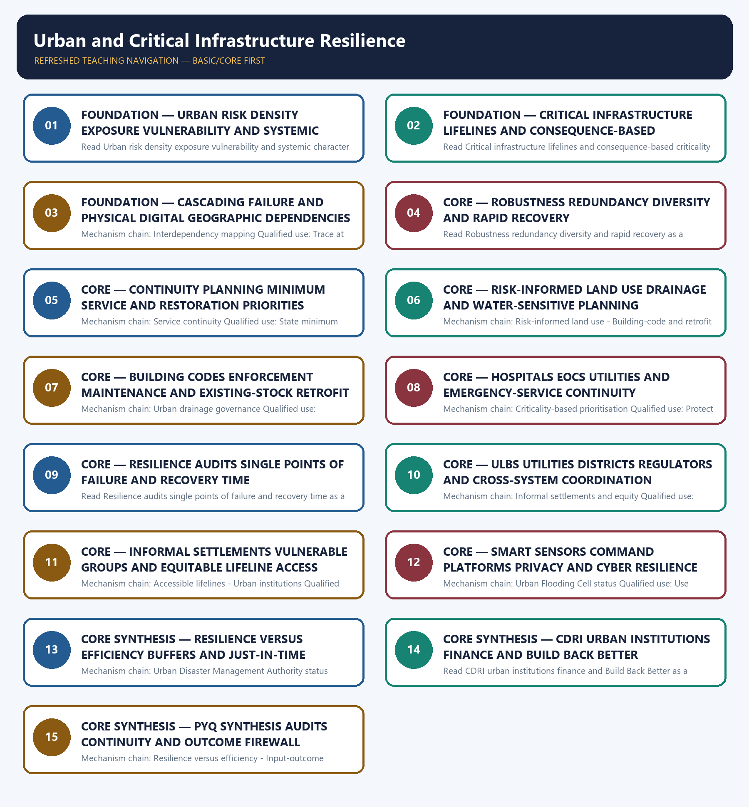

# Urban and Critical Infrastructure Resilience — Learner-v2 Complete Learning Session

> **Authoring-only generation:** 2026-09-04. No PDF was rendered and no tracker or index was mutated.

### SOURCE, PROGRESSION AND CURRENT-LINKAGE AUDIT

- **Generation date:** 2026-09-04.
- **Repository-first evidence:** the Basic owner is taught first and preserved in full; the Advanced owner is retained only in the optional final teaching block.
- **OCR evidence:** Repository Markdown was primary. OCR-searchable official UPSC papers were supplementary only for printed routed demands. No answer key, warning performance, notification effect, implementation outcome, casualty reduction or disaster metric was inferred.
- **Qdrant:** not used; repository Markdown and available OCR context were sufficient.
- **PYQ integrity:** The 2024 urban-flood card is the closest verified direct application but remains Topic 08-owned. The 2024 resilience card is a direct conceptual support route; the 2023 dam-failure card is cross-owned infrastructure-cascade support.
- **Live-link boundary:** Official attempts covered NDMA and MoHUA urban-flood routes, BIS building standards, AMRUT sponge-city material, CDRI and UNDRR. Blocked, transport-failed and search-only pages are recorded; no project completion, city ranking, code compliance, continuity result, avoided loss or resilience outcome was invented.
- **Fact/inference discipline:** no current-affairs item, PYQ wording, figure or quotation is invented.

### LIVE OFFICIAL-SOURCE ATTEMPT LOG

The checks below were made on 2026-09-04. Substantive official text is used only for the proposition it supports; title-only, blocked or thin pages are recorded and supply no factual claim.

- https://ndma.gov.in/Resources/awareness/Urban-Flooding — attempted 2026-09-04; the NDMA route failed at the transport layer. https://mohua.gov.in/documents/publications/manuals-and-advisories-MDMwYTMtQWa?pageTitle=Manuals-And-Advisories — searched 2026-09-04; official results exposed urban-flood preparedness and drainage advisories, while the MoHUA home page itself returned HTTP 403.
- https://www.bis.gov.in/standards/national-building-code/?lang=en — searched 2026-09-04; official BIS results identified the National Building Code and disaster-mitigation standards route. https://www.mha.gov.in/en/commoncontent/disaster-management-act-2005 — attempted 2026-09-04; MHA returned HTTP 403. No city-level code compliance or retrofit outcome was inferred.
- https://cdri.world/ — fetched 2026-09-04; CDRI described its purpose as enhancing infrastructure-system resilience to climate and disaster risk. https://www.undrr.org/implementing-sendai-framework/what-sendai-framework — fetched 2026-09-04 for the structural/non-structural investment and Build Back Better boundary.
- https://amrut.mohua.gov.in/uploads/saasci/B1-Innovative-Method.pdf — searched 2026-09-04; the official AMRUT route surfaced sponge-city interventions. https://pib.gov.in/ — searched 2026-09-04 for official urban-programme corroboration; no completion, loss-avoidance or city ranking claim was imported.
- https://cea.nic.in/ps___lf/97719/?lang=en — searched 2026-09-04; official CEA results identified the Disaster Management Plan 2024 for the power sector. https://dot.gov.in/static/uploads/2025/07/0484fb15ff3f823ec7301b720112129e.pdf — searched 2026-09-04; official DoT results identified the telecom disaster-response SOP route. https://ndma.gov.in/ — attempted 2026-09-04; no sector readiness, uptime, restoration or compliance outcome was inferred.

## BASIC LEARNING SESSION

### DEEP-REVIEW LEARNING CONTRACT

| Control | Binding rule for this package |
|---|---|
| Syllabus boundary | Complete Disaster Management Basic/Core is easy-first and answer-complete before optional Advanced depth. |
| Risk boundary | Hazard, exposure, vulnerability, capacity, risk, disaster impact, resilience and recovery outcome remain distinct. |
| Cycle boundary | Prevention, mitigation, preparedness, response, relief, rehabilitation, recovery and Build Back Better are not conflated. |
| Law/status boundary | Enacted Act, amendment, notified rule, plan, guideline, scheme, alert, announcement, operationalisation and measured outcome retain exact status. |
| Institutional boundary | NDMA, NEC, NIDM, NDRF, SDMA, SEC, DDMA, civil administration, response forces and armed-forces support retain exact mandates and levels. |
| Warning boundary | Observation, forecast, watch, warning, dissemination, receipt, evacuation order, evacuation and safe return remain separate. |
| Finance/data boundary | Allocation, release, expenditure, capacity, deployment, relief norm, entitlement, event fact and analytical inference retain source/date/unit/status. |
| Practice contract | Every solved item has demand decoding, detailed examiner-grade model, executable timed/compression plan, marks rationale and answer-specific improvement. |
| PYQ contract | Official wording and keys are asserted only when verified; routed or reconstructed demands remain labelled. |
| Dual-flow contract | Graphical and ASCII masters independently reconstruct the same complete Basic-to-optional-Advanced evidence ledger. |
| Cross-ownership | Environment Topic 26 owns environmental/climate-law base; Internal Security owns hostile-threat operations; Disaster Management owns civilian risk governance and response. |
| Approval | This immutable successor remains `approved: false` pending explicit approval. |

**Canonical Basic/Core owner:** `upsc-ai-kit\knowledge\Disaster-Management\basic\14_Urban-and-Critical-Infrastructure-Resilience.md`  
**Substantive canonical provenance owner:** `upsc-ai-kit\knowledge\Disaster-Management\learning-sessions\v2\subject-wide-syllabus\disaster-management-14_Learning-Session.md`  
**Optional Advanced owner:** `upsc-ai-kit\knowledge\Disaster-Management\advanced\14_Urban-and-Critical-Infrastructure-Resilience.md`  
**Official syllabus mapping:** `upsc-ai-kit\knowledge\Disaster-Management\OFFICIAL-UPSC-SYLLABUS-MAPPING.md`

### EVIDENCE, PYQ AND CURRENT-STATUS CONTROL

- Every law, guideline, scheme, institution, alert, event, casualty, magnitude, rainfall, temperature, fund, target, date and policy claim retains source, date, unit, jurisdiction and status.
- Hazard occurrence is separated from disaster impact; structural from non-structural mitigation; response output from recovery and resilience outcome.
- Sendai priorities are separated from seven global targets and global from national indicators; climate adaptation, DRR and loss-and-damage boundaries remain explicit.
- Announcement is separated from operationalisation; allocation from release and expenditure; capacity from deployment; relief norm from legal entitlement.
- **Current-status note, rechecked 2026-09-06:** failed official fetches remain explicit and supply no invented fact.

**Generation-local live/current sources:**
- `https://ndma.gov.in/Resources/awareness/Urban-Flooding — attempted 2026-09-04; the NDMA route failed at the transport layer. https://mohua.gov.in/documents/publications/manuals-and-advisories-MDMwYTMtQWa?pageTitle=Manuals-And-Advisories — searched 2026-09-04; official results exposed urban-flood preparedness and drainage advisories, while the MoHUA home page itself returned HTTP 403.`
- `https://www.bis.gov.in/standards/national-building-code/?lang=en — searched 2026-09-04; official BIS results identified the National Building Code and disaster-mitigation standards route. https://www.mha.gov.in/en/commoncontent/disaster-management-act-2005 — attempted 2026-09-04; MHA returned HTTP 403. No city-level code compliance or retrofit outcome was inferred.`
- `https://cdri.world/ — fetched 2026-09-04; CDRI described its purpose as enhancing infrastructure-system resilience to climate and disaster risk. https://www.undrr.org/implementing-sendai-framework/what-sendai-framework — fetched 2026-09-04 for the structural/non-structural investment and Build Back Better boundary.`
- `https://amrut.mohua.gov.in/uploads/saasci/B1-Innovative-Method.pdf — searched 2026-09-04; the official AMRUT route surfaced sponge-city interventions. https://pib.gov.in/ — searched 2026-09-04 for official urban-programme corroboration; no completion, loss-avoidance or city ranking claim was imported.`
- `https://cea.nic.in/ps___lf/97719/?lang=en — searched 2026-09-04; official CEA results identified the Disaster Management Plan 2024 for the power sector. https://dot.gov.in/static/uploads/2025/07/0484fb15ff3f823ec7301b720112129e.pdf — searched 2026-09-04; official DoT results identified the telecom disaster-response SOP route. https://ndma.gov.in/ — attempted 2026-09-04; no sector readiness, uptime, restoration or compliance outcome was inferred.`

**Topic-routed verified PYQ owners:**
- Repository PYQ routing ledgers control wording, year, marks and verification status.




*Distinct embedded teaching-navigation image. The separate continuous Cārvāka-style flowchart package remains an independent at-a-glance artifact.*

### SESSION 1 — FOUNDATION — URBAN RISK DENSITY EXPOSURE VULNERABILITY AND SYSTEMIC CHARACTER

#### DEFINITION / WHAT THIS IS CALLED

**Plain-language definition:** Urban disaster risk arises where hazards interact with dense populations, concentrated assets, unequal vulnerability and tightly coupled services; it is not merely a rural hazard occurring inside municipal limits.

**Technical definition:** Read Urban risk density exposure vulnerability and systemic character as a sequence: identify Urban disaster risk, follow the named mechanism to its institutional response, and stop at the last verified status rather than assuming the next stage.

#### ANSWER-GRABBING OPENING — WRITE/ADAPT IN THE EXAM

> Read Urban risk density exposure vulnerability and systemic character as a sequence: identify Urban disaster risk, follow the named mechanism to its institutional response, and stop at the last verified status rather than assuming the next stage.

#### MUST-WRITE KEYWORDS

- **FOUNDATION**
- **Urban risk density exposure vulnerability**
- **systemic character**
- **Mechanism chain**
- **Qualified use**
- **Urban**

**How to use them:** Frame the answer through FOUNDATION; define Urban risk density exposure vulnerability, connect systemic character with Mechanism chain to explain the mechanism, and use Qualified use for the decisive comparison or qualification.

#### VISUAL FIRST

```text
URBAN RISK DENSITY EXPOSURE VULNERABILITY AND SYSTEMIC CHARACTER
01. Urban disaster risk
    |
    v
02. Systemic and cascading failure
STATUS / CATEGORY FIREWALL -> Do not reduce urban resilience to stronger buildings or larger drains.
```

*The rail fixes the institutional sequence and claim boundary before explanation.*

#### CORE EXPLANATION

Urban disaster risk arises where hazards interact with dense populations, concentrated assets, unequal vulnerability and tightly coupled services; it is not merely a rural hazard occurring inside municipal limits. A disruption becomes systemic when failure propagates across connected services, such as electricity loss disabling pumping, telecom, hospitals, traffic management and emergency response.

#### SIMPLE SYSTEM EXAMPLE

Read Urban risk density exposure vulnerability and systemic character as a sequence: identify Urban disaster risk, follow the named mechanism to its institutional response, and stop at the last verified status rather than assuming the next stage.

#### TECHNICAL DISTINCTION

The decisive boundary is Do not reduce urban resilience to stronger buildings or larger drains. This keeps Urban disaster risk and Systemic and cascading failure in the correct risk category, institutional mandate and evidence status.

#### NAMED EVIDENCE AND MECHANISM

- Urban disaster risk arises where hazards interact with dense populations, concentrated assets, unequal vulnerability and tightly coupled services; it is not merely a rural hazard occurring inside municipal limits.
- A disruption becomes systemic when failure propagates across connected services, such as electricity loss disabling pumping, telecom, hospitals, traffic management and emergency response.

#### EXAMINER CAUTION

- Do not reduce urban resilience to stronger buildings or larger drains.

#### EXAM LINK

- **Prelims:** Keep hazard, forecast, warning, institution, law, plan, force, fund, scheme and outcome in their exact category.
- **Mains:** Define urban risk as a coupled social-infrastructure system.

#### MINI RECAP

- **Mechanism chain:** Urban disaster risk -> Systemic and cascading failure
- **Qualified use:** Define urban risk as a coupled social-infrastructure system.

#### CLOSING RECALL FLOW — FOUNDATION — URBAN RISK DENSITY EXPOSURE VULNERABILITY AND SYSTEMIC CHARACTER

```text
START / CONCEPT: FOUNDATION — Urban risk density exposure vulnerability and systemic character
        |
        v
EXACT TERMS: FOUNDATION · Urban risk density exposure vulnerability · systemic character · Mechanism chain · Qualified use · Urban
        |
        v
MECHANISM / ARGUMENT: Mechanism chain: Urban disaster risk - Systemic and cascading failure Qualified use: Define urban risk as a coupled social-infrastructure system.
        |
        v
CONSEQUENCE / CONTRAST: Urban disaster risk arises where hazards interact with dense populations, concentrated assets, unequal vulnerability and tightly coupled services; it is not merely a rural hazard occurring inside municipal limits.
        |
        v
UPSC TRAP / ANSWER-USE: The decisive boundary is Do not reduce urban resilience to stronger buildings or larger drains.
        |
        v
ANSWER-GRABBING FORMULATION: Read Urban risk density exposure vulnerability and systemic character as a sequence: identify Urban disaster risk, follow the named mechanism to its institutional response, and stop at the last verified status rather than assuming the next stage.
```
### SESSION 2 — FOUNDATION — CRITICAL INFRASTRUCTURE LIFELINES AND CONSEQUENCE-BASED CRITICALITY

#### DEFINITION / WHAT THIS IS CALLED

**Plain-language definition:** Critical infrastructure and lifelines are assets, networks and services whose disruption causes disproportionate effects on life, health, safety, governance or economic functioning; criticality depends on function and consequence, not ownership alone.

**Technical definition:** Read Critical infrastructure lifelines and consequence-based criticality as a sequence: identify Critical infrastructure and lifelines, follow the named mechanism to its institutional response, and stop at the last verified status rather than assuming the next stage.

#### ANSWER-GRABBING OPENING — WRITE/ADAPT IN THE EXAM

> Critical infrastructure and lifelines are assets, networks and services whose disruption causes disproportionate effects on life, health, safety, governance or economic functioning; criticality depends on function and consequence, not ownership alone.

#### MUST-WRITE KEYWORDS

- **FOUNDATION**
- **Critical infrastructure lifelines**
- **consequence-based criticality**
- **Mechanism chain**
- **Qualified use**
- **Critical infrastructure and lifelines**

**How to use them:** Frame the answer through FOUNDATION; define Critical infrastructure lifelines, connect consequence-based criticality with Mechanism chain to explain the mechanism, and use Qualified use for the decisive comparison or qualification.

#### VISUAL FIRST

```text
CRITICAL INFRASTRUCTURE LIFELINES AND CONSEQUENCE-BASED CRITICALITY
01. Critical infrastructure and lifelines
STATUS / CATEGORY FIREWALL -> Do not use critical infrastructure and all infrastructure as synonyms.
```

*The rail fixes the institutional sequence and claim boundary before explanation.*

#### CORE EXPLANATION

Critical infrastructure and lifelines are assets, networks and services whose disruption causes disproportionate effects on life, health, safety, governance or economic functioning; criticality depends on function and consequence, not ownership alone.

#### SIMPLE SYSTEM EXAMPLE

Read Critical infrastructure lifelines and consequence-based criticality as a sequence: identify Critical infrastructure and lifelines, follow the named mechanism to its institutional response, and stop at the last verified status rather than assuming the next stage.

#### TECHNICAL DISTINCTION

The decisive boundary is Do not use critical infrastructure and all infrastructure as synonyms. This keeps Critical infrastructure and lifelines in the correct risk category, institutional mandate and evidence status.

#### NAMED EVIDENCE AND MECHANISM

- Critical infrastructure and lifelines are assets, networks and services whose disruption causes disproportionate effects on life, health, safety, governance or economic functioning; criticality depends on function and consequence, not ownership alone.

#### EXAMINER CAUTION

- Do not use critical infrastructure and all infrastructure as synonyms.

#### EXAM LINK

- **Prelims:** Keep hazard, forecast, warning, institution, law, plan, force, fund, scheme and outcome in their exact category.
- **Mains:** Classify criticality by consequence and service function.

#### MINI RECAP

- **Mechanism chain:** Critical infrastructure and lifelines
- **Qualified use:** Classify criticality by consequence and service function.

#### CLOSING RECALL FLOW — FOUNDATION — CRITICAL INFRASTRUCTURE LIFELINES AND CONSEQUENCE-BASED CRITICALITY

```text
START / CONCEPT: FOUNDATION — Critical infrastructure lifelines and consequence-based criticality
        |
        v
EXACT TERMS: FOUNDATION · Critical infrastructure lifelines · consequence-based criticality · Mechanism chain · Qualified use · Critical infrastructure and lifelines
        |
        v
MECHANISM / ARGUMENT: Read Critical infrastructure lifelines and consequence-based criticality as a sequence: identify Critical infrastructure and lifelines, follow the named mechanism to its institutional response, and stop at the last verified status rather than assuming the next stage.
        |
        v
CONSEQUENCE / CONTRAST: Mechanism chain: Critical infrastructure and lifelines Qualified use: Classify criticality by consequence and service function.
        |
        v
UPSC TRAP / ANSWER-USE: The decisive boundary is Do not use critical infrastructure and all infrastructure as synonyms.
        |
        v
ANSWER-GRABBING FORMULATION: Critical infrastructure and lifelines are assets, networks and services whose disruption causes disproportionate effects on life, health, safety, governance or economic functioning; criticality depends on function and consequence, not ownership alone.
```
### SESSION 3 — FOUNDATION — CASCADING FAILURE AND PHYSICAL DIGITAL GEOGRAPHIC DEPENDENCIES

#### DEFINITION / WHAT THIS IS CALLED

**Plain-language definition:** Read Cascading failure and physical digital geographic dependencies as a sequence: identify Interdependency mapping, follow the named mechanism to its institutional response, and stop at the last verified status rather than assuming the next stage.

**Technical definition:** Mechanism chain: Interdependency mapping Qualified use: Trace at least one multi-lifeline cascade and its dependency.

#### ANSWER-GRABBING OPENING — WRITE/ADAPT IN THE EXAM

> Read Cascading failure and physical digital geographic dependencies as a sequence: identify Interdependency mapping, follow the named mechanism to its institutional response, and stop at the last verified status rather than assuming the next stage.

#### MUST-WRITE KEYWORDS

- **FOUNDATION**
- **Cascading failure**
- **physical digital geographic dependencies**
- **Mechanism chain**
- **Qualified use**
- **Read Cascading**

**How to use them:** Frame the answer through FOUNDATION; define Cascading failure, connect physical digital geographic dependencies with Mechanism chain to explain the mechanism, and use Qualified use for the decisive comparison or qualification.

#### VISUAL FIRST

```text
CASCADING FAILURE AND PHYSICAL DIGITAL GEOGRAPHIC DEPENDENCIES
01. Interdependency mapping
STATUS / CATEGORY FIREWALL -> Do not confuse robustness, redundancy and rapid recovery.
```

*The rail fixes the institutional sequence and claim boundary before explanation.*

#### CORE EXPLANATION

Interdependency mapping identifies physical, digital, geographic and organisational dependencies among water, power, transport, health, telecom, sanitation and emergency systems before prioritising protection.

#### SIMPLE SYSTEM EXAMPLE

Read Cascading failure and physical digital geographic dependencies as a sequence: identify Interdependency mapping, follow the named mechanism to its institutional response, and stop at the last verified status rather than assuming the next stage.

#### TECHNICAL DISTINCTION

The decisive boundary is Do not confuse robustness, redundancy and rapid recovery. This keeps Interdependency mapping in the correct risk category, institutional mandate and evidence status.

#### NAMED EVIDENCE AND MECHANISM

- Interdependency mapping identifies physical, digital, geographic and organisational dependencies among water, power, transport, health, telecom, sanitation and emergency systems before prioritising protection.

#### EXAMINER CAUTION

- Do not confuse robustness, redundancy and rapid recovery.

#### EXAM LINK

- **Prelims:** Keep hazard, forecast, warning, institution, law, plan, force, fund, scheme and outcome in their exact category.
- **Mains:** Trace at least one multi-lifeline cascade and its dependency.

#### MINI RECAP

- **Mechanism chain:** Interdependency mapping
- **Qualified use:** Trace at least one multi-lifeline cascade and its dependency.

#### CLOSING RECALL FLOW — FOUNDATION — CASCADING FAILURE AND PHYSICAL DIGITAL GEOGRAPHIC DEPENDENCIES

```text
START / CONCEPT: FOUNDATION — Cascading failure and physical digital geographic dependencies
        |
        v
EXACT TERMS: FOUNDATION · Cascading failure · physical digital geographic dependencies · Mechanism chain · Qualified use · Read Cascading
        |
        v
MECHANISM / ARGUMENT: Mechanism chain: Interdependency mapping Qualified use: Trace at least one multi-lifeline cascade and its dependency.
        |
        v
CONSEQUENCE / CONTRAST: The decisive boundary is Do not confuse robustness, redundancy and rapid recovery.
        |
        v
UPSC TRAP / ANSWER-USE: Do not confuse robustness, redundancy and rapid recovery.
        |
        v
ANSWER-GRABBING FORMULATION: Read Cascading failure and physical digital geographic dependencies as a sequence: identify Interdependency mapping, follow the named mechanism to its institutional response, and stop at the last verified status rather than assuming the next stage.
```
### SESSION 4 — CORE — ROBUSTNESS REDUNDANCY DIVERSITY AND RAPID RECOVERY

#### DEFINITION / WHAT THIS IS CALLED

**Plain-language definition:** Robustness resists disruption, redundancy supplies alternative capacity or routes, and rapid recovery restores priority functions; the three are complementary and should not be used as synonyms.

**Technical definition:** Read Robustness redundancy diversity and rapid recovery as a sequence: identify Robustness redundancy and rapid recovery, follow the named mechanism to its institutional response, and stop at the last verified status rather than assuming the next stage.

#### ANSWER-GRABBING OPENING — WRITE/ADAPT IN THE EXAM

> Robustness resists disruption, redundancy supplies alternative capacity or routes, and rapid recovery restores priority functions; the three are complementary and should not be used as synonyms.

#### MUST-WRITE KEYWORDS

- **Robustness redundancy diversity**
- **rapid recovery**
- **Mechanism chain**
- **Qualified use**
- **Robustness**
- **Read Robustness**

**How to use them:** Frame the answer through Robustness redundancy diversity; define rapid recovery, connect Mechanism chain with Qualified use to explain the mechanism, and use Robustness for the decisive comparison or qualification.

#### VISUAL FIRST

```text
ROBUSTNESS REDUNDANCY DIVERSITY AND RAPID RECOVERY
01. Robustness redundancy and rapid recovery
STATUS / CATEGORY FIREWALL -> Do not infer interdependency management from separate utility plans.
```

*The rail fixes the institutional sequence and claim boundary before explanation.*

#### CORE EXPLANATION

Robustness resists disruption, redundancy supplies alternative capacity or routes, and rapid recovery restores priority functions; the three are complementary and should not be used as synonyms.

#### SIMPLE SYSTEM EXAMPLE

Read Robustness redundancy diversity and rapid recovery as a sequence: identify Robustness redundancy and rapid recovery, follow the named mechanism to its institutional response, and stop at the last verified status rather than assuming the next stage.

#### TECHNICAL DISTINCTION

The decisive boundary is Do not infer interdependency management from separate utility plans. This keeps Robustness redundancy and rapid recovery in the correct risk category, institutional mandate and evidence status.

#### NAMED EVIDENCE AND MECHANISM

- Robustness resists disruption, redundancy supplies alternative capacity or routes, and rapid recovery restores priority functions; the three are complementary and should not be used as synonyms.

#### EXAMINER CAUTION

- Do not infer interdependency management from separate utility plans.

#### EXAM LINK

- **Prelims:** Keep hazard, forecast, warning, institution, law, plan, force, fund, scheme and outcome in their exact category.
- **Mains:** Prescribe resistance alternatives and restoration together.

#### MINI RECAP

- **Mechanism chain:** Robustness redundancy and rapid recovery
- **Qualified use:** Prescribe resistance alternatives and restoration together.

#### CLOSING RECALL FLOW — CORE — ROBUSTNESS REDUNDANCY DIVERSITY AND RAPID RECOVERY

```text
START / CONCEPT: CORE — Robustness redundancy diversity and rapid recovery
        |
        v
EXACT TERMS: Robustness redundancy diversity · rapid recovery · Mechanism chain · Qualified use · Robustness · Read Robustness
        |
        v
MECHANISM / ARGUMENT: Read Robustness redundancy diversity and rapid recovery as a sequence: identify Robustness redundancy and rapid recovery, follow the named mechanism to its institutional response, and stop at the last verified status rather than assuming the next stage.
        |
        v
CONSEQUENCE / CONTRAST: Mechanism chain: Robustness redundancy and rapid recovery Qualified use: Prescribe resistance alternatives and restoration together.
        |
        v
UPSC TRAP / ANSWER-USE: The decisive boundary is Do not infer interdependency management from separate utility plans.
        |
        v
ANSWER-GRABBING FORMULATION: Robustness resists disruption, redundancy supplies alternative capacity or routes, and rapid recovery restores priority functions; the three are complementary and should not be used as synonyms.
```
### SESSION 5 — CORE — CONTINUITY PLANNING MINIMUM SERVICE AND RESTORATION PRIORITIES

#### DEFINITION / WHAT THIS IS CALLED

**Plain-language definition:** Read Continuity planning minimum service and restoration priorities as a sequence: identify Service continuity, follow the named mechanism to its institutional response, and stop at the last verified status rather than assuming the next stage.

**Technical definition:** Mechanism chain: Service continuity Qualified use: State minimum service priority users fallback and recovery time.

#### ANSWER-GRABBING OPENING — WRITE/ADAPT IN THE EXAM

> Read Continuity planning minimum service and restoration priorities as a sequence: identify Service continuity, follow the named mechanism to its institutional response, and stop at the last verified status rather than assuming the next stage.

#### MUST-WRITE KEYWORDS

- **Continuity planning minimum service**
- **restoration priorities**
- **Mechanism chain**
- **Qualified use**
- **Read Continuity**
- **Service**

**How to use them:** Frame the answer through Continuity planning minimum service; define restoration priorities, connect Mechanism chain with Qualified use to explain the mechanism, and use Read Continuity for the decisive comparison or qualification.

#### VISUAL FIRST

```text
CONTINUITY PLANNING MINIMUM SERVICE AND RESTORATION PRIORITIES
01. Service continuity
STATUS / CATEGORY FIREWALL -> Do not treat code publication as municipal enforcement or retrofit completion.
```

*The rail fixes the institutional sequence and claim boundary before explanation.*

#### CORE EXPLANATION

Continuity planning fixes minimum acceptable service, priority users, backup resources, alternate sites, manual workarounds, communication and restoration order before an incident.

#### SIMPLE SYSTEM EXAMPLE

Read Continuity planning minimum service and restoration priorities as a sequence: identify Service continuity, follow the named mechanism to its institutional response, and stop at the last verified status rather than assuming the next stage.

#### TECHNICAL DISTINCTION

The decisive boundary is Do not treat code publication as municipal enforcement or retrofit completion. This keeps Service continuity in the correct risk category, institutional mandate and evidence status.

#### NAMED EVIDENCE AND MECHANISM

- Continuity planning fixes minimum acceptable service, priority users, backup resources, alternate sites, manual workarounds, communication and restoration order before an incident.

#### EXAMINER CAUTION

- Do not treat code publication as municipal enforcement or retrofit completion.

#### EXAM LINK

- **Prelims:** Keep hazard, forecast, warning, institution, law, plan, force, fund, scheme and outcome in their exact category.
- **Mains:** State minimum service priority users fallback and recovery time.

#### MINI RECAP

- **Mechanism chain:** Service continuity
- **Qualified use:** State minimum service priority users fallback and recovery time.

#### CLOSING RECALL FLOW — CORE — CONTINUITY PLANNING MINIMUM SERVICE AND RESTORATION PRIORITIES

```text
START / CONCEPT: CORE — Continuity planning minimum service and restoration priorities
        |
        v
EXACT TERMS: Continuity planning minimum service · restoration priorities · Mechanism chain · Qualified use · Read Continuity · Service
        |
        v
MECHANISM / ARGUMENT: Mechanism chain: Service continuity Qualified use: State minimum service priority users fallback and recovery time.
        |
        v
CONSEQUENCE / CONTRAST: The decisive boundary is Do not treat code publication as municipal enforcement or retrofit completion.
        |
        v
UPSC TRAP / ANSWER-USE: Do not treat code publication as municipal enforcement or retrofit completion.
        |
        v
ANSWER-GRABBING FORMULATION: Read Continuity planning minimum service and restoration priorities as a sequence: identify Service continuity, follow the named mechanism to its institutional response, and stop at the last verified status rather than assuming the next stage.
```
### SESSION 6 — CORE — RISK-INFORMED LAND USE DRAINAGE AND WATER-SENSITIVE PLANNING

#### DEFINITION / WHAT THIS IS CALLED

**Plain-language definition:** Read Risk-informed land use drainage and water-sensitive planning as a sequence: identify Risk-informed land use, follow the named mechanism to its institutional response, and stop at the last verified status rather than assuming the next stage.

**Technical definition:** Mechanism chain: Risk-informed land use - Building-code and retrofit chain Qualified use: Join land use hydrology drainage maintenance and enforcement.

#### ANSWER-GRABBING OPENING — WRITE/ADAPT IN THE EXAM

> Read Risk-informed land use drainage and water-sensitive planning as a sequence: identify Risk-informed land use, follow the named mechanism to its institutional response, and stop at the last verified status rather than assuming the next stage.

#### MUST-WRITE KEYWORDS

- **Risk-informed land use drainage**
- **water-sensitive planning**
- **Mechanism chain**
- **Qualified use**
- **Risk-informed**
- **Safer**

**How to use them:** Frame the answer through Risk-informed land use drainage; define water-sensitive planning, connect Mechanism chain with Qualified use to explain the mechanism, and use Risk-informed for the decisive comparison or qualification.

#### VISUAL FIRST

```text
RISK-INFORMED LAND USE DRAINAGE AND WATER-SENSITIVE PLANNING
01. Risk-informed land use
    |
    v
02. Building-code and retrofit chain
STATUS / CATEGORY FIREWALL -> Do not assume every city has an operating Urban Flooding Cell or UDMA.
```

*The rail fixes the institutional sequence and claim boundary before explanation.*

#### CORE EXPLANATION

Risk-informed land use keeps hazardous locations, drainage paths, evacuation routes and critical-service access visible in development control rather than treating hazard maps as stand-alone documents. Safer construction requires current risk-sensitive standards, municipal adoption, competent design, site supervision, occupancy control, maintenance and retrofit of vulnerable existing stock; publication of a code proves none of the later links.

#### SIMPLE SYSTEM EXAMPLE

Read Risk-informed land use drainage and water-sensitive planning as a sequence: identify Risk-informed land use, follow the named mechanism to its institutional response, and stop at the last verified status rather than assuming the next stage.

#### TECHNICAL DISTINCTION

The decisive boundary is Do not assume every city has an operating Urban Flooding Cell or UDMA. This keeps Risk-informed land use and Building-code and retrofit chain in the correct risk category, institutional mandate and evidence status.

#### NAMED EVIDENCE AND MECHANISM

- Risk-informed land use keeps hazardous locations, drainage paths, evacuation routes and critical-service access visible in development control rather than treating hazard maps as stand-alone documents.
- Safer construction requires current risk-sensitive standards, municipal adoption, competent design, site supervision, occupancy control, maintenance and retrofit of vulnerable existing stock; publication of a code proves none of the later links.

#### EXAMINER CAUTION

- Do not assume every city has an operating Urban Flooding Cell or UDMA.

#### EXAM LINK

- **Prelims:** Keep hazard, forecast, warning, institution, law, plan, force, fund, scheme and outcome in their exact category.
- **Mains:** Join land use hydrology drainage maintenance and enforcement.

#### MINI RECAP

- **Mechanism chain:** Risk-informed land use -> Building-code and retrofit chain
- **Qualified use:** Join land use hydrology drainage maintenance and enforcement.

#### CLOSING RECALL FLOW — CORE — RISK-INFORMED LAND USE DRAINAGE AND WATER-SENSITIVE PLANNING

```text
START / CONCEPT: CORE — Risk-informed land use drainage and water-sensitive planning
        |
        v
EXACT TERMS: Risk-informed land use drainage · water-sensitive planning · Mechanism chain · Qualified use · Risk-informed · Safer
        |
        v
MECHANISM / ARGUMENT: Mechanism chain: Risk-informed land use - Building-code and retrofit chain Qualified use: Join land use hydrology drainage maintenance and enforcement.
        |
        v
CONSEQUENCE / CONTRAST: Risk-informed land use keeps hazardous locations, drainage paths, evacuation routes and critical-service access visible in development control rather than treating hazard maps as stand-alone documents.
        |
        v
UPSC TRAP / ANSWER-USE: The decisive boundary is Do not assume every city has an operating Urban Flooding Cell or UDMA.
        |
        v
ANSWER-GRABBING FORMULATION: Read Risk-informed land use drainage and water-sensitive planning as a sequence: identify Risk-informed land use, follow the named mechanism to its institutional response, and stop at the last verified status rather than assuming the next stage.
```
### SESSION 7 — CORE — BUILDING CODES ENFORCEMENT MAINTENANCE AND EXISTING-STOCK RETROFIT

#### DEFINITION / WHAT THIS IS CALLED

**Plain-language definition:** Read Building codes enforcement maintenance and existing-stock retrofit as a sequence: identify Urban drainage governance, follow the named mechanism to its institutional response, and stop at the last verified status rather than assuming the next stage.

**Technical definition:** Mechanism chain: Urban drainage governance Qualified use: Separate standards adoption enforcement maintenance and retrofit.

#### ANSWER-GRABBING OPENING — WRITE/ADAPT IN THE EXAM

> Read Building codes enforcement maintenance and existing-stock retrofit as a sequence: identify Urban drainage governance, follow the named mechanism to its institutional response, and stop at the last verified status rather than assuming the next stage.

#### MUST-WRITE KEYWORDS

- **Building codes enforcement maintenance**
- **existing-stock retrofit**
- **Mechanism chain**
- **Qualified use**
- **Read Building**
- **Urban**

**How to use them:** Frame the answer through Building codes enforcement maintenance; define existing-stock retrofit, connect Mechanism chain with Qualified use to explain the mechanism, and use Read Building for the decisive comparison or qualification.

#### VISUAL FIRST

```text
BUILDING CODES ENFORCEMENT MAINTENANCE AND EXISTING-STOCK RETROFIT
01. Urban drainage governance
STATUS / CATEGORY FIREWALL -> Do not infer asset resilience from CDRI membership, a dashboard or project sanction.
```

*The rail fixes the institutional sequence and claim boundary before explanation.*

#### CORE EXPLANATION

Urban drainage resilience combines catchment-scale planning, protected natural drains and water bodies, adequate conveyance, solid-waste control, maintenance, pumping where needed and coordination across municipal boundaries.

#### SIMPLE SYSTEM EXAMPLE

Read Building codes enforcement maintenance and existing-stock retrofit as a sequence: identify Urban drainage governance, follow the named mechanism to its institutional response, and stop at the last verified status rather than assuming the next stage.

#### TECHNICAL DISTINCTION

The decisive boundary is Do not infer asset resilience from CDRI membership, a dashboard or project sanction. This keeps Urban drainage governance in the correct risk category, institutional mandate and evidence status.

#### NAMED EVIDENCE AND MECHANISM

- Urban drainage resilience combines catchment-scale planning, protected natural drains and water bodies, adequate conveyance, solid-waste control, maintenance, pumping where needed and coordination across municipal boundaries.

#### EXAMINER CAUTION

- Do not infer asset resilience from CDRI membership, a dashboard or project sanction.

#### EXAM LINK

- **Prelims:** Keep hazard, forecast, warning, institution, law, plan, force, fund, scheme and outcome in their exact category.
- **Mains:** Separate standards adoption enforcement maintenance and retrofit.

#### MINI RECAP

- **Mechanism chain:** Urban drainage governance
- **Qualified use:** Separate standards adoption enforcement maintenance and retrofit.

#### CLOSING RECALL FLOW — CORE — BUILDING CODES ENFORCEMENT MAINTENANCE AND EXISTING-STOCK RETROFIT

```text
START / CONCEPT: CORE — Building codes enforcement maintenance and existing-stock retrofit
        |
        v
EXACT TERMS: Building codes enforcement maintenance · existing-stock retrofit · Mechanism chain · Qualified use · Read Building · Urban
        |
        v
MECHANISM / ARGUMENT: Mechanism chain: Urban drainage governance Qualified use: Separate standards adoption enforcement maintenance and retrofit.
        |
        v
CONSEQUENCE / CONTRAST: The decisive boundary is Do not infer asset resilience from CDRI membership, a dashboard or project sanction.
        |
        v
UPSC TRAP / ANSWER-USE: Do not infer asset resilience from CDRI membership, a dashboard or project sanction.
        |
        v
ANSWER-GRABBING FORMULATION: Read Building codes enforcement maintenance and existing-stock retrofit as a sequence: identify Urban drainage governance, follow the named mechanism to its institutional response, and stop at the last verified status rather than assuming the next stage.
```
### SESSION 8 — CORE — HOSPITALS EOCS UTILITIES AND EMERGENCY-SERVICE CONTINUITY

#### DEFINITION / WHAT THIS IS CALLED

**Plain-language definition:** Read Hospitals EOCs utilities and emergency-service continuity as a sequence: identify Criticality-based prioritisation, follow the named mechanism to its institutional response, and stop at the last verified status rather than assuming the next stage.

**Technical definition:** Mechanism chain: Criticality-based prioritisation Qualified use: Protect both the facility and every service dependency it needs.

#### ANSWER-GRABBING OPENING — WRITE/ADAPT IN THE EXAM

> Read Hospitals EOCs utilities and emergency-service continuity as a sequence: identify Criticality-based prioritisation, follow the named mechanism to its institutional response, and stop at the last verified status rather than assuming the next stage.

#### MUST-WRITE KEYWORDS

- **Hospitals EOCs utilities**
- **emergency-service continuity**
- **Mechanism chain**
- **Qualified use**
- **Read Hospitals EOCs**
- **Criticality-based**

**How to use them:** Frame the answer through Hospitals EOCs utilities; define emergency-service continuity, connect Mechanism chain with Qualified use to explain the mechanism, and use Read Hospitals EOCs for the decisive comparison or qualification.

#### VISUAL FIRST

```text
HOSPITALS EOCS UTILITIES AND EMERGENCY-SERVICE CONTINUITY
01. Criticality-based prioritisation
STATUS / CATEGORY FIREWALL -> Do not let smart surveillance erase privacy, cybersecurity or offline fallback.
```

*The rail fixes the institutional sequence and claim boundary before explanation.*

#### CORE EXPLANATION

A resilience audit should identify single points of failure, dependency concentration, vulnerable locations, backup duration, restoration time and populations affected, then rank interventions by consequence.

#### SIMPLE SYSTEM EXAMPLE

Read Hospitals EOCs utilities and emergency-service continuity as a sequence: identify Criticality-based prioritisation, follow the named mechanism to its institutional response, and stop at the last verified status rather than assuming the next stage.

#### TECHNICAL DISTINCTION

The decisive boundary is Do not let smart surveillance erase privacy, cybersecurity or offline fallback. This keeps Criticality-based prioritisation in the correct risk category, institutional mandate and evidence status.

#### NAMED EVIDENCE AND MECHANISM

- A resilience audit should identify single points of failure, dependency concentration, vulnerable locations, backup duration, restoration time and populations affected, then rank interventions by consequence.

#### EXAMINER CAUTION

- Do not let smart surveillance erase privacy, cybersecurity or offline fallback.

#### EXAM LINK

- **Prelims:** Keep hazard, forecast, warning, institution, law, plan, force, fund, scheme and outcome in their exact category.
- **Mains:** Protect both the facility and every service dependency it needs.

#### MINI RECAP

- **Mechanism chain:** Criticality-based prioritisation
- **Qualified use:** Protect both the facility and every service dependency it needs.

#### CLOSING RECALL FLOW — CORE — HOSPITALS EOCS UTILITIES AND EMERGENCY-SERVICE CONTINUITY

```text
START / CONCEPT: CORE — Hospitals EOCs utilities and emergency-service continuity
        |
        v
EXACT TERMS: Hospitals EOCs utilities · emergency-service continuity · Mechanism chain · Qualified use · Read Hospitals EOCs · Criticality-based
        |
        v
MECHANISM / ARGUMENT: Mechanism chain: Criticality-based prioritisation Qualified use: Protect both the facility and every service dependency it needs.
        |
        v
CONSEQUENCE / CONTRAST: A resilience audit should identify single points of failure, dependency concentration, vulnerable locations, backup duration, restoration time and populations affected, then rank interventions by consequence.
        |
        v
UPSC TRAP / ANSWER-USE: The decisive boundary is Do not let smart surveillance erase privacy, cybersecurity or offline fallback.
        |
        v
ANSWER-GRABBING FORMULATION: Read Hospitals EOCs utilities and emergency-service continuity as a sequence: identify Criticality-based prioritisation, follow the named mechanism to its institutional response, and stop at the last verified status rather than assuming the next stage.
```
### SESSION 9 — CORE — RESILIENCE AUDITS SINGLE POINTS OF FAILURE AND RECOVERY TIME

#### DEFINITION / WHAT THIS IS CALLED

**Plain-language definition:** The decisive boundary is Do not equate normal-time efficiency with shock resilience.

**Technical definition:** Read Resilience audits single points of failure and recovery time as a sequence: identify Hospitals and emergency facilities, follow the named mechanism to its institutional response, and stop at the last verified status rather than assuming the next stage.

#### ANSWER-GRABBING OPENING — WRITE/ADAPT IN THE EXAM

> Read Resilience audits single points of failure and recovery time as a sequence: identify Hospitals and emergency facilities, follow the named mechanism to its institutional response, and stop at the last verified status rather than assuming the next stage.

#### MUST-WRITE KEYWORDS

- **Resilience audits single points of failure**
- **recovery time**
- **Mechanism chain**
- **Qualified use**
- **Read Resilience**
- **Hospitals**

**How to use them:** Frame the answer through Resilience audits single points of failure; define recovery time, connect Mechanism chain with Qualified use to explain the mechanism, and use Read Resilience for the decisive comparison or qualification.

#### VISUAL FIRST

```text
RESILIENCE AUDITS SINGLE POINTS OF FAILURE AND RECOVERY TIME
01. Hospitals and emergency facilities
STATUS / CATEGORY FIREWALL -> Do not equate normal-time efficiency with shock resilience.
```

*The rail fixes the institutional sequence and claim boundary before explanation.*

#### CORE EXPLANATION

Hospitals, emergency operations centres, fire services, shelters and control rooms require structural safety plus dependable water, power, oxygen or clinical support, communications, access and supply continuity.

#### SIMPLE SYSTEM EXAMPLE

Read Resilience audits single points of failure and recovery time as a sequence: identify Hospitals and emergency facilities, follow the named mechanism to its institutional response, and stop at the last verified status rather than assuming the next stage.

#### TECHNICAL DISTINCTION

The decisive boundary is Do not equate normal-time efficiency with shock resilience. This keeps Hospitals and emergency facilities in the correct risk category, institutional mandate and evidence status.

#### NAMED EVIDENCE AND MECHANISM

- Hospitals, emergency operations centres, fire services, shelters and control rooms require structural safety plus dependable water, power, oxygen or clinical support, communications, access and supply continuity.

#### EXAMINER CAUTION

- Do not equate normal-time efficiency with shock resilience.

#### EXAM LINK

- **Prelims:** Keep hazard, forecast, warning, institution, law, plan, force, fund, scheme and outcome in their exact category.
- **Mains:** Rank single points dependencies backup duration and affected users.

#### MINI RECAP

- **Mechanism chain:** Hospitals and emergency facilities
- **Qualified use:** Rank single points dependencies backup duration and affected users.

#### CLOSING RECALL FLOW — CORE — RESILIENCE AUDITS SINGLE POINTS OF FAILURE AND RECOVERY TIME

```text
START / CONCEPT: CORE — Resilience audits single points of failure and recovery time
        |
        v
EXACT TERMS: Resilience audits single points of failure · recovery time · Mechanism chain · Qualified use · Read Resilience · Hospitals
        |
        v
MECHANISM / ARGUMENT: Mechanism chain: Hospitals and emergency facilities Qualified use: Rank single points dependencies backup duration and affected users.
        |
        v
CONSEQUENCE / CONTRAST: The decisive boundary is Do not equate normal-time efficiency with shock resilience.
        |
        v
UPSC TRAP / ANSWER-USE: Do not equate normal-time efficiency with shock resilience.
        |
        v
ANSWER-GRABBING FORMULATION: Read Resilience audits single points of failure and recovery time as a sequence: identify Hospitals and emergency facilities, follow the named mechanism to its institutional response, and stop at the last verified status rather than assuming the next stage.
```
### SESSION 10 — CORE — ULBS UTILITIES DISTRICTS REGULATORS AND CROSS-SYSTEM COORDINATION

#### DEFINITION / WHAT THIS IS CALLED

**Plain-language definition:** Read ULBs utilities districts regulators and cross-system coordination as a sequence: identify Informal settlements and equity, follow the named mechanism to its institutional response, and stop at the last verified status rather than assuming the next stage.

**Technical definition:** Mechanism chain: Informal settlements and equity Qualified use: Allocate mandates then create an accountable coordination bridge.

#### ANSWER-GRABBING OPENING — WRITE/ADAPT IN THE EXAM

> Read ULBs utilities districts regulators and cross-system coordination as a sequence: identify Informal settlements and equity, follow the named mechanism to its institutional response, and stop at the last verified status rather than assuming the next stage.

#### MUST-WRITE KEYWORDS

- **ULBs utilities districts regulators**
- **cross-system coordination**
- **Mechanism chain**
- **Qualified use**
- **Informal**
- **Read ULBs**

**How to use them:** Frame the answer through ULBs utilities districts regulators; define cross-system coordination, connect Mechanism chain with Qualified use to explain the mechanism, and use Informal for the decisive comparison or qualification.

#### VISUAL FIRST

```text
ULBS UTILITIES DISTRICTS REGULATORS AND CROSS-SYSTEM COORDINATION
01. Informal settlements and equity
STATUS / CATEGORY FIREWALL -> Do not displace informal settlements in the name of resilience without safeguards and access.
```

*The rail fixes the institutional sequence and claim boundary before explanation.*

#### CORE EXPLANATION

Informal settlements often combine high exposure, insecure tenure, weak drainage and intermittent services; resilience measures must protect residents and access rather than use risk reduction as a pretext for exclusionary displacement.

#### SIMPLE SYSTEM EXAMPLE

Read ULBs utilities districts regulators and cross-system coordination as a sequence: identify Informal settlements and equity, follow the named mechanism to its institutional response, and stop at the last verified status rather than assuming the next stage.

#### TECHNICAL DISTINCTION

The decisive boundary is Do not displace informal settlements in the name of resilience without safeguards and access. This keeps Informal settlements and equity in the correct risk category, institutional mandate and evidence status.

#### NAMED EVIDENCE AND MECHANISM

- Informal settlements often combine high exposure, insecure tenure, weak drainage and intermittent services; resilience measures must protect residents and access rather than use risk reduction as a pretext for exclusionary displacement.

#### EXAMINER CAUTION

- Do not displace informal settlements in the name of resilience without safeguards and access.

#### EXAM LINK

- **Prelims:** Keep hazard, forecast, warning, institution, law, plan, force, fund, scheme and outcome in their exact category.
- **Mains:** Allocate mandates then create an accountable coordination bridge.

#### MINI RECAP

- **Mechanism chain:** Informal settlements and equity
- **Qualified use:** Allocate mandates then create an accountable coordination bridge.

#### CLOSING RECALL FLOW — CORE — ULBS UTILITIES DISTRICTS REGULATORS AND CROSS-SYSTEM COORDINATION

```text
START / CONCEPT: CORE — ULBs utilities districts regulators and cross-system coordination
        |
        v
EXACT TERMS: ULBs utilities districts regulators · cross-system coordination · Mechanism chain · Qualified use · Informal · Read ULBs
        |
        v
MECHANISM / ARGUMENT: Mechanism chain: Informal settlements and equity Qualified use: Allocate mandates then create an accountable coordination bridge.
        |
        v
CONSEQUENCE / CONTRAST: The decisive boundary is Do not displace informal settlements in the name of resilience without safeguards and access.
        |
        v
UPSC TRAP / ANSWER-USE: Do not displace informal settlements in the name of resilience without safeguards and access.
        |
        v
ANSWER-GRABBING FORMULATION: Read ULBs utilities districts regulators and cross-system coordination as a sequence: identify Informal settlements and equity, follow the named mechanism to its institutional response, and stop at the last verified status rather than assuming the next stage.
```
### SESSION 11 — CORE — INFORMAL SETTLEMENTS VULNERABLE GROUPS AND EQUITABLE LIFELINE ACCESS

#### DEFINITION / WHAT THIS IS CALLED

**Plain-language definition:** Read Informal settlements vulnerable groups and equitable lifeline access as a sequence: identify Accessible lifelines, follow the named mechanism to its institutional response, and stop at the last verified status rather than assuming the next stage.

**Technical definition:** Mechanism chain: Accessible lifelines - Urban institutions Qualified use: Test access affordability displacement safeguards and inclusion.

#### ANSWER-GRABBING OPENING — WRITE/ADAPT IN THE EXAM

> Read Informal settlements vulnerable groups and equitable lifeline access as a sequence: identify Accessible lifelines, follow the named mechanism to its institutional response, and stop at the last verified status rather than assuming the next stage.

#### MUST-WRITE KEYWORDS

- **Informal settlements vulnerable groups**
- **equitable lifeline access**
- **Mechanism chain**
- **Qualified use**
- **Continuity**
- **Read Informal**

**How to use them:** Frame the answer through Informal settlements vulnerable groups; define equitable lifeline access, connect Mechanism chain with Qualified use to explain the mechanism, and use Continuity for the decisive comparison or qualification.

#### VISUAL FIRST

```text
INFORMAL SETTLEMENTS VULNERABLE GROUPS AND EQUITABLE LIFELINE ACCESS
01. Accessible lifelines
    |
    v
02. Urban institutions
STATUS / CATEGORY FIREWALL -> Do not reduce urban resilience to stronger buildings or larger drains.
```

*The rail fixes the institutional sequence and claim boundary before explanation.*

#### CORE EXPLANATION

Continuity standards should account for persons with disabilities, older people, children, migrants, low-income households and people dependent on medical or mobility services, because equal nominal supply does not ensure equal access. ULBs, utilities, development authorities, districts, SDMAs and sector regulators retain different mandates; a city resilience mechanism coordinates them without erasing statutory or technical responsibility.

#### SIMPLE SYSTEM EXAMPLE

Read Informal settlements vulnerable groups and equitable lifeline access as a sequence: identify Accessible lifelines, follow the named mechanism to its institutional response, and stop at the last verified status rather than assuming the next stage.

#### TECHNICAL DISTINCTION

The decisive boundary is Do not reduce urban resilience to stronger buildings or larger drains. This keeps Accessible lifelines and Urban institutions in the correct risk category, institutional mandate and evidence status.

#### NAMED EVIDENCE AND MECHANISM

- Continuity standards should account for persons with disabilities, older people, children, migrants, low-income households and people dependent on medical or mobility services, because equal nominal supply does not ensure equal access.
- ULBs, utilities, development authorities, districts, SDMAs and sector regulators retain different mandates; a city resilience mechanism coordinates them without erasing statutory or technical responsibility.

#### EXAMINER CAUTION

- Do not reduce urban resilience to stronger buildings or larger drains.

#### EXAM LINK

- **Prelims:** Keep hazard, forecast, warning, institution, law, plan, force, fund, scheme and outcome in their exact category.
- **Mains:** Test access affordability displacement safeguards and inclusion.

#### MINI RECAP

- **Mechanism chain:** Accessible lifelines -> Urban institutions
- **Qualified use:** Test access affordability displacement safeguards and inclusion.

#### CLOSING RECALL FLOW — CORE — INFORMAL SETTLEMENTS VULNERABLE GROUPS AND EQUITABLE LIFELINE ACCESS

```text
START / CONCEPT: CORE — Informal settlements vulnerable groups and equitable lifeline access
        |
        v
EXACT TERMS: Informal settlements vulnerable groups · equitable lifeline access · Mechanism chain · Qualified use · Continuity · Read Informal
        |
        v
MECHANISM / ARGUMENT: Mechanism chain: Accessible lifelines - Urban institutions Qualified use: Test access affordability displacement safeguards and inclusion.
        |
        v
CONSEQUENCE / CONTRAST: Continuity standards should account for persons with disabilities, older people, children, migrants, low-income households and people dependent on medical or mobility services, because equal nominal supply does not ensure equal access.
        |
        v
UPSC TRAP / ANSWER-USE: The decisive boundary is Do not reduce urban resilience to stronger buildings or larger drains.
        |
        v
ANSWER-GRABBING FORMULATION: Read Informal settlements vulnerable groups and equitable lifeline access as a sequence: identify Accessible lifelines, follow the named mechanism to its institutional response, and stop at the last verified status rather than assuming the next stage.
```
### SESSION 12 — CORE — SMART SENSORS COMMAND PLATFORMS PRIVACY AND CYBER RESILIENCE

#### DEFINITION / WHAT THIS IS CALLED

**Plain-language definition:** Read Smart sensors command platforms privacy and cyber resilience as a sequence: identify Urban Flooding Cell status, follow the named mechanism to its institutional response, and stop at the last verified status rather than assuming the next stage.

**Technical definition:** Mechanism chain: Urban Flooding Cell status Qualified use: Use technology with privacy cyber interoperability and manual fallback.

#### ANSWER-GRABBING OPENING — WRITE/ADAPT IN THE EXAM

> Read Smart sensors command platforms privacy and cyber resilience as a sequence: identify Urban Flooding Cell status, follow the named mechanism to its institutional response, and stop at the last verified status rather than assuming the next stage.

#### MUST-WRITE KEYWORDS

- **Smart sensors command platforms privacy**
- **cyber resilience**
- **Mechanism chain**
- **Qualified use**
- **The Urban Flooding Cell**
- **NDMA**

**How to use them:** Frame the answer through Smart sensors command platforms privacy; define cyber resilience, connect Mechanism chain with Qualified use to explain the mechanism, and use The Urban Flooding Cell for the decisive comparison or qualification.

#### VISUAL FIRST

```text
SMART SENSORS COMMAND PLATFORMS PRIVACY AND CYBER RESILIENCE
01. Urban Flooding Cell status
STATUS / CATEGORY FIREWALL -> Do not use critical infrastructure and all infrastructure as synonyms.
```

*The rail fixes the institutional sequence and claim boundary before explanation.*

#### CORE EXPLANATION

The Urban Flooding Cell is an NDMA 2010 guideline recommendation whose actual constitution and operation require separate notification evidence; a recommendation is not an automatically functioning institution.

#### SIMPLE SYSTEM EXAMPLE

Read Smart sensors command platforms privacy and cyber resilience as a sequence: identify Urban Flooding Cell status, follow the named mechanism to its institutional response, and stop at the last verified status rather than assuming the next stage.

#### TECHNICAL DISTINCTION

The decisive boundary is Do not use critical infrastructure and all infrastructure as synonyms. This keeps Urban Flooding Cell status in the correct risk category, institutional mandate and evidence status.

#### NAMED EVIDENCE AND MECHANISM

- The Urban Flooding Cell is an NDMA 2010 guideline recommendation whose actual constitution and operation require separate notification evidence; a recommendation is not an automatically functioning institution.

#### EXAMINER CAUTION

- Do not use critical infrastructure and all infrastructure as synonyms.

#### EXAM LINK

- **Prelims:** Keep hazard, forecast, warning, institution, law, plan, force, fund, scheme and outcome in their exact category.
- **Mains:** Use technology with privacy cyber interoperability and manual fallback.

#### MINI RECAP

- **Mechanism chain:** Urban Flooding Cell status
- **Qualified use:** Use technology with privacy cyber interoperability and manual fallback.

#### CLOSING RECALL FLOW — CORE — SMART SENSORS COMMAND PLATFORMS PRIVACY AND CYBER RESILIENCE

```text
START / CONCEPT: CORE — Smart sensors command platforms privacy and cyber resilience
        |
        v
EXACT TERMS: Smart sensors command platforms privacy · cyber resilience · Mechanism chain · Qualified use · The Urban Flooding Cell · NDMA
        |
        v
MECHANISM / ARGUMENT: Mechanism chain: Urban Flooding Cell status Qualified use: Use technology with privacy cyber interoperability and manual fallback.
        |
        v
CONSEQUENCE / CONTRAST: The Urban Flooding Cell is an NDMA 2010 guideline recommendation whose actual constitution and operation require separate notification evidence; a recommendation is not an automatically functioning institution.
        |
        v
UPSC TRAP / ANSWER-USE: The decisive boundary is Do not use critical infrastructure and all infrastructure as synonyms.
        |
        v
ANSWER-GRABBING FORMULATION: Read Smart sensors command platforms privacy and cyber resilience as a sequence: identify Urban Flooding Cell status, follow the named mechanism to its institutional response, and stop at the last verified status rather than assuming the next stage.
```
### SESSION 13 — CORE SYNTHESIS — RESILIENCE VERSUS EFFICIENCY BUFFERS AND JUST-IN-TIME TRADE-OFFS

#### DEFINITION / WHAT THIS IS CALLED

**Plain-language definition:** Read Resilience versus efficiency buffers and just-in-time trade-offs as a sequence: identify Urban Disaster Management Authority status, follow the named mechanism to its institutional response, and stop at the last verified status rather than assuming the next stage.

**Technical definition:** Mechanism chain: Urban Disaster Management Authority status Qualified use: Justify buffers and diversity against brittle efficiency.

#### ANSWER-GRABBING OPENING — WRITE/ADAPT IN THE EXAM

> Read Resilience versus efficiency buffers and just-in-time trade-offs as a sequence: identify Urban Disaster Management Authority status, follow the named mechanism to its institutional response, and stop at the last verified status rather than assuming the next stage.

#### MUST-WRITE KEYWORDS

- **CORE SYNTHESIS**
- **Resilience versus efficiency buffers**
- **just-in-time trade-offs**
- **Mechanism chain**
- **Qualified use**
- **Urban Disaster Management Authority**

**How to use them:** Frame the answer through CORE SYNTHESIS; define Resilience versus efficiency buffers, connect just-in-time trade-offs with Mechanism chain to explain the mechanism, and use Qualified use for the decisive comparison or qualification.

#### VISUAL FIRST

```text
RESILIENCE VERSUS EFFICIENCY BUFFERS AND JUST-IN-TIME TRADE-OFFS
01. Urban Disaster Management Authority status
STATUS / CATEGORY FIREWALL -> Do not confuse robustness, redundancy and rapid recovery.
```

*The rail fixes the institutional sequence and claim boundary before explanation.*

#### CORE EXPLANATION

The statutory enabling provision for an Urban Disaster Management Authority does not prove that every city has constituted or operationalised one; State notification and local evidence remain necessary.

#### SIMPLE SYSTEM EXAMPLE

Read Resilience versus efficiency buffers and just-in-time trade-offs as a sequence: identify Urban Disaster Management Authority status, follow the named mechanism to its institutional response, and stop at the last verified status rather than assuming the next stage.

#### TECHNICAL DISTINCTION

The decisive boundary is Do not confuse robustness, redundancy and rapid recovery. This keeps Urban Disaster Management Authority status in the correct risk category, institutional mandate and evidence status.

#### NAMED EVIDENCE AND MECHANISM

- The statutory enabling provision for an Urban Disaster Management Authority does not prove that every city has constituted or operationalised one; State notification and local evidence remain necessary.

#### EXAMINER CAUTION

- Do not confuse robustness, redundancy and rapid recovery.

#### EXAM LINK

- **Prelims:** Keep hazard, forecast, warning, institution, law, plan, force, fund, scheme and outcome in their exact category.
- **Mains:** Justify buffers and diversity against brittle efficiency.

#### MINI RECAP

- **Mechanism chain:** Urban Disaster Management Authority status
- **Qualified use:** Justify buffers and diversity against brittle efficiency.

#### CLOSING RECALL FLOW — CORE SYNTHESIS — RESILIENCE VERSUS EFFICIENCY BUFFERS AND JUST-IN-TIME TRADE-OFFS

```text
START / CONCEPT: CORE SYNTHESIS — Resilience versus efficiency buffers and just-in-time trade-offs
        |
        v
EXACT TERMS: CORE SYNTHESIS · Resilience versus efficiency buffers · just-in-time trade-offs · Mechanism chain · Qualified use · Urban Disaster Management Authority
        |
        v
MECHANISM / ARGUMENT: Mechanism chain: Urban Disaster Management Authority status Qualified use: Justify buffers and diversity against brittle efficiency.
        |
        v
CONSEQUENCE / CONTRAST: The statutory enabling provision for an Urban Disaster Management Authority does not prove that every city has constituted or operationalised one; State notification and local evidence remain necessary.
        |
        v
UPSC TRAP / ANSWER-USE: The decisive boundary is Do not confuse robustness, redundancy and rapid recovery.
        |
        v
ANSWER-GRABBING FORMULATION: Read Resilience versus efficiency buffers and just-in-time trade-offs as a sequence: identify Urban Disaster Management Authority status, follow the named mechanism to its institutional response, and stop at the last verified status rather than assuming the next stage.
```
### SESSION 14 — CORE SYNTHESIS — CDRI URBAN INSTITUTIONS FINANCE AND BUILD BACK BETTER

#### DEFINITION / WHAT THIS IS CALLED

**Plain-language definition:** CDRI supports disaster-resilient infrastructure through risk knowledge, standards, finance and recovery cooperation, but coalition membership or a publication is not domestic operational command or proof that an asset is resilient.

**Technical definition:** Read CDRI urban institutions finance and Build Back Better as a sequence: identify CDRI boundary, follow the named mechanism to its institutional response, and stop at the last verified status rather than assuming the next stage.

#### ANSWER-GRABBING OPENING — WRITE/ADAPT IN THE EXAM

> Read CDRI urban institutions finance and Build Back Better as a sequence: identify CDRI boundary, follow the named mechanism to its institutional response, and stop at the last verified status rather than assuming the next stage.

#### MUST-WRITE KEYWORDS

- **CORE SYNTHESIS**
- **CDRI urban institutions finance**
- **Build Back Better**
- **Mechanism chain**
- **Qualified use**
- **CDRI**

**How to use them:** Frame the answer through CORE SYNTHESIS; define CDRI urban institutions finance, connect Build Back Better with Mechanism chain to explain the mechanism, and use Qualified use for the decisive comparison or qualification.

#### VISUAL FIRST

```text
CDRI URBAN INSTITUTIONS FINANCE AND BUILD BACK BETTER
01. CDRI boundary
    |
    v
02. Smart technology and privacy
STATUS / CATEGORY FIREWALL -> Do not infer interdependency management from separate utility plans.
```

*The rail fixes the institutional sequence and claim boundary before explanation.*

#### CORE EXPLANATION

CDRI supports disaster-resilient infrastructure through risk knowledge, standards, finance and recovery cooperation, but coalition membership or a publication is not domestic operational command or proof that an asset is resilient. Sensors, digital twins, cameras, integrated command platforms and predictive analytics can improve situational awareness, but resilience requires cybersecurity, privacy, interoperability, offline fallback and accountable human decisions.

#### SIMPLE SYSTEM EXAMPLE

Read CDRI urban institutions finance and Build Back Better as a sequence: identify CDRI boundary, follow the named mechanism to its institutional response, and stop at the last verified status rather than assuming the next stage.

#### TECHNICAL DISTINCTION

The decisive boundary is Do not infer interdependency management from separate utility plans. This keeps CDRI boundary and Smart technology and privacy in the correct risk category, institutional mandate and evidence status.

#### NAMED EVIDENCE AND MECHANISM

- CDRI supports disaster-resilient infrastructure through risk knowledge, standards, finance and recovery cooperation, but coalition membership or a publication is not domestic operational command or proof that an asset is resilient.
- Sensors, digital twins, cameras, integrated command platforms and predictive analytics can improve situational awareness, but resilience requires cybersecurity, privacy, interoperability, offline fallback and accountable human decisions.

#### EXAMINER CAUTION

- Do not infer interdependency management from separate utility plans.

#### EXAM LINK

- **Prelims:** Keep hazard, forecast, warning, institution, law, plan, force, fund, scheme and outcome in their exact category.
- **Mains:** Separate international standards from city operations and outcomes.

#### MINI RECAP

- **Mechanism chain:** CDRI boundary -> Smart technology and privacy
- **Qualified use:** Separate international standards from city operations and outcomes.

#### CLOSING RECALL FLOW — CORE SYNTHESIS — CDRI URBAN INSTITUTIONS FINANCE AND BUILD BACK BETTER

```text
START / CONCEPT: CORE SYNTHESIS — CDRI urban institutions finance and Build Back Better
        |
        v
EXACT TERMS: CORE SYNTHESIS · CDRI urban institutions finance · Build Back Better · Mechanism chain · Qualified use · CDRI
        |
        v
MECHANISM / ARGUMENT: CDRI supports disaster-resilient infrastructure through risk knowledge, standards, finance and recovery cooperation, but coalition membership or a publication is not domestic operational command or proof that an asset is resilient.
        |
        v
CONSEQUENCE / CONTRAST: Sensors, digital twins, cameras, integrated command platforms and predictive analytics can improve situational awareness, but resilience requires cybersecurity, privacy, interoperability, offline fallback and accountable human decisions.
        |
        v
UPSC TRAP / ANSWER-USE: The decisive boundary is Do not infer interdependency management from separate utility plans.
        |
        v
ANSWER-GRABBING FORMULATION: Read CDRI urban institutions finance and Build Back Better as a sequence: identify CDRI boundary, follow the named mechanism to its institutional response, and stop at the last verified status rather than assuming the next stage.
```
### SESSION 15 — CORE SYNTHESIS — PYQ SYNTHESIS AUDITS CONTINUITY AND OUTCOME FIREWALL

#### DEFINITION / WHAT THIS IS CALLED

**Plain-language definition:** Read PYQ synthesis audits continuity and outcome firewall as a sequence: identify Resilience versus efficiency, follow the named mechanism to its institutional response, and stop at the last verified status rather than assuming the next stage.

**Technical definition:** Mechanism chain: Resilience versus efficiency - Input-outcome firewall Qualified use: Conclude with verified continuity equity and restoration evidence.

#### ANSWER-GRABBING OPENING — WRITE/ADAPT IN THE EXAM

> Read PYQ synthesis audits continuity and outcome firewall as a sequence: identify Resilience versus efficiency, follow the named mechanism to its institutional response, and stop at the last verified status rather than assuming the next stage.

#### MUST-WRITE KEYWORDS

- **CORE SYNTHESIS**
- **PYQ synthesis audits continuity**
- **outcome firewall**
- **Mechanism chain**
- **Qualified use**
- **Subject**

**How to use them:** Frame the answer through CORE SYNTHESIS; define PYQ synthesis audits continuity, connect outcome firewall with Mechanism chain to explain the mechanism, and use Qualified use for the decisive comparison or qualification.

#### VISUAL FIRST

```text
PYQ SYNTHESIS AUDITS CONTINUITY AND OUTCOME FIREWALL
01. Resilience versus efficiency
    |
    v
02. Input-outcome firewall
STATUS / CATEGORY FIREWALL -> Do not treat code publication as municipal enforcement or retrofit completion.
```

*The rail fixes the institutional sequence and claim boundary before explanation.*

#### CORE EXPLANATION

Highly efficient just-in-time and centralised systems can remove spare capacity; resilience may deliberately retain buffers, diversity and redundancy even when they appear costly during normal operations. A plan, code, audit, dashboard, smart-city platform, sanctioned project or authority proves an input or status only; continuity, equitable access, shorter restoration and reduced losses require separate evidence.

#### SIMPLE SYSTEM EXAMPLE

Read PYQ synthesis audits continuity and outcome firewall as a sequence: identify Resilience versus efficiency, follow the named mechanism to its institutional response, and stop at the last verified status rather than assuming the next stage.

#### TECHNICAL DISTINCTION

The decisive boundary is Do not treat code publication as municipal enforcement or retrofit completion. This keeps Resilience versus efficiency and Input-outcome firewall in the correct risk category, institutional mandate and evidence status.

#### NAMED EVIDENCE AND MECHANISM

- Highly efficient just-in-time and centralised systems can remove spare capacity; resilience may deliberately retain buffers, diversity and redundancy even when they appear costly during normal operations.
- A plan, code, audit, dashboard, smart-city platform, sanctioned project or authority proves an input or status only; continuity, equitable access, shorter restoration and reduced losses require separate evidence.

#### EXAMINER CAUTION

- Do not treat code publication as municipal enforcement or retrofit completion.

#### EXAM LINK

- **Prelims:** Keep hazard, forecast, warning, institution, law, plan, force, fund, scheme and outcome in their exact category.
- **Mains:** Conclude with verified continuity equity and restoration evidence.

#### MINI RECAP

- **Mechanism chain:** Resilience versus efficiency -> Input-outcome firewall
- **Qualified use:** Conclude with verified continuity equity and restoration evidence.
#### COMPLETE BASIC OWNER EVIDENCE BANK

> **Subject:** Disaster Management | **Tier:** Must-Do (foundation) | **GS Paper:** GS-III.
> **Core area:** Risk-informed urban planning; lifeline protection
> (water, power, transport, hospitals, telecom); resilient codes and
> service continuity.
> **Grounded in:** *VisionIAS Value Added Material Disaster Management*,
> PDF pp. 27-31 (urban floods/ULB role), pp. 61-64 (CDRI and resilient
> infrastructure); `00_Master-Framework.md` Section 5.
> ✅ = source-grounded | ⚠️ = analytical inference | 📰 = current anchor | ❌ = boundary/trap.
> *Companion: `advanced/14_Urban-and-Critical-Infrastructure-Resilience.md`.*

#### 1. Visual foundation

```text
URBAN GROWTH WITHOUT RISK-INFORMED PLANNING
        |
        v
LIFELINE EXPOSURE: water, power, transport, hospitals, telecom
        |
        v
DISASTER-RESILIENT INFRASTRUCTURE
STRUCTURAL: flood control, embankments, seawall rehab, retrofitting
NON-STRUCTURAL: risk-sensitive planning, hazard mapping, disaster finance
        |
        v
COALITION FOR DISASTER RESILIENT INFRASTRUCTURE (CDRI)
```

**Core proposition:** ✅ VisionIAS defines Disaster Resilient
Infrastructure as infrastructure "that can stand any huge damage from
any kind of natural disaster," encompassing both structural measures
(engineering designs/standards reflecting disaster risk) and non-
structural measures (risk-sensitive planning, institutional frameworks,
hazard mapping, ecosystem-based management, disaster-risk financing)
(PDF p. 64).

#### 2. Essential definitions

| Concept | Exam-ready meaning |
|---|---|
| ✅ **Urban Flooding Cell (UFC)** | A dedicated national coordination cell recommended in **NDMA's Guidelines on Management of Urban Flooding (2010)** to be constituted within the urban-development ministry, for Urban Flood Disaster Management activities, with ULBs managing locally (PDF p. 31); ⚠️ a *recommendation*, not a self-executing body — its actual constitution/current operation requires verification against a current MoHUA/State notification. |
| ✅ **Coalition for Disaster Resilient Infrastructure (CDRI)** | Launched by India at the UN Climate Action Summit, New York, 23 September 2019; works toward common infrastructure-building standards, financial/compliance mechanisms, and R&D informing multilateral-bank investment decisions (PDF p. 64). 📰 CDRI reported **58 member countries and 12 member organisations (70 members)** as of **June 2026**; it is headquartered in **New Delhi** and secured international-organisation status through a **Headquarters Agreement in August 2022**. |
| 📰 **CDRI's flagship initiatives** | **IRIS** (Infrastructure for Resilient Island States) — technical, financial and policy support for Small Island Developing States; the biennial **Global Infrastructure Resilience** report (first edition, *Capturing the Resilience Dividend*, October 2023); and **DRI Connect**, its knowledge-exchange platform for resilient-infrastructure professionals. |
| 📰 **Crowd disasters / stampedes at mass gatherings** | VisionIAS treats stampedes as an anthropogenic disaster (PDF p. 55). NDMA's governing document is the **May 2014** guide *Managing Crowd at Events and Venues of Mass Gathering — A Guide for State Governments, Local Authorities, Administrators and Organizers*, covering crowd-disaster causes and triggers, advance planning and coordination, safety standards and SOPs, stakeholder preparedness, technology, media/public communication and best practices. ⚠️ It is an NDMA **report/guide**, not one of the numbered National Disaster Management Guidelines. 📰 After the New Delhi Railway Station crowd disaster, the Ministry of Railways reported **18 deaths and 15 injuries** and described holding areas, controlled access, CCTV/war-room monitoring, wider foot-over-bridges, capacity-linked ticketing and strengthened station-director powers (PIB, 19 March 2025). ❌ Do not quote casualty figures for other recent crowd incidents without a dated government source. |
| ✅ **CDRI's four thematic areas** | (1) Disaster risk assessment (time-series hazard data, probabilistic risk models); (2) standards of design and implementation (codes reflecting evolving hazard understanding and engineering advances); (3) financing new infrastructure/risk-covering mechanisms (budget reserve funds, catastrophe bonds); (4) reconstruction/recovery of infrastructure ("Build Back Better" for both structural design and management systems) (PDF p. 64). |
| ✅ **Structural vs. non-structural resilience measures** | Structural: flood-control systems, protective embankments, seawall rehabilitation, building retrofitting. Non-structural: risk-sensitive planning, institutional frameworks, hazard mapping, ecosystem-based management, disaster-risk financing (PDF p. 64). |

#### 3. Risk/problem mechanism

1. **Urban risk amplification**: as established in topic `08`,
   urbanisation increases flood peaks 1.8-8x and volumes up to 6x
   compared to rural catchments (PDF p. 27) — the paradigm case for why
   urban infrastructure needs distinct, risk-informed design standards.
2. **Institutional coordination gap named explicitly**: VisionIAS's own
   urban-flood "existing challenges" list — inadequate comprehensive
   risk assessment; ignored hazard-factor mapping in development
   planning; "unsatisfactory coordination among different institutions";
   lack of information sharing; "disintegrated investment decisions";
   and lack of stakeholder consultation (PDF p. 31) — is the direct
   evidentiary basis for why urban/critical-infrastructure resilience
   requires integrated, not siloed, governance.
3. **CDRI's founding logic**: created specifically because infrastructure
   investment decisions (by governments and multilateral banks) require
   standardised risk data, design codes and financing mechanisms that
   did not previously exist in a common, internationally coordinated
   form; India launched CDRI at the UN Climate Action Summit, New York,
   on 23 September 2019 (PDF p. 64).
4. **Crowd density as an urban hazard in its own right**: ⚠️ a stampede
   is the one urban disaster where the hazard *is* the exposure — the
   crowd is simultaneously what is at risk and what generates the risk,
   so the standard hazard/exposure separation (topic `01`) collapses.
   Risk therefore turns on **built-environment capacity and flow
   design** — entry/exit ratios, corridor widths, one-way circulation,
   holding areas, and capacity-linked ticketing — rather than on
   forecasting an external hazard. 📰 The Ministry of Railways' response
   after the New Delhi Railway Station disaster (holding areas,
   controlled access, CCTV/war-room monitoring, wider foot-over-bridges,
   capacity-linked ticketing, strengthened station-director powers; PIB,
   19 March 2025) is a precisely citable illustration of that
   flow-design logic applied to a lifeline asset.

#### 4. Disaster-management cycle application

- ✅ **Mitigation/Prevention**: risk-sensitive planning; hazard mapping;
  ecosystem-based management; structural retrofitting and seawall
  rehabilitation (PDF p. 64); floodplain zoning and drainage redesign as
  applied specifically to urban flood risk (topic `08`).
- ✅ **Financing**: disaster-risk financing instruments — budget reserve
  funds and catastrophe bonds — as named CDRI thematic-area tools (PDF
  p. 64), developed fully in topic `16`.
- ✅ **Recovery**: CDRI's explicit "Build Back Better" principle applied
  "not only for the structural design of the infrastructure but also in
  terms of management systems around it" (PDF p. 64) — i.e., resilient
  reconstruction requires institutional, not only physical, redesign.

#### 5. Institutions and policy tools

- ✅ **CDRI** — launched by India at the UN Climate Action Summit, New
  York, 23 September 2019, working across four thematic areas (Section
  2); its data-driven approach informs "funding from multilateral
  banks... future investments by countries" (PDF p. 64).
- ✅ **Urban Flooding Cell / ULBs** — the precise national-coordination/
  local-implementation split *recommended* for urban flood-disaster
  management by NDMA's Guidelines on Management of Urban Flooding, 2010
  (PDF p. 31); ⚠️ whether this cell has actually been constituted and is
  currently operating requires a current MoHUA/State notification, not
  assumption from the guideline recommendation alone — reused as the
  general template for other urban lifeline-resilience coordination.

#### 6. India applications and examples

- ✅ VisionIAS's own urban-flood city examples (Delhi 2023, Chennai
  2015, Kashmir 2014, Surat 2006, Mumbai 2005/2017 — PDF p. 30) double
  as critical-infrastructure-resilience case studies, since each event
  disrupted lifeline services (transport, power, water) in a major
  urban/economic centre.
- ⚠️ **PYQ mapping:** 2024 Q18 requires "policies and frameworks in
  India that aim at tackling such floods" — CDRI and the Urban Flooding
  Cell are directly relevant named frameworks for this answer, alongside
  topic `08`'s flood-specific tools.

#### 7. Must-Know Facts for Prelims

- ✅ CDRI was launched by India at the UN Climate Action Summit, New
  York, on 23 September 2019.
- 📰 CDRI reported **58 member countries and 12 member organisations
  (70 members)** as of June 2026; headquartered in **New Delhi**, with
  international-organisation status from a **Headquarters Agreement of
  August 2022**.
- 📰 CDRI's flagship initiatives are **IRIS** (Infrastructure for
  Resilient Island States), the biennial **Global Infrastructure
  Resilience** report (first edition October 2023) and **DRI Connect**.
- ✅ CDRI has four thematic areas: risk assessment, design/implementation
  standards, financing mechanisms, reconstruction/recovery.
- ✅ Disaster Resilient Infrastructure includes both structural
  (engineering) and non-structural (planning/financing) measures.
- ✅ The Urban Flooding Cell is recommended by NDMA's Guidelines on
  Management of Urban Flooding (2010) to coordinate nationally, with
  ULBs implementing locally; its current existence/operation requires
  MoHUA/State notification verification.
- 📰 The **Urban Flood Risk Management Programme**, financed from the
  National Disaster Mitigation Fund, is a sanctioned mitigation programme:
  Chennai (7 December 2023), six more cities (25 July 2024) and **Phase 2
  for 11 cities at ₹2,444.42 crore on a 90:10 basis (1 October 2025)**.
- 📰 A **UDMA under s. 41A** is chaired by the **Municipal Commissioner**
  with the **District Collector** as Vice-Chairperson; it prepares the
  **Urban Plan**, approved by the SDMA. Delhi and Chandigarh are excluded.
- 📰 NDMA's crowd-safety document is the **May 2014** guide *Managing
  Crowd at Events and Venues of Mass Gathering*.
- ✅ "Build Back Better" applies to management systems, not only physical
  structures.

#### 8. ❌ Traps and stale-claim cautions

- ❌ Urban-flood management is solved by drainage redesign alone. ->
  CDRI and VisionIAS's own framework require risk assessment, design
  standards, financing and recovery planning together — drainage is one
  structural component among several (Section 4).
- ❌ All municipalities in India have functioning Urban Flooding Cells or
  equivalent capacity. -> The Urban Flooding Cell is an NDMA (2010)
  guideline *recommendation*, not a body that automatically exists; the
  source's own challenges list ("lack of information sharing,"
  "disintegrated investment decisions," PDF p. 31) implies uneven
  implementation, and any claim that a Cell exists/operates requires a
  current MoHUA/State notification.
- ❌ CDRI is India's domestic institution only. -> It is an international
  coalition India launched at the UN Climate Action Summit, New York
  (23 September 2019), intended to influence multilateral-bank
  investment standards globally, not a purely domestic urban-planning
  body (PDF p. 64).
- ❌ "Resilient infrastructure" means only physical hardening (stronger
  buildings/embankments). -> VisionIAS's own definition explicitly
  includes non-structural measures — planning, hazard mapping,
  ecosystem-based management, financing (PDF p. 64).

#### 9. 📰 Current official anchor

- 📰 The **Disaster Management (Amendment) Act, 2025 (Act 10 of 2025)**
  was assented and gazetted **29 March 2025** and is in force **from
  9 April 2025**; its **Urban Disaster Management Authority** provision
  is **s. 41A** (there is no s. 9B). ⚠️ s. 41A is **enabling** — a UDMA
  exists only where a State has notified one (MHA cited Karnataka's BBMP
  UDMA on 11 February 2026), and the NCT of Delhi and UT of Chandigarh
  are expressly excluded.
- 📰 **CDRI's own dated publications** are the correct anchor for its
  membership and project status: **58 member countries and 12 member
  organisations** as of June 2026; **IRIS**, the biennial **Global
  Infrastructure Resilience** report (first edition October 2023) and
  **DRI Connect** are its flagship initiatives.
- 📰 For urban-flood infrastructure specifically, the **Urban Flood Risk
  Management Programme** (NDMF-financed; Phase 2 approved 1 October 2025
  for 11 cities at ₹2,444.42 crore, 90:10) is the sanctioned mitigation programme —
  as distinct from the Urban Flooding Cell, which remains a 2010
  guideline **recommendation**.
- 📰 For **mass-gathering safety**, the anchor is NDMA's May 2014 crowd-
  management guide together with the operator's own post-incident
  measures (e.g. Ministry of Railways, PIB, 19 March 2025). VisionIAS's
  material pre-dates the 2025 Amendment Act and must not be presented as
  reflecting its provisions.

#### 11. Mains framework

1. **Cite CDRI's four thematic areas precisely** (Section 2) rather than
   a vague "India promotes resilient infrastructure" statement.
2. **Distinguish structural from non-structural resilience measures**
   (Section 2) for a complete answer.
3. **Name the Urban Flooding Cell/ULB coordination split** precisely
   when discussing urban-flood-specific institutional architecture.
4. **Cross-reference topic `08`'s flood-specific policy tools** to avoid
   duplicating content, focusing this topic's answer on the broader
   infrastructure-resilience and financing layer.
5. **Close by relating urban resilience to disaster finance** (topic
   `16`) and the 2025 Amendment Act's institutional provisions (topic
   `02`).

#### 12. Study links

- ✅ Advanced companion:
  `advanced/14_Urban-and-Critical-Infrastructure-Resilience.md`.
- ✅ `00_Master-Framework.md` Section 5 — this topic is part of the
  cross-cutting resilience layer (14-18) applying to every hazard-
  specific topic.
- ⚠️ **Downstream topics in this folder:** Topic 02 develops the Urban
  Disaster Management Authority provision; topic 08 develops urban-
  flood-specific causation and policy; topic 16 develops disaster-
  finance/risk-transfer mechanisms (catastrophe bonds, reserve funds).

#### 13. Core-only answer architecture — lifelines, crowds and city systems

> **Core firewall:** Core treats a city as an interdependent system.
> CDRI membership, a guideline or a newly enabled authority cannot be
> used as shorthand for an achieved resilience outcome.

##### 13.1 Claim-to-evidence bank

| Claim | Named evidence/example | Significance | Limitation/qualification |
|---|---|---|---|
| Urban disaster loss cascades through lifelines. | Power loss disables water pumping, telecom, hospitals and transport; VisionIAS records fragmented information/investment/coordination in urban flood governance. | Supplies a systemic thesis instead of facility-by-facility hardening. | Do not claim every city has completed criticality mapping or redundant lifelines. |
| Resilient infrastructure combines physical and governance measures. | CDRI's four areas: risk assessment, standards, financing and BBB/recovery; structural plus non-structural measures. | Lets a response connect design, planning, finance and maintenance. | CDRI's international standards role is not domestic operational command or proof that an Indian asset was retrofitted. |
| Urban coordination must be status-accurate. | NDMA 2010 UFC is a recommendation; UFRMP is a sanctioned NDMF mitigation programme; s. 41A UDMA is enabling and needs a State notification. | Distinguishes guideline, programme and authority — exactly what an urban-flood answer needs. | Karnataka/BBMP does not establish all-city rollout; sanction is not completed works or reduced flood loss. |
| A crowd/stampede is a flow-capacity disaster. | NDMA May 2014 crowd-management guide; holding areas, one-way circulation, capacity-linked access, CCTV/communication and emergency egress. | Converts “crowd control” into prevention, preparedness and response design. | A post-incident operator measure is not a standing nationwide enforceable venue regime; do not quote unverified incident casualties. |

##### 13.2 Executable spines

- **10 marks — critical infrastructure:** define lifelines and show a
  two- or three-link cascade; prescribe criticality mapping, redundancy,
  resilient codes, continuity plans and rapid repair; close with ULB/
  utility/DDMA coordination.
- **15 marks — urban resilience:** thesis that fragmented utilities make
  a single hazard systemic. Use CDRI, city-level risk mapping,
  UFC/UFRMP/UDMA status distinction, informal-settlement equity and BBB
  for management systems; assess service continuity rather than money
  sanctioned.
- **20 marks — crowd/lifeline governance:** compare external-hazard
  warning with crowd-flow prevention; integrate capacity limits,
  ticketing/entry-exit, accessible evacuation and temporary shelter,
  medical/transport redundancy, command and post-event accountability. End with a
  risk-informed urban-development verdict.

#### CLOSING RECALL FLOW — CORE SYNTHESIS — PYQ SYNTHESIS AUDITS CONTINUITY AND OUTCOME FIREWALL

```text
START / CONCEPT: CORE SYNTHESIS — PYQ synthesis audits continuity and outcome firewall
        |
        v
EXACT TERMS: CORE SYNTHESIS · PYQ synthesis audits continuity · outcome firewall · Mechanism chain · Qualified use · Subject
        |
        v
MECHANISM / ARGUMENT: Mechanism chain: Resilience versus efficiency - Input-outcome firewall Qualified use: Conclude with verified continuity equity and restoration evidence.
        |
        v
CONSEQUENCE / CONTRAST: The decisive boundary is Do not treat code publication as municipal enforcement or retrofit completion.
        |
        v
UPSC TRAP / ANSWER-USE: Do not treat code publication as municipal enforcement or retrofit completion.
        |
        v
ANSWER-GRABBING FORMULATION: Read PYQ synthesis audits continuity and outcome firewall as a sequence: identify Resilience versus efficiency, follow the named mechanism to its institutional response, and stop at the last verified status rather than assuming the next stage.
```
### DISASTER MANAGEMENT DEEP-REVIEW CORE CONTROL

- **Must remember:** Urban and critical-infrastructure resilience maps interdependent power, water, transport, telecom, health, sanitation and digital systems, single points of failure, redundancy, continuity and equitable restoration.
- **Close distinction:** Critical is not merely expensive; redundancy is not unused duplication; sanctioned backup capacity is not deployed service; restored output is not resilience outcome; smart-city technology is not risk reduction without governance.
- **Mechanism / status / evidence limit:** Name service level, dependency, outage/restoration unit, responsible utility and date; distinguish robustness, redundancy, rapid recovery and transformation.


## BASIC MCQS / REMEDIATION

### Q1. Which statement correctly identifies Urban disaster risk?

A. Urban disaster risk arises where hazards interact with dense populations, concentrated assets, unequal vulnerability and tightly coupled services; it is not merely a rural hazard occurring inside municipal limits.
B. Critical infrastructure and lifelines are assets, networks and services whose disruption causes disproportionate effects on life, health, safety, governance or economic functioning; criticality depends on function and consequence, not ownership alone.
C. A disruption becomes systemic when failure propagates across connected services, such as electricity loss disabling pumping, telecom, hospitals, traffic management and emergency response.
D. Interdependency mapping identifies physical, digital, geographic and organisational dependencies among water, power, transport, health, telecom, sanitation and emergency systems before prioritising protection.

**Answer: A.**
**Explanation:** Urban disaster risk arises where hazards interact with dense populations, concentrated assets, unequal vulnerability and tightly coupled services; it is not merely a rural hazard occurring inside municipal limits. The other options change the hazard or risk category, institutional owner, legal instrument, warning stage, evidence rung or implementation status.

### Q2. Which option preserves the risk or institutional boundary of Urban disaster risk?

A. Robustness resists disruption, redundancy supplies alternative capacity or routes, and rapid recovery restores priority functions; the three are complementary and should not be used as synonyms.
B. Urban disaster risk arises where hazards interact with dense populations, concentrated assets, unequal vulnerability and tightly coupled services; it is not merely a rural hazard occurring inside municipal limits.
C. Critical infrastructure and lifelines are assets, networks and services whose disruption causes disproportionate effects on life, health, safety, governance or economic functioning; criticality depends on function and consequence, not ownership alone.
D. Interdependency mapping identifies physical, digital, geographic and organisational dependencies among water, power, transport, health, telecom, sanitation and emergency systems before prioritising protection.

**Answer: B.**
**Explanation:** Urban disaster risk arises where hazards interact with dense populations, concentrated assets, unequal vulnerability and tightly coupled services; it is not merely a rural hazard occurring inside municipal limits. The other options change the hazard or risk category, institutional owner, legal instrument, warning stage, evidence rung or implementation status.

### Q3. Which statement uses Urban disaster risk without changing its hazard, mandate or status?

A. Continuity planning fixes minimum acceptable service, priority users, backup resources, alternate sites, manual workarounds, communication and restoration order before an incident.
B. Interdependency mapping identifies physical, digital, geographic and organisational dependencies among water, power, transport, health, telecom, sanitation and emergency systems before prioritising protection.
C. Urban disaster risk arises where hazards interact with dense populations, concentrated assets, unequal vulnerability and tightly coupled services; it is not merely a rural hazard occurring inside municipal limits.
D. Robustness resists disruption, redundancy supplies alternative capacity or routes, and rapid recovery restores priority functions; the three are complementary and should not be used as synonyms.

**Answer: C.**
**Explanation:** Urban disaster risk arises where hazards interact with dense populations, concentrated assets, unequal vulnerability and tightly coupled services; it is not merely a rural hazard occurring inside municipal limits. The other options change the hazard or risk category, institutional owner, legal instrument, warning stage, evidence rung or implementation status.

### Q4. Which option avoids the standard UPSC close-option trap about Urban disaster risk?

A. Continuity planning fixes minimum acceptable service, priority users, backup resources, alternate sites, manual workarounds, communication and restoration order before an incident.
B. Risk-informed land use keeps hazardous locations, drainage paths, evacuation routes and critical-service access visible in development control rather than treating hazard maps as stand-alone documents.
C. Robustness resists disruption, redundancy supplies alternative capacity or routes, and rapid recovery restores priority functions; the three are complementary and should not be used as synonyms.
D. Urban disaster risk arises where hazards interact with dense populations, concentrated assets, unequal vulnerability and tightly coupled services; it is not merely a rural hazard occurring inside municipal limits.

**Answer: D.**
**Explanation:** Urban disaster risk arises where hazards interact with dense populations, concentrated assets, unequal vulnerability and tightly coupled services; it is not merely a rural hazard occurring inside municipal limits. The other options change the hazard or risk category, institutional owner, legal instrument, warning stage, evidence rung or implementation status.

### Q5. Which statement correctly identifies Systemic and cascading failure?

A. A disruption becomes systemic when failure propagates across connected services, such as electricity loss disabling pumping, telecom, hospitals, traffic management and emergency response.
B. Critical infrastructure and lifelines are assets, networks and services whose disruption causes disproportionate effects on life, health, safety, governance or economic functioning; criticality depends on function and consequence, not ownership alone.
C. Robustness resists disruption, redundancy supplies alternative capacity or routes, and rapid recovery restores priority functions; the three are complementary and should not be used as synonyms.
D. Interdependency mapping identifies physical, digital, geographic and organisational dependencies among water, power, transport, health, telecom, sanitation and emergency systems before prioritising protection.

**Answer: A.**
**Explanation:** A disruption becomes systemic when failure propagates across connected services, such as electricity loss disabling pumping, telecom, hospitals, traffic management and emergency response. The other options change the hazard or risk category, institutional owner, legal instrument, warning stage, evidence rung or implementation status.

### Q6. Which option preserves the risk or institutional boundary of Systemic and cascading failure?

A. Continuity planning fixes minimum acceptable service, priority users, backup resources, alternate sites, manual workarounds, communication and restoration order before an incident.
B. A disruption becomes systemic when failure propagates across connected services, such as electricity loss disabling pumping, telecom, hospitals, traffic management and emergency response.
C. Robustness resists disruption, redundancy supplies alternative capacity or routes, and rapid recovery restores priority functions; the three are complementary and should not be used as synonyms.
D. Interdependency mapping identifies physical, digital, geographic and organisational dependencies among water, power, transport, health, telecom, sanitation and emergency systems before prioritising protection.

**Answer: B.**
**Explanation:** A disruption becomes systemic when failure propagates across connected services, such as electricity loss disabling pumping, telecom, hospitals, traffic management and emergency response. The other options change the hazard or risk category, institutional owner, legal instrument, warning stage, evidence rung or implementation status.

### Q7. Which statement uses Systemic and cascading failure without changing its hazard, mandate or status?

A. Robustness resists disruption, redundancy supplies alternative capacity or routes, and rapid recovery restores priority functions; the three are complementary and should not be used as synonyms.
B. Continuity planning fixes minimum acceptable service, priority users, backup resources, alternate sites, manual workarounds, communication and restoration order before an incident.
C. A disruption becomes systemic when failure propagates across connected services, such as electricity loss disabling pumping, telecom, hospitals, traffic management and emergency response.
D. Risk-informed land use keeps hazardous locations, drainage paths, evacuation routes and critical-service access visible in development control rather than treating hazard maps as stand-alone documents.

**Answer: C.**
**Explanation:** A disruption becomes systemic when failure propagates across connected services, such as electricity loss disabling pumping, telecom, hospitals, traffic management and emergency response. The other options change the hazard or risk category, institutional owner, legal instrument, warning stage, evidence rung or implementation status.

### Q8. Which option avoids the standard UPSC close-option trap about Systemic and cascading failure?

A. Continuity planning fixes minimum acceptable service, priority users, backup resources, alternate sites, manual workarounds, communication and restoration order before an incident.
B. Safer construction requires current risk-sensitive standards, municipal adoption, competent design, site supervision, occupancy control, maintenance and retrofit of vulnerable existing stock; publication of a code proves none of the later links.
C. Risk-informed land use keeps hazardous locations, drainage paths, evacuation routes and critical-service access visible in development control rather than treating hazard maps as stand-alone documents.
D. A disruption becomes systemic when failure propagates across connected services, such as electricity loss disabling pumping, telecom, hospitals, traffic management and emergency response.

**Answer: D.**
**Explanation:** A disruption becomes systemic when failure propagates across connected services, such as electricity loss disabling pumping, telecom, hospitals, traffic management and emergency response. The other options change the hazard or risk category, institutional owner, legal instrument, warning stage, evidence rung or implementation status.

### Q9. Which statement correctly identifies Critical infrastructure and lifelines?

A. Critical infrastructure and lifelines are assets, networks and services whose disruption causes disproportionate effects on life, health, safety, governance or economic functioning; criticality depends on function and consequence, not ownership alone.
B. Continuity planning fixes minimum acceptable service, priority users, backup resources, alternate sites, manual workarounds, communication and restoration order before an incident.
C. Interdependency mapping identifies physical, digital, geographic and organisational dependencies among water, power, transport, health, telecom, sanitation and emergency systems before prioritising protection.
D. Robustness resists disruption, redundancy supplies alternative capacity or routes, and rapid recovery restores priority functions; the three are complementary and should not be used as synonyms.

**Answer: A.**
**Explanation:** Critical infrastructure and lifelines are assets, networks and services whose disruption causes disproportionate effects on life, health, safety, governance or economic functioning; criticality depends on function and consequence, not ownership alone. The other options change the hazard or risk category, institutional owner, legal instrument, warning stage, evidence rung or implementation status.

### Q10. Which option preserves the risk or institutional boundary of Critical infrastructure and lifelines?

A. Robustness resists disruption, redundancy supplies alternative capacity or routes, and rapid recovery restores priority functions; the three are complementary and should not be used as synonyms.
B. Critical infrastructure and lifelines are assets, networks and services whose disruption causes disproportionate effects on life, health, safety, governance or economic functioning; criticality depends on function and consequence, not ownership alone.
C. Continuity planning fixes minimum acceptable service, priority users, backup resources, alternate sites, manual workarounds, communication and restoration order before an incident.
D. Risk-informed land use keeps hazardous locations, drainage paths, evacuation routes and critical-service access visible in development control rather than treating hazard maps as stand-alone documents.

**Answer: B.**
**Explanation:** Critical infrastructure and lifelines are assets, networks and services whose disruption causes disproportionate effects on life, health, safety, governance or economic functioning; criticality depends on function and consequence, not ownership alone. The other options change the hazard or risk category, institutional owner, legal instrument, warning stage, evidence rung or implementation status.

### Q11. Which statement uses Critical infrastructure and lifelines without changing its hazard, mandate or status?

A. Risk-informed land use keeps hazardous locations, drainage paths, evacuation routes and critical-service access visible in development control rather than treating hazard maps as stand-alone documents.
B. Continuity planning fixes minimum acceptable service, priority users, backup resources, alternate sites, manual workarounds, communication and restoration order before an incident.
C. Critical infrastructure and lifelines are assets, networks and services whose disruption causes disproportionate effects on life, health, safety, governance or economic functioning; criticality depends on function and consequence, not ownership alone.
D. Safer construction requires current risk-sensitive standards, municipal adoption, competent design, site supervision, occupancy control, maintenance and retrofit of vulnerable existing stock; publication of a code proves none of the later links.

**Answer: C.**
**Explanation:** Critical infrastructure and lifelines are assets, networks and services whose disruption causes disproportionate effects on life, health, safety, governance or economic functioning; criticality depends on function and consequence, not ownership alone. The other options change the hazard or risk category, institutional owner, legal instrument, warning stage, evidence rung or implementation status.

### Q12. Which option avoids the standard UPSC close-option trap about Critical infrastructure and lifelines?

A. Risk-informed land use keeps hazardous locations, drainage paths, evacuation routes and critical-service access visible in development control rather than treating hazard maps as stand-alone documents.
B. Safer construction requires current risk-sensitive standards, municipal adoption, competent design, site supervision, occupancy control, maintenance and retrofit of vulnerable existing stock; publication of a code proves none of the later links.
C. Urban drainage resilience combines catchment-scale planning, protected natural drains and water bodies, adequate conveyance, solid-waste control, maintenance, pumping where needed and coordination across municipal boundaries.
D. Critical infrastructure and lifelines are assets, networks and services whose disruption causes disproportionate effects on life, health, safety, governance or economic functioning; criticality depends on function and consequence, not ownership alone.

**Answer: D.**
**Explanation:** Critical infrastructure and lifelines are assets, networks and services whose disruption causes disproportionate effects on life, health, safety, governance or economic functioning; criticality depends on function and consequence, not ownership alone. The other options change the hazard or risk category, institutional owner, legal instrument, warning stage, evidence rung or implementation status.

### Q13. Which statement correctly identifies Interdependency mapping?

A. Interdependency mapping identifies physical, digital, geographic and organisational dependencies among water, power, transport, health, telecom, sanitation and emergency systems before prioritising protection.
B. Risk-informed land use keeps hazardous locations, drainage paths, evacuation routes and critical-service access visible in development control rather than treating hazard maps as stand-alone documents.
C. Robustness resists disruption, redundancy supplies alternative capacity or routes, and rapid recovery restores priority functions; the three are complementary and should not be used as synonyms.
D. Continuity planning fixes minimum acceptable service, priority users, backup resources, alternate sites, manual workarounds, communication and restoration order before an incident.

**Answer: A.**
**Explanation:** Interdependency mapping identifies physical, digital, geographic and organisational dependencies among water, power, transport, health, telecom, sanitation and emergency systems before prioritising protection. The other options change the hazard or risk category, institutional owner, legal instrument, warning stage, evidence rung or implementation status.

### Q14. Which option preserves the risk or institutional boundary of Interdependency mapping?

A. Safer construction requires current risk-sensitive standards, municipal adoption, competent design, site supervision, occupancy control, maintenance and retrofit of vulnerable existing stock; publication of a code proves none of the later links.
B. Interdependency mapping identifies physical, digital, geographic and organisational dependencies among water, power, transport, health, telecom, sanitation and emergency systems before prioritising protection.
C. Risk-informed land use keeps hazardous locations, drainage paths, evacuation routes and critical-service access visible in development control rather than treating hazard maps as stand-alone documents.
D. Continuity planning fixes minimum acceptable service, priority users, backup resources, alternate sites, manual workarounds, communication and restoration order before an incident.

**Answer: B.**
**Explanation:** Interdependency mapping identifies physical, digital, geographic and organisational dependencies among water, power, transport, health, telecom, sanitation and emergency systems before prioritising protection. The other options change the hazard or risk category, institutional owner, legal instrument, warning stage, evidence rung or implementation status.

### Q15. Which statement uses Interdependency mapping without changing its hazard, mandate or status?

A. Safer construction requires current risk-sensitive standards, municipal adoption, competent design, site supervision, occupancy control, maintenance and retrofit of vulnerable existing stock; publication of a code proves none of the later links.
B. Urban drainage resilience combines catchment-scale planning, protected natural drains and water bodies, adequate conveyance, solid-waste control, maintenance, pumping where needed and coordination across municipal boundaries.
C. Interdependency mapping identifies physical, digital, geographic and organisational dependencies among water, power, transport, health, telecom, sanitation and emergency systems before prioritising protection.
D. Risk-informed land use keeps hazardous locations, drainage paths, evacuation routes and critical-service access visible in development control rather than treating hazard maps as stand-alone documents.

**Answer: C.**
**Explanation:** Interdependency mapping identifies physical, digital, geographic and organisational dependencies among water, power, transport, health, telecom, sanitation and emergency systems before prioritising protection. The other options change the hazard or risk category, institutional owner, legal instrument, warning stage, evidence rung or implementation status.

### Q16. Which option avoids the standard UPSC close-option trap about Interdependency mapping?

A. Urban drainage resilience combines catchment-scale planning, protected natural drains and water bodies, adequate conveyance, solid-waste control, maintenance, pumping where needed and coordination across municipal boundaries.
B. A resilience audit should identify single points of failure, dependency concentration, vulnerable locations, backup duration, restoration time and populations affected, then rank interventions by consequence.
C. Safer construction requires current risk-sensitive standards, municipal adoption, competent design, site supervision, occupancy control, maintenance and retrofit of vulnerable existing stock; publication of a code proves none of the later links.
D. Interdependency mapping identifies physical, digital, geographic and organisational dependencies among water, power, transport, health, telecom, sanitation and emergency systems before prioritising protection.

**Answer: D.**
**Explanation:** Interdependency mapping identifies physical, digital, geographic and organisational dependencies among water, power, transport, health, telecom, sanitation and emergency systems before prioritising protection. The other options change the hazard or risk category, institutional owner, legal instrument, warning stage, evidence rung or implementation status.

### Q17. Which statement correctly identifies Robustness redundancy and rapid recovery?

A. Robustness resists disruption, redundancy supplies alternative capacity or routes, and rapid recovery restores priority functions; the three are complementary and should not be used as synonyms.
B. Continuity planning fixes minimum acceptable service, priority users, backup resources, alternate sites, manual workarounds, communication and restoration order before an incident.
C. Risk-informed land use keeps hazardous locations, drainage paths, evacuation routes and critical-service access visible in development control rather than treating hazard maps as stand-alone documents.
D. Safer construction requires current risk-sensitive standards, municipal adoption, competent design, site supervision, occupancy control, maintenance and retrofit of vulnerable existing stock; publication of a code proves none of the later links.

**Answer: A.**
**Explanation:** Robustness resists disruption, redundancy supplies alternative capacity or routes, and rapid recovery restores priority functions; the three are complementary and should not be used as synonyms. The other options change the hazard or risk category, institutional owner, legal instrument, warning stage, evidence rung or implementation status.

### Q18. Which option preserves the risk or institutional boundary of Robustness redundancy and rapid recovery?

A. Risk-informed land use keeps hazardous locations, drainage paths, evacuation routes and critical-service access visible in development control rather than treating hazard maps as stand-alone documents.
B. Robustness resists disruption, redundancy supplies alternative capacity or routes, and rapid recovery restores priority functions; the three are complementary and should not be used as synonyms.
C. Safer construction requires current risk-sensitive standards, municipal adoption, competent design, site supervision, occupancy control, maintenance and retrofit of vulnerable existing stock; publication of a code proves none of the later links.
D. Urban drainage resilience combines catchment-scale planning, protected natural drains and water bodies, adequate conveyance, solid-waste control, maintenance, pumping where needed and coordination across municipal boundaries.

**Answer: B.**
**Explanation:** Robustness resists disruption, redundancy supplies alternative capacity or routes, and rapid recovery restores priority functions; the three are complementary and should not be used as synonyms. The other options change the hazard or risk category, institutional owner, legal instrument, warning stage, evidence rung or implementation status.

### Q19. Which statement uses Robustness redundancy and rapid recovery without changing its hazard, mandate or status?

A. A resilience audit should identify single points of failure, dependency concentration, vulnerable locations, backup duration, restoration time and populations affected, then rank interventions by consequence.
B. Urban drainage resilience combines catchment-scale planning, protected natural drains and water bodies, adequate conveyance, solid-waste control, maintenance, pumping where needed and coordination across municipal boundaries.
C. Robustness resists disruption, redundancy supplies alternative capacity or routes, and rapid recovery restores priority functions; the three are complementary and should not be used as synonyms.
D. Safer construction requires current risk-sensitive standards, municipal adoption, competent design, site supervision, occupancy control, maintenance and retrofit of vulnerable existing stock; publication of a code proves none of the later links.

**Answer: C.**
**Explanation:** Robustness resists disruption, redundancy supplies alternative capacity or routes, and rapid recovery restores priority functions; the three are complementary and should not be used as synonyms. The other options change the hazard or risk category, institutional owner, legal instrument, warning stage, evidence rung or implementation status.

### Q20. Which option avoids the standard UPSC close-option trap about Robustness redundancy and rapid recovery?

A. Hospitals, emergency operations centres, fire services, shelters and control rooms require structural safety plus dependable water, power, oxygen or clinical support, communications, access and supply continuity.
B. A resilience audit should identify single points of failure, dependency concentration, vulnerable locations, backup duration, restoration time and populations affected, then rank interventions by consequence.
C. Urban drainage resilience combines catchment-scale planning, protected natural drains and water bodies, adequate conveyance, solid-waste control, maintenance, pumping where needed and coordination across municipal boundaries.
D. Robustness resists disruption, redundancy supplies alternative capacity or routes, and rapid recovery restores priority functions; the three are complementary and should not be used as synonyms.

**Answer: D.**
**Explanation:** Robustness resists disruption, redundancy supplies alternative capacity or routes, and rapid recovery restores priority functions; the three are complementary and should not be used as synonyms. The other options change the hazard or risk category, institutional owner, legal instrument, warning stage, evidence rung or implementation status.

### Q21. Which statement correctly identifies Service continuity?

A. Continuity planning fixes minimum acceptable service, priority users, backup resources, alternate sites, manual workarounds, communication and restoration order before an incident.
B. Safer construction requires current risk-sensitive standards, municipal adoption, competent design, site supervision, occupancy control, maintenance and retrofit of vulnerable existing stock; publication of a code proves none of the later links.
C. Urban drainage resilience combines catchment-scale planning, protected natural drains and water bodies, adequate conveyance, solid-waste control, maintenance, pumping where needed and coordination across municipal boundaries.
D. Risk-informed land use keeps hazardous locations, drainage paths, evacuation routes and critical-service access visible in development control rather than treating hazard maps as stand-alone documents.

**Answer: A.**
**Explanation:** Continuity planning fixes minimum acceptable service, priority users, backup resources, alternate sites, manual workarounds, communication and restoration order before an incident. The other options change the hazard or risk category, institutional owner, legal instrument, warning stage, evidence rung or implementation status.

### Q22. Which option preserves the risk or institutional boundary of Service continuity?

A. A resilience audit should identify single points of failure, dependency concentration, vulnerable locations, backup duration, restoration time and populations affected, then rank interventions by consequence.
B. Continuity planning fixes minimum acceptable service, priority users, backup resources, alternate sites, manual workarounds, communication and restoration order before an incident.
C. Safer construction requires current risk-sensitive standards, municipal adoption, competent design, site supervision, occupancy control, maintenance and retrofit of vulnerable existing stock; publication of a code proves none of the later links.
D. Urban drainage resilience combines catchment-scale planning, protected natural drains and water bodies, adequate conveyance, solid-waste control, maintenance, pumping where needed and coordination across municipal boundaries.

**Answer: B.**
**Explanation:** Continuity planning fixes minimum acceptable service, priority users, backup resources, alternate sites, manual workarounds, communication and restoration order before an incident. The other options change the hazard or risk category, institutional owner, legal instrument, warning stage, evidence rung or implementation status.

### Q23. Which statement uses Service continuity without changing its hazard, mandate or status?

A. A resilience audit should identify single points of failure, dependency concentration, vulnerable locations, backup duration, restoration time and populations affected, then rank interventions by consequence.
B. Hospitals, emergency operations centres, fire services, shelters and control rooms require structural safety plus dependable water, power, oxygen or clinical support, communications, access and supply continuity.
C. Continuity planning fixes minimum acceptable service, priority users, backup resources, alternate sites, manual workarounds, communication and restoration order before an incident.
D. Urban drainage resilience combines catchment-scale planning, protected natural drains and water bodies, adequate conveyance, solid-waste control, maintenance, pumping where needed and coordination across municipal boundaries.

**Answer: C.**
**Explanation:** Continuity planning fixes minimum acceptable service, priority users, backup resources, alternate sites, manual workarounds, communication and restoration order before an incident. The other options change the hazard or risk category, institutional owner, legal instrument, warning stage, evidence rung or implementation status.

### Q24. Which option avoids the standard UPSC close-option trap about Service continuity?

A. Hospitals, emergency operations centres, fire services, shelters and control rooms require structural safety plus dependable water, power, oxygen or clinical support, communications, access and supply continuity.
B. A resilience audit should identify single points of failure, dependency concentration, vulnerable locations, backup duration, restoration time and populations affected, then rank interventions by consequence.
C. Informal settlements often combine high exposure, insecure tenure, weak drainage and intermittent services; resilience measures must protect residents and access rather than use risk reduction as a pretext for exclusionary displacement.
D. Continuity planning fixes minimum acceptable service, priority users, backup resources, alternate sites, manual workarounds, communication and restoration order before an incident.

**Answer: D.**
**Explanation:** Continuity planning fixes minimum acceptable service, priority users, backup resources, alternate sites, manual workarounds, communication and restoration order before an incident. The other options change the hazard or risk category, institutional owner, legal instrument, warning stage, evidence rung or implementation status.

### Q25. Which statement correctly identifies Risk-informed land use?

A. Risk-informed land use keeps hazardous locations, drainage paths, evacuation routes and critical-service access visible in development control rather than treating hazard maps as stand-alone documents.
B. Safer construction requires current risk-sensitive standards, municipal adoption, competent design, site supervision, occupancy control, maintenance and retrofit of vulnerable existing stock; publication of a code proves none of the later links.
C. A resilience audit should identify single points of failure, dependency concentration, vulnerable locations, backup duration, restoration time and populations affected, then rank interventions by consequence.
D. Urban drainage resilience combines catchment-scale planning, protected natural drains and water bodies, adequate conveyance, solid-waste control, maintenance, pumping where needed and coordination across municipal boundaries.

**Answer: A.**
**Explanation:** Risk-informed land use keeps hazardous locations, drainage paths, evacuation routes and critical-service access visible in development control rather than treating hazard maps as stand-alone documents. The other options change the hazard or risk category, institutional owner, legal instrument, warning stage, evidence rung or implementation status.

### Q26. Which option preserves the risk or institutional boundary of Risk-informed land use?

A. Urban drainage resilience combines catchment-scale planning, protected natural drains and water bodies, adequate conveyance, solid-waste control, maintenance, pumping where needed and coordination across municipal boundaries.
B. Risk-informed land use keeps hazardous locations, drainage paths, evacuation routes and critical-service access visible in development control rather than treating hazard maps as stand-alone documents.
C. Hospitals, emergency operations centres, fire services, shelters and control rooms require structural safety plus dependable water, power, oxygen or clinical support, communications, access and supply continuity.
D. A resilience audit should identify single points of failure, dependency concentration, vulnerable locations, backup duration, restoration time and populations affected, then rank interventions by consequence.

**Answer: B.**
**Explanation:** Risk-informed land use keeps hazardous locations, drainage paths, evacuation routes and critical-service access visible in development control rather than treating hazard maps as stand-alone documents. The other options change the hazard or risk category, institutional owner, legal instrument, warning stage, evidence rung or implementation status.

### Q27. Which statement uses Risk-informed land use without changing its hazard, mandate or status?

A. Hospitals, emergency operations centres, fire services, shelters and control rooms require structural safety plus dependable water, power, oxygen or clinical support, communications, access and supply continuity.
B. Informal settlements often combine high exposure, insecure tenure, weak drainage and intermittent services; resilience measures must protect residents and access rather than use risk reduction as a pretext for exclusionary displacement.
C. Risk-informed land use keeps hazardous locations, drainage paths, evacuation routes and critical-service access visible in development control rather than treating hazard maps as stand-alone documents.
D. A resilience audit should identify single points of failure, dependency concentration, vulnerable locations, backup duration, restoration time and populations affected, then rank interventions by consequence.

**Answer: C.**
**Explanation:** Risk-informed land use keeps hazardous locations, drainage paths, evacuation routes and critical-service access visible in development control rather than treating hazard maps as stand-alone documents. The other options change the hazard or risk category, institutional owner, legal instrument, warning stage, evidence rung or implementation status.

### Q28. Which option avoids the standard UPSC close-option trap about Risk-informed land use?

A. Hospitals, emergency operations centres, fire services, shelters and control rooms require structural safety plus dependable water, power, oxygen or clinical support, communications, access and supply continuity.
B. Continuity standards should account for persons with disabilities, older people, children, migrants, low-income households and people dependent on medical or mobility services, because equal nominal supply does not ensure equal access.
C. Informal settlements often combine high exposure, insecure tenure, weak drainage and intermittent services; resilience measures must protect residents and access rather than use risk reduction as a pretext for exclusionary displacement.
D. Risk-informed land use keeps hazardous locations, drainage paths, evacuation routes and critical-service access visible in development control rather than treating hazard maps as stand-alone documents.

**Answer: D.**
**Explanation:** Risk-informed land use keeps hazardous locations, drainage paths, evacuation routes and critical-service access visible in development control rather than treating hazard maps as stand-alone documents. The other options change the hazard or risk category, institutional owner, legal instrument, warning stage, evidence rung or implementation status.

### Q29. Which statement correctly identifies Building-code and retrofit chain?

A. Safer construction requires current risk-sensitive standards, municipal adoption, competent design, site supervision, occupancy control, maintenance and retrofit of vulnerable existing stock; publication of a code proves none of the later links.
B. A resilience audit should identify single points of failure, dependency concentration, vulnerable locations, backup duration, restoration time and populations affected, then rank interventions by consequence.
C. Hospitals, emergency operations centres, fire services, shelters and control rooms require structural safety plus dependable water, power, oxygen or clinical support, communications, access and supply continuity.
D. Urban drainage resilience combines catchment-scale planning, protected natural drains and water bodies, adequate conveyance, solid-waste control, maintenance, pumping where needed and coordination across municipal boundaries.

**Answer: A.**
**Explanation:** Safer construction requires current risk-sensitive standards, municipal adoption, competent design, site supervision, occupancy control, maintenance and retrofit of vulnerable existing stock; publication of a code proves none of the later links. The other options change the hazard or risk category, institutional owner, legal instrument, warning stage, evidence rung or implementation status.

### Q30. Which option preserves the risk or institutional boundary of Building-code and retrofit chain?

A. Hospitals, emergency operations centres, fire services, shelters and control rooms require structural safety plus dependable water, power, oxygen or clinical support, communications, access and supply continuity.
B. Safer construction requires current risk-sensitive standards, municipal adoption, competent design, site supervision, occupancy control, maintenance and retrofit of vulnerable existing stock; publication of a code proves none of the later links.
C. Informal settlements often combine high exposure, insecure tenure, weak drainage and intermittent services; resilience measures must protect residents and access rather than use risk reduction as a pretext for exclusionary displacement.
D. A resilience audit should identify single points of failure, dependency concentration, vulnerable locations, backup duration, restoration time and populations affected, then rank interventions by consequence.

**Answer: B.**
**Explanation:** Safer construction requires current risk-sensitive standards, municipal adoption, competent design, site supervision, occupancy control, maintenance and retrofit of vulnerable existing stock; publication of a code proves none of the later links. The other options change the hazard or risk category, institutional owner, legal instrument, warning stage, evidence rung or implementation status.

### Q31. Which statement uses Building-code and retrofit chain without changing its hazard, mandate or status?

A. Informal settlements often combine high exposure, insecure tenure, weak drainage and intermittent services; resilience measures must protect residents and access rather than use risk reduction as a pretext for exclusionary displacement.
B. Continuity standards should account for persons with disabilities, older people, children, migrants, low-income households and people dependent on medical or mobility services, because equal nominal supply does not ensure equal access.
C. Safer construction requires current risk-sensitive standards, municipal adoption, competent design, site supervision, occupancy control, maintenance and retrofit of vulnerable existing stock; publication of a code proves none of the later links.
D. Hospitals, emergency operations centres, fire services, shelters and control rooms require structural safety plus dependable water, power, oxygen or clinical support, communications, access and supply continuity.

**Answer: C.**
**Explanation:** Safer construction requires current risk-sensitive standards, municipal adoption, competent design, site supervision, occupancy control, maintenance and retrofit of vulnerable existing stock; publication of a code proves none of the later links. The other options change the hazard or risk category, institutional owner, legal instrument, warning stage, evidence rung or implementation status.

### Q32. Which option avoids the standard UPSC close-option trap about Building-code and retrofit chain?

A. Continuity standards should account for persons with disabilities, older people, children, migrants, low-income households and people dependent on medical or mobility services, because equal nominal supply does not ensure equal access.
B. ULBs, utilities, development authorities, districts, SDMAs and sector regulators retain different mandates; a city resilience mechanism coordinates them without erasing statutory or technical responsibility.
C. Informal settlements often combine high exposure, insecure tenure, weak drainage and intermittent services; resilience measures must protect residents and access rather than use risk reduction as a pretext for exclusionary displacement.
D. Safer construction requires current risk-sensitive standards, municipal adoption, competent design, site supervision, occupancy control, maintenance and retrofit of vulnerable existing stock; publication of a code proves none of the later links.

**Answer: D.**
**Explanation:** Safer construction requires current risk-sensitive standards, municipal adoption, competent design, site supervision, occupancy control, maintenance and retrofit of vulnerable existing stock; publication of a code proves none of the later links. The other options change the hazard or risk category, institutional owner, legal instrument, warning stage, evidence rung or implementation status.

### Q33. Which statement correctly identifies Urban drainage governance?

A. Urban drainage resilience combines catchment-scale planning, protected natural drains and water bodies, adequate conveyance, solid-waste control, maintenance, pumping where needed and coordination across municipal boundaries.
B. Informal settlements often combine high exposure, insecure tenure, weak drainage and intermittent services; resilience measures must protect residents and access rather than use risk reduction as a pretext for exclusionary displacement.
C. Hospitals, emergency operations centres, fire services, shelters and control rooms require structural safety plus dependable water, power, oxygen or clinical support, communications, access and supply continuity.
D. A resilience audit should identify single points of failure, dependency concentration, vulnerable locations, backup duration, restoration time and populations affected, then rank interventions by consequence.

**Answer: A.**
**Explanation:** Urban drainage resilience combines catchment-scale planning, protected natural drains and water bodies, adequate conveyance, solid-waste control, maintenance, pumping where needed and coordination across municipal boundaries. The other options change the hazard or risk category, institutional owner, legal instrument, warning stage, evidence rung or implementation status.

### Q34. Which option preserves the risk or institutional boundary of Urban drainage governance?

A. Hospitals, emergency operations centres, fire services, shelters and control rooms require structural safety plus dependable water, power, oxygen or clinical support, communications, access and supply continuity.
B. Urban drainage resilience combines catchment-scale planning, protected natural drains and water bodies, adequate conveyance, solid-waste control, maintenance, pumping where needed and coordination across municipal boundaries.
C. Informal settlements often combine high exposure, insecure tenure, weak drainage and intermittent services; resilience measures must protect residents and access rather than use risk reduction as a pretext for exclusionary displacement.
D. Continuity standards should account for persons with disabilities, older people, children, migrants, low-income households and people dependent on medical or mobility services, because equal nominal supply does not ensure equal access.

**Answer: B.**
**Explanation:** Urban drainage resilience combines catchment-scale planning, protected natural drains and water bodies, adequate conveyance, solid-waste control, maintenance, pumping where needed and coordination across municipal boundaries. The other options change the hazard or risk category, institutional owner, legal instrument, warning stage, evidence rung or implementation status.

### Q35. Which statement uses Urban drainage governance without changing its hazard, mandate or status?

A. Continuity standards should account for persons with disabilities, older people, children, migrants, low-income households and people dependent on medical or mobility services, because equal nominal supply does not ensure equal access.
B. Informal settlements often combine high exposure, insecure tenure, weak drainage and intermittent services; resilience measures must protect residents and access rather than use risk reduction as a pretext for exclusionary displacement.
C. Urban drainage resilience combines catchment-scale planning, protected natural drains and water bodies, adequate conveyance, solid-waste control, maintenance, pumping where needed and coordination across municipal boundaries.
D. ULBs, utilities, development authorities, districts, SDMAs and sector regulators retain different mandates; a city resilience mechanism coordinates them without erasing statutory or technical responsibility.

**Answer: C.**
**Explanation:** Urban drainage resilience combines catchment-scale planning, protected natural drains and water bodies, adequate conveyance, solid-waste control, maintenance, pumping where needed and coordination across municipal boundaries. The other options change the hazard or risk category, institutional owner, legal instrument, warning stage, evidence rung or implementation status.

### Q36. Which option avoids the standard UPSC close-option trap about Urban drainage governance?

A. The Urban Flooding Cell is an NDMA 2010 guideline recommendation whose actual constitution and operation require separate notification evidence; a recommendation is not an automatically functioning institution.
B. ULBs, utilities, development authorities, districts, SDMAs and sector regulators retain different mandates; a city resilience mechanism coordinates them without erasing statutory or technical responsibility.
C. Continuity standards should account for persons with disabilities, older people, children, migrants, low-income households and people dependent on medical or mobility services, because equal nominal supply does not ensure equal access.
D. Urban drainage resilience combines catchment-scale planning, protected natural drains and water bodies, adequate conveyance, solid-waste control, maintenance, pumping where needed and coordination across municipal boundaries.

**Answer: D.**
**Explanation:** Urban drainage resilience combines catchment-scale planning, protected natural drains and water bodies, adequate conveyance, solid-waste control, maintenance, pumping where needed and coordination across municipal boundaries. The other options change the hazard or risk category, institutional owner, legal instrument, warning stage, evidence rung or implementation status.

### Q37. Which statement correctly identifies Criticality-based prioritisation?

A. A resilience audit should identify single points of failure, dependency concentration, vulnerable locations, backup duration, restoration time and populations affected, then rank interventions by consequence.
B. Hospitals, emergency operations centres, fire services, shelters and control rooms require structural safety plus dependable water, power, oxygen or clinical support, communications, access and supply continuity.
C. Continuity standards should account for persons with disabilities, older people, children, migrants, low-income households and people dependent on medical or mobility services, because equal nominal supply does not ensure equal access.
D. Informal settlements often combine high exposure, insecure tenure, weak drainage and intermittent services; resilience measures must protect residents and access rather than use risk reduction as a pretext for exclusionary displacement.

**Answer: A.**
**Explanation:** A resilience audit should identify single points of failure, dependency concentration, vulnerable locations, backup duration, restoration time and populations affected, then rank interventions by consequence. The other options change the hazard or risk category, institutional owner, legal instrument, warning stage, evidence rung or implementation status.

### Q38. Which option preserves the risk or institutional boundary of Criticality-based prioritisation?

A. Informal settlements often combine high exposure, insecure tenure, weak drainage and intermittent services; resilience measures must protect residents and access rather than use risk reduction as a pretext for exclusionary displacement.
B. A resilience audit should identify single points of failure, dependency concentration, vulnerable locations, backup duration, restoration time and populations affected, then rank interventions by consequence.
C. ULBs, utilities, development authorities, districts, SDMAs and sector regulators retain different mandates; a city resilience mechanism coordinates them without erasing statutory or technical responsibility.
D. Continuity standards should account for persons with disabilities, older people, children, migrants, low-income households and people dependent on medical or mobility services, because equal nominal supply does not ensure equal access.

**Answer: B.**
**Explanation:** A resilience audit should identify single points of failure, dependency concentration, vulnerable locations, backup duration, restoration time and populations affected, then rank interventions by consequence. The other options change the hazard or risk category, institutional owner, legal instrument, warning stage, evidence rung or implementation status.

### Q39. Which statement uses Criticality-based prioritisation without changing its hazard, mandate or status?

A. Continuity standards should account for persons with disabilities, older people, children, migrants, low-income households and people dependent on medical or mobility services, because equal nominal supply does not ensure equal access.
B. The Urban Flooding Cell is an NDMA 2010 guideline recommendation whose actual constitution and operation require separate notification evidence; a recommendation is not an automatically functioning institution.
C. A resilience audit should identify single points of failure, dependency concentration, vulnerable locations, backup duration, restoration time and populations affected, then rank interventions by consequence.
D. ULBs, utilities, development authorities, districts, SDMAs and sector regulators retain different mandates; a city resilience mechanism coordinates them without erasing statutory or technical responsibility.

**Answer: C.**
**Explanation:** A resilience audit should identify single points of failure, dependency concentration, vulnerable locations, backup duration, restoration time and populations affected, then rank interventions by consequence. The other options change the hazard or risk category, institutional owner, legal instrument, warning stage, evidence rung or implementation status.

### Q40. Which option avoids the standard UPSC close-option trap about Criticality-based prioritisation?

A. The statutory enabling provision for an Urban Disaster Management Authority does not prove that every city has constituted or operationalised one; State notification and local evidence remain necessary.
B. ULBs, utilities, development authorities, districts, SDMAs and sector regulators retain different mandates; a city resilience mechanism coordinates them without erasing statutory or technical responsibility.
C. The Urban Flooding Cell is an NDMA 2010 guideline recommendation whose actual constitution and operation require separate notification evidence; a recommendation is not an automatically functioning institution.
D. A resilience audit should identify single points of failure, dependency concentration, vulnerable locations, backup duration, restoration time and populations affected, then rank interventions by consequence.

**Answer: D.**
**Explanation:** A resilience audit should identify single points of failure, dependency concentration, vulnerable locations, backup duration, restoration time and populations affected, then rank interventions by consequence. The other options change the hazard or risk category, institutional owner, legal instrument, warning stage, evidence rung or implementation status.

### Q41. Which statement correctly identifies Hospitals and emergency facilities?

A. Hospitals, emergency operations centres, fire services, shelters and control rooms require structural safety plus dependable water, power, oxygen or clinical support, communications, access and supply continuity.
B. ULBs, utilities, development authorities, districts, SDMAs and sector regulators retain different mandates; a city resilience mechanism coordinates them without erasing statutory or technical responsibility.
C. Continuity standards should account for persons with disabilities, older people, children, migrants, low-income households and people dependent on medical or mobility services, because equal nominal supply does not ensure equal access.
D. Informal settlements often combine high exposure, insecure tenure, weak drainage and intermittent services; resilience measures must protect residents and access rather than use risk reduction as a pretext for exclusionary displacement.

**Answer: A.**
**Explanation:** Hospitals, emergency operations centres, fire services, shelters and control rooms require structural safety plus dependable water, power, oxygen or clinical support, communications, access and supply continuity. The other options change the hazard or risk category, institutional owner, legal instrument, warning stage, evidence rung or implementation status.

### Q42. Which option preserves the risk or institutional boundary of Hospitals and emergency facilities?

A. Continuity standards should account for persons with disabilities, older people, children, migrants, low-income households and people dependent on medical or mobility services, because equal nominal supply does not ensure equal access.
B. Hospitals, emergency operations centres, fire services, shelters and control rooms require structural safety plus dependable water, power, oxygen or clinical support, communications, access and supply continuity.
C. The Urban Flooding Cell is an NDMA 2010 guideline recommendation whose actual constitution and operation require separate notification evidence; a recommendation is not an automatically functioning institution.
D. ULBs, utilities, development authorities, districts, SDMAs and sector regulators retain different mandates; a city resilience mechanism coordinates them without erasing statutory or technical responsibility.

**Answer: B.**
**Explanation:** Hospitals, emergency operations centres, fire services, shelters and control rooms require structural safety plus dependable water, power, oxygen or clinical support, communications, access and supply continuity. The other options change the hazard or risk category, institutional owner, legal instrument, warning stage, evidence rung or implementation status.

### Q43. Which statement uses Hospitals and emergency facilities without changing its hazard, mandate or status?

A. The Urban Flooding Cell is an NDMA 2010 guideline recommendation whose actual constitution and operation require separate notification evidence; a recommendation is not an automatically functioning institution.
B. The statutory enabling provision for an Urban Disaster Management Authority does not prove that every city has constituted or operationalised one; State notification and local evidence remain necessary.
C. Hospitals, emergency operations centres, fire services, shelters and control rooms require structural safety plus dependable water, power, oxygen or clinical support, communications, access and supply continuity.
D. ULBs, utilities, development authorities, districts, SDMAs and sector regulators retain different mandates; a city resilience mechanism coordinates them without erasing statutory or technical responsibility.

**Answer: C.**
**Explanation:** Hospitals, emergency operations centres, fire services, shelters and control rooms require structural safety plus dependable water, power, oxygen or clinical support, communications, access and supply continuity. The other options change the hazard or risk category, institutional owner, legal instrument, warning stage, evidence rung or implementation status.

### Q44. Which option avoids the standard UPSC close-option trap about Hospitals and emergency facilities?

A. The Urban Flooding Cell is an NDMA 2010 guideline recommendation whose actual constitution and operation require separate notification evidence; a recommendation is not an automatically functioning institution.
B. CDRI supports disaster-resilient infrastructure through risk knowledge, standards, finance and recovery cooperation, but coalition membership or a publication is not domestic operational command or proof that an asset is resilient.
C. The statutory enabling provision for an Urban Disaster Management Authority does not prove that every city has constituted or operationalised one; State notification and local evidence remain necessary.
D. Hospitals, emergency operations centres, fire services, shelters and control rooms require structural safety plus dependable water, power, oxygen or clinical support, communications, access and supply continuity.

**Answer: D.**
**Explanation:** Hospitals, emergency operations centres, fire services, shelters and control rooms require structural safety plus dependable water, power, oxygen or clinical support, communications, access and supply continuity. The other options change the hazard or risk category, institutional owner, legal instrument, warning stage, evidence rung or implementation status.

### Q45. Which statement correctly identifies Informal settlements and equity?

A. Informal settlements often combine high exposure, insecure tenure, weak drainage and intermittent services; resilience measures must protect residents and access rather than use risk reduction as a pretext for exclusionary displacement.
B. The Urban Flooding Cell is an NDMA 2010 guideline recommendation whose actual constitution and operation require separate notification evidence; a recommendation is not an automatically functioning institution.
C. ULBs, utilities, development authorities, districts, SDMAs and sector regulators retain different mandates; a city resilience mechanism coordinates them without erasing statutory or technical responsibility.
D. Continuity standards should account for persons with disabilities, older people, children, migrants, low-income households and people dependent on medical or mobility services, because equal nominal supply does not ensure equal access.

**Answer: A.**
**Explanation:** Informal settlements often combine high exposure, insecure tenure, weak drainage and intermittent services; resilience measures must protect residents and access rather than use risk reduction as a pretext for exclusionary displacement. The other options change the hazard or risk category, institutional owner, legal instrument, warning stage, evidence rung or implementation status.

### Q46. Which option preserves the risk or institutional boundary of Informal settlements and equity?

A. ULBs, utilities, development authorities, districts, SDMAs and sector regulators retain different mandates; a city resilience mechanism coordinates them without erasing statutory or technical responsibility.
B. Informal settlements often combine high exposure, insecure tenure, weak drainage and intermittent services; resilience measures must protect residents and access rather than use risk reduction as a pretext for exclusionary displacement.
C. The Urban Flooding Cell is an NDMA 2010 guideline recommendation whose actual constitution and operation require separate notification evidence; a recommendation is not an automatically functioning institution.
D. The statutory enabling provision for an Urban Disaster Management Authority does not prove that every city has constituted or operationalised one; State notification and local evidence remain necessary.

**Answer: B.**
**Explanation:** Informal settlements often combine high exposure, insecure tenure, weak drainage and intermittent services; resilience measures must protect residents and access rather than use risk reduction as a pretext for exclusionary displacement. The other options change the hazard or risk category, institutional owner, legal instrument, warning stage, evidence rung or implementation status.

### Q47. Which statement uses Informal settlements and equity without changing its hazard, mandate or status?

A. The Urban Flooding Cell is an NDMA 2010 guideline recommendation whose actual constitution and operation require separate notification evidence; a recommendation is not an automatically functioning institution.
B. The statutory enabling provision for an Urban Disaster Management Authority does not prove that every city has constituted or operationalised one; State notification and local evidence remain necessary.
C. Informal settlements often combine high exposure, insecure tenure, weak drainage and intermittent services; resilience measures must protect residents and access rather than use risk reduction as a pretext for exclusionary displacement.
D. CDRI supports disaster-resilient infrastructure through risk knowledge, standards, finance and recovery cooperation, but coalition membership or a publication is not domestic operational command or proof that an asset is resilient.

**Answer: C.**
**Explanation:** Informal settlements often combine high exposure, insecure tenure, weak drainage and intermittent services; resilience measures must protect residents and access rather than use risk reduction as a pretext for exclusionary displacement. The other options change the hazard or risk category, institutional owner, legal instrument, warning stage, evidence rung or implementation status.

### Q48. Which option avoids the standard UPSC close-option trap about Informal settlements and equity?

A. The statutory enabling provision for an Urban Disaster Management Authority does not prove that every city has constituted or operationalised one; State notification and local evidence remain necessary.
B. CDRI supports disaster-resilient infrastructure through risk knowledge, standards, finance and recovery cooperation, but coalition membership or a publication is not domestic operational command or proof that an asset is resilient.
C. Sensors, digital twins, cameras, integrated command platforms and predictive analytics can improve situational awareness, but resilience requires cybersecurity, privacy, interoperability, offline fallback and accountable human decisions.
D. Informal settlements often combine high exposure, insecure tenure, weak drainage and intermittent services; resilience measures must protect residents and access rather than use risk reduction as a pretext for exclusionary displacement.

**Answer: D.**
**Explanation:** Informal settlements often combine high exposure, insecure tenure, weak drainage and intermittent services; resilience measures must protect residents and access rather than use risk reduction as a pretext for exclusionary displacement. The other options change the hazard or risk category, institutional owner, legal instrument, warning stage, evidence rung or implementation status.

### Q49. Which statement correctly identifies Accessible lifelines?

A. Continuity standards should account for persons with disabilities, older people, children, migrants, low-income households and people dependent on medical or mobility services, because equal nominal supply does not ensure equal access.
B. ULBs, utilities, development authorities, districts, SDMAs and sector regulators retain different mandates; a city resilience mechanism coordinates them without erasing statutory or technical responsibility.
C. The statutory enabling provision for an Urban Disaster Management Authority does not prove that every city has constituted or operationalised one; State notification and local evidence remain necessary.
D. The Urban Flooding Cell is an NDMA 2010 guideline recommendation whose actual constitution and operation require separate notification evidence; a recommendation is not an automatically functioning institution.

**Answer: A.**
**Explanation:** Continuity standards should account for persons with disabilities, older people, children, migrants, low-income households and people dependent on medical or mobility services, because equal nominal supply does not ensure equal access. The other options change the hazard or risk category, institutional owner, legal instrument, warning stage, evidence rung or implementation status.

### Q50. Which option preserves the risk or institutional boundary of Accessible lifelines?

A. The Urban Flooding Cell is an NDMA 2010 guideline recommendation whose actual constitution and operation require separate notification evidence; a recommendation is not an automatically functioning institution.
B. Continuity standards should account for persons with disabilities, older people, children, migrants, low-income households and people dependent on medical or mobility services, because equal nominal supply does not ensure equal access.
C. CDRI supports disaster-resilient infrastructure through risk knowledge, standards, finance and recovery cooperation, but coalition membership or a publication is not domestic operational command or proof that an asset is resilient.
D. The statutory enabling provision for an Urban Disaster Management Authority does not prove that every city has constituted or operationalised one; State notification and local evidence remain necessary.

**Answer: B.**
**Explanation:** Continuity standards should account for persons with disabilities, older people, children, migrants, low-income households and people dependent on medical or mobility services, because equal nominal supply does not ensure equal access. The other options change the hazard or risk category, institutional owner, legal instrument, warning stage, evidence rung or implementation status.

### Q51. Which statement uses Accessible lifelines without changing its hazard, mandate or status?

A. CDRI supports disaster-resilient infrastructure through risk knowledge, standards, finance and recovery cooperation, but coalition membership or a publication is not domestic operational command or proof that an asset is resilient.
B. The statutory enabling provision for an Urban Disaster Management Authority does not prove that every city has constituted or operationalised one; State notification and local evidence remain necessary.
C. Continuity standards should account for persons with disabilities, older people, children, migrants, low-income households and people dependent on medical or mobility services, because equal nominal supply does not ensure equal access.
D. Sensors, digital twins, cameras, integrated command platforms and predictive analytics can improve situational awareness, but resilience requires cybersecurity, privacy, interoperability, offline fallback and accountable human decisions.

**Answer: C.**
**Explanation:** Continuity standards should account for persons with disabilities, older people, children, migrants, low-income households and people dependent on medical or mobility services, because equal nominal supply does not ensure equal access. The other options change the hazard or risk category, institutional owner, legal instrument, warning stage, evidence rung or implementation status.

### Q52. Which option avoids the standard UPSC close-option trap about Accessible lifelines?

A. Highly efficient just-in-time and centralised systems can remove spare capacity; resilience may deliberately retain buffers, diversity and redundancy even when they appear costly during normal operations.
B. Sensors, digital twins, cameras, integrated command platforms and predictive analytics can improve situational awareness, but resilience requires cybersecurity, privacy, interoperability, offline fallback and accountable human decisions.
C. CDRI supports disaster-resilient infrastructure through risk knowledge, standards, finance and recovery cooperation, but coalition membership or a publication is not domestic operational command or proof that an asset is resilient.
D. Continuity standards should account for persons with disabilities, older people, children, migrants, low-income households and people dependent on medical or mobility services, because equal nominal supply does not ensure equal access.

**Answer: D.**
**Explanation:** Continuity standards should account for persons with disabilities, older people, children, migrants, low-income households and people dependent on medical or mobility services, because equal nominal supply does not ensure equal access. The other options change the hazard or risk category, institutional owner, legal instrument, warning stage, evidence rung or implementation status.

### Q53. Which statement correctly identifies Urban institutions?

A. ULBs, utilities, development authorities, districts, SDMAs and sector regulators retain different mandates; a city resilience mechanism coordinates them without erasing statutory or technical responsibility.
B. The Urban Flooding Cell is an NDMA 2010 guideline recommendation whose actual constitution and operation require separate notification evidence; a recommendation is not an automatically functioning institution.
C. The statutory enabling provision for an Urban Disaster Management Authority does not prove that every city has constituted or operationalised one; State notification and local evidence remain necessary.
D. CDRI supports disaster-resilient infrastructure through risk knowledge, standards, finance and recovery cooperation, but coalition membership or a publication is not domestic operational command or proof that an asset is resilient.

**Answer: A.**
**Explanation:** ULBs, utilities, development authorities, districts, SDMAs and sector regulators retain different mandates; a city resilience mechanism coordinates them without erasing statutory or technical responsibility. The other options change the hazard or risk category, institutional owner, legal instrument, warning stage, evidence rung or implementation status.

### Q54. Which option preserves the risk or institutional boundary of Urban institutions?

A. CDRI supports disaster-resilient infrastructure through risk knowledge, standards, finance and recovery cooperation, but coalition membership or a publication is not domestic operational command or proof that an asset is resilient.
B. ULBs, utilities, development authorities, districts, SDMAs and sector regulators retain different mandates; a city resilience mechanism coordinates them without erasing statutory or technical responsibility.
C. Sensors, digital twins, cameras, integrated command platforms and predictive analytics can improve situational awareness, but resilience requires cybersecurity, privacy, interoperability, offline fallback and accountable human decisions.
D. The statutory enabling provision for an Urban Disaster Management Authority does not prove that every city has constituted or operationalised one; State notification and local evidence remain necessary.

**Answer: B.**
**Explanation:** ULBs, utilities, development authorities, districts, SDMAs and sector regulators retain different mandates; a city resilience mechanism coordinates them without erasing statutory or technical responsibility. The other options change the hazard or risk category, institutional owner, legal instrument, warning stage, evidence rung or implementation status.

### Q55. Which statement uses Urban institutions without changing its hazard, mandate or status?

A. Highly efficient just-in-time and centralised systems can remove spare capacity; resilience may deliberately retain buffers, diversity and redundancy even when they appear costly during normal operations.
B. CDRI supports disaster-resilient infrastructure through risk knowledge, standards, finance and recovery cooperation, but coalition membership or a publication is not domestic operational command or proof that an asset is resilient.
C. ULBs, utilities, development authorities, districts, SDMAs and sector regulators retain different mandates; a city resilience mechanism coordinates them without erasing statutory or technical responsibility.
D. Sensors, digital twins, cameras, integrated command platforms and predictive analytics can improve situational awareness, but resilience requires cybersecurity, privacy, interoperability, offline fallback and accountable human decisions.

**Answer: C.**
**Explanation:** ULBs, utilities, development authorities, districts, SDMAs and sector regulators retain different mandates; a city resilience mechanism coordinates them without erasing statutory or technical responsibility. The other options change the hazard or risk category, institutional owner, legal instrument, warning stage, evidence rung or implementation status.

### Q56. Which option avoids the standard UPSC close-option trap about Urban institutions?

A. A plan, code, audit, dashboard, smart-city platform, sanctioned project or authority proves an input or status only; continuity, equitable access, shorter restoration and reduced losses require separate evidence.
B. Highly efficient just-in-time and centralised systems can remove spare capacity; resilience may deliberately retain buffers, diversity and redundancy even when they appear costly during normal operations.
C. Sensors, digital twins, cameras, integrated command platforms and predictive analytics can improve situational awareness, but resilience requires cybersecurity, privacy, interoperability, offline fallback and accountable human decisions.
D. ULBs, utilities, development authorities, districts, SDMAs and sector regulators retain different mandates; a city resilience mechanism coordinates them without erasing statutory or technical responsibility.

**Answer: D.**
**Explanation:** ULBs, utilities, development authorities, districts, SDMAs and sector regulators retain different mandates; a city resilience mechanism coordinates them without erasing statutory or technical responsibility. The other options change the hazard or risk category, institutional owner, legal instrument, warning stage, evidence rung or implementation status.

### Q57. Which statement correctly identifies Urban Flooding Cell status?

A. The Urban Flooding Cell is an NDMA 2010 guideline recommendation whose actual constitution and operation require separate notification evidence; a recommendation is not an automatically functioning institution.
B. CDRI supports disaster-resilient infrastructure through risk knowledge, standards, finance and recovery cooperation, but coalition membership or a publication is not domestic operational command or proof that an asset is resilient.
C. Sensors, digital twins, cameras, integrated command platforms and predictive analytics can improve situational awareness, but resilience requires cybersecurity, privacy, interoperability, offline fallback and accountable human decisions.
D. The statutory enabling provision for an Urban Disaster Management Authority does not prove that every city has constituted or operationalised one; State notification and local evidence remain necessary.

**Answer: A.**
**Explanation:** The Urban Flooding Cell is an NDMA 2010 guideline recommendation whose actual constitution and operation require separate notification evidence; a recommendation is not an automatically functioning institution. The other options change the hazard or risk category, institutional owner, legal instrument, warning stage, evidence rung or implementation status.

### Q58. Which option preserves the risk or institutional boundary of Urban Flooding Cell status?

A. CDRI supports disaster-resilient infrastructure through risk knowledge, standards, finance and recovery cooperation, but coalition membership or a publication is not domestic operational command or proof that an asset is resilient.
B. The Urban Flooding Cell is an NDMA 2010 guideline recommendation whose actual constitution and operation require separate notification evidence; a recommendation is not an automatically functioning institution.
C. Sensors, digital twins, cameras, integrated command platforms and predictive analytics can improve situational awareness, but resilience requires cybersecurity, privacy, interoperability, offline fallback and accountable human decisions.
D. Highly efficient just-in-time and centralised systems can remove spare capacity; resilience may deliberately retain buffers, diversity and redundancy even when they appear costly during normal operations.

**Answer: B.**
**Explanation:** The Urban Flooding Cell is an NDMA 2010 guideline recommendation whose actual constitution and operation require separate notification evidence; a recommendation is not an automatically functioning institution. The other options change the hazard or risk category, institutional owner, legal instrument, warning stage, evidence rung or implementation status.

### Q59. Which statement uses Urban Flooding Cell status without changing its hazard, mandate or status?

A. Sensors, digital twins, cameras, integrated command platforms and predictive analytics can improve situational awareness, but resilience requires cybersecurity, privacy, interoperability, offline fallback and accountable human decisions.
B. A plan, code, audit, dashboard, smart-city platform, sanctioned project or authority proves an input or status only; continuity, equitable access, shorter restoration and reduced losses require separate evidence.
C. The Urban Flooding Cell is an NDMA 2010 guideline recommendation whose actual constitution and operation require separate notification evidence; a recommendation is not an automatically functioning institution.
D. Highly efficient just-in-time and centralised systems can remove spare capacity; resilience may deliberately retain buffers, diversity and redundancy even when they appear costly during normal operations.

**Answer: C.**
**Explanation:** The Urban Flooding Cell is an NDMA 2010 guideline recommendation whose actual constitution and operation require separate notification evidence; a recommendation is not an automatically functioning institution. The other options change the hazard or risk category, institutional owner, legal instrument, warning stage, evidence rung or implementation status.

### Q60. Which option avoids the standard UPSC close-option trap about Urban Flooding Cell status?

A. Highly efficient just-in-time and centralised systems can remove spare capacity; resilience may deliberately retain buffers, diversity and redundancy even when they appear costly during normal operations.
B. A plan, code, audit, dashboard, smart-city platform, sanctioned project or authority proves an input or status only; continuity, equitable access, shorter restoration and reduced losses require separate evidence.
C. Urban disaster risk arises where hazards interact with dense populations, concentrated assets, unequal vulnerability and tightly coupled services; it is not merely a rural hazard occurring inside municipal limits.
D. The Urban Flooding Cell is an NDMA 2010 guideline recommendation whose actual constitution and operation require separate notification evidence; a recommendation is not an automatically functioning institution.

**Answer: D.**
**Explanation:** The Urban Flooding Cell is an NDMA 2010 guideline recommendation whose actual constitution and operation require separate notification evidence; a recommendation is not an automatically functioning institution. The other options change the hazard or risk category, institutional owner, legal instrument, warning stage, evidence rung or implementation status.

### Q61. Which statement correctly identifies Urban Disaster Management Authority status?

A. The statutory enabling provision for an Urban Disaster Management Authority does not prove that every city has constituted or operationalised one; State notification and local evidence remain necessary.
B. CDRI supports disaster-resilient infrastructure through risk knowledge, standards, finance and recovery cooperation, but coalition membership or a publication is not domestic operational command or proof that an asset is resilient.
C. Highly efficient just-in-time and centralised systems can remove spare capacity; resilience may deliberately retain buffers, diversity and redundancy even when they appear costly during normal operations.
D. Sensors, digital twins, cameras, integrated command platforms and predictive analytics can improve situational awareness, but resilience requires cybersecurity, privacy, interoperability, offline fallback and accountable human decisions.

**Answer: A.**
**Explanation:** The statutory enabling provision for an Urban Disaster Management Authority does not prove that every city has constituted or operationalised one; State notification and local evidence remain necessary. The other options change the hazard or risk category, institutional owner, legal instrument, warning stage, evidence rung or implementation status.

### Q62. Which option preserves the risk or institutional boundary of Urban Disaster Management Authority status?

A. A plan, code, audit, dashboard, smart-city platform, sanctioned project or authority proves an input or status only; continuity, equitable access, shorter restoration and reduced losses require separate evidence.
B. The statutory enabling provision for an Urban Disaster Management Authority does not prove that every city has constituted or operationalised one; State notification and local evidence remain necessary.
C. Highly efficient just-in-time and centralised systems can remove spare capacity; resilience may deliberately retain buffers, diversity and redundancy even when they appear costly during normal operations.
D. Sensors, digital twins, cameras, integrated command platforms and predictive analytics can improve situational awareness, but resilience requires cybersecurity, privacy, interoperability, offline fallback and accountable human decisions.

**Answer: B.**
**Explanation:** The statutory enabling provision for an Urban Disaster Management Authority does not prove that every city has constituted or operationalised one; State notification and local evidence remain necessary. The other options change the hazard or risk category, institutional owner, legal instrument, warning stage, evidence rung or implementation status.

### Q63. Which statement uses Urban Disaster Management Authority status without changing its hazard, mandate or status?

A. Urban disaster risk arises where hazards interact with dense populations, concentrated assets, unequal vulnerability and tightly coupled services; it is not merely a rural hazard occurring inside municipal limits.
B. Highly efficient just-in-time and centralised systems can remove spare capacity; resilience may deliberately retain buffers, diversity and redundancy even when they appear costly during normal operations.
C. The statutory enabling provision for an Urban Disaster Management Authority does not prove that every city has constituted or operationalised one; State notification and local evidence remain necessary.
D. A plan, code, audit, dashboard, smart-city platform, sanctioned project or authority proves an input or status only; continuity, equitable access, shorter restoration and reduced losses require separate evidence.

**Answer: C.**
**Explanation:** The statutory enabling provision for an Urban Disaster Management Authority does not prove that every city has constituted or operationalised one; State notification and local evidence remain necessary. The other options change the hazard or risk category, institutional owner, legal instrument, warning stage, evidence rung or implementation status.

### Q64. Which option avoids the standard UPSC close-option trap about Urban Disaster Management Authority status?

A. A disruption becomes systemic when failure propagates across connected services, such as electricity loss disabling pumping, telecom, hospitals, traffic management and emergency response.
B. Urban disaster risk arises where hazards interact with dense populations, concentrated assets, unequal vulnerability and tightly coupled services; it is not merely a rural hazard occurring inside municipal limits.
C. A plan, code, audit, dashboard, smart-city platform, sanctioned project or authority proves an input or status only; continuity, equitable access, shorter restoration and reduced losses require separate evidence.
D. The statutory enabling provision for an Urban Disaster Management Authority does not prove that every city has constituted or operationalised one; State notification and local evidence remain necessary.

**Answer: D.**
**Explanation:** The statutory enabling provision for an Urban Disaster Management Authority does not prove that every city has constituted or operationalised one; State notification and local evidence remain necessary. The other options change the hazard or risk category, institutional owner, legal instrument, warning stage, evidence rung or implementation status.

### Q65. Which statement correctly identifies CDRI boundary?

A. CDRI supports disaster-resilient infrastructure through risk knowledge, standards, finance and recovery cooperation, but coalition membership or a publication is not domestic operational command or proof that an asset is resilient.
B. Sensors, digital twins, cameras, integrated command platforms and predictive analytics can improve situational awareness, but resilience requires cybersecurity, privacy, interoperability, offline fallback and accountable human decisions.
C. Highly efficient just-in-time and centralised systems can remove spare capacity; resilience may deliberately retain buffers, diversity and redundancy even when they appear costly during normal operations.
D. A plan, code, audit, dashboard, smart-city platform, sanctioned project or authority proves an input or status only; continuity, equitable access, shorter restoration and reduced losses require separate evidence.

**Answer: A.**
**Explanation:** CDRI supports disaster-resilient infrastructure through risk knowledge, standards, finance and recovery cooperation, but coalition membership or a publication is not domestic operational command or proof that an asset is resilient. The other options change the hazard or risk category, institutional owner, legal instrument, warning stage, evidence rung or implementation status.

### Q66. Which option preserves the risk or institutional boundary of CDRI boundary?

A. Highly efficient just-in-time and centralised systems can remove spare capacity; resilience may deliberately retain buffers, diversity and redundancy even when they appear costly during normal operations.
B. CDRI supports disaster-resilient infrastructure through risk knowledge, standards, finance and recovery cooperation, but coalition membership or a publication is not domestic operational command or proof that an asset is resilient.
C. A plan, code, audit, dashboard, smart-city platform, sanctioned project or authority proves an input or status only; continuity, equitable access, shorter restoration and reduced losses require separate evidence.
D. Urban disaster risk arises where hazards interact with dense populations, concentrated assets, unequal vulnerability and tightly coupled services; it is not merely a rural hazard occurring inside municipal limits.

**Answer: B.**
**Explanation:** CDRI supports disaster-resilient infrastructure through risk knowledge, standards, finance and recovery cooperation, but coalition membership or a publication is not domestic operational command or proof that an asset is resilient. The other options change the hazard or risk category, institutional owner, legal instrument, warning stage, evidence rung or implementation status.

### Q67. Which statement uses CDRI boundary without changing its hazard, mandate or status?

A. Urban disaster risk arises where hazards interact with dense populations, concentrated assets, unequal vulnerability and tightly coupled services; it is not merely a rural hazard occurring inside municipal limits.
B. A plan, code, audit, dashboard, smart-city platform, sanctioned project or authority proves an input or status only; continuity, equitable access, shorter restoration and reduced losses require separate evidence.
C. CDRI supports disaster-resilient infrastructure through risk knowledge, standards, finance and recovery cooperation, but coalition membership or a publication is not domestic operational command or proof that an asset is resilient.
D. A disruption becomes systemic when failure propagates across connected services, such as electricity loss disabling pumping, telecom, hospitals, traffic management and emergency response.

**Answer: C.**
**Explanation:** CDRI supports disaster-resilient infrastructure through risk knowledge, standards, finance and recovery cooperation, but coalition membership or a publication is not domestic operational command or proof that an asset is resilient. The other options change the hazard or risk category, institutional owner, legal instrument, warning stage, evidence rung or implementation status.

### Q68. Which option avoids the standard UPSC close-option trap about CDRI boundary?

A. A disruption becomes systemic when failure propagates across connected services, such as electricity loss disabling pumping, telecom, hospitals, traffic management and emergency response.
B. Urban disaster risk arises where hazards interact with dense populations, concentrated assets, unequal vulnerability and tightly coupled services; it is not merely a rural hazard occurring inside municipal limits.
C. Critical infrastructure and lifelines are assets, networks and services whose disruption causes disproportionate effects on life, health, safety, governance or economic functioning; criticality depends on function and consequence, not ownership alone.
D. CDRI supports disaster-resilient infrastructure through risk knowledge, standards, finance and recovery cooperation, but coalition membership or a publication is not domestic operational command or proof that an asset is resilient.

**Answer: D.**
**Explanation:** CDRI supports disaster-resilient infrastructure through risk knowledge, standards, finance and recovery cooperation, but coalition membership or a publication is not domestic operational command or proof that an asset is resilient. The other options change the hazard or risk category, institutional owner, legal instrument, warning stage, evidence rung or implementation status.

### Q69. Which statement correctly identifies Smart technology and privacy?

A. Sensors, digital twins, cameras, integrated command platforms and predictive analytics can improve situational awareness, but resilience requires cybersecurity, privacy, interoperability, offline fallback and accountable human decisions.
B. A plan, code, audit, dashboard, smart-city platform, sanctioned project or authority proves an input or status only; continuity, equitable access, shorter restoration and reduced losses require separate evidence.
C. Urban disaster risk arises where hazards interact with dense populations, concentrated assets, unequal vulnerability and tightly coupled services; it is not merely a rural hazard occurring inside municipal limits.
D. Highly efficient just-in-time and centralised systems can remove spare capacity; resilience may deliberately retain buffers, diversity and redundancy even when they appear costly during normal operations.

**Answer: A.**
**Explanation:** Sensors, digital twins, cameras, integrated command platforms and predictive analytics can improve situational awareness, but resilience requires cybersecurity, privacy, interoperability, offline fallback and accountable human decisions. The other options change the hazard or risk category, institutional owner, legal instrument, warning stage, evidence rung or implementation status.

### Q70. Which option preserves the risk or institutional boundary of Smart technology and privacy?

A. A disruption becomes systemic when failure propagates across connected services, such as electricity loss disabling pumping, telecom, hospitals, traffic management and emergency response.
B. Sensors, digital twins, cameras, integrated command platforms and predictive analytics can improve situational awareness, but resilience requires cybersecurity, privacy, interoperability, offline fallback and accountable human decisions.
C. Urban disaster risk arises where hazards interact with dense populations, concentrated assets, unequal vulnerability and tightly coupled services; it is not merely a rural hazard occurring inside municipal limits.
D. A plan, code, audit, dashboard, smart-city platform, sanctioned project or authority proves an input or status only; continuity, equitable access, shorter restoration and reduced losses require separate evidence.

**Answer: B.**
**Explanation:** Sensors, digital twins, cameras, integrated command platforms and predictive analytics can improve situational awareness, but resilience requires cybersecurity, privacy, interoperability, offline fallback and accountable human decisions. The other options change the hazard or risk category, institutional owner, legal instrument, warning stage, evidence rung or implementation status.

### Q71. Which statement uses Smart technology and privacy without changing its hazard, mandate or status?

A. A disruption becomes systemic when failure propagates across connected services, such as electricity loss disabling pumping, telecom, hospitals, traffic management and emergency response.
B. Urban disaster risk arises where hazards interact with dense populations, concentrated assets, unequal vulnerability and tightly coupled services; it is not merely a rural hazard occurring inside municipal limits.
C. Sensors, digital twins, cameras, integrated command platforms and predictive analytics can improve situational awareness, but resilience requires cybersecurity, privacy, interoperability, offline fallback and accountable human decisions.
D. Critical infrastructure and lifelines are assets, networks and services whose disruption causes disproportionate effects on life, health, safety, governance or economic functioning; criticality depends on function and consequence, not ownership alone.

**Answer: C.**
**Explanation:** Sensors, digital twins, cameras, integrated command platforms and predictive analytics can improve situational awareness, but resilience requires cybersecurity, privacy, interoperability, offline fallback and accountable human decisions. The other options change the hazard or risk category, institutional owner, legal instrument, warning stage, evidence rung or implementation status.

### Q72. Which option avoids the standard UPSC close-option trap about Smart technology and privacy?

A. A disruption becomes systemic when failure propagates across connected services, such as electricity loss disabling pumping, telecom, hospitals, traffic management and emergency response.
B. Interdependency mapping identifies physical, digital, geographic and organisational dependencies among water, power, transport, health, telecom, sanitation and emergency systems before prioritising protection.
C. Critical infrastructure and lifelines are assets, networks and services whose disruption causes disproportionate effects on life, health, safety, governance or economic functioning; criticality depends on function and consequence, not ownership alone.
D. Sensors, digital twins, cameras, integrated command platforms and predictive analytics can improve situational awareness, but resilience requires cybersecurity, privacy, interoperability, offline fallback and accountable human decisions.

**Answer: D.**
**Explanation:** Sensors, digital twins, cameras, integrated command platforms and predictive analytics can improve situational awareness, but resilience requires cybersecurity, privacy, interoperability, offline fallback and accountable human decisions. The other options change the hazard or risk category, institutional owner, legal instrument, warning stage, evidence rung or implementation status.

### Q73. Which statement correctly identifies Resilience versus efficiency?

A. Highly efficient just-in-time and centralised systems can remove spare capacity; resilience may deliberately retain buffers, diversity and redundancy even when they appear costly during normal operations.
B. Urban disaster risk arises where hazards interact with dense populations, concentrated assets, unequal vulnerability and tightly coupled services; it is not merely a rural hazard occurring inside municipal limits.
C. A plan, code, audit, dashboard, smart-city platform, sanctioned project or authority proves an input or status only; continuity, equitable access, shorter restoration and reduced losses require separate evidence.
D. A disruption becomes systemic when failure propagates across connected services, such as electricity loss disabling pumping, telecom, hospitals, traffic management and emergency response.

**Answer: A.**
**Explanation:** Highly efficient just-in-time and centralised systems can remove spare capacity; resilience may deliberately retain buffers, diversity and redundancy even when they appear costly during normal operations. The other options change the hazard or risk category, institutional owner, legal instrument, warning stage, evidence rung or implementation status.

### Q74. Which option preserves the risk or institutional boundary of Resilience versus efficiency?

A. Critical infrastructure and lifelines are assets, networks and services whose disruption causes disproportionate effects on life, health, safety, governance or economic functioning; criticality depends on function and consequence, not ownership alone.
B. Highly efficient just-in-time and centralised systems can remove spare capacity; resilience may deliberately retain buffers, diversity and redundancy even when they appear costly during normal operations.
C. A disruption becomes systemic when failure propagates across connected services, such as electricity loss disabling pumping, telecom, hospitals, traffic management and emergency response.
D. Urban disaster risk arises where hazards interact with dense populations, concentrated assets, unequal vulnerability and tightly coupled services; it is not merely a rural hazard occurring inside municipal limits.

**Answer: B.**
**Explanation:** Highly efficient just-in-time and centralised systems can remove spare capacity; resilience may deliberately retain buffers, diversity and redundancy even when they appear costly during normal operations. The other options change the hazard or risk category, institutional owner, legal instrument, warning stage, evidence rung or implementation status.

### Q75. Which statement uses Resilience versus efficiency without changing its hazard, mandate or status?

A. Critical infrastructure and lifelines are assets, networks and services whose disruption causes disproportionate effects on life, health, safety, governance or economic functioning; criticality depends on function and consequence, not ownership alone.
B. Interdependency mapping identifies physical, digital, geographic and organisational dependencies among water, power, transport, health, telecom, sanitation and emergency systems before prioritising protection.
C. Highly efficient just-in-time and centralised systems can remove spare capacity; resilience may deliberately retain buffers, diversity and redundancy even when they appear costly during normal operations.
D. A disruption becomes systemic when failure propagates across connected services, such as electricity loss disabling pumping, telecom, hospitals, traffic management and emergency response.

**Answer: C.**
**Explanation:** Highly efficient just-in-time and centralised systems can remove spare capacity; resilience may deliberately retain buffers, diversity and redundancy even when they appear costly during normal operations. The other options change the hazard or risk category, institutional owner, legal instrument, warning stage, evidence rung or implementation status.

### Q76. Which option avoids the standard UPSC close-option trap about Resilience versus efficiency?

A. Robustness resists disruption, redundancy supplies alternative capacity or routes, and rapid recovery restores priority functions; the three are complementary and should not be used as synonyms.
B. Interdependency mapping identifies physical, digital, geographic and organisational dependencies among water, power, transport, health, telecom, sanitation and emergency systems before prioritising protection.
C. Critical infrastructure and lifelines are assets, networks and services whose disruption causes disproportionate effects on life, health, safety, governance or economic functioning; criticality depends on function and consequence, not ownership alone.
D. Highly efficient just-in-time and centralised systems can remove spare capacity; resilience may deliberately retain buffers, diversity and redundancy even when they appear costly during normal operations.

**Answer: D.**
**Explanation:** Highly efficient just-in-time and centralised systems can remove spare capacity; resilience may deliberately retain buffers, diversity and redundancy even when they appear costly during normal operations. The other options change the hazard or risk category, institutional owner, legal instrument, warning stage, evidence rung or implementation status.

### Q77. Which statement correctly identifies Input-outcome firewall?

A. A plan, code, audit, dashboard, smart-city platform, sanctioned project or authority proves an input or status only; continuity, equitable access, shorter restoration and reduced losses require separate evidence.
B. Urban disaster risk arises where hazards interact with dense populations, concentrated assets, unequal vulnerability and tightly coupled services; it is not merely a rural hazard occurring inside municipal limits.
C. Critical infrastructure and lifelines are assets, networks and services whose disruption causes disproportionate effects on life, health, safety, governance or economic functioning; criticality depends on function and consequence, not ownership alone.
D. A disruption becomes systemic when failure propagates across connected services, such as electricity loss disabling pumping, telecom, hospitals, traffic management and emergency response.

**Answer: A.**
**Explanation:** A plan, code, audit, dashboard, smart-city platform, sanctioned project or authority proves an input or status only; continuity, equitable access, shorter restoration and reduced losses require separate evidence. The other options change the hazard or risk category, institutional owner, legal instrument, warning stage, evidence rung or implementation status.

### Q78. Which option preserves the risk or institutional boundary of Input-outcome firewall?

A. Critical infrastructure and lifelines are assets, networks and services whose disruption causes disproportionate effects on life, health, safety, governance or economic functioning; criticality depends on function and consequence, not ownership alone.
B. A plan, code, audit, dashboard, smart-city platform, sanctioned project or authority proves an input or status only; continuity, equitable access, shorter restoration and reduced losses require separate evidence.
C. Interdependency mapping identifies physical, digital, geographic and organisational dependencies among water, power, transport, health, telecom, sanitation and emergency systems before prioritising protection.
D. A disruption becomes systemic when failure propagates across connected services, such as electricity loss disabling pumping, telecom, hospitals, traffic management and emergency response.

**Answer: B.**
**Explanation:** A plan, code, audit, dashboard, smart-city platform, sanctioned project or authority proves an input or status only; continuity, equitable access, shorter restoration and reduced losses require separate evidence. The other options change the hazard or risk category, institutional owner, legal instrument, warning stage, evidence rung or implementation status.

### Q79. Which statement uses Input-outcome firewall without changing its hazard, mandate or status?

A. Robustness resists disruption, redundancy supplies alternative capacity or routes, and rapid recovery restores priority functions; the three are complementary and should not be used as synonyms.
B. Critical infrastructure and lifelines are assets, networks and services whose disruption causes disproportionate effects on life, health, safety, governance or economic functioning; criticality depends on function and consequence, not ownership alone.
C. A plan, code, audit, dashboard, smart-city platform, sanctioned project or authority proves an input or status only; continuity, equitable access, shorter restoration and reduced losses require separate evidence.
D. Interdependency mapping identifies physical, digital, geographic and organisational dependencies among water, power, transport, health, telecom, sanitation and emergency systems before prioritising protection.

**Answer: C.**
**Explanation:** A plan, code, audit, dashboard, smart-city platform, sanctioned project or authority proves an input or status only; continuity, equitable access, shorter restoration and reduced losses require separate evidence. The other options change the hazard or risk category, institutional owner, legal instrument, warning stage, evidence rung or implementation status.

### Q80. Which option avoids the standard UPSC close-option trap about Input-outcome firewall?

A. Interdependency mapping identifies physical, digital, geographic and organisational dependencies among water, power, transport, health, telecom, sanitation and emergency systems before prioritising protection.
B. Robustness resists disruption, redundancy supplies alternative capacity or routes, and rapid recovery restores priority functions; the three are complementary and should not be used as synonyms.
C. Continuity planning fixes minimum acceptable service, priority users, backup resources, alternate sites, manual workarounds, communication and restoration order before an incident.
D. A plan, code, audit, dashboard, smart-city platform, sanctioned project or authority proves an input or status only; continuity, equitable access, shorter restoration and reduced losses require separate evidence.

**Answer: D.**
**Explanation:** A plan, code, audit, dashboard, smart-city platform, sanctioned project or authority proves an input or status only; continuity, equitable access, shorter restoration and reduced losses require separate evidence. The other options change the hazard or risk category, institutional owner, legal instrument, warning stage, evidence rung or implementation status.

## PYQS AND ANSWER PRACTICE

### AUDITED TOPIC-SPECIFIC PYQ OWNERSHIP

The 2024 urban-flood card is the closest verified direct application but remains Topic 08-owned. The 2024 resilience card is a direct conceptual support route; the 2023 dam-failure card is cross-owned infrastructure-cascade support.

### PYQ DEMAND CARD 1 — 2024 GS-III

**Demand:** Discuss urban flooding as a climate-induced disaster and the policies and frameworks in India that aim at tackling it.

**Status:** Verified direct adjacent route owned by Topic 08; this card contributes urban-system, drainage, lifeline, institutional and continuity dimensions without replacing the flood-specific answer.

**Model solution:** **Urban disaster risk:** Urban disaster risk arises where hazards interact with dense populations, concentrated assets, unequal vulnerability and tightly coupled services; it is not merely a rural hazard occurring inside municipal limits. **Systemic and cascading failure:** A disruption becomes systemic when failure propagates across connected services, such as electricity loss disabling pumping, telecom, hospitals, traffic management and emergency response. **Service continuity:** Continuity planning fixes minimum acceptable service, priority users, backup resources, alternate sites, manual workarounds, communication and restoration order before an incident. **Risk-informed land use:** Risk-informed land use keeps hazardous locations, drainage paths, evacuation routes and critical-service access visible in development control rather than treating hazard maps as stand-alone documents. **Building-code and retrofit chain:** Safer construction requires current risk-sensitive standards, municipal adoption, competent design, site supervision, occupancy control, maintenance and retrofit of vulnerable existing stock; publication of a code proves none of the later links. **Urban drainage governance:** Urban drainage resilience combines catchment-scale planning, protected natural drains and water bodies, adequate conveyance, solid-waste control, maintenance, pumping where needed and coordination across municipal boundaries. **Urban institutions:** ULBs, utilities, development authorities, districts, SDMAs and sector regulators retain different mandates; a city resilience mechanism coordinates them without erasing statutory or technical responsibility. **Urban Flooding Cell status:** The Urban Flooding Cell is an NDMA 2010 guideline recommendation whose actual constitution and operation require separate notification evidence; a recommendation is not an automatically functioning institution. **Urban Disaster Management Authority status:** The statutory enabling provision for an Urban Disaster Management Authority does not prove that every city has constituted or operationalised one; State notification and local evidence remain necessary. **Input-outcome firewall:** A plan, code, audit, dashboard, smart-city platform, sanctioned project or authority proves an input or status only; continuity, equitable access, shorter restoration and reduced losses require separate evidence. The solution therefore answers the routed demand without inventing an official model answer or an objective answer key.

**Demand decoding:** The directive **answer** requires a direct position on ‘PYQ DEMAND CARD 1 — 2024 GS-III’, each clause, risk mechanism, named Indian law/institution/event, dated status, implementation and qualification.

**Detailed examiner-grade model answer:**

**Introduction and thesis:** **Urban disaster risk:** Urban disaster risk arises where hazards interact with dense populations, concentrated assets, unequal vulnerability and tightly coupled services; it is not merely a rural hazard occurring inside municipal limits. **Systemic and cascading failure:** A disruption becomes systemic when failure propagates across connected services, such as electricity loss disabling pumping, telecom, hospitals, traffic management and emergency response. **Service continuity:** Continuity planning fixes minimum acceptable service, priority users, backup resources, alternate sites, manual workarounds, communication and restoration order before an incident. **Risk-informed land use:** Risk-informed land use keeps hazardous locations, drainage paths, evacuation routes and critical-service access visible in development control rather than treating hazard maps as stand-alone documents. **Building-code and retrofit chain:** Safer construction requires current risk-sensitive standards, municipal adoption, competent design, site supervision, occupancy control, maintenance and retrofit of vulnerable existing stock; publication of a code proves none of the later links. **Urban drainage governance:** Urban drainage resilience combines catchment-scale planning, protected natural drains and water bodies, adequate conveyance, solid-waste control, maintenance, pumping where needed and coordination across municipal boundaries. **Urban institutions:** ULBs, utilities, development authorities, districts, SDMAs and sector regulators retain different mandates; a city resilience mechanism coordinates them without erasing statutory or technical responsibility. **Urban Flooding Cell status:** The Urban Flooding Cell is an NDMA 2010 guideline recommendation whose actual constitution and operation require separate notification evidence; a recommendation is not an automatically functioning institution. **Urban Disaster Management Authority status:** The statutory enabling provision for an Urban Disaster Management Authority does not prove that every city has constituted or operationalised one; State notification and local evidence remain necessary. **Input-outcome firewall:** A plan, code, audit, dashboard, smart-city platform, sanctioned project or authority proves an input or status only; continuity, equitable access, shorter restoration and reduced losses require separate evidence. The solution therefore answers the routed demand without inventing an official model answer or an objective answer key.

**Analytical body:**

1. **Claim:** Demand: Discuss urban flooding as a climate-induced disaster and the policies and frameworks in India that aim at tackling it. **Named evidence/example:** Identify the exact Indian law, institution, guideline, warning system, fund, plan or dated event owned by the source. **Analysis:** Connect hazard -> exposure/vulnerability/capacity -> disaster consequence -> competent prevention/response/recovery route. **Qualification:** State source/date/unit/status, mandate, uncertainty, implementation gap, inclusion limit, event/inference boundary or residual risk.
2. **Claim:** Status: Verified direct adjacent route owned by Topic 08; this card contributes urban-system, drainage, lifeline, institutional and continuity dimensions without replacing the flood-specific answer. **Named evidence/example:** Identify the exact Indian law, institution, guideline, warning system, fund, plan or dated event owned by the source. **Analysis:** Connect hazard -> exposure/vulnerability/capacity -> disaster consequence -> competent prevention/response/recovery route. **Qualification:** State source/date/unit/status, mandate, uncertainty, implementation gap, inclusion limit, event/inference boundary or residual risk.

**Counter-position / limit:** An Act, plan, guideline, scheme, forecast, warning, drill, team, sanctioned capacity, allocation or dispatch cannot alone establish implementation, evacuation, expenditure, reduced loss, equitable recovery or resilience; test mandate, process, status and evidence.

**Qualified conclusion:** **Urban disaster risk:** Urban disaster risk arises where hazards interact with dense populations, concentrated assets, unequal vulnerability and tightly coupled services; it is not merely a rural hazard occurring inside municipal limits. **Systemic and cascading failure:** A disruption becomes systemic when failure propagates across connected services, such as electricity loss disabling pumping, telecom, hospitals, traffic management and emergency response. **Service continuity:** Continuity planning fixes minimum acceptable service, priority users, backup resources, alternate sites, manual workarounds, communication and restoration order before an incident. **Risk-informed land use:** Risk-informed land use keeps hazardous locations, drainage paths, evacuation routes and critical-service access visible in development control rather than treating hazard maps as stand-alone documents. **Building-code and retrofit chain:** Safer construction requires current risk-sensitive standards, municipal adoption, competent design, site supervision, occupancy control, maintenance and retrofit of vulnerable existing stock; publication of a code proves none of the later links. **Urban drainage governance:** Urban drainage resilience combines catchment-scale planning, protected natural drains and water bodies, adequate conveyance, solid-waste control, maintenance, pumping where needed and coordination across municipal boundaries. **Urban institutions:** ULBs, utilities, development authorities, districts, SDMAs and sector regulators retain different mandates; a city resilience mechanism coordinates them without erasing statutory or technical responsibility. **Urban Flooding Cell status:** The Urban Flooding Cell is an NDMA 2010 guideline recommendation whose actual constitution and operation require separate notification evidence; a recommendation is not an automatically functioning institution. **Urban Disaster Management Authority status:** The statutory enabling provision for an Urban Disaster Management Authority does not prove that every city has constituted or operationalised one; State notification and local evidence remain necessary. **Input-outcome firewall:** A plan, code, audit, dashboard, smart-city platform, sanctioned project or authority proves an input or status only; continuity, equitable access, shorter restoration and reduced losses require separate evidence. The solution therefore answers the routed demand without inventing an official model answer or an objective answer key.

**Executable exam-length answer / compression plan:** For 15 marks, spend one-sixth of the time decoding the directive and drawing hazard -> exposure/vulnerability/capacity -> risk/impact -> prevention/mitigation/preparedness -> response/recovery/BBB; write four to seven claim -> named evidence/example -> analysis -> qualification points; reserve the final minute for source, date, unit, status, mandate and event/inference checks.

**Why this earns marks:** The answer obeys the directive, uses India-centric evidence, and preserves risk terms, legal character, institutional mandate, warning/cycle stage, finance status, implementation and resilience distinctions.

**How to improve this answer:** For ‘PYQ DEMAND CARD 1 — 2024 GS-III’, replace the weakest generic point with one exact Indian mechanism, institution/guideline/event, dated source and unit, implementation bottleneck, local-capacity or inclusion safeguard and answer-specific qualification.

### PYQ DEMAND CARD 2 — 2024 GS-III

**Demand:** Describe disaster resilience, how it is determined and the elements of the Sendai Framework.

**Status:** Verified support route: apply resilience determination to critical functions, dependencies, robustness, redundancy, recovery time and equity.

**Model solution:** **Critical infrastructure and lifelines:** Critical infrastructure and lifelines are assets, networks and services whose disruption causes disproportionate effects on life, health, safety, governance or economic functioning; criticality depends on function and consequence, not ownership alone. **Interdependency mapping:** Interdependency mapping identifies physical, digital, geographic and organisational dependencies among water, power, transport, health, telecom, sanitation and emergency systems before prioritising protection. **Robustness redundancy and rapid recovery:** Robustness resists disruption, redundancy supplies alternative capacity or routes, and rapid recovery restores priority functions; the three are complementary and should not be used as synonyms. **Service continuity:** Continuity planning fixes minimum acceptable service, priority users, backup resources, alternate sites, manual workarounds, communication and restoration order before an incident. **Criticality-based prioritisation:** A resilience audit should identify single points of failure, dependency concentration, vulnerable locations, backup duration, restoration time and populations affected, then rank interventions by consequence. **Informal settlements and equity:** Informal settlements often combine high exposure, insecure tenure, weak drainage and intermittent services; resilience measures must protect residents and access rather than use risk reduction as a pretext for exclusionary displacement. **Accessible lifelines:** Continuity standards should account for persons with disabilities, older people, children, migrants, low-income households and people dependent on medical or mobility services, because equal nominal supply does not ensure equal access. **Input-outcome firewall:** A plan, code, audit, dashboard, smart-city platform, sanctioned project or authority proves an input or status only; continuity, equitable access, shorter restoration and reduced losses require separate evidence. The solution therefore answers the routed demand without inventing an official model answer or an objective answer key.

**Demand decoding:** The directive **answer** requires a direct position on ‘PYQ DEMAND CARD 2 — 2024 GS-III’, each clause, risk mechanism, named Indian law/institution/event, dated status, implementation and qualification.

**Detailed examiner-grade model answer:**

**Introduction and thesis:** **Critical infrastructure and lifelines:** Critical infrastructure and lifelines are assets, networks and services whose disruption causes disproportionate effects on life, health, safety, governance or economic functioning; criticality depends on function and consequence, not ownership alone. **Interdependency mapping:** Interdependency mapping identifies physical, digital, geographic and organisational dependencies among water, power, transport, health, telecom, sanitation and emergency systems before prioritising protection. **Robustness redundancy and rapid recovery:** Robustness resists disruption, redundancy supplies alternative capacity or routes, and rapid recovery restores priority functions; the three are complementary and should not be used as synonyms. **Service continuity:** Continuity planning fixes minimum acceptable service, priority users, backup resources, alternate sites, manual workarounds, communication and restoration order before an incident. **Criticality-based prioritisation:** A resilience audit should identify single points of failure, dependency concentration, vulnerable locations, backup duration, restoration time and populations affected, then rank interventions by consequence. **Informal settlements and equity:** Informal settlements often combine high exposure, insecure tenure, weak drainage and intermittent services; resilience measures must protect residents and access rather than use risk reduction as a pretext for exclusionary displacement. **Accessible lifelines:** Continuity standards should account for persons with disabilities, older people, children, migrants, low-income households and people dependent on medical or mobility services, because equal nominal supply does not ensure equal access. **Input-outcome firewall:** A plan, code, audit, dashboard, smart-city platform, sanctioned project or authority proves an input or status only; continuity, equitable access, shorter restoration and reduced losses require separate evidence. The solution therefore answers the routed demand without inventing an official model answer or an objective answer key.

**Analytical body:**

1. **Claim:** Demand: Describe disaster resilience, how it is determined and the elements of the Sendai Framework. **Named evidence/example:** Identify the exact Indian law, institution, guideline, warning system, fund, plan or dated event owned by the source. **Analysis:** Connect hazard -> exposure/vulnerability/capacity -> disaster consequence -> competent prevention/response/recovery route. **Qualification:** State source/date/unit/status, mandate, uncertainty, implementation gap, inclusion limit, event/inference boundary or residual risk.
2. **Claim:** Status: Verified support route: apply resilience determination to critical functions, dependencies, robustness, redundancy, recovery time and equity. **Named evidence/example:** Identify the exact Indian law, institution, guideline, warning system, fund, plan or dated event owned by the source. **Analysis:** Connect hazard -> exposure/vulnerability/capacity -> disaster consequence -> competent prevention/response/recovery route. **Qualification:** State source/date/unit/status, mandate, uncertainty, implementation gap, inclusion limit, event/inference boundary or residual risk.

**Counter-position / limit:** An Act, plan, guideline, scheme, forecast, warning, drill, team, sanctioned capacity, allocation or dispatch cannot alone establish implementation, evacuation, expenditure, reduced loss, equitable recovery or resilience; test mandate, process, status and evidence.

**Qualified conclusion:** **Critical infrastructure and lifelines:** Critical infrastructure and lifelines are assets, networks and services whose disruption causes disproportionate effects on life, health, safety, governance or economic functioning; criticality depends on function and consequence, not ownership alone. **Interdependency mapping:** Interdependency mapping identifies physical, digital, geographic and organisational dependencies among water, power, transport, health, telecom, sanitation and emergency systems before prioritising protection. **Robustness redundancy and rapid recovery:** Robustness resists disruption, redundancy supplies alternative capacity or routes, and rapid recovery restores priority functions; the three are complementary and should not be used as synonyms. **Service continuity:** Continuity planning fixes minimum acceptable service, priority users, backup resources, alternate sites, manual workarounds, communication and restoration order before an incident. **Criticality-based prioritisation:** A resilience audit should identify single points of failure, dependency concentration, vulnerable locations, backup duration, restoration time and populations affected, then rank interventions by consequence. **Informal settlements and equity:** Informal settlements often combine high exposure, insecure tenure, weak drainage and intermittent services; resilience measures must protect residents and access rather than use risk reduction as a pretext for exclusionary displacement. **Accessible lifelines:** Continuity standards should account for persons with disabilities, older people, children, migrants, low-income households and people dependent on medical or mobility services, because equal nominal supply does not ensure equal access. **Input-outcome firewall:** A plan, code, audit, dashboard, smart-city platform, sanctioned project or authority proves an input or status only; continuity, equitable access, shorter restoration and reduced losses require separate evidence. The solution therefore answers the routed demand without inventing an official model answer or an objective answer key.

**Executable exam-length answer / compression plan:** For 15 marks, spend one-sixth of the time decoding the directive and drawing hazard -> exposure/vulnerability/capacity -> risk/impact -> prevention/mitigation/preparedness -> response/recovery/BBB; write four to seven claim -> named evidence/example -> analysis -> qualification points; reserve the final minute for source, date, unit, status, mandate and event/inference checks.

**Why this earns marks:** The answer obeys the directive, uses India-centric evidence, and preserves risk terms, legal character, institutional mandate, warning/cycle stage, finance status, implementation and resilience distinctions.

**How to improve this answer:** For ‘PYQ DEMAND CARD 2 — 2024 GS-III’, replace the weakest generic point with one exact Indian mechanism, institution/guideline/event, dated source and unit, implementation bottleneck, local-capacity or inclusion safeguard and answer-specific qualification.

### PYQ DEMAND CARD 3 — 2023 GS-III

**Demand:** Analyse the causes and catastrophic downstream effects of dam failures with examples.

**Status:** Verified cross-owned route led by Topic 08; use only cascading lifeline failure, continuity and interdependency as bounded infrastructure-resilience support.

**Model solution:** **Systemic and cascading failure:** A disruption becomes systemic when failure propagates across connected services, such as electricity loss disabling pumping, telecom, hospitals, traffic management and emergency response. **Critical infrastructure and lifelines:** Critical infrastructure and lifelines are assets, networks and services whose disruption causes disproportionate effects on life, health, safety, governance or economic functioning; criticality depends on function and consequence, not ownership alone. **Interdependency mapping:** Interdependency mapping identifies physical, digital, geographic and organisational dependencies among water, power, transport, health, telecom, sanitation and emergency systems before prioritising protection. **Robustness redundancy and rapid recovery:** Robustness resists disruption, redundancy supplies alternative capacity or routes, and rapid recovery restores priority functions; the three are complementary and should not be used as synonyms. **Service continuity:** Continuity planning fixes minimum acceptable service, priority users, backup resources, alternate sites, manual workarounds, communication and restoration order before an incident. **Criticality-based prioritisation:** A resilience audit should identify single points of failure, dependency concentration, vulnerable locations, backup duration, restoration time and populations affected, then rank interventions by consequence. **Input-outcome firewall:** A plan, code, audit, dashboard, smart-city platform, sanctioned project or authority proves an input or status only; continuity, equitable access, shorter restoration and reduced losses require separate evidence. The solution therefore answers the routed demand without inventing an official model answer or an objective answer key.

**Demand decoding:** The directive **answer** requires a direct position on ‘PYQ DEMAND CARD 3 — 2023 GS-III’, each clause, risk mechanism, named Indian law/institution/event, dated status, implementation and qualification.

**Detailed examiner-grade model answer:**

**Introduction and thesis:** **Systemic and cascading failure:** A disruption becomes systemic when failure propagates across connected services, such as electricity loss disabling pumping, telecom, hospitals, traffic management and emergency response. **Critical infrastructure and lifelines:** Critical infrastructure and lifelines are assets, networks and services whose disruption causes disproportionate effects on life, health, safety, governance or economic functioning; criticality depends on function and consequence, not ownership alone. **Interdependency mapping:** Interdependency mapping identifies physical, digital, geographic and organisational dependencies among water, power, transport, health, telecom, sanitation and emergency systems before prioritising protection. **Robustness redundancy and rapid recovery:** Robustness resists disruption, redundancy supplies alternative capacity or routes, and rapid recovery restores priority functions; the three are complementary and should not be used as synonyms. **Service continuity:** Continuity planning fixes minimum acceptable service, priority users, backup resources, alternate sites, manual workarounds, communication and restoration order before an incident. **Criticality-based prioritisation:** A resilience audit should identify single points of failure, dependency concentration, vulnerable locations, backup duration, restoration time and populations affected, then rank interventions by consequence. **Input-outcome firewall:** A plan, code, audit, dashboard, smart-city platform, sanctioned project or authority proves an input or status only; continuity, equitable access, shorter restoration and reduced losses require separate evidence. The solution therefore answers the routed demand without inventing an official model answer or an objective answer key.

**Analytical body:**

1. **Claim:** Demand: Analyse the causes and catastrophic downstream effects of dam failures with examples. **Named evidence/example:** Identify the exact Indian law, institution, guideline, warning system, fund, plan or dated event owned by the source. **Analysis:** Connect hazard -> exposure/vulnerability/capacity -> disaster consequence -> competent prevention/response/recovery route. **Qualification:** State source/date/unit/status, mandate, uncertainty, implementation gap, inclusion limit, event/inference boundary or residual risk.
2. **Claim:** Status: Verified cross-owned route led by Topic 08; use only cascading lifeline failure, continuity and interdependency as bounded infrastructure-resilience support. **Named evidence/example:** Identify the exact Indian law, institution, guideline, warning system, fund, plan or dated event owned by the source. **Analysis:** Connect hazard -> exposure/vulnerability/capacity -> disaster consequence -> competent prevention/response/recovery route. **Qualification:** State source/date/unit/status, mandate, uncertainty, implementation gap, inclusion limit, event/inference boundary or residual risk.

**Counter-position / limit:** An Act, plan, guideline, scheme, forecast, warning, drill, team, sanctioned capacity, allocation or dispatch cannot alone establish implementation, evacuation, expenditure, reduced loss, equitable recovery or resilience; test mandate, process, status and evidence.

**Qualified conclusion:** **Systemic and cascading failure:** A disruption becomes systemic when failure propagates across connected services, such as electricity loss disabling pumping, telecom, hospitals, traffic management and emergency response. **Critical infrastructure and lifelines:** Critical infrastructure and lifelines are assets, networks and services whose disruption causes disproportionate effects on life, health, safety, governance or economic functioning; criticality depends on function and consequence, not ownership alone. **Interdependency mapping:** Interdependency mapping identifies physical, digital, geographic and organisational dependencies among water, power, transport, health, telecom, sanitation and emergency systems before prioritising protection. **Robustness redundancy and rapid recovery:** Robustness resists disruption, redundancy supplies alternative capacity or routes, and rapid recovery restores priority functions; the three are complementary and should not be used as synonyms. **Service continuity:** Continuity planning fixes minimum acceptable service, priority users, backup resources, alternate sites, manual workarounds, communication and restoration order before an incident. **Criticality-based prioritisation:** A resilience audit should identify single points of failure, dependency concentration, vulnerable locations, backup duration, restoration time and populations affected, then rank interventions by consequence. **Input-outcome firewall:** A plan, code, audit, dashboard, smart-city platform, sanctioned project or authority proves an input or status only; continuity, equitable access, shorter restoration and reduced losses require separate evidence. The solution therefore answers the routed demand without inventing an official model answer or an objective answer key.

**Executable exam-length answer / compression plan:** For 15 marks, spend one-sixth of the time decoding the directive and drawing hazard -> exposure/vulnerability/capacity -> risk/impact -> prevention/mitigation/preparedness -> response/recovery/BBB; write four to seven claim -> named evidence/example -> analysis -> qualification points; reserve the final minute for source, date, unit, status, mandate and event/inference checks.

**Why this earns marks:** The answer obeys the directive, uses India-centric evidence, and preserves risk terms, legal character, institutional mandate, warning/cycle stage, finance status, implementation and resilience distinctions.

**How to improve this answer:** For ‘PYQ DEMAND CARD 3 — 2023 GS-III’, replace the weakest generic point with one exact Indian mechanism, institution/guideline/event, dated source and unit, implementation bottleneck, local-capacity or inclusion safeguard and answer-specific qualification.

### ORIGINAL MAINS 1 — 10 MARKS

**Question:** Distinguish critical infrastructure, lifelines, robustness, redundancy and rapid recovery. Answer in about 150 words.

**Model thesis:** **Claim:** Critical infrastructure and lifelines. **Named evidence/example:** Critical infrastructure and lifelines are assets, networks and services whose disruption causes disproportionate effects on life, health, safety, governance or economic functioning; criticality depends on function and consequence, not ownership alone. **Analysis:** This fixes the hazard, risk or protection category, institutional mandate and verified evidence rung before drawing the policy implication. **Qualification:** The conclusion retains the owner's date, institution, legal character and the mandate-to-implementation-to-outcome boundary. **Claim:** Robustness redundancy and rapid recovery. **Named evidence/example:** Robustness resists disruption, redundancy supplies alternative capacity or routes, and rapid recovery restores priority functions; the three are complementary and should not be used as synonyms. **Analysis:** This fixes the hazard, risk or protection category, institutional mandate and verified evidence rung before drawing the policy implication. **Qualification:** The conclusion retains the owner's date, institution, legal character and the mandate-to-implementation-to-outcome boundary.

**Claim → named evidence → analysis → qualification:**

- Critical infrastructure and lifelines are assets, networks and services whose disruption causes disproportionate effects on life, health, safety, governance or economic functioning; criticality depends on function and consequence, not ownership alone.
- Robustness resists disruption, redundancy supplies alternative capacity or routes, and rapid recovery restores priority functions; the three are complementary and should not be used as synonyms.

**Qualified conclusion:** **Claim:** Critical infrastructure and lifelines. **Named evidence/example:** Critical infrastructure and lifelines are assets, networks and services whose disruption causes disproportionate effects on life, health, safety, governance or economic functioning; criticality depends on function and consequence, not ownership alone. **Analysis:** This fixes the hazard, risk or protection category, institutional mandate and verified evidence rung before drawing the policy implication. **Qualification:** The conclusion retains the owner's date, institution, legal character and the mandate-to-implementation-to-outcome boundary. **Claim:** Robustness redundancy and rapid recovery. **Named evidence/example:** Robustness resists disruption, redundancy supplies alternative capacity or routes, and rapid recovery restores priority functions; the three are complementary and should not be used as synonyms. **Analysis:** This fixes the hazard, risk or protection category, institutional mandate and verified evidence rung before drawing the policy implication. **Qualification:** The conclusion retains the owner's date, institution, legal character and the mandate-to-implementation-to-outcome boundary.

**Demand decoding:** The directive **answer** requires a direct position on ‘Distinguish critical infrastructure, lifelines, robustness, redundancy and rapid recovery.…’, each clause, risk mechanism, named Indian law/institution/event, dated status, implementation and qualification.

**Detailed examiner-grade model answer:**

**Introduction and thesis:** **Claim:** Critical infrastructure and lifelines. **Named evidence/example:** Critical infrastructure and lifelines are assets, networks and services whose disruption causes disproportionate effects on life, health, safety, governance or economic functioning; criticality depends on function and consequence, not ownership alone. **Analysis:** This fixes the hazard, risk or protection category, institutional mandate and verified evidence rung before drawing the policy implication. **Qualification:** The conclusion retains the owner's date, institution, legal character and the mandate-to-implementation-to-outcome boundary. **Claim:** Robustness redundancy and rapid recovery. **Named evidence/example:** Robustness resists disruption, redundancy supplies alternative capacity or routes, and rapid recovery restores priority functions; the three are complementary and should not be used as synonyms. **Analysis:** This fixes the hazard, risk or protection category, institutional mandate and verified evidence rung before drawing the policy implication. **Qualification:** The conclusion retains the owner's date, institution, legal character and the mandate-to-implementation-to-outcome boundary.

**Analytical body:**

1. **Claim:** Critical infrastructure and lifelines are assets, networks and services whose disruption causes disproportionate effects on life, health, safety, governance or economic functioning; criticality depends on function and consequence, not ownership alone. **Named evidence/example:** Identify the exact Indian law, institution, guideline, warning system, fund, plan or dated event owned by the source. **Analysis:** Connect hazard -> exposure/vulnerability/capacity -> disaster consequence -> competent prevention/response/recovery route. **Qualification:** State source/date/unit/status, mandate, uncertainty, implementation gap, inclusion limit, event/inference boundary or residual risk.
2. **Claim:** Robustness resists disruption, redundancy supplies alternative capacity or routes, and rapid recovery restores priority functions; the three are complementary and should not be used as synonyms. **Named evidence/example:** Identify the exact Indian law, institution, guideline, warning system, fund, plan or dated event owned by the source. **Analysis:** Connect hazard -> exposure/vulnerability/capacity -> disaster consequence -> competent prevention/response/recovery route. **Qualification:** State source/date/unit/status, mandate, uncertainty, implementation gap, inclusion limit, event/inference boundary or residual risk.

**Counter-position / limit:** An Act, plan, guideline, scheme, forecast, warning, drill, team, sanctioned capacity, allocation or dispatch cannot alone establish implementation, evacuation, expenditure, reduced loss, equitable recovery or resilience; test mandate, process, status and evidence.

**Qualified conclusion:** **Claim:** Critical infrastructure and lifelines. **Named evidence/example:** Critical infrastructure and lifelines are assets, networks and services whose disruption causes disproportionate effects on life, health, safety, governance or economic functioning; criticality depends on function and consequence, not ownership alone. **Analysis:** This fixes the hazard, risk or protection category, institutional mandate and verified evidence rung before drawing the policy implication. **Qualification:** The conclusion retains the owner's date, institution, legal character and the mandate-to-implementation-to-outcome boundary. **Claim:** Robustness redundancy and rapid recovery. **Named evidence/example:** Robustness resists disruption, redundancy supplies alternative capacity or routes, and rapid recovery restores priority functions; the three are complementary and should not be used as synonyms. **Analysis:** This fixes the hazard, risk or protection category, institutional mandate and verified evidence rung before drawing the policy implication. **Qualification:** The conclusion retains the owner's date, institution, legal character and the mandate-to-implementation-to-outcome boundary.

**Executable exam-length answer / compression plan:** For 10 marks, spend one-sixth of the time decoding the directive and drawing hazard -> exposure/vulnerability/capacity -> risk/impact -> prevention/mitigation/preparedness -> response/recovery/BBB; write four to seven claim -> named evidence/example -> analysis -> qualification points; reserve the final minute for source, date, unit, status, mandate and event/inference checks.

**Why this earns marks:** The answer obeys the directive, uses India-centric evidence, and preserves risk terms, legal character, institutional mandate, warning/cycle stage, finance status, implementation and resilience distinctions.

**How to improve this answer:** For ‘Distinguish critical infrastructure, lifelines, robustness, redundancy and rapid recovery.…’, replace the weakest generic point with one exact Indian mechanism, institution/guideline/event, dated source and unit, implementation bottleneck, local-capacity or inclusion safeguard and answer-specific qualification.

### ORIGINAL MAINS 2 — 10 MARKS

**Question:** Explain why service-continuity planning is essential for urban lifelines. Answer in about 150 words.

**Model thesis:** **Claim:** Interdependency mapping. **Named evidence/example:** Interdependency mapping identifies physical, digital, geographic and organisational dependencies among water, power, transport, health, telecom, sanitation and emergency systems before prioritising protection. **Analysis:** This fixes the hazard, risk or protection category, institutional mandate and verified evidence rung before drawing the policy implication. **Qualification:** The conclusion retains the owner's date, institution, legal character and the mandate-to-implementation-to-outcome boundary. **Claim:** Robustness redundancy and rapid recovery. **Named evidence/example:** Robustness resists disruption, redundancy supplies alternative capacity or routes, and rapid recovery restores priority functions; the three are complementary and should not be used as synonyms. **Analysis:** This fixes the hazard, risk or protection category, institutional mandate and verified evidence rung before drawing the policy implication. **Qualification:** The conclusion retains the owner's date, institution, legal character and the mandate-to-implementation-to-outcome boundary. **Claim:** Service continuity. **Named evidence/example:** Continuity planning fixes minimum acceptable service, priority users, backup resources, alternate sites, manual workarounds, communication and restoration order before an incident. **Analysis:** This fixes the hazard, risk or protection category, institutional mandate and verified evidence rung before drawing the policy implication. **Qualification:** The conclusion retains the owner's date, institution, legal character and the mandate-to-implementation-to-outcome boundary. **Claim:** Hospitals and emergency facilities. **Named evidence/example:** Hospitals, emergency operations centres, fire services, shelters and control rooms require structural safety plus dependable water, power, oxygen or clinical support, communications, access and supply continuity. **Analysis:** This fixes the hazard, risk or protection category, institutional mandate and verified evidence rung before drawing the policy implication. **Qualification:** The conclusion retains the owner's date, institution, legal character and the mandate-to-implementation-to-outcome boundary.

**Claim → named evidence → analysis → qualification:**

- Interdependency mapping identifies physical, digital, geographic and organisational dependencies among water, power, transport, health, telecom, sanitation and emergency systems before prioritising protection.
- Robustness resists disruption, redundancy supplies alternative capacity or routes, and rapid recovery restores priority functions; the three are complementary and should not be used as synonyms.
- Continuity planning fixes minimum acceptable service, priority users, backup resources, alternate sites, manual workarounds, communication and restoration order before an incident.
- Hospitals, emergency operations centres, fire services, shelters and control rooms require structural safety plus dependable water, power, oxygen or clinical support, communications, access and supply continuity.

**Qualified conclusion:** **Claim:** Interdependency mapping. **Named evidence/example:** Interdependency mapping identifies physical, digital, geographic and organisational dependencies among water, power, transport, health, telecom, sanitation and emergency systems before prioritising protection. **Analysis:** This fixes the hazard, risk or protection category, institutional mandate and verified evidence rung before drawing the policy implication. **Qualification:** The conclusion retains the owner's date, institution, legal character and the mandate-to-implementation-to-outcome boundary. **Claim:** Robustness redundancy and rapid recovery. **Named evidence/example:** Robustness resists disruption, redundancy supplies alternative capacity or routes, and rapid recovery restores priority functions; the three are complementary and should not be used as synonyms. **Analysis:** This fixes the hazard, risk or protection category, institutional mandate and verified evidence rung before drawing the policy implication. **Qualification:** The conclusion retains the owner's date, institution, legal character and the mandate-to-implementation-to-outcome boundary. **Claim:** Service continuity. **Named evidence/example:** Continuity planning fixes minimum acceptable service, priority users, backup resources, alternate sites, manual workarounds, communication and restoration order before an incident. **Analysis:** This fixes the hazard, risk or protection category, institutional mandate and verified evidence rung before drawing the policy implication. **Qualification:** The conclusion retains the owner's date, institution, legal character and the mandate-to-implementation-to-outcome boundary. **Claim:** Hospitals and emergency facilities. **Named evidence/example:** Hospitals, emergency operations centres, fire services, shelters and control rooms require structural safety plus dependable water, power, oxygen or clinical support, communications, access and supply continuity. **Analysis:** This fixes the hazard, risk or protection category, institutional mandate and verified evidence rung before drawing the policy implication. **Qualification:** The conclusion retains the owner's date, institution, legal character and the mandate-to-implementation-to-outcome boundary.

**Demand decoding:** The directive **explain** requires a direct position on ‘Explain why service-continuity planning is essential for urban lifelines. Answer in about 150…’, each clause, risk mechanism, named Indian law/institution/event, dated status, implementation and qualification.

**Detailed examiner-grade model answer:**

**Introduction and thesis:** **Claim:** Interdependency mapping. **Named evidence/example:** Interdependency mapping identifies physical, digital, geographic and organisational dependencies among water, power, transport, health, telecom, sanitation and emergency systems before prioritising protection. **Analysis:** This fixes the hazard, risk or protection category, institutional mandate and verified evidence rung before drawing the policy implication. **Qualification:** The conclusion retains the owner's date, institution, legal character and the mandate-to-implementation-to-outcome boundary. **Claim:** Robustness redundancy and rapid recovery. **Named evidence/example:** Robustness resists disruption, redundancy supplies alternative capacity or routes, and rapid recovery restores priority functions; the three are complementary and should not be used as synonyms. **Analysis:** This fixes the hazard, risk or protection category, institutional mandate and verified evidence rung before drawing the policy implication. **Qualification:** The conclusion retains the owner's date, institution, legal character and the mandate-to-implementation-to-outcome boundary. **Claim:** Service continuity. **Named evidence/example:** Continuity planning fixes minimum acceptable service, priority users, backup resources, alternate sites, manual workarounds, communication and restoration order before an incident. **Analysis:** This fixes the hazard, risk or protection category, institutional mandate and verified evidence rung before drawing the policy implication. **Qualification:** The conclusion retains the owner's date, institution, legal character and the mandate-to-implementation-to-outcome boundary. **Claim:** Hospitals and emergency facilities. **Named evidence/example:** Hospitals, emergency operations centres, fire services, shelters and control rooms require structural safety plus dependable water, power, oxygen or clinical support, communications, access and supply continuity. **Analysis:** This fixes the hazard, risk or protection category, institutional mandate and verified evidence rung before drawing the policy implication. **Qualification:** The conclusion retains the owner's date, institution, legal character and the mandate-to-implementation-to-outcome boundary.

**Analytical body:**

1. **Claim:** Interdependency mapping identifies physical, digital, geographic and organisational dependencies among water, power, transport, health, telecom, sanitation and emergency systems before prioritising protection. **Named evidence/example:** Identify the exact Indian law, institution, guideline, warning system, fund, plan or dated event owned by the source. **Analysis:** Connect hazard -> exposure/vulnerability/capacity -> disaster consequence -> competent prevention/response/recovery route. **Qualification:** State source/date/unit/status, mandate, uncertainty, implementation gap, inclusion limit, event/inference boundary or residual risk.
2. **Claim:** Robustness resists disruption, redundancy supplies alternative capacity or routes, and rapid recovery restores priority functions; the three are complementary and should not be used as synonyms. **Named evidence/example:** Identify the exact Indian law, institution, guideline, warning system, fund, plan or dated event owned by the source. **Analysis:** Connect hazard -> exposure/vulnerability/capacity -> disaster consequence -> competent prevention/response/recovery route. **Qualification:** State source/date/unit/status, mandate, uncertainty, implementation gap, inclusion limit, event/inference boundary or residual risk.
3. **Claim:** Continuity planning fixes minimum acceptable service, priority users, backup resources, alternate sites, manual workarounds, communication and restoration order before an incident. **Named evidence/example:** Identify the exact Indian law, institution, guideline, warning system, fund, plan or dated event owned by the source. **Analysis:** Connect hazard -> exposure/vulnerability/capacity -> disaster consequence -> competent prevention/response/recovery route. **Qualification:** State source/date/unit/status, mandate, uncertainty, implementation gap, inclusion limit, event/inference boundary or residual risk.
4. **Claim:** Hospitals, emergency operations centres, fire services, shelters and control rooms require structural safety plus dependable water, power, oxygen or clinical support, communications, access and supply continuity. **Named evidence/example:** Identify the exact Indian law, institution, guideline, warning system, fund, plan or dated event owned by the source. **Analysis:** Connect hazard -> exposure/vulnerability/capacity -> disaster consequence -> competent prevention/response/recovery route. **Qualification:** State source/date/unit/status, mandate, uncertainty, implementation gap, inclusion limit, event/inference boundary or residual risk.

**Counter-position / limit:** An Act, plan, guideline, scheme, forecast, warning, drill, team, sanctioned capacity, allocation or dispatch cannot alone establish implementation, evacuation, expenditure, reduced loss, equitable recovery or resilience; test mandate, process, status and evidence.

**Qualified conclusion:** **Claim:** Interdependency mapping. **Named evidence/example:** Interdependency mapping identifies physical, digital, geographic and organisational dependencies among water, power, transport, health, telecom, sanitation and emergency systems before prioritising protection. **Analysis:** This fixes the hazard, risk or protection category, institutional mandate and verified evidence rung before drawing the policy implication. **Qualification:** The conclusion retains the owner's date, institution, legal character and the mandate-to-implementation-to-outcome boundary. **Claim:** Robustness redundancy and rapid recovery. **Named evidence/example:** Robustness resists disruption, redundancy supplies alternative capacity or routes, and rapid recovery restores priority functions; the three are complementary and should not be used as synonyms. **Analysis:** This fixes the hazard, risk or protection category, institutional mandate and verified evidence rung before drawing the policy implication. **Qualification:** The conclusion retains the owner's date, institution, legal character and the mandate-to-implementation-to-outcome boundary. **Claim:** Service continuity. **Named evidence/example:** Continuity planning fixes minimum acceptable service, priority users, backup resources, alternate sites, manual workarounds, communication and restoration order before an incident. **Analysis:** This fixes the hazard, risk or protection category, institutional mandate and verified evidence rung before drawing the policy implication. **Qualification:** The conclusion retains the owner's date, institution, legal character and the mandate-to-implementation-to-outcome boundary. **Claim:** Hospitals and emergency facilities. **Named evidence/example:** Hospitals, emergency operations centres, fire services, shelters and control rooms require structural safety plus dependable water, power, oxygen or clinical support, communications, access and supply continuity. **Analysis:** This fixes the hazard, risk or protection category, institutional mandate and verified evidence rung before drawing the policy implication. **Qualification:** The conclusion retains the owner's date, institution, legal character and the mandate-to-implementation-to-outcome boundary.

**Executable exam-length answer / compression plan:** For 10 marks, spend one-sixth of the time decoding the directive and drawing hazard -> exposure/vulnerability/capacity -> risk/impact -> prevention/mitigation/preparedness -> response/recovery/BBB; write four to seven claim -> named evidence/example -> analysis -> qualification points; reserve the final minute for source, date, unit, status, mandate and event/inference checks.

**Why this earns marks:** The answer obeys the directive, uses India-centric evidence, and preserves risk terms, legal character, institutional mandate, warning/cycle stage, finance status, implementation and resilience distinctions.

**How to improve this answer:** For ‘Explain why service-continuity planning is essential for urban lifelines. Answer in about 150…’, replace the weakest generic point with one exact Indian mechanism, institution/guideline/event, dated source and unit, implementation bottleneck, local-capacity or inclusion safeguard and answer-specific qualification.

### ORIGINAL MAINS 3 — 15 MARKS

**Question:** Analyse systemic and cascading urban infrastructure failure. Answer in about 250 words.

**Model thesis:** **Claim:** Urban disaster risk. **Named evidence/example:** Urban disaster risk arises where hazards interact with dense populations, concentrated assets, unequal vulnerability and tightly coupled services; it is not merely a rural hazard occurring inside municipal limits. **Analysis:** This fixes the hazard, risk or protection category, institutional mandate and verified evidence rung before drawing the policy implication. **Qualification:** The conclusion retains the owner's date, institution, legal character and the mandate-to-implementation-to-outcome boundary. **Claim:** Systemic and cascading failure. **Named evidence/example:** A disruption becomes systemic when failure propagates across connected services, such as electricity loss disabling pumping, telecom, hospitals, traffic management and emergency response. **Analysis:** This fixes the hazard, risk or protection category, institutional mandate and verified evidence rung before drawing the policy implication. **Qualification:** The conclusion retains the owner's date, institution, legal character and the mandate-to-implementation-to-outcome boundary. **Claim:** Critical infrastructure and lifelines. **Named evidence/example:** Critical infrastructure and lifelines are assets, networks and services whose disruption causes disproportionate effects on life, health, safety, governance or economic functioning; criticality depends on function and consequence, not ownership alone. **Analysis:** This fixes the hazard, risk or protection category, institutional mandate and verified evidence rung before drawing the policy implication. **Qualification:** The conclusion retains the owner's date, institution, legal character and the mandate-to-implementation-to-outcome boundary. **Claim:** Interdependency mapping. **Named evidence/example:** Interdependency mapping identifies physical, digital, geographic and organisational dependencies among water, power, transport, health, telecom, sanitation and emergency systems before prioritising protection. **Analysis:** This fixes the hazard, risk or protection category, institutional mandate and verified evidence rung before drawing the policy implication. **Qualification:** The conclusion retains the owner's date, institution, legal character and the mandate-to-implementation-to-outcome boundary. **Claim:** Robustness redundancy and rapid recovery. **Named evidence/example:** Robustness resists disruption, redundancy supplies alternative capacity or routes, and rapid recovery restores priority functions; the three are complementary and should not be used as synonyms. **Analysis:** This fixes the hazard, risk or protection category, institutional mandate and verified evidence rung before drawing the policy implication. **Qualification:** The conclusion retains the owner's date, institution, legal character and the mandate-to-implementation-to-outcome boundary.

**Claim → named evidence → analysis → qualification:**

- Urban disaster risk arises where hazards interact with dense populations, concentrated assets, unequal vulnerability and tightly coupled services; it is not merely a rural hazard occurring inside municipal limits.
- A disruption becomes systemic when failure propagates across connected services, such as electricity loss disabling pumping, telecom, hospitals, traffic management and emergency response.
- Critical infrastructure and lifelines are assets, networks and services whose disruption causes disproportionate effects on life, health, safety, governance or economic functioning; criticality depends on function and consequence, not ownership alone.
- Interdependency mapping identifies physical, digital, geographic and organisational dependencies among water, power, transport, health, telecom, sanitation and emergency systems before prioritising protection.
- Robustness resists disruption, redundancy supplies alternative capacity or routes, and rapid recovery restores priority functions; the three are complementary and should not be used as synonyms.

**Qualified conclusion:** **Claim:** Urban disaster risk. **Named evidence/example:** Urban disaster risk arises where hazards interact with dense populations, concentrated assets, unequal vulnerability and tightly coupled services; it is not merely a rural hazard occurring inside municipal limits. **Analysis:** This fixes the hazard, risk or protection category, institutional mandate and verified evidence rung before drawing the policy implication. **Qualification:** The conclusion retains the owner's date, institution, legal character and the mandate-to-implementation-to-outcome boundary. **Claim:** Systemic and cascading failure. **Named evidence/example:** A disruption becomes systemic when failure propagates across connected services, such as electricity loss disabling pumping, telecom, hospitals, traffic management and emergency response. **Analysis:** This fixes the hazard, risk or protection category, institutional mandate and verified evidence rung before drawing the policy implication. **Qualification:** The conclusion retains the owner's date, institution, legal character and the mandate-to-implementation-to-outcome boundary. **Claim:** Critical infrastructure and lifelines. **Named evidence/example:** Critical infrastructure and lifelines are assets, networks and services whose disruption causes disproportionate effects on life, health, safety, governance or economic functioning; criticality depends on function and consequence, not ownership alone. **Analysis:** This fixes the hazard, risk or protection category, institutional mandate and verified evidence rung before drawing the policy implication. **Qualification:** The conclusion retains the owner's date, institution, legal character and the mandate-to-implementation-to-outcome boundary. **Claim:** Interdependency mapping. **Named evidence/example:** Interdependency mapping identifies physical, digital, geographic and organisational dependencies among water, power, transport, health, telecom, sanitation and emergency systems before prioritising protection. **Analysis:** This fixes the hazard, risk or protection category, institutional mandate and verified evidence rung before drawing the policy implication. **Qualification:** The conclusion retains the owner's date, institution, legal character and the mandate-to-implementation-to-outcome boundary. **Claim:** Robustness redundancy and rapid recovery. **Named evidence/example:** Robustness resists disruption, redundancy supplies alternative capacity or routes, and rapid recovery restores priority functions; the three are complementary and should not be used as synonyms. **Analysis:** This fixes the hazard, risk or protection category, institutional mandate and verified evidence rung before drawing the policy implication. **Qualification:** The conclusion retains the owner's date, institution, legal character and the mandate-to-implementation-to-outcome boundary.

**Demand decoding:** The directive **analyse** requires a direct position on ‘Analyse systemic and cascading urban infrastructure failure. Answer in about 250 words.’, each clause, risk mechanism, named Indian law/institution/event, dated status, implementation and qualification.

**Detailed examiner-grade model answer:**

**Introduction and thesis:** **Claim:** Urban disaster risk. **Named evidence/example:** Urban disaster risk arises where hazards interact with dense populations, concentrated assets, unequal vulnerability and tightly coupled services; it is not merely a rural hazard occurring inside municipal limits. **Analysis:** This fixes the hazard, risk or protection category, institutional mandate and verified evidence rung before drawing the policy implication. **Qualification:** The conclusion retains the owner's date, institution, legal character and the mandate-to-implementation-to-outcome boundary. **Claim:** Systemic and cascading failure. **Named evidence/example:** A disruption becomes systemic when failure propagates across connected services, such as electricity loss disabling pumping, telecom, hospitals, traffic management and emergency response. **Analysis:** This fixes the hazard, risk or protection category, institutional mandate and verified evidence rung before drawing the policy implication. **Qualification:** The conclusion retains the owner's date, institution, legal character and the mandate-to-implementation-to-outcome boundary. **Claim:** Critical infrastructure and lifelines. **Named evidence/example:** Critical infrastructure and lifelines are assets, networks and services whose disruption causes disproportionate effects on life, health, safety, governance or economic functioning; criticality depends on function and consequence, not ownership alone. **Analysis:** This fixes the hazard, risk or protection category, institutional mandate and verified evidence rung before drawing the policy implication. **Qualification:** The conclusion retains the owner's date, institution, legal character and the mandate-to-implementation-to-outcome boundary. **Claim:** Interdependency mapping. **Named evidence/example:** Interdependency mapping identifies physical, digital, geographic and organisational dependencies among water, power, transport, health, telecom, sanitation and emergency systems before prioritising protection. **Analysis:** This fixes the hazard, risk or protection category, institutional mandate and verified evidence rung before drawing the policy implication. **Qualification:** The conclusion retains the owner's date, institution, legal character and the mandate-to-implementation-to-outcome boundary. **Claim:** Robustness redundancy and rapid recovery. **Named evidence/example:** Robustness resists disruption, redundancy supplies alternative capacity or routes, and rapid recovery restores priority functions; the three are complementary and should not be used as synonyms. **Analysis:** This fixes the hazard, risk or protection category, institutional mandate and verified evidence rung before drawing the policy implication. **Qualification:** The conclusion retains the owner's date, institution, legal character and the mandate-to-implementation-to-outcome boundary.

**Analytical body:**

1. **Claim:** Urban disaster risk arises where hazards interact with dense populations, concentrated assets, unequal vulnerability and tightly coupled services; it is not merely a rural hazard occurring inside municipal limits. **Named evidence/example:** Identify the exact Indian law, institution, guideline, warning system, fund, plan or dated event owned by the source. **Analysis:** Connect hazard -> exposure/vulnerability/capacity -> disaster consequence -> competent prevention/response/recovery route. **Qualification:** State source/date/unit/status, mandate, uncertainty, implementation gap, inclusion limit, event/inference boundary or residual risk.
2. **Claim:** A disruption becomes systemic when failure propagates across connected services, such as electricity loss disabling pumping, telecom, hospitals, traffic management and emergency response. **Named evidence/example:** Identify the exact Indian law, institution, guideline, warning system, fund, plan or dated event owned by the source. **Analysis:** Connect hazard -> exposure/vulnerability/capacity -> disaster consequence -> competent prevention/response/recovery route. **Qualification:** State source/date/unit/status, mandate, uncertainty, implementation gap, inclusion limit, event/inference boundary or residual risk.
3. **Claim:** Critical infrastructure and lifelines are assets, networks and services whose disruption causes disproportionate effects on life, health, safety, governance or economic functioning; criticality depends on function and consequence, not ownership alone. **Named evidence/example:** Identify the exact Indian law, institution, guideline, warning system, fund, plan or dated event owned by the source. **Analysis:** Connect hazard -> exposure/vulnerability/capacity -> disaster consequence -> competent prevention/response/recovery route. **Qualification:** State source/date/unit/status, mandate, uncertainty, implementation gap, inclusion limit, event/inference boundary or residual risk.
4. **Claim:** Interdependency mapping identifies physical, digital, geographic and organisational dependencies among water, power, transport, health, telecom, sanitation and emergency systems before prioritising protection. **Named evidence/example:** Identify the exact Indian law, institution, guideline, warning system, fund, plan or dated event owned by the source. **Analysis:** Connect hazard -> exposure/vulnerability/capacity -> disaster consequence -> competent prevention/response/recovery route. **Qualification:** State source/date/unit/status, mandate, uncertainty, implementation gap, inclusion limit, event/inference boundary or residual risk.
5. **Claim:** Robustness resists disruption, redundancy supplies alternative capacity or routes, and rapid recovery restores priority functions; the three are complementary and should not be used as synonyms. **Named evidence/example:** Identify the exact Indian law, institution, guideline, warning system, fund, plan or dated event owned by the source. **Analysis:** Connect hazard -> exposure/vulnerability/capacity -> disaster consequence -> competent prevention/response/recovery route. **Qualification:** State source/date/unit/status, mandate, uncertainty, implementation gap, inclusion limit, event/inference boundary or residual risk.

**Counter-position / limit:** An Act, plan, guideline, scheme, forecast, warning, drill, team, sanctioned capacity, allocation or dispatch cannot alone establish implementation, evacuation, expenditure, reduced loss, equitable recovery or resilience; test mandate, process, status and evidence.

**Qualified conclusion:** **Claim:** Urban disaster risk. **Named evidence/example:** Urban disaster risk arises where hazards interact with dense populations, concentrated assets, unequal vulnerability and tightly coupled services; it is not merely a rural hazard occurring inside municipal limits. **Analysis:** This fixes the hazard, risk or protection category, institutional mandate and verified evidence rung before drawing the policy implication. **Qualification:** The conclusion retains the owner's date, institution, legal character and the mandate-to-implementation-to-outcome boundary. **Claim:** Systemic and cascading failure. **Named evidence/example:** A disruption becomes systemic when failure propagates across connected services, such as electricity loss disabling pumping, telecom, hospitals, traffic management and emergency response. **Analysis:** This fixes the hazard, risk or protection category, institutional mandate and verified evidence rung before drawing the policy implication. **Qualification:** The conclusion retains the owner's date, institution, legal character and the mandate-to-implementation-to-outcome boundary. **Claim:** Critical infrastructure and lifelines. **Named evidence/example:** Critical infrastructure and lifelines are assets, networks and services whose disruption causes disproportionate effects on life, health, safety, governance or economic functioning; criticality depends on function and consequence, not ownership alone. **Analysis:** This fixes the hazard, risk or protection category, institutional mandate and verified evidence rung before drawing the policy implication. **Qualification:** The conclusion retains the owner's date, institution, legal character and the mandate-to-implementation-to-outcome boundary. **Claim:** Interdependency mapping. **Named evidence/example:** Interdependency mapping identifies physical, digital, geographic and organisational dependencies among water, power, transport, health, telecom, sanitation and emergency systems before prioritising protection. **Analysis:** This fixes the hazard, risk or protection category, institutional mandate and verified evidence rung before drawing the policy implication. **Qualification:** The conclusion retains the owner's date, institution, legal character and the mandate-to-implementation-to-outcome boundary. **Claim:** Robustness redundancy and rapid recovery. **Named evidence/example:** Robustness resists disruption, redundancy supplies alternative capacity or routes, and rapid recovery restores priority functions; the three are complementary and should not be used as synonyms. **Analysis:** This fixes the hazard, risk or protection category, institutional mandate and verified evidence rung before drawing the policy implication. **Qualification:** The conclusion retains the owner's date, institution, legal character and the mandate-to-implementation-to-outcome boundary.

**Executable exam-length answer / compression plan:** For 15 marks, spend one-sixth of the time decoding the directive and drawing hazard -> exposure/vulnerability/capacity -> risk/impact -> prevention/mitigation/preparedness -> response/recovery/BBB; write four to seven claim -> named evidence/example -> analysis -> qualification points; reserve the final minute for source, date, unit, status, mandate and event/inference checks.

**Why this earns marks:** The answer obeys the directive, uses India-centric evidence, and preserves risk terms, legal character, institutional mandate, warning/cycle stage, finance status, implementation and resilience distinctions.

**How to improve this answer:** For ‘Analyse systemic and cascading urban infrastructure failure. Answer in about 250 words.’, replace the weakest generic point with one exact Indian mechanism, institution/guideline/event, dated source and unit, implementation bottleneck, local-capacity or inclusion safeguard and answer-specific qualification.

### ORIGINAL MAINS 4 — 15 MARKS

**Question:** Examine land-use, building-code, drainage and service-governance requirements for urban resilience. Answer in about 250 words.

**Model thesis:** **Claim:** Risk-informed land use. **Named evidence/example:** Risk-informed land use keeps hazardous locations, drainage paths, evacuation routes and critical-service access visible in development control rather than treating hazard maps as stand-alone documents. **Analysis:** This fixes the hazard, risk or protection category, institutional mandate and verified evidence rung before drawing the policy implication. **Qualification:** The conclusion retains the owner's date, institution, legal character and the mandate-to-implementation-to-outcome boundary. **Claim:** Building-code and retrofit chain. **Named evidence/example:** Safer construction requires current risk-sensitive standards, municipal adoption, competent design, site supervision, occupancy control, maintenance and retrofit of vulnerable existing stock; publication of a code proves none of the later links. **Analysis:** This fixes the hazard, risk or protection category, institutional mandate and verified evidence rung before drawing the policy implication. **Qualification:** The conclusion retains the owner's date, institution, legal character and the mandate-to-implementation-to-outcome boundary. **Claim:** Urban drainage governance. **Named evidence/example:** Urban drainage resilience combines catchment-scale planning, protected natural drains and water bodies, adequate conveyance, solid-waste control, maintenance, pumping where needed and coordination across municipal boundaries. **Analysis:** This fixes the hazard, risk or protection category, institutional mandate and verified evidence rung before drawing the policy implication. **Qualification:** The conclusion retains the owner's date, institution, legal character and the mandate-to-implementation-to-outcome boundary. **Claim:** Urban institutions. **Named evidence/example:** ULBs, utilities, development authorities, districts, SDMAs and sector regulators retain different mandates; a city resilience mechanism coordinates them without erasing statutory or technical responsibility. **Analysis:** This fixes the hazard, risk or protection category, institutional mandate and verified evidence rung before drawing the policy implication. **Qualification:** The conclusion retains the owner's date, institution, legal character and the mandate-to-implementation-to-outcome boundary. **Claim:** Urban Flooding Cell status. **Named evidence/example:** The Urban Flooding Cell is an NDMA 2010 guideline recommendation whose actual constitution and operation require separate notification evidence; a recommendation is not an automatically functioning institution. **Analysis:** This fixes the hazard, risk or protection category, institutional mandate and verified evidence rung before drawing the policy implication. **Qualification:** The conclusion retains the owner's date, institution, legal character and the mandate-to-implementation-to-outcome boundary. **Claim:** Urban Disaster Management Authority status. **Named evidence/example:** The statutory enabling provision for an Urban Disaster Management Authority does not prove that every city has constituted or operationalised one; State notification and local evidence remain necessary. **Analysis:** This fixes the hazard, risk or protection category, institutional mandate and verified evidence rung before drawing the policy implication. **Qualification:** The conclusion retains the owner's date, institution, legal character and the mandate-to-implementation-to-outcome boundary.

**Claim → named evidence → analysis → qualification:**

- Risk-informed land use keeps hazardous locations, drainage paths, evacuation routes and critical-service access visible in development control rather than treating hazard maps as stand-alone documents.
- Safer construction requires current risk-sensitive standards, municipal adoption, competent design, site supervision, occupancy control, maintenance and retrofit of vulnerable existing stock; publication of a code proves none of the later links.
- Urban drainage resilience combines catchment-scale planning, protected natural drains and water bodies, adequate conveyance, solid-waste control, maintenance, pumping where needed and coordination across municipal boundaries.
- ULBs, utilities, development authorities, districts, SDMAs and sector regulators retain different mandates; a city resilience mechanism coordinates them without erasing statutory or technical responsibility.
- The Urban Flooding Cell is an NDMA 2010 guideline recommendation whose actual constitution and operation require separate notification evidence; a recommendation is not an automatically functioning institution.
- The statutory enabling provision for an Urban Disaster Management Authority does not prove that every city has constituted or operationalised one; State notification and local evidence remain necessary.

**Qualified conclusion:** **Claim:** Risk-informed land use. **Named evidence/example:** Risk-informed land use keeps hazardous locations, drainage paths, evacuation routes and critical-service access visible in development control rather than treating hazard maps as stand-alone documents. **Analysis:** This fixes the hazard, risk or protection category, institutional mandate and verified evidence rung before drawing the policy implication. **Qualification:** The conclusion retains the owner's date, institution, legal character and the mandate-to-implementation-to-outcome boundary. **Claim:** Building-code and retrofit chain. **Named evidence/example:** Safer construction requires current risk-sensitive standards, municipal adoption, competent design, site supervision, occupancy control, maintenance and retrofit of vulnerable existing stock; publication of a code proves none of the later links. **Analysis:** This fixes the hazard, risk or protection category, institutional mandate and verified evidence rung before drawing the policy implication. **Qualification:** The conclusion retains the owner's date, institution, legal character and the mandate-to-implementation-to-outcome boundary. **Claim:** Urban drainage governance. **Named evidence/example:** Urban drainage resilience combines catchment-scale planning, protected natural drains and water bodies, adequate conveyance, solid-waste control, maintenance, pumping where needed and coordination across municipal boundaries. **Analysis:** This fixes the hazard, risk or protection category, institutional mandate and verified evidence rung before drawing the policy implication. **Qualification:** The conclusion retains the owner's date, institution, legal character and the mandate-to-implementation-to-outcome boundary. **Claim:** Urban institutions. **Named evidence/example:** ULBs, utilities, development authorities, districts, SDMAs and sector regulators retain different mandates; a city resilience mechanism coordinates them without erasing statutory or technical responsibility. **Analysis:** This fixes the hazard, risk or protection category, institutional mandate and verified evidence rung before drawing the policy implication. **Qualification:** The conclusion retains the owner's date, institution, legal character and the mandate-to-implementation-to-outcome boundary. **Claim:** Urban Flooding Cell status. **Named evidence/example:** The Urban Flooding Cell is an NDMA 2010 guideline recommendation whose actual constitution and operation require separate notification evidence; a recommendation is not an automatically functioning institution. **Analysis:** This fixes the hazard, risk or protection category, institutional mandate and verified evidence rung before drawing the policy implication. **Qualification:** The conclusion retains the owner's date, institution, legal character and the mandate-to-implementation-to-outcome boundary. **Claim:** Urban Disaster Management Authority status. **Named evidence/example:** The statutory enabling provision for an Urban Disaster Management Authority does not prove that every city has constituted or operationalised one; State notification and local evidence remain necessary. **Analysis:** This fixes the hazard, risk or protection category, institutional mandate and verified evidence rung before drawing the policy implication. **Qualification:** The conclusion retains the owner's date, institution, legal character and the mandate-to-implementation-to-outcome boundary.

**Demand decoding:** The directive **examine** requires a direct position on ‘Examine land-use, building-code, drainage and service-governance requirements for urban…’, each clause, risk mechanism, named Indian law/institution/event, dated status, implementation and qualification.

**Detailed examiner-grade model answer:**

**Introduction and thesis:** **Claim:** Risk-informed land use. **Named evidence/example:** Risk-informed land use keeps hazardous locations, drainage paths, evacuation routes and critical-service access visible in development control rather than treating hazard maps as stand-alone documents. **Analysis:** This fixes the hazard, risk or protection category, institutional mandate and verified evidence rung before drawing the policy implication. **Qualification:** The conclusion retains the owner's date, institution, legal character and the mandate-to-implementation-to-outcome boundary. **Claim:** Building-code and retrofit chain. **Named evidence/example:** Safer construction requires current risk-sensitive standards, municipal adoption, competent design, site supervision, occupancy control, maintenance and retrofit of vulnerable existing stock; publication of a code proves none of the later links. **Analysis:** This fixes the hazard, risk or protection category, institutional mandate and verified evidence rung before drawing the policy implication. **Qualification:** The conclusion retains the owner's date, institution, legal character and the mandate-to-implementation-to-outcome boundary. **Claim:** Urban drainage governance. **Named evidence/example:** Urban drainage resilience combines catchment-scale planning, protected natural drains and water bodies, adequate conveyance, solid-waste control, maintenance, pumping where needed and coordination across municipal boundaries. **Analysis:** This fixes the hazard, risk or protection category, institutional mandate and verified evidence rung before drawing the policy implication. **Qualification:** The conclusion retains the owner's date, institution, legal character and the mandate-to-implementation-to-outcome boundary. **Claim:** Urban institutions. **Named evidence/example:** ULBs, utilities, development authorities, districts, SDMAs and sector regulators retain different mandates; a city resilience mechanism coordinates them without erasing statutory or technical responsibility. **Analysis:** This fixes the hazard, risk or protection category, institutional mandate and verified evidence rung before drawing the policy implication. **Qualification:** The conclusion retains the owner's date, institution, legal character and the mandate-to-implementation-to-outcome boundary. **Claim:** Urban Flooding Cell status. **Named evidence/example:** The Urban Flooding Cell is an NDMA 2010 guideline recommendation whose actual constitution and operation require separate notification evidence; a recommendation is not an automatically functioning institution. **Analysis:** This fixes the hazard, risk or protection category, institutional mandate and verified evidence rung before drawing the policy implication. **Qualification:** The conclusion retains the owner's date, institution, legal character and the mandate-to-implementation-to-outcome boundary. **Claim:** Urban Disaster Management Authority status. **Named evidence/example:** The statutory enabling provision for an Urban Disaster Management Authority does not prove that every city has constituted or operationalised one; State notification and local evidence remain necessary. **Analysis:** This fixes the hazard, risk or protection category, institutional mandate and verified evidence rung before drawing the policy implication. **Qualification:** The conclusion retains the owner's date, institution, legal character and the mandate-to-implementation-to-outcome boundary.

**Analytical body:**

1. **Claim:** Risk-informed land use keeps hazardous locations, drainage paths, evacuation routes and critical-service access visible in development control rather than treating hazard maps as stand-alone documents. **Named evidence/example:** Identify the exact Indian law, institution, guideline, warning system, fund, plan or dated event owned by the source. **Analysis:** Connect hazard -> exposure/vulnerability/capacity -> disaster consequence -> competent prevention/response/recovery route. **Qualification:** State source/date/unit/status, mandate, uncertainty, implementation gap, inclusion limit, event/inference boundary or residual risk.
2. **Claim:** Safer construction requires current risk-sensitive standards, municipal adoption, competent design, site supervision, occupancy control, maintenance and retrofit of vulnerable existing stock; publication of a code proves none of the later links. **Named evidence/example:** Identify the exact Indian law, institution, guideline, warning system, fund, plan or dated event owned by the source. **Analysis:** Connect hazard -> exposure/vulnerability/capacity -> disaster consequence -> competent prevention/response/recovery route. **Qualification:** State source/date/unit/status, mandate, uncertainty, implementation gap, inclusion limit, event/inference boundary or residual risk.
3. **Claim:** Urban drainage resilience combines catchment-scale planning, protected natural drains and water bodies, adequate conveyance, solid-waste control, maintenance, pumping where needed and coordination across municipal boundaries. **Named evidence/example:** Identify the exact Indian law, institution, guideline, warning system, fund, plan or dated event owned by the source. **Analysis:** Connect hazard -> exposure/vulnerability/capacity -> disaster consequence -> competent prevention/response/recovery route. **Qualification:** State source/date/unit/status, mandate, uncertainty, implementation gap, inclusion limit, event/inference boundary or residual risk.
4. **Claim:** ULBs, utilities, development authorities, districts, SDMAs and sector regulators retain different mandates; a city resilience mechanism coordinates them without erasing statutory or technical responsibility. **Named evidence/example:** Identify the exact Indian law, institution, guideline, warning system, fund, plan or dated event owned by the source. **Analysis:** Connect hazard -> exposure/vulnerability/capacity -> disaster consequence -> competent prevention/response/recovery route. **Qualification:** State source/date/unit/status, mandate, uncertainty, implementation gap, inclusion limit, event/inference boundary or residual risk.
5. **Claim:** The Urban Flooding Cell is an NDMA 2010 guideline recommendation whose actual constitution and operation require separate notification evidence; a recommendation is not an automatically functioning institution. **Named evidence/example:** Identify the exact Indian law, institution, guideline, warning system, fund, plan or dated event owned by the source. **Analysis:** Connect hazard -> exposure/vulnerability/capacity -> disaster consequence -> competent prevention/response/recovery route. **Qualification:** State source/date/unit/status, mandate, uncertainty, implementation gap, inclusion limit, event/inference boundary or residual risk.
6. **Claim:** The statutory enabling provision for an Urban Disaster Management Authority does not prove that every city has constituted or operationalised one; State notification and local evidence remain necessary. **Named evidence/example:** Identify the exact Indian law, institution, guideline, warning system, fund, plan or dated event owned by the source. **Analysis:** Connect hazard -> exposure/vulnerability/capacity -> disaster consequence -> competent prevention/response/recovery route. **Qualification:** State source/date/unit/status, mandate, uncertainty, implementation gap, inclusion limit, event/inference boundary or residual risk.

**Counter-position / limit:** An Act, plan, guideline, scheme, forecast, warning, drill, team, sanctioned capacity, allocation or dispatch cannot alone establish implementation, evacuation, expenditure, reduced loss, equitable recovery or resilience; test mandate, process, status and evidence.

**Qualified conclusion:** **Claim:** Risk-informed land use. **Named evidence/example:** Risk-informed land use keeps hazardous locations, drainage paths, evacuation routes and critical-service access visible in development control rather than treating hazard maps as stand-alone documents. **Analysis:** This fixes the hazard, risk or protection category, institutional mandate and verified evidence rung before drawing the policy implication. **Qualification:** The conclusion retains the owner's date, institution, legal character and the mandate-to-implementation-to-outcome boundary. **Claim:** Building-code and retrofit chain. **Named evidence/example:** Safer construction requires current risk-sensitive standards, municipal adoption, competent design, site supervision, occupancy control, maintenance and retrofit of vulnerable existing stock; publication of a code proves none of the later links. **Analysis:** This fixes the hazard, risk or protection category, institutional mandate and verified evidence rung before drawing the policy implication. **Qualification:** The conclusion retains the owner's date, institution, legal character and the mandate-to-implementation-to-outcome boundary. **Claim:** Urban drainage governance. **Named evidence/example:** Urban drainage resilience combines catchment-scale planning, protected natural drains and water bodies, adequate conveyance, solid-waste control, maintenance, pumping where needed and coordination across municipal boundaries. **Analysis:** This fixes the hazard, risk or protection category, institutional mandate and verified evidence rung before drawing the policy implication. **Qualification:** The conclusion retains the owner's date, institution, legal character and the mandate-to-implementation-to-outcome boundary. **Claim:** Urban institutions. **Named evidence/example:** ULBs, utilities, development authorities, districts, SDMAs and sector regulators retain different mandates; a city resilience mechanism coordinates them without erasing statutory or technical responsibility. **Analysis:** This fixes the hazard, risk or protection category, institutional mandate and verified evidence rung before drawing the policy implication. **Qualification:** The conclusion retains the owner's date, institution, legal character and the mandate-to-implementation-to-outcome boundary. **Claim:** Urban Flooding Cell status. **Named evidence/example:** The Urban Flooding Cell is an NDMA 2010 guideline recommendation whose actual constitution and operation require separate notification evidence; a recommendation is not an automatically functioning institution. **Analysis:** This fixes the hazard, risk or protection category, institutional mandate and verified evidence rung before drawing the policy implication. **Qualification:** The conclusion retains the owner's date, institution, legal character and the mandate-to-implementation-to-outcome boundary. **Claim:** Urban Disaster Management Authority status. **Named evidence/example:** The statutory enabling provision for an Urban Disaster Management Authority does not prove that every city has constituted or operationalised one; State notification and local evidence remain necessary. **Analysis:** This fixes the hazard, risk or protection category, institutional mandate and verified evidence rung before drawing the policy implication. **Qualification:** The conclusion retains the owner's date, institution, legal character and the mandate-to-implementation-to-outcome boundary.

**Executable exam-length answer / compression plan:** For 15 marks, spend one-sixth of the time decoding the directive and drawing hazard -> exposure/vulnerability/capacity -> risk/impact -> prevention/mitigation/preparedness -> response/recovery/BBB; write four to seven claim -> named evidence/example -> analysis -> qualification points; reserve the final minute for source, date, unit, status, mandate and event/inference checks.

**Why this earns marks:** The answer obeys the directive, uses India-centric evidence, and preserves risk terms, legal character, institutional mandate, warning/cycle stage, finance status, implementation and resilience distinctions.

**How to improve this answer:** For ‘Examine land-use, building-code, drainage and service-governance requirements for urban…’, replace the weakest generic point with one exact Indian mechanism, institution/guideline/event, dated source and unit, implementation bottleneck, local-capacity or inclusion safeguard and answer-specific qualification.

### ORIGINAL MAINS 5 — 20 MARKS

**Question:** Design an equitable resilience-audit and continuity framework for a city's critical infrastructure. Answer in about 300 words.

**Model thesis:** **Claim:** Systemic and cascading failure. **Named evidence/example:** A disruption becomes systemic when failure propagates across connected services, such as electricity loss disabling pumping, telecom, hospitals, traffic management and emergency response. **Analysis:** This fixes the hazard, risk or protection category, institutional mandate and verified evidence rung before drawing the policy implication. **Qualification:** The conclusion retains the owner's date, institution, legal character and the mandate-to-implementation-to-outcome boundary. **Claim:** Critical infrastructure and lifelines. **Named evidence/example:** Critical infrastructure and lifelines are assets, networks and services whose disruption causes disproportionate effects on life, health, safety, governance or economic functioning; criticality depends on function and consequence, not ownership alone. **Analysis:** This fixes the hazard, risk or protection category, institutional mandate and verified evidence rung before drawing the policy implication. **Qualification:** The conclusion retains the owner's date, institution, legal character and the mandate-to-implementation-to-outcome boundary. **Claim:** Interdependency mapping. **Named evidence/example:** Interdependency mapping identifies physical, digital, geographic and organisational dependencies among water, power, transport, health, telecom, sanitation and emergency systems before prioritising protection. **Analysis:** This fixes the hazard, risk or protection category, institutional mandate and verified evidence rung before drawing the policy implication. **Qualification:** The conclusion retains the owner's date, institution, legal character and the mandate-to-implementation-to-outcome boundary. **Claim:** Robustness redundancy and rapid recovery. **Named evidence/example:** Robustness resists disruption, redundancy supplies alternative capacity or routes, and rapid recovery restores priority functions; the three are complementary and should not be used as synonyms. **Analysis:** This fixes the hazard, risk or protection category, institutional mandate and verified evidence rung before drawing the policy implication. **Qualification:** The conclusion retains the owner's date, institution, legal character and the mandate-to-implementation-to-outcome boundary. **Claim:** Service continuity. **Named evidence/example:** Continuity planning fixes minimum acceptable service, priority users, backup resources, alternate sites, manual workarounds, communication and restoration order before an incident. **Analysis:** This fixes the hazard, risk or protection category, institutional mandate and verified evidence rung before drawing the policy implication. **Qualification:** The conclusion retains the owner's date, institution, legal character and the mandate-to-implementation-to-outcome boundary. **Claim:** Criticality-based prioritisation. **Named evidence/example:** A resilience audit should identify single points of failure, dependency concentration, vulnerable locations, backup duration, restoration time and populations affected, then rank interventions by consequence. **Analysis:** This fixes the hazard, risk or protection category, institutional mandate and verified evidence rung before drawing the policy implication. **Qualification:** The conclusion retains the owner's date, institution, legal character and the mandate-to-implementation-to-outcome boundary. **Claim:** Hospitals and emergency facilities. **Named evidence/example:** Hospitals, emergency operations centres, fire services, shelters and control rooms require structural safety plus dependable water, power, oxygen or clinical support, communications, access and supply continuity. **Analysis:** This fixes the hazard, risk or protection category, institutional mandate and verified evidence rung before drawing the policy implication. **Qualification:** The conclusion retains the owner's date, institution, legal character and the mandate-to-implementation-to-outcome boundary. **Claim:** Informal settlements and equity. **Named evidence/example:** Informal settlements often combine high exposure, insecure tenure, weak drainage and intermittent services; resilience measures must protect residents and access rather than use risk reduction as a pretext for exclusionary displacement. **Analysis:** This fixes the hazard, risk or protection category, institutional mandate and verified evidence rung before drawing the policy implication. **Qualification:** The conclusion retains the owner's date, institution, legal character and the mandate-to-implementation-to-outcome boundary. **Claim:** Accessible lifelines. **Named evidence/example:** Continuity standards should account for persons with disabilities, older people, children, migrants, low-income households and people dependent on medical or mobility services, because equal nominal supply does not ensure equal access. **Analysis:** This fixes the hazard, risk or protection category, institutional mandate and verified evidence rung before drawing the policy implication. **Qualification:** The conclusion retains the owner's date, institution, legal character and the mandate-to-implementation-to-outcome boundary. **Claim:** Urban institutions. **Named evidence/example:** ULBs, utilities, development authorities, districts, SDMAs and sector regulators retain different mandates; a city resilience mechanism coordinates them without erasing statutory or technical responsibility. **Analysis:** This fixes the hazard, risk or protection category, institutional mandate and verified evidence rung before drawing the policy implication. **Qualification:** The conclusion retains the owner's date, institution, legal character and the mandate-to-implementation-to-outcome boundary. **Claim:** Input-outcome firewall. **Named evidence/example:** A plan, code, audit, dashboard, smart-city platform, sanctioned project or authority proves an input or status only; continuity, equitable access, shorter restoration and reduced losses require separate evidence. **Analysis:** This fixes the hazard, risk or protection category, institutional mandate and verified evidence rung before drawing the policy implication. **Qualification:** The conclusion retains the owner's date, institution, legal character and the mandate-to-implementation-to-outcome boundary.

**Claim → named evidence → analysis → qualification:**

- A disruption becomes systemic when failure propagates across connected services, such as electricity loss disabling pumping, telecom, hospitals, traffic management and emergency response.
- Critical infrastructure and lifelines are assets, networks and services whose disruption causes disproportionate effects on life, health, safety, governance or economic functioning; criticality depends on function and consequence, not ownership alone.
- Interdependency mapping identifies physical, digital, geographic and organisational dependencies among water, power, transport, health, telecom, sanitation and emergency systems before prioritising protection.
- Robustness resists disruption, redundancy supplies alternative capacity or routes, and rapid recovery restores priority functions; the three are complementary and should not be used as synonyms.
- Continuity planning fixes minimum acceptable service, priority users, backup resources, alternate sites, manual workarounds, communication and restoration order before an incident.
- A resilience audit should identify single points of failure, dependency concentration, vulnerable locations, backup duration, restoration time and populations affected, then rank interventions by consequence.
- Hospitals, emergency operations centres, fire services, shelters and control rooms require structural safety plus dependable water, power, oxygen or clinical support, communications, access and supply continuity.
- Informal settlements often combine high exposure, insecure tenure, weak drainage and intermittent services; resilience measures must protect residents and access rather than use risk reduction as a pretext for exclusionary displacement.
- Continuity standards should account for persons with disabilities, older people, children, migrants, low-income households and people dependent on medical or mobility services, because equal nominal supply does not ensure equal access.
- ULBs, utilities, development authorities, districts, SDMAs and sector regulators retain different mandates; a city resilience mechanism coordinates them without erasing statutory or technical responsibility.
- A plan, code, audit, dashboard, smart-city platform, sanctioned project or authority proves an input or status only; continuity, equitable access, shorter restoration and reduced losses require separate evidence.

**Qualified conclusion:** **Claim:** Systemic and cascading failure. **Named evidence/example:** A disruption becomes systemic when failure propagates across connected services, such as electricity loss disabling pumping, telecom, hospitals, traffic management and emergency response. **Analysis:** This fixes the hazard, risk or protection category, institutional mandate and verified evidence rung before drawing the policy implication. **Qualification:** The conclusion retains the owner's date, institution, legal character and the mandate-to-implementation-to-outcome boundary. **Claim:** Critical infrastructure and lifelines. **Named evidence/example:** Critical infrastructure and lifelines are assets, networks and services whose disruption causes disproportionate effects on life, health, safety, governance or economic functioning; criticality depends on function and consequence, not ownership alone. **Analysis:** This fixes the hazard, risk or protection category, institutional mandate and verified evidence rung before drawing the policy implication. **Qualification:** The conclusion retains the owner's date, institution, legal character and the mandate-to-implementation-to-outcome boundary. **Claim:** Interdependency mapping. **Named evidence/example:** Interdependency mapping identifies physical, digital, geographic and organisational dependencies among water, power, transport, health, telecom, sanitation and emergency systems before prioritising protection. **Analysis:** This fixes the hazard, risk or protection category, institutional mandate and verified evidence rung before drawing the policy implication. **Qualification:** The conclusion retains the owner's date, institution, legal character and the mandate-to-implementation-to-outcome boundary. **Claim:** Robustness redundancy and rapid recovery. **Named evidence/example:** Robustness resists disruption, redundancy supplies alternative capacity or routes, and rapid recovery restores priority functions; the three are complementary and should not be used as synonyms. **Analysis:** This fixes the hazard, risk or protection category, institutional mandate and verified evidence rung before drawing the policy implication. **Qualification:** The conclusion retains the owner's date, institution, legal character and the mandate-to-implementation-to-outcome boundary. **Claim:** Service continuity. **Named evidence/example:** Continuity planning fixes minimum acceptable service, priority users, backup resources, alternate sites, manual workarounds, communication and restoration order before an incident. **Analysis:** This fixes the hazard, risk or protection category, institutional mandate and verified evidence rung before drawing the policy implication. **Qualification:** The conclusion retains the owner's date, institution, legal character and the mandate-to-implementation-to-outcome boundary. **Claim:** Criticality-based prioritisation. **Named evidence/example:** A resilience audit should identify single points of failure, dependency concentration, vulnerable locations, backup duration, restoration time and populations affected, then rank interventions by consequence. **Analysis:** This fixes the hazard, risk or protection category, institutional mandate and verified evidence rung before drawing the policy implication. **Qualification:** The conclusion retains the owner's date, institution, legal character and the mandate-to-implementation-to-outcome boundary. **Claim:** Hospitals and emergency facilities. **Named evidence/example:** Hospitals, emergency operations centres, fire services, shelters and control rooms require structural safety plus dependable water, power, oxygen or clinical support, communications, access and supply continuity. **Analysis:** This fixes the hazard, risk or protection category, institutional mandate and verified evidence rung before drawing the policy implication. **Qualification:** The conclusion retains the owner's date, institution, legal character and the mandate-to-implementation-to-outcome boundary. **Claim:** Informal settlements and equity. **Named evidence/example:** Informal settlements often combine high exposure, insecure tenure, weak drainage and intermittent services; resilience measures must protect residents and access rather than use risk reduction as a pretext for exclusionary displacement. **Analysis:** This fixes the hazard, risk or protection category, institutional mandate and verified evidence rung before drawing the policy implication. **Qualification:** The conclusion retains the owner's date, institution, legal character and the mandate-to-implementation-to-outcome boundary. **Claim:** Accessible lifelines. **Named evidence/example:** Continuity standards should account for persons with disabilities, older people, children, migrants, low-income households and people dependent on medical or mobility services, because equal nominal supply does not ensure equal access. **Analysis:** This fixes the hazard, risk or protection category, institutional mandate and verified evidence rung before drawing the policy implication. **Qualification:** The conclusion retains the owner's date, institution, legal character and the mandate-to-implementation-to-outcome boundary. **Claim:** Urban institutions. **Named evidence/example:** ULBs, utilities, development authorities, districts, SDMAs and sector regulators retain different mandates; a city resilience mechanism coordinates them without erasing statutory or technical responsibility. **Analysis:** This fixes the hazard, risk or protection category, institutional mandate and verified evidence rung before drawing the policy implication. **Qualification:** The conclusion retains the owner's date, institution, legal character and the mandate-to-implementation-to-outcome boundary. **Claim:** Input-outcome firewall. **Named evidence/example:** A plan, code, audit, dashboard, smart-city platform, sanctioned project or authority proves an input or status only; continuity, equitable access, shorter restoration and reduced losses require separate evidence. **Analysis:** This fixes the hazard, risk or protection category, institutional mandate and verified evidence rung before drawing the policy implication. **Qualification:** The conclusion retains the owner's date, institution, legal character and the mandate-to-implementation-to-outcome boundary.

**Demand decoding:** The directive **answer** requires a direct position on ‘Design an equitable resilience-audit and continuity framework for a city's critical…’, each clause, risk mechanism, named Indian law/institution/event, dated status, implementation and qualification.

**Detailed examiner-grade model answer:**

**Introduction and thesis:** **Claim:** Systemic and cascading failure. **Named evidence/example:** A disruption becomes systemic when failure propagates across connected services, such as electricity loss disabling pumping, telecom, hospitals, traffic management and emergency response. **Analysis:** This fixes the hazard, risk or protection category, institutional mandate and verified evidence rung before drawing the policy implication. **Qualification:** The conclusion retains the owner's date, institution, legal character and the mandate-to-implementation-to-outcome boundary. **Claim:** Critical infrastructure and lifelines. **Named evidence/example:** Critical infrastructure and lifelines are assets, networks and services whose disruption causes disproportionate effects on life, health, safety, governance or economic functioning; criticality depends on function and consequence, not ownership alone. **Analysis:** This fixes the hazard, risk or protection category, institutional mandate and verified evidence rung before drawing the policy implication. **Qualification:** The conclusion retains the owner's date, institution, legal character and the mandate-to-implementation-to-outcome boundary. **Claim:** Interdependency mapping. **Named evidence/example:** Interdependency mapping identifies physical, digital, geographic and organisational dependencies among water, power, transport, health, telecom, sanitation and emergency systems before prioritising protection. **Analysis:** This fixes the hazard, risk or protection category, institutional mandate and verified evidence rung before drawing the policy implication. **Qualification:** The conclusion retains the owner's date, institution, legal character and the mandate-to-implementation-to-outcome boundary. **Claim:** Robustness redundancy and rapid recovery. **Named evidence/example:** Robustness resists disruption, redundancy supplies alternative capacity or routes, and rapid recovery restores priority functions; the three are complementary and should not be used as synonyms. **Analysis:** This fixes the hazard, risk or protection category, institutional mandate and verified evidence rung before drawing the policy implication. **Qualification:** The conclusion retains the owner's date, institution, legal character and the mandate-to-implementation-to-outcome boundary. **Claim:** Service continuity. **Named evidence/example:** Continuity planning fixes minimum acceptable service, priority users, backup resources, alternate sites, manual workarounds, communication and restoration order before an incident. **Analysis:** This fixes the hazard, risk or protection category, institutional mandate and verified evidence rung before drawing the policy implication. **Qualification:** The conclusion retains the owner's date, institution, legal character and the mandate-to-implementation-to-outcome boundary. **Claim:** Criticality-based prioritisation. **Named evidence/example:** A resilience audit should identify single points of failure, dependency concentration, vulnerable locations, backup duration, restoration time and populations affected, then rank interventions by consequence. **Analysis:** This fixes the hazard, risk or protection category, institutional mandate and verified evidence rung before drawing the policy implication. **Qualification:** The conclusion retains the owner's date, institution, legal character and the mandate-to-implementation-to-outcome boundary. **Claim:** Hospitals and emergency facilities. **Named evidence/example:** Hospitals, emergency operations centres, fire services, shelters and control rooms require structural safety plus dependable water, power, oxygen or clinical support, communications, access and supply continuity. **Analysis:** This fixes the hazard, risk or protection category, institutional mandate and verified evidence rung before drawing the policy implication. **Qualification:** The conclusion retains the owner's date, institution, legal character and the mandate-to-implementation-to-outcome boundary. **Claim:** Informal settlements and equity. **Named evidence/example:** Informal settlements often combine high exposure, insecure tenure, weak drainage and intermittent services; resilience measures must protect residents and access rather than use risk reduction as a pretext for exclusionary displacement. **Analysis:** This fixes the hazard, risk or protection category, institutional mandate and verified evidence rung before drawing the policy implication. **Qualification:** The conclusion retains the owner's date, institution, legal character and the mandate-to-implementation-to-outcome boundary. **Claim:** Accessible lifelines. **Named evidence/example:** Continuity standards should account for persons with disabilities, older people, children, migrants, low-income households and people dependent on medical or mobility services, because equal nominal supply does not ensure equal access. **Analysis:** This fixes the hazard, risk or protection category, institutional mandate and verified evidence rung before drawing the policy implication. **Qualification:** The conclusion retains the owner's date, institution, legal character and the mandate-to-implementation-to-outcome boundary. **Claim:** Urban institutions. **Named evidence/example:** ULBs, utilities, development authorities, districts, SDMAs and sector regulators retain different mandates; a city resilience mechanism coordinates them without erasing statutory or technical responsibility. **Analysis:** This fixes the hazard, risk or protection category, institutional mandate and verified evidence rung before drawing the policy implication. **Qualification:** The conclusion retains the owner's date, institution, legal character and the mandate-to-implementation-to-outcome boundary. **Claim:** Input-outcome firewall. **Named evidence/example:** A plan, code, audit, dashboard, smart-city platform, sanctioned project or authority proves an input or status only; continuity, equitable access, shorter restoration and reduced losses require separate evidence. **Analysis:** This fixes the hazard, risk or protection category, institutional mandate and verified evidence rung before drawing the policy implication. **Qualification:** The conclusion retains the owner's date, institution, legal character and the mandate-to-implementation-to-outcome boundary.

**Analytical body:**

1. **Claim:** A disruption becomes systemic when failure propagates across connected services, such as electricity loss disabling pumping, telecom, hospitals, traffic management and emergency response. **Named evidence/example:** Identify the exact Indian law, institution, guideline, warning system, fund, plan or dated event owned by the source. **Analysis:** Connect hazard -> exposure/vulnerability/capacity -> disaster consequence -> competent prevention/response/recovery route. **Qualification:** State source/date/unit/status, mandate, uncertainty, implementation gap, inclusion limit, event/inference boundary or residual risk.
2. **Claim:** Critical infrastructure and lifelines are assets, networks and services whose disruption causes disproportionate effects on life, health, safety, governance or economic functioning; criticality depends on function and consequence, not ownership alone. **Named evidence/example:** Identify the exact Indian law, institution, guideline, warning system, fund, plan or dated event owned by the source. **Analysis:** Connect hazard -> exposure/vulnerability/capacity -> disaster consequence -> competent prevention/response/recovery route. **Qualification:** State source/date/unit/status, mandate, uncertainty, implementation gap, inclusion limit, event/inference boundary or residual risk.
3. **Claim:** Interdependency mapping identifies physical, digital, geographic and organisational dependencies among water, power, transport, health, telecom, sanitation and emergency systems before prioritising protection. **Named evidence/example:** Identify the exact Indian law, institution, guideline, warning system, fund, plan or dated event owned by the source. **Analysis:** Connect hazard -> exposure/vulnerability/capacity -> disaster consequence -> competent prevention/response/recovery route. **Qualification:** State source/date/unit/status, mandate, uncertainty, implementation gap, inclusion limit, event/inference boundary or residual risk.
4. **Claim:** Robustness resists disruption, redundancy supplies alternative capacity or routes, and rapid recovery restores priority functions; the three are complementary and should not be used as synonyms. **Named evidence/example:** Identify the exact Indian law, institution, guideline, warning system, fund, plan or dated event owned by the source. **Analysis:** Connect hazard -> exposure/vulnerability/capacity -> disaster consequence -> competent prevention/response/recovery route. **Qualification:** State source/date/unit/status, mandate, uncertainty, implementation gap, inclusion limit, event/inference boundary or residual risk.
5. **Claim:** Continuity planning fixes minimum acceptable service, priority users, backup resources, alternate sites, manual workarounds, communication and restoration order before an incident. **Named evidence/example:** Identify the exact Indian law, institution, guideline, warning system, fund, plan or dated event owned by the source. **Analysis:** Connect hazard -> exposure/vulnerability/capacity -> disaster consequence -> competent prevention/response/recovery route. **Qualification:** State source/date/unit/status, mandate, uncertainty, implementation gap, inclusion limit, event/inference boundary or residual risk.
6. **Claim:** A resilience audit should identify single points of failure, dependency concentration, vulnerable locations, backup duration, restoration time and populations affected, then rank interventions by consequence. **Named evidence/example:** Identify the exact Indian law, institution, guideline, warning system, fund, plan or dated event owned by the source. **Analysis:** Connect hazard -> exposure/vulnerability/capacity -> disaster consequence -> competent prevention/response/recovery route. **Qualification:** State source/date/unit/status, mandate, uncertainty, implementation gap, inclusion limit, event/inference boundary or residual risk.
7. **Claim:** Hospitals, emergency operations centres, fire services, shelters and control rooms require structural safety plus dependable water, power, oxygen or clinical support, communications, access and supply continuity. **Named evidence/example:** Identify the exact Indian law, institution, guideline, warning system, fund, plan or dated event owned by the source. **Analysis:** Connect hazard -> exposure/vulnerability/capacity -> disaster consequence -> competent prevention/response/recovery route. **Qualification:** State source/date/unit/status, mandate, uncertainty, implementation gap, inclusion limit, event/inference boundary or residual risk.
8. **Claim:** Informal settlements often combine high exposure, insecure tenure, weak drainage and intermittent services; resilience measures must protect residents and access rather than use risk reduction as a pretext for exclusionary displacement. **Named evidence/example:** Identify the exact Indian law, institution, guideline, warning system, fund, plan or dated event owned by the source. **Analysis:** Connect hazard -> exposure/vulnerability/capacity -> disaster consequence -> competent prevention/response/recovery route. **Qualification:** State source/date/unit/status, mandate, uncertainty, implementation gap, inclusion limit, event/inference boundary or residual risk.
9. **Claim:** Continuity standards should account for persons with disabilities, older people, children, migrants, low-income households and people dependent on medical or mobility services, because equal nominal supply does not ensure equal access. **Named evidence/example:** Identify the exact Indian law, institution, guideline, warning system, fund, plan or dated event owned by the source. **Analysis:** Connect hazard -> exposure/vulnerability/capacity -> disaster consequence -> competent prevention/response/recovery route. **Qualification:** State source/date/unit/status, mandate, uncertainty, implementation gap, inclusion limit, event/inference boundary or residual risk.
10. **Claim:** ULBs, utilities, development authorities, districts, SDMAs and sector regulators retain different mandates; a city resilience mechanism coordinates them without erasing statutory or technical responsibility. **Named evidence/example:** Identify the exact Indian law, institution, guideline, warning system, fund, plan or dated event owned by the source. **Analysis:** Connect hazard -> exposure/vulnerability/capacity -> disaster consequence -> competent prevention/response/recovery route. **Qualification:** State source/date/unit/status, mandate, uncertainty, implementation gap, inclusion limit, event/inference boundary or residual risk.
11. **Claim:** A plan, code, audit, dashboard, smart-city platform, sanctioned project or authority proves an input or status only; continuity, equitable access, shorter restoration and reduced losses require separate evidence. **Named evidence/example:** Identify the exact Indian law, institution, guideline, warning system, fund, plan or dated event owned by the source. **Analysis:** Connect hazard -> exposure/vulnerability/capacity -> disaster consequence -> competent prevention/response/recovery route. **Qualification:** State source/date/unit/status, mandate, uncertainty, implementation gap, inclusion limit, event/inference boundary or residual risk.

**Counter-position / limit:** An Act, plan, guideline, scheme, forecast, warning, drill, team, sanctioned capacity, allocation or dispatch cannot alone establish implementation, evacuation, expenditure, reduced loss, equitable recovery or resilience; test mandate, process, status and evidence.

**Qualified conclusion:** **Claim:** Systemic and cascading failure. **Named evidence/example:** A disruption becomes systemic when failure propagates across connected services, such as electricity loss disabling pumping, telecom, hospitals, traffic management and emergency response. **Analysis:** This fixes the hazard, risk or protection category, institutional mandate and verified evidence rung before drawing the policy implication. **Qualification:** The conclusion retains the owner's date, institution, legal character and the mandate-to-implementation-to-outcome boundary. **Claim:** Critical infrastructure and lifelines. **Named evidence/example:** Critical infrastructure and lifelines are assets, networks and services whose disruption causes disproportionate effects on life, health, safety, governance or economic functioning; criticality depends on function and consequence, not ownership alone. **Analysis:** This fixes the hazard, risk or protection category, institutional mandate and verified evidence rung before drawing the policy implication. **Qualification:** The conclusion retains the owner's date, institution, legal character and the mandate-to-implementation-to-outcome boundary. **Claim:** Interdependency mapping. **Named evidence/example:** Interdependency mapping identifies physical, digital, geographic and organisational dependencies among water, power, transport, health, telecom, sanitation and emergency systems before prioritising protection. **Analysis:** This fixes the hazard, risk or protection category, institutional mandate and verified evidence rung before drawing the policy implication. **Qualification:** The conclusion retains the owner's date, institution, legal character and the mandate-to-implementation-to-outcome boundary. **Claim:** Robustness redundancy and rapid recovery. **Named evidence/example:** Robustness resists disruption, redundancy supplies alternative capacity or routes, and rapid recovery restores priority functions; the three are complementary and should not be used as synonyms. **Analysis:** This fixes the hazard, risk or protection category, institutional mandate and verified evidence rung before drawing the policy implication. **Qualification:** The conclusion retains the owner's date, institution, legal character and the mandate-to-implementation-to-outcome boundary. **Claim:** Service continuity. **Named evidence/example:** Continuity planning fixes minimum acceptable service, priority users, backup resources, alternate sites, manual workarounds, communication and restoration order before an incident. **Analysis:** This fixes the hazard, risk or protection category, institutional mandate and verified evidence rung before drawing the policy implication. **Qualification:** The conclusion retains the owner's date, institution, legal character and the mandate-to-implementation-to-outcome boundary. **Claim:** Criticality-based prioritisation. **Named evidence/example:** A resilience audit should identify single points of failure, dependency concentration, vulnerable locations, backup duration, restoration time and populations affected, then rank interventions by consequence. **Analysis:** This fixes the hazard, risk or protection category, institutional mandate and verified evidence rung before drawing the policy implication. **Qualification:** The conclusion retains the owner's date, institution, legal character and the mandate-to-implementation-to-outcome boundary. **Claim:** Hospitals and emergency facilities. **Named evidence/example:** Hospitals, emergency operations centres, fire services, shelters and control rooms require structural safety plus dependable water, power, oxygen or clinical support, communications, access and supply continuity. **Analysis:** This fixes the hazard, risk or protection category, institutional mandate and verified evidence rung before drawing the policy implication. **Qualification:** The conclusion retains the owner's date, institution, legal character and the mandate-to-implementation-to-outcome boundary. **Claim:** Informal settlements and equity. **Named evidence/example:** Informal settlements often combine high exposure, insecure tenure, weak drainage and intermittent services; resilience measures must protect residents and access rather than use risk reduction as a pretext for exclusionary displacement. **Analysis:** This fixes the hazard, risk or protection category, institutional mandate and verified evidence rung before drawing the policy implication. **Qualification:** The conclusion retains the owner's date, institution, legal character and the mandate-to-implementation-to-outcome boundary. **Claim:** Accessible lifelines. **Named evidence/example:** Continuity standards should account for persons with disabilities, older people, children, migrants, low-income households and people dependent on medical or mobility services, because equal nominal supply does not ensure equal access. **Analysis:** This fixes the hazard, risk or protection category, institutional mandate and verified evidence rung before drawing the policy implication. **Qualification:** The conclusion retains the owner's date, institution, legal character and the mandate-to-implementation-to-outcome boundary. **Claim:** Urban institutions. **Named evidence/example:** ULBs, utilities, development authorities, districts, SDMAs and sector regulators retain different mandates; a city resilience mechanism coordinates them without erasing statutory or technical responsibility. **Analysis:** This fixes the hazard, risk or protection category, institutional mandate and verified evidence rung before drawing the policy implication. **Qualification:** The conclusion retains the owner's date, institution, legal character and the mandate-to-implementation-to-outcome boundary. **Claim:** Input-outcome firewall. **Named evidence/example:** A plan, code, audit, dashboard, smart-city platform, sanctioned project or authority proves an input or status only; continuity, equitable access, shorter restoration and reduced losses require separate evidence. **Analysis:** This fixes the hazard, risk or protection category, institutional mandate and verified evidence rung before drawing the policy implication. **Qualification:** The conclusion retains the owner's date, institution, legal character and the mandate-to-implementation-to-outcome boundary.

**Executable exam-length answer / compression plan:** For 20 marks, spend one-sixth of the time decoding the directive and drawing hazard -> exposure/vulnerability/capacity -> risk/impact -> prevention/mitigation/preparedness -> response/recovery/BBB; write four to seven claim -> named evidence/example -> analysis -> qualification points; reserve the final minute for source, date, unit, status, mandate and event/inference checks.

**Why this earns marks:** The answer obeys the directive, uses India-centric evidence, and preserves risk terms, legal character, institutional mandate, warning/cycle stage, finance status, implementation and resilience distinctions.

**How to improve this answer:** For ‘Design an equitable resilience-audit and continuity framework for a city's critical…’, replace the weakest generic point with one exact Indian mechanism, institution/guideline/event, dated source and unit, implementation bottleneck, local-capacity or inclusion safeguard and answer-specific qualification.

### ORIGINAL MAINS 6 — 20 MARKS

**Question:** Critically evaluate smart-city technology and efficiency-led infrastructure from a disaster-resilience perspective. Answer in about 300 words.

**Model thesis:** **Claim:** Systemic and cascading failure. **Named evidence/example:** A disruption becomes systemic when failure propagates across connected services, such as electricity loss disabling pumping, telecom, hospitals, traffic management and emergency response. **Analysis:** This fixes the hazard, risk or protection category, institutional mandate and verified evidence rung before drawing the policy implication. **Qualification:** The conclusion retains the owner's date, institution, legal character and the mandate-to-implementation-to-outcome boundary. **Claim:** Interdependency mapping. **Named evidence/example:** Interdependency mapping identifies physical, digital, geographic and organisational dependencies among water, power, transport, health, telecom, sanitation and emergency systems before prioritising protection. **Analysis:** This fixes the hazard, risk or protection category, institutional mandate and verified evidence rung before drawing the policy implication. **Qualification:** The conclusion retains the owner's date, institution, legal character and the mandate-to-implementation-to-outcome boundary. **Claim:** Robustness redundancy and rapid recovery. **Named evidence/example:** Robustness resists disruption, redundancy supplies alternative capacity or routes, and rapid recovery restores priority functions; the three are complementary and should not be used as synonyms. **Analysis:** This fixes the hazard, risk or protection category, institutional mandate and verified evidence rung before drawing the policy implication. **Qualification:** The conclusion retains the owner's date, institution, legal character and the mandate-to-implementation-to-outcome boundary. **Claim:** Service continuity. **Named evidence/example:** Continuity planning fixes minimum acceptable service, priority users, backup resources, alternate sites, manual workarounds, communication and restoration order before an incident. **Analysis:** This fixes the hazard, risk or protection category, institutional mandate and verified evidence rung before drawing the policy implication. **Qualification:** The conclusion retains the owner's date, institution, legal character and the mandate-to-implementation-to-outcome boundary. **Claim:** Criticality-based prioritisation. **Named evidence/example:** A resilience audit should identify single points of failure, dependency concentration, vulnerable locations, backup duration, restoration time and populations affected, then rank interventions by consequence. **Analysis:** This fixes the hazard, risk or protection category, institutional mandate and verified evidence rung before drawing the policy implication. **Qualification:** The conclusion retains the owner's date, institution, legal character and the mandate-to-implementation-to-outcome boundary. **Claim:** Informal settlements and equity. **Named evidence/example:** Informal settlements often combine high exposure, insecure tenure, weak drainage and intermittent services; resilience measures must protect residents and access rather than use risk reduction as a pretext for exclusionary displacement. **Analysis:** This fixes the hazard, risk or protection category, institutional mandate and verified evidence rung before drawing the policy implication. **Qualification:** The conclusion retains the owner's date, institution, legal character and the mandate-to-implementation-to-outcome boundary. **Claim:** Accessible lifelines. **Named evidence/example:** Continuity standards should account for persons with disabilities, older people, children, migrants, low-income households and people dependent on medical or mobility services, because equal nominal supply does not ensure equal access. **Analysis:** This fixes the hazard, risk or protection category, institutional mandate and verified evidence rung before drawing the policy implication. **Qualification:** The conclusion retains the owner's date, institution, legal character and the mandate-to-implementation-to-outcome boundary. **Claim:** Smart technology and privacy. **Named evidence/example:** Sensors, digital twins, cameras, integrated command platforms and predictive analytics can improve situational awareness, but resilience requires cybersecurity, privacy, interoperability, offline fallback and accountable human decisions. **Analysis:** This fixes the hazard, risk or protection category, institutional mandate and verified evidence rung before drawing the policy implication. **Qualification:** The conclusion retains the owner's date, institution, legal character and the mandate-to-implementation-to-outcome boundary. **Claim:** Resilience versus efficiency. **Named evidence/example:** Highly efficient just-in-time and centralised systems can remove spare capacity; resilience may deliberately retain buffers, diversity and redundancy even when they appear costly during normal operations. **Analysis:** This fixes the hazard, risk or protection category, institutional mandate and verified evidence rung before drawing the policy implication. **Qualification:** The conclusion retains the owner's date, institution, legal character and the mandate-to-implementation-to-outcome boundary. **Claim:** Input-outcome firewall. **Named evidence/example:** A plan, code, audit, dashboard, smart-city platform, sanctioned project or authority proves an input or status only; continuity, equitable access, shorter restoration and reduced losses require separate evidence. **Analysis:** This fixes the hazard, risk or protection category, institutional mandate and verified evidence rung before drawing the policy implication. **Qualification:** The conclusion retains the owner's date, institution, legal character and the mandate-to-implementation-to-outcome boundary.

**Claim → named evidence → analysis → qualification:**

- A disruption becomes systemic when failure propagates across connected services, such as electricity loss disabling pumping, telecom, hospitals, traffic management and emergency response.
- Interdependency mapping identifies physical, digital, geographic and organisational dependencies among water, power, transport, health, telecom, sanitation and emergency systems before prioritising protection.
- Robustness resists disruption, redundancy supplies alternative capacity or routes, and rapid recovery restores priority functions; the three are complementary and should not be used as synonyms.
- Continuity planning fixes minimum acceptable service, priority users, backup resources, alternate sites, manual workarounds, communication and restoration order before an incident.
- A resilience audit should identify single points of failure, dependency concentration, vulnerable locations, backup duration, restoration time and populations affected, then rank interventions by consequence.
- Informal settlements often combine high exposure, insecure tenure, weak drainage and intermittent services; resilience measures must protect residents and access rather than use risk reduction as a pretext for exclusionary displacement.
- Continuity standards should account for persons with disabilities, older people, children, migrants, low-income households and people dependent on medical or mobility services, because equal nominal supply does not ensure equal access.
- Sensors, digital twins, cameras, integrated command platforms and predictive analytics can improve situational awareness, but resilience requires cybersecurity, privacy, interoperability, offline fallback and accountable human decisions.
- Highly efficient just-in-time and centralised systems can remove spare capacity; resilience may deliberately retain buffers, diversity and redundancy even when they appear costly during normal operations.
- A plan, code, audit, dashboard, smart-city platform, sanctioned project or authority proves an input or status only; continuity, equitable access, shorter restoration and reduced losses require separate evidence.

**Qualified conclusion:** **Claim:** Systemic and cascading failure. **Named evidence/example:** A disruption becomes systemic when failure propagates across connected services, such as electricity loss disabling pumping, telecom, hospitals, traffic management and emergency response. **Analysis:** This fixes the hazard, risk or protection category, institutional mandate and verified evidence rung before drawing the policy implication. **Qualification:** The conclusion retains the owner's date, institution, legal character and the mandate-to-implementation-to-outcome boundary. **Claim:** Interdependency mapping. **Named evidence/example:** Interdependency mapping identifies physical, digital, geographic and organisational dependencies among water, power, transport, health, telecom, sanitation and emergency systems before prioritising protection. **Analysis:** This fixes the hazard, risk or protection category, institutional mandate and verified evidence rung before drawing the policy implication. **Qualification:** The conclusion retains the owner's date, institution, legal character and the mandate-to-implementation-to-outcome boundary. **Claim:** Robustness redundancy and rapid recovery. **Named evidence/example:** Robustness resists disruption, redundancy supplies alternative capacity or routes, and rapid recovery restores priority functions; the three are complementary and should not be used as synonyms. **Analysis:** This fixes the hazard, risk or protection category, institutional mandate and verified evidence rung before drawing the policy implication. **Qualification:** The conclusion retains the owner's date, institution, legal character and the mandate-to-implementation-to-outcome boundary. **Claim:** Service continuity. **Named evidence/example:** Continuity planning fixes minimum acceptable service, priority users, backup resources, alternate sites, manual workarounds, communication and restoration order before an incident. **Analysis:** This fixes the hazard, risk or protection category, institutional mandate and verified evidence rung before drawing the policy implication. **Qualification:** The conclusion retains the owner's date, institution, legal character and the mandate-to-implementation-to-outcome boundary. **Claim:** Criticality-based prioritisation. **Named evidence/example:** A resilience audit should identify single points of failure, dependency concentration, vulnerable locations, backup duration, restoration time and populations affected, then rank interventions by consequence. **Analysis:** This fixes the hazard, risk or protection category, institutional mandate and verified evidence rung before drawing the policy implication. **Qualification:** The conclusion retains the owner's date, institution, legal character and the mandate-to-implementation-to-outcome boundary. **Claim:** Informal settlements and equity. **Named evidence/example:** Informal settlements often combine high exposure, insecure tenure, weak drainage and intermittent services; resilience measures must protect residents and access rather than use risk reduction as a pretext for exclusionary displacement. **Analysis:** This fixes the hazard, risk or protection category, institutional mandate and verified evidence rung before drawing the policy implication. **Qualification:** The conclusion retains the owner's date, institution, legal character and the mandate-to-implementation-to-outcome boundary. **Claim:** Accessible lifelines. **Named evidence/example:** Continuity standards should account for persons with disabilities, older people, children, migrants, low-income households and people dependent on medical or mobility services, because equal nominal supply does not ensure equal access. **Analysis:** This fixes the hazard, risk or protection category, institutional mandate and verified evidence rung before drawing the policy implication. **Qualification:** The conclusion retains the owner's date, institution, legal character and the mandate-to-implementation-to-outcome boundary. **Claim:** Smart technology and privacy. **Named evidence/example:** Sensors, digital twins, cameras, integrated command platforms and predictive analytics can improve situational awareness, but resilience requires cybersecurity, privacy, interoperability, offline fallback and accountable human decisions. **Analysis:** This fixes the hazard, risk or protection category, institutional mandate and verified evidence rung before drawing the policy implication. **Qualification:** The conclusion retains the owner's date, institution, legal character and the mandate-to-implementation-to-outcome boundary. **Claim:** Resilience versus efficiency. **Named evidence/example:** Highly efficient just-in-time and centralised systems can remove spare capacity; resilience may deliberately retain buffers, diversity and redundancy even when they appear costly during normal operations. **Analysis:** This fixes the hazard, risk or protection category, institutional mandate and verified evidence rung before drawing the policy implication. **Qualification:** The conclusion retains the owner's date, institution, legal character and the mandate-to-implementation-to-outcome boundary. **Claim:** Input-outcome firewall. **Named evidence/example:** A plan, code, audit, dashboard, smart-city platform, sanctioned project or authority proves an input or status only; continuity, equitable access, shorter restoration and reduced losses require separate evidence. **Analysis:** This fixes the hazard, risk or protection category, institutional mandate and verified evidence rung before drawing the policy implication. **Qualification:** The conclusion retains the owner's date, institution, legal character and the mandate-to-implementation-to-outcome boundary.

**Demand decoding:** The directive **evaluate** requires a direct position on ‘Critically evaluate smart-city technology and efficiency-led infrastructure from a disaster-…’, each clause, risk mechanism, named Indian law/institution/event, dated status, implementation and qualification.

**Detailed examiner-grade model answer:**

**Introduction and thesis:** **Claim:** Systemic and cascading failure. **Named evidence/example:** A disruption becomes systemic when failure propagates across connected services, such as electricity loss disabling pumping, telecom, hospitals, traffic management and emergency response. **Analysis:** This fixes the hazard, risk or protection category, institutional mandate and verified evidence rung before drawing the policy implication. **Qualification:** The conclusion retains the owner's date, institution, legal character and the mandate-to-implementation-to-outcome boundary. **Claim:** Interdependency mapping. **Named evidence/example:** Interdependency mapping identifies physical, digital, geographic and organisational dependencies among water, power, transport, health, telecom, sanitation and emergency systems before prioritising protection. **Analysis:** This fixes the hazard, risk or protection category, institutional mandate and verified evidence rung before drawing the policy implication. **Qualification:** The conclusion retains the owner's date, institution, legal character and the mandate-to-implementation-to-outcome boundary. **Claim:** Robustness redundancy and rapid recovery. **Named evidence/example:** Robustness resists disruption, redundancy supplies alternative capacity or routes, and rapid recovery restores priority functions; the three are complementary and should not be used as synonyms. **Analysis:** This fixes the hazard, risk or protection category, institutional mandate and verified evidence rung before drawing the policy implication. **Qualification:** The conclusion retains the owner's date, institution, legal character and the mandate-to-implementation-to-outcome boundary. **Claim:** Service continuity. **Named evidence/example:** Continuity planning fixes minimum acceptable service, priority users, backup resources, alternate sites, manual workarounds, communication and restoration order before an incident. **Analysis:** This fixes the hazard, risk or protection category, institutional mandate and verified evidence rung before drawing the policy implication. **Qualification:** The conclusion retains the owner's date, institution, legal character and the mandate-to-implementation-to-outcome boundary. **Claim:** Criticality-based prioritisation. **Named evidence/example:** A resilience audit should identify single points of failure, dependency concentration, vulnerable locations, backup duration, restoration time and populations affected, then rank interventions by consequence. **Analysis:** This fixes the hazard, risk or protection category, institutional mandate and verified evidence rung before drawing the policy implication. **Qualification:** The conclusion retains the owner's date, institution, legal character and the mandate-to-implementation-to-outcome boundary. **Claim:** Informal settlements and equity. **Named evidence/example:** Informal settlements often combine high exposure, insecure tenure, weak drainage and intermittent services; resilience measures must protect residents and access rather than use risk reduction as a pretext for exclusionary displacement. **Analysis:** This fixes the hazard, risk or protection category, institutional mandate and verified evidence rung before drawing the policy implication. **Qualification:** The conclusion retains the owner's date, institution, legal character and the mandate-to-implementation-to-outcome boundary. **Claim:** Accessible lifelines. **Named evidence/example:** Continuity standards should account for persons with disabilities, older people, children, migrants, low-income households and people dependent on medical or mobility services, because equal nominal supply does not ensure equal access. **Analysis:** This fixes the hazard, risk or protection category, institutional mandate and verified evidence rung before drawing the policy implication. **Qualification:** The conclusion retains the owner's date, institution, legal character and the mandate-to-implementation-to-outcome boundary. **Claim:** Smart technology and privacy. **Named evidence/example:** Sensors, digital twins, cameras, integrated command platforms and predictive analytics can improve situational awareness, but resilience requires cybersecurity, privacy, interoperability, offline fallback and accountable human decisions. **Analysis:** This fixes the hazard, risk or protection category, institutional mandate and verified evidence rung before drawing the policy implication. **Qualification:** The conclusion retains the owner's date, institution, legal character and the mandate-to-implementation-to-outcome boundary. **Claim:** Resilience versus efficiency. **Named evidence/example:** Highly efficient just-in-time and centralised systems can remove spare capacity; resilience may deliberately retain buffers, diversity and redundancy even when they appear costly during normal operations. **Analysis:** This fixes the hazard, risk or protection category, institutional mandate and verified evidence rung before drawing the policy implication. **Qualification:** The conclusion retains the owner's date, institution, legal character and the mandate-to-implementation-to-outcome boundary. **Claim:** Input-outcome firewall. **Named evidence/example:** A plan, code, audit, dashboard, smart-city platform, sanctioned project or authority proves an input or status only; continuity, equitable access, shorter restoration and reduced losses require separate evidence. **Analysis:** This fixes the hazard, risk or protection category, institutional mandate and verified evidence rung before drawing the policy implication. **Qualification:** The conclusion retains the owner's date, institution, legal character and the mandate-to-implementation-to-outcome boundary.

**Analytical body:**

1. **Claim:** A disruption becomes systemic when failure propagates across connected services, such as electricity loss disabling pumping, telecom, hospitals, traffic management and emergency response. **Named evidence/example:** Identify the exact Indian law, institution, guideline, warning system, fund, plan or dated event owned by the source. **Analysis:** Connect hazard -> exposure/vulnerability/capacity -> disaster consequence -> competent prevention/response/recovery route. **Qualification:** State source/date/unit/status, mandate, uncertainty, implementation gap, inclusion limit, event/inference boundary or residual risk.
2. **Claim:** Interdependency mapping identifies physical, digital, geographic and organisational dependencies among water, power, transport, health, telecom, sanitation and emergency systems before prioritising protection. **Named evidence/example:** Identify the exact Indian law, institution, guideline, warning system, fund, plan or dated event owned by the source. **Analysis:** Connect hazard -> exposure/vulnerability/capacity -> disaster consequence -> competent prevention/response/recovery route. **Qualification:** State source/date/unit/status, mandate, uncertainty, implementation gap, inclusion limit, event/inference boundary or residual risk.
3. **Claim:** Robustness resists disruption, redundancy supplies alternative capacity or routes, and rapid recovery restores priority functions; the three are complementary and should not be used as synonyms. **Named evidence/example:** Identify the exact Indian law, institution, guideline, warning system, fund, plan or dated event owned by the source. **Analysis:** Connect hazard -> exposure/vulnerability/capacity -> disaster consequence -> competent prevention/response/recovery route. **Qualification:** State source/date/unit/status, mandate, uncertainty, implementation gap, inclusion limit, event/inference boundary or residual risk.
4. **Claim:** Continuity planning fixes minimum acceptable service, priority users, backup resources, alternate sites, manual workarounds, communication and restoration order before an incident. **Named evidence/example:** Identify the exact Indian law, institution, guideline, warning system, fund, plan or dated event owned by the source. **Analysis:** Connect hazard -> exposure/vulnerability/capacity -> disaster consequence -> competent prevention/response/recovery route. **Qualification:** State source/date/unit/status, mandate, uncertainty, implementation gap, inclusion limit, event/inference boundary or residual risk.
5. **Claim:** A resilience audit should identify single points of failure, dependency concentration, vulnerable locations, backup duration, restoration time and populations affected, then rank interventions by consequence. **Named evidence/example:** Identify the exact Indian law, institution, guideline, warning system, fund, plan or dated event owned by the source. **Analysis:** Connect hazard -> exposure/vulnerability/capacity -> disaster consequence -> competent prevention/response/recovery route. **Qualification:** State source/date/unit/status, mandate, uncertainty, implementation gap, inclusion limit, event/inference boundary or residual risk.
6. **Claim:** Informal settlements often combine high exposure, insecure tenure, weak drainage and intermittent services; resilience measures must protect residents and access rather than use risk reduction as a pretext for exclusionary displacement. **Named evidence/example:** Identify the exact Indian law, institution, guideline, warning system, fund, plan or dated event owned by the source. **Analysis:** Connect hazard -> exposure/vulnerability/capacity -> disaster consequence -> competent prevention/response/recovery route. **Qualification:** State source/date/unit/status, mandate, uncertainty, implementation gap, inclusion limit, event/inference boundary or residual risk.
7. **Claim:** Continuity standards should account for persons with disabilities, older people, children, migrants, low-income households and people dependent on medical or mobility services, because equal nominal supply does not ensure equal access. **Named evidence/example:** Identify the exact Indian law, institution, guideline, warning system, fund, plan or dated event owned by the source. **Analysis:** Connect hazard -> exposure/vulnerability/capacity -> disaster consequence -> competent prevention/response/recovery route. **Qualification:** State source/date/unit/status, mandate, uncertainty, implementation gap, inclusion limit, event/inference boundary or residual risk.
8. **Claim:** Sensors, digital twins, cameras, integrated command platforms and predictive analytics can improve situational awareness, but resilience requires cybersecurity, privacy, interoperability, offline fallback and accountable human decisions. **Named evidence/example:** Identify the exact Indian law, institution, guideline, warning system, fund, plan or dated event owned by the source. **Analysis:** Connect hazard -> exposure/vulnerability/capacity -> disaster consequence -> competent prevention/response/recovery route. **Qualification:** State source/date/unit/status, mandate, uncertainty, implementation gap, inclusion limit, event/inference boundary or residual risk.
9. **Claim:** Highly efficient just-in-time and centralised systems can remove spare capacity; resilience may deliberately retain buffers, diversity and redundancy even when they appear costly during normal operations. **Named evidence/example:** Identify the exact Indian law, institution, guideline, warning system, fund, plan or dated event owned by the source. **Analysis:** Connect hazard -> exposure/vulnerability/capacity -> disaster consequence -> competent prevention/response/recovery route. **Qualification:** State source/date/unit/status, mandate, uncertainty, implementation gap, inclusion limit, event/inference boundary or residual risk.
10. **Claim:** A plan, code, audit, dashboard, smart-city platform, sanctioned project or authority proves an input or status only; continuity, equitable access, shorter restoration and reduced losses require separate evidence. **Named evidence/example:** Identify the exact Indian law, institution, guideline, warning system, fund, plan or dated event owned by the source. **Analysis:** Connect hazard -> exposure/vulnerability/capacity -> disaster consequence -> competent prevention/response/recovery route. **Qualification:** State source/date/unit/status, mandate, uncertainty, implementation gap, inclusion limit, event/inference boundary or residual risk.

**Counter-position / limit:** An Act, plan, guideline, scheme, forecast, warning, drill, team, sanctioned capacity, allocation or dispatch cannot alone establish implementation, evacuation, expenditure, reduced loss, equitable recovery or resilience; test mandate, process, status and evidence.

**Qualified conclusion:** **Claim:** Systemic and cascading failure. **Named evidence/example:** A disruption becomes systemic when failure propagates across connected services, such as electricity loss disabling pumping, telecom, hospitals, traffic management and emergency response. **Analysis:** This fixes the hazard, risk or protection category, institutional mandate and verified evidence rung before drawing the policy implication. **Qualification:** The conclusion retains the owner's date, institution, legal character and the mandate-to-implementation-to-outcome boundary. **Claim:** Interdependency mapping. **Named evidence/example:** Interdependency mapping identifies physical, digital, geographic and organisational dependencies among water, power, transport, health, telecom, sanitation and emergency systems before prioritising protection. **Analysis:** This fixes the hazard, risk or protection category, institutional mandate and verified evidence rung before drawing the policy implication. **Qualification:** The conclusion retains the owner's date, institution, legal character and the mandate-to-implementation-to-outcome boundary. **Claim:** Robustness redundancy and rapid recovery. **Named evidence/example:** Robustness resists disruption, redundancy supplies alternative capacity or routes, and rapid recovery restores priority functions; the three are complementary and should not be used as synonyms. **Analysis:** This fixes the hazard, risk or protection category, institutional mandate and verified evidence rung before drawing the policy implication. **Qualification:** The conclusion retains the owner's date, institution, legal character and the mandate-to-implementation-to-outcome boundary. **Claim:** Service continuity. **Named evidence/example:** Continuity planning fixes minimum acceptable service, priority users, backup resources, alternate sites, manual workarounds, communication and restoration order before an incident. **Analysis:** This fixes the hazard, risk or protection category, institutional mandate and verified evidence rung before drawing the policy implication. **Qualification:** The conclusion retains the owner's date, institution, legal character and the mandate-to-implementation-to-outcome boundary. **Claim:** Criticality-based prioritisation. **Named evidence/example:** A resilience audit should identify single points of failure, dependency concentration, vulnerable locations, backup duration, restoration time and populations affected, then rank interventions by consequence. **Analysis:** This fixes the hazard, risk or protection category, institutional mandate and verified evidence rung before drawing the policy implication. **Qualification:** The conclusion retains the owner's date, institution, legal character and the mandate-to-implementation-to-outcome boundary. **Claim:** Informal settlements and equity. **Named evidence/example:** Informal settlements often combine high exposure, insecure tenure, weak drainage and intermittent services; resilience measures must protect residents and access rather than use risk reduction as a pretext for exclusionary displacement. **Analysis:** This fixes the hazard, risk or protection category, institutional mandate and verified evidence rung before drawing the policy implication. **Qualification:** The conclusion retains the owner's date, institution, legal character and the mandate-to-implementation-to-outcome boundary. **Claim:** Accessible lifelines. **Named evidence/example:** Continuity standards should account for persons with disabilities, older people, children, migrants, low-income households and people dependent on medical or mobility services, because equal nominal supply does not ensure equal access. **Analysis:** This fixes the hazard, risk or protection category, institutional mandate and verified evidence rung before drawing the policy implication. **Qualification:** The conclusion retains the owner's date, institution, legal character and the mandate-to-implementation-to-outcome boundary. **Claim:** Smart technology and privacy. **Named evidence/example:** Sensors, digital twins, cameras, integrated command platforms and predictive analytics can improve situational awareness, but resilience requires cybersecurity, privacy, interoperability, offline fallback and accountable human decisions. **Analysis:** This fixes the hazard, risk or protection category, institutional mandate and verified evidence rung before drawing the policy implication. **Qualification:** The conclusion retains the owner's date, institution, legal character and the mandate-to-implementation-to-outcome boundary. **Claim:** Resilience versus efficiency. **Named evidence/example:** Highly efficient just-in-time and centralised systems can remove spare capacity; resilience may deliberately retain buffers, diversity and redundancy even when they appear costly during normal operations. **Analysis:** This fixes the hazard, risk or protection category, institutional mandate and verified evidence rung before drawing the policy implication. **Qualification:** The conclusion retains the owner's date, institution, legal character and the mandate-to-implementation-to-outcome boundary. **Claim:** Input-outcome firewall. **Named evidence/example:** A plan, code, audit, dashboard, smart-city platform, sanctioned project or authority proves an input or status only; continuity, equitable access, shorter restoration and reduced losses require separate evidence. **Analysis:** This fixes the hazard, risk or protection category, institutional mandate and verified evidence rung before drawing the policy implication. **Qualification:** The conclusion retains the owner's date, institution, legal character and the mandate-to-implementation-to-outcome boundary.

**Executable exam-length answer / compression plan:** For 20 marks, spend one-sixth of the time decoding the directive and drawing hazard -> exposure/vulnerability/capacity -> risk/impact -> prevention/mitigation/preparedness -> response/recovery/BBB; write four to seven claim -> named evidence/example -> analysis -> qualification points; reserve the final minute for source, date, unit, status, mandate and event/inference checks.

**Why this earns marks:** The answer obeys the directive, uses India-centric evidence, and preserves risk terms, legal character, institutional mandate, warning/cycle stage, finance status, implementation and resilience distinctions.

**How to improve this answer:** For ‘Critically evaluate smart-city technology and efficiency-led infrastructure from a disaster-…’, replace the weakest generic point with one exact Indian mechanism, institution/guideline/event, dated source and unit, implementation bottleneck, local-capacity or inclusion safeguard and answer-specific qualification.

## OPTIONAL ADVANCED DEPTH — NOT REQUIRED FOR A CORE ANSWER

> **Subject:** Disaster Management | **Tier:** Advanced | **GS Paper:** GS-III.
> **Core area:** Systemic/cascading urban risk; criticality mapping;
> recovery standards and urban-authority institutional design.
> **Grounded in:** *VisionIAS Value Added Material Disaster Management*,
> PDF pp. 27-31, 61-64; `00_Master-Framework.md` Sections 5, 8.
> ✅ = source-grounded | ⚠️ = inference/analysis | 📰 = current anchor | ❌ = boundary/trap.
> *Companion: `basic/14_Urban-and-Critical-Infrastructure-Resilience.md`.*

#### 1. Advanced proposition

**Thesis:** ⚠️ VisionIAS's own urban-flood challenges list — "lack of
information sharing," "disintegrated investment decisions," and "lack of
consultation with stakeholders" (PDF p. 31) — reveals that urban
critical-infrastructure resilience fails less from missing structural
engineering knowledge than from **fragmented investment governance**
across the many agencies that separately control water, power,
transport, health and telecom infrastructure in a single city; CDRI's
own four-thematic-area design (Section 2 of the basic file) is best read
as a direct institutional response to exactly this fragmentation
problem. **Boundary:** ❌ this topic does not cover general urbanisation
theory, housing policy or urban-planning law beyond disaster-resilience
application.

#### 2. Risk-system analysis

```text
MULTIPLE, SEPARATELY GOVERNED LIFELINE SYSTEMS
(water utility, power utility, transport authority,
hospital network, telecom operators)
        |
        v
SINGLE HAZARD EVENT (flood, earthquake, cyclone)
        |
        v
CASCADING, CROSS-SYSTEM FAILURE
(power outage disables water pumping and hospital
equipment; transport disruption blocks emergency
response; telecom failure blocks warning dissemination)
        |
        v
FRAGMENTED, UN-COORDINATED RECOVERY
(each agency restores its own system independently,
absent a single criticality-mapping authority)
```

**Analytical claim:** ⚠️ VisionIAS's disintegrated-investment-decisions
critique (PDF p. 31) is direct evidence of this systemic pattern: because
urban lifeline systems are governed by separate agencies with separate
budgets, a single flood/earthquake event's cross-system cascading impact
(e.g. power loss disabling water pumping and hospital equipment
simultaneously) is not managed by any single accountable authority
unless a dedicated urban-resilience institution (Urban Flooding Cell,
Urban DM Authority) is empowered to coordinate across all of them.

#### 3. Legal/institutional depth

- ✅ **CDRI's precise institutional purpose**: to develop "common
  standards in infrastructure building, financial and compliance
  mechanisms" and to "invest in R&D that will also determine funding
  from multilateral banks onwards future investments by countries" (PDF
  p. 64) — an advanced answer should note CDRI operates at the
  *international standard-setting* level, distinct from the Urban
  Flooding Cell's *recommended domestic operational-coordination* level
  (topic `14` basic Section 2 — an NDMA 2010 guideline recommendation,
  not a self-executing body); both are necessary but serve different
  functions.
- 📰 **Urban Disaster Management Authority statutory status**: the
  Disaster Management (Amendment) Act, 2025 (Act 10 of 2025), in force
  from 9 April 2025, provides for an Urban Disaster Management Authority
  as operative law, which would directly address the fragmented-
  investment problem (Section 2) by creating a single urban-level
  authority with cross-lifeline coordination power — ⚠️ whether a
  *specific* State/city has actually constituted its Urban DM Authority
  under this provision must be separately verified against the relevant
  State notification before being cited as an existing, operating
  solution; the Act's own commencement is not in question.

#### 4. Evidence and Indian applications

- ✅ **Five-city urban-flood evidence base as a critical-infrastructure
  case set**: Delhi (2023), Chennai (2015), Kashmir (2014), Surat
  (2006), Mumbai (2005, 2017) (PDF p. 30) each involved lifeline
  disruption (transport paralysis, power outages, water contamination)
  in major economic centres — an advanced answer should cite these
  precisely as a longitudinal evidence set showing the cascading-
  failure pattern recurs across geographically and administratively
  distinct Indian cities, not as isolated local events.
- ⚠️ **CDRI's catastrophe-bond and reserve-fund tools as underused in
  India specifically**: VisionIAS names these financing instruments as
  part of CDRI's toolkit (PDF p. 64) without describing large-scale
  Indian deployment — an advanced answer should flag this as an
  implementation gap between the tool's international availability and
  its domestic uptake, requiring current verification (developed
  further in topic `16`).

#### 5. Technology/data and warning limits

- ⚠️ **Criticality mapping is implied but not named as a distinct
  technique** by VisionIAS: CDRI's "time-series data on past hazards"
  and "probabilistic risk assessments" (PDF p. 64) are the data
  foundation for identifying which specific infrastructure assets are
  "critical" (i.e., whose failure cascades most widely) — an advanced
  answer can name this analytical technique explicitly (identifying and
  prioritising interdependent lifeline nodes) as a natural extension of
  CDRI's own stated risk-assessment thematic area.

#### 6. Vulnerability, equity and community lens

- ⚠️ Lifeline-failure impact is not evenly distributed: informal
  settlements and lower-income neighbourhoods are frequently served by
  the least-resilient version of each lifeline system (older drainage,
  intermittent power, informal water access) — meaning cascading
  infrastructure failure compounds pre-existing social vulnerability
  (topic `03`); this equity dimension is implied by, but not detailed
  in, VisionIAS's material and should be named explicitly in an advanced
  answer.

#### 7. Prevention/mitigation/response/recovery trade-offs

- ⚠️ **Retrofitting existing lifeline infrastructure versus new-build
  resilience standards** is the urban-infrastructure analogue of the
  earthquake retrofitting trade-off (topic `05`): enforcing resilient
  design standards on new construction is administratively easier than
  retrofitting a city's existing, aged water/power/transport network —
  an advanced answer should name the existing-stock retrofit as the
  higher-cost, higher-priority, and more politically difficult task.
- ⚠️ **"Build Back Better" for management systems versus physical
  structures**: CDRI's explicit inclusion of management-system redesign
  alongside structural design (PDF p. 64) implies post-disaster
  reconstruction should also reform the *governance* of a lifeline
  system (e.g. consolidating fragmented utility oversight), not only
  rebuild the physical asset identically — a genuinely harder, slower
  reform than physical reconstruction alone.

#### 8. Governance and implementation gaps

- ❌ **The "CDRI membership/Urban Flooding Cell exists, therefore urban
  resilience is achieved" fallacy.** VisionIAS's own challenges list
  (Section 2) shows institutional existence does not resolve information-
  sharing, investment-coordination or stakeholder-consultation gaps at
  the city-implementation level.
- ⚠️ **International-standard-setting versus domestic-operational-
  coordination gap** (Section 3): CDRI operates at the global
  standard-setting/financing level while actual cross-lifeline
  coordination within a specific Indian city depends on domestic
  institutions (Urban Flooding Cell, prospective Urban DM Authority) —
  an advanced answer should note that CDRI membership alone does not
  automatically translate into city-level implementation capacity.

#### 9. Financing/monitoring/accountability

- ✅ CDRI's financing thematic area names **budget reserve funds** and
  **catastrophe bonds** specifically (PDF p. 64) as risk-transfer
  instruments applicable to infrastructure — an advanced answer should
  cite these precisely (developed fully in topic `16`) rather than a
  generic "insurance" reference.
- 📰 Any current claim about Indian cities' actual use of catastrophe
  bonds or dedicated infrastructure-resilience reserve funds requires a
  dated NDMA/Finance Ministry/CDRI source; VisionIAS does not detail
  Indian-specific deployment.

#### 10. 📰 Current official anchor and freshness protocol

- 📰 **CDRI's own dated publications** (58 member countries and 12 member
  organisations as of June 2026; IRIS; the biennial *Global
  Infrastructure Resilience* report, first edition October 2023; DRI
  Connect) and the **Disaster Management (Amendment) Act, 2025's
  s. 41A Urban Disaster Management Authority provision** are the correct
  current anchors for CDRI's project/membership status and the Urban DM
  Authority's actual statutory/operational status.
- ⚠️ **CDRI's membership growth is an influence metric, not a resilience
  outcome.** An advanced answer should resist reading 70 members as
  evidence of resilient infrastructure; CDRI's stated mechanism is to
  shape **standards and multilateral-bank investment criteria**, so the
  correct test of its effect is whether design codes and lending
  conditions have changed — which no dated source establishes — not how
  many countries have joined.
- ⚠️ **Mass-gathering safety is the clearest case of the
  guideline-without-enforcement pattern.** NDMA's crowd-management
  document is a **May 2014 guide** addressed to State governments, local
  authorities and event organisers — advisory in form, and outside the
  numbered National Disaster Management Guidelines. Post-incident
  hardening therefore tends to be **operator-led and
  incident-triggered** (as with the Ministry of Railways' February 2025
  measures reported on 19 March 2025) rather than driven by a standing,
  enforceable venue-capacity regime — a precise instance of the
  regulation-versus-guidance gap this topic analyses for lifelines
  generally.
- ❌ Do not assume every Indian city now has a functioning Urban DM
  Authority merely because s. 41A is in force — it is an enabling
  provision, and Delhi and Chandigarh are excluded outright.

#### 12. Mains-ready framework

**Central thesis:** Urban critical-infrastructure resilience in India
fails primarily from fragmented, siloed lifeline governance rather than
from a lack of engineering knowledge, and closing this gap requires both
international standard-setting/financing institutions (CDRI) and
empowered domestic city-level coordination authorities (Urban Flooding
Cell, and — if operative — a statutory Urban Disaster Management
Authority) working together, not either alone.

1. **Name the cascading cross-lifeline failure pattern** (Section 2) as
   the central risk-system feature of urban infrastructure.
2. **Distinguish CDRI's international role from domestic operational
   coordination** (Section 3) precisely.
3. **Cite the five-city evidence base** (Section 4) as a longitudinal,
   not isolated, pattern.
4. **Name the retrofitting-versus-new-build and management-system-
   reform trade-offs** (Section 7) explicitly.
5. **Verify and cite the Urban DM Authority's actual current status**
   (Section 10) rather than assuming its statutory existence equals
   operational reality.
6. **Close by relating urban resilience to disaster finance** (topic
   `16`) and social vulnerability (topic `03`).

#### 13. Study links

- ✅ Foundation companion:
  `basic/14_Urban-and-Critical-Infrastructure-Resilience.md`.
- ✅ `00_Master-Framework.md` Sections 5 and 8 — the cross-cutting
  resilience layer and recurring analytical gaps reused across this
  folder.
- ⚠️ **Downstream topics in this folder:** Topic 02 develops the Urban
  Disaster Management Authority provision; topic 08 develops urban-
  flood-specific causation; topic 16 develops disaster-finance/risk-
  transfer mechanisms in full.

## CONSOLIDATED REGISTER NOTES

### Urban and Critical Infrastructure Resilience: URBAN SYSTEM LIFELINE CASCADE AND CRITICALITY MAP

1. **Urban disaster risk:** Urban disaster risk arises where hazards interact with dense populations, concentrated assets, unequal vulnerability and tightly coupled services; it is not merely a rural hazard occurring inside municipal limits.
2. **Systemic and cascading failure:** A disruption becomes systemic when failure propagates across connected services, such as electricity loss disabling pumping, telecom, hospitals, traffic management and emergency response.
3. **Critical infrastructure and lifelines:** Critical infrastructure and lifelines are assets, networks and services whose disruption causes disproportionate effects on life, health, safety, governance or economic functioning; criticality depends on function and consequence, not ownership alone.
4. **Interdependency mapping:** Interdependency mapping identifies physical, digital, geographic and organisational dependencies among water, power, transport, health, telecom, sanitation and emergency systems before prioritising protection.
5. **Robustness redundancy and rapid recovery:** Robustness resists disruption, redundancy supplies alternative capacity or routes, and rapid recovery restores priority functions; the three are complementary and should not be used as synonyms.
6. **Service continuity:** Continuity planning fixes minimum acceptable service, priority users, backup resources, alternate sites, manual workarounds, communication and restoration order before an incident.
7. **Risk-informed land use:** Risk-informed land use keeps hazardous locations, drainage paths, evacuation routes and critical-service access visible in development control rather than treating hazard maps as stand-alone documents.
8. **Building-code and retrofit chain:** Safer construction requires current risk-sensitive standards, municipal adoption, competent design, site supervision, occupancy control, maintenance and retrofit of vulnerable existing stock; publication of a code proves none of the later links.
9. **Urban drainage governance:** Urban drainage resilience combines catchment-scale planning, protected natural drains and water bodies, adequate conveyance, solid-waste control, maintenance, pumping where needed and coordination across municipal boundaries.
10. **Criticality-based prioritisation:** A resilience audit should identify single points of failure, dependency concentration, vulnerable locations, backup duration, restoration time and populations affected, then rank interventions by consequence.
11. **Hospitals and emergency facilities:** Hospitals, emergency operations centres, fire services, shelters and control rooms require structural safety plus dependable water, power, oxygen or clinical support, communications, access and supply continuity.
12. **Informal settlements and equity:** Informal settlements often combine high exposure, insecure tenure, weak drainage and intermittent services; resilience measures must protect residents and access rather than use risk reduction as a pretext for exclusionary displacement.
13. **Accessible lifelines:** Continuity standards should account for persons with disabilities, older people, children, migrants, low-income households and people dependent on medical or mobility services, because equal nominal supply does not ensure equal access.
14. **Urban institutions:** ULBs, utilities, development authorities, districts, SDMAs and sector regulators retain different mandates; a city resilience mechanism coordinates them without erasing statutory or technical responsibility.
15. **Urban Flooding Cell status:** The Urban Flooding Cell is an NDMA 2010 guideline recommendation whose actual constitution and operation require separate notification evidence; a recommendation is not an automatically functioning institution.
16. **Urban Disaster Management Authority status:** The statutory enabling provision for an Urban Disaster Management Authority does not prove that every city has constituted or operationalised one; State notification and local evidence remain necessary.
17. **CDRI boundary:** CDRI supports disaster-resilient infrastructure through risk knowledge, standards, finance and recovery cooperation, but coalition membership or a publication is not domestic operational command or proof that an asset is resilient.
18. **Smart technology and privacy:** Sensors, digital twins, cameras, integrated command platforms and predictive analytics can improve situational awareness, but resilience requires cybersecurity, privacy, interoperability, offline fallback and accountable human decisions.
19. **Resilience versus efficiency:** Highly efficient just-in-time and centralised systems can remove spare capacity; resilience may deliberately retain buffers, diversity and redundancy even when they appear costly during normal operations.
20. **Input-outcome firewall:** A plan, code, audit, dashboard, smart-city platform, sanctioned project or authority proves an input or status only; continuity, equitable access, shorter restoration and reduced losses require separate evidence.

### Urban and Critical Infrastructure Resilience: CODE AUTHORITY SMART-TECH PROJECT AND OUTCOME FIREWALLS

- Do not reduce urban resilience to stronger buildings or larger drains.
- Do not use critical infrastructure and all infrastructure as synonyms.
- Do not confuse robustness, redundancy and rapid recovery.
- Do not infer interdependency management from separate utility plans.
- Do not treat code publication as municipal enforcement or retrofit completion.
- Do not assume every city has an operating Urban Flooding Cell or UDMA.
- Do not infer asset resilience from CDRI membership, a dashboard or project sanction.
- Do not let smart surveillance erase privacy, cybersecurity or offline fallback.
- Do not equate normal-time efficiency with shock resilience.
- Do not displace informal settlements in the name of resilience without safeguards and access.

### Urban and Critical Infrastructure Resilience: ROBUST REDUNDANT CONTINUOUS EQUITABLE RAPID-RECOVERY SPINE

```text
DEFINE URBAN SYSTEMIC RISK AND CONSEQUENCE-BASED CRITICAL INFRASTRUCTURE
-> MAP PHYSICAL DIGITAL GEOGRAPHIC AND ORGANISATIONAL INTERDEPENDENCIES
-> DESIGN ROBUSTNESS REDUNDANCY DIVERSITY AND RAPID RECOVERY
-> SET MINIMUM SERVICE PRIORITY USERS BACKUPS AND RESTORATION TIME
-> LINK LAND USE BUILDING CODES RETROFIT DRAINAGE AND MAINTENANCE
-> AUDIT SINGLE POINTS OF FAILURE AND PROTECT INFORMAL / VULNERABLE USERS
-> ASSIGN ULB UTILITY DISTRICT REGULATOR CDRI ROLES AND VERIFY OUTCOMES
```

### Urban and Critical Infrastructure Resilience: CURRENT NDMA MOHUA BIS AMRUT CDRI AND UNDRR EVIDENCE BOUNDARY

Official attempts covered NDMA and MoHUA urban-flood routes, BIS building standards, AMRUT sponge-city material, CDRI and UNDRR. Blocked, transport-failed and search-only pages are recorded; no project completion, city ranking, code compliance, continuity result, avoided loss or resilience outcome was invented.

### COMPLETE TOPIC ASCII MASTER FLOW DIAGRAM

#### ASCII MASTER FLOW — PANEL 1/12: Urban risk system

```ascii-master
HAZARD + DENSITY + EXPOSED ASSETS + UNEQUAL VULNERABILITY
-> INTERDEPENDENT WATER POWER TRANSPORT HEALTH TELECOM
-> CASCADING SERVICE FAILURE
-> SYSTEMIC URBAN DISASTER
```

#### ASCII MASTER FLOW — PANEL 2/12: Criticality test

```ascii-master
ASSET / NETWORK / SERVICE
IF FAILURE -> DISPROPORTIONATE LIFE / HEALTH / GOVERNANCE EFFECT
THEN CRITICAL / LIFELINE FUNCTION
PRIORITY DEPENDS ON CONSEQUENCE, NOT OWNERSHIP OR SIZE
```

#### ASCII MASTER FLOW — PANEL 3/12: Interdependency web

```ascii-master
POWER -> WATER PUMPS / HOSPITALS / TELECOM
TELECOM -> WARNING / DISPATCH / PAYMENT
TRANSPORT -> STAFF / SUPPLY / REPAIR ACCESS
SHARED NODE FAILURE -> MULTI-SYSTEM CASCADE
```

#### ASCII MASTER FLOW — PANEL 4/12: Resilience triad

```ascii-master
ROBUSTNESS -> RESIST
REDUNDANCY / DIVERSITY -> ALTERNATE CAPACITY
RAPID RECOVERY -> RESTORE PRIORITY FUNCTION
COMPLETE RESILIENCE NEEDS ALL THREE
```

#### ASCII MASTER FLOW — PANEL 5/12: Continuity plan

```ascii-master
DEFINE MINIMUM SERVICE + PRIORITY USERS
MAP STAFF SUPPLY DATA SITE AND UTILITY DEPENDENCIES
PROVIDE BACKUP / ALTERNATE / MANUAL MODE
SET RESTORATION ORDER TIME AND COMMUNICATION
```

#### ASCII MASTER FLOW — PANEL 6/12: Urban planning stack

```ascii-master
LAND USE / FLOODPLAIN / DRAINAGE PATH
BUILDING AND DEVELOPMENT CONTROL
WATER BODY DRAIN SOLID-WASTE AND MAINTENANCE
WARD-CITY-CATCHMENT COORDINATION
```

#### ASCII MASTER FLOW — PANEL 7/12: Resilience audit

```ascii-master
1 CRITICAL FUNCTION AND USERS
2 HAZARD LOAD + DEPENDENCIES + SINGLE POINTS
3 BACKUP DURATION + RECOVERY TIME
4 PRIORITISED RETROFIT CONTINUITY AND DRILL ACTION
```

#### ASCII MASTER FLOW — PANEL 8/12: Essential facility shell

```ascii-master
STRUCTURE / FIRE / FLOOD SAFETY
POWER WATER CLINICAL SUPPLY AND TELECOM
ACCESS STAFF REFERRAL AND SECURITY
CONTINUE CARE WHILE DAMAGE IS REPAIRED
```

#### ASCII MASTER FLOW — PANEL 9/12: Equity access test

```ascii-master
WHO LIVES IN HIGHEST EXPOSURE?
WHO DEPENDS ON INTERRUPTIBLE OR INFORMAL SERVICES?
WHO CAN REACH WARNING SHELTER HEALTH AND TRANSPORT?
RISK REDUCTION WITHOUT EXCLUSIONARY DISPLACEMENT
```

#### ASCII MASTER FLOW — PANEL 10/12: Governance map

```ascii-master
ULB / UTILITY / DEVELOPMENT AUTHORITY / DISTRICT
SECTOR REGULATOR + SDMA / NDMA
COORDINATION DOES NOT ERASE OWNER DUTY
RECOMMENDATION / ENABLING LAW / NOTIFICATION / OPERATION
MUST REMEMBER: Urban and critical-infrastructure resilience maps interdependent power,...
MUST REMEMBER: Urban and critical-infrastructure resilience maps interdependent power,...
```

#### ASCII MASTER FLOW — PANEL 11/12: Smart resilience firewall

```ascii-master
SENSORS / DIGITAL TWIN / COMMAND PLATFORM -> AWARENESS
PRIVACY + CYBERSECURITY + INTEROPERABILITY
OFFLINE FALLBACK + HUMAN ACCOUNTABILITY
EFFICIENCY WITHOUT BUFFER -> BRITTLE SYSTEM
CLOSE DISTINCTION: Critical is not merely expensive; redundancy is not unused...
CLOSE DISTINCTION: Critical is not merely expensive; redundancy is not unused...
```

#### ASCII MASTER FLOW — PANEL 12/12: Urban resilience answer spine

```ascii-master
DEFINE SYSTEMIC URBAN RISK AND CRITICAL LIFELINES
MAP CASCADES -> ROBUSTNESS REDUNDANCY CONTINUITY
ADD LAND USE CODES DRAINAGE AUDIT EQUITY AND GOVERNANCE
USE CDRI / TECHNOLOGY WITH STATUS AND OUTCOME FIREWALLS
EVIDENCE LIMIT: MECHANISM / STATUS / CAUSATION: Name service level, dependency,...
EVIDENCE LIMIT: MECHANISM / STATUS / CAUSATION: Name service level, dependency,...
```
