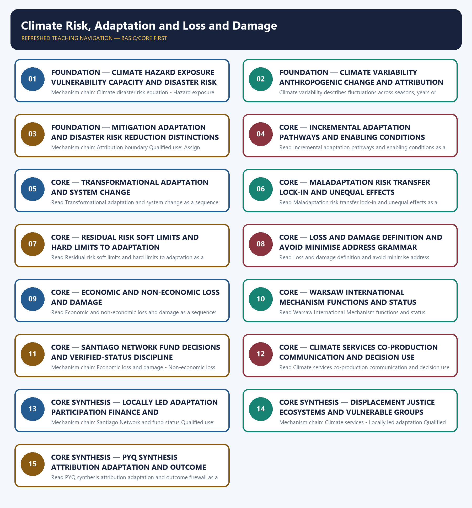

# Climate Risk, Adaptation and Loss and Damage — Learner-v2 Complete Learning Session

> **Authoring-only generation:** 2026-09-04. No PDF was rendered and no tracker or index was mutated.

### SOURCE, PROGRESSION AND CURRENT-LINKAGE AUDIT

- **Generation date:** 2026-09-04.
- **Repository-first evidence:** the Basic owner is taught first and preserved in full; the Advanced owner is retained only in the optional final teaching block.
- **OCR evidence:** Repository Markdown was primary. OCR-searchable official UPSC papers were supplementary only for printed routed demands. No answer key, warning performance, notification effect, implementation outcome, casualty reduction or disaster metric was inferred.
- **Qdrant:** not used; repository Markdown and available OCR context were sufficient.
- **PYQ integrity:** No audited 2024-2025 GS-III question directly owns the full topic. The 2024 urban-flood and resilience questions are bounded applications; the 2025 Paris question remains Environment/UNFCCC-owned and adjacent only.
- **Live-link boundary:** Official attempts covered IPCC adaptation limits, UNDRR risk grammar, WMO climate services, IMD, UNFCCC WIM and loss-and-damage routes, plus domestic MHA/NIDM corroboration. The fund page was technically blocked; no capitalisation, access, disbursement, attribution, adaptation outcome or loss estimate was invented.
- **Fact/inference discipline:** no current-affairs item, PYQ wording, figure or quotation is invented.

### LIVE OFFICIAL-SOURCE ATTEMPT LOG

The checks below were made on 2026-09-04. Substantive official text is used only for the proposition it supports; title-only, blocked or thin pages are recorded and supply no factual claim.

- https://www.ipcc.ch/report/ar6/wg2/ — fetched 2026-09-04; IPCC described assessment of impacts, vulnerability and the capacities and limits of human and natural systems to adapt. https://www.undrr.org/implementing-sendai-framework/what-sendai-framework — fetched 2026-09-04 for the hazard-exposure-vulnerability-capacity risk framing.
- https://wmo.int/activities/climate-services — searched 2026-09-04; official WMO results described actionable climate information for agriculture, water, health, DRR and energy. https://imd.gov.in/ — searched 2026-09-04 as the Indian official climate-service route; no service-coverage or forecast-skill outcome was inferred.
- https://unfccc.int/wim-excom — searched 2026-09-04; official UNFCCC results identified the Warsaw International Mechanism Executive Committee and its current work route. https://www.mha.gov.in/en/commoncontent/disaster-management-act-2005 — attempted 2026-09-04 and returned HTTP 403; no international mechanism was converted into a domestic entitlement.
- https://unfccc.int/loss-and-damage-fund-joint-interim-secretariat — fetched 2026-09-04 but returned an Incapsula shell with no usable substantive text. https://pib.gov.in/ — searched 2026-09-04 for an Indian official corroboration route; no fund capitalisation, Indian access, disbursement or beneficiary outcome was used.
- https://unfccc.int/process-and-meetings/bodies/constituted-bodies/wim-excom/chronology — searched 2026-09-04; the official chronology route was located. https://nidm.gov.in/documentations.asp — searched 2026-09-04 for domestic climate-risk material but supplied no additional current status proposition.

## BASIC LEARNING SESSION

### DEEP-REVIEW LEARNING CONTRACT

| Control | Binding rule for this package |
|---|---|
| Syllabus boundary | Complete Disaster Management Basic/Core is easy-first and answer-complete before optional Advanced depth. |
| Risk boundary | Hazard, exposure, vulnerability, capacity, risk, disaster impact, resilience and recovery outcome remain distinct. |
| Cycle boundary | Prevention, mitigation, preparedness, response, relief, rehabilitation, recovery and Build Back Better are not conflated. |
| Law/status boundary | Enacted Act, amendment, notified rule, plan, guideline, scheme, alert, announcement, operationalisation and measured outcome retain exact status. |
| Institutional boundary | NDMA, NEC, NIDM, NDRF, SDMA, SEC, DDMA, civil administration, response forces and armed-forces support retain exact mandates and levels. |
| Warning boundary | Observation, forecast, watch, warning, dissemination, receipt, evacuation order, evacuation and safe return remain separate. |
| Finance/data boundary | Allocation, release, expenditure, capacity, deployment, relief norm, entitlement, event fact and analytical inference retain source/date/unit/status. |
| Practice contract | Every solved item has demand decoding, detailed examiner-grade model, executable timed/compression plan, marks rationale and answer-specific improvement. |
| PYQ contract | Official wording and keys are asserted only when verified; routed or reconstructed demands remain labelled. |
| Dual-flow contract | Graphical and ASCII masters independently reconstruct the same complete Basic-to-optional-Advanced evidence ledger. |
| Cross-ownership | Environment Topic 26 owns environmental/climate-law base; Internal Security owns hostile-threat operations; Disaster Management owns civilian risk governance and response. |
| Approval | This immutable successor remains `approved: false` pending explicit approval. |

**Canonical Basic/Core owner:** `upsc-ai-kit\knowledge\Disaster-Management\basic\15_Climate-Risk-Adaptation-and-Loss-and-Damage.md`  
**Substantive canonical provenance owner:** `upsc-ai-kit\knowledge\Disaster-Management\learning-sessions\v2\subject-wide-syllabus\disaster-management-15_Learning-Session.md`  
**Optional Advanced owner:** `upsc-ai-kit\knowledge\Disaster-Management\advanced\15_Climate-Risk-Adaptation-and-Loss-and-Damage.md`  
**Official syllabus mapping:** `upsc-ai-kit\knowledge\Disaster-Management\OFFICIAL-UPSC-SYLLABUS-MAPPING.md`

### EVIDENCE, PYQ AND CURRENT-STATUS CONTROL

- Every law, guideline, scheme, institution, alert, event, casualty, magnitude, rainfall, temperature, fund, target, date and policy claim retains source, date, unit, jurisdiction and status.
- Hazard occurrence is separated from disaster impact; structural from non-structural mitigation; response output from recovery and resilience outcome.
- Sendai priorities are separated from seven global targets and global from national indicators; climate adaptation, DRR and loss-and-damage boundaries remain explicit.
- Announcement is separated from operationalisation; allocation from release and expenditure; capacity from deployment; relief norm from legal entitlement.
- **Current-status note, rechecked 2026-09-06:** failed official fetches remain explicit and supply no invented fact.

**Generation-local live/current sources:**
- `https://www.ipcc.ch/report/ar6/wg2/ — fetched 2026-09-04; IPCC described assessment of impacts, vulnerability and the capacities and limits of human and natural systems to adapt. https://www.undrr.org/implementing-sendai-framework/what-sendai-framework — fetched 2026-09-04 for the hazard-exposure-vulnerability-capacity risk framing.`
- `https://wmo.int/activities/climate-services — searched 2026-09-04; official WMO results described actionable climate information for agriculture, water, health, DRR and energy. https://imd.gov.in/ — searched 2026-09-04 as the Indian official climate-service route; no service-coverage or forecast-skill outcome was inferred.`
- `https://unfccc.int/wim-excom — searched 2026-09-04; official UNFCCC results identified the Warsaw International Mechanism Executive Committee and its current work route. https://www.mha.gov.in/en/commoncontent/disaster-management-act-2005 — attempted 2026-09-04 and returned HTTP 403; no international mechanism was converted into a domestic entitlement.`
- `https://unfccc.int/loss-and-damage-fund-joint-interim-secretariat — fetched 2026-09-04 but returned an Incapsula shell with no usable substantive text. https://pib.gov.in/ — searched 2026-09-04 for an Indian official corroboration route; no fund capitalisation, Indian access, disbursement or beneficiary outcome was used.`
- `https://unfccc.int/process-and-meetings/bodies/constituted-bodies/wim-excom/chronology — searched 2026-09-04; the official chronology route was located. https://nidm.gov.in/documentations.asp — searched 2026-09-04 for domestic climate-risk material but supplied no additional current status proposition.`

**Topic-routed verified PYQ owners:**
- Repository PYQ routing ledgers control wording, year, marks and verification status.




*Distinct embedded teaching-navigation image. The separate continuous Cārvāka-style flowchart package remains an independent at-a-glance artifact.*

### SESSION 1 — FOUNDATION — CLIMATE HAZARD EXPOSURE VULNERABILITY CAPACITY AND DISASTER RISK

#### DEFINITION / WHAT THIS IS CALLED

**Plain-language definition:** Hazard is the potentially damaging event or trend, exposure is what is located in harm's way, and vulnerability is susceptibility to harm; policies can change the latter two even when the hazard cannot be eliminated.

**Technical definition:** Mechanism chain: Climate disaster risk equation - Hazard exposure vulnerability Qualified use: Begin with hazard exposure vulnerability and capacity, not hazard alone.

#### ANSWER-GRABBING OPENING — WRITE/ADAPT IN THE EXAM

> Mechanism chain: Climate disaster risk equation - Hazard exposure vulnerability Qualified use: Begin with hazard exposure vulnerability and capacity, not hazard alone.

#### MUST-WRITE KEYWORDS

- **FOUNDATION**
- **Climate hazard exposure vulnerability capacity**
- **disaster risk**
- **Mechanism chain**
- **Qualified use**
- **Climate-related**

**How to use them:** Frame the answer through FOUNDATION; define Climate hazard exposure vulnerability capacity, connect disaster risk with Mechanism chain to explain the mechanism, and use Qualified use for the decisive comparison or qualification.

#### VISUAL FIRST

```text
CLIMATE HAZARD EXPOSURE VULNERABILITY CAPACITY AND DISASTER RISK
01. Climate disaster risk equation
    |
    v
02. Hazard exposure vulnerability
STATUS / CATEGORY FIREWALL -> Do not infer disaster loss from hazard intensity alone.
```

*The rail fixes the institutional sequence and claim boundary before explanation.*

#### CORE EXPLANATION

Climate-related disaster risk arises from the interaction of a hazard with exposure, vulnerability and capacity; a stronger climate signal does not by itself determine disaster loss. Hazard is the potentially damaging event or trend, exposure is what is located in harm's way, and vulnerability is susceptibility to harm; policies can change the latter two even when the hazard cannot be eliminated.

#### SIMPLE SYSTEM EXAMPLE

Read Climate hazard exposure vulnerability capacity and disaster risk as a sequence: identify Climate disaster risk equation, follow the named mechanism to its institutional response, and stop at the last verified status rather than assuming the next stage.

#### TECHNICAL DISTINCTION

The decisive boundary is Do not infer disaster loss from hazard intensity alone. This keeps Climate disaster risk equation and Hazard exposure vulnerability in the correct risk category, institutional mandate and evidence status.

#### NAMED EVIDENCE AND MECHANISM

- Climate-related disaster risk arises from the interaction of a hazard with exposure, vulnerability and capacity; a stronger climate signal does not by itself determine disaster loss.
- Hazard is the potentially damaging event or trend, exposure is what is located in harm's way, and vulnerability is susceptibility to harm; policies can change the latter two even when the hazard cannot be eliminated.

#### EXAMINER CAUTION

- Do not infer disaster loss from hazard intensity alone.

#### EXAM LINK

- **Prelims:** Keep hazard, forecast, warning, institution, law, plan, force, fund, scheme and outcome in their exact category.
- **Mains:** Begin with hazard exposure vulnerability and capacity, not hazard alone.

#### MINI RECAP

- **Mechanism chain:** Climate disaster risk equation -> Hazard exposure vulnerability
- **Qualified use:** Begin with hazard exposure vulnerability and capacity, not hazard alone.

#### CLOSING RECALL FLOW — FOUNDATION — CLIMATE HAZARD EXPOSURE VULNERABILITY CAPACITY AND DISASTER RISK

```text
START / CONCEPT: FOUNDATION — Climate hazard exposure vulnerability capacity and disaster risk
        |
        v
EXACT TERMS: FOUNDATION · Climate hazard exposure vulnerability capacity · disaster risk · Mechanism chain · Qualified use · Climate-related
        |
        v
MECHANISM / ARGUMENT: Climate-related disaster risk arises from the interaction of a hazard with exposure, vulnerability and capacity; a stronger climate signal does not by itself determine disaster loss.
        |
        v
CONSEQUENCE / CONTRAST: Read Climate hazard exposure vulnerability capacity and disaster risk as a sequence: identify Climate disaster risk equation, follow the named mechanism to its institutional response, and stop at the last verified status rather than assuming the next stage.
        |
        v
UPSC TRAP / ANSWER-USE: The decisive boundary is Do not infer disaster loss from hazard intensity alone.
        |
        v
ANSWER-GRABBING FORMULATION: Mechanism chain: Climate disaster risk equation - Hazard exposure vulnerability Qualified use: Begin with hazard exposure vulnerability and capacity, not hazard alone.
```
### SESSION 2 — FOUNDATION — CLIMATE VARIABILITY ANTHROPOGENIC CHANGE AND ATTRIBUTION BOUNDARIES

#### DEFINITION / WHAT THIS IS CALLED

**Plain-language definition:** The decisive boundary is Do not use climate variability and anthropogenic climate change as synonyms.

**Technical definition:** Climate variability describes fluctuations across seasons, years or longer natural modes, whereas anthropogenic climate change is a long-term human-influenced shift; a single event must not be attributed to either without appropriate evidence.

#### ANSWER-GRABBING OPENING — WRITE/ADAPT IN THE EXAM

> The decisive boundary is Do not use climate variability and anthropogenic climate change as synonyms.

#### MUST-WRITE KEYWORDS

- **FOUNDATION**
- **Climate variability anthropogenic change**
- **attribution boundaries**
- **Mechanism chain**
- **Qualified use**
- **Climate variability**

**How to use them:** Frame the answer through FOUNDATION; define Climate variability anthropogenic change, connect attribution boundaries with Mechanism chain to explain the mechanism, and use Qualified use for the decisive comparison or qualification.

#### VISUAL FIRST

```text
CLIMATE VARIABILITY ANTHROPOGENIC CHANGE AND ATTRIBUTION BOUNDARIES
01. Climate variability and climate change
STATUS / CATEGORY FIREWALL -> Do not use climate variability and anthropogenic climate change as synonyms.
```

*The rail fixes the institutional sequence and claim boundary before explanation.*

#### CORE EXPLANATION

Climate variability describes fluctuations across seasons, years or longer natural modes, whereas anthropogenic climate change is a long-term human-influenced shift; a single event must not be attributed to either without appropriate evidence.

#### SIMPLE SYSTEM EXAMPLE

Read Climate variability anthropogenic change and attribution boundaries as a sequence: identify Climate variability and climate change, follow the named mechanism to its institutional response, and stop at the last verified status rather than assuming the next stage.

#### TECHNICAL DISTINCTION

The decisive boundary is Do not use climate variability and anthropogenic climate change as synonyms. This keeps Climate variability and climate change in the correct risk category, institutional mandate and evidence status.

#### NAMED EVIDENCE AND MECHANISM

- Climate variability describes fluctuations across seasons, years or longer natural modes, whereas anthropogenic climate change is a long-term human-influenced shift; a single event must not be attributed to either without appropriate evidence.

#### EXAMINER CAUTION

- Do not use climate variability and anthropogenic climate change as synonyms.

#### EXAM LINK

- **Prelims:** Keep hazard, forecast, warning, institution, law, plan, force, fund, scheme and outcome in their exact category.
- **Mains:** Separate long-term signal event attribution and loss causation.

#### MINI RECAP

- **Mechanism chain:** Climate variability and climate change
- **Qualified use:** Separate long-term signal event attribution and loss causation.

#### CLOSING RECALL FLOW — FOUNDATION — CLIMATE VARIABILITY ANTHROPOGENIC CHANGE AND ATTRIBUTION BOUNDARIES

```text
START / CONCEPT: FOUNDATION — Climate variability anthropogenic change and attribution boundaries
        |
        v
EXACT TERMS: FOUNDATION · Climate variability anthropogenic change · attribution boundaries · Mechanism chain · Qualified use · Climate variability
        |
        v
MECHANISM / ARGUMENT: Read Climate variability anthropogenic change and attribution boundaries as a sequence: identify Climate variability and climate change, follow the named mechanism to its institutional response, and stop at the last verified status rather than assuming the next stage.
        |
        v
CONSEQUENCE / CONTRAST: Climate variability describes fluctuations across seasons, years or longer natural modes, whereas anthropogenic climate change is a long-term human-influenced shift; a single event must not be attributed to either without appropriate evidence.
        |
        v
UPSC TRAP / ANSWER-USE: Do not use climate variability and anthropogenic climate change as synonyms.
        |
        v
ANSWER-GRABBING FORMULATION: The decisive boundary is Do not use climate variability and anthropogenic climate change as synonyms.
```
### SESSION 3 — FOUNDATION — MITIGATION ADAPTATION AND DISASTER RISK REDUCTION DISTINCTIONS

#### DEFINITION / WHAT THIS IS CALLED

**Plain-language definition:** Read Mitigation adaptation and disaster risk reduction distinctions as a sequence: identify Attribution boundary, follow the named mechanism to its institutional response, and stop at the last verified status rather than assuming the next stage.

**Technical definition:** Mechanism chain: Attribution boundary Qualified use: Assign emission reduction adjustment and risk management correctly.

#### ANSWER-GRABBING OPENING — WRITE/ADAPT IN THE EXAM

> Read Mitigation adaptation and disaster risk reduction distinctions as a sequence: identify Attribution boundary, follow the named mechanism to its institutional response, and stop at the last verified status rather than assuming the next stage.

#### MUST-WRITE KEYWORDS

- **FOUNDATION**
- **Mitigation adaptation**
- **disaster risk reduction distinctions**
- **Mechanism chain**
- **Qualified use**
- **Read Mitigation**

**How to use them:** Frame the answer through FOUNDATION; define Mitigation adaptation, connect disaster risk reduction distinctions with Mechanism chain to explain the mechanism, and use Qualified use for the decisive comparison or qualification.

#### VISUAL FIRST

```text
MITIGATION ADAPTATION AND DISASTER RISK REDUCTION DISTINCTIONS
01. Attribution boundary
STATUS / CATEGORY FIREWALL -> Do not attribute every flood, drought, cyclone or heat event to climate change.
```

*The rail fixes the institutional sequence and claim boundary before explanation.*

#### CORE EXPLANATION

Trend attribution, event attribution and disaster-loss attribution answer different questions: whether climate changed a hazard, whether it affected a particular event's likelihood or intensity, and why that event produced losses.

#### SIMPLE SYSTEM EXAMPLE

Read Mitigation adaptation and disaster risk reduction distinctions as a sequence: identify Attribution boundary, follow the named mechanism to its institutional response, and stop at the last verified status rather than assuming the next stage.

#### TECHNICAL DISTINCTION

The decisive boundary is Do not attribute every flood, drought, cyclone or heat event to climate change. This keeps Attribution boundary in the correct risk category, institutional mandate and evidence status.

#### NAMED EVIDENCE AND MECHANISM

- Trend attribution, event attribution and disaster-loss attribution answer different questions: whether climate changed a hazard, whether it affected a particular event's likelihood or intensity, and why that event produced losses.

#### EXAMINER CAUTION

- Do not attribute every flood, drought, cyclone or heat event to climate change.

#### EXAM LINK

- **Prelims:** Keep hazard, forecast, warning, institution, law, plan, force, fund, scheme and outcome in their exact category.
- **Mains:** Assign emission reduction adjustment and risk management correctly.

#### MINI RECAP

- **Mechanism chain:** Attribution boundary
- **Qualified use:** Assign emission reduction adjustment and risk management correctly.

#### CLOSING RECALL FLOW — FOUNDATION — MITIGATION ADAPTATION AND DISASTER RISK REDUCTION DISTINCTIONS

```text
START / CONCEPT: FOUNDATION — Mitigation adaptation and disaster risk reduction distinctions
        |
        v
EXACT TERMS: FOUNDATION · Mitigation adaptation · disaster risk reduction distinctions · Mechanism chain · Qualified use · Read Mitigation
        |
        v
MECHANISM / ARGUMENT: Mechanism chain: Attribution boundary Qualified use: Assign emission reduction adjustment and risk management correctly.
        |
        v
CONSEQUENCE / CONTRAST: The decisive boundary is Do not attribute every flood, drought, cyclone or heat event to climate change.
        |
        v
UPSC TRAP / ANSWER-USE: Do not attribute every flood, drought, cyclone or heat event to climate change.
        |
        v
ANSWER-GRABBING FORMULATION: Read Mitigation adaptation and disaster risk reduction distinctions as a sequence: identify Attribution boundary, follow the named mechanism to its institutional response, and stop at the last verified status rather than assuming the next stage.
```
### SESSION 4 — CORE — INCREMENTAL ADAPTATION PATHWAYS AND ENABLING CONDITIONS

#### DEFINITION / WHAT THIS IS CALLED

**Plain-language definition:** Climate mitigation reduces greenhouse-gas-driven future change, adaptation adjusts systems to actual or expected impacts, and disaster risk reduction manages existing and prospective disaster risk; they overlap but are not interchangeable.

**Technical definition:** Read Incremental adaptation pathways and enabling conditions as a sequence: identify Mitigation adaptation and DRR, follow the named mechanism to its institutional response, and stop at the last verified status rather than assuming the next stage.

#### ANSWER-GRABBING OPENING — WRITE/ADAPT IN THE EXAM

> Read Incremental adaptation pathways and enabling conditions as a sequence: identify Mitigation adaptation and DRR, follow the named mechanism to its institutional response, and stop at the last verified status rather than assuming the next stage.

#### MUST-WRITE KEYWORDS

- **Incremental adaptation pathways**
- **enabling conditions**
- **Mechanism chain**
- **Qualified use**
- **Climate**
- **Read Incremental**

**How to use them:** Frame the answer through Incremental adaptation pathways; define enabling conditions, connect Mechanism chain with Qualified use to explain the mechanism, and use Climate for the decisive comparison or qualification.

#### VISUAL FIRST

```text
INCREMENTAL ADAPTATION PATHWAYS AND ENABLING CONDITIONS
01. Mitigation adaptation and DRR
STATUS / CATEGORY FIREWALL -> Do not collapse mitigation, adaptation and DRR into one policy category.
```

*The rail fixes the institutional sequence and claim boundary before explanation.*

#### CORE EXPLANATION

Climate mitigation reduces greenhouse-gas-driven future change, adaptation adjusts systems to actual or expected impacts, and disaster risk reduction manages existing and prospective disaster risk; they overlap but are not interchangeable.

#### SIMPLE SYSTEM EXAMPLE

Read Incremental adaptation pathways and enabling conditions as a sequence: identify Mitigation adaptation and DRR, follow the named mechanism to its institutional response, and stop at the last verified status rather than assuming the next stage.

#### TECHNICAL DISTINCTION

The decisive boundary is Do not collapse mitigation, adaptation and DRR into one policy category. This keeps Mitigation adaptation and DRR in the correct risk category, institutional mandate and evidence status.

#### NAMED EVIDENCE AND MECHANISM

- Climate mitigation reduces greenhouse-gas-driven future change, adaptation adjusts systems to actual or expected impacts, and disaster risk reduction manages existing and prospective disaster risk; they overlap but are not interchangeable.

#### EXAMINER CAUTION

- Do not collapse mitigation, adaptation and DRR into one policy category.

#### EXAM LINK

- **Prelims:** Keep hazard, forecast, warning, institution, law, plan, force, fund, scheme and outcome in their exact category.
- **Mains:** Show how existing systems reduce risk without fundamental change.

#### MINI RECAP

- **Mechanism chain:** Mitigation adaptation and DRR
- **Qualified use:** Show how existing systems reduce risk without fundamental change.

#### CLOSING RECALL FLOW — CORE — INCREMENTAL ADAPTATION PATHWAYS AND ENABLING CONDITIONS

```text
START / CONCEPT: CORE — Incremental adaptation pathways and enabling conditions
        |
        v
EXACT TERMS: Incremental adaptation pathways · enabling conditions · Mechanism chain · Qualified use · Climate · Read Incremental
        |
        v
MECHANISM / ARGUMENT: Mechanism chain: Mitigation adaptation and DRR Qualified use: Show how existing systems reduce risk without fundamental change.
        |
        v
CONSEQUENCE / CONTRAST: Climate mitigation reduces greenhouse-gas-driven future change, adaptation adjusts systems to actual or expected impacts, and disaster risk reduction manages existing and prospective disaster risk; they overlap but are not interchangeable.
        |
        v
UPSC TRAP / ANSWER-USE: The decisive boundary is Do not collapse mitigation, adaptation and DRR into one policy category.
        |
        v
ANSWER-GRABBING FORMULATION: Read Incremental adaptation pathways and enabling conditions as a sequence: identify Mitigation adaptation and DRR, follow the named mechanism to its institutional response, and stop at the last verified status rather than assuming the next stage.
```
### SESSION 5 — CORE — TRANSFORMATIONAL ADAPTATION AND SYSTEM CHANGE

#### DEFINITION / WHAT THIS IS CALLED

**Plain-language definition:** The decisive boundary is Do not call every large adaptation project transformational.

**Technical definition:** Read Transformational adaptation and system change as a sequence: identify Incremental adaptation, follow the named mechanism to its institutional response, and stop at the last verified status rather than assuming the next stage.

#### ANSWER-GRABBING OPENING — WRITE/ADAPT IN THE EXAM

> Read Transformational adaptation and system change as a sequence: identify Incremental adaptation, follow the named mechanism to its institutional response, and stop at the last verified status rather than assuming the next stage.

#### MUST-WRITE KEYWORDS

- **Transformational adaptation**
- **system change**
- **Mechanism chain**
- **Qualified use**
- **Read Transformational**
- **Incremental**

**How to use them:** Frame the answer through Transformational adaptation; define system change, connect Mechanism chain with Qualified use to explain the mechanism, and use Read Transformational for the decisive comparison or qualification.

#### VISUAL FIRST

```text
TRANSFORMATIONAL ADAPTATION AND SYSTEM CHANGE
01. Incremental adaptation
STATUS / CATEGORY FIREWALL -> Do not call every large adaptation project transformational.
```

*The rail fixes the institutional sequence and claim boundary before explanation.*

#### CORE EXPLANATION

Incremental adaptation maintains the basic system while reducing risk through adjustments such as improved warnings, water efficiency, heat plans or protective standards.

#### SIMPLE SYSTEM EXAMPLE

Read Transformational adaptation and system change as a sequence: identify Incremental adaptation, follow the named mechanism to its institutional response, and stop at the last verified status rather than assuming the next stage.

#### TECHNICAL DISTINCTION

The decisive boundary is Do not call every large adaptation project transformational. This keeps Incremental adaptation in the correct risk category, institutional mandate and evidence status.

#### NAMED EVIDENCE AND MECHANISM

- Incremental adaptation maintains the basic system while reducing risk through adjustments such as improved warnings, water efficiency, heat plans or protective standards.

#### EXAMINER CAUTION

- Do not call every large adaptation project transformational.

#### EXAM LINK

- **Prelims:** Keep hazard, forecast, warning, institution, law, plan, force, fund, scheme and outcome in their exact category.
- **Mains:** State why incremental measures fail before proposing transformation.

#### MINI RECAP

- **Mechanism chain:** Incremental adaptation
- **Qualified use:** State why incremental measures fail before proposing transformation.

#### CLOSING RECALL FLOW — CORE — TRANSFORMATIONAL ADAPTATION AND SYSTEM CHANGE

```text
START / CONCEPT: CORE — Transformational adaptation and system change
        |
        v
EXACT TERMS: Transformational adaptation · system change · Mechanism chain · Qualified use · Read Transformational · Incremental
        |
        v
MECHANISM / ARGUMENT: Mechanism chain: Incremental adaptation Qualified use: State why incremental measures fail before proposing transformation.
        |
        v
CONSEQUENCE / CONTRAST: The decisive boundary is Do not call every large adaptation project transformational.
        |
        v
UPSC TRAP / ANSWER-USE: Do not call every large adaptation project transformational.
        |
        v
ANSWER-GRABBING FORMULATION: Read Transformational adaptation and system change as a sequence: identify Incremental adaptation, follow the named mechanism to its institutional response, and stop at the last verified status rather than assuming the next stage.
```
### SESSION 6 — CORE — MALADAPTATION RISK TRANSFER LOCK-IN AND UNEQUAL EFFECTS

#### DEFINITION / WHAT THIS IS CALLED

**Plain-language definition:** Maladaptation is an intervention that increases risk, emissions, inequality or future lock-in for some people, places or periods even if it produces a short-term benefit.

**Technical definition:** Read Maladaptation risk transfer lock-in and unequal effects as a sequence: identify Transformational adaptation, follow the named mechanism to its institutional response, and stop at the last verified status rather than assuming the next stage.

#### ANSWER-GRABBING OPENING — WRITE/ADAPT IN THE EXAM

> Read Maladaptation risk transfer lock-in and unequal effects as a sequence: identify Transformational adaptation, follow the named mechanism to its institutional response, and stop at the last verified status rather than assuming the next stage.

#### MUST-WRITE KEYWORDS

- **Maladaptation risk transfer lock-in**
- **unequal effects**
- **Mechanism chain**
- **Qualified use**
- **Transformational**
- **Maladaptation**

**How to use them:** Frame the answer through Maladaptation risk transfer lock-in; define unequal effects, connect Mechanism chain with Qualified use to explain the mechanism, and use Transformational for the decisive comparison or qualification.

#### VISUAL FIRST

```text
MALADAPTATION RISK TRANSFER LOCK-IN AND UNEQUAL EFFECTS
01. Transformational adaptation
    |
    v
02. Maladaptation
STATUS / CATEGORY FIREWALL -> Do not present short-term protection that transfers risk as successful adaptation.
```

*The rail fixes the institutional sequence and claim boundary before explanation.*

#### CORE EXPLANATION

Transformational adaptation changes fundamental attributes of a system when incremental measures cannot maintain acceptable risk, for example changing land use, livelihoods, settlement patterns or governance arrangements. Maladaptation is an intervention that increases risk, emissions, inequality or future lock-in for some people, places or periods even if it produces a short-term benefit.

#### SIMPLE SYSTEM EXAMPLE

Read Maladaptation risk transfer lock-in and unequal effects as a sequence: identify Transformational adaptation, follow the named mechanism to its institutional response, and stop at the last verified status rather than assuming the next stage.

#### TECHNICAL DISTINCTION

The decisive boundary is Do not present short-term protection that transfers risk as successful adaptation. This keeps Transformational adaptation and Maladaptation in the correct risk category, institutional mandate and evidence status.

#### NAMED EVIDENCE AND MECHANISM

- Transformational adaptation changes fundamental attributes of a system when incremental measures cannot maintain acceptable risk, for example changing land use, livelihoods, settlement patterns or governance arrangements.
- Maladaptation is an intervention that increases risk, emissions, inequality or future lock-in for some people, places or periods even if it produces a short-term benefit.

#### EXAMINER CAUTION

- Do not present short-term protection that transfers risk as successful adaptation.

#### EXAM LINK

- **Prelims:** Keep hazard, forecast, warning, institution, law, plan, force, fund, scheme and outcome in their exact category.
- **Mains:** Test distribution lock-in emissions and future risk.

#### MINI RECAP

- **Mechanism chain:** Transformational adaptation -> Maladaptation
- **Qualified use:** Test distribution lock-in emissions and future risk.

#### CLOSING RECALL FLOW — CORE — MALADAPTATION RISK TRANSFER LOCK-IN AND UNEQUAL EFFECTS

```text
START / CONCEPT: CORE — Maladaptation risk transfer lock-in and unequal effects
        |
        v
EXACT TERMS: Maladaptation risk transfer lock-in · unequal effects · Mechanism chain · Qualified use · Transformational · Maladaptation
        |
        v
MECHANISM / ARGUMENT: Mechanism chain: Transformational adaptation - Maladaptation Qualified use: Test distribution lock-in emissions and future risk.
        |
        v
CONSEQUENCE / CONTRAST: The decisive boundary is Do not present short-term protection that transfers risk as successful adaptation.
        |
        v
UPSC TRAP / ANSWER-USE: Do not present short-term protection that transfers risk as successful adaptation.
        |
        v
ANSWER-GRABBING FORMULATION: Read Maladaptation risk transfer lock-in and unequal effects as a sequence: identify Transformational adaptation, follow the named mechanism to its institutional response, and stop at the last verified status rather than assuming the next stage.
```
### SESSION 7 — CORE — RESIDUAL RISK SOFT LIMITS AND HARD LIMITS TO ADAPTATION

#### DEFINITION / WHAT THIS IS CALLED

**Plain-language definition:** Residual risk is the risk remaining after feasible mitigation, adaptation and DRR measures; its existence does not mean no further preparedness, protection or finance is possible.

**Technical definition:** Read Residual risk soft limits and hard limits to adaptation as a sequence: identify Residual risk, follow the named mechanism to its institutional response, and stop at the last verified status rather than assuming the next stage.

#### ANSWER-GRABBING OPENING — WRITE/ADAPT IN THE EXAM

> Read Residual risk soft limits and hard limits to adaptation as a sequence: identify Residual risk, follow the named mechanism to its institutional response, and stop at the last verified status rather than assuming the next stage.

#### MUST-WRITE KEYWORDS

- **Residual risk soft limits**
- **hard limits to adaptation**
- **Mechanism chain**
- **Qualified use**
- **Residual risk**
- **Residual**

**How to use them:** Frame the answer through Residual risk soft limits; define hard limits to adaptation, connect Mechanism chain with Qualified use to explain the mechanism, and use Residual risk for the decisive comparison or qualification.

#### VISUAL FIRST

```text
RESIDUAL RISK SOFT LIMITS AND HARD LIMITS TO ADAPTATION
01. Residual risk
STATUS / CATEGORY FIREWALL -> Do not treat residual risk as proof that preparedness is futile.
```

*The rail fixes the institutional sequence and claim boundary before explanation.*

#### CORE EXPLANATION

Residual risk is the risk remaining after feasible mitigation, adaptation and DRR measures; its existence does not mean no further preparedness, protection or finance is possible.

#### SIMPLE SYSTEM EXAMPLE

Read Residual risk soft limits and hard limits to adaptation as a sequence: identify Residual risk, follow the named mechanism to its institutional response, and stop at the last verified status rather than assuming the next stage.

#### TECHNICAL DISTINCTION

The decisive boundary is Do not treat residual risk as proof that preparedness is futile. This keeps Residual risk in the correct risk category, institutional mandate and evidence status.

#### NAMED EVIDENCE AND MECHANISM

- Residual risk is the risk remaining after feasible mitigation, adaptation and DRR measures; its existence does not mean no further preparedness, protection or finance is possible.

#### EXAMINER CAUTION

- Do not treat residual risk as proof that preparedness is futile.

#### EXAM LINK

- **Prelims:** Keep hazard, forecast, warning, institution, law, plan, force, fund, scheme and outcome in their exact category.
- **Mains:** Distinguish remediable barriers from biophysical or system limits.

#### MINI RECAP

- **Mechanism chain:** Residual risk
- **Qualified use:** Distinguish remediable barriers from biophysical or system limits.

#### CLOSING RECALL FLOW — CORE — RESIDUAL RISK SOFT LIMITS AND HARD LIMITS TO ADAPTATION

```text
START / CONCEPT: CORE — Residual risk soft limits and hard limits to adaptation
        |
        v
EXACT TERMS: Residual risk soft limits · hard limits to adaptation · Mechanism chain · Qualified use · Residual risk · Residual
        |
        v
MECHANISM / ARGUMENT: Mechanism chain: Residual risk Qualified use: Distinguish remediable barriers from biophysical or system limits.
        |
        v
CONSEQUENCE / CONTRAST: Residual risk is the risk remaining after feasible mitigation, adaptation and DRR measures; its existence does not mean no further preparedness, protection or finance is possible.
        |
        v
UPSC TRAP / ANSWER-USE: The decisive boundary is Do not treat residual risk as proof that preparedness is futile.
        |
        v
ANSWER-GRABBING FORMULATION: Read Residual risk soft limits and hard limits to adaptation as a sequence: identify Residual risk, follow the named mechanism to its institutional response, and stop at the last verified status rather than assuming the next stage.
```
### SESSION 8 — CORE — LOSS AND DAMAGE DEFINITION AND AVOID MINIMISE ADDRESS GRAMMAR

#### DEFINITION / WHAT THIS IS CALLED

**Plain-language definition:** The decisive boundary is Do not use loss and damage as a synonym for all relief or insurance.

**Technical definition:** Read Loss and damage definition and avoid minimise address grammar as a sequence: identify Limits to adaptation, follow the named mechanism to its institutional response, and stop at the last verified status rather than assuming the next stage.

#### ANSWER-GRABBING OPENING — WRITE/ADAPT IN THE EXAM

> Read Loss and damage definition and avoid minimise address grammar as a sequence: identify Limits to adaptation, follow the named mechanism to its institutional response, and stop at the last verified status rather than assuming the next stage.

#### MUST-WRITE KEYWORDS

- **Loss**
- **damage definition**
- **Mechanism chain**
- **Qualified use**
- **Read Loss**
- **Limits**

**How to use them:** Frame the answer through Loss; define damage definition, connect Mechanism chain with Qualified use to explain the mechanism, and use Read Loss for the decisive comparison or qualification.

#### VISUAL FIRST

```text
LOSS AND DAMAGE DEFINITION AND AVOID MINIMISE ADDRESS GRAMMAR
01. Limits to adaptation
STATUS / CATEGORY FIREWALL -> Do not use loss and damage as a synonym for all relief or insurance.
```

*The rail fixes the institutional sequence and claim boundary before explanation.*

#### CORE EXPLANATION

A soft limit may be overcome through finance, technology, institutions or knowledge, while a hard limit cannot be avoided through adaptation within the system considered; limits are context-specific and evidence-dependent.

#### SIMPLE SYSTEM EXAMPLE

Read Loss and damage definition and avoid minimise address grammar as a sequence: identify Limits to adaptation, follow the named mechanism to its institutional response, and stop at the last verified status rather than assuming the next stage.

#### TECHNICAL DISTINCTION

The decisive boundary is Do not use loss and damage as a synonym for all relief or insurance. This keeps Limits to adaptation in the correct risk category, institutional mandate and evidence status.

#### NAMED EVIDENCE AND MECHANISM

- A soft limit may be overcome through finance, technology, institutions or knowledge, while a hard limit cannot be avoided through adaptation within the system considered; limits are context-specific and evidence-dependent.

#### EXAMINER CAUTION

- Do not use loss and damage as a synonym for all relief or insurance.

#### EXAM LINK

- **Prelims:** Keep hazard, forecast, warning, institution, law, plan, force, fund, scheme and outcome in their exact category.
- **Mains:** Place averting minimising and addressing on a policy timeline.

#### MINI RECAP

- **Mechanism chain:** Limits to adaptation
- **Qualified use:** Place averting minimising and addressing on a policy timeline.

#### CLOSING RECALL FLOW — CORE — LOSS AND DAMAGE DEFINITION AND AVOID MINIMISE ADDRESS GRAMMAR

```text
START / CONCEPT: CORE — Loss and damage definition and avoid minimise address grammar
        |
        v
EXACT TERMS: Loss · damage definition · Mechanism chain · Qualified use · Read Loss · Limits
        |
        v
MECHANISM / ARGUMENT: Mechanism chain: Limits to adaptation Qualified use: Place averting minimising and addressing on a policy timeline.
        |
        v
CONSEQUENCE / CONTRAST: The decisive boundary is Do not use loss and damage as a synonym for all relief or insurance.
        |
        v
UPSC TRAP / ANSWER-USE: Do not use loss and damage as a synonym for all relief or insurance.
        |
        v
ANSWER-GRABBING FORMULATION: Read Loss and damage definition and avoid minimise address grammar as a sequence: identify Limits to adaptation, follow the named mechanism to its institutional response, and stop at the last verified status rather than assuming the next stage.
```
### SESSION 9 — CORE — ECONOMIC AND NON-ECONOMIC LOSS AND DAMAGE

#### DEFINITION / WHAT THIS IS CALLED

**Plain-language definition:** Loss and damage concerns adverse climate impacts that are not or cannot be fully avoided through mitigation and adaptation; it is not a synonym for every disaster loss, relief payment or adaptation project.

**Technical definition:** Read Economic and non-economic loss and damage as a sequence: identify Loss and damage, follow the named mechanism to its institutional response, and stop at the last verified status rather than assuming the next stage.

#### ANSWER-GRABBING OPENING — WRITE/ADAPT IN THE EXAM

> Loss and damage concerns adverse climate impacts that are not or cannot be fully avoided through mitigation and adaptation; it is not a synonym for every disaster loss, relief payment or adaptation project.

#### MUST-WRITE KEYWORDS

- **Economic**
- **non-economic loss**
- **damage**
- **Mechanism chain**
- **Qualified use**
- **Loss and damage concerns adverse climate impacts that**

**How to use them:** Frame the answer through Economic; define non-economic loss, connect damage with Mechanism chain to explain the mechanism, and use Qualified use for the decisive comparison or qualification.

#### VISUAL FIRST

```text
ECONOMIC AND NON-ECONOMIC LOSS AND DAMAGE
01. Loss and damage
STATUS / CATEGORY FIREWALL -> Do not invent current UNFCCC fund access, corpus, disbursement or outcome.
```

*The rail fixes the institutional sequence and claim boundary before explanation.*

#### CORE EXPLANATION

Loss and damage concerns adverse climate impacts that are not or cannot be fully avoided through mitigation and adaptation; it is not a synonym for every disaster loss, relief payment or adaptation project.

#### SIMPLE SYSTEM EXAMPLE

Read Economic and non-economic loss and damage as a sequence: identify Loss and damage, follow the named mechanism to its institutional response, and stop at the last verified status rather than assuming the next stage.

#### TECHNICAL DISTINCTION

The decisive boundary is Do not invent current UNFCCC fund access, corpus, disbursement or outcome. This keeps Loss and damage in the correct risk category, institutional mandate and evidence status.

#### NAMED EVIDENCE AND MECHANISM

- Loss and damage concerns adverse climate impacts that are not or cannot be fully avoided through mitigation and adaptation; it is not a synonym for every disaster loss, relief payment or adaptation project.

#### EXAMINER CAUTION

- Do not invent current UNFCCC fund access, corpus, disbursement or outcome.

#### EXAM LINK

- **Prelims:** Keep hazard, forecast, warning, institution, law, plan, force, fund, scheme and outcome in their exact category.
- **Mains:** Use monetary and non-market categories without forced valuation.

#### MINI RECAP

- **Mechanism chain:** Loss and damage
- **Qualified use:** Use monetary and non-market categories without forced valuation.

#### CLOSING RECALL FLOW — CORE — ECONOMIC AND NON-ECONOMIC LOSS AND DAMAGE

```text
START / CONCEPT: CORE — Economic and non-economic loss and damage
        |
        v
EXACT TERMS: Economic · non-economic loss · damage · Mechanism chain · Qualified use · Loss and damage concerns adverse climate impacts that
        |
        v
MECHANISM / ARGUMENT: Read Economic and non-economic loss and damage as a sequence: identify Loss and damage, follow the named mechanism to its institutional response, and stop at the last verified status rather than assuming the next stage.
        |
        v
CONSEQUENCE / CONTRAST: Mechanism chain: Loss and damage Qualified use: Use monetary and non-market categories without forced valuation.
        |
        v
UPSC TRAP / ANSWER-USE: The decisive boundary is Do not invent current UNFCCC fund access, corpus, disbursement or outcome.
        |
        v
ANSWER-GRABBING FORMULATION: Loss and damage concerns adverse climate impacts that are not or cannot be fully avoided through mitigation and adaptation; it is not a synonym for every disaster loss, relief payment or adaptation project.
```
### SESSION 10 — CORE — WARSAW INTERNATIONAL MECHANISM FUNCTIONS AND STATUS BOUNDARY

#### DEFINITION / WHAT THIS IS CALLED

**Plain-language definition:** The decisive boundary is Do not equate consultation with locally led adaptation or a climate portal with climate-service use.

**Technical definition:** Read Warsaw International Mechanism functions and status boundary as a sequence: identify Avoid minimise address, follow the named mechanism to its institutional response, and stop at the last verified status rather than assuming the next stage.

#### ANSWER-GRABBING OPENING — WRITE/ADAPT IN THE EXAM

> Read Warsaw International Mechanism functions and status boundary as a sequence: identify Avoid minimise address, follow the named mechanism to its institutional response, and stop at the last verified status rather than assuming the next stage.

#### MUST-WRITE KEYWORDS

- **Warsaw International Mechanism functions**
- **status boundary**
- **Mechanism chain**
- **Qualified use**
- **The UNFCCC**
- **Read Warsaw International Mechanism**

**How to use them:** Frame the answer through Warsaw International Mechanism functions; define status boundary, connect Mechanism chain with Qualified use to explain the mechanism, and use The UNFCCC for the decisive comparison or qualification.

#### VISUAL FIRST

```text
WARSAW INTERNATIONAL MECHANISM FUNCTIONS AND STATUS BOUNDARY
01. Avoid minimise address
STATUS / CATEGORY FIREWALL -> Do not equate consultation with locally led adaptation or a climate portal with climate-service use.
```

*The rail fixes the institutional sequence and claim boundary before explanation.*

#### CORE EXPLANATION

The UNFCCC loss-and-damage grammar distinguishes averting future loss, minimising unavoidable loss and addressing realised or residual impacts; each verb points to a different policy stage.

#### SIMPLE SYSTEM EXAMPLE

Read Warsaw International Mechanism functions and status boundary as a sequence: identify Avoid minimise address, follow the named mechanism to its institutional response, and stop at the last verified status rather than assuming the next stage.

#### TECHNICAL DISTINCTION

The decisive boundary is Do not equate consultation with locally led adaptation or a climate portal with climate-service use. This keeps Avoid minimise address in the correct risk category, institutional mandate and evidence status.

#### NAMED EVIDENCE AND MECHANISM

- The UNFCCC loss-and-damage grammar distinguishes averting future loss, minimising unavoidable loss and addressing realised or residual impacts; each verb points to a different policy stage.

#### EXAMINER CAUTION

- Do not equate consultation with locally led adaptation or a climate portal with climate-service use.

#### EXAM LINK

- **Prelims:** Keep hazard, forecast, warning, institution, law, plan, force, fund, scheme and outcome in their exact category.
- **Mains:** State knowledge coordination and action-support functions precisely.

#### MINI RECAP

- **Mechanism chain:** Avoid minimise address
- **Qualified use:** State knowledge coordination and action-support functions precisely.

#### CLOSING RECALL FLOW — CORE — WARSAW INTERNATIONAL MECHANISM FUNCTIONS AND STATUS BOUNDARY

```text
START / CONCEPT: CORE — Warsaw International Mechanism functions and status boundary
        |
        v
EXACT TERMS: Warsaw International Mechanism functions · status boundary · Mechanism chain · Qualified use · The UNFCCC · Read Warsaw International Mechanism
        |
        v
MECHANISM / ARGUMENT: Mechanism chain: Avoid minimise address Qualified use: State knowledge coordination and action-support functions precisely.
        |
        v
CONSEQUENCE / CONTRAST: The decisive boundary is Do not equate consultation with locally led adaptation or a climate portal with climate-service use.
        |
        v
UPSC TRAP / ANSWER-USE: Do not equate consultation with locally led adaptation or a climate portal with climate-service use.
        |
        v
ANSWER-GRABBING FORMULATION: Read Warsaw International Mechanism functions and status boundary as a sequence: identify Avoid minimise address, follow the named mechanism to its institutional response, and stop at the last verified status rather than assuming the next stage.
```
### SESSION 11 — CORE — SANTIAGO NETWORK FUND DECISIONS AND VERIFIED-STATUS DISCIPLINE

#### DEFINITION / WHAT THIS IS CALLED

**Plain-language definition:** Read Santiago Network fund decisions and verified-status discipline as a sequence: identify Economic loss and damage, follow the named mechanism to its institutional response, and stop at the last verified status rather than assuming the next stage.

**Technical definition:** Mechanism chain: Economic loss and damage - Non-economic loss and damage Qualified use: Use dated UNFCCC status and avoid entitlement or disbursement claims.

#### ANSWER-GRABBING OPENING — WRITE/ADAPT IN THE EXAM

> Read Santiago Network fund decisions and verified-status discipline as a sequence: identify Economic loss and damage, follow the named mechanism to its institutional response, and stop at the last verified status rather than assuming the next stage.

#### MUST-WRITE KEYWORDS

- **Santiago Network fund decisions**
- **verified-status discipline**
- **Mechanism chain**
- **Qualified use**
- **Economic**
- **Non-economic**

**How to use them:** Frame the answer through Santiago Network fund decisions; define verified-status discipline, connect Mechanism chain with Qualified use to explain the mechanism, and use Economic for the decisive comparison or qualification.

#### VISUAL FIRST

```text
SANTIAGO NETWORK FUND DECISIONS AND VERIFIED-STATUS DISCIPLINE
01. Economic loss and damage
    |
    v
02. Non-economic loss and damage
STATUS / CATEGORY FIREWALL -> Do not infer disaster loss from hazard intensity alone.
```

*The rail fixes the institutional sequence and claim boundary before explanation.*

#### CORE EXPLANATION

Economic loss and damage can be expressed in monetary terms, including damaged assets, production and income, while valuation method and baseline must remain explicit. Non-economic loss and damage includes harms such as life, health, culture, identity, territory, biodiversity and social cohesion that may not be adequately represented by market valuation.

#### SIMPLE SYSTEM EXAMPLE

Read Santiago Network fund decisions and verified-status discipline as a sequence: identify Economic loss and damage, follow the named mechanism to its institutional response, and stop at the last verified status rather than assuming the next stage.

#### TECHNICAL DISTINCTION

The decisive boundary is Do not infer disaster loss from hazard intensity alone. This keeps Economic loss and damage and Non-economic loss and damage in the correct risk category, institutional mandate and evidence status.

#### NAMED EVIDENCE AND MECHANISM

- Economic loss and damage can be expressed in monetary terms, including damaged assets, production and income, while valuation method and baseline must remain explicit.
- Non-economic loss and damage includes harms such as life, health, culture, identity, territory, biodiversity and social cohesion that may not be adequately represented by market valuation.

#### EXAMINER CAUTION

- Do not infer disaster loss from hazard intensity alone.

#### EXAM LINK

- **Prelims:** Keep hazard, forecast, warning, institution, law, plan, force, fund, scheme and outcome in their exact category.
- **Mains:** Use dated UNFCCC status and avoid entitlement or disbursement claims.

#### MINI RECAP

- **Mechanism chain:** Economic loss and damage -> Non-economic loss and damage
- **Qualified use:** Use dated UNFCCC status and avoid entitlement or disbursement claims.

#### CLOSING RECALL FLOW — CORE — SANTIAGO NETWORK FUND DECISIONS AND VERIFIED-STATUS DISCIPLINE

```text
START / CONCEPT: CORE — Santiago Network fund decisions and verified-status discipline
        |
        v
EXACT TERMS: Santiago Network fund decisions · verified-status discipline · Mechanism chain · Qualified use · Economic · Non-economic
        |
        v
MECHANISM / ARGUMENT: Mechanism chain: Economic loss and damage - Non-economic loss and damage Qualified use: Use dated UNFCCC status and avoid entitlement or disbursement claims.
        |
        v
CONSEQUENCE / CONTRAST: Non-economic loss and damage includes harms such as life, health, culture, identity, territory, biodiversity and social cohesion that may not be adequately represented by market valuation.
        |
        v
UPSC TRAP / ANSWER-USE: Economic loss and damage can be expressed in monetary terms, including damaged assets, production and income, while valuation method and baseline must remain explicit.
        |
        v
ANSWER-GRABBING FORMULATION: Read Santiago Network fund decisions and verified-status discipline as a sequence: identify Economic loss and damage, follow the named mechanism to its institutional response, and stop at the last verified status rather than assuming the next stage.
```
### SESSION 12 — CORE — CLIMATE SERVICES CO-PRODUCTION COMMUNICATION AND DECISION USE

#### DEFINITION / WHAT THIS IS CALLED

**Plain-language definition:** The decisive boundary is Do not use climate variability and anthropogenic climate change as synonyms.

**Technical definition:** Read Climate services co-production communication and decision use as a sequence: identify Warsaw International Mechanism, follow the named mechanism to its institutional response, and stop at the last verified status rather than assuming the next stage.

#### ANSWER-GRABBING OPENING — WRITE/ADAPT IN THE EXAM

> Read Climate services co-production communication and decision use as a sequence: identify Warsaw International Mechanism, follow the named mechanism to its institutional response, and stop at the last verified status rather than assuming the next stage.

#### MUST-WRITE KEYWORDS

- **Climate services co-production communication**
- **decision use**
- **Mechanism chain**
- **Qualified use**
- **The Warsaw International Mechanism**
- **UNFCCC**

**How to use them:** Frame the answer through Climate services co-production communication; define decision use, connect Mechanism chain with Qualified use to explain the mechanism, and use The Warsaw International Mechanism for the decisive comparison or qualification.

#### VISUAL FIRST

```text
CLIMATE SERVICES CO-PRODUCTION COMMUNICATION AND DECISION USE
01. Warsaw International Mechanism
STATUS / CATEGORY FIREWALL -> Do not use climate variability and anthropogenic climate change as synonyms.
```

*The rail fixes the institutional sequence and claim boundary before explanation.*

#### CORE EXPLANATION

The Warsaw International Mechanism was established under the UNFCCC loss-and-damage architecture to enhance knowledge, coordination and action and support; its existence does not prove delivery in a particular place.

#### SIMPLE SYSTEM EXAMPLE

Read Climate services co-production communication and decision use as a sequence: identify Warsaw International Mechanism, follow the named mechanism to its institutional response, and stop at the last verified status rather than assuming the next stage.

#### TECHNICAL DISTINCTION

The decisive boundary is Do not use climate variability and anthropogenic climate change as synonyms. This keeps Warsaw International Mechanism in the correct risk category, institutional mandate and evidence status.

#### NAMED EVIDENCE AND MECHANISM

- The Warsaw International Mechanism was established under the UNFCCC loss-and-damage architecture to enhance knowledge, coordination and action and support; its existence does not prove delivery in a particular place.

#### EXAMINER CAUTION

- Do not use climate variability and anthropogenic climate change as synonyms.

#### EXAM LINK

- **Prelims:** Keep hazard, forecast, warning, institution, law, plan, force, fund, scheme and outcome in their exact category.
- **Mains:** Trace data to tailored information decision feedback and outcome.

#### MINI RECAP

- **Mechanism chain:** Warsaw International Mechanism
- **Qualified use:** Trace data to tailored information decision feedback and outcome.

#### CLOSING RECALL FLOW — CORE — CLIMATE SERVICES CO-PRODUCTION COMMUNICATION AND DECISION USE

```text
START / CONCEPT: CORE — Climate services co-production communication and decision use
        |
        v
EXACT TERMS: Climate services co-production communication · decision use · Mechanism chain · Qualified use · The Warsaw International Mechanism · UNFCCC
        |
        v
MECHANISM / ARGUMENT: Mechanism chain: Warsaw International Mechanism Qualified use: Trace data to tailored information decision feedback and outcome.
        |
        v
CONSEQUENCE / CONTRAST: The decisive boundary is Do not use climate variability and anthropogenic climate change as synonyms.
        |
        v
UPSC TRAP / ANSWER-USE: Do not use climate variability and anthropogenic climate change as synonyms.
        |
        v
ANSWER-GRABBING FORMULATION: Read Climate services co-production communication and decision use as a sequence: identify Warsaw International Mechanism, follow the named mechanism to its institutional response, and stop at the last verified status rather than assuming the next stage.
```
### SESSION 13 — CORE SYNTHESIS — LOCALLY LED ADAPTATION PARTICIPATION FINANCE AND ACCOUNTABILITY

#### DEFINITION / WHAT THIS IS CALLED

**Plain-language definition:** Read Locally led adaptation participation finance and accountability as a sequence: identify Santiago Network and fund status, follow the named mechanism to its institutional response, and stop at the last verified status rather than assuming the next stage.

**Technical definition:** Mechanism chain: Santiago Network and fund status Qualified use: Test who decides who controls resources and who is accountable.

#### ANSWER-GRABBING OPENING — WRITE/ADAPT IN THE EXAM

> Read Locally led adaptation participation finance and accountability as a sequence: identify Santiago Network and fund status, follow the named mechanism to its institutional response, and stop at the last verified status rather than assuming the next stage.

#### MUST-WRITE KEYWORDS

- **CORE SYNTHESIS**
- **Locally led adaptation participation finance**
- **accountability**
- **Mechanism chain**
- **Qualified use**
- **The Santiago Network**

**How to use them:** Frame the answer through CORE SYNTHESIS; define Locally led adaptation participation finance, connect accountability with Mechanism chain to explain the mechanism, and use Qualified use for the decisive comparison or qualification.

#### VISUAL FIRST

```text
LOCALLY LED ADAPTATION PARTICIPATION FINANCE AND ACCOUNTABILITY
01. Santiago Network and fund status
STATUS / CATEGORY FIREWALL -> Do not attribute every flood, drought, cyclone or heat event to climate change.
```

*The rail fixes the institutional sequence and claim boundary before explanation.*

#### CORE EXPLANATION

The Santiago Network and the Fund for Responding to Loss and Damage belong to later institutional layers whose governance, access and operational status must be stated only from dated UNFCCC decisions and reports.

#### SIMPLE SYSTEM EXAMPLE

Read Locally led adaptation participation finance and accountability as a sequence: identify Santiago Network and fund status, follow the named mechanism to its institutional response, and stop at the last verified status rather than assuming the next stage.

#### TECHNICAL DISTINCTION

The decisive boundary is Do not attribute every flood, drought, cyclone or heat event to climate change. This keeps Santiago Network and fund status in the correct risk category, institutional mandate and evidence status.

#### NAMED EVIDENCE AND MECHANISM

- The Santiago Network and the Fund for Responding to Loss and Damage belong to later institutional layers whose governance, access and operational status must be stated only from dated UNFCCC decisions and reports.

#### EXAMINER CAUTION

- Do not attribute every flood, drought, cyclone or heat event to climate change.

#### EXAM LINK

- **Prelims:** Keep hazard, forecast, warning, institution, law, plan, force, fund, scheme and outcome in their exact category.
- **Mains:** Test who decides who controls resources and who is accountable.

#### MINI RECAP

- **Mechanism chain:** Santiago Network and fund status
- **Qualified use:** Test who decides who controls resources and who is accountable.

#### CLOSING RECALL FLOW — CORE SYNTHESIS — LOCALLY LED ADAPTATION PARTICIPATION FINANCE AND ACCOUNTABILITY

```text
START / CONCEPT: CORE SYNTHESIS — Locally led adaptation participation finance and accountability
        |
        v
EXACT TERMS: CORE SYNTHESIS · Locally led adaptation participation finance · accountability · Mechanism chain · Qualified use · The Santiago Network
        |
        v
MECHANISM / ARGUMENT: Mechanism chain: Santiago Network and fund status Qualified use: Test who decides who controls resources and who is accountable.
        |
        v
CONSEQUENCE / CONTRAST: The decisive boundary is Do not attribute every flood, drought, cyclone or heat event to climate change.
        |
        v
UPSC TRAP / ANSWER-USE: Do not attribute every flood, drought, cyclone or heat event to climate change.
        |
        v
ANSWER-GRABBING FORMULATION: Read Locally led adaptation participation finance and accountability as a sequence: identify Santiago Network and fund status, follow the named mechanism to its institutional response, and stop at the last verified status rather than assuming the next stage.
```
### SESSION 14 — CORE SYNTHESIS — DISPLACEMENT JUSTICE ECOSYSTEMS AND VULNERABLE GROUPS

#### DEFINITION / WHAT THIS IS CALLED

**Plain-language definition:** Read Displacement justice ecosystems and vulnerable groups as a sequence: identify Climate services, follow the named mechanism to its institutional response, and stop at the last verified status rather than assuming the next stage.

**Technical definition:** Mechanism chain: Climate services - Locally led adaptation Qualified use: Add protection mobility ecosystem and climate-justice dimensions.

#### ANSWER-GRABBING OPENING — WRITE/ADAPT IN THE EXAM

> Read Displacement justice ecosystems and vulnerable groups as a sequence: identify Climate services, follow the named mechanism to its institutional response, and stop at the last verified status rather than assuming the next stage.

#### MUST-WRITE KEYWORDS

- **CORE SYNTHESIS**
- **Displacement justice ecosystems**
- **vulnerable groups**
- **Mechanism chain**
- **Qualified use**
- **Climate**

**How to use them:** Frame the answer through CORE SYNTHESIS; define Displacement justice ecosystems, connect vulnerable groups with Mechanism chain to explain the mechanism, and use Qualified use for the decisive comparison or qualification.

#### VISUAL FIRST

```text
DISPLACEMENT JUSTICE ECOSYSTEMS AND VULNERABLE GROUPS
01. Climate services
    |
    v
02. Locally led adaptation
STATUS / CATEGORY FIREWALL -> Do not collapse mitigation, adaptation and DRR into one policy category.
```

*The rail fixes the institutional sequence and claim boundary before explanation.*

#### CORE EXPLANATION

Climate services translate climate data, monitoring, forecasts and projections into usable information through co-design, communication and feedback; a model output alone is not a service or an adaptation outcome. Locally led adaptation gives affected people meaningful decision power, predictable resources, accessible information and accountability while connecting local knowledge with technical and public institutions.

#### SIMPLE SYSTEM EXAMPLE

Read Displacement justice ecosystems and vulnerable groups as a sequence: identify Climate services, follow the named mechanism to its institutional response, and stop at the last verified status rather than assuming the next stage.

#### TECHNICAL DISTINCTION

The decisive boundary is Do not collapse mitigation, adaptation and DRR into one policy category. This keeps Climate services and Locally led adaptation in the correct risk category, institutional mandate and evidence status.

#### NAMED EVIDENCE AND MECHANISM

- Climate services translate climate data, monitoring, forecasts and projections into usable information through co-design, communication and feedback; a model output alone is not a service or an adaptation outcome.
- Locally led adaptation gives affected people meaningful decision power, predictable resources, accessible information and accountability while connecting local knowledge with technical and public institutions.

#### EXAMINER CAUTION

- Do not collapse mitigation, adaptation and DRR into one policy category.

#### EXAM LINK

- **Prelims:** Keep hazard, forecast, warning, institution, law, plan, force, fund, scheme and outcome in their exact category.
- **Mains:** Add protection mobility ecosystem and climate-justice dimensions.

#### MINI RECAP

- **Mechanism chain:** Climate services -> Locally led adaptation
- **Qualified use:** Add protection mobility ecosystem and climate-justice dimensions.

#### CLOSING RECALL FLOW — CORE SYNTHESIS — DISPLACEMENT JUSTICE ECOSYSTEMS AND VULNERABLE GROUPS

```text
START / CONCEPT: CORE SYNTHESIS — Displacement justice ecosystems and vulnerable groups
        |
        v
EXACT TERMS: CORE SYNTHESIS · Displacement justice ecosystems · vulnerable groups · Mechanism chain · Qualified use · Climate
        |
        v
MECHANISM / ARGUMENT: Mechanism chain: Climate services - Locally led adaptation Qualified use: Add protection mobility ecosystem and climate-justice dimensions.
        |
        v
CONSEQUENCE / CONTRAST: Climate services translate climate data, monitoring, forecasts and projections into usable information through co-design, communication and feedback; a model output alone is not a service or an adaptation outcome.
        |
        v
UPSC TRAP / ANSWER-USE: The decisive boundary is Do not collapse mitigation, adaptation and DRR into one policy category.
        |
        v
ANSWER-GRABBING FORMULATION: Read Displacement justice ecosystems and vulnerable groups as a sequence: identify Climate services, follow the named mechanism to its institutional response, and stop at the last verified status rather than assuming the next stage.
```
### SESSION 15 — CORE SYNTHESIS — PYQ SYNTHESIS ATTRIBUTION ADAPTATION AND OUTCOME FIREWALL

#### DEFINITION / WHAT THIS IS CALLED

**Plain-language definition:** The decisive boundary is Do not call every large adaptation project transformational.

**Technical definition:** Read PYQ synthesis attribution adaptation and outcome firewall as a sequence: identify Displacement and justice, follow the named mechanism to its institutional response, and stop at the last verified status rather than assuming the next stage.

#### ANSWER-GRABBING OPENING — WRITE/ADAPT IN THE EXAM

> Read PYQ synthesis attribution adaptation and outcome firewall as a sequence: identify Displacement and justice, follow the named mechanism to its institutional response, and stop at the last verified status rather than assuming the next stage.

#### MUST-WRITE KEYWORDS

- **CORE SYNTHESIS**
- **PYQ synthesis attribution adaptation**
- **outcome firewall**
- **Mechanism chain**
- **Qualified use**
- **Subject**

**How to use them:** Frame the answer through CORE SYNTHESIS; define PYQ synthesis attribution adaptation, connect outcome firewall with Mechanism chain to explain the mechanism, and use Qualified use for the decisive comparison or qualification.

#### VISUAL FIRST

```text
PYQ SYNTHESIS ATTRIBUTION ADAPTATION AND OUTCOME FIREWALL
01. Displacement and justice
    |
    v
02. Mechanism-outcome firewall
STATUS / CATEGORY FIREWALL -> Do not call every large adaptation project transformational.
```

*The rail fixes the institutional sequence and claim boundary before explanation.*

#### CORE EXPLANATION

Climate-related displacement can be temporary, prolonged, internal or cross-border; disaster-displaced persons are not automatically refugees, and protection must be analysed through applicable domestic, human-rights and humanitarian frameworks. A plan, NAP, climate service, dialogue, network, fund decision or adaptation project proves its own status only; reduced vulnerability, avoided loss, equitable access and successful relocation require separate evidence.

#### SIMPLE SYSTEM EXAMPLE

Read PYQ synthesis attribution adaptation and outcome firewall as a sequence: identify Displacement and justice, follow the named mechanism to its institutional response, and stop at the last verified status rather than assuming the next stage.

#### TECHNICAL DISTINCTION

The decisive boundary is Do not call every large adaptation project transformational. This keeps Displacement and justice and Mechanism-outcome firewall in the correct risk category, institutional mandate and evidence status.

#### NAMED EVIDENCE AND MECHANISM

- Climate-related displacement can be temporary, prolonged, internal or cross-border; disaster-displaced persons are not automatically refugees, and protection must be analysed through applicable domestic, human-rights and humanitarian frameworks.
- A plan, NAP, climate service, dialogue, network, fund decision or adaptation project proves its own status only; reduced vulnerability, avoided loss, equitable access and successful relocation require separate evidence.

#### EXAMINER CAUTION

- Do not call every large adaptation project transformational.

#### EXAM LINK

- **Prelims:** Keep hazard, forecast, warning, institution, law, plan, force, fund, scheme and outcome in their exact category.
- **Mains:** Conclude with evidence for vulnerability reduction and residual harm.

#### MINI RECAP

- **Mechanism chain:** Displacement and justice -> Mechanism-outcome firewall
- **Qualified use:** Conclude with evidence for vulnerability reduction and residual harm.
#### COMPLETE BASIC OWNER EVIDENCE BANK

> **Subject:** Disaster Management | **Tier:** Must-Do (foundation) | **GS Paper:** GS-III.
> **Core area:** The disaster-climate interface; slow-onset climate risk;
> disaster displacement; the loss-and-damage distinction from adaptation.
> **Grounded in:** *VisionIAS Value Added Material Disaster Management*,
> PDF pp. 4-6 (slow-onset risk), pp. 62-65 (loss and damage, displacement);
> `00_Master-Framework.md` Section 5.
> ✅ = source-grounded | ⚠️ = analytical inference | 📰 = current anchor | ❌ = boundary/trap.
> *Companion: `advanced/15_Climate-Risk-Adaptation-and-Loss-and-Damage.md`.*

#### 1. Visual foundation

```text
SLOW-ONSET CLIMATE RISK ("Creeping Emergencies")
climate change, desertification, soil degradation, drought
        |
        v
AVOID (mitigation)  ->  ADAPT (resilience-building)  ->
ADDRESS (loss and damage, where avoid/adapt fail)
        |
        v
WARSAW INTERNATIONAL MECHANISM (2013) + SUVA DIALOGUE (COP23)
        |
        v
CLIMATE-LINKED DISPLACEMENT (13.9 million/year, document-period)
```

**Core proposition:** ✅ VisionIAS classifies climate change,
desertification, soil degradation and drought as "slow onset disasters,"
also termed "Creeping Emergencies," which "can be predicted much further
in advance and unfold over months or even years," requiring adequate
reflection in disaster preparedness even though "their impact is not
felt immediately" (PDF p. 6).

#### 2. Essential definitions

| Concept | Exam-ready meaning |
|---|---|
| ✅ **Slow-onset disaster / "Creeping Emergency"** | A disaster unfolding over months/years, predictable well in advance, contrasted with rapid-onset disasters (earthquake, cyclone, flood, tsunami) (PDF p. 6). |
| ✅ **Warsaw International Mechanism on Loss and Damage** | Established at COP19 (2013) under UNFCCC; addresses climate-change impacts (extreme and slow-onset events) in vulnerable developing countries via enhanced knowledge/understanding, strengthened stakeholder coordination, and enhanced action/support (finance, technology, capacity-building); anchored in Paris Agreement Article 8 (PDF pp. 64-65). |
| ✅ **Suva Expert Dialogue on Loss and Damage** | Decided at COP23 (Bonn) following developing-nation demand for a separate loss-and-damage agenda item; facilitates mobilising/securing expertise and enhanced support (finance, technology, capacity-building) for loss-and-damage response (PDF p. 64). |
| ✅ **Disaster displacement** | ~13.9 million people displaced annually by natural disaster (document-period estimate), with eight of the ten most disaster-prone countries in South/South-East Asia; disaster-displaced persons are not automatically recognised as "refugees" under the 1951 Refugee Convention's persecution-based definition — their protection and entitlements instead depend on domestic law, general human-rights obligations, and non-binding international displacement guidance (PDF p. 63). |

#### 3. Risk/problem mechanism

1. **Slow-onset risk under-visibility**: because impact is not
   immediately felt, slow-onset hazards risk being under-prioritised in
   preparedness planning relative to rapid-onset hazards, even though
   societies progressively "lose their ability to derive sustenance from
   their surroundings" (PDF p. 6).
2. **Displacement's named compounding harms**: humanitarian/resource-
   sharing discrimination; gender-based violence common among displaced
   women; increased susceptibility to extremist recruitment;
   disproportionately higher casualties in poorer countries for
   equivalent-magnitude disasters; and disaster-displaced persons are
   not automatically recognised as refugees under the 1951 Refugee
   Convention's persecution-based definition — their actual protection
   and entitlements depend on domestic law, human-rights obligations
   and non-binding international displacement guidance, not a
   dedicated, universal, binding disaster-displacement treaty (PDF p.
   63).
3. **Avoid-adapt-address logic**: mitigation (avoiding/reducing climate
   change itself) and adaptation (building resilience to unavoidable
   impacts) are the first two responses; loss and damage mechanisms
   (Warsaw Mechanism, Suva Dialogue) address impacts that avoid/adapt
   measures could not prevent.

#### 4. Disaster-management cycle application

- ✅ **Preparedness for slow-onset risk**: because slow-onset disasters
  are "predicted much further in advance" (PDF p. 6), preparedness
  planning has a genuinely longer lead time than for rapid-onset
  hazards, enabling proactive rather than reactive investment.
- ✅ **International loss-and-damage architecture as a recovery/finance
  mechanism**: the Warsaw Mechanism's three functions — knowledge/
  understanding, coordination, and action/support (finance, technology,
  capacity-building) (PDF p. 65) — parallel the domestic DM cycle's
  recovery/reconstruction phase but at the international-cooperation
  level.

#### 5. Institutions and policy tools

- ✅ **Warsaw International Mechanism on Loss and Damage (COP19, 2013)**
  — anchored in Paris Agreement Article 8's emphasis on "averting,
  minimizing and addressing loss and damage associated with the adverse
  effects of climate change" (PDF p. 65).
- ✅ **Suva Expert Dialogue (COP23)** — a direct developing-country
  advocacy outcome, mobilising expertise/finance/technology/capacity-
  building support for loss-and-damage response (PDF p. 64).
- ✅ **Ecosystem-based disaster risk reduction (Eco-DRR)** — the
  adaptation instrument VisionIAS documents without naming: mangroves,
  coastal forests, sand dunes and cliffs "provided the best natural
  barriers" in 2004, with heavy damage where dunes had been mined (PDF
  p. 23); bio-shields, mangrove/coastal-forest plantation and coral reefs
  are listed as tsunami mitigation (PDF p. 24); saline embankments and
  coastal bio-shields as cyclone mitigation (PDF pp. 36-37); catchment-
  area treatment and afforestation as flood mitigation (PDF pp. 28-29);
  and "ecosystem-based management" as a named non-structural resilient-
  infrastructure measure (PDF p. 64). ⚠️ Its analytical value is that a
  single ecosystem asset delivers **hazard buffering, carbon storage and
  livelihood support simultaneously** — making Eco-DRR the clearest
  overlap between adaptation and disaster risk reduction, and the
  strongest answer to a question asking how the two agendas converge.
- 📰 **Eco-DRR has a dated mitigation-finance example, not a proven
  outcome:** an MHA Lok Sabha reply (2 December 2025) records
  **₹519.04 crore from the National Disaster Mitigation Fund for
  restoration and rejuvenation of 24 wetlands in Assam**. It is a
  sanctioned instance of ecosystem restoration being funded as *disaster
  mitigation* rather than as an environment programme (topic `16`), not
  evidence that wetland performance or avoided loss has already occurred.

#### 6. India applications and examples

- ⚠️ VisionIAS's displacement statistics (13.9 million/year; eight of
  ten most disaster-prone countries in South/South-East Asia, PDF p.
  63) directly implicate India given its own high disaster-displacement
  exposure (developed with hazard-specific detail in topics `07-10`);
  ⚠️ these are document-period figures requiring current verification
  for any precision-dependent Mains use.
- ⚠️ **PYQ mapping:** the 2025 Paris Agreement/NDC/COP26 question ("Write
  a review on India's climate commitments under the Paris Agreement...")
  is **adjacent-only** — an Environment/UNFCCC-led question cross-linked
  here only for its shared climate-risk context, not absorbed as a
  direct DM question.

#### 7. Must-Know Facts for Prelims

- ✅ Slow-onset disasters include climate change, desertification, soil
  degradation and drought.
- ✅ The Warsaw International Mechanism on Loss and Damage was
  established at COP19 (2013).
- ✅ The Suva Expert Dialogue was decided at COP23 (Bonn).
- ✅ Paris Agreement Article 8 addresses averting/minimising/addressing
  loss and damage.
- ✅ **Eco-DRR** examples from the source: mangroves, coastal forests,
  sand dunes and cliffs as the best natural barriers in 2004;
  bio-shields and coral reefs (tsunami); saline embankments and coastal
  bio-shields (cyclone); catchment-area treatment and afforestation
  (flood); ecosystem-based management as a non-structural resilient-
  infrastructure measure.
- 📰 **₹519.04 crore was approved from the National Disaster Mitigation
  Fund for restoration/rejuvenation of 24 wetlands in Assam** (MHA Lok
  Sabha reply, 2 December 2025) — a sanctioned Eco-DRR mitigation example,
  not an outcome claim.
- ✅ Disaster-displaced persons are not automatically recognised as
  refugees under the 1951 Refugee Convention's persecution-based
  definition; their protection depends on domestic law and non-binding
  international guidance.

#### 8. ❌ Traps and stale-claim cautions

- ❌ Every disaster is attributable to climate change. -> VisionIAS
  classifies only specific hazards (climate change itself, desertification,
  soil degradation, drought) as slow-onset/climate-linked in this
  section; rapid-onset hazards (earthquake, tsunami) have non-climatic
  causes even where climate change may influence frequency/intensity of
  others (cyclone, flood) — attribute causation precisely, not
  generically.
- ❌ Loss-and-damage finance figures can be cited without a specific COP
  decision/date. -> Any numeric loss-and-damage finance claim must cite
  the specific COP decision and date; VisionIAS does not itself provide
  current finance figures.
- ❌ The 2025 Paris Agreement/NDC question is a direct Disaster
  Management PYQ. -> It is Environment/UNFCCC-led and adjacent-only;
  cross-link, do not absorb (Section 6).
- ❌ The 13.9-million-annual-displacement figure is current without
  verification. -> Document-period estimate (PDF p. 63); verify against
  a current UNDRR/IDMC source.

#### 9. 📰 Current official anchor

- 📰 **UNDRR's Sendai Framework Midterm Review (2023)** is the correct
  current anchor for climate-linked disaster-risk trend claims; for
  any specific loss-and-damage finance-figure or fund-operationalisation
  claim, use the specific, dated UNFCCC COP decision — do not cite
  VisionIAS's Warsaw Mechanism/Suva Dialogue description as reflecting
  current fund status (e.g. the Loss and Damage Fund operationalised at
  COP27/28) without separate verification.

#### 11. Mains framework

1. **Attribute climate linkage precisely** (Section 8) — name which
   specific hazards are slow-onset/climate-linked, not all disasters
   generically.
2. **Cite the Warsaw Mechanism and Suva Dialogue precisely** (Section
   2) with their COP/year anchors, rather than a vague "international
   cooperation on climate."
3. **Name the avoid-adapt-address logic explicitly** (Section 3) as the
   analytical structure connecting mitigation, adaptation and loss-and-
   damage response.
4. **Address displacement's specific compounding harms** (Section 3),
   including the international non-refugee-status gap.
5. **Close by relating slow-onset climate risk to Sendai-Paris-SDG
   coherence** (topic `18`) and disaster finance (topic `16`).

#### 12. Study links

- ✅ Advanced companion:
  `advanced/15_Climate-Risk-Adaptation-and-Loss-and-Damage.md`.
- ✅ `00_Master-Framework.md` Section 5 — this topic is part of the
  cross-cutting resilience layer (14-18).
- ⚠️ **Downstream topics in this folder:** Topic 01 develops the slow-
  onset/rapid-onset distinction generally; topic 08 develops the
  "climate-induced" urban-flood framing; topic 09 develops drought as
  the paradigmatic slow-onset hazard; topic 16 develops loss-and-damage
  finance mechanisms.

#### 13. Core-only answer architecture — avoid, adapt, address

> **Core firewall:** this Core owner supplies the disaster-management
> application of climate risk without absorbing the Environment owner's
> Paris/NDC/negotiation questions. It also prevents causal overclaiming.

##### 13.1 Claim-to-evidence bank

| Claim | Named evidence/example | Significance | Limitation/qualification |
|---|---|---|---|
| Climate-risk management has three distinct jobs. | Avoid/mitigate future climate risk → adapt/reduce present vulnerability → address residual loss and damage. | Gives a thesis and avoids calling insurance, relief and adaptation synonyms. | A specific event needs event-attribution evidence; climate signal is not automatic proof of causation. |
| Slow-onset risk needs anticipatory governance. | VisionIAS “creeping emergencies”: drought, desertification and soil degradation; drought/heat cross-link. | Supports livelihood, water, social protection and planned-risk-reduction measures before a visible shock. | A long lead time does not mean institutions will act or that impacts are easily measured. |
| Ecosystems can join adaptation and DRR. | 2004 coastal-buffer lesson; Eco-DRR examples; NDMF Assam wetland-restoration approval as a mitigation-finance example. | Links ecosystem restoration to hazard buffering, livelihoods and resilient development. | Project approval/finance is not evidence of restored wetland performance, avoided loss or causal attribution. |
| Loss and damage/displacement retain protection boundaries. | Warsaw Mechanism/Paris Article 8/Suva Dialogue; non-automatic refugee status and named displacement harms. | Enables a justice and recovery argument rather than only a COP chronology. | Do not quote Loss-and-Damage Fund corpus/disbursement or call it operational for India without a dated UNFCCC decision; disaster displacement is not absence of rights. |

##### 13.2 Executable spines

- **10 marks — adaptation versus loss and damage:** define both, show
  residual risk after mitigation/adaptation, use one Eco-DRR example and
  end with an attribution/finance caution.
- **15 marks — climate-linked disaster resilience:** structure as
  risk-assessment/attribution boundary → avoid/adapt/address →
  slow-onset and rapid-onset applications → inclusion/displacement →
  ecosystem/finance and implementation outcome. Do not use the adjacent
  2025 Paris/NDC question as a direct DM PYQ.
- **20 marks — climate justice and displacement:** thesis that equal
  hazard does not create equal harm because capacity and protection
  differ. Use Warsaw's three functions, named displacement harms,
  domestic shelter/livelihood/protection measures and a qualified
  international-finance conclusion.

#### CLOSING RECALL FLOW — CORE SYNTHESIS — PYQ SYNTHESIS ATTRIBUTION ADAPTATION AND OUTCOME FIREWALL

```text
START / CONCEPT: CORE SYNTHESIS — PYQ synthesis attribution adaptation and outcome firewall
        |
        v
EXACT TERMS: CORE SYNTHESIS · PYQ synthesis attribution adaptation · outcome firewall · Mechanism chain · Qualified use · Subject
        |
        v
MECHANISM / ARGUMENT: Mechanism chain: Displacement and justice - Mechanism-outcome firewall Qualified use: Conclude with evidence for vulnerability reduction and residual harm.
        |
        v
CONSEQUENCE / CONTRAST: 64). ⚠️ Its analytical value is that a single ecosystem asset delivers hazard buffering, carbon storage and livelihood support simultaneously — making Eco-DRR the clearest overlap between adaptation and disaster risk reduction, and the strongest answer to a question asking how the two agendas converge. 📰 Eco-DRR has a dated mitigation-finance example, not a proven outcome: an MHA Lok Sabha reply (2 December 2025) records ₹519.04 crore from the National Disaster Mitigation Fund for restoration and rejuvenation of 24 wetlands in Assam.
        |
        v
UPSC TRAP / ANSWER-USE: The decisive boundary is Do not call every large adaptation project transformational.
        |
        v
ANSWER-GRABBING FORMULATION: Read PYQ synthesis attribution adaptation and outcome firewall as a sequence: identify Displacement and justice, follow the named mechanism to its institutional response, and stop at the last verified status rather than assuming the next stage.
```
### DISASTER MANAGEMENT DEEP-REVIEW CORE CONTROL

- **Must remember:** Climate adaptation and DRR overlap where climate-sensitive hazards, exposure and vulnerability are reduced, while loss and damage addresses residual impacts beyond prevention or adaptation at relevant limits.
- **Close distinction:** Climate hazard is not disaster impact; adaptation is not synonymous with DRR; mitigation of greenhouse gases is not disaster mitigation; loss and damage is not every adaptation expense or automatically compensation.
- **Mechanism / status / evidence limit:** Attribute framework, fund or policy status and date; separate announcement, pledge, operationalisation, allocation, access and disbursement, and cross-own Environment Topic 26 rather than duplicating its climate-law base.


## BASIC MCQS / REMEDIATION

### Q1. Which statement correctly identifies Climate disaster risk equation?

A. Climate-related disaster risk arises from the interaction of a hazard with exposure, vulnerability and capacity; a stronger climate signal does not by itself determine disaster loss.
B. Trend attribution, event attribution and disaster-loss attribution answer different questions: whether climate changed a hazard, whether it affected a particular event's likelihood or intensity, and why that event produced losses.
C. Hazard is the potentially damaging event or trend, exposure is what is located in harm's way, and vulnerability is susceptibility to harm; policies can change the latter two even when the hazard cannot be eliminated.
D. Climate variability describes fluctuations across seasons, years or longer natural modes, whereas anthropogenic climate change is a long-term human-influenced shift; a single event must not be attributed to either without appropriate evidence.

**Answer: A.**
**Explanation:** Climate-related disaster risk arises from the interaction of a hazard with exposure, vulnerability and capacity; a stronger climate signal does not by itself determine disaster loss. The other options change the hazard or risk category, institutional owner, legal instrument, warning stage, evidence rung or implementation status.

### Q2. Which option preserves the risk or institutional boundary of Climate disaster risk equation?

A. Climate variability describes fluctuations across seasons, years or longer natural modes, whereas anthropogenic climate change is a long-term human-influenced shift; a single event must not be attributed to either without appropriate evidence.
B. Climate-related disaster risk arises from the interaction of a hazard with exposure, vulnerability and capacity; a stronger climate signal does not by itself determine disaster loss.
C. Trend attribution, event attribution and disaster-loss attribution answer different questions: whether climate changed a hazard, whether it affected a particular event's likelihood or intensity, and why that event produced losses.
D. Climate mitigation reduces greenhouse-gas-driven future change, adaptation adjusts systems to actual or expected impacts, and disaster risk reduction manages existing and prospective disaster risk; they overlap but are not interchangeable.

**Answer: B.**
**Explanation:** Climate-related disaster risk arises from the interaction of a hazard with exposure, vulnerability and capacity; a stronger climate signal does not by itself determine disaster loss. The other options change the hazard or risk category, institutional owner, legal instrument, warning stage, evidence rung or implementation status.

### Q3. Which statement uses Climate disaster risk equation without changing its hazard, mandate or status?

A. Incremental adaptation maintains the basic system while reducing risk through adjustments such as improved warnings, water efficiency, heat plans or protective standards.
B. Climate mitigation reduces greenhouse-gas-driven future change, adaptation adjusts systems to actual or expected impacts, and disaster risk reduction manages existing and prospective disaster risk; they overlap but are not interchangeable.
C. Climate-related disaster risk arises from the interaction of a hazard with exposure, vulnerability and capacity; a stronger climate signal does not by itself determine disaster loss.
D. Trend attribution, event attribution and disaster-loss attribution answer different questions: whether climate changed a hazard, whether it affected a particular event's likelihood or intensity, and why that event produced losses.

**Answer: C.**
**Explanation:** Climate-related disaster risk arises from the interaction of a hazard with exposure, vulnerability and capacity; a stronger climate signal does not by itself determine disaster loss. The other options change the hazard or risk category, institutional owner, legal instrument, warning stage, evidence rung or implementation status.

### Q4. Which option avoids the standard UPSC close-option trap about Climate disaster risk equation?

A. Transformational adaptation changes fundamental attributes of a system when incremental measures cannot maintain acceptable risk, for example changing land use, livelihoods, settlement patterns or governance arrangements.
B. Climate mitigation reduces greenhouse-gas-driven future change, adaptation adjusts systems to actual or expected impacts, and disaster risk reduction manages existing and prospective disaster risk; they overlap but are not interchangeable.
C. Incremental adaptation maintains the basic system while reducing risk through adjustments such as improved warnings, water efficiency, heat plans or protective standards.
D. Climate-related disaster risk arises from the interaction of a hazard with exposure, vulnerability and capacity; a stronger climate signal does not by itself determine disaster loss.

**Answer: D.**
**Explanation:** Climate-related disaster risk arises from the interaction of a hazard with exposure, vulnerability and capacity; a stronger climate signal does not by itself determine disaster loss. The other options change the hazard or risk category, institutional owner, legal instrument, warning stage, evidence rung or implementation status.

### Q5. Which statement correctly identifies Hazard exposure vulnerability?

A. Hazard is the potentially damaging event or trend, exposure is what is located in harm's way, and vulnerability is susceptibility to harm; policies can change the latter two even when the hazard cannot be eliminated.
B. Climate mitigation reduces greenhouse-gas-driven future change, adaptation adjusts systems to actual or expected impacts, and disaster risk reduction manages existing and prospective disaster risk; they overlap but are not interchangeable.
C. Climate variability describes fluctuations across seasons, years or longer natural modes, whereas anthropogenic climate change is a long-term human-influenced shift; a single event must not be attributed to either without appropriate evidence.
D. Trend attribution, event attribution and disaster-loss attribution answer different questions: whether climate changed a hazard, whether it affected a particular event's likelihood or intensity, and why that event produced losses.

**Answer: A.**
**Explanation:** Hazard is the potentially damaging event or trend, exposure is what is located in harm's way, and vulnerability is susceptibility to harm; policies can change the latter two even when the hazard cannot be eliminated. The other options change the hazard or risk category, institutional owner, legal instrument, warning stage, evidence rung or implementation status.

### Q6. Which option preserves the risk or institutional boundary of Hazard exposure vulnerability?

A. Incremental adaptation maintains the basic system while reducing risk through adjustments such as improved warnings, water efficiency, heat plans or protective standards.
B. Hazard is the potentially damaging event or trend, exposure is what is located in harm's way, and vulnerability is susceptibility to harm; policies can change the latter two even when the hazard cannot be eliminated.
C. Climate mitigation reduces greenhouse-gas-driven future change, adaptation adjusts systems to actual or expected impacts, and disaster risk reduction manages existing and prospective disaster risk; they overlap but are not interchangeable.
D. Trend attribution, event attribution and disaster-loss attribution answer different questions: whether climate changed a hazard, whether it affected a particular event's likelihood or intensity, and why that event produced losses.

**Answer: B.**
**Explanation:** Hazard is the potentially damaging event or trend, exposure is what is located in harm's way, and vulnerability is susceptibility to harm; policies can change the latter two even when the hazard cannot be eliminated. The other options change the hazard or risk category, institutional owner, legal instrument, warning stage, evidence rung or implementation status.

### Q7. Which statement uses Hazard exposure vulnerability without changing its hazard, mandate or status?

A. Incremental adaptation maintains the basic system while reducing risk through adjustments such as improved warnings, water efficiency, heat plans or protective standards.
B. Transformational adaptation changes fundamental attributes of a system when incremental measures cannot maintain acceptable risk, for example changing land use, livelihoods, settlement patterns or governance arrangements.
C. Hazard is the potentially damaging event or trend, exposure is what is located in harm's way, and vulnerability is susceptibility to harm; policies can change the latter two even when the hazard cannot be eliminated.
D. Climate mitigation reduces greenhouse-gas-driven future change, adaptation adjusts systems to actual or expected impacts, and disaster risk reduction manages existing and prospective disaster risk; they overlap but are not interchangeable.

**Answer: C.**
**Explanation:** Hazard is the potentially damaging event or trend, exposure is what is located in harm's way, and vulnerability is susceptibility to harm; policies can change the latter two even when the hazard cannot be eliminated. The other options change the hazard or risk category, institutional owner, legal instrument, warning stage, evidence rung or implementation status.

### Q8. Which option avoids the standard UPSC close-option trap about Hazard exposure vulnerability?

A. Maladaptation is an intervention that increases risk, emissions, inequality or future lock-in for some people, places or periods even if it produces a short-term benefit.
B. Incremental adaptation maintains the basic system while reducing risk through adjustments such as improved warnings, water efficiency, heat plans or protective standards.
C. Transformational adaptation changes fundamental attributes of a system when incremental measures cannot maintain acceptable risk, for example changing land use, livelihoods, settlement patterns or governance arrangements.
D. Hazard is the potentially damaging event or trend, exposure is what is located in harm's way, and vulnerability is susceptibility to harm; policies can change the latter two even when the hazard cannot be eliminated.

**Answer: D.**
**Explanation:** Hazard is the potentially damaging event or trend, exposure is what is located in harm's way, and vulnerability is susceptibility to harm; policies can change the latter two even when the hazard cannot be eliminated. The other options change the hazard or risk category, institutional owner, legal instrument, warning stage, evidence rung or implementation status.

### Q9. Which statement correctly identifies Climate variability and climate change?

A. Climate variability describes fluctuations across seasons, years or longer natural modes, whereas anthropogenic climate change is a long-term human-influenced shift; a single event must not be attributed to either without appropriate evidence.
B. Climate mitigation reduces greenhouse-gas-driven future change, adaptation adjusts systems to actual or expected impacts, and disaster risk reduction manages existing and prospective disaster risk; they overlap but are not interchangeable.
C. Incremental adaptation maintains the basic system while reducing risk through adjustments such as improved warnings, water efficiency, heat plans or protective standards.
D. Trend attribution, event attribution and disaster-loss attribution answer different questions: whether climate changed a hazard, whether it affected a particular event's likelihood or intensity, and why that event produced losses.

**Answer: A.**
**Explanation:** Climate variability describes fluctuations across seasons, years or longer natural modes, whereas anthropogenic climate change is a long-term human-influenced shift; a single event must not be attributed to either without appropriate evidence. The other options change the hazard or risk category, institutional owner, legal instrument, warning stage, evidence rung or implementation status.

### Q10. Which option preserves the risk or institutional boundary of Climate variability and climate change?

A. Climate mitigation reduces greenhouse-gas-driven future change, adaptation adjusts systems to actual or expected impacts, and disaster risk reduction manages existing and prospective disaster risk; they overlap but are not interchangeable.
B. Climate variability describes fluctuations across seasons, years or longer natural modes, whereas anthropogenic climate change is a long-term human-influenced shift; a single event must not be attributed to either without appropriate evidence.
C. Incremental adaptation maintains the basic system while reducing risk through adjustments such as improved warnings, water efficiency, heat plans or protective standards.
D. Transformational adaptation changes fundamental attributes of a system when incremental measures cannot maintain acceptable risk, for example changing land use, livelihoods, settlement patterns or governance arrangements.

**Answer: B.**
**Explanation:** Climate variability describes fluctuations across seasons, years or longer natural modes, whereas anthropogenic climate change is a long-term human-influenced shift; a single event must not be attributed to either without appropriate evidence. The other options change the hazard or risk category, institutional owner, legal instrument, warning stage, evidence rung or implementation status.

### Q11. Which statement uses Climate variability and climate change without changing its hazard, mandate or status?

A. Transformational adaptation changes fundamental attributes of a system when incremental measures cannot maintain acceptable risk, for example changing land use, livelihoods, settlement patterns or governance arrangements.
B. Maladaptation is an intervention that increases risk, emissions, inequality or future lock-in for some people, places or periods even if it produces a short-term benefit.
C. Climate variability describes fluctuations across seasons, years or longer natural modes, whereas anthropogenic climate change is a long-term human-influenced shift; a single event must not be attributed to either without appropriate evidence.
D. Incremental adaptation maintains the basic system while reducing risk through adjustments such as improved warnings, water efficiency, heat plans or protective standards.

**Answer: C.**
**Explanation:** Climate variability describes fluctuations across seasons, years or longer natural modes, whereas anthropogenic climate change is a long-term human-influenced shift; a single event must not be attributed to either without appropriate evidence. The other options change the hazard or risk category, institutional owner, legal instrument, warning stage, evidence rung or implementation status.

### Q12. Which option avoids the standard UPSC close-option trap about Climate variability and climate change?

A. Transformational adaptation changes fundamental attributes of a system when incremental measures cannot maintain acceptable risk, for example changing land use, livelihoods, settlement patterns or governance arrangements.
B. Residual risk is the risk remaining after feasible mitigation, adaptation and DRR measures; its existence does not mean no further preparedness, protection or finance is possible.
C. Maladaptation is an intervention that increases risk, emissions, inequality or future lock-in for some people, places or periods even if it produces a short-term benefit.
D. Climate variability describes fluctuations across seasons, years or longer natural modes, whereas anthropogenic climate change is a long-term human-influenced shift; a single event must not be attributed to either without appropriate evidence.

**Answer: D.**
**Explanation:** Climate variability describes fluctuations across seasons, years or longer natural modes, whereas anthropogenic climate change is a long-term human-influenced shift; a single event must not be attributed to either without appropriate evidence. The other options change the hazard or risk category, institutional owner, legal instrument, warning stage, evidence rung or implementation status.

### Q13. Which statement correctly identifies Attribution boundary?

A. Trend attribution, event attribution and disaster-loss attribution answer different questions: whether climate changed a hazard, whether it affected a particular event's likelihood or intensity, and why that event produced losses.
B. Climate mitigation reduces greenhouse-gas-driven future change, adaptation adjusts systems to actual or expected impacts, and disaster risk reduction manages existing and prospective disaster risk; they overlap but are not interchangeable.
C. Transformational adaptation changes fundamental attributes of a system when incremental measures cannot maintain acceptable risk, for example changing land use, livelihoods, settlement patterns or governance arrangements.
D. Incremental adaptation maintains the basic system while reducing risk through adjustments such as improved warnings, water efficiency, heat plans or protective standards.

**Answer: A.**
**Explanation:** Trend attribution, event attribution and disaster-loss attribution answer different questions: whether climate changed a hazard, whether it affected a particular event's likelihood or intensity, and why that event produced losses. The other options change the hazard or risk category, institutional owner, legal instrument, warning stage, evidence rung or implementation status.

### Q14. Which option preserves the risk or institutional boundary of Attribution boundary?

A. Transformational adaptation changes fundamental attributes of a system when incremental measures cannot maintain acceptable risk, for example changing land use, livelihoods, settlement patterns or governance arrangements.
B. Trend attribution, event attribution and disaster-loss attribution answer different questions: whether climate changed a hazard, whether it affected a particular event's likelihood or intensity, and why that event produced losses.
C. Incremental adaptation maintains the basic system while reducing risk through adjustments such as improved warnings, water efficiency, heat plans or protective standards.
D. Maladaptation is an intervention that increases risk, emissions, inequality or future lock-in for some people, places or periods even if it produces a short-term benefit.

**Answer: B.**
**Explanation:** Trend attribution, event attribution and disaster-loss attribution answer different questions: whether climate changed a hazard, whether it affected a particular event's likelihood or intensity, and why that event produced losses. The other options change the hazard or risk category, institutional owner, legal instrument, warning stage, evidence rung or implementation status.

### Q15. Which statement uses Attribution boundary without changing its hazard, mandate or status?

A. Transformational adaptation changes fundamental attributes of a system when incremental measures cannot maintain acceptable risk, for example changing land use, livelihoods, settlement patterns or governance arrangements.
B. Maladaptation is an intervention that increases risk, emissions, inequality or future lock-in for some people, places or periods even if it produces a short-term benefit.
C. Trend attribution, event attribution and disaster-loss attribution answer different questions: whether climate changed a hazard, whether it affected a particular event's likelihood or intensity, and why that event produced losses.
D. Residual risk is the risk remaining after feasible mitigation, adaptation and DRR measures; its existence does not mean no further preparedness, protection or finance is possible.

**Answer: C.**
**Explanation:** Trend attribution, event attribution and disaster-loss attribution answer different questions: whether climate changed a hazard, whether it affected a particular event's likelihood or intensity, and why that event produced losses. The other options change the hazard or risk category, institutional owner, legal instrument, warning stage, evidence rung or implementation status.

### Q16. Which option avoids the standard UPSC close-option trap about Attribution boundary?

A. A soft limit may be overcome through finance, technology, institutions or knowledge, while a hard limit cannot be avoided through adaptation within the system considered; limits are context-specific and evidence-dependent.
B. Residual risk is the risk remaining after feasible mitigation, adaptation and DRR measures; its existence does not mean no further preparedness, protection or finance is possible.
C. Maladaptation is an intervention that increases risk, emissions, inequality or future lock-in for some people, places or periods even if it produces a short-term benefit.
D. Trend attribution, event attribution and disaster-loss attribution answer different questions: whether climate changed a hazard, whether it affected a particular event's likelihood or intensity, and why that event produced losses.

**Answer: D.**
**Explanation:** Trend attribution, event attribution and disaster-loss attribution answer different questions: whether climate changed a hazard, whether it affected a particular event's likelihood or intensity, and why that event produced losses. The other options change the hazard or risk category, institutional owner, legal instrument, warning stage, evidence rung or implementation status.

### Q17. Which statement correctly identifies Mitigation adaptation and DRR?

A. Climate mitigation reduces greenhouse-gas-driven future change, adaptation adjusts systems to actual or expected impacts, and disaster risk reduction manages existing and prospective disaster risk; they overlap but are not interchangeable.
B. Transformational adaptation changes fundamental attributes of a system when incremental measures cannot maintain acceptable risk, for example changing land use, livelihoods, settlement patterns or governance arrangements.
C. Maladaptation is an intervention that increases risk, emissions, inequality or future lock-in for some people, places or periods even if it produces a short-term benefit.
D. Incremental adaptation maintains the basic system while reducing risk through adjustments such as improved warnings, water efficiency, heat plans or protective standards.

**Answer: A.**
**Explanation:** Climate mitigation reduces greenhouse-gas-driven future change, adaptation adjusts systems to actual or expected impacts, and disaster risk reduction manages existing and prospective disaster risk; they overlap but are not interchangeable. The other options change the hazard or risk category, institutional owner, legal instrument, warning stage, evidence rung or implementation status.

### Q18. Which option preserves the risk or institutional boundary of Mitigation adaptation and DRR?

A. Transformational adaptation changes fundamental attributes of a system when incremental measures cannot maintain acceptable risk, for example changing land use, livelihoods, settlement patterns or governance arrangements.
B. Climate mitigation reduces greenhouse-gas-driven future change, adaptation adjusts systems to actual or expected impacts, and disaster risk reduction manages existing and prospective disaster risk; they overlap but are not interchangeable.
C. Maladaptation is an intervention that increases risk, emissions, inequality or future lock-in for some people, places or periods even if it produces a short-term benefit.
D. Residual risk is the risk remaining after feasible mitigation, adaptation and DRR measures; its existence does not mean no further preparedness, protection or finance is possible.

**Answer: B.**
**Explanation:** Climate mitigation reduces greenhouse-gas-driven future change, adaptation adjusts systems to actual or expected impacts, and disaster risk reduction manages existing and prospective disaster risk; they overlap but are not interchangeable. The other options change the hazard or risk category, institutional owner, legal instrument, warning stage, evidence rung or implementation status.

### Q19. Which statement uses Mitigation adaptation and DRR without changing its hazard, mandate or status?

A. Residual risk is the risk remaining after feasible mitigation, adaptation and DRR measures; its existence does not mean no further preparedness, protection or finance is possible.
B. Maladaptation is an intervention that increases risk, emissions, inequality or future lock-in for some people, places or periods even if it produces a short-term benefit.
C. Climate mitigation reduces greenhouse-gas-driven future change, adaptation adjusts systems to actual or expected impacts, and disaster risk reduction manages existing and prospective disaster risk; they overlap but are not interchangeable.
D. A soft limit may be overcome through finance, technology, institutions or knowledge, while a hard limit cannot be avoided through adaptation within the system considered; limits are context-specific and evidence-dependent.

**Answer: C.**
**Explanation:** Climate mitigation reduces greenhouse-gas-driven future change, adaptation adjusts systems to actual or expected impacts, and disaster risk reduction manages existing and prospective disaster risk; they overlap but are not interchangeable. The other options change the hazard or risk category, institutional owner, legal instrument, warning stage, evidence rung or implementation status.

### Q20. Which option avoids the standard UPSC close-option trap about Mitigation adaptation and DRR?

A. A soft limit may be overcome through finance, technology, institutions or knowledge, while a hard limit cannot be avoided through adaptation within the system considered; limits are context-specific and evidence-dependent.
B. Residual risk is the risk remaining after feasible mitigation, adaptation and DRR measures; its existence does not mean no further preparedness, protection or finance is possible.
C. Loss and damage concerns adverse climate impacts that are not or cannot be fully avoided through mitigation and adaptation; it is not a synonym for every disaster loss, relief payment or adaptation project.
D. Climate mitigation reduces greenhouse-gas-driven future change, adaptation adjusts systems to actual or expected impacts, and disaster risk reduction manages existing and prospective disaster risk; they overlap but are not interchangeable.

**Answer: D.**
**Explanation:** Climate mitigation reduces greenhouse-gas-driven future change, adaptation adjusts systems to actual or expected impacts, and disaster risk reduction manages existing and prospective disaster risk; they overlap but are not interchangeable. The other options change the hazard or risk category, institutional owner, legal instrument, warning stage, evidence rung or implementation status.

### Q21. Which statement correctly identifies Incremental adaptation?

A. Incremental adaptation maintains the basic system while reducing risk through adjustments such as improved warnings, water efficiency, heat plans or protective standards.
B. Transformational adaptation changes fundamental attributes of a system when incremental measures cannot maintain acceptable risk, for example changing land use, livelihoods, settlement patterns or governance arrangements.
C. Residual risk is the risk remaining after feasible mitigation, adaptation and DRR measures; its existence does not mean no further preparedness, protection or finance is possible.
D. Maladaptation is an intervention that increases risk, emissions, inequality or future lock-in for some people, places or periods even if it produces a short-term benefit.

**Answer: A.**
**Explanation:** Incremental adaptation maintains the basic system while reducing risk through adjustments such as improved warnings, water efficiency, heat plans or protective standards. The other options change the hazard or risk category, institutional owner, legal instrument, warning stage, evidence rung or implementation status.

### Q22. Which option preserves the risk or institutional boundary of Incremental adaptation?

A. A soft limit may be overcome through finance, technology, institutions or knowledge, while a hard limit cannot be avoided through adaptation within the system considered; limits are context-specific and evidence-dependent.
B. Incremental adaptation maintains the basic system while reducing risk through adjustments such as improved warnings, water efficiency, heat plans or protective standards.
C. Residual risk is the risk remaining after feasible mitigation, adaptation and DRR measures; its existence does not mean no further preparedness, protection or finance is possible.
D. Maladaptation is an intervention that increases risk, emissions, inequality or future lock-in for some people, places or periods even if it produces a short-term benefit.

**Answer: B.**
**Explanation:** Incremental adaptation maintains the basic system while reducing risk through adjustments such as improved warnings, water efficiency, heat plans or protective standards. The other options change the hazard or risk category, institutional owner, legal instrument, warning stage, evidence rung or implementation status.

### Q23. Which statement uses Incremental adaptation without changing its hazard, mandate or status?

A. Residual risk is the risk remaining after feasible mitigation, adaptation and DRR measures; its existence does not mean no further preparedness, protection or finance is possible.
B. Loss and damage concerns adverse climate impacts that are not or cannot be fully avoided through mitigation and adaptation; it is not a synonym for every disaster loss, relief payment or adaptation project.
C. Incremental adaptation maintains the basic system while reducing risk through adjustments such as improved warnings, water efficiency, heat plans or protective standards.
D. A soft limit may be overcome through finance, technology, institutions or knowledge, while a hard limit cannot be avoided through adaptation within the system considered; limits are context-specific and evidence-dependent.

**Answer: C.**
**Explanation:** Incremental adaptation maintains the basic system while reducing risk through adjustments such as improved warnings, water efficiency, heat plans or protective standards. The other options change the hazard or risk category, institutional owner, legal instrument, warning stage, evidence rung or implementation status.

### Q24. Which option avoids the standard UPSC close-option trap about Incremental adaptation?

A. A soft limit may be overcome through finance, technology, institutions or knowledge, while a hard limit cannot be avoided through adaptation within the system considered; limits are context-specific and evidence-dependent.
B. Loss and damage concerns adverse climate impacts that are not or cannot be fully avoided through mitigation and adaptation; it is not a synonym for every disaster loss, relief payment or adaptation project.
C. The UNFCCC loss-and-damage grammar distinguishes averting future loss, minimising unavoidable loss and addressing realised or residual impacts; each verb points to a different policy stage.
D. Incremental adaptation maintains the basic system while reducing risk through adjustments such as improved warnings, water efficiency, heat plans or protective standards.

**Answer: D.**
**Explanation:** Incremental adaptation maintains the basic system while reducing risk through adjustments such as improved warnings, water efficiency, heat plans or protective standards. The other options change the hazard or risk category, institutional owner, legal instrument, warning stage, evidence rung or implementation status.

### Q25. Which statement correctly identifies Transformational adaptation?

A. Transformational adaptation changes fundamental attributes of a system when incremental measures cannot maintain acceptable risk, for example changing land use, livelihoods, settlement patterns or governance arrangements.
B. A soft limit may be overcome through finance, technology, institutions or knowledge, while a hard limit cannot be avoided through adaptation within the system considered; limits are context-specific and evidence-dependent.
C. Maladaptation is an intervention that increases risk, emissions, inequality or future lock-in for some people, places or periods even if it produces a short-term benefit.
D. Residual risk is the risk remaining after feasible mitigation, adaptation and DRR measures; its existence does not mean no further preparedness, protection or finance is possible.

**Answer: A.**
**Explanation:** Transformational adaptation changes fundamental attributes of a system when incremental measures cannot maintain acceptable risk, for example changing land use, livelihoods, settlement patterns or governance arrangements. The other options change the hazard or risk category, institutional owner, legal instrument, warning stage, evidence rung or implementation status.

### Q26. Which option preserves the risk or institutional boundary of Transformational adaptation?

A. A soft limit may be overcome through finance, technology, institutions or knowledge, while a hard limit cannot be avoided through adaptation within the system considered; limits are context-specific and evidence-dependent.
B. Transformational adaptation changes fundamental attributes of a system when incremental measures cannot maintain acceptable risk, for example changing land use, livelihoods, settlement patterns or governance arrangements.
C. Loss and damage concerns adverse climate impacts that are not or cannot be fully avoided through mitigation and adaptation; it is not a synonym for every disaster loss, relief payment or adaptation project.
D. Residual risk is the risk remaining after feasible mitigation, adaptation and DRR measures; its existence does not mean no further preparedness, protection or finance is possible.

**Answer: B.**
**Explanation:** Transformational adaptation changes fundamental attributes of a system when incremental measures cannot maintain acceptable risk, for example changing land use, livelihoods, settlement patterns or governance arrangements. The other options change the hazard or risk category, institutional owner, legal instrument, warning stage, evidence rung or implementation status.

### Q27. Which statement uses Transformational adaptation without changing its hazard, mandate or status?

A. The UNFCCC loss-and-damage grammar distinguishes averting future loss, minimising unavoidable loss and addressing realised or residual impacts; each verb points to a different policy stage.
B. A soft limit may be overcome through finance, technology, institutions or knowledge, while a hard limit cannot be avoided through adaptation within the system considered; limits are context-specific and evidence-dependent.
C. Transformational adaptation changes fundamental attributes of a system when incremental measures cannot maintain acceptable risk, for example changing land use, livelihoods, settlement patterns or governance arrangements.
D. Loss and damage concerns adverse climate impacts that are not or cannot be fully avoided through mitigation and adaptation; it is not a synonym for every disaster loss, relief payment or adaptation project.

**Answer: C.**
**Explanation:** Transformational adaptation changes fundamental attributes of a system when incremental measures cannot maintain acceptable risk, for example changing land use, livelihoods, settlement patterns or governance arrangements. The other options change the hazard or risk category, institutional owner, legal instrument, warning stage, evidence rung or implementation status.

### Q28. Which option avoids the standard UPSC close-option trap about Transformational adaptation?

A. Loss and damage concerns adverse climate impacts that are not or cannot be fully avoided through mitigation and adaptation; it is not a synonym for every disaster loss, relief payment or adaptation project.
B. Economic loss and damage can be expressed in monetary terms, including damaged assets, production and income, while valuation method and baseline must remain explicit.
C. The UNFCCC loss-and-damage grammar distinguishes averting future loss, minimising unavoidable loss and addressing realised or residual impacts; each verb points to a different policy stage.
D. Transformational adaptation changes fundamental attributes of a system when incremental measures cannot maintain acceptable risk, for example changing land use, livelihoods, settlement patterns or governance arrangements.

**Answer: D.**
**Explanation:** Transformational adaptation changes fundamental attributes of a system when incremental measures cannot maintain acceptable risk, for example changing land use, livelihoods, settlement patterns or governance arrangements. The other options change the hazard or risk category, institutional owner, legal instrument, warning stage, evidence rung or implementation status.

### Q29. Which statement correctly identifies Maladaptation?

A. Maladaptation is an intervention that increases risk, emissions, inequality or future lock-in for some people, places or periods even if it produces a short-term benefit.
B. Residual risk is the risk remaining after feasible mitigation, adaptation and DRR measures; its existence does not mean no further preparedness, protection or finance is possible.
C. Loss and damage concerns adverse climate impacts that are not or cannot be fully avoided through mitigation and adaptation; it is not a synonym for every disaster loss, relief payment or adaptation project.
D. A soft limit may be overcome through finance, technology, institutions or knowledge, while a hard limit cannot be avoided through adaptation within the system considered; limits are context-specific and evidence-dependent.

**Answer: A.**
**Explanation:** Maladaptation is an intervention that increases risk, emissions, inequality or future lock-in for some people, places or periods even if it produces a short-term benefit. The other options change the hazard or risk category, institutional owner, legal instrument, warning stage, evidence rung or implementation status.

### Q30. Which option preserves the risk or institutional boundary of Maladaptation?

A. Loss and damage concerns adverse climate impacts that are not or cannot be fully avoided through mitigation and adaptation; it is not a synonym for every disaster loss, relief payment or adaptation project.
B. Maladaptation is an intervention that increases risk, emissions, inequality or future lock-in for some people, places or periods even if it produces a short-term benefit.
C. The UNFCCC loss-and-damage grammar distinguishes averting future loss, minimising unavoidable loss and addressing realised or residual impacts; each verb points to a different policy stage.
D. A soft limit may be overcome through finance, technology, institutions or knowledge, while a hard limit cannot be avoided through adaptation within the system considered; limits are context-specific and evidence-dependent.

**Answer: B.**
**Explanation:** Maladaptation is an intervention that increases risk, emissions, inequality or future lock-in for some people, places or periods even if it produces a short-term benefit. The other options change the hazard or risk category, institutional owner, legal instrument, warning stage, evidence rung or implementation status.

### Q31. Which statement uses Maladaptation without changing its hazard, mandate or status?

A. Economic loss and damage can be expressed in monetary terms, including damaged assets, production and income, while valuation method and baseline must remain explicit.
B. Loss and damage concerns adverse climate impacts that are not or cannot be fully avoided through mitigation and adaptation; it is not a synonym for every disaster loss, relief payment or adaptation project.
C. Maladaptation is an intervention that increases risk, emissions, inequality or future lock-in for some people, places or periods even if it produces a short-term benefit.
D. The UNFCCC loss-and-damage grammar distinguishes averting future loss, minimising unavoidable loss and addressing realised or residual impacts; each verb points to a different policy stage.

**Answer: C.**
**Explanation:** Maladaptation is an intervention that increases risk, emissions, inequality or future lock-in for some people, places or periods even if it produces a short-term benefit. The other options change the hazard or risk category, institutional owner, legal instrument, warning stage, evidence rung or implementation status.

### Q32. Which option avoids the standard UPSC close-option trap about Maladaptation?

A. Economic loss and damage can be expressed in monetary terms, including damaged assets, production and income, while valuation method and baseline must remain explicit.
B. Non-economic loss and damage includes harms such as life, health, culture, identity, territory, biodiversity and social cohesion that may not be adequately represented by market valuation.
C. The UNFCCC loss-and-damage grammar distinguishes averting future loss, minimising unavoidable loss and addressing realised or residual impacts; each verb points to a different policy stage.
D. Maladaptation is an intervention that increases risk, emissions, inequality or future lock-in for some people, places or periods even if it produces a short-term benefit.

**Answer: D.**
**Explanation:** Maladaptation is an intervention that increases risk, emissions, inequality or future lock-in for some people, places or periods even if it produces a short-term benefit. The other options change the hazard or risk category, institutional owner, legal instrument, warning stage, evidence rung or implementation status.

### Q33. Which statement correctly identifies Residual risk?

A. Residual risk is the risk remaining after feasible mitigation, adaptation and DRR measures; its existence does not mean no further preparedness, protection or finance is possible.
B. Loss and damage concerns adverse climate impacts that are not or cannot be fully avoided through mitigation and adaptation; it is not a synonym for every disaster loss, relief payment or adaptation project.
C. A soft limit may be overcome through finance, technology, institutions or knowledge, while a hard limit cannot be avoided through adaptation within the system considered; limits are context-specific and evidence-dependent.
D. The UNFCCC loss-and-damage grammar distinguishes averting future loss, minimising unavoidable loss and addressing realised or residual impacts; each verb points to a different policy stage.

**Answer: A.**
**Explanation:** Residual risk is the risk remaining after feasible mitigation, adaptation and DRR measures; its existence does not mean no further preparedness, protection or finance is possible. The other options change the hazard or risk category, institutional owner, legal instrument, warning stage, evidence rung or implementation status.

### Q34. Which option preserves the risk or institutional boundary of Residual risk?

A. Economic loss and damage can be expressed in monetary terms, including damaged assets, production and income, while valuation method and baseline must remain explicit.
B. Residual risk is the risk remaining after feasible mitigation, adaptation and DRR measures; its existence does not mean no further preparedness, protection or finance is possible.
C. The UNFCCC loss-and-damage grammar distinguishes averting future loss, minimising unavoidable loss and addressing realised or residual impacts; each verb points to a different policy stage.
D. Loss and damage concerns adverse climate impacts that are not or cannot be fully avoided through mitigation and adaptation; it is not a synonym for every disaster loss, relief payment or adaptation project.

**Answer: B.**
**Explanation:** Residual risk is the risk remaining after feasible mitigation, adaptation and DRR measures; its existence does not mean no further preparedness, protection or finance is possible. The other options change the hazard or risk category, institutional owner, legal instrument, warning stage, evidence rung or implementation status.

### Q35. Which statement uses Residual risk without changing its hazard, mandate or status?

A. Non-economic loss and damage includes harms such as life, health, culture, identity, territory, biodiversity and social cohesion that may not be adequately represented by market valuation.
B. The UNFCCC loss-and-damage grammar distinguishes averting future loss, minimising unavoidable loss and addressing realised or residual impacts; each verb points to a different policy stage.
C. Residual risk is the risk remaining after feasible mitigation, adaptation and DRR measures; its existence does not mean no further preparedness, protection or finance is possible.
D. Economic loss and damage can be expressed in monetary terms, including damaged assets, production and income, while valuation method and baseline must remain explicit.

**Answer: C.**
**Explanation:** Residual risk is the risk remaining after feasible mitigation, adaptation and DRR measures; its existence does not mean no further preparedness, protection or finance is possible. The other options change the hazard or risk category, institutional owner, legal instrument, warning stage, evidence rung or implementation status.

### Q36. Which option avoids the standard UPSC close-option trap about Residual risk?

A. Economic loss and damage can be expressed in monetary terms, including damaged assets, production and income, while valuation method and baseline must remain explicit.
B. The Warsaw International Mechanism was established under the UNFCCC loss-and-damage architecture to enhance knowledge, coordination and action and support; its existence does not prove delivery in a particular place.
C. Non-economic loss and damage includes harms such as life, health, culture, identity, territory, biodiversity and social cohesion that may not be adequately represented by market valuation.
D. Residual risk is the risk remaining after feasible mitigation, adaptation and DRR measures; its existence does not mean no further preparedness, protection or finance is possible.

**Answer: D.**
**Explanation:** Residual risk is the risk remaining after feasible mitigation, adaptation and DRR measures; its existence does not mean no further preparedness, protection or finance is possible. The other options change the hazard or risk category, institutional owner, legal instrument, warning stage, evidence rung or implementation status.

### Q37. Which statement correctly identifies Limits to adaptation?

A. A soft limit may be overcome through finance, technology, institutions or knowledge, while a hard limit cannot be avoided through adaptation within the system considered; limits are context-specific and evidence-dependent.
B. Loss and damage concerns adverse climate impacts that are not or cannot be fully avoided through mitigation and adaptation; it is not a synonym for every disaster loss, relief payment or adaptation project.
C. Economic loss and damage can be expressed in monetary terms, including damaged assets, production and income, while valuation method and baseline must remain explicit.
D. The UNFCCC loss-and-damage grammar distinguishes averting future loss, minimising unavoidable loss and addressing realised or residual impacts; each verb points to a different policy stage.

**Answer: A.**
**Explanation:** A soft limit may be overcome through finance, technology, institutions or knowledge, while a hard limit cannot be avoided through adaptation within the system considered; limits are context-specific and evidence-dependent. The other options change the hazard or risk category, institutional owner, legal instrument, warning stage, evidence rung or implementation status.

### Q38. Which option preserves the risk or institutional boundary of Limits to adaptation?

A. The UNFCCC loss-and-damage grammar distinguishes averting future loss, minimising unavoidable loss and addressing realised or residual impacts; each verb points to a different policy stage.
B. A soft limit may be overcome through finance, technology, institutions or knowledge, while a hard limit cannot be avoided through adaptation within the system considered; limits are context-specific and evidence-dependent.
C. Non-economic loss and damage includes harms such as life, health, culture, identity, territory, biodiversity and social cohesion that may not be adequately represented by market valuation.
D. Economic loss and damage can be expressed in monetary terms, including damaged assets, production and income, while valuation method and baseline must remain explicit.

**Answer: B.**
**Explanation:** A soft limit may be overcome through finance, technology, institutions or knowledge, while a hard limit cannot be avoided through adaptation within the system considered; limits are context-specific and evidence-dependent. The other options change the hazard or risk category, institutional owner, legal instrument, warning stage, evidence rung or implementation status.

### Q39. Which statement uses Limits to adaptation without changing its hazard, mandate or status?

A. Non-economic loss and damage includes harms such as life, health, culture, identity, territory, biodiversity and social cohesion that may not be adequately represented by market valuation.
B. The Warsaw International Mechanism was established under the UNFCCC loss-and-damage architecture to enhance knowledge, coordination and action and support; its existence does not prove delivery in a particular place.
C. A soft limit may be overcome through finance, technology, institutions or knowledge, while a hard limit cannot be avoided through adaptation within the system considered; limits are context-specific and evidence-dependent.
D. Economic loss and damage can be expressed in monetary terms, including damaged assets, production and income, while valuation method and baseline must remain explicit.

**Answer: C.**
**Explanation:** A soft limit may be overcome through finance, technology, institutions or knowledge, while a hard limit cannot be avoided through adaptation within the system considered; limits are context-specific and evidence-dependent. The other options change the hazard or risk category, institutional owner, legal instrument, warning stage, evidence rung or implementation status.

### Q40. Which option avoids the standard UPSC close-option trap about Limits to adaptation?

A. Non-economic loss and damage includes harms such as life, health, culture, identity, territory, biodiversity and social cohesion that may not be adequately represented by market valuation.
B. The Santiago Network and the Fund for Responding to Loss and Damage belong to later institutional layers whose governance, access and operational status must be stated only from dated UNFCCC decisions and reports.
C. The Warsaw International Mechanism was established under the UNFCCC loss-and-damage architecture to enhance knowledge, coordination and action and support; its existence does not prove delivery in a particular place.
D. A soft limit may be overcome through finance, technology, institutions or knowledge, while a hard limit cannot be avoided through adaptation within the system considered; limits are context-specific and evidence-dependent.

**Answer: D.**
**Explanation:** A soft limit may be overcome through finance, technology, institutions or knowledge, while a hard limit cannot be avoided through adaptation within the system considered; limits are context-specific and evidence-dependent. The other options change the hazard or risk category, institutional owner, legal instrument, warning stage, evidence rung or implementation status.

### Q41. Which statement correctly identifies Loss and damage?

A. Loss and damage concerns adverse climate impacts that are not or cannot be fully avoided through mitigation and adaptation; it is not a synonym for every disaster loss, relief payment or adaptation project.
B. Non-economic loss and damage includes harms such as life, health, culture, identity, territory, biodiversity and social cohesion that may not be adequately represented by market valuation.
C. Economic loss and damage can be expressed in monetary terms, including damaged assets, production and income, while valuation method and baseline must remain explicit.
D. The UNFCCC loss-and-damage grammar distinguishes averting future loss, minimising unavoidable loss and addressing realised or residual impacts; each verb points to a different policy stage.

**Answer: A.**
**Explanation:** Loss and damage concerns adverse climate impacts that are not or cannot be fully avoided through mitigation and adaptation; it is not a synonym for every disaster loss, relief payment or adaptation project. The other options change the hazard or risk category, institutional owner, legal instrument, warning stage, evidence rung or implementation status.

### Q42. Which option preserves the risk or institutional boundary of Loss and damage?

A. Non-economic loss and damage includes harms such as life, health, culture, identity, territory, biodiversity and social cohesion that may not be adequately represented by market valuation.
B. Loss and damage concerns adverse climate impacts that are not or cannot be fully avoided through mitigation and adaptation; it is not a synonym for every disaster loss, relief payment or adaptation project.
C. Economic loss and damage can be expressed in monetary terms, including damaged assets, production and income, while valuation method and baseline must remain explicit.
D. The Warsaw International Mechanism was established under the UNFCCC loss-and-damage architecture to enhance knowledge, coordination and action and support; its existence does not prove delivery in a particular place.

**Answer: B.**
**Explanation:** Loss and damage concerns adverse climate impacts that are not or cannot be fully avoided through mitigation and adaptation; it is not a synonym for every disaster loss, relief payment or adaptation project. The other options change the hazard or risk category, institutional owner, legal instrument, warning stage, evidence rung or implementation status.

### Q43. Which statement uses Loss and damage without changing its hazard, mandate or status?

A. The Warsaw International Mechanism was established under the UNFCCC loss-and-damage architecture to enhance knowledge, coordination and action and support; its existence does not prove delivery in a particular place.
B. The Santiago Network and the Fund for Responding to Loss and Damage belong to later institutional layers whose governance, access and operational status must be stated only from dated UNFCCC decisions and reports.
C. Loss and damage concerns adverse climate impacts that are not or cannot be fully avoided through mitigation and adaptation; it is not a synonym for every disaster loss, relief payment or adaptation project.
D. Non-economic loss and damage includes harms such as life, health, culture, identity, territory, biodiversity and social cohesion that may not be adequately represented by market valuation.

**Answer: C.**
**Explanation:** Loss and damage concerns adverse climate impacts that are not or cannot be fully avoided through mitigation and adaptation; it is not a synonym for every disaster loss, relief payment or adaptation project. The other options change the hazard or risk category, institutional owner, legal instrument, warning stage, evidence rung or implementation status.

### Q44. Which option avoids the standard UPSC close-option trap about Loss and damage?

A. The Warsaw International Mechanism was established under the UNFCCC loss-and-damage architecture to enhance knowledge, coordination and action and support; its existence does not prove delivery in a particular place.
B. The Santiago Network and the Fund for Responding to Loss and Damage belong to later institutional layers whose governance, access and operational status must be stated only from dated UNFCCC decisions and reports.
C. Climate services translate climate data, monitoring, forecasts and projections into usable information through co-design, communication and feedback; a model output alone is not a service or an adaptation outcome.
D. Loss and damage concerns adverse climate impacts that are not or cannot be fully avoided through mitigation and adaptation; it is not a synonym for every disaster loss, relief payment or adaptation project.

**Answer: D.**
**Explanation:** Loss and damage concerns adverse climate impacts that are not or cannot be fully avoided through mitigation and adaptation; it is not a synonym for every disaster loss, relief payment or adaptation project. The other options change the hazard or risk category, institutional owner, legal instrument, warning stage, evidence rung or implementation status.

### Q45. Which statement correctly identifies Avoid minimise address?

A. The UNFCCC loss-and-damage grammar distinguishes averting future loss, minimising unavoidable loss and addressing realised or residual impacts; each verb points to a different policy stage.
B. Non-economic loss and damage includes harms such as life, health, culture, identity, territory, biodiversity and social cohesion that may not be adequately represented by market valuation.
C. The Warsaw International Mechanism was established under the UNFCCC loss-and-damage architecture to enhance knowledge, coordination and action and support; its existence does not prove delivery in a particular place.
D. Economic loss and damage can be expressed in monetary terms, including damaged assets, production and income, while valuation method and baseline must remain explicit.

**Answer: A.**
**Explanation:** The UNFCCC loss-and-damage grammar distinguishes averting future loss, minimising unavoidable loss and addressing realised or residual impacts; each verb points to a different policy stage. The other options change the hazard or risk category, institutional owner, legal instrument, warning stage, evidence rung or implementation status.

### Q46. Which option preserves the risk or institutional boundary of Avoid minimise address?

A. Non-economic loss and damage includes harms such as life, health, culture, identity, territory, biodiversity and social cohesion that may not be adequately represented by market valuation.
B. The UNFCCC loss-and-damage grammar distinguishes averting future loss, minimising unavoidable loss and addressing realised or residual impacts; each verb points to a different policy stage.
C. The Santiago Network and the Fund for Responding to Loss and Damage belong to later institutional layers whose governance, access and operational status must be stated only from dated UNFCCC decisions and reports.
D. The Warsaw International Mechanism was established under the UNFCCC loss-and-damage architecture to enhance knowledge, coordination and action and support; its existence does not prove delivery in a particular place.

**Answer: B.**
**Explanation:** The UNFCCC loss-and-damage grammar distinguishes averting future loss, minimising unavoidable loss and addressing realised or residual impacts; each verb points to a different policy stage. The other options change the hazard or risk category, institutional owner, legal instrument, warning stage, evidence rung or implementation status.

### Q47. Which statement uses Avoid minimise address without changing its hazard, mandate or status?

A. The Santiago Network and the Fund for Responding to Loss and Damage belong to later institutional layers whose governance, access and operational status must be stated only from dated UNFCCC decisions and reports.
B. The Warsaw International Mechanism was established under the UNFCCC loss-and-damage architecture to enhance knowledge, coordination and action and support; its existence does not prove delivery in a particular place.
C. The UNFCCC loss-and-damage grammar distinguishes averting future loss, minimising unavoidable loss and addressing realised or residual impacts; each verb points to a different policy stage.
D. Climate services translate climate data, monitoring, forecasts and projections into usable information through co-design, communication and feedback; a model output alone is not a service or an adaptation outcome.

**Answer: C.**
**Explanation:** The UNFCCC loss-and-damage grammar distinguishes averting future loss, minimising unavoidable loss and addressing realised or residual impacts; each verb points to a different policy stage. The other options change the hazard or risk category, institutional owner, legal instrument, warning stage, evidence rung or implementation status.

### Q48. Which option avoids the standard UPSC close-option trap about Avoid minimise address?

A. The Santiago Network and the Fund for Responding to Loss and Damage belong to later institutional layers whose governance, access and operational status must be stated only from dated UNFCCC decisions and reports.
B. Climate services translate climate data, monitoring, forecasts and projections into usable information through co-design, communication and feedback; a model output alone is not a service or an adaptation outcome.
C. Locally led adaptation gives affected people meaningful decision power, predictable resources, accessible information and accountability while connecting local knowledge with technical and public institutions.
D. The UNFCCC loss-and-damage grammar distinguishes averting future loss, minimising unavoidable loss and addressing realised or residual impacts; each verb points to a different policy stage.

**Answer: D.**
**Explanation:** The UNFCCC loss-and-damage grammar distinguishes averting future loss, minimising unavoidable loss and addressing realised or residual impacts; each verb points to a different policy stage. The other options change the hazard or risk category, institutional owner, legal instrument, warning stage, evidence rung or implementation status.

### Q49. Which statement correctly identifies Economic loss and damage?

A. Economic loss and damage can be expressed in monetary terms, including damaged assets, production and income, while valuation method and baseline must remain explicit.
B. Non-economic loss and damage includes harms such as life, health, culture, identity, territory, biodiversity and social cohesion that may not be adequately represented by market valuation.
C. The Santiago Network and the Fund for Responding to Loss and Damage belong to later institutional layers whose governance, access and operational status must be stated only from dated UNFCCC decisions and reports.
D. The Warsaw International Mechanism was established under the UNFCCC loss-and-damage architecture to enhance knowledge, coordination and action and support; its existence does not prove delivery in a particular place.

**Answer: A.**
**Explanation:** Economic loss and damage can be expressed in monetary terms, including damaged assets, production and income, while valuation method and baseline must remain explicit. The other options change the hazard or risk category, institutional owner, legal instrument, warning stage, evidence rung or implementation status.

### Q50. Which option preserves the risk or institutional boundary of Economic loss and damage?

A. The Santiago Network and the Fund for Responding to Loss and Damage belong to later institutional layers whose governance, access and operational status must be stated only from dated UNFCCC decisions and reports.
B. Economic loss and damage can be expressed in monetary terms, including damaged assets, production and income, while valuation method and baseline must remain explicit.
C. The Warsaw International Mechanism was established under the UNFCCC loss-and-damage architecture to enhance knowledge, coordination and action and support; its existence does not prove delivery in a particular place.
D. Climate services translate climate data, monitoring, forecasts and projections into usable information through co-design, communication and feedback; a model output alone is not a service or an adaptation outcome.

**Answer: B.**
**Explanation:** Economic loss and damage can be expressed in monetary terms, including damaged assets, production and income, while valuation method and baseline must remain explicit. The other options change the hazard or risk category, institutional owner, legal instrument, warning stage, evidence rung or implementation status.

### Q51. Which statement uses Economic loss and damage without changing its hazard, mandate or status?

A. Climate services translate climate data, monitoring, forecasts and projections into usable information through co-design, communication and feedback; a model output alone is not a service or an adaptation outcome.
B. The Santiago Network and the Fund for Responding to Loss and Damage belong to later institutional layers whose governance, access and operational status must be stated only from dated UNFCCC decisions and reports.
C. Economic loss and damage can be expressed in monetary terms, including damaged assets, production and income, while valuation method and baseline must remain explicit.
D. Locally led adaptation gives affected people meaningful decision power, predictable resources, accessible information and accountability while connecting local knowledge with technical and public institutions.

**Answer: C.**
**Explanation:** Economic loss and damage can be expressed in monetary terms, including damaged assets, production and income, while valuation method and baseline must remain explicit. The other options change the hazard or risk category, institutional owner, legal instrument, warning stage, evidence rung or implementation status.

### Q52. Which option avoids the standard UPSC close-option trap about Economic loss and damage?

A. Locally led adaptation gives affected people meaningful decision power, predictable resources, accessible information and accountability while connecting local knowledge with technical and public institutions.
B. Climate services translate climate data, monitoring, forecasts and projections into usable information through co-design, communication and feedback; a model output alone is not a service or an adaptation outcome.
C. Climate-related displacement can be temporary, prolonged, internal or cross-border; disaster-displaced persons are not automatically refugees, and protection must be analysed through applicable domestic, human-rights and humanitarian frameworks.
D. Economic loss and damage can be expressed in monetary terms, including damaged assets, production and income, while valuation method and baseline must remain explicit.

**Answer: D.**
**Explanation:** Economic loss and damage can be expressed in monetary terms, including damaged assets, production and income, while valuation method and baseline must remain explicit. The other options change the hazard or risk category, institutional owner, legal instrument, warning stage, evidence rung or implementation status.

### Q53. Which statement correctly identifies Non-economic loss and damage?

A. Non-economic loss and damage includes harms such as life, health, culture, identity, territory, biodiversity and social cohesion that may not be adequately represented by market valuation.
B. The Santiago Network and the Fund for Responding to Loss and Damage belong to later institutional layers whose governance, access and operational status must be stated only from dated UNFCCC decisions and reports.
C. The Warsaw International Mechanism was established under the UNFCCC loss-and-damage architecture to enhance knowledge, coordination and action and support; its existence does not prove delivery in a particular place.
D. Climate services translate climate data, monitoring, forecasts and projections into usable information through co-design, communication and feedback; a model output alone is not a service or an adaptation outcome.

**Answer: A.**
**Explanation:** Non-economic loss and damage includes harms such as life, health, culture, identity, territory, biodiversity and social cohesion that may not be adequately represented by market valuation. The other options change the hazard or risk category, institutional owner, legal instrument, warning stage, evidence rung or implementation status.

### Q54. Which option preserves the risk or institutional boundary of Non-economic loss and damage?

A. The Santiago Network and the Fund for Responding to Loss and Damage belong to later institutional layers whose governance, access and operational status must be stated only from dated UNFCCC decisions and reports.
B. Non-economic loss and damage includes harms such as life, health, culture, identity, territory, biodiversity and social cohesion that may not be adequately represented by market valuation.
C. Climate services translate climate data, monitoring, forecasts and projections into usable information through co-design, communication and feedback; a model output alone is not a service or an adaptation outcome.
D. Locally led adaptation gives affected people meaningful decision power, predictable resources, accessible information and accountability while connecting local knowledge with technical and public institutions.

**Answer: B.**
**Explanation:** Non-economic loss and damage includes harms such as life, health, culture, identity, territory, biodiversity and social cohesion that may not be adequately represented by market valuation. The other options change the hazard or risk category, institutional owner, legal instrument, warning stage, evidence rung or implementation status.

### Q55. Which statement uses Non-economic loss and damage without changing its hazard, mandate or status?

A. Locally led adaptation gives affected people meaningful decision power, predictable resources, accessible information and accountability while connecting local knowledge with technical and public institutions.
B. Climate-related displacement can be temporary, prolonged, internal or cross-border; disaster-displaced persons are not automatically refugees, and protection must be analysed through applicable domestic, human-rights and humanitarian frameworks.
C. Non-economic loss and damage includes harms such as life, health, culture, identity, territory, biodiversity and social cohesion that may not be adequately represented by market valuation.
D. Climate services translate climate data, monitoring, forecasts and projections into usable information through co-design, communication and feedback; a model output alone is not a service or an adaptation outcome.

**Answer: C.**
**Explanation:** Non-economic loss and damage includes harms such as life, health, culture, identity, territory, biodiversity and social cohesion that may not be adequately represented by market valuation. The other options change the hazard or risk category, institutional owner, legal instrument, warning stage, evidence rung or implementation status.

### Q56. Which option avoids the standard UPSC close-option trap about Non-economic loss and damage?

A. Locally led adaptation gives affected people meaningful decision power, predictable resources, accessible information and accountability while connecting local knowledge with technical and public institutions.
B. Climate-related displacement can be temporary, prolonged, internal or cross-border; disaster-displaced persons are not automatically refugees, and protection must be analysed through applicable domestic, human-rights and humanitarian frameworks.
C. A plan, NAP, climate service, dialogue, network, fund decision or adaptation project proves its own status only; reduced vulnerability, avoided loss, equitable access and successful relocation require separate evidence.
D. Non-economic loss and damage includes harms such as life, health, culture, identity, territory, biodiversity and social cohesion that may not be adequately represented by market valuation.

**Answer: D.**
**Explanation:** Non-economic loss and damage includes harms such as life, health, culture, identity, territory, biodiversity and social cohesion that may not be adequately represented by market valuation. The other options change the hazard or risk category, institutional owner, legal instrument, warning stage, evidence rung or implementation status.

### Q57. Which statement correctly identifies Warsaw International Mechanism?

A. The Warsaw International Mechanism was established under the UNFCCC loss-and-damage architecture to enhance knowledge, coordination and action and support; its existence does not prove delivery in a particular place.
B. Locally led adaptation gives affected people meaningful decision power, predictable resources, accessible information and accountability while connecting local knowledge with technical and public institutions.
C. Climate services translate climate data, monitoring, forecasts and projections into usable information through co-design, communication and feedback; a model output alone is not a service or an adaptation outcome.
D. The Santiago Network and the Fund for Responding to Loss and Damage belong to later institutional layers whose governance, access and operational status must be stated only from dated UNFCCC decisions and reports.

**Answer: A.**
**Explanation:** The Warsaw International Mechanism was established under the UNFCCC loss-and-damage architecture to enhance knowledge, coordination and action and support; its existence does not prove delivery in a particular place. The other options change the hazard or risk category, institutional owner, legal instrument, warning stage, evidence rung or implementation status.

### Q58. Which option preserves the risk or institutional boundary of Warsaw International Mechanism?

A. Climate services translate climate data, monitoring, forecasts and projections into usable information through co-design, communication and feedback; a model output alone is not a service or an adaptation outcome.
B. The Warsaw International Mechanism was established under the UNFCCC loss-and-damage architecture to enhance knowledge, coordination and action and support; its existence does not prove delivery in a particular place.
C. Locally led adaptation gives affected people meaningful decision power, predictable resources, accessible information and accountability while connecting local knowledge with technical and public institutions.
D. Climate-related displacement can be temporary, prolonged, internal or cross-border; disaster-displaced persons are not automatically refugees, and protection must be analysed through applicable domestic, human-rights and humanitarian frameworks.

**Answer: B.**
**Explanation:** The Warsaw International Mechanism was established under the UNFCCC loss-and-damage architecture to enhance knowledge, coordination and action and support; its existence does not prove delivery in a particular place. The other options change the hazard or risk category, institutional owner, legal instrument, warning stage, evidence rung or implementation status.

### Q59. Which statement uses Warsaw International Mechanism without changing its hazard, mandate or status?

A. Climate-related displacement can be temporary, prolonged, internal or cross-border; disaster-displaced persons are not automatically refugees, and protection must be analysed through applicable domestic, human-rights and humanitarian frameworks.
B. A plan, NAP, climate service, dialogue, network, fund decision or adaptation project proves its own status only; reduced vulnerability, avoided loss, equitable access and successful relocation require separate evidence.
C. The Warsaw International Mechanism was established under the UNFCCC loss-and-damage architecture to enhance knowledge, coordination and action and support; its existence does not prove delivery in a particular place.
D. Locally led adaptation gives affected people meaningful decision power, predictable resources, accessible information and accountability while connecting local knowledge with technical and public institutions.

**Answer: C.**
**Explanation:** The Warsaw International Mechanism was established under the UNFCCC loss-and-damage architecture to enhance knowledge, coordination and action and support; its existence does not prove delivery in a particular place. The other options change the hazard or risk category, institutional owner, legal instrument, warning stage, evidence rung or implementation status.

### Q60. Which option avoids the standard UPSC close-option trap about Warsaw International Mechanism?

A. A plan, NAP, climate service, dialogue, network, fund decision or adaptation project proves its own status only; reduced vulnerability, avoided loss, equitable access and successful relocation require separate evidence.
B. Climate-related disaster risk arises from the interaction of a hazard with exposure, vulnerability and capacity; a stronger climate signal does not by itself determine disaster loss.
C. Climate-related displacement can be temporary, prolonged, internal or cross-border; disaster-displaced persons are not automatically refugees, and protection must be analysed through applicable domestic, human-rights and humanitarian frameworks.
D. The Warsaw International Mechanism was established under the UNFCCC loss-and-damage architecture to enhance knowledge, coordination and action and support; its existence does not prove delivery in a particular place.

**Answer: D.**
**Explanation:** The Warsaw International Mechanism was established under the UNFCCC loss-and-damage architecture to enhance knowledge, coordination and action and support; its existence does not prove delivery in a particular place. The other options change the hazard or risk category, institutional owner, legal instrument, warning stage, evidence rung or implementation status.

### Q61. Which statement correctly identifies Santiago Network and fund status?

A. The Santiago Network and the Fund for Responding to Loss and Damage belong to later institutional layers whose governance, access and operational status must be stated only from dated UNFCCC decisions and reports.
B. Locally led adaptation gives affected people meaningful decision power, predictable resources, accessible information and accountability while connecting local knowledge with technical and public institutions.
C. Climate-related displacement can be temporary, prolonged, internal or cross-border; disaster-displaced persons are not automatically refugees, and protection must be analysed through applicable domestic, human-rights and humanitarian frameworks.
D. Climate services translate climate data, monitoring, forecasts and projections into usable information through co-design, communication and feedback; a model output alone is not a service or an adaptation outcome.

**Answer: A.**
**Explanation:** The Santiago Network and the Fund for Responding to Loss and Damage belong to later institutional layers whose governance, access and operational status must be stated only from dated UNFCCC decisions and reports. The other options change the hazard or risk category, institutional owner, legal instrument, warning stage, evidence rung or implementation status.

### Q62. Which option preserves the risk or institutional boundary of Santiago Network and fund status?

A. A plan, NAP, climate service, dialogue, network, fund decision or adaptation project proves its own status only; reduced vulnerability, avoided loss, equitable access and successful relocation require separate evidence.
B. The Santiago Network and the Fund for Responding to Loss and Damage belong to later institutional layers whose governance, access and operational status must be stated only from dated UNFCCC decisions and reports.
C. Locally led adaptation gives affected people meaningful decision power, predictable resources, accessible information and accountability while connecting local knowledge with technical and public institutions.
D. Climate-related displacement can be temporary, prolonged, internal or cross-border; disaster-displaced persons are not automatically refugees, and protection must be analysed through applicable domestic, human-rights and humanitarian frameworks.

**Answer: B.**
**Explanation:** The Santiago Network and the Fund for Responding to Loss and Damage belong to later institutional layers whose governance, access and operational status must be stated only from dated UNFCCC decisions and reports. The other options change the hazard or risk category, institutional owner, legal instrument, warning stage, evidence rung or implementation status.

### Q63. Which statement uses Santiago Network and fund status without changing its hazard, mandate or status?

A. A plan, NAP, climate service, dialogue, network, fund decision or adaptation project proves its own status only; reduced vulnerability, avoided loss, equitable access and successful relocation require separate evidence.
B. Climate-related disaster risk arises from the interaction of a hazard with exposure, vulnerability and capacity; a stronger climate signal does not by itself determine disaster loss.
C. The Santiago Network and the Fund for Responding to Loss and Damage belong to later institutional layers whose governance, access and operational status must be stated only from dated UNFCCC decisions and reports.
D. Climate-related displacement can be temporary, prolonged, internal or cross-border; disaster-displaced persons are not automatically refugees, and protection must be analysed through applicable domestic, human-rights and humanitarian frameworks.

**Answer: C.**
**Explanation:** The Santiago Network and the Fund for Responding to Loss and Damage belong to later institutional layers whose governance, access and operational status must be stated only from dated UNFCCC decisions and reports. The other options change the hazard or risk category, institutional owner, legal instrument, warning stage, evidence rung or implementation status.

### Q64. Which option avoids the standard UPSC close-option trap about Santiago Network and fund status?

A. A plan, NAP, climate service, dialogue, network, fund decision or adaptation project proves its own status only; reduced vulnerability, avoided loss, equitable access and successful relocation require separate evidence.
B. Hazard is the potentially damaging event or trend, exposure is what is located in harm's way, and vulnerability is susceptibility to harm; policies can change the latter two even when the hazard cannot be eliminated.
C. Climate-related disaster risk arises from the interaction of a hazard with exposure, vulnerability and capacity; a stronger climate signal does not by itself determine disaster loss.
D. The Santiago Network and the Fund for Responding to Loss and Damage belong to later institutional layers whose governance, access and operational status must be stated only from dated UNFCCC decisions and reports.

**Answer: D.**
**Explanation:** The Santiago Network and the Fund for Responding to Loss and Damage belong to later institutional layers whose governance, access and operational status must be stated only from dated UNFCCC decisions and reports. The other options change the hazard or risk category, institutional owner, legal instrument, warning stage, evidence rung or implementation status.

### Q65. Which statement correctly identifies Climate services?

A. Climate services translate climate data, monitoring, forecasts and projections into usable information through co-design, communication and feedback; a model output alone is not a service or an adaptation outcome.
B. Locally led adaptation gives affected people meaningful decision power, predictable resources, accessible information and accountability while connecting local knowledge with technical and public institutions.
C. Climate-related displacement can be temporary, prolonged, internal or cross-border; disaster-displaced persons are not automatically refugees, and protection must be analysed through applicable domestic, human-rights and humanitarian frameworks.
D. A plan, NAP, climate service, dialogue, network, fund decision or adaptation project proves its own status only; reduced vulnerability, avoided loss, equitable access and successful relocation require separate evidence.

**Answer: A.**
**Explanation:** Climate services translate climate data, monitoring, forecasts and projections into usable information through co-design, communication and feedback; a model output alone is not a service or an adaptation outcome. The other options change the hazard or risk category, institutional owner, legal instrument, warning stage, evidence rung or implementation status.

### Q66. Which option preserves the risk or institutional boundary of Climate services?

A. Climate-related disaster risk arises from the interaction of a hazard with exposure, vulnerability and capacity; a stronger climate signal does not by itself determine disaster loss.
B. Climate services translate climate data, monitoring, forecasts and projections into usable information through co-design, communication and feedback; a model output alone is not a service or an adaptation outcome.
C. Climate-related displacement can be temporary, prolonged, internal or cross-border; disaster-displaced persons are not automatically refugees, and protection must be analysed through applicable domestic, human-rights and humanitarian frameworks.
D. A plan, NAP, climate service, dialogue, network, fund decision or adaptation project proves its own status only; reduced vulnerability, avoided loss, equitable access and successful relocation require separate evidence.

**Answer: B.**
**Explanation:** Climate services translate climate data, monitoring, forecasts and projections into usable information through co-design, communication and feedback; a model output alone is not a service or an adaptation outcome. The other options change the hazard or risk category, institutional owner, legal instrument, warning stage, evidence rung or implementation status.

### Q67. Which statement uses Climate services without changing its hazard, mandate or status?

A. A plan, NAP, climate service, dialogue, network, fund decision or adaptation project proves its own status only; reduced vulnerability, avoided loss, equitable access and successful relocation require separate evidence.
B. Climate-related disaster risk arises from the interaction of a hazard with exposure, vulnerability and capacity; a stronger climate signal does not by itself determine disaster loss.
C. Climate services translate climate data, monitoring, forecasts and projections into usable information through co-design, communication and feedback; a model output alone is not a service or an adaptation outcome.
D. Hazard is the potentially damaging event or trend, exposure is what is located in harm's way, and vulnerability is susceptibility to harm; policies can change the latter two even when the hazard cannot be eliminated.

**Answer: C.**
**Explanation:** Climate services translate climate data, monitoring, forecasts and projections into usable information through co-design, communication and feedback; a model output alone is not a service or an adaptation outcome. The other options change the hazard or risk category, institutional owner, legal instrument, warning stage, evidence rung or implementation status.

### Q68. Which option avoids the standard UPSC close-option trap about Climate services?

A. Hazard is the potentially damaging event or trend, exposure is what is located in harm's way, and vulnerability is susceptibility to harm; policies can change the latter two even when the hazard cannot be eliminated.
B. Climate-related disaster risk arises from the interaction of a hazard with exposure, vulnerability and capacity; a stronger climate signal does not by itself determine disaster loss.
C. Climate variability describes fluctuations across seasons, years or longer natural modes, whereas anthropogenic climate change is a long-term human-influenced shift; a single event must not be attributed to either without appropriate evidence.
D. Climate services translate climate data, monitoring, forecasts and projections into usable information through co-design, communication and feedback; a model output alone is not a service or an adaptation outcome.

**Answer: D.**
**Explanation:** Climate services translate climate data, monitoring, forecasts and projections into usable information through co-design, communication and feedback; a model output alone is not a service or an adaptation outcome. The other options change the hazard or risk category, institutional owner, legal instrument, warning stage, evidence rung or implementation status.

### Q69. Which statement correctly identifies Locally led adaptation?

A. Locally led adaptation gives affected people meaningful decision power, predictable resources, accessible information and accountability while connecting local knowledge with technical and public institutions.
B. Climate-related disaster risk arises from the interaction of a hazard with exposure, vulnerability and capacity; a stronger climate signal does not by itself determine disaster loss.
C. Climate-related displacement can be temporary, prolonged, internal or cross-border; disaster-displaced persons are not automatically refugees, and protection must be analysed through applicable domestic, human-rights and humanitarian frameworks.
D. A plan, NAP, climate service, dialogue, network, fund decision or adaptation project proves its own status only; reduced vulnerability, avoided loss, equitable access and successful relocation require separate evidence.

**Answer: A.**
**Explanation:** Locally led adaptation gives affected people meaningful decision power, predictable resources, accessible information and accountability while connecting local knowledge with technical and public institutions. The other options change the hazard or risk category, institutional owner, legal instrument, warning stage, evidence rung or implementation status.

### Q70. Which option preserves the risk or institutional boundary of Locally led adaptation?

A. Hazard is the potentially damaging event or trend, exposure is what is located in harm's way, and vulnerability is susceptibility to harm; policies can change the latter two even when the hazard cannot be eliminated.
B. Locally led adaptation gives affected people meaningful decision power, predictable resources, accessible information and accountability while connecting local knowledge with technical and public institutions.
C. A plan, NAP, climate service, dialogue, network, fund decision or adaptation project proves its own status only; reduced vulnerability, avoided loss, equitable access and successful relocation require separate evidence.
D. Climate-related disaster risk arises from the interaction of a hazard with exposure, vulnerability and capacity; a stronger climate signal does not by itself determine disaster loss.

**Answer: B.**
**Explanation:** Locally led adaptation gives affected people meaningful decision power, predictable resources, accessible information and accountability while connecting local knowledge with technical and public institutions. The other options change the hazard or risk category, institutional owner, legal instrument, warning stage, evidence rung or implementation status.

### Q71. Which statement uses Locally led adaptation without changing its hazard, mandate or status?

A. Hazard is the potentially damaging event or trend, exposure is what is located in harm's way, and vulnerability is susceptibility to harm; policies can change the latter two even when the hazard cannot be eliminated.
B. Climate-related disaster risk arises from the interaction of a hazard with exposure, vulnerability and capacity; a stronger climate signal does not by itself determine disaster loss.
C. Locally led adaptation gives affected people meaningful decision power, predictable resources, accessible information and accountability while connecting local knowledge with technical and public institutions.
D. Climate variability describes fluctuations across seasons, years or longer natural modes, whereas anthropogenic climate change is a long-term human-influenced shift; a single event must not be attributed to either without appropriate evidence.

**Answer: C.**
**Explanation:** Locally led adaptation gives affected people meaningful decision power, predictable resources, accessible information and accountability while connecting local knowledge with technical and public institutions. The other options change the hazard or risk category, institutional owner, legal instrument, warning stage, evidence rung or implementation status.

### Q72. Which option avoids the standard UPSC close-option trap about Locally led adaptation?

A. Trend attribution, event attribution and disaster-loss attribution answer different questions: whether climate changed a hazard, whether it affected a particular event's likelihood or intensity, and why that event produced losses.
B. Climate variability describes fluctuations across seasons, years or longer natural modes, whereas anthropogenic climate change is a long-term human-influenced shift; a single event must not be attributed to either without appropriate evidence.
C. Hazard is the potentially damaging event or trend, exposure is what is located in harm's way, and vulnerability is susceptibility to harm; policies can change the latter two even when the hazard cannot be eliminated.
D. Locally led adaptation gives affected people meaningful decision power, predictable resources, accessible information and accountability while connecting local knowledge with technical and public institutions.

**Answer: D.**
**Explanation:** Locally led adaptation gives affected people meaningful decision power, predictable resources, accessible information and accountability while connecting local knowledge with technical and public institutions. The other options change the hazard or risk category, institutional owner, legal instrument, warning stage, evidence rung or implementation status.

### Q73. Which statement correctly identifies Displacement and justice?

A. Climate-related displacement can be temporary, prolonged, internal or cross-border; disaster-displaced persons are not automatically refugees, and protection must be analysed through applicable domestic, human-rights and humanitarian frameworks.
B. Hazard is the potentially damaging event or trend, exposure is what is located in harm's way, and vulnerability is susceptibility to harm; policies can change the latter two even when the hazard cannot be eliminated.
C. A plan, NAP, climate service, dialogue, network, fund decision or adaptation project proves its own status only; reduced vulnerability, avoided loss, equitable access and successful relocation require separate evidence.
D. Climate-related disaster risk arises from the interaction of a hazard with exposure, vulnerability and capacity; a stronger climate signal does not by itself determine disaster loss.

**Answer: A.**
**Explanation:** Climate-related displacement can be temporary, prolonged, internal or cross-border; disaster-displaced persons are not automatically refugees, and protection must be analysed through applicable domestic, human-rights and humanitarian frameworks. The other options change the hazard or risk category, institutional owner, legal instrument, warning stage, evidence rung or implementation status.

### Q74. Which option preserves the risk or institutional boundary of Displacement and justice?

A. Climate variability describes fluctuations across seasons, years or longer natural modes, whereas anthropogenic climate change is a long-term human-influenced shift; a single event must not be attributed to either without appropriate evidence.
B. Climate-related displacement can be temporary, prolonged, internal or cross-border; disaster-displaced persons are not automatically refugees, and protection must be analysed through applicable domestic, human-rights and humanitarian frameworks.
C. Climate-related disaster risk arises from the interaction of a hazard with exposure, vulnerability and capacity; a stronger climate signal does not by itself determine disaster loss.
D. Hazard is the potentially damaging event or trend, exposure is what is located in harm's way, and vulnerability is susceptibility to harm; policies can change the latter two even when the hazard cannot be eliminated.

**Answer: B.**
**Explanation:** Climate-related displacement can be temporary, prolonged, internal or cross-border; disaster-displaced persons are not automatically refugees, and protection must be analysed through applicable domestic, human-rights and humanitarian frameworks. The other options change the hazard or risk category, institutional owner, legal instrument, warning stage, evidence rung or implementation status.

### Q75. Which statement uses Displacement and justice without changing its hazard, mandate or status?

A. Hazard is the potentially damaging event or trend, exposure is what is located in harm's way, and vulnerability is susceptibility to harm; policies can change the latter two even when the hazard cannot be eliminated.
B. Climate variability describes fluctuations across seasons, years or longer natural modes, whereas anthropogenic climate change is a long-term human-influenced shift; a single event must not be attributed to either without appropriate evidence.
C. Climate-related displacement can be temporary, prolonged, internal or cross-border; disaster-displaced persons are not automatically refugees, and protection must be analysed through applicable domestic, human-rights and humanitarian frameworks.
D. Trend attribution, event attribution and disaster-loss attribution answer different questions: whether climate changed a hazard, whether it affected a particular event's likelihood or intensity, and why that event produced losses.

**Answer: C.**
**Explanation:** Climate-related displacement can be temporary, prolonged, internal or cross-border; disaster-displaced persons are not automatically refugees, and protection must be analysed through applicable domestic, human-rights and humanitarian frameworks. The other options change the hazard or risk category, institutional owner, legal instrument, warning stage, evidence rung or implementation status.

### Q76. Which option avoids the standard UPSC close-option trap about Displacement and justice?

A. Climate variability describes fluctuations across seasons, years or longer natural modes, whereas anthropogenic climate change is a long-term human-influenced shift; a single event must not be attributed to either without appropriate evidence.
B. Climate mitigation reduces greenhouse-gas-driven future change, adaptation adjusts systems to actual or expected impacts, and disaster risk reduction manages existing and prospective disaster risk; they overlap but are not interchangeable.
C. Trend attribution, event attribution and disaster-loss attribution answer different questions: whether climate changed a hazard, whether it affected a particular event's likelihood or intensity, and why that event produced losses.
D. Climate-related displacement can be temporary, prolonged, internal or cross-border; disaster-displaced persons are not automatically refugees, and protection must be analysed through applicable domestic, human-rights and humanitarian frameworks.

**Answer: D.**
**Explanation:** Climate-related displacement can be temporary, prolonged, internal or cross-border; disaster-displaced persons are not automatically refugees, and protection must be analysed through applicable domestic, human-rights and humanitarian frameworks. The other options change the hazard or risk category, institutional owner, legal instrument, warning stage, evidence rung or implementation status.

### Q77. Which statement correctly identifies Mechanism-outcome firewall?

A. A plan, NAP, climate service, dialogue, network, fund decision or adaptation project proves its own status only; reduced vulnerability, avoided loss, equitable access and successful relocation require separate evidence.
B. Hazard is the potentially damaging event or trend, exposure is what is located in harm's way, and vulnerability is susceptibility to harm; policies can change the latter two even when the hazard cannot be eliminated.
C. Climate variability describes fluctuations across seasons, years or longer natural modes, whereas anthropogenic climate change is a long-term human-influenced shift; a single event must not be attributed to either without appropriate evidence.
D. Climate-related disaster risk arises from the interaction of a hazard with exposure, vulnerability and capacity; a stronger climate signal does not by itself determine disaster loss.

**Answer: A.**
**Explanation:** A plan, NAP, climate service, dialogue, network, fund decision or adaptation project proves its own status only; reduced vulnerability, avoided loss, equitable access and successful relocation require separate evidence. The other options change the hazard or risk category, institutional owner, legal instrument, warning stage, evidence rung or implementation status.

### Q78. Which option preserves the risk or institutional boundary of Mechanism-outcome firewall?

A. Trend attribution, event attribution and disaster-loss attribution answer different questions: whether climate changed a hazard, whether it affected a particular event's likelihood or intensity, and why that event produced losses.
B. A plan, NAP, climate service, dialogue, network, fund decision or adaptation project proves its own status only; reduced vulnerability, avoided loss, equitable access and successful relocation require separate evidence.
C. Hazard is the potentially damaging event or trend, exposure is what is located in harm's way, and vulnerability is susceptibility to harm; policies can change the latter two even when the hazard cannot be eliminated.
D. Climate variability describes fluctuations across seasons, years or longer natural modes, whereas anthropogenic climate change is a long-term human-influenced shift; a single event must not be attributed to either without appropriate evidence.

**Answer: B.**
**Explanation:** A plan, NAP, climate service, dialogue, network, fund decision or adaptation project proves its own status only; reduced vulnerability, avoided loss, equitable access and successful relocation require separate evidence. The other options change the hazard or risk category, institutional owner, legal instrument, warning stage, evidence rung or implementation status.

### Q79. Which statement uses Mechanism-outcome firewall without changing its hazard, mandate or status?

A. Climate variability describes fluctuations across seasons, years or longer natural modes, whereas anthropogenic climate change is a long-term human-influenced shift; a single event must not be attributed to either without appropriate evidence.
B. Climate mitigation reduces greenhouse-gas-driven future change, adaptation adjusts systems to actual or expected impacts, and disaster risk reduction manages existing and prospective disaster risk; they overlap but are not interchangeable.
C. A plan, NAP, climate service, dialogue, network, fund decision or adaptation project proves its own status only; reduced vulnerability, avoided loss, equitable access and successful relocation require separate evidence.
D. Trend attribution, event attribution and disaster-loss attribution answer different questions: whether climate changed a hazard, whether it affected a particular event's likelihood or intensity, and why that event produced losses.

**Answer: C.**
**Explanation:** A plan, NAP, climate service, dialogue, network, fund decision or adaptation project proves its own status only; reduced vulnerability, avoided loss, equitable access and successful relocation require separate evidence. The other options change the hazard or risk category, institutional owner, legal instrument, warning stage, evidence rung or implementation status.

### Q80. Which option avoids the standard UPSC close-option trap about Mechanism-outcome firewall?

A. Trend attribution, event attribution and disaster-loss attribution answer different questions: whether climate changed a hazard, whether it affected a particular event's likelihood or intensity, and why that event produced losses.
B. Climate mitigation reduces greenhouse-gas-driven future change, adaptation adjusts systems to actual or expected impacts, and disaster risk reduction manages existing and prospective disaster risk; they overlap but are not interchangeable.
C. Incremental adaptation maintains the basic system while reducing risk through adjustments such as improved warnings, water efficiency, heat plans or protective standards.
D. A plan, NAP, climate service, dialogue, network, fund decision or adaptation project proves its own status only; reduced vulnerability, avoided loss, equitable access and successful relocation require separate evidence.

**Answer: D.**
**Explanation:** A plan, NAP, climate service, dialogue, network, fund decision or adaptation project proves its own status only; reduced vulnerability, avoided loss, equitable access and successful relocation require separate evidence. The other options change the hazard or risk category, institutional owner, legal instrument, warning stage, evidence rung or implementation status.

## PYQS AND ANSWER PRACTICE

### AUDITED TOPIC-SPECIFIC PYQ OWNERSHIP

No audited 2024-2025 GS-III question directly owns the full topic. The 2024 urban-flood and resilience questions are bounded applications; the 2025 Paris question remains Environment/UNFCCC-owned and adjacent only.

### PYQ DEMAND CARD 1 — 2024 GS-III

**Demand:** Discuss urban flooding as a climate-induced disaster and the policies and frameworks in India that aim at tackling it.

**Status:** Verified climate-risk application but Topic 08-owned; this card contributes attribution discipline, adaptation/DRR distinction, climate services and maladaptation safeguards.

**Model solution:** **Climate disaster risk equation:** Climate-related disaster risk arises from the interaction of a hazard with exposure, vulnerability and capacity; a stronger climate signal does not by itself determine disaster loss. **Hazard exposure vulnerability:** Hazard is the potentially damaging event or trend, exposure is what is located in harm's way, and vulnerability is susceptibility to harm; policies can change the latter two even when the hazard cannot be eliminated. **Climate variability and climate change:** Climate variability describes fluctuations across seasons, years or longer natural modes, whereas anthropogenic climate change is a long-term human-influenced shift; a single event must not be attributed to either without appropriate evidence. **Attribution boundary:** Trend attribution, event attribution and disaster-loss attribution answer different questions: whether climate changed a hazard, whether it affected a particular event's likelihood or intensity, and why that event produced losses. **Mitigation adaptation and DRR:** Climate mitigation reduces greenhouse-gas-driven future change, adaptation adjusts systems to actual or expected impacts, and disaster risk reduction manages existing and prospective disaster risk; they overlap but are not interchangeable. **Maladaptation:** Maladaptation is an intervention that increases risk, emissions, inequality or future lock-in for some people, places or periods even if it produces a short-term benefit. **Climate services:** Climate services translate climate data, monitoring, forecasts and projections into usable information through co-design, communication and feedback; a model output alone is not a service or an adaptation outcome. **Mechanism-outcome firewall:** A plan, NAP, climate service, dialogue, network, fund decision or adaptation project proves its own status only; reduced vulnerability, avoided loss, equitable access and successful relocation require separate evidence. The solution therefore answers the routed demand without inventing an official model answer or an objective answer key.

**Demand decoding:** The directive **answer** requires a direct position on ‘PYQ DEMAND CARD 1 — 2024 GS-III’, each clause, risk mechanism, named Indian law/institution/event, dated status, implementation and qualification.

**Detailed examiner-grade model answer:**

**Introduction and thesis:** **Climate disaster risk equation:** Climate-related disaster risk arises from the interaction of a hazard with exposure, vulnerability and capacity; a stronger climate signal does not by itself determine disaster loss. **Hazard exposure vulnerability:** Hazard is the potentially damaging event or trend, exposure is what is located in harm's way, and vulnerability is susceptibility to harm; policies can change the latter two even when the hazard cannot be eliminated. **Climate variability and climate change:** Climate variability describes fluctuations across seasons, years or longer natural modes, whereas anthropogenic climate change is a long-term human-influenced shift; a single event must not be attributed to either without appropriate evidence. **Attribution boundary:** Trend attribution, event attribution and disaster-loss attribution answer different questions: whether climate changed a hazard, whether it affected a particular event's likelihood or intensity, and why that event produced losses. **Mitigation adaptation and DRR:** Climate mitigation reduces greenhouse-gas-driven future change, adaptation adjusts systems to actual or expected impacts, and disaster risk reduction manages existing and prospective disaster risk; they overlap but are not interchangeable. **Maladaptation:** Maladaptation is an intervention that increases risk, emissions, inequality or future lock-in for some people, places or periods even if it produces a short-term benefit. **Climate services:** Climate services translate climate data, monitoring, forecasts and projections into usable information through co-design, communication and feedback; a model output alone is not a service or an adaptation outcome. **Mechanism-outcome firewall:** A plan, NAP, climate service, dialogue, network, fund decision or adaptation project proves its own status only; reduced vulnerability, avoided loss, equitable access and successful relocation require separate evidence. The solution therefore answers the routed demand without inventing an official model answer or an objective answer key.

**Analytical body:**

1. **Claim:** Demand: Discuss urban flooding as a climate-induced disaster and the policies and frameworks in India that aim at tackling it. **Named evidence/example:** Identify the exact Indian law, institution, guideline, warning system, fund, plan or dated event owned by the source. **Analysis:** Connect hazard -> exposure/vulnerability/capacity -> disaster consequence -> competent prevention/response/recovery route. **Qualification:** State source/date/unit/status, mandate, uncertainty, implementation gap, inclusion limit, event/inference boundary or residual risk.
2. **Claim:** Status: Verified climate-risk application but Topic 08-owned; this card contributes attribution discipline, adaptation/DRR distinction, climate services and maladaptation safeguards. **Named evidence/example:** Identify the exact Indian law, institution, guideline, warning system, fund, plan or dated event owned by the source. **Analysis:** Connect hazard -> exposure/vulnerability/capacity -> disaster consequence -> competent prevention/response/recovery route. **Qualification:** State source/date/unit/status, mandate, uncertainty, implementation gap, inclusion limit, event/inference boundary or residual risk.

**Counter-position / limit:** An Act, plan, guideline, scheme, forecast, warning, drill, team, sanctioned capacity, allocation or dispatch cannot alone establish implementation, evacuation, expenditure, reduced loss, equitable recovery or resilience; test mandate, process, status and evidence.

**Qualified conclusion:** **Climate disaster risk equation:** Climate-related disaster risk arises from the interaction of a hazard with exposure, vulnerability and capacity; a stronger climate signal does not by itself determine disaster loss. **Hazard exposure vulnerability:** Hazard is the potentially damaging event or trend, exposure is what is located in harm's way, and vulnerability is susceptibility to harm; policies can change the latter two even when the hazard cannot be eliminated. **Climate variability and climate change:** Climate variability describes fluctuations across seasons, years or longer natural modes, whereas anthropogenic climate change is a long-term human-influenced shift; a single event must not be attributed to either without appropriate evidence. **Attribution boundary:** Trend attribution, event attribution and disaster-loss attribution answer different questions: whether climate changed a hazard, whether it affected a particular event's likelihood or intensity, and why that event produced losses. **Mitigation adaptation and DRR:** Climate mitigation reduces greenhouse-gas-driven future change, adaptation adjusts systems to actual or expected impacts, and disaster risk reduction manages existing and prospective disaster risk; they overlap but are not interchangeable. **Maladaptation:** Maladaptation is an intervention that increases risk, emissions, inequality or future lock-in for some people, places or periods even if it produces a short-term benefit. **Climate services:** Climate services translate climate data, monitoring, forecasts and projections into usable information through co-design, communication and feedback; a model output alone is not a service or an adaptation outcome. **Mechanism-outcome firewall:** A plan, NAP, climate service, dialogue, network, fund decision or adaptation project proves its own status only; reduced vulnerability, avoided loss, equitable access and successful relocation require separate evidence. The solution therefore answers the routed demand without inventing an official model answer or an objective answer key.

**Executable exam-length answer / compression plan:** For 15 marks, spend one-sixth of the time decoding the directive and drawing hazard -> exposure/vulnerability/capacity -> risk/impact -> prevention/mitigation/preparedness -> response/recovery/BBB; write four to seven claim -> named evidence/example -> analysis -> qualification points; reserve the final minute for source, date, unit, status, mandate and event/inference checks.

**Why this earns marks:** The answer obeys the directive, uses India-centric evidence, and preserves risk terms, legal character, institutional mandate, warning/cycle stage, finance status, implementation and resilience distinctions.

**How to improve this answer:** For ‘PYQ DEMAND CARD 1 — 2024 GS-III’, replace the weakest generic point with one exact Indian mechanism, institution/guideline/event, dated source and unit, implementation bottleneck, local-capacity or inclusion safeguard and answer-specific qualification.

### PYQ DEMAND CARD 2 — 2024 GS-III

**Demand:** Describe disaster resilience, how it is determined and the elements of the Sendai Framework.

**Status:** Verified support route: climate risk, adaptation pathways, residual risk and local capacity illustrate resilience without converting Sendai into a climate treaty.

**Model solution:** **Climate disaster risk equation:** Climate-related disaster risk arises from the interaction of a hazard with exposure, vulnerability and capacity; a stronger climate signal does not by itself determine disaster loss. **Hazard exposure vulnerability:** Hazard is the potentially damaging event or trend, exposure is what is located in harm's way, and vulnerability is susceptibility to harm; policies can change the latter two even when the hazard cannot be eliminated. **Mitigation adaptation and DRR:** Climate mitigation reduces greenhouse-gas-driven future change, adaptation adjusts systems to actual or expected impacts, and disaster risk reduction manages existing and prospective disaster risk; they overlap but are not interchangeable. **Incremental adaptation:** Incremental adaptation maintains the basic system while reducing risk through adjustments such as improved warnings, water efficiency, heat plans or protective standards. **Transformational adaptation:** Transformational adaptation changes fundamental attributes of a system when incremental measures cannot maintain acceptable risk, for example changing land use, livelihoods, settlement patterns or governance arrangements. **Maladaptation:** Maladaptation is an intervention that increases risk, emissions, inequality or future lock-in for some people, places or periods even if it produces a short-term benefit. **Residual risk:** Residual risk is the risk remaining after feasible mitigation, adaptation and DRR measures; its existence does not mean no further preparedness, protection or finance is possible. **Climate services:** Climate services translate climate data, monitoring, forecasts and projections into usable information through co-design, communication and feedback; a model output alone is not a service or an adaptation outcome. **Locally led adaptation:** Locally led adaptation gives affected people meaningful decision power, predictable resources, accessible information and accountability while connecting local knowledge with technical and public institutions. **Mechanism-outcome firewall:** A plan, NAP, climate service, dialogue, network, fund decision or adaptation project proves its own status only; reduced vulnerability, avoided loss, equitable access and successful relocation require separate evidence. The solution therefore answers the routed demand without inventing an official model answer or an objective answer key.

**Demand decoding:** The directive **answer** requires a direct position on ‘PYQ DEMAND CARD 2 — 2024 GS-III’, each clause, risk mechanism, named Indian law/institution/event, dated status, implementation and qualification.

**Detailed examiner-grade model answer:**

**Introduction and thesis:** **Climate disaster risk equation:** Climate-related disaster risk arises from the interaction of a hazard with exposure, vulnerability and capacity; a stronger climate signal does not by itself determine disaster loss. **Hazard exposure vulnerability:** Hazard is the potentially damaging event or trend, exposure is what is located in harm's way, and vulnerability is susceptibility to harm; policies can change the latter two even when the hazard cannot be eliminated. **Mitigation adaptation and DRR:** Climate mitigation reduces greenhouse-gas-driven future change, adaptation adjusts systems to actual or expected impacts, and disaster risk reduction manages existing and prospective disaster risk; they overlap but are not interchangeable. **Incremental adaptation:** Incremental adaptation maintains the basic system while reducing risk through adjustments such as improved warnings, water efficiency, heat plans or protective standards. **Transformational adaptation:** Transformational adaptation changes fundamental attributes of a system when incremental measures cannot maintain acceptable risk, for example changing land use, livelihoods, settlement patterns or governance arrangements. **Maladaptation:** Maladaptation is an intervention that increases risk, emissions, inequality or future lock-in for some people, places or periods even if it produces a short-term benefit. **Residual risk:** Residual risk is the risk remaining after feasible mitigation, adaptation and DRR measures; its existence does not mean no further preparedness, protection or finance is possible. **Climate services:** Climate services translate climate data, monitoring, forecasts and projections into usable information through co-design, communication and feedback; a model output alone is not a service or an adaptation outcome. **Locally led adaptation:** Locally led adaptation gives affected people meaningful decision power, predictable resources, accessible information and accountability while connecting local knowledge with technical and public institutions. **Mechanism-outcome firewall:** A plan, NAP, climate service, dialogue, network, fund decision or adaptation project proves its own status only; reduced vulnerability, avoided loss, equitable access and successful relocation require separate evidence. The solution therefore answers the routed demand without inventing an official model answer or an objective answer key.

**Analytical body:**

1. **Claim:** Demand: Describe disaster resilience, how it is determined and the elements of the Sendai Framework. **Named evidence/example:** Identify the exact Indian law, institution, guideline, warning system, fund, plan or dated event owned by the source. **Analysis:** Connect hazard -> exposure/vulnerability/capacity -> disaster consequence -> competent prevention/response/recovery route. **Qualification:** State source/date/unit/status, mandate, uncertainty, implementation gap, inclusion limit, event/inference boundary or residual risk.
2. **Claim:** Status: Verified support route: climate risk, adaptation pathways, residual risk and local capacity illustrate resilience without converting Sendai into a climate treaty. **Named evidence/example:** Identify the exact Indian law, institution, guideline, warning system, fund, plan or dated event owned by the source. **Analysis:** Connect hazard -> exposure/vulnerability/capacity -> disaster consequence -> competent prevention/response/recovery route. **Qualification:** State source/date/unit/status, mandate, uncertainty, implementation gap, inclusion limit, event/inference boundary or residual risk.

**Counter-position / limit:** An Act, plan, guideline, scheme, forecast, warning, drill, team, sanctioned capacity, allocation or dispatch cannot alone establish implementation, evacuation, expenditure, reduced loss, equitable recovery or resilience; test mandate, process, status and evidence.

**Qualified conclusion:** **Climate disaster risk equation:** Climate-related disaster risk arises from the interaction of a hazard with exposure, vulnerability and capacity; a stronger climate signal does not by itself determine disaster loss. **Hazard exposure vulnerability:** Hazard is the potentially damaging event or trend, exposure is what is located in harm's way, and vulnerability is susceptibility to harm; policies can change the latter two even when the hazard cannot be eliminated. **Mitigation adaptation and DRR:** Climate mitigation reduces greenhouse-gas-driven future change, adaptation adjusts systems to actual or expected impacts, and disaster risk reduction manages existing and prospective disaster risk; they overlap but are not interchangeable. **Incremental adaptation:** Incremental adaptation maintains the basic system while reducing risk through adjustments such as improved warnings, water efficiency, heat plans or protective standards. **Transformational adaptation:** Transformational adaptation changes fundamental attributes of a system when incremental measures cannot maintain acceptable risk, for example changing land use, livelihoods, settlement patterns or governance arrangements. **Maladaptation:** Maladaptation is an intervention that increases risk, emissions, inequality or future lock-in for some people, places or periods even if it produces a short-term benefit. **Residual risk:** Residual risk is the risk remaining after feasible mitigation, adaptation and DRR measures; its existence does not mean no further preparedness, protection or finance is possible. **Climate services:** Climate services translate climate data, monitoring, forecasts and projections into usable information through co-design, communication and feedback; a model output alone is not a service or an adaptation outcome. **Locally led adaptation:** Locally led adaptation gives affected people meaningful decision power, predictable resources, accessible information and accountability while connecting local knowledge with technical and public institutions. **Mechanism-outcome firewall:** A plan, NAP, climate service, dialogue, network, fund decision or adaptation project proves its own status only; reduced vulnerability, avoided loss, equitable access and successful relocation require separate evidence. The solution therefore answers the routed demand without inventing an official model answer or an objective answer key.

**Executable exam-length answer / compression plan:** For 15 marks, spend one-sixth of the time decoding the directive and drawing hazard -> exposure/vulnerability/capacity -> risk/impact -> prevention/mitigation/preparedness -> response/recovery/BBB; write four to seven claim -> named evidence/example -> analysis -> qualification points; reserve the final minute for source, date, unit, status, mandate and event/inference checks.

**Why this earns marks:** The answer obeys the directive, uses India-centric evidence, and preserves risk terms, legal character, institutional mandate, warning/cycle stage, finance status, implementation and resilience distinctions.

**How to improve this answer:** For ‘PYQ DEMAND CARD 2 — 2024 GS-III’, replace the weakest generic point with one exact Indian mechanism, institution/guideline/event, dated source and unit, implementation bottleneck, local-capacity or inclusion safeguard and answer-specific qualification.

### PYQ DEMAND CARD 3 — 2025 GS-III

**Demand:** Review India's climate commitments under the Paris Agreement and the strengthening announced at COP26.

**Status:** Verified adjacent Environment/UNFCCC-owned route; this card supplies only adaptation, attribution and loss-and-damage distinctions and does not absorb NDC or mitigation-commitment detail.

**Model solution:** **Climate variability and climate change:** Climate variability describes fluctuations across seasons, years or longer natural modes, whereas anthropogenic climate change is a long-term human-influenced shift; a single event must not be attributed to either without appropriate evidence. **Attribution boundary:** Trend attribution, event attribution and disaster-loss attribution answer different questions: whether climate changed a hazard, whether it affected a particular event's likelihood or intensity, and why that event produced losses. **Mitigation adaptation and DRR:** Climate mitigation reduces greenhouse-gas-driven future change, adaptation adjusts systems to actual or expected impacts, and disaster risk reduction manages existing and prospective disaster risk; they overlap but are not interchangeable. **Residual risk:** Residual risk is the risk remaining after feasible mitigation, adaptation and DRR measures; its existence does not mean no further preparedness, protection or finance is possible. **Loss and damage:** Loss and damage concerns adverse climate impacts that are not or cannot be fully avoided through mitigation and adaptation; it is not a synonym for every disaster loss, relief payment or adaptation project. **Avoid minimise address:** The UNFCCC loss-and-damage grammar distinguishes averting future loss, minimising unavoidable loss and addressing realised or residual impacts; each verb points to a different policy stage. **Warsaw International Mechanism:** The Warsaw International Mechanism was established under the UNFCCC loss-and-damage architecture to enhance knowledge, coordination and action and support; its existence does not prove delivery in a particular place. **Santiago Network and fund status:** The Santiago Network and the Fund for Responding to Loss and Damage belong to later institutional layers whose governance, access and operational status must be stated only from dated UNFCCC decisions and reports. **Mechanism-outcome firewall:** A plan, NAP, climate service, dialogue, network, fund decision or adaptation project proves its own status only; reduced vulnerability, avoided loss, equitable access and successful relocation require separate evidence. The solution therefore answers the routed demand without inventing an official model answer or an objective answer key.

**Demand decoding:** The directive **answer** requires a direct position on ‘PYQ DEMAND CARD 3 — 2025 GS-III’, each clause, risk mechanism, named Indian law/institution/event, dated status, implementation and qualification.

**Detailed examiner-grade model answer:**

**Introduction and thesis:** **Climate variability and climate change:** Climate variability describes fluctuations across seasons, years or longer natural modes, whereas anthropogenic climate change is a long-term human-influenced shift; a single event must not be attributed to either without appropriate evidence. **Attribution boundary:** Trend attribution, event attribution and disaster-loss attribution answer different questions: whether climate changed a hazard, whether it affected a particular event's likelihood or intensity, and why that event produced losses. **Mitigation adaptation and DRR:** Climate mitigation reduces greenhouse-gas-driven future change, adaptation adjusts systems to actual or expected impacts, and disaster risk reduction manages existing and prospective disaster risk; they overlap but are not interchangeable. **Residual risk:** Residual risk is the risk remaining after feasible mitigation, adaptation and DRR measures; its existence does not mean no further preparedness, protection or finance is possible. **Loss and damage:** Loss and damage concerns adverse climate impacts that are not or cannot be fully avoided through mitigation and adaptation; it is not a synonym for every disaster loss, relief payment or adaptation project. **Avoid minimise address:** The UNFCCC loss-and-damage grammar distinguishes averting future loss, minimising unavoidable loss and addressing realised or residual impacts; each verb points to a different policy stage. **Warsaw International Mechanism:** The Warsaw International Mechanism was established under the UNFCCC loss-and-damage architecture to enhance knowledge, coordination and action and support; its existence does not prove delivery in a particular place. **Santiago Network and fund status:** The Santiago Network and the Fund for Responding to Loss and Damage belong to later institutional layers whose governance, access and operational status must be stated only from dated UNFCCC decisions and reports. **Mechanism-outcome firewall:** A plan, NAP, climate service, dialogue, network, fund decision or adaptation project proves its own status only; reduced vulnerability, avoided loss, equitable access and successful relocation require separate evidence. The solution therefore answers the routed demand without inventing an official model answer or an objective answer key.

**Analytical body:**

1. **Claim:** Demand: Review India's climate commitments under the Paris Agreement and the strengthening announced at COP26. **Named evidence/example:** Identify the exact Indian law, institution, guideline, warning system, fund, plan or dated event owned by the source. **Analysis:** Connect hazard -> exposure/vulnerability/capacity -> disaster consequence -> competent prevention/response/recovery route. **Qualification:** State source/date/unit/status, mandate, uncertainty, implementation gap, inclusion limit, event/inference boundary or residual risk.
2. **Claim:** Status: Verified adjacent Environment/UNFCCC-owned route; this card supplies only adaptation, attribution and loss-and-damage distinctions and does not absorb NDC or mitigation-commitment detail. **Named evidence/example:** Identify the exact Indian law, institution, guideline, warning system, fund, plan or dated event owned by the source. **Analysis:** Connect hazard -> exposure/vulnerability/capacity -> disaster consequence -> competent prevention/response/recovery route. **Qualification:** State source/date/unit/status, mandate, uncertainty, implementation gap, inclusion limit, event/inference boundary or residual risk.

**Counter-position / limit:** An Act, plan, guideline, scheme, forecast, warning, drill, team, sanctioned capacity, allocation or dispatch cannot alone establish implementation, evacuation, expenditure, reduced loss, equitable recovery or resilience; test mandate, process, status and evidence.

**Qualified conclusion:** **Climate variability and climate change:** Climate variability describes fluctuations across seasons, years or longer natural modes, whereas anthropogenic climate change is a long-term human-influenced shift; a single event must not be attributed to either without appropriate evidence. **Attribution boundary:** Trend attribution, event attribution and disaster-loss attribution answer different questions: whether climate changed a hazard, whether it affected a particular event's likelihood or intensity, and why that event produced losses. **Mitigation adaptation and DRR:** Climate mitigation reduces greenhouse-gas-driven future change, adaptation adjusts systems to actual or expected impacts, and disaster risk reduction manages existing and prospective disaster risk; they overlap but are not interchangeable. **Residual risk:** Residual risk is the risk remaining after feasible mitigation, adaptation and DRR measures; its existence does not mean no further preparedness, protection or finance is possible. **Loss and damage:** Loss and damage concerns adverse climate impacts that are not or cannot be fully avoided through mitigation and adaptation; it is not a synonym for every disaster loss, relief payment or adaptation project. **Avoid minimise address:** The UNFCCC loss-and-damage grammar distinguishes averting future loss, minimising unavoidable loss and addressing realised or residual impacts; each verb points to a different policy stage. **Warsaw International Mechanism:** The Warsaw International Mechanism was established under the UNFCCC loss-and-damage architecture to enhance knowledge, coordination and action and support; its existence does not prove delivery in a particular place. **Santiago Network and fund status:** The Santiago Network and the Fund for Responding to Loss and Damage belong to later institutional layers whose governance, access and operational status must be stated only from dated UNFCCC decisions and reports. **Mechanism-outcome firewall:** A plan, NAP, climate service, dialogue, network, fund decision or adaptation project proves its own status only; reduced vulnerability, avoided loss, equitable access and successful relocation require separate evidence. The solution therefore answers the routed demand without inventing an official model answer or an objective answer key.

**Executable exam-length answer / compression plan:** For 15 marks, spend one-sixth of the time decoding the directive and drawing hazard -> exposure/vulnerability/capacity -> risk/impact -> prevention/mitigation/preparedness -> response/recovery/BBB; write four to seven claim -> named evidence/example -> analysis -> qualification points; reserve the final minute for source, date, unit, status, mandate and event/inference checks.

**Why this earns marks:** The answer obeys the directive, uses India-centric evidence, and preserves risk terms, legal character, institutional mandate, warning/cycle stage, finance status, implementation and resilience distinctions.

**How to improve this answer:** For ‘PYQ DEMAND CARD 3 — 2025 GS-III’, replace the weakest generic point with one exact Indian mechanism, institution/guideline/event, dated source and unit, implementation bottleneck, local-capacity or inclusion safeguard and answer-specific qualification.

### ORIGINAL MAINS 1 — 10 MARKS

**Question:** Distinguish hazard, exposure, vulnerability and climate-change attribution. Answer in about 150 words.

**Model thesis:** **Claim:** Climate disaster risk equation. **Named evidence/example:** Climate-related disaster risk arises from the interaction of a hazard with exposure, vulnerability and capacity; a stronger climate signal does not by itself determine disaster loss. **Analysis:** This fixes the hazard, risk or protection category, institutional mandate and verified evidence rung before drawing the policy implication. **Qualification:** The conclusion retains the owner's date, institution, legal character and the mandate-to-implementation-to-outcome boundary. **Claim:** Hazard exposure vulnerability. **Named evidence/example:** Hazard is the potentially damaging event or trend, exposure is what is located in harm's way, and vulnerability is susceptibility to harm; policies can change the latter two even when the hazard cannot be eliminated. **Analysis:** This fixes the hazard, risk or protection category, institutional mandate and verified evidence rung before drawing the policy implication. **Qualification:** The conclusion retains the owner's date, institution, legal character and the mandate-to-implementation-to-outcome boundary. **Claim:** Climate variability and climate change. **Named evidence/example:** Climate variability describes fluctuations across seasons, years or longer natural modes, whereas anthropogenic climate change is a long-term human-influenced shift; a single event must not be attributed to either without appropriate evidence. **Analysis:** This fixes the hazard, risk or protection category, institutional mandate and verified evidence rung before drawing the policy implication. **Qualification:** The conclusion retains the owner's date, institution, legal character and the mandate-to-implementation-to-outcome boundary. **Claim:** Attribution boundary. **Named evidence/example:** Trend attribution, event attribution and disaster-loss attribution answer different questions: whether climate changed a hazard, whether it affected a particular event's likelihood or intensity, and why that event produced losses. **Analysis:** This fixes the hazard, risk or protection category, institutional mandate and verified evidence rung before drawing the policy implication. **Qualification:** The conclusion retains the owner's date, institution, legal character and the mandate-to-implementation-to-outcome boundary.

**Claim → named evidence → analysis → qualification:**

- Climate-related disaster risk arises from the interaction of a hazard with exposure, vulnerability and capacity; a stronger climate signal does not by itself determine disaster loss.
- Hazard is the potentially damaging event or trend, exposure is what is located in harm's way, and vulnerability is susceptibility to harm; policies can change the latter two even when the hazard cannot be eliminated.
- Climate variability describes fluctuations across seasons, years or longer natural modes, whereas anthropogenic climate change is a long-term human-influenced shift; a single event must not be attributed to either without appropriate evidence.
- Trend attribution, event attribution and disaster-loss attribution answer different questions: whether climate changed a hazard, whether it affected a particular event's likelihood or intensity, and why that event produced losses.

**Qualified conclusion:** **Claim:** Climate disaster risk equation. **Named evidence/example:** Climate-related disaster risk arises from the interaction of a hazard with exposure, vulnerability and capacity; a stronger climate signal does not by itself determine disaster loss. **Analysis:** This fixes the hazard, risk or protection category, institutional mandate and verified evidence rung before drawing the policy implication. **Qualification:** The conclusion retains the owner's date, institution, legal character and the mandate-to-implementation-to-outcome boundary. **Claim:** Hazard exposure vulnerability. **Named evidence/example:** Hazard is the potentially damaging event or trend, exposure is what is located in harm's way, and vulnerability is susceptibility to harm; policies can change the latter two even when the hazard cannot be eliminated. **Analysis:** This fixes the hazard, risk or protection category, institutional mandate and verified evidence rung before drawing the policy implication. **Qualification:** The conclusion retains the owner's date, institution, legal character and the mandate-to-implementation-to-outcome boundary. **Claim:** Climate variability and climate change. **Named evidence/example:** Climate variability describes fluctuations across seasons, years or longer natural modes, whereas anthropogenic climate change is a long-term human-influenced shift; a single event must not be attributed to either without appropriate evidence. **Analysis:** This fixes the hazard, risk or protection category, institutional mandate and verified evidence rung before drawing the policy implication. **Qualification:** The conclusion retains the owner's date, institution, legal character and the mandate-to-implementation-to-outcome boundary. **Claim:** Attribution boundary. **Named evidence/example:** Trend attribution, event attribution and disaster-loss attribution answer different questions: whether climate changed a hazard, whether it affected a particular event's likelihood or intensity, and why that event produced losses. **Analysis:** This fixes the hazard, risk or protection category, institutional mandate and verified evidence rung before drawing the policy implication. **Qualification:** The conclusion retains the owner's date, institution, legal character and the mandate-to-implementation-to-outcome boundary.

**Demand decoding:** The directive **answer** requires a direct position on ‘Distinguish hazard, exposure, vulnerability and climate-change attribution. Answer in about…’, each clause, risk mechanism, named Indian law/institution/event, dated status, implementation and qualification.

**Detailed examiner-grade model answer:**

**Introduction and thesis:** **Claim:** Climate disaster risk equation. **Named evidence/example:** Climate-related disaster risk arises from the interaction of a hazard with exposure, vulnerability and capacity; a stronger climate signal does not by itself determine disaster loss. **Analysis:** This fixes the hazard, risk or protection category, institutional mandate and verified evidence rung before drawing the policy implication. **Qualification:** The conclusion retains the owner's date, institution, legal character and the mandate-to-implementation-to-outcome boundary. **Claim:** Hazard exposure vulnerability. **Named evidence/example:** Hazard is the potentially damaging event or trend, exposure is what is located in harm's way, and vulnerability is susceptibility to harm; policies can change the latter two even when the hazard cannot be eliminated. **Analysis:** This fixes the hazard, risk or protection category, institutional mandate and verified evidence rung before drawing the policy implication. **Qualification:** The conclusion retains the owner's date, institution, legal character and the mandate-to-implementation-to-outcome boundary. **Claim:** Climate variability and climate change. **Named evidence/example:** Climate variability describes fluctuations across seasons, years or longer natural modes, whereas anthropogenic climate change is a long-term human-influenced shift; a single event must not be attributed to either without appropriate evidence. **Analysis:** This fixes the hazard, risk or protection category, institutional mandate and verified evidence rung before drawing the policy implication. **Qualification:** The conclusion retains the owner's date, institution, legal character and the mandate-to-implementation-to-outcome boundary. **Claim:** Attribution boundary. **Named evidence/example:** Trend attribution, event attribution and disaster-loss attribution answer different questions: whether climate changed a hazard, whether it affected a particular event's likelihood or intensity, and why that event produced losses. **Analysis:** This fixes the hazard, risk or protection category, institutional mandate and verified evidence rung before drawing the policy implication. **Qualification:** The conclusion retains the owner's date, institution, legal character and the mandate-to-implementation-to-outcome boundary.

**Analytical body:**

1. **Claim:** Climate-related disaster risk arises from the interaction of a hazard with exposure, vulnerability and capacity; a stronger climate signal does not by itself determine disaster loss. **Named evidence/example:** Identify the exact Indian law, institution, guideline, warning system, fund, plan or dated event owned by the source. **Analysis:** Connect hazard -> exposure/vulnerability/capacity -> disaster consequence -> competent prevention/response/recovery route. **Qualification:** State source/date/unit/status, mandate, uncertainty, implementation gap, inclusion limit, event/inference boundary or residual risk.
2. **Claim:** Hazard is the potentially damaging event or trend, exposure is what is located in harm's way, and vulnerability is susceptibility to harm; policies can change the latter two even when the hazard cannot be eliminated. **Named evidence/example:** Identify the exact Indian law, institution, guideline, warning system, fund, plan or dated event owned by the source. **Analysis:** Connect hazard -> exposure/vulnerability/capacity -> disaster consequence -> competent prevention/response/recovery route. **Qualification:** State source/date/unit/status, mandate, uncertainty, implementation gap, inclusion limit, event/inference boundary or residual risk.
3. **Claim:** Climate variability describes fluctuations across seasons, years or longer natural modes, whereas anthropogenic climate change is a long-term human-influenced shift; a single event must not be attributed to either without appropriate evidence. **Named evidence/example:** Identify the exact Indian law, institution, guideline, warning system, fund, plan or dated event owned by the source. **Analysis:** Connect hazard -> exposure/vulnerability/capacity -> disaster consequence -> competent prevention/response/recovery route. **Qualification:** State source/date/unit/status, mandate, uncertainty, implementation gap, inclusion limit, event/inference boundary or residual risk.
4. **Claim:** Trend attribution, event attribution and disaster-loss attribution answer different questions: whether climate changed a hazard, whether it affected a particular event's likelihood or intensity, and why that event produced losses. **Named evidence/example:** Identify the exact Indian law, institution, guideline, warning system, fund, plan or dated event owned by the source. **Analysis:** Connect hazard -> exposure/vulnerability/capacity -> disaster consequence -> competent prevention/response/recovery route. **Qualification:** State source/date/unit/status, mandate, uncertainty, implementation gap, inclusion limit, event/inference boundary or residual risk.

**Counter-position / limit:** An Act, plan, guideline, scheme, forecast, warning, drill, team, sanctioned capacity, allocation or dispatch cannot alone establish implementation, evacuation, expenditure, reduced loss, equitable recovery or resilience; test mandate, process, status and evidence.

**Qualified conclusion:** **Claim:** Climate disaster risk equation. **Named evidence/example:** Climate-related disaster risk arises from the interaction of a hazard with exposure, vulnerability and capacity; a stronger climate signal does not by itself determine disaster loss. **Analysis:** This fixes the hazard, risk or protection category, institutional mandate and verified evidence rung before drawing the policy implication. **Qualification:** The conclusion retains the owner's date, institution, legal character and the mandate-to-implementation-to-outcome boundary. **Claim:** Hazard exposure vulnerability. **Named evidence/example:** Hazard is the potentially damaging event or trend, exposure is what is located in harm's way, and vulnerability is susceptibility to harm; policies can change the latter two even when the hazard cannot be eliminated. **Analysis:** This fixes the hazard, risk or protection category, institutional mandate and verified evidence rung before drawing the policy implication. **Qualification:** The conclusion retains the owner's date, institution, legal character and the mandate-to-implementation-to-outcome boundary. **Claim:** Climate variability and climate change. **Named evidence/example:** Climate variability describes fluctuations across seasons, years or longer natural modes, whereas anthropogenic climate change is a long-term human-influenced shift; a single event must not be attributed to either without appropriate evidence. **Analysis:** This fixes the hazard, risk or protection category, institutional mandate and verified evidence rung before drawing the policy implication. **Qualification:** The conclusion retains the owner's date, institution, legal character and the mandate-to-implementation-to-outcome boundary. **Claim:** Attribution boundary. **Named evidence/example:** Trend attribution, event attribution and disaster-loss attribution answer different questions: whether climate changed a hazard, whether it affected a particular event's likelihood or intensity, and why that event produced losses. **Analysis:** This fixes the hazard, risk or protection category, institutional mandate and verified evidence rung before drawing the policy implication. **Qualification:** The conclusion retains the owner's date, institution, legal character and the mandate-to-implementation-to-outcome boundary.

**Executable exam-length answer / compression plan:** For 10 marks, spend one-sixth of the time decoding the directive and drawing hazard -> exposure/vulnerability/capacity -> risk/impact -> prevention/mitigation/preparedness -> response/recovery/BBB; write four to seven claim -> named evidence/example -> analysis -> qualification points; reserve the final minute for source, date, unit, status, mandate and event/inference checks.

**Why this earns marks:** The answer obeys the directive, uses India-centric evidence, and preserves risk terms, legal character, institutional mandate, warning/cycle stage, finance status, implementation and resilience distinctions.

**How to improve this answer:** For ‘Distinguish hazard, exposure, vulnerability and climate-change attribution. Answer in about…’, replace the weakest generic point with one exact Indian mechanism, institution/guideline/event, dated source and unit, implementation bottleneck, local-capacity or inclusion safeguard and answer-specific qualification.

### ORIGINAL MAINS 2 — 10 MARKS

**Question:** Differentiate mitigation, adaptation, disaster risk reduction and loss and damage. Answer in about 150 words.

**Model thesis:** **Claim:** Mitigation adaptation and DRR. **Named evidence/example:** Climate mitigation reduces greenhouse-gas-driven future change, adaptation adjusts systems to actual or expected impacts, and disaster risk reduction manages existing and prospective disaster risk; they overlap but are not interchangeable. **Analysis:** This fixes the hazard, risk or protection category, institutional mandate and verified evidence rung before drawing the policy implication. **Qualification:** The conclusion retains the owner's date, institution, legal character and the mandate-to-implementation-to-outcome boundary. **Claim:** Residual risk. **Named evidence/example:** Residual risk is the risk remaining after feasible mitigation, adaptation and DRR measures; its existence does not mean no further preparedness, protection or finance is possible. **Analysis:** This fixes the hazard, risk or protection category, institutional mandate and verified evidence rung before drawing the policy implication. **Qualification:** The conclusion retains the owner's date, institution, legal character and the mandate-to-implementation-to-outcome boundary. **Claim:** Loss and damage. **Named evidence/example:** Loss and damage concerns adverse climate impacts that are not or cannot be fully avoided through mitigation and adaptation; it is not a synonym for every disaster loss, relief payment or adaptation project. **Analysis:** This fixes the hazard, risk or protection category, institutional mandate and verified evidence rung before drawing the policy implication. **Qualification:** The conclusion retains the owner's date, institution, legal character and the mandate-to-implementation-to-outcome boundary. **Claim:** Avoid minimise address. **Named evidence/example:** The UNFCCC loss-and-damage grammar distinguishes averting future loss, minimising unavoidable loss and addressing realised or residual impacts; each verb points to a different policy stage. **Analysis:** This fixes the hazard, risk or protection category, institutional mandate and verified evidence rung before drawing the policy implication. **Qualification:** The conclusion retains the owner's date, institution, legal character and the mandate-to-implementation-to-outcome boundary.

**Claim → named evidence → analysis → qualification:**

- Climate mitigation reduces greenhouse-gas-driven future change, adaptation adjusts systems to actual or expected impacts, and disaster risk reduction manages existing and prospective disaster risk; they overlap but are not interchangeable.
- Residual risk is the risk remaining after feasible mitigation, adaptation and DRR measures; its existence does not mean no further preparedness, protection or finance is possible.
- Loss and damage concerns adverse climate impacts that are not or cannot be fully avoided through mitigation and adaptation; it is not a synonym for every disaster loss, relief payment or adaptation project.
- The UNFCCC loss-and-damage grammar distinguishes averting future loss, minimising unavoidable loss and addressing realised or residual impacts; each verb points to a different policy stage.

**Qualified conclusion:** **Claim:** Mitigation adaptation and DRR. **Named evidence/example:** Climate mitigation reduces greenhouse-gas-driven future change, adaptation adjusts systems to actual or expected impacts, and disaster risk reduction manages existing and prospective disaster risk; they overlap but are not interchangeable. **Analysis:** This fixes the hazard, risk or protection category, institutional mandate and verified evidence rung before drawing the policy implication. **Qualification:** The conclusion retains the owner's date, institution, legal character and the mandate-to-implementation-to-outcome boundary. **Claim:** Residual risk. **Named evidence/example:** Residual risk is the risk remaining after feasible mitigation, adaptation and DRR measures; its existence does not mean no further preparedness, protection or finance is possible. **Analysis:** This fixes the hazard, risk or protection category, institutional mandate and verified evidence rung before drawing the policy implication. **Qualification:** The conclusion retains the owner's date, institution, legal character and the mandate-to-implementation-to-outcome boundary. **Claim:** Loss and damage. **Named evidence/example:** Loss and damage concerns adverse climate impacts that are not or cannot be fully avoided through mitigation and adaptation; it is not a synonym for every disaster loss, relief payment or adaptation project. **Analysis:** This fixes the hazard, risk or protection category, institutional mandate and verified evidence rung before drawing the policy implication. **Qualification:** The conclusion retains the owner's date, institution, legal character and the mandate-to-implementation-to-outcome boundary. **Claim:** Avoid minimise address. **Named evidence/example:** The UNFCCC loss-and-damage grammar distinguishes averting future loss, minimising unavoidable loss and addressing realised or residual impacts; each verb points to a different policy stage. **Analysis:** This fixes the hazard, risk or protection category, institutional mandate and verified evidence rung before drawing the policy implication. **Qualification:** The conclusion retains the owner's date, institution, legal character and the mandate-to-implementation-to-outcome boundary.

**Demand decoding:** The directive **answer** requires a direct position on ‘Differentiate mitigation, adaptation, disaster risk reduction and loss and damage. Answer in…’, each clause, risk mechanism, named Indian law/institution/event, dated status, implementation and qualification.

**Detailed examiner-grade model answer:**

**Introduction and thesis:** **Claim:** Mitigation adaptation and DRR. **Named evidence/example:** Climate mitigation reduces greenhouse-gas-driven future change, adaptation adjusts systems to actual or expected impacts, and disaster risk reduction manages existing and prospective disaster risk; they overlap but are not interchangeable. **Analysis:** This fixes the hazard, risk or protection category, institutional mandate and verified evidence rung before drawing the policy implication. **Qualification:** The conclusion retains the owner's date, institution, legal character and the mandate-to-implementation-to-outcome boundary. **Claim:** Residual risk. **Named evidence/example:** Residual risk is the risk remaining after feasible mitigation, adaptation and DRR measures; its existence does not mean no further preparedness, protection or finance is possible. **Analysis:** This fixes the hazard, risk or protection category, institutional mandate and verified evidence rung before drawing the policy implication. **Qualification:** The conclusion retains the owner's date, institution, legal character and the mandate-to-implementation-to-outcome boundary. **Claim:** Loss and damage. **Named evidence/example:** Loss and damage concerns adverse climate impacts that are not or cannot be fully avoided through mitigation and adaptation; it is not a synonym for every disaster loss, relief payment or adaptation project. **Analysis:** This fixes the hazard, risk or protection category, institutional mandate and verified evidence rung before drawing the policy implication. **Qualification:** The conclusion retains the owner's date, institution, legal character and the mandate-to-implementation-to-outcome boundary. **Claim:** Avoid minimise address. **Named evidence/example:** The UNFCCC loss-and-damage grammar distinguishes averting future loss, minimising unavoidable loss and addressing realised or residual impacts; each verb points to a different policy stage. **Analysis:** This fixes the hazard, risk or protection category, institutional mandate and verified evidence rung before drawing the policy implication. **Qualification:** The conclusion retains the owner's date, institution, legal character and the mandate-to-implementation-to-outcome boundary.

**Analytical body:**

1. **Claim:** Climate mitigation reduces greenhouse-gas-driven future change, adaptation adjusts systems to actual or expected impacts, and disaster risk reduction manages existing and prospective disaster risk; they overlap but are not interchangeable. **Named evidence/example:** Identify the exact Indian law, institution, guideline, warning system, fund, plan or dated event owned by the source. **Analysis:** Connect hazard -> exposure/vulnerability/capacity -> disaster consequence -> competent prevention/response/recovery route. **Qualification:** State source/date/unit/status, mandate, uncertainty, implementation gap, inclusion limit, event/inference boundary or residual risk.
2. **Claim:** Residual risk is the risk remaining after feasible mitigation, adaptation and DRR measures; its existence does not mean no further preparedness, protection or finance is possible. **Named evidence/example:** Identify the exact Indian law, institution, guideline, warning system, fund, plan or dated event owned by the source. **Analysis:** Connect hazard -> exposure/vulnerability/capacity -> disaster consequence -> competent prevention/response/recovery route. **Qualification:** State source/date/unit/status, mandate, uncertainty, implementation gap, inclusion limit, event/inference boundary or residual risk.
3. **Claim:** Loss and damage concerns adverse climate impacts that are not or cannot be fully avoided through mitigation and adaptation; it is not a synonym for every disaster loss, relief payment or adaptation project. **Named evidence/example:** Identify the exact Indian law, institution, guideline, warning system, fund, plan or dated event owned by the source. **Analysis:** Connect hazard -> exposure/vulnerability/capacity -> disaster consequence -> competent prevention/response/recovery route. **Qualification:** State source/date/unit/status, mandate, uncertainty, implementation gap, inclusion limit, event/inference boundary or residual risk.
4. **Claim:** The UNFCCC loss-and-damage grammar distinguishes averting future loss, minimising unavoidable loss and addressing realised or residual impacts; each verb points to a different policy stage. **Named evidence/example:** Identify the exact Indian law, institution, guideline, warning system, fund, plan or dated event owned by the source. **Analysis:** Connect hazard -> exposure/vulnerability/capacity -> disaster consequence -> competent prevention/response/recovery route. **Qualification:** State source/date/unit/status, mandate, uncertainty, implementation gap, inclusion limit, event/inference boundary or residual risk.

**Counter-position / limit:** An Act, plan, guideline, scheme, forecast, warning, drill, team, sanctioned capacity, allocation or dispatch cannot alone establish implementation, evacuation, expenditure, reduced loss, equitable recovery or resilience; test mandate, process, status and evidence.

**Qualified conclusion:** **Claim:** Mitigation adaptation and DRR. **Named evidence/example:** Climate mitigation reduces greenhouse-gas-driven future change, adaptation adjusts systems to actual or expected impacts, and disaster risk reduction manages existing and prospective disaster risk; they overlap but are not interchangeable. **Analysis:** This fixes the hazard, risk or protection category, institutional mandate and verified evidence rung before drawing the policy implication. **Qualification:** The conclusion retains the owner's date, institution, legal character and the mandate-to-implementation-to-outcome boundary. **Claim:** Residual risk. **Named evidence/example:** Residual risk is the risk remaining after feasible mitigation, adaptation and DRR measures; its existence does not mean no further preparedness, protection or finance is possible. **Analysis:** This fixes the hazard, risk or protection category, institutional mandate and verified evidence rung before drawing the policy implication. **Qualification:** The conclusion retains the owner's date, institution, legal character and the mandate-to-implementation-to-outcome boundary. **Claim:** Loss and damage. **Named evidence/example:** Loss and damage concerns adverse climate impacts that are not or cannot be fully avoided through mitigation and adaptation; it is not a synonym for every disaster loss, relief payment or adaptation project. **Analysis:** This fixes the hazard, risk or protection category, institutional mandate and verified evidence rung before drawing the policy implication. **Qualification:** The conclusion retains the owner's date, institution, legal character and the mandate-to-implementation-to-outcome boundary. **Claim:** Avoid minimise address. **Named evidence/example:** The UNFCCC loss-and-damage grammar distinguishes averting future loss, minimising unavoidable loss and addressing realised or residual impacts; each verb points to a different policy stage. **Analysis:** This fixes the hazard, risk or protection category, institutional mandate and verified evidence rung before drawing the policy implication. **Qualification:** The conclusion retains the owner's date, institution, legal character and the mandate-to-implementation-to-outcome boundary.

**Executable exam-length answer / compression plan:** For 10 marks, spend one-sixth of the time decoding the directive and drawing hazard -> exposure/vulnerability/capacity -> risk/impact -> prevention/mitigation/preparedness -> response/recovery/BBB; write four to seven claim -> named evidence/example -> analysis -> qualification points; reserve the final minute for source, date, unit, status, mandate and event/inference checks.

**Why this earns marks:** The answer obeys the directive, uses India-centric evidence, and preserves risk terms, legal character, institutional mandate, warning/cycle stage, finance status, implementation and resilience distinctions.

**How to improve this answer:** For ‘Differentiate mitigation, adaptation, disaster risk reduction and loss and damage. Answer in…’, replace the weakest generic point with one exact Indian mechanism, institution/guideline/event, dated source and unit, implementation bottleneck, local-capacity or inclusion safeguard and answer-specific qualification.

### ORIGINAL MAINS 3 — 15 MARKS

**Question:** Explain incremental and transformational adaptation, maladaptation and limits to adaptation. Answer in about 250 words.

**Model thesis:** **Claim:** Incremental adaptation. **Named evidence/example:** Incremental adaptation maintains the basic system while reducing risk through adjustments such as improved warnings, water efficiency, heat plans or protective standards. **Analysis:** This fixes the hazard, risk or protection category, institutional mandate and verified evidence rung before drawing the policy implication. **Qualification:** The conclusion retains the owner's date, institution, legal character and the mandate-to-implementation-to-outcome boundary. **Claim:** Transformational adaptation. **Named evidence/example:** Transformational adaptation changes fundamental attributes of a system when incremental measures cannot maintain acceptable risk, for example changing land use, livelihoods, settlement patterns or governance arrangements. **Analysis:** This fixes the hazard, risk or protection category, institutional mandate and verified evidence rung before drawing the policy implication. **Qualification:** The conclusion retains the owner's date, institution, legal character and the mandate-to-implementation-to-outcome boundary. **Claim:** Maladaptation. **Named evidence/example:** Maladaptation is an intervention that increases risk, emissions, inequality or future lock-in for some people, places or periods even if it produces a short-term benefit. **Analysis:** This fixes the hazard, risk or protection category, institutional mandate and verified evidence rung before drawing the policy implication. **Qualification:** The conclusion retains the owner's date, institution, legal character and the mandate-to-implementation-to-outcome boundary. **Claim:** Residual risk. **Named evidence/example:** Residual risk is the risk remaining after feasible mitigation, adaptation and DRR measures; its existence does not mean no further preparedness, protection or finance is possible. **Analysis:** This fixes the hazard, risk or protection category, institutional mandate and verified evidence rung before drawing the policy implication. **Qualification:** The conclusion retains the owner's date, institution, legal character and the mandate-to-implementation-to-outcome boundary. **Claim:** Limits to adaptation. **Named evidence/example:** A soft limit may be overcome through finance, technology, institutions or knowledge, while a hard limit cannot be avoided through adaptation within the system considered; limits are context-specific and evidence-dependent. **Analysis:** This fixes the hazard, risk or protection category, institutional mandate and verified evidence rung before drawing the policy implication. **Qualification:** The conclusion retains the owner's date, institution, legal character and the mandate-to-implementation-to-outcome boundary.

**Claim → named evidence → analysis → qualification:**

- Incremental adaptation maintains the basic system while reducing risk through adjustments such as improved warnings, water efficiency, heat plans or protective standards.
- Transformational adaptation changes fundamental attributes of a system when incremental measures cannot maintain acceptable risk, for example changing land use, livelihoods, settlement patterns or governance arrangements.
- Maladaptation is an intervention that increases risk, emissions, inequality or future lock-in for some people, places or periods even if it produces a short-term benefit.
- Residual risk is the risk remaining after feasible mitigation, adaptation and DRR measures; its existence does not mean no further preparedness, protection or finance is possible.
- A soft limit may be overcome through finance, technology, institutions or knowledge, while a hard limit cannot be avoided through adaptation within the system considered; limits are context-specific and evidence-dependent.

**Qualified conclusion:** **Claim:** Incremental adaptation. **Named evidence/example:** Incremental adaptation maintains the basic system while reducing risk through adjustments such as improved warnings, water efficiency, heat plans or protective standards. **Analysis:** This fixes the hazard, risk or protection category, institutional mandate and verified evidence rung before drawing the policy implication. **Qualification:** The conclusion retains the owner's date, institution, legal character and the mandate-to-implementation-to-outcome boundary. **Claim:** Transformational adaptation. **Named evidence/example:** Transformational adaptation changes fundamental attributes of a system when incremental measures cannot maintain acceptable risk, for example changing land use, livelihoods, settlement patterns or governance arrangements. **Analysis:** This fixes the hazard, risk or protection category, institutional mandate and verified evidence rung before drawing the policy implication. **Qualification:** The conclusion retains the owner's date, institution, legal character and the mandate-to-implementation-to-outcome boundary. **Claim:** Maladaptation. **Named evidence/example:** Maladaptation is an intervention that increases risk, emissions, inequality or future lock-in for some people, places or periods even if it produces a short-term benefit. **Analysis:** This fixes the hazard, risk or protection category, institutional mandate and verified evidence rung before drawing the policy implication. **Qualification:** The conclusion retains the owner's date, institution, legal character and the mandate-to-implementation-to-outcome boundary. **Claim:** Residual risk. **Named evidence/example:** Residual risk is the risk remaining after feasible mitigation, adaptation and DRR measures; its existence does not mean no further preparedness, protection or finance is possible. **Analysis:** This fixes the hazard, risk or protection category, institutional mandate and verified evidence rung before drawing the policy implication. **Qualification:** The conclusion retains the owner's date, institution, legal character and the mandate-to-implementation-to-outcome boundary. **Claim:** Limits to adaptation. **Named evidence/example:** A soft limit may be overcome through finance, technology, institutions or knowledge, while a hard limit cannot be avoided through adaptation within the system considered; limits are context-specific and evidence-dependent. **Analysis:** This fixes the hazard, risk or protection category, institutional mandate and verified evidence rung before drawing the policy implication. **Qualification:** The conclusion retains the owner's date, institution, legal character and the mandate-to-implementation-to-outcome boundary.

**Demand decoding:** The directive **explain** requires a direct position on ‘Explain incremental and transformational adaptation, maladaptation and limits to adaptation.…’, each clause, risk mechanism, named Indian law/institution/event, dated status, implementation and qualification.

**Detailed examiner-grade model answer:**

**Introduction and thesis:** **Claim:** Incremental adaptation. **Named evidence/example:** Incremental adaptation maintains the basic system while reducing risk through adjustments such as improved warnings, water efficiency, heat plans or protective standards. **Analysis:** This fixes the hazard, risk or protection category, institutional mandate and verified evidence rung before drawing the policy implication. **Qualification:** The conclusion retains the owner's date, institution, legal character and the mandate-to-implementation-to-outcome boundary. **Claim:** Transformational adaptation. **Named evidence/example:** Transformational adaptation changes fundamental attributes of a system when incremental measures cannot maintain acceptable risk, for example changing land use, livelihoods, settlement patterns or governance arrangements. **Analysis:** This fixes the hazard, risk or protection category, institutional mandate and verified evidence rung before drawing the policy implication. **Qualification:** The conclusion retains the owner's date, institution, legal character and the mandate-to-implementation-to-outcome boundary. **Claim:** Maladaptation. **Named evidence/example:** Maladaptation is an intervention that increases risk, emissions, inequality or future lock-in for some people, places or periods even if it produces a short-term benefit. **Analysis:** This fixes the hazard, risk or protection category, institutional mandate and verified evidence rung before drawing the policy implication. **Qualification:** The conclusion retains the owner's date, institution, legal character and the mandate-to-implementation-to-outcome boundary. **Claim:** Residual risk. **Named evidence/example:** Residual risk is the risk remaining after feasible mitigation, adaptation and DRR measures; its existence does not mean no further preparedness, protection or finance is possible. **Analysis:** This fixes the hazard, risk or protection category, institutional mandate and verified evidence rung before drawing the policy implication. **Qualification:** The conclusion retains the owner's date, institution, legal character and the mandate-to-implementation-to-outcome boundary. **Claim:** Limits to adaptation. **Named evidence/example:** A soft limit may be overcome through finance, technology, institutions or knowledge, while a hard limit cannot be avoided through adaptation within the system considered; limits are context-specific and evidence-dependent. **Analysis:** This fixes the hazard, risk or protection category, institutional mandate and verified evidence rung before drawing the policy implication. **Qualification:** The conclusion retains the owner's date, institution, legal character and the mandate-to-implementation-to-outcome boundary.

**Analytical body:**

1. **Claim:** Incremental adaptation maintains the basic system while reducing risk through adjustments such as improved warnings, water efficiency, heat plans or protective standards. **Named evidence/example:** Identify the exact Indian law, institution, guideline, warning system, fund, plan or dated event owned by the source. **Analysis:** Connect hazard -> exposure/vulnerability/capacity -> disaster consequence -> competent prevention/response/recovery route. **Qualification:** State source/date/unit/status, mandate, uncertainty, implementation gap, inclusion limit, event/inference boundary or residual risk.
2. **Claim:** Transformational adaptation changes fundamental attributes of a system when incremental measures cannot maintain acceptable risk, for example changing land use, livelihoods, settlement patterns or governance arrangements. **Named evidence/example:** Identify the exact Indian law, institution, guideline, warning system, fund, plan or dated event owned by the source. **Analysis:** Connect hazard -> exposure/vulnerability/capacity -> disaster consequence -> competent prevention/response/recovery route. **Qualification:** State source/date/unit/status, mandate, uncertainty, implementation gap, inclusion limit, event/inference boundary or residual risk.
3. **Claim:** Maladaptation is an intervention that increases risk, emissions, inequality or future lock-in for some people, places or periods even if it produces a short-term benefit. **Named evidence/example:** Identify the exact Indian law, institution, guideline, warning system, fund, plan or dated event owned by the source. **Analysis:** Connect hazard -> exposure/vulnerability/capacity -> disaster consequence -> competent prevention/response/recovery route. **Qualification:** State source/date/unit/status, mandate, uncertainty, implementation gap, inclusion limit, event/inference boundary or residual risk.
4. **Claim:** Residual risk is the risk remaining after feasible mitigation, adaptation and DRR measures; its existence does not mean no further preparedness, protection or finance is possible. **Named evidence/example:** Identify the exact Indian law, institution, guideline, warning system, fund, plan or dated event owned by the source. **Analysis:** Connect hazard -> exposure/vulnerability/capacity -> disaster consequence -> competent prevention/response/recovery route. **Qualification:** State source/date/unit/status, mandate, uncertainty, implementation gap, inclusion limit, event/inference boundary or residual risk.
5. **Claim:** A soft limit may be overcome through finance, technology, institutions or knowledge, while a hard limit cannot be avoided through adaptation within the system considered; limits are context-specific and evidence-dependent. **Named evidence/example:** Identify the exact Indian law, institution, guideline, warning system, fund, plan or dated event owned by the source. **Analysis:** Connect hazard -> exposure/vulnerability/capacity -> disaster consequence -> competent prevention/response/recovery route. **Qualification:** State source/date/unit/status, mandate, uncertainty, implementation gap, inclusion limit, event/inference boundary or residual risk.

**Counter-position / limit:** An Act, plan, guideline, scheme, forecast, warning, drill, team, sanctioned capacity, allocation or dispatch cannot alone establish implementation, evacuation, expenditure, reduced loss, equitable recovery or resilience; test mandate, process, status and evidence.

**Qualified conclusion:** **Claim:** Incremental adaptation. **Named evidence/example:** Incremental adaptation maintains the basic system while reducing risk through adjustments such as improved warnings, water efficiency, heat plans or protective standards. **Analysis:** This fixes the hazard, risk or protection category, institutional mandate and verified evidence rung before drawing the policy implication. **Qualification:** The conclusion retains the owner's date, institution, legal character and the mandate-to-implementation-to-outcome boundary. **Claim:** Transformational adaptation. **Named evidence/example:** Transformational adaptation changes fundamental attributes of a system when incremental measures cannot maintain acceptable risk, for example changing land use, livelihoods, settlement patterns or governance arrangements. **Analysis:** This fixes the hazard, risk or protection category, institutional mandate and verified evidence rung before drawing the policy implication. **Qualification:** The conclusion retains the owner's date, institution, legal character and the mandate-to-implementation-to-outcome boundary. **Claim:** Maladaptation. **Named evidence/example:** Maladaptation is an intervention that increases risk, emissions, inequality or future lock-in for some people, places or periods even if it produces a short-term benefit. **Analysis:** This fixes the hazard, risk or protection category, institutional mandate and verified evidence rung before drawing the policy implication. **Qualification:** The conclusion retains the owner's date, institution, legal character and the mandate-to-implementation-to-outcome boundary. **Claim:** Residual risk. **Named evidence/example:** Residual risk is the risk remaining after feasible mitigation, adaptation and DRR measures; its existence does not mean no further preparedness, protection or finance is possible. **Analysis:** This fixes the hazard, risk or protection category, institutional mandate and verified evidence rung before drawing the policy implication. **Qualification:** The conclusion retains the owner's date, institution, legal character and the mandate-to-implementation-to-outcome boundary. **Claim:** Limits to adaptation. **Named evidence/example:** A soft limit may be overcome through finance, technology, institutions or knowledge, while a hard limit cannot be avoided through adaptation within the system considered; limits are context-specific and evidence-dependent. **Analysis:** This fixes the hazard, risk or protection category, institutional mandate and verified evidence rung before drawing the policy implication. **Qualification:** The conclusion retains the owner's date, institution, legal character and the mandate-to-implementation-to-outcome boundary.

**Executable exam-length answer / compression plan:** For 15 marks, spend one-sixth of the time decoding the directive and drawing hazard -> exposure/vulnerability/capacity -> risk/impact -> prevention/mitigation/preparedness -> response/recovery/BBB; write four to seven claim -> named evidence/example -> analysis -> qualification points; reserve the final minute for source, date, unit, status, mandate and event/inference checks.

**Why this earns marks:** The answer obeys the directive, uses India-centric evidence, and preserves risk terms, legal character, institutional mandate, warning/cycle stage, finance status, implementation and resilience distinctions.

**How to improve this answer:** For ‘Explain incremental and transformational adaptation, maladaptation and limits to adaptation.…’, replace the weakest generic point with one exact Indian mechanism, institution/guideline/event, dated source and unit, implementation bottleneck, local-capacity or inclusion safeguard and answer-specific qualification.

### ORIGINAL MAINS 4 — 15 MARKS

**Question:** Analyse economic and non-economic loss and damage through the avoid-minimise-address framework. Answer in about 250 words.

**Model thesis:** **Claim:** Loss and damage. **Named evidence/example:** Loss and damage concerns adverse climate impacts that are not or cannot be fully avoided through mitigation and adaptation; it is not a synonym for every disaster loss, relief payment or adaptation project. **Analysis:** This fixes the hazard, risk or protection category, institutional mandate and verified evidence rung before drawing the policy implication. **Qualification:** The conclusion retains the owner's date, institution, legal character and the mandate-to-implementation-to-outcome boundary. **Claim:** Avoid minimise address. **Named evidence/example:** The UNFCCC loss-and-damage grammar distinguishes averting future loss, minimising unavoidable loss and addressing realised or residual impacts; each verb points to a different policy stage. **Analysis:** This fixes the hazard, risk or protection category, institutional mandate and verified evidence rung before drawing the policy implication. **Qualification:** The conclusion retains the owner's date, institution, legal character and the mandate-to-implementation-to-outcome boundary. **Claim:** Economic loss and damage. **Named evidence/example:** Economic loss and damage can be expressed in monetary terms, including damaged assets, production and income, while valuation method and baseline must remain explicit. **Analysis:** This fixes the hazard, risk or protection category, institutional mandate and verified evidence rung before drawing the policy implication. **Qualification:** The conclusion retains the owner's date, institution, legal character and the mandate-to-implementation-to-outcome boundary. **Claim:** Non-economic loss and damage. **Named evidence/example:** Non-economic loss and damage includes harms such as life, health, culture, identity, territory, biodiversity and social cohesion that may not be adequately represented by market valuation. **Analysis:** This fixes the hazard, risk or protection category, institutional mandate and verified evidence rung before drawing the policy implication. **Qualification:** The conclusion retains the owner's date, institution, legal character and the mandate-to-implementation-to-outcome boundary. **Claim:** Displacement and justice. **Named evidence/example:** Climate-related displacement can be temporary, prolonged, internal or cross-border; disaster-displaced persons are not automatically refugees, and protection must be analysed through applicable domestic, human-rights and humanitarian frameworks. **Analysis:** This fixes the hazard, risk or protection category, institutional mandate and verified evidence rung before drawing the policy implication. **Qualification:** The conclusion retains the owner's date, institution, legal character and the mandate-to-implementation-to-outcome boundary.

**Claim → named evidence → analysis → qualification:**

- Loss and damage concerns adverse climate impacts that are not or cannot be fully avoided through mitigation and adaptation; it is not a synonym for every disaster loss, relief payment or adaptation project.
- The UNFCCC loss-and-damage grammar distinguishes averting future loss, minimising unavoidable loss and addressing realised or residual impacts; each verb points to a different policy stage.
- Economic loss and damage can be expressed in monetary terms, including damaged assets, production and income, while valuation method and baseline must remain explicit.
- Non-economic loss and damage includes harms such as life, health, culture, identity, territory, biodiversity and social cohesion that may not be adequately represented by market valuation.
- Climate-related displacement can be temporary, prolonged, internal or cross-border; disaster-displaced persons are not automatically refugees, and protection must be analysed through applicable domestic, human-rights and humanitarian frameworks.

**Qualified conclusion:** **Claim:** Loss and damage. **Named evidence/example:** Loss and damage concerns adverse climate impacts that are not or cannot be fully avoided through mitigation and adaptation; it is not a synonym for every disaster loss, relief payment or adaptation project. **Analysis:** This fixes the hazard, risk or protection category, institutional mandate and verified evidence rung before drawing the policy implication. **Qualification:** The conclusion retains the owner's date, institution, legal character and the mandate-to-implementation-to-outcome boundary. **Claim:** Avoid minimise address. **Named evidence/example:** The UNFCCC loss-and-damage grammar distinguishes averting future loss, minimising unavoidable loss and addressing realised or residual impacts; each verb points to a different policy stage. **Analysis:** This fixes the hazard, risk or protection category, institutional mandate and verified evidence rung before drawing the policy implication. **Qualification:** The conclusion retains the owner's date, institution, legal character and the mandate-to-implementation-to-outcome boundary. **Claim:** Economic loss and damage. **Named evidence/example:** Economic loss and damage can be expressed in monetary terms, including damaged assets, production and income, while valuation method and baseline must remain explicit. **Analysis:** This fixes the hazard, risk or protection category, institutional mandate and verified evidence rung before drawing the policy implication. **Qualification:** The conclusion retains the owner's date, institution, legal character and the mandate-to-implementation-to-outcome boundary. **Claim:** Non-economic loss and damage. **Named evidence/example:** Non-economic loss and damage includes harms such as life, health, culture, identity, territory, biodiversity and social cohesion that may not be adequately represented by market valuation. **Analysis:** This fixes the hazard, risk or protection category, institutional mandate and verified evidence rung before drawing the policy implication. **Qualification:** The conclusion retains the owner's date, institution, legal character and the mandate-to-implementation-to-outcome boundary. **Claim:** Displacement and justice. **Named evidence/example:** Climate-related displacement can be temporary, prolonged, internal or cross-border; disaster-displaced persons are not automatically refugees, and protection must be analysed through applicable domestic, human-rights and humanitarian frameworks. **Analysis:** This fixes the hazard, risk or protection category, institutional mandate and verified evidence rung before drawing the policy implication. **Qualification:** The conclusion retains the owner's date, institution, legal character and the mandate-to-implementation-to-outcome boundary.

**Demand decoding:** The directive **analyse** requires a direct position on ‘Analyse economic and non-economic loss and damage through the avoid-minimise-address…’, each clause, risk mechanism, named Indian law/institution/event, dated status, implementation and qualification.

**Detailed examiner-grade model answer:**

**Introduction and thesis:** **Claim:** Loss and damage. **Named evidence/example:** Loss and damage concerns adverse climate impacts that are not or cannot be fully avoided through mitigation and adaptation; it is not a synonym for every disaster loss, relief payment or adaptation project. **Analysis:** This fixes the hazard, risk or protection category, institutional mandate and verified evidence rung before drawing the policy implication. **Qualification:** The conclusion retains the owner's date, institution, legal character and the mandate-to-implementation-to-outcome boundary. **Claim:** Avoid minimise address. **Named evidence/example:** The UNFCCC loss-and-damage grammar distinguishes averting future loss, minimising unavoidable loss and addressing realised or residual impacts; each verb points to a different policy stage. **Analysis:** This fixes the hazard, risk or protection category, institutional mandate and verified evidence rung before drawing the policy implication. **Qualification:** The conclusion retains the owner's date, institution, legal character and the mandate-to-implementation-to-outcome boundary. **Claim:** Economic loss and damage. **Named evidence/example:** Economic loss and damage can be expressed in monetary terms, including damaged assets, production and income, while valuation method and baseline must remain explicit. **Analysis:** This fixes the hazard, risk or protection category, institutional mandate and verified evidence rung before drawing the policy implication. **Qualification:** The conclusion retains the owner's date, institution, legal character and the mandate-to-implementation-to-outcome boundary. **Claim:** Non-economic loss and damage. **Named evidence/example:** Non-economic loss and damage includes harms such as life, health, culture, identity, territory, biodiversity and social cohesion that may not be adequately represented by market valuation. **Analysis:** This fixes the hazard, risk or protection category, institutional mandate and verified evidence rung before drawing the policy implication. **Qualification:** The conclusion retains the owner's date, institution, legal character and the mandate-to-implementation-to-outcome boundary. **Claim:** Displacement and justice. **Named evidence/example:** Climate-related displacement can be temporary, prolonged, internal or cross-border; disaster-displaced persons are not automatically refugees, and protection must be analysed through applicable domestic, human-rights and humanitarian frameworks. **Analysis:** This fixes the hazard, risk or protection category, institutional mandate and verified evidence rung before drawing the policy implication. **Qualification:** The conclusion retains the owner's date, institution, legal character and the mandate-to-implementation-to-outcome boundary.

**Analytical body:**

1. **Claim:** Loss and damage concerns adverse climate impacts that are not or cannot be fully avoided through mitigation and adaptation; it is not a synonym for every disaster loss, relief payment or adaptation project. **Named evidence/example:** Identify the exact Indian law, institution, guideline, warning system, fund, plan or dated event owned by the source. **Analysis:** Connect hazard -> exposure/vulnerability/capacity -> disaster consequence -> competent prevention/response/recovery route. **Qualification:** State source/date/unit/status, mandate, uncertainty, implementation gap, inclusion limit, event/inference boundary or residual risk.
2. **Claim:** The UNFCCC loss-and-damage grammar distinguishes averting future loss, minimising unavoidable loss and addressing realised or residual impacts; each verb points to a different policy stage. **Named evidence/example:** Identify the exact Indian law, institution, guideline, warning system, fund, plan or dated event owned by the source. **Analysis:** Connect hazard -> exposure/vulnerability/capacity -> disaster consequence -> competent prevention/response/recovery route. **Qualification:** State source/date/unit/status, mandate, uncertainty, implementation gap, inclusion limit, event/inference boundary or residual risk.
3. **Claim:** Economic loss and damage can be expressed in monetary terms, including damaged assets, production and income, while valuation method and baseline must remain explicit. **Named evidence/example:** Identify the exact Indian law, institution, guideline, warning system, fund, plan or dated event owned by the source. **Analysis:** Connect hazard -> exposure/vulnerability/capacity -> disaster consequence -> competent prevention/response/recovery route. **Qualification:** State source/date/unit/status, mandate, uncertainty, implementation gap, inclusion limit, event/inference boundary or residual risk.
4. **Claim:** Non-economic loss and damage includes harms such as life, health, culture, identity, territory, biodiversity and social cohesion that may not be adequately represented by market valuation. **Named evidence/example:** Identify the exact Indian law, institution, guideline, warning system, fund, plan or dated event owned by the source. **Analysis:** Connect hazard -> exposure/vulnerability/capacity -> disaster consequence -> competent prevention/response/recovery route. **Qualification:** State source/date/unit/status, mandate, uncertainty, implementation gap, inclusion limit, event/inference boundary or residual risk.
5. **Claim:** Climate-related displacement can be temporary, prolonged, internal or cross-border; disaster-displaced persons are not automatically refugees, and protection must be analysed through applicable domestic, human-rights and humanitarian frameworks. **Named evidence/example:** Identify the exact Indian law, institution, guideline, warning system, fund, plan or dated event owned by the source. **Analysis:** Connect hazard -> exposure/vulnerability/capacity -> disaster consequence -> competent prevention/response/recovery route. **Qualification:** State source/date/unit/status, mandate, uncertainty, implementation gap, inclusion limit, event/inference boundary or residual risk.

**Counter-position / limit:** An Act, plan, guideline, scheme, forecast, warning, drill, team, sanctioned capacity, allocation or dispatch cannot alone establish implementation, evacuation, expenditure, reduced loss, equitable recovery or resilience; test mandate, process, status and evidence.

**Qualified conclusion:** **Claim:** Loss and damage. **Named evidence/example:** Loss and damage concerns adverse climate impacts that are not or cannot be fully avoided through mitigation and adaptation; it is not a synonym for every disaster loss, relief payment or adaptation project. **Analysis:** This fixes the hazard, risk or protection category, institutional mandate and verified evidence rung before drawing the policy implication. **Qualification:** The conclusion retains the owner's date, institution, legal character and the mandate-to-implementation-to-outcome boundary. **Claim:** Avoid minimise address. **Named evidence/example:** The UNFCCC loss-and-damage grammar distinguishes averting future loss, minimising unavoidable loss and addressing realised or residual impacts; each verb points to a different policy stage. **Analysis:** This fixes the hazard, risk or protection category, institutional mandate and verified evidence rung before drawing the policy implication. **Qualification:** The conclusion retains the owner's date, institution, legal character and the mandate-to-implementation-to-outcome boundary. **Claim:** Economic loss and damage. **Named evidence/example:** Economic loss and damage can be expressed in monetary terms, including damaged assets, production and income, while valuation method and baseline must remain explicit. **Analysis:** This fixes the hazard, risk or protection category, institutional mandate and verified evidence rung before drawing the policy implication. **Qualification:** The conclusion retains the owner's date, institution, legal character and the mandate-to-implementation-to-outcome boundary. **Claim:** Non-economic loss and damage. **Named evidence/example:** Non-economic loss and damage includes harms such as life, health, culture, identity, territory, biodiversity and social cohesion that may not be adequately represented by market valuation. **Analysis:** This fixes the hazard, risk or protection category, institutional mandate and verified evidence rung before drawing the policy implication. **Qualification:** The conclusion retains the owner's date, institution, legal character and the mandate-to-implementation-to-outcome boundary. **Claim:** Displacement and justice. **Named evidence/example:** Climate-related displacement can be temporary, prolonged, internal or cross-border; disaster-displaced persons are not automatically refugees, and protection must be analysed through applicable domestic, human-rights and humanitarian frameworks. **Analysis:** This fixes the hazard, risk or protection category, institutional mandate and verified evidence rung before drawing the policy implication. **Qualification:** The conclusion retains the owner's date, institution, legal character and the mandate-to-implementation-to-outcome boundary.

**Executable exam-length answer / compression plan:** For 15 marks, spend one-sixth of the time decoding the directive and drawing hazard -> exposure/vulnerability/capacity -> risk/impact -> prevention/mitigation/preparedness -> response/recovery/BBB; write four to seven claim -> named evidence/example -> analysis -> qualification points; reserve the final minute for source, date, unit, status, mandate and event/inference checks.

**Why this earns marks:** The answer obeys the directive, uses India-centric evidence, and preserves risk terms, legal character, institutional mandate, warning/cycle stage, finance status, implementation and resilience distinctions.

**How to improve this answer:** For ‘Analyse economic and non-economic loss and damage through the avoid-minimise-address…’, replace the weakest generic point with one exact Indian mechanism, institution/guideline/event, dated source and unit, implementation bottleneck, local-capacity or inclusion safeguard and answer-specific qualification.

### ORIGINAL MAINS 5 — 20 MARKS

**Question:** Design a climate-risk governance framework integrating climate services, locally led adaptation and residual-risk protection. Answer in about 300 words.

**Model thesis:** **Claim:** Climate disaster risk equation. **Named evidence/example:** Climate-related disaster risk arises from the interaction of a hazard with exposure, vulnerability and capacity; a stronger climate signal does not by itself determine disaster loss. **Analysis:** This fixes the hazard, risk or protection category, institutional mandate and verified evidence rung before drawing the policy implication. **Qualification:** The conclusion retains the owner's date, institution, legal character and the mandate-to-implementation-to-outcome boundary. **Claim:** Hazard exposure vulnerability. **Named evidence/example:** Hazard is the potentially damaging event or trend, exposure is what is located in harm's way, and vulnerability is susceptibility to harm; policies can change the latter two even when the hazard cannot be eliminated. **Analysis:** This fixes the hazard, risk or protection category, institutional mandate and verified evidence rung before drawing the policy implication. **Qualification:** The conclusion retains the owner's date, institution, legal character and the mandate-to-implementation-to-outcome boundary. **Claim:** Attribution boundary. **Named evidence/example:** Trend attribution, event attribution and disaster-loss attribution answer different questions: whether climate changed a hazard, whether it affected a particular event's likelihood or intensity, and why that event produced losses. **Analysis:** This fixes the hazard, risk or protection category, institutional mandate and verified evidence rung before drawing the policy implication. **Qualification:** The conclusion retains the owner's date, institution, legal character and the mandate-to-implementation-to-outcome boundary. **Claim:** Mitigation adaptation and DRR. **Named evidence/example:** Climate mitigation reduces greenhouse-gas-driven future change, adaptation adjusts systems to actual or expected impacts, and disaster risk reduction manages existing and prospective disaster risk; they overlap but are not interchangeable. **Analysis:** This fixes the hazard, risk or protection category, institutional mandate and verified evidence rung before drawing the policy implication. **Qualification:** The conclusion retains the owner's date, institution, legal character and the mandate-to-implementation-to-outcome boundary. **Claim:** Incremental adaptation. **Named evidence/example:** Incremental adaptation maintains the basic system while reducing risk through adjustments such as improved warnings, water efficiency, heat plans or protective standards. **Analysis:** This fixes the hazard, risk or protection category, institutional mandate and verified evidence rung before drawing the policy implication. **Qualification:** The conclusion retains the owner's date, institution, legal character and the mandate-to-implementation-to-outcome boundary. **Claim:** Maladaptation. **Named evidence/example:** Maladaptation is an intervention that increases risk, emissions, inequality or future lock-in for some people, places or periods even if it produces a short-term benefit. **Analysis:** This fixes the hazard, risk or protection category, institutional mandate and verified evidence rung before drawing the policy implication. **Qualification:** The conclusion retains the owner's date, institution, legal character and the mandate-to-implementation-to-outcome boundary. **Claim:** Residual risk. **Named evidence/example:** Residual risk is the risk remaining after feasible mitigation, adaptation and DRR measures; its existence does not mean no further preparedness, protection or finance is possible. **Analysis:** This fixes the hazard, risk or protection category, institutional mandate and verified evidence rung before drawing the policy implication. **Qualification:** The conclusion retains the owner's date, institution, legal character and the mandate-to-implementation-to-outcome boundary. **Claim:** Limits to adaptation. **Named evidence/example:** A soft limit may be overcome through finance, technology, institutions or knowledge, while a hard limit cannot be avoided through adaptation within the system considered; limits are context-specific and evidence-dependent. **Analysis:** This fixes the hazard, risk or protection category, institutional mandate and verified evidence rung before drawing the policy implication. **Qualification:** The conclusion retains the owner's date, institution, legal character and the mandate-to-implementation-to-outcome boundary. **Claim:** Climate services. **Named evidence/example:** Climate services translate climate data, monitoring, forecasts and projections into usable information through co-design, communication and feedback; a model output alone is not a service or an adaptation outcome. **Analysis:** This fixes the hazard, risk or protection category, institutional mandate and verified evidence rung before drawing the policy implication. **Qualification:** The conclusion retains the owner's date, institution, legal character and the mandate-to-implementation-to-outcome boundary. **Claim:** Locally led adaptation. **Named evidence/example:** Locally led adaptation gives affected people meaningful decision power, predictable resources, accessible information and accountability while connecting local knowledge with technical and public institutions. **Analysis:** This fixes the hazard, risk or protection category, institutional mandate and verified evidence rung before drawing the policy implication. **Qualification:** The conclusion retains the owner's date, institution, legal character and the mandate-to-implementation-to-outcome boundary. **Claim:** Displacement and justice. **Named evidence/example:** Climate-related displacement can be temporary, prolonged, internal or cross-border; disaster-displaced persons are not automatically refugees, and protection must be analysed through applicable domestic, human-rights and humanitarian frameworks. **Analysis:** This fixes the hazard, risk or protection category, institutional mandate and verified evidence rung before drawing the policy implication. **Qualification:** The conclusion retains the owner's date, institution, legal character and the mandate-to-implementation-to-outcome boundary. **Claim:** Mechanism-outcome firewall. **Named evidence/example:** A plan, NAP, climate service, dialogue, network, fund decision or adaptation project proves its own status only; reduced vulnerability, avoided loss, equitable access and successful relocation require separate evidence. **Analysis:** This fixes the hazard, risk or protection category, institutional mandate and verified evidence rung before drawing the policy implication. **Qualification:** The conclusion retains the owner's date, institution, legal character and the mandate-to-implementation-to-outcome boundary.

**Claim → named evidence → analysis → qualification:**

- Climate-related disaster risk arises from the interaction of a hazard with exposure, vulnerability and capacity; a stronger climate signal does not by itself determine disaster loss.
- Hazard is the potentially damaging event or trend, exposure is what is located in harm's way, and vulnerability is susceptibility to harm; policies can change the latter two even when the hazard cannot be eliminated.
- Trend attribution, event attribution and disaster-loss attribution answer different questions: whether climate changed a hazard, whether it affected a particular event's likelihood or intensity, and why that event produced losses.
- Climate mitigation reduces greenhouse-gas-driven future change, adaptation adjusts systems to actual or expected impacts, and disaster risk reduction manages existing and prospective disaster risk; they overlap but are not interchangeable.
- Incremental adaptation maintains the basic system while reducing risk through adjustments such as improved warnings, water efficiency, heat plans or protective standards.
- Maladaptation is an intervention that increases risk, emissions, inequality or future lock-in for some people, places or periods even if it produces a short-term benefit.
- Residual risk is the risk remaining after feasible mitigation, adaptation and DRR measures; its existence does not mean no further preparedness, protection or finance is possible.
- A soft limit may be overcome through finance, technology, institutions or knowledge, while a hard limit cannot be avoided through adaptation within the system considered; limits are context-specific and evidence-dependent.
- Climate services translate climate data, monitoring, forecasts and projections into usable information through co-design, communication and feedback; a model output alone is not a service or an adaptation outcome.
- Locally led adaptation gives affected people meaningful decision power, predictable resources, accessible information and accountability while connecting local knowledge with technical and public institutions.
- Climate-related displacement can be temporary, prolonged, internal or cross-border; disaster-displaced persons are not automatically refugees, and protection must be analysed through applicable domestic, human-rights and humanitarian frameworks.
- A plan, NAP, climate service, dialogue, network, fund decision or adaptation project proves its own status only; reduced vulnerability, avoided loss, equitable access and successful relocation require separate evidence.

**Qualified conclusion:** **Claim:** Climate disaster risk equation. **Named evidence/example:** Climate-related disaster risk arises from the interaction of a hazard with exposure, vulnerability and capacity; a stronger climate signal does not by itself determine disaster loss. **Analysis:** This fixes the hazard, risk or protection category, institutional mandate and verified evidence rung before drawing the policy implication. **Qualification:** The conclusion retains the owner's date, institution, legal character and the mandate-to-implementation-to-outcome boundary. **Claim:** Hazard exposure vulnerability. **Named evidence/example:** Hazard is the potentially damaging event or trend, exposure is what is located in harm's way, and vulnerability is susceptibility to harm; policies can change the latter two even when the hazard cannot be eliminated. **Analysis:** This fixes the hazard, risk or protection category, institutional mandate and verified evidence rung before drawing the policy implication. **Qualification:** The conclusion retains the owner's date, institution, legal character and the mandate-to-implementation-to-outcome boundary. **Claim:** Attribution boundary. **Named evidence/example:** Trend attribution, event attribution and disaster-loss attribution answer different questions: whether climate changed a hazard, whether it affected a particular event's likelihood or intensity, and why that event produced losses. **Analysis:** This fixes the hazard, risk or protection category, institutional mandate and verified evidence rung before drawing the policy implication. **Qualification:** The conclusion retains the owner's date, institution, legal character and the mandate-to-implementation-to-outcome boundary. **Claim:** Mitigation adaptation and DRR. **Named evidence/example:** Climate mitigation reduces greenhouse-gas-driven future change, adaptation adjusts systems to actual or expected impacts, and disaster risk reduction manages existing and prospective disaster risk; they overlap but are not interchangeable. **Analysis:** This fixes the hazard, risk or protection category, institutional mandate and verified evidence rung before drawing the policy implication. **Qualification:** The conclusion retains the owner's date, institution, legal character and the mandate-to-implementation-to-outcome boundary. **Claim:** Incremental adaptation. **Named evidence/example:** Incremental adaptation maintains the basic system while reducing risk through adjustments such as improved warnings, water efficiency, heat plans or protective standards. **Analysis:** This fixes the hazard, risk or protection category, institutional mandate and verified evidence rung before drawing the policy implication. **Qualification:** The conclusion retains the owner's date, institution, legal character and the mandate-to-implementation-to-outcome boundary. **Claim:** Maladaptation. **Named evidence/example:** Maladaptation is an intervention that increases risk, emissions, inequality or future lock-in for some people, places or periods even if it produces a short-term benefit. **Analysis:** This fixes the hazard, risk or protection category, institutional mandate and verified evidence rung before drawing the policy implication. **Qualification:** The conclusion retains the owner's date, institution, legal character and the mandate-to-implementation-to-outcome boundary. **Claim:** Residual risk. **Named evidence/example:** Residual risk is the risk remaining after feasible mitigation, adaptation and DRR measures; its existence does not mean no further preparedness, protection or finance is possible. **Analysis:** This fixes the hazard, risk or protection category, institutional mandate and verified evidence rung before drawing the policy implication. **Qualification:** The conclusion retains the owner's date, institution, legal character and the mandate-to-implementation-to-outcome boundary. **Claim:** Limits to adaptation. **Named evidence/example:** A soft limit may be overcome through finance, technology, institutions or knowledge, while a hard limit cannot be avoided through adaptation within the system considered; limits are context-specific and evidence-dependent. **Analysis:** This fixes the hazard, risk or protection category, institutional mandate and verified evidence rung before drawing the policy implication. **Qualification:** The conclusion retains the owner's date, institution, legal character and the mandate-to-implementation-to-outcome boundary. **Claim:** Climate services. **Named evidence/example:** Climate services translate climate data, monitoring, forecasts and projections into usable information through co-design, communication and feedback; a model output alone is not a service or an adaptation outcome. **Analysis:** This fixes the hazard, risk or protection category, institutional mandate and verified evidence rung before drawing the policy implication. **Qualification:** The conclusion retains the owner's date, institution, legal character and the mandate-to-implementation-to-outcome boundary. **Claim:** Locally led adaptation. **Named evidence/example:** Locally led adaptation gives affected people meaningful decision power, predictable resources, accessible information and accountability while connecting local knowledge with technical and public institutions. **Analysis:** This fixes the hazard, risk or protection category, institutional mandate and verified evidence rung before drawing the policy implication. **Qualification:** The conclusion retains the owner's date, institution, legal character and the mandate-to-implementation-to-outcome boundary. **Claim:** Displacement and justice. **Named evidence/example:** Climate-related displacement can be temporary, prolonged, internal or cross-border; disaster-displaced persons are not automatically refugees, and protection must be analysed through applicable domestic, human-rights and humanitarian frameworks. **Analysis:** This fixes the hazard, risk or protection category, institutional mandate and verified evidence rung before drawing the policy implication. **Qualification:** The conclusion retains the owner's date, institution, legal character and the mandate-to-implementation-to-outcome boundary. **Claim:** Mechanism-outcome firewall. **Named evidence/example:** A plan, NAP, climate service, dialogue, network, fund decision or adaptation project proves its own status only; reduced vulnerability, avoided loss, equitable access and successful relocation require separate evidence. **Analysis:** This fixes the hazard, risk or protection category, institutional mandate and verified evidence rung before drawing the policy implication. **Qualification:** The conclusion retains the owner's date, institution, legal character and the mandate-to-implementation-to-outcome boundary.

**Demand decoding:** The directive **answer** requires a direct position on ‘Design a climate-risk governance framework integrating climate services, locally led…’, each clause, risk mechanism, named Indian law/institution/event, dated status, implementation and qualification.

**Detailed examiner-grade model answer:**

**Introduction and thesis:** **Claim:** Climate disaster risk equation. **Named evidence/example:** Climate-related disaster risk arises from the interaction of a hazard with exposure, vulnerability and capacity; a stronger climate signal does not by itself determine disaster loss. **Analysis:** This fixes the hazard, risk or protection category, institutional mandate and verified evidence rung before drawing the policy implication. **Qualification:** The conclusion retains the owner's date, institution, legal character and the mandate-to-implementation-to-outcome boundary. **Claim:** Hazard exposure vulnerability. **Named evidence/example:** Hazard is the potentially damaging event or trend, exposure is what is located in harm's way, and vulnerability is susceptibility to harm; policies can change the latter two even when the hazard cannot be eliminated. **Analysis:** This fixes the hazard, risk or protection category, institutional mandate and verified evidence rung before drawing the policy implication. **Qualification:** The conclusion retains the owner's date, institution, legal character and the mandate-to-implementation-to-outcome boundary. **Claim:** Attribution boundary. **Named evidence/example:** Trend attribution, event attribution and disaster-loss attribution answer different questions: whether climate changed a hazard, whether it affected a particular event's likelihood or intensity, and why that event produced losses. **Analysis:** This fixes the hazard, risk or protection category, institutional mandate and verified evidence rung before drawing the policy implication. **Qualification:** The conclusion retains the owner's date, institution, legal character and the mandate-to-implementation-to-outcome boundary. **Claim:** Mitigation adaptation and DRR. **Named evidence/example:** Climate mitigation reduces greenhouse-gas-driven future change, adaptation adjusts systems to actual or expected impacts, and disaster risk reduction manages existing and prospective disaster risk; they overlap but are not interchangeable. **Analysis:** This fixes the hazard, risk or protection category, institutional mandate and verified evidence rung before drawing the policy implication. **Qualification:** The conclusion retains the owner's date, institution, legal character and the mandate-to-implementation-to-outcome boundary. **Claim:** Incremental adaptation. **Named evidence/example:** Incremental adaptation maintains the basic system while reducing risk through adjustments such as improved warnings, water efficiency, heat plans or protective standards. **Analysis:** This fixes the hazard, risk or protection category, institutional mandate and verified evidence rung before drawing the policy implication. **Qualification:** The conclusion retains the owner's date, institution, legal character and the mandate-to-implementation-to-outcome boundary. **Claim:** Maladaptation. **Named evidence/example:** Maladaptation is an intervention that increases risk, emissions, inequality or future lock-in for some people, places or periods even if it produces a short-term benefit. **Analysis:** This fixes the hazard, risk or protection category, institutional mandate and verified evidence rung before drawing the policy implication. **Qualification:** The conclusion retains the owner's date, institution, legal character and the mandate-to-implementation-to-outcome boundary. **Claim:** Residual risk. **Named evidence/example:** Residual risk is the risk remaining after feasible mitigation, adaptation and DRR measures; its existence does not mean no further preparedness, protection or finance is possible. **Analysis:** This fixes the hazard, risk or protection category, institutional mandate and verified evidence rung before drawing the policy implication. **Qualification:** The conclusion retains the owner's date, institution, legal character and the mandate-to-implementation-to-outcome boundary. **Claim:** Limits to adaptation. **Named evidence/example:** A soft limit may be overcome through finance, technology, institutions or knowledge, while a hard limit cannot be avoided through adaptation within the system considered; limits are context-specific and evidence-dependent. **Analysis:** This fixes the hazard, risk or protection category, institutional mandate and verified evidence rung before drawing the policy implication. **Qualification:** The conclusion retains the owner's date, institution, legal character and the mandate-to-implementation-to-outcome boundary. **Claim:** Climate services. **Named evidence/example:** Climate services translate climate data, monitoring, forecasts and projections into usable information through co-design, communication and feedback; a model output alone is not a service or an adaptation outcome. **Analysis:** This fixes the hazard, risk or protection category, institutional mandate and verified evidence rung before drawing the policy implication. **Qualification:** The conclusion retains the owner's date, institution, legal character and the mandate-to-implementation-to-outcome boundary. **Claim:** Locally led adaptation. **Named evidence/example:** Locally led adaptation gives affected people meaningful decision power, predictable resources, accessible information and accountability while connecting local knowledge with technical and public institutions. **Analysis:** This fixes the hazard, risk or protection category, institutional mandate and verified evidence rung before drawing the policy implication. **Qualification:** The conclusion retains the owner's date, institution, legal character and the mandate-to-implementation-to-outcome boundary. **Claim:** Displacement and justice. **Named evidence/example:** Climate-related displacement can be temporary, prolonged, internal or cross-border; disaster-displaced persons are not automatically refugees, and protection must be analysed through applicable domestic, human-rights and humanitarian frameworks. **Analysis:** This fixes the hazard, risk or protection category, institutional mandate and verified evidence rung before drawing the policy implication. **Qualification:** The conclusion retains the owner's date, institution, legal character and the mandate-to-implementation-to-outcome boundary. **Claim:** Mechanism-outcome firewall. **Named evidence/example:** A plan, NAP, climate service, dialogue, network, fund decision or adaptation project proves its own status only; reduced vulnerability, avoided loss, equitable access and successful relocation require separate evidence. **Analysis:** This fixes the hazard, risk or protection category, institutional mandate and verified evidence rung before drawing the policy implication. **Qualification:** The conclusion retains the owner's date, institution, legal character and the mandate-to-implementation-to-outcome boundary.

**Analytical body:**

1. **Claim:** Climate-related disaster risk arises from the interaction of a hazard with exposure, vulnerability and capacity; a stronger climate signal does not by itself determine disaster loss. **Named evidence/example:** Identify the exact Indian law, institution, guideline, warning system, fund, plan or dated event owned by the source. **Analysis:** Connect hazard -> exposure/vulnerability/capacity -> disaster consequence -> competent prevention/response/recovery route. **Qualification:** State source/date/unit/status, mandate, uncertainty, implementation gap, inclusion limit, event/inference boundary or residual risk.
2. **Claim:** Hazard is the potentially damaging event or trend, exposure is what is located in harm's way, and vulnerability is susceptibility to harm; policies can change the latter two even when the hazard cannot be eliminated. **Named evidence/example:** Identify the exact Indian law, institution, guideline, warning system, fund, plan or dated event owned by the source. **Analysis:** Connect hazard -> exposure/vulnerability/capacity -> disaster consequence -> competent prevention/response/recovery route. **Qualification:** State source/date/unit/status, mandate, uncertainty, implementation gap, inclusion limit, event/inference boundary or residual risk.
3. **Claim:** Trend attribution, event attribution and disaster-loss attribution answer different questions: whether climate changed a hazard, whether it affected a particular event's likelihood or intensity, and why that event produced losses. **Named evidence/example:** Identify the exact Indian law, institution, guideline, warning system, fund, plan or dated event owned by the source. **Analysis:** Connect hazard -> exposure/vulnerability/capacity -> disaster consequence -> competent prevention/response/recovery route. **Qualification:** State source/date/unit/status, mandate, uncertainty, implementation gap, inclusion limit, event/inference boundary or residual risk.
4. **Claim:** Climate mitigation reduces greenhouse-gas-driven future change, adaptation adjusts systems to actual or expected impacts, and disaster risk reduction manages existing and prospective disaster risk; they overlap but are not interchangeable. **Named evidence/example:** Identify the exact Indian law, institution, guideline, warning system, fund, plan or dated event owned by the source. **Analysis:** Connect hazard -> exposure/vulnerability/capacity -> disaster consequence -> competent prevention/response/recovery route. **Qualification:** State source/date/unit/status, mandate, uncertainty, implementation gap, inclusion limit, event/inference boundary or residual risk.
5. **Claim:** Incremental adaptation maintains the basic system while reducing risk through adjustments such as improved warnings, water efficiency, heat plans or protective standards. **Named evidence/example:** Identify the exact Indian law, institution, guideline, warning system, fund, plan or dated event owned by the source. **Analysis:** Connect hazard -> exposure/vulnerability/capacity -> disaster consequence -> competent prevention/response/recovery route. **Qualification:** State source/date/unit/status, mandate, uncertainty, implementation gap, inclusion limit, event/inference boundary or residual risk.
6. **Claim:** Maladaptation is an intervention that increases risk, emissions, inequality or future lock-in for some people, places or periods even if it produces a short-term benefit. **Named evidence/example:** Identify the exact Indian law, institution, guideline, warning system, fund, plan or dated event owned by the source. **Analysis:** Connect hazard -> exposure/vulnerability/capacity -> disaster consequence -> competent prevention/response/recovery route. **Qualification:** State source/date/unit/status, mandate, uncertainty, implementation gap, inclusion limit, event/inference boundary or residual risk.
7. **Claim:** Residual risk is the risk remaining after feasible mitigation, adaptation and DRR measures; its existence does not mean no further preparedness, protection or finance is possible. **Named evidence/example:** Identify the exact Indian law, institution, guideline, warning system, fund, plan or dated event owned by the source. **Analysis:** Connect hazard -> exposure/vulnerability/capacity -> disaster consequence -> competent prevention/response/recovery route. **Qualification:** State source/date/unit/status, mandate, uncertainty, implementation gap, inclusion limit, event/inference boundary or residual risk.
8. **Claim:** A soft limit may be overcome through finance, technology, institutions or knowledge, while a hard limit cannot be avoided through adaptation within the system considered; limits are context-specific and evidence-dependent. **Named evidence/example:** Identify the exact Indian law, institution, guideline, warning system, fund, plan or dated event owned by the source. **Analysis:** Connect hazard -> exposure/vulnerability/capacity -> disaster consequence -> competent prevention/response/recovery route. **Qualification:** State source/date/unit/status, mandate, uncertainty, implementation gap, inclusion limit, event/inference boundary or residual risk.
9. **Claim:** Climate services translate climate data, monitoring, forecasts and projections into usable information through co-design, communication and feedback; a model output alone is not a service or an adaptation outcome. **Named evidence/example:** Identify the exact Indian law, institution, guideline, warning system, fund, plan or dated event owned by the source. **Analysis:** Connect hazard -> exposure/vulnerability/capacity -> disaster consequence -> competent prevention/response/recovery route. **Qualification:** State source/date/unit/status, mandate, uncertainty, implementation gap, inclusion limit, event/inference boundary or residual risk.
10. **Claim:** Locally led adaptation gives affected people meaningful decision power, predictable resources, accessible information and accountability while connecting local knowledge with technical and public institutions. **Named evidence/example:** Identify the exact Indian law, institution, guideline, warning system, fund, plan or dated event owned by the source. **Analysis:** Connect hazard -> exposure/vulnerability/capacity -> disaster consequence -> competent prevention/response/recovery route. **Qualification:** State source/date/unit/status, mandate, uncertainty, implementation gap, inclusion limit, event/inference boundary or residual risk.
11. **Claim:** Climate-related displacement can be temporary, prolonged, internal or cross-border; disaster-displaced persons are not automatically refugees, and protection must be analysed through applicable domestic, human-rights and humanitarian frameworks. **Named evidence/example:** Identify the exact Indian law, institution, guideline, warning system, fund, plan or dated event owned by the source. **Analysis:** Connect hazard -> exposure/vulnerability/capacity -> disaster consequence -> competent prevention/response/recovery route. **Qualification:** State source/date/unit/status, mandate, uncertainty, implementation gap, inclusion limit, event/inference boundary or residual risk.
12. **Claim:** A plan, NAP, climate service, dialogue, network, fund decision or adaptation project proves its own status only; reduced vulnerability, avoided loss, equitable access and successful relocation require separate evidence. **Named evidence/example:** Identify the exact Indian law, institution, guideline, warning system, fund, plan or dated event owned by the source. **Analysis:** Connect hazard -> exposure/vulnerability/capacity -> disaster consequence -> competent prevention/response/recovery route. **Qualification:** State source/date/unit/status, mandate, uncertainty, implementation gap, inclusion limit, event/inference boundary or residual risk.

**Counter-position / limit:** An Act, plan, guideline, scheme, forecast, warning, drill, team, sanctioned capacity, allocation or dispatch cannot alone establish implementation, evacuation, expenditure, reduced loss, equitable recovery or resilience; test mandate, process, status and evidence.

**Qualified conclusion:** **Claim:** Climate disaster risk equation. **Named evidence/example:** Climate-related disaster risk arises from the interaction of a hazard with exposure, vulnerability and capacity; a stronger climate signal does not by itself determine disaster loss. **Analysis:** This fixes the hazard, risk or protection category, institutional mandate and verified evidence rung before drawing the policy implication. **Qualification:** The conclusion retains the owner's date, institution, legal character and the mandate-to-implementation-to-outcome boundary. **Claim:** Hazard exposure vulnerability. **Named evidence/example:** Hazard is the potentially damaging event or trend, exposure is what is located in harm's way, and vulnerability is susceptibility to harm; policies can change the latter two even when the hazard cannot be eliminated. **Analysis:** This fixes the hazard, risk or protection category, institutional mandate and verified evidence rung before drawing the policy implication. **Qualification:** The conclusion retains the owner's date, institution, legal character and the mandate-to-implementation-to-outcome boundary. **Claim:** Attribution boundary. **Named evidence/example:** Trend attribution, event attribution and disaster-loss attribution answer different questions: whether climate changed a hazard, whether it affected a particular event's likelihood or intensity, and why that event produced losses. **Analysis:** This fixes the hazard, risk or protection category, institutional mandate and verified evidence rung before drawing the policy implication. **Qualification:** The conclusion retains the owner's date, institution, legal character and the mandate-to-implementation-to-outcome boundary. **Claim:** Mitigation adaptation and DRR. **Named evidence/example:** Climate mitigation reduces greenhouse-gas-driven future change, adaptation adjusts systems to actual or expected impacts, and disaster risk reduction manages existing and prospective disaster risk; they overlap but are not interchangeable. **Analysis:** This fixes the hazard, risk or protection category, institutional mandate and verified evidence rung before drawing the policy implication. **Qualification:** The conclusion retains the owner's date, institution, legal character and the mandate-to-implementation-to-outcome boundary. **Claim:** Incremental adaptation. **Named evidence/example:** Incremental adaptation maintains the basic system while reducing risk through adjustments such as improved warnings, water efficiency, heat plans or protective standards. **Analysis:** This fixes the hazard, risk or protection category, institutional mandate and verified evidence rung before drawing the policy implication. **Qualification:** The conclusion retains the owner's date, institution, legal character and the mandate-to-implementation-to-outcome boundary. **Claim:** Maladaptation. **Named evidence/example:** Maladaptation is an intervention that increases risk, emissions, inequality or future lock-in for some people, places or periods even if it produces a short-term benefit. **Analysis:** This fixes the hazard, risk or protection category, institutional mandate and verified evidence rung before drawing the policy implication. **Qualification:** The conclusion retains the owner's date, institution, legal character and the mandate-to-implementation-to-outcome boundary. **Claim:** Residual risk. **Named evidence/example:** Residual risk is the risk remaining after feasible mitigation, adaptation and DRR measures; its existence does not mean no further preparedness, protection or finance is possible. **Analysis:** This fixes the hazard, risk or protection category, institutional mandate and verified evidence rung before drawing the policy implication. **Qualification:** The conclusion retains the owner's date, institution, legal character and the mandate-to-implementation-to-outcome boundary. **Claim:** Limits to adaptation. **Named evidence/example:** A soft limit may be overcome through finance, technology, institutions or knowledge, while a hard limit cannot be avoided through adaptation within the system considered; limits are context-specific and evidence-dependent. **Analysis:** This fixes the hazard, risk or protection category, institutional mandate and verified evidence rung before drawing the policy implication. **Qualification:** The conclusion retains the owner's date, institution, legal character and the mandate-to-implementation-to-outcome boundary. **Claim:** Climate services. **Named evidence/example:** Climate services translate climate data, monitoring, forecasts and projections into usable information through co-design, communication and feedback; a model output alone is not a service or an adaptation outcome. **Analysis:** This fixes the hazard, risk or protection category, institutional mandate and verified evidence rung before drawing the policy implication. **Qualification:** The conclusion retains the owner's date, institution, legal character and the mandate-to-implementation-to-outcome boundary. **Claim:** Locally led adaptation. **Named evidence/example:** Locally led adaptation gives affected people meaningful decision power, predictable resources, accessible information and accountability while connecting local knowledge with technical and public institutions. **Analysis:** This fixes the hazard, risk or protection category, institutional mandate and verified evidence rung before drawing the policy implication. **Qualification:** The conclusion retains the owner's date, institution, legal character and the mandate-to-implementation-to-outcome boundary. **Claim:** Displacement and justice. **Named evidence/example:** Climate-related displacement can be temporary, prolonged, internal or cross-border; disaster-displaced persons are not automatically refugees, and protection must be analysed through applicable domestic, human-rights and humanitarian frameworks. **Analysis:** This fixes the hazard, risk or protection category, institutional mandate and verified evidence rung before drawing the policy implication. **Qualification:** The conclusion retains the owner's date, institution, legal character and the mandate-to-implementation-to-outcome boundary. **Claim:** Mechanism-outcome firewall. **Named evidence/example:** A plan, NAP, climate service, dialogue, network, fund decision or adaptation project proves its own status only; reduced vulnerability, avoided loss, equitable access and successful relocation require separate evidence. **Analysis:** This fixes the hazard, risk or protection category, institutional mandate and verified evidence rung before drawing the policy implication. **Qualification:** The conclusion retains the owner's date, institution, legal character and the mandate-to-implementation-to-outcome boundary.

**Executable exam-length answer / compression plan:** For 20 marks, spend one-sixth of the time decoding the directive and drawing hazard -> exposure/vulnerability/capacity -> risk/impact -> prevention/mitigation/preparedness -> response/recovery/BBB; write four to seven claim -> named evidence/example -> analysis -> qualification points; reserve the final minute for source, date, unit, status, mandate and event/inference checks.

**Why this earns marks:** The answer obeys the directive, uses India-centric evidence, and preserves risk terms, legal character, institutional mandate, warning/cycle stage, finance status, implementation and resilience distinctions.

**How to improve this answer:** For ‘Design a climate-risk governance framework integrating climate services, locally led…’, replace the weakest generic point with one exact Indian mechanism, institution/guideline/event, dated source and unit, implementation bottleneck, local-capacity or inclusion safeguard and answer-specific qualification.

### ORIGINAL MAINS 6 — 20 MARKS

**Question:** Critically evaluate whether current loss-and-damage institutions can address climate justice without causal and status overclaiming. Answer in about 300 words.

**Model thesis:** **Claim:** Attribution boundary. **Named evidence/example:** Trend attribution, event attribution and disaster-loss attribution answer different questions: whether climate changed a hazard, whether it affected a particular event's likelihood or intensity, and why that event produced losses. **Analysis:** This fixes the hazard, risk or protection category, institutional mandate and verified evidence rung before drawing the policy implication. **Qualification:** The conclusion retains the owner's date, institution, legal character and the mandate-to-implementation-to-outcome boundary. **Claim:** Residual risk. **Named evidence/example:** Residual risk is the risk remaining after feasible mitigation, adaptation and DRR measures; its existence does not mean no further preparedness, protection or finance is possible. **Analysis:** This fixes the hazard, risk or protection category, institutional mandate and verified evidence rung before drawing the policy implication. **Qualification:** The conclusion retains the owner's date, institution, legal character and the mandate-to-implementation-to-outcome boundary. **Claim:** Limits to adaptation. **Named evidence/example:** A soft limit may be overcome through finance, technology, institutions or knowledge, while a hard limit cannot be avoided through adaptation within the system considered; limits are context-specific and evidence-dependent. **Analysis:** This fixes the hazard, risk or protection category, institutional mandate and verified evidence rung before drawing the policy implication. **Qualification:** The conclusion retains the owner's date, institution, legal character and the mandate-to-implementation-to-outcome boundary. **Claim:** Loss and damage. **Named evidence/example:** Loss and damage concerns adverse climate impacts that are not or cannot be fully avoided through mitigation and adaptation; it is not a synonym for every disaster loss, relief payment or adaptation project. **Analysis:** This fixes the hazard, risk or protection category, institutional mandate and verified evidence rung before drawing the policy implication. **Qualification:** The conclusion retains the owner's date, institution, legal character and the mandate-to-implementation-to-outcome boundary. **Claim:** Avoid minimise address. **Named evidence/example:** The UNFCCC loss-and-damage grammar distinguishes averting future loss, minimising unavoidable loss and addressing realised or residual impacts; each verb points to a different policy stage. **Analysis:** This fixes the hazard, risk or protection category, institutional mandate and verified evidence rung before drawing the policy implication. **Qualification:** The conclusion retains the owner's date, institution, legal character and the mandate-to-implementation-to-outcome boundary. **Claim:** Economic loss and damage. **Named evidence/example:** Economic loss and damage can be expressed in monetary terms, including damaged assets, production and income, while valuation method and baseline must remain explicit. **Analysis:** This fixes the hazard, risk or protection category, institutional mandate and verified evidence rung before drawing the policy implication. **Qualification:** The conclusion retains the owner's date, institution, legal character and the mandate-to-implementation-to-outcome boundary. **Claim:** Non-economic loss and damage. **Named evidence/example:** Non-economic loss and damage includes harms such as life, health, culture, identity, territory, biodiversity and social cohesion that may not be adequately represented by market valuation. **Analysis:** This fixes the hazard, risk or protection category, institutional mandate and verified evidence rung before drawing the policy implication. **Qualification:** The conclusion retains the owner's date, institution, legal character and the mandate-to-implementation-to-outcome boundary. **Claim:** Warsaw International Mechanism. **Named evidence/example:** The Warsaw International Mechanism was established under the UNFCCC loss-and-damage architecture to enhance knowledge, coordination and action and support; its existence does not prove delivery in a particular place. **Analysis:** This fixes the hazard, risk or protection category, institutional mandate and verified evidence rung before drawing the policy implication. **Qualification:** The conclusion retains the owner's date, institution, legal character and the mandate-to-implementation-to-outcome boundary. **Claim:** Santiago Network and fund status. **Named evidence/example:** The Santiago Network and the Fund for Responding to Loss and Damage belong to later institutional layers whose governance, access and operational status must be stated only from dated UNFCCC decisions and reports. **Analysis:** This fixes the hazard, risk or protection category, institutional mandate and verified evidence rung before drawing the policy implication. **Qualification:** The conclusion retains the owner's date, institution, legal character and the mandate-to-implementation-to-outcome boundary. **Claim:** Displacement and justice. **Named evidence/example:** Climate-related displacement can be temporary, prolonged, internal or cross-border; disaster-displaced persons are not automatically refugees, and protection must be analysed through applicable domestic, human-rights and humanitarian frameworks. **Analysis:** This fixes the hazard, risk or protection category, institutional mandate and verified evidence rung before drawing the policy implication. **Qualification:** The conclusion retains the owner's date, institution, legal character and the mandate-to-implementation-to-outcome boundary. **Claim:** Mechanism-outcome firewall. **Named evidence/example:** A plan, NAP, climate service, dialogue, network, fund decision or adaptation project proves its own status only; reduced vulnerability, avoided loss, equitable access and successful relocation require separate evidence. **Analysis:** This fixes the hazard, risk or protection category, institutional mandate and verified evidence rung before drawing the policy implication. **Qualification:** The conclusion retains the owner's date, institution, legal character and the mandate-to-implementation-to-outcome boundary.

**Claim → named evidence → analysis → qualification:**

- Trend attribution, event attribution and disaster-loss attribution answer different questions: whether climate changed a hazard, whether it affected a particular event's likelihood or intensity, and why that event produced losses.
- Residual risk is the risk remaining after feasible mitigation, adaptation and DRR measures; its existence does not mean no further preparedness, protection or finance is possible.
- A soft limit may be overcome through finance, technology, institutions or knowledge, while a hard limit cannot be avoided through adaptation within the system considered; limits are context-specific and evidence-dependent.
- Loss and damage concerns adverse climate impacts that are not or cannot be fully avoided through mitigation and adaptation; it is not a synonym for every disaster loss, relief payment or adaptation project.
- The UNFCCC loss-and-damage grammar distinguishes averting future loss, minimising unavoidable loss and addressing realised or residual impacts; each verb points to a different policy stage.
- Economic loss and damage can be expressed in monetary terms, including damaged assets, production and income, while valuation method and baseline must remain explicit.
- Non-economic loss and damage includes harms such as life, health, culture, identity, territory, biodiversity and social cohesion that may not be adequately represented by market valuation.
- The Warsaw International Mechanism was established under the UNFCCC loss-and-damage architecture to enhance knowledge, coordination and action and support; its existence does not prove delivery in a particular place.
- The Santiago Network and the Fund for Responding to Loss and Damage belong to later institutional layers whose governance, access and operational status must be stated only from dated UNFCCC decisions and reports.
- Climate-related displacement can be temporary, prolonged, internal or cross-border; disaster-displaced persons are not automatically refugees, and protection must be analysed through applicable domestic, human-rights and humanitarian frameworks.
- A plan, NAP, climate service, dialogue, network, fund decision or adaptation project proves its own status only; reduced vulnerability, avoided loss, equitable access and successful relocation require separate evidence.

**Qualified conclusion:** **Claim:** Attribution boundary. **Named evidence/example:** Trend attribution, event attribution and disaster-loss attribution answer different questions: whether climate changed a hazard, whether it affected a particular event's likelihood or intensity, and why that event produced losses. **Analysis:** This fixes the hazard, risk or protection category, institutional mandate and verified evidence rung before drawing the policy implication. **Qualification:** The conclusion retains the owner's date, institution, legal character and the mandate-to-implementation-to-outcome boundary. **Claim:** Residual risk. **Named evidence/example:** Residual risk is the risk remaining after feasible mitigation, adaptation and DRR measures; its existence does not mean no further preparedness, protection or finance is possible. **Analysis:** This fixes the hazard, risk or protection category, institutional mandate and verified evidence rung before drawing the policy implication. **Qualification:** The conclusion retains the owner's date, institution, legal character and the mandate-to-implementation-to-outcome boundary. **Claim:** Limits to adaptation. **Named evidence/example:** A soft limit may be overcome through finance, technology, institutions or knowledge, while a hard limit cannot be avoided through adaptation within the system considered; limits are context-specific and evidence-dependent. **Analysis:** This fixes the hazard, risk or protection category, institutional mandate and verified evidence rung before drawing the policy implication. **Qualification:** The conclusion retains the owner's date, institution, legal character and the mandate-to-implementation-to-outcome boundary. **Claim:** Loss and damage. **Named evidence/example:** Loss and damage concerns adverse climate impacts that are not or cannot be fully avoided through mitigation and adaptation; it is not a synonym for every disaster loss, relief payment or adaptation project. **Analysis:** This fixes the hazard, risk or protection category, institutional mandate and verified evidence rung before drawing the policy implication. **Qualification:** The conclusion retains the owner's date, institution, legal character and the mandate-to-implementation-to-outcome boundary. **Claim:** Avoid minimise address. **Named evidence/example:** The UNFCCC loss-and-damage grammar distinguishes averting future loss, minimising unavoidable loss and addressing realised or residual impacts; each verb points to a different policy stage. **Analysis:** This fixes the hazard, risk or protection category, institutional mandate and verified evidence rung before drawing the policy implication. **Qualification:** The conclusion retains the owner's date, institution, legal character and the mandate-to-implementation-to-outcome boundary. **Claim:** Economic loss and damage. **Named evidence/example:** Economic loss and damage can be expressed in monetary terms, including damaged assets, production and income, while valuation method and baseline must remain explicit. **Analysis:** This fixes the hazard, risk or protection category, institutional mandate and verified evidence rung before drawing the policy implication. **Qualification:** The conclusion retains the owner's date, institution, legal character and the mandate-to-implementation-to-outcome boundary. **Claim:** Non-economic loss and damage. **Named evidence/example:** Non-economic loss and damage includes harms such as life, health, culture, identity, territory, biodiversity and social cohesion that may not be adequately represented by market valuation. **Analysis:** This fixes the hazard, risk or protection category, institutional mandate and verified evidence rung before drawing the policy implication. **Qualification:** The conclusion retains the owner's date, institution, legal character and the mandate-to-implementation-to-outcome boundary. **Claim:** Warsaw International Mechanism. **Named evidence/example:** The Warsaw International Mechanism was established under the UNFCCC loss-and-damage architecture to enhance knowledge, coordination and action and support; its existence does not prove delivery in a particular place. **Analysis:** This fixes the hazard, risk or protection category, institutional mandate and verified evidence rung before drawing the policy implication. **Qualification:** The conclusion retains the owner's date, institution, legal character and the mandate-to-implementation-to-outcome boundary. **Claim:** Santiago Network and fund status. **Named evidence/example:** The Santiago Network and the Fund for Responding to Loss and Damage belong to later institutional layers whose governance, access and operational status must be stated only from dated UNFCCC decisions and reports. **Analysis:** This fixes the hazard, risk or protection category, institutional mandate and verified evidence rung before drawing the policy implication. **Qualification:** The conclusion retains the owner's date, institution, legal character and the mandate-to-implementation-to-outcome boundary. **Claim:** Displacement and justice. **Named evidence/example:** Climate-related displacement can be temporary, prolonged, internal or cross-border; disaster-displaced persons are not automatically refugees, and protection must be analysed through applicable domestic, human-rights and humanitarian frameworks. **Analysis:** This fixes the hazard, risk or protection category, institutional mandate and verified evidence rung before drawing the policy implication. **Qualification:** The conclusion retains the owner's date, institution, legal character and the mandate-to-implementation-to-outcome boundary. **Claim:** Mechanism-outcome firewall. **Named evidence/example:** A plan, NAP, climate service, dialogue, network, fund decision or adaptation project proves its own status only; reduced vulnerability, avoided loss, equitable access and successful relocation require separate evidence. **Analysis:** This fixes the hazard, risk or protection category, institutional mandate and verified evidence rung before drawing the policy implication. **Qualification:** The conclusion retains the owner's date, institution, legal character and the mandate-to-implementation-to-outcome boundary.

**Demand decoding:** The directive **evaluate** requires a direct position on ‘Critically evaluate whether current loss-and-damage institutions can address climate justice…’, each clause, risk mechanism, named Indian law/institution/event, dated status, implementation and qualification.

**Detailed examiner-grade model answer:**

**Introduction and thesis:** **Claim:** Attribution boundary. **Named evidence/example:** Trend attribution, event attribution and disaster-loss attribution answer different questions: whether climate changed a hazard, whether it affected a particular event's likelihood or intensity, and why that event produced losses. **Analysis:** This fixes the hazard, risk or protection category, institutional mandate and verified evidence rung before drawing the policy implication. **Qualification:** The conclusion retains the owner's date, institution, legal character and the mandate-to-implementation-to-outcome boundary. **Claim:** Residual risk. **Named evidence/example:** Residual risk is the risk remaining after feasible mitigation, adaptation and DRR measures; its existence does not mean no further preparedness, protection or finance is possible. **Analysis:** This fixes the hazard, risk or protection category, institutional mandate and verified evidence rung before drawing the policy implication. **Qualification:** The conclusion retains the owner's date, institution, legal character and the mandate-to-implementation-to-outcome boundary. **Claim:** Limits to adaptation. **Named evidence/example:** A soft limit may be overcome through finance, technology, institutions or knowledge, while a hard limit cannot be avoided through adaptation within the system considered; limits are context-specific and evidence-dependent. **Analysis:** This fixes the hazard, risk or protection category, institutional mandate and verified evidence rung before drawing the policy implication. **Qualification:** The conclusion retains the owner's date, institution, legal character and the mandate-to-implementation-to-outcome boundary. **Claim:** Loss and damage. **Named evidence/example:** Loss and damage concerns adverse climate impacts that are not or cannot be fully avoided through mitigation and adaptation; it is not a synonym for every disaster loss, relief payment or adaptation project. **Analysis:** This fixes the hazard, risk or protection category, institutional mandate and verified evidence rung before drawing the policy implication. **Qualification:** The conclusion retains the owner's date, institution, legal character and the mandate-to-implementation-to-outcome boundary. **Claim:** Avoid minimise address. **Named evidence/example:** The UNFCCC loss-and-damage grammar distinguishes averting future loss, minimising unavoidable loss and addressing realised or residual impacts; each verb points to a different policy stage. **Analysis:** This fixes the hazard, risk or protection category, institutional mandate and verified evidence rung before drawing the policy implication. **Qualification:** The conclusion retains the owner's date, institution, legal character and the mandate-to-implementation-to-outcome boundary. **Claim:** Economic loss and damage. **Named evidence/example:** Economic loss and damage can be expressed in monetary terms, including damaged assets, production and income, while valuation method and baseline must remain explicit. **Analysis:** This fixes the hazard, risk or protection category, institutional mandate and verified evidence rung before drawing the policy implication. **Qualification:** The conclusion retains the owner's date, institution, legal character and the mandate-to-implementation-to-outcome boundary. **Claim:** Non-economic loss and damage. **Named evidence/example:** Non-economic loss and damage includes harms such as life, health, culture, identity, territory, biodiversity and social cohesion that may not be adequately represented by market valuation. **Analysis:** This fixes the hazard, risk or protection category, institutional mandate and verified evidence rung before drawing the policy implication. **Qualification:** The conclusion retains the owner's date, institution, legal character and the mandate-to-implementation-to-outcome boundary. **Claim:** Warsaw International Mechanism. **Named evidence/example:** The Warsaw International Mechanism was established under the UNFCCC loss-and-damage architecture to enhance knowledge, coordination and action and support; its existence does not prove delivery in a particular place. **Analysis:** This fixes the hazard, risk or protection category, institutional mandate and verified evidence rung before drawing the policy implication. **Qualification:** The conclusion retains the owner's date, institution, legal character and the mandate-to-implementation-to-outcome boundary. **Claim:** Santiago Network and fund status. **Named evidence/example:** The Santiago Network and the Fund for Responding to Loss and Damage belong to later institutional layers whose governance, access and operational status must be stated only from dated UNFCCC decisions and reports. **Analysis:** This fixes the hazard, risk or protection category, institutional mandate and verified evidence rung before drawing the policy implication. **Qualification:** The conclusion retains the owner's date, institution, legal character and the mandate-to-implementation-to-outcome boundary. **Claim:** Displacement and justice. **Named evidence/example:** Climate-related displacement can be temporary, prolonged, internal or cross-border; disaster-displaced persons are not automatically refugees, and protection must be analysed through applicable domestic, human-rights and humanitarian frameworks. **Analysis:** This fixes the hazard, risk or protection category, institutional mandate and verified evidence rung before drawing the policy implication. **Qualification:** The conclusion retains the owner's date, institution, legal character and the mandate-to-implementation-to-outcome boundary. **Claim:** Mechanism-outcome firewall. **Named evidence/example:** A plan, NAP, climate service, dialogue, network, fund decision or adaptation project proves its own status only; reduced vulnerability, avoided loss, equitable access and successful relocation require separate evidence. **Analysis:** This fixes the hazard, risk or protection category, institutional mandate and verified evidence rung before drawing the policy implication. **Qualification:** The conclusion retains the owner's date, institution, legal character and the mandate-to-implementation-to-outcome boundary.

**Analytical body:**

1. **Claim:** Trend attribution, event attribution and disaster-loss attribution answer different questions: whether climate changed a hazard, whether it affected a particular event's likelihood or intensity, and why that event produced losses. **Named evidence/example:** Identify the exact Indian law, institution, guideline, warning system, fund, plan or dated event owned by the source. **Analysis:** Connect hazard -> exposure/vulnerability/capacity -> disaster consequence -> competent prevention/response/recovery route. **Qualification:** State source/date/unit/status, mandate, uncertainty, implementation gap, inclusion limit, event/inference boundary or residual risk.
2. **Claim:** Residual risk is the risk remaining after feasible mitigation, adaptation and DRR measures; its existence does not mean no further preparedness, protection or finance is possible. **Named evidence/example:** Identify the exact Indian law, institution, guideline, warning system, fund, plan or dated event owned by the source. **Analysis:** Connect hazard -> exposure/vulnerability/capacity -> disaster consequence -> competent prevention/response/recovery route. **Qualification:** State source/date/unit/status, mandate, uncertainty, implementation gap, inclusion limit, event/inference boundary or residual risk.
3. **Claim:** A soft limit may be overcome through finance, technology, institutions or knowledge, while a hard limit cannot be avoided through adaptation within the system considered; limits are context-specific and evidence-dependent. **Named evidence/example:** Identify the exact Indian law, institution, guideline, warning system, fund, plan or dated event owned by the source. **Analysis:** Connect hazard -> exposure/vulnerability/capacity -> disaster consequence -> competent prevention/response/recovery route. **Qualification:** State source/date/unit/status, mandate, uncertainty, implementation gap, inclusion limit, event/inference boundary or residual risk.
4. **Claim:** Loss and damage concerns adverse climate impacts that are not or cannot be fully avoided through mitigation and adaptation; it is not a synonym for every disaster loss, relief payment or adaptation project. **Named evidence/example:** Identify the exact Indian law, institution, guideline, warning system, fund, plan or dated event owned by the source. **Analysis:** Connect hazard -> exposure/vulnerability/capacity -> disaster consequence -> competent prevention/response/recovery route. **Qualification:** State source/date/unit/status, mandate, uncertainty, implementation gap, inclusion limit, event/inference boundary or residual risk.
5. **Claim:** The UNFCCC loss-and-damage grammar distinguishes averting future loss, minimising unavoidable loss and addressing realised or residual impacts; each verb points to a different policy stage. **Named evidence/example:** Identify the exact Indian law, institution, guideline, warning system, fund, plan or dated event owned by the source. **Analysis:** Connect hazard -> exposure/vulnerability/capacity -> disaster consequence -> competent prevention/response/recovery route. **Qualification:** State source/date/unit/status, mandate, uncertainty, implementation gap, inclusion limit, event/inference boundary or residual risk.
6. **Claim:** Economic loss and damage can be expressed in monetary terms, including damaged assets, production and income, while valuation method and baseline must remain explicit. **Named evidence/example:** Identify the exact Indian law, institution, guideline, warning system, fund, plan or dated event owned by the source. **Analysis:** Connect hazard -> exposure/vulnerability/capacity -> disaster consequence -> competent prevention/response/recovery route. **Qualification:** State source/date/unit/status, mandate, uncertainty, implementation gap, inclusion limit, event/inference boundary or residual risk.
7. **Claim:** Non-economic loss and damage includes harms such as life, health, culture, identity, territory, biodiversity and social cohesion that may not be adequately represented by market valuation. **Named evidence/example:** Identify the exact Indian law, institution, guideline, warning system, fund, plan or dated event owned by the source. **Analysis:** Connect hazard -> exposure/vulnerability/capacity -> disaster consequence -> competent prevention/response/recovery route. **Qualification:** State source/date/unit/status, mandate, uncertainty, implementation gap, inclusion limit, event/inference boundary or residual risk.
8. **Claim:** The Warsaw International Mechanism was established under the UNFCCC loss-and-damage architecture to enhance knowledge, coordination and action and support; its existence does not prove delivery in a particular place. **Named evidence/example:** Identify the exact Indian law, institution, guideline, warning system, fund, plan or dated event owned by the source. **Analysis:** Connect hazard -> exposure/vulnerability/capacity -> disaster consequence -> competent prevention/response/recovery route. **Qualification:** State source/date/unit/status, mandate, uncertainty, implementation gap, inclusion limit, event/inference boundary or residual risk.
9. **Claim:** The Santiago Network and the Fund for Responding to Loss and Damage belong to later institutional layers whose governance, access and operational status must be stated only from dated UNFCCC decisions and reports. **Named evidence/example:** Identify the exact Indian law, institution, guideline, warning system, fund, plan or dated event owned by the source. **Analysis:** Connect hazard -> exposure/vulnerability/capacity -> disaster consequence -> competent prevention/response/recovery route. **Qualification:** State source/date/unit/status, mandate, uncertainty, implementation gap, inclusion limit, event/inference boundary or residual risk.
10. **Claim:** Climate-related displacement can be temporary, prolonged, internal or cross-border; disaster-displaced persons are not automatically refugees, and protection must be analysed through applicable domestic, human-rights and humanitarian frameworks. **Named evidence/example:** Identify the exact Indian law, institution, guideline, warning system, fund, plan or dated event owned by the source. **Analysis:** Connect hazard -> exposure/vulnerability/capacity -> disaster consequence -> competent prevention/response/recovery route. **Qualification:** State source/date/unit/status, mandate, uncertainty, implementation gap, inclusion limit, event/inference boundary or residual risk.
11. **Claim:** A plan, NAP, climate service, dialogue, network, fund decision or adaptation project proves its own status only; reduced vulnerability, avoided loss, equitable access and successful relocation require separate evidence. **Named evidence/example:** Identify the exact Indian law, institution, guideline, warning system, fund, plan or dated event owned by the source. **Analysis:** Connect hazard -> exposure/vulnerability/capacity -> disaster consequence -> competent prevention/response/recovery route. **Qualification:** State source/date/unit/status, mandate, uncertainty, implementation gap, inclusion limit, event/inference boundary or residual risk.

**Counter-position / limit:** An Act, plan, guideline, scheme, forecast, warning, drill, team, sanctioned capacity, allocation or dispatch cannot alone establish implementation, evacuation, expenditure, reduced loss, equitable recovery or resilience; test mandate, process, status and evidence.

**Qualified conclusion:** **Claim:** Attribution boundary. **Named evidence/example:** Trend attribution, event attribution and disaster-loss attribution answer different questions: whether climate changed a hazard, whether it affected a particular event's likelihood or intensity, and why that event produced losses. **Analysis:** This fixes the hazard, risk or protection category, institutional mandate and verified evidence rung before drawing the policy implication. **Qualification:** The conclusion retains the owner's date, institution, legal character and the mandate-to-implementation-to-outcome boundary. **Claim:** Residual risk. **Named evidence/example:** Residual risk is the risk remaining after feasible mitigation, adaptation and DRR measures; its existence does not mean no further preparedness, protection or finance is possible. **Analysis:** This fixes the hazard, risk or protection category, institutional mandate and verified evidence rung before drawing the policy implication. **Qualification:** The conclusion retains the owner's date, institution, legal character and the mandate-to-implementation-to-outcome boundary. **Claim:** Limits to adaptation. **Named evidence/example:** A soft limit may be overcome through finance, technology, institutions or knowledge, while a hard limit cannot be avoided through adaptation within the system considered; limits are context-specific and evidence-dependent. **Analysis:** This fixes the hazard, risk or protection category, institutional mandate and verified evidence rung before drawing the policy implication. **Qualification:** The conclusion retains the owner's date, institution, legal character and the mandate-to-implementation-to-outcome boundary. **Claim:** Loss and damage. **Named evidence/example:** Loss and damage concerns adverse climate impacts that are not or cannot be fully avoided through mitigation and adaptation; it is not a synonym for every disaster loss, relief payment or adaptation project. **Analysis:** This fixes the hazard, risk or protection category, institutional mandate and verified evidence rung before drawing the policy implication. **Qualification:** The conclusion retains the owner's date, institution, legal character and the mandate-to-implementation-to-outcome boundary. **Claim:** Avoid minimise address. **Named evidence/example:** The UNFCCC loss-and-damage grammar distinguishes averting future loss, minimising unavoidable loss and addressing realised or residual impacts; each verb points to a different policy stage. **Analysis:** This fixes the hazard, risk or protection category, institutional mandate and verified evidence rung before drawing the policy implication. **Qualification:** The conclusion retains the owner's date, institution, legal character and the mandate-to-implementation-to-outcome boundary. **Claim:** Economic loss and damage. **Named evidence/example:** Economic loss and damage can be expressed in monetary terms, including damaged assets, production and income, while valuation method and baseline must remain explicit. **Analysis:** This fixes the hazard, risk or protection category, institutional mandate and verified evidence rung before drawing the policy implication. **Qualification:** The conclusion retains the owner's date, institution, legal character and the mandate-to-implementation-to-outcome boundary. **Claim:** Non-economic loss and damage. **Named evidence/example:** Non-economic loss and damage includes harms such as life, health, culture, identity, territory, biodiversity and social cohesion that may not be adequately represented by market valuation. **Analysis:** This fixes the hazard, risk or protection category, institutional mandate and verified evidence rung before drawing the policy implication. **Qualification:** The conclusion retains the owner's date, institution, legal character and the mandate-to-implementation-to-outcome boundary. **Claim:** Warsaw International Mechanism. **Named evidence/example:** The Warsaw International Mechanism was established under the UNFCCC loss-and-damage architecture to enhance knowledge, coordination and action and support; its existence does not prove delivery in a particular place. **Analysis:** This fixes the hazard, risk or protection category, institutional mandate and verified evidence rung before drawing the policy implication. **Qualification:** The conclusion retains the owner's date, institution, legal character and the mandate-to-implementation-to-outcome boundary. **Claim:** Santiago Network and fund status. **Named evidence/example:** The Santiago Network and the Fund for Responding to Loss and Damage belong to later institutional layers whose governance, access and operational status must be stated only from dated UNFCCC decisions and reports. **Analysis:** This fixes the hazard, risk or protection category, institutional mandate and verified evidence rung before drawing the policy implication. **Qualification:** The conclusion retains the owner's date, institution, legal character and the mandate-to-implementation-to-outcome boundary. **Claim:** Displacement and justice. **Named evidence/example:** Climate-related displacement can be temporary, prolonged, internal or cross-border; disaster-displaced persons are not automatically refugees, and protection must be analysed through applicable domestic, human-rights and humanitarian frameworks. **Analysis:** This fixes the hazard, risk or protection category, institutional mandate and verified evidence rung before drawing the policy implication. **Qualification:** The conclusion retains the owner's date, institution, legal character and the mandate-to-implementation-to-outcome boundary. **Claim:** Mechanism-outcome firewall. **Named evidence/example:** A plan, NAP, climate service, dialogue, network, fund decision or adaptation project proves its own status only; reduced vulnerability, avoided loss, equitable access and successful relocation require separate evidence. **Analysis:** This fixes the hazard, risk or protection category, institutional mandate and verified evidence rung before drawing the policy implication. **Qualification:** The conclusion retains the owner's date, institution, legal character and the mandate-to-implementation-to-outcome boundary.

**Executable exam-length answer / compression plan:** For 20 marks, spend one-sixth of the time decoding the directive and drawing hazard -> exposure/vulnerability/capacity -> risk/impact -> prevention/mitigation/preparedness -> response/recovery/BBB; write four to seven claim -> named evidence/example -> analysis -> qualification points; reserve the final minute for source, date, unit, status, mandate and event/inference checks.

**Why this earns marks:** The answer obeys the directive, uses India-centric evidence, and preserves risk terms, legal character, institutional mandate, warning/cycle stage, finance status, implementation and resilience distinctions.

**How to improve this answer:** For ‘Critically evaluate whether current loss-and-damage institutions can address climate justice…’, replace the weakest generic point with one exact Indian mechanism, institution/guideline/event, dated source and unit, implementation bottleneck, local-capacity or inclusion safeguard and answer-specific qualification.

## OPTIONAL ADVANCED DEPTH — NOT REQUIRED FOR A CORE ANSWER

> **Subject:** Disaster Management | **Tier:** Advanced | **GS Paper:** GS-III.
> **Core area:** Avoid/adapt/address logic in depth; Sendai-Paris-SDG
> coherence; climate justice and risk-informed development.
> **Grounded in:** *VisionIAS Value Added Material Disaster Management*,
> PDF pp. 4-6, 62-65; `00_Master-Framework.md` Sections 5-8.
> ✅ = source-grounded | ⚠️ = inference/analysis | 📰 = current anchor | ❌ = boundary/trap.
> *Companion: `basic/15_Climate-Risk-Adaptation-and-Loss-and-Damage.md`.*

#### 1. Advanced proposition

**Thesis:** ⚠️ The loss-and-damage architecture (Warsaw Mechanism, Suva
Dialogue) exists precisely because avoid (mitigation) and adapt
(resilience-building) measures are known, in advance, to be
insufficient for some populations — meaning "loss and damage" is not a
residual afterthought but a distinct, third pillar of climate-disaster
governance whose institutional maturity (dialogue/knowledge-sharing) has
historically lagged its mitigation and adaptation counterparts. **Boundary:**
❌ this topic does not cover UNFCCC negotiation history, NDC design or
COP outcome detail in general (Environment's domain); it covers the
disaster-management application of the loss-and-damage/displacement
interface.

#### 2. Risk-system analysis

```text
CLIMATE-LINKED HAZARD INTENSIFICATION
(slow-onset: drought, desertification; and intensification
of some rapid-onset hazards: cyclone, flood)
        |
        v
AVOID (mitigation: reduce future risk generation)
        |
        v
ADAPT (build resilience to unavoidable residual risk)
        |
        v
ADDRESS (loss and damage: response where avoid/adapt fail)
        |
        v
DISPLACEMENT AND NON-RECOGNITION GAP
(international law does not recognise disaster-
displaced persons as refugees)
```

**Analytical claim:** ⚠️ VisionIAS's own displacement-harms list —
humanitarian discrimination, gender-based violence, extremism-
recruitment susceptibility, disproportionate poorer-country casualties,
non-refugee status (PDF p. 63) — is best read as evidence of the
"address" pillar's institutional immaturity: these are precisely the
harms a functioning loss-and-damage-plus-displacement-protection regime
would need to resolve, and their persistence signals the gap between the
Warsaw Mechanism/Suva Dialogue's stated functions (knowledge,
coordination, action/support) and their practical delivery.

#### 3. Legal/institutional depth

- ✅ **Warsaw Mechanism's three named functions, precisely stated**:
  enhancing knowledge/understanding of comprehensive risk-management
  approaches; strengthening dialogue/coordination/coherence/synergies
  among stakeholders; and enhancing action/support (finance, technology,
  capacity-building) (PDF p. 65) — an advanced answer should note these
  are sequenced functions (know → coordinate → act), and criticism of
  the Mechanism's slow delivery typically targets the third (action/
  support), not the first two.
- ✅ **Paris Agreement Article 8's explicit anchoring** of loss and
  damage (PDF p. 65) means loss-and-damage governance is legally tied to
  the Paris Agreement's own architecture (NDCs, global stocktake) —
  ⚠️ an advanced answer should note that loss-and-damage *finance*
  specifically (e.g. the Loss and Damage Fund agreed at COP27/
  operationalised at COP28) is a distinct, later institutional
  development not detailed in VisionIAS's material and requiring current
  UNFCCC verification.
- ⚠️ **Non-refugee legal status as a structural governance gap**: because
  the 1951 Refugee Convention's persecution-based definition does not
  cover disaster displacement (PDF p. 63), disaster-displaced persons
  are not automatically recognised as refugees internationally, and
  fall into a protection gap between international refugee law and
  domestic disaster-relief entitlements — their actual protection
  depends on domestic law, general human-rights obligations, and
  non-binding international displacement guidance, not a dedicated,
  universal, binding disaster-displacement treaty; an advanced answer
  should name this precisely as a legal-category gap, not merely
  "insufficient support" or an absence of any rights whatsoever.

#### 4. Evidence and Indian applications

- ⚠️ **India's dual exposure**: as a country experiencing both slow-onset
  risk (drought, topic `09`) and displacement-generating rapid-onset
  hazards (cyclone, flood — topics `07-08`), India sits at the
  intersection of both the "adapt" and "address" pillars — an advanced
  answer should use this dual exposure to argue India has a direct
  interest in both robust domestic adaptation investment and a
  well-functioning international loss-and-damage finance architecture,
  rather than treating these as separate policy tracks.
- ⚠️ VisionIAS's own "Spatial variation" point — "natural disasters in
  poorer countries have higher casualties than disasters of similar
  magnitude in wealthier countries" (PDF p. 63) — is a direct, source-
  grounded climate-justice argument: equivalent hazard magnitude
  translates into unequal harm based on adaptive capacity/wealth, a core
  justification for climate-justice-based loss-and-damage finance
  claims by developing countries including India.

#### 5. Technology/data and warning limits

- ⚠️ VisionIAS does not detail specific climate-risk modelling or
  attribution-science tools; any claim about current climate-
  attribution methodology (e.g. formally attributing a specific flood/
  cyclone to climate change) requires a dated, specific scientific
  source, not inference from this document.

#### 6. Vulnerability, equity and community lens

- ✅ VisionIAS's named displacement-harm categories (Section 2 of the
  basic file) disproportionately affect women (gender-based violence),
  the poor (higher casualties in poorer countries), and displaced youth
  (extremism-recruitment susceptibility) — an advanced answer should
  treat climate-linked displacement as a compounding-vulnerability case
  study, directly connecting to topic `03`'s vulnerability typology
  rather than treating displacement as a undifferentiated harm.

#### 7. Prevention/mitigation/response/recovery trade-offs

- ⚠️ **Adaptation investment versus loss-and-damage finance is a genuine
  prioritisation debate**, mirroring the international mitigation-versus-
  adaptation finance debate: every rupee/dollar spent compensating
  already-realised loss and damage is not spent preventing future loss
  through adaptation investment — an advanced answer should name this as
  a real, contested resource-allocation question in international
  climate-finance negotiation, not a settled matter.
- ⚠️ **Domestic displacement-protection legislation versus reliance on
  international recognition**: given the international non-refugee-
  status gap (Section 3), India (and other disaster-prone countries)
  could develop domestic legal entitlement frameworks for disaster-
  displaced persons independent of international recognition — an
  advanced, ⚠️ policy-recommendation point extending beyond the source's
  own explicit content.

#### 8. Governance and implementation gaps

- ❌ **The "the Warsaw Mechanism and Suva Dialogue exist, therefore loss
  and damage is being addressed" fallacy.** Existence of a dialogue
  mechanism does not itself deliver finance, technology or capacity-
  building; an advanced answer should distinguish the Mechanism's
  knowledge/coordination functions (comparatively mature) from its
  action/support function (historically the most contested and slowest
  to deliver, per the broader international climate-finance debate).
- ⚠️ **Domestic-international coordination gap**: VisionIAS's material
  does not detail how India's own disaster-displacement data/response
  (NDMA, State-level relief) connects institutionally to the
  international loss-and-damage architecture — an advanced answer can
  flag this domestic-international linkage as an underdeveloped area
  requiring current verification.

#### 9. Financing/monitoring/accountability

- 📰 Any current claim about the **Loss and Damage Fund's** capitalisation,
  disbursement rules or India's access to it requires the specific,
  dated UNFCCC COP decision (post-VisionIAS's Warsaw Mechanism/Suva
  Dialogue description) — this fund is a materially later development
  not detailed in the source.
- ⚠️ Monitoring displacement figures (the 13.9-million/year estimate,
  PDF p. 63) requires a current IDMC/UNDRR source for any precision-
  dependent Mains use.

#### 10. 📰 Current official anchor and freshness protocol

- 📰 **UNDRR's Sendai Framework Midterm Review (High-Level Meeting,
  17-19 May 2023; Political Declaration issued as UNGA resolution
  77/289)** is the correct current anchor for climate-disaster-risk trend
  claims generally; use **UNFCCC's official COP decisions** for any
  specific Loss and Damage Fund or finance-figure claim.
- ⚠️ **Ecosystem-based DRR is where the adaptation and DRR agendas
  actually merge, and it is also where the accounting is weakest.** A
  mangrove belt or restored wetland delivers hazard buffering,
  carbon storage and livelihoods at once — but that same multiplicity
  means it is funded, and evaluated, under whichever head happens to
  claim it. 📰 An MHA Lok Sabha reply (2 December 2025) records
  **₹519.04 crore from the NDMF for restoration and rejuvenation of 24
  wetlands in Assam**. This sanctioned project is significant because it
  books ecosystem restoration as **disaster mitigation**, giving the
  intervention a risk-reduction test rather than only an ecological one.
  ⚠️ The corresponding risk an advanced answer should name: without an
  agreed method for valuing avoided losses, Eco-DRR competes badly
  against engineered assets, whose outputs are easier to count.
- ❌ Do not present VisionIAS's Warsaw Mechanism/Suva Dialogue
  description as reflecting the current (materially expanded) loss-and-
  damage finance architecture without this verification.

#### 12. Mains-ready framework

**Central thesis:** Climate-linked disaster risk is best analysed
through the avoid-adapt-address sequence, and the persistence of
specific, named displacement harms (gender-based violence, non-refugee
legal status, disproportionate poorer-country casualties) shows the
"address" pillar — loss and damage and displacement protection — remains
the least institutionally mature of the three, requiring both stronger
international finance delivery and complementary domestic legal
protection frameworks.

1. **Name the avoid-adapt-address sequence explicitly** (Section 2) as
   the analytical structure.
2. **Cite the Warsaw Mechanism's three functions precisely** (Section
   3), noting which function (action/support) lags.
3. **Use the climate-justice/spatial-variation argument** (Section 4) —
   equivalent hazard, unequal harm by wealth — as the equity core of the
   response.
4. **Name the non-refugee-status legal gap explicitly** (Section 3) and
   the domestic-legislation alternative (Section 7).
5. **Flag the adaptation-versus-loss-and-damage-finance prioritisation
   debate** (Section 7) as a genuinely contested resource-allocation
   question.
6. **Close by relating this to Sendai-Paris-SDG coherence** (topic `18`)
   and disaster finance (topic `16`).

#### 13. Study links

- ✅ Foundation companion:
  `basic/15_Climate-Risk-Adaptation-and-Loss-and-Damage.md`.
- ✅ `00_Master-Framework.md` Sections 5-8 — the cross-cutting resilience
  layer, PYQ application box and recurring analytical gaps reused
  across this folder.
- ⚠️ **Downstream topics in this folder:** Topic 01 develops slow-onset
  risk generally; topic 09 develops drought as the paradigmatic slow-
  onset hazard; topic 16 develops loss-and-damage/disaster finance;
  topic 18 develops Sendai-Paris-SDG coherence and international
  cooperation.

## CONSOLIDATED REGISTER NOTES

### Climate Risk, Adaptation and Loss and Damage: CLIMATE RISK ATTRIBUTION ADAPTATION PATHWAY AND LIMITS MAP

1. **Climate disaster risk equation:** Climate-related disaster risk arises from the interaction of a hazard with exposure, vulnerability and capacity; a stronger climate signal does not by itself determine disaster loss.
2. **Hazard exposure vulnerability:** Hazard is the potentially damaging event or trend, exposure is what is located in harm's way, and vulnerability is susceptibility to harm; policies can change the latter two even when the hazard cannot be eliminated.
3. **Climate variability and climate change:** Climate variability describes fluctuations across seasons, years or longer natural modes, whereas anthropogenic climate change is a long-term human-influenced shift; a single event must not be attributed to either without appropriate evidence.
4. **Attribution boundary:** Trend attribution, event attribution and disaster-loss attribution answer different questions: whether climate changed a hazard, whether it affected a particular event's likelihood or intensity, and why that event produced losses.
5. **Mitigation adaptation and DRR:** Climate mitigation reduces greenhouse-gas-driven future change, adaptation adjusts systems to actual or expected impacts, and disaster risk reduction manages existing and prospective disaster risk; they overlap but are not interchangeable.
6. **Incremental adaptation:** Incremental adaptation maintains the basic system while reducing risk through adjustments such as improved warnings, water efficiency, heat plans or protective standards.
7. **Transformational adaptation:** Transformational adaptation changes fundamental attributes of a system when incremental measures cannot maintain acceptable risk, for example changing land use, livelihoods, settlement patterns or governance arrangements.
8. **Maladaptation:** Maladaptation is an intervention that increases risk, emissions, inequality or future lock-in for some people, places or periods even if it produces a short-term benefit.
9. **Residual risk:** Residual risk is the risk remaining after feasible mitigation, adaptation and DRR measures; its existence does not mean no further preparedness, protection or finance is possible.
10. **Limits to adaptation:** A soft limit may be overcome through finance, technology, institutions or knowledge, while a hard limit cannot be avoided through adaptation within the system considered; limits are context-specific and evidence-dependent.
11. **Loss and damage:** Loss and damage concerns adverse climate impacts that are not or cannot be fully avoided through mitigation and adaptation; it is not a synonym for every disaster loss, relief payment or adaptation project.
12. **Avoid minimise address:** The UNFCCC loss-and-damage grammar distinguishes averting future loss, minimising unavoidable loss and addressing realised or residual impacts; each verb points to a different policy stage.
13. **Economic loss and damage:** Economic loss and damage can be expressed in monetary terms, including damaged assets, production and income, while valuation method and baseline must remain explicit.
14. **Non-economic loss and damage:** Non-economic loss and damage includes harms such as life, health, culture, identity, territory, biodiversity and social cohesion that may not be adequately represented by market valuation.
15. **Warsaw International Mechanism:** The Warsaw International Mechanism was established under the UNFCCC loss-and-damage architecture to enhance knowledge, coordination and action and support; its existence does not prove delivery in a particular place.
16. **Santiago Network and fund status:** The Santiago Network and the Fund for Responding to Loss and Damage belong to later institutional layers whose governance, access and operational status must be stated only from dated UNFCCC decisions and reports.
17. **Climate services:** Climate services translate climate data, monitoring, forecasts and projections into usable information through co-design, communication and feedback; a model output alone is not a service or an adaptation outcome.
18. **Locally led adaptation:** Locally led adaptation gives affected people meaningful decision power, predictable resources, accessible information and accountability while connecting local knowledge with technical and public institutions.
19. **Displacement and justice:** Climate-related displacement can be temporary, prolonged, internal or cross-border; disaster-displaced persons are not automatically refugees, and protection must be analysed through applicable domestic, human-rights and humanitarian frameworks.
20. **Mechanism-outcome firewall:** A plan, NAP, climate service, dialogue, network, fund decision or adaptation project proves its own status only; reduced vulnerability, avoided loss, equitable access and successful relocation require separate evidence.

### Climate Risk, Adaptation and Loss and Damage: MITIGATION DRR MALADAPTATION LOSS-DAMAGE AND STATUS FIREWALLS

- Do not infer disaster loss from hazard intensity alone.
- Do not use climate variability and anthropogenic climate change as synonyms.
- Do not attribute every flood, drought, cyclone or heat event to climate change.
- Do not collapse mitigation, adaptation and DRR into one policy category.
- Do not call every large adaptation project transformational.
- Do not present short-term protection that transfers risk as successful adaptation.
- Do not treat residual risk as proof that preparedness is futile.
- Do not use loss and damage as a synonym for all relief or insurance.
- Do not invent current UNFCCC fund access, corpus, disbursement or outcome.
- Do not equate consultation with locally led adaptation or a climate portal with climate-service use.

### Climate Risk, Adaptation and Loss and Damage: AVERT MINIMISE ADDRESS CLIMATE-SERVICE AND LOCAL-LEADERSHIP SPINE

```text
DEFINE HAZARD EXPOSURE VULNERABILITY CAPACITY AND CLIMATE RISK
-> SEPARATE VARIABILITY TREND EVENT ATTRIBUTION AND LOSS CAUSATION
-> DISTINGUISH MITIGATION ADAPTATION AND DISASTER RISK REDUCTION
-> TRACE INCREMENTAL TRANSFORMATIONAL AND MALADAPTIVE PATHWAYS
-> IDENTIFY RESIDUAL RISK SOFT / HARD LIMITS AND AVOID-MINIMISE-ADDRESS
-> CLASSIFY ECONOMIC / NON-ECONOMIC LOSS AND PROTECT DISPLACED PEOPLE
-> USE CLIMATE SERVICES LOCAL DECISION POWER AND DATED UNFCCC STATUS
```

### Climate Risk, Adaptation and Loss and Damage: CURRENT IPCC UNDRR WMO IMD UNFCCC WIM AND FUND EVIDENCE BOUNDARY

Official attempts covered IPCC adaptation limits, UNDRR risk grammar, WMO climate services, IMD, UNFCCC WIM and loss-and-damage routes, plus domestic MHA/NIDM corroboration. The fund page was technically blocked; no capitalisation, access, disbursement, attribution, adaptation outcome or loss estimate was invented.

### COMPLETE TOPIC ASCII MASTER FLOW DIAGRAM

#### ASCII MASTER FLOW — PANEL 1/12: Climate risk equation

```ascii-master
CLIMATE HAZARD / TREND
+ EXPOSURE + VULNERABILITY - CAPACITY
-> DISASTER RISK
HAZARD SIGNAL ALONE DOES NOT FIX LOSS
```

#### ASCII MASTER FLOW — PANEL 2/12: Attribution firewall

```ascii-master
VARIABILITY -> FLUCTUATION
ANTHROPOGENIC CHANGE -> LONG-TERM HUMAN-INFLUENCED SHIFT
EVENT ATTRIBUTION -> CHANGED LIKELIHOOD / INTENSITY?
LOSS ATTRIBUTION -> WHY DID HARM OCCUR?
```

#### ASCII MASTER FLOW — PANEL 3/12: Three-policy map

```ascii-master
MITIGATION -> REDUCE FUTURE CLIMATE CHANGE
ADAPTATION -> ADJUST TO IMPACTS
DRR -> MANAGE EXISTING / PROSPECTIVE DISASTER RISK
OVERLAP EXISTS; PURPOSES REMAIN DISTINCT
```

#### ASCII MASTER FLOW — PANEL 4/12: Adaptation pathway

```ascii-master
INCREMENTAL ADJUSTMENT
-> MONITOR THRESHOLDS AND DISTRIBUTION
-> TRANSFORMATION IF ACCEPTABLE RISK CANNOT BE MAINTAINED
-> AVOID MALADAPTIVE LOCK-IN
```

#### ASCII MASTER FLOW — PANEL 5/12: Residual risk and limits

```ascii-master
RISK AFTER FEASIBLE ACTION -> RESIDUAL RISK
BARRIER REMOVABLE? -> SOFT LIMIT
NO ADAPTATION OPTION IN SYSTEM? -> HARD LIMIT
PREPARE PROTECT FINANCE AND ADDRESS REMAINING HARM
```

#### ASCII MASTER FLOW — PANEL 6/12: Avoid minimise address

```ascii-master
1 AVERT -> MITIGATION / RISK AVOIDANCE
2 MINIMISE -> ADAPTATION / DRR
3 ADDRESS -> REALISED OR RESIDUAL IMPACT
LOSS AND DAMAGE IS NOT EVERY DISASTER PAYMENT
```

#### ASCII MASTER FLOW — PANEL 7/12: Loss taxonomy

```ascii-master
ECONOMIC -> ASSETS OUTPUT INCOME; MONETARY METHOD
NON-ECONOMIC -> LIFE HEALTH CULTURE IDENTITY ECOSYSTEMS
BOTH -> DISTRIBUTION AND BASELINE MATTER
DO NOT FORCE NON-MARKET HARM INTO ONE PRICE
```

#### ASCII MASTER FLOW — PANEL 8/12: UNFCCC status ladder

```ascii-master
WIM -> KNOWLEDGE COORDINATION ACTION / SUPPORT
SANTIAGO NETWORK -> TECHNICAL-ASSISTANCE LAYER
FUND -> DATED GOVERNANCE / ACCESS / OPERATIONAL STATUS ONLY
DECISION != ACCESS != DISBURSEMENT != OUTCOME
```

#### ASCII MASTER FLOW — PANEL 9/12: Climate-service chain

```ascii-master
OBSERVE / MONITOR / FORECAST / PROJECT
CO-DESIGN FOR USER DECISION
COMMUNICATE UNCERTAINTY AND ACTION WINDOW
USE + FEEDBACK + EVALUATE DECISION OUTCOME
```

#### ASCII MASTER FLOW — PANEL 10/12: Locally led test

```ascii-master
LOCAL PRIORITIES AND DECISION POWER
PREDICTABLE ACCESSIBLE RESOURCES
LOCAL + TECHNICAL KNOWLEDGE
INCLUSION GRIEVANCE LEARNING AND ACCOUNTABILITY
MUST REMEMBER: Climate adaptation and DRR overlap where climate-sensitive hazards,...
MUST REMEMBER: Climate adaptation and DRR overlap where climate-sensitive hazards,...
```

#### ASCII MASTER FLOW — PANEL 11/12: Justice and mobility

```ascii-master
UNEQUAL EXPOSURE / CAPACITY -> UNEQUAL HARM
TEMPORARY / PROLONGED / INTERNAL / CROSS-BORDER MOVEMENT
NON-AUTOMATIC REFUGEE STATUS
PROTECTION LIVELIHOOD CULTURE AND DURABLE CHOICES
CLOSE DISTINCTION: Climate hazard is not disaster impact; adaptation is not synonymous...
CLOSE DISTINCTION: Climate hazard is not disaster impact; adaptation is not synonymous...
```

#### ASCII MASTER FLOW — PANEL 12/12: Climate-risk answer spine

```ascii-master
DEFINE RISK -> FIX ATTRIBUTION BOUNDARY
DISTINGUISH MITIGATION ADAPTATION DRR AND ADAPTATION PATHWAYS
TRACE RESIDUAL RISK -> LOSS AND DAMAGE -> JUSTICE
ADD CLIMATE SERVICES LOCAL LEADERSHIP + VERIFIED STATUS / OUTCOME
EVIDENCE LIMIT: MECHANISM / STATUS / CAUSATION: Attribute framework, fund or policy...
EVIDENCE LIMIT: MECHANISM / STATUS / CAUSATION: Attribute framework, fund or policy...
```
