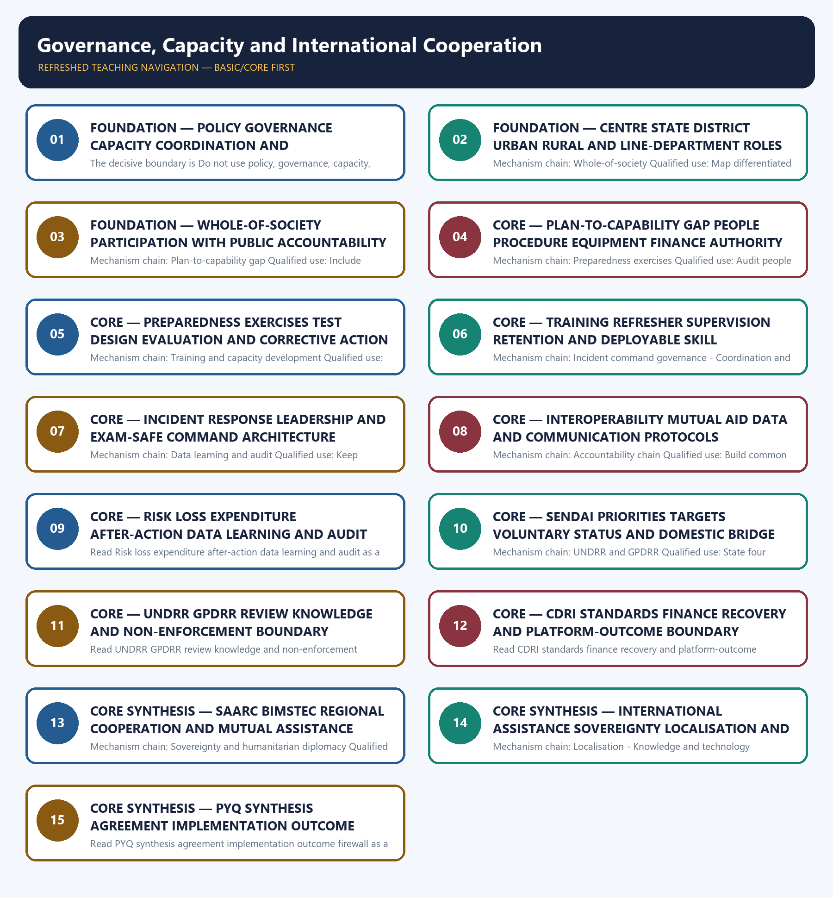

# Governance, Capacity and International Cooperation — Learner-v2 Complete Learning Session

> **Authoring-only generation:** 2026-09-04. No PDF was rendered and no tracker or index was mutated.

### SOURCE, PROGRESSION AND CURRENT-LINKAGE AUDIT

- **Generation date:** 2026-09-04.
- **Repository-first evidence:** the Basic owner is taught first and preserved in full; the Advanced owner is retained only in the optional final teaching block.
- **OCR evidence:** Repository Markdown was primary. OCR-searchable official UPSC papers were supplementary only for printed routed demands. No answer key, warning performance, notification effect, implementation outcome, casualty reduction or disaster metric was inferred.
- **Qdrant:** not used; repository Markdown and available OCR context were sufficient.
- **PYQ integrity:** The 2018 Hyogo-Sendai question and 2024 resilience question are verified direct framework routes, with Topic 01 retaining primary ownership. The 2020 reactive-to-proactive question is a bounded domestic-governance application.
- **Live-link boundary:** Official attempts covered UNDRR/Sendai, MHA/NDMA/NIDM, CDRI, BIMSTEC, SAARC, PIB, OCHA and NDRF. Regional pages were thin or returned 404 and Indian portals were partly blocked; no exercise result, agreement activation, assistance status, membership count, localisation score or risk outcome was invented.
- **Fact/inference discipline:** no current-affairs item, PYQ wording, figure or quotation is invented.

### LIVE OFFICIAL-SOURCE ATTEMPT LOG

The checks below were made on 2026-09-04. Substantive official text is used only for the proposition it supports; title-only, blocked or thin pages are recorded and supply no factual claim.

- https://www.undrr.org/implementing-sendai-framework/what-sendai-framework — fetched 2026-09-04; UNDRR listed the four Sendai priorities and described governance, investment and Build Back Better. https://www.mha.gov.in/en/commoncontent/disaster-management-act-2005 — attempted 2026-09-04 and returned HTTP 403.
- https://www.undrr.org/our-work — fetched 2026-09-04; UNDRR described itself as the lead UN entity coordinating disaster risk reduction. https://cdri.world/ — fetched 2026-09-04 for CDRI's official infrastructure-resilience purpose; no membership or outcome figure was imported.
- https://bimstec.org/sector/disaster-management — attempted 2026-09-04 and returned HTTP 404. https://saarc-sec.org/index.php/areas-of-cooperation/environment-natural-disasters-and-biotechnology — attempted 2026-09-04 and returned HTTP 404. https://pib.gov.in/ — searched 2026-09-04; no current exercise or agreement implementation claim was used.
- https://www.unocha.org/we-coordinate — fetched 2026-09-04; OCHA described UNDAC mobilisation when an affected country requests international assistance and OSOCC's government-link role. https://ndrf.gov.in/en/about-us — fetched 2026-09-04 only for the official specialised-response and international-assistance route.
- https://nidm.gov.in/ — searched 2026-09-04 for official capacity-building material; the route supplied no additional current outcome. https://ndma.gov.in/ — attempted 2026-09-04; the portal was not usable. No training count, exercise result, plan adoption or local capability ranking was inferred.

## BASIC LEARNING SESSION



*Distinct embedded teaching-navigation image. The separate continuous Cārvāka-style flowchart package remains an independent at-a-glance artifact.*

### SESSION 1 — FOUNDATION — POLICY GOVERNANCE CAPACITY COORDINATION AND ACCOUNTABILITY DISTINCTIONS

#### DEFINITION / WHAT THIS IS CALLED

**Plain-language definition:** Policy sets direction, governance allocates authority and rules, capacity enables performance, coordination aligns actors, and accountability tests duty and results; the five terms are related but not interchangeable.

**Technical definition:** The decisive boundary is Do not use policy, governance, capacity, coordination and accountability as synonyms.

#### ANSWER-GRABBING OPENING — WRITE/ADAPT IN THE EXAM

> Policy sets direction, governance allocates authority and rules, capacity enables performance, coordination aligns actors, and accountability tests duty and results; the five terms are related but not interchangeable.

#### MUST-WRITE KEYWORDS

- **FOUNDATION**
- **Policy governance capacity coordination**
- **accountability distinctions**
- **Mechanism chain**
- **Qualified use**
- **Policy**

**How to use them:** Frame the answer through FOUNDATION; define Policy governance capacity coordination, connect accountability distinctions with Mechanism chain to explain the mechanism, and use Qualified use for the decisive comparison or qualification.

#### VISUAL FIRST

```text
POLICY GOVERNANCE CAPACITY COORDINATION AND ACCOUNTABILITY DISTINCTIONS
01. Policy governance capacity coordination accountability
    |
    v
02. Centre State local architecture
STATUS / CATEGORY FIREWALL -> Do not use policy, governance, capacity, coordination and accountability as synonyms.
```

*The rail fixes the institutional sequence and claim boundary before explanation.*

#### CORE EXPLANATION

Policy sets direction, governance allocates authority and rules, capacity enables performance, coordination aligns actors, and accountability tests duty and results; the five terms are related but not interchangeable. The Union, States, districts, urban and rural local bodies and line departments hold differentiated legal, fiscal and operational responsibilities; subsidiarity should place action close to risk while preserving support and standards.

#### SIMPLE SYSTEM EXAMPLE

Read Policy governance capacity coordination and accountability distinctions as a sequence: identify Policy governance capacity coordination accountability, follow the named mechanism to its institutional response, and stop at the last verified status rather than assuming the next stage.

#### TECHNICAL DISTINCTION

The decisive boundary is Do not use policy, governance, capacity, coordination and accountability as synonyms. This keeps Policy governance capacity coordination accountability and Centre State local architecture in the correct risk category, institutional mandate and evidence status.

#### NAMED EVIDENCE AND MECHANISM

- Policy sets direction, governance allocates authority and rules, capacity enables performance, coordination aligns actors, and accountability tests duty and results; the five terms are related but not interchangeable.
- The Union, States, districts, urban and rural local bodies and line departments hold differentiated legal, fiscal and operational responsibilities; subsidiarity should place action close to risk while preserving support and standards.

#### EXAMINER CAUTION

- Do not use policy, governance, capacity, coordination and accountability as synonyms.

#### EXAM LINK

- **Prelims:** Keep hazard, forecast, warning, institution, law, plan, force, fund, scheme and outcome in their exact category.
- **Mains:** Define each governance term and assign its evidence test.

#### MINI RECAP

- **Mechanism chain:** Policy governance capacity coordination accountability -> Centre State local architecture
- **Qualified use:** Define each governance term and assign its evidence test.

#### CLOSING RECALL FLOW — FOUNDATION — POLICY GOVERNANCE CAPACITY COORDINATION AND ACCOUNTABILITY DISTINCTIONS

```text
START / CONCEPT: FOUNDATION — Policy governance capacity coordination and accountability distinctions
        |
        v
EXACT TERMS: FOUNDATION · Policy governance capacity coordination · accountability distinctions · Mechanism chain · Qualified use · Policy
        |
        v
MECHANISM / ARGUMENT: Read Policy governance capacity coordination and accountability distinctions as a sequence: identify Policy governance capacity coordination accountability, follow the named mechanism to its institutional response, and stop at the last verified status rather than assuming the next stage.
        |
        v
CONSEQUENCE / CONTRAST: The decisive boundary is Do not use policy, governance, capacity, coordination and accountability as synonyms.
        |
        v
UPSC TRAP / ANSWER-USE: Do not use policy, governance, capacity, coordination and accountability as synonyms.
        |
        v
ANSWER-GRABBING FORMULATION: Policy sets direction, governance allocates authority and rules, capacity enables performance, coordination aligns actors, and accountability tests duty and results; the five terms are related but not interchangeable.
```
### SESSION 2 — FOUNDATION — CENTRE STATE DISTRICT URBAN RURAL AND LINE-DEPARTMENT ROLES

#### DEFINITION / WHAT THIS IS CALLED

**Plain-language definition:** Read Centre State district urban rural and line-department roles as a sequence: identify Whole-of-society, follow the named mechanism to its institutional response, and stop at the last verified status rather than assuming the next stage.

**Technical definition:** Mechanism chain: Whole-of-society Qualified use: Map differentiated duties support standards finance and subsidiarity.

#### ANSWER-GRABBING OPENING — WRITE/ADAPT IN THE EXAM

> Read Centre State district urban rural and line-department roles as a sequence: identify Whole-of-society, follow the named mechanism to its institutional response, and stop at the last verified status rather than assuming the next stage.

#### MUST-WRITE KEYWORDS

- **FOUNDATION**
- **Centre State district urban rural**
- **line-department roles**
- **Mechanism chain**
- **Qualified use**
- **Whole-of-society**

**How to use them:** Frame the answer through FOUNDATION; define Centre State district urban rural, connect line-department roles with Mechanism chain to explain the mechanism, and use Qualified use for the decisive comparison or qualification.

#### VISUAL FIRST

```text
CENTRE STATE DISTRICT URBAN RURAL AND LINE-DEPARTMENT ROLES
01. Whole-of-society
STATUS / CATEGORY FIREWALL -> Do not infer capability from a plan, training certificate or equipment list.
```

*The rail fixes the institutional sequence and claim boundary before explanation.*

#### CORE EXPLANATION

Whole-of-society disaster management includes government, communities, civil society, volunteers, academia, media, private operators and critical-service providers, but participation does not dilute public accountability.

#### SIMPLE SYSTEM EXAMPLE

Read Centre State district urban rural and line-department roles as a sequence: identify Whole-of-society, follow the named mechanism to its institutional response, and stop at the last verified status rather than assuming the next stage.

#### TECHNICAL DISTINCTION

The decisive boundary is Do not infer capability from a plan, training certificate or equipment list. This keeps Whole-of-society in the correct risk category, institutional mandate and evidence status.

#### NAMED EVIDENCE AND MECHANISM

- Whole-of-society disaster management includes government, communities, civil society, volunteers, academia, media, private operators and critical-service providers, but participation does not dilute public accountability.

#### EXAMINER CAUTION

- Do not infer capability from a plan, training certificate or equipment list.

#### EXAM LINK

- **Prelims:** Keep hazard, forecast, warning, institution, law, plan, force, fund, scheme and outcome in their exact category.
- **Mains:** Map differentiated duties support standards finance and subsidiarity.

#### MINI RECAP

- **Mechanism chain:** Whole-of-society
- **Qualified use:** Map differentiated duties support standards finance and subsidiarity.

#### CLOSING RECALL FLOW — FOUNDATION — CENTRE STATE DISTRICT URBAN RURAL AND LINE-DEPARTMENT ROLES

```text
START / CONCEPT: FOUNDATION — Centre State district urban rural and line-department roles
        |
        v
EXACT TERMS: FOUNDATION · Centre State district urban rural · line-department roles · Mechanism chain · Qualified use · Whole-of-society
        |
        v
MECHANISM / ARGUMENT: Mechanism chain: Whole-of-society Qualified use: Map differentiated duties support standards finance and subsidiarity.
        |
        v
CONSEQUENCE / CONTRAST: Whole-of-society disaster management includes government, communities, civil society, volunteers, academia, media, private operators and critical-service providers, but participation does not dilute public accountability.
        |
        v
UPSC TRAP / ANSWER-USE: The decisive boundary is Do not infer capability from a plan, training certificate or equipment list.
        |
        v
ANSWER-GRABBING FORMULATION: Read Centre State district urban rural and line-department roles as a sequence: identify Whole-of-society, follow the named mechanism to its institutional response, and stop at the last verified status rather than assuming the next stage.
```
### SESSION 3 — FOUNDATION — WHOLE-OF-SOCIETY PARTICIPATION WITH PUBLIC ACCOUNTABILITY

#### DEFINITION / WHAT THIS IS CALLED

**Plain-language definition:** Read Whole-of-society participation with public accountability as a sequence: identify Plan-to-capability gap, follow the named mechanism to its institutional response, and stop at the last verified status rather than assuming the next stage.

**Technical definition:** Mechanism chain: Plan-to-capability gap Qualified use: Include communities private operators experts and media without duty dilution.

#### ANSWER-GRABBING OPENING — WRITE/ADAPT IN THE EXAM

> Read Whole-of-society participation with public accountability as a sequence: identify Plan-to-capability gap, follow the named mechanism to its institutional response, and stop at the last verified status rather than assuming the next stage.

#### MUST-WRITE KEYWORDS

- **FOUNDATION**
- **Whole-of-society participation with public accountability**
- **Mechanism chain**
- **Qualified use**
- **Read Whole-of-society**
- **Plan-to-capability**

**How to use them:** Frame the answer through FOUNDATION; define Whole-of-society participation with public accountability, connect Mechanism chain with Qualified use to explain the mechanism, and use Read Whole-of-society for the decisive comparison or qualification.

#### VISUAL FIRST

```text
WHOLE-OF-SOCIETY PARTICIPATION WITH PUBLIC ACCOUNTABILITY
01. Plan-to-capability gap
STATUS / CATEGORY FIREWALL -> Do not assume one exercise validates all hazards, actors or geographies.
```

*The rail fixes the institutional sequence and claim boundary before explanation.*

#### CORE EXPLANATION

A plan proves documented intent; capability additionally requires trained people, usable procedures, equipment, interoperable communications, finance, authority, exercises, maintenance and evidence of corrective learning.

#### SIMPLE SYSTEM EXAMPLE

Read Whole-of-society participation with public accountability as a sequence: identify Plan-to-capability gap, follow the named mechanism to its institutional response, and stop at the last verified status rather than assuming the next stage.

#### TECHNICAL DISTINCTION

The decisive boundary is Do not assume one exercise validates all hazards, actors or geographies. This keeps Plan-to-capability gap in the correct risk category, institutional mandate and evidence status.

#### NAMED EVIDENCE AND MECHANISM

- A plan proves documented intent; capability additionally requires trained people, usable procedures, equipment, interoperable communications, finance, authority, exercises, maintenance and evidence of corrective learning.

#### EXAMINER CAUTION

- Do not assume one exercise validates all hazards, actors or geographies.

#### EXAM LINK

- **Prelims:** Keep hazard, forecast, warning, institution, law, plan, force, fund, scheme and outcome in their exact category.
- **Mains:** Include communities private operators experts and media without duty dilution.

#### MINI RECAP

- **Mechanism chain:** Plan-to-capability gap
- **Qualified use:** Include communities private operators experts and media without duty dilution.

#### CLOSING RECALL FLOW — FOUNDATION — WHOLE-OF-SOCIETY PARTICIPATION WITH PUBLIC ACCOUNTABILITY

```text
START / CONCEPT: FOUNDATION — Whole-of-society participation with public accountability
        |
        v
EXACT TERMS: FOUNDATION · Whole-of-society participation with public accountability · Mechanism chain · Qualified use · Read Whole-of-society · Plan-to-capability
        |
        v
MECHANISM / ARGUMENT: Mechanism chain: Plan-to-capability gap Qualified use: Include communities private operators experts and media without duty dilution.
        |
        v
CONSEQUENCE / CONTRAST: The decisive boundary is Do not assume one exercise validates all hazards, actors or geographies.
        |
        v
UPSC TRAP / ANSWER-USE: Do not assume one exercise validates all hazards, actors or geographies.
        |
        v
ANSWER-GRABBING FORMULATION: Read Whole-of-society participation with public accountability as a sequence: identify Plan-to-capability gap, follow the named mechanism to its institutional response, and stop at the last verified status rather than assuming the next stage.
```
### SESSION 4 — CORE — PLAN-TO-CAPABILITY GAP PEOPLE PROCEDURE EQUIPMENT FINANCE AUTHORITY

#### DEFINITION / WHAT THIS IS CALLED

**Plain-language definition:** Read Plan-to-capability gap people procedure equipment finance authority as a sequence: identify Preparedness exercises, follow the named mechanism to its institutional response, and stop at the last verified status rather than assuming the next stage.

**Technical definition:** Mechanism chain: Preparedness exercises Qualified use: Audit people procedure equipment communication finance and authority.

#### ANSWER-GRABBING OPENING — WRITE/ADAPT IN THE EXAM

> Read Plan-to-capability gap people procedure equipment finance authority as a sequence: identify Preparedness exercises, follow the named mechanism to its institutional response, and stop at the last verified status rather than assuming the next stage.

#### MUST-WRITE KEYWORDS

- **Plan-to-capability gap people procedure equipment finance authority**
- **Mechanism chain**
- **Qualified use**
- **Exercises**
- **Read Plan-to-capability**
- **Preparedness**

**How to use them:** Frame the answer through Plan-to-capability gap people procedure equipment finance authority; define Mechanism chain, connect Qualified use with Exercises to explain the mechanism, and use Read Plan-to-capability for the decisive comparison or qualification.

#### VISUAL FIRST

```text
PLAN-TO-CAPABILITY GAP PEOPLE PROCEDURE EQUIPMENT FINANCE AUTHORITY
01. Preparedness exercises
STATUS / CATEGORY FIREWALL -> Do not let whole-of-society language obscure statutory public responsibility.
```

*The rail fixes the institutional sequence and claim boundary before explanation.*

#### CORE EXPLANATION

Exercises test assumptions, roles, communications, resource mobilisation and decision thresholds in a controlled setting; an exercise validates only what was actually tested and corrected.

#### SIMPLE SYSTEM EXAMPLE

Read Plan-to-capability gap people procedure equipment finance authority as a sequence: identify Preparedness exercises, follow the named mechanism to its institutional response, and stop at the last verified status rather than assuming the next stage.

#### TECHNICAL DISTINCTION

The decisive boundary is Do not let whole-of-society language obscure statutory public responsibility. This keeps Preparedness exercises in the correct risk category, institutional mandate and evidence status.

#### NAMED EVIDENCE AND MECHANISM

- Exercises test assumptions, roles, communications, resource mobilisation and decision thresholds in a controlled setting; an exercise validates only what was actually tested and corrected.

#### EXAMINER CAUTION

- Do not let whole-of-society language obscure statutory public responsibility.

#### EXAM LINK

- **Prelims:** Keep hazard, forecast, warning, institution, law, plan, force, fund, scheme and outcome in their exact category.
- **Mains:** Audit people procedure equipment communication finance and authority.

#### MINI RECAP

- **Mechanism chain:** Preparedness exercises
- **Qualified use:** Audit people procedure equipment communication finance and authority.

#### CLOSING RECALL FLOW — CORE — PLAN-TO-CAPABILITY GAP PEOPLE PROCEDURE EQUIPMENT FINANCE AUTHORITY

```text
START / CONCEPT: CORE — Plan-to-capability gap people procedure equipment finance authority
        |
        v
EXACT TERMS: Plan-to-capability gap people procedure equipment finance authority · Mechanism chain · Qualified use · Exercises · Read Plan-to-capability · Preparedness
        |
        v
MECHANISM / ARGUMENT: Mechanism chain: Preparedness exercises Qualified use: Audit people procedure equipment communication finance and authority.
        |
        v
CONSEQUENCE / CONTRAST: The decisive boundary is Do not let whole-of-society language obscure statutory public responsibility.
        |
        v
UPSC TRAP / ANSWER-USE: Do not let whole-of-society language obscure statutory public responsibility.
        |
        v
ANSWER-GRABBING FORMULATION: Read Plan-to-capability gap people procedure equipment finance authority as a sequence: identify Preparedness exercises, follow the named mechanism to its institutional response, and stop at the last verified status rather than assuming the next stage.
```
### SESSION 5 — CORE — PREPAREDNESS EXERCISES TEST DESIGN EVALUATION AND CORRECTIVE ACTION

#### DEFINITION / WHAT THIS IS CALLED

**Plain-language definition:** Read Preparedness exercises test design evaluation and corrective action as a sequence: identify Training and capacity development, follow the named mechanism to its institutional response, and stop at the last verified status rather than assuming the next stage.

**Technical definition:** Mechanism chain: Training and capacity development Qualified use: State scope injects participants observations corrections and retest.

#### ANSWER-GRABBING OPENING — WRITE/ADAPT IN THE EXAM

> Read Preparedness exercises test design evaluation and corrective action as a sequence: identify Training and capacity development, follow the named mechanism to its institutional response, and stop at the last verified status rather than assuming the next stage.

#### MUST-WRITE KEYWORDS

- **Preparedness exercises test design evaluation**
- **corrective action**
- **Mechanism chain**
- **Qualified use**
- **Training**
- **Read Preparedness**

**How to use them:** Frame the answer through Preparedness exercises test design evaluation; define corrective action, connect Mechanism chain with Qualified use to explain the mechanism, and use Training for the decisive comparison or qualification.

#### VISUAL FIRST

```text
PREPAREDNESS EXERCISES TEST DESIGN EVALUATION AND CORRECTIVE ACTION
01. Training and capacity development
STATUS / CATEGORY FIREWALL -> Do not describe Sendai as a binding treaty.
```

*The rail fixes the institutional sequence and claim boundary before explanation.*

#### CORE EXPLANATION

Training builds knowledge and skill, but capability requires appropriate selection, refresher cycles, supervision, equipment, deployment opportunity and institutional retention.

#### SIMPLE SYSTEM EXAMPLE

Read Preparedness exercises test design evaluation and corrective action as a sequence: identify Training and capacity development, follow the named mechanism to its institutional response, and stop at the last verified status rather than assuming the next stage.

#### TECHNICAL DISTINCTION

The decisive boundary is Do not describe Sendai as a binding treaty. This keeps Training and capacity development in the correct risk category, institutional mandate and evidence status.

#### NAMED EVIDENCE AND MECHANISM

- Training builds knowledge and skill, but capability requires appropriate selection, refresher cycles, supervision, equipment, deployment opportunity and institutional retention.

#### EXAMINER CAUTION

- Do not describe Sendai as a binding treaty.

#### EXAM LINK

- **Prelims:** Keep hazard, forecast, warning, institution, law, plan, force, fund, scheme and outcome in their exact category.
- **Mains:** State scope injects participants observations corrections and retest.

#### MINI RECAP

- **Mechanism chain:** Training and capacity development
- **Qualified use:** State scope injects participants observations corrections and retest.

#### CLOSING RECALL FLOW — CORE — PREPAREDNESS EXERCISES TEST DESIGN EVALUATION AND CORRECTIVE ACTION

```text
START / CONCEPT: CORE — Preparedness exercises test design evaluation and corrective action
        |
        v
EXACT TERMS: Preparedness exercises test design evaluation · corrective action · Mechanism chain · Qualified use · Training · Read Preparedness
        |
        v
MECHANISM / ARGUMENT: Mechanism chain: Training and capacity development Qualified use: State scope injects participants observations corrections and retest.
        |
        v
CONSEQUENCE / CONTRAST: Training builds knowledge and skill, but capability requires appropriate selection, refresher cycles, supervision, equipment, deployment opportunity and institutional retention.
        |
        v
UPSC TRAP / ANSWER-USE: The decisive boundary is Do not describe Sendai as a binding treaty.
        |
        v
ANSWER-GRABBING FORMULATION: Read Preparedness exercises test design evaluation and corrective action as a sequence: identify Training and capacity development, follow the named mechanism to its institutional response, and stop at the last verified status rather than assuming the next stage.
```
### SESSION 6 — CORE — TRAINING REFRESHER SUPERVISION RETENTION AND DEPLOYABLE SKILL

#### DEFINITION / WHAT THIS IS CALLED

**Plain-language definition:** Read Training refresher supervision retention and deployable skill as a sequence: identify Incident command governance, follow the named mechanism to its institutional response, and stop at the last verified status rather than assuming the next stage.

**Technical definition:** Mechanism chain: Incident command governance - Coordination and interoperability Qualified use: Trace training to retained deployable supervised competence.

#### ANSWER-GRABBING OPENING — WRITE/ADAPT IN THE EXAM

> Read Training refresher supervision retention and deployable skill as a sequence: identify Incident command governance, follow the named mechanism to its institutional response, and stop at the last verified status rather than assuming the next stage.

#### MUST-WRITE KEYWORDS

- **Training refresher supervision retention**
- **deployable skill**
- **Mechanism chain**
- **Qualified use**
- **Incident**
- **Coordination**

**How to use them:** Frame the answer through Training refresher supervision retention; define deployable skill, connect Mechanism chain with Qualified use to explain the mechanism, and use Incident for the decisive comparison or qualification.

#### VISUAL FIRST

```text
TRAINING REFRESHER SUPERVISION RETENTION AND DEPLOYABLE SKILL
01. Incident command governance
    |
    v
02. Coordination and interoperability
STATUS / CATEGORY FIREWALL -> Do not present UNDRR or GPDRR as enforcement authorities.
```

*The rail fixes the institutional sequence and claim boundary before explanation.*

#### CORE EXPLANATION

Incident command or response arrangements should define leadership, operations, planning, logistics, finance and information at an exam-safe governance level; tactical details remain context-specific. Coordination requires shared terminology, contact routes, data standards, mutual-aid procedures, interoperable communications and clear lead/support roles before an incident.

#### SIMPLE SYSTEM EXAMPLE

Read Training refresher supervision retention and deployable skill as a sequence: identify Incident command governance, follow the named mechanism to its institutional response, and stop at the last verified status rather than assuming the next stage.

#### TECHNICAL DISTINCTION

The decisive boundary is Do not present UNDRR or GPDRR as enforcement authorities. This keeps Incident command governance and Coordination and interoperability in the correct risk category, institutional mandate and evidence status.

#### NAMED EVIDENCE AND MECHANISM

- Incident command or response arrangements should define leadership, operations, planning, logistics, finance and information at an exam-safe governance level; tactical details remain context-specific.
- Coordination requires shared terminology, contact routes, data standards, mutual-aid procedures, interoperable communications and clear lead/support roles before an incident.

#### EXAMINER CAUTION

- Do not present UNDRR or GPDRR as enforcement authorities.

#### EXAM LINK

- **Prelims:** Keep hazard, forecast, warning, institution, law, plan, force, fund, scheme and outcome in their exact category.
- **Mains:** Trace training to retained deployable supervised competence.

#### MINI RECAP

- **Mechanism chain:** Incident command governance -> Coordination and interoperability
- **Qualified use:** Trace training to retained deployable supervised competence.

#### CLOSING RECALL FLOW — CORE — TRAINING REFRESHER SUPERVISION RETENTION AND DEPLOYABLE SKILL

```text
START / CONCEPT: CORE — Training refresher supervision retention and deployable skill
        |
        v
EXACT TERMS: Training refresher supervision retention · deployable skill · Mechanism chain · Qualified use · Incident · Coordination
        |
        v
MECHANISM / ARGUMENT: Mechanism chain: Incident command governance - Coordination and interoperability Qualified use: Trace training to retained deployable supervised competence.
        |
        v
CONSEQUENCE / CONTRAST: The decisive boundary is Do not present UNDRR or GPDRR as enforcement authorities.
        |
        v
UPSC TRAP / ANSWER-USE: Do not present UNDRR or GPDRR as enforcement authorities.
        |
        v
ANSWER-GRABBING FORMULATION: Read Training refresher supervision retention and deployable skill as a sequence: identify Incident command governance, follow the named mechanism to its institutional response, and stop at the last verified status rather than assuming the next stage.
```
### SESSION 7 — CORE — INCIDENT RESPONSE LEADERSHIP AND EXAM-SAFE COMMAND ARCHITECTURE

#### DEFINITION / WHAT THIS IS CALLED

**Plain-language definition:** Read Incident response leadership and exam-safe command architecture as a sequence: identify Data learning and audit, follow the named mechanism to its institutional response, and stop at the last verified status rather than assuming the next stage.

**Technical definition:** Mechanism chain: Data learning and audit Qualified use: Keep command at role coordination and accountability level.

#### ANSWER-GRABBING OPENING — WRITE/ADAPT IN THE EXAM

> Read Incident response leadership and exam-safe command architecture as a sequence: identify Data learning and audit, follow the named mechanism to its institutional response, and stop at the last verified status rather than assuming the next stage.

#### MUST-WRITE KEYWORDS

- **Incident response leadership**
- **exam-safe command architecture**
- **Mechanism chain**
- **Qualified use**
- **Risk**
- **Read Incident**

**How to use them:** Frame the answer through Incident response leadership; define exam-safe command architecture, connect Mechanism chain with Qualified use to explain the mechanism, and use Risk for the decisive comparison or qualification.

#### VISUAL FIRST

```text
INCIDENT RESPONSE LEADERSHIP AND EXAM-SAFE COMMAND ARCHITECTURE
01. Data learning and audit
STATUS / CATEGORY FIREWALL -> Do not infer resilient infrastructure from CDRI participation.
```

*The rail fixes the institutional sequence and claim boundary before explanation.*

#### CORE EXPLANATION

Risk, loss, expenditure, exercise and after-action data should support transparent review, correction and institutional memory; a database or report is not proof that recommendations were implemented.

#### SIMPLE SYSTEM EXAMPLE

Read Incident response leadership and exam-safe command architecture as a sequence: identify Data learning and audit, follow the named mechanism to its institutional response, and stop at the last verified status rather than assuming the next stage.

#### TECHNICAL DISTINCTION

The decisive boundary is Do not infer resilient infrastructure from CDRI participation. This keeps Data learning and audit in the correct risk category, institutional mandate and evidence status.

#### NAMED EVIDENCE AND MECHANISM

- Risk, loss, expenditure, exercise and after-action data should support transparent review, correction and institutional memory; a database or report is not proof that recommendations were implemented.

#### EXAMINER CAUTION

- Do not infer resilient infrastructure from CDRI participation.

#### EXAM LINK

- **Prelims:** Keep hazard, forecast, warning, institution, law, plan, force, fund, scheme and outcome in their exact category.
- **Mains:** Keep command at role coordination and accountability level.

#### MINI RECAP

- **Mechanism chain:** Data learning and audit
- **Qualified use:** Keep command at role coordination and accountability level.

#### CLOSING RECALL FLOW — CORE — INCIDENT RESPONSE LEADERSHIP AND EXAM-SAFE COMMAND ARCHITECTURE

```text
START / CONCEPT: CORE — Incident response leadership and exam-safe command architecture
        |
        v
EXACT TERMS: Incident response leadership · exam-safe command architecture · Mechanism chain · Qualified use · Risk · Read Incident
        |
        v
MECHANISM / ARGUMENT: Mechanism chain: Data learning and audit Qualified use: Keep command at role coordination and accountability level.
        |
        v
CONSEQUENCE / CONTRAST: Risk, loss, expenditure, exercise and after-action data should support transparent review, correction and institutional memory; a database or report is not proof that recommendations were implemented.
        |
        v
UPSC TRAP / ANSWER-USE: The decisive boundary is Do not infer resilient infrastructure from CDRI participation.
        |
        v
ANSWER-GRABBING FORMULATION: Read Incident response leadership and exam-safe command architecture as a sequence: identify Data learning and audit, follow the named mechanism to its institutional response, and stop at the last verified status rather than assuming the next stage.
```
### SESSION 8 — CORE — INTEROPERABILITY MUTUAL AID DATA AND COMMUNICATION PROTOCOLS

#### DEFINITION / WHAT THIS IS CALLED

**Plain-language definition:** Read Interoperability mutual aid data and communication protocols as a sequence: identify Accountability chain, follow the named mechanism to its institutional response, and stop at the last verified status rather than assuming the next stage.

**Technical definition:** Mechanism chain: Accountability chain Qualified use: Build common language data contacts communications and mutual aid.

#### ANSWER-GRABBING OPENING — WRITE/ADAPT IN THE EXAM

> Read Interoperability mutual aid data and communication protocols as a sequence: identify Accountability chain, follow the named mechanism to its institutional response, and stop at the last verified status rather than assuming the next stage.

#### MUST-WRITE KEYWORDS

- **Interoperability mutual aid data**
- **communication protocols**
- **Mechanism chain**
- **Qualified use**
- **Accountability**
- **Read Interoperability**

**How to use them:** Frame the answer through Interoperability mutual aid data; define communication protocols, connect Mechanism chain with Qualified use to explain the mechanism, and use Accountability for the decisive comparison or qualification.

#### VISUAL FIRST

```text
INTEROPERABILITY MUTUAL AID DATA AND COMMUNICATION PROTOCOLS
01. Accountability chain
STATUS / CATEGORY FIREWALL -> Do not infer regional cooperation outcomes from meetings or agreements.
```

*The rail fixes the institutional sequence and claim boundary before explanation.*

#### CORE EXPLANATION

Accountability links assigned duty, resources, standards, reporting, independent or legislative review, grievance and corrective action; coordination without identifiable responsibility can create diffusion of blame.

#### SIMPLE SYSTEM EXAMPLE

Read Interoperability mutual aid data and communication protocols as a sequence: identify Accountability chain, follow the named mechanism to its institutional response, and stop at the last verified status rather than assuming the next stage.

#### TECHNICAL DISTINCTION

The decisive boundary is Do not infer regional cooperation outcomes from meetings or agreements. This keeps Accountability chain in the correct risk category, institutional mandate and evidence status.

#### NAMED EVIDENCE AND MECHANISM

- Accountability links assigned duty, resources, standards, reporting, independent or legislative review, grievance and corrective action; coordination without identifiable responsibility can create diffusion of blame.

#### EXAMINER CAUTION

- Do not infer regional cooperation outcomes from meetings or agreements.

#### EXAM LINK

- **Prelims:** Keep hazard, forecast, warning, institution, law, plan, force, fund, scheme and outcome in their exact category.
- **Mains:** Build common language data contacts communications and mutual aid.

#### MINI RECAP

- **Mechanism chain:** Accountability chain
- **Qualified use:** Build common language data contacts communications and mutual aid.

#### CLOSING RECALL FLOW — CORE — INTEROPERABILITY MUTUAL AID DATA AND COMMUNICATION PROTOCOLS

```text
START / CONCEPT: CORE — Interoperability mutual aid data and communication protocols
        |
        v
EXACT TERMS: Interoperability mutual aid data · communication protocols · Mechanism chain · Qualified use · Accountability · Read Interoperability
        |
        v
MECHANISM / ARGUMENT: Mechanism chain: Accountability chain Qualified use: Build common language data contacts communications and mutual aid.
        |
        v
CONSEQUENCE / CONTRAST: Mains: Build common language data contacts communications and mutual aid.
        |
        v
UPSC TRAP / ANSWER-USE: The decisive boundary is Do not infer regional cooperation outcomes from meetings or agreements.
        |
        v
ANSWER-GRABBING FORMULATION: Read Interoperability mutual aid data and communication protocols as a sequence: identify Accountability chain, follow the named mechanism to its institutional response, and stop at the last verified status rather than assuming the next stage.
```
### SESSION 9 — CORE — RISK LOSS EXPENDITURE AFTER-ACTION DATA LEARNING AND AUDIT

#### DEFINITION / WHAT THIS IS CALLED

**Plain-language definition:** The Sendai Framework for Disaster Risk Reduction 2015-2030 is a voluntary non-binding framework with four priorities and seven global targets; it does not itself create enforceable treaty obligations.

**Technical definition:** Read Risk loss expenditure after-action data learning and audit as a sequence: identify Sendai Framework, follow the named mechanism to its institutional response, and stop at the last verified status rather than assuming the next stage.

#### ANSWER-GRABBING OPENING — WRITE/ADAPT IN THE EXAM

> Read Risk loss expenditure after-action data learning and audit as a sequence: identify Sendai Framework, follow the named mechanism to its institutional response, and stop at the last verified status rather than assuming the next stage.

#### MUST-WRITE KEYWORDS

- **Risk loss expenditure after-action data learning**
- **audit**
- **Mechanism chain**
- **Qualified use**
- **The Sendai Framework for Disaster Risk Reduction 2015-2030**
- **2015-2030**

**How to use them:** Frame the answer through Risk loss expenditure after-action data learning; define audit, connect Mechanism chain with Qualified use to explain the mechanism, and use The Sendai Framework for Disaster Risk Reduction 2015-2030 for the decisive comparison or qualification.

#### VISUAL FIRST

```text
RISK LOSS EXPENDITURE AFTER-ACTION DATA LEARNING AND AUDIT
01. Sendai Framework
STATUS / CATEGORY FIREWALL -> Do not ignore sovereignty, consent and domestic legal arrangements for assistance.
```

*The rail fixes the institutional sequence and claim boundary before explanation.*

#### CORE EXPLANATION

The Sendai Framework for Disaster Risk Reduction 2015-2030 is a voluntary non-binding framework with four priorities and seven global targets; it does not itself create enforceable treaty obligations.

#### SIMPLE SYSTEM EXAMPLE

Read Risk loss expenditure after-action data learning and audit as a sequence: identify Sendai Framework, follow the named mechanism to its institutional response, and stop at the last verified status rather than assuming the next stage.

#### TECHNICAL DISTINCTION

The decisive boundary is Do not ignore sovereignty, consent and domestic legal arrangements for assistance. This keeps Sendai Framework in the correct risk category, institutional mandate and evidence status.

#### NAMED EVIDENCE AND MECHANISM

- The Sendai Framework for Disaster Risk Reduction 2015-2030 is a voluntary non-binding framework with four priorities and seven global targets; it does not itself create enforceable treaty obligations.

#### EXAMINER CAUTION

- Do not ignore sovereignty, consent and domestic legal arrangements for assistance.

#### EXAM LINK

- **Prelims:** Keep hazard, forecast, warning, institution, law, plan, force, fund, scheme and outcome in their exact category.
- **Mains:** Connect data to review correction ownership and institutional memory.

#### MINI RECAP

- **Mechanism chain:** Sendai Framework
- **Qualified use:** Connect data to review correction ownership and institutional memory.

#### CLOSING RECALL FLOW — CORE — RISK LOSS EXPENDITURE AFTER-ACTION DATA LEARNING AND AUDIT

```text
START / CONCEPT: CORE — Risk loss expenditure after-action data learning and audit
        |
        v
EXACT TERMS: Risk loss expenditure after-action data learning · audit · Mechanism chain · Qualified use · The Sendai Framework for Disaster Risk Reduction 2015-2030 · 2015-2030
        |
        v
MECHANISM / ARGUMENT: Mechanism chain: Sendai Framework Qualified use: Connect data to review correction ownership and institutional memory.
        |
        v
CONSEQUENCE / CONTRAST: The Sendai Framework for Disaster Risk Reduction 2015-2030 is a voluntary non-binding framework with four priorities and seven global targets; it does not itself create enforceable treaty obligations.
        |
        v
UPSC TRAP / ANSWER-USE: The decisive boundary is Do not ignore sovereignty, consent and domestic legal arrangements for assistance.
        |
        v
ANSWER-GRABBING FORMULATION: Read Risk loss expenditure after-action data learning and audit as a sequence: identify Sendai Framework, follow the named mechanism to its institutional response, and stop at the last verified status rather than assuming the next stage.
```
### SESSION 10 — CORE — SENDAI PRIORITIES TARGETS VOLUNTARY STATUS AND DOMESTIC BRIDGE

#### DEFINITION / WHAT THIS IS CALLED

**Plain-language definition:** Read Sendai priorities targets voluntary status and domestic bridge as a sequence: identify UNDRR and GPDRR, follow the named mechanism to its institutional response, and stop at the last verified status rather than assuming the next stage.

**Technical definition:** Mechanism chain: UNDRR and GPDRR Qualified use: State four priorities seven targets and voluntary non-binding status.

#### ANSWER-GRABBING OPENING — WRITE/ADAPT IN THE EXAM

> Read Sendai priorities targets voluntary status and domestic bridge as a sequence: identify UNDRR and GPDRR, follow the named mechanism to its institutional response, and stop at the last verified status rather than assuming the next stage.

#### MUST-WRITE KEYWORDS

- **Sendai priorities targets voluntary status**
- **domestic bridge**
- **Mechanism chain**
- **Qualified use**
- **Read Sendai**
- **UNDRR**

**How to use them:** Frame the answer through Sendai priorities targets voluntary status; define domestic bridge, connect Mechanism chain with Qualified use to explain the mechanism, and use Read Sendai for the decisive comparison or qualification.

#### VISUAL FIRST

```text
SENDAI PRIORITIES TARGETS VOLUNTARY STATUS AND DOMESTIC BRIDGE
01. UNDRR and GPDRR
STATUS / CATEGORY FIREWALL -> Do not equate international visibility with localised implementation.
```

*The rail fixes the institutional sequence and claim boundary before explanation.*

#### CORE EXPLANATION

UNDRR coordinates the UN disaster-risk-reduction agenda, while the Global Platform supports review and knowledge exchange; neither substitutes for national law or acts as a binding enforcement body.

#### SIMPLE SYSTEM EXAMPLE

Read Sendai priorities targets voluntary status and domestic bridge as a sequence: identify UNDRR and GPDRR, follow the named mechanism to its institutional response, and stop at the last verified status rather than assuming the next stage.

#### TECHNICAL DISTINCTION

The decisive boundary is Do not equate international visibility with localised implementation. This keeps UNDRR and GPDRR in the correct risk category, institutional mandate and evidence status.

#### NAMED EVIDENCE AND MECHANISM

- UNDRR coordinates the UN disaster-risk-reduction agenda, while the Global Platform supports review and knowledge exchange; neither substitutes for national law or acts as a binding enforcement body.

#### EXAMINER CAUTION

- Do not equate international visibility with localised implementation.

#### EXAM LINK

- **Prelims:** Keep hazard, forecast, warning, institution, law, plan, force, fund, scheme and outcome in their exact category.
- **Mains:** State four priorities seven targets and voluntary non-binding status.

#### MINI RECAP

- **Mechanism chain:** UNDRR and GPDRR
- **Qualified use:** State four priorities seven targets and voluntary non-binding status.

#### CLOSING RECALL FLOW — CORE — SENDAI PRIORITIES TARGETS VOLUNTARY STATUS AND DOMESTIC BRIDGE

```text
START / CONCEPT: CORE — Sendai priorities targets voluntary status and domestic bridge
        |
        v
EXACT TERMS: Sendai priorities targets voluntary status · domestic bridge · Mechanism chain · Qualified use · Read Sendai · UNDRR
        |
        v
MECHANISM / ARGUMENT: Mechanism chain: UNDRR and GPDRR Qualified use: State four priorities seven targets and voluntary non-binding status.
        |
        v
CONSEQUENCE / CONTRAST: The decisive boundary is Do not equate international visibility with localised implementation.
        |
        v
UPSC TRAP / ANSWER-USE: Do not equate international visibility with localised implementation.
        |
        v
ANSWER-GRABBING FORMULATION: Read Sendai priorities targets voluntary status and domestic bridge as a sequence: identify UNDRR and GPDRR, follow the named mechanism to its institutional response, and stop at the last verified status rather than assuming the next stage.
```
### SESSION 11 — CORE — UNDRR GPDRR REVIEW KNOWLEDGE AND NON-ENFORCEMENT BOUNDARY

#### DEFINITION / WHAT THIS IS CALLED

**Plain-language definition:** SAARC, BIMSTEC and other regional routes can support exercises, knowledge, warning, mutual assistance and common procedures, but an agreement, meeting or exercise is not implementation or outcome evidence.

**Technical definition:** Read UNDRR GPDRR review knowledge and non-enforcement boundary as a sequence: identify CDRI, follow the named mechanism to its institutional response, and stop at the last verified status rather than assuming the next stage.

#### ANSWER-GRABBING OPENING — WRITE/ADAPT IN THE EXAM

> Read UNDRR GPDRR review knowledge and non-enforcement boundary as a sequence: identify CDRI, follow the named mechanism to its institutional response, and stop at the last verified status rather than assuming the next stage.

#### MUST-WRITE KEYWORDS

- **UNDRR GPDRR review knowledge**
- **non-enforcement boundary**
- **Mechanism chain**
- **Qualified use**
- **The Coalition**
- **Disaster Resilient Infrastructure**

**How to use them:** Frame the answer through UNDRR GPDRR review knowledge; define non-enforcement boundary, connect Mechanism chain with Qualified use to explain the mechanism, and use The Coalition for the decisive comparison or qualification.

#### VISUAL FIRST

```text
UNDRR GPDRR REVIEW KNOWLEDGE AND NON-ENFORCEMENT BOUNDARY
01. CDRI
    |
    v
02. Regional cooperation
STATUS / CATEGORY FIREWALL -> Do not use policy, governance, capacity, coordination and accountability as synonyms.
```

*The rail fixes the institutional sequence and claim boundary before explanation.*

#### CORE EXPLANATION

The Coalition for Disaster Resilient Infrastructure supports cooperation on infrastructure risk, standards, finance and recovery; participation or membership demonstrates a cooperation platform, not resilient assets or reduced losses. SAARC, BIMSTEC and other regional routes can support exercises, knowledge, warning, mutual assistance and common procedures, but an agreement, meeting or exercise is not implementation or outcome evidence.

#### SIMPLE SYSTEM EXAMPLE

Read UNDRR GPDRR review knowledge and non-enforcement boundary as a sequence: identify CDRI, follow the named mechanism to its institutional response, and stop at the last verified status rather than assuming the next stage.

#### TECHNICAL DISTINCTION

The decisive boundary is Do not use policy, governance, capacity, coordination and accountability as synonyms. This keeps CDRI and Regional cooperation in the correct risk category, institutional mandate and evidence status.

#### NAMED EVIDENCE AND MECHANISM

- The Coalition for Disaster Resilient Infrastructure supports cooperation on infrastructure risk, standards, finance and recovery; participation or membership demonstrates a cooperation platform, not resilient assets or reduced losses.
- SAARC, BIMSTEC and other regional routes can support exercises, knowledge, warning, mutual assistance and common procedures, but an agreement, meeting or exercise is not implementation or outcome evidence.

#### EXAMINER CAUTION

- Do not use policy, governance, capacity, coordination and accountability as synonyms.

#### EXAM LINK

- **Prelims:** Keep hazard, forecast, warning, institution, law, plan, force, fund, scheme and outcome in their exact category.
- **Mains:** Separate coordination review and knowledge from enforcement.

#### MINI RECAP

- **Mechanism chain:** CDRI -> Regional cooperation
- **Qualified use:** Separate coordination review and knowledge from enforcement.

#### CLOSING RECALL FLOW — CORE — UNDRR GPDRR REVIEW KNOWLEDGE AND NON-ENFORCEMENT BOUNDARY

```text
START / CONCEPT: CORE — UNDRR GPDRR review knowledge and non-enforcement boundary
        |
        v
EXACT TERMS: UNDRR GPDRR review knowledge · non-enforcement boundary · Mechanism chain · Qualified use · The Coalition · Disaster Resilient Infrastructure
        |
        v
MECHANISM / ARGUMENT: Mechanism chain: CDRI - Regional cooperation Qualified use: Separate coordination review and knowledge from enforcement.
        |
        v
CONSEQUENCE / CONTRAST: SAARC, BIMSTEC and other regional routes can support exercises, knowledge, warning, mutual assistance and common procedures, but an agreement, meeting or exercise is not implementation or outcome evidence.
        |
        v
UPSC TRAP / ANSWER-USE: The decisive boundary is Do not use policy, governance, capacity, coordination and accountability as synonyms.
        |
        v
ANSWER-GRABBING FORMULATION: Read UNDRR GPDRR review knowledge and non-enforcement boundary as a sequence: identify CDRI, follow the named mechanism to its institutional response, and stop at the last verified status rather than assuming the next stage.
```
### SESSION 12 — CORE — CDRI STANDARDS FINANCE RECOVERY AND PLATFORM-OUTCOME BOUNDARY

#### DEFINITION / WHAT THIS IS CALLED

**Plain-language definition:** The decisive boundary is Do not infer capability from a plan, training certificate or equipment list.

**Technical definition:** Read CDRI standards finance recovery and platform-outcome boundary as a sequence: identify International assistance legal status, follow the named mechanism to its institutional response, and stop at the last verified status rather than assuming the next stage.

#### ANSWER-GRABBING OPENING — WRITE/ADAPT IN THE EXAM

> Read CDRI standards finance recovery and platform-outcome boundary as a sequence: identify International assistance legal status, follow the named mechanism to its institutional response, and stop at the last verified status rather than assuming the next stage.

#### MUST-WRITE KEYWORDS

- **CDRI standards finance recovery**
- **platform-outcome boundary**
- **Mechanism chain**
- **Qualified use**
- **International assistance**
- **International**

**How to use them:** Frame the answer through CDRI standards finance recovery; define platform-outcome boundary, connect Mechanism chain with Qualified use to explain the mechanism, and use International assistance for the decisive comparison or qualification.

#### VISUAL FIRST

```text
CDRI STANDARDS FINANCE RECOVERY AND PLATFORM-OUTCOME BOUNDARY
01. International assistance legal status
STATUS / CATEGORY FIREWALL -> Do not infer capability from a plan, training certificate or equipment list.
```

*The rail fixes the institutional sequence and claim boundary before explanation.*

#### CORE EXPLANATION

International assistance is governed by the affected State's consent, domestic law, entry and customs arrangements, coordination structures and applicable agreements; a humanitarian offer does not create automatic access.

#### SIMPLE SYSTEM EXAMPLE

Read CDRI standards finance recovery and platform-outcome boundary as a sequence: identify International assistance legal status, follow the named mechanism to its institutional response, and stop at the last verified status rather than assuming the next stage.

#### TECHNICAL DISTINCTION

The decisive boundary is Do not infer capability from a plan, training certificate or equipment list. This keeps International assistance legal status in the correct risk category, institutional mandate and evidence status.

#### NAMED EVIDENCE AND MECHANISM

- International assistance is governed by the affected State's consent, domestic law, entry and customs arrangements, coordination structures and applicable agreements; a humanitarian offer does not create automatic access.

#### EXAMINER CAUTION

- Do not infer capability from a plan, training certificate or equipment list.

#### EXAM LINK

- **Prelims:** Keep hazard, forecast, warning, institution, law, plan, force, fund, scheme and outcome in their exact category.
- **Mains:** Use CDRI as a cooperation mechanism, not an outcome proxy.

#### MINI RECAP

- **Mechanism chain:** International assistance legal status
- **Qualified use:** Use CDRI as a cooperation mechanism, not an outcome proxy.

#### CLOSING RECALL FLOW — CORE — CDRI STANDARDS FINANCE RECOVERY AND PLATFORM-OUTCOME BOUNDARY

```text
START / CONCEPT: CORE — CDRI standards finance recovery and platform-outcome boundary
        |
        v
EXACT TERMS: CDRI standards finance recovery · platform-outcome boundary · Mechanism chain · Qualified use · International assistance · International
        |
        v
MECHANISM / ARGUMENT: Mechanism chain: International assistance legal status Qualified use: Use CDRI as a cooperation mechanism, not an outcome proxy.
        |
        v
CONSEQUENCE / CONTRAST: The decisive boundary is Do not infer capability from a plan, training certificate or equipment list.
        |
        v
UPSC TRAP / ANSWER-USE: Mains: Use CDRI as a cooperation mechanism, not an outcome proxy.
        |
        v
ANSWER-GRABBING FORMULATION: Read CDRI standards finance recovery and platform-outcome boundary as a sequence: identify International assistance legal status, follow the named mechanism to its institutional response, and stop at the last verified status rather than assuming the next stage.
```
### SESSION 13 — CORE SYNTHESIS — SAARC BIMSTEC REGIONAL COOPERATION AND MUTUAL ASSISTANCE

#### DEFINITION / WHAT THIS IS CALLED

**Plain-language definition:** Read SAARC BIMSTEC regional cooperation and mutual assistance as a sequence: identify Sovereignty and humanitarian diplomacy, follow the named mechanism to its institutional response, and stop at the last verified status rather than assuming the next stage.

**Technical definition:** Mechanism chain: Sovereignty and humanitarian diplomacy Qualified use: Classify agreement exercise warning knowledge and assistance outputs.

#### ANSWER-GRABBING OPENING — WRITE/ADAPT IN THE EXAM

> Read SAARC BIMSTEC regional cooperation and mutual assistance as a sequence: identify Sovereignty and humanitarian diplomacy, follow the named mechanism to its institutional response, and stop at the last verified status rather than assuming the next stage.

#### MUST-WRITE KEYWORDS

- **CORE SYNTHESIS**
- **SAARC BIMSTEC regional cooperation**
- **mutual assistance**
- **Mechanism chain**
- **Qualified use**
- **Humanitarian**

**How to use them:** Frame the answer through CORE SYNTHESIS; define SAARC BIMSTEC regional cooperation, connect mutual assistance with Mechanism chain to explain the mechanism, and use Qualified use for the decisive comparison or qualification.

#### VISUAL FIRST

```text
SAARC BIMSTEC REGIONAL COOPERATION AND MUTUAL ASSISTANCE
01. Sovereignty and humanitarian diplomacy
STATUS / CATEGORY FIREWALL -> Do not assume one exercise validates all hazards, actors or geographies.
```

*The rail fixes the institutional sequence and claim boundary before explanation.*

#### CORE EXPLANATION

Humanitarian diplomacy seeks timely access, cooperation and protection while respecting sovereignty, consent and national leadership; these principles must be balanced rather than presented as opposites.

#### SIMPLE SYSTEM EXAMPLE

Read SAARC BIMSTEC regional cooperation and mutual assistance as a sequence: identify Sovereignty and humanitarian diplomacy, follow the named mechanism to its institutional response, and stop at the last verified status rather than assuming the next stage.

#### TECHNICAL DISTINCTION

The decisive boundary is Do not assume one exercise validates all hazards, actors or geographies. This keeps Sovereignty and humanitarian diplomacy in the correct risk category, institutional mandate and evidence status.

#### NAMED EVIDENCE AND MECHANISM

- Humanitarian diplomacy seeks timely access, cooperation and protection while respecting sovereignty, consent and national leadership; these principles must be balanced rather than presented as opposites.

#### EXAMINER CAUTION

- Do not assume one exercise validates all hazards, actors or geographies.

#### EXAM LINK

- **Prelims:** Keep hazard, forecast, warning, institution, law, plan, force, fund, scheme and outcome in their exact category.
- **Mains:** Classify agreement exercise warning knowledge and assistance outputs.

#### MINI RECAP

- **Mechanism chain:** Sovereignty and humanitarian diplomacy
- **Qualified use:** Classify agreement exercise warning knowledge and assistance outputs.

#### CLOSING RECALL FLOW — CORE SYNTHESIS — SAARC BIMSTEC REGIONAL COOPERATION AND MUTUAL ASSISTANCE

```text
START / CONCEPT: CORE SYNTHESIS — SAARC BIMSTEC regional cooperation and mutual assistance
        |
        v
EXACT TERMS: CORE SYNTHESIS · SAARC BIMSTEC regional cooperation · mutual assistance · Mechanism chain · Qualified use · Humanitarian
        |
        v
MECHANISM / ARGUMENT: Mechanism chain: Sovereignty and humanitarian diplomacy Qualified use: Classify agreement exercise warning knowledge and assistance outputs.
        |
        v
CONSEQUENCE / CONTRAST: Humanitarian diplomacy seeks timely access, cooperation and protection while respecting sovereignty, consent and national leadership; these principles must be balanced rather than presented as opposites.
        |
        v
UPSC TRAP / ANSWER-USE: The decisive boundary is Do not assume one exercise validates all hazards, actors or geographies.
        |
        v
ANSWER-GRABBING FORMULATION: Read SAARC BIMSTEC regional cooperation and mutual assistance as a sequence: identify Sovereignty and humanitarian diplomacy, follow the named mechanism to its institutional response, and stop at the last verified status rather than assuming the next stage.
```
### SESSION 14 — CORE SYNTHESIS — INTERNATIONAL ASSISTANCE SOVEREIGNTY LOCALISATION AND DIPLOMACY

#### DEFINITION / WHAT THIS IS CALLED

**Plain-language definition:** Read International assistance sovereignty localisation and diplomacy as a sequence: identify Localisation, follow the named mechanism to its institutional response, and stop at the last verified status rather than assuming the next stage.

**Technical definition:** Mechanism chain: Localisation - Knowledge and technology cooperation Qualified use: Balance consent national leadership local agency and requested surge.

#### ANSWER-GRABBING OPENING — WRITE/ADAPT IN THE EXAM

> Read International assistance sovereignty localisation and diplomacy as a sequence: identify Localisation, follow the named mechanism to its institutional response, and stop at the last verified status rather than assuming the next stage.

#### MUST-WRITE KEYWORDS

- **CORE SYNTHESIS**
- **International assistance sovereignty localisation**
- **diplomacy**
- **Mechanism chain**
- **Qualified use**
- **Localisation**

**How to use them:** Frame the answer through CORE SYNTHESIS; define International assistance sovereignty localisation, connect diplomacy with Mechanism chain to explain the mechanism, and use Qualified use for the decisive comparison or qualification.

#### VISUAL FIRST

```text
INTERNATIONAL ASSISTANCE SOVEREIGNTY LOCALISATION AND DIPLOMACY
01. Localisation
    |
    v
02. Knowledge and technology cooperation
STATUS / CATEGORY FIREWALL -> Do not let whole-of-society language obscure statutory public responsibility.
```

*The rail fixes the institutional sequence and claim boundary before explanation.*

#### CORE EXPLANATION

Localisation gives national and local responders meaningful leadership, resources, information and voice, while international actors provide requested surge, expertise or finance; proximity alone does not prove inclusion or capacity. Shared hazard data, standards, research, training and warning can be cooperation outputs, but interoperability, access, maintenance and local decision use determine whether they become capability.

#### SIMPLE SYSTEM EXAMPLE

Read International assistance sovereignty localisation and diplomacy as a sequence: identify Localisation, follow the named mechanism to its institutional response, and stop at the last verified status rather than assuming the next stage.

#### TECHNICAL DISTINCTION

The decisive boundary is Do not let whole-of-society language obscure statutory public responsibility. This keeps Localisation and Knowledge and technology cooperation in the correct risk category, institutional mandate and evidence status.

#### NAMED EVIDENCE AND MECHANISM

- Localisation gives national and local responders meaningful leadership, resources, information and voice, while international actors provide requested surge, expertise or finance; proximity alone does not prove inclusion or capacity.
- Shared hazard data, standards, research, training and warning can be cooperation outputs, but interoperability, access, maintenance and local decision use determine whether they become capability.

#### EXAMINER CAUTION

- Do not let whole-of-society language obscure statutory public responsibility.

#### EXAM LINK

- **Prelims:** Keep hazard, forecast, warning, institution, law, plan, force, fund, scheme and outcome in their exact category.
- **Mains:** Balance consent national leadership local agency and requested surge.

#### MINI RECAP

- **Mechanism chain:** Localisation -> Knowledge and technology cooperation
- **Qualified use:** Balance consent national leadership local agency and requested surge.

#### CLOSING RECALL FLOW — CORE SYNTHESIS — INTERNATIONAL ASSISTANCE SOVEREIGNTY LOCALISATION AND DIPLOMACY

```text
START / CONCEPT: CORE SYNTHESIS — International assistance sovereignty localisation and diplomacy
        |
        v
EXACT TERMS: CORE SYNTHESIS · International assistance sovereignty localisation · diplomacy · Mechanism chain · Qualified use · Localisation
        |
        v
MECHANISM / ARGUMENT: Mechanism chain: Localisation - Knowledge and technology cooperation Qualified use: Balance consent national leadership local agency and requested surge.
        |
        v
CONSEQUENCE / CONTRAST: Localisation gives national and local responders meaningful leadership, resources, information and voice, while international actors provide requested surge, expertise or finance; proximity alone does not prove inclusion or capacity.
        |
        v
UPSC TRAP / ANSWER-USE: Shared hazard data, standards, research, training and warning can be cooperation outputs, but interoperability, access, maintenance and local decision use determine whether they become capability.
        |
        v
ANSWER-GRABBING FORMULATION: Read International assistance sovereignty localisation and diplomacy as a sequence: identify Localisation, follow the named mechanism to its institutional response, and stop at the last verified status rather than assuming the next stage.
```
### SESSION 15 — CORE SYNTHESIS — PYQ SYNTHESIS AGREEMENT IMPLEMENTATION OUTCOME FIREWALL

#### DEFINITION / WHAT THIS IS CALLED

**Plain-language definition:** Core firewall: international cooperation is useful only when it improves domestic risk governance, capacity and last-mile outcomes.

**Technical definition:** Read PYQ synthesis agreement implementation outcome firewall as a sequence: identify Agreement implementation outcome ladder, follow the named mechanism to its institutional response, and stop at the last verified status rather than assuming the next stage.

#### ANSWER-GRABBING OPENING — WRITE/ADAPT IN THE EXAM

> Signing an agreement establishes a formal commitment, implementation shows operational action, outputs show delivered activities, and outcomes show changed capacity or risk; evidence must stop at the verified rung.

#### MUST-WRITE KEYWORDS

- **CORE SYNTHESIS**
- **PYQ synthesis agreement implementation outcome firewall**
- **Mechanism chain**
- **Qualified use**
- **Subject**
- **Tier**

**How to use them:** Frame the answer through CORE SYNTHESIS; define PYQ synthesis agreement implementation outcome firewall, connect Mechanism chain with Qualified use to explain the mechanism, and use Subject for the decisive comparison or qualification.

#### VISUAL FIRST

```text
PYQ SYNTHESIS AGREEMENT IMPLEMENTATION OUTCOME FIREWALL
01. Agreement implementation outcome ladder
    |
    v
02. Governance-outcome firewall
STATUS / CATEGORY FIREWALL -> Do not describe Sendai as a binding treaty.
```

*The rail fixes the institutional sequence and claim boundary before explanation.*

#### CORE EXPLANATION

Signing an agreement establishes a formal commitment, implementation shows operational action, outputs show delivered activities, and outcomes show changed capacity or risk; evidence must stop at the verified rung. A law, institution, plan, training, drill, summit, agreement, platform, database or membership proves its own existence or activity; preparedness, coordination quality, local capability and reduced loss require separate evidence.

#### SIMPLE SYSTEM EXAMPLE

Read PYQ synthesis agreement implementation outcome firewall as a sequence: identify Agreement implementation outcome ladder, follow the named mechanism to its institutional response, and stop at the last verified status rather than assuming the next stage.

#### TECHNICAL DISTINCTION

The decisive boundary is Do not describe Sendai as a binding treaty. This keeps Agreement implementation outcome ladder and Governance-outcome firewall in the correct risk category, institutional mandate and evidence status.

#### NAMED EVIDENCE AND MECHANISM

- Signing an agreement establishes a formal commitment, implementation shows operational action, outputs show delivered activities, and outcomes show changed capacity or risk; evidence must stop at the verified rung.
- A law, institution, plan, training, drill, summit, agreement, platform, database or membership proves its own existence or activity; preparedness, coordination quality, local capability and reduced loss require separate evidence.

#### EXAMINER CAUTION

- Do not describe Sendai as a binding treaty.

#### EXAM LINK

- **Prelims:** Keep hazard, forecast, warning, institution, law, plan, force, fund, scheme and outcome in their exact category.
- **Mains:** Conclude only at the verified agreement implementation output or outcome rung.

#### MINI RECAP

- **Mechanism chain:** Agreement implementation outcome ladder -> Governance-outcome firewall
- **Qualified use:** Conclude only at the verified agreement implementation output or outcome rung.
#### COMPLETE BASIC OWNER EVIDENCE BANK

> **Subject:** Disaster Management | **Tier:** Must-Do (foundation) | **GS Paper:** GS-III.
> **Core area:** Whole-of-government governance (NPDRR); capacity
> development; media/social media's role; international cooperation;
> the Yokohama-Hyogo-Sendai evolution.
> **Grounded in:** *VisionIAS Value Added Material Disaster Management*,
> PDF pp. 58-66 (global frameworks, cooperation, community/media), pp.
> 74-77 (NDMP and Sendai analytical material); `00_Master-Framework.md`
> Sections 6, 9.
> ✅ = source-grounded | ⚠️ = analytical inference | 📰 = current anchor | ❌ = boundary/trap.
> *Companion: `advanced/18_Governance-Capacity-and-International-Cooperation.md`.*

#### 1. Visual foundation

```text
YOKOHAMA STRATEGY (1994) -- 10 principles, mid-term IDNDR review
        |
        v
HYOGO FRAMEWORK FOR ACTION (2005-2015) -- 5 priorities
        |
        v
SENDAI FRAMEWORK (2015-2030) -- 4 priorities, 7 targets
        |
        v
INDIA'S COOPERATION LAYER: SAARC/BIMSTEC/SCO/G20/CDRI/
UNOCHA/UNDAC/INSARAG/GFDRR
```

**Core proposition:** ✅ VisionIAS traces the global framework's
evolution precisely: the 1994 Yokohama Strategy (mid-term review of the
UN's International Decade for Natural Disaster Reduction) set ten
principles; the 2005 Hyogo Framework for Action set five priorities as
"the first plan to explain, describe and detail the work required from
all different sectors and actors to reduce disaster losses"; and the
2015 Sendai Framework, its successor, set four priorities and seven
targets (PDF pp. 59-62).

#### 2. Essential definitions

| Concept | Exam-ready meaning |
|---|---|
| ✅ **Yokohama Strategy for a Safer World (1994)** | Ten principles from the mid-term review of the International Decade for Natural Disaster Reduction (IDNDR, 1990s); emphasises risk assessment, development-integrated prevention/preparedness, capacity development, early warning, participatory prevention, vulnerability reduction through education, technology-sharing, environmental protection, and each country's primary protection responsibility with international-community support (PDF p. 60). |
| ✅ **Hyogo Framework for Action (2005-2015)** | Five priorities: making DRR a priority; improving risk information/early warning; building a culture of safety/resilience; reducing risk in key sectors; strengthening preparedness for response (PDF p. 61). |
| 📰 **Sendai's seven global targets (A-G)** | A mortality; B affected people; C economic loss relative to GDP; D critical-infrastructure damage and basic-service disruption; E national and local DRR strategies; F international cooperation to developing countries; G multi-hazard early warning and risk information (UNDRR, Sendai Framework text, 18 March 2015). ⚠️ **A-D are loss-reduction targets; E-G are means-of-implementation targets; Target E alone had a 2020 deadline.** VisionIAS shows these only as a figure (PDF p. 62). |
| 📰 **Sendai Midterm Review (2023)** | High-Level Meeting held **17-19 May 2023**; adopted a Political Declaration, issued as **UN General Assembly resolution 77/289** (18 May 2023) — the correct anchor for any global-progress claim. |
| 📰 **Early Warnings for All (EW4All)** | UN Secretary-General's call of March 2022, launched at COP27 (November 2022), targeting universal early-warning coverage by **2027**; pillars led by UNDRR (risk knowledge), WMO (observation/forecasting), ITU (dissemination) and IFRC (preparedness/response), with WMO and UNDRR co-leading. It is the operational vehicle for Sendai Target G. |
| ✅ **National Platform for Disaster Risk Reduction (NPDRR)** | Multi-stakeholder body chaired by the Union Home Minister; MoS (DM, MHA) and NDMA Vice-Chairman as NPDRR Vice-Chairpersons; State/UT DM ministers, mayors of six named metros, four Lok Sabha and two Rajya Sabha members, and ten ULB chairpersons as members; reviews DRR-policy implementation progress and advises on Centre-State coordination (PDF p. 12). |
| ✅ **Global Platform for Disaster Risk Reduction (GPDRR)** | "The most important international forum dedicated to the disaster risk reduction agenda"; recognised by the UN General Assembly as critical for reviewing Sendai implementation progress, feeding into the High-Level Political Forum on Sustainable Development (PDF pp. 63-64). |
| ✅ **Coalition for Disaster Resilient Infrastructure (CDRI)** | Launched by India at the UN Climate Action Summit, New York, 23 September 2019; four thematic areas (risk assessment, standards, financing, reconstruction/recovery) (PDF p. 64) — full detail in topic `14`. |

#### 3. Risk/problem mechanism

1. **Framework evolution is cumulative, not merely sequential**: each
   framework built on and formalised lessons from its predecessor —
   Yokohama's ten principles informed Hyogo's five priorities, which in
   turn structured Sendai's four priorities plus quantified targets (PDF
   pp. 60-62).
2. **NPDRR's composition ensures broad political/administrative
   representation** — Union ministers, State ministers, named-metro
   mayors, MPs and ULB chairpersons (PDF p. 12) — but VisionIAS
   describes its function as reviewing and advising, not directing.
3. **India's institutional cooperation footprint is extensive and
   multi-format**: bilateral agreements (SAARC Rapid Response Agreement,
   India-Russia Emergency Management cooperation, India-Germany Joint
   Declaration of Intent), multilateral partnerships (UNISDR/UNDRR,
   WCDRR, GPDRR, AMCDRR, UNOCHA, UNDAC, INSARAG, GFDRR, SDMC-IU, ADRC,
   ADPC, ARF), and hosted exercises/meetings (SAADMex 2015, BRICS DM
   Ministers' Meeting 2016, AMCDRR 2016, IWDRI 2018, India-Japan DRR
   Workshop 2018, SCOJtEX 2019, G20 DRR Working Group 2023, 6th World
   Congress on Disaster Management 2023) (PDF pp. 63-65).

#### 4. Disaster-management cycle application

- ✅ **Governance/capacity as a cross-cutting layer**: NPDRR's review-
  and-advise function applies across all DM-cycle phases, not one
  specific stage (PDF p. 12).
- ✅ **Media's dual role**: positive — influencing government
  prioritisation, exposing preparedness-expenditure inefficiency,
  assisting authorities/volunteers with continuous factual coverage
  during a disaster; negative — exaggeration, panic-inducing coverage,
  sensationalised misreporting (PDF p. 66).
- ✅ **Social media's distinct capability**: enables one-to-one/one-to-
  many/many-to-many, device-independent, real-time or asynchronous
  communication that often "stay[s] active" when conventional
  communications fail; the Hudhud cyclone (Visakhapatnam) WhatsApp-group
  coordination example is cited as a concrete case (PDF p. 66) — but
  "cannot and should not supersede current approaches... or replace
  existing infrastructure," given risks of technology failure, hacking,
  and rapid rumour-spread (PDF p. 67).

#### 5. Institutions and policy tools

- ✅ **GPDRR** — convened multiple sessions since 2007 (including 2022 in
  Bali, Indonesia, co-chaired by Indonesia and UNDRR), feeding review
  outcomes into the UN High-Level Political Forum on Sustainable
  Development (PDF pp. 63-64).
- ✅ **CDRI** — India-launched at the UN Climate Action Summit, New York
  (23 September 2019) (full detail: topic `14`).
- ✅ **UNPDRR/UNISDR/UNDRR partnership network** — UNOCHA, UNDAC,
  INSARAG, GFDRR, SDMC-IU, ADRC, ADPC, ARF (PDF p. 63).

#### 6. India applications and examples

- ✅ VisionIAS's precise list of India-hosted international DM events —
  SAADMex 2015, SAARC DM Centre inauguration at GIDM 2017, BRICS DM
  Ministers' Meeting 2016 (Udaipur), AMCDRR 2016 (New Delhi), BIMSTEC
  DMEx-2017, IWDRI 2018, India-Japan DRR Workshop 2018, SCOJtEX 2019,
  G20 DRR Working Group 2023, and the 6th World Congress on Disaster
  Management 2023 (Dehradun) (PDF pp. 63-65) — a precisely citable
  chronology for any "India's international cooperation" Mains answer.
- ✅ **2018 UPSC PYQ** (outside the audited 2024-2025 window but
  source-documented): "Describe various measures taken in India for
  Disaster Risk Reduction (DRR) before and after signing 'Sendai
  Framework for DRR (2015-2030)'. How is this framework different from
  'Hyogo Framework for Action, 2005'?" (250 words, 15 marks) (PDF p. 62)
  — confirms this exact comparative framing is a recurring, examiner-
  favoured question type.

#### 7. Must-Know Facts for Prelims

- ✅ The World Conference on Disaster Risk Reduction has been hosted
  three times, always in Japan: Yokohama (1994), Kobe (2005), Sendai
  (2015).
- ✅ Hyogo Framework: five priorities, 2005-2015. Sendai Framework: four
  priorities, seven targets, 2015-2030.
- 📰 Sendai's seven targets are lettered **A-G**; **Target E (national
  and local DRR strategies) alone carried a 2020 deadline**, the rest
  2030.
- 📰 The Sendai **Midterm Review** High-Level Meeting was held 17-19 May
  2023; its Political Declaration became **UNGA resolution 77/289**.
- 📰 **Early Warnings for All** targets universal early-warning coverage
  by **2027**; four pillars led by UNDRR, WMO, ITU and IFRC.
- ✅ NPDRR is chaired by the Union Home Minister.
- ✅ CDRI was launched by India at the UN Climate Action Summit, New
  York, on 23 September 2019.
- 📰 CDRI reported **58 member countries and 12 member organisations
  (70 members)** as of June 2026; it is headquartered in New Delhi and
  obtained international-organisation status through a Headquarters
  Agreement in August 2022.
- ✅ GPDRR feeds review outcomes into the UN High-Level Political Forum
  on Sustainable Development.

#### 8. ❌ Traps and stale-claim cautions

- ❌ Sendai/Hyogo/Yokohama are binding international treaties. -> All
  three are voluntary/non-binding frameworks/strategies adopted at UN
  World Conferences, not treaties creating enforceable obligations
  (topic `01`).
- ❌ Social media can fully replace official/conventional disaster
  communication. -> VisionIAS explicitly states it "cannot and should
  not supersede current approaches... or replace existing
  infrastructure" (PDF p. 67).
- ❌ NPDRR has directive/binding power over States. -> Its function is to
  "review," "appraise" and "advise," not direct (PDF p. 12).
- ❌ The India-hosted-events chronology (2015-2023) and India's
  membership/cooperation status are current without verification. ->
  Treat as document-period chronology; verify current cooperation status
  against NDMA/MHA/UNDRR sources.

#### 9. 📰 Current official anchor

- 📰 **UNDRR's Sendai Framework Midterm Review Political Declaration
  (High-Level Meeting, 17-19 May 2023; UNGA resolution 77/289, 18 May
  2023)** is the correct current anchor for Sendai implementation status
  and India's alignment; the **Disaster Management (Amendment) Act, 2025
  (Act 10 of 2025)**, assented and gazetted 29 March 2025 and in force
  from 9 April 2025, is the correct current anchor for domestic
  governance architecture updates — VisionIAS's document-period
  cooperation chronology should be checked against these before any
  current-status claim.
- 📰 For **early-warning cooperation** specifically, the current anchor is
  **Early Warnings for All** (WMO/UNDRR co-led, target 2027) rather than
  any general "international cooperation" formulation — applied to
  India's own warning chain in topic `04`.
- 📰 For **CDRI**, use CDRI's own dated publications: it reported **58
  member countries and 12 member organisations** as of June 2026, and
  runs **IRIS** (Infrastructure for Resilient Island States), the
  biennial **Global Infrastructure Resilience** report (first edition
  October 2023) and the **DRI Connect** knowledge platform — full
  treatment in topic `14`.

#### 11. Mains framework

1. **Trace the Yokohama-Hyogo-Sendai evolution precisely** (Section 2)
   with each framework's specific priority/target count — never
   conflating the three.
2. **Name NPDRR's precise composition and advisory (not directive)
   function** (Section 2) for any domestic-governance question.
3. **Cite India's specific hosted events chronologically** (Section 6)
   for an applied international-cooperation answer.
4. **Balance media's positive and negative roles precisely** (Section 4)
   — never presenting media coverage as uniformly beneficial.
5. **Close by relating governance/cooperation back to the resilience
   framework** (topic `01`) and the accountability gaps named across this
   folder (Section 8 of `00_Master-Framework.md`).

#### 12. Study links

- ✅ Advanced companion:
  `advanced/18_Governance-Capacity-and-International-Cooperation.md`.
- ✅ `00_Master-Framework.md` Sections 6 and 9 — the Sendai quick
  reference and boundary-routing table reused across this folder.
- ⚠️ **Downstream topics in this folder:** Topic 01 develops Sendai's
  core content; topic 02 develops NPDRR's domestic-institutional
  context; topic 14 develops CDRI in full; topic 16 develops
  international disaster-finance cooperation.

#### 13. Core-only answer architecture — framework to local accountability

> **Core firewall:** international cooperation is useful only when it
> improves domestic risk governance, capacity and last-mile outcomes.
> Core supplies the Yokohama–Hyogo–Sendai comparison and the domestic
> accountability bridge; Advanced depth is optional.

##### 13.1 Claim-to-evidence bank

| Claim | Named evidence/example | Significance | Limitation/qualification |
|---|---|---|---|
| Global DRR frameworks evolved in focus and measurability. | Yokohama 1994: ten principles; Hyogo 2005–15: five priorities; Sendai 2015–30: four priorities and seven targets. | Supports a precise before/after comparison for the 2018 demand and future framework questions. | All are voluntary/non-binding; a target or conference does not establish national implementation. |
| National governance needs an accountability bridge. | NPDRR reviews/appraises/advises; NDMA–SDMA–DDMA cascade; Sendai targets A–G. | Connects global commitments to domestic coordination, planning and local capacity. | NPDRR is advisory, not a directive enforcement body; a review is not an outcome measurement system. |
| Cooperation can provide standards, knowledge, warning and surge support. | SAARC/BIMSTEC exercises, G20 DRR work, GPDRR review role, CDRI risk-assessment/standards/finance/recovery themes, EW4All. | Lets an answer show differentiated functions rather than listing organisations. | Event hosting, membership or membership growth demonstrates convening, not local resilience or warning effectiveness. |
| Capacity is produced through people, plans, drills, data and finance. | NIDM/State-district capacity, Aapda Mitra, SACHET/early-warning links and finance/monitoring cross-links. | Builds a usable localisation chain. | Media/social media can assist information but cannot replace authoritative infrastructure or rumour control. |

##### 13.2 Executable spines

- **10 marks — compare Hyogo and Sendai:** table the period, five versus
  four priorities, and Sendai’s seven targets; explain the shift from
  priority listing toward target/means vocabulary; qualify
  non-bindingness.
- **15 marks — governance/cooperation:** thesis that cooperation is a
  capacity multiplier, not a substitute for domestic duty. Organise
  global/regional standards and warning, national institutions, district/
  community localisation, financing/data and an outcome test; use
  NPDRR/CDRI/EW4All or one regional route as named evidence.
- **20 marks — critically evaluate India’s DRR leadership:** balance
  India’s convening/hosting and CDRI role against local implementation,
  inclusive last-mile warning, plan/drill maintenance and measurable
  Sendai outcomes. Conclude with a vertically accountable
  Union–State–district/community architecture rather than diplomatic
  visibility alone.

#### CLOSING RECALL FLOW — CORE SYNTHESIS — PYQ SYNTHESIS AGREEMENT IMPLEMENTATION OUTCOME FIREWALL

```text
START / CONCEPT: CORE SYNTHESIS — PYQ synthesis agreement implementation outcome firewall
        |
        v
EXACT TERMS: CORE SYNTHESIS · PYQ synthesis agreement implementation outcome firewall · Mechanism chain · Qualified use · Subject · Tier
        |
        v
MECHANISM / ARGUMENT: Read PYQ synthesis agreement implementation outcome firewall as a sequence: identify Agreement implementation outcome ladder, follow the named mechanism to its institutional response, and stop at the last verified status rather than assuming the next stage.
        |
        v
CONSEQUENCE / CONTRAST: Mechanism chain: Agreement implementation outcome ladder - Governance-outcome firewall Qualified use: Conclude only at the verified agreement implementation output or outcome rung.
        |
        v
UPSC TRAP / ANSWER-USE: The decisive boundary is Do not describe Sendai as a binding treaty.
        |
        v
ANSWER-GRABBING FORMULATION: Signing an agreement establishes a formal commitment, implementation shows operational action, outputs show delivered activities, and outcomes show changed capacity or risk; evidence must stop at the verified rung.
```
## BASIC MCQS / REMEDIATION

### Q1. Which statement correctly identifies Policy governance capacity coordination accountability?

A. Policy sets direction, governance allocates authority and rules, capacity enables performance, coordination aligns actors, and accountability tests duty and results; the five terms are related but not interchangeable.
B. The Union, States, districts, urban and rural local bodies and line departments hold differentiated legal, fiscal and operational responsibilities; subsidiarity should place action close to risk while preserving support and standards.
C. Whole-of-society disaster management includes government, communities, civil society, volunteers, academia, media, private operators and critical-service providers, but participation does not dilute public accountability.
D. A plan proves documented intent; capability additionally requires trained people, usable procedures, equipment, interoperable communications, finance, authority, exercises, maintenance and evidence of corrective learning.

**Answer: A.**
**Explanation:** Policy sets direction, governance allocates authority and rules, capacity enables performance, coordination aligns actors, and accountability tests duty and results; the five terms are related but not interchangeable. The other options change the hazard or risk category, institutional owner, legal instrument, warning stage, evidence rung or implementation status.

### Q2. Which option preserves the risk or institutional boundary of Policy governance capacity coordination accountability?

A. A plan proves documented intent; capability additionally requires trained people, usable procedures, equipment, interoperable communications, finance, authority, exercises, maintenance and evidence of corrective learning.
B. Policy sets direction, governance allocates authority and rules, capacity enables performance, coordination aligns actors, and accountability tests duty and results; the five terms are related but not interchangeable.
C. Exercises test assumptions, roles, communications, resource mobilisation and decision thresholds in a controlled setting; an exercise validates only what was actually tested and corrected.
D. Whole-of-society disaster management includes government, communities, civil society, volunteers, academia, media, private operators and critical-service providers, but participation does not dilute public accountability.

**Answer: B.**
**Explanation:** Policy sets direction, governance allocates authority and rules, capacity enables performance, coordination aligns actors, and accountability tests duty and results; the five terms are related but not interchangeable. The other options change the hazard or risk category, institutional owner, legal instrument, warning stage, evidence rung or implementation status.

### Q3. Which statement uses Policy governance capacity coordination accountability without changing its hazard, mandate or status?

A. Training builds knowledge and skill, but capability requires appropriate selection, refresher cycles, supervision, equipment, deployment opportunity and institutional retention.
B. A plan proves documented intent; capability additionally requires trained people, usable procedures, equipment, interoperable communications, finance, authority, exercises, maintenance and evidence of corrective learning.
C. Policy sets direction, governance allocates authority and rules, capacity enables performance, coordination aligns actors, and accountability tests duty and results; the five terms are related but not interchangeable.
D. Exercises test assumptions, roles, communications, resource mobilisation and decision thresholds in a controlled setting; an exercise validates only what was actually tested and corrected.

**Answer: C.**
**Explanation:** Policy sets direction, governance allocates authority and rules, capacity enables performance, coordination aligns actors, and accountability tests duty and results; the five terms are related but not interchangeable. The other options change the hazard or risk category, institutional owner, legal instrument, warning stage, evidence rung or implementation status.

### Q4. Which option avoids the standard UPSC close-option trap about Policy governance capacity coordination accountability?

A. Training builds knowledge and skill, but capability requires appropriate selection, refresher cycles, supervision, equipment, deployment opportunity and institutional retention.
B. Exercises test assumptions, roles, communications, resource mobilisation and decision thresholds in a controlled setting; an exercise validates only what was actually tested and corrected.
C. Incident command or response arrangements should define leadership, operations, planning, logistics, finance and information at an exam-safe governance level; tactical details remain context-specific.
D. Policy sets direction, governance allocates authority and rules, capacity enables performance, coordination aligns actors, and accountability tests duty and results; the five terms are related but not interchangeable.

**Answer: D.**
**Explanation:** Policy sets direction, governance allocates authority and rules, capacity enables performance, coordination aligns actors, and accountability tests duty and results; the five terms are related but not interchangeable. The other options change the hazard or risk category, institutional owner, legal instrument, warning stage, evidence rung or implementation status.

### Q5. Which statement correctly identifies Centre State local architecture?

A. The Union, States, districts, urban and rural local bodies and line departments hold differentiated legal, fiscal and operational responsibilities; subsidiarity should place action close to risk while preserving support and standards.
B. A plan proves documented intent; capability additionally requires trained people, usable procedures, equipment, interoperable communications, finance, authority, exercises, maintenance and evidence of corrective learning.
C. Exercises test assumptions, roles, communications, resource mobilisation and decision thresholds in a controlled setting; an exercise validates only what was actually tested and corrected.
D. Whole-of-society disaster management includes government, communities, civil society, volunteers, academia, media, private operators and critical-service providers, but participation does not dilute public accountability.

**Answer: A.**
**Explanation:** The Union, States, districts, urban and rural local bodies and line departments hold differentiated legal, fiscal and operational responsibilities; subsidiarity should place action close to risk while preserving support and standards. The other options change the hazard or risk category, institutional owner, legal instrument, warning stage, evidence rung or implementation status.

### Q6. Which option preserves the risk or institutional boundary of Centre State local architecture?

A. Exercises test assumptions, roles, communications, resource mobilisation and decision thresholds in a controlled setting; an exercise validates only what was actually tested and corrected.
B. The Union, States, districts, urban and rural local bodies and line departments hold differentiated legal, fiscal and operational responsibilities; subsidiarity should place action close to risk while preserving support and standards.
C. A plan proves documented intent; capability additionally requires trained people, usable procedures, equipment, interoperable communications, finance, authority, exercises, maintenance and evidence of corrective learning.
D. Training builds knowledge and skill, but capability requires appropriate selection, refresher cycles, supervision, equipment, deployment opportunity and institutional retention.

**Answer: B.**
**Explanation:** The Union, States, districts, urban and rural local bodies and line departments hold differentiated legal, fiscal and operational responsibilities; subsidiarity should place action close to risk while preserving support and standards. The other options change the hazard or risk category, institutional owner, legal instrument, warning stage, evidence rung or implementation status.

### Q7. Which statement uses Centre State local architecture without changing its hazard, mandate or status?

A. Exercises test assumptions, roles, communications, resource mobilisation and decision thresholds in a controlled setting; an exercise validates only what was actually tested and corrected.
B. Incident command or response arrangements should define leadership, operations, planning, logistics, finance and information at an exam-safe governance level; tactical details remain context-specific.
C. The Union, States, districts, urban and rural local bodies and line departments hold differentiated legal, fiscal and operational responsibilities; subsidiarity should place action close to risk while preserving support and standards.
D. Training builds knowledge and skill, but capability requires appropriate selection, refresher cycles, supervision, equipment, deployment opportunity and institutional retention.

**Answer: C.**
**Explanation:** The Union, States, districts, urban and rural local bodies and line departments hold differentiated legal, fiscal and operational responsibilities; subsidiarity should place action close to risk while preserving support and standards. The other options change the hazard or risk category, institutional owner, legal instrument, warning stage, evidence rung or implementation status.

### Q8. Which option avoids the standard UPSC close-option trap about Centre State local architecture?

A. Incident command or response arrangements should define leadership, operations, planning, logistics, finance and information at an exam-safe governance level; tactical details remain context-specific.
B. Coordination requires shared terminology, contact routes, data standards, mutual-aid procedures, interoperable communications and clear lead/support roles before an incident.
C. Training builds knowledge and skill, but capability requires appropriate selection, refresher cycles, supervision, equipment, deployment opportunity and institutional retention.
D. The Union, States, districts, urban and rural local bodies and line departments hold differentiated legal, fiscal and operational responsibilities; subsidiarity should place action close to risk while preserving support and standards.

**Answer: D.**
**Explanation:** The Union, States, districts, urban and rural local bodies and line departments hold differentiated legal, fiscal and operational responsibilities; subsidiarity should place action close to risk while preserving support and standards. The other options change the hazard or risk category, institutional owner, legal instrument, warning stage, evidence rung or implementation status.

### Q9. Which statement correctly identifies Whole-of-society?

A. Whole-of-society disaster management includes government, communities, civil society, volunteers, academia, media, private operators and critical-service providers, but participation does not dilute public accountability.
B. Exercises test assumptions, roles, communications, resource mobilisation and decision thresholds in a controlled setting; an exercise validates only what was actually tested and corrected.
C. A plan proves documented intent; capability additionally requires trained people, usable procedures, equipment, interoperable communications, finance, authority, exercises, maintenance and evidence of corrective learning.
D. Training builds knowledge and skill, but capability requires appropriate selection, refresher cycles, supervision, equipment, deployment opportunity and institutional retention.

**Answer: A.**
**Explanation:** Whole-of-society disaster management includes government, communities, civil society, volunteers, academia, media, private operators and critical-service providers, but participation does not dilute public accountability. The other options change the hazard or risk category, institutional owner, legal instrument, warning stage, evidence rung or implementation status.

### Q10. Which option preserves the risk or institutional boundary of Whole-of-society?

A. Exercises test assumptions, roles, communications, resource mobilisation and decision thresholds in a controlled setting; an exercise validates only what was actually tested and corrected.
B. Whole-of-society disaster management includes government, communities, civil society, volunteers, academia, media, private operators and critical-service providers, but participation does not dilute public accountability.
C. Training builds knowledge and skill, but capability requires appropriate selection, refresher cycles, supervision, equipment, deployment opportunity and institutional retention.
D. Incident command or response arrangements should define leadership, operations, planning, logistics, finance and information at an exam-safe governance level; tactical details remain context-specific.

**Answer: B.**
**Explanation:** Whole-of-society disaster management includes government, communities, civil society, volunteers, academia, media, private operators and critical-service providers, but participation does not dilute public accountability. The other options change the hazard or risk category, institutional owner, legal instrument, warning stage, evidence rung or implementation status.

### Q11. Which statement uses Whole-of-society without changing its hazard, mandate or status?

A. Training builds knowledge and skill, but capability requires appropriate selection, refresher cycles, supervision, equipment, deployment opportunity and institutional retention.
B. Incident command or response arrangements should define leadership, operations, planning, logistics, finance and information at an exam-safe governance level; tactical details remain context-specific.
C. Whole-of-society disaster management includes government, communities, civil society, volunteers, academia, media, private operators and critical-service providers, but participation does not dilute public accountability.
D. Coordination requires shared terminology, contact routes, data standards, mutual-aid procedures, interoperable communications and clear lead/support roles before an incident.

**Answer: C.**
**Explanation:** Whole-of-society disaster management includes government, communities, civil society, volunteers, academia, media, private operators and critical-service providers, but participation does not dilute public accountability. The other options change the hazard or risk category, institutional owner, legal instrument, warning stage, evidence rung or implementation status.

### Q12. Which option avoids the standard UPSC close-option trap about Whole-of-society?

A. Risk, loss, expenditure, exercise and after-action data should support transparent review, correction and institutional memory; a database or report is not proof that recommendations were implemented.
B. Coordination requires shared terminology, contact routes, data standards, mutual-aid procedures, interoperable communications and clear lead/support roles before an incident.
C. Incident command or response arrangements should define leadership, operations, planning, logistics, finance and information at an exam-safe governance level; tactical details remain context-specific.
D. Whole-of-society disaster management includes government, communities, civil society, volunteers, academia, media, private operators and critical-service providers, but participation does not dilute public accountability.

**Answer: D.**
**Explanation:** Whole-of-society disaster management includes government, communities, civil society, volunteers, academia, media, private operators and critical-service providers, but participation does not dilute public accountability. The other options change the hazard or risk category, institutional owner, legal instrument, warning stage, evidence rung or implementation status.

### Q13. Which statement correctly identifies Plan-to-capability gap?

A. A plan proves documented intent; capability additionally requires trained people, usable procedures, equipment, interoperable communications, finance, authority, exercises, maintenance and evidence of corrective learning.
B. Training builds knowledge and skill, but capability requires appropriate selection, refresher cycles, supervision, equipment, deployment opportunity and institutional retention.
C. Incident command or response arrangements should define leadership, operations, planning, logistics, finance and information at an exam-safe governance level; tactical details remain context-specific.
D. Exercises test assumptions, roles, communications, resource mobilisation and decision thresholds in a controlled setting; an exercise validates only what was actually tested and corrected.

**Answer: A.**
**Explanation:** A plan proves documented intent; capability additionally requires trained people, usable procedures, equipment, interoperable communications, finance, authority, exercises, maintenance and evidence of corrective learning. The other options change the hazard or risk category, institutional owner, legal instrument, warning stage, evidence rung or implementation status.

### Q14. Which option preserves the risk or institutional boundary of Plan-to-capability gap?

A. Coordination requires shared terminology, contact routes, data standards, mutual-aid procedures, interoperable communications and clear lead/support roles before an incident.
B. A plan proves documented intent; capability additionally requires trained people, usable procedures, equipment, interoperable communications, finance, authority, exercises, maintenance and evidence of corrective learning.
C. Incident command or response arrangements should define leadership, operations, planning, logistics, finance and information at an exam-safe governance level; tactical details remain context-specific.
D. Training builds knowledge and skill, but capability requires appropriate selection, refresher cycles, supervision, equipment, deployment opportunity and institutional retention.

**Answer: B.**
**Explanation:** A plan proves documented intent; capability additionally requires trained people, usable procedures, equipment, interoperable communications, finance, authority, exercises, maintenance and evidence of corrective learning. The other options change the hazard or risk category, institutional owner, legal instrument, warning stage, evidence rung or implementation status.

### Q15. Which statement uses Plan-to-capability gap without changing its hazard, mandate or status?

A. Risk, loss, expenditure, exercise and after-action data should support transparent review, correction and institutional memory; a database or report is not proof that recommendations were implemented.
B. Coordination requires shared terminology, contact routes, data standards, mutual-aid procedures, interoperable communications and clear lead/support roles before an incident.
C. A plan proves documented intent; capability additionally requires trained people, usable procedures, equipment, interoperable communications, finance, authority, exercises, maintenance and evidence of corrective learning.
D. Incident command or response arrangements should define leadership, operations, planning, logistics, finance and information at an exam-safe governance level; tactical details remain context-specific.

**Answer: C.**
**Explanation:** A plan proves documented intent; capability additionally requires trained people, usable procedures, equipment, interoperable communications, finance, authority, exercises, maintenance and evidence of corrective learning. The other options change the hazard or risk category, institutional owner, legal instrument, warning stage, evidence rung or implementation status.

### Q16. Which option avoids the standard UPSC close-option trap about Plan-to-capability gap?

A. Coordination requires shared terminology, contact routes, data standards, mutual-aid procedures, interoperable communications and clear lead/support roles before an incident.
B. Accountability links assigned duty, resources, standards, reporting, independent or legislative review, grievance and corrective action; coordination without identifiable responsibility can create diffusion of blame.
C. Risk, loss, expenditure, exercise and after-action data should support transparent review, correction and institutional memory; a database or report is not proof that recommendations were implemented.
D. A plan proves documented intent; capability additionally requires trained people, usable procedures, equipment, interoperable communications, finance, authority, exercises, maintenance and evidence of corrective learning.

**Answer: D.**
**Explanation:** A plan proves documented intent; capability additionally requires trained people, usable procedures, equipment, interoperable communications, finance, authority, exercises, maintenance and evidence of corrective learning. The other options change the hazard or risk category, institutional owner, legal instrument, warning stage, evidence rung or implementation status.

### Q17. Which statement correctly identifies Preparedness exercises?

A. Exercises test assumptions, roles, communications, resource mobilisation and decision thresholds in a controlled setting; an exercise validates only what was actually tested and corrected.
B. Training builds knowledge and skill, but capability requires appropriate selection, refresher cycles, supervision, equipment, deployment opportunity and institutional retention.
C. Incident command or response arrangements should define leadership, operations, planning, logistics, finance and information at an exam-safe governance level; tactical details remain context-specific.
D. Coordination requires shared terminology, contact routes, data standards, mutual-aid procedures, interoperable communications and clear lead/support roles before an incident.

**Answer: A.**
**Explanation:** Exercises test assumptions, roles, communications, resource mobilisation and decision thresholds in a controlled setting; an exercise validates only what was actually tested and corrected. The other options change the hazard or risk category, institutional owner, legal instrument, warning stage, evidence rung or implementation status.

### Q18. Which option preserves the risk or institutional boundary of Preparedness exercises?

A. Incident command or response arrangements should define leadership, operations, planning, logistics, finance and information at an exam-safe governance level; tactical details remain context-specific.
B. Exercises test assumptions, roles, communications, resource mobilisation and decision thresholds in a controlled setting; an exercise validates only what was actually tested and corrected.
C. Coordination requires shared terminology, contact routes, data standards, mutual-aid procedures, interoperable communications and clear lead/support roles before an incident.
D. Risk, loss, expenditure, exercise and after-action data should support transparent review, correction and institutional memory; a database or report is not proof that recommendations were implemented.

**Answer: B.**
**Explanation:** Exercises test assumptions, roles, communications, resource mobilisation and decision thresholds in a controlled setting; an exercise validates only what was actually tested and corrected. The other options change the hazard or risk category, institutional owner, legal instrument, warning stage, evidence rung or implementation status.

### Q19. Which statement uses Preparedness exercises without changing its hazard, mandate or status?

A. Risk, loss, expenditure, exercise and after-action data should support transparent review, correction and institutional memory; a database or report is not proof that recommendations were implemented.
B. Coordination requires shared terminology, contact routes, data standards, mutual-aid procedures, interoperable communications and clear lead/support roles before an incident.
C. Exercises test assumptions, roles, communications, resource mobilisation and decision thresholds in a controlled setting; an exercise validates only what was actually tested and corrected.
D. Accountability links assigned duty, resources, standards, reporting, independent or legislative review, grievance and corrective action; coordination without identifiable responsibility can create diffusion of blame.

**Answer: C.**
**Explanation:** Exercises test assumptions, roles, communications, resource mobilisation and decision thresholds in a controlled setting; an exercise validates only what was actually tested and corrected. The other options change the hazard or risk category, institutional owner, legal instrument, warning stage, evidence rung or implementation status.

### Q20. Which option avoids the standard UPSC close-option trap about Preparedness exercises?

A. Risk, loss, expenditure, exercise and after-action data should support transparent review, correction and institutional memory; a database or report is not proof that recommendations were implemented.
B. The Sendai Framework for Disaster Risk Reduction 2015-2030 is a voluntary non-binding framework with four priorities and seven global targets; it does not itself create enforceable treaty obligations.
C. Accountability links assigned duty, resources, standards, reporting, independent or legislative review, grievance and corrective action; coordination without identifiable responsibility can create diffusion of blame.
D. Exercises test assumptions, roles, communications, resource mobilisation and decision thresholds in a controlled setting; an exercise validates only what was actually tested and corrected.

**Answer: D.**
**Explanation:** Exercises test assumptions, roles, communications, resource mobilisation and decision thresholds in a controlled setting; an exercise validates only what was actually tested and corrected. The other options change the hazard or risk category, institutional owner, legal instrument, warning stage, evidence rung or implementation status.

### Q21. Which statement correctly identifies Training and capacity development?

A. Training builds knowledge and skill, but capability requires appropriate selection, refresher cycles, supervision, equipment, deployment opportunity and institutional retention.
B. Risk, loss, expenditure, exercise and after-action data should support transparent review, correction and institutional memory; a database or report is not proof that recommendations were implemented.
C. Incident command or response arrangements should define leadership, operations, planning, logistics, finance and information at an exam-safe governance level; tactical details remain context-specific.
D. Coordination requires shared terminology, contact routes, data standards, mutual-aid procedures, interoperable communications and clear lead/support roles before an incident.

**Answer: A.**
**Explanation:** Training builds knowledge and skill, but capability requires appropriate selection, refresher cycles, supervision, equipment, deployment opportunity and institutional retention. The other options change the hazard or risk category, institutional owner, legal instrument, warning stage, evidence rung or implementation status.

### Q22. Which option preserves the risk or institutional boundary of Training and capacity development?

A. Accountability links assigned duty, resources, standards, reporting, independent or legislative review, grievance and corrective action; coordination without identifiable responsibility can create diffusion of blame.
B. Training builds knowledge and skill, but capability requires appropriate selection, refresher cycles, supervision, equipment, deployment opportunity and institutional retention.
C. Risk, loss, expenditure, exercise and after-action data should support transparent review, correction and institutional memory; a database or report is not proof that recommendations were implemented.
D. Coordination requires shared terminology, contact routes, data standards, mutual-aid procedures, interoperable communications and clear lead/support roles before an incident.

**Answer: B.**
**Explanation:** Training builds knowledge and skill, but capability requires appropriate selection, refresher cycles, supervision, equipment, deployment opportunity and institutional retention. The other options change the hazard or risk category, institutional owner, legal instrument, warning stage, evidence rung or implementation status.

### Q23. Which statement uses Training and capacity development without changing its hazard, mandate or status?

A. The Sendai Framework for Disaster Risk Reduction 2015-2030 is a voluntary non-binding framework with four priorities and seven global targets; it does not itself create enforceable treaty obligations.
B. Risk, loss, expenditure, exercise and after-action data should support transparent review, correction and institutional memory; a database or report is not proof that recommendations were implemented.
C. Training builds knowledge and skill, but capability requires appropriate selection, refresher cycles, supervision, equipment, deployment opportunity and institutional retention.
D. Accountability links assigned duty, resources, standards, reporting, independent or legislative review, grievance and corrective action; coordination without identifiable responsibility can create diffusion of blame.

**Answer: C.**
**Explanation:** Training builds knowledge and skill, but capability requires appropriate selection, refresher cycles, supervision, equipment, deployment opportunity and institutional retention. The other options change the hazard or risk category, institutional owner, legal instrument, warning stage, evidence rung or implementation status.

### Q24. Which option avoids the standard UPSC close-option trap about Training and capacity development?

A. Accountability links assigned duty, resources, standards, reporting, independent or legislative review, grievance and corrective action; coordination without identifiable responsibility can create diffusion of blame.
B. UNDRR coordinates the UN disaster-risk-reduction agenda, while the Global Platform supports review and knowledge exchange; neither substitutes for national law or acts as a binding enforcement body.
C. The Sendai Framework for Disaster Risk Reduction 2015-2030 is a voluntary non-binding framework with four priorities and seven global targets; it does not itself create enforceable treaty obligations.
D. Training builds knowledge and skill, but capability requires appropriate selection, refresher cycles, supervision, equipment, deployment opportunity and institutional retention.

**Answer: D.**
**Explanation:** Training builds knowledge and skill, but capability requires appropriate selection, refresher cycles, supervision, equipment, deployment opportunity and institutional retention. The other options change the hazard or risk category, institutional owner, legal instrument, warning stage, evidence rung or implementation status.

### Q25. Which statement correctly identifies Incident command governance?

A. Incident command or response arrangements should define leadership, operations, planning, logistics, finance and information at an exam-safe governance level; tactical details remain context-specific.
B. Accountability links assigned duty, resources, standards, reporting, independent or legislative review, grievance and corrective action; coordination without identifiable responsibility can create diffusion of blame.
C. Coordination requires shared terminology, contact routes, data standards, mutual-aid procedures, interoperable communications and clear lead/support roles before an incident.
D. Risk, loss, expenditure, exercise and after-action data should support transparent review, correction and institutional memory; a database or report is not proof that recommendations were implemented.

**Answer: A.**
**Explanation:** Incident command or response arrangements should define leadership, operations, planning, logistics, finance and information at an exam-safe governance level; tactical details remain context-specific. The other options change the hazard or risk category, institutional owner, legal instrument, warning stage, evidence rung or implementation status.

### Q26. Which option preserves the risk or institutional boundary of Incident command governance?

A. The Sendai Framework for Disaster Risk Reduction 2015-2030 is a voluntary non-binding framework with four priorities and seven global targets; it does not itself create enforceable treaty obligations.
B. Incident command or response arrangements should define leadership, operations, planning, logistics, finance and information at an exam-safe governance level; tactical details remain context-specific.
C. Risk, loss, expenditure, exercise and after-action data should support transparent review, correction and institutional memory; a database or report is not proof that recommendations were implemented.
D. Accountability links assigned duty, resources, standards, reporting, independent or legislative review, grievance and corrective action; coordination without identifiable responsibility can create diffusion of blame.

**Answer: B.**
**Explanation:** Incident command or response arrangements should define leadership, operations, planning, logistics, finance and information at an exam-safe governance level; tactical details remain context-specific. The other options change the hazard or risk category, institutional owner, legal instrument, warning stage, evidence rung or implementation status.

### Q27. Which statement uses Incident command governance without changing its hazard, mandate or status?

A. Accountability links assigned duty, resources, standards, reporting, independent or legislative review, grievance and corrective action; coordination without identifiable responsibility can create diffusion of blame.
B. The Sendai Framework for Disaster Risk Reduction 2015-2030 is a voluntary non-binding framework with four priorities and seven global targets; it does not itself create enforceable treaty obligations.
C. Incident command or response arrangements should define leadership, operations, planning, logistics, finance and information at an exam-safe governance level; tactical details remain context-specific.
D. UNDRR coordinates the UN disaster-risk-reduction agenda, while the Global Platform supports review and knowledge exchange; neither substitutes for national law or acts as a binding enforcement body.

**Answer: C.**
**Explanation:** Incident command or response arrangements should define leadership, operations, planning, logistics, finance and information at an exam-safe governance level; tactical details remain context-specific. The other options change the hazard or risk category, institutional owner, legal instrument, warning stage, evidence rung or implementation status.

### Q28. Which option avoids the standard UPSC close-option trap about Incident command governance?

A. The Coalition for Disaster Resilient Infrastructure supports cooperation on infrastructure risk, standards, finance and recovery; participation or membership demonstrates a cooperation platform, not resilient assets or reduced losses.
B. The Sendai Framework for Disaster Risk Reduction 2015-2030 is a voluntary non-binding framework with four priorities and seven global targets; it does not itself create enforceable treaty obligations.
C. UNDRR coordinates the UN disaster-risk-reduction agenda, while the Global Platform supports review and knowledge exchange; neither substitutes for national law or acts as a binding enforcement body.
D. Incident command or response arrangements should define leadership, operations, planning, logistics, finance and information at an exam-safe governance level; tactical details remain context-specific.

**Answer: D.**
**Explanation:** Incident command or response arrangements should define leadership, operations, planning, logistics, finance and information at an exam-safe governance level; tactical details remain context-specific. The other options change the hazard or risk category, institutional owner, legal instrument, warning stage, evidence rung or implementation status.

### Q29. Which statement correctly identifies Coordination and interoperability?

A. Coordination requires shared terminology, contact routes, data standards, mutual-aid procedures, interoperable communications and clear lead/support roles before an incident.
B. The Sendai Framework for Disaster Risk Reduction 2015-2030 is a voluntary non-binding framework with four priorities and seven global targets; it does not itself create enforceable treaty obligations.
C. Accountability links assigned duty, resources, standards, reporting, independent or legislative review, grievance and corrective action; coordination without identifiable responsibility can create diffusion of blame.
D. Risk, loss, expenditure, exercise and after-action data should support transparent review, correction and institutional memory; a database or report is not proof that recommendations were implemented.

**Answer: A.**
**Explanation:** Coordination requires shared terminology, contact routes, data standards, mutual-aid procedures, interoperable communications and clear lead/support roles before an incident. The other options change the hazard or risk category, institutional owner, legal instrument, warning stage, evidence rung or implementation status.

### Q30. Which option preserves the risk or institutional boundary of Coordination and interoperability?

A. The Sendai Framework for Disaster Risk Reduction 2015-2030 is a voluntary non-binding framework with four priorities and seven global targets; it does not itself create enforceable treaty obligations.
B. Coordination requires shared terminology, contact routes, data standards, mutual-aid procedures, interoperable communications and clear lead/support roles before an incident.
C. UNDRR coordinates the UN disaster-risk-reduction agenda, while the Global Platform supports review and knowledge exchange; neither substitutes for national law or acts as a binding enforcement body.
D. Accountability links assigned duty, resources, standards, reporting, independent or legislative review, grievance and corrective action; coordination without identifiable responsibility can create diffusion of blame.

**Answer: B.**
**Explanation:** Coordination requires shared terminology, contact routes, data standards, mutual-aid procedures, interoperable communications and clear lead/support roles before an incident. The other options change the hazard or risk category, institutional owner, legal instrument, warning stage, evidence rung or implementation status.

### Q31. Which statement uses Coordination and interoperability without changing its hazard, mandate or status?

A. The Sendai Framework for Disaster Risk Reduction 2015-2030 is a voluntary non-binding framework with four priorities and seven global targets; it does not itself create enforceable treaty obligations.
B. The Coalition for Disaster Resilient Infrastructure supports cooperation on infrastructure risk, standards, finance and recovery; participation or membership demonstrates a cooperation platform, not resilient assets or reduced losses.
C. Coordination requires shared terminology, contact routes, data standards, mutual-aid procedures, interoperable communications and clear lead/support roles before an incident.
D. UNDRR coordinates the UN disaster-risk-reduction agenda, while the Global Platform supports review and knowledge exchange; neither substitutes for national law or acts as a binding enforcement body.

**Answer: C.**
**Explanation:** Coordination requires shared terminology, contact routes, data standards, mutual-aid procedures, interoperable communications and clear lead/support roles before an incident. The other options change the hazard or risk category, institutional owner, legal instrument, warning stage, evidence rung or implementation status.

### Q32. Which option avoids the standard UPSC close-option trap about Coordination and interoperability?

A. UNDRR coordinates the UN disaster-risk-reduction agenda, while the Global Platform supports review and knowledge exchange; neither substitutes for national law or acts as a binding enforcement body.
B. The Coalition for Disaster Resilient Infrastructure supports cooperation on infrastructure risk, standards, finance and recovery; participation or membership demonstrates a cooperation platform, not resilient assets or reduced losses.
C. SAARC, BIMSTEC and other regional routes can support exercises, knowledge, warning, mutual assistance and common procedures, but an agreement, meeting or exercise is not implementation or outcome evidence.
D. Coordination requires shared terminology, contact routes, data standards, mutual-aid procedures, interoperable communications and clear lead/support roles before an incident.

**Answer: D.**
**Explanation:** Coordination requires shared terminology, contact routes, data standards, mutual-aid procedures, interoperable communications and clear lead/support roles before an incident. The other options change the hazard or risk category, institutional owner, legal instrument, warning stage, evidence rung or implementation status.

### Q33. Which statement correctly identifies Data learning and audit?

A. Risk, loss, expenditure, exercise and after-action data should support transparent review, correction and institutional memory; a database or report is not proof that recommendations were implemented.
B. Accountability links assigned duty, resources, standards, reporting, independent or legislative review, grievance and corrective action; coordination without identifiable responsibility can create diffusion of blame.
C. The Sendai Framework for Disaster Risk Reduction 2015-2030 is a voluntary non-binding framework with four priorities and seven global targets; it does not itself create enforceable treaty obligations.
D. UNDRR coordinates the UN disaster-risk-reduction agenda, while the Global Platform supports review and knowledge exchange; neither substitutes for national law or acts as a binding enforcement body.

**Answer: A.**
**Explanation:** Risk, loss, expenditure, exercise and after-action data should support transparent review, correction and institutional memory; a database or report is not proof that recommendations were implemented. The other options change the hazard or risk category, institutional owner, legal instrument, warning stage, evidence rung or implementation status.

### Q34. Which option preserves the risk or institutional boundary of Data learning and audit?

A. UNDRR coordinates the UN disaster-risk-reduction agenda, while the Global Platform supports review and knowledge exchange; neither substitutes for national law or acts as a binding enforcement body.
B. Risk, loss, expenditure, exercise and after-action data should support transparent review, correction and institutional memory; a database or report is not proof that recommendations were implemented.
C. The Coalition for Disaster Resilient Infrastructure supports cooperation on infrastructure risk, standards, finance and recovery; participation or membership demonstrates a cooperation platform, not resilient assets or reduced losses.
D. The Sendai Framework for Disaster Risk Reduction 2015-2030 is a voluntary non-binding framework with four priorities and seven global targets; it does not itself create enforceable treaty obligations.

**Answer: B.**
**Explanation:** Risk, loss, expenditure, exercise and after-action data should support transparent review, correction and institutional memory; a database or report is not proof that recommendations were implemented. The other options change the hazard or risk category, institutional owner, legal instrument, warning stage, evidence rung or implementation status.

### Q35. Which statement uses Data learning and audit without changing its hazard, mandate or status?

A. UNDRR coordinates the UN disaster-risk-reduction agenda, while the Global Platform supports review and knowledge exchange; neither substitutes for national law or acts as a binding enforcement body.
B. SAARC, BIMSTEC and other regional routes can support exercises, knowledge, warning, mutual assistance and common procedures, but an agreement, meeting or exercise is not implementation or outcome evidence.
C. Risk, loss, expenditure, exercise and after-action data should support transparent review, correction and institutional memory; a database or report is not proof that recommendations were implemented.
D. The Coalition for Disaster Resilient Infrastructure supports cooperation on infrastructure risk, standards, finance and recovery; participation or membership demonstrates a cooperation platform, not resilient assets or reduced losses.

**Answer: C.**
**Explanation:** Risk, loss, expenditure, exercise and after-action data should support transparent review, correction and institutional memory; a database or report is not proof that recommendations were implemented. The other options change the hazard or risk category, institutional owner, legal instrument, warning stage, evidence rung or implementation status.

### Q36. Which option avoids the standard UPSC close-option trap about Data learning and audit?

A. SAARC, BIMSTEC and other regional routes can support exercises, knowledge, warning, mutual assistance and common procedures, but an agreement, meeting or exercise is not implementation or outcome evidence.
B. The Coalition for Disaster Resilient Infrastructure supports cooperation on infrastructure risk, standards, finance and recovery; participation or membership demonstrates a cooperation platform, not resilient assets or reduced losses.
C. International assistance is governed by the affected State's consent, domestic law, entry and customs arrangements, coordination structures and applicable agreements; a humanitarian offer does not create automatic access.
D. Risk, loss, expenditure, exercise and after-action data should support transparent review, correction and institutional memory; a database or report is not proof that recommendations were implemented.

**Answer: D.**
**Explanation:** Risk, loss, expenditure, exercise and after-action data should support transparent review, correction and institutional memory; a database or report is not proof that recommendations were implemented. The other options change the hazard or risk category, institutional owner, legal instrument, warning stage, evidence rung or implementation status.

### Q37. Which statement correctly identifies Accountability chain?

A. Accountability links assigned duty, resources, standards, reporting, independent or legislative review, grievance and corrective action; coordination without identifiable responsibility can create diffusion of blame.
B. UNDRR coordinates the UN disaster-risk-reduction agenda, while the Global Platform supports review and knowledge exchange; neither substitutes for national law or acts as a binding enforcement body.
C. The Coalition for Disaster Resilient Infrastructure supports cooperation on infrastructure risk, standards, finance and recovery; participation or membership demonstrates a cooperation platform, not resilient assets or reduced losses.
D. The Sendai Framework for Disaster Risk Reduction 2015-2030 is a voluntary non-binding framework with four priorities and seven global targets; it does not itself create enforceable treaty obligations.

**Answer: A.**
**Explanation:** Accountability links assigned duty, resources, standards, reporting, independent or legislative review, grievance and corrective action; coordination without identifiable responsibility can create diffusion of blame. The other options change the hazard or risk category, institutional owner, legal instrument, warning stage, evidence rung or implementation status.

### Q38. Which option preserves the risk or institutional boundary of Accountability chain?

A. The Coalition for Disaster Resilient Infrastructure supports cooperation on infrastructure risk, standards, finance and recovery; participation or membership demonstrates a cooperation platform, not resilient assets or reduced losses.
B. Accountability links assigned duty, resources, standards, reporting, independent or legislative review, grievance and corrective action; coordination without identifiable responsibility can create diffusion of blame.
C. UNDRR coordinates the UN disaster-risk-reduction agenda, while the Global Platform supports review and knowledge exchange; neither substitutes for national law or acts as a binding enforcement body.
D. SAARC, BIMSTEC and other regional routes can support exercises, knowledge, warning, mutual assistance and common procedures, but an agreement, meeting or exercise is not implementation or outcome evidence.

**Answer: B.**
**Explanation:** Accountability links assigned duty, resources, standards, reporting, independent or legislative review, grievance and corrective action; coordination without identifiable responsibility can create diffusion of blame. The other options change the hazard or risk category, institutional owner, legal instrument, warning stage, evidence rung or implementation status.

### Q39. Which statement uses Accountability chain without changing its hazard, mandate or status?

A. International assistance is governed by the affected State's consent, domestic law, entry and customs arrangements, coordination structures and applicable agreements; a humanitarian offer does not create automatic access.
B. SAARC, BIMSTEC and other regional routes can support exercises, knowledge, warning, mutual assistance and common procedures, but an agreement, meeting or exercise is not implementation or outcome evidence.
C. Accountability links assigned duty, resources, standards, reporting, independent or legislative review, grievance and corrective action; coordination without identifiable responsibility can create diffusion of blame.
D. The Coalition for Disaster Resilient Infrastructure supports cooperation on infrastructure risk, standards, finance and recovery; participation or membership demonstrates a cooperation platform, not resilient assets or reduced losses.

**Answer: C.**
**Explanation:** Accountability links assigned duty, resources, standards, reporting, independent or legislative review, grievance and corrective action; coordination without identifiable responsibility can create diffusion of blame. The other options change the hazard or risk category, institutional owner, legal instrument, warning stage, evidence rung or implementation status.

### Q40. Which option avoids the standard UPSC close-option trap about Accountability chain?

A. International assistance is governed by the affected State's consent, domestic law, entry and customs arrangements, coordination structures and applicable agreements; a humanitarian offer does not create automatic access.
B. Humanitarian diplomacy seeks timely access, cooperation and protection while respecting sovereignty, consent and national leadership; these principles must be balanced rather than presented as opposites.
C. SAARC, BIMSTEC and other regional routes can support exercises, knowledge, warning, mutual assistance and common procedures, but an agreement, meeting or exercise is not implementation or outcome evidence.
D. Accountability links assigned duty, resources, standards, reporting, independent or legislative review, grievance and corrective action; coordination without identifiable responsibility can create diffusion of blame.

**Answer: D.**
**Explanation:** Accountability links assigned duty, resources, standards, reporting, independent or legislative review, grievance and corrective action; coordination without identifiable responsibility can create diffusion of blame. The other options change the hazard or risk category, institutional owner, legal instrument, warning stage, evidence rung or implementation status.

### Q41. Which statement correctly identifies Sendai Framework?

A. The Sendai Framework for Disaster Risk Reduction 2015-2030 is a voluntary non-binding framework with four priorities and seven global targets; it does not itself create enforceable treaty obligations.
B. The Coalition for Disaster Resilient Infrastructure supports cooperation on infrastructure risk, standards, finance and recovery; participation or membership demonstrates a cooperation platform, not resilient assets or reduced losses.
C. SAARC, BIMSTEC and other regional routes can support exercises, knowledge, warning, mutual assistance and common procedures, but an agreement, meeting or exercise is not implementation or outcome evidence.
D. UNDRR coordinates the UN disaster-risk-reduction agenda, while the Global Platform supports review and knowledge exchange; neither substitutes for national law or acts as a binding enforcement body.

**Answer: A.**
**Explanation:** The Sendai Framework for Disaster Risk Reduction 2015-2030 is a voluntary non-binding framework with four priorities and seven global targets; it does not itself create enforceable treaty obligations. The other options change the hazard or risk category, institutional owner, legal instrument, warning stage, evidence rung or implementation status.

### Q42. Which option preserves the risk or institutional boundary of Sendai Framework?

A. SAARC, BIMSTEC and other regional routes can support exercises, knowledge, warning, mutual assistance and common procedures, but an agreement, meeting or exercise is not implementation or outcome evidence.
B. The Sendai Framework for Disaster Risk Reduction 2015-2030 is a voluntary non-binding framework with four priorities and seven global targets; it does not itself create enforceable treaty obligations.
C. International assistance is governed by the affected State's consent, domestic law, entry and customs arrangements, coordination structures and applicable agreements; a humanitarian offer does not create automatic access.
D. The Coalition for Disaster Resilient Infrastructure supports cooperation on infrastructure risk, standards, finance and recovery; participation or membership demonstrates a cooperation platform, not resilient assets or reduced losses.

**Answer: B.**
**Explanation:** The Sendai Framework for Disaster Risk Reduction 2015-2030 is a voluntary non-binding framework with four priorities and seven global targets; it does not itself create enforceable treaty obligations. The other options change the hazard or risk category, institutional owner, legal instrument, warning stage, evidence rung or implementation status.

### Q43. Which statement uses Sendai Framework without changing its hazard, mandate or status?

A. Humanitarian diplomacy seeks timely access, cooperation and protection while respecting sovereignty, consent and national leadership; these principles must be balanced rather than presented as opposites.
B. SAARC, BIMSTEC and other regional routes can support exercises, knowledge, warning, mutual assistance and common procedures, but an agreement, meeting or exercise is not implementation or outcome evidence.
C. The Sendai Framework for Disaster Risk Reduction 2015-2030 is a voluntary non-binding framework with four priorities and seven global targets; it does not itself create enforceable treaty obligations.
D. International assistance is governed by the affected State's consent, domestic law, entry and customs arrangements, coordination structures and applicable agreements; a humanitarian offer does not create automatic access.

**Answer: C.**
**Explanation:** The Sendai Framework for Disaster Risk Reduction 2015-2030 is a voluntary non-binding framework with four priorities and seven global targets; it does not itself create enforceable treaty obligations. The other options change the hazard or risk category, institutional owner, legal instrument, warning stage, evidence rung or implementation status.

### Q44. Which option avoids the standard UPSC close-option trap about Sendai Framework?

A. Localisation gives national and local responders meaningful leadership, resources, information and voice, while international actors provide requested surge, expertise or finance; proximity alone does not prove inclusion or capacity.
B. International assistance is governed by the affected State's consent, domestic law, entry and customs arrangements, coordination structures and applicable agreements; a humanitarian offer does not create automatic access.
C. Humanitarian diplomacy seeks timely access, cooperation and protection while respecting sovereignty, consent and national leadership; these principles must be balanced rather than presented as opposites.
D. The Sendai Framework for Disaster Risk Reduction 2015-2030 is a voluntary non-binding framework with four priorities and seven global targets; it does not itself create enforceable treaty obligations.

**Answer: D.**
**Explanation:** The Sendai Framework for Disaster Risk Reduction 2015-2030 is a voluntary non-binding framework with four priorities and seven global targets; it does not itself create enforceable treaty obligations. The other options change the hazard or risk category, institutional owner, legal instrument, warning stage, evidence rung or implementation status.

### Q45. Which statement correctly identifies UNDRR and GPDRR?

A. UNDRR coordinates the UN disaster-risk-reduction agenda, while the Global Platform supports review and knowledge exchange; neither substitutes for national law or acts as a binding enforcement body.
B. The Coalition for Disaster Resilient Infrastructure supports cooperation on infrastructure risk, standards, finance and recovery; participation or membership demonstrates a cooperation platform, not resilient assets or reduced losses.
C. International assistance is governed by the affected State's consent, domestic law, entry and customs arrangements, coordination structures and applicable agreements; a humanitarian offer does not create automatic access.
D. SAARC, BIMSTEC and other regional routes can support exercises, knowledge, warning, mutual assistance and common procedures, but an agreement, meeting or exercise is not implementation or outcome evidence.

**Answer: A.**
**Explanation:** UNDRR coordinates the UN disaster-risk-reduction agenda, while the Global Platform supports review and knowledge exchange; neither substitutes for national law or acts as a binding enforcement body. The other options change the hazard or risk category, institutional owner, legal instrument, warning stage, evidence rung or implementation status.

### Q46. Which option preserves the risk or institutional boundary of UNDRR and GPDRR?

A. Humanitarian diplomacy seeks timely access, cooperation and protection while respecting sovereignty, consent and national leadership; these principles must be balanced rather than presented as opposites.
B. UNDRR coordinates the UN disaster-risk-reduction agenda, while the Global Platform supports review and knowledge exchange; neither substitutes for national law or acts as a binding enforcement body.
C. SAARC, BIMSTEC and other regional routes can support exercises, knowledge, warning, mutual assistance and common procedures, but an agreement, meeting or exercise is not implementation or outcome evidence.
D. International assistance is governed by the affected State's consent, domestic law, entry and customs arrangements, coordination structures and applicable agreements; a humanitarian offer does not create automatic access.

**Answer: B.**
**Explanation:** UNDRR coordinates the UN disaster-risk-reduction agenda, while the Global Platform supports review and knowledge exchange; neither substitutes for national law or acts as a binding enforcement body. The other options change the hazard or risk category, institutional owner, legal instrument, warning stage, evidence rung or implementation status.

### Q47. Which statement uses UNDRR and GPDRR without changing its hazard, mandate or status?

A. Humanitarian diplomacy seeks timely access, cooperation and protection while respecting sovereignty, consent and national leadership; these principles must be balanced rather than presented as opposites.
B. Localisation gives national and local responders meaningful leadership, resources, information and voice, while international actors provide requested surge, expertise or finance; proximity alone does not prove inclusion or capacity.
C. UNDRR coordinates the UN disaster-risk-reduction agenda, while the Global Platform supports review and knowledge exchange; neither substitutes for national law or acts as a binding enforcement body.
D. International assistance is governed by the affected State's consent, domestic law, entry and customs arrangements, coordination structures and applicable agreements; a humanitarian offer does not create automatic access.

**Answer: C.**
**Explanation:** UNDRR coordinates the UN disaster-risk-reduction agenda, while the Global Platform supports review and knowledge exchange; neither substitutes for national law or acts as a binding enforcement body. The other options change the hazard or risk category, institutional owner, legal instrument, warning stage, evidence rung or implementation status.

### Q48. Which option avoids the standard UPSC close-option trap about UNDRR and GPDRR?

A. Shared hazard data, standards, research, training and warning can be cooperation outputs, but interoperability, access, maintenance and local decision use determine whether they become capability.
B. Localisation gives national and local responders meaningful leadership, resources, information and voice, while international actors provide requested surge, expertise or finance; proximity alone does not prove inclusion or capacity.
C. Humanitarian diplomacy seeks timely access, cooperation and protection while respecting sovereignty, consent and national leadership; these principles must be balanced rather than presented as opposites.
D. UNDRR coordinates the UN disaster-risk-reduction agenda, while the Global Platform supports review and knowledge exchange; neither substitutes for national law or acts as a binding enforcement body.

**Answer: D.**
**Explanation:** UNDRR coordinates the UN disaster-risk-reduction agenda, while the Global Platform supports review and knowledge exchange; neither substitutes for national law or acts as a binding enforcement body. The other options change the hazard or risk category, institutional owner, legal instrument, warning stage, evidence rung or implementation status.

### Q49. Which statement correctly identifies CDRI?

A. The Coalition for Disaster Resilient Infrastructure supports cooperation on infrastructure risk, standards, finance and recovery; participation or membership demonstrates a cooperation platform, not resilient assets or reduced losses.
B. International assistance is governed by the affected State's consent, domestic law, entry and customs arrangements, coordination structures and applicable agreements; a humanitarian offer does not create automatic access.
C. Humanitarian diplomacy seeks timely access, cooperation and protection while respecting sovereignty, consent and national leadership; these principles must be balanced rather than presented as opposites.
D. SAARC, BIMSTEC and other regional routes can support exercises, knowledge, warning, mutual assistance and common procedures, but an agreement, meeting or exercise is not implementation or outcome evidence.

**Answer: A.**
**Explanation:** The Coalition for Disaster Resilient Infrastructure supports cooperation on infrastructure risk, standards, finance and recovery; participation or membership demonstrates a cooperation platform, not resilient assets or reduced losses. The other options change the hazard or risk category, institutional owner, legal instrument, warning stage, evidence rung or implementation status.

### Q50. Which option preserves the risk or institutional boundary of CDRI?

A. Localisation gives national and local responders meaningful leadership, resources, information and voice, while international actors provide requested surge, expertise or finance; proximity alone does not prove inclusion or capacity.
B. The Coalition for Disaster Resilient Infrastructure supports cooperation on infrastructure risk, standards, finance and recovery; participation or membership demonstrates a cooperation platform, not resilient assets or reduced losses.
C. Humanitarian diplomacy seeks timely access, cooperation and protection while respecting sovereignty, consent and national leadership; these principles must be balanced rather than presented as opposites.
D. International assistance is governed by the affected State's consent, domestic law, entry and customs arrangements, coordination structures and applicable agreements; a humanitarian offer does not create automatic access.

**Answer: B.**
**Explanation:** The Coalition for Disaster Resilient Infrastructure supports cooperation on infrastructure risk, standards, finance and recovery; participation or membership demonstrates a cooperation platform, not resilient assets or reduced losses. The other options change the hazard or risk category, institutional owner, legal instrument, warning stage, evidence rung or implementation status.

### Q51. Which statement uses CDRI without changing its hazard, mandate or status?

A. Localisation gives national and local responders meaningful leadership, resources, information and voice, while international actors provide requested surge, expertise or finance; proximity alone does not prove inclusion or capacity.
B. Shared hazard data, standards, research, training and warning can be cooperation outputs, but interoperability, access, maintenance and local decision use determine whether they become capability.
C. The Coalition for Disaster Resilient Infrastructure supports cooperation on infrastructure risk, standards, finance and recovery; participation or membership demonstrates a cooperation platform, not resilient assets or reduced losses.
D. Humanitarian diplomacy seeks timely access, cooperation and protection while respecting sovereignty, consent and national leadership; these principles must be balanced rather than presented as opposites.

**Answer: C.**
**Explanation:** The Coalition for Disaster Resilient Infrastructure supports cooperation on infrastructure risk, standards, finance and recovery; participation or membership demonstrates a cooperation platform, not resilient assets or reduced losses. The other options change the hazard or risk category, institutional owner, legal instrument, warning stage, evidence rung or implementation status.

### Q52. Which option avoids the standard UPSC close-option trap about CDRI?

A. Localisation gives national and local responders meaningful leadership, resources, information and voice, while international actors provide requested surge, expertise or finance; proximity alone does not prove inclusion or capacity.
B. Signing an agreement establishes a formal commitment, implementation shows operational action, outputs show delivered activities, and outcomes show changed capacity or risk; evidence must stop at the verified rung.
C. Shared hazard data, standards, research, training and warning can be cooperation outputs, but interoperability, access, maintenance and local decision use determine whether they become capability.
D. The Coalition for Disaster Resilient Infrastructure supports cooperation on infrastructure risk, standards, finance and recovery; participation or membership demonstrates a cooperation platform, not resilient assets or reduced losses.

**Answer: D.**
**Explanation:** The Coalition for Disaster Resilient Infrastructure supports cooperation on infrastructure risk, standards, finance and recovery; participation or membership demonstrates a cooperation platform, not resilient assets or reduced losses. The other options change the hazard or risk category, institutional owner, legal instrument, warning stage, evidence rung or implementation status.

### Q53. Which statement correctly identifies Regional cooperation?

A. SAARC, BIMSTEC and other regional routes can support exercises, knowledge, warning, mutual assistance and common procedures, but an agreement, meeting or exercise is not implementation or outcome evidence.
B. Humanitarian diplomacy seeks timely access, cooperation and protection while respecting sovereignty, consent and national leadership; these principles must be balanced rather than presented as opposites.
C. Localisation gives national and local responders meaningful leadership, resources, information and voice, while international actors provide requested surge, expertise or finance; proximity alone does not prove inclusion or capacity.
D. International assistance is governed by the affected State's consent, domestic law, entry and customs arrangements, coordination structures and applicable agreements; a humanitarian offer does not create automatic access.

**Answer: A.**
**Explanation:** SAARC, BIMSTEC and other regional routes can support exercises, knowledge, warning, mutual assistance and common procedures, but an agreement, meeting or exercise is not implementation or outcome evidence. The other options change the hazard or risk category, institutional owner, legal instrument, warning stage, evidence rung or implementation status.

### Q54. Which option preserves the risk or institutional boundary of Regional cooperation?

A. Localisation gives national and local responders meaningful leadership, resources, information and voice, while international actors provide requested surge, expertise or finance; proximity alone does not prove inclusion or capacity.
B. SAARC, BIMSTEC and other regional routes can support exercises, knowledge, warning, mutual assistance and common procedures, but an agreement, meeting or exercise is not implementation or outcome evidence.
C. Shared hazard data, standards, research, training and warning can be cooperation outputs, but interoperability, access, maintenance and local decision use determine whether they become capability.
D. Humanitarian diplomacy seeks timely access, cooperation and protection while respecting sovereignty, consent and national leadership; these principles must be balanced rather than presented as opposites.

**Answer: B.**
**Explanation:** SAARC, BIMSTEC and other regional routes can support exercises, knowledge, warning, mutual assistance and common procedures, but an agreement, meeting or exercise is not implementation or outcome evidence. The other options change the hazard or risk category, institutional owner, legal instrument, warning stage, evidence rung or implementation status.

### Q55. Which statement uses Regional cooperation without changing its hazard, mandate or status?

A. Shared hazard data, standards, research, training and warning can be cooperation outputs, but interoperability, access, maintenance and local decision use determine whether they become capability.
B. Localisation gives national and local responders meaningful leadership, resources, information and voice, while international actors provide requested surge, expertise or finance; proximity alone does not prove inclusion or capacity.
C. SAARC, BIMSTEC and other regional routes can support exercises, knowledge, warning, mutual assistance and common procedures, but an agreement, meeting or exercise is not implementation or outcome evidence.
D. Signing an agreement establishes a formal commitment, implementation shows operational action, outputs show delivered activities, and outcomes show changed capacity or risk; evidence must stop at the verified rung.

**Answer: C.**
**Explanation:** SAARC, BIMSTEC and other regional routes can support exercises, knowledge, warning, mutual assistance and common procedures, but an agreement, meeting or exercise is not implementation or outcome evidence. The other options change the hazard or risk category, institutional owner, legal instrument, warning stage, evidence rung or implementation status.

### Q56. Which option avoids the standard UPSC close-option trap about Regional cooperation?

A. Shared hazard data, standards, research, training and warning can be cooperation outputs, but interoperability, access, maintenance and local decision use determine whether they become capability.
B. A law, institution, plan, training, drill, summit, agreement, platform, database or membership proves its own existence or activity; preparedness, coordination quality, local capability and reduced loss require separate evidence.
C. Signing an agreement establishes a formal commitment, implementation shows operational action, outputs show delivered activities, and outcomes show changed capacity or risk; evidence must stop at the verified rung.
D. SAARC, BIMSTEC and other regional routes can support exercises, knowledge, warning, mutual assistance and common procedures, but an agreement, meeting or exercise is not implementation or outcome evidence.

**Answer: D.**
**Explanation:** SAARC, BIMSTEC and other regional routes can support exercises, knowledge, warning, mutual assistance and common procedures, but an agreement, meeting or exercise is not implementation or outcome evidence. The other options change the hazard or risk category, institutional owner, legal instrument, warning stage, evidence rung or implementation status.

### Q57. Which statement correctly identifies International assistance legal status?

A. International assistance is governed by the affected State's consent, domestic law, entry and customs arrangements, coordination structures and applicable agreements; a humanitarian offer does not create automatic access.
B. Localisation gives national and local responders meaningful leadership, resources, information and voice, while international actors provide requested surge, expertise or finance; proximity alone does not prove inclusion or capacity.
C. Humanitarian diplomacy seeks timely access, cooperation and protection while respecting sovereignty, consent and national leadership; these principles must be balanced rather than presented as opposites.
D. Shared hazard data, standards, research, training and warning can be cooperation outputs, but interoperability, access, maintenance and local decision use determine whether they become capability.

**Answer: A.**
**Explanation:** International assistance is governed by the affected State's consent, domestic law, entry and customs arrangements, coordination structures and applicable agreements; a humanitarian offer does not create automatic access. The other options change the hazard or risk category, institutional owner, legal instrument, warning stage, evidence rung or implementation status.

### Q58. Which option preserves the risk or institutional boundary of International assistance legal status?

A. Shared hazard data, standards, research, training and warning can be cooperation outputs, but interoperability, access, maintenance and local decision use determine whether they become capability.
B. International assistance is governed by the affected State's consent, domestic law, entry and customs arrangements, coordination structures and applicable agreements; a humanitarian offer does not create automatic access.
C. Signing an agreement establishes a formal commitment, implementation shows operational action, outputs show delivered activities, and outcomes show changed capacity or risk; evidence must stop at the verified rung.
D. Localisation gives national and local responders meaningful leadership, resources, information and voice, while international actors provide requested surge, expertise or finance; proximity alone does not prove inclusion or capacity.

**Answer: B.**
**Explanation:** International assistance is governed by the affected State's consent, domestic law, entry and customs arrangements, coordination structures and applicable agreements; a humanitarian offer does not create automatic access. The other options change the hazard or risk category, institutional owner, legal instrument, warning stage, evidence rung or implementation status.

### Q59. Which statement uses International assistance legal status without changing its hazard, mandate or status?

A. Signing an agreement establishes a formal commitment, implementation shows operational action, outputs show delivered activities, and outcomes show changed capacity or risk; evidence must stop at the verified rung.
B. Shared hazard data, standards, research, training and warning can be cooperation outputs, but interoperability, access, maintenance and local decision use determine whether they become capability.
C. International assistance is governed by the affected State's consent, domestic law, entry and customs arrangements, coordination structures and applicable agreements; a humanitarian offer does not create automatic access.
D. A law, institution, plan, training, drill, summit, agreement, platform, database or membership proves its own existence or activity; preparedness, coordination quality, local capability and reduced loss require separate evidence.

**Answer: C.**
**Explanation:** International assistance is governed by the affected State's consent, domestic law, entry and customs arrangements, coordination structures and applicable agreements; a humanitarian offer does not create automatic access. The other options change the hazard or risk category, institutional owner, legal instrument, warning stage, evidence rung or implementation status.

### Q60. Which option avoids the standard UPSC close-option trap about International assistance legal status?

A. A law, institution, plan, training, drill, summit, agreement, platform, database or membership proves its own existence or activity; preparedness, coordination quality, local capability and reduced loss require separate evidence.
B. Policy sets direction, governance allocates authority and rules, capacity enables performance, coordination aligns actors, and accountability tests duty and results; the five terms are related but not interchangeable.
C. Signing an agreement establishes a formal commitment, implementation shows operational action, outputs show delivered activities, and outcomes show changed capacity or risk; evidence must stop at the verified rung.
D. International assistance is governed by the affected State's consent, domestic law, entry and customs arrangements, coordination structures and applicable agreements; a humanitarian offer does not create automatic access.

**Answer: D.**
**Explanation:** International assistance is governed by the affected State's consent, domestic law, entry and customs arrangements, coordination structures and applicable agreements; a humanitarian offer does not create automatic access. The other options change the hazard or risk category, institutional owner, legal instrument, warning stage, evidence rung or implementation status.

### Q61. Which statement correctly identifies Sovereignty and humanitarian diplomacy?

A. Humanitarian diplomacy seeks timely access, cooperation and protection while respecting sovereignty, consent and national leadership; these principles must be balanced rather than presented as opposites.
B. Signing an agreement establishes a formal commitment, implementation shows operational action, outputs show delivered activities, and outcomes show changed capacity or risk; evidence must stop at the verified rung.
C. Localisation gives national and local responders meaningful leadership, resources, information and voice, while international actors provide requested surge, expertise or finance; proximity alone does not prove inclusion or capacity.
D. Shared hazard data, standards, research, training and warning can be cooperation outputs, but interoperability, access, maintenance and local decision use determine whether they become capability.

**Answer: A.**
**Explanation:** Humanitarian diplomacy seeks timely access, cooperation and protection while respecting sovereignty, consent and national leadership; these principles must be balanced rather than presented as opposites. The other options change the hazard or risk category, institutional owner, legal instrument, warning stage, evidence rung or implementation status.

### Q62. Which option preserves the risk or institutional boundary of Sovereignty and humanitarian diplomacy?

A. Shared hazard data, standards, research, training and warning can be cooperation outputs, but interoperability, access, maintenance and local decision use determine whether they become capability.
B. Humanitarian diplomacy seeks timely access, cooperation and protection while respecting sovereignty, consent and national leadership; these principles must be balanced rather than presented as opposites.
C. A law, institution, plan, training, drill, summit, agreement, platform, database or membership proves its own existence or activity; preparedness, coordination quality, local capability and reduced loss require separate evidence.
D. Signing an agreement establishes a formal commitment, implementation shows operational action, outputs show delivered activities, and outcomes show changed capacity or risk; evidence must stop at the verified rung.

**Answer: B.**
**Explanation:** Humanitarian diplomacy seeks timely access, cooperation and protection while respecting sovereignty, consent and national leadership; these principles must be balanced rather than presented as opposites. The other options change the hazard or risk category, institutional owner, legal instrument, warning stage, evidence rung or implementation status.

### Q63. Which statement uses Sovereignty and humanitarian diplomacy without changing its hazard, mandate or status?

A. Signing an agreement establishes a formal commitment, implementation shows operational action, outputs show delivered activities, and outcomes show changed capacity or risk; evidence must stop at the verified rung.
B. A law, institution, plan, training, drill, summit, agreement, platform, database or membership proves its own existence or activity; preparedness, coordination quality, local capability and reduced loss require separate evidence.
C. Humanitarian diplomacy seeks timely access, cooperation and protection while respecting sovereignty, consent and national leadership; these principles must be balanced rather than presented as opposites.
D. Policy sets direction, governance allocates authority and rules, capacity enables performance, coordination aligns actors, and accountability tests duty and results; the five terms are related but not interchangeable.

**Answer: C.**
**Explanation:** Humanitarian diplomacy seeks timely access, cooperation and protection while respecting sovereignty, consent and national leadership; these principles must be balanced rather than presented as opposites. The other options change the hazard or risk category, institutional owner, legal instrument, warning stage, evidence rung or implementation status.

### Q64. Which option avoids the standard UPSC close-option trap about Sovereignty and humanitarian diplomacy?

A. The Union, States, districts, urban and rural local bodies and line departments hold differentiated legal, fiscal and operational responsibilities; subsidiarity should place action close to risk while preserving support and standards.
B. Policy sets direction, governance allocates authority and rules, capacity enables performance, coordination aligns actors, and accountability tests duty and results; the five terms are related but not interchangeable.
C. A law, institution, plan, training, drill, summit, agreement, platform, database or membership proves its own existence or activity; preparedness, coordination quality, local capability and reduced loss require separate evidence.
D. Humanitarian diplomacy seeks timely access, cooperation and protection while respecting sovereignty, consent and national leadership; these principles must be balanced rather than presented as opposites.

**Answer: D.**
**Explanation:** Humanitarian diplomacy seeks timely access, cooperation and protection while respecting sovereignty, consent and national leadership; these principles must be balanced rather than presented as opposites. The other options change the hazard or risk category, institutional owner, legal instrument, warning stage, evidence rung or implementation status.

### Q65. Which statement correctly identifies Localisation?

A. Localisation gives national and local responders meaningful leadership, resources, information and voice, while international actors provide requested surge, expertise or finance; proximity alone does not prove inclusion or capacity.
B. A law, institution, plan, training, drill, summit, agreement, platform, database or membership proves its own existence or activity; preparedness, coordination quality, local capability and reduced loss require separate evidence.
C. Shared hazard data, standards, research, training and warning can be cooperation outputs, but interoperability, access, maintenance and local decision use determine whether they become capability.
D. Signing an agreement establishes a formal commitment, implementation shows operational action, outputs show delivered activities, and outcomes show changed capacity or risk; evidence must stop at the verified rung.

**Answer: A.**
**Explanation:** Localisation gives national and local responders meaningful leadership, resources, information and voice, while international actors provide requested surge, expertise or finance; proximity alone does not prove inclusion or capacity. The other options change the hazard or risk category, institutional owner, legal instrument, warning stage, evidence rung or implementation status.

### Q66. Which option preserves the risk or institutional boundary of Localisation?

A. A law, institution, plan, training, drill, summit, agreement, platform, database or membership proves its own existence or activity; preparedness, coordination quality, local capability and reduced loss require separate evidence.
B. Localisation gives national and local responders meaningful leadership, resources, information and voice, while international actors provide requested surge, expertise or finance; proximity alone does not prove inclusion or capacity.
C. Policy sets direction, governance allocates authority and rules, capacity enables performance, coordination aligns actors, and accountability tests duty and results; the five terms are related but not interchangeable.
D. Signing an agreement establishes a formal commitment, implementation shows operational action, outputs show delivered activities, and outcomes show changed capacity or risk; evidence must stop at the verified rung.

**Answer: B.**
**Explanation:** Localisation gives national and local responders meaningful leadership, resources, information and voice, while international actors provide requested surge, expertise or finance; proximity alone does not prove inclusion or capacity. The other options change the hazard or risk category, institutional owner, legal instrument, warning stage, evidence rung or implementation status.

### Q67. Which statement uses Localisation without changing its hazard, mandate or status?

A. The Union, States, districts, urban and rural local bodies and line departments hold differentiated legal, fiscal and operational responsibilities; subsidiarity should place action close to risk while preserving support and standards.
B. Policy sets direction, governance allocates authority and rules, capacity enables performance, coordination aligns actors, and accountability tests duty and results; the five terms are related but not interchangeable.
C. Localisation gives national and local responders meaningful leadership, resources, information and voice, while international actors provide requested surge, expertise or finance; proximity alone does not prove inclusion or capacity.
D. A law, institution, plan, training, drill, summit, agreement, platform, database or membership proves its own existence or activity; preparedness, coordination quality, local capability and reduced loss require separate evidence.

**Answer: C.**
**Explanation:** Localisation gives national and local responders meaningful leadership, resources, information and voice, while international actors provide requested surge, expertise or finance; proximity alone does not prove inclusion or capacity. The other options change the hazard or risk category, institutional owner, legal instrument, warning stage, evidence rung or implementation status.

### Q68. Which option avoids the standard UPSC close-option trap about Localisation?

A. Policy sets direction, governance allocates authority and rules, capacity enables performance, coordination aligns actors, and accountability tests duty and results; the five terms are related but not interchangeable.
B. The Union, States, districts, urban and rural local bodies and line departments hold differentiated legal, fiscal and operational responsibilities; subsidiarity should place action close to risk while preserving support and standards.
C. Whole-of-society disaster management includes government, communities, civil society, volunteers, academia, media, private operators and critical-service providers, but participation does not dilute public accountability.
D. Localisation gives national and local responders meaningful leadership, resources, information and voice, while international actors provide requested surge, expertise or finance; proximity alone does not prove inclusion or capacity.

**Answer: D.**
**Explanation:** Localisation gives national and local responders meaningful leadership, resources, information and voice, while international actors provide requested surge, expertise or finance; proximity alone does not prove inclusion or capacity. The other options change the hazard or risk category, institutional owner, legal instrument, warning stage, evidence rung or implementation status.

### Q69. Which statement correctly identifies Knowledge and technology cooperation?

A. Shared hazard data, standards, research, training and warning can be cooperation outputs, but interoperability, access, maintenance and local decision use determine whether they become capability.
B. Signing an agreement establishes a formal commitment, implementation shows operational action, outputs show delivered activities, and outcomes show changed capacity or risk; evidence must stop at the verified rung.
C. A law, institution, plan, training, drill, summit, agreement, platform, database or membership proves its own existence or activity; preparedness, coordination quality, local capability and reduced loss require separate evidence.
D. Policy sets direction, governance allocates authority and rules, capacity enables performance, coordination aligns actors, and accountability tests duty and results; the five terms are related but not interchangeable.

**Answer: A.**
**Explanation:** Shared hazard data, standards, research, training and warning can be cooperation outputs, but interoperability, access, maintenance and local decision use determine whether they become capability. The other options change the hazard or risk category, institutional owner, legal instrument, warning stage, evidence rung or implementation status.

### Q70. Which option preserves the risk or institutional boundary of Knowledge and technology cooperation?

A. A law, institution, plan, training, drill, summit, agreement, platform, database or membership proves its own existence or activity; preparedness, coordination quality, local capability and reduced loss require separate evidence.
B. Shared hazard data, standards, research, training and warning can be cooperation outputs, but interoperability, access, maintenance and local decision use determine whether they become capability.
C. The Union, States, districts, urban and rural local bodies and line departments hold differentiated legal, fiscal and operational responsibilities; subsidiarity should place action close to risk while preserving support and standards.
D. Policy sets direction, governance allocates authority and rules, capacity enables performance, coordination aligns actors, and accountability tests duty and results; the five terms are related but not interchangeable.

**Answer: B.**
**Explanation:** Shared hazard data, standards, research, training and warning can be cooperation outputs, but interoperability, access, maintenance and local decision use determine whether they become capability. The other options change the hazard or risk category, institutional owner, legal instrument, warning stage, evidence rung or implementation status.

### Q71. Which statement uses Knowledge and technology cooperation without changing its hazard, mandate or status?

A. The Union, States, districts, urban and rural local bodies and line departments hold differentiated legal, fiscal and operational responsibilities; subsidiarity should place action close to risk while preserving support and standards.
B. Policy sets direction, governance allocates authority and rules, capacity enables performance, coordination aligns actors, and accountability tests duty and results; the five terms are related but not interchangeable.
C. Shared hazard data, standards, research, training and warning can be cooperation outputs, but interoperability, access, maintenance and local decision use determine whether they become capability.
D. Whole-of-society disaster management includes government, communities, civil society, volunteers, academia, media, private operators and critical-service providers, but participation does not dilute public accountability.

**Answer: C.**
**Explanation:** Shared hazard data, standards, research, training and warning can be cooperation outputs, but interoperability, access, maintenance and local decision use determine whether they become capability. The other options change the hazard or risk category, institutional owner, legal instrument, warning stage, evidence rung or implementation status.

### Q72. Which option avoids the standard UPSC close-option trap about Knowledge and technology cooperation?

A. The Union, States, districts, urban and rural local bodies and line departments hold differentiated legal, fiscal and operational responsibilities; subsidiarity should place action close to risk while preserving support and standards.
B. Whole-of-society disaster management includes government, communities, civil society, volunteers, academia, media, private operators and critical-service providers, but participation does not dilute public accountability.
C. A plan proves documented intent; capability additionally requires trained people, usable procedures, equipment, interoperable communications, finance, authority, exercises, maintenance and evidence of corrective learning.
D. Shared hazard data, standards, research, training and warning can be cooperation outputs, but interoperability, access, maintenance and local decision use determine whether they become capability.

**Answer: D.**
**Explanation:** Shared hazard data, standards, research, training and warning can be cooperation outputs, but interoperability, access, maintenance and local decision use determine whether they become capability. The other options change the hazard or risk category, institutional owner, legal instrument, warning stage, evidence rung or implementation status.

### Q73. Which statement correctly identifies Agreement implementation outcome ladder?

A. Signing an agreement establishes a formal commitment, implementation shows operational action, outputs show delivered activities, and outcomes show changed capacity or risk; evidence must stop at the verified rung.
B. Policy sets direction, governance allocates authority and rules, capacity enables performance, coordination aligns actors, and accountability tests duty and results; the five terms are related but not interchangeable.
C. The Union, States, districts, urban and rural local bodies and line departments hold differentiated legal, fiscal and operational responsibilities; subsidiarity should place action close to risk while preserving support and standards.
D. A law, institution, plan, training, drill, summit, agreement, platform, database or membership proves its own existence or activity; preparedness, coordination quality, local capability and reduced loss require separate evidence.

**Answer: A.**
**Explanation:** Signing an agreement establishes a formal commitment, implementation shows operational action, outputs show delivered activities, and outcomes show changed capacity or risk; evidence must stop at the verified rung. The other options change the hazard or risk category, institutional owner, legal instrument, warning stage, evidence rung or implementation status.

### Q74. Which option preserves the risk or institutional boundary of Agreement implementation outcome ladder?

A. Policy sets direction, governance allocates authority and rules, capacity enables performance, coordination aligns actors, and accountability tests duty and results; the five terms are related but not interchangeable.
B. Signing an agreement establishes a formal commitment, implementation shows operational action, outputs show delivered activities, and outcomes show changed capacity or risk; evidence must stop at the verified rung.
C. The Union, States, districts, urban and rural local bodies and line departments hold differentiated legal, fiscal and operational responsibilities; subsidiarity should place action close to risk while preserving support and standards.
D. Whole-of-society disaster management includes government, communities, civil society, volunteers, academia, media, private operators and critical-service providers, but participation does not dilute public accountability.

**Answer: B.**
**Explanation:** Signing an agreement establishes a formal commitment, implementation shows operational action, outputs show delivered activities, and outcomes show changed capacity or risk; evidence must stop at the verified rung. The other options change the hazard or risk category, institutional owner, legal instrument, warning stage, evidence rung or implementation status.

### Q75. Which statement uses Agreement implementation outcome ladder without changing its hazard, mandate or status?

A. A plan proves documented intent; capability additionally requires trained people, usable procedures, equipment, interoperable communications, finance, authority, exercises, maintenance and evidence of corrective learning.
B. The Union, States, districts, urban and rural local bodies and line departments hold differentiated legal, fiscal and operational responsibilities; subsidiarity should place action close to risk while preserving support and standards.
C. Signing an agreement establishes a formal commitment, implementation shows operational action, outputs show delivered activities, and outcomes show changed capacity or risk; evidence must stop at the verified rung.
D. Whole-of-society disaster management includes government, communities, civil society, volunteers, academia, media, private operators and critical-service providers, but participation does not dilute public accountability.

**Answer: C.**
**Explanation:** Signing an agreement establishes a formal commitment, implementation shows operational action, outputs show delivered activities, and outcomes show changed capacity or risk; evidence must stop at the verified rung. The other options change the hazard or risk category, institutional owner, legal instrument, warning stage, evidence rung or implementation status.

### Q76. Which option avoids the standard UPSC close-option trap about Agreement implementation outcome ladder?

A. Whole-of-society disaster management includes government, communities, civil society, volunteers, academia, media, private operators and critical-service providers, but participation does not dilute public accountability.
B. A plan proves documented intent; capability additionally requires trained people, usable procedures, equipment, interoperable communications, finance, authority, exercises, maintenance and evidence of corrective learning.
C. Exercises test assumptions, roles, communications, resource mobilisation and decision thresholds in a controlled setting; an exercise validates only what was actually tested and corrected.
D. Signing an agreement establishes a formal commitment, implementation shows operational action, outputs show delivered activities, and outcomes show changed capacity or risk; evidence must stop at the verified rung.

**Answer: D.**
**Explanation:** Signing an agreement establishes a formal commitment, implementation shows operational action, outputs show delivered activities, and outcomes show changed capacity or risk; evidence must stop at the verified rung. The other options change the hazard or risk category, institutional owner, legal instrument, warning stage, evidence rung or implementation status.

### Q77. Which statement correctly identifies Governance-outcome firewall?

A. A law, institution, plan, training, drill, summit, agreement, platform, database or membership proves its own existence or activity; preparedness, coordination quality, local capability and reduced loss require separate evidence.
B. Policy sets direction, governance allocates authority and rules, capacity enables performance, coordination aligns actors, and accountability tests duty and results; the five terms are related but not interchangeable.
C. The Union, States, districts, urban and rural local bodies and line departments hold differentiated legal, fiscal and operational responsibilities; subsidiarity should place action close to risk while preserving support and standards.
D. Whole-of-society disaster management includes government, communities, civil society, volunteers, academia, media, private operators and critical-service providers, but participation does not dilute public accountability.

**Answer: A.**
**Explanation:** A law, institution, plan, training, drill, summit, agreement, platform, database or membership proves its own existence or activity; preparedness, coordination quality, local capability and reduced loss require separate evidence. The other options change the hazard or risk category, institutional owner, legal instrument, warning stage, evidence rung or implementation status.

### Q78. Which option preserves the risk or institutional boundary of Governance-outcome firewall?

A. A plan proves documented intent; capability additionally requires trained people, usable procedures, equipment, interoperable communications, finance, authority, exercises, maintenance and evidence of corrective learning.
B. A law, institution, plan, training, drill, summit, agreement, platform, database or membership proves its own existence or activity; preparedness, coordination quality, local capability and reduced loss require separate evidence.
C. The Union, States, districts, urban and rural local bodies and line departments hold differentiated legal, fiscal and operational responsibilities; subsidiarity should place action close to risk while preserving support and standards.
D. Whole-of-society disaster management includes government, communities, civil society, volunteers, academia, media, private operators and critical-service providers, but participation does not dilute public accountability.

**Answer: B.**
**Explanation:** A law, institution, plan, training, drill, summit, agreement, platform, database or membership proves its own existence or activity; preparedness, coordination quality, local capability and reduced loss require separate evidence. The other options change the hazard or risk category, institutional owner, legal instrument, warning stage, evidence rung or implementation status.

### Q79. Which statement uses Governance-outcome firewall without changing its hazard, mandate or status?

A. Whole-of-society disaster management includes government, communities, civil society, volunteers, academia, media, private operators and critical-service providers, but participation does not dilute public accountability.
B. A plan proves documented intent; capability additionally requires trained people, usable procedures, equipment, interoperable communications, finance, authority, exercises, maintenance and evidence of corrective learning.
C. A law, institution, plan, training, drill, summit, agreement, platform, database or membership proves its own existence or activity; preparedness, coordination quality, local capability and reduced loss require separate evidence.
D. Exercises test assumptions, roles, communications, resource mobilisation and decision thresholds in a controlled setting; an exercise validates only what was actually tested and corrected.

**Answer: C.**
**Explanation:** A law, institution, plan, training, drill, summit, agreement, platform, database or membership proves its own existence or activity; preparedness, coordination quality, local capability and reduced loss require separate evidence. The other options change the hazard or risk category, institutional owner, legal instrument, warning stage, evidence rung or implementation status.

### Q80. Which option avoids the standard UPSC close-option trap about Governance-outcome firewall?

A. Exercises test assumptions, roles, communications, resource mobilisation and decision thresholds in a controlled setting; an exercise validates only what was actually tested and corrected.
B. Training builds knowledge and skill, but capability requires appropriate selection, refresher cycles, supervision, equipment, deployment opportunity and institutional retention.
C. A plan proves documented intent; capability additionally requires trained people, usable procedures, equipment, interoperable communications, finance, authority, exercises, maintenance and evidence of corrective learning.
D. A law, institution, plan, training, drill, summit, agreement, platform, database or membership proves its own existence or activity; preparedness, coordination quality, local capability and reduced loss require separate evidence.

**Answer: D.**
**Explanation:** A law, institution, plan, training, drill, summit, agreement, platform, database or membership proves its own existence or activity; preparedness, coordination quality, local capability and reduced loss require separate evidence. The other options change the hazard or risk category, institutional owner, legal instrument, warning stage, evidence rung or implementation status.

## PYQS AND ANSWER PRACTICE

### AUDITED TOPIC-SPECIFIC PYQ OWNERSHIP

The 2018 Hyogo-Sendai question and 2024 resilience question are verified direct framework routes, with Topic 01 retaining primary ownership. The 2020 reactive-to-proactive question is a bounded domestic-governance application.

### PYQ DEMAND CARD 1 — 2018 GS-III

**Demand:** Describe measures taken in India for disaster risk reduction before and after the Sendai Framework and explain how Sendai differs from Hyogo.

**Status:** Verified direct framework route owned by Topic 01 but central to this governance topic; preserve the comparative demand and voluntary-framework boundary.

**Model solution:** **Policy governance capacity coordination accountability:** Policy sets direction, governance allocates authority and rules, capacity enables performance, coordination aligns actors, and accountability tests duty and results; the five terms are related but not interchangeable. **Centre State local architecture:** The Union, States, districts, urban and rural local bodies and line departments hold differentiated legal, fiscal and operational responsibilities; subsidiarity should place action close to risk while preserving support and standards. **Plan-to-capability gap:** A plan proves documented intent; capability additionally requires trained people, usable procedures, equipment, interoperable communications, finance, authority, exercises, maintenance and evidence of corrective learning. **Data learning and audit:** Risk, loss, expenditure, exercise and after-action data should support transparent review, correction and institutional memory; a database or report is not proof that recommendations were implemented. **Accountability chain:** Accountability links assigned duty, resources, standards, reporting, independent or legislative review, grievance and corrective action; coordination without identifiable responsibility can create diffusion of blame. **Sendai Framework:** The Sendai Framework for Disaster Risk Reduction 2015-2030 is a voluntary non-binding framework with four priorities and seven global targets; it does not itself create enforceable treaty obligations. **UNDRR and GPDRR:** UNDRR coordinates the UN disaster-risk-reduction agenda, while the Global Platform supports review and knowledge exchange; neither substitutes for national law or acts as a binding enforcement body. **Agreement implementation outcome ladder:** Signing an agreement establishes a formal commitment, implementation shows operational action, outputs show delivered activities, and outcomes show changed capacity or risk; evidence must stop at the verified rung. **Governance-outcome firewall:** A law, institution, plan, training, drill, summit, agreement, platform, database or membership proves its own existence or activity; preparedness, coordination quality, local capability and reduced loss require separate evidence. The solution therefore answers the routed demand without inventing an official model answer or an objective answer key.

### PYQ DEMAND CARD 2 — 2024 GS-III

**Demand:** Describe disaster resilience, how it is determined and the elements of the Sendai Framework.

**Status:** Verified direct support route: governance, capacity, accountability and international cooperation operationalise resilience while all seven targets remain Topic 01-owned.

**Model solution:** **Policy governance capacity coordination accountability:** Policy sets direction, governance allocates authority and rules, capacity enables performance, coordination aligns actors, and accountability tests duty and results; the five terms are related but not interchangeable. **Centre State local architecture:** The Union, States, districts, urban and rural local bodies and line departments hold differentiated legal, fiscal and operational responsibilities; subsidiarity should place action close to risk while preserving support and standards. **Plan-to-capability gap:** A plan proves documented intent; capability additionally requires trained people, usable procedures, equipment, interoperable communications, finance, authority, exercises, maintenance and evidence of corrective learning. **Preparedness exercises:** Exercises test assumptions, roles, communications, resource mobilisation and decision thresholds in a controlled setting; an exercise validates only what was actually tested and corrected. **Training and capacity development:** Training builds knowledge and skill, but capability requires appropriate selection, refresher cycles, supervision, equipment, deployment opportunity and institutional retention. **Data learning and audit:** Risk, loss, expenditure, exercise and after-action data should support transparent review, correction and institutional memory; a database or report is not proof that recommendations were implemented. **Accountability chain:** Accountability links assigned duty, resources, standards, reporting, independent or legislative review, grievance and corrective action; coordination without identifiable responsibility can create diffusion of blame. **Sendai Framework:** The Sendai Framework for Disaster Risk Reduction 2015-2030 is a voluntary non-binding framework with four priorities and seven global targets; it does not itself create enforceable treaty obligations. **Agreement implementation outcome ladder:** Signing an agreement establishes a formal commitment, implementation shows operational action, outputs show delivered activities, and outcomes show changed capacity or risk; evidence must stop at the verified rung. **Governance-outcome firewall:** A law, institution, plan, training, drill, summit, agreement, platform, database or membership proves its own existence or activity; preparedness, coordination quality, local capability and reduced loss require separate evidence. The solution therefore answers the routed demand without inventing an official model answer or an objective answer key.

### PYQ DEMAND CARD 3 — 2020 GS-III

**Demand:** Discuss the shift from reactive to proactive disaster management in India.

**Status:** Verified adjacent governance route: plans, capacity, exercises, data, accountability and local roles demonstrate proactivity without inferring implementation outcomes.

**Model solution:** **Policy governance capacity coordination accountability:** Policy sets direction, governance allocates authority and rules, capacity enables performance, coordination aligns actors, and accountability tests duty and results; the five terms are related but not interchangeable. **Centre State local architecture:** The Union, States, districts, urban and rural local bodies and line departments hold differentiated legal, fiscal and operational responsibilities; subsidiarity should place action close to risk while preserving support and standards. **Whole-of-society:** Whole-of-society disaster management includes government, communities, civil society, volunteers, academia, media, private operators and critical-service providers, but participation does not dilute public accountability. **Plan-to-capability gap:** A plan proves documented intent; capability additionally requires trained people, usable procedures, equipment, interoperable communications, finance, authority, exercises, maintenance and evidence of corrective learning. **Preparedness exercises:** Exercises test assumptions, roles, communications, resource mobilisation and decision thresholds in a controlled setting; an exercise validates only what was actually tested and corrected. **Training and capacity development:** Training builds knowledge and skill, but capability requires appropriate selection, refresher cycles, supervision, equipment, deployment opportunity and institutional retention. **Coordination and interoperability:** Coordination requires shared terminology, contact routes, data standards, mutual-aid procedures, interoperable communications and clear lead/support roles before an incident. **Data learning and audit:** Risk, loss, expenditure, exercise and after-action data should support transparent review, correction and institutional memory; a database or report is not proof that recommendations were implemented. **Accountability chain:** Accountability links assigned duty, resources, standards, reporting, independent or legislative review, grievance and corrective action; coordination without identifiable responsibility can create diffusion of blame. **Governance-outcome firewall:** A law, institution, plan, training, drill, summit, agreement, platform, database or membership proves its own existence or activity; preparedness, coordination quality, local capability and reduced loss require separate evidence. The solution therefore answers the routed demand without inventing an official model answer or an objective answer key.

### ORIGINAL MAINS 1 — 10 MARKS

**Question:** Distinguish policy, governance, capacity, coordination and accountability in disaster management. Answer in about 150 words.

**Model thesis:** **Claim:** Policy governance capacity coordination accountability. **Named evidence/example:** Policy sets direction, governance allocates authority and rules, capacity enables performance, coordination aligns actors, and accountability tests duty and results; the five terms are related but not interchangeable. **Analysis:** This fixes the hazard, risk or protection category, institutional mandate and verified evidence rung before drawing the policy implication. **Qualification:** The conclusion retains the owner's date, institution, legal character and the mandate-to-implementation-to-outcome boundary. **Claim:** Plan-to-capability gap. **Named evidence/example:** A plan proves documented intent; capability additionally requires trained people, usable procedures, equipment, interoperable communications, finance, authority, exercises, maintenance and evidence of corrective learning. **Analysis:** This fixes the hazard, risk or protection category, institutional mandate and verified evidence rung before drawing the policy implication. **Qualification:** The conclusion retains the owner's date, institution, legal character and the mandate-to-implementation-to-outcome boundary. **Claim:** Coordination and interoperability. **Named evidence/example:** Coordination requires shared terminology, contact routes, data standards, mutual-aid procedures, interoperable communications and clear lead/support roles before an incident. **Analysis:** This fixes the hazard, risk or protection category, institutional mandate and verified evidence rung before drawing the policy implication. **Qualification:** The conclusion retains the owner's date, institution, legal character and the mandate-to-implementation-to-outcome boundary. **Claim:** Accountability chain. **Named evidence/example:** Accountability links assigned duty, resources, standards, reporting, independent or legislative review, grievance and corrective action; coordination without identifiable responsibility can create diffusion of blame. **Analysis:** This fixes the hazard, risk or protection category, institutional mandate and verified evidence rung before drawing the policy implication. **Qualification:** The conclusion retains the owner's date, institution, legal character and the mandate-to-implementation-to-outcome boundary.

**Claim → named evidence → analysis → qualification:**

- Policy sets direction, governance allocates authority and rules, capacity enables performance, coordination aligns actors, and accountability tests duty and results; the five terms are related but not interchangeable.
- A plan proves documented intent; capability additionally requires trained people, usable procedures, equipment, interoperable communications, finance, authority, exercises, maintenance and evidence of corrective learning.
- Coordination requires shared terminology, contact routes, data standards, mutual-aid procedures, interoperable communications and clear lead/support roles before an incident.
- Accountability links assigned duty, resources, standards, reporting, independent or legislative review, grievance and corrective action; coordination without identifiable responsibility can create diffusion of blame.

**Qualified conclusion:** **Claim:** Policy governance capacity coordination accountability. **Named evidence/example:** Policy sets direction, governance allocates authority and rules, capacity enables performance, coordination aligns actors, and accountability tests duty and results; the five terms are related but not interchangeable. **Analysis:** This fixes the hazard, risk or protection category, institutional mandate and verified evidence rung before drawing the policy implication. **Qualification:** The conclusion retains the owner's date, institution, legal character and the mandate-to-implementation-to-outcome boundary. **Claim:** Plan-to-capability gap. **Named evidence/example:** A plan proves documented intent; capability additionally requires trained people, usable procedures, equipment, interoperable communications, finance, authority, exercises, maintenance and evidence of corrective learning. **Analysis:** This fixes the hazard, risk or protection category, institutional mandate and verified evidence rung before drawing the policy implication. **Qualification:** The conclusion retains the owner's date, institution, legal character and the mandate-to-implementation-to-outcome boundary. **Claim:** Coordination and interoperability. **Named evidence/example:** Coordination requires shared terminology, contact routes, data standards, mutual-aid procedures, interoperable communications and clear lead/support roles before an incident. **Analysis:** This fixes the hazard, risk or protection category, institutional mandate and verified evidence rung before drawing the policy implication. **Qualification:** The conclusion retains the owner's date, institution, legal character and the mandate-to-implementation-to-outcome boundary. **Claim:** Accountability chain. **Named evidence/example:** Accountability links assigned duty, resources, standards, reporting, independent or legislative review, grievance and corrective action; coordination without identifiable responsibility can create diffusion of blame. **Analysis:** This fixes the hazard, risk or protection category, institutional mandate and verified evidence rung before drawing the policy implication. **Qualification:** The conclusion retains the owner's date, institution, legal character and the mandate-to-implementation-to-outcome boundary.

### ORIGINAL MAINS 2 — 10 MARKS

**Question:** Explain the plan-to-capability gap and the role of exercises and training. Answer in about 150 words.

**Model thesis:** **Claim:** Plan-to-capability gap. **Named evidence/example:** A plan proves documented intent; capability additionally requires trained people, usable procedures, equipment, interoperable communications, finance, authority, exercises, maintenance and evidence of corrective learning. **Analysis:** This fixes the hazard, risk or protection category, institutional mandate and verified evidence rung before drawing the policy implication. **Qualification:** The conclusion retains the owner's date, institution, legal character and the mandate-to-implementation-to-outcome boundary. **Claim:** Preparedness exercises. **Named evidence/example:** Exercises test assumptions, roles, communications, resource mobilisation and decision thresholds in a controlled setting; an exercise validates only what was actually tested and corrected. **Analysis:** This fixes the hazard, risk or protection category, institutional mandate and verified evidence rung before drawing the policy implication. **Qualification:** The conclusion retains the owner's date, institution, legal character and the mandate-to-implementation-to-outcome boundary. **Claim:** Training and capacity development. **Named evidence/example:** Training builds knowledge and skill, but capability requires appropriate selection, refresher cycles, supervision, equipment, deployment opportunity and institutional retention. **Analysis:** This fixes the hazard, risk or protection category, institutional mandate and verified evidence rung before drawing the policy implication. **Qualification:** The conclusion retains the owner's date, institution, legal character and the mandate-to-implementation-to-outcome boundary. **Claim:** Incident command governance. **Named evidence/example:** Incident command or response arrangements should define leadership, operations, planning, logistics, finance and information at an exam-safe governance level; tactical details remain context-specific. **Analysis:** This fixes the hazard, risk or protection category, institutional mandate and verified evidence rung before drawing the policy implication. **Qualification:** The conclusion retains the owner's date, institution, legal character and the mandate-to-implementation-to-outcome boundary.

**Claim → named evidence → analysis → qualification:**

- A plan proves documented intent; capability additionally requires trained people, usable procedures, equipment, interoperable communications, finance, authority, exercises, maintenance and evidence of corrective learning.
- Exercises test assumptions, roles, communications, resource mobilisation and decision thresholds in a controlled setting; an exercise validates only what was actually tested and corrected.
- Training builds knowledge and skill, but capability requires appropriate selection, refresher cycles, supervision, equipment, deployment opportunity and institutional retention.
- Incident command or response arrangements should define leadership, operations, planning, logistics, finance and information at an exam-safe governance level; tactical details remain context-specific.

**Qualified conclusion:** **Claim:** Plan-to-capability gap. **Named evidence/example:** A plan proves documented intent; capability additionally requires trained people, usable procedures, equipment, interoperable communications, finance, authority, exercises, maintenance and evidence of corrective learning. **Analysis:** This fixes the hazard, risk or protection category, institutional mandate and verified evidence rung before drawing the policy implication. **Qualification:** The conclusion retains the owner's date, institution, legal character and the mandate-to-implementation-to-outcome boundary. **Claim:** Preparedness exercises. **Named evidence/example:** Exercises test assumptions, roles, communications, resource mobilisation and decision thresholds in a controlled setting; an exercise validates only what was actually tested and corrected. **Analysis:** This fixes the hazard, risk or protection category, institutional mandate and verified evidence rung before drawing the policy implication. **Qualification:** The conclusion retains the owner's date, institution, legal character and the mandate-to-implementation-to-outcome boundary. **Claim:** Training and capacity development. **Named evidence/example:** Training builds knowledge and skill, but capability requires appropriate selection, refresher cycles, supervision, equipment, deployment opportunity and institutional retention. **Analysis:** This fixes the hazard, risk or protection category, institutional mandate and verified evidence rung before drawing the policy implication. **Qualification:** The conclusion retains the owner's date, institution, legal character and the mandate-to-implementation-to-outcome boundary. **Claim:** Incident command governance. **Named evidence/example:** Incident command or response arrangements should define leadership, operations, planning, logistics, finance and information at an exam-safe governance level; tactical details remain context-specific. **Analysis:** This fixes the hazard, risk or protection category, institutional mandate and verified evidence rung before drawing the policy implication. **Qualification:** The conclusion retains the owner's date, institution, legal character and the mandate-to-implementation-to-outcome boundary.

### ORIGINAL MAINS 3 — 15 MARKS

**Question:** Analyse Centre-State-local and whole-of-society roles in disaster governance. Answer in about 250 words.

**Model thesis:** **Claim:** Centre State local architecture. **Named evidence/example:** The Union, States, districts, urban and rural local bodies and line departments hold differentiated legal, fiscal and operational responsibilities; subsidiarity should place action close to risk while preserving support and standards. **Analysis:** This fixes the hazard, risk or protection category, institutional mandate and verified evidence rung before drawing the policy implication. **Qualification:** The conclusion retains the owner's date, institution, legal character and the mandate-to-implementation-to-outcome boundary. **Claim:** Whole-of-society. **Named evidence/example:** Whole-of-society disaster management includes government, communities, civil society, volunteers, academia, media, private operators and critical-service providers, but participation does not dilute public accountability. **Analysis:** This fixes the hazard, risk or protection category, institutional mandate and verified evidence rung before drawing the policy implication. **Qualification:** The conclusion retains the owner's date, institution, legal character and the mandate-to-implementation-to-outcome boundary. **Claim:** Coordination and interoperability. **Named evidence/example:** Coordination requires shared terminology, contact routes, data standards, mutual-aid procedures, interoperable communications and clear lead/support roles before an incident. **Analysis:** This fixes the hazard, risk or protection category, institutional mandate and verified evidence rung before drawing the policy implication. **Qualification:** The conclusion retains the owner's date, institution, legal character and the mandate-to-implementation-to-outcome boundary. **Claim:** Data learning and audit. **Named evidence/example:** Risk, loss, expenditure, exercise and after-action data should support transparent review, correction and institutional memory; a database or report is not proof that recommendations were implemented. **Analysis:** This fixes the hazard, risk or protection category, institutional mandate and verified evidence rung before drawing the policy implication. **Qualification:** The conclusion retains the owner's date, institution, legal character and the mandate-to-implementation-to-outcome boundary. **Claim:** Accountability chain. **Named evidence/example:** Accountability links assigned duty, resources, standards, reporting, independent or legislative review, grievance and corrective action; coordination without identifiable responsibility can create diffusion of blame. **Analysis:** This fixes the hazard, risk or protection category, institutional mandate and verified evidence rung before drawing the policy implication. **Qualification:** The conclusion retains the owner's date, institution, legal character and the mandate-to-implementation-to-outcome boundary.

**Claim → named evidence → analysis → qualification:**

- The Union, States, districts, urban and rural local bodies and line departments hold differentiated legal, fiscal and operational responsibilities; subsidiarity should place action close to risk while preserving support and standards.
- Whole-of-society disaster management includes government, communities, civil society, volunteers, academia, media, private operators and critical-service providers, but participation does not dilute public accountability.
- Coordination requires shared terminology, contact routes, data standards, mutual-aid procedures, interoperable communications and clear lead/support roles before an incident.
- Risk, loss, expenditure, exercise and after-action data should support transparent review, correction and institutional memory; a database or report is not proof that recommendations were implemented.
- Accountability links assigned duty, resources, standards, reporting, independent or legislative review, grievance and corrective action; coordination without identifiable responsibility can create diffusion of blame.

**Qualified conclusion:** **Claim:** Centre State local architecture. **Named evidence/example:** The Union, States, districts, urban and rural local bodies and line departments hold differentiated legal, fiscal and operational responsibilities; subsidiarity should place action close to risk while preserving support and standards. **Analysis:** This fixes the hazard, risk or protection category, institutional mandate and verified evidence rung before drawing the policy implication. **Qualification:** The conclusion retains the owner's date, institution, legal character and the mandate-to-implementation-to-outcome boundary. **Claim:** Whole-of-society. **Named evidence/example:** Whole-of-society disaster management includes government, communities, civil society, volunteers, academia, media, private operators and critical-service providers, but participation does not dilute public accountability. **Analysis:** This fixes the hazard, risk or protection category, institutional mandate and verified evidence rung before drawing the policy implication. **Qualification:** The conclusion retains the owner's date, institution, legal character and the mandate-to-implementation-to-outcome boundary. **Claim:** Coordination and interoperability. **Named evidence/example:** Coordination requires shared terminology, contact routes, data standards, mutual-aid procedures, interoperable communications and clear lead/support roles before an incident. **Analysis:** This fixes the hazard, risk or protection category, institutional mandate and verified evidence rung before drawing the policy implication. **Qualification:** The conclusion retains the owner's date, institution, legal character and the mandate-to-implementation-to-outcome boundary. **Claim:** Data learning and audit. **Named evidence/example:** Risk, loss, expenditure, exercise and after-action data should support transparent review, correction and institutional memory; a database or report is not proof that recommendations were implemented. **Analysis:** This fixes the hazard, risk or protection category, institutional mandate and verified evidence rung before drawing the policy implication. **Qualification:** The conclusion retains the owner's date, institution, legal character and the mandate-to-implementation-to-outcome boundary. **Claim:** Accountability chain. **Named evidence/example:** Accountability links assigned duty, resources, standards, reporting, independent or legislative review, grievance and corrective action; coordination without identifiable responsibility can create diffusion of blame. **Analysis:** This fixes the hazard, risk or protection category, institutional mandate and verified evidence rung before drawing the policy implication. **Qualification:** The conclusion retains the owner's date, institution, legal character and the mandate-to-implementation-to-outcome boundary.

### ORIGINAL MAINS 4 — 15 MARKS

**Question:** Examine Sendai, UNDRR, GPDRR and CDRI through their distinct governance functions. Answer in about 250 words.

**Model thesis:** **Claim:** Sendai Framework. **Named evidence/example:** The Sendai Framework for Disaster Risk Reduction 2015-2030 is a voluntary non-binding framework with four priorities and seven global targets; it does not itself create enforceable treaty obligations. **Analysis:** This fixes the hazard, risk or protection category, institutional mandate and verified evidence rung before drawing the policy implication. **Qualification:** The conclusion retains the owner's date, institution, legal character and the mandate-to-implementation-to-outcome boundary. **Claim:** UNDRR and GPDRR. **Named evidence/example:** UNDRR coordinates the UN disaster-risk-reduction agenda, while the Global Platform supports review and knowledge exchange; neither substitutes for national law or acts as a binding enforcement body. **Analysis:** This fixes the hazard, risk or protection category, institutional mandate and verified evidence rung before drawing the policy implication. **Qualification:** The conclusion retains the owner's date, institution, legal character and the mandate-to-implementation-to-outcome boundary. **Claim:** CDRI. **Named evidence/example:** The Coalition for Disaster Resilient Infrastructure supports cooperation on infrastructure risk, standards, finance and recovery; participation or membership demonstrates a cooperation platform, not resilient assets or reduced losses. **Analysis:** This fixes the hazard, risk or protection category, institutional mandate and verified evidence rung before drawing the policy implication. **Qualification:** The conclusion retains the owner's date, institution, legal character and the mandate-to-implementation-to-outcome boundary. **Claim:** Agreement implementation outcome ladder. **Named evidence/example:** Signing an agreement establishes a formal commitment, implementation shows operational action, outputs show delivered activities, and outcomes show changed capacity or risk; evidence must stop at the verified rung. **Analysis:** This fixes the hazard, risk or protection category, institutional mandate and verified evidence rung before drawing the policy implication. **Qualification:** The conclusion retains the owner's date, institution, legal character and the mandate-to-implementation-to-outcome boundary.

**Claim → named evidence → analysis → qualification:**

- The Sendai Framework for Disaster Risk Reduction 2015-2030 is a voluntary non-binding framework with four priorities and seven global targets; it does not itself create enforceable treaty obligations.
- UNDRR coordinates the UN disaster-risk-reduction agenda, while the Global Platform supports review and knowledge exchange; neither substitutes for national law or acts as a binding enforcement body.
- The Coalition for Disaster Resilient Infrastructure supports cooperation on infrastructure risk, standards, finance and recovery; participation or membership demonstrates a cooperation platform, not resilient assets or reduced losses.
- Signing an agreement establishes a formal commitment, implementation shows operational action, outputs show delivered activities, and outcomes show changed capacity or risk; evidence must stop at the verified rung.

**Qualified conclusion:** **Claim:** Sendai Framework. **Named evidence/example:** The Sendai Framework for Disaster Risk Reduction 2015-2030 is a voluntary non-binding framework with four priorities and seven global targets; it does not itself create enforceable treaty obligations. **Analysis:** This fixes the hazard, risk or protection category, institutional mandate and verified evidence rung before drawing the policy implication. **Qualification:** The conclusion retains the owner's date, institution, legal character and the mandate-to-implementation-to-outcome boundary. **Claim:** UNDRR and GPDRR. **Named evidence/example:** UNDRR coordinates the UN disaster-risk-reduction agenda, while the Global Platform supports review and knowledge exchange; neither substitutes for national law or acts as a binding enforcement body. **Analysis:** This fixes the hazard, risk or protection category, institutional mandate and verified evidence rung before drawing the policy implication. **Qualification:** The conclusion retains the owner's date, institution, legal character and the mandate-to-implementation-to-outcome boundary. **Claim:** CDRI. **Named evidence/example:** The Coalition for Disaster Resilient Infrastructure supports cooperation on infrastructure risk, standards, finance and recovery; participation or membership demonstrates a cooperation platform, not resilient assets or reduced losses. **Analysis:** This fixes the hazard, risk or protection category, institutional mandate and verified evidence rung before drawing the policy implication. **Qualification:** The conclusion retains the owner's date, institution, legal character and the mandate-to-implementation-to-outcome boundary. **Claim:** Agreement implementation outcome ladder. **Named evidence/example:** Signing an agreement establishes a formal commitment, implementation shows operational action, outputs show delivered activities, and outcomes show changed capacity or risk; evidence must stop at the verified rung. **Analysis:** This fixes the hazard, risk or protection category, institutional mandate and verified evidence rung before drawing the policy implication. **Qualification:** The conclusion retains the owner's date, institution, legal character and the mandate-to-implementation-to-outcome boundary.

### ORIGINAL MAINS 5 — 20 MARKS

**Question:** Design an accountable capacity-development system using interoperability, exercises, data, audit and corrective learning. Answer in about 300 words.

**Model thesis:** **Claim:** Plan-to-capability gap. **Named evidence/example:** A plan proves documented intent; capability additionally requires trained people, usable procedures, equipment, interoperable communications, finance, authority, exercises, maintenance and evidence of corrective learning. **Analysis:** This fixes the hazard, risk or protection category, institutional mandate and verified evidence rung before drawing the policy implication. **Qualification:** The conclusion retains the owner's date, institution, legal character and the mandate-to-implementation-to-outcome boundary. **Claim:** Preparedness exercises. **Named evidence/example:** Exercises test assumptions, roles, communications, resource mobilisation and decision thresholds in a controlled setting; an exercise validates only what was actually tested and corrected. **Analysis:** This fixes the hazard, risk or protection category, institutional mandate and verified evidence rung before drawing the policy implication. **Qualification:** The conclusion retains the owner's date, institution, legal character and the mandate-to-implementation-to-outcome boundary. **Claim:** Training and capacity development. **Named evidence/example:** Training builds knowledge and skill, but capability requires appropriate selection, refresher cycles, supervision, equipment, deployment opportunity and institutional retention. **Analysis:** This fixes the hazard, risk or protection category, institutional mandate and verified evidence rung before drawing the policy implication. **Qualification:** The conclusion retains the owner's date, institution, legal character and the mandate-to-implementation-to-outcome boundary. **Claim:** Incident command governance. **Named evidence/example:** Incident command or response arrangements should define leadership, operations, planning, logistics, finance and information at an exam-safe governance level; tactical details remain context-specific. **Analysis:** This fixes the hazard, risk or protection category, institutional mandate and verified evidence rung before drawing the policy implication. **Qualification:** The conclusion retains the owner's date, institution, legal character and the mandate-to-implementation-to-outcome boundary. **Claim:** Coordination and interoperability. **Named evidence/example:** Coordination requires shared terminology, contact routes, data standards, mutual-aid procedures, interoperable communications and clear lead/support roles before an incident. **Analysis:** This fixes the hazard, risk or protection category, institutional mandate and verified evidence rung before drawing the policy implication. **Qualification:** The conclusion retains the owner's date, institution, legal character and the mandate-to-implementation-to-outcome boundary. **Claim:** Data learning and audit. **Named evidence/example:** Risk, loss, expenditure, exercise and after-action data should support transparent review, correction and institutional memory; a database or report is not proof that recommendations were implemented. **Analysis:** This fixes the hazard, risk or protection category, institutional mandate and verified evidence rung before drawing the policy implication. **Qualification:** The conclusion retains the owner's date, institution, legal character and the mandate-to-implementation-to-outcome boundary. **Claim:** Accountability chain. **Named evidence/example:** Accountability links assigned duty, resources, standards, reporting, independent or legislative review, grievance and corrective action; coordination without identifiable responsibility can create diffusion of blame. **Analysis:** This fixes the hazard, risk or protection category, institutional mandate and verified evidence rung before drawing the policy implication. **Qualification:** The conclusion retains the owner's date, institution, legal character and the mandate-to-implementation-to-outcome boundary. **Claim:** Governance-outcome firewall. **Named evidence/example:** A law, institution, plan, training, drill, summit, agreement, platform, database or membership proves its own existence or activity; preparedness, coordination quality, local capability and reduced loss require separate evidence. **Analysis:** This fixes the hazard, risk or protection category, institutional mandate and verified evidence rung before drawing the policy implication. **Qualification:** The conclusion retains the owner's date, institution, legal character and the mandate-to-implementation-to-outcome boundary.

**Claim → named evidence → analysis → qualification:**

- A plan proves documented intent; capability additionally requires trained people, usable procedures, equipment, interoperable communications, finance, authority, exercises, maintenance and evidence of corrective learning.
- Exercises test assumptions, roles, communications, resource mobilisation and decision thresholds in a controlled setting; an exercise validates only what was actually tested and corrected.
- Training builds knowledge and skill, but capability requires appropriate selection, refresher cycles, supervision, equipment, deployment opportunity and institutional retention.
- Incident command or response arrangements should define leadership, operations, planning, logistics, finance and information at an exam-safe governance level; tactical details remain context-specific.
- Coordination requires shared terminology, contact routes, data standards, mutual-aid procedures, interoperable communications and clear lead/support roles before an incident.
- Risk, loss, expenditure, exercise and after-action data should support transparent review, correction and institutional memory; a database or report is not proof that recommendations were implemented.
- Accountability links assigned duty, resources, standards, reporting, independent or legislative review, grievance and corrective action; coordination without identifiable responsibility can create diffusion of blame.
- A law, institution, plan, training, drill, summit, agreement, platform, database or membership proves its own existence or activity; preparedness, coordination quality, local capability and reduced loss require separate evidence.

**Qualified conclusion:** **Claim:** Plan-to-capability gap. **Named evidence/example:** A plan proves documented intent; capability additionally requires trained people, usable procedures, equipment, interoperable communications, finance, authority, exercises, maintenance and evidence of corrective learning. **Analysis:** This fixes the hazard, risk or protection category, institutional mandate and verified evidence rung before drawing the policy implication. **Qualification:** The conclusion retains the owner's date, institution, legal character and the mandate-to-implementation-to-outcome boundary. **Claim:** Preparedness exercises. **Named evidence/example:** Exercises test assumptions, roles, communications, resource mobilisation and decision thresholds in a controlled setting; an exercise validates only what was actually tested and corrected. **Analysis:** This fixes the hazard, risk or protection category, institutional mandate and verified evidence rung before drawing the policy implication. **Qualification:** The conclusion retains the owner's date, institution, legal character and the mandate-to-implementation-to-outcome boundary. **Claim:** Training and capacity development. **Named evidence/example:** Training builds knowledge and skill, but capability requires appropriate selection, refresher cycles, supervision, equipment, deployment opportunity and institutional retention. **Analysis:** This fixes the hazard, risk or protection category, institutional mandate and verified evidence rung before drawing the policy implication. **Qualification:** The conclusion retains the owner's date, institution, legal character and the mandate-to-implementation-to-outcome boundary. **Claim:** Incident command governance. **Named evidence/example:** Incident command or response arrangements should define leadership, operations, planning, logistics, finance and information at an exam-safe governance level; tactical details remain context-specific. **Analysis:** This fixes the hazard, risk or protection category, institutional mandate and verified evidence rung before drawing the policy implication. **Qualification:** The conclusion retains the owner's date, institution, legal character and the mandate-to-implementation-to-outcome boundary. **Claim:** Coordination and interoperability. **Named evidence/example:** Coordination requires shared terminology, contact routes, data standards, mutual-aid procedures, interoperable communications and clear lead/support roles before an incident. **Analysis:** This fixes the hazard, risk or protection category, institutional mandate and verified evidence rung before drawing the policy implication. **Qualification:** The conclusion retains the owner's date, institution, legal character and the mandate-to-implementation-to-outcome boundary. **Claim:** Data learning and audit. **Named evidence/example:** Risk, loss, expenditure, exercise and after-action data should support transparent review, correction and institutional memory; a database or report is not proof that recommendations were implemented. **Analysis:** This fixes the hazard, risk or protection category, institutional mandate and verified evidence rung before drawing the policy implication. **Qualification:** The conclusion retains the owner's date, institution, legal character and the mandate-to-implementation-to-outcome boundary. **Claim:** Accountability chain. **Named evidence/example:** Accountability links assigned duty, resources, standards, reporting, independent or legislative review, grievance and corrective action; coordination without identifiable responsibility can create diffusion of blame. **Analysis:** This fixes the hazard, risk or protection category, institutional mandate and verified evidence rung before drawing the policy implication. **Qualification:** The conclusion retains the owner's date, institution, legal character and the mandate-to-implementation-to-outcome boundary. **Claim:** Governance-outcome firewall. **Named evidence/example:** A law, institution, plan, training, drill, summit, agreement, platform, database or membership proves its own existence or activity; preparedness, coordination quality, local capability and reduced loss require separate evidence. **Analysis:** This fixes the hazard, risk or protection category, institutional mandate and verified evidence rung before drawing the policy implication. **Qualification:** The conclusion retains the owner's date, institution, legal character and the mandate-to-implementation-to-outcome boundary.

### ORIGINAL MAINS 6 — 20 MARKS

**Question:** Critically evaluate regional and international disaster cooperation through sovereignty, localisation and the agreement-to-outcome ladder. Answer in about 300 words.

**Model thesis:** **Claim:** Regional cooperation. **Named evidence/example:** SAARC, BIMSTEC and other regional routes can support exercises, knowledge, warning, mutual assistance and common procedures, but an agreement, meeting or exercise is not implementation or outcome evidence. **Analysis:** This fixes the hazard, risk or protection category, institutional mandate and verified evidence rung before drawing the policy implication. **Qualification:** The conclusion retains the owner's date, institution, legal character and the mandate-to-implementation-to-outcome boundary. **Claim:** International assistance legal status. **Named evidence/example:** International assistance is governed by the affected State's consent, domestic law, entry and customs arrangements, coordination structures and applicable agreements; a humanitarian offer does not create automatic access. **Analysis:** This fixes the hazard, risk or protection category, institutional mandate and verified evidence rung before drawing the policy implication. **Qualification:** The conclusion retains the owner's date, institution, legal character and the mandate-to-implementation-to-outcome boundary. **Claim:** Sovereignty and humanitarian diplomacy. **Named evidence/example:** Humanitarian diplomacy seeks timely access, cooperation and protection while respecting sovereignty, consent and national leadership; these principles must be balanced rather than presented as opposites. **Analysis:** This fixes the hazard, risk or protection category, institutional mandate and verified evidence rung before drawing the policy implication. **Qualification:** The conclusion retains the owner's date, institution, legal character and the mandate-to-implementation-to-outcome boundary. **Claim:** Localisation. **Named evidence/example:** Localisation gives national and local responders meaningful leadership, resources, information and voice, while international actors provide requested surge, expertise or finance; proximity alone does not prove inclusion or capacity. **Analysis:** This fixes the hazard, risk or protection category, institutional mandate and verified evidence rung before drawing the policy implication. **Qualification:** The conclusion retains the owner's date, institution, legal character and the mandate-to-implementation-to-outcome boundary. **Claim:** Knowledge and technology cooperation. **Named evidence/example:** Shared hazard data, standards, research, training and warning can be cooperation outputs, but interoperability, access, maintenance and local decision use determine whether they become capability. **Analysis:** This fixes the hazard, risk or protection category, institutional mandate and verified evidence rung before drawing the policy implication. **Qualification:** The conclusion retains the owner's date, institution, legal character and the mandate-to-implementation-to-outcome boundary. **Claim:** Agreement implementation outcome ladder. **Named evidence/example:** Signing an agreement establishes a formal commitment, implementation shows operational action, outputs show delivered activities, and outcomes show changed capacity or risk; evidence must stop at the verified rung. **Analysis:** This fixes the hazard, risk or protection category, institutional mandate and verified evidence rung before drawing the policy implication. **Qualification:** The conclusion retains the owner's date, institution, legal character and the mandate-to-implementation-to-outcome boundary. **Claim:** Governance-outcome firewall. **Named evidence/example:** A law, institution, plan, training, drill, summit, agreement, platform, database or membership proves its own existence or activity; preparedness, coordination quality, local capability and reduced loss require separate evidence. **Analysis:** This fixes the hazard, risk or protection category, institutional mandate and verified evidence rung before drawing the policy implication. **Qualification:** The conclusion retains the owner's date, institution, legal character and the mandate-to-implementation-to-outcome boundary.

**Claim → named evidence → analysis → qualification:**

- SAARC, BIMSTEC and other regional routes can support exercises, knowledge, warning, mutual assistance and common procedures, but an agreement, meeting or exercise is not implementation or outcome evidence.
- International assistance is governed by the affected State's consent, domestic law, entry and customs arrangements, coordination structures and applicable agreements; a humanitarian offer does not create automatic access.
- Humanitarian diplomacy seeks timely access, cooperation and protection while respecting sovereignty, consent and national leadership; these principles must be balanced rather than presented as opposites.
- Localisation gives national and local responders meaningful leadership, resources, information and voice, while international actors provide requested surge, expertise or finance; proximity alone does not prove inclusion or capacity.
- Shared hazard data, standards, research, training and warning can be cooperation outputs, but interoperability, access, maintenance and local decision use determine whether they become capability.
- Signing an agreement establishes a formal commitment, implementation shows operational action, outputs show delivered activities, and outcomes show changed capacity or risk; evidence must stop at the verified rung.
- A law, institution, plan, training, drill, summit, agreement, platform, database or membership proves its own existence or activity; preparedness, coordination quality, local capability and reduced loss require separate evidence.

**Qualified conclusion:** **Claim:** Regional cooperation. **Named evidence/example:** SAARC, BIMSTEC and other regional routes can support exercises, knowledge, warning, mutual assistance and common procedures, but an agreement, meeting or exercise is not implementation or outcome evidence. **Analysis:** This fixes the hazard, risk or protection category, institutional mandate and verified evidence rung before drawing the policy implication. **Qualification:** The conclusion retains the owner's date, institution, legal character and the mandate-to-implementation-to-outcome boundary. **Claim:** International assistance legal status. **Named evidence/example:** International assistance is governed by the affected State's consent, domestic law, entry and customs arrangements, coordination structures and applicable agreements; a humanitarian offer does not create automatic access. **Analysis:** This fixes the hazard, risk or protection category, institutional mandate and verified evidence rung before drawing the policy implication. **Qualification:** The conclusion retains the owner's date, institution, legal character and the mandate-to-implementation-to-outcome boundary. **Claim:** Sovereignty and humanitarian diplomacy. **Named evidence/example:** Humanitarian diplomacy seeks timely access, cooperation and protection while respecting sovereignty, consent and national leadership; these principles must be balanced rather than presented as opposites. **Analysis:** This fixes the hazard, risk or protection category, institutional mandate and verified evidence rung before drawing the policy implication. **Qualification:** The conclusion retains the owner's date, institution, legal character and the mandate-to-implementation-to-outcome boundary. **Claim:** Localisation. **Named evidence/example:** Localisation gives national and local responders meaningful leadership, resources, information and voice, while international actors provide requested surge, expertise or finance; proximity alone does not prove inclusion or capacity. **Analysis:** This fixes the hazard, risk or protection category, institutional mandate and verified evidence rung before drawing the policy implication. **Qualification:** The conclusion retains the owner's date, institution, legal character and the mandate-to-implementation-to-outcome boundary. **Claim:** Knowledge and technology cooperation. **Named evidence/example:** Shared hazard data, standards, research, training and warning can be cooperation outputs, but interoperability, access, maintenance and local decision use determine whether they become capability. **Analysis:** This fixes the hazard, risk or protection category, institutional mandate and verified evidence rung before drawing the policy implication. **Qualification:** The conclusion retains the owner's date, institution, legal character and the mandate-to-implementation-to-outcome boundary. **Claim:** Agreement implementation outcome ladder. **Named evidence/example:** Signing an agreement establishes a formal commitment, implementation shows operational action, outputs show delivered activities, and outcomes show changed capacity or risk; evidence must stop at the verified rung. **Analysis:** This fixes the hazard, risk or protection category, institutional mandate and verified evidence rung before drawing the policy implication. **Qualification:** The conclusion retains the owner's date, institution, legal character and the mandate-to-implementation-to-outcome boundary. **Claim:** Governance-outcome firewall. **Named evidence/example:** A law, institution, plan, training, drill, summit, agreement, platform, database or membership proves its own existence or activity; preparedness, coordination quality, local capability and reduced loss require separate evidence. **Analysis:** This fixes the hazard, risk or protection category, institutional mandate and verified evidence rung before drawing the policy implication. **Qualification:** The conclusion retains the owner's date, institution, legal character and the mandate-to-implementation-to-outcome boundary.

## OPTIONAL ADVANCED DEPTH — NOT REQUIRED FOR A CORE ANSWER

> **Subject:** Disaster Management | **Tier:** Advanced | **GS Paper:** GS-III.
> **Core area:** Accountability and monitoring; international/regional
> cooperation depth; CDRI's knowledge-sharing function; a localisation
> critique.
> **Grounded in:** *VisionIAS Value Added Material Disaster Management*,
> PDF pp. 58-67; `00_Master-Framework.md` Sections 6, 8-9.
> ✅ = source-grounded | ⚠️ = inference/analysis | 📰 = current anchor | ❌ = boundary/trap.
> *Companion: `basic/18_Governance-Capacity-and-International-Cooperation.md`.*

#### 1. Advanced proposition

**Thesis:** ⚠️ India's international disaster-cooperation footprint
(SAARC, BRICS, SCO, BIMSTEC, G20, bilateral agreements, CDRI) is
extensive at the level of *hosting events and signing agreements*, but
VisionIAS's own material does not describe a matching depth of
*localisation* — translating international frameworks and cooperation
commitments into district/community-level practice — meaning an advanced
critique should distinguish India's genuine diplomatic/convening
leadership from the separate, harder question of whether this
leadership measurably improves last-mile DRR outcomes. **Boundary:** ❌
this topic does not cover general international-relations history or
diplomatic theory (International Relations' domain) beyond disaster-
specific cooperation.

#### 2. Risk-system analysis

```text
GLOBAL FRAMEWORK (Sendai, four priorities/seven targets)
        |
        v
NATIONAL ADOPTION AND HOSTING
(NDMP alignment; India-hosted GPDRR-linked events,
CDRI founding, bilateral/multilateral agreements)
        |
        v
NATIONAL-LEVEL VISIBILITY AND DIPLOMATIC STANDING
(strong, per the source's extensive event chronology)
        |
        v
DISTRICT/COMMUNITY-LEVEL LOCALISATION
(the weakest, least source-detailed link)
```

**Analytical claim:** ⚠️ VisionIAS names NPDRR's function as reviewing
"the progress made in the field of disaster management from time to
time" and appraising "the extent and manner in which the disaster
management policy has been implemented by the central and state
governments" (PDF p. 12) — a review/appraisal function operating at the
Centre-State level. The source's own account does not extend this
review mechanism down to the district/community level with the same
institutional specificity used elsewhere in the folder (e.g. DDMA/PRI
detail in topic `02`) — an advanced answer should name this as a
genuine localisation gap in the governance-accountability chain.

#### 3. Legal/institutional depth

- ✅ **GPDRR's structural role, precisely described**: "recognized by the
  General Assembly as a contribution to the deliberations of the
  High-Level Political Forum on Sustainable Development (HLPF)," making
  it "a critical mechanism to review progress on the implementation of
  the Sendai Framework" (PDF pp. 63-64) — an advanced answer should note
  GPDRR functions as a *review and knowledge-exchange* forum, not an
  enforcement body; its accountability power is reputational/diplomatic,
  not binding.
- ✅ **CDRI's dual character**: simultaneously a *technical* standard-
  setting/financing body (Section 2 of topic `14`'s basic file) and a
  *diplomatic* achievement for India (India launched CDRI at the UN
  Climate Action Summit, New York, 23 September 2019, PDF p. 64) — an
  advanced answer should note CDRI thus serves both a genuine technical
  function and India's international DRR-leadership positioning
  simultaneously, which is not a criticism in itself but should be named
  as CDRI's dual purpose.

#### 4. Evidence and Indian applications

- ✅ **The precise, dense 2015-2023 hosting chronology** (SAADMex 2015,
  SAARC DM Centre/GIDM 2017, BRICS 2016, AMCDRR 2016, BIMSTEC DMEx-2017,
  IWDRI 2018, India-Japan Workshop 2018, SCOJtEX 2019, G20 DRR WG 2023,
  6th World Congress on DM 2023, PDF pp. 63-65) is itself evidence of
  India's sustained, multi-format (bilateral, regional, plurilateral,
  civilisational-forum) DRR diplomacy across nearly a decade — an
  advanced answer should use this density explicitly to argue India has
  positioned itself as a genuine DRR-cooperation hub, not a passive
  signatory, while separately noting (Section 2) that hosting capacity
  is not the same evidentiary category as measured local-outcome
  improvement.
- ⚠️ **The 2018 UPSC PYQ's Hyogo-Sendai comparative framing** (PDF p. 62,
  outside the audited 2024-2025 window) demonstrates examiners have
  historically rewarded precise before/after and framework-to-framework
  comparison — an advanced answer preparing for a similarly framed
  future question should practise this comparative structure explicitly
  (Section 2 of the basic file), not merely describe Sendai in
  isolation.

#### 5. Technology/data and warning limits

- ⚠️ Social media's Hudhud-cyclone WhatsApp-coordination example (PDF p.
  66) is a genuine, informal, bottom-up technology-adoption case — an
  advanced answer should note this emerged organically (district PWD
  officials self-organising) rather than through a planned institutional
  rollout, illustrating that informal digital-tool adoption can outpace
  formal system design; VisionIAS's own caution that social media
  "cannot and should not supersede" formal infrastructure (PDF p. 67)
  should be read as a call to formally *integrate* such informal
  practices, not suppress them.

#### 6. Vulnerability, equity and community lens

- ⚠️ **The localisation gap (Section 2) has a direct equity dimension**:
  international cooperation and national-level policy visibility do not
  automatically translate into locally accessible warning/relief
  systems for marginalised communities (cross-reference topic `03`) —
  an advanced answer should name this explicitly: a country can be a
  genuine global DRR-diplomacy leader while its most vulnerable
  districts remain under-served, and these are not contradictory but
  separate governance layers requiring separate accountability
  mechanisms.

#### 7. Prevention/mitigation/response/recovery trade-offs

- ⚠️ **Diplomatic-visibility investment versus domestic-implementation
  investment** is a genuine resource and attention trade-off: hosting
  major international conferences/exercises (Section 4) requires
  significant organisational and financial resources that could
  alternatively fund district-level capacity-building (topic `02`'s
  advanced file) — an advanced answer should name this as a real, if
  source-unaddressed, allocation question, without assuming international
  hosting is costlessly additive to domestic capacity.

#### 8. Governance and implementation gaps

- ❌ **The "India hosts many international DRR events, therefore
  domestic DRR governance is strong" fallacy.** International hosting
  and cooperation density (Section 4) is a distinct evidentiary category
  from district/community-level implementation quality (topics `02-03`'s
  advanced files); an advanced answer must not conflate diplomatic
  achievement with domestic-outcome achievement.
- ⚠️ **Media's dual role as an under-institutionalised risk**: VisionIAS
  names both media's positive contribution (prioritisation pressure,
  factual coverage) and its negative risk (panic-inducing exaggeration,
  sensationalised misreporting, PDF p. 66) without describing a formal
  media-coordination protocol (e.g. accredited-briefing systems during
  active disasters) — an advanced answer can flag this institutional
  gap explicitly.

#### 9. Financing/monitoring/accountability

- ⚠️ NPDRR's review/appraisal function (Section 3) is not paired, in
  VisionIAS's account, with a published, standardised monitoring
  dashboard or a defined escalation consequence for poor State-level
  implementation — an advanced answer should name this as a genuine
  accountability-design gap: reviewing progress "from time to time"
  (PDF p. 12) is a weaker accountability standard than binding,
  time-bound reporting requirements.
- 📰 Any current claim about NPDRR's meeting frequency, published
  reports, or specific accountability outcomes requires a dated MHA/
  NDMA source.

#### 10. 📰 Current official anchor and freshness protocol

- 📰 **UNDRR's Sendai Framework Midterm Review Political Declaration**
  (High-Level Meeting, 17-19 May 2023; **UNGA resolution 77/289**) and
  the **Disaster Management (Amendment) Act, 2025 (Act 10 of 2025)**,
  gazetted 29 March 2025 and in force from 9 April 2025, checked as of
  18 July 2026, are the correct current anchors for Sendai-implementation
  status and India's domestic-governance updates respectively.
- 📰 **Early Warnings for All** (2022; target **2027**; UNDRR, WMO, ITU
  and IFRC pillars) is the correct anchor for the international
  early-warning agenda. ⚠️ It is analytically important for a
  cooperation answer because it is the one post-Sendai initiative with a
  **date, a lead-agency division of labour and a measurable coverage
  metric** — and because India, as an established provider of regional
  IOTWMS warning services (topic `06`), is positioned as a contributor
  rather than only a recipient. ⚠️ Use INCOIS's current recipient roster
  for any country count.
- 📰 For **CDRI**, cite its own dated publications: **58 member countries
  and 12 member organisations** as of June 2026, headquartered in New
  Delhi with international-organisation status from an August 2022
  Headquarters Agreement, running **IRIS**, the biennial **Global
  Infrastructure Resilience** report and **DRI Connect**. ⚠️ Membership
  growth evidences convening power, not resilience outcomes.
- ❌ Do not present VisionIAS's 2015-2023 event chronology as evidence of
  continued, current cooperation intensity without verification.

#### 12. Mains-ready framework

**Central thesis:** India's international disaster-cooperation
leadership — measured by its dense, decade-long hosting and agreement
record — is a genuine diplomatic achievement, but it operates at a
different governance layer from district/community-level DRR
implementation, and an advanced answer must evaluate the two separately
rather than treating international visibility as proof of domestic
localisation success.

1. **Trace the Yokohama-Hyogo-Sendai evolution with precise priority/
   target counts** (Section 2 of the basic file).
2. **Cite India's specific, dated cooperation chronology** (Section 4)
   as evidence of diplomatic leadership.
3. **Name the national-visibility-versus-localisation gap explicitly**
   (Section 2 above) as the central advanced critique.
4. **Distinguish GPDRR/CDRI's review-and-standard-setting function from
   binding enforcement power** (Section 3).
5. **Name the media-coordination institutional gap** (Section 8) and the
   NPDRR accountability-design gap (Section 9) precisely.
6. **Close by relating governance/cooperation to the resilience
   framework** (topic `01`) and to district-level implementation
   capacity (topic `02`'s advanced file).

#### 13. Study links

- ✅ Foundation companion:
  `basic/18_Governance-Capacity-and-International-Cooperation.md`.
- ✅ `00_Master-Framework.md` Sections 6, 8 and 9 — the Sendai quick
  reference, recurring analytical gaps and boundary-routing table
  reused across this folder.
- ⚠️ **Downstream topics in this folder:** Topic 01 develops Sendai's
  core content; topic 02 develops district-level implementation capacity
  (the localisation-gap counterpart); topic 14 develops CDRI in full;
  topic 16 develops international disaster-finance cooperation.

## CONSOLIDATED REGISTER NOTES

### Governance, Capacity and International Cooperation: GOVERNANCE CAPACITY VERTICAL ROLES COOPERATION AND ACCOUNTABILITY MAP

1. **Policy governance capacity coordination accountability:** Policy sets direction, governance allocates authority and rules, capacity enables performance, coordination aligns actors, and accountability tests duty and results; the five terms are related but not interchangeable.
2. **Centre State local architecture:** The Union, States, districts, urban and rural local bodies and line departments hold differentiated legal, fiscal and operational responsibilities; subsidiarity should place action close to risk while preserving support and standards.
3. **Whole-of-society:** Whole-of-society disaster management includes government, communities, civil society, volunteers, academia, media, private operators and critical-service providers, but participation does not dilute public accountability.
4. **Plan-to-capability gap:** A plan proves documented intent; capability additionally requires trained people, usable procedures, equipment, interoperable communications, finance, authority, exercises, maintenance and evidence of corrective learning.
5. **Preparedness exercises:** Exercises test assumptions, roles, communications, resource mobilisation and decision thresholds in a controlled setting; an exercise validates only what was actually tested and corrected.
6. **Training and capacity development:** Training builds knowledge and skill, but capability requires appropriate selection, refresher cycles, supervision, equipment, deployment opportunity and institutional retention.
7. **Incident command governance:** Incident command or response arrangements should define leadership, operations, planning, logistics, finance and information at an exam-safe governance level; tactical details remain context-specific.
8. **Coordination and interoperability:** Coordination requires shared terminology, contact routes, data standards, mutual-aid procedures, interoperable communications and clear lead/support roles before an incident.
9. **Data learning and audit:** Risk, loss, expenditure, exercise and after-action data should support transparent review, correction and institutional memory; a database or report is not proof that recommendations were implemented.
10. **Accountability chain:** Accountability links assigned duty, resources, standards, reporting, independent or legislative review, grievance and corrective action; coordination without identifiable responsibility can create diffusion of blame.
11. **Sendai Framework:** The Sendai Framework for Disaster Risk Reduction 2015-2030 is a voluntary non-binding framework with four priorities and seven global targets; it does not itself create enforceable treaty obligations.
12. **UNDRR and GPDRR:** UNDRR coordinates the UN disaster-risk-reduction agenda, while the Global Platform supports review and knowledge exchange; neither substitutes for national law or acts as a binding enforcement body.
13. **CDRI:** The Coalition for Disaster Resilient Infrastructure supports cooperation on infrastructure risk, standards, finance and recovery; participation or membership demonstrates a cooperation platform, not resilient assets or reduced losses.
14. **Regional cooperation:** SAARC, BIMSTEC and other regional routes can support exercises, knowledge, warning, mutual assistance and common procedures, but an agreement, meeting or exercise is not implementation or outcome evidence.
15. **International assistance legal status:** International assistance is governed by the affected State's consent, domestic law, entry and customs arrangements, coordination structures and applicable agreements; a humanitarian offer does not create automatic access.
16. **Sovereignty and humanitarian diplomacy:** Humanitarian diplomacy seeks timely access, cooperation and protection while respecting sovereignty, consent and national leadership; these principles must be balanced rather than presented as opposites.
17. **Localisation:** Localisation gives national and local responders meaningful leadership, resources, information and voice, while international actors provide requested surge, expertise or finance; proximity alone does not prove inclusion or capacity.
18. **Knowledge and technology cooperation:** Shared hazard data, standards, research, training and warning can be cooperation outputs, but interoperability, access, maintenance and local decision use determine whether they become capability.
19. **Agreement implementation outcome ladder:** Signing an agreement establishes a formal commitment, implementation shows operational action, outputs show delivered activities, and outcomes show changed capacity or risk; evidence must stop at the verified rung.
20. **Governance-outcome firewall:** A law, institution, plan, training, drill, summit, agreement, platform, database or membership proves its own existence or activity; preparedness, coordination quality, local capability and reduced loss require separate evidence.

### Governance, Capacity and International Cooperation: PLAN DRILL TRAINING AGREEMENT MEMBERSHIP IMPLEMENTATION OUTCOME FIREWALLS

- Do not use policy, governance, capacity, coordination and accountability as synonyms.
- Do not infer capability from a plan, training certificate or equipment list.
- Do not assume one exercise validates all hazards, actors or geographies.
- Do not let whole-of-society language obscure statutory public responsibility.
- Do not describe Sendai as a binding treaty.
- Do not present UNDRR or GPDRR as enforcement authorities.
- Do not infer resilient infrastructure from CDRI participation.
- Do not infer regional cooperation outcomes from meetings or agreements.
- Do not ignore sovereignty, consent and domestic legal arrangements for assistance.
- Do not equate international visibility with localised implementation.

### Governance, Capacity and International Cooperation: ASSIGN BUILD TEST COORDINATE AUDIT LOCALISE AND COOPERATE SPINE

```text
DISTINGUISH POLICY GOVERNANCE CAPACITY COORDINATION AND ACCOUNTABILITY
-> MAP UNION STATE DISTRICT ULB PRI COMMUNITY AND WHOLE-OF-SOCIETY ROLES
-> CONVERT PLANS INTO PEOPLE PROCEDURES EQUIPMENT FINANCE AND AUTHORITY
-> EXERCISE REVIEW CORRECT RETEST AND PRESERVE INSTITUTIONAL LEARNING
-> USE SENDAI UNDRR GPDRR AND CDRI WITH NON-ENFORCEMENT BOUNDARIES
-> BALANCE REGIONAL / INTERNATIONAL ASSISTANCE WITH CONSENT AND LOCALISATION
-> SEPARATE AGREEMENT IMPLEMENTATION OUTPUT OUTCOME AND VERIFY EACH RUNG
```

### Governance, Capacity and International Cooperation: CURRENT UNDRR SENDAI MHA NDMA NIDM CDRI SAARC BIMSTEC OCHA BOUNDARY

Official attempts covered UNDRR/Sendai, MHA/NDMA/NIDM, CDRI, BIMSTEC, SAARC, PIB, OCHA and NDRF. Regional pages were thin or returned 404 and Indian portals were partly blocked; no exercise result, agreement activation, assistance status, membership count, localisation score or risk outcome was invented.

### COMPLETE TOPIC ASCII MASTER FLOW DIAGRAM

**High-yield use:** Follow the panels as one topic-specific conceptual atlas: root question, classifications, processes or arguments, comparisons, objections and a final answer-writing spine. This text-native master is separate from both graphical flowchart artifacts.

#### ASCII MASTER FLOW — PANEL 1/12: Governance vocabulary

```ascii-master
POLICY -> DIRECTION
GOVERNANCE -> AUTHORITY / RULES
CAPACITY -> ABILITY TO PERFORM
COORDINATION -> ALIGNMENT | ACCOUNTABILITY -> DUTY + REVIEW
```

#### ASCII MASTER FLOW — PANEL 2/12: Vertical architecture

```ascii-master
UNION -> NATIONAL POLICY STANDARD SUPPORT / COORDINATION
STATE -> STATE RISK GOVERNANCE AND LINE DEPARTMENTS
DISTRICT -> MULTI-SECTOR OPERATIONS
ULB / PRI / COMMUNITY -> LOCAL RISK ACTION AND FEEDBACK
```

#### ASCII MASTER FLOW — PANEL 3/12: Whole-of-society ring

```ascii-master
PUBLIC AUTHORITIES AT THE CORE OF ACCOUNTABILITY
COMMUNITY / CIVIL SOCIETY / VOLUNTEERS
ACADEMIA / MEDIA / PRIVATE AND LIFELINE OPERATORS
PARTICIPATION COMPLEMENTS; DOES NOT ERASE PUBLIC DUTY
```

#### ASCII MASTER FLOW — PANEL 4/12: Plan-to-capability audit

```ascii-master
PLAN / SOP
TRAINED PEOPLE + AUTHORITY
EQUIPMENT FINANCE COMMUNICATION INTEROPERABILITY
EXERCISE -> CORRECT -> RETEST -> DEPLOYABLE CAPABILITY
```

#### ASCII MASTER FLOW — PANEL 5/12: Incident governance shell

```ascii-master
LEADERSHIP / COMMAND
OPERATIONS | PLANNING | LOGISTICS
FINANCE / ADMINISTRATION | PUBLIC INFORMATION
TACTICS REMAIN HAZARD AND CONTEXT SPECIFIC
```

#### ASCII MASTER FLOW — PANEL 6/12: Interoperability bridge

```ascii-master
COMMON TERMS + CONTACTS
DATA / REQUEST / RESOURCE STANDARDS
MUTUAL-AID AND COMMUNICATION PROCEDURES
CLEAR LEAD SUPPORT ESCALATION AND HANDOVER
```

#### ASCII MASTER FLOW — PANEL 7/12: Learning-accountability loop

```ascii-master
RISK / LOSS / EXPENDITURE / EXERCISE DATA
AFTER-ACTION REVIEW + PUBLIC / LEGISLATIVE / INDEPENDENT SCRUTINY
ASSIGN CORRECTIVE OWNER DEADLINE RESOURCE
IMPLEMENT -> RETEST -> RETAIN INSTITUTIONAL MEMORY
```

#### ASCII MASTER FLOW — PANEL 8/12: Sendai map

```ascii-master
1 UNDERSTAND RISK
2 STRENGTHEN RISK GOVERNANCE
3 INVEST IN DRR FOR RESILIENCE
4 PREPARE / BUILD BACK BETTER | 7 TARGETS | VOLUNTARY
```

#### ASCII MASTER FLOW — PANEL 9/12: Global institution boundary

```ascii-master
UNDRR -> UN DRR COORDINATION
GPDRR -> REVIEW / KNOWLEDGE EXCHANGE
CDRI -> INFRASTRUCTURE RISK STANDARDS FINANCE RECOVERY
NONE PROVES NATIONAL IMPLEMENTATION OR ENFORCEMENT
```

#### ASCII MASTER FLOW — PANEL 10/12: Regional cooperation ladder

```ascii-master
DIALOGUE / AGREEMENT
COMMON PROCEDURE / TRAINING / EXERCISE
ACTIVATION / ASSISTANCE / OUTPUT
CAPACITY OR RISK OUTCOME -> SEPARATE EVIDENCE
```

#### ASCII MASTER FLOW — PANEL 11/12: Assistance and localisation balance

```ascii-master
AFFECTED-STATE CONSENT + DOMESTIC LAW + NATIONAL LEADERSHIP
INTERNATIONAL SURGE / EXPERTISE / FINANCE WHEN REQUESTED
LOCAL RESPONDER DECISION POWER RESOURCES AND INFORMATION
HUMANITARIAN ACCESS WITH SOVEREIGNTY AND ACCOUNTABILITY
```

#### ASCII MASTER FLOW — PANEL 12/12: Governance answer spine

```ascii-master
DEFINE TERMS -> MAP CENTRE STATE LOCAL AND SOCIETY ROLES
CONVERT PLANS / TRAINING / EXERCISES INTO AUDITED CAPABILITY
USE SENDAI UNDRR CDRI REGIONAL AND ASSISTANCE ROUTES PRECISELY
STOP AT VERIFIED AGREEMENT IMPLEMENTATION OUTPUT OR OUTCOME
```
