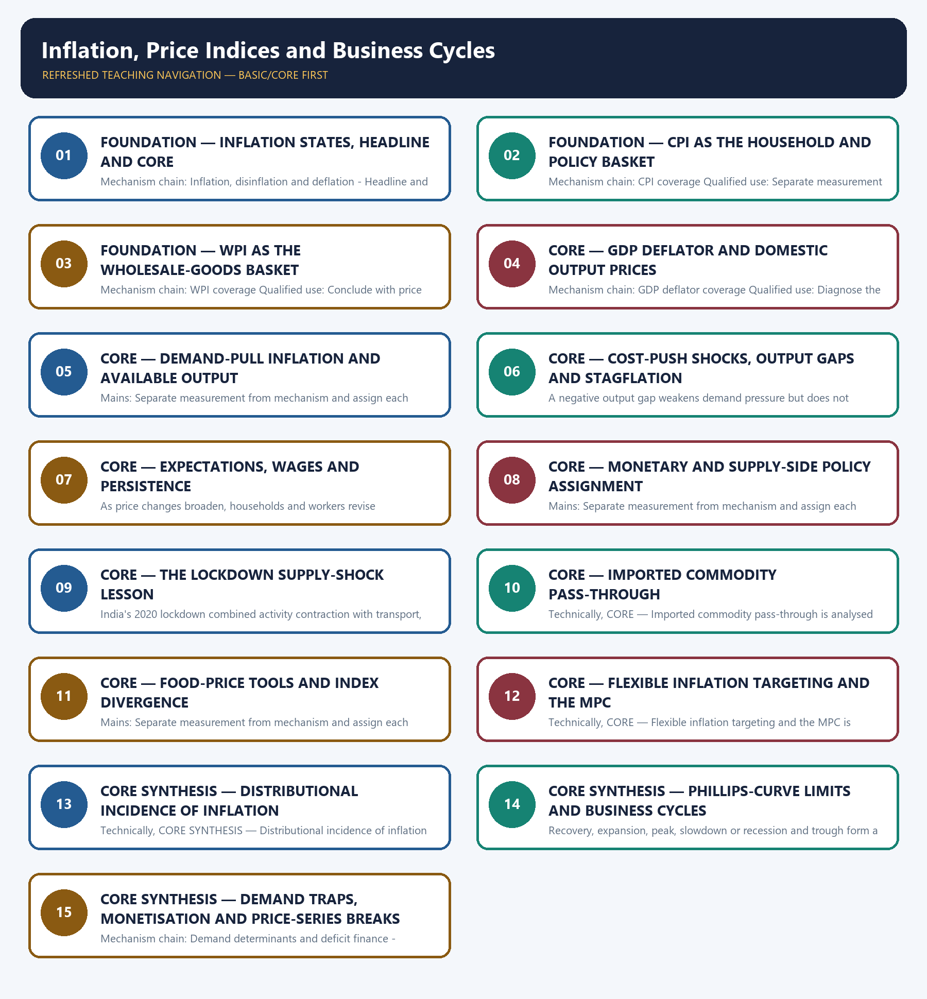

# Inflation, Price Indices and Business Cycles — Learner-v2 Complete Learning Session

> **Authoring-only generation:** 2026-09-03. No PDF was rendered and no tracker or index was mutated.

### SOURCE, PROGRESSION AND CURRENT-LINKAGE AUDIT

- **Generation date:** 2026-09-03.
- **Repository-first evidence:** the Basic owner is taught first and preserved in full; the Advanced owner is retained only in the optional final teaching block.
- **OCR evidence:** Repository Markdown was primary. OCR-searchable local official General Studies papers were used only to confirm printed routed demands. No answer key, marking scheme, unsupported page precision or current macroeconomic statistic was inferred from them.
- **Qdrant:** not used; repository Markdown and available OCR context were sufficient.
- **PYQ integrity:** The audited ledgers route 2019 GS-III on growth with low inflation, 2022 GS-II on managing inflation and unemployment beyond welfare schemes, and 2024 GS-III on food inflation and RBI effectiveness here. Objective routes on CPI-WPI, demand determinants, deficit monetisation and demand-pull inflation remain unkeyed in this package.
- **Live-link boundary:** The live CPI metadata attempt returned only a shell and no WPI text was independently retrieved. The package therefore uses no fresh inflation number and preserves only the owners' dated CPI 2024=100 and WPI 2022-23-base series-boundary statements.
- **Fact/inference discipline:** no current-affairs item, PYQ wording, figure or quotation is invented.

### LIVE OFFICIAL-SOURCE ATTEMPT LOG

The checks below were made on 2026-09-03. Substantive official text is used only for the proposition it actually supports; binary files, dynamic shells, stubs and undated dashboard snippets are recorded but not converted into current claims.

- https://esankhyiki.mospi.gov.in/macroindicators?product=cpi&tab=metadata — attempted 2026-09-03; only the Ministry title shell was returned, so no basket weight, index level or inflation rate was taken from it.
- https://eaindustry.nic.in/uploaded_files/wpi/WPI_Users_Note.pdf — not used as a live factual source because no substantive text was independently retrieved in this run; the repository owner's audited series note was preserved unchanged.

## BASIC LEARNING SESSION

### DEEP-REVIEW LEARNING CONTRACT

| Control | Binding rule for this package |
|---|---|
| Syllabus boundary | Complete Economy Basic/Core is answer-complete before optional Advanced depth. |
| Formula boundary | Formula, numerator, denominator, unit, stock/flow, nominal/real, base year, level/rate and accounting identity are explicit. |
| Institutional boundary | Constitution, statute, delegated rule, regulator mandate, policy, recommendation, scheme and implementation outcome remain distinct. |
| Transmission method | Shock or instrument → prices/quantities/balance sheets/incentives → institution and market response → output, employment, distribution, stability and external effect → lag and trade-off. |
| Current-data method | Source → release date → reference period → unit/denominator → provisional/revised/final status; incompatible Budget, Survey or statistical vintages are never mixed. |
| Programme-status method | Announced → approved → notified/guidelines issued → funded → operational → utilised → output → outcome are separate stages. |
| External/WTO method | Agreement text, member category, box, limit, notification, consultation, dispute and ruling are qualified without invented thresholds. |
| Causal method | Accounting identity, chronology and correlation are not promoted into behavioural or causal claims without mechanism, counterfactual and alternatives. |
| Answer balance | Model answers balance growth, distribution, stability, sustainability and federal dimensions with India-centric evidence. |
| Practice contract | Every solved item has demand decoding, a detailed examiner-grade model, executable timed/compression plan, marks rationale and answer-specific improvement. |
| Approval | This immutable successor remains `approved: false` pending explicit approval. |

**Canonical Basic/Core owner:** `upsc-ai-kit\knowledge\Economy\basic\03_Inflation-Price-Indices-and-Business-Cycles.md`  
**Substantive canonical provenance owner:** `upsc-ai-kit\knowledge\Economy\03_Inflation-Price-Indices-and-Business-Cycles_Learner-V2-Complete-Topic-Package.md`  
**Optional Advanced owner:** `upsc-ai-kit\knowledge\Economy\advanced\03_Inflation-Price-Indices-and-Business-Cycles.md`  
**Official syllabus mapping:** `upsc-ai-kit\knowledge\Economy\OFFICIAL-UPSC-SYLLABUS-MAPPING.md`

### EVIDENCE, PYQ AND CURRENT-STATUS CONTROL

- Every data-heavy table states unit, denominator, geography, reference period and source/status.
- GDP/GVA, gross/net, domestic/national, nominal/real and level/rate distinctions remain exact.
- Monetary, fiscal and external chains state intermediaries, balance-sheet channels, lags, leakages and trade-offs.
- Budget and Economic Survey editions are never mixed; BE, RE, Actual, advance/provisional/revised/final estimates remain labelled.
- Scheme and programme claims distinguish announcement, approval, notification, operation, coverage, utilisation and measured outcome.
- WTO boxes, limits, de minimis, special treatment, notifications and disputes are qualified from authoritative rules.
- PYQ wording is preserved only where verified; reconstructed or routed demands remain labelled.
- **Current-status note, rechecked 2026-09-03:** volatile rates, estimates, scheme status, trade rules and institutional claims retain official source, release date, reference period and revision status.

**Generation-local live/current sources:**
- `https://esankhyiki.mospi.gov.in/macroindicators?product=cpi&tab=metadata — attempted 2026-09-03; only the Ministry title shell was returned, so no basket weight, index level or inflation rate was taken from it.`
- `https://eaindustry.nic.in/uploaded_files/wpi/WPI_Users_Note.pdf — not used as a live factual source because no substantive text was independently retrieved in this run; the repository owner's audited series note was preserved unchanged.`




*Distinct embedded teaching-navigation image. The separate continuous Cārvāka-style flowchart package remains an independent at-a-glance artifact.*

### SESSION 1 — FOUNDATION — INFLATION STATES, HEADLINE AND CORE

#### DEFINITION / WHAT THIS IS CALLED

**Plain-language definition:** Headline CPI includes food and fuel, while core inflation conventionally excludes them; relative component movements mean core is not mechanically always below headline.

**Technical definition:** Mechanism chain: Inflation, disinflation and deflation - Headline and core inflation Qualified use: Diagnose the source, breadth, persistence and expectations channel before prescribing policy.

#### ANSWER-GRABBING OPENING — WRITE/ADAPT IN THE EXAM

> Headline CPI includes food and fuel, while core inflation conventionally excludes them; relative component movements mean core is not mechanically always below headline.

#### MUST-WRITE KEYWORDS

- **FOUNDATION**
- **Inflation states**
- **headline**
- **Mechanism chain**
- **Qualified use**
- **Inflation**

**How to use them:** Frame the answer through FOUNDATION; define Inflation states, connect headline with Mechanism chain to explain the mechanism, and use Qualified use for the decisive comparison or qualification.

#### VISUAL FIRST

```text
INFLATION STATES, HEADLINE AND CORE
01. Inflation, disinflation and deflation
    |
    v
02. Headline and core inflation
BOUNDARY -> Do not say disinflation means prices are falling.
```

*This topic-specific rail fixes the evidence sequence and its exam boundary before analysis.*

#### CORE EXPLANATION

Inflation is a sustained rise in the general price level, disinflation is a fall in the inflation rate while prices may still rise, and deflation is a sustained fall in the general price level. Headline CPI includes food and fuel, while core inflation conventionally excludes them; relative component movements mean core is not mechanically always below headline.

#### NAMED EVIDENCE AND MECHANISM

- Inflation is a sustained rise in the general price level, disinflation is a fall in the inflation rate while prices may still rise, and deflation is a sustained fall in the general price level.
- Headline CPI includes food and fuel, while core inflation conventionally excludes them; relative component movements mean core is not mechanically always below headline.

#### EXAMINER CAUTION

- Do not say disinflation means prices are falling.

#### EXAM LINK

- **Prelims:** Preserve the exact formula, territorial or resident boundary, price basis, base year, index basket, eligible counterparty, institution and legal status; never upgrade a projection into an actual or a regulatory direction into a universal rule.
- **Mains:** Diagnose the source, breadth, persistence and expectations channel before prescribing policy.

#### MINI RECAP

- **Mechanism chain:** Inflation, disinflation and deflation -> Headline and core inflation
- **Qualified use:** Diagnose the source, breadth, persistence and expectations channel before prescribing policy.

#### CLOSING RECALL FLOW — FOUNDATION — INFLATION STATES, HEADLINE AND CORE

```text
START / CONCEPT: FOUNDATION — Inflation states, headline and core
        |
        v
EXACT TERMS: FOUNDATION · Inflation states · headline · Mechanism chain · Qualified use · Inflation
        |
        v
MECHANISM / ARGUMENT: Mechanism chain: Inflation, disinflation and deflation - Headline and core inflation Qualified use: Diagnose the source, breadth, persistence and expectations channel before prescribing policy.
        |
        v
CONSEQUENCE / CONTRAST: Inflation is a sustained rise in the general price level, disinflation is a fall in the inflation rate while prices may still rise, and deflation is a sustained fall in the general price level.
        |
        v
UPSC TRAP / ANSWER-USE: Do not say disinflation means prices are falling.
        |
        v
ANSWER-GRABBING FORMULATION: Headline CPI includes food and fuel, while core inflation conventionally excludes them; relative component movements mean core is not mechanically always below headline.
```
### SESSION 2 — FOUNDATION — CPI AS THE HOUSEHOLD AND POLICY BASKET

#### DEFINITION / WHAT THIS IS CALLED

**Plain-language definition:** CPI is a retail consumer basket that includes services and has a larger food component than WPI; headline CPI is India's formal inflation-targeting nominal anchor.

**Technical definition:** Mechanism chain: CPI coverage Qualified use: Separate measurement from mechanism and assign each policy tool to the shock it can influence.

#### ANSWER-GRABBING OPENING — WRITE/ADAPT IN THE EXAM

> CPI is a retail consumer basket that includes services and has a larger food component than WPI; headline CPI is India's formal inflation-targeting nominal anchor.

#### MUST-WRITE KEYWORDS

- **FOUNDATION**
- **CPI as the household**
- **policy basket**
- **Mechanism chain**
- **Qualified use**
- **CPI**

**How to use them:** Frame the answer through FOUNDATION; define CPI as the household, connect policy basket with Mechanism chain to explain the mechanism, and use Qualified use for the decisive comparison or qualification.

#### VISUAL FIRST

```text
CPI AS THE HOUSEHOLD AND POLICY BASKET
01. CPI coverage
BOUNDARY -> Do not use WPI as a household cost-of-living index.
```

*This topic-specific rail fixes the evidence sequence and its exam boundary before analysis.*

#### CORE EXPLANATION

CPI is a retail consumer basket that includes services and has a larger food component than WPI; headline CPI is India's formal inflation-targeting nominal anchor.

#### NAMED EVIDENCE AND MECHANISM

- CPI is a retail consumer basket that includes services and has a larger food component than WPI; headline CPI is India's formal inflation-targeting nominal anchor.

#### EXAMINER CAUTION

- Do not use WPI as a household cost-of-living index.

#### EXAM LINK

- **Prelims:** Preserve the exact formula, territorial or resident boundary, price basis, base year, index basket, eligible counterparty, institution and legal status; never upgrade a projection into an actual or a regulatory direction into a universal rule.
- **Mains:** Separate measurement from mechanism and assign each policy tool to the shock it can influence.

#### MINI RECAP

- **Mechanism chain:** CPI coverage
- **Qualified use:** Separate measurement from mechanism and assign each policy tool to the shock it can influence.

#### CLOSING RECALL FLOW — FOUNDATION — CPI AS THE HOUSEHOLD AND POLICY BASKET

```text
START / CONCEPT: FOUNDATION — CPI as the household and policy basket
        |
        v
EXACT TERMS: FOUNDATION · CPI as the household · policy basket · Mechanism chain · Qualified use · CPI
        |
        v
MECHANISM / ARGUMENT: Mechanism chain: CPI coverage Qualified use: Separate measurement from mechanism and assign each policy tool to the shock it can influence.
        |
        v
CONSEQUENCE / CONTRAST: Do not use WPI as a household cost-of-living index.
        |
        v
UPSC TRAP / ANSWER-USE: Do not miss this limiting distinction: separate measurement from mechanism and assign each policy tool to the shock it can...
        |
        v
ANSWER-GRABBING FORMULATION: CPI is a retail consumer basket that includes services and has a larger food component than WPI; headline CPI is India's formal inflation-targeting nominal anchor.
```
### SESSION 3 — FOUNDATION — WPI AS THE WHOLESALE-GOODS BASKET

#### DEFINITION / WHAT THIS IS CALLED

**Plain-language definition:** WPI is a wholesale-goods price index compiled by the Office of the Economic Adviser, excludes services and is not a household cost-of-living measure.

**Technical definition:** Mechanism chain: WPI coverage Qualified use: Conclude with price stability as protection for real income without ignoring growth and producer incentives.

#### ANSWER-GRABBING OPENING — WRITE/ADAPT IN THE EXAM

> WPI is a wholesale-goods price index compiled by the Office of the Economic Adviser, excludes services and is not a household cost-of-living measure.

#### MUST-WRITE KEYWORDS

- **FOUNDATION**
- **WPI as the wholesale-goods basket**
- **Mechanism chain**
- **Qualified use**
- **WPI**
- **Office**

**How to use them:** Frame the answer through FOUNDATION; define WPI as the wholesale-goods basket, connect Mechanism chain with Qualified use to explain the mechanism, and use WPI for the decisive comparison or qualification.

#### VISUAL FIRST

```text
WPI AS THE WHOLESALE-GOODS BASKET
01. WPI coverage
BOUNDARY -> Do not assume core inflation is always below headline inflation.
```

*This topic-specific rail fixes the evidence sequence and its exam boundary before analysis.*

#### CORE EXPLANATION

WPI is a wholesale-goods price index compiled by the Office of the Economic Adviser, excludes services and is not a household cost-of-living measure.

#### NAMED EVIDENCE AND MECHANISM

- WPI is a wholesale-goods price index compiled by the Office of the Economic Adviser, excludes services and is not a household cost-of-living measure.

#### EXAMINER CAUTION

- Do not assume core inflation is always below headline inflation.

#### EXAM LINK

- **Prelims:** Preserve the exact formula, territorial or resident boundary, price basis, base year, index basket, eligible counterparty, institution and legal status; never upgrade a projection into an actual or a regulatory direction into a universal rule.
- **Mains:** Conclude with price stability as protection for real income without ignoring growth and producer incentives.

#### MINI RECAP

- **Mechanism chain:** WPI coverage
- **Qualified use:** Conclude with price stability as protection for real income without ignoring growth and producer incentives.

#### CLOSING RECALL FLOW — FOUNDATION — WPI AS THE WHOLESALE-GOODS BASKET

```text
START / CONCEPT: FOUNDATION — WPI as the wholesale-goods basket
        |
        v
EXACT TERMS: FOUNDATION · WPI as the wholesale-goods basket · Mechanism chain · Qualified use · WPI · Office
        |
        v
MECHANISM / ARGUMENT: Mechanism chain: WPI coverage Qualified use: Conclude with price stability as protection for real income without ignoring growth and producer incentives.
        |
        v
CONSEQUENCE / CONTRAST: Do not assume core inflation is always below headline inflation.
        |
        v
UPSC TRAP / ANSWER-USE: Do not miss this limiting distinction: wPI is a wholesale-goods price index compiled by the Office of the Economic Adviser...
        |
        v
ANSWER-GRABBING FORMULATION: WPI is a wholesale-goods price index compiled by the Office of the Economic Adviser, excludes services and is not a household cost-of-living measure.
```
### SESSION 4 — CORE — GDP DEFLATOR AND DOMESTIC OUTPUT PRICES

#### DEFINITION / WHAT THIS IS CALLED

**Plain-language definition:** The GDP deflator is derived from nominal and real national accounts and covers domestically produced final goods and services; it is broader but less suited to monthly retail-inflation management.

**Technical definition:** Mechanism chain: GDP deflator coverage Qualified use: Diagnose the source, breadth, persistence and expectations channel before prescribing policy.

#### ANSWER-GRABBING OPENING — WRITE/ADAPT IN THE EXAM

> The GDP deflator is derived from nominal and real national accounts and covers domestically produced final goods and services; it is broader but less suited to monthly retail-inflation management.

#### MUST-WRITE KEYWORDS

- **GDP deflator**
- **domestic output prices**
- **Mechanism chain**
- **Qualified use**
- **The GDP deflator**
- **The GDP**

**How to use them:** Frame the answer through GDP deflator; define domestic output prices, connect Mechanism chain with Qualified use to explain the mechanism, and use The GDP deflator for the decisive comparison or qualification.

#### VISUAL FIRST

```text
GDP DEFLATOR AND DOMESTIC OUTPUT PRICES
01. GDP deflator coverage
BOUNDARY -> Do not prescribe repo action as if it could produce vegetables or repair logistics.
```

*This topic-specific rail fixes the evidence sequence and its exam boundary before analysis.*

#### CORE EXPLANATION

The GDP deflator is derived from nominal and real national accounts and covers domestically produced final goods and services; it is broader but less suited to monthly retail-inflation management.

#### NAMED EVIDENCE AND MECHANISM

- The GDP deflator is derived from nominal and real national accounts and covers domestically produced final goods and services; it is broader but less suited to monthly retail-inflation management.

#### EXAMINER CAUTION

- Do not prescribe repo action as if it could produce vegetables or repair logistics.

#### EXAM LINK

- **Prelims:** Preserve the exact formula, territorial or resident boundary, price basis, base year, index basket, eligible counterparty, institution and legal status; never upgrade a projection into an actual or a regulatory direction into a universal rule.
- **Mains:** Diagnose the source, breadth, persistence and expectations channel before prescribing policy.

#### MINI RECAP

- **Mechanism chain:** GDP deflator coverage
- **Qualified use:** Diagnose the source, breadth, persistence and expectations channel before prescribing policy.

#### CLOSING RECALL FLOW — CORE — GDP DEFLATOR AND DOMESTIC OUTPUT PRICES

```text
START / CONCEPT: CORE — GDP deflator and domestic output prices
        |
        v
EXACT TERMS: GDP deflator · domestic output prices · Mechanism chain · Qualified use · The GDP deflator · The GDP
        |
        v
MECHANISM / ARGUMENT: Mechanism chain: GDP deflator coverage Qualified use: Diagnose the source, breadth, persistence and expectations channel before prescribing policy.
        |
        v
CONSEQUENCE / CONTRAST: Do not prescribe repo action as if it could produce vegetables or repair logistics.
        |
        v
UPSC TRAP / ANSWER-USE: Do not miss this limiting distinction: the GDP deflator is derived from nominal and real national accounts and covers domestically...
        |
        v
ANSWER-GRABBING FORMULATION: The GDP deflator is derived from nominal and real national accounts and covers domestically produced final goods and services; it is broader but less suited to monthly retail-inflation management.
```
### SESSION 5 — CORE — DEMAND-PULL INFLATION AND AVAILABLE OUTPUT

#### DEFINITION / WHAT THIS IS CALLED

**Plain-language definition:** Mechanism chain: Demand-pull inflation Qualified use: Separate measurement from mechanism and assign each policy tool to the shock it can influence.

**Technical definition:** Mains: Separate measurement from mechanism and assign each policy tool to the shock it can influence.

#### ANSWER-GRABBING OPENING — WRITE/ADAPT IN THE EXAM

> Mechanism chain: Demand-pull inflation Qualified use: Separate measurement from mechanism and assign each policy tool to the shock it can influence.

#### MUST-WRITE KEYWORDS

- **Demand-pull inflation**
- **available output**
- **Mechanism chain**
- **Qualified use**
- **Separate**
- **Demand-pull**

**How to use them:** Frame the answer through Demand-pull inflation; define available output, connect Mechanism chain with Qualified use to explain the mechanism, and use Separate for the decisive comparison or qualification.

#### VISUAL FIRST

```text
DEMAND-PULL INFLATION AND AVAILABLE OUTPUT
01. Demand-pull inflation
BOUNDARY -> Do not treat a single commodity price rise as general inflation without breadth and persistence.
```

*This topic-specific rail fixes the evidence sequence and its exam boundary before analysis.*

#### CORE EXPLANATION

Demand-pull inflation arises when aggregate spending grows faster than available output, especially as the positive output gap narrows spare capacity.

#### NAMED EVIDENCE AND MECHANISM

- Demand-pull inflation arises when aggregate spending grows faster than available output, especially as the positive output gap narrows spare capacity.

#### EXAMINER CAUTION

- Do not treat a single commodity price rise as general inflation without breadth and persistence.

#### EXAM LINK

- **Prelims:** Preserve the exact formula, territorial or resident boundary, price basis, base year, index basket, eligible counterparty, institution and legal status; never upgrade a projection into an actual or a regulatory direction into a universal rule.
- **Mains:** Separate measurement from mechanism and assign each policy tool to the shock it can influence.

#### MINI RECAP

- **Mechanism chain:** Demand-pull inflation
- **Qualified use:** Separate measurement from mechanism and assign each policy tool to the shock it can influence.

#### CLOSING RECALL FLOW — CORE — DEMAND-PULL INFLATION AND AVAILABLE OUTPUT

```text
START / CONCEPT: CORE — Demand-pull inflation and available output
        |
        v
EXACT TERMS: Demand-pull inflation · available output · Mechanism chain · Qualified use · Separate · Demand-pull
        |
        v
MECHANISM / ARGUMENT: Mains: Separate measurement from mechanism and assign each policy tool to the shock it can influence.
        |
        v
CONSEQUENCE / CONTRAST: Do not treat a single commodity price rise as general inflation without breadth and persistence.
        |
        v
UPSC TRAP / ANSWER-USE: Do not miss this limiting distinction: separate measurement from mechanism and assign each policy tool to the shock it can...
        |
        v
ANSWER-GRABBING FORMULATION: Mechanism chain: Demand-pull inflation Qualified use: Separate measurement from mechanism and assign each policy tool to the shock it can influence.
```
### SESSION 6 — CORE — COST-PUSH SHOCKS, OUTPUT GAPS AND STAGFLATION

#### DEFINITION / WHAT THIS IS CALLED

**Plain-language definition:** Mechanism chain: Cost-push and supply inflation - Output gap and stagflation Qualified use: Conclude with price stability as protection for real income without ignoring growth and producer incentives.

**Technical definition:** A negative output gap weakens demand pressure but does not prevent supply-shock inflation; stagflation combines inflation with weak growth or high unemployment.

#### ANSWER-GRABBING OPENING — WRITE/ADAPT IN THE EXAM

> A negative output gap weakens demand pressure but does not prevent supply-shock inflation; stagflation combines inflation with weak growth or high unemployment.

#### MUST-WRITE KEYWORDS

- **Cost-push shocks**
- **output gaps**
- **stagflation**
- **Mechanism chain**
- **Qualified use**
- **Cost-push**

**How to use them:** Frame the answer through Cost-push shocks; define output gaps, connect stagflation with Mechanism chain to explain the mechanism, and use Qualified use for the decisive comparison or qualification.

#### VISUAL FIRST

```text
COST-PUSH SHOCKS, OUTPUT GAPS AND STAGFLATION
01. Cost-push and supply inflation
    |
    v
02. Output gap and stagflation
BOUNDARY -> Do not treat a base effect or index rebasing as a new price shock.
```

*This topic-specific rail fixes the evidence sequence and its exam boundary before analysis.*

#### CORE EXPLANATION

Cost-push inflation arises from input costs or supply constraints, so crop failure, logistics disruption or imported commodity scarcity can raise prices even with weak demand. A negative output gap weakens demand pressure but does not prevent supply-shock inflation; stagflation combines inflation with weak growth or high unemployment.

#### NAMED EVIDENCE AND MECHANISM

- Cost-push inflation arises from input costs or supply constraints, so crop failure, logistics disruption or imported commodity scarcity can raise prices even with weak demand.
- A negative output gap weakens demand pressure but does not prevent supply-shock inflation; stagflation combines inflation with weak growth or high unemployment.

#### EXAMINER CAUTION

- Do not treat a base effect or index rebasing as a new price shock.

#### EXAM LINK

- **Prelims:** Preserve the exact formula, territorial or resident boundary, price basis, base year, index basket, eligible counterparty, institution and legal status; never upgrade a projection into an actual or a regulatory direction into a universal rule.
- **Mains:** Conclude with price stability as protection for real income without ignoring growth and producer incentives.

#### MINI RECAP

- **Mechanism chain:** Cost-push and supply inflation -> Output gap and stagflation
- **Qualified use:** Conclude with price stability as protection for real income without ignoring growth and producer incentives.

#### CLOSING RECALL FLOW — CORE — COST-PUSH SHOCKS, OUTPUT GAPS AND STAGFLATION

```text
START / CONCEPT: CORE — Cost-push shocks, output gaps and stagflation
        |
        v
EXACT TERMS: Cost-push shocks · output gaps · stagflation · Mechanism chain · Qualified use · Cost-push
        |
        v
MECHANISM / ARGUMENT: Mechanism chain: Cost-push and supply inflation - Output gap and stagflation Qualified use: Conclude with price stability as protection for real income without ignoring growth and producer incentives.
        |
        v
CONSEQUENCE / CONTRAST: Do not treat a base effect or index rebasing as a new price shock.
        |
        v
UPSC TRAP / ANSWER-USE: Do not miss this limiting distinction: cost-push inflation arises from input costs or supply constraints, so crop failure, logistics disruption...
        |
        v
ANSWER-GRABBING FORMULATION: A negative output gap weakens demand pressure but does not prevent supply-shock inflation; stagflation combines inflation with weak growth or high unemployment.
```
### SESSION 7 — CORE — EXPECTATIONS, WAGES AND PERSISTENCE

#### DEFINITION / WHAT THIS IS CALLED

**Plain-language definition:** Mechanism chain: Expectations and persistence Qualified use: Diagnose the source, breadth, persistence and expectations channel before prescribing policy.

**Technical definition:** As price changes broaden, households and workers revise consumption, wage demands and expectations, which can make an initially temporary shock more persistent.

#### ANSWER-GRABBING OPENING — WRITE/ADAPT IN THE EXAM

> Mechanism chain: Expectations and persistence Qualified use: Diagnose the source, breadth, persistence and expectations channel before prescribing policy.

#### MUST-WRITE KEYWORDS

- **Expectations**
- **wages**
- **persistence**
- **Mechanism chain**
- **Qualified use**
- **As**

**How to use them:** Frame the answer through Expectations; define wages, connect persistence with Mechanism chain to explain the mechanism, and use Qualified use for the decisive comparison or qualification.

#### VISUAL FIRST

```text
EXPECTATIONS, WAGES AND PERSISTENCE
01. Expectations and persistence
BOUNDARY -> Do not join CPI or WPI levels across base-year breaks without an official link.
```

*This topic-specific rail fixes the evidence sequence and its exam boundary before analysis.*

#### CORE EXPLANATION

As price changes broaden, households and workers revise consumption, wage demands and expectations, which can make an initially temporary shock more persistent.

#### NAMED EVIDENCE AND MECHANISM

- As price changes broaden, households and workers revise consumption, wage demands and expectations, which can make an initially temporary shock more persistent.

#### EXAMINER CAUTION

- Do not join CPI or WPI levels across base-year breaks without an official link.

#### EXAM LINK

- **Prelims:** Preserve the exact formula, territorial or resident boundary, price basis, base year, index basket, eligible counterparty, institution and legal status; never upgrade a projection into an actual or a regulatory direction into a universal rule.
- **Mains:** Diagnose the source, breadth, persistence and expectations channel before prescribing policy.

#### MINI RECAP

- **Mechanism chain:** Expectations and persistence
- **Qualified use:** Diagnose the source, breadth, persistence and expectations channel before prescribing policy.

#### CLOSING RECALL FLOW — CORE — EXPECTATIONS, WAGES AND PERSISTENCE

```text
START / CONCEPT: CORE — Expectations, wages and persistence
        |
        v
EXACT TERMS: Expectations · wages · persistence · Mechanism chain · Qualified use · As
        |
        v
MECHANISM / ARGUMENT: As price changes broaden, households and workers revise consumption, wage demands and expectations, which can make an initially temporary shock more persistent.
        |
        v
CONSEQUENCE / CONTRAST: Do not join CPI or WPI levels across base-year breaks without an official link.
        |
        v
UPSC TRAP / ANSWER-USE: Do not miss this limiting distinction: diagnose the source, breadth, persistence and expectations channel before prescribing policy.
        |
        v
ANSWER-GRABBING FORMULATION: Mechanism chain: Expectations and persistence Qualified use: Diagnose the source, breadth, persistence and expectations channel before prescribing policy.
```
### SESSION 8 — CORE — MONETARY AND SUPPLY-SIDE POLICY ASSIGNMENT

#### DEFINITION / WHAT THIS IS CALLED

**Plain-language definition:** Mechanism chain: Policy assignment Qualified use: Separate measurement from mechanism and assign each policy tool to the shock it can influence.

**Technical definition:** Mains: Separate measurement from mechanism and assign each policy tool to the shock it can influence.

#### ANSWER-GRABBING OPENING — WRITE/ADAPT IN THE EXAM

> Mechanism chain: Policy assignment Qualified use: Separate measurement from mechanism and assign each policy tool to the shock it can influence.

#### MUST-WRITE KEYWORDS

- **Monetary**
- **supply-side policy assignment**
- **Mechanism chain**
- **Qualified use**
- **RBI**
- **MPC**

**How to use them:** Frame the answer through Monetary; define supply-side policy assignment, connect Mechanism chain with Qualified use to explain the mechanism, and use RBI for the decisive comparison or qualification.

#### VISUAL FIRST

```text
MONETARY AND SUPPLY-SIDE POLICY ASSIGNMENT
01. Policy assignment
BOUNDARY -> Do not assume a negative output gap eliminates supply inflation.
```

*This topic-specific rail fixes the evidence sequence and its exam boundary before analysis.*

#### CORE EXPLANATION

RBI and the MPC manage demand and expectations through rates, liquidity and communication, while governments use buffers, taxes, trade, logistics and anti-hoarding tools against physical supply shocks.

#### NAMED EVIDENCE AND MECHANISM

- RBI and the MPC manage demand and expectations through rates, liquidity and communication, while governments use buffers, taxes, trade, logistics and anti-hoarding tools against physical supply shocks.

#### EXAMINER CAUTION

- Do not assume a negative output gap eliminates supply inflation.

#### EXAM LINK

- **Prelims:** Preserve the exact formula, territorial or resident boundary, price basis, base year, index basket, eligible counterparty, institution and legal status; never upgrade a projection into an actual or a regulatory direction into a universal rule.
- **Mains:** Separate measurement from mechanism and assign each policy tool to the shock it can influence.

#### MINI RECAP

- **Mechanism chain:** Policy assignment
- **Qualified use:** Separate measurement from mechanism and assign each policy tool to the shock it can influence.

#### CLOSING RECALL FLOW — CORE — MONETARY AND SUPPLY-SIDE POLICY ASSIGNMENT

```text
START / CONCEPT: CORE — Monetary and supply-side policy assignment
        |
        v
EXACT TERMS: Monetary · supply-side policy assignment · Mechanism chain · Qualified use · RBI · MPC
        |
        v
MECHANISM / ARGUMENT: Mains: Separate measurement from mechanism and assign each policy tool to the shock it can influence.
        |
        v
CONSEQUENCE / CONTRAST: RBI and the MPC manage demand and expectations through rates, liquidity and communication, while governments use buffers, taxes, trade, logistics and anti-hoarding tools against physical supply shocks.
        |
        v
UPSC TRAP / ANSWER-USE: Do not assume a negative output gap eliminates supply inflation.
        |
        v
ANSWER-GRABBING FORMULATION: Mechanism chain: Policy assignment Qualified use: Separate measurement from mechanism and assign each policy tool to the shock it can influence.
```
### SESSION 9 — CORE — THE LOCKDOWN SUPPLY-SHOCK LESSON

#### DEFINITION / WHAT THIS IS CALLED

**Plain-language definition:** Mechanism chain: Lockdown supply shock Qualified use: Conclude with price stability as protection for real income without ignoring growth and producer incentives.

**Technical definition:** India's 2020 lockdown combined activity contraction with transport, mandi and logistics disruption, illustrating why a negative output gap does not guarantee low headline inflation.

#### ANSWER-GRABBING OPENING — WRITE/ADAPT IN THE EXAM

> India's 2020 lockdown combined activity contraction with transport, mandi and logistics disruption, illustrating why a negative output gap does not guarantee low headline inflation.

#### MUST-WRITE KEYWORDS

- **The lockdown supply-shock lesson**
- **Mechanism chain**
- **Qualified use**
- **India's**
- **Phillips**
- **Lockdown**

**How to use them:** Frame the answer through The lockdown supply-shock lesson; define Mechanism chain, connect Qualified use with India's to explain the mechanism, and use Phillips for the decisive comparison or qualification.

#### VISUAL FIRST

```text
THE LOCKDOWN SUPPLY-SHOCK LESSON
01. Lockdown supply shock
BOUNDARY -> Do not treat the Phillips curve as a stable mechanical trade-off under supply shocks.
```

*This topic-specific rail fixes the evidence sequence and its exam boundary before analysis.*

#### CORE EXPLANATION

India's 2020 lockdown combined activity contraction with transport, mandi and logistics disruption, illustrating why a negative output gap does not guarantee low headline inflation.

#### NAMED EVIDENCE AND MECHANISM

- India's 2020 lockdown combined activity contraction with transport, mandi and logistics disruption, illustrating why a negative output gap does not guarantee low headline inflation.

#### EXAMINER CAUTION

- Do not treat the Phillips curve as a stable mechanical trade-off under supply shocks.

#### EXAM LINK

- **Prelims:** Preserve the exact formula, territorial or resident boundary, price basis, base year, index basket, eligible counterparty, institution and legal status; never upgrade a projection into an actual or a regulatory direction into a universal rule.
- **Mains:** Conclude with price stability as protection for real income without ignoring growth and producer incentives.

#### MINI RECAP

- **Mechanism chain:** Lockdown supply shock
- **Qualified use:** Conclude with price stability as protection for real income without ignoring growth and producer incentives.

#### CLOSING RECALL FLOW — CORE — THE LOCKDOWN SUPPLY-SHOCK LESSON

```text
START / CONCEPT: CORE — The lockdown supply-shock lesson
        |
        v
EXACT TERMS: The lockdown supply-shock lesson · Mechanism chain · Qualified use · India's · Phillips · Lockdown
        |
        v
MECHANISM / ARGUMENT: Mechanism chain: Lockdown supply shock Qualified use: Conclude with price stability as protection for real income without ignoring growth and producer incentives.
        |
        v
CONSEQUENCE / CONTRAST: Do not treat the Phillips curve as a stable mechanical trade-off under supply shocks.
        |
        v
UPSC TRAP / ANSWER-USE: Do not miss this limiting distinction: india's 2020 lockdown combined activity contraction with transport, mandi and logistics disruption, illustrating why...
        |
        v
ANSWER-GRABBING FORMULATION: India's 2020 lockdown combined activity contraction with transport, mandi and logistics disruption, illustrating why a negative output gap does not guarantee low headline inflation.
```
### SESSION 10 — CORE — IMPORTED COMMODITY PASS-THROUGH

#### DEFINITION / WHAT THIS IS CALLED

**Plain-language definition:** Mechanism chain: Imported commodity pass-through Qualified use: Diagnose the source, breadth, persistence and expectations channel before prescribing policy.

**Technical definition:** Technically, CORE — Imported commodity pass-through is analysed by relating Imported commodity pass-through to Mechanism chain, then testing the relationship through Qualified use and Imported.

#### ANSWER-GRABBING OPENING — WRITE/ADAPT IN THE EXAM

> Mechanism chain: Imported commodity pass-through Qualified use: Diagnose the source, breadth, persistence and expectations channel before prescribing policy.

#### MUST-WRITE KEYWORDS

- **Imported commodity pass-through**
- **Mechanism chain**
- **Qualified use**
- **Imported**
- **Qualified**
- **2021-22**

**How to use them:** Frame the answer through Imported commodity pass-through; define Mechanism chain, connect Qualified use with Imported to explain the mechanism, and use Qualified for the decisive comparison or qualification.

#### VISUAL FIRST

```text
IMPORTED COMMODITY PASS-THROUGH
01. Imported commodity pass-through
BOUNDARY -> Do not ignore producer incentives when using export restrictions or price suppression.
```

*This topic-specific rail fixes the evidence sequence and its exam boundary before analysis.*

#### CORE EXPLANATION

The 2021-22 commodity surge and Russia-Ukraine war raised crude, edible-oil and fertiliser costs, with pass-through shaped by taxes, subsidies, exchange rates and buffers.

#### NAMED EVIDENCE AND MECHANISM

- The 2021-22 commodity surge and Russia-Ukraine war raised crude, edible-oil and fertiliser costs, with pass-through shaped by taxes, subsidies, exchange rates and buffers.

#### EXAMINER CAUTION

- Do not ignore producer incentives when using export restrictions or price suppression.

#### EXAM LINK

- **Prelims:** Preserve the exact formula, territorial or resident boundary, price basis, base year, index basket, eligible counterparty, institution and legal status; never upgrade a projection into an actual or a regulatory direction into a universal rule.
- **Mains:** Diagnose the source, breadth, persistence and expectations channel before prescribing policy.

#### MINI RECAP

- **Mechanism chain:** Imported commodity pass-through
- **Qualified use:** Diagnose the source, breadth, persistence and expectations channel before prescribing policy.

#### CLOSING RECALL FLOW — CORE — IMPORTED COMMODITY PASS-THROUGH

```text
START / CONCEPT: CORE — Imported commodity pass-through
        |
        v
EXACT TERMS: Imported commodity pass-through · Mechanism chain · Qualified use · Imported · Qualified · 2021-22
        |
        v
MECHANISM / ARGUMENT: Do not ignore producer incentives when using export restrictions or price suppression.
        |
        v
CONSEQUENCE / CONTRAST: The resulting consequence is that diagnose the source, breadth, persistence and expectations channel before prescribing policy.
        |
        v
UPSC TRAP / ANSWER-USE: Do not miss this limiting distinction: diagnose the source, breadth, persistence and expectations channel before prescribing policy.
        |
        v
ANSWER-GRABBING FORMULATION: Mechanism chain: Imported commodity pass-through Qualified use: Diagnose the source, breadth, persistence and expectations channel before prescribing policy.
```
### SESSION 11 — CORE — FOOD-PRICE TOOLS AND INDEX DIVERGENCE

#### DEFINITION / WHAT THIS IS CALLED

**Plain-language definition:** Mechanism chain: Food-price administration - Index divergence Qualified use: Separate measurement from mechanism and assign each policy tool to the shock it can influence.

**Technical definition:** Mains: Separate measurement from mechanism and assign each policy tool to the shock it can influence.

#### ANSWER-GRABBING OPENING — WRITE/ADAPT IN THE EXAM

> Mechanism chain: Food-price administration - Index divergence Qualified use: Separate measurement from mechanism and assign each policy tool to the shock it can influence.

#### MUST-WRITE KEYWORDS

- **Food-price tools**
- **index divergence**
- **Mechanism chain**
- **Qualified use**
- **Onion-price**
- **Price Stabilisation Fund**

**How to use them:** Frame the answer through Food-price tools; define index divergence, connect Mechanism chain with Qualified use to explain the mechanism, and use Onion-price for the decisive comparison or qualification.

#### VISUAL FIRST

```text
FOOD-PRICE TOOLS AND INDEX DIVERGENCE
01. Food-price administration
    |
    v
02. Index divergence
BOUNDARY -> Do not assess inflation only by the aggregate rate; distribution and components matter.
```

*This topic-specific rail fixes the evidence sequence and its exam boundary before analysis.*

#### CORE EXPLANATION

Onion-price episodes and Price Stabilisation Fund interventions show why perishables may need buffer, logistics and calibrated trade action rather than a repo-only response. CPI, WPI and the GDP deflator can diverge because household services, wholesale goods and domestically produced final output have different coverage and weights.

#### NAMED EVIDENCE AND MECHANISM

- Onion-price episodes and Price Stabilisation Fund interventions show why perishables may need buffer, logistics and calibrated trade action rather than a repo-only response.
- CPI, WPI and the GDP deflator can diverge because household services, wholesale goods and domestically produced final output have different coverage and weights.

#### EXAMINER CAUTION

- Do not assess inflation only by the aggregate rate; distribution and components matter.

#### EXAM LINK

- **Prelims:** Preserve the exact formula, territorial or resident boundary, price basis, base year, index basket, eligible counterparty, institution and legal status; never upgrade a projection into an actual or a regulatory direction into a universal rule.
- **Mains:** Separate measurement from mechanism and assign each policy tool to the shock it can influence.

#### MINI RECAP

- **Mechanism chain:** Food-price administration -> Index divergence
- **Qualified use:** Separate measurement from mechanism and assign each policy tool to the shock it can influence.

#### CLOSING RECALL FLOW — CORE — FOOD-PRICE TOOLS AND INDEX DIVERGENCE

```text
START / CONCEPT: CORE — Food-price tools and index divergence
        |
        v
EXACT TERMS: Food-price tools · index divergence · Mechanism chain · Qualified use · Onion-price · Price Stabilisation Fund
        |
        v
MECHANISM / ARGUMENT: Mains: Separate measurement from mechanism and assign each policy tool to the shock it can influence.
        |
        v
CONSEQUENCE / CONTRAST: Do not assess inflation only by the aggregate rate; distribution and components matter.
        |
        v
UPSC TRAP / ANSWER-USE: Onion-price episodes and Price Stabilisation Fund interventions show why perishables may need buffer, logistics and calibrated trade action rather than a repo-only response.
        |
        v
ANSWER-GRABBING FORMULATION: Mechanism chain: Food-price administration - Index divergence Qualified use: Separate measurement from mechanism and assign each policy tool to the shock it can influence.
```
### SESSION 12 — CORE — FLEXIBLE INFLATION TARGETING AND THE MPC

#### DEFINITION / WHAT THIS IS CALLED

**Plain-language definition:** Mechanism chain: Inflation targeting framework Qualified use: Conclude with price stability as protection for real income without ignoring growth and producer incentives.

**Technical definition:** Technically, CORE — Flexible inflation targeting and the MPC is analysed by relating Flexible inflation targeting to the MPC, then testing the relationship through Mechanism chain and Qualified use.

#### ANSWER-GRABBING OPENING — WRITE/ADAPT IN THE EXAM

> Mechanism chain: Inflation targeting framework Qualified use: Conclude with price stability as protection for real income without ignoring growth and producer incentives.

#### MUST-WRITE KEYWORDS

- **Flexible inflation targeting**
- **the MPC**
- **Mechanism chain**
- **Qualified use**
- **Survey-period**
- **Inflation**

**How to use them:** Frame the answer through Flexible inflation targeting; define the MPC, connect Mechanism chain with Qualified use to explain the mechanism, and use Survey-period for the decisive comparison or qualification.

#### VISUAL FIRST

```text
FLEXIBLE INFLATION TARGETING AND THE MPC
01. Inflation targeting framework
BOUNDARY -> Do not call a Survey-period projection or historical-series figure a current actual.
```

*This topic-specific rail fixes the evidence sequence and its exam boundary before analysis.*

#### CORE EXPLANATION

India's 2016 flexible inflation-targeting framework made headline CPI the formal nominal anchor and assigned the six-member MPC the collective repo-rate decision.

#### NAMED EVIDENCE AND MECHANISM

- India's 2016 flexible inflation-targeting framework made headline CPI the formal nominal anchor and assigned the six-member MPC the collective repo-rate decision.

#### EXAMINER CAUTION

- Do not call a Survey-period projection or historical-series figure a current actual.

#### EXAM LINK

- **Prelims:** Preserve the exact formula, territorial or resident boundary, price basis, base year, index basket, eligible counterparty, institution and legal status; never upgrade a projection into an actual or a regulatory direction into a universal rule.
- **Mains:** Conclude with price stability as protection for real income without ignoring growth and producer incentives.

#### MINI RECAP

- **Mechanism chain:** Inflation targeting framework
- **Qualified use:** Conclude with price stability as protection for real income without ignoring growth and producer incentives.

#### CLOSING RECALL FLOW — CORE — FLEXIBLE INFLATION TARGETING AND THE MPC

```text
START / CONCEPT: CORE — Flexible inflation targeting and the MPC
        |
        v
EXACT TERMS: Flexible inflation targeting · the MPC · Mechanism chain · Qualified use · Survey-period · Inflation
        |
        v
MECHANISM / ARGUMENT: Do not call a Survey-period projection or historical-series figure a current actual.
        |
        v
CONSEQUENCE / CONTRAST: The resulting consequence is that conclude with price stability as protection for real income without ignoring growth and producer...
        |
        v
UPSC TRAP / ANSWER-USE: Do not miss this limiting distinction: conclude with price stability as protection for real income without ignoring growth and producer...
        |
        v
ANSWER-GRABBING FORMULATION: Mechanism chain: Inflation targeting framework Qualified use: Conclude with price stability as protection for real income without ignoring growth and producer incentives.
```
### SESSION 13 — CORE SYNTHESIS — DISTRIBUTIONAL INCIDENCE OF INFLATION

#### DEFINITION / WHAT THIS IS CALLED

**Plain-language definition:** Mechanism chain: Distributional incidence Qualified use: Diagnose the source, breadth, persistence and expectations channel before prescribing policy.

**Technical definition:** Technically, CORE SYNTHESIS — Distributional incidence of inflation is analysed by relating CORE SYNTHESIS to Distributional incidence of inflation, then testing the relationship through Mechanism chain and Qualified use.

#### ANSWER-GRABBING OPENING — WRITE/ADAPT IN THE EXAM

> Mechanism chain: Distributional incidence Qualified use: Diagnose the source, breadth, persistence and expectations channel before prescribing policy.

#### MUST-WRITE KEYWORDS

- **CORE SYNTHESIS**
- **Distributional incidence of inflation**
- **Mechanism chain**
- **Qualified use**
- **Do not say disinflation**
- **Distributional**

**How to use them:** Frame the answer through CORE SYNTHESIS; define Distributional incidence of inflation, connect Mechanism chain with Qualified use to explain the mechanism, and use Do not say disinflation for the decisive comparison or qualification.

#### VISUAL FIRST

```text
DISTRIBUTIONAL INCIDENCE OF INFLATION
01. Distributional incidence
BOUNDARY -> Do not say disinflation means prices are falling.
```

*This topic-specific rail fixes the evidence sequence and its exam boundary before analysis.*

#### CORE EXPLANATION

Inflation harms poor and fixed-income households most because food and fuel occupy larger budget shares and indexation such as CPI-IW-linked dearness allowance protects organised workers unevenly.

#### NAMED EVIDENCE AND MECHANISM

- Inflation harms poor and fixed-income households most because food and fuel occupy larger budget shares and indexation such as CPI-IW-linked dearness allowance protects organised workers unevenly.

#### EXAMINER CAUTION

- Do not say disinflation means prices are falling.

#### EXAM LINK

- **Prelims:** Preserve the exact formula, territorial or resident boundary, price basis, base year, index basket, eligible counterparty, institution and legal status; never upgrade a projection into an actual or a regulatory direction into a universal rule.
- **Mains:** Diagnose the source, breadth, persistence and expectations channel before prescribing policy.

#### MINI RECAP

- **Mechanism chain:** Distributional incidence
- **Qualified use:** Diagnose the source, breadth, persistence and expectations channel before prescribing policy.

#### CLOSING RECALL FLOW — CORE SYNTHESIS — DISTRIBUTIONAL INCIDENCE OF INFLATION

```text
START / CONCEPT: CORE SYNTHESIS — Distributional incidence of inflation
        |
        v
EXACT TERMS: CORE SYNTHESIS · Distributional incidence of inflation · Mechanism chain · Qualified use · Do not say disinflation · Distributional
        |
        v
MECHANISM / ARGUMENT: Do not say disinflation means prices are falling.
        |
        v
CONSEQUENCE / CONTRAST: The resulting consequence is that diagnose the source, breadth, persistence and expectations channel before prescribing policy.
        |
        v
UPSC TRAP / ANSWER-USE: Do not miss this limiting distinction: diagnose the source, breadth, persistence and expectations channel before prescribing policy.
        |
        v
ANSWER-GRABBING FORMULATION: Mechanism chain: Distributional incidence Qualified use: Diagnose the source, breadth, persistence and expectations channel before prescribing policy.
```
### SESSION 14 — CORE SYNTHESIS — PHILLIPS-CURVE LIMITS AND BUSINESS CYCLES

#### DEFINITION / WHAT THIS IS CALLED

**Plain-language definition:** Mechanism chain: Phillips-curve limit - Business-cycle sequence Qualified use: Separate measurement from mechanism and assign each policy tool to the shock it can influence.

**Technical definition:** Recovery, expansion, peak, slowdown or recession and trough form a stylised business cycle, while potential output and the source of the shock determine the suitable policy response.

#### ANSWER-GRABBING OPENING — WRITE/ADAPT IN THE EXAM

> Recovery, expansion, peak, slowdown or recession and trough form a stylised business cycle, while potential output and the source of the shock determine the suitable policy response.

#### MUST-WRITE KEYWORDS

- **CORE SYNTHESIS**
- **Phillips-curve limits**
- **business cycles**
- **Mechanism chain**
- **Qualified use**
- **The short-run Phillips curve**

**How to use them:** Frame the answer through CORE SYNTHESIS; define Phillips-curve limits, connect business cycles with Mechanism chain to explain the mechanism, and use Qualified use for the decisive comparison or qualification.

#### VISUAL FIRST

```text
PHILLIPS-CURVE LIMITS AND BUSINESS CYCLES
01. Phillips-curve limit
    |
    v
02. Business-cycle sequence
BOUNDARY -> Do not use WPI as a household cost-of-living index.
```

*This topic-specific rail fixes the evidence sequence and its exam boundary before analysis.*

#### CORE EXPLANATION

The short-run Phillips curve is a demand-management guide rather than a mechanical law; supply shocks can worsen inflation and output together. Recovery, expansion, peak, slowdown or recession and trough form a stylised business cycle, while potential output and the source of the shock determine the suitable policy response.

#### NAMED EVIDENCE AND MECHANISM

- The short-run Phillips curve is a demand-management guide rather than a mechanical law; supply shocks can worsen inflation and output together.
- Recovery, expansion, peak, slowdown or recession and trough form a stylised business cycle, while potential output and the source of the shock determine the suitable policy response.

#### EXAMINER CAUTION

- Do not use WPI as a household cost-of-living index.

#### EXAM LINK

- **Prelims:** Preserve the exact formula, territorial or resident boundary, price basis, base year, index basket, eligible counterparty, institution and legal status; never upgrade a projection into an actual or a regulatory direction into a universal rule.
- **Mains:** Separate measurement from mechanism and assign each policy tool to the shock it can influence.

#### MINI RECAP

- **Mechanism chain:** Phillips-curve limit -> Business-cycle sequence
- **Qualified use:** Separate measurement from mechanism and assign each policy tool to the shock it can influence.

#### CLOSING RECALL FLOW — CORE SYNTHESIS — PHILLIPS-CURVE LIMITS AND BUSINESS CYCLES

```text
START / CONCEPT: CORE SYNTHESIS — Phillips-curve limits and business cycles
        |
        v
EXACT TERMS: CORE SYNTHESIS · Phillips-curve limits · business cycles · Mechanism chain · Qualified use · The short-run Phillips curve
        |
        v
MECHANISM / ARGUMENT: Mechanism chain: Phillips-curve limit - Business-cycle sequence Qualified use: Separate measurement from mechanism and assign each policy tool to the shock it can influence.
        |
        v
CONSEQUENCE / CONTRAST: Do not use WPI as a household cost-of-living index.
        |
        v
UPSC TRAP / ANSWER-USE: The short-run Phillips curve is a demand-management guide rather than a mechanical law; supply shocks can worsen inflation and output together.
        |
        v
ANSWER-GRABBING FORMULATION: Recovery, expansion, peak, slowdown or recession and trough form a stylised business cycle, while potential output and the source of the shock determine the suitable policy response.
```
### SESSION 15 — CORE SYNTHESIS — DEMAND TRAPS, MONETISATION AND PRICE-SERIES BREAKS

#### DEFINITION / WHAT THIS IS CALLED

**Plain-language definition:** Consumer demand depends on income, expectations and substitute or complement prices, an inferior good can gain demand when income falls, and direct deficit monetisation is generally the most inflationary financing route because it expands reserve money directly.

**Technical definition:** Mechanism chain: Demand determinants and deficit finance - Price-series break discipline Qualified use: Conclude with price stability as protection for real income without ignoring growth and producer incentives.

#### ANSWER-GRABBING OPENING — WRITE/ADAPT IN THE EXAM

> Consumer demand depends on income, expectations and substitute or complement prices, an inferior good can gain demand when income falls, and direct deficit monetisation is generally the most inflationary financing route because it expands reserve money directly.

#### MUST-WRITE KEYWORDS

- **CORE SYNTHESIS**
- **Demand traps**
- **monetisation**
- **price-series breaks**
- **Mechanism chain**
- **Qualified use**

**How to use them:** Frame the answer through CORE SYNTHESIS; define Demand traps, connect monetisation with price-series breaks to explain the mechanism, and use Mechanism chain for the decisive comparison or qualification.

#### VISUAL FIRST

```text
DEMAND TRAPS, MONETISATION AND PRICE-SERIES BREAKS
01. Demand determinants and deficit finance
    |
    v
02. Price-series break discipline
BOUNDARY -> Do not assume core inflation is always below headline inflation.
```

*This topic-specific rail fixes the evidence sequence and its exam boundary before analysis.*

#### CORE EXPLANATION

Consumer demand depends on income, expectations and substitute or complement prices, an inferior good can gain demand when income falls, and direct deficit monetisation is generally the most inflationary financing route because it expands reserve money directly. MoSPI began current CPI releases on a 2024=100 series from January 2026 and the Office of the Economic Adviser introduced a 2022-23-base WPI for the May 2026 release onward; a revised basket is a measurement update, not a price shock.

#### NAMED EVIDENCE AND MECHANISM

- Consumer demand depends on income, expectations and substitute or complement prices, an inferior good can gain demand when income falls, and direct deficit monetisation is generally the most inflationary financing route because it expands reserve money directly.
- MoSPI began current CPI releases on a 2024=100 series from January 2026 and the Office of the Economic Adviser introduced a 2022-23-base WPI for the May 2026 release onward; a revised basket is a measurement update, not a price shock.

#### EXAMINER CAUTION

- Do not assume core inflation is always below headline inflation.

#### EXAM LINK

- **Prelims:** Preserve the exact formula, territorial or resident boundary, price basis, base year, index basket, eligible counterparty, institution and legal status; never upgrade a projection into an actual or a regulatory direction into a universal rule.
- **Mains:** Conclude with price stability as protection for real income without ignoring growth and producer incentives.

#### MINI RECAP

- **Mechanism chain:** Demand determinants and deficit finance -> Price-series break discipline
- **Qualified use:** Conclude with price stability as protection for real income without ignoring growth and producer incentives.
#### COMPLETE BASIC OWNER EVIDENCE BANK

> **Subject:** Economy | **Tier:** Must-Do (foundation) | **GS Paper:** GS-III + Prelims.
> **Core area:** Macroeconomic stability.
> **Grounded in:** Ramesh Singh, relevant chapters; Economic Survey 2025-26; audited UPSC Economy PYQs (2024-2026 Prelims and 2024-2025 Mains).
> ✅ = source-grounded | ⚠️ = analytical linkage | 📰 = current Survey/current-affairs hook.
> *Companion: `../advanced/03_Inflation-Price-Indices-and-Business-Cycles.md`.*

#### 1. Visual foundation

```text
1. SHOCK TO DEMAND, COSTS OR SUPPLY
   |
   v
2. PRICE CHANGES BROADEN
   |
   v
3. EXPECTATIONS AND WAGES RESPOND
   |
   v
4. REAL INCOME AND INTEREST RATES CHANGE
   |
   v
5. POLICY AND BUSINESS-CYCLE EFFECTS
```

**Core proposition:** Diagnose inflation by source, breadth, persistence and expectations;
assign demand management to monetary policy and physical bottlenecks to supply-side action.

#### 2. Essential definitions

| Concept | Exam-ready meaning |
|---|---|
| ✅ **Inflation** | Sustained rise in the general price level. |
| ✅ **Disinflation** | A fall in the inflation rate while prices may still rise. |
| ✅ **Deflation** | A sustained fall in the general price level. |
| ✅ **CPI** | Retail price index for a representative consumer basket; it includes services and is the nominal anchor for India's inflation targeting. |
| ✅ **WPI** | Wholesale-goods price index; it excludes services and is not a household cost-of-living index. |
| ✅ **GDP deflator** | Broad price measure derived from nominal GDP relative to real GDP; it covers domestically produced final goods and services. |
| ✅ **Output gap** | The gap between actual output and potential output; a negative gap signals weak demand conditions. |
| ✅ **Phillips curve** | Short-run relationship suggesting inflation can move with demand and labour-market pressure, though the trade-off weakens during supply shocks. |

#### 3. Topic mechanism

1. A demand shock raises spending faster than available output, while a cost or supply shock
   raises production and distribution costs.
2. Firms adjust prices according to inventories, competition, margins and expected
   persistence of the shock.
3. Households and workers revise consumption, wage demands and inflation expectations as
   price changes broaden.
4. RBI influences demand and expectations through interest rates and liquidity; governments
   address taxes, buffers, trade and supply chains.
5. Persistent inflation erodes real income and savings, while excessive disinflation can
   weaken output and employment.

#### 4. Institutions and policy tools

- ✅ **MoSPI:** compiles CPI and national accounts from which the GDP deflator is derived.
- ✅ **Office of the Economic Adviser:** compiles WPI for wholesale goods.
- ✅ **RBI and MPC:** target headline CPI and calibrate the policy rate, liquidity stance and communication under the inflation-targeting framework.
- ✅ **Union and state food-management agencies:** use stocks, logistics, trade and anti-hoarding measures against supply-driven food inflation.

#### 5. Indian applications and examples

- ⚠️ **Claim:** Supply disruption can raise inflation even when demand is weak. **Named evidence/example:** The 2020 lockdown period in India saw transport, mandi and logistics disruption even as overall activity contracted. **Why it supports the claim:** It shows why a negative output gap does not guarantee low headline inflation when essentials cannot move smoothly; this is classic supply-shock inflation, not simple demand overheating. **Limit/status caution:** Once logistics normalise, the inflation impulse can fade without the same degree of persistent monetary tightening.

- ⚠️ **Claim:** Imported commodity shocks broaden domestic inflation through multiple channels. **Named evidence/example:** The 2021-22 global commodity surge, reinforced by the Russia-Ukraine war, raised India's crude, edible-oil and fertiliser costs. **Why it supports the claim:** It demonstrates cost-push inflation and second-round effects through transport, manufacturing and food prices. **Limit/status caution:** Domestic taxes, subsidies, exchange-rate management and buffer policy can alter the degree of pass-through.

- ⚠️ **Claim:** Food inflation can be commodity-specific and administratively sensitive. **Named evidence/example:** Repeated onion-price episodes and the use of the Price Stabilisation Fund, buffer releases and trade-management steps show India's reliance on non-monetary stabilisation tools. **Why it supports the claim:** They prove that perishable-food inflation often needs stocking, logistics and trade responses rather than a pure repo-rate answer. **Limit/status caution:** Such interventions are short-term stabilisers; if overused, they can distort producer incentives and delay structural reform.

- ⚠️ **Claim:** CPI, WPI and GDP deflator can diverge sharply because they measure different baskets. **Named evidence/example:** During the 2021-22 inflation phase in India, wholesale-price pressure on producers rose faster than household inflation as global commodity costs hit goods-intensive sectors while WPI excluded services. **Why it supports the claim:** It clarifies why CPI is a household-welfare and policy anchor, WPI is a producer-cost signal, and the GDP deflator is an economy-wide output-price measure. **Limit/status caution:** None of the three alone captures every welfare, profitability or external-price effect.

- ⚠️ **Claim:** Institutional inflation targeting changes the policy response to inflation. **Named evidence/example:** India's 2016 flexible inflation-targeting framework and the six-member Monetary Policy Committee made headline CPI the formal nominal anchor. **Why it supports the claim:** It helps answers explain why inflation diagnosis now feeds into a rule-based interest-rate decision rather than purely ad hoc discretion. **Limit/status caution:** When food and fuel shocks dominate, even a credible MPC cannot directly produce onions, lower global oil prices or repair supply chains.

- ⚠️ **Claim:** Inflation is distributional, not just aggregate. **Named evidence/example:** Dearness allowance and wage indexation linked to CPI-IW protect many organised-sector workers and pensioners more than informal workers or poor households. **Why it supports the claim:** It shows why inflation hurts fixed-income and low-income households most, while indexed earners or some asset holders may be relatively better protected. **Limit/status caution:** Indexation is uneven, and not every asset or formal earner gains once higher interest rates and slower growth feed back into incomes.

#### 5A. Reciprocal synthesis bridge — 2022 GS-II (inflation and unemployment beyond welfare schemes)

- ⚠️ **Routed demand:** 2022 GS-II, Discuss · 15 marks · 250 words — "Managing inflation and
  unemployment beyond welfare schemes." This is a cross-cutting demand; Topic 03 (inflation)
  and `22_Employment-Labour-Codes-Skills-and-Demographic-Dividend.md` (employment) jointly
  supply the answer-complete synthesis at Basic tier.
- ⚠️ **Decode chain:** inflation incidence on the poor -> limits of transfers/indexation ->
  disinflation's employment/MSME cost -> supply-side and structural-job measures.
  1. **Inflation incidence on the poor:** Headline and especially food inflation taxes poor
     and fixed-income households hardest, since they spend a larger income share on food and
     fuel and hold few inflation-hedging assets (Section 5's distributional-inflation claim).
  2. **Limits of transfers/indexation:** DA/CPI-IW indexation and welfare transfers (PDS, cash
     transfers, MGNREGA) cushion organised-sector workers and scheme beneficiaries, but most
     informal workers and the unemployed remain outside indexation and only partly reached by
     transfers; transfers also do not repair the underlying supply bottleneck and are
     fiscally limited if used as the sole tool.
  3. **Disinflation's employment/MSME cost:** When RBI tightens the policy rate to disinflate,
     the credit-cost and demand-compression channel raises borrowing costs and slows order
     books for MSMEs — labour-intensive employers — risking job losses among the same
     low-income workers inflation already hurt (see **6A. Limitations and trade-offs** below).
  4. **Supply-side and structural-job measures:** durable relief therefore needs supply-side
     action on food, logistics and energy (Sections 3-5 tools) paired with structural job
     creation — labour-intensive growth, the Labour Codes, skilling and female LFPR — so
     disinflation does not have to fall entirely on employment.
- ⚠️ **Directive-decoder/answer-spine line:** For "Managing inflation and unemployment beyond
  welfare schemes," open with this incidence -> transfer-limits -> disinflation-cost ->
  structural-job-measures chain, then pair it with Topic 22's real-wage/aggregate-demand/
  job-creation chain (its Section 5A) before concluding — a welfare-schemes-only answer is
  incomplete for this routed demand.
- ✅ **Reciprocal Study link:** see
  `22_Employment-Labour-Codes-Skills-and-Demographic-Dividend.md`, Section 5A, for the
  employment-side half of this synthesis (inflation control, real wages, aggregate demand
  and job creation).

#### 6A. Limitations and trade-offs

- ⚠️ Headline CPI targeting protects credibility, but aggressive tightening against food or fuel shocks may slow growth without removing the original bottleneck.
- ⚠️ WPI is useful for producer-cost stress, yet it is a poor guide to household welfare because it excludes services and is not a consumer cost-of-living index.
- ⚠️ The GDP deflator is economy-wide, but it is derived from national accounts, revised with data updates and less suited to monthly retail-inflation management.
- ⚠️ Phillips-curve logic is unstable when supply shocks, administered prices, imported commodities and informal labour markets dominate the inflation process.
- ⚠️ Anti-inflation moves such as export restrictions, stock limits or price suppression can cool consumer prices temporarily but may weaken producer incentives if prolonged.
- ⚠️ Inflation hurts poor households most, but broad disinflation through tight policy can also burden MSMEs, borrowers and employment when the output gap is already weak.

#### 6. Must-Know Facts for Prelims

- ✅ Headline CPI includes food and fuel; core inflation conventionally excludes them.
- ✅ CPI is used for India's flexible inflation-targeting framework; WPI and the GDP deflator answer different questions.
- ✅ CPI is a retail consumer basket with a much larger food component than WPI and it includes services; WPI is a wholesale goods index and excludes services; the GDP deflator tracks price change in domestically produced final goods and services.
- ✅ RBI's MPC uses headline CPI as the nominal anchor, not WPI or the GDP deflator.
- ✅ Demand-pull inflation arises from excess aggregate demand; cost-push inflation arises from rising input costs or supply constraints.
- ✅ A negative output gap weakens demand-pull pressure, but supply shocks can still keep inflation high.
- ✅ Stagflation combines weak growth or unemployment with inflation.
- ✅ Recovery, expansion, peak, slowdown or recession and trough describe a stylised business cycle.
- ✅ A single commodity price rise is not inflation unless it becomes sufficiently broad and persistent.
- ✅ Consumer demand depends on income, tastes, expectations and prices of substitutes and complements; demand for an inferior good can rise when income falls.
- ✅ Direct monetisation of a budget deficit is generally the most inflationary financing route because it expands reserve money directly, though the eventual price effect still depends on slack and supply conditions.
- ✅ The short-run Phillips curve is a demand-management guide, not a mechanical law; supply shocks can worsen inflation and growth together.
- ✅ Monetary policy works best on demand, credit and expectations; it cannot directly repair crop failure, transport disruption or global commodity scarcity.

#### 7. UPSC traps

- ❌ Disinflation means prices are falling. -> It means prices are rising more slowly.
- ❌ WPI is India's consumer cost-of-living index. -> CPI measures retail consumer inflation.
- ❌ Core inflation is always lower than headline inflation. -> Relative food, fuel and other
  price movements can reverse this.
- ❌ Repo action can produce vegetables or repair logistics. -> Monetary policy mainly
  affects demand, credit and expectations.
- ❌ Base effects are new price shocks. -> They arise from comparison with an unusually high
  or low prior base.

#### 8. 📰 Economic Survey 2025-26 / current anchor

- 📰 CPI headline inflation averaged 1.7% in Apr-Dec FY26.
- 📰 Core inflation was 4.62% in Dec 2025; the Survey notes a major precious-metals
  contribution.
- 📰 RBI's FY26 inflation projection was revised from 2.6% to 2.0% in Dec 2025.

##### 📰 Price-index series update — data release, not inflation

- ✅ The above Survey-period CPI figures belong to the then-current historical series.
  MoSPI began publishing CPI with **2024=100** from January 2026, replacing
  **2012=100** for current releases.
- ✅ The Office of the Economic Adviser introduced WPI with **2022-23** as base year
  for the May 2026 release onward, replacing the earlier **2011-12** series.
- ⚠️ Do not compute a trend by joining index levels or weights across these breaks
  unless using an official comparable back-series or linking method. A revised basket
  is a measurement update, not a price shock.

Sources: [MoSPI CPI metadata](https://esankhyiki.mospi.gov.in/macroindicators?product=cpi&tab=metadata);
[OEA WPI user note](https://eaindustry.nic.in/uploaded_files/wpi/WPI_Users_Note.pdf).

⚠️ **Interpretation caution:** The same headline rate can conceal opposite movements in
food, fuel, housing and services, so component analysis is essential.

#### 9. PYQ application

- ⚠️ 2024 GS-III: Causes of persistent food inflation and limits of RBI monetary policy.
- ⚠️ Use PYQ logic to separate supply repair, fiscal action and monetary expectation
  management.

#### 10. Mains angles

- ⚠️ Diagnose inflation by source, breadth, persistence and expectation effects before
  prescribing policy.
- ⚠️ For food inflation combine climate-resilient production, logistics, buffers, trade
  calibration and credible monetary policy.
- ⚠️ Conclude with price stability as protection for real incomes, savings, investment and
  macro credibility.

> **Answer thesis:** Diagnose inflation by source, breadth, persistence and expectations; assign demand management to monetary policy and physical bottlenecks to supply-side action.

#### 11. Probable questions

- ⚠️ **Prelims:** Distinguish inflation, disinflation, deflation, headline inflation and
  core inflation.
- ⚠️ **Mains (10 marks):** Why is monetary policy less effective against a temporary
  vegetable-supply shock than against broad demand inflation?
- ⚠️ **Mains (15 marks):** Design a coordinated response to persistent food inflation
  without weakening farm incentives.

#### 11A. Answer architecture (10/15/20-mark support)

##### Directive decoder

- ⚠️ **Discuss:** begin by identifying the inflation source and the relevant index, then explain the policy mix suited to that source.
- ⚠️ **Examine / Analyse:** separate measurement (CPI, WPI, GDP deflator) from mechanism (demand-pull, cost-push, supply shock, output gap, expectations).
- ⚠️ **Critically examine / Evaluate:** after explaining RBI and MPC tools, add why supply-side food or fuel inflation limits what rate policy can achieve and who bears the cost of tightening.
- ⚠️ **Compare / Justify:** for prompts such as *CPI vs WPI* or *headline vs core*, compare coverage, user, policy relevance and blind spots, then justify why headline CPI is the nominal anchor in India.
- ⚠️ **"Managing inflation and unemployment beyond welfare schemes" (2022 GS-II):** run the
  Section 5A decode chain (incidence on poor -> transfer/indexation limits -> disinflation's
  MSME/employment cost -> supply-side and structural-job measures), then complete the answer
  with Topic 22's Section 5A (inflation control, real wages, aggregate demand, job creation).

**Evidence chain:** 2020 lockdown supply shock + 2021-22 global commodity inflation + onion/Price Stabilisation Fund episodes + 2016 MPC framework + WPI-CPI divergence + CPI-IW indexation example.

**Counter-evidence:** Use **6A. Limitations and trade-offs** to show that inflation control must balance credibility, farmer incentives, growth and distribution.

**10/15/20-mark scaling:**
- ⚠️ **10 marks:** thesis + 2-3 evidence units + one clean distinction such as CPI vs WPI or demand-pull vs supply shock.
- ⚠️ **15 marks:** thesis + 4-5 evidence units covering measurement, transmission and Indian policy response + one counter-dimension.
- ⚠️ **20 marks:** thesis + 5-6 evidence units across inflation episodes, distribution, business-cycle logic and institutional response + balanced verdict from **6A**.

**Reasoned verdict template:** ⚠️ *In India, inflation management is credible only when diagnosis comes first: demand-led inflation needs monetary restraint, but food, fuel and logistics shocks require coordinated supply, trade and fiscal action alongside RBI signalling.*

#### 12. Study links

- ✅ Advanced companion: `../advanced/03_Inflation-Price-Indices-and-Business-Cycles.md`.
- ✅ `04_RBI-Monetary-Policy-and-Liquidity-Management.md` — interest-rate and expectation
  channels.
- ✅ `12_MSP-Procurement-Buffer-Stocks-PDS-and-Food-Security.md` — food-stock and price-
  stabilisation tools.
- ✅ `14_Irrigation-Inputs-Credit-Insurance-and-Sustainable-Agriculture.md` — structural
  food-supply resilience.
- ✅ `22_Employment-Labour-Codes-Skills-and-Demographic-Dividend.md` — reciprocal synthesis
  bridge (Section 5A) for the routed 2022 GS-II demand on managing inflation and
  unemployment beyond welfare schemes.
<!-- BEGIN GENERATED PYQ INTEGRATION: 2024-2025 -->

#### Recent PYQ Integration (2024-2025)

> **Status:** 2024-2025 question-level PYQ demand is integrated into this owner.
> **Provenance:** Audited local official-paper routing ledgers: `_PYQ-ROUTING-MAINS-GS3-GS4-2024-2025.md`.

- **Years represented:** 2024
- **Paper(s):** GS-III
- **Routed question demands:** 1

| Year | Paper | Q | PYQ demand (neutral rendering) | Directive / format | Source status | Owner requirement |
|---:|---|---|---|---|---|---|
| 2024 | GS-III | 2 | Causes of high food inflation and effectiveness of RBI monetary policy | Comment · 10 marks · 150 words | Routed to owning topic | Prepare context, core dimensions, evidence/examples, counterpoint and a concise conclusion. |

##### What this owner must now support

- Causes of high food inflation and effectiveness of RBI monetary policy

> This block integrates the 2024-2025 examinable demand and paper metadata. It is kept separate from the 2018-2023 block and does not convert an unkeyed/answer-free objective question into a solved answer.
<!-- END GENERATED PYQ INTEGRATION: 2024-2025 -->

<!-- BEGIN GENERATED PYQ INTEGRATION: 2018-2023 -->

#### Historical PYQ Integration (2018-2023)

> **Status:** Question-level PYQ demand is integrated into this owner.
> **Provenance:** Audited local official-paper routing ledgers: `_PYQ-ROUTING-MAINS-GS1-GS2-ESSAY-2018-2023.md`, `_PYQ-ROUTING-MAINS-GS3-GS4-2018-2023.md`, `_PYQ-ROUTING-PRELIMS-2018-2023.md`.
> **Answer-key rule:** The official 2018-2023 Prelims/CSAT keys are not held locally; no option or answer has been inferred.

- **Years represented:** 2019, 2020, 2021, 2022
- **Paper(s):** GS-II, GS-III, Prelims GS-I
- **Routed question demands:** 6

| Year | Paper | Q | PYQ demand (neutral rendering) | Directive / format | Source status | Owner requirement |
|---:|---|---:|---|---|---|---|
| 2019 | GS-III | 2 | GDP growth and low inflation assessment of Indian economy | Discuss · 10 marks · 150 words | Routed to owning topic | Prepare context, core dimensions, evidence/examples, counterpoint and a concise conclusion. |
| 2020 | Prelims GS-I | 67 | CPI and WPI food weightage services and RBI measure | Objective question; official key unavailable locally | Routed; key unavailable locally | Cover the named fact/concept and its likely statement-level distinctions. |
| 2021 | Prelims GS-I | 4 | Demand determinants substitute complement and inferior goods | Objective question; official key unavailable locally | Routed; key unavailable locally | Cover the named fact/concept and its likely statement-level distinctions. |
| 2021 | Prelims GS-I | 10 | Most inflationary method of financing budget deficit | Objective question; official key unavailable locally | Routed; key unavailable locally | Cover the named fact/concept and its likely statement-level distinctions. |
| 2021 | Prelims GS-I | 12 | Demand-pull inflation causes in Indian economy | Objective question; official key unavailable locally | Routed; key unavailable locally | Cover the named fact/concept and its likely statement-level distinctions. |
| 2022 | GS-II | 16 | Managing inflation and unemployment beyond welfare schemes | Discuss · 15 marks · 250 words | Cross-cutting; both Economy routes terminate in answer-complete Core | Prepare context, core dimensions, evidence/examples, counterpoint and a concise conclusion. |

##### What this owner must now support

- GDP growth and low inflation assessment of Indian economy
- CPI and WPI food weightage services and RBI measure
- Demand determinants substitute complement and inferior goods
- Most inflationary method of financing budget deficit
- Demand-pull inflation causes in Indian economy
- Managing inflation and unemployment beyond welfare schemes

> The table integrates the examinable demand and paper metadata. It does not turn an unkeyed objective question into a solved answer, and it does not claim that lexical presence alone proves full conceptual sufficiency.
<!-- END GENERATED PYQ INTEGRATION: 2018-2023 -->

#### CLOSING RECALL FLOW — CORE SYNTHESIS — DEMAND TRAPS, MONETISATION AND PRICE-SERIES BREAKS

```text
START / CONCEPT: CORE SYNTHESIS — Demand traps, monetisation and price-series breaks
        |
        v
EXACT TERMS: CORE SYNTHESIS · Demand traps · monetisation · price-series breaks · Mechanism chain · Qualified use
        |
        v
MECHANISM / ARGUMENT: Mechanism chain: Demand determinants and deficit finance - Price-series break discipline Qualified use: Conclude with price stability as protection for real income without ignoring growth and producer incentives.
        |
        v
CONSEQUENCE / CONTRAST: ✅ Headline CPI includes food and fuel; core inflation conventionally excludes them. ✅ CPI is used for India's flexible inflation-targeting framework; WPI and the GDP deflator answer different questions. ✅ CPI is a retail consumer basket with a much larger food component than WPI and it includes services; WPI is a wholesale goods index and excludes services; the GDP deflator tracks price change in domestically produced final goods and services. ✅ RBI's MPC uses headline CPI as the nominal anchor, not WPI or the GDP deflator. ✅ Demand-pull inflation arises from excess aggregate demand; cost-push inflation arises from rising input costs or supply constraints. ✅ A negative output gap weakens demand-pull pressure, but supply shocks can still keep inflation high. ✅ Stagflation combines weak growth or unemployment with inflation. ✅ Recovery, expansion, peak, slowdown or recession and trough describe a stylised business cycle. ✅ A single commodity price rise is not inflation unless it becomes sufficiently broad and persistent. ✅ Consumer demand depends on income, tastes, expectations and prices of substitutes and complements; demand for an inferior good can rise when income falls. ✅ Direct monetisation of a budget deficit is generally the most inflationary financing route because it expands reserve money directly, though the eventual price effect still depends on slack and supply conditions. ✅ The short-run Phillips curve is a demand-management guide, not a mechanical law; supply shocks can worsen inflation and growth together. ✅ Monetary policy works best on demand, credit and expectations; it cannot directly repair crop failure, transport disruption or global commodity scarcity.
        |
        v
UPSC TRAP / ANSWER-USE: Supply-side and structural-job measures: durable relief therefore needs supply-side action on food, logistics and energy (Sections 3-5 tools) paired with structural job creation — labour-intensive growth, the Labour Codes, skilling and female LFPR — so disinflation does not have to fall entirely on employment. ⚠️ Directive-decoder/answer-spine line: For "Managing inflation and unemployment beyond welfare schemes," open with this incidence - transfer-limits - disinflation-cost structural-job-measures chain, then pair it with Topic 22's real-wage/aggregate-demand/ job-creation chain (its Section 5A) before concluding — a welfare-schemes-only answer is incomplete for this routed demand. ✅ Reciprocal Study link: see 22Employment-Labour-Codes-Skills-and-Demographic-Dividend.md, Section 5A, for the employment-side half of this synthesis (inflation control, real wages, aggregate demand and job creation).
        |
        v
ANSWER-GRABBING FORMULATION: Consumer demand depends on income, expectations and substitute or complement prices, an inferior good can gain demand when income falls, and direct deficit monetisation is generally the most inflationary financing route because it expands reserve money directly.
```
### ECONOMY DEEP-REVIEW CORE CONTROL

- **Must remember:** Inflation is a sustained increase in a chosen price index; distinguish headline/core, demand/cost/supply components, CPI/WPI/GDP deflator coverage, disinflation/deflation and cyclical output-employment dynamics.
- **Close distinction:** Price level is not inflation rate, falling inflation is not falling prices, WPI is not a consumer cost-of-living index, and base effect is arithmetic rather than a new supply shock.
- **Formula / status / evidence / causal limit:** State index, weights/base, month or year reference, year-on-year versus sequential rate and provisional/final status; trace shock, expectations, wages, margins, policy response and lag without treating correlation as mechanism.

## BASIC MCQS / REMEDIATION

### Q1. Which statement correctly identifies Inflation, disinflation and deflation?

A. Inflation is a sustained rise in the general price level, disinflation is a fall in the inflation rate while prices may still rise, and deflation is a sustained fall in the general price level.
B. Headline CPI includes food and fuel, while core inflation conventionally excludes them; relative component movements mean core is not mechanically always below headline.
C. CPI is a retail consumer basket that includes services and has a larger food component than WPI; headline CPI is India's formal inflation-targeting nominal anchor.
D. WPI is a wholesale-goods price index compiled by the Office of the Economic Adviser, excludes services and is not a household cost-of-living measure.

**Answer: A.**
**Explanation:** Inflation is a sustained rise in the general price level, disinflation is a fall in the inflation rate while prices may still rise, and deflation is a sustained fall in the general price level. The other options belong to different measures, vintages, baskets, instruments, institutions or legal perimeters.

### Q2. Which option preserves the accounting or regulatory boundary of Inflation, disinflation and deflation?

A. The GDP deflator is derived from nominal and real national accounts and covers domestically produced final goods and services; it is broader but less suited to monthly retail-inflation management.
B. Inflation is a sustained rise in the general price level, disinflation is a fall in the inflation rate while prices may still rise, and deflation is a sustained fall in the general price level.
C. CPI is a retail consumer basket that includes services and has a larger food component than WPI; headline CPI is India's formal inflation-targeting nominal anchor.
D. WPI is a wholesale-goods price index compiled by the Office of the Economic Adviser, excludes services and is not a household cost-of-living measure.

**Answer: B.**
**Explanation:** Inflation is a sustained rise in the general price level, disinflation is a fall in the inflation rate while prices may still rise, and deflation is a sustained fall in the general price level. The other options belong to different measures, vintages, baskets, instruments, institutions or legal perimeters.

### Q3. Which statement uses Inflation, disinflation and deflation without losing its vintage, basket or legal status?

A. Demand-pull inflation arises when aggregate spending grows faster than available output, especially as the positive output gap narrows spare capacity.
B. The GDP deflator is derived from nominal and real national accounts and covers domestically produced final goods and services; it is broader but less suited to monthly retail-inflation management.
C. Inflation is a sustained rise in the general price level, disinflation is a fall in the inflation rate while prices may still rise, and deflation is a sustained fall in the general price level.
D. WPI is a wholesale-goods price index compiled by the Office of the Economic Adviser, excludes services and is not a household cost-of-living measure.

**Answer: C.**
**Explanation:** Inflation is a sustained rise in the general price level, disinflation is a fall in the inflation rate while prices may still rise, and deflation is a sustained fall in the general price level. The other options belong to different measures, vintages, baskets, instruments, institutions or legal perimeters.

### Q4. Which option avoids the standard UPSC close-option trap about Inflation, disinflation and deflation?

A. Cost-push inflation arises from input costs or supply constraints, so crop failure, logistics disruption or imported commodity scarcity can raise prices even with weak demand.
B. The GDP deflator is derived from nominal and real national accounts and covers domestically produced final goods and services; it is broader but less suited to monthly retail-inflation management.
C. Demand-pull inflation arises when aggregate spending grows faster than available output, especially as the positive output gap narrows spare capacity.
D. Inflation is a sustained rise in the general price level, disinflation is a fall in the inflation rate while prices may still rise, and deflation is a sustained fall in the general price level.

**Answer: D.**
**Explanation:** Inflation is a sustained rise in the general price level, disinflation is a fall in the inflation rate while prices may still rise, and deflation is a sustained fall in the general price level. The other options belong to different measures, vintages, baskets, instruments, institutions or legal perimeters.

### Q5. Which statement correctly identifies Headline and core inflation?

A. Headline CPI includes food and fuel, while core inflation conventionally excludes them; relative component movements mean core is not mechanically always below headline.
B. The GDP deflator is derived from nominal and real national accounts and covers domestically produced final goods and services; it is broader but less suited to monthly retail-inflation management.
C. WPI is a wholesale-goods price index compiled by the Office of the Economic Adviser, excludes services and is not a household cost-of-living measure.
D. CPI is a retail consumer basket that includes services and has a larger food component than WPI; headline CPI is India's formal inflation-targeting nominal anchor.

**Answer: A.**
**Explanation:** Headline CPI includes food and fuel, while core inflation conventionally excludes them; relative component movements mean core is not mechanically always below headline. The other options belong to different measures, vintages, baskets, instruments, institutions or legal perimeters.

### Q6. Which option preserves the accounting or regulatory boundary of Headline and core inflation?

A. Demand-pull inflation arises when aggregate spending grows faster than available output, especially as the positive output gap narrows spare capacity.
B. Headline CPI includes food and fuel, while core inflation conventionally excludes them; relative component movements mean core is not mechanically always below headline.
C. WPI is a wholesale-goods price index compiled by the Office of the Economic Adviser, excludes services and is not a household cost-of-living measure.
D. The GDP deflator is derived from nominal and real national accounts and covers domestically produced final goods and services; it is broader but less suited to monthly retail-inflation management.

**Answer: B.**
**Explanation:** Headline CPI includes food and fuel, while core inflation conventionally excludes them; relative component movements mean core is not mechanically always below headline. The other options belong to different measures, vintages, baskets, instruments, institutions or legal perimeters.

### Q7. Which statement uses Headline and core inflation without losing its vintage, basket or legal status?

A. Cost-push inflation arises from input costs or supply constraints, so crop failure, logistics disruption or imported commodity scarcity can raise prices even with weak demand.
B. Demand-pull inflation arises when aggregate spending grows faster than available output, especially as the positive output gap narrows spare capacity.
C. Headline CPI includes food and fuel, while core inflation conventionally excludes them; relative component movements mean core is not mechanically always below headline.
D. The GDP deflator is derived from nominal and real national accounts and covers domestically produced final goods and services; it is broader but less suited to monthly retail-inflation management.

**Answer: C.**
**Explanation:** Headline CPI includes food and fuel, while core inflation conventionally excludes them; relative component movements mean core is not mechanically always below headline. The other options belong to different measures, vintages, baskets, instruments, institutions or legal perimeters.

### Q8. Which option avoids the standard UPSC close-option trap about Headline and core inflation?

A. A negative output gap weakens demand pressure but does not prevent supply-shock inflation; stagflation combines inflation with weak growth or high unemployment.
B. Cost-push inflation arises from input costs or supply constraints, so crop failure, logistics disruption or imported commodity scarcity can raise prices even with weak demand.
C. Demand-pull inflation arises when aggregate spending grows faster than available output, especially as the positive output gap narrows spare capacity.
D. Headline CPI includes food and fuel, while core inflation conventionally excludes them; relative component movements mean core is not mechanically always below headline.

**Answer: D.**
**Explanation:** Headline CPI includes food and fuel, while core inflation conventionally excludes them; relative component movements mean core is not mechanically always below headline. The other options belong to different measures, vintages, baskets, instruments, institutions or legal perimeters.

### Q9. Which statement correctly identifies CPI coverage?

A. CPI is a retail consumer basket that includes services and has a larger food component than WPI; headline CPI is India's formal inflation-targeting nominal anchor.
B. WPI is a wholesale-goods price index compiled by the Office of the Economic Adviser, excludes services and is not a household cost-of-living measure.
C. Demand-pull inflation arises when aggregate spending grows faster than available output, especially as the positive output gap narrows spare capacity.
D. The GDP deflator is derived from nominal and real national accounts and covers domestically produced final goods and services; it is broader but less suited to monthly retail-inflation management.

**Answer: A.**
**Explanation:** CPI is a retail consumer basket that includes services and has a larger food component than WPI; headline CPI is India's formal inflation-targeting nominal anchor. The other options belong to different measures, vintages, baskets, instruments, institutions or legal perimeters.

### Q10. Which option preserves the accounting or regulatory boundary of CPI coverage?

A. The GDP deflator is derived from nominal and real national accounts and covers domestically produced final goods and services; it is broader but less suited to monthly retail-inflation management.
B. CPI is a retail consumer basket that includes services and has a larger food component than WPI; headline CPI is India's formal inflation-targeting nominal anchor.
C. Demand-pull inflation arises when aggregate spending grows faster than available output, especially as the positive output gap narrows spare capacity.
D. Cost-push inflation arises from input costs or supply constraints, so crop failure, logistics disruption or imported commodity scarcity can raise prices even with weak demand.

**Answer: B.**
**Explanation:** CPI is a retail consumer basket that includes services and has a larger food component than WPI; headline CPI is India's formal inflation-targeting nominal anchor. The other options belong to different measures, vintages, baskets, instruments, institutions or legal perimeters.

### Q11. Which statement uses CPI coverage without losing its vintage, basket or legal status?

A. A negative output gap weakens demand pressure but does not prevent supply-shock inflation; stagflation combines inflation with weak growth or high unemployment.
B. Demand-pull inflation arises when aggregate spending grows faster than available output, especially as the positive output gap narrows spare capacity.
C. CPI is a retail consumer basket that includes services and has a larger food component than WPI; headline CPI is India's formal inflation-targeting nominal anchor.
D. Cost-push inflation arises from input costs or supply constraints, so crop failure, logistics disruption or imported commodity scarcity can raise prices even with weak demand.

**Answer: C.**
**Explanation:** CPI is a retail consumer basket that includes services and has a larger food component than WPI; headline CPI is India's formal inflation-targeting nominal anchor. The other options belong to different measures, vintages, baskets, instruments, institutions or legal perimeters.

### Q12. Which option avoids the standard UPSC close-option trap about CPI coverage?

A. Cost-push inflation arises from input costs or supply constraints, so crop failure, logistics disruption or imported commodity scarcity can raise prices even with weak demand.
B. A negative output gap weakens demand pressure but does not prevent supply-shock inflation; stagflation combines inflation with weak growth or high unemployment.
C. As price changes broaden, households and workers revise consumption, wage demands and expectations, which can make an initially temporary shock more persistent.
D. CPI is a retail consumer basket that includes services and has a larger food component than WPI; headline CPI is India's formal inflation-targeting nominal anchor.

**Answer: D.**
**Explanation:** CPI is a retail consumer basket that includes services and has a larger food component than WPI; headline CPI is India's formal inflation-targeting nominal anchor. The other options belong to different measures, vintages, baskets, instruments, institutions or legal perimeters.

### Q13. Which statement correctly identifies WPI coverage?

A. WPI is a wholesale-goods price index compiled by the Office of the Economic Adviser, excludes services and is not a household cost-of-living measure.
B. The GDP deflator is derived from nominal and real national accounts and covers domestically produced final goods and services; it is broader but less suited to monthly retail-inflation management.
C. Cost-push inflation arises from input costs or supply constraints, so crop failure, logistics disruption or imported commodity scarcity can raise prices even with weak demand.
D. Demand-pull inflation arises when aggregate spending grows faster than available output, especially as the positive output gap narrows spare capacity.

**Answer: A.**
**Explanation:** WPI is a wholesale-goods price index compiled by the Office of the Economic Adviser, excludes services and is not a household cost-of-living measure. The other options belong to different measures, vintages, baskets, instruments, institutions or legal perimeters.

### Q14. Which option preserves the accounting or regulatory boundary of WPI coverage?

A. A negative output gap weakens demand pressure but does not prevent supply-shock inflation; stagflation combines inflation with weak growth or high unemployment.
B. WPI is a wholesale-goods price index compiled by the Office of the Economic Adviser, excludes services and is not a household cost-of-living measure.
C. Demand-pull inflation arises when aggregate spending grows faster than available output, especially as the positive output gap narrows spare capacity.
D. Cost-push inflation arises from input costs or supply constraints, so crop failure, logistics disruption or imported commodity scarcity can raise prices even with weak demand.

**Answer: B.**
**Explanation:** WPI is a wholesale-goods price index compiled by the Office of the Economic Adviser, excludes services and is not a household cost-of-living measure. The other options belong to different measures, vintages, baskets, instruments, institutions or legal perimeters.

### Q15. Which statement uses WPI coverage without losing its vintage, basket or legal status?

A. A negative output gap weakens demand pressure but does not prevent supply-shock inflation; stagflation combines inflation with weak growth or high unemployment.
B. Cost-push inflation arises from input costs or supply constraints, so crop failure, logistics disruption or imported commodity scarcity can raise prices even with weak demand.
C. WPI is a wholesale-goods price index compiled by the Office of the Economic Adviser, excludes services and is not a household cost-of-living measure.
D. As price changes broaden, households and workers revise consumption, wage demands and expectations, which can make an initially temporary shock more persistent.

**Answer: C.**
**Explanation:** WPI is a wholesale-goods price index compiled by the Office of the Economic Adviser, excludes services and is not a household cost-of-living measure. The other options belong to different measures, vintages, baskets, instruments, institutions or legal perimeters.

### Q16. Which option avoids the standard UPSC close-option trap about WPI coverage?

A. As price changes broaden, households and workers revise consumption, wage demands and expectations, which can make an initially temporary shock more persistent.
B. A negative output gap weakens demand pressure but does not prevent supply-shock inflation; stagflation combines inflation with weak growth or high unemployment.
C. RBI and the MPC manage demand and expectations through rates, liquidity and communication, while governments use buffers, taxes, trade, logistics and anti-hoarding tools against physical supply shocks.
D. WPI is a wholesale-goods price index compiled by the Office of the Economic Adviser, excludes services and is not a household cost-of-living measure.

**Answer: D.**
**Explanation:** WPI is a wholesale-goods price index compiled by the Office of the Economic Adviser, excludes services and is not a household cost-of-living measure. The other options belong to different measures, vintages, baskets, instruments, institutions or legal perimeters.

### Q17. Which statement correctly identifies GDP deflator coverage?

A. The GDP deflator is derived from nominal and real national accounts and covers domestically produced final goods and services; it is broader but less suited to monthly retail-inflation management.
B. A negative output gap weakens demand pressure but does not prevent supply-shock inflation; stagflation combines inflation with weak growth or high unemployment.
C. Demand-pull inflation arises when aggregate spending grows faster than available output, especially as the positive output gap narrows spare capacity.
D. Cost-push inflation arises from input costs or supply constraints, so crop failure, logistics disruption or imported commodity scarcity can raise prices even with weak demand.

**Answer: A.**
**Explanation:** The GDP deflator is derived from nominal and real national accounts and covers domestically produced final goods and services; it is broader but less suited to monthly retail-inflation management. The other options belong to different measures, vintages, baskets, instruments, institutions or legal perimeters.

### Q18. Which option preserves the accounting or regulatory boundary of GDP deflator coverage?

A. As price changes broaden, households and workers revise consumption, wage demands and expectations, which can make an initially temporary shock more persistent.
B. The GDP deflator is derived from nominal and real national accounts and covers domestically produced final goods and services; it is broader but less suited to monthly retail-inflation management.
C. Cost-push inflation arises from input costs or supply constraints, so crop failure, logistics disruption or imported commodity scarcity can raise prices even with weak demand.
D. A negative output gap weakens demand pressure but does not prevent supply-shock inflation; stagflation combines inflation with weak growth or high unemployment.

**Answer: B.**
**Explanation:** The GDP deflator is derived from nominal and real national accounts and covers domestically produced final goods and services; it is broader but less suited to monthly retail-inflation management. The other options belong to different measures, vintages, baskets, instruments, institutions or legal perimeters.

### Q19. Which statement uses GDP deflator coverage without losing its vintage, basket or legal status?

A. As price changes broaden, households and workers revise consumption, wage demands and expectations, which can make an initially temporary shock more persistent.
B. RBI and the MPC manage demand and expectations through rates, liquidity and communication, while governments use buffers, taxes, trade, logistics and anti-hoarding tools against physical supply shocks.
C. The GDP deflator is derived from nominal and real national accounts and covers domestically produced final goods and services; it is broader but less suited to monthly retail-inflation management.
D. A negative output gap weakens demand pressure but does not prevent supply-shock inflation; stagflation combines inflation with weak growth or high unemployment.

**Answer: C.**
**Explanation:** The GDP deflator is derived from nominal and real national accounts and covers domestically produced final goods and services; it is broader but less suited to monthly retail-inflation management. The other options belong to different measures, vintages, baskets, instruments, institutions or legal perimeters.

### Q20. Which option avoids the standard UPSC close-option trap about GDP deflator coverage?

A. RBI and the MPC manage demand and expectations through rates, liquidity and communication, while governments use buffers, taxes, trade, logistics and anti-hoarding tools against physical supply shocks.
B. India's 2020 lockdown combined activity contraction with transport, mandi and logistics disruption, illustrating why a negative output gap does not guarantee low headline inflation.
C. As price changes broaden, households and workers revise consumption, wage demands and expectations, which can make an initially temporary shock more persistent.
D. The GDP deflator is derived from nominal and real national accounts and covers domestically produced final goods and services; it is broader but less suited to monthly retail-inflation management.

**Answer: D.**
**Explanation:** The GDP deflator is derived from nominal and real national accounts and covers domestically produced final goods and services; it is broader but less suited to monthly retail-inflation management. The other options belong to different measures, vintages, baskets, instruments, institutions or legal perimeters.

### Q21. Which statement correctly identifies Demand-pull inflation?

A. Demand-pull inflation arises when aggregate spending grows faster than available output, especially as the positive output gap narrows spare capacity.
B. A negative output gap weakens demand pressure but does not prevent supply-shock inflation; stagflation combines inflation with weak growth or high unemployment.
C. Cost-push inflation arises from input costs or supply constraints, so crop failure, logistics disruption or imported commodity scarcity can raise prices even with weak demand.
D. As price changes broaden, households and workers revise consumption, wage demands and expectations, which can make an initially temporary shock more persistent.

**Answer: A.**
**Explanation:** Demand-pull inflation arises when aggregate spending grows faster than available output, especially as the positive output gap narrows spare capacity. The other options belong to different measures, vintages, baskets, instruments, institutions or legal perimeters.

### Q22. Which option preserves the accounting or regulatory boundary of Demand-pull inflation?

A. As price changes broaden, households and workers revise consumption, wage demands and expectations, which can make an initially temporary shock more persistent.
B. Demand-pull inflation arises when aggregate spending grows faster than available output, especially as the positive output gap narrows spare capacity.
C. A negative output gap weakens demand pressure but does not prevent supply-shock inflation; stagflation combines inflation with weak growth or high unemployment.
D. RBI and the MPC manage demand and expectations through rates, liquidity and communication, while governments use buffers, taxes, trade, logistics and anti-hoarding tools against physical supply shocks.

**Answer: B.**
**Explanation:** Demand-pull inflation arises when aggregate spending grows faster than available output, especially as the positive output gap narrows spare capacity. The other options belong to different measures, vintages, baskets, instruments, institutions or legal perimeters.

### Q23. Which statement uses Demand-pull inflation without losing its vintage, basket or legal status?

A. India's 2020 lockdown combined activity contraction with transport, mandi and logistics disruption, illustrating why a negative output gap does not guarantee low headline inflation.
B. As price changes broaden, households and workers revise consumption, wage demands and expectations, which can make an initially temporary shock more persistent.
C. Demand-pull inflation arises when aggregate spending grows faster than available output, especially as the positive output gap narrows spare capacity.
D. RBI and the MPC manage demand and expectations through rates, liquidity and communication, while governments use buffers, taxes, trade, logistics and anti-hoarding tools against physical supply shocks.

**Answer: C.**
**Explanation:** Demand-pull inflation arises when aggregate spending grows faster than available output, especially as the positive output gap narrows spare capacity. The other options belong to different measures, vintages, baskets, instruments, institutions or legal perimeters.

### Q24. Which option avoids the standard UPSC close-option trap about Demand-pull inflation?

A. India's 2020 lockdown combined activity contraction with transport, mandi and logistics disruption, illustrating why a negative output gap does not guarantee low headline inflation.
B. RBI and the MPC manage demand and expectations through rates, liquidity and communication, while governments use buffers, taxes, trade, logistics and anti-hoarding tools against physical supply shocks.
C. The 2021-22 commodity surge and Russia-Ukraine war raised crude, edible-oil and fertiliser costs, with pass-through shaped by taxes, subsidies, exchange rates and buffers.
D. Demand-pull inflation arises when aggregate spending grows faster than available output, especially as the positive output gap narrows spare capacity.

**Answer: D.**
**Explanation:** Demand-pull inflation arises when aggregate spending grows faster than available output, especially as the positive output gap narrows spare capacity. The other options belong to different measures, vintages, baskets, instruments, institutions or legal perimeters.

### Q25. Which statement correctly identifies Cost-push and supply inflation?

A. Cost-push inflation arises from input costs or supply constraints, so crop failure, logistics disruption or imported commodity scarcity can raise prices even with weak demand.
B. As price changes broaden, households and workers revise consumption, wage demands and expectations, which can make an initially temporary shock more persistent.
C. A negative output gap weakens demand pressure but does not prevent supply-shock inflation; stagflation combines inflation with weak growth or high unemployment.
D. RBI and the MPC manage demand and expectations through rates, liquidity and communication, while governments use buffers, taxes, trade, logistics and anti-hoarding tools against physical supply shocks.

**Answer: A.**
**Explanation:** Cost-push inflation arises from input costs or supply constraints, so crop failure, logistics disruption or imported commodity scarcity can raise prices even with weak demand. The other options belong to different measures, vintages, baskets, instruments, institutions or legal perimeters.

### Q26. Which option preserves the accounting or regulatory boundary of Cost-push and supply inflation?

A. India's 2020 lockdown combined activity contraction with transport, mandi and logistics disruption, illustrating why a negative output gap does not guarantee low headline inflation.
B. Cost-push inflation arises from input costs or supply constraints, so crop failure, logistics disruption or imported commodity scarcity can raise prices even with weak demand.
C. As price changes broaden, households and workers revise consumption, wage demands and expectations, which can make an initially temporary shock more persistent.
D. RBI and the MPC manage demand and expectations through rates, liquidity and communication, while governments use buffers, taxes, trade, logistics and anti-hoarding tools against physical supply shocks.

**Answer: B.**
**Explanation:** Cost-push inflation arises from input costs or supply constraints, so crop failure, logistics disruption or imported commodity scarcity can raise prices even with weak demand. The other options belong to different measures, vintages, baskets, instruments, institutions or legal perimeters.

### Q27. Which statement uses Cost-push and supply inflation without losing its vintage, basket or legal status?

A. The 2021-22 commodity surge and Russia-Ukraine war raised crude, edible-oil and fertiliser costs, with pass-through shaped by taxes, subsidies, exchange rates and buffers.
B. RBI and the MPC manage demand and expectations through rates, liquidity and communication, while governments use buffers, taxes, trade, logistics and anti-hoarding tools against physical supply shocks.
C. Cost-push inflation arises from input costs or supply constraints, so crop failure, logistics disruption or imported commodity scarcity can raise prices even with weak demand.
D. India's 2020 lockdown combined activity contraction with transport, mandi and logistics disruption, illustrating why a negative output gap does not guarantee low headline inflation.

**Answer: C.**
**Explanation:** Cost-push inflation arises from input costs or supply constraints, so crop failure, logistics disruption or imported commodity scarcity can raise prices even with weak demand. The other options belong to different measures, vintages, baskets, instruments, institutions or legal perimeters.

### Q28. Which option avoids the standard UPSC close-option trap about Cost-push and supply inflation?

A. Onion-price episodes and Price Stabilisation Fund interventions show why perishables may need buffer, logistics and calibrated trade action rather than a repo-only response.
B. The 2021-22 commodity surge and Russia-Ukraine war raised crude, edible-oil and fertiliser costs, with pass-through shaped by taxes, subsidies, exchange rates and buffers.
C. India's 2020 lockdown combined activity contraction with transport, mandi and logistics disruption, illustrating why a negative output gap does not guarantee low headline inflation.
D. Cost-push inflation arises from input costs or supply constraints, so crop failure, logistics disruption or imported commodity scarcity can raise prices even with weak demand.

**Answer: D.**
**Explanation:** Cost-push inflation arises from input costs or supply constraints, so crop failure, logistics disruption or imported commodity scarcity can raise prices even with weak demand. The other options belong to different measures, vintages, baskets, instruments, institutions or legal perimeters.

### Q29. Which statement correctly identifies Output gap and stagflation?

A. A negative output gap weakens demand pressure but does not prevent supply-shock inflation; stagflation combines inflation with weak growth or high unemployment.
B. As price changes broaden, households and workers revise consumption, wage demands and expectations, which can make an initially temporary shock more persistent.
C. RBI and the MPC manage demand and expectations through rates, liquidity and communication, while governments use buffers, taxes, trade, logistics and anti-hoarding tools against physical supply shocks.
D. India's 2020 lockdown combined activity contraction with transport, mandi and logistics disruption, illustrating why a negative output gap does not guarantee low headline inflation.

**Answer: A.**
**Explanation:** A negative output gap weakens demand pressure but does not prevent supply-shock inflation; stagflation combines inflation with weak growth or high unemployment. The other options belong to different measures, vintages, baskets, instruments, institutions or legal perimeters.

### Q30. Which option preserves the accounting or regulatory boundary of Output gap and stagflation?

A. India's 2020 lockdown combined activity contraction with transport, mandi and logistics disruption, illustrating why a negative output gap does not guarantee low headline inflation.
B. A negative output gap weakens demand pressure but does not prevent supply-shock inflation; stagflation combines inflation with weak growth or high unemployment.
C. RBI and the MPC manage demand and expectations through rates, liquidity and communication, while governments use buffers, taxes, trade, logistics and anti-hoarding tools against physical supply shocks.
D. The 2021-22 commodity surge and Russia-Ukraine war raised crude, edible-oil and fertiliser costs, with pass-through shaped by taxes, subsidies, exchange rates and buffers.

**Answer: B.**
**Explanation:** A negative output gap weakens demand pressure but does not prevent supply-shock inflation; stagflation combines inflation with weak growth or high unemployment. The other options belong to different measures, vintages, baskets, instruments, institutions or legal perimeters.

### Q31. Which statement uses Output gap and stagflation without losing its vintage, basket or legal status?

A. Onion-price episodes and Price Stabilisation Fund interventions show why perishables may need buffer, logistics and calibrated trade action rather than a repo-only response.
B. India's 2020 lockdown combined activity contraction with transport, mandi and logistics disruption, illustrating why a negative output gap does not guarantee low headline inflation.
C. A negative output gap weakens demand pressure but does not prevent supply-shock inflation; stagflation combines inflation with weak growth or high unemployment.
D. The 2021-22 commodity surge and Russia-Ukraine war raised crude, edible-oil and fertiliser costs, with pass-through shaped by taxes, subsidies, exchange rates and buffers.

**Answer: C.**
**Explanation:** A negative output gap weakens demand pressure but does not prevent supply-shock inflation; stagflation combines inflation with weak growth or high unemployment. The other options belong to different measures, vintages, baskets, instruments, institutions or legal perimeters.

### Q32. Which option avoids the standard UPSC close-option trap about Output gap and stagflation?

A. CPI, WPI and the GDP deflator can diverge because household services, wholesale goods and domestically produced final output have different coverage and weights.
B. Onion-price episodes and Price Stabilisation Fund interventions show why perishables may need buffer, logistics and calibrated trade action rather than a repo-only response.
C. The 2021-22 commodity surge and Russia-Ukraine war raised crude, edible-oil and fertiliser costs, with pass-through shaped by taxes, subsidies, exchange rates and buffers.
D. A negative output gap weakens demand pressure but does not prevent supply-shock inflation; stagflation combines inflation with weak growth or high unemployment.

**Answer: D.**
**Explanation:** A negative output gap weakens demand pressure but does not prevent supply-shock inflation; stagflation combines inflation with weak growth or high unemployment. The other options belong to different measures, vintages, baskets, instruments, institutions or legal perimeters.

### Q33. Which statement correctly identifies Expectations and persistence?

A. As price changes broaden, households and workers revise consumption, wage demands and expectations, which can make an initially temporary shock more persistent.
B. The 2021-22 commodity surge and Russia-Ukraine war raised crude, edible-oil and fertiliser costs, with pass-through shaped by taxes, subsidies, exchange rates and buffers.
C. RBI and the MPC manage demand and expectations through rates, liquidity and communication, while governments use buffers, taxes, trade, logistics and anti-hoarding tools against physical supply shocks.
D. India's 2020 lockdown combined activity contraction with transport, mandi and logistics disruption, illustrating why a negative output gap does not guarantee low headline inflation.

**Answer: A.**
**Explanation:** As price changes broaden, households and workers revise consumption, wage demands and expectations, which can make an initially temporary shock more persistent. The other options belong to different measures, vintages, baskets, instruments, institutions or legal perimeters.

### Q34. Which option preserves the accounting or regulatory boundary of Expectations and persistence?

A. The 2021-22 commodity surge and Russia-Ukraine war raised crude, edible-oil and fertiliser costs, with pass-through shaped by taxes, subsidies, exchange rates and buffers.
B. As price changes broaden, households and workers revise consumption, wage demands and expectations, which can make an initially temporary shock more persistent.
C. India's 2020 lockdown combined activity contraction with transport, mandi and logistics disruption, illustrating why a negative output gap does not guarantee low headline inflation.
D. Onion-price episodes and Price Stabilisation Fund interventions show why perishables may need buffer, logistics and calibrated trade action rather than a repo-only response.

**Answer: B.**
**Explanation:** As price changes broaden, households and workers revise consumption, wage demands and expectations, which can make an initially temporary shock more persistent. The other options belong to different measures, vintages, baskets, instruments, institutions or legal perimeters.

### Q35. Which statement uses Expectations and persistence without losing its vintage, basket or legal status?

A. Onion-price episodes and Price Stabilisation Fund interventions show why perishables may need buffer, logistics and calibrated trade action rather than a repo-only response.
B. CPI, WPI and the GDP deflator can diverge because household services, wholesale goods and domestically produced final output have different coverage and weights.
C. As price changes broaden, households and workers revise consumption, wage demands and expectations, which can make an initially temporary shock more persistent.
D. The 2021-22 commodity surge and Russia-Ukraine war raised crude, edible-oil and fertiliser costs, with pass-through shaped by taxes, subsidies, exchange rates and buffers.

**Answer: C.**
**Explanation:** As price changes broaden, households and workers revise consumption, wage demands and expectations, which can make an initially temporary shock more persistent. The other options belong to different measures, vintages, baskets, instruments, institutions or legal perimeters.

### Q36. Which option avoids the standard UPSC close-option trap about Expectations and persistence?

A. Onion-price episodes and Price Stabilisation Fund interventions show why perishables may need buffer, logistics and calibrated trade action rather than a repo-only response.
B. India's 2016 flexible inflation-targeting framework made headline CPI the formal nominal anchor and assigned the six-member MPC the collective repo-rate decision.
C. CPI, WPI and the GDP deflator can diverge because household services, wholesale goods and domestically produced final output have different coverage and weights.
D. As price changes broaden, households and workers revise consumption, wage demands and expectations, which can make an initially temporary shock more persistent.

**Answer: D.**
**Explanation:** As price changes broaden, households and workers revise consumption, wage demands and expectations, which can make an initially temporary shock more persistent. The other options belong to different measures, vintages, baskets, instruments, institutions or legal perimeters.

### Q37. Which statement correctly identifies Policy assignment?

A. RBI and the MPC manage demand and expectations through rates, liquidity and communication, while governments use buffers, taxes, trade, logistics and anti-hoarding tools against physical supply shocks.
B. The 2021-22 commodity surge and Russia-Ukraine war raised crude, edible-oil and fertiliser costs, with pass-through shaped by taxes, subsidies, exchange rates and buffers.
C. India's 2020 lockdown combined activity contraction with transport, mandi and logistics disruption, illustrating why a negative output gap does not guarantee low headline inflation.
D. Onion-price episodes and Price Stabilisation Fund interventions show why perishables may need buffer, logistics and calibrated trade action rather than a repo-only response.

**Answer: A.**
**Explanation:** RBI and the MPC manage demand and expectations through rates, liquidity and communication, while governments use buffers, taxes, trade, logistics and anti-hoarding tools against physical supply shocks. The other options belong to different measures, vintages, baskets, instruments, institutions or legal perimeters.

### Q38. Which option preserves the accounting or regulatory boundary of Policy assignment?

A. Onion-price episodes and Price Stabilisation Fund interventions show why perishables may need buffer, logistics and calibrated trade action rather than a repo-only response.
B. RBI and the MPC manage demand and expectations through rates, liquidity and communication, while governments use buffers, taxes, trade, logistics and anti-hoarding tools against physical supply shocks.
C. The 2021-22 commodity surge and Russia-Ukraine war raised crude, edible-oil and fertiliser costs, with pass-through shaped by taxes, subsidies, exchange rates and buffers.
D. CPI, WPI and the GDP deflator can diverge because household services, wholesale goods and domestically produced final output have different coverage and weights.

**Answer: B.**
**Explanation:** RBI and the MPC manage demand and expectations through rates, liquidity and communication, while governments use buffers, taxes, trade, logistics and anti-hoarding tools against physical supply shocks. The other options belong to different measures, vintages, baskets, instruments, institutions or legal perimeters.

### Q39. Which statement uses Policy assignment without losing its vintage, basket or legal status?

A. Onion-price episodes and Price Stabilisation Fund interventions show why perishables may need buffer, logistics and calibrated trade action rather than a repo-only response.
B. India's 2016 flexible inflation-targeting framework made headline CPI the formal nominal anchor and assigned the six-member MPC the collective repo-rate decision.
C. RBI and the MPC manage demand and expectations through rates, liquidity and communication, while governments use buffers, taxes, trade, logistics and anti-hoarding tools against physical supply shocks.
D. CPI, WPI and the GDP deflator can diverge because household services, wholesale goods and domestically produced final output have different coverage and weights.

**Answer: C.**
**Explanation:** RBI and the MPC manage demand and expectations through rates, liquidity and communication, while governments use buffers, taxes, trade, logistics and anti-hoarding tools against physical supply shocks. The other options belong to different measures, vintages, baskets, instruments, institutions or legal perimeters.

### Q40. Which option avoids the standard UPSC close-option trap about Policy assignment?

A. India's 2016 flexible inflation-targeting framework made headline CPI the formal nominal anchor and assigned the six-member MPC the collective repo-rate decision.
B. Inflation harms poor and fixed-income households most because food and fuel occupy larger budget shares and indexation such as CPI-IW-linked dearness allowance protects organised workers unevenly.
C. CPI, WPI and the GDP deflator can diverge because household services, wholesale goods and domestically produced final output have different coverage and weights.
D. RBI and the MPC manage demand and expectations through rates, liquidity and communication, while governments use buffers, taxes, trade, logistics and anti-hoarding tools against physical supply shocks.

**Answer: D.**
**Explanation:** RBI and the MPC manage demand and expectations through rates, liquidity and communication, while governments use buffers, taxes, trade, logistics and anti-hoarding tools against physical supply shocks. The other options belong to different measures, vintages, baskets, instruments, institutions or legal perimeters.

### Q41. Which statement correctly identifies Lockdown supply shock?

A. India's 2020 lockdown combined activity contraction with transport, mandi and logistics disruption, illustrating why a negative output gap does not guarantee low headline inflation.
B. Onion-price episodes and Price Stabilisation Fund interventions show why perishables may need buffer, logistics and calibrated trade action rather than a repo-only response.
C. The 2021-22 commodity surge and Russia-Ukraine war raised crude, edible-oil and fertiliser costs, with pass-through shaped by taxes, subsidies, exchange rates and buffers.
D. CPI, WPI and the GDP deflator can diverge because household services, wholesale goods and domestically produced final output have different coverage and weights.

**Answer: A.**
**Explanation:** India's 2020 lockdown combined activity contraction with transport, mandi and logistics disruption, illustrating why a negative output gap does not guarantee low headline inflation. The other options belong to different measures, vintages, baskets, instruments, institutions or legal perimeters.

### Q42. Which option preserves the accounting or regulatory boundary of Lockdown supply shock?

A. Onion-price episodes and Price Stabilisation Fund interventions show why perishables may need buffer, logistics and calibrated trade action rather than a repo-only response.
B. India's 2020 lockdown combined activity contraction with transport, mandi and logistics disruption, illustrating why a negative output gap does not guarantee low headline inflation.
C. CPI, WPI and the GDP deflator can diverge because household services, wholesale goods and domestically produced final output have different coverage and weights.
D. India's 2016 flexible inflation-targeting framework made headline CPI the formal nominal anchor and assigned the six-member MPC the collective repo-rate decision.

**Answer: B.**
**Explanation:** India's 2020 lockdown combined activity contraction with transport, mandi and logistics disruption, illustrating why a negative output gap does not guarantee low headline inflation. The other options belong to different measures, vintages, baskets, instruments, institutions or legal perimeters.

### Q43. Which statement uses Lockdown supply shock without losing its vintage, basket or legal status?

A. India's 2016 flexible inflation-targeting framework made headline CPI the formal nominal anchor and assigned the six-member MPC the collective repo-rate decision.
B. CPI, WPI and the GDP deflator can diverge because household services, wholesale goods and domestically produced final output have different coverage and weights.
C. India's 2020 lockdown combined activity contraction with transport, mandi and logistics disruption, illustrating why a negative output gap does not guarantee low headline inflation.
D. Inflation harms poor and fixed-income households most because food and fuel occupy larger budget shares and indexation such as CPI-IW-linked dearness allowance protects organised workers unevenly.

**Answer: C.**
**Explanation:** India's 2020 lockdown combined activity contraction with transport, mandi and logistics disruption, illustrating why a negative output gap does not guarantee low headline inflation. The other options belong to different measures, vintages, baskets, instruments, institutions or legal perimeters.

### Q44. Which option avoids the standard UPSC close-option trap about Lockdown supply shock?

A. India's 2016 flexible inflation-targeting framework made headline CPI the formal nominal anchor and assigned the six-member MPC the collective repo-rate decision.
B. Inflation harms poor and fixed-income households most because food and fuel occupy larger budget shares and indexation such as CPI-IW-linked dearness allowance protects organised workers unevenly.
C. The short-run Phillips curve is a demand-management guide rather than a mechanical law; supply shocks can worsen inflation and output together.
D. India's 2020 lockdown combined activity contraction with transport, mandi and logistics disruption, illustrating why a negative output gap does not guarantee low headline inflation.

**Answer: D.**
**Explanation:** India's 2020 lockdown combined activity contraction with transport, mandi and logistics disruption, illustrating why a negative output gap does not guarantee low headline inflation. The other options belong to different measures, vintages, baskets, instruments, institutions or legal perimeters.

### Q45. Which statement correctly identifies Imported commodity pass-through?

A. The 2021-22 commodity surge and Russia-Ukraine war raised crude, edible-oil and fertiliser costs, with pass-through shaped by taxes, subsidies, exchange rates and buffers.
B. CPI, WPI and the GDP deflator can diverge because household services, wholesale goods and domestically produced final output have different coverage and weights.
C. India's 2016 flexible inflation-targeting framework made headline CPI the formal nominal anchor and assigned the six-member MPC the collective repo-rate decision.
D. Onion-price episodes and Price Stabilisation Fund interventions show why perishables may need buffer, logistics and calibrated trade action rather than a repo-only response.

**Answer: A.**
**Explanation:** The 2021-22 commodity surge and Russia-Ukraine war raised crude, edible-oil and fertiliser costs, with pass-through shaped by taxes, subsidies, exchange rates and buffers. The other options belong to different measures, vintages, baskets, instruments, institutions or legal perimeters.

### Q46. Which option preserves the accounting or regulatory boundary of Imported commodity pass-through?

A. Inflation harms poor and fixed-income households most because food and fuel occupy larger budget shares and indexation such as CPI-IW-linked dearness allowance protects organised workers unevenly.
B. The 2021-22 commodity surge and Russia-Ukraine war raised crude, edible-oil and fertiliser costs, with pass-through shaped by taxes, subsidies, exchange rates and buffers.
C. CPI, WPI and the GDP deflator can diverge because household services, wholesale goods and domestically produced final output have different coverage and weights.
D. India's 2016 flexible inflation-targeting framework made headline CPI the formal nominal anchor and assigned the six-member MPC the collective repo-rate decision.

**Answer: B.**
**Explanation:** The 2021-22 commodity surge and Russia-Ukraine war raised crude, edible-oil and fertiliser costs, with pass-through shaped by taxes, subsidies, exchange rates and buffers. The other options belong to different measures, vintages, baskets, instruments, institutions or legal perimeters.

### Q47. Which statement uses Imported commodity pass-through without losing its vintage, basket or legal status?

A. India's 2016 flexible inflation-targeting framework made headline CPI the formal nominal anchor and assigned the six-member MPC the collective repo-rate decision.
B. Inflation harms poor and fixed-income households most because food and fuel occupy larger budget shares and indexation such as CPI-IW-linked dearness allowance protects organised workers unevenly.
C. The 2021-22 commodity surge and Russia-Ukraine war raised crude, edible-oil and fertiliser costs, with pass-through shaped by taxes, subsidies, exchange rates and buffers.
D. The short-run Phillips curve is a demand-management guide rather than a mechanical law; supply shocks can worsen inflation and output together.

**Answer: C.**
**Explanation:** The 2021-22 commodity surge and Russia-Ukraine war raised crude, edible-oil and fertiliser costs, with pass-through shaped by taxes, subsidies, exchange rates and buffers. The other options belong to different measures, vintages, baskets, instruments, institutions or legal perimeters.

### Q48. Which option avoids the standard UPSC close-option trap about Imported commodity pass-through?

A. The short-run Phillips curve is a demand-management guide rather than a mechanical law; supply shocks can worsen inflation and output together.
B. Recovery, expansion, peak, slowdown or recession and trough form a stylised business cycle, while potential output and the source of the shock determine the suitable policy response.
C. Inflation harms poor and fixed-income households most because food and fuel occupy larger budget shares and indexation such as CPI-IW-linked dearness allowance protects organised workers unevenly.
D. The 2021-22 commodity surge and Russia-Ukraine war raised crude, edible-oil and fertiliser costs, with pass-through shaped by taxes, subsidies, exchange rates and buffers.

**Answer: D.**
**Explanation:** The 2021-22 commodity surge and Russia-Ukraine war raised crude, edible-oil and fertiliser costs, with pass-through shaped by taxes, subsidies, exchange rates and buffers. The other options belong to different measures, vintages, baskets, instruments, institutions or legal perimeters.

### Q49. Which statement correctly identifies Food-price administration?

A. Onion-price episodes and Price Stabilisation Fund interventions show why perishables may need buffer, logistics and calibrated trade action rather than a repo-only response.
B. CPI, WPI and the GDP deflator can diverge because household services, wholesale goods and domestically produced final output have different coverage and weights.
C. India's 2016 flexible inflation-targeting framework made headline CPI the formal nominal anchor and assigned the six-member MPC the collective repo-rate decision.
D. Inflation harms poor and fixed-income households most because food and fuel occupy larger budget shares and indexation such as CPI-IW-linked dearness allowance protects organised workers unevenly.

**Answer: A.**
**Explanation:** Onion-price episodes and Price Stabilisation Fund interventions show why perishables may need buffer, logistics and calibrated trade action rather than a repo-only response. The other options belong to different measures, vintages, baskets, instruments, institutions or legal perimeters.

### Q50. Which option preserves the accounting or regulatory boundary of Food-price administration?

A. India's 2016 flexible inflation-targeting framework made headline CPI the formal nominal anchor and assigned the six-member MPC the collective repo-rate decision.
B. Onion-price episodes and Price Stabilisation Fund interventions show why perishables may need buffer, logistics and calibrated trade action rather than a repo-only response.
C. The short-run Phillips curve is a demand-management guide rather than a mechanical law; supply shocks can worsen inflation and output together.
D. Inflation harms poor and fixed-income households most because food and fuel occupy larger budget shares and indexation such as CPI-IW-linked dearness allowance protects organised workers unevenly.

**Answer: B.**
**Explanation:** Onion-price episodes and Price Stabilisation Fund interventions show why perishables may need buffer, logistics and calibrated trade action rather than a repo-only response. The other options belong to different measures, vintages, baskets, instruments, institutions or legal perimeters.

### Q51. Which statement uses Food-price administration without losing its vintage, basket or legal status?

A. The short-run Phillips curve is a demand-management guide rather than a mechanical law; supply shocks can worsen inflation and output together.
B. Inflation harms poor and fixed-income households most because food and fuel occupy larger budget shares and indexation such as CPI-IW-linked dearness allowance protects organised workers unevenly.
C. Onion-price episodes and Price Stabilisation Fund interventions show why perishables may need buffer, logistics and calibrated trade action rather than a repo-only response.
D. Recovery, expansion, peak, slowdown or recession and trough form a stylised business cycle, while potential output and the source of the shock determine the suitable policy response.

**Answer: C.**
**Explanation:** Onion-price episodes and Price Stabilisation Fund interventions show why perishables may need buffer, logistics and calibrated trade action rather than a repo-only response. The other options belong to different measures, vintages, baskets, instruments, institutions or legal perimeters.

### Q52. Which option avoids the standard UPSC close-option trap about Food-price administration?

A. Consumer demand depends on income, expectations and substitute or complement prices, an inferior good can gain demand when income falls, and direct deficit monetisation is generally the most inflationary financing route because it expands reserve money directly.
B. Recovery, expansion, peak, slowdown or recession and trough form a stylised business cycle, while potential output and the source of the shock determine the suitable policy response.
C. The short-run Phillips curve is a demand-management guide rather than a mechanical law; supply shocks can worsen inflation and output together.
D. Onion-price episodes and Price Stabilisation Fund interventions show why perishables may need buffer, logistics and calibrated trade action rather than a repo-only response.

**Answer: D.**
**Explanation:** Onion-price episodes and Price Stabilisation Fund interventions show why perishables may need buffer, logistics and calibrated trade action rather than a repo-only response. The other options belong to different measures, vintages, baskets, instruments, institutions or legal perimeters.

### Q53. Which statement correctly identifies Index divergence?

A. CPI, WPI and the GDP deflator can diverge because household services, wholesale goods and domestically produced final output have different coverage and weights.
B. India's 2016 flexible inflation-targeting framework made headline CPI the formal nominal anchor and assigned the six-member MPC the collective repo-rate decision.
C. The short-run Phillips curve is a demand-management guide rather than a mechanical law; supply shocks can worsen inflation and output together.
D. Inflation harms poor and fixed-income households most because food and fuel occupy larger budget shares and indexation such as CPI-IW-linked dearness allowance protects organised workers unevenly.

**Answer: A.**
**Explanation:** CPI, WPI and the GDP deflator can diverge because household services, wholesale goods and domestically produced final output have different coverage and weights. The other options belong to different measures, vintages, baskets, instruments, institutions or legal perimeters.

### Q54. Which option preserves the accounting or regulatory boundary of Index divergence?

A. Inflation harms poor and fixed-income households most because food and fuel occupy larger budget shares and indexation such as CPI-IW-linked dearness allowance protects organised workers unevenly.
B. CPI, WPI and the GDP deflator can diverge because household services, wholesale goods and domestically produced final output have different coverage and weights.
C. Recovery, expansion, peak, slowdown or recession and trough form a stylised business cycle, while potential output and the source of the shock determine the suitable policy response.
D. The short-run Phillips curve is a demand-management guide rather than a mechanical law; supply shocks can worsen inflation and output together.

**Answer: B.**
**Explanation:** CPI, WPI and the GDP deflator can diverge because household services, wholesale goods and domestically produced final output have different coverage and weights. The other options belong to different measures, vintages, baskets, instruments, institutions or legal perimeters.

### Q55. Which statement uses Index divergence without losing its vintage, basket or legal status?

A. Consumer demand depends on income, expectations and substitute or complement prices, an inferior good can gain demand when income falls, and direct deficit monetisation is generally the most inflationary financing route because it expands reserve money directly.
B. Recovery, expansion, peak, slowdown or recession and trough form a stylised business cycle, while potential output and the source of the shock determine the suitable policy response.
C. CPI, WPI and the GDP deflator can diverge because household services, wholesale goods and domestically produced final output have different coverage and weights.
D. The short-run Phillips curve is a demand-management guide rather than a mechanical law; supply shocks can worsen inflation and output together.

**Answer: C.**
**Explanation:** CPI, WPI and the GDP deflator can diverge because household services, wholesale goods and domestically produced final output have different coverage and weights. The other options belong to different measures, vintages, baskets, instruments, institutions or legal perimeters.

### Q56. Which option avoids the standard UPSC close-option trap about Index divergence?

A. Recovery, expansion, peak, slowdown or recession and trough form a stylised business cycle, while potential output and the source of the shock determine the suitable policy response.
B. MoSPI began current CPI releases on a 2024=100 series from January 2026 and the Office of the Economic Adviser introduced a 2022-23-base WPI for the May 2026 release onward; a revised basket is a measurement update, not a price shock.
C. Consumer demand depends on income, expectations and substitute or complement prices, an inferior good can gain demand when income falls, and direct deficit monetisation is generally the most inflationary financing route because it expands reserve money directly.
D. CPI, WPI and the GDP deflator can diverge because household services, wholesale goods and domestically produced final output have different coverage and weights.

**Answer: D.**
**Explanation:** CPI, WPI and the GDP deflator can diverge because household services, wholesale goods and domestically produced final output have different coverage and weights. The other options belong to different measures, vintages, baskets, instruments, institutions or legal perimeters.

### Q57. Which statement correctly identifies Inflation targeting framework?

A. India's 2016 flexible inflation-targeting framework made headline CPI the formal nominal anchor and assigned the six-member MPC the collective repo-rate decision.
B. The short-run Phillips curve is a demand-management guide rather than a mechanical law; supply shocks can worsen inflation and output together.
C. Inflation harms poor and fixed-income households most because food and fuel occupy larger budget shares and indexation such as CPI-IW-linked dearness allowance protects organised workers unevenly.
D. Recovery, expansion, peak, slowdown or recession and trough form a stylised business cycle, while potential output and the source of the shock determine the suitable policy response.

**Answer: A.**
**Explanation:** India's 2016 flexible inflation-targeting framework made headline CPI the formal nominal anchor and assigned the six-member MPC the collective repo-rate decision. The other options belong to different measures, vintages, baskets, instruments, institutions or legal perimeters.

### Q58. Which option preserves the accounting or regulatory boundary of Inflation targeting framework?

A. Recovery, expansion, peak, slowdown or recession and trough form a stylised business cycle, while potential output and the source of the shock determine the suitable policy response.
B. India's 2016 flexible inflation-targeting framework made headline CPI the formal nominal anchor and assigned the six-member MPC the collective repo-rate decision.
C. The short-run Phillips curve is a demand-management guide rather than a mechanical law; supply shocks can worsen inflation and output together.
D. Consumer demand depends on income, expectations and substitute or complement prices, an inferior good can gain demand when income falls, and direct deficit monetisation is generally the most inflationary financing route because it expands reserve money directly.

**Answer: B.**
**Explanation:** India's 2016 flexible inflation-targeting framework made headline CPI the formal nominal anchor and assigned the six-member MPC the collective repo-rate decision. The other options belong to different measures, vintages, baskets, instruments, institutions or legal perimeters.

### Q59. Which statement uses Inflation targeting framework without losing its vintage, basket or legal status?

A. Recovery, expansion, peak, slowdown or recession and trough form a stylised business cycle, while potential output and the source of the shock determine the suitable policy response.
B. Consumer demand depends on income, expectations and substitute or complement prices, an inferior good can gain demand when income falls, and direct deficit monetisation is generally the most inflationary financing route because it expands reserve money directly.
C. India's 2016 flexible inflation-targeting framework made headline CPI the formal nominal anchor and assigned the six-member MPC the collective repo-rate decision.
D. MoSPI began current CPI releases on a 2024=100 series from January 2026 and the Office of the Economic Adviser introduced a 2022-23-base WPI for the May 2026 release onward; a revised basket is a measurement update, not a price shock.

**Answer: C.**
**Explanation:** India's 2016 flexible inflation-targeting framework made headline CPI the formal nominal anchor and assigned the six-member MPC the collective repo-rate decision. The other options belong to different measures, vintages, baskets, instruments, institutions or legal perimeters.

### Q60. Which option avoids the standard UPSC close-option trap about Inflation targeting framework?

A. MoSPI began current CPI releases on a 2024=100 series from January 2026 and the Office of the Economic Adviser introduced a 2022-23-base WPI for the May 2026 release onward; a revised basket is a measurement update, not a price shock.
B. Consumer demand depends on income, expectations and substitute or complement prices, an inferior good can gain demand when income falls, and direct deficit monetisation is generally the most inflationary financing route because it expands reserve money directly.
C. Inflation is a sustained rise in the general price level, disinflation is a fall in the inflation rate while prices may still rise, and deflation is a sustained fall in the general price level.
D. India's 2016 flexible inflation-targeting framework made headline CPI the formal nominal anchor and assigned the six-member MPC the collective repo-rate decision.

**Answer: D.**
**Explanation:** India's 2016 flexible inflation-targeting framework made headline CPI the formal nominal anchor and assigned the six-member MPC the collective repo-rate decision. The other options belong to different measures, vintages, baskets, instruments, institutions or legal perimeters.

### Q61. Which statement correctly identifies Distributional incidence?

A. Inflation harms poor and fixed-income households most because food and fuel occupy larger budget shares and indexation such as CPI-IW-linked dearness allowance protects organised workers unevenly.
B. Recovery, expansion, peak, slowdown or recession and trough form a stylised business cycle, while potential output and the source of the shock determine the suitable policy response.
C. Consumer demand depends on income, expectations and substitute or complement prices, an inferior good can gain demand when income falls, and direct deficit monetisation is generally the most inflationary financing route because it expands reserve money directly.
D. The short-run Phillips curve is a demand-management guide rather than a mechanical law; supply shocks can worsen inflation and output together.

**Answer: A.**
**Explanation:** Inflation harms poor and fixed-income households most because food and fuel occupy larger budget shares and indexation such as CPI-IW-linked dearness allowance protects organised workers unevenly. The other options belong to different measures, vintages, baskets, instruments, institutions or legal perimeters.

### Q62. Which option preserves the accounting or regulatory boundary of Distributional incidence?

A. Recovery, expansion, peak, slowdown or recession and trough form a stylised business cycle, while potential output and the source of the shock determine the suitable policy response.
B. Inflation harms poor and fixed-income households most because food and fuel occupy larger budget shares and indexation such as CPI-IW-linked dearness allowance protects organised workers unevenly.
C. MoSPI began current CPI releases on a 2024=100 series from January 2026 and the Office of the Economic Adviser introduced a 2022-23-base WPI for the May 2026 release onward; a revised basket is a measurement update, not a price shock.
D. Consumer demand depends on income, expectations and substitute or complement prices, an inferior good can gain demand when income falls, and direct deficit monetisation is generally the most inflationary financing route because it expands reserve money directly.

**Answer: B.**
**Explanation:** Inflation harms poor and fixed-income households most because food and fuel occupy larger budget shares and indexation such as CPI-IW-linked dearness allowance protects organised workers unevenly. The other options belong to different measures, vintages, baskets, instruments, institutions or legal perimeters.

### Q63. Which statement uses Distributional incidence without losing its vintage, basket or legal status?

A. Consumer demand depends on income, expectations and substitute or complement prices, an inferior good can gain demand when income falls, and direct deficit monetisation is generally the most inflationary financing route because it expands reserve money directly.
B. Inflation is a sustained rise in the general price level, disinflation is a fall in the inflation rate while prices may still rise, and deflation is a sustained fall in the general price level.
C. Inflation harms poor and fixed-income households most because food and fuel occupy larger budget shares and indexation such as CPI-IW-linked dearness allowance protects organised workers unevenly.
D. MoSPI began current CPI releases on a 2024=100 series from January 2026 and the Office of the Economic Adviser introduced a 2022-23-base WPI for the May 2026 release onward; a revised basket is a measurement update, not a price shock.

**Answer: C.**
**Explanation:** Inflation harms poor and fixed-income households most because food and fuel occupy larger budget shares and indexation such as CPI-IW-linked dearness allowance protects organised workers unevenly. The other options belong to different measures, vintages, baskets, instruments, institutions or legal perimeters.

### Q64. Which option avoids the standard UPSC close-option trap about Distributional incidence?

A. Headline CPI includes food and fuel, while core inflation conventionally excludes them; relative component movements mean core is not mechanically always below headline.
B. MoSPI began current CPI releases on a 2024=100 series from January 2026 and the Office of the Economic Adviser introduced a 2022-23-base WPI for the May 2026 release onward; a revised basket is a measurement update, not a price shock.
C. Inflation is a sustained rise in the general price level, disinflation is a fall in the inflation rate while prices may still rise, and deflation is a sustained fall in the general price level.
D. Inflation harms poor and fixed-income households most because food and fuel occupy larger budget shares and indexation such as CPI-IW-linked dearness allowance protects organised workers unevenly.

**Answer: D.**
**Explanation:** Inflation harms poor and fixed-income households most because food and fuel occupy larger budget shares and indexation such as CPI-IW-linked dearness allowance protects organised workers unevenly. The other options belong to different measures, vintages, baskets, instruments, institutions or legal perimeters.

### Q65. Which statement correctly identifies Phillips-curve limit?

A. The short-run Phillips curve is a demand-management guide rather than a mechanical law; supply shocks can worsen inflation and output together.
B. Consumer demand depends on income, expectations and substitute or complement prices, an inferior good can gain demand when income falls, and direct deficit monetisation is generally the most inflationary financing route because it expands reserve money directly.
C. MoSPI began current CPI releases on a 2024=100 series from January 2026 and the Office of the Economic Adviser introduced a 2022-23-base WPI for the May 2026 release onward; a revised basket is a measurement update, not a price shock.
D. Recovery, expansion, peak, slowdown or recession and trough form a stylised business cycle, while potential output and the source of the shock determine the suitable policy response.

**Answer: A.**
**Explanation:** The short-run Phillips curve is a demand-management guide rather than a mechanical law; supply shocks can worsen inflation and output together. The other options belong to different measures, vintages, baskets, instruments, institutions or legal perimeters.

### Q66. Which option preserves the accounting or regulatory boundary of Phillips-curve limit?

A. Consumer demand depends on income, expectations and substitute or complement prices, an inferior good can gain demand when income falls, and direct deficit monetisation is generally the most inflationary financing route because it expands reserve money directly.
B. The short-run Phillips curve is a demand-management guide rather than a mechanical law; supply shocks can worsen inflation and output together.
C. MoSPI began current CPI releases on a 2024=100 series from January 2026 and the Office of the Economic Adviser introduced a 2022-23-base WPI for the May 2026 release onward; a revised basket is a measurement update, not a price shock.
D. Inflation is a sustained rise in the general price level, disinflation is a fall in the inflation rate while prices may still rise, and deflation is a sustained fall in the general price level.

**Answer: B.**
**Explanation:** The short-run Phillips curve is a demand-management guide rather than a mechanical law; supply shocks can worsen inflation and output together. The other options belong to different measures, vintages, baskets, instruments, institutions or legal perimeters.

### Q67. Which statement uses Phillips-curve limit without losing its vintage, basket or legal status?

A. Inflation is a sustained rise in the general price level, disinflation is a fall in the inflation rate while prices may still rise, and deflation is a sustained fall in the general price level.
B. MoSPI began current CPI releases on a 2024=100 series from January 2026 and the Office of the Economic Adviser introduced a 2022-23-base WPI for the May 2026 release onward; a revised basket is a measurement update, not a price shock.
C. The short-run Phillips curve is a demand-management guide rather than a mechanical law; supply shocks can worsen inflation and output together.
D. Headline CPI includes food and fuel, while core inflation conventionally excludes them; relative component movements mean core is not mechanically always below headline.

**Answer: C.**
**Explanation:** The short-run Phillips curve is a demand-management guide rather than a mechanical law; supply shocks can worsen inflation and output together. The other options belong to different measures, vintages, baskets, instruments, institutions or legal perimeters.

### Q68. Which option avoids the standard UPSC close-option trap about Phillips-curve limit?

A. Inflation is a sustained rise in the general price level, disinflation is a fall in the inflation rate while prices may still rise, and deflation is a sustained fall in the general price level.
B. CPI is a retail consumer basket that includes services and has a larger food component than WPI; headline CPI is India's formal inflation-targeting nominal anchor.
C. Headline CPI includes food and fuel, while core inflation conventionally excludes them; relative component movements mean core is not mechanically always below headline.
D. The short-run Phillips curve is a demand-management guide rather than a mechanical law; supply shocks can worsen inflation and output together.

**Answer: D.**
**Explanation:** The short-run Phillips curve is a demand-management guide rather than a mechanical law; supply shocks can worsen inflation and output together. The other options belong to different measures, vintages, baskets, instruments, institutions or legal perimeters.

### Q69. Which statement correctly identifies Business-cycle sequence?

A. Recovery, expansion, peak, slowdown or recession and trough form a stylised business cycle, while potential output and the source of the shock determine the suitable policy response.
B. MoSPI began current CPI releases on a 2024=100 series from January 2026 and the Office of the Economic Adviser introduced a 2022-23-base WPI for the May 2026 release onward; a revised basket is a measurement update, not a price shock.
C. Consumer demand depends on income, expectations and substitute or complement prices, an inferior good can gain demand when income falls, and direct deficit monetisation is generally the most inflationary financing route because it expands reserve money directly.
D. Inflation is a sustained rise in the general price level, disinflation is a fall in the inflation rate while prices may still rise, and deflation is a sustained fall in the general price level.

**Answer: A.**
**Explanation:** Recovery, expansion, peak, slowdown or recession and trough form a stylised business cycle, while potential output and the source of the shock determine the suitable policy response. The other options belong to different measures, vintages, baskets, instruments, institutions or legal perimeters.

### Q70. Which option preserves the accounting or regulatory boundary of Business-cycle sequence?

A. Inflation is a sustained rise in the general price level, disinflation is a fall in the inflation rate while prices may still rise, and deflation is a sustained fall in the general price level.
B. Recovery, expansion, peak, slowdown or recession and trough form a stylised business cycle, while potential output and the source of the shock determine the suitable policy response.
C. Headline CPI includes food and fuel, while core inflation conventionally excludes them; relative component movements mean core is not mechanically always below headline.
D. MoSPI began current CPI releases on a 2024=100 series from January 2026 and the Office of the Economic Adviser introduced a 2022-23-base WPI for the May 2026 release onward; a revised basket is a measurement update, not a price shock.

**Answer: B.**
**Explanation:** Recovery, expansion, peak, slowdown or recession and trough form a stylised business cycle, while potential output and the source of the shock determine the suitable policy response. The other options belong to different measures, vintages, baskets, instruments, institutions or legal perimeters.

### Q71. Which statement uses Business-cycle sequence without losing its vintage, basket or legal status?

A. Headline CPI includes food and fuel, while core inflation conventionally excludes them; relative component movements mean core is not mechanically always below headline.
B. CPI is a retail consumer basket that includes services and has a larger food component than WPI; headline CPI is India's formal inflation-targeting nominal anchor.
C. Recovery, expansion, peak, slowdown or recession and trough form a stylised business cycle, while potential output and the source of the shock determine the suitable policy response.
D. Inflation is a sustained rise in the general price level, disinflation is a fall in the inflation rate while prices may still rise, and deflation is a sustained fall in the general price level.

**Answer: C.**
**Explanation:** Recovery, expansion, peak, slowdown or recession and trough form a stylised business cycle, while potential output and the source of the shock determine the suitable policy response. The other options belong to different measures, vintages, baskets, instruments, institutions or legal perimeters.

### Q72. Which option avoids the standard UPSC close-option trap about Business-cycle sequence?

A. WPI is a wholesale-goods price index compiled by the Office of the Economic Adviser, excludes services and is not a household cost-of-living measure.
B. CPI is a retail consumer basket that includes services and has a larger food component than WPI; headline CPI is India's formal inflation-targeting nominal anchor.
C. Headline CPI includes food and fuel, while core inflation conventionally excludes them; relative component movements mean core is not mechanically always below headline.
D. Recovery, expansion, peak, slowdown or recession and trough form a stylised business cycle, while potential output and the source of the shock determine the suitable policy response.

**Answer: D.**
**Explanation:** Recovery, expansion, peak, slowdown or recession and trough form a stylised business cycle, while potential output and the source of the shock determine the suitable policy response. The other options belong to different measures, vintages, baskets, instruments, institutions or legal perimeters.

### Q73. Which statement correctly identifies Demand determinants and deficit finance?

A. Consumer demand depends on income, expectations and substitute or complement prices, an inferior good can gain demand when income falls, and direct deficit monetisation is generally the most inflationary financing route because it expands reserve money directly.
B. Headline CPI includes food and fuel, while core inflation conventionally excludes them; relative component movements mean core is not mechanically always below headline.
C. MoSPI began current CPI releases on a 2024=100 series from January 2026 and the Office of the Economic Adviser introduced a 2022-23-base WPI for the May 2026 release onward; a revised basket is a measurement update, not a price shock.
D. Inflation is a sustained rise in the general price level, disinflation is a fall in the inflation rate while prices may still rise, and deflation is a sustained fall in the general price level.

**Answer: A.**
**Explanation:** Consumer demand depends on income, expectations and substitute or complement prices, an inferior good can gain demand when income falls, and direct deficit monetisation is generally the most inflationary financing route because it expands reserve money directly. The other options belong to different measures, vintages, baskets, instruments, institutions or legal perimeters.

### Q74. Which option preserves the accounting or regulatory boundary of Demand determinants and deficit finance?

A. Headline CPI includes food and fuel, while core inflation conventionally excludes them; relative component movements mean core is not mechanically always below headline.
B. Consumer demand depends on income, expectations and substitute or complement prices, an inferior good can gain demand when income falls, and direct deficit monetisation is generally the most inflationary financing route because it expands reserve money directly.
C. Inflation is a sustained rise in the general price level, disinflation is a fall in the inflation rate while prices may still rise, and deflation is a sustained fall in the general price level.
D. CPI is a retail consumer basket that includes services and has a larger food component than WPI; headline CPI is India's formal inflation-targeting nominal anchor.

**Answer: B.**
**Explanation:** Consumer demand depends on income, expectations and substitute or complement prices, an inferior good can gain demand when income falls, and direct deficit monetisation is generally the most inflationary financing route because it expands reserve money directly. The other options belong to different measures, vintages, baskets, instruments, institutions or legal perimeters.

### Q75. Which statement uses Demand determinants and deficit finance without losing its vintage, basket or legal status?

A. WPI is a wholesale-goods price index compiled by the Office of the Economic Adviser, excludes services and is not a household cost-of-living measure.
B. CPI is a retail consumer basket that includes services and has a larger food component than WPI; headline CPI is India's formal inflation-targeting nominal anchor.
C. Consumer demand depends on income, expectations and substitute or complement prices, an inferior good can gain demand when income falls, and direct deficit monetisation is generally the most inflationary financing route because it expands reserve money directly.
D. Headline CPI includes food and fuel, while core inflation conventionally excludes them; relative component movements mean core is not mechanically always below headline.

**Answer: C.**
**Explanation:** Consumer demand depends on income, expectations and substitute or complement prices, an inferior good can gain demand when income falls, and direct deficit monetisation is generally the most inflationary financing route because it expands reserve money directly. The other options belong to different measures, vintages, baskets, instruments, institutions or legal perimeters.

### Q76. Which option avoids the standard UPSC close-option trap about Demand determinants and deficit finance?

A. The GDP deflator is derived from nominal and real national accounts and covers domestically produced final goods and services; it is broader but less suited to monthly retail-inflation management.
B. WPI is a wholesale-goods price index compiled by the Office of the Economic Adviser, excludes services and is not a household cost-of-living measure.
C. CPI is a retail consumer basket that includes services and has a larger food component than WPI; headline CPI is India's formal inflation-targeting nominal anchor.
D. Consumer demand depends on income, expectations and substitute or complement prices, an inferior good can gain demand when income falls, and direct deficit monetisation is generally the most inflationary financing route because it expands reserve money directly.

**Answer: D.**
**Explanation:** Consumer demand depends on income, expectations and substitute or complement prices, an inferior good can gain demand when income falls, and direct deficit monetisation is generally the most inflationary financing route because it expands reserve money directly. The other options belong to different measures, vintages, baskets, instruments, institutions or legal perimeters.

### Q77. Which statement correctly identifies Price-series break discipline?

A. MoSPI began current CPI releases on a 2024=100 series from January 2026 and the Office of the Economic Adviser introduced a 2022-23-base WPI for the May 2026 release onward; a revised basket is a measurement update, not a price shock.
B. Inflation is a sustained rise in the general price level, disinflation is a fall in the inflation rate while prices may still rise, and deflation is a sustained fall in the general price level.
C. Headline CPI includes food and fuel, while core inflation conventionally excludes them; relative component movements mean core is not mechanically always below headline.
D. CPI is a retail consumer basket that includes services and has a larger food component than WPI; headline CPI is India's formal inflation-targeting nominal anchor.

**Answer: A.**
**Explanation:** MoSPI began current CPI releases on a 2024=100 series from January 2026 and the Office of the Economic Adviser introduced a 2022-23-base WPI for the May 2026 release onward; a revised basket is a measurement update, not a price shock. The other options belong to different measures, vintages, baskets, instruments, institutions or legal perimeters.

### Q78. Which option preserves the accounting or regulatory boundary of Price-series break discipline?

A. Headline CPI includes food and fuel, while core inflation conventionally excludes them; relative component movements mean core is not mechanically always below headline.
B. MoSPI began current CPI releases on a 2024=100 series from January 2026 and the Office of the Economic Adviser introduced a 2022-23-base WPI for the May 2026 release onward; a revised basket is a measurement update, not a price shock.
C. CPI is a retail consumer basket that includes services and has a larger food component than WPI; headline CPI is India's formal inflation-targeting nominal anchor.
D. WPI is a wholesale-goods price index compiled by the Office of the Economic Adviser, excludes services and is not a household cost-of-living measure.

**Answer: B.**
**Explanation:** MoSPI began current CPI releases on a 2024=100 series from January 2026 and the Office of the Economic Adviser introduced a 2022-23-base WPI for the May 2026 release onward; a revised basket is a measurement update, not a price shock. The other options belong to different measures, vintages, baskets, instruments, institutions or legal perimeters.

### Q79. Which statement uses Price-series break discipline without losing its vintage, basket or legal status?

A. WPI is a wholesale-goods price index compiled by the Office of the Economic Adviser, excludes services and is not a household cost-of-living measure.
B. The GDP deflator is derived from nominal and real national accounts and covers domestically produced final goods and services; it is broader but less suited to monthly retail-inflation management.
C. MoSPI began current CPI releases on a 2024=100 series from January 2026 and the Office of the Economic Adviser introduced a 2022-23-base WPI for the May 2026 release onward; a revised basket is a measurement update, not a price shock.
D. CPI is a retail consumer basket that includes services and has a larger food component than WPI; headline CPI is India's formal inflation-targeting nominal anchor.

**Answer: C.**
**Explanation:** MoSPI began current CPI releases on a 2024=100 series from January 2026 and the Office of the Economic Adviser introduced a 2022-23-base WPI for the May 2026 release onward; a revised basket is a measurement update, not a price shock. The other options belong to different measures, vintages, baskets, instruments, institutions or legal perimeters.

### Q80. Which option avoids the standard UPSC close-option trap about Price-series break discipline?

A. Demand-pull inflation arises when aggregate spending grows faster than available output, especially as the positive output gap narrows spare capacity.
B. The GDP deflator is derived from nominal and real national accounts and covers domestically produced final goods and services; it is broader but less suited to monthly retail-inflation management.
C. WPI is a wholesale-goods price index compiled by the Office of the Economic Adviser, excludes services and is not a household cost-of-living measure.
D. MoSPI began current CPI releases on a 2024=100 series from January 2026 and the Office of the Economic Adviser introduced a 2022-23-base WPI for the May 2026 release onward; a revised basket is a measurement update, not a price shock.

**Answer: D.**
**Explanation:** MoSPI began current CPI releases on a 2024=100 series from January 2026 and the Office of the Economic Adviser introduced a 2022-23-base WPI for the May 2026 release onward; a revised basket is a measurement update, not a price shock. The other options belong to different measures, vintages, baskets, instruments, institutions or legal perimeters.

## PYQS AND ANSWER PRACTICE

### VERIFIED PYQ OWNERSHIP AUDIT

The audited ledgers route 2019 GS-III on growth with low inflation, 2022 GS-II on managing inflation and unemployment beyond welfare schemes, and 2024 GS-III on food inflation and RBI effectiveness here. Objective routes on CPI-WPI, demand determinants, deficit monetisation and demand-pull inflation remain unkeyed in this package.

### OWNER PYQ LEDGER EXTRACTS

#### 9. PYQ application

- ⚠️ 2024 GS-III: Causes of persistent food inflation and limits of RBI monetary policy.
- ⚠️ Use PYQ logic to separate supply repair, fiscal action and monetary expectation
  management.

#### Recent PYQ Integration (2024-2025)

> **Status:** 2024-2025 question-level PYQ demand is integrated into this owner.
> **Provenance:** Audited local official-paper routing ledgers: `_PYQ-ROUTING-MAINS-GS3-GS4-2024-2025.md`.

- **Years represented:** 2024
- **Paper(s):** GS-III
- **Routed question demands:** 1

| Year | Paper | Q | PYQ demand (neutral rendering) | Directive / format | Source status | Owner requirement |
|---:|---|---|---|---|---|---|
| 2024 | GS-III | 2 | Causes of high food inflation and effectiveness of RBI monetary policy | Comment · 10 marks · 150 words | Routed to owning topic | Prepare context, core dimensions, evidence/examples, counterpoint and a concise conclusion. |

##### What this owner must now support

- Causes of high food inflation and effectiveness of RBI monetary policy

> This block integrates the 2024-2025 examinable demand and paper metadata. It is kept separate from the 2018-2023 block and does not convert an unkeyed/answer-free objective question into a solved answer.
<!-- END GENERATED PYQ INTEGRATION: 2024-2025 -->

<!-- BEGIN GENERATED PYQ INTEGRATION: 2018-2023 -->

#### Historical PYQ Integration (2018-2023)

> **Status:** Question-level PYQ demand is integrated into this owner.
> **Provenance:** Audited local official-paper routing ledgers: `_PYQ-ROUTING-MAINS-GS1-GS2-ESSAY-2018-2023.md`, `_PYQ-ROUTING-MAINS-GS3-GS4-2018-2023.md`, `_PYQ-ROUTING-PRELIMS-2018-2023.md`.
> **Answer-key rule:** The official 2018-2023 Prelims/CSAT keys are not held locally; no option or answer has been inferred.

- **Years represented:** 2019, 2020, 2021, 2022
- **Paper(s):** GS-II, GS-III, Prelims GS-I
- **Routed question demands:** 6

| Year | Paper | Q | PYQ demand (neutral rendering) | Directive / format | Source status | Owner requirement |
|---:|---|---:|---|---|---|---|
| 2019 | GS-III | 2 | GDP growth and low inflation assessment of Indian economy | Discuss · 10 marks · 150 words | Routed to owning topic | Prepare context, core dimensions, evidence/examples, counterpoint and a concise conclusion. |
| 2020 | Prelims GS-I | 67 | CPI and WPI food weightage services and RBI measure | Objective question; official key unavailable locally | Routed; key unavailable locally | Cover the named fact/concept and its likely statement-level distinctions. |
| 2021 | Prelims GS-I | 4 | Demand determinants substitute complement and inferior goods | Objective question; official key unavailable locally | Routed; key unavailable locally | Cover the named fact/concept and its likely statement-level distinctions. |
| 2021 | Prelims GS-I | 10 | Most inflationary method of financing budget deficit | Objective question; official key unavailable locally | Routed; key unavailable locally | Cover the named fact/concept and its likely statement-level distinctions. |
| 2021 | Prelims GS-I | 12 | Demand-pull inflation causes in Indian economy | Objective question; official key unavailable locally | Routed; key unavailable locally | Cover the named fact/concept and its likely statement-level distinctions. |
| 2022 | GS-II | 16 | Managing inflation and unemployment beyond welfare schemes | Discuss · 15 marks · 250 words | Cross-cutting; both Economy routes terminate in answer-complete Core | Prepare context, core dimensions, evidence/examples, counterpoint and a concise conclusion. |

##### What this owner must now support

- GDP growth and low inflation assessment of Indian economy
- CPI and WPI food weightage services and RBI measure
- Demand determinants substitute complement and inferior goods
- Most inflationary method of financing budget deficit
- Demand-pull inflation causes in Indian economy
- Managing inflation and unemployment beyond welfare schemes

> The table integrates the examinable demand and paper metadata. It does not turn an unkeyed objective question into a solved answer, and it does not claim that lexical presence alone proves full conceptual sufficiency.
<!-- END GENERATED PYQ INTEGRATION: 2018-2023 -->

#### 10. PYQ-based analytical application

- ⚠️ 2024 GS-III: Causes of persistent food inflation and limits of RBI monetary policy.
- ⚠️ Use PYQ logic to separate supply repair, fiscal action and monetary expectation
  management.

#### Historical PYQ Integration (2018-2023)

> **Status:** Question-level PYQ demand is integrated into this owner.
> **Provenance:** Audited local official-paper routing ledgers: `_PYQ-ROUTING-MAINS-GS1-GS2-ESSAY-2018-2023.md`.

- **Years represented:** 2022
- **Paper(s):** GS-II
- **Routed question demands:** 1

| Year | Paper | Q | PYQ demand (neutral rendering) | Directive / format | Source status | Owner requirement |
|---:|---|---:|---|---|---|---|
| 2022 | GS-II | 16 | Managing inflation and unemployment beyond welfare schemes | Discuss · 15 marks · 250 words | Cross-cutting; the stem names both inflation and unemployment | Prepare context, core dimensions, evidence/examples, counterpoint and a concise conclusion. |

##### What this owner must now support

- Managing inflation and unemployment beyond welfare schemes

> The table integrates the examinable demand and paper metadata. It does not turn an unkeyed objective question into a solved answer, and it does not claim that lexical presence alone proves full conceptual sufficiency.
<!-- END GENERATED PYQ INTEGRATION: 2018-2023 -->

### PYQ DEMAND CARD 1 — 2019 GS-III

**Demand:** Discuss the Indian economy's GDP-growth and low-inflation combination.

**Status:** Verified routed Mains demand; original model solution.

**Model solution:** **Inflation, disinflation and deflation:** Inflation is a sustained rise in the general price level, disinflation is a fall in the inflation rate while prices may still rise, and deflation is a sustained fall in the general price level. **Demand-pull inflation:** Demand-pull inflation arises when aggregate spending grows faster than available output, especially as the positive output gap narrows spare capacity. **Output gap and stagflation:** A negative output gap weakens demand pressure but does not prevent supply-shock inflation; stagflation combines inflation with weak growth or high unemployment. **Index divergence:** CPI, WPI and the GDP deflator can diverge because household services, wholesale goods and domestically produced final output have different coverage and weights. The answer therefore separates definition, mechanism, evidence and limitation, and does not infer an official model answer or objective key.

**Demand decoding:** The directive **answer** requires a direct position on “PYQ DEMAND CARD 1 — 2019 GS-III”, every clause, exact formula/category, institution and policy status, a monetary-fiscal-real-external transmission chain with lags, named Indian evidence, distribution/federal effects, trade-offs and a qualified conclusion.

**Detailed examiner-grade model answer:**

**Introduction and thesis:** **Inflation, disinflation and deflation:** Inflation is a sustained rise in the general price level, disinflation is a fall in the inflation rate while prices may still rise, and deflation is a sustained fall in the general price level. **Demand-pull inflation:** Demand-pull inflation arises when aggregate spending grows faster than available output, especially as the positive output gap narrows spare capacity. **Output gap and stagflation:** A negative output gap weakens demand pressure but does not prevent supply-shock inflation; stagflation combines inflation with weak growth or high unemployment. **Index divergence:** CPI, WPI and the GDP deflator can diverge because household services, wholesale goods and domestically produced final output have different coverage and weights. The answer therefore separates definition, mechanism, evidence and limitation, and does not infer an official model answer or objective key.

**Analytical body:**

1. **Claim and named evidence:** Demand: Discuss the Indian economy's GDP-growth and low-inflation combination. **Analysis:** Connect the identity/category and named Indian evidence → instrument, price, quantity, balance-sheet or incentive channel → implementation and lag → growth, employment, distribution, stability, sustainability and federal effect. **Qualification:** State unit/denominator, stock/flow, nominal/real, authority and programme status, source-date-reference period, causal limit, counterfactual, trade-off or residual risk.
2. **Claim and named evidence:** Status: Verified routed Mains demand; original model solution. **Analysis:** Connect the identity/category and named Indian evidence → instrument, price, quantity, balance-sheet or incentive channel → implementation and lag → growth, employment, distribution, stability, sustainability and federal effect. **Qualification:** State unit/denominator, stock/flow, nominal/real, authority and programme status, source-date-reference period, causal limit, counterfactual, trade-off or residual risk.

**Counter-position / limit:** An accounting identity, index movement, allocation, rate change, notification, platform count, WTO notification or chronological association cannot alone establish transmission, utilisation, distributional benefit or attributable outcome; test mechanism, lag, counterfactual, data vintage, implementation and external/federal constraints.

**Qualified conclusion:** **Inflation, disinflation and deflation:** Inflation is a sustained rise in the general price level, disinflation is a fall in the inflation rate while prices may still rise, and deflation is a sustained fall in the general price level. **Demand-pull inflation:** Demand-pull inflation arises when aggregate spending grows faster than available output, especially as the positive output gap narrows spare capacity. **Output gap and stagflation:** A negative output gap weakens demand pressure but does not prevent supply-shock inflation; stagflation combines inflation with weak growth or high unemployment. **Index divergence:** CPI, WPI and the GDP deflator can diverge because household services, wholesale goods and domestically produced final output have different coverage and weights. The answer therefore separates definition, mechanism, evidence and limitation, and does not infer an official model answer or objective key.

**Executable exam-length answer / compression plan:** For 15 marks, spend one-sixth of the time decoding the directive and drawing definition/identity → instrument or shock → transmission → growth, distribution, stability, sustainability and federal effects; state a thesis; write four to seven claim → named evidence → analysis → qualification points; reserve the final minute for unit, denominator, data vintage, legal/programme status, lag, causation and residual-risk checks.

**Why this earns marks:** The answer obeys the directive, explains mechanisms rather than listing schemes, uses India-centric evidence and preserves formula, stock-flow, institutional, status, data-vintage, distributional and causal distinctions.

**How to improve this answer:** For “PYQ DEMAND CARD 1 — 2019 GS-III”, replace the weakest catalogue point with one exact formula or classification, named institution/instrument, balance-sheet or incentive channel, lag, measurable outcome, distribution/federal effect and qualification.

### PYQ DEMAND CARD 2 — 2022 GS-II

**Demand:** Discuss managing inflation and unemployment beyond welfare schemes.

**Status:** Verified cross-cutting Mains demand; original model solution.

**Model solution:** **Policy assignment:** RBI and the MPC manage demand and expectations through rates, liquidity and communication, while governments use buffers, taxes, trade, logistics and anti-hoarding tools against physical supply shocks. **Distributional incidence:** Inflation harms poor and fixed-income households most because food and fuel occupy larger budget shares and indexation such as CPI-IW-linked dearness allowance protects organised workers unevenly. **Phillips-curve limit:** The short-run Phillips curve is a demand-management guide rather than a mechanical law; supply shocks can worsen inflation and output together. **Business-cycle sequence:** Recovery, expansion, peak, slowdown or recession and trough form a stylised business cycle, while potential output and the source of the shock determine the suitable policy response. The answer therefore separates definition, mechanism, evidence and limitation, and does not infer an official model answer or objective key.

**Demand decoding:** The directive **answer** requires a direct position on “PYQ DEMAND CARD 2 — 2022 GS-II”, every clause, exact formula/category, institution and policy status, a monetary-fiscal-real-external transmission chain with lags, named Indian evidence, distribution/federal effects, trade-offs and a qualified conclusion.

**Detailed examiner-grade model answer:**

**Introduction and thesis:** **Policy assignment:** RBI and the MPC manage demand and expectations through rates, liquidity and communication, while governments use buffers, taxes, trade, logistics and anti-hoarding tools against physical supply shocks. **Distributional incidence:** Inflation harms poor and fixed-income households most because food and fuel occupy larger budget shares and indexation such as CPI-IW-linked dearness allowance protects organised workers unevenly. **Phillips-curve limit:** The short-run Phillips curve is a demand-management guide rather than a mechanical law; supply shocks can worsen inflation and output together. **Business-cycle sequence:** Recovery, expansion, peak, slowdown or recession and trough form a stylised business cycle, while potential output and the source of the shock determine the suitable policy response. The answer therefore separates definition, mechanism, evidence and limitation, and does not infer an official model answer or objective key.

**Analytical body:**

1. **Claim and named evidence:** Demand: Discuss managing inflation and unemployment beyond welfare schemes. **Analysis:** Connect the identity/category and named Indian evidence → instrument, price, quantity, balance-sheet or incentive channel → implementation and lag → growth, employment, distribution, stability, sustainability and federal effect. **Qualification:** State unit/denominator, stock/flow, nominal/real, authority and programme status, source-date-reference period, causal limit, counterfactual, trade-off or residual risk.
2. **Claim and named evidence:** Status: Verified cross-cutting Mains demand; original model solution. **Analysis:** Connect the identity/category and named Indian evidence → instrument, price, quantity, balance-sheet or incentive channel → implementation and lag → growth, employment, distribution, stability, sustainability and federal effect. **Qualification:** State unit/denominator, stock/flow, nominal/real, authority and programme status, source-date-reference period, causal limit, counterfactual, trade-off or residual risk.

**Counter-position / limit:** An accounting identity, index movement, allocation, rate change, notification, platform count, WTO notification or chronological association cannot alone establish transmission, utilisation, distributional benefit or attributable outcome; test mechanism, lag, counterfactual, data vintage, implementation and external/federal constraints.

**Qualified conclusion:** **Policy assignment:** RBI and the MPC manage demand and expectations through rates, liquidity and communication, while governments use buffers, taxes, trade, logistics and anti-hoarding tools against physical supply shocks. **Distributional incidence:** Inflation harms poor and fixed-income households most because food and fuel occupy larger budget shares and indexation such as CPI-IW-linked dearness allowance protects organised workers unevenly. **Phillips-curve limit:** The short-run Phillips curve is a demand-management guide rather than a mechanical law; supply shocks can worsen inflation and output together. **Business-cycle sequence:** Recovery, expansion, peak, slowdown or recession and trough form a stylised business cycle, while potential output and the source of the shock determine the suitable policy response. The answer therefore separates definition, mechanism, evidence and limitation, and does not infer an official model answer or objective key.

**Executable exam-length answer / compression plan:** For 15 marks, spend one-sixth of the time decoding the directive and drawing definition/identity → instrument or shock → transmission → growth, distribution, stability, sustainability and federal effects; state a thesis; write four to seven claim → named evidence → analysis → qualification points; reserve the final minute for unit, denominator, data vintage, legal/programme status, lag, causation and residual-risk checks.

**Why this earns marks:** The answer obeys the directive, explains mechanisms rather than listing schemes, uses India-centric evidence and preserves formula, stock-flow, institutional, status, data-vintage, distributional and causal distinctions.

**How to improve this answer:** For “PYQ DEMAND CARD 2 — 2022 GS-II”, replace the weakest catalogue point with one exact formula or classification, named institution/instrument, balance-sheet or incentive channel, lag, measurable outcome, distribution/federal effect and qualification.

### PYQ DEMAND CARD 3 — 2024 GS-III

**Demand:** Comment on causes of persistent food inflation and the effectiveness of RBI monetary policy.

**Status:** Verified routed Mains demand; original model solution.

**Model solution:** **Cost-push and supply inflation:** Cost-push inflation arises from input costs or supply constraints, so crop failure, logistics disruption or imported commodity scarcity can raise prices even with weak demand. **Policy assignment:** RBI and the MPC manage demand and expectations through rates, liquidity and communication, while governments use buffers, taxes, trade, logistics and anti-hoarding tools against physical supply shocks. **Food-price administration:** Onion-price episodes and Price Stabilisation Fund interventions show why perishables may need buffer, logistics and calibrated trade action rather than a repo-only response. **Inflation targeting framework:** India's 2016 flexible inflation-targeting framework made headline CPI the formal nominal anchor and assigned the six-member MPC the collective repo-rate decision. The answer therefore separates definition, mechanism, evidence and limitation, and does not infer an official model answer or objective key.

**Demand decoding:** The directive **answer** requires a direct position on “PYQ DEMAND CARD 3 — 2024 GS-III”, every clause, exact formula/category, institution and policy status, a monetary-fiscal-real-external transmission chain with lags, named Indian evidence, distribution/federal effects, trade-offs and a qualified conclusion.

**Detailed examiner-grade model answer:**

**Introduction and thesis:** **Cost-push and supply inflation:** Cost-push inflation arises from input costs or supply constraints, so crop failure, logistics disruption or imported commodity scarcity can raise prices even with weak demand. **Policy assignment:** RBI and the MPC manage demand and expectations through rates, liquidity and communication, while governments use buffers, taxes, trade, logistics and anti-hoarding tools against physical supply shocks. **Food-price administration:** Onion-price episodes and Price Stabilisation Fund interventions show why perishables may need buffer, logistics and calibrated trade action rather than a repo-only response. **Inflation targeting framework:** India's 2016 flexible inflation-targeting framework made headline CPI the formal nominal anchor and assigned the six-member MPC the collective repo-rate decision. The answer therefore separates definition, mechanism, evidence and limitation, and does not infer an official model answer or objective key.

**Analytical body:**

1. **Claim and named evidence:** Demand: Comment on causes of persistent food inflation and the effectiveness of RBI monetary policy. **Analysis:** Connect the identity/category and named Indian evidence → instrument, price, quantity, balance-sheet or incentive channel → implementation and lag → growth, employment, distribution, stability, sustainability and federal effect. **Qualification:** State unit/denominator, stock/flow, nominal/real, authority and programme status, source-date-reference period, causal limit, counterfactual, trade-off or residual risk.
2. **Claim and named evidence:** Status: Verified routed Mains demand; original model solution. **Analysis:** Connect the identity/category and named Indian evidence → instrument, price, quantity, balance-sheet or incentive channel → implementation and lag → growth, employment, distribution, stability, sustainability and federal effect. **Qualification:** State unit/denominator, stock/flow, nominal/real, authority and programme status, source-date-reference period, causal limit, counterfactual, trade-off or residual risk.

**Counter-position / limit:** An accounting identity, index movement, allocation, rate change, notification, platform count, WTO notification or chronological association cannot alone establish transmission, utilisation, distributional benefit or attributable outcome; test mechanism, lag, counterfactual, data vintage, implementation and external/federal constraints.

**Qualified conclusion:** **Cost-push and supply inflation:** Cost-push inflation arises from input costs or supply constraints, so crop failure, logistics disruption or imported commodity scarcity can raise prices even with weak demand. **Policy assignment:** RBI and the MPC manage demand and expectations through rates, liquidity and communication, while governments use buffers, taxes, trade, logistics and anti-hoarding tools against physical supply shocks. **Food-price administration:** Onion-price episodes and Price Stabilisation Fund interventions show why perishables may need buffer, logistics and calibrated trade action rather than a repo-only response. **Inflation targeting framework:** India's 2016 flexible inflation-targeting framework made headline CPI the formal nominal anchor and assigned the six-member MPC the collective repo-rate decision. The answer therefore separates definition, mechanism, evidence and limitation, and does not infer an official model answer or objective key.

**Executable exam-length answer / compression plan:** For 15 marks, spend one-sixth of the time decoding the directive and drawing definition/identity → instrument or shock → transmission → growth, distribution, stability, sustainability and federal effects; state a thesis; write four to seven claim → named evidence → analysis → qualification points; reserve the final minute for unit, denominator, data vintage, legal/programme status, lag, causation and residual-risk checks.

**Why this earns marks:** The answer obeys the directive, explains mechanisms rather than listing schemes, uses India-centric evidence and preserves formula, stock-flow, institutional, status, data-vintage, distributional and causal distinctions.

**How to improve this answer:** For “PYQ DEMAND CARD 3 — 2024 GS-III”, replace the weakest catalogue point with one exact formula or classification, named institution/instrument, balance-sheet or incentive channel, lag, measurable outcome, distribution/federal effect and qualification.

### ORIGINAL MAINS 1 — 10 MARKS

**Question:** Distinguish inflation, disinflation and deflation. Answer in about 150 words.

**Model thesis:** **Claim:** Inflation, disinflation and deflation. **Named evidence/example:** Inflation is a sustained rise in the general price level, disinflation is a fall in the inflation rate while prices may still rise, and deflation is a sustained fall in the general price level. **Analysis:** This identifies the economic mechanism, the relevant institution or accounting boundary, and the effect on output, prices, distribution or financial stability. **Qualification:** The conclusion must retain the stated period, estimate vintage, base year, basket, instrument eligibility or legal perimeter rather than generalise beyond the source. **Claim:** Headline and core inflation. **Named evidence/example:** Headline CPI includes food and fuel, while core inflation conventionally excludes them; relative component movements mean core is not mechanically always below headline. **Analysis:** This identifies the economic mechanism, the relevant institution or accounting boundary, and the effect on output, prices, distribution or financial stability. **Qualification:** The conclusion must retain the stated period, estimate vintage, base year, basket, instrument eligibility or legal perimeter rather than generalise beyond the source.

**Claim → named evidence → analysis → qualification:**

- Inflation is a sustained rise in the general price level, disinflation is a fall in the inflation rate while prices may still rise, and deflation is a sustained fall in the general price level.
- Headline CPI includes food and fuel, while core inflation conventionally excludes them; relative component movements mean core is not mechanically always below headline.

**Qualified conclusion:** **Claim:** Inflation, disinflation and deflation. **Named evidence/example:** Inflation is a sustained rise in the general price level, disinflation is a fall in the inflation rate while prices may still rise, and deflation is a sustained fall in the general price level. **Analysis:** This identifies the economic mechanism, the relevant institution or accounting boundary, and the effect on output, prices, distribution or financial stability. **Qualification:** The conclusion must retain the stated period, estimate vintage, base year, basket, instrument eligibility or legal perimeter rather than generalise beyond the source. **Claim:** Headline and core inflation. **Named evidence/example:** Headline CPI includes food and fuel, while core inflation conventionally excludes them; relative component movements mean core is not mechanically always below headline. **Analysis:** This identifies the economic mechanism, the relevant institution or accounting boundary, and the effect on output, prices, distribution or financial stability. **Qualification:** The conclusion must retain the stated period, estimate vintage, base year, basket, instrument eligibility or legal perimeter rather than generalise beyond the source.

**Demand decoding:** The directive **answer** requires a direct position on “Distinguish inflation, disinflation and deflation. Answer in about 150 words.”, every clause, exact formula/category, institution and policy status, a monetary-fiscal-real-external transmission chain with lags, named Indian evidence, distribution/federal effects, trade-offs and a qualified conclusion.

**Detailed examiner-grade model answer:**

**Introduction and thesis:** **Claim:** Inflation, disinflation and deflation. **Named evidence/example:** Inflation is a sustained rise in the general price level, disinflation is a fall in the inflation rate while prices may still rise, and deflation is a sustained fall in the general price level. **Analysis:** This identifies the economic mechanism, the relevant institution or accounting boundary, and the effect on output, prices, distribution or financial stability. **Qualification:** The conclusion must retain the stated period, estimate vintage, base year, basket, instrument eligibility or legal perimeter rather than generalise beyond the source. **Claim:** Headline and core inflation. **Named evidence/example:** Headline CPI includes food and fuel, while core inflation conventionally excludes them; relative component movements mean core is not mechanically always below headline. **Analysis:** This identifies the economic mechanism, the relevant institution or accounting boundary, and the effect on output, prices, distribution or financial stability. **Qualification:** The conclusion must retain the stated period, estimate vintage, base year, basket, instrument eligibility or legal perimeter rather than generalise beyond the source.

**Analytical body:**

1. **Claim and named evidence:** Inflation is a sustained rise in the general price level, disinflation is a fall in the inflation rate while prices may still rise, and deflation is a sustained fall in the general price level. **Analysis:** Connect the identity/category and named Indian evidence → instrument, price, quantity, balance-sheet or incentive channel → implementation and lag → growth, employment, distribution, stability, sustainability and federal effect. **Qualification:** State unit/denominator, stock/flow, nominal/real, authority and programme status, source-date-reference period, causal limit, counterfactual, trade-off or residual risk.
2. **Claim and named evidence:** Headline CPI includes food and fuel, while core inflation conventionally excludes them; relative component movements mean core is not mechanically always below headline. **Analysis:** Connect the identity/category and named Indian evidence → instrument, price, quantity, balance-sheet or incentive channel → implementation and lag → growth, employment, distribution, stability, sustainability and federal effect. **Qualification:** State unit/denominator, stock/flow, nominal/real, authority and programme status, source-date-reference period, causal limit, counterfactual, trade-off or residual risk.

**Counter-position / limit:** An accounting identity, index movement, allocation, rate change, notification, platform count, WTO notification or chronological association cannot alone establish transmission, utilisation, distributional benefit or attributable outcome; test mechanism, lag, counterfactual, data vintage, implementation and external/federal constraints.

**Qualified conclusion:** **Claim:** Inflation, disinflation and deflation. **Named evidence/example:** Inflation is a sustained rise in the general price level, disinflation is a fall in the inflation rate while prices may still rise, and deflation is a sustained fall in the general price level. **Analysis:** This identifies the economic mechanism, the relevant institution or accounting boundary, and the effect on output, prices, distribution or financial stability. **Qualification:** The conclusion must retain the stated period, estimate vintage, base year, basket, instrument eligibility or legal perimeter rather than generalise beyond the source. **Claim:** Headline and core inflation. **Named evidence/example:** Headline CPI includes food and fuel, while core inflation conventionally excludes them; relative component movements mean core is not mechanically always below headline. **Analysis:** This identifies the economic mechanism, the relevant institution or accounting boundary, and the effect on output, prices, distribution or financial stability. **Qualification:** The conclusion must retain the stated period, estimate vintage, base year, basket, instrument eligibility or legal perimeter rather than generalise beyond the source.

**Executable exam-length answer / compression plan:** For 10 marks, spend one-sixth of the time decoding the directive and drawing definition/identity → instrument or shock → transmission → growth, distribution, stability, sustainability and federal effects; state a thesis; write four to seven claim → named evidence → analysis → qualification points; reserve the final minute for unit, denominator, data vintage, legal/programme status, lag, causation and residual-risk checks.

**Why this earns marks:** The answer obeys the directive, explains mechanisms rather than listing schemes, uses India-centric evidence and preserves formula, stock-flow, institutional, status, data-vintage, distributional and causal distinctions.

**How to improve this answer:** For “Distinguish inflation, disinflation and deflation. Answer in about 150 words.”, replace the weakest catalogue point with one exact formula or classification, named institution/instrument, balance-sheet or incentive channel, lag, measurable outcome, distribution/federal effect and qualification.

### ORIGINAL MAINS 2 — 10 MARKS

**Question:** Why are CPI, WPI and the GDP deflator not interchangeable? Answer in about 150 words.

**Model thesis:** **Claim:** CPI coverage. **Named evidence/example:** CPI is a retail consumer basket that includes services and has a larger food component than WPI; headline CPI is India's formal inflation-targeting nominal anchor. **Analysis:** This identifies the economic mechanism, the relevant institution or accounting boundary, and the effect on output, prices, distribution or financial stability. **Qualification:** The conclusion must retain the stated period, estimate vintage, base year, basket, instrument eligibility or legal perimeter rather than generalise beyond the source. **Claim:** WPI coverage. **Named evidence/example:** WPI is a wholesale-goods price index compiled by the Office of the Economic Adviser, excludes services and is not a household cost-of-living measure. **Analysis:** This identifies the economic mechanism, the relevant institution or accounting boundary, and the effect on output, prices, distribution or financial stability. **Qualification:** The conclusion must retain the stated period, estimate vintage, base year, basket, instrument eligibility or legal perimeter rather than generalise beyond the source. **Claim:** GDP deflator coverage. **Named evidence/example:** The GDP deflator is derived from nominal and real national accounts and covers domestically produced final goods and services; it is broader but less suited to monthly retail-inflation management. **Analysis:** This identifies the economic mechanism, the relevant institution or accounting boundary, and the effect on output, prices, distribution or financial stability. **Qualification:** The conclusion must retain the stated period, estimate vintage, base year, basket, instrument eligibility or legal perimeter rather than generalise beyond the source. **Claim:** Index divergence. **Named evidence/example:** CPI, WPI and the GDP deflator can diverge because household services, wholesale goods and domestically produced final output have different coverage and weights. **Analysis:** This identifies the economic mechanism, the relevant institution or accounting boundary, and the effect on output, prices, distribution or financial stability. **Qualification:** The conclusion must retain the stated period, estimate vintage, base year, basket, instrument eligibility or legal perimeter rather than generalise beyond the source.

**Claim → named evidence → analysis → qualification:**

- CPI is a retail consumer basket that includes services and has a larger food component than WPI; headline CPI is India's formal inflation-targeting nominal anchor.
- WPI is a wholesale-goods price index compiled by the Office of the Economic Adviser, excludes services and is not a household cost-of-living measure.
- The GDP deflator is derived from nominal and real national accounts and covers domestically produced final goods and services; it is broader but less suited to monthly retail-inflation management.
- CPI, WPI and the GDP deflator can diverge because household services, wholesale goods and domestically produced final output have different coverage and weights.

**Qualified conclusion:** **Claim:** CPI coverage. **Named evidence/example:** CPI is a retail consumer basket that includes services and has a larger food component than WPI; headline CPI is India's formal inflation-targeting nominal anchor. **Analysis:** This identifies the economic mechanism, the relevant institution or accounting boundary, and the effect on output, prices, distribution or financial stability. **Qualification:** The conclusion must retain the stated period, estimate vintage, base year, basket, instrument eligibility or legal perimeter rather than generalise beyond the source. **Claim:** WPI coverage. **Named evidence/example:** WPI is a wholesale-goods price index compiled by the Office of the Economic Adviser, excludes services and is not a household cost-of-living measure. **Analysis:** This identifies the economic mechanism, the relevant institution or accounting boundary, and the effect on output, prices, distribution or financial stability. **Qualification:** The conclusion must retain the stated period, estimate vintage, base year, basket, instrument eligibility or legal perimeter rather than generalise beyond the source. **Claim:** GDP deflator coverage. **Named evidence/example:** The GDP deflator is derived from nominal and real national accounts and covers domestically produced final goods and services; it is broader but less suited to monthly retail-inflation management. **Analysis:** This identifies the economic mechanism, the relevant institution or accounting boundary, and the effect on output, prices, distribution or financial stability. **Qualification:** The conclusion must retain the stated period, estimate vintage, base year, basket, instrument eligibility or legal perimeter rather than generalise beyond the source. **Claim:** Index divergence. **Named evidence/example:** CPI, WPI and the GDP deflator can diverge because household services, wholesale goods and domestically produced final output have different coverage and weights. **Analysis:** This identifies the economic mechanism, the relevant institution or accounting boundary, and the effect on output, prices, distribution or financial stability. **Qualification:** The conclusion must retain the stated period, estimate vintage, base year, basket, instrument eligibility or legal perimeter rather than generalise beyond the source.

**Demand decoding:** The directive **answer** requires a direct position on “Why are CPI, WPI and the GDP deflator not interchangeable? Answer in about 150 words.”, every clause, exact formula/category, institution and policy status, a monetary-fiscal-real-external transmission chain with lags, named Indian evidence, distribution/federal effects, trade-offs and a qualified conclusion.

**Detailed examiner-grade model answer:**

**Introduction and thesis:** **Claim:** CPI coverage. **Named evidence/example:** CPI is a retail consumer basket that includes services and has a larger food component than WPI; headline CPI is India's formal inflation-targeting nominal anchor. **Analysis:** This identifies the economic mechanism, the relevant institution or accounting boundary, and the effect on output, prices, distribution or financial stability. **Qualification:** The conclusion must retain the stated period, estimate vintage, base year, basket, instrument eligibility or legal perimeter rather than generalise beyond the source. **Claim:** WPI coverage. **Named evidence/example:** WPI is a wholesale-goods price index compiled by the Office of the Economic Adviser, excludes services and is not a household cost-of-living measure. **Analysis:** This identifies the economic mechanism, the relevant institution or accounting boundary, and the effect on output, prices, distribution or financial stability. **Qualification:** The conclusion must retain the stated period, estimate vintage, base year, basket, instrument eligibility or legal perimeter rather than generalise beyond the source. **Claim:** GDP deflator coverage. **Named evidence/example:** The GDP deflator is derived from nominal and real national accounts and covers domestically produced final goods and services; it is broader but less suited to monthly retail-inflation management. **Analysis:** This identifies the economic mechanism, the relevant institution or accounting boundary, and the effect on output, prices, distribution or financial stability. **Qualification:** The conclusion must retain the stated period, estimate vintage, base year, basket, instrument eligibility or legal perimeter rather than generalise beyond the source. **Claim:** Index divergence. **Named evidence/example:** CPI, WPI and the GDP deflator can diverge because household services, wholesale goods and domestically produced final output have different coverage and weights. **Analysis:** This identifies the economic mechanism, the relevant institution or accounting boundary, and the effect on output, prices, distribution or financial stability. **Qualification:** The conclusion must retain the stated period, estimate vintage, base year, basket, instrument eligibility or legal perimeter rather than generalise beyond the source.

**Analytical body:**

1. **Claim and named evidence:** CPI is a retail consumer basket that includes services and has a larger food component than WPI; headline CPI is India's formal inflation-targeting nominal anchor. **Analysis:** Connect the identity/category and named Indian evidence → instrument, price, quantity, balance-sheet or incentive channel → implementation and lag → growth, employment, distribution, stability, sustainability and federal effect. **Qualification:** State unit/denominator, stock/flow, nominal/real, authority and programme status, source-date-reference period, causal limit, counterfactual, trade-off or residual risk.
2. **Claim and named evidence:** WPI is a wholesale-goods price index compiled by the Office of the Economic Adviser, excludes services and is not a household cost-of-living measure. **Analysis:** Connect the identity/category and named Indian evidence → instrument, price, quantity, balance-sheet or incentive channel → implementation and lag → growth, employment, distribution, stability, sustainability and federal effect. **Qualification:** State unit/denominator, stock/flow, nominal/real, authority and programme status, source-date-reference period, causal limit, counterfactual, trade-off or residual risk.
3. **Claim and named evidence:** The GDP deflator is derived from nominal and real national accounts and covers domestically produced final goods and services; it is broader but less suited to monthly retail-inflation management. **Analysis:** Connect the identity/category and named Indian evidence → instrument, price, quantity, balance-sheet or incentive channel → implementation and lag → growth, employment, distribution, stability, sustainability and federal effect. **Qualification:** State unit/denominator, stock/flow, nominal/real, authority and programme status, source-date-reference period, causal limit, counterfactual, trade-off or residual risk.
4. **Claim and named evidence:** CPI, WPI and the GDP deflator can diverge because household services, wholesale goods and domestically produced final output have different coverage and weights. **Analysis:** Connect the identity/category and named Indian evidence → instrument, price, quantity, balance-sheet or incentive channel → implementation and lag → growth, employment, distribution, stability, sustainability and federal effect. **Qualification:** State unit/denominator, stock/flow, nominal/real, authority and programme status, source-date-reference period, causal limit, counterfactual, trade-off or residual risk.

**Counter-position / limit:** An accounting identity, index movement, allocation, rate change, notification, platform count, WTO notification or chronological association cannot alone establish transmission, utilisation, distributional benefit or attributable outcome; test mechanism, lag, counterfactual, data vintage, implementation and external/federal constraints.

**Qualified conclusion:** **Claim:** CPI coverage. **Named evidence/example:** CPI is a retail consumer basket that includes services and has a larger food component than WPI; headline CPI is India's formal inflation-targeting nominal anchor. **Analysis:** This identifies the economic mechanism, the relevant institution or accounting boundary, and the effect on output, prices, distribution or financial stability. **Qualification:** The conclusion must retain the stated period, estimate vintage, base year, basket, instrument eligibility or legal perimeter rather than generalise beyond the source. **Claim:** WPI coverage. **Named evidence/example:** WPI is a wholesale-goods price index compiled by the Office of the Economic Adviser, excludes services and is not a household cost-of-living measure. **Analysis:** This identifies the economic mechanism, the relevant institution or accounting boundary, and the effect on output, prices, distribution or financial stability. **Qualification:** The conclusion must retain the stated period, estimate vintage, base year, basket, instrument eligibility or legal perimeter rather than generalise beyond the source. **Claim:** GDP deflator coverage. **Named evidence/example:** The GDP deflator is derived from nominal and real national accounts and covers domestically produced final goods and services; it is broader but less suited to monthly retail-inflation management. **Analysis:** This identifies the economic mechanism, the relevant institution or accounting boundary, and the effect on output, prices, distribution or financial stability. **Qualification:** The conclusion must retain the stated period, estimate vintage, base year, basket, instrument eligibility or legal perimeter rather than generalise beyond the source. **Claim:** Index divergence. **Named evidence/example:** CPI, WPI and the GDP deflator can diverge because household services, wholesale goods and domestically produced final output have different coverage and weights. **Analysis:** This identifies the economic mechanism, the relevant institution or accounting boundary, and the effect on output, prices, distribution or financial stability. **Qualification:** The conclusion must retain the stated period, estimate vintage, base year, basket, instrument eligibility or legal perimeter rather than generalise beyond the source.

**Executable exam-length answer / compression plan:** For 10 marks, spend one-sixth of the time decoding the directive and drawing definition/identity → instrument or shock → transmission → growth, distribution, stability, sustainability and federal effects; state a thesis; write four to seven claim → named evidence → analysis → qualification points; reserve the final minute for unit, denominator, data vintage, legal/programme status, lag, causation and residual-risk checks.

**Why this earns marks:** The answer obeys the directive, explains mechanisms rather than listing schemes, uses India-centric evidence and preserves formula, stock-flow, institutional, status, data-vintage, distributional and causal distinctions.

**How to improve this answer:** For “Why are CPI, WPI and the GDP deflator not interchangeable? Answer in about 150 words.”, replace the weakest catalogue point with one exact formula or classification, named institution/instrument, balance-sheet or incentive channel, lag, measurable outcome, distribution/federal effect and qualification.

### ORIGINAL MAINS 3 — 15 MARKS

**Question:** Explain demand-pull and cost-push inflation with Indian evidence. Answer in about 250 words.

**Model thesis:** **Claim:** Demand-pull inflation. **Named evidence/example:** Demand-pull inflation arises when aggregate spending grows faster than available output, especially as the positive output gap narrows spare capacity. **Analysis:** This identifies the economic mechanism, the relevant institution or accounting boundary, and the effect on output, prices, distribution or financial stability. **Qualification:** The conclusion must retain the stated period, estimate vintage, base year, basket, instrument eligibility or legal perimeter rather than generalise beyond the source. **Claim:** Cost-push and supply inflation. **Named evidence/example:** Cost-push inflation arises from input costs or supply constraints, so crop failure, logistics disruption or imported commodity scarcity can raise prices even with weak demand. **Analysis:** This identifies the economic mechanism, the relevant institution or accounting boundary, and the effect on output, prices, distribution or financial stability. **Qualification:** The conclusion must retain the stated period, estimate vintage, base year, basket, instrument eligibility or legal perimeter rather than generalise beyond the source. **Claim:** Lockdown supply shock. **Named evidence/example:** India's 2020 lockdown combined activity contraction with transport, mandi and logistics disruption, illustrating why a negative output gap does not guarantee low headline inflation. **Analysis:** This identifies the economic mechanism, the relevant institution or accounting boundary, and the effect on output, prices, distribution or financial stability. **Qualification:** The conclusion must retain the stated period, estimate vintage, base year, basket, instrument eligibility or legal perimeter rather than generalise beyond the source. **Claim:** Imported commodity pass-through. **Named evidence/example:** The 2021-22 commodity surge and Russia-Ukraine war raised crude, edible-oil and fertiliser costs, with pass-through shaped by taxes, subsidies, exchange rates and buffers. **Analysis:** This identifies the economic mechanism, the relevant institution or accounting boundary, and the effect on output, prices, distribution or financial stability. **Qualification:** The conclusion must retain the stated period, estimate vintage, base year, basket, instrument eligibility or legal perimeter rather than generalise beyond the source.

**Claim → named evidence → analysis → qualification:**

- Demand-pull inflation arises when aggregate spending grows faster than available output, especially as the positive output gap narrows spare capacity.
- Cost-push inflation arises from input costs or supply constraints, so crop failure, logistics disruption or imported commodity scarcity can raise prices even with weak demand.
- India's 2020 lockdown combined activity contraction with transport, mandi and logistics disruption, illustrating why a negative output gap does not guarantee low headline inflation.
- The 2021-22 commodity surge and Russia-Ukraine war raised crude, edible-oil and fertiliser costs, with pass-through shaped by taxes, subsidies, exchange rates and buffers.

**Qualified conclusion:** **Claim:** Demand-pull inflation. **Named evidence/example:** Demand-pull inflation arises when aggregate spending grows faster than available output, especially as the positive output gap narrows spare capacity. **Analysis:** This identifies the economic mechanism, the relevant institution or accounting boundary, and the effect on output, prices, distribution or financial stability. **Qualification:** The conclusion must retain the stated period, estimate vintage, base year, basket, instrument eligibility or legal perimeter rather than generalise beyond the source. **Claim:** Cost-push and supply inflation. **Named evidence/example:** Cost-push inflation arises from input costs or supply constraints, so crop failure, logistics disruption or imported commodity scarcity can raise prices even with weak demand. **Analysis:** This identifies the economic mechanism, the relevant institution or accounting boundary, and the effect on output, prices, distribution or financial stability. **Qualification:** The conclusion must retain the stated period, estimate vintage, base year, basket, instrument eligibility or legal perimeter rather than generalise beyond the source. **Claim:** Lockdown supply shock. **Named evidence/example:** India's 2020 lockdown combined activity contraction with transport, mandi and logistics disruption, illustrating why a negative output gap does not guarantee low headline inflation. **Analysis:** This identifies the economic mechanism, the relevant institution or accounting boundary, and the effect on output, prices, distribution or financial stability. **Qualification:** The conclusion must retain the stated period, estimate vintage, base year, basket, instrument eligibility or legal perimeter rather than generalise beyond the source. **Claim:** Imported commodity pass-through. **Named evidence/example:** The 2021-22 commodity surge and Russia-Ukraine war raised crude, edible-oil and fertiliser costs, with pass-through shaped by taxes, subsidies, exchange rates and buffers. **Analysis:** This identifies the economic mechanism, the relevant institution or accounting boundary, and the effect on output, prices, distribution or financial stability. **Qualification:** The conclusion must retain the stated period, estimate vintage, base year, basket, instrument eligibility or legal perimeter rather than generalise beyond the source.

**Demand decoding:** The directive **explain** requires a direct position on “Explain demand-pull and cost-push inflation with Indian evidence. Answer in about 250 words.”, every clause, exact formula/category, institution and policy status, a monetary-fiscal-real-external transmission chain with lags, named Indian evidence, distribution/federal effects, trade-offs and a qualified conclusion.

**Detailed examiner-grade model answer:**

**Introduction and thesis:** **Claim:** Demand-pull inflation. **Named evidence/example:** Demand-pull inflation arises when aggregate spending grows faster than available output, especially as the positive output gap narrows spare capacity. **Analysis:** This identifies the economic mechanism, the relevant institution or accounting boundary, and the effect on output, prices, distribution or financial stability. **Qualification:** The conclusion must retain the stated period, estimate vintage, base year, basket, instrument eligibility or legal perimeter rather than generalise beyond the source. **Claim:** Cost-push and supply inflation. **Named evidence/example:** Cost-push inflation arises from input costs or supply constraints, so crop failure, logistics disruption or imported commodity scarcity can raise prices even with weak demand. **Analysis:** This identifies the economic mechanism, the relevant institution or accounting boundary, and the effect on output, prices, distribution or financial stability. **Qualification:** The conclusion must retain the stated period, estimate vintage, base year, basket, instrument eligibility or legal perimeter rather than generalise beyond the source. **Claim:** Lockdown supply shock. **Named evidence/example:** India's 2020 lockdown combined activity contraction with transport, mandi and logistics disruption, illustrating why a negative output gap does not guarantee low headline inflation. **Analysis:** This identifies the economic mechanism, the relevant institution or accounting boundary, and the effect on output, prices, distribution or financial stability. **Qualification:** The conclusion must retain the stated period, estimate vintage, base year, basket, instrument eligibility or legal perimeter rather than generalise beyond the source. **Claim:** Imported commodity pass-through. **Named evidence/example:** The 2021-22 commodity surge and Russia-Ukraine war raised crude, edible-oil and fertiliser costs, with pass-through shaped by taxes, subsidies, exchange rates and buffers. **Analysis:** This identifies the economic mechanism, the relevant institution or accounting boundary, and the effect on output, prices, distribution or financial stability. **Qualification:** The conclusion must retain the stated period, estimate vintage, base year, basket, instrument eligibility or legal perimeter rather than generalise beyond the source.

**Analytical body:**

1. **Claim and named evidence:** Demand-pull inflation arises when aggregate spending grows faster than available output, especially as the positive output gap narrows spare capacity. **Analysis:** Connect the identity/category and named Indian evidence → instrument, price, quantity, balance-sheet or incentive channel → implementation and lag → growth, employment, distribution, stability, sustainability and federal effect. **Qualification:** State unit/denominator, stock/flow, nominal/real, authority and programme status, source-date-reference period, causal limit, counterfactual, trade-off or residual risk.
2. **Claim and named evidence:** Cost-push inflation arises from input costs or supply constraints, so crop failure, logistics disruption or imported commodity scarcity can raise prices even with weak demand. **Analysis:** Connect the identity/category and named Indian evidence → instrument, price, quantity, balance-sheet or incentive channel → implementation and lag → growth, employment, distribution, stability, sustainability and federal effect. **Qualification:** State unit/denominator, stock/flow, nominal/real, authority and programme status, source-date-reference period, causal limit, counterfactual, trade-off or residual risk.
3. **Claim and named evidence:** India's 2020 lockdown combined activity contraction with transport, mandi and logistics disruption, illustrating why a negative output gap does not guarantee low headline inflation. **Analysis:** Connect the identity/category and named Indian evidence → instrument, price, quantity, balance-sheet or incentive channel → implementation and lag → growth, employment, distribution, stability, sustainability and federal effect. **Qualification:** State unit/denominator, stock/flow, nominal/real, authority and programme status, source-date-reference period, causal limit, counterfactual, trade-off or residual risk.
4. **Claim and named evidence:** The 2021-22 commodity surge and Russia-Ukraine war raised crude, edible-oil and fertiliser costs, with pass-through shaped by taxes, subsidies, exchange rates and buffers. **Analysis:** Connect the identity/category and named Indian evidence → instrument, price, quantity, balance-sheet or incentive channel → implementation and lag → growth, employment, distribution, stability, sustainability and federal effect. **Qualification:** State unit/denominator, stock/flow, nominal/real, authority and programme status, source-date-reference period, causal limit, counterfactual, trade-off or residual risk.

**Counter-position / limit:** An accounting identity, index movement, allocation, rate change, notification, platform count, WTO notification or chronological association cannot alone establish transmission, utilisation, distributional benefit or attributable outcome; test mechanism, lag, counterfactual, data vintage, implementation and external/federal constraints.

**Qualified conclusion:** **Claim:** Demand-pull inflation. **Named evidence/example:** Demand-pull inflation arises when aggregate spending grows faster than available output, especially as the positive output gap narrows spare capacity. **Analysis:** This identifies the economic mechanism, the relevant institution or accounting boundary, and the effect on output, prices, distribution or financial stability. **Qualification:** The conclusion must retain the stated period, estimate vintage, base year, basket, instrument eligibility or legal perimeter rather than generalise beyond the source. **Claim:** Cost-push and supply inflation. **Named evidence/example:** Cost-push inflation arises from input costs or supply constraints, so crop failure, logistics disruption or imported commodity scarcity can raise prices even with weak demand. **Analysis:** This identifies the economic mechanism, the relevant institution or accounting boundary, and the effect on output, prices, distribution or financial stability. **Qualification:** The conclusion must retain the stated period, estimate vintage, base year, basket, instrument eligibility or legal perimeter rather than generalise beyond the source. **Claim:** Lockdown supply shock. **Named evidence/example:** India's 2020 lockdown combined activity contraction with transport, mandi and logistics disruption, illustrating why a negative output gap does not guarantee low headline inflation. **Analysis:** This identifies the economic mechanism, the relevant institution or accounting boundary, and the effect on output, prices, distribution or financial stability. **Qualification:** The conclusion must retain the stated period, estimate vintage, base year, basket, instrument eligibility or legal perimeter rather than generalise beyond the source. **Claim:** Imported commodity pass-through. **Named evidence/example:** The 2021-22 commodity surge and Russia-Ukraine war raised crude, edible-oil and fertiliser costs, with pass-through shaped by taxes, subsidies, exchange rates and buffers. **Analysis:** This identifies the economic mechanism, the relevant institution or accounting boundary, and the effect on output, prices, distribution or financial stability. **Qualification:** The conclusion must retain the stated period, estimate vintage, base year, basket, instrument eligibility or legal perimeter rather than generalise beyond the source.

**Executable exam-length answer / compression plan:** For 15 marks, spend one-sixth of the time decoding the directive and drawing definition/identity → instrument or shock → transmission → growth, distribution, stability, sustainability and federal effects; state a thesis; write four to seven claim → named evidence → analysis → qualification points; reserve the final minute for unit, denominator, data vintage, legal/programme status, lag, causation and residual-risk checks.

**Why this earns marks:** The answer obeys the directive, explains mechanisms rather than listing schemes, uses India-centric evidence and preserves formula, stock-flow, institutional, status, data-vintage, distributional and causal distinctions.

**How to improve this answer:** For “Explain demand-pull and cost-push inflation with Indian evidence. Answer in about 250 words.”, replace the weakest catalogue point with one exact formula or classification, named institution/instrument, balance-sheet or incentive channel, lag, measurable outcome, distribution/federal effect and qualification.

### ORIGINAL MAINS 4 — 15 MARKS

**Question:** Assess the distributional effects of inflation and disinflation. Answer in about 250 words.

**Model thesis:** **Claim:** Distributional incidence. **Named evidence/example:** Inflation harms poor and fixed-income households most because food and fuel occupy larger budget shares and indexation such as CPI-IW-linked dearness allowance protects organised workers unevenly. **Analysis:** This identifies the economic mechanism, the relevant institution or accounting boundary, and the effect on output, prices, distribution or financial stability. **Qualification:** The conclusion must retain the stated period, estimate vintage, base year, basket, instrument eligibility or legal perimeter rather than generalise beyond the source. **Claim:** Phillips-curve limit. **Named evidence/example:** The short-run Phillips curve is a demand-management guide rather than a mechanical law; supply shocks can worsen inflation and output together. **Analysis:** This identifies the economic mechanism, the relevant institution or accounting boundary, and the effect on output, prices, distribution or financial stability. **Qualification:** The conclusion must retain the stated period, estimate vintage, base year, basket, instrument eligibility or legal perimeter rather than generalise beyond the source. **Claim:** Business-cycle sequence. **Named evidence/example:** Recovery, expansion, peak, slowdown or recession and trough form a stylised business cycle, while potential output and the source of the shock determine the suitable policy response. **Analysis:** This identifies the economic mechanism, the relevant institution or accounting boundary, and the effect on output, prices, distribution or financial stability. **Qualification:** The conclusion must retain the stated period, estimate vintage, base year, basket, instrument eligibility or legal perimeter rather than generalise beyond the source.

**Claim → named evidence → analysis → qualification:**

- Inflation harms poor and fixed-income households most because food and fuel occupy larger budget shares and indexation such as CPI-IW-linked dearness allowance protects organised workers unevenly.
- The short-run Phillips curve is a demand-management guide rather than a mechanical law; supply shocks can worsen inflation and output together.
- Recovery, expansion, peak, slowdown or recession and trough form a stylised business cycle, while potential output and the source of the shock determine the suitable policy response.

**Qualified conclusion:** **Claim:** Distributional incidence. **Named evidence/example:** Inflation harms poor and fixed-income households most because food and fuel occupy larger budget shares and indexation such as CPI-IW-linked dearness allowance protects organised workers unevenly. **Analysis:** This identifies the economic mechanism, the relevant institution or accounting boundary, and the effect on output, prices, distribution or financial stability. **Qualification:** The conclusion must retain the stated period, estimate vintage, base year, basket, instrument eligibility or legal perimeter rather than generalise beyond the source. **Claim:** Phillips-curve limit. **Named evidence/example:** The short-run Phillips curve is a demand-management guide rather than a mechanical law; supply shocks can worsen inflation and output together. **Analysis:** This identifies the economic mechanism, the relevant institution or accounting boundary, and the effect on output, prices, distribution or financial stability. **Qualification:** The conclusion must retain the stated period, estimate vintage, base year, basket, instrument eligibility or legal perimeter rather than generalise beyond the source. **Claim:** Business-cycle sequence. **Named evidence/example:** Recovery, expansion, peak, slowdown or recession and trough form a stylised business cycle, while potential output and the source of the shock determine the suitable policy response. **Analysis:** This identifies the economic mechanism, the relevant institution or accounting boundary, and the effect on output, prices, distribution or financial stability. **Qualification:** The conclusion must retain the stated period, estimate vintage, base year, basket, instrument eligibility or legal perimeter rather than generalise beyond the source.

**Demand decoding:** The directive **assess** requires a direct position on “Assess the distributional effects of inflation and disinflation. Answer in about 250 words.”, every clause, exact formula/category, institution and policy status, a monetary-fiscal-real-external transmission chain with lags, named Indian evidence, distribution/federal effects, trade-offs and a qualified conclusion.

**Detailed examiner-grade model answer:**

**Introduction and thesis:** **Claim:** Distributional incidence. **Named evidence/example:** Inflation harms poor and fixed-income households most because food and fuel occupy larger budget shares and indexation such as CPI-IW-linked dearness allowance protects organised workers unevenly. **Analysis:** This identifies the economic mechanism, the relevant institution or accounting boundary, and the effect on output, prices, distribution or financial stability. **Qualification:** The conclusion must retain the stated period, estimate vintage, base year, basket, instrument eligibility or legal perimeter rather than generalise beyond the source. **Claim:** Phillips-curve limit. **Named evidence/example:** The short-run Phillips curve is a demand-management guide rather than a mechanical law; supply shocks can worsen inflation and output together. **Analysis:** This identifies the economic mechanism, the relevant institution or accounting boundary, and the effect on output, prices, distribution or financial stability. **Qualification:** The conclusion must retain the stated period, estimate vintage, base year, basket, instrument eligibility or legal perimeter rather than generalise beyond the source. **Claim:** Business-cycle sequence. **Named evidence/example:** Recovery, expansion, peak, slowdown or recession and trough form a stylised business cycle, while potential output and the source of the shock determine the suitable policy response. **Analysis:** This identifies the economic mechanism, the relevant institution or accounting boundary, and the effect on output, prices, distribution or financial stability. **Qualification:** The conclusion must retain the stated period, estimate vintage, base year, basket, instrument eligibility or legal perimeter rather than generalise beyond the source.

**Analytical body:**

1. **Claim and named evidence:** Inflation harms poor and fixed-income households most because food and fuel occupy larger budget shares and indexation such as CPI-IW-linked dearness allowance protects organised workers unevenly. **Analysis:** Connect the identity/category and named Indian evidence → instrument, price, quantity, balance-sheet or incentive channel → implementation and lag → growth, employment, distribution, stability, sustainability and federal effect. **Qualification:** State unit/denominator, stock/flow, nominal/real, authority and programme status, source-date-reference period, causal limit, counterfactual, trade-off or residual risk.
2. **Claim and named evidence:** The short-run Phillips curve is a demand-management guide rather than a mechanical law; supply shocks can worsen inflation and output together. **Analysis:** Connect the identity/category and named Indian evidence → instrument, price, quantity, balance-sheet or incentive channel → implementation and lag → growth, employment, distribution, stability, sustainability and federal effect. **Qualification:** State unit/denominator, stock/flow, nominal/real, authority and programme status, source-date-reference period, causal limit, counterfactual, trade-off or residual risk.
3. **Claim and named evidence:** Recovery, expansion, peak, slowdown or recession and trough form a stylised business cycle, while potential output and the source of the shock determine the suitable policy response. **Analysis:** Connect the identity/category and named Indian evidence → instrument, price, quantity, balance-sheet or incentive channel → implementation and lag → growth, employment, distribution, stability, sustainability and federal effect. **Qualification:** State unit/denominator, stock/flow, nominal/real, authority and programme status, source-date-reference period, causal limit, counterfactual, trade-off or residual risk.

**Counter-position / limit:** An accounting identity, index movement, allocation, rate change, notification, platform count, WTO notification or chronological association cannot alone establish transmission, utilisation, distributional benefit or attributable outcome; test mechanism, lag, counterfactual, data vintage, implementation and external/federal constraints.

**Qualified conclusion:** **Claim:** Distributional incidence. **Named evidence/example:** Inflation harms poor and fixed-income households most because food and fuel occupy larger budget shares and indexation such as CPI-IW-linked dearness allowance protects organised workers unevenly. **Analysis:** This identifies the economic mechanism, the relevant institution or accounting boundary, and the effect on output, prices, distribution or financial stability. **Qualification:** The conclusion must retain the stated period, estimate vintage, base year, basket, instrument eligibility or legal perimeter rather than generalise beyond the source. **Claim:** Phillips-curve limit. **Named evidence/example:** The short-run Phillips curve is a demand-management guide rather than a mechanical law; supply shocks can worsen inflation and output together. **Analysis:** This identifies the economic mechanism, the relevant institution or accounting boundary, and the effect on output, prices, distribution or financial stability. **Qualification:** The conclusion must retain the stated period, estimate vintage, base year, basket, instrument eligibility or legal perimeter rather than generalise beyond the source. **Claim:** Business-cycle sequence. **Named evidence/example:** Recovery, expansion, peak, slowdown or recession and trough form a stylised business cycle, while potential output and the source of the shock determine the suitable policy response. **Analysis:** This identifies the economic mechanism, the relevant institution or accounting boundary, and the effect on output, prices, distribution or financial stability. **Qualification:** The conclusion must retain the stated period, estimate vintage, base year, basket, instrument eligibility or legal perimeter rather than generalise beyond the source.

**Executable exam-length answer / compression plan:** For 15 marks, spend one-sixth of the time decoding the directive and drawing definition/identity → instrument or shock → transmission → growth, distribution, stability, sustainability and federal effects; state a thesis; write four to seven claim → named evidence → analysis → qualification points; reserve the final minute for unit, denominator, data vintage, legal/programme status, lag, causation and residual-risk checks.

**Why this earns marks:** The answer obeys the directive, explains mechanisms rather than listing schemes, uses India-centric evidence and preserves formula, stock-flow, institutional, status, data-vintage, distributional and causal distinctions.

**How to improve this answer:** For “Assess the distributional effects of inflation and disinflation. Answer in about 250 words.”, replace the weakest catalogue point with one exact formula or classification, named institution/instrument, balance-sheet or incentive channel, lag, measurable outcome, distribution/federal effect and qualification.

### ORIGINAL MAINS 5 — 20 MARKS

**Question:** Design a coordinated response to persistent food inflation without weakening farm incentives. Answer in about 300 words.

**Model thesis:** **Claim:** Cost-push and supply inflation. **Named evidence/example:** Cost-push inflation arises from input costs or supply constraints, so crop failure, logistics disruption or imported commodity scarcity can raise prices even with weak demand. **Analysis:** This identifies the economic mechanism, the relevant institution or accounting boundary, and the effect on output, prices, distribution or financial stability. **Qualification:** The conclusion must retain the stated period, estimate vintage, base year, basket, instrument eligibility or legal perimeter rather than generalise beyond the source. **Claim:** Policy assignment. **Named evidence/example:** RBI and the MPC manage demand and expectations through rates, liquidity and communication, while governments use buffers, taxes, trade, logistics and anti-hoarding tools against physical supply shocks. **Analysis:** This identifies the economic mechanism, the relevant institution or accounting boundary, and the effect on output, prices, distribution or financial stability. **Qualification:** The conclusion must retain the stated period, estimate vintage, base year, basket, instrument eligibility or legal perimeter rather than generalise beyond the source. **Claim:** Food-price administration. **Named evidence/example:** Onion-price episodes and Price Stabilisation Fund interventions show why perishables may need buffer, logistics and calibrated trade action rather than a repo-only response. **Analysis:** This identifies the economic mechanism, the relevant institution or accounting boundary, and the effect on output, prices, distribution or financial stability. **Qualification:** The conclusion must retain the stated period, estimate vintage, base year, basket, instrument eligibility or legal perimeter rather than generalise beyond the source. **Claim:** Distributional incidence. **Named evidence/example:** Inflation harms poor and fixed-income households most because food and fuel occupy larger budget shares and indexation such as CPI-IW-linked dearness allowance protects organised workers unevenly. **Analysis:** This identifies the economic mechanism, the relevant institution or accounting boundary, and the effect on output, prices, distribution or financial stability. **Qualification:** The conclusion must retain the stated period, estimate vintage, base year, basket, instrument eligibility or legal perimeter rather than generalise beyond the source.

**Claim → named evidence → analysis → qualification:**

- Cost-push inflation arises from input costs or supply constraints, so crop failure, logistics disruption or imported commodity scarcity can raise prices even with weak demand.
- RBI and the MPC manage demand and expectations through rates, liquidity and communication, while governments use buffers, taxes, trade, logistics and anti-hoarding tools against physical supply shocks.
- Onion-price episodes and Price Stabilisation Fund interventions show why perishables may need buffer, logistics and calibrated trade action rather than a repo-only response.
- Inflation harms poor and fixed-income households most because food and fuel occupy larger budget shares and indexation such as CPI-IW-linked dearness allowance protects organised workers unevenly.

**Qualified conclusion:** **Claim:** Cost-push and supply inflation. **Named evidence/example:** Cost-push inflation arises from input costs or supply constraints, so crop failure, logistics disruption or imported commodity scarcity can raise prices even with weak demand. **Analysis:** This identifies the economic mechanism, the relevant institution or accounting boundary, and the effect on output, prices, distribution or financial stability. **Qualification:** The conclusion must retain the stated period, estimate vintage, base year, basket, instrument eligibility or legal perimeter rather than generalise beyond the source. **Claim:** Policy assignment. **Named evidence/example:** RBI and the MPC manage demand and expectations through rates, liquidity and communication, while governments use buffers, taxes, trade, logistics and anti-hoarding tools against physical supply shocks. **Analysis:** This identifies the economic mechanism, the relevant institution or accounting boundary, and the effect on output, prices, distribution or financial stability. **Qualification:** The conclusion must retain the stated period, estimate vintage, base year, basket, instrument eligibility or legal perimeter rather than generalise beyond the source. **Claim:** Food-price administration. **Named evidence/example:** Onion-price episodes and Price Stabilisation Fund interventions show why perishables may need buffer, logistics and calibrated trade action rather than a repo-only response. **Analysis:** This identifies the economic mechanism, the relevant institution or accounting boundary, and the effect on output, prices, distribution or financial stability. **Qualification:** The conclusion must retain the stated period, estimate vintage, base year, basket, instrument eligibility or legal perimeter rather than generalise beyond the source. **Claim:** Distributional incidence. **Named evidence/example:** Inflation harms poor and fixed-income households most because food and fuel occupy larger budget shares and indexation such as CPI-IW-linked dearness allowance protects organised workers unevenly. **Analysis:** This identifies the economic mechanism, the relevant institution or accounting boundary, and the effect on output, prices, distribution or financial stability. **Qualification:** The conclusion must retain the stated period, estimate vintage, base year, basket, instrument eligibility or legal perimeter rather than generalise beyond the source.

**Demand decoding:** The directive **answer** requires a direct position on “Design a coordinated response to persistent food inflation without weakening farm incentives.…”, every clause, exact formula/category, institution and policy status, a monetary-fiscal-real-external transmission chain with lags, named Indian evidence, distribution/federal effects, trade-offs and a qualified conclusion.

**Detailed examiner-grade model answer:**

**Introduction and thesis:** **Claim:** Cost-push and supply inflation. **Named evidence/example:** Cost-push inflation arises from input costs or supply constraints, so crop failure, logistics disruption or imported commodity scarcity can raise prices even with weak demand. **Analysis:** This identifies the economic mechanism, the relevant institution or accounting boundary, and the effect on output, prices, distribution or financial stability. **Qualification:** The conclusion must retain the stated period, estimate vintage, base year, basket, instrument eligibility or legal perimeter rather than generalise beyond the source. **Claim:** Policy assignment. **Named evidence/example:** RBI and the MPC manage demand and expectations through rates, liquidity and communication, while governments use buffers, taxes, trade, logistics and anti-hoarding tools against physical supply shocks. **Analysis:** This identifies the economic mechanism, the relevant institution or accounting boundary, and the effect on output, prices, distribution or financial stability. **Qualification:** The conclusion must retain the stated period, estimate vintage, base year, basket, instrument eligibility or legal perimeter rather than generalise beyond the source. **Claim:** Food-price administration. **Named evidence/example:** Onion-price episodes and Price Stabilisation Fund interventions show why perishables may need buffer, logistics and calibrated trade action rather than a repo-only response. **Analysis:** This identifies the economic mechanism, the relevant institution or accounting boundary, and the effect on output, prices, distribution or financial stability. **Qualification:** The conclusion must retain the stated period, estimate vintage, base year, basket, instrument eligibility or legal perimeter rather than generalise beyond the source. **Claim:** Distributional incidence. **Named evidence/example:** Inflation harms poor and fixed-income households most because food and fuel occupy larger budget shares and indexation such as CPI-IW-linked dearness allowance protects organised workers unevenly. **Analysis:** This identifies the economic mechanism, the relevant institution or accounting boundary, and the effect on output, prices, distribution or financial stability. **Qualification:** The conclusion must retain the stated period, estimate vintage, base year, basket, instrument eligibility or legal perimeter rather than generalise beyond the source.

**Analytical body:**

1. **Claim and named evidence:** Cost-push inflation arises from input costs or supply constraints, so crop failure, logistics disruption or imported commodity scarcity can raise prices even with weak demand. **Analysis:** Connect the identity/category and named Indian evidence → instrument, price, quantity, balance-sheet or incentive channel → implementation and lag → growth, employment, distribution, stability, sustainability and federal effect. **Qualification:** State unit/denominator, stock/flow, nominal/real, authority and programme status, source-date-reference period, causal limit, counterfactual, trade-off or residual risk.
2. **Claim and named evidence:** RBI and the MPC manage demand and expectations through rates, liquidity and communication, while governments use buffers, taxes, trade, logistics and anti-hoarding tools against physical supply shocks. **Analysis:** Connect the identity/category and named Indian evidence → instrument, price, quantity, balance-sheet or incentive channel → implementation and lag → growth, employment, distribution, stability, sustainability and federal effect. **Qualification:** State unit/denominator, stock/flow, nominal/real, authority and programme status, source-date-reference period, causal limit, counterfactual, trade-off or residual risk.
3. **Claim and named evidence:** Onion-price episodes and Price Stabilisation Fund interventions show why perishables may need buffer, logistics and calibrated trade action rather than a repo-only response. **Analysis:** Connect the identity/category and named Indian evidence → instrument, price, quantity, balance-sheet or incentive channel → implementation and lag → growth, employment, distribution, stability, sustainability and federal effect. **Qualification:** State unit/denominator, stock/flow, nominal/real, authority and programme status, source-date-reference period, causal limit, counterfactual, trade-off or residual risk.
4. **Claim and named evidence:** Inflation harms poor and fixed-income households most because food and fuel occupy larger budget shares and indexation such as CPI-IW-linked dearness allowance protects organised workers unevenly. **Analysis:** Connect the identity/category and named Indian evidence → instrument, price, quantity, balance-sheet or incentive channel → implementation and lag → growth, employment, distribution, stability, sustainability and federal effect. **Qualification:** State unit/denominator, stock/flow, nominal/real, authority and programme status, source-date-reference period, causal limit, counterfactual, trade-off or residual risk.

**Counter-position / limit:** An accounting identity, index movement, allocation, rate change, notification, platform count, WTO notification or chronological association cannot alone establish transmission, utilisation, distributional benefit or attributable outcome; test mechanism, lag, counterfactual, data vintage, implementation and external/federal constraints.

**Qualified conclusion:** **Claim:** Cost-push and supply inflation. **Named evidence/example:** Cost-push inflation arises from input costs or supply constraints, so crop failure, logistics disruption or imported commodity scarcity can raise prices even with weak demand. **Analysis:** This identifies the economic mechanism, the relevant institution or accounting boundary, and the effect on output, prices, distribution or financial stability. **Qualification:** The conclusion must retain the stated period, estimate vintage, base year, basket, instrument eligibility or legal perimeter rather than generalise beyond the source. **Claim:** Policy assignment. **Named evidence/example:** RBI and the MPC manage demand and expectations through rates, liquidity and communication, while governments use buffers, taxes, trade, logistics and anti-hoarding tools against physical supply shocks. **Analysis:** This identifies the economic mechanism, the relevant institution or accounting boundary, and the effect on output, prices, distribution or financial stability. **Qualification:** The conclusion must retain the stated period, estimate vintage, base year, basket, instrument eligibility or legal perimeter rather than generalise beyond the source. **Claim:** Food-price administration. **Named evidence/example:** Onion-price episodes and Price Stabilisation Fund interventions show why perishables may need buffer, logistics and calibrated trade action rather than a repo-only response. **Analysis:** This identifies the economic mechanism, the relevant institution or accounting boundary, and the effect on output, prices, distribution or financial stability. **Qualification:** The conclusion must retain the stated period, estimate vintage, base year, basket, instrument eligibility or legal perimeter rather than generalise beyond the source. **Claim:** Distributional incidence. **Named evidence/example:** Inflation harms poor and fixed-income households most because food and fuel occupy larger budget shares and indexation such as CPI-IW-linked dearness allowance protects organised workers unevenly. **Analysis:** This identifies the economic mechanism, the relevant institution or accounting boundary, and the effect on output, prices, distribution or financial stability. **Qualification:** The conclusion must retain the stated period, estimate vintage, base year, basket, instrument eligibility or legal perimeter rather than generalise beyond the source.

**Executable exam-length answer / compression plan:** For 20 marks, spend one-sixth of the time decoding the directive and drawing definition/identity → instrument or shock → transmission → growth, distribution, stability, sustainability and federal effects; state a thesis; write four to seven claim → named evidence → analysis → qualification points; reserve the final minute for unit, denominator, data vintage, legal/programme status, lag, causation and residual-risk checks.

**Why this earns marks:** The answer obeys the directive, explains mechanisms rather than listing schemes, uses India-centric evidence and preserves formula, stock-flow, institutional, status, data-vintage, distributional and causal distinctions.

**How to improve this answer:** For “Design a coordinated response to persistent food inflation without weakening farm incentives.…”, replace the weakest catalogue point with one exact formula or classification, named institution/instrument, balance-sheet or incentive channel, lag, measurable outcome, distribution/federal effect and qualification.

### ORIGINAL MAINS 6 — 20 MARKS

**Question:** Analyse inflation through output gaps, expectations, business cycles and index-vintage discipline. Answer in about 300 words.

**Model thesis:** **Claim:** Output gap and stagflation. **Named evidence/example:** A negative output gap weakens demand pressure but does not prevent supply-shock inflation; stagflation combines inflation with weak growth or high unemployment. **Analysis:** This identifies the economic mechanism, the relevant institution or accounting boundary, and the effect on output, prices, distribution or financial stability. **Qualification:** The conclusion must retain the stated period, estimate vintage, base year, basket, instrument eligibility or legal perimeter rather than generalise beyond the source. **Claim:** Expectations and persistence. **Named evidence/example:** As price changes broaden, households and workers revise consumption, wage demands and expectations, which can make an initially temporary shock more persistent. **Analysis:** This identifies the economic mechanism, the relevant institution or accounting boundary, and the effect on output, prices, distribution or financial stability. **Qualification:** The conclusion must retain the stated period, estimate vintage, base year, basket, instrument eligibility or legal perimeter rather than generalise beyond the source. **Claim:** Business-cycle sequence. **Named evidence/example:** Recovery, expansion, peak, slowdown or recession and trough form a stylised business cycle, while potential output and the source of the shock determine the suitable policy response. **Analysis:** This identifies the economic mechanism, the relevant institution or accounting boundary, and the effect on output, prices, distribution or financial stability. **Qualification:** The conclusion must retain the stated period, estimate vintage, base year, basket, instrument eligibility or legal perimeter rather than generalise beyond the source. **Claim:** Price-series break discipline. **Named evidence/example:** MoSPI began current CPI releases on a 2024=100 series from January 2026 and the Office of the Economic Adviser introduced a 2022-23-base WPI for the May 2026 release onward; a revised basket is a measurement update, not a price shock. **Analysis:** This identifies the economic mechanism, the relevant institution or accounting boundary, and the effect on output, prices, distribution or financial stability. **Qualification:** The conclusion must retain the stated period, estimate vintage, base year, basket, instrument eligibility or legal perimeter rather than generalise beyond the source.

**Claim → named evidence → analysis → qualification:**

- A negative output gap weakens demand pressure but does not prevent supply-shock inflation; stagflation combines inflation with weak growth or high unemployment.
- As price changes broaden, households and workers revise consumption, wage demands and expectations, which can make an initially temporary shock more persistent.
- Recovery, expansion, peak, slowdown or recession and trough form a stylised business cycle, while potential output and the source of the shock determine the suitable policy response.
- MoSPI began current CPI releases on a 2024=100 series from January 2026 and the Office of the Economic Adviser introduced a 2022-23-base WPI for the May 2026 release onward; a revised basket is a measurement update, not a price shock.

**Qualified conclusion:** **Claim:** Output gap and stagflation. **Named evidence/example:** A negative output gap weakens demand pressure but does not prevent supply-shock inflation; stagflation combines inflation with weak growth or high unemployment. **Analysis:** This identifies the economic mechanism, the relevant institution or accounting boundary, and the effect on output, prices, distribution or financial stability. **Qualification:** The conclusion must retain the stated period, estimate vintage, base year, basket, instrument eligibility or legal perimeter rather than generalise beyond the source. **Claim:** Expectations and persistence. **Named evidence/example:** As price changes broaden, households and workers revise consumption, wage demands and expectations, which can make an initially temporary shock more persistent. **Analysis:** This identifies the economic mechanism, the relevant institution or accounting boundary, and the effect on output, prices, distribution or financial stability. **Qualification:** The conclusion must retain the stated period, estimate vintage, base year, basket, instrument eligibility or legal perimeter rather than generalise beyond the source. **Claim:** Business-cycle sequence. **Named evidence/example:** Recovery, expansion, peak, slowdown or recession and trough form a stylised business cycle, while potential output and the source of the shock determine the suitable policy response. **Analysis:** This identifies the economic mechanism, the relevant institution or accounting boundary, and the effect on output, prices, distribution or financial stability. **Qualification:** The conclusion must retain the stated period, estimate vintage, base year, basket, instrument eligibility or legal perimeter rather than generalise beyond the source. **Claim:** Price-series break discipline. **Named evidence/example:** MoSPI began current CPI releases on a 2024=100 series from January 2026 and the Office of the Economic Adviser introduced a 2022-23-base WPI for the May 2026 release onward; a revised basket is a measurement update, not a price shock. **Analysis:** This identifies the economic mechanism, the relevant institution or accounting boundary, and the effect on output, prices, distribution or financial stability. **Qualification:** The conclusion must retain the stated period, estimate vintage, base year, basket, instrument eligibility or legal perimeter rather than generalise beyond the source.

**Demand decoding:** The directive **analyse** requires a direct position on “Analyse inflation through output gaps, expectations, business cycles and index-vintage…”, every clause, exact formula/category, institution and policy status, a monetary-fiscal-real-external transmission chain with lags, named Indian evidence, distribution/federal effects, trade-offs and a qualified conclusion.

**Detailed examiner-grade model answer:**

**Introduction and thesis:** **Claim:** Output gap and stagflation. **Named evidence/example:** A negative output gap weakens demand pressure but does not prevent supply-shock inflation; stagflation combines inflation with weak growth or high unemployment. **Analysis:** This identifies the economic mechanism, the relevant institution or accounting boundary, and the effect on output, prices, distribution or financial stability. **Qualification:** The conclusion must retain the stated period, estimate vintage, base year, basket, instrument eligibility or legal perimeter rather than generalise beyond the source. **Claim:** Expectations and persistence. **Named evidence/example:** As price changes broaden, households and workers revise consumption, wage demands and expectations, which can make an initially temporary shock more persistent. **Analysis:** This identifies the economic mechanism, the relevant institution or accounting boundary, and the effect on output, prices, distribution or financial stability. **Qualification:** The conclusion must retain the stated period, estimate vintage, base year, basket, instrument eligibility or legal perimeter rather than generalise beyond the source. **Claim:** Business-cycle sequence. **Named evidence/example:** Recovery, expansion, peak, slowdown or recession and trough form a stylised business cycle, while potential output and the source of the shock determine the suitable policy response. **Analysis:** This identifies the economic mechanism, the relevant institution or accounting boundary, and the effect on output, prices, distribution or financial stability. **Qualification:** The conclusion must retain the stated period, estimate vintage, base year, basket, instrument eligibility or legal perimeter rather than generalise beyond the source. **Claim:** Price-series break discipline. **Named evidence/example:** MoSPI began current CPI releases on a 2024=100 series from January 2026 and the Office of the Economic Adviser introduced a 2022-23-base WPI for the May 2026 release onward; a revised basket is a measurement update, not a price shock. **Analysis:** This identifies the economic mechanism, the relevant institution or accounting boundary, and the effect on output, prices, distribution or financial stability. **Qualification:** The conclusion must retain the stated period, estimate vintage, base year, basket, instrument eligibility or legal perimeter rather than generalise beyond the source.

**Analytical body:**

1. **Claim and named evidence:** A negative output gap weakens demand pressure but does not prevent supply-shock inflation; stagflation combines inflation with weak growth or high unemployment. **Analysis:** Connect the identity/category and named Indian evidence → instrument, price, quantity, balance-sheet or incentive channel → implementation and lag → growth, employment, distribution, stability, sustainability and federal effect. **Qualification:** State unit/denominator, stock/flow, nominal/real, authority and programme status, source-date-reference period, causal limit, counterfactual, trade-off or residual risk.
2. **Claim and named evidence:** As price changes broaden, households and workers revise consumption, wage demands and expectations, which can make an initially temporary shock more persistent. **Analysis:** Connect the identity/category and named Indian evidence → instrument, price, quantity, balance-sheet or incentive channel → implementation and lag → growth, employment, distribution, stability, sustainability and federal effect. **Qualification:** State unit/denominator, stock/flow, nominal/real, authority and programme status, source-date-reference period, causal limit, counterfactual, trade-off or residual risk.
3. **Claim and named evidence:** Recovery, expansion, peak, slowdown or recession and trough form a stylised business cycle, while potential output and the source of the shock determine the suitable policy response. **Analysis:** Connect the identity/category and named Indian evidence → instrument, price, quantity, balance-sheet or incentive channel → implementation and lag → growth, employment, distribution, stability, sustainability and federal effect. **Qualification:** State unit/denominator, stock/flow, nominal/real, authority and programme status, source-date-reference period, causal limit, counterfactual, trade-off or residual risk.
4. **Claim and named evidence:** MoSPI began current CPI releases on a 2024=100 series from January 2026 and the Office of the Economic Adviser introduced a 2022-23-base WPI for the May 2026 release onward; a revised basket is a measurement update, not a price shock. **Analysis:** Connect the identity/category and named Indian evidence → instrument, price, quantity, balance-sheet or incentive channel → implementation and lag → growth, employment, distribution, stability, sustainability and federal effect. **Qualification:** State unit/denominator, stock/flow, nominal/real, authority and programme status, source-date-reference period, causal limit, counterfactual, trade-off or residual risk.

**Counter-position / limit:** An accounting identity, index movement, allocation, rate change, notification, platform count, WTO notification or chronological association cannot alone establish transmission, utilisation, distributional benefit or attributable outcome; test mechanism, lag, counterfactual, data vintage, implementation and external/federal constraints.

**Qualified conclusion:** **Claim:** Output gap and stagflation. **Named evidence/example:** A negative output gap weakens demand pressure but does not prevent supply-shock inflation; stagflation combines inflation with weak growth or high unemployment. **Analysis:** This identifies the economic mechanism, the relevant institution or accounting boundary, and the effect on output, prices, distribution or financial stability. **Qualification:** The conclusion must retain the stated period, estimate vintage, base year, basket, instrument eligibility or legal perimeter rather than generalise beyond the source. **Claim:** Expectations and persistence. **Named evidence/example:** As price changes broaden, households and workers revise consumption, wage demands and expectations, which can make an initially temporary shock more persistent. **Analysis:** This identifies the economic mechanism, the relevant institution or accounting boundary, and the effect on output, prices, distribution or financial stability. **Qualification:** The conclusion must retain the stated period, estimate vintage, base year, basket, instrument eligibility or legal perimeter rather than generalise beyond the source. **Claim:** Business-cycle sequence. **Named evidence/example:** Recovery, expansion, peak, slowdown or recession and trough form a stylised business cycle, while potential output and the source of the shock determine the suitable policy response. **Analysis:** This identifies the economic mechanism, the relevant institution or accounting boundary, and the effect on output, prices, distribution or financial stability. **Qualification:** The conclusion must retain the stated period, estimate vintage, base year, basket, instrument eligibility or legal perimeter rather than generalise beyond the source. **Claim:** Price-series break discipline. **Named evidence/example:** MoSPI began current CPI releases on a 2024=100 series from January 2026 and the Office of the Economic Adviser introduced a 2022-23-base WPI for the May 2026 release onward; a revised basket is a measurement update, not a price shock. **Analysis:** This identifies the economic mechanism, the relevant institution or accounting boundary, and the effect on output, prices, distribution or financial stability. **Qualification:** The conclusion must retain the stated period, estimate vintage, base year, basket, instrument eligibility or legal perimeter rather than generalise beyond the source.

**Executable exam-length answer / compression plan:** For 20 marks, spend one-sixth of the time decoding the directive and drawing definition/identity → instrument or shock → transmission → growth, distribution, stability, sustainability and federal effects; state a thesis; write four to seven claim → named evidence → analysis → qualification points; reserve the final minute for unit, denominator, data vintage, legal/programme status, lag, causation and residual-risk checks.

**Why this earns marks:** The answer obeys the directive, explains mechanisms rather than listing schemes, uses India-centric evidence and preserves formula, stock-flow, institutional, status, data-vintage, distributional and causal distinctions.

**How to improve this answer:** For “Analyse inflation through output gaps, expectations, business cycles and index-vintage…”, replace the weakest catalogue point with one exact formula or classification, named institution/instrument, balance-sheet or incentive channel, lag, measurable outcome, distribution/federal effect and qualification.

## OPTIONAL ADVANCED DEPTH — NOT REQUIRED FOR A CORE ANSWER

> **Subject:** Economy | **Tier:** Advanced | **GS Paper:** GS-III + Prelims.
> **Core area:** Macroeconomic stability.
> **Grounded in:** Ramesh Singh, relevant chapters; Economic Survey 2025-26; audited UPSC Economy PYQs (2024-2026 Prelims and 2024-2025 Mains).
> ✅ = source-grounded | ⚠️ = inference/analysis | 📰 = current Survey/current-affairs hook.
> *Companion: `../basic/03_Inflation-Price-Indices-and-Business-Cycles.md`.*

#### 1. Architecture

```text
1. shock to demand, costs or supply
   |
   v
  2. price changes broaden
     |
     v
    3. expectations and wages respond
       |
       v
      4. real income and interest rates change
         |
         v
        5. policy and business-cycle effects
```

**Analytical claim:** Diagnose inflation by source, breadth, persistence and expectations;
assign demand management to monetary policy and physical bottlenecks to supply-side action.

#### 2. Concepts and distinctions

| Concept | Precise meaning |
|---|---|
| ✅ **Inflation** | Sustained rise in the general price level. |
| ✅ **Disinflation** | A fall in the inflation rate while prices may still rise. |
| ✅ **Deflation** | A sustained fall in the general price level. |
| ✅ **CPI** | Retail price index for a representative consumer basket. |
| ✅ **WPI** | Wholesale-goods price index; it is not a household cost-of-living index. |

#### 3. Detailed transmission

1. A demand shock raises spending faster than available output, while a cost or supply shock
   raises production and distribution costs.
2. Firms adjust prices according to inventories, competition, margins and expected
   persistence of the shock.
3. Households and workers revise consumption, wage demands and inflation expectations as
   price changes broaden.
4. RBI influences demand and expectations through interest rates and liquidity; governments
   address taxes, buffers, trade and supply chains.
5. Persistent inflation erodes real income and savings, while excessive disinflation can
   weaken output and employment.

##### Deeper analytical layers

- ⚠️ Distinguish first-round supply shocks from second-round generalisation through wages,
  margins and expectations.
- ⚠️ Real interest rate is approximately the nominal rate minus expected inflation, not
  necessarily current inflation.
- ⚠️ Index weights, base years, outlet coverage, quality adjustment and substitution affect
  measured inflation.
- ⚠️ A CPI or WPI base revision changes weights, coverage and sometimes method; it is not
  itself a movement in the price level. Compare across the break only through an official
  back-series or linking method.
- ⚠️ Output gaps help explain demand pressure but are uncertain and revised in real time.
- ⚠️ Food inflation in India has strong weather, storage, trade-policy and inter-state
  heterogeneity components.
- ⚠️ Business cycles may be demand-led, financial-cycle-led, inventory-led or supply-led,
  requiring different responses.

#### 4. Institutional architecture

- ✅ **MoSPI:** compiles CPI and its consumer-group and spatial components.
- ✅ **Office of the Economic Adviser:** compiles WPI for wholesale goods.
- ✅ **RBI and MPC:** target headline CPI and calibrate the policy rate and communication.
- ✅ **Union and state food-management agencies:** use stocks, logistics, trade and anti-
  hoarding measures against supply-driven food inflation.

#### 5. Indian applications and boundary cases

- ⚠️ A weather-driven vegetable spike can lift headline CPI even when demand-sensitive core
  inflation is stable.
- ⚠️ A crude-oil shock affects transport, fertiliser and production costs and can generate
  second-round effects.
- ⚠️ A low previous-year price level can create a high year-on-year reading through the base
  effect without a new monthly surge.

#### 6. Limitations and trade-offs

- ⚠️ Tight policy can anchor expectations but may worsen an adverse supply shock's output
  cost.
- ⚠️ Administrative price suppression offers relief but can weaken supply incentives if
  prolonged.
- ⚠️ Imports can cool prices yet expose producers to abrupt policy changes and global
  volatility.
- ⚠️ Buffer releases support stabilisation but require storage discipline and transparent
  triggers.
- ⚠️ An index that is broad for policy may not match the inflation experienced by every
  household.

⚠️ **Boundary condition:** The same headline rate can conceal opposite movements in food,
fuel, housing and services, so component analysis is essential.

#### 7. Must-Know Facts for Advanced Prelims

- ✅ Headline CPI includes food and fuel; core inflation conventionally excludes them.
- ✅ CPI is used for India's flexible inflation-targeting framework; WPI and the GDP deflator
  answer different questions.
- ✅ Demand-pull inflation arises from excess aggregate demand; cost-push inflation arises
  from rising input costs or supply constraints.
- ✅ Stagflation combines weak growth or unemployment with inflation.
- ✅ Recovery, expansion, peak, slowdown or recession and trough describe a stylised business
  cycle.
- ✅ A single commodity price rise is not inflation unless it becomes sufficiently broad and
  persistent.

#### 8. Advanced Prelims traps

- ❌ Disinflation means prices are falling. -> It means prices are rising more slowly.
- ❌ WPI is India's consumer cost-of-living index. -> CPI measures retail consumer inflation.
- ❌ Core inflation is always lower than headline inflation. -> Relative food, fuel and other
  price movements can reverse this.
- ❌ Repo action can produce vegetables or repair logistics. -> Monetary policy mainly
  affects demand, credit and expectations.
- ❌ Base effects are new price shocks. -> They arise from comparison with an unusually high
  or low prior base.

#### 9. 📰 Survey 2025-26 analytical application

| Verified current anchor | Topic-specific analytical use |
|---|---|
| 📰 CPI headline inflation averaged 1.7% in Apr-Dec FY26. | Attribute the unusually low headline average chiefly to food disinflation and avoid treating it as a permanent trend. |
| 📰 Core inflation was 4.62% in Dec 2025; the Survey notes a major precious-metals contribution. | Use the headline-core divergence to show why component composition matters for policy diagnosis. |
| 📰 RBI's FY26 inflation projection was revised from 2.6% to 2.0% in Dec 2025. | The downward revision illustrates how incoming data alter forecasts and the expected policy path. |

📰 **Series status at 21 July 2026:** CPI 2024=100 is published from January 2026,
and WPI 2022-23 is used for current releases from May 2026. The FY26 Survey figures
retain their original series/vintage and must not be spliced into the new index levels.
Sources: [MoSPI](https://esankhyiki.mospi.gov.in/macroindicators?product=cpi&tab=metadata)
and [OEA](https://eaindustry.nic.in/uploaded_files/wpi/WPI_Users_Note.pdf).

#### 10. PYQ-based analytical application

- ⚠️ 2024 GS-III: Causes of persistent food inflation and limits of RBI monetary policy.
- ⚠️ Use PYQ logic to separate supply repair, fiscal action and monetary expectation
  management.

#### 11. Mains-ready framework

**Central thesis:** Diagnose inflation by source, breadth, persistence and expectations; assign demand management to monetary policy and physical bottlenecks to supply-side action.

1. Define **Inflation** and distinguish it from **Disinflation**.
2. Firms adjust prices according to inventories, competition, margins and expected
   persistence of the shock.
3. MoSPI: compiles CPI and its consumer-group and spatial components.
4. Tight policy can anchor expectations but may worsen an adverse supply shock's output
   cost.
5. Conclude with price stability as protection for real incomes, savings, investment and
   macro credibility.

#### 12. Probable questions

- ⚠️ **Prelims:** Distinguish inflation, disinflation, deflation, headline inflation and
  core inflation.
- ⚠️ **Mains (10 marks):** Why is monetary policy less effective against a temporary
  vegetable-supply shock than against broad demand inflation?
- ⚠️ **Mains (15 marks):** Design a coordinated response to persistent food inflation
  without weakening farm incentives.

#### 13. Study links

- ✅ Foundation companion: `../basic/03_Inflation-Price-Indices-and-Business-Cycles.md`.
- ✅ `04_RBI-Monetary-Policy-and-Liquidity-Management.md` — interest-rate and expectation
  channels.
- ✅ `12_MSP-Procurement-Buffer-Stocks-PDS-and-Food-Security.md` — food-stock and price-
  stabilisation tools.
- ✅ `14_Irrigation-Inputs-Credit-Insurance-and-Sustainable-Agriculture.md` — structural
  food-supply resilience.

<!-- BEGIN GENERATED PYQ INTEGRATION: 2018-2023 -->

#### Historical PYQ Integration (2018-2023)

> **Status:** Question-level PYQ demand is integrated into this owner.
> **Provenance:** Audited local official-paper routing ledgers: `_PYQ-ROUTING-MAINS-GS1-GS2-ESSAY-2018-2023.md`.

- **Years represented:** 2022
- **Paper(s):** GS-II
- **Routed question demands:** 1

| Year | Paper | Q | PYQ demand (neutral rendering) | Directive / format | Source status | Owner requirement |
|---:|---|---:|---|---|---|---|
| 2022 | GS-II | 16 | Managing inflation and unemployment beyond welfare schemes | Discuss · 15 marks · 250 words | Cross-cutting; the stem names both inflation and unemployment | Prepare context, core dimensions, evidence/examples, counterpoint and a concise conclusion. |

##### What this owner must now support

- Managing inflation and unemployment beyond welfare schemes

> The table integrates the examinable demand and paper metadata. It does not turn an unkeyed objective question into a solved answer, and it does not claim that lexical presence alone proves full conceptual sufficiency.
<!-- END GENERATED PYQ INTEGRATION: 2018-2023 -->

## CONSOLIDATED REGISTER NOTES

### Inflation, Price Indices and Business Cycles: RAPID MEASURE, INSTITUTION AND VINTAGE MAP

1. **Inflation, disinflation and deflation:** Inflation is a sustained rise in the general price level, disinflation is a fall in the inflation rate while prices may still rise, and deflation is a sustained fall in the general price level.
2. **Headline and core inflation:** Headline CPI includes food and fuel, while core inflation conventionally excludes them; relative component movements mean core is not mechanically always below headline.
3. **CPI coverage:** CPI is a retail consumer basket that includes services and has a larger food component than WPI; headline CPI is India's formal inflation-targeting nominal anchor.
4. **WPI coverage:** WPI is a wholesale-goods price index compiled by the Office of the Economic Adviser, excludes services and is not a household cost-of-living measure.
5. **GDP deflator coverage:** The GDP deflator is derived from nominal and real national accounts and covers domestically produced final goods and services; it is broader but less suited to monthly retail-inflation management.
6. **Demand-pull inflation:** Demand-pull inflation arises when aggregate spending grows faster than available output, especially as the positive output gap narrows spare capacity.
7. **Cost-push and supply inflation:** Cost-push inflation arises from input costs or supply constraints, so crop failure, logistics disruption or imported commodity scarcity can raise prices even with weak demand.
8. **Output gap and stagflation:** A negative output gap weakens demand pressure but does not prevent supply-shock inflation; stagflation combines inflation with weak growth or high unemployment.
9. **Expectations and persistence:** As price changes broaden, households and workers revise consumption, wage demands and expectations, which can make an initially temporary shock more persistent.
10. **Policy assignment:** RBI and the MPC manage demand and expectations through rates, liquidity and communication, while governments use buffers, taxes, trade, logistics and anti-hoarding tools against physical supply shocks.
11. **Lockdown supply shock:** India's 2020 lockdown combined activity contraction with transport, mandi and logistics disruption, illustrating why a negative output gap does not guarantee low headline inflation.
12. **Imported commodity pass-through:** The 2021-22 commodity surge and Russia-Ukraine war raised crude, edible-oil and fertiliser costs, with pass-through shaped by taxes, subsidies, exchange rates and buffers.
13. **Food-price administration:** Onion-price episodes and Price Stabilisation Fund interventions show why perishables may need buffer, logistics and calibrated trade action rather than a repo-only response.
14. **Index divergence:** CPI, WPI and the GDP deflator can diverge because household services, wholesale goods and domestically produced final output have different coverage and weights.
15. **Inflation targeting framework:** India's 2016 flexible inflation-targeting framework made headline CPI the formal nominal anchor and assigned the six-member MPC the collective repo-rate decision.
16. **Distributional incidence:** Inflation harms poor and fixed-income households most because food and fuel occupy larger budget shares and indexation such as CPI-IW-linked dearness allowance protects organised workers unevenly.
17. **Phillips-curve limit:** The short-run Phillips curve is a demand-management guide rather than a mechanical law; supply shocks can worsen inflation and output together.
18. **Business-cycle sequence:** Recovery, expansion, peak, slowdown or recession and trough form a stylised business cycle, while potential output and the source of the shock determine the suitable policy response.
19. **Demand determinants and deficit finance:** Consumer demand depends on income, expectations and substitute or complement prices, an inferior good can gain demand when income falls, and direct deficit monetisation is generally the most inflationary financing route because it expands reserve money directly.
20. **Price-series break discipline:** MoSPI began current CPI releases on a 2024=100 series from January 2026 and the Office of the Economic Adviser introduced a 2022-23-base WPI for the May 2026 release onward; a revised basket is a measurement update, not a price shock.

### Inflation, Price Indices and Business Cycles: BASE-YEAR, BASKET, INSTRUMENT AND LEGAL-STATUS TRAPS

- Do not say disinflation means prices are falling.
- Do not use WPI as a household cost-of-living index.
- Do not assume core inflation is always below headline inflation.
- Do not prescribe repo action as if it could produce vegetables or repair logistics.
- Do not treat a single commodity price rise as general inflation without breadth and persistence.
- Do not treat a base effect or index rebasing as a new price shock.
- Do not join CPI or WPI levels across base-year breaks without an official link.
- Do not assume a negative output gap eliminates supply inflation.
- Do not treat the Phillips curve as a stable mechanical trade-off under supply shocks.
- Do not ignore producer incentives when using export restrictions or price suppression.
- Do not assess inflation only by the aggregate rate; distribution and components matter.
- Do not call a Survey-period projection or historical-series figure a current actual.

### Inflation, Price Indices and Business Cycles: ANSWER-WRITING SPINE

```text
DEFINE THE MEASURE OR INSTITUTION AND FIX ITS COVERAGE
-> STATE FORMULA, PRICE BASIS, BASE YEAR, BASKET OR LEGAL POWER
-> NAME THE PERIOD, ESTIMATE VINTAGE AND ISSUING BODY
-> TRACE THE TRANSMISSION OR ACCOUNTING RECONCILIATION
-> ADD ONE INDIA-SPECIFIC EVIDENCE UNIT AND ITS LIMIT
-> TEST DISTRIBUTION, OUTPUT, PRICE OR FINANCIAL-STABILITY EFFECTS
-> CONCLUDE WITH A GRADED VERDICT, NOT A TIMELESS NUMBER
```

### Inflation, Price Indices and Business Cycles: LIVE-SOURCE AND ESTIMATE-STATUS BOUNDARY

The live CPI metadata attempt returned only a shell and no WPI text was independently retrieved. The package therefore uses no fresh inflation number and preserves only the owners' dated CPI 2024=100 and WPI 2022-23-base series-boundary statements.

### COMPLETE TOPIC ASCII MASTER FLOW DIAGRAM

#### ASCII MASTER FLOW — PANEL 1/12: Three price-level states

```ascii-master
INFLATION -> prices rise
DISINFLATION -> prices rise more slowly
DEFLATION -> general price level falls
TRAP -> rate change is not level change
MUST REMEMBER: Inflation is a sustained increase in a chosen price index; distinguish...
```

#### ASCII MASTER FLOW — PANEL 2/12: CPI-WPI-deflator matrix

```ascii-master
CPI -> retail basket + services
WPI -> wholesale goods, no services
GDP DEFLATOR -> domestic final output
POLICY ANCHOR -> headline CPI
```

#### ASCII MASTER FLOW — PANEL 3/12: Demand-pull chain

```ascii-master
SPENDING > AVAILABLE OUTPUT
-> inventories and spare capacity shrink
-> firms raise prices
POLICY -> demand restraint can work
```

#### ASCII MASTER FLOW — PANEL 4/12: Supply-shock chain

```ascii-master
CROP / OIL / LOGISTICS SHOCK
-> costs or availability worsen
-> prices rise despite weak demand
POLICY -> repair supply + anchor expectations
```

#### ASCII MASTER FLOW — PANEL 5/12: Output gap fork

```ascii-master
NEGATIVE GAP -> weak demand
POSITIVE GAP -> overheating risk
SUPPLY SHOCK -> inflation can coexist with negative gap
STAGFLATION -> inflation + weak growth
```

#### ASCII MASTER FLOW — PANEL 6/12: Expectations loop

```ascii-master
PRICE SHOCK
-> wage and price expectations
-> second-round adjustments
-> persistence beyond initial shock
```

#### ASCII MASTER FLOW — PANEL 7/12: Policy assignment board

```ascii-master
RBI -> rates + liquidity + communication
GOVERNMENT -> buffers + tax + trade
STATES -> logistics + enforcement
RULE -> tool must match shock
```

#### ASCII MASTER FLOW — PANEL 8/12: India shock timeline

```ascii-master
2020 -> lockdown logistics shock
2021-22 -> global commodity surge
2016 -> formal CPI-targeting framework
LESSON -> demand and supply can conflict
```

#### ASCII MASTER FLOW — PANEL 9/12: Distributional incidence

```ascii-master
POOR -> high food and fuel share
FIXED INCOME -> real purchasing power falls
INDEXED WORKERS -> partial protection
TIGHTENING -> borrowers and MSMEs bear costs
```

#### ASCII MASTER FLOW — PANEL 10/12: Business-cycle rail

```ascii-master
TROUGH -> RECOVERY -> EXPANSION
-> PEAK -> SLOWDOWN / RECESSION
POLICY DEPENDS ON output gap and shock
PHILLIPS CURVE -> guide, not law
CLOSE DISTINCTION: Price level is not inflation rate, falling inflation is not falling...
```

#### ASCII MASTER FLOW — PANEL 11/12: Index-series break

```ascii-master
CPI 2024=100 -> releases from JAN 2026
WPI 2022-23 base -> MAY 2026 onward
NEW BASKET != NEW INFLATION
RULE -> no casual level splicing
EVIDENCE LIMIT: FORMULA / STATUS / CAUSATION: State index, weights/base, month or year...
```

#### ASCII MASTER FLOW — PANEL 12/12: Inflation answer spine

```ascii-master
IDENTIFY index + component
DIAGNOSE demand / cost / supply
TRACE expectations + distribution
PRESCRIBE coordinated policy mix
```
