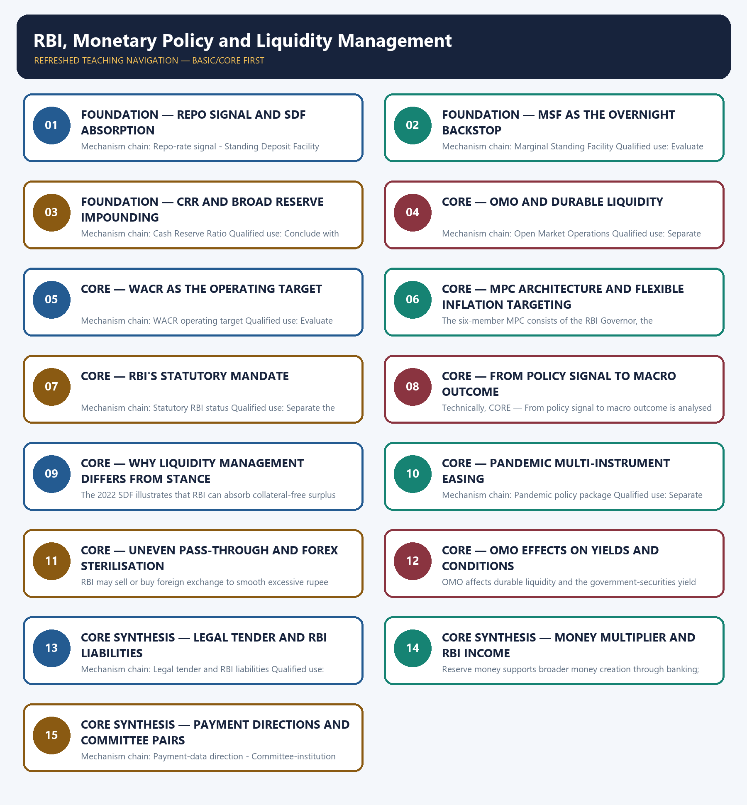

# RBI, Monetary Policy and Liquidity Management — Learner-v2 Complete Learning Session

> **Authoring-only generation:** 2026-09-03. No PDF was rendered and no tracker or index was mutated.

### SOURCE, PROGRESSION AND CURRENT-LINKAGE AUDIT

- **Generation date:** 2026-09-03.
- **Repository-first evidence:** the Basic owner is taught first and preserved in full; the Advanced owner is retained only in the optional final teaching block.
- **OCR evidence:** Repository Markdown was primary. OCR-searchable local official General Studies papers were used only to confirm printed routed demands. No answer key, marking scheme, unsupported page precision or current macroeconomic statistic was inferred from them.
- **Qdrant:** not used; repository Markdown and available OCR context were sufficient.
- **PYQ integrity:** This Basic owner carries audited objective routes on legal tender, rupee management, payment-data storage, the money multiplier, expansionary instruments, RBI status, lender of last resort, interest-rate hikes, sterilisation, RBI income and reform committees. No routed Mains demand is manufactured and no unavailable or provisional objective answer is inferred.
- **Live-link boundary:** The RBI Monetary Policy page was reachable only as raw HTML in this run. No current repo rate, stance, reserve ratio, liquidity amount or meeting outcome was extracted; the package relies on the audited owners for stable instrument mechanics and preserves every counterparty and legal distinction.
- **Fact/inference discipline:** no current-affairs item, PYQ wording, figure or quotation is invented.

### LIVE OFFICIAL-SOURCE ATTEMPT LOG

The checks below were made on 2026-09-03. Substantive official text is used only for the proposition it actually supports; binary files, dynamic shells, stubs and undated dashboard snippets are recorded but not converted into current claims.

- https://www.rbi.org.in/Scripts/Annualpolicy.aspx — attempted 2026-09-03; the official page returned raw HTML identifying the RBI Monetary Policy page but no safely extracted current resolution, rate or stance, so no live policy number was used.

## BASIC LEARNING SESSION

### DEEP-REVIEW LEARNING CONTRACT

| Control | Binding rule for this package |
|---|---|
| Syllabus boundary | Complete Economy Basic/Core is answer-complete before optional Advanced depth. |
| Formula boundary | Formula, numerator, denominator, unit, stock/flow, nominal/real, base year, level/rate and accounting identity are explicit. |
| Institutional boundary | Constitution, statute, delegated rule, regulator mandate, policy, recommendation, scheme and implementation outcome remain distinct. |
| Transmission method | Shock or instrument → prices/quantities/balance sheets/incentives → institution and market response → output, employment, distribution, stability and external effect → lag and trade-off. |
| Current-data method | Source → release date → reference period → unit/denominator → provisional/revised/final status; incompatible Budget, Survey or statistical vintages are never mixed. |
| Programme-status method | Announced → approved → notified/guidelines issued → funded → operational → utilised → output → outcome are separate stages. |
| External/WTO method | Agreement text, member category, box, limit, notification, consultation, dispute and ruling are qualified without invented thresholds. |
| Causal method | Accounting identity, chronology and correlation are not promoted into behavioural or causal claims without mechanism, counterfactual and alternatives. |
| Answer balance | Model answers balance growth, distribution, stability, sustainability and federal dimensions with India-centric evidence. |
| Practice contract | Every solved item has demand decoding, a detailed examiner-grade model, executable timed/compression plan, marks rationale and answer-specific improvement. |
| Approval | This immutable successor remains `approved: false` pending explicit approval. |

**Canonical Basic/Core owner:** `upsc-ai-kit\knowledge\Economy\basic\04_RBI-Monetary-Policy-and-Liquidity-Management.md`  
**Substantive canonical provenance owner:** `upsc-ai-kit\knowledge\Economy\04_RBI-Monetary-Policy-and-Liquidity-Management_Learner-V2-Complete-Topic-Package.md`  
**Optional Advanced owner:** `upsc-ai-kit\knowledge\Economy\advanced\04_RBI-Monetary-Policy-and-Liquidity-Management.md`  
**Official syllabus mapping:** `upsc-ai-kit\knowledge\Economy\OFFICIAL-UPSC-SYLLABUS-MAPPING.md`

### EVIDENCE, PYQ AND CURRENT-STATUS CONTROL

- Every data-heavy table states unit, denominator, geography, reference period and source/status.
- GDP/GVA, gross/net, domestic/national, nominal/real and level/rate distinctions remain exact.
- Monetary, fiscal and external chains state intermediaries, balance-sheet channels, lags, leakages and trade-offs.
- Budget and Economic Survey editions are never mixed; BE, RE, Actual, advance/provisional/revised/final estimates remain labelled.
- Scheme and programme claims distinguish announcement, approval, notification, operation, coverage, utilisation and measured outcome.
- WTO boxes, limits, de minimis, special treatment, notifications and disputes are qualified from authoritative rules.
- PYQ wording is preserved only where verified; reconstructed or routed demands remain labelled.
- **Current-status note, rechecked 2026-09-03:** volatile rates, estimates, scheme status, trade rules and institutional claims retain official source, release date, reference period and revision status.

**Generation-local live/current sources:**
- `https://www.rbi.org.in/Scripts/Annualpolicy.aspx — attempted 2026-09-03; the official page returned raw HTML identifying the RBI Monetary Policy page but no safely extracted current resolution, rate or stance, so no live policy number was used.`




*Distinct embedded teaching-navigation image. The separate continuous Cārvāka-style flowchart package remains an independent at-a-glance artifact.*

### SESSION 1 — FOUNDATION — REPO SIGNAL AND SDF ABSORPTION

#### DEFINITION / WHAT THIS IS CALLED

**Plain-language definition:** The repo rate is the policy rate for collateralised liquidity from RBI under the operating framework; a repo-rate decision signals stance but is not identical to every liquidity injection.

**Technical definition:** Mechanism chain: Repo-rate signal - Standing Deposit Facility Qualified use: Separate the repo signal from liquidity implementation and then trace pass-through.

#### ANSWER-GRABBING OPENING — WRITE/ADAPT IN THE EXAM

> The repo rate is the policy rate for collateralised liquidity from RBI under the operating framework; a repo-rate decision signals stance but is not identical to every liquidity injection.

#### MUST-WRITE KEYWORDS

- **FOUNDATION**
- **Repo signal**
- **SDF absorption**
- **Mechanism chain**
- **Qualified use**
- **The repo rate**

**How to use them:** Frame the answer through FOUNDATION; define Repo signal, connect SDF absorption with Mechanism chain to explain the mechanism, and use Qualified use for the decisive comparison or qualification.

#### VISUAL FIRST

```text
REPO SIGNAL AND SDF ABSORPTION
01. Repo-rate signal
    |
    v
02. Standing Deposit Facility
BOUNDARY -> Do not equate every liquidity injection with a repo-rate cut.
```

*This topic-specific rail fixes the evidence sequence and its exam boundary before analysis.*

#### CORE EXPLANATION

The repo rate is the policy rate for collateralised liquidity from RBI under the operating framework; a repo-rate decision signals stance but is not identical to every liquidity injection. The SDF is an uncollateralised RBI facility for absorbing surplus liquidity and has served as the floor-side standing facility since its introduction in 2022.

#### NAMED EVIDENCE AND MECHANISM

- The repo rate is the policy rate for collateralised liquidity from RBI under the operating framework; a repo-rate decision signals stance but is not identical to every liquidity injection.
- The SDF is an uncollateralised RBI facility for absorbing surplus liquidity and has served as the floor-side standing facility since its introduction in 2022.

#### EXAMINER CAUTION

- Do not equate every liquidity injection with a repo-rate cut.

#### EXAM LINK

- **Prelims:** Preserve the exact formula, territorial or resident boundary, price basis, base year, index basket, eligible counterparty, institution and legal status; never upgrade a projection into an actual or a regulatory direction into a universal rule.
- **Mains:** Separate the repo signal from liquidity implementation and then trace pass-through.

#### MINI RECAP

- **Mechanism chain:** Repo-rate signal -> Standing Deposit Facility
- **Qualified use:** Separate the repo signal from liquidity implementation and then trace pass-through.

#### CLOSING RECALL FLOW — FOUNDATION — REPO SIGNAL AND SDF ABSORPTION

```text
START / CONCEPT: FOUNDATION — Repo signal and SDF absorption
        |
        v
EXACT TERMS: FOUNDATION · Repo signal · SDF absorption · Mechanism chain · Qualified use · The repo rate
        |
        v
MECHANISM / ARGUMENT: Mechanism chain: Repo-rate signal - Standing Deposit Facility Qualified use: Separate the repo signal from liquidity implementation and then trace pass-through.
        |
        v
CONSEQUENCE / CONTRAST: Do not equate every liquidity injection with a repo-rate cut.
        |
        v
UPSC TRAP / ANSWER-USE: Do not miss this limiting distinction: the SDF is an uncollateralised RBI facility for absorbing surplus liquidity and has served...
        |
        v
ANSWER-GRABBING FORMULATION: The repo rate is the policy rate for collateralised liquidity from RBI under the operating framework; a repo-rate decision signals stance but is not identical to every liquidity injection.
```
### SESSION 2 — FOUNDATION — MSF AS THE OVERNIGHT BACKSTOP

#### DEFINITION / WHAT THIS IS CALLED

**Plain-language definition:** MSF is an overnight backstop borrowing window for scheduled commercial banks against eligible securities; its counterparty and emergency role differ from ordinary repo operations.

**Technical definition:** Mechanism chain: Marginal Standing Facility Qualified use: Evaluate monetary effectiveness by inflation source, banking health, fiscal conditions and external pressure.

#### ANSWER-GRABBING OPENING — WRITE/ADAPT IN THE EXAM

> MSF is an overnight backstop borrowing window for scheduled commercial banks against eligible securities; its counterparty and emergency role differ from ordinary repo operations.

#### MUST-WRITE KEYWORDS

- **FOUNDATION**
- **MSF as the overnight backstop**
- **Mechanism chain**
- **Qualified use**
- **MSF**
- **OMO**

**How to use them:** Frame the answer through FOUNDATION; define MSF as the overnight backstop, connect Mechanism chain with Qualified use to explain the mechanism, and use MSF for the decisive comparison or qualification.

#### VISUAL FIRST

```text
MSF AS THE OVERNIGHT BACKSTOP
01. Marginal Standing Facility
BOUNDARY -> Do not treat OMO and repo as identical; one is outright and the other is a repurchase transaction.
```

*This topic-specific rail fixes the evidence sequence and its exam boundary before analysis.*

#### CORE EXPLANATION

MSF is an overnight backstop borrowing window for scheduled commercial banks against eligible securities; its counterparty and emergency role differ from ordinary repo operations.

#### NAMED EVIDENCE AND MECHANISM

- MSF is an overnight backstop borrowing window for scheduled commercial banks against eligible securities; its counterparty and emergency role differ from ordinary repo operations.

#### EXAMINER CAUTION

- Do not treat OMO and repo as identical; one is outright and the other is a repurchase transaction.

#### EXAM LINK

- **Prelims:** Preserve the exact formula, territorial or resident boundary, price basis, base year, index basket, eligible counterparty, institution and legal status; never upgrade a projection into an actual or a regulatory direction into a universal rule.
- **Mains:** Evaluate monetary effectiveness by inflation source, banking health, fiscal conditions and external pressure.

#### MINI RECAP

- **Mechanism chain:** Marginal Standing Facility
- **Qualified use:** Evaluate monetary effectiveness by inflation source, banking health, fiscal conditions and external pressure.

#### CLOSING RECALL FLOW — FOUNDATION — MSF AS THE OVERNIGHT BACKSTOP

```text
START / CONCEPT: FOUNDATION — MSF as the overnight backstop
        |
        v
EXACT TERMS: FOUNDATION · MSF as the overnight backstop · Mechanism chain · Qualified use · MSF · OMO
        |
        v
MECHANISM / ARGUMENT: Mechanism chain: Marginal Standing Facility Qualified use: Evaluate monetary effectiveness by inflation source, banking health, fiscal conditions and external pressure.
        |
        v
CONSEQUENCE / CONTRAST: Do not treat OMO and repo as identical; one is outright and the other is a repurchase transaction.
        |
        v
UPSC TRAP / ANSWER-USE: Do not miss this limiting distinction: do not treat OMO and repo as identical.
        |
        v
ANSWER-GRABBING FORMULATION: MSF is an overnight backstop borrowing window for scheduled commercial banks against eligible securities; its counterparty and emergency role differ from ordinary repo operations.
```
### SESSION 3 — FOUNDATION — CRR AND BROAD RESERVE IMPOUNDING

#### DEFINITION / WHAT THIS IS CALLED

**Plain-language definition:** CRR is the share of net demand and time liabilities maintained as cash with RBI, broadly impounding bank resources and affecting lendable funds.

**Technical definition:** Mechanism chain: Cash Reserve Ratio Qualified use: Conclude with credible communication, flexible operations and realistic limits on rate policy.

#### ANSWER-GRABBING OPENING — WRITE/ADAPT IN THE EXAM

> CRR is the share of net demand and time liabilities maintained as cash with RBI, broadly impounding bank resources and affecting lendable funds.

#### MUST-WRITE KEYWORDS

- **FOUNDATION**
- **CRR**
- **broad reserve impounding**
- **Mechanism chain**
- **Qualified use**
- **RBI**

**How to use them:** Frame the answer through FOUNDATION; define CRR, connect broad reserve impounding with Mechanism chain to explain the mechanism, and use Qualified use for the decisive comparison or qualification.

#### VISUAL FIRST

```text
CRR AND BROAD RESERVE IMPOUNDING
01. Cash Reserve Ratio
BOUNDARY -> Do not assume ordinary NBFCs have routine LAF access like scheduled banks.
```

*This topic-specific rail fixes the evidence sequence and its exam boundary before analysis.*

#### CORE EXPLANATION

CRR is the share of net demand and time liabilities maintained as cash with RBI, broadly impounding bank resources and affecting lendable funds.

#### NAMED EVIDENCE AND MECHANISM

- CRR is the share of net demand and time liabilities maintained as cash with RBI, broadly impounding bank resources and affecting lendable funds.

#### EXAMINER CAUTION

- Do not assume ordinary NBFCs have routine LAF access like scheduled banks.

#### EXAM LINK

- **Prelims:** Preserve the exact formula, territorial or resident boundary, price basis, base year, index basket, eligible counterparty, institution and legal status; never upgrade a projection into an actual or a regulatory direction into a universal rule.
- **Mains:** Conclude with credible communication, flexible operations and realistic limits on rate policy.

#### MINI RECAP

- **Mechanism chain:** Cash Reserve Ratio
- **Qualified use:** Conclude with credible communication, flexible operations and realistic limits on rate policy.

#### CLOSING RECALL FLOW — FOUNDATION — CRR AND BROAD RESERVE IMPOUNDING

```text
START / CONCEPT: FOUNDATION — CRR and broad reserve impounding
        |
        v
EXACT TERMS: FOUNDATION · CRR · broad reserve impounding · Mechanism chain · Qualified use · RBI
        |
        v
MECHANISM / ARGUMENT: Mechanism chain: Cash Reserve Ratio Qualified use: Conclude with credible communication, flexible operations and realistic limits on rate policy.
        |
        v
CONSEQUENCE / CONTRAST: Do not assume ordinary NBFCs have routine LAF access like scheduled banks.
        |
        v
UPSC TRAP / ANSWER-USE: Do not miss this limiting distinction: do not assume ordinary NBFCs have routine LAF access like scheduled banks.
        |
        v
ANSWER-GRABBING FORMULATION: CRR is the share of net demand and time liabilities maintained as cash with RBI, broadly impounding bank resources and affecting lendable funds.
```
### SESSION 4 — CORE — OMO AND DURABLE LIQUIDITY

#### DEFINITION / WHAT THIS IS CALLED

**Plain-language definition:** OMO purchases or sales are outright transactions in government securities that add or absorb durable liquidity and can influence yields beyond overnight cash conditions.

**Technical definition:** Mechanism chain: Open Market Operations Qualified use: Separate the repo signal from liquidity implementation and then trace pass-through.

#### ANSWER-GRABBING OPENING — WRITE/ADAPT IN THE EXAM

> OMO purchases or sales are outright transactions in government securities that add or absorb durable liquidity and can influence yields beyond overnight cash conditions.

#### MUST-WRITE KEYWORDS

- **OMO**
- **durable liquidity**
- **Mechanism chain**
- **Qualified use**
- **OMO purchases or sales**
- **RBI**

**How to use them:** Frame the answer through OMO; define durable liquidity, connect Mechanism chain with Qualified use to explain the mechanism, and use OMO purchases or sales for the decisive comparison or qualification.

#### VISUAL FIRST

```text
OMO AND DURABLE LIQUIDITY
01. Open Market Operations
BOUNDARY -> Do not call currency notes RBI income; notes issued are liabilities.
```

*This topic-specific rail fixes the evidence sequence and its exam boundary before analysis.*

#### CORE EXPLANATION

OMO purchases or sales are outright transactions in government securities that add or absorb durable liquidity and can influence yields beyond overnight cash conditions.

#### NAMED EVIDENCE AND MECHANISM

- OMO purchases or sales are outright transactions in government securities that add or absorb durable liquidity and can influence yields beyond overnight cash conditions.

#### EXAMINER CAUTION

- Do not call currency notes RBI income; notes issued are liabilities.

#### EXAM LINK

- **Prelims:** Preserve the exact formula, territorial or resident boundary, price basis, base year, index basket, eligible counterparty, institution and legal status; never upgrade a projection into an actual or a regulatory direction into a universal rule.
- **Mains:** Separate the repo signal from liquidity implementation and then trace pass-through.

#### MINI RECAP

- **Mechanism chain:** Open Market Operations
- **Qualified use:** Separate the repo signal from liquidity implementation and then trace pass-through.

#### CLOSING RECALL FLOW — CORE — OMO AND DURABLE LIQUIDITY

```text
START / CONCEPT: CORE — OMO and durable liquidity
        |
        v
EXACT TERMS: OMO · durable liquidity · Mechanism chain · Qualified use · OMO purchases or sales · RBI
        |
        v
MECHANISM / ARGUMENT: Mechanism chain: Open Market Operations Qualified use: Separate the repo signal from liquidity implementation and then trace pass-through.
        |
        v
CONSEQUENCE / CONTRAST: Do not call currency notes RBI income; notes issued are liabilities.
        |
        v
UPSC TRAP / ANSWER-USE: Do not miss this limiting distinction: oMO purchases or sales are outright transactions in government securities that add or absorb...
        |
        v
ANSWER-GRABBING FORMULATION: OMO purchases or sales are outright transactions in government securities that add or absorb durable liquidity and can influence yields beyond overnight cash conditions.
```
### SESSION 5 — CORE — WACR AS THE OPERATING TARGET

#### DEFINITION / WHAT THIS IS CALLED

**Plain-language definition:** The weighted average call rate is the operating target that RBI liquidity operations seek to align with the policy corridor; the policy target, repo rate and operating target are distinct.

**Technical definition:** Mechanism chain: WACR operating target Qualified use: Evaluate monetary effectiveness by inflation source, banking health, fiscal conditions and external pressure.

#### ANSWER-GRABBING OPENING — WRITE/ADAPT IN THE EXAM

> The weighted average call rate is the operating target that RBI liquidity operations seek to align with the policy corridor; the policy target, repo rate and operating target are distinct.

#### MUST-WRITE KEYWORDS

- **WACR as the operating target**
- **Mechanism chain**
- **Qualified use**
- **The weighted average call rate**
- **RBI**
- **WACR**

**How to use them:** Frame the answer through WACR as the operating target; define Mechanism chain, connect Qualified use with The weighted average call rate to explain the mechanism, and use RBI for the decisive comparison or qualification.

#### VISUAL FIRST

```text
WACR AS THE OPERATING TARGET
01. WACR operating target
BOUNDARY -> Do not assume a lower repo guarantees equal lending-rate reductions.
```

*This topic-specific rail fixes the evidence sequence and its exam boundary before analysis.*

#### CORE EXPLANATION

The weighted average call rate is the operating target that RBI liquidity operations seek to align with the policy corridor; the policy target, repo rate and operating target are distinct.

#### NAMED EVIDENCE AND MECHANISM

- The weighted average call rate is the operating target that RBI liquidity operations seek to align with the policy corridor; the policy target, repo rate and operating target are distinct.

#### EXAMINER CAUTION

- Do not assume a lower repo guarantees equal lending-rate reductions.

#### EXAM LINK

- **Prelims:** Preserve the exact formula, territorial or resident boundary, price basis, base year, index basket, eligible counterparty, institution and legal status; never upgrade a projection into an actual or a regulatory direction into a universal rule.
- **Mains:** Evaluate monetary effectiveness by inflation source, banking health, fiscal conditions and external pressure.

#### MINI RECAP

- **Mechanism chain:** WACR operating target
- **Qualified use:** Evaluate monetary effectiveness by inflation source, banking health, fiscal conditions and external pressure.

#### CLOSING RECALL FLOW — CORE — WACR AS THE OPERATING TARGET

```text
START / CONCEPT: CORE — WACR as the operating target
        |
        v
EXACT TERMS: WACR as the operating target · Mechanism chain · Qualified use · The weighted average call rate · RBI · WACR
        |
        v
MECHANISM / ARGUMENT: Mechanism chain: WACR operating target Qualified use: Evaluate monetary effectiveness by inflation source, banking health, fiscal conditions and external pressure.
        |
        v
CONSEQUENCE / CONTRAST: Do not assume a lower repo guarantees equal lending-rate reductions.
        |
        v
UPSC TRAP / ANSWER-USE: Do not miss this limiting distinction: evaluate monetary effectiveness by inflation source, banking health, fiscal conditions and external pressure.
        |
        v
ANSWER-GRABBING FORMULATION: The weighted average call rate is the operating target that RBI liquidity operations seek to align with the policy corridor; the policy target, repo rate and operating target are distinct.
```
### SESSION 6 — CORE — MPC ARCHITECTURE AND FLEXIBLE INFLATION TARGETING

#### DEFINITION / WHAT THIS IS CALLED

**Plain-language definition:** Mechanism chain: Monetary Policy Committee - Flexible inflation targeting Qualified use: Conclude with credible communication, flexible operations and realistic limits on rate policy.

**Technical definition:** The six-member MPC consists of the RBI Governor, the monetary-policy Deputy Governor, one RBI-nominated officer and three external members appointed by the Central Government, and decides the policy repo rate.

#### ANSWER-GRABBING OPENING — WRITE/ADAPT IN THE EXAM

> Mechanism chain: Monetary Policy Committee - Flexible inflation targeting Qualified use: Conclude with credible communication, flexible operations and realistic limits on rate policy.

#### MUST-WRITE KEYWORDS

- **MPC architecture**
- **flexible inflation targeting**
- **Mechanism chain**
- **Qualified use**
- **MPC**
- **RBI Governor**

**How to use them:** Frame the answer through MPC architecture; define flexible inflation targeting, connect Mechanism chain with Qualified use to explain the mechanism, and use MPC for the decisive comparison or qualification.

#### VISUAL FIRST

```text
MPC ARCHITECTURE AND FLEXIBLE INFLATION TARGETING
01. Monetary Policy Committee
    |
    v
02. Flexible inflation targeting
BOUNDARY -> Do not merge the inflation target, tolerance band, repo rate and WACR operating target.
```

*This topic-specific rail fixes the evidence sequence and its exam boundary before analysis.*

#### CORE EXPLANATION

The six-member MPC consists of the RBI Governor, the monetary-policy Deputy Governor, one RBI-nominated officer and three external members appointed by the Central Government, and decides the policy repo rate. India's framework uses headline CPI as the nominal anchor with a 4 per cent target and a tolerance band of plus or minus 2 percentage points while considering growth.

#### NAMED EVIDENCE AND MECHANISM

- The six-member MPC consists of the RBI Governor, the monetary-policy Deputy Governor, one RBI-nominated officer and three external members appointed by the Central Government, and decides the policy repo rate.
- India's framework uses headline CPI as the nominal anchor with a 4 per cent target and a tolerance band of plus or minus 2 percentage points while considering growth.

#### EXAMINER CAUTION

- Do not merge the inflation target, tolerance band, repo rate and WACR operating target.

#### EXAM LINK

- **Prelims:** Preserve the exact formula, territorial or resident boundary, price basis, base year, index basket, eligible counterparty, institution and legal status; never upgrade a projection into an actual or a regulatory direction into a universal rule.
- **Mains:** Conclude with credible communication, flexible operations and realistic limits on rate policy.

#### MINI RECAP

- **Mechanism chain:** Monetary Policy Committee -> Flexible inflation targeting
- **Qualified use:** Conclude with credible communication, flexible operations and realistic limits on rate policy.

#### CLOSING RECALL FLOW — CORE — MPC ARCHITECTURE AND FLEXIBLE INFLATION TARGETING

```text
START / CONCEPT: CORE — MPC architecture and flexible inflation targeting
        |
        v
EXACT TERMS: MPC architecture · flexible inflation targeting · Mechanism chain · Qualified use · MPC · RBI Governor
        |
        v
MECHANISM / ARGUMENT: The six-member MPC consists of the RBI Governor, the monetary-policy Deputy Governor, one RBI-nominated officer and three external members appointed by the Central Government, and decides the policy repo rate.
        |
        v
CONSEQUENCE / CONTRAST: Do not merge the inflation target, tolerance band, repo rate and WACR operating target.
        |
        v
UPSC TRAP / ANSWER-USE: India's framework uses headline CPI as the nominal anchor with a 4 per cent target and a tolerance band of plus or minus 2 percentage points while considering growth.
        |
        v
ANSWER-GRABBING FORMULATION: Mechanism chain: Monetary Policy Committee - Flexible inflation targeting Qualified use: Conclude with credible communication, flexible operations and realistic limits on rate policy.
```
### SESSION 7 — CORE — RBI'S STATUTORY MANDATE

#### DEFINITION / WHAT THIS IS CALLED

**Plain-language definition:** RBI is a statutory body under the RBI Act, not a constitutional body; the Governor is appointed by the Central Government and RBI performs monetary, currency, banking, reserve and payment functions.

**Technical definition:** Mechanism chain: Statutory RBI status Qualified use: Separate the repo signal from liquidity implementation and then trace pass-through.

#### ANSWER-GRABBING OPENING — WRITE/ADAPT IN THE EXAM

> RBI is a statutory body under the RBI Act, not a constitutional body; the Governor is appointed by the Central Government and RBI performs monetary, currency, banking, reserve and payment functions.

#### MUST-WRITE KEYWORDS

- **RBI's statutory mandate**
- **Mechanism chain**
- **Qualified use**
- **RBI**
- **RBI Act**
- **Governor**

**How to use them:** Frame the answer through RBI's statutory mandate; define Mechanism chain, connect Qualified use with RBI to explain the mechanism, and use RBI Act for the decisive comparison or qualification.

#### VISUAL FIRST

```text
RBI'S STATUTORY MANDATE
01. Statutory RBI status
BOUNDARY -> Do not treat SDF as collateralised borrowing; it is uncollateralised absorption.
```

*This topic-specific rail fixes the evidence sequence and its exam boundary before analysis.*

#### CORE EXPLANATION

RBI is a statutory body under the RBI Act, not a constitutional body; the Governor is appointed by the Central Government and RBI performs monetary, currency, banking, reserve and payment functions.

#### NAMED EVIDENCE AND MECHANISM

- RBI is a statutory body under the RBI Act, not a constitutional body; the Governor is appointed by the Central Government and RBI performs monetary, currency, banking, reserve and payment functions.

#### EXAMINER CAUTION

- Do not treat SDF as collateralised borrowing; it is uncollateralised absorption.

#### EXAM LINK

- **Prelims:** Preserve the exact formula, territorial or resident boundary, price basis, base year, index basket, eligible counterparty, institution and legal status; never upgrade a projection into an actual or a regulatory direction into a universal rule.
- **Mains:** Separate the repo signal from liquidity implementation and then trace pass-through.

#### MINI RECAP

- **Mechanism chain:** Statutory RBI status
- **Qualified use:** Separate the repo signal from liquidity implementation and then trace pass-through.

#### CLOSING RECALL FLOW — CORE — RBI'S STATUTORY MANDATE

```text
START / CONCEPT: CORE — RBI's statutory mandate
        |
        v
EXACT TERMS: RBI's statutory mandate · Mechanism chain · Qualified use · RBI · RBI Act · Governor
        |
        v
MECHANISM / ARGUMENT: Mechanism chain: Statutory RBI status Qualified use: Separate the repo signal from liquidity implementation and then trace pass-through.
        |
        v
CONSEQUENCE / CONTRAST: Do not treat SDF as collateralised borrowing; it is uncollateralised absorption.
        |
        v
UPSC TRAP / ANSWER-USE: Do not miss this limiting distinction: rBI is a statutory body under the RBI Act, not a constitutional body.
        |
        v
ANSWER-GRABBING FORMULATION: RBI is a statutory body under the RBI Act, not a constitutional body; the Governor is appointed by the Central Government and RBI performs monetary, currency, banking, reserve and payment functions.
```
### SESSION 8 — CORE — FROM POLICY SIGNAL TO MACRO OUTCOME

#### DEFINITION / WHAT THIS IS CALLED

**Plain-language definition:** Mechanism chain: Transmission chain Qualified use: Evaluate monetary effectiveness by inflation source, banking health, fiscal conditions and external pressure.

**Technical definition:** Technically, CORE — From policy signal to macro outcome is analysed by relating From policy signal to macro outcome to Mechanism chain, then testing the relationship through Qualified use and CRR.

#### ANSWER-GRABBING OPENING — WRITE/ADAPT IN THE EXAM

> Do not say CRR and OMO have the same mechanics or time horizon.

#### MUST-WRITE KEYWORDS

- **From policy signal to macro outcome**
- **Mechanism chain**
- **Qualified use**
- **CRR**
- **OMO**
- **Transmission**

**How to use them:** Frame the answer through From policy signal to macro outcome; define Mechanism chain, connect Qualified use with CRR to explain the mechanism, and use OMO for the decisive comparison or qualification.

#### VISUAL FIRST

```text
FROM POLICY SIGNAL TO MACRO OUTCOME
01. Transmission chain
BOUNDARY -> Do not say CRR and OMO have the same mechanics or time horizon.
```

*This topic-specific rail fixes the evidence sequence and its exam boundary before analysis.*

#### CORE EXPLANATION

MPC communication and the repo signal influence money-market rates, bank funding and deposit rates, lending rates, bond yields, credit, demand, output and inflation with lags.

#### NAMED EVIDENCE AND MECHANISM

- MPC communication and the repo signal influence money-market rates, bank funding and deposit rates, lending rates, bond yields, credit, demand, output and inflation with lags.

#### EXAMINER CAUTION

- Do not say CRR and OMO have the same mechanics or time horizon.

#### EXAM LINK

- **Prelims:** Preserve the exact formula, territorial or resident boundary, price basis, base year, index basket, eligible counterparty, institution and legal status; never upgrade a projection into an actual or a regulatory direction into a universal rule.
- **Mains:** Evaluate monetary effectiveness by inflation source, banking health, fiscal conditions and external pressure.

#### MINI RECAP

- **Mechanism chain:** Transmission chain
- **Qualified use:** Evaluate monetary effectiveness by inflation source, banking health, fiscal conditions and external pressure.

#### CLOSING RECALL FLOW — CORE — FROM POLICY SIGNAL TO MACRO OUTCOME

```text
START / CONCEPT: CORE — From policy signal to macro outcome
        |
        v
EXACT TERMS: From policy signal to macro outcome · Mechanism chain · Qualified use · CRR · OMO · Transmission
        |
        v
MECHANISM / ARGUMENT: Mechanism chain: Transmission chain Qualified use: Evaluate monetary effectiveness by inflation source, banking health, fiscal conditions and external pressure.
        |
        v
CONSEQUENCE / CONTRAST: The resulting consequence is that do not say CRR and OMO have the same mechanics or time horizon.
        |
        v
UPSC TRAP / ANSWER-USE: Do not miss this limiting distinction: do not say CRR and OMO have the same mechanics or time horizon.
        |
        v
ANSWER-GRABBING FORMULATION: Do not say CRR and OMO have the same mechanics or time horizon.
```
### SESSION 9 — CORE — WHY LIQUIDITY MANAGEMENT DIFFERS FROM STANCE

#### DEFINITION / WHAT THIS IS CALLED

**Plain-language definition:** Liquidity management aligns market rates with the operating framework; it is distinct from a fresh change in the monetary-policy stance.

**Technical definition:** The 2022 SDF illustrates that RBI can absorb collateral-free surplus liquidity to align overnight rates without necessarily changing the repo-rate stance.

#### ANSWER-GRABBING OPENING — WRITE/ADAPT IN THE EXAM

> Liquidity management aligns market rates with the operating framework; it is distinct from a fresh change in the monetary-policy stance.

#### MUST-WRITE KEYWORDS

- **Why liquidity management differs from stance**
- **Mechanism chain**
- **Qualified use**
- **SDF**
- **RBI**
- **Liquidity**

**How to use them:** Frame the answer through Why liquidity management differs from stance; define Mechanism chain, connect Qualified use with SDF to explain the mechanism, and use RBI for the decisive comparison or qualification.

#### VISUAL FIRST

```text
WHY LIQUIDITY MANAGEMENT DIFFERS FROM STANCE
01. SDF-liquidity distinction
BOUNDARY -> Liquidity management aligns market rates with the operating framework; it is distinct from a fresh change in the monetary-policy stance.
```

*This topic-specific rail fixes the evidence sequence and its exam boundary before analysis.*

#### CORE EXPLANATION

The 2022 SDF illustrates that RBI can absorb collateral-free surplus liquidity to align overnight rates without necessarily changing the repo-rate stance.

#### NAMED EVIDENCE AND MECHANISM

- The 2022 SDF illustrates that RBI can absorb collateral-free surplus liquidity to align overnight rates without necessarily changing the repo-rate stance.

#### EXAMINER CAUTION

- Liquidity management aligns market rates with the operating framework; it is distinct from a fresh change in the monetary-policy stance.

#### EXAM LINK

- **Prelims:** Preserve the exact formula, territorial or resident boundary, price basis, base year, index basket, eligible counterparty, institution and legal status; never upgrade a projection into an actual or a regulatory direction into a universal rule.
- **Mains:** Conclude with credible communication, flexible operations and realistic limits on rate policy.

#### MINI RECAP

- **Mechanism chain:** SDF-liquidity distinction
- **Qualified use:** Conclude with credible communication, flexible operations and realistic limits on rate policy.

#### CLOSING RECALL FLOW — CORE — WHY LIQUIDITY MANAGEMENT DIFFERS FROM STANCE

```text
START / CONCEPT: CORE — Why liquidity management differs from stance
        |
        v
EXACT TERMS: Why liquidity management differs from stance · Mechanism chain · Qualified use · SDF · RBI · Liquidity
        |
        v
MECHANISM / ARGUMENT: Mechanism chain: SDF-liquidity distinction Qualified use: Conclude with credible communication, flexible operations and realistic limits on rate policy.
        |
        v
CONSEQUENCE / CONTRAST: The 2022 SDF illustrates that RBI can absorb collateral-free surplus liquidity to align overnight rates without necessarily changing the repo-rate stance.
        |
        v
UPSC TRAP / ANSWER-USE: Do not miss this limiting distinction: liquidity management aligns market rates with the operating framework.
        |
        v
ANSWER-GRABBING FORMULATION: Liquidity management aligns market rates with the operating framework; it is distinct from a fresh change in the monetary-policy stance.
```
### SESSION 10 — CORE — PANDEMIC MULTI-INSTRUMENT EASING

#### DEFINITION / WHAT THIS IS CALLED

**Plain-language definition:** During the pandemic RBI combined repo reductions with CRR easing, OMOs and targeted longer-term liquidity operations, showing that expansionary policy is an instrument package rather than a repo cut alone.

**Technical definition:** Mechanism chain: Pandemic policy package Qualified use: Separate the repo signal from liquidity implementation and then trace pass-through.

#### ANSWER-GRABBING OPENING — WRITE/ADAPT IN THE EXAM

> During the pandemic RBI combined repo reductions with CRR easing, OMOs and targeted longer-term liquidity operations, showing that expansionary policy is an instrument package rather than a repo cut alone.

#### MUST-WRITE KEYWORDS

- **Pandemic multi-instrument easing**
- **Mechanism chain**
- **Qualified use**
- **During**
- **RBI**
- **CRR**

**How to use them:** Frame the answer through Pandemic multi-instrument easing; define Mechanism chain, connect Qualified use with During to explain the mechanism, and use RBI for the decisive comparison or qualification.

#### VISUAL FIRST

```text
PANDEMIC MULTI-INSTRUMENT EASING
01. Pandemic policy package
BOUNDARY -> Do not claim monetary policy can directly repair food, energy or logistics shortages.
```

*This topic-specific rail fixes the evidence sequence and its exam boundary before analysis.*

#### CORE EXPLANATION

During the pandemic RBI combined repo reductions with CRR easing, OMOs and targeted longer-term liquidity operations, showing that expansionary policy is an instrument package rather than a repo cut alone.

#### NAMED EVIDENCE AND MECHANISM

- During the pandemic RBI combined repo reductions with CRR easing, OMOs and targeted longer-term liquidity operations, showing that expansionary policy is an instrument package rather than a repo cut alone.

#### EXAMINER CAUTION

- Do not claim monetary policy can directly repair food, energy or logistics shortages.

#### EXAM LINK

- **Prelims:** Preserve the exact formula, territorial or resident boundary, price basis, base year, index basket, eligible counterparty, institution and legal status; never upgrade a projection into an actual or a regulatory direction into a universal rule.
- **Mains:** Separate the repo signal from liquidity implementation and then trace pass-through.

#### MINI RECAP

- **Mechanism chain:** Pandemic policy package
- **Qualified use:** Separate the repo signal from liquidity implementation and then trace pass-through.

#### CLOSING RECALL FLOW — CORE — PANDEMIC MULTI-INSTRUMENT EASING

```text
START / CONCEPT: CORE — Pandemic multi-instrument easing
        |
        v
EXACT TERMS: Pandemic multi-instrument easing · Mechanism chain · Qualified use · During · RBI · CRR
        |
        v
MECHANISM / ARGUMENT: Mechanism chain: Pandemic policy package Qualified use: Separate the repo signal from liquidity implementation and then trace pass-through.
        |
        v
CONSEQUENCE / CONTRAST: Do not claim monetary policy can directly repair food, energy or logistics shortages.
        |
        v
UPSC TRAP / ANSWER-USE: Do not miss this limiting distinction: during the pandemic RBI combined repo reductions with CRR easing, OMOs and targeted longer-term...
        |
        v
ANSWER-GRABBING FORMULATION: During the pandemic RBI combined repo reductions with CRR easing, OMOs and targeted longer-term liquidity operations, showing that expansionary policy is an instrument package rather than a repo cut alone.
```
### SESSION 11 — CORE — UNEVEN PASS-THROUGH AND FOREX STERILISATION

#### DEFINITION / WHAT THIS IS CALLED

**Plain-language definition:** Mechanism chain: Uneven pass-through - Forex intervention and sterilisation Qualified use: Evaluate monetary effectiveness by inflation source, banking health, fiscal conditions and external pressure.

**Technical definition:** RBI may sell or buy foreign exchange to smooth excessive rupee volatility and offset the domestic-liquidity effect through OMOs or absorption operations; sterilisation does not imply a fixed exchange-rate promise.

#### ANSWER-GRABBING OPENING — WRITE/ADAPT IN THE EXAM

> Mechanism chain: Uneven pass-through - Forex intervention and sterilisation Qualified use: Evaluate monetary effectiveness by inflation source, banking health, fiscal conditions and external pressure.

#### MUST-WRITE KEYWORDS

- **Uneven pass-through**
- **forex sterilisation**
- **Mechanism chain**
- **Qualified use**
- **Post-pandemic**
- **RBI**

**How to use them:** Frame the answer through Uneven pass-through; define forex sterilisation, connect Mechanism chain with Qualified use to explain the mechanism, and use Post-pandemic for the decisive comparison or qualification.

#### VISUAL FIRST

```text
UNEVEN PASS-THROUGH AND FOREX STERILISATION
01. Uneven pass-through
    |
    v
02. Forex intervention and sterilisation
BOUNDARY -> Do not generalise a payment-system storage direction into a law for all data.
```

*This topic-specific rail fixes the evidence sequence and its exam boundary before analysis.*

#### CORE EXPLANATION

Post-pandemic repo increases passed relatively quickly into external-benchmark-linked lending rates and more gradually into deposit rates and legacy loans because funding mix, competition and balance-sheet strength differ. RBI may sell or buy foreign exchange to smooth excessive rupee volatility and offset the domestic-liquidity effect through OMOs or absorption operations; sterilisation does not imply a fixed exchange-rate promise.

#### NAMED EVIDENCE AND MECHANISM

- Post-pandemic repo increases passed relatively quickly into external-benchmark-linked lending rates and more gradually into deposit rates and legacy loans because funding mix, competition and balance-sheet strength differ.
- RBI may sell or buy foreign exchange to smooth excessive rupee volatility and offset the domestic-liquidity effect through OMOs or absorption operations; sterilisation does not imply a fixed exchange-rate promise.

#### EXAMINER CAUTION

- Do not generalise a payment-system storage direction into a law for all data.

#### EXAM LINK

- **Prelims:** Preserve the exact formula, territorial or resident boundary, price basis, base year, index basket, eligible counterparty, institution and legal status; never upgrade a projection into an actual or a regulatory direction into a universal rule.
- **Mains:** Evaluate monetary effectiveness by inflation source, banking health, fiscal conditions and external pressure.

#### MINI RECAP

- **Mechanism chain:** Uneven pass-through -> Forex intervention and sterilisation
- **Qualified use:** Evaluate monetary effectiveness by inflation source, banking health, fiscal conditions and external pressure.

#### CLOSING RECALL FLOW — CORE — UNEVEN PASS-THROUGH AND FOREX STERILISATION

```text
START / CONCEPT: CORE — Uneven pass-through and forex sterilisation
        |
        v
EXACT TERMS: Uneven pass-through · forex sterilisation · Mechanism chain · Qualified use · Post-pandemic · RBI
        |
        v
MECHANISM / ARGUMENT: RBI may sell or buy foreign exchange to smooth excessive rupee volatility and offset the domestic-liquidity effect through OMOs or absorption operations; sterilisation does not imply a fixed exchange-rate promise.
        |
        v
CONSEQUENCE / CONTRAST: Do not generalise a payment-system storage direction into a law for all data.
        |
        v
UPSC TRAP / ANSWER-USE: Do not miss this limiting distinction: post-pandemic repo increases passed relatively quickly into external-benchmark-linked lending rates and more gradually into...
        |
        v
ANSWER-GRABBING FORMULATION: Mechanism chain: Uneven pass-through - Forex intervention and sterilisation Qualified use: Evaluate monetary effectiveness by inflation source, banking health, fiscal conditions and external pressure.
```
### SESSION 12 — CORE — OMO EFFECTS ON YIELDS AND CONDITIONS

#### DEFINITION / WHAT THIS IS CALLED

**Plain-language definition:** Mechanism chain: OMO and yield conditions Qualified use: Conclude with credible communication, flexible operations and realistic limits on rate policy.

**Technical definition:** OMO affects durable liquidity and the government-securities yield curve, but its effect depends on market expectations, the fiscal borrowing environment and the broader monetary stance.

#### ANSWER-GRABBING OPENING — WRITE/ADAPT IN THE EXAM

> OMO affects durable liquidity and the government-securities yield curve, but its effect depends on market expectations, the fiscal borrowing environment and the broader monetary stance.

#### MUST-WRITE KEYWORDS

- **OMO effects on yields**
- **conditions**
- **Mechanism chain**
- **Qualified use**
- **OMO**
- **Qualified**

**How to use them:** Frame the answer through OMO effects on yields; define conditions, connect Mechanism chain with Qualified use to explain the mechanism, and use OMO for the decisive comparison or qualification.

#### VISUAL FIRST

```text
OMO EFFECTS ON YIELDS AND CONDITIONS
01. OMO and yield conditions
BOUNDARY -> Do not mismatch reform committees with their sponsoring institution or subject.
```

*This topic-specific rail fixes the evidence sequence and its exam boundary before analysis.*

#### CORE EXPLANATION

OMO affects durable liquidity and the government-securities yield curve, but its effect depends on market expectations, the fiscal borrowing environment and the broader monetary stance.

#### NAMED EVIDENCE AND MECHANISM

- OMO affects durable liquidity and the government-securities yield curve, but its effect depends on market expectations, the fiscal borrowing environment and the broader monetary stance.

#### EXAMINER CAUTION

- Do not mismatch reform committees with their sponsoring institution or subject.

#### EXAM LINK

- **Prelims:** Preserve the exact formula, territorial or resident boundary, price basis, base year, index basket, eligible counterparty, institution and legal status; never upgrade a projection into an actual or a regulatory direction into a universal rule.
- **Mains:** Conclude with credible communication, flexible operations and realistic limits on rate policy.

#### MINI RECAP

- **Mechanism chain:** OMO and yield conditions
- **Qualified use:** Conclude with credible communication, flexible operations and realistic limits on rate policy.

#### CLOSING RECALL FLOW — CORE — OMO EFFECTS ON YIELDS AND CONDITIONS

```text
START / CONCEPT: CORE — OMO effects on yields and conditions
        |
        v
EXACT TERMS: OMO effects on yields · conditions · Mechanism chain · Qualified use · OMO · Qualified
        |
        v
MECHANISM / ARGUMENT: Mechanism chain: OMO and yield conditions Qualified use: Conclude with credible communication, flexible operations and realistic limits on rate policy.
        |
        v
CONSEQUENCE / CONTRAST: Do not mismatch reform committees with their sponsoring institution or subject.
        |
        v
UPSC TRAP / ANSWER-USE: Do not miss this limiting distinction: oMO affects durable liquidity and the government-securities yield curve.
        |
        v
ANSWER-GRABBING FORMULATION: OMO affects durable liquidity and the government-securities yield curve, but its effect depends on market expectations, the fiscal borrowing environment and the broader monetary stance.
```
### SESSION 13 — CORE SYNTHESIS — LEGAL TENDER AND RBI LIABILITIES

#### DEFINITION / WHAT THIS IS CALLED

**Plain-language definition:** Legal tender must be accepted in settlement within the legal framework, and Indian currency notes issued are liabilities on RBI's balance sheet rather than RBI income.

**Technical definition:** Mechanism chain: Legal tender and RBI liabilities Qualified use: Separate the repo signal from liquidity implementation and then trace pass-through.

#### ANSWER-GRABBING OPENING — WRITE/ADAPT IN THE EXAM

> Legal tender must be accepted in settlement within the legal framework, and Indian currency notes issued are liabilities on RBI's balance sheet rather than RBI income.

#### MUST-WRITE KEYWORDS

- **CORE SYNTHESIS**
- **Legal tender**
- **RBI liabilities**
- **Mechanism chain**
- **Qualified use**
- **Legal**

**How to use them:** Frame the answer through CORE SYNTHESIS; define Legal tender, connect RBI liabilities with Mechanism chain to explain the mechanism, and use Qualified use for the decisive comparison or qualification.

#### VISUAL FIRST

```text
LEGAL TENDER AND RBI LIABILITIES
01. Legal tender and RBI liabilities
BOUNDARY -> Do not equate every liquidity injection with a repo-rate cut.
```

*This topic-specific rail fixes the evidence sequence and its exam boundary before analysis.*

#### CORE EXPLANATION

Legal tender must be accepted in settlement within the legal framework, and Indian currency notes issued are liabilities on RBI's balance sheet rather than RBI income.

#### NAMED EVIDENCE AND MECHANISM

- Legal tender must be accepted in settlement within the legal framework, and Indian currency notes issued are liabilities on RBI's balance sheet rather than RBI income.

#### EXAMINER CAUTION

- Do not equate every liquidity injection with a repo-rate cut.

#### EXAM LINK

- **Prelims:** Preserve the exact formula, territorial or resident boundary, price basis, base year, index basket, eligible counterparty, institution and legal status; never upgrade a projection into an actual or a regulatory direction into a universal rule.
- **Mains:** Separate the repo signal from liquidity implementation and then trace pass-through.

#### MINI RECAP

- **Mechanism chain:** Legal tender and RBI liabilities
- **Qualified use:** Separate the repo signal from liquidity implementation and then trace pass-through.

#### CLOSING RECALL FLOW — CORE SYNTHESIS — LEGAL TENDER AND RBI LIABILITIES

```text
START / CONCEPT: CORE SYNTHESIS — Legal tender and RBI liabilities
        |
        v
EXACT TERMS: CORE SYNTHESIS · Legal tender · RBI liabilities · Mechanism chain · Qualified use · Legal
        |
        v
MECHANISM / ARGUMENT: Mechanism chain: Legal tender and RBI liabilities Qualified use: Separate the repo signal from liquidity implementation and then trace pass-through.
        |
        v
CONSEQUENCE / CONTRAST: Do not equate every liquidity injection with a repo-rate cut.
        |
        v
UPSC TRAP / ANSWER-USE: Do not miss this limiting distinction: legal tender and RBI liabilities Qualified use.
        |
        v
ANSWER-GRABBING FORMULATION: Legal tender must be accepted in settlement within the legal framework, and Indian currency notes issued are liabilities on RBI's balance sheet rather than RBI income.
```
### SESSION 14 — CORE SYNTHESIS — MONEY MULTIPLIER AND RBI INCOME

#### DEFINITION / WHAT THIS IS CALLED

**Plain-language definition:** Mechanism chain: Money multiplier - RBI income sources Qualified use: Evaluate monetary effectiveness by inflation source, banking health, fiscal conditions and external pressure.

**Technical definition:** Reserve money supports broader money creation through banking; lower reserve impounding and currency leakage and greater willingness to lend generally raise the money multiplier.

#### ANSWER-GRABBING OPENING — WRITE/ADAPT IN THE EXAM

> Mechanism chain: Money multiplier - RBI income sources Qualified use: Evaluate monetary effectiveness by inflation source, banking health, fiscal conditions and external pressure.

#### MUST-WRITE KEYWORDS

- **CORE SYNTHESIS**
- **Money multiplier**
- **RBI income**
- **Mechanism chain**
- **Qualified use**
- **Reserve**

**How to use them:** Frame the answer through CORE SYNTHESIS; define Money multiplier, connect RBI income with Mechanism chain to explain the mechanism, and use Qualified use for the decisive comparison or qualification.

#### VISUAL FIRST

```text
MONEY MULTIPLIER AND RBI INCOME
01. Money multiplier
    |
    v
02. RBI income sources
BOUNDARY -> Do not treat OMO and repo as identical; one is outright and the other is a repurchase transaction.
```

*This topic-specific rail fixes the evidence sequence and its exam boundary before analysis.*

#### CORE EXPLANATION

Reserve money supports broader money creation through banking; lower reserve impounding and currency leakage and greater willingness to lend generally raise the money multiplier. RBI income can arise from interest on government securities and foreign-currency assets, liquidity operations or lending to banks, and fees or commissions from banking and market functions.

#### NAMED EVIDENCE AND MECHANISM

- Reserve money supports broader money creation through banking; lower reserve impounding and currency leakage and greater willingness to lend generally raise the money multiplier.
- RBI income can arise from interest on government securities and foreign-currency assets, liquidity operations or lending to banks, and fees or commissions from banking and market functions.

#### EXAMINER CAUTION

- Do not treat OMO and repo as identical; one is outright and the other is a repurchase transaction.

#### EXAM LINK

- **Prelims:** Preserve the exact formula, territorial or resident boundary, price basis, base year, index basket, eligible counterparty, institution and legal status; never upgrade a projection into an actual or a regulatory direction into a universal rule.
- **Mains:** Evaluate monetary effectiveness by inflation source, banking health, fiscal conditions and external pressure.

#### MINI RECAP

- **Mechanism chain:** Money multiplier -> RBI income sources
- **Qualified use:** Evaluate monetary effectiveness by inflation source, banking health, fiscal conditions and external pressure.

#### CLOSING RECALL FLOW — CORE SYNTHESIS — MONEY MULTIPLIER AND RBI INCOME

```text
START / CONCEPT: CORE SYNTHESIS — Money multiplier and RBI income
        |
        v
EXACT TERMS: CORE SYNTHESIS · Money multiplier · RBI income · Mechanism chain · Qualified use · Reserve
        |
        v
MECHANISM / ARGUMENT: Reserve money supports broader money creation through banking; lower reserve impounding and currency leakage and greater willingness to lend generally raise the money multiplier.
        |
        v
CONSEQUENCE / CONTRAST: Do not treat OMO and repo as identical; one is outright and the other is a repurchase transaction.
        |
        v
UPSC TRAP / ANSWER-USE: Do not miss this limiting distinction: rBI income can arise from interest on government securities and foreign-currency assets, liquidity operations...
        |
        v
ANSWER-GRABBING FORMULATION: Mechanism chain: Money multiplier - RBI income sources Qualified use: Evaluate monetary effectiveness by inflation source, banking health, fiscal conditions and external pressure.
```
### SESSION 15 — CORE SYNTHESIS — PAYMENT DIRECTIONS AND COMMITTEE PAIRS

#### DEFINITION / WHAT THIS IS CALLED

**Plain-language definition:** ✅ Monetary Policy Committee: six members - RBI Governor, Deputy Governor in charge of monetary policy, one RBI-nominated officer and three Central Government appointed external members - decide the policy repo rate. ✅ Flexible inflation-targeting framework: the MPC uses headline CPI as the nominal anchor with a target of 4% +/- 2 while keeping growth in mind. ✅ RBI Governor and Central Board: RBI is a statutory body under the RBI Act, and the Governor is appointed by the Central Government; RBI is not a constitutional body. ✅ RBI Financial Markets Operations Department: conducts liquidity operations, OMOs and market interventions. ✅ Scheduled commercial banks and primary dealers: transmit policy through money, credit and government-securities markets. ✅ RBI's reserve-management and payment-system functions: smooth excessive rupee volatility and supervise payment-system rules, including data-storage directions for regulated entities.

**Technical definition:** Mechanism chain: Payment-data direction - Committee-institution pairs Qualified use: Conclude with credible communication, flexible operations and realistic limits on rate policy.

#### ANSWER-GRABBING OPENING — WRITE/ADAPT IN THE EXAM

> RBI required payment-system data relating to systems operated in India to be stored in India for supervisory access; this is a regulated payments direction, not a universal data-localisation law.

#### MUST-WRITE KEYWORDS

- **CORE SYNTHESIS**
- **Payment directions**
- **committee pairs**
- **Mechanism chain**
- **Qualified use**
- **Subject**

**How to use them:** Frame the answer through CORE SYNTHESIS; define Payment directions, connect committee pairs with Mechanism chain to explain the mechanism, and use Qualified use for the decisive comparison or qualification.

#### VISUAL FIRST

```text
PAYMENT DIRECTIONS AND COMMITTEE PAIRS
01. Payment-data direction
    |
    v
02. Committee-institution pairs
BOUNDARY -> Do not assume ordinary NBFCs have routine LAF access like scheduled banks.
```

*This topic-specific rail fixes the evidence sequence and its exam boundary before analysis.*

#### CORE EXPLANATION

RBI required payment-system data relating to systems operated in India to be stored in India for supervisory access; this is a regulated payments direction, not a universal data-localisation law. The Hilton-Young Commission concerns colonial currency and central-banking reform, Narasimham Committees concern Government of India banking reform, and the Tarapore Committee concerns RBI work on capital-account convertibility.

#### NAMED EVIDENCE AND MECHANISM

- RBI required payment-system data relating to systems operated in India to be stored in India for supervisory access; this is a regulated payments direction, not a universal data-localisation law.
- The Hilton-Young Commission concerns colonial currency and central-banking reform, Narasimham Committees concern Government of India banking reform, and the Tarapore Committee concerns RBI work on capital-account convertibility.

#### EXAMINER CAUTION

- Do not assume ordinary NBFCs have routine LAF access like scheduled banks.

#### EXAM LINK

- **Prelims:** Preserve the exact formula, territorial or resident boundary, price basis, base year, index basket, eligible counterparty, institution and legal status; never upgrade a projection into an actual or a regulatory direction into a universal rule.
- **Mains:** Conclude with credible communication, flexible operations and realistic limits on rate policy.

#### MINI RECAP

- **Mechanism chain:** Payment-data direction -> Committee-institution pairs
- **Qualified use:** Conclude with credible communication, flexible operations and realistic limits on rate policy.
#### COMPLETE BASIC OWNER EVIDENCE BANK

> **Subject:** Economy | **Tier:** Must-Do (foundation) | **GS Paper:** GS-III + Prelims.
> **Core area:** Monetary policy.
> **Grounded in:** Ramesh Singh, relevant chapters; Economic Survey 2025-26; audited UPSC Economy PYQs (2024-2026 Prelims and 2024-2025 Mains).
> ✅ = source-grounded | ⚠️ = analytical linkage | 📰 = current Survey/current-affairs hook.
> *Companion: `../advanced/04_RBI-Monetary-Policy-and-Liquidity-Management.md`.*

#### 1. Visual foundation

```text
1. MPC POLICY SIGNAL
   |
   v
2. MONEY-MARKET RATES
   |
   v
3. BANK FUNDING AND DEPOSIT RATES
   |
   v
4. LENDING RATES AND ASSET PRICES
   |
   v
5. DEMAND, OUTPUT AND INFLATION
```

**Core proposition:** Separate the policy-rate signal from liquidity implementation and then
trace pass-through through markets, banks, borrowers and expectations.

#### 2. Essential definitions

| Concept | Exam-ready meaning |
|---|---|
| ✅ **Repo rate** | Policy rate for collateralised liquidity from RBI under the operating framework. |
| ✅ **Standing Deposit Facility (SDF)** | Uncollateralised facility for RBI to absorb liquidity. |
| ✅ **MSF** | Overnight emergency borrowing window for scheduled commercial banks against eligible securities. |
| ✅ **CRR** | Share of net demand and time liabilities maintained as cash with RBI. |
| ✅ **OMO** | Outright RBI purchase or sale of government securities to alter durable liquidity. |
| ✅ **Operating target** | The WACR is the rate RBI seeks to keep aligned with the policy corridor through liquidity operations. |
| ✅ **Legal tender money** | Money that must be accepted in settlement of obligations within the legal framework; Indian currency notes are RBI liabilities. |
| ✅ **Money multiplier** | The process through which reserve money supports broader money creation through banking; lower leakages and lower reserve impounding raise it. |
| ✅ **Sterilisation** | RBI action to offset the domestic-liquidity effect of forex intervention, often through OMOs or other absorption operations. |

#### 3. Topic mechanism

1. The MPC changes the repo rate and communicates its inflation-growth assessment.
2. RBI liquidity operations keep the weighted average call rate aligned with the operating
   framework.
3. Money-market rates influence bank deposit costs, bond yields and external benchmark-
   linked lending rates.
4. Borrowing costs, credit availability, asset prices and expectations alter consumption and
   investment.
5. Aggregate demand and inflation respond with lags that depend on banking health,
   competition and fiscal conditions.

#### 4. Institutions and policy tools

- ✅ **Monetary Policy Committee:** six members - RBI Governor, Deputy Governor in charge of monetary policy, one RBI-nominated officer and three Central Government appointed external members - decide the policy repo rate.
- ✅ **Flexible inflation-targeting framework:** the MPC uses headline CPI as the nominal anchor with a target of **4% +/- 2** while keeping growth in mind.
- ✅ **RBI Governor and Central Board:** RBI is a statutory body under the RBI Act, and the Governor is appointed by the Central Government; RBI is not a constitutional body.
- ✅ **RBI Financial Markets Operations Department:** conducts liquidity operations, OMOs and market interventions.
- ✅ **Scheduled commercial banks and primary dealers:** transmit policy through money, credit and government-securities markets.
- ✅ **RBI's reserve-management and payment-system functions:** smooth excessive rupee volatility and supervise payment-system rules, including data-storage directions for regulated entities.

#### 5. Indian applications and examples

- ⚠️ **Claim:** Monetary policy in India is now institutionally rule-bound rather than purely discretionary. **Named evidence/example:** The 2016 adoption of the Monetary Policy Committee and flexible inflation-targeting framework made headline CPI and the repo decision central to policy communication. **Why it supports the claim:** It shows that repo changes are anchored to an explicit inflation objective and collective decision-making structure, not just the Governor's personal view. **Limit/status caution:** A rule-based framework still faces supply shocks and fiscal-external pressures that cannot be neutralised by interest-rate policy alone.

- ⚠️ **Claim:** Liquidity management is distinct from the policy-rate signal. **Named evidence/example:** The introduction of the Standing Deposit Facility in 2022 gave RBI a collateral-free absorption tool for surplus liquidity. **Why it supports the claim:** It demonstrates that RBI can align overnight rates with the corridor even when the core issue is excess liquidity, not a fresh repo-rate change. **Limit/status caution:** Absorbing liquidity stabilises the operating target, but it does not automatically ensure full transmission to every borrower or depositor.

- ⚠️ **Claim:** Expansionary monetary policy works through several instruments, not repo cuts alone. **Named evidence/example:** During the pandemic phase, RBI used repo reductions along with CRR easing, OMOs and targeted longer-term liquidity operations such as TLTRO-style support. **Why it supports the claim:** It shows how rate action, durable liquidity and market backstops are combined when the financial system faces stress. **Limit/status caution:** Abundant liquidity cannot by itself force credit uptake when firms are risk-averse and banks are cautious.

- ⚠️ **Claim:** Transmission in India is real but uneven and lagged. **Named evidence/example:** Repo hikes in the post-pandemic inflation phase fed relatively quickly into external-benchmark-linked lending rates and more gradually into deposit rates and older loan books. **Why it supports the claim:** It gives a concrete exam example of how policy moves through bank pricing, borrowers' EMIs and eventually demand conditions. **Limit/status caution:** Funding mix, small-savings competition, term deposits, bank balance-sheet strength and credit risk mean pass-through is never perfectly uniform.

- ⚠️ **Claim:** RBI must often balance domestic monetary goals with external-stability pressures. **Named evidence/example:** During periods of rupee depreciation pressure, RBI uses foreign-exchange intervention to smooth volatility and may sterilise the resulting liquidity effects through OMOs or absorption tools. **Why it supports the claim:** It proves that exchange-rate management, liquidity management and inflation control are linked in practice even under a flexible exchange-rate regime. **Limit/status caution:** RBI smooths excessive volatility; it does not promise a fixed rupee-dollar level and cannot permanently override global shocks.

- ⚠️ **Claim:** Open-market operations influence more than short-term cash conditions. **Named evidence/example:** RBI's OMO purchases or sales in the government-securities market alter durable liquidity and can affect yields across maturities. **Why it supports the claim:** This helps answers distinguish repo from OMO and explain sterilisation, yield management and transmission to broader financial conditions. **Limit/status caution:** OMO effects depend on market expectations, government borrowing conditions and the broader stance; they are not identical to a policy-rate change.

#### 6A. Limitations and trade-offs

- ⚠️ Tight policy helps inflation credibility and the rupee, but excessive tightening can weaken investment, housing demand, MSME cash flow and employment.
- ⚠️ Surplus liquidity can support growth and market functioning, yet if it persists during inflationary conditions it can blunt disinflation and fuel asset-price risk.
- ⚠️ Repo changes transmit faster to some floating-rate loans than to all deposit rates or legacy loans, so the burden of adjustment is uneven across sectors and households.
- ⚠️ CRR is a broad and powerful liquidity tool, but it is blunt; using it repeatedly can strain bank intermediation more than corridor or market operations.
- ⚠️ Forex intervention can smooth excessive volatility, but large or repeated intervention raises sterilisation and reserve-management trade-offs.
- ⚠️ Monetary policy can restrain demand and expectations, but it cannot directly solve food shortages, imported energy shocks or structural banking weakness.

#### 6. Must-Know Facts for Prelims

- ✅ RBI is a statutory body under the RBI Act, not a constitutional authority; the Governor is appointed by the Central Government.
- ✅ RBI is the monetary authority, currency issuer, banker to government and banks, reserve manager, payment-system regulator and lender of last resort within statutory mandates.
- ✅ The Monetary Policy Committee has six members - three from RBI and three external members appointed by the Central Government - and it decides the policy repo rate.
- ✅ India's flexible inflation-targeting framework uses headline CPI with a target of **4%** and a tolerance band of **+/- 2**.
- ✅ WACR is the operating target of the liquidity-management framework.
- ✅ The policy target, tolerance band, repo rate and operating target are distinct.
- ✅ Repo signals the stance; SDF absorbs surplus liquidity without collateral; MSF provides overnight backstop borrowing; CRR impounds bank resources; OMO changes durable liquidity through outright bond trades.
- ✅ A repo injects liquidity against collateral; reverse-style absorption removes liquidity.
- ✅ CRR changes affect lendable resources broadly, while OMO changes durable system liquidity through securities transactions.
- ✅ Legal tender money must be accepted within the legal framework in settlement of obligations; currency notes issued are liabilities on RBI's balance sheet.
- ✅ Money multiplier generally rises when reserve impounding and currency leakage fall and when banks are willing to lend rather than hold excess reserves.
- ✅ Expansionary monetary policy can include repo cuts, CRR cuts, OMO purchases and longer-term liquidity operations.
- ✅ Sterilisation means offsetting the domestic-liquidity effect of forex intervention, often through OMO or absorption operations.
- ✅ Measures against rupee depreciation can include RBI forex sales to smooth volatility, monetary tightening to support rupee returns and wider policy steps affecting the external balance.
- ✅ RBI income can arise from interest on government securities and foreign-currency assets, returns from liquidity operations or lending to banks, and fees or commissions from its banking and market functions.
- ✅ RBI required payment-system data relating to systems operated in India to be stored in India for supervisory access; this is a payments-regulation measure, not a general data policy.
- ✅ Frequently tested committee-institution pairs: Hilton-Young Commission with colonial currency and central-banking reform; Narasimham Committees with Government of India banking-sector reform; Tarapore Committee with RBI on capital-account convertibility.
- ✅ Monetary policy works with lags and cannot directly remove sector-specific supply bottlenecks.

#### 7. UPSC traps

- ❌ Every liquidity injection is a rate cut. -> Liquidity quantity and the policy-rate
  stance are distinct.
- ❌ OMO and repo are identical. -> OMO is an outright transaction; repo is collateralised
  with repurchase.
- ❌ NBFCs generally access LAF like scheduled banks. -> Direct access is institution- and
  facility-specific; the 2024 PYQ rejected the broad claim.
- ❌ Currency notes are RBI income. -> Notes issued are liabilities on RBI's balance sheet.
- ❌ A lower repo guarantees equal lending-rate cuts. -> Funding mix, deposits, risk and
  balance sheets affect pass-through.

#### 8. 📰 Economic Survey 2025-26 / current anchor

- 📰 WACR averaged 8 basis points below the repo rate in FY26 up to 8 Jan 2026.
- 📰 M3 showed 12.1% year-on-year growth in the Survey's FY26 liquidity snapshot.
- 📰 The Survey links repo easing, CRR changes and OMOs with improved market transmission.

⚠️ **Interpretation caution:** A rate change cannot directly create food supply, repair a
stalled project or recapitalise a weak borrower.

#### 9. PYQ application

- ⚠️ 2025 Prelims tested RBI income sources: government securities and foreign-currency
  operations.
- ⚠️ 2024 Prelims tested that NBFCs do not broadly enjoy direct LAF access.
- ✅ **2026 Prelims Q2 (official provisional key):** tested why the
  Hilton-Young Commission's fixed rupee-sterling rate aided British remittances
  and India's creditworthiness. This is monetary history, not an MPC instrument.
  Exact route: `../README.md`.

#### 10. Mains angles

- ⚠️ Explain policy through the sequence: diagnosis, MPC decision, liquidity alignment,
  transmission and macro outcome.
- ⚠️ Evaluate effectiveness using inflation source, banking health, pass-through, fiscal
  stance and external conditions.
- ⚠️ Recommend deep markets, competitive banking, clear communication and supply-side
  coordination.

> **Answer thesis:** Separate the policy-rate signal from liquidity implementation and then trace pass-through through markets, banks, borrowers and expectations.

#### 11. Probable questions

- ⚠️ **Prelims:** Match repo, SDF, MSF, CRR and OMO with their liquidity effects and
  eligible counterparties.
- ⚠️ **Mains (10 marks):** Explain why liquidity management is necessary even after the MPC
  announces a repo-rate decision.
- ⚠️ **Mains (15 marks):** Evaluate the obstacles to complete monetary-policy transmission
  in India.

#### 11A. Answer architecture (10/15/20-mark support)

##### Directive decoder

- ⚠️ **Discuss:** define the instrument set first, then trace how repo and liquidity operations move through markets, banks and inflation.
- ⚠️ **Examine / Analyse:** separate institutional design (MPC, target, corridor) from transmission (WACR, bank rates, credit, expectations) and from external management (forex intervention, sterilisation).
- ⚠️ **Critically examine / Evaluate:** after explaining the toolkit, add why transmission is incomplete, why supply shocks limit monetary power and what growth costs tighter policy can create.
- ⚠️ **Compare / Justify:** for prompts such as *repo vs OMO* or *liquidity management vs monetary stance*, compare objective, instrument mechanics, transmission channel and time horizon, then justify why both are needed together.

**Evidence chain:** 2016 MPC/FIT framework + 2022 SDF introduction + pandemic repo/CRR/OMO/TLTRO easing + post-pandemic transmission into EBLR and deposits + rupee-volatility intervention with sterilisation + OMO yield/liquidity example.

**Counter-evidence:** Use **6A. Limitations and trade-offs** to show that inflation control, liquidity support, exchange-rate smoothing and growth support cannot all be maximised simultaneously.

**10/15/20-mark scaling:**
- ⚠️ **10 marks:** thesis + 2-3 named tools/examples + one transmission or limitation point.
- ⚠️ **15 marks:** thesis + 4-5 evidence units covering MPC design, liquidity tools and transmission + one counter-dimension.
- ⚠️ **20 marks:** thesis + 5-6 evidence units spanning institutional design, monetary stance, liquidity, external stability and limits of pass-through + balanced conclusion from **6A**.

**Reasoned verdict template:** ⚠️ *In India, sound monetary policy is not merely about moving the repo rate; it is about combining a credible CPI target, flexible liquidity operations and realistic transmission management while accepting that growth, inflation and external stability pull policy in different directions.*

#### 12. Study links

- ✅ Advanced companion: `../advanced/04_RBI-Monetary-Policy-and-Liquidity-Management.md`.
- ✅ `03_Inflation-Price-Indices-and-Business-Cycles.md` — the objective and inflation
  diagnosis.
- ✅ `05_Banking-Structure-NBFCs-and-Financial-Regulation.md` — institutions carrying
  transmission.
- ✅ `07_Money-Market-Capital-Market-and-Financial-Instruments.md` — overnight rates and
  yield curves.
<!-- BEGIN GENERATED PYQ INTEGRATION: 2026 -->

#### 2026 PYQ Integration

> **Status:** 2026 question-level PYQ demand is integrated into this owner.
> **Provenance:** Audited local official-paper routing ledgers: `_PYQ-ROUTING-PRELIMS-2026.md`.
> **Answer-key rule:** The 2026 Prelims and CSAT Set-A keys held locally are **provisional**; no option or answer is recorded or inferred in this integration.

- **Year represented:** 2026
- **Paper(s):** Prelims GS-I
- **Routed question demands:** 1

| Year | Paper | Q | PYQ demand (neutral rendering) | Directive / format | Source status | Owner requirement |
|---:|---|---|---|---|---|---|
| 2026 | Prelims GS-I | 98 | Indian financial-sector reform committees and their institutional sponsors | Objective question; provisional 2026 Set-A key present locally, answer not inferred | Provisional 2026 Set-A key present locally (`Ans-2026-GS1-Provisional`); key is provisional - no answer letter recorded or inferred here | Cover the named fact/concept and its likely statement-level distinctions. |

##### What this owner must now support

- Indian financial-sector reform committees and their institutional sponsors

> This block integrates the 2026 examinable demand and paper metadata. It is kept separate from the 2018-2023 and 2024-2025 blocks and does not convert a provisionally-keyed, answer-free objective question into a solved answer.
<!-- END GENERATED PYQ INTEGRATION: 2026 -->

<!-- BEGIN GENERATED PYQ INTEGRATION: 2024-2025 -->

#### Recent PYQ Integration (2024-2025)

> **Status:** 2024-2025 question-level PYQ demand is integrated into this owner.
> **Provenance:** Audited local official-paper routing ledgers: `_PYQ-ROUTING-PRELIMS-2024-2025.md`.
> **Answer-key rule:** The official 2024-2025 Prelims Set-A keys are present in the repository and CSAT Set-A keys are supplied; even so, no option or answer is recorded or inferred in this integration.

- **Years represented:** 2025
- **Paper(s):** Prelims GS-I
- **Routed question demands:** 1

| Year | Paper | Q | PYQ demand (neutral rendering) | Directive / format | Source status | Owner requirement |
|---:|---|---|---|---|---|---|
| 2025 | Prelims GS-I | 2 | Sources of income of the Reserve Bank of India | Objective question; official Set-A key available locally, answer not inferred | Key available locally (official Set-A answer key present); answer not recorded here | Cover the named fact/concept and its likely statement-level distinctions. |

##### What this owner must now support

- Sources of income of the Reserve Bank of India

> This block integrates the 2024-2025 examinable demand and paper metadata. It is kept separate from the 2018-2023 block and does not convert an unkeyed/answer-free objective question into a solved answer.
<!-- END GENERATED PYQ INTEGRATION: 2024-2025 -->

<!-- BEGIN GENERATED PYQ INTEGRATION: 2018-2023 -->

#### Historical PYQ Integration (2018-2023)

> **Status:** Question-level PYQ demand is integrated into this owner.
> **Provenance:** Audited local official-paper routing ledgers: `_PYQ-ROUTING-PRELIMS-2018-2023.md`.
> **Answer-key rule:** The official 2018-2023 Prelims/CSAT keys are not held locally; no option or answer has been inferred.

- **Years represented:** 2018, 2019, 2020, 2021, 2022, 2023
- **Paper(s):** Prelims GS-I
- **Routed question demands:** 12

| Year | Paper | Q | PYQ demand (neutral rendering) | Directive / format | Source status | Owner requirement |
|---:|---|---:|---|---|---|---|
| 2018 | Prelims GS-I | 46 | Legal tender money definition and characteristics | Objective question; official key unavailable locally | Routed; key unavailable locally | Cover the named fact/concept and its likely statement-level distinctions. |
| 2019 | Prelims GS-I | 86 | Government and RBI measures to prevent rupee depreciation | Objective question; official key unavailable locally | Routed; key unavailable locally | Cover the named fact/concept and its likely statement-level distinctions. |
| 2019 | Prelims GS-I | 87 | RBI payment data storage directive for system providers | Objective question; official key unavailable locally | Routed; key unavailable locally | Cover the named fact/concept and its likely statement-level distinctions. |
| 2019 | Prelims GS-I | 90 | Conditions that increase money multiplier in economy | Objective question; official key unavailable locally | Routed; key unavailable locally | Cover the named fact/concept and its likely statement-level distinctions. |
| 2020 | Prelims GS-I | 57 | RBI expansionist monetary policy instruments and actions | Objective question; official key unavailable locally | Routed; key unavailable locally | Cover the named fact/concept and its likely statement-level distinctions. |
| 2021 | Prelims GS-I | 1 | RBI Governor appointment and constitutional powers | Objective question; official key unavailable locally | Monetary-policy specialist plus statutory-not-constitutional regulator classification; key unavailable locally | Cover the named fact/concept and its likely statement-level distinctions. |
| 2021 | Prelims GS-I | 11 | Money multiplier and reserve ratios in banking | Objective question; official key unavailable locally | Routed; key unavailable locally | Cover the named fact/concept and its likely statement-level distinctions. |
| 2021 | Prelims GS-I | 15 | Central bank lender of last resort function | Objective question; official key unavailable locally | Routed; key unavailable locally | Cover the named fact/concept and its likely statement-level distinctions. |
| 2022 | Prelims GS-I | 3 | RBI monetary policy tools and rupee management | Objective question; official key unavailable locally | Routed; key unavailable locally | Cover the named fact/concept and its likely statement-level distinctions. |
| 2022 | Prelims GS-I | 68 | Institution responsible for price stability and inflation control | Objective question; official key unavailable locally | Routed; key unavailable locally | Cover the named fact/concept and its likely statement-level distinctions. |
| 2023 | Prelims GS-I | 22 | Central banks interest rate hikes post-pandemic monetary policy | Objective question; official key unavailable locally | Routed; key unavailable locally | Cover the named fact/concept and its likely statement-level distinctions. |
| 2023 | Prelims GS-I | 24 | RBI sterilization and Open Market Operations role | Objective question; official key unavailable locally | Routed; key unavailable locally | Cover the named fact/concept and its likely statement-level distinctions. |

##### What this owner must now support

- Legal tender money definition and characteristics
- Government and RBI measures to prevent rupee depreciation
- RBI payment data storage directive for system providers
- Conditions that increase money multiplier in economy
- RBI expansionist monetary policy instruments and actions
- RBI Governor appointment and constitutional powers
- Money multiplier and reserve ratios in banking
- Central bank lender of last resort function
- RBI monetary policy tools and rupee management
- Institution responsible for price stability and inflation control
- Central banks interest rate hikes post-pandemic monetary policy
- RBI sterilization and Open Market Operations role

> The table integrates the examinable demand and paper metadata. It does not turn an unkeyed objective question into a solved answer, and it does not claim that lexical presence alone proves full conceptual sufficiency.
<!-- END GENERATED PYQ INTEGRATION: 2018-2023 -->

#### CLOSING RECALL FLOW — CORE SYNTHESIS — PAYMENT DIRECTIONS AND COMMITTEE PAIRS

```text
START / CONCEPT: CORE SYNTHESIS — Payment directions and committee pairs
        |
        v
EXACT TERMS: CORE SYNTHESIS · Payment directions · committee pairs · Mechanism chain · Qualified use · Subject
        |
        v
MECHANISM / ARGUMENT: Mechanism chain: Payment-data direction - Committee-institution pairs Qualified use: Conclude with credible communication, flexible operations and realistic limits on rate policy.
        |
        v
CONSEQUENCE / CONTRAST: ✅ Monetary Policy Committee: six members - RBI Governor, Deputy Governor in charge of monetary policy, one RBI-nominated officer and three Central Government appointed external members - decide the policy repo rate. ✅ Flexible inflation-targeting framework: the MPC uses headline CPI as the nominal anchor with a target of 4% +/- 2 while keeping growth in mind. ✅ RBI Governor and Central Board: RBI is a statutory body under the RBI Act, and the Governor is appointed by the Central Government; RBI is not a constitutional body. ✅ RBI Financial Markets Operations Department: conducts liquidity operations, OMOs and market interventions. ✅ Scheduled commercial banks and primary dealers: transmit policy through money, credit and government-securities markets. ✅ RBI's reserve-management and payment-system functions: smooth excessive rupee volatility and supervise payment-system rules, including data-storage directions for regulated entities.
        |
        v
UPSC TRAP / ANSWER-USE: ✅ RBI is a statutory body under the RBI Act, not a constitutional authority; the Governor is appointed by the Central Government. ✅ RBI is the monetary authority, currency issuer, banker to government and banks, reserve manager, payment-system regulator and lender of last resort within statutory mandates. ✅ The Monetary Policy Committee has six members - three from RBI and three external members appointed by the Central Government - and it decides the policy repo rate. ✅ India's flexible inflation-targeting framework uses headline CPI with a target of 4% and a tolerance band of +/- 2. ✅ WACR is the operating target of the liquidity-management framework. ✅ The policy target, tolerance band, repo rate and operating target are distinct. ✅ Repo signals the stance; SDF absorbs surplus liquidity without collateral; MSF provides overnight backstop borrowing; CRR impounds bank resources; OMO changes durable liquidity through outright bond trades. ✅ A repo injects liquidity against collateral; reverse-style absorption removes liquidity. ✅ CRR changes affect lendable resources broadly, while OMO changes durable system liquidity through securities transactions. ✅ Legal tender money must be accepted within the legal framework in settlement of obligations; currency notes issued are liabilities on RBI's balance sheet. ✅ Money multiplier generally rises when reserve impounding and currency leakage fall and when banks are willing to lend rather than hold excess reserves. ✅ Expansionary monetary policy can include repo cuts, CRR cuts, OMO purchases and longer-term liquidity operations. ✅ Sterilisation means offsetting the domestic-liquidity effect of forex intervention, often through OMO or absorption operations. ✅ Measures against rupee depreciation can include RBI forex sales to smooth volatility, monetary tightening to support rupee returns and wider policy steps affecting the external balance. ✅ RBI income can arise from interest on government securities and foreign-currency assets, returns from liquidity operations or lending to banks, and fees or commissions from its banking and market functions. ✅ RBI required payment-system data relating to systems operated in India to be stored in India for supervisory access; this is a payments-regulation measure, not a general data policy. ✅ Frequently tested committee-institution pairs: Hilton-Young Commission with colonial currency and central-banking reform; Narasimham Committees with Government of India banking-sector reform; Tarapore Committee with RBI on capital-account convertibility. ✅ Monetary policy works with lags and cannot directly remove sector-specific supply bottlenecks.
        |
        v
ANSWER-GRABBING FORMULATION: RBI required payment-system data relating to systems operated in India to be stored in India for supervisory access; this is a regulated payments direction, not a universal data-localisation law.
```
### ECONOMY DEEP-REVIEW CORE CONTROL

- **Must remember:** RBI monetary policy works through the policy rate, liquidity framework, money-market rates, bank funding and lending conditions, asset prices, expectations, exchange rate, demand and inflation with variable lags.
- **Close distinction:** Repo policy rate is not every liquidity operation, liquidity surplus is not solvency, CRR is not SLR, stance is not a mechanical promise, and announcement is not complete transmission.
- **Formula / status / evidence / causal limit:** Preserve RBI Act, MPC, operating target and instrument mandates; state decision date, policy window and status, then qualify pass-through by deposit structure, credit risk, fiscal conditions, supply shocks and external finance.

## BASIC MCQS / REMEDIATION

### Q1. Which statement correctly identifies Repo-rate signal?

A. The repo rate is the policy rate for collateralised liquidity from RBI under the operating framework; a repo-rate decision signals stance but is not identical to every liquidity injection.
B. CRR is the share of net demand and time liabilities maintained as cash with RBI, broadly impounding bank resources and affecting lendable funds.
C. The SDF is an uncollateralised RBI facility for absorbing surplus liquidity and has served as the floor-side standing facility since its introduction in 2022.
D. MSF is an overnight backstop borrowing window for scheduled commercial banks against eligible securities; its counterparty and emergency role differ from ordinary repo operations.

**Answer: A.**
**Explanation:** The repo rate is the policy rate for collateralised liquidity from RBI under the operating framework; a repo-rate decision signals stance but is not identical to every liquidity injection. The other options belong to different measures, vintages, baskets, instruments, institutions or legal perimeters.

### Q2. Which option preserves the accounting or regulatory boundary of Repo-rate signal?

A. CRR is the share of net demand and time liabilities maintained as cash with RBI, broadly impounding bank resources and affecting lendable funds.
B. The repo rate is the policy rate for collateralised liquidity from RBI under the operating framework; a repo-rate decision signals stance but is not identical to every liquidity injection.
C. OMO purchases or sales are outright transactions in government securities that add or absorb durable liquidity and can influence yields beyond overnight cash conditions.
D. MSF is an overnight backstop borrowing window for scheduled commercial banks against eligible securities; its counterparty and emergency role differ from ordinary repo operations.

**Answer: B.**
**Explanation:** The repo rate is the policy rate for collateralised liquidity from RBI under the operating framework; a repo-rate decision signals stance but is not identical to every liquidity injection. The other options belong to different measures, vintages, baskets, instruments, institutions or legal perimeters.

### Q3. Which statement uses Repo-rate signal without losing its vintage, basket or legal status?

A. CRR is the share of net demand and time liabilities maintained as cash with RBI, broadly impounding bank resources and affecting lendable funds.
B. OMO purchases or sales are outright transactions in government securities that add or absorb durable liquidity and can influence yields beyond overnight cash conditions.
C. The repo rate is the policy rate for collateralised liquidity from RBI under the operating framework; a repo-rate decision signals stance but is not identical to every liquidity injection.
D. The weighted average call rate is the operating target that RBI liquidity operations seek to align with the policy corridor; the policy target, repo rate and operating target are distinct.

**Answer: C.**
**Explanation:** The repo rate is the policy rate for collateralised liquidity from RBI under the operating framework; a repo-rate decision signals stance but is not identical to every liquidity injection. The other options belong to different measures, vintages, baskets, instruments, institutions or legal perimeters.

### Q4. Which option avoids the standard UPSC close-option trap about Repo-rate signal?

A. OMO purchases or sales are outright transactions in government securities that add or absorb durable liquidity and can influence yields beyond overnight cash conditions.
B. The weighted average call rate is the operating target that RBI liquidity operations seek to align with the policy corridor; the policy target, repo rate and operating target are distinct.
C. The six-member MPC consists of the RBI Governor, the monetary-policy Deputy Governor, one RBI-nominated officer and three external members appointed by the Central Government, and decides the policy repo rate.
D. The repo rate is the policy rate for collateralised liquidity from RBI under the operating framework; a repo-rate decision signals stance but is not identical to every liquidity injection.

**Answer: D.**
**Explanation:** The repo rate is the policy rate for collateralised liquidity from RBI under the operating framework; a repo-rate decision signals stance but is not identical to every liquidity injection. The other options belong to different measures, vintages, baskets, instruments, institutions or legal perimeters.

### Q5. Which statement correctly identifies Standing Deposit Facility?

A. The SDF is an uncollateralised RBI facility for absorbing surplus liquidity and has served as the floor-side standing facility since its introduction in 2022.
B. CRR is the share of net demand and time liabilities maintained as cash with RBI, broadly impounding bank resources and affecting lendable funds.
C. MSF is an overnight backstop borrowing window for scheduled commercial banks against eligible securities; its counterparty and emergency role differ from ordinary repo operations.
D. OMO purchases or sales are outright transactions in government securities that add or absorb durable liquidity and can influence yields beyond overnight cash conditions.

**Answer: A.**
**Explanation:** The SDF is an uncollateralised RBI facility for absorbing surplus liquidity and has served as the floor-side standing facility since its introduction in 2022. The other options belong to different measures, vintages, baskets, instruments, institutions or legal perimeters.

### Q6. Which option preserves the accounting or regulatory boundary of Standing Deposit Facility?

A. OMO purchases or sales are outright transactions in government securities that add or absorb durable liquidity and can influence yields beyond overnight cash conditions.
B. The SDF is an uncollateralised RBI facility for absorbing surplus liquidity and has served as the floor-side standing facility since its introduction in 2022.
C. The weighted average call rate is the operating target that RBI liquidity operations seek to align with the policy corridor; the policy target, repo rate and operating target are distinct.
D. CRR is the share of net demand and time liabilities maintained as cash with RBI, broadly impounding bank resources and affecting lendable funds.

**Answer: B.**
**Explanation:** The SDF is an uncollateralised RBI facility for absorbing surplus liquidity and has served as the floor-side standing facility since its introduction in 2022. The other options belong to different measures, vintages, baskets, instruments, institutions or legal perimeters.

### Q7. Which statement uses Standing Deposit Facility without losing its vintage, basket or legal status?

A. The weighted average call rate is the operating target that RBI liquidity operations seek to align with the policy corridor; the policy target, repo rate and operating target are distinct.
B. OMO purchases or sales are outright transactions in government securities that add or absorb durable liquidity and can influence yields beyond overnight cash conditions.
C. The SDF is an uncollateralised RBI facility for absorbing surplus liquidity and has served as the floor-side standing facility since its introduction in 2022.
D. The six-member MPC consists of the RBI Governor, the monetary-policy Deputy Governor, one RBI-nominated officer and three external members appointed by the Central Government, and decides the policy repo rate.

**Answer: C.**
**Explanation:** The SDF is an uncollateralised RBI facility for absorbing surplus liquidity and has served as the floor-side standing facility since its introduction in 2022. The other options belong to different measures, vintages, baskets, instruments, institutions or legal perimeters.

### Q8. Which option avoids the standard UPSC close-option trap about Standing Deposit Facility?

A. The weighted average call rate is the operating target that RBI liquidity operations seek to align with the policy corridor; the policy target, repo rate and operating target are distinct.
B. The six-member MPC consists of the RBI Governor, the monetary-policy Deputy Governor, one RBI-nominated officer and three external members appointed by the Central Government, and decides the policy repo rate.
C. India's framework uses headline CPI as the nominal anchor with a 4 per cent target and a tolerance band of plus or minus 2 percentage points while considering growth.
D. The SDF is an uncollateralised RBI facility for absorbing surplus liquidity and has served as the floor-side standing facility since its introduction in 2022.

**Answer: D.**
**Explanation:** The SDF is an uncollateralised RBI facility for absorbing surplus liquidity and has served as the floor-side standing facility since its introduction in 2022. The other options belong to different measures, vintages, baskets, instruments, institutions or legal perimeters.

### Q9. Which statement correctly identifies Marginal Standing Facility?

A. MSF is an overnight backstop borrowing window for scheduled commercial banks against eligible securities; its counterparty and emergency role differ from ordinary repo operations.
B. CRR is the share of net demand and time liabilities maintained as cash with RBI, broadly impounding bank resources and affecting lendable funds.
C. The weighted average call rate is the operating target that RBI liquidity operations seek to align with the policy corridor; the policy target, repo rate and operating target are distinct.
D. OMO purchases or sales are outright transactions in government securities that add or absorb durable liquidity and can influence yields beyond overnight cash conditions.

**Answer: A.**
**Explanation:** MSF is an overnight backstop borrowing window for scheduled commercial banks against eligible securities; its counterparty and emergency role differ from ordinary repo operations. The other options belong to different measures, vintages, baskets, instruments, institutions or legal perimeters.

### Q10. Which option preserves the accounting or regulatory boundary of Marginal Standing Facility?

A. The six-member MPC consists of the RBI Governor, the monetary-policy Deputy Governor, one RBI-nominated officer and three external members appointed by the Central Government, and decides the policy repo rate.
B. MSF is an overnight backstop borrowing window for scheduled commercial banks against eligible securities; its counterparty and emergency role differ from ordinary repo operations.
C. The weighted average call rate is the operating target that RBI liquidity operations seek to align with the policy corridor; the policy target, repo rate and operating target are distinct.
D. OMO purchases or sales are outright transactions in government securities that add or absorb durable liquidity and can influence yields beyond overnight cash conditions.

**Answer: B.**
**Explanation:** MSF is an overnight backstop borrowing window for scheduled commercial banks against eligible securities; its counterparty and emergency role differ from ordinary repo operations. The other options belong to different measures, vintages, baskets, instruments, institutions or legal perimeters.

### Q11. Which statement uses Marginal Standing Facility without losing its vintage, basket or legal status?

A. The six-member MPC consists of the RBI Governor, the monetary-policy Deputy Governor, one RBI-nominated officer and three external members appointed by the Central Government, and decides the policy repo rate.
B. The weighted average call rate is the operating target that RBI liquidity operations seek to align with the policy corridor; the policy target, repo rate and operating target are distinct.
C. MSF is an overnight backstop borrowing window for scheduled commercial banks against eligible securities; its counterparty and emergency role differ from ordinary repo operations.
D. India's framework uses headline CPI as the nominal anchor with a 4 per cent target and a tolerance band of plus or minus 2 percentage points while considering growth.

**Answer: C.**
**Explanation:** MSF is an overnight backstop borrowing window for scheduled commercial banks against eligible securities; its counterparty and emergency role differ from ordinary repo operations. The other options belong to different measures, vintages, baskets, instruments, institutions or legal perimeters.

### Q12. Which option avoids the standard UPSC close-option trap about Marginal Standing Facility?

A. The six-member MPC consists of the RBI Governor, the monetary-policy Deputy Governor, one RBI-nominated officer and three external members appointed by the Central Government, and decides the policy repo rate.
B. India's framework uses headline CPI as the nominal anchor with a 4 per cent target and a tolerance band of plus or minus 2 percentage points while considering growth.
C. RBI is a statutory body under the RBI Act, not a constitutional body; the Governor is appointed by the Central Government and RBI performs monetary, currency, banking, reserve and payment functions.
D. MSF is an overnight backstop borrowing window for scheduled commercial banks against eligible securities; its counterparty and emergency role differ from ordinary repo operations.

**Answer: D.**
**Explanation:** MSF is an overnight backstop borrowing window for scheduled commercial banks against eligible securities; its counterparty and emergency role differ from ordinary repo operations. The other options belong to different measures, vintages, baskets, instruments, institutions or legal perimeters.

### Q13. Which statement correctly identifies Cash Reserve Ratio?

A. CRR is the share of net demand and time liabilities maintained as cash with RBI, broadly impounding bank resources and affecting lendable funds.
B. OMO purchases or sales are outright transactions in government securities that add or absorb durable liquidity and can influence yields beyond overnight cash conditions.
C. The weighted average call rate is the operating target that RBI liquidity operations seek to align with the policy corridor; the policy target, repo rate and operating target are distinct.
D. The six-member MPC consists of the RBI Governor, the monetary-policy Deputy Governor, one RBI-nominated officer and three external members appointed by the Central Government, and decides the policy repo rate.

**Answer: A.**
**Explanation:** CRR is the share of net demand and time liabilities maintained as cash with RBI, broadly impounding bank resources and affecting lendable funds. The other options belong to different measures, vintages, baskets, instruments, institutions or legal perimeters.

### Q14. Which option preserves the accounting or regulatory boundary of Cash Reserve Ratio?

A. The six-member MPC consists of the RBI Governor, the monetary-policy Deputy Governor, one RBI-nominated officer and three external members appointed by the Central Government, and decides the policy repo rate.
B. CRR is the share of net demand and time liabilities maintained as cash with RBI, broadly impounding bank resources and affecting lendable funds.
C. India's framework uses headline CPI as the nominal anchor with a 4 per cent target and a tolerance band of plus or minus 2 percentage points while considering growth.
D. The weighted average call rate is the operating target that RBI liquidity operations seek to align with the policy corridor; the policy target, repo rate and operating target are distinct.

**Answer: B.**
**Explanation:** CRR is the share of net demand and time liabilities maintained as cash with RBI, broadly impounding bank resources and affecting lendable funds. The other options belong to different measures, vintages, baskets, instruments, institutions or legal perimeters.

### Q15. Which statement uses Cash Reserve Ratio without losing its vintage, basket or legal status?

A. RBI is a statutory body under the RBI Act, not a constitutional body; the Governor is appointed by the Central Government and RBI performs monetary, currency, banking, reserve and payment functions.
B. India's framework uses headline CPI as the nominal anchor with a 4 per cent target and a tolerance band of plus or minus 2 percentage points while considering growth.
C. CRR is the share of net demand and time liabilities maintained as cash with RBI, broadly impounding bank resources and affecting lendable funds.
D. The six-member MPC consists of the RBI Governor, the monetary-policy Deputy Governor, one RBI-nominated officer and three external members appointed by the Central Government, and decides the policy repo rate.

**Answer: C.**
**Explanation:** CRR is the share of net demand and time liabilities maintained as cash with RBI, broadly impounding bank resources and affecting lendable funds. The other options belong to different measures, vintages, baskets, instruments, institutions or legal perimeters.

### Q16. Which option avoids the standard UPSC close-option trap about Cash Reserve Ratio?

A. MPC communication and the repo signal influence money-market rates, bank funding and deposit rates, lending rates, bond yields, credit, demand, output and inflation with lags.
B. India's framework uses headline CPI as the nominal anchor with a 4 per cent target and a tolerance band of plus or minus 2 percentage points while considering growth.
C. RBI is a statutory body under the RBI Act, not a constitutional body; the Governor is appointed by the Central Government and RBI performs monetary, currency, banking, reserve and payment functions.
D. CRR is the share of net demand and time liabilities maintained as cash with RBI, broadly impounding bank resources and affecting lendable funds.

**Answer: D.**
**Explanation:** CRR is the share of net demand and time liabilities maintained as cash with RBI, broadly impounding bank resources and affecting lendable funds. The other options belong to different measures, vintages, baskets, instruments, institutions or legal perimeters.

### Q17. Which statement correctly identifies Open Market Operations?

A. OMO purchases or sales are outright transactions in government securities that add or absorb durable liquidity and can influence yields beyond overnight cash conditions.
B. India's framework uses headline CPI as the nominal anchor with a 4 per cent target and a tolerance band of plus or minus 2 percentage points while considering growth.
C. The six-member MPC consists of the RBI Governor, the monetary-policy Deputy Governor, one RBI-nominated officer and three external members appointed by the Central Government, and decides the policy repo rate.
D. The weighted average call rate is the operating target that RBI liquidity operations seek to align with the policy corridor; the policy target, repo rate and operating target are distinct.

**Answer: A.**
**Explanation:** OMO purchases or sales are outright transactions in government securities that add or absorb durable liquidity and can influence yields beyond overnight cash conditions. The other options belong to different measures, vintages, baskets, instruments, institutions or legal perimeters.

### Q18. Which option preserves the accounting or regulatory boundary of Open Market Operations?

A. RBI is a statutory body under the RBI Act, not a constitutional body; the Governor is appointed by the Central Government and RBI performs monetary, currency, banking, reserve and payment functions.
B. OMO purchases or sales are outright transactions in government securities that add or absorb durable liquidity and can influence yields beyond overnight cash conditions.
C. India's framework uses headline CPI as the nominal anchor with a 4 per cent target and a tolerance band of plus or minus 2 percentage points while considering growth.
D. The six-member MPC consists of the RBI Governor, the monetary-policy Deputy Governor, one RBI-nominated officer and three external members appointed by the Central Government, and decides the policy repo rate.

**Answer: B.**
**Explanation:** OMO purchases or sales are outright transactions in government securities that add or absorb durable liquidity and can influence yields beyond overnight cash conditions. The other options belong to different measures, vintages, baskets, instruments, institutions or legal perimeters.

### Q19. Which statement uses Open Market Operations without losing its vintage, basket or legal status?

A. RBI is a statutory body under the RBI Act, not a constitutional body; the Governor is appointed by the Central Government and RBI performs monetary, currency, banking, reserve and payment functions.
B. MPC communication and the repo signal influence money-market rates, bank funding and deposit rates, lending rates, bond yields, credit, demand, output and inflation with lags.
C. OMO purchases or sales are outright transactions in government securities that add or absorb durable liquidity and can influence yields beyond overnight cash conditions.
D. India's framework uses headline CPI as the nominal anchor with a 4 per cent target and a tolerance band of plus or minus 2 percentage points while considering growth.

**Answer: C.**
**Explanation:** OMO purchases or sales are outright transactions in government securities that add or absorb durable liquidity and can influence yields beyond overnight cash conditions. The other options belong to different measures, vintages, baskets, instruments, institutions or legal perimeters.

### Q20. Which option avoids the standard UPSC close-option trap about Open Market Operations?

A. The 2022 SDF illustrates that RBI can absorb collateral-free surplus liquidity to align overnight rates without necessarily changing the repo-rate stance.
B. MPC communication and the repo signal influence money-market rates, bank funding and deposit rates, lending rates, bond yields, credit, demand, output and inflation with lags.
C. RBI is a statutory body under the RBI Act, not a constitutional body; the Governor is appointed by the Central Government and RBI performs monetary, currency, banking, reserve and payment functions.
D. OMO purchases or sales are outright transactions in government securities that add or absorb durable liquidity and can influence yields beyond overnight cash conditions.

**Answer: D.**
**Explanation:** OMO purchases or sales are outright transactions in government securities that add or absorb durable liquidity and can influence yields beyond overnight cash conditions. The other options belong to different measures, vintages, baskets, instruments, institutions or legal perimeters.

### Q21. Which statement correctly identifies WACR operating target?

A. The weighted average call rate is the operating target that RBI liquidity operations seek to align with the policy corridor; the policy target, repo rate and operating target are distinct.
B. India's framework uses headline CPI as the nominal anchor with a 4 per cent target and a tolerance band of plus or minus 2 percentage points while considering growth.
C. RBI is a statutory body under the RBI Act, not a constitutional body; the Governor is appointed by the Central Government and RBI performs monetary, currency, banking, reserve and payment functions.
D. The six-member MPC consists of the RBI Governor, the monetary-policy Deputy Governor, one RBI-nominated officer and three external members appointed by the Central Government, and decides the policy repo rate.

**Answer: A.**
**Explanation:** The weighted average call rate is the operating target that RBI liquidity operations seek to align with the policy corridor; the policy target, repo rate and operating target are distinct. The other options belong to different measures, vintages, baskets, instruments, institutions or legal perimeters.

### Q22. Which option preserves the accounting or regulatory boundary of WACR operating target?

A. MPC communication and the repo signal influence money-market rates, bank funding and deposit rates, lending rates, bond yields, credit, demand, output and inflation with lags.
B. The weighted average call rate is the operating target that RBI liquidity operations seek to align with the policy corridor; the policy target, repo rate and operating target are distinct.
C. RBI is a statutory body under the RBI Act, not a constitutional body; the Governor is appointed by the Central Government and RBI performs monetary, currency, banking, reserve and payment functions.
D. India's framework uses headline CPI as the nominal anchor with a 4 per cent target and a tolerance band of plus or minus 2 percentage points while considering growth.

**Answer: B.**
**Explanation:** The weighted average call rate is the operating target that RBI liquidity operations seek to align with the policy corridor; the policy target, repo rate and operating target are distinct. The other options belong to different measures, vintages, baskets, instruments, institutions or legal perimeters.

### Q23. Which statement uses WACR operating target without losing its vintage, basket or legal status?

A. The 2022 SDF illustrates that RBI can absorb collateral-free surplus liquidity to align overnight rates without necessarily changing the repo-rate stance.
B. RBI is a statutory body under the RBI Act, not a constitutional body; the Governor is appointed by the Central Government and RBI performs monetary, currency, banking, reserve and payment functions.
C. The weighted average call rate is the operating target that RBI liquidity operations seek to align with the policy corridor; the policy target, repo rate and operating target are distinct.
D. MPC communication and the repo signal influence money-market rates, bank funding and deposit rates, lending rates, bond yields, credit, demand, output and inflation with lags.

**Answer: C.**
**Explanation:** The weighted average call rate is the operating target that RBI liquidity operations seek to align with the policy corridor; the policy target, repo rate and operating target are distinct. The other options belong to different measures, vintages, baskets, instruments, institutions or legal perimeters.

### Q24. Which option avoids the standard UPSC close-option trap about WACR operating target?

A. During the pandemic RBI combined repo reductions with CRR easing, OMOs and targeted longer-term liquidity operations, showing that expansionary policy is an instrument package rather than a repo cut alone.
B. The 2022 SDF illustrates that RBI can absorb collateral-free surplus liquidity to align overnight rates without necessarily changing the repo-rate stance.
C. MPC communication and the repo signal influence money-market rates, bank funding and deposit rates, lending rates, bond yields, credit, demand, output and inflation with lags.
D. The weighted average call rate is the operating target that RBI liquidity operations seek to align with the policy corridor; the policy target, repo rate and operating target are distinct.

**Answer: D.**
**Explanation:** The weighted average call rate is the operating target that RBI liquidity operations seek to align with the policy corridor; the policy target, repo rate and operating target are distinct. The other options belong to different measures, vintages, baskets, instruments, institutions or legal perimeters.

### Q25. Which statement correctly identifies Monetary Policy Committee?

A. The six-member MPC consists of the RBI Governor, the monetary-policy Deputy Governor, one RBI-nominated officer and three external members appointed by the Central Government, and decides the policy repo rate.
B. MPC communication and the repo signal influence money-market rates, bank funding and deposit rates, lending rates, bond yields, credit, demand, output and inflation with lags.
C. RBI is a statutory body under the RBI Act, not a constitutional body; the Governor is appointed by the Central Government and RBI performs monetary, currency, banking, reserve and payment functions.
D. India's framework uses headline CPI as the nominal anchor with a 4 per cent target and a tolerance band of plus or minus 2 percentage points while considering growth.

**Answer: A.**
**Explanation:** The six-member MPC consists of the RBI Governor, the monetary-policy Deputy Governor, one RBI-nominated officer and three external members appointed by the Central Government, and decides the policy repo rate. The other options belong to different measures, vintages, baskets, instruments, institutions or legal perimeters.

### Q26. Which option preserves the accounting or regulatory boundary of Monetary Policy Committee?

A. RBI is a statutory body under the RBI Act, not a constitutional body; the Governor is appointed by the Central Government and RBI performs monetary, currency, banking, reserve and payment functions.
B. The six-member MPC consists of the RBI Governor, the monetary-policy Deputy Governor, one RBI-nominated officer and three external members appointed by the Central Government, and decides the policy repo rate.
C. The 2022 SDF illustrates that RBI can absorb collateral-free surplus liquidity to align overnight rates without necessarily changing the repo-rate stance.
D. MPC communication and the repo signal influence money-market rates, bank funding and deposit rates, lending rates, bond yields, credit, demand, output and inflation with lags.

**Answer: B.**
**Explanation:** The six-member MPC consists of the RBI Governor, the monetary-policy Deputy Governor, one RBI-nominated officer and three external members appointed by the Central Government, and decides the policy repo rate. The other options belong to different measures, vintages, baskets, instruments, institutions or legal perimeters.

### Q27. Which statement uses Monetary Policy Committee without losing its vintage, basket or legal status?

A. MPC communication and the repo signal influence money-market rates, bank funding and deposit rates, lending rates, bond yields, credit, demand, output and inflation with lags.
B. During the pandemic RBI combined repo reductions with CRR easing, OMOs and targeted longer-term liquidity operations, showing that expansionary policy is an instrument package rather than a repo cut alone.
C. The six-member MPC consists of the RBI Governor, the monetary-policy Deputy Governor, one RBI-nominated officer and three external members appointed by the Central Government, and decides the policy repo rate.
D. The 2022 SDF illustrates that RBI can absorb collateral-free surplus liquidity to align overnight rates without necessarily changing the repo-rate stance.

**Answer: C.**
**Explanation:** The six-member MPC consists of the RBI Governor, the monetary-policy Deputy Governor, one RBI-nominated officer and three external members appointed by the Central Government, and decides the policy repo rate. The other options belong to different measures, vintages, baskets, instruments, institutions or legal perimeters.

### Q28. Which option avoids the standard UPSC close-option trap about Monetary Policy Committee?

A. During the pandemic RBI combined repo reductions with CRR easing, OMOs and targeted longer-term liquidity operations, showing that expansionary policy is an instrument package rather than a repo cut alone.
B. The 2022 SDF illustrates that RBI can absorb collateral-free surplus liquidity to align overnight rates without necessarily changing the repo-rate stance.
C. Post-pandemic repo increases passed relatively quickly into external-benchmark-linked lending rates and more gradually into deposit rates and legacy loans because funding mix, competition and balance-sheet strength differ.
D. The six-member MPC consists of the RBI Governor, the monetary-policy Deputy Governor, one RBI-nominated officer and three external members appointed by the Central Government, and decides the policy repo rate.

**Answer: D.**
**Explanation:** The six-member MPC consists of the RBI Governor, the monetary-policy Deputy Governor, one RBI-nominated officer and three external members appointed by the Central Government, and decides the policy repo rate. The other options belong to different measures, vintages, baskets, instruments, institutions or legal perimeters.

### Q29. Which statement correctly identifies Flexible inflation targeting?

A. India's framework uses headline CPI as the nominal anchor with a 4 per cent target and a tolerance band of plus or minus 2 percentage points while considering growth.
B. The 2022 SDF illustrates that RBI can absorb collateral-free surplus liquidity to align overnight rates without necessarily changing the repo-rate stance.
C. RBI is a statutory body under the RBI Act, not a constitutional body; the Governor is appointed by the Central Government and RBI performs monetary, currency, banking, reserve and payment functions.
D. MPC communication and the repo signal influence money-market rates, bank funding and deposit rates, lending rates, bond yields, credit, demand, output and inflation with lags.

**Answer: A.**
**Explanation:** India's framework uses headline CPI as the nominal anchor with a 4 per cent target and a tolerance band of plus or minus 2 percentage points while considering growth. The other options belong to different measures, vintages, baskets, instruments, institutions or legal perimeters.

### Q30. Which option preserves the accounting or regulatory boundary of Flexible inflation targeting?

A. During the pandemic RBI combined repo reductions with CRR easing, OMOs and targeted longer-term liquidity operations, showing that expansionary policy is an instrument package rather than a repo cut alone.
B. India's framework uses headline CPI as the nominal anchor with a 4 per cent target and a tolerance band of plus or minus 2 percentage points while considering growth.
C. The 2022 SDF illustrates that RBI can absorb collateral-free surplus liquidity to align overnight rates without necessarily changing the repo-rate stance.
D. MPC communication and the repo signal influence money-market rates, bank funding and deposit rates, lending rates, bond yields, credit, demand, output and inflation with lags.

**Answer: B.**
**Explanation:** India's framework uses headline CPI as the nominal anchor with a 4 per cent target and a tolerance band of plus or minus 2 percentage points while considering growth. The other options belong to different measures, vintages, baskets, instruments, institutions or legal perimeters.

### Q31. Which statement uses Flexible inflation targeting without losing its vintage, basket or legal status?

A. The 2022 SDF illustrates that RBI can absorb collateral-free surplus liquidity to align overnight rates without necessarily changing the repo-rate stance.
B. During the pandemic RBI combined repo reductions with CRR easing, OMOs and targeted longer-term liquidity operations, showing that expansionary policy is an instrument package rather than a repo cut alone.
C. India's framework uses headline CPI as the nominal anchor with a 4 per cent target and a tolerance band of plus or minus 2 percentage points while considering growth.
D. Post-pandemic repo increases passed relatively quickly into external-benchmark-linked lending rates and more gradually into deposit rates and legacy loans because funding mix, competition and balance-sheet strength differ.

**Answer: C.**
**Explanation:** India's framework uses headline CPI as the nominal anchor with a 4 per cent target and a tolerance band of plus or minus 2 percentage points while considering growth. The other options belong to different measures, vintages, baskets, instruments, institutions or legal perimeters.

### Q32. Which option avoids the standard UPSC close-option trap about Flexible inflation targeting?

A. During the pandemic RBI combined repo reductions with CRR easing, OMOs and targeted longer-term liquidity operations, showing that expansionary policy is an instrument package rather than a repo cut alone.
B. Post-pandemic repo increases passed relatively quickly into external-benchmark-linked lending rates and more gradually into deposit rates and legacy loans because funding mix, competition and balance-sheet strength differ.
C. RBI may sell or buy foreign exchange to smooth excessive rupee volatility and offset the domestic-liquidity effect through OMOs or absorption operations; sterilisation does not imply a fixed exchange-rate promise.
D. India's framework uses headline CPI as the nominal anchor with a 4 per cent target and a tolerance band of plus or minus 2 percentage points while considering growth.

**Answer: D.**
**Explanation:** India's framework uses headline CPI as the nominal anchor with a 4 per cent target and a tolerance band of plus or minus 2 percentage points while considering growth. The other options belong to different measures, vintages, baskets, instruments, institutions or legal perimeters.

### Q33. Which statement correctly identifies Statutory RBI status?

A. RBI is a statutory body under the RBI Act, not a constitutional body; the Governor is appointed by the Central Government and RBI performs monetary, currency, banking, reserve and payment functions.
B. During the pandemic RBI combined repo reductions with CRR easing, OMOs and targeted longer-term liquidity operations, showing that expansionary policy is an instrument package rather than a repo cut alone.
C. The 2022 SDF illustrates that RBI can absorb collateral-free surplus liquidity to align overnight rates without necessarily changing the repo-rate stance.
D. MPC communication and the repo signal influence money-market rates, bank funding and deposit rates, lending rates, bond yields, credit, demand, output and inflation with lags.

**Answer: A.**
**Explanation:** RBI is a statutory body under the RBI Act, not a constitutional body; the Governor is appointed by the Central Government and RBI performs monetary, currency, banking, reserve and payment functions. The other options belong to different measures, vintages, baskets, instruments, institutions or legal perimeters.

### Q34. Which option preserves the accounting or regulatory boundary of Statutory RBI status?

A. During the pandemic RBI combined repo reductions with CRR easing, OMOs and targeted longer-term liquidity operations, showing that expansionary policy is an instrument package rather than a repo cut alone.
B. RBI is a statutory body under the RBI Act, not a constitutional body; the Governor is appointed by the Central Government and RBI performs monetary, currency, banking, reserve and payment functions.
C. The 2022 SDF illustrates that RBI can absorb collateral-free surplus liquidity to align overnight rates without necessarily changing the repo-rate stance.
D. Post-pandemic repo increases passed relatively quickly into external-benchmark-linked lending rates and more gradually into deposit rates and legacy loans because funding mix, competition and balance-sheet strength differ.

**Answer: B.**
**Explanation:** RBI is a statutory body under the RBI Act, not a constitutional body; the Governor is appointed by the Central Government and RBI performs monetary, currency, banking, reserve and payment functions. The other options belong to different measures, vintages, baskets, instruments, institutions or legal perimeters.

### Q35. Which statement uses Statutory RBI status without losing its vintage, basket or legal status?

A. RBI may sell or buy foreign exchange to smooth excessive rupee volatility and offset the domestic-liquidity effect through OMOs or absorption operations; sterilisation does not imply a fixed exchange-rate promise.
B. During the pandemic RBI combined repo reductions with CRR easing, OMOs and targeted longer-term liquidity operations, showing that expansionary policy is an instrument package rather than a repo cut alone.
C. RBI is a statutory body under the RBI Act, not a constitutional body; the Governor is appointed by the Central Government and RBI performs monetary, currency, banking, reserve and payment functions.
D. Post-pandemic repo increases passed relatively quickly into external-benchmark-linked lending rates and more gradually into deposit rates and legacy loans because funding mix, competition and balance-sheet strength differ.

**Answer: C.**
**Explanation:** RBI is a statutory body under the RBI Act, not a constitutional body; the Governor is appointed by the Central Government and RBI performs monetary, currency, banking, reserve and payment functions. The other options belong to different measures, vintages, baskets, instruments, institutions or legal perimeters.

### Q36. Which option avoids the standard UPSC close-option trap about Statutory RBI status?

A. Post-pandemic repo increases passed relatively quickly into external-benchmark-linked lending rates and more gradually into deposit rates and legacy loans because funding mix, competition and balance-sheet strength differ.
B. RBI may sell or buy foreign exchange to smooth excessive rupee volatility and offset the domestic-liquidity effect through OMOs or absorption operations; sterilisation does not imply a fixed exchange-rate promise.
C. OMO affects durable liquidity and the government-securities yield curve, but its effect depends on market expectations, the fiscal borrowing environment and the broader monetary stance.
D. RBI is a statutory body under the RBI Act, not a constitutional body; the Governor is appointed by the Central Government and RBI performs monetary, currency, banking, reserve and payment functions.

**Answer: D.**
**Explanation:** RBI is a statutory body under the RBI Act, not a constitutional body; the Governor is appointed by the Central Government and RBI performs monetary, currency, banking, reserve and payment functions. The other options belong to different measures, vintages, baskets, instruments, institutions or legal perimeters.

### Q37. Which statement correctly identifies Transmission chain?

A. MPC communication and the repo signal influence money-market rates, bank funding and deposit rates, lending rates, bond yields, credit, demand, output and inflation with lags.
B. During the pandemic RBI combined repo reductions with CRR easing, OMOs and targeted longer-term liquidity operations, showing that expansionary policy is an instrument package rather than a repo cut alone.
C. The 2022 SDF illustrates that RBI can absorb collateral-free surplus liquidity to align overnight rates without necessarily changing the repo-rate stance.
D. Post-pandemic repo increases passed relatively quickly into external-benchmark-linked lending rates and more gradually into deposit rates and legacy loans because funding mix, competition and balance-sheet strength differ.

**Answer: A.**
**Explanation:** MPC communication and the repo signal influence money-market rates, bank funding and deposit rates, lending rates, bond yields, credit, demand, output and inflation with lags. The other options belong to different measures, vintages, baskets, instruments, institutions or legal perimeters.

### Q38. Which option preserves the accounting or regulatory boundary of Transmission chain?

A. RBI may sell or buy foreign exchange to smooth excessive rupee volatility and offset the domestic-liquidity effect through OMOs or absorption operations; sterilisation does not imply a fixed exchange-rate promise.
B. MPC communication and the repo signal influence money-market rates, bank funding and deposit rates, lending rates, bond yields, credit, demand, output and inflation with lags.
C. Post-pandemic repo increases passed relatively quickly into external-benchmark-linked lending rates and more gradually into deposit rates and legacy loans because funding mix, competition and balance-sheet strength differ.
D. During the pandemic RBI combined repo reductions with CRR easing, OMOs and targeted longer-term liquidity operations, showing that expansionary policy is an instrument package rather than a repo cut alone.

**Answer: B.**
**Explanation:** MPC communication and the repo signal influence money-market rates, bank funding and deposit rates, lending rates, bond yields, credit, demand, output and inflation with lags. The other options belong to different measures, vintages, baskets, instruments, institutions or legal perimeters.

### Q39. Which statement uses Transmission chain without losing its vintage, basket or legal status?

A. OMO affects durable liquidity and the government-securities yield curve, but its effect depends on market expectations, the fiscal borrowing environment and the broader monetary stance.
B. RBI may sell or buy foreign exchange to smooth excessive rupee volatility and offset the domestic-liquidity effect through OMOs or absorption operations; sterilisation does not imply a fixed exchange-rate promise.
C. MPC communication and the repo signal influence money-market rates, bank funding and deposit rates, lending rates, bond yields, credit, demand, output and inflation with lags.
D. Post-pandemic repo increases passed relatively quickly into external-benchmark-linked lending rates and more gradually into deposit rates and legacy loans because funding mix, competition and balance-sheet strength differ.

**Answer: C.**
**Explanation:** MPC communication and the repo signal influence money-market rates, bank funding and deposit rates, lending rates, bond yields, credit, demand, output and inflation with lags. The other options belong to different measures, vintages, baskets, instruments, institutions or legal perimeters.

### Q40. Which option avoids the standard UPSC close-option trap about Transmission chain?

A. Legal tender must be accepted in settlement within the legal framework, and Indian currency notes issued are liabilities on RBI's balance sheet rather than RBI income.
B. OMO affects durable liquidity and the government-securities yield curve, but its effect depends on market expectations, the fiscal borrowing environment and the broader monetary stance.
C. RBI may sell or buy foreign exchange to smooth excessive rupee volatility and offset the domestic-liquidity effect through OMOs or absorption operations; sterilisation does not imply a fixed exchange-rate promise.
D. MPC communication and the repo signal influence money-market rates, bank funding and deposit rates, lending rates, bond yields, credit, demand, output and inflation with lags.

**Answer: D.**
**Explanation:** MPC communication and the repo signal influence money-market rates, bank funding and deposit rates, lending rates, bond yields, credit, demand, output and inflation with lags. The other options belong to different measures, vintages, baskets, instruments, institutions or legal perimeters.

### Q41. Which statement correctly identifies SDF-liquidity distinction?

A. The 2022 SDF illustrates that RBI can absorb collateral-free surplus liquidity to align overnight rates without necessarily changing the repo-rate stance.
B. Post-pandemic repo increases passed relatively quickly into external-benchmark-linked lending rates and more gradually into deposit rates and legacy loans because funding mix, competition and balance-sheet strength differ.
C. During the pandemic RBI combined repo reductions with CRR easing, OMOs and targeted longer-term liquidity operations, showing that expansionary policy is an instrument package rather than a repo cut alone.
D. RBI may sell or buy foreign exchange to smooth excessive rupee volatility and offset the domestic-liquidity effect through OMOs or absorption operations; sterilisation does not imply a fixed exchange-rate promise.

**Answer: A.**
**Explanation:** The 2022 SDF illustrates that RBI can absorb collateral-free surplus liquidity to align overnight rates without necessarily changing the repo-rate stance. The other options belong to different measures, vintages, baskets, instruments, institutions or legal perimeters.

### Q42. Which option preserves the accounting or regulatory boundary of SDF-liquidity distinction?

A. OMO affects durable liquidity and the government-securities yield curve, but its effect depends on market expectations, the fiscal borrowing environment and the broader monetary stance.
B. The 2022 SDF illustrates that RBI can absorb collateral-free surplus liquidity to align overnight rates without necessarily changing the repo-rate stance.
C. Post-pandemic repo increases passed relatively quickly into external-benchmark-linked lending rates and more gradually into deposit rates and legacy loans because funding mix, competition and balance-sheet strength differ.
D. RBI may sell or buy foreign exchange to smooth excessive rupee volatility and offset the domestic-liquidity effect through OMOs or absorption operations; sterilisation does not imply a fixed exchange-rate promise.

**Answer: B.**
**Explanation:** The 2022 SDF illustrates that RBI can absorb collateral-free surplus liquidity to align overnight rates without necessarily changing the repo-rate stance. The other options belong to different measures, vintages, baskets, instruments, institutions or legal perimeters.

### Q43. Which statement uses SDF-liquidity distinction without losing its vintage, basket or legal status?

A. OMO affects durable liquidity and the government-securities yield curve, but its effect depends on market expectations, the fiscal borrowing environment and the broader monetary stance.
B. Legal tender must be accepted in settlement within the legal framework, and Indian currency notes issued are liabilities on RBI's balance sheet rather than RBI income.
C. The 2022 SDF illustrates that RBI can absorb collateral-free surplus liquidity to align overnight rates without necessarily changing the repo-rate stance.
D. RBI may sell or buy foreign exchange to smooth excessive rupee volatility and offset the domestic-liquidity effect through OMOs or absorption operations; sterilisation does not imply a fixed exchange-rate promise.

**Answer: C.**
**Explanation:** The 2022 SDF illustrates that RBI can absorb collateral-free surplus liquidity to align overnight rates without necessarily changing the repo-rate stance. The other options belong to different measures, vintages, baskets, instruments, institutions or legal perimeters.

### Q44. Which option avoids the standard UPSC close-option trap about SDF-liquidity distinction?

A. Reserve money supports broader money creation through banking; lower reserve impounding and currency leakage and greater willingness to lend generally raise the money multiplier.
B. OMO affects durable liquidity and the government-securities yield curve, but its effect depends on market expectations, the fiscal borrowing environment and the broader monetary stance.
C. Legal tender must be accepted in settlement within the legal framework, and Indian currency notes issued are liabilities on RBI's balance sheet rather than RBI income.
D. The 2022 SDF illustrates that RBI can absorb collateral-free surplus liquidity to align overnight rates without necessarily changing the repo-rate stance.

**Answer: D.**
**Explanation:** The 2022 SDF illustrates that RBI can absorb collateral-free surplus liquidity to align overnight rates without necessarily changing the repo-rate stance. The other options belong to different measures, vintages, baskets, instruments, institutions or legal perimeters.

### Q45. Which statement correctly identifies Pandemic policy package?

A. During the pandemic RBI combined repo reductions with CRR easing, OMOs and targeted longer-term liquidity operations, showing that expansionary policy is an instrument package rather than a repo cut alone.
B. OMO affects durable liquidity and the government-securities yield curve, but its effect depends on market expectations, the fiscal borrowing environment and the broader monetary stance.
C. Post-pandemic repo increases passed relatively quickly into external-benchmark-linked lending rates and more gradually into deposit rates and legacy loans because funding mix, competition and balance-sheet strength differ.
D. RBI may sell or buy foreign exchange to smooth excessive rupee volatility and offset the domestic-liquidity effect through OMOs or absorption operations; sterilisation does not imply a fixed exchange-rate promise.

**Answer: A.**
**Explanation:** During the pandemic RBI combined repo reductions with CRR easing, OMOs and targeted longer-term liquidity operations, showing that expansionary policy is an instrument package rather than a repo cut alone. The other options belong to different measures, vintages, baskets, instruments, institutions or legal perimeters.

### Q46. Which option preserves the accounting or regulatory boundary of Pandemic policy package?

A. RBI may sell or buy foreign exchange to smooth excessive rupee volatility and offset the domestic-liquidity effect through OMOs or absorption operations; sterilisation does not imply a fixed exchange-rate promise.
B. During the pandemic RBI combined repo reductions with CRR easing, OMOs and targeted longer-term liquidity operations, showing that expansionary policy is an instrument package rather than a repo cut alone.
C. OMO affects durable liquidity and the government-securities yield curve, but its effect depends on market expectations, the fiscal borrowing environment and the broader monetary stance.
D. Legal tender must be accepted in settlement within the legal framework, and Indian currency notes issued are liabilities on RBI's balance sheet rather than RBI income.

**Answer: B.**
**Explanation:** During the pandemic RBI combined repo reductions with CRR easing, OMOs and targeted longer-term liquidity operations, showing that expansionary policy is an instrument package rather than a repo cut alone. The other options belong to different measures, vintages, baskets, instruments, institutions or legal perimeters.

### Q47. Which statement uses Pandemic policy package without losing its vintage, basket or legal status?

A. OMO affects durable liquidity and the government-securities yield curve, but its effect depends on market expectations, the fiscal borrowing environment and the broader monetary stance.
B. Legal tender must be accepted in settlement within the legal framework, and Indian currency notes issued are liabilities on RBI's balance sheet rather than RBI income.
C. During the pandemic RBI combined repo reductions with CRR easing, OMOs and targeted longer-term liquidity operations, showing that expansionary policy is an instrument package rather than a repo cut alone.
D. Reserve money supports broader money creation through banking; lower reserve impounding and currency leakage and greater willingness to lend generally raise the money multiplier.

**Answer: C.**
**Explanation:** During the pandemic RBI combined repo reductions with CRR easing, OMOs and targeted longer-term liquidity operations, showing that expansionary policy is an instrument package rather than a repo cut alone. The other options belong to different measures, vintages, baskets, instruments, institutions or legal perimeters.

### Q48. Which option avoids the standard UPSC close-option trap about Pandemic policy package?

A. Reserve money supports broader money creation through banking; lower reserve impounding and currency leakage and greater willingness to lend generally raise the money multiplier.
B. Legal tender must be accepted in settlement within the legal framework, and Indian currency notes issued are liabilities on RBI's balance sheet rather than RBI income.
C. RBI income can arise from interest on government securities and foreign-currency assets, liquidity operations or lending to banks, and fees or commissions from banking and market functions.
D. During the pandemic RBI combined repo reductions with CRR easing, OMOs and targeted longer-term liquidity operations, showing that expansionary policy is an instrument package rather than a repo cut alone.

**Answer: D.**
**Explanation:** During the pandemic RBI combined repo reductions with CRR easing, OMOs and targeted longer-term liquidity operations, showing that expansionary policy is an instrument package rather than a repo cut alone. The other options belong to different measures, vintages, baskets, instruments, institutions or legal perimeters.

### Q49. Which statement correctly identifies Uneven pass-through?

A. Post-pandemic repo increases passed relatively quickly into external-benchmark-linked lending rates and more gradually into deposit rates and legacy loans because funding mix, competition and balance-sheet strength differ.
B. OMO affects durable liquidity and the government-securities yield curve, but its effect depends on market expectations, the fiscal borrowing environment and the broader monetary stance.
C. Legal tender must be accepted in settlement within the legal framework, and Indian currency notes issued are liabilities on RBI's balance sheet rather than RBI income.
D. RBI may sell or buy foreign exchange to smooth excessive rupee volatility and offset the domestic-liquidity effect through OMOs or absorption operations; sterilisation does not imply a fixed exchange-rate promise.

**Answer: A.**
**Explanation:** Post-pandemic repo increases passed relatively quickly into external-benchmark-linked lending rates and more gradually into deposit rates and legacy loans because funding mix, competition and balance-sheet strength differ. The other options belong to different measures, vintages, baskets, instruments, institutions or legal perimeters.

### Q50. Which option preserves the accounting or regulatory boundary of Uneven pass-through?

A. Reserve money supports broader money creation through banking; lower reserve impounding and currency leakage and greater willingness to lend generally raise the money multiplier.
B. Post-pandemic repo increases passed relatively quickly into external-benchmark-linked lending rates and more gradually into deposit rates and legacy loans because funding mix, competition and balance-sheet strength differ.
C. Legal tender must be accepted in settlement within the legal framework, and Indian currency notes issued are liabilities on RBI's balance sheet rather than RBI income.
D. OMO affects durable liquidity and the government-securities yield curve, but its effect depends on market expectations, the fiscal borrowing environment and the broader monetary stance.

**Answer: B.**
**Explanation:** Post-pandemic repo increases passed relatively quickly into external-benchmark-linked lending rates and more gradually into deposit rates and legacy loans because funding mix, competition and balance-sheet strength differ. The other options belong to different measures, vintages, baskets, instruments, institutions or legal perimeters.

### Q51. Which statement uses Uneven pass-through without losing its vintage, basket or legal status?

A. Legal tender must be accepted in settlement within the legal framework, and Indian currency notes issued are liabilities on RBI's balance sheet rather than RBI income.
B. RBI income can arise from interest on government securities and foreign-currency assets, liquidity operations or lending to banks, and fees or commissions from banking and market functions.
C. Post-pandemic repo increases passed relatively quickly into external-benchmark-linked lending rates and more gradually into deposit rates and legacy loans because funding mix, competition and balance-sheet strength differ.
D. Reserve money supports broader money creation through banking; lower reserve impounding and currency leakage and greater willingness to lend generally raise the money multiplier.

**Answer: C.**
**Explanation:** Post-pandemic repo increases passed relatively quickly into external-benchmark-linked lending rates and more gradually into deposit rates and legacy loans because funding mix, competition and balance-sheet strength differ. The other options belong to different measures, vintages, baskets, instruments, institutions or legal perimeters.

### Q52. Which option avoids the standard UPSC close-option trap about Uneven pass-through?

A. RBI required payment-system data relating to systems operated in India to be stored in India for supervisory access; this is a regulated payments direction, not a universal data-localisation law.
B. RBI income can arise from interest on government securities and foreign-currency assets, liquidity operations or lending to banks, and fees or commissions from banking and market functions.
C. Reserve money supports broader money creation through banking; lower reserve impounding and currency leakage and greater willingness to lend generally raise the money multiplier.
D. Post-pandemic repo increases passed relatively quickly into external-benchmark-linked lending rates and more gradually into deposit rates and legacy loans because funding mix, competition and balance-sheet strength differ.

**Answer: D.**
**Explanation:** Post-pandemic repo increases passed relatively quickly into external-benchmark-linked lending rates and more gradually into deposit rates and legacy loans because funding mix, competition and balance-sheet strength differ. The other options belong to different measures, vintages, baskets, instruments, institutions or legal perimeters.

### Q53. Which statement correctly identifies Forex intervention and sterilisation?

A. RBI may sell or buy foreign exchange to smooth excessive rupee volatility and offset the domestic-liquidity effect through OMOs or absorption operations; sterilisation does not imply a fixed exchange-rate promise.
B. Reserve money supports broader money creation through banking; lower reserve impounding and currency leakage and greater willingness to lend generally raise the money multiplier.
C. OMO affects durable liquidity and the government-securities yield curve, but its effect depends on market expectations, the fiscal borrowing environment and the broader monetary stance.
D. Legal tender must be accepted in settlement within the legal framework, and Indian currency notes issued are liabilities on RBI's balance sheet rather than RBI income.

**Answer: A.**
**Explanation:** RBI may sell or buy foreign exchange to smooth excessive rupee volatility and offset the domestic-liquidity effect through OMOs or absorption operations; sterilisation does not imply a fixed exchange-rate promise. The other options belong to different measures, vintages, baskets, instruments, institutions or legal perimeters.

### Q54. Which option preserves the accounting or regulatory boundary of Forex intervention and sterilisation?

A. Reserve money supports broader money creation through banking; lower reserve impounding and currency leakage and greater willingness to lend generally raise the money multiplier.
B. RBI may sell or buy foreign exchange to smooth excessive rupee volatility and offset the domestic-liquidity effect through OMOs or absorption operations; sterilisation does not imply a fixed exchange-rate promise.
C. RBI income can arise from interest on government securities and foreign-currency assets, liquidity operations or lending to banks, and fees or commissions from banking and market functions.
D. Legal tender must be accepted in settlement within the legal framework, and Indian currency notes issued are liabilities on RBI's balance sheet rather than RBI income.

**Answer: B.**
**Explanation:** RBI may sell or buy foreign exchange to smooth excessive rupee volatility and offset the domestic-liquidity effect through OMOs or absorption operations; sterilisation does not imply a fixed exchange-rate promise. The other options belong to different measures, vintages, baskets, instruments, institutions or legal perimeters.

### Q55. Which statement uses Forex intervention and sterilisation without losing its vintage, basket or legal status?

A. RBI income can arise from interest on government securities and foreign-currency assets, liquidity operations or lending to banks, and fees or commissions from banking and market functions.
B. Reserve money supports broader money creation through banking; lower reserve impounding and currency leakage and greater willingness to lend generally raise the money multiplier.
C. RBI may sell or buy foreign exchange to smooth excessive rupee volatility and offset the domestic-liquidity effect through OMOs or absorption operations; sterilisation does not imply a fixed exchange-rate promise.
D. RBI required payment-system data relating to systems operated in India to be stored in India for supervisory access; this is a regulated payments direction, not a universal data-localisation law.

**Answer: C.**
**Explanation:** RBI may sell or buy foreign exchange to smooth excessive rupee volatility and offset the domestic-liquidity effect through OMOs or absorption operations; sterilisation does not imply a fixed exchange-rate promise. The other options belong to different measures, vintages, baskets, instruments, institutions or legal perimeters.

### Q56. Which option avoids the standard UPSC close-option trap about Forex intervention and sterilisation?

A. RBI income can arise from interest on government securities and foreign-currency assets, liquidity operations or lending to banks, and fees or commissions from banking and market functions.
B. RBI required payment-system data relating to systems operated in India to be stored in India for supervisory access; this is a regulated payments direction, not a universal data-localisation law.
C. The Hilton-Young Commission concerns colonial currency and central-banking reform, Narasimham Committees concern Government of India banking reform, and the Tarapore Committee concerns RBI work on capital-account convertibility.
D. RBI may sell or buy foreign exchange to smooth excessive rupee volatility and offset the domestic-liquidity effect through OMOs or absorption operations; sterilisation does not imply a fixed exchange-rate promise.

**Answer: D.**
**Explanation:** RBI may sell or buy foreign exchange to smooth excessive rupee volatility and offset the domestic-liquidity effect through OMOs or absorption operations; sterilisation does not imply a fixed exchange-rate promise. The other options belong to different measures, vintages, baskets, instruments, institutions or legal perimeters.

### Q57. Which statement correctly identifies OMO and yield conditions?

A. OMO affects durable liquidity and the government-securities yield curve, but its effect depends on market expectations, the fiscal borrowing environment and the broader monetary stance.
B. RBI income can arise from interest on government securities and foreign-currency assets, liquidity operations or lending to banks, and fees or commissions from banking and market functions.
C. Legal tender must be accepted in settlement within the legal framework, and Indian currency notes issued are liabilities on RBI's balance sheet rather than RBI income.
D. Reserve money supports broader money creation through banking; lower reserve impounding and currency leakage and greater willingness to lend generally raise the money multiplier.

**Answer: A.**
**Explanation:** OMO affects durable liquidity and the government-securities yield curve, but its effect depends on market expectations, the fiscal borrowing environment and the broader monetary stance. The other options belong to different measures, vintages, baskets, instruments, institutions or legal perimeters.

### Q58. Which option preserves the accounting or regulatory boundary of OMO and yield conditions?

A. Reserve money supports broader money creation through banking; lower reserve impounding and currency leakage and greater willingness to lend generally raise the money multiplier.
B. OMO affects durable liquidity and the government-securities yield curve, but its effect depends on market expectations, the fiscal borrowing environment and the broader monetary stance.
C. RBI required payment-system data relating to systems operated in India to be stored in India for supervisory access; this is a regulated payments direction, not a universal data-localisation law.
D. RBI income can arise from interest on government securities and foreign-currency assets, liquidity operations or lending to banks, and fees or commissions from banking and market functions.

**Answer: B.**
**Explanation:** OMO affects durable liquidity and the government-securities yield curve, but its effect depends on market expectations, the fiscal borrowing environment and the broader monetary stance. The other options belong to different measures, vintages, baskets, instruments, institutions or legal perimeters.

### Q59. Which statement uses OMO and yield conditions without losing its vintage, basket or legal status?

A. RBI required payment-system data relating to systems operated in India to be stored in India for supervisory access; this is a regulated payments direction, not a universal data-localisation law.
B. RBI income can arise from interest on government securities and foreign-currency assets, liquidity operations or lending to banks, and fees or commissions from banking and market functions.
C. OMO affects durable liquidity and the government-securities yield curve, but its effect depends on market expectations, the fiscal borrowing environment and the broader monetary stance.
D. The Hilton-Young Commission concerns colonial currency and central-banking reform, Narasimham Committees concern Government of India banking reform, and the Tarapore Committee concerns RBI work on capital-account convertibility.

**Answer: C.**
**Explanation:** OMO affects durable liquidity and the government-securities yield curve, but its effect depends on market expectations, the fiscal borrowing environment and the broader monetary stance. The other options belong to different measures, vintages, baskets, instruments, institutions or legal perimeters.

### Q60. Which option avoids the standard UPSC close-option trap about OMO and yield conditions?

A. RBI required payment-system data relating to systems operated in India to be stored in India for supervisory access; this is a regulated payments direction, not a universal data-localisation law.
B. The repo rate is the policy rate for collateralised liquidity from RBI under the operating framework; a repo-rate decision signals stance but is not identical to every liquidity injection.
C. The Hilton-Young Commission concerns colonial currency and central-banking reform, Narasimham Committees concern Government of India banking reform, and the Tarapore Committee concerns RBI work on capital-account convertibility.
D. OMO affects durable liquidity and the government-securities yield curve, but its effect depends on market expectations, the fiscal borrowing environment and the broader monetary stance.

**Answer: D.**
**Explanation:** OMO affects durable liquidity and the government-securities yield curve, but its effect depends on market expectations, the fiscal borrowing environment and the broader monetary stance. The other options belong to different measures, vintages, baskets, instruments, institutions or legal perimeters.

### Q61. Which statement correctly identifies Legal tender and RBI liabilities?

A. Legal tender must be accepted in settlement within the legal framework, and Indian currency notes issued are liabilities on RBI's balance sheet rather than RBI income.
B. Reserve money supports broader money creation through banking; lower reserve impounding and currency leakage and greater willingness to lend generally raise the money multiplier.
C. RBI income can arise from interest on government securities and foreign-currency assets, liquidity operations or lending to banks, and fees or commissions from banking and market functions.
D. RBI required payment-system data relating to systems operated in India to be stored in India for supervisory access; this is a regulated payments direction, not a universal data-localisation law.

**Answer: A.**
**Explanation:** Legal tender must be accepted in settlement within the legal framework, and Indian currency notes issued are liabilities on RBI's balance sheet rather than RBI income. The other options belong to different measures, vintages, baskets, instruments, institutions or legal perimeters.

### Q62. Which option preserves the accounting or regulatory boundary of Legal tender and RBI liabilities?

A. RBI required payment-system data relating to systems operated in India to be stored in India for supervisory access; this is a regulated payments direction, not a universal data-localisation law.
B. Legal tender must be accepted in settlement within the legal framework, and Indian currency notes issued are liabilities on RBI's balance sheet rather than RBI income.
C. RBI income can arise from interest on government securities and foreign-currency assets, liquidity operations or lending to banks, and fees or commissions from banking and market functions.
D. The Hilton-Young Commission concerns colonial currency and central-banking reform, Narasimham Committees concern Government of India banking reform, and the Tarapore Committee concerns RBI work on capital-account convertibility.

**Answer: B.**
**Explanation:** Legal tender must be accepted in settlement within the legal framework, and Indian currency notes issued are liabilities on RBI's balance sheet rather than RBI income. The other options belong to different measures, vintages, baskets, instruments, institutions or legal perimeters.

### Q63. Which statement uses Legal tender and RBI liabilities without losing its vintage, basket or legal status?

A. The repo rate is the policy rate for collateralised liquidity from RBI under the operating framework; a repo-rate decision signals stance but is not identical to every liquidity injection.
B. RBI required payment-system data relating to systems operated in India to be stored in India for supervisory access; this is a regulated payments direction, not a universal data-localisation law.
C. Legal tender must be accepted in settlement within the legal framework, and Indian currency notes issued are liabilities on RBI's balance sheet rather than RBI income.
D. The Hilton-Young Commission concerns colonial currency and central-banking reform, Narasimham Committees concern Government of India banking reform, and the Tarapore Committee concerns RBI work on capital-account convertibility.

**Answer: C.**
**Explanation:** Legal tender must be accepted in settlement within the legal framework, and Indian currency notes issued are liabilities on RBI's balance sheet rather than RBI income. The other options belong to different measures, vintages, baskets, instruments, institutions or legal perimeters.

### Q64. Which option avoids the standard UPSC close-option trap about Legal tender and RBI liabilities?

A. The SDF is an uncollateralised RBI facility for absorbing surplus liquidity and has served as the floor-side standing facility since its introduction in 2022.
B. The Hilton-Young Commission concerns colonial currency and central-banking reform, Narasimham Committees concern Government of India banking reform, and the Tarapore Committee concerns RBI work on capital-account convertibility.
C. The repo rate is the policy rate for collateralised liquidity from RBI under the operating framework; a repo-rate decision signals stance but is not identical to every liquidity injection.
D. Legal tender must be accepted in settlement within the legal framework, and Indian currency notes issued are liabilities on RBI's balance sheet rather than RBI income.

**Answer: D.**
**Explanation:** Legal tender must be accepted in settlement within the legal framework, and Indian currency notes issued are liabilities on RBI's balance sheet rather than RBI income. The other options belong to different measures, vintages, baskets, instruments, institutions or legal perimeters.

### Q65. Which statement correctly identifies Money multiplier?

A. Reserve money supports broader money creation through banking; lower reserve impounding and currency leakage and greater willingness to lend generally raise the money multiplier.
B. RBI required payment-system data relating to systems operated in India to be stored in India for supervisory access; this is a regulated payments direction, not a universal data-localisation law.
C. The Hilton-Young Commission concerns colonial currency and central-banking reform, Narasimham Committees concern Government of India banking reform, and the Tarapore Committee concerns RBI work on capital-account convertibility.
D. RBI income can arise from interest on government securities and foreign-currency assets, liquidity operations or lending to banks, and fees or commissions from banking and market functions.

**Answer: A.**
**Explanation:** Reserve money supports broader money creation through banking; lower reserve impounding and currency leakage and greater willingness to lend generally raise the money multiplier. The other options belong to different measures, vintages, baskets, instruments, institutions or legal perimeters.

### Q66. Which option preserves the accounting or regulatory boundary of Money multiplier?

A. RBI required payment-system data relating to systems operated in India to be stored in India for supervisory access; this is a regulated payments direction, not a universal data-localisation law.
B. Reserve money supports broader money creation through banking; lower reserve impounding and currency leakage and greater willingness to lend generally raise the money multiplier.
C. The repo rate is the policy rate for collateralised liquidity from RBI under the operating framework; a repo-rate decision signals stance but is not identical to every liquidity injection.
D. The Hilton-Young Commission concerns colonial currency and central-banking reform, Narasimham Committees concern Government of India banking reform, and the Tarapore Committee concerns RBI work on capital-account convertibility.

**Answer: B.**
**Explanation:** Reserve money supports broader money creation through banking; lower reserve impounding and currency leakage and greater willingness to lend generally raise the money multiplier. The other options belong to different measures, vintages, baskets, instruments, institutions or legal perimeters.

### Q67. Which statement uses Money multiplier without losing its vintage, basket or legal status?

A. The SDF is an uncollateralised RBI facility for absorbing surplus liquidity and has served as the floor-side standing facility since its introduction in 2022.
B. The repo rate is the policy rate for collateralised liquidity from RBI under the operating framework; a repo-rate decision signals stance but is not identical to every liquidity injection.
C. Reserve money supports broader money creation through banking; lower reserve impounding and currency leakage and greater willingness to lend generally raise the money multiplier.
D. The Hilton-Young Commission concerns colonial currency and central-banking reform, Narasimham Committees concern Government of India banking reform, and the Tarapore Committee concerns RBI work on capital-account convertibility.

**Answer: C.**
**Explanation:** Reserve money supports broader money creation through banking; lower reserve impounding and currency leakage and greater willingness to lend generally raise the money multiplier. The other options belong to different measures, vintages, baskets, instruments, institutions or legal perimeters.

### Q68. Which option avoids the standard UPSC close-option trap about Money multiplier?

A. MSF is an overnight backstop borrowing window for scheduled commercial banks against eligible securities; its counterparty and emergency role differ from ordinary repo operations.
B. The repo rate is the policy rate for collateralised liquidity from RBI under the operating framework; a repo-rate decision signals stance but is not identical to every liquidity injection.
C. The SDF is an uncollateralised RBI facility for absorbing surplus liquidity and has served as the floor-side standing facility since its introduction in 2022.
D. Reserve money supports broader money creation through banking; lower reserve impounding and currency leakage and greater willingness to lend generally raise the money multiplier.

**Answer: D.**
**Explanation:** Reserve money supports broader money creation through banking; lower reserve impounding and currency leakage and greater willingness to lend generally raise the money multiplier. The other options belong to different measures, vintages, baskets, instruments, institutions or legal perimeters.

### Q69. Which statement correctly identifies RBI income sources?

A. RBI income can arise from interest on government securities and foreign-currency assets, liquidity operations or lending to banks, and fees or commissions from banking and market functions.
B. The Hilton-Young Commission concerns colonial currency and central-banking reform, Narasimham Committees concern Government of India banking reform, and the Tarapore Committee concerns RBI work on capital-account convertibility.
C. The repo rate is the policy rate for collateralised liquidity from RBI under the operating framework; a repo-rate decision signals stance but is not identical to every liquidity injection.
D. RBI required payment-system data relating to systems operated in India to be stored in India for supervisory access; this is a regulated payments direction, not a universal data-localisation law.

**Answer: A.**
**Explanation:** RBI income can arise from interest on government securities and foreign-currency assets, liquidity operations or lending to banks, and fees or commissions from banking and market functions. The other options belong to different measures, vintages, baskets, instruments, institutions or legal perimeters.

### Q70. Which option preserves the accounting or regulatory boundary of RBI income sources?

A. The repo rate is the policy rate for collateralised liquidity from RBI under the operating framework; a repo-rate decision signals stance but is not identical to every liquidity injection.
B. RBI income can arise from interest on government securities and foreign-currency assets, liquidity operations or lending to banks, and fees or commissions from banking and market functions.
C. The SDF is an uncollateralised RBI facility for absorbing surplus liquidity and has served as the floor-side standing facility since its introduction in 2022.
D. The Hilton-Young Commission concerns colonial currency and central-banking reform, Narasimham Committees concern Government of India banking reform, and the Tarapore Committee concerns RBI work on capital-account convertibility.

**Answer: B.**
**Explanation:** RBI income can arise from interest on government securities and foreign-currency assets, liquidity operations or lending to banks, and fees or commissions from banking and market functions. The other options belong to different measures, vintages, baskets, instruments, institutions or legal perimeters.

### Q71. Which statement uses RBI income sources without losing its vintage, basket or legal status?

A. The repo rate is the policy rate for collateralised liquidity from RBI under the operating framework; a repo-rate decision signals stance but is not identical to every liquidity injection.
B. MSF is an overnight backstop borrowing window for scheduled commercial banks against eligible securities; its counterparty and emergency role differ from ordinary repo operations.
C. RBI income can arise from interest on government securities and foreign-currency assets, liquidity operations or lending to banks, and fees or commissions from banking and market functions.
D. The SDF is an uncollateralised RBI facility for absorbing surplus liquidity and has served as the floor-side standing facility since its introduction in 2022.

**Answer: C.**
**Explanation:** RBI income can arise from interest on government securities and foreign-currency assets, liquidity operations or lending to banks, and fees or commissions from banking and market functions. The other options belong to different measures, vintages, baskets, instruments, institutions or legal perimeters.

### Q72. Which option avoids the standard UPSC close-option trap about RBI income sources?

A. MSF is an overnight backstop borrowing window for scheduled commercial banks against eligible securities; its counterparty and emergency role differ from ordinary repo operations.
B. The SDF is an uncollateralised RBI facility for absorbing surplus liquidity and has served as the floor-side standing facility since its introduction in 2022.
C. CRR is the share of net demand and time liabilities maintained as cash with RBI, broadly impounding bank resources and affecting lendable funds.
D. RBI income can arise from interest on government securities and foreign-currency assets, liquidity operations or lending to banks, and fees or commissions from banking and market functions.

**Answer: D.**
**Explanation:** RBI income can arise from interest on government securities and foreign-currency assets, liquidity operations or lending to banks, and fees or commissions from banking and market functions. The other options belong to different measures, vintages, baskets, instruments, institutions or legal perimeters.

### Q73. Which statement correctly identifies Payment-data direction?

A. RBI required payment-system data relating to systems operated in India to be stored in India for supervisory access; this is a regulated payments direction, not a universal data-localisation law.
B. The Hilton-Young Commission concerns colonial currency and central-banking reform, Narasimham Committees concern Government of India banking reform, and the Tarapore Committee concerns RBI work on capital-account convertibility.
C. The SDF is an uncollateralised RBI facility for absorbing surplus liquidity and has served as the floor-side standing facility since its introduction in 2022.
D. The repo rate is the policy rate for collateralised liquidity from RBI under the operating framework; a repo-rate decision signals stance but is not identical to every liquidity injection.

**Answer: A.**
**Explanation:** RBI required payment-system data relating to systems operated in India to be stored in India for supervisory access; this is a regulated payments direction, not a universal data-localisation law. The other options belong to different measures, vintages, baskets, instruments, institutions or legal perimeters.

### Q74. Which option preserves the accounting or regulatory boundary of Payment-data direction?

A. The SDF is an uncollateralised RBI facility for absorbing surplus liquidity and has served as the floor-side standing facility since its introduction in 2022.
B. RBI required payment-system data relating to systems operated in India to be stored in India for supervisory access; this is a regulated payments direction, not a universal data-localisation law.
C. The repo rate is the policy rate for collateralised liquidity from RBI under the operating framework; a repo-rate decision signals stance but is not identical to every liquidity injection.
D. MSF is an overnight backstop borrowing window for scheduled commercial banks against eligible securities; its counterparty and emergency role differ from ordinary repo operations.

**Answer: B.**
**Explanation:** RBI required payment-system data relating to systems operated in India to be stored in India for supervisory access; this is a regulated payments direction, not a universal data-localisation law. The other options belong to different measures, vintages, baskets, instruments, institutions or legal perimeters.

### Q75. Which statement uses Payment-data direction without losing its vintage, basket or legal status?

A. The SDF is an uncollateralised RBI facility for absorbing surplus liquidity and has served as the floor-side standing facility since its introduction in 2022.
B. CRR is the share of net demand and time liabilities maintained as cash with RBI, broadly impounding bank resources and affecting lendable funds.
C. RBI required payment-system data relating to systems operated in India to be stored in India for supervisory access; this is a regulated payments direction, not a universal data-localisation law.
D. MSF is an overnight backstop borrowing window for scheduled commercial banks against eligible securities; its counterparty and emergency role differ from ordinary repo operations.

**Answer: C.**
**Explanation:** RBI required payment-system data relating to systems operated in India to be stored in India for supervisory access; this is a regulated payments direction, not a universal data-localisation law. The other options belong to different measures, vintages, baskets, instruments, institutions or legal perimeters.

### Q76. Which option avoids the standard UPSC close-option trap about Payment-data direction?

A. CRR is the share of net demand and time liabilities maintained as cash with RBI, broadly impounding bank resources and affecting lendable funds.
B. MSF is an overnight backstop borrowing window for scheduled commercial banks against eligible securities; its counterparty and emergency role differ from ordinary repo operations.
C. OMO purchases or sales are outright transactions in government securities that add or absorb durable liquidity and can influence yields beyond overnight cash conditions.
D. RBI required payment-system data relating to systems operated in India to be stored in India for supervisory access; this is a regulated payments direction, not a universal data-localisation law.

**Answer: D.**
**Explanation:** RBI required payment-system data relating to systems operated in India to be stored in India for supervisory access; this is a regulated payments direction, not a universal data-localisation law. The other options belong to different measures, vintages, baskets, instruments, institutions or legal perimeters.

### Q77. Which statement correctly identifies Committee-institution pairs?

A. The Hilton-Young Commission concerns colonial currency and central-banking reform, Narasimham Committees concern Government of India banking reform, and the Tarapore Committee concerns RBI work on capital-account convertibility.
B. The SDF is an uncollateralised RBI facility for absorbing surplus liquidity and has served as the floor-side standing facility since its introduction in 2022.
C. The repo rate is the policy rate for collateralised liquidity from RBI under the operating framework; a repo-rate decision signals stance but is not identical to every liquidity injection.
D. MSF is an overnight backstop borrowing window for scheduled commercial banks against eligible securities; its counterparty and emergency role differ from ordinary repo operations.

**Answer: A.**
**Explanation:** The Hilton-Young Commission concerns colonial currency and central-banking reform, Narasimham Committees concern Government of India banking reform, and the Tarapore Committee concerns RBI work on capital-account convertibility. The other options belong to different measures, vintages, baskets, instruments, institutions or legal perimeters.

### Q78. Which option preserves the accounting or regulatory boundary of Committee-institution pairs?

A. The SDF is an uncollateralised RBI facility for absorbing surplus liquidity and has served as the floor-side standing facility since its introduction in 2022.
B. The Hilton-Young Commission concerns colonial currency and central-banking reform, Narasimham Committees concern Government of India banking reform, and the Tarapore Committee concerns RBI work on capital-account convertibility.
C. CRR is the share of net demand and time liabilities maintained as cash with RBI, broadly impounding bank resources and affecting lendable funds.
D. MSF is an overnight backstop borrowing window for scheduled commercial banks against eligible securities; its counterparty and emergency role differ from ordinary repo operations.

**Answer: B.**
**Explanation:** The Hilton-Young Commission concerns colonial currency and central-banking reform, Narasimham Committees concern Government of India banking reform, and the Tarapore Committee concerns RBI work on capital-account convertibility. The other options belong to different measures, vintages, baskets, instruments, institutions or legal perimeters.

### Q79. Which statement uses Committee-institution pairs without losing its vintage, basket or legal status?

A. CRR is the share of net demand and time liabilities maintained as cash with RBI, broadly impounding bank resources and affecting lendable funds.
B. OMO purchases or sales are outright transactions in government securities that add or absorb durable liquidity and can influence yields beyond overnight cash conditions.
C. The Hilton-Young Commission concerns colonial currency and central-banking reform, Narasimham Committees concern Government of India banking reform, and the Tarapore Committee concerns RBI work on capital-account convertibility.
D. MSF is an overnight backstop borrowing window for scheduled commercial banks against eligible securities; its counterparty and emergency role differ from ordinary repo operations.

**Answer: C.**
**Explanation:** The Hilton-Young Commission concerns colonial currency and central-banking reform, Narasimham Committees concern Government of India banking reform, and the Tarapore Committee concerns RBI work on capital-account convertibility. The other options belong to different measures, vintages, baskets, instruments, institutions or legal perimeters.

### Q80. Which option avoids the standard UPSC close-option trap about Committee-institution pairs?

A. CRR is the share of net demand and time liabilities maintained as cash with RBI, broadly impounding bank resources and affecting lendable funds.
B. OMO purchases or sales are outright transactions in government securities that add or absorb durable liquidity and can influence yields beyond overnight cash conditions.
C. The weighted average call rate is the operating target that RBI liquidity operations seek to align with the policy corridor; the policy target, repo rate and operating target are distinct.
D. The Hilton-Young Commission concerns colonial currency and central-banking reform, Narasimham Committees concern Government of India banking reform, and the Tarapore Committee concerns RBI work on capital-account convertibility.

**Answer: D.**
**Explanation:** The Hilton-Young Commission concerns colonial currency and central-banking reform, Narasimham Committees concern Government of India banking reform, and the Tarapore Committee concerns RBI work on capital-account convertibility. The other options belong to different measures, vintages, baskets, instruments, institutions or legal perimeters.

## PYQS AND ANSWER PRACTICE

### VERIFIED OBJECTIVE-ONLY PYQ OWNERSHIP AUDIT

This Basic owner carries audited objective routes on legal tender, rupee management, payment-data storage, the money multiplier, expansionary instruments, RBI status, lender of last resort, interest-rate hikes, sterilisation, RBI income and reform committees. No routed Mains demand is manufactured and no unavailable or provisional objective answer is inferred.

### OWNER PYQ LEDGER EXTRACTS

#### 9. PYQ application

- ⚠️ 2025 Prelims tested RBI income sources: government securities and foreign-currency
  operations.
- ⚠️ 2024 Prelims tested that NBFCs do not broadly enjoy direct LAF access.
- ✅ **2026 Prelims Q2 (official provisional key):** tested why the
  Hilton-Young Commission's fixed rupee-sterling rate aided British remittances
  and India's creditworthiness. This is monetary history, not an MPC instrument.
  Exact route: `../README.md`.

#### 2026 PYQ Integration

> **Status:** 2026 question-level PYQ demand is integrated into this owner.
> **Provenance:** Audited local official-paper routing ledgers: `_PYQ-ROUTING-PRELIMS-2026.md`.
> **Answer-key rule:** The 2026 Prelims and CSAT Set-A keys held locally are **provisional**; no option or answer is recorded or inferred in this integration.

- **Year represented:** 2026
- **Paper(s):** Prelims GS-I
- **Routed question demands:** 1

| Year | Paper | Q | PYQ demand (neutral rendering) | Directive / format | Source status | Owner requirement |
|---:|---|---|---|---|---|---|
| 2026 | Prelims GS-I | 98 | Indian financial-sector reform committees and their institutional sponsors | Objective question; provisional 2026 Set-A key present locally, answer not inferred | Provisional 2026 Set-A key present locally (`Ans-2026-GS1-Provisional`); key is provisional - no answer letter recorded or inferred here | Cover the named fact/concept and its likely statement-level distinctions. |

##### What this owner must now support

- Indian financial-sector reform committees and their institutional sponsors

> This block integrates the 2026 examinable demand and paper metadata. It is kept separate from the 2018-2023 and 2024-2025 blocks and does not convert a provisionally-keyed, answer-free objective question into a solved answer.
<!-- END GENERATED PYQ INTEGRATION: 2026 -->

<!-- BEGIN GENERATED PYQ INTEGRATION: 2024-2025 -->

#### Recent PYQ Integration (2024-2025)

> **Status:** 2024-2025 question-level PYQ demand is integrated into this owner.
> **Provenance:** Audited local official-paper routing ledgers: `_PYQ-ROUTING-PRELIMS-2024-2025.md`.
> **Answer-key rule:** The official 2024-2025 Prelims Set-A keys are present in the repository and CSAT Set-A keys are supplied; even so, no option or answer is recorded or inferred in this integration.

- **Years represented:** 2025
- **Paper(s):** Prelims GS-I
- **Routed question demands:** 1

| Year | Paper | Q | PYQ demand (neutral rendering) | Directive / format | Source status | Owner requirement |
|---:|---|---|---|---|---|---|
| 2025 | Prelims GS-I | 2 | Sources of income of the Reserve Bank of India | Objective question; official Set-A key available locally, answer not inferred | Key available locally (official Set-A answer key present); answer not recorded here | Cover the named fact/concept and its likely statement-level distinctions. |

##### What this owner must now support

- Sources of income of the Reserve Bank of India

> This block integrates the 2024-2025 examinable demand and paper metadata. It is kept separate from the 2018-2023 block and does not convert an unkeyed/answer-free objective question into a solved answer.
<!-- END GENERATED PYQ INTEGRATION: 2024-2025 -->

<!-- BEGIN GENERATED PYQ INTEGRATION: 2018-2023 -->

#### Historical PYQ Integration (2018-2023)

> **Status:** Question-level PYQ demand is integrated into this owner.
> **Provenance:** Audited local official-paper routing ledgers: `_PYQ-ROUTING-PRELIMS-2018-2023.md`.
> **Answer-key rule:** The official 2018-2023 Prelims/CSAT keys are not held locally; no option or answer has been inferred.

- **Years represented:** 2018, 2019, 2020, 2021, 2022, 2023
- **Paper(s):** Prelims GS-I
- **Routed question demands:** 12

| Year | Paper | Q | PYQ demand (neutral rendering) | Directive / format | Source status | Owner requirement |
|---:|---|---:|---|---|---|---|
| 2018 | Prelims GS-I | 46 | Legal tender money definition and characteristics | Objective question; official key unavailable locally | Routed; key unavailable locally | Cover the named fact/concept and its likely statement-level distinctions. |
| 2019 | Prelims GS-I | 86 | Government and RBI measures to prevent rupee depreciation | Objective question; official key unavailable locally | Routed; key unavailable locally | Cover the named fact/concept and its likely statement-level distinctions. |
| 2019 | Prelims GS-I | 87 | RBI payment data storage directive for system providers | Objective question; official key unavailable locally | Routed; key unavailable locally | Cover the named fact/concept and its likely statement-level distinctions. |
| 2019 | Prelims GS-I | 90 | Conditions that increase money multiplier in economy | Objective question; official key unavailable locally | Routed; key unavailable locally | Cover the named fact/concept and its likely statement-level distinctions. |
| 2020 | Prelims GS-I | 57 | RBI expansionist monetary policy instruments and actions | Objective question; official key unavailable locally | Routed; key unavailable locally | Cover the named fact/concept and its likely statement-level distinctions. |
| 2021 | Prelims GS-I | 1 | RBI Governor appointment and constitutional powers | Objective question; official key unavailable locally | Monetary-policy specialist plus statutory-not-constitutional regulator classification; key unavailable locally | Cover the named fact/concept and its likely statement-level distinctions. |
| 2021 | Prelims GS-I | 11 | Money multiplier and reserve ratios in banking | Objective question; official key unavailable locally | Routed; key unavailable locally | Cover the named fact/concept and its likely statement-level distinctions. |
| 2021 | Prelims GS-I | 15 | Central bank lender of last resort function | Objective question; official key unavailable locally | Routed; key unavailable locally | Cover the named fact/concept and its likely statement-level distinctions. |
| 2022 | Prelims GS-I | 3 | RBI monetary policy tools and rupee management | Objective question; official key unavailable locally | Routed; key unavailable locally | Cover the named fact/concept and its likely statement-level distinctions. |
| 2022 | Prelims GS-I | 68 | Institution responsible for price stability and inflation control | Objective question; official key unavailable locally | Routed; key unavailable locally | Cover the named fact/concept and its likely statement-level distinctions. |
| 2023 | Prelims GS-I | 22 | Central banks interest rate hikes post-pandemic monetary policy | Objective question; official key unavailable locally | Routed; key unavailable locally | Cover the named fact/concept and its likely statement-level distinctions. |
| 2023 | Prelims GS-I | 24 | RBI sterilization and Open Market Operations role | Objective question; official key unavailable locally | Routed; key unavailable locally | Cover the named fact/concept and its likely statement-level distinctions. |

##### What this owner must now support

- Legal tender money definition and characteristics
- Government and RBI measures to prevent rupee depreciation
- RBI payment data storage directive for system providers
- Conditions that increase money multiplier in economy
- RBI expansionist monetary policy instruments and actions
- RBI Governor appointment and constitutional powers
- Money multiplier and reserve ratios in banking
- Central bank lender of last resort function
- RBI monetary policy tools and rupee management
- Institution responsible for price stability and inflation control
- Central banks interest rate hikes post-pandemic monetary policy
- RBI sterilization and Open Market Operations role

> The table integrates the examinable demand and paper metadata. It does not turn an unkeyed objective question into a solved answer, and it does not claim that lexical presence alone proves full conceptual sufficiency.
<!-- END GENERATED PYQ INTEGRATION: 2018-2023 -->

#### 10. PYQ-based analytical application

- ⚠️ 2025 Prelims tested RBI income sources: government securities and foreign-currency
  operations.
- ⚠️ 2024 Prelims tested that NBFCs do not broadly enjoy direct LAF access.
- ✅ **2026 Prelims Q2 (official provisional key):** Hilton-Young
  Commission, fixed rupee-sterling rate, British remittances and external
  creditworthiness. Keep the provisional label; see `../README.md`.

### ORIGINAL MAINS 1 — 10 MARKS

**Question:** Why is liquidity management necessary after an MPC repo-rate decision? Answer in about 150 words.

**Model thesis:** **Claim:** Repo-rate signal. **Named evidence/example:** The repo rate is the policy rate for collateralised liquidity from RBI under the operating framework; a repo-rate decision signals stance but is not identical to every liquidity injection. **Analysis:** This identifies the economic mechanism, the relevant institution or accounting boundary, and the effect on output, prices, distribution or financial stability. **Qualification:** The conclusion must retain the stated period, estimate vintage, base year, basket, instrument eligibility or legal perimeter rather than generalise beyond the source. **Claim:** Standing Deposit Facility. **Named evidence/example:** The SDF is an uncollateralised RBI facility for absorbing surplus liquidity and has served as the floor-side standing facility since its introduction in 2022. **Analysis:** This identifies the economic mechanism, the relevant institution or accounting boundary, and the effect on output, prices, distribution or financial stability. **Qualification:** The conclusion must retain the stated period, estimate vintage, base year, basket, instrument eligibility or legal perimeter rather than generalise beyond the source. **Claim:** WACR operating target. **Named evidence/example:** The weighted average call rate is the operating target that RBI liquidity operations seek to align with the policy corridor; the policy target, repo rate and operating target are distinct. **Analysis:** This identifies the economic mechanism, the relevant institution or accounting boundary, and the effect on output, prices, distribution or financial stability. **Qualification:** The conclusion must retain the stated period, estimate vintage, base year, basket, instrument eligibility or legal perimeter rather than generalise beyond the source.

**Claim → named evidence → analysis → qualification:**

- The repo rate is the policy rate for collateralised liquidity from RBI under the operating framework; a repo-rate decision signals stance but is not identical to every liquidity injection.
- The SDF is an uncollateralised RBI facility for absorbing surplus liquidity and has served as the floor-side standing facility since its introduction in 2022.
- The weighted average call rate is the operating target that RBI liquidity operations seek to align with the policy corridor; the policy target, repo rate and operating target are distinct.

**Qualified conclusion:** **Claim:** Repo-rate signal. **Named evidence/example:** The repo rate is the policy rate for collateralised liquidity from RBI under the operating framework; a repo-rate decision signals stance but is not identical to every liquidity injection. **Analysis:** This identifies the economic mechanism, the relevant institution or accounting boundary, and the effect on output, prices, distribution or financial stability. **Qualification:** The conclusion must retain the stated period, estimate vintage, base year, basket, instrument eligibility or legal perimeter rather than generalise beyond the source. **Claim:** Standing Deposit Facility. **Named evidence/example:** The SDF is an uncollateralised RBI facility for absorbing surplus liquidity and has served as the floor-side standing facility since its introduction in 2022. **Analysis:** This identifies the economic mechanism, the relevant institution or accounting boundary, and the effect on output, prices, distribution or financial stability. **Qualification:** The conclusion must retain the stated period, estimate vintage, base year, basket, instrument eligibility or legal perimeter rather than generalise beyond the source. **Claim:** WACR operating target. **Named evidence/example:** The weighted average call rate is the operating target that RBI liquidity operations seek to align with the policy corridor; the policy target, repo rate and operating target are distinct. **Analysis:** This identifies the economic mechanism, the relevant institution or accounting boundary, and the effect on output, prices, distribution or financial stability. **Qualification:** The conclusion must retain the stated period, estimate vintage, base year, basket, instrument eligibility or legal perimeter rather than generalise beyond the source.

**Demand decoding:** The directive **answer** requires a direct position on “Why is liquidity management necessary after an MPC repo-rate decision? Answer in about 150…”, every clause, exact formula/category, institution and policy status, a monetary-fiscal-real-external transmission chain with lags, named Indian evidence, distribution/federal effects, trade-offs and a qualified conclusion.

**Detailed examiner-grade model answer:**

**Introduction and thesis:** **Claim:** Repo-rate signal. **Named evidence/example:** The repo rate is the policy rate for collateralised liquidity from RBI under the operating framework; a repo-rate decision signals stance but is not identical to every liquidity injection. **Analysis:** This identifies the economic mechanism, the relevant institution or accounting boundary, and the effect on output, prices, distribution or financial stability. **Qualification:** The conclusion must retain the stated period, estimate vintage, base year, basket, instrument eligibility or legal perimeter rather than generalise beyond the source. **Claim:** Standing Deposit Facility. **Named evidence/example:** The SDF is an uncollateralised RBI facility for absorbing surplus liquidity and has served as the floor-side standing facility since its introduction in 2022. **Analysis:** This identifies the economic mechanism, the relevant institution or accounting boundary, and the effect on output, prices, distribution or financial stability. **Qualification:** The conclusion must retain the stated period, estimate vintage, base year, basket, instrument eligibility or legal perimeter rather than generalise beyond the source. **Claim:** WACR operating target. **Named evidence/example:** The weighted average call rate is the operating target that RBI liquidity operations seek to align with the policy corridor; the policy target, repo rate and operating target are distinct. **Analysis:** This identifies the economic mechanism, the relevant institution or accounting boundary, and the effect on output, prices, distribution or financial stability. **Qualification:** The conclusion must retain the stated period, estimate vintage, base year, basket, instrument eligibility or legal perimeter rather than generalise beyond the source.

**Analytical body:**

1. **Claim and named evidence:** The repo rate is the policy rate for collateralised liquidity from RBI under the operating framework; a repo-rate decision signals stance but is not identical to every liquidity injection. **Analysis:** Connect the identity/category and named Indian evidence → instrument, price, quantity, balance-sheet or incentive channel → implementation and lag → growth, employment, distribution, stability, sustainability and federal effect. **Qualification:** State unit/denominator, stock/flow, nominal/real, authority and programme status, source-date-reference period, causal limit, counterfactual, trade-off or residual risk.
2. **Claim and named evidence:** The SDF is an uncollateralised RBI facility for absorbing surplus liquidity and has served as the floor-side standing facility since its introduction in 2022. **Analysis:** Connect the identity/category and named Indian evidence → instrument, price, quantity, balance-sheet or incentive channel → implementation and lag → growth, employment, distribution, stability, sustainability and federal effect. **Qualification:** State unit/denominator, stock/flow, nominal/real, authority and programme status, source-date-reference period, causal limit, counterfactual, trade-off or residual risk.
3. **Claim and named evidence:** The weighted average call rate is the operating target that RBI liquidity operations seek to align with the policy corridor; the policy target, repo rate and operating target are distinct. **Analysis:** Connect the identity/category and named Indian evidence → instrument, price, quantity, balance-sheet or incentive channel → implementation and lag → growth, employment, distribution, stability, sustainability and federal effect. **Qualification:** State unit/denominator, stock/flow, nominal/real, authority and programme status, source-date-reference period, causal limit, counterfactual, trade-off or residual risk.

**Counter-position / limit:** An accounting identity, index movement, allocation, rate change, notification, platform count, WTO notification or chronological association cannot alone establish transmission, utilisation, distributional benefit or attributable outcome; test mechanism, lag, counterfactual, data vintage, implementation and external/federal constraints.

**Qualified conclusion:** **Claim:** Repo-rate signal. **Named evidence/example:** The repo rate is the policy rate for collateralised liquidity from RBI under the operating framework; a repo-rate decision signals stance but is not identical to every liquidity injection. **Analysis:** This identifies the economic mechanism, the relevant institution or accounting boundary, and the effect on output, prices, distribution or financial stability. **Qualification:** The conclusion must retain the stated period, estimate vintage, base year, basket, instrument eligibility or legal perimeter rather than generalise beyond the source. **Claim:** Standing Deposit Facility. **Named evidence/example:** The SDF is an uncollateralised RBI facility for absorbing surplus liquidity and has served as the floor-side standing facility since its introduction in 2022. **Analysis:** This identifies the economic mechanism, the relevant institution or accounting boundary, and the effect on output, prices, distribution or financial stability. **Qualification:** The conclusion must retain the stated period, estimate vintage, base year, basket, instrument eligibility or legal perimeter rather than generalise beyond the source. **Claim:** WACR operating target. **Named evidence/example:** The weighted average call rate is the operating target that RBI liquidity operations seek to align with the policy corridor; the policy target, repo rate and operating target are distinct. **Analysis:** This identifies the economic mechanism, the relevant institution or accounting boundary, and the effect on output, prices, distribution or financial stability. **Qualification:** The conclusion must retain the stated period, estimate vintage, base year, basket, instrument eligibility or legal perimeter rather than generalise beyond the source.

**Executable exam-length answer / compression plan:** For 10 marks, spend one-sixth of the time decoding the directive and drawing definition/identity → instrument or shock → transmission → growth, distribution, stability, sustainability and federal effects; state a thesis; write four to seven claim → named evidence → analysis → qualification points; reserve the final minute for unit, denominator, data vintage, legal/programme status, lag, causation and residual-risk checks.

**Why this earns marks:** The answer obeys the directive, explains mechanisms rather than listing schemes, uses India-centric evidence and preserves formula, stock-flow, institutional, status, data-vintage, distributional and causal distinctions.

**How to improve this answer:** For “Why is liquidity management necessary after an MPC repo-rate decision? Answer in about 150…”, replace the weakest catalogue point with one exact formula or classification, named institution/instrument, balance-sheet or incentive channel, lag, measurable outcome, distribution/federal effect and qualification.

### ORIGINAL MAINS 2 — 10 MARKS

**Question:** Distinguish repo, SDF, MSF, CRR and OMO. Answer in about 150 words.

**Model thesis:** **Claim:** Repo-rate signal. **Named evidence/example:** The repo rate is the policy rate for collateralised liquidity from RBI under the operating framework; a repo-rate decision signals stance but is not identical to every liquidity injection. **Analysis:** This identifies the economic mechanism, the relevant institution or accounting boundary, and the effect on output, prices, distribution or financial stability. **Qualification:** The conclusion must retain the stated period, estimate vintage, base year, basket, instrument eligibility or legal perimeter rather than generalise beyond the source. **Claim:** Standing Deposit Facility. **Named evidence/example:** The SDF is an uncollateralised RBI facility for absorbing surplus liquidity and has served as the floor-side standing facility since its introduction in 2022. **Analysis:** This identifies the economic mechanism, the relevant institution or accounting boundary, and the effect on output, prices, distribution or financial stability. **Qualification:** The conclusion must retain the stated period, estimate vintage, base year, basket, instrument eligibility or legal perimeter rather than generalise beyond the source. **Claim:** Marginal Standing Facility. **Named evidence/example:** MSF is an overnight backstop borrowing window for scheduled commercial banks against eligible securities; its counterparty and emergency role differ from ordinary repo operations. **Analysis:** This identifies the economic mechanism, the relevant institution or accounting boundary, and the effect on output, prices, distribution or financial stability. **Qualification:** The conclusion must retain the stated period, estimate vintage, base year, basket, instrument eligibility or legal perimeter rather than generalise beyond the source. **Claim:** Cash Reserve Ratio. **Named evidence/example:** CRR is the share of net demand and time liabilities maintained as cash with RBI, broadly impounding bank resources and affecting lendable funds. **Analysis:** This identifies the economic mechanism, the relevant institution or accounting boundary, and the effect on output, prices, distribution or financial stability. **Qualification:** The conclusion must retain the stated period, estimate vintage, base year, basket, instrument eligibility or legal perimeter rather than generalise beyond the source. **Claim:** Open Market Operations. **Named evidence/example:** OMO purchases or sales are outright transactions in government securities that add or absorb durable liquidity and can influence yields beyond overnight cash conditions. **Analysis:** This identifies the economic mechanism, the relevant institution or accounting boundary, and the effect on output, prices, distribution or financial stability. **Qualification:** The conclusion must retain the stated period, estimate vintage, base year, basket, instrument eligibility or legal perimeter rather than generalise beyond the source.

**Claim → named evidence → analysis → qualification:**

- The repo rate is the policy rate for collateralised liquidity from RBI under the operating framework; a repo-rate decision signals stance but is not identical to every liquidity injection.
- The SDF is an uncollateralised RBI facility for absorbing surplus liquidity and has served as the floor-side standing facility since its introduction in 2022.
- MSF is an overnight backstop borrowing window for scheduled commercial banks against eligible securities; its counterparty and emergency role differ from ordinary repo operations.
- CRR is the share of net demand and time liabilities maintained as cash with RBI, broadly impounding bank resources and affecting lendable funds.
- OMO purchases or sales are outright transactions in government securities that add or absorb durable liquidity and can influence yields beyond overnight cash conditions.

**Qualified conclusion:** **Claim:** Repo-rate signal. **Named evidence/example:** The repo rate is the policy rate for collateralised liquidity from RBI under the operating framework; a repo-rate decision signals stance but is not identical to every liquidity injection. **Analysis:** This identifies the economic mechanism, the relevant institution or accounting boundary, and the effect on output, prices, distribution or financial stability. **Qualification:** The conclusion must retain the stated period, estimate vintage, base year, basket, instrument eligibility or legal perimeter rather than generalise beyond the source. **Claim:** Standing Deposit Facility. **Named evidence/example:** The SDF is an uncollateralised RBI facility for absorbing surplus liquidity and has served as the floor-side standing facility since its introduction in 2022. **Analysis:** This identifies the economic mechanism, the relevant institution or accounting boundary, and the effect on output, prices, distribution or financial stability. **Qualification:** The conclusion must retain the stated period, estimate vintage, base year, basket, instrument eligibility or legal perimeter rather than generalise beyond the source. **Claim:** Marginal Standing Facility. **Named evidence/example:** MSF is an overnight backstop borrowing window for scheduled commercial banks against eligible securities; its counterparty and emergency role differ from ordinary repo operations. **Analysis:** This identifies the economic mechanism, the relevant institution or accounting boundary, and the effect on output, prices, distribution or financial stability. **Qualification:** The conclusion must retain the stated period, estimate vintage, base year, basket, instrument eligibility or legal perimeter rather than generalise beyond the source. **Claim:** Cash Reserve Ratio. **Named evidence/example:** CRR is the share of net demand and time liabilities maintained as cash with RBI, broadly impounding bank resources and affecting lendable funds. **Analysis:** This identifies the economic mechanism, the relevant institution or accounting boundary, and the effect on output, prices, distribution or financial stability. **Qualification:** The conclusion must retain the stated period, estimate vintage, base year, basket, instrument eligibility or legal perimeter rather than generalise beyond the source. **Claim:** Open Market Operations. **Named evidence/example:** OMO purchases or sales are outright transactions in government securities that add or absorb durable liquidity and can influence yields beyond overnight cash conditions. **Analysis:** This identifies the economic mechanism, the relevant institution or accounting boundary, and the effect on output, prices, distribution or financial stability. **Qualification:** The conclusion must retain the stated period, estimate vintage, base year, basket, instrument eligibility or legal perimeter rather than generalise beyond the source.

**Demand decoding:** The directive **answer** requires a direct position on “Distinguish repo, SDF, MSF, CRR and OMO. Answer in about 150 words.”, every clause, exact formula/category, institution and policy status, a monetary-fiscal-real-external transmission chain with lags, named Indian evidence, distribution/federal effects, trade-offs and a qualified conclusion.

**Detailed examiner-grade model answer:**

**Introduction and thesis:** **Claim:** Repo-rate signal. **Named evidence/example:** The repo rate is the policy rate for collateralised liquidity from RBI under the operating framework; a repo-rate decision signals stance but is not identical to every liquidity injection. **Analysis:** This identifies the economic mechanism, the relevant institution or accounting boundary, and the effect on output, prices, distribution or financial stability. **Qualification:** The conclusion must retain the stated period, estimate vintage, base year, basket, instrument eligibility or legal perimeter rather than generalise beyond the source. **Claim:** Standing Deposit Facility. **Named evidence/example:** The SDF is an uncollateralised RBI facility for absorbing surplus liquidity and has served as the floor-side standing facility since its introduction in 2022. **Analysis:** This identifies the economic mechanism, the relevant institution or accounting boundary, and the effect on output, prices, distribution or financial stability. **Qualification:** The conclusion must retain the stated period, estimate vintage, base year, basket, instrument eligibility or legal perimeter rather than generalise beyond the source. **Claim:** Marginal Standing Facility. **Named evidence/example:** MSF is an overnight backstop borrowing window for scheduled commercial banks against eligible securities; its counterparty and emergency role differ from ordinary repo operations. **Analysis:** This identifies the economic mechanism, the relevant institution or accounting boundary, and the effect on output, prices, distribution or financial stability. **Qualification:** The conclusion must retain the stated period, estimate vintage, base year, basket, instrument eligibility or legal perimeter rather than generalise beyond the source. **Claim:** Cash Reserve Ratio. **Named evidence/example:** CRR is the share of net demand and time liabilities maintained as cash with RBI, broadly impounding bank resources and affecting lendable funds. **Analysis:** This identifies the economic mechanism, the relevant institution or accounting boundary, and the effect on output, prices, distribution or financial stability. **Qualification:** The conclusion must retain the stated period, estimate vintage, base year, basket, instrument eligibility or legal perimeter rather than generalise beyond the source. **Claim:** Open Market Operations. **Named evidence/example:** OMO purchases or sales are outright transactions in government securities that add or absorb durable liquidity and can influence yields beyond overnight cash conditions. **Analysis:** This identifies the economic mechanism, the relevant institution or accounting boundary, and the effect on output, prices, distribution or financial stability. **Qualification:** The conclusion must retain the stated period, estimate vintage, base year, basket, instrument eligibility or legal perimeter rather than generalise beyond the source.

**Analytical body:**

1. **Claim and named evidence:** The repo rate is the policy rate for collateralised liquidity from RBI under the operating framework; a repo-rate decision signals stance but is not identical to every liquidity injection. **Analysis:** Connect the identity/category and named Indian evidence → instrument, price, quantity, balance-sheet or incentive channel → implementation and lag → growth, employment, distribution, stability, sustainability and federal effect. **Qualification:** State unit/denominator, stock/flow, nominal/real, authority and programme status, source-date-reference period, causal limit, counterfactual, trade-off or residual risk.
2. **Claim and named evidence:** The SDF is an uncollateralised RBI facility for absorbing surplus liquidity and has served as the floor-side standing facility since its introduction in 2022. **Analysis:** Connect the identity/category and named Indian evidence → instrument, price, quantity, balance-sheet or incentive channel → implementation and lag → growth, employment, distribution, stability, sustainability and federal effect. **Qualification:** State unit/denominator, stock/flow, nominal/real, authority and programme status, source-date-reference period, causal limit, counterfactual, trade-off or residual risk.
3. **Claim and named evidence:** MSF is an overnight backstop borrowing window for scheduled commercial banks against eligible securities; its counterparty and emergency role differ from ordinary repo operations. **Analysis:** Connect the identity/category and named Indian evidence → instrument, price, quantity, balance-sheet or incentive channel → implementation and lag → growth, employment, distribution, stability, sustainability and federal effect. **Qualification:** State unit/denominator, stock/flow, nominal/real, authority and programme status, source-date-reference period, causal limit, counterfactual, trade-off or residual risk.
4. **Claim and named evidence:** CRR is the share of net demand and time liabilities maintained as cash with RBI, broadly impounding bank resources and affecting lendable funds. **Analysis:** Connect the identity/category and named Indian evidence → instrument, price, quantity, balance-sheet or incentive channel → implementation and lag → growth, employment, distribution, stability, sustainability and federal effect. **Qualification:** State unit/denominator, stock/flow, nominal/real, authority and programme status, source-date-reference period, causal limit, counterfactual, trade-off or residual risk.
5. **Claim and named evidence:** OMO purchases or sales are outright transactions in government securities that add or absorb durable liquidity and can influence yields beyond overnight cash conditions. **Analysis:** Connect the identity/category and named Indian evidence → instrument, price, quantity, balance-sheet or incentive channel → implementation and lag → growth, employment, distribution, stability, sustainability and federal effect. **Qualification:** State unit/denominator, stock/flow, nominal/real, authority and programme status, source-date-reference period, causal limit, counterfactual, trade-off or residual risk.

**Counter-position / limit:** An accounting identity, index movement, allocation, rate change, notification, platform count, WTO notification or chronological association cannot alone establish transmission, utilisation, distributional benefit or attributable outcome; test mechanism, lag, counterfactual, data vintage, implementation and external/federal constraints.

**Qualified conclusion:** **Claim:** Repo-rate signal. **Named evidence/example:** The repo rate is the policy rate for collateralised liquidity from RBI under the operating framework; a repo-rate decision signals stance but is not identical to every liquidity injection. **Analysis:** This identifies the economic mechanism, the relevant institution or accounting boundary, and the effect on output, prices, distribution or financial stability. **Qualification:** The conclusion must retain the stated period, estimate vintage, base year, basket, instrument eligibility or legal perimeter rather than generalise beyond the source. **Claim:** Standing Deposit Facility. **Named evidence/example:** The SDF is an uncollateralised RBI facility for absorbing surplus liquidity and has served as the floor-side standing facility since its introduction in 2022. **Analysis:** This identifies the economic mechanism, the relevant institution or accounting boundary, and the effect on output, prices, distribution or financial stability. **Qualification:** The conclusion must retain the stated period, estimate vintage, base year, basket, instrument eligibility or legal perimeter rather than generalise beyond the source. **Claim:** Marginal Standing Facility. **Named evidence/example:** MSF is an overnight backstop borrowing window for scheduled commercial banks against eligible securities; its counterparty and emergency role differ from ordinary repo operations. **Analysis:** This identifies the economic mechanism, the relevant institution or accounting boundary, and the effect on output, prices, distribution or financial stability. **Qualification:** The conclusion must retain the stated period, estimate vintage, base year, basket, instrument eligibility or legal perimeter rather than generalise beyond the source. **Claim:** Cash Reserve Ratio. **Named evidence/example:** CRR is the share of net demand and time liabilities maintained as cash with RBI, broadly impounding bank resources and affecting lendable funds. **Analysis:** This identifies the economic mechanism, the relevant institution or accounting boundary, and the effect on output, prices, distribution or financial stability. **Qualification:** The conclusion must retain the stated period, estimate vintage, base year, basket, instrument eligibility or legal perimeter rather than generalise beyond the source. **Claim:** Open Market Operations. **Named evidence/example:** OMO purchases or sales are outright transactions in government securities that add or absorb durable liquidity and can influence yields beyond overnight cash conditions. **Analysis:** This identifies the economic mechanism, the relevant institution or accounting boundary, and the effect on output, prices, distribution or financial stability. **Qualification:** The conclusion must retain the stated period, estimate vintage, base year, basket, instrument eligibility or legal perimeter rather than generalise beyond the source.

**Executable exam-length answer / compression plan:** For 10 marks, spend one-sixth of the time decoding the directive and drawing definition/identity → instrument or shock → transmission → growth, distribution, stability, sustainability and federal effects; state a thesis; write four to seven claim → named evidence → analysis → qualification points; reserve the final minute for unit, denominator, data vintage, legal/programme status, lag, causation and residual-risk checks.

**Why this earns marks:** The answer obeys the directive, explains mechanisms rather than listing schemes, uses India-centric evidence and preserves formula, stock-flow, institutional, status, data-vintage, distributional and causal distinctions.

**How to improve this answer:** For “Distinguish repo, SDF, MSF, CRR and OMO. Answer in about 150 words.”, replace the weakest catalogue point with one exact formula or classification, named institution/instrument, balance-sheet or incentive channel, lag, measurable outcome, distribution/federal effect and qualification.

### ORIGINAL MAINS 3 — 15 MARKS

**Question:** Explain India's monetary-policy transmission chain and its frictions. Answer in about 250 words.

**Model thesis:** **Claim:** Transmission chain. **Named evidence/example:** MPC communication and the repo signal influence money-market rates, bank funding and deposit rates, lending rates, bond yields, credit, demand, output and inflation with lags. **Analysis:** This identifies the economic mechanism, the relevant institution or accounting boundary, and the effect on output, prices, distribution or financial stability. **Qualification:** The conclusion must retain the stated period, estimate vintage, base year, basket, instrument eligibility or legal perimeter rather than generalise beyond the source. **Claim:** Uneven pass-through. **Named evidence/example:** Post-pandemic repo increases passed relatively quickly into external-benchmark-linked lending rates and more gradually into deposit rates and legacy loans because funding mix, competition and balance-sheet strength differ. **Analysis:** This identifies the economic mechanism, the relevant institution or accounting boundary, and the effect on output, prices, distribution or financial stability. **Qualification:** The conclusion must retain the stated period, estimate vintage, base year, basket, instrument eligibility or legal perimeter rather than generalise beyond the source. **Claim:** OMO and yield conditions. **Named evidence/example:** OMO affects durable liquidity and the government-securities yield curve, but its effect depends on market expectations, the fiscal borrowing environment and the broader monetary stance. **Analysis:** This identifies the economic mechanism, the relevant institution or accounting boundary, and the effect on output, prices, distribution or financial stability. **Qualification:** The conclusion must retain the stated period, estimate vintage, base year, basket, instrument eligibility or legal perimeter rather than generalise beyond the source.

**Claim → named evidence → analysis → qualification:**

- MPC communication and the repo signal influence money-market rates, bank funding and deposit rates, lending rates, bond yields, credit, demand, output and inflation with lags.
- Post-pandemic repo increases passed relatively quickly into external-benchmark-linked lending rates and more gradually into deposit rates and legacy loans because funding mix, competition and balance-sheet strength differ.
- OMO affects durable liquidity and the government-securities yield curve, but its effect depends on market expectations, the fiscal borrowing environment and the broader monetary stance.

**Qualified conclusion:** **Claim:** Transmission chain. **Named evidence/example:** MPC communication and the repo signal influence money-market rates, bank funding and deposit rates, lending rates, bond yields, credit, demand, output and inflation with lags. **Analysis:** This identifies the economic mechanism, the relevant institution or accounting boundary, and the effect on output, prices, distribution or financial stability. **Qualification:** The conclusion must retain the stated period, estimate vintage, base year, basket, instrument eligibility or legal perimeter rather than generalise beyond the source. **Claim:** Uneven pass-through. **Named evidence/example:** Post-pandemic repo increases passed relatively quickly into external-benchmark-linked lending rates and more gradually into deposit rates and legacy loans because funding mix, competition and balance-sheet strength differ. **Analysis:** This identifies the economic mechanism, the relevant institution or accounting boundary, and the effect on output, prices, distribution or financial stability. **Qualification:** The conclusion must retain the stated period, estimate vintage, base year, basket, instrument eligibility or legal perimeter rather than generalise beyond the source. **Claim:** OMO and yield conditions. **Named evidence/example:** OMO affects durable liquidity and the government-securities yield curve, but its effect depends on market expectations, the fiscal borrowing environment and the broader monetary stance. **Analysis:** This identifies the economic mechanism, the relevant institution or accounting boundary, and the effect on output, prices, distribution or financial stability. **Qualification:** The conclusion must retain the stated period, estimate vintage, base year, basket, instrument eligibility or legal perimeter rather than generalise beyond the source.

**Demand decoding:** The directive **explain** requires a direct position on “Explain India's monetary-policy transmission chain and its frictions. Answer in about 250…”, every clause, exact formula/category, institution and policy status, a monetary-fiscal-real-external transmission chain with lags, named Indian evidence, distribution/federal effects, trade-offs and a qualified conclusion.

**Detailed examiner-grade model answer:**

**Introduction and thesis:** **Claim:** Transmission chain. **Named evidence/example:** MPC communication and the repo signal influence money-market rates, bank funding and deposit rates, lending rates, bond yields, credit, demand, output and inflation with lags. **Analysis:** This identifies the economic mechanism, the relevant institution or accounting boundary, and the effect on output, prices, distribution or financial stability. **Qualification:** The conclusion must retain the stated period, estimate vintage, base year, basket, instrument eligibility or legal perimeter rather than generalise beyond the source. **Claim:** Uneven pass-through. **Named evidence/example:** Post-pandemic repo increases passed relatively quickly into external-benchmark-linked lending rates and more gradually into deposit rates and legacy loans because funding mix, competition and balance-sheet strength differ. **Analysis:** This identifies the economic mechanism, the relevant institution or accounting boundary, and the effect on output, prices, distribution or financial stability. **Qualification:** The conclusion must retain the stated period, estimate vintage, base year, basket, instrument eligibility or legal perimeter rather than generalise beyond the source. **Claim:** OMO and yield conditions. **Named evidence/example:** OMO affects durable liquidity and the government-securities yield curve, but its effect depends on market expectations, the fiscal borrowing environment and the broader monetary stance. **Analysis:** This identifies the economic mechanism, the relevant institution or accounting boundary, and the effect on output, prices, distribution or financial stability. **Qualification:** The conclusion must retain the stated period, estimate vintage, base year, basket, instrument eligibility or legal perimeter rather than generalise beyond the source.

**Analytical body:**

1. **Claim and named evidence:** MPC communication and the repo signal influence money-market rates, bank funding and deposit rates, lending rates, bond yields, credit, demand, output and inflation with lags. **Analysis:** Connect the identity/category and named Indian evidence → instrument, price, quantity, balance-sheet or incentive channel → implementation and lag → growth, employment, distribution, stability, sustainability and federal effect. **Qualification:** State unit/denominator, stock/flow, nominal/real, authority and programme status, source-date-reference period, causal limit, counterfactual, trade-off or residual risk.
2. **Claim and named evidence:** Post-pandemic repo increases passed relatively quickly into external-benchmark-linked lending rates and more gradually into deposit rates and legacy loans because funding mix, competition and balance-sheet strength differ. **Analysis:** Connect the identity/category and named Indian evidence → instrument, price, quantity, balance-sheet or incentive channel → implementation and lag → growth, employment, distribution, stability, sustainability and federal effect. **Qualification:** State unit/denominator, stock/flow, nominal/real, authority and programme status, source-date-reference period, causal limit, counterfactual, trade-off or residual risk.
3. **Claim and named evidence:** OMO affects durable liquidity and the government-securities yield curve, but its effect depends on market expectations, the fiscal borrowing environment and the broader monetary stance. **Analysis:** Connect the identity/category and named Indian evidence → instrument, price, quantity, balance-sheet or incentive channel → implementation and lag → growth, employment, distribution, stability, sustainability and federal effect. **Qualification:** State unit/denominator, stock/flow, nominal/real, authority and programme status, source-date-reference period, causal limit, counterfactual, trade-off or residual risk.

**Counter-position / limit:** An accounting identity, index movement, allocation, rate change, notification, platform count, WTO notification or chronological association cannot alone establish transmission, utilisation, distributional benefit or attributable outcome; test mechanism, lag, counterfactual, data vintage, implementation and external/federal constraints.

**Qualified conclusion:** **Claim:** Transmission chain. **Named evidence/example:** MPC communication and the repo signal influence money-market rates, bank funding and deposit rates, lending rates, bond yields, credit, demand, output and inflation with lags. **Analysis:** This identifies the economic mechanism, the relevant institution or accounting boundary, and the effect on output, prices, distribution or financial stability. **Qualification:** The conclusion must retain the stated period, estimate vintage, base year, basket, instrument eligibility or legal perimeter rather than generalise beyond the source. **Claim:** Uneven pass-through. **Named evidence/example:** Post-pandemic repo increases passed relatively quickly into external-benchmark-linked lending rates and more gradually into deposit rates and legacy loans because funding mix, competition and balance-sheet strength differ. **Analysis:** This identifies the economic mechanism, the relevant institution or accounting boundary, and the effect on output, prices, distribution or financial stability. **Qualification:** The conclusion must retain the stated period, estimate vintage, base year, basket, instrument eligibility or legal perimeter rather than generalise beyond the source. **Claim:** OMO and yield conditions. **Named evidence/example:** OMO affects durable liquidity and the government-securities yield curve, but its effect depends on market expectations, the fiscal borrowing environment and the broader monetary stance. **Analysis:** This identifies the economic mechanism, the relevant institution or accounting boundary, and the effect on output, prices, distribution or financial stability. **Qualification:** The conclusion must retain the stated period, estimate vintage, base year, basket, instrument eligibility or legal perimeter rather than generalise beyond the source.

**Executable exam-length answer / compression plan:** For 15 marks, spend one-sixth of the time decoding the directive and drawing definition/identity → instrument or shock → transmission → growth, distribution, stability, sustainability and federal effects; state a thesis; write four to seven claim → named evidence → analysis → qualification points; reserve the final minute for unit, denominator, data vintage, legal/programme status, lag, causation and residual-risk checks.

**Why this earns marks:** The answer obeys the directive, explains mechanisms rather than listing schemes, uses India-centric evidence and preserves formula, stock-flow, institutional, status, data-vintage, distributional and causal distinctions.

**How to improve this answer:** For “Explain India's monetary-policy transmission chain and its frictions. Answer in about 250…”, replace the weakest catalogue point with one exact formula or classification, named institution/instrument, balance-sheet or incentive channel, lag, measurable outcome, distribution/federal effect and qualification.

### ORIGINAL MAINS 4 — 15 MARKS

**Question:** Assess the role of OMOs and sterilisation in liquidity and external management. Answer in about 250 words.

**Model thesis:** **Claim:** Open Market Operations. **Named evidence/example:** OMO purchases or sales are outright transactions in government securities that add or absorb durable liquidity and can influence yields beyond overnight cash conditions. **Analysis:** This identifies the economic mechanism, the relevant institution or accounting boundary, and the effect on output, prices, distribution or financial stability. **Qualification:** The conclusion must retain the stated period, estimate vintage, base year, basket, instrument eligibility or legal perimeter rather than generalise beyond the source. **Claim:** Forex intervention and sterilisation. **Named evidence/example:** RBI may sell or buy foreign exchange to smooth excessive rupee volatility and offset the domestic-liquidity effect through OMOs or absorption operations; sterilisation does not imply a fixed exchange-rate promise. **Analysis:** This identifies the economic mechanism, the relevant institution or accounting boundary, and the effect on output, prices, distribution or financial stability. **Qualification:** The conclusion must retain the stated period, estimate vintage, base year, basket, instrument eligibility or legal perimeter rather than generalise beyond the source. **Claim:** OMO and yield conditions. **Named evidence/example:** OMO affects durable liquidity and the government-securities yield curve, but its effect depends on market expectations, the fiscal borrowing environment and the broader monetary stance. **Analysis:** This identifies the economic mechanism, the relevant institution or accounting boundary, and the effect on output, prices, distribution or financial stability. **Qualification:** The conclusion must retain the stated period, estimate vintage, base year, basket, instrument eligibility or legal perimeter rather than generalise beyond the source.

**Claim → named evidence → analysis → qualification:**

- OMO purchases or sales are outright transactions in government securities that add or absorb durable liquidity and can influence yields beyond overnight cash conditions.
- RBI may sell or buy foreign exchange to smooth excessive rupee volatility and offset the domestic-liquidity effect through OMOs or absorption operations; sterilisation does not imply a fixed exchange-rate promise.
- OMO affects durable liquidity and the government-securities yield curve, but its effect depends on market expectations, the fiscal borrowing environment and the broader monetary stance.

**Qualified conclusion:** **Claim:** Open Market Operations. **Named evidence/example:** OMO purchases or sales are outright transactions in government securities that add or absorb durable liquidity and can influence yields beyond overnight cash conditions. **Analysis:** This identifies the economic mechanism, the relevant institution or accounting boundary, and the effect on output, prices, distribution or financial stability. **Qualification:** The conclusion must retain the stated period, estimate vintage, base year, basket, instrument eligibility or legal perimeter rather than generalise beyond the source. **Claim:** Forex intervention and sterilisation. **Named evidence/example:** RBI may sell or buy foreign exchange to smooth excessive rupee volatility and offset the domestic-liquidity effect through OMOs or absorption operations; sterilisation does not imply a fixed exchange-rate promise. **Analysis:** This identifies the economic mechanism, the relevant institution or accounting boundary, and the effect on output, prices, distribution or financial stability. **Qualification:** The conclusion must retain the stated period, estimate vintage, base year, basket, instrument eligibility or legal perimeter rather than generalise beyond the source. **Claim:** OMO and yield conditions. **Named evidence/example:** OMO affects durable liquidity and the government-securities yield curve, but its effect depends on market expectations, the fiscal borrowing environment and the broader monetary stance. **Analysis:** This identifies the economic mechanism, the relevant institution or accounting boundary, and the effect on output, prices, distribution or financial stability. **Qualification:** The conclusion must retain the stated period, estimate vintage, base year, basket, instrument eligibility or legal perimeter rather than generalise beyond the source.

**Demand decoding:** The directive **assess** requires a direct position on “Assess the role of OMOs and sterilisation in liquidity and external management. Answer in…”, every clause, exact formula/category, institution and policy status, a monetary-fiscal-real-external transmission chain with lags, named Indian evidence, distribution/federal effects, trade-offs and a qualified conclusion.

**Detailed examiner-grade model answer:**

**Introduction and thesis:** **Claim:** Open Market Operations. **Named evidence/example:** OMO purchases or sales are outright transactions in government securities that add or absorb durable liquidity and can influence yields beyond overnight cash conditions. **Analysis:** This identifies the economic mechanism, the relevant institution or accounting boundary, and the effect on output, prices, distribution or financial stability. **Qualification:** The conclusion must retain the stated period, estimate vintage, base year, basket, instrument eligibility or legal perimeter rather than generalise beyond the source. **Claim:** Forex intervention and sterilisation. **Named evidence/example:** RBI may sell or buy foreign exchange to smooth excessive rupee volatility and offset the domestic-liquidity effect through OMOs or absorption operations; sterilisation does not imply a fixed exchange-rate promise. **Analysis:** This identifies the economic mechanism, the relevant institution or accounting boundary, and the effect on output, prices, distribution or financial stability. **Qualification:** The conclusion must retain the stated period, estimate vintage, base year, basket, instrument eligibility or legal perimeter rather than generalise beyond the source. **Claim:** OMO and yield conditions. **Named evidence/example:** OMO affects durable liquidity and the government-securities yield curve, but its effect depends on market expectations, the fiscal borrowing environment and the broader monetary stance. **Analysis:** This identifies the economic mechanism, the relevant institution or accounting boundary, and the effect on output, prices, distribution or financial stability. **Qualification:** The conclusion must retain the stated period, estimate vintage, base year, basket, instrument eligibility or legal perimeter rather than generalise beyond the source.

**Analytical body:**

1. **Claim and named evidence:** OMO purchases or sales are outright transactions in government securities that add or absorb durable liquidity and can influence yields beyond overnight cash conditions. **Analysis:** Connect the identity/category and named Indian evidence → instrument, price, quantity, balance-sheet or incentive channel → implementation and lag → growth, employment, distribution, stability, sustainability and federal effect. **Qualification:** State unit/denominator, stock/flow, nominal/real, authority and programme status, source-date-reference period, causal limit, counterfactual, trade-off or residual risk.
2. **Claim and named evidence:** RBI may sell or buy foreign exchange to smooth excessive rupee volatility and offset the domestic-liquidity effect through OMOs or absorption operations; sterilisation does not imply a fixed exchange-rate promise. **Analysis:** Connect the identity/category and named Indian evidence → instrument, price, quantity, balance-sheet or incentive channel → implementation and lag → growth, employment, distribution, stability, sustainability and federal effect. **Qualification:** State unit/denominator, stock/flow, nominal/real, authority and programme status, source-date-reference period, causal limit, counterfactual, trade-off or residual risk.
3. **Claim and named evidence:** OMO affects durable liquidity and the government-securities yield curve, but its effect depends on market expectations, the fiscal borrowing environment and the broader monetary stance. **Analysis:** Connect the identity/category and named Indian evidence → instrument, price, quantity, balance-sheet or incentive channel → implementation and lag → growth, employment, distribution, stability, sustainability and federal effect. **Qualification:** State unit/denominator, stock/flow, nominal/real, authority and programme status, source-date-reference period, causal limit, counterfactual, trade-off or residual risk.

**Counter-position / limit:** An accounting identity, index movement, allocation, rate change, notification, platform count, WTO notification or chronological association cannot alone establish transmission, utilisation, distributional benefit or attributable outcome; test mechanism, lag, counterfactual, data vintage, implementation and external/federal constraints.

**Qualified conclusion:** **Claim:** Open Market Operations. **Named evidence/example:** OMO purchases or sales are outright transactions in government securities that add or absorb durable liquidity and can influence yields beyond overnight cash conditions. **Analysis:** This identifies the economic mechanism, the relevant institution or accounting boundary, and the effect on output, prices, distribution or financial stability. **Qualification:** The conclusion must retain the stated period, estimate vintage, base year, basket, instrument eligibility or legal perimeter rather than generalise beyond the source. **Claim:** Forex intervention and sterilisation. **Named evidence/example:** RBI may sell or buy foreign exchange to smooth excessive rupee volatility and offset the domestic-liquidity effect through OMOs or absorption operations; sterilisation does not imply a fixed exchange-rate promise. **Analysis:** This identifies the economic mechanism, the relevant institution or accounting boundary, and the effect on output, prices, distribution or financial stability. **Qualification:** The conclusion must retain the stated period, estimate vintage, base year, basket, instrument eligibility or legal perimeter rather than generalise beyond the source. **Claim:** OMO and yield conditions. **Named evidence/example:** OMO affects durable liquidity and the government-securities yield curve, but its effect depends on market expectations, the fiscal borrowing environment and the broader monetary stance. **Analysis:** This identifies the economic mechanism, the relevant institution or accounting boundary, and the effect on output, prices, distribution or financial stability. **Qualification:** The conclusion must retain the stated period, estimate vintage, base year, basket, instrument eligibility or legal perimeter rather than generalise beyond the source.

**Executable exam-length answer / compression plan:** For 15 marks, spend one-sixth of the time decoding the directive and drawing definition/identity → instrument or shock → transmission → growth, distribution, stability, sustainability and federal effects; state a thesis; write four to seven claim → named evidence → analysis → qualification points; reserve the final minute for unit, denominator, data vintage, legal/programme status, lag, causation and residual-risk checks.

**Why this earns marks:** The answer obeys the directive, explains mechanisms rather than listing schemes, uses India-centric evidence and preserves formula, stock-flow, institutional, status, data-vintage, distributional and causal distinctions.

**How to improve this answer:** For “Assess the role of OMOs and sterilisation in liquidity and external management. Answer in…”, replace the weakest catalogue point with one exact formula or classification, named institution/instrument, balance-sheet or incentive channel, lag, measurable outcome, distribution/federal effect and qualification.

### ORIGINAL MAINS 5 — 20 MARKS

**Question:** Critically evaluate India's flexible inflation-targeting and MPC framework. Answer in about 300 words.

**Model thesis:** **Claim:** Monetary Policy Committee. **Named evidence/example:** The six-member MPC consists of the RBI Governor, the monetary-policy Deputy Governor, one RBI-nominated officer and three external members appointed by the Central Government, and decides the policy repo rate. **Analysis:** This identifies the economic mechanism, the relevant institution or accounting boundary, and the effect on output, prices, distribution or financial stability. **Qualification:** The conclusion must retain the stated period, estimate vintage, base year, basket, instrument eligibility or legal perimeter rather than generalise beyond the source. **Claim:** Flexible inflation targeting. **Named evidence/example:** India's framework uses headline CPI as the nominal anchor with a 4 per cent target and a tolerance band of plus or minus 2 percentage points while considering growth. **Analysis:** This identifies the economic mechanism, the relevant institution or accounting boundary, and the effect on output, prices, distribution or financial stability. **Qualification:** The conclusion must retain the stated period, estimate vintage, base year, basket, instrument eligibility or legal perimeter rather than generalise beyond the source. **Claim:** Transmission chain. **Named evidence/example:** MPC communication and the repo signal influence money-market rates, bank funding and deposit rates, lending rates, bond yields, credit, demand, output and inflation with lags. **Analysis:** This identifies the economic mechanism, the relevant institution or accounting boundary, and the effect on output, prices, distribution or financial stability. **Qualification:** The conclusion must retain the stated period, estimate vintage, base year, basket, instrument eligibility or legal perimeter rather than generalise beyond the source. **Claim:** Uneven pass-through. **Named evidence/example:** Post-pandemic repo increases passed relatively quickly into external-benchmark-linked lending rates and more gradually into deposit rates and legacy loans because funding mix, competition and balance-sheet strength differ. **Analysis:** This identifies the economic mechanism, the relevant institution or accounting boundary, and the effect on output, prices, distribution or financial stability. **Qualification:** The conclusion must retain the stated period, estimate vintage, base year, basket, instrument eligibility or legal perimeter rather than generalise beyond the source.

**Claim → named evidence → analysis → qualification:**

- The six-member MPC consists of the RBI Governor, the monetary-policy Deputy Governor, one RBI-nominated officer and three external members appointed by the Central Government, and decides the policy repo rate.
- India's framework uses headline CPI as the nominal anchor with a 4 per cent target and a tolerance band of plus or minus 2 percentage points while considering growth.
- MPC communication and the repo signal influence money-market rates, bank funding and deposit rates, lending rates, bond yields, credit, demand, output and inflation with lags.
- Post-pandemic repo increases passed relatively quickly into external-benchmark-linked lending rates and more gradually into deposit rates and legacy loans because funding mix, competition and balance-sheet strength differ.

**Qualified conclusion:** **Claim:** Monetary Policy Committee. **Named evidence/example:** The six-member MPC consists of the RBI Governor, the monetary-policy Deputy Governor, one RBI-nominated officer and three external members appointed by the Central Government, and decides the policy repo rate. **Analysis:** This identifies the economic mechanism, the relevant institution or accounting boundary, and the effect on output, prices, distribution or financial stability. **Qualification:** The conclusion must retain the stated period, estimate vintage, base year, basket, instrument eligibility or legal perimeter rather than generalise beyond the source. **Claim:** Flexible inflation targeting. **Named evidence/example:** India's framework uses headline CPI as the nominal anchor with a 4 per cent target and a tolerance band of plus or minus 2 percentage points while considering growth. **Analysis:** This identifies the economic mechanism, the relevant institution or accounting boundary, and the effect on output, prices, distribution or financial stability. **Qualification:** The conclusion must retain the stated period, estimate vintage, base year, basket, instrument eligibility or legal perimeter rather than generalise beyond the source. **Claim:** Transmission chain. **Named evidence/example:** MPC communication and the repo signal influence money-market rates, bank funding and deposit rates, lending rates, bond yields, credit, demand, output and inflation with lags. **Analysis:** This identifies the economic mechanism, the relevant institution or accounting boundary, and the effect on output, prices, distribution or financial stability. **Qualification:** The conclusion must retain the stated period, estimate vintage, base year, basket, instrument eligibility or legal perimeter rather than generalise beyond the source. **Claim:** Uneven pass-through. **Named evidence/example:** Post-pandemic repo increases passed relatively quickly into external-benchmark-linked lending rates and more gradually into deposit rates and legacy loans because funding mix, competition and balance-sheet strength differ. **Analysis:** This identifies the economic mechanism, the relevant institution or accounting boundary, and the effect on output, prices, distribution or financial stability. **Qualification:** The conclusion must retain the stated period, estimate vintage, base year, basket, instrument eligibility or legal perimeter rather than generalise beyond the source.

**Demand decoding:** The directive **evaluate** requires a direct position on “Critically evaluate India's flexible inflation-targeting and MPC framework. Answer in about…”, every clause, exact formula/category, institution and policy status, a monetary-fiscal-real-external transmission chain with lags, named Indian evidence, distribution/federal effects, trade-offs and a qualified conclusion.

**Detailed examiner-grade model answer:**

**Introduction and thesis:** **Claim:** Monetary Policy Committee. **Named evidence/example:** The six-member MPC consists of the RBI Governor, the monetary-policy Deputy Governor, one RBI-nominated officer and three external members appointed by the Central Government, and decides the policy repo rate. **Analysis:** This identifies the economic mechanism, the relevant institution or accounting boundary, and the effect on output, prices, distribution or financial stability. **Qualification:** The conclusion must retain the stated period, estimate vintage, base year, basket, instrument eligibility or legal perimeter rather than generalise beyond the source. **Claim:** Flexible inflation targeting. **Named evidence/example:** India's framework uses headline CPI as the nominal anchor with a 4 per cent target and a tolerance band of plus or minus 2 percentage points while considering growth. **Analysis:** This identifies the economic mechanism, the relevant institution or accounting boundary, and the effect on output, prices, distribution or financial stability. **Qualification:** The conclusion must retain the stated period, estimate vintage, base year, basket, instrument eligibility or legal perimeter rather than generalise beyond the source. **Claim:** Transmission chain. **Named evidence/example:** MPC communication and the repo signal influence money-market rates, bank funding and deposit rates, lending rates, bond yields, credit, demand, output and inflation with lags. **Analysis:** This identifies the economic mechanism, the relevant institution or accounting boundary, and the effect on output, prices, distribution or financial stability. **Qualification:** The conclusion must retain the stated period, estimate vintage, base year, basket, instrument eligibility or legal perimeter rather than generalise beyond the source. **Claim:** Uneven pass-through. **Named evidence/example:** Post-pandemic repo increases passed relatively quickly into external-benchmark-linked lending rates and more gradually into deposit rates and legacy loans because funding mix, competition and balance-sheet strength differ. **Analysis:** This identifies the economic mechanism, the relevant institution or accounting boundary, and the effect on output, prices, distribution or financial stability. **Qualification:** The conclusion must retain the stated period, estimate vintage, base year, basket, instrument eligibility or legal perimeter rather than generalise beyond the source.

**Analytical body:**

1. **Claim and named evidence:** The six-member MPC consists of the RBI Governor, the monetary-policy Deputy Governor, one RBI-nominated officer and three external members appointed by the Central Government, and decides the policy repo rate. **Analysis:** Connect the identity/category and named Indian evidence → instrument, price, quantity, balance-sheet or incentive channel → implementation and lag → growth, employment, distribution, stability, sustainability and federal effect. **Qualification:** State unit/denominator, stock/flow, nominal/real, authority and programme status, source-date-reference period, causal limit, counterfactual, trade-off or residual risk.
2. **Claim and named evidence:** India's framework uses headline CPI as the nominal anchor with a 4 per cent target and a tolerance band of plus or minus 2 percentage points while considering growth. **Analysis:** Connect the identity/category and named Indian evidence → instrument, price, quantity, balance-sheet or incentive channel → implementation and lag → growth, employment, distribution, stability, sustainability and federal effect. **Qualification:** State unit/denominator, stock/flow, nominal/real, authority and programme status, source-date-reference period, causal limit, counterfactual, trade-off or residual risk.
3. **Claim and named evidence:** MPC communication and the repo signal influence money-market rates, bank funding and deposit rates, lending rates, bond yields, credit, demand, output and inflation with lags. **Analysis:** Connect the identity/category and named Indian evidence → instrument, price, quantity, balance-sheet or incentive channel → implementation and lag → growth, employment, distribution, stability, sustainability and federal effect. **Qualification:** State unit/denominator, stock/flow, nominal/real, authority and programme status, source-date-reference period, causal limit, counterfactual, trade-off or residual risk.
4. **Claim and named evidence:** Post-pandemic repo increases passed relatively quickly into external-benchmark-linked lending rates and more gradually into deposit rates and legacy loans because funding mix, competition and balance-sheet strength differ. **Analysis:** Connect the identity/category and named Indian evidence → instrument, price, quantity, balance-sheet or incentive channel → implementation and lag → growth, employment, distribution, stability, sustainability and federal effect. **Qualification:** State unit/denominator, stock/flow, nominal/real, authority and programme status, source-date-reference period, causal limit, counterfactual, trade-off or residual risk.

**Counter-position / limit:** An accounting identity, index movement, allocation, rate change, notification, platform count, WTO notification or chronological association cannot alone establish transmission, utilisation, distributional benefit or attributable outcome; test mechanism, lag, counterfactual, data vintage, implementation and external/federal constraints.

**Qualified conclusion:** **Claim:** Monetary Policy Committee. **Named evidence/example:** The six-member MPC consists of the RBI Governor, the monetary-policy Deputy Governor, one RBI-nominated officer and three external members appointed by the Central Government, and decides the policy repo rate. **Analysis:** This identifies the economic mechanism, the relevant institution or accounting boundary, and the effect on output, prices, distribution or financial stability. **Qualification:** The conclusion must retain the stated period, estimate vintage, base year, basket, instrument eligibility or legal perimeter rather than generalise beyond the source. **Claim:** Flexible inflation targeting. **Named evidence/example:** India's framework uses headline CPI as the nominal anchor with a 4 per cent target and a tolerance band of plus or minus 2 percentage points while considering growth. **Analysis:** This identifies the economic mechanism, the relevant institution or accounting boundary, and the effect on output, prices, distribution or financial stability. **Qualification:** The conclusion must retain the stated period, estimate vintage, base year, basket, instrument eligibility or legal perimeter rather than generalise beyond the source. **Claim:** Transmission chain. **Named evidence/example:** MPC communication and the repo signal influence money-market rates, bank funding and deposit rates, lending rates, bond yields, credit, demand, output and inflation with lags. **Analysis:** This identifies the economic mechanism, the relevant institution or accounting boundary, and the effect on output, prices, distribution or financial stability. **Qualification:** The conclusion must retain the stated period, estimate vintage, base year, basket, instrument eligibility or legal perimeter rather than generalise beyond the source. **Claim:** Uneven pass-through. **Named evidence/example:** Post-pandemic repo increases passed relatively quickly into external-benchmark-linked lending rates and more gradually into deposit rates and legacy loans because funding mix, competition and balance-sheet strength differ. **Analysis:** This identifies the economic mechanism, the relevant institution or accounting boundary, and the effect on output, prices, distribution or financial stability. **Qualification:** The conclusion must retain the stated period, estimate vintage, base year, basket, instrument eligibility or legal perimeter rather than generalise beyond the source.

**Executable exam-length answer / compression plan:** For 20 marks, spend one-sixth of the time decoding the directive and drawing definition/identity → instrument or shock → transmission → growth, distribution, stability, sustainability and federal effects; state a thesis; write four to seven claim → named evidence → analysis → qualification points; reserve the final minute for unit, denominator, data vintage, legal/programme status, lag, causation and residual-risk checks.

**Why this earns marks:** The answer obeys the directive, explains mechanisms rather than listing schemes, uses India-centric evidence and preserves formula, stock-flow, institutional, status, data-vintage, distributional and causal distinctions.

**How to improve this answer:** For “Critically evaluate India's flexible inflation-targeting and MPC framework. Answer in about…”, replace the weakest catalogue point with one exact formula or classification, named institution/instrument, balance-sheet or incentive channel, lag, measurable outcome, distribution/federal effect and qualification.

### ORIGINAL MAINS 6 — 20 MARKS

**Question:** Analyse RBI's monetary, liquidity, currency and payment functions with their legal boundaries. Answer in about 300 words.

**Model thesis:** **Claim:** Statutory RBI status. **Named evidence/example:** RBI is a statutory body under the RBI Act, not a constitutional body; the Governor is appointed by the Central Government and RBI performs monetary, currency, banking, reserve and payment functions. **Analysis:** This identifies the economic mechanism, the relevant institution or accounting boundary, and the effect on output, prices, distribution or financial stability. **Qualification:** The conclusion must retain the stated period, estimate vintage, base year, basket, instrument eligibility or legal perimeter rather than generalise beyond the source. **Claim:** Legal tender and RBI liabilities. **Named evidence/example:** Legal tender must be accepted in settlement within the legal framework, and Indian currency notes issued are liabilities on RBI's balance sheet rather than RBI income. **Analysis:** This identifies the economic mechanism, the relevant institution or accounting boundary, and the effect on output, prices, distribution or financial stability. **Qualification:** The conclusion must retain the stated period, estimate vintage, base year, basket, instrument eligibility or legal perimeter rather than generalise beyond the source. **Claim:** RBI income sources. **Named evidence/example:** RBI income can arise from interest on government securities and foreign-currency assets, liquidity operations or lending to banks, and fees or commissions from banking and market functions. **Analysis:** This identifies the economic mechanism, the relevant institution or accounting boundary, and the effect on output, prices, distribution or financial stability. **Qualification:** The conclusion must retain the stated period, estimate vintage, base year, basket, instrument eligibility or legal perimeter rather than generalise beyond the source. **Claim:** Payment-data direction. **Named evidence/example:** RBI required payment-system data relating to systems operated in India to be stored in India for supervisory access; this is a regulated payments direction, not a universal data-localisation law. **Analysis:** This identifies the economic mechanism, the relevant institution or accounting boundary, and the effect on output, prices, distribution or financial stability. **Qualification:** The conclusion must retain the stated period, estimate vintage, base year, basket, instrument eligibility or legal perimeter rather than generalise beyond the source. **Claim:** Committee-institution pairs. **Named evidence/example:** The Hilton-Young Commission concerns colonial currency and central-banking reform, Narasimham Committees concern Government of India banking reform, and the Tarapore Committee concerns RBI work on capital-account convertibility. **Analysis:** This identifies the economic mechanism, the relevant institution or accounting boundary, and the effect on output, prices, distribution or financial stability. **Qualification:** The conclusion must retain the stated period, estimate vintage, base year, basket, instrument eligibility or legal perimeter rather than generalise beyond the source.

**Claim → named evidence → analysis → qualification:**

- RBI is a statutory body under the RBI Act, not a constitutional body; the Governor is appointed by the Central Government and RBI performs monetary, currency, banking, reserve and payment functions.
- Legal tender must be accepted in settlement within the legal framework, and Indian currency notes issued are liabilities on RBI's balance sheet rather than RBI income.
- RBI income can arise from interest on government securities and foreign-currency assets, liquidity operations or lending to banks, and fees or commissions from banking and market functions.
- RBI required payment-system data relating to systems operated in India to be stored in India for supervisory access; this is a regulated payments direction, not a universal data-localisation law.
- The Hilton-Young Commission concerns colonial currency and central-banking reform, Narasimham Committees concern Government of India banking reform, and the Tarapore Committee concerns RBI work on capital-account convertibility.

**Qualified conclusion:** **Claim:** Statutory RBI status. **Named evidence/example:** RBI is a statutory body under the RBI Act, not a constitutional body; the Governor is appointed by the Central Government and RBI performs monetary, currency, banking, reserve and payment functions. **Analysis:** This identifies the economic mechanism, the relevant institution or accounting boundary, and the effect on output, prices, distribution or financial stability. **Qualification:** The conclusion must retain the stated period, estimate vintage, base year, basket, instrument eligibility or legal perimeter rather than generalise beyond the source. **Claim:** Legal tender and RBI liabilities. **Named evidence/example:** Legal tender must be accepted in settlement within the legal framework, and Indian currency notes issued are liabilities on RBI's balance sheet rather than RBI income. **Analysis:** This identifies the economic mechanism, the relevant institution or accounting boundary, and the effect on output, prices, distribution or financial stability. **Qualification:** The conclusion must retain the stated period, estimate vintage, base year, basket, instrument eligibility or legal perimeter rather than generalise beyond the source. **Claim:** RBI income sources. **Named evidence/example:** RBI income can arise from interest on government securities and foreign-currency assets, liquidity operations or lending to banks, and fees or commissions from banking and market functions. **Analysis:** This identifies the economic mechanism, the relevant institution or accounting boundary, and the effect on output, prices, distribution or financial stability. **Qualification:** The conclusion must retain the stated period, estimate vintage, base year, basket, instrument eligibility or legal perimeter rather than generalise beyond the source. **Claim:** Payment-data direction. **Named evidence/example:** RBI required payment-system data relating to systems operated in India to be stored in India for supervisory access; this is a regulated payments direction, not a universal data-localisation law. **Analysis:** This identifies the economic mechanism, the relevant institution or accounting boundary, and the effect on output, prices, distribution or financial stability. **Qualification:** The conclusion must retain the stated period, estimate vintage, base year, basket, instrument eligibility or legal perimeter rather than generalise beyond the source. **Claim:** Committee-institution pairs. **Named evidence/example:** The Hilton-Young Commission concerns colonial currency and central-banking reform, Narasimham Committees concern Government of India banking reform, and the Tarapore Committee concerns RBI work on capital-account convertibility. **Analysis:** This identifies the economic mechanism, the relevant institution or accounting boundary, and the effect on output, prices, distribution or financial stability. **Qualification:** The conclusion must retain the stated period, estimate vintage, base year, basket, instrument eligibility or legal perimeter rather than generalise beyond the source.

**Demand decoding:** The directive **analyse** requires a direct position on “Analyse RBI's monetary, liquidity, currency and payment functions with their legal…”, every clause, exact formula/category, institution and policy status, a monetary-fiscal-real-external transmission chain with lags, named Indian evidence, distribution/federal effects, trade-offs and a qualified conclusion.

**Detailed examiner-grade model answer:**

**Introduction and thesis:** **Claim:** Statutory RBI status. **Named evidence/example:** RBI is a statutory body under the RBI Act, not a constitutional body; the Governor is appointed by the Central Government and RBI performs monetary, currency, banking, reserve and payment functions. **Analysis:** This identifies the economic mechanism, the relevant institution or accounting boundary, and the effect on output, prices, distribution or financial stability. **Qualification:** The conclusion must retain the stated period, estimate vintage, base year, basket, instrument eligibility or legal perimeter rather than generalise beyond the source. **Claim:** Legal tender and RBI liabilities. **Named evidence/example:** Legal tender must be accepted in settlement within the legal framework, and Indian currency notes issued are liabilities on RBI's balance sheet rather than RBI income. **Analysis:** This identifies the economic mechanism, the relevant institution or accounting boundary, and the effect on output, prices, distribution or financial stability. **Qualification:** The conclusion must retain the stated period, estimate vintage, base year, basket, instrument eligibility or legal perimeter rather than generalise beyond the source. **Claim:** RBI income sources. **Named evidence/example:** RBI income can arise from interest on government securities and foreign-currency assets, liquidity operations or lending to banks, and fees or commissions from banking and market functions. **Analysis:** This identifies the economic mechanism, the relevant institution or accounting boundary, and the effect on output, prices, distribution or financial stability. **Qualification:** The conclusion must retain the stated period, estimate vintage, base year, basket, instrument eligibility or legal perimeter rather than generalise beyond the source. **Claim:** Payment-data direction. **Named evidence/example:** RBI required payment-system data relating to systems operated in India to be stored in India for supervisory access; this is a regulated payments direction, not a universal data-localisation law. **Analysis:** This identifies the economic mechanism, the relevant institution or accounting boundary, and the effect on output, prices, distribution or financial stability. **Qualification:** The conclusion must retain the stated period, estimate vintage, base year, basket, instrument eligibility or legal perimeter rather than generalise beyond the source. **Claim:** Committee-institution pairs. **Named evidence/example:** The Hilton-Young Commission concerns colonial currency and central-banking reform, Narasimham Committees concern Government of India banking reform, and the Tarapore Committee concerns RBI work on capital-account convertibility. **Analysis:** This identifies the economic mechanism, the relevant institution or accounting boundary, and the effect on output, prices, distribution or financial stability. **Qualification:** The conclusion must retain the stated period, estimate vintage, base year, basket, instrument eligibility or legal perimeter rather than generalise beyond the source.

**Analytical body:**

1. **Claim and named evidence:** RBI is a statutory body under the RBI Act, not a constitutional body; the Governor is appointed by the Central Government and RBI performs monetary, currency, banking, reserve and payment functions. **Analysis:** Connect the identity/category and named Indian evidence → instrument, price, quantity, balance-sheet or incentive channel → implementation and lag → growth, employment, distribution, stability, sustainability and federal effect. **Qualification:** State unit/denominator, stock/flow, nominal/real, authority and programme status, source-date-reference period, causal limit, counterfactual, trade-off or residual risk.
2. **Claim and named evidence:** Legal tender must be accepted in settlement within the legal framework, and Indian currency notes issued are liabilities on RBI's balance sheet rather than RBI income. **Analysis:** Connect the identity/category and named Indian evidence → instrument, price, quantity, balance-sheet or incentive channel → implementation and lag → growth, employment, distribution, stability, sustainability and federal effect. **Qualification:** State unit/denominator, stock/flow, nominal/real, authority and programme status, source-date-reference period, causal limit, counterfactual, trade-off or residual risk.
3. **Claim and named evidence:** RBI income can arise from interest on government securities and foreign-currency assets, liquidity operations or lending to banks, and fees or commissions from banking and market functions. **Analysis:** Connect the identity/category and named Indian evidence → instrument, price, quantity, balance-sheet or incentive channel → implementation and lag → growth, employment, distribution, stability, sustainability and federal effect. **Qualification:** State unit/denominator, stock/flow, nominal/real, authority and programme status, source-date-reference period, causal limit, counterfactual, trade-off or residual risk.
4. **Claim and named evidence:** RBI required payment-system data relating to systems operated in India to be stored in India for supervisory access; this is a regulated payments direction, not a universal data-localisation law. **Analysis:** Connect the identity/category and named Indian evidence → instrument, price, quantity, balance-sheet or incentive channel → implementation and lag → growth, employment, distribution, stability, sustainability and federal effect. **Qualification:** State unit/denominator, stock/flow, nominal/real, authority and programme status, source-date-reference period, causal limit, counterfactual, trade-off or residual risk.
5. **Claim and named evidence:** The Hilton-Young Commission concerns colonial currency and central-banking reform, Narasimham Committees concern Government of India banking reform, and the Tarapore Committee concerns RBI work on capital-account convertibility. **Analysis:** Connect the identity/category and named Indian evidence → instrument, price, quantity, balance-sheet or incentive channel → implementation and lag → growth, employment, distribution, stability, sustainability and federal effect. **Qualification:** State unit/denominator, stock/flow, nominal/real, authority and programme status, source-date-reference period, causal limit, counterfactual, trade-off or residual risk.

**Counter-position / limit:** An accounting identity, index movement, allocation, rate change, notification, platform count, WTO notification or chronological association cannot alone establish transmission, utilisation, distributional benefit or attributable outcome; test mechanism, lag, counterfactual, data vintage, implementation and external/federal constraints.

**Qualified conclusion:** **Claim:** Statutory RBI status. **Named evidence/example:** RBI is a statutory body under the RBI Act, not a constitutional body; the Governor is appointed by the Central Government and RBI performs monetary, currency, banking, reserve and payment functions. **Analysis:** This identifies the economic mechanism, the relevant institution or accounting boundary, and the effect on output, prices, distribution or financial stability. **Qualification:** The conclusion must retain the stated period, estimate vintage, base year, basket, instrument eligibility or legal perimeter rather than generalise beyond the source. **Claim:** Legal tender and RBI liabilities. **Named evidence/example:** Legal tender must be accepted in settlement within the legal framework, and Indian currency notes issued are liabilities on RBI's balance sheet rather than RBI income. **Analysis:** This identifies the economic mechanism, the relevant institution or accounting boundary, and the effect on output, prices, distribution or financial stability. **Qualification:** The conclusion must retain the stated period, estimate vintage, base year, basket, instrument eligibility or legal perimeter rather than generalise beyond the source. **Claim:** RBI income sources. **Named evidence/example:** RBI income can arise from interest on government securities and foreign-currency assets, liquidity operations or lending to banks, and fees or commissions from banking and market functions. **Analysis:** This identifies the economic mechanism, the relevant institution or accounting boundary, and the effect on output, prices, distribution or financial stability. **Qualification:** The conclusion must retain the stated period, estimate vintage, base year, basket, instrument eligibility or legal perimeter rather than generalise beyond the source. **Claim:** Payment-data direction. **Named evidence/example:** RBI required payment-system data relating to systems operated in India to be stored in India for supervisory access; this is a regulated payments direction, not a universal data-localisation law. **Analysis:** This identifies the economic mechanism, the relevant institution or accounting boundary, and the effect on output, prices, distribution or financial stability. **Qualification:** The conclusion must retain the stated period, estimate vintage, base year, basket, instrument eligibility or legal perimeter rather than generalise beyond the source. **Claim:** Committee-institution pairs. **Named evidence/example:** The Hilton-Young Commission concerns colonial currency and central-banking reform, Narasimham Committees concern Government of India banking reform, and the Tarapore Committee concerns RBI work on capital-account convertibility. **Analysis:** This identifies the economic mechanism, the relevant institution or accounting boundary, and the effect on output, prices, distribution or financial stability. **Qualification:** The conclusion must retain the stated period, estimate vintage, base year, basket, instrument eligibility or legal perimeter rather than generalise beyond the source.

**Executable exam-length answer / compression plan:** For 20 marks, spend one-sixth of the time decoding the directive and drawing definition/identity → instrument or shock → transmission → growth, distribution, stability, sustainability and federal effects; state a thesis; write four to seven claim → named evidence → analysis → qualification points; reserve the final minute for unit, denominator, data vintage, legal/programme status, lag, causation and residual-risk checks.

**Why this earns marks:** The answer obeys the directive, explains mechanisms rather than listing schemes, uses India-centric evidence and preserves formula, stock-flow, institutional, status, data-vintage, distributional and causal distinctions.

**How to improve this answer:** For “Analyse RBI's monetary, liquidity, currency and payment functions with their legal…”, replace the weakest catalogue point with one exact formula or classification, named institution/instrument, balance-sheet or incentive channel, lag, measurable outcome, distribution/federal effect and qualification.

## OPTIONAL ADVANCED DEPTH — NOT REQUIRED FOR A CORE ANSWER

> **Subject:** Economy | **Tier:** Advanced | **GS Paper:** GS-III + Prelims.
> **Core area:** Monetary policy.
> **Grounded in:** Ramesh Singh, relevant chapters; Economic Survey 2025-26; audited UPSC Economy PYQs (2024-2026 Prelims and 2024-2025 Mains).
> ✅ = source-grounded | ⚠️ = inference/analysis | 📰 = current Survey/current-affairs hook.
> *Companion: `../basic/04_RBI-Monetary-Policy-and-Liquidity-Management.md`.*

#### 1. Architecture

```text
1. MPC policy signal
   |
   v
  2. money-market rates
     |
     v
    3. bank funding and deposit rates
       |
       v
      4. lending rates and asset prices
         |
         v
        5. demand, output and inflation
```

**Analytical claim:** Separate the policy-rate signal from liquidity implementation and then
trace pass-through through markets, banks, borrowers and expectations.

#### 2. Concepts and distinctions

| Concept | Precise meaning |
|---|---|
| ✅ **Repo rate** | Policy rate for collateralised liquidity from RBI under the operating framework. |
| ✅ **Standing Deposit Facility** | Uncollateralised facility for RBI to absorb liquidity. |
| ✅ **MSF** | Overnight emergency borrowing window for scheduled commercial banks against eligible securities. |
| ✅ **CRR** | Share of net demand and time liabilities maintained as cash with RBI. |
| ✅ **OMO** | Outright RBI purchase or sale of government securities to alter durable liquidity. |

#### 3. Detailed transmission

1. The MPC changes the repo rate and communicates its inflation-growth assessment.
2. RBI liquidity operations keep the weighted average call rate aligned with the operating
   framework.
3. Money-market rates influence bank deposit costs, bond yields and external benchmark-
   linked lending rates.
4. Borrowing costs, credit availability, asset prices and expectations alter consumption and
   investment.
5. Aggregate demand and inflation respond with lags that depend on banking health,
   competition and fiscal conditions.

##### Deeper analytical layers

- ⚠️ Separate stance, policy rate, operating target, liquidity corridor and instruments;
  they form one architecture but do different jobs.
- ⚠️ The formal target concerns headline CPI, the repo is the MPC's policy signal and WACR
  is the operating target; treating any one as a synonym for the others obscures
  transmission.
- ⚠️ Transmission channels include interest rates, bank credit, asset prices, exchange rates
  and expectations.
- ⚠️ A liquidity deficit can keep overnight rates firm even when the announced stance is
  accommodative.
- ⚠️ Variable-rate operations can fine-tune transient liquidity while OMOs address durable
  conditions.
- ⚠️ Fiscal cash balances, currency leakage, capital flows and government spending create
  autonomous liquidity movements.
- ⚠️ RBI's balance-sheet actions can influence both rupee liquidity and foreign-exchange
  conditions.

#### 4. Institutional architecture

- ✅ **Monetary Policy Committee:** decides the policy repo rate under the inflation-
  targeting framework.
- ✅ **RBI Financial Markets Operations Department:** conducts liquidity operations and
  market interventions.
- ✅ **Scheduled commercial banks and primary dealers:** transmit policy through money,
  credit and government-securities markets.
- ✅ **Government cash-management system:** changes autonomous liquidity through taxes,
  spending and balances with RBI.

#### 5. Indian applications and boundary cases

- ⚠️ An OMO purchase injects durable liquidity by buying government securities outright.
- ⚠️ A repo supplies collateralised liquidity for a defined tenor; it is not an outright
  security purchase.
- ⚠️ A bank with expensive deposits or weak capital may cut lending rates less than the
  repo-rate reduction.

#### 6. Limitations and trade-offs

- ⚠️ Rapid easing supports demand but can weaken inflation or exchange-rate confidence if
  conditions are not durable.
- ⚠️ Persistent surplus liquidity can dilute the policy signal and encourage leverage.
- ⚠️ Sterilising capital flows controls domestic liquidity but carries balance-sheet and
  market costs.
- ⚠️ Strong transmission aids policy effectiveness but exposes weak borrowers faster to
  tightening.
- ⚠️ Central-bank independence must coexist with transparency, accountability and fiscal-
  monetary coordination.

⚠️ **Boundary condition:** A rate change cannot directly create food supply, repair a
stalled project or recapitalise a weak borrower.

#### 7. Must-Know Facts for Advanced Prelims

- ✅ RBI is the monetary authority, currency issuer, banker to government and banks, reserve
  manager and financial regulator within statutory mandates.
- ✅ The Monetary Policy Committee decides the policy repo rate; liquidity operations support
  transmission around the operating target.
- ✅ WACR is the operating target of the liquidity-management framework.
- ✅ A repo injects liquidity against collateral; reverse-style absorption removes liquidity.
- ✅ CRR changes affect lendable resources broadly, while OMO changes durable system
  liquidity through securities transactions.
- ✅ Monetary policy works with lags and cannot directly remove sector-specific supply
  bottlenecks.

#### 8. Advanced Prelims traps

- ❌ Every liquidity injection is a rate cut. -> Liquidity quantity and the policy-rate
  stance are distinct.
- ❌ OMO and repo are identical. -> OMO is an outright transaction; repo is collateralised
  with repurchase.
- ❌ NBFCs generally access LAF like scheduled banks. -> Direct access is institution- and
  facility-specific; the 2024 PYQ rejected the broad claim.
- ❌ Currency notes are RBI income. -> Notes issued are liabilities on RBI's balance sheet.
- ❌ A lower repo guarantees equal lending-rate cuts. -> Funding mix, deposits, risk and
  balance sheets affect pass-through.

#### 9. 📰 Survey 2025-26 analytical application

| Verified current anchor | Topic-specific analytical use |
|---|---|
| 📰 WACR averaged 8 basis points below the repo rate in FY26 up to 8 Jan 2026. | A WACR close to repo indicates effective overnight-rate alignment, though bank lending pass-through can still differ. |
| 📰 M3 showed 12.1% year-on-year growth in the Survey's FY26 liquidity snapshot. | Read broad-money growth beside credit, deposits and nominal activity rather than as an automatic inflation signal. |
| 📰 The Survey links repo easing, CRR changes and OMOs with improved market transmission. | Explain how rate action, reserve requirements and security purchases affect different parts of transmission. |

#### 10. PYQ-based analytical application

- ⚠️ 2025 Prelims tested RBI income sources: government securities and foreign-currency
  operations.
- ⚠️ 2024 Prelims tested that NBFCs do not broadly enjoy direct LAF access.
- ✅ **2026 Prelims Q2 (official provisional key):** Hilton-Young
  Commission, fixed rupee-sterling rate, British remittances and external
  creditworthiness. Keep the provisional label; see `../README.md`.

#### 11. Mains-ready framework

**Central thesis:** Separate the policy-rate signal from liquidity implementation and then trace pass-through through markets, banks, borrowers and expectations.

1. Define **Repo rate** and distinguish it from **Standing Deposit Facility**.
2. RBI liquidity operations keep the weighted average call rate aligned with the operating
   framework.
3. Monetary Policy Committee: decides the policy repo rate under the inflation-targeting
   framework.
4. Rapid easing supports demand but can weaken inflation or exchange-rate confidence if
   conditions are not durable.
5. Recommend deep markets, competitive banking, clear communication and supply-side
   coordination.

#### 12. Probable questions

- ⚠️ **Prelims:** Match repo, SDF, MSF, CRR and OMO with their liquidity effects and
  eligible counterparties.
- ⚠️ **Mains (10 marks):** Explain why liquidity management is necessary even after the MPC
  announces a repo-rate decision.
- ⚠️ **Mains (15 marks):** Evaluate the obstacles to complete monetary-policy transmission
  in India.

#### 13. Study links

- ✅ Foundation companion: `../basic/04_RBI-Monetary-Policy-and-Liquidity-Management.md`.
- ✅ `03_Inflation-Price-Indices-and-Business-Cycles.md` — the objective and inflation
  diagnosis.
- ✅ `05_Banking-Structure-NBFCs-and-Financial-Regulation.md` — institutions carrying
  transmission.
- ✅ `07_Money-Market-Capital-Market-and-Financial-Instruments.md` — overnight rates and
  yield curves.

## CONSOLIDATED REGISTER NOTES

### RBI, Monetary Policy and Liquidity Management: RAPID MEASURE, INSTITUTION AND VINTAGE MAP

1. **Repo-rate signal:** The repo rate is the policy rate for collateralised liquidity from RBI under the operating framework; a repo-rate decision signals stance but is not identical to every liquidity injection.
2. **Standing Deposit Facility:** The SDF is an uncollateralised RBI facility for absorbing surplus liquidity and has served as the floor-side standing facility since its introduction in 2022.
3. **Marginal Standing Facility:** MSF is an overnight backstop borrowing window for scheduled commercial banks against eligible securities; its counterparty and emergency role differ from ordinary repo operations.
4. **Cash Reserve Ratio:** CRR is the share of net demand and time liabilities maintained as cash with RBI, broadly impounding bank resources and affecting lendable funds.
5. **Open Market Operations:** OMO purchases or sales are outright transactions in government securities that add or absorb durable liquidity and can influence yields beyond overnight cash conditions.
6. **WACR operating target:** The weighted average call rate is the operating target that RBI liquidity operations seek to align with the policy corridor; the policy target, repo rate and operating target are distinct.
7. **Monetary Policy Committee:** The six-member MPC consists of the RBI Governor, the monetary-policy Deputy Governor, one RBI-nominated officer and three external members appointed by the Central Government, and decides the policy repo rate.
8. **Flexible inflation targeting:** India's framework uses headline CPI as the nominal anchor with a 4 per cent target and a tolerance band of plus or minus 2 percentage points while considering growth.
9. **Statutory RBI status:** RBI is a statutory body under the RBI Act, not a constitutional body; the Governor is appointed by the Central Government and RBI performs monetary, currency, banking, reserve and payment functions.
10. **Transmission chain:** MPC communication and the repo signal influence money-market rates, bank funding and deposit rates, lending rates, bond yields, credit, demand, output and inflation with lags.
11. **SDF-liquidity distinction:** The 2022 SDF illustrates that RBI can absorb collateral-free surplus liquidity to align overnight rates without necessarily changing the repo-rate stance.
12. **Pandemic policy package:** During the pandemic RBI combined repo reductions with CRR easing, OMOs and targeted longer-term liquidity operations, showing that expansionary policy is an instrument package rather than a repo cut alone.
13. **Uneven pass-through:** Post-pandemic repo increases passed relatively quickly into external-benchmark-linked lending rates and more gradually into deposit rates and legacy loans because funding mix, competition and balance-sheet strength differ.
14. **Forex intervention and sterilisation:** RBI may sell or buy foreign exchange to smooth excessive rupee volatility and offset the domestic-liquidity effect through OMOs or absorption operations; sterilisation does not imply a fixed exchange-rate promise.
15. **OMO and yield conditions:** OMO affects durable liquidity and the government-securities yield curve, but its effect depends on market expectations, the fiscal borrowing environment and the broader monetary stance.
16. **Legal tender and RBI liabilities:** Legal tender must be accepted in settlement within the legal framework, and Indian currency notes issued are liabilities on RBI's balance sheet rather than RBI income.
17. **Money multiplier:** Reserve money supports broader money creation through banking; lower reserve impounding and currency leakage and greater willingness to lend generally raise the money multiplier.
18. **RBI income sources:** RBI income can arise from interest on government securities and foreign-currency assets, liquidity operations or lending to banks, and fees or commissions from banking and market functions.
19. **Payment-data direction:** RBI required payment-system data relating to systems operated in India to be stored in India for supervisory access; this is a regulated payments direction, not a universal data-localisation law.
20. **Committee-institution pairs:** The Hilton-Young Commission concerns colonial currency and central-banking reform, Narasimham Committees concern Government of India banking reform, and the Tarapore Committee concerns RBI work on capital-account convertibility.

### RBI, Monetary Policy and Liquidity Management: BASE-YEAR, BASKET, INSTRUMENT AND LEGAL-STATUS TRAPS

- Do not equate every liquidity injection with a repo-rate cut.
- Do not treat OMO and repo as identical; one is outright and the other is a repurchase transaction.
- Do not assume ordinary NBFCs have routine LAF access like scheduled banks.
- Do not call currency notes RBI income; notes issued are liabilities.
- Do not assume a lower repo guarantees equal lending-rate reductions.
- Do not merge the inflation target, tolerance band, repo rate and WACR operating target.
- Do not treat SDF as collateralised borrowing; it is uncollateralised absorption.
- Do not say CRR and OMO have the same mechanics or time horizon.
- Liquidity management aligns market rates with the operating framework; it is distinct from a fresh change in the monetary-policy stance.
- Do not claim monetary policy can directly repair food, energy or logistics shortages.
- Do not generalise a payment-system storage direction into a law for all data.
- Do not mismatch reform committees with their sponsoring institution or subject.

### RBI, Monetary Policy and Liquidity Management: ANSWER-WRITING SPINE

```text
DEFINE THE MEASURE OR INSTITUTION AND FIX ITS COVERAGE
-> STATE FORMULA, PRICE BASIS, BASE YEAR, BASKET OR LEGAL POWER
-> NAME THE PERIOD, ESTIMATE VINTAGE AND ISSUING BODY
-> TRACE THE TRANSMISSION OR ACCOUNTING RECONCILIATION
-> ADD ONE INDIA-SPECIFIC EVIDENCE UNIT AND ITS LIMIT
-> TEST DISTRIBUTION, OUTPUT, PRICE OR FINANCIAL-STABILITY EFFECTS
-> CONCLUDE WITH A GRADED VERDICT, NOT A TIMELESS NUMBER
```

### RBI, Monetary Policy and Liquidity Management: LIVE-SOURCE AND ESTIMATE-STATUS BOUNDARY

The RBI Monetary Policy page was reachable only as raw HTML in this run. No current repo rate, stance, reserve ratio, liquidity amount or meeting outcome was extracted; the package relies on the audited owners for stable instrument mechanics and preserves every counterparty and legal distinction.

### COMPLETE TOPIC ASCII MASTER FLOW DIAGRAM

#### ASCII MASTER FLOW — PANEL 1/12: Policy signal versus implementation

```ascii-master
MPC -> repo-rate signal
RBI OPERATIONS -> liquidity alignment
WACR -> operating target
TRAP -> stance and quantity are distinct
MUST REMEMBER: RBI monetary policy works through the policy rate, liquidity framework,...
```

#### ASCII MASTER FLOW — PANEL 2/12: Liquidity corridor

```ascii-master
MSF -> overnight backstop
REPO -> collateralised injection
WACR -> market operating rate
SDF -> uncollateralised absorption
```

#### ASCII MASTER FLOW — PANEL 3/12: CRR versus OMO

```ascii-master
CRR -> reserve impounding ratio
OMO -> outright G-sec transaction
CRR -> broad bank-resource effect
OMO -> durable liquidity + yield effect
```

#### ASCII MASTER FLOW — PANEL 4/12: MPC institution map

```ascii-master
RBI GOVERNOR
MONETARY-POLICY DEPUTY GOVERNOR
ONE RBI OFFICER + THREE EXTERNAL MEMBERS
SIX MEMBERS -> repo decision
```

#### ASCII MASTER FLOW — PANEL 5/12: Inflation target frame

```ascii-master
NOMINAL ANCHOR -> headline CPI
TARGET -> 4 per cent
TOLERANCE -> plus/minus 2 percentage points
MANDATE -> price stability while mindful of growth
```

#### ASCII MASTER FLOW — PANEL 6/12: Transmission chain

```ascii-master
REPO + COMMUNICATION
-> WACR + funding + deposit rates
-> lending rates + credit + demand
-> output and inflation with lags
```

#### ASCII MASTER FLOW — PANEL 7/12: Pandemic package

```ascii-master
REPO REDUCTIONS
CRR EASING
OMO PURCHASES
TARGETED LONGER-TERM LIQUIDITY
```

#### ASCII MASTER FLOW — PANEL 8/12: Pass-through frictions

```ascii-master
EBLR LOANS -> faster response
DEPOSITS / LEGACY LOANS -> slower response
FRICTIONS -> funding + competition + risk
RESULT -> uneven burden
```

#### ASCII MASTER FLOW — PANEL 9/12: Forex-liquidity bridge

```ascii-master
FOREX INTERVENTION
-> domestic liquidity changes
-> OMO / absorption offset
LIMIT -> volatility smoothing, not a fixed rate
```

#### ASCII MASTER FLOW — PANEL 10/12: Money multiplier

```ascii-master
RESERVE MONEY
-> bank deposits and lending
LOWER CRR / LEAKAGE -> higher potential multiplier
LIMIT -> banks may hold reserves or avoid risk
CLOSE DISTINCTION: Repo policy rate is not every liquidity operation, liquidity surplus...
```

#### ASCII MASTER FLOW — PANEL 11/12: RBI balance-sheet traps

```ascii-master
NOTES ISSUED -> liability
G-SEC / FX INTEREST -> income source
PAYMENT STORAGE -> supervisory direction
COMMITTEES -> match sponsor and subject
EVIDENCE LIMIT: FORMULA / STATUS / CAUSATION: Preserve RBI Act, MPC, operating target and...
```

#### ASCII MASTER FLOW — PANEL 12/12: Monetary-policy answer spine

```ascii-master
DIAGNOSE inflation and output
STATE MPC signal
MAP liquidity implementation
TEST transmission, growth and external limits
```
