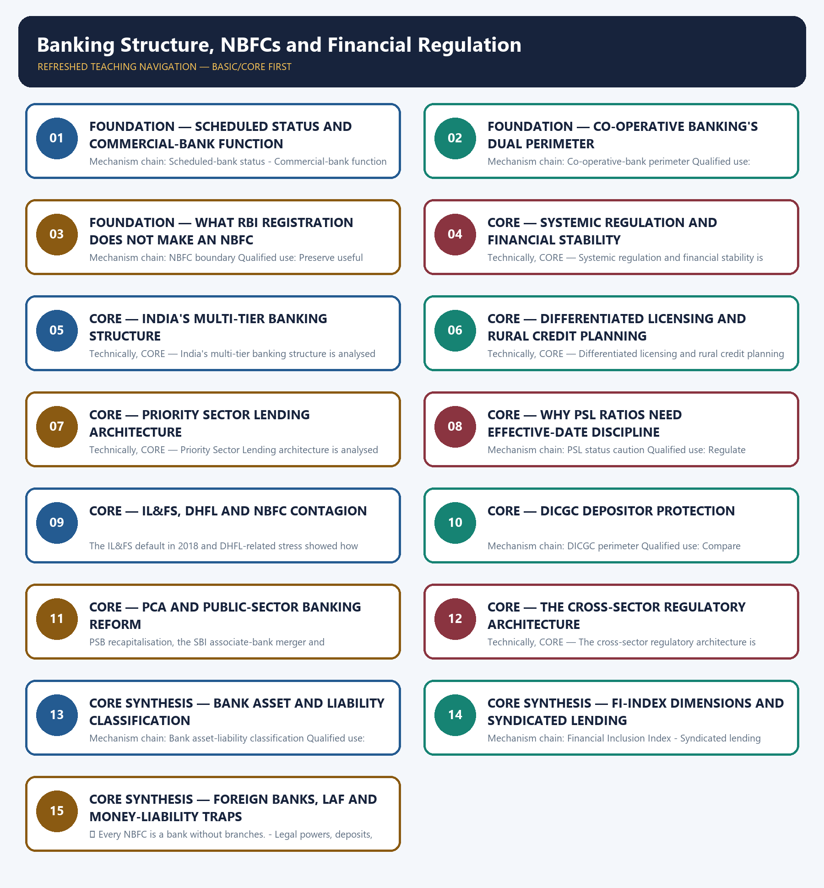

# Banking Structure, NBFCs and Financial Regulation — Learner-v2 Complete Learning Session

> **Authoring-only generation:** 2026-09-03. No PDF was rendered and no tracker or index was mutated.

### SOURCE, PROGRESSION AND CURRENT-LINKAGE AUDIT

- **Generation date:** 2026-09-03.
- **Repository-first evidence:** the Basic owner is taught first and preserved in full; the Advanced owner is retained only in the optional final teaching block.
- **OCR evidence:** Repository Markdown was primary. OCR-searchable local official General Studies papers were used only to confirm printed routed demands. No answer key, marking scheme, unsupported page precision or current macroeconomic statistic was inferred from them.
- **Qdrant:** not used; repository Markdown and available OCR context were sufficient.
- **PYQ integrity:** The audited ledgers route objective demands on PSB governance, the Service Area Approach, bank assets, public-bank appointments, demand deposits, urban co-operative banks, Banks Board Bureau, NBFC/LAF distinctions, foreign banks, syndicated lending, FI-Index dimensions and NBFC deposit and payment privileges here. No Mains demand or answer letter is invented.
- **Live-link boundary:** The DICGC landing page returned two protection-account percentages but no visible vintage or denominator in the fetched text. They are therefore not quoted as current evidence. Stable statutory deposit-insurance scope and the owner's stated cap are retained from the audited Markdown owner.
- **Fact/inference discipline:** no current-affairs item, PYQ wording, figure or quotation is invented.

### LIVE OFFICIAL-SOURCE ATTEMPT LOG

The checks below were made on 2026-09-03. Substantive official text is used only for the proposition it actually supports; binary files, dynamic shells, stubs and undated dashboard snippets are recorded but not converted into current claims.

- https://www.dicgc.org.in/ — retrieved 2026-09-03; the official landing page returned only the current split 'Fully Protected Accounts 97.60%' and 'Partly Protected Accounts 2.40%' without a visible reference date or denominator in the fetched text, so those percentages were logged but not used as a dated analytical claim.

## BASIC LEARNING SESSION

### DEEP-REVIEW LEARNING CONTRACT

| Control | Binding rule for this package |
|---|---|
| Syllabus boundary | Complete Economy Basic/Core is answer-complete before optional Advanced depth. |
| Formula boundary | Formula, numerator, denominator, unit, stock/flow, nominal/real, base year, level/rate and accounting identity are explicit. |
| Institutional boundary | Constitution, statute, delegated rule, regulator mandate, policy, recommendation, scheme and implementation outcome remain distinct. |
| Transmission method | Shock or instrument → prices/quantities/balance sheets/incentives → institution and market response → output, employment, distribution, stability and external effect → lag and trade-off. |
| Current-data method | Source → release date → reference period → unit/denominator → provisional/revised/final status; incompatible Budget, Survey or statistical vintages are never mixed. |
| Programme-status method | Announced → approved → notified/guidelines issued → funded → operational → utilised → output → outcome are separate stages. |
| External/WTO method | Agreement text, member category, box, limit, notification, consultation, dispute and ruling are qualified without invented thresholds. |
| Causal method | Accounting identity, chronology and correlation are not promoted into behavioural or causal claims without mechanism, counterfactual and alternatives. |
| Answer balance | Model answers balance growth, distribution, stability, sustainability and federal dimensions with India-centric evidence. |
| Practice contract | Every solved item has demand decoding, a detailed examiner-grade model, executable timed/compression plan, marks rationale and answer-specific improvement. |
| Approval | This immutable successor remains `approved: false` pending explicit approval. |

**Canonical Basic/Core owner:** `upsc-ai-kit\knowledge\Economy\basic\05_Banking-Structure-NBFCs-and-Financial-Regulation.md`  
**Substantive canonical provenance owner:** `upsc-ai-kit\knowledge\Economy\05_Banking-Structure-NBFCs-and-Financial-Regulation_Learner-V2-Complete-Topic-Package.md`  
**Optional Advanced owner:** `upsc-ai-kit\knowledge\Economy\advanced\05_Banking-Structure-NBFCs-and-Financial-Regulation.md`  
**Official syllabus mapping:** `upsc-ai-kit\knowledge\Economy\OFFICIAL-UPSC-SYLLABUS-MAPPING.md`

### EVIDENCE, PYQ AND CURRENT-STATUS CONTROL

- Every data-heavy table states unit, denominator, geography, reference period and source/status.
- GDP/GVA, gross/net, domestic/national, nominal/real and level/rate distinctions remain exact.
- Monetary, fiscal and external chains state intermediaries, balance-sheet channels, lags, leakages and trade-offs.
- Budget and Economic Survey editions are never mixed; BE, RE, Actual, advance/provisional/revised/final estimates remain labelled.
- Scheme and programme claims distinguish announcement, approval, notification, operation, coverage, utilisation and measured outcome.
- WTO boxes, limits, de minimis, special treatment, notifications and disputes are qualified from authoritative rules.
- PYQ wording is preserved only where verified; reconstructed or routed demands remain labelled.
- **Current-status note, rechecked 2026-09-03:** volatile rates, estimates, scheme status, trade rules and institutional claims retain official source, release date, reference period and revision status.

**Generation-local live/current sources:**
- `https://www.dicgc.org.in/ — retrieved 2026-09-03; the official landing page returned only the current split 'Fully Protected Accounts 97.60%' and 'Partly Protected Accounts 2.40%' without a visible reference date or denominator in the fetched text, so those percentages were logged but not used as a dated analytical claim.`




*Distinct embedded teaching-navigation image. The separate continuous Cārvāka-style flowchart package remains an independent at-a-glance artifact.*

### SESSION 1 — FOUNDATION — SCHEDULED STATUS AND COMMERCIAL-BANK FUNCTION

#### DEFINITION / WHAT THIS IS CALLED

**Plain-language definition:** A scheduled bank is included in the Second Schedule to the RBI Act subject to eligibility conditions; scheduled status is a legal classification rather than a guarantee against failure.

**Technical definition:** Mechanism chain: Scheduled-bank status - Commercial-bank function Qualified use: Compare institutions by legal powers, funding model, safety nets, payment access and supervisory intensity.

#### ANSWER-GRABBING OPENING — WRITE/ADAPT IN THE EXAM

> A scheduled bank is included in the Second Schedule to the RBI Act subject to eligibility conditions; scheduled status is a legal classification rather than a guarantee against failure.

#### MUST-WRITE KEYWORDS

- **FOUNDATION**
- **Scheduled status**
- **commercial-bank function**
- **Mechanism chain**
- **Qualified use**
- **A scheduled bank**

**How to use them:** Frame the answer through FOUNDATION; define Scheduled status, connect commercial-bank function with Mechanism chain to explain the mechanism, and use Qualified use for the decisive comparison or qualification.

#### VISUAL FIRST

```text
SCHEDULED STATUS AND COMMERCIAL-BANK FUNCTION
01. Scheduled-bank status
    |
    v
02. Commercial-bank function
BOUNDARY -> Do not call every RBI-registered NBFC a bank without branches.
```

*This topic-specific rail fixes the evidence sequence and its exam boundary before analysis.*

#### CORE EXPLANATION

A scheduled bank is included in the Second Schedule to the RBI Act subject to eligibility conditions; scheduled status is a legal classification rather than a guarantee against failure. Commercial banks accept deposits, provide payment services and allocate credit, transforming short-maturity withdrawable liabilities into longer-maturity loans and investments.

#### NAMED EVIDENCE AND MECHANISM

- A scheduled bank is included in the Second Schedule to the RBI Act subject to eligibility conditions; scheduled status is a legal classification rather than a guarantee against failure.
- Commercial banks accept deposits, provide payment services and allocate credit, transforming short-maturity withdrawable liabilities into longer-maturity loans and investments.

#### EXAMINER CAUTION

- Do not call every RBI-registered NBFC a bank without branches.

#### EXAM LINK

- **Prelims:** Preserve the exact formula, territorial or resident boundary, price basis, base year, index basket, eligible counterparty, institution and legal status; never upgrade a projection into an actual or a regulatory direction into a universal rule.
- **Mains:** Compare institutions by legal powers, funding model, safety nets, payment access and supervisory intensity.

#### MINI RECAP

- **Mechanism chain:** Scheduled-bank status -> Commercial-bank function
- **Qualified use:** Compare institutions by legal powers, funding model, safety nets, payment access and supervisory intensity.

#### CLOSING RECALL FLOW — FOUNDATION — SCHEDULED STATUS AND COMMERCIAL-BANK FUNCTION

```text
START / CONCEPT: FOUNDATION — Scheduled status and commercial-bank function
        |
        v
EXACT TERMS: FOUNDATION · Scheduled status · commercial-bank function · Mechanism chain · Qualified use · A scheduled bank
        |
        v
MECHANISM / ARGUMENT: Mechanism chain: Scheduled-bank status - Commercial-bank function Qualified use: Compare institutions by legal powers, funding model, safety nets, payment access and supervisory intensity.
        |
        v
CONSEQUENCE / CONTRAST: Do not call every RBI-registered NBFC a bank without branches.
        |
        v
UPSC TRAP / ANSWER-USE: Do not miss this limiting distinction: scheduled-bank status - Commercial-bank function Qualified use.
        |
        v
ANSWER-GRABBING FORMULATION: A scheduled bank is included in the Second Schedule to the RBI Act subject to eligibility conditions; scheduled status is a legal classification rather than a guarantee against failure.
```
### SESSION 2 — FOUNDATION — CO-OPERATIVE BANKING'S DUAL PERIMETER

#### DEFINITION / WHAT THIS IS CALLED

**Plain-language definition:** Co-operative banks are member-based institutions governed by co-operative law while their banking functions also attract RBI and banking-law oversight.

**Technical definition:** Mechanism chain: Co-operative-bank perimeter Qualified use: Regulate according to function, leverage, liquidity fragility and systemic interconnectedness.

#### ANSWER-GRABBING OPENING — WRITE/ADAPT IN THE EXAM

> Co-operative banks are member-based institutions governed by co-operative law while their banking functions also attract RBI and banking-law oversight.

#### MUST-WRITE KEYWORDS

- **FOUNDATION**
- **Co-operative banking's dual perimeter**
- **Mechanism chain**
- **Qualified use**
- **Co-operative banks**
- **Co-operative**

**How to use them:** Frame the answer through FOUNDATION; define Co-operative banking's dual perimeter, connect Mechanism chain with Qualified use to explain the mechanism, and use Co-operative banks for the decisive comparison or qualification.

#### VISUAL FIRST

```text
CO-OPERATIVE BANKING'S DUAL PERIMETER
01. Co-operative-bank perimeter
BOUNDARY -> Do not assume all co-operative banking activity is regulated only by states.
```

*This topic-specific rail fixes the evidence sequence and its exam boundary before analysis.*

#### CORE EXPLANATION

Co-operative banks are member-based institutions governed by co-operative law while their banking functions also attract RBI and banking-law oversight.

#### NAMED EVIDENCE AND MECHANISM

- Co-operative banks are member-based institutions governed by co-operative law while their banking functions also attract RBI and banking-law oversight.

#### EXAMINER CAUTION

- Do not assume all co-operative banking activity is regulated only by states.

#### EXAM LINK

- **Prelims:** Preserve the exact formula, territorial or resident boundary, price basis, base year, index basket, eligible counterparty, institution and legal status; never upgrade a projection into an actual or a regulatory direction into a universal rule.
- **Mains:** Regulate according to function, leverage, liquidity fragility and systemic interconnectedness.

#### MINI RECAP

- **Mechanism chain:** Co-operative-bank perimeter
- **Qualified use:** Regulate according to function, leverage, liquidity fragility and systemic interconnectedness.

#### CLOSING RECALL FLOW — FOUNDATION — CO-OPERATIVE BANKING'S DUAL PERIMETER

```text
START / CONCEPT: FOUNDATION — Co-operative banking's dual perimeter
        |
        v
EXACT TERMS: FOUNDATION · Co-operative banking's dual perimeter · Mechanism chain · Qualified use · Co-operative banks · Co-operative
        |
        v
MECHANISM / ARGUMENT: Mechanism chain: Co-operative-bank perimeter Qualified use: Regulate according to function, leverage, liquidity fragility and systemic interconnectedness.
        |
        v
CONSEQUENCE / CONTRAST: Do not assume all co-operative banking activity is regulated only by states.
        |
        v
UPSC TRAP / ANSWER-USE: Do not miss this limiting distinction: co-operative banks are member-based institutions governed by co-operative law while their banking functions also...
        |
        v
ANSWER-GRABBING FORMULATION: Co-operative banks are member-based institutions governed by co-operative law while their banking functions also attract RBI and banking-law oversight.
```
### SESSION 3 — FOUNDATION — WHAT RBI REGISTRATION DOES NOT MAKE AN NBFC

#### DEFINITION / WHAT THIS IS CALLED

**Plain-language definition:** An NBFC is a company carrying specified financial activity without being a bank; RBI registration does not confer full bank-style demand-deposit, cheque-payment or DICGC privileges.

**Technical definition:** Mechanism chain: NBFC boundary Qualified use: Preserve useful institutional diversity while preventing regulatory arbitrage and moral hazard.

#### ANSWER-GRABBING OPENING — WRITE/ADAPT IN THE EXAM

> An NBFC is a company carrying specified financial activity without being a bank; RBI registration does not confer full bank-style demand-deposit, cheque-payment or DICGC privileges.

#### MUST-WRITE KEYWORDS

- **FOUNDATION**
- **Mechanism chain**
- **Qualified use**
- **An NBFC**
- **RBI**
- **DICGC**

**How to use them:** Frame the answer through FOUNDATION; define Mechanism chain, connect Qualified use with An NBFC to explain the mechanism, and use RBI for the decisive comparison or qualification.

#### VISUAL FIRST

```text
WHAT RBI REGISTRATION DOES NOT MAKE AN NBFC
01. NBFC boundary
BOUNDARY -> Do not extend DICGC cover to bonds, mutual funds, insurance products or ordinary NBFC liabilities.
```

*This topic-specific rail fixes the evidence sequence and its exam boundary before analysis.*

#### CORE EXPLANATION

An NBFC is a company carrying specified financial activity without being a bank; RBI registration does not confer full bank-style demand-deposit, cheque-payment or DICGC privileges.

#### NAMED EVIDENCE AND MECHANISM

- An NBFC is a company carrying specified financial activity without being a bank; RBI registration does not confer full bank-style demand-deposit, cheque-payment or DICGC privileges.

#### EXAMINER CAUTION

- Do not extend DICGC cover to bonds, mutual funds, insurance products or ordinary NBFC liabilities.

#### EXAM LINK

- **Prelims:** Preserve the exact formula, territorial or resident boundary, price basis, base year, index basket, eligible counterparty, institution and legal status; never upgrade a projection into an actual or a regulatory direction into a universal rule.
- **Mains:** Preserve useful institutional diversity while preventing regulatory arbitrage and moral hazard.

#### MINI RECAP

- **Mechanism chain:** NBFC boundary
- **Qualified use:** Preserve useful institutional diversity while preventing regulatory arbitrage and moral hazard.

#### CLOSING RECALL FLOW — FOUNDATION — WHAT RBI REGISTRATION DOES NOT MAKE AN NBFC

```text
START / CONCEPT: FOUNDATION — What RBI registration does not make an NBFC
        |
        v
EXACT TERMS: FOUNDATION · Mechanism chain · Qualified use · An NBFC · RBI · DICGC
        |
        v
MECHANISM / ARGUMENT: Mechanism chain: NBFC boundary Qualified use: Preserve useful institutional diversity while preventing regulatory arbitrage and moral hazard.
        |
        v
CONSEQUENCE / CONTRAST: Do not extend DICGC cover to bonds, mutual funds, insurance products or ordinary NBFC liabilities.
        |
        v
UPSC TRAP / ANSWER-USE: Do not miss this limiting distinction: an NBFC is a company carrying specified financial activity without being a bank.
        |
        v
ANSWER-GRABBING FORMULATION: An NBFC is a company carrying specified financial activity without being a bank; RBI registration does not confer full bank-style demand-deposit, cheque-payment or DICGC privileges.
```
### SESSION 4 — CORE — SYSTEMIC REGULATION AND FINANCIAL STABILITY

#### DEFINITION / WHAT THIS IS CALLED

**Plain-language definition:** Mechanism chain: Systemic regulation Qualified use: Compare institutions by legal powers, funding model, safety nets, payment access and supervisory intensity.

**Technical definition:** Technically, CORE — Systemic regulation and financial stability is analysed by relating Systemic regulation to financial stability, then testing the relationship through Mechanism chain and Qualified use.

#### ANSWER-GRABBING OPENING — WRITE/ADAPT IN THE EXAM

> Mechanism chain: Systemic regulation Qualified use: Compare institutions by legal powers, funding model, safety nets, payment access and supervisory intensity.

#### MUST-WRITE KEYWORDS

- **Systemic regulation**
- **financial stability**
- **Mechanism chain**
- **Qualified use**
- **PCA**
- **Systemic**

**How to use them:** Frame the answer through Systemic regulation; define financial stability, connect Mechanism chain with Qualified use to explain the mechanism, and use PCA for the decisive comparison or qualification.

#### VISUAL FIRST

```text
SYSTEMIC REGULATION AND FINANCIAL STABILITY
01. Systemic regulation
BOUNDARY -> Do not equate PCA with liquidation or deposit-insurance payout.
```

*This topic-specific rail fixes the evidence sequence and its exam boundary before analysis.*

#### CORE EXPLANATION

Systemic regulation addresses institutional safety and financial-system stability through entry, governance, prudential, conduct, reporting and interconnectedness rules.

#### NAMED EVIDENCE AND MECHANISM

- Systemic regulation addresses institutional safety and financial-system stability through entry, governance, prudential, conduct, reporting and interconnectedness rules.

#### EXAMINER CAUTION

- Do not equate PCA with liquidation or deposit-insurance payout.

#### EXAM LINK

- **Prelims:** Preserve the exact formula, territorial or resident boundary, price basis, base year, index basket, eligible counterparty, institution and legal status; never upgrade a projection into an actual or a regulatory direction into a universal rule.
- **Mains:** Compare institutions by legal powers, funding model, safety nets, payment access and supervisory intensity.

#### MINI RECAP

- **Mechanism chain:** Systemic regulation
- **Qualified use:** Compare institutions by legal powers, funding model, safety nets, payment access and supervisory intensity.

#### CLOSING RECALL FLOW — CORE — SYSTEMIC REGULATION AND FINANCIAL STABILITY

```text
START / CONCEPT: CORE — Systemic regulation and financial stability
        |
        v
EXACT TERMS: Systemic regulation · financial stability · Mechanism chain · Qualified use · PCA · Systemic
        |
        v
MECHANISM / ARGUMENT: Do not equate PCA with liquidation or deposit-insurance payout.
        |
        v
CONSEQUENCE / CONTRAST: The resulting consequence is that compare institutions by legal powers, funding model, safety nets, payment access and supervisory intensity.
        |
        v
UPSC TRAP / ANSWER-USE: Do not miss this limiting distinction: compare institutions by legal powers, funding model, safety nets, payment access and supervisory intensity.
        |
        v
ANSWER-GRABBING FORMULATION: Mechanism chain: Systemic regulation Qualified use: Compare institutions by legal powers, funding model, safety nets, payment access and supervisory intensity.
```
### SESSION 5 — CORE — INDIA'S MULTI-TIER BANKING STRUCTURE

#### DEFINITION / WHAT THIS IS CALLED

**Plain-language definition:** Mechanism chain: Multi-tier banking structure Qualified use: Regulate according to function, leverage, liquidity fragility and systemic interconnectedness.

**Technical definition:** Technically, CORE — India's multi-tier banking structure is analysed by relating India's multi-tier banking structure to Mechanism chain, then testing the relationship through Qualified use and Multi-tier.

#### ANSWER-GRABBING OPENING — WRITE/ADAPT IN THE EXAM

> Mechanism chain: Multi-tier banking structure Qualified use: Regulate according to function, leverage, liquidity fragility and systemic interconnectedness.

#### MUST-WRITE KEYWORDS

- **India's multi-tier banking structure**
- **Mechanism chain**
- **Qualified use**
- **Multi-tier**
- **Qualified**
- **Regulate**

**How to use them:** Frame the answer through India's multi-tier banking structure; define Mechanism chain, connect Qualified use with Multi-tier to explain the mechanism, and use Qualified for the decisive comparison or qualification.

#### VISUAL FIRST

```text
INDIA'S MULTI-TIER BANKING STRUCTURE
01. Multi-tier banking structure
BOUNDARY -> Do not treat public ownership or a licence as proof of sound governance.
```

*This topic-specific rail fixes the evidence sequence and its exam boundary before analysis.*

#### CORE EXPLANATION

India combines public, private and foreign banks, Regional Rural Banks, co-operative banks, Small Finance Banks and Payments Banks to serve different ownership, reach, credit and payment functions.

#### NAMED EVIDENCE AND MECHANISM

- India combines public, private and foreign banks, Regional Rural Banks, co-operative banks, Small Finance Banks and Payments Banks to serve different ownership, reach, credit and payment functions.

#### EXAMINER CAUTION

- Do not treat public ownership or a licence as proof of sound governance.

#### EXAM LINK

- **Prelims:** Preserve the exact formula, territorial or resident boundary, price basis, base year, index basket, eligible counterparty, institution and legal status; never upgrade a projection into an actual or a regulatory direction into a universal rule.
- **Mains:** Regulate according to function, leverage, liquidity fragility and systemic interconnectedness.

#### MINI RECAP

- **Mechanism chain:** Multi-tier banking structure
- **Qualified use:** Regulate according to function, leverage, liquidity fragility and systemic interconnectedness.

#### CLOSING RECALL FLOW — CORE — INDIA'S MULTI-TIER BANKING STRUCTURE

```text
START / CONCEPT: CORE — India's multi-tier banking structure
        |
        v
EXACT TERMS: India's multi-tier banking structure · Mechanism chain · Qualified use · Multi-tier · Qualified · Regulate
        |
        v
MECHANISM / ARGUMENT: Do not treat public ownership or a licence as proof of sound governance.
        |
        v
CONSEQUENCE / CONTRAST: The resulting consequence is that regulate according to function, leverage, liquidity fragility and systemic interconnectedness.
        |
        v
UPSC TRAP / ANSWER-USE: Do not miss this limiting distinction: regulate according to function, leverage, liquidity fragility and systemic interconnectedness.
        |
        v
ANSWER-GRABBING FORMULATION: Mechanism chain: Multi-tier banking structure Qualified use: Regulate according to function, leverage, liquidity fragility and systemic interconnectedness.
```
### SESSION 6 — CORE — DIFFERENTIATED LICENSING AND RURAL CREDIT PLANNING

#### DEFINITION / WHAT THIS IS CALLED

**Plain-language definition:** Mechanism chain: Differentiated licensing - Rural place-based architecture Qualified use: Preserve useful institutional diversity while preventing regulatory arbitrage and moral hazard.

**Technical definition:** Technically, CORE — Differentiated licensing and rural credit planning is analysed by relating Differentiated licensing to rural credit planning, then testing the relationship through Mechanism chain and Qualified use.

#### ANSWER-GRABBING OPENING — WRITE/ADAPT IN THE EXAM

> Mechanism chain: Differentiated licensing - Rural place-based architecture Qualified use: Preserve useful institutional diversity while preventing regulatory arbitrage and moral hazard.

#### MUST-WRITE KEYWORDS

- **Differentiated licensing**
- **rural credit planning**
- **Mechanism chain**
- **Qualified use**
- **Payments Banks**
- **Differentiated**

**How to use them:** Frame the answer through Differentiated licensing; define rural credit planning, connect Mechanism chain with Qualified use to explain the mechanism, and use Payments Banks for the decisive comparison or qualification.

#### VISUAL FIRST

```text
DIFFERENTIATED LICENSING AND RURAL CREDIT PLANNING
01. Differentiated licensing
    |
    v
02. Rural place-based architecture
BOUNDARY -> Do not assume Payments Banks can lend from their own balance sheets.
```

*This topic-specific rail fixes the evidence sequence and its exam boundary before analysis.*

#### CORE EXPLANATION

Small Finance Banks undertake deposit mobilisation and lending, whereas Payments Banks focus on deposits and payments and cannot lend from their own balance sheets. RRBs, the Lead Bank Scheme and Service Area Approach linked branch expansion and formal rural credit with district and local-area planning.

#### NAMED EVIDENCE AND MECHANISM

- Small Finance Banks undertake deposit mobilisation and lending, whereas Payments Banks focus on deposits and payments and cannot lend from their own balance sheets.
- RRBs, the Lead Bank Scheme and Service Area Approach linked branch expansion and formal rural credit with district and local-area planning.

#### EXAMINER CAUTION

- Do not assume Payments Banks can lend from their own balance sheets.

#### EXAM LINK

- **Prelims:** Preserve the exact formula, territorial or resident boundary, price basis, base year, index basket, eligible counterparty, institution and legal status; never upgrade a projection into an actual or a regulatory direction into a universal rule.
- **Mains:** Preserve useful institutional diversity while preventing regulatory arbitrage and moral hazard.

#### MINI RECAP

- **Mechanism chain:** Differentiated licensing -> Rural place-based architecture
- **Qualified use:** Preserve useful institutional diversity while preventing regulatory arbitrage and moral hazard.

#### CLOSING RECALL FLOW — CORE — DIFFERENTIATED LICENSING AND RURAL CREDIT PLANNING

```text
START / CONCEPT: CORE — Differentiated licensing and rural credit planning
        |
        v
EXACT TERMS: Differentiated licensing · rural credit planning · Mechanism chain · Qualified use · Payments Banks · Differentiated
        |
        v
MECHANISM / ARGUMENT: Do not assume Payments Banks can lend from their own balance sheets.
        |
        v
CONSEQUENCE / CONTRAST: The resulting consequence is that differentiated licensing - Rural place-based architecture Qualified use.
        |
        v
UPSC TRAP / ANSWER-USE: Do not miss this limiting distinction: differentiated licensing - Rural place-based architecture Qualified use.
        |
        v
ANSWER-GRABBING FORMULATION: Mechanism chain: Differentiated licensing - Rural place-based architecture Qualified use: Preserve useful institutional diversity while preventing regulatory arbitrage and moral hazard.
```
### SESSION 7 — CORE — PRIORITY SECTOR LENDING ARCHITECTURE

#### DEFINITION / WHAT THIS IS CALLED

**Plain-language definition:** Mechanism chain: Priority Sector Lending Qualified use: Compare institutions by legal powers, funding model, safety nets, payment access and supervisory intensity.

**Technical definition:** Technically, CORE — Priority Sector Lending architecture is analysed by relating Priority Sector Lending architecture to Mechanism chain, then testing the relationship through Qualified use and PSL.

#### ANSWER-GRABBING OPENING — WRITE/ADAPT IN THE EXAM

> Mechanism chain: Priority Sector Lending Qualified use: Compare institutions by legal powers, funding model, safety nets, payment access and supervisory intensity.

#### MUST-WRITE KEYWORDS

- **Priority Sector Lending architecture**
- **Mechanism chain**
- **Qualified use**
- **PSL**
- **Master Direction**
- **Priority Sector Lending Qualified**

**How to use them:** Frame the answer through Priority Sector Lending architecture; define Mechanism chain, connect Qualified use with PSL to explain the mechanism, and use Master Direction for the decisive comparison or qualification.

#### VISUAL FIRST

```text
PRIORITY SECTOR LENDING ARCHITECTURE
01. Priority Sector Lending
BOUNDARY -> Do not present PSL ratios as timeless; retain the effective Master Direction.
```

*This topic-specific rail fixes the evidence sequence and its exam boundary before analysis.*

#### CORE EXPLANATION

RBI's owner record states a 40 per cent ANBC or credit-equivalent target for most domestic banks, 18 per cent for agriculture including 10 per cent for small and marginal farmers, and 12 per cent for weaker sections, with higher overall targets for RRBs and SFBs under the latest cited direction.

#### NAMED EVIDENCE AND MECHANISM

- RBI's owner record states a 40 per cent ANBC or credit-equivalent target for most domestic banks, 18 per cent for agriculture including 10 per cent for small and marginal farmers, and 12 per cent for weaker sections, with higher overall targets for RRBs and SFBs under the latest cited direction.

#### EXAMINER CAUTION

- Do not present PSL ratios as timeless; retain the effective Master Direction.

#### EXAM LINK

- **Prelims:** Preserve the exact formula, territorial or resident boundary, price basis, base year, index basket, eligible counterparty, institution and legal status; never upgrade a projection into an actual or a regulatory direction into a universal rule.
- **Mains:** Compare institutions by legal powers, funding model, safety nets, payment access and supervisory intensity.

#### MINI RECAP

- **Mechanism chain:** Priority Sector Lending
- **Qualified use:** Compare institutions by legal powers, funding model, safety nets, payment access and supervisory intensity.

#### CLOSING RECALL FLOW — CORE — PRIORITY SECTOR LENDING ARCHITECTURE

```text
START / CONCEPT: CORE — Priority Sector Lending architecture
        |
        v
EXACT TERMS: Priority Sector Lending architecture · Mechanism chain · Qualified use · PSL · Master Direction · Priority Sector Lending Qualified
        |
        v
MECHANISM / ARGUMENT: Do not present PSL ratios as timeless; retain the effective Master Direction.
        |
        v
CONSEQUENCE / CONTRAST: The resulting consequence is that compare institutions by legal powers, funding model, safety nets, payment access and supervisory intensity.
        |
        v
UPSC TRAP / ANSWER-USE: Do not miss this limiting distinction: compare institutions by legal powers, funding model, safety nets, payment access and supervisory intensity.
        |
        v
ANSWER-GRABBING FORMULATION: Mechanism chain: Priority Sector Lending Qualified use: Compare institutions by legal powers, funding model, safety nets, payment access and supervisory intensity.
```
### SESSION 8 — CORE — WHY PSL RATIOS NEED EFFECTIVE-DATE DISCIPLINE

#### DEFINITION / WHAT THIS IS CALLED

**Plain-language definition:** PSL ratios, sub-targets and categories are periodically revised through RBI Master Directions, so a cited ratio must retain its effective direction and cannot be presented as a permanent constitutional or statutory number.

**Technical definition:** Mechanism chain: PSL status caution Qualified use: Regulate according to function, leverage, liquidity fragility and systemic interconnectedness.

#### ANSWER-GRABBING OPENING — WRITE/ADAPT IN THE EXAM

> PSL ratios, sub-targets and categories are periodically revised through RBI Master Directions, so a cited ratio must retain its effective direction and cannot be presented as a permanent constitutional or statutory number.

#### MUST-WRITE KEYWORDS

- **Why PSL ratios need effective-date discipline**
- **Mechanism chain**
- **Qualified use**
- **PSL ratios, sub-targets and categories**
- **PSL**
- **RBI Master Directions**

**How to use them:** Frame the answer through Why PSL ratios need effective-date discipline; define Mechanism chain, connect Qualified use with PSL ratios, sub-targets and categories to explain the mechanism, and use PSL for the decisive comparison or qualification.

#### VISUAL FIRST

```text
WHY PSL RATIOS NEED EFFECTIVE-DATE DISCIPLINE
01. PSL status caution
BOUNDARY -> Do not infer routine LAF access for ordinary NBFCs.
```

*This topic-specific rail fixes the evidence sequence and its exam boundary before analysis.*

#### CORE EXPLANATION

PSL ratios, sub-targets and categories are periodically revised through RBI Master Directions, so a cited ratio must retain its effective direction and cannot be presented as a permanent constitutional or statutory number.

#### NAMED EVIDENCE AND MECHANISM

- PSL ratios, sub-targets and categories are periodically revised through RBI Master Directions, so a cited ratio must retain its effective direction and cannot be presented as a permanent constitutional or statutory number.

#### EXAMINER CAUTION

- Do not infer routine LAF access for ordinary NBFCs.

#### EXAM LINK

- **Prelims:** Preserve the exact formula, territorial or resident boundary, price basis, base year, index basket, eligible counterparty, institution and legal status; never upgrade a projection into an actual or a regulatory direction into a universal rule.
- **Mains:** Regulate according to function, leverage, liquidity fragility and systemic interconnectedness.

#### MINI RECAP

- **Mechanism chain:** PSL status caution
- **Qualified use:** Regulate according to function, leverage, liquidity fragility and systemic interconnectedness.

#### CLOSING RECALL FLOW — CORE — WHY PSL RATIOS NEED EFFECTIVE-DATE DISCIPLINE

```text
START / CONCEPT: CORE — Why PSL ratios need effective-date discipline
        |
        v
EXACT TERMS: Why PSL ratios need effective-date discipline · Mechanism chain · Qualified use · PSL ratios, sub-targets and categories · PSL · RBI Master Directions
        |
        v
MECHANISM / ARGUMENT: Mechanism chain: PSL status caution Qualified use: Regulate according to function, leverage, liquidity fragility and systemic interconnectedness.
        |
        v
CONSEQUENCE / CONTRAST: Do not infer routine LAF access for ordinary NBFCs.
        |
        v
UPSC TRAP / ANSWER-USE: Do not miss this limiting distinction: pSL ratios, sub-targets and categories are periodically revised through RBI Master Directions, so a...
        |
        v
ANSWER-GRABBING FORMULATION: PSL ratios, sub-targets and categories are periodically revised through RBI Master Directions, so a cited ratio must retain its effective direction and cannot be presented as a permanent constitutional or statutory number.
```
### SESSION 9 — CORE — IL&FS, DHFL AND NBFC CONTAGION

#### DEFINITION / WHAT THIS IS CALLED

**Plain-language definition:** Mechanism chain: NBFC contagion risk Qualified use: Preserve useful institutional diversity while preventing regulatory arbitrage and moral hazard.

**Technical definition:** The IL&FS default in 2018 and DHFL-related stress showed how wholesale funding, maturity mismatch and interconnectedness can transmit NBFC stress to mutual funds, banks and credit markets.

#### ANSWER-GRABBING OPENING — WRITE/ADAPT IN THE EXAM

> Mechanism chain: NBFC contagion risk Qualified use: Preserve useful institutional diversity while preventing regulatory arbitrage and moral hazard.

#### MUST-WRITE KEYWORDS

- **IL&FS**
- **DHFL**
- **NBFC contagion**
- **Mechanism chain**
- **Qualified use**
- **The IL**

**How to use them:** Frame the answer through IL&FS; define DHFL, connect NBFC contagion with Mechanism chain to explain the mechanism, and use Qualified use for the decisive comparison or qualification.

#### VISUAL FIRST

```text
IL&FS, DHFL AND NBFC CONTAGION
01. NBFC contagion risk
BOUNDARY -> Do not confuse deposits, which are bank liabilities, with loans and investments, which are assets.
```

*This topic-specific rail fixes the evidence sequence and its exam boundary before analysis.*

#### CORE EXPLANATION

The IL&FS default in 2018 and DHFL-related stress showed how wholesale funding, maturity mismatch and interconnectedness can transmit NBFC stress to mutual funds, banks and credit markets.

#### NAMED EVIDENCE AND MECHANISM

- The IL&FS default in 2018 and DHFL-related stress showed how wholesale funding, maturity mismatch and interconnectedness can transmit NBFC stress to mutual funds, banks and credit markets.

#### EXAMINER CAUTION

- Do not confuse deposits, which are bank liabilities, with loans and investments, which are assets.

#### EXAM LINK

- **Prelims:** Preserve the exact formula, territorial or resident boundary, price basis, base year, index basket, eligible counterparty, institution and legal status; never upgrade a projection into an actual or a regulatory direction into a universal rule.
- **Mains:** Preserve useful institutional diversity while preventing regulatory arbitrage and moral hazard.

#### MINI RECAP

- **Mechanism chain:** NBFC contagion risk
- **Qualified use:** Preserve useful institutional diversity while preventing regulatory arbitrage and moral hazard.

#### CLOSING RECALL FLOW — CORE — IL&FS, DHFL AND NBFC CONTAGION

```text
START / CONCEPT: CORE — IL&FS, DHFL and NBFC contagion
        |
        v
EXACT TERMS: IL&FS · DHFL · NBFC contagion · Mechanism chain · Qualified use · The IL
        |
        v
MECHANISM / ARGUMENT: The IL&FS default in 2018 and DHFL-related stress showed how wholesale funding, maturity mismatch and interconnectedness can transmit NBFC stress to mutual funds, banks and credit markets.
        |
        v
CONSEQUENCE / CONTRAST: Do not confuse deposits, which are bank liabilities, with loans and investments, which are assets.
        |
        v
UPSC TRAP / ANSWER-USE: Do not miss this limiting distinction: preserve useful institutional diversity while preventing regulatory arbitrage and moral hazard.
        |
        v
ANSWER-GRABBING FORMULATION: Mechanism chain: NBFC contagion risk Qualified use: Preserve useful institutional diversity while preventing regulatory arbitrage and moral hazard.
```
### SESSION 10 — CORE — DICGC DEPOSITOR PROTECTION

#### DEFINITION / WHAT THIS IS CALLED

**Plain-language definition:** DICGC provides statutory insurance for eligible deposits in covered banks up to the owner's stated cap of five lakh rupees per depositor per bank, including principal and interest, but not shares, bonds, mutual funds or ordinary NBFC liabilities.

**Technical definition:** Mechanism chain: DICGC perimeter Qualified use: Compare institutions by legal powers, funding model, safety nets, payment access and supervisory intensity.

#### ANSWER-GRABBING OPENING — WRITE/ADAPT IN THE EXAM

> DICGC provides statutory insurance for eligible deposits in covered banks up to the owner's stated cap of five lakh rupees per depositor per bank, including principal and interest, but not shares, bonds, mutual funds or ordinary NBFC liabilities.

#### MUST-WRITE KEYWORDS

- **DICGC depositor protection**
- **Mechanism chain**
- **Qualified use**
- **DICGC**
- **NBFC**
- **FI-Index**

**How to use them:** Frame the answer through DICGC depositor protection; define Mechanism chain, connect Qualified use with DICGC to explain the mechanism, and use NBFC for the decisive comparison or qualification.

#### VISUAL FIRST

```text
DICGC DEPOSITOR PROTECTION
01. DICGC perimeter
BOUNDARY -> Do not reduce the FI-Index to account or branch counts; it includes usage and quality.
```

*This topic-specific rail fixes the evidence sequence and its exam boundary before analysis.*

#### CORE EXPLANATION

DICGC provides statutory insurance for eligible deposits in covered banks up to the owner's stated cap of five lakh rupees per depositor per bank, including principal and interest, but not shares, bonds, mutual funds or ordinary NBFC liabilities.

#### NAMED EVIDENCE AND MECHANISM

- DICGC provides statutory insurance for eligible deposits in covered banks up to the owner's stated cap of five lakh rupees per depositor per bank, including principal and interest, but not shares, bonds, mutual funds or ordinary NBFC liabilities.

#### EXAMINER CAUTION

- Do not reduce the FI-Index to account or branch counts; it includes usage and quality.

#### EXAM LINK

- **Prelims:** Preserve the exact formula, territorial or resident boundary, price basis, base year, index basket, eligible counterparty, institution and legal status; never upgrade a projection into an actual or a regulatory direction into a universal rule.
- **Mains:** Compare institutions by legal powers, funding model, safety nets, payment access and supervisory intensity.

#### MINI RECAP

- **Mechanism chain:** DICGC perimeter
- **Qualified use:** Compare institutions by legal powers, funding model, safety nets, payment access and supervisory intensity.

#### CLOSING RECALL FLOW — CORE — DICGC DEPOSITOR PROTECTION

```text
START / CONCEPT: CORE — DICGC depositor protection
        |
        v
EXACT TERMS: DICGC depositor protection · Mechanism chain · Qualified use · DICGC · NBFC · FI-Index
        |
        v
MECHANISM / ARGUMENT: Mechanism chain: DICGC perimeter Qualified use: Compare institutions by legal powers, funding model, safety nets, payment access and supervisory intensity.
        |
        v
CONSEQUENCE / CONTRAST: Do not reduce the FI-Index to account or branch counts; it includes usage and quality.
        |
        v
UPSC TRAP / ANSWER-USE: Do not miss this limiting distinction: dICGC provides statutory insurance for eligible deposits in covered banks up to the owner's...
        |
        v
ANSWER-GRABBING FORMULATION: DICGC provides statutory insurance for eligible deposits in covered banks up to the owner's stated cap of five lakh rupees per depositor per bank, including principal and interest, but not shares, bonds, mutual funds or ordinary NBFC liabilities.
```
### SESSION 11 — CORE — PCA AND PUBLIC-SECTOR BANKING REFORM

#### DEFINITION / WHAT THIS IS CALLED

**Plain-language definition:** Mechanism chain: Prompt Corrective Action - Public-sector banking reform Qualified use: Regulate according to function, leverage, liquidity fragility and systemic interconnectedness.

**Technical definition:** PSB recapitalisation, the SBI associate-bank merger and appointment-governance reforms show that ownership, capital and structure matter alongside prudential supervision.

#### ANSWER-GRABBING OPENING — WRITE/ADAPT IN THE EXAM

> Mechanism chain: Prompt Corrective Action - Public-sector banking reform Qualified use: Regulate according to function, leverage, liquidity fragility and systemic interconnectedness.

#### MUST-WRITE KEYWORDS

- **PCA**
- **public-sector banking reform**
- **Mechanism chain**
- **Qualified use**
- **RBI's PCA**
- **PSB**

**How to use them:** Frame the answer through PCA; define public-sector banking reform, connect Mechanism chain with Qualified use to explain the mechanism, and use RBI's PCA for the decisive comparison or qualification.

#### VISUAL FIRST

```text
PCA AND PUBLIC-SECTOR BANKING REFORM
01. Prompt Corrective Action
    |
    v
02. Public-sector banking reform
BOUNDARY -> Do not generalise foreign-bank branch conditions to wholly owned subsidiaries or vice versa.
```

*This topic-specific rail fixes the evidence sequence and its exam boundary before analysis.*

#### CORE EXPLANATION

RBI's PCA framework uses risk-based thresholds and graduated restrictions for weak banks before disorderly failure; PCA is not liquidation or a deposit-insurance payout. PSB recapitalisation, the SBI associate-bank merger and appointment-governance reforms show that ownership, capital and structure matter alongside prudential supervision.

#### NAMED EVIDENCE AND MECHANISM

- RBI's PCA framework uses risk-based thresholds and graduated restrictions for weak banks before disorderly failure; PCA is not liquidation or a deposit-insurance payout.
- PSB recapitalisation, the SBI associate-bank merger and appointment-governance reforms show that ownership, capital and structure matter alongside prudential supervision.

#### EXAMINER CAUTION

- Do not generalise foreign-bank branch conditions to wholly owned subsidiaries or vice versa.

#### EXAM LINK

- **Prelims:** Preserve the exact formula, territorial or resident boundary, price basis, base year, index basket, eligible counterparty, institution and legal status; never upgrade a projection into an actual or a regulatory direction into a universal rule.
- **Mains:** Regulate according to function, leverage, liquidity fragility and systemic interconnectedness.

#### MINI RECAP

- **Mechanism chain:** Prompt Corrective Action -> Public-sector banking reform
- **Qualified use:** Regulate according to function, leverage, liquidity fragility and systemic interconnectedness.

#### CLOSING RECALL FLOW — CORE — PCA AND PUBLIC-SECTOR BANKING REFORM

```text
START / CONCEPT: CORE — PCA and public-sector banking reform
        |
        v
EXACT TERMS: PCA · public-sector banking reform · Mechanism chain · Qualified use · RBI's PCA · PSB
        |
        v
MECHANISM / ARGUMENT: PSB recapitalisation, the SBI associate-bank merger and appointment-governance reforms show that ownership, capital and structure matter alongside prudential supervision.
        |
        v
CONSEQUENCE / CONTRAST: RBI's PCA framework uses risk-based thresholds and graduated restrictions for weak banks before disorderly failure; PCA is not liquidation or a deposit-insurance payout.
        |
        v
UPSC TRAP / ANSWER-USE: Do not generalise foreign-bank branch conditions to wholly owned subsidiaries or vice versa.
        |
        v
ANSWER-GRABBING FORMULATION: Mechanism chain: Prompt Corrective Action - Public-sector banking reform Qualified use: Regulate according to function, leverage, liquidity fragility and systemic interconnectedness.
```
### SESSION 12 — CORE — THE CROSS-SECTOR REGULATORY ARCHITECTURE

#### DEFINITION / WHAT THIS IS CALLED

**Plain-language definition:** Mechanism chain: Regulatory architecture Qualified use: Preserve useful institutional diversity while preventing regulatory arbitrage and moral hazard.

**Technical definition:** Technically, CORE — The cross-sector regulatory architecture is analysed by relating The cross-sector regulatory architecture to Mechanism chain, then testing the relationship through Qualified use and Regulatory.

#### ANSWER-GRABBING OPENING — WRITE/ADAPT IN THE EXAM

> Mechanism chain: Regulatory architecture Qualified use: Preserve useful institutional diversity while preventing regulatory arbitrage and moral hazard.

#### MUST-WRITE KEYWORDS

- **The cross-sector regulatory architecture**
- **Mechanism chain**
- **Qualified use**
- **Regulatory**
- **Qualified**
- **Preserve**

**How to use them:** Frame the answer through The cross-sector regulatory architecture; define Mechanism chain, connect Qualified use with Regulatory to explain the mechanism, and use Qualified for the decisive comparison or qualification.

#### VISUAL FIRST

```text
THE CROSS-SECTOR REGULATORY ARCHITECTURE
01. Regulatory architecture
BOUNDARY -> Do not merge insurance cover with the separate legal-liability regime.
```

*This topic-specific rail fixes the evidence sequence and its exam boundary before analysis.*

#### CORE EXPLANATION

RBI regulates banking and NBFC activity, DICGC insures eligible bank deposits, SEBI regulates securities, IRDAI insurance, PFRDA pensions, and FSDC supports cross-regulatory coordination.

#### NAMED EVIDENCE AND MECHANISM

- RBI regulates banking and NBFC activity, DICGC insures eligible bank deposits, SEBI regulates securities, IRDAI insurance, PFRDA pensions, and FSDC supports cross-regulatory coordination.

#### EXAMINER CAUTION

- Do not merge insurance cover with the separate legal-liability regime.

#### EXAM LINK

- **Prelims:** Preserve the exact formula, territorial or resident boundary, price basis, base year, index basket, eligible counterparty, institution and legal status; never upgrade a projection into an actual or a regulatory direction into a universal rule.
- **Mains:** Preserve useful institutional diversity while preventing regulatory arbitrage and moral hazard.

#### MINI RECAP

- **Mechanism chain:** Regulatory architecture
- **Qualified use:** Preserve useful institutional diversity while preventing regulatory arbitrage and moral hazard.

#### CLOSING RECALL FLOW — CORE — THE CROSS-SECTOR REGULATORY ARCHITECTURE

```text
START / CONCEPT: CORE — The cross-sector regulatory architecture
        |
        v
EXACT TERMS: The cross-sector regulatory architecture · Mechanism chain · Qualified use · Regulatory · Qualified · Preserve
        |
        v
MECHANISM / ARGUMENT: Do not merge insurance cover with the separate legal-liability regime.
        |
        v
CONSEQUENCE / CONTRAST: The resulting consequence is that preserve useful institutional diversity while preventing regulatory arbitrage and moral hazard.
        |
        v
UPSC TRAP / ANSWER-USE: Do not miss this limiting distinction: preserve useful institutional diversity while preventing regulatory arbitrage and moral hazard.
        |
        v
ANSWER-GRABBING FORMULATION: Mechanism chain: Regulatory architecture Qualified use: Preserve useful institutional diversity while preventing regulatory arbitrage and moral hazard.
```
### SESSION 13 — CORE SYNTHESIS — BANK ASSET AND LIABILITY CLASSIFICATION

#### DEFINITION / WHAT THIS IS CALLED

**Plain-language definition:** Loans, investments, cash and balances with RBI or other banks are typical commercial-bank assets, while customer deposits are liabilities.

**Technical definition:** Mechanism chain: Bank asset-liability classification Qualified use: Compare institutions by legal powers, funding model, safety nets, payment access and supervisory intensity.

#### ANSWER-GRABBING OPENING — WRITE/ADAPT IN THE EXAM

> Loans, investments, cash and balances with RBI or other banks are typical commercial-bank assets, while customer deposits are liabilities.

#### MUST-WRITE KEYWORDS

- **CORE SYNTHESIS**
- **Bank asset**
- **liability classification**
- **Mechanism chain**
- **Qualified use**
- **Loans**

**How to use them:** Frame the answer through CORE SYNTHESIS; define Bank asset, connect liability classification with Mechanism chain to explain the mechanism, and use Qualified use for the decisive comparison or qualification.

#### VISUAL FIRST

```text
BANK ASSET AND LIABILITY CLASSIFICATION
01. Bank asset-liability classification
BOUNDARY -> Do not call every RBI-registered NBFC a bank without branches.
```

*This topic-specific rail fixes the evidence sequence and its exam boundary before analysis.*

#### CORE EXPLANATION

Loans, investments, cash and balances with RBI or other banks are typical commercial-bank assets, while customer deposits are liabilities.

#### NAMED EVIDENCE AND MECHANISM

- Loans, investments, cash and balances with RBI or other banks are typical commercial-bank assets, while customer deposits are liabilities.

#### EXAMINER CAUTION

- Do not call every RBI-registered NBFC a bank without branches.

#### EXAM LINK

- **Prelims:** Preserve the exact formula, territorial or resident boundary, price basis, base year, index basket, eligible counterparty, institution and legal status; never upgrade a projection into an actual or a regulatory direction into a universal rule.
- **Mains:** Compare institutions by legal powers, funding model, safety nets, payment access and supervisory intensity.

#### MINI RECAP

- **Mechanism chain:** Bank asset-liability classification
- **Qualified use:** Compare institutions by legal powers, funding model, safety nets, payment access and supervisory intensity.

#### CLOSING RECALL FLOW — CORE SYNTHESIS — BANK ASSET AND LIABILITY CLASSIFICATION

```text
START / CONCEPT: CORE SYNTHESIS — Bank asset and liability classification
        |
        v
EXACT TERMS: CORE SYNTHESIS · Bank asset · liability classification · Mechanism chain · Qualified use · Loans
        |
        v
MECHANISM / ARGUMENT: Mechanism chain: Bank asset-liability classification Qualified use: Compare institutions by legal powers, funding model, safety nets, payment access and supervisory intensity.
        |
        v
CONSEQUENCE / CONTRAST: Do not call every RBI-registered NBFC a bank without branches.
        |
        v
UPSC TRAP / ANSWER-USE: Do not miss this limiting distinction: loans, investments, cash and balances with RBI or other banks are typical commercial-bank assets.
        |
        v
ANSWER-GRABBING FORMULATION: Loans, investments, cash and balances with RBI or other banks are typical commercial-bank assets, while customer deposits are liabilities.
```
### SESSION 14 — CORE SYNTHESIS — FI-INDEX DIMENSIONS AND SYNDICATED LENDING

#### DEFINITION / WHAT THIS IS CALLED

**Plain-language definition:** RBI's FI-Index measures Access, Usage and Quality, so it is broader than counting branches or accounts opened.

**Technical definition:** Mechanism chain: Financial Inclusion Index - Syndicated lending Qualified use: Regulate according to function, leverage, liquidity fragility and systemic interconnectedness.

#### ANSWER-GRABBING OPENING — WRITE/ADAPT IN THE EXAM

> Syndicated lending uses multiple lenders under coordinated terms to share one exposure; risk sharing does not remove the need for appraisal and lender coordination.

#### MUST-WRITE KEYWORDS

- **CORE SYNTHESIS**
- **FI-Index dimensions**
- **syndicated lending**
- **Mechanism chain**
- **Qualified use**
- **RBI's FI-Index**

**How to use them:** Frame the answer through CORE SYNTHESIS; define FI-Index dimensions, connect syndicated lending with Mechanism chain to explain the mechanism, and use Qualified use for the decisive comparison or qualification.

#### VISUAL FIRST

```text
FI-INDEX DIMENSIONS AND SYNDICATED LENDING
01. Financial Inclusion Index
    |
    v
02. Syndicated lending
BOUNDARY -> Do not assume all co-operative banking activity is regulated only by states.
```

*This topic-specific rail fixes the evidence sequence and its exam boundary before analysis.*

#### CORE EXPLANATION

RBI's FI-Index measures Access, Usage and Quality, so it is broader than counting branches or accounts opened. Syndicated lending uses multiple lenders under coordinated terms to share one exposure; risk sharing does not remove the need for appraisal and lender coordination.

#### NAMED EVIDENCE AND MECHANISM

- RBI's FI-Index measures Access, Usage and Quality, so it is broader than counting branches or accounts opened.
- Syndicated lending uses multiple lenders under coordinated terms to share one exposure; risk sharing does not remove the need for appraisal and lender coordination.

#### EXAMINER CAUTION

- Do not assume all co-operative banking activity is regulated only by states.

#### EXAM LINK

- **Prelims:** Preserve the exact formula, territorial or resident boundary, price basis, base year, index basket, eligible counterparty, institution and legal status; never upgrade a projection into an actual or a regulatory direction into a universal rule.
- **Mains:** Regulate according to function, leverage, liquidity fragility and systemic interconnectedness.

#### MINI RECAP

- **Mechanism chain:** Financial Inclusion Index -> Syndicated lending
- **Qualified use:** Regulate according to function, leverage, liquidity fragility and systemic interconnectedness.

#### CLOSING RECALL FLOW — CORE SYNTHESIS — FI-INDEX DIMENSIONS AND SYNDICATED LENDING

```text
START / CONCEPT: CORE SYNTHESIS — FI-Index dimensions and syndicated lending
        |
        v
EXACT TERMS: CORE SYNTHESIS · FI-Index dimensions · syndicated lending · Mechanism chain · Qualified use · RBI's FI-Index
        |
        v
MECHANISM / ARGUMENT: Mechanism chain: Financial Inclusion Index - Syndicated lending Qualified use: Regulate according to function, leverage, liquidity fragility and systemic interconnectedness.
        |
        v
CONSEQUENCE / CONTRAST: Do not assume all co-operative banking activity is regulated only by states.
        |
        v
UPSC TRAP / ANSWER-USE: Do not miss this limiting distinction: rBI's FI-Index measures Access, Usage and Quality, so it is broader than counting branches...
        |
        v
ANSWER-GRABBING FORMULATION: Syndicated lending uses multiple lenders under coordinated terms to share one exposure; risk sharing does not remove the need for appraisal and lender coordination.
```
### SESSION 15 — CORE SYNTHESIS — FOREIGN BANKS, LAF AND MONEY-LIABILITY TRAPS

#### DEFINITION / WHAT THIS IS CALLED

**Plain-language definition:** ✅ RBI: regulates and supervises scheduled commercial banks—public sector, private sector and foreign banks in India—and also frames rules for differentiated-bank categories such as Small Finance Banks and Payments Banks; it additionally regulates banking functions of co-operative banks and applies scale-based regulation to NBFCs. ✅ DICGC: statutory deposit insurer for eligible deposits in covered banks; it is a depositor-protection tool, not an investor-protection scheme for bonds, mutual funds or insurance products. ✅ PCA framework: RBI's supervisory tool for weak banks, using risk-based thresholds to trigger restrictions and corrective action before failure becomes disorderly. ✅ Lead Bank Scheme / Service Area Approach: district-level credit coordination architecture that linked branch expansion, rural credit planning and local-area responsibility; RRBs and commercial-bank branches were important field institutions in this model. ✅ SEBI, IRDAI, PFRDA and FSDC: regulate securities, insurance and pension segments, while the Financial Stability and Development Council supports inter-regulatory coordination when a financial group spans multiple sectors.

**Technical definition:** ❌ Every NBFC is a bank without branches. - Legal powers, deposits, payments and safety nets differ. ❌ All co-operatives are regulated only by states. - Banking functions bring RBI and banking-law oversight. ❌ Deposit insurance covers investment products. - It concerns eligible bank deposits, not market losses. ❌ SEBI regulates ordinary bank lending. - SEBI regulates securities markets; RBI regulates banking credit. ❌ A licence eliminates failure risk. - Regulation reduces risk but cannot remove credit, market, liquidity or operational loss. ❌ An RBI-registered NBFC automatically enjoys bank-style payment and deposit privileges. - Registration brings regulation, not full banking powers. ❌ Public-sector ownership itself proves sound governance. - Ownership, supervision, appointments and underwriting quality are separate issues.

#### ANSWER-GRABBING OPENING — WRITE/ADAPT IN THE EXAM

> Mechanism chain: Foreign banks and facility access - Money, insurance and liability traps Qualified use: Preserve useful institutional diversity while preventing regulatory arbitrage and moral hazard.

#### MUST-WRITE KEYWORDS

- **CORE SYNTHESIS**
- **Foreign banks**
- **LAF**
- **money-liability traps**
- **Mechanism chain**
- **Qualified use**

**How to use them:** Frame the answer through CORE SYNTHESIS; define Foreign banks, connect LAF with money-liability traps to explain the mechanism, and use Mechanism chain for the decisive comparison or qualification.

#### VISUAL FIRST

```text
FOREIGN BANKS, LAF AND MONEY-LIABILITY TRAPS
01. Foreign banks and facility access
    |
    v
02. Money, insurance and liability traps
BOUNDARY -> Do not extend DICGC cover to bonds, mutual funds, insurance products or ordinary NBFC liabilities.
```

*This topic-specific rail fixes the evidence sequence and its exam boundary before analysis.*

#### CORE EXPLANATION

Foreign banks may use branch or wholly owned subsidiary modes under RBI rules, and ordinary NBFCs do not automatically receive the same routine LAF access as scheduled banks. Withdrawing a demand deposit into cash changes the composition of money held rather than automatically creating fresh credit, while aviation hull insurance is distinct from airline legal liability under the Montreal Convention framework.

#### NAMED EVIDENCE AND MECHANISM

- Foreign banks may use branch or wholly owned subsidiary modes under RBI rules, and ordinary NBFCs do not automatically receive the same routine LAF access as scheduled banks.
- Withdrawing a demand deposit into cash changes the composition of money held rather than automatically creating fresh credit, while aviation hull insurance is distinct from airline legal liability under the Montreal Convention framework.

#### EXAMINER CAUTION

- Do not extend DICGC cover to bonds, mutual funds, insurance products or ordinary NBFC liabilities.

#### EXAM LINK

- **Prelims:** Preserve the exact formula, territorial or resident boundary, price basis, base year, index basket, eligible counterparty, institution and legal status; never upgrade a projection into an actual or a regulatory direction into a universal rule.
- **Mains:** Preserve useful institutional diversity while preventing regulatory arbitrage and moral hazard.

#### MINI RECAP

- **Mechanism chain:** Foreign banks and facility access -> Money, insurance and liability traps
- **Qualified use:** Preserve useful institutional diversity while preventing regulatory arbitrage and moral hazard.
#### COMPLETE BASIC OWNER EVIDENCE BANK

> **Subject:** Economy | **Tier:** Must-Do (foundation) | **GS Paper:** GS-III + Prelims.
> **Core area:** Banking and regulation.
> **Grounded in:** Ramesh Singh, relevant chapters; Economic Survey 2025-26; audited UPSC Economy PYQs (2024-2026 Prelims and 2024-2025 Mains).
> ✅ = source-grounded | ⚠️ = analytical linkage | 📰 = current Survey/current-affairs hook.
> *Companion: `../advanced/05_Banking-Structure-NBFCs-and-Financial-Regulation.md`.*

#### 1. Visual foundation

```text
1. SAVINGS MOBILISATION
   |
   v
2. MATURITY AND RISK TRANSFORMATION
   |
   v
3. CREDIT ALLOCATION AND PAYMENTS
   |
   v
4. INVESTMENT AND CONSUMPTION
   |
   v
5. GROWTH WITH FINANCIAL RISK
```

**Core proposition:** Regulate according to function, leverage, funding fragility and
systemic importance while preserving useful institutional diversity.

#### 2. Essential definitions

| Concept | Exam-ready meaning |
|---|---|
| ✅ **Scheduled bank** | Bank included in the Second Schedule to the RBI Act subject to eligibility conditions. |
| ✅ **Commercial bank** | Deposit-taking institution providing payments, credit and other banking services. |
| ✅ **Co-operative bank** | Member-based bank operating under banking regulation and co-operative law. |
| ✅ **NBFC** | Company providing specified financial activities without being a bank. |
| ✅ **Systemic regulation** | Rules aimed at safety of institutions and stability of the financial system. |

#### 3. Topic mechanism

1. Banks mobilise withdrawable deposits and transform them into longer-maturity loans and
   investments.
2. NBFCs raise market or institutional funding and specialise in vehicle, housing, consumer,
   infrastructure or last-mile credit.
3. Leverage and maturity mismatch make both solvency and liquidity supervision necessary.
4. Sector regulators set entry, governance, prudential, conduct and reporting rules for
   different financial activities.
5. Deposit insurance, lender-of-last-resort facilities and resolution arrangements protect
   critical functions without eliminating failure risk.

#### 4. Institutions and policy tools

- ✅ **RBI:** regulates and supervises scheduled commercial banks—public sector,
  private sector and foreign banks in India—and also frames rules for
  differentiated-bank categories such as Small Finance Banks and Payments Banks;
  it additionally regulates banking functions of co-operative banks and applies
  scale-based regulation to NBFCs.
- ✅ **DICGC:** statutory deposit insurer for eligible deposits in covered banks;
  it is a depositor-protection tool, not an investor-protection scheme for
  bonds, mutual funds or insurance products.
- ✅ **PCA framework:** RBI's supervisory tool for weak banks, using risk-based
  thresholds to trigger restrictions and corrective action before failure becomes
  disorderly.
- ✅ **Lead Bank Scheme / Service Area Approach:** district-level credit
  coordination architecture that linked branch expansion, rural credit planning
  and local-area responsibility; RRBs and commercial-bank branches were
  important field institutions in this model.
- ✅ **SEBI, IRDAI, PFRDA and FSDC:** regulate securities, insurance and pension
  segments, while the Financial Stability and Development Council supports
  inter-regulatory coordination when a financial group spans multiple sectors.

#### 5. Indian applications and examples

- ⚠️ **Claim:** India deliberately uses a multi-tiered banking structure instead
  of a single universal-bank design.
  ✅ **Named evidence/example:** Public sector banks, private sector banks,
  Regional Rural Banks (RRBs), cooperative banks, Small Finance Banks (SFBs)
  and Payments Banks coexist under distinct legal and functional mandates.
  ⚠️ **Why it supports the claim:** This shows the system combines sovereign
  reach, competition, rural intermediation, member-based banking and targeted
  inclusion channels rather than relying on one institutional form.
  ⚠️ **Limit / status caution:** Institutional diversity widens access, but it
  also increases supervisory complexity because similar credit or payment
  functions may sit in entities with different ownership and governance models.

- ⚠️ **Claim:** Differentiated licensing is used to expand inclusion without
  giving identical powers to every entrant.
  ✅ **Named evidence/example:** RBI's differentiated-bank licensing created SFBs
  and Payments Banks as separate categories.
  ⚠️ **Why it supports the claim:** SFBs support small-ticket lending and
  deposit mobilisation, whereas Payments Banks strengthen low-cost payments and
  deposit access without full-service lending powers; this is a clear example of
  activity-based design.
  ⚠️ **Limit / status caution:** Payments Banks face business-model constraints
  because they cannot lend from their own balance sheets, and SFBs still need
  strong underwriting and prudential discipline despite their inclusion role.

- ⚠️ **Claim:** Rural banking in India has historically required place-based
  institutional design rather than a pure branch-profit logic.
  ✅ **Named evidence/example:** RRBs, the Lead Bank Scheme and the Service Area
  Approach linked banking outreach with district and village credit planning.
  ⚠️ **Why it supports the claim:** These arrangements illustrate how Indian
  banking policy used sponsored rural institutions and local credit mapping to
  push formal finance into underserved regions.
  ⚠️ **Limit / status caution:** Administrative allocation can improve coverage,
  but it does not by itself ensure viable lending, repayment culture or product
  suitability.

- ⚠️ **Claim:** Credit allocation to under-served sectors in India is not left
  entirely to market forces; it is mandated through a directed-lending
  architecture.
  ✅ **Named evidence/example:** RBI's **Priority Sector Lending (PSL)** norms
  require domestic commercial banks (and foreign banks with 20+ branches) to
  direct **40% of Adjusted Net Bank Credit (ANBC)** or Credit Equivalent of
  Off-Balance Sheet Exposure, whichever is higher, to priority-sector
  categories — including agriculture, micro/small/medium enterprises, export
  credit, education, housing, social infrastructure, renewable energy and
  "weaker sections" — with sub-targets such as **18% for agriculture** (of
  which 10% must reach small and marginal farmers) and **12% for weaker
  sections**; RRBs and Small Finance Banks face a higher 75% overall PSL
  target with a 15% weaker-sections sub-target.
  ⚠️ **Why it supports the claim:** PSL shows that Indian banking regulation
  layers a social/developmental mandate on top of ordinary commercial lending,
  distinguishing it from a pure profit-maximising credit-allocation model.
  ⚠️ **Limit / status caution:** PSL targets, sub-targets and categories are
  revised periodically through RBI Master Directions (most recently effective
  from 1 April 2025); an answer should state that a specific ratio is the
  **current RBI-notified target as of the latest Master Direction** rather than
  treat it as a permanent constitutional or statutory figure, and shortfalls
  are typically routed to funds such as NABARD's RIDF rather than penalised as
  a criminal default.

- ⚠️ **Claim:** NBFC stress can become a systemic-risk issue even when the
  entity is not a bank.
  ✅ **Named evidence/example:** The IL&FS default episode in 2018 and the
  broader DHFL-related stress highlighted wholesale-funding fragility in parts
  of the NBFC sector.
  ⚠️ **Why it supports the claim:** These episodes showed that interconnected
  borrowing, asset-liability mismatch and market-confidence shocks can freeze
  funding channels and transmit stress to mutual funds, banks and credit
  markets.
  ⚠️ **Limit / status caution:** The lesson is about funding structure and
  interconnectedness, not that every NBFC is systemically dangerous or
  functionally equivalent to a bank.

- ⚠️ **Claim:** Depositor protection is a confidence-stabilisation tool, not a
  guarantee against all financial loss.
  ✅ **Named evidence/example:** The Deposit Insurance and Credit Guarantee
  Corporation (DICGC) provides statutory insurance for eligible deposits in
  covered banks.
  ⚠️ **Why it supports the claim:** Deposit insurance reduces panic among small
  depositors and helps maintain trust in the banking system during moratorium or
  failure situations.
  ⚠️ **Limit / status caution:** DICGC cover is capped and applies to eligible
  bank deposits, not to shares, bonds, mutual funds, insurance products or
  ordinary NBFC liabilities.

- ⚠️ **Claim:** Preventive supervision is preferable to waiting for open failure.
  ✅ **Named evidence/example:** RBI's Prompt Corrective Action (PCA) framework
  places weak banks under graduated restrictions and corrective requirements.
  ⚠️ **Why it supports the claim:** PCA demonstrates that prudential regulation
  is not only about licensing entry; it is also about early intervention when
  capital, asset quality or profitability indicators deteriorate.
  ⚠️ **Limit / status caution:** PCA can temporarily slow balance-sheet growth
  and credit expansion, so it must be paired with recapitalisation, governance
  repair and business-model correction where needed.

- ⚠️ **Claim:** Public-sector banking reform in India has used governance and
  structure, not only prudential rules.
  ✅ **Named evidence/example:** PSB recapitalisation, the SBI associate-bank
  merger, and the Banks Board Bureau followed by successor public-financial-
  sector appointment arrangements illustrate state-led restructuring.
  ⚠️ **Why it supports the claim:** These measures show that ownership,
  appointment processes and scale can matter for system stability alongside RBI
  supervision.
  ⚠️ **Limit / status caution:** Consolidation or capital infusion alone does
  not solve weak credit appraisal or delayed recognition of stress.

#### 6A. Limitations and trade-offs

- ⚠️ Financial inclusion through differentiated entities improves access, but
  narrow business models can weaken long-run viability if fee income or scale do
  not support costs.
- ⚠️ Strong deposit safety nets improve confidence, yet overly generous public
  expectations can create moral-hazard behaviour unless supervision and
  resolution remain credible.
- ⚠️ Tight RBI oversight reduces regulatory arbitrage, but one-size-fits-all
  prudential rules may blunt the specialised lending role of some NBFCs or small
  institutions.
- ⚠️ Public-sector reach helps welfare delivery and crisis response, but state
  ownership does not automatically ensure efficient credit allocation or sound
  governance.
- ⚠️ Greater foreign participation or FDI can deepen capacity in some financial
  segments, but answers must distinguish sector-specific policy from the latest
  notified cap and verify the current position when the question is time-bound.
- ⚠️ Inter-regulatory coordination reduces contagion risk, yet complex groups
  spanning banking, securities and insurance can still generate blind spots if
  supervision remains siloed.
- ⚠️ Mandated PSL targets widen credit access for agriculture, MSEs and weaker
  sections, but a compliance-driven approach can produce reluctant, poorly
  underwritten lending or reliance on securitised PSL portfolios/PSL
  certificates rather than genuine last-mile credit relationships.

#### 6. Must-Know Facts for Prelims

- ✅ Priority Sector Lending (PSL) is an RBI-mandated directed-credit
  requirement, not a voluntary CSR-style gesture; the overall target for most
  domestic banks is 40% of ANBC/CEOBSE, with named sub-targets for agriculture
  and weaker sections that are periodically revised by Master Direction.
- ✅ Public sector banks, private sector banks, foreign banks, RRBs,
  cooperative banks, SFBs and Payments Banks are distinct institutional
  categories in India's banking structure.
- ✅ Banks accept demand deposits and participate directly in the payment
  system; ordinary NBFCs generally cannot issue cheques drawn on themselves or
  provide the full banking-payment interface.
- ✅ RBI registration of an NBFC does not by itself make the entity a bank, and
  ordinary NBFC liabilities are not covered by DICGC merely because the entity
  is regulated by RBI.
- ✅ DICGC covers eligible deposits up to ₹5 lakh per depositor per bank,
  including principal and interest, subject to the statutory scheme.
- ✅ SFBs undertake lending as differentiated banks; Payments Banks are
  differentiated banks focused on deposits and payments and cannot lend from
  their own balance sheet.
- ✅ Cooperative banks are banks for banking-regulation purposes, but their
  governance architecture differs from commercial banks; Urban Cooperative Banks
  therefore require careful distinction in statement questions.
- ✅ Loans and advances, investments, cash and balances with RBI or other banks
  are typical commercial-bank assets; deposits are liabilities.
- ✅ Foreign banks may operate in India through branch or wholly owned
  subsidiary modes under RBI rules; do not generalise capital or board-related
  conditions from one model to the other.
- ✅ Liquidity Adjustment Facility (LAF) is RBI's policy-liquidity window;
  statement questions should not assume ordinary NBFCs have the same routine
  access as scheduled banks merely because exceptional facilities may sometimes
  be announced.
- ✅ RBI's FI-Index measures **Access, Usage and Quality**; it is broader than
  counting bank branches or opened accounts.
- ✅ Prompt Corrective Action (PCA) is a supervisory framework for weak banks;
  it is not the same as liquidation or a deposit-insurance payout mechanism.
- ✅ Syndicated lending involves multiple lenders sharing a single exposure
  under coordinated terms, which spreads risk but also requires lender
  coordination.
- ✅ Government securities can be held or traded by multiple classes of
  investors under specified routes; separate the instrument, the investor
  category and the trading venue before judging a statement.
- ✅ Demand-deposit withdrawal into cash changes the composition of money held
  by the public; it should not be confused with fresh credit creation.
- ✅ Aviation hull insurance is an insurance product, whereas airline liability
  in international carriage is governed by the Montreal Convention framework;
  insurance cover and legal liability are related but not identical.

#### 7. UPSC traps

- ❌ Every NBFC is a bank without branches. -> Legal powers, deposits, payments
  and safety nets differ.
- ❌ All co-operatives are regulated only by states. -> Banking functions bring
  RBI and banking-law oversight.
- ❌ Deposit insurance covers investment products. -> It concerns eligible bank
  deposits, not market losses.
- ❌ SEBI regulates ordinary bank lending. -> SEBI regulates securities
  markets; RBI regulates banking credit.
- ❌ A licence eliminates failure risk. -> Regulation reduces risk but cannot
  remove credit, market, liquidity or operational loss.
- ❌ An RBI-registered NBFC automatically enjoys bank-style payment and deposit
  privileges. -> Registration brings regulation, not full banking powers.
- ❌ Public-sector ownership itself proves sound governance. -> Ownership,
  supervision, appointments and underwriting quality are separate issues.

#### 8. 📰 Economic Survey 2025-26 / current anchor

- 📰 Scheduled commercial bank GNPA was 2.2% and NNPA 0.5% by Sep 2025.
- 📰 The Survey calls for calibrated coordination across banks, NBFCs, fintechs,
  insurance and securities markets.
- 📰 The verified private-insurance foreign-investment cap remains **74% under
  the automatic route**; do not infer a 100% cap or apply the private-insurer
  rule to every insurance entity.

Source: [IRDAI master circular on capital structure](https://noc.irdai.gov.in/Content/docs/Master%20Circular%20on%20Registration%2C%20Capital%20Structure%2C%20Transfer%20of%20Shares%20and%20Amalgamation%20of%20Insurers%2C%202024.pdf).

⚠️ **Interpretation caution:** Legal classification alone does not reveal risk;
funding structure, group exposure and asset-liability mismatch are decisive.

#### 9. PYQ application

- ⚠️ 2026 Prelims directly pushed distinctions between FI-Index dimensions and
  mere account-count measures.
- ⚠️ 2026 Prelims also required separating RBI registration of NBFCs from
  deposit insurance and payment-system participation.
- ⚠️ 2024 Prelims combined NBFC access windows, FPI or G-sec holdings and
  exchange debt platforms, rewarding venue-specific rather than generic
  statements.
- ⚠️ 2024 Prelims also tested qualified foreign-bank subsidiary statements,
  showing UPSC's preference for governance and capital nuance.
- ⚠️ Historical prelims have repeatedly used urban cooperative banks, demand
  deposits, PSB governance bodies and syndicated lending to test whether
  candidates confuse ownership, assets, liabilities and regulatory role.

#### 10. Mains angles

- ⚠️ Organise reform under banking diversity, prudential regulation, depositor
  protection, governance and cross-sector contagion.
- ⚠️ Treat banks and NBFCs as complementary but regulate according to function,
  leverage, liquidity profile and systemic interconnectedness.
- ⚠️ Contrast inclusion-oriented institutional diversity with the need to
  prevent regulatory arbitrage.
- ⚠️ Use DICGC, PCA, IL&FS and differentiated licensing as evidence units
  rather than as isolated facts.

> **Answer thesis:** Regulate according to function, leverage, funding fragility and systemic importance while preserving useful institutional diversity.

#### 11. Probable questions

- ⚠️ **Prelims:** Which banking powers, safety nets and payment privileges
  distinguish banks, differentiated banks and ordinary NBFCs?
- ⚠️ **Mains (10 marks):** Why does activity-based regulation matter as banks,
  NBFCs and fintechs converge?
- ⚠️ **Mains (15 marks):** How can India preserve specialised credit
  intermediation without allowing regulatory arbitrage and systemic risk?
- ⚠️ **Mains (20 marks):** Compare public sector banks, cooperative banks,
  RRBs, SFBs, Payments Banks and NBFCs in India's growth-inclusion-stability
  architecture.

#### 11A. Answer architecture (10/15/20-mark support)

- ⚠️ **Directive decoder - Discuss:** Map the institutional structure first,
  then show how RBI, DICGC and PCA fit into that architecture; use 2-3 concrete
  Indian examples instead of describing regulation in the abstract.
- ⚠️ **Directive decoder - Examine / Analyse:** Trace the mechanism from funding
  model and legal powers to regulatory perimeter and stability outcome; explain
  why bank-NBFC differences matter for payments, deposits and contagion.
- ⚠️ **Directive decoder - Critically examine / Evaluate:** Use IL&FS, PCA,
  DICGC and differentiated licensing as evidence, then bring in the trade-offs
  from section 6A on business-model viability, moral hazard and governance gaps.
- ⚠️ **Directive decoder - Compare / Justify:** Compare banks, NBFCs and
  differentiated banks on deposits, payments, lending powers, safety nets and
  supervisory intensity rather than ownership labels alone.
- ⚠️ **Evidence chain:** Multi-tier banking structure -> differentiated
  licensing (SFBs/Payments Banks) -> RRB/Lead Bank architecture -> Priority
  Sector Lending targets -> IL&FS or DHFL stress -> DICGC -> PCA -> PSB
  governance or consolidation example.
- ⚠️ **Counter-evidence:** Use section 6A to qualify any claim about inclusion,
  safety nets, public ownership or tighter regulation.
- ⚠️ **10/15/20-mark scaling:** For 10 marks, use a thesis plus 2-3 evidence
  units; for 15 marks, use 4-5 evidence units with one counter-dimension; for
  20 marks, use 5-6 evidence units with full balance on inclusion, prudence,
  governance and systemic-risk trade-offs.
- ⚠️ **Reasoned verdict template:** India's banking architecture works best when
  diversity of institutions is preserved, but regulation remains function-based,
  early-warning oriented and strict enough to stop inclusion from turning into
  unstable intermediation.

#### 12. Study links

- ✅ Advanced companion: `../advanced/05_Banking-Structure-NBFCs-and-Financial-Regulation.md`.
- ✅ `06_NPAs-Basel-Norms-Resolution-and-Financial-Inclusion.md` — asset quality, capital and
  resolution.
- ✅ `04_RBI-Monetary-Policy-and-Liquidity-Management.md` — central-bank facilities and
  transmission.
- ✅ `24_Services-Digital-Economy-Fintech-and-Platform-Markets.md` — fintech partnerships and
  digital conduct risk.

<!-- BEGIN GENERATED PYQ INTEGRATION: 2026 -->

#### 2026 PYQ Integration

> **Status:** 2026 question-level PYQ demand is integrated into this owner.
> **Provenance:** Audited local official-paper routing ledgers: `_PYQ-ROUTING-PRELIMS-2026.md`.
> **Answer-key rule:** The 2026 Prelims and CSAT Set-A keys held locally are **provisional**; no option or answer is recorded or inferred in this integration.

- **Year represented:** 2026
- **Paper(s):** Prelims GS-I
- **Routed question demands:** 3

| Year | Paper | Q | PYQ demand (neutral rendering) | Directive / format | Source status | Owner requirement |
|---:|---|---|---|---|---|---|
| 2026 | Prelims GS-I | 91 | RBI Financial Inclusion Index sub-indices and measurement dimensions | Objective question; provisional 2026 Set-A key present locally, answer not inferred | Provisional 2026 Set-A key present locally (`Ans-2026-GS1-Provisional`); key is provisional - no answer letter recorded or inferred here | Cover the named fact/concept and its likely statement-level distinctions. |
| 2026 | Prelims GS-I | 96 | Aviation hull insurance and airline liability under Montreal Convention | Objective question; provisional 2026 Set-A key present locally, answer not inferred | Provisional 2026 Set-A key present locally (`Ans-2026-GS1-Provisional`); key is provisional - no answer letter recorded or inferred here | Cover the named fact/concept and its likely statement-level distinctions. |
| 2026 | Prelims GS-I | 99 | NBFC deposits, RBI registration, payment systems, and deposit insurance | Objective question; provisional 2026 Set-A key present locally, answer not inferred | Provisional 2026 Set-A key present locally (`Ans-2026-GS1-Provisional`); key is provisional - no answer letter recorded or inferred here | Cover the named fact/concept and its likely statement-level distinctions. |

##### What this owner must now support

- RBI Financial Inclusion Index sub-indices and measurement dimensions
- Aviation hull insurance and airline liability under Montreal Convention
- NBFC deposits, RBI registration, payment systems, and deposit insurance

> This block integrates the 2026 examinable demand and paper metadata. It is kept separate from the 2018-2023 and 2024-2025 blocks and does not convert a provisionally-keyed, answer-free objective question into a solved answer.
<!-- END GENERATED PYQ INTEGRATION: 2026 -->

<!-- BEGIN GENERATED PYQ INTEGRATION: 2024-2025 -->

#### Recent PYQ Integration (2024-2025)

> **Status:** 2024-2025 question-level PYQ demand is integrated into this owner.
> **Provenance:** Audited local official-paper routing ledgers: `_PYQ-ROUTING-PRELIMS-2024-2025.md`.
> **Answer-key rule:** The official 2024-2025 Prelims Set-A keys are present in the repository and CSAT Set-A keys are supplied; even so, no option or answer is recorded or inferred in this integration.

- **Years represented:** 2024
- **Paper(s):** Prelims GS-I
- **Routed question demands:** 3

| Year | Paper | Q | PYQ demand (neutral rendering) | Directive / format | Source status | Owner requirement |
|---:|---|---|---|---|---|---|
| 2024 | Prelims GS-I | 42 | NBFC access to LAF; FII holding G-Secs; exchange debt platforms | Objective question; official Set-A key available locally, answer not inferred | Key available locally (official Set-A answer key present); answer not recorded here | Cover the named fact/concept and its likely statement-level distinctions. |
| 2024 | Prelims GS-I | 49 | RBI rules for foreign banks - subsidiaries capital and board members | Objective question; official Set-A key available locally, answer not inferred | Key available locally (official Set-A answer key present); answer not recorded here | Cover the named fact/concept and its likely statement-level distinctions. |
| 2024 | Prelims GS-I | 52 | Syndicated lending - risk sharing across multiple lenders | Objective question; official Set-A key available locally, answer not inferred | Key available locally (official Set-A answer key present); answer not recorded here | Cover the named fact/concept and its likely statement-level distinctions. |

##### What this owner must now support

- NBFC access to LAF; FII holding G-Secs; exchange debt platforms
- RBI rules for foreign banks - subsidiaries capital and board members
- Syndicated lending - risk sharing across multiple lenders

> This block integrates the 2024-2025 examinable demand and paper metadata. It is kept separate from the 2018-2023 block and does not convert an unkeyed/answer-free objective question into a solved answer.
<!-- END GENERATED PYQ INTEGRATION: 2024-2025 -->

<!-- BEGIN GENERATED PYQ INTEGRATION: 2018-2023 -->

#### Historical PYQ Integration (2018-2023)

> **Status:** Question-level PYQ demand is integrated into this owner.
> **Provenance:** Audited local official-paper routing ledgers: `_PYQ-ROUTING-PRELIMS-2018-2023.md`.
> **Answer-key rule:** The official 2018-2023 Prelims/CSAT keys are not held locally; no option or answer has been inferred.

- **Years represented:** 2018, 2019, 2020, 2021, 2022
- **Paper(s):** Prelims GS-I
- **Routed question demands:** 7

| Year | Paper | Q | PYQ demand (neutral rendering) | Directive / format | Source status | Owner requirement |
|---:|---|---:|---|---|---|---|
| 2018 | Prelims GS-I | 96 | Public sector banking governance capital infusion and SBI merger | Objective question; official key unavailable locally | Routed; key unavailable locally | Cover the named fact/concept and its likely statement-level distinctions. |
| 2019 | Prelims GS-I | 61 | Service Area Approach under Lead Bank Scheme | Objective question; official key unavailable locally | Routed; key unavailable locally | Cover the named fact/concept and its likely statement-level distinctions. |
| 2019 | Prelims GS-I | 64 | Commercial bank assets classification in India | Objective question; official key unavailable locally | Routed; key unavailable locally | Cover the named fact/concept and its likely statement-level distinctions. |
| 2019 | Prelims GS-I | 73 | Selection process for public sector bank chairmen | Objective question; official key unavailable locally | Routed; key unavailable locally | Cover the named fact/concept and its likely statement-level distinctions. |
| 2020 | Prelims GS-I | 50 | Demand deposit cash withdrawal effect on money supply | Objective question; official key unavailable locally | Routed; key unavailable locally | Cover the named fact/concept and its likely statement-level distinctions. |
| 2021 | Prelims GS-I | 5 | Urban Cooperative Banks regulation and features | Objective question; official key unavailable locally | Routed; key unavailable locally | Cover the named fact/concept and its likely statement-level distinctions. |
| 2022 | Prelims GS-I | 64 | Banks Board Bureau role and public sector bank appointments | Objective question; official key unavailable locally | Banking specialist plus executive-body classification; key unavailable locally | Cover the named fact/concept and its likely statement-level distinctions. |

##### What this owner must now support

- Public sector banking governance capital infusion and SBI merger
- Service Area Approach under Lead Bank Scheme
- Commercial bank assets classification in India
- Selection process for public sector bank chairmen
- Demand deposit cash withdrawal effect on money supply
- Urban Cooperative Banks regulation and features
- Banks Board Bureau role and public sector bank appointments

> The table integrates the examinable demand and paper metadata. It does not turn an unkeyed objective question into a solved answer, and it does not claim that lexical presence alone proves full conceptual sufficiency.
<!-- END GENERATED PYQ INTEGRATION: 2018-2023 -->

#### CLOSING RECALL FLOW — CORE SYNTHESIS — FOREIGN BANKS, LAF AND MONEY-LIABILITY TRAPS

```text
START / CONCEPT: CORE SYNTHESIS — Foreign banks, LAF and money-liability traps
        |
        v
EXACT TERMS: CORE SYNTHESIS · Foreign banks · LAF · money-liability traps · Mechanism chain · Qualified use
        |
        v
MECHANISM / ARGUMENT: ✅ Priority Sector Lending (PSL) is an RBI-mandated directed-credit requirement, not a voluntary CSR-style gesture; the overall target for most domestic banks is 40% of ANBC/CEOBSE, with named sub-targets for agriculture and weaker sections that are periodically revised by Master Direction. ✅ Public sector banks, private sector banks, foreign banks, RRBs, cooperative banks, SFBs and Payments Banks are distinct institutional categories in India's banking structure. ✅ Banks accept demand deposits and participate directly in the payment system; ordinary NBFCs generally cannot issue cheques drawn on themselves or provide the full banking-payment interface. ✅ RBI registration of an NBFC does not by itself make the entity a bank, and ordinary NBFC liabilities are not covered by DICGC merely because the entity is regulated by RBI. ✅ DICGC covers eligible deposits up to ₹5 lakh per depositor per bank, including principal and interest, subject to the statutory scheme. ✅ SFBs undertake lending as differentiated banks; Payments Banks are differentiated banks focused on deposits and payments and cannot lend from their own balance sheet. ✅ Cooperative banks are banks for banking-regulation purposes, but their governance architecture differs from commercial banks; Urban Cooperative Banks therefore require careful distinction in statement questions. ✅ Loans and advances, investments, cash and balances with RBI or other banks are typical commercial-bank assets; deposits are liabilities. ✅ Foreign banks may operate in India through branch or wholly owned subsidiary modes under RBI rules; do not generalise capital or board-related conditions from one model to the other. ✅ Liquidity Adjustment Facility (LAF) is RBI's policy-liquidity window; statement questions should not assume ordinary NBFCs have the same routine access as scheduled banks merely because exceptional facilities may sometimes be announced. ✅ RBI's FI-Index measures Access, Usage and Quality; it is broader than counting bank branches or opened accounts. ✅ Prompt Corrective Action (PCA) is a supervisory framework for weak banks; it is not the same as liquidation or a deposit-insurance payout mechanism. ✅ Syndicated lending involves multiple lenders sharing a single exposure under coordinated terms, which spreads risk but also requires lender coordination. ✅ Government securities can be held or traded by multiple classes of investors under specified routes; separate the instrument, the investor category and the trading venue before judging a statement. ✅ Demand-deposit withdrawal into cash changes the composition of money held by the public; it should not be confused with fresh credit creation. ✅ Aviation hull insurance is an insurance product, whereas airline liability in international carriage is governed by the Montreal Convention framework; insurance cover and legal liability are related but not identical.
        |
        v
CONSEQUENCE / CONTRAST: Foreign banks may use branch or wholly owned subsidiary modes under RBI rules, and ordinary NBFCs do not automatically receive the same routine LAF access as scheduled banks.
        |
        v
UPSC TRAP / ANSWER-USE: ✅ RBI: regulates and supervises scheduled commercial banks—public sector, private sector and foreign banks in India—and also frames rules for differentiated-bank categories such as Small Finance Banks and Payments Banks; it additionally regulates banking functions of co-operative banks and applies scale-based regulation to NBFCs. ✅ DICGC: statutory deposit insurer for eligible deposits in covered banks; it is a depositor-protection tool, not an investor-protection scheme for bonds, mutual funds or insurance products. ✅ PCA framework: RBI's supervisory tool for weak banks, using risk-based thresholds to trigger restrictions and corrective action before failure becomes disorderly. ✅ Lead Bank Scheme / Service Area Approach: district-level credit coordination architecture that linked branch expansion, rural credit planning and local-area responsibility; RRBs and commercial-bank branches were important field institutions in this model. ✅ SEBI, IRDAI, PFRDA and FSDC: regulate securities, insurance and pension segments, while the Financial Stability and Development Council supports inter-regulatory coordination when a financial group spans multiple sectors.
        |
        v
ANSWER-GRABBING FORMULATION: Mechanism chain: Foreign banks and facility access - Money, insurance and liability traps Qualified use: Preserve useful institutional diversity while preventing regulatory arbitrage and moral hazard.
```
### ECONOMY DEEP-REVIEW CORE CONTROL

- **Must remember:** India's financial system separates scheduled banks, cooperative banks, differentiated banks, NBFC categories and market intermediaries by licence, liabilities, activities, prudential rules and resolution perimeter.
- **Close distinction:** Bank is not NBFC, deposit-taking permission is not universal, regulation is not identical across entities, liquidity mismatch is not insolvency, and RBI supervision does not erase statutory mandate differences.
- **Formula / status / evidence / causal limit:** Identify regulator, statute/direction, entity category and operative date; map funding, asset risk, connected exposure, governance, consumer protection, deposit insurance applicability and resolution authority without institution-name shortcuts.

## BASIC MCQS / REMEDIATION

### Q1. Which statement correctly identifies Scheduled-bank status?

A. A scheduled bank is included in the Second Schedule to the RBI Act subject to eligibility conditions; scheduled status is a legal classification rather than a guarantee against failure.
B. Commercial banks accept deposits, provide payment services and allocate credit, transforming short-maturity withdrawable liabilities into longer-maturity loans and investments.
C. Co-operative banks are member-based institutions governed by co-operative law while their banking functions also attract RBI and banking-law oversight.
D. An NBFC is a company carrying specified financial activity without being a bank; RBI registration does not confer full bank-style demand-deposit, cheque-payment or DICGC privileges.

**Answer: A.**
**Explanation:** A scheduled bank is included in the Second Schedule to the RBI Act subject to eligibility conditions; scheduled status is a legal classification rather than a guarantee against failure. The other options belong to different measures, vintages, baskets, instruments, institutions or legal perimeters.

### Q2. Which option preserves the accounting or regulatory boundary of Scheduled-bank status?

A. Systemic regulation addresses institutional safety and financial-system stability through entry, governance, prudential, conduct, reporting and interconnectedness rules.
B. A scheduled bank is included in the Second Schedule to the RBI Act subject to eligibility conditions; scheduled status is a legal classification rather than a guarantee against failure.
C. An NBFC is a company carrying specified financial activity without being a bank; RBI registration does not confer full bank-style demand-deposit, cheque-payment or DICGC privileges.
D. Co-operative banks are member-based institutions governed by co-operative law while their banking functions also attract RBI and banking-law oversight.

**Answer: B.**
**Explanation:** A scheduled bank is included in the Second Schedule to the RBI Act subject to eligibility conditions; scheduled status is a legal classification rather than a guarantee against failure. The other options belong to different measures, vintages, baskets, instruments, institutions or legal perimeters.

### Q3. Which statement uses Scheduled-bank status without losing its vintage, basket or legal status?

A. Systemic regulation addresses institutional safety and financial-system stability through entry, governance, prudential, conduct, reporting and interconnectedness rules.
B. India combines public, private and foreign banks, Regional Rural Banks, co-operative banks, Small Finance Banks and Payments Banks to serve different ownership, reach, credit and payment functions.
C. A scheduled bank is included in the Second Schedule to the RBI Act subject to eligibility conditions; scheduled status is a legal classification rather than a guarantee against failure.
D. An NBFC is a company carrying specified financial activity without being a bank; RBI registration does not confer full bank-style demand-deposit, cheque-payment or DICGC privileges.

**Answer: C.**
**Explanation:** A scheduled bank is included in the Second Schedule to the RBI Act subject to eligibility conditions; scheduled status is a legal classification rather than a guarantee against failure. The other options belong to different measures, vintages, baskets, instruments, institutions or legal perimeters.

### Q4. Which option avoids the standard UPSC close-option trap about Scheduled-bank status?

A. India combines public, private and foreign banks, Regional Rural Banks, co-operative banks, Small Finance Banks and Payments Banks to serve different ownership, reach, credit and payment functions.
B. Systemic regulation addresses institutional safety and financial-system stability through entry, governance, prudential, conduct, reporting and interconnectedness rules.
C. Small Finance Banks undertake deposit mobilisation and lending, whereas Payments Banks focus on deposits and payments and cannot lend from their own balance sheets.
D. A scheduled bank is included in the Second Schedule to the RBI Act subject to eligibility conditions; scheduled status is a legal classification rather than a guarantee against failure.

**Answer: D.**
**Explanation:** A scheduled bank is included in the Second Schedule to the RBI Act subject to eligibility conditions; scheduled status is a legal classification rather than a guarantee against failure. The other options belong to different measures, vintages, baskets, instruments, institutions or legal perimeters.

### Q5. Which statement correctly identifies Commercial-bank function?

A. Commercial banks accept deposits, provide payment services and allocate credit, transforming short-maturity withdrawable liabilities into longer-maturity loans and investments.
B. An NBFC is a company carrying specified financial activity without being a bank; RBI registration does not confer full bank-style demand-deposit, cheque-payment or DICGC privileges.
C. Co-operative banks are member-based institutions governed by co-operative law while their banking functions also attract RBI and banking-law oversight.
D. Systemic regulation addresses institutional safety and financial-system stability through entry, governance, prudential, conduct, reporting and interconnectedness rules.

**Answer: A.**
**Explanation:** Commercial banks accept deposits, provide payment services and allocate credit, transforming short-maturity withdrawable liabilities into longer-maturity loans and investments. The other options belong to different measures, vintages, baskets, instruments, institutions or legal perimeters.

### Q6. Which option preserves the accounting or regulatory boundary of Commercial-bank function?

A. An NBFC is a company carrying specified financial activity without being a bank; RBI registration does not confer full bank-style demand-deposit, cheque-payment or DICGC privileges.
B. Commercial banks accept deposits, provide payment services and allocate credit, transforming short-maturity withdrawable liabilities into longer-maturity loans and investments.
C. Systemic regulation addresses institutional safety and financial-system stability through entry, governance, prudential, conduct, reporting and interconnectedness rules.
D. India combines public, private and foreign banks, Regional Rural Banks, co-operative banks, Small Finance Banks and Payments Banks to serve different ownership, reach, credit and payment functions.

**Answer: B.**
**Explanation:** Commercial banks accept deposits, provide payment services and allocate credit, transforming short-maturity withdrawable liabilities into longer-maturity loans and investments. The other options belong to different measures, vintages, baskets, instruments, institutions or legal perimeters.

### Q7. Which statement uses Commercial-bank function without losing its vintage, basket or legal status?

A. Small Finance Banks undertake deposit mobilisation and lending, whereas Payments Banks focus on deposits and payments and cannot lend from their own balance sheets.
B. Systemic regulation addresses institutional safety and financial-system stability through entry, governance, prudential, conduct, reporting and interconnectedness rules.
C. Commercial banks accept deposits, provide payment services and allocate credit, transforming short-maturity withdrawable liabilities into longer-maturity loans and investments.
D. India combines public, private and foreign banks, Regional Rural Banks, co-operative banks, Small Finance Banks and Payments Banks to serve different ownership, reach, credit and payment functions.

**Answer: C.**
**Explanation:** Commercial banks accept deposits, provide payment services and allocate credit, transforming short-maturity withdrawable liabilities into longer-maturity loans and investments. The other options belong to different measures, vintages, baskets, instruments, institutions or legal perimeters.

### Q8. Which option avoids the standard UPSC close-option trap about Commercial-bank function?

A. RRBs, the Lead Bank Scheme and Service Area Approach linked branch expansion and formal rural credit with district and local-area planning.
B. Small Finance Banks undertake deposit mobilisation and lending, whereas Payments Banks focus on deposits and payments and cannot lend from their own balance sheets.
C. India combines public, private and foreign banks, Regional Rural Banks, co-operative banks, Small Finance Banks and Payments Banks to serve different ownership, reach, credit and payment functions.
D. Commercial banks accept deposits, provide payment services and allocate credit, transforming short-maturity withdrawable liabilities into longer-maturity loans and investments.

**Answer: D.**
**Explanation:** Commercial banks accept deposits, provide payment services and allocate credit, transforming short-maturity withdrawable liabilities into longer-maturity loans and investments. The other options belong to different measures, vintages, baskets, instruments, institutions or legal perimeters.

### Q9. Which statement correctly identifies Co-operative-bank perimeter?

A. Co-operative banks are member-based institutions governed by co-operative law while their banking functions also attract RBI and banking-law oversight.
B. An NBFC is a company carrying specified financial activity without being a bank; RBI registration does not confer full bank-style demand-deposit, cheque-payment or DICGC privileges.
C. India combines public, private and foreign banks, Regional Rural Banks, co-operative banks, Small Finance Banks and Payments Banks to serve different ownership, reach, credit and payment functions.
D. Systemic regulation addresses institutional safety and financial-system stability through entry, governance, prudential, conduct, reporting and interconnectedness rules.

**Answer: A.**
**Explanation:** Co-operative banks are member-based institutions governed by co-operative law while their banking functions also attract RBI and banking-law oversight. The other options belong to different measures, vintages, baskets, instruments, institutions or legal perimeters.

### Q10. Which option preserves the accounting or regulatory boundary of Co-operative-bank perimeter?

A. Small Finance Banks undertake deposit mobilisation and lending, whereas Payments Banks focus on deposits and payments and cannot lend from their own balance sheets.
B. Co-operative banks are member-based institutions governed by co-operative law while their banking functions also attract RBI and banking-law oversight.
C. Systemic regulation addresses institutional safety and financial-system stability through entry, governance, prudential, conduct, reporting and interconnectedness rules.
D. India combines public, private and foreign banks, Regional Rural Banks, co-operative banks, Small Finance Banks and Payments Banks to serve different ownership, reach, credit and payment functions.

**Answer: B.**
**Explanation:** Co-operative banks are member-based institutions governed by co-operative law while their banking functions also attract RBI and banking-law oversight. The other options belong to different measures, vintages, baskets, instruments, institutions or legal perimeters.

### Q11. Which statement uses Co-operative-bank perimeter without losing its vintage, basket or legal status?

A. Small Finance Banks undertake deposit mobilisation and lending, whereas Payments Banks focus on deposits and payments and cannot lend from their own balance sheets.
B. India combines public, private and foreign banks, Regional Rural Banks, co-operative banks, Small Finance Banks and Payments Banks to serve different ownership, reach, credit and payment functions.
C. Co-operative banks are member-based institutions governed by co-operative law while their banking functions also attract RBI and banking-law oversight.
D. RRBs, the Lead Bank Scheme and Service Area Approach linked branch expansion and formal rural credit with district and local-area planning.

**Answer: C.**
**Explanation:** Co-operative banks are member-based institutions governed by co-operative law while their banking functions also attract RBI and banking-law oversight. The other options belong to different measures, vintages, baskets, instruments, institutions or legal perimeters.

### Q12. Which option avoids the standard UPSC close-option trap about Co-operative-bank perimeter?

A. RRBs, the Lead Bank Scheme and Service Area Approach linked branch expansion and formal rural credit with district and local-area planning.
B. Small Finance Banks undertake deposit mobilisation and lending, whereas Payments Banks focus on deposits and payments and cannot lend from their own balance sheets.
C. RBI's owner record states a 40 per cent ANBC or credit-equivalent target for most domestic banks, 18 per cent for agriculture including 10 per cent for small and marginal farmers, and 12 per cent for weaker sections, with higher overall targets for RRBs and SFBs under the latest cited direction.
D. Co-operative banks are member-based institutions governed by co-operative law while their banking functions also attract RBI and banking-law oversight.

**Answer: D.**
**Explanation:** Co-operative banks are member-based institutions governed by co-operative law while their banking functions also attract RBI and banking-law oversight. The other options belong to different measures, vintages, baskets, instruments, institutions or legal perimeters.

### Q13. Which statement correctly identifies NBFC boundary?

A. An NBFC is a company carrying specified financial activity without being a bank; RBI registration does not confer full bank-style demand-deposit, cheque-payment or DICGC privileges.
B. Systemic regulation addresses institutional safety and financial-system stability through entry, governance, prudential, conduct, reporting and interconnectedness rules.
C. Small Finance Banks undertake deposit mobilisation and lending, whereas Payments Banks focus on deposits and payments and cannot lend from their own balance sheets.
D. India combines public, private and foreign banks, Regional Rural Banks, co-operative banks, Small Finance Banks and Payments Banks to serve different ownership, reach, credit and payment functions.

**Answer: A.**
**Explanation:** An NBFC is a company carrying specified financial activity without being a bank; RBI registration does not confer full bank-style demand-deposit, cheque-payment or DICGC privileges. The other options belong to different measures, vintages, baskets, instruments, institutions or legal perimeters.

### Q14. Which option preserves the accounting or regulatory boundary of NBFC boundary?

A. India combines public, private and foreign banks, Regional Rural Banks, co-operative banks, Small Finance Banks and Payments Banks to serve different ownership, reach, credit and payment functions.
B. An NBFC is a company carrying specified financial activity without being a bank; RBI registration does not confer full bank-style demand-deposit, cheque-payment or DICGC privileges.
C. Small Finance Banks undertake deposit mobilisation and lending, whereas Payments Banks focus on deposits and payments and cannot lend from their own balance sheets.
D. RRBs, the Lead Bank Scheme and Service Area Approach linked branch expansion and formal rural credit with district and local-area planning.

**Answer: B.**
**Explanation:** An NBFC is a company carrying specified financial activity without being a bank; RBI registration does not confer full bank-style demand-deposit, cheque-payment or DICGC privileges. The other options belong to different measures, vintages, baskets, instruments, institutions or legal perimeters.

### Q15. Which statement uses NBFC boundary without losing its vintage, basket or legal status?

A. Small Finance Banks undertake deposit mobilisation and lending, whereas Payments Banks focus on deposits and payments and cannot lend from their own balance sheets.
B. RBI's owner record states a 40 per cent ANBC or credit-equivalent target for most domestic banks, 18 per cent for agriculture including 10 per cent for small and marginal farmers, and 12 per cent for weaker sections, with higher overall targets for RRBs and SFBs under the latest cited direction.
C. An NBFC is a company carrying specified financial activity without being a bank; RBI registration does not confer full bank-style demand-deposit, cheque-payment or DICGC privileges.
D. RRBs, the Lead Bank Scheme and Service Area Approach linked branch expansion and formal rural credit with district and local-area planning.

**Answer: C.**
**Explanation:** An NBFC is a company carrying specified financial activity without being a bank; RBI registration does not confer full bank-style demand-deposit, cheque-payment or DICGC privileges. The other options belong to different measures, vintages, baskets, instruments, institutions or legal perimeters.

### Q16. Which option avoids the standard UPSC close-option trap about NBFC boundary?

A. PSL ratios, sub-targets and categories are periodically revised through RBI Master Directions, so a cited ratio must retain its effective direction and cannot be presented as a permanent constitutional or statutory number.
B. RRBs, the Lead Bank Scheme and Service Area Approach linked branch expansion and formal rural credit with district and local-area planning.
C. RBI's owner record states a 40 per cent ANBC or credit-equivalent target for most domestic banks, 18 per cent for agriculture including 10 per cent for small and marginal farmers, and 12 per cent for weaker sections, with higher overall targets for RRBs and SFBs under the latest cited direction.
D. An NBFC is a company carrying specified financial activity without being a bank; RBI registration does not confer full bank-style demand-deposit, cheque-payment or DICGC privileges.

**Answer: D.**
**Explanation:** An NBFC is a company carrying specified financial activity without being a bank; RBI registration does not confer full bank-style demand-deposit, cheque-payment or DICGC privileges. The other options belong to different measures, vintages, baskets, instruments, institutions or legal perimeters.

### Q17. Which statement correctly identifies Systemic regulation?

A. Systemic regulation addresses institutional safety and financial-system stability through entry, governance, prudential, conduct, reporting and interconnectedness rules.
B. India combines public, private and foreign banks, Regional Rural Banks, co-operative banks, Small Finance Banks and Payments Banks to serve different ownership, reach, credit and payment functions.
C. RRBs, the Lead Bank Scheme and Service Area Approach linked branch expansion and formal rural credit with district and local-area planning.
D. Small Finance Banks undertake deposit mobilisation and lending, whereas Payments Banks focus on deposits and payments and cannot lend from their own balance sheets.

**Answer: A.**
**Explanation:** Systemic regulation addresses institutional safety and financial-system stability through entry, governance, prudential, conduct, reporting and interconnectedness rules. The other options belong to different measures, vintages, baskets, instruments, institutions or legal perimeters.

### Q18. Which option preserves the accounting or regulatory boundary of Systemic regulation?

A. RBI's owner record states a 40 per cent ANBC or credit-equivalent target for most domestic banks, 18 per cent for agriculture including 10 per cent for small and marginal farmers, and 12 per cent for weaker sections, with higher overall targets for RRBs and SFBs under the latest cited direction.
B. Systemic regulation addresses institutional safety and financial-system stability through entry, governance, prudential, conduct, reporting and interconnectedness rules.
C. RRBs, the Lead Bank Scheme and Service Area Approach linked branch expansion and formal rural credit with district and local-area planning.
D. Small Finance Banks undertake deposit mobilisation and lending, whereas Payments Banks focus on deposits and payments and cannot lend from their own balance sheets.

**Answer: B.**
**Explanation:** Systemic regulation addresses institutional safety and financial-system stability through entry, governance, prudential, conduct, reporting and interconnectedness rules. The other options belong to different measures, vintages, baskets, instruments, institutions or legal perimeters.

### Q19. Which statement uses Systemic regulation without losing its vintage, basket or legal status?

A. RRBs, the Lead Bank Scheme and Service Area Approach linked branch expansion and formal rural credit with district and local-area planning.
B. PSL ratios, sub-targets and categories are periodically revised through RBI Master Directions, so a cited ratio must retain its effective direction and cannot be presented as a permanent constitutional or statutory number.
C. Systemic regulation addresses institutional safety and financial-system stability through entry, governance, prudential, conduct, reporting and interconnectedness rules.
D. RBI's owner record states a 40 per cent ANBC or credit-equivalent target for most domestic banks, 18 per cent for agriculture including 10 per cent for small and marginal farmers, and 12 per cent for weaker sections, with higher overall targets for RRBs and SFBs under the latest cited direction.

**Answer: C.**
**Explanation:** Systemic regulation addresses institutional safety and financial-system stability through entry, governance, prudential, conduct, reporting and interconnectedness rules. The other options belong to different measures, vintages, baskets, instruments, institutions or legal perimeters.

### Q20. Which option avoids the standard UPSC close-option trap about Systemic regulation?

A. RBI's owner record states a 40 per cent ANBC or credit-equivalent target for most domestic banks, 18 per cent for agriculture including 10 per cent for small and marginal farmers, and 12 per cent for weaker sections, with higher overall targets for RRBs and SFBs under the latest cited direction.
B. PSL ratios, sub-targets and categories are periodically revised through RBI Master Directions, so a cited ratio must retain its effective direction and cannot be presented as a permanent constitutional or statutory number.
C. The IL&FS default in 2018 and DHFL-related stress showed how wholesale funding, maturity mismatch and interconnectedness can transmit NBFC stress to mutual funds, banks and credit markets.
D. Systemic regulation addresses institutional safety and financial-system stability through entry, governance, prudential, conduct, reporting and interconnectedness rules.

**Answer: D.**
**Explanation:** Systemic regulation addresses institutional safety and financial-system stability through entry, governance, prudential, conduct, reporting and interconnectedness rules. The other options belong to different measures, vintages, baskets, instruments, institutions or legal perimeters.

### Q21. Which statement correctly identifies Multi-tier banking structure?

A. India combines public, private and foreign banks, Regional Rural Banks, co-operative banks, Small Finance Banks and Payments Banks to serve different ownership, reach, credit and payment functions.
B. RRBs, the Lead Bank Scheme and Service Area Approach linked branch expansion and formal rural credit with district and local-area planning.
C. RBI's owner record states a 40 per cent ANBC or credit-equivalent target for most domestic banks, 18 per cent for agriculture including 10 per cent for small and marginal farmers, and 12 per cent for weaker sections, with higher overall targets for RRBs and SFBs under the latest cited direction.
D. Small Finance Banks undertake deposit mobilisation and lending, whereas Payments Banks focus on deposits and payments and cannot lend from their own balance sheets.

**Answer: A.**
**Explanation:** India combines public, private and foreign banks, Regional Rural Banks, co-operative banks, Small Finance Banks and Payments Banks to serve different ownership, reach, credit and payment functions. The other options belong to different measures, vintages, baskets, instruments, institutions or legal perimeters.

### Q22. Which option preserves the accounting or regulatory boundary of Multi-tier banking structure?

A. PSL ratios, sub-targets and categories are periodically revised through RBI Master Directions, so a cited ratio must retain its effective direction and cannot be presented as a permanent constitutional or statutory number.
B. India combines public, private and foreign banks, Regional Rural Banks, co-operative banks, Small Finance Banks and Payments Banks to serve different ownership, reach, credit and payment functions.
C. RRBs, the Lead Bank Scheme and Service Area Approach linked branch expansion and formal rural credit with district and local-area planning.
D. RBI's owner record states a 40 per cent ANBC or credit-equivalent target for most domestic banks, 18 per cent for agriculture including 10 per cent for small and marginal farmers, and 12 per cent for weaker sections, with higher overall targets for RRBs and SFBs under the latest cited direction.

**Answer: B.**
**Explanation:** India combines public, private and foreign banks, Regional Rural Banks, co-operative banks, Small Finance Banks and Payments Banks to serve different ownership, reach, credit and payment functions. The other options belong to different measures, vintages, baskets, instruments, institutions or legal perimeters.

### Q23. Which statement uses Multi-tier banking structure without losing its vintage, basket or legal status?

A. PSL ratios, sub-targets and categories are periodically revised through RBI Master Directions, so a cited ratio must retain its effective direction and cannot be presented as a permanent constitutional or statutory number.
B. The IL&FS default in 2018 and DHFL-related stress showed how wholesale funding, maturity mismatch and interconnectedness can transmit NBFC stress to mutual funds, banks and credit markets.
C. India combines public, private and foreign banks, Regional Rural Banks, co-operative banks, Small Finance Banks and Payments Banks to serve different ownership, reach, credit and payment functions.
D. RBI's owner record states a 40 per cent ANBC or credit-equivalent target for most domestic banks, 18 per cent for agriculture including 10 per cent for small and marginal farmers, and 12 per cent for weaker sections, with higher overall targets for RRBs and SFBs under the latest cited direction.

**Answer: C.**
**Explanation:** India combines public, private and foreign banks, Regional Rural Banks, co-operative banks, Small Finance Banks and Payments Banks to serve different ownership, reach, credit and payment functions. The other options belong to different measures, vintages, baskets, instruments, institutions or legal perimeters.

### Q24. Which option avoids the standard UPSC close-option trap about Multi-tier banking structure?

A. The IL&FS default in 2018 and DHFL-related stress showed how wholesale funding, maturity mismatch and interconnectedness can transmit NBFC stress to mutual funds, banks and credit markets.
B. DICGC provides statutory insurance for eligible deposits in covered banks up to the owner's stated cap of five lakh rupees per depositor per bank, including principal and interest, but not shares, bonds, mutual funds or ordinary NBFC liabilities.
C. PSL ratios, sub-targets and categories are periodically revised through RBI Master Directions, so a cited ratio must retain its effective direction and cannot be presented as a permanent constitutional or statutory number.
D. India combines public, private and foreign banks, Regional Rural Banks, co-operative banks, Small Finance Banks and Payments Banks to serve different ownership, reach, credit and payment functions.

**Answer: D.**
**Explanation:** India combines public, private and foreign banks, Regional Rural Banks, co-operative banks, Small Finance Banks and Payments Banks to serve different ownership, reach, credit and payment functions. The other options belong to different measures, vintages, baskets, instruments, institutions or legal perimeters.

### Q25. Which statement correctly identifies Differentiated licensing?

A. Small Finance Banks undertake deposit mobilisation and lending, whereas Payments Banks focus on deposits and payments and cannot lend from their own balance sheets.
B. PSL ratios, sub-targets and categories are periodically revised through RBI Master Directions, so a cited ratio must retain its effective direction and cannot be presented as a permanent constitutional or statutory number.
C. RBI's owner record states a 40 per cent ANBC or credit-equivalent target for most domestic banks, 18 per cent for agriculture including 10 per cent for small and marginal farmers, and 12 per cent for weaker sections, with higher overall targets for RRBs and SFBs under the latest cited direction.
D. RRBs, the Lead Bank Scheme and Service Area Approach linked branch expansion and formal rural credit with district and local-area planning.

**Answer: A.**
**Explanation:** Small Finance Banks undertake deposit mobilisation and lending, whereas Payments Banks focus on deposits and payments and cannot lend from their own balance sheets. The other options belong to different measures, vintages, baskets, instruments, institutions or legal perimeters.

### Q26. Which option preserves the accounting or regulatory boundary of Differentiated licensing?

A. RBI's owner record states a 40 per cent ANBC or credit-equivalent target for most domestic banks, 18 per cent for agriculture including 10 per cent for small and marginal farmers, and 12 per cent for weaker sections, with higher overall targets for RRBs and SFBs under the latest cited direction.
B. Small Finance Banks undertake deposit mobilisation and lending, whereas Payments Banks focus on deposits and payments and cannot lend from their own balance sheets.
C. The IL&FS default in 2018 and DHFL-related stress showed how wholesale funding, maturity mismatch and interconnectedness can transmit NBFC stress to mutual funds, banks and credit markets.
D. PSL ratios, sub-targets and categories are periodically revised through RBI Master Directions, so a cited ratio must retain its effective direction and cannot be presented as a permanent constitutional or statutory number.

**Answer: B.**
**Explanation:** Small Finance Banks undertake deposit mobilisation and lending, whereas Payments Banks focus on deposits and payments and cannot lend from their own balance sheets. The other options belong to different measures, vintages, baskets, instruments, institutions or legal perimeters.

### Q27. Which statement uses Differentiated licensing without losing its vintage, basket or legal status?

A. PSL ratios, sub-targets and categories are periodically revised through RBI Master Directions, so a cited ratio must retain its effective direction and cannot be presented as a permanent constitutional or statutory number.
B. The IL&FS default in 2018 and DHFL-related stress showed how wholesale funding, maturity mismatch and interconnectedness can transmit NBFC stress to mutual funds, banks and credit markets.
C. Small Finance Banks undertake deposit mobilisation and lending, whereas Payments Banks focus on deposits and payments and cannot lend from their own balance sheets.
D. DICGC provides statutory insurance for eligible deposits in covered banks up to the owner's stated cap of five lakh rupees per depositor per bank, including principal and interest, but not shares, bonds, mutual funds or ordinary NBFC liabilities.

**Answer: C.**
**Explanation:** Small Finance Banks undertake deposit mobilisation and lending, whereas Payments Banks focus on deposits and payments and cannot lend from their own balance sheets. The other options belong to different measures, vintages, baskets, instruments, institutions or legal perimeters.

### Q28. Which option avoids the standard UPSC close-option trap about Differentiated licensing?

A. RBI's PCA framework uses risk-based thresholds and graduated restrictions for weak banks before disorderly failure; PCA is not liquidation or a deposit-insurance payout.
B. The IL&FS default in 2018 and DHFL-related stress showed how wholesale funding, maturity mismatch and interconnectedness can transmit NBFC stress to mutual funds, banks and credit markets.
C. DICGC provides statutory insurance for eligible deposits in covered banks up to the owner's stated cap of five lakh rupees per depositor per bank, including principal and interest, but not shares, bonds, mutual funds or ordinary NBFC liabilities.
D. Small Finance Banks undertake deposit mobilisation and lending, whereas Payments Banks focus on deposits and payments and cannot lend from their own balance sheets.

**Answer: D.**
**Explanation:** Small Finance Banks undertake deposit mobilisation and lending, whereas Payments Banks focus on deposits and payments and cannot lend from their own balance sheets. The other options belong to different measures, vintages, baskets, instruments, institutions or legal perimeters.

### Q29. Which statement correctly identifies Rural place-based architecture?

A. RRBs, the Lead Bank Scheme and Service Area Approach linked branch expansion and formal rural credit with district and local-area planning.
B. PSL ratios, sub-targets and categories are periodically revised through RBI Master Directions, so a cited ratio must retain its effective direction and cannot be presented as a permanent constitutional or statutory number.
C. The IL&FS default in 2018 and DHFL-related stress showed how wholesale funding, maturity mismatch and interconnectedness can transmit NBFC stress to mutual funds, banks and credit markets.
D. RBI's owner record states a 40 per cent ANBC or credit-equivalent target for most domestic banks, 18 per cent for agriculture including 10 per cent for small and marginal farmers, and 12 per cent for weaker sections, with higher overall targets for RRBs and SFBs under the latest cited direction.

**Answer: A.**
**Explanation:** RRBs, the Lead Bank Scheme and Service Area Approach linked branch expansion and formal rural credit with district and local-area planning. The other options belong to different measures, vintages, baskets, instruments, institutions or legal perimeters.

### Q30. Which option preserves the accounting or regulatory boundary of Rural place-based architecture?

A. DICGC provides statutory insurance for eligible deposits in covered banks up to the owner's stated cap of five lakh rupees per depositor per bank, including principal and interest, but not shares, bonds, mutual funds or ordinary NBFC liabilities.
B. RRBs, the Lead Bank Scheme and Service Area Approach linked branch expansion and formal rural credit with district and local-area planning.
C. PSL ratios, sub-targets and categories are periodically revised through RBI Master Directions, so a cited ratio must retain its effective direction and cannot be presented as a permanent constitutional or statutory number.
D. The IL&FS default in 2018 and DHFL-related stress showed how wholesale funding, maturity mismatch and interconnectedness can transmit NBFC stress to mutual funds, banks and credit markets.

**Answer: B.**
**Explanation:** RRBs, the Lead Bank Scheme and Service Area Approach linked branch expansion and formal rural credit with district and local-area planning. The other options belong to different measures, vintages, baskets, instruments, institutions or legal perimeters.

### Q31. Which statement uses Rural place-based architecture without losing its vintage, basket or legal status?

A. DICGC provides statutory insurance for eligible deposits in covered banks up to the owner's stated cap of five lakh rupees per depositor per bank, including principal and interest, but not shares, bonds, mutual funds or ordinary NBFC liabilities.
B. RBI's PCA framework uses risk-based thresholds and graduated restrictions for weak banks before disorderly failure; PCA is not liquidation or a deposit-insurance payout.
C. RRBs, the Lead Bank Scheme and Service Area Approach linked branch expansion and formal rural credit with district and local-area planning.
D. The IL&FS default in 2018 and DHFL-related stress showed how wholesale funding, maturity mismatch and interconnectedness can transmit NBFC stress to mutual funds, banks and credit markets.

**Answer: C.**
**Explanation:** RRBs, the Lead Bank Scheme and Service Area Approach linked branch expansion and formal rural credit with district and local-area planning. The other options belong to different measures, vintages, baskets, instruments, institutions or legal perimeters.

### Q32. Which option avoids the standard UPSC close-option trap about Rural place-based architecture?

A. RBI's PCA framework uses risk-based thresholds and graduated restrictions for weak banks before disorderly failure; PCA is not liquidation or a deposit-insurance payout.
B. DICGC provides statutory insurance for eligible deposits in covered banks up to the owner's stated cap of five lakh rupees per depositor per bank, including principal and interest, but not shares, bonds, mutual funds or ordinary NBFC liabilities.
C. PSB recapitalisation, the SBI associate-bank merger and appointment-governance reforms show that ownership, capital and structure matter alongside prudential supervision.
D. RRBs, the Lead Bank Scheme and Service Area Approach linked branch expansion and formal rural credit with district and local-area planning.

**Answer: D.**
**Explanation:** RRBs, the Lead Bank Scheme and Service Area Approach linked branch expansion and formal rural credit with district and local-area planning. The other options belong to different measures, vintages, baskets, instruments, institutions or legal perimeters.

### Q33. Which statement correctly identifies Priority Sector Lending?

A. RBI's owner record states a 40 per cent ANBC or credit-equivalent target for most domestic banks, 18 per cent for agriculture including 10 per cent for small and marginal farmers, and 12 per cent for weaker sections, with higher overall targets for RRBs and SFBs under the latest cited direction.
B. DICGC provides statutory insurance for eligible deposits in covered banks up to the owner's stated cap of five lakh rupees per depositor per bank, including principal and interest, but not shares, bonds, mutual funds or ordinary NBFC liabilities.
C. The IL&FS default in 2018 and DHFL-related stress showed how wholesale funding, maturity mismatch and interconnectedness can transmit NBFC stress to mutual funds, banks and credit markets.
D. PSL ratios, sub-targets and categories are periodically revised through RBI Master Directions, so a cited ratio must retain its effective direction and cannot be presented as a permanent constitutional or statutory number.

**Answer: A.**
**Explanation:** RBI's owner record states a 40 per cent ANBC or credit-equivalent target for most domestic banks, 18 per cent for agriculture including 10 per cent for small and marginal farmers, and 12 per cent for weaker sections, with higher overall targets for RRBs and SFBs under the latest cited direction. The other options belong to different measures, vintages, baskets, instruments, institutions or legal perimeters.

### Q34. Which option preserves the accounting or regulatory boundary of Priority Sector Lending?

A. The IL&FS default in 2018 and DHFL-related stress showed how wholesale funding, maturity mismatch and interconnectedness can transmit NBFC stress to mutual funds, banks and credit markets.
B. RBI's owner record states a 40 per cent ANBC or credit-equivalent target for most domestic banks, 18 per cent for agriculture including 10 per cent for small and marginal farmers, and 12 per cent for weaker sections, with higher overall targets for RRBs and SFBs under the latest cited direction.
C. DICGC provides statutory insurance for eligible deposits in covered banks up to the owner's stated cap of five lakh rupees per depositor per bank, including principal and interest, but not shares, bonds, mutual funds or ordinary NBFC liabilities.
D. RBI's PCA framework uses risk-based thresholds and graduated restrictions for weak banks before disorderly failure; PCA is not liquidation or a deposit-insurance payout.

**Answer: B.**
**Explanation:** RBI's owner record states a 40 per cent ANBC or credit-equivalent target for most domestic banks, 18 per cent for agriculture including 10 per cent for small and marginal farmers, and 12 per cent for weaker sections, with higher overall targets for RRBs and SFBs under the latest cited direction. The other options belong to different measures, vintages, baskets, instruments, institutions or legal perimeters.

### Q35. Which statement uses Priority Sector Lending without losing its vintage, basket or legal status?

A. DICGC provides statutory insurance for eligible deposits in covered banks up to the owner's stated cap of five lakh rupees per depositor per bank, including principal and interest, but not shares, bonds, mutual funds or ordinary NBFC liabilities.
B. RBI's PCA framework uses risk-based thresholds and graduated restrictions for weak banks before disorderly failure; PCA is not liquidation or a deposit-insurance payout.
C. RBI's owner record states a 40 per cent ANBC or credit-equivalent target for most domestic banks, 18 per cent for agriculture including 10 per cent for small and marginal farmers, and 12 per cent for weaker sections, with higher overall targets for RRBs and SFBs under the latest cited direction.
D. PSB recapitalisation, the SBI associate-bank merger and appointment-governance reforms show that ownership, capital and structure matter alongside prudential supervision.

**Answer: C.**
**Explanation:** RBI's owner record states a 40 per cent ANBC or credit-equivalent target for most domestic banks, 18 per cent for agriculture including 10 per cent for small and marginal farmers, and 12 per cent for weaker sections, with higher overall targets for RRBs and SFBs under the latest cited direction. The other options belong to different measures, vintages, baskets, instruments, institutions or legal perimeters.

### Q36. Which option avoids the standard UPSC close-option trap about Priority Sector Lending?

A. RBI regulates banking and NBFC activity, DICGC insures eligible bank deposits, SEBI regulates securities, IRDAI insurance, PFRDA pensions, and FSDC supports cross-regulatory coordination.
B. PSB recapitalisation, the SBI associate-bank merger and appointment-governance reforms show that ownership, capital and structure matter alongside prudential supervision.
C. RBI's PCA framework uses risk-based thresholds and graduated restrictions for weak banks before disorderly failure; PCA is not liquidation or a deposit-insurance payout.
D. RBI's owner record states a 40 per cent ANBC or credit-equivalent target for most domestic banks, 18 per cent for agriculture including 10 per cent for small and marginal farmers, and 12 per cent for weaker sections, with higher overall targets for RRBs and SFBs under the latest cited direction.

**Answer: D.**
**Explanation:** RBI's owner record states a 40 per cent ANBC or credit-equivalent target for most domestic banks, 18 per cent for agriculture including 10 per cent for small and marginal farmers, and 12 per cent for weaker sections, with higher overall targets for RRBs and SFBs under the latest cited direction. The other options belong to different measures, vintages, baskets, instruments, institutions or legal perimeters.

### Q37. Which statement correctly identifies PSL status caution?

A. PSL ratios, sub-targets and categories are periodically revised through RBI Master Directions, so a cited ratio must retain its effective direction and cannot be presented as a permanent constitutional or statutory number.
B. DICGC provides statutory insurance for eligible deposits in covered banks up to the owner's stated cap of five lakh rupees per depositor per bank, including principal and interest, but not shares, bonds, mutual funds or ordinary NBFC liabilities.
C. RBI's PCA framework uses risk-based thresholds and graduated restrictions for weak banks before disorderly failure; PCA is not liquidation or a deposit-insurance payout.
D. The IL&FS default in 2018 and DHFL-related stress showed how wholesale funding, maturity mismatch and interconnectedness can transmit NBFC stress to mutual funds, banks and credit markets.

**Answer: A.**
**Explanation:** PSL ratios, sub-targets and categories are periodically revised through RBI Master Directions, so a cited ratio must retain its effective direction and cannot be presented as a permanent constitutional or statutory number. The other options belong to different measures, vintages, baskets, instruments, institutions or legal perimeters.

### Q38. Which option preserves the accounting or regulatory boundary of PSL status caution?

A. PSB recapitalisation, the SBI associate-bank merger and appointment-governance reforms show that ownership, capital and structure matter alongside prudential supervision.
B. PSL ratios, sub-targets and categories are periodically revised through RBI Master Directions, so a cited ratio must retain its effective direction and cannot be presented as a permanent constitutional or statutory number.
C. DICGC provides statutory insurance for eligible deposits in covered banks up to the owner's stated cap of five lakh rupees per depositor per bank, including principal and interest, but not shares, bonds, mutual funds or ordinary NBFC liabilities.
D. RBI's PCA framework uses risk-based thresholds and graduated restrictions for weak banks before disorderly failure; PCA is not liquidation or a deposit-insurance payout.

**Answer: B.**
**Explanation:** PSL ratios, sub-targets and categories are periodically revised through RBI Master Directions, so a cited ratio must retain its effective direction and cannot be presented as a permanent constitutional or statutory number. The other options belong to different measures, vintages, baskets, instruments, institutions or legal perimeters.

### Q39. Which statement uses PSL status caution without losing its vintage, basket or legal status?

A. PSB recapitalisation, the SBI associate-bank merger and appointment-governance reforms show that ownership, capital and structure matter alongside prudential supervision.
B. RBI's PCA framework uses risk-based thresholds and graduated restrictions for weak banks before disorderly failure; PCA is not liquidation or a deposit-insurance payout.
C. PSL ratios, sub-targets and categories are periodically revised through RBI Master Directions, so a cited ratio must retain its effective direction and cannot be presented as a permanent constitutional or statutory number.
D. RBI regulates banking and NBFC activity, DICGC insures eligible bank deposits, SEBI regulates securities, IRDAI insurance, PFRDA pensions, and FSDC supports cross-regulatory coordination.

**Answer: C.**
**Explanation:** PSL ratios, sub-targets and categories are periodically revised through RBI Master Directions, so a cited ratio must retain its effective direction and cannot be presented as a permanent constitutional or statutory number. The other options belong to different measures, vintages, baskets, instruments, institutions or legal perimeters.

### Q40. Which option avoids the standard UPSC close-option trap about PSL status caution?

A. PSB recapitalisation, the SBI associate-bank merger and appointment-governance reforms show that ownership, capital and structure matter alongside prudential supervision.
B. RBI regulates banking and NBFC activity, DICGC insures eligible bank deposits, SEBI regulates securities, IRDAI insurance, PFRDA pensions, and FSDC supports cross-regulatory coordination.
C. Loans, investments, cash and balances with RBI or other banks are typical commercial-bank assets, while customer deposits are liabilities.
D. PSL ratios, sub-targets and categories are periodically revised through RBI Master Directions, so a cited ratio must retain its effective direction and cannot be presented as a permanent constitutional or statutory number.

**Answer: D.**
**Explanation:** PSL ratios, sub-targets and categories are periodically revised through RBI Master Directions, so a cited ratio must retain its effective direction and cannot be presented as a permanent constitutional or statutory number. The other options belong to different measures, vintages, baskets, instruments, institutions or legal perimeters.

### Q41. Which statement correctly identifies NBFC contagion risk?

A. The IL&FS default in 2018 and DHFL-related stress showed how wholesale funding, maturity mismatch and interconnectedness can transmit NBFC stress to mutual funds, banks and credit markets.
B. RBI's PCA framework uses risk-based thresholds and graduated restrictions for weak banks before disorderly failure; PCA is not liquidation or a deposit-insurance payout.
C. DICGC provides statutory insurance for eligible deposits in covered banks up to the owner's stated cap of five lakh rupees per depositor per bank, including principal and interest, but not shares, bonds, mutual funds or ordinary NBFC liabilities.
D. PSB recapitalisation, the SBI associate-bank merger and appointment-governance reforms show that ownership, capital and structure matter alongside prudential supervision.

**Answer: A.**
**Explanation:** The IL&FS default in 2018 and DHFL-related stress showed how wholesale funding, maturity mismatch and interconnectedness can transmit NBFC stress to mutual funds, banks and credit markets. The other options belong to different measures, vintages, baskets, instruments, institutions or legal perimeters.

### Q42. Which option preserves the accounting or regulatory boundary of NBFC contagion risk?

A. RBI's PCA framework uses risk-based thresholds and graduated restrictions for weak banks before disorderly failure; PCA is not liquidation or a deposit-insurance payout.
B. The IL&FS default in 2018 and DHFL-related stress showed how wholesale funding, maturity mismatch and interconnectedness can transmit NBFC stress to mutual funds, banks and credit markets.
C. RBI regulates banking and NBFC activity, DICGC insures eligible bank deposits, SEBI regulates securities, IRDAI insurance, PFRDA pensions, and FSDC supports cross-regulatory coordination.
D. PSB recapitalisation, the SBI associate-bank merger and appointment-governance reforms show that ownership, capital and structure matter alongside prudential supervision.

**Answer: B.**
**Explanation:** The IL&FS default in 2018 and DHFL-related stress showed how wholesale funding, maturity mismatch and interconnectedness can transmit NBFC stress to mutual funds, banks and credit markets. The other options belong to different measures, vintages, baskets, instruments, institutions or legal perimeters.

### Q43. Which statement uses NBFC contagion risk without losing its vintage, basket or legal status?

A. Loans, investments, cash and balances with RBI or other banks are typical commercial-bank assets, while customer deposits are liabilities.
B. RBI regulates banking and NBFC activity, DICGC insures eligible bank deposits, SEBI regulates securities, IRDAI insurance, PFRDA pensions, and FSDC supports cross-regulatory coordination.
C. The IL&FS default in 2018 and DHFL-related stress showed how wholesale funding, maturity mismatch and interconnectedness can transmit NBFC stress to mutual funds, banks and credit markets.
D. PSB recapitalisation, the SBI associate-bank merger and appointment-governance reforms show that ownership, capital and structure matter alongside prudential supervision.

**Answer: C.**
**Explanation:** The IL&FS default in 2018 and DHFL-related stress showed how wholesale funding, maturity mismatch and interconnectedness can transmit NBFC stress to mutual funds, banks and credit markets. The other options belong to different measures, vintages, baskets, instruments, institutions or legal perimeters.

### Q44. Which option avoids the standard UPSC close-option trap about NBFC contagion risk?

A. RBI regulates banking and NBFC activity, DICGC insures eligible bank deposits, SEBI regulates securities, IRDAI insurance, PFRDA pensions, and FSDC supports cross-regulatory coordination.
B. RBI's FI-Index measures Access, Usage and Quality, so it is broader than counting branches or accounts opened.
C. Loans, investments, cash and balances with RBI or other banks are typical commercial-bank assets, while customer deposits are liabilities.
D. The IL&FS default in 2018 and DHFL-related stress showed how wholesale funding, maturity mismatch and interconnectedness can transmit NBFC stress to mutual funds, banks and credit markets.

**Answer: D.**
**Explanation:** The IL&FS default in 2018 and DHFL-related stress showed how wholesale funding, maturity mismatch and interconnectedness can transmit NBFC stress to mutual funds, banks and credit markets. The other options belong to different measures, vintages, baskets, instruments, institutions or legal perimeters.

### Q45. Which statement correctly identifies DICGC perimeter?

A. DICGC provides statutory insurance for eligible deposits in covered banks up to the owner's stated cap of five lakh rupees per depositor per bank, including principal and interest, but not shares, bonds, mutual funds or ordinary NBFC liabilities.
B. RBI's PCA framework uses risk-based thresholds and graduated restrictions for weak banks before disorderly failure; PCA is not liquidation or a deposit-insurance payout.
C. RBI regulates banking and NBFC activity, DICGC insures eligible bank deposits, SEBI regulates securities, IRDAI insurance, PFRDA pensions, and FSDC supports cross-regulatory coordination.
D. PSB recapitalisation, the SBI associate-bank merger and appointment-governance reforms show that ownership, capital and structure matter alongside prudential supervision.

**Answer: A.**
**Explanation:** DICGC provides statutory insurance for eligible deposits in covered banks up to the owner's stated cap of five lakh rupees per depositor per bank, including principal and interest, but not shares, bonds, mutual funds or ordinary NBFC liabilities. The other options belong to different measures, vintages, baskets, instruments, institutions or legal perimeters.

### Q46. Which option preserves the accounting or regulatory boundary of DICGC perimeter?

A. Loans, investments, cash and balances with RBI or other banks are typical commercial-bank assets, while customer deposits are liabilities.
B. DICGC provides statutory insurance for eligible deposits in covered banks up to the owner's stated cap of five lakh rupees per depositor per bank, including principal and interest, but not shares, bonds, mutual funds or ordinary NBFC liabilities.
C. PSB recapitalisation, the SBI associate-bank merger and appointment-governance reforms show that ownership, capital and structure matter alongside prudential supervision.
D. RBI regulates banking and NBFC activity, DICGC insures eligible bank deposits, SEBI regulates securities, IRDAI insurance, PFRDA pensions, and FSDC supports cross-regulatory coordination.

**Answer: B.**
**Explanation:** DICGC provides statutory insurance for eligible deposits in covered banks up to the owner's stated cap of five lakh rupees per depositor per bank, including principal and interest, but not shares, bonds, mutual funds or ordinary NBFC liabilities. The other options belong to different measures, vintages, baskets, instruments, institutions or legal perimeters.

### Q47. Which statement uses DICGC perimeter without losing its vintage, basket or legal status?

A. Loans, investments, cash and balances with RBI or other banks are typical commercial-bank assets, while customer deposits are liabilities.
B. RBI's FI-Index measures Access, Usage and Quality, so it is broader than counting branches or accounts opened.
C. DICGC provides statutory insurance for eligible deposits in covered banks up to the owner's stated cap of five lakh rupees per depositor per bank, including principal and interest, but not shares, bonds, mutual funds or ordinary NBFC liabilities.
D. RBI regulates banking and NBFC activity, DICGC insures eligible bank deposits, SEBI regulates securities, IRDAI insurance, PFRDA pensions, and FSDC supports cross-regulatory coordination.

**Answer: C.**
**Explanation:** DICGC provides statutory insurance for eligible deposits in covered banks up to the owner's stated cap of five lakh rupees per depositor per bank, including principal and interest, but not shares, bonds, mutual funds or ordinary NBFC liabilities. The other options belong to different measures, vintages, baskets, instruments, institutions or legal perimeters.

### Q48. Which option avoids the standard UPSC close-option trap about DICGC perimeter?

A. RBI's FI-Index measures Access, Usage and Quality, so it is broader than counting branches or accounts opened.
B. Loans, investments, cash and balances with RBI or other banks are typical commercial-bank assets, while customer deposits are liabilities.
C. Syndicated lending uses multiple lenders under coordinated terms to share one exposure; risk sharing does not remove the need for appraisal and lender coordination.
D. DICGC provides statutory insurance for eligible deposits in covered banks up to the owner's stated cap of five lakh rupees per depositor per bank, including principal and interest, but not shares, bonds, mutual funds or ordinary NBFC liabilities.

**Answer: D.**
**Explanation:** DICGC provides statutory insurance for eligible deposits in covered banks up to the owner's stated cap of five lakh rupees per depositor per bank, including principal and interest, but not shares, bonds, mutual funds or ordinary NBFC liabilities. The other options belong to different measures, vintages, baskets, instruments, institutions or legal perimeters.

### Q49. Which statement correctly identifies Prompt Corrective Action?

A. RBI's PCA framework uses risk-based thresholds and graduated restrictions for weak banks before disorderly failure; PCA is not liquidation or a deposit-insurance payout.
B. Loans, investments, cash and balances with RBI or other banks are typical commercial-bank assets, while customer deposits are liabilities.
C. PSB recapitalisation, the SBI associate-bank merger and appointment-governance reforms show that ownership, capital and structure matter alongside prudential supervision.
D. RBI regulates banking and NBFC activity, DICGC insures eligible bank deposits, SEBI regulates securities, IRDAI insurance, PFRDA pensions, and FSDC supports cross-regulatory coordination.

**Answer: A.**
**Explanation:** RBI's PCA framework uses risk-based thresholds and graduated restrictions for weak banks before disorderly failure; PCA is not liquidation or a deposit-insurance payout. The other options belong to different measures, vintages, baskets, instruments, institutions or legal perimeters.

### Q50. Which option preserves the accounting or regulatory boundary of Prompt Corrective Action?

A. RBI's FI-Index measures Access, Usage and Quality, so it is broader than counting branches or accounts opened.
B. RBI's PCA framework uses risk-based thresholds and graduated restrictions for weak banks before disorderly failure; PCA is not liquidation or a deposit-insurance payout.
C. Loans, investments, cash and balances with RBI or other banks are typical commercial-bank assets, while customer deposits are liabilities.
D. RBI regulates banking and NBFC activity, DICGC insures eligible bank deposits, SEBI regulates securities, IRDAI insurance, PFRDA pensions, and FSDC supports cross-regulatory coordination.

**Answer: B.**
**Explanation:** RBI's PCA framework uses risk-based thresholds and graduated restrictions for weak banks before disorderly failure; PCA is not liquidation or a deposit-insurance payout. The other options belong to different measures, vintages, baskets, instruments, institutions or legal perimeters.

### Q51. Which statement uses Prompt Corrective Action without losing its vintage, basket or legal status?

A. Loans, investments, cash and balances with RBI or other banks are typical commercial-bank assets, while customer deposits are liabilities.
B. RBI's FI-Index measures Access, Usage and Quality, so it is broader than counting branches or accounts opened.
C. RBI's PCA framework uses risk-based thresholds and graduated restrictions for weak banks before disorderly failure; PCA is not liquidation or a deposit-insurance payout.
D. Syndicated lending uses multiple lenders under coordinated terms to share one exposure; risk sharing does not remove the need for appraisal and lender coordination.

**Answer: C.**
**Explanation:** RBI's PCA framework uses risk-based thresholds and graduated restrictions for weak banks before disorderly failure; PCA is not liquidation or a deposit-insurance payout. The other options belong to different measures, vintages, baskets, instruments, institutions or legal perimeters.

### Q52. Which option avoids the standard UPSC close-option trap about Prompt Corrective Action?

A. RBI's FI-Index measures Access, Usage and Quality, so it is broader than counting branches or accounts opened.
B. Syndicated lending uses multiple lenders under coordinated terms to share one exposure; risk sharing does not remove the need for appraisal and lender coordination.
C. Foreign banks may use branch or wholly owned subsidiary modes under RBI rules, and ordinary NBFCs do not automatically receive the same routine LAF access as scheduled banks.
D. RBI's PCA framework uses risk-based thresholds and graduated restrictions for weak banks before disorderly failure; PCA is not liquidation or a deposit-insurance payout.

**Answer: D.**
**Explanation:** RBI's PCA framework uses risk-based thresholds and graduated restrictions for weak banks before disorderly failure; PCA is not liquidation or a deposit-insurance payout. The other options belong to different measures, vintages, baskets, instruments, institutions or legal perimeters.

### Q53. Which statement correctly identifies Public-sector banking reform?

A. PSB recapitalisation, the SBI associate-bank merger and appointment-governance reforms show that ownership, capital and structure matter alongside prudential supervision.
B. RBI's FI-Index measures Access, Usage and Quality, so it is broader than counting branches or accounts opened.
C. Loans, investments, cash and balances with RBI or other banks are typical commercial-bank assets, while customer deposits are liabilities.
D. RBI regulates banking and NBFC activity, DICGC insures eligible bank deposits, SEBI regulates securities, IRDAI insurance, PFRDA pensions, and FSDC supports cross-regulatory coordination.

**Answer: A.**
**Explanation:** PSB recapitalisation, the SBI associate-bank merger and appointment-governance reforms show that ownership, capital and structure matter alongside prudential supervision. The other options belong to different measures, vintages, baskets, instruments, institutions or legal perimeters.

### Q54. Which option preserves the accounting or regulatory boundary of Public-sector banking reform?

A. Loans, investments, cash and balances with RBI or other banks are typical commercial-bank assets, while customer deposits are liabilities.
B. PSB recapitalisation, the SBI associate-bank merger and appointment-governance reforms show that ownership, capital and structure matter alongside prudential supervision.
C. RBI's FI-Index measures Access, Usage and Quality, so it is broader than counting branches or accounts opened.
D. Syndicated lending uses multiple lenders under coordinated terms to share one exposure; risk sharing does not remove the need for appraisal and lender coordination.

**Answer: B.**
**Explanation:** PSB recapitalisation, the SBI associate-bank merger and appointment-governance reforms show that ownership, capital and structure matter alongside prudential supervision. The other options belong to different measures, vintages, baskets, instruments, institutions or legal perimeters.

### Q55. Which statement uses Public-sector banking reform without losing its vintage, basket or legal status?

A. RBI's FI-Index measures Access, Usage and Quality, so it is broader than counting branches or accounts opened.
B. Syndicated lending uses multiple lenders under coordinated terms to share one exposure; risk sharing does not remove the need for appraisal and lender coordination.
C. PSB recapitalisation, the SBI associate-bank merger and appointment-governance reforms show that ownership, capital and structure matter alongside prudential supervision.
D. Foreign banks may use branch or wholly owned subsidiary modes under RBI rules, and ordinary NBFCs do not automatically receive the same routine LAF access as scheduled banks.

**Answer: C.**
**Explanation:** PSB recapitalisation, the SBI associate-bank merger and appointment-governance reforms show that ownership, capital and structure matter alongside prudential supervision. The other options belong to different measures, vintages, baskets, instruments, institutions or legal perimeters.

### Q56. Which option avoids the standard UPSC close-option trap about Public-sector banking reform?

A. Foreign banks may use branch or wholly owned subsidiary modes under RBI rules, and ordinary NBFCs do not automatically receive the same routine LAF access as scheduled banks.
B. Syndicated lending uses multiple lenders under coordinated terms to share one exposure; risk sharing does not remove the need for appraisal and lender coordination.
C. Withdrawing a demand deposit into cash changes the composition of money held rather than automatically creating fresh credit, while aviation hull insurance is distinct from airline legal liability under the Montreal Convention framework.
D. PSB recapitalisation, the SBI associate-bank merger and appointment-governance reforms show that ownership, capital and structure matter alongside prudential supervision.

**Answer: D.**
**Explanation:** PSB recapitalisation, the SBI associate-bank merger and appointment-governance reforms show that ownership, capital and structure matter alongside prudential supervision. The other options belong to different measures, vintages, baskets, instruments, institutions or legal perimeters.

### Q57. Which statement correctly identifies Regulatory architecture?

A. RBI regulates banking and NBFC activity, DICGC insures eligible bank deposits, SEBI regulates securities, IRDAI insurance, PFRDA pensions, and FSDC supports cross-regulatory coordination.
B. Syndicated lending uses multiple lenders under coordinated terms to share one exposure; risk sharing does not remove the need for appraisal and lender coordination.
C. RBI's FI-Index measures Access, Usage and Quality, so it is broader than counting branches or accounts opened.
D. Loans, investments, cash and balances with RBI or other banks are typical commercial-bank assets, while customer deposits are liabilities.

**Answer: A.**
**Explanation:** RBI regulates banking and NBFC activity, DICGC insures eligible bank deposits, SEBI regulates securities, IRDAI insurance, PFRDA pensions, and FSDC supports cross-regulatory coordination. The other options belong to different measures, vintages, baskets, instruments, institutions or legal perimeters.

### Q58. Which option preserves the accounting or regulatory boundary of Regulatory architecture?

A. Syndicated lending uses multiple lenders under coordinated terms to share one exposure; risk sharing does not remove the need for appraisal and lender coordination.
B. RBI regulates banking and NBFC activity, DICGC insures eligible bank deposits, SEBI regulates securities, IRDAI insurance, PFRDA pensions, and FSDC supports cross-regulatory coordination.
C. Foreign banks may use branch or wholly owned subsidiary modes under RBI rules, and ordinary NBFCs do not automatically receive the same routine LAF access as scheduled banks.
D. RBI's FI-Index measures Access, Usage and Quality, so it is broader than counting branches or accounts opened.

**Answer: B.**
**Explanation:** RBI regulates banking and NBFC activity, DICGC insures eligible bank deposits, SEBI regulates securities, IRDAI insurance, PFRDA pensions, and FSDC supports cross-regulatory coordination. The other options belong to different measures, vintages, baskets, instruments, institutions or legal perimeters.

### Q59. Which statement uses Regulatory architecture without losing its vintage, basket or legal status?

A. Foreign banks may use branch or wholly owned subsidiary modes under RBI rules, and ordinary NBFCs do not automatically receive the same routine LAF access as scheduled banks.
B. Syndicated lending uses multiple lenders under coordinated terms to share one exposure; risk sharing does not remove the need for appraisal and lender coordination.
C. RBI regulates banking and NBFC activity, DICGC insures eligible bank deposits, SEBI regulates securities, IRDAI insurance, PFRDA pensions, and FSDC supports cross-regulatory coordination.
D. Withdrawing a demand deposit into cash changes the composition of money held rather than automatically creating fresh credit, while aviation hull insurance is distinct from airline legal liability under the Montreal Convention framework.

**Answer: C.**
**Explanation:** RBI regulates banking and NBFC activity, DICGC insures eligible bank deposits, SEBI regulates securities, IRDAI insurance, PFRDA pensions, and FSDC supports cross-regulatory coordination. The other options belong to different measures, vintages, baskets, instruments, institutions or legal perimeters.

### Q60. Which option avoids the standard UPSC close-option trap about Regulatory architecture?

A. Foreign banks may use branch or wholly owned subsidiary modes under RBI rules, and ordinary NBFCs do not automatically receive the same routine LAF access as scheduled banks.
B. Withdrawing a demand deposit into cash changes the composition of money held rather than automatically creating fresh credit, while aviation hull insurance is distinct from airline legal liability under the Montreal Convention framework.
C. A scheduled bank is included in the Second Schedule to the RBI Act subject to eligibility conditions; scheduled status is a legal classification rather than a guarantee against failure.
D. RBI regulates banking and NBFC activity, DICGC insures eligible bank deposits, SEBI regulates securities, IRDAI insurance, PFRDA pensions, and FSDC supports cross-regulatory coordination.

**Answer: D.**
**Explanation:** RBI regulates banking and NBFC activity, DICGC insures eligible bank deposits, SEBI regulates securities, IRDAI insurance, PFRDA pensions, and FSDC supports cross-regulatory coordination. The other options belong to different measures, vintages, baskets, instruments, institutions or legal perimeters.

### Q61. Which statement correctly identifies Bank asset-liability classification?

A. Loans, investments, cash and balances with RBI or other banks are typical commercial-bank assets, while customer deposits are liabilities.
B. RBI's FI-Index measures Access, Usage and Quality, so it is broader than counting branches or accounts opened.
C. Syndicated lending uses multiple lenders under coordinated terms to share one exposure; risk sharing does not remove the need for appraisal and lender coordination.
D. Foreign banks may use branch or wholly owned subsidiary modes under RBI rules, and ordinary NBFCs do not automatically receive the same routine LAF access as scheduled banks.

**Answer: A.**
**Explanation:** Loans, investments, cash and balances with RBI or other banks are typical commercial-bank assets, while customer deposits are liabilities. The other options belong to different measures, vintages, baskets, instruments, institutions or legal perimeters.

### Q62. Which option preserves the accounting or regulatory boundary of Bank asset-liability classification?

A. Withdrawing a demand deposit into cash changes the composition of money held rather than automatically creating fresh credit, while aviation hull insurance is distinct from airline legal liability under the Montreal Convention framework.
B. Loans, investments, cash and balances with RBI or other banks are typical commercial-bank assets, while customer deposits are liabilities.
C. Syndicated lending uses multiple lenders under coordinated terms to share one exposure; risk sharing does not remove the need for appraisal and lender coordination.
D. Foreign banks may use branch or wholly owned subsidiary modes under RBI rules, and ordinary NBFCs do not automatically receive the same routine LAF access as scheduled banks.

**Answer: B.**
**Explanation:** Loans, investments, cash and balances with RBI or other banks are typical commercial-bank assets, while customer deposits are liabilities. The other options belong to different measures, vintages, baskets, instruments, institutions or legal perimeters.

### Q63. Which statement uses Bank asset-liability classification without losing its vintage, basket or legal status?

A. Withdrawing a demand deposit into cash changes the composition of money held rather than automatically creating fresh credit, while aviation hull insurance is distinct from airline legal liability under the Montreal Convention framework.
B. A scheduled bank is included in the Second Schedule to the RBI Act subject to eligibility conditions; scheduled status is a legal classification rather than a guarantee against failure.
C. Loans, investments, cash and balances with RBI or other banks are typical commercial-bank assets, while customer deposits are liabilities.
D. Foreign banks may use branch or wholly owned subsidiary modes under RBI rules, and ordinary NBFCs do not automatically receive the same routine LAF access as scheduled banks.

**Answer: C.**
**Explanation:** Loans, investments, cash and balances with RBI or other banks are typical commercial-bank assets, while customer deposits are liabilities. The other options belong to different measures, vintages, baskets, instruments, institutions or legal perimeters.

### Q64. Which option avoids the standard UPSC close-option trap about Bank asset-liability classification?

A. Withdrawing a demand deposit into cash changes the composition of money held rather than automatically creating fresh credit, while aviation hull insurance is distinct from airline legal liability under the Montreal Convention framework.
B. Commercial banks accept deposits, provide payment services and allocate credit, transforming short-maturity withdrawable liabilities into longer-maturity loans and investments.
C. A scheduled bank is included in the Second Schedule to the RBI Act subject to eligibility conditions; scheduled status is a legal classification rather than a guarantee against failure.
D. Loans, investments, cash and balances with RBI or other banks are typical commercial-bank assets, while customer deposits are liabilities.

**Answer: D.**
**Explanation:** Loans, investments, cash and balances with RBI or other banks are typical commercial-bank assets, while customer deposits are liabilities. The other options belong to different measures, vintages, baskets, instruments, institutions or legal perimeters.

### Q65. Which statement correctly identifies Financial Inclusion Index?

A. RBI's FI-Index measures Access, Usage and Quality, so it is broader than counting branches or accounts opened.
B. Syndicated lending uses multiple lenders under coordinated terms to share one exposure; risk sharing does not remove the need for appraisal and lender coordination.
C. Withdrawing a demand deposit into cash changes the composition of money held rather than automatically creating fresh credit, while aviation hull insurance is distinct from airline legal liability under the Montreal Convention framework.
D. Foreign banks may use branch or wholly owned subsidiary modes under RBI rules, and ordinary NBFCs do not automatically receive the same routine LAF access as scheduled banks.

**Answer: A.**
**Explanation:** RBI's FI-Index measures Access, Usage and Quality, so it is broader than counting branches or accounts opened. The other options belong to different measures, vintages, baskets, instruments, institutions or legal perimeters.

### Q66. Which option preserves the accounting or regulatory boundary of Financial Inclusion Index?

A. A scheduled bank is included in the Second Schedule to the RBI Act subject to eligibility conditions; scheduled status is a legal classification rather than a guarantee against failure.
B. RBI's FI-Index measures Access, Usage and Quality, so it is broader than counting branches or accounts opened.
C. Withdrawing a demand deposit into cash changes the composition of money held rather than automatically creating fresh credit, while aviation hull insurance is distinct from airline legal liability under the Montreal Convention framework.
D. Foreign banks may use branch or wholly owned subsidiary modes under RBI rules, and ordinary NBFCs do not automatically receive the same routine LAF access as scheduled banks.

**Answer: B.**
**Explanation:** RBI's FI-Index measures Access, Usage and Quality, so it is broader than counting branches or accounts opened. The other options belong to different measures, vintages, baskets, instruments, institutions or legal perimeters.

### Q67. Which statement uses Financial Inclusion Index without losing its vintage, basket or legal status?

A. A scheduled bank is included in the Second Schedule to the RBI Act subject to eligibility conditions; scheduled status is a legal classification rather than a guarantee against failure.
B. Withdrawing a demand deposit into cash changes the composition of money held rather than automatically creating fresh credit, while aviation hull insurance is distinct from airline legal liability under the Montreal Convention framework.
C. RBI's FI-Index measures Access, Usage and Quality, so it is broader than counting branches or accounts opened.
D. Commercial banks accept deposits, provide payment services and allocate credit, transforming short-maturity withdrawable liabilities into longer-maturity loans and investments.

**Answer: C.**
**Explanation:** RBI's FI-Index measures Access, Usage and Quality, so it is broader than counting branches or accounts opened. The other options belong to different measures, vintages, baskets, instruments, institutions or legal perimeters.

### Q68. Which option avoids the standard UPSC close-option trap about Financial Inclusion Index?

A. Commercial banks accept deposits, provide payment services and allocate credit, transforming short-maturity withdrawable liabilities into longer-maturity loans and investments.
B. Co-operative banks are member-based institutions governed by co-operative law while their banking functions also attract RBI and banking-law oversight.
C. A scheduled bank is included in the Second Schedule to the RBI Act subject to eligibility conditions; scheduled status is a legal classification rather than a guarantee against failure.
D. RBI's FI-Index measures Access, Usage and Quality, so it is broader than counting branches or accounts opened.

**Answer: D.**
**Explanation:** RBI's FI-Index measures Access, Usage and Quality, so it is broader than counting branches or accounts opened. The other options belong to different measures, vintages, baskets, instruments, institutions or legal perimeters.

### Q69. Which statement correctly identifies Syndicated lending?

A. Syndicated lending uses multiple lenders under coordinated terms to share one exposure; risk sharing does not remove the need for appraisal and lender coordination.
B. Withdrawing a demand deposit into cash changes the composition of money held rather than automatically creating fresh credit, while aviation hull insurance is distinct from airline legal liability under the Montreal Convention framework.
C. Foreign banks may use branch or wholly owned subsidiary modes under RBI rules, and ordinary NBFCs do not automatically receive the same routine LAF access as scheduled banks.
D. A scheduled bank is included in the Second Schedule to the RBI Act subject to eligibility conditions; scheduled status is a legal classification rather than a guarantee against failure.

**Answer: A.**
**Explanation:** Syndicated lending uses multiple lenders under coordinated terms to share one exposure; risk sharing does not remove the need for appraisal and lender coordination. The other options belong to different measures, vintages, baskets, instruments, institutions or legal perimeters.

### Q70. Which option preserves the accounting or regulatory boundary of Syndicated lending?

A. Withdrawing a demand deposit into cash changes the composition of money held rather than automatically creating fresh credit, while aviation hull insurance is distinct from airline legal liability under the Montreal Convention framework.
B. Syndicated lending uses multiple lenders under coordinated terms to share one exposure; risk sharing does not remove the need for appraisal and lender coordination.
C. Commercial banks accept deposits, provide payment services and allocate credit, transforming short-maturity withdrawable liabilities into longer-maturity loans and investments.
D. A scheduled bank is included in the Second Schedule to the RBI Act subject to eligibility conditions; scheduled status is a legal classification rather than a guarantee against failure.

**Answer: B.**
**Explanation:** Syndicated lending uses multiple lenders under coordinated terms to share one exposure; risk sharing does not remove the need for appraisal and lender coordination. The other options belong to different measures, vintages, baskets, instruments, institutions or legal perimeters.

### Q71. Which statement uses Syndicated lending without losing its vintage, basket or legal status?

A. A scheduled bank is included in the Second Schedule to the RBI Act subject to eligibility conditions; scheduled status is a legal classification rather than a guarantee against failure.
B. Co-operative banks are member-based institutions governed by co-operative law while their banking functions also attract RBI and banking-law oversight.
C. Syndicated lending uses multiple lenders under coordinated terms to share one exposure; risk sharing does not remove the need for appraisal and lender coordination.
D. Commercial banks accept deposits, provide payment services and allocate credit, transforming short-maturity withdrawable liabilities into longer-maturity loans and investments.

**Answer: C.**
**Explanation:** Syndicated lending uses multiple lenders under coordinated terms to share one exposure; risk sharing does not remove the need for appraisal and lender coordination. The other options belong to different measures, vintages, baskets, instruments, institutions or legal perimeters.

### Q72. Which option avoids the standard UPSC close-option trap about Syndicated lending?

A. Commercial banks accept deposits, provide payment services and allocate credit, transforming short-maturity withdrawable liabilities into longer-maturity loans and investments.
B. An NBFC is a company carrying specified financial activity without being a bank; RBI registration does not confer full bank-style demand-deposit, cheque-payment or DICGC privileges.
C. Co-operative banks are member-based institutions governed by co-operative law while their banking functions also attract RBI and banking-law oversight.
D. Syndicated lending uses multiple lenders under coordinated terms to share one exposure; risk sharing does not remove the need for appraisal and lender coordination.

**Answer: D.**
**Explanation:** Syndicated lending uses multiple lenders under coordinated terms to share one exposure; risk sharing does not remove the need for appraisal and lender coordination. The other options belong to different measures, vintages, baskets, instruments, institutions or legal perimeters.

### Q73. Which statement correctly identifies Foreign banks and facility access?

A. Foreign banks may use branch or wholly owned subsidiary modes under RBI rules, and ordinary NBFCs do not automatically receive the same routine LAF access as scheduled banks.
B. A scheduled bank is included in the Second Schedule to the RBI Act subject to eligibility conditions; scheduled status is a legal classification rather than a guarantee against failure.
C. Commercial banks accept deposits, provide payment services and allocate credit, transforming short-maturity withdrawable liabilities into longer-maturity loans and investments.
D. Withdrawing a demand deposit into cash changes the composition of money held rather than automatically creating fresh credit, while aviation hull insurance is distinct from airline legal liability under the Montreal Convention framework.

**Answer: A.**
**Explanation:** Foreign banks may use branch or wholly owned subsidiary modes under RBI rules, and ordinary NBFCs do not automatically receive the same routine LAF access as scheduled banks. The other options belong to different measures, vintages, baskets, instruments, institutions or legal perimeters.

### Q74. Which option preserves the accounting or regulatory boundary of Foreign banks and facility access?

A. A scheduled bank is included in the Second Schedule to the RBI Act subject to eligibility conditions; scheduled status is a legal classification rather than a guarantee against failure.
B. Foreign banks may use branch or wholly owned subsidiary modes under RBI rules, and ordinary NBFCs do not automatically receive the same routine LAF access as scheduled banks.
C. Co-operative banks are member-based institutions governed by co-operative law while their banking functions also attract RBI and banking-law oversight.
D. Commercial banks accept deposits, provide payment services and allocate credit, transforming short-maturity withdrawable liabilities into longer-maturity loans and investments.

**Answer: B.**
**Explanation:** Foreign banks may use branch or wholly owned subsidiary modes under RBI rules, and ordinary NBFCs do not automatically receive the same routine LAF access as scheduled banks. The other options belong to different measures, vintages, baskets, instruments, institutions or legal perimeters.

### Q75. Which statement uses Foreign banks and facility access without losing its vintage, basket or legal status?

A. An NBFC is a company carrying specified financial activity without being a bank; RBI registration does not confer full bank-style demand-deposit, cheque-payment or DICGC privileges.
B. Commercial banks accept deposits, provide payment services and allocate credit, transforming short-maturity withdrawable liabilities into longer-maturity loans and investments.
C. Foreign banks may use branch or wholly owned subsidiary modes under RBI rules, and ordinary NBFCs do not automatically receive the same routine LAF access as scheduled banks.
D. Co-operative banks are member-based institutions governed by co-operative law while their banking functions also attract RBI and banking-law oversight.

**Answer: C.**
**Explanation:** Foreign banks may use branch or wholly owned subsidiary modes under RBI rules, and ordinary NBFCs do not automatically receive the same routine LAF access as scheduled banks. The other options belong to different measures, vintages, baskets, instruments, institutions or legal perimeters.

### Q76. Which option avoids the standard UPSC close-option trap about Foreign banks and facility access?

A. Systemic regulation addresses institutional safety and financial-system stability through entry, governance, prudential, conduct, reporting and interconnectedness rules.
B. An NBFC is a company carrying specified financial activity without being a bank; RBI registration does not confer full bank-style demand-deposit, cheque-payment or DICGC privileges.
C. Co-operative banks are member-based institutions governed by co-operative law while their banking functions also attract RBI and banking-law oversight.
D. Foreign banks may use branch or wholly owned subsidiary modes under RBI rules, and ordinary NBFCs do not automatically receive the same routine LAF access as scheduled banks.

**Answer: D.**
**Explanation:** Foreign banks may use branch or wholly owned subsidiary modes under RBI rules, and ordinary NBFCs do not automatically receive the same routine LAF access as scheduled banks. The other options belong to different measures, vintages, baskets, instruments, institutions or legal perimeters.

### Q77. Which statement correctly identifies Money, insurance and liability traps?

A. Withdrawing a demand deposit into cash changes the composition of money held rather than automatically creating fresh credit, while aviation hull insurance is distinct from airline legal liability under the Montreal Convention framework.
B. Commercial banks accept deposits, provide payment services and allocate credit, transforming short-maturity withdrawable liabilities into longer-maturity loans and investments.
C. A scheduled bank is included in the Second Schedule to the RBI Act subject to eligibility conditions; scheduled status is a legal classification rather than a guarantee against failure.
D. Co-operative banks are member-based institutions governed by co-operative law while their banking functions also attract RBI and banking-law oversight.

**Answer: A.**
**Explanation:** Withdrawing a demand deposit into cash changes the composition of money held rather than automatically creating fresh credit, while aviation hull insurance is distinct from airline legal liability under the Montreal Convention framework. The other options belong to different measures, vintages, baskets, instruments, institutions or legal perimeters.

### Q78. Which option preserves the accounting or regulatory boundary of Money, insurance and liability traps?

A. Commercial banks accept deposits, provide payment services and allocate credit, transforming short-maturity withdrawable liabilities into longer-maturity loans and investments.
B. Withdrawing a demand deposit into cash changes the composition of money held rather than automatically creating fresh credit, while aviation hull insurance is distinct from airline legal liability under the Montreal Convention framework.
C. An NBFC is a company carrying specified financial activity without being a bank; RBI registration does not confer full bank-style demand-deposit, cheque-payment or DICGC privileges.
D. Co-operative banks are member-based institutions governed by co-operative law while their banking functions also attract RBI and banking-law oversight.

**Answer: B.**
**Explanation:** Withdrawing a demand deposit into cash changes the composition of money held rather than automatically creating fresh credit, while aviation hull insurance is distinct from airline legal liability under the Montreal Convention framework. The other options belong to different measures, vintages, baskets, instruments, institutions or legal perimeters.

### Q79. Which statement uses Money, insurance and liability traps without losing its vintage, basket or legal status?

A. Co-operative banks are member-based institutions governed by co-operative law while their banking functions also attract RBI and banking-law oversight.
B. Systemic regulation addresses institutional safety and financial-system stability through entry, governance, prudential, conduct, reporting and interconnectedness rules.
C. Withdrawing a demand deposit into cash changes the composition of money held rather than automatically creating fresh credit, while aviation hull insurance is distinct from airline legal liability under the Montreal Convention framework.
D. An NBFC is a company carrying specified financial activity without being a bank; RBI registration does not confer full bank-style demand-deposit, cheque-payment or DICGC privileges.

**Answer: C.**
**Explanation:** Withdrawing a demand deposit into cash changes the composition of money held rather than automatically creating fresh credit, while aviation hull insurance is distinct from airline legal liability under the Montreal Convention framework. The other options belong to different measures, vintages, baskets, instruments, institutions or legal perimeters.

### Q80. Which option avoids the standard UPSC close-option trap about Money, insurance and liability traps?

A. Systemic regulation addresses institutional safety and financial-system stability through entry, governance, prudential, conduct, reporting and interconnectedness rules.
B. An NBFC is a company carrying specified financial activity without being a bank; RBI registration does not confer full bank-style demand-deposit, cheque-payment or DICGC privileges.
C. India combines public, private and foreign banks, Regional Rural Banks, co-operative banks, Small Finance Banks and Payments Banks to serve different ownership, reach, credit and payment functions.
D. Withdrawing a demand deposit into cash changes the composition of money held rather than automatically creating fresh credit, while aviation hull insurance is distinct from airline legal liability under the Montreal Convention framework.

**Answer: D.**
**Explanation:** Withdrawing a demand deposit into cash changes the composition of money held rather than automatically creating fresh credit, while aviation hull insurance is distinct from airline legal liability under the Montreal Convention framework. The other options belong to different measures, vintages, baskets, instruments, institutions or legal perimeters.

## PYQS AND ANSWER PRACTICE

### VERIFIED OBJECTIVE-ONLY PYQ OWNERSHIP AUDIT

The audited ledgers route objective demands on PSB governance, the Service Area Approach, bank assets, public-bank appointments, demand deposits, urban co-operative banks, Banks Board Bureau, NBFC/LAF distinctions, foreign banks, syndicated lending, FI-Index dimensions and NBFC deposit and payment privileges here. No Mains demand or answer letter is invented.

### OWNER PYQ LEDGER EXTRACTS

#### 9. PYQ application

- ⚠️ 2026 Prelims directly pushed distinctions between FI-Index dimensions and
  mere account-count measures.
- ⚠️ 2026 Prelims also required separating RBI registration of NBFCs from
  deposit insurance and payment-system participation.
- ⚠️ 2024 Prelims combined NBFC access windows, FPI or G-sec holdings and
  exchange debt platforms, rewarding venue-specific rather than generic
  statements.
- ⚠️ 2024 Prelims also tested qualified foreign-bank subsidiary statements,
  showing UPSC's preference for governance and capital nuance.
- ⚠️ Historical prelims have repeatedly used urban cooperative banks, demand
  deposits, PSB governance bodies and syndicated lending to test whether
  candidates confuse ownership, assets, liabilities and regulatory role.

#### 2026 PYQ Integration

> **Status:** 2026 question-level PYQ demand is integrated into this owner.
> **Provenance:** Audited local official-paper routing ledgers: `_PYQ-ROUTING-PRELIMS-2026.md`.
> **Answer-key rule:** The 2026 Prelims and CSAT Set-A keys held locally are **provisional**; no option or answer is recorded or inferred in this integration.

- **Year represented:** 2026
- **Paper(s):** Prelims GS-I
- **Routed question demands:** 3

| Year | Paper | Q | PYQ demand (neutral rendering) | Directive / format | Source status | Owner requirement |
|---:|---|---|---|---|---|---|
| 2026 | Prelims GS-I | 91 | RBI Financial Inclusion Index sub-indices and measurement dimensions | Objective question; provisional 2026 Set-A key present locally, answer not inferred | Provisional 2026 Set-A key present locally (`Ans-2026-GS1-Provisional`); key is provisional - no answer letter recorded or inferred here | Cover the named fact/concept and its likely statement-level distinctions. |
| 2026 | Prelims GS-I | 96 | Aviation hull insurance and airline liability under Montreal Convention | Objective question; provisional 2026 Set-A key present locally, answer not inferred | Provisional 2026 Set-A key present locally (`Ans-2026-GS1-Provisional`); key is provisional - no answer letter recorded or inferred here | Cover the named fact/concept and its likely statement-level distinctions. |
| 2026 | Prelims GS-I | 99 | NBFC deposits, RBI registration, payment systems, and deposit insurance | Objective question; provisional 2026 Set-A key present locally, answer not inferred | Provisional 2026 Set-A key present locally (`Ans-2026-GS1-Provisional`); key is provisional - no answer letter recorded or inferred here | Cover the named fact/concept and its likely statement-level distinctions. |

##### What this owner must now support

- RBI Financial Inclusion Index sub-indices and measurement dimensions
- Aviation hull insurance and airline liability under Montreal Convention
- NBFC deposits, RBI registration, payment systems, and deposit insurance

> This block integrates the 2026 examinable demand and paper metadata. It is kept separate from the 2018-2023 and 2024-2025 blocks and does not convert a provisionally-keyed, answer-free objective question into a solved answer.
<!-- END GENERATED PYQ INTEGRATION: 2026 -->

<!-- BEGIN GENERATED PYQ INTEGRATION: 2024-2025 -->

#### Recent PYQ Integration (2024-2025)

> **Status:** 2024-2025 question-level PYQ demand is integrated into this owner.
> **Provenance:** Audited local official-paper routing ledgers: `_PYQ-ROUTING-PRELIMS-2024-2025.md`.
> **Answer-key rule:** The official 2024-2025 Prelims Set-A keys are present in the repository and CSAT Set-A keys are supplied; even so, no option or answer is recorded or inferred in this integration.

- **Years represented:** 2024
- **Paper(s):** Prelims GS-I
- **Routed question demands:** 3

| Year | Paper | Q | PYQ demand (neutral rendering) | Directive / format | Source status | Owner requirement |
|---:|---|---|---|---|---|---|
| 2024 | Prelims GS-I | 42 | NBFC access to LAF; FII holding G-Secs; exchange debt platforms | Objective question; official Set-A key available locally, answer not inferred | Key available locally (official Set-A answer key present); answer not recorded here | Cover the named fact/concept and its likely statement-level distinctions. |
| 2024 | Prelims GS-I | 49 | RBI rules for foreign banks - subsidiaries capital and board members | Objective question; official Set-A key available locally, answer not inferred | Key available locally (official Set-A answer key present); answer not recorded here | Cover the named fact/concept and its likely statement-level distinctions. |
| 2024 | Prelims GS-I | 52 | Syndicated lending - risk sharing across multiple lenders | Objective question; official Set-A key available locally, answer not inferred | Key available locally (official Set-A answer key present); answer not recorded here | Cover the named fact/concept and its likely statement-level distinctions. |

##### What this owner must now support

- NBFC access to LAF; FII holding G-Secs; exchange debt platforms
- RBI rules for foreign banks - subsidiaries capital and board members
- Syndicated lending - risk sharing across multiple lenders

> This block integrates the 2024-2025 examinable demand and paper metadata. It is kept separate from the 2018-2023 block and does not convert an unkeyed/answer-free objective question into a solved answer.
<!-- END GENERATED PYQ INTEGRATION: 2024-2025 -->

<!-- BEGIN GENERATED PYQ INTEGRATION: 2018-2023 -->

#### Historical PYQ Integration (2018-2023)

> **Status:** Question-level PYQ demand is integrated into this owner.
> **Provenance:** Audited local official-paper routing ledgers: `_PYQ-ROUTING-PRELIMS-2018-2023.md`.
> **Answer-key rule:** The official 2018-2023 Prelims/CSAT keys are not held locally; no option or answer has been inferred.

- **Years represented:** 2018, 2019, 2020, 2021, 2022
- **Paper(s):** Prelims GS-I
- **Routed question demands:** 7

| Year | Paper | Q | PYQ demand (neutral rendering) | Directive / format | Source status | Owner requirement |
|---:|---|---:|---|---|---|---|
| 2018 | Prelims GS-I | 96 | Public sector banking governance capital infusion and SBI merger | Objective question; official key unavailable locally | Routed; key unavailable locally | Cover the named fact/concept and its likely statement-level distinctions. |
| 2019 | Prelims GS-I | 61 | Service Area Approach under Lead Bank Scheme | Objective question; official key unavailable locally | Routed; key unavailable locally | Cover the named fact/concept and its likely statement-level distinctions. |
| 2019 | Prelims GS-I | 64 | Commercial bank assets classification in India | Objective question; official key unavailable locally | Routed; key unavailable locally | Cover the named fact/concept and its likely statement-level distinctions. |
| 2019 | Prelims GS-I | 73 | Selection process for public sector bank chairmen | Objective question; official key unavailable locally | Routed; key unavailable locally | Cover the named fact/concept and its likely statement-level distinctions. |
| 2020 | Prelims GS-I | 50 | Demand deposit cash withdrawal effect on money supply | Objective question; official key unavailable locally | Routed; key unavailable locally | Cover the named fact/concept and its likely statement-level distinctions. |
| 2021 | Prelims GS-I | 5 | Urban Cooperative Banks regulation and features | Objective question; official key unavailable locally | Routed; key unavailable locally | Cover the named fact/concept and its likely statement-level distinctions. |
| 2022 | Prelims GS-I | 64 | Banks Board Bureau role and public sector bank appointments | Objective question; official key unavailable locally | Banking specialist plus executive-body classification; key unavailable locally | Cover the named fact/concept and its likely statement-level distinctions. |

##### What this owner must now support

- Public sector banking governance capital infusion and SBI merger
- Service Area Approach under Lead Bank Scheme
- Commercial bank assets classification in India
- Selection process for public sector bank chairmen
- Demand deposit cash withdrawal effect on money supply
- Urban Cooperative Banks regulation and features
- Banks Board Bureau role and public sector bank appointments

> The table integrates the examinable demand and paper metadata. It does not turn an unkeyed objective question into a solved answer, and it does not claim that lexical presence alone proves full conceptual sufficiency.
<!-- END GENERATED PYQ INTEGRATION: 2018-2023 -->

#### 10. PYQ-based analytical application

- ⚠️ 2024 Prelims combined NBFC access to LAF, FPI holdings of G-secs and exchange debt
  platforms.
- ⚠️ 2024 Prelims also tested precise foreign-bank subsidiary rules, showing UPSC's
  preference for qualified statements.

### ORIGINAL MAINS 1 — 10 MARKS

**Question:** Distinguish banks, differentiated banks and ordinary NBFCs. Answer in about 150 words.

**Model thesis:** **Claim:** Commercial-bank function. **Named evidence/example:** Commercial banks accept deposits, provide payment services and allocate credit, transforming short-maturity withdrawable liabilities into longer-maturity loans and investments. **Analysis:** This identifies the economic mechanism, the relevant institution or accounting boundary, and the effect on output, prices, distribution or financial stability. **Qualification:** The conclusion must retain the stated period, estimate vintage, base year, basket, instrument eligibility or legal perimeter rather than generalise beyond the source. **Claim:** NBFC boundary. **Named evidence/example:** An NBFC is a company carrying specified financial activity without being a bank; RBI registration does not confer full bank-style demand-deposit, cheque-payment or DICGC privileges. **Analysis:** This identifies the economic mechanism, the relevant institution or accounting boundary, and the effect on output, prices, distribution or financial stability. **Qualification:** The conclusion must retain the stated period, estimate vintage, base year, basket, instrument eligibility or legal perimeter rather than generalise beyond the source. **Claim:** Differentiated licensing. **Named evidence/example:** Small Finance Banks undertake deposit mobilisation and lending, whereas Payments Banks focus on deposits and payments and cannot lend from their own balance sheets. **Analysis:** This identifies the economic mechanism, the relevant institution or accounting boundary, and the effect on output, prices, distribution or financial stability. **Qualification:** The conclusion must retain the stated period, estimate vintage, base year, basket, instrument eligibility or legal perimeter rather than generalise beyond the source.

**Claim → named evidence → analysis → qualification:**

- Commercial banks accept deposits, provide payment services and allocate credit, transforming short-maturity withdrawable liabilities into longer-maturity loans and investments.
- An NBFC is a company carrying specified financial activity without being a bank; RBI registration does not confer full bank-style demand-deposit, cheque-payment or DICGC privileges.
- Small Finance Banks undertake deposit mobilisation and lending, whereas Payments Banks focus on deposits and payments and cannot lend from their own balance sheets.

**Qualified conclusion:** **Claim:** Commercial-bank function. **Named evidence/example:** Commercial banks accept deposits, provide payment services and allocate credit, transforming short-maturity withdrawable liabilities into longer-maturity loans and investments. **Analysis:** This identifies the economic mechanism, the relevant institution or accounting boundary, and the effect on output, prices, distribution or financial stability. **Qualification:** The conclusion must retain the stated period, estimate vintage, base year, basket, instrument eligibility or legal perimeter rather than generalise beyond the source. **Claim:** NBFC boundary. **Named evidence/example:** An NBFC is a company carrying specified financial activity without being a bank; RBI registration does not confer full bank-style demand-deposit, cheque-payment or DICGC privileges. **Analysis:** This identifies the economic mechanism, the relevant institution or accounting boundary, and the effect on output, prices, distribution or financial stability. **Qualification:** The conclusion must retain the stated period, estimate vintage, base year, basket, instrument eligibility or legal perimeter rather than generalise beyond the source. **Claim:** Differentiated licensing. **Named evidence/example:** Small Finance Banks undertake deposit mobilisation and lending, whereas Payments Banks focus on deposits and payments and cannot lend from their own balance sheets. **Analysis:** This identifies the economic mechanism, the relevant institution or accounting boundary, and the effect on output, prices, distribution or financial stability. **Qualification:** The conclusion must retain the stated period, estimate vintage, base year, basket, instrument eligibility or legal perimeter rather than generalise beyond the source.

**Demand decoding:** The directive **answer** requires a direct position on “Distinguish banks, differentiated banks and ordinary NBFCs. Answer in about 150 words.”, every clause, exact formula/category, institution and policy status, a monetary-fiscal-real-external transmission chain with lags, named Indian evidence, distribution/federal effects, trade-offs and a qualified conclusion.

**Detailed examiner-grade model answer:**

**Introduction and thesis:** **Claim:** Commercial-bank function. **Named evidence/example:** Commercial banks accept deposits, provide payment services and allocate credit, transforming short-maturity withdrawable liabilities into longer-maturity loans and investments. **Analysis:** This identifies the economic mechanism, the relevant institution or accounting boundary, and the effect on output, prices, distribution or financial stability. **Qualification:** The conclusion must retain the stated period, estimate vintage, base year, basket, instrument eligibility or legal perimeter rather than generalise beyond the source. **Claim:** NBFC boundary. **Named evidence/example:** An NBFC is a company carrying specified financial activity without being a bank; RBI registration does not confer full bank-style demand-deposit, cheque-payment or DICGC privileges. **Analysis:** This identifies the economic mechanism, the relevant institution or accounting boundary, and the effect on output, prices, distribution or financial stability. **Qualification:** The conclusion must retain the stated period, estimate vintage, base year, basket, instrument eligibility or legal perimeter rather than generalise beyond the source. **Claim:** Differentiated licensing. **Named evidence/example:** Small Finance Banks undertake deposit mobilisation and lending, whereas Payments Banks focus on deposits and payments and cannot lend from their own balance sheets. **Analysis:** This identifies the economic mechanism, the relevant institution or accounting boundary, and the effect on output, prices, distribution or financial stability. **Qualification:** The conclusion must retain the stated period, estimate vintage, base year, basket, instrument eligibility or legal perimeter rather than generalise beyond the source.

**Analytical body:**

1. **Claim and named evidence:** Commercial banks accept deposits, provide payment services and allocate credit, transforming short-maturity withdrawable liabilities into longer-maturity loans and investments. **Analysis:** Connect the identity/category and named Indian evidence → instrument, price, quantity, balance-sheet or incentive channel → implementation and lag → growth, employment, distribution, stability, sustainability and federal effect. **Qualification:** State unit/denominator, stock/flow, nominal/real, authority and programme status, source-date-reference period, causal limit, counterfactual, trade-off or residual risk.
2. **Claim and named evidence:** An NBFC is a company carrying specified financial activity without being a bank; RBI registration does not confer full bank-style demand-deposit, cheque-payment or DICGC privileges. **Analysis:** Connect the identity/category and named Indian evidence → instrument, price, quantity, balance-sheet or incentive channel → implementation and lag → growth, employment, distribution, stability, sustainability and federal effect. **Qualification:** State unit/denominator, stock/flow, nominal/real, authority and programme status, source-date-reference period, causal limit, counterfactual, trade-off or residual risk.
3. **Claim and named evidence:** Small Finance Banks undertake deposit mobilisation and lending, whereas Payments Banks focus on deposits and payments and cannot lend from their own balance sheets. **Analysis:** Connect the identity/category and named Indian evidence → instrument, price, quantity, balance-sheet or incentive channel → implementation and lag → growth, employment, distribution, stability, sustainability and federal effect. **Qualification:** State unit/denominator, stock/flow, nominal/real, authority and programme status, source-date-reference period, causal limit, counterfactual, trade-off or residual risk.

**Counter-position / limit:** An accounting identity, index movement, allocation, rate change, notification, platform count, WTO notification or chronological association cannot alone establish transmission, utilisation, distributional benefit or attributable outcome; test mechanism, lag, counterfactual, data vintage, implementation and external/federal constraints.

**Qualified conclusion:** **Claim:** Commercial-bank function. **Named evidence/example:** Commercial banks accept deposits, provide payment services and allocate credit, transforming short-maturity withdrawable liabilities into longer-maturity loans and investments. **Analysis:** This identifies the economic mechanism, the relevant institution or accounting boundary, and the effect on output, prices, distribution or financial stability. **Qualification:** The conclusion must retain the stated period, estimate vintage, base year, basket, instrument eligibility or legal perimeter rather than generalise beyond the source. **Claim:** NBFC boundary. **Named evidence/example:** An NBFC is a company carrying specified financial activity without being a bank; RBI registration does not confer full bank-style demand-deposit, cheque-payment or DICGC privileges. **Analysis:** This identifies the economic mechanism, the relevant institution or accounting boundary, and the effect on output, prices, distribution or financial stability. **Qualification:** The conclusion must retain the stated period, estimate vintage, base year, basket, instrument eligibility or legal perimeter rather than generalise beyond the source. **Claim:** Differentiated licensing. **Named evidence/example:** Small Finance Banks undertake deposit mobilisation and lending, whereas Payments Banks focus on deposits and payments and cannot lend from their own balance sheets. **Analysis:** This identifies the economic mechanism, the relevant institution or accounting boundary, and the effect on output, prices, distribution or financial stability. **Qualification:** The conclusion must retain the stated period, estimate vintage, base year, basket, instrument eligibility or legal perimeter rather than generalise beyond the source.

**Executable exam-length answer / compression plan:** For 10 marks, spend one-sixth of the time decoding the directive and drawing definition/identity → instrument or shock → transmission → growth, distribution, stability, sustainability and federal effects; state a thesis; write four to seven claim → named evidence → analysis → qualification points; reserve the final minute for unit, denominator, data vintage, legal/programme status, lag, causation and residual-risk checks.

**Why this earns marks:** The answer obeys the directive, explains mechanisms rather than listing schemes, uses India-centric evidence and preserves formula, stock-flow, institutional, status, data-vintage, distributional and causal distinctions.

**How to improve this answer:** For “Distinguish banks, differentiated banks and ordinary NBFCs. Answer in about 150 words.”, replace the weakest catalogue point with one exact formula or classification, named institution/instrument, balance-sheet or incentive channel, lag, measurable outcome, distribution/federal effect and qualification.

### ORIGINAL MAINS 2 — 10 MARKS

**Question:** Why does activity-based financial regulation matter? Answer in about 150 words.

**Model thesis:** **Claim:** Systemic regulation. **Named evidence/example:** Systemic regulation addresses institutional safety and financial-system stability through entry, governance, prudential, conduct, reporting and interconnectedness rules. **Analysis:** This identifies the economic mechanism, the relevant institution or accounting boundary, and the effect on output, prices, distribution or financial stability. **Qualification:** The conclusion must retain the stated period, estimate vintage, base year, basket, instrument eligibility or legal perimeter rather than generalise beyond the source. **Claim:** Regulatory architecture. **Named evidence/example:** RBI regulates banking and NBFC activity, DICGC insures eligible bank deposits, SEBI regulates securities, IRDAI insurance, PFRDA pensions, and FSDC supports cross-regulatory coordination. **Analysis:** This identifies the economic mechanism, the relevant institution or accounting boundary, and the effect on output, prices, distribution or financial stability. **Qualification:** The conclusion must retain the stated period, estimate vintage, base year, basket, instrument eligibility or legal perimeter rather than generalise beyond the source.

**Claim → named evidence → analysis → qualification:**

- Systemic regulation addresses institutional safety and financial-system stability through entry, governance, prudential, conduct, reporting and interconnectedness rules.
- RBI regulates banking and NBFC activity, DICGC insures eligible bank deposits, SEBI regulates securities, IRDAI insurance, PFRDA pensions, and FSDC supports cross-regulatory coordination.

**Qualified conclusion:** **Claim:** Systemic regulation. **Named evidence/example:** Systemic regulation addresses institutional safety and financial-system stability through entry, governance, prudential, conduct, reporting and interconnectedness rules. **Analysis:** This identifies the economic mechanism, the relevant institution or accounting boundary, and the effect on output, prices, distribution or financial stability. **Qualification:** The conclusion must retain the stated period, estimate vintage, base year, basket, instrument eligibility or legal perimeter rather than generalise beyond the source. **Claim:** Regulatory architecture. **Named evidence/example:** RBI regulates banking and NBFC activity, DICGC insures eligible bank deposits, SEBI regulates securities, IRDAI insurance, PFRDA pensions, and FSDC supports cross-regulatory coordination. **Analysis:** This identifies the economic mechanism, the relevant institution or accounting boundary, and the effect on output, prices, distribution or financial stability. **Qualification:** The conclusion must retain the stated period, estimate vintage, base year, basket, instrument eligibility or legal perimeter rather than generalise beyond the source.

**Demand decoding:** The directive **answer** requires a direct position on “Why does activity-based financial regulation matter? Answer in about 150 words.”, every clause, exact formula/category, institution and policy status, a monetary-fiscal-real-external transmission chain with lags, named Indian evidence, distribution/federal effects, trade-offs and a qualified conclusion.

**Detailed examiner-grade model answer:**

**Introduction and thesis:** **Claim:** Systemic regulation. **Named evidence/example:** Systemic regulation addresses institutional safety and financial-system stability through entry, governance, prudential, conduct, reporting and interconnectedness rules. **Analysis:** This identifies the economic mechanism, the relevant institution or accounting boundary, and the effect on output, prices, distribution or financial stability. **Qualification:** The conclusion must retain the stated period, estimate vintage, base year, basket, instrument eligibility or legal perimeter rather than generalise beyond the source. **Claim:** Regulatory architecture. **Named evidence/example:** RBI regulates banking and NBFC activity, DICGC insures eligible bank deposits, SEBI regulates securities, IRDAI insurance, PFRDA pensions, and FSDC supports cross-regulatory coordination. **Analysis:** This identifies the economic mechanism, the relevant institution or accounting boundary, and the effect on output, prices, distribution or financial stability. **Qualification:** The conclusion must retain the stated period, estimate vintage, base year, basket, instrument eligibility or legal perimeter rather than generalise beyond the source.

**Analytical body:**

1. **Claim and named evidence:** Systemic regulation addresses institutional safety and financial-system stability through entry, governance, prudential, conduct, reporting and interconnectedness rules. **Analysis:** Connect the identity/category and named Indian evidence → instrument, price, quantity, balance-sheet or incentive channel → implementation and lag → growth, employment, distribution, stability, sustainability and federal effect. **Qualification:** State unit/denominator, stock/flow, nominal/real, authority and programme status, source-date-reference period, causal limit, counterfactual, trade-off or residual risk.
2. **Claim and named evidence:** RBI regulates banking and NBFC activity, DICGC insures eligible bank deposits, SEBI regulates securities, IRDAI insurance, PFRDA pensions, and FSDC supports cross-regulatory coordination. **Analysis:** Connect the identity/category and named Indian evidence → instrument, price, quantity, balance-sheet or incentive channel → implementation and lag → growth, employment, distribution, stability, sustainability and federal effect. **Qualification:** State unit/denominator, stock/flow, nominal/real, authority and programme status, source-date-reference period, causal limit, counterfactual, trade-off or residual risk.

**Counter-position / limit:** An accounting identity, index movement, allocation, rate change, notification, platform count, WTO notification or chronological association cannot alone establish transmission, utilisation, distributional benefit or attributable outcome; test mechanism, lag, counterfactual, data vintage, implementation and external/federal constraints.

**Qualified conclusion:** **Claim:** Systemic regulation. **Named evidence/example:** Systemic regulation addresses institutional safety and financial-system stability through entry, governance, prudential, conduct, reporting and interconnectedness rules. **Analysis:** This identifies the economic mechanism, the relevant institution or accounting boundary, and the effect on output, prices, distribution or financial stability. **Qualification:** The conclusion must retain the stated period, estimate vintage, base year, basket, instrument eligibility or legal perimeter rather than generalise beyond the source. **Claim:** Regulatory architecture. **Named evidence/example:** RBI regulates banking and NBFC activity, DICGC insures eligible bank deposits, SEBI regulates securities, IRDAI insurance, PFRDA pensions, and FSDC supports cross-regulatory coordination. **Analysis:** This identifies the economic mechanism, the relevant institution or accounting boundary, and the effect on output, prices, distribution or financial stability. **Qualification:** The conclusion must retain the stated period, estimate vintage, base year, basket, instrument eligibility or legal perimeter rather than generalise beyond the source.

**Executable exam-length answer / compression plan:** For 10 marks, spend one-sixth of the time decoding the directive and drawing definition/identity → instrument or shock → transmission → growth, distribution, stability, sustainability and federal effects; state a thesis; write four to seven claim → named evidence → analysis → qualification points; reserve the final minute for unit, denominator, data vintage, legal/programme status, lag, causation and residual-risk checks.

**Why this earns marks:** The answer obeys the directive, explains mechanisms rather than listing schemes, uses India-centric evidence and preserves formula, stock-flow, institutional, status, data-vintage, distributional and causal distinctions.

**How to improve this answer:** For “Why does activity-based financial regulation matter? Answer in about 150 words.”, replace the weakest catalogue point with one exact formula or classification, named institution/instrument, balance-sheet or incentive channel, lag, measurable outcome, distribution/federal effect and qualification.

### ORIGINAL MAINS 3 — 15 MARKS

**Question:** Explain India's multi-tier banking architecture and its inclusion rationale. Answer in about 250 words.

**Model thesis:** **Claim:** Multi-tier banking structure. **Named evidence/example:** India combines public, private and foreign banks, Regional Rural Banks, co-operative banks, Small Finance Banks and Payments Banks to serve different ownership, reach, credit and payment functions. **Analysis:** This identifies the economic mechanism, the relevant institution or accounting boundary, and the effect on output, prices, distribution or financial stability. **Qualification:** The conclusion must retain the stated period, estimate vintage, base year, basket, instrument eligibility or legal perimeter rather than generalise beyond the source. **Claim:** Differentiated licensing. **Named evidence/example:** Small Finance Banks undertake deposit mobilisation and lending, whereas Payments Banks focus on deposits and payments and cannot lend from their own balance sheets. **Analysis:** This identifies the economic mechanism, the relevant institution or accounting boundary, and the effect on output, prices, distribution or financial stability. **Qualification:** The conclusion must retain the stated period, estimate vintage, base year, basket, instrument eligibility or legal perimeter rather than generalise beyond the source. **Claim:** Rural place-based architecture. **Named evidence/example:** RRBs, the Lead Bank Scheme and Service Area Approach linked branch expansion and formal rural credit with district and local-area planning. **Analysis:** This identifies the economic mechanism, the relevant institution or accounting boundary, and the effect on output, prices, distribution or financial stability. **Qualification:** The conclusion must retain the stated period, estimate vintage, base year, basket, instrument eligibility or legal perimeter rather than generalise beyond the source. **Claim:** Priority Sector Lending. **Named evidence/example:** RBI's owner record states a 40 per cent ANBC or credit-equivalent target for most domestic banks, 18 per cent for agriculture including 10 per cent for small and marginal farmers, and 12 per cent for weaker sections, with higher overall targets for RRBs and SFBs under the latest cited direction. **Analysis:** This identifies the economic mechanism, the relevant institution or accounting boundary, and the effect on output, prices, distribution or financial stability. **Qualification:** The conclusion must retain the stated period, estimate vintage, base year, basket, instrument eligibility or legal perimeter rather than generalise beyond the source.

**Claim → named evidence → analysis → qualification:**

- India combines public, private and foreign banks, Regional Rural Banks, co-operative banks, Small Finance Banks and Payments Banks to serve different ownership, reach, credit and payment functions.
- Small Finance Banks undertake deposit mobilisation and lending, whereas Payments Banks focus on deposits and payments and cannot lend from their own balance sheets.
- RRBs, the Lead Bank Scheme and Service Area Approach linked branch expansion and formal rural credit with district and local-area planning.
- RBI's owner record states a 40 per cent ANBC or credit-equivalent target for most domestic banks, 18 per cent for agriculture including 10 per cent for small and marginal farmers, and 12 per cent for weaker sections, with higher overall targets for RRBs and SFBs under the latest cited direction.

**Qualified conclusion:** **Claim:** Multi-tier banking structure. **Named evidence/example:** India combines public, private and foreign banks, Regional Rural Banks, co-operative banks, Small Finance Banks and Payments Banks to serve different ownership, reach, credit and payment functions. **Analysis:** This identifies the economic mechanism, the relevant institution or accounting boundary, and the effect on output, prices, distribution or financial stability. **Qualification:** The conclusion must retain the stated period, estimate vintage, base year, basket, instrument eligibility or legal perimeter rather than generalise beyond the source. **Claim:** Differentiated licensing. **Named evidence/example:** Small Finance Banks undertake deposit mobilisation and lending, whereas Payments Banks focus on deposits and payments and cannot lend from their own balance sheets. **Analysis:** This identifies the economic mechanism, the relevant institution or accounting boundary, and the effect on output, prices, distribution or financial stability. **Qualification:** The conclusion must retain the stated period, estimate vintage, base year, basket, instrument eligibility or legal perimeter rather than generalise beyond the source. **Claim:** Rural place-based architecture. **Named evidence/example:** RRBs, the Lead Bank Scheme and Service Area Approach linked branch expansion and formal rural credit with district and local-area planning. **Analysis:** This identifies the economic mechanism, the relevant institution or accounting boundary, and the effect on output, prices, distribution or financial stability. **Qualification:** The conclusion must retain the stated period, estimate vintage, base year, basket, instrument eligibility or legal perimeter rather than generalise beyond the source. **Claim:** Priority Sector Lending. **Named evidence/example:** RBI's owner record states a 40 per cent ANBC or credit-equivalent target for most domestic banks, 18 per cent for agriculture including 10 per cent for small and marginal farmers, and 12 per cent for weaker sections, with higher overall targets for RRBs and SFBs under the latest cited direction. **Analysis:** This identifies the economic mechanism, the relevant institution or accounting boundary, and the effect on output, prices, distribution or financial stability. **Qualification:** The conclusion must retain the stated period, estimate vintage, base year, basket, instrument eligibility or legal perimeter rather than generalise beyond the source.

**Demand decoding:** The directive **explain** requires a direct position on “Explain India's multi-tier banking architecture and its inclusion rationale. Answer in about…”, every clause, exact formula/category, institution and policy status, a monetary-fiscal-real-external transmission chain with lags, named Indian evidence, distribution/federal effects, trade-offs and a qualified conclusion.

**Detailed examiner-grade model answer:**

**Introduction and thesis:** **Claim:** Multi-tier banking structure. **Named evidence/example:** India combines public, private and foreign banks, Regional Rural Banks, co-operative banks, Small Finance Banks and Payments Banks to serve different ownership, reach, credit and payment functions. **Analysis:** This identifies the economic mechanism, the relevant institution or accounting boundary, and the effect on output, prices, distribution or financial stability. **Qualification:** The conclusion must retain the stated period, estimate vintage, base year, basket, instrument eligibility or legal perimeter rather than generalise beyond the source. **Claim:** Differentiated licensing. **Named evidence/example:** Small Finance Banks undertake deposit mobilisation and lending, whereas Payments Banks focus on deposits and payments and cannot lend from their own balance sheets. **Analysis:** This identifies the economic mechanism, the relevant institution or accounting boundary, and the effect on output, prices, distribution or financial stability. **Qualification:** The conclusion must retain the stated period, estimate vintage, base year, basket, instrument eligibility or legal perimeter rather than generalise beyond the source. **Claim:** Rural place-based architecture. **Named evidence/example:** RRBs, the Lead Bank Scheme and Service Area Approach linked branch expansion and formal rural credit with district and local-area planning. **Analysis:** This identifies the economic mechanism, the relevant institution or accounting boundary, and the effect on output, prices, distribution or financial stability. **Qualification:** The conclusion must retain the stated period, estimate vintage, base year, basket, instrument eligibility or legal perimeter rather than generalise beyond the source. **Claim:** Priority Sector Lending. **Named evidence/example:** RBI's owner record states a 40 per cent ANBC or credit-equivalent target for most domestic banks, 18 per cent for agriculture including 10 per cent for small and marginal farmers, and 12 per cent for weaker sections, with higher overall targets for RRBs and SFBs under the latest cited direction. **Analysis:** This identifies the economic mechanism, the relevant institution or accounting boundary, and the effect on output, prices, distribution or financial stability. **Qualification:** The conclusion must retain the stated period, estimate vintage, base year, basket, instrument eligibility or legal perimeter rather than generalise beyond the source.

**Analytical body:**

1. **Claim and named evidence:** India combines public, private and foreign banks, Regional Rural Banks, co-operative banks, Small Finance Banks and Payments Banks to serve different ownership, reach, credit and payment functions. **Analysis:** Connect the identity/category and named Indian evidence → instrument, price, quantity, balance-sheet or incentive channel → implementation and lag → growth, employment, distribution, stability, sustainability and federal effect. **Qualification:** State unit/denominator, stock/flow, nominal/real, authority and programme status, source-date-reference period, causal limit, counterfactual, trade-off or residual risk.
2. **Claim and named evidence:** Small Finance Banks undertake deposit mobilisation and lending, whereas Payments Banks focus on deposits and payments and cannot lend from their own balance sheets. **Analysis:** Connect the identity/category and named Indian evidence → instrument, price, quantity, balance-sheet or incentive channel → implementation and lag → growth, employment, distribution, stability, sustainability and federal effect. **Qualification:** State unit/denominator, stock/flow, nominal/real, authority and programme status, source-date-reference period, causal limit, counterfactual, trade-off or residual risk.
3. **Claim and named evidence:** RRBs, the Lead Bank Scheme and Service Area Approach linked branch expansion and formal rural credit with district and local-area planning. **Analysis:** Connect the identity/category and named Indian evidence → instrument, price, quantity, balance-sheet or incentive channel → implementation and lag → growth, employment, distribution, stability, sustainability and federal effect. **Qualification:** State unit/denominator, stock/flow, nominal/real, authority and programme status, source-date-reference period, causal limit, counterfactual, trade-off or residual risk.
4. **Claim and named evidence:** RBI's owner record states a 40 per cent ANBC or credit-equivalent target for most domestic banks, 18 per cent for agriculture including 10 per cent for small and marginal farmers, and 12 per cent for weaker sections, with higher overall targets for RRBs and SFBs under the latest cited direction. **Analysis:** Connect the identity/category and named Indian evidence → instrument, price, quantity, balance-sheet or incentive channel → implementation and lag → growth, employment, distribution, stability, sustainability and federal effect. **Qualification:** State unit/denominator, stock/flow, nominal/real, authority and programme status, source-date-reference period, causal limit, counterfactual, trade-off or residual risk.

**Counter-position / limit:** An accounting identity, index movement, allocation, rate change, notification, platform count, WTO notification or chronological association cannot alone establish transmission, utilisation, distributional benefit or attributable outcome; test mechanism, lag, counterfactual, data vintage, implementation and external/federal constraints.

**Qualified conclusion:** **Claim:** Multi-tier banking structure. **Named evidence/example:** India combines public, private and foreign banks, Regional Rural Banks, co-operative banks, Small Finance Banks and Payments Banks to serve different ownership, reach, credit and payment functions. **Analysis:** This identifies the economic mechanism, the relevant institution or accounting boundary, and the effect on output, prices, distribution or financial stability. **Qualification:** The conclusion must retain the stated period, estimate vintage, base year, basket, instrument eligibility or legal perimeter rather than generalise beyond the source. **Claim:** Differentiated licensing. **Named evidence/example:** Small Finance Banks undertake deposit mobilisation and lending, whereas Payments Banks focus on deposits and payments and cannot lend from their own balance sheets. **Analysis:** This identifies the economic mechanism, the relevant institution or accounting boundary, and the effect on output, prices, distribution or financial stability. **Qualification:** The conclusion must retain the stated period, estimate vintage, base year, basket, instrument eligibility or legal perimeter rather than generalise beyond the source. **Claim:** Rural place-based architecture. **Named evidence/example:** RRBs, the Lead Bank Scheme and Service Area Approach linked branch expansion and formal rural credit with district and local-area planning. **Analysis:** This identifies the economic mechanism, the relevant institution or accounting boundary, and the effect on output, prices, distribution or financial stability. **Qualification:** The conclusion must retain the stated period, estimate vintage, base year, basket, instrument eligibility or legal perimeter rather than generalise beyond the source. **Claim:** Priority Sector Lending. **Named evidence/example:** RBI's owner record states a 40 per cent ANBC or credit-equivalent target for most domestic banks, 18 per cent for agriculture including 10 per cent for small and marginal farmers, and 12 per cent for weaker sections, with higher overall targets for RRBs and SFBs under the latest cited direction. **Analysis:** This identifies the economic mechanism, the relevant institution or accounting boundary, and the effect on output, prices, distribution or financial stability. **Qualification:** The conclusion must retain the stated period, estimate vintage, base year, basket, instrument eligibility or legal perimeter rather than generalise beyond the source.

**Executable exam-length answer / compression plan:** For 15 marks, spend one-sixth of the time decoding the directive and drawing definition/identity → instrument or shock → transmission → growth, distribution, stability, sustainability and federal effects; state a thesis; write four to seven claim → named evidence → analysis → qualification points; reserve the final minute for unit, denominator, data vintage, legal/programme status, lag, causation and residual-risk checks.

**Why this earns marks:** The answer obeys the directive, explains mechanisms rather than listing schemes, uses India-centric evidence and preserves formula, stock-flow, institutional, status, data-vintage, distributional and causal distinctions.

**How to improve this answer:** For “Explain India's multi-tier banking architecture and its inclusion rationale. Answer in about…”, replace the weakest catalogue point with one exact formula or classification, named institution/instrument, balance-sheet or incentive channel, lag, measurable outcome, distribution/federal effect and qualification.

### ORIGINAL MAINS 4 — 15 MARKS

**Question:** Assess depositor protection and preventive supervision through DICGC and PCA. Answer in about 250 words.

**Model thesis:** **Claim:** DICGC perimeter. **Named evidence/example:** DICGC provides statutory insurance for eligible deposits in covered banks up to the owner's stated cap of five lakh rupees per depositor per bank, including principal and interest, but not shares, bonds, mutual funds or ordinary NBFC liabilities. **Analysis:** This identifies the economic mechanism, the relevant institution or accounting boundary, and the effect on output, prices, distribution or financial stability. **Qualification:** The conclusion must retain the stated period, estimate vintage, base year, basket, instrument eligibility or legal perimeter rather than generalise beyond the source. **Claim:** Prompt Corrective Action. **Named evidence/example:** RBI's PCA framework uses risk-based thresholds and graduated restrictions for weak banks before disorderly failure; PCA is not liquidation or a deposit-insurance payout. **Analysis:** This identifies the economic mechanism, the relevant institution or accounting boundary, and the effect on output, prices, distribution or financial stability. **Qualification:** The conclusion must retain the stated period, estimate vintage, base year, basket, instrument eligibility or legal perimeter rather than generalise beyond the source. **Claim:** Public-sector banking reform. **Named evidence/example:** PSB recapitalisation, the SBI associate-bank merger and appointment-governance reforms show that ownership, capital and structure matter alongside prudential supervision. **Analysis:** This identifies the economic mechanism, the relevant institution or accounting boundary, and the effect on output, prices, distribution or financial stability. **Qualification:** The conclusion must retain the stated period, estimate vintage, base year, basket, instrument eligibility or legal perimeter rather than generalise beyond the source.

**Claim → named evidence → analysis → qualification:**

- DICGC provides statutory insurance for eligible deposits in covered banks up to the owner's stated cap of five lakh rupees per depositor per bank, including principal and interest, but not shares, bonds, mutual funds or ordinary NBFC liabilities.
- RBI's PCA framework uses risk-based thresholds and graduated restrictions for weak banks before disorderly failure; PCA is not liquidation or a deposit-insurance payout.
- PSB recapitalisation, the SBI associate-bank merger and appointment-governance reforms show that ownership, capital and structure matter alongside prudential supervision.

**Qualified conclusion:** **Claim:** DICGC perimeter. **Named evidence/example:** DICGC provides statutory insurance for eligible deposits in covered banks up to the owner's stated cap of five lakh rupees per depositor per bank, including principal and interest, but not shares, bonds, mutual funds or ordinary NBFC liabilities. **Analysis:** This identifies the economic mechanism, the relevant institution or accounting boundary, and the effect on output, prices, distribution or financial stability. **Qualification:** The conclusion must retain the stated period, estimate vintage, base year, basket, instrument eligibility or legal perimeter rather than generalise beyond the source. **Claim:** Prompt Corrective Action. **Named evidence/example:** RBI's PCA framework uses risk-based thresholds and graduated restrictions for weak banks before disorderly failure; PCA is not liquidation or a deposit-insurance payout. **Analysis:** This identifies the economic mechanism, the relevant institution or accounting boundary, and the effect on output, prices, distribution or financial stability. **Qualification:** The conclusion must retain the stated period, estimate vintage, base year, basket, instrument eligibility or legal perimeter rather than generalise beyond the source. **Claim:** Public-sector banking reform. **Named evidence/example:** PSB recapitalisation, the SBI associate-bank merger and appointment-governance reforms show that ownership, capital and structure matter alongside prudential supervision. **Analysis:** This identifies the economic mechanism, the relevant institution or accounting boundary, and the effect on output, prices, distribution or financial stability. **Qualification:** The conclusion must retain the stated period, estimate vintage, base year, basket, instrument eligibility or legal perimeter rather than generalise beyond the source.

**Demand decoding:** The directive **assess** requires a direct position on “Assess depositor protection and preventive supervision through DICGC and PCA. Answer in about…”, every clause, exact formula/category, institution and policy status, a monetary-fiscal-real-external transmission chain with lags, named Indian evidence, distribution/federal effects, trade-offs and a qualified conclusion.

**Detailed examiner-grade model answer:**

**Introduction and thesis:** **Claim:** DICGC perimeter. **Named evidence/example:** DICGC provides statutory insurance for eligible deposits in covered banks up to the owner's stated cap of five lakh rupees per depositor per bank, including principal and interest, but not shares, bonds, mutual funds or ordinary NBFC liabilities. **Analysis:** This identifies the economic mechanism, the relevant institution or accounting boundary, and the effect on output, prices, distribution or financial stability. **Qualification:** The conclusion must retain the stated period, estimate vintage, base year, basket, instrument eligibility or legal perimeter rather than generalise beyond the source. **Claim:** Prompt Corrective Action. **Named evidence/example:** RBI's PCA framework uses risk-based thresholds and graduated restrictions for weak banks before disorderly failure; PCA is not liquidation or a deposit-insurance payout. **Analysis:** This identifies the economic mechanism, the relevant institution or accounting boundary, and the effect on output, prices, distribution or financial stability. **Qualification:** The conclusion must retain the stated period, estimate vintage, base year, basket, instrument eligibility or legal perimeter rather than generalise beyond the source. **Claim:** Public-sector banking reform. **Named evidence/example:** PSB recapitalisation, the SBI associate-bank merger and appointment-governance reforms show that ownership, capital and structure matter alongside prudential supervision. **Analysis:** This identifies the economic mechanism, the relevant institution or accounting boundary, and the effect on output, prices, distribution or financial stability. **Qualification:** The conclusion must retain the stated period, estimate vintage, base year, basket, instrument eligibility or legal perimeter rather than generalise beyond the source.

**Analytical body:**

1. **Claim and named evidence:** DICGC provides statutory insurance for eligible deposits in covered banks up to the owner's stated cap of five lakh rupees per depositor per bank, including principal and interest, but not shares, bonds, mutual funds or ordinary NBFC liabilities. **Analysis:** Connect the identity/category and named Indian evidence → instrument, price, quantity, balance-sheet or incentive channel → implementation and lag → growth, employment, distribution, stability, sustainability and federal effect. **Qualification:** State unit/denominator, stock/flow, nominal/real, authority and programme status, source-date-reference period, causal limit, counterfactual, trade-off or residual risk.
2. **Claim and named evidence:** RBI's PCA framework uses risk-based thresholds and graduated restrictions for weak banks before disorderly failure; PCA is not liquidation or a deposit-insurance payout. **Analysis:** Connect the identity/category and named Indian evidence → instrument, price, quantity, balance-sheet or incentive channel → implementation and lag → growth, employment, distribution, stability, sustainability and federal effect. **Qualification:** State unit/denominator, stock/flow, nominal/real, authority and programme status, source-date-reference period, causal limit, counterfactual, trade-off or residual risk.
3. **Claim and named evidence:** PSB recapitalisation, the SBI associate-bank merger and appointment-governance reforms show that ownership, capital and structure matter alongside prudential supervision. **Analysis:** Connect the identity/category and named Indian evidence → instrument, price, quantity, balance-sheet or incentive channel → implementation and lag → growth, employment, distribution, stability, sustainability and federal effect. **Qualification:** State unit/denominator, stock/flow, nominal/real, authority and programme status, source-date-reference period, causal limit, counterfactual, trade-off or residual risk.

**Counter-position / limit:** An accounting identity, index movement, allocation, rate change, notification, platform count, WTO notification or chronological association cannot alone establish transmission, utilisation, distributional benefit or attributable outcome; test mechanism, lag, counterfactual, data vintage, implementation and external/federal constraints.

**Qualified conclusion:** **Claim:** DICGC perimeter. **Named evidence/example:** DICGC provides statutory insurance for eligible deposits in covered banks up to the owner's stated cap of five lakh rupees per depositor per bank, including principal and interest, but not shares, bonds, mutual funds or ordinary NBFC liabilities. **Analysis:** This identifies the economic mechanism, the relevant institution or accounting boundary, and the effect on output, prices, distribution or financial stability. **Qualification:** The conclusion must retain the stated period, estimate vintage, base year, basket, instrument eligibility or legal perimeter rather than generalise beyond the source. **Claim:** Prompt Corrective Action. **Named evidence/example:** RBI's PCA framework uses risk-based thresholds and graduated restrictions for weak banks before disorderly failure; PCA is not liquidation or a deposit-insurance payout. **Analysis:** This identifies the economic mechanism, the relevant institution or accounting boundary, and the effect on output, prices, distribution or financial stability. **Qualification:** The conclusion must retain the stated period, estimate vintage, base year, basket, instrument eligibility or legal perimeter rather than generalise beyond the source. **Claim:** Public-sector banking reform. **Named evidence/example:** PSB recapitalisation, the SBI associate-bank merger and appointment-governance reforms show that ownership, capital and structure matter alongside prudential supervision. **Analysis:** This identifies the economic mechanism, the relevant institution or accounting boundary, and the effect on output, prices, distribution or financial stability. **Qualification:** The conclusion must retain the stated period, estimate vintage, base year, basket, instrument eligibility or legal perimeter rather than generalise beyond the source.

**Executable exam-length answer / compression plan:** For 15 marks, spend one-sixth of the time decoding the directive and drawing definition/identity → instrument or shock → transmission → growth, distribution, stability, sustainability and federal effects; state a thesis; write four to seven claim → named evidence → analysis → qualification points; reserve the final minute for unit, denominator, data vintage, legal/programme status, lag, causation and residual-risk checks.

**Why this earns marks:** The answer obeys the directive, explains mechanisms rather than listing schemes, uses India-centric evidence and preserves formula, stock-flow, institutional, status, data-vintage, distributional and causal distinctions.

**How to improve this answer:** For “Assess depositor protection and preventive supervision through DICGC and PCA. Answer in about…”, replace the weakest catalogue point with one exact formula or classification, named institution/instrument, balance-sheet or incentive channel, lag, measurable outcome, distribution/federal effect and qualification.

### ORIGINAL MAINS 5 — 20 MARKS

**Question:** How can India preserve specialised NBFC credit without regulatory arbitrage and systemic risk? Answer in about 300 words.

**Model thesis:** **Claim:** NBFC boundary. **Named evidence/example:** An NBFC is a company carrying specified financial activity without being a bank; RBI registration does not confer full bank-style demand-deposit, cheque-payment or DICGC privileges. **Analysis:** This identifies the economic mechanism, the relevant institution or accounting boundary, and the effect on output, prices, distribution or financial stability. **Qualification:** The conclusion must retain the stated period, estimate vintage, base year, basket, instrument eligibility or legal perimeter rather than generalise beyond the source. **Claim:** Systemic regulation. **Named evidence/example:** Systemic regulation addresses institutional safety and financial-system stability through entry, governance, prudential, conduct, reporting and interconnectedness rules. **Analysis:** This identifies the economic mechanism, the relevant institution or accounting boundary, and the effect on output, prices, distribution or financial stability. **Qualification:** The conclusion must retain the stated period, estimate vintage, base year, basket, instrument eligibility or legal perimeter rather than generalise beyond the source. **Claim:** NBFC contagion risk. **Named evidence/example:** The IL&FS default in 2018 and DHFL-related stress showed how wholesale funding, maturity mismatch and interconnectedness can transmit NBFC stress to mutual funds, banks and credit markets. **Analysis:** This identifies the economic mechanism, the relevant institution or accounting boundary, and the effect on output, prices, distribution or financial stability. **Qualification:** The conclusion must retain the stated period, estimate vintage, base year, basket, instrument eligibility or legal perimeter rather than generalise beyond the source. **Claim:** Regulatory architecture. **Named evidence/example:** RBI regulates banking and NBFC activity, DICGC insures eligible bank deposits, SEBI regulates securities, IRDAI insurance, PFRDA pensions, and FSDC supports cross-regulatory coordination. **Analysis:** This identifies the economic mechanism, the relevant institution or accounting boundary, and the effect on output, prices, distribution or financial stability. **Qualification:** The conclusion must retain the stated period, estimate vintage, base year, basket, instrument eligibility or legal perimeter rather than generalise beyond the source. **Claim:** Foreign banks and facility access. **Named evidence/example:** Foreign banks may use branch or wholly owned subsidiary modes under RBI rules, and ordinary NBFCs do not automatically receive the same routine LAF access as scheduled banks. **Analysis:** This identifies the economic mechanism, the relevant institution or accounting boundary, and the effect on output, prices, distribution or financial stability. **Qualification:** The conclusion must retain the stated period, estimate vintage, base year, basket, instrument eligibility or legal perimeter rather than generalise beyond the source.

**Claim → named evidence → analysis → qualification:**

- An NBFC is a company carrying specified financial activity without being a bank; RBI registration does not confer full bank-style demand-deposit, cheque-payment or DICGC privileges.
- Systemic regulation addresses institutional safety and financial-system stability through entry, governance, prudential, conduct, reporting and interconnectedness rules.
- The IL&FS default in 2018 and DHFL-related stress showed how wholesale funding, maturity mismatch and interconnectedness can transmit NBFC stress to mutual funds, banks and credit markets.
- RBI regulates banking and NBFC activity, DICGC insures eligible bank deposits, SEBI regulates securities, IRDAI insurance, PFRDA pensions, and FSDC supports cross-regulatory coordination.
- Foreign banks may use branch or wholly owned subsidiary modes under RBI rules, and ordinary NBFCs do not automatically receive the same routine LAF access as scheduled banks.

**Qualified conclusion:** **Claim:** NBFC boundary. **Named evidence/example:** An NBFC is a company carrying specified financial activity without being a bank; RBI registration does not confer full bank-style demand-deposit, cheque-payment or DICGC privileges. **Analysis:** This identifies the economic mechanism, the relevant institution or accounting boundary, and the effect on output, prices, distribution or financial stability. **Qualification:** The conclusion must retain the stated period, estimate vintage, base year, basket, instrument eligibility or legal perimeter rather than generalise beyond the source. **Claim:** Systemic regulation. **Named evidence/example:** Systemic regulation addresses institutional safety and financial-system stability through entry, governance, prudential, conduct, reporting and interconnectedness rules. **Analysis:** This identifies the economic mechanism, the relevant institution or accounting boundary, and the effect on output, prices, distribution or financial stability. **Qualification:** The conclusion must retain the stated period, estimate vintage, base year, basket, instrument eligibility or legal perimeter rather than generalise beyond the source. **Claim:** NBFC contagion risk. **Named evidence/example:** The IL&FS default in 2018 and DHFL-related stress showed how wholesale funding, maturity mismatch and interconnectedness can transmit NBFC stress to mutual funds, banks and credit markets. **Analysis:** This identifies the economic mechanism, the relevant institution or accounting boundary, and the effect on output, prices, distribution or financial stability. **Qualification:** The conclusion must retain the stated period, estimate vintage, base year, basket, instrument eligibility or legal perimeter rather than generalise beyond the source. **Claim:** Regulatory architecture. **Named evidence/example:** RBI regulates banking and NBFC activity, DICGC insures eligible bank deposits, SEBI regulates securities, IRDAI insurance, PFRDA pensions, and FSDC supports cross-regulatory coordination. **Analysis:** This identifies the economic mechanism, the relevant institution or accounting boundary, and the effect on output, prices, distribution or financial stability. **Qualification:** The conclusion must retain the stated period, estimate vintage, base year, basket, instrument eligibility or legal perimeter rather than generalise beyond the source. **Claim:** Foreign banks and facility access. **Named evidence/example:** Foreign banks may use branch or wholly owned subsidiary modes under RBI rules, and ordinary NBFCs do not automatically receive the same routine LAF access as scheduled banks. **Analysis:** This identifies the economic mechanism, the relevant institution or accounting boundary, and the effect on output, prices, distribution or financial stability. **Qualification:** The conclusion must retain the stated period, estimate vintage, base year, basket, instrument eligibility or legal perimeter rather than generalise beyond the source.

**Demand decoding:** The directive **answer** requires a direct position on “How can India preserve specialised NBFC credit without regulatory arbitrage and systemic…”, every clause, exact formula/category, institution and policy status, a monetary-fiscal-real-external transmission chain with lags, named Indian evidence, distribution/federal effects, trade-offs and a qualified conclusion.

**Detailed examiner-grade model answer:**

**Introduction and thesis:** **Claim:** NBFC boundary. **Named evidence/example:** An NBFC is a company carrying specified financial activity without being a bank; RBI registration does not confer full bank-style demand-deposit, cheque-payment or DICGC privileges. **Analysis:** This identifies the economic mechanism, the relevant institution or accounting boundary, and the effect on output, prices, distribution or financial stability. **Qualification:** The conclusion must retain the stated period, estimate vintage, base year, basket, instrument eligibility or legal perimeter rather than generalise beyond the source. **Claim:** Systemic regulation. **Named evidence/example:** Systemic regulation addresses institutional safety and financial-system stability through entry, governance, prudential, conduct, reporting and interconnectedness rules. **Analysis:** This identifies the economic mechanism, the relevant institution or accounting boundary, and the effect on output, prices, distribution or financial stability. **Qualification:** The conclusion must retain the stated period, estimate vintage, base year, basket, instrument eligibility or legal perimeter rather than generalise beyond the source. **Claim:** NBFC contagion risk. **Named evidence/example:** The IL&FS default in 2018 and DHFL-related stress showed how wholesale funding, maturity mismatch and interconnectedness can transmit NBFC stress to mutual funds, banks and credit markets. **Analysis:** This identifies the economic mechanism, the relevant institution or accounting boundary, and the effect on output, prices, distribution or financial stability. **Qualification:** The conclusion must retain the stated period, estimate vintage, base year, basket, instrument eligibility or legal perimeter rather than generalise beyond the source. **Claim:** Regulatory architecture. **Named evidence/example:** RBI regulates banking and NBFC activity, DICGC insures eligible bank deposits, SEBI regulates securities, IRDAI insurance, PFRDA pensions, and FSDC supports cross-regulatory coordination. **Analysis:** This identifies the economic mechanism, the relevant institution or accounting boundary, and the effect on output, prices, distribution or financial stability. **Qualification:** The conclusion must retain the stated period, estimate vintage, base year, basket, instrument eligibility or legal perimeter rather than generalise beyond the source. **Claim:** Foreign banks and facility access. **Named evidence/example:** Foreign banks may use branch or wholly owned subsidiary modes under RBI rules, and ordinary NBFCs do not automatically receive the same routine LAF access as scheduled banks. **Analysis:** This identifies the economic mechanism, the relevant institution or accounting boundary, and the effect on output, prices, distribution or financial stability. **Qualification:** The conclusion must retain the stated period, estimate vintage, base year, basket, instrument eligibility or legal perimeter rather than generalise beyond the source.

**Analytical body:**

1. **Claim and named evidence:** An NBFC is a company carrying specified financial activity without being a bank; RBI registration does not confer full bank-style demand-deposit, cheque-payment or DICGC privileges. **Analysis:** Connect the identity/category and named Indian evidence → instrument, price, quantity, balance-sheet or incentive channel → implementation and lag → growth, employment, distribution, stability, sustainability and federal effect. **Qualification:** State unit/denominator, stock/flow, nominal/real, authority and programme status, source-date-reference period, causal limit, counterfactual, trade-off or residual risk.
2. **Claim and named evidence:** Systemic regulation addresses institutional safety and financial-system stability through entry, governance, prudential, conduct, reporting and interconnectedness rules. **Analysis:** Connect the identity/category and named Indian evidence → instrument, price, quantity, balance-sheet or incentive channel → implementation and lag → growth, employment, distribution, stability, sustainability and federal effect. **Qualification:** State unit/denominator, stock/flow, nominal/real, authority and programme status, source-date-reference period, causal limit, counterfactual, trade-off or residual risk.
3. **Claim and named evidence:** The IL&FS default in 2018 and DHFL-related stress showed how wholesale funding, maturity mismatch and interconnectedness can transmit NBFC stress to mutual funds, banks and credit markets. **Analysis:** Connect the identity/category and named Indian evidence → instrument, price, quantity, balance-sheet or incentive channel → implementation and lag → growth, employment, distribution, stability, sustainability and federal effect. **Qualification:** State unit/denominator, stock/flow, nominal/real, authority and programme status, source-date-reference period, causal limit, counterfactual, trade-off or residual risk.
4. **Claim and named evidence:** RBI regulates banking and NBFC activity, DICGC insures eligible bank deposits, SEBI regulates securities, IRDAI insurance, PFRDA pensions, and FSDC supports cross-regulatory coordination. **Analysis:** Connect the identity/category and named Indian evidence → instrument, price, quantity, balance-sheet or incentive channel → implementation and lag → growth, employment, distribution, stability, sustainability and federal effect. **Qualification:** State unit/denominator, stock/flow, nominal/real, authority and programme status, source-date-reference period, causal limit, counterfactual, trade-off or residual risk.
5. **Claim and named evidence:** Foreign banks may use branch or wholly owned subsidiary modes under RBI rules, and ordinary NBFCs do not automatically receive the same routine LAF access as scheduled banks. **Analysis:** Connect the identity/category and named Indian evidence → instrument, price, quantity, balance-sheet or incentive channel → implementation and lag → growth, employment, distribution, stability, sustainability and federal effect. **Qualification:** State unit/denominator, stock/flow, nominal/real, authority and programme status, source-date-reference period, causal limit, counterfactual, trade-off or residual risk.

**Counter-position / limit:** An accounting identity, index movement, allocation, rate change, notification, platform count, WTO notification or chronological association cannot alone establish transmission, utilisation, distributional benefit or attributable outcome; test mechanism, lag, counterfactual, data vintage, implementation and external/federal constraints.

**Qualified conclusion:** **Claim:** NBFC boundary. **Named evidence/example:** An NBFC is a company carrying specified financial activity without being a bank; RBI registration does not confer full bank-style demand-deposit, cheque-payment or DICGC privileges. **Analysis:** This identifies the economic mechanism, the relevant institution or accounting boundary, and the effect on output, prices, distribution or financial stability. **Qualification:** The conclusion must retain the stated period, estimate vintage, base year, basket, instrument eligibility or legal perimeter rather than generalise beyond the source. **Claim:** Systemic regulation. **Named evidence/example:** Systemic regulation addresses institutional safety and financial-system stability through entry, governance, prudential, conduct, reporting and interconnectedness rules. **Analysis:** This identifies the economic mechanism, the relevant institution or accounting boundary, and the effect on output, prices, distribution or financial stability. **Qualification:** The conclusion must retain the stated period, estimate vintage, base year, basket, instrument eligibility or legal perimeter rather than generalise beyond the source. **Claim:** NBFC contagion risk. **Named evidence/example:** The IL&FS default in 2018 and DHFL-related stress showed how wholesale funding, maturity mismatch and interconnectedness can transmit NBFC stress to mutual funds, banks and credit markets. **Analysis:** This identifies the economic mechanism, the relevant institution or accounting boundary, and the effect on output, prices, distribution or financial stability. **Qualification:** The conclusion must retain the stated period, estimate vintage, base year, basket, instrument eligibility or legal perimeter rather than generalise beyond the source. **Claim:** Regulatory architecture. **Named evidence/example:** RBI regulates banking and NBFC activity, DICGC insures eligible bank deposits, SEBI regulates securities, IRDAI insurance, PFRDA pensions, and FSDC supports cross-regulatory coordination. **Analysis:** This identifies the economic mechanism, the relevant institution or accounting boundary, and the effect on output, prices, distribution or financial stability. **Qualification:** The conclusion must retain the stated period, estimate vintage, base year, basket, instrument eligibility or legal perimeter rather than generalise beyond the source. **Claim:** Foreign banks and facility access. **Named evidence/example:** Foreign banks may use branch or wholly owned subsidiary modes under RBI rules, and ordinary NBFCs do not automatically receive the same routine LAF access as scheduled banks. **Analysis:** This identifies the economic mechanism, the relevant institution or accounting boundary, and the effect on output, prices, distribution or financial stability. **Qualification:** The conclusion must retain the stated period, estimate vintage, base year, basket, instrument eligibility or legal perimeter rather than generalise beyond the source.

**Executable exam-length answer / compression plan:** For 20 marks, spend one-sixth of the time decoding the directive and drawing definition/identity → instrument or shock → transmission → growth, distribution, stability, sustainability and federal effects; state a thesis; write four to seven claim → named evidence → analysis → qualification points; reserve the final minute for unit, denominator, data vintage, legal/programme status, lag, causation and residual-risk checks.

**Why this earns marks:** The answer obeys the directive, explains mechanisms rather than listing schemes, uses India-centric evidence and preserves formula, stock-flow, institutional, status, data-vintage, distributional and causal distinctions.

**How to improve this answer:** For “How can India preserve specialised NBFC credit without regulatory arbitrage and systemic…”, replace the weakest catalogue point with one exact formula or classification, named institution/instrument, balance-sheet or incentive channel, lag, measurable outcome, distribution/federal effect and qualification.

### ORIGINAL MAINS 6 — 20 MARKS

**Question:** Compare banks, RRBs, co-operatives, SFBs, Payments Banks and NBFCs in the inclusion-stability framework. Answer in about 300 words.

**Model thesis:** **Claim:** Co-operative-bank perimeter. **Named evidence/example:** Co-operative banks are member-based institutions governed by co-operative law while their banking functions also attract RBI and banking-law oversight. **Analysis:** This identifies the economic mechanism, the relevant institution or accounting boundary, and the effect on output, prices, distribution or financial stability. **Qualification:** The conclusion must retain the stated period, estimate vintage, base year, basket, instrument eligibility or legal perimeter rather than generalise beyond the source. **Claim:** Multi-tier banking structure. **Named evidence/example:** India combines public, private and foreign banks, Regional Rural Banks, co-operative banks, Small Finance Banks and Payments Banks to serve different ownership, reach, credit and payment functions. **Analysis:** This identifies the economic mechanism, the relevant institution or accounting boundary, and the effect on output, prices, distribution or financial stability. **Qualification:** The conclusion must retain the stated period, estimate vintage, base year, basket, instrument eligibility or legal perimeter rather than generalise beyond the source. **Claim:** Differentiated licensing. **Named evidence/example:** Small Finance Banks undertake deposit mobilisation and lending, whereas Payments Banks focus on deposits and payments and cannot lend from their own balance sheets. **Analysis:** This identifies the economic mechanism, the relevant institution or accounting boundary, and the effect on output, prices, distribution or financial stability. **Qualification:** The conclusion must retain the stated period, estimate vintage, base year, basket, instrument eligibility or legal perimeter rather than generalise beyond the source. **Claim:** Rural place-based architecture. **Named evidence/example:** RRBs, the Lead Bank Scheme and Service Area Approach linked branch expansion and formal rural credit with district and local-area planning. **Analysis:** This identifies the economic mechanism, the relevant institution or accounting boundary, and the effect on output, prices, distribution or financial stability. **Qualification:** The conclusion must retain the stated period, estimate vintage, base year, basket, instrument eligibility or legal perimeter rather than generalise beyond the source. **Claim:** Priority Sector Lending. **Named evidence/example:** RBI's owner record states a 40 per cent ANBC or credit-equivalent target for most domestic banks, 18 per cent for agriculture including 10 per cent for small and marginal farmers, and 12 per cent for weaker sections, with higher overall targets for RRBs and SFBs under the latest cited direction. **Analysis:** This identifies the economic mechanism, the relevant institution or accounting boundary, and the effect on output, prices, distribution or financial stability. **Qualification:** The conclusion must retain the stated period, estimate vintage, base year, basket, instrument eligibility or legal perimeter rather than generalise beyond the source. **Claim:** NBFC contagion risk. **Named evidence/example:** The IL&FS default in 2018 and DHFL-related stress showed how wholesale funding, maturity mismatch and interconnectedness can transmit NBFC stress to mutual funds, banks and credit markets. **Analysis:** This identifies the economic mechanism, the relevant institution or accounting boundary, and the effect on output, prices, distribution or financial stability. **Qualification:** The conclusion must retain the stated period, estimate vintage, base year, basket, instrument eligibility or legal perimeter rather than generalise beyond the source.

**Claim → named evidence → analysis → qualification:**

- Co-operative banks are member-based institutions governed by co-operative law while their banking functions also attract RBI and banking-law oversight.
- India combines public, private and foreign banks, Regional Rural Banks, co-operative banks, Small Finance Banks and Payments Banks to serve different ownership, reach, credit and payment functions.
- Small Finance Banks undertake deposit mobilisation and lending, whereas Payments Banks focus on deposits and payments and cannot lend from their own balance sheets.
- RRBs, the Lead Bank Scheme and Service Area Approach linked branch expansion and formal rural credit with district and local-area planning.
- RBI's owner record states a 40 per cent ANBC or credit-equivalent target for most domestic banks, 18 per cent for agriculture including 10 per cent for small and marginal farmers, and 12 per cent for weaker sections, with higher overall targets for RRBs and SFBs under the latest cited direction.
- The IL&FS default in 2018 and DHFL-related stress showed how wholesale funding, maturity mismatch and interconnectedness can transmit NBFC stress to mutual funds, banks and credit markets.

**Qualified conclusion:** **Claim:** Co-operative-bank perimeter. **Named evidence/example:** Co-operative banks are member-based institutions governed by co-operative law while their banking functions also attract RBI and banking-law oversight. **Analysis:** This identifies the economic mechanism, the relevant institution or accounting boundary, and the effect on output, prices, distribution or financial stability. **Qualification:** The conclusion must retain the stated period, estimate vintage, base year, basket, instrument eligibility or legal perimeter rather than generalise beyond the source. **Claim:** Multi-tier banking structure. **Named evidence/example:** India combines public, private and foreign banks, Regional Rural Banks, co-operative banks, Small Finance Banks and Payments Banks to serve different ownership, reach, credit and payment functions. **Analysis:** This identifies the economic mechanism, the relevant institution or accounting boundary, and the effect on output, prices, distribution or financial stability. **Qualification:** The conclusion must retain the stated period, estimate vintage, base year, basket, instrument eligibility or legal perimeter rather than generalise beyond the source. **Claim:** Differentiated licensing. **Named evidence/example:** Small Finance Banks undertake deposit mobilisation and lending, whereas Payments Banks focus on deposits and payments and cannot lend from their own balance sheets. **Analysis:** This identifies the economic mechanism, the relevant institution or accounting boundary, and the effect on output, prices, distribution or financial stability. **Qualification:** The conclusion must retain the stated period, estimate vintage, base year, basket, instrument eligibility or legal perimeter rather than generalise beyond the source. **Claim:** Rural place-based architecture. **Named evidence/example:** RRBs, the Lead Bank Scheme and Service Area Approach linked branch expansion and formal rural credit with district and local-area planning. **Analysis:** This identifies the economic mechanism, the relevant institution or accounting boundary, and the effect on output, prices, distribution or financial stability. **Qualification:** The conclusion must retain the stated period, estimate vintage, base year, basket, instrument eligibility or legal perimeter rather than generalise beyond the source. **Claim:** Priority Sector Lending. **Named evidence/example:** RBI's owner record states a 40 per cent ANBC or credit-equivalent target for most domestic banks, 18 per cent for agriculture including 10 per cent for small and marginal farmers, and 12 per cent for weaker sections, with higher overall targets for RRBs and SFBs under the latest cited direction. **Analysis:** This identifies the economic mechanism, the relevant institution or accounting boundary, and the effect on output, prices, distribution or financial stability. **Qualification:** The conclusion must retain the stated period, estimate vintage, base year, basket, instrument eligibility or legal perimeter rather than generalise beyond the source. **Claim:** NBFC contagion risk. **Named evidence/example:** The IL&FS default in 2018 and DHFL-related stress showed how wholesale funding, maturity mismatch and interconnectedness can transmit NBFC stress to mutual funds, banks and credit markets. **Analysis:** This identifies the economic mechanism, the relevant institution or accounting boundary, and the effect on output, prices, distribution or financial stability. **Qualification:** The conclusion must retain the stated period, estimate vintage, base year, basket, instrument eligibility or legal perimeter rather than generalise beyond the source.

**Demand decoding:** The directive **compare** requires a direct position on “Compare banks, RRBs, co-operatives, SFBs, Payments Banks and NBFCs in the inclusion-stability…”, every clause, exact formula/category, institution and policy status, a monetary-fiscal-real-external transmission chain with lags, named Indian evidence, distribution/federal effects, trade-offs and a qualified conclusion.

**Detailed examiner-grade model answer:**

**Introduction and thesis:** **Claim:** Co-operative-bank perimeter. **Named evidence/example:** Co-operative banks are member-based institutions governed by co-operative law while their banking functions also attract RBI and banking-law oversight. **Analysis:** This identifies the economic mechanism, the relevant institution or accounting boundary, and the effect on output, prices, distribution or financial stability. **Qualification:** The conclusion must retain the stated period, estimate vintage, base year, basket, instrument eligibility or legal perimeter rather than generalise beyond the source. **Claim:** Multi-tier banking structure. **Named evidence/example:** India combines public, private and foreign banks, Regional Rural Banks, co-operative banks, Small Finance Banks and Payments Banks to serve different ownership, reach, credit and payment functions. **Analysis:** This identifies the economic mechanism, the relevant institution or accounting boundary, and the effect on output, prices, distribution or financial stability. **Qualification:** The conclusion must retain the stated period, estimate vintage, base year, basket, instrument eligibility or legal perimeter rather than generalise beyond the source. **Claim:** Differentiated licensing. **Named evidence/example:** Small Finance Banks undertake deposit mobilisation and lending, whereas Payments Banks focus on deposits and payments and cannot lend from their own balance sheets. **Analysis:** This identifies the economic mechanism, the relevant institution or accounting boundary, and the effect on output, prices, distribution or financial stability. **Qualification:** The conclusion must retain the stated period, estimate vintage, base year, basket, instrument eligibility or legal perimeter rather than generalise beyond the source. **Claim:** Rural place-based architecture. **Named evidence/example:** RRBs, the Lead Bank Scheme and Service Area Approach linked branch expansion and formal rural credit with district and local-area planning. **Analysis:** This identifies the economic mechanism, the relevant institution or accounting boundary, and the effect on output, prices, distribution or financial stability. **Qualification:** The conclusion must retain the stated period, estimate vintage, base year, basket, instrument eligibility or legal perimeter rather than generalise beyond the source. **Claim:** Priority Sector Lending. **Named evidence/example:** RBI's owner record states a 40 per cent ANBC or credit-equivalent target for most domestic banks, 18 per cent for agriculture including 10 per cent for small and marginal farmers, and 12 per cent for weaker sections, with higher overall targets for RRBs and SFBs under the latest cited direction. **Analysis:** This identifies the economic mechanism, the relevant institution or accounting boundary, and the effect on output, prices, distribution or financial stability. **Qualification:** The conclusion must retain the stated period, estimate vintage, base year, basket, instrument eligibility or legal perimeter rather than generalise beyond the source. **Claim:** NBFC contagion risk. **Named evidence/example:** The IL&FS default in 2018 and DHFL-related stress showed how wholesale funding, maturity mismatch and interconnectedness can transmit NBFC stress to mutual funds, banks and credit markets. **Analysis:** This identifies the economic mechanism, the relevant institution or accounting boundary, and the effect on output, prices, distribution or financial stability. **Qualification:** The conclusion must retain the stated period, estimate vintage, base year, basket, instrument eligibility or legal perimeter rather than generalise beyond the source.

**Analytical body:**

1. **Claim and named evidence:** Co-operative banks are member-based institutions governed by co-operative law while their banking functions also attract RBI and banking-law oversight. **Analysis:** Connect the identity/category and named Indian evidence → instrument, price, quantity, balance-sheet or incentive channel → implementation and lag → growth, employment, distribution, stability, sustainability and federal effect. **Qualification:** State unit/denominator, stock/flow, nominal/real, authority and programme status, source-date-reference period, causal limit, counterfactual, trade-off or residual risk.
2. **Claim and named evidence:** India combines public, private and foreign banks, Regional Rural Banks, co-operative banks, Small Finance Banks and Payments Banks to serve different ownership, reach, credit and payment functions. **Analysis:** Connect the identity/category and named Indian evidence → instrument, price, quantity, balance-sheet or incentive channel → implementation and lag → growth, employment, distribution, stability, sustainability and federal effect. **Qualification:** State unit/denominator, stock/flow, nominal/real, authority and programme status, source-date-reference period, causal limit, counterfactual, trade-off or residual risk.
3. **Claim and named evidence:** Small Finance Banks undertake deposit mobilisation and lending, whereas Payments Banks focus on deposits and payments and cannot lend from their own balance sheets. **Analysis:** Connect the identity/category and named Indian evidence → instrument, price, quantity, balance-sheet or incentive channel → implementation and lag → growth, employment, distribution, stability, sustainability and federal effect. **Qualification:** State unit/denominator, stock/flow, nominal/real, authority and programme status, source-date-reference period, causal limit, counterfactual, trade-off or residual risk.
4. **Claim and named evidence:** RRBs, the Lead Bank Scheme and Service Area Approach linked branch expansion and formal rural credit with district and local-area planning. **Analysis:** Connect the identity/category and named Indian evidence → instrument, price, quantity, balance-sheet or incentive channel → implementation and lag → growth, employment, distribution, stability, sustainability and federal effect. **Qualification:** State unit/denominator, stock/flow, nominal/real, authority and programme status, source-date-reference period, causal limit, counterfactual, trade-off or residual risk.
5. **Claim and named evidence:** RBI's owner record states a 40 per cent ANBC or credit-equivalent target for most domestic banks, 18 per cent for agriculture including 10 per cent for small and marginal farmers, and 12 per cent for weaker sections, with higher overall targets for RRBs and SFBs under the latest cited direction. **Analysis:** Connect the identity/category and named Indian evidence → instrument, price, quantity, balance-sheet or incentive channel → implementation and lag → growth, employment, distribution, stability, sustainability and federal effect. **Qualification:** State unit/denominator, stock/flow, nominal/real, authority and programme status, source-date-reference period, causal limit, counterfactual, trade-off or residual risk.
6. **Claim and named evidence:** The IL&FS default in 2018 and DHFL-related stress showed how wholesale funding, maturity mismatch and interconnectedness can transmit NBFC stress to mutual funds, banks and credit markets. **Analysis:** Connect the identity/category and named Indian evidence → instrument, price, quantity, balance-sheet or incentive channel → implementation and lag → growth, employment, distribution, stability, sustainability and federal effect. **Qualification:** State unit/denominator, stock/flow, nominal/real, authority and programme status, source-date-reference period, causal limit, counterfactual, trade-off or residual risk.

**Counter-position / limit:** An accounting identity, index movement, allocation, rate change, notification, platform count, WTO notification or chronological association cannot alone establish transmission, utilisation, distributional benefit or attributable outcome; test mechanism, lag, counterfactual, data vintage, implementation and external/federal constraints.

**Qualified conclusion:** **Claim:** Co-operative-bank perimeter. **Named evidence/example:** Co-operative banks are member-based institutions governed by co-operative law while their banking functions also attract RBI and banking-law oversight. **Analysis:** This identifies the economic mechanism, the relevant institution or accounting boundary, and the effect on output, prices, distribution or financial stability. **Qualification:** The conclusion must retain the stated period, estimate vintage, base year, basket, instrument eligibility or legal perimeter rather than generalise beyond the source. **Claim:** Multi-tier banking structure. **Named evidence/example:** India combines public, private and foreign banks, Regional Rural Banks, co-operative banks, Small Finance Banks and Payments Banks to serve different ownership, reach, credit and payment functions. **Analysis:** This identifies the economic mechanism, the relevant institution or accounting boundary, and the effect on output, prices, distribution or financial stability. **Qualification:** The conclusion must retain the stated period, estimate vintage, base year, basket, instrument eligibility or legal perimeter rather than generalise beyond the source. **Claim:** Differentiated licensing. **Named evidence/example:** Small Finance Banks undertake deposit mobilisation and lending, whereas Payments Banks focus on deposits and payments and cannot lend from their own balance sheets. **Analysis:** This identifies the economic mechanism, the relevant institution or accounting boundary, and the effect on output, prices, distribution or financial stability. **Qualification:** The conclusion must retain the stated period, estimate vintage, base year, basket, instrument eligibility or legal perimeter rather than generalise beyond the source. **Claim:** Rural place-based architecture. **Named evidence/example:** RRBs, the Lead Bank Scheme and Service Area Approach linked branch expansion and formal rural credit with district and local-area planning. **Analysis:** This identifies the economic mechanism, the relevant institution or accounting boundary, and the effect on output, prices, distribution or financial stability. **Qualification:** The conclusion must retain the stated period, estimate vintage, base year, basket, instrument eligibility or legal perimeter rather than generalise beyond the source. **Claim:** Priority Sector Lending. **Named evidence/example:** RBI's owner record states a 40 per cent ANBC or credit-equivalent target for most domestic banks, 18 per cent for agriculture including 10 per cent for small and marginal farmers, and 12 per cent for weaker sections, with higher overall targets for RRBs and SFBs under the latest cited direction. **Analysis:** This identifies the economic mechanism, the relevant institution or accounting boundary, and the effect on output, prices, distribution or financial stability. **Qualification:** The conclusion must retain the stated period, estimate vintage, base year, basket, instrument eligibility or legal perimeter rather than generalise beyond the source. **Claim:** NBFC contagion risk. **Named evidence/example:** The IL&FS default in 2018 and DHFL-related stress showed how wholesale funding, maturity mismatch and interconnectedness can transmit NBFC stress to mutual funds, banks and credit markets. **Analysis:** This identifies the economic mechanism, the relevant institution or accounting boundary, and the effect on output, prices, distribution or financial stability. **Qualification:** The conclusion must retain the stated period, estimate vintage, base year, basket, instrument eligibility or legal perimeter rather than generalise beyond the source.

**Executable exam-length answer / compression plan:** For 20 marks, spend one-sixth of the time decoding the directive and drawing definition/identity → instrument or shock → transmission → growth, distribution, stability, sustainability and federal effects; state a thesis; write four to seven claim → named evidence → analysis → qualification points; reserve the final minute for unit, denominator, data vintage, legal/programme status, lag, causation and residual-risk checks.

**Why this earns marks:** The answer obeys the directive, explains mechanisms rather than listing schemes, uses India-centric evidence and preserves formula, stock-flow, institutional, status, data-vintage, distributional and causal distinctions.

**How to improve this answer:** For “Compare banks, RRBs, co-operatives, SFBs, Payments Banks and NBFCs in the inclusion-stability…”, replace the weakest catalogue point with one exact formula or classification, named institution/instrument, balance-sheet or incentive channel, lag, measurable outcome, distribution/federal effect and qualification.

## OPTIONAL ADVANCED DEPTH — NOT REQUIRED FOR A CORE ANSWER

> **Subject:** Economy | **Tier:** Advanced | **GS Paper:** GS-III + Prelims.
> **Core area:** Banking and regulation.
> **Grounded in:** Ramesh Singh, relevant chapters; Economic Survey 2025-26; audited UPSC Economy PYQs (2024-2026 Prelims and 2024-2025 Mains).
> ✅ = source-grounded | ⚠️ = inference/analysis | 📰 = current Survey/current-affairs hook.
> *Companion: `../basic/05_Banking-Structure-NBFCs-and-Financial-Regulation.md`.*

#### 1. Architecture

```text
1. savings mobilisation
   |
   v
  2. maturity and risk transformation
     |
     v
    3. credit allocation and payments
       |
       v
      4. investment and consumption
         |
         v
        5. growth with financial risk
```

**Analytical claim:** Regulate according to function, leverage, funding fragility and
systemic importance while preserving useful institutional diversity.

#### 2. Concepts and distinctions

| Concept | Precise meaning |
|---|---|
| ✅ **Scheduled bank** | Bank included in the Second Schedule to the RBI Act subject to eligibility conditions. |
| ✅ **Commercial bank** | Deposit-taking institution providing payments, credit and other banking services. |
| ✅ **Co-operative bank** | Member-based bank operating under banking regulation and co-operative law. |
| ✅ **NBFC** | Company providing specified financial activities without being a bank. |
| ✅ **Systemic regulation** | Rules aimed at safety of institutions and stability of the financial system. |

#### 3. Detailed transmission

1. Banks mobilise withdrawable deposits and transform them into longer-maturity loans and
   investments.
2. NBFCs raise market or institutional funding and specialise in vehicle, housing, consumer,
   infrastructure or last-mile credit.
3. Leverage and maturity mismatch make both solvency and liquidity supervision necessary.
4. Sector regulators set entry, governance, prudential, conduct and reporting rules for
   different financial activities.
5. Deposit insurance, lender-of-last-resort facilities and resolution arrangements protect
   critical functions without eliminating failure risk.

##### Deeper analytical layers

- ⚠️ Banking combines leverage, runnable liabilities and maturity transformation, which
  explains prudential regulation and safety nets.
- ⚠️ NBFC vulnerability often comes from wholesale funding, asset-liability mismatch and
  concentrated exposures rather than demand deposits.
- ⚠️ Scale-based regulation seeks proportionality while tightening rules as systemic
  importance rises.
- ⚠️ Consolidated supervision is necessary when risks move across group entities or market
  segments.
- ⚠️ Resolution regimes should protect critical functions without guaranteeing shareholders
  or weak management.
- ⚠️ Competition policy, consumer protection, cyber resilience and prudential safety are
  complementary regulatory objectives.

#### 4. Institutional architecture

- ✅ **RBI:** regulates banks, co-operative banking functions and specified NBFC categories.
- ✅ **DICGC:** insures eligible deposits in covered banks within the statutory framework.
- ✅ **SEBI, IRDAI and PFRDA:** regulate securities, insurance and pension sectors
  respectively.
- ✅ **Financial Stability and Development Council:** supports inter-regulatory coordination
  on systemic issues.

#### 5. Indian applications and boundary cases

- ⚠️ A bank can offer demand deposits and payment services; an ordinary NBFC cannot issue
  cheques drawn on itself.
- ⚠️ A wholesale-funded NBFC can face a rollover crisis even without retail deposit
  withdrawals.
- ⚠️ A financial conglomerate can transmit risk between lending, securities, insurance and
  related entities.

#### 6. Limitations and trade-offs

- ⚠️ Tighter capital and liquidity rules improve resilience but can raise intermediation
  costs.
- ⚠️ Specialised NBFC lending expands access yet can concentrate sectoral and funding risks.
- ⚠️ Public ownership can support policy goals but may blur commercial accountability.
- ⚠️ Regulatory harmonisation limits arbitrage but one-size-fits-all rules may suppress
  useful diversity.
- ⚠️ Innovation increases convenience while enlarging operational, data and conduct risks.

⚠️ **Boundary condition:** Legal classification alone does not reveal risk; funding
structure, group exposure and asset-liability mismatch are decisive.

#### 7. Must-Know Facts for Advanced Prelims

- ✅ Banks accept demand deposits and participate directly in the payment system; NBFCs
  generally cannot issue cheques drawn on themselves.
- ✅ Deposit insurance and central-bank liquidity access do not apply to all financial
  entities in the same way.
- ✅ DICGC coverage is an eligible-deposit safety net, not a guarantee of every financial
  product or every loss; the statutory ceiling is ₹5 lakh per depositor per bank.
- ✅ Small finance banks lend to underserved segments, whereas payments banks cannot lend
  from their own balance sheet; both are differentiated-bank models, not NBFCs.
- ✅ NBFCs complement banks in specialised, last-mile and risk-based credit but can create
  interconnectedness and funding risks.
- ✅ RBI regulates banks and many NBFCs; SEBI, IRDAI and PFRDA regulate their respective
  market segments.
- ✅ Regulatory arbitrage arises when economically similar activities face materially
  different rules.
- ✅ Foreign-bank branch and wholly owned subsidiary models have different governance and
  capital implications.

#### 8. Advanced Prelims traps

- ❌ Every NBFC is a bank without branches. -> Legal powers, deposits, payments and safety
  nets differ.
- ❌ All co-operatives are regulated only by states. -> Banking functions bring RBI and
  banking-law oversight.
- ❌ Deposit insurance covers investment products. -> It concerns eligible bank deposits, not
  market losses.
- ❌ SEBI regulates ordinary bank lending. -> SEBI regulates securities markets; RBI
  regulates banking credit.
- ❌ A licence eliminates failure risk. -> Regulation reduces risk but cannot remove credit,
  market, liquidity or operational loss.

#### 9. 📰 Survey 2025-26 analytical application

| Verified current anchor | Topic-specific analytical use |
|---|---|
| 📰 Scheduled commercial bank GNPA was 2.2% and NNPA 0.5% by Sep 2025. | Lower GNPA and NNPA improve loss-absorption and lending capacity, but underwriting standards must remain strong. |
| 📰 The Survey calls for calibrated coordination across banks, NBFCs, fintechs, insurance and securities markets. | Use regulatory coordination to discuss risk migration across banks, NBFCs, markets, insurance and fintech. |
| 📰 Private-insurance foreign investment is capped at 74% under the automatic route. | Separate ownership policy from prudential regulation and do not treat the cap as 100% or as a statement about every insurance entity. |

Source: [IRDAI capital-structure master circular](https://noc.irdai.gov.in/Content/docs/Master%20Circular%20on%20Registration%2C%20Capital%20Structure%2C%20Transfer%20of%20Shares%20and%20Amalgamation%20of%20Insurers%2C%202024.pdf).

#### 10. PYQ-based analytical application

- ⚠️ 2024 Prelims combined NBFC access to LAF, FPI holdings of G-secs and exchange debt
  platforms.
- ⚠️ 2024 Prelims also tested precise foreign-bank subsidiary rules, showing UPSC's
  preference for qualified statements.

#### 11. Mains-ready framework

**Central thesis:** Regulate according to function, leverage, funding fragility and systemic importance while preserving useful institutional diversity.

1. Define **Scheduled bank** and distinguish it from **Commercial bank**.
2. NBFCs raise market or institutional funding and specialise in vehicle, housing, consumer,
   infrastructure or last-mile credit.
3. RBI: regulates banks, co-operative banking functions and specified NBFC categories.
4. Tighter capital and liquidity rules improve resilience but can raise intermediation
   costs.
5. Link inclusion with sound underwriting; access without repayment capacity can become
   distress.

#### 12. Probable questions

- ⚠️ **Prelims:** Which banking powers, safety nets and payment privileges distinguish banks
  from NBFCs?
- ⚠️ **Mains (10 marks):** Why does activity-based regulation matter as banks, NBFCs and
  fintechs converge?
- ⚠️ **Mains (15 marks):** How can India preserve specialised credit intermediation without
  allowing regulatory arbitrage and systemic risk?

#### 13. Study links

- ✅ Foundation companion: `../basic/05_Banking-Structure-NBFCs-and-Financial-Regulation.md`.
- ✅ `06_NPAs-Basel-Norms-Resolution-and-Financial-Inclusion.md` — asset quality, capital and
  resolution.
- ✅ `04_RBI-Monetary-Policy-and-Liquidity-Management.md` — central-bank facilities and
  transmission.
- ✅ `24_Services-Digital-Economy-Fintech-and-Platform-Markets.md` — fintech partnerships and
  digital conduct risk.

## CONSOLIDATED REGISTER NOTES

### Banking Structure, NBFCs and Financial Regulation: RAPID MEASURE, INSTITUTION AND VINTAGE MAP

1. **Scheduled-bank status:** A scheduled bank is included in the Second Schedule to the RBI Act subject to eligibility conditions; scheduled status is a legal classification rather than a guarantee against failure.
2. **Commercial-bank function:** Commercial banks accept deposits, provide payment services and allocate credit, transforming short-maturity withdrawable liabilities into longer-maturity loans and investments.
3. **Co-operative-bank perimeter:** Co-operative banks are member-based institutions governed by co-operative law while their banking functions also attract RBI and banking-law oversight.
4. **NBFC boundary:** An NBFC is a company carrying specified financial activity without being a bank; RBI registration does not confer full bank-style demand-deposit, cheque-payment or DICGC privileges.
5. **Systemic regulation:** Systemic regulation addresses institutional safety and financial-system stability through entry, governance, prudential, conduct, reporting and interconnectedness rules.
6. **Multi-tier banking structure:** India combines public, private and foreign banks, Regional Rural Banks, co-operative banks, Small Finance Banks and Payments Banks to serve different ownership, reach, credit and payment functions.
7. **Differentiated licensing:** Small Finance Banks undertake deposit mobilisation and lending, whereas Payments Banks focus on deposits and payments and cannot lend from their own balance sheets.
8. **Rural place-based architecture:** RRBs, the Lead Bank Scheme and Service Area Approach linked branch expansion and formal rural credit with district and local-area planning.
9. **Priority Sector Lending:** RBI's owner record states a 40 per cent ANBC or credit-equivalent target for most domestic banks, 18 per cent for agriculture including 10 per cent for small and marginal farmers, and 12 per cent for weaker sections, with higher overall targets for RRBs and SFBs under the latest cited direction.
10. **PSL status caution:** PSL ratios, sub-targets and categories are periodically revised through RBI Master Directions, so a cited ratio must retain its effective direction and cannot be presented as a permanent constitutional or statutory number.
11. **NBFC contagion risk:** The IL&FS default in 2018 and DHFL-related stress showed how wholesale funding, maturity mismatch and interconnectedness can transmit NBFC stress to mutual funds, banks and credit markets.
12. **DICGC perimeter:** DICGC provides statutory insurance for eligible deposits in covered banks up to the owner's stated cap of five lakh rupees per depositor per bank, including principal and interest, but not shares, bonds, mutual funds or ordinary NBFC liabilities.
13. **Prompt Corrective Action:** RBI's PCA framework uses risk-based thresholds and graduated restrictions for weak banks before disorderly failure; PCA is not liquidation or a deposit-insurance payout.
14. **Public-sector banking reform:** PSB recapitalisation, the SBI associate-bank merger and appointment-governance reforms show that ownership, capital and structure matter alongside prudential supervision.
15. **Regulatory architecture:** RBI regulates banking and NBFC activity, DICGC insures eligible bank deposits, SEBI regulates securities, IRDAI insurance, PFRDA pensions, and FSDC supports cross-regulatory coordination.
16. **Bank asset-liability classification:** Loans, investments, cash and balances with RBI or other banks are typical commercial-bank assets, while customer deposits are liabilities.
17. **Financial Inclusion Index:** RBI's FI-Index measures Access, Usage and Quality, so it is broader than counting branches or accounts opened.
18. **Syndicated lending:** Syndicated lending uses multiple lenders under coordinated terms to share one exposure; risk sharing does not remove the need for appraisal and lender coordination.
19. **Foreign banks and facility access:** Foreign banks may use branch or wholly owned subsidiary modes under RBI rules, and ordinary NBFCs do not automatically receive the same routine LAF access as scheduled banks.
20. **Money, insurance and liability traps:** Withdrawing a demand deposit into cash changes the composition of money held rather than automatically creating fresh credit, while aviation hull insurance is distinct from airline legal liability under the Montreal Convention framework.

### Banking Structure, NBFCs and Financial Regulation: BASE-YEAR, BASKET, INSTRUMENT AND LEGAL-STATUS TRAPS

- Do not call every RBI-registered NBFC a bank without branches.
- Do not assume all co-operative banking activity is regulated only by states.
- Do not extend DICGC cover to bonds, mutual funds, insurance products or ordinary NBFC liabilities.
- Do not equate PCA with liquidation or deposit-insurance payout.
- Do not treat public ownership or a licence as proof of sound governance.
- Do not assume Payments Banks can lend from their own balance sheets.
- Do not present PSL ratios as timeless; retain the effective Master Direction.
- Do not infer routine LAF access for ordinary NBFCs.
- Do not confuse deposits, which are bank liabilities, with loans and investments, which are assets.
- Do not reduce the FI-Index to account or branch counts; it includes usage and quality.
- Do not generalise foreign-bank branch conditions to wholly owned subsidiaries or vice versa.
- Do not merge insurance cover with the separate legal-liability regime.

### Banking Structure, NBFCs and Financial Regulation: ANSWER-WRITING SPINE

```text
DEFINE THE MEASURE OR INSTITUTION AND FIX ITS COVERAGE
-> STATE FORMULA, PRICE BASIS, BASE YEAR, BASKET OR LEGAL POWER
-> NAME THE PERIOD, ESTIMATE VINTAGE AND ISSUING BODY
-> TRACE THE TRANSMISSION OR ACCOUNTING RECONCILIATION
-> ADD ONE INDIA-SPECIFIC EVIDENCE UNIT AND ITS LIMIT
-> TEST DISTRIBUTION, OUTPUT, PRICE OR FINANCIAL-STABILITY EFFECTS
-> CONCLUDE WITH A GRADED VERDICT, NOT A TIMELESS NUMBER
```

### Banking Structure, NBFCs and Financial Regulation: LIVE-SOURCE AND ESTIMATE-STATUS BOUNDARY

The DICGC landing page returned two protection-account percentages but no visible vintage or denominator in the fetched text. They are therefore not quoted as current evidence. Stable statutory deposit-insurance scope and the owner's stated cap are retained from the audited Markdown owner.

### COMPLETE TOPIC ASCII MASTER FLOW DIAGRAM

#### ASCII MASTER FLOW — PANEL 1/12: Banking legal perimeter

```ascii-master
SCHEDULED BANK -> Second Schedule status
COMMERCIAL BANK -> deposits + payments + credit
CO-OPERATIVE BANK -> member form + banking oversight
NBFC -> financial company, not full bank powers
MUST REMEMBER: India's financial system separates scheduled banks, cooperative banks,...
```

#### ASCII MASTER FLOW — PANEL 2/12: Maturity transformation

```ascii-master
WITHDRAWABLE DEPOSITS
-> pooled bank funding
-> longer loans and investments
RISK -> liquidity + credit + interest-rate mismatch
```

#### ASCII MASTER FLOW — PANEL 3/12: Multi-tier architecture

```ascii-master
PSB / PRIVATE / FOREIGN
RRB / CO-OPERATIVE
SMALL FINANCE BANK
PAYMENTS BANK
```

#### ASCII MASTER FLOW — PANEL 4/12: Differentiated-bank fork

```ascii-master
SFB -> deposits + lending
PAYMENTS BANK -> deposits + payments
PAYMENTS BANK -> no own-balance-sheet lending
RULE -> similar licence family, different powers
```

#### ASCII MASTER FLOW — PANEL 5/12: Rural-credit map

```ascii-master
RRB -> rural intermediary
LEAD BANK -> district coordination
SERVICE AREA -> local responsibility
LIMIT -> coverage does not ensure viable credit
```

#### ASCII MASTER FLOW — PANEL 6/12: PSL target board

```ascii-master
MOST DOMESTIC BANKS -> 40 per cent overall
AGRICULTURE -> 18 per cent
SMALL/MARGINAL FARMERS -> 10 per cent
WEAKER SECTIONS -> 12 per cent
```

#### ASCII MASTER FLOW — PANEL 7/12: PSL status gate

```ascii-master
TARGETS COME FROM RBI MASTER DIRECTIONS
CATEGORIES AND SUB-TARGETS CAN CHANGE
QUOTE THE EFFECTIVE DIRECTION
DO NOT CALL A RATIO PERMANENT
```

#### ASCII MASTER FLOW — PANEL 8/12: NBFC contagion chain

```ascii-master
WHOLESALE FUNDING + MATURITY MISMATCH
-> IL&FS / DHFL stress
-> mutual funds + banks + markets
LESSON -> non-bank stress can be systemic
```

#### ASCII MASTER FLOW — PANEL 9/12: Depositor protection boundary

```ascii-master
DICGC -> eligible bank deposits
OWNER CAP -> Rs 5 lakh per depositor per bank
OUT -> securities + insurance + ordinary NBFC claims
PCA -> prevention, not payout
```

#### ASCII MASTER FLOW — PANEL 10/12: Regulatory perimeter

```ascii-master
RBI -> banks + NBFCs + payments
SEBI -> securities
IRDAI / PFRDA -> insurance / pensions
FSDC -> cross-sector coordination
CLOSE DISTINCTION: Bank is not NBFC, deposit-taking permission is not universal,...
```

#### ASCII MASTER FLOW — PANEL 11/12: Balance-sheet and inclusion traps

```ascii-master
LOANS / INVESTMENTS -> assets
DEPOSITS -> liabilities
FI-INDEX -> Access + Usage + Quality
SYNDICATION -> shared exposure, not zero risk
EVIDENCE LIMIT: FORMULA / STATUS / CAUSATION: Identify regulator, statute/direction,...
```

#### ASCII MASTER FLOW — PANEL 12/12: Financial-regulation answer spine

```ascii-master
CLASSIFY institution and powers
MAP funding + leverage + safety net
TRACE contagion and supervision
BALANCE inclusion, diversity and stability
```
