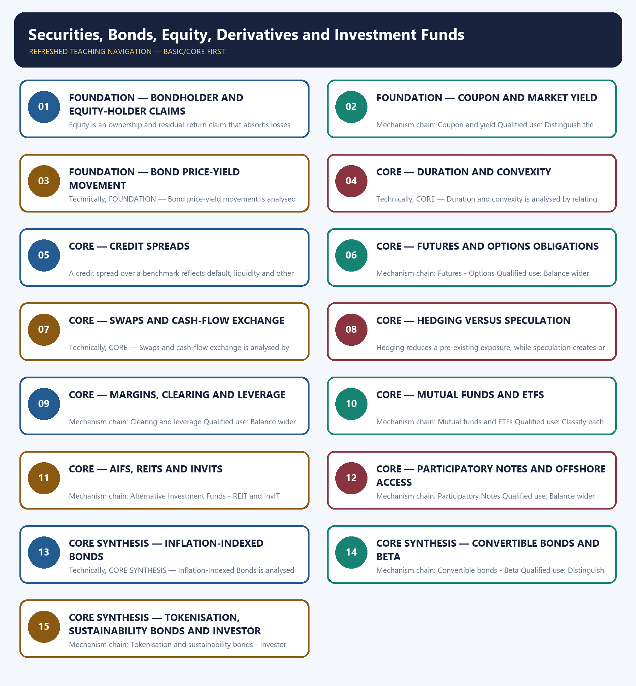

# Securities, Bonds, Equity, Derivatives and Investment Funds — Learner-v2 Complete Learning Session

> **Authoring-only generation:** 2026-09-03. No PDF was rendered and no tracker or index was mutated.

### SOURCE, PROGRESSION AND CURRENT-LINKAGE AUDIT

- **Generation date:** 2026-09-03.
- **Repository-first evidence:** the Basic owner is taught first and preserved in full; the Advanced owner is retained only in the optional final teaching block.
- **OCR evidence:** Repository Markdown was primary. OCR-searchable local official General Studies papers were used only to confirm printed routed demands. No answer key, marking scheme, unsupported page precision or current macroeconomic statistic was inferred from them.
- **Qdrant:** not used; repository Markdown and available OCR context were sufficient.
- **PYQ integrity:** Audited ledgers route objective demands on Participatory Notes, Inflation-Indexed Bonds, convertible bonds, InvITs, beta, AIF classification, bondholder priority, equity derivatives and real-world-asset tokenisation here. No answer letter is inferred.
- **Live-link boundary:** The attempted SEBI circular page returned only a circular identifier. Stable instrument definitions, legal-claim distinctions and PYQ concepts therefore remain bounded to the repository owners and audited routing ledgers.
- **Fact/inference discipline:** no current-affairs item, PYQ wording, figure or quotation is invented.

### LIVE OFFICIAL-SOURCE ATTEMPT LOG

The checks below were made on 2026-09-03. Substantive official text is used only for the proposition it actually supports; binary files, dynamic shells, stubs and undated dashboard snippets are recorded but not converted into current claims.

- https://www.sebi.gov.in/legal/circulars/nov-2025/reclassification-of-real-estate-investment-trusts-reits-as-equity-related-instruments-for-facilitating-enhanced-participation-by-mutual-funds-and-specialized-investment-funds-sifs-_98031.html — retrieved 2026-09-03; the live official page returned only Circular No. HO/24/13/12(1)2025-IMD-POD-2/I/157/2025 without substantive operative text, so no effective-date, classification or investment-limit claim was imported.

## BASIC LEARNING SESSION

### DEEP-REVIEW LEARNING CONTRACT

| Control | Binding rule for this package |
|---|---|
| Syllabus boundary | Complete Economy Basic/Core is answer-complete before optional Advanced depth. |
| Formula boundary | Formula, numerator, denominator, unit, stock/flow, nominal/real, base year, level/rate and accounting identity are explicit. |
| Institutional boundary | Constitution, statute, delegated rule, regulator mandate, policy, recommendation, scheme and implementation outcome remain distinct. |
| Transmission method | Shock or instrument → prices/quantities/balance sheets/incentives → institution and market response → output, employment, distribution, stability and external effect → lag and trade-off. |
| Current-data method | Source → release date → reference period → unit/denominator → provisional/revised/final status; incompatible Budget, Survey or statistical vintages are never mixed. |
| Programme-status method | Announced → approved → notified/guidelines issued → funded → operational → utilised → output → outcome are separate stages. |
| External/WTO method | Agreement text, member category, box, limit, notification, consultation, dispute and ruling are qualified without invented thresholds. |
| Causal method | Accounting identity, chronology and correlation are not promoted into behavioural or causal claims without mechanism, counterfactual and alternatives. |
| Answer balance | Model answers balance growth, distribution, stability, sustainability and federal dimensions with India-centric evidence. |
| Practice contract | Every solved item has demand decoding, a detailed examiner-grade model, executable timed/compression plan, marks rationale and answer-specific improvement. |
| Approval | This immutable successor remains `approved: false` pending explicit approval. |

**Canonical Basic/Core owner:** `upsc-ai-kit\knowledge\Economy\basic\08_Securities-Bonds-Equity-Derivatives-and-Investment-Funds.md`  
**Substantive canonical provenance owner:** `upsc-ai-kit\knowledge\Economy\08_Securities-Bonds-Equity-Derivatives-and-Investment-Funds_Learner-V2-Complete-Topic-Package.md`  
**Optional Advanced owner:** `upsc-ai-kit\knowledge\Economy\advanced\08_Securities-Bonds-Equity-Derivatives-and-Investment-Funds.md`  
**Official syllabus mapping:** `upsc-ai-kit\knowledge\Economy\OFFICIAL-UPSC-SYLLABUS-MAPPING.md`

### EVIDENCE, PYQ AND CURRENT-STATUS CONTROL

- Every data-heavy table states unit, denominator, geography, reference period and source/status.
- GDP/GVA, gross/net, domestic/national, nominal/real and level/rate distinctions remain exact.
- Monetary, fiscal and external chains state intermediaries, balance-sheet channels, lags, leakages and trade-offs.
- Budget and Economic Survey editions are never mixed; BE, RE, Actual, advance/provisional/revised/final estimates remain labelled.
- Scheme and programme claims distinguish announcement, approval, notification, operation, coverage, utilisation and measured outcome.
- WTO boxes, limits, de minimis, special treatment, notifications and disputes are qualified from authoritative rules.
- PYQ wording is preserved only where verified; reconstructed or routed demands remain labelled.
- **Current-status note, rechecked 2026-09-03:** volatile rates, estimates, scheme status, trade rules and institutional claims retain official source, release date, reference period and revision status.

**Generation-local live/current sources:**
- `https://www.sebi.gov.in/legal/circulars/nov-2025/reclassification-of-real-estate-investment-trusts-reits-as-equity-related-instruments-for-facilitating-enhanced-participation-by-mutual-funds-and-specialized-investment-funds-sifs-_98031.html — retrieved 2026-09-03; the live official page returned only Circular No. HO/24/13/12(1)2025-IMD-POD-2/I/157/2025 without substantive operative text, so no effective-date, classification or investment-limit claim was imported.`




*Distinct embedded teaching-navigation image. The separate continuous Cārvāka-style flowchart package remains an independent at-a-glance artifact.*

### SESSION 1 — FOUNDATION — BONDHOLDER AND EQUITY-HOLDER CLAIMS

#### DEFINITION / WHAT THIS IS CALLED

**Plain-language definition:** A bond is a creditor claim with contractual interest and principal obligations, and bondholders generally rank ahead of equity shareholders in repayment.

**Technical definition:** Equity is an ownership and residual-return claim that absorbs losses after creditors and may carry voting rights.

#### ANSWER-GRABBING OPENING — WRITE/ADAPT IN THE EXAM

> A bond is a creditor claim with contractual interest and principal obligations, and bondholders generally rank ahead of equity shareholders in repayment.

#### MUST-WRITE KEYWORDS

- **FOUNDATION**
- **Bondholder**
- **equity-holder claims**
- **Mechanism chain**
- **Qualified use**
- **A bond**

**How to use them:** Frame the answer through FOUNDATION; define Bondholder, connect equity-holder claims with Mechanism chain to explain the mechanism, and use Qualified use for the decisive comparison or qualification.

#### VISUAL FIRST

```text
BONDHOLDER AND EQUITY-HOLDER CLAIMS
01. Bond claim
    |
    v
02. Equity claim
BOUNDARY -> Do not treat equity dividends as contractual in the same way as bond interest.
```

*This topic-specific rail fixes the evidence sequence and its exam boundary before analysis.*

#### CORE EXPLANATION

A bond is a creditor claim with contractual interest and principal obligations, and bondholders generally rank ahead of equity shareholders in repayment. Equity is an ownership and residual-return claim that absorbs losses after creditors and may carry voting rights.

#### NAMED EVIDENCE AND MECHANISM

- A bond is a creditor claim with contractual interest and principal obligations, and bondholders generally rank ahead of equity shareholders in repayment.
- Equity is an ownership and residual-return claim that absorbs losses after creditors and may carry voting rights.

#### EXAMINER CAUTION

- Do not treat equity dividends as contractual in the same way as bond interest.

#### EXAM LINK

- **Prelims:** Preserve the exact formula, territorial or resident boundary, price basis, base year, index basket, eligible counterparty, institution and legal status; never upgrade a projection into an actual or a regulatory direction into a universal rule.
- **Mains:** Classify each product by legal claim, cash flow, priority, liquidity and leverage.

#### MINI RECAP

- **Mechanism chain:** Bond claim -> Equity claim
- **Qualified use:** Classify each product by legal claim, cash flow, priority, liquidity and leverage.

#### CLOSING RECALL FLOW — FOUNDATION — BONDHOLDER AND EQUITY-HOLDER CLAIMS

```text
START / CONCEPT: FOUNDATION — Bondholder and equity-holder claims
        |
        v
EXACT TERMS: FOUNDATION · Bondholder · equity-holder claims · Mechanism chain · Qualified use · A bond
        |
        v
MECHANISM / ARGUMENT: Mechanism chain: Bond claim - Equity claim Qualified use: Classify each product by legal claim, cash flow, priority, liquidity and leverage.
        |
        v
CONSEQUENCE / CONTRAST: Do not treat equity dividends as contractual in the same way as bond interest.
        |
        v
UPSC TRAP / ANSWER-USE: Do not miss this limiting distinction: equity is an ownership and residual-return claim that absorbs losses after creditors and may...
        |
        v
ANSWER-GRABBING FORMULATION: A bond is a creditor claim with contractual interest and principal obligations, and bondholders generally rank ahead of equity shareholders in repayment.
```
### SESSION 2 — FOUNDATION — COUPON AND MARKET YIELD

#### DEFINITION / WHAT THIS IS CALLED

**Plain-language definition:** Coupon is the stated contractual cash-flow rate, while yield depends on market price, cash flows and maturity; they need not remain equal after issuance.

**Technical definition:** Mechanism chain: Coupon and yield Qualified use: Distinguish the contract's form from the user's hedging, speculative or arbitrage purpose.

#### ANSWER-GRABBING OPENING — WRITE/ADAPT IN THE EXAM

> Coupon is the stated contractual cash-flow rate, while yield depends on market price, cash flows and maturity; they need not remain equal after issuance.

#### MUST-WRITE KEYWORDS

- **FOUNDATION**
- **Coupon**
- **market yield**
- **Mechanism chain**
- **Qualified use**
- **Qualified**

**How to use them:** Frame the answer through FOUNDATION; define Coupon, connect market yield with Mechanism chain to explain the mechanism, and use Qualified use for the decisive comparison or qualification.

#### VISUAL FIRST

```text
COUPON AND MARKET YIELD
01. Coupon and yield
BOUNDARY -> Do not say bond prices generally rise when comparable market yields rise.
```

*This topic-specific rail fixes the evidence sequence and its exam boundary before analysis.*

#### CORE EXPLANATION

Coupon is the stated contractual cash-flow rate, while yield depends on market price, cash flows and maturity; they need not remain equal after issuance.

#### NAMED EVIDENCE AND MECHANISM

- Coupon is the stated contractual cash-flow rate, while yield depends on market price, cash flows and maturity; they need not remain equal after issuance.

#### EXAMINER CAUTION

- Do not say bond prices generally rise when comparable market yields rise.

#### EXAM LINK

- **Prelims:** Preserve the exact formula, territorial or resident boundary, price basis, base year, index basket, eligible counterparty, institution and legal status; never upgrade a projection into an actual or a regulatory direction into a universal rule.
- **Mains:** Distinguish the contract's form from the user's hedging, speculative or arbitrage purpose.

#### MINI RECAP

- **Mechanism chain:** Coupon and yield
- **Qualified use:** Distinguish the contract's form from the user's hedging, speculative or arbitrage purpose.

#### CLOSING RECALL FLOW — FOUNDATION — COUPON AND MARKET YIELD

```text
START / CONCEPT: FOUNDATION — Coupon and market yield
        |
        v
EXACT TERMS: FOUNDATION · Coupon · market yield · Mechanism chain · Qualified use · Qualified
        |
        v
MECHANISM / ARGUMENT: Mechanism chain: Coupon and yield Qualified use: Distinguish the contract's form from the user's hedging, speculative or arbitrage purpose.
        |
        v
CONSEQUENCE / CONTRAST: Do not say bond prices generally rise when comparable market yields rise.
        |
        v
UPSC TRAP / ANSWER-USE: Do not miss this limiting distinction: coupon is the stated contractual cash-flow rate.
        |
        v
ANSWER-GRABBING FORMULATION: Coupon is the stated contractual cash-flow rate, while yield depends on market price, cash flows and maturity; they need not remain equal after issuance.
```
### SESSION 3 — FOUNDATION — BOND PRICE-YIELD MOVEMENT

#### DEFINITION / WHAT THIS IS CALLED

**Plain-language definition:** Mechanism chain: Price-yield relationship Qualified use: Balance wider access with suitability, disclosure, margining and liquidity-risk controls.

**Technical definition:** Technically, FOUNDATION — Bond price-yield movement is analysed by relating FOUNDATION to Bond price-yield movement, then testing the relationship through Mechanism chain and Qualified use.

#### ANSWER-GRABBING OPENING — WRITE/ADAPT IN THE EXAM

> Mechanism chain: Price-yield relationship Qualified use: Balance wider access with suitability, disclosure, margining and liquidity-risk controls.

#### MUST-WRITE KEYWORDS

- **FOUNDATION**
- **Bond price-yield movement**
- **Mechanism chain**
- **Qualified use**
- **Price-yield**
- **Qualified**

**How to use them:** Frame the answer through FOUNDATION; define Bond price-yield movement, connect Mechanism chain with Qualified use to explain the mechanism, and use Price-yield for the decisive comparison or qualification.

#### VISUAL FIRST

```text
BOND PRICE-YIELD MOVEMENT
01. Price-yield relationship
BOUNDARY -> Do not infer that every derivative position is a hedge.
```

*This topic-specific rail fixes the evidence sequence and its exam boundary before analysis.*

#### CORE EXPLANATION

For a fixed cash-flow bond, market price and comparable yield generally move inversely.

#### NAMED EVIDENCE AND MECHANISM

- For a fixed cash-flow bond, market price and comparable yield generally move inversely.

#### EXAMINER CAUTION

- Do not infer that every derivative position is a hedge.

#### EXAM LINK

- **Prelims:** Preserve the exact formula, territorial or resident boundary, price basis, base year, index basket, eligible counterparty, institution and legal status; never upgrade a projection into an actual or a regulatory direction into a universal rule.
- **Mains:** Balance wider access with suitability, disclosure, margining and liquidity-risk controls.

#### MINI RECAP

- **Mechanism chain:** Price-yield relationship
- **Qualified use:** Balance wider access with suitability, disclosure, margining and liquidity-risk controls.

#### CLOSING RECALL FLOW — FOUNDATION — BOND PRICE-YIELD MOVEMENT

```text
START / CONCEPT: FOUNDATION — Bond price-yield movement
        |
        v
EXACT TERMS: FOUNDATION · Bond price-yield movement · Mechanism chain · Qualified use · Price-yield · Qualified
        |
        v
MECHANISM / ARGUMENT: Do not infer that every derivative position is a hedge.
        |
        v
CONSEQUENCE / CONTRAST: The resulting consequence is that balance wider access with suitability, disclosure, margining and liquidity-risk controls.
        |
        v
UPSC TRAP / ANSWER-USE: Do not miss this limiting distinction: balance wider access with suitability, disclosure, margining and liquidity-risk controls.
        |
        v
ANSWER-GRABBING FORMULATION: Mechanism chain: Price-yield relationship Qualified use: Balance wider access with suitability, disclosure, margining and liquidity-risk controls.
```
### SESSION 4 — CORE — DURATION AND CONVEXITY

#### DEFINITION / WHAT THIS IS CALLED

**Plain-language definition:** Mechanism chain: Duration and convexity Qualified use: Classify each product by legal claim, cash flow, priority, liquidity and leverage.

**Technical definition:** Technically, CORE — Duration and convexity is analysed by relating Duration to convexity, then testing the relationship through Mechanism chain and Qualified use.

#### ANSWER-GRABBING OPENING — WRITE/ADAPT IN THE EXAM

> Mechanism chain: Duration and convexity Qualified use: Classify each product by legal claim, cash flow, priority, liquidity and leverage.

#### MUST-WRITE KEYWORDS

- **Duration**
- **convexity**
- **Mechanism chain**
- **Qualified use**
- **Qualified**
- **Classify**

**How to use them:** Frame the answer through Duration; define convexity, connect Mechanism chain with Qualified use to explain the mechanism, and use Qualified for the decisive comparison or qualification.

#### VISUAL FIRST

```text
DURATION AND CONVEXITY
01. Duration and convexity
BOUNDARY -> Do not merge futures, options and swaps into one obligation structure.
```

*This topic-specific rail fixes the evidence sequence and its exam boundary before analysis.*

#### CORE EXPLANATION

Duration and convexity describe bond-price sensitivity to yield changes beyond the simple inverse-direction rule.

#### NAMED EVIDENCE AND MECHANISM

- Duration and convexity describe bond-price sensitivity to yield changes beyond the simple inverse-direction rule.

#### EXAMINER CAUTION

- Do not merge futures, options and swaps into one obligation structure.

#### EXAM LINK

- **Prelims:** Preserve the exact formula, territorial or resident boundary, price basis, base year, index basket, eligible counterparty, institution and legal status; never upgrade a projection into an actual or a regulatory direction into a universal rule.
- **Mains:** Classify each product by legal claim, cash flow, priority, liquidity and leverage.

#### MINI RECAP

- **Mechanism chain:** Duration and convexity
- **Qualified use:** Classify each product by legal claim, cash flow, priority, liquidity and leverage.

#### CLOSING RECALL FLOW — CORE — DURATION AND CONVEXITY

```text
START / CONCEPT: CORE — Duration and convexity
        |
        v
EXACT TERMS: Duration · convexity · Mechanism chain · Qualified use · Qualified · Classify
        |
        v
MECHANISM / ARGUMENT: Do not merge futures, options and swaps into one obligation structure.
        |
        v
CONSEQUENCE / CONTRAST: The resulting consequence is that classify each product by legal claim, cash flow, priority, liquidity and leverage.
        |
        v
UPSC TRAP / ANSWER-USE: Do not miss this limiting distinction: classify each product by legal claim, cash flow, priority, liquidity and leverage.
        |
        v
ANSWER-GRABBING FORMULATION: Mechanism chain: Duration and convexity Qualified use: Classify each product by legal claim, cash flow, priority, liquidity and leverage.
```
### SESSION 5 — CORE — CREDIT SPREADS

#### DEFINITION / WHAT THIS IS CALLED

**Plain-language definition:** Mechanism chain: Credit spread Qualified use: Distinguish the contract's form from the user's hedging, speculative or arbitrage purpose.

**Technical definition:** A credit spread over a benchmark reflects default, liquidity and other risk-premium components rather than contractual coupon alone.

#### ANSWER-GRABBING OPENING — WRITE/ADAPT IN THE EXAM

> Mechanism chain: Credit spread Qualified use: Distinguish the contract's form from the user's hedging, speculative or arbitrage purpose.

#### MUST-WRITE KEYWORDS

- **Credit spreads**
- **Mechanism chain**
- **Qualified use**
- **Credit**
- **Qualified**
- **CORE — Credit spreads**

**How to use them:** Frame the answer through Credit spreads; define Mechanism chain, connect Qualified use with Credit to explain the mechanism, and use Qualified for the decisive comparison or qualification.

#### VISUAL FIRST

```text
CREDIT SPREADS
01. Credit spread
BOUNDARY -> Do not treat exchange clearing as elimination of leverage or market risk.
```

*This topic-specific rail fixes the evidence sequence and its exam boundary before analysis.*

#### CORE EXPLANATION

A credit spread over a benchmark reflects default, liquidity and other risk-premium components rather than contractual coupon alone.

#### NAMED EVIDENCE AND MECHANISM

- A credit spread over a benchmark reflects default, liquidity and other risk-premium components rather than contractual coupon alone.

#### EXAMINER CAUTION

- Do not treat exchange clearing as elimination of leverage or market risk.

#### EXAM LINK

- **Prelims:** Preserve the exact formula, territorial or resident boundary, price basis, base year, index basket, eligible counterparty, institution and legal status; never upgrade a projection into an actual or a regulatory direction into a universal rule.
- **Mains:** Distinguish the contract's form from the user's hedging, speculative or arbitrage purpose.

#### MINI RECAP

- **Mechanism chain:** Credit spread
- **Qualified use:** Distinguish the contract's form from the user's hedging, speculative or arbitrage purpose.

#### CLOSING RECALL FLOW — CORE — CREDIT SPREADS

```text
START / CONCEPT: CORE — Credit spreads
        |
        v
EXACT TERMS: Credit spreads · Mechanism chain · Qualified use · Credit · Qualified · CORE — Credit spreads
        |
        v
MECHANISM / ARGUMENT: A credit spread over a benchmark reflects default, liquidity and other risk-premium components rather than contractual coupon alone.
        |
        v
CONSEQUENCE / CONTRAST: Do not treat exchange clearing as elimination of leverage or market risk.
        |
        v
UPSC TRAP / ANSWER-USE: Do not miss this limiting distinction: distinguish the contract's form from the user's hedging, speculative or arbitrage purpose.
        |
        v
ANSWER-GRABBING FORMULATION: Mechanism chain: Credit spread Qualified use: Distinguish the contract's form from the user's hedging, speculative or arbitrage purpose.
```
### SESSION 6 — CORE — FUTURES AND OPTIONS OBLIGATIONS

#### DEFINITION / WHAT THIS IS CALLED

**Plain-language definition:** A standardised futures contract creates symmetric obligations for buyer and seller and is supported by margining and clearing.

**Technical definition:** Mechanism chain: Futures - Options Qualified use: Balance wider access with suitability, disclosure, margining and liquidity-risk controls.

#### ANSWER-GRABBING OPENING — WRITE/ADAPT IN THE EXAM

> A standardised futures contract creates symmetric obligations for buyer and seller and is supported by margining and clearing.

#### MUST-WRITE KEYWORDS

- **Futures**
- **options obligations**
- **Mechanism chain**
- **Qualified use**
- **ETF**
- **Options Qualified**

**How to use them:** Frame the answer through Futures; define options obligations, connect Mechanism chain with Qualified use to explain the mechanism, and use ETF for the decisive comparison or qualification.

#### VISUAL FIRST

```text
FUTURES AND OPTIONS OBLIGATIONS
01. Futures
    |
    v
02. Options
BOUNDARY -> Do not call an ETF unit the same legal claim as one constituent stock.
```

*This topic-specific rail fixes the evidence sequence and its exam boundary before analysis.*

#### CORE EXPLANATION

A standardised futures contract creates symmetric obligations for buyer and seller and is supported by margining and clearing. An option gives the buyer a right but not an obligation, while the writer bears a contingent obligation; value depends on the underlying, strike, time, volatility and rates.

#### NAMED EVIDENCE AND MECHANISM

- A standardised futures contract creates symmetric obligations for buyer and seller and is supported by margining and clearing.
- An option gives the buyer a right but not an obligation, while the writer bears a contingent obligation; value depends on the underlying, strike, time, volatility and rates.

#### EXAMINER CAUTION

- Do not call an ETF unit the same legal claim as one constituent stock.

#### EXAM LINK

- **Prelims:** Preserve the exact formula, territorial or resident boundary, price basis, base year, index basket, eligible counterparty, institution and legal status; never upgrade a projection into an actual or a regulatory direction into a universal rule.
- **Mains:** Balance wider access with suitability, disclosure, margining and liquidity-risk controls.

#### MINI RECAP

- **Mechanism chain:** Futures -> Options
- **Qualified use:** Balance wider access with suitability, disclosure, margining and liquidity-risk controls.

#### CLOSING RECALL FLOW — CORE — FUTURES AND OPTIONS OBLIGATIONS

```text
START / CONCEPT: CORE — Futures and options obligations
        |
        v
EXACT TERMS: Futures · options obligations · Mechanism chain · Qualified use · ETF · Options Qualified
        |
        v
MECHANISM / ARGUMENT: Mechanism chain: Futures - Options Qualified use: Balance wider access with suitability, disclosure, margining and liquidity-risk controls.
        |
        v
CONSEQUENCE / CONTRAST: An option gives the buyer a right but not an obligation, while the writer bears a contingent obligation; value depends on the underlying, strike, time, volatility and rates.
        |
        v
UPSC TRAP / ANSWER-USE: Do not call an ETF unit the same legal claim as one constituent stock.
        |
        v
ANSWER-GRABBING FORMULATION: A standardised futures contract creates symmetric obligations for buyer and seller and is supported by margining and clearing.
```
### SESSION 7 — CORE — SWAPS AND CASH-FLOW EXCHANGE

#### DEFINITION / WHAT THIS IS CALLED

**Plain-language definition:** Mechanism chain: Swaps Qualified use: Classify each product by legal claim, cash flow, priority, liquidity and leverage.

**Technical definition:** Technically, CORE — Swaps and cash-flow exchange is analysed by relating Swaps to cash-flow exchange, then testing the relationship through Mechanism chain and Qualified use.

#### ANSWER-GRABBING OPENING — WRITE/ADAPT IN THE EXAM

> Mechanism chain: Swaps Qualified use: Classify each product by legal claim, cash flow, priority, liquidity and leverage.

#### MUST-WRITE KEYWORDS

- **Swaps**
- **cash-flow exchange**
- **Mechanism chain**
- **Qualified use**
- **Alternative Investment Funds**
- **Swaps Qualified**

**How to use them:** Frame the answer through Swaps; define cash-flow exchange, connect Mechanism chain with Qualified use to explain the mechanism, and use Alternative Investment Funds for the decisive comparison or qualification.

#### VISUAL FIRST

```text
SWAPS AND CASH-FLOW EXCHANGE
01. Swaps
BOUNDARY -> Do not treat direct stocks and bonds as Alternative Investment Funds.
```

*This topic-specific rail fixes the evidence sequence and its exam boundary before analysis.*

#### CORE EXPLANATION

A swap exchanges cash-flow streams linked to interest rates, currencies or other variables and may be centrally or bilaterally risk-managed according to the market segment.

#### NAMED EVIDENCE AND MECHANISM

- A swap exchanges cash-flow streams linked to interest rates, currencies or other variables and may be centrally or bilaterally risk-managed according to the market segment.

#### EXAMINER CAUTION

- Do not treat direct stocks and bonds as Alternative Investment Funds.

#### EXAM LINK

- **Prelims:** Preserve the exact formula, territorial or resident boundary, price basis, base year, index basket, eligible counterparty, institution and legal status; never upgrade a projection into an actual or a regulatory direction into a universal rule.
- **Mains:** Classify each product by legal claim, cash flow, priority, liquidity and leverage.

#### MINI RECAP

- **Mechanism chain:** Swaps
- **Qualified use:** Classify each product by legal claim, cash flow, priority, liquidity and leverage.

#### CLOSING RECALL FLOW — CORE — SWAPS AND CASH-FLOW EXCHANGE

```text
START / CONCEPT: CORE — Swaps and cash-flow exchange
        |
        v
EXACT TERMS: Swaps · cash-flow exchange · Mechanism chain · Qualified use · Alternative Investment Funds · Swaps Qualified
        |
        v
MECHANISM / ARGUMENT: Do not treat direct stocks and bonds as Alternative Investment Funds.
        |
        v
CONSEQUENCE / CONTRAST: The resulting consequence is that do not treat direct stocks and bonds as Alternative Investment Funds.
        |
        v
UPSC TRAP / ANSWER-USE: Do not miss this limiting distinction: do not treat direct stocks and bonds as Alternative Investment Funds.
        |
        v
ANSWER-GRABBING FORMULATION: Mechanism chain: Swaps Qualified use: Classify each product by legal claim, cash flow, priority, liquidity and leverage.
```
### SESSION 8 — CORE — HEDGING VERSUS SPECULATION

#### DEFINITION / WHAT THIS IS CALLED

**Plain-language definition:** Mechanism chain: Hedging and speculation Qualified use: Distinguish the contract's form from the user's hedging, speculative or arbitrage purpose.

**Technical definition:** Hedging reduces a pre-existing exposure, while speculation creates or enlarges exposure for expected profit; the same derivative form can serve either purpose.

#### ANSWER-GRABBING OPENING — WRITE/ADAPT IN THE EXAM

> Hedging reduces a pre-existing exposure, while speculation creates or enlarges exposure for expected profit; the same derivative form can serve either purpose.

#### MUST-WRITE KEYWORDS

- **Hedging versus speculation**
- **Mechanism chain**
- **Qualified use**
- **Hedging**
- **AIFs**
- **REITs**

**How to use them:** Frame the answer through Hedging versus speculation; define Mechanism chain, connect Qualified use with Hedging to explain the mechanism, and use AIFs for the decisive comparison or qualification.

#### VISUAL FIRST

```text
HEDGING VERSUS SPECULATION
01. Hedging and speculation
BOUNDARY -> Do not merge mutual funds, AIFs, REITs and InvITs.
```

*This topic-specific rail fixes the evidence sequence and its exam boundary before analysis.*

#### CORE EXPLANATION

Hedging reduces a pre-existing exposure, while speculation creates or enlarges exposure for expected profit; the same derivative form can serve either purpose.

#### NAMED EVIDENCE AND MECHANISM

- Hedging reduces a pre-existing exposure, while speculation creates or enlarges exposure for expected profit; the same derivative form can serve either purpose.

#### EXAMINER CAUTION

- Do not merge mutual funds, AIFs, REITs and InvITs.

#### EXAM LINK

- **Prelims:** Preserve the exact formula, territorial or resident boundary, price basis, base year, index basket, eligible counterparty, institution and legal status; never upgrade a projection into an actual or a regulatory direction into a universal rule.
- **Mains:** Distinguish the contract's form from the user's hedging, speculative or arbitrage purpose.

#### MINI RECAP

- **Mechanism chain:** Hedging and speculation
- **Qualified use:** Distinguish the contract's form from the user's hedging, speculative or arbitrage purpose.

#### CLOSING RECALL FLOW — CORE — HEDGING VERSUS SPECULATION

```text
START / CONCEPT: CORE — Hedging versus speculation
        |
        v
EXACT TERMS: Hedging versus speculation · Mechanism chain · Qualified use · Hedging · AIFs · REITs
        |
        v
MECHANISM / ARGUMENT: Mechanism chain: Hedging and speculation Qualified use: Distinguish the contract's form from the user's hedging, speculative or arbitrage purpose.
        |
        v
CONSEQUENCE / CONTRAST: Do not merge mutual funds, AIFs, REITs and InvITs.
        |
        v
UPSC TRAP / ANSWER-USE: Do not miss this limiting distinction: while speculation creates or enlarges exposure for expected profit.
        |
        v
ANSWER-GRABBING FORMULATION: Hedging reduces a pre-existing exposure, while speculation creates or enlarges exposure for expected profit; the same derivative form can serve either purpose.
```
### SESSION 9 — CORE — MARGINS, CLEARING AND LEVERAGE

#### DEFINITION / WHAT THIS IS CALLED

**Plain-language definition:** Margins, clearing corporations and default waterfalls reduce settlement and counterparty risk but do not remove leverage, basis risk or mark-to-market losses.

**Technical definition:** Mechanism chain: Clearing and leverage Qualified use: Balance wider access with suitability, disclosure, margining and liquidity-risk controls.

#### ANSWER-GRABBING OPENING — WRITE/ADAPT IN THE EXAM

> Margins, clearing corporations and default waterfalls reduce settlement and counterparty risk but do not remove leverage, basis risk or mark-to-market losses.

#### MUST-WRITE KEYWORDS

- **Margins**
- **clearing**
- **leverage**
- **Mechanism chain**
- **Qualified use**
- **Qualified**

**How to use them:** Frame the answer through Margins; define clearing, connect leverage with Mechanism chain to explain the mechanism, and use Qualified use for the decisive comparison or qualification.

#### VISUAL FIRST

```text
MARGINS, CLEARING AND LEVERAGE
01. Clearing and leverage
BOUNDARY -> Do not present beta as a promised return or complete risk measure.
```

*This topic-specific rail fixes the evidence sequence and its exam boundary before analysis.*

#### CORE EXPLANATION

Margins, clearing corporations and default waterfalls reduce settlement and counterparty risk but do not remove leverage, basis risk or mark-to-market losses.

#### NAMED EVIDENCE AND MECHANISM

- Margins, clearing corporations and default waterfalls reduce settlement and counterparty risk but do not remove leverage, basis risk or mark-to-market losses.

#### EXAMINER CAUTION

- Do not present beta as a promised return or complete risk measure.

#### EXAM LINK

- **Prelims:** Preserve the exact formula, territorial or resident boundary, price basis, base year, index basket, eligible counterparty, institution and legal status; never upgrade a projection into an actual or a regulatory direction into a universal rule.
- **Mains:** Balance wider access with suitability, disclosure, margining and liquidity-risk controls.

#### MINI RECAP

- **Mechanism chain:** Clearing and leverage
- **Qualified use:** Balance wider access with suitability, disclosure, margining and liquidity-risk controls.

#### CLOSING RECALL FLOW — CORE — MARGINS, CLEARING AND LEVERAGE

```text
START / CONCEPT: CORE — Margins, clearing and leverage
        |
        v
EXACT TERMS: Margins · clearing · leverage · Mechanism chain · Qualified use · Qualified
        |
        v
MECHANISM / ARGUMENT: Mechanism chain: Clearing and leverage Qualified use: Balance wider access with suitability, disclosure, margining and liquidity-risk controls.
        |
        v
CONSEQUENCE / CONTRAST: Do not present beta as a promised return or complete risk measure.
        |
        v
UPSC TRAP / ANSWER-USE: Do not miss this limiting distinction: margins, clearing corporations and default waterfalls reduce settlement and counterparty risk but do not...
        |
        v
ANSWER-GRABBING FORMULATION: Margins, clearing corporations and default waterfalls reduce settlement and counterparty risk but do not remove leverage, basis risk or mark-to-market losses.
```
### SESSION 10 — CORE — MUTUAL FUNDS AND ETFS

#### DEFINITION / WHAT THIS IS CALLED

**Plain-language definition:** A mutual fund is a SEBI-regulated pooled vehicle, while an ETF unit trades intraday on an exchange and may deviate from its net asset value.

**Technical definition:** Mechanism chain: Mutual funds and ETFs Qualified use: Classify each product by legal claim, cash flow, priority, liquidity and leverage.

#### ANSWER-GRABBING OPENING — WRITE/ADAPT IN THE EXAM

> A mutual fund is a SEBI-regulated pooled vehicle, while an ETF unit trades intraday on an exchange and may deviate from its net asset value.

#### MUST-WRITE KEYWORDS

- **Mutual funds**
- **ETFs**
- **Mechanism chain**
- **Qualified use**
- **A mutual fund**
- **SEBI-regulated**

**How to use them:** Frame the answer through Mutual funds; define ETFs, connect Mechanism chain with Qualified use to explain the mechanism, and use A mutual fund for the decisive comparison or qualification.

#### VISUAL FIRST

```text
MUTUAL FUNDS AND ETFS
01. Mutual funds and ETFs
BOUNDARY -> Do not equate tokenisation with assured liquidity, title or regulatory protection.
```

*This topic-specific rail fixes the evidence sequence and its exam boundary before analysis.*

#### CORE EXPLANATION

A mutual fund is a SEBI-regulated pooled vehicle, while an ETF unit trades intraday on an exchange and may deviate from its net asset value.

#### NAMED EVIDENCE AND MECHANISM

- A mutual fund is a SEBI-regulated pooled vehicle, while an ETF unit trades intraday on an exchange and may deviate from its net asset value.

#### EXAMINER CAUTION

- Do not equate tokenisation with assured liquidity, title or regulatory protection.

#### EXAM LINK

- **Prelims:** Preserve the exact formula, territorial or resident boundary, price basis, base year, index basket, eligible counterparty, institution and legal status; never upgrade a projection into an actual or a regulatory direction into a universal rule.
- **Mains:** Classify each product by legal claim, cash flow, priority, liquidity and leverage.

#### MINI RECAP

- **Mechanism chain:** Mutual funds and ETFs
- **Qualified use:** Classify each product by legal claim, cash flow, priority, liquidity and leverage.

#### CLOSING RECALL FLOW — CORE — MUTUAL FUNDS AND ETFS

```text
START / CONCEPT: CORE — Mutual funds and ETFs
        |
        v
EXACT TERMS: Mutual funds · ETFs · Mechanism chain · Qualified use · A mutual fund · SEBI-regulated
        |
        v
MECHANISM / ARGUMENT: Mechanism chain: Mutual funds and ETFs Qualified use: Classify each product by legal claim, cash flow, priority, liquidity and leverage.
        |
        v
CONSEQUENCE / CONTRAST: Do not equate tokenisation with assured liquidity, title or regulatory protection.
        |
        v
UPSC TRAP / ANSWER-USE: Do not miss this limiting distinction: a mutual fund is a SEBI-regulated pooled vehicle.
        |
        v
ANSWER-GRABBING FORMULATION: A mutual fund is a SEBI-regulated pooled vehicle, while an ETF unit trades intraday on an exchange and may deviate from its net asset value.
```
### SESSION 11 — CORE — AIFS, REITS AND INVITS

#### DEFINITION / WHAT THIS IS CALLED

**Plain-language definition:** REITs and InvITs are SEBI-regulated pooled vehicles linked respectively to real-estate and infrastructure cash flows and are distinct from ordinary mutual funds and AIFs.

**Technical definition:** Mechanism chain: Alternative Investment Funds - REIT and InvIT Qualified use: Distinguish the contract's form from the user's hedging, speculative or arbitrage purpose.

#### ANSWER-GRABBING OPENING — WRITE/ADAPT IN THE EXAM

> REITs and InvITs are SEBI-regulated pooled vehicles linked respectively to real-estate and infrastructure cash flows and are distinct from ordinary mutual funds and AIFs.

#### MUST-WRITE KEYWORDS

- **AIFs**
- **REITs**
- **InvITs**
- **Mechanism chain**
- **Qualified use**
- **An AIF**

**How to use them:** Frame the answer through AIFs; define REITs, connect InvITs with Mechanism chain to explain the mechanism, and use Qualified use for the decisive comparison or qualification.

#### VISUAL FIRST

```text
AIFS, REITS AND INVITS
01. Alternative Investment Funds
    |
    v
02. REIT and InvIT
BOUNDARY -> Do not treat equity dividends as contractual in the same way as bond interest.
```

*This topic-specific rail fixes the evidence sequence and its exam boundary before analysis.*

#### CORE EXPLANATION

An AIF is a privately pooled vehicle under SEBI's category framework; venture-capital and hedge funds can fall within AIF categories, whereas direct stocks and bonds are not AIFs. REITs and InvITs are SEBI-regulated pooled vehicles linked respectively to real-estate and infrastructure cash flows and are distinct from ordinary mutual funds and AIFs.

#### NAMED EVIDENCE AND MECHANISM

- An AIF is a privately pooled vehicle under SEBI's category framework; venture-capital and hedge funds can fall within AIF categories, whereas direct stocks and bonds are not AIFs.
- REITs and InvITs are SEBI-regulated pooled vehicles linked respectively to real-estate and infrastructure cash flows and are distinct from ordinary mutual funds and AIFs.

#### EXAMINER CAUTION

- Do not treat equity dividends as contractual in the same way as bond interest.

#### EXAM LINK

- **Prelims:** Preserve the exact formula, territorial or resident boundary, price basis, base year, index basket, eligible counterparty, institution and legal status; never upgrade a projection into an actual or a regulatory direction into a universal rule.
- **Mains:** Distinguish the contract's form from the user's hedging, speculative or arbitrage purpose.

#### MINI RECAP

- **Mechanism chain:** Alternative Investment Funds -> REIT and InvIT
- **Qualified use:** Distinguish the contract's form from the user's hedging, speculative or arbitrage purpose.

#### CLOSING RECALL FLOW — CORE — AIFS, REITS AND INVITS

```text
START / CONCEPT: CORE — AIFs, REITs and InvITs
        |
        v
EXACT TERMS: AIFs · REITs · InvITs · Mechanism chain · Qualified use · An AIF
        |
        v
MECHANISM / ARGUMENT: Mechanism chain: Alternative Investment Funds - REIT and InvIT Qualified use: Distinguish the contract's form from the user's hedging, speculative or arbitrage purpose.
        |
        v
CONSEQUENCE / CONTRAST: An AIF is a privately pooled vehicle under SEBI's category framework; venture-capital and hedge funds can fall within AIF categories, whereas direct stocks and bonds are not AIFs.
        |
        v
UPSC TRAP / ANSWER-USE: Do not treat equity dividends as contractual in the same way as bond interest.
        |
        v
ANSWER-GRABBING FORMULATION: REITs and InvITs are SEBI-regulated pooled vehicles linked respectively to real-estate and infrastructure cash flows and are distinct from ordinary mutual funds and AIFs.
```
### SESSION 12 — CORE — PARTICIPATORY NOTES AND OFFSHORE ACCESS

#### DEFINITION / WHAT THIS IS CALLED

**Plain-language definition:** Participatory Notes are offshore instruments issued by registered foreign portfolio investors to overseas investors and are not the same as direct domestic shareholding.

**Technical definition:** Mechanism chain: Participatory Notes Qualified use: Balance wider access with suitability, disclosure, margining and liquidity-risk controls.

#### ANSWER-GRABBING OPENING — WRITE/ADAPT IN THE EXAM

> Participatory Notes are offshore instruments issued by registered foreign portfolio investors to overseas investors and are not the same as direct domestic shareholding.

#### MUST-WRITE KEYWORDS

- **Participatory Notes**
- **offshore access**
- **Mechanism chain**
- **Qualified use**
- **Participatory Notes Qualified**
- **Balance**

**How to use them:** Frame the answer through Participatory Notes; define offshore access, connect Mechanism chain with Qualified use to explain the mechanism, and use Participatory Notes Qualified for the decisive comparison or qualification.

#### VISUAL FIRST

```text
PARTICIPATORY NOTES AND OFFSHORE ACCESS
01. Participatory Notes
BOUNDARY -> Do not say bond prices generally rise when comparable market yields rise.
```

*This topic-specific rail fixes the evidence sequence and its exam boundary before analysis.*

#### CORE EXPLANATION

Participatory Notes are offshore instruments issued by registered foreign portfolio investors to overseas investors and are not the same as direct domestic shareholding.

#### NAMED EVIDENCE AND MECHANISM

- Participatory Notes are offshore instruments issued by registered foreign portfolio investors to overseas investors and are not the same as direct domestic shareholding.

#### EXAMINER CAUTION

- Do not say bond prices generally rise when comparable market yields rise.

#### EXAM LINK

- **Prelims:** Preserve the exact formula, territorial or resident boundary, price basis, base year, index basket, eligible counterparty, institution and legal status; never upgrade a projection into an actual or a regulatory direction into a universal rule.
- **Mains:** Balance wider access with suitability, disclosure, margining and liquidity-risk controls.

#### MINI RECAP

- **Mechanism chain:** Participatory Notes
- **Qualified use:** Balance wider access with suitability, disclosure, margining and liquidity-risk controls.

#### CLOSING RECALL FLOW — CORE — PARTICIPATORY NOTES AND OFFSHORE ACCESS

```text
START / CONCEPT: CORE — Participatory Notes and offshore access
        |
        v
EXACT TERMS: Participatory Notes · offshore access · Mechanism chain · Qualified use · Participatory Notes Qualified · Balance
        |
        v
MECHANISM / ARGUMENT: Mechanism chain: Participatory Notes Qualified use: Balance wider access with suitability, disclosure, margining and liquidity-risk controls.
        |
        v
CONSEQUENCE / CONTRAST: Do not say bond prices generally rise when comparable market yields rise.
        |
        v
UPSC TRAP / ANSWER-USE: Do not miss this limiting distinction: participatory Notes are offshore instruments issued by registered foreign portfolio investors to overseas investors...
        |
        v
ANSWER-GRABBING FORMULATION: Participatory Notes are offshore instruments issued by registered foreign portfolio investors to overseas investors and are not the same as direct domestic shareholding.
```
### SESSION 13 — CORE SYNTHESIS — INFLATION-INDEXED BONDS

#### DEFINITION / WHAT THIS IS CALLED

**Plain-language definition:** Mechanism chain: Inflation-Indexed Bonds Qualified use: Classify each product by legal claim, cash flow, priority, liquidity and leverage.

**Technical definition:** Technically, CORE SYNTHESIS — Inflation-Indexed Bonds is analysed by relating CORE SYNTHESIS to Inflation-Indexed Bonds, then testing the relationship through Mechanism chain and Qualified use.

#### ANSWER-GRABBING OPENING — WRITE/ADAPT IN THE EXAM

> Mechanism chain: Inflation-Indexed Bonds Qualified use: Classify each product by legal claim, cash flow, priority, liquidity and leverage.

#### MUST-WRITE KEYWORDS

- **CORE SYNTHESIS**
- **Inflation-Indexed Bonds**
- **Mechanism chain**
- **Qualified use**
- **Inflation-Indexed Bonds Qualified**
- **Classify**

**How to use them:** Frame the answer through CORE SYNTHESIS; define Inflation-Indexed Bonds, connect Mechanism chain with Qualified use to explain the mechanism, and use Inflation-Indexed Bonds Qualified for the decisive comparison or qualification.

#### VISUAL FIRST

```text
INFLATION-INDEXED BONDS
01. Inflation-Indexed Bonds
BOUNDARY -> Do not infer that every derivative position is a hedge.
```

*This topic-specific rail fixes the evidence sequence and its exam boundary before analysis.*

#### CORE EXPLANATION

Inflation-Indexed Bonds link specified payouts or principal to inflation to protect real purchasing power, while market-price and liquidity risks remain.

#### NAMED EVIDENCE AND MECHANISM

- Inflation-Indexed Bonds link specified payouts or principal to inflation to protect real purchasing power, while market-price and liquidity risks remain.

#### EXAMINER CAUTION

- Do not infer that every derivative position is a hedge.

#### EXAM LINK

- **Prelims:** Preserve the exact formula, territorial or resident boundary, price basis, base year, index basket, eligible counterparty, institution and legal status; never upgrade a projection into an actual or a regulatory direction into a universal rule.
- **Mains:** Classify each product by legal claim, cash flow, priority, liquidity and leverage.

#### MINI RECAP

- **Mechanism chain:** Inflation-Indexed Bonds
- **Qualified use:** Classify each product by legal claim, cash flow, priority, liquidity and leverage.

#### CLOSING RECALL FLOW — CORE SYNTHESIS — INFLATION-INDEXED BONDS

```text
START / CONCEPT: CORE SYNTHESIS — Inflation-Indexed Bonds
        |
        v
EXACT TERMS: CORE SYNTHESIS · Inflation-Indexed Bonds · Mechanism chain · Qualified use · Inflation-Indexed Bonds Qualified · Classify
        |
        v
MECHANISM / ARGUMENT: Do not infer that every derivative position is a hedge.
        |
        v
CONSEQUENCE / CONTRAST: The resulting consequence is that classify each product by legal claim, cash flow, priority, liquidity and leverage.
        |
        v
UPSC TRAP / ANSWER-USE: Do not miss this limiting distinction: classify each product by legal claim, cash flow, priority, liquidity and leverage.
        |
        v
ANSWER-GRABBING FORMULATION: Mechanism chain: Inflation-Indexed Bonds Qualified use: Classify each product by legal claim, cash flow, priority, liquidity and leverage.
```
### SESSION 14 — CORE SYNTHESIS — CONVERTIBLE BONDS AND BETA

#### DEFINITION / WHAT THIS IS CALLED

**Plain-language definition:** Beta measures a stock's volatility relative to the broader market and is a market-risk indicator rather than a guarantee of return.

**Technical definition:** Mechanism chain: Convertible bonds - Beta Qualified use: Distinguish the contract's form from the user's hedging, speculative or arbitrage purpose.

#### ANSWER-GRABBING OPENING — WRITE/ADAPT IN THE EXAM

> Mechanism chain: Convertible bonds - Beta Qualified use: Distinguish the contract's form from the user's hedging, speculative or arbitrage purpose.

#### MUST-WRITE KEYWORDS

- **CORE SYNTHESIS**
- **Convertible bonds**
- **beta**
- **Mechanism chain**
- **Qualified use**
- **Convertible**

**How to use them:** Frame the answer through CORE SYNTHESIS; define Convertible bonds, connect beta with Mechanism chain to explain the mechanism, and use Qualified use for the decisive comparison or qualification.

#### VISUAL FIRST

```text
CONVERTIBLE BONDS AND BETA
01. Convertible bonds
    |
    v
02. Beta
BOUNDARY -> Do not merge futures, options and swaps into one obligation structure.
```

*This topic-specific rail fixes the evidence sequence and its exam boundary before analysis.*

#### CORE EXPLANATION

Convertible bonds begin as debt and may convert into equity under specified contractual terms. Beta measures a stock's volatility relative to the broader market and is a market-risk indicator rather than a guarantee of return.

#### NAMED EVIDENCE AND MECHANISM

- Convertible bonds begin as debt and may convert into equity under specified contractual terms.
- Beta measures a stock's volatility relative to the broader market and is a market-risk indicator rather than a guarantee of return.

#### EXAMINER CAUTION

- Do not merge futures, options and swaps into one obligation structure.

#### EXAM LINK

- **Prelims:** Preserve the exact formula, territorial or resident boundary, price basis, base year, index basket, eligible counterparty, institution and legal status; never upgrade a projection into an actual or a regulatory direction into a universal rule.
- **Mains:** Distinguish the contract's form from the user's hedging, speculative or arbitrage purpose.

#### MINI RECAP

- **Mechanism chain:** Convertible bonds -> Beta
- **Qualified use:** Distinguish the contract's form from the user's hedging, speculative or arbitrage purpose.

#### CLOSING RECALL FLOW — CORE SYNTHESIS — CONVERTIBLE BONDS AND BETA

```text
START / CONCEPT: CORE SYNTHESIS — Convertible bonds and beta
        |
        v
EXACT TERMS: CORE SYNTHESIS · Convertible bonds · beta · Mechanism chain · Qualified use · Convertible
        |
        v
MECHANISM / ARGUMENT: Beta measures a stock's volatility relative to the broader market and is a market-risk indicator rather than a guarantee of return.
        |
        v
CONSEQUENCE / CONTRAST: Do not merge futures, options and swaps into one obligation structure.
        |
        v
UPSC TRAP / ANSWER-USE: Do not miss this limiting distinction: distinguish the contract's form from the user's hedging, speculative or arbitrage purpose.
        |
        v
ANSWER-GRABBING FORMULATION: Mechanism chain: Convertible bonds - Beta Qualified use: Distinguish the contract's form from the user's hedging, speculative or arbitrage purpose.
```
### SESSION 15 — CORE SYNTHESIS — TOKENISATION, SUSTAINABILITY BONDS AND INVESTOR PROTECTION

#### DEFINITION / WHAT THIS IS CALLED

**Plain-language definition:** ⚠️ A bond that is safer in repayment priority may still expose investors to duration, reinvestment and mark-to-market risk when interest rates change. ⚠️ Derivatives improve hedging only if position size, maturity and underlying exposure are aligned; leverage and margin calls can turn a risk-management tool into a source of instability. ⚠️ Retail market access widens participation, but complex options strategies, structured products or tokenised assets can create suitability and mis-selling problems. ⚠️ REITs, InvITs and AIFs diversify access to less-liquid assets, yet valuation opacity, liquidity mismatch and sector-specific shocks remain. ⚠️ Diversification across funds reduces idiosyncratic risk, not economy-wide market corrections, governance failures or broad liquidity stress. ⚠️ Tokenisation or digital distribution can widen fractional access, but legal title, custody, disclosure and regulatory perimeter still determine actual investor safety.

**Technical definition:** Mechanism chain: Tokenisation and sustainability bonds - Investor protection and liquidity mismatch Qualified use: Balance wider access with suitability, disclosure, margining and liquidity-risk controls.

#### ANSWER-GRABBING OPENING — WRITE/ADAPT IN THE EXAM

> Mechanism chain: Tokenisation and sustainability bonds - Investor protection and liquidity mismatch Qualified use: Balance wider access with suitability, disclosure, margining and liquidity-risk controls.

#### MUST-WRITE KEYWORDS

- **CORE SYNTHESIS**
- **Tokenisation**
- **sustainability bonds**
- **investor protection**
- **Mechanism chain**
- **Qualified use**

**How to use them:** Frame the answer through CORE SYNTHESIS; define Tokenisation, connect sustainability bonds with investor protection to explain the mechanism, and use Mechanism chain for the decisive comparison or qualification.

#### VISUAL FIRST

```text
TOKENISATION, SUSTAINABILITY BONDS AND INVESTOR PROTECTION
01. Tokenisation and sustainability bonds
    |
    v
02. Investor protection and liquidity mismatch
BOUNDARY -> Do not treat exchange clearing as elimination of leverage or market risk.
```

*This topic-specific rail fixes the evidence sequence and its exam boundary before analysis.*

#### CORE EXPLANATION

Real-world-asset tokenisation changes access and transfer mechanics but not the underlying legal and economic risk, while a sustainability bond finances eligible environmental and social projects rather than only green projects. SEBI's disclosure, adviser, margin, settlement and grievance architecture reduces conduct risk, but open-ended or pooled structures can still face liquidity mismatch, valuation opacity and mis-selling.

#### NAMED EVIDENCE AND MECHANISM

- Real-world-asset tokenisation changes access and transfer mechanics but not the underlying legal and economic risk, while a sustainability bond finances eligible environmental and social projects rather than only green projects.
- SEBI's disclosure, adviser, margin, settlement and grievance architecture reduces conduct risk, but open-ended or pooled structures can still face liquidity mismatch, valuation opacity and mis-selling.

#### EXAMINER CAUTION

- Do not treat exchange clearing as elimination of leverage or market risk.

#### EXAM LINK

- **Prelims:** Preserve the exact formula, territorial or resident boundary, price basis, base year, index basket, eligible counterparty, institution and legal status; never upgrade a projection into an actual or a regulatory direction into a universal rule.
- **Mains:** Balance wider access with suitability, disclosure, margining and liquidity-risk controls.

#### MINI RECAP

- **Mechanism chain:** Tokenisation and sustainability bonds -> Investor protection and liquidity mismatch
- **Qualified use:** Balance wider access with suitability, disclosure, margining and liquidity-risk controls.
#### COMPLETE BASIC OWNER EVIDENCE BANK

> **Subject:** Economy | **Tier:** Must-Do (foundation) | **GS Paper:** GS-III + Prelims.
> **Core area:** Securities and investment products.
> **Grounded in:** Ramesh Singh, relevant chapters; Economic Survey 2025-26; audited UPSC Economy PYQs (2024-2026 Prelims and 2024-2025 Mains).
> ✅ = source-grounded | ⚠️ = analytical linkage | 📰 = current Survey/current-affairs hook.
> *Companion: `../advanced/08_Securities-Bonds-Equity-Derivatives-and-Investment-Funds.md`.*

#### 1. Visual foundation

```text
1. ISSUER OR UNDERLYING EXPOSURE
   |
   v
2. SECURITY OR POOLED VEHICLE
   |
   v
3. RISK PRICING AND TRADING
   |
   v
4. PORTFOLIO RETURN OR HEDGE
   |
   v
5. GAIN, LOSS AND SYSTEMIC EFFECTS
```

**Core proposition:** Classify products by legal claim, cash-flow priority, leverage,
liquidity promise and underlying exposure before comparing return.

#### 2. Essential definitions

| Concept | Exam-ready meaning |
|---|---|
| ✅ **Bond** | Debt claim with contractual interest and principal obligations. |
| ✅ **Equity** | Ownership claim with residual return and voting rights where applicable. |
| ✅ **Future** | Standardised derivative creating symmetric obligations on buyer and seller. |
| ✅ **Option** | Derivative giving the buyer a right, not an obligation, against a writer's contingent obligation. |
| ✅ **Swap** | Derivative in which counterparties exchange streams of cash flows linked to rates, currencies or other variables. |
| ✅ **Mutual fund** | SEBI-regulated pooled vehicle issuing units to investors under a defined mandate. |
| ✅ **ETF** | Exchange-traded pooled fund unit bought and sold intraday on the stock exchange. |
| ✅ **AIF** | Privately pooled investment vehicle under SEBI's category-based framework. |
| ✅ **REIT / InvIT** | SEBI-regulated pooled vehicle giving market access to rent-yielding real-estate assets or infrastructure-cash-flow assets. |

#### 3. Topic mechanism

1. A bond converts issuer cash-flow promises into a tradable creditor claim with coupon, maturity and repayment priority.
2. Equity finances risk capital in exchange for ownership and a residual claim after debt servicing.
3. Derivatives transfer or take exposure to movements in an underlying price, rate or index through futures, options or swaps.
4. The same derivative can either hedge an existing exposure or create a speculative exposure; the economic purpose matters as much as the contract form.
5. Funds pool investor money and apply a stated mandate, diversification rule and liquidity structure across marketable or less-liquid assets.
6. Market prices, margins, disclosures, custody and settlement determine how risk is allocated and how losses are absorbed.

#### 4. Institutions and policy tools

- ✅ **SEBI:** regulates listed securities, mutual funds, AIFs, REITs, InvITs, intermediaries and market conduct.
- ✅ **Stock exchanges and clearing corporations:** conduct trading, collect margins, clear contracts and manage default waterfalls.
- ✅ **RBI:** manages government-securities market architecture and specified interest-rate or currency market segments.
- ✅ **Depositories, trustees, custodians and asset-management companies:** separate ownership records, fund assets, oversight and portfolio management.
- ✅ **Registered investment advisers / research analysts and grievance-redress systems such as SCORES:** support investor protection and conduct discipline.

#### 5. Indian applications and examples

- ✅ **Claim:** Equity and debt represent different legal claims and therefore different risk-return positions. **Named evidence/example:** Listed equity shares on NSE/BSE give ownership and residual returns, while Government securities and listed corporate bonds/debentures give creditor claims with coupon and principal obligations. **Why it supports the claim:** This is the cleanest Indian illustration of why bondholders rank ahead of equity shareholders in repayment, while equity can capture upside after debt servicing. **Limit / status caution:** A high-quality bond may be safer in credit terms, yet its market price can still fall when yields rise; equity upside is not contractual.

- ✅ **Claim:** Derivatives are justified in the real economy when they hedge an already existing exposure. **Named evidence/example:** An exporter receiving future dollars can use exchange-traded currency futures/options on Indian exchanges, or a farmer/processor can use commodity futures on Indian commodity exchanges such as NCDEX or MCX to lock part of price risk. **Why it supports the claim:** The contract is not taken to create risk but to reduce uncertainty in cash-flow planning, which is the classic hedging function UPSC tests. **Limit / status caution:** Hedge effectiveness depends on basis risk, contract match and discipline; over-hedging or wrong contract selection can itself create losses.

- ✅ **Claim:** Futures, options and swaps transfer risk in different ways. **Named evidence/example:** India's exchange-traded equity derivatives segment under SEBI uses futures and options with clearing-corporation margins, while RBI-regulated interest-rate and currency swap markets allow counterparties to exchange cash-flow streams. **Why it supports the claim:** Futures create two-sided obligations, options create an asymmetric right for the buyer, and swaps exchange streams such as fixed-floating or currency obligations; this distinction is central to both Prelims and Mains answers. **Limit / status caution:** Standardisation and margins reduce but do not eliminate leverage, valuation and counterparty risks; OTC swaps need stronger documentation and collateral discipline.

- ✅ **Claim:** Hedging and speculation must be separated even when the instrument is the same. **Named evidence/example:** A farmer, importer or exporter with an underlying exposure uses derivatives to protect realised income or cost, whereas a trader taking a naked position in index or commodity derivatives is speculating on price movement alone. **Why it supports the claim:** UPSC often tests purpose rather than instrument: the same future or option can reduce or enlarge risk depending on whether a pre-existing exposure exists. **Limit / status caution:** In practice the boundary can blur when positions are oversized, repeatedly rolled over or taken without adequate cash-flow linkage.

- ✅ **Claim:** Pooled vehicles differ by liquidity promise and asset class, not merely by the label "fund". **Named evidence/example:** A Bharat 22 ETF-style product trades intraday on the exchange, an ordinary open-ended mutual fund is bought or redeemed at applicable NAV rules, AIFs operate through private pooled mandates, and SEBI-regulated REITs/InvITs give market access to rent-yielding real-estate or infrastructure-cash-flow assets. **Why it supports the claim:** This Indian comparison allows quick differentiation of mutual funds, ETFs, AIFs, REITs and InvITs in both Prelims statements and Mains classification answers. **Limit / status caution:** Exchange trading does not guarantee perfect liquidity; ETF prices can deviate from NAV, AIFs can be less liquid and less standardised, and REIT/InvIT cash flows depend on occupancy, traffic, tariffs or project execution.

- ✅ **Claim:** Investor protection is an institutional condition for market development. **Named evidence/example:** SEBI's framework of disclosures, product labelling, registered intermediaries, margining, clearing-corporation settlement and grievance-redress mechanisms such as SCORES seeks to protect investors in securities and fund products. **Why it supports the claim:** It explains why market deepening is not only about new instruments but also about conduct, transparency and default management. **Limit / status caution:** Regulation can reduce mis-selling and operational failure but cannot remove business risk, fraud risk or sudden mark-to-market losses.

#### 6A. Limitations and trade-offs

- ⚠️ A bond that is safer in repayment priority may still expose investors to duration, reinvestment and mark-to-market risk when interest rates change.
- ⚠️ Derivatives improve hedging only if position size, maturity and underlying exposure are aligned; leverage and margin calls can turn a risk-management tool into a source of instability.
- ⚠️ Retail market access widens participation, but complex options strategies, structured products or tokenised assets can create suitability and mis-selling problems.
- ⚠️ REITs, InvITs and AIFs diversify access to less-liquid assets, yet valuation opacity, liquidity mismatch and sector-specific shocks remain.
- ⚠️ Diversification across funds reduces idiosyncratic risk, not economy-wide market corrections, governance failures or broad liquidity stress.
- ⚠️ Tokenisation or digital distribution can widen fractional access, but legal title, custody, disclosure and regulatory perimeter still determine actual investor safety.

#### 6. Must-Know Facts for Prelims

- ✅ Bondholders are creditors and generally rank ahead of equity shareholders in repayment.
- ✅ Coupon is the stated contractual interest rate; yield depends on the bond's market price, cash flows and maturity.
- ✅ Equity holders receive residual returns and bear greater downside after creditors.
- ✅ Futures create symmetric obligations; options give the buyer a right, not an obligation.
- ✅ A swap exchanges streams of cash flows, such as fixed-floating interest obligations or currency obligations.
- ✅ Derivatives may hedge, speculate or arbitrage; the instrument alone does not reveal the user's purpose.
- ✅ Hedging reduces a pre-existing exposure; speculation creates or enlarges exposure in order to profit from price movement.
- ✅ ETFs trade on exchanges while ordinary open-ended mutual-fund units transact with the fund at applicable NAV rules.
- ✅ REITs and InvITs are pooled vehicles linked to real-estate or infrastructure cash flows; they are distinct from ordinary mutual funds and from AIFs.
- ✅ Venture-capital funds and hedge funds fall within AIF categories; direct stocks and bonds are not themselves AIFs.
- ✅ Participatory Notes are offshore instruments issued by registered foreign portfolio investors to overseas investors; they are not the same as direct domestic shareholding.
- ✅ Inflation-Indexed Bonds aim to protect real purchasing power by linking payouts or principal to inflation, though price and liquidity still matter.
- ✅ Convertible bonds begin as debt but may convert into equity on specified terms.
- ✅ Beta measures a stock's volatility relative to the broader market; it is a market-risk indicator, not a guarantee of return.
- ✅ InvITs are pooled investment vehicles whose tax treatment follows investment-vehicle rules, whereas SARFAESI is a recovery framework for secured creditors; the two should not be conflated.

#### 7. UPSC traps

- ❌ Every derivative position reduces risk. -> Speculative or leveraged positions can increase risk.
- ❌ Bond prices rise with market yields. -> For a fixed cash-flow bond, prices and yields generally move inversely.
- ❌ Equity dividends are contractual like bond interest. -> Dividends depend on declaration and profits; bond obligations are contractual.
- ❌ ETF and stock are identical. -> An ETF unit represents a pooled portfolio.
- ❌ REIT, InvIT and AIF are interchangeable labels for any fund. -> They differ in asset class, liquidity structure, investor base and regulation.
- ❌ Sustainability bond means only green projects. -> It combines eligible environmental and social projects.
- ❌ Tokenisation automatically makes an illiquid asset safe or liquid. -> Technology changes access and transfer mechanics, not underlying economic risk.

#### 8. 📰 Economic Survey 2025-26 / current anchor

- 📰 The 2025 official key treated venture-capital funds and hedge funds as AIFs, not direct bonds or stocks.
- 📰 The 2026 provisional key distinguishes green, social and sustainability bonds.
- 📰 The 2025 PYQ emphasised that SEBI regulates investor warnings and registered investment advisers.
- 📰 The 2026 PYQ also brought real-world-asset tokenisation into exam focus: blockchain-based tokenisation can widen fractional access and transferability, but the legal and economic risks still depend on the underlying asset and the regulatory perimeter.

⚠️ **Interpretation caution:** Diversification reduces idiosyncratic risk, not market-wide loss, liquidity mismatch or poor governance. Fractional access is not the same thing as assured liquidity or regulatory protection.

#### 9. PYQ application

- ⚠️ 2019-2026 PYQs repeatedly test statement-level distinctions: Participatory Notes versus direct holding, inflation-indexed versus plain bonds, convertible bonds, InvITs, beta, AIF classification, bondholder priority and tokenisation.
- ⚠️ 2025 Prelims: bondholder priority, AIF categories and the regulation of equity derivatives.
- ⚠️ 2026 Prelims provisional key: RWA tokenisation and sustainability-bond taxonomy.

#### 10. Mains angles

- ⚠️ Classify every product by legal claim, cash flow, maturity, tradability, leverage and regulator.
- ⚠️ Compare mutual funds, ETFs, AIFs, REITs and InvITs by asset class, liquidity promise, disclosure burden and investor suitability.
- ⚠️ Discuss market development with investor protection, corporate financing and systemic stability.
- ⚠️ For derivatives, separate legitimate hedging from excessive retail leverage and conduct risk.

> **Answer thesis:** Classify products by legal claim, cash-flow priority, leverage, liquidity promise and underlying exposure before comparing return.

#### 11. Probable questions

- ⚠️ **Prelims:** Distinguish bonds, stocks, futures, options, swaps, ETFs, mutual funds, REITs, InvITs and AIF categories.
- ⚠️ **Mains (10 marks):** Why do derivatives improve hedging but increase retail and systemic risk when leverage is poorly understood?
- ⚠️ **Mains (15 marks):** Compare ETFs, REITs, InvITs and AIFs as channels of household participation in financial markets.
- ⚠️ **Mains (20 marks):** Examine whether deeper securities markets automatically improve household wealth creation in India.

#### 11A. Answer architecture (10/15/20-mark support)

- ⚠️ **Directive decoder - Discuss:** Classify the instruments first, then explain how each allocates legal claim, cash flow, liquidity and risk in the Indian market context.
- ⚠️ **Directive decoder - Examine / Analyse:** Trace the mechanism from issuer or underlying exposure to pricing, leverage, margining, settlement and investor outcome.
- ⚠️ **Directive decoder - Critically examine / Evaluate:** Balance market-deepening and hedging benefits against leverage, liquidity mismatch, mis-selling and regulatory limits.
- ⚠️ **Directive decoder - Compare / Justify:** Compare equity versus debt, or mutual funds versus ETFs versus AIFs versus REITs/InvITs, on claim, liquidity, regulation and suitability rather than on return alone.
- ⚠️ **Evidence chain:** Use the G-sec/shareholder contrast, exporter or farmer hedging example, futures-options-swaps distinction, Bharat 22 ETF-style contrast with open-ended mutual funds/AIFs/REITs/InvITs, and SEBI's investor-protection architecture.
- ⚠️ **Counter-evidence:** Pull balancing material from **6A. Limitations and trade-offs** on leverage, liquidity mismatch, valuation opacity, tokenisation risk and suitability.
- ⚠️ **10/15/20-mark scaling:** For 10 marks, use a thesis plus 2-3 evidence units; for 15 marks, use 4-5 evidence units with one counter-dimension; for 20 marks, use 5-6 evidence units with full balance on regulation, liquidity and systemic risk before concluding.
- ⚠️ **Reasoned verdict template:** India's securities architecture should widen access to savings and risk management, but answer-worthy evaluation turns on whether the instrument matches the investor's exposure, liquidity horizon and regulatory protection.

#### 12. Study links

- ✅ Advanced companion: `../advanced/08_Securities-Bonds-Equity-Derivatives-and-Investment-Funds.md`.
- ✅ `07_Money-Market-Capital-Market-and-Financial-Instruments.md` — market architecture.
- ✅ `25_Climate-Economics-Green-Finance-and-Circular-Economy.md` — green, social and sustainability bonds.
- ✅ `24_Services-Digital-Economy-Fintech-and-Platform-Markets.md` — tokenisation and digital distribution.


<!-- BEGIN GENERATED PYQ INTEGRATION: 2026 -->

#### 2026 PYQ Integration

> **Status:** 2026 question-level PYQ demand is integrated into this owner.
> **Provenance:** Audited local official-paper routing ledgers: `_PYQ-ROUTING-PRELIMS-2026.md`.
> **Answer-key rule:** The 2026 Prelims and CSAT Set-A keys held locally are **provisional**; no option or answer is recorded or inferred in this integration.

- **Year represented:** 2026
- **Paper(s):** Prelims GS-I
- **Routed question demands:** 1

| Year | Paper | Q | PYQ demand (neutral rendering) | Directive / format | Source status | Owner requirement |
|---:|---|---|---|---|---|---|
| 2026 | Prelims GS-I | 90 | Real-world asset tokenization using blockchain and investment access | Objective question; provisional 2026 Set-A key present locally, answer not inferred | Provisional 2026 Set-A key present locally (`Ans-2026-GS1-Provisional`); key is provisional - no answer letter recorded or inferred here | Cover the named fact/concept and its likely statement-level distinctions. |

##### What this owner must now support

- Real-world asset tokenization using blockchain and investment access

> This block integrates the 2026 examinable demand and paper metadata. It is kept separate from the 2018-2023 and 2024-2025 blocks and does not convert a provisionally-keyed, answer-free objective question into a solved answer.
<!-- END GENERATED PYQ INTEGRATION: 2026 -->

<!-- BEGIN GENERATED PYQ INTEGRATION: 2024-2025 -->

#### Recent PYQ Integration (2024-2025)

> **Status:** 2024-2025 question-level PYQ demand is integrated into this owner.
> **Provenance:** Audited local official-paper routing ledgers: `_PYQ-ROUTING-PRELIMS-2024-2025.md`.
> **Answer-key rule:** The official 2024-2025 Prelims Set-A keys are present in the repository and CSAT Set-A keys are supplied; even so, no option or answer is recorded or inferred in this integration.

- **Years represented:** 2025
- **Paper(s):** Prelims GS-I
- **Routed question demands:** 3

| Year | Paper | Q | PYQ demand (neutral rendering) | Directive / format | Source status | Owner requirement |
|---:|---|---|---|---|---|---|
| 2025 | Prelims GS-I | 1 | Alternative Investment Funds - which investment vehicles qualify (hedge funds, venture capital) | Objective question; official Set-A key available locally, answer not inferred | Key available locally (official Set-A answer key present); answer not recorded here | Cover the named fact/concept and its likely statement-level distinctions. |
| 2025 | Prelims GS-I | 7 | Bondholders versus stockholders - risk and repayment priority | Objective question; official Set-A key available locally, answer not inferred | Key available locally (official Set-A answer key present); answer not recorded here | Cover the named fact/concept and its likely statement-level distinctions. |
| 2025 | Prelims GS-I | 8 | India's equity options market growth and regulation | Objective question; official Set-A key available locally, answer not inferred | Key available locally (official Set-A answer key present); answer not recorded here | Cover the named fact/concept and its likely statement-level distinctions. |

##### What this owner must now support

- Alternative Investment Funds - which investment vehicles qualify (hedge funds, venture capital)
- Bondholders versus stockholders - risk and repayment priority
- India's equity options market growth and regulation

> This block integrates the 2024-2025 examinable demand and paper metadata. It is kept separate from the 2018-2023 block and does not convert an unkeyed/answer-free objective question into a solved answer.
<!-- END GENERATED PYQ INTEGRATION: 2024-2025 -->

<!-- BEGIN GENERATED PYQ INTEGRATION: 2018-2023 -->

#### Historical PYQ Integration (2018-2023)

> **Status:** Question-level PYQ demand is integrated into this owner.
> **Provenance:** Audited local official-paper routing ledgers: `_PYQ-ROUTING-PRELIMS-2018-2023.md`.
> **Answer-key rule:** The official 2018-2023 Prelims/CSAT keys are not held locally; no option or answer has been inferred.

- **Years represented:** 2019, 2022, 2023
- **Paper(s):** Prelims GS-I
- **Routed question demands:** 5

| Year | Paper | Q | PYQ demand (neutral rendering) | Directive / format | Source status | Owner requirement |
|---:|---|---:|---|---|---|---|
| 2019 | Prelims GS-I | 67 | Participatory Notes issued to overseas stock market investors | Objective question; official key unavailable locally | Routed; key unavailable locally | Cover the named fact/concept and its likely statement-level distinctions. |
| 2022 | Prelims GS-I | 5 | Inflation-Indexed Bonds features and investor benefits | Objective question; official key unavailable locally | Routed; key unavailable locally | Cover the named fact/concept and its likely statement-level distinctions. |
| 2022 | Prelims GS-I | 65 | Convertible bonds interest rate and equity conversion features | Objective question; official key unavailable locally | Routed; key unavailable locally | Cover the named fact/concept and its likely statement-level distinctions. |
| 2023 | Prelims GS-I | 21 | Infrastructure Investment Trusts InvIT tax treatment SARFAESI | Objective question; official key unavailable locally | Routed; key unavailable locally | Cover the named fact/concept and its likely statement-level distinctions. |
| 2023 | Prelims GS-I | 73 | Beta as stock market volatility measure in finance | Objective question; official key unavailable locally | Routed; key unavailable locally | Cover the named fact/concept and its likely statement-level distinctions. |

##### What this owner must now support

- Participatory Notes issued to overseas stock market investors
- Inflation-Indexed Bonds features and investor benefits
- Convertible bonds interest rate and equity conversion features
- Infrastructure Investment Trusts InvIT tax treatment SARFAESI
- Beta as stock market volatility measure in finance

> The table integrates the examinable demand and paper metadata. It does not turn an unkeyed objective question into a solved answer, and it does not claim that lexical presence alone proves full conceptual sufficiency.
<!-- END GENERATED PYQ INTEGRATION: 2018-2023 -->

#### CLOSING RECALL FLOW — CORE SYNTHESIS — TOKENISATION, SUSTAINABILITY BONDS AND INVESTOR PROTECTION

```text
START / CONCEPT: CORE SYNTHESIS — Tokenisation, sustainability bonds and investor protection
        |
        v
EXACT TERMS: CORE SYNTHESIS · Tokenisation · sustainability bonds · investor protection · Mechanism chain · Qualified use
        |
        v
MECHANISM / ARGUMENT: 📰 The 2025 official key treated venture-capital funds and hedge funds as AIFs, not direct bonds or stocks. 📰 The 2026 provisional key distinguishes green, social and sustainability bonds. 📰 The 2025 PYQ emphasised that SEBI regulates investor warnings and registered investment advisers. 📰 The 2026 PYQ also brought real-world-asset tokenisation into exam focus: blockchain-based tokenisation can widen fractional access and transferability, but the legal and economic risks still depend on the underlying asset and the regulatory perimeter.
        |
        v
CONSEQUENCE / CONTRAST: ❌ Every derivative position reduces risk. - Speculative or leveraged positions can increase risk. ❌ Bond prices rise with market yields. - For a fixed cash-flow bond, prices and yields generally move inversely. ❌ Equity dividends are contractual like bond interest. - Dividends depend on declaration and profits; bond obligations are contractual. ❌ ETF and stock are identical. - An ETF unit represents a pooled portfolio. ❌ REIT, InvIT and AIF are interchangeable labels for any fund. - They differ in asset class, liquidity structure, investor base and regulation. ❌ Sustainability bond means only green projects. - It combines eligible environmental and social projects. ❌ Tokenisation automatically makes an illiquid asset safe or liquid. - Technology changes access and transfer mechanics, not underlying economic risk.
        |
        v
UPSC TRAP / ANSWER-USE: ⚠️ A bond that is safer in repayment priority may still expose investors to duration, reinvestment and mark-to-market risk when interest rates change. ⚠️ Derivatives improve hedging only if position size, maturity and underlying exposure are aligned; leverage and margin calls can turn a risk-management tool into a source of instability. ⚠️ Retail market access widens participation, but complex options strategies, structured products or tokenised assets can create suitability and mis-selling problems. ⚠️ REITs, InvITs and AIFs diversify access to less-liquid assets, yet valuation opacity, liquidity mismatch and sector-specific shocks remain. ⚠️ Diversification across funds reduces idiosyncratic risk, not economy-wide market corrections, governance failures or broad liquidity stress. ⚠️ Tokenisation or digital distribution can widen fractional access, but legal title, custody, disclosure and regulatory perimeter still determine actual investor safety.
        |
        v
ANSWER-GRABBING FORMULATION: Mechanism chain: Tokenisation and sustainability bonds - Investor protection and liquidity mismatch Qualified use: Balance wider access with suitability, disclosure, margining and liquidity-risk controls.
```
### ECONOMY DEEP-REVIEW CORE CONTROL

- **Must remember:** Bonds, equity, derivatives, mutual funds, ETFs, AIFs and pension products allocate ownership, cash-flow, maturity, leverage, liquidity and fiduciary risks differently; derivatives derive value and can hedge or speculate.
- **Close distinction:** Bondholder is not owner, dividend is not contractual interest, futures are not options, mutual fund NAV is not guaranteed return, ETF is not every index fund, and pooled investment is not deposit insurance.
- **Formula / status / evidence / causal limit:** Identify legal claim, payoff, counterparty/clearing, leverage and regulator; use total-return and expense/denominator precision and separate suitability, disclosure, market risk, liquidity risk and mis-selling.

## BASIC MCQS / REMEDIATION

### Q1. Which statement correctly identifies Bond claim?

A. A bond is a creditor claim with contractual interest and principal obligations, and bondholders generally rank ahead of equity shareholders in repayment.
B. Equity is an ownership and residual-return claim that absorbs losses after creditors and may carry voting rights.
C. For a fixed cash-flow bond, market price and comparable yield generally move inversely.
D. Coupon is the stated contractual cash-flow rate, while yield depends on market price, cash flows and maturity; they need not remain equal after issuance.

**Answer: A.**
**Explanation:** A bond is a creditor claim with contractual interest and principal obligations, and bondholders generally rank ahead of equity shareholders in repayment. The other options belong to different measures, vintages, baskets, instruments, institutions or legal perimeters.

### Q2. Which option preserves the accounting or regulatory boundary of Bond claim?

A. Duration and convexity describe bond-price sensitivity to yield changes beyond the simple inverse-direction rule.
B. A bond is a creditor claim with contractual interest and principal obligations, and bondholders generally rank ahead of equity shareholders in repayment.
C. Coupon is the stated contractual cash-flow rate, while yield depends on market price, cash flows and maturity; they need not remain equal after issuance.
D. For a fixed cash-flow bond, market price and comparable yield generally move inversely.

**Answer: B.**
**Explanation:** A bond is a creditor claim with contractual interest and principal obligations, and bondholders generally rank ahead of equity shareholders in repayment. The other options belong to different measures, vintages, baskets, instruments, institutions or legal perimeters.

### Q3. Which statement uses Bond claim without losing its vintage, basket or legal status?

A. For a fixed cash-flow bond, market price and comparable yield generally move inversely.
B. A credit spread over a benchmark reflects default, liquidity and other risk-premium components rather than contractual coupon alone.
C. A bond is a creditor claim with contractual interest and principal obligations, and bondholders generally rank ahead of equity shareholders in repayment.
D. Duration and convexity describe bond-price sensitivity to yield changes beyond the simple inverse-direction rule.

**Answer: C.**
**Explanation:** A bond is a creditor claim with contractual interest and principal obligations, and bondholders generally rank ahead of equity shareholders in repayment. The other options belong to different measures, vintages, baskets, instruments, institutions or legal perimeters.

### Q4. Which option avoids the standard UPSC close-option trap about Bond claim?

A. A credit spread over a benchmark reflects default, liquidity and other risk-premium components rather than contractual coupon alone.
B. Duration and convexity describe bond-price sensitivity to yield changes beyond the simple inverse-direction rule.
C. A standardised futures contract creates symmetric obligations for buyer and seller and is supported by margining and clearing.
D. A bond is a creditor claim with contractual interest and principal obligations, and bondholders generally rank ahead of equity shareholders in repayment.

**Answer: D.**
**Explanation:** A bond is a creditor claim with contractual interest and principal obligations, and bondholders generally rank ahead of equity shareholders in repayment. The other options belong to different measures, vintages, baskets, instruments, institutions or legal perimeters.

### Q5. Which statement correctly identifies Equity claim?

A. Equity is an ownership and residual-return claim that absorbs losses after creditors and may carry voting rights.
B. Coupon is the stated contractual cash-flow rate, while yield depends on market price, cash flows and maturity; they need not remain equal after issuance.
C. For a fixed cash-flow bond, market price and comparable yield generally move inversely.
D. Duration and convexity describe bond-price sensitivity to yield changes beyond the simple inverse-direction rule.

**Answer: A.**
**Explanation:** Equity is an ownership and residual-return claim that absorbs losses after creditors and may carry voting rights. The other options belong to different measures, vintages, baskets, instruments, institutions or legal perimeters.

### Q6. Which option preserves the accounting or regulatory boundary of Equity claim?

A. Duration and convexity describe bond-price sensitivity to yield changes beyond the simple inverse-direction rule.
B. Equity is an ownership and residual-return claim that absorbs losses after creditors and may carry voting rights.
C. A credit spread over a benchmark reflects default, liquidity and other risk-premium components rather than contractual coupon alone.
D. For a fixed cash-flow bond, market price and comparable yield generally move inversely.

**Answer: B.**
**Explanation:** Equity is an ownership and residual-return claim that absorbs losses after creditors and may carry voting rights. The other options belong to different measures, vintages, baskets, instruments, institutions or legal perimeters.

### Q7. Which statement uses Equity claim without losing its vintage, basket or legal status?

A. Duration and convexity describe bond-price sensitivity to yield changes beyond the simple inverse-direction rule.
B. A standardised futures contract creates symmetric obligations for buyer and seller and is supported by margining and clearing.
C. Equity is an ownership and residual-return claim that absorbs losses after creditors and may carry voting rights.
D. A credit spread over a benchmark reflects default, liquidity and other risk-premium components rather than contractual coupon alone.

**Answer: C.**
**Explanation:** Equity is an ownership and residual-return claim that absorbs losses after creditors and may carry voting rights. The other options belong to different measures, vintages, baskets, instruments, institutions or legal perimeters.

### Q8. Which option avoids the standard UPSC close-option trap about Equity claim?

A. A credit spread over a benchmark reflects default, liquidity and other risk-premium components rather than contractual coupon alone.
B. An option gives the buyer a right but not an obligation, while the writer bears a contingent obligation; value depends on the underlying, strike, time, volatility and rates.
C. A standardised futures contract creates symmetric obligations for buyer and seller and is supported by margining and clearing.
D. Equity is an ownership and residual-return claim that absorbs losses after creditors and may carry voting rights.

**Answer: D.**
**Explanation:** Equity is an ownership and residual-return claim that absorbs losses after creditors and may carry voting rights. The other options belong to different measures, vintages, baskets, instruments, institutions or legal perimeters.

### Q9. Which statement correctly identifies Coupon and yield?

A. Coupon is the stated contractual cash-flow rate, while yield depends on market price, cash flows and maturity; they need not remain equal after issuance.
B. A credit spread over a benchmark reflects default, liquidity and other risk-premium components rather than contractual coupon alone.
C. For a fixed cash-flow bond, market price and comparable yield generally move inversely.
D. Duration and convexity describe bond-price sensitivity to yield changes beyond the simple inverse-direction rule.

**Answer: A.**
**Explanation:** Coupon is the stated contractual cash-flow rate, while yield depends on market price, cash flows and maturity; they need not remain equal after issuance. The other options belong to different measures, vintages, baskets, instruments, institutions or legal perimeters.

### Q10. Which option preserves the accounting or regulatory boundary of Coupon and yield?

A. A standardised futures contract creates symmetric obligations for buyer and seller and is supported by margining and clearing.
B. Coupon is the stated contractual cash-flow rate, while yield depends on market price, cash flows and maturity; they need not remain equal after issuance.
C. A credit spread over a benchmark reflects default, liquidity and other risk-premium components rather than contractual coupon alone.
D. Duration and convexity describe bond-price sensitivity to yield changes beyond the simple inverse-direction rule.

**Answer: B.**
**Explanation:** Coupon is the stated contractual cash-flow rate, while yield depends on market price, cash flows and maturity; they need not remain equal after issuance. The other options belong to different measures, vintages, baskets, instruments, institutions or legal perimeters.

### Q11. Which statement uses Coupon and yield without losing its vintage, basket or legal status?

A. A credit spread over a benchmark reflects default, liquidity and other risk-premium components rather than contractual coupon alone.
B. A standardised futures contract creates symmetric obligations for buyer and seller and is supported by margining and clearing.
C. Coupon is the stated contractual cash-flow rate, while yield depends on market price, cash flows and maturity; they need not remain equal after issuance.
D. An option gives the buyer a right but not an obligation, while the writer bears a contingent obligation; value depends on the underlying, strike, time, volatility and rates.

**Answer: C.**
**Explanation:** Coupon is the stated contractual cash-flow rate, while yield depends on market price, cash flows and maturity; they need not remain equal after issuance. The other options belong to different measures, vintages, baskets, instruments, institutions or legal perimeters.

### Q12. Which option avoids the standard UPSC close-option trap about Coupon and yield?

A. A swap exchanges cash-flow streams linked to interest rates, currencies or other variables and may be centrally or bilaterally risk-managed according to the market segment.
B. An option gives the buyer a right but not an obligation, while the writer bears a contingent obligation; value depends on the underlying, strike, time, volatility and rates.
C. A standardised futures contract creates symmetric obligations for buyer and seller and is supported by margining and clearing.
D. Coupon is the stated contractual cash-flow rate, while yield depends on market price, cash flows and maturity; they need not remain equal after issuance.

**Answer: D.**
**Explanation:** Coupon is the stated contractual cash-flow rate, while yield depends on market price, cash flows and maturity; they need not remain equal after issuance. The other options belong to different measures, vintages, baskets, instruments, institutions or legal perimeters.

### Q13. Which statement correctly identifies Price-yield relationship?

A. For a fixed cash-flow bond, market price and comparable yield generally move inversely.
B. A standardised futures contract creates symmetric obligations for buyer and seller and is supported by margining and clearing.
C. A credit spread over a benchmark reflects default, liquidity and other risk-premium components rather than contractual coupon alone.
D. Duration and convexity describe bond-price sensitivity to yield changes beyond the simple inverse-direction rule.

**Answer: A.**
**Explanation:** For a fixed cash-flow bond, market price and comparable yield generally move inversely. The other options belong to different measures, vintages, baskets, instruments, institutions or legal perimeters.

### Q14. Which option preserves the accounting or regulatory boundary of Price-yield relationship?

A. A credit spread over a benchmark reflects default, liquidity and other risk-premium components rather than contractual coupon alone.
B. For a fixed cash-flow bond, market price and comparable yield generally move inversely.
C. A standardised futures contract creates symmetric obligations for buyer and seller and is supported by margining and clearing.
D. An option gives the buyer a right but not an obligation, while the writer bears a contingent obligation; value depends on the underlying, strike, time, volatility and rates.

**Answer: B.**
**Explanation:** For a fixed cash-flow bond, market price and comparable yield generally move inversely. The other options belong to different measures, vintages, baskets, instruments, institutions or legal perimeters.

### Q15. Which statement uses Price-yield relationship without losing its vintage, basket or legal status?

A. An option gives the buyer a right but not an obligation, while the writer bears a contingent obligation; value depends on the underlying, strike, time, volatility and rates.
B. A swap exchanges cash-flow streams linked to interest rates, currencies or other variables and may be centrally or bilaterally risk-managed according to the market segment.
C. For a fixed cash-flow bond, market price and comparable yield generally move inversely.
D. A standardised futures contract creates symmetric obligations for buyer and seller and is supported by margining and clearing.

**Answer: C.**
**Explanation:** For a fixed cash-flow bond, market price and comparable yield generally move inversely. The other options belong to different measures, vintages, baskets, instruments, institutions or legal perimeters.

### Q16. Which option avoids the standard UPSC close-option trap about Price-yield relationship?

A. Hedging reduces a pre-existing exposure, while speculation creates or enlarges exposure for expected profit; the same derivative form can serve either purpose.
B. An option gives the buyer a right but not an obligation, while the writer bears a contingent obligation; value depends on the underlying, strike, time, volatility and rates.
C. A swap exchanges cash-flow streams linked to interest rates, currencies or other variables and may be centrally or bilaterally risk-managed according to the market segment.
D. For a fixed cash-flow bond, market price and comparable yield generally move inversely.

**Answer: D.**
**Explanation:** For a fixed cash-flow bond, market price and comparable yield generally move inversely. The other options belong to different measures, vintages, baskets, instruments, institutions or legal perimeters.

### Q17. Which statement correctly identifies Duration and convexity?

A. Duration and convexity describe bond-price sensitivity to yield changes beyond the simple inverse-direction rule.
B. A credit spread over a benchmark reflects default, liquidity and other risk-premium components rather than contractual coupon alone.
C. A standardised futures contract creates symmetric obligations for buyer and seller and is supported by margining and clearing.
D. An option gives the buyer a right but not an obligation, while the writer bears a contingent obligation; value depends on the underlying, strike, time, volatility and rates.

**Answer: A.**
**Explanation:** Duration and convexity describe bond-price sensitivity to yield changes beyond the simple inverse-direction rule. The other options belong to different measures, vintages, baskets, instruments, institutions or legal perimeters.

### Q18. Which option preserves the accounting or regulatory boundary of Duration and convexity?

A. A swap exchanges cash-flow streams linked to interest rates, currencies or other variables and may be centrally or bilaterally risk-managed according to the market segment.
B. Duration and convexity describe bond-price sensitivity to yield changes beyond the simple inverse-direction rule.
C. A standardised futures contract creates symmetric obligations for buyer and seller and is supported by margining and clearing.
D. An option gives the buyer a right but not an obligation, while the writer bears a contingent obligation; value depends on the underlying, strike, time, volatility and rates.

**Answer: B.**
**Explanation:** Duration and convexity describe bond-price sensitivity to yield changes beyond the simple inverse-direction rule. The other options belong to different measures, vintages, baskets, instruments, institutions or legal perimeters.

### Q19. Which statement uses Duration and convexity without losing its vintage, basket or legal status?

A. An option gives the buyer a right but not an obligation, while the writer bears a contingent obligation; value depends on the underlying, strike, time, volatility and rates.
B. A swap exchanges cash-flow streams linked to interest rates, currencies or other variables and may be centrally or bilaterally risk-managed according to the market segment.
C. Duration and convexity describe bond-price sensitivity to yield changes beyond the simple inverse-direction rule.
D. Hedging reduces a pre-existing exposure, while speculation creates or enlarges exposure for expected profit; the same derivative form can serve either purpose.

**Answer: C.**
**Explanation:** Duration and convexity describe bond-price sensitivity to yield changes beyond the simple inverse-direction rule. The other options belong to different measures, vintages, baskets, instruments, institutions or legal perimeters.

### Q20. Which option avoids the standard UPSC close-option trap about Duration and convexity?

A. A swap exchanges cash-flow streams linked to interest rates, currencies or other variables and may be centrally or bilaterally risk-managed according to the market segment.
B. Hedging reduces a pre-existing exposure, while speculation creates or enlarges exposure for expected profit; the same derivative form can serve either purpose.
C. Margins, clearing corporations and default waterfalls reduce settlement and counterparty risk but do not remove leverage, basis risk or mark-to-market losses.
D. Duration and convexity describe bond-price sensitivity to yield changes beyond the simple inverse-direction rule.

**Answer: D.**
**Explanation:** Duration and convexity describe bond-price sensitivity to yield changes beyond the simple inverse-direction rule. The other options belong to different measures, vintages, baskets, instruments, institutions or legal perimeters.

### Q21. Which statement correctly identifies Credit spread?

A. A credit spread over a benchmark reflects default, liquidity and other risk-premium components rather than contractual coupon alone.
B. A swap exchanges cash-flow streams linked to interest rates, currencies or other variables and may be centrally or bilaterally risk-managed according to the market segment.
C. An option gives the buyer a right but not an obligation, while the writer bears a contingent obligation; value depends on the underlying, strike, time, volatility and rates.
D. A standardised futures contract creates symmetric obligations for buyer and seller and is supported by margining and clearing.

**Answer: A.**
**Explanation:** A credit spread over a benchmark reflects default, liquidity and other risk-premium components rather than contractual coupon alone. The other options belong to different measures, vintages, baskets, instruments, institutions or legal perimeters.

### Q22. Which option preserves the accounting or regulatory boundary of Credit spread?

A. Hedging reduces a pre-existing exposure, while speculation creates or enlarges exposure for expected profit; the same derivative form can serve either purpose.
B. A credit spread over a benchmark reflects default, liquidity and other risk-premium components rather than contractual coupon alone.
C. An option gives the buyer a right but not an obligation, while the writer bears a contingent obligation; value depends on the underlying, strike, time, volatility and rates.
D. A swap exchanges cash-flow streams linked to interest rates, currencies or other variables and may be centrally or bilaterally risk-managed according to the market segment.

**Answer: B.**
**Explanation:** A credit spread over a benchmark reflects default, liquidity and other risk-premium components rather than contractual coupon alone. The other options belong to different measures, vintages, baskets, instruments, institutions or legal perimeters.

### Q23. Which statement uses Credit spread without losing its vintage, basket or legal status?

A. Margins, clearing corporations and default waterfalls reduce settlement and counterparty risk but do not remove leverage, basis risk or mark-to-market losses.
B. A swap exchanges cash-flow streams linked to interest rates, currencies or other variables and may be centrally or bilaterally risk-managed according to the market segment.
C. A credit spread over a benchmark reflects default, liquidity and other risk-premium components rather than contractual coupon alone.
D. Hedging reduces a pre-existing exposure, while speculation creates or enlarges exposure for expected profit; the same derivative form can serve either purpose.

**Answer: C.**
**Explanation:** A credit spread over a benchmark reflects default, liquidity and other risk-premium components rather than contractual coupon alone. The other options belong to different measures, vintages, baskets, instruments, institutions or legal perimeters.

### Q24. Which option avoids the standard UPSC close-option trap about Credit spread?

A. Margins, clearing corporations and default waterfalls reduce settlement and counterparty risk but do not remove leverage, basis risk or mark-to-market losses.
B. A mutual fund is a SEBI-regulated pooled vehicle, while an ETF unit trades intraday on an exchange and may deviate from its net asset value.
C. Hedging reduces a pre-existing exposure, while speculation creates or enlarges exposure for expected profit; the same derivative form can serve either purpose.
D. A credit spread over a benchmark reflects default, liquidity and other risk-premium components rather than contractual coupon alone.

**Answer: D.**
**Explanation:** A credit spread over a benchmark reflects default, liquidity and other risk-premium components rather than contractual coupon alone. The other options belong to different measures, vintages, baskets, instruments, institutions or legal perimeters.

### Q25. Which statement correctly identifies Futures?

A. A standardised futures contract creates symmetric obligations for buyer and seller and is supported by margining and clearing.
B. A swap exchanges cash-flow streams linked to interest rates, currencies or other variables and may be centrally or bilaterally risk-managed according to the market segment.
C. Hedging reduces a pre-existing exposure, while speculation creates or enlarges exposure for expected profit; the same derivative form can serve either purpose.
D. An option gives the buyer a right but not an obligation, while the writer bears a contingent obligation; value depends on the underlying, strike, time, volatility and rates.

**Answer: A.**
**Explanation:** A standardised futures contract creates symmetric obligations for buyer and seller and is supported by margining and clearing. The other options belong to different measures, vintages, baskets, instruments, institutions or legal perimeters.

### Q26. Which option preserves the accounting or regulatory boundary of Futures?

A. Margins, clearing corporations and default waterfalls reduce settlement and counterparty risk but do not remove leverage, basis risk or mark-to-market losses.
B. A standardised futures contract creates symmetric obligations for buyer and seller and is supported by margining and clearing.
C. Hedging reduces a pre-existing exposure, while speculation creates or enlarges exposure for expected profit; the same derivative form can serve either purpose.
D. A swap exchanges cash-flow streams linked to interest rates, currencies or other variables and may be centrally or bilaterally risk-managed according to the market segment.

**Answer: B.**
**Explanation:** A standardised futures contract creates symmetric obligations for buyer and seller and is supported by margining and clearing. The other options belong to different measures, vintages, baskets, instruments, institutions or legal perimeters.

### Q27. Which statement uses Futures without losing its vintage, basket or legal status?

A. Hedging reduces a pre-existing exposure, while speculation creates or enlarges exposure for expected profit; the same derivative form can serve either purpose.
B. Margins, clearing corporations and default waterfalls reduce settlement and counterparty risk but do not remove leverage, basis risk or mark-to-market losses.
C. A standardised futures contract creates symmetric obligations for buyer and seller and is supported by margining and clearing.
D. A mutual fund is a SEBI-regulated pooled vehicle, while an ETF unit trades intraday on an exchange and may deviate from its net asset value.

**Answer: C.**
**Explanation:** A standardised futures contract creates symmetric obligations for buyer and seller and is supported by margining and clearing. The other options belong to different measures, vintages, baskets, instruments, institutions or legal perimeters.

### Q28. Which option avoids the standard UPSC close-option trap about Futures?

A. An AIF is a privately pooled vehicle under SEBI's category framework; venture-capital and hedge funds can fall within AIF categories, whereas direct stocks and bonds are not AIFs.
B. A mutual fund is a SEBI-regulated pooled vehicle, while an ETF unit trades intraday on an exchange and may deviate from its net asset value.
C. Margins, clearing corporations and default waterfalls reduce settlement and counterparty risk but do not remove leverage, basis risk or mark-to-market losses.
D. A standardised futures contract creates symmetric obligations for buyer and seller and is supported by margining and clearing.

**Answer: D.**
**Explanation:** A standardised futures contract creates symmetric obligations for buyer and seller and is supported by margining and clearing. The other options belong to different measures, vintages, baskets, instruments, institutions or legal perimeters.

### Q29. Which statement correctly identifies Options?

A. An option gives the buyer a right but not an obligation, while the writer bears a contingent obligation; value depends on the underlying, strike, time, volatility and rates.
B. Margins, clearing corporations and default waterfalls reduce settlement and counterparty risk but do not remove leverage, basis risk or mark-to-market losses.
C. A swap exchanges cash-flow streams linked to interest rates, currencies or other variables and may be centrally or bilaterally risk-managed according to the market segment.
D. Hedging reduces a pre-existing exposure, while speculation creates or enlarges exposure for expected profit; the same derivative form can serve either purpose.

**Answer: A.**
**Explanation:** An option gives the buyer a right but not an obligation, while the writer bears a contingent obligation; value depends on the underlying, strike, time, volatility and rates. The other options belong to different measures, vintages, baskets, instruments, institutions or legal perimeters.

### Q30. Which option preserves the accounting or regulatory boundary of Options?

A. Hedging reduces a pre-existing exposure, while speculation creates or enlarges exposure for expected profit; the same derivative form can serve either purpose.
B. An option gives the buyer a right but not an obligation, while the writer bears a contingent obligation; value depends on the underlying, strike, time, volatility and rates.
C. A mutual fund is a SEBI-regulated pooled vehicle, while an ETF unit trades intraday on an exchange and may deviate from its net asset value.
D. Margins, clearing corporations and default waterfalls reduce settlement and counterparty risk but do not remove leverage, basis risk or mark-to-market losses.

**Answer: B.**
**Explanation:** An option gives the buyer a right but not an obligation, while the writer bears a contingent obligation; value depends on the underlying, strike, time, volatility and rates. The other options belong to different measures, vintages, baskets, instruments, institutions or legal perimeters.

### Q31. Which statement uses Options without losing its vintage, basket or legal status?

A. An AIF is a privately pooled vehicle under SEBI's category framework; venture-capital and hedge funds can fall within AIF categories, whereas direct stocks and bonds are not AIFs.
B. Margins, clearing corporations and default waterfalls reduce settlement and counterparty risk but do not remove leverage, basis risk or mark-to-market losses.
C. An option gives the buyer a right but not an obligation, while the writer bears a contingent obligation; value depends on the underlying, strike, time, volatility and rates.
D. A mutual fund is a SEBI-regulated pooled vehicle, while an ETF unit trades intraday on an exchange and may deviate from its net asset value.

**Answer: C.**
**Explanation:** An option gives the buyer a right but not an obligation, while the writer bears a contingent obligation; value depends on the underlying, strike, time, volatility and rates. The other options belong to different measures, vintages, baskets, instruments, institutions or legal perimeters.

### Q32. Which option avoids the standard UPSC close-option trap about Options?

A. REITs and InvITs are SEBI-regulated pooled vehicles linked respectively to real-estate and infrastructure cash flows and are distinct from ordinary mutual funds and AIFs.
B. A mutual fund is a SEBI-regulated pooled vehicle, while an ETF unit trades intraday on an exchange and may deviate from its net asset value.
C. An AIF is a privately pooled vehicle under SEBI's category framework; venture-capital and hedge funds can fall within AIF categories, whereas direct stocks and bonds are not AIFs.
D. An option gives the buyer a right but not an obligation, while the writer bears a contingent obligation; value depends on the underlying, strike, time, volatility and rates.

**Answer: D.**
**Explanation:** An option gives the buyer a right but not an obligation, while the writer bears a contingent obligation; value depends on the underlying, strike, time, volatility and rates. The other options belong to different measures, vintages, baskets, instruments, institutions or legal perimeters.

### Q33. Which statement correctly identifies Swaps?

A. A swap exchanges cash-flow streams linked to interest rates, currencies or other variables and may be centrally or bilaterally risk-managed according to the market segment.
B. Margins, clearing corporations and default waterfalls reduce settlement and counterparty risk but do not remove leverage, basis risk or mark-to-market losses.
C. A mutual fund is a SEBI-regulated pooled vehicle, while an ETF unit trades intraday on an exchange and may deviate from its net asset value.
D. Hedging reduces a pre-existing exposure, while speculation creates or enlarges exposure for expected profit; the same derivative form can serve either purpose.

**Answer: A.**
**Explanation:** A swap exchanges cash-flow streams linked to interest rates, currencies or other variables and may be centrally or bilaterally risk-managed according to the market segment. The other options belong to different measures, vintages, baskets, instruments, institutions or legal perimeters.

### Q34. Which option preserves the accounting or regulatory boundary of Swaps?

A. Margins, clearing corporations and default waterfalls reduce settlement and counterparty risk but do not remove leverage, basis risk or mark-to-market losses.
B. A swap exchanges cash-flow streams linked to interest rates, currencies or other variables and may be centrally or bilaterally risk-managed according to the market segment.
C. A mutual fund is a SEBI-regulated pooled vehicle, while an ETF unit trades intraday on an exchange and may deviate from its net asset value.
D. An AIF is a privately pooled vehicle under SEBI's category framework; venture-capital and hedge funds can fall within AIF categories, whereas direct stocks and bonds are not AIFs.

**Answer: B.**
**Explanation:** A swap exchanges cash-flow streams linked to interest rates, currencies or other variables and may be centrally or bilaterally risk-managed according to the market segment. The other options belong to different measures, vintages, baskets, instruments, institutions or legal perimeters.

### Q35. Which statement uses Swaps without losing its vintage, basket or legal status?

A. A mutual fund is a SEBI-regulated pooled vehicle, while an ETF unit trades intraday on an exchange and may deviate from its net asset value.
B. REITs and InvITs are SEBI-regulated pooled vehicles linked respectively to real-estate and infrastructure cash flows and are distinct from ordinary mutual funds and AIFs.
C. A swap exchanges cash-flow streams linked to interest rates, currencies or other variables and may be centrally or bilaterally risk-managed according to the market segment.
D. An AIF is a privately pooled vehicle under SEBI's category framework; venture-capital and hedge funds can fall within AIF categories, whereas direct stocks and bonds are not AIFs.

**Answer: C.**
**Explanation:** A swap exchanges cash-flow streams linked to interest rates, currencies or other variables and may be centrally or bilaterally risk-managed according to the market segment. The other options belong to different measures, vintages, baskets, instruments, institutions or legal perimeters.

### Q36. Which option avoids the standard UPSC close-option trap about Swaps?

A. Participatory Notes are offshore instruments issued by registered foreign portfolio investors to overseas investors and are not the same as direct domestic shareholding.
B. REITs and InvITs are SEBI-regulated pooled vehicles linked respectively to real-estate and infrastructure cash flows and are distinct from ordinary mutual funds and AIFs.
C. An AIF is a privately pooled vehicle under SEBI's category framework; venture-capital and hedge funds can fall within AIF categories, whereas direct stocks and bonds are not AIFs.
D. A swap exchanges cash-flow streams linked to interest rates, currencies or other variables and may be centrally or bilaterally risk-managed according to the market segment.

**Answer: D.**
**Explanation:** A swap exchanges cash-flow streams linked to interest rates, currencies or other variables and may be centrally or bilaterally risk-managed according to the market segment. The other options belong to different measures, vintages, baskets, instruments, institutions or legal perimeters.

### Q37. Which statement correctly identifies Hedging and speculation?

A. Hedging reduces a pre-existing exposure, while speculation creates or enlarges exposure for expected profit; the same derivative form can serve either purpose.
B. An AIF is a privately pooled vehicle under SEBI's category framework; venture-capital and hedge funds can fall within AIF categories, whereas direct stocks and bonds are not AIFs.
C. A mutual fund is a SEBI-regulated pooled vehicle, while an ETF unit trades intraday on an exchange and may deviate from its net asset value.
D. Margins, clearing corporations and default waterfalls reduce settlement and counterparty risk but do not remove leverage, basis risk or mark-to-market losses.

**Answer: A.**
**Explanation:** Hedging reduces a pre-existing exposure, while speculation creates or enlarges exposure for expected profit; the same derivative form can serve either purpose. The other options belong to different measures, vintages, baskets, instruments, institutions or legal perimeters.

### Q38. Which option preserves the accounting or regulatory boundary of Hedging and speculation?

A. An AIF is a privately pooled vehicle under SEBI's category framework; venture-capital and hedge funds can fall within AIF categories, whereas direct stocks and bonds are not AIFs.
B. Hedging reduces a pre-existing exposure, while speculation creates or enlarges exposure for expected profit; the same derivative form can serve either purpose.
C. REITs and InvITs are SEBI-regulated pooled vehicles linked respectively to real-estate and infrastructure cash flows and are distinct from ordinary mutual funds and AIFs.
D. A mutual fund is a SEBI-regulated pooled vehicle, while an ETF unit trades intraday on an exchange and may deviate from its net asset value.

**Answer: B.**
**Explanation:** Hedging reduces a pre-existing exposure, while speculation creates or enlarges exposure for expected profit; the same derivative form can serve either purpose. The other options belong to different measures, vintages, baskets, instruments, institutions or legal perimeters.

### Q39. Which statement uses Hedging and speculation without losing its vintage, basket or legal status?

A. REITs and InvITs are SEBI-regulated pooled vehicles linked respectively to real-estate and infrastructure cash flows and are distinct from ordinary mutual funds and AIFs.
B. Participatory Notes are offshore instruments issued by registered foreign portfolio investors to overseas investors and are not the same as direct domestic shareholding.
C. Hedging reduces a pre-existing exposure, while speculation creates or enlarges exposure for expected profit; the same derivative form can serve either purpose.
D. An AIF is a privately pooled vehicle under SEBI's category framework; venture-capital and hedge funds can fall within AIF categories, whereas direct stocks and bonds are not AIFs.

**Answer: C.**
**Explanation:** Hedging reduces a pre-existing exposure, while speculation creates or enlarges exposure for expected profit; the same derivative form can serve either purpose. The other options belong to different measures, vintages, baskets, instruments, institutions or legal perimeters.

### Q40. Which option avoids the standard UPSC close-option trap about Hedging and speculation?

A. Inflation-Indexed Bonds link specified payouts or principal to inflation to protect real purchasing power, while market-price and liquidity risks remain.
B. Participatory Notes are offshore instruments issued by registered foreign portfolio investors to overseas investors and are not the same as direct domestic shareholding.
C. REITs and InvITs are SEBI-regulated pooled vehicles linked respectively to real-estate and infrastructure cash flows and are distinct from ordinary mutual funds and AIFs.
D. Hedging reduces a pre-existing exposure, while speculation creates or enlarges exposure for expected profit; the same derivative form can serve either purpose.

**Answer: D.**
**Explanation:** Hedging reduces a pre-existing exposure, while speculation creates or enlarges exposure for expected profit; the same derivative form can serve either purpose. The other options belong to different measures, vintages, baskets, instruments, institutions or legal perimeters.

### Q41. Which statement correctly identifies Clearing and leverage?

A. Margins, clearing corporations and default waterfalls reduce settlement and counterparty risk but do not remove leverage, basis risk or mark-to-market losses.
B. A mutual fund is a SEBI-regulated pooled vehicle, while an ETF unit trades intraday on an exchange and may deviate from its net asset value.
C. An AIF is a privately pooled vehicle under SEBI's category framework; venture-capital and hedge funds can fall within AIF categories, whereas direct stocks and bonds are not AIFs.
D. REITs and InvITs are SEBI-regulated pooled vehicles linked respectively to real-estate and infrastructure cash flows and are distinct from ordinary mutual funds and AIFs.

**Answer: A.**
**Explanation:** Margins, clearing corporations and default waterfalls reduce settlement and counterparty risk but do not remove leverage, basis risk or mark-to-market losses. The other options belong to different measures, vintages, baskets, instruments, institutions or legal perimeters.

### Q42. Which option preserves the accounting or regulatory boundary of Clearing and leverage?

A. An AIF is a privately pooled vehicle under SEBI's category framework; venture-capital and hedge funds can fall within AIF categories, whereas direct stocks and bonds are not AIFs.
B. Margins, clearing corporations and default waterfalls reduce settlement and counterparty risk but do not remove leverage, basis risk or mark-to-market losses.
C. Participatory Notes are offshore instruments issued by registered foreign portfolio investors to overseas investors and are not the same as direct domestic shareholding.
D. REITs and InvITs are SEBI-regulated pooled vehicles linked respectively to real-estate and infrastructure cash flows and are distinct from ordinary mutual funds and AIFs.

**Answer: B.**
**Explanation:** Margins, clearing corporations and default waterfalls reduce settlement and counterparty risk but do not remove leverage, basis risk or mark-to-market losses. The other options belong to different measures, vintages, baskets, instruments, institutions or legal perimeters.

### Q43. Which statement uses Clearing and leverage without losing its vintage, basket or legal status?

A. Inflation-Indexed Bonds link specified payouts or principal to inflation to protect real purchasing power, while market-price and liquidity risks remain.
B. REITs and InvITs are SEBI-regulated pooled vehicles linked respectively to real-estate and infrastructure cash flows and are distinct from ordinary mutual funds and AIFs.
C. Margins, clearing corporations and default waterfalls reduce settlement and counterparty risk but do not remove leverage, basis risk or mark-to-market losses.
D. Participatory Notes are offshore instruments issued by registered foreign portfolio investors to overseas investors and are not the same as direct domestic shareholding.

**Answer: C.**
**Explanation:** Margins, clearing corporations and default waterfalls reduce settlement and counterparty risk but do not remove leverage, basis risk or mark-to-market losses. The other options belong to different measures, vintages, baskets, instruments, institutions or legal perimeters.

### Q44. Which option avoids the standard UPSC close-option trap about Clearing and leverage?

A. Inflation-Indexed Bonds link specified payouts or principal to inflation to protect real purchasing power, while market-price and liquidity risks remain.
B. Participatory Notes are offshore instruments issued by registered foreign portfolio investors to overseas investors and are not the same as direct domestic shareholding.
C. Convertible bonds begin as debt and may convert into equity under specified contractual terms.
D. Margins, clearing corporations and default waterfalls reduce settlement and counterparty risk but do not remove leverage, basis risk or mark-to-market losses.

**Answer: D.**
**Explanation:** Margins, clearing corporations and default waterfalls reduce settlement and counterparty risk but do not remove leverage, basis risk or mark-to-market losses. The other options belong to different measures, vintages, baskets, instruments, institutions or legal perimeters.

### Q45. Which statement correctly identifies Mutual funds and ETFs?

A. A mutual fund is a SEBI-regulated pooled vehicle, while an ETF unit trades intraday on an exchange and may deviate from its net asset value.
B. Participatory Notes are offshore instruments issued by registered foreign portfolio investors to overseas investors and are not the same as direct domestic shareholding.
C. An AIF is a privately pooled vehicle under SEBI's category framework; venture-capital and hedge funds can fall within AIF categories, whereas direct stocks and bonds are not AIFs.
D. REITs and InvITs are SEBI-regulated pooled vehicles linked respectively to real-estate and infrastructure cash flows and are distinct from ordinary mutual funds and AIFs.

**Answer: A.**
**Explanation:** A mutual fund is a SEBI-regulated pooled vehicle, while an ETF unit trades intraday on an exchange and may deviate from its net asset value. The other options belong to different measures, vintages, baskets, instruments, institutions or legal perimeters.

### Q46. Which option preserves the accounting or regulatory boundary of Mutual funds and ETFs?

A. Inflation-Indexed Bonds link specified payouts or principal to inflation to protect real purchasing power, while market-price and liquidity risks remain.
B. A mutual fund is a SEBI-regulated pooled vehicle, while an ETF unit trades intraday on an exchange and may deviate from its net asset value.
C. REITs and InvITs are SEBI-regulated pooled vehicles linked respectively to real-estate and infrastructure cash flows and are distinct from ordinary mutual funds and AIFs.
D. Participatory Notes are offshore instruments issued by registered foreign portfolio investors to overseas investors and are not the same as direct domestic shareholding.

**Answer: B.**
**Explanation:** A mutual fund is a SEBI-regulated pooled vehicle, while an ETF unit trades intraday on an exchange and may deviate from its net asset value. The other options belong to different measures, vintages, baskets, instruments, institutions or legal perimeters.

### Q47. Which statement uses Mutual funds and ETFs without losing its vintage, basket or legal status?

A. Participatory Notes are offshore instruments issued by registered foreign portfolio investors to overseas investors and are not the same as direct domestic shareholding.
B. Convertible bonds begin as debt and may convert into equity under specified contractual terms.
C. A mutual fund is a SEBI-regulated pooled vehicle, while an ETF unit trades intraday on an exchange and may deviate from its net asset value.
D. Inflation-Indexed Bonds link specified payouts or principal to inflation to protect real purchasing power, while market-price and liquidity risks remain.

**Answer: C.**
**Explanation:** A mutual fund is a SEBI-regulated pooled vehicle, while an ETF unit trades intraday on an exchange and may deviate from its net asset value. The other options belong to different measures, vintages, baskets, instruments, institutions or legal perimeters.

### Q48. Which option avoids the standard UPSC close-option trap about Mutual funds and ETFs?

A. Convertible bonds begin as debt and may convert into equity under specified contractual terms.
B. Beta measures a stock's volatility relative to the broader market and is a market-risk indicator rather than a guarantee of return.
C. Inflation-Indexed Bonds link specified payouts or principal to inflation to protect real purchasing power, while market-price and liquidity risks remain.
D. A mutual fund is a SEBI-regulated pooled vehicle, while an ETF unit trades intraday on an exchange and may deviate from its net asset value.

**Answer: D.**
**Explanation:** A mutual fund is a SEBI-regulated pooled vehicle, while an ETF unit trades intraday on an exchange and may deviate from its net asset value. The other options belong to different measures, vintages, baskets, instruments, institutions or legal perimeters.

### Q49. Which statement correctly identifies Alternative Investment Funds?

A. An AIF is a privately pooled vehicle under SEBI's category framework; venture-capital and hedge funds can fall within AIF categories, whereas direct stocks and bonds are not AIFs.
B. Participatory Notes are offshore instruments issued by registered foreign portfolio investors to overseas investors and are not the same as direct domestic shareholding.
C. REITs and InvITs are SEBI-regulated pooled vehicles linked respectively to real-estate and infrastructure cash flows and are distinct from ordinary mutual funds and AIFs.
D. Inflation-Indexed Bonds link specified payouts or principal to inflation to protect real purchasing power, while market-price and liquidity risks remain.

**Answer: A.**
**Explanation:** An AIF is a privately pooled vehicle under SEBI's category framework; venture-capital and hedge funds can fall within AIF categories, whereas direct stocks and bonds are not AIFs. The other options belong to different measures, vintages, baskets, instruments, institutions or legal perimeters.

### Q50. Which option preserves the accounting or regulatory boundary of Alternative Investment Funds?

A. Participatory Notes are offshore instruments issued by registered foreign portfolio investors to overseas investors and are not the same as direct domestic shareholding.
B. An AIF is a privately pooled vehicle under SEBI's category framework; venture-capital and hedge funds can fall within AIF categories, whereas direct stocks and bonds are not AIFs.
C. Inflation-Indexed Bonds link specified payouts or principal to inflation to protect real purchasing power, while market-price and liquidity risks remain.
D. Convertible bonds begin as debt and may convert into equity under specified contractual terms.

**Answer: B.**
**Explanation:** An AIF is a privately pooled vehicle under SEBI's category framework; venture-capital and hedge funds can fall within AIF categories, whereas direct stocks and bonds are not AIFs. The other options belong to different measures, vintages, baskets, instruments, institutions or legal perimeters.

### Q51. Which statement uses Alternative Investment Funds without losing its vintage, basket or legal status?

A. Inflation-Indexed Bonds link specified payouts or principal to inflation to protect real purchasing power, while market-price and liquidity risks remain.
B. Beta measures a stock's volatility relative to the broader market and is a market-risk indicator rather than a guarantee of return.
C. An AIF is a privately pooled vehicle under SEBI's category framework; venture-capital and hedge funds can fall within AIF categories, whereas direct stocks and bonds are not AIFs.
D. Convertible bonds begin as debt and may convert into equity under specified contractual terms.

**Answer: C.**
**Explanation:** An AIF is a privately pooled vehicle under SEBI's category framework; venture-capital and hedge funds can fall within AIF categories, whereas direct stocks and bonds are not AIFs. The other options belong to different measures, vintages, baskets, instruments, institutions or legal perimeters.

### Q52. Which option avoids the standard UPSC close-option trap about Alternative Investment Funds?

A. Beta measures a stock's volatility relative to the broader market and is a market-risk indicator rather than a guarantee of return.
B. Convertible bonds begin as debt and may convert into equity under specified contractual terms.
C. Real-world-asset tokenisation changes access and transfer mechanics but not the underlying legal and economic risk, while a sustainability bond finances eligible environmental and social projects rather than only green projects.
D. An AIF is a privately pooled vehicle under SEBI's category framework; venture-capital and hedge funds can fall within AIF categories, whereas direct stocks and bonds are not AIFs.

**Answer: D.**
**Explanation:** An AIF is a privately pooled vehicle under SEBI's category framework; venture-capital and hedge funds can fall within AIF categories, whereas direct stocks and bonds are not AIFs. The other options belong to different measures, vintages, baskets, instruments, institutions or legal perimeters.

### Q53. Which statement correctly identifies REIT and InvIT?

A. REITs and InvITs are SEBI-regulated pooled vehicles linked respectively to real-estate and infrastructure cash flows and are distinct from ordinary mutual funds and AIFs.
B. Inflation-Indexed Bonds link specified payouts or principal to inflation to protect real purchasing power, while market-price and liquidity risks remain.
C. Participatory Notes are offshore instruments issued by registered foreign portfolio investors to overseas investors and are not the same as direct domestic shareholding.
D. Convertible bonds begin as debt and may convert into equity under specified contractual terms.

**Answer: A.**
**Explanation:** REITs and InvITs are SEBI-regulated pooled vehicles linked respectively to real-estate and infrastructure cash flows and are distinct from ordinary mutual funds and AIFs. The other options belong to different measures, vintages, baskets, instruments, institutions or legal perimeters.

### Q54. Which option preserves the accounting or regulatory boundary of REIT and InvIT?

A. Beta measures a stock's volatility relative to the broader market and is a market-risk indicator rather than a guarantee of return.
B. REITs and InvITs are SEBI-regulated pooled vehicles linked respectively to real-estate and infrastructure cash flows and are distinct from ordinary mutual funds and AIFs.
C. Inflation-Indexed Bonds link specified payouts or principal to inflation to protect real purchasing power, while market-price and liquidity risks remain.
D. Convertible bonds begin as debt and may convert into equity under specified contractual terms.

**Answer: B.**
**Explanation:** REITs and InvITs are SEBI-regulated pooled vehicles linked respectively to real-estate and infrastructure cash flows and are distinct from ordinary mutual funds and AIFs. The other options belong to different measures, vintages, baskets, instruments, institutions or legal perimeters.

### Q55. Which statement uses REIT and InvIT without losing its vintage, basket or legal status?

A. Beta measures a stock's volatility relative to the broader market and is a market-risk indicator rather than a guarantee of return.
B. Real-world-asset tokenisation changes access and transfer mechanics but not the underlying legal and economic risk, while a sustainability bond finances eligible environmental and social projects rather than only green projects.
C. REITs and InvITs are SEBI-regulated pooled vehicles linked respectively to real-estate and infrastructure cash flows and are distinct from ordinary mutual funds and AIFs.
D. Convertible bonds begin as debt and may convert into equity under specified contractual terms.

**Answer: C.**
**Explanation:** REITs and InvITs are SEBI-regulated pooled vehicles linked respectively to real-estate and infrastructure cash flows and are distinct from ordinary mutual funds and AIFs. The other options belong to different measures, vintages, baskets, instruments, institutions or legal perimeters.

### Q56. Which option avoids the standard UPSC close-option trap about REIT and InvIT?

A. Beta measures a stock's volatility relative to the broader market and is a market-risk indicator rather than a guarantee of return.
B. SEBI's disclosure, adviser, margin, settlement and grievance architecture reduces conduct risk, but open-ended or pooled structures can still face liquidity mismatch, valuation opacity and mis-selling.
C. Real-world-asset tokenisation changes access and transfer mechanics but not the underlying legal and economic risk, while a sustainability bond finances eligible environmental and social projects rather than only green projects.
D. REITs and InvITs are SEBI-regulated pooled vehicles linked respectively to real-estate and infrastructure cash flows and are distinct from ordinary mutual funds and AIFs.

**Answer: D.**
**Explanation:** REITs and InvITs are SEBI-regulated pooled vehicles linked respectively to real-estate and infrastructure cash flows and are distinct from ordinary mutual funds and AIFs. The other options belong to different measures, vintages, baskets, instruments, institutions or legal perimeters.

### Q57. Which statement correctly identifies Participatory Notes?

A. Participatory Notes are offshore instruments issued by registered foreign portfolio investors to overseas investors and are not the same as direct domestic shareholding.
B. Beta measures a stock's volatility relative to the broader market and is a market-risk indicator rather than a guarantee of return.
C. Inflation-Indexed Bonds link specified payouts or principal to inflation to protect real purchasing power, while market-price and liquidity risks remain.
D. Convertible bonds begin as debt and may convert into equity under specified contractual terms.

**Answer: A.**
**Explanation:** Participatory Notes are offshore instruments issued by registered foreign portfolio investors to overseas investors and are not the same as direct domestic shareholding. The other options belong to different measures, vintages, baskets, instruments, institutions or legal perimeters.

### Q58. Which option preserves the accounting or regulatory boundary of Participatory Notes?

A. Real-world-asset tokenisation changes access and transfer mechanics but not the underlying legal and economic risk, while a sustainability bond finances eligible environmental and social projects rather than only green projects.
B. Participatory Notes are offshore instruments issued by registered foreign portfolio investors to overseas investors and are not the same as direct domestic shareholding.
C. Beta measures a stock's volatility relative to the broader market and is a market-risk indicator rather than a guarantee of return.
D. Convertible bonds begin as debt and may convert into equity under specified contractual terms.

**Answer: B.**
**Explanation:** Participatory Notes are offshore instruments issued by registered foreign portfolio investors to overseas investors and are not the same as direct domestic shareholding. The other options belong to different measures, vintages, baskets, instruments, institutions or legal perimeters.

### Q59. Which statement uses Participatory Notes without losing its vintage, basket or legal status?

A. Real-world-asset tokenisation changes access and transfer mechanics but not the underlying legal and economic risk, while a sustainability bond finances eligible environmental and social projects rather than only green projects.
B. Beta measures a stock's volatility relative to the broader market and is a market-risk indicator rather than a guarantee of return.
C. Participatory Notes are offshore instruments issued by registered foreign portfolio investors to overseas investors and are not the same as direct domestic shareholding.
D. SEBI's disclosure, adviser, margin, settlement and grievance architecture reduces conduct risk, but open-ended or pooled structures can still face liquidity mismatch, valuation opacity and mis-selling.

**Answer: C.**
**Explanation:** Participatory Notes are offshore instruments issued by registered foreign portfolio investors to overseas investors and are not the same as direct domestic shareholding. The other options belong to different measures, vintages, baskets, instruments, institutions or legal perimeters.

### Q60. Which option avoids the standard UPSC close-option trap about Participatory Notes?

A. SEBI's disclosure, adviser, margin, settlement and grievance architecture reduces conduct risk, but open-ended or pooled structures can still face liquidity mismatch, valuation opacity and mis-selling.
B. A bond is a creditor claim with contractual interest and principal obligations, and bondholders generally rank ahead of equity shareholders in repayment.
C. Real-world-asset tokenisation changes access and transfer mechanics but not the underlying legal and economic risk, while a sustainability bond finances eligible environmental and social projects rather than only green projects.
D. Participatory Notes are offshore instruments issued by registered foreign portfolio investors to overseas investors and are not the same as direct domestic shareholding.

**Answer: D.**
**Explanation:** Participatory Notes are offshore instruments issued by registered foreign portfolio investors to overseas investors and are not the same as direct domestic shareholding. The other options belong to different measures, vintages, baskets, instruments, institutions or legal perimeters.

### Q61. Which statement correctly identifies Inflation-Indexed Bonds?

A. Inflation-Indexed Bonds link specified payouts or principal to inflation to protect real purchasing power, while market-price and liquidity risks remain.
B. Real-world-asset tokenisation changes access and transfer mechanics but not the underlying legal and economic risk, while a sustainability bond finances eligible environmental and social projects rather than only green projects.
C. Beta measures a stock's volatility relative to the broader market and is a market-risk indicator rather than a guarantee of return.
D. Convertible bonds begin as debt and may convert into equity under specified contractual terms.

**Answer: A.**
**Explanation:** Inflation-Indexed Bonds link specified payouts or principal to inflation to protect real purchasing power, while market-price and liquidity risks remain. The other options belong to different measures, vintages, baskets, instruments, institutions or legal perimeters.

### Q62. Which option preserves the accounting or regulatory boundary of Inflation-Indexed Bonds?

A. Beta measures a stock's volatility relative to the broader market and is a market-risk indicator rather than a guarantee of return.
B. Inflation-Indexed Bonds link specified payouts or principal to inflation to protect real purchasing power, while market-price and liquidity risks remain.
C. Real-world-asset tokenisation changes access and transfer mechanics but not the underlying legal and economic risk, while a sustainability bond finances eligible environmental and social projects rather than only green projects.
D. SEBI's disclosure, adviser, margin, settlement and grievance architecture reduces conduct risk, but open-ended or pooled structures can still face liquidity mismatch, valuation opacity and mis-selling.

**Answer: B.**
**Explanation:** Inflation-Indexed Bonds link specified payouts or principal to inflation to protect real purchasing power, while market-price and liquidity risks remain. The other options belong to different measures, vintages, baskets, instruments, institutions or legal perimeters.

### Q63. Which statement uses Inflation-Indexed Bonds without losing its vintage, basket or legal status?

A. A bond is a creditor claim with contractual interest and principal obligations, and bondholders generally rank ahead of equity shareholders in repayment.
B. SEBI's disclosure, adviser, margin, settlement and grievance architecture reduces conduct risk, but open-ended or pooled structures can still face liquidity mismatch, valuation opacity and mis-selling.
C. Inflation-Indexed Bonds link specified payouts or principal to inflation to protect real purchasing power, while market-price and liquidity risks remain.
D. Real-world-asset tokenisation changes access and transfer mechanics but not the underlying legal and economic risk, while a sustainability bond finances eligible environmental and social projects rather than only green projects.

**Answer: C.**
**Explanation:** Inflation-Indexed Bonds link specified payouts or principal to inflation to protect real purchasing power, while market-price and liquidity risks remain. The other options belong to different measures, vintages, baskets, instruments, institutions or legal perimeters.

### Q64. Which option avoids the standard UPSC close-option trap about Inflation-Indexed Bonds?

A. A bond is a creditor claim with contractual interest and principal obligations, and bondholders generally rank ahead of equity shareholders in repayment.
B. Equity is an ownership and residual-return claim that absorbs losses after creditors and may carry voting rights.
C. SEBI's disclosure, adviser, margin, settlement and grievance architecture reduces conduct risk, but open-ended or pooled structures can still face liquidity mismatch, valuation opacity and mis-selling.
D. Inflation-Indexed Bonds link specified payouts or principal to inflation to protect real purchasing power, while market-price and liquidity risks remain.

**Answer: D.**
**Explanation:** Inflation-Indexed Bonds link specified payouts or principal to inflation to protect real purchasing power, while market-price and liquidity risks remain. The other options belong to different measures, vintages, baskets, instruments, institutions or legal perimeters.

### Q65. Which statement correctly identifies Convertible bonds?

A. Convertible bonds begin as debt and may convert into equity under specified contractual terms.
B. Real-world-asset tokenisation changes access and transfer mechanics but not the underlying legal and economic risk, while a sustainability bond finances eligible environmental and social projects rather than only green projects.
C. Beta measures a stock's volatility relative to the broader market and is a market-risk indicator rather than a guarantee of return.
D. SEBI's disclosure, adviser, margin, settlement and grievance architecture reduces conduct risk, but open-ended or pooled structures can still face liquidity mismatch, valuation opacity and mis-selling.

**Answer: A.**
**Explanation:** Convertible bonds begin as debt and may convert into equity under specified contractual terms. The other options belong to different measures, vintages, baskets, instruments, institutions or legal perimeters.

### Q66. Which option preserves the accounting or regulatory boundary of Convertible bonds?

A. Real-world-asset tokenisation changes access and transfer mechanics but not the underlying legal and economic risk, while a sustainability bond finances eligible environmental and social projects rather than only green projects.
B. Convertible bonds begin as debt and may convert into equity under specified contractual terms.
C. A bond is a creditor claim with contractual interest and principal obligations, and bondholders generally rank ahead of equity shareholders in repayment.
D. SEBI's disclosure, adviser, margin, settlement and grievance architecture reduces conduct risk, but open-ended or pooled structures can still face liquidity mismatch, valuation opacity and mis-selling.

**Answer: B.**
**Explanation:** Convertible bonds begin as debt and may convert into equity under specified contractual terms. The other options belong to different measures, vintages, baskets, instruments, institutions or legal perimeters.

### Q67. Which statement uses Convertible bonds without losing its vintage, basket or legal status?

A. SEBI's disclosure, adviser, margin, settlement and grievance architecture reduces conduct risk, but open-ended or pooled structures can still face liquidity mismatch, valuation opacity and mis-selling.
B. A bond is a creditor claim with contractual interest and principal obligations, and bondholders generally rank ahead of equity shareholders in repayment.
C. Convertible bonds begin as debt and may convert into equity under specified contractual terms.
D. Equity is an ownership and residual-return claim that absorbs losses after creditors and may carry voting rights.

**Answer: C.**
**Explanation:** Convertible bonds begin as debt and may convert into equity under specified contractual terms. The other options belong to different measures, vintages, baskets, instruments, institutions or legal perimeters.

### Q68. Which option avoids the standard UPSC close-option trap about Convertible bonds?

A. Equity is an ownership and residual-return claim that absorbs losses after creditors and may carry voting rights.
B. Coupon is the stated contractual cash-flow rate, while yield depends on market price, cash flows and maturity; they need not remain equal after issuance.
C. A bond is a creditor claim with contractual interest and principal obligations, and bondholders generally rank ahead of equity shareholders in repayment.
D. Convertible bonds begin as debt and may convert into equity under specified contractual terms.

**Answer: D.**
**Explanation:** Convertible bonds begin as debt and may convert into equity under specified contractual terms. The other options belong to different measures, vintages, baskets, instruments, institutions or legal perimeters.

### Q69. Which statement correctly identifies Beta?

A. Beta measures a stock's volatility relative to the broader market and is a market-risk indicator rather than a guarantee of return.
B. A bond is a creditor claim with contractual interest and principal obligations, and bondholders generally rank ahead of equity shareholders in repayment.
C. Real-world-asset tokenisation changes access and transfer mechanics but not the underlying legal and economic risk, while a sustainability bond finances eligible environmental and social projects rather than only green projects.
D. SEBI's disclosure, adviser, margin, settlement and grievance architecture reduces conduct risk, but open-ended or pooled structures can still face liquidity mismatch, valuation opacity and mis-selling.

**Answer: A.**
**Explanation:** Beta measures a stock's volatility relative to the broader market and is a market-risk indicator rather than a guarantee of return. The other options belong to different measures, vintages, baskets, instruments, institutions or legal perimeters.

### Q70. Which option preserves the accounting or regulatory boundary of Beta?

A. SEBI's disclosure, adviser, margin, settlement and grievance architecture reduces conduct risk, but open-ended or pooled structures can still face liquidity mismatch, valuation opacity and mis-selling.
B. Beta measures a stock's volatility relative to the broader market and is a market-risk indicator rather than a guarantee of return.
C. A bond is a creditor claim with contractual interest and principal obligations, and bondholders generally rank ahead of equity shareholders in repayment.
D. Equity is an ownership and residual-return claim that absorbs losses after creditors and may carry voting rights.

**Answer: B.**
**Explanation:** Beta measures a stock's volatility relative to the broader market and is a market-risk indicator rather than a guarantee of return. The other options belong to different measures, vintages, baskets, instruments, institutions or legal perimeters.

### Q71. Which statement uses Beta without losing its vintage, basket or legal status?

A. Equity is an ownership and residual-return claim that absorbs losses after creditors and may carry voting rights.
B. A bond is a creditor claim with contractual interest and principal obligations, and bondholders generally rank ahead of equity shareholders in repayment.
C. Beta measures a stock's volatility relative to the broader market and is a market-risk indicator rather than a guarantee of return.
D. Coupon is the stated contractual cash-flow rate, while yield depends on market price, cash flows and maturity; they need not remain equal after issuance.

**Answer: C.**
**Explanation:** Beta measures a stock's volatility relative to the broader market and is a market-risk indicator rather than a guarantee of return. The other options belong to different measures, vintages, baskets, instruments, institutions or legal perimeters.

### Q72. Which option avoids the standard UPSC close-option trap about Beta?

A. For a fixed cash-flow bond, market price and comparable yield generally move inversely.
B. Coupon is the stated contractual cash-flow rate, while yield depends on market price, cash flows and maturity; they need not remain equal after issuance.
C. Equity is an ownership and residual-return claim that absorbs losses after creditors and may carry voting rights.
D. Beta measures a stock's volatility relative to the broader market and is a market-risk indicator rather than a guarantee of return.

**Answer: D.**
**Explanation:** Beta measures a stock's volatility relative to the broader market and is a market-risk indicator rather than a guarantee of return. The other options belong to different measures, vintages, baskets, instruments, institutions or legal perimeters.

### Q73. Which statement correctly identifies Tokenisation and sustainability bonds?

A. Real-world-asset tokenisation changes access and transfer mechanics but not the underlying legal and economic risk, while a sustainability bond finances eligible environmental and social projects rather than only green projects.
B. SEBI's disclosure, adviser, margin, settlement and grievance architecture reduces conduct risk, but open-ended or pooled structures can still face liquidity mismatch, valuation opacity and mis-selling.
C. Equity is an ownership and residual-return claim that absorbs losses after creditors and may carry voting rights.
D. A bond is a creditor claim with contractual interest and principal obligations, and bondholders generally rank ahead of equity shareholders in repayment.

**Answer: A.**
**Explanation:** Real-world-asset tokenisation changes access and transfer mechanics but not the underlying legal and economic risk, while a sustainability bond finances eligible environmental and social projects rather than only green projects. The other options belong to different measures, vintages, baskets, instruments, institutions or legal perimeters.

### Q74. Which option preserves the accounting or regulatory boundary of Tokenisation and sustainability bonds?

A. Coupon is the stated contractual cash-flow rate, while yield depends on market price, cash flows and maturity; they need not remain equal after issuance.
B. Real-world-asset tokenisation changes access and transfer mechanics but not the underlying legal and economic risk, while a sustainability bond finances eligible environmental and social projects rather than only green projects.
C. Equity is an ownership and residual-return claim that absorbs losses after creditors and may carry voting rights.
D. A bond is a creditor claim with contractual interest and principal obligations, and bondholders generally rank ahead of equity shareholders in repayment.

**Answer: B.**
**Explanation:** Real-world-asset tokenisation changes access and transfer mechanics but not the underlying legal and economic risk, while a sustainability bond finances eligible environmental and social projects rather than only green projects. The other options belong to different measures, vintages, baskets, instruments, institutions or legal perimeters.

### Q75. Which statement uses Tokenisation and sustainability bonds without losing its vintage, basket or legal status?

A. Equity is an ownership and residual-return claim that absorbs losses after creditors and may carry voting rights.
B. For a fixed cash-flow bond, market price and comparable yield generally move inversely.
C. Real-world-asset tokenisation changes access and transfer mechanics but not the underlying legal and economic risk, while a sustainability bond finances eligible environmental and social projects rather than only green projects.
D. Coupon is the stated contractual cash-flow rate, while yield depends on market price, cash flows and maturity; they need not remain equal after issuance.

**Answer: C.**
**Explanation:** Real-world-asset tokenisation changes access and transfer mechanics but not the underlying legal and economic risk, while a sustainability bond finances eligible environmental and social projects rather than only green projects. The other options belong to different measures, vintages, baskets, instruments, institutions or legal perimeters.

### Q76. Which option avoids the standard UPSC close-option trap about Tokenisation and sustainability bonds?

A. For a fixed cash-flow bond, market price and comparable yield generally move inversely.
B. Duration and convexity describe bond-price sensitivity to yield changes beyond the simple inverse-direction rule.
C. Coupon is the stated contractual cash-flow rate, while yield depends on market price, cash flows and maturity; they need not remain equal after issuance.
D. Real-world-asset tokenisation changes access and transfer mechanics but not the underlying legal and economic risk, while a sustainability bond finances eligible environmental and social projects rather than only green projects.

**Answer: D.**
**Explanation:** Real-world-asset tokenisation changes access and transfer mechanics but not the underlying legal and economic risk, while a sustainability bond finances eligible environmental and social projects rather than only green projects. The other options belong to different measures, vintages, baskets, instruments, institutions or legal perimeters.

### Q77. Which statement correctly identifies Investor protection and liquidity mismatch?

A. SEBI's disclosure, adviser, margin, settlement and grievance architecture reduces conduct risk, but open-ended or pooled structures can still face liquidity mismatch, valuation opacity and mis-selling.
B. A bond is a creditor claim with contractual interest and principal obligations, and bondholders generally rank ahead of equity shareholders in repayment.
C. Equity is an ownership and residual-return claim that absorbs losses after creditors and may carry voting rights.
D. Coupon is the stated contractual cash-flow rate, while yield depends on market price, cash flows and maturity; they need not remain equal after issuance.

**Answer: A.**
**Explanation:** SEBI's disclosure, adviser, margin, settlement and grievance architecture reduces conduct risk, but open-ended or pooled structures can still face liquidity mismatch, valuation opacity and mis-selling. The other options belong to different measures, vintages, baskets, instruments, institutions or legal perimeters.

### Q78. Which option preserves the accounting or regulatory boundary of Investor protection and liquidity mismatch?

A. Coupon is the stated contractual cash-flow rate, while yield depends on market price, cash flows and maturity; they need not remain equal after issuance.
B. SEBI's disclosure, adviser, margin, settlement and grievance architecture reduces conduct risk, but open-ended or pooled structures can still face liquidity mismatch, valuation opacity and mis-selling.
C. For a fixed cash-flow bond, market price and comparable yield generally move inversely.
D. Equity is an ownership and residual-return claim that absorbs losses after creditors and may carry voting rights.

**Answer: B.**
**Explanation:** SEBI's disclosure, adviser, margin, settlement and grievance architecture reduces conduct risk, but open-ended or pooled structures can still face liquidity mismatch, valuation opacity and mis-selling. The other options belong to different measures, vintages, baskets, instruments, institutions or legal perimeters.

### Q79. Which statement uses Investor protection and liquidity mismatch without losing its vintage, basket or legal status?

A. Coupon is the stated contractual cash-flow rate, while yield depends on market price, cash flows and maturity; they need not remain equal after issuance.
B. For a fixed cash-flow bond, market price and comparable yield generally move inversely.
C. SEBI's disclosure, adviser, margin, settlement and grievance architecture reduces conduct risk, but open-ended or pooled structures can still face liquidity mismatch, valuation opacity and mis-selling.
D. Duration and convexity describe bond-price sensitivity to yield changes beyond the simple inverse-direction rule.

**Answer: C.**
**Explanation:** SEBI's disclosure, adviser, margin, settlement and grievance architecture reduces conduct risk, but open-ended or pooled structures can still face liquidity mismatch, valuation opacity and mis-selling. The other options belong to different measures, vintages, baskets, instruments, institutions or legal perimeters.

### Q80. Which option avoids the standard UPSC close-option trap about Investor protection and liquidity mismatch?

A. Duration and convexity describe bond-price sensitivity to yield changes beyond the simple inverse-direction rule.
B. A credit spread over a benchmark reflects default, liquidity and other risk-premium components rather than contractual coupon alone.
C. For a fixed cash-flow bond, market price and comparable yield generally move inversely.
D. SEBI's disclosure, adviser, margin, settlement and grievance architecture reduces conduct risk, but open-ended or pooled structures can still face liquidity mismatch, valuation opacity and mis-selling.

**Answer: D.**
**Explanation:** SEBI's disclosure, adviser, margin, settlement and grievance architecture reduces conduct risk, but open-ended or pooled structures can still face liquidity mismatch, valuation opacity and mis-selling. The other options belong to different measures, vintages, baskets, instruments, institutions or legal perimeters.

## PYQS AND ANSWER PRACTICE

### VERIFIED OBJECTIVE-ONLY PYQ OWNERSHIP AUDIT

Audited ledgers route objective demands on Participatory Notes, Inflation-Indexed Bonds, convertible bonds, InvITs, beta, AIF classification, bondholder priority, equity derivatives and real-world-asset tokenisation here. No answer letter is inferred.

### OWNER PYQ LEDGER EXTRACTS

#### 9. PYQ application

- ⚠️ 2019-2026 PYQs repeatedly test statement-level distinctions: Participatory Notes versus direct holding, inflation-indexed versus plain bonds, convertible bonds, InvITs, beta, AIF classification, bondholder priority and tokenisation.
- ⚠️ 2025 Prelims: bondholder priority, AIF categories and the regulation of equity derivatives.
- ⚠️ 2026 Prelims provisional key: RWA tokenisation and sustainability-bond taxonomy.

#### 2026 PYQ Integration

> **Status:** 2026 question-level PYQ demand is integrated into this owner.
> **Provenance:** Audited local official-paper routing ledgers: `_PYQ-ROUTING-PRELIMS-2026.md`.
> **Answer-key rule:** The 2026 Prelims and CSAT Set-A keys held locally are **provisional**; no option or answer is recorded or inferred in this integration.

- **Year represented:** 2026
- **Paper(s):** Prelims GS-I
- **Routed question demands:** 1

| Year | Paper | Q | PYQ demand (neutral rendering) | Directive / format | Source status | Owner requirement |
|---:|---|---|---|---|---|---|
| 2026 | Prelims GS-I | 90 | Real-world asset tokenization using blockchain and investment access | Objective question; provisional 2026 Set-A key present locally, answer not inferred | Provisional 2026 Set-A key present locally (`Ans-2026-GS1-Provisional`); key is provisional - no answer letter recorded or inferred here | Cover the named fact/concept and its likely statement-level distinctions. |

##### What this owner must now support

- Real-world asset tokenization using blockchain and investment access

> This block integrates the 2026 examinable demand and paper metadata. It is kept separate from the 2018-2023 and 2024-2025 blocks and does not convert a provisionally-keyed, answer-free objective question into a solved answer.
<!-- END GENERATED PYQ INTEGRATION: 2026 -->

<!-- BEGIN GENERATED PYQ INTEGRATION: 2024-2025 -->

#### Recent PYQ Integration (2024-2025)

> **Status:** 2024-2025 question-level PYQ demand is integrated into this owner.
> **Provenance:** Audited local official-paper routing ledgers: `_PYQ-ROUTING-PRELIMS-2024-2025.md`.
> **Answer-key rule:** The official 2024-2025 Prelims Set-A keys are present in the repository and CSAT Set-A keys are supplied; even so, no option or answer is recorded or inferred in this integration.

- **Years represented:** 2025
- **Paper(s):** Prelims GS-I
- **Routed question demands:** 3

| Year | Paper | Q | PYQ demand (neutral rendering) | Directive / format | Source status | Owner requirement |
|---:|---|---|---|---|---|---|
| 2025 | Prelims GS-I | 1 | Alternative Investment Funds - which investment vehicles qualify (hedge funds, venture capital) | Objective question; official Set-A key available locally, answer not inferred | Key available locally (official Set-A answer key present); answer not recorded here | Cover the named fact/concept and its likely statement-level distinctions. |
| 2025 | Prelims GS-I | 7 | Bondholders versus stockholders - risk and repayment priority | Objective question; official Set-A key available locally, answer not inferred | Key available locally (official Set-A answer key present); answer not recorded here | Cover the named fact/concept and its likely statement-level distinctions. |
| 2025 | Prelims GS-I | 8 | India's equity options market growth and regulation | Objective question; official Set-A key available locally, answer not inferred | Key available locally (official Set-A answer key present); answer not recorded here | Cover the named fact/concept and its likely statement-level distinctions. |

##### What this owner must now support

- Alternative Investment Funds - which investment vehicles qualify (hedge funds, venture capital)
- Bondholders versus stockholders - risk and repayment priority
- India's equity options market growth and regulation

> This block integrates the 2024-2025 examinable demand and paper metadata. It is kept separate from the 2018-2023 block and does not convert an unkeyed/answer-free objective question into a solved answer.
<!-- END GENERATED PYQ INTEGRATION: 2024-2025 -->

<!-- BEGIN GENERATED PYQ INTEGRATION: 2018-2023 -->

#### Historical PYQ Integration (2018-2023)

> **Status:** Question-level PYQ demand is integrated into this owner.
> **Provenance:** Audited local official-paper routing ledgers: `_PYQ-ROUTING-PRELIMS-2018-2023.md`.
> **Answer-key rule:** The official 2018-2023 Prelims/CSAT keys are not held locally; no option or answer has been inferred.

- **Years represented:** 2019, 2022, 2023
- **Paper(s):** Prelims GS-I
- **Routed question demands:** 5

| Year | Paper | Q | PYQ demand (neutral rendering) | Directive / format | Source status | Owner requirement |
|---:|---|---:|---|---|---|---|
| 2019 | Prelims GS-I | 67 | Participatory Notes issued to overseas stock market investors | Objective question; official key unavailable locally | Routed; key unavailable locally | Cover the named fact/concept and its likely statement-level distinctions. |
| 2022 | Prelims GS-I | 5 | Inflation-Indexed Bonds features and investor benefits | Objective question; official key unavailable locally | Routed; key unavailable locally | Cover the named fact/concept and its likely statement-level distinctions. |
| 2022 | Prelims GS-I | 65 | Convertible bonds interest rate and equity conversion features | Objective question; official key unavailable locally | Routed; key unavailable locally | Cover the named fact/concept and its likely statement-level distinctions. |
| 2023 | Prelims GS-I | 21 | Infrastructure Investment Trusts InvIT tax treatment SARFAESI | Objective question; official key unavailable locally | Routed; key unavailable locally | Cover the named fact/concept and its likely statement-level distinctions. |
| 2023 | Prelims GS-I | 73 | Beta as stock market volatility measure in finance | Objective question; official key unavailable locally | Routed; key unavailable locally | Cover the named fact/concept and its likely statement-level distinctions. |

##### What this owner must now support

- Participatory Notes issued to overseas stock market investors
- Inflation-Indexed Bonds features and investor benefits
- Convertible bonds interest rate and equity conversion features
- Infrastructure Investment Trusts InvIT tax treatment SARFAESI
- Beta as stock market volatility measure in finance

> The table integrates the examinable demand and paper metadata. It does not turn an unkeyed objective question into a solved answer, and it does not claim that lexical presence alone proves full conceptual sufficiency.
<!-- END GENERATED PYQ INTEGRATION: 2018-2023 -->

#### 10. PYQ-based analytical application

- ⚠️ 2025 Prelims: bondholder priority, AIF categories and the regulation of equity
  derivatives.
- ⚠️ 2026 Prelims provisional key: RWA tokenisation and sustainability-bond taxonomy.

### ORIGINAL MAINS 1 — 10 MARKS

**Question:** Distinguish bondholder and equity-holder claims. Answer in about 150 words.

**Model thesis:** **Claim:** Bond claim. **Named evidence/example:** A bond is a creditor claim with contractual interest and principal obligations, and bondholders generally rank ahead of equity shareholders in repayment. **Analysis:** This identifies the economic mechanism, the relevant institution or accounting boundary, and the effect on output, prices, distribution or financial stability. **Qualification:** The conclusion must retain the stated period, estimate vintage, base year, basket, instrument eligibility or legal perimeter rather than generalise beyond the source. **Claim:** Equity claim. **Named evidence/example:** Equity is an ownership and residual-return claim that absorbs losses after creditors and may carry voting rights. **Analysis:** This identifies the economic mechanism, the relevant institution or accounting boundary, and the effect on output, prices, distribution or financial stability. **Qualification:** The conclusion must retain the stated period, estimate vintage, base year, basket, instrument eligibility or legal perimeter rather than generalise beyond the source. **Claim:** Coupon and yield. **Named evidence/example:** Coupon is the stated contractual cash-flow rate, while yield depends on market price, cash flows and maturity; they need not remain equal after issuance. **Analysis:** This identifies the economic mechanism, the relevant institution or accounting boundary, and the effect on output, prices, distribution or financial stability. **Qualification:** The conclusion must retain the stated period, estimate vintage, base year, basket, instrument eligibility or legal perimeter rather than generalise beyond the source.

**Claim → named evidence → analysis → qualification:**

- A bond is a creditor claim with contractual interest and principal obligations, and bondholders generally rank ahead of equity shareholders in repayment.
- Equity is an ownership and residual-return claim that absorbs losses after creditors and may carry voting rights.
- Coupon is the stated contractual cash-flow rate, while yield depends on market price, cash flows and maturity; they need not remain equal after issuance.

**Qualified conclusion:** **Claim:** Bond claim. **Named evidence/example:** A bond is a creditor claim with contractual interest and principal obligations, and bondholders generally rank ahead of equity shareholders in repayment. **Analysis:** This identifies the economic mechanism, the relevant institution or accounting boundary, and the effect on output, prices, distribution or financial stability. **Qualification:** The conclusion must retain the stated period, estimate vintage, base year, basket, instrument eligibility or legal perimeter rather than generalise beyond the source. **Claim:** Equity claim. **Named evidence/example:** Equity is an ownership and residual-return claim that absorbs losses after creditors and may carry voting rights. **Analysis:** This identifies the economic mechanism, the relevant institution or accounting boundary, and the effect on output, prices, distribution or financial stability. **Qualification:** The conclusion must retain the stated period, estimate vintage, base year, basket, instrument eligibility or legal perimeter rather than generalise beyond the source. **Claim:** Coupon and yield. **Named evidence/example:** Coupon is the stated contractual cash-flow rate, while yield depends on market price, cash flows and maturity; they need not remain equal after issuance. **Analysis:** This identifies the economic mechanism, the relevant institution or accounting boundary, and the effect on output, prices, distribution or financial stability. **Qualification:** The conclusion must retain the stated period, estimate vintage, base year, basket, instrument eligibility or legal perimeter rather than generalise beyond the source.

**Demand decoding:** The directive **answer** requires a direct position on “Distinguish bondholder and equity-holder claims. Answer in about 150 words.”, every clause, exact formula/category, institution and policy status, a monetary-fiscal-real-external transmission chain with lags, named Indian evidence, distribution/federal effects, trade-offs and a qualified conclusion.

**Detailed examiner-grade model answer:**

**Introduction and thesis:** **Claim:** Bond claim. **Named evidence/example:** A bond is a creditor claim with contractual interest and principal obligations, and bondholders generally rank ahead of equity shareholders in repayment. **Analysis:** This identifies the economic mechanism, the relevant institution or accounting boundary, and the effect on output, prices, distribution or financial stability. **Qualification:** The conclusion must retain the stated period, estimate vintage, base year, basket, instrument eligibility or legal perimeter rather than generalise beyond the source. **Claim:** Equity claim. **Named evidence/example:** Equity is an ownership and residual-return claim that absorbs losses after creditors and may carry voting rights. **Analysis:** This identifies the economic mechanism, the relevant institution or accounting boundary, and the effect on output, prices, distribution or financial stability. **Qualification:** The conclusion must retain the stated period, estimate vintage, base year, basket, instrument eligibility or legal perimeter rather than generalise beyond the source. **Claim:** Coupon and yield. **Named evidence/example:** Coupon is the stated contractual cash-flow rate, while yield depends on market price, cash flows and maturity; they need not remain equal after issuance. **Analysis:** This identifies the economic mechanism, the relevant institution or accounting boundary, and the effect on output, prices, distribution or financial stability. **Qualification:** The conclusion must retain the stated period, estimate vintage, base year, basket, instrument eligibility or legal perimeter rather than generalise beyond the source.

**Analytical body:**

1. **Claim and named evidence:** A bond is a creditor claim with contractual interest and principal obligations, and bondholders generally rank ahead of equity shareholders in repayment. **Analysis:** Connect the identity/category and named Indian evidence → instrument, price, quantity, balance-sheet or incentive channel → implementation and lag → growth, employment, distribution, stability, sustainability and federal effect. **Qualification:** State unit/denominator, stock/flow, nominal/real, authority and programme status, source-date-reference period, causal limit, counterfactual, trade-off or residual risk.
2. **Claim and named evidence:** Equity is an ownership and residual-return claim that absorbs losses after creditors and may carry voting rights. **Analysis:** Connect the identity/category and named Indian evidence → instrument, price, quantity, balance-sheet or incentive channel → implementation and lag → growth, employment, distribution, stability, sustainability and federal effect. **Qualification:** State unit/denominator, stock/flow, nominal/real, authority and programme status, source-date-reference period, causal limit, counterfactual, trade-off or residual risk.
3. **Claim and named evidence:** Coupon is the stated contractual cash-flow rate, while yield depends on market price, cash flows and maturity; they need not remain equal after issuance. **Analysis:** Connect the identity/category and named Indian evidence → instrument, price, quantity, balance-sheet or incentive channel → implementation and lag → growth, employment, distribution, stability, sustainability and federal effect. **Qualification:** State unit/denominator, stock/flow, nominal/real, authority and programme status, source-date-reference period, causal limit, counterfactual, trade-off or residual risk.

**Counter-position / limit:** An accounting identity, index movement, allocation, rate change, notification, platform count, WTO notification or chronological association cannot alone establish transmission, utilisation, distributional benefit or attributable outcome; test mechanism, lag, counterfactual, data vintage, implementation and external/federal constraints.

**Qualified conclusion:** **Claim:** Bond claim. **Named evidence/example:** A bond is a creditor claim with contractual interest and principal obligations, and bondholders generally rank ahead of equity shareholders in repayment. **Analysis:** This identifies the economic mechanism, the relevant institution or accounting boundary, and the effect on output, prices, distribution or financial stability. **Qualification:** The conclusion must retain the stated period, estimate vintage, base year, basket, instrument eligibility or legal perimeter rather than generalise beyond the source. **Claim:** Equity claim. **Named evidence/example:** Equity is an ownership and residual-return claim that absorbs losses after creditors and may carry voting rights. **Analysis:** This identifies the economic mechanism, the relevant institution or accounting boundary, and the effect on output, prices, distribution or financial stability. **Qualification:** The conclusion must retain the stated period, estimate vintage, base year, basket, instrument eligibility or legal perimeter rather than generalise beyond the source. **Claim:** Coupon and yield. **Named evidence/example:** Coupon is the stated contractual cash-flow rate, while yield depends on market price, cash flows and maturity; they need not remain equal after issuance. **Analysis:** This identifies the economic mechanism, the relevant institution or accounting boundary, and the effect on output, prices, distribution or financial stability. **Qualification:** The conclusion must retain the stated period, estimate vintage, base year, basket, instrument eligibility or legal perimeter rather than generalise beyond the source.

**Executable exam-length answer / compression plan:** For 10 marks, spend one-sixth of the time decoding the directive and drawing definition/identity → instrument or shock → transmission → growth, distribution, stability, sustainability and federal effects; state a thesis; write four to seven claim → named evidence → analysis → qualification points; reserve the final minute for unit, denominator, data vintage, legal/programme status, lag, causation and residual-risk checks.

**Why this earns marks:** The answer obeys the directive, explains mechanisms rather than listing schemes, uses India-centric evidence and preserves formula, stock-flow, institutional, status, data-vintage, distributional and causal distinctions.

**How to improve this answer:** For “Distinguish bondholder and equity-holder claims. Answer in about 150 words.”, replace the weakest catalogue point with one exact formula or classification, named institution/instrument, balance-sheet or incentive channel, lag, measurable outcome, distribution/federal effect and qualification.

### ORIGINAL MAINS 2 — 10 MARKS

**Question:** Why do bond prices and yields generally move inversely? Answer in about 150 words.

**Model thesis:** **Claim:** Coupon and yield. **Named evidence/example:** Coupon is the stated contractual cash-flow rate, while yield depends on market price, cash flows and maturity; they need not remain equal after issuance. **Analysis:** This identifies the economic mechanism, the relevant institution or accounting boundary, and the effect on output, prices, distribution or financial stability. **Qualification:** The conclusion must retain the stated period, estimate vintage, base year, basket, instrument eligibility or legal perimeter rather than generalise beyond the source. **Claim:** Price-yield relationship. **Named evidence/example:** For a fixed cash-flow bond, market price and comparable yield generally move inversely. **Analysis:** This identifies the economic mechanism, the relevant institution or accounting boundary, and the effect on output, prices, distribution or financial stability. **Qualification:** The conclusion must retain the stated period, estimate vintage, base year, basket, instrument eligibility or legal perimeter rather than generalise beyond the source. **Claim:** Duration and convexity. **Named evidence/example:** Duration and convexity describe bond-price sensitivity to yield changes beyond the simple inverse-direction rule. **Analysis:** This identifies the economic mechanism, the relevant institution or accounting boundary, and the effect on output, prices, distribution or financial stability. **Qualification:** The conclusion must retain the stated period, estimate vintage, base year, basket, instrument eligibility or legal perimeter rather than generalise beyond the source.

**Claim → named evidence → analysis → qualification:**

- Coupon is the stated contractual cash-flow rate, while yield depends on market price, cash flows and maturity; they need not remain equal after issuance.
- For a fixed cash-flow bond, market price and comparable yield generally move inversely.
- Duration and convexity describe bond-price sensitivity to yield changes beyond the simple inverse-direction rule.

**Qualified conclusion:** **Claim:** Coupon and yield. **Named evidence/example:** Coupon is the stated contractual cash-flow rate, while yield depends on market price, cash flows and maturity; they need not remain equal after issuance. **Analysis:** This identifies the economic mechanism, the relevant institution or accounting boundary, and the effect on output, prices, distribution or financial stability. **Qualification:** The conclusion must retain the stated period, estimate vintage, base year, basket, instrument eligibility or legal perimeter rather than generalise beyond the source. **Claim:** Price-yield relationship. **Named evidence/example:** For a fixed cash-flow bond, market price and comparable yield generally move inversely. **Analysis:** This identifies the economic mechanism, the relevant institution or accounting boundary, and the effect on output, prices, distribution or financial stability. **Qualification:** The conclusion must retain the stated period, estimate vintage, base year, basket, instrument eligibility or legal perimeter rather than generalise beyond the source. **Claim:** Duration and convexity. **Named evidence/example:** Duration and convexity describe bond-price sensitivity to yield changes beyond the simple inverse-direction rule. **Analysis:** This identifies the economic mechanism, the relevant institution or accounting boundary, and the effect on output, prices, distribution or financial stability. **Qualification:** The conclusion must retain the stated period, estimate vintage, base year, basket, instrument eligibility or legal perimeter rather than generalise beyond the source.

**Demand decoding:** The directive **answer** requires a direct position on “Why do bond prices and yields generally move inversely? Answer in about 150 words.”, every clause, exact formula/category, institution and policy status, a monetary-fiscal-real-external transmission chain with lags, named Indian evidence, distribution/federal effects, trade-offs and a qualified conclusion.

**Detailed examiner-grade model answer:**

**Introduction and thesis:** **Claim:** Coupon and yield. **Named evidence/example:** Coupon is the stated contractual cash-flow rate, while yield depends on market price, cash flows and maturity; they need not remain equal after issuance. **Analysis:** This identifies the economic mechanism, the relevant institution or accounting boundary, and the effect on output, prices, distribution or financial stability. **Qualification:** The conclusion must retain the stated period, estimate vintage, base year, basket, instrument eligibility or legal perimeter rather than generalise beyond the source. **Claim:** Price-yield relationship. **Named evidence/example:** For a fixed cash-flow bond, market price and comparable yield generally move inversely. **Analysis:** This identifies the economic mechanism, the relevant institution or accounting boundary, and the effect on output, prices, distribution or financial stability. **Qualification:** The conclusion must retain the stated period, estimate vintage, base year, basket, instrument eligibility or legal perimeter rather than generalise beyond the source. **Claim:** Duration and convexity. **Named evidence/example:** Duration and convexity describe bond-price sensitivity to yield changes beyond the simple inverse-direction rule. **Analysis:** This identifies the economic mechanism, the relevant institution or accounting boundary, and the effect on output, prices, distribution or financial stability. **Qualification:** The conclusion must retain the stated period, estimate vintage, base year, basket, instrument eligibility or legal perimeter rather than generalise beyond the source.

**Analytical body:**

1. **Claim and named evidence:** Coupon is the stated contractual cash-flow rate, while yield depends on market price, cash flows and maturity; they need not remain equal after issuance. **Analysis:** Connect the identity/category and named Indian evidence → instrument, price, quantity, balance-sheet or incentive channel → implementation and lag → growth, employment, distribution, stability, sustainability and federal effect. **Qualification:** State unit/denominator, stock/flow, nominal/real, authority and programme status, source-date-reference period, causal limit, counterfactual, trade-off or residual risk.
2. **Claim and named evidence:** For a fixed cash-flow bond, market price and comparable yield generally move inversely. **Analysis:** Connect the identity/category and named Indian evidence → instrument, price, quantity, balance-sheet or incentive channel → implementation and lag → growth, employment, distribution, stability, sustainability and federal effect. **Qualification:** State unit/denominator, stock/flow, nominal/real, authority and programme status, source-date-reference period, causal limit, counterfactual, trade-off or residual risk.
3. **Claim and named evidence:** Duration and convexity describe bond-price sensitivity to yield changes beyond the simple inverse-direction rule. **Analysis:** Connect the identity/category and named Indian evidence → instrument, price, quantity, balance-sheet or incentive channel → implementation and lag → growth, employment, distribution, stability, sustainability and federal effect. **Qualification:** State unit/denominator, stock/flow, nominal/real, authority and programme status, source-date-reference period, causal limit, counterfactual, trade-off or residual risk.

**Counter-position / limit:** An accounting identity, index movement, allocation, rate change, notification, platform count, WTO notification or chronological association cannot alone establish transmission, utilisation, distributional benefit or attributable outcome; test mechanism, lag, counterfactual, data vintage, implementation and external/federal constraints.

**Qualified conclusion:** **Claim:** Coupon and yield. **Named evidence/example:** Coupon is the stated contractual cash-flow rate, while yield depends on market price, cash flows and maturity; they need not remain equal after issuance. **Analysis:** This identifies the economic mechanism, the relevant institution or accounting boundary, and the effect on output, prices, distribution or financial stability. **Qualification:** The conclusion must retain the stated period, estimate vintage, base year, basket, instrument eligibility or legal perimeter rather than generalise beyond the source. **Claim:** Price-yield relationship. **Named evidence/example:** For a fixed cash-flow bond, market price and comparable yield generally move inversely. **Analysis:** This identifies the economic mechanism, the relevant institution or accounting boundary, and the effect on output, prices, distribution or financial stability. **Qualification:** The conclusion must retain the stated period, estimate vintage, base year, basket, instrument eligibility or legal perimeter rather than generalise beyond the source. **Claim:** Duration and convexity. **Named evidence/example:** Duration and convexity describe bond-price sensitivity to yield changes beyond the simple inverse-direction rule. **Analysis:** This identifies the economic mechanism, the relevant institution or accounting boundary, and the effect on output, prices, distribution or financial stability. **Qualification:** The conclusion must retain the stated period, estimate vintage, base year, basket, instrument eligibility or legal perimeter rather than generalise beyond the source.

**Executable exam-length answer / compression plan:** For 10 marks, spend one-sixth of the time decoding the directive and drawing definition/identity → instrument or shock → transmission → growth, distribution, stability, sustainability and federal effects; state a thesis; write four to seven claim → named evidence → analysis → qualification points; reserve the final minute for unit, denominator, data vintage, legal/programme status, lag, causation and residual-risk checks.

**Why this earns marks:** The answer obeys the directive, explains mechanisms rather than listing schemes, uses India-centric evidence and preserves formula, stock-flow, institutional, status, data-vintage, distributional and causal distinctions.

**How to improve this answer:** For “Why do bond prices and yields generally move inversely? Answer in about 150 words.”, replace the weakest catalogue point with one exact formula or classification, named institution/instrument, balance-sheet or incentive channel, lag, measurable outcome, distribution/federal effect and qualification.

### ORIGINAL MAINS 3 — 15 MARKS

**Question:** Compare futures, options and swaps as risk-transfer contracts. Answer in about 250 words.

**Model thesis:** **Claim:** Futures. **Named evidence/example:** A standardised futures contract creates symmetric obligations for buyer and seller and is supported by margining and clearing. **Analysis:** This identifies the economic mechanism, the relevant institution or accounting boundary, and the effect on output, prices, distribution or financial stability. **Qualification:** The conclusion must retain the stated period, estimate vintage, base year, basket, instrument eligibility or legal perimeter rather than generalise beyond the source. **Claim:** Options. **Named evidence/example:** An option gives the buyer a right but not an obligation, while the writer bears a contingent obligation; value depends on the underlying, strike, time, volatility and rates. **Analysis:** This identifies the economic mechanism, the relevant institution or accounting boundary, and the effect on output, prices, distribution or financial stability. **Qualification:** The conclusion must retain the stated period, estimate vintage, base year, basket, instrument eligibility or legal perimeter rather than generalise beyond the source. **Claim:** Swaps. **Named evidence/example:** A swap exchanges cash-flow streams linked to interest rates, currencies or other variables and may be centrally or bilaterally risk-managed according to the market segment. **Analysis:** This identifies the economic mechanism, the relevant institution or accounting boundary, and the effect on output, prices, distribution or financial stability. **Qualification:** The conclusion must retain the stated period, estimate vintage, base year, basket, instrument eligibility or legal perimeter rather than generalise beyond the source. **Claim:** Clearing and leverage. **Named evidence/example:** Margins, clearing corporations and default waterfalls reduce settlement and counterparty risk but do not remove leverage, basis risk or mark-to-market losses. **Analysis:** This identifies the economic mechanism, the relevant institution or accounting boundary, and the effect on output, prices, distribution or financial stability. **Qualification:** The conclusion must retain the stated period, estimate vintage, base year, basket, instrument eligibility or legal perimeter rather than generalise beyond the source.

**Claim → named evidence → analysis → qualification:**

- A standardised futures contract creates symmetric obligations for buyer and seller and is supported by margining and clearing.
- An option gives the buyer a right but not an obligation, while the writer bears a contingent obligation; value depends on the underlying, strike, time, volatility and rates.
- A swap exchanges cash-flow streams linked to interest rates, currencies or other variables and may be centrally or bilaterally risk-managed according to the market segment.
- Margins, clearing corporations and default waterfalls reduce settlement and counterparty risk but do not remove leverage, basis risk or mark-to-market losses.

**Qualified conclusion:** **Claim:** Futures. **Named evidence/example:** A standardised futures contract creates symmetric obligations for buyer and seller and is supported by margining and clearing. **Analysis:** This identifies the economic mechanism, the relevant institution or accounting boundary, and the effect on output, prices, distribution or financial stability. **Qualification:** The conclusion must retain the stated period, estimate vintage, base year, basket, instrument eligibility or legal perimeter rather than generalise beyond the source. **Claim:** Options. **Named evidence/example:** An option gives the buyer a right but not an obligation, while the writer bears a contingent obligation; value depends on the underlying, strike, time, volatility and rates. **Analysis:** This identifies the economic mechanism, the relevant institution or accounting boundary, and the effect on output, prices, distribution or financial stability. **Qualification:** The conclusion must retain the stated period, estimate vintage, base year, basket, instrument eligibility or legal perimeter rather than generalise beyond the source. **Claim:** Swaps. **Named evidence/example:** A swap exchanges cash-flow streams linked to interest rates, currencies or other variables and may be centrally or bilaterally risk-managed according to the market segment. **Analysis:** This identifies the economic mechanism, the relevant institution or accounting boundary, and the effect on output, prices, distribution or financial stability. **Qualification:** The conclusion must retain the stated period, estimate vintage, base year, basket, instrument eligibility or legal perimeter rather than generalise beyond the source. **Claim:** Clearing and leverage. **Named evidence/example:** Margins, clearing corporations and default waterfalls reduce settlement and counterparty risk but do not remove leverage, basis risk or mark-to-market losses. **Analysis:** This identifies the economic mechanism, the relevant institution or accounting boundary, and the effect on output, prices, distribution or financial stability. **Qualification:** The conclusion must retain the stated period, estimate vintage, base year, basket, instrument eligibility or legal perimeter rather than generalise beyond the source.

**Demand decoding:** The directive **compare** requires a direct position on “Compare futures, options and swaps as risk-transfer contracts. Answer in about 250 words.”, every clause, exact formula/category, institution and policy status, a monetary-fiscal-real-external transmission chain with lags, named Indian evidence, distribution/federal effects, trade-offs and a qualified conclusion.

**Detailed examiner-grade model answer:**

**Introduction and thesis:** **Claim:** Futures. **Named evidence/example:** A standardised futures contract creates symmetric obligations for buyer and seller and is supported by margining and clearing. **Analysis:** This identifies the economic mechanism, the relevant institution or accounting boundary, and the effect on output, prices, distribution or financial stability. **Qualification:** The conclusion must retain the stated period, estimate vintage, base year, basket, instrument eligibility or legal perimeter rather than generalise beyond the source. **Claim:** Options. **Named evidence/example:** An option gives the buyer a right but not an obligation, while the writer bears a contingent obligation; value depends on the underlying, strike, time, volatility and rates. **Analysis:** This identifies the economic mechanism, the relevant institution or accounting boundary, and the effect on output, prices, distribution or financial stability. **Qualification:** The conclusion must retain the stated period, estimate vintage, base year, basket, instrument eligibility or legal perimeter rather than generalise beyond the source. **Claim:** Swaps. **Named evidence/example:** A swap exchanges cash-flow streams linked to interest rates, currencies or other variables and may be centrally or bilaterally risk-managed according to the market segment. **Analysis:** This identifies the economic mechanism, the relevant institution or accounting boundary, and the effect on output, prices, distribution or financial stability. **Qualification:** The conclusion must retain the stated period, estimate vintage, base year, basket, instrument eligibility or legal perimeter rather than generalise beyond the source. **Claim:** Clearing and leverage. **Named evidence/example:** Margins, clearing corporations and default waterfalls reduce settlement and counterparty risk but do not remove leverage, basis risk or mark-to-market losses. **Analysis:** This identifies the economic mechanism, the relevant institution or accounting boundary, and the effect on output, prices, distribution or financial stability. **Qualification:** The conclusion must retain the stated period, estimate vintage, base year, basket, instrument eligibility or legal perimeter rather than generalise beyond the source.

**Analytical body:**

1. **Claim and named evidence:** A standardised futures contract creates symmetric obligations for buyer and seller and is supported by margining and clearing. **Analysis:** Connect the identity/category and named Indian evidence → instrument, price, quantity, balance-sheet or incentive channel → implementation and lag → growth, employment, distribution, stability, sustainability and federal effect. **Qualification:** State unit/denominator, stock/flow, nominal/real, authority and programme status, source-date-reference period, causal limit, counterfactual, trade-off or residual risk.
2. **Claim and named evidence:** An option gives the buyer a right but not an obligation, while the writer bears a contingent obligation; value depends on the underlying, strike, time, volatility and rates. **Analysis:** Connect the identity/category and named Indian evidence → instrument, price, quantity, balance-sheet or incentive channel → implementation and lag → growth, employment, distribution, stability, sustainability and federal effect. **Qualification:** State unit/denominator, stock/flow, nominal/real, authority and programme status, source-date-reference period, causal limit, counterfactual, trade-off or residual risk.
3. **Claim and named evidence:** A swap exchanges cash-flow streams linked to interest rates, currencies or other variables and may be centrally or bilaterally risk-managed according to the market segment. **Analysis:** Connect the identity/category and named Indian evidence → instrument, price, quantity, balance-sheet or incentive channel → implementation and lag → growth, employment, distribution, stability, sustainability and federal effect. **Qualification:** State unit/denominator, stock/flow, nominal/real, authority and programme status, source-date-reference period, causal limit, counterfactual, trade-off or residual risk.
4. **Claim and named evidence:** Margins, clearing corporations and default waterfalls reduce settlement and counterparty risk but do not remove leverage, basis risk or mark-to-market losses. **Analysis:** Connect the identity/category and named Indian evidence → instrument, price, quantity, balance-sheet or incentive channel → implementation and lag → growth, employment, distribution, stability, sustainability and federal effect. **Qualification:** State unit/denominator, stock/flow, nominal/real, authority and programme status, source-date-reference period, causal limit, counterfactual, trade-off or residual risk.

**Counter-position / limit:** An accounting identity, index movement, allocation, rate change, notification, platform count, WTO notification or chronological association cannot alone establish transmission, utilisation, distributional benefit or attributable outcome; test mechanism, lag, counterfactual, data vintage, implementation and external/federal constraints.

**Qualified conclusion:** **Claim:** Futures. **Named evidence/example:** A standardised futures contract creates symmetric obligations for buyer and seller and is supported by margining and clearing. **Analysis:** This identifies the economic mechanism, the relevant institution or accounting boundary, and the effect on output, prices, distribution or financial stability. **Qualification:** The conclusion must retain the stated period, estimate vintage, base year, basket, instrument eligibility or legal perimeter rather than generalise beyond the source. **Claim:** Options. **Named evidence/example:** An option gives the buyer a right but not an obligation, while the writer bears a contingent obligation; value depends on the underlying, strike, time, volatility and rates. **Analysis:** This identifies the economic mechanism, the relevant institution or accounting boundary, and the effect on output, prices, distribution or financial stability. **Qualification:** The conclusion must retain the stated period, estimate vintage, base year, basket, instrument eligibility or legal perimeter rather than generalise beyond the source. **Claim:** Swaps. **Named evidence/example:** A swap exchanges cash-flow streams linked to interest rates, currencies or other variables and may be centrally or bilaterally risk-managed according to the market segment. **Analysis:** This identifies the economic mechanism, the relevant institution or accounting boundary, and the effect on output, prices, distribution or financial stability. **Qualification:** The conclusion must retain the stated period, estimate vintage, base year, basket, instrument eligibility or legal perimeter rather than generalise beyond the source. **Claim:** Clearing and leverage. **Named evidence/example:** Margins, clearing corporations and default waterfalls reduce settlement and counterparty risk but do not remove leverage, basis risk or mark-to-market losses. **Analysis:** This identifies the economic mechanism, the relevant institution or accounting boundary, and the effect on output, prices, distribution or financial stability. **Qualification:** The conclusion must retain the stated period, estimate vintage, base year, basket, instrument eligibility or legal perimeter rather than generalise beyond the source.

**Executable exam-length answer / compression plan:** For 15 marks, spend one-sixth of the time decoding the directive and drawing definition/identity → instrument or shock → transmission → growth, distribution, stability, sustainability and federal effects; state a thesis; write four to seven claim → named evidence → analysis → qualification points; reserve the final minute for unit, denominator, data vintage, legal/programme status, lag, causation and residual-risk checks.

**Why this earns marks:** The answer obeys the directive, explains mechanisms rather than listing schemes, uses India-centric evidence and preserves formula, stock-flow, institutional, status, data-vintage, distributional and causal distinctions.

**How to improve this answer:** For “Compare futures, options and swaps as risk-transfer contracts. Answer in about 250 words.”, replace the weakest catalogue point with one exact formula or classification, named institution/instrument, balance-sheet or incentive channel, lag, measurable outcome, distribution/federal effect and qualification.

### ORIGINAL MAINS 4 — 15 MARKS

**Question:** Compare mutual funds, ETFs, AIFs, REITs and InvITs. Answer in about 250 words.

**Model thesis:** **Claim:** Mutual funds and ETFs. **Named evidence/example:** A mutual fund is a SEBI-regulated pooled vehicle, while an ETF unit trades intraday on an exchange and may deviate from its net asset value. **Analysis:** This identifies the economic mechanism, the relevant institution or accounting boundary, and the effect on output, prices, distribution or financial stability. **Qualification:** The conclusion must retain the stated period, estimate vintage, base year, basket, instrument eligibility or legal perimeter rather than generalise beyond the source. **Claim:** Alternative Investment Funds. **Named evidence/example:** An AIF is a privately pooled vehicle under SEBI's category framework; venture-capital and hedge funds can fall within AIF categories, whereas direct stocks and bonds are not AIFs. **Analysis:** This identifies the economic mechanism, the relevant institution or accounting boundary, and the effect on output, prices, distribution or financial stability. **Qualification:** The conclusion must retain the stated period, estimate vintage, base year, basket, instrument eligibility or legal perimeter rather than generalise beyond the source. **Claim:** REIT and InvIT. **Named evidence/example:** REITs and InvITs are SEBI-regulated pooled vehicles linked respectively to real-estate and infrastructure cash flows and are distinct from ordinary mutual funds and AIFs. **Analysis:** This identifies the economic mechanism, the relevant institution or accounting boundary, and the effect on output, prices, distribution or financial stability. **Qualification:** The conclusion must retain the stated period, estimate vintage, base year, basket, instrument eligibility or legal perimeter rather than generalise beyond the source.

**Claim → named evidence → analysis → qualification:**

- A mutual fund is a SEBI-regulated pooled vehicle, while an ETF unit trades intraday on an exchange and may deviate from its net asset value.
- An AIF is a privately pooled vehicle under SEBI's category framework; venture-capital and hedge funds can fall within AIF categories, whereas direct stocks and bonds are not AIFs.
- REITs and InvITs are SEBI-regulated pooled vehicles linked respectively to real-estate and infrastructure cash flows and are distinct from ordinary mutual funds and AIFs.

**Qualified conclusion:** **Claim:** Mutual funds and ETFs. **Named evidence/example:** A mutual fund is a SEBI-regulated pooled vehicle, while an ETF unit trades intraday on an exchange and may deviate from its net asset value. **Analysis:** This identifies the economic mechanism, the relevant institution or accounting boundary, and the effect on output, prices, distribution or financial stability. **Qualification:** The conclusion must retain the stated period, estimate vintage, base year, basket, instrument eligibility or legal perimeter rather than generalise beyond the source. **Claim:** Alternative Investment Funds. **Named evidence/example:** An AIF is a privately pooled vehicle under SEBI's category framework; venture-capital and hedge funds can fall within AIF categories, whereas direct stocks and bonds are not AIFs. **Analysis:** This identifies the economic mechanism, the relevant institution or accounting boundary, and the effect on output, prices, distribution or financial stability. **Qualification:** The conclusion must retain the stated period, estimate vintage, base year, basket, instrument eligibility or legal perimeter rather than generalise beyond the source. **Claim:** REIT and InvIT. **Named evidence/example:** REITs and InvITs are SEBI-regulated pooled vehicles linked respectively to real-estate and infrastructure cash flows and are distinct from ordinary mutual funds and AIFs. **Analysis:** This identifies the economic mechanism, the relevant institution or accounting boundary, and the effect on output, prices, distribution or financial stability. **Qualification:** The conclusion must retain the stated period, estimate vintage, base year, basket, instrument eligibility or legal perimeter rather than generalise beyond the source.

**Demand decoding:** The directive **compare** requires a direct position on “Compare mutual funds, ETFs, AIFs, REITs and InvITs. Answer in about 250 words.”, every clause, exact formula/category, institution and policy status, a monetary-fiscal-real-external transmission chain with lags, named Indian evidence, distribution/federal effects, trade-offs and a qualified conclusion.

**Detailed examiner-grade model answer:**

**Introduction and thesis:** **Claim:** Mutual funds and ETFs. **Named evidence/example:** A mutual fund is a SEBI-regulated pooled vehicle, while an ETF unit trades intraday on an exchange and may deviate from its net asset value. **Analysis:** This identifies the economic mechanism, the relevant institution or accounting boundary, and the effect on output, prices, distribution or financial stability. **Qualification:** The conclusion must retain the stated period, estimate vintage, base year, basket, instrument eligibility or legal perimeter rather than generalise beyond the source. **Claim:** Alternative Investment Funds. **Named evidence/example:** An AIF is a privately pooled vehicle under SEBI's category framework; venture-capital and hedge funds can fall within AIF categories, whereas direct stocks and bonds are not AIFs. **Analysis:** This identifies the economic mechanism, the relevant institution or accounting boundary, and the effect on output, prices, distribution or financial stability. **Qualification:** The conclusion must retain the stated period, estimate vintage, base year, basket, instrument eligibility or legal perimeter rather than generalise beyond the source. **Claim:** REIT and InvIT. **Named evidence/example:** REITs and InvITs are SEBI-regulated pooled vehicles linked respectively to real-estate and infrastructure cash flows and are distinct from ordinary mutual funds and AIFs. **Analysis:** This identifies the economic mechanism, the relevant institution or accounting boundary, and the effect on output, prices, distribution or financial stability. **Qualification:** The conclusion must retain the stated period, estimate vintage, base year, basket, instrument eligibility or legal perimeter rather than generalise beyond the source.

**Analytical body:**

1. **Claim and named evidence:** A mutual fund is a SEBI-regulated pooled vehicle, while an ETF unit trades intraday on an exchange and may deviate from its net asset value. **Analysis:** Connect the identity/category and named Indian evidence → instrument, price, quantity, balance-sheet or incentive channel → implementation and lag → growth, employment, distribution, stability, sustainability and federal effect. **Qualification:** State unit/denominator, stock/flow, nominal/real, authority and programme status, source-date-reference period, causal limit, counterfactual, trade-off or residual risk.
2. **Claim and named evidence:** An AIF is a privately pooled vehicle under SEBI's category framework; venture-capital and hedge funds can fall within AIF categories, whereas direct stocks and bonds are not AIFs. **Analysis:** Connect the identity/category and named Indian evidence → instrument, price, quantity, balance-sheet or incentive channel → implementation and lag → growth, employment, distribution, stability, sustainability and federal effect. **Qualification:** State unit/denominator, stock/flow, nominal/real, authority and programme status, source-date-reference period, causal limit, counterfactual, trade-off or residual risk.
3. **Claim and named evidence:** REITs and InvITs are SEBI-regulated pooled vehicles linked respectively to real-estate and infrastructure cash flows and are distinct from ordinary mutual funds and AIFs. **Analysis:** Connect the identity/category and named Indian evidence → instrument, price, quantity, balance-sheet or incentive channel → implementation and lag → growth, employment, distribution, stability, sustainability and federal effect. **Qualification:** State unit/denominator, stock/flow, nominal/real, authority and programme status, source-date-reference period, causal limit, counterfactual, trade-off or residual risk.

**Counter-position / limit:** An accounting identity, index movement, allocation, rate change, notification, platform count, WTO notification or chronological association cannot alone establish transmission, utilisation, distributional benefit or attributable outcome; test mechanism, lag, counterfactual, data vintage, implementation and external/federal constraints.

**Qualified conclusion:** **Claim:** Mutual funds and ETFs. **Named evidence/example:** A mutual fund is a SEBI-regulated pooled vehicle, while an ETF unit trades intraday on an exchange and may deviate from its net asset value. **Analysis:** This identifies the economic mechanism, the relevant institution or accounting boundary, and the effect on output, prices, distribution or financial stability. **Qualification:** The conclusion must retain the stated period, estimate vintage, base year, basket, instrument eligibility or legal perimeter rather than generalise beyond the source. **Claim:** Alternative Investment Funds. **Named evidence/example:** An AIF is a privately pooled vehicle under SEBI's category framework; venture-capital and hedge funds can fall within AIF categories, whereas direct stocks and bonds are not AIFs. **Analysis:** This identifies the economic mechanism, the relevant institution or accounting boundary, and the effect on output, prices, distribution or financial stability. **Qualification:** The conclusion must retain the stated period, estimate vintage, base year, basket, instrument eligibility or legal perimeter rather than generalise beyond the source. **Claim:** REIT and InvIT. **Named evidence/example:** REITs and InvITs are SEBI-regulated pooled vehicles linked respectively to real-estate and infrastructure cash flows and are distinct from ordinary mutual funds and AIFs. **Analysis:** This identifies the economic mechanism, the relevant institution or accounting boundary, and the effect on output, prices, distribution or financial stability. **Qualification:** The conclusion must retain the stated period, estimate vintage, base year, basket, instrument eligibility or legal perimeter rather than generalise beyond the source.

**Executable exam-length answer / compression plan:** For 15 marks, spend one-sixth of the time decoding the directive and drawing definition/identity → instrument or shock → transmission → growth, distribution, stability, sustainability and federal effects; state a thesis; write four to seven claim → named evidence → analysis → qualification points; reserve the final minute for unit, denominator, data vintage, legal/programme status, lag, causation and residual-risk checks.

**Why this earns marks:** The answer obeys the directive, explains mechanisms rather than listing schemes, uses India-centric evidence and preserves formula, stock-flow, institutional, status, data-vintage, distributional and causal distinctions.

**How to improve this answer:** For “Compare mutual funds, ETFs, AIFs, REITs and InvITs. Answer in about 250 words.”, replace the weakest catalogue point with one exact formula or classification, named institution/instrument, balance-sheet or incentive channel, lag, measurable outcome, distribution/federal effect and qualification.

### ORIGINAL MAINS 5 — 20 MARKS

**Question:** Evaluate the hedging benefit and leverage risk of derivatives. Answer in about 300 words.

**Model thesis:** **Claim:** Futures. **Named evidence/example:** A standardised futures contract creates symmetric obligations for buyer and seller and is supported by margining and clearing. **Analysis:** This identifies the economic mechanism, the relevant institution or accounting boundary, and the effect on output, prices, distribution or financial stability. **Qualification:** The conclusion must retain the stated period, estimate vintage, base year, basket, instrument eligibility or legal perimeter rather than generalise beyond the source. **Claim:** Options. **Named evidence/example:** An option gives the buyer a right but not an obligation, while the writer bears a contingent obligation; value depends on the underlying, strike, time, volatility and rates. **Analysis:** This identifies the economic mechanism, the relevant institution or accounting boundary, and the effect on output, prices, distribution or financial stability. **Qualification:** The conclusion must retain the stated period, estimate vintage, base year, basket, instrument eligibility or legal perimeter rather than generalise beyond the source. **Claim:** Swaps. **Named evidence/example:** A swap exchanges cash-flow streams linked to interest rates, currencies or other variables and may be centrally or bilaterally risk-managed according to the market segment. **Analysis:** This identifies the economic mechanism, the relevant institution or accounting boundary, and the effect on output, prices, distribution or financial stability. **Qualification:** The conclusion must retain the stated period, estimate vintage, base year, basket, instrument eligibility or legal perimeter rather than generalise beyond the source. **Claim:** Hedging and speculation. **Named evidence/example:** Hedging reduces a pre-existing exposure, while speculation creates or enlarges exposure for expected profit; the same derivative form can serve either purpose. **Analysis:** This identifies the economic mechanism, the relevant institution or accounting boundary, and the effect on output, prices, distribution or financial stability. **Qualification:** The conclusion must retain the stated period, estimate vintage, base year, basket, instrument eligibility or legal perimeter rather than generalise beyond the source. **Claim:** Clearing and leverage. **Named evidence/example:** Margins, clearing corporations and default waterfalls reduce settlement and counterparty risk but do not remove leverage, basis risk or mark-to-market losses. **Analysis:** This identifies the economic mechanism, the relevant institution or accounting boundary, and the effect on output, prices, distribution or financial stability. **Qualification:** The conclusion must retain the stated period, estimate vintage, base year, basket, instrument eligibility or legal perimeter rather than generalise beyond the source. **Claim:** Investor protection and liquidity mismatch. **Named evidence/example:** SEBI's disclosure, adviser, margin, settlement and grievance architecture reduces conduct risk, but open-ended or pooled structures can still face liquidity mismatch, valuation opacity and mis-selling. **Analysis:** This identifies the economic mechanism, the relevant institution or accounting boundary, and the effect on output, prices, distribution or financial stability. **Qualification:** The conclusion must retain the stated period, estimate vintage, base year, basket, instrument eligibility or legal perimeter rather than generalise beyond the source.

**Claim → named evidence → analysis → qualification:**

- A standardised futures contract creates symmetric obligations for buyer and seller and is supported by margining and clearing.
- An option gives the buyer a right but not an obligation, while the writer bears a contingent obligation; value depends on the underlying, strike, time, volatility and rates.
- A swap exchanges cash-flow streams linked to interest rates, currencies or other variables and may be centrally or bilaterally risk-managed according to the market segment.
- Hedging reduces a pre-existing exposure, while speculation creates or enlarges exposure for expected profit; the same derivative form can serve either purpose.
- Margins, clearing corporations and default waterfalls reduce settlement and counterparty risk but do not remove leverage, basis risk or mark-to-market losses.
- SEBI's disclosure, adviser, margin, settlement and grievance architecture reduces conduct risk, but open-ended or pooled structures can still face liquidity mismatch, valuation opacity and mis-selling.

**Qualified conclusion:** **Claim:** Futures. **Named evidence/example:** A standardised futures contract creates symmetric obligations for buyer and seller and is supported by margining and clearing. **Analysis:** This identifies the economic mechanism, the relevant institution or accounting boundary, and the effect on output, prices, distribution or financial stability. **Qualification:** The conclusion must retain the stated period, estimate vintage, base year, basket, instrument eligibility or legal perimeter rather than generalise beyond the source. **Claim:** Options. **Named evidence/example:** An option gives the buyer a right but not an obligation, while the writer bears a contingent obligation; value depends on the underlying, strike, time, volatility and rates. **Analysis:** This identifies the economic mechanism, the relevant institution or accounting boundary, and the effect on output, prices, distribution or financial stability. **Qualification:** The conclusion must retain the stated period, estimate vintage, base year, basket, instrument eligibility or legal perimeter rather than generalise beyond the source. **Claim:** Swaps. **Named evidence/example:** A swap exchanges cash-flow streams linked to interest rates, currencies or other variables and may be centrally or bilaterally risk-managed according to the market segment. **Analysis:** This identifies the economic mechanism, the relevant institution or accounting boundary, and the effect on output, prices, distribution or financial stability. **Qualification:** The conclusion must retain the stated period, estimate vintage, base year, basket, instrument eligibility or legal perimeter rather than generalise beyond the source. **Claim:** Hedging and speculation. **Named evidence/example:** Hedging reduces a pre-existing exposure, while speculation creates or enlarges exposure for expected profit; the same derivative form can serve either purpose. **Analysis:** This identifies the economic mechanism, the relevant institution or accounting boundary, and the effect on output, prices, distribution or financial stability. **Qualification:** The conclusion must retain the stated period, estimate vintage, base year, basket, instrument eligibility or legal perimeter rather than generalise beyond the source. **Claim:** Clearing and leverage. **Named evidence/example:** Margins, clearing corporations and default waterfalls reduce settlement and counterparty risk but do not remove leverage, basis risk or mark-to-market losses. **Analysis:** This identifies the economic mechanism, the relevant institution or accounting boundary, and the effect on output, prices, distribution or financial stability. **Qualification:** The conclusion must retain the stated period, estimate vintage, base year, basket, instrument eligibility or legal perimeter rather than generalise beyond the source. **Claim:** Investor protection and liquidity mismatch. **Named evidence/example:** SEBI's disclosure, adviser, margin, settlement and grievance architecture reduces conduct risk, but open-ended or pooled structures can still face liquidity mismatch, valuation opacity and mis-selling. **Analysis:** This identifies the economic mechanism, the relevant institution or accounting boundary, and the effect on output, prices, distribution or financial stability. **Qualification:** The conclusion must retain the stated period, estimate vintage, base year, basket, instrument eligibility or legal perimeter rather than generalise beyond the source.

**Demand decoding:** The directive **evaluate** requires a direct position on “Evaluate the hedging benefit and leverage risk of derivatives. Answer in about 300 words.”, every clause, exact formula/category, institution and policy status, a monetary-fiscal-real-external transmission chain with lags, named Indian evidence, distribution/federal effects, trade-offs and a qualified conclusion.

**Detailed examiner-grade model answer:**

**Introduction and thesis:** **Claim:** Futures. **Named evidence/example:** A standardised futures contract creates symmetric obligations for buyer and seller and is supported by margining and clearing. **Analysis:** This identifies the economic mechanism, the relevant institution or accounting boundary, and the effect on output, prices, distribution or financial stability. **Qualification:** The conclusion must retain the stated period, estimate vintage, base year, basket, instrument eligibility or legal perimeter rather than generalise beyond the source. **Claim:** Options. **Named evidence/example:** An option gives the buyer a right but not an obligation, while the writer bears a contingent obligation; value depends on the underlying, strike, time, volatility and rates. **Analysis:** This identifies the economic mechanism, the relevant institution or accounting boundary, and the effect on output, prices, distribution or financial stability. **Qualification:** The conclusion must retain the stated period, estimate vintage, base year, basket, instrument eligibility or legal perimeter rather than generalise beyond the source. **Claim:** Swaps. **Named evidence/example:** A swap exchanges cash-flow streams linked to interest rates, currencies or other variables and may be centrally or bilaterally risk-managed according to the market segment. **Analysis:** This identifies the economic mechanism, the relevant institution or accounting boundary, and the effect on output, prices, distribution or financial stability. **Qualification:** The conclusion must retain the stated period, estimate vintage, base year, basket, instrument eligibility or legal perimeter rather than generalise beyond the source. **Claim:** Hedging and speculation. **Named evidence/example:** Hedging reduces a pre-existing exposure, while speculation creates or enlarges exposure for expected profit; the same derivative form can serve either purpose. **Analysis:** This identifies the economic mechanism, the relevant institution or accounting boundary, and the effect on output, prices, distribution or financial stability. **Qualification:** The conclusion must retain the stated period, estimate vintage, base year, basket, instrument eligibility or legal perimeter rather than generalise beyond the source. **Claim:** Clearing and leverage. **Named evidence/example:** Margins, clearing corporations and default waterfalls reduce settlement and counterparty risk but do not remove leverage, basis risk or mark-to-market losses. **Analysis:** This identifies the economic mechanism, the relevant institution or accounting boundary, and the effect on output, prices, distribution or financial stability. **Qualification:** The conclusion must retain the stated period, estimate vintage, base year, basket, instrument eligibility or legal perimeter rather than generalise beyond the source. **Claim:** Investor protection and liquidity mismatch. **Named evidence/example:** SEBI's disclosure, adviser, margin, settlement and grievance architecture reduces conduct risk, but open-ended or pooled structures can still face liquidity mismatch, valuation opacity and mis-selling. **Analysis:** This identifies the economic mechanism, the relevant institution or accounting boundary, and the effect on output, prices, distribution or financial stability. **Qualification:** The conclusion must retain the stated period, estimate vintage, base year, basket, instrument eligibility or legal perimeter rather than generalise beyond the source.

**Analytical body:**

1. **Claim and named evidence:** A standardised futures contract creates symmetric obligations for buyer and seller and is supported by margining and clearing. **Analysis:** Connect the identity/category and named Indian evidence → instrument, price, quantity, balance-sheet or incentive channel → implementation and lag → growth, employment, distribution, stability, sustainability and federal effect. **Qualification:** State unit/denominator, stock/flow, nominal/real, authority and programme status, source-date-reference period, causal limit, counterfactual, trade-off or residual risk.
2. **Claim and named evidence:** An option gives the buyer a right but not an obligation, while the writer bears a contingent obligation; value depends on the underlying, strike, time, volatility and rates. **Analysis:** Connect the identity/category and named Indian evidence → instrument, price, quantity, balance-sheet or incentive channel → implementation and lag → growth, employment, distribution, stability, sustainability and federal effect. **Qualification:** State unit/denominator, stock/flow, nominal/real, authority and programme status, source-date-reference period, causal limit, counterfactual, trade-off or residual risk.
3. **Claim and named evidence:** A swap exchanges cash-flow streams linked to interest rates, currencies or other variables and may be centrally or bilaterally risk-managed according to the market segment. **Analysis:** Connect the identity/category and named Indian evidence → instrument, price, quantity, balance-sheet or incentive channel → implementation and lag → growth, employment, distribution, stability, sustainability and federal effect. **Qualification:** State unit/denominator, stock/flow, nominal/real, authority and programme status, source-date-reference period, causal limit, counterfactual, trade-off or residual risk.
4. **Claim and named evidence:** Hedging reduces a pre-existing exposure, while speculation creates or enlarges exposure for expected profit; the same derivative form can serve either purpose. **Analysis:** Connect the identity/category and named Indian evidence → instrument, price, quantity, balance-sheet or incentive channel → implementation and lag → growth, employment, distribution, stability, sustainability and federal effect. **Qualification:** State unit/denominator, stock/flow, nominal/real, authority and programme status, source-date-reference period, causal limit, counterfactual, trade-off or residual risk.
5. **Claim and named evidence:** Margins, clearing corporations and default waterfalls reduce settlement and counterparty risk but do not remove leverage, basis risk or mark-to-market losses. **Analysis:** Connect the identity/category and named Indian evidence → instrument, price, quantity, balance-sheet or incentive channel → implementation and lag → growth, employment, distribution, stability, sustainability and federal effect. **Qualification:** State unit/denominator, stock/flow, nominal/real, authority and programme status, source-date-reference period, causal limit, counterfactual, trade-off or residual risk.
6. **Claim and named evidence:** SEBI's disclosure, adviser, margin, settlement and grievance architecture reduces conduct risk, but open-ended or pooled structures can still face liquidity mismatch, valuation opacity and mis-selling. **Analysis:** Connect the identity/category and named Indian evidence → instrument, price, quantity, balance-sheet or incentive channel → implementation and lag → growth, employment, distribution, stability, sustainability and federal effect. **Qualification:** State unit/denominator, stock/flow, nominal/real, authority and programme status, source-date-reference period, causal limit, counterfactual, trade-off or residual risk.

**Counter-position / limit:** An accounting identity, index movement, allocation, rate change, notification, platform count, WTO notification or chronological association cannot alone establish transmission, utilisation, distributional benefit or attributable outcome; test mechanism, lag, counterfactual, data vintage, implementation and external/federal constraints.

**Qualified conclusion:** **Claim:** Futures. **Named evidence/example:** A standardised futures contract creates symmetric obligations for buyer and seller and is supported by margining and clearing. **Analysis:** This identifies the economic mechanism, the relevant institution or accounting boundary, and the effect on output, prices, distribution or financial stability. **Qualification:** The conclusion must retain the stated period, estimate vintage, base year, basket, instrument eligibility or legal perimeter rather than generalise beyond the source. **Claim:** Options. **Named evidence/example:** An option gives the buyer a right but not an obligation, while the writer bears a contingent obligation; value depends on the underlying, strike, time, volatility and rates. **Analysis:** This identifies the economic mechanism, the relevant institution or accounting boundary, and the effect on output, prices, distribution or financial stability. **Qualification:** The conclusion must retain the stated period, estimate vintage, base year, basket, instrument eligibility or legal perimeter rather than generalise beyond the source. **Claim:** Swaps. **Named evidence/example:** A swap exchanges cash-flow streams linked to interest rates, currencies or other variables and may be centrally or bilaterally risk-managed according to the market segment. **Analysis:** This identifies the economic mechanism, the relevant institution or accounting boundary, and the effect on output, prices, distribution or financial stability. **Qualification:** The conclusion must retain the stated period, estimate vintage, base year, basket, instrument eligibility or legal perimeter rather than generalise beyond the source. **Claim:** Hedging and speculation. **Named evidence/example:** Hedging reduces a pre-existing exposure, while speculation creates or enlarges exposure for expected profit; the same derivative form can serve either purpose. **Analysis:** This identifies the economic mechanism, the relevant institution or accounting boundary, and the effect on output, prices, distribution or financial stability. **Qualification:** The conclusion must retain the stated period, estimate vintage, base year, basket, instrument eligibility or legal perimeter rather than generalise beyond the source. **Claim:** Clearing and leverage. **Named evidence/example:** Margins, clearing corporations and default waterfalls reduce settlement and counterparty risk but do not remove leverage, basis risk or mark-to-market losses. **Analysis:** This identifies the economic mechanism, the relevant institution or accounting boundary, and the effect on output, prices, distribution or financial stability. **Qualification:** The conclusion must retain the stated period, estimate vintage, base year, basket, instrument eligibility or legal perimeter rather than generalise beyond the source. **Claim:** Investor protection and liquidity mismatch. **Named evidence/example:** SEBI's disclosure, adviser, margin, settlement and grievance architecture reduces conduct risk, but open-ended or pooled structures can still face liquidity mismatch, valuation opacity and mis-selling. **Analysis:** This identifies the economic mechanism, the relevant institution or accounting boundary, and the effect on output, prices, distribution or financial stability. **Qualification:** The conclusion must retain the stated period, estimate vintage, base year, basket, instrument eligibility or legal perimeter rather than generalise beyond the source.

**Executable exam-length answer / compression plan:** For 20 marks, spend one-sixth of the time decoding the directive and drawing definition/identity → instrument or shock → transmission → growth, distribution, stability, sustainability and federal effects; state a thesis; write four to seven claim → named evidence → analysis → qualification points; reserve the final minute for unit, denominator, data vintage, legal/programme status, lag, causation and residual-risk checks.

**Why this earns marks:** The answer obeys the directive, explains mechanisms rather than listing schemes, uses India-centric evidence and preserves formula, stock-flow, institutional, status, data-vintage, distributional and causal distinctions.

**How to improve this answer:** For “Evaluate the hedging benefit and leverage risk of derivatives. Answer in about 300 words.”, replace the weakest catalogue point with one exact formula or classification, named institution/instrument, balance-sheet or incentive channel, lag, measurable outcome, distribution/federal effect and qualification.

### ORIGINAL MAINS 6 — 20 MARKS

**Question:** How should India widen household market participation without encouraging unsuitable risk? Answer in about 300 words.

**Model thesis:** **Claim:** Mutual funds and ETFs. **Named evidence/example:** A mutual fund is a SEBI-regulated pooled vehicle, while an ETF unit trades intraday on an exchange and may deviate from its net asset value. **Analysis:** This identifies the economic mechanism, the relevant institution or accounting boundary, and the effect on output, prices, distribution or financial stability. **Qualification:** The conclusion must retain the stated period, estimate vintage, base year, basket, instrument eligibility or legal perimeter rather than generalise beyond the source. **Claim:** Alternative Investment Funds. **Named evidence/example:** An AIF is a privately pooled vehicle under SEBI's category framework; venture-capital and hedge funds can fall within AIF categories, whereas direct stocks and bonds are not AIFs. **Analysis:** This identifies the economic mechanism, the relevant institution or accounting boundary, and the effect on output, prices, distribution or financial stability. **Qualification:** The conclusion must retain the stated period, estimate vintage, base year, basket, instrument eligibility or legal perimeter rather than generalise beyond the source. **Claim:** REIT and InvIT. **Named evidence/example:** REITs and InvITs are SEBI-regulated pooled vehicles linked respectively to real-estate and infrastructure cash flows and are distinct from ordinary mutual funds and AIFs. **Analysis:** This identifies the economic mechanism, the relevant institution or accounting boundary, and the effect on output, prices, distribution or financial stability. **Qualification:** The conclusion must retain the stated period, estimate vintage, base year, basket, instrument eligibility or legal perimeter rather than generalise beyond the source. **Claim:** Participatory Notes. **Named evidence/example:** Participatory Notes are offshore instruments issued by registered foreign portfolio investors to overseas investors and are not the same as direct domestic shareholding. **Analysis:** This identifies the economic mechanism, the relevant institution or accounting boundary, and the effect on output, prices, distribution or financial stability. **Qualification:** The conclusion must retain the stated period, estimate vintage, base year, basket, instrument eligibility or legal perimeter rather than generalise beyond the source. **Claim:** Tokenisation and sustainability bonds. **Named evidence/example:** Real-world-asset tokenisation changes access and transfer mechanics but not the underlying legal and economic risk, while a sustainability bond finances eligible environmental and social projects rather than only green projects. **Analysis:** This identifies the economic mechanism, the relevant institution or accounting boundary, and the effect on output, prices, distribution or financial stability. **Qualification:** The conclusion must retain the stated period, estimate vintage, base year, basket, instrument eligibility or legal perimeter rather than generalise beyond the source. **Claim:** Investor protection and liquidity mismatch. **Named evidence/example:** SEBI's disclosure, adviser, margin, settlement and grievance architecture reduces conduct risk, but open-ended or pooled structures can still face liquidity mismatch, valuation opacity and mis-selling. **Analysis:** This identifies the economic mechanism, the relevant institution or accounting boundary, and the effect on output, prices, distribution or financial stability. **Qualification:** The conclusion must retain the stated period, estimate vintage, base year, basket, instrument eligibility or legal perimeter rather than generalise beyond the source.

**Claim → named evidence → analysis → qualification:**

- A mutual fund is a SEBI-regulated pooled vehicle, while an ETF unit trades intraday on an exchange and may deviate from its net asset value.
- An AIF is a privately pooled vehicle under SEBI's category framework; venture-capital and hedge funds can fall within AIF categories, whereas direct stocks and bonds are not AIFs.
- REITs and InvITs are SEBI-regulated pooled vehicles linked respectively to real-estate and infrastructure cash flows and are distinct from ordinary mutual funds and AIFs.
- Participatory Notes are offshore instruments issued by registered foreign portfolio investors to overseas investors and are not the same as direct domestic shareholding.
- Real-world-asset tokenisation changes access and transfer mechanics but not the underlying legal and economic risk, while a sustainability bond finances eligible environmental and social projects rather than only green projects.
- SEBI's disclosure, adviser, margin, settlement and grievance architecture reduces conduct risk, but open-ended or pooled structures can still face liquidity mismatch, valuation opacity and mis-selling.

**Qualified conclusion:** **Claim:** Mutual funds and ETFs. **Named evidence/example:** A mutual fund is a SEBI-regulated pooled vehicle, while an ETF unit trades intraday on an exchange and may deviate from its net asset value. **Analysis:** This identifies the economic mechanism, the relevant institution or accounting boundary, and the effect on output, prices, distribution or financial stability. **Qualification:** The conclusion must retain the stated period, estimate vintage, base year, basket, instrument eligibility or legal perimeter rather than generalise beyond the source. **Claim:** Alternative Investment Funds. **Named evidence/example:** An AIF is a privately pooled vehicle under SEBI's category framework; venture-capital and hedge funds can fall within AIF categories, whereas direct stocks and bonds are not AIFs. **Analysis:** This identifies the economic mechanism, the relevant institution or accounting boundary, and the effect on output, prices, distribution or financial stability. **Qualification:** The conclusion must retain the stated period, estimate vintage, base year, basket, instrument eligibility or legal perimeter rather than generalise beyond the source. **Claim:** REIT and InvIT. **Named evidence/example:** REITs and InvITs are SEBI-regulated pooled vehicles linked respectively to real-estate and infrastructure cash flows and are distinct from ordinary mutual funds and AIFs. **Analysis:** This identifies the economic mechanism, the relevant institution or accounting boundary, and the effect on output, prices, distribution or financial stability. **Qualification:** The conclusion must retain the stated period, estimate vintage, base year, basket, instrument eligibility or legal perimeter rather than generalise beyond the source. **Claim:** Participatory Notes. **Named evidence/example:** Participatory Notes are offshore instruments issued by registered foreign portfolio investors to overseas investors and are not the same as direct domestic shareholding. **Analysis:** This identifies the economic mechanism, the relevant institution or accounting boundary, and the effect on output, prices, distribution or financial stability. **Qualification:** The conclusion must retain the stated period, estimate vintage, base year, basket, instrument eligibility or legal perimeter rather than generalise beyond the source. **Claim:** Tokenisation and sustainability bonds. **Named evidence/example:** Real-world-asset tokenisation changes access and transfer mechanics but not the underlying legal and economic risk, while a sustainability bond finances eligible environmental and social projects rather than only green projects. **Analysis:** This identifies the economic mechanism, the relevant institution or accounting boundary, and the effect on output, prices, distribution or financial stability. **Qualification:** The conclusion must retain the stated period, estimate vintage, base year, basket, instrument eligibility or legal perimeter rather than generalise beyond the source. **Claim:** Investor protection and liquidity mismatch. **Named evidence/example:** SEBI's disclosure, adviser, margin, settlement and grievance architecture reduces conduct risk, but open-ended or pooled structures can still face liquidity mismatch, valuation opacity and mis-selling. **Analysis:** This identifies the economic mechanism, the relevant institution or accounting boundary, and the effect on output, prices, distribution or financial stability. **Qualification:** The conclusion must retain the stated period, estimate vintage, base year, basket, instrument eligibility or legal perimeter rather than generalise beyond the source.

**Demand decoding:** The directive **answer** requires a direct position on “How should India widen household market participation without encouraging unsuitable risk?…”, every clause, exact formula/category, institution and policy status, a monetary-fiscal-real-external transmission chain with lags, named Indian evidence, distribution/federal effects, trade-offs and a qualified conclusion.

**Detailed examiner-grade model answer:**

**Introduction and thesis:** **Claim:** Mutual funds and ETFs. **Named evidence/example:** A mutual fund is a SEBI-regulated pooled vehicle, while an ETF unit trades intraday on an exchange and may deviate from its net asset value. **Analysis:** This identifies the economic mechanism, the relevant institution or accounting boundary, and the effect on output, prices, distribution or financial stability. **Qualification:** The conclusion must retain the stated period, estimate vintage, base year, basket, instrument eligibility or legal perimeter rather than generalise beyond the source. **Claim:** Alternative Investment Funds. **Named evidence/example:** An AIF is a privately pooled vehicle under SEBI's category framework; venture-capital and hedge funds can fall within AIF categories, whereas direct stocks and bonds are not AIFs. **Analysis:** This identifies the economic mechanism, the relevant institution or accounting boundary, and the effect on output, prices, distribution or financial stability. **Qualification:** The conclusion must retain the stated period, estimate vintage, base year, basket, instrument eligibility or legal perimeter rather than generalise beyond the source. **Claim:** REIT and InvIT. **Named evidence/example:** REITs and InvITs are SEBI-regulated pooled vehicles linked respectively to real-estate and infrastructure cash flows and are distinct from ordinary mutual funds and AIFs. **Analysis:** This identifies the economic mechanism, the relevant institution or accounting boundary, and the effect on output, prices, distribution or financial stability. **Qualification:** The conclusion must retain the stated period, estimate vintage, base year, basket, instrument eligibility or legal perimeter rather than generalise beyond the source. **Claim:** Participatory Notes. **Named evidence/example:** Participatory Notes are offshore instruments issued by registered foreign portfolio investors to overseas investors and are not the same as direct domestic shareholding. **Analysis:** This identifies the economic mechanism, the relevant institution or accounting boundary, and the effect on output, prices, distribution or financial stability. **Qualification:** The conclusion must retain the stated period, estimate vintage, base year, basket, instrument eligibility or legal perimeter rather than generalise beyond the source. **Claim:** Tokenisation and sustainability bonds. **Named evidence/example:** Real-world-asset tokenisation changes access and transfer mechanics but not the underlying legal and economic risk, while a sustainability bond finances eligible environmental and social projects rather than only green projects. **Analysis:** This identifies the economic mechanism, the relevant institution or accounting boundary, and the effect on output, prices, distribution or financial stability. **Qualification:** The conclusion must retain the stated period, estimate vintage, base year, basket, instrument eligibility or legal perimeter rather than generalise beyond the source. **Claim:** Investor protection and liquidity mismatch. **Named evidence/example:** SEBI's disclosure, adviser, margin, settlement and grievance architecture reduces conduct risk, but open-ended or pooled structures can still face liquidity mismatch, valuation opacity and mis-selling. **Analysis:** This identifies the economic mechanism, the relevant institution or accounting boundary, and the effect on output, prices, distribution or financial stability. **Qualification:** The conclusion must retain the stated period, estimate vintage, base year, basket, instrument eligibility or legal perimeter rather than generalise beyond the source.

**Analytical body:**

1. **Claim and named evidence:** A mutual fund is a SEBI-regulated pooled vehicle, while an ETF unit trades intraday on an exchange and may deviate from its net asset value. **Analysis:** Connect the identity/category and named Indian evidence → instrument, price, quantity, balance-sheet or incentive channel → implementation and lag → growth, employment, distribution, stability, sustainability and federal effect. **Qualification:** State unit/denominator, stock/flow, nominal/real, authority and programme status, source-date-reference period, causal limit, counterfactual, trade-off or residual risk.
2. **Claim and named evidence:** An AIF is a privately pooled vehicle under SEBI's category framework; venture-capital and hedge funds can fall within AIF categories, whereas direct stocks and bonds are not AIFs. **Analysis:** Connect the identity/category and named Indian evidence → instrument, price, quantity, balance-sheet or incentive channel → implementation and lag → growth, employment, distribution, stability, sustainability and federal effect. **Qualification:** State unit/denominator, stock/flow, nominal/real, authority and programme status, source-date-reference period, causal limit, counterfactual, trade-off or residual risk.
3. **Claim and named evidence:** REITs and InvITs are SEBI-regulated pooled vehicles linked respectively to real-estate and infrastructure cash flows and are distinct from ordinary mutual funds and AIFs. **Analysis:** Connect the identity/category and named Indian evidence → instrument, price, quantity, balance-sheet or incentive channel → implementation and lag → growth, employment, distribution, stability, sustainability and federal effect. **Qualification:** State unit/denominator, stock/flow, nominal/real, authority and programme status, source-date-reference period, causal limit, counterfactual, trade-off or residual risk.
4. **Claim and named evidence:** Participatory Notes are offshore instruments issued by registered foreign portfolio investors to overseas investors and are not the same as direct domestic shareholding. **Analysis:** Connect the identity/category and named Indian evidence → instrument, price, quantity, balance-sheet or incentive channel → implementation and lag → growth, employment, distribution, stability, sustainability and federal effect. **Qualification:** State unit/denominator, stock/flow, nominal/real, authority and programme status, source-date-reference period, causal limit, counterfactual, trade-off or residual risk.
5. **Claim and named evidence:** Real-world-asset tokenisation changes access and transfer mechanics but not the underlying legal and economic risk, while a sustainability bond finances eligible environmental and social projects rather than only green projects. **Analysis:** Connect the identity/category and named Indian evidence → instrument, price, quantity, balance-sheet or incentive channel → implementation and lag → growth, employment, distribution, stability, sustainability and federal effect. **Qualification:** State unit/denominator, stock/flow, nominal/real, authority and programme status, source-date-reference period, causal limit, counterfactual, trade-off or residual risk.
6. **Claim and named evidence:** SEBI's disclosure, adviser, margin, settlement and grievance architecture reduces conduct risk, but open-ended or pooled structures can still face liquidity mismatch, valuation opacity and mis-selling. **Analysis:** Connect the identity/category and named Indian evidence → instrument, price, quantity, balance-sheet or incentive channel → implementation and lag → growth, employment, distribution, stability, sustainability and federal effect. **Qualification:** State unit/denominator, stock/flow, nominal/real, authority and programme status, source-date-reference period, causal limit, counterfactual, trade-off or residual risk.

**Counter-position / limit:** An accounting identity, index movement, allocation, rate change, notification, platform count, WTO notification or chronological association cannot alone establish transmission, utilisation, distributional benefit or attributable outcome; test mechanism, lag, counterfactual, data vintage, implementation and external/federal constraints.

**Qualified conclusion:** **Claim:** Mutual funds and ETFs. **Named evidence/example:** A mutual fund is a SEBI-regulated pooled vehicle, while an ETF unit trades intraday on an exchange and may deviate from its net asset value. **Analysis:** This identifies the economic mechanism, the relevant institution or accounting boundary, and the effect on output, prices, distribution or financial stability. **Qualification:** The conclusion must retain the stated period, estimate vintage, base year, basket, instrument eligibility or legal perimeter rather than generalise beyond the source. **Claim:** Alternative Investment Funds. **Named evidence/example:** An AIF is a privately pooled vehicle under SEBI's category framework; venture-capital and hedge funds can fall within AIF categories, whereas direct stocks and bonds are not AIFs. **Analysis:** This identifies the economic mechanism, the relevant institution or accounting boundary, and the effect on output, prices, distribution or financial stability. **Qualification:** The conclusion must retain the stated period, estimate vintage, base year, basket, instrument eligibility or legal perimeter rather than generalise beyond the source. **Claim:** REIT and InvIT. **Named evidence/example:** REITs and InvITs are SEBI-regulated pooled vehicles linked respectively to real-estate and infrastructure cash flows and are distinct from ordinary mutual funds and AIFs. **Analysis:** This identifies the economic mechanism, the relevant institution or accounting boundary, and the effect on output, prices, distribution or financial stability. **Qualification:** The conclusion must retain the stated period, estimate vintage, base year, basket, instrument eligibility or legal perimeter rather than generalise beyond the source. **Claim:** Participatory Notes. **Named evidence/example:** Participatory Notes are offshore instruments issued by registered foreign portfolio investors to overseas investors and are not the same as direct domestic shareholding. **Analysis:** This identifies the economic mechanism, the relevant institution or accounting boundary, and the effect on output, prices, distribution or financial stability. **Qualification:** The conclusion must retain the stated period, estimate vintage, base year, basket, instrument eligibility or legal perimeter rather than generalise beyond the source. **Claim:** Tokenisation and sustainability bonds. **Named evidence/example:** Real-world-asset tokenisation changes access and transfer mechanics but not the underlying legal and economic risk, while a sustainability bond finances eligible environmental and social projects rather than only green projects. **Analysis:** This identifies the economic mechanism, the relevant institution or accounting boundary, and the effect on output, prices, distribution or financial stability. **Qualification:** The conclusion must retain the stated period, estimate vintage, base year, basket, instrument eligibility or legal perimeter rather than generalise beyond the source. **Claim:** Investor protection and liquidity mismatch. **Named evidence/example:** SEBI's disclosure, adviser, margin, settlement and grievance architecture reduces conduct risk, but open-ended or pooled structures can still face liquidity mismatch, valuation opacity and mis-selling. **Analysis:** This identifies the economic mechanism, the relevant institution or accounting boundary, and the effect on output, prices, distribution or financial stability. **Qualification:** The conclusion must retain the stated period, estimate vintage, base year, basket, instrument eligibility or legal perimeter rather than generalise beyond the source.

**Executable exam-length answer / compression plan:** For 20 marks, spend one-sixth of the time decoding the directive and drawing definition/identity → instrument or shock → transmission → growth, distribution, stability, sustainability and federal effects; state a thesis; write four to seven claim → named evidence → analysis → qualification points; reserve the final minute for unit, denominator, data vintage, legal/programme status, lag, causation and residual-risk checks.

**Why this earns marks:** The answer obeys the directive, explains mechanisms rather than listing schemes, uses India-centric evidence and preserves formula, stock-flow, institutional, status, data-vintage, distributional and causal distinctions.

**How to improve this answer:** For “How should India widen household market participation without encouraging unsuitable risk?…”, replace the weakest catalogue point with one exact formula or classification, named institution/instrument, balance-sheet or incentive channel, lag, measurable outcome, distribution/federal effect and qualification.

## OPTIONAL ADVANCED DEPTH — NOT REQUIRED FOR A CORE ANSWER

> **Subject:** Economy | **Tier:** Advanced | **GS Paper:** GS-III + Prelims.
> **Core area:** Securities and investment products.
> **Grounded in:** Ramesh Singh, relevant chapters; Economic Survey 2025-26; audited UPSC Economy PYQs (2024-2026 Prelims and 2024-2025 Mains).
> ✅ = source-grounded | ⚠️ = inference/analysis | 📰 = current Survey/current-affairs hook.
> *Companion: `../basic/08_Securities-Bonds-Equity-Derivatives-and-Investment-Funds.md`.*

#### 1. Architecture

```text
1. issuer or underlying exposure
   |
   v
  2. security or pooled vehicle
     |
     v
    3. risk pricing and trading
       |
       v
      4. portfolio return or hedge
         |
         v
        5. gain, loss and systemic effects
```

**Analytical claim:** Classify products by legal claim, cash-flow priority, leverage,
liquidity promise and underlying exposure before comparing return.

#### 2. Concepts and distinctions

| Concept | Precise meaning |
|---|---|
| ✅ **Bond** | Debt claim with contractual interest and principal obligations. |
| ✅ **Equity** | Ownership claim with residual return and voting rights where applicable. |
| ✅ **Derivative** | Contract whose value derives from an underlying asset, rate or index. |
| ✅ **Mutual fund** | SEBI-regulated pooled vehicle issuing units to investors. |
| ✅ **AIF** | Privately pooled investment vehicle under SEBI's category-based framework. |

#### 3. Detailed transmission

1. A bond converts issuer cash-flow promises into a tradable creditor claim.
2. Equity finances risk capital in exchange for ownership and a residual claim.
3. Derivatives transfer or take exposure to movements in an underlying price, rate or index.
4. Funds pool investor money and apply a stated mandate, diversification rule and liquidity
   structure.
5. Market prices, margins, disclosure and settlement determine how risk is allocated and
   losses are absorbed.

##### Deeper analytical layers

- ⚠️ Duration and convexity explain bond-price sensitivity beyond the simple inverse yield
  relationship.
- ⚠️ Credit spread compensates for default, liquidity and risk-premium components over a
  benchmark.
- ⚠️ Option value depends on the underlying, strike, time, volatility and rates; leverage
  can magnify loss.
- ⚠️ Fund structure changes liquidity transformation: open-ended redemption promises can
  interact with illiquid assets.
- ⚠️ Index investing reduces security-selection costs but may concentrate flows in index
  constituents.
- ⚠️ Tokenisation can fractionalise claims, yet legal title, custody, settlement finality
  and investor protection remain decisive.

#### 4. Institutional architecture

- ✅ **SEBI:** regulates listed securities, mutual funds, AIFs, intermediaries and market
  conduct.
- ✅ **Stock exchanges and clearing corporations:** conduct trading, margins, clearing and
  default management.
- ✅ **RBI:** manages government-securities market architecture and specified interest-rate
  or currency market segments.
- ✅ **Trustees, custodians and asset-management companies:** separate fund assets, oversight
  and portfolio management.

#### 5. Indian applications and boundary cases

- ⚠️ A fixed-rate bond loses market value when comparable yields rise because its promised
  cash flows become less attractive.
- ⚠️ A call-option buyer has a right, while the writer carries a contingent obligation
  backed by margin or collateral rules.
- ⚠️ An ETF trades intraday on an exchange; an ordinary open-ended mutual fund is bought or
  redeemed under applicable NAV rules.

#### 6. Limitations and trade-offs

- ⚠️ Debt provides predictable claims but excessive leverage raises default vulnerability.
- ⚠️ Equity absorbs shocks but dilutes control and faces market volatility.
- ⚠️ Derivatives improve hedging and discovery while leverage and complexity can amplify
  systemic events.
- ⚠️ Pooled funds diversify portfolios but add fees, agency problems and liquidity mismatch.
- ⚠️ Retail participation broadens ownership but requires suitability, disclosure and curbs
  on manipulative advice.

⚠️ **Boundary condition:** Diversification reduces idiosyncratic risk, not market-wide loss,
liquidity mismatch or poor governance.

#### 7. Must-Know Facts for Advanced Prelims

- ✅ Bondholders are creditors and generally rank ahead of equity shareholders in repayment.
- ✅ Coupon is a contractual cash-flow rate, while yield is a market-price-based return
  measure; they need not be equal after issuance.
- ✅ Equity holders receive residual returns and bear greater downside after creditors.
- ✅ Futures create symmetric obligations; options give the buyer a right, not an obligation.
- ✅ Derivatives may hedge, speculate or arbitrage; the instrument does not reveal the user's
  purpose.
- ✅ ETFs trade on exchanges while ordinary open-ended mutual-fund units transact with the
  fund at applicable NAV rules.
- ✅ Venture-capital and hedge funds fall within AIF categories; direct stocks and bonds are
  not themselves AIFs.

#### 8. Advanced Prelims traps

- ❌ Every derivative position reduces risk. -> Speculative or leveraged positions can
  increase risk.
- ❌ Bond prices rise with market yields. -> For a fixed cash-flow bond, prices and yields
  generally move inversely.
- ❌ Equity dividends are contractual like bond interest. -> Dividends depend on declaration
  and profits; bond obligations are contractual.
- ❌ ETF and stock are identical. -> An ETF unit represents a pooled portfolio.
- ❌ Sustainability bond means only green projects. -> It combines eligible environmental and
  social projects.

#### 9. 📰 Survey 2025-26 analytical application

| Verified current anchor | Topic-specific analytical use |
|---|---|
| 📰 The 2025 official key treated venture-capital funds and hedge funds as AIFs, not direct bonds or stocks. | Use AIF classification to distinguish a pooled regulatory vehicle from its underlying securities. |
| 📰 The 2026 provisional key distinguishes green, social and sustainability bonds. | Apply the bond taxonomy through use of proceeds: environmental, social, or a combination of both. |
| 📰 The 2025 PYQ emphasised that SEBI regulates investor warnings and registered investment advisers. | High derivatives participation requires risk warnings, adviser regulation, margins and suitability safeguards. |

#### 10. PYQ-based analytical application

- ⚠️ 2025 Prelims: bondholder priority, AIF categories and the regulation of equity
  derivatives.
- ⚠️ 2026 Prelims provisional key: RWA tokenisation and sustainability-bond taxonomy.

#### 11. Mains-ready framework

**Central thesis:** Classify products by legal claim, cash-flow priority, leverage, liquidity promise and underlying exposure before comparing return.

1. Define **Bond** and distinguish it from **Equity**.
2. Equity finances risk capital in exchange for ownership and a residual claim.
3. SEBI: regulates listed securities, mutual funds, AIFs, intermediaries and market conduct.
4. Debt provides predictable claims but excessive leverage raises default vulnerability.
5. For derivatives, separate legitimate hedging from excessive retail leverage and conduct
   risk.

#### 12. Probable questions

- ⚠️ **Prelims:** Distinguish bonds, stocks, futures, options, ETFs, mutual funds and AIF
  categories.
- ⚠️ **Mains (10 marks):** Why do derivatives improve hedging but increase retail and
  systemic risk when leverage is poorly understood?
- ⚠️ **Mains (15 marks):** Suggest a framework for expanding household market participation
  without encouraging unsuitable risk-taking.

#### 13. Study links

- ✅ Foundation companion: `../basic/08_Securities-Bonds-Equity-Derivatives-and-Investment-Funds.md`.
- ✅ `07_Money-Market-Capital-Market-and-Financial-Instruments.md` — market architecture.
- ✅ `25_Climate-Economics-Green-Finance-and-Circular-Economy.md` — green, social and
  sustainability bonds.
- ✅ `24_Services-Digital-Economy-Fintech-and-Platform-Markets.md` — tokenisation and digital
  distribution.

## CONSOLIDATED REGISTER NOTES

### Securities, Bonds, Equity, Derivatives and Investment Funds: RAPID MEASURE, INSTITUTION AND VINTAGE MAP

1. **Bond claim:** A bond is a creditor claim with contractual interest and principal obligations, and bondholders generally rank ahead of equity shareholders in repayment.
2. **Equity claim:** Equity is an ownership and residual-return claim that absorbs losses after creditors and may carry voting rights.
3. **Coupon and yield:** Coupon is the stated contractual cash-flow rate, while yield depends on market price, cash flows and maturity; they need not remain equal after issuance.
4. **Price-yield relationship:** For a fixed cash-flow bond, market price and comparable yield generally move inversely.
5. **Duration and convexity:** Duration and convexity describe bond-price sensitivity to yield changes beyond the simple inverse-direction rule.
6. **Credit spread:** A credit spread over a benchmark reflects default, liquidity and other risk-premium components rather than contractual coupon alone.
7. **Futures:** A standardised futures contract creates symmetric obligations for buyer and seller and is supported by margining and clearing.
8. **Options:** An option gives the buyer a right but not an obligation, while the writer bears a contingent obligation; value depends on the underlying, strike, time, volatility and rates.
9. **Swaps:** A swap exchanges cash-flow streams linked to interest rates, currencies or other variables and may be centrally or bilaterally risk-managed according to the market segment.
10. **Hedging and speculation:** Hedging reduces a pre-existing exposure, while speculation creates or enlarges exposure for expected profit; the same derivative form can serve either purpose.
11. **Clearing and leverage:** Margins, clearing corporations and default waterfalls reduce settlement and counterparty risk but do not remove leverage, basis risk or mark-to-market losses.
12. **Mutual funds and ETFs:** A mutual fund is a SEBI-regulated pooled vehicle, while an ETF unit trades intraday on an exchange and may deviate from its net asset value.
13. **Alternative Investment Funds:** An AIF is a privately pooled vehicle under SEBI's category framework; venture-capital and hedge funds can fall within AIF categories, whereas direct stocks and bonds are not AIFs.
14. **REIT and InvIT:** REITs and InvITs are SEBI-regulated pooled vehicles linked respectively to real-estate and infrastructure cash flows and are distinct from ordinary mutual funds and AIFs.
15. **Participatory Notes:** Participatory Notes are offshore instruments issued by registered foreign portfolio investors to overseas investors and are not the same as direct domestic shareholding.
16. **Inflation-Indexed Bonds:** Inflation-Indexed Bonds link specified payouts or principal to inflation to protect real purchasing power, while market-price and liquidity risks remain.
17. **Convertible bonds:** Convertible bonds begin as debt and may convert into equity under specified contractual terms.
18. **Beta:** Beta measures a stock's volatility relative to the broader market and is a market-risk indicator rather than a guarantee of return.
19. **Tokenisation and sustainability bonds:** Real-world-asset tokenisation changes access and transfer mechanics but not the underlying legal and economic risk, while a sustainability bond finances eligible environmental and social projects rather than only green projects.
20. **Investor protection and liquidity mismatch:** SEBI's disclosure, adviser, margin, settlement and grievance architecture reduces conduct risk, but open-ended or pooled structures can still face liquidity mismatch, valuation opacity and mis-selling.

### Securities, Bonds, Equity, Derivatives and Investment Funds: BASE-YEAR, BASKET, INSTRUMENT AND LEGAL-STATUS TRAPS

- Do not treat equity dividends as contractual in the same way as bond interest.
- Do not say bond prices generally rise when comparable market yields rise.
- Do not infer that every derivative position is a hedge.
- Do not merge futures, options and swaps into one obligation structure.
- Do not treat exchange clearing as elimination of leverage or market risk.
- Do not call an ETF unit the same legal claim as one constituent stock.
- Do not treat direct stocks and bonds as Alternative Investment Funds.
- Do not merge mutual funds, AIFs, REITs and InvITs.
- Do not present beta as a promised return or complete risk measure.
- Do not equate tokenisation with assured liquidity, title or regulatory protection.

### Securities, Bonds, Equity, Derivatives and Investment Funds: ANSWER-WRITING SPINE

```text
DEFINE THE MEASURE OR INSTITUTION AND FIX ITS COVERAGE
-> STATE FORMULA, PRICE BASIS, BASE YEAR, BASKET OR LEGAL POWER
-> NAME THE PERIOD, ESTIMATE VINTAGE AND ISSUING BODY
-> TRACE THE TRANSMISSION OR ACCOUNTING RECONCILIATION
-> ADD ONE INDIA-SPECIFIC EVIDENCE UNIT AND ITS LIMIT
-> TEST DISTRIBUTION, OUTPUT, PRICE OR FINANCIAL-STABILITY EFFECTS
-> CONCLUDE WITH A GRADED VERDICT, NOT A TIMELESS NUMBER
```

### Securities, Bonds, Equity, Derivatives and Investment Funds: LIVE-SOURCE AND ESTIMATE-STATUS BOUNDARY

The attempted SEBI circular page returned only a circular identifier. Stable instrument definitions, legal-claim distinctions and PYQ concepts therefore remain bounded to the repository owners and audited routing ledgers.

### COMPLETE TOPIC ASCII MASTER FLOW DIAGRAM

#### ASCII MASTER FLOW — PANEL 1/12: Claim-priority waterfall

```ascii-master
ISSUER CASH FLOW
-> CONTRACTUAL DEBT SERVICE
-> BONDHOLDER PRIORITY
-> EQUITY RESIDUAL RETURN
MUST REMEMBER: Bonds, equity, derivatives, mutual funds, ETFs, AIFs and pension products...
```

#### ASCII MASTER FLOW — PANEL 2/12: Bond pricing board

```ascii-master
COUPON -> contractual rate
YIELD -> market-price-based return
YIELD RISE -> fixed bond price generally falls
DURATION + CONVEXITY -> sensitivity detail
```

#### ASCII MASTER FLOW — PANEL 3/12: Credit-risk decomposition

```ascii-master
BENCHMARK YIELD
+ DEFAULT PREMIUM
+ LIQUIDITY PREMIUM
+ OTHER RISK PREMIA -> CREDIT SPREAD
```

#### ASCII MASTER FLOW — PANEL 4/12: Derivative obligation fork

```ascii-master
FUTURE -> symmetric buyer/seller obligations
OPTION BUYER -> right, not obligation
OPTION WRITER -> contingent obligation
SWAP -> exchange cash-flow streams
```

#### ASCII MASTER FLOW — PANEL 5/12: Purpose test

```ascii-master
PRE-EXISTING EXPOSURE?
YES -> hedge size and tenor
NO -> speculative exposure
SAME CONTRACT can reduce or enlarge risk
```

#### ASCII MASTER FLOW — PANEL 6/12: Clearing and leverage rail

```ascii-master
POSITION
-> MARGIN + MARK-TO-MARKET
-> CLEARING CORPORATION
RESIDUAL -> basis, liquidity and leverage risk
```

#### ASCII MASTER FLOW — PANEL 7/12: Pooled-vehicle map

```ascii-master
MUTUAL FUND -> pooled mandate + NAV
ETF -> exchange-traded fund unit
AIF -> privately pooled category framework
REIT / InvIT -> property / infrastructure cash flows
```

#### ASCII MASTER FLOW — PANEL 8/12: Access instruments board

```ascii-master
P-NOTE -> offshore instrument via registered FPI
IIB -> inflation-linked payout or principal
CONVERTIBLE -> debt with equity conversion terms
BETA -> relative market volatility
```

#### ASCII MASTER FLOW — PANEL 9/12: Tokenisation boundary

```ascii-master
UNDERLYING REAL-WORLD ASSET
-> DIGITAL TOKEN REPRESENTATION
ACCESS may become fractional
TITLE + CUSTODY + DISCLOSURE remain decisive
```

#### ASCII MASTER FLOW — PANEL 10/12: Use-of-proceeds taxonomy

```ascii-master
GREEN BOND -> environmental projects
SOCIAL BOND -> social projects
SUSTAINABILITY BOND -> both
LABEL does not eliminate credit risk
CLOSE DISTINCTION: Bondholder is not owner, dividend is not contractual interest, futures...
```

#### ASCII MASTER FLOW — PANEL 11/12: Investor-protection stack

```ascii-master
DISCLOSURE + PRODUCT LABELLING
REGISTERED ADVISERS + INTERMEDIARIES
MARGIN + SETTLEMENT + GRIEVANCE
LIMIT -> business and market loss remain
EVIDENCE LIMIT: FORMULA / STATUS / CAUSATION: Identify legal claim, payoff,...
```

#### ASCII MASTER FLOW — PANEL 12/12: Securities answer spine

```ascii-master
CLASSIFY claim and cash-flow priority
MAP liquidity promise and leverage
TRACE regulator and settlement
MATCH instrument to investor exposure
```
