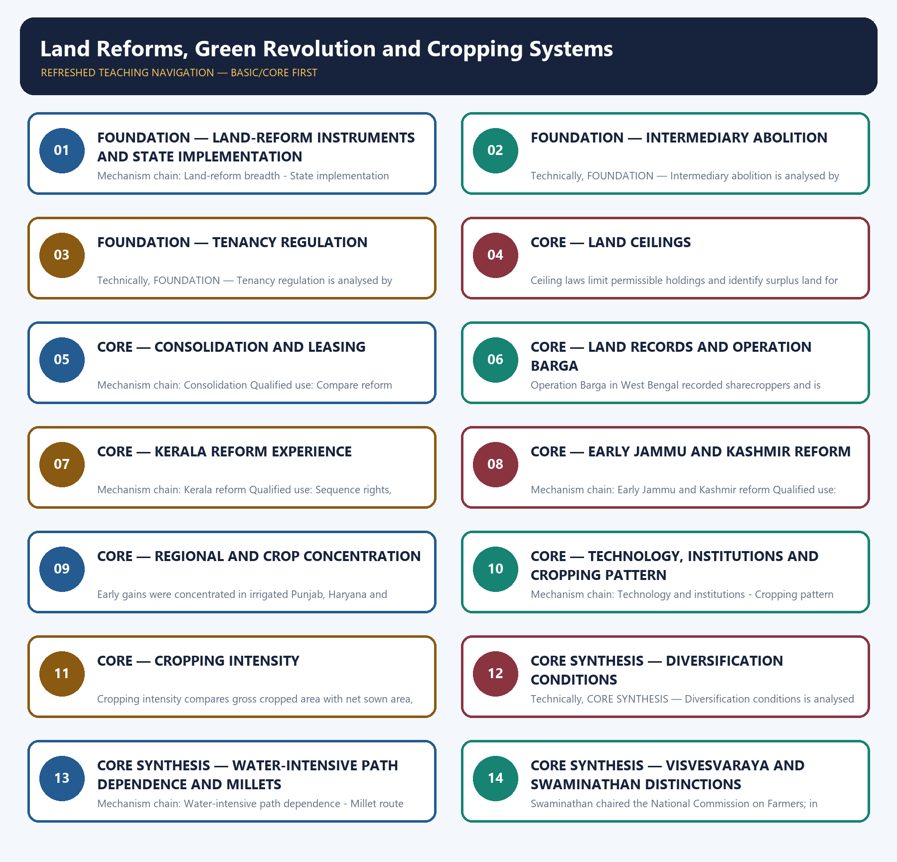

# Land Reforms, Green Revolution and Cropping Systems — Learner-v2 Complete Learning Session

> **Authoring-only generation:** 2026-09-03. No PDF was rendered and no tracker or index was mutated.

### SOURCE, PROGRESSION AND CURRENT-LINKAGE AUDIT

- **Generation date:** 2026-09-03.
- **Repository-first evidence:** the Basic owner is taught first and preserved in full; the Advanced owner is retained only in the optional final teaching block.
- **OCR evidence:** Repository Markdown was primary. OCR-searchable local official General Studies papers were used only to confirm printed routed demands. No answer key, marking scheme, unsupported page precision or current macroeconomic statistic was inferred from them.
- **Qdrant:** not used; repository Markdown and available OCR context were sufficient.
- **PYQ integrity:** Audited ledgers route Mains demands on land-reform success, marginal farmers, ceilings, cropping-pattern change, rice-wheat consequences, crop diversification and the distinct contributions of Visvesvaraya and Swaminathan. Objective demands on organic certification, crop seasons, household surveys and water-intensive crops remain answer-key neutral.
- **Live-link boundary:** The live Department of Land Resources page was only a thin shell in the fetcher. The package therefore uses the repository owners for land-record architecture and makes no current digitisation-progress claim.
- **Fact/inference discipline:** no current-affairs item, PYQ wording, figure or quotation is invented.

### LIVE OFFICIAL-SOURCE ATTEMPT LOG

The checks below were made on 2026-09-03. Substantive official text is used only for the proposition it actually supports; binary files, dynamic shells, stubs and undated dashboard snippets are recorded but not converted into current claims.

- https://dolr.gov.in/en/programmes-schemes/dilrmp/ — retrieved 2026-09-03 after redirect; the official page returned only the DILRMP+ title in the live fetcher, so no progress count, coverage percentage or title-status claim was imported.

## BASIC LEARNING SESSION

### DEEP-REVIEW LEARNING CONTRACT

| Control | Binding rule for this package |
|---|---|
| Syllabus boundary | Complete Economy Basic/Core is answer-complete before optional Advanced depth. |
| Formula boundary | Formula, numerator, denominator, unit, stock/flow, nominal/real, base year, level/rate and accounting identity are explicit. |
| Institutional boundary | Constitution, statute, delegated rule, regulator mandate, policy, recommendation, scheme and implementation outcome remain distinct. |
| Transmission method | Shock or instrument → prices/quantities/balance sheets/incentives → institution and market response → output, employment, distribution, stability and external effect → lag and trade-off. |
| Current-data method | Source → release date → reference period → unit/denominator → provisional/revised/final status; incompatible Budget, Survey or statistical vintages are never mixed. |
| Programme-status method | Announced → approved → notified/guidelines issued → funded → operational → utilised → output → outcome are separate stages. |
| External/WTO method | Agreement text, member category, box, limit, notification, consultation, dispute and ruling are qualified without invented thresholds. |
| Causal method | Accounting identity, chronology and correlation are not promoted into behavioural or causal claims without mechanism, counterfactual and alternatives. |
| Answer balance | Model answers balance growth, distribution, stability, sustainability and federal dimensions with India-centric evidence. |
| Practice contract | Every solved item has demand decoding, a detailed examiner-grade model, executable timed/compression plan, marks rationale and answer-specific improvement. |
| Approval | This immutable successor remains `approved: false` pending explicit approval. |

**Canonical Basic/Core owner:** `upsc-ai-kit\knowledge\Economy\basic\11_Land-Reforms-Green-Revolution-and-Cropping-Systems.md`  
**Substantive canonical provenance owner:** `upsc-ai-kit\knowledge\Economy\11_Land-Reforms-Green-Revolution-and-Cropping-Systems_Learner-V2-Complete-Topic-Package.md`  
**Optional Advanced owner:** `upsc-ai-kit\knowledge\Economy\advanced\11_Land-Reforms-Green-Revolution-and-Cropping-Systems.md`  
**Official syllabus mapping:** `upsc-ai-kit\knowledge\Economy\OFFICIAL-UPSC-SYLLABUS-MAPPING.md`

### EVIDENCE, PYQ AND CURRENT-STATUS CONTROL

- Every data-heavy table states unit, denominator, geography, reference period and source/status.
- GDP/GVA, gross/net, domestic/national, nominal/real and level/rate distinctions remain exact.
- Monetary, fiscal and external chains state intermediaries, balance-sheet channels, lags, leakages and trade-offs.
- Budget and Economic Survey editions are never mixed; BE, RE, Actual, advance/provisional/revised/final estimates remain labelled.
- Scheme and programme claims distinguish announcement, approval, notification, operation, coverage, utilisation and measured outcome.
- WTO boxes, limits, de minimis, special treatment, notifications and disputes are qualified from authoritative rules.
- PYQ wording is preserved only where verified; reconstructed or routed demands remain labelled.
- **Current-status note, rechecked 2026-09-03:** volatile rates, estimates, scheme status, trade rules and institutional claims retain official source, release date, reference period and revision status.

**Generation-local live/current sources:**
- `https://dolr.gov.in/en/programmes-schemes/dilrmp/ — retrieved 2026-09-03 after redirect; the official page returned only the DILRMP+ title in the live fetcher, so no progress count, coverage percentage or title-status claim was imported.`




*Distinct embedded teaching-navigation image. The separate continuous Cārvāka-style flowchart package remains an independent at-a-glance artifact.*

### SESSION 1 — FOUNDATION — LAND-REFORM INSTRUMENTS AND STATE IMPLEMENTATION

#### DEFINITION / WHAT THIS IS CALLED

**Plain-language definition:** Land is principally state-administered, so outcomes vary with state law, political mobilisation, record quality, administrative capacity and local power relations.

**Technical definition:** Mechanism chain: Land-reform breadth - State implementation Qualified use: Sequence rights, records, holding structure, inputs, markets, risk and sustainability.

#### ANSWER-GRABBING OPENING — WRITE/ADAPT IN THE EXAM

> Mechanism chain: Land-reform breadth - State implementation Qualified use: Sequence rights, records, holding structure, inputs, markets, risk and sustainability.

#### MUST-WRITE KEYWORDS

- **FOUNDATION**
- **Land-reform instruments**
- **Mechanism chain**
- **Qualified use**
- **Land**
- **Land-reform**

**How to use them:** Frame the answer through FOUNDATION; define Land-reform instruments, connect Mechanism chain with Qualified use to explain the mechanism, and use Land for the decisive comparison or qualification.

#### VISUAL FIRST

```text
LAND-REFORM INSTRUMENTS AND STATE IMPLEMENTATION
01. Land-reform breadth
    |
    v
02. State implementation
BOUNDARY -> Do not reduce land reform to redistribution or judge success from statute text alone.
```

*This topic-specific rail fixes the evidence sequence and its exam boundary before analysis.*

#### CORE EXPLANATION

Land reform covers abolition of intermediaries, tenancy regulation, ceilings, consolidation and land records; it is not synonymous with redistribution alone. Land is principally state-administered, so outcomes vary with state law, political mobilisation, record quality, administrative capacity and local power relations.

#### NAMED EVIDENCE AND MECHANISM

- Land reform covers abolition of intermediaries, tenancy regulation, ceilings, consolidation and land records; it is not synonymous with redistribution alone.
- Land is principally state-administered, so outcomes vary with state law, political mobilisation, record quality, administrative capacity and local power relations.

#### EXAMINER CAUTION

- Do not reduce land reform to redistribution or judge success from statute text alone.

#### EXAM LINK

- **Prelims:** Preserve the exact formula, territorial or resident boundary, price basis, base year, index basket, eligible counterparty, institution and legal status; never upgrade a projection into an actual or a regulatory direction into a universal rule.
- **Mains:** Sequence rights, records, holding structure, inputs, markets, risk and sustainability.

#### MINI RECAP

- **Mechanism chain:** Land-reform breadth -> State implementation
- **Qualified use:** Sequence rights, records, holding structure, inputs, markets, risk and sustainability.

#### CLOSING RECALL FLOW — FOUNDATION — LAND-REFORM INSTRUMENTS AND STATE IMPLEMENTATION

```text
START / CONCEPT: FOUNDATION — Land-reform instruments and state implementation
        |
        v
EXACT TERMS: FOUNDATION · Land-reform instruments · Mechanism chain · Qualified use · Land · Land-reform
        |
        v
MECHANISM / ARGUMENT: Land is principally state-administered, so outcomes vary with state law, political mobilisation, record quality, administrative capacity and local power relations.
        |
        v
CONSEQUENCE / CONTRAST: Land reform covers abolition of intermediaries, tenancy regulation, ceilings, consolidation and land records; it is not synonymous with redistribution alone.
        |
        v
UPSC TRAP / ANSWER-USE: Do not reduce land reform to redistribution or judge success from statute text alone.
        |
        v
ANSWER-GRABBING FORMULATION: Mechanism chain: Land-reform breadth - State implementation Qualified use: Sequence rights, records, holding structure, inputs, markets, risk and sustainability.
```
### SESSION 2 — FOUNDATION — INTERMEDIARY ABOLITION

#### DEFINITION / WHAT THIS IS CALLED

**Plain-language definition:** Mechanism chain: Intermediary abolition Qualified use: Compare reform outcomes through political backing, record quality and implementation.

**Technical definition:** Technically, FOUNDATION — Intermediary abolition is analysed by relating FOUNDATION to Intermediary abolition, then testing the relationship through Mechanism chain and Qualified use.

#### ANSWER-GRABBING OPENING — WRITE/ADAPT IN THE EXAM

> Do not merge intermediary abolition, tenancy regulation, ceilings, consolidation and records.

#### MUST-WRITE KEYWORDS

- **FOUNDATION**
- **Intermediary abolition**
- **Mechanism chain**
- **Qualified use**
- **Intermediary**
- **Qualified**

**How to use them:** Frame the answer through FOUNDATION; define Intermediary abolition, connect Mechanism chain with Qualified use to explain the mechanism, and use Intermediary for the decisive comparison or qualification.

#### VISUAL FIRST

```text
INTERMEDIARY ABOLITION
01. Intermediary abolition
BOUNDARY -> Do not merge intermediary abolition, tenancy regulation, ceilings, consolidation and records.
```

*This topic-specific rail fixes the evidence sequence and its exam boundary before analysis.*

#### CORE EXPLANATION

Abolition of zamindari and other intermediary interests sought to connect the cultivator more directly with the state, but did not by itself settle tenancy, fragmentation or title disputes.

#### NAMED EVIDENCE AND MECHANISM

- Abolition of zamindari and other intermediary interests sought to connect the cultivator more directly with the state, but did not by itself settle tenancy, fragmentation or title disputes.

#### EXAMINER CAUTION

- Do not merge intermediary abolition, tenancy regulation, ceilings, consolidation and records.

#### EXAM LINK

- **Prelims:** Preserve the exact formula, territorial or resident boundary, price basis, base year, index basket, eligible counterparty, institution and legal status; never upgrade a projection into an actual or a regulatory direction into a universal rule.
- **Mains:** Compare reform outcomes through political backing, record quality and implementation.

#### MINI RECAP

- **Mechanism chain:** Intermediary abolition
- **Qualified use:** Compare reform outcomes through political backing, record quality and implementation.

#### CLOSING RECALL FLOW — FOUNDATION — INTERMEDIARY ABOLITION

```text
START / CONCEPT: FOUNDATION — Intermediary abolition
        |
        v
EXACT TERMS: FOUNDATION · Intermediary abolition · Mechanism chain · Qualified use · Intermediary · Qualified
        |
        v
MECHANISM / ARGUMENT: Mechanism chain: Intermediary abolition Qualified use: Compare reform outcomes through political backing, record quality and implementation.
        |
        v
CONSEQUENCE / CONTRAST: The resulting consequence is that do not merge intermediary abolition, tenancy regulation, ceilings, consolidation and records.
        |
        v
UPSC TRAP / ANSWER-USE: Do not miss this limiting distinction: do not merge intermediary abolition, tenancy regulation, ceilings, consolidation and records.
        |
        v
ANSWER-GRABBING FORMULATION: Do not merge intermediary abolition, tenancy regulation, ceilings, consolidation and records.
```
### SESSION 3 — FOUNDATION — TENANCY REGULATION

#### DEFINITION / WHAT THIS IS CALLED

**Plain-language definition:** Mechanism chain: Tenancy reform Qualified use: Judge crop transitions through water, demand, logistics, farmer risk and ecological cost.

**Technical definition:** Technically, FOUNDATION — Tenancy regulation is analysed by relating FOUNDATION to Tenancy regulation, then testing the relationship through Mechanism chain and Qualified use.

#### ANSWER-GRABBING OPENING — WRITE/ADAPT IN THE EXAM

> Mechanism chain: Tenancy reform Qualified use: Judge crop transitions through water, demand, logistics, farmer risk and ecological cost.

#### MUST-WRITE KEYWORDS

- **FOUNDATION**
- **Tenancy regulation**
- **Mechanism chain**
- **Qualified use**
- **Tenancy**
- **Qualified**

**How to use them:** Frame the answer through FOUNDATION; define Tenancy regulation, connect Mechanism chain with Qualified use to explain the mechanism, and use Tenancy for the decisive comparison or qualification.

#### VISUAL FIRST

```text
TENANCY REGULATION
01. Tenancy reform
BOUNDARY -> Do not generalise one state's reform experience to all legal and agrarian settings.
```

*This topic-specific rail fixes the evidence sequence and its exam boundary before analysis.*

#### CORE EXPLANATION

Tenancy reform concerns rent regulation, security of tenure, recording of the actual cultivator and ownership or purchase rights under the applicable state law.

#### NAMED EVIDENCE AND MECHANISM

- Tenancy reform concerns rent regulation, security of tenure, recording of the actual cultivator and ownership or purchase rights under the applicable state law.

#### EXAMINER CAUTION

- Do not generalise one state's reform experience to all legal and agrarian settings.

#### EXAM LINK

- **Prelims:** Preserve the exact formula, territorial or resident boundary, price basis, base year, index basket, eligible counterparty, institution and legal status; never upgrade a projection into an actual or a regulatory direction into a universal rule.
- **Mains:** Judge crop transitions through water, demand, logistics, farmer risk and ecological cost.

#### MINI RECAP

- **Mechanism chain:** Tenancy reform
- **Qualified use:** Judge crop transitions through water, demand, logistics, farmer risk and ecological cost.

#### CLOSING RECALL FLOW — FOUNDATION — TENANCY REGULATION

```text
START / CONCEPT: FOUNDATION — Tenancy regulation
        |
        v
EXACT TERMS: FOUNDATION · Tenancy regulation · Mechanism chain · Qualified use · Tenancy · Qualified
        |
        v
MECHANISM / ARGUMENT: Do not generalise one state's reform experience to all legal and agrarian settings.
        |
        v
CONSEQUENCE / CONTRAST: The resulting consequence is that judge crop transitions through water, demand, logistics, farmer risk and ecological cost.
        |
        v
UPSC TRAP / ANSWER-USE: Do not miss this limiting distinction: judge crop transitions through water, demand, logistics, farmer risk and ecological cost.
        |
        v
ANSWER-GRABBING FORMULATION: Mechanism chain: Tenancy reform Qualified use: Judge crop transitions through water, demand, logistics, farmer risk and ecological cost.
```
### SESSION 4 — CORE — LAND CEILINGS

#### DEFINITION / WHAT THIS IS CALLED

**Plain-language definition:** Mechanism chain: Land ceilings Qualified use: Sequence rights, records, holding structure, inputs, markets, risk and sustainability.

**Technical definition:** Ceiling laws limit permissible holdings and identify surplus land for redistribution, but exemptions, benami adjustment, litigation and weak detection can separate statutory intent from field outcome.

#### ANSWER-GRABBING OPENING — WRITE/ADAPT IN THE EXAM

> Ceiling laws limit permissible holdings and identify surplus land for redistribution, but exemptions, benami adjustment, litigation and weak detection can separate statutory intent from field outcome.

#### MUST-WRITE KEYWORDS

- **Land ceilings**
- **Mechanism chain**
- **Qualified use**
- **Ceiling**
- **Green Revolution**
- **Land**

**How to use them:** Frame the answer through Land ceilings; define Mechanism chain, connect Qualified use with Ceiling to explain the mechanism, and use Green Revolution for the decisive comparison or qualification.

#### VISUAL FIRST

```text
LAND CEILINGS
01. Land ceilings
BOUNDARY -> Do not describe the Green Revolution as seed-only or uniformly national.
```

*This topic-specific rail fixes the evidence sequence and its exam boundary before analysis.*

#### CORE EXPLANATION

Ceiling laws limit permissible holdings and identify surplus land for redistribution, but exemptions, benami adjustment, litigation and weak detection can separate statutory intent from field outcome.

#### NAMED EVIDENCE AND MECHANISM

- Ceiling laws limit permissible holdings and identify surplus land for redistribution, but exemptions, benami adjustment, litigation and weak detection can separate statutory intent from field outcome.

#### EXAMINER CAUTION

- Do not describe the Green Revolution as seed-only or uniformly national.

#### EXAM LINK

- **Prelims:** Preserve the exact formula, territorial or resident boundary, price basis, base year, index basket, eligible counterparty, institution and legal status; never upgrade a projection into an actual or a regulatory direction into a universal rule.
- **Mains:** Sequence rights, records, holding structure, inputs, markets, risk and sustainability.

#### MINI RECAP

- **Mechanism chain:** Land ceilings
- **Qualified use:** Sequence rights, records, holding structure, inputs, markets, risk and sustainability.

#### CLOSING RECALL FLOW — CORE — LAND CEILINGS

```text
START / CONCEPT: CORE — Land ceilings
        |
        v
EXACT TERMS: Land ceilings · Mechanism chain · Qualified use · Ceiling · Green Revolution · Land
        |
        v
MECHANISM / ARGUMENT: Mechanism chain: Land ceilings Qualified use: Sequence rights, records, holding structure, inputs, markets, risk and sustainability.
        |
        v
CONSEQUENCE / CONTRAST: Do not describe the Green Revolution as seed-only or uniformly national.
        |
        v
UPSC TRAP / ANSWER-USE: Do not miss this limiting distinction: ceiling laws limit permissible holdings and identify surplus land for redistribution.
        |
        v
ANSWER-GRABBING FORMULATION: Ceiling laws limit permissible holdings and identify surplus land for redistribution, but exemptions, benami adjustment, litigation and weak detection can separate statutory intent from field outcome.
```
### SESSION 5 — CORE — CONSOLIDATION AND LEASING

#### DEFINITION / WHAT THIS IS CALLED

**Plain-language definition:** Consolidation reorganises fragmented parcels into more workable holdings without necessarily changing aggregate ownership, while secure leasing separates ownership from cultivation under safeguards.

**Technical definition:** Mechanism chain: Consolidation Qualified use: Compare reform outcomes through political backing, record quality and implementation.

#### ANSWER-GRABBING OPENING — WRITE/ADAPT IN THE EXAM

> Consolidation reorganises fragmented parcels into more workable holdings without necessarily changing aggregate ownership, while secure leasing separates ownership from cultivation under safeguards.

#### MUST-WRITE KEYWORDS

- **Consolidation**
- **leasing**
- **Mechanism chain**
- **Qualified use**
- **Consolidation Qualified**
- **CORE — Consolidation and leasing**

**How to use them:** Frame the answer through Consolidation; define leasing, connect Mechanism chain with Qualified use to explain the mechanism, and use Consolidation Qualified for the decisive comparison or qualification.

#### VISUAL FIRST

```text
CONSOLIDATION AND LEASING
01. Consolidation
BOUNDARY -> Do not equate higher cropping intensity with sustainable resource use.
```

*This topic-specific rail fixes the evidence sequence and its exam boundary before analysis.*

#### CORE EXPLANATION

Consolidation reorganises fragmented parcels into more workable holdings without necessarily changing aggregate ownership, while secure leasing separates ownership from cultivation under safeguards.

#### NAMED EVIDENCE AND MECHANISM

- Consolidation reorganises fragmented parcels into more workable holdings without necessarily changing aggregate ownership, while secure leasing separates ownership from cultivation under safeguards.

#### EXAMINER CAUTION

- Do not equate higher cropping intensity with sustainable resource use.

#### EXAM LINK

- **Prelims:** Preserve the exact formula, territorial or resident boundary, price basis, base year, index basket, eligible counterparty, institution and legal status; never upgrade a projection into an actual or a regulatory direction into a universal rule.
- **Mains:** Compare reform outcomes through political backing, record quality and implementation.

#### MINI RECAP

- **Mechanism chain:** Consolidation
- **Qualified use:** Compare reform outcomes through political backing, record quality and implementation.

#### CLOSING RECALL FLOW — CORE — CONSOLIDATION AND LEASING

```text
START / CONCEPT: CORE — Consolidation and leasing
        |
        v
EXACT TERMS: Consolidation · leasing · Mechanism chain · Qualified use · Consolidation Qualified · CORE — Consolidation and leasing
        |
        v
MECHANISM / ARGUMENT: Mechanism chain: Consolidation Qualified use: Compare reform outcomes through political backing, record quality and implementation.
        |
        v
CONSEQUENCE / CONTRAST: Do not equate higher cropping intensity with sustainable resource use.
        |
        v
UPSC TRAP / ANSWER-USE: Do not miss this limiting distinction: consolidation reorganises fragmented parcels into more workable holdings without necessarily changing aggregate ownership.
        |
        v
ANSWER-GRABBING FORMULATION: Consolidation reorganises fragmented parcels into more workable holdings without necessarily changing aggregate ownership, while secure leasing separates ownership from cultivation under safeguards.
```
### SESSION 6 — CORE — LAND RECORDS AND OPERATION BARGA

#### DEFINITION / WHAT THIS IS CALLED

**Plain-language definition:** Survey, settlement and updated land records are rights, credit, planning and dispute-resolution infrastructure; a legal reform cannot reach the actual cultivator if records remain inaccurate.

**Technical definition:** Operation Barga in West Bengal recorded sharecroppers and is evidence about tenancy security and implementation, not a Green-Revolution seed programme or a complete solution to fragmentation.

#### ANSWER-GRABBING OPENING — WRITE/ADAPT IN THE EXAM

> Survey, settlement and updated land records are rights, credit, planning and dispute-resolution infrastructure; a legal reform cannot reach the actual cultivator if records remain inaccurate.

#### MUST-WRITE KEYWORDS

- **Land records**
- **Operation Barga**
- **Mechanism chain**
- **Qualified use**
- **Survey, settlement and updated land records**
- **Survey**

**How to use them:** Frame the answer through Land records; define Operation Barga, connect Mechanism chain with Qualified use to explain the mechanism, and use Survey, settlement and updated land records for the decisive comparison or qualification.

#### VISUAL FIRST

```text
LAND RECORDS AND OPERATION BARGA
01. Land records
    |
    v
02. Operation Barga
BOUNDARY -> Do not quote crop-area shares without the year, geography and official estimate.
```

*This topic-specific rail fixes the evidence sequence and its exam boundary before analysis.*

#### CORE EXPLANATION

Survey, settlement and updated land records are rights, credit, planning and dispute-resolution infrastructure; a legal reform cannot reach the actual cultivator if records remain inaccurate. Operation Barga in West Bengal recorded sharecroppers and is evidence about tenancy security and implementation, not a Green-Revolution seed programme or a complete solution to fragmentation.

#### NAMED EVIDENCE AND MECHANISM

- Survey, settlement and updated land records are rights, credit, planning and dispute-resolution infrastructure; a legal reform cannot reach the actual cultivator if records remain inaccurate.
- Operation Barga in West Bengal recorded sharecroppers and is evidence about tenancy security and implementation, not a Green-Revolution seed programme or a complete solution to fragmentation.

#### EXAMINER CAUTION

- Do not quote crop-area shares without the year, geography and official estimate.

#### EXAM LINK

- **Prelims:** Preserve the exact formula, territorial or resident boundary, price basis, base year, index basket, eligible counterparty, institution and legal status; never upgrade a projection into an actual or a regulatory direction into a universal rule.
- **Mains:** Judge crop transitions through water, demand, logistics, farmer risk and ecological cost.

#### MINI RECAP

- **Mechanism chain:** Land records -> Operation Barga
- **Qualified use:** Judge crop transitions through water, demand, logistics, farmer risk and ecological cost.

#### CLOSING RECALL FLOW — CORE — LAND RECORDS AND OPERATION BARGA

```text
START / CONCEPT: CORE — Land records and Operation Barga
        |
        v
EXACT TERMS: Land records · Operation Barga · Mechanism chain · Qualified use · Survey, settlement and updated land records · Survey
        |
        v
MECHANISM / ARGUMENT: Mechanism chain: Land records - Operation Barga Qualified use: Judge crop transitions through water, demand, logistics, farmer risk and ecological cost.
        |
        v
CONSEQUENCE / CONTRAST: Operation Barga in West Bengal recorded sharecroppers and is evidence about tenancy security and implementation, not a Green-Revolution seed programme or a complete solution to fragmentation.
        |
        v
UPSC TRAP / ANSWER-USE: Do not quote crop-area shares without the year, geography and official estimate.
        |
        v
ANSWER-GRABBING FORMULATION: Survey, settlement and updated land records are rights, credit, planning and dispute-resolution infrastructure; a legal reform cannot reach the actual cultivator if records remain inaccurate.
```
### SESSION 7 — CORE — KERALA REFORM EXPERIENCE

#### DEFINITION / WHAT THIS IS CALLED

**Plain-language definition:** CORE — Kerala reform experience comprises Kerala reform experience, Mechanism chain and Qualified use as its core connected dimensions.

**Technical definition:** Mechanism chain: Kerala reform Qualified use: Sequence rights, records, holding structure, inputs, markets, risk and sustainability.

#### ANSWER-GRABBING OPENING — WRITE/ADAPT IN THE EXAM

> The Kerala Land Reforms Act is a named example of comparatively thorough tenancy abolition and ceiling implementation, while later smallholding and employment constraints remained.

#### MUST-WRITE KEYWORDS

- **Kerala reform experience**
- **Mechanism chain**
- **Qualified use**
- **The Kerala Land Reforms Act**
- **Kerala**
- **Qualified**

**How to use them:** Frame the answer through Kerala reform experience; define Mechanism chain, connect Qualified use with The Kerala Land Reforms Act to explain the mechanism, and use Kerala for the decisive comparison or qualification.

#### VISUAL FIRST

```text
KERALA REFORM EXPERIENCE
01. Kerala reform
BOUNDARY -> Do not call diversification viable without demand, logistics and risk support.
```

*This topic-specific rail fixes the evidence sequence and its exam boundary before analysis.*

#### CORE EXPLANATION

The Kerala Land Reforms Act is a named example of comparatively thorough tenancy abolition and ceiling implementation, while later smallholding and employment constraints remained.

#### NAMED EVIDENCE AND MECHANISM

- The Kerala Land Reforms Act is a named example of comparatively thorough tenancy abolition and ceiling implementation, while later smallholding and employment constraints remained.

#### EXAMINER CAUTION

- Do not call diversification viable without demand, logistics and risk support.

#### EXAM LINK

- **Prelims:** Preserve the exact formula, territorial or resident boundary, price basis, base year, index basket, eligible counterparty, institution and legal status; never upgrade a projection into an actual or a regulatory direction into a universal rule.
- **Mains:** Sequence rights, records, holding structure, inputs, markets, risk and sustainability.

#### MINI RECAP

- **Mechanism chain:** Kerala reform
- **Qualified use:** Sequence rights, records, holding structure, inputs, markets, risk and sustainability.

#### CLOSING RECALL FLOW — CORE — KERALA REFORM EXPERIENCE

```text
START / CONCEPT: CORE — Kerala reform experience
        |
        v
EXACT TERMS: Kerala reform experience · Mechanism chain · Qualified use · The Kerala Land Reforms Act · Kerala · Qualified
        |
        v
MECHANISM / ARGUMENT: Mechanism chain: Kerala reform Qualified use: Sequence rights, records, holding structure, inputs, markets, risk and sustainability.
        |
        v
CONSEQUENCE / CONTRAST: Do not call diversification viable without demand, logistics and risk support.
        |
        v
UPSC TRAP / ANSWER-USE: Do not miss this limiting distinction: the Kerala Land Reforms Act is a named example of comparatively thorough tenancy abolition...
        |
        v
ANSWER-GRABBING FORMULATION: The Kerala Land Reforms Act is a named example of comparatively thorough tenancy abolition and ceiling implementation, while later smallholding and employment constraints remained.
```
### SESSION 8 — CORE — EARLY JAMMU AND KASHMIR REFORM

#### DEFINITION / WHAT THIS IS CALLED

**Plain-language definition:** The Big Landed Estates Abolition Act, 1950 in Jammu and Kashmir is a distinct early ceiling and estate-restructuring episode whose political-legal setting should not be generalised mechanically.

**Technical definition:** Mechanism chain: Early Jammu and Kashmir reform Qualified use: Compare reform outcomes through political backing, record quality and implementation.

#### ANSWER-GRABBING OPENING — WRITE/ADAPT IN THE EXAM

> The Big Landed Estates Abolition Act, 1950 in Jammu and Kashmir is a distinct early ceiling and estate-restructuring episode whose political-legal setting should not be generalised mechanically.

#### MUST-WRITE KEYWORDS

- **Early Jammu**
- **Kashmir reform**
- **Mechanism chain**
- **Qualified use**
- **The Big Landed Estates Abolition**
- **Act**

**How to use them:** Frame the answer through Early Jammu; define Kashmir reform, connect Mechanism chain with Qualified use to explain the mechanism, and use The Big Landed Estates Abolition for the decisive comparison or qualification.

#### VISUAL FIRST

```text
EARLY JAMMU AND KASHMIR REFORM
01. Early Jammu and Kashmir reform
BOUNDARY -> Do not treat every organic or low-chemical system as NPOP-certified organic production.
```

*This topic-specific rail fixes the evidence sequence and its exam boundary before analysis.*

#### CORE EXPLANATION

The Big Landed Estates Abolition Act, 1950 in Jammu and Kashmir is a distinct early ceiling and estate-restructuring episode whose political-legal setting should not be generalised mechanically.

#### NAMED EVIDENCE AND MECHANISM

- The Big Landed Estates Abolition Act, 1950 in Jammu and Kashmir is a distinct early ceiling and estate-restructuring episode whose political-legal setting should not be generalised mechanically.

#### EXAMINER CAUTION

- Do not treat every organic or low-chemical system as NPOP-certified organic production.

#### EXAM LINK

- **Prelims:** Preserve the exact formula, territorial or resident boundary, price basis, base year, index basket, eligible counterparty, institution and legal status; never upgrade a projection into an actual or a regulatory direction into a universal rule.
- **Mains:** Compare reform outcomes through political backing, record quality and implementation.

#### MINI RECAP

- **Mechanism chain:** Early Jammu and Kashmir reform
- **Qualified use:** Compare reform outcomes through political backing, record quality and implementation.

#### CLOSING RECALL FLOW — CORE — EARLY JAMMU AND KASHMIR REFORM

```text
START / CONCEPT: CORE — Early Jammu and Kashmir reform
        |
        v
EXACT TERMS: Early Jammu · Kashmir reform · Mechanism chain · Qualified use · The Big Landed Estates Abolition · Act
        |
        v
MECHANISM / ARGUMENT: Mechanism chain: Early Jammu and Kashmir reform Qualified use: Compare reform outcomes through political backing, record quality and implementation.
        |
        v
CONSEQUENCE / CONTRAST: Do not treat every organic or low-chemical system as NPOP-certified organic production.
        |
        v
UPSC TRAP / ANSWER-USE: Do not miss this limiting distinction: the Big Landed Estates Abolition Act, 1950 in Jammu and Kashmir is a distinct...
        |
        v
ANSWER-GRABBING FORMULATION: The Big Landed Estates Abolition Act, 1950 in Jammu and Kashmir is a distinct early ceiling and estate-restructuring episode whose political-legal setting should not be generalised mechanically.
```
### SESSION 9 — CORE — GREEN-REVOLUTION PACKAGE

#### VISUAL FIRST

```text
GREEN-REVOLUTION PACKAGE
01. Green-Revolution package
BOUNDARY -> Do not merge Visvesvaraya's engineering with Swaminathan's crop-science contribution.
```

*This topic-specific rail fixes the evidence sequence and its exam boundary before analysis.*

#### CORE EXPLANATION

The Green Revolution was a complementary package of high-yielding seed, assured water, fertiliser, credit, extension, procurement and price support rather than a seed-only event.

#### NAMED EVIDENCE AND MECHANISM

- The Green Revolution was a complementary package of high-yielding seed, assured water, fertiliser, credit, extension, procurement and price support rather than a seed-only event.

#### EXAMINER CAUTION

- Do not merge Visvesvaraya's engineering with Swaminathan's crop-science contribution.

#### EXAM LINK

- **Prelims:** Preserve the exact formula, territorial or resident boundary, price basis, base year, index basket, eligible counterparty, institution and legal status; never upgrade a projection into an actual or a regulatory direction into a universal rule.
- **Mains:** Judge crop transitions through water, demand, logistics, farmer risk and ecological cost.

#### MINI RECAP

- **Mechanism chain:** Green-Revolution package
- **Qualified use:** Judge crop transitions through water, demand, logistics, farmer risk and ecological cost.
### SESSION 10 — CORE — REGIONAL AND CROP CONCENTRATION

#### DEFINITION / WHAT THIS IS CALLED

**Plain-language definition:** Mechanism chain: Regional and crop concentration Qualified use: Sequence rights, records, holding structure, inputs, markets, risk and sustainability.

**Technical definition:** Early gains were concentrated in irrigated Punjab, Haryana and western Uttar Pradesh and in wheat and later rice, so national output gains coexisted with regional and crop imbalance.

#### ANSWER-GRABBING OPENING — WRITE/ADAPT IN THE EXAM

> Mechanism chain: Regional and crop concentration Qualified use: Sequence rights, records, holding structure, inputs, markets, risk and sustainability.

#### MUST-WRITE KEYWORDS

- **Regional**
- **crop concentration**
- **Mechanism chain**
- **Qualified use**
- **Early**
- **Punjab**

**How to use them:** Frame the answer through Regional; define crop concentration, connect Mechanism chain with Qualified use to explain the mechanism, and use Early for the decisive comparison or qualification.

#### VISUAL FIRST

```text
REGIONAL AND CROP CONCENTRATION
01. Regional and crop concentration
BOUNDARY -> Do not infer a PYQ answer key from a routed objective demand.
```

*This topic-specific rail fixes the evidence sequence and its exam boundary before analysis.*

#### CORE EXPLANATION

Early gains were concentrated in irrigated Punjab, Haryana and western Uttar Pradesh and in wheat and later rice, so national output gains coexisted with regional and crop imbalance.

#### NAMED EVIDENCE AND MECHANISM

- Early gains were concentrated in irrigated Punjab, Haryana and western Uttar Pradesh and in wheat and later rice, so national output gains coexisted with regional and crop imbalance.

#### EXAMINER CAUTION

- Do not infer a PYQ answer key from a routed objective demand.

#### EXAM LINK

- **Prelims:** Preserve the exact formula, territorial or resident boundary, price basis, base year, index basket, eligible counterparty, institution and legal status; never upgrade a projection into an actual or a regulatory direction into a universal rule.
- **Mains:** Sequence rights, records, holding structure, inputs, markets, risk and sustainability.

#### MINI RECAP

- **Mechanism chain:** Regional and crop concentration
- **Qualified use:** Sequence rights, records, holding structure, inputs, markets, risk and sustainability.

#### CLOSING RECALL FLOW — CORE — REGIONAL AND CROP CONCENTRATION

```text
START / CONCEPT: CORE — Regional and crop concentration
        |
        v
EXACT TERMS: Regional · crop concentration · Mechanism chain · Qualified use · Early · Punjab
        |
        v
MECHANISM / ARGUMENT: Early gains were concentrated in irrigated Punjab, Haryana and western Uttar Pradesh and in wheat and later rice, so national output gains coexisted with regional and crop imbalance.
        |
        v
CONSEQUENCE / CONTRAST: Do not infer a PYQ answer key from a routed objective demand.
        |
        v
UPSC TRAP / ANSWER-USE: Do not miss this limiting distinction: regional and crop concentration Qualified use.
        |
        v
ANSWER-GRABBING FORMULATION: Mechanism chain: Regional and crop concentration Qualified use: Sequence rights, records, holding structure, inputs, markets, risk and sustainability.
```
### SESSION 11 — CORE — TECHNOLOGY, INSTITUTIONS AND CROPPING PATTERN

#### DEFINITION / WHAT THIS IS CALLED

**Plain-language definition:** Cropping pattern is the distribution of cultivated area among crops at a stated time and geography; exact shares are year-specific and cannot be treated as timeless.

**Technical definition:** Mechanism chain: Technology and institutions - Cropping pattern Qualified use: Compare reform outcomes through political backing, record quality and implementation.

#### ANSWER-GRABBING OPENING — WRITE/ADAPT IN THE EXAM

> Mechanism chain: Technology and institutions - Cropping pattern Qualified use: Compare reform outcomes through political backing, record quality and implementation.

#### MUST-WRITE KEYWORDS

- **Technology**
- **institutions**
- **cropping pattern**
- **Mechanism chain**
- **Qualified use**
- **Cropping**

**How to use them:** Frame the answer through Technology; define institutions, connect cropping pattern with Mechanism chain to explain the mechanism, and use Qualified use for the decisive comparison or qualification.

#### VISUAL FIRST

```text
TECHNOLOGY, INSTITUTIONS AND CROPPING PATTERN
01. Technology and institutions
    |
    v
02. Cropping pattern
BOUNDARY -> Do not reduce land reform to redistribution or judge success from statute text alone.
```

*This topic-specific rail fixes the evidence sequence and its exam boundary before analysis.*

#### CORE EXPLANATION

High-yielding varieties produced durable gains only where research, local adaptation, irrigation, input delivery, extension and market institutions operated together. Cropping pattern is the distribution of cultivated area among crops at a stated time and geography; exact shares are year-specific and cannot be treated as timeless.

#### NAMED EVIDENCE AND MECHANISM

- High-yielding varieties produced durable gains only where research, local adaptation, irrigation, input delivery, extension and market institutions operated together.
- Cropping pattern is the distribution of cultivated area among crops at a stated time and geography; exact shares are year-specific and cannot be treated as timeless.

#### EXAMINER CAUTION

- Do not reduce land reform to redistribution or judge success from statute text alone.

#### EXAM LINK

- **Prelims:** Preserve the exact formula, territorial or resident boundary, price basis, base year, index basket, eligible counterparty, institution and legal status; never upgrade a projection into an actual or a regulatory direction into a universal rule.
- **Mains:** Compare reform outcomes through political backing, record quality and implementation.

#### MINI RECAP

- **Mechanism chain:** Technology and institutions -> Cropping pattern
- **Qualified use:** Compare reform outcomes through political backing, record quality and implementation.

#### CLOSING RECALL FLOW — CORE — TECHNOLOGY, INSTITUTIONS AND CROPPING PATTERN

```text
START / CONCEPT: CORE — Technology, institutions and cropping pattern
        |
        v
EXACT TERMS: Technology · institutions · cropping pattern · Mechanism chain · Qualified use · Cropping
        |
        v
MECHANISM / ARGUMENT: Cropping pattern is the distribution of cultivated area among crops at a stated time and geography; exact shares are year-specific and cannot be treated as timeless.
        |
        v
CONSEQUENCE / CONTRAST: Do not reduce land reform to redistribution or judge success from statute text alone.
        |
        v
UPSC TRAP / ANSWER-USE: Do not miss this limiting distinction: technology and institutions - Cropping pattern Qualified use.
        |
        v
ANSWER-GRABBING FORMULATION: Mechanism chain: Technology and institutions - Cropping pattern Qualified use: Compare reform outcomes through political backing, record quality and implementation.
```
### SESSION 12 — CORE — CROPPING INTENSITY

#### DEFINITION / WHAT THIS IS CALLED

**Plain-language definition:** Mechanism chain: Cropping intensity Qualified use: Judge crop transitions through water, demand, logistics, farmer risk and ecological cost.

**Technical definition:** Cropping intensity compares gross cropped area with net sown area, so multiple cropping raises the ratio without necessarily expanding net cultivated land.

#### ANSWER-GRABBING OPENING — WRITE/ADAPT IN THE EXAM

> Mechanism chain: Cropping intensity Qualified use: Judge crop transitions through water, demand, logistics, farmer risk and ecological cost.

#### MUST-WRITE KEYWORDS

- **Cropping intensity**
- **Mechanism chain**
- **Qualified use**
- **Cropping**
- **Qualified**
- **Judge**

**How to use them:** Frame the answer through Cropping intensity; define Mechanism chain, connect Qualified use with Cropping to explain the mechanism, and use Qualified for the decisive comparison or qualification.

#### VISUAL FIRST

```text
CROPPING INTENSITY
01. Cropping intensity
BOUNDARY -> Do not merge intermediary abolition, tenancy regulation, ceilings, consolidation and records.
```

*This topic-specific rail fixes the evidence sequence and its exam boundary before analysis.*

#### CORE EXPLANATION

Cropping intensity compares gross cropped area with net sown area, so multiple cropping raises the ratio without necessarily expanding net cultivated land.

#### NAMED EVIDENCE AND MECHANISM

- Cropping intensity compares gross cropped area with net sown area, so multiple cropping raises the ratio without necessarily expanding net cultivated land.

#### EXAMINER CAUTION

- Do not merge intermediary abolition, tenancy regulation, ceilings, consolidation and records.

#### EXAM LINK

- **Prelims:** Preserve the exact formula, territorial or resident boundary, price basis, base year, index basket, eligible counterparty, institution and legal status; never upgrade a projection into an actual or a regulatory direction into a universal rule.
- **Mains:** Judge crop transitions through water, demand, logistics, farmer risk and ecological cost.

#### MINI RECAP

- **Mechanism chain:** Cropping intensity
- **Qualified use:** Judge crop transitions through water, demand, logistics, farmer risk and ecological cost.

#### CLOSING RECALL FLOW — CORE — CROPPING INTENSITY

```text
START / CONCEPT: CORE — Cropping intensity
        |
        v
EXACT TERMS: Cropping intensity · Mechanism chain · Qualified use · Cropping · Qualified · Judge
        |
        v
MECHANISM / ARGUMENT: Cropping intensity compares gross cropped area with net sown area, so multiple cropping raises the ratio without necessarily expanding net cultivated land.
        |
        v
CONSEQUENCE / CONTRAST: Do not merge intermediary abolition, tenancy regulation, ceilings, consolidation and records.
        |
        v
UPSC TRAP / ANSWER-USE: Do not miss this limiting distinction: judge crop transitions through water, demand, logistics, farmer risk and ecological cost.
        |
        v
ANSWER-GRABBING FORMULATION: Mechanism chain: Cropping intensity Qualified use: Judge crop transitions through water, demand, logistics, farmer risk and ecological cost.
```
### SESSION 13 — CORE SYNTHESIS — DIVERSIFICATION CONDITIONS

#### DEFINITION / WHAT THIS IS CALLED

**Plain-language definition:** Mechanism chain: Diversification conditions Qualified use: Sequence rights, records, holding structure, inputs, markets, risk and sustainability.

**Technical definition:** Technically, CORE SYNTHESIS — Diversification conditions is analysed by relating CORE SYNTHESIS to Diversification conditions, then testing the relationship through Mechanism chain and Qualified use.

#### ANSWER-GRABBING OPENING — WRITE/ADAPT IN THE EXAM

> Mechanism chain: Diversification conditions Qualified use: Sequence rights, records, holding structure, inputs, markets, risk and sustainability.

#### MUST-WRITE KEYWORDS

- **CORE SYNTHESIS**
- **Diversification conditions**
- **Mechanism chain**
- **Qualified use**
- **Diversification**
- **Qualified**

**How to use them:** Frame the answer through CORE SYNTHESIS; define Diversification conditions, connect Mechanism chain with Qualified use to explain the mechanism, and use Diversification for the decisive comparison or qualification.

#### VISUAL FIRST

```text
DIVERSIFICATION CONDITIONS
01. Diversification conditions
BOUNDARY -> Do not generalise one state's reform experience to all legal and agrarian settings.
```

*This topic-specific rail fixes the evidence sequence and its exam boundary before analysis.*

#### CORE EXPLANATION

Diversification toward pulses, oilseeds, horticulture, millets or allied activities needs water suitability, risk cover, storage, processing and remunerative demand, not a price slogan alone.

#### NAMED EVIDENCE AND MECHANISM

- Diversification toward pulses, oilseeds, horticulture, millets or allied activities needs water suitability, risk cover, storage, processing and remunerative demand, not a price slogan alone.

#### EXAMINER CAUTION

- Do not generalise one state's reform experience to all legal and agrarian settings.

#### EXAM LINK

- **Prelims:** Preserve the exact formula, territorial or resident boundary, price basis, base year, index basket, eligible counterparty, institution and legal status; never upgrade a projection into an actual or a regulatory direction into a universal rule.
- **Mains:** Sequence rights, records, holding structure, inputs, markets, risk and sustainability.

#### MINI RECAP

- **Mechanism chain:** Diversification conditions
- **Qualified use:** Sequence rights, records, holding structure, inputs, markets, risk and sustainability.

#### CLOSING RECALL FLOW — CORE SYNTHESIS — DIVERSIFICATION CONDITIONS

```text
START / CONCEPT: CORE SYNTHESIS — Diversification conditions
        |
        v
EXACT TERMS: CORE SYNTHESIS · Diversification conditions · Mechanism chain · Qualified use · Diversification · Qualified
        |
        v
MECHANISM / ARGUMENT: Do not generalise one state's reform experience to all legal and agrarian settings.
        |
        v
CONSEQUENCE / CONTRAST: The resulting consequence is that sequence rights, records, holding structure, inputs, markets, risk and sustainability.
        |
        v
UPSC TRAP / ANSWER-USE: Do not miss this limiting distinction: sequence rights, records, holding structure, inputs, markets, risk and sustainability.
        |
        v
ANSWER-GRABBING FORMULATION: Mechanism chain: Diversification conditions Qualified use: Sequence rights, records, holding structure, inputs, markets, risk and sustainability.
```
### SESSION 14 — CORE SYNTHESIS — WATER-INTENSIVE PATH DEPENDENCE AND MILLETS

#### DEFINITION / WHAT THIS IS CALLED

**Plain-language definition:** Millets are dryland-oriented, relatively low-water and nutrient-dense crops, but their revival depends on seed, processing, procurement, consumer demand and region-specific agronomy.

**Technical definition:** Mechanism chain: Water-intensive path dependence - Millet route Qualified use: Compare reform outcomes through political backing, record quality and implementation.

#### ANSWER-GRABBING OPENING — WRITE/ADAPT IN THE EXAM

> Mechanism chain: Water-intensive path dependence - Millet route Qualified use: Compare reform outcomes through political backing, record quality and implementation.

#### MUST-WRITE KEYWORDS

- **CORE SYNTHESIS**
- **Water-intensive path dependence**
- **millets**
- **Mechanism chain**
- **Qualified use**
- **Rice**

**How to use them:** Frame the answer through CORE SYNTHESIS; define Water-intensive path dependence, connect millets with Mechanism chain to explain the mechanism, and use Qualified use for the decisive comparison or qualification.

#### VISUAL FIRST

```text
WATER-INTENSIVE PATH DEPENDENCE AND MILLETS
01. Water-intensive path dependence
    |
    v
02. Millet route
BOUNDARY -> Do not describe the Green Revolution as seed-only or uniformly national.
```

*This topic-specific rail fixes the evidence sequence and its exam boundary before analysis.*

#### CORE EXPLANATION

Rice, wheat and sugarcane incentives can reinforce water-intensive regional specialisation; crop choice must be read with irrigation source, energy pricing and procurement access. Millets are dryland-oriented, relatively low-water and nutrient-dense crops, but their revival depends on seed, processing, procurement, consumer demand and region-specific agronomy.

#### NAMED EVIDENCE AND MECHANISM

- Rice, wheat and sugarcane incentives can reinforce water-intensive regional specialisation; crop choice must be read with irrigation source, energy pricing and procurement access.
- Millets are dryland-oriented, relatively low-water and nutrient-dense crops, but their revival depends on seed, processing, procurement, consumer demand and region-specific agronomy.

#### EXAMINER CAUTION

- Do not describe the Green Revolution as seed-only or uniformly national.

#### EXAM LINK

- **Prelims:** Preserve the exact formula, territorial or resident boundary, price basis, base year, index basket, eligible counterparty, institution and legal status; never upgrade a projection into an actual or a regulatory direction into a universal rule.
- **Mains:** Compare reform outcomes through political backing, record quality and implementation.

#### MINI RECAP

- **Mechanism chain:** Water-intensive path dependence -> Millet route
- **Qualified use:** Compare reform outcomes through political backing, record quality and implementation.

#### CLOSING RECALL FLOW — CORE SYNTHESIS — WATER-INTENSIVE PATH DEPENDENCE AND MILLETS

```text
START / CONCEPT: CORE SYNTHESIS — Water-intensive path dependence and millets
        |
        v
EXACT TERMS: CORE SYNTHESIS · Water-intensive path dependence · millets · Mechanism chain · Qualified use · Rice
        |
        v
MECHANISM / ARGUMENT: Millets are dryland-oriented, relatively low-water and nutrient-dense crops, but their revival depends on seed, processing, procurement, consumer demand and region-specific agronomy.
        |
        v
CONSEQUENCE / CONTRAST: Do not describe the Green Revolution as seed-only or uniformly national.
        |
        v
UPSC TRAP / ANSWER-USE: Do not miss this limiting distinction: rice, wheat and sugarcane incentives can reinforce water-intensive regional specialisation.
        |
        v
ANSWER-GRABBING FORMULATION: Mechanism chain: Water-intensive path dependence - Millet route Qualified use: Compare reform outcomes through political backing, record quality and implementation.
```
### SESSION 15 — CORE SYNTHESIS — VISVESVARAYA AND SWAMINATHAN DISTINCTIONS

#### DEFINITION / WHAT THIS IS CALLED

**Plain-language definition:** Swaminathan and the National Commission on Farmers are the standard named anchors for farmer-centred reform that links productivity with income security, ecology and diversification.

**Technical definition:** Swaminathan chaired the National Commission on Farmers; in answers, use it as a bridge from productivity to farmer viability and sustainability. ✅ Millets are dryland/rainfed, short-duration, low-water, nutrient-dense (fibre, iron, calcium, low glycemic index) crops; 2023 was the UN International Year of Millets (India-proposed), and Budget 2023 branded them "Shree Anna". ✅ The NSSO 70th Round Situation Assessment Survey of Agricultural Households is household-based evidence on cultivation, income, debt and living conditions; it is not the same thing as a crop-output census. ✅ NPOP is implemented under APEDA, and Sikkim is widely cited as India's first full organic state; do not confuse organic certification architecture with every form of low-chemical farming. ✅ Public investment in agriculture includes irrigation, flood control, research, extension, storage, marketing infrastructure and rural connectivity; it is not the same as recurring input subsidy. ✅ Kharif crop area is monsoon-linked and can shift with rainfall, sowing conditions and irrigation support; exact acreage figures are year-specific and should be quoted only from the relevant official seasonal estimates. ✅ Black gram and green gram are commonly associated with kharif pulse cultivation, though regional summer or irrigated rabi exceptions exist. ✅ In water-efficiency questions, paddy or rice and sugarcane are the classic water-intensive crops cited in policy debate; always add agro-climatic and irrigation context instead of making a crop answer look universal. ✅ M.

#### ANSWER-GRABBING OPENING — WRITE/ADAPT IN THE EXAM

> ❌ Land reform means only redistribution. - Tenancy security, records, ceilings and consolidation are equally central. ❌ A good statute automatically means successful reform. - Field outcomes depend on records, mobilisation, local administration and political will. ❌ Green Revolution was uniformly national and crop-neutral. - Initial gains were regionally concentrated and heavily tied to wheat-rice systems. ❌ Higher cropping intensity always means sustainability. - It can intensify water, soil and input stress. ❌ Diversification means abandoning food security. - It usually means rebalancing cereals with pulses, oilseeds, horticulture and allied sectors. ❌ Organic farming, natural farming and certified-export organic systems are identical. - Institutional standards and certification architecture differ. ❌ Public investment and farm subsidy are interchangeable terms. - Capital formation and recurring subsidy have different fiscal and productivity implications. ❌ Visvesvaraya and Swaminathan can be described as generic "great men of Indian agriculture" without named evidence. - Cite Visvesvaraya's automatic sluice gates/block-system irrigation/KRS Dam specifically, and Swaminathan's semi-dwarf wheat/IR8 rice adaptation specifically; hero-worship language without named works or disputed sole-priority claims (e.g., ignoring Borlaug/IRRI's parallel role) will not earn marks.

#### MUST-WRITE KEYWORDS

- **CORE SYNTHESIS**
- **Visvesvaraya**
- **Swaminathan distinctions**
- **Mechanism chain**
- **Qualified use**
- **Subject**

**How to use them:** Frame the answer through CORE SYNTHESIS; define Visvesvaraya, connect Swaminathan distinctions with Mechanism chain to explain the mechanism, and use Qualified use for the decisive comparison or qualification.

#### VISUAL FIRST

```text
VISVESVARAYA AND SWAMINATHAN DISTINCTIONS
01. Visvesvaraya contribution
    |
    v
02. Swaminathan contribution
BOUNDARY -> Do not equate higher cropping intensity with sustainable resource use.
```

*This topic-specific rail fixes the evidence sequence and its exam boundary before analysis.*

#### CORE EXPLANATION

M. Visvesvaraya's named contribution is irrigation engineering, including automatic sluice gates and the block system; it must remain distinct from later crop-breeding achievements. M.S. Swaminathan's scientific contribution centred on adapting semi-dwarf wheat and rice technologies to Indian conditions, distinct from his later National Commission on Farmers role.

#### NAMED EVIDENCE AND MECHANISM

- M. Visvesvaraya's named contribution is irrigation engineering, including automatic sluice gates and the block system; it must remain distinct from later crop-breeding achievements.
- M.S. Swaminathan's scientific contribution centred on adapting semi-dwarf wheat and rice technologies to Indian conditions, distinct from his later National Commission on Farmers role.

#### EXAMINER CAUTION

- Do not equate higher cropping intensity with sustainable resource use.

#### EXAM LINK

- **Prelims:** Preserve the exact formula, territorial or resident boundary, price basis, base year, index basket, eligible counterparty, institution and legal status; never upgrade a projection into an actual or a regulatory direction into a universal rule.
- **Mains:** Judge crop transitions through water, demand, logistics, farmer risk and ecological cost.

#### MINI RECAP

- **Mechanism chain:** Visvesvaraya contribution -> Swaminathan contribution
- **Qualified use:** Judge crop transitions through water, demand, logistics, farmer risk and ecological cost.
#### COMPLETE BASIC OWNER EVIDENCE BANK

> **Subject:** Economy | **Tier:** Must-Do (foundation) | **GS Paper:** GS-III + Prelims.
> **Core area:** Agrarian structure and productivity.
> **Grounded in:** Ramesh Singh, relevant chapters; Economic Survey 2025-26; audited UPSC Economy PYQs (2024-2026 Prelims and 2024-2025 Mains).
> ✅ = source-grounded | ⚠️ = analytical linkage | 📰 = current Survey/current-affairs hook.
> *Companion: `../advanced/11_Land-Reforms-Green-Revolution-and-Cropping-Systems.md`.*

#### 1. Visual foundation

```text
1. SECURE AND WORKABLE HOLDINGS
   |
   v
2. INVESTMENT AND ACCESS TO INPUTS
   |
   v
3. HIGHER PRODUCTIVITY
   |
   v
4. MARKETED SURPLUS AND RURAL DEMAND
   |
   v
5. STRUCTURAL TRANSFORMATION
```

**Core proposition:** Agrarian reform must connect rights and records with technology,
water, prices and markets; changing only one link rarely changes farm outcomes.

#### 2. Essential definitions

| Concept | Exam-ready meaning |
|---|---|
| ✅ **Land reform** | Institutional change in ownership, tenancy, ceilings, consolidation and land records. |
| ✅ **Green Revolution** | Seed-water-fertiliser-credit-technology package that sharply raised selected crop yields. |
| ✅ **Cropping pattern** | Distribution of cultivated area among crops at a time. |
| ✅ **Cropping intensity** | Gross cropped area relative to net sown area. |
| ✅ **Diversification** | Shift across crops or towards allied and higher-value activities. |

#### 3. Topic mechanism

1. Tenure security and clear records determine cultivator incentives to invest in land
   improvement.
2. Holding size, consolidation, leasing and access to credit shape the feasible production
   technology.
3. The Green Revolution package combined seed, irrigation, fertiliser, extension, credit,
   procurement and price support.
4. Higher yields generated marketed surplus and food security but reinforced crop and
   regional concentration.
5. Cropping diversification responds only when water, risk cover, processing and
   remunerative demand support alternative crops.

#### 4. Institutions and policy tools

- ✅ **State revenue and land departments:** administer abolition of intermediaries, tenancy regulation, land ceilings, consolidation of holdings and land records; the classic land-reform toolkit is broader than redistribution alone.
- ✅ **Land-record modernisation, survey and settlement machinery:** determine whether rights on paper become enforceable titles or recorded tenancies in practice.
- ✅ **Agricultural universities, ICAR institutions and extension systems:** diffuse crop science, seed, agronomy and local adaptation beyond the original Green-Revolution package.
- ✅ **Irrigation, procurement, credit and input agencies:** shape which crops become commercially attractive in specific regions.
- ✅ **National Commission on Farmers chaired by M.S. Swaminathan:** provides a named policy anchor for farmer-centric productivity, income security and sustainable diversification.

#### 5. Indian applications and examples

- ⚠️ **Claim:** Tenancy reform matters when the state identifies the real cultivator. **Named evidence:** ✅ **Operation Barga** in West Bengal focused on recording sharecroppers (bargadars). **Why it supports the claim:** ⚠️ Registration improved tenure security and bargaining power, so reform affected incentives on the ground rather than remaining a purely legal proclamation. **Limit/status caution:** ⚠️ It is stronger evidence on tenancy security and local implementation than on solving fragmentation or creating uniformly efficient holdings.
- ⚠️ **Claim:** Ceiling and tenancy reform work better when pursued as a broad restructuring package. **Named evidence:** ✅ **Kerala Land Reforms Act** is widely cited as one of the more thorough state-level implementations of tenancy abolition and land-ceiling policy. **Why it supports the claim:** ⚠️ It shows that legal depth, political backing and administrative follow-through matter for redistributive outcomes. **Limit/status caution:** ⚠️ Thorough reform did not remove every issue of tiny holdings, labour absorption or later agrarian stagnation.
- ⚠️ **Claim:** Early and decisive ceiling reform can reshape agrarian hierarchy more sharply than delayed incrementalism. **Named evidence:** ✅ **Jammu & Kashmir's Big Landed Estates Abolition Act, 1950** explicitly attacked large landed estates and is analytically important because it predates and differs from much of the later post-1950 Constitution-era reform trajectory elsewhere. **Why it supports the claim:** ⚠️ It demonstrates that political context and timing strongly affect the depth of land reform. **Limit/status caution:** ⚠️ Its experience cannot be mechanically generalised to other states because the legal-political setting was distinct.
- ⚠️ **Claim:** The Green Revolution succeeded where technology was backed by state capacity and irrigation. **Named evidence:** ✅ The early **Green Revolution in Punjab, Haryana and western Uttar Pradesh** was concentrated around **wheat and later rice**. **Why it supports the claim:** ⚠️ It proves that high-yielding varieties worked best when combined with irrigation, fertiliser, credit, extension and assured procurement. **Limit/status caution:** ⚠️ The same success produced regional and crop concentration, groundwater stress and nutrient imbalance.
- ⚠️ **Claim:** Second-generation agrarian policy must move from production maximisation to sustainability and farm viability. **Named evidence:** ✅ **M.S. Swaminathan** and the **National Commission on Farmers** are the standard named anchors for farmer-centred reform that links productivity with income security, ecology and diversification. **Why it supports the claim:** ⚠️ They help an answer move beyond seed-and-yield narration toward risk, remuneration and sustainability. **Limit/status caution:** ⚠️ Commission logic is advisory; actual outcomes still depend on state implementation and market support.
- ⚠️ **Claim:** Cropping diversification is a policy response to Green-Revolution-era monoculture and groundwater stress. **Named evidence:** ✅ **Punjab's diversification push**, including recurrent policy emphasis on shifting some area away from the paddy-wheat cycle and measures such as the **Punjab Preservation of Subsoil Water Act, 2009**, illustrates this response. **Why it supports the claim:** ⚠️ It shows that the policy problem is no longer only raising output but also correcting water-intensive path dependence. **Limit/status caution:** ⚠️ Diversification will remain partial if alternative crops lack procurement depth, processing, storage and assured buyers.
- ⚠️ **Claim:** Millets are the clearest named crop-diversification route away from water-intensive, Green-Revolution-era monoculture, and their revival is a deliberate cropping-pattern shift, not a nostalgia project. **Named evidence:** ✅ Millets (jowar, bajra, ragi and minor millets such as foxtail, kodo, little, proso and barnyard millet) are small-seeded, largely **C4, dryland/rainfed crops** with short duration (roughly 60-100 days), high heat and drought tolerance and low water and input requirements compared with paddy or sugarcane; they are nutrient-dense — rich in dietary fibre, protein, iron, calcium and other micronutrients, with a low glycemic index — which is why they are officially branded **"Shree Anna"** (Budget 2023) and were the anchor for the **UN International Year of Millets, 2023** (an initiative India proposed). **Why it supports the claim:** ⚠️ Millets combine agro-climatic suitability for dryland/rainfed India with nutrition security and climate resilience, giving cropping-pattern policy a crop that serves farmer risk reduction, groundwater conservation and diet diversification simultaneously — directly answering why "emphasis on millet production" changes India's cropping pattern. **Limit/status caution:** ⚠️ Millets still face real constraints — post-Green-Revolution policy and procurement bias toward rice/wheat reduced their area for decades, and processing infrastructure, organised marketing, consumer demand/taste perception, and per-hectare yields relative to rice/wheat remain weaker; revival therefore depends on procurement depth (MSP coverage), the National Food Security Mission-Nutri Cereals sub-mission, processing/value-chain investment and demand generation (PDS/mid-day-meal inclusion), not on branding alone.

#### 5A. Named scientist-engineers — Visvesvaraya and Swaminathan (2019 GS-III Q5 anchor)

- ⚠️ **Claim:** M. Visvesvaraya's engineering work built the state capacity for systematic, large-scale irrigation rather than ad hoc water use. **Named evidence:** ✅ He designed and patented the **automatic sluice-gate (automatic weir floodgate) system**, first installed at the **Khadakwasla reservoir (Pune, 1903)** and later adopted at the **Tigra Dam (Gwalior)** and the **Krishna Raja Sagar (KRS) Dam** on the Cauvery, built as **Chief Engineer of Mysore**; he also devised the **"block system" of irrigation** in the Bombay Presidency for more disciplined, regulated water distribution across command areas. **Why it supports the claim:** ⚠️ Automatic floodgates protected dam safety while raising usable storage, and the block system converted irrigation from ad hoc canal-opening into a planned, area-wise allocation method — both are examples of engineering translated into replicable administrative practice, which is why they are cited as state-capacity/systematic-irrigation contributions rather than a single monument. **Limit/status caution:** ⚠️ His legacy is one major named strand of Indian water-engineering history, not the sole origin of Indian irrigation systems, which also include much older canal, tank and inundation-irrigation traditions; avoid crediting him with reforms (e.g., post-Independence multipurpose river-valley projects) built by later engineers and institutions.
- ⚠️ **Claim:** M.S. Swaminathan's core scientific contribution was adapting and deploying semi-dwarf, high-yielding varieties (HYVs) for Indian agro-climatic conditions, which is analytically distinct from his later National Commission on Farmers chairmanship (Section 4/5 above). **Named evidence:** ✅ As a scientist at the **Indian Agricultural Research Institute (IARI)**, Swaminathan recognised the potential of **Norin-10-derived semi-dwarf wheat** bred by **Norman Borlaug** in Mexico, invited Borlaug to India in the early 1960s, and led the breeding, trial and large-scale adaptation of these varieties for Indian soils and irrigation conditions; his teams similarly worked on adapting **IR8 semi-dwarf rice from the International Rice Research Institute (IRRI)** for Indian cultivation. **Why it supports the claim:** ⚠️ Adaptation, not mere import, was the scientific task — Indian trial breeding, agronomic packages (fertiliser response, irrigation scheduling) and extension delivery were needed before global HYVs could raise wheat and rice yields in Punjab, Haryana and western Uttar Pradesh, which is why he is termed a principal architect of India's Green Revolution. **Limit/status caution:** ⚠️ The Green Revolution was a team and institutional achievement (Borlaug, IRRI, IARI breeders, state extension and procurement systems), so an answer should credit Swaminathan's leadership and adaptation role without overstating sole personal authorship or treating this as identical to his separate, later NCF-chairmanship contribution on farmer welfare and sustainability.
- ⚠️ **Comparative significance for the 2019 question:** Visvesvaraya's contribution is principally **engineering/infrastructure** (irrigation capacity and water-safety systems enabling assured water supply), while Swaminathan's is principally **agricultural science** (crop breeding/adaptation enabling yield response to that water and to fertiliser); a strong answer keeps the two contributions distinct rather than blending them into one undifferentiated "water and agriculture" narrative, then closes by linking both to the shared outcome of higher, more secure foodgrain output.

#### 6A. Limitations and trade-offs

- ⚠️ Abolition of intermediaries without updated records often created litigation, benami adjustment or informal tenancy rather than clean cultivator ownership.
- ⚠️ Land-ceiling laws faced exemptions, weak detection and political resistance, so statutory intent and field outcome frequently diverged.
- ⚠️ Consolidation and secure leasing can raise efficiency, but they also reopen debates on equity, bargaining power and protection of small tenants.
- ⚠️ Green-Revolution gains were uneven: strong in irrigated wheat-rice belts, much weaker in rainfed regions and pulses/oilseeds.
- ⚠️ Higher cropping intensity can increase marketed surplus, yet it may also worsen groundwater depletion, salinity, residue burning and nutrient imbalance.
- ⚠️ Diversification is desirable in theory but risky in practice unless extension, cold chains, value chains, insurance and demand-side support also shift.
- ⚠️ Millets offer strong nutrition-climate-water advantages, but decades of rice/wheat-centred procurement and consumer preference mean revival needs sustained MSP, processing and demand-side support, not branding alone.

#### 6. Must-Know Facts for Prelims

- ✅ Major land-reform components were abolition of intermediaries or zamindari, tenancy reform, land ceilings, consolidation of holdings and better land records.
- ✅ Land reform implementation varied because land is a state subject and political economy, records quality and administrative capacity differed sharply across states.
- ✅ **Operation Barga** is a standard example of tenancy or sharecropper registration, not of Green-Revolution seed technology.
- ✅ **Kerala Land Reforms Act** is often cited for comparatively thorough tenancy abolition and ceiling implementation.
- ✅ **Jammu & Kashmir's Big Landed Estates Abolition Act, 1950** is a named early reform episode and should be distinguished from later state-level reform trajectories elsewhere in India.
- ✅ The Green Revolution relied on complementary inputs rather than seed alone: irrigation, fertiliser, extension, credit and procurement all mattered.
- ✅ Early Green-Revolution gains were regionally concentrated in Punjab, Haryana and western Uttar Pradesh and crop-concentrated in wheat and rice.
- ✅ **M.S. Swaminathan** chaired the **National Commission on Farmers**; in answers, use it as a bridge from productivity to farmer viability and sustainability.
- ✅ Millets are dryland/rainfed, short-duration, low-water, nutrient-dense (fibre, iron, calcium, low glycemic index) crops; 2023 was the **UN International Year of Millets** (India-proposed), and Budget 2023 branded them **"Shree Anna"**.
- ✅ The **NSSO 70th Round Situation Assessment Survey of Agricultural Households** is household-based evidence on cultivation, income, debt and living conditions; it is not the same thing as a crop-output census.
- ✅ **NPOP** is implemented under **APEDA**, and **Sikkim** is widely cited as India's first full organic state; do not confuse organic certification architecture with every form of low-chemical farming.
- ✅ Public investment in agriculture includes irrigation, flood control, research, extension, storage, marketing infrastructure and rural connectivity; it is not the same as recurring input subsidy.
- ✅ Kharif crop area is monsoon-linked and can shift with rainfall, sowing conditions and irrigation support; exact acreage figures are year-specific and should be quoted only from the relevant official seasonal estimates.
- ✅ **Black gram** and **green gram** are commonly associated with kharif pulse cultivation, though regional summer or irrigated rabi exceptions exist.
- ✅ In water-efficiency questions, paddy or rice and sugarcane are the classic water-intensive crops cited in policy debate; always add agro-climatic and irrigation context instead of making a crop answer look universal.
- ✅ **M. Visvesvaraya** patented the **automatic sluice-gate system** (Khadakwasla, 1903; later KRS Dam, Mysore, as Chief Engineer) and devised the **"block system" of irrigation** in the Bombay Presidency — named evidence for systematic, state-capacity-linked irrigation engineering.
- ✅ **M.S. Swaminathan's** distinct scientific contribution was adapting **Norin-10-derived semi-dwarf wheat** (with Norman Borlaug) and **IR8 semi-dwarf rice** (IRRI) to Indian conditions at IARI, powering Green-Revolution yield gains — separate from, and prior to, his later National Commission on Farmers role.

#### 7. UPSC traps

- ❌ Land reform means only redistribution. -> Tenancy security, records, ceilings and consolidation are equally central.
- ❌ A good statute automatically means successful reform. -> Field outcomes depend on records, mobilisation, local administration and political will.
- ❌ Green Revolution was uniformly national and crop-neutral. -> Initial gains were regionally concentrated and heavily tied to wheat-rice systems.
- ❌ Higher cropping intensity always means sustainability. -> It can intensify water, soil and input stress.
- ❌ Diversification means abandoning food security. -> It usually means rebalancing cereals with pulses, oilseeds, horticulture and allied sectors.
- ❌ Organic farming, natural farming and certified-export organic systems are identical. -> Institutional standards and certification architecture differ.
- ❌ Public investment and farm subsidy are interchangeable terms. -> Capital formation and recurring subsidy have different fiscal and productivity implications.
- ❌ Visvesvaraya and Swaminathan can be described as generic "great men of Indian agriculture" without named evidence. -> Cite Visvesvaraya's automatic sluice gates/block-system irrigation/KRS Dam specifically, and Swaminathan's semi-dwarf wheat/IR8 rice adaptation specifically; hero-worship language without named works or disputed sole-priority claims (e.g., ignoring Borlaug/IRRI's parallel role) will not earn marks.

#### 8. 📰 Economic Survey 2025-26 / current anchor

- 📰 Agriculture GVA grew by an average 4.7% during FY20-FY24, while crop growth averaged 4.0%.
- 📰 Livestock and fisheries outpaced crops over the same period, reinforcing the diversification logic beyond cereal-centric growth.
- 📰 The 2024 GS-III PYQ asked why land reforms succeeded in some regions of India.

⚠️ **Interpretation caution:** Operational efficiency cannot be inferred from ownership size alone because leasing, fragmentation, mechanisation services, irrigation and crop choice all mediate outcomes.

#### 9. PYQ application

- ⚠️ 2024 GS-III: Factors responsible for successful land reforms in some regions.
- ⚠️ 2025 GS-III: Factors influencing farmer selection of high-value crops.
- ⚠️ **Land-reform answer route:** start with abolition of intermediaries, tenancy regulation, ceilings and consolidation; then explain why outcomes improved more in West Bengal, Kerala and early J&K-type episodes where records, political backing and implementation were stronger.
- ⚠️ **Cropping-systems answer route:** organise high-value-crop choice under agro-climate and water; expected return and volatility; seed, credit and insurance; storage, processing and buyer access; and tenure plus policy incentives.
- ⚠️ **Unfamiliar-question route:** if the paper asks about organic transition or public investment, connect NPOP/APEDA, Sikkim, irrigation and market infrastructure to the broader cropping-system logic rather than treating them as isolated facts.
- ⚠️ **2019 GS-III Q5 route (Visvesvaraya and Swaminathan):** answer independently of the millet/cropping-pattern route above — use Section 5A for named evidence, keep the engineering (water) and scientific (crop-breeding) contributions distinct, and close with their shared link to secure, higher foodgrain output.

#### 10. Mains angles

- ⚠️ Use the sequence rights -> records -> scale -> inputs -> markets -> risk -> sustainability.
- ⚠️ Assess the Green Revolution through production gains, regional concentration, ecological costs and the need for second-generation reform.
- ⚠️ Distinguish redistributive land reform from productivity policy, then show how the two interact.
- ⚠️ Recommend region-specific diversification backed by water budgeting, procurement reform and value-chain support.

> **Answer thesis:** Agrarian reform must connect rights and records with technology, water, prices and markets; changing only one link rarely changes farm outcomes.

#### 11. Probable questions

- ⚠️ **Prelims:** Distinguish intermediary abolition, tenancy reform, land ceilings and consolidation.
- ⚠️ **Mains (10 marks):** Why did land reforms produce stronger outcomes in some states than in others?
- ⚠️ **Mains (15 marks):** Assess the productivity and ecological legacy of the Green Revolution.
- ⚠️ **Mains (15 marks):** Why is cropping diversification now central to agricultural policy in north-west India?

#### 11A. Answer architecture (10/15/20-mark support)

- ⚠️ **Directive decoder — Discuss:** set out the land-reform toolkit or Green-Revolution package first, then move quickly to outcomes; avoid writing a mere chronology.
- ⚠️ **Directive decoder — Examine / Analyse:** trace the mechanism from rights and records to investment, productivity and cropping incentives; show why region and crop matter.
- ⚠️ **Directive decoder — Critically examine / Evaluate:** balance food-security and productivity gains against unequal implementation, cereal concentration, groundwater stress and sustainability costs.
- ⚠️ **Directive decoder — Compare / Justify:** compare West Bengal, Kerala and J&K-type reform experiences, or compare paddy-wheat specialisation with diversification responses; justify outcomes through institutions, not slogans.
- ⚠️ **Evidence chain:** Operation Barga -> Kerala Land Reforms Act -> J&K Big Landed Estates Abolition Act, 1950 -> Punjab/Haryana/western Uttar Pradesh Green Revolution -> M.S. Swaminathan/National Commission on Farmers -> Punjab diversification response -> millets/Shree Anna as the named diversification crop.
- ⚠️ **Counter-evidence:** use Section 6A for weak records, ceiling evasion, regional inequality and ecological trade-offs.
- ⚠️ **10-mark scaling:** build one thesis plus 2-3 named evidence units.
- ⚠️ **15-mark scaling:** use 4-5 evidence units and add one counter-dimension such as ecological cost or implementation variation.
- ⚠️ **20-mark scaling:** use 5-6 evidence units, compare states or phases, and close with a qualified diversification/sustainability verdict.
- ⚠️ **Reasoned verdict template:** India's agrarian transition shows that rights-based reform and technology-led growth succeed only when backed by records, irrigation, markets and later sustainability correction.
- ⚠️ **2019 GS-III Q5 evidence chain:** Visvesvaraya's automatic sluice gates -> block-system irrigation -> KRS Dam (systematic water-engineering/state capacity) run parallel to Swaminathan's Norin-10 semi-dwarf wheat adaptation with Borlaug -> IR8 rice adaptation with IRRI -> Green Revolution yield gains (agricultural science); a 10-mark answer needs one thesis, both named evidence strands from Section 5A, and a closing link on how engineering and science jointly secured India's foodgrain output.

#### 12. Study links

- ✅ Advanced companion: `../advanced/11_Land-Reforms-Green-Revolution-and-Cropping-Systems.md`.
- ✅ `12_MSP-Procurement-Buffer-Stocks-PDS-and-Food-Security.md` — price and procurement
  incentives.
- ✅ `13_APMC-e-NAM-FPOs-and-Agricultural-Supply-Chains.md` — markets for diversification.
- ✅ `14_Irrigation-Inputs-Credit-Insurance-and-Sustainable-Agriculture.md` — resource
  sustainability.
- ✅ `29_Agricultural-Technology-Missions-and-Mission-Mode-Policy.md` — crop-focused
  research, diffusion, diversification and mission design.
- ✅ `30_Economics-of-Animal-Rearing-Livestock-Dairy-Poultry-and-Fisheries.md` — allied-
  sector diversification, assets, employment and integrated farming.
<!-- BEGIN GENERATED PYQ INTEGRATION: 2024-2025 -->

#### Recent PYQ Integration (2024-2025)

> **Status:** 2024-2025 question-level PYQ demand is integrated into this owner.
> **Provenance:** Audited local official-paper routing ledgers: `_PYQ-ROUTING-MAINS-GS3-GS4-2024-2025.md`.

- **Years represented:** 2024
- **Paper(s):** GS-III
- **Routed question demands:** 1

| Year | Paper | Q | PYQ demand (neutral rendering) | Directive / format | Source status | Owner requirement |
|---:|---|---|---|---|---|---|
| 2024 | GS-III | 3 | Factors behind successful land reforms in parts of the country | Elaborate · 10 marks · 150 words | Routed to owning topic | Prepare context, core dimensions, evidence/examples, counterpoint and a concise conclusion. |

##### What this owner must now support

- Factors behind successful land reforms in parts of the country

> This block integrates the 2024-2025 examinable demand and paper metadata. It is kept separate from the 2018-2023 block and does not convert an unkeyed/answer-free objective question into a solved answer.
<!-- END GENERATED PYQ INTEGRATION: 2024-2025 -->

<!-- BEGIN GENERATED PYQ INTEGRATION: 2018-2023 -->

#### Historical PYQ Integration (2018-2023)

> **Status:** Question-level PYQ demand is integrated into this owner.
> **Provenance:** Audited local official-paper routing ledgers: `_PYQ-ROUTING-MAINS-GS3-GS4-2018-2023.md`, `_PYQ-ROUTING-PRELIMS-2018-2023.md`.
> **Answer-key rule:** The official 2018-2023 Prelims/CSAT keys are not held locally; no option or answer has been inferred.

- **Years represented:** 2018, 2019, 2020, 2021, 2023
- **Paper(s):** GS-III, Prelims GS-I
- **Routed question demands:** 14

| Year | Paper | Q | PYQ demand (neutral rendering) | Directive / format | Source status | Owner requirement |
|---:|---|---:|---|---|---|---|
| 2018 | GS-III | 14 | Cropping pattern changes and emphasis on millet production | Elaborate · 15 marks · 250 words | Routed to owning topic | Prepare context, core dimensions, evidence/examples, counterpoint and a concise conclusion. |
| 2018 | Prelims GS-I | 3 | NSSO 70th Round Agricultural Household Survey data | Objective question; official key unavailable locally | Routed; key unavailable locally | Cover the named fact/concept and its likely statement-level distinctions. |
| 2018 | Prelims GS-I | 100 | Organic farming NPOP APEDA and Sikkim first organic state | Objective question; official key unavailable locally | Routed; key unavailable locally | Cover the named fact/concept and its likely statement-level distinctions. |
| 2019 | GS-III | 5 | Visvesvaraya and Swaminathan contributions to water and agricultural science | Discuss · 10 marks · 150 words | Routed to owning topic | Prepare context, core dimensions, evidence/examples, counterpoint and a concise conclusion. |
| 2019 | Prelims GS-I | 83 | Kharif crop cultivation area statistics in India | Objective question; official key unavailable locally | Routed; key unavailable locally | Cover the named fact/concept and its likely statement-level distinctions. |
| 2020 | GS-III | 6 | Science in daily life and agricultural technology-driven changes | How · 10 marks · 150 words | Routed to owning topic | Prepare context, core dimensions, evidence/examples, counterpoint and a concise conclusion. |
| 2020 | GS-III | 13 | Rice-wheat cropping system success factors and negative consequences | What are · 15 marks · 250 words | Routed to owning topic | Prepare context, core dimensions, evidence/examples, counterpoint and a concise conclusion. |
| 2020 | Prelims GS-I | 61 | Public investment categories in Indian agriculture sector | Objective question; official key unavailable locally | Routed; key unavailable locally | Cover the named fact/concept and its likely statement-level distinctions. |
| 2020 | Prelims GS-I | 86 | Pulse production black gram green gram kharif rabi | Objective question; official key unavailable locally | Routed; key unavailable locally | Cover the named fact/concept and its likely statement-level distinctions. |
| 2021 | GS-III | 3 | Land reforms impact on marginal and small farmers conditions | How did · 10 marks · 150 words | Routed to owning topic | Prepare context, core dimensions, evidence/examples, counterpoint and a concise conclusion. |
| 2021 | GS-III | 14 | Crop diversification challenges and emerging technology opportunities | What are · 15 marks · 250 words | Routed to owning topic | Prepare context, core dimensions, evidence/examples, counterpoint and a concise conclusion. |
| 2021 | Prelims GS-I | 57 | Least water-efficient crop among major agricultural crops | Objective question; official key unavailable locally | Routed; key unavailable locally | Cover the named fact/concept and its likely statement-level distinctions. |
| 2023 | GS-III | 4 | Land reforms objectives measures and land ceiling policy India | Discuss · 10 marks · 150 words | Routed to owning topic | Prepare context, core dimensions, evidence/examples, counterpoint and a concise conclusion. |
| 2023 | GS-III | 13 | Changes in cropping patterns driven by consumption and marketing | Explain · 15 marks · 250 words | Routed to owning topic | Prepare context, core dimensions, evidence/examples, counterpoint and a concise conclusion. |

##### What this owner must now support

- Cropping pattern changes and emphasis on millet production
- NSSO 70th Round Agricultural Household Survey data
- Organic farming NPOP APEDA and Sikkim first organic state
- Visvesvaraya and Swaminathan contributions to water and agricultural science
- Kharif crop cultivation area statistics in India
- Science in daily life and agricultural technology-driven changes
- Rice-wheat cropping system success factors and negative consequences
- Public investment categories in Indian agriculture sector
- Pulse production black gram green gram kharif rabi
- Land reforms impact on marginal and small farmers conditions
- Crop diversification challenges and emerging technology opportunities
- Least water-efficient crop among major agricultural crops
- Land reforms objectives measures and land ceiling policy India
- Changes in cropping patterns driven by consumption and marketing

> The table integrates the examinable demand and paper metadata. It does not turn an unkeyed objective question into a solved answer, and it does not claim that lexical presence alone proves full conceptual sufficiency.
<!-- END GENERATED PYQ INTEGRATION: 2018-2023 -->

#### CLOSING RECALL FLOW — CORE SYNTHESIS — VISVESVARAYA AND SWAMINATHAN DISTINCTIONS

```text
START / CONCEPT: CORE SYNTHESIS — Visvesvaraya and Swaminathan distinctions
        |
        v
EXACT TERMS: CORE SYNTHESIS · Visvesvaraya · Swaminathan distinctions · Mechanism chain · Qualified use · Subject
        |
        v
MECHANISM / ARGUMENT: Mechanism chain: Visvesvaraya contribution - Swaminathan contribution Qualified use: Judge crop transitions through water, demand, logistics, farmer risk and ecological cost.
        |
        v
CONSEQUENCE / CONTRAST: Cropping pattern changes and emphasis on millet production NSSO 70th Round Agricultural Household Survey data Organic farming NPOP APEDA and Sikkim first organic state Visvesvaraya and Swaminathan contributions to water and agricultural science Kharif crop cultivation area statistics in India Science in daily life and agricultural technology-driven changes Rice-wheat cropping system success factors and negative consequences Public investment categories in Indian agriculture sector Pulse production black gram green gram kharif rabi Land reforms impact on marginal and small farmers conditions Crop diversification challenges and emerging technology opportunities Least water-efficient crop among major agricultural crops Land reforms objectives measures and land ceiling policy India Changes in cropping patterns driven by consumption and marketing.
        |
        v
UPSC TRAP / ANSWER-USE: Swaminathan chaired the National Commission on Farmers; in answers, use it as a bridge from productivity to farmer viability and sustainability. ✅ Millets are dryland/rainfed, short-duration, low-water, nutrient-dense (fibre, iron, calcium, low glycemic index) crops; 2023 was the UN International Year of Millets (India-proposed), and Budget 2023 branded them "Shree Anna". ✅ The NSSO 70th Round Situation Assessment Survey of Agricultural Households is household-based evidence on cultivation, income, debt and living conditions; it is not the same thing as a crop-output census. ✅ NPOP is implemented under APEDA, and Sikkim is widely cited as India's first full organic state; do not confuse organic certification architecture with every form of low-chemical farming. ✅ Public investment in agriculture includes irrigation, flood control, research, extension, storage, marketing infrastructure and rural connectivity; it is not the same as recurring input subsidy. ✅ Kharif crop area is monsoon-linked and can shift with rainfall, sowing conditions and irrigation support; exact acreage figures are year-specific and should be quoted only from the relevant official seasonal estimates. ✅ Black gram and green gram are commonly associated with kharif pulse cultivation, though regional summer or irrigated rabi exceptions exist. ✅ In water-efficiency questions, paddy or rice and sugarcane are the classic water-intensive crops cited in policy debate; always add agro-climatic and irrigation context instead of making a crop answer look universal. ✅ M.
        |
        v
ANSWER-GRABBING FORMULATION: ❌ Land reform means only redistribution. - Tenancy security, records, ceilings and consolidation are equally central. ❌ A good statute automatically means successful reform. - Field outcomes depend on records, mobilisation, local administration and political will. ❌ Green Revolution was uniformly national and crop-neutral. - Initial gains were regionally concentrated and heavily tied to wheat-rice systems. ❌ Higher cropping intensity always means sustainability. - It can intensify water, soil and input stress. ❌ Diversification means abandoning food security. - It usually means rebalancing cereals with pulses, oilseeds, horticulture and allied sectors. ❌ Organic farming, natural farming and certified-export organic systems are identical. - Institutional standards and certification architecture differ. ❌ Public investment and farm subsidy are interchangeable terms. - Capital formation and recurring subsidy have different fiscal and productivity implications. ❌ Visvesvaraya and Swaminathan can be described as generic "great men of Indian agriculture" without named evidence. - Cite Visvesvaraya's automatic sluice gates/block-system irrigation/KRS Dam specifically, and Swaminathan's semi-dwarf wheat/IR8 rice adaptation specifically; hero-worship language without named works or disputed sole-priority claims (e.g., ignoring Borlaug/IRRI's parallel role) will not earn marks.
```
### ECONOMY DEEP-REVIEW CORE CONTROL

- **Must remember:** Land reform, tenancy, ceilings, consolidation, irrigation, seeds, fertiliser and procurement reshaped agrarian incentives; Green Revolution gains were crop-, region-, input- and institution-specific.
- **Close distinction:** Land record is not title guarantee, abolition is not complete redistribution, productivity is not production, cropping pattern is not crop rotation, and technology adoption is not uniform causation.
- **Formula / status / evidence / causal limit:** Use state-specific law and period, distinguish announced reform from implementation and outcome, and trace farm size, tenancy security, input bundle, ecology, prices, regional inequality and federal responsibility.

## BASIC MCQS / REMEDIATION

### Q1. Which statement correctly identifies Land-reform breadth?

A. Land reform covers abolition of intermediaries, tenancy regulation, ceilings, consolidation and land records; it is not synonymous with redistribution alone.
B. Land is principally state-administered, so outcomes vary with state law, political mobilisation, record quality, administrative capacity and local power relations.
C. Abolition of zamindari and other intermediary interests sought to connect the cultivator more directly with the state, but did not by itself settle tenancy, fragmentation or title disputes.
D. Tenancy reform concerns rent regulation, security of tenure, recording of the actual cultivator and ownership or purchase rights under the applicable state law.

**Answer: A.**
**Explanation:** Land reform covers abolition of intermediaries, tenancy regulation, ceilings, consolidation and land records; it is not synonymous with redistribution alone. The other options belong to different measures, vintages, baskets, instruments, institutions or legal perimeters.

### Q2. Which option preserves the accounting or regulatory boundary of Land-reform breadth?

A. Abolition of zamindari and other intermediary interests sought to connect the cultivator more directly with the state, but did not by itself settle tenancy, fragmentation or title disputes.
B. Land reform covers abolition of intermediaries, tenancy regulation, ceilings, consolidation and land records; it is not synonymous with redistribution alone.
C. Ceiling laws limit permissible holdings and identify surplus land for redistribution, but exemptions, benami adjustment, litigation and weak detection can separate statutory intent from field outcome.
D. Tenancy reform concerns rent regulation, security of tenure, recording of the actual cultivator and ownership or purchase rights under the applicable state law.

**Answer: B.**
**Explanation:** Land reform covers abolition of intermediaries, tenancy regulation, ceilings, consolidation and land records; it is not synonymous with redistribution alone. The other options belong to different measures, vintages, baskets, instruments, institutions or legal perimeters.

### Q3. Which statement uses Land-reform breadth without losing its vintage, basket or legal status?

A. Ceiling laws limit permissible holdings and identify surplus land for redistribution, but exemptions, benami adjustment, litigation and weak detection can separate statutory intent from field outcome.
B. Tenancy reform concerns rent regulation, security of tenure, recording of the actual cultivator and ownership or purchase rights under the applicable state law.
C. Land reform covers abolition of intermediaries, tenancy regulation, ceilings, consolidation and land records; it is not synonymous with redistribution alone.
D. Consolidation reorganises fragmented parcels into more workable holdings without necessarily changing aggregate ownership, while secure leasing separates ownership from cultivation under safeguards.

**Answer: C.**
**Explanation:** Land reform covers abolition of intermediaries, tenancy regulation, ceilings, consolidation and land records; it is not synonymous with redistribution alone. The other options belong to different measures, vintages, baskets, instruments, institutions or legal perimeters.

### Q4. Which option avoids the standard UPSC close-option trap about Land-reform breadth?

A. Survey, settlement and updated land records are rights, credit, planning and dispute-resolution infrastructure; a legal reform cannot reach the actual cultivator if records remain inaccurate.
B. Consolidation reorganises fragmented parcels into more workable holdings without necessarily changing aggregate ownership, while secure leasing separates ownership from cultivation under safeguards.
C. Ceiling laws limit permissible holdings and identify surplus land for redistribution, but exemptions, benami adjustment, litigation and weak detection can separate statutory intent from field outcome.
D. Land reform covers abolition of intermediaries, tenancy regulation, ceilings, consolidation and land records; it is not synonymous with redistribution alone.

**Answer: D.**
**Explanation:** Land reform covers abolition of intermediaries, tenancy regulation, ceilings, consolidation and land records; it is not synonymous with redistribution alone. The other options belong to different measures, vintages, baskets, instruments, institutions or legal perimeters.

### Q5. Which statement correctly identifies State implementation?

A. Land is principally state-administered, so outcomes vary with state law, political mobilisation, record quality, administrative capacity and local power relations.
B. Tenancy reform concerns rent regulation, security of tenure, recording of the actual cultivator and ownership or purchase rights under the applicable state law.
C. Abolition of zamindari and other intermediary interests sought to connect the cultivator more directly with the state, but did not by itself settle tenancy, fragmentation or title disputes.
D. Ceiling laws limit permissible holdings and identify surplus land for redistribution, but exemptions, benami adjustment, litigation and weak detection can separate statutory intent from field outcome.

**Answer: A.**
**Explanation:** Land is principally state-administered, so outcomes vary with state law, political mobilisation, record quality, administrative capacity and local power relations. The other options belong to different measures, vintages, baskets, instruments, institutions or legal perimeters.

### Q6. Which option preserves the accounting or regulatory boundary of State implementation?

A. Tenancy reform concerns rent regulation, security of tenure, recording of the actual cultivator and ownership or purchase rights under the applicable state law.
B. Land is principally state-administered, so outcomes vary with state law, political mobilisation, record quality, administrative capacity and local power relations.
C. Consolidation reorganises fragmented parcels into more workable holdings without necessarily changing aggregate ownership, while secure leasing separates ownership from cultivation under safeguards.
D. Ceiling laws limit permissible holdings and identify surplus land for redistribution, but exemptions, benami adjustment, litigation and weak detection can separate statutory intent from field outcome.

**Answer: B.**
**Explanation:** Land is principally state-administered, so outcomes vary with state law, political mobilisation, record quality, administrative capacity and local power relations. The other options belong to different measures, vintages, baskets, instruments, institutions or legal perimeters.

### Q7. Which statement uses State implementation without losing its vintage, basket or legal status?

A. Survey, settlement and updated land records are rights, credit, planning and dispute-resolution infrastructure; a legal reform cannot reach the actual cultivator if records remain inaccurate.
B. Ceiling laws limit permissible holdings and identify surplus land for redistribution, but exemptions, benami adjustment, litigation and weak detection can separate statutory intent from field outcome.
C. Land is principally state-administered, so outcomes vary with state law, political mobilisation, record quality, administrative capacity and local power relations.
D. Consolidation reorganises fragmented parcels into more workable holdings without necessarily changing aggregate ownership, while secure leasing separates ownership from cultivation under safeguards.

**Answer: C.**
**Explanation:** Land is principally state-administered, so outcomes vary with state law, political mobilisation, record quality, administrative capacity and local power relations. The other options belong to different measures, vintages, baskets, instruments, institutions or legal perimeters.

### Q8. Which option avoids the standard UPSC close-option trap about State implementation?

A. Operation Barga in West Bengal recorded sharecroppers and is evidence about tenancy security and implementation, not a Green-Revolution seed programme or a complete solution to fragmentation.
B. Survey, settlement and updated land records are rights, credit, planning and dispute-resolution infrastructure; a legal reform cannot reach the actual cultivator if records remain inaccurate.
C. Consolidation reorganises fragmented parcels into more workable holdings without necessarily changing aggregate ownership, while secure leasing separates ownership from cultivation under safeguards.
D. Land is principally state-administered, so outcomes vary with state law, political mobilisation, record quality, administrative capacity and local power relations.

**Answer: D.**
**Explanation:** Land is principally state-administered, so outcomes vary with state law, political mobilisation, record quality, administrative capacity and local power relations. The other options belong to different measures, vintages, baskets, instruments, institutions or legal perimeters.

### Q9. Which statement correctly identifies Intermediary abolition?

A. Abolition of zamindari and other intermediary interests sought to connect the cultivator more directly with the state, but did not by itself settle tenancy, fragmentation or title disputes.
B. Ceiling laws limit permissible holdings and identify surplus land for redistribution, but exemptions, benami adjustment, litigation and weak detection can separate statutory intent from field outcome.
C. Consolidation reorganises fragmented parcels into more workable holdings without necessarily changing aggregate ownership, while secure leasing separates ownership from cultivation under safeguards.
D. Tenancy reform concerns rent regulation, security of tenure, recording of the actual cultivator and ownership or purchase rights under the applicable state law.

**Answer: A.**
**Explanation:** Abolition of zamindari and other intermediary interests sought to connect the cultivator more directly with the state, but did not by itself settle tenancy, fragmentation or title disputes. The other options belong to different measures, vintages, baskets, instruments, institutions or legal perimeters.

### Q10. Which option preserves the accounting or regulatory boundary of Intermediary abolition?

A. Consolidation reorganises fragmented parcels into more workable holdings without necessarily changing aggregate ownership, while secure leasing separates ownership from cultivation under safeguards.
B. Abolition of zamindari and other intermediary interests sought to connect the cultivator more directly with the state, but did not by itself settle tenancy, fragmentation or title disputes.
C. Ceiling laws limit permissible holdings and identify surplus land for redistribution, but exemptions, benami adjustment, litigation and weak detection can separate statutory intent from field outcome.
D. Survey, settlement and updated land records are rights, credit, planning and dispute-resolution infrastructure; a legal reform cannot reach the actual cultivator if records remain inaccurate.

**Answer: B.**
**Explanation:** Abolition of zamindari and other intermediary interests sought to connect the cultivator more directly with the state, but did not by itself settle tenancy, fragmentation or title disputes. The other options belong to different measures, vintages, baskets, instruments, institutions or legal perimeters.

### Q11. Which statement uses Intermediary abolition without losing its vintage, basket or legal status?

A. Survey, settlement and updated land records are rights, credit, planning and dispute-resolution infrastructure; a legal reform cannot reach the actual cultivator if records remain inaccurate.
B. Consolidation reorganises fragmented parcels into more workable holdings without necessarily changing aggregate ownership, while secure leasing separates ownership from cultivation under safeguards.
C. Abolition of zamindari and other intermediary interests sought to connect the cultivator more directly with the state, but did not by itself settle tenancy, fragmentation or title disputes.
D. Operation Barga in West Bengal recorded sharecroppers and is evidence about tenancy security and implementation, not a Green-Revolution seed programme or a complete solution to fragmentation.

**Answer: C.**
**Explanation:** Abolition of zamindari and other intermediary interests sought to connect the cultivator more directly with the state, but did not by itself settle tenancy, fragmentation or title disputes. The other options belong to different measures, vintages, baskets, instruments, institutions or legal perimeters.

### Q12. Which option avoids the standard UPSC close-option trap about Intermediary abolition?

A. Operation Barga in West Bengal recorded sharecroppers and is evidence about tenancy security and implementation, not a Green-Revolution seed programme or a complete solution to fragmentation.
B. The Kerala Land Reforms Act is a named example of comparatively thorough tenancy abolition and ceiling implementation, while later smallholding and employment constraints remained.
C. Survey, settlement and updated land records are rights, credit, planning and dispute-resolution infrastructure; a legal reform cannot reach the actual cultivator if records remain inaccurate.
D. Abolition of zamindari and other intermediary interests sought to connect the cultivator more directly with the state, but did not by itself settle tenancy, fragmentation or title disputes.

**Answer: D.**
**Explanation:** Abolition of zamindari and other intermediary interests sought to connect the cultivator more directly with the state, but did not by itself settle tenancy, fragmentation or title disputes. The other options belong to different measures, vintages, baskets, instruments, institutions or legal perimeters.

### Q13. Which statement correctly identifies Tenancy reform?

A. Tenancy reform concerns rent regulation, security of tenure, recording of the actual cultivator and ownership or purchase rights under the applicable state law.
B. Ceiling laws limit permissible holdings and identify surplus land for redistribution, but exemptions, benami adjustment, litigation and weak detection can separate statutory intent from field outcome.
C. Consolidation reorganises fragmented parcels into more workable holdings without necessarily changing aggregate ownership, while secure leasing separates ownership from cultivation under safeguards.
D. Survey, settlement and updated land records are rights, credit, planning and dispute-resolution infrastructure; a legal reform cannot reach the actual cultivator if records remain inaccurate.

**Answer: A.**
**Explanation:** Tenancy reform concerns rent regulation, security of tenure, recording of the actual cultivator and ownership or purchase rights under the applicable state law. The other options belong to different measures, vintages, baskets, instruments, institutions or legal perimeters.

### Q14. Which option preserves the accounting or regulatory boundary of Tenancy reform?

A. Survey, settlement and updated land records are rights, credit, planning and dispute-resolution infrastructure; a legal reform cannot reach the actual cultivator if records remain inaccurate.
B. Tenancy reform concerns rent regulation, security of tenure, recording of the actual cultivator and ownership or purchase rights under the applicable state law.
C. Consolidation reorganises fragmented parcels into more workable holdings without necessarily changing aggregate ownership, while secure leasing separates ownership from cultivation under safeguards.
D. Operation Barga in West Bengal recorded sharecroppers and is evidence about tenancy security and implementation, not a Green-Revolution seed programme or a complete solution to fragmentation.

**Answer: B.**
**Explanation:** Tenancy reform concerns rent regulation, security of tenure, recording of the actual cultivator and ownership or purchase rights under the applicable state law. The other options belong to different measures, vintages, baskets, instruments, institutions or legal perimeters.

### Q15. Which statement uses Tenancy reform without losing its vintage, basket or legal status?

A. Survey, settlement and updated land records are rights, credit, planning and dispute-resolution infrastructure; a legal reform cannot reach the actual cultivator if records remain inaccurate.
B. The Kerala Land Reforms Act is a named example of comparatively thorough tenancy abolition and ceiling implementation, while later smallholding and employment constraints remained.
C. Tenancy reform concerns rent regulation, security of tenure, recording of the actual cultivator and ownership or purchase rights under the applicable state law.
D. Operation Barga in West Bengal recorded sharecroppers and is evidence about tenancy security and implementation, not a Green-Revolution seed programme or a complete solution to fragmentation.

**Answer: C.**
**Explanation:** Tenancy reform concerns rent regulation, security of tenure, recording of the actual cultivator and ownership or purchase rights under the applicable state law. The other options belong to different measures, vintages, baskets, instruments, institutions or legal perimeters.

### Q16. Which option avoids the standard UPSC close-option trap about Tenancy reform?

A. Operation Barga in West Bengal recorded sharecroppers and is evidence about tenancy security and implementation, not a Green-Revolution seed programme or a complete solution to fragmentation.
B. The Kerala Land Reforms Act is a named example of comparatively thorough tenancy abolition and ceiling implementation, while later smallholding and employment constraints remained.
C. The Big Landed Estates Abolition Act, 1950 in Jammu and Kashmir is a distinct early ceiling and estate-restructuring episode whose political-legal setting should not be generalised mechanically.
D. Tenancy reform concerns rent regulation, security of tenure, recording of the actual cultivator and ownership or purchase rights under the applicable state law.

**Answer: D.**
**Explanation:** Tenancy reform concerns rent regulation, security of tenure, recording of the actual cultivator and ownership or purchase rights under the applicable state law. The other options belong to different measures, vintages, baskets, instruments, institutions or legal perimeters.

### Q17. Which statement correctly identifies Land ceilings?

A. Ceiling laws limit permissible holdings and identify surplus land for redistribution, but exemptions, benami adjustment, litigation and weak detection can separate statutory intent from field outcome.
B. Survey, settlement and updated land records are rights, credit, planning and dispute-resolution infrastructure; a legal reform cannot reach the actual cultivator if records remain inaccurate.
C. Consolidation reorganises fragmented parcels into more workable holdings without necessarily changing aggregate ownership, while secure leasing separates ownership from cultivation under safeguards.
D. Operation Barga in West Bengal recorded sharecroppers and is evidence about tenancy security and implementation, not a Green-Revolution seed programme or a complete solution to fragmentation.

**Answer: A.**
**Explanation:** Ceiling laws limit permissible holdings and identify surplus land for redistribution, but exemptions, benami adjustment, litigation and weak detection can separate statutory intent from field outcome. The other options belong to different measures, vintages, baskets, instruments, institutions or legal perimeters.

### Q18. Which option preserves the accounting or regulatory boundary of Land ceilings?

A. Survey, settlement and updated land records are rights, credit, planning and dispute-resolution infrastructure; a legal reform cannot reach the actual cultivator if records remain inaccurate.
B. Ceiling laws limit permissible holdings and identify surplus land for redistribution, but exemptions, benami adjustment, litigation and weak detection can separate statutory intent from field outcome.
C. Operation Barga in West Bengal recorded sharecroppers and is evidence about tenancy security and implementation, not a Green-Revolution seed programme or a complete solution to fragmentation.
D. The Kerala Land Reforms Act is a named example of comparatively thorough tenancy abolition and ceiling implementation, while later smallholding and employment constraints remained.

**Answer: B.**
**Explanation:** Ceiling laws limit permissible holdings and identify surplus land for redistribution, but exemptions, benami adjustment, litigation and weak detection can separate statutory intent from field outcome. The other options belong to different measures, vintages, baskets, instruments, institutions or legal perimeters.

### Q19. Which statement uses Land ceilings without losing its vintage, basket or legal status?

A. Operation Barga in West Bengal recorded sharecroppers and is evidence about tenancy security and implementation, not a Green-Revolution seed programme or a complete solution to fragmentation.
B. The Kerala Land Reforms Act is a named example of comparatively thorough tenancy abolition and ceiling implementation, while later smallholding and employment constraints remained.
C. Ceiling laws limit permissible holdings and identify surplus land for redistribution, but exemptions, benami adjustment, litigation and weak detection can separate statutory intent from field outcome.
D. The Big Landed Estates Abolition Act, 1950 in Jammu and Kashmir is a distinct early ceiling and estate-restructuring episode whose political-legal setting should not be generalised mechanically.

**Answer: C.**
**Explanation:** Ceiling laws limit permissible holdings and identify surplus land for redistribution, but exemptions, benami adjustment, litigation and weak detection can separate statutory intent from field outcome. The other options belong to different measures, vintages, baskets, instruments, institutions or legal perimeters.

### Q20. Which option avoids the standard UPSC close-option trap about Land ceilings?

A. The Green Revolution was a complementary package of high-yielding seed, assured water, fertiliser, credit, extension, procurement and price support rather than a seed-only event.
B. The Big Landed Estates Abolition Act, 1950 in Jammu and Kashmir is a distinct early ceiling and estate-restructuring episode whose political-legal setting should not be generalised mechanically.
C. The Kerala Land Reforms Act is a named example of comparatively thorough tenancy abolition and ceiling implementation, while later smallholding and employment constraints remained.
D. Ceiling laws limit permissible holdings and identify surplus land for redistribution, but exemptions, benami adjustment, litigation and weak detection can separate statutory intent from field outcome.

**Answer: D.**
**Explanation:** Ceiling laws limit permissible holdings and identify surplus land for redistribution, but exemptions, benami adjustment, litigation and weak detection can separate statutory intent from field outcome. The other options belong to different measures, vintages, baskets, instruments, institutions or legal perimeters.

### Q21. Which statement correctly identifies Consolidation?

A. Consolidation reorganises fragmented parcels into more workable holdings without necessarily changing aggregate ownership, while secure leasing separates ownership from cultivation under safeguards.
B. Operation Barga in West Bengal recorded sharecroppers and is evidence about tenancy security and implementation, not a Green-Revolution seed programme or a complete solution to fragmentation.
C. The Kerala Land Reforms Act is a named example of comparatively thorough tenancy abolition and ceiling implementation, while later smallholding and employment constraints remained.
D. Survey, settlement and updated land records are rights, credit, planning and dispute-resolution infrastructure; a legal reform cannot reach the actual cultivator if records remain inaccurate.

**Answer: A.**
**Explanation:** Consolidation reorganises fragmented parcels into more workable holdings without necessarily changing aggregate ownership, while secure leasing separates ownership from cultivation under safeguards. The other options belong to different measures, vintages, baskets, instruments, institutions or legal perimeters.

### Q22. Which option preserves the accounting or regulatory boundary of Consolidation?

A. The Kerala Land Reforms Act is a named example of comparatively thorough tenancy abolition and ceiling implementation, while later smallholding and employment constraints remained.
B. Consolidation reorganises fragmented parcels into more workable holdings without necessarily changing aggregate ownership, while secure leasing separates ownership from cultivation under safeguards.
C. Operation Barga in West Bengal recorded sharecroppers and is evidence about tenancy security and implementation, not a Green-Revolution seed programme or a complete solution to fragmentation.
D. The Big Landed Estates Abolition Act, 1950 in Jammu and Kashmir is a distinct early ceiling and estate-restructuring episode whose political-legal setting should not be generalised mechanically.

**Answer: B.**
**Explanation:** Consolidation reorganises fragmented parcels into more workable holdings without necessarily changing aggregate ownership, while secure leasing separates ownership from cultivation under safeguards. The other options belong to different measures, vintages, baskets, instruments, institutions or legal perimeters.

### Q23. Which statement uses Consolidation without losing its vintage, basket or legal status?

A. The Kerala Land Reforms Act is a named example of comparatively thorough tenancy abolition and ceiling implementation, while later smallholding and employment constraints remained.
B. The Big Landed Estates Abolition Act, 1950 in Jammu and Kashmir is a distinct early ceiling and estate-restructuring episode whose political-legal setting should not be generalised mechanically.
C. Consolidation reorganises fragmented parcels into more workable holdings without necessarily changing aggregate ownership, while secure leasing separates ownership from cultivation under safeguards.
D. The Green Revolution was a complementary package of high-yielding seed, assured water, fertiliser, credit, extension, procurement and price support rather than a seed-only event.

**Answer: C.**
**Explanation:** Consolidation reorganises fragmented parcels into more workable holdings without necessarily changing aggregate ownership, while secure leasing separates ownership from cultivation under safeguards. The other options belong to different measures, vintages, baskets, instruments, institutions or legal perimeters.

### Q24. Which option avoids the standard UPSC close-option trap about Consolidation?

A. The Big Landed Estates Abolition Act, 1950 in Jammu and Kashmir is a distinct early ceiling and estate-restructuring episode whose political-legal setting should not be generalised mechanically.
B. The Green Revolution was a complementary package of high-yielding seed, assured water, fertiliser, credit, extension, procurement and price support rather than a seed-only event.
C. Early gains were concentrated in irrigated Punjab, Haryana and western Uttar Pradesh and in wheat and later rice, so national output gains coexisted with regional and crop imbalance.
D. Consolidation reorganises fragmented parcels into more workable holdings without necessarily changing aggregate ownership, while secure leasing separates ownership from cultivation under safeguards.

**Answer: D.**
**Explanation:** Consolidation reorganises fragmented parcels into more workable holdings without necessarily changing aggregate ownership, while secure leasing separates ownership from cultivation under safeguards. The other options belong to different measures, vintages, baskets, instruments, institutions or legal perimeters.

### Q25. Which statement correctly identifies Land records?

A. Survey, settlement and updated land records are rights, credit, planning and dispute-resolution infrastructure; a legal reform cannot reach the actual cultivator if records remain inaccurate.
B. The Big Landed Estates Abolition Act, 1950 in Jammu and Kashmir is a distinct early ceiling and estate-restructuring episode whose political-legal setting should not be generalised mechanically.
C. The Kerala Land Reforms Act is a named example of comparatively thorough tenancy abolition and ceiling implementation, while later smallholding and employment constraints remained.
D. Operation Barga in West Bengal recorded sharecroppers and is evidence about tenancy security and implementation, not a Green-Revolution seed programme or a complete solution to fragmentation.

**Answer: A.**
**Explanation:** Survey, settlement and updated land records are rights, credit, planning and dispute-resolution infrastructure; a legal reform cannot reach the actual cultivator if records remain inaccurate. The other options belong to different measures, vintages, baskets, instruments, institutions or legal perimeters.

### Q26. Which option preserves the accounting or regulatory boundary of Land records?

A. The Big Landed Estates Abolition Act, 1950 in Jammu and Kashmir is a distinct early ceiling and estate-restructuring episode whose political-legal setting should not be generalised mechanically.
B. Survey, settlement and updated land records are rights, credit, planning and dispute-resolution infrastructure; a legal reform cannot reach the actual cultivator if records remain inaccurate.
C. The Kerala Land Reforms Act is a named example of comparatively thorough tenancy abolition and ceiling implementation, while later smallholding and employment constraints remained.
D. The Green Revolution was a complementary package of high-yielding seed, assured water, fertiliser, credit, extension, procurement and price support rather than a seed-only event.

**Answer: B.**
**Explanation:** Survey, settlement and updated land records are rights, credit, planning and dispute-resolution infrastructure; a legal reform cannot reach the actual cultivator if records remain inaccurate. The other options belong to different measures, vintages, baskets, instruments, institutions or legal perimeters.

### Q27. Which statement uses Land records without losing its vintage, basket or legal status?

A. The Big Landed Estates Abolition Act, 1950 in Jammu and Kashmir is a distinct early ceiling and estate-restructuring episode whose political-legal setting should not be generalised mechanically.
B. Early gains were concentrated in irrigated Punjab, Haryana and western Uttar Pradesh and in wheat and later rice, so national output gains coexisted with regional and crop imbalance.
C. Survey, settlement and updated land records are rights, credit, planning and dispute-resolution infrastructure; a legal reform cannot reach the actual cultivator if records remain inaccurate.
D. The Green Revolution was a complementary package of high-yielding seed, assured water, fertiliser, credit, extension, procurement and price support rather than a seed-only event.

**Answer: C.**
**Explanation:** Survey, settlement and updated land records are rights, credit, planning and dispute-resolution infrastructure; a legal reform cannot reach the actual cultivator if records remain inaccurate. The other options belong to different measures, vintages, baskets, instruments, institutions or legal perimeters.

### Q28. Which option avoids the standard UPSC close-option trap about Land records?

A. Early gains were concentrated in irrigated Punjab, Haryana and western Uttar Pradesh and in wheat and later rice, so national output gains coexisted with regional and crop imbalance.
B. The Green Revolution was a complementary package of high-yielding seed, assured water, fertiliser, credit, extension, procurement and price support rather than a seed-only event.
C. High-yielding varieties produced durable gains only where research, local adaptation, irrigation, input delivery, extension and market institutions operated together.
D. Survey, settlement and updated land records are rights, credit, planning and dispute-resolution infrastructure; a legal reform cannot reach the actual cultivator if records remain inaccurate.

**Answer: D.**
**Explanation:** Survey, settlement and updated land records are rights, credit, planning and dispute-resolution infrastructure; a legal reform cannot reach the actual cultivator if records remain inaccurate. The other options belong to different measures, vintages, baskets, instruments, institutions or legal perimeters.

### Q29. Which statement correctly identifies Operation Barga?

A. Operation Barga in West Bengal recorded sharecroppers and is evidence about tenancy security and implementation, not a Green-Revolution seed programme or a complete solution to fragmentation.
B. The Green Revolution was a complementary package of high-yielding seed, assured water, fertiliser, credit, extension, procurement and price support rather than a seed-only event.
C. The Kerala Land Reforms Act is a named example of comparatively thorough tenancy abolition and ceiling implementation, while later smallholding and employment constraints remained.
D. The Big Landed Estates Abolition Act, 1950 in Jammu and Kashmir is a distinct early ceiling and estate-restructuring episode whose political-legal setting should not be generalised mechanically.

**Answer: A.**
**Explanation:** Operation Barga in West Bengal recorded sharecroppers and is evidence about tenancy security and implementation, not a Green-Revolution seed programme or a complete solution to fragmentation. The other options belong to different measures, vintages, baskets, instruments, institutions or legal perimeters.

### Q30. Which option preserves the accounting or regulatory boundary of Operation Barga?

A. The Green Revolution was a complementary package of high-yielding seed, assured water, fertiliser, credit, extension, procurement and price support rather than a seed-only event.
B. Operation Barga in West Bengal recorded sharecroppers and is evidence about tenancy security and implementation, not a Green-Revolution seed programme or a complete solution to fragmentation.
C. Early gains were concentrated in irrigated Punjab, Haryana and western Uttar Pradesh and in wheat and later rice, so national output gains coexisted with regional and crop imbalance.
D. The Big Landed Estates Abolition Act, 1950 in Jammu and Kashmir is a distinct early ceiling and estate-restructuring episode whose political-legal setting should not be generalised mechanically.

**Answer: B.**
**Explanation:** Operation Barga in West Bengal recorded sharecroppers and is evidence about tenancy security and implementation, not a Green-Revolution seed programme or a complete solution to fragmentation. The other options belong to different measures, vintages, baskets, instruments, institutions or legal perimeters.

### Q31. Which statement uses Operation Barga without losing its vintage, basket or legal status?

A. Early gains were concentrated in irrigated Punjab, Haryana and western Uttar Pradesh and in wheat and later rice, so national output gains coexisted with regional and crop imbalance.
B. The Green Revolution was a complementary package of high-yielding seed, assured water, fertiliser, credit, extension, procurement and price support rather than a seed-only event.
C. Operation Barga in West Bengal recorded sharecroppers and is evidence about tenancy security and implementation, not a Green-Revolution seed programme or a complete solution to fragmentation.
D. High-yielding varieties produced durable gains only where research, local adaptation, irrigation, input delivery, extension and market institutions operated together.

**Answer: C.**
**Explanation:** Operation Barga in West Bengal recorded sharecroppers and is evidence about tenancy security and implementation, not a Green-Revolution seed programme or a complete solution to fragmentation. The other options belong to different measures, vintages, baskets, instruments, institutions or legal perimeters.

### Q32. Which option avoids the standard UPSC close-option trap about Operation Barga?

A. High-yielding varieties produced durable gains only where research, local adaptation, irrigation, input delivery, extension and market institutions operated together.
B. Early gains were concentrated in irrigated Punjab, Haryana and western Uttar Pradesh and in wheat and later rice, so national output gains coexisted with regional and crop imbalance.
C. Cropping pattern is the distribution of cultivated area among crops at a stated time and geography; exact shares are year-specific and cannot be treated as timeless.
D. Operation Barga in West Bengal recorded sharecroppers and is evidence about tenancy security and implementation, not a Green-Revolution seed programme or a complete solution to fragmentation.

**Answer: D.**
**Explanation:** Operation Barga in West Bengal recorded sharecroppers and is evidence about tenancy security and implementation, not a Green-Revolution seed programme or a complete solution to fragmentation. The other options belong to different measures, vintages, baskets, instruments, institutions or legal perimeters.

### Q33. Which statement correctly identifies Kerala reform?

A. The Kerala Land Reforms Act is a named example of comparatively thorough tenancy abolition and ceiling implementation, while later smallholding and employment constraints remained.
B. The Big Landed Estates Abolition Act, 1950 in Jammu and Kashmir is a distinct early ceiling and estate-restructuring episode whose political-legal setting should not be generalised mechanically.
C. The Green Revolution was a complementary package of high-yielding seed, assured water, fertiliser, credit, extension, procurement and price support rather than a seed-only event.
D. Early gains were concentrated in irrigated Punjab, Haryana and western Uttar Pradesh and in wheat and later rice, so national output gains coexisted with regional and crop imbalance.

**Answer: A.**
**Explanation:** The Kerala Land Reforms Act is a named example of comparatively thorough tenancy abolition and ceiling implementation, while later smallholding and employment constraints remained. The other options belong to different measures, vintages, baskets, instruments, institutions or legal perimeters.

### Q34. Which option preserves the accounting or regulatory boundary of Kerala reform?

A. The Green Revolution was a complementary package of high-yielding seed, assured water, fertiliser, credit, extension, procurement and price support rather than a seed-only event.
B. The Kerala Land Reforms Act is a named example of comparatively thorough tenancy abolition and ceiling implementation, while later smallholding and employment constraints remained.
C. High-yielding varieties produced durable gains only where research, local adaptation, irrigation, input delivery, extension and market institutions operated together.
D. Early gains were concentrated in irrigated Punjab, Haryana and western Uttar Pradesh and in wheat and later rice, so national output gains coexisted with regional and crop imbalance.

**Answer: B.**
**Explanation:** The Kerala Land Reforms Act is a named example of comparatively thorough tenancy abolition and ceiling implementation, while later smallholding and employment constraints remained. The other options belong to different measures, vintages, baskets, instruments, institutions or legal perimeters.

### Q35. Which statement uses Kerala reform without losing its vintage, basket or legal status?

A. Early gains were concentrated in irrigated Punjab, Haryana and western Uttar Pradesh and in wheat and later rice, so national output gains coexisted with regional and crop imbalance.
B. High-yielding varieties produced durable gains only where research, local adaptation, irrigation, input delivery, extension and market institutions operated together.
C. The Kerala Land Reforms Act is a named example of comparatively thorough tenancy abolition and ceiling implementation, while later smallholding and employment constraints remained.
D. Cropping pattern is the distribution of cultivated area among crops at a stated time and geography; exact shares are year-specific and cannot be treated as timeless.

**Answer: C.**
**Explanation:** The Kerala Land Reforms Act is a named example of comparatively thorough tenancy abolition and ceiling implementation, while later smallholding and employment constraints remained. The other options belong to different measures, vintages, baskets, instruments, institutions or legal perimeters.

### Q36. Which option avoids the standard UPSC close-option trap about Kerala reform?

A. Cropping pattern is the distribution of cultivated area among crops at a stated time and geography; exact shares are year-specific and cannot be treated as timeless.
B. Cropping intensity compares gross cropped area with net sown area, so multiple cropping raises the ratio without necessarily expanding net cultivated land.
C. High-yielding varieties produced durable gains only where research, local adaptation, irrigation, input delivery, extension and market institutions operated together.
D. The Kerala Land Reforms Act is a named example of comparatively thorough tenancy abolition and ceiling implementation, while later smallholding and employment constraints remained.

**Answer: D.**
**Explanation:** The Kerala Land Reforms Act is a named example of comparatively thorough tenancy abolition and ceiling implementation, while later smallholding and employment constraints remained. The other options belong to different measures, vintages, baskets, instruments, institutions or legal perimeters.

### Q37. Which statement correctly identifies Early Jammu and Kashmir reform?

A. The Big Landed Estates Abolition Act, 1950 in Jammu and Kashmir is a distinct early ceiling and estate-restructuring episode whose political-legal setting should not be generalised mechanically.
B. Early gains were concentrated in irrigated Punjab, Haryana and western Uttar Pradesh and in wheat and later rice, so national output gains coexisted with regional and crop imbalance.
C. High-yielding varieties produced durable gains only where research, local adaptation, irrigation, input delivery, extension and market institutions operated together.
D. The Green Revolution was a complementary package of high-yielding seed, assured water, fertiliser, credit, extension, procurement and price support rather than a seed-only event.

**Answer: A.**
**Explanation:** The Big Landed Estates Abolition Act, 1950 in Jammu and Kashmir is a distinct early ceiling and estate-restructuring episode whose political-legal setting should not be generalised mechanically. The other options belong to different measures, vintages, baskets, instruments, institutions or legal perimeters.

### Q38. Which option preserves the accounting or regulatory boundary of Early Jammu and Kashmir reform?

A. High-yielding varieties produced durable gains only where research, local adaptation, irrigation, input delivery, extension and market institutions operated together.
B. The Big Landed Estates Abolition Act, 1950 in Jammu and Kashmir is a distinct early ceiling and estate-restructuring episode whose political-legal setting should not be generalised mechanically.
C. Cropping pattern is the distribution of cultivated area among crops at a stated time and geography; exact shares are year-specific and cannot be treated as timeless.
D. Early gains were concentrated in irrigated Punjab, Haryana and western Uttar Pradesh and in wheat and later rice, so national output gains coexisted with regional and crop imbalance.

**Answer: B.**
**Explanation:** The Big Landed Estates Abolition Act, 1950 in Jammu and Kashmir is a distinct early ceiling and estate-restructuring episode whose political-legal setting should not be generalised mechanically. The other options belong to different measures, vintages, baskets, instruments, institutions or legal perimeters.

### Q39. Which statement uses Early Jammu and Kashmir reform without losing its vintage, basket or legal status?

A. Cropping pattern is the distribution of cultivated area among crops at a stated time and geography; exact shares are year-specific and cannot be treated as timeless.
B. Cropping intensity compares gross cropped area with net sown area, so multiple cropping raises the ratio without necessarily expanding net cultivated land.
C. The Big Landed Estates Abolition Act, 1950 in Jammu and Kashmir is a distinct early ceiling and estate-restructuring episode whose political-legal setting should not be generalised mechanically.
D. High-yielding varieties produced durable gains only where research, local adaptation, irrigation, input delivery, extension and market institutions operated together.

**Answer: C.**
**Explanation:** The Big Landed Estates Abolition Act, 1950 in Jammu and Kashmir is a distinct early ceiling and estate-restructuring episode whose political-legal setting should not be generalised mechanically. The other options belong to different measures, vintages, baskets, instruments, institutions or legal perimeters.

### Q40. Which option avoids the standard UPSC close-option trap about Early Jammu and Kashmir reform?

A. Diversification toward pulses, oilseeds, horticulture, millets or allied activities needs water suitability, risk cover, storage, processing and remunerative demand, not a price slogan alone.
B. Cropping intensity compares gross cropped area with net sown area, so multiple cropping raises the ratio without necessarily expanding net cultivated land.
C. Cropping pattern is the distribution of cultivated area among crops at a stated time and geography; exact shares are year-specific and cannot be treated as timeless.
D. The Big Landed Estates Abolition Act, 1950 in Jammu and Kashmir is a distinct early ceiling and estate-restructuring episode whose political-legal setting should not be generalised mechanically.

**Answer: D.**
**Explanation:** The Big Landed Estates Abolition Act, 1950 in Jammu and Kashmir is a distinct early ceiling and estate-restructuring episode whose political-legal setting should not be generalised mechanically. The other options belong to different measures, vintages, baskets, instruments, institutions or legal perimeters.

### Q41. Which statement correctly identifies Green-Revolution package?

A. The Green Revolution was a complementary package of high-yielding seed, assured water, fertiliser, credit, extension, procurement and price support rather than a seed-only event.
B. High-yielding varieties produced durable gains only where research, local adaptation, irrigation, input delivery, extension and market institutions operated together.
C. Cropping pattern is the distribution of cultivated area among crops at a stated time and geography; exact shares are year-specific and cannot be treated as timeless.
D. Early gains were concentrated in irrigated Punjab, Haryana and western Uttar Pradesh and in wheat and later rice, so national output gains coexisted with regional and crop imbalance.

**Answer: A.**
**Explanation:** The Green Revolution was a complementary package of high-yielding seed, assured water, fertiliser, credit, extension, procurement and price support rather than a seed-only event. The other options belong to different measures, vintages, baskets, instruments, institutions or legal perimeters.

### Q42. Which option preserves the accounting or regulatory boundary of Green-Revolution package?

A. High-yielding varieties produced durable gains only where research, local adaptation, irrigation, input delivery, extension and market institutions operated together.
B. The Green Revolution was a complementary package of high-yielding seed, assured water, fertiliser, credit, extension, procurement and price support rather than a seed-only event.
C. Cropping intensity compares gross cropped area with net sown area, so multiple cropping raises the ratio without necessarily expanding net cultivated land.
D. Cropping pattern is the distribution of cultivated area among crops at a stated time and geography; exact shares are year-specific and cannot be treated as timeless.

**Answer: B.**
**Explanation:** The Green Revolution was a complementary package of high-yielding seed, assured water, fertiliser, credit, extension, procurement and price support rather than a seed-only event. The other options belong to different measures, vintages, baskets, instruments, institutions or legal perimeters.

### Q43. Which statement uses Green-Revolution package without losing its vintage, basket or legal status?

A. Cropping pattern is the distribution of cultivated area among crops at a stated time and geography; exact shares are year-specific and cannot be treated as timeless.
B. Diversification toward pulses, oilseeds, horticulture, millets or allied activities needs water suitability, risk cover, storage, processing and remunerative demand, not a price slogan alone.
C. The Green Revolution was a complementary package of high-yielding seed, assured water, fertiliser, credit, extension, procurement and price support rather than a seed-only event.
D. Cropping intensity compares gross cropped area with net sown area, so multiple cropping raises the ratio without necessarily expanding net cultivated land.

**Answer: C.**
**Explanation:** The Green Revolution was a complementary package of high-yielding seed, assured water, fertiliser, credit, extension, procurement and price support rather than a seed-only event. The other options belong to different measures, vintages, baskets, instruments, institutions or legal perimeters.

### Q44. Which option avoids the standard UPSC close-option trap about Green-Revolution package?

A. Diversification toward pulses, oilseeds, horticulture, millets or allied activities needs water suitability, risk cover, storage, processing and remunerative demand, not a price slogan alone.
B. Cropping intensity compares gross cropped area with net sown area, so multiple cropping raises the ratio without necessarily expanding net cultivated land.
C. Rice, wheat and sugarcane incentives can reinforce water-intensive regional specialisation; crop choice must be read with irrigation source, energy pricing and procurement access.
D. The Green Revolution was a complementary package of high-yielding seed, assured water, fertiliser, credit, extension, procurement and price support rather than a seed-only event.

**Answer: D.**
**Explanation:** The Green Revolution was a complementary package of high-yielding seed, assured water, fertiliser, credit, extension, procurement and price support rather than a seed-only event. The other options belong to different measures, vintages, baskets, instruments, institutions or legal perimeters.

### Q45. Which statement correctly identifies Regional and crop concentration?

A. Early gains were concentrated in irrigated Punjab, Haryana and western Uttar Pradesh and in wheat and later rice, so national output gains coexisted with regional and crop imbalance.
B. Cropping pattern is the distribution of cultivated area among crops at a stated time and geography; exact shares are year-specific and cannot be treated as timeless.
C. Cropping intensity compares gross cropped area with net sown area, so multiple cropping raises the ratio without necessarily expanding net cultivated land.
D. High-yielding varieties produced durable gains only where research, local adaptation, irrigation, input delivery, extension and market institutions operated together.

**Answer: A.**
**Explanation:** Early gains were concentrated in irrigated Punjab, Haryana and western Uttar Pradesh and in wheat and later rice, so national output gains coexisted with regional and crop imbalance. The other options belong to different measures, vintages, baskets, instruments, institutions or legal perimeters.

### Q46. Which option preserves the accounting or regulatory boundary of Regional and crop concentration?

A. Cropping pattern is the distribution of cultivated area among crops at a stated time and geography; exact shares are year-specific and cannot be treated as timeless.
B. Early gains were concentrated in irrigated Punjab, Haryana and western Uttar Pradesh and in wheat and later rice, so national output gains coexisted with regional and crop imbalance.
C. Diversification toward pulses, oilseeds, horticulture, millets or allied activities needs water suitability, risk cover, storage, processing and remunerative demand, not a price slogan alone.
D. Cropping intensity compares gross cropped area with net sown area, so multiple cropping raises the ratio without necessarily expanding net cultivated land.

**Answer: B.**
**Explanation:** Early gains were concentrated in irrigated Punjab, Haryana and western Uttar Pradesh and in wheat and later rice, so national output gains coexisted with regional and crop imbalance. The other options belong to different measures, vintages, baskets, instruments, institutions or legal perimeters.

### Q47. Which statement uses Regional and crop concentration without losing its vintage, basket or legal status?

A. Rice, wheat and sugarcane incentives can reinforce water-intensive regional specialisation; crop choice must be read with irrigation source, energy pricing and procurement access.
B. Cropping intensity compares gross cropped area with net sown area, so multiple cropping raises the ratio without necessarily expanding net cultivated land.
C. Early gains were concentrated in irrigated Punjab, Haryana and western Uttar Pradesh and in wheat and later rice, so national output gains coexisted with regional and crop imbalance.
D. Diversification toward pulses, oilseeds, horticulture, millets or allied activities needs water suitability, risk cover, storage, processing and remunerative demand, not a price slogan alone.

**Answer: C.**
**Explanation:** Early gains were concentrated in irrigated Punjab, Haryana and western Uttar Pradesh and in wheat and later rice, so national output gains coexisted with regional and crop imbalance. The other options belong to different measures, vintages, baskets, instruments, institutions or legal perimeters.

### Q48. Which option avoids the standard UPSC close-option trap about Regional and crop concentration?

A. Rice, wheat and sugarcane incentives can reinforce water-intensive regional specialisation; crop choice must be read with irrigation source, energy pricing and procurement access.
B. Millets are dryland-oriented, relatively low-water and nutrient-dense crops, but their revival depends on seed, processing, procurement, consumer demand and region-specific agronomy.
C. Diversification toward pulses, oilseeds, horticulture, millets or allied activities needs water suitability, risk cover, storage, processing and remunerative demand, not a price slogan alone.
D. Early gains were concentrated in irrigated Punjab, Haryana and western Uttar Pradesh and in wheat and later rice, so national output gains coexisted with regional and crop imbalance.

**Answer: D.**
**Explanation:** Early gains were concentrated in irrigated Punjab, Haryana and western Uttar Pradesh and in wheat and later rice, so national output gains coexisted with regional and crop imbalance. The other options belong to different measures, vintages, baskets, instruments, institutions or legal perimeters.

### Q49. Which statement correctly identifies Technology and institutions?

A. High-yielding varieties produced durable gains only where research, local adaptation, irrigation, input delivery, extension and market institutions operated together.
B. Cropping pattern is the distribution of cultivated area among crops at a stated time and geography; exact shares are year-specific and cannot be treated as timeless.
C. Diversification toward pulses, oilseeds, horticulture, millets or allied activities needs water suitability, risk cover, storage, processing and remunerative demand, not a price slogan alone.
D. Cropping intensity compares gross cropped area with net sown area, so multiple cropping raises the ratio without necessarily expanding net cultivated land.

**Answer: A.**
**Explanation:** High-yielding varieties produced durable gains only where research, local adaptation, irrigation, input delivery, extension and market institutions operated together. The other options belong to different measures, vintages, baskets, instruments, institutions or legal perimeters.

### Q50. Which option preserves the accounting or regulatory boundary of Technology and institutions?

A. Diversification toward pulses, oilseeds, horticulture, millets or allied activities needs water suitability, risk cover, storage, processing and remunerative demand, not a price slogan alone.
B. High-yielding varieties produced durable gains only where research, local adaptation, irrigation, input delivery, extension and market institutions operated together.
C. Cropping intensity compares gross cropped area with net sown area, so multiple cropping raises the ratio without necessarily expanding net cultivated land.
D. Rice, wheat and sugarcane incentives can reinforce water-intensive regional specialisation; crop choice must be read with irrigation source, energy pricing and procurement access.

**Answer: B.**
**Explanation:** High-yielding varieties produced durable gains only where research, local adaptation, irrigation, input delivery, extension and market institutions operated together. The other options belong to different measures, vintages, baskets, instruments, institutions or legal perimeters.

### Q51. Which statement uses Technology and institutions without losing its vintage, basket or legal status?

A. Rice, wheat and sugarcane incentives can reinforce water-intensive regional specialisation; crop choice must be read with irrigation source, energy pricing and procurement access.
B. Millets are dryland-oriented, relatively low-water and nutrient-dense crops, but their revival depends on seed, processing, procurement, consumer demand and region-specific agronomy.
C. High-yielding varieties produced durable gains only where research, local adaptation, irrigation, input delivery, extension and market institutions operated together.
D. Diversification toward pulses, oilseeds, horticulture, millets or allied activities needs water suitability, risk cover, storage, processing and remunerative demand, not a price slogan alone.

**Answer: C.**
**Explanation:** High-yielding varieties produced durable gains only where research, local adaptation, irrigation, input delivery, extension and market institutions operated together. The other options belong to different measures, vintages, baskets, instruments, institutions or legal perimeters.

### Q52. Which option avoids the standard UPSC close-option trap about Technology and institutions?

A. M. Visvesvaraya's named contribution is irrigation engineering, including automatic sluice gates and the block system; it must remain distinct from later crop-breeding achievements.
B. Rice, wheat and sugarcane incentives can reinforce water-intensive regional specialisation; crop choice must be read with irrigation source, energy pricing and procurement access.
C. Millets are dryland-oriented, relatively low-water and nutrient-dense crops, but their revival depends on seed, processing, procurement, consumer demand and region-specific agronomy.
D. High-yielding varieties produced durable gains only where research, local adaptation, irrigation, input delivery, extension and market institutions operated together.

**Answer: D.**
**Explanation:** High-yielding varieties produced durable gains only where research, local adaptation, irrigation, input delivery, extension and market institutions operated together. The other options belong to different measures, vintages, baskets, instruments, institutions or legal perimeters.

### Q53. Which statement correctly identifies Cropping pattern?

A. Cropping pattern is the distribution of cultivated area among crops at a stated time and geography; exact shares are year-specific and cannot be treated as timeless.
B. Diversification toward pulses, oilseeds, horticulture, millets or allied activities needs water suitability, risk cover, storage, processing and remunerative demand, not a price slogan alone.
C. Rice, wheat and sugarcane incentives can reinforce water-intensive regional specialisation; crop choice must be read with irrigation source, energy pricing and procurement access.
D. Cropping intensity compares gross cropped area with net sown area, so multiple cropping raises the ratio without necessarily expanding net cultivated land.

**Answer: A.**
**Explanation:** Cropping pattern is the distribution of cultivated area among crops at a stated time and geography; exact shares are year-specific and cannot be treated as timeless. The other options belong to different measures, vintages, baskets, instruments, institutions or legal perimeters.

### Q54. Which option preserves the accounting or regulatory boundary of Cropping pattern?

A. Diversification toward pulses, oilseeds, horticulture, millets or allied activities needs water suitability, risk cover, storage, processing and remunerative demand, not a price slogan alone.
B. Cropping pattern is the distribution of cultivated area among crops at a stated time and geography; exact shares are year-specific and cannot be treated as timeless.
C. Rice, wheat and sugarcane incentives can reinforce water-intensive regional specialisation; crop choice must be read with irrigation source, energy pricing and procurement access.
D. Millets are dryland-oriented, relatively low-water and nutrient-dense crops, but their revival depends on seed, processing, procurement, consumer demand and region-specific agronomy.

**Answer: B.**
**Explanation:** Cropping pattern is the distribution of cultivated area among crops at a stated time and geography; exact shares are year-specific and cannot be treated as timeless. The other options belong to different measures, vintages, baskets, instruments, institutions or legal perimeters.

### Q55. Which statement uses Cropping pattern without losing its vintage, basket or legal status?

A. M. Visvesvaraya's named contribution is irrigation engineering, including automatic sluice gates and the block system; it must remain distinct from later crop-breeding achievements.
B. Millets are dryland-oriented, relatively low-water and nutrient-dense crops, but their revival depends on seed, processing, procurement, consumer demand and region-specific agronomy.
C. Cropping pattern is the distribution of cultivated area among crops at a stated time and geography; exact shares are year-specific and cannot be treated as timeless.
D. Rice, wheat and sugarcane incentives can reinforce water-intensive regional specialisation; crop choice must be read with irrigation source, energy pricing and procurement access.

**Answer: C.**
**Explanation:** Cropping pattern is the distribution of cultivated area among crops at a stated time and geography; exact shares are year-specific and cannot be treated as timeless. The other options belong to different measures, vintages, baskets, instruments, institutions or legal perimeters.

### Q56. Which option avoids the standard UPSC close-option trap about Cropping pattern?

A. M. Visvesvaraya's named contribution is irrigation engineering, including automatic sluice gates and the block system; it must remain distinct from later crop-breeding achievements.
B. M.S. Swaminathan's scientific contribution centred on adapting semi-dwarf wheat and rice technologies to Indian conditions, distinct from his later National Commission on Farmers role.
C. Millets are dryland-oriented, relatively low-water and nutrient-dense crops, but their revival depends on seed, processing, procurement, consumer demand and region-specific agronomy.
D. Cropping pattern is the distribution of cultivated area among crops at a stated time and geography; exact shares are year-specific and cannot be treated as timeless.

**Answer: D.**
**Explanation:** Cropping pattern is the distribution of cultivated area among crops at a stated time and geography; exact shares are year-specific and cannot be treated as timeless. The other options belong to different measures, vintages, baskets, instruments, institutions or legal perimeters.

### Q57. Which statement correctly identifies Cropping intensity?

A. Cropping intensity compares gross cropped area with net sown area, so multiple cropping raises the ratio without necessarily expanding net cultivated land.
B. Millets are dryland-oriented, relatively low-water and nutrient-dense crops, but their revival depends on seed, processing, procurement, consumer demand and region-specific agronomy.
C. Diversification toward pulses, oilseeds, horticulture, millets or allied activities needs water suitability, risk cover, storage, processing and remunerative demand, not a price slogan alone.
D. Rice, wheat and sugarcane incentives can reinforce water-intensive regional specialisation; crop choice must be read with irrigation source, energy pricing and procurement access.

**Answer: A.**
**Explanation:** Cropping intensity compares gross cropped area with net sown area, so multiple cropping raises the ratio without necessarily expanding net cultivated land. The other options belong to different measures, vintages, baskets, instruments, institutions or legal perimeters.

### Q58. Which option preserves the accounting or regulatory boundary of Cropping intensity?

A. Rice, wheat and sugarcane incentives can reinforce water-intensive regional specialisation; crop choice must be read with irrigation source, energy pricing and procurement access.
B. Cropping intensity compares gross cropped area with net sown area, so multiple cropping raises the ratio without necessarily expanding net cultivated land.
C. M. Visvesvaraya's named contribution is irrigation engineering, including automatic sluice gates and the block system; it must remain distinct from later crop-breeding achievements.
D. Millets are dryland-oriented, relatively low-water and nutrient-dense crops, but their revival depends on seed, processing, procurement, consumer demand and region-specific agronomy.

**Answer: B.**
**Explanation:** Cropping intensity compares gross cropped area with net sown area, so multiple cropping raises the ratio without necessarily expanding net cultivated land. The other options belong to different measures, vintages, baskets, instruments, institutions or legal perimeters.

### Q59. Which statement uses Cropping intensity without losing its vintage, basket or legal status?

A. Millets are dryland-oriented, relatively low-water and nutrient-dense crops, but their revival depends on seed, processing, procurement, consumer demand and region-specific agronomy.
B. M.S. Swaminathan's scientific contribution centred on adapting semi-dwarf wheat and rice technologies to Indian conditions, distinct from his later National Commission on Farmers role.
C. Cropping intensity compares gross cropped area with net sown area, so multiple cropping raises the ratio without necessarily expanding net cultivated land.
D. M. Visvesvaraya's named contribution is irrigation engineering, including automatic sluice gates and the block system; it must remain distinct from later crop-breeding achievements.

**Answer: C.**
**Explanation:** Cropping intensity compares gross cropped area with net sown area, so multiple cropping raises the ratio without necessarily expanding net cultivated land. The other options belong to different measures, vintages, baskets, instruments, institutions or legal perimeters.

### Q60. Which option avoids the standard UPSC close-option trap about Cropping intensity?

A. Land reform covers abolition of intermediaries, tenancy regulation, ceilings, consolidation and land records; it is not synonymous with redistribution alone.
B. M. Visvesvaraya's named contribution is irrigation engineering, including automatic sluice gates and the block system; it must remain distinct from later crop-breeding achievements.
C. M.S. Swaminathan's scientific contribution centred on adapting semi-dwarf wheat and rice technologies to Indian conditions, distinct from his later National Commission on Farmers role.
D. Cropping intensity compares gross cropped area with net sown area, so multiple cropping raises the ratio without necessarily expanding net cultivated land.

**Answer: D.**
**Explanation:** Cropping intensity compares gross cropped area with net sown area, so multiple cropping raises the ratio without necessarily expanding net cultivated land. The other options belong to different measures, vintages, baskets, instruments, institutions or legal perimeters.

### Q61. Which statement correctly identifies Diversification conditions?

A. Diversification toward pulses, oilseeds, horticulture, millets or allied activities needs water suitability, risk cover, storage, processing and remunerative demand, not a price slogan alone.
B. M. Visvesvaraya's named contribution is irrigation engineering, including automatic sluice gates and the block system; it must remain distinct from later crop-breeding achievements.
C. Millets are dryland-oriented, relatively low-water and nutrient-dense crops, but their revival depends on seed, processing, procurement, consumer demand and region-specific agronomy.
D. Rice, wheat and sugarcane incentives can reinforce water-intensive regional specialisation; crop choice must be read with irrigation source, energy pricing and procurement access.

**Answer: A.**
**Explanation:** Diversification toward pulses, oilseeds, horticulture, millets or allied activities needs water suitability, risk cover, storage, processing and remunerative demand, not a price slogan alone. The other options belong to different measures, vintages, baskets, instruments, institutions or legal perimeters.

### Q62. Which option preserves the accounting or regulatory boundary of Diversification conditions?

A. M. Visvesvaraya's named contribution is irrigation engineering, including automatic sluice gates and the block system; it must remain distinct from later crop-breeding achievements.
B. Diversification toward pulses, oilseeds, horticulture, millets or allied activities needs water suitability, risk cover, storage, processing and remunerative demand, not a price slogan alone.
C. Millets are dryland-oriented, relatively low-water and nutrient-dense crops, but their revival depends on seed, processing, procurement, consumer demand and region-specific agronomy.
D. M.S. Swaminathan's scientific contribution centred on adapting semi-dwarf wheat and rice technologies to Indian conditions, distinct from his later National Commission on Farmers role.

**Answer: B.**
**Explanation:** Diversification toward pulses, oilseeds, horticulture, millets or allied activities needs water suitability, risk cover, storage, processing and remunerative demand, not a price slogan alone. The other options belong to different measures, vintages, baskets, instruments, institutions or legal perimeters.

### Q63. Which statement uses Diversification conditions without losing its vintage, basket or legal status?

A. M.S. Swaminathan's scientific contribution centred on adapting semi-dwarf wheat and rice technologies to Indian conditions, distinct from his later National Commission on Farmers role.
B. M. Visvesvaraya's named contribution is irrigation engineering, including automatic sluice gates and the block system; it must remain distinct from later crop-breeding achievements.
C. Diversification toward pulses, oilseeds, horticulture, millets or allied activities needs water suitability, risk cover, storage, processing and remunerative demand, not a price slogan alone.
D. Land reform covers abolition of intermediaries, tenancy regulation, ceilings, consolidation and land records; it is not synonymous with redistribution alone.

**Answer: C.**
**Explanation:** Diversification toward pulses, oilseeds, horticulture, millets or allied activities needs water suitability, risk cover, storage, processing and remunerative demand, not a price slogan alone. The other options belong to different measures, vintages, baskets, instruments, institutions or legal perimeters.

### Q64. Which option avoids the standard UPSC close-option trap about Diversification conditions?

A. Land is principally state-administered, so outcomes vary with state law, political mobilisation, record quality, administrative capacity and local power relations.
B. M.S. Swaminathan's scientific contribution centred on adapting semi-dwarf wheat and rice technologies to Indian conditions, distinct from his later National Commission on Farmers role.
C. Land reform covers abolition of intermediaries, tenancy regulation, ceilings, consolidation and land records; it is not synonymous with redistribution alone.
D. Diversification toward pulses, oilseeds, horticulture, millets or allied activities needs water suitability, risk cover, storage, processing and remunerative demand, not a price slogan alone.

**Answer: D.**
**Explanation:** Diversification toward pulses, oilseeds, horticulture, millets or allied activities needs water suitability, risk cover, storage, processing and remunerative demand, not a price slogan alone. The other options belong to different measures, vintages, baskets, instruments, institutions or legal perimeters.

### Q65. Which statement correctly identifies Water-intensive path dependence?

A. Rice, wheat and sugarcane incentives can reinforce water-intensive regional specialisation; crop choice must be read with irrigation source, energy pricing and procurement access.
B. M. Visvesvaraya's named contribution is irrigation engineering, including automatic sluice gates and the block system; it must remain distinct from later crop-breeding achievements.
C. Millets are dryland-oriented, relatively low-water and nutrient-dense crops, but their revival depends on seed, processing, procurement, consumer demand and region-specific agronomy.
D. M.S. Swaminathan's scientific contribution centred on adapting semi-dwarf wheat and rice technologies to Indian conditions, distinct from his later National Commission on Farmers role.

**Answer: A.**
**Explanation:** Rice, wheat and sugarcane incentives can reinforce water-intensive regional specialisation; crop choice must be read with irrigation source, energy pricing and procurement access. The other options belong to different measures, vintages, baskets, instruments, institutions or legal perimeters.

### Q66. Which option preserves the accounting or regulatory boundary of Water-intensive path dependence?

A. M. Visvesvaraya's named contribution is irrigation engineering, including automatic sluice gates and the block system; it must remain distinct from later crop-breeding achievements.
B. Rice, wheat and sugarcane incentives can reinforce water-intensive regional specialisation; crop choice must be read with irrigation source, energy pricing and procurement access.
C. Land reform covers abolition of intermediaries, tenancy regulation, ceilings, consolidation and land records; it is not synonymous with redistribution alone.
D. M.S. Swaminathan's scientific contribution centred on adapting semi-dwarf wheat and rice technologies to Indian conditions, distinct from his later National Commission on Farmers role.

**Answer: B.**
**Explanation:** Rice, wheat and sugarcane incentives can reinforce water-intensive regional specialisation; crop choice must be read with irrigation source, energy pricing and procurement access. The other options belong to different measures, vintages, baskets, instruments, institutions or legal perimeters.

### Q67. Which statement uses Water-intensive path dependence without losing its vintage, basket or legal status?

A. Land reform covers abolition of intermediaries, tenancy regulation, ceilings, consolidation and land records; it is not synonymous with redistribution alone.
B. Land is principally state-administered, so outcomes vary with state law, political mobilisation, record quality, administrative capacity and local power relations.
C. Rice, wheat and sugarcane incentives can reinforce water-intensive regional specialisation; crop choice must be read with irrigation source, energy pricing and procurement access.
D. M.S. Swaminathan's scientific contribution centred on adapting semi-dwarf wheat and rice technologies to Indian conditions, distinct from his later National Commission on Farmers role.

**Answer: C.**
**Explanation:** Rice, wheat and sugarcane incentives can reinforce water-intensive regional specialisation; crop choice must be read with irrigation source, energy pricing and procurement access. The other options belong to different measures, vintages, baskets, instruments, institutions or legal perimeters.

### Q68. Which option avoids the standard UPSC close-option trap about Water-intensive path dependence?

A. Land is principally state-administered, so outcomes vary with state law, political mobilisation, record quality, administrative capacity and local power relations.
B. Land reform covers abolition of intermediaries, tenancy regulation, ceilings, consolidation and land records; it is not synonymous with redistribution alone.
C. Abolition of zamindari and other intermediary interests sought to connect the cultivator more directly with the state, but did not by itself settle tenancy, fragmentation or title disputes.
D. Rice, wheat and sugarcane incentives can reinforce water-intensive regional specialisation; crop choice must be read with irrigation source, energy pricing and procurement access.

**Answer: D.**
**Explanation:** Rice, wheat and sugarcane incentives can reinforce water-intensive regional specialisation; crop choice must be read with irrigation source, energy pricing and procurement access. The other options belong to different measures, vintages, baskets, instruments, institutions or legal perimeters.

### Q69. Which statement correctly identifies Millet route?

A. Millets are dryland-oriented, relatively low-water and nutrient-dense crops, but their revival depends on seed, processing, procurement, consumer demand and region-specific agronomy.
B. M. Visvesvaraya's named contribution is irrigation engineering, including automatic sluice gates and the block system; it must remain distinct from later crop-breeding achievements.
C. Land reform covers abolition of intermediaries, tenancy regulation, ceilings, consolidation and land records; it is not synonymous with redistribution alone.
D. M.S. Swaminathan's scientific contribution centred on adapting semi-dwarf wheat and rice technologies to Indian conditions, distinct from his later National Commission on Farmers role.

**Answer: A.**
**Explanation:** Millets are dryland-oriented, relatively low-water and nutrient-dense crops, but their revival depends on seed, processing, procurement, consumer demand and region-specific agronomy. The other options belong to different measures, vintages, baskets, instruments, institutions or legal perimeters.

### Q70. Which option preserves the accounting or regulatory boundary of Millet route?

A. Land reform covers abolition of intermediaries, tenancy regulation, ceilings, consolidation and land records; it is not synonymous with redistribution alone.
B. Millets are dryland-oriented, relatively low-water and nutrient-dense crops, but their revival depends on seed, processing, procurement, consumer demand and region-specific agronomy.
C. M.S. Swaminathan's scientific contribution centred on adapting semi-dwarf wheat and rice technologies to Indian conditions, distinct from his later National Commission on Farmers role.
D. Land is principally state-administered, so outcomes vary with state law, political mobilisation, record quality, administrative capacity and local power relations.

**Answer: B.**
**Explanation:** Millets are dryland-oriented, relatively low-water and nutrient-dense crops, but their revival depends on seed, processing, procurement, consumer demand and region-specific agronomy. The other options belong to different measures, vintages, baskets, instruments, institutions or legal perimeters.

### Q71. Which statement uses Millet route without losing its vintage, basket or legal status?

A. Land reform covers abolition of intermediaries, tenancy regulation, ceilings, consolidation and land records; it is not synonymous with redistribution alone.
B. Abolition of zamindari and other intermediary interests sought to connect the cultivator more directly with the state, but did not by itself settle tenancy, fragmentation or title disputes.
C. Millets are dryland-oriented, relatively low-water and nutrient-dense crops, but their revival depends on seed, processing, procurement, consumer demand and region-specific agronomy.
D. Land is principally state-administered, so outcomes vary with state law, political mobilisation, record quality, administrative capacity and local power relations.

**Answer: C.**
**Explanation:** Millets are dryland-oriented, relatively low-water and nutrient-dense crops, but their revival depends on seed, processing, procurement, consumer demand and region-specific agronomy. The other options belong to different measures, vintages, baskets, instruments, institutions or legal perimeters.

### Q72. Which option avoids the standard UPSC close-option trap about Millet route?

A. Abolition of zamindari and other intermediary interests sought to connect the cultivator more directly with the state, but did not by itself settle tenancy, fragmentation or title disputes.
B. Tenancy reform concerns rent regulation, security of tenure, recording of the actual cultivator and ownership or purchase rights under the applicable state law.
C. Land is principally state-administered, so outcomes vary with state law, political mobilisation, record quality, administrative capacity and local power relations.
D. Millets are dryland-oriented, relatively low-water and nutrient-dense crops, but their revival depends on seed, processing, procurement, consumer demand and region-specific agronomy.

**Answer: D.**
**Explanation:** Millets are dryland-oriented, relatively low-water and nutrient-dense crops, but their revival depends on seed, processing, procurement, consumer demand and region-specific agronomy. The other options belong to different measures, vintages, baskets, instruments, institutions or legal perimeters.

### Q73. Which statement correctly identifies Visvesvaraya contribution?

A. M. Visvesvaraya's named contribution is irrigation engineering, including automatic sluice gates and the block system; it must remain distinct from later crop-breeding achievements.
B. M.S. Swaminathan's scientific contribution centred on adapting semi-dwarf wheat and rice technologies to Indian conditions, distinct from his later National Commission on Farmers role.
C. Land is principally state-administered, so outcomes vary with state law, political mobilisation, record quality, administrative capacity and local power relations.
D. Land reform covers abolition of intermediaries, tenancy regulation, ceilings, consolidation and land records; it is not synonymous with redistribution alone.

**Answer: A.**
**Explanation:** M. Visvesvaraya's named contribution is irrigation engineering, including automatic sluice gates and the block system; it must remain distinct from later crop-breeding achievements. The other options belong to different measures, vintages, baskets, instruments, institutions or legal perimeters.

### Q74. Which option preserves the accounting or regulatory boundary of Visvesvaraya contribution?

A. Abolition of zamindari and other intermediary interests sought to connect the cultivator more directly with the state, but did not by itself settle tenancy, fragmentation or title disputes.
B. M. Visvesvaraya's named contribution is irrigation engineering, including automatic sluice gates and the block system; it must remain distinct from later crop-breeding achievements.
C. Land is principally state-administered, so outcomes vary with state law, political mobilisation, record quality, administrative capacity and local power relations.
D. Land reform covers abolition of intermediaries, tenancy regulation, ceilings, consolidation and land records; it is not synonymous with redistribution alone.

**Answer: B.**
**Explanation:** M. Visvesvaraya's named contribution is irrigation engineering, including automatic sluice gates and the block system; it must remain distinct from later crop-breeding achievements. The other options belong to different measures, vintages, baskets, instruments, institutions or legal perimeters.

### Q75. Which statement uses Visvesvaraya contribution without losing its vintage, basket or legal status?

A. Land is principally state-administered, so outcomes vary with state law, political mobilisation, record quality, administrative capacity and local power relations.
B. Tenancy reform concerns rent regulation, security of tenure, recording of the actual cultivator and ownership or purchase rights under the applicable state law.
C. M. Visvesvaraya's named contribution is irrigation engineering, including automatic sluice gates and the block system; it must remain distinct from later crop-breeding achievements.
D. Abolition of zamindari and other intermediary interests sought to connect the cultivator more directly with the state, but did not by itself settle tenancy, fragmentation or title disputes.

**Answer: C.**
**Explanation:** M. Visvesvaraya's named contribution is irrigation engineering, including automatic sluice gates and the block system; it must remain distinct from later crop-breeding achievements. The other options belong to different measures, vintages, baskets, instruments, institutions or legal perimeters.

### Q76. Which option avoids the standard UPSC close-option trap about Visvesvaraya contribution?

A. Abolition of zamindari and other intermediary interests sought to connect the cultivator more directly with the state, but did not by itself settle tenancy, fragmentation or title disputes.
B. Ceiling laws limit permissible holdings and identify surplus land for redistribution, but exemptions, benami adjustment, litigation and weak detection can separate statutory intent from field outcome.
C. Tenancy reform concerns rent regulation, security of tenure, recording of the actual cultivator and ownership or purchase rights under the applicable state law.
D. M. Visvesvaraya's named contribution is irrigation engineering, including automatic sluice gates and the block system; it must remain distinct from later crop-breeding achievements.

**Answer: D.**
**Explanation:** M. Visvesvaraya's named contribution is irrigation engineering, including automatic sluice gates and the block system; it must remain distinct from later crop-breeding achievements. The other options belong to different measures, vintages, baskets, instruments, institutions or legal perimeters.

### Q77. Which statement correctly identifies Swaminathan contribution?

A. M.S. Swaminathan's scientific contribution centred on adapting semi-dwarf wheat and rice technologies to Indian conditions, distinct from his later National Commission on Farmers role.
B. Abolition of zamindari and other intermediary interests sought to connect the cultivator more directly with the state, but did not by itself settle tenancy, fragmentation or title disputes.
C. Land reform covers abolition of intermediaries, tenancy regulation, ceilings, consolidation and land records; it is not synonymous with redistribution alone.
D. Land is principally state-administered, so outcomes vary with state law, political mobilisation, record quality, administrative capacity and local power relations.

**Answer: A.**
**Explanation:** M.S. Swaminathan's scientific contribution centred on adapting semi-dwarf wheat and rice technologies to Indian conditions, distinct from his later National Commission on Farmers role. The other options belong to different measures, vintages, baskets, instruments, institutions or legal perimeters.

### Q78. Which option preserves the accounting or regulatory boundary of Swaminathan contribution?

A. Abolition of zamindari and other intermediary interests sought to connect the cultivator more directly with the state, but did not by itself settle tenancy, fragmentation or title disputes.
B. M.S. Swaminathan's scientific contribution centred on adapting semi-dwarf wheat and rice technologies to Indian conditions, distinct from his later National Commission on Farmers role.
C. Land is principally state-administered, so outcomes vary with state law, political mobilisation, record quality, administrative capacity and local power relations.
D. Tenancy reform concerns rent regulation, security of tenure, recording of the actual cultivator and ownership or purchase rights under the applicable state law.

**Answer: B.**
**Explanation:** M.S. Swaminathan's scientific contribution centred on adapting semi-dwarf wheat and rice technologies to Indian conditions, distinct from his later National Commission on Farmers role. The other options belong to different measures, vintages, baskets, instruments, institutions or legal perimeters.

### Q79. Which statement uses Swaminathan contribution without losing its vintage, basket or legal status?

A. Ceiling laws limit permissible holdings and identify surplus land for redistribution, but exemptions, benami adjustment, litigation and weak detection can separate statutory intent from field outcome.
B. Abolition of zamindari and other intermediary interests sought to connect the cultivator more directly with the state, but did not by itself settle tenancy, fragmentation or title disputes.
C. M.S. Swaminathan's scientific contribution centred on adapting semi-dwarf wheat and rice technologies to Indian conditions, distinct from his later National Commission on Farmers role.
D. Tenancy reform concerns rent regulation, security of tenure, recording of the actual cultivator and ownership or purchase rights under the applicable state law.

**Answer: C.**
**Explanation:** M.S. Swaminathan's scientific contribution centred on adapting semi-dwarf wheat and rice technologies to Indian conditions, distinct from his later National Commission on Farmers role. The other options belong to different measures, vintages, baskets, instruments, institutions or legal perimeters.

### Q80. Which option avoids the standard UPSC close-option trap about Swaminathan contribution?

A. Tenancy reform concerns rent regulation, security of tenure, recording of the actual cultivator and ownership or purchase rights under the applicable state law.
B. Consolidation reorganises fragmented parcels into more workable holdings without necessarily changing aggregate ownership, while secure leasing separates ownership from cultivation under safeguards.
C. Ceiling laws limit permissible holdings and identify surplus land for redistribution, but exemptions, benami adjustment, litigation and weak detection can separate statutory intent from field outcome.
D. M.S. Swaminathan's scientific contribution centred on adapting semi-dwarf wheat and rice technologies to Indian conditions, distinct from his later National Commission on Farmers role.

**Answer: D.**
**Explanation:** M.S. Swaminathan's scientific contribution centred on adapting semi-dwarf wheat and rice technologies to Indian conditions, distinct from his later National Commission on Farmers role. The other options belong to different measures, vintages, baskets, instruments, institutions or legal perimeters.

## PYQS AND ANSWER PRACTICE

### VERIFIED PYQ OWNERSHIP AUDIT

Audited ledgers route Mains demands on land-reform success, marginal farmers, ceilings, cropping-pattern change, rice-wheat consequences, crop diversification and the distinct contributions of Visvesvaraya and Swaminathan. Objective demands on organic certification, crop seasons, household surveys and water-intensive crops remain answer-key neutral.

### OWNER PYQ LEDGER EXTRACTS

#### 9. PYQ application

- ⚠️ 2024 GS-III: Factors responsible for successful land reforms in some regions.
- ⚠️ 2025 GS-III: Factors influencing farmer selection of high-value crops.
- ⚠️ **Land-reform answer route:** start with abolition of intermediaries, tenancy regulation, ceilings and consolidation; then explain why outcomes improved more in West Bengal, Kerala and early J&K-type episodes where records, political backing and implementation were stronger.
- ⚠️ **Cropping-systems answer route:** organise high-value-crop choice under agro-climate and water; expected return and volatility; seed, credit and insurance; storage, processing and buyer access; and tenure plus policy incentives.
- ⚠️ **Unfamiliar-question route:** if the paper asks about organic transition or public investment, connect NPOP/APEDA, Sikkim, irrigation and market infrastructure to the broader cropping-system logic rather than treating them as isolated facts.
- ⚠️ **2019 GS-III Q5 route (Visvesvaraya and Swaminathan):** answer independently of the millet/cropping-pattern route above — use Section 5A for named evidence, keep the engineering (water) and scientific (crop-breeding) contributions distinct, and close with their shared link to secure, higher foodgrain output.

**Demand decoding:** The directive **answer** requires a direct position on “9. PYQ application”, every clause, exact formula/category, institution and policy status, a monetary-fiscal-real-external transmission chain with lags, named Indian evidence, distribution/federal effects, trade-offs and a qualified conclusion.

**Detailed examiner-grade model answer:**

**Introduction and thesis:** The answer must resolve the Economy demand in “9. PYQ application”.

**Analytical body:**

1. **Claim and named evidence:** ⚠️ 2024 GS-III: Factors responsible for successful land reforms in some regions. **Analysis:** Connect the identity/category and named Indian evidence → instrument, price, quantity, balance-sheet or incentive channel → implementation and lag → growth, employment, distribution, stability, sustainability and federal effect. **Qualification:** State unit/denominator, stock/flow, nominal/real, authority and programme status, source-date-reference period, causal limit, counterfactual, trade-off or residual risk.
2. **Claim and named evidence:** ⚠️ 2025 GS-III: Factors influencing farmer selection of high-value crops. **Analysis:** Connect the identity/category and named Indian evidence → instrument, price, quantity, balance-sheet or incentive channel → implementation and lag → growth, employment, distribution, stability, sustainability and federal effect. **Qualification:** State unit/denominator, stock/flow, nominal/real, authority and programme status, source-date-reference period, causal limit, counterfactual, trade-off or residual risk.

**Counter-position / limit:** An accounting identity, index movement, allocation, rate change, notification, platform count, WTO notification or chronological association cannot alone establish transmission, utilisation, distributional benefit or attributable outcome; test mechanism, lag, counterfactual, data vintage, implementation and external/federal constraints.

**Qualified conclusion:** The answer must resolve the Economy demand in “9. PYQ application”.

**Executable exam-length answer / compression plan:** For 15 marks, spend one-sixth of the time decoding the directive and drawing definition/identity → instrument or shock → transmission → growth, distribution, stability, sustainability and federal effects; state a thesis; write four to seven claim → named evidence → analysis → qualification points; reserve the final minute for unit, denominator, data vintage, legal/programme status, lag, causation and residual-risk checks.

**Why this earns marks:** The answer obeys the directive, explains mechanisms rather than listing schemes, uses India-centric evidence and preserves formula, stock-flow, institutional, status, data-vintage, distributional and causal distinctions.

**How to improve this answer:** For “9. PYQ application”, replace the weakest catalogue point with one exact formula or classification, named institution/instrument, balance-sheet or incentive channel, lag, measurable outcome, distribution/federal effect and qualification.

#### Recent PYQ Integration (2024-2025)

> **Status:** 2024-2025 question-level PYQ demand is integrated into this owner.
> **Provenance:** Audited local official-paper routing ledgers: `_PYQ-ROUTING-MAINS-GS3-GS4-2024-2025.md`.

- **Years represented:** 2024
- **Paper(s):** GS-III
- **Routed question demands:** 1

| Year | Paper | Q | PYQ demand (neutral rendering) | Directive / format | Source status | Owner requirement |
|---:|---|---|---|---|---|---|
| 2024 | GS-III | 3 | Factors behind successful land reforms in parts of the country | Elaborate · 10 marks · 150 words | Routed to owning topic | Prepare context, core dimensions, evidence/examples, counterpoint and a concise conclusion. |

##### What this owner must now support

- Factors behind successful land reforms in parts of the country

> This block integrates the 2024-2025 examinable demand and paper metadata. It is kept separate from the 2018-2023 block and does not convert an unkeyed/answer-free objective question into a solved answer.
<!-- END GENERATED PYQ INTEGRATION: 2024-2025 -->

<!-- BEGIN GENERATED PYQ INTEGRATION: 2018-2023 -->

#### Historical PYQ Integration (2018-2023)

> **Status:** Question-level PYQ demand is integrated into this owner.
> **Provenance:** Audited local official-paper routing ledgers: `_PYQ-ROUTING-MAINS-GS3-GS4-2018-2023.md`, `_PYQ-ROUTING-PRELIMS-2018-2023.md`.
> **Answer-key rule:** The official 2018-2023 Prelims/CSAT keys are not held locally; no option or answer has been inferred.

- **Years represented:** 2018, 2019, 2020, 2021, 2023
- **Paper(s):** GS-III, Prelims GS-I
- **Routed question demands:** 14

| Year | Paper | Q | PYQ demand (neutral rendering) | Directive / format | Source status | Owner requirement |
|---:|---|---:|---|---|---|---|
| 2018 | GS-III | 14 | Cropping pattern changes and emphasis on millet production | Elaborate · 15 marks · 250 words | Routed to owning topic | Prepare context, core dimensions, evidence/examples, counterpoint and a concise conclusion. |
| 2018 | Prelims GS-I | 3 | NSSO 70th Round Agricultural Household Survey data | Objective question; official key unavailable locally | Routed; key unavailable locally | Cover the named fact/concept and its likely statement-level distinctions. |
| 2018 | Prelims GS-I | 100 | Organic farming NPOP APEDA and Sikkim first organic state | Objective question; official key unavailable locally | Routed; key unavailable locally | Cover the named fact/concept and its likely statement-level distinctions. |
| 2019 | GS-III | 5 | Visvesvaraya and Swaminathan contributions to water and agricultural science | Discuss · 10 marks · 150 words | Routed to owning topic | Prepare context, core dimensions, evidence/examples, counterpoint and a concise conclusion. |
| 2019 | Prelims GS-I | 83 | Kharif crop cultivation area statistics in India | Objective question; official key unavailable locally | Routed; key unavailable locally | Cover the named fact/concept and its likely statement-level distinctions. |
| 2020 | GS-III | 6 | Science in daily life and agricultural technology-driven changes | How · 10 marks · 150 words | Routed to owning topic | Prepare context, core dimensions, evidence/examples, counterpoint and a concise conclusion. |
| 2020 | GS-III | 13 | Rice-wheat cropping system success factors and negative consequences | What are · 15 marks · 250 words | Routed to owning topic | Prepare context, core dimensions, evidence/examples, counterpoint and a concise conclusion. |
| 2020 | Prelims GS-I | 61 | Public investment categories in Indian agriculture sector | Objective question; official key unavailable locally | Routed; key unavailable locally | Cover the named fact/concept and its likely statement-level distinctions. |
| 2020 | Prelims GS-I | 86 | Pulse production black gram green gram kharif rabi | Objective question; official key unavailable locally | Routed; key unavailable locally | Cover the named fact/concept and its likely statement-level distinctions. |
| 2021 | GS-III | 3 | Land reforms impact on marginal and small farmers conditions | How did · 10 marks · 150 words | Routed to owning topic | Prepare context, core dimensions, evidence/examples, counterpoint and a concise conclusion. |
| 2021 | GS-III | 14 | Crop diversification challenges and emerging technology opportunities | What are · 15 marks · 250 words | Routed to owning topic | Prepare context, core dimensions, evidence/examples, counterpoint and a concise conclusion. |
| 2021 | Prelims GS-I | 57 | Least water-efficient crop among major agricultural crops | Objective question; official key unavailable locally | Routed; key unavailable locally | Cover the named fact/concept and its likely statement-level distinctions. |
| 2023 | GS-III | 4 | Land reforms objectives measures and land ceiling policy India | Discuss · 10 marks · 150 words | Routed to owning topic | Prepare context, core dimensions, evidence/examples, counterpoint and a concise conclusion. |
| 2023 | GS-III | 13 | Changes in cropping patterns driven by consumption and marketing | Explain · 15 marks · 250 words | Routed to owning topic | Prepare context, core dimensions, evidence/examples, counterpoint and a concise conclusion. |

##### What this owner must now support

- Cropping pattern changes and emphasis on millet production
- NSSO 70th Round Agricultural Household Survey data
- Organic farming NPOP APEDA and Sikkim first organic state
- Visvesvaraya and Swaminathan contributions to water and agricultural science
- Kharif crop cultivation area statistics in India
- Science in daily life and agricultural technology-driven changes
- Rice-wheat cropping system success factors and negative consequences
- Public investment categories in Indian agriculture sector
- Pulse production black gram green gram kharif rabi
- Land reforms impact on marginal and small farmers conditions
- Crop diversification challenges and emerging technology opportunities
- Least water-efficient crop among major agricultural crops
- Land reforms objectives measures and land ceiling policy India
- Changes in cropping patterns driven by consumption and marketing

> The table integrates the examinable demand and paper metadata. It does not turn an unkeyed objective question into a solved answer, and it does not claim that lexical presence alone proves full conceptual sufficiency.
<!-- END GENERATED PYQ INTEGRATION: 2018-2023 -->

#### 10. PYQ-based analytical application

- ⚠️ 2024 GS-III: Factors responsible for successful land reforms in some regions.
- ⚠️ 2025 GS-III: Factors influencing farmer selection of high-value crops.
- ⚠️ **Answer engine for high-value crops:** connect agro-climate and water to expected
  net return, then test input/credit/insurance access, labour, post-harvest loss,
  standards, processing, logistics and contract/buyer reliability. Conclude with
  diversification only where risk and value-chain capacity support it.

#### Historical PYQ Integration (2018-2023)

> **Status:** Question-level PYQ demand is integrated into this owner.
> **Provenance:** Audited local official-paper routing ledgers: `_PYQ-ROUTING-MAINS-GS3-GS4-2018-2023.md`.

- **Years represented:** 2018, 2019, 2020, 2021, 2023
- **Paper(s):** GS-III
- **Routed question demands:** 8

| Year | Paper | Q | PYQ demand (neutral rendering) | Directive / format | Source status | Owner requirement |
|---:|---|---:|---|---|---|---|
| 2018 | GS-III | 14 | Cropping pattern changes and emphasis on millet production | Elaborate · 15 marks · 250 words | Routed to owning topic | Prepare context, core dimensions, evidence/examples, counterpoint and a concise conclusion. |
| 2019 | GS-III | 5 | Visvesvaraya and Swaminathan contributions to water and agricultural science | Discuss · 10 marks · 150 words | Routed to owning topic | Prepare context, core dimensions, evidence/examples, counterpoint and a concise conclusion. |
| 2020 | GS-III | 6 | Science in daily life and agricultural technology-driven changes | How · 10 marks · 150 words | Routed to owning topic | Prepare context, core dimensions, evidence/examples, counterpoint and a concise conclusion. |
| 2020 | GS-III | 13 | Rice-wheat cropping system success factors and negative consequences | What are · 15 marks · 250 words | Routed to owning topic | Prepare context, core dimensions, evidence/examples, counterpoint and a concise conclusion. |
| 2021 | GS-III | 3 | Land reforms impact on marginal and small farmers conditions | How did · 10 marks · 150 words | Routed to owning topic | Prepare context, core dimensions, evidence/examples, counterpoint and a concise conclusion. |
| 2021 | GS-III | 14 | Crop diversification challenges and emerging technology opportunities | What are · 15 marks · 250 words | Routed to owning topic | Prepare context, core dimensions, evidence/examples, counterpoint and a concise conclusion. |
| 2023 | GS-III | 4 | Land reforms objectives measures and land ceiling policy India | Discuss · 10 marks · 150 words | Routed to owning topic | Prepare context, core dimensions, evidence/examples, counterpoint and a concise conclusion. |
| 2023 | GS-III | 13 | Changes in cropping patterns driven by consumption and marketing | Explain · 15 marks · 250 words | Routed to owning topic | Prepare context, core dimensions, evidence/examples, counterpoint and a concise conclusion. |

##### What this owner must now support

- Cropping pattern changes and emphasis on millet production
- Visvesvaraya and Swaminathan contributions to water and agricultural science
- Science in daily life and agricultural technology-driven changes
- Rice-wheat cropping system success factors and negative consequences
- Land reforms impact on marginal and small farmers conditions
- Crop diversification challenges and emerging technology opportunities
- Land reforms objectives measures and land ceiling policy India
- Changes in cropping patterns driven by consumption and marketing

> The table integrates the examinable demand and paper metadata. It does not turn an unkeyed objective question into a solved answer, and it does not claim that lexical presence alone proves full conceptual sufficiency.
<!-- END GENERATED PYQ INTEGRATION: 2018-2023 -->

### PYQ DEMAND CARD 1 — 2021 GS-III

**Demand:** Explain how land reforms affected the conditions of marginal and small farmers.

**Status:** Verified routed Mains demand; original model solution, not an official answer.

**Model solution:** **Land-reform breadth:** Land reform covers abolition of intermediaries, tenancy regulation, ceilings, consolidation and land records; it is not synonymous with redistribution alone. **State implementation:** Land is principally state-administered, so outcomes vary with state law, political mobilisation, record quality, administrative capacity and local power relations. **Tenancy reform:** Tenancy reform concerns rent regulation, security of tenure, recording of the actual cultivator and ownership or purchase rights under the applicable state law. **Land records:** Survey, settlement and updated land records are rights, credit, planning and dispute-resolution infrastructure; a legal reform cannot reach the actual cultivator if records remain inaccurate. **Operation Barga:** Operation Barga in West Bengal recorded sharecroppers and is evidence about tenancy security and implementation, not a Green-Revolution seed programme or a complete solution to fragmentation. The answer therefore separates definition, mechanism, evidence and limitation, and does not infer an official model answer or objective key.

**Demand decoding:** The directive **answer** requires a direct position on “PYQ DEMAND CARD 1 — 2021 GS-III”, every clause, exact formula/category, institution and policy status, a monetary-fiscal-real-external transmission chain with lags, named Indian evidence, distribution/federal effects, trade-offs and a qualified conclusion.

**Detailed examiner-grade model answer:**

**Introduction and thesis:** **Land-reform breadth:** Land reform covers abolition of intermediaries, tenancy regulation, ceilings, consolidation and land records; it is not synonymous with redistribution alone. **State implementation:** Land is principally state-administered, so outcomes vary with state law, political mobilisation, record quality, administrative capacity and local power relations. **Tenancy reform:** Tenancy reform concerns rent regulation, security of tenure, recording of the actual cultivator and ownership or purchase rights under the applicable state law. **Land records:** Survey, settlement and updated land records are rights, credit, planning and dispute-resolution infrastructure; a legal reform cannot reach the actual cultivator if records remain inaccurate. **Operation Barga:** Operation Barga in West Bengal recorded sharecroppers and is evidence about tenancy security and implementation, not a Green-Revolution seed programme or a complete solution to fragmentation. The answer therefore separates definition, mechanism, evidence and limitation, and does not infer an official model answer or objective key.

**Analytical body:**

1. **Claim and named evidence:** Demand: Explain how land reforms affected the conditions of marginal and small farmers. **Analysis:** Connect the identity/category and named Indian evidence → instrument, price, quantity, balance-sheet or incentive channel → implementation and lag → growth, employment, distribution, stability, sustainability and federal effect. **Qualification:** State unit/denominator, stock/flow, nominal/real, authority and programme status, source-date-reference period, causal limit, counterfactual, trade-off or residual risk.
2. **Claim and named evidence:** Status: Verified routed Mains demand; original model solution, not an official answer. **Analysis:** Connect the identity/category and named Indian evidence → instrument, price, quantity, balance-sheet or incentive channel → implementation and lag → growth, employment, distribution, stability, sustainability and federal effect. **Qualification:** State unit/denominator, stock/flow, nominal/real, authority and programme status, source-date-reference period, causal limit, counterfactual, trade-off or residual risk.

**Counter-position / limit:** An accounting identity, index movement, allocation, rate change, notification, platform count, WTO notification or chronological association cannot alone establish transmission, utilisation, distributional benefit or attributable outcome; test mechanism, lag, counterfactual, data vintage, implementation and external/federal constraints.

**Qualified conclusion:** **Land-reform breadth:** Land reform covers abolition of intermediaries, tenancy regulation, ceilings, consolidation and land records; it is not synonymous with redistribution alone. **State implementation:** Land is principally state-administered, so outcomes vary with state law, political mobilisation, record quality, administrative capacity and local power relations. **Tenancy reform:** Tenancy reform concerns rent regulation, security of tenure, recording of the actual cultivator and ownership or purchase rights under the applicable state law. **Land records:** Survey, settlement and updated land records are rights, credit, planning and dispute-resolution infrastructure; a legal reform cannot reach the actual cultivator if records remain inaccurate. **Operation Barga:** Operation Barga in West Bengal recorded sharecroppers and is evidence about tenancy security and implementation, not a Green-Revolution seed programme or a complete solution to fragmentation. The answer therefore separates definition, mechanism, evidence and limitation, and does not infer an official model answer or objective key.

**Executable exam-length answer / compression plan:** For 15 marks, spend one-sixth of the time decoding the directive and drawing definition/identity → instrument or shock → transmission → growth, distribution, stability, sustainability and federal effects; state a thesis; write four to seven claim → named evidence → analysis → qualification points; reserve the final minute for unit, denominator, data vintage, legal/programme status, lag, causation and residual-risk checks.

**Why this earns marks:** The answer obeys the directive, explains mechanisms rather than listing schemes, uses India-centric evidence and preserves formula, stock-flow, institutional, status, data-vintage, distributional and causal distinctions.

**How to improve this answer:** For “PYQ DEMAND CARD 1 — 2021 GS-III”, replace the weakest catalogue point with one exact formula or classification, named institution/instrument, balance-sheet or incentive channel, lag, measurable outcome, distribution/federal effect and qualification.

### PYQ DEMAND CARD 2 — 2023 GS-III

**Demand:** Discuss land-reform objectives, measures and the role of land ceilings.

**Status:** Verified routed Mains demand; original model solution, not an official answer.

**Model solution:** **Land-reform breadth:** Land reform covers abolition of intermediaries, tenancy regulation, ceilings, consolidation and land records; it is not synonymous with redistribution alone. **Intermediary abolition:** Abolition of zamindari and other intermediary interests sought to connect the cultivator more directly with the state, but did not by itself settle tenancy, fragmentation or title disputes. **Tenancy reform:** Tenancy reform concerns rent regulation, security of tenure, recording of the actual cultivator and ownership or purchase rights under the applicable state law. **Land ceilings:** Ceiling laws limit permissible holdings and identify surplus land for redistribution, but exemptions, benami adjustment, litigation and weak detection can separate statutory intent from field outcome. **Consolidation:** Consolidation reorganises fragmented parcels into more workable holdings without necessarily changing aggregate ownership, while secure leasing separates ownership from cultivation under safeguards. **Land records:** Survey, settlement and updated land records are rights, credit, planning and dispute-resolution infrastructure; a legal reform cannot reach the actual cultivator if records remain inaccurate. The answer therefore separates definition, mechanism, evidence and limitation, and does not infer an official model answer or objective key.

**Demand decoding:** The directive **answer** requires a direct position on “PYQ DEMAND CARD 2 — 2023 GS-III”, every clause, exact formula/category, institution and policy status, a monetary-fiscal-real-external transmission chain with lags, named Indian evidence, distribution/federal effects, trade-offs and a qualified conclusion.

**Detailed examiner-grade model answer:**

**Introduction and thesis:** **Land-reform breadth:** Land reform covers abolition of intermediaries, tenancy regulation, ceilings, consolidation and land records; it is not synonymous with redistribution alone. **Intermediary abolition:** Abolition of zamindari and other intermediary interests sought to connect the cultivator more directly with the state, but did not by itself settle tenancy, fragmentation or title disputes. **Tenancy reform:** Tenancy reform concerns rent regulation, security of tenure, recording of the actual cultivator and ownership or purchase rights under the applicable state law. **Land ceilings:** Ceiling laws limit permissible holdings and identify surplus land for redistribution, but exemptions, benami adjustment, litigation and weak detection can separate statutory intent from field outcome. **Consolidation:** Consolidation reorganises fragmented parcels into more workable holdings without necessarily changing aggregate ownership, while secure leasing separates ownership from cultivation under safeguards. **Land records:** Survey, settlement and updated land records are rights, credit, planning and dispute-resolution infrastructure; a legal reform cannot reach the actual cultivator if records remain inaccurate. The answer therefore separates definition, mechanism, evidence and limitation, and does not infer an official model answer or objective key.

**Analytical body:**

1. **Claim and named evidence:** Demand: Discuss land-reform objectives, measures and the role of land ceilings. **Analysis:** Connect the identity/category and named Indian evidence → instrument, price, quantity, balance-sheet or incentive channel → implementation and lag → growth, employment, distribution, stability, sustainability and federal effect. **Qualification:** State unit/denominator, stock/flow, nominal/real, authority and programme status, source-date-reference period, causal limit, counterfactual, trade-off or residual risk.
2. **Claim and named evidence:** Status: Verified routed Mains demand; original model solution, not an official answer. **Analysis:** Connect the identity/category and named Indian evidence → instrument, price, quantity, balance-sheet or incentive channel → implementation and lag → growth, employment, distribution, stability, sustainability and federal effect. **Qualification:** State unit/denominator, stock/flow, nominal/real, authority and programme status, source-date-reference period, causal limit, counterfactual, trade-off or residual risk.

**Counter-position / limit:** An accounting identity, index movement, allocation, rate change, notification, platform count, WTO notification or chronological association cannot alone establish transmission, utilisation, distributional benefit or attributable outcome; test mechanism, lag, counterfactual, data vintage, implementation and external/federal constraints.

**Qualified conclusion:** **Land-reform breadth:** Land reform covers abolition of intermediaries, tenancy regulation, ceilings, consolidation and land records; it is not synonymous with redistribution alone. **Intermediary abolition:** Abolition of zamindari and other intermediary interests sought to connect the cultivator more directly with the state, but did not by itself settle tenancy, fragmentation or title disputes. **Tenancy reform:** Tenancy reform concerns rent regulation, security of tenure, recording of the actual cultivator and ownership or purchase rights under the applicable state law. **Land ceilings:** Ceiling laws limit permissible holdings and identify surplus land for redistribution, but exemptions, benami adjustment, litigation and weak detection can separate statutory intent from field outcome. **Consolidation:** Consolidation reorganises fragmented parcels into more workable holdings without necessarily changing aggregate ownership, while secure leasing separates ownership from cultivation under safeguards. **Land records:** Survey, settlement and updated land records are rights, credit, planning and dispute-resolution infrastructure; a legal reform cannot reach the actual cultivator if records remain inaccurate. The answer therefore separates definition, mechanism, evidence and limitation, and does not infer an official model answer or objective key.

**Executable exam-length answer / compression plan:** For 15 marks, spend one-sixth of the time decoding the directive and drawing definition/identity → instrument or shock → transmission → growth, distribution, stability, sustainability and federal effects; state a thesis; write four to seven claim → named evidence → analysis → qualification points; reserve the final minute for unit, denominator, data vintage, legal/programme status, lag, causation and residual-risk checks.

**Why this earns marks:** The answer obeys the directive, explains mechanisms rather than listing schemes, uses India-centric evidence and preserves formula, stock-flow, institutional, status, data-vintage, distributional and causal distinctions.

**How to improve this answer:** For “PYQ DEMAND CARD 2 — 2023 GS-III”, replace the weakest catalogue point with one exact formula or classification, named institution/instrument, balance-sheet or incentive channel, lag, measurable outcome, distribution/federal effect and qualification.

### PYQ DEMAND CARD 3 — 2024 GS-III

**Demand:** Elaborate the factors behind successful land reforms in parts of India.

**Status:** Verified routed Mains demand; original model solution, not an official answer.

**Model solution:** **State implementation:** Land is principally state-administered, so outcomes vary with state law, political mobilisation, record quality, administrative capacity and local power relations. **Land records:** Survey, settlement and updated land records are rights, credit, planning and dispute-resolution infrastructure; a legal reform cannot reach the actual cultivator if records remain inaccurate. **Operation Barga:** Operation Barga in West Bengal recorded sharecroppers and is evidence about tenancy security and implementation, not a Green-Revolution seed programme or a complete solution to fragmentation. **Kerala reform:** The Kerala Land Reforms Act is a named example of comparatively thorough tenancy abolition and ceiling implementation, while later smallholding and employment constraints remained. **Early Jammu and Kashmir reform:** The Big Landed Estates Abolition Act, 1950 in Jammu and Kashmir is a distinct early ceiling and estate-restructuring episode whose political-legal setting should not be generalised mechanically. The answer therefore separates definition, mechanism, evidence and limitation, and does not infer an official model answer or objective key.

**Demand decoding:** The directive **answer** requires a direct position on “PYQ DEMAND CARD 3 — 2024 GS-III”, every clause, exact formula/category, institution and policy status, a monetary-fiscal-real-external transmission chain with lags, named Indian evidence, distribution/federal effects, trade-offs and a qualified conclusion.

**Detailed examiner-grade model answer:**

**Introduction and thesis:** **State implementation:** Land is principally state-administered, so outcomes vary with state law, political mobilisation, record quality, administrative capacity and local power relations. **Land records:** Survey, settlement and updated land records are rights, credit, planning and dispute-resolution infrastructure; a legal reform cannot reach the actual cultivator if records remain inaccurate. **Operation Barga:** Operation Barga in West Bengal recorded sharecroppers and is evidence about tenancy security and implementation, not a Green-Revolution seed programme or a complete solution to fragmentation. **Kerala reform:** The Kerala Land Reforms Act is a named example of comparatively thorough tenancy abolition and ceiling implementation, while later smallholding and employment constraints remained. **Early Jammu and Kashmir reform:** The Big Landed Estates Abolition Act, 1950 in Jammu and Kashmir is a distinct early ceiling and estate-restructuring episode whose political-legal setting should not be generalised mechanically. The answer therefore separates definition, mechanism, evidence and limitation, and does not infer an official model answer or objective key.

**Analytical body:**

1. **Claim and named evidence:** Demand: Elaborate the factors behind successful land reforms in parts of India. **Analysis:** Connect the identity/category and named Indian evidence → instrument, price, quantity, balance-sheet or incentive channel → implementation and lag → growth, employment, distribution, stability, sustainability and federal effect. **Qualification:** State unit/denominator, stock/flow, nominal/real, authority and programme status, source-date-reference period, causal limit, counterfactual, trade-off or residual risk.
2. **Claim and named evidence:** Status: Verified routed Mains demand; original model solution, not an official answer. **Analysis:** Connect the identity/category and named Indian evidence → instrument, price, quantity, balance-sheet or incentive channel → implementation and lag → growth, employment, distribution, stability, sustainability and federal effect. **Qualification:** State unit/denominator, stock/flow, nominal/real, authority and programme status, source-date-reference period, causal limit, counterfactual, trade-off or residual risk.

**Counter-position / limit:** An accounting identity, index movement, allocation, rate change, notification, platform count, WTO notification or chronological association cannot alone establish transmission, utilisation, distributional benefit or attributable outcome; test mechanism, lag, counterfactual, data vintage, implementation and external/federal constraints.

**Qualified conclusion:** **State implementation:** Land is principally state-administered, so outcomes vary with state law, political mobilisation, record quality, administrative capacity and local power relations. **Land records:** Survey, settlement and updated land records are rights, credit, planning and dispute-resolution infrastructure; a legal reform cannot reach the actual cultivator if records remain inaccurate. **Operation Barga:** Operation Barga in West Bengal recorded sharecroppers and is evidence about tenancy security and implementation, not a Green-Revolution seed programme or a complete solution to fragmentation. **Kerala reform:** The Kerala Land Reforms Act is a named example of comparatively thorough tenancy abolition and ceiling implementation, while later smallholding and employment constraints remained. **Early Jammu and Kashmir reform:** The Big Landed Estates Abolition Act, 1950 in Jammu and Kashmir is a distinct early ceiling and estate-restructuring episode whose political-legal setting should not be generalised mechanically. The answer therefore separates definition, mechanism, evidence and limitation, and does not infer an official model answer or objective key.

**Executable exam-length answer / compression plan:** For 15 marks, spend one-sixth of the time decoding the directive and drawing definition/identity → instrument or shock → transmission → growth, distribution, stability, sustainability and federal effects; state a thesis; write four to seven claim → named evidence → analysis → qualification points; reserve the final minute for unit, denominator, data vintage, legal/programme status, lag, causation and residual-risk checks.

**Why this earns marks:** The answer obeys the directive, explains mechanisms rather than listing schemes, uses India-centric evidence and preserves formula, stock-flow, institutional, status, data-vintage, distributional and causal distinctions.

**How to improve this answer:** For “PYQ DEMAND CARD 3 — 2024 GS-III”, replace the weakest catalogue point with one exact formula or classification, named institution/instrument, balance-sheet or incentive channel, lag, measurable outcome, distribution/federal effect and qualification.

### ORIGINAL MAINS 1 — 10 MARKS

**Question:** Distinguish the major instruments of land reform. Answer in about 150 words.

**Model thesis:** **Claim:** Land-reform breadth. **Named evidence/example:** Land reform covers abolition of intermediaries, tenancy regulation, ceilings, consolidation and land records; it is not synonymous with redistribution alone. **Analysis:** This identifies the economic mechanism, the relevant institution or accounting boundary, and the effect on output, prices, distribution or financial stability. **Qualification:** The conclusion must retain the stated period, estimate vintage, base year, basket, instrument eligibility, crop and geography scope, implementation stage, stock-flow distinction or legal perimeter rather than generalise beyond the source. **Claim:** Intermediary abolition. **Named evidence/example:** Abolition of zamindari and other intermediary interests sought to connect the cultivator more directly with the state, but did not by itself settle tenancy, fragmentation or title disputes. **Analysis:** This identifies the economic mechanism, the relevant institution or accounting boundary, and the effect on output, prices, distribution or financial stability. **Qualification:** The conclusion must retain the stated period, estimate vintage, base year, basket, instrument eligibility, crop and geography scope, implementation stage, stock-flow distinction or legal perimeter rather than generalise beyond the source. **Claim:** Tenancy reform. **Named evidence/example:** Tenancy reform concerns rent regulation, security of tenure, recording of the actual cultivator and ownership or purchase rights under the applicable state law. **Analysis:** This identifies the economic mechanism, the relevant institution or accounting boundary, and the effect on output, prices, distribution or financial stability. **Qualification:** The conclusion must retain the stated period, estimate vintage, base year, basket, instrument eligibility, crop and geography scope, implementation stage, stock-flow distinction or legal perimeter rather than generalise beyond the source. **Claim:** Land ceilings. **Named evidence/example:** Ceiling laws limit permissible holdings and identify surplus land for redistribution, but exemptions, benami adjustment, litigation and weak detection can separate statutory intent from field outcome. **Analysis:** This identifies the economic mechanism, the relevant institution or accounting boundary, and the effect on output, prices, distribution or financial stability. **Qualification:** The conclusion must retain the stated period, estimate vintage, base year, basket, instrument eligibility, crop and geography scope, implementation stage, stock-flow distinction or legal perimeter rather than generalise beyond the source. **Claim:** Consolidation. **Named evidence/example:** Consolidation reorganises fragmented parcels into more workable holdings without necessarily changing aggregate ownership, while secure leasing separates ownership from cultivation under safeguards. **Analysis:** This identifies the economic mechanism, the relevant institution or accounting boundary, and the effect on output, prices, distribution or financial stability. **Qualification:** The conclusion must retain the stated period, estimate vintage, base year, basket, instrument eligibility, crop and geography scope, implementation stage, stock-flow distinction or legal perimeter rather than generalise beyond the source. **Claim:** Land records. **Named evidence/example:** Survey, settlement and updated land records are rights, credit, planning and dispute-resolution infrastructure; a legal reform cannot reach the actual cultivator if records remain inaccurate. **Analysis:** This identifies the economic mechanism, the relevant institution or accounting boundary, and the effect on output, prices, distribution or financial stability. **Qualification:** The conclusion must retain the stated period, estimate vintage, base year, basket, instrument eligibility, crop and geography scope, implementation stage, stock-flow distinction or legal perimeter rather than generalise beyond the source.

**Claim → named evidence → analysis → qualification:**

- Land reform covers abolition of intermediaries, tenancy regulation, ceilings, consolidation and land records; it is not synonymous with redistribution alone.
- Abolition of zamindari and other intermediary interests sought to connect the cultivator more directly with the state, but did not by itself settle tenancy, fragmentation or title disputes.
- Tenancy reform concerns rent regulation, security of tenure, recording of the actual cultivator and ownership or purchase rights under the applicable state law.
- Ceiling laws limit permissible holdings and identify surplus land for redistribution, but exemptions, benami adjustment, litigation and weak detection can separate statutory intent from field outcome.
- Consolidation reorganises fragmented parcels into more workable holdings without necessarily changing aggregate ownership, while secure leasing separates ownership from cultivation under safeguards.
- Survey, settlement and updated land records are rights, credit, planning and dispute-resolution infrastructure; a legal reform cannot reach the actual cultivator if records remain inaccurate.

**Qualified conclusion:** **Claim:** Land-reform breadth. **Named evidence/example:** Land reform covers abolition of intermediaries, tenancy regulation, ceilings, consolidation and land records; it is not synonymous with redistribution alone. **Analysis:** This identifies the economic mechanism, the relevant institution or accounting boundary, and the effect on output, prices, distribution or financial stability. **Qualification:** The conclusion must retain the stated period, estimate vintage, base year, basket, instrument eligibility, crop and geography scope, implementation stage, stock-flow distinction or legal perimeter rather than generalise beyond the source. **Claim:** Intermediary abolition. **Named evidence/example:** Abolition of zamindari and other intermediary interests sought to connect the cultivator more directly with the state, but did not by itself settle tenancy, fragmentation or title disputes. **Analysis:** This identifies the economic mechanism, the relevant institution or accounting boundary, and the effect on output, prices, distribution or financial stability. **Qualification:** The conclusion must retain the stated period, estimate vintage, base year, basket, instrument eligibility, crop and geography scope, implementation stage, stock-flow distinction or legal perimeter rather than generalise beyond the source. **Claim:** Tenancy reform. **Named evidence/example:** Tenancy reform concerns rent regulation, security of tenure, recording of the actual cultivator and ownership or purchase rights under the applicable state law. **Analysis:** This identifies the economic mechanism, the relevant institution or accounting boundary, and the effect on output, prices, distribution or financial stability. **Qualification:** The conclusion must retain the stated period, estimate vintage, base year, basket, instrument eligibility, crop and geography scope, implementation stage, stock-flow distinction or legal perimeter rather than generalise beyond the source. **Claim:** Land ceilings. **Named evidence/example:** Ceiling laws limit permissible holdings and identify surplus land for redistribution, but exemptions, benami adjustment, litigation and weak detection can separate statutory intent from field outcome. **Analysis:** This identifies the economic mechanism, the relevant institution or accounting boundary, and the effect on output, prices, distribution or financial stability. **Qualification:** The conclusion must retain the stated period, estimate vintage, base year, basket, instrument eligibility, crop and geography scope, implementation stage, stock-flow distinction or legal perimeter rather than generalise beyond the source. **Claim:** Consolidation. **Named evidence/example:** Consolidation reorganises fragmented parcels into more workable holdings without necessarily changing aggregate ownership, while secure leasing separates ownership from cultivation under safeguards. **Analysis:** This identifies the economic mechanism, the relevant institution or accounting boundary, and the effect on output, prices, distribution or financial stability. **Qualification:** The conclusion must retain the stated period, estimate vintage, base year, basket, instrument eligibility, crop and geography scope, implementation stage, stock-flow distinction or legal perimeter rather than generalise beyond the source. **Claim:** Land records. **Named evidence/example:** Survey, settlement and updated land records are rights, credit, planning and dispute-resolution infrastructure; a legal reform cannot reach the actual cultivator if records remain inaccurate. **Analysis:** This identifies the economic mechanism, the relevant institution or accounting boundary, and the effect on output, prices, distribution or financial stability. **Qualification:** The conclusion must retain the stated period, estimate vintage, base year, basket, instrument eligibility, crop and geography scope, implementation stage, stock-flow distinction or legal perimeter rather than generalise beyond the source.

**Demand decoding:** The directive **answer** requires a direct position on “Distinguish the major instruments of land reform. Answer in about 150 words.”, every clause, exact formula/category, institution and policy status, a monetary-fiscal-real-external transmission chain with lags, named Indian evidence, distribution/federal effects, trade-offs and a qualified conclusion.

**Detailed examiner-grade model answer:**

**Introduction and thesis:** **Claim:** Land-reform breadth. **Named evidence/example:** Land reform covers abolition of intermediaries, tenancy regulation, ceilings, consolidation and land records; it is not synonymous with redistribution alone. **Analysis:** This identifies the economic mechanism, the relevant institution or accounting boundary, and the effect on output, prices, distribution or financial stability. **Qualification:** The conclusion must retain the stated period, estimate vintage, base year, basket, instrument eligibility, crop and geography scope, implementation stage, stock-flow distinction or legal perimeter rather than generalise beyond the source. **Claim:** Intermediary abolition. **Named evidence/example:** Abolition of zamindari and other intermediary interests sought to connect the cultivator more directly with the state, but did not by itself settle tenancy, fragmentation or title disputes. **Analysis:** This identifies the economic mechanism, the relevant institution or accounting boundary, and the effect on output, prices, distribution or financial stability. **Qualification:** The conclusion must retain the stated period, estimate vintage, base year, basket, instrument eligibility, crop and geography scope, implementation stage, stock-flow distinction or legal perimeter rather than generalise beyond the source. **Claim:** Tenancy reform. **Named evidence/example:** Tenancy reform concerns rent regulation, security of tenure, recording of the actual cultivator and ownership or purchase rights under the applicable state law. **Analysis:** This identifies the economic mechanism, the relevant institution or accounting boundary, and the effect on output, prices, distribution or financial stability. **Qualification:** The conclusion must retain the stated period, estimate vintage, base year, basket, instrument eligibility, crop and geography scope, implementation stage, stock-flow distinction or legal perimeter rather than generalise beyond the source. **Claim:** Land ceilings. **Named evidence/example:** Ceiling laws limit permissible holdings and identify surplus land for redistribution, but exemptions, benami adjustment, litigation and weak detection can separate statutory intent from field outcome. **Analysis:** This identifies the economic mechanism, the relevant institution or accounting boundary, and the effect on output, prices, distribution or financial stability. **Qualification:** The conclusion must retain the stated period, estimate vintage, base year, basket, instrument eligibility, crop and geography scope, implementation stage, stock-flow distinction or legal perimeter rather than generalise beyond the source. **Claim:** Consolidation. **Named evidence/example:** Consolidation reorganises fragmented parcels into more workable holdings without necessarily changing aggregate ownership, while secure leasing separates ownership from cultivation under safeguards. **Analysis:** This identifies the economic mechanism, the relevant institution or accounting boundary, and the effect on output, prices, distribution or financial stability. **Qualification:** The conclusion must retain the stated period, estimate vintage, base year, basket, instrument eligibility, crop and geography scope, implementation stage, stock-flow distinction or legal perimeter rather than generalise beyond the source. **Claim:** Land records. **Named evidence/example:** Survey, settlement and updated land records are rights, credit, planning and dispute-resolution infrastructure; a legal reform cannot reach the actual cultivator if records remain inaccurate. **Analysis:** This identifies the economic mechanism, the relevant institution or accounting boundary, and the effect on output, prices, distribution or financial stability. **Qualification:** The conclusion must retain the stated period, estimate vintage, base year, basket, instrument eligibility, crop and geography scope, implementation stage, stock-flow distinction or legal perimeter rather than generalise beyond the source.

**Analytical body:**

1. **Claim and named evidence:** Land reform covers abolition of intermediaries, tenancy regulation, ceilings, consolidation and land records; it is not synonymous with redistribution alone. **Analysis:** Connect the identity/category and named Indian evidence → instrument, price, quantity, balance-sheet or incentive channel → implementation and lag → growth, employment, distribution, stability, sustainability and federal effect. **Qualification:** State unit/denominator, stock/flow, nominal/real, authority and programme status, source-date-reference period, causal limit, counterfactual, trade-off or residual risk.
2. **Claim and named evidence:** Abolition of zamindari and other intermediary interests sought to connect the cultivator more directly with the state, but did not by itself settle tenancy, fragmentation or title disputes. **Analysis:** Connect the identity/category and named Indian evidence → instrument, price, quantity, balance-sheet or incentive channel → implementation and lag → growth, employment, distribution, stability, sustainability and federal effect. **Qualification:** State unit/denominator, stock/flow, nominal/real, authority and programme status, source-date-reference period, causal limit, counterfactual, trade-off or residual risk.
3. **Claim and named evidence:** Tenancy reform concerns rent regulation, security of tenure, recording of the actual cultivator and ownership or purchase rights under the applicable state law. **Analysis:** Connect the identity/category and named Indian evidence → instrument, price, quantity, balance-sheet or incentive channel → implementation and lag → growth, employment, distribution, stability, sustainability and federal effect. **Qualification:** State unit/denominator, stock/flow, nominal/real, authority and programme status, source-date-reference period, causal limit, counterfactual, trade-off or residual risk.
4. **Claim and named evidence:** Ceiling laws limit permissible holdings and identify surplus land for redistribution, but exemptions, benami adjustment, litigation and weak detection can separate statutory intent from field outcome. **Analysis:** Connect the identity/category and named Indian evidence → instrument, price, quantity, balance-sheet or incentive channel → implementation and lag → growth, employment, distribution, stability, sustainability and federal effect. **Qualification:** State unit/denominator, stock/flow, nominal/real, authority and programme status, source-date-reference period, causal limit, counterfactual, trade-off or residual risk.
5. **Claim and named evidence:** Consolidation reorganises fragmented parcels into more workable holdings without necessarily changing aggregate ownership, while secure leasing separates ownership from cultivation under safeguards. **Analysis:** Connect the identity/category and named Indian evidence → instrument, price, quantity, balance-sheet or incentive channel → implementation and lag → growth, employment, distribution, stability, sustainability and federal effect. **Qualification:** State unit/denominator, stock/flow, nominal/real, authority and programme status, source-date-reference period, causal limit, counterfactual, trade-off or residual risk.
6. **Claim and named evidence:** Survey, settlement and updated land records are rights, credit, planning and dispute-resolution infrastructure; a legal reform cannot reach the actual cultivator if records remain inaccurate. **Analysis:** Connect the identity/category and named Indian evidence → instrument, price, quantity, balance-sheet or incentive channel → implementation and lag → growth, employment, distribution, stability, sustainability and federal effect. **Qualification:** State unit/denominator, stock/flow, nominal/real, authority and programme status, source-date-reference period, causal limit, counterfactual, trade-off or residual risk.

**Counter-position / limit:** An accounting identity, index movement, allocation, rate change, notification, platform count, WTO notification or chronological association cannot alone establish transmission, utilisation, distributional benefit or attributable outcome; test mechanism, lag, counterfactual, data vintage, implementation and external/federal constraints.

**Qualified conclusion:** **Claim:** Land-reform breadth. **Named evidence/example:** Land reform covers abolition of intermediaries, tenancy regulation, ceilings, consolidation and land records; it is not synonymous with redistribution alone. **Analysis:** This identifies the economic mechanism, the relevant institution or accounting boundary, and the effect on output, prices, distribution or financial stability. **Qualification:** The conclusion must retain the stated period, estimate vintage, base year, basket, instrument eligibility, crop and geography scope, implementation stage, stock-flow distinction or legal perimeter rather than generalise beyond the source. **Claim:** Intermediary abolition. **Named evidence/example:** Abolition of zamindari and other intermediary interests sought to connect the cultivator more directly with the state, but did not by itself settle tenancy, fragmentation or title disputes. **Analysis:** This identifies the economic mechanism, the relevant institution or accounting boundary, and the effect on output, prices, distribution or financial stability. **Qualification:** The conclusion must retain the stated period, estimate vintage, base year, basket, instrument eligibility, crop and geography scope, implementation stage, stock-flow distinction or legal perimeter rather than generalise beyond the source. **Claim:** Tenancy reform. **Named evidence/example:** Tenancy reform concerns rent regulation, security of tenure, recording of the actual cultivator and ownership or purchase rights under the applicable state law. **Analysis:** This identifies the economic mechanism, the relevant institution or accounting boundary, and the effect on output, prices, distribution or financial stability. **Qualification:** The conclusion must retain the stated period, estimate vintage, base year, basket, instrument eligibility, crop and geography scope, implementation stage, stock-flow distinction or legal perimeter rather than generalise beyond the source. **Claim:** Land ceilings. **Named evidence/example:** Ceiling laws limit permissible holdings and identify surplus land for redistribution, but exemptions, benami adjustment, litigation and weak detection can separate statutory intent from field outcome. **Analysis:** This identifies the economic mechanism, the relevant institution or accounting boundary, and the effect on output, prices, distribution or financial stability. **Qualification:** The conclusion must retain the stated period, estimate vintage, base year, basket, instrument eligibility, crop and geography scope, implementation stage, stock-flow distinction or legal perimeter rather than generalise beyond the source. **Claim:** Consolidation. **Named evidence/example:** Consolidation reorganises fragmented parcels into more workable holdings without necessarily changing aggregate ownership, while secure leasing separates ownership from cultivation under safeguards. **Analysis:** This identifies the economic mechanism, the relevant institution or accounting boundary, and the effect on output, prices, distribution or financial stability. **Qualification:** The conclusion must retain the stated period, estimate vintage, base year, basket, instrument eligibility, crop and geography scope, implementation stage, stock-flow distinction or legal perimeter rather than generalise beyond the source. **Claim:** Land records. **Named evidence/example:** Survey, settlement and updated land records are rights, credit, planning and dispute-resolution infrastructure; a legal reform cannot reach the actual cultivator if records remain inaccurate. **Analysis:** This identifies the economic mechanism, the relevant institution or accounting boundary, and the effect on output, prices, distribution or financial stability. **Qualification:** The conclusion must retain the stated period, estimate vintage, base year, basket, instrument eligibility, crop and geography scope, implementation stage, stock-flow distinction or legal perimeter rather than generalise beyond the source.

**Executable exam-length answer / compression plan:** For 10 marks, spend one-sixth of the time decoding the directive and drawing definition/identity → instrument or shock → transmission → growth, distribution, stability, sustainability and federal effects; state a thesis; write four to seven claim → named evidence → analysis → qualification points; reserve the final minute for unit, denominator, data vintage, legal/programme status, lag, causation and residual-risk checks.

**Why this earns marks:** The answer obeys the directive, explains mechanisms rather than listing schemes, uses India-centric evidence and preserves formula, stock-flow, institutional, status, data-vintage, distributional and causal distinctions.

**How to improve this answer:** For “Distinguish the major instruments of land reform. Answer in about 150 words.”, replace the weakest catalogue point with one exact formula or classification, named institution/instrument, balance-sheet or incentive channel, lag, measurable outcome, distribution/federal effect and qualification.

### ORIGINAL MAINS 2 — 10 MARKS

**Question:** Why did land-reform outcomes differ sharply across states? Answer in about 150 words.

**Model thesis:** **Claim:** State implementation. **Named evidence/example:** Land is principally state-administered, so outcomes vary with state law, political mobilisation, record quality, administrative capacity and local power relations. **Analysis:** This identifies the economic mechanism, the relevant institution or accounting boundary, and the effect on output, prices, distribution or financial stability. **Qualification:** The conclusion must retain the stated period, estimate vintage, base year, basket, instrument eligibility, crop and geography scope, implementation stage, stock-flow distinction or legal perimeter rather than generalise beyond the source. **Claim:** Land records. **Named evidence/example:** Survey, settlement and updated land records are rights, credit, planning and dispute-resolution infrastructure; a legal reform cannot reach the actual cultivator if records remain inaccurate. **Analysis:** This identifies the economic mechanism, the relevant institution or accounting boundary, and the effect on output, prices, distribution or financial stability. **Qualification:** The conclusion must retain the stated period, estimate vintage, base year, basket, instrument eligibility, crop and geography scope, implementation stage, stock-flow distinction or legal perimeter rather than generalise beyond the source. **Claim:** Operation Barga. **Named evidence/example:** Operation Barga in West Bengal recorded sharecroppers and is evidence about tenancy security and implementation, not a Green-Revolution seed programme or a complete solution to fragmentation. **Analysis:** This identifies the economic mechanism, the relevant institution or accounting boundary, and the effect on output, prices, distribution or financial stability. **Qualification:** The conclusion must retain the stated period, estimate vintage, base year, basket, instrument eligibility, crop and geography scope, implementation stage, stock-flow distinction or legal perimeter rather than generalise beyond the source. **Claim:** Kerala reform. **Named evidence/example:** The Kerala Land Reforms Act is a named example of comparatively thorough tenancy abolition and ceiling implementation, while later smallholding and employment constraints remained. **Analysis:** This identifies the economic mechanism, the relevant institution or accounting boundary, and the effect on output, prices, distribution or financial stability. **Qualification:** The conclusion must retain the stated period, estimate vintage, base year, basket, instrument eligibility, crop and geography scope, implementation stage, stock-flow distinction or legal perimeter rather than generalise beyond the source. **Claim:** Early Jammu and Kashmir reform. **Named evidence/example:** The Big Landed Estates Abolition Act, 1950 in Jammu and Kashmir is a distinct early ceiling and estate-restructuring episode whose political-legal setting should not be generalised mechanically. **Analysis:** This identifies the economic mechanism, the relevant institution or accounting boundary, and the effect on output, prices, distribution or financial stability. **Qualification:** The conclusion must retain the stated period, estimate vintage, base year, basket, instrument eligibility, crop and geography scope, implementation stage, stock-flow distinction or legal perimeter rather than generalise beyond the source.

**Claim → named evidence → analysis → qualification:**

- Land is principally state-administered, so outcomes vary with state law, political mobilisation, record quality, administrative capacity and local power relations.
- Survey, settlement and updated land records are rights, credit, planning and dispute-resolution infrastructure; a legal reform cannot reach the actual cultivator if records remain inaccurate.
- Operation Barga in West Bengal recorded sharecroppers and is evidence about tenancy security and implementation, not a Green-Revolution seed programme or a complete solution to fragmentation.
- The Kerala Land Reforms Act is a named example of comparatively thorough tenancy abolition and ceiling implementation, while later smallholding and employment constraints remained.
- The Big Landed Estates Abolition Act, 1950 in Jammu and Kashmir is a distinct early ceiling and estate-restructuring episode whose political-legal setting should not be generalised mechanically.

**Qualified conclusion:** **Claim:** State implementation. **Named evidence/example:** Land is principally state-administered, so outcomes vary with state law, political mobilisation, record quality, administrative capacity and local power relations. **Analysis:** This identifies the economic mechanism, the relevant institution or accounting boundary, and the effect on output, prices, distribution or financial stability. **Qualification:** The conclusion must retain the stated period, estimate vintage, base year, basket, instrument eligibility, crop and geography scope, implementation stage, stock-flow distinction or legal perimeter rather than generalise beyond the source. **Claim:** Land records. **Named evidence/example:** Survey, settlement and updated land records are rights, credit, planning and dispute-resolution infrastructure; a legal reform cannot reach the actual cultivator if records remain inaccurate. **Analysis:** This identifies the economic mechanism, the relevant institution or accounting boundary, and the effect on output, prices, distribution or financial stability. **Qualification:** The conclusion must retain the stated period, estimate vintage, base year, basket, instrument eligibility, crop and geography scope, implementation stage, stock-flow distinction or legal perimeter rather than generalise beyond the source. **Claim:** Operation Barga. **Named evidence/example:** Operation Barga in West Bengal recorded sharecroppers and is evidence about tenancy security and implementation, not a Green-Revolution seed programme or a complete solution to fragmentation. **Analysis:** This identifies the economic mechanism, the relevant institution or accounting boundary, and the effect on output, prices, distribution or financial stability. **Qualification:** The conclusion must retain the stated period, estimate vintage, base year, basket, instrument eligibility, crop and geography scope, implementation stage, stock-flow distinction or legal perimeter rather than generalise beyond the source. **Claim:** Kerala reform. **Named evidence/example:** The Kerala Land Reforms Act is a named example of comparatively thorough tenancy abolition and ceiling implementation, while later smallholding and employment constraints remained. **Analysis:** This identifies the economic mechanism, the relevant institution or accounting boundary, and the effect on output, prices, distribution or financial stability. **Qualification:** The conclusion must retain the stated period, estimate vintage, base year, basket, instrument eligibility, crop and geography scope, implementation stage, stock-flow distinction or legal perimeter rather than generalise beyond the source. **Claim:** Early Jammu and Kashmir reform. **Named evidence/example:** The Big Landed Estates Abolition Act, 1950 in Jammu and Kashmir is a distinct early ceiling and estate-restructuring episode whose political-legal setting should not be generalised mechanically. **Analysis:** This identifies the economic mechanism, the relevant institution or accounting boundary, and the effect on output, prices, distribution or financial stability. **Qualification:** The conclusion must retain the stated period, estimate vintage, base year, basket, instrument eligibility, crop and geography scope, implementation stage, stock-flow distinction or legal perimeter rather than generalise beyond the source.

**Demand decoding:** The directive **answer** requires a direct position on “Why did land-reform outcomes differ sharply across states? Answer in about 150 words.”, every clause, exact formula/category, institution and policy status, a monetary-fiscal-real-external transmission chain with lags, named Indian evidence, distribution/federal effects, trade-offs and a qualified conclusion.

**Detailed examiner-grade model answer:**

**Introduction and thesis:** **Claim:** State implementation. **Named evidence/example:** Land is principally state-administered, so outcomes vary with state law, political mobilisation, record quality, administrative capacity and local power relations. **Analysis:** This identifies the economic mechanism, the relevant institution or accounting boundary, and the effect on output, prices, distribution or financial stability. **Qualification:** The conclusion must retain the stated period, estimate vintage, base year, basket, instrument eligibility, crop and geography scope, implementation stage, stock-flow distinction or legal perimeter rather than generalise beyond the source. **Claim:** Land records. **Named evidence/example:** Survey, settlement and updated land records are rights, credit, planning and dispute-resolution infrastructure; a legal reform cannot reach the actual cultivator if records remain inaccurate. **Analysis:** This identifies the economic mechanism, the relevant institution or accounting boundary, and the effect on output, prices, distribution or financial stability. **Qualification:** The conclusion must retain the stated period, estimate vintage, base year, basket, instrument eligibility, crop and geography scope, implementation stage, stock-flow distinction or legal perimeter rather than generalise beyond the source. **Claim:** Operation Barga. **Named evidence/example:** Operation Barga in West Bengal recorded sharecroppers and is evidence about tenancy security and implementation, not a Green-Revolution seed programme or a complete solution to fragmentation. **Analysis:** This identifies the economic mechanism, the relevant institution or accounting boundary, and the effect on output, prices, distribution or financial stability. **Qualification:** The conclusion must retain the stated period, estimate vintage, base year, basket, instrument eligibility, crop and geography scope, implementation stage, stock-flow distinction or legal perimeter rather than generalise beyond the source. **Claim:** Kerala reform. **Named evidence/example:** The Kerala Land Reforms Act is a named example of comparatively thorough tenancy abolition and ceiling implementation, while later smallholding and employment constraints remained. **Analysis:** This identifies the economic mechanism, the relevant institution or accounting boundary, and the effect on output, prices, distribution or financial stability. **Qualification:** The conclusion must retain the stated period, estimate vintage, base year, basket, instrument eligibility, crop and geography scope, implementation stage, stock-flow distinction or legal perimeter rather than generalise beyond the source. **Claim:** Early Jammu and Kashmir reform. **Named evidence/example:** The Big Landed Estates Abolition Act, 1950 in Jammu and Kashmir is a distinct early ceiling and estate-restructuring episode whose political-legal setting should not be generalised mechanically. **Analysis:** This identifies the economic mechanism, the relevant institution or accounting boundary, and the effect on output, prices, distribution or financial stability. **Qualification:** The conclusion must retain the stated period, estimate vintage, base year, basket, instrument eligibility, crop and geography scope, implementation stage, stock-flow distinction or legal perimeter rather than generalise beyond the source.

**Analytical body:**

1. **Claim and named evidence:** Land is principally state-administered, so outcomes vary with state law, political mobilisation, record quality, administrative capacity and local power relations. **Analysis:** Connect the identity/category and named Indian evidence → instrument, price, quantity, balance-sheet or incentive channel → implementation and lag → growth, employment, distribution, stability, sustainability and federal effect. **Qualification:** State unit/denominator, stock/flow, nominal/real, authority and programme status, source-date-reference period, causal limit, counterfactual, trade-off or residual risk.
2. **Claim and named evidence:** Survey, settlement and updated land records are rights, credit, planning and dispute-resolution infrastructure; a legal reform cannot reach the actual cultivator if records remain inaccurate. **Analysis:** Connect the identity/category and named Indian evidence → instrument, price, quantity, balance-sheet or incentive channel → implementation and lag → growth, employment, distribution, stability, sustainability and federal effect. **Qualification:** State unit/denominator, stock/flow, nominal/real, authority and programme status, source-date-reference period, causal limit, counterfactual, trade-off or residual risk.
3. **Claim and named evidence:** Operation Barga in West Bengal recorded sharecroppers and is evidence about tenancy security and implementation, not a Green-Revolution seed programme or a complete solution to fragmentation. **Analysis:** Connect the identity/category and named Indian evidence → instrument, price, quantity, balance-sheet or incentive channel → implementation and lag → growth, employment, distribution, stability, sustainability and federal effect. **Qualification:** State unit/denominator, stock/flow, nominal/real, authority and programme status, source-date-reference period, causal limit, counterfactual, trade-off or residual risk.
4. **Claim and named evidence:** The Kerala Land Reforms Act is a named example of comparatively thorough tenancy abolition and ceiling implementation, while later smallholding and employment constraints remained. **Analysis:** Connect the identity/category and named Indian evidence → instrument, price, quantity, balance-sheet or incentive channel → implementation and lag → growth, employment, distribution, stability, sustainability and federal effect. **Qualification:** State unit/denominator, stock/flow, nominal/real, authority and programme status, source-date-reference period, causal limit, counterfactual, trade-off or residual risk.
5. **Claim and named evidence:** The Big Landed Estates Abolition Act, 1950 in Jammu and Kashmir is a distinct early ceiling and estate-restructuring episode whose political-legal setting should not be generalised mechanically. **Analysis:** Connect the identity/category and named Indian evidence → instrument, price, quantity, balance-sheet or incentive channel → implementation and lag → growth, employment, distribution, stability, sustainability and federal effect. **Qualification:** State unit/denominator, stock/flow, nominal/real, authority and programme status, source-date-reference period, causal limit, counterfactual, trade-off or residual risk.

**Counter-position / limit:** An accounting identity, index movement, allocation, rate change, notification, platform count, WTO notification or chronological association cannot alone establish transmission, utilisation, distributional benefit or attributable outcome; test mechanism, lag, counterfactual, data vintage, implementation and external/federal constraints.

**Qualified conclusion:** **Claim:** State implementation. **Named evidence/example:** Land is principally state-administered, so outcomes vary with state law, political mobilisation, record quality, administrative capacity and local power relations. **Analysis:** This identifies the economic mechanism, the relevant institution or accounting boundary, and the effect on output, prices, distribution or financial stability. **Qualification:** The conclusion must retain the stated period, estimate vintage, base year, basket, instrument eligibility, crop and geography scope, implementation stage, stock-flow distinction or legal perimeter rather than generalise beyond the source. **Claim:** Land records. **Named evidence/example:** Survey, settlement and updated land records are rights, credit, planning and dispute-resolution infrastructure; a legal reform cannot reach the actual cultivator if records remain inaccurate. **Analysis:** This identifies the economic mechanism, the relevant institution or accounting boundary, and the effect on output, prices, distribution or financial stability. **Qualification:** The conclusion must retain the stated period, estimate vintage, base year, basket, instrument eligibility, crop and geography scope, implementation stage, stock-flow distinction or legal perimeter rather than generalise beyond the source. **Claim:** Operation Barga. **Named evidence/example:** Operation Barga in West Bengal recorded sharecroppers and is evidence about tenancy security and implementation, not a Green-Revolution seed programme or a complete solution to fragmentation. **Analysis:** This identifies the economic mechanism, the relevant institution or accounting boundary, and the effect on output, prices, distribution or financial stability. **Qualification:** The conclusion must retain the stated period, estimate vintage, base year, basket, instrument eligibility, crop and geography scope, implementation stage, stock-flow distinction or legal perimeter rather than generalise beyond the source. **Claim:** Kerala reform. **Named evidence/example:** The Kerala Land Reforms Act is a named example of comparatively thorough tenancy abolition and ceiling implementation, while later smallholding and employment constraints remained. **Analysis:** This identifies the economic mechanism, the relevant institution or accounting boundary, and the effect on output, prices, distribution or financial stability. **Qualification:** The conclusion must retain the stated period, estimate vintage, base year, basket, instrument eligibility, crop and geography scope, implementation stage, stock-flow distinction or legal perimeter rather than generalise beyond the source. **Claim:** Early Jammu and Kashmir reform. **Named evidence/example:** The Big Landed Estates Abolition Act, 1950 in Jammu and Kashmir is a distinct early ceiling and estate-restructuring episode whose political-legal setting should not be generalised mechanically. **Analysis:** This identifies the economic mechanism, the relevant institution or accounting boundary, and the effect on output, prices, distribution or financial stability. **Qualification:** The conclusion must retain the stated period, estimate vintage, base year, basket, instrument eligibility, crop and geography scope, implementation stage, stock-flow distinction or legal perimeter rather than generalise beyond the source.

**Executable exam-length answer / compression plan:** For 10 marks, spend one-sixth of the time decoding the directive and drawing definition/identity → instrument or shock → transmission → growth, distribution, stability, sustainability and federal effects; state a thesis; write four to seven claim → named evidence → analysis → qualification points; reserve the final minute for unit, denominator, data vintage, legal/programme status, lag, causation and residual-risk checks.

**Why this earns marks:** The answer obeys the directive, explains mechanisms rather than listing schemes, uses India-centric evidence and preserves formula, stock-flow, institutional, status, data-vintage, distributional and causal distinctions.

**How to improve this answer:** For “Why did land-reform outcomes differ sharply across states? Answer in about 150 words.”, replace the weakest catalogue point with one exact formula or classification, named institution/instrument, balance-sheet or incentive channel, lag, measurable outcome, distribution/federal effect and qualification.

### ORIGINAL MAINS 3 — 15 MARKS

**Question:** Explain why the Green Revolution was an institutional package rather than a seed revolution. Answer in about 250 words.

**Model thesis:** **Claim:** Green-Revolution package. **Named evidence/example:** The Green Revolution was a complementary package of high-yielding seed, assured water, fertiliser, credit, extension, procurement and price support rather than a seed-only event. **Analysis:** This identifies the economic mechanism, the relevant institution or accounting boundary, and the effect on output, prices, distribution or financial stability. **Qualification:** The conclusion must retain the stated period, estimate vintage, base year, basket, instrument eligibility, crop and geography scope, implementation stage, stock-flow distinction or legal perimeter rather than generalise beyond the source. **Claim:** Regional and crop concentration. **Named evidence/example:** Early gains were concentrated in irrigated Punjab, Haryana and western Uttar Pradesh and in wheat and later rice, so national output gains coexisted with regional and crop imbalance. **Analysis:** This identifies the economic mechanism, the relevant institution or accounting boundary, and the effect on output, prices, distribution or financial stability. **Qualification:** The conclusion must retain the stated period, estimate vintage, base year, basket, instrument eligibility, crop and geography scope, implementation stage, stock-flow distinction or legal perimeter rather than generalise beyond the source. **Claim:** Technology and institutions. **Named evidence/example:** High-yielding varieties produced durable gains only where research, local adaptation, irrigation, input delivery, extension and market institutions operated together. **Analysis:** This identifies the economic mechanism, the relevant institution or accounting boundary, and the effect on output, prices, distribution or financial stability. **Qualification:** The conclusion must retain the stated period, estimate vintage, base year, basket, instrument eligibility, crop and geography scope, implementation stage, stock-flow distinction or legal perimeter rather than generalise beyond the source.

**Claim → named evidence → analysis → qualification:**

- The Green Revolution was a complementary package of high-yielding seed, assured water, fertiliser, credit, extension, procurement and price support rather than a seed-only event.
- Early gains were concentrated in irrigated Punjab, Haryana and western Uttar Pradesh and in wheat and later rice, so national output gains coexisted with regional and crop imbalance.
- High-yielding varieties produced durable gains only where research, local adaptation, irrigation, input delivery, extension and market institutions operated together.

**Qualified conclusion:** **Claim:** Green-Revolution package. **Named evidence/example:** The Green Revolution was a complementary package of high-yielding seed, assured water, fertiliser, credit, extension, procurement and price support rather than a seed-only event. **Analysis:** This identifies the economic mechanism, the relevant institution or accounting boundary, and the effect on output, prices, distribution or financial stability. **Qualification:** The conclusion must retain the stated period, estimate vintage, base year, basket, instrument eligibility, crop and geography scope, implementation stage, stock-flow distinction or legal perimeter rather than generalise beyond the source. **Claim:** Regional and crop concentration. **Named evidence/example:** Early gains were concentrated in irrigated Punjab, Haryana and western Uttar Pradesh and in wheat and later rice, so national output gains coexisted with regional and crop imbalance. **Analysis:** This identifies the economic mechanism, the relevant institution or accounting boundary, and the effect on output, prices, distribution or financial stability. **Qualification:** The conclusion must retain the stated period, estimate vintage, base year, basket, instrument eligibility, crop and geography scope, implementation stage, stock-flow distinction or legal perimeter rather than generalise beyond the source. **Claim:** Technology and institutions. **Named evidence/example:** High-yielding varieties produced durable gains only where research, local adaptation, irrigation, input delivery, extension and market institutions operated together. **Analysis:** This identifies the economic mechanism, the relevant institution or accounting boundary, and the effect on output, prices, distribution or financial stability. **Qualification:** The conclusion must retain the stated period, estimate vintage, base year, basket, instrument eligibility, crop and geography scope, implementation stage, stock-flow distinction or legal perimeter rather than generalise beyond the source.

**Demand decoding:** The directive **explain** requires a direct position on “Explain why the Green Revolution was an institutional package rather than a seed revolution.…”, every clause, exact formula/category, institution and policy status, a monetary-fiscal-real-external transmission chain with lags, named Indian evidence, distribution/federal effects, trade-offs and a qualified conclusion.

**Detailed examiner-grade model answer:**

**Introduction and thesis:** **Claim:** Green-Revolution package. **Named evidence/example:** The Green Revolution was a complementary package of high-yielding seed, assured water, fertiliser, credit, extension, procurement and price support rather than a seed-only event. **Analysis:** This identifies the economic mechanism, the relevant institution or accounting boundary, and the effect on output, prices, distribution or financial stability. **Qualification:** The conclusion must retain the stated period, estimate vintage, base year, basket, instrument eligibility, crop and geography scope, implementation stage, stock-flow distinction or legal perimeter rather than generalise beyond the source. **Claim:** Regional and crop concentration. **Named evidence/example:** Early gains were concentrated in irrigated Punjab, Haryana and western Uttar Pradesh and in wheat and later rice, so national output gains coexisted with regional and crop imbalance. **Analysis:** This identifies the economic mechanism, the relevant institution or accounting boundary, and the effect on output, prices, distribution or financial stability. **Qualification:** The conclusion must retain the stated period, estimate vintage, base year, basket, instrument eligibility, crop and geography scope, implementation stage, stock-flow distinction or legal perimeter rather than generalise beyond the source. **Claim:** Technology and institutions. **Named evidence/example:** High-yielding varieties produced durable gains only where research, local adaptation, irrigation, input delivery, extension and market institutions operated together. **Analysis:** This identifies the economic mechanism, the relevant institution or accounting boundary, and the effect on output, prices, distribution or financial stability. **Qualification:** The conclusion must retain the stated period, estimate vintage, base year, basket, instrument eligibility, crop and geography scope, implementation stage, stock-flow distinction or legal perimeter rather than generalise beyond the source.

**Analytical body:**

1. **Claim and named evidence:** The Green Revolution was a complementary package of high-yielding seed, assured water, fertiliser, credit, extension, procurement and price support rather than a seed-only event. **Analysis:** Connect the identity/category and named Indian evidence → instrument, price, quantity, balance-sheet or incentive channel → implementation and lag → growth, employment, distribution, stability, sustainability and federal effect. **Qualification:** State unit/denominator, stock/flow, nominal/real, authority and programme status, source-date-reference period, causal limit, counterfactual, trade-off or residual risk.
2. **Claim and named evidence:** Early gains were concentrated in irrigated Punjab, Haryana and western Uttar Pradesh and in wheat and later rice, so national output gains coexisted with regional and crop imbalance. **Analysis:** Connect the identity/category and named Indian evidence → instrument, price, quantity, balance-sheet or incentive channel → implementation and lag → growth, employment, distribution, stability, sustainability and federal effect. **Qualification:** State unit/denominator, stock/flow, nominal/real, authority and programme status, source-date-reference period, causal limit, counterfactual, trade-off or residual risk.
3. **Claim and named evidence:** High-yielding varieties produced durable gains only where research, local adaptation, irrigation, input delivery, extension and market institutions operated together. **Analysis:** Connect the identity/category and named Indian evidence → instrument, price, quantity, balance-sheet or incentive channel → implementation and lag → growth, employment, distribution, stability, sustainability and federal effect. **Qualification:** State unit/denominator, stock/flow, nominal/real, authority and programme status, source-date-reference period, causal limit, counterfactual, trade-off or residual risk.

**Counter-position / limit:** An accounting identity, index movement, allocation, rate change, notification, platform count, WTO notification or chronological association cannot alone establish transmission, utilisation, distributional benefit or attributable outcome; test mechanism, lag, counterfactual, data vintage, implementation and external/federal constraints.

**Qualified conclusion:** **Claim:** Green-Revolution package. **Named evidence/example:** The Green Revolution was a complementary package of high-yielding seed, assured water, fertiliser, credit, extension, procurement and price support rather than a seed-only event. **Analysis:** This identifies the economic mechanism, the relevant institution or accounting boundary, and the effect on output, prices, distribution or financial stability. **Qualification:** The conclusion must retain the stated period, estimate vintage, base year, basket, instrument eligibility, crop and geography scope, implementation stage, stock-flow distinction or legal perimeter rather than generalise beyond the source. **Claim:** Regional and crop concentration. **Named evidence/example:** Early gains were concentrated in irrigated Punjab, Haryana and western Uttar Pradesh and in wheat and later rice, so national output gains coexisted with regional and crop imbalance. **Analysis:** This identifies the economic mechanism, the relevant institution or accounting boundary, and the effect on output, prices, distribution or financial stability. **Qualification:** The conclusion must retain the stated period, estimate vintage, base year, basket, instrument eligibility, crop and geography scope, implementation stage, stock-flow distinction or legal perimeter rather than generalise beyond the source. **Claim:** Technology and institutions. **Named evidence/example:** High-yielding varieties produced durable gains only where research, local adaptation, irrigation, input delivery, extension and market institutions operated together. **Analysis:** This identifies the economic mechanism, the relevant institution or accounting boundary, and the effect on output, prices, distribution or financial stability. **Qualification:** The conclusion must retain the stated period, estimate vintage, base year, basket, instrument eligibility, crop and geography scope, implementation stage, stock-flow distinction or legal perimeter rather than generalise beyond the source.

**Executable exam-length answer / compression plan:** For 15 marks, spend one-sixth of the time decoding the directive and drawing definition/identity → instrument or shock → transmission → growth, distribution, stability, sustainability and federal effects; state a thesis; write four to seven claim → named evidence → analysis → qualification points; reserve the final minute for unit, denominator, data vintage, legal/programme status, lag, causation and residual-risk checks.

**Why this earns marks:** The answer obeys the directive, explains mechanisms rather than listing schemes, uses India-centric evidence and preserves formula, stock-flow, institutional, status, data-vintage, distributional and causal distinctions.

**How to improve this answer:** For “Explain why the Green Revolution was an institutional package rather than a seed revolution.…”, replace the weakest catalogue point with one exact formula or classification, named institution/instrument, balance-sheet or incentive channel, lag, measurable outcome, distribution/federal effect and qualification.

### ORIGINAL MAINS 4 — 15 MARKS

**Question:** Differentiate cropping pattern, cropping intensity and diversification. Answer in about 250 words.

**Model thesis:** **Claim:** Cropping pattern. **Named evidence/example:** Cropping pattern is the distribution of cultivated area among crops at a stated time and geography; exact shares are year-specific and cannot be treated as timeless. **Analysis:** This identifies the economic mechanism, the relevant institution or accounting boundary, and the effect on output, prices, distribution or financial stability. **Qualification:** The conclusion must retain the stated period, estimate vintage, base year, basket, instrument eligibility, crop and geography scope, implementation stage, stock-flow distinction or legal perimeter rather than generalise beyond the source. **Claim:** Cropping intensity. **Named evidence/example:** Cropping intensity compares gross cropped area with net sown area, so multiple cropping raises the ratio without necessarily expanding net cultivated land. **Analysis:** This identifies the economic mechanism, the relevant institution or accounting boundary, and the effect on output, prices, distribution or financial stability. **Qualification:** The conclusion must retain the stated period, estimate vintage, base year, basket, instrument eligibility, crop and geography scope, implementation stage, stock-flow distinction or legal perimeter rather than generalise beyond the source. **Claim:** Diversification conditions. **Named evidence/example:** Diversification toward pulses, oilseeds, horticulture, millets or allied activities needs water suitability, risk cover, storage, processing and remunerative demand, not a price slogan alone. **Analysis:** This identifies the economic mechanism, the relevant institution or accounting boundary, and the effect on output, prices, distribution or financial stability. **Qualification:** The conclusion must retain the stated period, estimate vintage, base year, basket, instrument eligibility, crop and geography scope, implementation stage, stock-flow distinction or legal perimeter rather than generalise beyond the source.

**Claim → named evidence → analysis → qualification:**

- Cropping pattern is the distribution of cultivated area among crops at a stated time and geography; exact shares are year-specific and cannot be treated as timeless.
- Cropping intensity compares gross cropped area with net sown area, so multiple cropping raises the ratio without necessarily expanding net cultivated land.
- Diversification toward pulses, oilseeds, horticulture, millets or allied activities needs water suitability, risk cover, storage, processing and remunerative demand, not a price slogan alone.

**Qualified conclusion:** **Claim:** Cropping pattern. **Named evidence/example:** Cropping pattern is the distribution of cultivated area among crops at a stated time and geography; exact shares are year-specific and cannot be treated as timeless. **Analysis:** This identifies the economic mechanism, the relevant institution or accounting boundary, and the effect on output, prices, distribution or financial stability. **Qualification:** The conclusion must retain the stated period, estimate vintage, base year, basket, instrument eligibility, crop and geography scope, implementation stage, stock-flow distinction or legal perimeter rather than generalise beyond the source. **Claim:** Cropping intensity. **Named evidence/example:** Cropping intensity compares gross cropped area with net sown area, so multiple cropping raises the ratio without necessarily expanding net cultivated land. **Analysis:** This identifies the economic mechanism, the relevant institution or accounting boundary, and the effect on output, prices, distribution or financial stability. **Qualification:** The conclusion must retain the stated period, estimate vintage, base year, basket, instrument eligibility, crop and geography scope, implementation stage, stock-flow distinction or legal perimeter rather than generalise beyond the source. **Claim:** Diversification conditions. **Named evidence/example:** Diversification toward pulses, oilseeds, horticulture, millets or allied activities needs water suitability, risk cover, storage, processing and remunerative demand, not a price slogan alone. **Analysis:** This identifies the economic mechanism, the relevant institution or accounting boundary, and the effect on output, prices, distribution or financial stability. **Qualification:** The conclusion must retain the stated period, estimate vintage, base year, basket, instrument eligibility, crop and geography scope, implementation stage, stock-flow distinction or legal perimeter rather than generalise beyond the source.

**Demand decoding:** The directive **answer** requires a direct position on “Differentiate cropping pattern, cropping intensity and diversification. Answer in about 250…”, every clause, exact formula/category, institution and policy status, a monetary-fiscal-real-external transmission chain with lags, named Indian evidence, distribution/federal effects, trade-offs and a qualified conclusion.

**Detailed examiner-grade model answer:**

**Introduction and thesis:** **Claim:** Cropping pattern. **Named evidence/example:** Cropping pattern is the distribution of cultivated area among crops at a stated time and geography; exact shares are year-specific and cannot be treated as timeless. **Analysis:** This identifies the economic mechanism, the relevant institution or accounting boundary, and the effect on output, prices, distribution or financial stability. **Qualification:** The conclusion must retain the stated period, estimate vintage, base year, basket, instrument eligibility, crop and geography scope, implementation stage, stock-flow distinction or legal perimeter rather than generalise beyond the source. **Claim:** Cropping intensity. **Named evidence/example:** Cropping intensity compares gross cropped area with net sown area, so multiple cropping raises the ratio without necessarily expanding net cultivated land. **Analysis:** This identifies the economic mechanism, the relevant institution or accounting boundary, and the effect on output, prices, distribution or financial stability. **Qualification:** The conclusion must retain the stated period, estimate vintage, base year, basket, instrument eligibility, crop and geography scope, implementation stage, stock-flow distinction or legal perimeter rather than generalise beyond the source. **Claim:** Diversification conditions. **Named evidence/example:** Diversification toward pulses, oilseeds, horticulture, millets or allied activities needs water suitability, risk cover, storage, processing and remunerative demand, not a price slogan alone. **Analysis:** This identifies the economic mechanism, the relevant institution or accounting boundary, and the effect on output, prices, distribution or financial stability. **Qualification:** The conclusion must retain the stated period, estimate vintage, base year, basket, instrument eligibility, crop and geography scope, implementation stage, stock-flow distinction or legal perimeter rather than generalise beyond the source.

**Analytical body:**

1. **Claim and named evidence:** Cropping pattern is the distribution of cultivated area among crops at a stated time and geography; exact shares are year-specific and cannot be treated as timeless. **Analysis:** Connect the identity/category and named Indian evidence → instrument, price, quantity, balance-sheet or incentive channel → implementation and lag → growth, employment, distribution, stability, sustainability and federal effect. **Qualification:** State unit/denominator, stock/flow, nominal/real, authority and programme status, source-date-reference period, causal limit, counterfactual, trade-off or residual risk.
2. **Claim and named evidence:** Cropping intensity compares gross cropped area with net sown area, so multiple cropping raises the ratio without necessarily expanding net cultivated land. **Analysis:** Connect the identity/category and named Indian evidence → instrument, price, quantity, balance-sheet or incentive channel → implementation and lag → growth, employment, distribution, stability, sustainability and federal effect. **Qualification:** State unit/denominator, stock/flow, nominal/real, authority and programme status, source-date-reference period, causal limit, counterfactual, trade-off or residual risk.
3. **Claim and named evidence:** Diversification toward pulses, oilseeds, horticulture, millets or allied activities needs water suitability, risk cover, storage, processing and remunerative demand, not a price slogan alone. **Analysis:** Connect the identity/category and named Indian evidence → instrument, price, quantity, balance-sheet or incentive channel → implementation and lag → growth, employment, distribution, stability, sustainability and federal effect. **Qualification:** State unit/denominator, stock/flow, nominal/real, authority and programme status, source-date-reference period, causal limit, counterfactual, trade-off or residual risk.

**Counter-position / limit:** An accounting identity, index movement, allocation, rate change, notification, platform count, WTO notification or chronological association cannot alone establish transmission, utilisation, distributional benefit or attributable outcome; test mechanism, lag, counterfactual, data vintage, implementation and external/federal constraints.

**Qualified conclusion:** **Claim:** Cropping pattern. **Named evidence/example:** Cropping pattern is the distribution of cultivated area among crops at a stated time and geography; exact shares are year-specific and cannot be treated as timeless. **Analysis:** This identifies the economic mechanism, the relevant institution or accounting boundary, and the effect on output, prices, distribution or financial stability. **Qualification:** The conclusion must retain the stated period, estimate vintage, base year, basket, instrument eligibility, crop and geography scope, implementation stage, stock-flow distinction or legal perimeter rather than generalise beyond the source. **Claim:** Cropping intensity. **Named evidence/example:** Cropping intensity compares gross cropped area with net sown area, so multiple cropping raises the ratio without necessarily expanding net cultivated land. **Analysis:** This identifies the economic mechanism, the relevant institution or accounting boundary, and the effect on output, prices, distribution or financial stability. **Qualification:** The conclusion must retain the stated period, estimate vintage, base year, basket, instrument eligibility, crop and geography scope, implementation stage, stock-flow distinction or legal perimeter rather than generalise beyond the source. **Claim:** Diversification conditions. **Named evidence/example:** Diversification toward pulses, oilseeds, horticulture, millets or allied activities needs water suitability, risk cover, storage, processing and remunerative demand, not a price slogan alone. **Analysis:** This identifies the economic mechanism, the relevant institution or accounting boundary, and the effect on output, prices, distribution or financial stability. **Qualification:** The conclusion must retain the stated period, estimate vintage, base year, basket, instrument eligibility, crop and geography scope, implementation stage, stock-flow distinction or legal perimeter rather than generalise beyond the source.

**Executable exam-length answer / compression plan:** For 15 marks, spend one-sixth of the time decoding the directive and drawing definition/identity → instrument or shock → transmission → growth, distribution, stability, sustainability and federal effects; state a thesis; write four to seven claim → named evidence → analysis → qualification points; reserve the final minute for unit, denominator, data vintage, legal/programme status, lag, causation and residual-risk checks.

**Why this earns marks:** The answer obeys the directive, explains mechanisms rather than listing schemes, uses India-centric evidence and preserves formula, stock-flow, institutional, status, data-vintage, distributional and causal distinctions.

**How to improve this answer:** For “Differentiate cropping pattern, cropping intensity and diversification. Answer in about 250…”, replace the weakest catalogue point with one exact formula or classification, named institution/instrument, balance-sheet or incentive channel, lag, measurable outcome, distribution/federal effect and qualification.

### ORIGINAL MAINS 5 — 20 MARKS

**Question:** Evaluate the production and ecological legacy of India's Green Revolution. Answer in about 300 words.

**Model thesis:** **Claim:** Green-Revolution package. **Named evidence/example:** The Green Revolution was a complementary package of high-yielding seed, assured water, fertiliser, credit, extension, procurement and price support rather than a seed-only event. **Analysis:** This identifies the economic mechanism, the relevant institution or accounting boundary, and the effect on output, prices, distribution or financial stability. **Qualification:** The conclusion must retain the stated period, estimate vintage, base year, basket, instrument eligibility, crop and geography scope, implementation stage, stock-flow distinction or legal perimeter rather than generalise beyond the source. **Claim:** Regional and crop concentration. **Named evidence/example:** Early gains were concentrated in irrigated Punjab, Haryana and western Uttar Pradesh and in wheat and later rice, so national output gains coexisted with regional and crop imbalance. **Analysis:** This identifies the economic mechanism, the relevant institution or accounting boundary, and the effect on output, prices, distribution or financial stability. **Qualification:** The conclusion must retain the stated period, estimate vintage, base year, basket, instrument eligibility, crop and geography scope, implementation stage, stock-flow distinction or legal perimeter rather than generalise beyond the source. **Claim:** Technology and institutions. **Named evidence/example:** High-yielding varieties produced durable gains only where research, local adaptation, irrigation, input delivery, extension and market institutions operated together. **Analysis:** This identifies the economic mechanism, the relevant institution or accounting boundary, and the effect on output, prices, distribution or financial stability. **Qualification:** The conclusion must retain the stated period, estimate vintage, base year, basket, instrument eligibility, crop and geography scope, implementation stage, stock-flow distinction or legal perimeter rather than generalise beyond the source. **Claim:** Water-intensive path dependence. **Named evidence/example:** Rice, wheat and sugarcane incentives can reinforce water-intensive regional specialisation; crop choice must be read with irrigation source, energy pricing and procurement access. **Analysis:** This identifies the economic mechanism, the relevant institution or accounting boundary, and the effect on output, prices, distribution or financial stability. **Qualification:** The conclusion must retain the stated period, estimate vintage, base year, basket, instrument eligibility, crop and geography scope, implementation stage, stock-flow distinction or legal perimeter rather than generalise beyond the source. **Claim:** Millet route. **Named evidence/example:** Millets are dryland-oriented, relatively low-water and nutrient-dense crops, but their revival depends on seed, processing, procurement, consumer demand and region-specific agronomy. **Analysis:** This identifies the economic mechanism, the relevant institution or accounting boundary, and the effect on output, prices, distribution or financial stability. **Qualification:** The conclusion must retain the stated period, estimate vintage, base year, basket, instrument eligibility, crop and geography scope, implementation stage, stock-flow distinction or legal perimeter rather than generalise beyond the source.

**Claim → named evidence → analysis → qualification:**

- The Green Revolution was a complementary package of high-yielding seed, assured water, fertiliser, credit, extension, procurement and price support rather than a seed-only event.
- Early gains were concentrated in irrigated Punjab, Haryana and western Uttar Pradesh and in wheat and later rice, so national output gains coexisted with regional and crop imbalance.
- High-yielding varieties produced durable gains only where research, local adaptation, irrigation, input delivery, extension and market institutions operated together.
- Rice, wheat and sugarcane incentives can reinforce water-intensive regional specialisation; crop choice must be read with irrigation source, energy pricing and procurement access.
- Millets are dryland-oriented, relatively low-water and nutrient-dense crops, but their revival depends on seed, processing, procurement, consumer demand and region-specific agronomy.

**Qualified conclusion:** **Claim:** Green-Revolution package. **Named evidence/example:** The Green Revolution was a complementary package of high-yielding seed, assured water, fertiliser, credit, extension, procurement and price support rather than a seed-only event. **Analysis:** This identifies the economic mechanism, the relevant institution or accounting boundary, and the effect on output, prices, distribution or financial stability. **Qualification:** The conclusion must retain the stated period, estimate vintage, base year, basket, instrument eligibility, crop and geography scope, implementation stage, stock-flow distinction or legal perimeter rather than generalise beyond the source. **Claim:** Regional and crop concentration. **Named evidence/example:** Early gains were concentrated in irrigated Punjab, Haryana and western Uttar Pradesh and in wheat and later rice, so national output gains coexisted with regional and crop imbalance. **Analysis:** This identifies the economic mechanism, the relevant institution or accounting boundary, and the effect on output, prices, distribution or financial stability. **Qualification:** The conclusion must retain the stated period, estimate vintage, base year, basket, instrument eligibility, crop and geography scope, implementation stage, stock-flow distinction or legal perimeter rather than generalise beyond the source. **Claim:** Technology and institutions. **Named evidence/example:** High-yielding varieties produced durable gains only where research, local adaptation, irrigation, input delivery, extension and market institutions operated together. **Analysis:** This identifies the economic mechanism, the relevant institution or accounting boundary, and the effect on output, prices, distribution or financial stability. **Qualification:** The conclusion must retain the stated period, estimate vintage, base year, basket, instrument eligibility, crop and geography scope, implementation stage, stock-flow distinction or legal perimeter rather than generalise beyond the source. **Claim:** Water-intensive path dependence. **Named evidence/example:** Rice, wheat and sugarcane incentives can reinforce water-intensive regional specialisation; crop choice must be read with irrigation source, energy pricing and procurement access. **Analysis:** This identifies the economic mechanism, the relevant institution or accounting boundary, and the effect on output, prices, distribution or financial stability. **Qualification:** The conclusion must retain the stated period, estimate vintage, base year, basket, instrument eligibility, crop and geography scope, implementation stage, stock-flow distinction or legal perimeter rather than generalise beyond the source. **Claim:** Millet route. **Named evidence/example:** Millets are dryland-oriented, relatively low-water and nutrient-dense crops, but their revival depends on seed, processing, procurement, consumer demand and region-specific agronomy. **Analysis:** This identifies the economic mechanism, the relevant institution or accounting boundary, and the effect on output, prices, distribution or financial stability. **Qualification:** The conclusion must retain the stated period, estimate vintage, base year, basket, instrument eligibility, crop and geography scope, implementation stage, stock-flow distinction or legal perimeter rather than generalise beyond the source.

**Demand decoding:** The directive **evaluate** requires a direct position on “Evaluate the production and ecological legacy of India's Green Revolution. Answer in about…”, every clause, exact formula/category, institution and policy status, a monetary-fiscal-real-external transmission chain with lags, named Indian evidence, distribution/federal effects, trade-offs and a qualified conclusion.

**Detailed examiner-grade model answer:**

**Introduction and thesis:** **Claim:** Green-Revolution package. **Named evidence/example:** The Green Revolution was a complementary package of high-yielding seed, assured water, fertiliser, credit, extension, procurement and price support rather than a seed-only event. **Analysis:** This identifies the economic mechanism, the relevant institution or accounting boundary, and the effect on output, prices, distribution or financial stability. **Qualification:** The conclusion must retain the stated period, estimate vintage, base year, basket, instrument eligibility, crop and geography scope, implementation stage, stock-flow distinction or legal perimeter rather than generalise beyond the source. **Claim:** Regional and crop concentration. **Named evidence/example:** Early gains were concentrated in irrigated Punjab, Haryana and western Uttar Pradesh and in wheat and later rice, so national output gains coexisted with regional and crop imbalance. **Analysis:** This identifies the economic mechanism, the relevant institution or accounting boundary, and the effect on output, prices, distribution or financial stability. **Qualification:** The conclusion must retain the stated period, estimate vintage, base year, basket, instrument eligibility, crop and geography scope, implementation stage, stock-flow distinction or legal perimeter rather than generalise beyond the source. **Claim:** Technology and institutions. **Named evidence/example:** High-yielding varieties produced durable gains only where research, local adaptation, irrigation, input delivery, extension and market institutions operated together. **Analysis:** This identifies the economic mechanism, the relevant institution or accounting boundary, and the effect on output, prices, distribution or financial stability. **Qualification:** The conclusion must retain the stated period, estimate vintage, base year, basket, instrument eligibility, crop and geography scope, implementation stage, stock-flow distinction or legal perimeter rather than generalise beyond the source. **Claim:** Water-intensive path dependence. **Named evidence/example:** Rice, wheat and sugarcane incentives can reinforce water-intensive regional specialisation; crop choice must be read with irrigation source, energy pricing and procurement access. **Analysis:** This identifies the economic mechanism, the relevant institution or accounting boundary, and the effect on output, prices, distribution or financial stability. **Qualification:** The conclusion must retain the stated period, estimate vintage, base year, basket, instrument eligibility, crop and geography scope, implementation stage, stock-flow distinction or legal perimeter rather than generalise beyond the source. **Claim:** Millet route. **Named evidence/example:** Millets are dryland-oriented, relatively low-water and nutrient-dense crops, but their revival depends on seed, processing, procurement, consumer demand and region-specific agronomy. **Analysis:** This identifies the economic mechanism, the relevant institution or accounting boundary, and the effect on output, prices, distribution or financial stability. **Qualification:** The conclusion must retain the stated period, estimate vintage, base year, basket, instrument eligibility, crop and geography scope, implementation stage, stock-flow distinction or legal perimeter rather than generalise beyond the source.

**Analytical body:**

1. **Claim and named evidence:** The Green Revolution was a complementary package of high-yielding seed, assured water, fertiliser, credit, extension, procurement and price support rather than a seed-only event. **Analysis:** Connect the identity/category and named Indian evidence → instrument, price, quantity, balance-sheet or incentive channel → implementation and lag → growth, employment, distribution, stability, sustainability and federal effect. **Qualification:** State unit/denominator, stock/flow, nominal/real, authority and programme status, source-date-reference period, causal limit, counterfactual, trade-off or residual risk.
2. **Claim and named evidence:** Early gains were concentrated in irrigated Punjab, Haryana and western Uttar Pradesh and in wheat and later rice, so national output gains coexisted with regional and crop imbalance. **Analysis:** Connect the identity/category and named Indian evidence → instrument, price, quantity, balance-sheet or incentive channel → implementation and lag → growth, employment, distribution, stability, sustainability and federal effect. **Qualification:** State unit/denominator, stock/flow, nominal/real, authority and programme status, source-date-reference period, causal limit, counterfactual, trade-off or residual risk.
3. **Claim and named evidence:** High-yielding varieties produced durable gains only where research, local adaptation, irrigation, input delivery, extension and market institutions operated together. **Analysis:** Connect the identity/category and named Indian evidence → instrument, price, quantity, balance-sheet or incentive channel → implementation and lag → growth, employment, distribution, stability, sustainability and federal effect. **Qualification:** State unit/denominator, stock/flow, nominal/real, authority and programme status, source-date-reference period, causal limit, counterfactual, trade-off or residual risk.
4. **Claim and named evidence:** Rice, wheat and sugarcane incentives can reinforce water-intensive regional specialisation; crop choice must be read with irrigation source, energy pricing and procurement access. **Analysis:** Connect the identity/category and named Indian evidence → instrument, price, quantity, balance-sheet or incentive channel → implementation and lag → growth, employment, distribution, stability, sustainability and federal effect. **Qualification:** State unit/denominator, stock/flow, nominal/real, authority and programme status, source-date-reference period, causal limit, counterfactual, trade-off or residual risk.
5. **Claim and named evidence:** Millets are dryland-oriented, relatively low-water and nutrient-dense crops, but their revival depends on seed, processing, procurement, consumer demand and region-specific agronomy. **Analysis:** Connect the identity/category and named Indian evidence → instrument, price, quantity, balance-sheet or incentive channel → implementation and lag → growth, employment, distribution, stability, sustainability and federal effect. **Qualification:** State unit/denominator, stock/flow, nominal/real, authority and programme status, source-date-reference period, causal limit, counterfactual, trade-off or residual risk.

**Counter-position / limit:** An accounting identity, index movement, allocation, rate change, notification, platform count, WTO notification or chronological association cannot alone establish transmission, utilisation, distributional benefit or attributable outcome; test mechanism, lag, counterfactual, data vintage, implementation and external/federal constraints.

**Qualified conclusion:** **Claim:** Green-Revolution package. **Named evidence/example:** The Green Revolution was a complementary package of high-yielding seed, assured water, fertiliser, credit, extension, procurement and price support rather than a seed-only event. **Analysis:** This identifies the economic mechanism, the relevant institution or accounting boundary, and the effect on output, prices, distribution or financial stability. **Qualification:** The conclusion must retain the stated period, estimate vintage, base year, basket, instrument eligibility, crop and geography scope, implementation stage, stock-flow distinction or legal perimeter rather than generalise beyond the source. **Claim:** Regional and crop concentration. **Named evidence/example:** Early gains were concentrated in irrigated Punjab, Haryana and western Uttar Pradesh and in wheat and later rice, so national output gains coexisted with regional and crop imbalance. **Analysis:** This identifies the economic mechanism, the relevant institution or accounting boundary, and the effect on output, prices, distribution or financial stability. **Qualification:** The conclusion must retain the stated period, estimate vintage, base year, basket, instrument eligibility, crop and geography scope, implementation stage, stock-flow distinction or legal perimeter rather than generalise beyond the source. **Claim:** Technology and institutions. **Named evidence/example:** High-yielding varieties produced durable gains only where research, local adaptation, irrigation, input delivery, extension and market institutions operated together. **Analysis:** This identifies the economic mechanism, the relevant institution or accounting boundary, and the effect on output, prices, distribution or financial stability. **Qualification:** The conclusion must retain the stated period, estimate vintage, base year, basket, instrument eligibility, crop and geography scope, implementation stage, stock-flow distinction or legal perimeter rather than generalise beyond the source. **Claim:** Water-intensive path dependence. **Named evidence/example:** Rice, wheat and sugarcane incentives can reinforce water-intensive regional specialisation; crop choice must be read with irrigation source, energy pricing and procurement access. **Analysis:** This identifies the economic mechanism, the relevant institution or accounting boundary, and the effect on output, prices, distribution or financial stability. **Qualification:** The conclusion must retain the stated period, estimate vintage, base year, basket, instrument eligibility, crop and geography scope, implementation stage, stock-flow distinction or legal perimeter rather than generalise beyond the source. **Claim:** Millet route. **Named evidence/example:** Millets are dryland-oriented, relatively low-water and nutrient-dense crops, but their revival depends on seed, processing, procurement, consumer demand and region-specific agronomy. **Analysis:** This identifies the economic mechanism, the relevant institution or accounting boundary, and the effect on output, prices, distribution or financial stability. **Qualification:** The conclusion must retain the stated period, estimate vintage, base year, basket, instrument eligibility, crop and geography scope, implementation stage, stock-flow distinction or legal perimeter rather than generalise beyond the source.

**Executable exam-length answer / compression plan:** For 20 marks, spend one-sixth of the time decoding the directive and drawing definition/identity → instrument or shock → transmission → growth, distribution, stability, sustainability and federal effects; state a thesis; write four to seven claim → named evidence → analysis → qualification points; reserve the final minute for unit, denominator, data vintage, legal/programme status, lag, causation and residual-risk checks.

**Why this earns marks:** The answer obeys the directive, explains mechanisms rather than listing schemes, uses India-centric evidence and preserves formula, stock-flow, institutional, status, data-vintage, distributional and causal distinctions.

**How to improve this answer:** For “Evaluate the production and ecological legacy of India's Green Revolution. Answer in about…”, replace the weakest catalogue point with one exact formula or classification, named institution/instrument, balance-sheet or incentive channel, lag, measurable outcome, distribution/federal effect and qualification.

### ORIGINAL MAINS 6 — 20 MARKS

**Question:** Design an agrarian transition from secure rights to sustainable crop diversification. Answer in about 300 words.

**Model thesis:** **Claim:** Land-reform breadth. **Named evidence/example:** Land reform covers abolition of intermediaries, tenancy regulation, ceilings, consolidation and land records; it is not synonymous with redistribution alone. **Analysis:** This identifies the economic mechanism, the relevant institution or accounting boundary, and the effect on output, prices, distribution or financial stability. **Qualification:** The conclusion must retain the stated period, estimate vintage, base year, basket, instrument eligibility, crop and geography scope, implementation stage, stock-flow distinction or legal perimeter rather than generalise beyond the source. **Claim:** State implementation. **Named evidence/example:** Land is principally state-administered, so outcomes vary with state law, political mobilisation, record quality, administrative capacity and local power relations. **Analysis:** This identifies the economic mechanism, the relevant institution or accounting boundary, and the effect on output, prices, distribution or financial stability. **Qualification:** The conclusion must retain the stated period, estimate vintage, base year, basket, instrument eligibility, crop and geography scope, implementation stage, stock-flow distinction or legal perimeter rather than generalise beyond the source. **Claim:** Land records. **Named evidence/example:** Survey, settlement and updated land records are rights, credit, planning and dispute-resolution infrastructure; a legal reform cannot reach the actual cultivator if records remain inaccurate. **Analysis:** This identifies the economic mechanism, the relevant institution or accounting boundary, and the effect on output, prices, distribution or financial stability. **Qualification:** The conclusion must retain the stated period, estimate vintage, base year, basket, instrument eligibility, crop and geography scope, implementation stage, stock-flow distinction or legal perimeter rather than generalise beyond the source. **Claim:** Diversification conditions. **Named evidence/example:** Diversification toward pulses, oilseeds, horticulture, millets or allied activities needs water suitability, risk cover, storage, processing and remunerative demand, not a price slogan alone. **Analysis:** This identifies the economic mechanism, the relevant institution or accounting boundary, and the effect on output, prices, distribution or financial stability. **Qualification:** The conclusion must retain the stated period, estimate vintage, base year, basket, instrument eligibility, crop and geography scope, implementation stage, stock-flow distinction or legal perimeter rather than generalise beyond the source. **Claim:** Water-intensive path dependence. **Named evidence/example:** Rice, wheat and sugarcane incentives can reinforce water-intensive regional specialisation; crop choice must be read with irrigation source, energy pricing and procurement access. **Analysis:** This identifies the economic mechanism, the relevant institution or accounting boundary, and the effect on output, prices, distribution or financial stability. **Qualification:** The conclusion must retain the stated period, estimate vintage, base year, basket, instrument eligibility, crop and geography scope, implementation stage, stock-flow distinction or legal perimeter rather than generalise beyond the source. **Claim:** Millet route. **Named evidence/example:** Millets are dryland-oriented, relatively low-water and nutrient-dense crops, but their revival depends on seed, processing, procurement, consumer demand and region-specific agronomy. **Analysis:** This identifies the economic mechanism, the relevant institution or accounting boundary, and the effect on output, prices, distribution or financial stability. **Qualification:** The conclusion must retain the stated period, estimate vintage, base year, basket, instrument eligibility, crop and geography scope, implementation stage, stock-flow distinction or legal perimeter rather than generalise beyond the source.

**Claim → named evidence → analysis → qualification:**

- Land reform covers abolition of intermediaries, tenancy regulation, ceilings, consolidation and land records; it is not synonymous with redistribution alone.
- Land is principally state-administered, so outcomes vary with state law, political mobilisation, record quality, administrative capacity and local power relations.
- Survey, settlement and updated land records are rights, credit, planning and dispute-resolution infrastructure; a legal reform cannot reach the actual cultivator if records remain inaccurate.
- Diversification toward pulses, oilseeds, horticulture, millets or allied activities needs water suitability, risk cover, storage, processing and remunerative demand, not a price slogan alone.
- Rice, wheat and sugarcane incentives can reinforce water-intensive regional specialisation; crop choice must be read with irrigation source, energy pricing and procurement access.
- Millets are dryland-oriented, relatively low-water and nutrient-dense crops, but their revival depends on seed, processing, procurement, consumer demand and region-specific agronomy.

**Qualified conclusion:** **Claim:** Land-reform breadth. **Named evidence/example:** Land reform covers abolition of intermediaries, tenancy regulation, ceilings, consolidation and land records; it is not synonymous with redistribution alone. **Analysis:** This identifies the economic mechanism, the relevant institution or accounting boundary, and the effect on output, prices, distribution or financial stability. **Qualification:** The conclusion must retain the stated period, estimate vintage, base year, basket, instrument eligibility, crop and geography scope, implementation stage, stock-flow distinction or legal perimeter rather than generalise beyond the source. **Claim:** State implementation. **Named evidence/example:** Land is principally state-administered, so outcomes vary with state law, political mobilisation, record quality, administrative capacity and local power relations. **Analysis:** This identifies the economic mechanism, the relevant institution or accounting boundary, and the effect on output, prices, distribution or financial stability. **Qualification:** The conclusion must retain the stated period, estimate vintage, base year, basket, instrument eligibility, crop and geography scope, implementation stage, stock-flow distinction or legal perimeter rather than generalise beyond the source. **Claim:** Land records. **Named evidence/example:** Survey, settlement and updated land records are rights, credit, planning and dispute-resolution infrastructure; a legal reform cannot reach the actual cultivator if records remain inaccurate. **Analysis:** This identifies the economic mechanism, the relevant institution or accounting boundary, and the effect on output, prices, distribution or financial stability. **Qualification:** The conclusion must retain the stated period, estimate vintage, base year, basket, instrument eligibility, crop and geography scope, implementation stage, stock-flow distinction or legal perimeter rather than generalise beyond the source. **Claim:** Diversification conditions. **Named evidence/example:** Diversification toward pulses, oilseeds, horticulture, millets or allied activities needs water suitability, risk cover, storage, processing and remunerative demand, not a price slogan alone. **Analysis:** This identifies the economic mechanism, the relevant institution or accounting boundary, and the effect on output, prices, distribution or financial stability. **Qualification:** The conclusion must retain the stated period, estimate vintage, base year, basket, instrument eligibility, crop and geography scope, implementation stage, stock-flow distinction or legal perimeter rather than generalise beyond the source. **Claim:** Water-intensive path dependence. **Named evidence/example:** Rice, wheat and sugarcane incentives can reinforce water-intensive regional specialisation; crop choice must be read with irrigation source, energy pricing and procurement access. **Analysis:** This identifies the economic mechanism, the relevant institution or accounting boundary, and the effect on output, prices, distribution or financial stability. **Qualification:** The conclusion must retain the stated period, estimate vintage, base year, basket, instrument eligibility, crop and geography scope, implementation stage, stock-flow distinction or legal perimeter rather than generalise beyond the source. **Claim:** Millet route. **Named evidence/example:** Millets are dryland-oriented, relatively low-water and nutrient-dense crops, but their revival depends on seed, processing, procurement, consumer demand and region-specific agronomy. **Analysis:** This identifies the economic mechanism, the relevant institution or accounting boundary, and the effect on output, prices, distribution or financial stability. **Qualification:** The conclusion must retain the stated period, estimate vintage, base year, basket, instrument eligibility, crop and geography scope, implementation stage, stock-flow distinction or legal perimeter rather than generalise beyond the source.

**Demand decoding:** The directive **answer** requires a direct position on “Design an agrarian transition from secure rights to sustainable crop diversification. Answer…”, every clause, exact formula/category, institution and policy status, a monetary-fiscal-real-external transmission chain with lags, named Indian evidence, distribution/federal effects, trade-offs and a qualified conclusion.

**Detailed examiner-grade model answer:**

**Introduction and thesis:** **Claim:** Land-reform breadth. **Named evidence/example:** Land reform covers abolition of intermediaries, tenancy regulation, ceilings, consolidation and land records; it is not synonymous with redistribution alone. **Analysis:** This identifies the economic mechanism, the relevant institution or accounting boundary, and the effect on output, prices, distribution or financial stability. **Qualification:** The conclusion must retain the stated period, estimate vintage, base year, basket, instrument eligibility, crop and geography scope, implementation stage, stock-flow distinction or legal perimeter rather than generalise beyond the source. **Claim:** State implementation. **Named evidence/example:** Land is principally state-administered, so outcomes vary with state law, political mobilisation, record quality, administrative capacity and local power relations. **Analysis:** This identifies the economic mechanism, the relevant institution or accounting boundary, and the effect on output, prices, distribution or financial stability. **Qualification:** The conclusion must retain the stated period, estimate vintage, base year, basket, instrument eligibility, crop and geography scope, implementation stage, stock-flow distinction or legal perimeter rather than generalise beyond the source. **Claim:** Land records. **Named evidence/example:** Survey, settlement and updated land records are rights, credit, planning and dispute-resolution infrastructure; a legal reform cannot reach the actual cultivator if records remain inaccurate. **Analysis:** This identifies the economic mechanism, the relevant institution or accounting boundary, and the effect on output, prices, distribution or financial stability. **Qualification:** The conclusion must retain the stated period, estimate vintage, base year, basket, instrument eligibility, crop and geography scope, implementation stage, stock-flow distinction or legal perimeter rather than generalise beyond the source. **Claim:** Diversification conditions. **Named evidence/example:** Diversification toward pulses, oilseeds, horticulture, millets or allied activities needs water suitability, risk cover, storage, processing and remunerative demand, not a price slogan alone. **Analysis:** This identifies the economic mechanism, the relevant institution or accounting boundary, and the effect on output, prices, distribution or financial stability. **Qualification:** The conclusion must retain the stated period, estimate vintage, base year, basket, instrument eligibility, crop and geography scope, implementation stage, stock-flow distinction or legal perimeter rather than generalise beyond the source. **Claim:** Water-intensive path dependence. **Named evidence/example:** Rice, wheat and sugarcane incentives can reinforce water-intensive regional specialisation; crop choice must be read with irrigation source, energy pricing and procurement access. **Analysis:** This identifies the economic mechanism, the relevant institution or accounting boundary, and the effect on output, prices, distribution or financial stability. **Qualification:** The conclusion must retain the stated period, estimate vintage, base year, basket, instrument eligibility, crop and geography scope, implementation stage, stock-flow distinction or legal perimeter rather than generalise beyond the source. **Claim:** Millet route. **Named evidence/example:** Millets are dryland-oriented, relatively low-water and nutrient-dense crops, but their revival depends on seed, processing, procurement, consumer demand and region-specific agronomy. **Analysis:** This identifies the economic mechanism, the relevant institution or accounting boundary, and the effect on output, prices, distribution or financial stability. **Qualification:** The conclusion must retain the stated period, estimate vintage, base year, basket, instrument eligibility, crop and geography scope, implementation stage, stock-flow distinction or legal perimeter rather than generalise beyond the source.

**Analytical body:**

1. **Claim and named evidence:** Land reform covers abolition of intermediaries, tenancy regulation, ceilings, consolidation and land records; it is not synonymous with redistribution alone. **Analysis:** Connect the identity/category and named Indian evidence → instrument, price, quantity, balance-sheet or incentive channel → implementation and lag → growth, employment, distribution, stability, sustainability and federal effect. **Qualification:** State unit/denominator, stock/flow, nominal/real, authority and programme status, source-date-reference period, causal limit, counterfactual, trade-off or residual risk.
2. **Claim and named evidence:** Land is principally state-administered, so outcomes vary with state law, political mobilisation, record quality, administrative capacity and local power relations. **Analysis:** Connect the identity/category and named Indian evidence → instrument, price, quantity, balance-sheet or incentive channel → implementation and lag → growth, employment, distribution, stability, sustainability and federal effect. **Qualification:** State unit/denominator, stock/flow, nominal/real, authority and programme status, source-date-reference period, causal limit, counterfactual, trade-off or residual risk.
3. **Claim and named evidence:** Survey, settlement and updated land records are rights, credit, planning and dispute-resolution infrastructure; a legal reform cannot reach the actual cultivator if records remain inaccurate. **Analysis:** Connect the identity/category and named Indian evidence → instrument, price, quantity, balance-sheet or incentive channel → implementation and lag → growth, employment, distribution, stability, sustainability and federal effect. **Qualification:** State unit/denominator, stock/flow, nominal/real, authority and programme status, source-date-reference period, causal limit, counterfactual, trade-off or residual risk.
4. **Claim and named evidence:** Diversification toward pulses, oilseeds, horticulture, millets or allied activities needs water suitability, risk cover, storage, processing and remunerative demand, not a price slogan alone. **Analysis:** Connect the identity/category and named Indian evidence → instrument, price, quantity, balance-sheet or incentive channel → implementation and lag → growth, employment, distribution, stability, sustainability and federal effect. **Qualification:** State unit/denominator, stock/flow, nominal/real, authority and programme status, source-date-reference period, causal limit, counterfactual, trade-off or residual risk.
5. **Claim and named evidence:** Rice, wheat and sugarcane incentives can reinforce water-intensive regional specialisation; crop choice must be read with irrigation source, energy pricing and procurement access. **Analysis:** Connect the identity/category and named Indian evidence → instrument, price, quantity, balance-sheet or incentive channel → implementation and lag → growth, employment, distribution, stability, sustainability and federal effect. **Qualification:** State unit/denominator, stock/flow, nominal/real, authority and programme status, source-date-reference period, causal limit, counterfactual, trade-off or residual risk.
6. **Claim and named evidence:** Millets are dryland-oriented, relatively low-water and nutrient-dense crops, but their revival depends on seed, processing, procurement, consumer demand and region-specific agronomy. **Analysis:** Connect the identity/category and named Indian evidence → instrument, price, quantity, balance-sheet or incentive channel → implementation and lag → growth, employment, distribution, stability, sustainability and federal effect. **Qualification:** State unit/denominator, stock/flow, nominal/real, authority and programme status, source-date-reference period, causal limit, counterfactual, trade-off or residual risk.

**Counter-position / limit:** An accounting identity, index movement, allocation, rate change, notification, platform count, WTO notification or chronological association cannot alone establish transmission, utilisation, distributional benefit or attributable outcome; test mechanism, lag, counterfactual, data vintage, implementation and external/federal constraints.

**Qualified conclusion:** **Claim:** Land-reform breadth. **Named evidence/example:** Land reform covers abolition of intermediaries, tenancy regulation, ceilings, consolidation and land records; it is not synonymous with redistribution alone. **Analysis:** This identifies the economic mechanism, the relevant institution or accounting boundary, and the effect on output, prices, distribution or financial stability. **Qualification:** The conclusion must retain the stated period, estimate vintage, base year, basket, instrument eligibility, crop and geography scope, implementation stage, stock-flow distinction or legal perimeter rather than generalise beyond the source. **Claim:** State implementation. **Named evidence/example:** Land is principally state-administered, so outcomes vary with state law, political mobilisation, record quality, administrative capacity and local power relations. **Analysis:** This identifies the economic mechanism, the relevant institution or accounting boundary, and the effect on output, prices, distribution or financial stability. **Qualification:** The conclusion must retain the stated period, estimate vintage, base year, basket, instrument eligibility, crop and geography scope, implementation stage, stock-flow distinction or legal perimeter rather than generalise beyond the source. **Claim:** Land records. **Named evidence/example:** Survey, settlement and updated land records are rights, credit, planning and dispute-resolution infrastructure; a legal reform cannot reach the actual cultivator if records remain inaccurate. **Analysis:** This identifies the economic mechanism, the relevant institution or accounting boundary, and the effect on output, prices, distribution or financial stability. **Qualification:** The conclusion must retain the stated period, estimate vintage, base year, basket, instrument eligibility, crop and geography scope, implementation stage, stock-flow distinction or legal perimeter rather than generalise beyond the source. **Claim:** Diversification conditions. **Named evidence/example:** Diversification toward pulses, oilseeds, horticulture, millets or allied activities needs water suitability, risk cover, storage, processing and remunerative demand, not a price slogan alone. **Analysis:** This identifies the economic mechanism, the relevant institution or accounting boundary, and the effect on output, prices, distribution or financial stability. **Qualification:** The conclusion must retain the stated period, estimate vintage, base year, basket, instrument eligibility, crop and geography scope, implementation stage, stock-flow distinction or legal perimeter rather than generalise beyond the source. **Claim:** Water-intensive path dependence. **Named evidence/example:** Rice, wheat and sugarcane incentives can reinforce water-intensive regional specialisation; crop choice must be read with irrigation source, energy pricing and procurement access. **Analysis:** This identifies the economic mechanism, the relevant institution or accounting boundary, and the effect on output, prices, distribution or financial stability. **Qualification:** The conclusion must retain the stated period, estimate vintage, base year, basket, instrument eligibility, crop and geography scope, implementation stage, stock-flow distinction or legal perimeter rather than generalise beyond the source. **Claim:** Millet route. **Named evidence/example:** Millets are dryland-oriented, relatively low-water and nutrient-dense crops, but their revival depends on seed, processing, procurement, consumer demand and region-specific agronomy. **Analysis:** This identifies the economic mechanism, the relevant institution or accounting boundary, and the effect on output, prices, distribution or financial stability. **Qualification:** The conclusion must retain the stated period, estimate vintage, base year, basket, instrument eligibility, crop and geography scope, implementation stage, stock-flow distinction or legal perimeter rather than generalise beyond the source.

**Executable exam-length answer / compression plan:** For 20 marks, spend one-sixth of the time decoding the directive and drawing definition/identity → instrument or shock → transmission → growth, distribution, stability, sustainability and federal effects; state a thesis; write four to seven claim → named evidence → analysis → qualification points; reserve the final minute for unit, denominator, data vintage, legal/programme status, lag, causation and residual-risk checks.

**Why this earns marks:** The answer obeys the directive, explains mechanisms rather than listing schemes, uses India-centric evidence and preserves formula, stock-flow, institutional, status, data-vintage, distributional and causal distinctions.

**How to improve this answer:** For “Design an agrarian transition from secure rights to sustainable crop diversification. Answer…”, replace the weakest catalogue point with one exact formula or classification, named institution/instrument, balance-sheet or incentive channel, lag, measurable outcome, distribution/federal effect and qualification.

## OPTIONAL ADVANCED DEPTH — NOT REQUIRED FOR A CORE ANSWER

> **Subject:** Economy | **Tier:** Advanced | **GS Paper:** GS-III + Prelims.
> **Core area:** Agrarian structure and productivity.
> **Grounded in:** Ramesh Singh, relevant chapters; Economic Survey 2025-26; audited UPSC Economy PYQs (2024-2026 Prelims and 2024-2025 Mains).
> ✅ = source-grounded | ⚠️ = inference/analysis | 📰 = current Survey/current-affairs hook.
> *Companion: `../basic/11_Land-Reforms-Green-Revolution-and-Cropping-Systems.md`.*

#### 1. Architecture

```text
1. secure and workable holdings
   |
   v
  2. investment and access to inputs
     |
     v
    3. higher productivity
       |
       v
      4. marketed surplus and rural demand
         |
         v
        5. structural transformation
```

**Analytical claim:** Agrarian reform must connect rights and records with technology,
water, prices and markets; changing only one link rarely changes farm outcomes.

#### 2. Concepts and distinctions

| Concept | Precise meaning |
|---|---|
| ✅ **Land reform** | Institutional change in ownership, tenancy, ceilings, consolidation and land records. |
| ✅ **Green Revolution** | Seed-water-fertiliser-credit-technology package that sharply raised selected crop yields. |
| ✅ **Cropping pattern** | Distribution of cultivated area among crops at a time. |
| ✅ **Cropping intensity** | Gross cropped area relative to net sown area. |
| ✅ **Diversification** | Shift across crops or towards allied and higher-value activities. |

#### 3. Detailed transmission

1. Tenure security and clear records determine cultivator incentives to invest in land
   improvement.
2. Holding size, consolidation, leasing and access to credit shape the feasible production
   technology.
3. The Green Revolution package combined seed, irrigation, fertiliser, extension, credit,
   procurement and price support.
4. Higher yields generated marketed surplus and food security but reinforced crop and
   regional concentration.
5. Cropping diversification responds only when water, risk cover, processing and
   remunerative demand support alternative crops.

##### Deeper analytical layers

- ⚠️ Secure tenure can improve investment incentives, yet poorly designed ceilings may
  fragment operational holdings.
- ⚠️ Leasing reform can separate ownership from efficient cultivation while protecting
  owners and tenants.
- ⚠️ Land records are fiscal, credit, planning and dispute-resolution infrastructure, not
  only title documents.
- ⚠️ Green Revolution gains created food security but also path dependence in water,
  fertiliser and procurement.
- ⚠️ Crop diversification requires demand, processing, insurance and logistics, not price
  advice alone.
- ⚠️ Allied-sector growth can stabilise income because production cycles and risks differ
  from field crops.

#### 4. Institutional architecture

- ✅ **State revenue and land departments:** implement land records, tenancy and ceiling
  laws.
- ✅ **Agricultural universities and extension systems:** adapt seed and agronomy to local
  conditions.
- ✅ **Procurement and irrigation agencies:** shape crop profitability and regional
  concentration.
- ✅ **Panchayats, co-operatives and farmer organisations:** support local records, input
  access and collective services.

#### 5. Indian applications and boundary cases

- ⚠️ Operation Barga is used to illustrate how political mobilisation and tenancy recording
  improved implementation in West Bengal.
- ⚠️ Punjab-Haryana cereal specialisation shows how irrigation and procurement can lock a
  region into water-intensive cropping.
- ⚠️ A shift to horticulture fails if cold storage, grading and buyers are absent despite
  favourable farm-gate prices.

#### 6. Limitations and trade-offs

- ⚠️ Consolidation improves scale but must protect customary and vulnerable users.
- ⚠️ Tenancy formalisation improves access to credit but owners may fear loss of control.
- ⚠️ Yield maximisation can conflict with water, soil and biodiversity resilience.
- ⚠️ Regional food concentration supports procurement efficiency but increases climate and
  logistics risk.
- ⚠️ Mechanisation raises productivity while requiring non-farm jobs and scale-appropriate
  services.

⚠️ **Boundary condition:** Operational efficiency cannot be inferred from ownership size
alone because leasing, fragmentation, machinery services and crop choice matter.

#### 7. Must-Know Facts for Advanced Prelims

- ✅ Major land-reform components were abolition of intermediaries, tenancy reform, ceilings
  and consolidation.
- ✅ Implementation varied because land is a state subject and political economy, records and
  institutions differed.
- ✅ The Green Revolution relied on complementary inputs rather than seed alone.
- ✅ Its early gains were concentrated by crop and region where irrigation and procurement
  support were stronger.
- ✅ Cropping choice responds to agro-climate, water, prices, risk, market access, technology
  and policy.
- ✅ Storage is a service-sector activity, dairy is primary and weaving is secondary, as
  tested in 2024.

#### 8. Advanced Prelims traps

- ❌ Land reform means only redistribution. -> Tenancy security, records and consolidation
  are also central.
- ❌ Green Revolution was uniformly national and crop-neutral. -> Initial gains were
  regionally and crop concentrated.
- ❌ Higher cropping intensity always means sustainability. -> It can intensify water, soil
  and input stress.
- ❌ Diversification means abandoning food security. -> It can combine staples with pulses,
  oilseeds, horticulture and allied sectors.
- ❌ Large output automatically raises farm income. -> Costs, prices, risk and market access
  determine income.

#### 9. 📰 Survey 2025-26 analytical application

| Verified current anchor | Topic-specific analytical use |
|---|---|
| 📰 Agriculture GVA grew by an average 4.7% during FY20-FY24; crops grew 4.0%. | Compare crop growth with the wider agricultural sector to identify the limits of a crops-only strategy. |
| 📰 Livestock grew 6.1% and fishing plus aquaculture 7.2% on average during FY20-FY24. | Faster allied-sector growth supports diversification, income smoothing and nutrition arguments. |
| 📰 The 2024 GS-III PYQ asked why land reforms succeeded in some parts of India. | Use the PYQ to emphasise political will, records, mobilisation and administrative capacity in land reform. |

#### 10. PYQ-based analytical application

- ⚠️ 2024 GS-III: Factors responsible for successful land reforms in some regions.
- ⚠️ 2025 GS-III: Factors influencing farmer selection of high-value crops.
- ⚠️ **Answer engine for high-value crops:** connect agro-climate and water to expected
  net return, then test input/credit/insurance access, labour, post-harvest loss,
  standards, processing, logistics and contract/buyer reliability. Conclude with
  diversification only where risk and value-chain capacity support it.

#### 11. Mains-ready framework

**Central thesis:** Agrarian reform must connect rights and records with technology, water, prices and markets; changing only one link rarely changes farm outcomes.

1. Define **Land reform** and distinguish it from **Green Revolution**.
2. Holding size, consolidation, leasing and access to credit shape the feasible production
   technology.
3. State revenue and land departments: implement land records, tenancy and ceiling laws.
4. Consolidation improves scale but must protect customary and vulnerable users.
5. Recommend region-specific diversification backed by water budgeting and value chains.

#### 12. Probable questions

- ⚠️ **Prelims:** Distinguish intermediary abolition, tenancy reform, land ceilings and
  consolidation.
- ⚠️ **Mains (10 marks):** Why did land reforms produce stronger outcomes in some states
  than in others?
- ⚠️ **Mains (15 marks):** Assess the productivity and ecological legacy of the Green
  Revolution and outline a region-specific diversification strategy.

#### 13. Study links

- ✅ Foundation companion: `../basic/11_Land-Reforms-Green-Revolution-and-Cropping-Systems.md`.
- ✅ `12_MSP-Procurement-Buffer-Stocks-PDS-and-Food-Security.md` — price and procurement
  incentives.
- ✅ `13_APMC-e-NAM-FPOs-and-Agricultural-Supply-Chains.md` — markets for diversification.
- ✅ `14_Irrigation-Inputs-Credit-Insurance-and-Sustainable-Agriculture.md` — resource
  sustainability.
- ✅ `29_Agricultural-Technology-Missions-and-Mission-Mode-Policy.md` — agricultural
  innovation systems and mission-mode diffusion.
- ✅ `30_Economics-of-Animal-Rearing-Livestock-Dairy-Poultry-and-Fisheries.md` — household
  portfolio, allied-sector diversification and IFS economics.

<!-- BEGIN GENERATED PYQ INTEGRATION: 2018-2023 -->

#### Historical PYQ Integration (2018-2023)

> **Status:** Question-level PYQ demand is integrated into this owner.
> **Provenance:** Audited local official-paper routing ledgers: `_PYQ-ROUTING-MAINS-GS3-GS4-2018-2023.md`.

- **Years represented:** 2018, 2019, 2020, 2021, 2023
- **Paper(s):** GS-III
- **Routed question demands:** 8

| Year | Paper | Q | PYQ demand (neutral rendering) | Directive / format | Source status | Owner requirement |
|---:|---|---:|---|---|---|---|
| 2018 | GS-III | 14 | Cropping pattern changes and emphasis on millet production | Elaborate · 15 marks · 250 words | Routed to owning topic | Prepare context, core dimensions, evidence/examples, counterpoint and a concise conclusion. |
| 2019 | GS-III | 5 | Visvesvaraya and Swaminathan contributions to water and agricultural science | Discuss · 10 marks · 150 words | Routed to owning topic | Prepare context, core dimensions, evidence/examples, counterpoint and a concise conclusion. |
| 2020 | GS-III | 6 | Science in daily life and agricultural technology-driven changes | How · 10 marks · 150 words | Routed to owning topic | Prepare context, core dimensions, evidence/examples, counterpoint and a concise conclusion. |
| 2020 | GS-III | 13 | Rice-wheat cropping system success factors and negative consequences | What are · 15 marks · 250 words | Routed to owning topic | Prepare context, core dimensions, evidence/examples, counterpoint and a concise conclusion. |
| 2021 | GS-III | 3 | Land reforms impact on marginal and small farmers conditions | How did · 10 marks · 150 words | Routed to owning topic | Prepare context, core dimensions, evidence/examples, counterpoint and a concise conclusion. |
| 2021 | GS-III | 14 | Crop diversification challenges and emerging technology opportunities | What are · 15 marks · 250 words | Routed to owning topic | Prepare context, core dimensions, evidence/examples, counterpoint and a concise conclusion. |
| 2023 | GS-III | 4 | Land reforms objectives measures and land ceiling policy India | Discuss · 10 marks · 150 words | Routed to owning topic | Prepare context, core dimensions, evidence/examples, counterpoint and a concise conclusion. |
| 2023 | GS-III | 13 | Changes in cropping patterns driven by consumption and marketing | Explain · 15 marks · 250 words | Routed to owning topic | Prepare context, core dimensions, evidence/examples, counterpoint and a concise conclusion. |

##### What this owner must now support

- Cropping pattern changes and emphasis on millet production
- Visvesvaraya and Swaminathan contributions to water and agricultural science
- Science in daily life and agricultural technology-driven changes
- Rice-wheat cropping system success factors and negative consequences
- Land reforms impact on marginal and small farmers conditions
- Crop diversification challenges and emerging technology opportunities
- Land reforms objectives measures and land ceiling policy India
- Changes in cropping patterns driven by consumption and marketing

> The table integrates the examinable demand and paper metadata. It does not turn an unkeyed objective question into a solved answer, and it does not claim that lexical presence alone proves full conceptual sufficiency.
<!-- END GENERATED PYQ INTEGRATION: 2018-2023 -->

## CONSOLIDATED REGISTER NOTES

### Land Reforms, Green Revolution and Cropping Systems: RAPID CONCEPT, INSTITUTION AND STATUS MAP

1. **Land-reform breadth:** Land reform covers abolition of intermediaries, tenancy regulation, ceilings, consolidation and land records; it is not synonymous with redistribution alone.
2. **State implementation:** Land is principally state-administered, so outcomes vary with state law, political mobilisation, record quality, administrative capacity and local power relations.
3. **Intermediary abolition:** Abolition of zamindari and other intermediary interests sought to connect the cultivator more directly with the state, but did not by itself settle tenancy, fragmentation or title disputes.
4. **Tenancy reform:** Tenancy reform concerns rent regulation, security of tenure, recording of the actual cultivator and ownership or purchase rights under the applicable state law.
5. **Land ceilings:** Ceiling laws limit permissible holdings and identify surplus land for redistribution, but exemptions, benami adjustment, litigation and weak detection can separate statutory intent from field outcome.
6. **Consolidation:** Consolidation reorganises fragmented parcels into more workable holdings without necessarily changing aggregate ownership, while secure leasing separates ownership from cultivation under safeguards.
7. **Land records:** Survey, settlement and updated land records are rights, credit, planning and dispute-resolution infrastructure; a legal reform cannot reach the actual cultivator if records remain inaccurate.
8. **Operation Barga:** Operation Barga in West Bengal recorded sharecroppers and is evidence about tenancy security and implementation, not a Green-Revolution seed programme or a complete solution to fragmentation.
9. **Kerala reform:** The Kerala Land Reforms Act is a named example of comparatively thorough tenancy abolition and ceiling implementation, while later smallholding and employment constraints remained.
10. **Early Jammu and Kashmir reform:** The Big Landed Estates Abolition Act, 1950 in Jammu and Kashmir is a distinct early ceiling and estate-restructuring episode whose political-legal setting should not be generalised mechanically.
11. **Green-Revolution package:** The Green Revolution was a complementary package of high-yielding seed, assured water, fertiliser, credit, extension, procurement and price support rather than a seed-only event.
12. **Regional and crop concentration:** Early gains were concentrated in irrigated Punjab, Haryana and western Uttar Pradesh and in wheat and later rice, so national output gains coexisted with regional and crop imbalance.
13. **Technology and institutions:** High-yielding varieties produced durable gains only where research, local adaptation, irrigation, input delivery, extension and market institutions operated together.
14. **Cropping pattern:** Cropping pattern is the distribution of cultivated area among crops at a stated time and geography; exact shares are year-specific and cannot be treated as timeless.
15. **Cropping intensity:** Cropping intensity compares gross cropped area with net sown area, so multiple cropping raises the ratio without necessarily expanding net cultivated land.
16. **Diversification conditions:** Diversification toward pulses, oilseeds, horticulture, millets or allied activities needs water suitability, risk cover, storage, processing and remunerative demand, not a price slogan alone.
17. **Water-intensive path dependence:** Rice, wheat and sugarcane incentives can reinforce water-intensive regional specialisation; crop choice must be read with irrigation source, energy pricing and procurement access.
18. **Millet route:** Millets are dryland-oriented, relatively low-water and nutrient-dense crops, but their revival depends on seed, processing, procurement, consumer demand and region-specific agronomy.
19. **Visvesvaraya contribution:** M. Visvesvaraya's named contribution is irrigation engineering, including automatic sluice gates and the block system; it must remain distinct from later crop-breeding achievements.
20. **Swaminathan contribution:** M.S. Swaminathan's scientific contribution centred on adapting semi-dwarf wheat and rice technologies to Indian conditions, distinct from his later National Commission on Farmers role.

### Land Reforms, Green Revolution and Cropping Systems: SCOPE, ELIGIBILITY, STOCK-FLOW AND IMPLEMENTATION TRAPS

- Do not reduce land reform to redistribution or judge success from statute text alone.
- Do not merge intermediary abolition, tenancy regulation, ceilings, consolidation and records.
- Do not generalise one state's reform experience to all legal and agrarian settings.
- Do not describe the Green Revolution as seed-only or uniformly national.
- Do not equate higher cropping intensity with sustainable resource use.
- Do not quote crop-area shares without the year, geography and official estimate.
- Do not call diversification viable without demand, logistics and risk support.
- Do not treat every organic or low-chemical system as NPOP-certified organic production.
- Do not merge Visvesvaraya's engineering with Swaminathan's crop-science contribution.
- Do not infer a PYQ answer key from a routed objective demand.

### Land Reforms, Green Revolution and Cropping Systems: ANSWER-WRITING SPINE

```text
DEFINE THE MEASURE OR INSTITUTION AND FIX ITS COVERAGE
-> STATE FORMULA, CROP, GEOGRAPHY, ELIGIBILITY OR LEGAL POWER
-> NAME THE PERIOD, ESTIMATE VINTAGE AND ISSUING BODY
-> SEPARATE ANNOUNCEMENT, IMPLEMENTATION, STOCK AND FLOW OUTCOMES
-> ADD ONE INDIA-SPECIFIC EVIDENCE UNIT AND ITS LIMIT
-> TEST DISTRIBUTION, OUTPUT, PRICE OR FINANCIAL-STABILITY EFFECTS
-> CONCLUDE WITH A GRADED VERDICT, NOT A TIMELESS NUMBER
```

### Land Reforms, Green Revolution and Cropping Systems: LIVE-SOURCE, VINTAGE AND EVIDENCE BOUNDARY

The live Department of Land Resources page was only a thin shell in the fetcher. The package therefore uses the repository owners for land-record architecture and makes no current digitisation-progress claim.

### COMPLETE TOPIC ASCII MASTER FLOW DIAGRAM

#### ASCII MASTER FLOW — PANEL 1/12: Land-reform instrument map

```ascii-master
INTERMEDIARY ABOLITION -> cultivator-state link
TENANCY -> rent + security + recorded cultivator
CEILINGS -> permissible holding + surplus land
CONSOLIDATION / RECORDS -> workable parcels + enforceable rights
MUST REMEMBER: Land reform, tenancy, ceilings, consolidation, irrigation, seeds,...
```

#### ASCII MASTER FLOW — PANEL 2/12: Law-to-outcome rail

```ascii-master
STATE LAW
-> ACCURATE RECORDS
-> LOCAL ADMINISTRATION + MOBILISATION
-> ACTUAL TENURE / REDISTRIBUTION OUTCOME
```

#### ASCII MASTER FLOW — PANEL 3/12: State reform comparison

```ascii-master
OPERATION BARGA -> sharecropper recording
KERALA -> tenancy abolition + ceiling depth
J&K 1950 -> early estate restructuring
COMPARE context; do not copy outcomes mechanically
```

#### ASCII MASTER FLOW — PANEL 4/12: Green-Revolution package

```ascii-master
HYV SEED + ASSURED WATER
+ FERTILISER + CREDIT + EXTENSION
+ PROCUREMENT + PRICE SUPPORT
PACKAGE EFFECT -> yield + marketed surplus
```

#### ASCII MASTER FLOW — PANEL 5/12: Concentration legacy

```ascii-master
IRRIGATED NORTHWEST
-> WHEAT / RICE SPECIALISATION
-> FOODGRAIN SURPLUS
-> GROUNDWATER + SOIL + REGIONAL STRESS
```

#### ASCII MASTER FLOW — PANEL 6/12: Cropping metrics fork

```ascii-master
PATTERN -> crop-area distribution
INTENSITY -> gross cropped / net sown area
DIVERSIFICATION -> crop / allied shift
EACH needs stated time + geography
```

#### ASCII MASTER FLOW — PANEL 7/12: Diversification decision board

```ascii-master
AGRO-CLIMATE + WATER
EXPECTED RETURN + VOLATILITY
CREDIT + INSURANCE + EXTENSION
STORAGE + PROCESSING + BUYER ACCESS
```

#### ASCII MASTER FLOW — PANEL 8/12: Millet transition rail

```ascii-master
DRYLAND SUITABILITY
-> LOWER WATER EXPOSURE
-> NUTRITION / RESILIENCE VALUE
-> NEED processing + procurement + demand
```

#### ASCII MASTER FLOW — PANEL 9/12: Water-crop lock-in

```ascii-master
PROCUREMENT + CHEAP PUMPING
-> WATER-INTENSIVE CROP CHOICE
-> AQUFER / SOIL STRESS
-> DIVERSIFICATION BECOMES HARDER
```

#### ASCII MASTER FLOW — PANEL 10/12: Scientist-engineer distinction

```ascii-master
VISVESVARAYA -> sluice gates + block irrigation
SWAMINATHAN -> semi-dwarf crop adaptation
ENGINEERING -> assured water systems
CROP SCIENCE -> yield response
CLOSE DISTINCTION: Land record is not title guarantee, abolition is not complete...
```

#### ASCII MASTER FLOW — PANEL 11/12: Agrarian trade-offs

```ascii-master
SECURE TENURE -> investment / owner concerns
CONSOLIDATION -> scale / vulnerable-user safeguards
HIGH YIELD -> food security / ecological cost
DIVERSIFICATION -> resilience / market risk
EVIDENCE LIMIT: FORMULA / STATUS / CAUSATION: Use state-specific law and period,...
```

#### ASCII MASTER FLOW — PANEL 12/12: Agrarian answer spine

```ascii-master
DEFINE rights, records and holding structure
TRACE technology + water + market package
COMPARE regional outcomes and trade-offs
CONCLUDE with viable diversification
```
