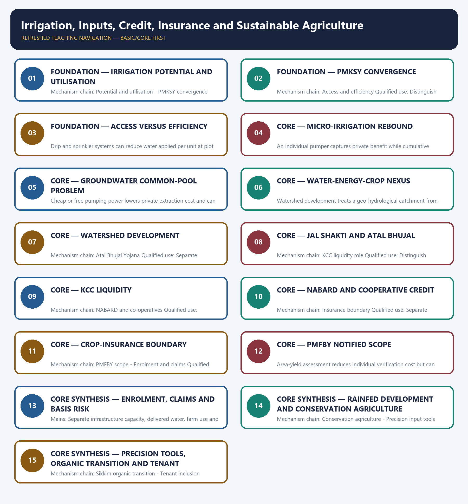

# Irrigation, Inputs, Credit, Insurance and Sustainable Agriculture — Learner-v2 Complete Learning Session

> **Authoring-only generation:** 2026-09-03. No PDF was rendered and no tracker or index was mutated.

### SOURCE, PROGRESSION AND CURRENT-LINKAGE AUDIT

- **Generation date:** 2026-09-03.
- **Repository-first evidence:** the Basic owner is taught first and preserved in full; the Advanced owner is retained only in the optional final teaching block.
- **OCR evidence:** Repository Markdown was primary. OCR-searchable local official General Studies papers were used only to confirm printed routed demands. No answer key, marking scheme, unsupported page precision or current macroeconomic statistic was inferred from them.
- **Qdrant:** not used; repository Markdown and available OCR context were sufficient.
- **PYQ integrity:** Audited ledgers route Mains demands on organic transition, integrated farming, watershed development, Jal Shakti Abhiyan, water storage, micro-irrigation, irrigation-system challenges and groundwater depletion. Objective demands cover conservation agriculture, DCCBs, KCC, biochar, zero tillage, fertigation, crop-protection chemicals and the provisionally keyed 2026 Rainfed Area Development question; no answer letter is inferred.
- **Live-link boundary:** The PMKSY objectives were substantively retrievable and support the convergence and efficiency anchors. The PMFBY portal was a title-only shell, so insurance amounts, enrolment and claim-performance figures are excluded.
- **Fact/inference discipline:** no current-affairs item, PYQ wording, figure or quotation is invented.

### LIVE OFFICIAL-SOURCE ATTEMPT LOG

The checks below were made on 2026-09-03. Substantive official text is used only for the proposition it actually supports; binary files, dynamic shells, stubs and undated dashboard snippets are recorded but not converted into current claims.

- https://www.pmksy.gov.in/AboutPMKSY.aspx — retrieved 2026-09-03; the official page substantively described convergence, assured irrigation, on-farm efficiency, aquifer recharge, precision irrigation and decentralised state planning. No dashboard quantity was imported.
- https://pmfby.gov.in/ — retrieved 2026-09-03; the official homepage returned only the PMFBY title in the live fetcher, so no premium rate, enrolment, insured area, claim or state-participation figure was imported.

## BASIC LEARNING SESSION

### DEEP-REVIEW LEARNING CONTRACT

| Control | Binding rule for this package |
|---|---|
| Syllabus boundary | Complete Economy Basic/Core is answer-complete before optional Advanced depth. |
| Formula boundary | Formula, numerator, denominator, unit, stock/flow, nominal/real, base year, level/rate and accounting identity are explicit. |
| Institutional boundary | Constitution, statute, delegated rule, regulator mandate, policy, recommendation, scheme and implementation outcome remain distinct. |
| Transmission method | Shock or instrument → prices/quantities/balance sheets/incentives → institution and market response → output, employment, distribution, stability and external effect → lag and trade-off. |
| Current-data method | Source → release date → reference period → unit/denominator → provisional/revised/final status; incompatible Budget, Survey or statistical vintages are never mixed. |
| Programme-status method | Announced → approved → notified/guidelines issued → funded → operational → utilised → output → outcome are separate stages. |
| External/WTO method | Agreement text, member category, box, limit, notification, consultation, dispute and ruling are qualified without invented thresholds. |
| Causal method | Accounting identity, chronology and correlation are not promoted into behavioural or causal claims without mechanism, counterfactual and alternatives. |
| Answer balance | Model answers balance growth, distribution, stability, sustainability and federal dimensions with India-centric evidence. |
| Practice contract | Every solved item has demand decoding, a detailed examiner-grade model, executable timed/compression plan, marks rationale and answer-specific improvement. |
| Approval | This immutable successor remains `approved: false` pending explicit approval. |

**Canonical Basic/Core owner:** `upsc-ai-kit\knowledge\Economy\basic\14_Irrigation-Inputs-Credit-Insurance-and-Sustainable-Agriculture.md`  
**Substantive canonical provenance owner:** `upsc-ai-kit\knowledge\Economy\14_Irrigation-Inputs-Credit-Insurance-and-Sustainable-Agriculture_Learner-V2-Complete-Topic-Package.md`  
**Optional Advanced owner:** `upsc-ai-kit\knowledge\Economy\advanced\14_Irrigation-Inputs-Credit-Insurance-and-Sustainable-Agriculture.md`  
**Official syllabus mapping:** `upsc-ai-kit\knowledge\Economy\OFFICIAL-UPSC-SYLLABUS-MAPPING.md`

### EVIDENCE, PYQ AND CURRENT-STATUS CONTROL

- Every data-heavy table states unit, denominator, geography, reference period and source/status.
- GDP/GVA, gross/net, domestic/national, nominal/real and level/rate distinctions remain exact.
- Monetary, fiscal and external chains state intermediaries, balance-sheet channels, lags, leakages and trade-offs.
- Budget and Economic Survey editions are never mixed; BE, RE, Actual, advance/provisional/revised/final estimates remain labelled.
- Scheme and programme claims distinguish announcement, approval, notification, operation, coverage, utilisation and measured outcome.
- WTO boxes, limits, de minimis, special treatment, notifications and disputes are qualified from authoritative rules.
- PYQ wording is preserved only where verified; reconstructed or routed demands remain labelled.
- **Current-status note, rechecked 2026-09-03:** volatile rates, estimates, scheme status, trade rules and institutional claims retain official source, release date, reference period and revision status.

**Generation-local live/current sources:**
- `https://www.pmksy.gov.in/AboutPMKSY.aspx — retrieved 2026-09-03; the official page substantively described convergence, assured irrigation, on-farm efficiency, aquifer recharge, precision irrigation and decentralised state planning. No dashboard quantity was imported.`
- `https://pmfby.gov.in/ — retrieved 2026-09-03; the official homepage returned only the PMFBY title in the live fetcher, so no premium rate, enrolment, insured area, claim or state-participation figure was imported.`




*Distinct embedded teaching-navigation image. The separate continuous Cārvāka-style flowchart package remains an independent at-a-glance artifact.*

### SESSION 1 — FOUNDATION — IRRIGATION POTENTIAL AND UTILISATION

#### DEFINITION / WHAT THIS IS CALLED

**Plain-language definition:** Created irrigation potential, utilised potential, reliable field delivery and water-use efficiency are different measures; project capacity does not prove equitable or productive use.

**Technical definition:** Mechanism chain: Potential and utilisation - PMKSY convergence Qualified use: Separate infrastructure capacity, delivered water, farm use and basin outcomes.

#### ANSWER-GRABBING OPENING — WRITE/ADAPT IN THE EXAM

> Do not equate irrigation potential with utilisation, reliability or water productivity.

#### MUST-WRITE KEYWORDS

- **FOUNDATION**
- **Irrigation potential**
- **utilisation**
- **Mechanism chain**
- **Qualified use**
- **Created**

**How to use them:** Frame the answer through FOUNDATION; define Irrigation potential, connect utilisation with Mechanism chain to explain the mechanism, and use Qualified use for the decisive comparison or qualification.

#### VISUAL FIRST

```text
IRRIGATION POTENTIAL AND UTILISATION
01. Potential and utilisation
    |
    v
02. PMKSY convergence
BOUNDARY -> Do not equate irrigation potential with utilisation, reliability or water productivity.
```

*This topic-specific rail fixes the evidence sequence and its exam boundary before analysis.*

#### CORE EXPLANATION

Created irrigation potential, utilised potential, reliable field delivery and water-use efficiency are different measures; project capacity does not prove equitable or productive use. The official PMKSY page describes convergence of field-level irrigation investment, assured irrigation expansion, on-farm efficiency, aquifer recharge and decentralised state planning.

#### NAMED EVIDENCE AND MECHANISM

- Created irrigation potential, utilised potential, reliable field delivery and water-use efficiency are different measures; project capacity does not prove equitable or productive use.
- The official PMKSY page describes convergence of field-level irrigation investment, assured irrigation expansion, on-farm efficiency, aquifer recharge and decentralised state planning.

#### EXAMINER CAUTION

- Do not equate irrigation potential with utilisation, reliability or water productivity.

#### EXAM LINK

- **Prelims:** Preserve the exact formula, territorial or resident boundary, price basis, base year, index basket, eligible counterparty, institution and legal status; never upgrade a projection into an actual or a regulatory direction into a universal rule.
- **Mains:** Separate infrastructure capacity, delivered water, farm use and basin outcomes.

#### MINI RECAP

- **Mechanism chain:** Potential and utilisation -> PMKSY convergence
- **Qualified use:** Separate infrastructure capacity, delivered water, farm use and basin outcomes.

#### CLOSING RECALL FLOW — FOUNDATION — IRRIGATION POTENTIAL AND UTILISATION

```text
START / CONCEPT: FOUNDATION — Irrigation potential and utilisation
        |
        v
EXACT TERMS: FOUNDATION · Irrigation potential · utilisation · Mechanism chain · Qualified use · Created
        |
        v
MECHANISM / ARGUMENT: Mechanism chain: Potential and utilisation - PMKSY convergence Qualified use: Separate infrastructure capacity, delivered water, farm use and basin outcomes.
        |
        v
CONSEQUENCE / CONTRAST: Created irrigation potential, utilised potential, reliable field delivery and water-use efficiency are different measures; project capacity does not prove equitable or productive use.
        |
        v
UPSC TRAP / ANSWER-USE: Do not miss this limiting distinction: the official PMKSY page describes convergence of field-level irrigation investment, assured irrigation expansion, on-farm...
        |
        v
ANSWER-GRABBING FORMULATION: Do not equate irrigation potential with utilisation, reliability or water productivity.
```
### SESSION 2 — FOUNDATION — PMKSY CONVERGENCE

#### DEFINITION / WHAT THIS IS CALLED

**Plain-language definition:** Har Khet Ko Pani addresses irrigation access, while Per Drop More Crop addresses precise application and on-farm efficiency; access and efficiency must not be merged.

**Technical definition:** Mechanism chain: Access and efficiency Qualified use: Distinguish liquidity support, risk pooling, enrolment, assessment and settlement.

#### ANSWER-GRABBING OPENING — WRITE/ADAPT IN THE EXAM

> Har Khet Ko Pani addresses irrigation access, while Per Drop More Crop addresses precise application and on-farm efficiency; access and efficiency must not be merged.

#### MUST-WRITE KEYWORDS

- **FOUNDATION**
- **PMKSY convergence**
- **Mechanism chain**
- **Qualified use**
- **Har Khet Ko Pani**
- **Per Drop More Crop**

**How to use them:** Frame the answer through FOUNDATION; define PMKSY convergence, connect Mechanism chain with Qualified use to explain the mechanism, and use Har Khet Ko Pani for the decisive comparison or qualification.

#### VISUAL FIRST

```text
PMKSY CONVERGENCE
01. Access and efficiency
BOUNDARY -> Do not merge irrigation access with application efficiency.
```

*This topic-specific rail fixes the evidence sequence and its exam boundary before analysis.*

#### CORE EXPLANATION

Har Khet Ko Pani addresses irrigation access, while Per Drop More Crop addresses precise application and on-farm efficiency; access and efficiency must not be merged.

#### NAMED EVIDENCE AND MECHANISM

- Har Khet Ko Pani addresses irrigation access, while Per Drop More Crop addresses precise application and on-farm efficiency; access and efficiency must not be merged.

#### EXAMINER CAUTION

- Do not merge irrigation access with application efficiency.

#### EXAM LINK

- **Prelims:** Preserve the exact formula, territorial or resident boundary, price basis, base year, index basket, eligible counterparty, institution and legal status; never upgrade a projection into an actual or a regulatory direction into a universal rule.
- **Mains:** Distinguish liquidity support, risk pooling, enrolment, assessment and settlement.

#### MINI RECAP

- **Mechanism chain:** Access and efficiency
- **Qualified use:** Distinguish liquidity support, risk pooling, enrolment, assessment and settlement.

#### CLOSING RECALL FLOW — FOUNDATION — PMKSY CONVERGENCE

```text
START / CONCEPT: FOUNDATION — PMKSY convergence
        |
        v
EXACT TERMS: FOUNDATION · PMKSY convergence · Mechanism chain · Qualified use · Har Khet Ko Pani · Per Drop More Crop
        |
        v
MECHANISM / ARGUMENT: Mechanism chain: Access and efficiency Qualified use: Distinguish liquidity support, risk pooling, enrolment, assessment and settlement.
        |
        v
CONSEQUENCE / CONTRAST: Do not merge irrigation access with application efficiency.
        |
        v
UPSC TRAP / ANSWER-USE: Do not miss this limiting distinction: har Khet Ko Pani addresses irrigation access.
        |
        v
ANSWER-GRABBING FORMULATION: Har Khet Ko Pani addresses irrigation access, while Per Drop More Crop addresses precise application and on-farm efficiency; access and efficiency must not be merged.
```
### SESSION 3 — FOUNDATION — ACCESS VERSUS EFFICIENCY

#### DEFINITION / WHAT THIS IS CALLED

**Plain-language definition:** Mechanism chain: Micro-irrigation rebound Qualified use: Integrate aquifer governance, crop incentives, tenant eligibility and resilient agronomy.

**Technical definition:** Drip and sprinkler systems can reduce water applied per unit at plot level, but basin extraction may not fall if irrigated area expands or crop choice remains water-intensive.

#### ANSWER-GRABBING OPENING — WRITE/ADAPT IN THE EXAM

> Drip and sprinkler systems can reduce water applied per unit at plot level, but basin extraction may not fall if irrigated area expands or crop choice remains water-intensive.

#### MUST-WRITE KEYWORDS

- **FOUNDATION**
- **Access versus efficiency**
- **Mechanism chain**
- **Qualified use**
- **Drip**
- **Micro-irrigation**

**How to use them:** Frame the answer through FOUNDATION; define Access versus efficiency, connect Mechanism chain with Qualified use to explain the mechanism, and use Drip for the decisive comparison or qualification.

#### VISUAL FIRST

```text
ACCESS VERSUS EFFICIENCY
01. Micro-irrigation rebound
BOUNDARY -> Do not assume micro-irrigation automatically reduces basin-level extraction.
```

*This topic-specific rail fixes the evidence sequence and its exam boundary before analysis.*

#### CORE EXPLANATION

Drip and sprinkler systems can reduce water applied per unit at plot level, but basin extraction may not fall if irrigated area expands or crop choice remains water-intensive.

#### NAMED EVIDENCE AND MECHANISM

- Drip and sprinkler systems can reduce water applied per unit at plot level, but basin extraction may not fall if irrigated area expands or crop choice remains water-intensive.

#### EXAMINER CAUTION

- Do not assume micro-irrigation automatically reduces basin-level extraction.

#### EXAM LINK

- **Prelims:** Preserve the exact formula, territorial or resident boundary, price basis, base year, index basket, eligible counterparty, institution and legal status; never upgrade a projection into an actual or a regulatory direction into a universal rule.
- **Mains:** Integrate aquifer governance, crop incentives, tenant eligibility and resilient agronomy.

#### MINI RECAP

- **Mechanism chain:** Micro-irrigation rebound
- **Qualified use:** Integrate aquifer governance, crop incentives, tenant eligibility and resilient agronomy.

#### CLOSING RECALL FLOW — FOUNDATION — ACCESS VERSUS EFFICIENCY

```text
START / CONCEPT: FOUNDATION — Access versus efficiency
        |
        v
EXACT TERMS: FOUNDATION · Access versus efficiency · Mechanism chain · Qualified use · Drip · Micro-irrigation
        |
        v
MECHANISM / ARGUMENT: Mechanism chain: Micro-irrigation rebound Qualified use: Integrate aquifer governance, crop incentives, tenant eligibility and resilient agronomy.
        |
        v
CONSEQUENCE / CONTRAST: Do not assume micro-irrigation automatically reduces basin-level extraction.
        |
        v
UPSC TRAP / ANSWER-USE: Do not miss this limiting distinction: drip and sprinkler systems can reduce water applied per unit at plot level.
        |
        v
ANSWER-GRABBING FORMULATION: Drip and sprinkler systems can reduce water applied per unit at plot level, but basin extraction may not fall if irrigated area expands or crop choice remains water-intensive.
```
### SESSION 4 — CORE — MICRO-IRRIGATION REBOUND

#### DEFINITION / WHAT THIS IS CALLED

**Plain-language definition:** Mechanism chain: Groundwater common pool Qualified use: Separate infrastructure capacity, delivered water, farm use and basin outcomes.

**Technical definition:** An individual pumper captures private benefit while cumulative extraction lowers a shared aquifer, making groundwater a common-pool governance problem.

#### ANSWER-GRABBING OPENING — WRITE/ADAPT IN THE EXAM

> An individual pumper captures private benefit while cumulative extraction lowers a shared aquifer, making groundwater a common-pool governance problem.

#### MUST-WRITE KEYWORDS

- **Micro-irrigation rebound**
- **Mechanism chain**
- **Qualified use**
- **Separate**
- **Groundwater**
- **Qualified**

**How to use them:** Frame the answer through Micro-irrigation rebound; define Mechanism chain, connect Qualified use with Separate to explain the mechanism, and use Groundwater for the decisive comparison or qualification.

#### VISUAL FIRST

```text
MICRO-IRRIGATION REBOUND
01. Groundwater common pool
BOUNDARY -> Do not treat free power as only a transfer without crop and groundwater effects.
```

*This topic-specific rail fixes the evidence sequence and its exam boundary before analysis.*

#### CORE EXPLANATION

An individual pumper captures private benefit while cumulative extraction lowers a shared aquifer, making groundwater a common-pool governance problem.

#### NAMED EVIDENCE AND MECHANISM

- An individual pumper captures private benefit while cumulative extraction lowers a shared aquifer, making groundwater a common-pool governance problem.

#### EXAMINER CAUTION

- Do not treat free power as only a transfer without crop and groundwater effects.

#### EXAM LINK

- **Prelims:** Preserve the exact formula, territorial or resident boundary, price basis, base year, index basket, eligible counterparty, institution and legal status; never upgrade a projection into an actual or a regulatory direction into a universal rule.
- **Mains:** Separate infrastructure capacity, delivered water, farm use and basin outcomes.

#### MINI RECAP

- **Mechanism chain:** Groundwater common pool
- **Qualified use:** Separate infrastructure capacity, delivered water, farm use and basin outcomes.

#### CLOSING RECALL FLOW — CORE — MICRO-IRRIGATION REBOUND

```text
START / CONCEPT: CORE — Micro-irrigation rebound
        |
        v
EXACT TERMS: Micro-irrigation rebound · Mechanism chain · Qualified use · Separate · Groundwater · Qualified
        |
        v
MECHANISM / ARGUMENT: Mechanism chain: Groundwater common pool Qualified use: Separate infrastructure capacity, delivered water, farm use and basin outcomes.
        |
        v
CONSEQUENCE / CONTRAST: Do not treat free power as only a transfer without crop and groundwater effects.
        |
        v
UPSC TRAP / ANSWER-USE: Do not miss this limiting distinction: separate infrastructure capacity, delivered water, farm use and basin outcomes.
        |
        v
ANSWER-GRABBING FORMULATION: An individual pumper captures private benefit while cumulative extraction lowers a shared aquifer, making groundwater a common-pool governance problem.
```
### SESSION 5 — CORE — GROUNDWATER COMMON-POOL PROBLEM

#### DEFINITION / WHAT THIS IS CALLED

**Plain-language definition:** Mechanism chain: Water-energy-crop nexus Qualified use: Distinguish liquidity support, risk pooling, enrolment, assessment and settlement.

**Technical definition:** Cheap or free pumping power lowers private extraction cost and can reinforce water-intensive crops where procurement and other incentives point in the same direction.

#### ANSWER-GRABBING OPENING — WRITE/ADAPT IN THE EXAM

> Mechanism chain: Water-energy-crop nexus Qualified use: Distinguish liquidity support, risk pooling, enrolment, assessment and settlement.

#### MUST-WRITE KEYWORDS

- **Groundwater common-pool problem**
- **Mechanism chain**
- **Qualified use**
- **Cheap**
- **Water-energy-crop**
- **Qualified**

**How to use them:** Frame the answer through Groundwater common-pool problem; define Mechanism chain, connect Qualified use with Cheap to explain the mechanism, and use Water-energy-crop for the decisive comparison or qualification.

#### VISUAL FIRST

```text
GROUNDWATER COMMON-POOL PROBLEM
01. Water-energy-crop nexus
BOUNDARY -> Do not reduce watershed development to a pond or check dam.
```

*This topic-specific rail fixes the evidence sequence and its exam boundary before analysis.*

#### CORE EXPLANATION

Cheap or free pumping power lowers private extraction cost and can reinforce water-intensive crops where procurement and other incentives point in the same direction.

#### NAMED EVIDENCE AND MECHANISM

- Cheap or free pumping power lowers private extraction cost and can reinforce water-intensive crops where procurement and other incentives point in the same direction.

#### EXAMINER CAUTION

- Do not reduce watershed development to a pond or check dam.

#### EXAM LINK

- **Prelims:** Preserve the exact formula, territorial or resident boundary, price basis, base year, index basket, eligible counterparty, institution and legal status; never upgrade a projection into an actual or a regulatory direction into a universal rule.
- **Mains:** Distinguish liquidity support, risk pooling, enrolment, assessment and settlement.

#### MINI RECAP

- **Mechanism chain:** Water-energy-crop nexus
- **Qualified use:** Distinguish liquidity support, risk pooling, enrolment, assessment and settlement.

#### CLOSING RECALL FLOW — CORE — GROUNDWATER COMMON-POOL PROBLEM

```text
START / CONCEPT: CORE — Groundwater common-pool problem
        |
        v
EXACT TERMS: Groundwater common-pool problem · Mechanism chain · Qualified use · Cheap · Water-energy-crop · Qualified
        |
        v
MECHANISM / ARGUMENT: The operative mechanism is that distinguish liquidity support, risk pooling, enrolment, assessment and settlement.
        |
        v
CONSEQUENCE / CONTRAST: Cheap or free pumping power lowers private extraction cost and can reinforce water-intensive crops where procurement and other incentives point in the same direction.
        |
        v
UPSC TRAP / ANSWER-USE: Do not reduce watershed development to a pond or check dam.
        |
        v
ANSWER-GRABBING FORMULATION: Mechanism chain: Water-energy-crop nexus Qualified use: Distinguish liquidity support, risk pooling, enrolment, assessment and settlement.
```
### SESSION 6 — CORE — WATER-ENERGY-CROP NEXUS

#### DEFINITION / WHAT THIS IS CALLED

**Plain-language definition:** Mechanism chain: Watershed method - Jal Shakti campaign Qualified use: Integrate aquifer governance, crop incentives, tenant eligibility and resilient agronomy.

**Technical definition:** Watershed development treats a geo-hydrological catchment from ridge to valley through soil, moisture, recharge, vegetation and participatory maintenance rather than isolated structures.

#### ANSWER-GRABBING OPENING — WRITE/ADAPT IN THE EXAM

> Do not equate KCC liquidity with crop-insurance compensation.

#### MUST-WRITE KEYWORDS

- **Water-energy-crop nexus**
- **Mechanism chain**
- **Qualified use**
- **Watershed**
- **KCC**
- **Jal Shakti**

**How to use them:** Frame the answer through Water-energy-crop nexus; define Mechanism chain, connect Qualified use with Watershed to explain the mechanism, and use KCC for the decisive comparison or qualification.

#### VISUAL FIRST

```text
WATER-ENERGY-CROP NEXUS
01. Watershed method
    |
    v
02. Jal Shakti campaign
BOUNDARY -> Do not equate KCC liquidity with crop-insurance compensation.
```

*This topic-specific rail fixes the evidence sequence and its exam boundary before analysis.*

#### CORE EXPLANATION

Watershed development treats a geo-hydrological catchment from ridge to valley through soil, moisture, recharge, vegetation and participatory maintenance rather than isolated structures. The owner records Jal Shakti Abhiyan as a 2019 campaign that later evolved into Catch the Rain; dated coverage and asset claims require the relevant campaign record.

#### NAMED EVIDENCE AND MECHANISM

- Watershed development treats a geo-hydrological catchment from ridge to valley through soil, moisture, recharge, vegetation and participatory maintenance rather than isolated structures.
- The owner records Jal Shakti Abhiyan as a 2019 campaign that later evolved into Catch the Rain; dated coverage and asset claims require the relevant campaign record.

#### EXAMINER CAUTION

- Do not equate KCC liquidity with crop-insurance compensation.

#### EXAM LINK

- **Prelims:** Preserve the exact formula, territorial or resident boundary, price basis, base year, index basket, eligible counterparty, institution and legal status; never upgrade a projection into an actual or a regulatory direction into a universal rule.
- **Mains:** Integrate aquifer governance, crop incentives, tenant eligibility and resilient agronomy.

#### MINI RECAP

- **Mechanism chain:** Watershed method -> Jal Shakti campaign
- **Qualified use:** Integrate aquifer governance, crop incentives, tenant eligibility and resilient agronomy.

#### CLOSING RECALL FLOW — CORE — WATER-ENERGY-CROP NEXUS

```text
START / CONCEPT: CORE — Water-energy-crop nexus
        |
        v
EXACT TERMS: Water-energy-crop nexus · Mechanism chain · Qualified use · Watershed · KCC · Jal Shakti
        |
        v
MECHANISM / ARGUMENT: Mechanism chain: Watershed method - Jal Shakti campaign Qualified use: Integrate aquifer governance, crop incentives, tenant eligibility and resilient agronomy.
        |
        v
CONSEQUENCE / CONTRAST: Watershed development treats a geo-hydrological catchment from ridge to valley through soil, moisture, recharge, vegetation and participatory maintenance rather than isolated structures.
        |
        v
UPSC TRAP / ANSWER-USE: Do not miss this limiting distinction: do not equate KCC liquidity with crop-insurance compensation.
        |
        v
ANSWER-GRABBING FORMULATION: Do not equate KCC liquidity with crop-insurance compensation.
```
### SESSION 7 — CORE — WATERSHED DEVELOPMENT

#### DEFINITION / WHAT THIS IS CALLED

**Plain-language definition:** Atal Bhujal Yojana is a groundwater-management programme for water-stressed areas that emphasises community participation, water budgeting and behavioural change.

**Technical definition:** Mechanism chain: Atal Bhujal Yojana Qualified use: Separate infrastructure capacity, delivered water, farm use and basin outcomes.

#### ANSWER-GRABBING OPENING — WRITE/ADAPT IN THE EXAM

> Atal Bhujal Yojana is a groundwater-management programme for water-stressed areas that emphasises community participation, water budgeting and behavioural change.

#### MUST-WRITE KEYWORDS

- **Watershed development**
- **Mechanism chain**
- **Qualified use**
- **Atal Bhujal Yojana**
- **Separate**
- **Atal Bhujal Yojana Qualified**

**How to use them:** Frame the answer through Watershed development; define Mechanism chain, connect Qualified use with Atal Bhujal Yojana to explain the mechanism, and use Separate for the decisive comparison or qualification.

#### VISUAL FIRST

```text
WATERSHED DEVELOPMENT
01. Atal Bhujal Yojana
BOUNDARY -> Do not equate insurance enrolment with claim settlement.
```

*This topic-specific rail fixes the evidence sequence and its exam boundary before analysis.*

#### CORE EXPLANATION

Atal Bhujal Yojana is a groundwater-management programme for water-stressed areas that emphasises community participation, water budgeting and behavioural change.

#### NAMED EVIDENCE AND MECHANISM

- Atal Bhujal Yojana is a groundwater-management programme for water-stressed areas that emphasises community participation, water budgeting and behavioural change.

#### EXAMINER CAUTION

- Do not equate insurance enrolment with claim settlement.

#### EXAM LINK

- **Prelims:** Preserve the exact formula, territorial or resident boundary, price basis, base year, index basket, eligible counterparty, institution and legal status; never upgrade a projection into an actual or a regulatory direction into a universal rule.
- **Mains:** Separate infrastructure capacity, delivered water, farm use and basin outcomes.

#### MINI RECAP

- **Mechanism chain:** Atal Bhujal Yojana
- **Qualified use:** Separate infrastructure capacity, delivered water, farm use and basin outcomes.

#### CLOSING RECALL FLOW — CORE — WATERSHED DEVELOPMENT

```text
START / CONCEPT: CORE — Watershed development
        |
        v
EXACT TERMS: Watershed development · Mechanism chain · Qualified use · Atal Bhujal Yojana · Separate · Atal Bhujal Yojana Qualified
        |
        v
MECHANISM / ARGUMENT: Mechanism chain: Atal Bhujal Yojana Qualified use: Separate infrastructure capacity, delivered water, farm use and basin outcomes.
        |
        v
CONSEQUENCE / CONTRAST: Do not equate insurance enrolment with claim settlement.
        |
        v
UPSC TRAP / ANSWER-USE: Do not miss this limiting distinction: separate infrastructure capacity, delivered water, farm use and basin outcomes.
        |
        v
ANSWER-GRABBING FORMULATION: Atal Bhujal Yojana is a groundwater-management programme for water-stressed areas that emphasises community participation, water budgeting and behavioural change.
```
### SESSION 8 — CORE — JAL SHAKTI AND ATAL BHUJAL

#### DEFINITION / WHAT THIS IS CALLED

**Plain-language definition:** Kisan Credit Card is an institutional working-capital channel for crop and eligible allied needs; it addresses seasonal liquidity rather than compensating a realised insured loss.

**Technical definition:** Mechanism chain: KCC liquidity role Qualified use: Distinguish liquidity support, risk pooling, enrolment, assessment and settlement.

#### ANSWER-GRABBING OPENING — WRITE/ADAPT IN THE EXAM

> Kisan Credit Card is an institutional working-capital channel for crop and eligible allied needs; it addresses seasonal liquidity rather than compensating a realised insured loss.

#### MUST-WRITE KEYWORDS

- **Jal Shakti**
- **Atal Bhujal**
- **Mechanism chain**
- **Qualified use**
- **Kisan Credit Card**
- **PMFBY**

**How to use them:** Frame the answer through Jal Shakti; define Atal Bhujal, connect Mechanism chain with Qualified use to explain the mechanism, and use Kisan Credit Card for the decisive comparison or qualification.

#### VISUAL FIRST

```text
JAL SHAKTI AND ATAL BHUJAL
01. KCC liquidity role
BOUNDARY -> Do not quote PMFBY premiums, coverage or state participation without scheme vintage.
```

*This topic-specific rail fixes the evidence sequence and its exam boundary before analysis.*

#### CORE EXPLANATION

Kisan Credit Card is an institutional working-capital channel for crop and eligible allied needs; it addresses seasonal liquidity rather than compensating a realised insured loss.

#### NAMED EVIDENCE AND MECHANISM

- Kisan Credit Card is an institutional working-capital channel for crop and eligible allied needs; it addresses seasonal liquidity rather than compensating a realised insured loss.

#### EXAMINER CAUTION

- Do not quote PMFBY premiums, coverage or state participation without scheme vintage.

#### EXAM LINK

- **Prelims:** Preserve the exact formula, territorial or resident boundary, price basis, base year, index basket, eligible counterparty, institution and legal status; never upgrade a projection into an actual or a regulatory direction into a universal rule.
- **Mains:** Distinguish liquidity support, risk pooling, enrolment, assessment and settlement.

#### MINI RECAP

- **Mechanism chain:** KCC liquidity role
- **Qualified use:** Distinguish liquidity support, risk pooling, enrolment, assessment and settlement.

#### CLOSING RECALL FLOW — CORE — JAL SHAKTI AND ATAL BHUJAL

```text
START / CONCEPT: CORE — Jal Shakti and Atal Bhujal
        |
        v
EXACT TERMS: Jal Shakti · Atal Bhujal · Mechanism chain · Qualified use · Kisan Credit Card · PMFBY
        |
        v
MECHANISM / ARGUMENT: Mechanism chain: KCC liquidity role Qualified use: Distinguish liquidity support, risk pooling, enrolment, assessment and settlement.
        |
        v
CONSEQUENCE / CONTRAST: Do not quote PMFBY premiums, coverage or state participation without scheme vintage.
        |
        v
UPSC TRAP / ANSWER-USE: Do not miss this limiting distinction: do not quote PMFBY premiums, coverage or state participation without scheme vintage.
        |
        v
ANSWER-GRABBING FORMULATION: Kisan Credit Card is an institutional working-capital channel for crop and eligible allied needs; it addresses seasonal liquidity rather than compensating a realised insured loss.
```
### SESSION 9 — CORE — KCC LIQUIDITY

#### DEFINITION / WHAT THIS IS CALLED

**Plain-language definition:** NABARD is a rural and agricultural refinance and development institution, while District Central Cooperative Banks occupy a distinct tier in the cooperative credit architecture.

**Technical definition:** Mechanism chain: NABARD and co-operatives Qualified use: Integrate aquifer governance, crop incentives, tenant eligibility and resilient agronomy.

#### ANSWER-GRABBING OPENING — WRITE/ADAPT IN THE EXAM

> NABARD is a rural and agricultural refinance and development institution, while District Central Cooperative Banks occupy a distinct tier in the cooperative credit architecture.

#### MUST-WRITE KEYWORDS

- **KCC liquidity**
- **Mechanism chain**
- **Qualified use**
- **NABARD**
- **District Central Cooperative Banks**
- **Sikkim's**

**How to use them:** Frame the answer through KCC liquidity; define Mechanism chain, connect Qualified use with NABARD to explain the mechanism, and use District Central Cooperative Banks for the decisive comparison or qualification.

#### VISUAL FIRST

```text
KCC LIQUIDITY
01. NABARD and co-operatives
BOUNDARY -> Do not treat Sikkim's organic transition as universally replicable.
```

*This topic-specific rail fixes the evidence sequence and its exam boundary before analysis.*

#### CORE EXPLANATION

NABARD is a rural and agricultural refinance and development institution, while District Central Cooperative Banks occupy a distinct tier in the cooperative credit architecture.

#### NAMED EVIDENCE AND MECHANISM

- NABARD is a rural and agricultural refinance and development institution, while District Central Cooperative Banks occupy a distinct tier in the cooperative credit architecture.

#### EXAMINER CAUTION

- Do not treat Sikkim's organic transition as universally replicable.

#### EXAM LINK

- **Prelims:** Preserve the exact formula, territorial or resident boundary, price basis, base year, index basket, eligible counterparty, institution and legal status; never upgrade a projection into an actual or a regulatory direction into a universal rule.
- **Mains:** Integrate aquifer governance, crop incentives, tenant eligibility and resilient agronomy.

#### MINI RECAP

- **Mechanism chain:** NABARD and co-operatives
- **Qualified use:** Integrate aquifer governance, crop incentives, tenant eligibility and resilient agronomy.

#### CLOSING RECALL FLOW — CORE — KCC LIQUIDITY

```text
START / CONCEPT: CORE — KCC liquidity
        |
        v
EXACT TERMS: KCC liquidity · Mechanism chain · Qualified use · NABARD · District Central Cooperative Banks · Sikkim's
        |
        v
MECHANISM / ARGUMENT: Mechanism chain: NABARD and co-operatives Qualified use: Integrate aquifer governance, crop incentives, tenant eligibility and resilient agronomy.
        |
        v
CONSEQUENCE / CONTRAST: Do not treat Sikkim's organic transition as universally replicable.
        |
        v
UPSC TRAP / ANSWER-USE: Do not miss this limiting distinction: nABARD is a rural and agricultural refinance and development institution.
        |
        v
ANSWER-GRABBING FORMULATION: NABARD is a rural and agricultural refinance and development institution, while District Central Cooperative Banks occupy a distinct tier in the cooperative credit architecture.
```
### SESSION 10 — CORE — NABARD AND COOPERATIVE CREDIT

#### DEFINITION / WHAT THIS IS CALLED

**Plain-language definition:** Crop insurance pools specified production or weather risk under scheme terms; it is not a universal guarantee of price, income, debt repayment or every individual loss.

**Technical definition:** Mechanism chain: Insurance boundary Qualified use: Separate infrastructure capacity, delivered water, farm use and basin outcomes.

#### ANSWER-GRABBING OPENING — WRITE/ADAPT IN THE EXAM

> Crop insurance pools specified production or weather risk under scheme terms; it is not a universal guarantee of price, income, debt repayment or every individual loss.

#### MUST-WRITE KEYWORDS

- **NABARD**
- **cooperative credit**
- **Mechanism chain**
- **Qualified use**
- **Crop**
- **Separate**

**How to use them:** Frame the answer through NABARD; define cooperative credit, connect Mechanism chain with Qualified use to explain the mechanism, and use Crop for the decisive comparison or qualification.

#### VISUAL FIRST

```text
NABARD AND COOPERATIVE CREDIT
01. Insurance boundary
BOUNDARY -> Do not infer provisional 2026 objective answer letters.
```

*This topic-specific rail fixes the evidence sequence and its exam boundary before analysis.*

#### CORE EXPLANATION

Crop insurance pools specified production or weather risk under scheme terms; it is not a universal guarantee of price, income, debt repayment or every individual loss.

#### NAMED EVIDENCE AND MECHANISM

- Crop insurance pools specified production or weather risk under scheme terms; it is not a universal guarantee of price, income, debt repayment or every individual loss.

#### EXAMINER CAUTION

- Do not infer provisional 2026 objective answer letters.

#### EXAM LINK

- **Prelims:** Preserve the exact formula, territorial or resident boundary, price basis, base year, index basket, eligible counterparty, institution and legal status; never upgrade a projection into an actual or a regulatory direction into a universal rule.
- **Mains:** Separate infrastructure capacity, delivered water, farm use and basin outcomes.

#### MINI RECAP

- **Mechanism chain:** Insurance boundary
- **Qualified use:** Separate infrastructure capacity, delivered water, farm use and basin outcomes.

#### CLOSING RECALL FLOW — CORE — NABARD AND COOPERATIVE CREDIT

```text
START / CONCEPT: CORE — NABARD and cooperative credit
        |
        v
EXACT TERMS: NABARD · cooperative credit · Mechanism chain · Qualified use · Crop · Separate
        |
        v
MECHANISM / ARGUMENT: Mechanism chain: Insurance boundary Qualified use: Separate infrastructure capacity, delivered water, farm use and basin outcomes.
        |
        v
CONSEQUENCE / CONTRAST: Do not infer provisional 2026 objective answer letters.
        |
        v
UPSC TRAP / ANSWER-USE: Do not miss this limiting distinction: separate infrastructure capacity, delivered water, farm use and basin outcomes.
        |
        v
ANSWER-GRABBING FORMULATION: Crop insurance pools specified production or weather risk under scheme terms; it is not a universal guarantee of price, income, debt repayment or every individual loss.
```
### SESSION 11 — CORE — CROP-INSURANCE BOUNDARY

#### DEFINITION / WHAT THIS IS CALLED

**Plain-language definition:** Insurance enrolment or premium collection does not prove claim admissibility, assessment, settlement amount or timeliness; these are separate implementation outcomes.

**Technical definition:** Mechanism chain: PMFBY scope - Enrolment and claims Qualified use: Distinguish liquidity support, risk pooling, enrolment, assessment and settlement.

#### ANSWER-GRABBING OPENING — WRITE/ADAPT IN THE EXAM

> Insurance enrolment or premium collection does not prove claim admissibility, assessment, settlement amount or timeliness; these are separate implementation outcomes.

#### MUST-WRITE KEYWORDS

- **Crop-insurance boundary**
- **Mechanism chain**
- **Qualified use**
- **Insurance**
- **PMFBY**
- **Enrolment**

**How to use them:** Frame the answer through Crop-insurance boundary; define Mechanism chain, connect Qualified use with Insurance to explain the mechanism, and use PMFBY for the decisive comparison or qualification.

#### VISUAL FIRST

```text
CROP-INSURANCE BOUNDARY
01. PMFBY scope
    |
    v
02. Enrolment and claims
BOUNDARY -> Do not equate irrigation potential with utilisation, reliability or water productivity.
```

*This topic-specific rail fixes the evidence sequence and its exam boundary before analysis.*

#### CORE EXPLANATION

PMFBY operates through notified crops, areas, seasons and perils under the applicable scheme rules; current premium, enrolment and state-participation claims require the governing notification. Insurance enrolment or premium collection does not prove claim admissibility, assessment, settlement amount or timeliness; these are separate implementation outcomes.

#### NAMED EVIDENCE AND MECHANISM

- PMFBY operates through notified crops, areas, seasons and perils under the applicable scheme rules; current premium, enrolment and state-participation claims require the governing notification.
- Insurance enrolment or premium collection does not prove claim admissibility, assessment, settlement amount or timeliness; these are separate implementation outcomes.

#### EXAMINER CAUTION

- Do not equate irrigation potential with utilisation, reliability or water productivity.

#### EXAM LINK

- **Prelims:** Preserve the exact formula, territorial or resident boundary, price basis, base year, index basket, eligible counterparty, institution and legal status; never upgrade a projection into an actual or a regulatory direction into a universal rule.
- **Mains:** Distinguish liquidity support, risk pooling, enrolment, assessment and settlement.

#### MINI RECAP

- **Mechanism chain:** PMFBY scope -> Enrolment and claims
- **Qualified use:** Distinguish liquidity support, risk pooling, enrolment, assessment and settlement.

#### CLOSING RECALL FLOW — CORE — CROP-INSURANCE BOUNDARY

```text
START / CONCEPT: CORE — Crop-insurance boundary
        |
        v
EXACT TERMS: Crop-insurance boundary · Mechanism chain · Qualified use · Insurance · PMFBY · Enrolment
        |
        v
MECHANISM / ARGUMENT: Mechanism chain: PMFBY scope - Enrolment and claims Qualified use: Distinguish liquidity support, risk pooling, enrolment, assessment and settlement.
        |
        v
CONSEQUENCE / CONTRAST: Do not equate irrigation potential with utilisation, reliability or water productivity.
        |
        v
UPSC TRAP / ANSWER-USE: Do not miss this limiting distinction: insurance enrolment or premium collection does not prove claim admissibility, assessment, settlement amount or...
        |
        v
ANSWER-GRABBING FORMULATION: Insurance enrolment or premium collection does not prove claim admissibility, assessment, settlement amount or timeliness; these are separate implementation outcomes.
```
### SESSION 12 — CORE — PMFBY NOTIFIED SCOPE

#### DEFINITION / WHAT THIS IS CALLED

**Plain-language definition:** Mechanism chain: Basis risk Qualified use: Integrate aquifer governance, crop incentives, tenant eligibility and resilient agronomy.

**Technical definition:** Area-yield assessment reduces individual verification cost but can create basis risk when the reference-area loss differs from a particular farmer's field loss.

#### ANSWER-GRABBING OPENING — WRITE/ADAPT IN THE EXAM

> Area-yield assessment reduces individual verification cost but can create basis risk when the reference-area loss differs from a particular farmer's field loss.

#### MUST-WRITE KEYWORDS

- **PMFBY notified scope**
- **Mechanism chain**
- **Qualified use**
- **Area-yield**
- **Basis**
- **Qualified**

**How to use them:** Frame the answer through PMFBY notified scope; define Mechanism chain, connect Qualified use with Area-yield to explain the mechanism, and use Basis for the decisive comparison or qualification.

#### VISUAL FIRST

```text
PMFBY NOTIFIED SCOPE
01. Basis risk
BOUNDARY -> Do not merge irrigation access with application efficiency.
```

*This topic-specific rail fixes the evidence sequence and its exam boundary before analysis.*

#### CORE EXPLANATION

Area-yield assessment reduces individual verification cost but can create basis risk when the reference-area loss differs from a particular farmer's field loss.

#### NAMED EVIDENCE AND MECHANISM

- Area-yield assessment reduces individual verification cost but can create basis risk when the reference-area loss differs from a particular farmer's field loss.

#### EXAMINER CAUTION

- Do not merge irrigation access with application efficiency.

#### EXAM LINK

- **Prelims:** Preserve the exact formula, territorial or resident boundary, price basis, base year, index basket, eligible counterparty, institution and legal status; never upgrade a projection into an actual or a regulatory direction into a universal rule.
- **Mains:** Integrate aquifer governance, crop incentives, tenant eligibility and resilient agronomy.

#### MINI RECAP

- **Mechanism chain:** Basis risk
- **Qualified use:** Integrate aquifer governance, crop incentives, tenant eligibility and resilient agronomy.

#### CLOSING RECALL FLOW — CORE — PMFBY NOTIFIED SCOPE

```text
START / CONCEPT: CORE — PMFBY notified scope
        |
        v
EXACT TERMS: PMFBY notified scope · Mechanism chain · Qualified use · Area-yield · Basis · Qualified
        |
        v
MECHANISM / ARGUMENT: Mechanism chain: Basis risk Qualified use: Integrate aquifer governance, crop incentives, tenant eligibility and resilient agronomy.
        |
        v
CONSEQUENCE / CONTRAST: Do not merge irrigation access with application efficiency.
        |
        v
UPSC TRAP / ANSWER-USE: Do not miss this limiting distinction: area-yield assessment reduces individual verification cost but can create basis risk when the reference-area...
        |
        v
ANSWER-GRABBING FORMULATION: Area-yield assessment reduces individual verification cost but can create basis risk when the reference-area loss differs from a particular farmer's field loss.
```
### SESSION 13 — CORE SYNTHESIS — ENROLMENT, CLAIMS AND BASIS RISK

#### DEFINITION / WHAT THIS IS CALLED

**Plain-language definition:** Mechanism chain: Rainfed Area Development Qualified use: Separate infrastructure capacity, delivered water, farm use and basin outcomes.

**Technical definition:** Mains: Separate infrastructure capacity, delivered water, farm use and basin outcomes.

#### ANSWER-GRABBING OPENING — WRITE/ADAPT IN THE EXAM

> Mechanism chain: Rainfed Area Development Qualified use: Separate infrastructure capacity, delivered water, farm use and basin outcomes.

#### MUST-WRITE KEYWORDS

- **CORE SYNTHESIS**
- **Enrolment**
- **claims**
- **basis risk**
- **Mechanism chain**
- **Qualified use**

**How to use them:** Frame the answer through CORE SYNTHESIS; define Enrolment, connect claims with basis risk to explain the mechanism, and use Mechanism chain for the decisive comparison or qualification.

#### VISUAL FIRST

```text
ENROLMENT, CLAIMS AND BASIS RISK
01. Rainfed Area Development
BOUNDARY -> Do not assume micro-irrigation automatically reduces basin-level extraction.
```

*This topic-specific rail fixes the evidence sequence and its exam boundary before analysis.*

#### CORE EXPLANATION

Rainfed Area Development under the National Mission for Sustainable Agriculture promotes integrated farming systems and diversification suited to rainfed risk.

#### NAMED EVIDENCE AND MECHANISM

- Rainfed Area Development under the National Mission for Sustainable Agriculture promotes integrated farming systems and diversification suited to rainfed risk.

#### EXAMINER CAUTION

- Do not assume micro-irrigation automatically reduces basin-level extraction.

#### EXAM LINK

- **Prelims:** Preserve the exact formula, territorial or resident boundary, price basis, base year, index basket, eligible counterparty, institution and legal status; never upgrade a projection into an actual or a regulatory direction into a universal rule.
- **Mains:** Separate infrastructure capacity, delivered water, farm use and basin outcomes.

#### MINI RECAP

- **Mechanism chain:** Rainfed Area Development
- **Qualified use:** Separate infrastructure capacity, delivered water, farm use and basin outcomes.

#### CLOSING RECALL FLOW — CORE SYNTHESIS — ENROLMENT, CLAIMS AND BASIS RISK

```text
START / CONCEPT: CORE SYNTHESIS — Enrolment, claims and basis risk
        |
        v
EXACT TERMS: CORE SYNTHESIS · Enrolment · claims · basis risk · Mechanism chain · Qualified use
        |
        v
MECHANISM / ARGUMENT: The operative mechanism is that separate infrastructure capacity, delivered water, farm use and basin outcomes.
        |
        v
CONSEQUENCE / CONTRAST: Mains: Separate infrastructure capacity, delivered water, farm use and basin outcomes.
        |
        v
UPSC TRAP / ANSWER-USE: Do not assume micro-irrigation automatically reduces basin-level extraction.
        |
        v
ANSWER-GRABBING FORMULATION: Mechanism chain: Rainfed Area Development Qualified use: Separate infrastructure capacity, delivered water, farm use and basin outcomes.
```
### SESSION 14 — CORE SYNTHESIS — RAINFED DEVELOPMENT AND CONSERVATION AGRICULTURE

#### DEFINITION / WHAT THIS IS CALLED

**Plain-language definition:** Conservation agriculture combines minimum soil disturbance, residue cover and crop rotation; zero tillage is one practice rather than the whole system.

**Technical definition:** Mechanism chain: Conservation agriculture - Precision input tools Qualified use: Distinguish liquidity support, risk pooling, enrolment, assessment and settlement.

#### ANSWER-GRABBING OPENING — WRITE/ADAPT IN THE EXAM

> Conservation agriculture combines minimum soil disturbance, residue cover and crop rotation; zero tillage is one practice rather than the whole system.

#### MUST-WRITE KEYWORDS

- **CORE SYNTHESIS**
- **Rainfed development**
- **conservation agriculture**
- **Mechanism chain**
- **Qualified use**
- **Conservation**

**How to use them:** Frame the answer through CORE SYNTHESIS; define Rainfed development, connect conservation agriculture with Mechanism chain to explain the mechanism, and use Qualified use for the decisive comparison or qualification.

#### VISUAL FIRST

```text
RAINFED DEVELOPMENT AND CONSERVATION AGRICULTURE
01. Conservation agriculture
    |
    v
02. Precision input tools
BOUNDARY -> Do not treat free power as only a transfer without crop and groundwater effects.
```

*This topic-specific rail fixes the evidence sequence and its exam boundary before analysis.*

#### CORE EXPLANATION

Conservation agriculture combines minimum soil disturbance, residue cover and crop rotation; zero tillage is one practice rather than the whole system. Fertigation applies nutrients through irrigation water, while a tensiometer measures soil-water tension for irrigation scheduling; neither is itself a crop-insurance instrument.

#### NAMED EVIDENCE AND MECHANISM

- Conservation agriculture combines minimum soil disturbance, residue cover and crop rotation; zero tillage is one practice rather than the whole system.
- Fertigation applies nutrients through irrigation water, while a tensiometer measures soil-water tension for irrigation scheduling; neither is itself a crop-insurance instrument.

#### EXAMINER CAUTION

- Do not treat free power as only a transfer without crop and groundwater effects.

#### EXAM LINK

- **Prelims:** Preserve the exact formula, territorial or resident boundary, price basis, base year, index basket, eligible counterparty, institution and legal status; never upgrade a projection into an actual or a regulatory direction into a universal rule.
- **Mains:** Distinguish liquidity support, risk pooling, enrolment, assessment and settlement.

#### MINI RECAP

- **Mechanism chain:** Conservation agriculture -> Precision input tools
- **Qualified use:** Distinguish liquidity support, risk pooling, enrolment, assessment and settlement.

#### CLOSING RECALL FLOW — CORE SYNTHESIS — RAINFED DEVELOPMENT AND CONSERVATION AGRICULTURE

```text
START / CONCEPT: CORE SYNTHESIS — Rainfed development and conservation agriculture
        |
        v
EXACT TERMS: CORE SYNTHESIS · Rainfed development · conservation agriculture · Mechanism chain · Qualified use · Conservation
        |
        v
MECHANISM / ARGUMENT: Mechanism chain: Conservation agriculture - Precision input tools Qualified use: Distinguish liquidity support, risk pooling, enrolment, assessment and settlement.
        |
        v
CONSEQUENCE / CONTRAST: Fertigation applies nutrients through irrigation water, while a tensiometer measures soil-water tension for irrigation scheduling; neither is itself a crop-insurance instrument.
        |
        v
UPSC TRAP / ANSWER-USE: Do not treat free power as only a transfer without crop and groundwater effects.
        |
        v
ANSWER-GRABBING FORMULATION: Conservation agriculture combines minimum soil disturbance, residue cover and crop rotation; zero tillage is one practice rather than the whole system.
```
### SESSION 15 — CORE SYNTHESIS — PRECISION TOOLS, ORGANIC TRANSITION AND TENANT INCLUSION

#### DEFINITION / WHAT THIS IS CALLED

**Plain-language definition:** Named evidence: ✅ Sikkim began its organic transition with a 2003 Legislative Assembly resolution, phased out government subsidy/procurement of chemical fertilisers and pesticides from 2004, banned their sale from 2014, and — through the Sikkim Organic Mission (from 2010) certifying roughly 75,000 hectares — was declared India's (and is widely cited as the world's) first fully organic state in January 2016, later winning the UN FAO Future Policy Gold Award (2018).

**Technical definition:** Mechanism chain: Sikkim organic transition - Tenant inclusion Qualified use: Integrate aquifer governance, crop incentives, tenant eligibility and resilient agronomy.

#### ANSWER-GRABBING OPENING — WRITE/ADAPT IN THE EXAM

> Mechanism chain: Sikkim organic transition - Tenant inclusion Qualified use: Integrate aquifer governance, crop incentives, tenant eligibility and resilient agronomy.

#### MUST-WRITE KEYWORDS

- **CORE SYNTHESIS**
- **Precision tools**
- **organic transition**
- **tenant inclusion**
- **Mechanism chain**
- **Qualified use**

**How to use them:** Frame the answer through CORE SYNTHESIS; define Precision tools, connect organic transition with tenant inclusion to explain the mechanism, and use Mechanism chain for the decisive comparison or qualification.

#### VISUAL FIRST

```text
PRECISION TOOLS, ORGANIC TRANSITION AND TENANT INCLUSION
01. Sikkim organic transition
    |
    v
02. Tenant inclusion
BOUNDARY -> Do not reduce watershed development to a pond or check dam.
```

*This topic-specific rail fixes the evidence sequence and its exam boundary before analysis.*

#### CORE EXPLANATION

Sikkim's organic transition was phased through policy, input withdrawal, mission support and certification; its scale and hill ecology limit mechanical replication. Title-linked credit, insurance and subsidy administration can exclude tenants and sharecroppers even when they are the actual cultivators, so records and eligibility design matter.

#### NAMED EVIDENCE AND MECHANISM

- Sikkim's organic transition was phased through policy, input withdrawal, mission support and certification; its scale and hill ecology limit mechanical replication.
- Title-linked credit, insurance and subsidy administration can exclude tenants and sharecroppers even when they are the actual cultivators, so records and eligibility design matter.

#### EXAMINER CAUTION

- Do not reduce watershed development to a pond or check dam.

#### EXAM LINK

- **Prelims:** Preserve the exact formula, territorial or resident boundary, price basis, base year, index basket, eligible counterparty, institution and legal status; never upgrade a projection into an actual or a regulatory direction into a universal rule.
- **Mains:** Integrate aquifer governance, crop incentives, tenant eligibility and resilient agronomy.

#### MINI RECAP

- **Mechanism chain:** Sikkim organic transition -> Tenant inclusion
- **Qualified use:** Integrate aquifer governance, crop incentives, tenant eligibility and resilient agronomy.
#### COMPLETE BASIC OWNER EVIDENCE BANK

> **Subject:** Economy | **Tier:** Must-Do (foundation) | **GS Paper:** GS-III + Prelims.
> **Core area:** Agricultural inputs and resilience.
> **Grounded in:** Ramesh Singh, relevant chapters; Economic Survey 2025-26; audited UPSC Economy PYQs (2024-2026 Prelims and 2024-2025 Mains).
> ✅ = source-grounded | ⚠️ = analytical linkage | 📰 = current Survey/current-affairs hook.
> *Companion: `../advanced/14_Irrigation-Inputs-Credit-Insurance-and-Sustainable-Agriculture.md`.*

#### 1. Visual foundation

```text
1. SOIL, WATER, SEED AND KNOWLEDGE
   |
   v
2. CREDIT-FINANCED CULTIVATION
   |
   v
3. WEATHER AND MARKET RISK
   |
   v
4. INSURANCE AND DIVERSIFICATION
   |
   v
5. STABLE PRODUCTIVITY AND INCOME
```

**Core proposition:** Read farm productivity through the water-energy-input-credit-insurance
nexus; isolated subsidies often shift rather than solve risk.

#### 2. Essential definitions

| Concept | Exam-ready meaning |
|---|---|
| ✅ **Irrigation efficiency** | Crop output or useful water delivered relative to water withdrawn or applied. |
| ✅ **Micro-irrigation** | Drip or sprinkler systems applying water more precisely. |
| ✅ **KCC** | Institutional credit channel designed around farm and allied working-capital needs. |
| ✅ **Crop insurance** | Risk-pooling arrangement compensating covered loss under specified terms. |
| ✅ **Sustainable agriculture** | Productivity with soil, water, biodiversity, climate and livelihood resilience. |

#### 3. Topic mechanism

1. Water availability, soil condition and seed choice establish the farm's attainable yield.
2. Credit finances seasonal inputs before harvest revenue arrives.
3. Electricity and fertiliser prices influence crop and input intensity, often beyond their
   immediate subsidy effect.
4. Insurance, diversification and advisories spread or reduce weather and production risk.
5. Aquifer governance, micro-irrigation and integrated farming determine whether
   productivity can be sustained.

#### 4. Institutions and policy tools

- ✅ **Pradhan Mantri Krishi Sinchayee Yojana (PMKSY):** the umbrella irrigation-efficiency framework, including **Har Khet Ko Pani** for irrigation access and **Per Drop More Crop** for micro-irrigation efficiency.
- ✅ **Kisan Credit Card (KCC), commercial banks, co-operatives and District Central Cooperative Banks (DCCBs):** provide the working-capital architecture for crop and allied activity credit.
- ✅ **NABARD:** refinances agricultural and rural credit and supports the broader rural-finance architecture.
- ✅ **Pradhan Mantri Fasal Bima Yojana (PMFBY) and implementing insurers:** are the main named anchors for crop-insurance policy.
- ✅ **Atal Bhujal Yojana (Atal Jal), groundwater agencies and local water-governance institutions:** anchor the groundwater-management side of sustainable agriculture.
- ✅ **National Mission for Sustainable Agriculture (NMSA), including Rainfed Area Development, plus ICAR/KVK extension systems:** connect irrigation, resilience and farm-system sustainability.
- ✅ **Watershed Development Component of PMKSY (formerly IWMP) and the Department of Land Resources:** treat rainfed/degraded catchments on a ridge-to-valley basis to raise water availability, cropping intensity and rural livelihoods.
- ✅ **Ministry of Jal Shakti (created 2019 by merging the Ministry of Water Resources and the Ministry of Drinking Water and Sanitation) and the Jal Shakti Abhiyan campaign:** anchor India's national water-conservation campaign architecture.
- ✅ **Sikkim's organic-farming policy (2003 Assembly resolution) and the Sikkim Organic Mission (implemented under NPOP/APEDA-linked certification):** anchor India's most-cited state-level organic-transition model.

#### 5. Indian applications and examples

- ⚠️ **Claim:** Irrigation reform must expand access, not just announce projects. **Named evidence:** ✅ **PMKSY's Har Khet Ko Pani** is the named component focused on taking irrigation water to uncovered fields. **Why it supports the claim:** ⚠️ It helps answers distinguish irrigation-access expansion from efficiency measures and shows that spatial coverage remains a central policy problem. **Limit/status caution:** ⚠️ Creating potential does not automatically ensure reliable last-mile delivery, equitable command-area distribution or efficient water use.
- ⚠️ **Claim:** Water productivity requires a shift from flood-style application to precision use. **Named evidence:** ✅ **PMKSY's Per Drop More Crop** and the wider push for **drip and sprinkler irrigation** are the standard examples. **Why it supports the claim:** ⚠️ They support answers on micro-irrigation as a water-saving and input-use-efficiency strategy. **Limit/status caution:** ⚠️ Plot-level efficiency gains do not automatically reduce aquifer stress if farmers expand irrigated area or persist with water-intensive crops.
- ⚠️ **Claim:** Watershed development is India's core named strategy for raising water availability and productivity in rainfed/degraded catchments without new canal irrigation. **Named evidence:** ✅ A **watershed** is the geo-hydrological unit draining to a common outlet; the **Watershed Development Component of PMKSY** (built on the earlier Integrated Watershed Management Programme) treats it on a **ridge-to-valley basis** — soil and moisture conservation, contour/field bunding, check dams and afforestation starting at the highest point and working down to the valley — implemented through participatory watershed committees/user groups, with a 60:40 Centre-State funding pattern (higher Central share for hill/tribal/North-Eastern states). **Why it supports the claim:** ⚠️ Ridge-to-valley treatment shows why watershed projects are sequenced (not scattered), and participatory institutions show why the programme is designed to build local ownership of a shared catchment resource rather than a single farmer's plot. **Limit/status caution:** ⚠️ Documented outcomes include better groundwater recharge, cropping intensity and rural livelihoods, but coverage gaps versus the vast rainfed/degraded area, uneven institutional capacity, weak inter-scheme convergence and fragile post-project maintenance/community ownership remain real limitations — do not present it as a solved problem.
- ⚠️ **Claim:** India's water-conservation strategy shifted from scheme-level irrigation projects to a time-bound, campaign-mode national mobilisation covering both rural and urban water stress. **Named evidence:** ✅ The **Jal Shakti Abhiyan (JSA)**, launched in **2019** by the newly created **Ministry of Jal Shakti**, initially covered **256 identified water-stressed districts** and rested on **five interventions**: water conservation and rainwater harvesting; renovation of traditional water bodies; reuse and recharge of structures; watershed development; and intensive afforestation. From 2021 it evolved into **"Jal Shakti Abhiyan: Catch the Rain"**, extended to all blocks of all districts (rural and urban), adding de-silting, geo-tagging of water bodies and rejuvenation of small rivers/springs. **Why it supports the claim:** ⚠️ The shift from a district-targeted 2019 campaign to an all-India annual "Catch the Rain" mobilisation shows the government treating water conservation as a recurring people's movement (*Jan Andolan*) rather than a one-time infrastructure scheme. **Limit/status caution:** ⚠️ A campaign can raise awareness and build structures quickly, but its impact depends on follow-through maintenance, genuine community participation and integration with watershed/groundwater governance rather than one-season activity.
- ⚠️ **Claim:** Chemical-input elimination at state scale is achievable but requires a long, phased transition, not an abrupt ban. **Named evidence:** ✅ **Sikkim** began its organic transition with a **2003 Legislative Assembly resolution**, phased out government subsidy/procurement of chemical fertilisers and pesticides from 2004, banned their sale from 2014, and — through the **Sikkim Organic Mission** (from 2010) certifying roughly 75,000 hectares — was declared India's (and is widely cited as the world's) **first fully organic state in January 2016**, later winning the **UN FAO Future Policy Gold Award (2018)**. **Why it supports the claim:** ⚠️ The decade-plus phased sequence (resolution → subsidy withdrawal → sales ban → certification → declaration) shows why Sikkim avoided the sharp production collapse seen in economies that switched abruptly, and its ecological gains (soil health, water conservation) plus branding-led market access illustrate the ecological-economic benefits UPSC asks about. **Limit/status caution:** ⚠️ Farmers faced an initial yield dip and market-access uncertainty during transition, certification/documentation across small mountainous plots was resource-intensive, and Sikkim's hill agro-ecology, small cultivated area and strong state administrative push limit mechanical generalisation of the model to large, plains-based, intensively cropped states.
- ⚠️ **Claim:** Crop insurance is meant to reduce production-risk shocks, not to guarantee farm income in every contingency. **Named evidence:** ✅ **Pradhan Mantri Fasal Bima Yojana (PMFBY)** is the principal national crop-insurance scheme; the farmer pays only a small flat premium share — **2% of sum insured for Kharif crops, 1.5% for Rabi crops and 5% for commercial/horticultural crops** — with the balance premium subsidy shared between the Centre and States (90:10 for North-Eastern/Himalayan states, otherwise generally 50:50), while yield loss is assessed mainly through **Crop Cutting Experiments (CCEs)**, increasingly supplemented by satellite/drone-based technology. **Why it supports the claim:** ⚠️ Naming the exact premium shares shows PMFBY is a heavily subsidised risk-pooling instrument, not an actuarially priced market product, which is why participation and claim outcomes are politically and fiscally sensitive. **Limit/status caution:** ⚠️ Since the 2020 revamp, enrolment is **voluntary even for loanee farmers**, and several states (including Bihar, West Bengal, Andhra Pradesh at different points, Telangana, Jharkhand and Punjab) have wholly or partly opted out over premium-subsidy or claims disputes; claim settlement can be delayed when states delay releasing their premium share, and area-based CCE assessment can diverge from an individual farmer's actual loss — reforms such as escrow-based state premium deposits and de-linking the Central subsidy from state payment are recent responses to these delays.
- ⚠️ **Claim:** Institutional credit matters most before harvest cash arrives. **Named evidence:** ✅ **Kisan Credit Card (KCC)** backed by the banking and co-operative credit system, with **NABARD** as a key refinance anchor, is the classic instrument. **Why it supports the claim:** ⚠️ KCC shows how seasonal input finance can reduce dependence on informal credit. **Limit/status caution:** ⚠️ Formal credit, insurance and subsidy access still often depend on land-title records, so many tenant farmers and sharecroppers remain weakly covered.
- ⚠️ **Claim:** Groundwater sustainability requires community and aquifer governance, not only engineering supply. **Named evidence:** ✅ **Atal Bhujal Yojana (Atal Jal)** is the named programme for groundwater management in water-stressed areas. **Why it supports the claim:** ⚠️ It allows answers to move from canal-building to behavioural and local water-budget governance. **Limit/status caution:** ⚠️ Community water management works only when local incentives, monitoring and crop choices actually change.
- ⚠️ **Claim:** Sustainable agriculture in rainfed India depends on diversification and integrated risk management rather than on irrigation alone. **Named evidence:** ✅ **Rainfed Area Development** under **NMSA** is tied to **Integrated Farming Systems**. **Why it supports the claim:** ⚠️ This provides a named answer anchor for combining crops with horticulture, livestock or other activities in risky rainfed settings. **Limit/status caution:** ⚠️ Integrated systems are knowledge-intensive and market-dependent; they cannot be copied mechanically across regions.

#### 6A. Limitations and trade-offs

- ⚠️ Canal expansion can raise irrigation potential, but tail-end inequity, seepage, waterlogging and delayed maintenance reduce effective use.
- ⚠️ Micro-irrigation improves plot-level efficiency, yet basin-level extraction may still rise if irrigated area or water-intensive cropping expands.
- ⚠️ Free or subsidised electricity lowers private pumping cost but strengthens the groundwater-energy-crop nexus that encourages water-intensive cultivation and aquifer depletion.
- ⚠️ Title-linked scheme access often excludes tenant farmers and sharecroppers from formal credit, insurance and subsidy channels.
- ⚠️ PMFBY can improve risk pooling, but trust falls when claim settlement is slow or the farmer's loss experience differs from area-based assessment.
- ⚠️ Voluntary PMFBY enrolment protects farmer choice, but it has let several states exit or reduce participation, narrowing risk-pooling and leaving gaps in national crop-insurance coverage.
- ⚠️ Watershed and Jal Shakti-style campaigns build structures and awareness quickly, but without sustained community ownership and maintenance funding, physical assets can silt up or fall into disrepair after the campaign/project period ends.
- ⚠️ Sikkim's phased, subsidy-withdrawal-led organic transition avoided a production collapse, but its small scale, hill agro-ecology and strong administrative push limit direct replication in large, intensively cropped plains states.
- ⚠️ Fertiliser and irrigation subsidies help short-run cultivation, yet they can distort nutrient balance, crop choice and long-run sustainability.

#### 6. Must-Know Facts for Prelims

- ✅ **PMKSY** should be remembered with its named components: **Har Khet Ko Pani** for irrigation access and **Per Drop More Crop** for micro-irrigation efficiency.
- ✅ **PMFBY** covers notified crops, notified areas and specified risks under scheme rules; it is not a universal guarantee against every price or household-income loss. Farmer premium share is a flat **2% (Kharif) / 1.5% (Rabi) / 5% (commercial-horticultural)** of sum insured; enrolment has been **voluntary since the 2020 revamp**, and yield loss is assessed mainly through Crop Cutting Experiments.
- ✅ A **watershed** is a geo-hydrological catchment draining to one outlet; watershed development follows a **ridge-to-valley** treatment sequence and is delivered through the **Watershed Development Component of PMKSY** (successor to IWMP).
- ✅ The **Jal Shakti Abhiyan (2019)**, run by the **Ministry of Jal Shakti**, used **five interventions** (rainwater harvesting, traditional water-body renovation, reuse/recharge, watershed development, afforestation) in water-stressed districts, and evolved into the annual **"Catch the Rain"** campaign (2021 onward) covering all blocks.
- ✅ **Sikkim** was declared India's/the world's **first fully organic state in January 2016**, following a **2003 Assembly resolution** and the **Sikkim Organic Mission**; do not confuse this with every low-chemical or natural-farming initiative elsewhere.
- ✅ **KCC** is a short-term institutional-credit instrument for crop and allied working-capital needs; it is broader than seed or fertiliser purchase alone.
- ✅ **NABARD** is a key agricultural and rural credit-refinance institution; **DCCBs** are part of the short-term co-operative credit architecture linking local credit channels with higher-tier institutions.
- ✅ **Atal Bhujal Yojana** is a named groundwater-management programme anchored in water-stressed areas and community participation.
- ✅ **Conservation agriculture** is identified with minimum soil disturbance, residue management and crop rotation rather than with a single-input package.
- ✅ **Zero tillage** is used especially in wheat-after-paddy contexts because it can reduce turnaround time, fuel use and soil disturbance, though weed and residue management still matter.
- ✅ **Biochar** is discussed as a soil amendment linked with soil microorganisms, water retention and carbon-related benefits, but outcomes remain soil- and context-specific.
- ✅ A **tensiometer** is an irrigation-management device used to gauge soil moisture tension for scheduling water application.
- ✅ **Fertigation** means applying fertilisers through irrigation water; it is especially relevant in micro-irrigation systems because it can improve nutrient-use efficiency and reduce leaching in suitable conditions.
- ✅ **Carbofuran, phorate and triazophos** belong to the crop-protection chemical debate and should not be confused with fertilisers or ecological farming inputs.
- ✅ **Sugarcane bud chip settlings** and **tissue culture** are planting-propagation techniques, not irrigation methods.
- ✅ **Urea** is a nitrogenous fertiliser manufactured from ammonia; sulphur supply comes through other fertiliser products, and fertiliser pricing or subsidy differs across nutrient categories.
- ✅ **Permaculture** emphasises ecological design, diversity and recycling and should not be treated as identical to every form of conventional input-intensive farming.
- ✅ **Climate-Smart Agriculture** is an umbrella approach; **CCAFS** was a CGIAR research programme, and **ICRISAT** is a major dryland-agriculture research institution in India linked with this wider knowledge ecosystem.
- ✅ Integrated Farming Systems combine crops with horticulture, livestock, fisheries or agroforestry to diversify income and risk, especially in rainfed systems.

#### 7. UPSC traps

- ❌ More irrigation automatically means sustainable agriculture. -> Water source, crop choice, energy pricing and governance determine sustainability.
- ❌ Micro-irrigation always reduces total groundwater extraction. -> Plot efficiency gains can be offset by area expansion or water-intensive cropping.
- ❌ Crop insurance guarantees farm income. -> It covers specified production or weather risks, not every price or household loss.
- ❌ PMFBY premium is the same across all crop seasons. -> The farmer's share is a flat 2%/1.5%/5% depending on Kharif, Rabi or commercial-horticultural crops, with government subsidising the remainder.
- ❌ PMFBY enrolment is compulsory for every loanee farmer. -> Since the 2020 revamp it is voluntary, and several states have exited or scaled back participation.
- ❌ Watershed development means only digging a pond or a check dam. -> It is a ridge-to-valley, catchment-wide treatment plus participatory institutions, not an isolated structure.
- ❌ Jal Shakti Abhiyan is a permanent single scheme unchanged since 2019. -> It began as a district-targeted 2019 campaign and evolved into the annual all-India "Catch the Rain" campaign from 2021.
- ❌ Sikkim's organic model can be mechanically replicated in any state. -> Its small scale, hill agro-ecology and administrative push are distinguishing conditions.
- ❌ Institutional credit reaches all cultivators equally. -> Tenancy documentation and land-title dependence remain major barriers.
- ❌ Sustainable agriculture means rejecting all technology. -> It usually combines agronomy, irrigation efficiency, soil management, diversification and better institutions.
- ❌ Free power is only a welfare transfer. -> It also changes crop choice and groundwater extraction incentives.

#### 8. 📰 Economic Survey 2025-26 / current anchor

- 📰 The 2026 provisional key identifies **Integrated Farming Systems** as the objective of **Rainfed Area Development** under **NMSA**.
- 📰 Agriculture GVA averaged 4.7% growth during FY20-FY24, with allied sectors growing faster than crops.
- 📰 The 2024 GS-III PYQ examined irrigation challenges and efficient-management measures, and the 2025 GS-III PYQ examined groundwater depletion and government steps.

⚠️ **Interpretation caution:** Technology adoption is not neutral; farm size, tenancy, extension support, maintenance capacity and market access determine who actually benefits from irrigation, credit and insurance reforms.

#### 9. PYQ application

- ⚠️ 2024 GS-III: Challenges of Indian irrigation and government measures for efficiency.
- ⚠️ 2025 GS-III: Factors for depleting groundwater and government steps.
- ⚠️ 2026 Prelims provisional key: Rainfed Area Development and Integrated Farming Systems.
- ⚠️ 2018 GS-III: Sikkim Organic State's ecological and economic benefits.
- ⚠️ 2019 GS-III: National Watershed Project's impact on water-stressed-area agriculture.
- ⚠️ 2020 GS-III: Jal Shakti Abhiyan's features for water conservation and security.
- ⚠️ **Irrigation answer route:** diagnose source depletion, groundwater dependence, uneven canal delivery, field-level inefficiency and distorted water-energy incentives; then deploy PMKSY, micro-irrigation, canal repair, aquifer management and crop alignment as coordinated responses.
- ⚠️ **Groundwater answer route:** connect free or subsidised power, paddy-sugarcane style water intensity, weak aquifer governance and limited crop diversification; then add Atal Jal, metering or budgeting logic, micro-irrigation and procurement reform.
- ⚠️ **Watershed/Jal Shakti answer route:** define the watershed unit, explain ridge-to-valley treatment and participatory institutions, then connect to Jal Shakti Abhiyan's five interventions and its 2021 "Catch the Rain" evolution as the campaign-mode complement to the standing watershed programme.
- ⚠️ **Sikkim organic-state answer route:** trace the phased 2003-2016 transition (resolution, subsidy withdrawal, sales ban, certification, declaration), then weigh ecological/economic benefits against replication limits for larger, plains-based states.
- ⚠️ **Unfamiliar-question route:** if asked on sustainable farming practices, connect conservation agriculture, zero tillage, fertigation, biochar, Integrated Farming Systems and climate-smart agriculture instead of writing a generic environment answer.

#### 10. Mains angles

- ⚠️ Use a resource nexus: water -> energy -> crop choice -> credit -> insurance -> sustainability.
- ⚠️ Distinguish irrigation access, irrigation efficiency, risk transfer and groundwater governance; they solve different problems.
- ⚠️ Bring tenant exclusion into credit and insurance answers because formal access is often tied to title records.
- ⚠️ Recommend micro-irrigation, aquifer governance, diversified cropping, better credit design and timely insurance settlement as a package rather than stand-alone schemes.

> **Answer thesis:** Read farm productivity through the water-energy-input-credit-insurance nexus; isolated subsidies often shift rather than solve risk.

#### 11. Probable questions

- ⚠️ **Prelims:** Distinguish PMKSY, Har Khet Ko Pani, Per Drop More Crop, KCC, PMFBY and Atal Bhujal Yojana.
- ⚠️ **Mains (10 marks):** Why can farm-level water-use efficiency fail to reduce basin-level extraction?
- ⚠️ **Mains (10 marks):** Discuss the ecological and economic benefits of Sikkim's organic-state transition, noting the limits to replicating it elsewhere.
- ⚠️ **Mains (10 marks):** What are the features of the Jal Shakti Abhiyan, and how does watershed development fit within it?
- ⚠️ **Mains (15 marks):** Examine the groundwater-energy-crop nexus in Indian agriculture.
- ⚠️ **Mains (15 marks):** Why do formal credit and insurance systems still fail many tenant cultivators?

#### 11A. Answer architecture (10/15/20-mark support)

- ⚠️ **Directive decoder — Discuss:** separate irrigation access, irrigation efficiency, credit and insurance before listing schemes; otherwise the answer becomes a catalogue.
- ⚠️ **Directive decoder — Examine / Analyse:** trace the causal chain from water source and power pricing to crop choice, groundwater depletion, credit stress and insurance need.
- ⚠️ **Directive decoder — Critically examine / Evaluate:** weigh scheme expansion against exclusion, claim-settlement delays, subsidy distortion and ecological rebound effects.
- ⚠️ **Directive decoder — Compare / Justify:** compare canal expansion with micro-irrigation, or compare subsidy-heavy support with aquifer-governance and resilience-oriented reform.
- ⚠️ **Evidence chain:** PMKSY/Har Khet Ko Pani -> Per Drop More Crop -> watershed development (ridge-to-valley) -> Jal Shakti Abhiyan/Catch the Rain -> PMFBY (premium shares and claim settlement) -> KCC/NABARD/co-operative credit -> Atal Bhujal Yojana -> Sikkim organic model -> Rainfed Area Development/Integrated Farming Systems.
- ⚠️ **Counter-evidence:** use Section 6A for groundwater rebound, tenant exclusion, distorted power incentives and insurance-trust deficits.
- ⚠️ **10-mark scaling:** use one thesis plus 2-3 named schemes or institutions.
- ⚠️ **15-mark scaling:** use 4-5 evidence units and add one counter-dimension such as groundwater depletion or tenant exclusion.
- ⚠️ **20-mark scaling:** use 5-6 evidence units, integrate irrigation, credit and insurance together, and close with a sustainability-oriented verdict.
- ⚠️ **Reasoned verdict template:** Sustainable agricultural support in India requires irrigation access, efficient water use, inclusive credit, credible insurance and groundwater governance to move together; otherwise each subsidy solves one constraint while deepening another.

#### 12. Study links

- ✅ Advanced companion: `../advanced/14_Irrigation-Inputs-Credit-Insurance-and-Sustainable-Agriculture.md`.
- ✅ `11_Land-Reforms-Green-Revolution-and-Cropping-Systems.md` — crop and regional path
  dependence.
- ✅ `12_MSP-Procurement-Buffer-Stocks-PDS-and-Food-Security.md` — price incentives affecting
  water use.
- ✅ `25_Climate-Economics-Green-Finance-and-Circular-Economy.md` — adaptation and climate
  risk.
- ✅ `27_Digital-Agriculture-Agritech-and-e-Technology-for-Farmers.md` — sensors, precision
  systems, digital insurance support and agritech adoption.
- ✅ `28_Direct-and-Indirect-Farm-Subsidies-and-WTO-Rules.md` — fertiliser, electricity,
  irrigation, credit and insurance subsidy incidence/reform.
- ✅ `29_Agricultural-Technology-Missions-and-Mission-Mode-Policy.md` — NMSA, extension,
  seed, mechanisation and mission-mode adoption.
- ✅ `30_Economics-of-Animal-Rearing-Livestock-Dairy-Poultry-and-Fisheries.md` — complete
  livestock, dairy, poultry, fisheries and IFS economics.
<!-- BEGIN GENERATED PYQ INTEGRATION: 2026 -->

#### 2026 PYQ Integration

> **Status:** 2026 question-level PYQ demand is integrated into this owner.
> **Provenance:** Audited local official-paper routing ledgers: `_PYQ-ROUTING-PRELIMS-2026.md`.
> **Answer-key rule:** The 2026 Prelims and CSAT Set-A keys held locally are **provisional**; no option or answer is recorded or inferred in this integration.

- **Year represented:** 2026
- **Paper(s):** Prelims GS-I
- **Routed question demands:** 1

| Year | Paper | Q | PYQ demand (neutral rendering) | Directive / format | Source status | Owner requirement |
|---:|---|---|---|---|---|---|
| 2026 | Prelims GS-I | 28 | Rainfed Area Development objectives under sustainable agriculture mission | Objective question; provisional 2026 Set-A key present locally, answer not inferred | Provisional 2026 Set-A key present locally (`Ans-2026-GS1-Provisional`); key is provisional - no answer letter recorded or inferred here | Cover the named fact/concept and its likely statement-level distinctions. |

##### What this owner must now support

- Rainfed Area Development objectives under sustainable agriculture mission

> This block integrates the 2026 examinable demand and paper metadata. It is kept separate from the 2018-2023 and 2024-2025 blocks and does not convert a provisionally-keyed, answer-free objective question into a solved answer.
<!-- END GENERATED PYQ INTEGRATION: 2026 -->

<!-- BEGIN GENERATED PYQ INTEGRATION: 2024-2025 -->

#### Recent PYQ Integration (2024-2025)

> **Status:** 2024-2025 question-level PYQ demand is integrated into this owner.
> **Provenance:** Audited local official-paper routing ledgers: `_PYQ-ROUTING-MAINS-GS3-GS4-2024-2025.md`.

- **Years represented:** 2024, 2025
- **Paper(s):** GS-III
- **Routed question demands:** 2

| Year | Paper | Q | PYQ demand (neutral rendering) | Directive / format | Source status | Owner requirement |
|---:|---|---|---|---|---|---|
| 2024 | GS-III | 13 | Challenges of the Indian irrigation system and government measures | State measures · 15 marks · 250 words | Routed to owning topic | Prepare context, core dimensions, evidence/examples, counterpoint and a concise conclusion. |
| 2025 | GS-III | 13 | Factors for depleting groundwater and government steps | Examine · 15 marks · 250 words | Routed to owning topic | Prepare context, core dimensions, evidence/examples, counterpoint and a concise conclusion. |

##### What this owner must now support

- Challenges of the Indian irrigation system and government measures
- Factors for depleting groundwater and government steps

> This block integrates the 2024-2025 examinable demand and paper metadata. It is kept separate from the 2018-2023 block and does not convert an unkeyed/answer-free objective question into a solved answer.
<!-- END GENERATED PYQ INTEGRATION: 2024-2025 -->

<!-- BEGIN GENERATED PYQ INTEGRATION: 2018-2023 -->

#### Historical PYQ Integration (2018-2023)

> **Status:** Question-level PYQ demand is integrated into this owner.
> **Provenance:** Audited local official-paper routing ledgers: `_PYQ-ROUTING-MAINS-GS3-GS4-2018-2023.md`, `_PYQ-ROUTING-PRELIMS-2018-2023.md`.
> **Answer-key rule:** The official 2018-2023 Prelims/CSAT keys are not held locally; no option or answer has been inferred.

- **Years represented:** 2018, 2019, 2020, 2021, 2022
- **Paper(s):** GS-III, Prelims GS-I
- **Routed question demands:** 19

| Year | Paper | Q | PYQ demand (neutral rendering) | Directive / format | Source status | Owner requirement |
|---:|---|---:|---|---|---|---|
| 2018 | GS-III | 8 | Sikkim Organic State ecological and economic benefits | Discuss · 10 marks · 150 words | Routed to owning topic | Prepare context, core dimensions, evidence/examples, counterpoint and a concise conclusion. |
| 2018 | Prelims GS-I | 59 | Conservation Agriculture practices minimum tillage and crop rotations | Objective question; official key unavailable locally | Routed; key unavailable locally | Cover the named fact/concept and its likely statement-level distinctions. |
| 2019 | GS-III | 3 | Integrated Farming System role in sustaining agricultural production | Discuss · 10 marks · 150 words | Cross-routed to sustainable-input and crop-livestock integration owners | Prepare context, core dimensions, evidence/examples, counterpoint and a concise conclusion. |
| 2019 | GS-III | 4 | National Watershed Project impact on water-stressed area agriculture | Elaborate · 10 marks · 150 words | Routed to owning topic | Prepare context, core dimensions, evidence/examples, counterpoint and a concise conclusion. |
| 2019 | Prelims GS-I | 39 | Carbofuran phorate triazophos chemical use in agriculture | Objective question; official key unavailable locally | Routed; key unavailable locally | Cover the named fact/concept and its likely statement-level distinctions. |
| 2020 | GS-III | 8 | Jal Shakti Abhiyan features for water conservation and security | What are · 10 marks · 150 words | Routed to owning topic | Prepare context, core dimensions, evidence/examples, counterpoint and a concise conclusion. |
| 2020 | GS-III | 14 | Measures to improve water storage and irrigation under depletion | Suggest · 15 marks · 250 words | Routed to owning topic | Prepare context, core dimensions, evidence/examples, counterpoint and a concise conclusion. |
| 2020 | Prelims GS-I | 59 | District Central Cooperative Banks agricultural credit delivery | Objective question; official key unavailable locally | Routed; key unavailable locally | Cover the named fact/concept and its likely statement-level distinctions. |
| 2020 | Prelims GS-I | 66 | Kisan Credit Card scheme short-term credit eligible purposes | Objective question; official key unavailable locally | Routed; key unavailable locally | Cover the named fact/concept and its likely statement-level distinctions. |
| 2020 | Prelims GS-I | 80 | Biochar uses in farming soil microorganisms and water retention | Objective question; official key unavailable locally | Routed; key unavailable locally | Cover the named fact/concept and its likely statement-level distinctions. |
| 2020 | Prelims GS-I | 83 | Zero tillage benefits for wheat paddy and carbon sequestration | Objective question; official key unavailable locally | Routed; key unavailable locally | Cover the named fact/concept and its likely statement-level distinctions. |
| 2020 | Prelims GS-I | 89 | Sugarcane cultivation bud chip settlings and tissue culture | Objective question; official key unavailable locally | Routed; key unavailable locally | Cover the named fact/concept and its likely statement-level distinctions. |
| 2020 | Prelims GS-I | 90 | Eco-friendly agriculture practices crop diversification tensiometer | Objective question; official key unavailable locally | Routed; key unavailable locally | Cover the named fact/concept and its likely statement-level distinctions. |
| 2020 | Prelims GS-I | 91 | Fertigation advantages alkalinity nutrient availability leaching reduction | Objective question; official key unavailable locally | Routed; key unavailable locally | Cover the named fact/concept and its likely statement-level distinctions. |
| 2020 | Prelims GS-I | 94 | Chemical fertilizers ammonia source sulphur input and pricing | Objective question; official key unavailable locally | Cross-routed to input fundamentals and fertiliser pricing/subsidy owner; key unavailable locally | Cover the named fact/concept and its likely statement-level distinctions. |
| 2021 | GS-III | 4 | Micro-irrigation role and extent in solving India's water crisis | How · 10 marks · 150 words | Routed to owning topic | Prepare context, core dimensions, evidence/examples, counterpoint and a concise conclusion. |
| 2021 | Prelims GS-I | 51 | Permaculture farming versus conventional chemical farming | Objective question; official key unavailable locally | Routed; key unavailable locally | Cover the named fact/concept and its likely statement-level distinctions. |
| 2021 | Prelims GS-I | 59 | Climate-Smart Agriculture CCAFS CGIAR ICRISAT India | Objective question; official key unavailable locally | Routed; key unavailable locally | Cover the named fact/concept and its likely statement-level distinctions. |
| 2022 | GS-III | 14 | Integrated Farming System benefits for small and marginal farmers | Explain · 15 marks · 250 words | Cross-routed to sustainable-input and smallholder animal-integration owners | Prepare context, core dimensions, evidence/examples, counterpoint and a concise conclusion. |

##### What this owner must now support

- Sikkim Organic State ecological and economic benefits
- Conservation Agriculture practices minimum tillage and crop rotations
- Integrated Farming System role in sustaining agricultural production
- National Watershed Project impact on water-stressed area agriculture
- Carbofuran phorate triazophos chemical use in agriculture
- Jal Shakti Abhiyan features for water conservation and security
- Measures to improve water storage and irrigation under depletion
- District Central Cooperative Banks agricultural credit delivery
- Kisan Credit Card scheme short-term credit eligible purposes
- Biochar uses in farming soil microorganisms and water retention
- Zero tillage benefits for wheat paddy and carbon sequestration
- Sugarcane cultivation bud chip settlings and tissue culture
- Eco-friendly agriculture practices crop diversification tensiometer
- Fertigation advantages alkalinity nutrient availability leaching reduction
- Chemical fertilizers ammonia source sulphur input and pricing
- Micro-irrigation role and extent in solving India's water crisis
- Permaculture farming versus conventional chemical farming
- Climate-Smart Agriculture CCAFS CGIAR ICRISAT India
- Integrated Farming System benefits for small and marginal farmers

> The table integrates the examinable demand and paper metadata. It does not turn an unkeyed objective question into a solved answer, and it does not claim that lexical presence alone proves full conceptual sufficiency.
<!-- END GENERATED PYQ INTEGRATION: 2018-2023 -->

#### CLOSING RECALL FLOW — CORE SYNTHESIS — PRECISION TOOLS, ORGANIC TRANSITION AND TENANT INCLUSION

```text
START / CONCEPT: CORE SYNTHESIS — Precision tools, organic transition and tenant inclusion
        |
        v
EXACT TERMS: CORE SYNTHESIS · Precision tools · organic transition · tenant inclusion · Mechanism chain · Qualified use
        |
        v
MECHANISM / ARGUMENT: Sikkim's organic transition was phased through policy, input withdrawal, mission support and certification; its scale and hill ecology limit mechanical replication.
        |
        v
CONSEQUENCE / CONTRAST: ⚠️ Canal expansion can raise irrigation potential, but tail-end inequity, seepage, waterlogging and delayed maintenance reduce effective use. ⚠️ Micro-irrigation improves plot-level efficiency, yet basin-level extraction may still rise if irrigated area or water-intensive cropping expands. ⚠️ Free or subsidised electricity lowers private pumping cost but strengthens the groundwater-energy-crop nexus that encourages water-intensive cultivation and aquifer depletion. ⚠️ Title-linked scheme access often excludes tenant farmers and sharecroppers from formal credit, insurance and subsidy channels. ⚠️ PMFBY can improve risk pooling, but trust falls when claim settlement is slow or the farmer's loss experience differs from area-based assessment. ⚠️ Voluntary PMFBY enrolment protects farmer choice, but it has let several states exit or reduce participation, narrowing risk-pooling and leaving gaps in national crop-insurance coverage. ⚠️ Watershed and Jal Shakti-style campaigns build structures and awareness quickly, but without sustained community ownership and maintenance funding, physical assets can silt up or fall into disrepair after the campaign/project period ends. ⚠️ Sikkim's phased, subsidy-withdrawal-led organic transition avoided a production collapse, but its small scale, hill agro-ecology and strong administrative push limit direct replication in large, intensively cropped plains states. ⚠️ Fertiliser and irrigation subsidies help short-run cultivation, yet they can distort nutrient balance, crop choice and long-run sustainability.
        |
        v
UPSC TRAP / ANSWER-USE: Do not miss this limiting distinction: challenges of Indian irrigation and government measures for efficiency. ⚠️ 2025 GS-III.
        |
        v
ANSWER-GRABBING FORMULATION: Mechanism chain: Sikkim organic transition - Tenant inclusion Qualified use: Integrate aquifer governance, crop incentives, tenant eligibility and resilient agronomy.
```
### ECONOMY DEEP-REVIEW CORE CONTROL

- **Must remember:** Agricultural productivity and resilience depend on water, soil, seed, nutrients, power, machinery, extension, institutional credit, insurance and risk management under agro-climatic constraints.
- **Close distinction:** Irrigation potential is not utilised irrigation, credit sanction is not disbursement, insurance enrolment is not claim settlement, subsidy is not resource-use efficiency, and sustainability is not low output by definition.
- **Formula / status / evidence / causal limit:** State unit, season, beneficiary denominator and scheme status; trace input price, access, adoption, yield, income, externality and risk-sharing while separating Union design, state implementation and local water governance.

## BASIC MCQS / REMEDIATION

### Q1. Which statement correctly identifies Potential and utilisation?

A. Created irrigation potential, utilised potential, reliable field delivery and water-use efficiency are different measures; project capacity does not prove equitable or productive use.
B. Drip and sprinkler systems can reduce water applied per unit at plot level, but basin extraction may not fall if irrigated area expands or crop choice remains water-intensive.
C. Har Khet Ko Pani addresses irrigation access, while Per Drop More Crop addresses precise application and on-farm efficiency; access and efficiency must not be merged.
D. The official PMKSY page describes convergence of field-level irrigation investment, assured irrigation expansion, on-farm efficiency, aquifer recharge and decentralised state planning.

**Answer: A.**
**Explanation:** Created irrigation potential, utilised potential, reliable field delivery and water-use efficiency are different measures; project capacity does not prove equitable or productive use. The other options belong to different measures, vintages, baskets, instruments, institutions or legal perimeters.

### Q2. Which option preserves the accounting or regulatory boundary of Potential and utilisation?

A. Drip and sprinkler systems can reduce water applied per unit at plot level, but basin extraction may not fall if irrigated area expands or crop choice remains water-intensive.
B. Created irrigation potential, utilised potential, reliable field delivery and water-use efficiency are different measures; project capacity does not prove equitable or productive use.
C. An individual pumper captures private benefit while cumulative extraction lowers a shared aquifer, making groundwater a common-pool governance problem.
D. Har Khet Ko Pani addresses irrigation access, while Per Drop More Crop addresses precise application and on-farm efficiency; access and efficiency must not be merged.

**Answer: B.**
**Explanation:** Created irrigation potential, utilised potential, reliable field delivery and water-use efficiency are different measures; project capacity does not prove equitable or productive use. The other options belong to different measures, vintages, baskets, instruments, institutions or legal perimeters.

### Q3. Which statement uses Potential and utilisation without losing its vintage, basket or legal status?

A. An individual pumper captures private benefit while cumulative extraction lowers a shared aquifer, making groundwater a common-pool governance problem.
B. Cheap or free pumping power lowers private extraction cost and can reinforce water-intensive crops where procurement and other incentives point in the same direction.
C. Created irrigation potential, utilised potential, reliable field delivery and water-use efficiency are different measures; project capacity does not prove equitable or productive use.
D. Drip and sprinkler systems can reduce water applied per unit at plot level, but basin extraction may not fall if irrigated area expands or crop choice remains water-intensive.

**Answer: C.**
**Explanation:** Created irrigation potential, utilised potential, reliable field delivery and water-use efficiency are different measures; project capacity does not prove equitable or productive use. The other options belong to different measures, vintages, baskets, instruments, institutions or legal perimeters.

### Q4. Which option avoids the standard UPSC close-option trap about Potential and utilisation?

A. Cheap or free pumping power lowers private extraction cost and can reinforce water-intensive crops where procurement and other incentives point in the same direction.
B. Watershed development treats a geo-hydrological catchment from ridge to valley through soil, moisture, recharge, vegetation and participatory maintenance rather than isolated structures.
C. An individual pumper captures private benefit while cumulative extraction lowers a shared aquifer, making groundwater a common-pool governance problem.
D. Created irrigation potential, utilised potential, reliable field delivery and water-use efficiency are different measures; project capacity does not prove equitable or productive use.

**Answer: D.**
**Explanation:** Created irrigation potential, utilised potential, reliable field delivery and water-use efficiency are different measures; project capacity does not prove equitable or productive use. The other options belong to different measures, vintages, baskets, instruments, institutions or legal perimeters.

### Q5. Which statement correctly identifies PMKSY convergence?

A. The official PMKSY page describes convergence of field-level irrigation investment, assured irrigation expansion, on-farm efficiency, aquifer recharge and decentralised state planning.
B. Drip and sprinkler systems can reduce water applied per unit at plot level, but basin extraction may not fall if irrigated area expands or crop choice remains water-intensive.
C. Har Khet Ko Pani addresses irrigation access, while Per Drop More Crop addresses precise application and on-farm efficiency; access and efficiency must not be merged.
D. An individual pumper captures private benefit while cumulative extraction lowers a shared aquifer, making groundwater a common-pool governance problem.

**Answer: A.**
**Explanation:** The official PMKSY page describes convergence of field-level irrigation investment, assured irrigation expansion, on-farm efficiency, aquifer recharge and decentralised state planning. The other options belong to different measures, vintages, baskets, instruments, institutions or legal perimeters.

### Q6. Which option preserves the accounting or regulatory boundary of PMKSY convergence?

A. An individual pumper captures private benefit while cumulative extraction lowers a shared aquifer, making groundwater a common-pool governance problem.
B. The official PMKSY page describes convergence of field-level irrigation investment, assured irrigation expansion, on-farm efficiency, aquifer recharge and decentralised state planning.
C. Cheap or free pumping power lowers private extraction cost and can reinforce water-intensive crops where procurement and other incentives point in the same direction.
D. Drip and sprinkler systems can reduce water applied per unit at plot level, but basin extraction may not fall if irrigated area expands or crop choice remains water-intensive.

**Answer: B.**
**Explanation:** The official PMKSY page describes convergence of field-level irrigation investment, assured irrigation expansion, on-farm efficiency, aquifer recharge and decentralised state planning. The other options belong to different measures, vintages, baskets, instruments, institutions or legal perimeters.

### Q7. Which statement uses PMKSY convergence without losing its vintage, basket or legal status?

A. An individual pumper captures private benefit while cumulative extraction lowers a shared aquifer, making groundwater a common-pool governance problem.
B. Watershed development treats a geo-hydrological catchment from ridge to valley through soil, moisture, recharge, vegetation and participatory maintenance rather than isolated structures.
C. The official PMKSY page describes convergence of field-level irrigation investment, assured irrigation expansion, on-farm efficiency, aquifer recharge and decentralised state planning.
D. Cheap or free pumping power lowers private extraction cost and can reinforce water-intensive crops where procurement and other incentives point in the same direction.

**Answer: C.**
**Explanation:** The official PMKSY page describes convergence of field-level irrigation investment, assured irrigation expansion, on-farm efficiency, aquifer recharge and decentralised state planning. The other options belong to different measures, vintages, baskets, instruments, institutions or legal perimeters.

### Q8. Which option avoids the standard UPSC close-option trap about PMKSY convergence?

A. Cheap or free pumping power lowers private extraction cost and can reinforce water-intensive crops where procurement and other incentives point in the same direction.
B. Watershed development treats a geo-hydrological catchment from ridge to valley through soil, moisture, recharge, vegetation and participatory maintenance rather than isolated structures.
C. The owner records Jal Shakti Abhiyan as a 2019 campaign that later evolved into Catch the Rain; dated coverage and asset claims require the relevant campaign record.
D. The official PMKSY page describes convergence of field-level irrigation investment, assured irrigation expansion, on-farm efficiency, aquifer recharge and decentralised state planning.

**Answer: D.**
**Explanation:** The official PMKSY page describes convergence of field-level irrigation investment, assured irrigation expansion, on-farm efficiency, aquifer recharge and decentralised state planning. The other options belong to different measures, vintages, baskets, instruments, institutions or legal perimeters.

### Q9. Which statement correctly identifies Access and efficiency?

A. Har Khet Ko Pani addresses irrigation access, while Per Drop More Crop addresses precise application and on-farm efficiency; access and efficiency must not be merged.
B. Drip and sprinkler systems can reduce water applied per unit at plot level, but basin extraction may not fall if irrigated area expands or crop choice remains water-intensive.
C. An individual pumper captures private benefit while cumulative extraction lowers a shared aquifer, making groundwater a common-pool governance problem.
D. Cheap or free pumping power lowers private extraction cost and can reinforce water-intensive crops where procurement and other incentives point in the same direction.

**Answer: A.**
**Explanation:** Har Khet Ko Pani addresses irrigation access, while Per Drop More Crop addresses precise application and on-farm efficiency; access and efficiency must not be merged. The other options belong to different measures, vintages, baskets, instruments, institutions or legal perimeters.

### Q10. Which option preserves the accounting or regulatory boundary of Access and efficiency?

A. Watershed development treats a geo-hydrological catchment from ridge to valley through soil, moisture, recharge, vegetation and participatory maintenance rather than isolated structures.
B. Har Khet Ko Pani addresses irrigation access, while Per Drop More Crop addresses precise application and on-farm efficiency; access and efficiency must not be merged.
C. An individual pumper captures private benefit while cumulative extraction lowers a shared aquifer, making groundwater a common-pool governance problem.
D. Cheap or free pumping power lowers private extraction cost and can reinforce water-intensive crops where procurement and other incentives point in the same direction.

**Answer: B.**
**Explanation:** Har Khet Ko Pani addresses irrigation access, while Per Drop More Crop addresses precise application and on-farm efficiency; access and efficiency must not be merged. The other options belong to different measures, vintages, baskets, instruments, institutions or legal perimeters.

### Q11. Which statement uses Access and efficiency without losing its vintage, basket or legal status?

A. The owner records Jal Shakti Abhiyan as a 2019 campaign that later evolved into Catch the Rain; dated coverage and asset claims require the relevant campaign record.
B. Watershed development treats a geo-hydrological catchment from ridge to valley through soil, moisture, recharge, vegetation and participatory maintenance rather than isolated structures.
C. Har Khet Ko Pani addresses irrigation access, while Per Drop More Crop addresses precise application and on-farm efficiency; access and efficiency must not be merged.
D. Cheap or free pumping power lowers private extraction cost and can reinforce water-intensive crops where procurement and other incentives point in the same direction.

**Answer: C.**
**Explanation:** Har Khet Ko Pani addresses irrigation access, while Per Drop More Crop addresses precise application and on-farm efficiency; access and efficiency must not be merged. The other options belong to different measures, vintages, baskets, instruments, institutions or legal perimeters.

### Q12. Which option avoids the standard UPSC close-option trap about Access and efficiency?

A. Watershed development treats a geo-hydrological catchment from ridge to valley through soil, moisture, recharge, vegetation and participatory maintenance rather than isolated structures.
B. Atal Bhujal Yojana is a groundwater-management programme for water-stressed areas that emphasises community participation, water budgeting and behavioural change.
C. The owner records Jal Shakti Abhiyan as a 2019 campaign that later evolved into Catch the Rain; dated coverage and asset claims require the relevant campaign record.
D. Har Khet Ko Pani addresses irrigation access, while Per Drop More Crop addresses precise application and on-farm efficiency; access and efficiency must not be merged.

**Answer: D.**
**Explanation:** Har Khet Ko Pani addresses irrigation access, while Per Drop More Crop addresses precise application and on-farm efficiency; access and efficiency must not be merged. The other options belong to different measures, vintages, baskets, instruments, institutions or legal perimeters.

### Q13. Which statement correctly identifies Micro-irrigation rebound?

A. Drip and sprinkler systems can reduce water applied per unit at plot level, but basin extraction may not fall if irrigated area expands or crop choice remains water-intensive.
B. Watershed development treats a geo-hydrological catchment from ridge to valley through soil, moisture, recharge, vegetation and participatory maintenance rather than isolated structures.
C. An individual pumper captures private benefit while cumulative extraction lowers a shared aquifer, making groundwater a common-pool governance problem.
D. Cheap or free pumping power lowers private extraction cost and can reinforce water-intensive crops where procurement and other incentives point in the same direction.

**Answer: A.**
**Explanation:** Drip and sprinkler systems can reduce water applied per unit at plot level, but basin extraction may not fall if irrigated area expands or crop choice remains water-intensive. The other options belong to different measures, vintages, baskets, instruments, institutions or legal perimeters.

### Q14. Which option preserves the accounting or regulatory boundary of Micro-irrigation rebound?

A. Cheap or free pumping power lowers private extraction cost and can reinforce water-intensive crops where procurement and other incentives point in the same direction.
B. Drip and sprinkler systems can reduce water applied per unit at plot level, but basin extraction may not fall if irrigated area expands or crop choice remains water-intensive.
C. The owner records Jal Shakti Abhiyan as a 2019 campaign that later evolved into Catch the Rain; dated coverage and asset claims require the relevant campaign record.
D. Watershed development treats a geo-hydrological catchment from ridge to valley through soil, moisture, recharge, vegetation and participatory maintenance rather than isolated structures.

**Answer: B.**
**Explanation:** Drip and sprinkler systems can reduce water applied per unit at plot level, but basin extraction may not fall if irrigated area expands or crop choice remains water-intensive. The other options belong to different measures, vintages, baskets, instruments, institutions or legal perimeters.

### Q15. Which statement uses Micro-irrigation rebound without losing its vintage, basket or legal status?

A. Watershed development treats a geo-hydrological catchment from ridge to valley through soil, moisture, recharge, vegetation and participatory maintenance rather than isolated structures.
B. The owner records Jal Shakti Abhiyan as a 2019 campaign that later evolved into Catch the Rain; dated coverage and asset claims require the relevant campaign record.
C. Drip and sprinkler systems can reduce water applied per unit at plot level, but basin extraction may not fall if irrigated area expands or crop choice remains water-intensive.
D. Atal Bhujal Yojana is a groundwater-management programme for water-stressed areas that emphasises community participation, water budgeting and behavioural change.

**Answer: C.**
**Explanation:** Drip and sprinkler systems can reduce water applied per unit at plot level, but basin extraction may not fall if irrigated area expands or crop choice remains water-intensive. The other options belong to different measures, vintages, baskets, instruments, institutions or legal perimeters.

### Q16. Which option avoids the standard UPSC close-option trap about Micro-irrigation rebound?

A. The owner records Jal Shakti Abhiyan as a 2019 campaign that later evolved into Catch the Rain; dated coverage and asset claims require the relevant campaign record.
B. Atal Bhujal Yojana is a groundwater-management programme for water-stressed areas that emphasises community participation, water budgeting and behavioural change.
C. Kisan Credit Card is an institutional working-capital channel for crop and eligible allied needs; it addresses seasonal liquidity rather than compensating a realised insured loss.
D. Drip and sprinkler systems can reduce water applied per unit at plot level, but basin extraction may not fall if irrigated area expands or crop choice remains water-intensive.

**Answer: D.**
**Explanation:** Drip and sprinkler systems can reduce water applied per unit at plot level, but basin extraction may not fall if irrigated area expands or crop choice remains water-intensive. The other options belong to different measures, vintages, baskets, instruments, institutions or legal perimeters.

### Q17. Which statement correctly identifies Groundwater common pool?

A. An individual pumper captures private benefit while cumulative extraction lowers a shared aquifer, making groundwater a common-pool governance problem.
B. The owner records Jal Shakti Abhiyan as a 2019 campaign that later evolved into Catch the Rain; dated coverage and asset claims require the relevant campaign record.
C. Cheap or free pumping power lowers private extraction cost and can reinforce water-intensive crops where procurement and other incentives point in the same direction.
D. Watershed development treats a geo-hydrological catchment from ridge to valley through soil, moisture, recharge, vegetation and participatory maintenance rather than isolated structures.

**Answer: A.**
**Explanation:** An individual pumper captures private benefit while cumulative extraction lowers a shared aquifer, making groundwater a common-pool governance problem. The other options belong to different measures, vintages, baskets, instruments, institutions or legal perimeters.

### Q18. Which option preserves the accounting or regulatory boundary of Groundwater common pool?

A. Watershed development treats a geo-hydrological catchment from ridge to valley through soil, moisture, recharge, vegetation and participatory maintenance rather than isolated structures.
B. An individual pumper captures private benefit while cumulative extraction lowers a shared aquifer, making groundwater a common-pool governance problem.
C. Atal Bhujal Yojana is a groundwater-management programme for water-stressed areas that emphasises community participation, water budgeting and behavioural change.
D. The owner records Jal Shakti Abhiyan as a 2019 campaign that later evolved into Catch the Rain; dated coverage and asset claims require the relevant campaign record.

**Answer: B.**
**Explanation:** An individual pumper captures private benefit while cumulative extraction lowers a shared aquifer, making groundwater a common-pool governance problem. The other options belong to different measures, vintages, baskets, instruments, institutions or legal perimeters.

### Q19. Which statement uses Groundwater common pool without losing its vintage, basket or legal status?

A. The owner records Jal Shakti Abhiyan as a 2019 campaign that later evolved into Catch the Rain; dated coverage and asset claims require the relevant campaign record.
B. Atal Bhujal Yojana is a groundwater-management programme for water-stressed areas that emphasises community participation, water budgeting and behavioural change.
C. An individual pumper captures private benefit while cumulative extraction lowers a shared aquifer, making groundwater a common-pool governance problem.
D. Kisan Credit Card is an institutional working-capital channel for crop and eligible allied needs; it addresses seasonal liquidity rather than compensating a realised insured loss.

**Answer: C.**
**Explanation:** An individual pumper captures private benefit while cumulative extraction lowers a shared aquifer, making groundwater a common-pool governance problem. The other options belong to different measures, vintages, baskets, instruments, institutions or legal perimeters.

### Q20. Which option avoids the standard UPSC close-option trap about Groundwater common pool?

A. Kisan Credit Card is an institutional working-capital channel for crop and eligible allied needs; it addresses seasonal liquidity rather than compensating a realised insured loss.
B. NABARD is a rural and agricultural refinance and development institution, while District Central Cooperative Banks occupy a distinct tier in the cooperative credit architecture.
C. Atal Bhujal Yojana is a groundwater-management programme for water-stressed areas that emphasises community participation, water budgeting and behavioural change.
D. An individual pumper captures private benefit while cumulative extraction lowers a shared aquifer, making groundwater a common-pool governance problem.

**Answer: D.**
**Explanation:** An individual pumper captures private benefit while cumulative extraction lowers a shared aquifer, making groundwater a common-pool governance problem. The other options belong to different measures, vintages, baskets, instruments, institutions or legal perimeters.

### Q21. Which statement correctly identifies Water-energy-crop nexus?

A. Cheap or free pumping power lowers private extraction cost and can reinforce water-intensive crops where procurement and other incentives point in the same direction.
B. Atal Bhujal Yojana is a groundwater-management programme for water-stressed areas that emphasises community participation, water budgeting and behavioural change.
C. The owner records Jal Shakti Abhiyan as a 2019 campaign that later evolved into Catch the Rain; dated coverage and asset claims require the relevant campaign record.
D. Watershed development treats a geo-hydrological catchment from ridge to valley through soil, moisture, recharge, vegetation and participatory maintenance rather than isolated structures.

**Answer: A.**
**Explanation:** Cheap or free pumping power lowers private extraction cost and can reinforce water-intensive crops where procurement and other incentives point in the same direction. The other options belong to different measures, vintages, baskets, instruments, institutions or legal perimeters.

### Q22. Which option preserves the accounting or regulatory boundary of Water-energy-crop nexus?

A. Atal Bhujal Yojana is a groundwater-management programme for water-stressed areas that emphasises community participation, water budgeting and behavioural change.
B. Cheap or free pumping power lowers private extraction cost and can reinforce water-intensive crops where procurement and other incentives point in the same direction.
C. The owner records Jal Shakti Abhiyan as a 2019 campaign that later evolved into Catch the Rain; dated coverage and asset claims require the relevant campaign record.
D. Kisan Credit Card is an institutional working-capital channel for crop and eligible allied needs; it addresses seasonal liquidity rather than compensating a realised insured loss.

**Answer: B.**
**Explanation:** Cheap or free pumping power lowers private extraction cost and can reinforce water-intensive crops where procurement and other incentives point in the same direction. The other options belong to different measures, vintages, baskets, instruments, institutions or legal perimeters.

### Q23. Which statement uses Water-energy-crop nexus without losing its vintage, basket or legal status?

A. NABARD is a rural and agricultural refinance and development institution, while District Central Cooperative Banks occupy a distinct tier in the cooperative credit architecture.
B. Kisan Credit Card is an institutional working-capital channel for crop and eligible allied needs; it addresses seasonal liquidity rather than compensating a realised insured loss.
C. Cheap or free pumping power lowers private extraction cost and can reinforce water-intensive crops where procurement and other incentives point in the same direction.
D. Atal Bhujal Yojana is a groundwater-management programme for water-stressed areas that emphasises community participation, water budgeting and behavioural change.

**Answer: C.**
**Explanation:** Cheap or free pumping power lowers private extraction cost and can reinforce water-intensive crops where procurement and other incentives point in the same direction. The other options belong to different measures, vintages, baskets, instruments, institutions or legal perimeters.

### Q24. Which option avoids the standard UPSC close-option trap about Water-energy-crop nexus?

A. NABARD is a rural and agricultural refinance and development institution, while District Central Cooperative Banks occupy a distinct tier in the cooperative credit architecture.
B. Kisan Credit Card is an institutional working-capital channel for crop and eligible allied needs; it addresses seasonal liquidity rather than compensating a realised insured loss.
C. Crop insurance pools specified production or weather risk under scheme terms; it is not a universal guarantee of price, income, debt repayment or every individual loss.
D. Cheap or free pumping power lowers private extraction cost and can reinforce water-intensive crops where procurement and other incentives point in the same direction.

**Answer: D.**
**Explanation:** Cheap or free pumping power lowers private extraction cost and can reinforce water-intensive crops where procurement and other incentives point in the same direction. The other options belong to different measures, vintages, baskets, instruments, institutions or legal perimeters.

### Q25. Which statement correctly identifies Watershed method?

A. Watershed development treats a geo-hydrological catchment from ridge to valley through soil, moisture, recharge, vegetation and participatory maintenance rather than isolated structures.
B. The owner records Jal Shakti Abhiyan as a 2019 campaign that later evolved into Catch the Rain; dated coverage and asset claims require the relevant campaign record.
C. Atal Bhujal Yojana is a groundwater-management programme for water-stressed areas that emphasises community participation, water budgeting and behavioural change.
D. Kisan Credit Card is an institutional working-capital channel for crop and eligible allied needs; it addresses seasonal liquidity rather than compensating a realised insured loss.

**Answer: A.**
**Explanation:** Watershed development treats a geo-hydrological catchment from ridge to valley through soil, moisture, recharge, vegetation and participatory maintenance rather than isolated structures. The other options belong to different measures, vintages, baskets, instruments, institutions or legal perimeters.

### Q26. Which option preserves the accounting or regulatory boundary of Watershed method?

A. Kisan Credit Card is an institutional working-capital channel for crop and eligible allied needs; it addresses seasonal liquidity rather than compensating a realised insured loss.
B. Watershed development treats a geo-hydrological catchment from ridge to valley through soil, moisture, recharge, vegetation and participatory maintenance rather than isolated structures.
C. Atal Bhujal Yojana is a groundwater-management programme for water-stressed areas that emphasises community participation, water budgeting and behavioural change.
D. NABARD is a rural and agricultural refinance and development institution, while District Central Cooperative Banks occupy a distinct tier in the cooperative credit architecture.

**Answer: B.**
**Explanation:** Watershed development treats a geo-hydrological catchment from ridge to valley through soil, moisture, recharge, vegetation and participatory maintenance rather than isolated structures. The other options belong to different measures, vintages, baskets, instruments, institutions or legal perimeters.

### Q27. Which statement uses Watershed method without losing its vintage, basket or legal status?

A. NABARD is a rural and agricultural refinance and development institution, while District Central Cooperative Banks occupy a distinct tier in the cooperative credit architecture.
B. Crop insurance pools specified production or weather risk under scheme terms; it is not a universal guarantee of price, income, debt repayment or every individual loss.
C. Watershed development treats a geo-hydrological catchment from ridge to valley through soil, moisture, recharge, vegetation and participatory maintenance rather than isolated structures.
D. Kisan Credit Card is an institutional working-capital channel for crop and eligible allied needs; it addresses seasonal liquidity rather than compensating a realised insured loss.

**Answer: C.**
**Explanation:** Watershed development treats a geo-hydrological catchment from ridge to valley through soil, moisture, recharge, vegetation and participatory maintenance rather than isolated structures. The other options belong to different measures, vintages, baskets, instruments, institutions or legal perimeters.

### Q28. Which option avoids the standard UPSC close-option trap about Watershed method?

A. NABARD is a rural and agricultural refinance and development institution, while District Central Cooperative Banks occupy a distinct tier in the cooperative credit architecture.
B. Crop insurance pools specified production or weather risk under scheme terms; it is not a universal guarantee of price, income, debt repayment or every individual loss.
C. PMFBY operates through notified crops, areas, seasons and perils under the applicable scheme rules; current premium, enrolment and state-participation claims require the governing notification.
D. Watershed development treats a geo-hydrological catchment from ridge to valley through soil, moisture, recharge, vegetation and participatory maintenance rather than isolated structures.

**Answer: D.**
**Explanation:** Watershed development treats a geo-hydrological catchment from ridge to valley through soil, moisture, recharge, vegetation and participatory maintenance rather than isolated structures. The other options belong to different measures, vintages, baskets, instruments, institutions or legal perimeters.

### Q29. Which statement correctly identifies Jal Shakti campaign?

A. The owner records Jal Shakti Abhiyan as a 2019 campaign that later evolved into Catch the Rain; dated coverage and asset claims require the relevant campaign record.
B. Atal Bhujal Yojana is a groundwater-management programme for water-stressed areas that emphasises community participation, water budgeting and behavioural change.
C. Kisan Credit Card is an institutional working-capital channel for crop and eligible allied needs; it addresses seasonal liquidity rather than compensating a realised insured loss.
D. NABARD is a rural and agricultural refinance and development institution, while District Central Cooperative Banks occupy a distinct tier in the cooperative credit architecture.

**Answer: A.**
**Explanation:** The owner records Jal Shakti Abhiyan as a 2019 campaign that later evolved into Catch the Rain; dated coverage and asset claims require the relevant campaign record. The other options belong to different measures, vintages, baskets, instruments, institutions or legal perimeters.

### Q30. Which option preserves the accounting or regulatory boundary of Jal Shakti campaign?

A. Kisan Credit Card is an institutional working-capital channel for crop and eligible allied needs; it addresses seasonal liquidity rather than compensating a realised insured loss.
B. The owner records Jal Shakti Abhiyan as a 2019 campaign that later evolved into Catch the Rain; dated coverage and asset claims require the relevant campaign record.
C. NABARD is a rural and agricultural refinance and development institution, while District Central Cooperative Banks occupy a distinct tier in the cooperative credit architecture.
D. Crop insurance pools specified production or weather risk under scheme terms; it is not a universal guarantee of price, income, debt repayment or every individual loss.

**Answer: B.**
**Explanation:** The owner records Jal Shakti Abhiyan as a 2019 campaign that later evolved into Catch the Rain; dated coverage and asset claims require the relevant campaign record. The other options belong to different measures, vintages, baskets, instruments, institutions or legal perimeters.

### Q31. Which statement uses Jal Shakti campaign without losing its vintage, basket or legal status?

A. Crop insurance pools specified production or weather risk under scheme terms; it is not a universal guarantee of price, income, debt repayment or every individual loss.
B. NABARD is a rural and agricultural refinance and development institution, while District Central Cooperative Banks occupy a distinct tier in the cooperative credit architecture.
C. The owner records Jal Shakti Abhiyan as a 2019 campaign that later evolved into Catch the Rain; dated coverage and asset claims require the relevant campaign record.
D. PMFBY operates through notified crops, areas, seasons and perils under the applicable scheme rules; current premium, enrolment and state-participation claims require the governing notification.

**Answer: C.**
**Explanation:** The owner records Jal Shakti Abhiyan as a 2019 campaign that later evolved into Catch the Rain; dated coverage and asset claims require the relevant campaign record. The other options belong to different measures, vintages, baskets, instruments, institutions or legal perimeters.

### Q32. Which option avoids the standard UPSC close-option trap about Jal Shakti campaign?

A. PMFBY operates through notified crops, areas, seasons and perils under the applicable scheme rules; current premium, enrolment and state-participation claims require the governing notification.
B. Crop insurance pools specified production or weather risk under scheme terms; it is not a universal guarantee of price, income, debt repayment or every individual loss.
C. Insurance enrolment or premium collection does not prove claim admissibility, assessment, settlement amount or timeliness; these are separate implementation outcomes.
D. The owner records Jal Shakti Abhiyan as a 2019 campaign that later evolved into Catch the Rain; dated coverage and asset claims require the relevant campaign record.

**Answer: D.**
**Explanation:** The owner records Jal Shakti Abhiyan as a 2019 campaign that later evolved into Catch the Rain; dated coverage and asset claims require the relevant campaign record. The other options belong to different measures, vintages, baskets, instruments, institutions or legal perimeters.

### Q33. Which statement correctly identifies Atal Bhujal Yojana?

A. Atal Bhujal Yojana is a groundwater-management programme for water-stressed areas that emphasises community participation, water budgeting and behavioural change.
B. Crop insurance pools specified production or weather risk under scheme terms; it is not a universal guarantee of price, income, debt repayment or every individual loss.
C. NABARD is a rural and agricultural refinance and development institution, while District Central Cooperative Banks occupy a distinct tier in the cooperative credit architecture.
D. Kisan Credit Card is an institutional working-capital channel for crop and eligible allied needs; it addresses seasonal liquidity rather than compensating a realised insured loss.

**Answer: A.**
**Explanation:** Atal Bhujal Yojana is a groundwater-management programme for water-stressed areas that emphasises community participation, water budgeting and behavioural change. The other options belong to different measures, vintages, baskets, instruments, institutions or legal perimeters.

### Q34. Which option preserves the accounting or regulatory boundary of Atal Bhujal Yojana?

A. PMFBY operates through notified crops, areas, seasons and perils under the applicable scheme rules; current premium, enrolment and state-participation claims require the governing notification.
B. Atal Bhujal Yojana is a groundwater-management programme for water-stressed areas that emphasises community participation, water budgeting and behavioural change.
C. NABARD is a rural and agricultural refinance and development institution, while District Central Cooperative Banks occupy a distinct tier in the cooperative credit architecture.
D. Crop insurance pools specified production or weather risk under scheme terms; it is not a universal guarantee of price, income, debt repayment or every individual loss.

**Answer: B.**
**Explanation:** Atal Bhujal Yojana is a groundwater-management programme for water-stressed areas that emphasises community participation, water budgeting and behavioural change. The other options belong to different measures, vintages, baskets, instruments, institutions or legal perimeters.

### Q35. Which statement uses Atal Bhujal Yojana without losing its vintage, basket or legal status?

A. PMFBY operates through notified crops, areas, seasons and perils under the applicable scheme rules; current premium, enrolment and state-participation claims require the governing notification.
B. Insurance enrolment or premium collection does not prove claim admissibility, assessment, settlement amount or timeliness; these are separate implementation outcomes.
C. Atal Bhujal Yojana is a groundwater-management programme for water-stressed areas that emphasises community participation, water budgeting and behavioural change.
D. Crop insurance pools specified production or weather risk under scheme terms; it is not a universal guarantee of price, income, debt repayment or every individual loss.

**Answer: C.**
**Explanation:** Atal Bhujal Yojana is a groundwater-management programme for water-stressed areas that emphasises community participation, water budgeting and behavioural change. The other options belong to different measures, vintages, baskets, instruments, institutions or legal perimeters.

### Q36. Which option avoids the standard UPSC close-option trap about Atal Bhujal Yojana?

A. Insurance enrolment or premium collection does not prove claim admissibility, assessment, settlement amount or timeliness; these are separate implementation outcomes.
B. Area-yield assessment reduces individual verification cost but can create basis risk when the reference-area loss differs from a particular farmer's field loss.
C. PMFBY operates through notified crops, areas, seasons and perils under the applicable scheme rules; current premium, enrolment and state-participation claims require the governing notification.
D. Atal Bhujal Yojana is a groundwater-management programme for water-stressed areas that emphasises community participation, water budgeting and behavioural change.

**Answer: D.**
**Explanation:** Atal Bhujal Yojana is a groundwater-management programme for water-stressed areas that emphasises community participation, water budgeting and behavioural change. The other options belong to different measures, vintages, baskets, instruments, institutions or legal perimeters.

### Q37. Which statement correctly identifies KCC liquidity role?

A. Kisan Credit Card is an institutional working-capital channel for crop and eligible allied needs; it addresses seasonal liquidity rather than compensating a realised insured loss.
B. NABARD is a rural and agricultural refinance and development institution, while District Central Cooperative Banks occupy a distinct tier in the cooperative credit architecture.
C. Crop insurance pools specified production or weather risk under scheme terms; it is not a universal guarantee of price, income, debt repayment or every individual loss.
D. PMFBY operates through notified crops, areas, seasons and perils under the applicable scheme rules; current premium, enrolment and state-participation claims require the governing notification.

**Answer: A.**
**Explanation:** Kisan Credit Card is an institutional working-capital channel for crop and eligible allied needs; it addresses seasonal liquidity rather than compensating a realised insured loss. The other options belong to different measures, vintages, baskets, instruments, institutions or legal perimeters.

### Q38. Which option preserves the accounting or regulatory boundary of KCC liquidity role?

A. Insurance enrolment or premium collection does not prove claim admissibility, assessment, settlement amount or timeliness; these are separate implementation outcomes.
B. Kisan Credit Card is an institutional working-capital channel for crop and eligible allied needs; it addresses seasonal liquidity rather than compensating a realised insured loss.
C. Crop insurance pools specified production or weather risk under scheme terms; it is not a universal guarantee of price, income, debt repayment or every individual loss.
D. PMFBY operates through notified crops, areas, seasons and perils under the applicable scheme rules; current premium, enrolment and state-participation claims require the governing notification.

**Answer: B.**
**Explanation:** Kisan Credit Card is an institutional working-capital channel for crop and eligible allied needs; it addresses seasonal liquidity rather than compensating a realised insured loss. The other options belong to different measures, vintages, baskets, instruments, institutions or legal perimeters.

### Q39. Which statement uses KCC liquidity role without losing its vintage, basket or legal status?

A. Area-yield assessment reduces individual verification cost but can create basis risk when the reference-area loss differs from a particular farmer's field loss.
B. Insurance enrolment or premium collection does not prove claim admissibility, assessment, settlement amount or timeliness; these are separate implementation outcomes.
C. Kisan Credit Card is an institutional working-capital channel for crop and eligible allied needs; it addresses seasonal liquidity rather than compensating a realised insured loss.
D. PMFBY operates through notified crops, areas, seasons and perils under the applicable scheme rules; current premium, enrolment and state-participation claims require the governing notification.

**Answer: C.**
**Explanation:** Kisan Credit Card is an institutional working-capital channel for crop and eligible allied needs; it addresses seasonal liquidity rather than compensating a realised insured loss. The other options belong to different measures, vintages, baskets, instruments, institutions or legal perimeters.

### Q40. Which option avoids the standard UPSC close-option trap about KCC liquidity role?

A. Insurance enrolment or premium collection does not prove claim admissibility, assessment, settlement amount or timeliness; these are separate implementation outcomes.
B. Area-yield assessment reduces individual verification cost but can create basis risk when the reference-area loss differs from a particular farmer's field loss.
C. Rainfed Area Development under the National Mission for Sustainable Agriculture promotes integrated farming systems and diversification suited to rainfed risk.
D. Kisan Credit Card is an institutional working-capital channel for crop and eligible allied needs; it addresses seasonal liquidity rather than compensating a realised insured loss.

**Answer: D.**
**Explanation:** Kisan Credit Card is an institutional working-capital channel for crop and eligible allied needs; it addresses seasonal liquidity rather than compensating a realised insured loss. The other options belong to different measures, vintages, baskets, instruments, institutions or legal perimeters.

### Q41. Which statement correctly identifies NABARD and co-operatives?

A. NABARD is a rural and agricultural refinance and development institution, while District Central Cooperative Banks occupy a distinct tier in the cooperative credit architecture.
B. Insurance enrolment or premium collection does not prove claim admissibility, assessment, settlement amount or timeliness; these are separate implementation outcomes.
C. PMFBY operates through notified crops, areas, seasons and perils under the applicable scheme rules; current premium, enrolment and state-participation claims require the governing notification.
D. Crop insurance pools specified production or weather risk under scheme terms; it is not a universal guarantee of price, income, debt repayment or every individual loss.

**Answer: A.**
**Explanation:** NABARD is a rural and agricultural refinance and development institution, while District Central Cooperative Banks occupy a distinct tier in the cooperative credit architecture. The other options belong to different measures, vintages, baskets, instruments, institutions or legal perimeters.

### Q42. Which option preserves the accounting or regulatory boundary of NABARD and co-operatives?

A. PMFBY operates through notified crops, areas, seasons and perils under the applicable scheme rules; current premium, enrolment and state-participation claims require the governing notification.
B. NABARD is a rural and agricultural refinance and development institution, while District Central Cooperative Banks occupy a distinct tier in the cooperative credit architecture.
C. Area-yield assessment reduces individual verification cost but can create basis risk when the reference-area loss differs from a particular farmer's field loss.
D. Insurance enrolment or premium collection does not prove claim admissibility, assessment, settlement amount or timeliness; these are separate implementation outcomes.

**Answer: B.**
**Explanation:** NABARD is a rural and agricultural refinance and development institution, while District Central Cooperative Banks occupy a distinct tier in the cooperative credit architecture. The other options belong to different measures, vintages, baskets, instruments, institutions or legal perimeters.

### Q43. Which statement uses NABARD and co-operatives without losing its vintage, basket or legal status?

A. Rainfed Area Development under the National Mission for Sustainable Agriculture promotes integrated farming systems and diversification suited to rainfed risk.
B. Area-yield assessment reduces individual verification cost but can create basis risk when the reference-area loss differs from a particular farmer's field loss.
C. NABARD is a rural and agricultural refinance and development institution, while District Central Cooperative Banks occupy a distinct tier in the cooperative credit architecture.
D. Insurance enrolment or premium collection does not prove claim admissibility, assessment, settlement amount or timeliness; these are separate implementation outcomes.

**Answer: C.**
**Explanation:** NABARD is a rural and agricultural refinance and development institution, while District Central Cooperative Banks occupy a distinct tier in the cooperative credit architecture. The other options belong to different measures, vintages, baskets, instruments, institutions or legal perimeters.

### Q44. Which option avoids the standard UPSC close-option trap about NABARD and co-operatives?

A. Conservation agriculture combines minimum soil disturbance, residue cover and crop rotation; zero tillage is one practice rather than the whole system.
B. Rainfed Area Development under the National Mission for Sustainable Agriculture promotes integrated farming systems and diversification suited to rainfed risk.
C. Area-yield assessment reduces individual verification cost but can create basis risk when the reference-area loss differs from a particular farmer's field loss.
D. NABARD is a rural and agricultural refinance and development institution, while District Central Cooperative Banks occupy a distinct tier in the cooperative credit architecture.

**Answer: D.**
**Explanation:** NABARD is a rural and agricultural refinance and development institution, while District Central Cooperative Banks occupy a distinct tier in the cooperative credit architecture. The other options belong to different measures, vintages, baskets, instruments, institutions or legal perimeters.

### Q45. Which statement correctly identifies Insurance boundary?

A. Crop insurance pools specified production or weather risk under scheme terms; it is not a universal guarantee of price, income, debt repayment or every individual loss.
B. PMFBY operates through notified crops, areas, seasons and perils under the applicable scheme rules; current premium, enrolment and state-participation claims require the governing notification.
C. Area-yield assessment reduces individual verification cost but can create basis risk when the reference-area loss differs from a particular farmer's field loss.
D. Insurance enrolment or premium collection does not prove claim admissibility, assessment, settlement amount or timeliness; these are separate implementation outcomes.

**Answer: A.**
**Explanation:** Crop insurance pools specified production or weather risk under scheme terms; it is not a universal guarantee of price, income, debt repayment or every individual loss. The other options belong to different measures, vintages, baskets, instruments, institutions or legal perimeters.

### Q46. Which option preserves the accounting or regulatory boundary of Insurance boundary?

A. Area-yield assessment reduces individual verification cost but can create basis risk when the reference-area loss differs from a particular farmer's field loss.
B. Crop insurance pools specified production or weather risk under scheme terms; it is not a universal guarantee of price, income, debt repayment or every individual loss.
C. Insurance enrolment or premium collection does not prove claim admissibility, assessment, settlement amount or timeliness; these are separate implementation outcomes.
D. Rainfed Area Development under the National Mission for Sustainable Agriculture promotes integrated farming systems and diversification suited to rainfed risk.

**Answer: B.**
**Explanation:** Crop insurance pools specified production or weather risk under scheme terms; it is not a universal guarantee of price, income, debt repayment or every individual loss. The other options belong to different measures, vintages, baskets, instruments, institutions or legal perimeters.

### Q47. Which statement uses Insurance boundary without losing its vintage, basket or legal status?

A. Rainfed Area Development under the National Mission for Sustainable Agriculture promotes integrated farming systems and diversification suited to rainfed risk.
B. Conservation agriculture combines minimum soil disturbance, residue cover and crop rotation; zero tillage is one practice rather than the whole system.
C. Crop insurance pools specified production or weather risk under scheme terms; it is not a universal guarantee of price, income, debt repayment or every individual loss.
D. Area-yield assessment reduces individual verification cost but can create basis risk when the reference-area loss differs from a particular farmer's field loss.

**Answer: C.**
**Explanation:** Crop insurance pools specified production or weather risk under scheme terms; it is not a universal guarantee of price, income, debt repayment or every individual loss. The other options belong to different measures, vintages, baskets, instruments, institutions or legal perimeters.

### Q48. Which option avoids the standard UPSC close-option trap about Insurance boundary?

A. Rainfed Area Development under the National Mission for Sustainable Agriculture promotes integrated farming systems and diversification suited to rainfed risk.
B. Conservation agriculture combines minimum soil disturbance, residue cover and crop rotation; zero tillage is one practice rather than the whole system.
C. Fertigation applies nutrients through irrigation water, while a tensiometer measures soil-water tension for irrigation scheduling; neither is itself a crop-insurance instrument.
D. Crop insurance pools specified production or weather risk under scheme terms; it is not a universal guarantee of price, income, debt repayment or every individual loss.

**Answer: D.**
**Explanation:** Crop insurance pools specified production or weather risk under scheme terms; it is not a universal guarantee of price, income, debt repayment or every individual loss. The other options belong to different measures, vintages, baskets, instruments, institutions or legal perimeters.

### Q49. Which statement correctly identifies PMFBY scope?

A. PMFBY operates through notified crops, areas, seasons and perils under the applicable scheme rules; current premium, enrolment and state-participation claims require the governing notification.
B. Area-yield assessment reduces individual verification cost but can create basis risk when the reference-area loss differs from a particular farmer's field loss.
C. Rainfed Area Development under the National Mission for Sustainable Agriculture promotes integrated farming systems and diversification suited to rainfed risk.
D. Insurance enrolment or premium collection does not prove claim admissibility, assessment, settlement amount or timeliness; these are separate implementation outcomes.

**Answer: A.**
**Explanation:** PMFBY operates through notified crops, areas, seasons and perils under the applicable scheme rules; current premium, enrolment and state-participation claims require the governing notification. The other options belong to different measures, vintages, baskets, instruments, institutions or legal perimeters.

### Q50. Which option preserves the accounting or regulatory boundary of PMFBY scope?

A. Conservation agriculture combines minimum soil disturbance, residue cover and crop rotation; zero tillage is one practice rather than the whole system.
B. PMFBY operates through notified crops, areas, seasons and perils under the applicable scheme rules; current premium, enrolment and state-participation claims require the governing notification.
C. Rainfed Area Development under the National Mission for Sustainable Agriculture promotes integrated farming systems and diversification suited to rainfed risk.
D. Area-yield assessment reduces individual verification cost but can create basis risk when the reference-area loss differs from a particular farmer's field loss.

**Answer: B.**
**Explanation:** PMFBY operates through notified crops, areas, seasons and perils under the applicable scheme rules; current premium, enrolment and state-participation claims require the governing notification. The other options belong to different measures, vintages, baskets, instruments, institutions or legal perimeters.

### Q51. Which statement uses PMFBY scope without losing its vintage, basket or legal status?

A. Rainfed Area Development under the National Mission for Sustainable Agriculture promotes integrated farming systems and diversification suited to rainfed risk.
B. Fertigation applies nutrients through irrigation water, while a tensiometer measures soil-water tension for irrigation scheduling; neither is itself a crop-insurance instrument.
C. PMFBY operates through notified crops, areas, seasons and perils under the applicable scheme rules; current premium, enrolment and state-participation claims require the governing notification.
D. Conservation agriculture combines minimum soil disturbance, residue cover and crop rotation; zero tillage is one practice rather than the whole system.

**Answer: C.**
**Explanation:** PMFBY operates through notified crops, areas, seasons and perils under the applicable scheme rules; current premium, enrolment and state-participation claims require the governing notification. The other options belong to different measures, vintages, baskets, instruments, institutions or legal perimeters.

### Q52. Which option avoids the standard UPSC close-option trap about PMFBY scope?

A. Fertigation applies nutrients through irrigation water, while a tensiometer measures soil-water tension for irrigation scheduling; neither is itself a crop-insurance instrument.
B. Conservation agriculture combines minimum soil disturbance, residue cover and crop rotation; zero tillage is one practice rather than the whole system.
C. Sikkim's organic transition was phased through policy, input withdrawal, mission support and certification; its scale and hill ecology limit mechanical replication.
D. PMFBY operates through notified crops, areas, seasons and perils under the applicable scheme rules; current premium, enrolment and state-participation claims require the governing notification.

**Answer: D.**
**Explanation:** PMFBY operates through notified crops, areas, seasons and perils under the applicable scheme rules; current premium, enrolment and state-participation claims require the governing notification. The other options belong to different measures, vintages, baskets, instruments, institutions or legal perimeters.

### Q53. Which statement correctly identifies Enrolment and claims?

A. Insurance enrolment or premium collection does not prove claim admissibility, assessment, settlement amount or timeliness; these are separate implementation outcomes.
B. Rainfed Area Development under the National Mission for Sustainable Agriculture promotes integrated farming systems and diversification suited to rainfed risk.
C. Conservation agriculture combines minimum soil disturbance, residue cover and crop rotation; zero tillage is one practice rather than the whole system.
D. Area-yield assessment reduces individual verification cost but can create basis risk when the reference-area loss differs from a particular farmer's field loss.

**Answer: A.**
**Explanation:** Insurance enrolment or premium collection does not prove claim admissibility, assessment, settlement amount or timeliness; these are separate implementation outcomes. The other options belong to different measures, vintages, baskets, instruments, institutions or legal perimeters.

### Q54. Which option preserves the accounting or regulatory boundary of Enrolment and claims?

A. Fertigation applies nutrients through irrigation water, while a tensiometer measures soil-water tension for irrigation scheduling; neither is itself a crop-insurance instrument.
B. Insurance enrolment or premium collection does not prove claim admissibility, assessment, settlement amount or timeliness; these are separate implementation outcomes.
C. Rainfed Area Development under the National Mission for Sustainable Agriculture promotes integrated farming systems and diversification suited to rainfed risk.
D. Conservation agriculture combines minimum soil disturbance, residue cover and crop rotation; zero tillage is one practice rather than the whole system.

**Answer: B.**
**Explanation:** Insurance enrolment or premium collection does not prove claim admissibility, assessment, settlement amount or timeliness; these are separate implementation outcomes. The other options belong to different measures, vintages, baskets, instruments, institutions or legal perimeters.

### Q55. Which statement uses Enrolment and claims without losing its vintage, basket or legal status?

A. Fertigation applies nutrients through irrigation water, while a tensiometer measures soil-water tension for irrigation scheduling; neither is itself a crop-insurance instrument.
B. Sikkim's organic transition was phased through policy, input withdrawal, mission support and certification; its scale and hill ecology limit mechanical replication.
C. Insurance enrolment or premium collection does not prove claim admissibility, assessment, settlement amount or timeliness; these are separate implementation outcomes.
D. Conservation agriculture combines minimum soil disturbance, residue cover and crop rotation; zero tillage is one practice rather than the whole system.

**Answer: C.**
**Explanation:** Insurance enrolment or premium collection does not prove claim admissibility, assessment, settlement amount or timeliness; these are separate implementation outcomes. The other options belong to different measures, vintages, baskets, instruments, institutions or legal perimeters.

### Q56. Which option avoids the standard UPSC close-option trap about Enrolment and claims?

A. Fertigation applies nutrients through irrigation water, while a tensiometer measures soil-water tension for irrigation scheduling; neither is itself a crop-insurance instrument.
B. Title-linked credit, insurance and subsidy administration can exclude tenants and sharecroppers even when they are the actual cultivators, so records and eligibility design matter.
C. Sikkim's organic transition was phased through policy, input withdrawal, mission support and certification; its scale and hill ecology limit mechanical replication.
D. Insurance enrolment or premium collection does not prove claim admissibility, assessment, settlement amount or timeliness; these are separate implementation outcomes.

**Answer: D.**
**Explanation:** Insurance enrolment or premium collection does not prove claim admissibility, assessment, settlement amount or timeliness; these are separate implementation outcomes. The other options belong to different measures, vintages, baskets, instruments, institutions or legal perimeters.

### Q57. Which statement correctly identifies Basis risk?

A. Area-yield assessment reduces individual verification cost but can create basis risk when the reference-area loss differs from a particular farmer's field loss.
B. Rainfed Area Development under the National Mission for Sustainable Agriculture promotes integrated farming systems and diversification suited to rainfed risk.
C. Conservation agriculture combines minimum soil disturbance, residue cover and crop rotation; zero tillage is one practice rather than the whole system.
D. Fertigation applies nutrients through irrigation water, while a tensiometer measures soil-water tension for irrigation scheduling; neither is itself a crop-insurance instrument.

**Answer: A.**
**Explanation:** Area-yield assessment reduces individual verification cost but can create basis risk when the reference-area loss differs from a particular farmer's field loss. The other options belong to different measures, vintages, baskets, instruments, institutions or legal perimeters.

### Q58. Which option preserves the accounting or regulatory boundary of Basis risk?

A. Sikkim's organic transition was phased through policy, input withdrawal, mission support and certification; its scale and hill ecology limit mechanical replication.
B. Area-yield assessment reduces individual verification cost but can create basis risk when the reference-area loss differs from a particular farmer's field loss.
C. Conservation agriculture combines minimum soil disturbance, residue cover and crop rotation; zero tillage is one practice rather than the whole system.
D. Fertigation applies nutrients through irrigation water, while a tensiometer measures soil-water tension for irrigation scheduling; neither is itself a crop-insurance instrument.

**Answer: B.**
**Explanation:** Area-yield assessment reduces individual verification cost but can create basis risk when the reference-area loss differs from a particular farmer's field loss. The other options belong to different measures, vintages, baskets, instruments, institutions or legal perimeters.

### Q59. Which statement uses Basis risk without losing its vintage, basket or legal status?

A. Sikkim's organic transition was phased through policy, input withdrawal, mission support and certification; its scale and hill ecology limit mechanical replication.
B. Title-linked credit, insurance and subsidy administration can exclude tenants and sharecroppers even when they are the actual cultivators, so records and eligibility design matter.
C. Area-yield assessment reduces individual verification cost but can create basis risk when the reference-area loss differs from a particular farmer's field loss.
D. Fertigation applies nutrients through irrigation water, while a tensiometer measures soil-water tension for irrigation scheduling; neither is itself a crop-insurance instrument.

**Answer: C.**
**Explanation:** Area-yield assessment reduces individual verification cost but can create basis risk when the reference-area loss differs from a particular farmer's field loss. The other options belong to different measures, vintages, baskets, instruments, institutions or legal perimeters.

### Q60. Which option avoids the standard UPSC close-option trap about Basis risk?

A. Title-linked credit, insurance and subsidy administration can exclude tenants and sharecroppers even when they are the actual cultivators, so records and eligibility design matter.
B. Created irrigation potential, utilised potential, reliable field delivery and water-use efficiency are different measures; project capacity does not prove equitable or productive use.
C. Sikkim's organic transition was phased through policy, input withdrawal, mission support and certification; its scale and hill ecology limit mechanical replication.
D. Area-yield assessment reduces individual verification cost but can create basis risk when the reference-area loss differs from a particular farmer's field loss.

**Answer: D.**
**Explanation:** Area-yield assessment reduces individual verification cost but can create basis risk when the reference-area loss differs from a particular farmer's field loss. The other options belong to different measures, vintages, baskets, instruments, institutions or legal perimeters.

### Q61. Which statement correctly identifies Rainfed Area Development?

A. Rainfed Area Development under the National Mission for Sustainable Agriculture promotes integrated farming systems and diversification suited to rainfed risk.
B. Conservation agriculture combines minimum soil disturbance, residue cover and crop rotation; zero tillage is one practice rather than the whole system.
C. Fertigation applies nutrients through irrigation water, while a tensiometer measures soil-water tension for irrigation scheduling; neither is itself a crop-insurance instrument.
D. Sikkim's organic transition was phased through policy, input withdrawal, mission support and certification; its scale and hill ecology limit mechanical replication.

**Answer: A.**
**Explanation:** Rainfed Area Development under the National Mission for Sustainable Agriculture promotes integrated farming systems and diversification suited to rainfed risk. The other options belong to different measures, vintages, baskets, instruments, institutions or legal perimeters.

### Q62. Which option preserves the accounting or regulatory boundary of Rainfed Area Development?

A. Fertigation applies nutrients through irrigation water, while a tensiometer measures soil-water tension for irrigation scheduling; neither is itself a crop-insurance instrument.
B. Rainfed Area Development under the National Mission for Sustainable Agriculture promotes integrated farming systems and diversification suited to rainfed risk.
C. Sikkim's organic transition was phased through policy, input withdrawal, mission support and certification; its scale and hill ecology limit mechanical replication.
D. Title-linked credit, insurance and subsidy administration can exclude tenants and sharecroppers even when they are the actual cultivators, so records and eligibility design matter.

**Answer: B.**
**Explanation:** Rainfed Area Development under the National Mission for Sustainable Agriculture promotes integrated farming systems and diversification suited to rainfed risk. The other options belong to different measures, vintages, baskets, instruments, institutions or legal perimeters.

### Q63. Which statement uses Rainfed Area Development without losing its vintage, basket or legal status?

A. Created irrigation potential, utilised potential, reliable field delivery and water-use efficiency are different measures; project capacity does not prove equitable or productive use.
B. Title-linked credit, insurance and subsidy administration can exclude tenants and sharecroppers even when they are the actual cultivators, so records and eligibility design matter.
C. Rainfed Area Development under the National Mission for Sustainable Agriculture promotes integrated farming systems and diversification suited to rainfed risk.
D. Sikkim's organic transition was phased through policy, input withdrawal, mission support and certification; its scale and hill ecology limit mechanical replication.

**Answer: C.**
**Explanation:** Rainfed Area Development under the National Mission for Sustainable Agriculture promotes integrated farming systems and diversification suited to rainfed risk. The other options belong to different measures, vintages, baskets, instruments, institutions or legal perimeters.

### Q64. Which option avoids the standard UPSC close-option trap about Rainfed Area Development?

A. Created irrigation potential, utilised potential, reliable field delivery and water-use efficiency are different measures; project capacity does not prove equitable or productive use.
B. Title-linked credit, insurance and subsidy administration can exclude tenants and sharecroppers even when they are the actual cultivators, so records and eligibility design matter.
C. The official PMKSY page describes convergence of field-level irrigation investment, assured irrigation expansion, on-farm efficiency, aquifer recharge and decentralised state planning.
D. Rainfed Area Development under the National Mission for Sustainable Agriculture promotes integrated farming systems and diversification suited to rainfed risk.

**Answer: D.**
**Explanation:** Rainfed Area Development under the National Mission for Sustainable Agriculture promotes integrated farming systems and diversification suited to rainfed risk. The other options belong to different measures, vintages, baskets, instruments, institutions or legal perimeters.

### Q65. Which statement correctly identifies Conservation agriculture?

A. Conservation agriculture combines minimum soil disturbance, residue cover and crop rotation; zero tillage is one practice rather than the whole system.
B. Sikkim's organic transition was phased through policy, input withdrawal, mission support and certification; its scale and hill ecology limit mechanical replication.
C. Fertigation applies nutrients through irrigation water, while a tensiometer measures soil-water tension for irrigation scheduling; neither is itself a crop-insurance instrument.
D. Title-linked credit, insurance and subsidy administration can exclude tenants and sharecroppers even when they are the actual cultivators, so records and eligibility design matter.

**Answer: A.**
**Explanation:** Conservation agriculture combines minimum soil disturbance, residue cover and crop rotation; zero tillage is one practice rather than the whole system. The other options belong to different measures, vintages, baskets, instruments, institutions or legal perimeters.

### Q66. Which option preserves the accounting or regulatory boundary of Conservation agriculture?

A. Title-linked credit, insurance and subsidy administration can exclude tenants and sharecroppers even when they are the actual cultivators, so records and eligibility design matter.
B. Conservation agriculture combines minimum soil disturbance, residue cover and crop rotation; zero tillage is one practice rather than the whole system.
C. Sikkim's organic transition was phased through policy, input withdrawal, mission support and certification; its scale and hill ecology limit mechanical replication.
D. Created irrigation potential, utilised potential, reliable field delivery and water-use efficiency are different measures; project capacity does not prove equitable or productive use.

**Answer: B.**
**Explanation:** Conservation agriculture combines minimum soil disturbance, residue cover and crop rotation; zero tillage is one practice rather than the whole system. The other options belong to different measures, vintages, baskets, instruments, institutions or legal perimeters.

### Q67. Which statement uses Conservation agriculture without losing its vintage, basket or legal status?

A. Title-linked credit, insurance and subsidy administration can exclude tenants and sharecroppers even when they are the actual cultivators, so records and eligibility design matter.
B. The official PMKSY page describes convergence of field-level irrigation investment, assured irrigation expansion, on-farm efficiency, aquifer recharge and decentralised state planning.
C. Conservation agriculture combines minimum soil disturbance, residue cover and crop rotation; zero tillage is one practice rather than the whole system.
D. Created irrigation potential, utilised potential, reliable field delivery and water-use efficiency are different measures; project capacity does not prove equitable or productive use.

**Answer: C.**
**Explanation:** Conservation agriculture combines minimum soil disturbance, residue cover and crop rotation; zero tillage is one practice rather than the whole system. The other options belong to different measures, vintages, baskets, instruments, institutions or legal perimeters.

### Q68. Which option avoids the standard UPSC close-option trap about Conservation agriculture?

A. Har Khet Ko Pani addresses irrigation access, while Per Drop More Crop addresses precise application and on-farm efficiency; access and efficiency must not be merged.
B. The official PMKSY page describes convergence of field-level irrigation investment, assured irrigation expansion, on-farm efficiency, aquifer recharge and decentralised state planning.
C. Created irrigation potential, utilised potential, reliable field delivery and water-use efficiency are different measures; project capacity does not prove equitable or productive use.
D. Conservation agriculture combines minimum soil disturbance, residue cover and crop rotation; zero tillage is one practice rather than the whole system.

**Answer: D.**
**Explanation:** Conservation agriculture combines minimum soil disturbance, residue cover and crop rotation; zero tillage is one practice rather than the whole system. The other options belong to different measures, vintages, baskets, instruments, institutions or legal perimeters.

### Q69. Which statement correctly identifies Precision input tools?

A. Fertigation applies nutrients through irrigation water, while a tensiometer measures soil-water tension for irrigation scheduling; neither is itself a crop-insurance instrument.
B. Title-linked credit, insurance and subsidy administration can exclude tenants and sharecroppers even when they are the actual cultivators, so records and eligibility design matter.
C. Created irrigation potential, utilised potential, reliable field delivery and water-use efficiency are different measures; project capacity does not prove equitable or productive use.
D. Sikkim's organic transition was phased through policy, input withdrawal, mission support and certification; its scale and hill ecology limit mechanical replication.

**Answer: A.**
**Explanation:** Fertigation applies nutrients through irrigation water, while a tensiometer measures soil-water tension for irrigation scheduling; neither is itself a crop-insurance instrument. The other options belong to different measures, vintages, baskets, instruments, institutions or legal perimeters.

### Q70. Which option preserves the accounting or regulatory boundary of Precision input tools?

A. Title-linked credit, insurance and subsidy administration can exclude tenants and sharecroppers even when they are the actual cultivators, so records and eligibility design matter.
B. Fertigation applies nutrients through irrigation water, while a tensiometer measures soil-water tension for irrigation scheduling; neither is itself a crop-insurance instrument.
C. The official PMKSY page describes convergence of field-level irrigation investment, assured irrigation expansion, on-farm efficiency, aquifer recharge and decentralised state planning.
D. Created irrigation potential, utilised potential, reliable field delivery and water-use efficiency are different measures; project capacity does not prove equitable or productive use.

**Answer: B.**
**Explanation:** Fertigation applies nutrients through irrigation water, while a tensiometer measures soil-water tension for irrigation scheduling; neither is itself a crop-insurance instrument. The other options belong to different measures, vintages, baskets, instruments, institutions or legal perimeters.

### Q71. Which statement uses Precision input tools without losing its vintage, basket or legal status?

A. Har Khet Ko Pani addresses irrigation access, while Per Drop More Crop addresses precise application and on-farm efficiency; access and efficiency must not be merged.
B. Created irrigation potential, utilised potential, reliable field delivery and water-use efficiency are different measures; project capacity does not prove equitable or productive use.
C. Fertigation applies nutrients through irrigation water, while a tensiometer measures soil-water tension for irrigation scheduling; neither is itself a crop-insurance instrument.
D. The official PMKSY page describes convergence of field-level irrigation investment, assured irrigation expansion, on-farm efficiency, aquifer recharge and decentralised state planning.

**Answer: C.**
**Explanation:** Fertigation applies nutrients through irrigation water, while a tensiometer measures soil-water tension for irrigation scheduling; neither is itself a crop-insurance instrument. The other options belong to different measures, vintages, baskets, instruments, institutions or legal perimeters.

### Q72. Which option avoids the standard UPSC close-option trap about Precision input tools?

A. Har Khet Ko Pani addresses irrigation access, while Per Drop More Crop addresses precise application and on-farm efficiency; access and efficiency must not be merged.
B. Drip and sprinkler systems can reduce water applied per unit at plot level, but basin extraction may not fall if irrigated area expands or crop choice remains water-intensive.
C. The official PMKSY page describes convergence of field-level irrigation investment, assured irrigation expansion, on-farm efficiency, aquifer recharge and decentralised state planning.
D. Fertigation applies nutrients through irrigation water, while a tensiometer measures soil-water tension for irrigation scheduling; neither is itself a crop-insurance instrument.

**Answer: D.**
**Explanation:** Fertigation applies nutrients through irrigation water, while a tensiometer measures soil-water tension for irrigation scheduling; neither is itself a crop-insurance instrument. The other options belong to different measures, vintages, baskets, instruments, institutions or legal perimeters.

### Q73. Which statement correctly identifies Sikkim organic transition?

A. Sikkim's organic transition was phased through policy, input withdrawal, mission support and certification; its scale and hill ecology limit mechanical replication.
B. Created irrigation potential, utilised potential, reliable field delivery and water-use efficiency are different measures; project capacity does not prove equitable or productive use.
C. The official PMKSY page describes convergence of field-level irrigation investment, assured irrigation expansion, on-farm efficiency, aquifer recharge and decentralised state planning.
D. Title-linked credit, insurance and subsidy administration can exclude tenants and sharecroppers even when they are the actual cultivators, so records and eligibility design matter.

**Answer: A.**
**Explanation:** Sikkim's organic transition was phased through policy, input withdrawal, mission support and certification; its scale and hill ecology limit mechanical replication. The other options belong to different measures, vintages, baskets, instruments, institutions or legal perimeters.

### Q74. Which option preserves the accounting or regulatory boundary of Sikkim organic transition?

A. The official PMKSY page describes convergence of field-level irrigation investment, assured irrigation expansion, on-farm efficiency, aquifer recharge and decentralised state planning.
B. Sikkim's organic transition was phased through policy, input withdrawal, mission support and certification; its scale and hill ecology limit mechanical replication.
C. Har Khet Ko Pani addresses irrigation access, while Per Drop More Crop addresses precise application and on-farm efficiency; access and efficiency must not be merged.
D. Created irrigation potential, utilised potential, reliable field delivery and water-use efficiency are different measures; project capacity does not prove equitable or productive use.

**Answer: B.**
**Explanation:** Sikkim's organic transition was phased through policy, input withdrawal, mission support and certification; its scale and hill ecology limit mechanical replication. The other options belong to different measures, vintages, baskets, instruments, institutions or legal perimeters.

### Q75. Which statement uses Sikkim organic transition without losing its vintage, basket or legal status?

A. Har Khet Ko Pani addresses irrigation access, while Per Drop More Crop addresses precise application and on-farm efficiency; access and efficiency must not be merged.
B. Drip and sprinkler systems can reduce water applied per unit at plot level, but basin extraction may not fall if irrigated area expands or crop choice remains water-intensive.
C. Sikkim's organic transition was phased through policy, input withdrawal, mission support and certification; its scale and hill ecology limit mechanical replication.
D. The official PMKSY page describes convergence of field-level irrigation investment, assured irrigation expansion, on-farm efficiency, aquifer recharge and decentralised state planning.

**Answer: C.**
**Explanation:** Sikkim's organic transition was phased through policy, input withdrawal, mission support and certification; its scale and hill ecology limit mechanical replication. The other options belong to different measures, vintages, baskets, instruments, institutions or legal perimeters.

### Q76. Which option avoids the standard UPSC close-option trap about Sikkim organic transition?

A. Drip and sprinkler systems can reduce water applied per unit at plot level, but basin extraction may not fall if irrigated area expands or crop choice remains water-intensive.
B. Har Khet Ko Pani addresses irrigation access, while Per Drop More Crop addresses precise application and on-farm efficiency; access and efficiency must not be merged.
C. An individual pumper captures private benefit while cumulative extraction lowers a shared aquifer, making groundwater a common-pool governance problem.
D. Sikkim's organic transition was phased through policy, input withdrawal, mission support and certification; its scale and hill ecology limit mechanical replication.

**Answer: D.**
**Explanation:** Sikkim's organic transition was phased through policy, input withdrawal, mission support and certification; its scale and hill ecology limit mechanical replication. The other options belong to different measures, vintages, baskets, instruments, institutions or legal perimeters.

### Q77. Which statement correctly identifies Tenant inclusion?

A. Title-linked credit, insurance and subsidy administration can exclude tenants and sharecroppers even when they are the actual cultivators, so records and eligibility design matter.
B. The official PMKSY page describes convergence of field-level irrigation investment, assured irrigation expansion, on-farm efficiency, aquifer recharge and decentralised state planning.
C. Created irrigation potential, utilised potential, reliable field delivery and water-use efficiency are different measures; project capacity does not prove equitable or productive use.
D. Har Khet Ko Pani addresses irrigation access, while Per Drop More Crop addresses precise application and on-farm efficiency; access and efficiency must not be merged.

**Answer: A.**
**Explanation:** Title-linked credit, insurance and subsidy administration can exclude tenants and sharecroppers even when they are the actual cultivators, so records and eligibility design matter. The other options belong to different measures, vintages, baskets, instruments, institutions or legal perimeters.

### Q78. Which option preserves the accounting or regulatory boundary of Tenant inclusion?

A. The official PMKSY page describes convergence of field-level irrigation investment, assured irrigation expansion, on-farm efficiency, aquifer recharge and decentralised state planning.
B. Title-linked credit, insurance and subsidy administration can exclude tenants and sharecroppers even when they are the actual cultivators, so records and eligibility design matter.
C. Har Khet Ko Pani addresses irrigation access, while Per Drop More Crop addresses precise application and on-farm efficiency; access and efficiency must not be merged.
D. Drip and sprinkler systems can reduce water applied per unit at plot level, but basin extraction may not fall if irrigated area expands or crop choice remains water-intensive.

**Answer: B.**
**Explanation:** Title-linked credit, insurance and subsidy administration can exclude tenants and sharecroppers even when they are the actual cultivators, so records and eligibility design matter. The other options belong to different measures, vintages, baskets, instruments, institutions or legal perimeters.

### Q79. Which statement uses Tenant inclusion without losing its vintage, basket or legal status?

A. Drip and sprinkler systems can reduce water applied per unit at plot level, but basin extraction may not fall if irrigated area expands or crop choice remains water-intensive.
B. Har Khet Ko Pani addresses irrigation access, while Per Drop More Crop addresses precise application and on-farm efficiency; access and efficiency must not be merged.
C. Title-linked credit, insurance and subsidy administration can exclude tenants and sharecroppers even when they are the actual cultivators, so records and eligibility design matter.
D. An individual pumper captures private benefit while cumulative extraction lowers a shared aquifer, making groundwater a common-pool governance problem.

**Answer: C.**
**Explanation:** Title-linked credit, insurance and subsidy administration can exclude tenants and sharecroppers even when they are the actual cultivators, so records and eligibility design matter. The other options belong to different measures, vintages, baskets, instruments, institutions or legal perimeters.

### Q80. Which option avoids the standard UPSC close-option trap about Tenant inclusion?

A. Drip and sprinkler systems can reduce water applied per unit at plot level, but basin extraction may not fall if irrigated area expands or crop choice remains water-intensive.
B. An individual pumper captures private benefit while cumulative extraction lowers a shared aquifer, making groundwater a common-pool governance problem.
C. Cheap or free pumping power lowers private extraction cost and can reinforce water-intensive crops where procurement and other incentives point in the same direction.
D. Title-linked credit, insurance and subsidy administration can exclude tenants and sharecroppers even when they are the actual cultivators, so records and eligibility design matter.

**Answer: D.**
**Explanation:** Title-linked credit, insurance and subsidy administration can exclude tenants and sharecroppers even when they are the actual cultivators, so records and eligibility design matter. The other options belong to different measures, vintages, baskets, instruments, institutions or legal perimeters.

## PYQS AND ANSWER PRACTICE

### VERIFIED PYQ OWNERSHIP AUDIT

Audited ledgers route Mains demands on organic transition, integrated farming, watershed development, Jal Shakti Abhiyan, water storage, micro-irrigation, irrigation-system challenges and groundwater depletion. Objective demands cover conservation agriculture, DCCBs, KCC, biochar, zero tillage, fertigation, crop-protection chemicals and the provisionally keyed 2026 Rainfed Area Development question; no answer letter is inferred.

### OWNER PYQ LEDGER EXTRACTS

#### 9. PYQ application

- ⚠️ 2024 GS-III: Challenges of Indian irrigation and government measures for efficiency.
- ⚠️ 2025 GS-III: Factors for depleting groundwater and government steps.
- ⚠️ 2026 Prelims provisional key: Rainfed Area Development and Integrated Farming Systems.
- ⚠️ 2018 GS-III: Sikkim Organic State's ecological and economic benefits.
- ⚠️ 2019 GS-III: National Watershed Project's impact on water-stressed-area agriculture.
- ⚠️ 2020 GS-III: Jal Shakti Abhiyan's features for water conservation and security.
- ⚠️ **Irrigation answer route:** diagnose source depletion, groundwater dependence, uneven canal delivery, field-level inefficiency and distorted water-energy incentives; then deploy PMKSY, micro-irrigation, canal repair, aquifer management and crop alignment as coordinated responses.
- ⚠️ **Groundwater answer route:** connect free or subsidised power, paddy-sugarcane style water intensity, weak aquifer governance and limited crop diversification; then add Atal Jal, metering or budgeting logic, micro-irrigation and procurement reform.
- ⚠️ **Watershed/Jal Shakti answer route:** define the watershed unit, explain ridge-to-valley treatment and participatory institutions, then connect to Jal Shakti Abhiyan's five interventions and its 2021 "Catch the Rain" evolution as the campaign-mode complement to the standing watershed programme.
- ⚠️ **Sikkim organic-state answer route:** trace the phased 2003-2016 transition (resolution, subsidy withdrawal, sales ban, certification, declaration), then weigh ecological/economic benefits against replication limits for larger, plains-based states.
- ⚠️ **Unfamiliar-question route:** if asked on sustainable farming practices, connect conservation agriculture, zero tillage, fertigation, biochar, Integrated Farming Systems and climate-smart agriculture instead of writing a generic environment answer.

**Demand decoding:** The directive **answer** requires a direct position on “9. PYQ application”, every clause, exact formula/category, institution and policy status, a monetary-fiscal-real-external transmission chain with lags, named Indian evidence, distribution/federal effects, trade-offs and a qualified conclusion.

**Detailed examiner-grade model answer:**

**Introduction and thesis:** The answer must resolve the Economy demand in “9. PYQ application”.

**Analytical body:**

1. **Claim and named evidence:** ⚠️ 2024 GS-III: Challenges of Indian irrigation and government measures for efficiency. **Analysis:** Connect the identity/category and named Indian evidence → instrument, price, quantity, balance-sheet or incentive channel → implementation and lag → growth, employment, distribution, stability, sustainability and federal effect. **Qualification:** State unit/denominator, stock/flow, nominal/real, authority and programme status, source-date-reference period, causal limit, counterfactual, trade-off or residual risk.
2. **Claim and named evidence:** ⚠️ 2025 GS-III: Factors for depleting groundwater and government steps. **Analysis:** Connect the identity/category and named Indian evidence → instrument, price, quantity, balance-sheet or incentive channel → implementation and lag → growth, employment, distribution, stability, sustainability and federal effect. **Qualification:** State unit/denominator, stock/flow, nominal/real, authority and programme status, source-date-reference period, causal limit, counterfactual, trade-off or residual risk.
3. **Claim and named evidence:** ⚠️ 2026 Prelims provisional key: Rainfed Area Development and Integrated Farming Systems. **Analysis:** Connect the identity/category and named Indian evidence → instrument, price, quantity, balance-sheet or incentive channel → implementation and lag → growth, employment, distribution, stability, sustainability and federal effect. **Qualification:** State unit/denominator, stock/flow, nominal/real, authority and programme status, source-date-reference period, causal limit, counterfactual, trade-off or residual risk.
4. **Claim and named evidence:** ⚠️ 2018 GS-III: Sikkim Organic State's ecological and economic benefits. **Analysis:** Connect the identity/category and named Indian evidence → instrument, price, quantity, balance-sheet or incentive channel → implementation and lag → growth, employment, distribution, stability, sustainability and federal effect. **Qualification:** State unit/denominator, stock/flow, nominal/real, authority and programme status, source-date-reference period, causal limit, counterfactual, trade-off or residual risk.
5. **Claim and named evidence:** ⚠️ 2019 GS-III: National Watershed Project's impact on water-stressed-area agriculture. **Analysis:** Connect the identity/category and named Indian evidence → instrument, price, quantity, balance-sheet or incentive channel → implementation and lag → growth, employment, distribution, stability, sustainability and federal effect. **Qualification:** State unit/denominator, stock/flow, nominal/real, authority and programme status, source-date-reference period, causal limit, counterfactual, trade-off or residual risk.
6. **Claim and named evidence:** ⚠️ 2020 GS-III: Jal Shakti Abhiyan's features for water conservation and security. **Analysis:** Connect the identity/category and named Indian evidence → instrument, price, quantity, balance-sheet or incentive channel → implementation and lag → growth, employment, distribution, stability, sustainability and federal effect. **Qualification:** State unit/denominator, stock/flow, nominal/real, authority and programme status, source-date-reference period, causal limit, counterfactual, trade-off or residual risk.

**Counter-position / limit:** An accounting identity, index movement, allocation, rate change, notification, platform count, WTO notification or chronological association cannot alone establish transmission, utilisation, distributional benefit or attributable outcome; test mechanism, lag, counterfactual, data vintage, implementation and external/federal constraints.

**Qualified conclusion:** The answer must resolve the Economy demand in “9. PYQ application”.

**Executable exam-length answer / compression plan:** For 15 marks, spend one-sixth of the time decoding the directive and drawing definition/identity → instrument or shock → transmission → growth, distribution, stability, sustainability and federal effects; state a thesis; write four to seven claim → named evidence → analysis → qualification points; reserve the final minute for unit, denominator, data vintage, legal/programme status, lag, causation and residual-risk checks.

**Why this earns marks:** The answer obeys the directive, explains mechanisms rather than listing schemes, uses India-centric evidence and preserves formula, stock-flow, institutional, status, data-vintage, distributional and causal distinctions.

**How to improve this answer:** For “9. PYQ application”, replace the weakest catalogue point with one exact formula or classification, named institution/instrument, balance-sheet or incentive channel, lag, measurable outcome, distribution/federal effect and qualification.

#### 2026 PYQ Integration

> **Status:** 2026 question-level PYQ demand is integrated into this owner.
> **Provenance:** Audited local official-paper routing ledgers: `_PYQ-ROUTING-PRELIMS-2026.md`.
> **Answer-key rule:** The 2026 Prelims and CSAT Set-A keys held locally are **provisional**; no option or answer is recorded or inferred in this integration.

- **Year represented:** 2026
- **Paper(s):** Prelims GS-I
- **Routed question demands:** 1

| Year | Paper | Q | PYQ demand (neutral rendering) | Directive / format | Source status | Owner requirement |
|---:|---|---|---|---|---|---|
| 2026 | Prelims GS-I | 28 | Rainfed Area Development objectives under sustainable agriculture mission | Objective question; provisional 2026 Set-A key present locally, answer not inferred | Provisional 2026 Set-A key present locally (`Ans-2026-GS1-Provisional`); key is provisional - no answer letter recorded or inferred here | Cover the named fact/concept and its likely statement-level distinctions. |

##### What this owner must now support

- Rainfed Area Development objectives under sustainable agriculture mission

> This block integrates the 2026 examinable demand and paper metadata. It is kept separate from the 2018-2023 and 2024-2025 blocks and does not convert a provisionally-keyed, answer-free objective question into a solved answer.
<!-- END GENERATED PYQ INTEGRATION: 2026 -->

<!-- BEGIN GENERATED PYQ INTEGRATION: 2024-2025 -->

#### Recent PYQ Integration (2024-2025)

> **Status:** 2024-2025 question-level PYQ demand is integrated into this owner.
> **Provenance:** Audited local official-paper routing ledgers: `_PYQ-ROUTING-MAINS-GS3-GS4-2024-2025.md`.

- **Years represented:** 2024, 2025
- **Paper(s):** GS-III
- **Routed question demands:** 2

| Year | Paper | Q | PYQ demand (neutral rendering) | Directive / format | Source status | Owner requirement |
|---:|---|---|---|---|---|---|
| 2024 | GS-III | 13 | Challenges of the Indian irrigation system and government measures | State measures · 15 marks · 250 words | Routed to owning topic | Prepare context, core dimensions, evidence/examples, counterpoint and a concise conclusion. |
| 2025 | GS-III | 13 | Factors for depleting groundwater and government steps | Examine · 15 marks · 250 words | Routed to owning topic | Prepare context, core dimensions, evidence/examples, counterpoint and a concise conclusion. |

##### What this owner must now support

- Challenges of the Indian irrigation system and government measures
- Factors for depleting groundwater and government steps

> This block integrates the 2024-2025 examinable demand and paper metadata. It is kept separate from the 2018-2023 block and does not convert an unkeyed/answer-free objective question into a solved answer.
<!-- END GENERATED PYQ INTEGRATION: 2024-2025 -->

<!-- BEGIN GENERATED PYQ INTEGRATION: 2018-2023 -->

#### Historical PYQ Integration (2018-2023)

> **Status:** Question-level PYQ demand is integrated into this owner.
> **Provenance:** Audited local official-paper routing ledgers: `_PYQ-ROUTING-MAINS-GS3-GS4-2018-2023.md`, `_PYQ-ROUTING-PRELIMS-2018-2023.md`.
> **Answer-key rule:** The official 2018-2023 Prelims/CSAT keys are not held locally; no option or answer has been inferred.

- **Years represented:** 2018, 2019, 2020, 2021, 2022
- **Paper(s):** GS-III, Prelims GS-I
- **Routed question demands:** 19

| Year | Paper | Q | PYQ demand (neutral rendering) | Directive / format | Source status | Owner requirement |
|---:|---|---:|---|---|---|---|
| 2018 | GS-III | 8 | Sikkim Organic State ecological and economic benefits | Discuss · 10 marks · 150 words | Routed to owning topic | Prepare context, core dimensions, evidence/examples, counterpoint and a concise conclusion. |
| 2018 | Prelims GS-I | 59 | Conservation Agriculture practices minimum tillage and crop rotations | Objective question; official key unavailable locally | Routed; key unavailable locally | Cover the named fact/concept and its likely statement-level distinctions. |
| 2019 | GS-III | 3 | Integrated Farming System role in sustaining agricultural production | Discuss · 10 marks · 150 words | Cross-routed to sustainable-input and crop-livestock integration owners | Prepare context, core dimensions, evidence/examples, counterpoint and a concise conclusion. |
| 2019 | GS-III | 4 | National Watershed Project impact on water-stressed area agriculture | Elaborate · 10 marks · 150 words | Routed to owning topic | Prepare context, core dimensions, evidence/examples, counterpoint and a concise conclusion. |
| 2019 | Prelims GS-I | 39 | Carbofuran phorate triazophos chemical use in agriculture | Objective question; official key unavailable locally | Routed; key unavailable locally | Cover the named fact/concept and its likely statement-level distinctions. |
| 2020 | GS-III | 8 | Jal Shakti Abhiyan features for water conservation and security | What are · 10 marks · 150 words | Routed to owning topic | Prepare context, core dimensions, evidence/examples, counterpoint and a concise conclusion. |
| 2020 | GS-III | 14 | Measures to improve water storage and irrigation under depletion | Suggest · 15 marks · 250 words | Routed to owning topic | Prepare context, core dimensions, evidence/examples, counterpoint and a concise conclusion. |
| 2020 | Prelims GS-I | 59 | District Central Cooperative Banks agricultural credit delivery | Objective question; official key unavailable locally | Routed; key unavailable locally | Cover the named fact/concept and its likely statement-level distinctions. |
| 2020 | Prelims GS-I | 66 | Kisan Credit Card scheme short-term credit eligible purposes | Objective question; official key unavailable locally | Routed; key unavailable locally | Cover the named fact/concept and its likely statement-level distinctions. |
| 2020 | Prelims GS-I | 80 | Biochar uses in farming soil microorganisms and water retention | Objective question; official key unavailable locally | Routed; key unavailable locally | Cover the named fact/concept and its likely statement-level distinctions. |
| 2020 | Prelims GS-I | 83 | Zero tillage benefits for wheat paddy and carbon sequestration | Objective question; official key unavailable locally | Routed; key unavailable locally | Cover the named fact/concept and its likely statement-level distinctions. |
| 2020 | Prelims GS-I | 89 | Sugarcane cultivation bud chip settlings and tissue culture | Objective question; official key unavailable locally | Routed; key unavailable locally | Cover the named fact/concept and its likely statement-level distinctions. |
| 2020 | Prelims GS-I | 90 | Eco-friendly agriculture practices crop diversification tensiometer | Objective question; official key unavailable locally | Routed; key unavailable locally | Cover the named fact/concept and its likely statement-level distinctions. |
| 2020 | Prelims GS-I | 91 | Fertigation advantages alkalinity nutrient availability leaching reduction | Objective question; official key unavailable locally | Routed; key unavailable locally | Cover the named fact/concept and its likely statement-level distinctions. |
| 2020 | Prelims GS-I | 94 | Chemical fertilizers ammonia source sulphur input and pricing | Objective question; official key unavailable locally | Cross-routed to input fundamentals and fertiliser pricing/subsidy owner; key unavailable locally | Cover the named fact/concept and its likely statement-level distinctions. |
| 2021 | GS-III | 4 | Micro-irrigation role and extent in solving India's water crisis | How · 10 marks · 150 words | Routed to owning topic | Prepare context, core dimensions, evidence/examples, counterpoint and a concise conclusion. |
| 2021 | Prelims GS-I | 51 | Permaculture farming versus conventional chemical farming | Objective question; official key unavailable locally | Routed; key unavailable locally | Cover the named fact/concept and its likely statement-level distinctions. |
| 2021 | Prelims GS-I | 59 | Climate-Smart Agriculture CCAFS CGIAR ICRISAT India | Objective question; official key unavailable locally | Routed; key unavailable locally | Cover the named fact/concept and its likely statement-level distinctions. |
| 2022 | GS-III | 14 | Integrated Farming System benefits for small and marginal farmers | Explain · 15 marks · 250 words | Cross-routed to sustainable-input and smallholder animal-integration owners | Prepare context, core dimensions, evidence/examples, counterpoint and a concise conclusion. |

##### What this owner must now support

- Sikkim Organic State ecological and economic benefits
- Conservation Agriculture practices minimum tillage and crop rotations
- Integrated Farming System role in sustaining agricultural production
- National Watershed Project impact on water-stressed area agriculture
- Carbofuran phorate triazophos chemical use in agriculture
- Jal Shakti Abhiyan features for water conservation and security
- Measures to improve water storage and irrigation under depletion
- District Central Cooperative Banks agricultural credit delivery
- Kisan Credit Card scheme short-term credit eligible purposes
- Biochar uses in farming soil microorganisms and water retention
- Zero tillage benefits for wheat paddy and carbon sequestration
- Sugarcane cultivation bud chip settlings and tissue culture
- Eco-friendly agriculture practices crop diversification tensiometer
- Fertigation advantages alkalinity nutrient availability leaching reduction
- Chemical fertilizers ammonia source sulphur input and pricing
- Micro-irrigation role and extent in solving India's water crisis
- Permaculture farming versus conventional chemical farming
- Climate-Smart Agriculture CCAFS CGIAR ICRISAT India
- Integrated Farming System benefits for small and marginal farmers

> The table integrates the examinable demand and paper metadata. It does not turn an unkeyed objective question into a solved answer, and it does not claim that lexical presence alone proves full conceptual sufficiency.
<!-- END GENERATED PYQ INTEGRATION: 2018-2023 -->

#### 10. PYQ-based analytical application

- ⚠️ 2024 GS-III: Challenges of Indian irrigation and government measures for efficiency.
- ⚠️ 2026 Prelims provisional key: Rainfed Area Development and Integrated Farming Systems.
- ⚠️ **Irrigation answer engine:** source sustainability and aquifer governance; conveyance
  and field efficiency; waterlogging/salinity; crop-water incentives and power pricing;
  then micro-irrigation, canal modernisation, watershed work, measurement, extension and
  locally credible user institutions.

#### Historical PYQ Integration (2018-2023)

> **Status:** Question-level PYQ demand is integrated into this owner.
> **Provenance:** Audited local official-paper routing ledgers: `_PYQ-ROUTING-MAINS-GS3-GS4-2018-2023.md`.

- **Years represented:** 2018, 2019, 2020, 2021, 2022
- **Paper(s):** GS-III
- **Routed question demands:** 7

| Year | Paper | Q | PYQ demand (neutral rendering) | Directive / format | Source status | Owner requirement |
|---:|---|---:|---|---|---|---|
| 2018 | GS-III | 8 | Sikkim Organic State ecological and economic benefits | Discuss · 10 marks · 150 words | Routed to owning topic | Prepare context, core dimensions, evidence/examples, counterpoint and a concise conclusion. |
| 2019 | GS-III | 3 | Integrated Farming System role in sustaining agricultural production | Discuss · 10 marks · 150 words | Cross-routed to sustainable-input and crop-livestock integration owners | Prepare context, core dimensions, evidence/examples, counterpoint and a concise conclusion. |
| 2019 | GS-III | 4 | National Watershed Project impact on water-stressed area agriculture | Elaborate · 10 marks · 150 words | Routed to owning topic | Prepare context, core dimensions, evidence/examples, counterpoint and a concise conclusion. |
| 2020 | GS-III | 8 | Jal Shakti Abhiyan features for water conservation and security | What are · 10 marks · 150 words | Routed to owning topic | Prepare context, core dimensions, evidence/examples, counterpoint and a concise conclusion. |
| 2020 | GS-III | 14 | Measures to improve water storage and irrigation under depletion | Suggest · 15 marks · 250 words | Routed to owning topic | Prepare context, core dimensions, evidence/examples, counterpoint and a concise conclusion. |
| 2021 | GS-III | 4 | Micro-irrigation role and extent in solving India's water crisis | How · 10 marks · 150 words | Routed to owning topic | Prepare context, core dimensions, evidence/examples, counterpoint and a concise conclusion. |
| 2022 | GS-III | 14 | Integrated Farming System benefits for small and marginal farmers | Explain · 15 marks · 250 words | Cross-routed to sustainable-input and smallholder animal-integration owners | Prepare context, core dimensions, evidence/examples, counterpoint and a concise conclusion. |

##### What this owner must now support

- Sikkim Organic State ecological and economic benefits
- Integrated Farming System role in sustaining agricultural production
- National Watershed Project impact on water-stressed area agriculture
- Jal Shakti Abhiyan features for water conservation and security
- Measures to improve water storage and irrigation under depletion
- Micro-irrigation role and extent in solving India's water crisis
- Integrated Farming System benefits for small and marginal farmers

> The table integrates the examinable demand and paper metadata. It does not turn an unkeyed objective question into a solved answer, and it does not claim that lexical presence alone proves full conceptual sufficiency.
<!-- END GENERATED PYQ INTEGRATION: 2018-2023 -->

### PYQ DEMAND CARD 1 — 2018 GS-III

**Demand:** Discuss the ecological and economic benefits and limits of Sikkim's organic transition.

**Status:** Verified routed Mains demand; original model solution, not an official answer.

**Model solution:** **Sikkim organic transition:** Sikkim's organic transition was phased through policy, input withdrawal, mission support and certification; its scale and hill ecology limit mechanical replication. The answer therefore separates definition, mechanism, evidence and limitation, and does not infer an official model answer or objective key.

**Demand decoding:** The directive **answer** requires a direct position on “PYQ DEMAND CARD 1 — 2018 GS-III”, every clause, exact formula/category, institution and policy status, a monetary-fiscal-real-external transmission chain with lags, named Indian evidence, distribution/federal effects, trade-offs and a qualified conclusion.

**Detailed examiner-grade model answer:**

**Introduction and thesis:** **Sikkim organic transition:** Sikkim's organic transition was phased through policy, input withdrawal, mission support and certification; its scale and hill ecology limit mechanical replication. The answer therefore separates definition, mechanism, evidence and limitation, and does not infer an official model answer or objective key.

**Analytical body:**

1. **Claim and named evidence:** Demand: Discuss the ecological and economic benefits and limits of Sikkim's organic transition. **Analysis:** Connect the identity/category and named Indian evidence → instrument, price, quantity, balance-sheet or incentive channel → implementation and lag → growth, employment, distribution, stability, sustainability and federal effect. **Qualification:** State unit/denominator, stock/flow, nominal/real, authority and programme status, source-date-reference period, causal limit, counterfactual, trade-off or residual risk.
2. **Claim and named evidence:** Status: Verified routed Mains demand; original model solution, not an official answer. **Analysis:** Connect the identity/category and named Indian evidence → instrument, price, quantity, balance-sheet or incentive channel → implementation and lag → growth, employment, distribution, stability, sustainability and federal effect. **Qualification:** State unit/denominator, stock/flow, nominal/real, authority and programme status, source-date-reference period, causal limit, counterfactual, trade-off or residual risk.

**Counter-position / limit:** An accounting identity, index movement, allocation, rate change, notification, platform count, WTO notification or chronological association cannot alone establish transmission, utilisation, distributional benefit or attributable outcome; test mechanism, lag, counterfactual, data vintage, implementation and external/federal constraints.

**Qualified conclusion:** **Sikkim organic transition:** Sikkim's organic transition was phased through policy, input withdrawal, mission support and certification; its scale and hill ecology limit mechanical replication. The answer therefore separates definition, mechanism, evidence and limitation, and does not infer an official model answer or objective key.

**Executable exam-length answer / compression plan:** For 15 marks, spend one-sixth of the time decoding the directive and drawing definition/identity → instrument or shock → transmission → growth, distribution, stability, sustainability and federal effects; state a thesis; write four to seven claim → named evidence → analysis → qualification points; reserve the final minute for unit, denominator, data vintage, legal/programme status, lag, causation and residual-risk checks.

**Why this earns marks:** The answer obeys the directive, explains mechanisms rather than listing schemes, uses India-centric evidence and preserves formula, stock-flow, institutional, status, data-vintage, distributional and causal distinctions.

**How to improve this answer:** For “PYQ DEMAND CARD 1 — 2018 GS-III”, replace the weakest catalogue point with one exact formula or classification, named institution/instrument, balance-sheet or incentive channel, lag, measurable outcome, distribution/federal effect and qualification.

### PYQ DEMAND CARD 2 — 2019 GS-III

**Demand:** Elaborate the impact of watershed development on water-stressed agriculture.

**Status:** Verified routed Mains demand; original model solution, not an official answer.

**Model solution:** **Watershed method:** Watershed development treats a geo-hydrological catchment from ridge to valley through soil, moisture, recharge, vegetation and participatory maintenance rather than isolated structures. **Groundwater common pool:** An individual pumper captures private benefit while cumulative extraction lowers a shared aquifer, making groundwater a common-pool governance problem. **Rainfed Area Development:** Rainfed Area Development under the National Mission for Sustainable Agriculture promotes integrated farming systems and diversification suited to rainfed risk. The answer therefore separates definition, mechanism, evidence and limitation, and does not infer an official model answer or objective key.

**Demand decoding:** The directive **answer** requires a direct position on “PYQ DEMAND CARD 2 — 2019 GS-III”, every clause, exact formula/category, institution and policy status, a monetary-fiscal-real-external transmission chain with lags, named Indian evidence, distribution/federal effects, trade-offs and a qualified conclusion.

**Detailed examiner-grade model answer:**

**Introduction and thesis:** **Watershed method:** Watershed development treats a geo-hydrological catchment from ridge to valley through soil, moisture, recharge, vegetation and participatory maintenance rather than isolated structures. **Groundwater common pool:** An individual pumper captures private benefit while cumulative extraction lowers a shared aquifer, making groundwater a common-pool governance problem. **Rainfed Area Development:** Rainfed Area Development under the National Mission for Sustainable Agriculture promotes integrated farming systems and diversification suited to rainfed risk. The answer therefore separates definition, mechanism, evidence and limitation, and does not infer an official model answer or objective key.

**Analytical body:**

1. **Claim and named evidence:** Demand: Elaborate the impact of watershed development on water-stressed agriculture. **Analysis:** Connect the identity/category and named Indian evidence → instrument, price, quantity, balance-sheet or incentive channel → implementation and lag → growth, employment, distribution, stability, sustainability and federal effect. **Qualification:** State unit/denominator, stock/flow, nominal/real, authority and programme status, source-date-reference period, causal limit, counterfactual, trade-off or residual risk.
2. **Claim and named evidence:** Status: Verified routed Mains demand; original model solution, not an official answer. **Analysis:** Connect the identity/category and named Indian evidence → instrument, price, quantity, balance-sheet or incentive channel → implementation and lag → growth, employment, distribution, stability, sustainability and federal effect. **Qualification:** State unit/denominator, stock/flow, nominal/real, authority and programme status, source-date-reference period, causal limit, counterfactual, trade-off or residual risk.

**Counter-position / limit:** An accounting identity, index movement, allocation, rate change, notification, platform count, WTO notification or chronological association cannot alone establish transmission, utilisation, distributional benefit or attributable outcome; test mechanism, lag, counterfactual, data vintage, implementation and external/federal constraints.

**Qualified conclusion:** **Watershed method:** Watershed development treats a geo-hydrological catchment from ridge to valley through soil, moisture, recharge, vegetation and participatory maintenance rather than isolated structures. **Groundwater common pool:** An individual pumper captures private benefit while cumulative extraction lowers a shared aquifer, making groundwater a common-pool governance problem. **Rainfed Area Development:** Rainfed Area Development under the National Mission for Sustainable Agriculture promotes integrated farming systems and diversification suited to rainfed risk. The answer therefore separates definition, mechanism, evidence and limitation, and does not infer an official model answer or objective key.

**Executable exam-length answer / compression plan:** For 15 marks, spend one-sixth of the time decoding the directive and drawing definition/identity → instrument or shock → transmission → growth, distribution, stability, sustainability and federal effects; state a thesis; write four to seven claim → named evidence → analysis → qualification points; reserve the final minute for unit, denominator, data vintage, legal/programme status, lag, causation and residual-risk checks.

**Why this earns marks:** The answer obeys the directive, explains mechanisms rather than listing schemes, uses India-centric evidence and preserves formula, stock-flow, institutional, status, data-vintage, distributional and causal distinctions.

**How to improve this answer:** For “PYQ DEMAND CARD 2 — 2019 GS-III”, replace the weakest catalogue point with one exact formula or classification, named institution/instrument, balance-sheet or incentive channel, lag, measurable outcome, distribution/federal effect and qualification.

### PYQ DEMAND CARD 3 — 2020 GS-III

**Demand:** Suggest measures for water storage and irrigation under groundwater depletion.

**Status:** Verified routed Mains demand; original model solution, not an official answer.

**Model solution:** **Potential and utilisation:** Created irrigation potential, utilised potential, reliable field delivery and water-use efficiency are different measures; project capacity does not prove equitable or productive use. **Access and efficiency:** Har Khet Ko Pani addresses irrigation access, while Per Drop More Crop addresses precise application and on-farm efficiency; access and efficiency must not be merged. **Micro-irrigation rebound:** Drip and sprinkler systems can reduce water applied per unit at plot level, but basin extraction may not fall if irrigated area expands or crop choice remains water-intensive. **Groundwater common pool:** An individual pumper captures private benefit while cumulative extraction lowers a shared aquifer, making groundwater a common-pool governance problem. **Watershed method:** Watershed development treats a geo-hydrological catchment from ridge to valley through soil, moisture, recharge, vegetation and participatory maintenance rather than isolated structures. **Atal Bhujal Yojana:** Atal Bhujal Yojana is a groundwater-management programme for water-stressed areas that emphasises community participation, water budgeting and behavioural change. The answer therefore separates definition, mechanism, evidence and limitation, and does not infer an official model answer or objective key.

**Demand decoding:** The directive **answer** requires a direct position on “PYQ DEMAND CARD 3 — 2020 GS-III”, every clause, exact formula/category, institution and policy status, a monetary-fiscal-real-external transmission chain with lags, named Indian evidence, distribution/federal effects, trade-offs and a qualified conclusion.

**Detailed examiner-grade model answer:**

**Introduction and thesis:** **Potential and utilisation:** Created irrigation potential, utilised potential, reliable field delivery and water-use efficiency are different measures; project capacity does not prove equitable or productive use. **Access and efficiency:** Har Khet Ko Pani addresses irrigation access, while Per Drop More Crop addresses precise application and on-farm efficiency; access and efficiency must not be merged. **Micro-irrigation rebound:** Drip and sprinkler systems can reduce water applied per unit at plot level, but basin extraction may not fall if irrigated area expands or crop choice remains water-intensive. **Groundwater common pool:** An individual pumper captures private benefit while cumulative extraction lowers a shared aquifer, making groundwater a common-pool governance problem. **Watershed method:** Watershed development treats a geo-hydrological catchment from ridge to valley through soil, moisture, recharge, vegetation and participatory maintenance rather than isolated structures. **Atal Bhujal Yojana:** Atal Bhujal Yojana is a groundwater-management programme for water-stressed areas that emphasises community participation, water budgeting and behavioural change. The answer therefore separates definition, mechanism, evidence and limitation, and does not infer an official model answer or objective key.

**Analytical body:**

1. **Claim and named evidence:** Demand: Suggest measures for water storage and irrigation under groundwater depletion. **Analysis:** Connect the identity/category and named Indian evidence → instrument, price, quantity, balance-sheet or incentive channel → implementation and lag → growth, employment, distribution, stability, sustainability and federal effect. **Qualification:** State unit/denominator, stock/flow, nominal/real, authority and programme status, source-date-reference period, causal limit, counterfactual, trade-off or residual risk.
2. **Claim and named evidence:** Status: Verified routed Mains demand; original model solution, not an official answer. **Analysis:** Connect the identity/category and named Indian evidence → instrument, price, quantity, balance-sheet or incentive channel → implementation and lag → growth, employment, distribution, stability, sustainability and federal effect. **Qualification:** State unit/denominator, stock/flow, nominal/real, authority and programme status, source-date-reference period, causal limit, counterfactual, trade-off or residual risk.

**Counter-position / limit:** An accounting identity, index movement, allocation, rate change, notification, platform count, WTO notification or chronological association cannot alone establish transmission, utilisation, distributional benefit or attributable outcome; test mechanism, lag, counterfactual, data vintage, implementation and external/federal constraints.

**Qualified conclusion:** **Potential and utilisation:** Created irrigation potential, utilised potential, reliable field delivery and water-use efficiency are different measures; project capacity does not prove equitable or productive use. **Access and efficiency:** Har Khet Ko Pani addresses irrigation access, while Per Drop More Crop addresses precise application and on-farm efficiency; access and efficiency must not be merged. **Micro-irrigation rebound:** Drip and sprinkler systems can reduce water applied per unit at plot level, but basin extraction may not fall if irrigated area expands or crop choice remains water-intensive. **Groundwater common pool:** An individual pumper captures private benefit while cumulative extraction lowers a shared aquifer, making groundwater a common-pool governance problem. **Watershed method:** Watershed development treats a geo-hydrological catchment from ridge to valley through soil, moisture, recharge, vegetation and participatory maintenance rather than isolated structures. **Atal Bhujal Yojana:** Atal Bhujal Yojana is a groundwater-management programme for water-stressed areas that emphasises community participation, water budgeting and behavioural change. The answer therefore separates definition, mechanism, evidence and limitation, and does not infer an official model answer or objective key.

**Executable exam-length answer / compression plan:** For 15 marks, spend one-sixth of the time decoding the directive and drawing definition/identity → instrument or shock → transmission → growth, distribution, stability, sustainability and federal effects; state a thesis; write four to seven claim → named evidence → analysis → qualification points; reserve the final minute for unit, denominator, data vintage, legal/programme status, lag, causation and residual-risk checks.

**Why this earns marks:** The answer obeys the directive, explains mechanisms rather than listing schemes, uses India-centric evidence and preserves formula, stock-flow, institutional, status, data-vintage, distributional and causal distinctions.

**How to improve this answer:** For “PYQ DEMAND CARD 3 — 2020 GS-III”, replace the weakest catalogue point with one exact formula or classification, named institution/instrument, balance-sheet or incentive channel, lag, measurable outcome, distribution/federal effect and qualification.

### PYQ DEMAND CARD 4 — 2021 GS-III

**Demand:** Assess the role and limits of micro-irrigation in addressing India's water crisis.

**Status:** Verified routed Mains demand; original model solution, not an official answer.

**Model solution:** **Access and efficiency:** Har Khet Ko Pani addresses irrigation access, while Per Drop More Crop addresses precise application and on-farm efficiency; access and efficiency must not be merged. **Micro-irrigation rebound:** Drip and sprinkler systems can reduce water applied per unit at plot level, but basin extraction may not fall if irrigated area expands or crop choice remains water-intensive. **Groundwater common pool:** An individual pumper captures private benefit while cumulative extraction lowers a shared aquifer, making groundwater a common-pool governance problem. **Water-energy-crop nexus:** Cheap or free pumping power lowers private extraction cost and can reinforce water-intensive crops where procurement and other incentives point in the same direction. The answer therefore separates definition, mechanism, evidence and limitation, and does not infer an official model answer or objective key.

**Demand decoding:** The directive **answer** requires a direct position on “PYQ DEMAND CARD 4 — 2021 GS-III”, every clause, exact formula/category, institution and policy status, a monetary-fiscal-real-external transmission chain with lags, named Indian evidence, distribution/federal effects, trade-offs and a qualified conclusion.

**Detailed examiner-grade model answer:**

**Introduction and thesis:** **Access and efficiency:** Har Khet Ko Pani addresses irrigation access, while Per Drop More Crop addresses precise application and on-farm efficiency; access and efficiency must not be merged. **Micro-irrigation rebound:** Drip and sprinkler systems can reduce water applied per unit at plot level, but basin extraction may not fall if irrigated area expands or crop choice remains water-intensive. **Groundwater common pool:** An individual pumper captures private benefit while cumulative extraction lowers a shared aquifer, making groundwater a common-pool governance problem. **Water-energy-crop nexus:** Cheap or free pumping power lowers private extraction cost and can reinforce water-intensive crops where procurement and other incentives point in the same direction. The answer therefore separates definition, mechanism, evidence and limitation, and does not infer an official model answer or objective key.

**Analytical body:**

1. **Claim and named evidence:** Demand: Assess the role and limits of micro-irrigation in addressing India's water crisis. **Analysis:** Connect the identity/category and named Indian evidence → instrument, price, quantity, balance-sheet or incentive channel → implementation and lag → growth, employment, distribution, stability, sustainability and federal effect. **Qualification:** State unit/denominator, stock/flow, nominal/real, authority and programme status, source-date-reference period, causal limit, counterfactual, trade-off or residual risk.
2. **Claim and named evidence:** Status: Verified routed Mains demand; original model solution, not an official answer. **Analysis:** Connect the identity/category and named Indian evidence → instrument, price, quantity, balance-sheet or incentive channel → implementation and lag → growth, employment, distribution, stability, sustainability and federal effect. **Qualification:** State unit/denominator, stock/flow, nominal/real, authority and programme status, source-date-reference period, causal limit, counterfactual, trade-off or residual risk.

**Counter-position / limit:** An accounting identity, index movement, allocation, rate change, notification, platform count, WTO notification or chronological association cannot alone establish transmission, utilisation, distributional benefit or attributable outcome; test mechanism, lag, counterfactual, data vintage, implementation and external/federal constraints.

**Qualified conclusion:** **Access and efficiency:** Har Khet Ko Pani addresses irrigation access, while Per Drop More Crop addresses precise application and on-farm efficiency; access and efficiency must not be merged. **Micro-irrigation rebound:** Drip and sprinkler systems can reduce water applied per unit at plot level, but basin extraction may not fall if irrigated area expands or crop choice remains water-intensive. **Groundwater common pool:** An individual pumper captures private benefit while cumulative extraction lowers a shared aquifer, making groundwater a common-pool governance problem. **Water-energy-crop nexus:** Cheap or free pumping power lowers private extraction cost and can reinforce water-intensive crops where procurement and other incentives point in the same direction. The answer therefore separates definition, mechanism, evidence and limitation, and does not infer an official model answer or objective key.

**Executable exam-length answer / compression plan:** For 15 marks, spend one-sixth of the time decoding the directive and drawing definition/identity → instrument or shock → transmission → growth, distribution, stability, sustainability and federal effects; state a thesis; write four to seven claim → named evidence → analysis → qualification points; reserve the final minute for unit, denominator, data vintage, legal/programme status, lag, causation and residual-risk checks.

**Why this earns marks:** The answer obeys the directive, explains mechanisms rather than listing schemes, uses India-centric evidence and preserves formula, stock-flow, institutional, status, data-vintage, distributional and causal distinctions.

**How to improve this answer:** For “PYQ DEMAND CARD 4 — 2021 GS-III”, replace the weakest catalogue point with one exact formula or classification, named institution/instrument, balance-sheet or incentive channel, lag, measurable outcome, distribution/federal effect and qualification.

### PYQ DEMAND CARD 5 — 2024 GS-III

**Demand:** State the challenges of India's irrigation system and government measures.

**Status:** Verified routed Mains demand; original model solution, not an official answer.

**Model solution:** **Potential and utilisation:** Created irrigation potential, utilised potential, reliable field delivery and water-use efficiency are different measures; project capacity does not prove equitable or productive use. **PMKSY convergence:** The official PMKSY page describes convergence of field-level irrigation investment, assured irrigation expansion, on-farm efficiency, aquifer recharge and decentralised state planning. **Access and efficiency:** Har Khet Ko Pani addresses irrigation access, while Per Drop More Crop addresses precise application and on-farm efficiency; access and efficiency must not be merged. **Micro-irrigation rebound:** Drip and sprinkler systems can reduce water applied per unit at plot level, but basin extraction may not fall if irrigated area expands or crop choice remains water-intensive. **Watershed method:** Watershed development treats a geo-hydrological catchment from ridge to valley through soil, moisture, recharge, vegetation and participatory maintenance rather than isolated structures. The answer therefore separates definition, mechanism, evidence and limitation, and does not infer an official model answer or objective key.

**Demand decoding:** The directive **answer** requires a direct position on “PYQ DEMAND CARD 5 — 2024 GS-III”, every clause, exact formula/category, institution and policy status, a monetary-fiscal-real-external transmission chain with lags, named Indian evidence, distribution/federal effects, trade-offs and a qualified conclusion.

**Detailed examiner-grade model answer:**

**Introduction and thesis:** **Potential and utilisation:** Created irrigation potential, utilised potential, reliable field delivery and water-use efficiency are different measures; project capacity does not prove equitable or productive use. **PMKSY convergence:** The official PMKSY page describes convergence of field-level irrigation investment, assured irrigation expansion, on-farm efficiency, aquifer recharge and decentralised state planning. **Access and efficiency:** Har Khet Ko Pani addresses irrigation access, while Per Drop More Crop addresses precise application and on-farm efficiency; access and efficiency must not be merged. **Micro-irrigation rebound:** Drip and sprinkler systems can reduce water applied per unit at plot level, but basin extraction may not fall if irrigated area expands or crop choice remains water-intensive. **Watershed method:** Watershed development treats a geo-hydrological catchment from ridge to valley through soil, moisture, recharge, vegetation and participatory maintenance rather than isolated structures. The answer therefore separates definition, mechanism, evidence and limitation, and does not infer an official model answer or objective key.

**Analytical body:**

1. **Claim and named evidence:** Demand: State the challenges of India's irrigation system and government measures. **Analysis:** Connect the identity/category and named Indian evidence → instrument, price, quantity, balance-sheet or incentive channel → implementation and lag → growth, employment, distribution, stability, sustainability and federal effect. **Qualification:** State unit/denominator, stock/flow, nominal/real, authority and programme status, source-date-reference period, causal limit, counterfactual, trade-off or residual risk.
2. **Claim and named evidence:** Status: Verified routed Mains demand; original model solution, not an official answer. **Analysis:** Connect the identity/category and named Indian evidence → instrument, price, quantity, balance-sheet or incentive channel → implementation and lag → growth, employment, distribution, stability, sustainability and federal effect. **Qualification:** State unit/denominator, stock/flow, nominal/real, authority and programme status, source-date-reference period, causal limit, counterfactual, trade-off or residual risk.

**Counter-position / limit:** An accounting identity, index movement, allocation, rate change, notification, platform count, WTO notification or chronological association cannot alone establish transmission, utilisation, distributional benefit or attributable outcome; test mechanism, lag, counterfactual, data vintage, implementation and external/federal constraints.

**Qualified conclusion:** **Potential and utilisation:** Created irrigation potential, utilised potential, reliable field delivery and water-use efficiency are different measures; project capacity does not prove equitable or productive use. **PMKSY convergence:** The official PMKSY page describes convergence of field-level irrigation investment, assured irrigation expansion, on-farm efficiency, aquifer recharge and decentralised state planning. **Access and efficiency:** Har Khet Ko Pani addresses irrigation access, while Per Drop More Crop addresses precise application and on-farm efficiency; access and efficiency must not be merged. **Micro-irrigation rebound:** Drip and sprinkler systems can reduce water applied per unit at plot level, but basin extraction may not fall if irrigated area expands or crop choice remains water-intensive. **Watershed method:** Watershed development treats a geo-hydrological catchment from ridge to valley through soil, moisture, recharge, vegetation and participatory maintenance rather than isolated structures. The answer therefore separates definition, mechanism, evidence and limitation, and does not infer an official model answer or objective key.

**Executable exam-length answer / compression plan:** For 15 marks, spend one-sixth of the time decoding the directive and drawing definition/identity → instrument or shock → transmission → growth, distribution, stability, sustainability and federal effects; state a thesis; write four to seven claim → named evidence → analysis → qualification points; reserve the final minute for unit, denominator, data vintage, legal/programme status, lag, causation and residual-risk checks.

**Why this earns marks:** The answer obeys the directive, explains mechanisms rather than listing schemes, uses India-centric evidence and preserves formula, stock-flow, institutional, status, data-vintage, distributional and causal distinctions.

**How to improve this answer:** For “PYQ DEMAND CARD 5 — 2024 GS-III”, replace the weakest catalogue point with one exact formula or classification, named institution/instrument, balance-sheet or incentive channel, lag, measurable outcome, distribution/federal effect and qualification.

### PYQ DEMAND CARD 6 — 2025 GS-III

**Demand:** Examine groundwater depletion and evaluate government responses.

**Status:** Verified routed Mains demand; original model solution, not an official answer.

**Model solution:** **Micro-irrigation rebound:** Drip and sprinkler systems can reduce water applied per unit at plot level, but basin extraction may not fall if irrigated area expands or crop choice remains water-intensive. **Groundwater common pool:** An individual pumper captures private benefit while cumulative extraction lowers a shared aquifer, making groundwater a common-pool governance problem. **Water-energy-crop nexus:** Cheap or free pumping power lowers private extraction cost and can reinforce water-intensive crops where procurement and other incentives point in the same direction. **Atal Bhujal Yojana:** Atal Bhujal Yojana is a groundwater-management programme for water-stressed areas that emphasises community participation, water budgeting and behavioural change. **Rainfed Area Development:** Rainfed Area Development under the National Mission for Sustainable Agriculture promotes integrated farming systems and diversification suited to rainfed risk. The answer therefore separates definition, mechanism, evidence and limitation, and does not infer an official model answer or objective key.

**Demand decoding:** The directive **answer** requires a direct position on “PYQ DEMAND CARD 6 — 2025 GS-III”, every clause, exact formula/category, institution and policy status, a monetary-fiscal-real-external transmission chain with lags, named Indian evidence, distribution/federal effects, trade-offs and a qualified conclusion.

**Detailed examiner-grade model answer:**

**Introduction and thesis:** **Micro-irrigation rebound:** Drip and sprinkler systems can reduce water applied per unit at plot level, but basin extraction may not fall if irrigated area expands or crop choice remains water-intensive. **Groundwater common pool:** An individual pumper captures private benefit while cumulative extraction lowers a shared aquifer, making groundwater a common-pool governance problem. **Water-energy-crop nexus:** Cheap or free pumping power lowers private extraction cost and can reinforce water-intensive crops where procurement and other incentives point in the same direction. **Atal Bhujal Yojana:** Atal Bhujal Yojana is a groundwater-management programme for water-stressed areas that emphasises community participation, water budgeting and behavioural change. **Rainfed Area Development:** Rainfed Area Development under the National Mission for Sustainable Agriculture promotes integrated farming systems and diversification suited to rainfed risk. The answer therefore separates definition, mechanism, evidence and limitation, and does not infer an official model answer or objective key.

**Analytical body:**

1. **Claim and named evidence:** Demand: Examine groundwater depletion and evaluate government responses. **Analysis:** Connect the identity/category and named Indian evidence → instrument, price, quantity, balance-sheet or incentive channel → implementation and lag → growth, employment, distribution, stability, sustainability and federal effect. **Qualification:** State unit/denominator, stock/flow, nominal/real, authority and programme status, source-date-reference period, causal limit, counterfactual, trade-off or residual risk.
2. **Claim and named evidence:** Status: Verified routed Mains demand; original model solution, not an official answer. **Analysis:** Connect the identity/category and named Indian evidence → instrument, price, quantity, balance-sheet or incentive channel → implementation and lag → growth, employment, distribution, stability, sustainability and federal effect. **Qualification:** State unit/denominator, stock/flow, nominal/real, authority and programme status, source-date-reference period, causal limit, counterfactual, trade-off or residual risk.

**Counter-position / limit:** An accounting identity, index movement, allocation, rate change, notification, platform count, WTO notification or chronological association cannot alone establish transmission, utilisation, distributional benefit or attributable outcome; test mechanism, lag, counterfactual, data vintage, implementation and external/federal constraints.

**Qualified conclusion:** **Micro-irrigation rebound:** Drip and sprinkler systems can reduce water applied per unit at plot level, but basin extraction may not fall if irrigated area expands or crop choice remains water-intensive. **Groundwater common pool:** An individual pumper captures private benefit while cumulative extraction lowers a shared aquifer, making groundwater a common-pool governance problem. **Water-energy-crop nexus:** Cheap or free pumping power lowers private extraction cost and can reinforce water-intensive crops where procurement and other incentives point in the same direction. **Atal Bhujal Yojana:** Atal Bhujal Yojana is a groundwater-management programme for water-stressed areas that emphasises community participation, water budgeting and behavioural change. **Rainfed Area Development:** Rainfed Area Development under the National Mission for Sustainable Agriculture promotes integrated farming systems and diversification suited to rainfed risk. The answer therefore separates definition, mechanism, evidence and limitation, and does not infer an official model answer or objective key.

**Executable exam-length answer / compression plan:** For 15 marks, spend one-sixth of the time decoding the directive and drawing definition/identity → instrument or shock → transmission → growth, distribution, stability, sustainability and federal effects; state a thesis; write four to seven claim → named evidence → analysis → qualification points; reserve the final minute for unit, denominator, data vintage, legal/programme status, lag, causation and residual-risk checks.

**Why this earns marks:** The answer obeys the directive, explains mechanisms rather than listing schemes, uses India-centric evidence and preserves formula, stock-flow, institutional, status, data-vintage, distributional and causal distinctions.

**How to improve this answer:** For “PYQ DEMAND CARD 6 — 2025 GS-III”, replace the weakest catalogue point with one exact formula or classification, named institution/instrument, balance-sheet or incentive channel, lag, measurable outcome, distribution/federal effect and qualification.

### ORIGINAL MAINS 1 — 10 MARKS

**Question:** Distinguish irrigation potential, utilisation and water-use efficiency. Answer in about 150 words.

**Model thesis:** **Claim:** Potential and utilisation. **Named evidence/example:** Created irrigation potential, utilised potential, reliable field delivery and water-use efficiency are different measures; project capacity does not prove equitable or productive use. **Analysis:** This identifies the economic mechanism, the relevant institution or accounting boundary, and the effect on output, prices, distribution or financial stability. **Qualification:** The conclusion must retain the stated period, estimate vintage, base year, basket, instrument eligibility, crop and geography scope, implementation stage, stock-flow distinction or legal perimeter rather than generalise beyond the source.

**Claim → named evidence → analysis → qualification:**

- Created irrigation potential, utilised potential, reliable field delivery and water-use efficiency are different measures; project capacity does not prove equitable or productive use.

**Qualified conclusion:** **Claim:** Potential and utilisation. **Named evidence/example:** Created irrigation potential, utilised potential, reliable field delivery and water-use efficiency are different measures; project capacity does not prove equitable or productive use. **Analysis:** This identifies the economic mechanism, the relevant institution or accounting boundary, and the effect on output, prices, distribution or financial stability. **Qualification:** The conclusion must retain the stated period, estimate vintage, base year, basket, instrument eligibility, crop and geography scope, implementation stage, stock-flow distinction or legal perimeter rather than generalise beyond the source.

**Demand decoding:** The directive **answer** requires a direct position on “Distinguish irrigation potential, utilisation and water-use efficiency. Answer in about 150…”, every clause, exact formula/category, institution and policy status, a monetary-fiscal-real-external transmission chain with lags, named Indian evidence, distribution/federal effects, trade-offs and a qualified conclusion.

**Detailed examiner-grade model answer:**

**Introduction and thesis:** **Claim:** Potential and utilisation. **Named evidence/example:** Created irrigation potential, utilised potential, reliable field delivery and water-use efficiency are different measures; project capacity does not prove equitable or productive use. **Analysis:** This identifies the economic mechanism, the relevant institution or accounting boundary, and the effect on output, prices, distribution or financial stability. **Qualification:** The conclusion must retain the stated period, estimate vintage, base year, basket, instrument eligibility, crop and geography scope, implementation stage, stock-flow distinction or legal perimeter rather than generalise beyond the source.

**Analytical body:**

1. **Claim and named evidence:** Created irrigation potential, utilised potential, reliable field delivery and water-use efficiency are different measures; project capacity does not prove equitable or productive use. **Analysis:** Connect the identity/category and named Indian evidence → instrument, price, quantity, balance-sheet or incentive channel → implementation and lag → growth, employment, distribution, stability, sustainability and federal effect. **Qualification:** State unit/denominator, stock/flow, nominal/real, authority and programme status, source-date-reference period, causal limit, counterfactual, trade-off or residual risk.

**Counter-position / limit:** An accounting identity, index movement, allocation, rate change, notification, platform count, WTO notification or chronological association cannot alone establish transmission, utilisation, distributional benefit or attributable outcome; test mechanism, lag, counterfactual, data vintage, implementation and external/federal constraints.

**Qualified conclusion:** **Claim:** Potential and utilisation. **Named evidence/example:** Created irrigation potential, utilised potential, reliable field delivery and water-use efficiency are different measures; project capacity does not prove equitable or productive use. **Analysis:** This identifies the economic mechanism, the relevant institution or accounting boundary, and the effect on output, prices, distribution or financial stability. **Qualification:** The conclusion must retain the stated period, estimate vintage, base year, basket, instrument eligibility, crop and geography scope, implementation stage, stock-flow distinction or legal perimeter rather than generalise beyond the source.

**Executable exam-length answer / compression plan:** For 10 marks, spend one-sixth of the time decoding the directive and drawing definition/identity → instrument or shock → transmission → growth, distribution, stability, sustainability and federal effects; state a thesis; write four to seven claim → named evidence → analysis → qualification points; reserve the final minute for unit, denominator, data vintage, legal/programme status, lag, causation and residual-risk checks.

**Why this earns marks:** The answer obeys the directive, explains mechanisms rather than listing schemes, uses India-centric evidence and preserves formula, stock-flow, institutional, status, data-vintage, distributional and causal distinctions.

**How to improve this answer:** For “Distinguish irrigation potential, utilisation and water-use efficiency. Answer in about 150…”, replace the weakest catalogue point with one exact formula or classification, named institution/instrument, balance-sheet or incentive channel, lag, measurable outcome, distribution/federal effect and qualification.

### ORIGINAL MAINS 2 — 10 MARKS

**Question:** Separate irrigation access from precision application under PMKSY. Answer in about 150 words.

**Model thesis:** **Claim:** PMKSY convergence. **Named evidence/example:** The official PMKSY page describes convergence of field-level irrigation investment, assured irrigation expansion, on-farm efficiency, aquifer recharge and decentralised state planning. **Analysis:** This identifies the economic mechanism, the relevant institution or accounting boundary, and the effect on output, prices, distribution or financial stability. **Qualification:** The conclusion must retain the stated period, estimate vintage, base year, basket, instrument eligibility, crop and geography scope, implementation stage, stock-flow distinction or legal perimeter rather than generalise beyond the source. **Claim:** Access and efficiency. **Named evidence/example:** Har Khet Ko Pani addresses irrigation access, while Per Drop More Crop addresses precise application and on-farm efficiency; access and efficiency must not be merged. **Analysis:** This identifies the economic mechanism, the relevant institution or accounting boundary, and the effect on output, prices, distribution or financial stability. **Qualification:** The conclusion must retain the stated period, estimate vintage, base year, basket, instrument eligibility, crop and geography scope, implementation stage, stock-flow distinction or legal perimeter rather than generalise beyond the source.

**Claim → named evidence → analysis → qualification:**

- The official PMKSY page describes convergence of field-level irrigation investment, assured irrigation expansion, on-farm efficiency, aquifer recharge and decentralised state planning.
- Har Khet Ko Pani addresses irrigation access, while Per Drop More Crop addresses precise application and on-farm efficiency; access and efficiency must not be merged.

**Qualified conclusion:** **Claim:** PMKSY convergence. **Named evidence/example:** The official PMKSY page describes convergence of field-level irrigation investment, assured irrigation expansion, on-farm efficiency, aquifer recharge and decentralised state planning. **Analysis:** This identifies the economic mechanism, the relevant institution or accounting boundary, and the effect on output, prices, distribution or financial stability. **Qualification:** The conclusion must retain the stated period, estimate vintage, base year, basket, instrument eligibility, crop and geography scope, implementation stage, stock-flow distinction or legal perimeter rather than generalise beyond the source. **Claim:** Access and efficiency. **Named evidence/example:** Har Khet Ko Pani addresses irrigation access, while Per Drop More Crop addresses precise application and on-farm efficiency; access and efficiency must not be merged. **Analysis:** This identifies the economic mechanism, the relevant institution or accounting boundary, and the effect on output, prices, distribution or financial stability. **Qualification:** The conclusion must retain the stated period, estimate vintage, base year, basket, instrument eligibility, crop and geography scope, implementation stage, stock-flow distinction or legal perimeter rather than generalise beyond the source.

**Demand decoding:** The directive **answer** requires a direct position on “Separate irrigation access from precision application under PMKSY. Answer in about 150 words.”, every clause, exact formula/category, institution and policy status, a monetary-fiscal-real-external transmission chain with lags, named Indian evidence, distribution/federal effects, trade-offs and a qualified conclusion.

**Detailed examiner-grade model answer:**

**Introduction and thesis:** **Claim:** PMKSY convergence. **Named evidence/example:** The official PMKSY page describes convergence of field-level irrigation investment, assured irrigation expansion, on-farm efficiency, aquifer recharge and decentralised state planning. **Analysis:** This identifies the economic mechanism, the relevant institution or accounting boundary, and the effect on output, prices, distribution or financial stability. **Qualification:** The conclusion must retain the stated period, estimate vintage, base year, basket, instrument eligibility, crop and geography scope, implementation stage, stock-flow distinction or legal perimeter rather than generalise beyond the source. **Claim:** Access and efficiency. **Named evidence/example:** Har Khet Ko Pani addresses irrigation access, while Per Drop More Crop addresses precise application and on-farm efficiency; access and efficiency must not be merged. **Analysis:** This identifies the economic mechanism, the relevant institution or accounting boundary, and the effect on output, prices, distribution or financial stability. **Qualification:** The conclusion must retain the stated period, estimate vintage, base year, basket, instrument eligibility, crop and geography scope, implementation stage, stock-flow distinction or legal perimeter rather than generalise beyond the source.

**Analytical body:**

1. **Claim and named evidence:** The official PMKSY page describes convergence of field-level irrigation investment, assured irrigation expansion, on-farm efficiency, aquifer recharge and decentralised state planning. **Analysis:** Connect the identity/category and named Indian evidence → instrument, price, quantity, balance-sheet or incentive channel → implementation and lag → growth, employment, distribution, stability, sustainability and federal effect. **Qualification:** State unit/denominator, stock/flow, nominal/real, authority and programme status, source-date-reference period, causal limit, counterfactual, trade-off or residual risk.
2. **Claim and named evidence:** Har Khet Ko Pani addresses irrigation access, while Per Drop More Crop addresses precise application and on-farm efficiency; access and efficiency must not be merged. **Analysis:** Connect the identity/category and named Indian evidence → instrument, price, quantity, balance-sheet or incentive channel → implementation and lag → growth, employment, distribution, stability, sustainability and federal effect. **Qualification:** State unit/denominator, stock/flow, nominal/real, authority and programme status, source-date-reference period, causal limit, counterfactual, trade-off or residual risk.

**Counter-position / limit:** An accounting identity, index movement, allocation, rate change, notification, platform count, WTO notification or chronological association cannot alone establish transmission, utilisation, distributional benefit or attributable outcome; test mechanism, lag, counterfactual, data vintage, implementation and external/federal constraints.

**Qualified conclusion:** **Claim:** PMKSY convergence. **Named evidence/example:** The official PMKSY page describes convergence of field-level irrigation investment, assured irrigation expansion, on-farm efficiency, aquifer recharge and decentralised state planning. **Analysis:** This identifies the economic mechanism, the relevant institution or accounting boundary, and the effect on output, prices, distribution or financial stability. **Qualification:** The conclusion must retain the stated period, estimate vintage, base year, basket, instrument eligibility, crop and geography scope, implementation stage, stock-flow distinction or legal perimeter rather than generalise beyond the source. **Claim:** Access and efficiency. **Named evidence/example:** Har Khet Ko Pani addresses irrigation access, while Per Drop More Crop addresses precise application and on-farm efficiency; access and efficiency must not be merged. **Analysis:** This identifies the economic mechanism, the relevant institution or accounting boundary, and the effect on output, prices, distribution or financial stability. **Qualification:** The conclusion must retain the stated period, estimate vintage, base year, basket, instrument eligibility, crop and geography scope, implementation stage, stock-flow distinction or legal perimeter rather than generalise beyond the source.

**Executable exam-length answer / compression plan:** For 10 marks, spend one-sixth of the time decoding the directive and drawing definition/identity → instrument or shock → transmission → growth, distribution, stability, sustainability and federal effects; state a thesis; write four to seven claim → named evidence → analysis → qualification points; reserve the final minute for unit, denominator, data vintage, legal/programme status, lag, causation and residual-risk checks.

**Why this earns marks:** The answer obeys the directive, explains mechanisms rather than listing schemes, uses India-centric evidence and preserves formula, stock-flow, institutional, status, data-vintage, distributional and causal distinctions.

**How to improve this answer:** For “Separate irrigation access from precision application under PMKSY. Answer in about 150 words.”, replace the weakest catalogue point with one exact formula or classification, named institution/instrument, balance-sheet or incentive channel, lag, measurable outcome, distribution/federal effect and qualification.

### ORIGINAL MAINS 3 — 15 MARKS

**Question:** Explain the groundwater-energy-crop nexus and micro-irrigation rebound. Answer in about 250 words.

**Model thesis:** **Claim:** Micro-irrigation rebound. **Named evidence/example:** Drip and sprinkler systems can reduce water applied per unit at plot level, but basin extraction may not fall if irrigated area expands or crop choice remains water-intensive. **Analysis:** This identifies the economic mechanism, the relevant institution or accounting boundary, and the effect on output, prices, distribution or financial stability. **Qualification:** The conclusion must retain the stated period, estimate vintage, base year, basket, instrument eligibility, crop and geography scope, implementation stage, stock-flow distinction or legal perimeter rather than generalise beyond the source. **Claim:** Groundwater common pool. **Named evidence/example:** An individual pumper captures private benefit while cumulative extraction lowers a shared aquifer, making groundwater a common-pool governance problem. **Analysis:** This identifies the economic mechanism, the relevant institution or accounting boundary, and the effect on output, prices, distribution or financial stability. **Qualification:** The conclusion must retain the stated period, estimate vintage, base year, basket, instrument eligibility, crop and geography scope, implementation stage, stock-flow distinction or legal perimeter rather than generalise beyond the source. **Claim:** Water-energy-crop nexus. **Named evidence/example:** Cheap or free pumping power lowers private extraction cost and can reinforce water-intensive crops where procurement and other incentives point in the same direction. **Analysis:** This identifies the economic mechanism, the relevant institution or accounting boundary, and the effect on output, prices, distribution or financial stability. **Qualification:** The conclusion must retain the stated period, estimate vintage, base year, basket, instrument eligibility, crop and geography scope, implementation stage, stock-flow distinction or legal perimeter rather than generalise beyond the source.

**Claim → named evidence → analysis → qualification:**

- Drip and sprinkler systems can reduce water applied per unit at plot level, but basin extraction may not fall if irrigated area expands or crop choice remains water-intensive.
- An individual pumper captures private benefit while cumulative extraction lowers a shared aquifer, making groundwater a common-pool governance problem.
- Cheap or free pumping power lowers private extraction cost and can reinforce water-intensive crops where procurement and other incentives point in the same direction.

**Qualified conclusion:** **Claim:** Micro-irrigation rebound. **Named evidence/example:** Drip and sprinkler systems can reduce water applied per unit at plot level, but basin extraction may not fall if irrigated area expands or crop choice remains water-intensive. **Analysis:** This identifies the economic mechanism, the relevant institution or accounting boundary, and the effect on output, prices, distribution or financial stability. **Qualification:** The conclusion must retain the stated period, estimate vintage, base year, basket, instrument eligibility, crop and geography scope, implementation stage, stock-flow distinction or legal perimeter rather than generalise beyond the source. **Claim:** Groundwater common pool. **Named evidence/example:** An individual pumper captures private benefit while cumulative extraction lowers a shared aquifer, making groundwater a common-pool governance problem. **Analysis:** This identifies the economic mechanism, the relevant institution or accounting boundary, and the effect on output, prices, distribution or financial stability. **Qualification:** The conclusion must retain the stated period, estimate vintage, base year, basket, instrument eligibility, crop and geography scope, implementation stage, stock-flow distinction or legal perimeter rather than generalise beyond the source. **Claim:** Water-energy-crop nexus. **Named evidence/example:** Cheap or free pumping power lowers private extraction cost and can reinforce water-intensive crops where procurement and other incentives point in the same direction. **Analysis:** This identifies the economic mechanism, the relevant institution or accounting boundary, and the effect on output, prices, distribution or financial stability. **Qualification:** The conclusion must retain the stated period, estimate vintage, base year, basket, instrument eligibility, crop and geography scope, implementation stage, stock-flow distinction or legal perimeter rather than generalise beyond the source.

**Demand decoding:** The directive **explain** requires a direct position on “Explain the groundwater-energy-crop nexus and micro-irrigation rebound. Answer in about 250…”, every clause, exact formula/category, institution and policy status, a monetary-fiscal-real-external transmission chain with lags, named Indian evidence, distribution/federal effects, trade-offs and a qualified conclusion.

**Detailed examiner-grade model answer:**

**Introduction and thesis:** **Claim:** Micro-irrigation rebound. **Named evidence/example:** Drip and sprinkler systems can reduce water applied per unit at plot level, but basin extraction may not fall if irrigated area expands or crop choice remains water-intensive. **Analysis:** This identifies the economic mechanism, the relevant institution or accounting boundary, and the effect on output, prices, distribution or financial stability. **Qualification:** The conclusion must retain the stated period, estimate vintage, base year, basket, instrument eligibility, crop and geography scope, implementation stage, stock-flow distinction or legal perimeter rather than generalise beyond the source. **Claim:** Groundwater common pool. **Named evidence/example:** An individual pumper captures private benefit while cumulative extraction lowers a shared aquifer, making groundwater a common-pool governance problem. **Analysis:** This identifies the economic mechanism, the relevant institution or accounting boundary, and the effect on output, prices, distribution or financial stability. **Qualification:** The conclusion must retain the stated period, estimate vintage, base year, basket, instrument eligibility, crop and geography scope, implementation stage, stock-flow distinction or legal perimeter rather than generalise beyond the source. **Claim:** Water-energy-crop nexus. **Named evidence/example:** Cheap or free pumping power lowers private extraction cost and can reinforce water-intensive crops where procurement and other incentives point in the same direction. **Analysis:** This identifies the economic mechanism, the relevant institution or accounting boundary, and the effect on output, prices, distribution or financial stability. **Qualification:** The conclusion must retain the stated period, estimate vintage, base year, basket, instrument eligibility, crop and geography scope, implementation stage, stock-flow distinction or legal perimeter rather than generalise beyond the source.

**Analytical body:**

1. **Claim and named evidence:** Drip and sprinkler systems can reduce water applied per unit at plot level, but basin extraction may not fall if irrigated area expands or crop choice remains water-intensive. **Analysis:** Connect the identity/category and named Indian evidence → instrument, price, quantity, balance-sheet or incentive channel → implementation and lag → growth, employment, distribution, stability, sustainability and federal effect. **Qualification:** State unit/denominator, stock/flow, nominal/real, authority and programme status, source-date-reference period, causal limit, counterfactual, trade-off or residual risk.
2. **Claim and named evidence:** An individual pumper captures private benefit while cumulative extraction lowers a shared aquifer, making groundwater a common-pool governance problem. **Analysis:** Connect the identity/category and named Indian evidence → instrument, price, quantity, balance-sheet or incentive channel → implementation and lag → growth, employment, distribution, stability, sustainability and federal effect. **Qualification:** State unit/denominator, stock/flow, nominal/real, authority and programme status, source-date-reference period, causal limit, counterfactual, trade-off or residual risk.
3. **Claim and named evidence:** Cheap or free pumping power lowers private extraction cost and can reinforce water-intensive crops where procurement and other incentives point in the same direction. **Analysis:** Connect the identity/category and named Indian evidence → instrument, price, quantity, balance-sheet or incentive channel → implementation and lag → growth, employment, distribution, stability, sustainability and federal effect. **Qualification:** State unit/denominator, stock/flow, nominal/real, authority and programme status, source-date-reference period, causal limit, counterfactual, trade-off or residual risk.

**Counter-position / limit:** An accounting identity, index movement, allocation, rate change, notification, platform count, WTO notification or chronological association cannot alone establish transmission, utilisation, distributional benefit or attributable outcome; test mechanism, lag, counterfactual, data vintage, implementation and external/federal constraints.

**Qualified conclusion:** **Claim:** Micro-irrigation rebound. **Named evidence/example:** Drip and sprinkler systems can reduce water applied per unit at plot level, but basin extraction may not fall if irrigated area expands or crop choice remains water-intensive. **Analysis:** This identifies the economic mechanism, the relevant institution or accounting boundary, and the effect on output, prices, distribution or financial stability. **Qualification:** The conclusion must retain the stated period, estimate vintage, base year, basket, instrument eligibility, crop and geography scope, implementation stage, stock-flow distinction or legal perimeter rather than generalise beyond the source. **Claim:** Groundwater common pool. **Named evidence/example:** An individual pumper captures private benefit while cumulative extraction lowers a shared aquifer, making groundwater a common-pool governance problem. **Analysis:** This identifies the economic mechanism, the relevant institution or accounting boundary, and the effect on output, prices, distribution or financial stability. **Qualification:** The conclusion must retain the stated period, estimate vintage, base year, basket, instrument eligibility, crop and geography scope, implementation stage, stock-flow distinction or legal perimeter rather than generalise beyond the source. **Claim:** Water-energy-crop nexus. **Named evidence/example:** Cheap or free pumping power lowers private extraction cost and can reinforce water-intensive crops where procurement and other incentives point in the same direction. **Analysis:** This identifies the economic mechanism, the relevant institution or accounting boundary, and the effect on output, prices, distribution or financial stability. **Qualification:** The conclusion must retain the stated period, estimate vintage, base year, basket, instrument eligibility, crop and geography scope, implementation stage, stock-flow distinction or legal perimeter rather than generalise beyond the source.

**Executable exam-length answer / compression plan:** For 15 marks, spend one-sixth of the time decoding the directive and drawing definition/identity → instrument or shock → transmission → growth, distribution, stability, sustainability and federal effects; state a thesis; write four to seven claim → named evidence → analysis → qualification points; reserve the final minute for unit, denominator, data vintage, legal/programme status, lag, causation and residual-risk checks.

**Why this earns marks:** The answer obeys the directive, explains mechanisms rather than listing schemes, uses India-centric evidence and preserves formula, stock-flow, institutional, status, data-vintage, distributional and causal distinctions.

**How to improve this answer:** For “Explain the groundwater-energy-crop nexus and micro-irrigation rebound. Answer in about 250…”, replace the weakest catalogue point with one exact formula or classification, named institution/instrument, balance-sheet or incentive channel, lag, measurable outcome, distribution/federal effect and qualification.

### ORIGINAL MAINS 4 — 15 MARKS

**Question:** How does watershed development differ from isolated water structures? Answer in about 250 words.

**Model thesis:** **Claim:** Watershed method. **Named evidence/example:** Watershed development treats a geo-hydrological catchment from ridge to valley through soil, moisture, recharge, vegetation and participatory maintenance rather than isolated structures. **Analysis:** This identifies the economic mechanism, the relevant institution or accounting boundary, and the effect on output, prices, distribution or financial stability. **Qualification:** The conclusion must retain the stated period, estimate vintage, base year, basket, instrument eligibility, crop and geography scope, implementation stage, stock-flow distinction or legal perimeter rather than generalise beyond the source. **Claim:** Jal Shakti campaign. **Named evidence/example:** The owner records Jal Shakti Abhiyan as a 2019 campaign that later evolved into Catch the Rain; dated coverage and asset claims require the relevant campaign record. **Analysis:** This identifies the economic mechanism, the relevant institution or accounting boundary, and the effect on output, prices, distribution or financial stability. **Qualification:** The conclusion must retain the stated period, estimate vintage, base year, basket, instrument eligibility, crop and geography scope, implementation stage, stock-flow distinction or legal perimeter rather than generalise beyond the source. **Claim:** Atal Bhujal Yojana. **Named evidence/example:** Atal Bhujal Yojana is a groundwater-management programme for water-stressed areas that emphasises community participation, water budgeting and behavioural change. **Analysis:** This identifies the economic mechanism, the relevant institution or accounting boundary, and the effect on output, prices, distribution or financial stability. **Qualification:** The conclusion must retain the stated period, estimate vintage, base year, basket, instrument eligibility, crop and geography scope, implementation stage, stock-flow distinction or legal perimeter rather than generalise beyond the source.

**Claim → named evidence → analysis → qualification:**

- Watershed development treats a geo-hydrological catchment from ridge to valley through soil, moisture, recharge, vegetation and participatory maintenance rather than isolated structures.
- The owner records Jal Shakti Abhiyan as a 2019 campaign that later evolved into Catch the Rain; dated coverage and asset claims require the relevant campaign record.
- Atal Bhujal Yojana is a groundwater-management programme for water-stressed areas that emphasises community participation, water budgeting and behavioural change.

**Qualified conclusion:** **Claim:** Watershed method. **Named evidence/example:** Watershed development treats a geo-hydrological catchment from ridge to valley through soil, moisture, recharge, vegetation and participatory maintenance rather than isolated structures. **Analysis:** This identifies the economic mechanism, the relevant institution or accounting boundary, and the effect on output, prices, distribution or financial stability. **Qualification:** The conclusion must retain the stated period, estimate vintage, base year, basket, instrument eligibility, crop and geography scope, implementation stage, stock-flow distinction or legal perimeter rather than generalise beyond the source. **Claim:** Jal Shakti campaign. **Named evidence/example:** The owner records Jal Shakti Abhiyan as a 2019 campaign that later evolved into Catch the Rain; dated coverage and asset claims require the relevant campaign record. **Analysis:** This identifies the economic mechanism, the relevant institution or accounting boundary, and the effect on output, prices, distribution or financial stability. **Qualification:** The conclusion must retain the stated period, estimate vintage, base year, basket, instrument eligibility, crop and geography scope, implementation stage, stock-flow distinction or legal perimeter rather than generalise beyond the source. **Claim:** Atal Bhujal Yojana. **Named evidence/example:** Atal Bhujal Yojana is a groundwater-management programme for water-stressed areas that emphasises community participation, water budgeting and behavioural change. **Analysis:** This identifies the economic mechanism, the relevant institution or accounting boundary, and the effect on output, prices, distribution or financial stability. **Qualification:** The conclusion must retain the stated period, estimate vintage, base year, basket, instrument eligibility, crop and geography scope, implementation stage, stock-flow distinction or legal perimeter rather than generalise beyond the source.

**Demand decoding:** The directive **answer** requires a direct position on “How does watershed development differ from isolated water structures? Answer in about 250…”, every clause, exact formula/category, institution and policy status, a monetary-fiscal-real-external transmission chain with lags, named Indian evidence, distribution/federal effects, trade-offs and a qualified conclusion.

**Detailed examiner-grade model answer:**

**Introduction and thesis:** **Claim:** Watershed method. **Named evidence/example:** Watershed development treats a geo-hydrological catchment from ridge to valley through soil, moisture, recharge, vegetation and participatory maintenance rather than isolated structures. **Analysis:** This identifies the economic mechanism, the relevant institution or accounting boundary, and the effect on output, prices, distribution or financial stability. **Qualification:** The conclusion must retain the stated period, estimate vintage, base year, basket, instrument eligibility, crop and geography scope, implementation stage, stock-flow distinction or legal perimeter rather than generalise beyond the source. **Claim:** Jal Shakti campaign. **Named evidence/example:** The owner records Jal Shakti Abhiyan as a 2019 campaign that later evolved into Catch the Rain; dated coverage and asset claims require the relevant campaign record. **Analysis:** This identifies the economic mechanism, the relevant institution or accounting boundary, and the effect on output, prices, distribution or financial stability. **Qualification:** The conclusion must retain the stated period, estimate vintage, base year, basket, instrument eligibility, crop and geography scope, implementation stage, stock-flow distinction or legal perimeter rather than generalise beyond the source. **Claim:** Atal Bhujal Yojana. **Named evidence/example:** Atal Bhujal Yojana is a groundwater-management programme for water-stressed areas that emphasises community participation, water budgeting and behavioural change. **Analysis:** This identifies the economic mechanism, the relevant institution or accounting boundary, and the effect on output, prices, distribution or financial stability. **Qualification:** The conclusion must retain the stated period, estimate vintage, base year, basket, instrument eligibility, crop and geography scope, implementation stage, stock-flow distinction or legal perimeter rather than generalise beyond the source.

**Analytical body:**

1. **Claim and named evidence:** Watershed development treats a geo-hydrological catchment from ridge to valley through soil, moisture, recharge, vegetation and participatory maintenance rather than isolated structures. **Analysis:** Connect the identity/category and named Indian evidence → instrument, price, quantity, balance-sheet or incentive channel → implementation and lag → growth, employment, distribution, stability, sustainability and federal effect. **Qualification:** State unit/denominator, stock/flow, nominal/real, authority and programme status, source-date-reference period, causal limit, counterfactual, trade-off or residual risk.
2. **Claim and named evidence:** The owner records Jal Shakti Abhiyan as a 2019 campaign that later evolved into Catch the Rain; dated coverage and asset claims require the relevant campaign record. **Analysis:** Connect the identity/category and named Indian evidence → instrument, price, quantity, balance-sheet or incentive channel → implementation and lag → growth, employment, distribution, stability, sustainability and federal effect. **Qualification:** State unit/denominator, stock/flow, nominal/real, authority and programme status, source-date-reference period, causal limit, counterfactual, trade-off or residual risk.
3. **Claim and named evidence:** Atal Bhujal Yojana is a groundwater-management programme for water-stressed areas that emphasises community participation, water budgeting and behavioural change. **Analysis:** Connect the identity/category and named Indian evidence → instrument, price, quantity, balance-sheet or incentive channel → implementation and lag → growth, employment, distribution, stability, sustainability and federal effect. **Qualification:** State unit/denominator, stock/flow, nominal/real, authority and programme status, source-date-reference period, causal limit, counterfactual, trade-off or residual risk.

**Counter-position / limit:** An accounting identity, index movement, allocation, rate change, notification, platform count, WTO notification or chronological association cannot alone establish transmission, utilisation, distributional benefit or attributable outcome; test mechanism, lag, counterfactual, data vintage, implementation and external/federal constraints.

**Qualified conclusion:** **Claim:** Watershed method. **Named evidence/example:** Watershed development treats a geo-hydrological catchment from ridge to valley through soil, moisture, recharge, vegetation and participatory maintenance rather than isolated structures. **Analysis:** This identifies the economic mechanism, the relevant institution or accounting boundary, and the effect on output, prices, distribution or financial stability. **Qualification:** The conclusion must retain the stated period, estimate vintage, base year, basket, instrument eligibility, crop and geography scope, implementation stage, stock-flow distinction or legal perimeter rather than generalise beyond the source. **Claim:** Jal Shakti campaign. **Named evidence/example:** The owner records Jal Shakti Abhiyan as a 2019 campaign that later evolved into Catch the Rain; dated coverage and asset claims require the relevant campaign record. **Analysis:** This identifies the economic mechanism, the relevant institution or accounting boundary, and the effect on output, prices, distribution or financial stability. **Qualification:** The conclusion must retain the stated period, estimate vintage, base year, basket, instrument eligibility, crop and geography scope, implementation stage, stock-flow distinction or legal perimeter rather than generalise beyond the source. **Claim:** Atal Bhujal Yojana. **Named evidence/example:** Atal Bhujal Yojana is a groundwater-management programme for water-stressed areas that emphasises community participation, water budgeting and behavioural change. **Analysis:** This identifies the economic mechanism, the relevant institution or accounting boundary, and the effect on output, prices, distribution or financial stability. **Qualification:** The conclusion must retain the stated period, estimate vintage, base year, basket, instrument eligibility, crop and geography scope, implementation stage, stock-flow distinction or legal perimeter rather than generalise beyond the source.

**Executable exam-length answer / compression plan:** For 15 marks, spend one-sixth of the time decoding the directive and drawing definition/identity → instrument or shock → transmission → growth, distribution, stability, sustainability and federal effects; state a thesis; write four to seven claim → named evidence → analysis → qualification points; reserve the final minute for unit, denominator, data vintage, legal/programme status, lag, causation and residual-risk checks.

**Why this earns marks:** The answer obeys the directive, explains mechanisms rather than listing schemes, uses India-centric evidence and preserves formula, stock-flow, institutional, status, data-vintage, distributional and causal distinctions.

**How to improve this answer:** For “How does watershed development differ from isolated water structures? Answer in about 250…”, replace the weakest catalogue point with one exact formula or classification, named institution/instrument, balance-sheet or incentive channel, lag, measurable outcome, distribution/federal effect and qualification.

### ORIGINAL MAINS 5 — 20 MARKS

**Question:** Evaluate farm credit and crop insurance through liquidity, eligibility, basis risk and claims. Answer in about 300 words.

**Model thesis:** **Claim:** KCC liquidity role. **Named evidence/example:** Kisan Credit Card is an institutional working-capital channel for crop and eligible allied needs; it addresses seasonal liquidity rather than compensating a realised insured loss. **Analysis:** This identifies the economic mechanism, the relevant institution or accounting boundary, and the effect on output, prices, distribution or financial stability. **Qualification:** The conclusion must retain the stated period, estimate vintage, base year, basket, instrument eligibility, crop and geography scope, implementation stage, stock-flow distinction or legal perimeter rather than generalise beyond the source. **Claim:** NABARD and co-operatives. **Named evidence/example:** NABARD is a rural and agricultural refinance and development institution, while District Central Cooperative Banks occupy a distinct tier in the cooperative credit architecture. **Analysis:** This identifies the economic mechanism, the relevant institution or accounting boundary, and the effect on output, prices, distribution or financial stability. **Qualification:** The conclusion must retain the stated period, estimate vintage, base year, basket, instrument eligibility, crop and geography scope, implementation stage, stock-flow distinction or legal perimeter rather than generalise beyond the source. **Claim:** Insurance boundary. **Named evidence/example:** Crop insurance pools specified production or weather risk under scheme terms; it is not a universal guarantee of price, income, debt repayment or every individual loss. **Analysis:** This identifies the economic mechanism, the relevant institution or accounting boundary, and the effect on output, prices, distribution or financial stability. **Qualification:** The conclusion must retain the stated period, estimate vintage, base year, basket, instrument eligibility, crop and geography scope, implementation stage, stock-flow distinction or legal perimeter rather than generalise beyond the source. **Claim:** PMFBY scope. **Named evidence/example:** PMFBY operates through notified crops, areas, seasons and perils under the applicable scheme rules; current premium, enrolment and state-participation claims require the governing notification. **Analysis:** This identifies the economic mechanism, the relevant institution or accounting boundary, and the effect on output, prices, distribution or financial stability. **Qualification:** The conclusion must retain the stated period, estimate vintage, base year, basket, instrument eligibility, crop and geography scope, implementation stage, stock-flow distinction or legal perimeter rather than generalise beyond the source. **Claim:** Enrolment and claims. **Named evidence/example:** Insurance enrolment or premium collection does not prove claim admissibility, assessment, settlement amount or timeliness; these are separate implementation outcomes. **Analysis:** This identifies the economic mechanism, the relevant institution or accounting boundary, and the effect on output, prices, distribution or financial stability. **Qualification:** The conclusion must retain the stated period, estimate vintage, base year, basket, instrument eligibility, crop and geography scope, implementation stage, stock-flow distinction or legal perimeter rather than generalise beyond the source. **Claim:** Basis risk. **Named evidence/example:** Area-yield assessment reduces individual verification cost but can create basis risk when the reference-area loss differs from a particular farmer's field loss. **Analysis:** This identifies the economic mechanism, the relevant institution or accounting boundary, and the effect on output, prices, distribution or financial stability. **Qualification:** The conclusion must retain the stated period, estimate vintage, base year, basket, instrument eligibility, crop and geography scope, implementation stage, stock-flow distinction or legal perimeter rather than generalise beyond the source. **Claim:** Tenant inclusion. **Named evidence/example:** Title-linked credit, insurance and subsidy administration can exclude tenants and sharecroppers even when they are the actual cultivators, so records and eligibility design matter. **Analysis:** This identifies the economic mechanism, the relevant institution or accounting boundary, and the effect on output, prices, distribution or financial stability. **Qualification:** The conclusion must retain the stated period, estimate vintage, base year, basket, instrument eligibility, crop and geography scope, implementation stage, stock-flow distinction or legal perimeter rather than generalise beyond the source.

**Claim → named evidence → analysis → qualification:**

- Kisan Credit Card is an institutional working-capital channel for crop and eligible allied needs; it addresses seasonal liquidity rather than compensating a realised insured loss.
- NABARD is a rural and agricultural refinance and development institution, while District Central Cooperative Banks occupy a distinct tier in the cooperative credit architecture.
- Crop insurance pools specified production or weather risk under scheme terms; it is not a universal guarantee of price, income, debt repayment or every individual loss.
- PMFBY operates through notified crops, areas, seasons and perils under the applicable scheme rules; current premium, enrolment and state-participation claims require the governing notification.
- Insurance enrolment or premium collection does not prove claim admissibility, assessment, settlement amount or timeliness; these are separate implementation outcomes.
- Area-yield assessment reduces individual verification cost but can create basis risk when the reference-area loss differs from a particular farmer's field loss.
- Title-linked credit, insurance and subsidy administration can exclude tenants and sharecroppers even when they are the actual cultivators, so records and eligibility design matter.

**Qualified conclusion:** **Claim:** KCC liquidity role. **Named evidence/example:** Kisan Credit Card is an institutional working-capital channel for crop and eligible allied needs; it addresses seasonal liquidity rather than compensating a realised insured loss. **Analysis:** This identifies the economic mechanism, the relevant institution or accounting boundary, and the effect on output, prices, distribution or financial stability. **Qualification:** The conclusion must retain the stated period, estimate vintage, base year, basket, instrument eligibility, crop and geography scope, implementation stage, stock-flow distinction or legal perimeter rather than generalise beyond the source. **Claim:** NABARD and co-operatives. **Named evidence/example:** NABARD is a rural and agricultural refinance and development institution, while District Central Cooperative Banks occupy a distinct tier in the cooperative credit architecture. **Analysis:** This identifies the economic mechanism, the relevant institution or accounting boundary, and the effect on output, prices, distribution or financial stability. **Qualification:** The conclusion must retain the stated period, estimate vintage, base year, basket, instrument eligibility, crop and geography scope, implementation stage, stock-flow distinction or legal perimeter rather than generalise beyond the source. **Claim:** Insurance boundary. **Named evidence/example:** Crop insurance pools specified production or weather risk under scheme terms; it is not a universal guarantee of price, income, debt repayment or every individual loss. **Analysis:** This identifies the economic mechanism, the relevant institution or accounting boundary, and the effect on output, prices, distribution or financial stability. **Qualification:** The conclusion must retain the stated period, estimate vintage, base year, basket, instrument eligibility, crop and geography scope, implementation stage, stock-flow distinction or legal perimeter rather than generalise beyond the source. **Claim:** PMFBY scope. **Named evidence/example:** PMFBY operates through notified crops, areas, seasons and perils under the applicable scheme rules; current premium, enrolment and state-participation claims require the governing notification. **Analysis:** This identifies the economic mechanism, the relevant institution or accounting boundary, and the effect on output, prices, distribution or financial stability. **Qualification:** The conclusion must retain the stated period, estimate vintage, base year, basket, instrument eligibility, crop and geography scope, implementation stage, stock-flow distinction or legal perimeter rather than generalise beyond the source. **Claim:** Enrolment and claims. **Named evidence/example:** Insurance enrolment or premium collection does not prove claim admissibility, assessment, settlement amount or timeliness; these are separate implementation outcomes. **Analysis:** This identifies the economic mechanism, the relevant institution or accounting boundary, and the effect on output, prices, distribution or financial stability. **Qualification:** The conclusion must retain the stated period, estimate vintage, base year, basket, instrument eligibility, crop and geography scope, implementation stage, stock-flow distinction or legal perimeter rather than generalise beyond the source. **Claim:** Basis risk. **Named evidence/example:** Area-yield assessment reduces individual verification cost but can create basis risk when the reference-area loss differs from a particular farmer's field loss. **Analysis:** This identifies the economic mechanism, the relevant institution or accounting boundary, and the effect on output, prices, distribution or financial stability. **Qualification:** The conclusion must retain the stated period, estimate vintage, base year, basket, instrument eligibility, crop and geography scope, implementation stage, stock-flow distinction or legal perimeter rather than generalise beyond the source. **Claim:** Tenant inclusion. **Named evidence/example:** Title-linked credit, insurance and subsidy administration can exclude tenants and sharecroppers even when they are the actual cultivators, so records and eligibility design matter. **Analysis:** This identifies the economic mechanism, the relevant institution or accounting boundary, and the effect on output, prices, distribution or financial stability. **Qualification:** The conclusion must retain the stated period, estimate vintage, base year, basket, instrument eligibility, crop and geography scope, implementation stage, stock-flow distinction or legal perimeter rather than generalise beyond the source.

**Demand decoding:** The directive **evaluate** requires a direct position on “Evaluate farm credit and crop insurance through liquidity, eligibility, basis risk and…”, every clause, exact formula/category, institution and policy status, a monetary-fiscal-real-external transmission chain with lags, named Indian evidence, distribution/federal effects, trade-offs and a qualified conclusion.

**Detailed examiner-grade model answer:**

**Introduction and thesis:** **Claim:** KCC liquidity role. **Named evidence/example:** Kisan Credit Card is an institutional working-capital channel for crop and eligible allied needs; it addresses seasonal liquidity rather than compensating a realised insured loss. **Analysis:** This identifies the economic mechanism, the relevant institution or accounting boundary, and the effect on output, prices, distribution or financial stability. **Qualification:** The conclusion must retain the stated period, estimate vintage, base year, basket, instrument eligibility, crop and geography scope, implementation stage, stock-flow distinction or legal perimeter rather than generalise beyond the source. **Claim:** NABARD and co-operatives. **Named evidence/example:** NABARD is a rural and agricultural refinance and development institution, while District Central Cooperative Banks occupy a distinct tier in the cooperative credit architecture. **Analysis:** This identifies the economic mechanism, the relevant institution or accounting boundary, and the effect on output, prices, distribution or financial stability. **Qualification:** The conclusion must retain the stated period, estimate vintage, base year, basket, instrument eligibility, crop and geography scope, implementation stage, stock-flow distinction or legal perimeter rather than generalise beyond the source. **Claim:** Insurance boundary. **Named evidence/example:** Crop insurance pools specified production or weather risk under scheme terms; it is not a universal guarantee of price, income, debt repayment or every individual loss. **Analysis:** This identifies the economic mechanism, the relevant institution or accounting boundary, and the effect on output, prices, distribution or financial stability. **Qualification:** The conclusion must retain the stated period, estimate vintage, base year, basket, instrument eligibility, crop and geography scope, implementation stage, stock-flow distinction or legal perimeter rather than generalise beyond the source. **Claim:** PMFBY scope. **Named evidence/example:** PMFBY operates through notified crops, areas, seasons and perils under the applicable scheme rules; current premium, enrolment and state-participation claims require the governing notification. **Analysis:** This identifies the economic mechanism, the relevant institution or accounting boundary, and the effect on output, prices, distribution or financial stability. **Qualification:** The conclusion must retain the stated period, estimate vintage, base year, basket, instrument eligibility, crop and geography scope, implementation stage, stock-flow distinction or legal perimeter rather than generalise beyond the source. **Claim:** Enrolment and claims. **Named evidence/example:** Insurance enrolment or premium collection does not prove claim admissibility, assessment, settlement amount or timeliness; these are separate implementation outcomes. **Analysis:** This identifies the economic mechanism, the relevant institution or accounting boundary, and the effect on output, prices, distribution or financial stability. **Qualification:** The conclusion must retain the stated period, estimate vintage, base year, basket, instrument eligibility, crop and geography scope, implementation stage, stock-flow distinction or legal perimeter rather than generalise beyond the source. **Claim:** Basis risk. **Named evidence/example:** Area-yield assessment reduces individual verification cost but can create basis risk when the reference-area loss differs from a particular farmer's field loss. **Analysis:** This identifies the economic mechanism, the relevant institution or accounting boundary, and the effect on output, prices, distribution or financial stability. **Qualification:** The conclusion must retain the stated period, estimate vintage, base year, basket, instrument eligibility, crop and geography scope, implementation stage, stock-flow distinction or legal perimeter rather than generalise beyond the source. **Claim:** Tenant inclusion. **Named evidence/example:** Title-linked credit, insurance and subsidy administration can exclude tenants and sharecroppers even when they are the actual cultivators, so records and eligibility design matter. **Analysis:** This identifies the economic mechanism, the relevant institution or accounting boundary, and the effect on output, prices, distribution or financial stability. **Qualification:** The conclusion must retain the stated period, estimate vintage, base year, basket, instrument eligibility, crop and geography scope, implementation stage, stock-flow distinction or legal perimeter rather than generalise beyond the source.

**Analytical body:**

1. **Claim and named evidence:** Kisan Credit Card is an institutional working-capital channel for crop and eligible allied needs; it addresses seasonal liquidity rather than compensating a realised insured loss. **Analysis:** Connect the identity/category and named Indian evidence → instrument, price, quantity, balance-sheet or incentive channel → implementation and lag → growth, employment, distribution, stability, sustainability and federal effect. **Qualification:** State unit/denominator, stock/flow, nominal/real, authority and programme status, source-date-reference period, causal limit, counterfactual, trade-off or residual risk.
2. **Claim and named evidence:** NABARD is a rural and agricultural refinance and development institution, while District Central Cooperative Banks occupy a distinct tier in the cooperative credit architecture. **Analysis:** Connect the identity/category and named Indian evidence → instrument, price, quantity, balance-sheet or incentive channel → implementation and lag → growth, employment, distribution, stability, sustainability and federal effect. **Qualification:** State unit/denominator, stock/flow, nominal/real, authority and programme status, source-date-reference period, causal limit, counterfactual, trade-off or residual risk.
3. **Claim and named evidence:** Crop insurance pools specified production or weather risk under scheme terms; it is not a universal guarantee of price, income, debt repayment or every individual loss. **Analysis:** Connect the identity/category and named Indian evidence → instrument, price, quantity, balance-sheet or incentive channel → implementation and lag → growth, employment, distribution, stability, sustainability and federal effect. **Qualification:** State unit/denominator, stock/flow, nominal/real, authority and programme status, source-date-reference period, causal limit, counterfactual, trade-off or residual risk.
4. **Claim and named evidence:** PMFBY operates through notified crops, areas, seasons and perils under the applicable scheme rules; current premium, enrolment and state-participation claims require the governing notification. **Analysis:** Connect the identity/category and named Indian evidence → instrument, price, quantity, balance-sheet or incentive channel → implementation and lag → growth, employment, distribution, stability, sustainability and federal effect. **Qualification:** State unit/denominator, stock/flow, nominal/real, authority and programme status, source-date-reference period, causal limit, counterfactual, trade-off or residual risk.
5. **Claim and named evidence:** Insurance enrolment or premium collection does not prove claim admissibility, assessment, settlement amount or timeliness; these are separate implementation outcomes. **Analysis:** Connect the identity/category and named Indian evidence → instrument, price, quantity, balance-sheet or incentive channel → implementation and lag → growth, employment, distribution, stability, sustainability and federal effect. **Qualification:** State unit/denominator, stock/flow, nominal/real, authority and programme status, source-date-reference period, causal limit, counterfactual, trade-off or residual risk.
6. **Claim and named evidence:** Area-yield assessment reduces individual verification cost but can create basis risk when the reference-area loss differs from a particular farmer's field loss. **Analysis:** Connect the identity/category and named Indian evidence → instrument, price, quantity, balance-sheet or incentive channel → implementation and lag → growth, employment, distribution, stability, sustainability and federal effect. **Qualification:** State unit/denominator, stock/flow, nominal/real, authority and programme status, source-date-reference period, causal limit, counterfactual, trade-off or residual risk.
7. **Claim and named evidence:** Title-linked credit, insurance and subsidy administration can exclude tenants and sharecroppers even when they are the actual cultivators, so records and eligibility design matter. **Analysis:** Connect the identity/category and named Indian evidence → instrument, price, quantity, balance-sheet or incentive channel → implementation and lag → growth, employment, distribution, stability, sustainability and federal effect. **Qualification:** State unit/denominator, stock/flow, nominal/real, authority and programme status, source-date-reference period, causal limit, counterfactual, trade-off or residual risk.

**Counter-position / limit:** An accounting identity, index movement, allocation, rate change, notification, platform count, WTO notification or chronological association cannot alone establish transmission, utilisation, distributional benefit or attributable outcome; test mechanism, lag, counterfactual, data vintage, implementation and external/federal constraints.

**Qualified conclusion:** **Claim:** KCC liquidity role. **Named evidence/example:** Kisan Credit Card is an institutional working-capital channel for crop and eligible allied needs; it addresses seasonal liquidity rather than compensating a realised insured loss. **Analysis:** This identifies the economic mechanism, the relevant institution or accounting boundary, and the effect on output, prices, distribution or financial stability. **Qualification:** The conclusion must retain the stated period, estimate vintage, base year, basket, instrument eligibility, crop and geography scope, implementation stage, stock-flow distinction or legal perimeter rather than generalise beyond the source. **Claim:** NABARD and co-operatives. **Named evidence/example:** NABARD is a rural and agricultural refinance and development institution, while District Central Cooperative Banks occupy a distinct tier in the cooperative credit architecture. **Analysis:** This identifies the economic mechanism, the relevant institution or accounting boundary, and the effect on output, prices, distribution or financial stability. **Qualification:** The conclusion must retain the stated period, estimate vintage, base year, basket, instrument eligibility, crop and geography scope, implementation stage, stock-flow distinction or legal perimeter rather than generalise beyond the source. **Claim:** Insurance boundary. **Named evidence/example:** Crop insurance pools specified production or weather risk under scheme terms; it is not a universal guarantee of price, income, debt repayment or every individual loss. **Analysis:** This identifies the economic mechanism, the relevant institution or accounting boundary, and the effect on output, prices, distribution or financial stability. **Qualification:** The conclusion must retain the stated period, estimate vintage, base year, basket, instrument eligibility, crop and geography scope, implementation stage, stock-flow distinction or legal perimeter rather than generalise beyond the source. **Claim:** PMFBY scope. **Named evidence/example:** PMFBY operates through notified crops, areas, seasons and perils under the applicable scheme rules; current premium, enrolment and state-participation claims require the governing notification. **Analysis:** This identifies the economic mechanism, the relevant institution or accounting boundary, and the effect on output, prices, distribution or financial stability. **Qualification:** The conclusion must retain the stated period, estimate vintage, base year, basket, instrument eligibility, crop and geography scope, implementation stage, stock-flow distinction or legal perimeter rather than generalise beyond the source. **Claim:** Enrolment and claims. **Named evidence/example:** Insurance enrolment or premium collection does not prove claim admissibility, assessment, settlement amount or timeliness; these are separate implementation outcomes. **Analysis:** This identifies the economic mechanism, the relevant institution or accounting boundary, and the effect on output, prices, distribution or financial stability. **Qualification:** The conclusion must retain the stated period, estimate vintage, base year, basket, instrument eligibility, crop and geography scope, implementation stage, stock-flow distinction or legal perimeter rather than generalise beyond the source. **Claim:** Basis risk. **Named evidence/example:** Area-yield assessment reduces individual verification cost but can create basis risk when the reference-area loss differs from a particular farmer's field loss. **Analysis:** This identifies the economic mechanism, the relevant institution or accounting boundary, and the effect on output, prices, distribution or financial stability. **Qualification:** The conclusion must retain the stated period, estimate vintage, base year, basket, instrument eligibility, crop and geography scope, implementation stage, stock-flow distinction or legal perimeter rather than generalise beyond the source. **Claim:** Tenant inclusion. **Named evidence/example:** Title-linked credit, insurance and subsidy administration can exclude tenants and sharecroppers even when they are the actual cultivators, so records and eligibility design matter. **Analysis:** This identifies the economic mechanism, the relevant institution or accounting boundary, and the effect on output, prices, distribution or financial stability. **Qualification:** The conclusion must retain the stated period, estimate vintage, base year, basket, instrument eligibility, crop and geography scope, implementation stage, stock-flow distinction or legal perimeter rather than generalise beyond the source.

**Executable exam-length answer / compression plan:** For 20 marks, spend one-sixth of the time decoding the directive and drawing definition/identity → instrument or shock → transmission → growth, distribution, stability, sustainability and federal effects; state a thesis; write four to seven claim → named evidence → analysis → qualification points; reserve the final minute for unit, denominator, data vintage, legal/programme status, lag, causation and residual-risk checks.

**Why this earns marks:** The answer obeys the directive, explains mechanisms rather than listing schemes, uses India-centric evidence and preserves formula, stock-flow, institutional, status, data-vintage, distributional and causal distinctions.

**How to improve this answer:** For “Evaluate farm credit and crop insurance through liquidity, eligibility, basis risk and…”, replace the weakest catalogue point with one exact formula or classification, named institution/instrument, balance-sheet or incentive channel, lag, measurable outcome, distribution/federal effect and qualification.

### ORIGINAL MAINS 6 — 20 MARKS

**Question:** Design a sustainable agriculture strategy for rainfed and groundwater-stressed India. Answer in about 300 words.

**Model thesis:** **Claim:** Micro-irrigation rebound. **Named evidence/example:** Drip and sprinkler systems can reduce water applied per unit at plot level, but basin extraction may not fall if irrigated area expands or crop choice remains water-intensive. **Analysis:** This identifies the economic mechanism, the relevant institution or accounting boundary, and the effect on output, prices, distribution or financial stability. **Qualification:** The conclusion must retain the stated period, estimate vintage, base year, basket, instrument eligibility, crop and geography scope, implementation stage, stock-flow distinction or legal perimeter rather than generalise beyond the source. **Claim:** Groundwater common pool. **Named evidence/example:** An individual pumper captures private benefit while cumulative extraction lowers a shared aquifer, making groundwater a common-pool governance problem. **Analysis:** This identifies the economic mechanism, the relevant institution or accounting boundary, and the effect on output, prices, distribution or financial stability. **Qualification:** The conclusion must retain the stated period, estimate vintage, base year, basket, instrument eligibility, crop and geography scope, implementation stage, stock-flow distinction or legal perimeter rather than generalise beyond the source. **Claim:** Watershed method. **Named evidence/example:** Watershed development treats a geo-hydrological catchment from ridge to valley through soil, moisture, recharge, vegetation and participatory maintenance rather than isolated structures. **Analysis:** This identifies the economic mechanism, the relevant institution or accounting boundary, and the effect on output, prices, distribution or financial stability. **Qualification:** The conclusion must retain the stated period, estimate vintage, base year, basket, instrument eligibility, crop and geography scope, implementation stage, stock-flow distinction or legal perimeter rather than generalise beyond the source. **Claim:** Atal Bhujal Yojana. **Named evidence/example:** Atal Bhujal Yojana is a groundwater-management programme for water-stressed areas that emphasises community participation, water budgeting and behavioural change. **Analysis:** This identifies the economic mechanism, the relevant institution or accounting boundary, and the effect on output, prices, distribution or financial stability. **Qualification:** The conclusion must retain the stated period, estimate vintage, base year, basket, instrument eligibility, crop and geography scope, implementation stage, stock-flow distinction or legal perimeter rather than generalise beyond the source. **Claim:** Rainfed Area Development. **Named evidence/example:** Rainfed Area Development under the National Mission for Sustainable Agriculture promotes integrated farming systems and diversification suited to rainfed risk. **Analysis:** This identifies the economic mechanism, the relevant institution or accounting boundary, and the effect on output, prices, distribution or financial stability. **Qualification:** The conclusion must retain the stated period, estimate vintage, base year, basket, instrument eligibility, crop and geography scope, implementation stage, stock-flow distinction or legal perimeter rather than generalise beyond the source. **Claim:** Conservation agriculture. **Named evidence/example:** Conservation agriculture combines minimum soil disturbance, residue cover and crop rotation; zero tillage is one practice rather than the whole system. **Analysis:** This identifies the economic mechanism, the relevant institution or accounting boundary, and the effect on output, prices, distribution or financial stability. **Qualification:** The conclusion must retain the stated period, estimate vintage, base year, basket, instrument eligibility, crop and geography scope, implementation stage, stock-flow distinction or legal perimeter rather than generalise beyond the source. **Claim:** Precision input tools. **Named evidence/example:** Fertigation applies nutrients through irrigation water, while a tensiometer measures soil-water tension for irrigation scheduling; neither is itself a crop-insurance instrument. **Analysis:** This identifies the economic mechanism, the relevant institution or accounting boundary, and the effect on output, prices, distribution or financial stability. **Qualification:** The conclusion must retain the stated period, estimate vintage, base year, basket, instrument eligibility, crop and geography scope, implementation stage, stock-flow distinction or legal perimeter rather than generalise beyond the source. **Claim:** Sikkim organic transition. **Named evidence/example:** Sikkim's organic transition was phased through policy, input withdrawal, mission support and certification; its scale and hill ecology limit mechanical replication. **Analysis:** This identifies the economic mechanism, the relevant institution or accounting boundary, and the effect on output, prices, distribution or financial stability. **Qualification:** The conclusion must retain the stated period, estimate vintage, base year, basket, instrument eligibility, crop and geography scope, implementation stage, stock-flow distinction or legal perimeter rather than generalise beyond the source.

**Claim → named evidence → analysis → qualification:**

- Drip and sprinkler systems can reduce water applied per unit at plot level, but basin extraction may not fall if irrigated area expands or crop choice remains water-intensive.
- An individual pumper captures private benefit while cumulative extraction lowers a shared aquifer, making groundwater a common-pool governance problem.
- Watershed development treats a geo-hydrological catchment from ridge to valley through soil, moisture, recharge, vegetation and participatory maintenance rather than isolated structures.
- Atal Bhujal Yojana is a groundwater-management programme for water-stressed areas that emphasises community participation, water budgeting and behavioural change.
- Rainfed Area Development under the National Mission for Sustainable Agriculture promotes integrated farming systems and diversification suited to rainfed risk.
- Conservation agriculture combines minimum soil disturbance, residue cover and crop rotation; zero tillage is one practice rather than the whole system.
- Fertigation applies nutrients through irrigation water, while a tensiometer measures soil-water tension for irrigation scheduling; neither is itself a crop-insurance instrument.
- Sikkim's organic transition was phased through policy, input withdrawal, mission support and certification; its scale and hill ecology limit mechanical replication.

**Qualified conclusion:** **Claim:** Micro-irrigation rebound. **Named evidence/example:** Drip and sprinkler systems can reduce water applied per unit at plot level, but basin extraction may not fall if irrigated area expands or crop choice remains water-intensive. **Analysis:** This identifies the economic mechanism, the relevant institution or accounting boundary, and the effect on output, prices, distribution or financial stability. **Qualification:** The conclusion must retain the stated period, estimate vintage, base year, basket, instrument eligibility, crop and geography scope, implementation stage, stock-flow distinction or legal perimeter rather than generalise beyond the source. **Claim:** Groundwater common pool. **Named evidence/example:** An individual pumper captures private benefit while cumulative extraction lowers a shared aquifer, making groundwater a common-pool governance problem. **Analysis:** This identifies the economic mechanism, the relevant institution or accounting boundary, and the effect on output, prices, distribution or financial stability. **Qualification:** The conclusion must retain the stated period, estimate vintage, base year, basket, instrument eligibility, crop and geography scope, implementation stage, stock-flow distinction or legal perimeter rather than generalise beyond the source. **Claim:** Watershed method. **Named evidence/example:** Watershed development treats a geo-hydrological catchment from ridge to valley through soil, moisture, recharge, vegetation and participatory maintenance rather than isolated structures. **Analysis:** This identifies the economic mechanism, the relevant institution or accounting boundary, and the effect on output, prices, distribution or financial stability. **Qualification:** The conclusion must retain the stated period, estimate vintage, base year, basket, instrument eligibility, crop and geography scope, implementation stage, stock-flow distinction or legal perimeter rather than generalise beyond the source. **Claim:** Atal Bhujal Yojana. **Named evidence/example:** Atal Bhujal Yojana is a groundwater-management programme for water-stressed areas that emphasises community participation, water budgeting and behavioural change. **Analysis:** This identifies the economic mechanism, the relevant institution or accounting boundary, and the effect on output, prices, distribution or financial stability. **Qualification:** The conclusion must retain the stated period, estimate vintage, base year, basket, instrument eligibility, crop and geography scope, implementation stage, stock-flow distinction or legal perimeter rather than generalise beyond the source. **Claim:** Rainfed Area Development. **Named evidence/example:** Rainfed Area Development under the National Mission for Sustainable Agriculture promotes integrated farming systems and diversification suited to rainfed risk. **Analysis:** This identifies the economic mechanism, the relevant institution or accounting boundary, and the effect on output, prices, distribution or financial stability. **Qualification:** The conclusion must retain the stated period, estimate vintage, base year, basket, instrument eligibility, crop and geography scope, implementation stage, stock-flow distinction or legal perimeter rather than generalise beyond the source. **Claim:** Conservation agriculture. **Named evidence/example:** Conservation agriculture combines minimum soil disturbance, residue cover and crop rotation; zero tillage is one practice rather than the whole system. **Analysis:** This identifies the economic mechanism, the relevant institution or accounting boundary, and the effect on output, prices, distribution or financial stability. **Qualification:** The conclusion must retain the stated period, estimate vintage, base year, basket, instrument eligibility, crop and geography scope, implementation stage, stock-flow distinction or legal perimeter rather than generalise beyond the source. **Claim:** Precision input tools. **Named evidence/example:** Fertigation applies nutrients through irrigation water, while a tensiometer measures soil-water tension for irrigation scheduling; neither is itself a crop-insurance instrument. **Analysis:** This identifies the economic mechanism, the relevant institution or accounting boundary, and the effect on output, prices, distribution or financial stability. **Qualification:** The conclusion must retain the stated period, estimate vintage, base year, basket, instrument eligibility, crop and geography scope, implementation stage, stock-flow distinction or legal perimeter rather than generalise beyond the source. **Claim:** Sikkim organic transition. **Named evidence/example:** Sikkim's organic transition was phased through policy, input withdrawal, mission support and certification; its scale and hill ecology limit mechanical replication. **Analysis:** This identifies the economic mechanism, the relevant institution or accounting boundary, and the effect on output, prices, distribution or financial stability. **Qualification:** The conclusion must retain the stated period, estimate vintage, base year, basket, instrument eligibility, crop and geography scope, implementation stage, stock-flow distinction or legal perimeter rather than generalise beyond the source.

**Demand decoding:** The directive **answer** requires a direct position on “Design a sustainable agriculture strategy for rainfed and groundwater-stressed India. Answer…”, every clause, exact formula/category, institution and policy status, a monetary-fiscal-real-external transmission chain with lags, named Indian evidence, distribution/federal effects, trade-offs and a qualified conclusion.

**Detailed examiner-grade model answer:**

**Introduction and thesis:** **Claim:** Micro-irrigation rebound. **Named evidence/example:** Drip and sprinkler systems can reduce water applied per unit at plot level, but basin extraction may not fall if irrigated area expands or crop choice remains water-intensive. **Analysis:** This identifies the economic mechanism, the relevant institution or accounting boundary, and the effect on output, prices, distribution or financial stability. **Qualification:** The conclusion must retain the stated period, estimate vintage, base year, basket, instrument eligibility, crop and geography scope, implementation stage, stock-flow distinction or legal perimeter rather than generalise beyond the source. **Claim:** Groundwater common pool. **Named evidence/example:** An individual pumper captures private benefit while cumulative extraction lowers a shared aquifer, making groundwater a common-pool governance problem. **Analysis:** This identifies the economic mechanism, the relevant institution or accounting boundary, and the effect on output, prices, distribution or financial stability. **Qualification:** The conclusion must retain the stated period, estimate vintage, base year, basket, instrument eligibility, crop and geography scope, implementation stage, stock-flow distinction or legal perimeter rather than generalise beyond the source. **Claim:** Watershed method. **Named evidence/example:** Watershed development treats a geo-hydrological catchment from ridge to valley through soil, moisture, recharge, vegetation and participatory maintenance rather than isolated structures. **Analysis:** This identifies the economic mechanism, the relevant institution or accounting boundary, and the effect on output, prices, distribution or financial stability. **Qualification:** The conclusion must retain the stated period, estimate vintage, base year, basket, instrument eligibility, crop and geography scope, implementation stage, stock-flow distinction or legal perimeter rather than generalise beyond the source. **Claim:** Atal Bhujal Yojana. **Named evidence/example:** Atal Bhujal Yojana is a groundwater-management programme for water-stressed areas that emphasises community participation, water budgeting and behavioural change. **Analysis:** This identifies the economic mechanism, the relevant institution or accounting boundary, and the effect on output, prices, distribution or financial stability. **Qualification:** The conclusion must retain the stated period, estimate vintage, base year, basket, instrument eligibility, crop and geography scope, implementation stage, stock-flow distinction or legal perimeter rather than generalise beyond the source. **Claim:** Rainfed Area Development. **Named evidence/example:** Rainfed Area Development under the National Mission for Sustainable Agriculture promotes integrated farming systems and diversification suited to rainfed risk. **Analysis:** This identifies the economic mechanism, the relevant institution or accounting boundary, and the effect on output, prices, distribution or financial stability. **Qualification:** The conclusion must retain the stated period, estimate vintage, base year, basket, instrument eligibility, crop and geography scope, implementation stage, stock-flow distinction or legal perimeter rather than generalise beyond the source. **Claim:** Conservation agriculture. **Named evidence/example:** Conservation agriculture combines minimum soil disturbance, residue cover and crop rotation; zero tillage is one practice rather than the whole system. **Analysis:** This identifies the economic mechanism, the relevant institution or accounting boundary, and the effect on output, prices, distribution or financial stability. **Qualification:** The conclusion must retain the stated period, estimate vintage, base year, basket, instrument eligibility, crop and geography scope, implementation stage, stock-flow distinction or legal perimeter rather than generalise beyond the source. **Claim:** Precision input tools. **Named evidence/example:** Fertigation applies nutrients through irrigation water, while a tensiometer measures soil-water tension for irrigation scheduling; neither is itself a crop-insurance instrument. **Analysis:** This identifies the economic mechanism, the relevant institution or accounting boundary, and the effect on output, prices, distribution or financial stability. **Qualification:** The conclusion must retain the stated period, estimate vintage, base year, basket, instrument eligibility, crop and geography scope, implementation stage, stock-flow distinction or legal perimeter rather than generalise beyond the source. **Claim:** Sikkim organic transition. **Named evidence/example:** Sikkim's organic transition was phased through policy, input withdrawal, mission support and certification; its scale and hill ecology limit mechanical replication. **Analysis:** This identifies the economic mechanism, the relevant institution or accounting boundary, and the effect on output, prices, distribution or financial stability. **Qualification:** The conclusion must retain the stated period, estimate vintage, base year, basket, instrument eligibility, crop and geography scope, implementation stage, stock-flow distinction or legal perimeter rather than generalise beyond the source.

**Analytical body:**

1. **Claim and named evidence:** Drip and sprinkler systems can reduce water applied per unit at plot level, but basin extraction may not fall if irrigated area expands or crop choice remains water-intensive. **Analysis:** Connect the identity/category and named Indian evidence → instrument, price, quantity, balance-sheet or incentive channel → implementation and lag → growth, employment, distribution, stability, sustainability and federal effect. **Qualification:** State unit/denominator, stock/flow, nominal/real, authority and programme status, source-date-reference period, causal limit, counterfactual, trade-off or residual risk.
2. **Claim and named evidence:** An individual pumper captures private benefit while cumulative extraction lowers a shared aquifer, making groundwater a common-pool governance problem. **Analysis:** Connect the identity/category and named Indian evidence → instrument, price, quantity, balance-sheet or incentive channel → implementation and lag → growth, employment, distribution, stability, sustainability and federal effect. **Qualification:** State unit/denominator, stock/flow, nominal/real, authority and programme status, source-date-reference period, causal limit, counterfactual, trade-off or residual risk.
3. **Claim and named evidence:** Watershed development treats a geo-hydrological catchment from ridge to valley through soil, moisture, recharge, vegetation and participatory maintenance rather than isolated structures. **Analysis:** Connect the identity/category and named Indian evidence → instrument, price, quantity, balance-sheet or incentive channel → implementation and lag → growth, employment, distribution, stability, sustainability and federal effect. **Qualification:** State unit/denominator, stock/flow, nominal/real, authority and programme status, source-date-reference period, causal limit, counterfactual, trade-off or residual risk.
4. **Claim and named evidence:** Atal Bhujal Yojana is a groundwater-management programme for water-stressed areas that emphasises community participation, water budgeting and behavioural change. **Analysis:** Connect the identity/category and named Indian evidence → instrument, price, quantity, balance-sheet or incentive channel → implementation and lag → growth, employment, distribution, stability, sustainability and federal effect. **Qualification:** State unit/denominator, stock/flow, nominal/real, authority and programme status, source-date-reference period, causal limit, counterfactual, trade-off or residual risk.
5. **Claim and named evidence:** Rainfed Area Development under the National Mission for Sustainable Agriculture promotes integrated farming systems and diversification suited to rainfed risk. **Analysis:** Connect the identity/category and named Indian evidence → instrument, price, quantity, balance-sheet or incentive channel → implementation and lag → growth, employment, distribution, stability, sustainability and federal effect. **Qualification:** State unit/denominator, stock/flow, nominal/real, authority and programme status, source-date-reference period, causal limit, counterfactual, trade-off or residual risk.
6. **Claim and named evidence:** Conservation agriculture combines minimum soil disturbance, residue cover and crop rotation; zero tillage is one practice rather than the whole system. **Analysis:** Connect the identity/category and named Indian evidence → instrument, price, quantity, balance-sheet or incentive channel → implementation and lag → growth, employment, distribution, stability, sustainability and federal effect. **Qualification:** State unit/denominator, stock/flow, nominal/real, authority and programme status, source-date-reference period, causal limit, counterfactual, trade-off or residual risk.
7. **Claim and named evidence:** Fertigation applies nutrients through irrigation water, while a tensiometer measures soil-water tension for irrigation scheduling; neither is itself a crop-insurance instrument. **Analysis:** Connect the identity/category and named Indian evidence → instrument, price, quantity, balance-sheet or incentive channel → implementation and lag → growth, employment, distribution, stability, sustainability and federal effect. **Qualification:** State unit/denominator, stock/flow, nominal/real, authority and programme status, source-date-reference period, causal limit, counterfactual, trade-off or residual risk.
8. **Claim and named evidence:** Sikkim's organic transition was phased through policy, input withdrawal, mission support and certification; its scale and hill ecology limit mechanical replication. **Analysis:** Connect the identity/category and named Indian evidence → instrument, price, quantity, balance-sheet or incentive channel → implementation and lag → growth, employment, distribution, stability, sustainability and federal effect. **Qualification:** State unit/denominator, stock/flow, nominal/real, authority and programme status, source-date-reference period, causal limit, counterfactual, trade-off or residual risk.

**Counter-position / limit:** An accounting identity, index movement, allocation, rate change, notification, platform count, WTO notification or chronological association cannot alone establish transmission, utilisation, distributional benefit or attributable outcome; test mechanism, lag, counterfactual, data vintage, implementation and external/federal constraints.

**Qualified conclusion:** **Claim:** Micro-irrigation rebound. **Named evidence/example:** Drip and sprinkler systems can reduce water applied per unit at plot level, but basin extraction may not fall if irrigated area expands or crop choice remains water-intensive. **Analysis:** This identifies the economic mechanism, the relevant institution or accounting boundary, and the effect on output, prices, distribution or financial stability. **Qualification:** The conclusion must retain the stated period, estimate vintage, base year, basket, instrument eligibility, crop and geography scope, implementation stage, stock-flow distinction or legal perimeter rather than generalise beyond the source. **Claim:** Groundwater common pool. **Named evidence/example:** An individual pumper captures private benefit while cumulative extraction lowers a shared aquifer, making groundwater a common-pool governance problem. **Analysis:** This identifies the economic mechanism, the relevant institution or accounting boundary, and the effect on output, prices, distribution or financial stability. **Qualification:** The conclusion must retain the stated period, estimate vintage, base year, basket, instrument eligibility, crop and geography scope, implementation stage, stock-flow distinction or legal perimeter rather than generalise beyond the source. **Claim:** Watershed method. **Named evidence/example:** Watershed development treats a geo-hydrological catchment from ridge to valley through soil, moisture, recharge, vegetation and participatory maintenance rather than isolated structures. **Analysis:** This identifies the economic mechanism, the relevant institution or accounting boundary, and the effect on output, prices, distribution or financial stability. **Qualification:** The conclusion must retain the stated period, estimate vintage, base year, basket, instrument eligibility, crop and geography scope, implementation stage, stock-flow distinction or legal perimeter rather than generalise beyond the source. **Claim:** Atal Bhujal Yojana. **Named evidence/example:** Atal Bhujal Yojana is a groundwater-management programme for water-stressed areas that emphasises community participation, water budgeting and behavioural change. **Analysis:** This identifies the economic mechanism, the relevant institution or accounting boundary, and the effect on output, prices, distribution or financial stability. **Qualification:** The conclusion must retain the stated period, estimate vintage, base year, basket, instrument eligibility, crop and geography scope, implementation stage, stock-flow distinction or legal perimeter rather than generalise beyond the source. **Claim:** Rainfed Area Development. **Named evidence/example:** Rainfed Area Development under the National Mission for Sustainable Agriculture promotes integrated farming systems and diversification suited to rainfed risk. **Analysis:** This identifies the economic mechanism, the relevant institution or accounting boundary, and the effect on output, prices, distribution or financial stability. **Qualification:** The conclusion must retain the stated period, estimate vintage, base year, basket, instrument eligibility, crop and geography scope, implementation stage, stock-flow distinction or legal perimeter rather than generalise beyond the source. **Claim:** Conservation agriculture. **Named evidence/example:** Conservation agriculture combines minimum soil disturbance, residue cover and crop rotation; zero tillage is one practice rather than the whole system. **Analysis:** This identifies the economic mechanism, the relevant institution or accounting boundary, and the effect on output, prices, distribution or financial stability. **Qualification:** The conclusion must retain the stated period, estimate vintage, base year, basket, instrument eligibility, crop and geography scope, implementation stage, stock-flow distinction or legal perimeter rather than generalise beyond the source. **Claim:** Precision input tools. **Named evidence/example:** Fertigation applies nutrients through irrigation water, while a tensiometer measures soil-water tension for irrigation scheduling; neither is itself a crop-insurance instrument. **Analysis:** This identifies the economic mechanism, the relevant institution or accounting boundary, and the effect on output, prices, distribution or financial stability. **Qualification:** The conclusion must retain the stated period, estimate vintage, base year, basket, instrument eligibility, crop and geography scope, implementation stage, stock-flow distinction or legal perimeter rather than generalise beyond the source. **Claim:** Sikkim organic transition. **Named evidence/example:** Sikkim's organic transition was phased through policy, input withdrawal, mission support and certification; its scale and hill ecology limit mechanical replication. **Analysis:** This identifies the economic mechanism, the relevant institution or accounting boundary, and the effect on output, prices, distribution or financial stability. **Qualification:** The conclusion must retain the stated period, estimate vintage, base year, basket, instrument eligibility, crop and geography scope, implementation stage, stock-flow distinction or legal perimeter rather than generalise beyond the source.

**Executable exam-length answer / compression plan:** For 20 marks, spend one-sixth of the time decoding the directive and drawing definition/identity → instrument or shock → transmission → growth, distribution, stability, sustainability and federal effects; state a thesis; write four to seven claim → named evidence → analysis → qualification points; reserve the final minute for unit, denominator, data vintage, legal/programme status, lag, causation and residual-risk checks.

**Why this earns marks:** The answer obeys the directive, explains mechanisms rather than listing schemes, uses India-centric evidence and preserves formula, stock-flow, institutional, status, data-vintage, distributional and causal distinctions.

**How to improve this answer:** For “Design a sustainable agriculture strategy for rainfed and groundwater-stressed India. Answer…”, replace the weakest catalogue point with one exact formula or classification, named institution/instrument, balance-sheet or incentive channel, lag, measurable outcome, distribution/federal effect and qualification.

## OPTIONAL ADVANCED DEPTH — NOT REQUIRED FOR A CORE ANSWER

> **Subject:** Economy | **Tier:** Advanced | **GS Paper:** GS-III + Prelims.
> **Core area:** Agricultural inputs and resilience.
> **Grounded in:** Ramesh Singh, relevant chapters; Economic Survey 2025-26; audited UPSC Economy PYQs (2024-2026 Prelims and 2024-2025 Mains).
> ✅ = source-grounded | ⚠️ = inference/analysis | 📰 = current Survey/current-affairs hook.
> *Companion: `../basic/14_Irrigation-Inputs-Credit-Insurance-and-Sustainable-Agriculture.md`.*

#### 1. Architecture

```text
1. soil, water, seed and knowledge
   |
   v
  2. credit-financed cultivation
     |
     v
    3. weather and market risk
       |
       v
      4. insurance and diversification
         |
         v
        5. stable productivity and income
```

**Analytical claim:** Read farm productivity through the water-energy-input-credit-insurance
nexus; isolated subsidies often shift rather than solve risk.

#### 2. Concepts and distinctions

| Concept | Precise meaning |
|---|---|
| ✅ **Irrigation efficiency** | Crop output or useful water delivered relative to water withdrawn or applied. |
| ✅ **Micro-irrigation** | Drip or sprinkler systems applying water more precisely. |
| ✅ **KCC** | Institutional credit channel designed around farm and allied working-capital needs. |
| ✅ **Crop insurance** | Risk-pooling arrangement compensating covered loss under specified terms. |
| ✅ **Sustainable agriculture** | Productivity with soil, water, biodiversity, climate and livelihood resilience. |

#### 3. Detailed transmission

1. Water availability, soil condition and seed choice establish the farm's attainable yield.
2. Credit finances seasonal inputs before harvest revenue arrives.
3. Electricity and fertiliser prices influence crop and input intensity, often beyond their
   immediate subsidy effect.
4. Insurance, diversification and advisories spread or reduce weather and production risk.
5. Aquifer governance, micro-irrigation and integrated farming determine whether
   productivity can be sustained.

##### Deeper analytical layers

- ⚠️ Water pricing, electricity pricing, procurement incentives and crop choice form one
  political-economy system.
- ⚠️ Micro-irrigation saves water at plot level, but basin-level savings require limits on
  total extraction.
- ⚠️ Formal tenants may gain credit and insurance access, yet insecure records create
  exclusion.
- ⚠️ Area-yield insurance reduces individual verification costs but introduces basis risk.
- ⚠️ Climate adaptation requires stress-tolerant seeds, advisories, water management,
  diversification and social protection.
- ⚠️ Public extension is a knowledge infrastructure connecting research with local decision-
  making.

#### 4. Institutional architecture

- ✅ **Central and state irrigation departments:** build and manage major, medium and minor
  systems.
- ✅ **NABARD, banks and co-operatives:** finance agricultural investment and seasonal
  credit.
- ✅ **Agricultural Insurance Company and empanelled insurers:** implement crop-insurance
  operations under policy rules.
- ✅ **ICAR, KVKs and state extension systems:** provide research, advisories and farm-level
  knowledge.

#### 5. Indian applications and boundary cases

- ⚠️ Drip irrigation can reduce water applied per crop, but total aquifer extraction may
  still rise if irrigated area expands.
- ⚠️ Free power lowers the pumping cost seen by an individual farmer while accelerating
  collective groundwater depletion.
- ⚠️ Area-yield insurance reduces individual loss verification but can leave a farmer
  uncompensated when personal loss differs from the area's result.

#### 6. Limitations and trade-offs

- ⚠️ Free or cheap power supports farmers but encourages groundwater over-extraction.
- ⚠️ Input subsidy lowers current cost while crowding out irrigation, research and extension
  spending.
- ⚠️ Insurance premium support expands coverage but weak data and delays can undermine
  trust.
- ⚠️ Technology increases precision yet smallholders need shared services, finance and
  training.
- ⚠️ Export-oriented high-value farming raises returns but increases quality, price and
  perishability risk.

⚠️ **Boundary condition:** Technology adoption is not neutral: farm size, tenancy,
extension, maintenance and market access determine who benefits.

#### 7. Must-Know Facts for Advanced Prelims

- ✅ Irrigation potential and actual water-use efficiency are different measures.
- ✅ Groundwater is individually accessible but cumulatively depleted, creating a common-pool
  problem.
- ✅ Input subsidies alter crop choices, technology and resource use, not only farm costs.
- ✅ Credit and insurance address different constraints: liquidity versus covered risk.
- ✅ Insurance requires clear triggers, credible yield or weather data and timely settlement.
- ✅ Crop-insurance coverage turns on notified crop, area, season and specified peril; it
  does not insure every price loss or substitute for irrigation and risk-reduction policy.
- ✅ Integrated farming systems combine crops with horticulture, livestock, fisheries or
  agroforestry to diversify risk.

#### 8. Advanced Prelims traps

- ❌ More irrigation always saves water. -> Efficiency gains can expand irrigated area and
  total extraction without governance.
- ❌ Crop insurance guarantees farm income. -> It covers specified losses, not every price or
  production risk.
- ❌ Institutional credit reaches only landowners by design. -> Products can cover allied
  activities, though tenancy documentation remains a barrier.
- ❌ Fertiliser subsidy is environmentally neutral. -> Relative prices can distort nutrient
  balance and soil health.
- ❌ Sustainable agriculture means reverting to one technique. -> It is location-specific and
  combines agronomy, technology and institutions.

#### 9. 📰 Survey 2025-26 analytical application

| Verified current anchor | Topic-specific analytical use |
|---|---|
| 📰 The 2026 provisional key identifies Integrated Farming Systems as the objective of Rainfed Area Development under NMSA. | The provisional-key item confirms diversification through Integrated Farming Systems, not monoculture. |
| 📰 Agriculture GVA averaged 4.7% growth during FY20-FY24, with allied sectors growing faster than crops. | Use the sectoral growth comparison to support resilient allied activities alongside crops. |
| 📰 The 2024 GS-III PYQ examined irrigation challenges and efficient-management measures. | Answer irrigation reform through source sustainability, distribution efficiency and incentive correction. |

#### 10. PYQ-based analytical application

- ⚠️ 2024 GS-III: Challenges of Indian irrigation and government measures for efficiency.
- ⚠️ 2026 Prelims provisional key: Rainfed Area Development and Integrated Farming Systems.
- ⚠️ **Irrigation answer engine:** source sustainability and aquifer governance; conveyance
  and field efficiency; waterlogging/salinity; crop-water incentives and power pricing;
  then micro-irrigation, canal modernisation, watershed work, measurement, extension and
  locally credible user institutions.

#### 11. Mains-ready framework

**Central thesis:** Read farm productivity through the water-energy-input-credit-insurance nexus; isolated subsidies often shift rather than solve risk.

1. Define **Irrigation efficiency** and distinguish it from **Micro-irrigation**.
2. Credit finances seasonal inputs before harvest revenue arrives.
3. Central and state irrigation departments: build and manage major, medium and minor
   systems.
4. Free or cheap power supports farmers but encourages groundwater over-extraction.
5. Recommend aquifer governance, micro-irrigation with caps, better data, extension and
   diversified risk tools.

#### 12. Probable questions

- ⚠️ **Prelims:** Distinguish irrigation potential, micro-irrigation, crop insurance, KCC
  and Integrated Farming Systems.
- ⚠️ **Mains (10 marks):** Why can farm-level water-use efficiency fail to reduce basin-
  level extraction?
- ⚠️ **Mains (15 marks):** Design an incentive-compatible water-energy-crop policy for
  sustainable agriculture.

#### 13. Study links

- ✅ Foundation companion: `../basic/14_Irrigation-Inputs-Credit-Insurance-and-Sustainable-Agriculture.md`.
- ✅ `11_Land-Reforms-Green-Revolution-and-Cropping-Systems.md` — crop and regional path
  dependence.
- ✅ `12_MSP-Procurement-Buffer-Stocks-PDS-and-Food-Security.md` — price incentives affecting
  water use.
- ✅ `25_Climate-Economics-Green-Finance-and-Circular-Economy.md` — adaptation and climate
  risk.
- ✅ `28_Direct-and-Indirect-Farm-Subsidies-and-WTO-Rules.md` — integrated input-subsidy,
  incidence and reform analysis.
- ✅ `29_Agricultural-Technology-Missions-and-Mission-Mode-Policy.md` — technology
  diffusion, sustainability missions and evaluation.
- ✅ `30_Economics-of-Animal-Rearing-Livestock-Dairy-Poultry-and-Fisheries.md` — animal-
  enterprise risk, biological cycles, IFS and One Health.

<!-- BEGIN GENERATED PYQ INTEGRATION: 2018-2023 -->

#### Historical PYQ Integration (2018-2023)

> **Status:** Question-level PYQ demand is integrated into this owner.
> **Provenance:** Audited local official-paper routing ledgers: `_PYQ-ROUTING-MAINS-GS3-GS4-2018-2023.md`.

- **Years represented:** 2018, 2019, 2020, 2021, 2022
- **Paper(s):** GS-III
- **Routed question demands:** 7

| Year | Paper | Q | PYQ demand (neutral rendering) | Directive / format | Source status | Owner requirement |
|---:|---|---:|---|---|---|---|
| 2018 | GS-III | 8 | Sikkim Organic State ecological and economic benefits | Discuss · 10 marks · 150 words | Routed to owning topic | Prepare context, core dimensions, evidence/examples, counterpoint and a concise conclusion. |
| 2019 | GS-III | 3 | Integrated Farming System role in sustaining agricultural production | Discuss · 10 marks · 150 words | Cross-routed to sustainable-input and crop-livestock integration owners | Prepare context, core dimensions, evidence/examples, counterpoint and a concise conclusion. |
| 2019 | GS-III | 4 | National Watershed Project impact on water-stressed area agriculture | Elaborate · 10 marks · 150 words | Routed to owning topic | Prepare context, core dimensions, evidence/examples, counterpoint and a concise conclusion. |
| 2020 | GS-III | 8 | Jal Shakti Abhiyan features for water conservation and security | What are · 10 marks · 150 words | Routed to owning topic | Prepare context, core dimensions, evidence/examples, counterpoint and a concise conclusion. |
| 2020 | GS-III | 14 | Measures to improve water storage and irrigation under depletion | Suggest · 15 marks · 250 words | Routed to owning topic | Prepare context, core dimensions, evidence/examples, counterpoint and a concise conclusion. |
| 2021 | GS-III | 4 | Micro-irrigation role and extent in solving India's water crisis | How · 10 marks · 150 words | Routed to owning topic | Prepare context, core dimensions, evidence/examples, counterpoint and a concise conclusion. |
| 2022 | GS-III | 14 | Integrated Farming System benefits for small and marginal farmers | Explain · 15 marks · 250 words | Cross-routed to sustainable-input and smallholder animal-integration owners | Prepare context, core dimensions, evidence/examples, counterpoint and a concise conclusion. |

##### What this owner must now support

- Sikkim Organic State ecological and economic benefits
- Integrated Farming System role in sustaining agricultural production
- National Watershed Project impact on water-stressed area agriculture
- Jal Shakti Abhiyan features for water conservation and security
- Measures to improve water storage and irrigation under depletion
- Micro-irrigation role and extent in solving India's water crisis
- Integrated Farming System benefits for small and marginal farmers

> The table integrates the examinable demand and paper metadata. It does not turn an unkeyed objective question into a solved answer, and it does not claim that lexical presence alone proves full conceptual sufficiency.
<!-- END GENERATED PYQ INTEGRATION: 2018-2023 -->

## CONSOLIDATED REGISTER NOTES

### Irrigation, Inputs, Credit, Insurance and Sustainable Agriculture: RAPID CONCEPT, INSTITUTION AND STATUS MAP

1. **Potential and utilisation:** Created irrigation potential, utilised potential, reliable field delivery and water-use efficiency are different measures; project capacity does not prove equitable or productive use.
2. **PMKSY convergence:** The official PMKSY page describes convergence of field-level irrigation investment, assured irrigation expansion, on-farm efficiency, aquifer recharge and decentralised state planning.
3. **Access and efficiency:** Har Khet Ko Pani addresses irrigation access, while Per Drop More Crop addresses precise application and on-farm efficiency; access and efficiency must not be merged.
4. **Micro-irrigation rebound:** Drip and sprinkler systems can reduce water applied per unit at plot level, but basin extraction may not fall if irrigated area expands or crop choice remains water-intensive.
5. **Groundwater common pool:** An individual pumper captures private benefit while cumulative extraction lowers a shared aquifer, making groundwater a common-pool governance problem.
6. **Water-energy-crop nexus:** Cheap or free pumping power lowers private extraction cost and can reinforce water-intensive crops where procurement and other incentives point in the same direction.
7. **Watershed method:** Watershed development treats a geo-hydrological catchment from ridge to valley through soil, moisture, recharge, vegetation and participatory maintenance rather than isolated structures.
8. **Jal Shakti campaign:** The owner records Jal Shakti Abhiyan as a 2019 campaign that later evolved into Catch the Rain; dated coverage and asset claims require the relevant campaign record.
9. **Atal Bhujal Yojana:** Atal Bhujal Yojana is a groundwater-management programme for water-stressed areas that emphasises community participation, water budgeting and behavioural change.
10. **KCC liquidity role:** Kisan Credit Card is an institutional working-capital channel for crop and eligible allied needs; it addresses seasonal liquidity rather than compensating a realised insured loss.
11. **NABARD and co-operatives:** NABARD is a rural and agricultural refinance and development institution, while District Central Cooperative Banks occupy a distinct tier in the cooperative credit architecture.
12. **Insurance boundary:** Crop insurance pools specified production or weather risk under scheme terms; it is not a universal guarantee of price, income, debt repayment or every individual loss.
13. **PMFBY scope:** PMFBY operates through notified crops, areas, seasons and perils under the applicable scheme rules; current premium, enrolment and state-participation claims require the governing notification.
14. **Enrolment and claims:** Insurance enrolment or premium collection does not prove claim admissibility, assessment, settlement amount or timeliness; these are separate implementation outcomes.
15. **Basis risk:** Area-yield assessment reduces individual verification cost but can create basis risk when the reference-area loss differs from a particular farmer's field loss.
16. **Rainfed Area Development:** Rainfed Area Development under the National Mission for Sustainable Agriculture promotes integrated farming systems and diversification suited to rainfed risk.
17. **Conservation agriculture:** Conservation agriculture combines minimum soil disturbance, residue cover and crop rotation; zero tillage is one practice rather than the whole system.
18. **Precision input tools:** Fertigation applies nutrients through irrigation water, while a tensiometer measures soil-water tension for irrigation scheduling; neither is itself a crop-insurance instrument.
19. **Sikkim organic transition:** Sikkim's organic transition was phased through policy, input withdrawal, mission support and certification; its scale and hill ecology limit mechanical replication.
20. **Tenant inclusion:** Title-linked credit, insurance and subsidy administration can exclude tenants and sharecroppers even when they are the actual cultivators, so records and eligibility design matter.

### Irrigation, Inputs, Credit, Insurance and Sustainable Agriculture: SCOPE, ELIGIBILITY, STOCK-FLOW AND IMPLEMENTATION TRAPS

- Do not equate irrigation potential with utilisation, reliability or water productivity.
- Do not merge irrigation access with application efficiency.
- Do not assume micro-irrigation automatically reduces basin-level extraction.
- Do not treat free power as only a transfer without crop and groundwater effects.
- Do not reduce watershed development to a pond or check dam.
- Do not equate KCC liquidity with crop-insurance compensation.
- Do not equate insurance enrolment with claim settlement.
- Do not quote PMFBY premiums, coverage or state participation without scheme vintage.
- Do not treat Sikkim's organic transition as universally replicable.
- Do not infer provisional 2026 objective answer letters.

### Irrigation, Inputs, Credit, Insurance and Sustainable Agriculture: ANSWER-WRITING SPINE

```text
DEFINE THE MEASURE OR INSTITUTION AND FIX ITS COVERAGE
-> STATE FORMULA, CROP, GEOGRAPHY, ELIGIBILITY OR LEGAL POWER
-> NAME THE PERIOD, ESTIMATE VINTAGE AND ISSUING BODY
-> SEPARATE ANNOUNCEMENT, IMPLEMENTATION, STOCK AND FLOW OUTCOMES
-> ADD ONE INDIA-SPECIFIC EVIDENCE UNIT AND ITS LIMIT
-> TEST DISTRIBUTION, OUTPUT, PRICE OR FINANCIAL-STABILITY EFFECTS
-> CONCLUDE WITH A GRADED VERDICT, NOT A TIMELESS NUMBER
```

### Irrigation, Inputs, Credit, Insurance and Sustainable Agriculture: LIVE-SOURCE, VINTAGE AND EVIDENCE BOUNDARY

The PMKSY objectives were substantively retrievable and support the convergence and efficiency anchors. The PMFBY portal was a title-only shell, so insurance amounts, enrolment and claim-performance figures are excluded.

### COMPLETE TOPIC ASCII MASTER FLOW DIAGRAM

#### ASCII MASTER FLOW — PANEL 1/12: Irrigation accounting ladder

```ascii-master
CREATED POTENTIAL
-> UTILISED POTENTIAL
-> RELIABLE FIELD DELIVERY
-> WATER PRODUCTIVITY / FARM OUTCOME
MUST REMEMBER: Agricultural productivity and resilience depend on water, soil, seed,...
```

#### ASCII MASTER FLOW — PANEL 2/12: PMKSY distinction board

```ascii-master
HAR KHET KO PANI -> access
PER DROP MORE CROP -> application efficiency
STATE PLAN -> decentralised project choice
CONVERGENCE -> source to field
```

#### ASCII MASTER FLOW — PANEL 3/12: Micro-irrigation rebound

```ascii-master
LESS WATER PER UNIT
-> LOWER PRIVATE COST / MORE AREA
-> WATER-INTENSIVE CROP MAY PERSIST
-> BASIN SAVING NOT AUTOMATIC
```

#### ASCII MASTER FLOW — PANEL 4/12: Water-energy-crop nexus

```ascii-master
CHEAP POWER
PROCUREMENT INCENTIVE
GROUNDWATER ACCESS
JOINT EFFECT -> extraction + crop lock-in
```

#### ASCII MASTER FLOW — PANEL 5/12: Watershed rail

```ascii-master
RIDGE -> vegetation + contour treatment
MID-SLOPE -> bunds + moisture retention
DRAINAGE -> check / recharge structures
VALLEY -> productive use + maintenance
```

#### ASCII MASTER FLOW — PANEL 6/12: Groundwater governance

```ascii-master
PRIVATE PUMP
SHARED AQUIFER
LOCAL WATER BUDGET
CROP + EXTRACTION RULES
```

#### ASCII MASTER FLOW — PANEL 7/12: Credit-insurance fork

```ascii-master
KCC -> pre-harvest liquidity
INSURANCE -> covered-loss transfer
NABARD / BANK -> finance architecture
CLAIM -> trigger + assessment + settlement
```

#### ASCII MASTER FLOW — PANEL 8/12: Insurance outcome chain

```ascii-master
ENROLMENT
-> PREMIUM + NOTIFIED SCOPE
-> LOSS ASSESSMENT
-> ADMISSIBLE CLAIM -> SETTLEMENT
```

#### ASCII MASTER FLOW — PANEL 9/12: Basis-risk board

```ascii-master
AREA YIELD -> lower verification cost
FARM LOSS -> may diverge
WEATHER INDEX -> proxy trigger
DATA + TIMELINESS decide trust
```

#### ASCII MASTER FLOW — PANEL 10/12: Sustainable-practice map

```ascii-master
CONSERVATION -> minimum disturbance + residue + rotation
PRECISION -> drip + fertigation + tensiometer
DIVERSIFICATION -> integrated farming
ORGANIC -> certification and transition context
CLOSE DISTINCTION: Irrigation potential is not utilised irrigation, credit sanction is...
```

#### ASCII MASTER FLOW — PANEL 11/12: Tenant-access gate

```ascii-master
ACTUAL CULTIVATOR
-> RECORD / LEASE EVIDENCE
-> CREDIT / INSURANCE ELIGIBILITY
-> COVERAGE OR EXCLUSION
EVIDENCE LIMIT: FORMULA / STATUS / CAUSATION: State unit, season, beneficiary denominator...
```

#### ASCII MASTER FLOW — PANEL 12/12: Resilience answer spine

```ascii-master
SEPARATE potential, use and efficiency
LINK water, energy, crop and credit
TRACE enrolment to claim settlement
CONCLUDE with aquifer + tenant governance
```
