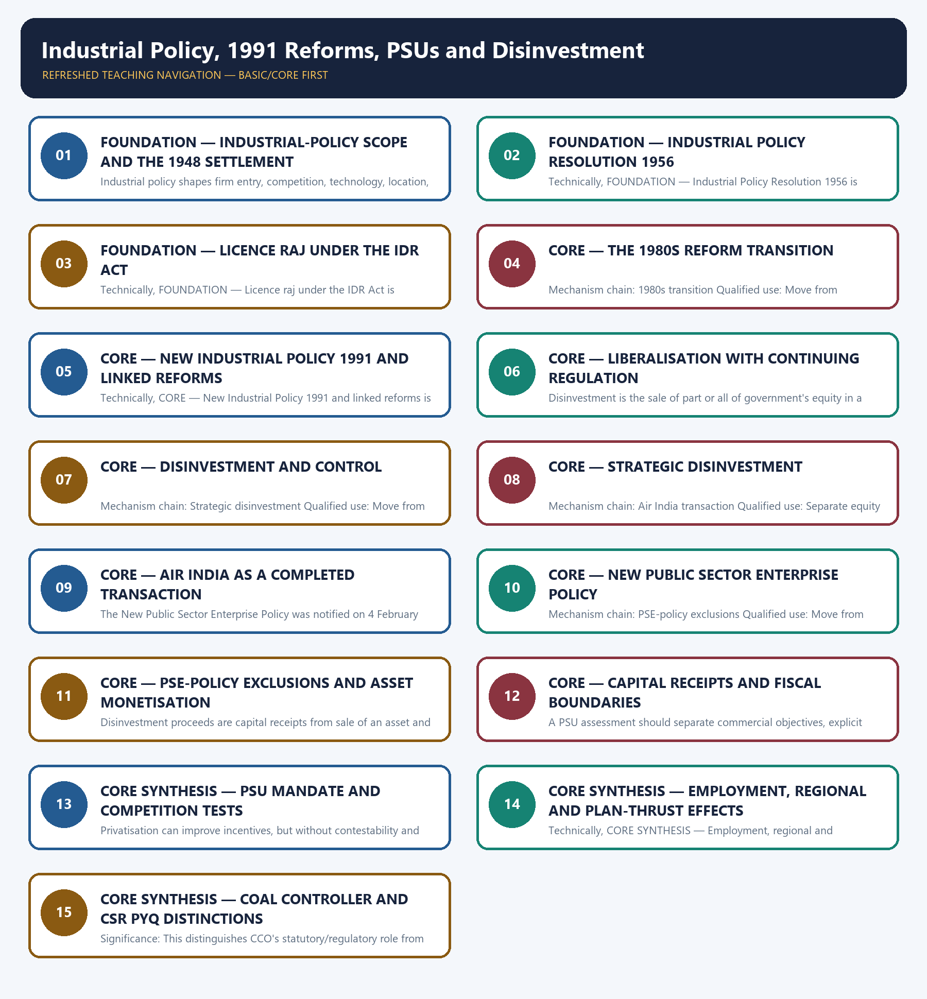

# Industrial Policy, 1991 Reforms, PSUs and Disinvestment — Learner-v2 Complete Learning Session

> **Authoring-only generation:** 2026-09-03. No PDF was rendered and no tracker or index was mutated.

### SOURCE, PROGRESSION AND CURRENT-LINKAGE AUDIT

- **Generation date:** 2026-09-03.
- **Repository-first evidence:** the Basic owner is taught first and preserved in full; the Advanced owner is retained only in the optional final teaching block.
- **OCR evidence:** Repository Markdown was primary. OCR-searchable local official General Studies papers were used only to confirm printed routed demands. No answer key, marking scheme, unsupported page precision or current macroeconomic statistic was inferred from them.
- **Qdrant:** not used; repository Markdown and available OCR context were sufficient.
- **PYQ integrity:** Audited ledgers route objective demands on Five-Year Plan industrial and financial thrusts, the Coal Controller's Organisation and CSR rules. They do not establish official answer letters here. The Basic owner carries these tested distinctions into the core evidence bank and practice extracts.
- **Live-link boundary:** The DIPAM policy page was substantively retrievable and supports the transaction and PSE-policy distinctions. No current receipt, target, buyer, valuation or pipeline claim was added from an incomplete dashboard.
- **Fact/inference discipline:** no current-affairs item, PYQ wording, figure or quotation is invented.

### LIVE OFFICIAL-SOURCE ATTEMPT LOG

The checks below were made on 2026-09-03. Substantive official text is used only for the proposition it actually supports; binary files, dynamic shells, stubs and undated dashboard snippets are recorded but not converted into current claims.

- https://dipam.gov.in/disinvestment-policy — retrieved 2026-09-03; the official DIPAM page substantively defined strategic disinvestment, privatisation, minority stake sale and the New PSE Policy notified on 4 February 2021.
- https://dipam.gov.in/strategic-disinvestment — retrieved 2026-09-03; the live page exposed transaction notes but not a complete time-series table, so no receipt total, target or inferred completion status was imported.

## BASIC LEARNING SESSION

### DEEP-REVIEW LEARNING CONTRACT

| Control | Binding rule for this package |
|---|---|
| Syllabus boundary | Complete Economy Basic/Core is answer-complete before optional Advanced depth. |
| Formula boundary | Formula, numerator, denominator, unit, stock/flow, nominal/real, base year, level/rate and accounting identity are explicit. |
| Institutional boundary | Constitution, statute, delegated rule, regulator mandate, policy, recommendation, scheme and implementation outcome remain distinct. |
| Transmission method | Shock or instrument → prices/quantities/balance sheets/incentives → institution and market response → output, employment, distribution, stability and external effect → lag and trade-off. |
| Current-data method | Source → release date → reference period → unit/denominator → provisional/revised/final status; incompatible Budget, Survey or statistical vintages are never mixed. |
| Programme-status method | Announced → approved → notified/guidelines issued → funded → operational → utilised → output → outcome are separate stages. |
| External/WTO method | Agreement text, member category, box, limit, notification, consultation, dispute and ruling are qualified without invented thresholds. |
| Causal method | Accounting identity, chronology and correlation are not promoted into behavioural or causal claims without mechanism, counterfactual and alternatives. |
| Answer balance | Model answers balance growth, distribution, stability, sustainability and federal dimensions with India-centric evidence. |
| Practice contract | Every solved item has demand decoding, a detailed examiner-grade model, executable timed/compression plan, marks rationale and answer-specific improvement. |
| Approval | This immutable successor remains `approved: false` pending explicit approval. |

**Canonical Basic/Core owner:** `upsc-ai-kit\knowledge\Economy\basic\16_Industrial-Policy-1991-Reforms-PSUs-and-Disinvestment.md`  
**Substantive canonical provenance owner:** `upsc-ai-kit\knowledge\Economy\16_Industrial-Policy-1991-Reforms-PSUs-and-Disinvestment_Learner-V2-Complete-Topic-Package.md`  
**Optional Advanced owner:** `upsc-ai-kit\knowledge\Economy\advanced\16_Industrial-Policy-1991-Reforms-PSUs-and-Disinvestment.md`  
**Official syllabus mapping:** `upsc-ai-kit\knowledge\Economy\OFFICIAL-UPSC-SYLLABUS-MAPPING.md`

### EVIDENCE, PYQ AND CURRENT-STATUS CONTROL

- Every data-heavy table states unit, denominator, geography, reference period and source/status.
- GDP/GVA, gross/net, domestic/national, nominal/real and level/rate distinctions remain exact.
- Monetary, fiscal and external chains state intermediaries, balance-sheet channels, lags, leakages and trade-offs.
- Budget and Economic Survey editions are never mixed; BE, RE, Actual, advance/provisional/revised/final estimates remain labelled.
- Scheme and programme claims distinguish announcement, approval, notification, operation, coverage, utilisation and measured outcome.
- WTO boxes, limits, de minimis, special treatment, notifications and disputes are qualified from authoritative rules.
- PYQ wording is preserved only where verified; reconstructed or routed demands remain labelled.
- **Current-status note, rechecked 2026-09-03:** volatile rates, estimates, scheme status, trade rules and institutional claims retain official source, release date, reference period and revision status.

**Generation-local live/current sources:**
- `https://dipam.gov.in/disinvestment-policy — retrieved 2026-09-03; the official DIPAM page substantively defined strategic disinvestment, privatisation, minority stake sale and the New PSE Policy notified on 4 February 2021.`
- `https://dipam.gov.in/strategic-disinvestment — retrieved 2026-09-03; the live page exposed transaction notes but not a complete time-series table, so no receipt total, target or inferred completion status was imported.`




*Distinct embedded teaching-navigation image. The separate continuous Cārvāka-style flowchart package remains an independent at-a-glance artifact.*

### SESSION 1 — FOUNDATION — INDUSTRIAL-POLICY SCOPE AND THE 1948 SETTLEMENT

#### DEFINITION / WHAT THIS IS CALLED

**Plain-language definition:** Mechanism chain: Industrial-policy scope - 1948 mixed-economy settlement Qualified use: Move from chronology to entry, capability, competition, ownership and adjustment effects.

**Technical definition:** Industrial policy shapes firm entry, competition, technology, location, finance, infrastructure and strategic capability; it is not a synonym for subsidies or public ownership.

#### ANSWER-GRABBING OPENING — WRITE/ADAPT IN THE EXAM

> Mechanism chain: Industrial-policy scope - 1948 mixed-economy settlement Qualified use: Move from chronology to entry, capability, competition, ownership and adjustment effects.

#### MUST-WRITE KEYWORDS

- **FOUNDATION**
- **Industrial-policy scope**
- **the 1948 settlement**
- **Mechanism chain**
- **Qualified use**
- **Industrial**

**How to use them:** Frame the answer through FOUNDATION; define Industrial-policy scope, connect the 1948 settlement with Mechanism chain to explain the mechanism, and use Qualified use for the decisive comparison or qualification.

#### VISUAL FIRST

```text
INDUSTRIAL-POLICY SCOPE AND THE 1948 SETTLEMENT
01. Industrial-policy scope
    |
    v
02. 1948 mixed-economy settlement
BOUNDARY -> Do not describe industrial policy as subsidies, licensing or state ownership alone.
```

*This topic-specific rail fixes the evidence sequence and its exam boundary before analysis.*

#### CORE EXPLANATION

Industrial policy shapes firm entry, competition, technology, location, finance, infrastructure and strategic capability; it is not a synonym for subsidies or public ownership. The Industrial Policy Resolution of 1948 assigned the state an important role within a mixed economy, so it must remain distinct from the more detailed public-sector reservation architecture adopted later.

#### NAMED EVIDENCE AND MECHANISM

- Industrial policy shapes firm entry, competition, technology, location, finance, infrastructure and strategic capability; it is not a synonym for subsidies or public ownership.
- The Industrial Policy Resolution of 1948 assigned the state an important role within a mixed economy, so it must remain distinct from the more detailed public-sector reservation architecture adopted later.

#### EXAMINER CAUTION

- Do not describe industrial policy as subsidies, licensing or state ownership alone.

#### EXAM LINK

- **Prelims:** Preserve the exact formula, territorial or resident boundary, price basis, base year, index basket, eligible counterparty, institution and legal status; never upgrade a projection into an actual or a regulatory direction into a universal rule.
- **Mains:** Move from chronology to entry, capability, competition, ownership and adjustment effects.

#### MINI RECAP

- **Mechanism chain:** Industrial-policy scope -> 1948 mixed-economy settlement
- **Qualified use:** Move from chronology to entry, capability, competition, ownership and adjustment effects.

#### CLOSING RECALL FLOW — FOUNDATION — INDUSTRIAL-POLICY SCOPE AND THE 1948 SETTLEMENT

```text
START / CONCEPT: FOUNDATION — Industrial-policy scope and the 1948 settlement
        |
        v
EXACT TERMS: FOUNDATION · Industrial-policy scope · the 1948 settlement · Mechanism chain · Qualified use · Industrial
        |
        v
MECHANISM / ARGUMENT: Industrial policy shapes firm entry, competition, technology, location, finance, infrastructure and strategic capability; it is not a synonym for subsidies or public ownership.
        |
        v
CONSEQUENCE / CONTRAST: Do not describe industrial policy as subsidies, licensing or state ownership alone.
        |
        v
UPSC TRAP / ANSWER-USE: Do not miss this limiting distinction: the Industrial Policy Resolution of 1948 assigned the state an important role within a...
        |
        v
ANSWER-GRABBING FORMULATION: Mechanism chain: Industrial-policy scope - 1948 mixed-economy settlement Qualified use: Move from chronology to entry, capability, competition, ownership and adjustment effects.
```
### SESSION 2 — FOUNDATION — INDUSTRIAL POLICY RESOLUTION 1956

#### DEFINITION / WHAT THIS IS CALLED

**Plain-language definition:** Mechanism chain: 1956 schedule architecture Qualified use: Separate equity sale, transfer of control, time-bound operating rights and closure.

**Technical definition:** Technically, FOUNDATION — Industrial Policy Resolution 1956 is analysed by relating FOUNDATION to Industrial Policy Resolution 1956, then testing the relationship through Mechanism chain and Qualified use.

#### ANSWER-GRABBING OPENING — WRITE/ADAPT IN THE EXAM

> Mechanism chain: 1956 schedule architecture Qualified use: Separate equity sale, transfer of control, time-bound operating rights and closure.

#### MUST-WRITE KEYWORDS

- **FOUNDATION**
- **Industrial Policy Resolution 1956**
- **Mechanism chain**
- **Qualified use**
- **Qualified**
- **Separate**

**How to use them:** Frame the answer through FOUNDATION; define Industrial Policy Resolution 1956, connect Mechanism chain with Qualified use to explain the mechanism, and use Qualified for the decisive comparison or qualification.

#### VISUAL FIRST

```text
INDUSTRIAL POLICY RESOLUTION 1956
01. 1956 schedule architecture
BOUNDARY -> Do not merge the 1948 mixed-economy statement with the 1956 schedule structure.
```

*This topic-specific rail fixes the evidence sequence and its exam boundary before analysis.*

#### CORE EXPLANATION

The Industrial Policy Resolution of 1956 classified industries into Schedules A, B and C and placed the commanding heights under public-sector leadership; the schedule boundaries belong to that policy vintage.

#### NAMED EVIDENCE AND MECHANISM

- The Industrial Policy Resolution of 1956 classified industries into Schedules A, B and C and placed the commanding heights under public-sector leadership; the schedule boundaries belong to that policy vintage.

#### EXAMINER CAUTION

- Do not merge the 1948 mixed-economy statement with the 1956 schedule structure.

#### EXAM LINK

- **Prelims:** Preserve the exact formula, territorial or resident boundary, price basis, base year, index basket, eligible counterparty, institution and legal status; never upgrade a projection into an actual or a regulatory direction into a universal rule.
- **Mains:** Separate equity sale, transfer of control, time-bound operating rights and closure.

#### MINI RECAP

- **Mechanism chain:** 1956 schedule architecture
- **Qualified use:** Separate equity sale, transfer of control, time-bound operating rights and closure.

#### CLOSING RECALL FLOW — FOUNDATION — INDUSTRIAL POLICY RESOLUTION 1956

```text
START / CONCEPT: FOUNDATION — Industrial Policy Resolution 1956
        |
        v
EXACT TERMS: FOUNDATION · Industrial Policy Resolution 1956 · Mechanism chain · Qualified use · Qualified · Separate
        |
        v
MECHANISM / ARGUMENT: The operative mechanism is that separate equity sale, transfer of control, time-bound operating rights and closure.
        |
        v
CONSEQUENCE / CONTRAST: Do not merge the 1948 mixed-economy statement with the 1956 schedule structure.
        |
        v
UPSC TRAP / ANSWER-USE: Do not miss this limiting distinction: do not merge the 1948 mixed-economy statement with the 1956 schedule structure.
        |
        v
ANSWER-GRABBING FORMULATION: Mechanism chain: 1956 schedule architecture Qualified use: Separate equity sale, transfer of control, time-bound operating rights and closure.
```
### SESSION 3 — FOUNDATION — LICENCE RAJ UNDER THE IDR ACT

#### DEFINITION / WHAT THIS IS CALLED

**Plain-language definition:** Mechanism chain: Licence-regime boundary Qualified use: Judge public ownership enterprise by enterprise through mandate, governance and market structure.

**Technical definition:** Technically, FOUNDATION — Licence raj under the IDR Act is analysed by relating FOUNDATION to Licence raj under the IDR Act, then testing the relationship through Mechanism chain and Qualified use.

#### ANSWER-GRABBING OPENING — WRITE/ADAPT IN THE EXAM

> Mechanism chain: Licence-regime boundary Qualified use: Judge public ownership enterprise by enterprise through mandate, governance and market structure.

#### MUST-WRITE KEYWORDS

- **FOUNDATION**
- **Licence raj under the IDR Act**
- **Mechanism chain**
- **Qualified use**
- **Licence-regime**
- **Qualified**

**How to use them:** Frame the answer through FOUNDATION; define Licence raj under the IDR Act, connect Mechanism chain with Qualified use to explain the mechanism, and use Licence-regime for the decisive comparison or qualification.

#### VISUAL FIRST

```text
LICENCE RAJ UNDER THE IDR ACT
01. Licence-regime boundary
BOUNDARY -> Do not treat 1991 as a clean break that had no 1980s precursor.
```

*This topic-specific rail fixes the evidence sequence and its exam boundary before analysis.*

#### CORE EXPLANATION

Before 1991, industrial licensing under the Industries (Development and Regulation) Act, 1951 constrained entry, capacity, location and expansion in many industries, but licensing never represented every form of regulation.

#### NAMED EVIDENCE AND MECHANISM

- Before 1991, industrial licensing under the Industries (Development and Regulation) Act, 1951 constrained entry, capacity, location and expansion in many industries, but licensing never represented every form of regulation.

#### EXAMINER CAUTION

- Do not treat 1991 as a clean break that had no 1980s precursor.

#### EXAM LINK

- **Prelims:** Preserve the exact formula, territorial or resident boundary, price basis, base year, index basket, eligible counterparty, institution and legal status; never upgrade a projection into an actual or a regulatory direction into a universal rule.
- **Mains:** Judge public ownership enterprise by enterprise through mandate, governance and market structure.

#### MINI RECAP

- **Mechanism chain:** Licence-regime boundary
- **Qualified use:** Judge public ownership enterprise by enterprise through mandate, governance and market structure.

#### CLOSING RECALL FLOW — FOUNDATION — LICENCE RAJ UNDER THE IDR ACT

```text
START / CONCEPT: FOUNDATION — Licence raj under the IDR Act
        |
        v
EXACT TERMS: FOUNDATION · Licence raj under the IDR Act · Mechanism chain · Qualified use · Licence-regime · Qualified
        |
        v
MECHANISM / ARGUMENT: The operative mechanism is that judge public ownership enterprise by enterprise through mandate, governance and market structure.
        |
        v
CONSEQUENCE / CONTRAST: Do not treat 1991 as a clean break that had no 1980s precursor.
        |
        v
UPSC TRAP / ANSWER-USE: Do not miss this limiting distinction: do not treat 1991 as a clean break that had no 1980s precursor.
        |
        v
ANSWER-GRABBING FORMULATION: Mechanism chain: Licence-regime boundary Qualified use: Judge public ownership enterprise by enterprise through mandate, governance and market structure.
```
### SESSION 4 — CORE — THE 1980S REFORM TRANSITION

#### DEFINITION / WHAT THIS IS CALLED

**Plain-language definition:** Modernisation, productivity measures, technology upgrading and selective delicensing in the Sixth and Seventh Plan periods preceded 1991, so the reform path was not an instantaneous clean break.

**Technical definition:** Mechanism chain: 1980s transition Qualified use: Move from chronology to entry, capability, competition, ownership and adjustment effects.

#### ANSWER-GRABBING OPENING — WRITE/ADAPT IN THE EXAM

> Modernisation, productivity measures, technology upgrading and selective delicensing in the Sixth and Seventh Plan periods preceded 1991, so the reform path was not an instantaneous clean break.

#### MUST-WRITE KEYWORDS

- **The 1980s reform transition**
- **Mechanism chain**
- **Qualified use**
- **Modernisation**
- **Sixth**
- **Seventh Plan**

**How to use them:** Frame the answer through The 1980s reform transition; define Mechanism chain, connect Qualified use with Modernisation to explain the mechanism, and use Sixth for the decisive comparison or qualification.

#### VISUAL FIRST

```text
THE 1980S REFORM TRANSITION
01. 1980s transition
BOUNDARY -> Do not claim delicensing abolished competition, sector or environmental regulation.
```

*This topic-specific rail fixes the evidence sequence and its exam boundary before analysis.*

#### CORE EXPLANATION

Modernisation, productivity measures, technology upgrading and selective delicensing in the Sixth and Seventh Plan periods preceded 1991, so the reform path was not an instantaneous clean break.

#### NAMED EVIDENCE AND MECHANISM

- Modernisation, productivity measures, technology upgrading and selective delicensing in the Sixth and Seventh Plan periods preceded 1991, so the reform path was not an instantaneous clean break.

#### EXAMINER CAUTION

- Do not claim delicensing abolished competition, sector or environmental regulation.

#### EXAM LINK

- **Prelims:** Preserve the exact formula, territorial or resident boundary, price basis, base year, index basket, eligible counterparty, institution and legal status; never upgrade a projection into an actual or a regulatory direction into a universal rule.
- **Mains:** Move from chronology to entry, capability, competition, ownership and adjustment effects.

#### MINI RECAP

- **Mechanism chain:** 1980s transition
- **Qualified use:** Move from chronology to entry, capability, competition, ownership and adjustment effects.

#### CLOSING RECALL FLOW — CORE — THE 1980S REFORM TRANSITION

```text
START / CONCEPT: CORE — The 1980s reform transition
        |
        v
EXACT TERMS: The 1980s reform transition · Mechanism chain · Qualified use · Modernisation · Sixth · Seventh Plan
        |
        v
MECHANISM / ARGUMENT: Mechanism chain: 1980s transition Qualified use: Move from chronology to entry, capability, competition, ownership and adjustment effects.
        |
        v
CONSEQUENCE / CONTRAST: Do not claim delicensing abolished competition, sector or environmental regulation.
        |
        v
UPSC TRAP / ANSWER-USE: Do not miss this limiting distinction: modernisation, productivity measures, technology upgrading and selective delicensing in the Sixth and Seventh Plan...
        |
        v
ANSWER-GRABBING FORMULATION: Modernisation, productivity measures, technology upgrading and selective delicensing in the Sixth and Seventh Plan periods preceded 1991, so the reform path was not an instantaneous clean break.
```
### SESSION 5 — CORE — NEW INDUSTRIAL POLICY 1991 AND LINKED REFORMS

#### DEFINITION / WHAT THIS IS CALLED

**Plain-language definition:** Mechanism chain: 1991 reform package Qualified use: Separate equity sale, transfer of control, time-bound operating rights and closure.

**Technical definition:** Technically, CORE — New Industrial Policy 1991 and linked reforms is analysed by relating New Industrial Policy 1991 to linked reforms, then testing the relationship through Mechanism chain and Qualified use.

#### ANSWER-GRABBING OPENING — WRITE/ADAPT IN THE EXAM

> Mechanism chain: 1991 reform package Qualified use: Separate equity sale, transfer of control, time-bound operating rights and closure.

#### MUST-WRITE KEYWORDS

- **New Industrial Policy 1991**
- **linked reforms**
- **Mechanism chain**
- **Qualified use**
- **Qualified**
- **Separate**

**How to use them:** Frame the answer through New Industrial Policy 1991; define linked reforms, connect Mechanism chain with Qualified use to explain the mechanism, and use Qualified for the decisive comparison or qualification.

#### VISUAL FIRST

```text
NEW INDUSTRIAL POLICY 1991 AND LINKED REFORMS
01. 1991 reform package
BOUNDARY -> Do not equate every disinvestment transaction with privatisation.
```

*This topic-specific rail fixes the evidence sequence and its exam boundary before analysis.*

#### CORE EXPLANATION

The New Industrial Policy of 1991 substantially reduced industrial licensing and public-sector reservation within a broader package that also included trade, exchange-rate and financial reforms.

#### NAMED EVIDENCE AND MECHANISM

- The New Industrial Policy of 1991 substantially reduced industrial licensing and public-sector reservation within a broader package that also included trade, exchange-rate and financial reforms.

#### EXAMINER CAUTION

- Do not equate every disinvestment transaction with privatisation.

#### EXAM LINK

- **Prelims:** Preserve the exact formula, territorial or resident boundary, price basis, base year, index basket, eligible counterparty, institution and legal status; never upgrade a projection into an actual or a regulatory direction into a universal rule.
- **Mains:** Separate equity sale, transfer of control, time-bound operating rights and closure.

#### MINI RECAP

- **Mechanism chain:** 1991 reform package
- **Qualified use:** Separate equity sale, transfer of control, time-bound operating rights and closure.

#### CLOSING RECALL FLOW — CORE — NEW INDUSTRIAL POLICY 1991 AND LINKED REFORMS

```text
START / CONCEPT: CORE — New Industrial Policy 1991 and linked reforms
        |
        v
EXACT TERMS: New Industrial Policy 1991 · linked reforms · Mechanism chain · Qualified use · Qualified · Separate
        |
        v
MECHANISM / ARGUMENT: Do not equate every disinvestment transaction with privatisation.
        |
        v
CONSEQUENCE / CONTRAST: The resulting consequence is that separate equity sale, transfer of control, time-bound operating rights and closure.
        |
        v
UPSC TRAP / ANSWER-USE: Do not miss this limiting distinction: separate equity sale, transfer of control, time-bound operating rights and closure.
        |
        v
ANSWER-GRABBING FORMULATION: Mechanism chain: 1991 reform package Qualified use: Separate equity sale, transfer of control, time-bound operating rights and closure.
```
### SESSION 6 — CORE — LIBERALISATION WITH CONTINUING REGULATION

#### DEFINITION / WHAT THIS IS CALLED

**Plain-language definition:** Mechanism chain: Liberalisation and regulation - Disinvestment Qualified use: Judge public ownership enterprise by enterprise through mandate, governance and market structure.

**Technical definition:** Disinvestment is the sale of part or all of government's equity in a public enterprise; a minority market sale can change ownership dispersion without transferring management control.

#### ANSWER-GRABBING OPENING — WRITE/ADAPT IN THE EXAM

> Mechanism chain: Liberalisation and regulation - Disinvestment Qualified use: Judge public ownership enterprise by enterprise through mandate, governance and market structure.

#### MUST-WRITE KEYWORDS

- **Liberalisation with continuing regulation**
- **Mechanism chain**
- **Qualified use**
- **Disinvestment**
- **Liberalisation**
- **Disinvestment Qualified**

**How to use them:** Frame the answer through Liberalisation with continuing regulation; define Mechanism chain, connect Qualified use with Disinvestment to explain the mechanism, and use Liberalisation for the decisive comparison or qualification.

#### VISUAL FIRST

```text
LIBERALISATION WITH CONTINUING REGULATION
01. Liberalisation and regulation
    |
    v
02. Disinvestment
BOUNDARY -> Do not turn policy announcement, in-principle approval and completed sale into one stage.
```

*This topic-specific rail fixes the evidence sequence and its exam boundary before analysis.*

#### CORE EXPLANATION

Liberalisation reduces entry controls and expands competition, while competition law, sector regulation, environmental clearance and standards remain necessary after delicensing. Disinvestment is the sale of part or all of government's equity in a public enterprise; a minority market sale can change ownership dispersion without transferring management control.

#### NAMED EVIDENCE AND MECHANISM

- Liberalisation reduces entry controls and expands competition, while competition law, sector regulation, environmental clearance and standards remain necessary after delicensing.
- Disinvestment is the sale of part or all of government's equity in a public enterprise; a minority market sale can change ownership dispersion without transferring management control.

#### EXAMINER CAUTION

- Do not turn policy announcement, in-principle approval and completed sale into one stage.

#### EXAM LINK

- **Prelims:** Preserve the exact formula, territorial or resident boundary, price basis, base year, index basket, eligible counterparty, institution and legal status; never upgrade a projection into an actual or a regulatory direction into a universal rule.
- **Mains:** Judge public ownership enterprise by enterprise through mandate, governance and market structure.

#### MINI RECAP

- **Mechanism chain:** Liberalisation and regulation -> Disinvestment
- **Qualified use:** Judge public ownership enterprise by enterprise through mandate, governance and market structure.

#### CLOSING RECALL FLOW — CORE — LIBERALISATION WITH CONTINUING REGULATION

```text
START / CONCEPT: CORE — Liberalisation with continuing regulation
        |
        v
EXACT TERMS: Liberalisation with continuing regulation · Mechanism chain · Qualified use · Disinvestment · Liberalisation · Disinvestment Qualified
        |
        v
MECHANISM / ARGUMENT: Disinvestment is the sale of part or all of government's equity in a public enterprise; a minority market sale can change ownership dispersion without transferring management control.
        |
        v
CONSEQUENCE / CONTRAST: Do not turn policy announcement, in-principle approval and completed sale into one stage.
        |
        v
UPSC TRAP / ANSWER-USE: Do not miss this limiting distinction: liberalisation and regulation - Disinvestment Qualified use.
        |
        v
ANSWER-GRABBING FORMULATION: Mechanism chain: Liberalisation and regulation - Disinvestment Qualified use: Judge public ownership enterprise by enterprise through mandate, governance and market structure.
```
### SESSION 7 — CORE — DISINVESTMENT AND CONTROL

#### DEFINITION / WHAT THIS IS CALLED

**Plain-language definition:** DIPAM defines strategic disinvestment as an entire or substantial government share sale together with transfer of management control; privatisation is the subset in which control passes to a private strategic buyer.

**Technical definition:** Mechanism chain: Strategic disinvestment Qualified use: Move from chronology to entry, capability, competition, ownership and adjustment effects.

#### ANSWER-GRABBING OPENING — WRITE/ADAPT IN THE EXAM

> DIPAM defines strategic disinvestment as an entire or substantial government share sale together with transfer of management control; privatisation is the subset in which control passes to a private strategic buyer.

#### MUST-WRITE KEYWORDS

- **Disinvestment**
- **control**
- **Mechanism chain**
- **Qualified use**
- **DIPAM**
- **Strategic**

**How to use them:** Frame the answer through Disinvestment; define control, connect Mechanism chain with Qualified use to explain the mechanism, and use DIPAM for the decisive comparison or qualification.

#### VISUAL FIRST

```text
DISINVESTMENT AND CONTROL
01. Strategic disinvestment
BOUNDARY -> Do not quote a disinvestment target or receipt without the financial year and official status.
```

*This topic-specific rail fixes the evidence sequence and its exam boundary before analysis.*

#### CORE EXPLANATION

DIPAM defines strategic disinvestment as an entire or substantial government share sale together with transfer of management control; privatisation is the subset in which control passes to a private strategic buyer.

#### NAMED EVIDENCE AND MECHANISM

- DIPAM defines strategic disinvestment as an entire or substantial government share sale together with transfer of management control; privatisation is the subset in which control passes to a private strategic buyer.

#### EXAMINER CAUTION

- Do not quote a disinvestment target or receipt without the financial year and official status.

#### EXAM LINK

- **Prelims:** Preserve the exact formula, territorial or resident boundary, price basis, base year, index basket, eligible counterparty, institution and legal status; never upgrade a projection into an actual or a regulatory direction into a universal rule.
- **Mains:** Move from chronology to entry, capability, competition, ownership and adjustment effects.

#### MINI RECAP

- **Mechanism chain:** Strategic disinvestment
- **Qualified use:** Move from chronology to entry, capability, competition, ownership and adjustment effects.

#### CLOSING RECALL FLOW — CORE — DISINVESTMENT AND CONTROL

```text
START / CONCEPT: CORE — Disinvestment and control
        |
        v
EXACT TERMS: Disinvestment · control · Mechanism chain · Qualified use · DIPAM · Strategic
        |
        v
MECHANISM / ARGUMENT: Mechanism chain: Strategic disinvestment Qualified use: Move from chronology to entry, capability, competition, ownership and adjustment effects.
        |
        v
CONSEQUENCE / CONTRAST: Do not quote a disinvestment target or receipt without the financial year and official status.
        |
        v
UPSC TRAP / ANSWER-USE: Do not miss this limiting distinction: do not quote a disinvestment target or receipt without the financial year and official...
        |
        v
ANSWER-GRABBING FORMULATION: DIPAM defines strategic disinvestment as an entire or substantial government share sale together with transfer of management control; privatisation is the subset in which control passes to a private strategic buyer.
```
### SESSION 8 — CORE — STRATEGIC DISINVESTMENT

#### DEFINITION / WHAT THIS IS CALLED

**Plain-language definition:** CORE — Strategic disinvestment comprises Strategic disinvestment, Mechanism chain and Qualified use as its core connected dimensions.

**Technical definition:** Mechanism chain: Air India transaction Qualified use: Separate equity sale, transfer of control, time-bound operating rights and closure.

#### ANSWER-GRABBING OPENING — WRITE/ADAPT IN THE EXAM

> The transfer of Air India to Talace Private Limited completed in January 2022 and is a completed control-transfer example, not evidence that every announced strategic sale reaches closure.

#### MUST-WRITE KEYWORDS

- **Strategic disinvestment**
- **Mechanism chain**
- **Qualified use**
- **Air India**
- **Talace Private Limited**
- **Qualified**

**How to use them:** Frame the answer through Strategic disinvestment; define Mechanism chain, connect Qualified use with Air India to explain the mechanism, and use Talace Private Limited for the decisive comparison or qualification.

#### VISUAL FIRST

```text
STRATEGIC DISINVESTMENT
01. Air India transaction
BOUNDARY -> Do not confuse asset monetisation with an equity sale or permanent transfer of ownership.
```

*This topic-specific rail fixes the evidence sequence and its exam boundary before analysis.*

#### CORE EXPLANATION

The transfer of Air India to Talace Private Limited completed in January 2022 and is a completed control-transfer example, not evidence that every announced strategic sale reaches closure.

#### NAMED EVIDENCE AND MECHANISM

- The transfer of Air India to Talace Private Limited completed in January 2022 and is a completed control-transfer example, not evidence that every announced strategic sale reaches closure.

#### EXAMINER CAUTION

- Do not confuse asset monetisation with an equity sale or permanent transfer of ownership.

#### EXAM LINK

- **Prelims:** Preserve the exact formula, territorial or resident boundary, price basis, base year, index basket, eligible counterparty, institution and legal status; never upgrade a projection into an actual or a regulatory direction into a universal rule.
- **Mains:** Separate equity sale, transfer of control, time-bound operating rights and closure.

#### MINI RECAP

- **Mechanism chain:** Air India transaction
- **Qualified use:** Separate equity sale, transfer of control, time-bound operating rights and closure.

#### CLOSING RECALL FLOW — CORE — STRATEGIC DISINVESTMENT

```text
START / CONCEPT: CORE — Strategic disinvestment
        |
        v
EXACT TERMS: Strategic disinvestment · Mechanism chain · Qualified use · Air India · Talace Private Limited · Qualified
        |
        v
MECHANISM / ARGUMENT: Mechanism chain: Air India transaction Qualified use: Separate equity sale, transfer of control, time-bound operating rights and closure.
        |
        v
CONSEQUENCE / CONTRAST: Do not confuse asset monetisation with an equity sale or permanent transfer of ownership.
        |
        v
UPSC TRAP / ANSWER-USE: Do not miss this limiting distinction: the transfer of Air India to Talace Private Limited completed in January 2022 and...
        |
        v
ANSWER-GRABBING FORMULATION: The transfer of Air India to Talace Private Limited completed in January 2022 and is a completed control-transfer example, not evidence that every announced strategic sale reaches closure.
```
### SESSION 9 — CORE — AIR INDIA AS A COMPLETED TRANSACTION

#### DEFINITION / WHAT THIS IS CALLED

**Plain-language definition:** Mechanism chain: New PSE Policy Qualified use: Judge public ownership enterprise by enterprise through mandate, governance and market structure.

**Technical definition:** The New Public Sector Enterprise Policy was notified on 4 February 2021 and seeks bare-minimum public-sector presence in four strategic sectors while considering other enterprises for privatisation, merger, subsidiarisation or closure under the policy process.

#### ANSWER-GRABBING OPENING — WRITE/ADAPT IN THE EXAM

> Do not generalise one completed transaction to every CPSE.

#### MUST-WRITE KEYWORDS

- **Air India as a completed transaction**
- **Mechanism chain**
- **Qualified use**
- **The New Public Sector Enterprise**
- **Policy**
- **CPSE**

**How to use them:** Frame the answer through Air India as a completed transaction; define Mechanism chain, connect Qualified use with The New Public Sector Enterprise to explain the mechanism, and use Policy for the decisive comparison or qualification.

#### VISUAL FIRST

```text
AIR INDIA AS A COMPLETED TRANSACTION
01. New PSE Policy
BOUNDARY -> Do not generalise one completed transaction to every CPSE.
```

*This topic-specific rail fixes the evidence sequence and its exam boundary before analysis.*

#### CORE EXPLANATION

The New Public Sector Enterprise Policy was notified on 4 February 2021 and seeks bare-minimum public-sector presence in four strategic sectors while considering other enterprises for privatisation, merger, subsidiarisation or closure under the policy process.

#### NAMED EVIDENCE AND MECHANISM

- The New Public Sector Enterprise Policy was notified on 4 February 2021 and seeks bare-minimum public-sector presence in four strategic sectors while considering other enterprises for privatisation, merger, subsidiarisation or closure under the policy process.

#### EXAMINER CAUTION

- Do not generalise one completed transaction to every CPSE.

#### EXAM LINK

- **Prelims:** Preserve the exact formula, territorial or resident boundary, price basis, base year, index basket, eligible counterparty, institution and legal status; never upgrade a projection into an actual or a regulatory direction into a universal rule.
- **Mains:** Judge public ownership enterprise by enterprise through mandate, governance and market structure.

#### MINI RECAP

- **Mechanism chain:** New PSE Policy
- **Qualified use:** Judge public ownership enterprise by enterprise through mandate, governance and market structure.

#### CLOSING RECALL FLOW — CORE — AIR INDIA AS A COMPLETED TRANSACTION

```text
START / CONCEPT: CORE — Air India as a completed transaction
        |
        v
EXACT TERMS: Air India as a completed transaction · Mechanism chain · Qualified use · The New Public Sector Enterprise · Policy · CPSE
        |
        v
MECHANISM / ARGUMENT: Mechanism chain: New PSE Policy Qualified use: Judge public ownership enterprise by enterprise through mandate, governance and market structure.
        |
        v
CONSEQUENCE / CONTRAST: The New Public Sector Enterprise Policy was notified on 4 February 2021 and seeks bare-minimum public-sector presence in four strategic sectors while considering other enterprises for privatisation, merger, subsidiarisation or closure under the policy process.
        |
        v
UPSC TRAP / ANSWER-USE: Do not miss this limiting distinction: do not generalise one completed transaction to every CPSE.
        |
        v
ANSWER-GRABBING FORMULATION: Do not generalise one completed transaction to every CPSE.
```
### SESSION 10 — CORE — NEW PUBLIC SECTOR ENTERPRISE POLICY

#### DEFINITION / WHAT THIS IS CALLED

**Plain-language definition:** The official DIPAM policy page states that the New PSE Policy does not apply to specified classes such as not-for-profit companies and CPSEs with vulnerable-group support or developmental and promotional roles.

**Technical definition:** Mechanism chain: PSE-policy exclusions Qualified use: Move from chronology to entry, capability, competition, ownership and adjustment effects.

#### ANSWER-GRABBING OPENING — WRITE/ADAPT IN THE EXAM

> The official DIPAM policy page states that the New PSE Policy does not apply to specified classes such as not-for-profit companies and CPSEs with vulnerable-group support or developmental and promotional roles.

#### MUST-WRITE KEYWORDS

- **New Public Sector Enterprise Policy**
- **Mechanism chain**
- **Qualified use**
- **DIPAM**
- **New PSE Policy**
- **CPSEs**

**How to use them:** Frame the answer through New Public Sector Enterprise Policy; define Mechanism chain, connect Qualified use with DIPAM to explain the mechanism, and use New PSE Policy for the decisive comparison or qualification.

#### VISUAL FIRST

```text
NEW PUBLIC SECTOR ENTERPRISE POLICY
01. PSE-policy exclusions
BOUNDARY -> Do not infer a PYQ answer letter from a routed objective demand.
```

*This topic-specific rail fixes the evidence sequence and its exam boundary before analysis.*

#### CORE EXPLANATION

The official DIPAM policy page states that the New PSE Policy does not apply to specified classes such as not-for-profit companies and CPSEs with vulnerable-group support or developmental and promotional roles.

#### NAMED EVIDENCE AND MECHANISM

- The official DIPAM policy page states that the New PSE Policy does not apply to specified classes such as not-for-profit companies and CPSEs with vulnerable-group support or developmental and promotional roles.

#### EXAMINER CAUTION

- Do not infer a PYQ answer letter from a routed objective demand.

#### EXAM LINK

- **Prelims:** Preserve the exact formula, territorial or resident boundary, price basis, base year, index basket, eligible counterparty, institution and legal status; never upgrade a projection into an actual or a regulatory direction into a universal rule.
- **Mains:** Move from chronology to entry, capability, competition, ownership and adjustment effects.

#### MINI RECAP

- **Mechanism chain:** PSE-policy exclusions
- **Qualified use:** Move from chronology to entry, capability, competition, ownership and adjustment effects.

#### CLOSING RECALL FLOW — CORE — NEW PUBLIC SECTOR ENTERPRISE POLICY

```text
START / CONCEPT: CORE — New Public Sector Enterprise Policy
        |
        v
EXACT TERMS: New Public Sector Enterprise Policy · Mechanism chain · Qualified use · DIPAM · New PSE Policy · CPSEs
        |
        v
MECHANISM / ARGUMENT: Mechanism chain: PSE-policy exclusions Qualified use: Move from chronology to entry, capability, competition, ownership and adjustment effects.
        |
        v
CONSEQUENCE / CONTRAST: Do not infer a PYQ answer letter from a routed objective demand.
        |
        v
UPSC TRAP / ANSWER-USE: Do not miss this limiting distinction: the official DIPAM policy page states that the New PSE Policy does not apply...
        |
        v
ANSWER-GRABBING FORMULATION: The official DIPAM policy page states that the New PSE Policy does not apply to specified classes such as not-for-profit companies and CPSEs with vulnerable-group support or developmental and promotional roles.
```
### SESSION 11 — CORE — PSE-POLICY EXCLUSIONS AND ASSET MONETISATION

#### DEFINITION / WHAT THIS IS CALLED

**Plain-language definition:** Asset monetisation can transfer operating or revenue rights in a brownfield public asset for a specified period while public ownership is retained; it is not the same transaction as selling government equity.

**Technical definition:** Disinvestment proceeds are capital receipts from sale of an asset and cannot be treated as recurring revenue, a permanent deficit correction or proof of enterprise productivity.

#### ANSWER-GRABBING OPENING — WRITE/ADAPT IN THE EXAM

> Asset monetisation can transfer operating or revenue rights in a brownfield public asset for a specified period while public ownership is retained; it is not the same transaction as selling government equity.

#### MUST-WRITE KEYWORDS

- **PSE-policy exclusions**
- **asset monetisation**
- **Mechanism chain**
- **Qualified use**
- **Asset**
- **Disinvestment proceeds**

**How to use them:** Frame the answer through PSE-policy exclusions; define asset monetisation, connect Mechanism chain with Qualified use to explain the mechanism, and use Asset for the decisive comparison or qualification.

#### VISUAL FIRST

```text
PSE-POLICY EXCLUSIONS AND ASSET MONETISATION
01. Asset monetisation
    |
    v
02. Capital-receipt boundary
BOUNDARY -> Do not describe industrial policy as subsidies, licensing or state ownership alone.
```

*This topic-specific rail fixes the evidence sequence and its exam boundary before analysis.*

#### CORE EXPLANATION

Asset monetisation can transfer operating or revenue rights in a brownfield public asset for a specified period while public ownership is retained; it is not the same transaction as selling government equity. Disinvestment proceeds are capital receipts from sale of an asset and cannot be treated as recurring revenue, a permanent deficit correction or proof of enterprise productivity.

#### NAMED EVIDENCE AND MECHANISM

- Asset monetisation can transfer operating or revenue rights in a brownfield public asset for a specified period while public ownership is retained; it is not the same transaction as selling government equity.
- Disinvestment proceeds are capital receipts from sale of an asset and cannot be treated as recurring revenue, a permanent deficit correction or proof of enterprise productivity.

#### EXAMINER CAUTION

- Do not describe industrial policy as subsidies, licensing or state ownership alone.

#### EXAM LINK

- **Prelims:** Preserve the exact formula, territorial or resident boundary, price basis, base year, index basket, eligible counterparty, institution and legal status; never upgrade a projection into an actual or a regulatory direction into a universal rule.
- **Mains:** Separate equity sale, transfer of control, time-bound operating rights and closure.

#### MINI RECAP

- **Mechanism chain:** Asset monetisation -> Capital-receipt boundary
- **Qualified use:** Separate equity sale, transfer of control, time-bound operating rights and closure.

#### CLOSING RECALL FLOW — CORE — PSE-POLICY EXCLUSIONS AND ASSET MONETISATION

```text
START / CONCEPT: CORE — PSE-policy exclusions and asset monetisation
        |
        v
EXACT TERMS: PSE-policy exclusions · asset monetisation · Mechanism chain · Qualified use · Asset · Disinvestment proceeds
        |
        v
MECHANISM / ARGUMENT: Mechanism chain: Asset monetisation - Capital-receipt boundary Qualified use: Separate equity sale, transfer of control, time-bound operating rights and closure.
        |
        v
CONSEQUENCE / CONTRAST: Do not describe industrial policy as subsidies, licensing or state ownership alone.
        |
        v
UPSC TRAP / ANSWER-USE: Disinvestment proceeds are capital receipts from sale of an asset and cannot be treated as recurring revenue, a permanent deficit correction or proof of enterprise productivity.
        |
        v
ANSWER-GRABBING FORMULATION: Asset monetisation can transfer operating or revenue rights in a brownfield public asset for a specified period while public ownership is retained; it is not the same transaction as selling government equity.
```
### SESSION 12 — CORE — CAPITAL RECEIPTS AND FISCAL BOUNDARIES

#### DEFINITION / WHAT THIS IS CALLED

**Plain-language definition:** Mechanism chain: PSU mandate test Qualified use: Judge public ownership enterprise by enterprise through mandate, governance and market structure.

**Technical definition:** A PSU assessment should separate commercial objectives, explicit strategic or public-service obligations, regulator functions and any soft-budget support rather than presume that all PSUs serve the same purpose.

#### ANSWER-GRABBING OPENING — WRITE/ADAPT IN THE EXAM

> Mechanism chain: PSU mandate test Qualified use: Judge public ownership enterprise by enterprise through mandate, governance and market structure.

#### MUST-WRITE KEYWORDS

- **Capital receipts**
- **fiscal boundaries**
- **Mechanism chain**
- **Qualified use**
- **PSU**
- **PSUs**

**How to use them:** Frame the answer through Capital receipts; define fiscal boundaries, connect Mechanism chain with Qualified use to explain the mechanism, and use PSU for the decisive comparison or qualification.

#### VISUAL FIRST

```text
CAPITAL RECEIPTS AND FISCAL BOUNDARIES
01. PSU mandate test
BOUNDARY -> Do not merge the 1948 mixed-economy statement with the 1956 schedule structure.
```

*This topic-specific rail fixes the evidence sequence and its exam boundary before analysis.*

#### CORE EXPLANATION

A PSU assessment should separate commercial objectives, explicit strategic or public-service obligations, regulator functions and any soft-budget support rather than presume that all PSUs serve the same purpose.

#### NAMED EVIDENCE AND MECHANISM

- A PSU assessment should separate commercial objectives, explicit strategic or public-service obligations, regulator functions and any soft-budget support rather than presume that all PSUs serve the same purpose.

#### EXAMINER CAUTION

- Do not merge the 1948 mixed-economy statement with the 1956 schedule structure.

#### EXAM LINK

- **Prelims:** Preserve the exact formula, territorial or resident boundary, price basis, base year, index basket, eligible counterparty, institution and legal status; never upgrade a projection into an actual or a regulatory direction into a universal rule.
- **Mains:** Judge public ownership enterprise by enterprise through mandate, governance and market structure.

#### MINI RECAP

- **Mechanism chain:** PSU mandate test
- **Qualified use:** Judge public ownership enterprise by enterprise through mandate, governance and market structure.

#### CLOSING RECALL FLOW — CORE — CAPITAL RECEIPTS AND FISCAL BOUNDARIES

```text
START / CONCEPT: CORE — Capital receipts and fiscal boundaries
        |
        v
EXACT TERMS: Capital receipts · fiscal boundaries · Mechanism chain · Qualified use · PSU · PSUs
        |
        v
MECHANISM / ARGUMENT: The operative mechanism is that judge public ownership enterprise by enterprise through mandate, governance and market structure.
        |
        v
CONSEQUENCE / CONTRAST: A PSU assessment should separate commercial objectives, explicit strategic or public-service obligations, regulator functions and any soft-budget support rather than presume that all PSUs serve the same purpose.
        |
        v
UPSC TRAP / ANSWER-USE: Do not merge the 1948 mixed-economy statement with the 1956 schedule structure.
        |
        v
ANSWER-GRABBING FORMULATION: Mechanism chain: PSU mandate test Qualified use: Judge public ownership enterprise by enterprise through mandate, governance and market structure.
```
### SESSION 13 — CORE SYNTHESIS — PSU MANDATE AND COMPETITION TESTS

#### DEFINITION / WHAT THIS IS CALLED

**Plain-language definition:** Mechanism chain: Competition after privatisation Qualified use: Move from chronology to entry, capability, competition, ownership and adjustment effects.

**Technical definition:** Privatisation can improve incentives, but without contestability and independent regulation it can replace a public monopoly with a private monopoly.

#### ANSWER-GRABBING OPENING — WRITE/ADAPT IN THE EXAM

> Mechanism chain: Competition after privatisation Qualified use: Move from chronology to entry, capability, competition, ownership and adjustment effects.

#### MUST-WRITE KEYWORDS

- **CORE SYNTHESIS**
- **PSU mandate**
- **competition tests**
- **Mechanism chain**
- **Qualified use**
- **Privatisation**

**How to use them:** Frame the answer through CORE SYNTHESIS; define PSU mandate, connect competition tests with Mechanism chain to explain the mechanism, and use Qualified use for the decisive comparison or qualification.

#### VISUAL FIRST

```text
PSU MANDATE AND COMPETITION TESTS
01. Competition after privatisation
BOUNDARY -> Do not treat 1991 as a clean break that had no 1980s precursor.
```

*This topic-specific rail fixes the evidence sequence and its exam boundary before analysis.*

#### CORE EXPLANATION

Privatisation can improve incentives, but without contestability and independent regulation it can replace a public monopoly with a private monopoly.

#### NAMED EVIDENCE AND MECHANISM

- Privatisation can improve incentives, but without contestability and independent regulation it can replace a public monopoly with a private monopoly.

#### EXAMINER CAUTION

- Do not treat 1991 as a clean break that had no 1980s precursor.

#### EXAM LINK

- **Prelims:** Preserve the exact formula, territorial or resident boundary, price basis, base year, index basket, eligible counterparty, institution and legal status; never upgrade a projection into an actual or a regulatory direction into a universal rule.
- **Mains:** Move from chronology to entry, capability, competition, ownership and adjustment effects.

#### MINI RECAP

- **Mechanism chain:** Competition after privatisation
- **Qualified use:** Move from chronology to entry, capability, competition, ownership and adjustment effects.

#### CLOSING RECALL FLOW — CORE SYNTHESIS — PSU MANDATE AND COMPETITION TESTS

```text
START / CONCEPT: CORE SYNTHESIS — PSU mandate and competition tests
        |
        v
EXACT TERMS: CORE SYNTHESIS · PSU mandate · competition tests · Mechanism chain · Qualified use · Privatisation
        |
        v
MECHANISM / ARGUMENT: Privatisation can improve incentives, but without contestability and independent regulation it can replace a public monopoly with a private monopoly.
        |
        v
CONSEQUENCE / CONTRAST: Do not treat 1991 as a clean break that had no 1980s precursor.
        |
        v
UPSC TRAP / ANSWER-USE: Do not miss this limiting distinction: but without contestability and independent regulation it can replace a public monopoly with a...
        |
        v
ANSWER-GRABBING FORMULATION: Mechanism chain: Competition after privatisation Qualified use: Move from chronology to entry, capability, competition, ownership and adjustment effects.
```
### SESSION 14 — CORE SYNTHESIS — EMPLOYMENT, REGIONAL AND PLAN-THRUST EFFECTS

#### DEFINITION / WHAT THIS IS CALLED

**Plain-language definition:** Mechanism chain: Employment and regional effects - Plan-thrust distinction Qualified use: Separate equity sale, transfer of control, time-bound operating rights and closure.

**Technical definition:** Technically, CORE SYNTHESIS — Employment, regional and Plan-thrust effects is analysed by relating CORE SYNTHESIS to Employment, then testing the relationship through regional and Plan-thrust effects.

#### ANSWER-GRABBING OPENING — WRITE/ADAPT IN THE EXAM

> Mechanism chain: Employment and regional effects - Plan-thrust distinction Qualified use: Separate equity sale, transfer of control, time-bound operating rights and closure.

#### MUST-WRITE KEYWORDS

- **CORE SYNTHESIS**
- **Employment**
- **regional**
- **Plan-thrust effects**
- **Mechanism chain**
- **Qualified use**

**How to use them:** Frame the answer through CORE SYNTHESIS; define Employment, connect regional with Plan-thrust effects to explain the mechanism, and use Mechanism chain for the decisive comparison or qualification.

#### VISUAL FIRST

```text
EMPLOYMENT, REGIONAL AND PLAN-THRUST EFFECTS
01. Employment and regional effects
    |
    v
02. Plan-thrust distinction
BOUNDARY -> Do not claim delicensing abolished competition, sector or environmental regulation.
```

*This topic-specific rail fixes the evidence sequence and its exam boundary before analysis.*

#### CORE EXPLANATION

Industrial restructuring affects workers, suppliers and regions differently because labour-intensive dispersed industries and capital-intensive concentrated sectors have different adjustment and spillover patterns. The Second Plan stressed heavy and basic industry under public-sector leadership; the Sixth and Seventh Plans stressed modernisation and early liberalisation; systemic post-1991 financial reform aligned with the Eighth Plan period.

#### NAMED EVIDENCE AND MECHANISM

- Industrial restructuring affects workers, suppliers and regions differently because labour-intensive dispersed industries and capital-intensive concentrated sectors have different adjustment and spillover patterns.
- The Second Plan stressed heavy and basic industry under public-sector leadership; the Sixth and Seventh Plans stressed modernisation and early liberalisation; systemic post-1991 financial reform aligned with the Eighth Plan period.

#### EXAMINER CAUTION

- Do not claim delicensing abolished competition, sector or environmental regulation.

#### EXAM LINK

- **Prelims:** Preserve the exact formula, territorial or resident boundary, price basis, base year, index basket, eligible counterparty, institution and legal status; never upgrade a projection into an actual or a regulatory direction into a universal rule.
- **Mains:** Separate equity sale, transfer of control, time-bound operating rights and closure.

#### MINI RECAP

- **Mechanism chain:** Employment and regional effects -> Plan-thrust distinction
- **Qualified use:** Separate equity sale, transfer of control, time-bound operating rights and closure.

#### CLOSING RECALL FLOW — CORE SYNTHESIS — EMPLOYMENT, REGIONAL AND PLAN-THRUST EFFECTS

```text
START / CONCEPT: CORE SYNTHESIS — Employment, regional and Plan-thrust effects
        |
        v
EXACT TERMS: CORE SYNTHESIS · Employment · regional · Plan-thrust effects · Mechanism chain · Qualified use
        |
        v
MECHANISM / ARGUMENT: Industrial restructuring affects workers, suppliers and regions differently because labour-intensive dispersed industries and capital-intensive concentrated sectors have different adjustment and spillover patterns.
        |
        v
CONSEQUENCE / CONTRAST: Do not claim delicensing abolished competition, sector or environmental regulation.
        |
        v
UPSC TRAP / ANSWER-USE: Do not miss this limiting distinction: employment and regional effects - Plan-thrust distinction Qualified use.
        |
        v
ANSWER-GRABBING FORMULATION: Mechanism chain: Employment and regional effects - Plan-thrust distinction Qualified use: Separate equity sale, transfer of control, time-bound operating rights and closure.
```
### SESSION 15 — CORE SYNTHESIS — COAL CONTROLLER AND CSR PYQ DISTINCTIONS

#### DEFINITION / WHAT THIS IS CALLED

**Plain-language definition:** The Coal Controller's Organisation is a subordinate regulatory office under the Ministry of Coal with plan, grading, statistics and payment functions; it is distinct from Coal India Limited's production role.

**Technical definition:** Significance: This distinguishes CCO's statutory/regulatory role from Coal India Limited's production role — the precise distinction tested by the 2022 Prelims item — and cross-refers to the dedicated energy-infrastructure Core owner (31Energy-Infrastructure-Economics-Power-Fuels-and-Energy-Security.md) for coal-sector economics generally, without repeating that file's content here.

#### ANSWER-GRABBING OPENING — WRITE/ADAPT IN THE EXAM

> Mechanism chain: Coal Controller distinction - CSR governance boundary Qualified use: Judge public ownership enterprise by enterprise through mandate, governance and market structure.

#### MUST-WRITE KEYWORDS

- **CORE SYNTHESIS**
- **Coal Controller**
- **CSR PYQ distinctions**
- **Mechanism chain**
- **Qualified use**
- **Subject**

**How to use them:** Frame the answer through CORE SYNTHESIS; define Coal Controller, connect CSR PYQ distinctions with Mechanism chain to explain the mechanism, and use Qualified use for the decisive comparison or qualification.

#### VISUAL FIRST

```text
COAL CONTROLLER AND CSR PYQ DISTINCTIONS
01. Coal Controller distinction
    |
    v
02. CSR governance boundary
BOUNDARY -> Do not equate every disinvestment transaction with privatisation.
```

*This topic-specific rail fixes the evidence sequence and its exam boundary before analysis.*

#### CORE EXPLANATION

The Coal Controller's Organisation is a subordinate regulatory office under the Ministry of Coal with plan, grading, statistics and payment functions; it is distinct from Coal India Limited's production role. Section 135 of the Companies Act, 2013 makes CSR a statutory Board-owned obligation for qualifying companies and links spending to Schedule VII; current thresholds and percentages must be verified from the dated law and rules.

#### NAMED EVIDENCE AND MECHANISM

- The Coal Controller's Organisation is a subordinate regulatory office under the Ministry of Coal with plan, grading, statistics and payment functions; it is distinct from Coal India Limited's production role.
- Section 135 of the Companies Act, 2013 makes CSR a statutory Board-owned obligation for qualifying companies and links spending to Schedule VII; current thresholds and percentages must be verified from the dated law and rules.

#### EXAMINER CAUTION

- Do not equate every disinvestment transaction with privatisation.

#### EXAM LINK

- **Prelims:** Preserve the exact formula, territorial or resident boundary, price basis, base year, index basket, eligible counterparty, institution and legal status; never upgrade a projection into an actual or a regulatory direction into a universal rule.
- **Mains:** Judge public ownership enterprise by enterprise through mandate, governance and market structure.

#### MINI RECAP

- **Mechanism chain:** Coal Controller distinction -> CSR governance boundary
- **Qualified use:** Judge public ownership enterprise by enterprise through mandate, governance and market structure.
#### COMPLETE BASIC OWNER EVIDENCE BANK

> **Subject:** Economy | **Tier:** Must-Do (foundation) | **GS Paper:** GS-III + Prelims.
> **Core area:** Industrial reform.
> **Grounded in:** Ramesh Singh, relevant chapters; Economic Survey 2025-26; audited UPSC Economy PYQs (2024-2026 Prelims and 2024-2025 Mains).
> ✅ = source-grounded | ⚠️ = analytical linkage | 📰 = current Survey/current-affairs hook.
> *Companion: `../advanced/16_Industrial-Policy-1991-Reforms-PSUs-and-Disinvestment.md`.*

#### 1. Visual foundation

```text
1. RULES, INFRASTRUCTURE AND FINANCE
   |
   v
2. FIRM ENTRY, INVESTMENT AND COMPETITION
   |
   v
3. PRODUCTIVITY AND SCALE
   |
   v
4. JOBS AND EXPORTS
   |
   v
5. STRUCTURAL TRANSFORMATION
```

**Core proposition:** The post-1991 state should be assessed not by ownership alone but by
its ability to regulate competition, build capabilities and state explicit strategic
obligations.

#### 2. Essential definitions

| Concept | Exam-ready meaning |
|---|---|
| ✅ **Liberalisation** | Reduction of licensing and controls to expand economic choice and competition. |
| ✅ **Privatisation** | Increase in private ownership or control of an enterprise or activity. |
| ✅ **Disinvestment** | Sale of part or all of government's equity in a public enterprise. |
| ✅ **Strategic sale** | Transfer of a substantial stake with management control. |
| ✅ **Industrial policy** | State framework shaping entry, competition, technology, location and strategic capability. |

#### 3. Topic mechanism

1. Industrial policy changes entry conditions, competition, access to technology,
   infrastructure and finance.
2. The 1991 reforms reduced licensing and trade or exchange controls and expanded market-
   based allocation.
3. Competition and exposure reward productive firms but impose adjustment costs on workers
   and regions.
4. PSU governance and public-service mandates determine whether state ownership solves a
   strategic need or creates a soft budget constraint.
5. Disinvestment changes the state's financial stake; privatisation additionally changes
   control and incentives.

#### 4. Institutions and policy tools

- ✅ **Department for Promotion of Industry and Internal Trade:** coordinates industrial-
  policy and investment-facilitation functions.
- ✅ **Department of Public Enterprises:** frames public-enterprise policy and performance
  systems.
- ✅ **DIPAM:** manages Union government disinvestment and asset-management transactions.
- ✅ **Competition Commission of India and sector regulators:** preserve contestability after
  entry controls are removed.

#### 5. Indian applications and examples

- ✅ **Claim:** India's industrial-policy chronology moved from state-led planning to
  selective liberalisation before the 1991 structural break. **Evidence:** The Industrial
  Policy Resolution of 1948 assigned a mixed-economy role to the state; the Industrial
  Policy Resolution of 1956 classified industries into Schedules A, B and C reserving the
  commanding heights for the public sector; the New Industrial Policy of 1991 dismantled
  most industrial licensing and opened trade and investment. **Significance:** The
  chronology shows industrial policy responding to different constraints—state-building,
  planned heavy industry, and a balance-of-payments crisis—rather than a single ideology.
  **Limitation:** Treating 1991 as a clean break ignores that partial delicensing and trade
  liberalisation had already begun in the 1980s.
- ✅ **Claim:** The pre-1991 licence-permit-quota ("licence raj") regime constrained entry,
  capacity and technology choice, and its removal changed competitive dynamics rather than
  eliminating regulation altogether. **Evidence:** Industrial licensing under the Industries
  (Development and Regulation) Act, 1951 required government approval for capacity, location
  and expansion in most sectors before 1991. **Significance:** This explains why productivity
  and competition responses after 1991 are attributed to entry liberalisation. **Limitation:**
  Removing licensing did not remove the need for independent sector regulation, environmental
  clearance or competition oversight.
- ✅ **Claim:** Strategic disinvestment and general disinvestment are analytically distinct
  from privatisation, and answers must not collapse the three. **Evidence:** Strategic
  disinvestment involves transfer of a substantial government shareholding (typically a
  controlling stake) along with management control to a private buyer, as distinct from a
  minority-stake market sale that leaves government control intact; privatisation is the
  broader shift of ownership/control to private hands, of which strategic disinvestment is
  one route. **Significance:** This distinction is a recurring UPSC trap and a required
  definitional anchor for any PSU-reform answer. **Limitation:** Government has applied
  strategic disinvestment selectively and case-by-case decisions (sector, timing, buyer) can
  change; do not assume every announced strategic sale is completed.
- ✅ **Claim:** The Air India transaction is the clearest completed example distinguishing
  strategic disinvestment from a minority sale. **Evidence:** The Union government's
  shareholding in Air India was transferred to Talace Private Limited (Tata Sons), completing
  in January 2022 and ending decades of state ownership since the airline's earlier
  nationalisation. **Significance:** It demonstrates full transfer of ownership and
  management control—true privatisation via strategic disinvestment—not a partial market
  sale. **Limitation:** Air India's outcome (a single large, high-profile transaction) cannot
  be generalised to smaller or loss-making CPSUs with weaker buyer interest.
- ✅ **Claim:** The New PSE (Public Sector Enterprise) Policy reframes the state's ownership
  role around a small list of strategic sectors rather than blanket retention. **Evidence:**
  The policy (announced in the 2021-22 Budget) classifies sectors as strategic (bare minimum
  CPSE presence, with the rest privatised, merged or made subsidiaries of a holding company)
  or non-strategic (privatised or closed if not strategically viable). **Significance:** It
  operationalises "assess PSUs enterprise by enterprise" rather than through blanket
  ownership ideology. **Limitation:** Classification of a sector as strategic is itself a
  policy judgment and can be contested; policy intent does not equal completed
  implementation for every listed enterprise.
- ✅ **Claim:** Asset monetisation is a distinct instrument from disinvestment and must not
  be conflated with it in an answer. **Evidence:** The National Monetisation Pipeline (NMP)
  transfers revenue/operating rights over specified brownfield public assets (roads,
  railways, power transmission, etc.) to private parties for a fixed period, with ownership
  reverting to the government, unlike disinvestment which sells equity/ownership stake.
  **Significance:** This distinction is essential to avoid a common conflation error and
  strengthens the "financing structure versus ownership change" analytical frame.
  **Limitation:** Monetisation still transfers usage/collection rights and contingent
  performance risk; it is not costless financing and requires credible regulatory oversight
  of the transferred asset.
- ⚠️ **Claim:** Industrial and disinvestment policy have uneven employment-intensity and
  regional effects that a purely fiscal or ownership framing misses. **Evidence:** Labour-
  intensive, geographically dispersed sectors (textiles, low-tech manufacturing) generate
  different regional employment effects than capital-intensive, geographically concentrated
  strategic sectors (defence production, some PSU clusters). **Significance:** This links
  industrial policy to the jobs-and-regional-balance dimension of the topic mechanism.
  **Limitation:** Employment-intensity data by sector and region needs a dated official
  source before being cited numerically in an answer.
- ✅ **Claim:** India's Five-Year Plans shifted their industrial and financial-sector thrust
  across distinct phases, and naming the correct phase-thrust pairing (not a single
  undifferentiated "planning era") is the precise 2019 Prelims demand. **Evidence:** The
  Second Plan (1956-61, built on the Mahalanobis strategy) prioritised heavy and basic
  industries under public-sector leadership and import-substituting industrialisation,
  with the financial sector largely confined to state-directed, development-bank-led
  industrial finance; the Sixth Plan (1980-85) emphasised modernisation, productivity and
  a first, limited loosening of industrial regulation; the Seventh Plan (1985-90) pushed
  technology upgradation, capacity utilisation and export growth with early delicensing
  steps and growing recognition of the private sector; systemic financial-sector
  deregulation — interest-rate liberalisation, reduced SLR/CRR pre-emption, and
  capital-market/regulatory reform including SEBI's establishment — followed only from the
  Eighth Plan (1992-97) alongside industrial delicensing under the New Industrial Policy,
  1991. **Significance:** This equips a "match the Plan to its industrial/financial-sector
  thrust" objective item with the correct phase-by-phase distinction. **Limitation/status
  caution:** Plan documents state strategic intent; actual implementation pace (delicensing
  coverage, depth of bank reform) varied by sector and period and should not be read as
  uniformly or fully achieved within each Plan's official term.
- ✅ **Claim:** Coal-sector regulation has a dedicated statutory office distinct from the
  coal-producing PSUs themselves, and its functions are a recurring objective-question
  target. **Evidence:** The Coal Controller's Organisation (CCO), a subordinate office
  under the Ministry of Coal headquartered in Kolkata, approves mining and mine-closure
  plans under the Mines and Minerals (Development and Regulation) Act, 1957, regulates the
  opening/reopening of coal mines and adjudicates coal-grading/quality disputes under the
  Colliery Control Rules, compiles official coal statistics (including the Coal Directory
  of India) under the Collection of Statistics Act, 2008, and acts as Commissioner of
  Payment under the Coal Mines (Special Provisions) Act, 2015. **Significance:** This
  distinguishes CCO's statutory/regulatory role from Coal India Limited's production role —
  the precise distinction tested by the 2022 Prelims item — and cross-refers to the
  dedicated energy-infrastructure Core owner
  (`31_Energy-Infrastructure-Economics-Power-Fuels-and-Energy-Security.md`) for coal-sector
  economics generally, without repeating that file's content here. **Limitation:** CCO is a
  subordinate office operating under delegated rules and ministerial direction, not an
  autonomous statutory regulator created by its own standalone parent Act.
- ✅ **Claim:** Corporate Social Responsibility (CSR) in India is a statutory spending
  obligation on qualifying companies, not a voluntary gesture or an ordinary tax, and it
  sits alongside PSU/industrial-policy governance as a distinct corporate-governance
  obligation. **Evidence:** Section 135 of the Companies Act, 2013 (with the Companies
  (CSR Policy) Rules) requires every company meeting a prescribed net-worth, turnover or
  net-profit threshold in the immediately preceding financial year to constitute a CSR
  Committee of the Board (where the CSR obligation exceeds a prescribed annual amount) and
  to ensure the company spends at least a prescribed minimum percentage of its average net
  profit of the preceding three financial years on Schedule VII-listed CSR activities; the
  Board of Directors is statutorily responsible for approving the CSR policy, ensuring the
  prescribed amount is spent or unspent amounts are transferred/carried forward as
  prescribed, and disclosing reasons for any shortfall in the Board's Report — CSR
  compliance is a Board-owned governance duty, not a finance-department bookkeeping entry.
  **Significance:** This equips the routed "CSR rules in India" objective item with the
  applicability trigger (net worth/turnover/net profit, any one), the spending obligation
  (percentage of three-year average net profit under Section 198), the CSR-Committee
  threshold, Board responsibility, and Schedule VII scope as independently testable
  statement-level facts. **Limitation/status caution:** the specific net-worth, turnover,
  net-profit and CSR-Committee thresholds, and the minimum-spend percentage, are set by
  statute/rules that have been amended before and were, as of the 2025 Companies
  (Amendment) Bill, proposed for further revision (including a proposed lowering of the
  applicability thresholds); treat any specific rupee-crore or percentage figure as
  requiring verification from the current, dated Companies Act/MCA-rules text rather than
  citing a fixed number from memory, and never assume CSR is an ordinary tax or a fully
  discretionary corporate donation.

#### Core limitations and trade-offs

- ⚠️ Disinvestment proceeds are one-off capital receipts; treating them as a recurring
  fiscal solution risks masking the need for structural revenue or expenditure reform.
- ⚠️ Strategic sales concentrate transaction risk (valuation, buyer availability, employee
  transition) in a small number of large, politically salient deals, unlike diversified
  minority-stake sales.
- ⚠️ The New PSE Policy's "bare minimum presence" principle for strategic sectors can create
  prolonged ambiguity for enterprises awaiting classification or a buyer, harming their
  investment and morale in the interim.
- ⚠️ Asset monetisation shifts near-term revenue collection to private operators; if
  regulatory oversight or contract design is weak, user charges or service quality can
  suffer even though ownership formally remains public.
- ⚠️ Removing licensing intensified competition but did not automatically build countervailing
  institutions (product/environmental standards, competition enforcement) at the same pace in
  every sector, creating regulatory gaps.
- ⚠️ Capability-focused industrial policy (PLI-style, strategic-sector support) risks
  favouring large incumbents with capacity to meet eligibility conditions over smaller,
  employment-intensive units, cutting against the regional and employment-balance objective.

#### 6. Must-Know Facts for Prelims

- ✅ The 1991 reforms responded to a balance-of-payments and macroeconomic crisis but
  extended beyond emergency stabilisation.
- ✅ Industrial delicensing, trade opening, exchange-rate and financial reform formed a
  connected package.
- ✅ Disinvestment does not always mean privatisation; government may retain control.
- ✅ Disinvestment proceeds are capital receipts from asset sale, not recurring tax or
  non-tax revenue and not proof of a permanently improved fiscal balance.
- ✅ PSUs can serve strategic or public objectives but require commercial accountability and
  governance.
- ✅ Competition policy remains necessary after removing entry controls.
- ✅ Modern industrial policy often targets capabilities, infrastructure, technology and
  supply-chain resilience.
- ✅ India's Five-Year Plans had distinct industrial/financial-sector thrusts: the Second
  Plan (heavy/basic industries, public-sector-led, state-directed finance), the Sixth and
  Seventh Plans (modernisation, productivity, early delicensing steps), and systemic
  financial-sector deregulation (interest rates, SLR/CRR, SEBI) only from the Eighth Plan
  alongside the New Industrial Policy, 1991.
- ✅ The Coal Controller's Organisation (CCO), under the Ministry of Coal, approves mining/
  mine-closure plans, regulates mine opening/reopening and coal-grading disputes, compiles
  official coal statistics, and acts as Commissioner of Payment under the Coal Mines
  (Special Provisions) Act, 2015 — a statutory/regulatory role distinct from Coal India
  Limited's production role.
- ✅ CSR under Section 135 of the Companies Act, 2013 applies to companies crossing a
  prescribed net-worth, turnover or net-profit threshold (any one), requires a minimum
  spend of a prescribed percentage of average net profit of the preceding three years on
  Schedule VII activities, and makes the Board of Directors responsible for the CSR policy
  and for disclosing reasons for any shortfall — CSR is a statutory Board duty, not a
  voluntary gesture or an ordinary tax.

#### 7. UPSC traps

- ❌ LPG reforms meant the end of the state. -> The state's role shifted towards regulation,
  public goods and social protection.
- ❌ Every minority share sale is privatisation. -> Control may remain with government.
- ❌ All PSUs are natural monopolies. -> Only some sectors possess strong network or
  strategic features.
- ❌ Import substitution and export promotion are always opposites. -> Capability building
  can support both resilience and exports.
- ❌ Industrial policy is only subsidies. -> Standards, infrastructure, skills, procurement
  and competition also matter.
- ❌ Every Five-Year Plan had an identical industrial/financial-sector thrust. -> The
  thrust shifted across phases (heavy-industry/public-sector-led, then modernisation and
  early delicensing, then systemic financial-sector deregulation from the Eighth Plan).
- ❌ The Coal Controller's Organisation is the same as Coal India Limited. -> CCO is a
  statutory/regulatory subordinate office under the Ministry of Coal; Coal India Limited is
  the production PSU it does not own or operate.
- ❌ CSR is a voluntary donation left entirely to a company's discretion, or it is just
  another tax collected by government. -> It is a statutory Board-owned spending obligation
  under Section 135 of the Companies Act, 2013 once a company crosses the prescribed
  applicability threshold, spent on Schedule VII activities — not a tax remitted to the
  exchequer and not optional once the threshold is crossed.

#### 8. 📰 Economic Survey 2025-26 / current anchor

- 📰 Real industry GVA grew 7.00% in H1 FY26.
- 📰 Medium- and high-tech activity accounted for 46.3% of manufacturing value added in the
  Economic Survey 2025-26 highlights.
- 📰 The Survey urges a move from insulation towards strategic resilience and
  indispensability.

⚠️ **Interpretation caution:** One-off asset-sale receipts cannot substitute for recurring
fiscal reform or enterprise-level productivity improvement.

#### 9. PYQ application

- ⚠️ Use 2025 protectionism and PLI questions to connect post-1991 openness with strategic
  industrial policy.
- ⚠️ Industry PYQs increasingly test rationale, implementation and measurable outcomes
  rather than slogans.
- ⚠️ 2019 Prelims: Five-Year Plans' industrial/financial-sector thrust — answer with the
  phase-by-phase distinction in Section 5 (Second Plan through Eighth Plan) rather than
  treating planning as one undifferentiated era.
- ⚠️ 2022 Prelims: Coal Controller's Organisation's statutory role — answer with the named
  functions in Section 5, distinguishing CCO's regulatory role from Coal India Limited's
  production role.

#### 10. Mains angles

- ⚠️ Divide industrial policy into competition, capabilities, strategic sectors, jobs and
  exports.
- ⚠️ Assess PSUs enterprise by enterprise rather than through blanket ownership ideology.
- ⚠️ Recommend transparent objectives, independent regulation, contestability and periodic
  policy evaluation.

> **Answer thesis:** The post-1991 state should be assessed not by ownership alone but by its ability to regulate competition, build capabilities and state explicit strategic obligations.

#### 11. Probable questions

- ⚠️ **Prelims:** Distinguish liberalisation, disinvestment, strategic sale and
  privatisation.
- ⚠️ **Mains (10 marks):** Why must privatisation be accompanied by competition and sector
  regulation?
- ⚠️ **Mains (15 marks):** Compare the command-and-control industrial regime with India's
  emerging strategic-capability approach.

#### 11A. Answer architecture (10/15/20-mark support)

**Directive decoder**
- "Trace/Discuss the evolution of industrial policy" -> requires the 1948-1956-1991
  chronology with the specific rationale of each phase, not just dates.
- "Distinguish disinvestment, strategic disinvestment and privatisation" -> requires precise
  definitions plus a named example (Air India) showing where control changed hands.
- "Critically examine PSU reform / New PSE Policy / asset monetisation" -> requires the
  policy's design logic, a completed or in-progress example, and an explicit limitation —
  never description alone.

**Evidence chain** (claim -> named evidence -> significance -> limitation)
Use the Section 5 bank: chronology questions draw on the 1948/1956/1991 units; ownership-
concept questions draw on the strategic-disinvestment/Air India/NMP units; jobs-and-regional
questions draw on the employment-intensity unit.

**Counter-evidence and balance**
Every ownership-change claim must be paired with its Core-limitation caution (one-off
receipts, classification ambiguity, regulatory-gap risk) to avoid a one-sided answer.

**10/15/20-mark scaling**
- 10 marks (~150 words): thesis + 2-3 evidence units (e.g., 1991 rationale + Air India) +
  one limitation + verdict.
- 15 marks (~250 words): thesis + phase-by-phase or ownership-spectrum structure
  (licensing -> delicensing -> disinvestment -> strategic sale -> monetisation) + 4-5
  evidence units + counter-evidence + verdict.
- 20 marks (~250-300 words): add a comparative dimension (command-and-control regime versus
  strategic-capability approach, or disinvestment versus monetisation as financing tools) +
  5-7 evidence units + explicit trade-offs + a fully reasoned verdict.

**Reasoned verdict template**
"Industrial policy has shifted from licensing-based control to competition-and-capability
management, and PSU reform (Air India-style strategic disinvestment, the New PSE Policy,
asset monetisation) shows ownership change is only one lever — therefore [qualify with the
specific regulatory/fiscal/employment condition the question asks about]."

#### 12. Study links

- ✅ Advanced companion: `../advanced/16_Industrial-Policy-1991-Reforms-PSUs-and-Disinvestment.md`.
- ✅ `17_MSMEs-PLI-Semiconductors-and-Manufacturing-Strategy.md` — contemporary capability-
  building instruments.
- ✅ `18_Infrastructure-PPPs-Logistics-and-Public-Investment.md` — public investment and
  industrial costs.
- ✅ `20_Foreign-Trade-WTO-FTAs-and-Protectionism.md` — trade exposure and strategic
  resilience.
<!-- BEGIN GENERATED PYQ INTEGRATION: 2024-2025 -->

#### Recent PYQ Integration (2024-2025)

> **Status:** 2024-2025 question-level PYQ demand is integrated into this owner.
> **Provenance:** Audited local official-paper routing ledgers: `_PYQ-ROUTING-PRELIMS-2024-2025.md`.
> **Answer-key rule:** The official 2024-2025 Prelims Set-A keys are present in the repository and CSAT Set-A keys are supplied; even so, no option or answer is recorded or inferred in this integration.

- **Years represented:** 2024
- **Paper(s):** Prelims GS-I
- **Routed question demands:** 1

| Year | Paper | Q | PYQ demand (neutral rendering) | Directive / format | Source status | Owner requirement |
|---:|---|---|---|---|---|---|
| 2024 | Prelims GS-I | 50 | Corporate Social Responsibility (CSR) rules in India | Objective question; official Set-A key available locally, answer not inferred | Key available locally (official Set-A answer key present); answer not recorded here | Cover the named fact/concept and its likely statement-level distinctions. |

##### What this owner must now support

- Corporate Social Responsibility (CSR) rules in India

> This block integrates the 2024-2025 examinable demand and paper metadata. It is kept separate from the 2018-2023 block and does not convert an unkeyed/answer-free objective question into a solved answer.
<!-- END GENERATED PYQ INTEGRATION: 2024-2025 -->

<!-- BEGIN GENERATED PYQ INTEGRATION: 2018-2023 -->

#### Historical PYQ Integration (2018-2023)

> **Status:** Question-level PYQ demand is integrated into this owner.
> **Provenance:** Audited local official-paper routing ledgers: `_PYQ-ROUTING-PRELIMS-2018-2023.md`.
> **Answer-key rule:** The official 2018-2023 Prelims/CSAT keys are not held locally; no option or answer has been inferred.

- **Years represented:** 2019, 2022
- **Paper(s):** Prelims GS-I
- **Routed question demands:** 2

| Year | Paper | Q | PYQ demand (neutral rendering) | Directive / format | Source status | Owner requirement |
|---:|---|---:|---|---|---|---|
| 2019 | Prelims GS-I | 70 | India Five-Year Plans industrial and financial sector thrust | Objective question; official key unavailable locally | Routed; key unavailable locally | Cover the named fact/concept and its likely statement-level distinctions. |
| 2022 | Prelims GS-I | 72 | Coal Controllers Organization statutory role and functions | Objective question; official key unavailable locally | Cross-routed to industrial-policy and coal-sector owners; key unavailable locally | Cover the named fact/concept and its likely statement-level distinctions. |

##### What this owner must now support

- India Five-Year Plans industrial and financial sector thrust
- Coal Controllers Organization statutory role and functions

> The table integrates the examinable demand and paper metadata. It does not turn an unkeyed objective question into a solved answer, and it does not claim that lexical presence alone proves full conceptual sufficiency.
<!-- END GENERATED PYQ INTEGRATION: 2018-2023 -->

#### CLOSING RECALL FLOW — CORE SYNTHESIS — COAL CONTROLLER AND CSR PYQ DISTINCTIONS

```text
START / CONCEPT: CORE SYNTHESIS — Coal Controller and CSR PYQ distinctions
        |
        v
EXACT TERMS: CORE SYNTHESIS · Coal Controller · CSR PYQ distinctions · Mechanism chain · Qualified use · Subject
        |
        v
MECHANISM / ARGUMENT: ⚠️ Use 2025 protectionism and PLI questions to connect post-1991 openness with strategic industrial policy. ⚠️ Industry PYQs increasingly test rationale, implementation and measurable outcomes rather than slogans. ⚠️ 2019 Prelims: Five-Year Plans' industrial/financial-sector thrust — answer with the phase-by-phase distinction in Section 5 (Second Plan through Eighth Plan) rather than treating planning as one undifferentiated era. ⚠️ 2022 Prelims: Coal Controller's Organisation's statutory role — answer with the named functions in Section 5, distinguishing CCO's regulatory role from Coal India Limited's production role.
        |
        v
CONSEQUENCE / CONTRAST: ✅ The 1991 reforms responded to a balance-of-payments and macroeconomic crisis but extended beyond emergency stabilisation. ✅ Industrial delicensing, trade opening, exchange-rate and financial reform formed a connected package. ✅ Disinvestment does not always mean privatisation; government may retain control. ✅ Disinvestment proceeds are capital receipts from asset sale, not recurring tax or non-tax revenue and not proof of a permanently improved fiscal balance. ✅ PSUs can serve strategic or public objectives but require commercial accountability and governance. ✅ Competition policy remains necessary after removing entry controls. ✅ Modern industrial policy often targets capabilities, infrastructure, technology and supply-chain resilience. ✅ India's Five-Year Plans had distinct industrial/financial-sector thrusts: the Second Plan (heavy/basic industries, public-sector-led, state-directed finance), the Sixth and Seventh Plans (modernisation, productivity, early delicensing steps), and systemic financial-sector deregulation (interest rates, SLR/CRR, SEBI) only from the Eighth Plan alongside the New Industrial Policy, 1991. ✅ The Coal Controller's Organisation (CCO), under the Ministry of Coal, approves mining/ mine-closure plans, regulates mine opening/reopening and coal-grading disputes, compiles official coal statistics, and acts as Commissioner of Payment under the Coal Mines (Special Provisions) Act, 2015 — a statutory/regulatory role distinct from Coal India Limited's production role. ✅ CSR under Section 135 of the Companies Act, 2013 applies to companies crossing a prescribed net-worth, turnover or net-profit threshold (any one), requires a minimum spend of a prescribed percentage of average net profit of the preceding three years on Schedule VII activities, and makes the Board of Directors responsible for the CSR policy and for disclosing reasons for any shortfall — CSR is a statutory Board duty, not a voluntary gesture or an ordinary tax.
        |
        v
UPSC TRAP / ANSWER-USE: ❌ LPG reforms meant the end of the state. - The state's role shifted towards regulation, public goods and social protection. ❌ Every minority share sale is privatisation. - Control may remain with government. ❌ All PSUs are natural monopolies. - Only some sectors possess strong network or strategic features. ❌ Import substitution and export promotion are always opposites. - Capability building can support both resilience and exports. ❌ Industrial policy is only subsidies. - Standards, infrastructure, skills, procurement and competition also matter. ❌ Every Five-Year Plan had an identical industrial/financial-sector thrust. - The thrust shifted across phases (heavy-industry/public-sector-led, then modernisation and early delicensing, then systemic financial-sector deregulation from the Eighth Plan). ❌ The Coal Controller's Organisation is the same as Coal India Limited. - CCO is a statutory/regulatory subordinate office under the Ministry of Coal; Coal India Limited is the production PSU it does not own or operate. ❌ CSR is a voluntary donation left entirely to a company's discretion, or it is just another tax collected by government. - It is a statutory Board-owned spending obligation under Section 135 of the Companies Act, 2013 once a company crosses the prescribed applicability threshold, spent on Schedule VII activities — not a tax remitted to the exchequer and not optional once the threshold is crossed.
        |
        v
ANSWER-GRABBING FORMULATION: Mechanism chain: Coal Controller distinction - CSR governance boundary Qualified use: Judge public ownership enterprise by enterprise through mandate, governance and market structure.
```
### ECONOMY DEEP-REVIEW CORE CONTROL

- **Must remember:** Industrial policy evolved from licensing and public-sector leadership through 1991 liberalisation to competition, strategic capability, infrastructure and targeted incentives; reform combined stabilisation and structural change.
- **Close distinction:** Liberalisation is not absence of regulation, privatisation is not every disinvestment, PSU is not monopoly, strategic sale is not minority dilution, and policy announcement is not realised productivity.
- **Formula / status / evidence / causal limit:** Separate 1991 measures by legal/executive instrument and sequence; trace competition, entry, trade, finance, technology, labour and state capacity, qualifying growth claims by sector, period, distribution and counterfactual.

## BASIC MCQS / REMEDIATION

### Q1. Which statement correctly identifies Industrial-policy scope?

A. Industrial policy shapes firm entry, competition, technology, location, finance, infrastructure and strategic capability; it is not a synonym for subsidies or public ownership.
B. The Industrial Policy Resolution of 1948 assigned the state an important role within a mixed economy, so it must remain distinct from the more detailed public-sector reservation architecture adopted later.
C. The Industrial Policy Resolution of 1956 classified industries into Schedules A, B and C and placed the commanding heights under public-sector leadership; the schedule boundaries belong to that policy vintage.
D. Before 1991, industrial licensing under the Industries (Development and Regulation) Act, 1951 constrained entry, capacity, location and expansion in many industries, but licensing never represented every form of regulation.

**Answer: A.**
**Explanation:** Industrial policy shapes firm entry, competition, technology, location, finance, infrastructure and strategic capability; it is not a synonym for subsidies or public ownership. The other options belong to different measures, vintages, baskets, instruments, institutions or legal perimeters.

### Q2. Which option preserves the accounting or regulatory boundary of Industrial-policy scope?

A. Before 1991, industrial licensing under the Industries (Development and Regulation) Act, 1951 constrained entry, capacity, location and expansion in many industries, but licensing never represented every form of regulation.
B. Industrial policy shapes firm entry, competition, technology, location, finance, infrastructure and strategic capability; it is not a synonym for subsidies or public ownership.
C. Modernisation, productivity measures, technology upgrading and selective delicensing in the Sixth and Seventh Plan periods preceded 1991, so the reform path was not an instantaneous clean break.
D. The Industrial Policy Resolution of 1956 classified industries into Schedules A, B and C and placed the commanding heights under public-sector leadership; the schedule boundaries belong to that policy vintage.

**Answer: B.**
**Explanation:** Industrial policy shapes firm entry, competition, technology, location, finance, infrastructure and strategic capability; it is not a synonym for subsidies or public ownership. The other options belong to different measures, vintages, baskets, instruments, institutions or legal perimeters.

### Q3. Which statement uses Industrial-policy scope without losing its vintage, basket or legal status?

A. Modernisation, productivity measures, technology upgrading and selective delicensing in the Sixth and Seventh Plan periods preceded 1991, so the reform path was not an instantaneous clean break.
B. The New Industrial Policy of 1991 substantially reduced industrial licensing and public-sector reservation within a broader package that also included trade, exchange-rate and financial reforms.
C. Industrial policy shapes firm entry, competition, technology, location, finance, infrastructure and strategic capability; it is not a synonym for subsidies or public ownership.
D. Before 1991, industrial licensing under the Industries (Development and Regulation) Act, 1951 constrained entry, capacity, location and expansion in many industries, but licensing never represented every form of regulation.

**Answer: C.**
**Explanation:** Industrial policy shapes firm entry, competition, technology, location, finance, infrastructure and strategic capability; it is not a synonym for subsidies or public ownership. The other options belong to different measures, vintages, baskets, instruments, institutions or legal perimeters.

### Q4. Which option avoids the standard UPSC close-option trap about Industrial-policy scope?

A. Modernisation, productivity measures, technology upgrading and selective delicensing in the Sixth and Seventh Plan periods preceded 1991, so the reform path was not an instantaneous clean break.
B. The New Industrial Policy of 1991 substantially reduced industrial licensing and public-sector reservation within a broader package that also included trade, exchange-rate and financial reforms.
C. Liberalisation reduces entry controls and expands competition, while competition law, sector regulation, environmental clearance and standards remain necessary after delicensing.
D. Industrial policy shapes firm entry, competition, technology, location, finance, infrastructure and strategic capability; it is not a synonym for subsidies or public ownership.

**Answer: D.**
**Explanation:** Industrial policy shapes firm entry, competition, technology, location, finance, infrastructure and strategic capability; it is not a synonym for subsidies or public ownership. The other options belong to different measures, vintages, baskets, instruments, institutions or legal perimeters.

### Q5. Which statement correctly identifies 1948 mixed-economy settlement?

A. The Industrial Policy Resolution of 1948 assigned the state an important role within a mixed economy, so it must remain distinct from the more detailed public-sector reservation architecture adopted later.
B. The Industrial Policy Resolution of 1956 classified industries into Schedules A, B and C and placed the commanding heights under public-sector leadership; the schedule boundaries belong to that policy vintage.
C. Before 1991, industrial licensing under the Industries (Development and Regulation) Act, 1951 constrained entry, capacity, location and expansion in many industries, but licensing never represented every form of regulation.
D. Modernisation, productivity measures, technology upgrading and selective delicensing in the Sixth and Seventh Plan periods preceded 1991, so the reform path was not an instantaneous clean break.

**Answer: A.**
**Explanation:** The Industrial Policy Resolution of 1948 assigned the state an important role within a mixed economy, so it must remain distinct from the more detailed public-sector reservation architecture adopted later. The other options belong to different measures, vintages, baskets, instruments, institutions or legal perimeters.

### Q6. Which option preserves the accounting or regulatory boundary of 1948 mixed-economy settlement?

A. The New Industrial Policy of 1991 substantially reduced industrial licensing and public-sector reservation within a broader package that also included trade, exchange-rate and financial reforms.
B. The Industrial Policy Resolution of 1948 assigned the state an important role within a mixed economy, so it must remain distinct from the more detailed public-sector reservation architecture adopted later.
C. Before 1991, industrial licensing under the Industries (Development and Regulation) Act, 1951 constrained entry, capacity, location and expansion in many industries, but licensing never represented every form of regulation.
D. Modernisation, productivity measures, technology upgrading and selective delicensing in the Sixth and Seventh Plan periods preceded 1991, so the reform path was not an instantaneous clean break.

**Answer: B.**
**Explanation:** The Industrial Policy Resolution of 1948 assigned the state an important role within a mixed economy, so it must remain distinct from the more detailed public-sector reservation architecture adopted later. The other options belong to different measures, vintages, baskets, instruments, institutions or legal perimeters.

### Q7. Which statement uses 1948 mixed-economy settlement without losing its vintage, basket or legal status?

A. Modernisation, productivity measures, technology upgrading and selective delicensing in the Sixth and Seventh Plan periods preceded 1991, so the reform path was not an instantaneous clean break.
B. Liberalisation reduces entry controls and expands competition, while competition law, sector regulation, environmental clearance and standards remain necessary after delicensing.
C. The Industrial Policy Resolution of 1948 assigned the state an important role within a mixed economy, so it must remain distinct from the more detailed public-sector reservation architecture adopted later.
D. The New Industrial Policy of 1991 substantially reduced industrial licensing and public-sector reservation within a broader package that also included trade, exchange-rate and financial reforms.

**Answer: C.**
**Explanation:** The Industrial Policy Resolution of 1948 assigned the state an important role within a mixed economy, so it must remain distinct from the more detailed public-sector reservation architecture adopted later. The other options belong to different measures, vintages, baskets, instruments, institutions or legal perimeters.

### Q8. Which option avoids the standard UPSC close-option trap about 1948 mixed-economy settlement?

A. The New Industrial Policy of 1991 substantially reduced industrial licensing and public-sector reservation within a broader package that also included trade, exchange-rate and financial reforms.
B. Liberalisation reduces entry controls and expands competition, while competition law, sector regulation, environmental clearance and standards remain necessary after delicensing.
C. Disinvestment is the sale of part or all of government's equity in a public enterprise; a minority market sale can change ownership dispersion without transferring management control.
D. The Industrial Policy Resolution of 1948 assigned the state an important role within a mixed economy, so it must remain distinct from the more detailed public-sector reservation architecture adopted later.

**Answer: D.**
**Explanation:** The Industrial Policy Resolution of 1948 assigned the state an important role within a mixed economy, so it must remain distinct from the more detailed public-sector reservation architecture adopted later. The other options belong to different measures, vintages, baskets, instruments, institutions or legal perimeters.

### Q9. Which statement correctly identifies 1956 schedule architecture?

A. The Industrial Policy Resolution of 1956 classified industries into Schedules A, B and C and placed the commanding heights under public-sector leadership; the schedule boundaries belong to that policy vintage.
B. Before 1991, industrial licensing under the Industries (Development and Regulation) Act, 1951 constrained entry, capacity, location and expansion in many industries, but licensing never represented every form of regulation.
C. The New Industrial Policy of 1991 substantially reduced industrial licensing and public-sector reservation within a broader package that also included trade, exchange-rate and financial reforms.
D. Modernisation, productivity measures, technology upgrading and selective delicensing in the Sixth and Seventh Plan periods preceded 1991, so the reform path was not an instantaneous clean break.

**Answer: A.**
**Explanation:** The Industrial Policy Resolution of 1956 classified industries into Schedules A, B and C and placed the commanding heights under public-sector leadership; the schedule boundaries belong to that policy vintage. The other options belong to different measures, vintages, baskets, instruments, institutions or legal perimeters.

### Q10. Which option preserves the accounting or regulatory boundary of 1956 schedule architecture?

A. Liberalisation reduces entry controls and expands competition, while competition law, sector regulation, environmental clearance and standards remain necessary after delicensing.
B. The Industrial Policy Resolution of 1956 classified industries into Schedules A, B and C and placed the commanding heights under public-sector leadership; the schedule boundaries belong to that policy vintage.
C. The New Industrial Policy of 1991 substantially reduced industrial licensing and public-sector reservation within a broader package that also included trade, exchange-rate and financial reforms.
D. Modernisation, productivity measures, technology upgrading and selective delicensing in the Sixth and Seventh Plan periods preceded 1991, so the reform path was not an instantaneous clean break.

**Answer: B.**
**Explanation:** The Industrial Policy Resolution of 1956 classified industries into Schedules A, B and C and placed the commanding heights under public-sector leadership; the schedule boundaries belong to that policy vintage. The other options belong to different measures, vintages, baskets, instruments, institutions or legal perimeters.

### Q11. Which statement uses 1956 schedule architecture without losing its vintage, basket or legal status?

A. The New Industrial Policy of 1991 substantially reduced industrial licensing and public-sector reservation within a broader package that also included trade, exchange-rate and financial reforms.
B. Disinvestment is the sale of part or all of government's equity in a public enterprise; a minority market sale can change ownership dispersion without transferring management control.
C. The Industrial Policy Resolution of 1956 classified industries into Schedules A, B and C and placed the commanding heights under public-sector leadership; the schedule boundaries belong to that policy vintage.
D. Liberalisation reduces entry controls and expands competition, while competition law, sector regulation, environmental clearance and standards remain necessary after delicensing.

**Answer: C.**
**Explanation:** The Industrial Policy Resolution of 1956 classified industries into Schedules A, B and C and placed the commanding heights under public-sector leadership; the schedule boundaries belong to that policy vintage. The other options belong to different measures, vintages, baskets, instruments, institutions or legal perimeters.

### Q12. Which option avoids the standard UPSC close-option trap about 1956 schedule architecture?

A. Liberalisation reduces entry controls and expands competition, while competition law, sector regulation, environmental clearance and standards remain necessary after delicensing.
B. DIPAM defines strategic disinvestment as an entire or substantial government share sale together with transfer of management control; privatisation is the subset in which control passes to a private strategic buyer.
C. Disinvestment is the sale of part or all of government's equity in a public enterprise; a minority market sale can change ownership dispersion without transferring management control.
D. The Industrial Policy Resolution of 1956 classified industries into Schedules A, B and C and placed the commanding heights under public-sector leadership; the schedule boundaries belong to that policy vintage.

**Answer: D.**
**Explanation:** The Industrial Policy Resolution of 1956 classified industries into Schedules A, B and C and placed the commanding heights under public-sector leadership; the schedule boundaries belong to that policy vintage. The other options belong to different measures, vintages, baskets, instruments, institutions or legal perimeters.

### Q13. Which statement correctly identifies Licence-regime boundary?

A. Before 1991, industrial licensing under the Industries (Development and Regulation) Act, 1951 constrained entry, capacity, location and expansion in many industries, but licensing never represented every form of regulation.
B. The New Industrial Policy of 1991 substantially reduced industrial licensing and public-sector reservation within a broader package that also included trade, exchange-rate and financial reforms.
C. Liberalisation reduces entry controls and expands competition, while competition law, sector regulation, environmental clearance and standards remain necessary after delicensing.
D. Modernisation, productivity measures, technology upgrading and selective delicensing in the Sixth and Seventh Plan periods preceded 1991, so the reform path was not an instantaneous clean break.

**Answer: A.**
**Explanation:** Before 1991, industrial licensing under the Industries (Development and Regulation) Act, 1951 constrained entry, capacity, location and expansion in many industries, but licensing never represented every form of regulation. The other options belong to different measures, vintages, baskets, instruments, institutions or legal perimeters.

### Q14. Which option preserves the accounting or regulatory boundary of Licence-regime boundary?

A. Disinvestment is the sale of part or all of government's equity in a public enterprise; a minority market sale can change ownership dispersion without transferring management control.
B. Before 1991, industrial licensing under the Industries (Development and Regulation) Act, 1951 constrained entry, capacity, location and expansion in many industries, but licensing never represented every form of regulation.
C. Liberalisation reduces entry controls and expands competition, while competition law, sector regulation, environmental clearance and standards remain necessary after delicensing.
D. The New Industrial Policy of 1991 substantially reduced industrial licensing and public-sector reservation within a broader package that also included trade, exchange-rate and financial reforms.

**Answer: B.**
**Explanation:** Before 1991, industrial licensing under the Industries (Development and Regulation) Act, 1951 constrained entry, capacity, location and expansion in many industries, but licensing never represented every form of regulation. The other options belong to different measures, vintages, baskets, instruments, institutions or legal perimeters.

### Q15. Which statement uses Licence-regime boundary without losing its vintage, basket or legal status?

A. DIPAM defines strategic disinvestment as an entire or substantial government share sale together with transfer of management control; privatisation is the subset in which control passes to a private strategic buyer.
B. Liberalisation reduces entry controls and expands competition, while competition law, sector regulation, environmental clearance and standards remain necessary after delicensing.
C. Before 1991, industrial licensing under the Industries (Development and Regulation) Act, 1951 constrained entry, capacity, location and expansion in many industries, but licensing never represented every form of regulation.
D. Disinvestment is the sale of part or all of government's equity in a public enterprise; a minority market sale can change ownership dispersion without transferring management control.

**Answer: C.**
**Explanation:** Before 1991, industrial licensing under the Industries (Development and Regulation) Act, 1951 constrained entry, capacity, location and expansion in many industries, but licensing never represented every form of regulation. The other options belong to different measures, vintages, baskets, instruments, institutions or legal perimeters.

### Q16. Which option avoids the standard UPSC close-option trap about Licence-regime boundary?

A. Disinvestment is the sale of part or all of government's equity in a public enterprise; a minority market sale can change ownership dispersion without transferring management control.
B. The transfer of Air India to Talace Private Limited completed in January 2022 and is a completed control-transfer example, not evidence that every announced strategic sale reaches closure.
C. DIPAM defines strategic disinvestment as an entire or substantial government share sale together with transfer of management control; privatisation is the subset in which control passes to a private strategic buyer.
D. Before 1991, industrial licensing under the Industries (Development and Regulation) Act, 1951 constrained entry, capacity, location and expansion in many industries, but licensing never represented every form of regulation.

**Answer: D.**
**Explanation:** Before 1991, industrial licensing under the Industries (Development and Regulation) Act, 1951 constrained entry, capacity, location and expansion in many industries, but licensing never represented every form of regulation. The other options belong to different measures, vintages, baskets, instruments, institutions or legal perimeters.

### Q17. Which statement correctly identifies 1980s transition?

A. Modernisation, productivity measures, technology upgrading and selective delicensing in the Sixth and Seventh Plan periods preceded 1991, so the reform path was not an instantaneous clean break.
B. The New Industrial Policy of 1991 substantially reduced industrial licensing and public-sector reservation within a broader package that also included trade, exchange-rate and financial reforms.
C. Disinvestment is the sale of part or all of government's equity in a public enterprise; a minority market sale can change ownership dispersion without transferring management control.
D. Liberalisation reduces entry controls and expands competition, while competition law, sector regulation, environmental clearance and standards remain necessary after delicensing.

**Answer: A.**
**Explanation:** Modernisation, productivity measures, technology upgrading and selective delicensing in the Sixth and Seventh Plan periods preceded 1991, so the reform path was not an instantaneous clean break. The other options belong to different measures, vintages, baskets, instruments, institutions or legal perimeters.

### Q18. Which option preserves the accounting or regulatory boundary of 1980s transition?

A. Liberalisation reduces entry controls and expands competition, while competition law, sector regulation, environmental clearance and standards remain necessary after delicensing.
B. Modernisation, productivity measures, technology upgrading and selective delicensing in the Sixth and Seventh Plan periods preceded 1991, so the reform path was not an instantaneous clean break.
C. DIPAM defines strategic disinvestment as an entire or substantial government share sale together with transfer of management control; privatisation is the subset in which control passes to a private strategic buyer.
D. Disinvestment is the sale of part or all of government's equity in a public enterprise; a minority market sale can change ownership dispersion without transferring management control.

**Answer: B.**
**Explanation:** Modernisation, productivity measures, technology upgrading and selective delicensing in the Sixth and Seventh Plan periods preceded 1991, so the reform path was not an instantaneous clean break. The other options belong to different measures, vintages, baskets, instruments, institutions or legal perimeters.

### Q19. Which statement uses 1980s transition without losing its vintage, basket or legal status?

A. The transfer of Air India to Talace Private Limited completed in January 2022 and is a completed control-transfer example, not evidence that every announced strategic sale reaches closure.
B. DIPAM defines strategic disinvestment as an entire or substantial government share sale together with transfer of management control; privatisation is the subset in which control passes to a private strategic buyer.
C. Modernisation, productivity measures, technology upgrading and selective delicensing in the Sixth and Seventh Plan periods preceded 1991, so the reform path was not an instantaneous clean break.
D. Disinvestment is the sale of part or all of government's equity in a public enterprise; a minority market sale can change ownership dispersion without transferring management control.

**Answer: C.**
**Explanation:** Modernisation, productivity measures, technology upgrading and selective delicensing in the Sixth and Seventh Plan periods preceded 1991, so the reform path was not an instantaneous clean break. The other options belong to different measures, vintages, baskets, instruments, institutions or legal perimeters.

### Q20. Which option avoids the standard UPSC close-option trap about 1980s transition?

A. The New Public Sector Enterprise Policy was notified on 4 February 2021 and seeks bare-minimum public-sector presence in four strategic sectors while considering other enterprises for privatisation, merger, subsidiarisation or closure under the policy process.
B. The transfer of Air India to Talace Private Limited completed in January 2022 and is a completed control-transfer example, not evidence that every announced strategic sale reaches closure.
C. DIPAM defines strategic disinvestment as an entire or substantial government share sale together with transfer of management control; privatisation is the subset in which control passes to a private strategic buyer.
D. Modernisation, productivity measures, technology upgrading and selective delicensing in the Sixth and Seventh Plan periods preceded 1991, so the reform path was not an instantaneous clean break.

**Answer: D.**
**Explanation:** Modernisation, productivity measures, technology upgrading and selective delicensing in the Sixth and Seventh Plan periods preceded 1991, so the reform path was not an instantaneous clean break. The other options belong to different measures, vintages, baskets, instruments, institutions or legal perimeters.

### Q21. Which statement correctly identifies 1991 reform package?

A. The New Industrial Policy of 1991 substantially reduced industrial licensing and public-sector reservation within a broader package that also included trade, exchange-rate and financial reforms.
B. Liberalisation reduces entry controls and expands competition, while competition law, sector regulation, environmental clearance and standards remain necessary after delicensing.
C. DIPAM defines strategic disinvestment as an entire or substantial government share sale together with transfer of management control; privatisation is the subset in which control passes to a private strategic buyer.
D. Disinvestment is the sale of part or all of government's equity in a public enterprise; a minority market sale can change ownership dispersion without transferring management control.

**Answer: A.**
**Explanation:** The New Industrial Policy of 1991 substantially reduced industrial licensing and public-sector reservation within a broader package that also included trade, exchange-rate and financial reforms. The other options belong to different measures, vintages, baskets, instruments, institutions or legal perimeters.

### Q22. Which option preserves the accounting or regulatory boundary of 1991 reform package?

A. The transfer of Air India to Talace Private Limited completed in January 2022 and is a completed control-transfer example, not evidence that every announced strategic sale reaches closure.
B. The New Industrial Policy of 1991 substantially reduced industrial licensing and public-sector reservation within a broader package that also included trade, exchange-rate and financial reforms.
C. DIPAM defines strategic disinvestment as an entire or substantial government share sale together with transfer of management control; privatisation is the subset in which control passes to a private strategic buyer.
D. Disinvestment is the sale of part or all of government's equity in a public enterprise; a minority market sale can change ownership dispersion without transferring management control.

**Answer: B.**
**Explanation:** The New Industrial Policy of 1991 substantially reduced industrial licensing and public-sector reservation within a broader package that also included trade, exchange-rate and financial reforms. The other options belong to different measures, vintages, baskets, instruments, institutions or legal perimeters.

### Q23. Which statement uses 1991 reform package without losing its vintage, basket or legal status?

A. DIPAM defines strategic disinvestment as an entire or substantial government share sale together with transfer of management control; privatisation is the subset in which control passes to a private strategic buyer.
B. The transfer of Air India to Talace Private Limited completed in January 2022 and is a completed control-transfer example, not evidence that every announced strategic sale reaches closure.
C. The New Industrial Policy of 1991 substantially reduced industrial licensing and public-sector reservation within a broader package that also included trade, exchange-rate and financial reforms.
D. The New Public Sector Enterprise Policy was notified on 4 February 2021 and seeks bare-minimum public-sector presence in four strategic sectors while considering other enterprises for privatisation, merger, subsidiarisation or closure under the policy process.

**Answer: C.**
**Explanation:** The New Industrial Policy of 1991 substantially reduced industrial licensing and public-sector reservation within a broader package that also included trade, exchange-rate and financial reforms. The other options belong to different measures, vintages, baskets, instruments, institutions or legal perimeters.

### Q24. Which option avoids the standard UPSC close-option trap about 1991 reform package?

A. The transfer of Air India to Talace Private Limited completed in January 2022 and is a completed control-transfer example, not evidence that every announced strategic sale reaches closure.
B. The New Public Sector Enterprise Policy was notified on 4 February 2021 and seeks bare-minimum public-sector presence in four strategic sectors while considering other enterprises for privatisation, merger, subsidiarisation or closure under the policy process.
C. The official DIPAM policy page states that the New PSE Policy does not apply to specified classes such as not-for-profit companies and CPSEs with vulnerable-group support or developmental and promotional roles.
D. The New Industrial Policy of 1991 substantially reduced industrial licensing and public-sector reservation within a broader package that also included trade, exchange-rate and financial reforms.

**Answer: D.**
**Explanation:** The New Industrial Policy of 1991 substantially reduced industrial licensing and public-sector reservation within a broader package that also included trade, exchange-rate and financial reforms. The other options belong to different measures, vintages, baskets, instruments, institutions or legal perimeters.

### Q25. Which statement correctly identifies Liberalisation and regulation?

A. Liberalisation reduces entry controls and expands competition, while competition law, sector regulation, environmental clearance and standards remain necessary after delicensing.
B. The transfer of Air India to Talace Private Limited completed in January 2022 and is a completed control-transfer example, not evidence that every announced strategic sale reaches closure.
C. Disinvestment is the sale of part or all of government's equity in a public enterprise; a minority market sale can change ownership dispersion without transferring management control.
D. DIPAM defines strategic disinvestment as an entire or substantial government share sale together with transfer of management control; privatisation is the subset in which control passes to a private strategic buyer.

**Answer: A.**
**Explanation:** Liberalisation reduces entry controls and expands competition, while competition law, sector regulation, environmental clearance and standards remain necessary after delicensing. The other options belong to different measures, vintages, baskets, instruments, institutions or legal perimeters.

### Q26. Which option preserves the accounting or regulatory boundary of Liberalisation and regulation?

A. The New Public Sector Enterprise Policy was notified on 4 February 2021 and seeks bare-minimum public-sector presence in four strategic sectors while considering other enterprises for privatisation, merger, subsidiarisation or closure under the policy process.
B. Liberalisation reduces entry controls and expands competition, while competition law, sector regulation, environmental clearance and standards remain necessary after delicensing.
C. DIPAM defines strategic disinvestment as an entire or substantial government share sale together with transfer of management control; privatisation is the subset in which control passes to a private strategic buyer.
D. The transfer of Air India to Talace Private Limited completed in January 2022 and is a completed control-transfer example, not evidence that every announced strategic sale reaches closure.

**Answer: B.**
**Explanation:** Liberalisation reduces entry controls and expands competition, while competition law, sector regulation, environmental clearance and standards remain necessary after delicensing. The other options belong to different measures, vintages, baskets, instruments, institutions or legal perimeters.

### Q27. Which statement uses Liberalisation and regulation without losing its vintage, basket or legal status?

A. The New Public Sector Enterprise Policy was notified on 4 February 2021 and seeks bare-minimum public-sector presence in four strategic sectors while considering other enterprises for privatisation, merger, subsidiarisation or closure under the policy process.
B. The transfer of Air India to Talace Private Limited completed in January 2022 and is a completed control-transfer example, not evidence that every announced strategic sale reaches closure.
C. Liberalisation reduces entry controls and expands competition, while competition law, sector regulation, environmental clearance and standards remain necessary after delicensing.
D. The official DIPAM policy page states that the New PSE Policy does not apply to specified classes such as not-for-profit companies and CPSEs with vulnerable-group support or developmental and promotional roles.

**Answer: C.**
**Explanation:** Liberalisation reduces entry controls and expands competition, while competition law, sector regulation, environmental clearance and standards remain necessary after delicensing. The other options belong to different measures, vintages, baskets, instruments, institutions or legal perimeters.

### Q28. Which option avoids the standard UPSC close-option trap about Liberalisation and regulation?

A. Asset monetisation can transfer operating or revenue rights in a brownfield public asset for a specified period while public ownership is retained; it is not the same transaction as selling government equity.
B. The official DIPAM policy page states that the New PSE Policy does not apply to specified classes such as not-for-profit companies and CPSEs with vulnerable-group support or developmental and promotional roles.
C. The New Public Sector Enterprise Policy was notified on 4 February 2021 and seeks bare-minimum public-sector presence in four strategic sectors while considering other enterprises for privatisation, merger, subsidiarisation or closure under the policy process.
D. Liberalisation reduces entry controls and expands competition, while competition law, sector regulation, environmental clearance and standards remain necessary after delicensing.

**Answer: D.**
**Explanation:** Liberalisation reduces entry controls and expands competition, while competition law, sector regulation, environmental clearance and standards remain necessary after delicensing. The other options belong to different measures, vintages, baskets, instruments, institutions or legal perimeters.

### Q29. Which statement correctly identifies Disinvestment?

A. Disinvestment is the sale of part or all of government's equity in a public enterprise; a minority market sale can change ownership dispersion without transferring management control.
B. The New Public Sector Enterprise Policy was notified on 4 February 2021 and seeks bare-minimum public-sector presence in four strategic sectors while considering other enterprises for privatisation, merger, subsidiarisation or closure under the policy process.
C. DIPAM defines strategic disinvestment as an entire or substantial government share sale together with transfer of management control; privatisation is the subset in which control passes to a private strategic buyer.
D. The transfer of Air India to Talace Private Limited completed in January 2022 and is a completed control-transfer example, not evidence that every announced strategic sale reaches closure.

**Answer: A.**
**Explanation:** Disinvestment is the sale of part or all of government's equity in a public enterprise; a minority market sale can change ownership dispersion without transferring management control. The other options belong to different measures, vintages, baskets, instruments, institutions or legal perimeters.

### Q30. Which option preserves the accounting or regulatory boundary of Disinvestment?

A. The official DIPAM policy page states that the New PSE Policy does not apply to specified classes such as not-for-profit companies and CPSEs with vulnerable-group support or developmental and promotional roles.
B. Disinvestment is the sale of part or all of government's equity in a public enterprise; a minority market sale can change ownership dispersion without transferring management control.
C. The transfer of Air India to Talace Private Limited completed in January 2022 and is a completed control-transfer example, not evidence that every announced strategic sale reaches closure.
D. The New Public Sector Enterprise Policy was notified on 4 February 2021 and seeks bare-minimum public-sector presence in four strategic sectors while considering other enterprises for privatisation, merger, subsidiarisation or closure under the policy process.

**Answer: B.**
**Explanation:** Disinvestment is the sale of part or all of government's equity in a public enterprise; a minority market sale can change ownership dispersion without transferring management control. The other options belong to different measures, vintages, baskets, instruments, institutions or legal perimeters.

### Q31. Which statement uses Disinvestment without losing its vintage, basket or legal status?

A. Asset monetisation can transfer operating or revenue rights in a brownfield public asset for a specified period while public ownership is retained; it is not the same transaction as selling government equity.
B. The New Public Sector Enterprise Policy was notified on 4 February 2021 and seeks bare-minimum public-sector presence in four strategic sectors while considering other enterprises for privatisation, merger, subsidiarisation or closure under the policy process.
C. Disinvestment is the sale of part or all of government's equity in a public enterprise; a minority market sale can change ownership dispersion without transferring management control.
D. The official DIPAM policy page states that the New PSE Policy does not apply to specified classes such as not-for-profit companies and CPSEs with vulnerable-group support or developmental and promotional roles.

**Answer: C.**
**Explanation:** Disinvestment is the sale of part or all of government's equity in a public enterprise; a minority market sale can change ownership dispersion without transferring management control. The other options belong to different measures, vintages, baskets, instruments, institutions or legal perimeters.

### Q32. Which option avoids the standard UPSC close-option trap about Disinvestment?

A. Disinvestment proceeds are capital receipts from sale of an asset and cannot be treated as recurring revenue, a permanent deficit correction or proof of enterprise productivity.
B. Asset monetisation can transfer operating or revenue rights in a brownfield public asset for a specified period while public ownership is retained; it is not the same transaction as selling government equity.
C. The official DIPAM policy page states that the New PSE Policy does not apply to specified classes such as not-for-profit companies and CPSEs with vulnerable-group support or developmental and promotional roles.
D. Disinvestment is the sale of part or all of government's equity in a public enterprise; a minority market sale can change ownership dispersion without transferring management control.

**Answer: D.**
**Explanation:** Disinvestment is the sale of part or all of government's equity in a public enterprise; a minority market sale can change ownership dispersion without transferring management control. The other options belong to different measures, vintages, baskets, instruments, institutions or legal perimeters.

### Q33. Which statement correctly identifies Strategic disinvestment?

A. DIPAM defines strategic disinvestment as an entire or substantial government share sale together with transfer of management control; privatisation is the subset in which control passes to a private strategic buyer.
B. The official DIPAM policy page states that the New PSE Policy does not apply to specified classes such as not-for-profit companies and CPSEs with vulnerable-group support or developmental and promotional roles.
C. The transfer of Air India to Talace Private Limited completed in January 2022 and is a completed control-transfer example, not evidence that every announced strategic sale reaches closure.
D. The New Public Sector Enterprise Policy was notified on 4 February 2021 and seeks bare-minimum public-sector presence in four strategic sectors while considering other enterprises for privatisation, merger, subsidiarisation or closure under the policy process.

**Answer: A.**
**Explanation:** DIPAM defines strategic disinvestment as an entire or substantial government share sale together with transfer of management control; privatisation is the subset in which control passes to a private strategic buyer. The other options belong to different measures, vintages, baskets, instruments, institutions or legal perimeters.

### Q34. Which option preserves the accounting or regulatory boundary of Strategic disinvestment?

A. The official DIPAM policy page states that the New PSE Policy does not apply to specified classes such as not-for-profit companies and CPSEs with vulnerable-group support or developmental and promotional roles.
B. DIPAM defines strategic disinvestment as an entire or substantial government share sale together with transfer of management control; privatisation is the subset in which control passes to a private strategic buyer.
C. The New Public Sector Enterprise Policy was notified on 4 February 2021 and seeks bare-minimum public-sector presence in four strategic sectors while considering other enterprises for privatisation, merger, subsidiarisation or closure under the policy process.
D. Asset monetisation can transfer operating or revenue rights in a brownfield public asset for a specified period while public ownership is retained; it is not the same transaction as selling government equity.

**Answer: B.**
**Explanation:** DIPAM defines strategic disinvestment as an entire or substantial government share sale together with transfer of management control; privatisation is the subset in which control passes to a private strategic buyer. The other options belong to different measures, vintages, baskets, instruments, institutions or legal perimeters.

### Q35. Which statement uses Strategic disinvestment without losing its vintage, basket or legal status?

A. Asset monetisation can transfer operating or revenue rights in a brownfield public asset for a specified period while public ownership is retained; it is not the same transaction as selling government equity.
B. The official DIPAM policy page states that the New PSE Policy does not apply to specified classes such as not-for-profit companies and CPSEs with vulnerable-group support or developmental and promotional roles.
C. DIPAM defines strategic disinvestment as an entire or substantial government share sale together with transfer of management control; privatisation is the subset in which control passes to a private strategic buyer.
D. Disinvestment proceeds are capital receipts from sale of an asset and cannot be treated as recurring revenue, a permanent deficit correction or proof of enterprise productivity.

**Answer: C.**
**Explanation:** DIPAM defines strategic disinvestment as an entire or substantial government share sale together with transfer of management control; privatisation is the subset in which control passes to a private strategic buyer. The other options belong to different measures, vintages, baskets, instruments, institutions or legal perimeters.

### Q36. Which option avoids the standard UPSC close-option trap about Strategic disinvestment?

A. Asset monetisation can transfer operating or revenue rights in a brownfield public asset for a specified period while public ownership is retained; it is not the same transaction as selling government equity.
B. Disinvestment proceeds are capital receipts from sale of an asset and cannot be treated as recurring revenue, a permanent deficit correction or proof of enterprise productivity.
C. A PSU assessment should separate commercial objectives, explicit strategic or public-service obligations, regulator functions and any soft-budget support rather than presume that all PSUs serve the same purpose.
D. DIPAM defines strategic disinvestment as an entire or substantial government share sale together with transfer of management control; privatisation is the subset in which control passes to a private strategic buyer.

**Answer: D.**
**Explanation:** DIPAM defines strategic disinvestment as an entire or substantial government share sale together with transfer of management control; privatisation is the subset in which control passes to a private strategic buyer. The other options belong to different measures, vintages, baskets, instruments, institutions or legal perimeters.

### Q37. Which statement correctly identifies Air India transaction?

A. The transfer of Air India to Talace Private Limited completed in January 2022 and is a completed control-transfer example, not evidence that every announced strategic sale reaches closure.
B. Asset monetisation can transfer operating or revenue rights in a brownfield public asset for a specified period while public ownership is retained; it is not the same transaction as selling government equity.
C. The official DIPAM policy page states that the New PSE Policy does not apply to specified classes such as not-for-profit companies and CPSEs with vulnerable-group support or developmental and promotional roles.
D. The New Public Sector Enterprise Policy was notified on 4 February 2021 and seeks bare-minimum public-sector presence in four strategic sectors while considering other enterprises for privatisation, merger, subsidiarisation or closure under the policy process.

**Answer: A.**
**Explanation:** The transfer of Air India to Talace Private Limited completed in January 2022 and is a completed control-transfer example, not evidence that every announced strategic sale reaches closure. The other options belong to different measures, vintages, baskets, instruments, institutions or legal perimeters.

### Q38. Which option preserves the accounting or regulatory boundary of Air India transaction?

A. The official DIPAM policy page states that the New PSE Policy does not apply to specified classes such as not-for-profit companies and CPSEs with vulnerable-group support or developmental and promotional roles.
B. The transfer of Air India to Talace Private Limited completed in January 2022 and is a completed control-transfer example, not evidence that every announced strategic sale reaches closure.
C. Asset monetisation can transfer operating or revenue rights in a brownfield public asset for a specified period while public ownership is retained; it is not the same transaction as selling government equity.
D. Disinvestment proceeds are capital receipts from sale of an asset and cannot be treated as recurring revenue, a permanent deficit correction or proof of enterprise productivity.

**Answer: B.**
**Explanation:** The transfer of Air India to Talace Private Limited completed in January 2022 and is a completed control-transfer example, not evidence that every announced strategic sale reaches closure. The other options belong to different measures, vintages, baskets, instruments, institutions or legal perimeters.

### Q39. Which statement uses Air India transaction without losing its vintage, basket or legal status?

A. A PSU assessment should separate commercial objectives, explicit strategic or public-service obligations, regulator functions and any soft-budget support rather than presume that all PSUs serve the same purpose.
B. Disinvestment proceeds are capital receipts from sale of an asset and cannot be treated as recurring revenue, a permanent deficit correction or proof of enterprise productivity.
C. The transfer of Air India to Talace Private Limited completed in January 2022 and is a completed control-transfer example, not evidence that every announced strategic sale reaches closure.
D. Asset monetisation can transfer operating or revenue rights in a brownfield public asset for a specified period while public ownership is retained; it is not the same transaction as selling government equity.

**Answer: C.**
**Explanation:** The transfer of Air India to Talace Private Limited completed in January 2022 and is a completed control-transfer example, not evidence that every announced strategic sale reaches closure. The other options belong to different measures, vintages, baskets, instruments, institutions or legal perimeters.

### Q40. Which option avoids the standard UPSC close-option trap about Air India transaction?

A. Privatisation can improve incentives, but without contestability and independent regulation it can replace a public monopoly with a private monopoly.
B. Disinvestment proceeds are capital receipts from sale of an asset and cannot be treated as recurring revenue, a permanent deficit correction or proof of enterprise productivity.
C. A PSU assessment should separate commercial objectives, explicit strategic or public-service obligations, regulator functions and any soft-budget support rather than presume that all PSUs serve the same purpose.
D. The transfer of Air India to Talace Private Limited completed in January 2022 and is a completed control-transfer example, not evidence that every announced strategic sale reaches closure.

**Answer: D.**
**Explanation:** The transfer of Air India to Talace Private Limited completed in January 2022 and is a completed control-transfer example, not evidence that every announced strategic sale reaches closure. The other options belong to different measures, vintages, baskets, instruments, institutions or legal perimeters.

### Q41. Which statement correctly identifies New PSE Policy?

A. The New Public Sector Enterprise Policy was notified on 4 February 2021 and seeks bare-minimum public-sector presence in four strategic sectors while considering other enterprises for privatisation, merger, subsidiarisation or closure under the policy process.
B. Disinvestment proceeds are capital receipts from sale of an asset and cannot be treated as recurring revenue, a permanent deficit correction or proof of enterprise productivity.
C. Asset monetisation can transfer operating or revenue rights in a brownfield public asset for a specified period while public ownership is retained; it is not the same transaction as selling government equity.
D. The official DIPAM policy page states that the New PSE Policy does not apply to specified classes such as not-for-profit companies and CPSEs with vulnerable-group support or developmental and promotional roles.

**Answer: A.**
**Explanation:** The New Public Sector Enterprise Policy was notified on 4 February 2021 and seeks bare-minimum public-sector presence in four strategic sectors while considering other enterprises for privatisation, merger, subsidiarisation or closure under the policy process. The other options belong to different measures, vintages, baskets, instruments, institutions or legal perimeters.

### Q42. Which option preserves the accounting or regulatory boundary of New PSE Policy?

A. A PSU assessment should separate commercial objectives, explicit strategic or public-service obligations, regulator functions and any soft-budget support rather than presume that all PSUs serve the same purpose.
B. The New Public Sector Enterprise Policy was notified on 4 February 2021 and seeks bare-minimum public-sector presence in four strategic sectors while considering other enterprises for privatisation, merger, subsidiarisation or closure under the policy process.
C. Asset monetisation can transfer operating or revenue rights in a brownfield public asset for a specified period while public ownership is retained; it is not the same transaction as selling government equity.
D. Disinvestment proceeds are capital receipts from sale of an asset and cannot be treated as recurring revenue, a permanent deficit correction or proof of enterprise productivity.

**Answer: B.**
**Explanation:** The New Public Sector Enterprise Policy was notified on 4 February 2021 and seeks bare-minimum public-sector presence in four strategic sectors while considering other enterprises for privatisation, merger, subsidiarisation or closure under the policy process. The other options belong to different measures, vintages, baskets, instruments, institutions or legal perimeters.

### Q43. Which statement uses New PSE Policy without losing its vintage, basket or legal status?

A. A PSU assessment should separate commercial objectives, explicit strategic or public-service obligations, regulator functions and any soft-budget support rather than presume that all PSUs serve the same purpose.
B. Disinvestment proceeds are capital receipts from sale of an asset and cannot be treated as recurring revenue, a permanent deficit correction or proof of enterprise productivity.
C. The New Public Sector Enterprise Policy was notified on 4 February 2021 and seeks bare-minimum public-sector presence in four strategic sectors while considering other enterprises for privatisation, merger, subsidiarisation or closure under the policy process.
D. Privatisation can improve incentives, but without contestability and independent regulation it can replace a public monopoly with a private monopoly.

**Answer: C.**
**Explanation:** The New Public Sector Enterprise Policy was notified on 4 February 2021 and seeks bare-minimum public-sector presence in four strategic sectors while considering other enterprises for privatisation, merger, subsidiarisation or closure under the policy process. The other options belong to different measures, vintages, baskets, instruments, institutions or legal perimeters.

### Q44. Which option avoids the standard UPSC close-option trap about New PSE Policy?

A. Privatisation can improve incentives, but without contestability and independent regulation it can replace a public monopoly with a private monopoly.
B. A PSU assessment should separate commercial objectives, explicit strategic or public-service obligations, regulator functions and any soft-budget support rather than presume that all PSUs serve the same purpose.
C. Industrial restructuring affects workers, suppliers and regions differently because labour-intensive dispersed industries and capital-intensive concentrated sectors have different adjustment and spillover patterns.
D. The New Public Sector Enterprise Policy was notified on 4 February 2021 and seeks bare-minimum public-sector presence in four strategic sectors while considering other enterprises for privatisation, merger, subsidiarisation or closure under the policy process.

**Answer: D.**
**Explanation:** The New Public Sector Enterprise Policy was notified on 4 February 2021 and seeks bare-minimum public-sector presence in four strategic sectors while considering other enterprises for privatisation, merger, subsidiarisation or closure under the policy process. The other options belong to different measures, vintages, baskets, instruments, institutions or legal perimeters.

### Q45. Which statement correctly identifies PSE-policy exclusions?

A. The official DIPAM policy page states that the New PSE Policy does not apply to specified classes such as not-for-profit companies and CPSEs with vulnerable-group support or developmental and promotional roles.
B. Asset monetisation can transfer operating or revenue rights in a brownfield public asset for a specified period while public ownership is retained; it is not the same transaction as selling government equity.
C. Disinvestment proceeds are capital receipts from sale of an asset and cannot be treated as recurring revenue, a permanent deficit correction or proof of enterprise productivity.
D. A PSU assessment should separate commercial objectives, explicit strategic or public-service obligations, regulator functions and any soft-budget support rather than presume that all PSUs serve the same purpose.

**Answer: A.**
**Explanation:** The official DIPAM policy page states that the New PSE Policy does not apply to specified classes such as not-for-profit companies and CPSEs with vulnerable-group support or developmental and promotional roles. The other options belong to different measures, vintages, baskets, instruments, institutions or legal perimeters.

### Q46. Which option preserves the accounting or regulatory boundary of PSE-policy exclusions?

A. Privatisation can improve incentives, but without contestability and independent regulation it can replace a public monopoly with a private monopoly.
B. The official DIPAM policy page states that the New PSE Policy does not apply to specified classes such as not-for-profit companies and CPSEs with vulnerable-group support or developmental and promotional roles.
C. Disinvestment proceeds are capital receipts from sale of an asset and cannot be treated as recurring revenue, a permanent deficit correction or proof of enterprise productivity.
D. A PSU assessment should separate commercial objectives, explicit strategic or public-service obligations, regulator functions and any soft-budget support rather than presume that all PSUs serve the same purpose.

**Answer: B.**
**Explanation:** The official DIPAM policy page states that the New PSE Policy does not apply to specified classes such as not-for-profit companies and CPSEs with vulnerable-group support or developmental and promotional roles. The other options belong to different measures, vintages, baskets, instruments, institutions or legal perimeters.

### Q47. Which statement uses PSE-policy exclusions without losing its vintage, basket or legal status?

A. A PSU assessment should separate commercial objectives, explicit strategic or public-service obligations, regulator functions and any soft-budget support rather than presume that all PSUs serve the same purpose.
B. Privatisation can improve incentives, but without contestability and independent regulation it can replace a public monopoly with a private monopoly.
C. The official DIPAM policy page states that the New PSE Policy does not apply to specified classes such as not-for-profit companies and CPSEs with vulnerable-group support or developmental and promotional roles.
D. Industrial restructuring affects workers, suppliers and regions differently because labour-intensive dispersed industries and capital-intensive concentrated sectors have different adjustment and spillover patterns.

**Answer: C.**
**Explanation:** The official DIPAM policy page states that the New PSE Policy does not apply to specified classes such as not-for-profit companies and CPSEs with vulnerable-group support or developmental and promotional roles. The other options belong to different measures, vintages, baskets, instruments, institutions or legal perimeters.

### Q48. Which option avoids the standard UPSC close-option trap about PSE-policy exclusions?

A. Privatisation can improve incentives, but without contestability and independent regulation it can replace a public monopoly with a private monopoly.
B. The Second Plan stressed heavy and basic industry under public-sector leadership; the Sixth and Seventh Plans stressed modernisation and early liberalisation; systemic post-1991 financial reform aligned with the Eighth Plan period.
C. Industrial restructuring affects workers, suppliers and regions differently because labour-intensive dispersed industries and capital-intensive concentrated sectors have different adjustment and spillover patterns.
D. The official DIPAM policy page states that the New PSE Policy does not apply to specified classes such as not-for-profit companies and CPSEs with vulnerable-group support or developmental and promotional roles.

**Answer: D.**
**Explanation:** The official DIPAM policy page states that the New PSE Policy does not apply to specified classes such as not-for-profit companies and CPSEs with vulnerable-group support or developmental and promotional roles. The other options belong to different measures, vintages, baskets, instruments, institutions or legal perimeters.

### Q49. Which statement correctly identifies Asset monetisation?

A. Asset monetisation can transfer operating or revenue rights in a brownfield public asset for a specified period while public ownership is retained; it is not the same transaction as selling government equity.
B. Disinvestment proceeds are capital receipts from sale of an asset and cannot be treated as recurring revenue, a permanent deficit correction or proof of enterprise productivity.
C. Privatisation can improve incentives, but without contestability and independent regulation it can replace a public monopoly with a private monopoly.
D. A PSU assessment should separate commercial objectives, explicit strategic or public-service obligations, regulator functions and any soft-budget support rather than presume that all PSUs serve the same purpose.

**Answer: A.**
**Explanation:** Asset monetisation can transfer operating or revenue rights in a brownfield public asset for a specified period while public ownership is retained; it is not the same transaction as selling government equity. The other options belong to different measures, vintages, baskets, instruments, institutions or legal perimeters.

### Q50. Which option preserves the accounting or regulatory boundary of Asset monetisation?

A. Privatisation can improve incentives, but without contestability and independent regulation it can replace a public monopoly with a private monopoly.
B. Asset monetisation can transfer operating or revenue rights in a brownfield public asset for a specified period while public ownership is retained; it is not the same transaction as selling government equity.
C. A PSU assessment should separate commercial objectives, explicit strategic or public-service obligations, regulator functions and any soft-budget support rather than presume that all PSUs serve the same purpose.
D. Industrial restructuring affects workers, suppliers and regions differently because labour-intensive dispersed industries and capital-intensive concentrated sectors have different adjustment and spillover patterns.

**Answer: B.**
**Explanation:** Asset monetisation can transfer operating or revenue rights in a brownfield public asset for a specified period while public ownership is retained; it is not the same transaction as selling government equity. The other options belong to different measures, vintages, baskets, instruments, institutions or legal perimeters.

### Q51. Which statement uses Asset monetisation without losing its vintage, basket or legal status?

A. Industrial restructuring affects workers, suppliers and regions differently because labour-intensive dispersed industries and capital-intensive concentrated sectors have different adjustment and spillover patterns.
B. The Second Plan stressed heavy and basic industry under public-sector leadership; the Sixth and Seventh Plans stressed modernisation and early liberalisation; systemic post-1991 financial reform aligned with the Eighth Plan period.
C. Asset monetisation can transfer operating or revenue rights in a brownfield public asset for a specified period while public ownership is retained; it is not the same transaction as selling government equity.
D. Privatisation can improve incentives, but without contestability and independent regulation it can replace a public monopoly with a private monopoly.

**Answer: C.**
**Explanation:** Asset monetisation can transfer operating or revenue rights in a brownfield public asset for a specified period while public ownership is retained; it is not the same transaction as selling government equity. The other options belong to different measures, vintages, baskets, instruments, institutions or legal perimeters.

### Q52. Which option avoids the standard UPSC close-option trap about Asset monetisation?

A. The Second Plan stressed heavy and basic industry under public-sector leadership; the Sixth and Seventh Plans stressed modernisation and early liberalisation; systemic post-1991 financial reform aligned with the Eighth Plan period.
B. The Coal Controller's Organisation is a subordinate regulatory office under the Ministry of Coal with plan, grading, statistics and payment functions; it is distinct from Coal India Limited's production role.
C. Industrial restructuring affects workers, suppliers and regions differently because labour-intensive dispersed industries and capital-intensive concentrated sectors have different adjustment and spillover patterns.
D. Asset monetisation can transfer operating or revenue rights in a brownfield public asset for a specified period while public ownership is retained; it is not the same transaction as selling government equity.

**Answer: D.**
**Explanation:** Asset monetisation can transfer operating or revenue rights in a brownfield public asset for a specified period while public ownership is retained; it is not the same transaction as selling government equity. The other options belong to different measures, vintages, baskets, instruments, institutions or legal perimeters.

### Q53. Which statement correctly identifies Capital-receipt boundary?

A. Disinvestment proceeds are capital receipts from sale of an asset and cannot be treated as recurring revenue, a permanent deficit correction or proof of enterprise productivity.
B. Industrial restructuring affects workers, suppliers and regions differently because labour-intensive dispersed industries and capital-intensive concentrated sectors have different adjustment and spillover patterns.
C. A PSU assessment should separate commercial objectives, explicit strategic or public-service obligations, regulator functions and any soft-budget support rather than presume that all PSUs serve the same purpose.
D. Privatisation can improve incentives, but without contestability and independent regulation it can replace a public monopoly with a private monopoly.

**Answer: A.**
**Explanation:** Disinvestment proceeds are capital receipts from sale of an asset and cannot be treated as recurring revenue, a permanent deficit correction or proof of enterprise productivity. The other options belong to different measures, vintages, baskets, instruments, institutions or legal perimeters.

### Q54. Which option preserves the accounting or regulatory boundary of Capital-receipt boundary?

A. Industrial restructuring affects workers, suppliers and regions differently because labour-intensive dispersed industries and capital-intensive concentrated sectors have different adjustment and spillover patterns.
B. Disinvestment proceeds are capital receipts from sale of an asset and cannot be treated as recurring revenue, a permanent deficit correction or proof of enterprise productivity.
C. The Second Plan stressed heavy and basic industry under public-sector leadership; the Sixth and Seventh Plans stressed modernisation and early liberalisation; systemic post-1991 financial reform aligned with the Eighth Plan period.
D. Privatisation can improve incentives, but without contestability and independent regulation it can replace a public monopoly with a private monopoly.

**Answer: B.**
**Explanation:** Disinvestment proceeds are capital receipts from sale of an asset and cannot be treated as recurring revenue, a permanent deficit correction or proof of enterprise productivity. The other options belong to different measures, vintages, baskets, instruments, institutions or legal perimeters.

### Q55. Which statement uses Capital-receipt boundary without losing its vintage, basket or legal status?

A. Industrial restructuring affects workers, suppliers and regions differently because labour-intensive dispersed industries and capital-intensive concentrated sectors have different adjustment and spillover patterns.
B. The Second Plan stressed heavy and basic industry under public-sector leadership; the Sixth and Seventh Plans stressed modernisation and early liberalisation; systemic post-1991 financial reform aligned with the Eighth Plan period.
C. Disinvestment proceeds are capital receipts from sale of an asset and cannot be treated as recurring revenue, a permanent deficit correction or proof of enterprise productivity.
D. The Coal Controller's Organisation is a subordinate regulatory office under the Ministry of Coal with plan, grading, statistics and payment functions; it is distinct from Coal India Limited's production role.

**Answer: C.**
**Explanation:** Disinvestment proceeds are capital receipts from sale of an asset and cannot be treated as recurring revenue, a permanent deficit correction or proof of enterprise productivity. The other options belong to different measures, vintages, baskets, instruments, institutions or legal perimeters.

### Q56. Which option avoids the standard UPSC close-option trap about Capital-receipt boundary?

A. Section 135 of the Companies Act, 2013 makes CSR a statutory Board-owned obligation for qualifying companies and links spending to Schedule VII; current thresholds and percentages must be verified from the dated law and rules.
B. The Second Plan stressed heavy and basic industry under public-sector leadership; the Sixth and Seventh Plans stressed modernisation and early liberalisation; systemic post-1991 financial reform aligned with the Eighth Plan period.
C. The Coal Controller's Organisation is a subordinate regulatory office under the Ministry of Coal with plan, grading, statistics and payment functions; it is distinct from Coal India Limited's production role.
D. Disinvestment proceeds are capital receipts from sale of an asset and cannot be treated as recurring revenue, a permanent deficit correction or proof of enterprise productivity.

**Answer: D.**
**Explanation:** Disinvestment proceeds are capital receipts from sale of an asset and cannot be treated as recurring revenue, a permanent deficit correction or proof of enterprise productivity. The other options belong to different measures, vintages, baskets, instruments, institutions or legal perimeters.

### Q57. Which statement correctly identifies PSU mandate test?

A. A PSU assessment should separate commercial objectives, explicit strategic or public-service obligations, regulator functions and any soft-budget support rather than presume that all PSUs serve the same purpose.
B. Industrial restructuring affects workers, suppliers and regions differently because labour-intensive dispersed industries and capital-intensive concentrated sectors have different adjustment and spillover patterns.
C. The Second Plan stressed heavy and basic industry under public-sector leadership; the Sixth and Seventh Plans stressed modernisation and early liberalisation; systemic post-1991 financial reform aligned with the Eighth Plan period.
D. Privatisation can improve incentives, but without contestability and independent regulation it can replace a public monopoly with a private monopoly.

**Answer: A.**
**Explanation:** A PSU assessment should separate commercial objectives, explicit strategic or public-service obligations, regulator functions and any soft-budget support rather than presume that all PSUs serve the same purpose. The other options belong to different measures, vintages, baskets, instruments, institutions or legal perimeters.

### Q58. Which option preserves the accounting or regulatory boundary of PSU mandate test?

A. The Second Plan stressed heavy and basic industry under public-sector leadership; the Sixth and Seventh Plans stressed modernisation and early liberalisation; systemic post-1991 financial reform aligned with the Eighth Plan period.
B. A PSU assessment should separate commercial objectives, explicit strategic or public-service obligations, regulator functions and any soft-budget support rather than presume that all PSUs serve the same purpose.
C. The Coal Controller's Organisation is a subordinate regulatory office under the Ministry of Coal with plan, grading, statistics and payment functions; it is distinct from Coal India Limited's production role.
D. Industrial restructuring affects workers, suppliers and regions differently because labour-intensive dispersed industries and capital-intensive concentrated sectors have different adjustment and spillover patterns.

**Answer: B.**
**Explanation:** A PSU assessment should separate commercial objectives, explicit strategic or public-service obligations, regulator functions and any soft-budget support rather than presume that all PSUs serve the same purpose. The other options belong to different measures, vintages, baskets, instruments, institutions or legal perimeters.

### Q59. Which statement uses PSU mandate test without losing its vintage, basket or legal status?

A. Section 135 of the Companies Act, 2013 makes CSR a statutory Board-owned obligation for qualifying companies and links spending to Schedule VII; current thresholds and percentages must be verified from the dated law and rules.
B. The Coal Controller's Organisation is a subordinate regulatory office under the Ministry of Coal with plan, grading, statistics and payment functions; it is distinct from Coal India Limited's production role.
C. A PSU assessment should separate commercial objectives, explicit strategic or public-service obligations, regulator functions and any soft-budget support rather than presume that all PSUs serve the same purpose.
D. The Second Plan stressed heavy and basic industry under public-sector leadership; the Sixth and Seventh Plans stressed modernisation and early liberalisation; systemic post-1991 financial reform aligned with the Eighth Plan period.

**Answer: C.**
**Explanation:** A PSU assessment should separate commercial objectives, explicit strategic or public-service obligations, regulator functions and any soft-budget support rather than presume that all PSUs serve the same purpose. The other options belong to different measures, vintages, baskets, instruments, institutions or legal perimeters.

### Q60. Which option avoids the standard UPSC close-option trap about PSU mandate test?

A. Industrial policy shapes firm entry, competition, technology, location, finance, infrastructure and strategic capability; it is not a synonym for subsidies or public ownership.
B. Section 135 of the Companies Act, 2013 makes CSR a statutory Board-owned obligation for qualifying companies and links spending to Schedule VII; current thresholds and percentages must be verified from the dated law and rules.
C. The Coal Controller's Organisation is a subordinate regulatory office under the Ministry of Coal with plan, grading, statistics and payment functions; it is distinct from Coal India Limited's production role.
D. A PSU assessment should separate commercial objectives, explicit strategic or public-service obligations, regulator functions and any soft-budget support rather than presume that all PSUs serve the same purpose.

**Answer: D.**
**Explanation:** A PSU assessment should separate commercial objectives, explicit strategic or public-service obligations, regulator functions and any soft-budget support rather than presume that all PSUs serve the same purpose. The other options belong to different measures, vintages, baskets, instruments, institutions or legal perimeters.

### Q61. Which statement correctly identifies Competition after privatisation?

A. Privatisation can improve incentives, but without contestability and independent regulation it can replace a public monopoly with a private monopoly.
B. Industrial restructuring affects workers, suppliers and regions differently because labour-intensive dispersed industries and capital-intensive concentrated sectors have different adjustment and spillover patterns.
C. The Coal Controller's Organisation is a subordinate regulatory office under the Ministry of Coal with plan, grading, statistics and payment functions; it is distinct from Coal India Limited's production role.
D. The Second Plan stressed heavy and basic industry under public-sector leadership; the Sixth and Seventh Plans stressed modernisation and early liberalisation; systemic post-1991 financial reform aligned with the Eighth Plan period.

**Answer: A.**
**Explanation:** Privatisation can improve incentives, but without contestability and independent regulation it can replace a public monopoly with a private monopoly. The other options belong to different measures, vintages, baskets, instruments, institutions or legal perimeters.

### Q62. Which option preserves the accounting or regulatory boundary of Competition after privatisation?

A. Section 135 of the Companies Act, 2013 makes CSR a statutory Board-owned obligation for qualifying companies and links spending to Schedule VII; current thresholds and percentages must be verified from the dated law and rules.
B. Privatisation can improve incentives, but without contestability and independent regulation it can replace a public monopoly with a private monopoly.
C. The Coal Controller's Organisation is a subordinate regulatory office under the Ministry of Coal with plan, grading, statistics and payment functions; it is distinct from Coal India Limited's production role.
D. The Second Plan stressed heavy and basic industry under public-sector leadership; the Sixth and Seventh Plans stressed modernisation and early liberalisation; systemic post-1991 financial reform aligned with the Eighth Plan period.

**Answer: B.**
**Explanation:** Privatisation can improve incentives, but without contestability and independent regulation it can replace a public monopoly with a private monopoly. The other options belong to different measures, vintages, baskets, instruments, institutions or legal perimeters.

### Q63. Which statement uses Competition after privatisation without losing its vintage, basket or legal status?

A. The Coal Controller's Organisation is a subordinate regulatory office under the Ministry of Coal with plan, grading, statistics and payment functions; it is distinct from Coal India Limited's production role.
B. Industrial policy shapes firm entry, competition, technology, location, finance, infrastructure and strategic capability; it is not a synonym for subsidies or public ownership.
C. Privatisation can improve incentives, but without contestability and independent regulation it can replace a public monopoly with a private monopoly.
D. Section 135 of the Companies Act, 2013 makes CSR a statutory Board-owned obligation for qualifying companies and links spending to Schedule VII; current thresholds and percentages must be verified from the dated law and rules.

**Answer: C.**
**Explanation:** Privatisation can improve incentives, but without contestability and independent regulation it can replace a public monopoly with a private monopoly. The other options belong to different measures, vintages, baskets, instruments, institutions or legal perimeters.

### Q64. Which option avoids the standard UPSC close-option trap about Competition after privatisation?

A. Section 135 of the Companies Act, 2013 makes CSR a statutory Board-owned obligation for qualifying companies and links spending to Schedule VII; current thresholds and percentages must be verified from the dated law and rules.
B. The Industrial Policy Resolution of 1948 assigned the state an important role within a mixed economy, so it must remain distinct from the more detailed public-sector reservation architecture adopted later.
C. Industrial policy shapes firm entry, competition, technology, location, finance, infrastructure and strategic capability; it is not a synonym for subsidies or public ownership.
D. Privatisation can improve incentives, but without contestability and independent regulation it can replace a public monopoly with a private monopoly.

**Answer: D.**
**Explanation:** Privatisation can improve incentives, but without contestability and independent regulation it can replace a public monopoly with a private monopoly. The other options belong to different measures, vintages, baskets, instruments, institutions or legal perimeters.

### Q65. Which statement correctly identifies Employment and regional effects?

A. Industrial restructuring affects workers, suppliers and regions differently because labour-intensive dispersed industries and capital-intensive concentrated sectors have different adjustment and spillover patterns.
B. The Coal Controller's Organisation is a subordinate regulatory office under the Ministry of Coal with plan, grading, statistics and payment functions; it is distinct from Coal India Limited's production role.
C. Section 135 of the Companies Act, 2013 makes CSR a statutory Board-owned obligation for qualifying companies and links spending to Schedule VII; current thresholds and percentages must be verified from the dated law and rules.
D. The Second Plan stressed heavy and basic industry under public-sector leadership; the Sixth and Seventh Plans stressed modernisation and early liberalisation; systemic post-1991 financial reform aligned with the Eighth Plan period.

**Answer: A.**
**Explanation:** Industrial restructuring affects workers, suppliers and regions differently because labour-intensive dispersed industries and capital-intensive concentrated sectors have different adjustment and spillover patterns. The other options belong to different measures, vintages, baskets, instruments, institutions or legal perimeters.

### Q66. Which option preserves the accounting or regulatory boundary of Employment and regional effects?

A. The Coal Controller's Organisation is a subordinate regulatory office under the Ministry of Coal with plan, grading, statistics and payment functions; it is distinct from Coal India Limited's production role.
B. Industrial restructuring affects workers, suppliers and regions differently because labour-intensive dispersed industries and capital-intensive concentrated sectors have different adjustment and spillover patterns.
C. Industrial policy shapes firm entry, competition, technology, location, finance, infrastructure and strategic capability; it is not a synonym for subsidies or public ownership.
D. Section 135 of the Companies Act, 2013 makes CSR a statutory Board-owned obligation for qualifying companies and links spending to Schedule VII; current thresholds and percentages must be verified from the dated law and rules.

**Answer: B.**
**Explanation:** Industrial restructuring affects workers, suppliers and regions differently because labour-intensive dispersed industries and capital-intensive concentrated sectors have different adjustment and spillover patterns. The other options belong to different measures, vintages, baskets, instruments, institutions or legal perimeters.

### Q67. Which statement uses Employment and regional effects without losing its vintage, basket or legal status?

A. Industrial policy shapes firm entry, competition, technology, location, finance, infrastructure and strategic capability; it is not a synonym for subsidies or public ownership.
B. The Industrial Policy Resolution of 1948 assigned the state an important role within a mixed economy, so it must remain distinct from the more detailed public-sector reservation architecture adopted later.
C. Industrial restructuring affects workers, suppliers and regions differently because labour-intensive dispersed industries and capital-intensive concentrated sectors have different adjustment and spillover patterns.
D. Section 135 of the Companies Act, 2013 makes CSR a statutory Board-owned obligation for qualifying companies and links spending to Schedule VII; current thresholds and percentages must be verified from the dated law and rules.

**Answer: C.**
**Explanation:** Industrial restructuring affects workers, suppliers and regions differently because labour-intensive dispersed industries and capital-intensive concentrated sectors have different adjustment and spillover patterns. The other options belong to different measures, vintages, baskets, instruments, institutions or legal perimeters.

### Q68. Which option avoids the standard UPSC close-option trap about Employment and regional effects?

A. The Industrial Policy Resolution of 1948 assigned the state an important role within a mixed economy, so it must remain distinct from the more detailed public-sector reservation architecture adopted later.
B. The Industrial Policy Resolution of 1956 classified industries into Schedules A, B and C and placed the commanding heights under public-sector leadership; the schedule boundaries belong to that policy vintage.
C. Industrial policy shapes firm entry, competition, technology, location, finance, infrastructure and strategic capability; it is not a synonym for subsidies or public ownership.
D. Industrial restructuring affects workers, suppliers and regions differently because labour-intensive dispersed industries and capital-intensive concentrated sectors have different adjustment and spillover patterns.

**Answer: D.**
**Explanation:** Industrial restructuring affects workers, suppliers and regions differently because labour-intensive dispersed industries and capital-intensive concentrated sectors have different adjustment and spillover patterns. The other options belong to different measures, vintages, baskets, instruments, institutions or legal perimeters.

### Q69. Which statement correctly identifies Plan-thrust distinction?

A. The Second Plan stressed heavy and basic industry under public-sector leadership; the Sixth and Seventh Plans stressed modernisation and early liberalisation; systemic post-1991 financial reform aligned with the Eighth Plan period.
B. The Coal Controller's Organisation is a subordinate regulatory office under the Ministry of Coal with plan, grading, statistics and payment functions; it is distinct from Coal India Limited's production role.
C. Section 135 of the Companies Act, 2013 makes CSR a statutory Board-owned obligation for qualifying companies and links spending to Schedule VII; current thresholds and percentages must be verified from the dated law and rules.
D. Industrial policy shapes firm entry, competition, technology, location, finance, infrastructure and strategic capability; it is not a synonym for subsidies or public ownership.

**Answer: A.**
**Explanation:** The Second Plan stressed heavy and basic industry under public-sector leadership; the Sixth and Seventh Plans stressed modernisation and early liberalisation; systemic post-1991 financial reform aligned with the Eighth Plan period. The other options belong to different measures, vintages, baskets, instruments, institutions or legal perimeters.

### Q70. Which option preserves the accounting or regulatory boundary of Plan-thrust distinction?

A. Section 135 of the Companies Act, 2013 makes CSR a statutory Board-owned obligation for qualifying companies and links spending to Schedule VII; current thresholds and percentages must be verified from the dated law and rules.
B. The Second Plan stressed heavy and basic industry under public-sector leadership; the Sixth and Seventh Plans stressed modernisation and early liberalisation; systemic post-1991 financial reform aligned with the Eighth Plan period.
C. The Industrial Policy Resolution of 1948 assigned the state an important role within a mixed economy, so it must remain distinct from the more detailed public-sector reservation architecture adopted later.
D. Industrial policy shapes firm entry, competition, technology, location, finance, infrastructure and strategic capability; it is not a synonym for subsidies or public ownership.

**Answer: B.**
**Explanation:** The Second Plan stressed heavy and basic industry under public-sector leadership; the Sixth and Seventh Plans stressed modernisation and early liberalisation; systemic post-1991 financial reform aligned with the Eighth Plan period. The other options belong to different measures, vintages, baskets, instruments, institutions or legal perimeters.

### Q71. Which statement uses Plan-thrust distinction without losing its vintage, basket or legal status?

A. The Industrial Policy Resolution of 1956 classified industries into Schedules A, B and C and placed the commanding heights under public-sector leadership; the schedule boundaries belong to that policy vintage.
B. The Industrial Policy Resolution of 1948 assigned the state an important role within a mixed economy, so it must remain distinct from the more detailed public-sector reservation architecture adopted later.
C. The Second Plan stressed heavy and basic industry under public-sector leadership; the Sixth and Seventh Plans stressed modernisation and early liberalisation; systemic post-1991 financial reform aligned with the Eighth Plan period.
D. Industrial policy shapes firm entry, competition, technology, location, finance, infrastructure and strategic capability; it is not a synonym for subsidies or public ownership.

**Answer: C.**
**Explanation:** The Second Plan stressed heavy and basic industry under public-sector leadership; the Sixth and Seventh Plans stressed modernisation and early liberalisation; systemic post-1991 financial reform aligned with the Eighth Plan period. The other options belong to different measures, vintages, baskets, instruments, institutions or legal perimeters.

### Q72. Which option avoids the standard UPSC close-option trap about Plan-thrust distinction?

A. The Industrial Policy Resolution of 1948 assigned the state an important role within a mixed economy, so it must remain distinct from the more detailed public-sector reservation architecture adopted later.
B. The Industrial Policy Resolution of 1956 classified industries into Schedules A, B and C and placed the commanding heights under public-sector leadership; the schedule boundaries belong to that policy vintage.
C. Before 1991, industrial licensing under the Industries (Development and Regulation) Act, 1951 constrained entry, capacity, location and expansion in many industries, but licensing never represented every form of regulation.
D. The Second Plan stressed heavy and basic industry under public-sector leadership; the Sixth and Seventh Plans stressed modernisation and early liberalisation; systemic post-1991 financial reform aligned with the Eighth Plan period.

**Answer: D.**
**Explanation:** The Second Plan stressed heavy and basic industry under public-sector leadership; the Sixth and Seventh Plans stressed modernisation and early liberalisation; systemic post-1991 financial reform aligned with the Eighth Plan period. The other options belong to different measures, vintages, baskets, instruments, institutions or legal perimeters.

### Q73. Which statement correctly identifies Coal Controller distinction?

A. The Coal Controller's Organisation is a subordinate regulatory office under the Ministry of Coal with plan, grading, statistics and payment functions; it is distinct from Coal India Limited's production role.
B. The Industrial Policy Resolution of 1948 assigned the state an important role within a mixed economy, so it must remain distinct from the more detailed public-sector reservation architecture adopted later.
C. Industrial policy shapes firm entry, competition, technology, location, finance, infrastructure and strategic capability; it is not a synonym for subsidies or public ownership.
D. Section 135 of the Companies Act, 2013 makes CSR a statutory Board-owned obligation for qualifying companies and links spending to Schedule VII; current thresholds and percentages must be verified from the dated law and rules.

**Answer: A.**
**Explanation:** The Coal Controller's Organisation is a subordinate regulatory office under the Ministry of Coal with plan, grading, statistics and payment functions; it is distinct from Coal India Limited's production role. The other options belong to different measures, vintages, baskets, instruments, institutions or legal perimeters.

### Q74. Which option preserves the accounting or regulatory boundary of Coal Controller distinction?

A. The Industrial Policy Resolution of 1948 assigned the state an important role within a mixed economy, so it must remain distinct from the more detailed public-sector reservation architecture adopted later.
B. The Coal Controller's Organisation is a subordinate regulatory office under the Ministry of Coal with plan, grading, statistics and payment functions; it is distinct from Coal India Limited's production role.
C. Industrial policy shapes firm entry, competition, technology, location, finance, infrastructure and strategic capability; it is not a synonym for subsidies or public ownership.
D. The Industrial Policy Resolution of 1956 classified industries into Schedules A, B and C and placed the commanding heights under public-sector leadership; the schedule boundaries belong to that policy vintage.

**Answer: B.**
**Explanation:** The Coal Controller's Organisation is a subordinate regulatory office under the Ministry of Coal with plan, grading, statistics and payment functions; it is distinct from Coal India Limited's production role. The other options belong to different measures, vintages, baskets, instruments, institutions or legal perimeters.

### Q75. Which statement uses Coal Controller distinction without losing its vintage, basket or legal status?

A. Before 1991, industrial licensing under the Industries (Development and Regulation) Act, 1951 constrained entry, capacity, location and expansion in many industries, but licensing never represented every form of regulation.
B. The Industrial Policy Resolution of 1948 assigned the state an important role within a mixed economy, so it must remain distinct from the more detailed public-sector reservation architecture adopted later.
C. The Coal Controller's Organisation is a subordinate regulatory office under the Ministry of Coal with plan, grading, statistics and payment functions; it is distinct from Coal India Limited's production role.
D. The Industrial Policy Resolution of 1956 classified industries into Schedules A, B and C and placed the commanding heights under public-sector leadership; the schedule boundaries belong to that policy vintage.

**Answer: C.**
**Explanation:** The Coal Controller's Organisation is a subordinate regulatory office under the Ministry of Coal with plan, grading, statistics and payment functions; it is distinct from Coal India Limited's production role. The other options belong to different measures, vintages, baskets, instruments, institutions or legal perimeters.

### Q76. Which option avoids the standard UPSC close-option trap about Coal Controller distinction?

A. Before 1991, industrial licensing under the Industries (Development and Regulation) Act, 1951 constrained entry, capacity, location and expansion in many industries, but licensing never represented every form of regulation.
B. Modernisation, productivity measures, technology upgrading and selective delicensing in the Sixth and Seventh Plan periods preceded 1991, so the reform path was not an instantaneous clean break.
C. The Industrial Policy Resolution of 1956 classified industries into Schedules A, B and C and placed the commanding heights under public-sector leadership; the schedule boundaries belong to that policy vintage.
D. The Coal Controller's Organisation is a subordinate regulatory office under the Ministry of Coal with plan, grading, statistics and payment functions; it is distinct from Coal India Limited's production role.

**Answer: D.**
**Explanation:** The Coal Controller's Organisation is a subordinate regulatory office under the Ministry of Coal with plan, grading, statistics and payment functions; it is distinct from Coal India Limited's production role. The other options belong to different measures, vintages, baskets, instruments, institutions or legal perimeters.

### Q77. Which statement correctly identifies CSR governance boundary?

A. Section 135 of the Companies Act, 2013 makes CSR a statutory Board-owned obligation for qualifying companies and links spending to Schedule VII; current thresholds and percentages must be verified from the dated law and rules.
B. The Industrial Policy Resolution of 1948 assigned the state an important role within a mixed economy, so it must remain distinct from the more detailed public-sector reservation architecture adopted later.
C. Industrial policy shapes firm entry, competition, technology, location, finance, infrastructure and strategic capability; it is not a synonym for subsidies or public ownership.
D. The Industrial Policy Resolution of 1956 classified industries into Schedules A, B and C and placed the commanding heights under public-sector leadership; the schedule boundaries belong to that policy vintage.

**Answer: A.**
**Explanation:** Section 135 of the Companies Act, 2013 makes CSR a statutory Board-owned obligation for qualifying companies and links spending to Schedule VII; current thresholds and percentages must be verified from the dated law and rules. The other options belong to different measures, vintages, baskets, instruments, institutions or legal perimeters.

### Q78. Which option preserves the accounting or regulatory boundary of CSR governance boundary?

A. The Industrial Policy Resolution of 1948 assigned the state an important role within a mixed economy, so it must remain distinct from the more detailed public-sector reservation architecture adopted later.
B. Section 135 of the Companies Act, 2013 makes CSR a statutory Board-owned obligation for qualifying companies and links spending to Schedule VII; current thresholds and percentages must be verified from the dated law and rules.
C. The Industrial Policy Resolution of 1956 classified industries into Schedules A, B and C and placed the commanding heights under public-sector leadership; the schedule boundaries belong to that policy vintage.
D. Before 1991, industrial licensing under the Industries (Development and Regulation) Act, 1951 constrained entry, capacity, location and expansion in many industries, but licensing never represented every form of regulation.

**Answer: B.**
**Explanation:** Section 135 of the Companies Act, 2013 makes CSR a statutory Board-owned obligation for qualifying companies and links spending to Schedule VII; current thresholds and percentages must be verified from the dated law and rules. The other options belong to different measures, vintages, baskets, instruments, institutions or legal perimeters.

### Q79. Which statement uses CSR governance boundary without losing its vintage, basket or legal status?

A. The Industrial Policy Resolution of 1956 classified industries into Schedules A, B and C and placed the commanding heights under public-sector leadership; the schedule boundaries belong to that policy vintage.
B. Before 1991, industrial licensing under the Industries (Development and Regulation) Act, 1951 constrained entry, capacity, location and expansion in many industries, but licensing never represented every form of regulation.
C. Section 135 of the Companies Act, 2013 makes CSR a statutory Board-owned obligation for qualifying companies and links spending to Schedule VII; current thresholds and percentages must be verified from the dated law and rules.
D. Modernisation, productivity measures, technology upgrading and selective delicensing in the Sixth and Seventh Plan periods preceded 1991, so the reform path was not an instantaneous clean break.

**Answer: C.**
**Explanation:** Section 135 of the Companies Act, 2013 makes CSR a statutory Board-owned obligation for qualifying companies and links spending to Schedule VII; current thresholds and percentages must be verified from the dated law and rules. The other options belong to different measures, vintages, baskets, instruments, institutions or legal perimeters.

### Q80. Which option avoids the standard UPSC close-option trap about CSR governance boundary?

A. Modernisation, productivity measures, technology upgrading and selective delicensing in the Sixth and Seventh Plan periods preceded 1991, so the reform path was not an instantaneous clean break.
B. The New Industrial Policy of 1991 substantially reduced industrial licensing and public-sector reservation within a broader package that also included trade, exchange-rate and financial reforms.
C. Before 1991, industrial licensing under the Industries (Development and Regulation) Act, 1951 constrained entry, capacity, location and expansion in many industries, but licensing never represented every form of regulation.
D. Section 135 of the Companies Act, 2013 makes CSR a statutory Board-owned obligation for qualifying companies and links spending to Schedule VII; current thresholds and percentages must be verified from the dated law and rules.

**Answer: D.**
**Explanation:** Section 135 of the Companies Act, 2013 makes CSR a statutory Board-owned obligation for qualifying companies and links spending to Schedule VII; current thresholds and percentages must be verified from the dated law and rules. The other options belong to different measures, vintages, baskets, instruments, institutions or legal perimeters.

## PYQS AND ANSWER PRACTICE

### TRANSPARENT OBJECTIVE-ONLY PYQ AUDIT

Audited ledgers route objective demands on Five-Year Plan industrial and financial thrusts, the Coal Controller's Organisation and CSR rules. They do not establish official answer letters here. The Basic owner carries these tested distinctions into the core evidence bank and practice extracts.

### OWNER PYQ LEDGER EXTRACTS

#### 9. PYQ application

- ⚠️ Use 2025 protectionism and PLI questions to connect post-1991 openness with strategic
  industrial policy.
- ⚠️ Industry PYQs increasingly test rationale, implementation and measurable outcomes
  rather than slogans.
- ⚠️ 2019 Prelims: Five-Year Plans' industrial/financial-sector thrust — answer with the
  phase-by-phase distinction in Section 5 (Second Plan through Eighth Plan) rather than
  treating planning as one undifferentiated era.
- ⚠️ 2022 Prelims: Coal Controller's Organisation's statutory role — answer with the named
  functions in Section 5, distinguishing CCO's regulatory role from Coal India Limited's
  production role.

#### Recent PYQ Integration (2024-2025)

> **Status:** 2024-2025 question-level PYQ demand is integrated into this owner.
> **Provenance:** Audited local official-paper routing ledgers: `_PYQ-ROUTING-PRELIMS-2024-2025.md`.
> **Answer-key rule:** The official 2024-2025 Prelims Set-A keys are present in the repository and CSAT Set-A keys are supplied; even so, no option or answer is recorded or inferred in this integration.

- **Years represented:** 2024
- **Paper(s):** Prelims GS-I
- **Routed question demands:** 1

| Year | Paper | Q | PYQ demand (neutral rendering) | Directive / format | Source status | Owner requirement |
|---:|---|---|---|---|---|---|
| 2024 | Prelims GS-I | 50 | Corporate Social Responsibility (CSR) rules in India | Objective question; official Set-A key available locally, answer not inferred | Key available locally (official Set-A answer key present); answer not recorded here | Cover the named fact/concept and its likely statement-level distinctions. |

##### What this owner must now support

- Corporate Social Responsibility (CSR) rules in India

> This block integrates the 2024-2025 examinable demand and paper metadata. It is kept separate from the 2018-2023 block and does not convert an unkeyed/answer-free objective question into a solved answer.
<!-- END GENERATED PYQ INTEGRATION: 2024-2025 -->

<!-- BEGIN GENERATED PYQ INTEGRATION: 2018-2023 -->

#### Historical PYQ Integration (2018-2023)

> **Status:** Question-level PYQ demand is integrated into this owner.
> **Provenance:** Audited local official-paper routing ledgers: `_PYQ-ROUTING-PRELIMS-2018-2023.md`.
> **Answer-key rule:** The official 2018-2023 Prelims/CSAT keys are not held locally; no option or answer has been inferred.

- **Years represented:** 2019, 2022
- **Paper(s):** Prelims GS-I
- **Routed question demands:** 2

| Year | Paper | Q | PYQ demand (neutral rendering) | Directive / format | Source status | Owner requirement |
|---:|---|---:|---|---|---|---|
| 2019 | Prelims GS-I | 70 | India Five-Year Plans industrial and financial sector thrust | Objective question; official key unavailable locally | Routed; key unavailable locally | Cover the named fact/concept and its likely statement-level distinctions. |
| 2022 | Prelims GS-I | 72 | Coal Controllers Organization statutory role and functions | Objective question; official key unavailable locally | Cross-routed to industrial-policy and coal-sector owners; key unavailable locally | Cover the named fact/concept and its likely statement-level distinctions. |

##### What this owner must now support

- India Five-Year Plans industrial and financial sector thrust
- Coal Controllers Organization statutory role and functions

> The table integrates the examinable demand and paper metadata. It does not turn an unkeyed objective question into a solved answer, and it does not claim that lexical presence alone proves full conceptual sufficiency.
<!-- END GENERATED PYQ INTEGRATION: 2018-2023 -->

#### 10. PYQ-based analytical application

- ⚠️ Use 2025 protectionism and PLI questions to connect post-1991 openness with strategic
  industrial policy.
- ⚠️ Industry PYQs increasingly test rationale, implementation and measurable outcomes
  rather than slogans.

### ORIGINAL MAINS 1 — 10 MARKS

**Question:** Distinguish disinvestment, strategic disinvestment and privatisation. Answer in about 150 words.

**Model thesis:** **Claim:** Disinvestment. **Named evidence/example:** Disinvestment is the sale of part or all of government's equity in a public enterprise; a minority market sale can change ownership dispersion without transferring management control. **Analysis:** This identifies the economic mechanism, the relevant institution or accounting boundary, and the effect on output, prices, distribution or financial stability. **Qualification:** The conclusion must retain the stated period, estimate vintage, base year, basket, instrument eligibility, crop and geography scope, implementation stage, stock-flow distinction or legal perimeter rather than generalise beyond the source. **Claim:** Strategic disinvestment. **Named evidence/example:** DIPAM defines strategic disinvestment as an entire or substantial government share sale together with transfer of management control; privatisation is the subset in which control passes to a private strategic buyer. **Analysis:** This identifies the economic mechanism, the relevant institution or accounting boundary, and the effect on output, prices, distribution or financial stability. **Qualification:** The conclusion must retain the stated period, estimate vintage, base year, basket, instrument eligibility, crop and geography scope, implementation stage, stock-flow distinction or legal perimeter rather than generalise beyond the source. **Claim:** Air India transaction. **Named evidence/example:** The transfer of Air India to Talace Private Limited completed in January 2022 and is a completed control-transfer example, not evidence that every announced strategic sale reaches closure. **Analysis:** This identifies the economic mechanism, the relevant institution or accounting boundary, and the effect on output, prices, distribution or financial stability. **Qualification:** The conclusion must retain the stated period, estimate vintage, base year, basket, instrument eligibility, crop and geography scope, implementation stage, stock-flow distinction or legal perimeter rather than generalise beyond the source.

**Claim → named evidence → analysis → qualification:**

- Disinvestment is the sale of part or all of government's equity in a public enterprise; a minority market sale can change ownership dispersion without transferring management control.
- DIPAM defines strategic disinvestment as an entire or substantial government share sale together with transfer of management control; privatisation is the subset in which control passes to a private strategic buyer.
- The transfer of Air India to Talace Private Limited completed in January 2022 and is a completed control-transfer example, not evidence that every announced strategic sale reaches closure.

**Qualified conclusion:** **Claim:** Disinvestment. **Named evidence/example:** Disinvestment is the sale of part or all of government's equity in a public enterprise; a minority market sale can change ownership dispersion without transferring management control. **Analysis:** This identifies the economic mechanism, the relevant institution or accounting boundary, and the effect on output, prices, distribution or financial stability. **Qualification:** The conclusion must retain the stated period, estimate vintage, base year, basket, instrument eligibility, crop and geography scope, implementation stage, stock-flow distinction or legal perimeter rather than generalise beyond the source. **Claim:** Strategic disinvestment. **Named evidence/example:** DIPAM defines strategic disinvestment as an entire or substantial government share sale together with transfer of management control; privatisation is the subset in which control passes to a private strategic buyer. **Analysis:** This identifies the economic mechanism, the relevant institution or accounting boundary, and the effect on output, prices, distribution or financial stability. **Qualification:** The conclusion must retain the stated period, estimate vintage, base year, basket, instrument eligibility, crop and geography scope, implementation stage, stock-flow distinction or legal perimeter rather than generalise beyond the source. **Claim:** Air India transaction. **Named evidence/example:** The transfer of Air India to Talace Private Limited completed in January 2022 and is a completed control-transfer example, not evidence that every announced strategic sale reaches closure. **Analysis:** This identifies the economic mechanism, the relevant institution or accounting boundary, and the effect on output, prices, distribution or financial stability. **Qualification:** The conclusion must retain the stated period, estimate vintage, base year, basket, instrument eligibility, crop and geography scope, implementation stage, stock-flow distinction or legal perimeter rather than generalise beyond the source.

**Demand decoding:** The directive **answer** requires a direct position on “Distinguish disinvestment, strategic disinvestment and privatisation. Answer in about 150…”, every clause, exact formula/category, institution and policy status, a monetary-fiscal-real-external transmission chain with lags, named Indian evidence, distribution/federal effects, trade-offs and a qualified conclusion.

**Detailed examiner-grade model answer:**

**Introduction and thesis:** **Claim:** Disinvestment. **Named evidence/example:** Disinvestment is the sale of part or all of government's equity in a public enterprise; a minority market sale can change ownership dispersion without transferring management control. **Analysis:** This identifies the economic mechanism, the relevant institution or accounting boundary, and the effect on output, prices, distribution or financial stability. **Qualification:** The conclusion must retain the stated period, estimate vintage, base year, basket, instrument eligibility, crop and geography scope, implementation stage, stock-flow distinction or legal perimeter rather than generalise beyond the source. **Claim:** Strategic disinvestment. **Named evidence/example:** DIPAM defines strategic disinvestment as an entire or substantial government share sale together with transfer of management control; privatisation is the subset in which control passes to a private strategic buyer. **Analysis:** This identifies the economic mechanism, the relevant institution or accounting boundary, and the effect on output, prices, distribution or financial stability. **Qualification:** The conclusion must retain the stated period, estimate vintage, base year, basket, instrument eligibility, crop and geography scope, implementation stage, stock-flow distinction or legal perimeter rather than generalise beyond the source. **Claim:** Air India transaction. **Named evidence/example:** The transfer of Air India to Talace Private Limited completed in January 2022 and is a completed control-transfer example, not evidence that every announced strategic sale reaches closure. **Analysis:** This identifies the economic mechanism, the relevant institution or accounting boundary, and the effect on output, prices, distribution or financial stability. **Qualification:** The conclusion must retain the stated period, estimate vintage, base year, basket, instrument eligibility, crop and geography scope, implementation stage, stock-flow distinction or legal perimeter rather than generalise beyond the source.

**Analytical body:**

1. **Claim and named evidence:** Disinvestment is the sale of part or all of government's equity in a public enterprise; a minority market sale can change ownership dispersion without transferring management control. **Analysis:** Connect the identity/category and named Indian evidence → instrument, price, quantity, balance-sheet or incentive channel → implementation and lag → growth, employment, distribution, stability, sustainability and federal effect. **Qualification:** State unit/denominator, stock/flow, nominal/real, authority and programme status, source-date-reference period, causal limit, counterfactual, trade-off or residual risk.
2. **Claim and named evidence:** DIPAM defines strategic disinvestment as an entire or substantial government share sale together with transfer of management control; privatisation is the subset in which control passes to a private strategic buyer. **Analysis:** Connect the identity/category and named Indian evidence → instrument, price, quantity, balance-sheet or incentive channel → implementation and lag → growth, employment, distribution, stability, sustainability and federal effect. **Qualification:** State unit/denominator, stock/flow, nominal/real, authority and programme status, source-date-reference period, causal limit, counterfactual, trade-off or residual risk.
3. **Claim and named evidence:** The transfer of Air India to Talace Private Limited completed in January 2022 and is a completed control-transfer example, not evidence that every announced strategic sale reaches closure. **Analysis:** Connect the identity/category and named Indian evidence → instrument, price, quantity, balance-sheet or incentive channel → implementation and lag → growth, employment, distribution, stability, sustainability and federal effect. **Qualification:** State unit/denominator, stock/flow, nominal/real, authority and programme status, source-date-reference period, causal limit, counterfactual, trade-off or residual risk.

**Counter-position / limit:** An accounting identity, index movement, allocation, rate change, notification, platform count, WTO notification or chronological association cannot alone establish transmission, utilisation, distributional benefit or attributable outcome; test mechanism, lag, counterfactual, data vintage, implementation and external/federal constraints.

**Qualified conclusion:** **Claim:** Disinvestment. **Named evidence/example:** Disinvestment is the sale of part or all of government's equity in a public enterprise; a minority market sale can change ownership dispersion without transferring management control. **Analysis:** This identifies the economic mechanism, the relevant institution or accounting boundary, and the effect on output, prices, distribution or financial stability. **Qualification:** The conclusion must retain the stated period, estimate vintage, base year, basket, instrument eligibility, crop and geography scope, implementation stage, stock-flow distinction or legal perimeter rather than generalise beyond the source. **Claim:** Strategic disinvestment. **Named evidence/example:** DIPAM defines strategic disinvestment as an entire or substantial government share sale together with transfer of management control; privatisation is the subset in which control passes to a private strategic buyer. **Analysis:** This identifies the economic mechanism, the relevant institution or accounting boundary, and the effect on output, prices, distribution or financial stability. **Qualification:** The conclusion must retain the stated period, estimate vintage, base year, basket, instrument eligibility, crop and geography scope, implementation stage, stock-flow distinction or legal perimeter rather than generalise beyond the source. **Claim:** Air India transaction. **Named evidence/example:** The transfer of Air India to Talace Private Limited completed in January 2022 and is a completed control-transfer example, not evidence that every announced strategic sale reaches closure. **Analysis:** This identifies the economic mechanism, the relevant institution or accounting boundary, and the effect on output, prices, distribution or financial stability. **Qualification:** The conclusion must retain the stated period, estimate vintage, base year, basket, instrument eligibility, crop and geography scope, implementation stage, stock-flow distinction or legal perimeter rather than generalise beyond the source.

**Executable exam-length answer / compression plan:** For 10 marks, spend one-sixth of the time decoding the directive and drawing definition/identity → instrument or shock → transmission → growth, distribution, stability, sustainability and federal effects; state a thesis; write four to seven claim → named evidence → analysis → qualification points; reserve the final minute for unit, denominator, data vintage, legal/programme status, lag, causation and residual-risk checks.

**Why this earns marks:** The answer obeys the directive, explains mechanisms rather than listing schemes, uses India-centric evidence and preserves formula, stock-flow, institutional, status, data-vintage, distributional and causal distinctions.

**How to improve this answer:** For “Distinguish disinvestment, strategic disinvestment and privatisation. Answer in about 150…”, replace the weakest catalogue point with one exact formula or classification, named institution/instrument, balance-sheet or incentive channel, lag, measurable outcome, distribution/federal effect and qualification.

### ORIGINAL MAINS 2 — 10 MARKS

**Question:** Why must industrial delicensing be accompanied by competition and sector regulation? Answer in about 150 words.

**Model thesis:** **Claim:** Licence-regime boundary. **Named evidence/example:** Before 1991, industrial licensing under the Industries (Development and Regulation) Act, 1951 constrained entry, capacity, location and expansion in many industries, but licensing never represented every form of regulation. **Analysis:** This identifies the economic mechanism, the relevant institution or accounting boundary, and the effect on output, prices, distribution or financial stability. **Qualification:** The conclusion must retain the stated period, estimate vintage, base year, basket, instrument eligibility, crop and geography scope, implementation stage, stock-flow distinction or legal perimeter rather than generalise beyond the source. **Claim:** Liberalisation and regulation. **Named evidence/example:** Liberalisation reduces entry controls and expands competition, while competition law, sector regulation, environmental clearance and standards remain necessary after delicensing. **Analysis:** This identifies the economic mechanism, the relevant institution or accounting boundary, and the effect on output, prices, distribution or financial stability. **Qualification:** The conclusion must retain the stated period, estimate vintage, base year, basket, instrument eligibility, crop and geography scope, implementation stage, stock-flow distinction or legal perimeter rather than generalise beyond the source. **Claim:** Competition after privatisation. **Named evidence/example:** Privatisation can improve incentives, but without contestability and independent regulation it can replace a public monopoly with a private monopoly. **Analysis:** This identifies the economic mechanism, the relevant institution or accounting boundary, and the effect on output, prices, distribution or financial stability. **Qualification:** The conclusion must retain the stated period, estimate vintage, base year, basket, instrument eligibility, crop and geography scope, implementation stage, stock-flow distinction or legal perimeter rather than generalise beyond the source.

**Claim → named evidence → analysis → qualification:**

- Before 1991, industrial licensing under the Industries (Development and Regulation) Act, 1951 constrained entry, capacity, location and expansion in many industries, but licensing never represented every form of regulation.
- Liberalisation reduces entry controls and expands competition, while competition law, sector regulation, environmental clearance and standards remain necessary after delicensing.
- Privatisation can improve incentives, but without contestability and independent regulation it can replace a public monopoly with a private monopoly.

**Qualified conclusion:** **Claim:** Licence-regime boundary. **Named evidence/example:** Before 1991, industrial licensing under the Industries (Development and Regulation) Act, 1951 constrained entry, capacity, location and expansion in many industries, but licensing never represented every form of regulation. **Analysis:** This identifies the economic mechanism, the relevant institution or accounting boundary, and the effect on output, prices, distribution or financial stability. **Qualification:** The conclusion must retain the stated period, estimate vintage, base year, basket, instrument eligibility, crop and geography scope, implementation stage, stock-flow distinction or legal perimeter rather than generalise beyond the source. **Claim:** Liberalisation and regulation. **Named evidence/example:** Liberalisation reduces entry controls and expands competition, while competition law, sector regulation, environmental clearance and standards remain necessary after delicensing. **Analysis:** This identifies the economic mechanism, the relevant institution or accounting boundary, and the effect on output, prices, distribution or financial stability. **Qualification:** The conclusion must retain the stated period, estimate vintage, base year, basket, instrument eligibility, crop and geography scope, implementation stage, stock-flow distinction or legal perimeter rather than generalise beyond the source. **Claim:** Competition after privatisation. **Named evidence/example:** Privatisation can improve incentives, but without contestability and independent regulation it can replace a public monopoly with a private monopoly. **Analysis:** This identifies the economic mechanism, the relevant institution or accounting boundary, and the effect on output, prices, distribution or financial stability. **Qualification:** The conclusion must retain the stated period, estimate vintage, base year, basket, instrument eligibility, crop and geography scope, implementation stage, stock-flow distinction or legal perimeter rather than generalise beyond the source.

**Demand decoding:** The directive **answer** requires a direct position on “Why must industrial delicensing be accompanied by competition and sector regulation? Answer…”, every clause, exact formula/category, institution and policy status, a monetary-fiscal-real-external transmission chain with lags, named Indian evidence, distribution/federal effects, trade-offs and a qualified conclusion.

**Detailed examiner-grade model answer:**

**Introduction and thesis:** **Claim:** Licence-regime boundary. **Named evidence/example:** Before 1991, industrial licensing under the Industries (Development and Regulation) Act, 1951 constrained entry, capacity, location and expansion in many industries, but licensing never represented every form of regulation. **Analysis:** This identifies the economic mechanism, the relevant institution or accounting boundary, and the effect on output, prices, distribution or financial stability. **Qualification:** The conclusion must retain the stated period, estimate vintage, base year, basket, instrument eligibility, crop and geography scope, implementation stage, stock-flow distinction or legal perimeter rather than generalise beyond the source. **Claim:** Liberalisation and regulation. **Named evidence/example:** Liberalisation reduces entry controls and expands competition, while competition law, sector regulation, environmental clearance and standards remain necessary after delicensing. **Analysis:** This identifies the economic mechanism, the relevant institution or accounting boundary, and the effect on output, prices, distribution or financial stability. **Qualification:** The conclusion must retain the stated period, estimate vintage, base year, basket, instrument eligibility, crop and geography scope, implementation stage, stock-flow distinction or legal perimeter rather than generalise beyond the source. **Claim:** Competition after privatisation. **Named evidence/example:** Privatisation can improve incentives, but without contestability and independent regulation it can replace a public monopoly with a private monopoly. **Analysis:** This identifies the economic mechanism, the relevant institution or accounting boundary, and the effect on output, prices, distribution or financial stability. **Qualification:** The conclusion must retain the stated period, estimate vintage, base year, basket, instrument eligibility, crop and geography scope, implementation stage, stock-flow distinction or legal perimeter rather than generalise beyond the source.

**Analytical body:**

1. **Claim and named evidence:** Before 1991, industrial licensing under the Industries (Development and Regulation) Act, 1951 constrained entry, capacity, location and expansion in many industries, but licensing never represented every form of regulation. **Analysis:** Connect the identity/category and named Indian evidence → instrument, price, quantity, balance-sheet or incentive channel → implementation and lag → growth, employment, distribution, stability, sustainability and federal effect. **Qualification:** State unit/denominator, stock/flow, nominal/real, authority and programme status, source-date-reference period, causal limit, counterfactual, trade-off or residual risk.
2. **Claim and named evidence:** Liberalisation reduces entry controls and expands competition, while competition law, sector regulation, environmental clearance and standards remain necessary after delicensing. **Analysis:** Connect the identity/category and named Indian evidence → instrument, price, quantity, balance-sheet or incentive channel → implementation and lag → growth, employment, distribution, stability, sustainability and federal effect. **Qualification:** State unit/denominator, stock/flow, nominal/real, authority and programme status, source-date-reference period, causal limit, counterfactual, trade-off or residual risk.
3. **Claim and named evidence:** Privatisation can improve incentives, but without contestability and independent regulation it can replace a public monopoly with a private monopoly. **Analysis:** Connect the identity/category and named Indian evidence → instrument, price, quantity, balance-sheet or incentive channel → implementation and lag → growth, employment, distribution, stability, sustainability and federal effect. **Qualification:** State unit/denominator, stock/flow, nominal/real, authority and programme status, source-date-reference period, causal limit, counterfactual, trade-off or residual risk.

**Counter-position / limit:** An accounting identity, index movement, allocation, rate change, notification, platform count, WTO notification or chronological association cannot alone establish transmission, utilisation, distributional benefit or attributable outcome; test mechanism, lag, counterfactual, data vintage, implementation and external/federal constraints.

**Qualified conclusion:** **Claim:** Licence-regime boundary. **Named evidence/example:** Before 1991, industrial licensing under the Industries (Development and Regulation) Act, 1951 constrained entry, capacity, location and expansion in many industries, but licensing never represented every form of regulation. **Analysis:** This identifies the economic mechanism, the relevant institution or accounting boundary, and the effect on output, prices, distribution or financial stability. **Qualification:** The conclusion must retain the stated period, estimate vintage, base year, basket, instrument eligibility, crop and geography scope, implementation stage, stock-flow distinction or legal perimeter rather than generalise beyond the source. **Claim:** Liberalisation and regulation. **Named evidence/example:** Liberalisation reduces entry controls and expands competition, while competition law, sector regulation, environmental clearance and standards remain necessary after delicensing. **Analysis:** This identifies the economic mechanism, the relevant institution or accounting boundary, and the effect on output, prices, distribution or financial stability. **Qualification:** The conclusion must retain the stated period, estimate vintage, base year, basket, instrument eligibility, crop and geography scope, implementation stage, stock-flow distinction or legal perimeter rather than generalise beyond the source. **Claim:** Competition after privatisation. **Named evidence/example:** Privatisation can improve incentives, but without contestability and independent regulation it can replace a public monopoly with a private monopoly. **Analysis:** This identifies the economic mechanism, the relevant institution or accounting boundary, and the effect on output, prices, distribution or financial stability. **Qualification:** The conclusion must retain the stated period, estimate vintage, base year, basket, instrument eligibility, crop and geography scope, implementation stage, stock-flow distinction or legal perimeter rather than generalise beyond the source.

**Executable exam-length answer / compression plan:** For 10 marks, spend one-sixth of the time decoding the directive and drawing definition/identity → instrument or shock → transmission → growth, distribution, stability, sustainability and federal effects; state a thesis; write four to seven claim → named evidence → analysis → qualification points; reserve the final minute for unit, denominator, data vintage, legal/programme status, lag, causation and residual-risk checks.

**Why this earns marks:** The answer obeys the directive, explains mechanisms rather than listing schemes, uses India-centric evidence and preserves formula, stock-flow, institutional, status, data-vintage, distributional and causal distinctions.

**How to improve this answer:** For “Why must industrial delicensing be accompanied by competition and sector regulation? Answer…”, replace the weakest catalogue point with one exact formula or classification, named institution/instrument, balance-sheet or incentive channel, lag, measurable outcome, distribution/federal effect and qualification.

### ORIGINAL MAINS 3 — 15 MARKS

**Question:** Trace the evolution of India's industrial policy from 1948 to 1991. Answer in about 250 words.

**Model thesis:** **Claim:** Industrial-policy scope. **Named evidence/example:** Industrial policy shapes firm entry, competition, technology, location, finance, infrastructure and strategic capability; it is not a synonym for subsidies or public ownership. **Analysis:** This identifies the economic mechanism, the relevant institution or accounting boundary, and the effect on output, prices, distribution or financial stability. **Qualification:** The conclusion must retain the stated period, estimate vintage, base year, basket, instrument eligibility, crop and geography scope, implementation stage, stock-flow distinction or legal perimeter rather than generalise beyond the source. **Claim:** 1948 mixed-economy settlement. **Named evidence/example:** The Industrial Policy Resolution of 1948 assigned the state an important role within a mixed economy, so it must remain distinct from the more detailed public-sector reservation architecture adopted later. **Analysis:** This identifies the economic mechanism, the relevant institution or accounting boundary, and the effect on output, prices, distribution or financial stability. **Qualification:** The conclusion must retain the stated period, estimate vintage, base year, basket, instrument eligibility, crop and geography scope, implementation stage, stock-flow distinction or legal perimeter rather than generalise beyond the source. **Claim:** 1956 schedule architecture. **Named evidence/example:** The Industrial Policy Resolution of 1956 classified industries into Schedules A, B and C and placed the commanding heights under public-sector leadership; the schedule boundaries belong to that policy vintage. **Analysis:** This identifies the economic mechanism, the relevant institution or accounting boundary, and the effect on output, prices, distribution or financial stability. **Qualification:** The conclusion must retain the stated period, estimate vintage, base year, basket, instrument eligibility, crop and geography scope, implementation stage, stock-flow distinction or legal perimeter rather than generalise beyond the source. **Claim:** Licence-regime boundary. **Named evidence/example:** Before 1991, industrial licensing under the Industries (Development and Regulation) Act, 1951 constrained entry, capacity, location and expansion in many industries, but licensing never represented every form of regulation. **Analysis:** This identifies the economic mechanism, the relevant institution or accounting boundary, and the effect on output, prices, distribution or financial stability. **Qualification:** The conclusion must retain the stated period, estimate vintage, base year, basket, instrument eligibility, crop and geography scope, implementation stage, stock-flow distinction or legal perimeter rather than generalise beyond the source. **Claim:** 1980s transition. **Named evidence/example:** Modernisation, productivity measures, technology upgrading and selective delicensing in the Sixth and Seventh Plan periods preceded 1991, so the reform path was not an instantaneous clean break. **Analysis:** This identifies the economic mechanism, the relevant institution or accounting boundary, and the effect on output, prices, distribution or financial stability. **Qualification:** The conclusion must retain the stated period, estimate vintage, base year, basket, instrument eligibility, crop and geography scope, implementation stage, stock-flow distinction or legal perimeter rather than generalise beyond the source. **Claim:** 1991 reform package. **Named evidence/example:** The New Industrial Policy of 1991 substantially reduced industrial licensing and public-sector reservation within a broader package that also included trade, exchange-rate and financial reforms. **Analysis:** This identifies the economic mechanism, the relevant institution or accounting boundary, and the effect on output, prices, distribution or financial stability. **Qualification:** The conclusion must retain the stated period, estimate vintage, base year, basket, instrument eligibility, crop and geography scope, implementation stage, stock-flow distinction or legal perimeter rather than generalise beyond the source.

**Claim → named evidence → analysis → qualification:**

- Industrial policy shapes firm entry, competition, technology, location, finance, infrastructure and strategic capability; it is not a synonym for subsidies or public ownership.
- The Industrial Policy Resolution of 1948 assigned the state an important role within a mixed economy, so it must remain distinct from the more detailed public-sector reservation architecture adopted later.
- The Industrial Policy Resolution of 1956 classified industries into Schedules A, B and C and placed the commanding heights under public-sector leadership; the schedule boundaries belong to that policy vintage.
- Before 1991, industrial licensing under the Industries (Development and Regulation) Act, 1951 constrained entry, capacity, location and expansion in many industries, but licensing never represented every form of regulation.
- Modernisation, productivity measures, technology upgrading and selective delicensing in the Sixth and Seventh Plan periods preceded 1991, so the reform path was not an instantaneous clean break.
- The New Industrial Policy of 1991 substantially reduced industrial licensing and public-sector reservation within a broader package that also included trade, exchange-rate and financial reforms.

**Qualified conclusion:** **Claim:** Industrial-policy scope. **Named evidence/example:** Industrial policy shapes firm entry, competition, technology, location, finance, infrastructure and strategic capability; it is not a synonym for subsidies or public ownership. **Analysis:** This identifies the economic mechanism, the relevant institution or accounting boundary, and the effect on output, prices, distribution or financial stability. **Qualification:** The conclusion must retain the stated period, estimate vintage, base year, basket, instrument eligibility, crop and geography scope, implementation stage, stock-flow distinction or legal perimeter rather than generalise beyond the source. **Claim:** 1948 mixed-economy settlement. **Named evidence/example:** The Industrial Policy Resolution of 1948 assigned the state an important role within a mixed economy, so it must remain distinct from the more detailed public-sector reservation architecture adopted later. **Analysis:** This identifies the economic mechanism, the relevant institution or accounting boundary, and the effect on output, prices, distribution or financial stability. **Qualification:** The conclusion must retain the stated period, estimate vintage, base year, basket, instrument eligibility, crop and geography scope, implementation stage, stock-flow distinction or legal perimeter rather than generalise beyond the source. **Claim:** 1956 schedule architecture. **Named evidence/example:** The Industrial Policy Resolution of 1956 classified industries into Schedules A, B and C and placed the commanding heights under public-sector leadership; the schedule boundaries belong to that policy vintage. **Analysis:** This identifies the economic mechanism, the relevant institution or accounting boundary, and the effect on output, prices, distribution or financial stability. **Qualification:** The conclusion must retain the stated period, estimate vintage, base year, basket, instrument eligibility, crop and geography scope, implementation stage, stock-flow distinction or legal perimeter rather than generalise beyond the source. **Claim:** Licence-regime boundary. **Named evidence/example:** Before 1991, industrial licensing under the Industries (Development and Regulation) Act, 1951 constrained entry, capacity, location and expansion in many industries, but licensing never represented every form of regulation. **Analysis:** This identifies the economic mechanism, the relevant institution or accounting boundary, and the effect on output, prices, distribution or financial stability. **Qualification:** The conclusion must retain the stated period, estimate vintage, base year, basket, instrument eligibility, crop and geography scope, implementation stage, stock-flow distinction or legal perimeter rather than generalise beyond the source. **Claim:** 1980s transition. **Named evidence/example:** Modernisation, productivity measures, technology upgrading and selective delicensing in the Sixth and Seventh Plan periods preceded 1991, so the reform path was not an instantaneous clean break. **Analysis:** This identifies the economic mechanism, the relevant institution or accounting boundary, and the effect on output, prices, distribution or financial stability. **Qualification:** The conclusion must retain the stated period, estimate vintage, base year, basket, instrument eligibility, crop and geography scope, implementation stage, stock-flow distinction or legal perimeter rather than generalise beyond the source. **Claim:** 1991 reform package. **Named evidence/example:** The New Industrial Policy of 1991 substantially reduced industrial licensing and public-sector reservation within a broader package that also included trade, exchange-rate and financial reforms. **Analysis:** This identifies the economic mechanism, the relevant institution or accounting boundary, and the effect on output, prices, distribution or financial stability. **Qualification:** The conclusion must retain the stated period, estimate vintage, base year, basket, instrument eligibility, crop and geography scope, implementation stage, stock-flow distinction or legal perimeter rather than generalise beyond the source.

**Demand decoding:** The directive **trace** requires a direct position on “Trace the evolution of India's industrial policy from 1948 to 1991. Answer in about 250 words.”, every clause, exact formula/category, institution and policy status, a monetary-fiscal-real-external transmission chain with lags, named Indian evidence, distribution/federal effects, trade-offs and a qualified conclusion.

**Detailed examiner-grade model answer:**

**Introduction and thesis:** **Claim:** Industrial-policy scope. **Named evidence/example:** Industrial policy shapes firm entry, competition, technology, location, finance, infrastructure and strategic capability; it is not a synonym for subsidies or public ownership. **Analysis:** This identifies the economic mechanism, the relevant institution or accounting boundary, and the effect on output, prices, distribution or financial stability. **Qualification:** The conclusion must retain the stated period, estimate vintage, base year, basket, instrument eligibility, crop and geography scope, implementation stage, stock-flow distinction or legal perimeter rather than generalise beyond the source. **Claim:** 1948 mixed-economy settlement. **Named evidence/example:** The Industrial Policy Resolution of 1948 assigned the state an important role within a mixed economy, so it must remain distinct from the more detailed public-sector reservation architecture adopted later. **Analysis:** This identifies the economic mechanism, the relevant institution or accounting boundary, and the effect on output, prices, distribution or financial stability. **Qualification:** The conclusion must retain the stated period, estimate vintage, base year, basket, instrument eligibility, crop and geography scope, implementation stage, stock-flow distinction or legal perimeter rather than generalise beyond the source. **Claim:** 1956 schedule architecture. **Named evidence/example:** The Industrial Policy Resolution of 1956 classified industries into Schedules A, B and C and placed the commanding heights under public-sector leadership; the schedule boundaries belong to that policy vintage. **Analysis:** This identifies the economic mechanism, the relevant institution or accounting boundary, and the effect on output, prices, distribution or financial stability. **Qualification:** The conclusion must retain the stated period, estimate vintage, base year, basket, instrument eligibility, crop and geography scope, implementation stage, stock-flow distinction or legal perimeter rather than generalise beyond the source. **Claim:** Licence-regime boundary. **Named evidence/example:** Before 1991, industrial licensing under the Industries (Development and Regulation) Act, 1951 constrained entry, capacity, location and expansion in many industries, but licensing never represented every form of regulation. **Analysis:** This identifies the economic mechanism, the relevant institution or accounting boundary, and the effect on output, prices, distribution or financial stability. **Qualification:** The conclusion must retain the stated period, estimate vintage, base year, basket, instrument eligibility, crop and geography scope, implementation stage, stock-flow distinction or legal perimeter rather than generalise beyond the source. **Claim:** 1980s transition. **Named evidence/example:** Modernisation, productivity measures, technology upgrading and selective delicensing in the Sixth and Seventh Plan periods preceded 1991, so the reform path was not an instantaneous clean break. **Analysis:** This identifies the economic mechanism, the relevant institution or accounting boundary, and the effect on output, prices, distribution or financial stability. **Qualification:** The conclusion must retain the stated period, estimate vintage, base year, basket, instrument eligibility, crop and geography scope, implementation stage, stock-flow distinction or legal perimeter rather than generalise beyond the source. **Claim:** 1991 reform package. **Named evidence/example:** The New Industrial Policy of 1991 substantially reduced industrial licensing and public-sector reservation within a broader package that also included trade, exchange-rate and financial reforms. **Analysis:** This identifies the economic mechanism, the relevant institution or accounting boundary, and the effect on output, prices, distribution or financial stability. **Qualification:** The conclusion must retain the stated period, estimate vintage, base year, basket, instrument eligibility, crop and geography scope, implementation stage, stock-flow distinction or legal perimeter rather than generalise beyond the source.

**Analytical body:**

1. **Claim and named evidence:** Industrial policy shapes firm entry, competition, technology, location, finance, infrastructure and strategic capability; it is not a synonym for subsidies or public ownership. **Analysis:** Connect the identity/category and named Indian evidence → instrument, price, quantity, balance-sheet or incentive channel → implementation and lag → growth, employment, distribution, stability, sustainability and federal effect. **Qualification:** State unit/denominator, stock/flow, nominal/real, authority and programme status, source-date-reference period, causal limit, counterfactual, trade-off or residual risk.
2. **Claim and named evidence:** The Industrial Policy Resolution of 1948 assigned the state an important role within a mixed economy, so it must remain distinct from the more detailed public-sector reservation architecture adopted later. **Analysis:** Connect the identity/category and named Indian evidence → instrument, price, quantity, balance-sheet or incentive channel → implementation and lag → growth, employment, distribution, stability, sustainability and federal effect. **Qualification:** State unit/denominator, stock/flow, nominal/real, authority and programme status, source-date-reference period, causal limit, counterfactual, trade-off or residual risk.
3. **Claim and named evidence:** The Industrial Policy Resolution of 1956 classified industries into Schedules A, B and C and placed the commanding heights under public-sector leadership; the schedule boundaries belong to that policy vintage. **Analysis:** Connect the identity/category and named Indian evidence → instrument, price, quantity, balance-sheet or incentive channel → implementation and lag → growth, employment, distribution, stability, sustainability and federal effect. **Qualification:** State unit/denominator, stock/flow, nominal/real, authority and programme status, source-date-reference period, causal limit, counterfactual, trade-off or residual risk.
4. **Claim and named evidence:** Before 1991, industrial licensing under the Industries (Development and Regulation) Act, 1951 constrained entry, capacity, location and expansion in many industries, but licensing never represented every form of regulation. **Analysis:** Connect the identity/category and named Indian evidence → instrument, price, quantity, balance-sheet or incentive channel → implementation and lag → growth, employment, distribution, stability, sustainability and federal effect. **Qualification:** State unit/denominator, stock/flow, nominal/real, authority and programme status, source-date-reference period, causal limit, counterfactual, trade-off or residual risk.
5. **Claim and named evidence:** Modernisation, productivity measures, technology upgrading and selective delicensing in the Sixth and Seventh Plan periods preceded 1991, so the reform path was not an instantaneous clean break. **Analysis:** Connect the identity/category and named Indian evidence → instrument, price, quantity, balance-sheet or incentive channel → implementation and lag → growth, employment, distribution, stability, sustainability and federal effect. **Qualification:** State unit/denominator, stock/flow, nominal/real, authority and programme status, source-date-reference period, causal limit, counterfactual, trade-off or residual risk.
6. **Claim and named evidence:** The New Industrial Policy of 1991 substantially reduced industrial licensing and public-sector reservation within a broader package that also included trade, exchange-rate and financial reforms. **Analysis:** Connect the identity/category and named Indian evidence → instrument, price, quantity, balance-sheet or incentive channel → implementation and lag → growth, employment, distribution, stability, sustainability and federal effect. **Qualification:** State unit/denominator, stock/flow, nominal/real, authority and programme status, source-date-reference period, causal limit, counterfactual, trade-off or residual risk.

**Counter-position / limit:** An accounting identity, index movement, allocation, rate change, notification, platform count, WTO notification or chronological association cannot alone establish transmission, utilisation, distributional benefit or attributable outcome; test mechanism, lag, counterfactual, data vintage, implementation and external/federal constraints.

**Qualified conclusion:** **Claim:** Industrial-policy scope. **Named evidence/example:** Industrial policy shapes firm entry, competition, technology, location, finance, infrastructure and strategic capability; it is not a synonym for subsidies or public ownership. **Analysis:** This identifies the economic mechanism, the relevant institution or accounting boundary, and the effect on output, prices, distribution or financial stability. **Qualification:** The conclusion must retain the stated period, estimate vintage, base year, basket, instrument eligibility, crop and geography scope, implementation stage, stock-flow distinction or legal perimeter rather than generalise beyond the source. **Claim:** 1948 mixed-economy settlement. **Named evidence/example:** The Industrial Policy Resolution of 1948 assigned the state an important role within a mixed economy, so it must remain distinct from the more detailed public-sector reservation architecture adopted later. **Analysis:** This identifies the economic mechanism, the relevant institution or accounting boundary, and the effect on output, prices, distribution or financial stability. **Qualification:** The conclusion must retain the stated period, estimate vintage, base year, basket, instrument eligibility, crop and geography scope, implementation stage, stock-flow distinction or legal perimeter rather than generalise beyond the source. **Claim:** 1956 schedule architecture. **Named evidence/example:** The Industrial Policy Resolution of 1956 classified industries into Schedules A, B and C and placed the commanding heights under public-sector leadership; the schedule boundaries belong to that policy vintage. **Analysis:** This identifies the economic mechanism, the relevant institution or accounting boundary, and the effect on output, prices, distribution or financial stability. **Qualification:** The conclusion must retain the stated period, estimate vintage, base year, basket, instrument eligibility, crop and geography scope, implementation stage, stock-flow distinction or legal perimeter rather than generalise beyond the source. **Claim:** Licence-regime boundary. **Named evidence/example:** Before 1991, industrial licensing under the Industries (Development and Regulation) Act, 1951 constrained entry, capacity, location and expansion in many industries, but licensing never represented every form of regulation. **Analysis:** This identifies the economic mechanism, the relevant institution or accounting boundary, and the effect on output, prices, distribution or financial stability. **Qualification:** The conclusion must retain the stated period, estimate vintage, base year, basket, instrument eligibility, crop and geography scope, implementation stage, stock-flow distinction or legal perimeter rather than generalise beyond the source. **Claim:** 1980s transition. **Named evidence/example:** Modernisation, productivity measures, technology upgrading and selective delicensing in the Sixth and Seventh Plan periods preceded 1991, so the reform path was not an instantaneous clean break. **Analysis:** This identifies the economic mechanism, the relevant institution or accounting boundary, and the effect on output, prices, distribution or financial stability. **Qualification:** The conclusion must retain the stated period, estimate vintage, base year, basket, instrument eligibility, crop and geography scope, implementation stage, stock-flow distinction or legal perimeter rather than generalise beyond the source. **Claim:** 1991 reform package. **Named evidence/example:** The New Industrial Policy of 1991 substantially reduced industrial licensing and public-sector reservation within a broader package that also included trade, exchange-rate and financial reforms. **Analysis:** This identifies the economic mechanism, the relevant institution or accounting boundary, and the effect on output, prices, distribution or financial stability. **Qualification:** The conclusion must retain the stated period, estimate vintage, base year, basket, instrument eligibility, crop and geography scope, implementation stage, stock-flow distinction or legal perimeter rather than generalise beyond the source.

**Executable exam-length answer / compression plan:** For 15 marks, spend one-sixth of the time decoding the directive and drawing definition/identity → instrument or shock → transmission → growth, distribution, stability, sustainability and federal effects; state a thesis; write four to seven claim → named evidence → analysis → qualification points; reserve the final minute for unit, denominator, data vintage, legal/programme status, lag, causation and residual-risk checks.

**Why this earns marks:** The answer obeys the directive, explains mechanisms rather than listing schemes, uses India-centric evidence and preserves formula, stock-flow, institutional, status, data-vintage, distributional and causal distinctions.

**How to improve this answer:** For “Trace the evolution of India's industrial policy from 1948 to 1991. Answer in about 250 words.”, replace the weakest catalogue point with one exact formula or classification, named institution/instrument, balance-sheet or incentive channel, lag, measurable outcome, distribution/federal effect and qualification.

### ORIGINAL MAINS 4 — 15 MARKS

**Question:** Examine the design and limits of the New Public Sector Enterprise Policy. Answer in about 250 words.

**Model thesis:** **Claim:** New PSE Policy. **Named evidence/example:** The New Public Sector Enterprise Policy was notified on 4 February 2021 and seeks bare-minimum public-sector presence in four strategic sectors while considering other enterprises for privatisation, merger, subsidiarisation or closure under the policy process. **Analysis:** This identifies the economic mechanism, the relevant institution or accounting boundary, and the effect on output, prices, distribution or financial stability. **Qualification:** The conclusion must retain the stated period, estimate vintage, base year, basket, instrument eligibility, crop and geography scope, implementation stage, stock-flow distinction or legal perimeter rather than generalise beyond the source. **Claim:** PSE-policy exclusions. **Named evidence/example:** The official DIPAM policy page states that the New PSE Policy does not apply to specified classes such as not-for-profit companies and CPSEs with vulnerable-group support or developmental and promotional roles. **Analysis:** This identifies the economic mechanism, the relevant institution or accounting boundary, and the effect on output, prices, distribution or financial stability. **Qualification:** The conclusion must retain the stated period, estimate vintage, base year, basket, instrument eligibility, crop and geography scope, implementation stage, stock-flow distinction or legal perimeter rather than generalise beyond the source. **Claim:** PSU mandate test. **Named evidence/example:** A PSU assessment should separate commercial objectives, explicit strategic or public-service obligations, regulator functions and any soft-budget support rather than presume that all PSUs serve the same purpose. **Analysis:** This identifies the economic mechanism, the relevant institution or accounting boundary, and the effect on output, prices, distribution or financial stability. **Qualification:** The conclusion must retain the stated period, estimate vintage, base year, basket, instrument eligibility, crop and geography scope, implementation stage, stock-flow distinction or legal perimeter rather than generalise beyond the source. **Claim:** Employment and regional effects. **Named evidence/example:** Industrial restructuring affects workers, suppliers and regions differently because labour-intensive dispersed industries and capital-intensive concentrated sectors have different adjustment and spillover patterns. **Analysis:** This identifies the economic mechanism, the relevant institution or accounting boundary, and the effect on output, prices, distribution or financial stability. **Qualification:** The conclusion must retain the stated period, estimate vintage, base year, basket, instrument eligibility, crop and geography scope, implementation stage, stock-flow distinction or legal perimeter rather than generalise beyond the source.

**Claim → named evidence → analysis → qualification:**

- The New Public Sector Enterprise Policy was notified on 4 February 2021 and seeks bare-minimum public-sector presence in four strategic sectors while considering other enterprises for privatisation, merger, subsidiarisation or closure under the policy process.
- The official DIPAM policy page states that the New PSE Policy does not apply to specified classes such as not-for-profit companies and CPSEs with vulnerable-group support or developmental and promotional roles.
- A PSU assessment should separate commercial objectives, explicit strategic or public-service obligations, regulator functions and any soft-budget support rather than presume that all PSUs serve the same purpose.
- Industrial restructuring affects workers, suppliers and regions differently because labour-intensive dispersed industries and capital-intensive concentrated sectors have different adjustment and spillover patterns.

**Qualified conclusion:** **Claim:** New PSE Policy. **Named evidence/example:** The New Public Sector Enterprise Policy was notified on 4 February 2021 and seeks bare-minimum public-sector presence in four strategic sectors while considering other enterprises for privatisation, merger, subsidiarisation or closure under the policy process. **Analysis:** This identifies the economic mechanism, the relevant institution or accounting boundary, and the effect on output, prices, distribution or financial stability. **Qualification:** The conclusion must retain the stated period, estimate vintage, base year, basket, instrument eligibility, crop and geography scope, implementation stage, stock-flow distinction or legal perimeter rather than generalise beyond the source. **Claim:** PSE-policy exclusions. **Named evidence/example:** The official DIPAM policy page states that the New PSE Policy does not apply to specified classes such as not-for-profit companies and CPSEs with vulnerable-group support or developmental and promotional roles. **Analysis:** This identifies the economic mechanism, the relevant institution or accounting boundary, and the effect on output, prices, distribution or financial stability. **Qualification:** The conclusion must retain the stated period, estimate vintage, base year, basket, instrument eligibility, crop and geography scope, implementation stage, stock-flow distinction or legal perimeter rather than generalise beyond the source. **Claim:** PSU mandate test. **Named evidence/example:** A PSU assessment should separate commercial objectives, explicit strategic or public-service obligations, regulator functions and any soft-budget support rather than presume that all PSUs serve the same purpose. **Analysis:** This identifies the economic mechanism, the relevant institution or accounting boundary, and the effect on output, prices, distribution or financial stability. **Qualification:** The conclusion must retain the stated period, estimate vintage, base year, basket, instrument eligibility, crop and geography scope, implementation stage, stock-flow distinction or legal perimeter rather than generalise beyond the source. **Claim:** Employment and regional effects. **Named evidence/example:** Industrial restructuring affects workers, suppliers and regions differently because labour-intensive dispersed industries and capital-intensive concentrated sectors have different adjustment and spillover patterns. **Analysis:** This identifies the economic mechanism, the relevant institution or accounting boundary, and the effect on output, prices, distribution or financial stability. **Qualification:** The conclusion must retain the stated period, estimate vintage, base year, basket, instrument eligibility, crop and geography scope, implementation stage, stock-flow distinction or legal perimeter rather than generalise beyond the source.

**Demand decoding:** The directive **examine** requires a direct position on “Examine the design and limits of the New Public Sector Enterprise Policy. Answer in about 250…”, every clause, exact formula/category, institution and policy status, a monetary-fiscal-real-external transmission chain with lags, named Indian evidence, distribution/federal effects, trade-offs and a qualified conclusion.

**Detailed examiner-grade model answer:**

**Introduction and thesis:** **Claim:** New PSE Policy. **Named evidence/example:** The New Public Sector Enterprise Policy was notified on 4 February 2021 and seeks bare-minimum public-sector presence in four strategic sectors while considering other enterprises for privatisation, merger, subsidiarisation or closure under the policy process. **Analysis:** This identifies the economic mechanism, the relevant institution or accounting boundary, and the effect on output, prices, distribution or financial stability. **Qualification:** The conclusion must retain the stated period, estimate vintage, base year, basket, instrument eligibility, crop and geography scope, implementation stage, stock-flow distinction or legal perimeter rather than generalise beyond the source. **Claim:** PSE-policy exclusions. **Named evidence/example:** The official DIPAM policy page states that the New PSE Policy does not apply to specified classes such as not-for-profit companies and CPSEs with vulnerable-group support or developmental and promotional roles. **Analysis:** This identifies the economic mechanism, the relevant institution or accounting boundary, and the effect on output, prices, distribution or financial stability. **Qualification:** The conclusion must retain the stated period, estimate vintage, base year, basket, instrument eligibility, crop and geography scope, implementation stage, stock-flow distinction or legal perimeter rather than generalise beyond the source. **Claim:** PSU mandate test. **Named evidence/example:** A PSU assessment should separate commercial objectives, explicit strategic or public-service obligations, regulator functions and any soft-budget support rather than presume that all PSUs serve the same purpose. **Analysis:** This identifies the economic mechanism, the relevant institution or accounting boundary, and the effect on output, prices, distribution or financial stability. **Qualification:** The conclusion must retain the stated period, estimate vintage, base year, basket, instrument eligibility, crop and geography scope, implementation stage, stock-flow distinction or legal perimeter rather than generalise beyond the source. **Claim:** Employment and regional effects. **Named evidence/example:** Industrial restructuring affects workers, suppliers and regions differently because labour-intensive dispersed industries and capital-intensive concentrated sectors have different adjustment and spillover patterns. **Analysis:** This identifies the economic mechanism, the relevant institution or accounting boundary, and the effect on output, prices, distribution or financial stability. **Qualification:** The conclusion must retain the stated period, estimate vintage, base year, basket, instrument eligibility, crop and geography scope, implementation stage, stock-flow distinction or legal perimeter rather than generalise beyond the source.

**Analytical body:**

1. **Claim and named evidence:** The New Public Sector Enterprise Policy was notified on 4 February 2021 and seeks bare-minimum public-sector presence in four strategic sectors while considering other enterprises for privatisation, merger, subsidiarisation or closure under the policy process. **Analysis:** Connect the identity/category and named Indian evidence → instrument, price, quantity, balance-sheet or incentive channel → implementation and lag → growth, employment, distribution, stability, sustainability and federal effect. **Qualification:** State unit/denominator, stock/flow, nominal/real, authority and programme status, source-date-reference period, causal limit, counterfactual, trade-off or residual risk.
2. **Claim and named evidence:** The official DIPAM policy page states that the New PSE Policy does not apply to specified classes such as not-for-profit companies and CPSEs with vulnerable-group support or developmental and promotional roles. **Analysis:** Connect the identity/category and named Indian evidence → instrument, price, quantity, balance-sheet or incentive channel → implementation and lag → growth, employment, distribution, stability, sustainability and federal effect. **Qualification:** State unit/denominator, stock/flow, nominal/real, authority and programme status, source-date-reference period, causal limit, counterfactual, trade-off or residual risk.
3. **Claim and named evidence:** A PSU assessment should separate commercial objectives, explicit strategic or public-service obligations, regulator functions and any soft-budget support rather than presume that all PSUs serve the same purpose. **Analysis:** Connect the identity/category and named Indian evidence → instrument, price, quantity, balance-sheet or incentive channel → implementation and lag → growth, employment, distribution, stability, sustainability and federal effect. **Qualification:** State unit/denominator, stock/flow, nominal/real, authority and programme status, source-date-reference period, causal limit, counterfactual, trade-off or residual risk.
4. **Claim and named evidence:** Industrial restructuring affects workers, suppliers and regions differently because labour-intensive dispersed industries and capital-intensive concentrated sectors have different adjustment and spillover patterns. **Analysis:** Connect the identity/category and named Indian evidence → instrument, price, quantity, balance-sheet or incentive channel → implementation and lag → growth, employment, distribution, stability, sustainability and federal effect. **Qualification:** State unit/denominator, stock/flow, nominal/real, authority and programme status, source-date-reference period, causal limit, counterfactual, trade-off or residual risk.

**Counter-position / limit:** An accounting identity, index movement, allocation, rate change, notification, platform count, WTO notification or chronological association cannot alone establish transmission, utilisation, distributional benefit or attributable outcome; test mechanism, lag, counterfactual, data vintage, implementation and external/federal constraints.

**Qualified conclusion:** **Claim:** New PSE Policy. **Named evidence/example:** The New Public Sector Enterprise Policy was notified on 4 February 2021 and seeks bare-minimum public-sector presence in four strategic sectors while considering other enterprises for privatisation, merger, subsidiarisation or closure under the policy process. **Analysis:** This identifies the economic mechanism, the relevant institution or accounting boundary, and the effect on output, prices, distribution or financial stability. **Qualification:** The conclusion must retain the stated period, estimate vintage, base year, basket, instrument eligibility, crop and geography scope, implementation stage, stock-flow distinction or legal perimeter rather than generalise beyond the source. **Claim:** PSE-policy exclusions. **Named evidence/example:** The official DIPAM policy page states that the New PSE Policy does not apply to specified classes such as not-for-profit companies and CPSEs with vulnerable-group support or developmental and promotional roles. **Analysis:** This identifies the economic mechanism, the relevant institution or accounting boundary, and the effect on output, prices, distribution or financial stability. **Qualification:** The conclusion must retain the stated period, estimate vintage, base year, basket, instrument eligibility, crop and geography scope, implementation stage, stock-flow distinction or legal perimeter rather than generalise beyond the source. **Claim:** PSU mandate test. **Named evidence/example:** A PSU assessment should separate commercial objectives, explicit strategic or public-service obligations, regulator functions and any soft-budget support rather than presume that all PSUs serve the same purpose. **Analysis:** This identifies the economic mechanism, the relevant institution or accounting boundary, and the effect on output, prices, distribution or financial stability. **Qualification:** The conclusion must retain the stated period, estimate vintage, base year, basket, instrument eligibility, crop and geography scope, implementation stage, stock-flow distinction or legal perimeter rather than generalise beyond the source. **Claim:** Employment and regional effects. **Named evidence/example:** Industrial restructuring affects workers, suppliers and regions differently because labour-intensive dispersed industries and capital-intensive concentrated sectors have different adjustment and spillover patterns. **Analysis:** This identifies the economic mechanism, the relevant institution or accounting boundary, and the effect on output, prices, distribution or financial stability. **Qualification:** The conclusion must retain the stated period, estimate vintage, base year, basket, instrument eligibility, crop and geography scope, implementation stage, stock-flow distinction or legal perimeter rather than generalise beyond the source.

**Executable exam-length answer / compression plan:** For 15 marks, spend one-sixth of the time decoding the directive and drawing definition/identity → instrument or shock → transmission → growth, distribution, stability, sustainability and federal effects; state a thesis; write four to seven claim → named evidence → analysis → qualification points; reserve the final minute for unit, denominator, data vintage, legal/programme status, lag, causation and residual-risk checks.

**Why this earns marks:** The answer obeys the directive, explains mechanisms rather than listing schemes, uses India-centric evidence and preserves formula, stock-flow, institutional, status, data-vintage, distributional and causal distinctions.

**How to improve this answer:** For “Examine the design and limits of the New Public Sector Enterprise Policy. Answer in about 250…”, replace the weakest catalogue point with one exact formula or classification, named institution/instrument, balance-sheet or incentive channel, lag, measurable outcome, distribution/federal effect and qualification.

### ORIGINAL MAINS 5 — 20 MARKS

**Question:** Evaluate PSU reform through ownership, mandate, competition and fiscal criteria. Answer in about 300 words.

**Model thesis:** **Claim:** Disinvestment. **Named evidence/example:** Disinvestment is the sale of part or all of government's equity in a public enterprise; a minority market sale can change ownership dispersion without transferring management control. **Analysis:** This identifies the economic mechanism, the relevant institution or accounting boundary, and the effect on output, prices, distribution or financial stability. **Qualification:** The conclusion must retain the stated period, estimate vintage, base year, basket, instrument eligibility, crop and geography scope, implementation stage, stock-flow distinction or legal perimeter rather than generalise beyond the source. **Claim:** Strategic disinvestment. **Named evidence/example:** DIPAM defines strategic disinvestment as an entire or substantial government share sale together with transfer of management control; privatisation is the subset in which control passes to a private strategic buyer. **Analysis:** This identifies the economic mechanism, the relevant institution or accounting boundary, and the effect on output, prices, distribution or financial stability. **Qualification:** The conclusion must retain the stated period, estimate vintage, base year, basket, instrument eligibility, crop and geography scope, implementation stage, stock-flow distinction or legal perimeter rather than generalise beyond the source. **Claim:** Air India transaction. **Named evidence/example:** The transfer of Air India to Talace Private Limited completed in January 2022 and is a completed control-transfer example, not evidence that every announced strategic sale reaches closure. **Analysis:** This identifies the economic mechanism, the relevant institution or accounting boundary, and the effect on output, prices, distribution or financial stability. **Qualification:** The conclusion must retain the stated period, estimate vintage, base year, basket, instrument eligibility, crop and geography scope, implementation stage, stock-flow distinction or legal perimeter rather than generalise beyond the source. **Claim:** New PSE Policy. **Named evidence/example:** The New Public Sector Enterprise Policy was notified on 4 February 2021 and seeks bare-minimum public-sector presence in four strategic sectors while considering other enterprises for privatisation, merger, subsidiarisation or closure under the policy process. **Analysis:** This identifies the economic mechanism, the relevant institution or accounting boundary, and the effect on output, prices, distribution or financial stability. **Qualification:** The conclusion must retain the stated period, estimate vintage, base year, basket, instrument eligibility, crop and geography scope, implementation stage, stock-flow distinction or legal perimeter rather than generalise beyond the source. **Claim:** Asset monetisation. **Named evidence/example:** Asset monetisation can transfer operating or revenue rights in a brownfield public asset for a specified period while public ownership is retained; it is not the same transaction as selling government equity. **Analysis:** This identifies the economic mechanism, the relevant institution or accounting boundary, and the effect on output, prices, distribution or financial stability. **Qualification:** The conclusion must retain the stated period, estimate vintage, base year, basket, instrument eligibility, crop and geography scope, implementation stage, stock-flow distinction or legal perimeter rather than generalise beyond the source. **Claim:** Capital-receipt boundary. **Named evidence/example:** Disinvestment proceeds are capital receipts from sale of an asset and cannot be treated as recurring revenue, a permanent deficit correction or proof of enterprise productivity. **Analysis:** This identifies the economic mechanism, the relevant institution or accounting boundary, and the effect on output, prices, distribution or financial stability. **Qualification:** The conclusion must retain the stated period, estimate vintage, base year, basket, instrument eligibility, crop and geography scope, implementation stage, stock-flow distinction or legal perimeter rather than generalise beyond the source. **Claim:** PSU mandate test. **Named evidence/example:** A PSU assessment should separate commercial objectives, explicit strategic or public-service obligations, regulator functions and any soft-budget support rather than presume that all PSUs serve the same purpose. **Analysis:** This identifies the economic mechanism, the relevant institution or accounting boundary, and the effect on output, prices, distribution or financial stability. **Qualification:** The conclusion must retain the stated period, estimate vintage, base year, basket, instrument eligibility, crop and geography scope, implementation stage, stock-flow distinction or legal perimeter rather than generalise beyond the source. **Claim:** Competition after privatisation. **Named evidence/example:** Privatisation can improve incentives, but without contestability and independent regulation it can replace a public monopoly with a private monopoly. **Analysis:** This identifies the economic mechanism, the relevant institution or accounting boundary, and the effect on output, prices, distribution or financial stability. **Qualification:** The conclusion must retain the stated period, estimate vintage, base year, basket, instrument eligibility, crop and geography scope, implementation stage, stock-flow distinction or legal perimeter rather than generalise beyond the source.

**Claim → named evidence → analysis → qualification:**

- Disinvestment is the sale of part or all of government's equity in a public enterprise; a minority market sale can change ownership dispersion without transferring management control.
- DIPAM defines strategic disinvestment as an entire or substantial government share sale together with transfer of management control; privatisation is the subset in which control passes to a private strategic buyer.
- The transfer of Air India to Talace Private Limited completed in January 2022 and is a completed control-transfer example, not evidence that every announced strategic sale reaches closure.
- The New Public Sector Enterprise Policy was notified on 4 February 2021 and seeks bare-minimum public-sector presence in four strategic sectors while considering other enterprises for privatisation, merger, subsidiarisation or closure under the policy process.
- Asset monetisation can transfer operating or revenue rights in a brownfield public asset for a specified period while public ownership is retained; it is not the same transaction as selling government equity.
- Disinvestment proceeds are capital receipts from sale of an asset and cannot be treated as recurring revenue, a permanent deficit correction or proof of enterprise productivity.
- A PSU assessment should separate commercial objectives, explicit strategic or public-service obligations, regulator functions and any soft-budget support rather than presume that all PSUs serve the same purpose.
- Privatisation can improve incentives, but without contestability and independent regulation it can replace a public monopoly with a private monopoly.

**Qualified conclusion:** **Claim:** Disinvestment. **Named evidence/example:** Disinvestment is the sale of part or all of government's equity in a public enterprise; a minority market sale can change ownership dispersion without transferring management control. **Analysis:** This identifies the economic mechanism, the relevant institution or accounting boundary, and the effect on output, prices, distribution or financial stability. **Qualification:** The conclusion must retain the stated period, estimate vintage, base year, basket, instrument eligibility, crop and geography scope, implementation stage, stock-flow distinction or legal perimeter rather than generalise beyond the source. **Claim:** Strategic disinvestment. **Named evidence/example:** DIPAM defines strategic disinvestment as an entire or substantial government share sale together with transfer of management control; privatisation is the subset in which control passes to a private strategic buyer. **Analysis:** This identifies the economic mechanism, the relevant institution or accounting boundary, and the effect on output, prices, distribution or financial stability. **Qualification:** The conclusion must retain the stated period, estimate vintage, base year, basket, instrument eligibility, crop and geography scope, implementation stage, stock-flow distinction or legal perimeter rather than generalise beyond the source. **Claim:** Air India transaction. **Named evidence/example:** The transfer of Air India to Talace Private Limited completed in January 2022 and is a completed control-transfer example, not evidence that every announced strategic sale reaches closure. **Analysis:** This identifies the economic mechanism, the relevant institution or accounting boundary, and the effect on output, prices, distribution or financial stability. **Qualification:** The conclusion must retain the stated period, estimate vintage, base year, basket, instrument eligibility, crop and geography scope, implementation stage, stock-flow distinction or legal perimeter rather than generalise beyond the source. **Claim:** New PSE Policy. **Named evidence/example:** The New Public Sector Enterprise Policy was notified on 4 February 2021 and seeks bare-minimum public-sector presence in four strategic sectors while considering other enterprises for privatisation, merger, subsidiarisation or closure under the policy process. **Analysis:** This identifies the economic mechanism, the relevant institution or accounting boundary, and the effect on output, prices, distribution or financial stability. **Qualification:** The conclusion must retain the stated period, estimate vintage, base year, basket, instrument eligibility, crop and geography scope, implementation stage, stock-flow distinction or legal perimeter rather than generalise beyond the source. **Claim:** Asset monetisation. **Named evidence/example:** Asset monetisation can transfer operating or revenue rights in a brownfield public asset for a specified period while public ownership is retained; it is not the same transaction as selling government equity. **Analysis:** This identifies the economic mechanism, the relevant institution or accounting boundary, and the effect on output, prices, distribution or financial stability. **Qualification:** The conclusion must retain the stated period, estimate vintage, base year, basket, instrument eligibility, crop and geography scope, implementation stage, stock-flow distinction or legal perimeter rather than generalise beyond the source. **Claim:** Capital-receipt boundary. **Named evidence/example:** Disinvestment proceeds are capital receipts from sale of an asset and cannot be treated as recurring revenue, a permanent deficit correction or proof of enterprise productivity. **Analysis:** This identifies the economic mechanism, the relevant institution or accounting boundary, and the effect on output, prices, distribution or financial stability. **Qualification:** The conclusion must retain the stated period, estimate vintage, base year, basket, instrument eligibility, crop and geography scope, implementation stage, stock-flow distinction or legal perimeter rather than generalise beyond the source. **Claim:** PSU mandate test. **Named evidence/example:** A PSU assessment should separate commercial objectives, explicit strategic or public-service obligations, regulator functions and any soft-budget support rather than presume that all PSUs serve the same purpose. **Analysis:** This identifies the economic mechanism, the relevant institution or accounting boundary, and the effect on output, prices, distribution or financial stability. **Qualification:** The conclusion must retain the stated period, estimate vintage, base year, basket, instrument eligibility, crop and geography scope, implementation stage, stock-flow distinction or legal perimeter rather than generalise beyond the source. **Claim:** Competition after privatisation. **Named evidence/example:** Privatisation can improve incentives, but without contestability and independent regulation it can replace a public monopoly with a private monopoly. **Analysis:** This identifies the economic mechanism, the relevant institution or accounting boundary, and the effect on output, prices, distribution or financial stability. **Qualification:** The conclusion must retain the stated period, estimate vintage, base year, basket, instrument eligibility, crop and geography scope, implementation stage, stock-flow distinction or legal perimeter rather than generalise beyond the source.

**Demand decoding:** The directive **evaluate** requires a direct position on “Evaluate PSU reform through ownership, mandate, competition and fiscal criteria. Answer in…”, every clause, exact formula/category, institution and policy status, a monetary-fiscal-real-external transmission chain with lags, named Indian evidence, distribution/federal effects, trade-offs and a qualified conclusion.

**Detailed examiner-grade model answer:**

**Introduction and thesis:** **Claim:** Disinvestment. **Named evidence/example:** Disinvestment is the sale of part or all of government's equity in a public enterprise; a minority market sale can change ownership dispersion without transferring management control. **Analysis:** This identifies the economic mechanism, the relevant institution or accounting boundary, and the effect on output, prices, distribution or financial stability. **Qualification:** The conclusion must retain the stated period, estimate vintage, base year, basket, instrument eligibility, crop and geography scope, implementation stage, stock-flow distinction or legal perimeter rather than generalise beyond the source. **Claim:** Strategic disinvestment. **Named evidence/example:** DIPAM defines strategic disinvestment as an entire or substantial government share sale together with transfer of management control; privatisation is the subset in which control passes to a private strategic buyer. **Analysis:** This identifies the economic mechanism, the relevant institution or accounting boundary, and the effect on output, prices, distribution or financial stability. **Qualification:** The conclusion must retain the stated period, estimate vintage, base year, basket, instrument eligibility, crop and geography scope, implementation stage, stock-flow distinction or legal perimeter rather than generalise beyond the source. **Claim:** Air India transaction. **Named evidence/example:** The transfer of Air India to Talace Private Limited completed in January 2022 and is a completed control-transfer example, not evidence that every announced strategic sale reaches closure. **Analysis:** This identifies the economic mechanism, the relevant institution or accounting boundary, and the effect on output, prices, distribution or financial stability. **Qualification:** The conclusion must retain the stated period, estimate vintage, base year, basket, instrument eligibility, crop and geography scope, implementation stage, stock-flow distinction or legal perimeter rather than generalise beyond the source. **Claim:** New PSE Policy. **Named evidence/example:** The New Public Sector Enterprise Policy was notified on 4 February 2021 and seeks bare-minimum public-sector presence in four strategic sectors while considering other enterprises for privatisation, merger, subsidiarisation or closure under the policy process. **Analysis:** This identifies the economic mechanism, the relevant institution or accounting boundary, and the effect on output, prices, distribution or financial stability. **Qualification:** The conclusion must retain the stated period, estimate vintage, base year, basket, instrument eligibility, crop and geography scope, implementation stage, stock-flow distinction or legal perimeter rather than generalise beyond the source. **Claim:** Asset monetisation. **Named evidence/example:** Asset monetisation can transfer operating or revenue rights in a brownfield public asset for a specified period while public ownership is retained; it is not the same transaction as selling government equity. **Analysis:** This identifies the economic mechanism, the relevant institution or accounting boundary, and the effect on output, prices, distribution or financial stability. **Qualification:** The conclusion must retain the stated period, estimate vintage, base year, basket, instrument eligibility, crop and geography scope, implementation stage, stock-flow distinction or legal perimeter rather than generalise beyond the source. **Claim:** Capital-receipt boundary. **Named evidence/example:** Disinvestment proceeds are capital receipts from sale of an asset and cannot be treated as recurring revenue, a permanent deficit correction or proof of enterprise productivity. **Analysis:** This identifies the economic mechanism, the relevant institution or accounting boundary, and the effect on output, prices, distribution or financial stability. **Qualification:** The conclusion must retain the stated period, estimate vintage, base year, basket, instrument eligibility, crop and geography scope, implementation stage, stock-flow distinction or legal perimeter rather than generalise beyond the source. **Claim:** PSU mandate test. **Named evidence/example:** A PSU assessment should separate commercial objectives, explicit strategic or public-service obligations, regulator functions and any soft-budget support rather than presume that all PSUs serve the same purpose. **Analysis:** This identifies the economic mechanism, the relevant institution or accounting boundary, and the effect on output, prices, distribution or financial stability. **Qualification:** The conclusion must retain the stated period, estimate vintage, base year, basket, instrument eligibility, crop and geography scope, implementation stage, stock-flow distinction or legal perimeter rather than generalise beyond the source. **Claim:** Competition after privatisation. **Named evidence/example:** Privatisation can improve incentives, but without contestability and independent regulation it can replace a public monopoly with a private monopoly. **Analysis:** This identifies the economic mechanism, the relevant institution or accounting boundary, and the effect on output, prices, distribution or financial stability. **Qualification:** The conclusion must retain the stated period, estimate vintage, base year, basket, instrument eligibility, crop and geography scope, implementation stage, stock-flow distinction or legal perimeter rather than generalise beyond the source.

**Analytical body:**

1. **Claim and named evidence:** Disinvestment is the sale of part or all of government's equity in a public enterprise; a minority market sale can change ownership dispersion without transferring management control. **Analysis:** Connect the identity/category and named Indian evidence → instrument, price, quantity, balance-sheet or incentive channel → implementation and lag → growth, employment, distribution, stability, sustainability and federal effect. **Qualification:** State unit/denominator, stock/flow, nominal/real, authority and programme status, source-date-reference period, causal limit, counterfactual, trade-off or residual risk.
2. **Claim and named evidence:** DIPAM defines strategic disinvestment as an entire or substantial government share sale together with transfer of management control; privatisation is the subset in which control passes to a private strategic buyer. **Analysis:** Connect the identity/category and named Indian evidence → instrument, price, quantity, balance-sheet or incentive channel → implementation and lag → growth, employment, distribution, stability, sustainability and federal effect. **Qualification:** State unit/denominator, stock/flow, nominal/real, authority and programme status, source-date-reference period, causal limit, counterfactual, trade-off or residual risk.
3. **Claim and named evidence:** The transfer of Air India to Talace Private Limited completed in January 2022 and is a completed control-transfer example, not evidence that every announced strategic sale reaches closure. **Analysis:** Connect the identity/category and named Indian evidence → instrument, price, quantity, balance-sheet or incentive channel → implementation and lag → growth, employment, distribution, stability, sustainability and federal effect. **Qualification:** State unit/denominator, stock/flow, nominal/real, authority and programme status, source-date-reference period, causal limit, counterfactual, trade-off or residual risk.
4. **Claim and named evidence:** The New Public Sector Enterprise Policy was notified on 4 February 2021 and seeks bare-minimum public-sector presence in four strategic sectors while considering other enterprises for privatisation, merger, subsidiarisation or closure under the policy process. **Analysis:** Connect the identity/category and named Indian evidence → instrument, price, quantity, balance-sheet or incentive channel → implementation and lag → growth, employment, distribution, stability, sustainability and federal effect. **Qualification:** State unit/denominator, stock/flow, nominal/real, authority and programme status, source-date-reference period, causal limit, counterfactual, trade-off or residual risk.
5. **Claim and named evidence:** Asset monetisation can transfer operating or revenue rights in a brownfield public asset for a specified period while public ownership is retained; it is not the same transaction as selling government equity. **Analysis:** Connect the identity/category and named Indian evidence → instrument, price, quantity, balance-sheet or incentive channel → implementation and lag → growth, employment, distribution, stability, sustainability and federal effect. **Qualification:** State unit/denominator, stock/flow, nominal/real, authority and programme status, source-date-reference period, causal limit, counterfactual, trade-off or residual risk.
6. **Claim and named evidence:** Disinvestment proceeds are capital receipts from sale of an asset and cannot be treated as recurring revenue, a permanent deficit correction or proof of enterprise productivity. **Analysis:** Connect the identity/category and named Indian evidence → instrument, price, quantity, balance-sheet or incentive channel → implementation and lag → growth, employment, distribution, stability, sustainability and federal effect. **Qualification:** State unit/denominator, stock/flow, nominal/real, authority and programme status, source-date-reference period, causal limit, counterfactual, trade-off or residual risk.
7. **Claim and named evidence:** A PSU assessment should separate commercial objectives, explicit strategic or public-service obligations, regulator functions and any soft-budget support rather than presume that all PSUs serve the same purpose. **Analysis:** Connect the identity/category and named Indian evidence → instrument, price, quantity, balance-sheet or incentive channel → implementation and lag → growth, employment, distribution, stability, sustainability and federal effect. **Qualification:** State unit/denominator, stock/flow, nominal/real, authority and programme status, source-date-reference period, causal limit, counterfactual, trade-off or residual risk.
8. **Claim and named evidence:** Privatisation can improve incentives, but without contestability and independent regulation it can replace a public monopoly with a private monopoly. **Analysis:** Connect the identity/category and named Indian evidence → instrument, price, quantity, balance-sheet or incentive channel → implementation and lag → growth, employment, distribution, stability, sustainability and federal effect. **Qualification:** State unit/denominator, stock/flow, nominal/real, authority and programme status, source-date-reference period, causal limit, counterfactual, trade-off or residual risk.

**Counter-position / limit:** An accounting identity, index movement, allocation, rate change, notification, platform count, WTO notification or chronological association cannot alone establish transmission, utilisation, distributional benefit or attributable outcome; test mechanism, lag, counterfactual, data vintage, implementation and external/federal constraints.

**Qualified conclusion:** **Claim:** Disinvestment. **Named evidence/example:** Disinvestment is the sale of part or all of government's equity in a public enterprise; a minority market sale can change ownership dispersion without transferring management control. **Analysis:** This identifies the economic mechanism, the relevant institution or accounting boundary, and the effect on output, prices, distribution or financial stability. **Qualification:** The conclusion must retain the stated period, estimate vintage, base year, basket, instrument eligibility, crop and geography scope, implementation stage, stock-flow distinction or legal perimeter rather than generalise beyond the source. **Claim:** Strategic disinvestment. **Named evidence/example:** DIPAM defines strategic disinvestment as an entire or substantial government share sale together with transfer of management control; privatisation is the subset in which control passes to a private strategic buyer. **Analysis:** This identifies the economic mechanism, the relevant institution or accounting boundary, and the effect on output, prices, distribution or financial stability. **Qualification:** The conclusion must retain the stated period, estimate vintage, base year, basket, instrument eligibility, crop and geography scope, implementation stage, stock-flow distinction or legal perimeter rather than generalise beyond the source. **Claim:** Air India transaction. **Named evidence/example:** The transfer of Air India to Talace Private Limited completed in January 2022 and is a completed control-transfer example, not evidence that every announced strategic sale reaches closure. **Analysis:** This identifies the economic mechanism, the relevant institution or accounting boundary, and the effect on output, prices, distribution or financial stability. **Qualification:** The conclusion must retain the stated period, estimate vintage, base year, basket, instrument eligibility, crop and geography scope, implementation stage, stock-flow distinction or legal perimeter rather than generalise beyond the source. **Claim:** New PSE Policy. **Named evidence/example:** The New Public Sector Enterprise Policy was notified on 4 February 2021 and seeks bare-minimum public-sector presence in four strategic sectors while considering other enterprises for privatisation, merger, subsidiarisation or closure under the policy process. **Analysis:** This identifies the economic mechanism, the relevant institution or accounting boundary, and the effect on output, prices, distribution or financial stability. **Qualification:** The conclusion must retain the stated period, estimate vintage, base year, basket, instrument eligibility, crop and geography scope, implementation stage, stock-flow distinction or legal perimeter rather than generalise beyond the source. **Claim:** Asset monetisation. **Named evidence/example:** Asset monetisation can transfer operating or revenue rights in a brownfield public asset for a specified period while public ownership is retained; it is not the same transaction as selling government equity. **Analysis:** This identifies the economic mechanism, the relevant institution or accounting boundary, and the effect on output, prices, distribution or financial stability. **Qualification:** The conclusion must retain the stated period, estimate vintage, base year, basket, instrument eligibility, crop and geography scope, implementation stage, stock-flow distinction or legal perimeter rather than generalise beyond the source. **Claim:** Capital-receipt boundary. **Named evidence/example:** Disinvestment proceeds are capital receipts from sale of an asset and cannot be treated as recurring revenue, a permanent deficit correction or proof of enterprise productivity. **Analysis:** This identifies the economic mechanism, the relevant institution or accounting boundary, and the effect on output, prices, distribution or financial stability. **Qualification:** The conclusion must retain the stated period, estimate vintage, base year, basket, instrument eligibility, crop and geography scope, implementation stage, stock-flow distinction or legal perimeter rather than generalise beyond the source. **Claim:** PSU mandate test. **Named evidence/example:** A PSU assessment should separate commercial objectives, explicit strategic or public-service obligations, regulator functions and any soft-budget support rather than presume that all PSUs serve the same purpose. **Analysis:** This identifies the economic mechanism, the relevant institution or accounting boundary, and the effect on output, prices, distribution or financial stability. **Qualification:** The conclusion must retain the stated period, estimate vintage, base year, basket, instrument eligibility, crop and geography scope, implementation stage, stock-flow distinction or legal perimeter rather than generalise beyond the source. **Claim:** Competition after privatisation. **Named evidence/example:** Privatisation can improve incentives, but without contestability and independent regulation it can replace a public monopoly with a private monopoly. **Analysis:** This identifies the economic mechanism, the relevant institution or accounting boundary, and the effect on output, prices, distribution or financial stability. **Qualification:** The conclusion must retain the stated period, estimate vintage, base year, basket, instrument eligibility, crop and geography scope, implementation stage, stock-flow distinction or legal perimeter rather than generalise beyond the source.

**Executable exam-length answer / compression plan:** For 20 marks, spend one-sixth of the time decoding the directive and drawing definition/identity → instrument or shock → transmission → growth, distribution, stability, sustainability and federal effects; state a thesis; write four to seven claim → named evidence → analysis → qualification points; reserve the final minute for unit, denominator, data vintage, legal/programme status, lag, causation and residual-risk checks.

**Why this earns marks:** The answer obeys the directive, explains mechanisms rather than listing schemes, uses India-centric evidence and preserves formula, stock-flow, institutional, status, data-vintage, distributional and causal distinctions.

**How to improve this answer:** For “Evaluate PSU reform through ownership, mandate, competition and fiscal criteria. Answer in…”, replace the weakest catalogue point with one exact formula or classification, named institution/instrument, balance-sheet or incentive channel, lag, measurable outcome, distribution/federal effect and qualification.

### ORIGINAL MAINS 6 — 20 MARKS

**Question:** Has India's industrial policy moved from control to strategic capability building? Answer in about 300 words.

**Model thesis:** **Claim:** Industrial-policy scope. **Named evidence/example:** Industrial policy shapes firm entry, competition, technology, location, finance, infrastructure and strategic capability; it is not a synonym for subsidies or public ownership. **Analysis:** This identifies the economic mechanism, the relevant institution or accounting boundary, and the effect on output, prices, distribution or financial stability. **Qualification:** The conclusion must retain the stated period, estimate vintage, base year, basket, instrument eligibility, crop and geography scope, implementation stage, stock-flow distinction or legal perimeter rather than generalise beyond the source. **Claim:** 1980s transition. **Named evidence/example:** Modernisation, productivity measures, technology upgrading and selective delicensing in the Sixth and Seventh Plan periods preceded 1991, so the reform path was not an instantaneous clean break. **Analysis:** This identifies the economic mechanism, the relevant institution or accounting boundary, and the effect on output, prices, distribution or financial stability. **Qualification:** The conclusion must retain the stated period, estimate vintage, base year, basket, instrument eligibility, crop and geography scope, implementation stage, stock-flow distinction or legal perimeter rather than generalise beyond the source. **Claim:** 1991 reform package. **Named evidence/example:** The New Industrial Policy of 1991 substantially reduced industrial licensing and public-sector reservation within a broader package that also included trade, exchange-rate and financial reforms. **Analysis:** This identifies the economic mechanism, the relevant institution or accounting boundary, and the effect on output, prices, distribution or financial stability. **Qualification:** The conclusion must retain the stated period, estimate vintage, base year, basket, instrument eligibility, crop and geography scope, implementation stage, stock-flow distinction or legal perimeter rather than generalise beyond the source. **Claim:** Liberalisation and regulation. **Named evidence/example:** Liberalisation reduces entry controls and expands competition, while competition law, sector regulation, environmental clearance and standards remain necessary after delicensing. **Analysis:** This identifies the economic mechanism, the relevant institution or accounting boundary, and the effect on output, prices, distribution or financial stability. **Qualification:** The conclusion must retain the stated period, estimate vintage, base year, basket, instrument eligibility, crop and geography scope, implementation stage, stock-flow distinction or legal perimeter rather than generalise beyond the source. **Claim:** Competition after privatisation. **Named evidence/example:** Privatisation can improve incentives, but without contestability and independent regulation it can replace a public monopoly with a private monopoly. **Analysis:** This identifies the economic mechanism, the relevant institution or accounting boundary, and the effect on output, prices, distribution or financial stability. **Qualification:** The conclusion must retain the stated period, estimate vintage, base year, basket, instrument eligibility, crop and geography scope, implementation stage, stock-flow distinction or legal perimeter rather than generalise beyond the source. **Claim:** Employment and regional effects. **Named evidence/example:** Industrial restructuring affects workers, suppliers and regions differently because labour-intensive dispersed industries and capital-intensive concentrated sectors have different adjustment and spillover patterns. **Analysis:** This identifies the economic mechanism, the relevant institution or accounting boundary, and the effect on output, prices, distribution or financial stability. **Qualification:** The conclusion must retain the stated period, estimate vintage, base year, basket, instrument eligibility, crop and geography scope, implementation stage, stock-flow distinction or legal perimeter rather than generalise beyond the source. **Claim:** Plan-thrust distinction. **Named evidence/example:** The Second Plan stressed heavy and basic industry under public-sector leadership; the Sixth and Seventh Plans stressed modernisation and early liberalisation; systemic post-1991 financial reform aligned with the Eighth Plan period. **Analysis:** This identifies the economic mechanism, the relevant institution or accounting boundary, and the effect on output, prices, distribution or financial stability. **Qualification:** The conclusion must retain the stated period, estimate vintage, base year, basket, instrument eligibility, crop and geography scope, implementation stage, stock-flow distinction or legal perimeter rather than generalise beyond the source.

**Claim → named evidence → analysis → qualification:**

- Industrial policy shapes firm entry, competition, technology, location, finance, infrastructure and strategic capability; it is not a synonym for subsidies or public ownership.
- Modernisation, productivity measures, technology upgrading and selective delicensing in the Sixth and Seventh Plan periods preceded 1991, so the reform path was not an instantaneous clean break.
- The New Industrial Policy of 1991 substantially reduced industrial licensing and public-sector reservation within a broader package that also included trade, exchange-rate and financial reforms.
- Liberalisation reduces entry controls and expands competition, while competition law, sector regulation, environmental clearance and standards remain necessary after delicensing.
- Privatisation can improve incentives, but without contestability and independent regulation it can replace a public monopoly with a private monopoly.
- Industrial restructuring affects workers, suppliers and regions differently because labour-intensive dispersed industries and capital-intensive concentrated sectors have different adjustment and spillover patterns.
- The Second Plan stressed heavy and basic industry under public-sector leadership; the Sixth and Seventh Plans stressed modernisation and early liberalisation; systemic post-1991 financial reform aligned with the Eighth Plan period.

**Qualified conclusion:** **Claim:** Industrial-policy scope. **Named evidence/example:** Industrial policy shapes firm entry, competition, technology, location, finance, infrastructure and strategic capability; it is not a synonym for subsidies or public ownership. **Analysis:** This identifies the economic mechanism, the relevant institution or accounting boundary, and the effect on output, prices, distribution or financial stability. **Qualification:** The conclusion must retain the stated period, estimate vintage, base year, basket, instrument eligibility, crop and geography scope, implementation stage, stock-flow distinction or legal perimeter rather than generalise beyond the source. **Claim:** 1980s transition. **Named evidence/example:** Modernisation, productivity measures, technology upgrading and selective delicensing in the Sixth and Seventh Plan periods preceded 1991, so the reform path was not an instantaneous clean break. **Analysis:** This identifies the economic mechanism, the relevant institution or accounting boundary, and the effect on output, prices, distribution or financial stability. **Qualification:** The conclusion must retain the stated period, estimate vintage, base year, basket, instrument eligibility, crop and geography scope, implementation stage, stock-flow distinction or legal perimeter rather than generalise beyond the source. **Claim:** 1991 reform package. **Named evidence/example:** The New Industrial Policy of 1991 substantially reduced industrial licensing and public-sector reservation within a broader package that also included trade, exchange-rate and financial reforms. **Analysis:** This identifies the economic mechanism, the relevant institution or accounting boundary, and the effect on output, prices, distribution or financial stability. **Qualification:** The conclusion must retain the stated period, estimate vintage, base year, basket, instrument eligibility, crop and geography scope, implementation stage, stock-flow distinction or legal perimeter rather than generalise beyond the source. **Claim:** Liberalisation and regulation. **Named evidence/example:** Liberalisation reduces entry controls and expands competition, while competition law, sector regulation, environmental clearance and standards remain necessary after delicensing. **Analysis:** This identifies the economic mechanism, the relevant institution or accounting boundary, and the effect on output, prices, distribution or financial stability. **Qualification:** The conclusion must retain the stated period, estimate vintage, base year, basket, instrument eligibility, crop and geography scope, implementation stage, stock-flow distinction or legal perimeter rather than generalise beyond the source. **Claim:** Competition after privatisation. **Named evidence/example:** Privatisation can improve incentives, but without contestability and independent regulation it can replace a public monopoly with a private monopoly. **Analysis:** This identifies the economic mechanism, the relevant institution or accounting boundary, and the effect on output, prices, distribution or financial stability. **Qualification:** The conclusion must retain the stated period, estimate vintage, base year, basket, instrument eligibility, crop and geography scope, implementation stage, stock-flow distinction or legal perimeter rather than generalise beyond the source. **Claim:** Employment and regional effects. **Named evidence/example:** Industrial restructuring affects workers, suppliers and regions differently because labour-intensive dispersed industries and capital-intensive concentrated sectors have different adjustment and spillover patterns. **Analysis:** This identifies the economic mechanism, the relevant institution or accounting boundary, and the effect on output, prices, distribution or financial stability. **Qualification:** The conclusion must retain the stated period, estimate vintage, base year, basket, instrument eligibility, crop and geography scope, implementation stage, stock-flow distinction or legal perimeter rather than generalise beyond the source. **Claim:** Plan-thrust distinction. **Named evidence/example:** The Second Plan stressed heavy and basic industry under public-sector leadership; the Sixth and Seventh Plans stressed modernisation and early liberalisation; systemic post-1991 financial reform aligned with the Eighth Plan period. **Analysis:** This identifies the economic mechanism, the relevant institution or accounting boundary, and the effect on output, prices, distribution or financial stability. **Qualification:** The conclusion must retain the stated period, estimate vintage, base year, basket, instrument eligibility, crop and geography scope, implementation stage, stock-flow distinction or legal perimeter rather than generalise beyond the source.

**Demand decoding:** The directive **answer** requires a direct position on “Has India's industrial policy moved from control to strategic capability building? Answer in…”, every clause, exact formula/category, institution and policy status, a monetary-fiscal-real-external transmission chain with lags, named Indian evidence, distribution/federal effects, trade-offs and a qualified conclusion.

**Detailed examiner-grade model answer:**

**Introduction and thesis:** **Claim:** Industrial-policy scope. **Named evidence/example:** Industrial policy shapes firm entry, competition, technology, location, finance, infrastructure and strategic capability; it is not a synonym for subsidies or public ownership. **Analysis:** This identifies the economic mechanism, the relevant institution or accounting boundary, and the effect on output, prices, distribution or financial stability. **Qualification:** The conclusion must retain the stated period, estimate vintage, base year, basket, instrument eligibility, crop and geography scope, implementation stage, stock-flow distinction or legal perimeter rather than generalise beyond the source. **Claim:** 1980s transition. **Named evidence/example:** Modernisation, productivity measures, technology upgrading and selective delicensing in the Sixth and Seventh Plan periods preceded 1991, so the reform path was not an instantaneous clean break. **Analysis:** This identifies the economic mechanism, the relevant institution or accounting boundary, and the effect on output, prices, distribution or financial stability. **Qualification:** The conclusion must retain the stated period, estimate vintage, base year, basket, instrument eligibility, crop and geography scope, implementation stage, stock-flow distinction or legal perimeter rather than generalise beyond the source. **Claim:** 1991 reform package. **Named evidence/example:** The New Industrial Policy of 1991 substantially reduced industrial licensing and public-sector reservation within a broader package that also included trade, exchange-rate and financial reforms. **Analysis:** This identifies the economic mechanism, the relevant institution or accounting boundary, and the effect on output, prices, distribution or financial stability. **Qualification:** The conclusion must retain the stated period, estimate vintage, base year, basket, instrument eligibility, crop and geography scope, implementation stage, stock-flow distinction or legal perimeter rather than generalise beyond the source. **Claim:** Liberalisation and regulation. **Named evidence/example:** Liberalisation reduces entry controls and expands competition, while competition law, sector regulation, environmental clearance and standards remain necessary after delicensing. **Analysis:** This identifies the economic mechanism, the relevant institution or accounting boundary, and the effect on output, prices, distribution or financial stability. **Qualification:** The conclusion must retain the stated period, estimate vintage, base year, basket, instrument eligibility, crop and geography scope, implementation stage, stock-flow distinction or legal perimeter rather than generalise beyond the source. **Claim:** Competition after privatisation. **Named evidence/example:** Privatisation can improve incentives, but without contestability and independent regulation it can replace a public monopoly with a private monopoly. **Analysis:** This identifies the economic mechanism, the relevant institution or accounting boundary, and the effect on output, prices, distribution or financial stability. **Qualification:** The conclusion must retain the stated period, estimate vintage, base year, basket, instrument eligibility, crop and geography scope, implementation stage, stock-flow distinction or legal perimeter rather than generalise beyond the source. **Claim:** Employment and regional effects. **Named evidence/example:** Industrial restructuring affects workers, suppliers and regions differently because labour-intensive dispersed industries and capital-intensive concentrated sectors have different adjustment and spillover patterns. **Analysis:** This identifies the economic mechanism, the relevant institution or accounting boundary, and the effect on output, prices, distribution or financial stability. **Qualification:** The conclusion must retain the stated period, estimate vintage, base year, basket, instrument eligibility, crop and geography scope, implementation stage, stock-flow distinction or legal perimeter rather than generalise beyond the source. **Claim:** Plan-thrust distinction. **Named evidence/example:** The Second Plan stressed heavy and basic industry under public-sector leadership; the Sixth and Seventh Plans stressed modernisation and early liberalisation; systemic post-1991 financial reform aligned with the Eighth Plan period. **Analysis:** This identifies the economic mechanism, the relevant institution or accounting boundary, and the effect on output, prices, distribution or financial stability. **Qualification:** The conclusion must retain the stated period, estimate vintage, base year, basket, instrument eligibility, crop and geography scope, implementation stage, stock-flow distinction or legal perimeter rather than generalise beyond the source.

**Analytical body:**

1. **Claim and named evidence:** Industrial policy shapes firm entry, competition, technology, location, finance, infrastructure and strategic capability; it is not a synonym for subsidies or public ownership. **Analysis:** Connect the identity/category and named Indian evidence → instrument, price, quantity, balance-sheet or incentive channel → implementation and lag → growth, employment, distribution, stability, sustainability and federal effect. **Qualification:** State unit/denominator, stock/flow, nominal/real, authority and programme status, source-date-reference period, causal limit, counterfactual, trade-off or residual risk.
2. **Claim and named evidence:** Modernisation, productivity measures, technology upgrading and selective delicensing in the Sixth and Seventh Plan periods preceded 1991, so the reform path was not an instantaneous clean break. **Analysis:** Connect the identity/category and named Indian evidence → instrument, price, quantity, balance-sheet or incentive channel → implementation and lag → growth, employment, distribution, stability, sustainability and federal effect. **Qualification:** State unit/denominator, stock/flow, nominal/real, authority and programme status, source-date-reference period, causal limit, counterfactual, trade-off or residual risk.
3. **Claim and named evidence:** The New Industrial Policy of 1991 substantially reduced industrial licensing and public-sector reservation within a broader package that also included trade, exchange-rate and financial reforms. **Analysis:** Connect the identity/category and named Indian evidence → instrument, price, quantity, balance-sheet or incentive channel → implementation and lag → growth, employment, distribution, stability, sustainability and federal effect. **Qualification:** State unit/denominator, stock/flow, nominal/real, authority and programme status, source-date-reference period, causal limit, counterfactual, trade-off or residual risk.
4. **Claim and named evidence:** Liberalisation reduces entry controls and expands competition, while competition law, sector regulation, environmental clearance and standards remain necessary after delicensing. **Analysis:** Connect the identity/category and named Indian evidence → instrument, price, quantity, balance-sheet or incentive channel → implementation and lag → growth, employment, distribution, stability, sustainability and federal effect. **Qualification:** State unit/denominator, stock/flow, nominal/real, authority and programme status, source-date-reference period, causal limit, counterfactual, trade-off or residual risk.
5. **Claim and named evidence:** Privatisation can improve incentives, but without contestability and independent regulation it can replace a public monopoly with a private monopoly. **Analysis:** Connect the identity/category and named Indian evidence → instrument, price, quantity, balance-sheet or incentive channel → implementation and lag → growth, employment, distribution, stability, sustainability and federal effect. **Qualification:** State unit/denominator, stock/flow, nominal/real, authority and programme status, source-date-reference period, causal limit, counterfactual, trade-off or residual risk.
6. **Claim and named evidence:** Industrial restructuring affects workers, suppliers and regions differently because labour-intensive dispersed industries and capital-intensive concentrated sectors have different adjustment and spillover patterns. **Analysis:** Connect the identity/category and named Indian evidence → instrument, price, quantity, balance-sheet or incentive channel → implementation and lag → growth, employment, distribution, stability, sustainability and federal effect. **Qualification:** State unit/denominator, stock/flow, nominal/real, authority and programme status, source-date-reference period, causal limit, counterfactual, trade-off or residual risk.
7. **Claim and named evidence:** The Second Plan stressed heavy and basic industry under public-sector leadership; the Sixth and Seventh Plans stressed modernisation and early liberalisation; systemic post-1991 financial reform aligned with the Eighth Plan period. **Analysis:** Connect the identity/category and named Indian evidence → instrument, price, quantity, balance-sheet or incentive channel → implementation and lag → growth, employment, distribution, stability, sustainability and federal effect. **Qualification:** State unit/denominator, stock/flow, nominal/real, authority and programme status, source-date-reference period, causal limit, counterfactual, trade-off or residual risk.

**Counter-position / limit:** An accounting identity, index movement, allocation, rate change, notification, platform count, WTO notification or chronological association cannot alone establish transmission, utilisation, distributional benefit or attributable outcome; test mechanism, lag, counterfactual, data vintage, implementation and external/federal constraints.

**Qualified conclusion:** **Claim:** Industrial-policy scope. **Named evidence/example:** Industrial policy shapes firm entry, competition, technology, location, finance, infrastructure and strategic capability; it is not a synonym for subsidies or public ownership. **Analysis:** This identifies the economic mechanism, the relevant institution or accounting boundary, and the effect on output, prices, distribution or financial stability. **Qualification:** The conclusion must retain the stated period, estimate vintage, base year, basket, instrument eligibility, crop and geography scope, implementation stage, stock-flow distinction or legal perimeter rather than generalise beyond the source. **Claim:** 1980s transition. **Named evidence/example:** Modernisation, productivity measures, technology upgrading and selective delicensing in the Sixth and Seventh Plan periods preceded 1991, so the reform path was not an instantaneous clean break. **Analysis:** This identifies the economic mechanism, the relevant institution or accounting boundary, and the effect on output, prices, distribution or financial stability. **Qualification:** The conclusion must retain the stated period, estimate vintage, base year, basket, instrument eligibility, crop and geography scope, implementation stage, stock-flow distinction or legal perimeter rather than generalise beyond the source. **Claim:** 1991 reform package. **Named evidence/example:** The New Industrial Policy of 1991 substantially reduced industrial licensing and public-sector reservation within a broader package that also included trade, exchange-rate and financial reforms. **Analysis:** This identifies the economic mechanism, the relevant institution or accounting boundary, and the effect on output, prices, distribution or financial stability. **Qualification:** The conclusion must retain the stated period, estimate vintage, base year, basket, instrument eligibility, crop and geography scope, implementation stage, stock-flow distinction or legal perimeter rather than generalise beyond the source. **Claim:** Liberalisation and regulation. **Named evidence/example:** Liberalisation reduces entry controls and expands competition, while competition law, sector regulation, environmental clearance and standards remain necessary after delicensing. **Analysis:** This identifies the economic mechanism, the relevant institution or accounting boundary, and the effect on output, prices, distribution or financial stability. **Qualification:** The conclusion must retain the stated period, estimate vintage, base year, basket, instrument eligibility, crop and geography scope, implementation stage, stock-flow distinction or legal perimeter rather than generalise beyond the source. **Claim:** Competition after privatisation. **Named evidence/example:** Privatisation can improve incentives, but without contestability and independent regulation it can replace a public monopoly with a private monopoly. **Analysis:** This identifies the economic mechanism, the relevant institution or accounting boundary, and the effect on output, prices, distribution or financial stability. **Qualification:** The conclusion must retain the stated period, estimate vintage, base year, basket, instrument eligibility, crop and geography scope, implementation stage, stock-flow distinction or legal perimeter rather than generalise beyond the source. **Claim:** Employment and regional effects. **Named evidence/example:** Industrial restructuring affects workers, suppliers and regions differently because labour-intensive dispersed industries and capital-intensive concentrated sectors have different adjustment and spillover patterns. **Analysis:** This identifies the economic mechanism, the relevant institution or accounting boundary, and the effect on output, prices, distribution or financial stability. **Qualification:** The conclusion must retain the stated period, estimate vintage, base year, basket, instrument eligibility, crop and geography scope, implementation stage, stock-flow distinction or legal perimeter rather than generalise beyond the source. **Claim:** Plan-thrust distinction. **Named evidence/example:** The Second Plan stressed heavy and basic industry under public-sector leadership; the Sixth and Seventh Plans stressed modernisation and early liberalisation; systemic post-1991 financial reform aligned with the Eighth Plan period. **Analysis:** This identifies the economic mechanism, the relevant institution or accounting boundary, and the effect on output, prices, distribution or financial stability. **Qualification:** The conclusion must retain the stated period, estimate vintage, base year, basket, instrument eligibility, crop and geography scope, implementation stage, stock-flow distinction or legal perimeter rather than generalise beyond the source.

**Executable exam-length answer / compression plan:** For 20 marks, spend one-sixth of the time decoding the directive and drawing definition/identity → instrument or shock → transmission → growth, distribution, stability, sustainability and federal effects; state a thesis; write four to seven claim → named evidence → analysis → qualification points; reserve the final minute for unit, denominator, data vintage, legal/programme status, lag, causation and residual-risk checks.

**Why this earns marks:** The answer obeys the directive, explains mechanisms rather than listing schemes, uses India-centric evidence and preserves formula, stock-flow, institutional, status, data-vintage, distributional and causal distinctions.

**How to improve this answer:** For “Has India's industrial policy moved from control to strategic capability building? Answer in…”, replace the weakest catalogue point with one exact formula or classification, named institution/instrument, balance-sheet or incentive channel, lag, measurable outcome, distribution/federal effect and qualification.

## OPTIONAL ADVANCED DEPTH — NOT REQUIRED FOR A CORE ANSWER

> **Subject:** Economy | **Tier:** Advanced | **GS Paper:** GS-III + Prelims.
> **Core area:** Industrial reform.
> **Grounded in:** Ramesh Singh, relevant chapters; Economic Survey 2025-26; audited UPSC Economy PYQs (2024-2026 Prelims and 2024-2025 Mains).
> ✅ = source-grounded | ⚠️ = inference/analysis | 📰 = current Survey/current-affairs hook.
> *Companion: `../basic/16_Industrial-Policy-1991-Reforms-PSUs-and-Disinvestment.md`.*

#### 1. Architecture

```text
1. rules, infrastructure and finance
   |
   v
  2. firm entry, investment and competition
     |
     v
    3. productivity and scale
       |
       v
      4. jobs and exports
         |
         v
        5. structural transformation
```

**Analytical claim:** The post-1991 state should be assessed not by ownership alone but by
its ability to regulate competition, build capabilities and state explicit strategic
obligations.

#### 2. Concepts and distinctions

| Concept | Precise meaning |
|---|---|
| ✅ **Liberalisation** | Reduction of licensing and controls to expand economic choice and competition. |
| ✅ **Privatisation** | Increase in private ownership or control of an enterprise or activity. |
| ✅ **Disinvestment** | Sale of part or all of government's equity in a public enterprise. |
| ✅ **Strategic sale** | Transfer of a substantial stake with management control. |
| ✅ **Industrial policy** | State framework shaping entry, competition, technology, location and strategic capability. |

#### 3. Detailed transmission

1. Industrial policy changes entry conditions, competition, access to technology,
   infrastructure and finance.
2. The 1991 reforms reduced licensing and trade or exchange controls and expanded market-
   based allocation.
3. Competition and exposure reward productive firms but impose adjustment costs on workers
   and regions.
4. PSU governance and public-service mandates determine whether state ownership solves a
   strategic need or creates a soft budget constraint.
5. Disinvestment changes the state's financial stake; privatisation additionally changes
   control and incentives.

##### Deeper analytical layers

- ⚠️ First-generation reforms improved product markets; later reforms focus on factors,
  institutions, logistics and state capacity.
- ⚠️ A PSU mandate should separate commercial goals, explicit public-service obligations and
  regulator functions.
- ⚠️ Disinvestment valuation depends on control premium, market conditions, liabilities,
  land and future cash flow.
- ⚠️ Strategic industrial policy needs measurable spillovers and sunset or review clauses to
  limit rent seeking.
- ⚠️ Trade exposure raises competitive pressure but firms need infrastructure, finance and
  skills to respond.
- ⚠️ The relevant choice is not state versus market, but which institution solves a specific
  coordination or market failure.

#### 4. Institutional architecture

- ✅ **Department for Promotion of Industry and Internal Trade:** coordinates industrial-
  policy and investment-facilitation functions.
- ✅ **Department of Public Enterprises:** frames public-enterprise policy and performance
  systems.
- ✅ **DIPAM:** manages Union government disinvestment and asset-management transactions.
- ✅ **Competition Commission of India and sector regulators:** preserve contestability after
  entry controls are removed.

#### 5. Indian applications and boundary cases

- ⚠️ A minority market sale broadens ownership but leaves management control with
  government.
- ⚠️ A strategic sale transfers control and therefore changes incentives more deeply than a
  small disinvestment.
- ⚠️ Removing licensing can increase entry, but a network industry still needs independent
  regulation against monopoly pricing.

#### 6. Limitations and trade-offs

- ⚠️ Privatisation may improve incentives but weak competition can replace public monopoly
  with private monopoly.
- ⚠️ PSUs can absorb strategic risk while soft budget constraints reduce discipline.
- ⚠️ Protection creates learning space yet can persist after infant-industry justification
  expires.
- ⚠️ Rapid restructuring raises efficiency but imposes worker and regional adjustment costs.
- ⚠️ Asset-sale receipts help financing but should not be confused with recurring revenue
  reform.

⚠️ **Boundary condition:** One-off asset-sale receipts cannot substitute for recurring
fiscal reform or enterprise-level productivity improvement.

#### 7. Must-Know Facts for Advanced Prelims

- ✅ The 1991 reforms responded to a balance-of-payments and macroeconomic crisis but
  extended beyond emergency stabilisation.
- ✅ Industrial delicensing, trade opening, exchange-rate and financial reform formed a
  connected package.
- ✅ Disinvestment does not always mean privatisation; government may retain control.
- ✅ Disinvestment yields a capital receipt from sale of an asset; it cannot be treated as
  a recurring correction to revenue deficit or operating performance.
- ✅ PSUs can serve strategic or public objectives but require commercial accountability and
  governance.
- ✅ Competition policy remains necessary after removing entry controls.
- ✅ Modern industrial policy often targets capabilities, infrastructure, technology and
  supply-chain resilience.

#### 8. Advanced Prelims traps

- ❌ LPG reforms meant the end of the state. -> The state's role shifted towards regulation,
  public goods and social protection.
- ❌ Every minority share sale is privatisation. -> Control may remain with government.
- ❌ All PSUs are natural monopolies. -> Only some sectors possess strong network or
  strategic features.
- ❌ Import substitution and export promotion are always opposites. -> Capability building
  can support both resilience and exports.
- ❌ Industrial policy is only subsidies. -> Standards, infrastructure, skills, procurement
  and competition also matter.

#### 9. 📰 Survey 2025-26 analytical application

| Verified current anchor | Topic-specific analytical use |
|---|---|
| 📰 Real industry GVA grew 7.00% in H1 FY26. | Use H1 FY26 industry growth as a current performance indicator, not proof of completed structural transformation. |
| 📰 Medium- and high-tech activity accounted for 46.3% of manufacturing value added in the Economic Survey 2025-26 highlights. | The technology share supports an upgrading argument but must be read with domestic value addition and R&D depth. |
| 📰 The Survey urges a move from insulation towards strategic resilience and indispensability. | Strategic indispensability reframes self-reliance as reliable global capability rather than economic insulation. |

#### 10. PYQ-based analytical application

- ⚠️ Use 2025 protectionism and PLI questions to connect post-1991 openness with strategic
  industrial policy.
- ⚠️ Industry PYQs increasingly test rationale, implementation and measurable outcomes
  rather than slogans.

#### 11. Mains-ready framework

**Central thesis:** The post-1991 state should be assessed not by ownership alone but by its ability to regulate competition, build capabilities and state explicit strategic obligations.

1. Define **Liberalisation** and distinguish it from **Privatisation**.
2. The 1991 reforms reduced licensing and trade or exchange controls and expanded market-
   based allocation.
3. Department for Promotion of Industry and Internal Trade: coordinates industrial-policy
   and investment-facilitation functions.
4. Privatisation may improve incentives but weak competition can replace public monopoly
   with private monopoly.
5. Recommend transparent objectives, independent regulation, contestability and periodic
   policy evaluation.

#### 12. Probable questions

- ⚠️ **Prelims:** Distinguish liberalisation, disinvestment, strategic sale and
  privatisation.
- ⚠️ **Mains (10 marks):** Why must privatisation be accompanied by competition and sector
  regulation?
- ⚠️ **Mains (15 marks):** Compare the command-and-control industrial regime with India's
  emerging strategic-capability approach.

#### 13. Study links

- ✅ Foundation companion: `../basic/16_Industrial-Policy-1991-Reforms-PSUs-and-Disinvestment.md`.
- ✅ `17_MSMEs-PLI-Semiconductors-and-Manufacturing-Strategy.md` — contemporary capability-
  building instruments.
- ✅ `18_Infrastructure-PPPs-Logistics-and-Public-Investment.md` — public investment and
  industrial costs.
- ✅ `20_Foreign-Trade-WTO-FTAs-and-Protectionism.md` — trade exposure and strategic
  resilience.

## CONSOLIDATED REGISTER NOTES

### Industrial Policy, 1991 Reforms, PSUs and Disinvestment: RAPID CONCEPT, INSTITUTION AND STATUS MAP

1. **Industrial-policy scope:** Industrial policy shapes firm entry, competition, technology, location, finance, infrastructure and strategic capability; it is not a synonym for subsidies or public ownership.
2. **1948 mixed-economy settlement:** The Industrial Policy Resolution of 1948 assigned the state an important role within a mixed economy, so it must remain distinct from the more detailed public-sector reservation architecture adopted later.
3. **1956 schedule architecture:** The Industrial Policy Resolution of 1956 classified industries into Schedules A, B and C and placed the commanding heights under public-sector leadership; the schedule boundaries belong to that policy vintage.
4. **Licence-regime boundary:** Before 1991, industrial licensing under the Industries (Development and Regulation) Act, 1951 constrained entry, capacity, location and expansion in many industries, but licensing never represented every form of regulation.
5. **1980s transition:** Modernisation, productivity measures, technology upgrading and selective delicensing in the Sixth and Seventh Plan periods preceded 1991, so the reform path was not an instantaneous clean break.
6. **1991 reform package:** The New Industrial Policy of 1991 substantially reduced industrial licensing and public-sector reservation within a broader package that also included trade, exchange-rate and financial reforms.
7. **Liberalisation and regulation:** Liberalisation reduces entry controls and expands competition, while competition law, sector regulation, environmental clearance and standards remain necessary after delicensing.
8. **Disinvestment:** Disinvestment is the sale of part or all of government's equity in a public enterprise; a minority market sale can change ownership dispersion without transferring management control.
9. **Strategic disinvestment:** DIPAM defines strategic disinvestment as an entire or substantial government share sale together with transfer of management control; privatisation is the subset in which control passes to a private strategic buyer.
10. **Air India transaction:** The transfer of Air India to Talace Private Limited completed in January 2022 and is a completed control-transfer example, not evidence that every announced strategic sale reaches closure.
11. **New PSE Policy:** The New Public Sector Enterprise Policy was notified on 4 February 2021 and seeks bare-minimum public-sector presence in four strategic sectors while considering other enterprises for privatisation, merger, subsidiarisation or closure under the policy process.
12. **PSE-policy exclusions:** The official DIPAM policy page states that the New PSE Policy does not apply to specified classes such as not-for-profit companies and CPSEs with vulnerable-group support or developmental and promotional roles.
13. **Asset monetisation:** Asset monetisation can transfer operating or revenue rights in a brownfield public asset for a specified period while public ownership is retained; it is not the same transaction as selling government equity.
14. **Capital-receipt boundary:** Disinvestment proceeds are capital receipts from sale of an asset and cannot be treated as recurring revenue, a permanent deficit correction or proof of enterprise productivity.
15. **PSU mandate test:** A PSU assessment should separate commercial objectives, explicit strategic or public-service obligations, regulator functions and any soft-budget support rather than presume that all PSUs serve the same purpose.
16. **Competition after privatisation:** Privatisation can improve incentives, but without contestability and independent regulation it can replace a public monopoly with a private monopoly.
17. **Employment and regional effects:** Industrial restructuring affects workers, suppliers and regions differently because labour-intensive dispersed industries and capital-intensive concentrated sectors have different adjustment and spillover patterns.
18. **Plan-thrust distinction:** The Second Plan stressed heavy and basic industry under public-sector leadership; the Sixth and Seventh Plans stressed modernisation and early liberalisation; systemic post-1991 financial reform aligned with the Eighth Plan period.
19. **Coal Controller distinction:** The Coal Controller's Organisation is a subordinate regulatory office under the Ministry of Coal with plan, grading, statistics and payment functions; it is distinct from Coal India Limited's production role.
20. **CSR governance boundary:** Section 135 of the Companies Act, 2013 makes CSR a statutory Board-owned obligation for qualifying companies and links spending to Schedule VII; current thresholds and percentages must be verified from the dated law and rules.

### Industrial Policy, 1991 Reforms, PSUs and Disinvestment: SCOPE, ELIGIBILITY, STOCK-FLOW AND IMPLEMENTATION TRAPS

- Do not describe industrial policy as subsidies, licensing or state ownership alone.
- Do not merge the 1948 mixed-economy statement with the 1956 schedule structure.
- Do not treat 1991 as a clean break that had no 1980s precursor.
- Do not claim delicensing abolished competition, sector or environmental regulation.
- Do not equate every disinvestment transaction with privatisation.
- Do not turn policy announcement, in-principle approval and completed sale into one stage.
- Do not quote a disinvestment target or receipt without the financial year and official status.
- Do not confuse asset monetisation with an equity sale or permanent transfer of ownership.
- Do not generalise one completed transaction to every CPSE.
- Do not infer a PYQ answer letter from a routed objective demand.

### Industrial Policy, 1991 Reforms, PSUs and Disinvestment: ANSWER-WRITING SPINE

```text
DEFINE THE MEASURE OR INSTITUTION AND FIX ITS COVERAGE
-> STATE FORMULA, CROP, GEOGRAPHY, ELIGIBILITY OR LEGAL POWER
-> NAME THE PERIOD, ESTIMATE VINTAGE AND ISSUING BODY
-> SEPARATE ANNOUNCEMENT, IMPLEMENTATION, STOCK AND FLOW OUTCOMES
-> ADD ONE INDIA-SPECIFIC EVIDENCE UNIT AND ITS LIMIT
-> TEST DISTRIBUTION, OUTPUT, PRICE OR FINANCIAL-STABILITY EFFECTS
-> CONCLUDE WITH A GRADED VERDICT, NOT A TIMELESS NUMBER
```

### Industrial Policy, 1991 Reforms, PSUs and Disinvestment: LIVE-SOURCE, VINTAGE AND EVIDENCE BOUNDARY

The DIPAM policy page was substantively retrievable and supports the transaction and PSE-policy distinctions. No current receipt, target, buyer, valuation or pipeline claim was added from an incomplete dashboard.

### COMPLETE TOPIC ASCII MASTER FLOW DIAGRAM

#### ASCII MASTER FLOW — PANEL 1/12: Industrial-policy chronology

```ascii-master
1948 -> mixed-economy role
1956 -> Schedules A / B / C + commanding heights
1980s -> modernisation + selective delicensing
1991 -> systemic delicensing + wider reform package
MUST REMEMBER: Industrial policy evolved from licensing and public-sector leadership...
```

#### ASCII MASTER FLOW — PANEL 2/12: Licence-to-competition transition

```ascii-master
LICENCE RAJ -> entry + capacity + location controls
DELICENSING -> wider firm choice
COMPETITION -> productivity pressure
REGULATION REMAINS -> standards + environment + market power
```

#### ASCII MASTER FLOW — PANEL 3/12: Reform-package map

```ascii-master
INDUSTRIAL DELICENSING
TRADE OPENING
EXCHANGE-RATE REFORM
FINANCIAL REFORM -> connected, not isolated
```

#### ASCII MASTER FLOW — PANEL 4/12: Ownership-change spectrum

```ascii-master
MINORITY SALE -> government control retained
STRATEGIC DISINVESTMENT -> stake + management control
PRIVATISATION -> control passes to private buyer
CLOSURE / MERGER -> separate restructuring routes
```

#### ASCII MASTER FLOW — PANEL 5/12: Air India status chain

```ascii-master
POLICY / TRANSACTION DESIGN
-> BID + APPROVAL
-> OWNERSHIP AND CONTROL TRANSFER
-> JANUARY 2022 COMPLETION; do not generalise
```

#### ASCII MASTER FLOW — PANEL 6/12: New PSE Policy map

```ascii-master
FOUR STRATEGIC SECTORS -> bare-minimum public presence
OTHER STRATEGIC CPSEs -> privatise / merge / subsidiary / close
NON-STRATEGIC -> privatise where feasible or consider closure
EXCLUDED CLASSES -> preserve official policy boundary
```

#### ASCII MASTER FLOW — PANEL 7/12: Disinvestment versus monetisation

```ascii-master
DISINVESTMENT -> equity stake
STRATEGIC SALE -> equity + control
MONETISATION -> time-bound operating / revenue rights
FISCAL RULE -> one-off asset receipt, not recurring revenue
```

#### ASCII MASTER FLOW — PANEL 8/12: PSU mandate board

```ascii-master
COMMERCIAL GOAL
STRATEGIC / PUBLIC-SERVICE OBLIGATION
OWNERSHIP FUNCTION
REGULATOR FUNCTION -> keep separate
```

#### ASCII MASTER FLOW — PANEL 9/12: Competition safeguard chain

```ascii-master
PRIVATISATION WITHOUT CONTESTABILITY
-> PRIVATE MARKET POWER
-> PRICE / QUALITY RISK
-> NEED competition law + sector regulation
```

#### ASCII MASTER FLOW — PANEL 10/12: Plan-thrust distinctions

```ascii-master
SECOND PLAN -> heavy / basic industry
SIXTH -> modernisation + productivity
SEVENTH -> technology + early delicensing
EIGHTH -> post-1991 industrial + financial reform
CLOSE DISTINCTION: Liberalisation is not absence of regulation, privatisation is not...
```

#### ASCII MASTER FLOW — PANEL 11/12: Objective PYQ distinctions

```ascii-master
CCO -> regulatory office; CIL -> producer
CSR -> statutory Board duty; not ordinary tax
SCHEDULES A/B/C -> 1956 vintage
ANSWER KEY -> never infer from routing
EVIDENCE LIMIT: FORMULA / STATUS / CAUSATION: Separate 1991 measures by legal/executive...
```

#### ASCII MASTER FLOW — PANEL 12/12: Industrial-policy answer spine

```ascii-master
TRACE chronology and binding constraint
DISTINGUISH licensing, ownership and control
TEST competition, capability, jobs and regions
CONCLUDE with explicit mandates + review
```
