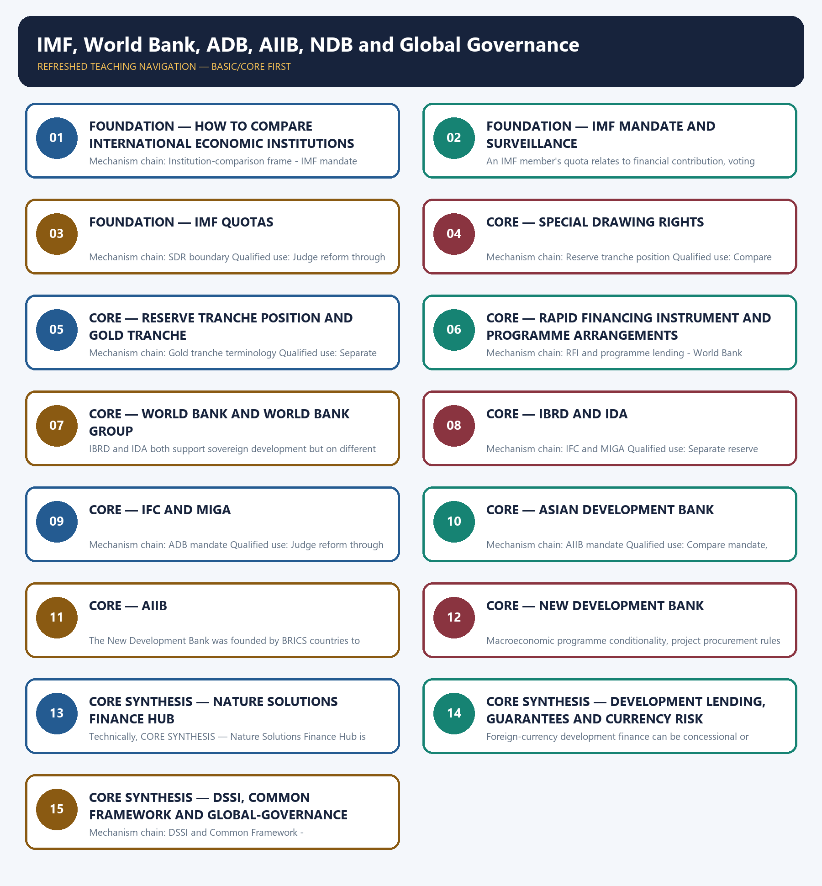

# IMF, World Bank, ADB, AIIB, NDB and Global Governance — Learner-v2 Complete Learning Session

> **Authoring-only generation:** 2026-09-03. No PDF was rendered and no tracker or index was mutated.

### SOURCE, PROGRESSION AND CURRENT-LINKAGE AUDIT

- **Generation date:** 2026-09-03.
- **Repository-first evidence:** the Basic owner is taught first and preserved in full; the Advanced owner is retained only in the optional final teaching block.
- **OCR evidence:** Repository Markdown was primary. OCR-searchable local official General Studies papers were used only to confirm printed routed demands. No answer key, marking scheme, unsupported page precision or current macroeconomic statistic was inferred from them.
- **Qdrant:** not used; repository Markdown and available OCR context were sufficient.
- **PYQ integrity:** Audited Prelims ledgers route objective concepts on AIIB, the reserve or gold tranche, the Rapid Financing Instrument, the G20 Common Framework, ADB's Nature Solutions Finance Hub and IBRD. No direct Economy Mains demand is claimed and no objective answer letter is inferred.
- **Live-link boundary:** Official institutional pages or official-domain search results supported qualitative mandates and lending-window distinctions. Direct IMF access was blocked and the World Bank landing page was only partially retrievable, so current quota, voting, membership, capital and finance figures were not used.
- **Fact/inference discipline:** no current-affairs item, PYQ wording, figure or quotation is invented.

### LIVE OFFICIAL-SOURCE ATTEMPT LOG

The checks below were made on 2026-09-03. Substantive official text is used only for the proposition it actually supports; binary files, dynamic shells, stubs and undated dashboard snippets are recorded but not converted into current claims.

- https://www.imf.org/en/about/faq/quotas — direct factsheet access returned HTTP 403 on 2026-09-03; official-domain search exposed only qualitative quota functions, so no current figure was imported.
- https://www.worldbank.org/en/about/articles-of-agreement — official-domain results substantively distinguished IBRD, IDA, IFC and MIGA mandates; the redesigned landing page itself exposed only partial raw content.
- https://www.adb.org/what-we-do — official-domain search substantively exposed ADB's Asia-Pacific development mandate; no target or portfolio total was imported.
- https://www.aiib.org/en/about-aiib/index.html — official-domain search substantively exposed the sustainable-infrastructure mandate; membership and finance counts were excluded.
- https://www.ndb.int/about-ndb/ — official-domain search substantively exposed the infrastructure and sustainable-development mandate; strategy targets were excluded.

## BASIC LEARNING SESSION

### DEEP-REVIEW LEARNING CONTRACT

| Control | Binding rule for this package |
|---|---|
| Syllabus boundary | Complete Economy Basic/Core is answer-complete before optional Advanced depth. |
| Formula boundary | Formula, numerator, denominator, unit, stock/flow, nominal/real, base year, level/rate and accounting identity are explicit. |
| Institutional boundary | Constitution, statute, delegated rule, regulator mandate, policy, recommendation, scheme and implementation outcome remain distinct. |
| Transmission method | Shock or instrument → prices/quantities/balance sheets/incentives → institution and market response → output, employment, distribution, stability and external effect → lag and trade-off. |
| Current-data method | Source → release date → reference period → unit/denominator → provisional/revised/final status; incompatible Budget, Survey or statistical vintages are never mixed. |
| Programme-status method | Announced → approved → notified/guidelines issued → funded → operational → utilised → output → outcome are separate stages. |
| External/WTO method | Agreement text, member category, box, limit, notification, consultation, dispute and ruling are qualified without invented thresholds. |
| Causal method | Accounting identity, chronology and correlation are not promoted into behavioural or causal claims without mechanism, counterfactual and alternatives. |
| Answer balance | Model answers balance growth, distribution, stability, sustainability and federal dimensions with India-centric evidence. |
| Practice contract | Every solved item has demand decoding, a detailed examiner-grade model, executable timed/compression plan, marks rationale and answer-specific improvement. |
| Approval | This immutable successor remains `approved: false` pending explicit approval. |

**Canonical Basic/Core owner:** `upsc-ai-kit\knowledge\Economy\basic\21_IMF-World-Bank-ADB-AIIB-NDB-and-Global-Governance.md`  
**Substantive canonical provenance owner:** `upsc-ai-kit\knowledge\Economy\21_IMF-World-Bank-ADB-AIIB-NDB-and-Global-Governance_Learner-V2-Complete-Topic-Package.md`  
**Optional Advanced owner:** `upsc-ai-kit\knowledge\Economy\advanced\21_IMF-World-Bank-ADB-AIIB-NDB-and-Global-Governance.md`  
**Official syllabus mapping:** `upsc-ai-kit\knowledge\Economy\OFFICIAL-UPSC-SYLLABUS-MAPPING.md`

### EVIDENCE, PYQ AND CURRENT-STATUS CONTROL

- Every data-heavy table states unit, denominator, geography, reference period and source/status.
- GDP/GVA, gross/net, domestic/national, nominal/real and level/rate distinctions remain exact.
- Monetary, fiscal and external chains state intermediaries, balance-sheet channels, lags, leakages and trade-offs.
- Budget and Economic Survey editions are never mixed; BE, RE, Actual, advance/provisional/revised/final estimates remain labelled.
- Scheme and programme claims distinguish announcement, approval, notification, operation, coverage, utilisation and measured outcome.
- WTO boxes, limits, de minimis, special treatment, notifications and disputes are qualified from authoritative rules.
- PYQ wording is preserved only where verified; reconstructed or routed demands remain labelled.
- **Current-status note, rechecked 2026-09-06:** volatile rates, estimates, scheme status, trade rules and institutional claims retain official source, release date, reference period and revision status.

**Generation-local live/current sources:**
- `https://www.imf.org/en/about/faq/quotas — direct factsheet access returned HTTP 403 on 2026-09-03; official-domain search exposed only qualitative quota functions, so no current figure was imported.`
- `https://www.worldbank.org/en/about/articles-of-agreement — official-domain results substantively distinguished IBRD, IDA, IFC and MIGA mandates; the redesigned landing page itself exposed only partial raw content.`
- `https://www.adb.org/what-we-do — official-domain search substantively exposed ADB's Asia-Pacific development mandate; no target or portfolio total was imported.`
- `https://www.aiib.org/en/about-aiib/index.html — official-domain search substantively exposed the sustainable-infrastructure mandate; membership and finance counts were excluded.`
- `https://www.ndb.int/about-ndb/ — official-domain search substantively exposed the infrastructure and sustainable-development mandate; strategy targets were excluded.`



*Distinct embedded teaching-navigation image. The separate continuous Cārvāka-style flowchart package remains an independent at-a-glance artifact.*

### SESSION 1 — FOUNDATION — How to compare international economic institutions

#### DEFINITION / WHAT THIS IS CALLED

**Plain-language definition:** How to compare international economic institutions explains how Institution-comparison frame and IMF mandate fit into one examinable economic mechanism.

**Technical definition:** In Economy analysis, How to compare international economic institutions separates the concept and accounting boundary from its unit, coverage, price basis, base year or basket, estimate vintage, institutional or legal source, crop and geography scope, eligibility, implementation stage, stock-flow boundary, transmission channel and distributional or stability consequence.

#### ANSWER-GRABBING OPENING — WRITE/ADAPT IN THE EXAM

> How to compare international economic institutions must be read through Institution-comparison frame and IMF mandate, with the formula or legal perimeter stated before the policy inference.

#### MUST-WRITE KEYWORDS

- **compare**
- **international**
- **institutions**
- **Institution-comparison**
- **frame**
- **mandate**

**How to use them:** Define compare, international, institutions; attach Institution-comparison to its named source, period and status; then qualify the answer with this limit: Do not describe IMF balance-of-payments support as ordinary infrastructure project lending.

#### VISUAL FIRST

```text
HOW TO COMPARE INTERNATIONAL ECONOMIC INSTITUTIONS
01. Institution-comparison frame
    |
    v
02. IMF mandate
BOUNDARY -> Do not describe IMF balance-of-payments support as ordinary infrastructure project lending.
```

*This topic-specific rail fixes the evidence sequence and its exam boundary before analysis.*

#### CORE EXPLANATION

International institutions must be compared by mandate, client, instrument, governance, conditionality and lending window rather than grouped as one pool of external finance. The IMF supports monetary cooperation, surveillance and balance-of-payments financing; its core function is not long-lived project construction.

#### NAMED EVIDENCE AND MECHANISM

- International institutions must be compared by mandate, client, instrument, governance, conditionality and lending window rather than grouped as one pool of external finance.
- The IMF supports monetary cooperation, surveillance and balance-of-payments financing; its core function is not long-lived project construction.

#### EXAMINER CAUTION

- Do not describe IMF balance-of-payments support as ordinary infrastructure project lending.

#### EXAM LINK

- **Prelims:** Preserve the exact formula, territorial or resident boundary, price basis, base year, index basket, eligible counterparty, institution and legal status; never upgrade a projection into an actual or a regulatory direction into a universal rule.
- **Mains:** Compare mandate, borrower, lending window, governance and conditionality before evaluating performance.

#### MINI RECAP

- **Mechanism chain:** Institution-comparison frame -> IMF mandate
- **Qualified use:** Compare mandate, borrower, lending window, governance and conditionality before evaluating performance.

#### CLOSING RECALL FLOW

```closure-flow
START / CONCEPT: How to compare international economic institutions
EXACT TERMS: compare | international | institutions | Institution-comparison | frame | mandate
MECHANISM / ARGUMENT: connect Institution-comparison frame and IMF mandate through accounting, incentives and transmission
CONSEQUENCE / CONTRAST: Compare mandate, borrower, lending window, governance and conditionality before evaluating performance.
UPSC TRAP / ANSWER-USE: Do not describe IMF balance-of-payments support as ordinary infrastructure project lending.
ANSWER-GRABBING FORMULATION: How to compare international economic institutions converts a precise economic distinction into a qualified conclusion
```

### SESSION 2 — FOUNDATION — IMF mandate and surveillance

#### DEFINITION / WHAT THIS IS CALLED

**Plain-language definition:** IMF mandate and surveillance explains how IMF quota functions fit into one examinable economic mechanism.

**Technical definition:** In Economy analysis, IMF mandate and surveillance separates the concept and accounting boundary from its unit, coverage, price basis, base year or basket, estimate vintage, institutional or legal source, crop and geography scope, eligibility, implementation stage, stock-flow boundary, transmission channel and distributional or stability consequence.

#### ANSWER-GRABBING OPENING — WRITE/ADAPT IN THE EXAM

> IMF mandate and surveillance must be read through IMF quota functions, with the formula or legal perimeter stated before the policy inference.

#### MUST-WRITE KEYWORDS

- **mandate**
- **surveillance**
- **quota**
- **functions**
- **member's**
- **relates**

**How to use them:** Define mandate, surveillance, quota; attach functions to its named source, period and status; then qualify the answer with this limit: Do not quote quota, voting, membership or finance figures without a dated institutional source.

#### VISUAL FIRST

```text
IMF MANDATE AND SURVEILLANCE
01. IMF quota functions
BOUNDARY -> Do not quote quota, voting, membership or finance figures without a dated institutional source.
```

*This topic-specific rail fixes the evidence sequence and its exam boundary before analysis.*

#### CORE EXPLANATION

An IMF member's quota relates to financial contribution, voting power, access to resources and its share in general SDR allocations; the current numerical share requires a dated IMF source.

#### NAMED EVIDENCE AND MECHANISM

- An IMF member's quota relates to financial contribution, voting power, access to resources and its share in general SDR allocations; the current numerical share requires a dated IMF source.

#### EXAMINER CAUTION

- Do not quote quota, voting, membership or finance figures without a dated institutional source.

#### EXAM LINK

- **Prelims:** Preserve the exact formula, territorial or resident boundary, price basis, base year, index basket, eligible counterparty, institution and legal status; never upgrade a projection into an actual or a regulatory direction into a universal rule.
- **Mains:** Separate reserve assets, stabilisation finance, development loans and guarantees.

#### MINI RECAP

- **Mechanism chain:** IMF quota functions
- **Qualified use:** Separate reserve assets, stabilisation finance, development loans and guarantees.

#### CLOSING RECALL FLOW

```closure-flow
START / CONCEPT: IMF mandate and surveillance
EXACT TERMS: mandate | surveillance | quota | functions | member's | relates
MECHANISM / ARGUMENT: connect IMF quota functions through accounting, incentives and transmission
CONSEQUENCE / CONTRAST: Separate reserve assets, stabilisation finance, development loans and guarantees.
UPSC TRAP / ANSWER-USE: Do not quote quota, voting, membership or finance figures without a dated institutional source.
ANSWER-GRABBING FORMULATION: IMF mandate and surveillance converts a precise economic distinction into a qualified conclusion
```

### SESSION 3 — FOUNDATION — IMF quotas

#### DEFINITION / WHAT THIS IS CALLED

**Plain-language definition:** IMF quotas explains how SDR boundary fit into one examinable economic mechanism.

**Technical definition:** In Economy analysis, IMF quotas separates the concept and accounting boundary from its unit, coverage, price basis, base year or basket, estimate vintage, institutional or legal source, crop and geography scope, eligibility, implementation stage, stock-flow boundary, transmission channel and distributional or stability consequence.

#### ANSWER-GRABBING OPENING — WRITE/ADAPT IN THE EXAM

> IMF quotas must be read through SDR boundary, with the formula or legal perimeter stated before the policy inference.

#### MUST-WRITE KEYWORDS

- **quotas**
- **boundary**
- **Special**
- **Drawing**
- **Right**
- **IMF-created**

**How to use them:** Define quotas, boundary, Special; attach Drawing to its named source, period and status; then qualify the answer with this limit: Do not call SDRs currency, budget revenue or an IMF loan.

#### VISUAL FIRST

```text
IMF QUOTAS
01. SDR boundary
BOUNDARY -> Do not call SDRs currency, budget revenue or an IMF loan.
```

*This topic-specific rail fixes the evidence sequence and its exam boundary before analysis.*

#### CORE EXPLANATION

A Special Drawing Right is an IMF-created international reserve asset valued from a currency basket; it is neither retail currency, budget revenue nor automatically an IMF loan.

#### NAMED EVIDENCE AND MECHANISM

- A Special Drawing Right is an IMF-created international reserve asset valued from a currency basket; it is neither retail currency, budget revenue nor automatically an IMF loan.

#### EXAMINER CAUTION

- Do not call SDRs currency, budget revenue or an IMF loan.

#### EXAM LINK

- **Prelims:** Preserve the exact formula, territorial or resident boundary, price basis, base year, index basket, eligible counterparty, institution and legal status; never upgrade a projection into an actual or a regulatory direction into a universal rule.
- **Mains:** Judge reform through representation, policy ownership, additionality, safeguards and debt sustainability.

#### MINI RECAP

- **Mechanism chain:** SDR boundary
- **Qualified use:** Judge reform through representation, policy ownership, additionality, safeguards and debt sustainability.

#### CLOSING RECALL FLOW

```closure-flow
START / CONCEPT: IMF quotas
EXACT TERMS: quotas | boundary | Special | Drawing | Right | IMF-created
MECHANISM / ARGUMENT: connect SDR boundary through accounting, incentives and transmission
CONSEQUENCE / CONTRAST: Judge reform through representation, policy ownership, additionality, safeguards and debt sustainability.
UPSC TRAP / ANSWER-USE: Do not call SDRs currency, budget revenue or an IMF loan.
ANSWER-GRABBING FORMULATION: IMF quotas converts a precise economic distinction into a qualified conclusion
```

### SESSION 4 — CORE — Special Drawing Rights

#### DEFINITION / WHAT THIS IS CALLED

**Plain-language definition:** Special Drawing Rights explains how Reserve tranche position fit into one examinable economic mechanism.

**Technical definition:** In Economy analysis, Special Drawing Rights separates the concept and accounting boundary from its unit, coverage, price basis, base year or basket, estimate vintage, institutional or legal source, crop and geography scope, eligibility, implementation stage, stock-flow boundary, transmission channel and distributional or stability consequence.

#### ANSWER-GRABBING OPENING — WRITE/ADAPT IN THE EXAM

> Special Drawing Rights must be read through Reserve tranche position, with the formula or legal perimeter stated before the policy inference.

#### MUST-WRITE KEYWORDS

- **Special**
- **Drawing**
- **Rights**
- **Reserve**
- **tranche**
- **position**

**How to use them:** Define Special, Drawing, Rights; attach Reserve to its named source, period and status; then qualify the answer with this limit: Do not treat gold tranche and reserve tranche position as separate facilities.

#### VISUAL FIRST

```text
SPECIAL DRAWING RIGHTS
01. Reserve tranche position
BOUNDARY -> Do not treat gold tranche and reserve tranche position as separate facilities.
```

*This topic-specific rail fixes the evidence sequence and its exam boundary before analysis.*

#### CORE EXPLANATION

A reserve tranche position is a member's liquid claim on the IMF arising from quota resources and is treated as a reserve asset; it is distinct from conditional programme borrowing.

#### NAMED EVIDENCE AND MECHANISM

- A reserve tranche position is a member's liquid claim on the IMF arising from quota resources and is treated as a reserve asset; it is distinct from conditional programme borrowing.

#### EXAMINER CAUTION

- Do not treat gold tranche and reserve tranche position as separate facilities.

#### EXAM LINK

- **Prelims:** Preserve the exact formula, territorial or resident boundary, price basis, base year, index basket, eligible counterparty, institution and legal status; never upgrade a projection into an actual or a regulatory direction into a universal rule.
- **Mains:** Compare mandate, borrower, lending window, governance and conditionality before evaluating performance.

#### MINI RECAP

- **Mechanism chain:** Reserve tranche position
- **Qualified use:** Compare mandate, borrower, lending window, governance and conditionality before evaluating performance.

#### CLOSING RECALL FLOW

```closure-flow
START / CONCEPT: Special Drawing Rights
EXACT TERMS: Special | Drawing | Rights | Reserve | tranche | position
MECHANISM / ARGUMENT: connect Reserve tranche position through accounting, incentives and transmission
CONSEQUENCE / CONTRAST: Compare mandate, borrower, lending window, governance and conditionality before evaluating performance.
UPSC TRAP / ANSWER-USE: Do not treat gold tranche and reserve tranche position as separate facilities.
ANSWER-GRABBING FORMULATION: Special Drawing Rights converts a precise economic distinction into a qualified conclusion
```

### SESSION 5 — CORE — Reserve tranche position and gold tranche

#### DEFINITION / WHAT THIS IS CALLED

**Plain-language definition:** Reserve tranche position and gold tranche explains how Gold tranche terminology fit into one examinable economic mechanism.

**Technical definition:** In Economy analysis, Reserve tranche position and gold tranche separates the concept and accounting boundary from its unit, coverage, price basis, base year or basket, estimate vintage, institutional or legal source, crop and geography scope, eligibility, implementation stage, stock-flow boundary, transmission channel and distributional or stability consequence.

#### ANSWER-GRABBING OPENING — WRITE/ADAPT IN THE EXAM

> Reserve tranche position and gold tranche must be read through Gold tranche terminology, with the formula or legal perimeter stated before the policy inference.

#### MUST-WRITE KEYWORDS

- **Reserve**
- **tranche**
- **position**
- **gold**
- **terminology**
- **historical**

**How to use them:** Define Reserve, tranche, position; attach gold to its named source, period and status; then qualify the answer with this limit: Do not merge RFI emergency support with phased SBA or EFF programme lending.

#### VISUAL FIRST

```text
RESERVE TRANCHE POSITION AND GOLD TRANCHE
01. Gold tranche terminology
BOUNDARY -> Do not merge RFI emergency support with phased SBA or EFF programme lending.
```

*This topic-specific rail fixes the evidence sequence and its exam boundary before analysis.*

#### CORE EXPLANATION

Gold tranche is the historical name associated with what modern IMF usage calls the reserve tranche position, not an additional separate lending facility.

#### NAMED EVIDENCE AND MECHANISM

- Gold tranche is the historical name associated with what modern IMF usage calls the reserve tranche position, not an additional separate lending facility.

#### EXAMINER CAUTION

- Do not merge RFI emergency support with phased SBA or EFF programme lending.

#### EXAM LINK

- **Prelims:** Preserve the exact formula, territorial or resident boundary, price basis, base year, index basket, eligible counterparty, institution and legal status; never upgrade a projection into an actual or a regulatory direction into a universal rule.
- **Mains:** Separate reserve assets, stabilisation finance, development loans and guarantees.

#### MINI RECAP

- **Mechanism chain:** Gold tranche terminology
- **Qualified use:** Separate reserve assets, stabilisation finance, development loans and guarantees.

#### CLOSING RECALL FLOW

```closure-flow
START / CONCEPT: Reserve tranche position and gold tranche
EXACT TERMS: Reserve | tranche | position | gold | terminology | historical
MECHANISM / ARGUMENT: connect Gold tranche terminology through accounting, incentives and transmission
CONSEQUENCE / CONTRAST: Separate reserve assets, stabilisation finance, development loans and guarantees.
UPSC TRAP / ANSWER-USE: Do not merge RFI emergency support with phased SBA or EFF programme lending.
ANSWER-GRABBING FORMULATION: Reserve tranche position and gold tranche converts a precise economic distinction into a qualified conclusion
```

### SESSION 6 — CORE — Rapid Financing Instrument and programme arrangements

#### DEFINITION / WHAT THIS IS CALLED

**Plain-language definition:** Rapid Financing Instrument and programme arrangements explains how RFI and programme lending and World Bank boundary fit into one examinable economic mechanism.

**Technical definition:** In Economy analysis, Rapid Financing Instrument and programme arrangements separates the concept and accounting boundary from its unit, coverage, price basis, base year or basket, estimate vintage, institutional or legal source, crop and geography scope, eligibility, implementation stage, stock-flow boundary, transmission channel and distributional or stability consequence.

#### ANSWER-GRABBING OPENING — WRITE/ADAPT IN THE EXAM

> Rapid Financing Instrument and programme arrangements must be read through RFI and programme lending and World Bank boundary, with the formula or legal perimeter stated before the policy inference.

#### MUST-WRITE KEYWORDS

- **Rapid**
- **Financing**
- **Instrument**
- **programme**
- **arrangements**
- **lending**

**How to use them:** Define Rapid, Financing, Instrument; attach programme to its named source, period and status; then qualify the answer with this limit: Do not use World Bank and World Bank Group as exact synonyms.

#### VISUAL FIRST

```text
RAPID FINANCING INSTRUMENT AND PROGRAMME ARRANGEMENTS
01. RFI and programme lending
    |
    v
02. World Bank boundary
BOUNDARY -> Do not use World Bank and World Bank Group as exact synonyms.
```

*This topic-specific rail fixes the evidence sequence and its exam boundary before analysis.*

#### CORE EXPLANATION

The Rapid Financing Instrument provides urgent balance-of-payments support with limited ex-post programme structure, while arrangements such as the SBA or EFF involve phased access and programme reviews. The term World Bank commonly refers to IBRD and IDA, while the World Bank Group also includes institutions with private-investment and guarantee mandates.

#### NAMED EVIDENCE AND MECHANISM

- The Rapid Financing Instrument provides urgent balance-of-payments support with limited ex-post programme structure, while arrangements such as the SBA or EFF involve phased access and programme reviews.
- The term World Bank commonly refers to IBRD and IDA, while the World Bank Group also includes institutions with private-investment and guarantee mandates.

#### EXAMINER CAUTION

- Do not use World Bank and World Bank Group as exact synonyms.

#### EXAM LINK

- **Prelims:** Preserve the exact formula, territorial or resident boundary, price basis, base year, index basket, eligible counterparty, institution and legal status; never upgrade a projection into an actual or a regulatory direction into a universal rule.
- **Mains:** Judge reform through representation, policy ownership, additionality, safeguards and debt sustainability.

#### MINI RECAP

- **Mechanism chain:** RFI and programme lending -> World Bank boundary
- **Qualified use:** Judge reform through representation, policy ownership, additionality, safeguards and debt sustainability.

#### CLOSING RECALL FLOW

```closure-flow
START / CONCEPT: Rapid Financing Instrument and programme arrangements
EXACT TERMS: Rapid | Financing | Instrument | programme | arrangements | lending
MECHANISM / ARGUMENT: connect RFI and programme lending and World Bank boundary through accounting, incentives and transmission
CONSEQUENCE / CONTRAST: Judge reform through representation, policy ownership, additionality, safeguards and debt sustainability.
UPSC TRAP / ANSWER-USE: Do not use World Bank and World Bank Group as exact synonyms.
ANSWER-GRABBING FORMULATION: Rapid Financing Instrument and programme arrangements converts a precise economic distinction into a qualified conclusion
```

### SESSION 7 — CORE — World Bank and World Bank Group

#### DEFINITION / WHAT THIS IS CALLED

**Plain-language definition:** World Bank and World Bank Group explains how IBRD and IDA fit into one examinable economic mechanism.

**Technical definition:** In Economy analysis, World Bank and World Bank Group separates the concept and accounting boundary from its unit, coverage, price basis, base year or basket, estimate vintage, institutional or legal source, crop and geography scope, eligibility, implementation stage, stock-flow boundary, transmission channel and distributional or stability consequence.

#### ANSWER-GRABBING OPENING — WRITE/ADAPT IN THE EXAM

> World Bank and World Bank Group must be read through IBRD and IDA, with the formula or legal perimeter stated before the policy inference.

#### MUST-WRITE KEYWORDS

- **World**
- **Bank**
- **Group**
- **IBRD**
- **both**
- **support**

**How to use them:** Define World, Bank, Group; attach IBRD to its named source, period and status; then qualify the answer with this limit: Do not merge IBRD, IDA, IFC and MIGA clients or instruments.

#### VISUAL FIRST

```text
WORLD BANK AND WORLD BANK GROUP
01. IBRD and IDA
BOUNDARY -> Do not merge IBRD, IDA, IFC and MIGA clients or instruments.
```

*This topic-specific rail fixes the evidence sequence and its exam boundary before analysis.*

#### CORE EXPLANATION

IBRD and IDA both support sovereign development but on different eligibility and financing terms; they must not be presented as identical lending windows.

#### NAMED EVIDENCE AND MECHANISM

- IBRD and IDA both support sovereign development but on different eligibility and financing terms; they must not be presented as identical lending windows.

#### EXAMINER CAUTION

- Do not merge IBRD, IDA, IFC and MIGA clients or instruments.

#### EXAM LINK

- **Prelims:** Preserve the exact formula, territorial or resident boundary, price basis, base year, index basket, eligible counterparty, institution and legal status; never upgrade a projection into an actual or a regulatory direction into a universal rule.
- **Mains:** Compare mandate, borrower, lending window, governance and conditionality before evaluating performance.

#### MINI RECAP

- **Mechanism chain:** IBRD and IDA
- **Qualified use:** Compare mandate, borrower, lending window, governance and conditionality before evaluating performance.

#### CLOSING RECALL FLOW

```closure-flow
START / CONCEPT: World Bank and World Bank Group
EXACT TERMS: World | Bank | Group | IBRD | both | support
MECHANISM / ARGUMENT: connect IBRD and IDA through accounting, incentives and transmission
CONSEQUENCE / CONTRAST: Compare mandate, borrower, lending window, governance and conditionality before evaluating performance.
UPSC TRAP / ANSWER-USE: Do not merge IBRD, IDA, IFC and MIGA clients or instruments.
ANSWER-GRABBING FORMULATION: World Bank and World Bank Group converts a precise economic distinction into a qualified conclusion
```

### SESSION 8 — CORE — IBRD and IDA

#### DEFINITION / WHAT THIS IS CALLED

**Plain-language definition:** IBRD and IDA explains how IFC and MIGA fit into one examinable economic mechanism.

**Technical definition:** In Economy analysis, IBRD and IDA separates the concept and accounting boundary from its unit, coverage, price basis, base year or basket, estimate vintage, institutional or legal source, crop and geography scope, eligibility, implementation stage, stock-flow boundary, transmission channel and distributional or stability consequence.

#### ANSWER-GRABBING OPENING — WRITE/ADAPT IN THE EXAM

> IBRD and IDA must be read through IFC and MIGA, with the formula or legal perimeter stated before the policy inference.

#### MUST-WRITE KEYWORDS

- **IBRD**
- **MIGA**
- **supports**
- **private-sector**
- **development**
- **through**

**How to use them:** Define IBRD, MIGA, supports; attach private-sector to its named source, period and status; then qualify the answer with this limit: Do not treat ADB, AIIB and NDB as interchangeable or as replacements for the IMF.

#### VISUAL FIRST

```text
IBRD AND IDA
01. IFC and MIGA
BOUNDARY -> Do not treat ADB, AIIB and NDB as interchangeable or as replacements for the IMF.
```

*This topic-specific rail fixes the evidence sequence and its exam boundary before analysis.*

#### CORE EXPLANATION

IFC supports private-sector development through finance and mobilisation, while MIGA provides political-risk insurance or credit enhancement; neither is an IMF stabilisation window.

#### NAMED EVIDENCE AND MECHANISM

- IFC supports private-sector development through finance and mobilisation, while MIGA provides political-risk insurance or credit enhancement; neither is an IMF stabilisation window.

#### EXAMINER CAUTION

- Do not treat ADB, AIIB and NDB as interchangeable or as replacements for the IMF.

#### EXAM LINK

- **Prelims:** Preserve the exact formula, territorial or resident boundary, price basis, base year, index basket, eligible counterparty, institution and legal status; never upgrade a projection into an actual or a regulatory direction into a universal rule.
- **Mains:** Separate reserve assets, stabilisation finance, development loans and guarantees.

#### MINI RECAP

- **Mechanism chain:** IFC and MIGA
- **Qualified use:** Separate reserve assets, stabilisation finance, development loans and guarantees.

#### CLOSING RECALL FLOW

```closure-flow
START / CONCEPT: IBRD and IDA
EXACT TERMS: IBRD | MIGA | supports | private-sector | development | through
MECHANISM / ARGUMENT: connect IFC and MIGA through accounting, incentives and transmission
CONSEQUENCE / CONTRAST: Separate reserve assets, stabilisation finance, development loans and guarantees.
UPSC TRAP / ANSWER-USE: Do not treat ADB, AIIB and NDB as interchangeable or as replacements for the IMF.
ANSWER-GRABBING FORMULATION: IBRD and IDA converts a precise economic distinction into a qualified conclusion
```

### SESSION 9 — CORE — IFC and MIGA

#### DEFINITION / WHAT THIS IS CALLED

**Plain-language definition:** IFC and MIGA explains how ADB mandate fit into one examinable economic mechanism.

**Technical definition:** In Economy analysis, IFC and MIGA separates the concept and accounting boundary from its unit, coverage, price basis, base year or basket, estimate vintage, institutional or legal source, crop and geography scope, eligibility, implementation stage, stock-flow boundary, transmission channel and distributional or stability consequence.

#### ANSWER-GRABBING OPENING — WRITE/ADAPT IN THE EXAM

> IFC and MIGA must be read through ADB mandate, with the formula or legal perimeter stated before the policy inference.

#### MUST-WRITE KEYWORDS

- **MIGA**
- **mandate**
- **Asian**
- **Development**
- **Bank**
- **regional**

**How to use them:** Define MIGA, mandate, Asian; attach Development to its named source, period and status; then qualify the answer with this limit: Do not equate DSSI payment suspension with Common Framework debt treatment.

#### VISUAL FIRST

```text
IFC AND MIGA
01. ADB mandate
BOUNDARY -> Do not equate DSSI payment suspension with Common Framework debt treatment.
```

*This topic-specific rail fixes the evidence sequence and its exam boundary before analysis.*

#### CORE EXPLANATION

The Asian Development Bank is a regional development bank serving Asia and the Pacific through sovereign, private-sector, knowledge and technical-assistance operations.

#### NAMED EVIDENCE AND MECHANISM

- The Asian Development Bank is a regional development bank serving Asia and the Pacific through sovereign, private-sector, knowledge and technical-assistance operations.

#### EXAMINER CAUTION

- Do not equate DSSI payment suspension with Common Framework debt treatment.

#### EXAM LINK

- **Prelims:** Preserve the exact formula, territorial or resident boundary, price basis, base year, index basket, eligible counterparty, institution and legal status; never upgrade a projection into an actual or a regulatory direction into a universal rule.
- **Mains:** Judge reform through representation, policy ownership, additionality, safeguards and debt sustainability.

#### MINI RECAP

- **Mechanism chain:** ADB mandate
- **Qualified use:** Judge reform through representation, policy ownership, additionality, safeguards and debt sustainability.

#### CLOSING RECALL FLOW

```closure-flow
START / CONCEPT: IFC and MIGA
EXACT TERMS: MIGA | mandate | Asian | Development | Bank | regional
MECHANISM / ARGUMENT: connect ADB mandate through accounting, incentives and transmission
CONSEQUENCE / CONTRAST: Judge reform through representation, policy ownership, additionality, safeguards and debt sustainability.
UPSC TRAP / ANSWER-USE: Do not equate DSSI payment suspension with Common Framework debt treatment.
ANSWER-GRABBING FORMULATION: IFC and MIGA converts a precise economic distinction into a qualified conclusion
```

### SESSION 10 — CORE — Asian Development Bank

#### DEFINITION / WHAT THIS IS CALLED

**Plain-language definition:** Asian Development Bank explains how AIIB mandate fit into one examinable economic mechanism.

**Technical definition:** In Economy analysis, Asian Development Bank separates the concept and accounting boundary from its unit, coverage, price basis, base year or basket, estimate vintage, institutional or legal source, crop and geography scope, eligibility, implementation stage, stock-flow boundary, transmission channel and distributional or stability consequence.

#### ANSWER-GRABBING OPENING — WRITE/ADAPT IN THE EXAM

> Asian Development Bank must be read through AIIB mandate, with the formula or legal perimeter stated before the policy inference.

#### MUST-WRITE KEYWORDS

- **Asian**
- **Development**
- **Bank**
- **AIIB**
- **mandate**
- **Infrastructure**

**How to use them:** Define Asian, Development, Bank; attach AIIB to its named source, period and status; then qualify the answer with this limit: Do not infer an objective PYQ answer letter from a routed concept.

#### VISUAL FIRST

```text
ASIAN DEVELOPMENT BANK
01. AIIB mandate
BOUNDARY -> Do not infer an objective PYQ answer letter from a routed concept.
```

*This topic-specific rail fixes the evidence sequence and its exam boundary before analysis.*

#### CORE EXPLANATION

The Asian Infrastructure Investment Bank is a multilateral development bank focused on sustainable infrastructure and connectivity; current membership or voting figures require a dated institutional source.

#### NAMED EVIDENCE AND MECHANISM

- The Asian Infrastructure Investment Bank is a multilateral development bank focused on sustainable infrastructure and connectivity; current membership or voting figures require a dated institutional source.

#### EXAMINER CAUTION

- Do not infer an objective PYQ answer letter from a routed concept.

#### EXAM LINK

- **Prelims:** Preserve the exact formula, territorial or resident boundary, price basis, base year, index basket, eligible counterparty, institution and legal status; never upgrade a projection into an actual or a regulatory direction into a universal rule.
- **Mains:** Compare mandate, borrower, lending window, governance and conditionality before evaluating performance.

#### MINI RECAP

- **Mechanism chain:** AIIB mandate
- **Qualified use:** Compare mandate, borrower, lending window, governance and conditionality before evaluating performance.

#### CLOSING RECALL FLOW

```closure-flow
START / CONCEPT: Asian Development Bank
EXACT TERMS: Asian | Development | Bank | AIIB | mandate | Infrastructure
MECHANISM / ARGUMENT: connect AIIB mandate through accounting, incentives and transmission
CONSEQUENCE / CONTRAST: Compare mandate, borrower, lending window, governance and conditionality before evaluating performance.
UPSC TRAP / ANSWER-USE: Do not infer an objective PYQ answer letter from a routed concept.
ANSWER-GRABBING FORMULATION: Asian Development Bank converts a precise economic distinction into a qualified conclusion
```

### SESSION 11 — CORE — AIIB

#### DEFINITION / WHAT THIS IS CALLED

**Plain-language definition:** AIIB explains how NDB mandate and Nature Solutions Finance Hub fit into one examinable economic mechanism.

**Technical definition:** In Economy analysis, AIIB separates the concept and accounting boundary from its unit, coverage, price basis, base year or basket, estimate vintage, institutional or legal source, crop and geography scope, eligibility, implementation stage, stock-flow boundary, transmission channel and distributional or stability consequence.

#### ANSWER-GRABBING OPENING — WRITE/ADAPT IN THE EXAM

> AIIB must be read through NDB mandate and Nature Solutions Finance Hub, with the formula or legal perimeter stated before the policy inference.

#### MUST-WRITE KEYWORDS

- **AIIB**
- **mandate**
- **Nature**
- **Solutions**
- **Finance**
- **Development**

**How to use them:** Define AIIB, mandate, Nature; attach Solutions to its named source, period and status; then qualify the answer with this limit: Do not describe IMF balance-of-payments support as ordinary infrastructure project lending.

#### VISUAL FIRST

```text
AIIB
01. NDB mandate
    |
    v
02. Nature Solutions Finance Hub
BOUNDARY -> Do not describe IMF balance-of-payments support as ordinary infrastructure project lending.
```

*This topic-specific rail fixes the evidence sequence and its exam boundary before analysis.*

#### CORE EXPLANATION

The New Development Bank was founded by BRICS countries to mobilise resources for infrastructure and sustainable development in member emerging and developing economies. The Nature Solutions Finance Hub for Asia and the Pacific is an ADB initiative, an audited 2025 Prelims concept; any current financing total or project count requires a dated ADB source.

#### NAMED EVIDENCE AND MECHANISM

- The New Development Bank was founded by BRICS countries to mobilise resources for infrastructure and sustainable development in member emerging and developing economies.
- The Nature Solutions Finance Hub for Asia and the Pacific is an ADB initiative, an audited 2025 Prelims concept; any current financing total or project count requires a dated ADB source.

#### EXAMINER CAUTION

- Do not describe IMF balance-of-payments support as ordinary infrastructure project lending.

#### EXAM LINK

- **Prelims:** Preserve the exact formula, territorial or resident boundary, price basis, base year, index basket, eligible counterparty, institution and legal status; never upgrade a projection into an actual or a regulatory direction into a universal rule.
- **Mains:** Separate reserve assets, stabilisation finance, development loans and guarantees.

#### MINI RECAP

- **Mechanism chain:** NDB mandate -> Nature Solutions Finance Hub
- **Qualified use:** Separate reserve assets, stabilisation finance, development loans and guarantees.

#### CLOSING RECALL FLOW

```closure-flow
START / CONCEPT: AIIB
EXACT TERMS: AIIB | mandate | Nature | Solutions | Finance | Development
MECHANISM / ARGUMENT: connect NDB mandate and Nature Solutions Finance Hub through accounting, incentives and transmission
CONSEQUENCE / CONTRAST: Separate reserve assets, stabilisation finance, development loans and guarantees.
UPSC TRAP / ANSWER-USE: Do not describe IMF balance-of-payments support as ordinary infrastructure project lending.
ANSWER-GRABBING FORMULATION: AIIB converts a precise economic distinction into a qualified conclusion
```

### SESSION 12 — CORE — New Development Bank

#### DEFINITION / WHAT THIS IS CALLED

**Plain-language definition:** New Development Bank explains how Conditionality and safeguards fit into one examinable economic mechanism.

**Technical definition:** In Economy analysis, New Development Bank separates the concept and accounting boundary from its unit, coverage, price basis, base year or basket, estimate vintage, institutional or legal source, crop and geography scope, eligibility, implementation stage, stock-flow boundary, transmission channel and distributional or stability consequence.

#### ANSWER-GRABBING OPENING — WRITE/ADAPT IN THE EXAM

> New Development Bank must be read through Conditionality and safeguards, with the formula or legal perimeter stated before the policy inference.

#### MUST-WRITE KEYWORDS

- **Development**
- **Bank**
- **Conditionality**
- **safeguards**
- **Macroeconomic**
- **programme**

**How to use them:** Define Development, Bank, Conditionality; attach safeguards to its named source, period and status; then qualify the answer with this limit: Do not quote quota, voting, membership or finance figures without a dated institutional source.

#### VISUAL FIRST

```text
NEW DEVELOPMENT BANK
01. Conditionality and safeguards
BOUNDARY -> Do not quote quota, voting, membership or finance figures without a dated institutional source.
```

*This topic-specific rail fixes the evidence sequence and its exam boundary before analysis.*

#### CORE EXPLANATION

Macroeconomic programme conditionality, project procurement rules and environmental-social safeguards serve different purposes and should not be collapsed into one generic lender condition.

#### NAMED EVIDENCE AND MECHANISM

- Macroeconomic programme conditionality, project procurement rules and environmental-social safeguards serve different purposes and should not be collapsed into one generic lender condition.

#### EXAMINER CAUTION

- Do not quote quota, voting, membership or finance figures without a dated institutional source.

#### EXAM LINK

- **Prelims:** Preserve the exact formula, territorial or resident boundary, price basis, base year, index basket, eligible counterparty, institution and legal status; never upgrade a projection into an actual or a regulatory direction into a universal rule.
- **Mains:** Judge reform through representation, policy ownership, additionality, safeguards and debt sustainability.

#### MINI RECAP

- **Mechanism chain:** Conditionality and safeguards
- **Qualified use:** Judge reform through representation, policy ownership, additionality, safeguards and debt sustainability.

#### CLOSING RECALL FLOW

```closure-flow
START / CONCEPT: New Development Bank
EXACT TERMS: Development | Bank | Conditionality | safeguards | Macroeconomic | programme
MECHANISM / ARGUMENT: connect Conditionality and safeguards through accounting, incentives and transmission
CONSEQUENCE / CONTRAST: Judge reform through representation, policy ownership, additionality, safeguards and debt sustainability.
UPSC TRAP / ANSWER-USE: Do not quote quota, voting, membership or finance figures without a dated institutional source.
ANSWER-GRABBING FORMULATION: New Development Bank converts a precise economic distinction into a qualified conclusion
```

### SESSION 13 — CORE SYNTHESIS — Nature Solutions Finance Hub

#### DEFINITION / WHAT THIS IS CALLED

**Plain-language definition:** Nature Solutions Finance Hub explains how Project and policy-based lending fit into one examinable economic mechanism.

**Technical definition:** In Economy analysis, Nature Solutions Finance Hub separates the concept and accounting boundary from its unit, coverage, price basis, base year or basket, estimate vintage, institutional or legal source, crop and geography scope, eligibility, implementation stage, stock-flow boundary, transmission channel and distributional or stability consequence.

#### ANSWER-GRABBING OPENING — WRITE/ADAPT IN THE EXAM

> Nature Solutions Finance Hub must be read through Project and policy-based lending, with the formula or legal perimeter stated before the policy inference.

#### MUST-WRITE KEYWORDS

- **Nature**
- **Solutions**
- **Finance**
- **Project**
- **policy-based**
- **lending**

**How to use them:** Define Nature, Solutions, Finance; attach Project to its named source, period and status; then qualify the answer with this limit: Do not call SDRs currency, budget revenue or an IMF loan.

#### VISUAL FIRST

```text
NATURE SOLUTIONS FINANCE HUB
01. Project and policy-based lending
BOUNDARY -> Do not call SDRs currency, budget revenue or an IMF loan.
```

*This topic-specific rail fixes the evidence sequence and its exam boundary before analysis.*

#### CORE EXPLANATION

Project lending finances a bounded investment, while policy-based lending supports an agreed reform programme; disbursement conditions and evaluation units therefore differ.

#### NAMED EVIDENCE AND MECHANISM

- Project lending finances a bounded investment, while policy-based lending supports an agreed reform programme; disbursement conditions and evaluation units therefore differ.

#### EXAMINER CAUTION

- Do not call SDRs currency, budget revenue or an IMF loan.

#### EXAM LINK

- **Prelims:** Preserve the exact formula, territorial or resident boundary, price basis, base year, index basket, eligible counterparty, institution and legal status; never upgrade a projection into an actual or a regulatory direction into a universal rule.
- **Mains:** Compare mandate, borrower, lending window, governance and conditionality before evaluating performance.

#### MINI RECAP

- **Mechanism chain:** Project and policy-based lending
- **Qualified use:** Compare mandate, borrower, lending window, governance and conditionality before evaluating performance.

#### CLOSING RECALL FLOW

```closure-flow
START / CONCEPT: Nature Solutions Finance Hub
EXACT TERMS: Nature | Solutions | Finance | Project | policy-based | lending
MECHANISM / ARGUMENT: connect Project and policy-based lending through accounting, incentives and transmission
CONSEQUENCE / CONTRAST: Compare mandate, borrower, lending window, governance and conditionality before evaluating performance.
UPSC TRAP / ANSWER-USE: Do not call SDRs currency, budget revenue or an IMF loan.
ANSWER-GRABBING FORMULATION: Nature Solutions Finance Hub converts a precise economic distinction into a qualified conclusion
```

### SESSION 14 — CORE SYNTHESIS — Development lending, guarantees and currency risk

#### DEFINITION / WHAT THIS IS CALLED

**Plain-language definition:** Development lending, guarantees and currency risk explains how Guarantees and co-financing and Currency-risk boundary fit into one examinable economic mechanism.

**Technical definition:** In Economy analysis, Development lending, guarantees and currency risk separates the concept and accounting boundary from its unit, coverage, price basis, base year or basket, estimate vintage, institutional or legal source, crop and geography scope, eligibility, implementation stage, stock-flow boundary, transmission channel and distributional or stability consequence.

#### ANSWER-GRABBING OPENING — WRITE/ADAPT IN THE EXAM

> Development lending, guarantees and currency risk must be read through Guarantees and co-financing and Currency-risk boundary, with the formula or legal perimeter stated before the policy inference.

#### MUST-WRITE KEYWORDS

- **Development**
- **lending**
- **guarantees**
- **currency**
- **risk**
- **co-financing**

**How to use them:** Define Development, lending, guarantees; attach currency to its named source, period and status; then qualify the answer with this limit: Do not treat gold tranche and reserve tranche position as separate facilities.

#### VISUAL FIRST

```text
DEVELOPMENT LENDING, GUARANTEES AND CURRENCY RISK
01. Guarantees and co-financing
    |
    v
02. Currency-risk boundary
BOUNDARY -> Do not treat gold tranche and reserve tranche position as separate facilities.
```

*This topic-specific rail fixes the evidence sequence and its exam boundary before analysis.*

#### CORE EXPLANATION

A guarantee absorbs specified risks and co-financing combines institutions or financiers; neither means that one lender funds or bears every project risk. Foreign-currency development finance can be concessional or long-term yet still create exchange-rate exposure for a borrower whose revenues are in domestic currency.

#### NAMED EVIDENCE AND MECHANISM

- A guarantee absorbs specified risks and co-financing combines institutions or financiers; neither means that one lender funds or bears every project risk.
- Foreign-currency development finance can be concessional or long-term yet still create exchange-rate exposure for a borrower whose revenues are in domestic currency.

#### EXAMINER CAUTION

- Do not treat gold tranche and reserve tranche position as separate facilities.

#### EXAM LINK

- **Prelims:** Preserve the exact formula, territorial or resident boundary, price basis, base year, index basket, eligible counterparty, institution and legal status; never upgrade a projection into an actual or a regulatory direction into a universal rule.
- **Mains:** Separate reserve assets, stabilisation finance, development loans and guarantees.

#### MINI RECAP

- **Mechanism chain:** Guarantees and co-financing -> Currency-risk boundary
- **Qualified use:** Separate reserve assets, stabilisation finance, development loans and guarantees.

#### CLOSING RECALL FLOW

```closure-flow
START / CONCEPT: Development lending, guarantees and currency risk
EXACT TERMS: Development | lending | guarantees | currency | risk | co-financing
MECHANISM / ARGUMENT: connect Guarantees and co-financing and Currency-risk boundary through accounting, incentives and transmission
CONSEQUENCE / CONTRAST: Separate reserve assets, stabilisation finance, development loans and guarantees.
UPSC TRAP / ANSWER-USE: Do not treat gold tranche and reserve tranche position as separate facilities.
ANSWER-GRABBING FORMULATION: Development lending, guarantees and currency risk converts a precise economic distinction into a qualified conclusion
```

### SESSION 15 — CORE SYNTHESIS — DSSI, Common Framework and global-governance reform

#### DEFINITION / WHAT THIS IS CALLED

**Plain-language definition:** DSSI, Common Framework and global-governance reform explains how DSSI and Common Framework and Global-governance reform fit into one examinable economic mechanism.

**Technical definition:** In Economy analysis, DSSI, Common Framework and global-governance reform separates the concept and accounting boundary from its unit, coverage, price basis, base year or basket, estimate vintage, institutional or legal source, crop and geography scope, eligibility, implementation stage, stock-flow boundary, transmission channel and distributional or stability consequence.

#### ANSWER-GRABBING OPENING — WRITE/ADAPT IN THE EXAM

> DSSI, Common Framework and global-governance reform must be read through DSSI and Common Framework and Global-governance reform, with the formula or legal perimeter stated before the policy inference.

#### MUST-WRITE KEYWORDS

- **DSSI**
- **Common**
- **Framework**
- **global-governance**
- **reform**
- **Debt**

**How to use them:** Define DSSI, Common, Framework; attach global-governance to its named source, period and status; then qualify the answer with this limit: Do not merge RFI emergency support with phased SBA or EFF programme lending.

#### VISUAL FIRST

```text
DSSI, COMMON FRAMEWORK AND GLOBAL-GOVERNANCE REFORM
01. DSSI and Common Framework
    |
    v
02. Global-governance reform
BOUNDARY -> Do not merge RFI emergency support with phased SBA or EFF programme lending.
```

*This topic-specific rail fixes the evidence sequence and its exam boundary before analysis.*

#### CORE EXPLANATION

The Debt Service Suspension Initiative temporarily deferred eligible official bilateral payments, while the G20 Common Framework aims at case-specific debt treatment beyond mere suspension. Governance reform concerns voice, quota or shareholding representation, leadership, crisis resources, debt coordination and development additionality; creating a new bank does not by itself solve each deficit.

#### NAMED EVIDENCE AND MECHANISM

- The Debt Service Suspension Initiative temporarily deferred eligible official bilateral payments, while the G20 Common Framework aims at case-specific debt treatment beyond mere suspension.
- Governance reform concerns voice, quota or shareholding representation, leadership, crisis resources, debt coordination and development additionality; creating a new bank does not by itself solve each deficit.

#### EXAMINER CAUTION

- Do not merge RFI emergency support with phased SBA or EFF programme lending.

#### EXAM LINK

- **Prelims:** Preserve the exact formula, territorial or resident boundary, price basis, base year, index basket, eligible counterparty, institution and legal status; never upgrade a projection into an actual or a regulatory direction into a universal rule.
- **Mains:** Judge reform through representation, policy ownership, additionality, safeguards and debt sustainability.

#### MINI RECAP

- **Mechanism chain:** DSSI and Common Framework -> Global-governance reform
- **Qualified use:** Judge reform through representation, policy ownership, additionality, safeguards and debt sustainability.

#### CLOSING RECALL FLOW

```closure-flow
START / CONCEPT: DSSI, Common Framework and global-governance reform
EXACT TERMS: DSSI | Common | Framework | global-governance | reform | Debt
MECHANISM / ARGUMENT: connect DSSI and Common Framework and Global-governance reform through accounting, incentives and transmission
CONSEQUENCE / CONTRAST: Judge reform through representation, policy ownership, additionality, safeguards and debt sustainability.
UPSC TRAP / ANSWER-USE: Do not merge RFI emergency support with phased SBA or EFF programme lending.
ANSWER-GRABBING FORMULATION: DSSI, Common Framework and global-governance reform converts a precise economic distinction into a qualified conclusion
```

#### COMPLETE BASIC OWNER EVIDENCE BANK

> **Subject:** Economy | **Tier:** Must-Do (foundation) | **GS Paper:** GS-III + Prelims.
> **Core area:** International economic institutions.
> **Grounded in:** Ramesh Singh, relevant chapters; Economic Survey 2025-26; audited UPSC Economy PYQs (2024-2026 Prelims and 2024-2025 Mains).
> ✅ = source-grounded | ⚠️ = analytical linkage | 📰 = current Survey/current-affairs hook.
> *Companion: `../advanced/21_IMF-World-Bank-ADB-AIIB-NDB-and-Global-Governance.md`.*

##### 1. Visual foundation

```text
1. MEMBER CAPITAL AND GOVERNANCE
   |
   v
2. SURVEILLANCE OR PROJECT APPRAISAL
   |
   v
3. LOAN, GUARANTEE, TECHNICAL SUPPORT OR POLICY ADVICE
   |
   v
4. DOMESTIC REFORM AND INVESTMENT
   |
   v
5. DEVELOPMENT OUTCOME AND REPAYMENT
```

**Core proposition:** Compare international institutions by mandate, client, instrument,
governance and conditionality rather than grouping all external finance together.

##### 2. Essential definitions

| Concept | Exam-ready meaning |
|---|---|
| ✅ **IMF** | Institution supporting monetary cooperation, surveillance and balance-of-payments financing. |
| ✅ **World Bank Group** | Institutions financing development, reconstruction, private investment and risk mitigation. |
| ✅ **ADB** | Regional development bank focused on Asia and the Pacific. |
| ✅ **AIIB** | Multilateral development bank with infrastructure and related development focus. |
| ✅ **NDB** | BRICS-founded multilateral development bank financing infrastructure and sustainable development. |
| ✅ **SDR** | IMF-created international reserve asset valued from a currency basket; it is not a currency in everyday circulation. |

##### 3. Topic mechanism

1. Member contributions, quotas or subscribed capital determine institutional resources and
   aspects of governance.
2. Surveillance or project appraisal diagnoses macroeconomic, financial, social and
   environmental risks.
3. Institutions provide balance-of-payments finance, sovereign loans, private-sector
   support, guarantees or technical assistance according to mandate.
4. Conditionality, procurement and safeguard rules shape domestic implementation.
5. Repayment, development outcomes and policy ownership determine programme legitimacy and
   future access.

##### 4. Institutions and policy tools

- ✅ **IMF:** macroeconomic surveillance, crisis lending, SDR-related functions and monetary
  cooperation.
- ✅ **IBRD and IDA:** sovereign development finance on different terms for eligible
  borrowers.
- ✅ **IFC and MIGA:** private-sector finance and political-risk guarantees within the World
  Bank Group.
- ✅ **ADB, AIIB and NDB:** regional or member-led development finance with differing
  governance and sector emphasis.

##### 5. Indian applications and examples

- ✅ **Claim:** IMF quotas determine both financial contribution and voting power, and
  reform of this system is a live governance debate. **Evidence:** Each IMF member is
  assigned a quota (subscription) broadly reflecting its relative economic size, which
  determines its financial contribution, voting weight, and access limits to IMF resources;
  periodic General Quota Reviews have been used (with contested pace and adequacy) to
  rebalance shares towards dynamic emerging economies including India. **Significance:**
  This grounds "governance reform" debates in a specific, examinable mechanism rather than a
  vague call for "more voice." **Limitation/status caution:** Actual quota-share changes
  depend on completed review rounds and ratification; cite India's current specific quota
  share only from a dated IMF source, not as a fixed historical figure.
- ✅ **Claim:** IMF lending comes attached to policy conditions, and this conditionality is
  the central point of contestation around its role. **Evidence:** IMF financial assistance
  (e.g., Stand-By Arrangements, Extended Fund Facility) is typically conditional on
  agreed macroeconomic and structural policy commitments monitored through programme
  reviews. **Significance:** This operationalises the "conditionality shapes domestic
  implementation" step of the topic mechanism. **Limitation:** Conditionality can protect
  programme credibility and repayment capacity but raises debates on national policy
  ownership and the social costs of front-loaded fiscal/monetary adjustment.
- ✅ **Claim:** "World Bank" commonly refers to two distinct institutions with different
  client terms, a frequently tested distinction. **Evidence:** The International Bank for
  Reconstruction and Development (IBRD) lends to creditworthy middle-income and eligible
  sovereign borrowers on near-market terms, while the International Development Association
  (IDA) provides concessional loans/credits and grants to the poorest eligible countries.
  **Significance:** This is the precise conceptual anchor tested in the 2025 Prelims IBRD
  question. **Limitation:** Eligibility for IDA versus IBRD terms depends on a country's per-
  capita income and creditworthiness classification, which can change over time.
- ✅ **Claim:** India was a founding shareholder and remains a significant voice in an Asia-
  focused multilateral development bank distinct from the AIIB. **Evidence:** The Asian
  Development Bank (ADB), headquartered in Manila, is a regional development bank financing
  infrastructure, poverty-reduction and climate-related projects across Asia and the
  Pacific, with India as a founding and major borrowing member. **Significance:** This
  situates India's engagement with regional (not only global) development finance
  architecture. **Limitation:** ADB project data, lending volumes and India-specific
  portfolio size change yearly; cite only from a dated ADB/official source.
- ✅ **Claim:** India co-founded and holds a leading capital share in an infrastructure-
  focused bank headquartered in Beijing, distinct in origin from the World Bank/ADB.
  **Evidence:** The Asian Infrastructure Investment Bank (AIIB), founded in 2016 and
  headquartered in Beijing, was launched with India among its largest shareholders and
  borrowing members, financing infrastructure and connectivity projects.
  **Significance:** This operationalises "AIIB and NDB complement rather than replace" with
  a named example of India's dual engagement in both older (World Bank/ADB) and newer
  (AIIB/NDB) institutions. **Limitation:** AIIB's project pipeline and geographic emphasis
  continue to evolve; do not assume its portfolio mirrors the World Bank's in scale.
- ✅ **Claim:** The BRICS-founded New Development Bank gives India co-ownership of a
  development bank outside traditional Bretton Woods governance. **Evidence:** The New
  Development Bank (NDB), established by Brazil, Russia, India, China and South Africa
  (headquartered in Shanghai), finances infrastructure and sustainable-development projects
  among its members with equal initial shareholding across the five founding members.
  **Significance:** This is the concrete evidence for "reformed multilateralism rather than
  fragmentation," since NDB membership has since expanded to include additional countries
  while retaining founding-member parity. **Limitation:** Equal founding shareholding does
  not mean identical borrowing volumes or influence in practice; and NDB's smaller balance
  sheet relative to the World Bank Group limits its ability to substitute for it.
- ✅ **Claim:** The 1991 crisis is India's foundational, named example of IMF conditionality
  in practice. **Evidence:** Facing a severe balance-of-payments crisis in 1991, India
  approached the IMF for financial assistance, which came with conditions requiring
  structural adjustment (trade liberalisation, industrial delicensing, fiscal correction,
  exchange-rate reform). **Significance:** This is the standard, examinable case
  distinguishing IMF's stabilisation role from a development bank's project-financing role.
  **Limitation:** The 1991 conditionality package reflected that specific crisis's severity;
  it should not be used to imply all IMF engagement with India today involves similar
  conditionality, since India has not required IMF financial assistance since.
- ✅ **Claim:** ADB runs a dedicated platform channelling finance specifically into nature-
  based solutions across Asia and the Pacific, distinct from its general infrastructure or
  climate lending. **Evidence:** The Asian Development Bank (ADB) launched the **Nature
  Solutions Finance Hub for Asia and the Pacific** at COP28 (December 2023), with a stated
  ambition to catalyse at least USD 2 billion (aiming toward USD 5 billion) for nature-based
  solutions — such as mangrove restoration, wetland reforestation and watershed
  rehabilitation — that combine biodiversity, carbon-sequestration, climate-resilience and
  livelihood benefits, structured through blended-finance instruments (bonds, guarantees,
  risk-sharing mechanisms) developed with partners including the OPEC Fund for
  International Development, Agence Française de Développement and international
  conservation organisations. **Significance:** This equips a "who launched the Nature
  Solutions Finance Hub for Asia and the Pacific" objective item with the correct
  institution (ADB), venue/date (COP28, December 2023) and purpose (mobilising blended
  finance for nature-based solutions), distinguishing it from a government-run or UN-run
  climate fund. **Limitation/status caution:** The Hub's mobilised-finance figures and
  project pipeline (reported at around 20 projects across several countries by 2024-25) are
  evolving; cite a specific funding total or project count only from a dated ADB or
  partner-organisation source.
- ✅ **Claim:** "Reserve tranche position" and "gold tranche" are not two different IMF
  facilities but the same concept under an old and a current name, and treating them as
  distinct instruments is a precise Prelims trap. **Evidence:** A member's quota
  subscription to the IMF has historically been paid partly in a reserve asset (gold before
  1978, now typically Special Drawing Rights or freely usable currency) and mostly in the
  member's own currency; the portion equal to the IMF's holdings of a member's currency
  falling below its quota is the member's Reserve Tranche Position (RTP) — drawable
  essentially on demand, without conditionality or a service fee, because it represents a
  withdrawal of the member's own prior contribution rather than a new loan. "Gold tranche"
  is the historical name for this same reserve-asset-funded portion of quota from the
  pre-1978 gold-based system; modern IMF usage treats "gold tranche" and "reserve tranche
  position" as synonymous, not as two separate tranches. **Significance:** This distinction
  is a recurring Prelims trap — testing whether a candidate wrongly treats "gold tranche"
  as a distinct, additional facility alongside the reserve tranche, or wrongly assumes RTP
  is IMF borrowing rather than a country's own reserve asset. **Limitation/status
  caution:** RTP counts as part of a member's own foreign-exchange reserves (unlike credit-
  tranche IMF borrowing, which is a liability); do not conflate the RTP with any of India's
  conditional or programme-based IMF borrowing, since India currently holds no active IMF
  programme.
- ✅ **Claim:** The IMF's Rapid Financing Instrument (RFI) is categorically different from
  its programme-based lending arrangements (such as a Stand-By Arrangement or Extended Fund
  Facility) in conditionality, disbursement structure and intended use, and conflating the
  two is a routed Prelims trap. **Evidence:** The RFI provides rapid, limited-access
  balance-of-payments support as a single, one-off disbursement for urgent needs (natural
  disasters, commodity shocks, emergencies) with minimal or no ongoing conditionality and no
  periodic programme reviews; programme-based arrangements (Stand-By Arrangement for
  short-term needs, Extended Fund Facility for deeper structural/medium-term needs) instead
  phase disbursements across a multi-year programme subject to quantitative performance
  criteria, structural benchmarks and periodic reviews before each tranche is released.
  **Significance:** This equips the routed "IMF Rapid Financing Instrument and Credit
  Facility" objective item with the correct conditionality/structure distinction — RFI as
  emergency, low-conditionality, single-disbursement support versus programme arrangements
  as phased, conditionality-linked, multi-review lending — rather than treating all IMF
  lending as identical. **Limitation/status caution:** Specific access limits, review
  frequencies and programme durations are periodically revised by the IMF Executive Board;
  state only the qualitative conditionality/structure distinction here and verify any
  current numerical limit from a dated IMF factsheet.
- ✅ **Claim:** The G20 Common Framework for Debt Treatment is a distinct, broader successor
  mechanism to the Debt Service Suspension Initiative (DSSI), not merely an extension of it,
  and its implementation record remains uneven rather than a settled success. **Evidence:**
  The DSSI (2020) offered eligible low-income countries only a temporary suspension of
  official bilateral debt-service payments and formally ended in December 2021; the G20
  Common Framework for Debt Treatment beyond the DSSI (agreed November 2020) instead aims at
  actual case-by-case debt restructuring (not just suspension), coordinating official
  bilateral creditors (including, notably, non-Paris-Club creditors such as China) and
  seeking "comparable treatment" from private creditors, for eligible low-income countries
  that request it. **Significance:** This equips the routed "G20 Common Framework for
  sovereign debt restructuring" objective item with the correct DSSI-versus-Common-Framework
  distinction (temporary suspension versus actual restructuring) and the named creditor-
  coordination challenge. **Limitation/status caution:** As of the latest confirmed
  reporting, only a small number of countries (such as Chad, Zambia, Ethiopia and Ghana) have
  processed cases under the Common Framework, with slow negotiation timelines, transparency
  gaps and creditor-coordination difficulty widely flagged; treat its implementation as
  ongoing and uneven, not resolved, and verify current country-case status from a dated
  IMF/World Bank/G20 source before citing specifics.

##### Core limitations and trade-offs

- ⚠️ Quota-based governance ties voting power to historical economic weight, so reform
  toward "dynamic" emerging-economy representation is often slower than the pace of their
  actual GDP growth.
- ⚠️ IMF conditionality can restore external credibility and access to finance but risks
  contractionary short-term effects (reduced subsidies, tighter fiscal space) that fall
  disproportionately on vulnerable groups if not carefully sequenced.
- ⚠️ A proliferation of development banks (World Bank, ADB, AIIB, NDB) expands financing
  choice but can also fragment standards (safeguards, procurement, environmental/social
  conditions), creating a "race to the bottom" risk if institutions compete for borrowers
  on lax terms.
- ⚠️ AIIB and NDB give founding members like India more governance voice than in older
  institutions, but their smaller capital base limits the scale of crisis-level or very
  large infrastructure financing they alone can provide.
- ⚠️ Guarantees and co-financing by multilateral banks can mobilise private capital, but
  crowding-in is not automatic; weak project appraisal or country risk can still deter
  private lenders regardless of a multilateral guarantee.
- ⚠️ India's growing shareholder role in AIIB/NDB gives it a stake in complementary
  institution-building, but does not resolve the fact that its formal voting share in the
  IMF/World Bank remains below its relative economic weight pending further quota reform.

##### 6. Must-Know Facts for Prelims

- ✅ IMF mainly addresses macroeconomic and external stability; development banks primarily
  finance projects and development policy.
- ✅ World Bank Group institutions have different mandates; the term World Bank commonly
  refers to IBRD and IDA.
- ✅ SDRs are reserve assets allocated by the IMF; they are not IMF loans, a national
  currency or ordinary budget revenue.
- ✅ Voting power, quotas, capital contributions and governance arrangements differ across
  institutions.
- ✅ Conditionality can protect programme credibility but raises ownership and social-impact
  debates.
- ✅ Multilateral development banks can mobilise private capital through guarantees and co-
  financing.
- ✅ ADB launched the Nature Solutions Finance Hub for Asia and the Pacific at COP28
  (December 2023) to catalyse blended finance for nature-based solutions across the region.
- ✅ Reserve assets, development loans and trade rules belong to different institutional
  architectures.
- ✅ "Gold tranche" and "reserve tranche position" are the same concept under an old and a
  current name (the reserve-asset-funded portion of quota, drawable without conditionality
  as part of a member's own reserves), not two separate IMF facilities.
- ✅ The IMF's Rapid Financing Instrument is a low-conditionality, single-disbursement
  emergency facility, distinct from phased, conditionality-linked programme arrangements
  such as the Stand-By Arrangement or Extended Fund Facility.
- ✅ The G20 Common Framework for Debt Treatment beyond the DSSI targets actual case-by-case
  debt restructuring (not mere payment suspension) for eligible low-income countries,
  coordinating official bilateral and private creditors; implementation to date has covered
  only a small number of countries and remains slow and uneven.

##### 7. UPSC traps

- ❌ IMF mainly finances roads and dams. -> Its core role is monetary and balance-of-payments
  support.
- ❌ IDA and IFC perform identical functions. -> IDA lends to eligible sovereigns on
  concessional terms; IFC focuses on private-sector development.
- ❌ All members have one equal vote. -> Governance often reflects quota or shareholding
  arrangements.
- ❌ AIIB and NDB replace the World Bank. -> They complement a plural multilateral financing
  system.
- ❌ A loan recommendation is binding domestic law. -> Implementation depends on agreements
  and domestic institutions.
- ❌ The Nature Solutions Finance Hub for Asia and the Pacific is a UN or Indian government
  initiative. -> It was launched by the Asian Development Bank at COP28 (December 2023).
- ❌ Gold tranche and reserve tranche position are two different IMF facilities, or drawing
  on the reserve tranche is a new IMF loan. -> They are the same concept under an old and
  current name; drawing on it is a withdrawal of the member's own reserve contribution, not
  new borrowing.
- ❌ The IMF's Rapid Financing Instrument carries the same conditionality and phased-review
  structure as a Stand-By Arrangement or Extended Fund Facility. -> RFI is a low/no-
  conditionality, single-disbursement emergency facility; programme arrangements are
  phased, reviewed and conditionality-linked.
- ❌ The G20 Common Framework for Debt Treatment is the same as the DSSI, or it has already
  resolved most eligible countries' debt distress. -> The DSSI only suspended bilateral
  debt-service payments temporarily and ended in 2021; the Common Framework aims at actual
  restructuring but has processed only a handful of cases with slow, uneven progress.

##### 8. 📰 Economic Survey 2025-26 / current anchor

- 📰 The Survey frames global fragmentation as a reason for resilience, diversified
  partnerships and stronger state capacity.
- 📰 FY27 real GDP growth is projected at 6.8-7.2% by the Survey; institutional projections
  must always be quoted with source and period.
- 📰 Global governance debates centre on voice, representation, climate finance, debt and
  development additionality.

⚠️ **Interpretation caution:** A new multilateral bank expands financing choice but does not
automatically guarantee additional, well-appraised or debt-sustainable investment.

##### 9. PYQ application

- ⚠️ Use institution-matching questions to distinguish mandate, membership, instrument and
  governance.
- ⚠️ Apply the 2025 protectionism PYQ to explain why multilateral institutions face
  legitimacy and coordination pressures.
- ⚠️ 2025 Prelims: Launcher of the Nature Solutions Finance Hub for Asia and the Pacific —
  answer with ADB, COP28 (December 2023) and its blended-finance purpose above.

##### 10. Mains angles

- ⚠️ Compare institutions through mandate, clients, instruments, governance and India's
  interest.
- ⚠️ Assess reform through representation, resources, conditionality, climate finance and
  debt sustainability.
- ⚠️ Argue for reformed multilateralism rather than institutional fragmentation or
  withdrawal.

> **Answer thesis:** Compare international institutions by mandate, client, instrument, governance and conditionality rather than grouping all external finance together.

##### 11. Probable questions

- ⚠️ **Prelims:** Match IMF, IBRD, IDA, IFC, MIGA, ADB, AIIB and NDB with clients and
  instruments.
- ⚠️ **Mains (10 marks):** Why are IMF conditionality and development-bank safeguards
  analytically different?
- ⚠️ **Mains (15 marks):** What reforms would make global economic governance more
  representative without weakening financial discipline?

##### 11A. Answer architecture (10/15/20-mark support)

**Directive decoder**
- "Compare/Distinguish IMF, World Bank Group, ADB, AIIB, NDB" -> requires mandate, client
  type, instrument and governance for each, not a single generic description of "global
  finance."
- "Discuss IMF conditionality" -> requires the mechanism (programme reviews, policy
  commitments) plus the named 1991 India case and its interpretive limitation.
- "Evaluate global economic governance reform" -> requires the quota/voting-share mechanism,
  named India-relevant institutions (ADB founding member, AIIB/NDB major shareholder), and
  an explicit limitation — not a call for "more representation" alone.

**Evidence chain** (claim -> named evidence -> significance -> limitation)
Use the Section 5 bank: institution-comparison questions draw on the IBRD/IDA/ADB/AIIB/NDB
units; conditionality questions draw on the IMF-quota/1991-crisis units.

**Counter-evidence and balance**
Pair every institution's stated mandate with its Core-limitation caution (slow quota
reform, conditionality's social cost, standards fragmentation, limited capital base) so
comparisons remain analytical rather than descriptive.

**10/15/20-mark scaling**
- 10 marks (~150 words): thesis + 2-3 evidence units (e.g., IMF conditionality + IBRD/IDA
  distinction) + one limitation + verdict.
- 15 marks (~250 words): thesis + institution-by-institution structure (mandate -> client ->
  instrument -> governance) + 4-5 evidence units + counter-evidence + verdict.
- 20 marks (~250-300 words): add a comparative/reform dimension (Bretton Woods institutions
  versus AIIB/NDB as complementary or competing architecture) + 5-7 evidence units +
  explicit trade-offs + a fully reasoned verdict.

**Reasoned verdict template**
"International economic institutions differ sharply in mandate, client and governance —
IMF stabilises balance of payments with conditionality (as in India's 1991 episode), while
IBRD/IDA, ADB, AIIB and NDB finance development projects with differing shareholding — and
India's growing stake in AIIB/NDB reflects demand for [name the specific representation/
capital/standards gap the question asks about] — therefore [qualified, directive-matching
conclusion]."

##### 12. Study links

- ✅ Advanced companion: `../advanced/21_IMF-World-Bank-ADB-AIIB-NDB-and-Global-Governance.md`.
- ✅ `19_Balance-of-Payments-Exchange-Rates-and-Forex-Reserves.md` — crisis finance and
  reserve adequacy.
- ✅ `18_Infrastructure-PPPs-Logistics-and-Public-Investment.md` — multilateral project
  finance.
- ✅ `25_Climate-Economics-Green-Finance-and-Circular-Economy.md` — climate-finance and
  development additionality.
<!-- BEGIN GENERATED PYQ INTEGRATION: 2024-2025 -->

##### Recent PYQ Integration (2024-2025)

> **Status:** 2024-2025 question-level PYQ demand is integrated into this owner.
> **Provenance:** Audited local official-paper routing ledgers: `_PYQ-ROUTING-PRELIMS-2024-2025.md`.
> **Answer-key rule:** The official 2024-2025 Prelims Set-A keys are present in the repository and CSAT Set-A keys are supplied; even so, no option or answer is recorded or inferred in this integration.

- **Years represented:** 2025
- **Paper(s):** Prelims GS-I
- **Routed question demands:** 2

| Year | Paper | Q | PYQ demand (neutral rendering) | Directive / format | Source status | Owner requirement |
|---:|---|---|---|---|---|---|
| 2025 | Prelims GS-I | 35 | Launcher of the 'Nature Solutions Finance Hub for Asia and the Pacific' (ADB) | Objective question; official Set-A key available locally, answer not inferred | Key available locally (official Set-A answer key present); answer not recorded here | Cover the named fact/concept and its likely statement-level distinctions. |
| 2025 | Prelims GS-I | 67 | International Bank for Reconstruction and Development (IBRD) | Objective question; official Set-A key available locally, answer not inferred | Key available locally (official Set-A answer key present); answer not recorded here | Cover the named fact/concept and its likely statement-level distinctions. |

###### What this owner must now support

- Launcher of the 'Nature Solutions Finance Hub for Asia and the Pacific' (ADB)
- International Bank for Reconstruction and Development (IBRD)

> This block integrates the 2024-2025 examinable demand and paper metadata. It is kept separate from the 2018-2023 block and does not convert an unkeyed/answer-free objective question into a solved answer.
<!-- END GENERATED PYQ INTEGRATION: 2024-2025 -->

<!-- BEGIN GENERATED PYQ INTEGRATION: 2018-2023 -->

##### Historical PYQ Integration (2018-2023)

> **Status:** Question-level PYQ demand is integrated into this owner.
> **Provenance:** Audited local official-paper routing ledgers: `_PYQ-ROUTING-PRELIMS-2018-2023.md`.
> **Answer-key rule:** The official 2018-2023 Prelims/CSAT keys are not held locally; no option or answer has been inferred.

- **Years represented:** 2019, 2020, 2022
- **Paper(s):** Prelims GS-I
- **Routed question demands:** 4

| Year | Paper | Q | PYQ demand (neutral rendering) | Directive / format | Source status | Owner requirement |
|---:|---|---:|---|---|---|---|
| 2019 | Prelims GS-I | 71 | Asian Infrastructure Investment Bank membership and shareholding | Objective question; official key unavailable locally | Routed; key unavailable locally | Cover the named fact/concept and its likely statement-level distinctions. |
| 2020 | Prelims GS-I | 17 | Gold Tranche Reserve Tranche IMF credit system | Objective question; official key unavailable locally | Routed; key unavailable locally | Cover the named fact/concept and its likely statement-level distinctions. |
| 2022 | Prelims GS-I | 1 | IMF Rapid Financing Instrument and Credit Facility | Objective question; official key unavailable locally | Routed; key unavailable locally | Cover the named fact/concept and its likely statement-level distinctions. |
| 2022 | Prelims GS-I | 4 | G20 Common Framework for sovereign debt restructuring | Objective question; official key unavailable locally | Routed; key unavailable locally | Cover the named fact/concept and its likely statement-level distinctions. |

###### What this owner must now support

- Asian Infrastructure Investment Bank membership and shareholding
- Gold Tranche Reserve Tranche IMF credit system
- IMF Rapid Financing Instrument and Credit Facility
- G20 Common Framework for sovereign debt restructuring

> The table integrates the examinable demand and paper metadata. It does not turn an unkeyed objective question into a solved answer, and it does not claim that lexical presence alone proves full conceptual sufficiency.
<!-- END GENERATED PYQ INTEGRATION: 2018-2023 -->

###### Semantic-completeness ownership and PYQ control

- **Official syllabus/index and owned core:** IMF, World Bank Group, ADB, AIIB and NDB differ in membership, voting, instruments, mandates and conditionality while influencing macro stability, development finance and global economic governance.
- **Indispensable distinction and prerequisite taxonomy:** IMF quota is not World Bank capital, SDR is not a currency, project loan is not balance-of-payments support, board approval is not disbursement, and institutional recommendation is not binding domestic law.
- **Mechanism, implementation and evidence control:** Verify institution, window, borrower eligibility, approval and disbursement status; distinguish subscribed capital, lending capacity and annual flow, and analyse representation, safeguards, debt, conditionality and policy space.
- **✅ Verified current fact (official sources rechecked 5 September 2026):**
  Rechecked 6 September 2026 against the listed official publisher or regulator source. Official institutional pages or official-domain search results supported qualitative mandates and lending-window distinctions. Direct IMF access was blocked and the World Bank landing page was only partially retrievable, so current quota, voting, membership, capital and finance figures were not used. Sources: https://www.imf.org/en/about/faq/quotas; https://www.worldbank.org/en/about/articles-of-agreement; https://www.adb.org/what-we-do; https://www.aiib.org/en/about-aiib/index.html; https://www.ndb.int/about-ndb/
- **⚠️ Analytical inference:** institutional design, allocation, a portal, a
  registration, a report, a training completion, a disposal count or a ranking
  can support a causal argument only after authority, capacity, incentives,
  distribution, implementation, grievance, outcome and alternative explanations
  are tested.
- **Canonical and cross-owner boundary:** this Economy owner teaches the
  authority-to-delivery-to-remedy chain. Detailed constitutional doctrine stays
  with Polity; sector entitlement design stays with Social Justice; macro-fiscal
  doctrine stays with Economy; ethics theory stays with Ethics. Cross-owner
  evidence may be routed but is not silently duplicated or re-owned.
- **Four-ledger hostile audit:** literal syllabus, indispensable prerequisites,
  standard public-administration/economy taxonomy and complete verified PYQ
  demands were checked for absent concepts, institutions, mechanisms,
  classifications, exceptions, comparisons, criticisms, current status,
  answer architecture and dependent artifacts.
- **Verified PYQ ownership, 2018-2026:** Audited Prelims ledgers route objective concepts on AIIB, the reserve or gold tranche, the Rapid Financing Instrument, the G20 Common Framework, ADB's Nature Solutions Finance Hub and IBRD. No direct Economy Mains demand is claimed and no objective answer letter is inferred.

### ECONOMY DEEP-REVIEW CORE CONTROL

- **Must remember:** IMF, World Bank Group, ADB, AIIB and NDB differ in membership, voting, instruments, mandates and conditionality while influencing macro stability, development finance and global economic governance.
- **Close distinction:** IMF quota is not World Bank capital, SDR is not a currency, project loan is not balance-of-payments support, board approval is not disbursement, and institutional recommendation is not binding domestic law.
- **Formula / status / evidence / causal limit:** Verify institution, window, borrower eligibility, approval and disbursement status; distinguish subscribed capital, lending capacity and annual flow, and analyse representation, safeguards, debt, conditionality and policy space.

## BASIC MCQS / REMEDIATION

### Q1. Which statement correctly identifies Institution-comparison frame?

A. International institutions must be compared by mandate, client, instrument, governance, conditionality and lending window rather than grouped as one pool of external finance.
B. An IMF member's quota relates to financial contribution, voting power, access to resources and its share in general SDR allocations; the current numerical share requires a dated IMF source.
C. The IMF supports monetary cooperation, surveillance and balance-of-payments financing; its core function is not long-lived project construction.
D. A Special Drawing Right is an IMF-created international reserve asset valued from a currency basket; it is neither retail currency, budget revenue nor automatically an IMF loan.

**Answer: A.**
**Explanation:** International institutions must be compared by mandate, client, instrument, governance, conditionality and lending window rather than grouped as one pool of external finance. The other options belong to different measures, vintages, baskets, instruments, institutions or legal perimeters.

### Q2. Which option preserves the accounting or regulatory boundary of Institution-comparison frame?

A. A reserve tranche position is a member's liquid claim on the IMF arising from quota resources and is treated as a reserve asset; it is distinct from conditional programme borrowing.
B. International institutions must be compared by mandate, client, instrument, governance, conditionality and lending window rather than grouped as one pool of external finance.
C. An IMF member's quota relates to financial contribution, voting power, access to resources and its share in general SDR allocations; the current numerical share requires a dated IMF source.
D. A Special Drawing Right is an IMF-created international reserve asset valued from a currency basket; it is neither retail currency, budget revenue nor automatically an IMF loan.

**Answer: B.**
**Explanation:** International institutions must be compared by mandate, client, instrument, governance, conditionality and lending window rather than grouped as one pool of external finance. The other options belong to different measures, vintages, baskets, instruments, institutions or legal perimeters.

### Q3. Which statement uses Institution-comparison frame without losing its vintage, basket or legal status?

A. Gold tranche is the historical name associated with what modern IMF usage calls the reserve tranche position, not an additional separate lending facility.
B. A reserve tranche position is a member's liquid claim on the IMF arising from quota resources and is treated as a reserve asset; it is distinct from conditional programme borrowing.
C. International institutions must be compared by mandate, client, instrument, governance, conditionality and lending window rather than grouped as one pool of external finance.
D. A Special Drawing Right is an IMF-created international reserve asset valued from a currency basket; it is neither retail currency, budget revenue nor automatically an IMF loan.

**Answer: C.**
**Explanation:** International institutions must be compared by mandate, client, instrument, governance, conditionality and lending window rather than grouped as one pool of external finance. The other options belong to different measures, vintages, baskets, instruments, institutions or legal perimeters.

### Q4. Which option avoids the standard UPSC close-option trap about Institution-comparison frame?

A. Gold tranche is the historical name associated with what modern IMF usage calls the reserve tranche position, not an additional separate lending facility.
B. A reserve tranche position is a member's liquid claim on the IMF arising from quota resources and is treated as a reserve asset; it is distinct from conditional programme borrowing.
C. The Rapid Financing Instrument provides urgent balance-of-payments support with limited ex-post programme structure, while arrangements such as the SBA or EFF involve phased access and programme reviews.
D. International institutions must be compared by mandate, client, instrument, governance, conditionality and lending window rather than grouped as one pool of external finance.

**Answer: D.**
**Explanation:** International institutions must be compared by mandate, client, instrument, governance, conditionality and lending window rather than grouped as one pool of external finance. The other options belong to different measures, vintages, baskets, instruments, institutions or legal perimeters.

### Q5. Which statement correctly identifies IMF mandate?

A. The IMF supports monetary cooperation, surveillance and balance-of-payments financing; its core function is not long-lived project construction.
B. A Special Drawing Right is an IMF-created international reserve asset valued from a currency basket; it is neither retail currency, budget revenue nor automatically an IMF loan.
C. A reserve tranche position is a member's liquid claim on the IMF arising from quota resources and is treated as a reserve asset; it is distinct from conditional programme borrowing.
D. An IMF member's quota relates to financial contribution, voting power, access to resources and its share in general SDR allocations; the current numerical share requires a dated IMF source.

**Answer: A.**
**Explanation:** The IMF supports monetary cooperation, surveillance and balance-of-payments financing; its core function is not long-lived project construction. The other options belong to different measures, vintages, baskets, instruments, institutions or legal perimeters.

### Q6. Which option preserves the accounting or regulatory boundary of IMF mandate?

A. A Special Drawing Right is an IMF-created international reserve asset valued from a currency basket; it is neither retail currency, budget revenue nor automatically an IMF loan.
B. The IMF supports monetary cooperation, surveillance and balance-of-payments financing; its core function is not long-lived project construction.
C. A reserve tranche position is a member's liquid claim on the IMF arising from quota resources and is treated as a reserve asset; it is distinct from conditional programme borrowing.
D. Gold tranche is the historical name associated with what modern IMF usage calls the reserve tranche position, not an additional separate lending facility.

**Answer: B.**
**Explanation:** The IMF supports monetary cooperation, surveillance and balance-of-payments financing; its core function is not long-lived project construction. The other options belong to different measures, vintages, baskets, instruments, institutions or legal perimeters.

### Q7. Which statement uses IMF mandate without losing its vintage, basket or legal status?

A. Gold tranche is the historical name associated with what modern IMF usage calls the reserve tranche position, not an additional separate lending facility.
B. The Rapid Financing Instrument provides urgent balance-of-payments support with limited ex-post programme structure, while arrangements such as the SBA or EFF involve phased access and programme reviews.
C. The IMF supports monetary cooperation, surveillance and balance-of-payments financing; its core function is not long-lived project construction.
D. A reserve tranche position is a member's liquid claim on the IMF arising from quota resources and is treated as a reserve asset; it is distinct from conditional programme borrowing.

**Answer: C.**
**Explanation:** The IMF supports monetary cooperation, surveillance and balance-of-payments financing; its core function is not long-lived project construction. The other options belong to different measures, vintages, baskets, instruments, institutions or legal perimeters.

### Q8. Which option avoids the standard UPSC close-option trap about IMF mandate?

A. The Rapid Financing Instrument provides urgent balance-of-payments support with limited ex-post programme structure, while arrangements such as the SBA or EFF involve phased access and programme reviews.
B. The term World Bank commonly refers to IBRD and IDA, while the World Bank Group also includes institutions with private-investment and guarantee mandates.
C. Gold tranche is the historical name associated with what modern IMF usage calls the reserve tranche position, not an additional separate lending facility.
D. The IMF supports monetary cooperation, surveillance and balance-of-payments financing; its core function is not long-lived project construction.

**Answer: D.**
**Explanation:** The IMF supports monetary cooperation, surveillance and balance-of-payments financing; its core function is not long-lived project construction. The other options belong to different measures, vintages, baskets, instruments, institutions or legal perimeters.

### Q9. Which statement correctly identifies IMF quota functions?

A. An IMF member's quota relates to financial contribution, voting power, access to resources and its share in general SDR allocations; the current numerical share requires a dated IMF source.
B. Gold tranche is the historical name associated with what modern IMF usage calls the reserve tranche position, not an additional separate lending facility.
C. A reserve tranche position is a member's liquid claim on the IMF arising from quota resources and is treated as a reserve asset; it is distinct from conditional programme borrowing.
D. A Special Drawing Right is an IMF-created international reserve asset valued from a currency basket; it is neither retail currency, budget revenue nor automatically an IMF loan.

**Answer: A.**
**Explanation:** An IMF member's quota relates to financial contribution, voting power, access to resources and its share in general SDR allocations; the current numerical share requires a dated IMF source. The other options belong to different measures, vintages, baskets, instruments, institutions or legal perimeters.

### Q10. Which option preserves the accounting or regulatory boundary of IMF quota functions?

A. A reserve tranche position is a member's liquid claim on the IMF arising from quota resources and is treated as a reserve asset; it is distinct from conditional programme borrowing.
B. An IMF member's quota relates to financial contribution, voting power, access to resources and its share in general SDR allocations; the current numerical share requires a dated IMF source.
C. Gold tranche is the historical name associated with what modern IMF usage calls the reserve tranche position, not an additional separate lending facility.
D. The Rapid Financing Instrument provides urgent balance-of-payments support with limited ex-post programme structure, while arrangements such as the SBA or EFF involve phased access and programme reviews.

**Answer: B.**
**Explanation:** An IMF member's quota relates to financial contribution, voting power, access to resources and its share in general SDR allocations; the current numerical share requires a dated IMF source. The other options belong to different measures, vintages, baskets, instruments, institutions or legal perimeters.

### Q11. Which statement uses IMF quota functions without losing its vintage, basket or legal status?

A. The Rapid Financing Instrument provides urgent balance-of-payments support with limited ex-post programme structure, while arrangements such as the SBA or EFF involve phased access and programme reviews.
B. The term World Bank commonly refers to IBRD and IDA, while the World Bank Group also includes institutions with private-investment and guarantee mandates.
C. An IMF member's quota relates to financial contribution, voting power, access to resources and its share in general SDR allocations; the current numerical share requires a dated IMF source.
D. Gold tranche is the historical name associated with what modern IMF usage calls the reserve tranche position, not an additional separate lending facility.

**Answer: C.**
**Explanation:** An IMF member's quota relates to financial contribution, voting power, access to resources and its share in general SDR allocations; the current numerical share requires a dated IMF source. The other options belong to different measures, vintages, baskets, instruments, institutions or legal perimeters.

### Q12. Which option avoids the standard UPSC close-option trap about IMF quota functions?

A. IBRD and IDA both support sovereign development but on different eligibility and financing terms; they must not be presented as identical lending windows.
B. The term World Bank commonly refers to IBRD and IDA, while the World Bank Group also includes institutions with private-investment and guarantee mandates.
C. The Rapid Financing Instrument provides urgent balance-of-payments support with limited ex-post programme structure, while arrangements such as the SBA or EFF involve phased access and programme reviews.
D. An IMF member's quota relates to financial contribution, voting power, access to resources and its share in general SDR allocations; the current numerical share requires a dated IMF source.

**Answer: D.**
**Explanation:** An IMF member's quota relates to financial contribution, voting power, access to resources and its share in general SDR allocations; the current numerical share requires a dated IMF source. The other options belong to different measures, vintages, baskets, instruments, institutions or legal perimeters.

### Q13. Which statement correctly identifies SDR boundary?

A. A Special Drawing Right is an IMF-created international reserve asset valued from a currency basket; it is neither retail currency, budget revenue nor automatically an IMF loan.
B. The Rapid Financing Instrument provides urgent balance-of-payments support with limited ex-post programme structure, while arrangements such as the SBA or EFF involve phased access and programme reviews.
C. Gold tranche is the historical name associated with what modern IMF usage calls the reserve tranche position, not an additional separate lending facility.
D. A reserve tranche position is a member's liquid claim on the IMF arising from quota resources and is treated as a reserve asset; it is distinct from conditional programme borrowing.

**Answer: A.**
**Explanation:** A Special Drawing Right is an IMF-created international reserve asset valued from a currency basket; it is neither retail currency, budget revenue nor automatically an IMF loan. The other options belong to different measures, vintages, baskets, instruments, institutions or legal perimeters.

### Q14. Which option preserves the accounting or regulatory boundary of SDR boundary?

A. Gold tranche is the historical name associated with what modern IMF usage calls the reserve tranche position, not an additional separate lending facility.
B. A Special Drawing Right is an IMF-created international reserve asset valued from a currency basket; it is neither retail currency, budget revenue nor automatically an IMF loan.
C. The Rapid Financing Instrument provides urgent balance-of-payments support with limited ex-post programme structure, while arrangements such as the SBA or EFF involve phased access and programme reviews.
D. The term World Bank commonly refers to IBRD and IDA, while the World Bank Group also includes institutions with private-investment and guarantee mandates.

**Answer: B.**
**Explanation:** A Special Drawing Right is an IMF-created international reserve asset valued from a currency basket; it is neither retail currency, budget revenue nor automatically an IMF loan. The other options belong to different measures, vintages, baskets, instruments, institutions or legal perimeters.

### Q15. Which statement uses SDR boundary without losing its vintage, basket or legal status?

A. The term World Bank commonly refers to IBRD and IDA, while the World Bank Group also includes institutions with private-investment and guarantee mandates.
B. The Rapid Financing Instrument provides urgent balance-of-payments support with limited ex-post programme structure, while arrangements such as the SBA or EFF involve phased access and programme reviews.
C. A Special Drawing Right is an IMF-created international reserve asset valued from a currency basket; it is neither retail currency, budget revenue nor automatically an IMF loan.
D. IBRD and IDA both support sovereign development but on different eligibility and financing terms; they must not be presented as identical lending windows.

**Answer: C.**
**Explanation:** A Special Drawing Right is an IMF-created international reserve asset valued from a currency basket; it is neither retail currency, budget revenue nor automatically an IMF loan. The other options belong to different measures, vintages, baskets, instruments, institutions or legal perimeters.

### Q16. Which option avoids the standard UPSC close-option trap about SDR boundary?

A. IBRD and IDA both support sovereign development but on different eligibility and financing terms; they must not be presented as identical lending windows.
B. IFC supports private-sector development through finance and mobilisation, while MIGA provides political-risk insurance or credit enhancement; neither is an IMF stabilisation window.
C. The term World Bank commonly refers to IBRD and IDA, while the World Bank Group also includes institutions with private-investment and guarantee mandates.
D. A Special Drawing Right is an IMF-created international reserve asset valued from a currency basket; it is neither retail currency, budget revenue nor automatically an IMF loan.

**Answer: D.**
**Explanation:** A Special Drawing Right is an IMF-created international reserve asset valued from a currency basket; it is neither retail currency, budget revenue nor automatically an IMF loan. The other options belong to different measures, vintages, baskets, instruments, institutions or legal perimeters.

### Q17. Which statement correctly identifies Reserve tranche position?

A. A reserve tranche position is a member's liquid claim on the IMF arising from quota resources and is treated as a reserve asset; it is distinct from conditional programme borrowing.
B. The term World Bank commonly refers to IBRD and IDA, while the World Bank Group also includes institutions with private-investment and guarantee mandates.
C. The Rapid Financing Instrument provides urgent balance-of-payments support with limited ex-post programme structure, while arrangements such as the SBA or EFF involve phased access and programme reviews.
D. Gold tranche is the historical name associated with what modern IMF usage calls the reserve tranche position, not an additional separate lending facility.

**Answer: A.**
**Explanation:** A reserve tranche position is a member's liquid claim on the IMF arising from quota resources and is treated as a reserve asset; it is distinct from conditional programme borrowing. The other options belong to different measures, vintages, baskets, instruments, institutions or legal perimeters.

### Q18. Which option preserves the accounting or regulatory boundary of Reserve tranche position?

A. The term World Bank commonly refers to IBRD and IDA, while the World Bank Group also includes institutions with private-investment and guarantee mandates.
B. A reserve tranche position is a member's liquid claim on the IMF arising from quota resources and is treated as a reserve asset; it is distinct from conditional programme borrowing.
C. IBRD and IDA both support sovereign development but on different eligibility and financing terms; they must not be presented as identical lending windows.
D. The Rapid Financing Instrument provides urgent balance-of-payments support with limited ex-post programme structure, while arrangements such as the SBA or EFF involve phased access and programme reviews.

**Answer: B.**
**Explanation:** A reserve tranche position is a member's liquid claim on the IMF arising from quota resources and is treated as a reserve asset; it is distinct from conditional programme borrowing. The other options belong to different measures, vintages, baskets, instruments, institutions or legal perimeters.

### Q19. Which statement uses Reserve tranche position without losing its vintage, basket or legal status?

A. IBRD and IDA both support sovereign development but on different eligibility and financing terms; they must not be presented as identical lending windows.
B. IFC supports private-sector development through finance and mobilisation, while MIGA provides political-risk insurance or credit enhancement; neither is an IMF stabilisation window.
C. A reserve tranche position is a member's liquid claim on the IMF arising from quota resources and is treated as a reserve asset; it is distinct from conditional programme borrowing.
D. The term World Bank commonly refers to IBRD and IDA, while the World Bank Group also includes institutions with private-investment and guarantee mandates.

**Answer: C.**
**Explanation:** A reserve tranche position is a member's liquid claim on the IMF arising from quota resources and is treated as a reserve asset; it is distinct from conditional programme borrowing. The other options belong to different measures, vintages, baskets, instruments, institutions or legal perimeters.

### Q20. Which option avoids the standard UPSC close-option trap about Reserve tranche position?

A. IBRD and IDA both support sovereign development but on different eligibility and financing terms; they must not be presented as identical lending windows.
B. The Asian Development Bank is a regional development bank serving Asia and the Pacific through sovereign, private-sector, knowledge and technical-assistance operations.
C. IFC supports private-sector development through finance and mobilisation, while MIGA provides political-risk insurance or credit enhancement; neither is an IMF stabilisation window.
D. A reserve tranche position is a member's liquid claim on the IMF arising from quota resources and is treated as a reserve asset; it is distinct from conditional programme borrowing.

**Answer: D.**
**Explanation:** A reserve tranche position is a member's liquid claim on the IMF arising from quota resources and is treated as a reserve asset; it is distinct from conditional programme borrowing. The other options belong to different measures, vintages, baskets, instruments, institutions or legal perimeters.

### Q21. Which statement correctly identifies Gold tranche terminology?

A. Gold tranche is the historical name associated with what modern IMF usage calls the reserve tranche position, not an additional separate lending facility.
B. The Rapid Financing Instrument provides urgent balance-of-payments support with limited ex-post programme structure, while arrangements such as the SBA or EFF involve phased access and programme reviews.
C. IBRD and IDA both support sovereign development but on different eligibility and financing terms; they must not be presented as identical lending windows.
D. The term World Bank commonly refers to IBRD and IDA, while the World Bank Group also includes institutions with private-investment and guarantee mandates.

**Answer: A.**
**Explanation:** Gold tranche is the historical name associated with what modern IMF usage calls the reserve tranche position, not an additional separate lending facility. The other options belong to different measures, vintages, baskets, instruments, institutions or legal perimeters.

### Q22. Which option preserves the accounting or regulatory boundary of Gold tranche terminology?

A. IBRD and IDA both support sovereign development but on different eligibility and financing terms; they must not be presented as identical lending windows.
B. Gold tranche is the historical name associated with what modern IMF usage calls the reserve tranche position, not an additional separate lending facility.
C. IFC supports private-sector development through finance and mobilisation, while MIGA provides political-risk insurance or credit enhancement; neither is an IMF stabilisation window.
D. The term World Bank commonly refers to IBRD and IDA, while the World Bank Group also includes institutions with private-investment and guarantee mandates.

**Answer: B.**
**Explanation:** Gold tranche is the historical name associated with what modern IMF usage calls the reserve tranche position, not an additional separate lending facility. The other options belong to different measures, vintages, baskets, instruments, institutions or legal perimeters.

### Q23. Which statement uses Gold tranche terminology without losing its vintage, basket or legal status?

A. IBRD and IDA both support sovereign development but on different eligibility and financing terms; they must not be presented as identical lending windows.
B. The Asian Development Bank is a regional development bank serving Asia and the Pacific through sovereign, private-sector, knowledge and technical-assistance operations.
C. Gold tranche is the historical name associated with what modern IMF usage calls the reserve tranche position, not an additional separate lending facility.
D. IFC supports private-sector development through finance and mobilisation, while MIGA provides political-risk insurance or credit enhancement; neither is an IMF stabilisation window.

**Answer: C.**
**Explanation:** Gold tranche is the historical name associated with what modern IMF usage calls the reserve tranche position, not an additional separate lending facility. The other options belong to different measures, vintages, baskets, instruments, institutions or legal perimeters.

### Q24. Which option avoids the standard UPSC close-option trap about Gold tranche terminology?

A. IFC supports private-sector development through finance and mobilisation, while MIGA provides political-risk insurance or credit enhancement; neither is an IMF stabilisation window.
B. The Asian Development Bank is a regional development bank serving Asia and the Pacific through sovereign, private-sector, knowledge and technical-assistance operations.
C. The Asian Infrastructure Investment Bank is a multilateral development bank focused on sustainable infrastructure and connectivity; current membership or voting figures require a dated institutional source.
D. Gold tranche is the historical name associated with what modern IMF usage calls the reserve tranche position, not an additional separate lending facility.

**Answer: D.**
**Explanation:** Gold tranche is the historical name associated with what modern IMF usage calls the reserve tranche position, not an additional separate lending facility. The other options belong to different measures, vintages, baskets, instruments, institutions or legal perimeters.

### Q25. Which statement correctly identifies RFI and programme lending?

A. The Rapid Financing Instrument provides urgent balance-of-payments support with limited ex-post programme structure, while arrangements such as the SBA or EFF involve phased access and programme reviews.
B. The term World Bank commonly refers to IBRD and IDA, while the World Bank Group also includes institutions with private-investment and guarantee mandates.
C. IBRD and IDA both support sovereign development but on different eligibility and financing terms; they must not be presented as identical lending windows.
D. IFC supports private-sector development through finance and mobilisation, while MIGA provides political-risk insurance or credit enhancement; neither is an IMF stabilisation window.

**Answer: A.**
**Explanation:** The Rapid Financing Instrument provides urgent balance-of-payments support with limited ex-post programme structure, while arrangements such as the SBA or EFF involve phased access and programme reviews. The other options belong to different measures, vintages, baskets, instruments, institutions or legal perimeters.

### Q26. Which option preserves the accounting or regulatory boundary of RFI and programme lending?

A. The Asian Development Bank is a regional development bank serving Asia and the Pacific through sovereign, private-sector, knowledge and technical-assistance operations.
B. The Rapid Financing Instrument provides urgent balance-of-payments support with limited ex-post programme structure, while arrangements such as the SBA or EFF involve phased access and programme reviews.
C. IFC supports private-sector development through finance and mobilisation, while MIGA provides political-risk insurance or credit enhancement; neither is an IMF stabilisation window.
D. IBRD and IDA both support sovereign development but on different eligibility and financing terms; they must not be presented as identical lending windows.

**Answer: B.**
**Explanation:** The Rapid Financing Instrument provides urgent balance-of-payments support with limited ex-post programme structure, while arrangements such as the SBA or EFF involve phased access and programme reviews. The other options belong to different measures, vintages, baskets, instruments, institutions or legal perimeters.

### Q27. Which statement uses RFI and programme lending without losing its vintage, basket or legal status?

A. IFC supports private-sector development through finance and mobilisation, while MIGA provides political-risk insurance or credit enhancement; neither is an IMF stabilisation window.
B. The Asian Development Bank is a regional development bank serving Asia and the Pacific through sovereign, private-sector, knowledge and technical-assistance operations.
C. The Rapid Financing Instrument provides urgent balance-of-payments support with limited ex-post programme structure, while arrangements such as the SBA or EFF involve phased access and programme reviews.
D. The Asian Infrastructure Investment Bank is a multilateral development bank focused on sustainable infrastructure and connectivity; current membership or voting figures require a dated institutional source.

**Answer: C.**
**Explanation:** The Rapid Financing Instrument provides urgent balance-of-payments support with limited ex-post programme structure, while arrangements such as the SBA or EFF involve phased access and programme reviews. The other options belong to different measures, vintages, baskets, instruments, institutions or legal perimeters.

### Q28. Which option avoids the standard UPSC close-option trap about RFI and programme lending?

A. The New Development Bank was founded by BRICS countries to mobilise resources for infrastructure and sustainable development in member emerging and developing economies.
B. The Asian Infrastructure Investment Bank is a multilateral development bank focused on sustainable infrastructure and connectivity; current membership or voting figures require a dated institutional source.
C. The Asian Development Bank is a regional development bank serving Asia and the Pacific through sovereign, private-sector, knowledge and technical-assistance operations.
D. The Rapid Financing Instrument provides urgent balance-of-payments support with limited ex-post programme structure, while arrangements such as the SBA or EFF involve phased access and programme reviews.

**Answer: D.**
**Explanation:** The Rapid Financing Instrument provides urgent balance-of-payments support with limited ex-post programme structure, while arrangements such as the SBA or EFF involve phased access and programme reviews. The other options belong to different measures, vintages, baskets, instruments, institutions or legal perimeters.

### Q29. Which statement correctly identifies World Bank boundary?

A. The term World Bank commonly refers to IBRD and IDA, while the World Bank Group also includes institutions with private-investment and guarantee mandates.
B. IBRD and IDA both support sovereign development but on different eligibility and financing terms; they must not be presented as identical lending windows.
C. IFC supports private-sector development through finance and mobilisation, while MIGA provides political-risk insurance or credit enhancement; neither is an IMF stabilisation window.
D. The Asian Development Bank is a regional development bank serving Asia and the Pacific through sovereign, private-sector, knowledge and technical-assistance operations.

**Answer: A.**
**Explanation:** The term World Bank commonly refers to IBRD and IDA, while the World Bank Group also includes institutions with private-investment and guarantee mandates. The other options belong to different measures, vintages, baskets, instruments, institutions or legal perimeters.

### Q30. Which option preserves the accounting or regulatory boundary of World Bank boundary?

A. IFC supports private-sector development through finance and mobilisation, while MIGA provides political-risk insurance or credit enhancement; neither is an IMF stabilisation window.
B. The term World Bank commonly refers to IBRD and IDA, while the World Bank Group also includes institutions with private-investment and guarantee mandates.
C. The Asian Development Bank is a regional development bank serving Asia and the Pacific through sovereign, private-sector, knowledge and technical-assistance operations.
D. The Asian Infrastructure Investment Bank is a multilateral development bank focused on sustainable infrastructure and connectivity; current membership or voting figures require a dated institutional source.

**Answer: B.**
**Explanation:** The term World Bank commonly refers to IBRD and IDA, while the World Bank Group also includes institutions with private-investment and guarantee mandates. The other options belong to different measures, vintages, baskets, instruments, institutions or legal perimeters.

### Q31. Which statement uses World Bank boundary without losing its vintage, basket or legal status?

A. The Asian Development Bank is a regional development bank serving Asia and the Pacific through sovereign, private-sector, knowledge and technical-assistance operations.
B. The New Development Bank was founded by BRICS countries to mobilise resources for infrastructure and sustainable development in member emerging and developing economies.
C. The term World Bank commonly refers to IBRD and IDA, while the World Bank Group also includes institutions with private-investment and guarantee mandates.
D. The Asian Infrastructure Investment Bank is a multilateral development bank focused on sustainable infrastructure and connectivity; current membership or voting figures require a dated institutional source.

**Answer: C.**
**Explanation:** The term World Bank commonly refers to IBRD and IDA, while the World Bank Group also includes institutions with private-investment and guarantee mandates. The other options belong to different measures, vintages, baskets, instruments, institutions or legal perimeters.

### Q32. Which option avoids the standard UPSC close-option trap about World Bank boundary?

A. The Nature Solutions Finance Hub for Asia and the Pacific is an ADB initiative, an audited 2025 Prelims concept; any current financing total or project count requires a dated ADB source.
B. The New Development Bank was founded by BRICS countries to mobilise resources for infrastructure and sustainable development in member emerging and developing economies.
C. The Asian Infrastructure Investment Bank is a multilateral development bank focused on sustainable infrastructure and connectivity; current membership or voting figures require a dated institutional source.
D. The term World Bank commonly refers to IBRD and IDA, while the World Bank Group also includes institutions with private-investment and guarantee mandates.

**Answer: D.**
**Explanation:** The term World Bank commonly refers to IBRD and IDA, while the World Bank Group also includes institutions with private-investment and guarantee mandates. The other options belong to different measures, vintages, baskets, instruments, institutions or legal perimeters.

### Q33. Which statement correctly identifies IBRD and IDA?

A. IBRD and IDA both support sovereign development but on different eligibility and financing terms; they must not be presented as identical lending windows.
B. The Asian Development Bank is a regional development bank serving Asia and the Pacific through sovereign, private-sector, knowledge and technical-assistance operations.
C. The Asian Infrastructure Investment Bank is a multilateral development bank focused on sustainable infrastructure and connectivity; current membership or voting figures require a dated institutional source.
D. IFC supports private-sector development through finance and mobilisation, while MIGA provides political-risk insurance or credit enhancement; neither is an IMF stabilisation window.

**Answer: A.**
**Explanation:** IBRD and IDA both support sovereign development but on different eligibility and financing terms; they must not be presented as identical lending windows. The other options belong to different measures, vintages, baskets, instruments, institutions or legal perimeters.

### Q34. Which option preserves the accounting or regulatory boundary of IBRD and IDA?

A. The New Development Bank was founded by BRICS countries to mobilise resources for infrastructure and sustainable development in member emerging and developing economies.
B. IBRD and IDA both support sovereign development but on different eligibility and financing terms; they must not be presented as identical lending windows.
C. The Asian Development Bank is a regional development bank serving Asia and the Pacific through sovereign, private-sector, knowledge and technical-assistance operations.
D. The Asian Infrastructure Investment Bank is a multilateral development bank focused on sustainable infrastructure and connectivity; current membership or voting figures require a dated institutional source.

**Answer: B.**
**Explanation:** IBRD and IDA both support sovereign development but on different eligibility and financing terms; they must not be presented as identical lending windows. The other options belong to different measures, vintages, baskets, instruments, institutions or legal perimeters.

### Q35. Which statement uses IBRD and IDA without losing its vintage, basket or legal status?

A. The Asian Infrastructure Investment Bank is a multilateral development bank focused on sustainable infrastructure and connectivity; current membership or voting figures require a dated institutional source.
B. The New Development Bank was founded by BRICS countries to mobilise resources for infrastructure and sustainable development in member emerging and developing economies.
C. IBRD and IDA both support sovereign development but on different eligibility and financing terms; they must not be presented as identical lending windows.
D. The Nature Solutions Finance Hub for Asia and the Pacific is an ADB initiative, an audited 2025 Prelims concept; any current financing total or project count requires a dated ADB source.

**Answer: C.**
**Explanation:** IBRD and IDA both support sovereign development but on different eligibility and financing terms; they must not be presented as identical lending windows. The other options belong to different measures, vintages, baskets, instruments, institutions or legal perimeters.

### Q36. Which option avoids the standard UPSC close-option trap about IBRD and IDA?

A. Macroeconomic programme conditionality, project procurement rules and environmental-social safeguards serve different purposes and should not be collapsed into one generic lender condition.
B. The Nature Solutions Finance Hub for Asia and the Pacific is an ADB initiative, an audited 2025 Prelims concept; any current financing total or project count requires a dated ADB source.
C. The New Development Bank was founded by BRICS countries to mobilise resources for infrastructure and sustainable development in member emerging and developing economies.
D. IBRD and IDA both support sovereign development but on different eligibility and financing terms; they must not be presented as identical lending windows.

**Answer: D.**
**Explanation:** IBRD and IDA both support sovereign development but on different eligibility and financing terms; they must not be presented as identical lending windows. The other options belong to different measures, vintages, baskets, instruments, institutions or legal perimeters.

### Q37. Which statement correctly identifies IFC and MIGA?

A. IFC supports private-sector development through finance and mobilisation, while MIGA provides political-risk insurance or credit enhancement; neither is an IMF stabilisation window.
B. The New Development Bank was founded by BRICS countries to mobilise resources for infrastructure and sustainable development in member emerging and developing economies.
C. The Asian Infrastructure Investment Bank is a multilateral development bank focused on sustainable infrastructure and connectivity; current membership or voting figures require a dated institutional source.
D. The Asian Development Bank is a regional development bank serving Asia and the Pacific through sovereign, private-sector, knowledge and technical-assistance operations.

**Answer: A.**
**Explanation:** IFC supports private-sector development through finance and mobilisation, while MIGA provides political-risk insurance or credit enhancement; neither is an IMF stabilisation window. The other options belong to different measures, vintages, baskets, instruments, institutions or legal perimeters.

### Q38. Which option preserves the accounting or regulatory boundary of IFC and MIGA?

A. The Asian Infrastructure Investment Bank is a multilateral development bank focused on sustainable infrastructure and connectivity; current membership or voting figures require a dated institutional source.
B. IFC supports private-sector development through finance and mobilisation, while MIGA provides political-risk insurance or credit enhancement; neither is an IMF stabilisation window.
C. The New Development Bank was founded by BRICS countries to mobilise resources for infrastructure and sustainable development in member emerging and developing economies.
D. The Nature Solutions Finance Hub for Asia and the Pacific is an ADB initiative, an audited 2025 Prelims concept; any current financing total or project count requires a dated ADB source.

**Answer: B.**
**Explanation:** IFC supports private-sector development through finance and mobilisation, while MIGA provides political-risk insurance or credit enhancement; neither is an IMF stabilisation window. The other options belong to different measures, vintages, baskets, instruments, institutions or legal perimeters.

### Q39. Which statement uses IFC and MIGA without losing its vintage, basket or legal status?

A. Macroeconomic programme conditionality, project procurement rules and environmental-social safeguards serve different purposes and should not be collapsed into one generic lender condition.
B. The New Development Bank was founded by BRICS countries to mobilise resources for infrastructure and sustainable development in member emerging and developing economies.
C. IFC supports private-sector development through finance and mobilisation, while MIGA provides political-risk insurance or credit enhancement; neither is an IMF stabilisation window.
D. The Nature Solutions Finance Hub for Asia and the Pacific is an ADB initiative, an audited 2025 Prelims concept; any current financing total or project count requires a dated ADB source.

**Answer: C.**
**Explanation:** IFC supports private-sector development through finance and mobilisation, while MIGA provides political-risk insurance or credit enhancement; neither is an IMF stabilisation window. The other options belong to different measures, vintages, baskets, instruments, institutions or legal perimeters.

### Q40. Which option avoids the standard UPSC close-option trap about IFC and MIGA?

A. Macroeconomic programme conditionality, project procurement rules and environmental-social safeguards serve different purposes and should not be collapsed into one generic lender condition.
B. The Nature Solutions Finance Hub for Asia and the Pacific is an ADB initiative, an audited 2025 Prelims concept; any current financing total or project count requires a dated ADB source.
C. Project lending finances a bounded investment, while policy-based lending supports an agreed reform programme; disbursement conditions and evaluation units therefore differ.
D. IFC supports private-sector development through finance and mobilisation, while MIGA provides political-risk insurance or credit enhancement; neither is an IMF stabilisation window.

**Answer: D.**
**Explanation:** IFC supports private-sector development through finance and mobilisation, while MIGA provides political-risk insurance or credit enhancement; neither is an IMF stabilisation window. The other options belong to different measures, vintages, baskets, instruments, institutions or legal perimeters.

### Q41. Which statement correctly identifies ADB mandate?

A. The Asian Development Bank is a regional development bank serving Asia and the Pacific through sovereign, private-sector, knowledge and technical-assistance operations.
B. The Nature Solutions Finance Hub for Asia and the Pacific is an ADB initiative, an audited 2025 Prelims concept; any current financing total or project count requires a dated ADB source.
C. The New Development Bank was founded by BRICS countries to mobilise resources for infrastructure and sustainable development in member emerging and developing economies.
D. The Asian Infrastructure Investment Bank is a multilateral development bank focused on sustainable infrastructure and connectivity; current membership or voting figures require a dated institutional source.

**Answer: A.**
**Explanation:** The Asian Development Bank is a regional development bank serving Asia and the Pacific through sovereign, private-sector, knowledge and technical-assistance operations. The other options belong to different measures, vintages, baskets, instruments, institutions or legal perimeters.

### Q42. Which option preserves the accounting or regulatory boundary of ADB mandate?

A. The Nature Solutions Finance Hub for Asia and the Pacific is an ADB initiative, an audited 2025 Prelims concept; any current financing total or project count requires a dated ADB source.
B. The Asian Development Bank is a regional development bank serving Asia and the Pacific through sovereign, private-sector, knowledge and technical-assistance operations.
C. Macroeconomic programme conditionality, project procurement rules and environmental-social safeguards serve different purposes and should not be collapsed into one generic lender condition.
D. The New Development Bank was founded by BRICS countries to mobilise resources for infrastructure and sustainable development in member emerging and developing economies.

**Answer: B.**
**Explanation:** The Asian Development Bank is a regional development bank serving Asia and the Pacific through sovereign, private-sector, knowledge and technical-assistance operations. The other options belong to different measures, vintages, baskets, instruments, institutions or legal perimeters.

### Q43. Which statement uses ADB mandate without losing its vintage, basket or legal status?

A. Project lending finances a bounded investment, while policy-based lending supports an agreed reform programme; disbursement conditions and evaluation units therefore differ.
B. The Nature Solutions Finance Hub for Asia and the Pacific is an ADB initiative, an audited 2025 Prelims concept; any current financing total or project count requires a dated ADB source.
C. The Asian Development Bank is a regional development bank serving Asia and the Pacific through sovereign, private-sector, knowledge and technical-assistance operations.
D. Macroeconomic programme conditionality, project procurement rules and environmental-social safeguards serve different purposes and should not be collapsed into one generic lender condition.

**Answer: C.**
**Explanation:** The Asian Development Bank is a regional development bank serving Asia and the Pacific through sovereign, private-sector, knowledge and technical-assistance operations. The other options belong to different measures, vintages, baskets, instruments, institutions or legal perimeters.

### Q44. Which option avoids the standard UPSC close-option trap about ADB mandate?

A. Macroeconomic programme conditionality, project procurement rules and environmental-social safeguards serve different purposes and should not be collapsed into one generic lender condition.
B. Project lending finances a bounded investment, while policy-based lending supports an agreed reform programme; disbursement conditions and evaluation units therefore differ.
C. A guarantee absorbs specified risks and co-financing combines institutions or financiers; neither means that one lender funds or bears every project risk.
D. The Asian Development Bank is a regional development bank serving Asia and the Pacific through sovereign, private-sector, knowledge and technical-assistance operations.

**Answer: D.**
**Explanation:** The Asian Development Bank is a regional development bank serving Asia and the Pacific through sovereign, private-sector, knowledge and technical-assistance operations. The other options belong to different measures, vintages, baskets, instruments, institutions or legal perimeters.

### Q45. Which statement correctly identifies AIIB mandate?

A. The Asian Infrastructure Investment Bank is a multilateral development bank focused on sustainable infrastructure and connectivity; current membership or voting figures require a dated institutional source.
B. The Nature Solutions Finance Hub for Asia and the Pacific is an ADB initiative, an audited 2025 Prelims concept; any current financing total or project count requires a dated ADB source.
C. The New Development Bank was founded by BRICS countries to mobilise resources for infrastructure and sustainable development in member emerging and developing economies.
D. Macroeconomic programme conditionality, project procurement rules and environmental-social safeguards serve different purposes and should not be collapsed into one generic lender condition.

**Answer: A.**
**Explanation:** The Asian Infrastructure Investment Bank is a multilateral development bank focused on sustainable infrastructure and connectivity; current membership or voting figures require a dated institutional source. The other options belong to different measures, vintages, baskets, instruments, institutions or legal perimeters.

### Q46. Which option preserves the accounting or regulatory boundary of AIIB mandate?

A. Macroeconomic programme conditionality, project procurement rules and environmental-social safeguards serve different purposes and should not be collapsed into one generic lender condition.
B. The Asian Infrastructure Investment Bank is a multilateral development bank focused on sustainable infrastructure and connectivity; current membership or voting figures require a dated institutional source.
C. Project lending finances a bounded investment, while policy-based lending supports an agreed reform programme; disbursement conditions and evaluation units therefore differ.
D. The Nature Solutions Finance Hub for Asia and the Pacific is an ADB initiative, an audited 2025 Prelims concept; any current financing total or project count requires a dated ADB source.

**Answer: B.**
**Explanation:** The Asian Infrastructure Investment Bank is a multilateral development bank focused on sustainable infrastructure and connectivity; current membership or voting figures require a dated institutional source. The other options belong to different measures, vintages, baskets, instruments, institutions or legal perimeters.

### Q47. Which statement uses AIIB mandate without losing its vintage, basket or legal status?

A. Macroeconomic programme conditionality, project procurement rules and environmental-social safeguards serve different purposes and should not be collapsed into one generic lender condition.
B. A guarantee absorbs specified risks and co-financing combines institutions or financiers; neither means that one lender funds or bears every project risk.
C. The Asian Infrastructure Investment Bank is a multilateral development bank focused on sustainable infrastructure and connectivity; current membership or voting figures require a dated institutional source.
D. Project lending finances a bounded investment, while policy-based lending supports an agreed reform programme; disbursement conditions and evaluation units therefore differ.

**Answer: C.**
**Explanation:** The Asian Infrastructure Investment Bank is a multilateral development bank focused on sustainable infrastructure and connectivity; current membership or voting figures require a dated institutional source. The other options belong to different measures, vintages, baskets, instruments, institutions or legal perimeters.

### Q48. Which option avoids the standard UPSC close-option trap about AIIB mandate?

A. A guarantee absorbs specified risks and co-financing combines institutions or financiers; neither means that one lender funds or bears every project risk.
B. Project lending finances a bounded investment, while policy-based lending supports an agreed reform programme; disbursement conditions and evaluation units therefore differ.
C. Foreign-currency development finance can be concessional or long-term yet still create exchange-rate exposure for a borrower whose revenues are in domestic currency.
D. The Asian Infrastructure Investment Bank is a multilateral development bank focused on sustainable infrastructure and connectivity; current membership or voting figures require a dated institutional source.

**Answer: D.**
**Explanation:** The Asian Infrastructure Investment Bank is a multilateral development bank focused on sustainable infrastructure and connectivity; current membership or voting figures require a dated institutional source. The other options belong to different measures, vintages, baskets, instruments, institutions or legal perimeters.

### Q49. Which statement correctly identifies NDB mandate?

A. The New Development Bank was founded by BRICS countries to mobilise resources for infrastructure and sustainable development in member emerging and developing economies.
B. The Nature Solutions Finance Hub for Asia and the Pacific is an ADB initiative, an audited 2025 Prelims concept; any current financing total or project count requires a dated ADB source.
C. Macroeconomic programme conditionality, project procurement rules and environmental-social safeguards serve different purposes and should not be collapsed into one generic lender condition.
D. Project lending finances a bounded investment, while policy-based lending supports an agreed reform programme; disbursement conditions and evaluation units therefore differ.

**Answer: A.**
**Explanation:** The New Development Bank was founded by BRICS countries to mobilise resources for infrastructure and sustainable development in member emerging and developing economies. The other options belong to different measures, vintages, baskets, instruments, institutions or legal perimeters.

### Q50. Which option preserves the accounting or regulatory boundary of NDB mandate?

A. Macroeconomic programme conditionality, project procurement rules and environmental-social safeguards serve different purposes and should not be collapsed into one generic lender condition.
B. The New Development Bank was founded by BRICS countries to mobilise resources for infrastructure and sustainable development in member emerging and developing economies.
C. A guarantee absorbs specified risks and co-financing combines institutions or financiers; neither means that one lender funds or bears every project risk.
D. Project lending finances a bounded investment, while policy-based lending supports an agreed reform programme; disbursement conditions and evaluation units therefore differ.

**Answer: B.**
**Explanation:** The New Development Bank was founded by BRICS countries to mobilise resources for infrastructure and sustainable development in member emerging and developing economies. The other options belong to different measures, vintages, baskets, instruments, institutions or legal perimeters.

### Q51. Which statement uses NDB mandate without losing its vintage, basket or legal status?

A. Project lending finances a bounded investment, while policy-based lending supports an agreed reform programme; disbursement conditions and evaluation units therefore differ.
B. A guarantee absorbs specified risks and co-financing combines institutions or financiers; neither means that one lender funds or bears every project risk.
C. The New Development Bank was founded by BRICS countries to mobilise resources for infrastructure and sustainable development in member emerging and developing economies.
D. Foreign-currency development finance can be concessional or long-term yet still create exchange-rate exposure for a borrower whose revenues are in domestic currency.

**Answer: C.**
**Explanation:** The New Development Bank was founded by BRICS countries to mobilise resources for infrastructure and sustainable development in member emerging and developing economies. The other options belong to different measures, vintages, baskets, instruments, institutions or legal perimeters.

### Q52. Which option avoids the standard UPSC close-option trap about NDB mandate?

A. A guarantee absorbs specified risks and co-financing combines institutions or financiers; neither means that one lender funds or bears every project risk.
B. Foreign-currency development finance can be concessional or long-term yet still create exchange-rate exposure for a borrower whose revenues are in domestic currency.
C. The Debt Service Suspension Initiative temporarily deferred eligible official bilateral payments, while the G20 Common Framework aims at case-specific debt treatment beyond mere suspension.
D. The New Development Bank was founded by BRICS countries to mobilise resources for infrastructure and sustainable development in member emerging and developing economies.

**Answer: D.**
**Explanation:** The New Development Bank was founded by BRICS countries to mobilise resources for infrastructure and sustainable development in member emerging and developing economies. The other options belong to different measures, vintages, baskets, instruments, institutions or legal perimeters.

### Q53. Which statement correctly identifies Nature Solutions Finance Hub?

A. The Nature Solutions Finance Hub for Asia and the Pacific is an ADB initiative, an audited 2025 Prelims concept; any current financing total or project count requires a dated ADB source.
B. Macroeconomic programme conditionality, project procurement rules and environmental-social safeguards serve different purposes and should not be collapsed into one generic lender condition.
C. A guarantee absorbs specified risks and co-financing combines institutions or financiers; neither means that one lender funds or bears every project risk.
D. Project lending finances a bounded investment, while policy-based lending supports an agreed reform programme; disbursement conditions and evaluation units therefore differ.

**Answer: A.**
**Explanation:** The Nature Solutions Finance Hub for Asia and the Pacific is an ADB initiative, an audited 2025 Prelims concept; any current financing total or project count requires a dated ADB source. The other options belong to different measures, vintages, baskets, instruments, institutions or legal perimeters.

### Q54. Which option preserves the accounting or regulatory boundary of Nature Solutions Finance Hub?

A. A guarantee absorbs specified risks and co-financing combines institutions or financiers; neither means that one lender funds or bears every project risk.
B. The Nature Solutions Finance Hub for Asia and the Pacific is an ADB initiative, an audited 2025 Prelims concept; any current financing total or project count requires a dated ADB source.
C. Project lending finances a bounded investment, while policy-based lending supports an agreed reform programme; disbursement conditions and evaluation units therefore differ.
D. Foreign-currency development finance can be concessional or long-term yet still create exchange-rate exposure for a borrower whose revenues are in domestic currency.

**Answer: B.**
**Explanation:** The Nature Solutions Finance Hub for Asia and the Pacific is an ADB initiative, an audited 2025 Prelims concept; any current financing total or project count requires a dated ADB source. The other options belong to different measures, vintages, baskets, instruments, institutions or legal perimeters.

### Q55. Which statement uses Nature Solutions Finance Hub without losing its vintage, basket or legal status?

A. Foreign-currency development finance can be concessional or long-term yet still create exchange-rate exposure for a borrower whose revenues are in domestic currency.
B. The Debt Service Suspension Initiative temporarily deferred eligible official bilateral payments, while the G20 Common Framework aims at case-specific debt treatment beyond mere suspension.
C. The Nature Solutions Finance Hub for Asia and the Pacific is an ADB initiative, an audited 2025 Prelims concept; any current financing total or project count requires a dated ADB source.
D. A guarantee absorbs specified risks and co-financing combines institutions or financiers; neither means that one lender funds or bears every project risk.

**Answer: C.**
**Explanation:** The Nature Solutions Finance Hub for Asia and the Pacific is an ADB initiative, an audited 2025 Prelims concept; any current financing total or project count requires a dated ADB source. The other options belong to different measures, vintages, baskets, instruments, institutions or legal perimeters.

### Q56. Which option avoids the standard UPSC close-option trap about Nature Solutions Finance Hub?

A. Foreign-currency development finance can be concessional or long-term yet still create exchange-rate exposure for a borrower whose revenues are in domestic currency.
B. The Debt Service Suspension Initiative temporarily deferred eligible official bilateral payments, while the G20 Common Framework aims at case-specific debt treatment beyond mere suspension.
C. Governance reform concerns voice, quota or shareholding representation, leadership, crisis resources, debt coordination and development additionality; creating a new bank does not by itself solve each deficit.
D. The Nature Solutions Finance Hub for Asia and the Pacific is an ADB initiative, an audited 2025 Prelims concept; any current financing total or project count requires a dated ADB source.

**Answer: D.**
**Explanation:** The Nature Solutions Finance Hub for Asia and the Pacific is an ADB initiative, an audited 2025 Prelims concept; any current financing total or project count requires a dated ADB source. The other options belong to different measures, vintages, baskets, instruments, institutions or legal perimeters.

### Q57. Which statement correctly identifies Conditionality and safeguards?

A. Macroeconomic programme conditionality, project procurement rules and environmental-social safeguards serve different purposes and should not be collapsed into one generic lender condition.
B. Project lending finances a bounded investment, while policy-based lending supports an agreed reform programme; disbursement conditions and evaluation units therefore differ.
C. Foreign-currency development finance can be concessional or long-term yet still create exchange-rate exposure for a borrower whose revenues are in domestic currency.
D. A guarantee absorbs specified risks and co-financing combines institutions or financiers; neither means that one lender funds or bears every project risk.

**Answer: A.**
**Explanation:** Macroeconomic programme conditionality, project procurement rules and environmental-social safeguards serve different purposes and should not be collapsed into one generic lender condition. The other options belong to different measures, vintages, baskets, instruments, institutions or legal perimeters.

### Q58. Which option preserves the accounting or regulatory boundary of Conditionality and safeguards?

A. The Debt Service Suspension Initiative temporarily deferred eligible official bilateral payments, while the G20 Common Framework aims at case-specific debt treatment beyond mere suspension.
B. Macroeconomic programme conditionality, project procurement rules and environmental-social safeguards serve different purposes and should not be collapsed into one generic lender condition.
C. Foreign-currency development finance can be concessional or long-term yet still create exchange-rate exposure for a borrower whose revenues are in domestic currency.
D. A guarantee absorbs specified risks and co-financing combines institutions or financiers; neither means that one lender funds or bears every project risk.

**Answer: B.**
**Explanation:** Macroeconomic programme conditionality, project procurement rules and environmental-social safeguards serve different purposes and should not be collapsed into one generic lender condition. The other options belong to different measures, vintages, baskets, instruments, institutions or legal perimeters.

### Q59. Which statement uses Conditionality and safeguards without losing its vintage, basket or legal status?

A. Governance reform concerns voice, quota or shareholding representation, leadership, crisis resources, debt coordination and development additionality; creating a new bank does not by itself solve each deficit.
B. The Debt Service Suspension Initiative temporarily deferred eligible official bilateral payments, while the G20 Common Framework aims at case-specific debt treatment beyond mere suspension.
C. Macroeconomic programme conditionality, project procurement rules and environmental-social safeguards serve different purposes and should not be collapsed into one generic lender condition.
D. Foreign-currency development finance can be concessional or long-term yet still create exchange-rate exposure for a borrower whose revenues are in domestic currency.

**Answer: C.**
**Explanation:** Macroeconomic programme conditionality, project procurement rules and environmental-social safeguards serve different purposes and should not be collapsed into one generic lender condition. The other options belong to different measures, vintages, baskets, instruments, institutions or legal perimeters.

### Q60. Which option avoids the standard UPSC close-option trap about Conditionality and safeguards?

A. International institutions must be compared by mandate, client, instrument, governance, conditionality and lending window rather than grouped as one pool of external finance.
B. The Debt Service Suspension Initiative temporarily deferred eligible official bilateral payments, while the G20 Common Framework aims at case-specific debt treatment beyond mere suspension.
C. Governance reform concerns voice, quota or shareholding representation, leadership, crisis resources, debt coordination and development additionality; creating a new bank does not by itself solve each deficit.
D. Macroeconomic programme conditionality, project procurement rules and environmental-social safeguards serve different purposes and should not be collapsed into one generic lender condition.

**Answer: D.**
**Explanation:** Macroeconomic programme conditionality, project procurement rules and environmental-social safeguards serve different purposes and should not be collapsed into one generic lender condition. The other options belong to different measures, vintages, baskets, instruments, institutions or legal perimeters.

### Q61. Which statement correctly identifies Project and policy-based lending?

A. Project lending finances a bounded investment, while policy-based lending supports an agreed reform programme; disbursement conditions and evaluation units therefore differ.
B. Foreign-currency development finance can be concessional or long-term yet still create exchange-rate exposure for a borrower whose revenues are in domestic currency.
C. The Debt Service Suspension Initiative temporarily deferred eligible official bilateral payments, while the G20 Common Framework aims at case-specific debt treatment beyond mere suspension.
D. A guarantee absorbs specified risks and co-financing combines institutions or financiers; neither means that one lender funds or bears every project risk.

**Answer: A.**
**Explanation:** Project lending finances a bounded investment, while policy-based lending supports an agreed reform programme; disbursement conditions and evaluation units therefore differ. The other options belong to different measures, vintages, baskets, instruments, institutions or legal perimeters.

### Q62. Which option preserves the accounting or regulatory boundary of Project and policy-based lending?

A. Governance reform concerns voice, quota or shareholding representation, leadership, crisis resources, debt coordination and development additionality; creating a new bank does not by itself solve each deficit.
B. Project lending finances a bounded investment, while policy-based lending supports an agreed reform programme; disbursement conditions and evaluation units therefore differ.
C. The Debt Service Suspension Initiative temporarily deferred eligible official bilateral payments, while the G20 Common Framework aims at case-specific debt treatment beyond mere suspension.
D. Foreign-currency development finance can be concessional or long-term yet still create exchange-rate exposure for a borrower whose revenues are in domestic currency.

**Answer: B.**
**Explanation:** Project lending finances a bounded investment, while policy-based lending supports an agreed reform programme; disbursement conditions and evaluation units therefore differ. The other options belong to different measures, vintages, baskets, instruments, institutions or legal perimeters.

### Q63. Which statement uses Project and policy-based lending without losing its vintage, basket or legal status?

A. Governance reform concerns voice, quota or shareholding representation, leadership, crisis resources, debt coordination and development additionality; creating a new bank does not by itself solve each deficit.
B. International institutions must be compared by mandate, client, instrument, governance, conditionality and lending window rather than grouped as one pool of external finance.
C. Project lending finances a bounded investment, while policy-based lending supports an agreed reform programme; disbursement conditions and evaluation units therefore differ.
D. The Debt Service Suspension Initiative temporarily deferred eligible official bilateral payments, while the G20 Common Framework aims at case-specific debt treatment beyond mere suspension.

**Answer: C.**
**Explanation:** Project lending finances a bounded investment, while policy-based lending supports an agreed reform programme; disbursement conditions and evaluation units therefore differ. The other options belong to different measures, vintages, baskets, instruments, institutions or legal perimeters.

### Q64. Which option avoids the standard UPSC close-option trap about Project and policy-based lending?

A. Governance reform concerns voice, quota or shareholding representation, leadership, crisis resources, debt coordination and development additionality; creating a new bank does not by itself solve each deficit.
B. The IMF supports monetary cooperation, surveillance and balance-of-payments financing; its core function is not long-lived project construction.
C. International institutions must be compared by mandate, client, instrument, governance, conditionality and lending window rather than grouped as one pool of external finance.
D. Project lending finances a bounded investment, while policy-based lending supports an agreed reform programme; disbursement conditions and evaluation units therefore differ.

**Answer: D.**
**Explanation:** Project lending finances a bounded investment, while policy-based lending supports an agreed reform programme; disbursement conditions and evaluation units therefore differ. The other options belong to different measures, vintages, baskets, instruments, institutions or legal perimeters.

### Q65. Which statement correctly identifies Guarantees and co-financing?

A. A guarantee absorbs specified risks and co-financing combines institutions or financiers; neither means that one lender funds or bears every project risk.
B. Foreign-currency development finance can be concessional or long-term yet still create exchange-rate exposure for a borrower whose revenues are in domestic currency.
C. The Debt Service Suspension Initiative temporarily deferred eligible official bilateral payments, while the G20 Common Framework aims at case-specific debt treatment beyond mere suspension.
D. Governance reform concerns voice, quota or shareholding representation, leadership, crisis resources, debt coordination and development additionality; creating a new bank does not by itself solve each deficit.

**Answer: A.**
**Explanation:** A guarantee absorbs specified risks and co-financing combines institutions or financiers; neither means that one lender funds or bears every project risk. The other options belong to different measures, vintages, baskets, instruments, institutions or legal perimeters.

### Q66. Which option preserves the accounting or regulatory boundary of Guarantees and co-financing?

A. The Debt Service Suspension Initiative temporarily deferred eligible official bilateral payments, while the G20 Common Framework aims at case-specific debt treatment beyond mere suspension.
B. A guarantee absorbs specified risks and co-financing combines institutions or financiers; neither means that one lender funds or bears every project risk.
C. International institutions must be compared by mandate, client, instrument, governance, conditionality and lending window rather than grouped as one pool of external finance.
D. Governance reform concerns voice, quota or shareholding representation, leadership, crisis resources, debt coordination and development additionality; creating a new bank does not by itself solve each deficit.

**Answer: B.**
**Explanation:** A guarantee absorbs specified risks and co-financing combines institutions or financiers; neither means that one lender funds or bears every project risk. The other options belong to different measures, vintages, baskets, instruments, institutions or legal perimeters.

### Q67. Which statement uses Guarantees and co-financing without losing its vintage, basket or legal status?

A. International institutions must be compared by mandate, client, instrument, governance, conditionality and lending window rather than grouped as one pool of external finance.
B. Governance reform concerns voice, quota or shareholding representation, leadership, crisis resources, debt coordination and development additionality; creating a new bank does not by itself solve each deficit.
C. A guarantee absorbs specified risks and co-financing combines institutions or financiers; neither means that one lender funds or bears every project risk.
D. The IMF supports monetary cooperation, surveillance and balance-of-payments financing; its core function is not long-lived project construction.

**Answer: C.**
**Explanation:** A guarantee absorbs specified risks and co-financing combines institutions or financiers; neither means that one lender funds or bears every project risk. The other options belong to different measures, vintages, baskets, instruments, institutions or legal perimeters.

### Q68. Which option avoids the standard UPSC close-option trap about Guarantees and co-financing?

A. An IMF member's quota relates to financial contribution, voting power, access to resources and its share in general SDR allocations; the current numerical share requires a dated IMF source.
B. The IMF supports monetary cooperation, surveillance and balance-of-payments financing; its core function is not long-lived project construction.
C. International institutions must be compared by mandate, client, instrument, governance, conditionality and lending window rather than grouped as one pool of external finance.
D. A guarantee absorbs specified risks and co-financing combines institutions or financiers; neither means that one lender funds or bears every project risk.

**Answer: D.**
**Explanation:** A guarantee absorbs specified risks and co-financing combines institutions or financiers; neither means that one lender funds or bears every project risk. The other options belong to different measures, vintages, baskets, instruments, institutions or legal perimeters.

### Q69. Which statement correctly identifies Currency-risk boundary?

A. Foreign-currency development finance can be concessional or long-term yet still create exchange-rate exposure for a borrower whose revenues are in domestic currency.
B. Governance reform concerns voice, quota or shareholding representation, leadership, crisis resources, debt coordination and development additionality; creating a new bank does not by itself solve each deficit.
C. The Debt Service Suspension Initiative temporarily deferred eligible official bilateral payments, while the G20 Common Framework aims at case-specific debt treatment beyond mere suspension.
D. International institutions must be compared by mandate, client, instrument, governance, conditionality and lending window rather than grouped as one pool of external finance.

**Answer: A.**
**Explanation:** Foreign-currency development finance can be concessional or long-term yet still create exchange-rate exposure for a borrower whose revenues are in domestic currency. The other options belong to different measures, vintages, baskets, instruments, institutions or legal perimeters.

### Q70. Which option preserves the accounting or regulatory boundary of Currency-risk boundary?

A. Governance reform concerns voice, quota or shareholding representation, leadership, crisis resources, debt coordination and development additionality; creating a new bank does not by itself solve each deficit.
B. Foreign-currency development finance can be concessional or long-term yet still create exchange-rate exposure for a borrower whose revenues are in domestic currency.
C. International institutions must be compared by mandate, client, instrument, governance, conditionality and lending window rather than grouped as one pool of external finance.
D. The IMF supports monetary cooperation, surveillance and balance-of-payments financing; its core function is not long-lived project construction.

**Answer: B.**
**Explanation:** Foreign-currency development finance can be concessional or long-term yet still create exchange-rate exposure for a borrower whose revenues are in domestic currency. The other options belong to different measures, vintages, baskets, instruments, institutions or legal perimeters.

### Q71. Which statement uses Currency-risk boundary without losing its vintage, basket or legal status?

A. International institutions must be compared by mandate, client, instrument, governance, conditionality and lending window rather than grouped as one pool of external finance.
B. The IMF supports monetary cooperation, surveillance and balance-of-payments financing; its core function is not long-lived project construction.
C. Foreign-currency development finance can be concessional or long-term yet still create exchange-rate exposure for a borrower whose revenues are in domestic currency.
D. An IMF member's quota relates to financial contribution, voting power, access to resources and its share in general SDR allocations; the current numerical share requires a dated IMF source.

**Answer: C.**
**Explanation:** Foreign-currency development finance can be concessional or long-term yet still create exchange-rate exposure for a borrower whose revenues are in domestic currency. The other options belong to different measures, vintages, baskets, instruments, institutions or legal perimeters.

### Q72. Which option avoids the standard UPSC close-option trap about Currency-risk boundary?

A. A Special Drawing Right is an IMF-created international reserve asset valued from a currency basket; it is neither retail currency, budget revenue nor automatically an IMF loan.
B. An IMF member's quota relates to financial contribution, voting power, access to resources and its share in general SDR allocations; the current numerical share requires a dated IMF source.
C. The IMF supports monetary cooperation, surveillance and balance-of-payments financing; its core function is not long-lived project construction.
D. Foreign-currency development finance can be concessional or long-term yet still create exchange-rate exposure for a borrower whose revenues are in domestic currency.

**Answer: D.**
**Explanation:** Foreign-currency development finance can be concessional or long-term yet still create exchange-rate exposure for a borrower whose revenues are in domestic currency. The other options belong to different measures, vintages, baskets, instruments, institutions or legal perimeters.

### Q73. Which statement correctly identifies DSSI and Common Framework?

A. The Debt Service Suspension Initiative temporarily deferred eligible official bilateral payments, while the G20 Common Framework aims at case-specific debt treatment beyond mere suspension.
B. The IMF supports monetary cooperation, surveillance and balance-of-payments financing; its core function is not long-lived project construction.
C. Governance reform concerns voice, quota or shareholding representation, leadership, crisis resources, debt coordination and development additionality; creating a new bank does not by itself solve each deficit.
D. International institutions must be compared by mandate, client, instrument, governance, conditionality and lending window rather than grouped as one pool of external finance.

**Answer: A.**
**Explanation:** The Debt Service Suspension Initiative temporarily deferred eligible official bilateral payments, while the G20 Common Framework aims at case-specific debt treatment beyond mere suspension. The other options belong to different measures, vintages, baskets, instruments, institutions or legal perimeters.

### Q74. Which option preserves the accounting or regulatory boundary of DSSI and Common Framework?

A. The IMF supports monetary cooperation, surveillance and balance-of-payments financing; its core function is not long-lived project construction.
B. The Debt Service Suspension Initiative temporarily deferred eligible official bilateral payments, while the G20 Common Framework aims at case-specific debt treatment beyond mere suspension.
C. International institutions must be compared by mandate, client, instrument, governance, conditionality and lending window rather than grouped as one pool of external finance.
D. An IMF member's quota relates to financial contribution, voting power, access to resources and its share in general SDR allocations; the current numerical share requires a dated IMF source.

**Answer: B.**
**Explanation:** The Debt Service Suspension Initiative temporarily deferred eligible official bilateral payments, while the G20 Common Framework aims at case-specific debt treatment beyond mere suspension. The other options belong to different measures, vintages, baskets, instruments, institutions or legal perimeters.

### Q75. Which statement uses DSSI and Common Framework without losing its vintage, basket or legal status?

A. A Special Drawing Right is an IMF-created international reserve asset valued from a currency basket; it is neither retail currency, budget revenue nor automatically an IMF loan.
B. The IMF supports monetary cooperation, surveillance and balance-of-payments financing; its core function is not long-lived project construction.
C. The Debt Service Suspension Initiative temporarily deferred eligible official bilateral payments, while the G20 Common Framework aims at case-specific debt treatment beyond mere suspension.
D. An IMF member's quota relates to financial contribution, voting power, access to resources and its share in general SDR allocations; the current numerical share requires a dated IMF source.

**Answer: C.**
**Explanation:** The Debt Service Suspension Initiative temporarily deferred eligible official bilateral payments, while the G20 Common Framework aims at case-specific debt treatment beyond mere suspension. The other options belong to different measures, vintages, baskets, instruments, institutions or legal perimeters.

### Q76. Which option avoids the standard UPSC close-option trap about DSSI and Common Framework?

A. A reserve tranche position is a member's liquid claim on the IMF arising from quota resources and is treated as a reserve asset; it is distinct from conditional programme borrowing.
B. An IMF member's quota relates to financial contribution, voting power, access to resources and its share in general SDR allocations; the current numerical share requires a dated IMF source.
C. A Special Drawing Right is an IMF-created international reserve asset valued from a currency basket; it is neither retail currency, budget revenue nor automatically an IMF loan.
D. The Debt Service Suspension Initiative temporarily deferred eligible official bilateral payments, while the G20 Common Framework aims at case-specific debt treatment beyond mere suspension.

**Answer: D.**
**Explanation:** The Debt Service Suspension Initiative temporarily deferred eligible official bilateral payments, while the G20 Common Framework aims at case-specific debt treatment beyond mere suspension. The other options belong to different measures, vintages, baskets, instruments, institutions or legal perimeters.

### Q77. Which statement correctly identifies Global-governance reform?

A. Governance reform concerns voice, quota or shareholding representation, leadership, crisis resources, debt coordination and development additionality; creating a new bank does not by itself solve each deficit.
B. The IMF supports monetary cooperation, surveillance and balance-of-payments financing; its core function is not long-lived project construction.
C. An IMF member's quota relates to financial contribution, voting power, access to resources and its share in general SDR allocations; the current numerical share requires a dated IMF source.
D. International institutions must be compared by mandate, client, instrument, governance, conditionality and lending window rather than grouped as one pool of external finance.

**Answer: A.**
**Explanation:** Governance reform concerns voice, quota or shareholding representation, leadership, crisis resources, debt coordination and development additionality; creating a new bank does not by itself solve each deficit. The other options belong to different measures, vintages, baskets, instruments, institutions or legal perimeters.

### Q78. Which option preserves the accounting or regulatory boundary of Global-governance reform?

A. A Special Drawing Right is an IMF-created international reserve asset valued from a currency basket; it is neither retail currency, budget revenue nor automatically an IMF loan.
B. Governance reform concerns voice, quota or shareholding representation, leadership, crisis resources, debt coordination and development additionality; creating a new bank does not by itself solve each deficit.
C. An IMF member's quota relates to financial contribution, voting power, access to resources and its share in general SDR allocations; the current numerical share requires a dated IMF source.
D. The IMF supports monetary cooperation, surveillance and balance-of-payments financing; its core function is not long-lived project construction.

**Answer: B.**
**Explanation:** Governance reform concerns voice, quota or shareholding representation, leadership, crisis resources, debt coordination and development additionality; creating a new bank does not by itself solve each deficit. The other options belong to different measures, vintages, baskets, instruments, institutions or legal perimeters.

### Q79. Which statement uses Global-governance reform without losing its vintage, basket or legal status?

A. An IMF member's quota relates to financial contribution, voting power, access to resources and its share in general SDR allocations; the current numerical share requires a dated IMF source.
B. A Special Drawing Right is an IMF-created international reserve asset valued from a currency basket; it is neither retail currency, budget revenue nor automatically an IMF loan.
C. Governance reform concerns voice, quota or shareholding representation, leadership, crisis resources, debt coordination and development additionality; creating a new bank does not by itself solve each deficit.
D. A reserve tranche position is a member's liquid claim on the IMF arising from quota resources and is treated as a reserve asset; it is distinct from conditional programme borrowing.

**Answer: C.**
**Explanation:** Governance reform concerns voice, quota or shareholding representation, leadership, crisis resources, debt coordination and development additionality; creating a new bank does not by itself solve each deficit. The other options belong to different measures, vintages, baskets, instruments, institutions or legal perimeters.

### Q80. Which option avoids the standard UPSC close-option trap about Global-governance reform?

A. A Special Drawing Right is an IMF-created international reserve asset valued from a currency basket; it is neither retail currency, budget revenue nor automatically an IMF loan.
B. Gold tranche is the historical name associated with what modern IMF usage calls the reserve tranche position, not an additional separate lending facility.
C. A reserve tranche position is a member's liquid claim on the IMF arising from quota resources and is treated as a reserve asset; it is distinct from conditional programme borrowing.
D. Governance reform concerns voice, quota or shareholding representation, leadership, crisis resources, debt coordination and development additionality; creating a new bank does not by itself solve each deficit.

**Answer: D.**
**Explanation:** Governance reform concerns voice, quota or shareholding representation, leadership, crisis resources, debt coordination and development additionality; creating a new bank does not by itself solve each deficit. The other options belong to different measures, vintages, baskets, instruments, institutions or legal perimeters.

## PYQS AND ANSWER PRACTICE

### TRANSPARENT OBJECTIVE-ONLY PYQ AUDIT

Audited Prelims ledgers route objective concepts on AIIB, the reserve or gold tranche, the Rapid Financing Instrument, the G20 Common Framework, ADB's Nature Solutions Finance Hub and IBRD. No direct Economy Mains demand is claimed and no objective answer letter is inferred.

### OWNER PYQ LEDGER EXTRACTS

#### 9. PYQ application

- ⚠️ Use institution-matching questions to distinguish mandate, membership, instrument and
  governance.
- ⚠️ Apply the 2025 protectionism PYQ to explain why multilateral institutions face
  legitimacy and coordination pressures.
- ⚠️ 2025 Prelims: Launcher of the Nature Solutions Finance Hub for Asia and the Pacific —
  answer with ADB, COP28 (December 2023) and its blended-finance purpose above.

#### Recent PYQ Integration (2024-2025)

> **Status:** 2024-2025 question-level PYQ demand is integrated into this owner.
> **Provenance:** Audited local official-paper routing ledgers: `_PYQ-ROUTING-PRELIMS-2024-2025.md`.
> **Answer-key rule:** The official 2024-2025 Prelims Set-A keys are present in the repository and CSAT Set-A keys are supplied; even so, no option or answer is recorded or inferred in this integration.

- **Years represented:** 2025
- **Paper(s):** Prelims GS-I
- **Routed question demands:** 2

| Year | Paper | Q | PYQ demand (neutral rendering) | Directive / format | Source status | Owner requirement |
|---:|---|---|---|---|---|---|
| 2025 | Prelims GS-I | 35 | Launcher of the 'Nature Solutions Finance Hub for Asia and the Pacific' (ADB) | Objective question; official Set-A key available locally, answer not inferred | Key available locally (official Set-A answer key present); answer not recorded here | Cover the named fact/concept and its likely statement-level distinctions. |
| 2025 | Prelims GS-I | 67 | International Bank for Reconstruction and Development (IBRD) | Objective question; official Set-A key available locally, answer not inferred | Key available locally (official Set-A answer key present); answer not recorded here | Cover the named fact/concept and its likely statement-level distinctions. |

##### What this owner must now support

- Launcher of the 'Nature Solutions Finance Hub for Asia and the Pacific' (ADB)
- International Bank for Reconstruction and Development (IBRD)

> This block integrates the 2024-2025 examinable demand and paper metadata. It is kept separate from the 2018-2023 block and does not convert an unkeyed/answer-free objective question into a solved answer.
<!-- END GENERATED PYQ INTEGRATION: 2024-2025 -->

<!-- BEGIN GENERATED PYQ INTEGRATION: 2018-2023 -->

#### Historical PYQ Integration (2018-2023)

> **Status:** Question-level PYQ demand is integrated into this owner.
> **Provenance:** Audited local official-paper routing ledgers: `_PYQ-ROUTING-PRELIMS-2018-2023.md`.
> **Answer-key rule:** The official 2018-2023 Prelims/CSAT keys are not held locally; no option or answer has been inferred.

- **Years represented:** 2019, 2020, 2022
- **Paper(s):** Prelims GS-I
- **Routed question demands:** 4

| Year | Paper | Q | PYQ demand (neutral rendering) | Directive / format | Source status | Owner requirement |
|---:|---|---:|---|---|---|---|
| 2019 | Prelims GS-I | 71 | Asian Infrastructure Investment Bank membership and shareholding | Objective question; official key unavailable locally | Routed; key unavailable locally | Cover the named fact/concept and its likely statement-level distinctions. |
| 2020 | Prelims GS-I | 17 | Gold Tranche Reserve Tranche IMF credit system | Objective question; official key unavailable locally | Routed; key unavailable locally | Cover the named fact/concept and its likely statement-level distinctions. |
| 2022 | Prelims GS-I | 1 | IMF Rapid Financing Instrument and Credit Facility | Objective question; official key unavailable locally | Routed; key unavailable locally | Cover the named fact/concept and its likely statement-level distinctions. |
| 2022 | Prelims GS-I | 4 | G20 Common Framework for sovereign debt restructuring | Objective question; official key unavailable locally | Routed; key unavailable locally | Cover the named fact/concept and its likely statement-level distinctions. |

##### What this owner must now support

- Asian Infrastructure Investment Bank membership and shareholding
- Gold Tranche Reserve Tranche IMF credit system
- IMF Rapid Financing Instrument and Credit Facility
- G20 Common Framework for sovereign debt restructuring

> The table integrates the examinable demand and paper metadata. It does not turn an unkeyed objective question into a solved answer, and it does not claim that lexical presence alone proves full conceptual sufficiency.
<!-- END GENERATED PYQ INTEGRATION: 2018-2023 -->

#### 10. PYQ-based analytical application

- ⚠️ Use institution-matching questions to distinguish mandate, membership, instrument and
  governance.
- ⚠️ Apply the 2025 protectionism PYQ to explain why multilateral institutions face
  legitimacy and coordination pressures.

### ORIGINAL MAINS 1 — 10 MARKS

**Question:** Distinguish SDRs, the reserve tranche position and IMF programme borrowing. Answer in about 150 words.

**Model thesis:** **Claim:** SDR boundary. **Named evidence/example:** A Special Drawing Right is an IMF-created international reserve asset valued from a currency basket; it is neither retail currency, budget revenue nor automatically an IMF loan. **Analysis:** This identifies the economic mechanism, the relevant institution or accounting boundary, and the effect on output, prices, distribution or financial stability. **Qualification:** The conclusion must retain the stated period, estimate vintage, base year, basket, instrument eligibility, crop and geography scope, implementation stage, stock-flow distinction or legal perimeter rather than generalise beyond the source. **Claim:** Reserve tranche position. **Named evidence/example:** A reserve tranche position is a member's liquid claim on the IMF arising from quota resources and is treated as a reserve asset; it is distinct from conditional programme borrowing. **Analysis:** This identifies the economic mechanism, the relevant institution or accounting boundary, and the effect on output, prices, distribution or financial stability. **Qualification:** The conclusion must retain the stated period, estimate vintage, base year, basket, instrument eligibility, crop and geography scope, implementation stage, stock-flow distinction or legal perimeter rather than generalise beyond the source. **Claim:** Gold tranche terminology. **Named evidence/example:** Gold tranche is the historical name associated with what modern IMF usage calls the reserve tranche position, not an additional separate lending facility. **Analysis:** This identifies the economic mechanism, the relevant institution or accounting boundary, and the effect on output, prices, distribution or financial stability. **Qualification:** The conclusion must retain the stated period, estimate vintage, base year, basket, instrument eligibility, crop and geography scope, implementation stage, stock-flow distinction or legal perimeter rather than generalise beyond the source. **Claim:** RFI and programme lending. **Named evidence/example:** The Rapid Financing Instrument provides urgent balance-of-payments support with limited ex-post programme structure, while arrangements such as the SBA or EFF involve phased access and programme reviews. **Analysis:** This identifies the economic mechanism, the relevant institution or accounting boundary, and the effect on output, prices, distribution or financial stability. **Qualification:** The conclusion must retain the stated period, estimate vintage, base year, basket, instrument eligibility, crop and geography scope, implementation stage, stock-flow distinction or legal perimeter rather than generalise beyond the source.

**Claim → named evidence → analysis → qualification:**

- A Special Drawing Right is an IMF-created international reserve asset valued from a currency basket; it is neither retail currency, budget revenue nor automatically an IMF loan.
- A reserve tranche position is a member's liquid claim on the IMF arising from quota resources and is treated as a reserve asset; it is distinct from conditional programme borrowing.
- Gold tranche is the historical name associated with what modern IMF usage calls the reserve tranche position, not an additional separate lending facility.
- The Rapid Financing Instrument provides urgent balance-of-payments support with limited ex-post programme structure, while arrangements such as the SBA or EFF involve phased access and programme reviews.

**Qualified conclusion:** **Claim:** SDR boundary. **Named evidence/example:** A Special Drawing Right is an IMF-created international reserve asset valued from a currency basket; it is neither retail currency, budget revenue nor automatically an IMF loan. **Analysis:** This identifies the economic mechanism, the relevant institution or accounting boundary, and the effect on output, prices, distribution or financial stability. **Qualification:** The conclusion must retain the stated period, estimate vintage, base year, basket, instrument eligibility, crop and geography scope, implementation stage, stock-flow distinction or legal perimeter rather than generalise beyond the source. **Claim:** Reserve tranche position. **Named evidence/example:** A reserve tranche position is a member's liquid claim on the IMF arising from quota resources and is treated as a reserve asset; it is distinct from conditional programme borrowing. **Analysis:** This identifies the economic mechanism, the relevant institution or accounting boundary, and the effect on output, prices, distribution or financial stability. **Qualification:** The conclusion must retain the stated period, estimate vintage, base year, basket, instrument eligibility, crop and geography scope, implementation stage, stock-flow distinction or legal perimeter rather than generalise beyond the source. **Claim:** Gold tranche terminology. **Named evidence/example:** Gold tranche is the historical name associated with what modern IMF usage calls the reserve tranche position, not an additional separate lending facility. **Analysis:** This identifies the economic mechanism, the relevant institution or accounting boundary, and the effect on output, prices, distribution or financial stability. **Qualification:** The conclusion must retain the stated period, estimate vintage, base year, basket, instrument eligibility, crop and geography scope, implementation stage, stock-flow distinction or legal perimeter rather than generalise beyond the source. **Claim:** RFI and programme lending. **Named evidence/example:** The Rapid Financing Instrument provides urgent balance-of-payments support with limited ex-post programme structure, while arrangements such as the SBA or EFF involve phased access and programme reviews. **Analysis:** This identifies the economic mechanism, the relevant institution or accounting boundary, and the effect on output, prices, distribution or financial stability. **Qualification:** The conclusion must retain the stated period, estimate vintage, base year, basket, instrument eligibility, crop and geography scope, implementation stage, stock-flow distinction or legal perimeter rather than generalise beyond the source.

**Demand decoding:** The directive **answer** requires a direct position on “Distinguish SDRs, the reserve tranche position and IMF programme borrowing. Answer in about…”, every clause, exact formula/category, institution and policy status, a monetary-fiscal-real-external transmission chain with lags, named Indian evidence, distribution/federal effects, trade-offs and a qualified conclusion.

**Detailed examiner-grade model answer:**

**Introduction and thesis:** **Claim:** SDR boundary. **Named evidence/example:** A Special Drawing Right is an IMF-created international reserve asset valued from a currency basket; it is neither retail currency, budget revenue nor automatically an IMF loan. **Analysis:** This identifies the economic mechanism, the relevant institution or accounting boundary, and the effect on output, prices, distribution or financial stability. **Qualification:** The conclusion must retain the stated period, estimate vintage, base year, basket, instrument eligibility, crop and geography scope, implementation stage, stock-flow distinction or legal perimeter rather than generalise beyond the source. **Claim:** Reserve tranche position. **Named evidence/example:** A reserve tranche position is a member's liquid claim on the IMF arising from quota resources and is treated as a reserve asset; it is distinct from conditional programme borrowing. **Analysis:** This identifies the economic mechanism, the relevant institution or accounting boundary, and the effect on output, prices, distribution or financial stability. **Qualification:** The conclusion must retain the stated period, estimate vintage, base year, basket, instrument eligibility, crop and geography scope, implementation stage, stock-flow distinction or legal perimeter rather than generalise beyond the source. **Claim:** Gold tranche terminology. **Named evidence/example:** Gold tranche is the historical name associated with what modern IMF usage calls the reserve tranche position, not an additional separate lending facility. **Analysis:** This identifies the economic mechanism, the relevant institution or accounting boundary, and the effect on output, prices, distribution or financial stability. **Qualification:** The conclusion must retain the stated period, estimate vintage, base year, basket, instrument eligibility, crop and geography scope, implementation stage, stock-flow distinction or legal perimeter rather than generalise beyond the source. **Claim:** RFI and programme lending. **Named evidence/example:** The Rapid Financing Instrument provides urgent balance-of-payments support with limited ex-post programme structure, while arrangements such as the SBA or EFF involve phased access and programme reviews. **Analysis:** This identifies the economic mechanism, the relevant institution or accounting boundary, and the effect on output, prices, distribution or financial stability. **Qualification:** The conclusion must retain the stated period, estimate vintage, base year, basket, instrument eligibility, crop and geography scope, implementation stage, stock-flow distinction or legal perimeter rather than generalise beyond the source.

**Analytical body:**

1. **Claim and named evidence:** A Special Drawing Right is an IMF-created international reserve asset valued from a currency basket; it is neither retail currency, budget revenue nor automatically an IMF loan. **Analysis:** Connect the identity/category and named Indian evidence → instrument, price, quantity, balance-sheet or incentive channel → implementation and lag → growth, employment, distribution, stability, sustainability and federal effect. **Qualification:** State unit/denominator, stock/flow, nominal/real, authority and programme status, source-date-reference period, causal limit, counterfactual, trade-off or residual risk.
2. **Claim and named evidence:** A reserve tranche position is a member's liquid claim on the IMF arising from quota resources and is treated as a reserve asset; it is distinct from conditional programme borrowing. **Analysis:** Connect the identity/category and named Indian evidence → instrument, price, quantity, balance-sheet or incentive channel → implementation and lag → growth, employment, distribution, stability, sustainability and federal effect. **Qualification:** State unit/denominator, stock/flow, nominal/real, authority and programme status, source-date-reference period, causal limit, counterfactual, trade-off or residual risk.
3. **Claim and named evidence:** Gold tranche is the historical name associated with what modern IMF usage calls the reserve tranche position, not an additional separate lending facility. **Analysis:** Connect the identity/category and named Indian evidence → instrument, price, quantity, balance-sheet or incentive channel → implementation and lag → growth, employment, distribution, stability, sustainability and federal effect. **Qualification:** State unit/denominator, stock/flow, nominal/real, authority and programme status, source-date-reference period, causal limit, counterfactual, trade-off or residual risk.
4. **Claim and named evidence:** The Rapid Financing Instrument provides urgent balance-of-payments support with limited ex-post programme structure, while arrangements such as the SBA or EFF involve phased access and programme reviews. **Analysis:** Connect the identity/category and named Indian evidence → instrument, price, quantity, balance-sheet or incentive channel → implementation and lag → growth, employment, distribution, stability, sustainability and federal effect. **Qualification:** State unit/denominator, stock/flow, nominal/real, authority and programme status, source-date-reference period, causal limit, counterfactual, trade-off or residual risk.

**Counter-position / limit:** An accounting identity, index movement, allocation, rate change, notification, platform count, WTO notification or chronological association cannot alone establish transmission, utilisation, distributional benefit or attributable outcome; test mechanism, lag, counterfactual, data vintage, implementation and external/federal constraints.

**Qualified conclusion:** **Claim:** SDR boundary. **Named evidence/example:** A Special Drawing Right is an IMF-created international reserve asset valued from a currency basket; it is neither retail currency, budget revenue nor automatically an IMF loan. **Analysis:** This identifies the economic mechanism, the relevant institution or accounting boundary, and the effect on output, prices, distribution or financial stability. **Qualification:** The conclusion must retain the stated period, estimate vintage, base year, basket, instrument eligibility, crop and geography scope, implementation stage, stock-flow distinction or legal perimeter rather than generalise beyond the source. **Claim:** Reserve tranche position. **Named evidence/example:** A reserve tranche position is a member's liquid claim on the IMF arising from quota resources and is treated as a reserve asset; it is distinct from conditional programme borrowing. **Analysis:** This identifies the economic mechanism, the relevant institution or accounting boundary, and the effect on output, prices, distribution or financial stability. **Qualification:** The conclusion must retain the stated period, estimate vintage, base year, basket, instrument eligibility, crop and geography scope, implementation stage, stock-flow distinction or legal perimeter rather than generalise beyond the source. **Claim:** Gold tranche terminology. **Named evidence/example:** Gold tranche is the historical name associated with what modern IMF usage calls the reserve tranche position, not an additional separate lending facility. **Analysis:** This identifies the economic mechanism, the relevant institution or accounting boundary, and the effect on output, prices, distribution or financial stability. **Qualification:** The conclusion must retain the stated period, estimate vintage, base year, basket, instrument eligibility, crop and geography scope, implementation stage, stock-flow distinction or legal perimeter rather than generalise beyond the source. **Claim:** RFI and programme lending. **Named evidence/example:** The Rapid Financing Instrument provides urgent balance-of-payments support with limited ex-post programme structure, while arrangements such as the SBA or EFF involve phased access and programme reviews. **Analysis:** This identifies the economic mechanism, the relevant institution or accounting boundary, and the effect on output, prices, distribution or financial stability. **Qualification:** The conclusion must retain the stated period, estimate vintage, base year, basket, instrument eligibility, crop and geography scope, implementation stage, stock-flow distinction or legal perimeter rather than generalise beyond the source.

**Executable exam-length answer / compression plan:** For 10 marks, spend one-sixth of the time decoding the directive and drawing definition/identity → instrument or shock → transmission → growth, distribution, stability, sustainability and federal effects; state a thesis; write four to seven claim → named evidence → analysis → qualification points; reserve the final minute for unit, denominator, data vintage, legal/programme status, lag, causation and residual-risk checks.

**Why this earns marks:** The answer obeys the directive, explains mechanisms rather than listing schemes, uses India-centric evidence and preserves formula, stock-flow, institutional, status, data-vintage, distributional and causal distinctions.

**How to improve this answer:** For “Distinguish SDRs, the reserve tranche position and IMF programme borrowing. Answer in about…”, replace the weakest catalogue point with one exact formula or classification, named institution/instrument, balance-sheet or incentive channel, lag, measurable outcome, distribution/federal effect and qualification.

### ORIGINAL MAINS 2 — 10 MARKS

**Question:** Differentiate IBRD, IDA, IFC and MIGA by client and instrument. Answer in about 150 words.

**Model thesis:** **Claim:** World Bank boundary. **Named evidence/example:** The term World Bank commonly refers to IBRD and IDA, while the World Bank Group also includes institutions with private-investment and guarantee mandates. **Analysis:** This identifies the economic mechanism, the relevant institution or accounting boundary, and the effect on output, prices, distribution or financial stability. **Qualification:** The conclusion must retain the stated period, estimate vintage, base year, basket, instrument eligibility, crop and geography scope, implementation stage, stock-flow distinction or legal perimeter rather than generalise beyond the source. **Claim:** IBRD and IDA. **Named evidence/example:** IBRD and IDA both support sovereign development but on different eligibility and financing terms; they must not be presented as identical lending windows. **Analysis:** This identifies the economic mechanism, the relevant institution or accounting boundary, and the effect on output, prices, distribution or financial stability. **Qualification:** The conclusion must retain the stated period, estimate vintage, base year, basket, instrument eligibility, crop and geography scope, implementation stage, stock-flow distinction or legal perimeter rather than generalise beyond the source. **Claim:** IFC and MIGA. **Named evidence/example:** IFC supports private-sector development through finance and mobilisation, while MIGA provides political-risk insurance or credit enhancement; neither is an IMF stabilisation window. **Analysis:** This identifies the economic mechanism, the relevant institution or accounting boundary, and the effect on output, prices, distribution or financial stability. **Qualification:** The conclusion must retain the stated period, estimate vintage, base year, basket, instrument eligibility, crop and geography scope, implementation stage, stock-flow distinction or legal perimeter rather than generalise beyond the source.

**Claim → named evidence → analysis → qualification:**

- The term World Bank commonly refers to IBRD and IDA, while the World Bank Group also includes institutions with private-investment and guarantee mandates.
- IBRD and IDA both support sovereign development but on different eligibility and financing terms; they must not be presented as identical lending windows.
- IFC supports private-sector development through finance and mobilisation, while MIGA provides political-risk insurance or credit enhancement; neither is an IMF stabilisation window.

**Qualified conclusion:** **Claim:** World Bank boundary. **Named evidence/example:** The term World Bank commonly refers to IBRD and IDA, while the World Bank Group also includes institutions with private-investment and guarantee mandates. **Analysis:** This identifies the economic mechanism, the relevant institution or accounting boundary, and the effect on output, prices, distribution or financial stability. **Qualification:** The conclusion must retain the stated period, estimate vintage, base year, basket, instrument eligibility, crop and geography scope, implementation stage, stock-flow distinction or legal perimeter rather than generalise beyond the source. **Claim:** IBRD and IDA. **Named evidence/example:** IBRD and IDA both support sovereign development but on different eligibility and financing terms; they must not be presented as identical lending windows. **Analysis:** This identifies the economic mechanism, the relevant institution or accounting boundary, and the effect on output, prices, distribution or financial stability. **Qualification:** The conclusion must retain the stated period, estimate vintage, base year, basket, instrument eligibility, crop and geography scope, implementation stage, stock-flow distinction or legal perimeter rather than generalise beyond the source. **Claim:** IFC and MIGA. **Named evidence/example:** IFC supports private-sector development through finance and mobilisation, while MIGA provides political-risk insurance or credit enhancement; neither is an IMF stabilisation window. **Analysis:** This identifies the economic mechanism, the relevant institution or accounting boundary, and the effect on output, prices, distribution or financial stability. **Qualification:** The conclusion must retain the stated period, estimate vintage, base year, basket, instrument eligibility, crop and geography scope, implementation stage, stock-flow distinction or legal perimeter rather than generalise beyond the source.

**Demand decoding:** The directive **answer** requires a direct position on “Differentiate IBRD, IDA, IFC and MIGA by client and instrument. Answer in about 150 words.”, every clause, exact formula/category, institution and policy status, a monetary-fiscal-real-external transmission chain with lags, named Indian evidence, distribution/federal effects, trade-offs and a qualified conclusion.

**Detailed examiner-grade model answer:**

**Introduction and thesis:** **Claim:** World Bank boundary. **Named evidence/example:** The term World Bank commonly refers to IBRD and IDA, while the World Bank Group also includes institutions with private-investment and guarantee mandates. **Analysis:** This identifies the economic mechanism, the relevant institution or accounting boundary, and the effect on output, prices, distribution or financial stability. **Qualification:** The conclusion must retain the stated period, estimate vintage, base year, basket, instrument eligibility, crop and geography scope, implementation stage, stock-flow distinction or legal perimeter rather than generalise beyond the source. **Claim:** IBRD and IDA. **Named evidence/example:** IBRD and IDA both support sovereign development but on different eligibility and financing terms; they must not be presented as identical lending windows. **Analysis:** This identifies the economic mechanism, the relevant institution or accounting boundary, and the effect on output, prices, distribution or financial stability. **Qualification:** The conclusion must retain the stated period, estimate vintage, base year, basket, instrument eligibility, crop and geography scope, implementation stage, stock-flow distinction or legal perimeter rather than generalise beyond the source. **Claim:** IFC and MIGA. **Named evidence/example:** IFC supports private-sector development through finance and mobilisation, while MIGA provides political-risk insurance or credit enhancement; neither is an IMF stabilisation window. **Analysis:** This identifies the economic mechanism, the relevant institution or accounting boundary, and the effect on output, prices, distribution or financial stability. **Qualification:** The conclusion must retain the stated period, estimate vintage, base year, basket, instrument eligibility, crop and geography scope, implementation stage, stock-flow distinction or legal perimeter rather than generalise beyond the source.

**Analytical body:**

1. **Claim and named evidence:** The term World Bank commonly refers to IBRD and IDA, while the World Bank Group also includes institutions with private-investment and guarantee mandates. **Analysis:** Connect the identity/category and named Indian evidence → instrument, price, quantity, balance-sheet or incentive channel → implementation and lag → growth, employment, distribution, stability, sustainability and federal effect. **Qualification:** State unit/denominator, stock/flow, nominal/real, authority and programme status, source-date-reference period, causal limit, counterfactual, trade-off or residual risk.
2. **Claim and named evidence:** IBRD and IDA both support sovereign development but on different eligibility and financing terms; they must not be presented as identical lending windows. **Analysis:** Connect the identity/category and named Indian evidence → instrument, price, quantity, balance-sheet or incentive channel → implementation and lag → growth, employment, distribution, stability, sustainability and federal effect. **Qualification:** State unit/denominator, stock/flow, nominal/real, authority and programme status, source-date-reference period, causal limit, counterfactual, trade-off or residual risk.
3. **Claim and named evidence:** IFC supports private-sector development through finance and mobilisation, while MIGA provides political-risk insurance or credit enhancement; neither is an IMF stabilisation window. **Analysis:** Connect the identity/category and named Indian evidence → instrument, price, quantity, balance-sheet or incentive channel → implementation and lag → growth, employment, distribution, stability, sustainability and federal effect. **Qualification:** State unit/denominator, stock/flow, nominal/real, authority and programme status, source-date-reference period, causal limit, counterfactual, trade-off or residual risk.

**Counter-position / limit:** An accounting identity, index movement, allocation, rate change, notification, platform count, WTO notification or chronological association cannot alone establish transmission, utilisation, distributional benefit or attributable outcome; test mechanism, lag, counterfactual, data vintage, implementation and external/federal constraints.

**Qualified conclusion:** **Claim:** World Bank boundary. **Named evidence/example:** The term World Bank commonly refers to IBRD and IDA, while the World Bank Group also includes institutions with private-investment and guarantee mandates. **Analysis:** This identifies the economic mechanism, the relevant institution or accounting boundary, and the effect on output, prices, distribution or financial stability. **Qualification:** The conclusion must retain the stated period, estimate vintage, base year, basket, instrument eligibility, crop and geography scope, implementation stage, stock-flow distinction or legal perimeter rather than generalise beyond the source. **Claim:** IBRD and IDA. **Named evidence/example:** IBRD and IDA both support sovereign development but on different eligibility and financing terms; they must not be presented as identical lending windows. **Analysis:** This identifies the economic mechanism, the relevant institution or accounting boundary, and the effect on output, prices, distribution or financial stability. **Qualification:** The conclusion must retain the stated period, estimate vintage, base year, basket, instrument eligibility, crop and geography scope, implementation stage, stock-flow distinction or legal perimeter rather than generalise beyond the source. **Claim:** IFC and MIGA. **Named evidence/example:** IFC supports private-sector development through finance and mobilisation, while MIGA provides political-risk insurance or credit enhancement; neither is an IMF stabilisation window. **Analysis:** This identifies the economic mechanism, the relevant institution or accounting boundary, and the effect on output, prices, distribution or financial stability. **Qualification:** The conclusion must retain the stated period, estimate vintage, base year, basket, instrument eligibility, crop and geography scope, implementation stage, stock-flow distinction or legal perimeter rather than generalise beyond the source.

**Executable exam-length answer / compression plan:** For 10 marks, spend one-sixth of the time decoding the directive and drawing definition/identity → instrument or shock → transmission → growth, distribution, stability, sustainability and federal effects; state a thesis; write four to seven claim → named evidence → analysis → qualification points; reserve the final minute for unit, denominator, data vintage, legal/programme status, lag, causation and residual-risk checks.

**Why this earns marks:** The answer obeys the directive, explains mechanisms rather than listing schemes, uses India-centric evidence and preserves formula, stock-flow, institutional, status, data-vintage, distributional and causal distinctions.

**How to improve this answer:** For “Differentiate IBRD, IDA, IFC and MIGA by client and instrument. Answer in about 150 words.”, replace the weakest catalogue point with one exact formula or classification, named institution/instrument, balance-sheet or incentive channel, lag, measurable outcome, distribution/federal effect and qualification.

### ORIGINAL MAINS 3 — 15 MARKS

**Question:** Compare the IMF with multilateral development banks. Answer in about 250 words.

**Model thesis:** **Claim:** Institution-comparison frame. **Named evidence/example:** International institutions must be compared by mandate, client, instrument, governance, conditionality and lending window rather than grouped as one pool of external finance. **Analysis:** This identifies the economic mechanism, the relevant institution or accounting boundary, and the effect on output, prices, distribution or financial stability. **Qualification:** The conclusion must retain the stated period, estimate vintage, base year, basket, instrument eligibility, crop and geography scope, implementation stage, stock-flow distinction or legal perimeter rather than generalise beyond the source. **Claim:** IMF mandate. **Named evidence/example:** The IMF supports monetary cooperation, surveillance and balance-of-payments financing; its core function is not long-lived project construction. **Analysis:** This identifies the economic mechanism, the relevant institution or accounting boundary, and the effect on output, prices, distribution or financial stability. **Qualification:** The conclusion must retain the stated period, estimate vintage, base year, basket, instrument eligibility, crop and geography scope, implementation stage, stock-flow distinction or legal perimeter rather than generalise beyond the source. **Claim:** ADB mandate. **Named evidence/example:** The Asian Development Bank is a regional development bank serving Asia and the Pacific through sovereign, private-sector, knowledge and technical-assistance operations. **Analysis:** This identifies the economic mechanism, the relevant institution or accounting boundary, and the effect on output, prices, distribution or financial stability. **Qualification:** The conclusion must retain the stated period, estimate vintage, base year, basket, instrument eligibility, crop and geography scope, implementation stage, stock-flow distinction or legal perimeter rather than generalise beyond the source. **Claim:** AIIB mandate. **Named evidence/example:** The Asian Infrastructure Investment Bank is a multilateral development bank focused on sustainable infrastructure and connectivity; current membership or voting figures require a dated institutional source. **Analysis:** This identifies the economic mechanism, the relevant institution or accounting boundary, and the effect on output, prices, distribution or financial stability. **Qualification:** The conclusion must retain the stated period, estimate vintage, base year, basket, instrument eligibility, crop and geography scope, implementation stage, stock-flow distinction or legal perimeter rather than generalise beyond the source. **Claim:** NDB mandate. **Named evidence/example:** The New Development Bank was founded by BRICS countries to mobilise resources for infrastructure and sustainable development in member emerging and developing economies. **Analysis:** This identifies the economic mechanism, the relevant institution or accounting boundary, and the effect on output, prices, distribution or financial stability. **Qualification:** The conclusion must retain the stated period, estimate vintage, base year, basket, instrument eligibility, crop and geography scope, implementation stage, stock-flow distinction or legal perimeter rather than generalise beyond the source. **Claim:** Conditionality and safeguards. **Named evidence/example:** Macroeconomic programme conditionality, project procurement rules and environmental-social safeguards serve different purposes and should not be collapsed into one generic lender condition. **Analysis:** This identifies the economic mechanism, the relevant institution or accounting boundary, and the effect on output, prices, distribution or financial stability. **Qualification:** The conclusion must retain the stated period, estimate vintage, base year, basket, instrument eligibility, crop and geography scope, implementation stage, stock-flow distinction or legal perimeter rather than generalise beyond the source.

**Claim → named evidence → analysis → qualification:**

- International institutions must be compared by mandate, client, instrument, governance, conditionality and lending window rather than grouped as one pool of external finance.
- The IMF supports monetary cooperation, surveillance and balance-of-payments financing; its core function is not long-lived project construction.
- The Asian Development Bank is a regional development bank serving Asia and the Pacific through sovereign, private-sector, knowledge and technical-assistance operations.
- The Asian Infrastructure Investment Bank is a multilateral development bank focused on sustainable infrastructure and connectivity; current membership or voting figures require a dated institutional source.
- The New Development Bank was founded by BRICS countries to mobilise resources for infrastructure and sustainable development in member emerging and developing economies.
- Macroeconomic programme conditionality, project procurement rules and environmental-social safeguards serve different purposes and should not be collapsed into one generic lender condition.

**Qualified conclusion:** **Claim:** Institution-comparison frame. **Named evidence/example:** International institutions must be compared by mandate, client, instrument, governance, conditionality and lending window rather than grouped as one pool of external finance. **Analysis:** This identifies the economic mechanism, the relevant institution or accounting boundary, and the effect on output, prices, distribution or financial stability. **Qualification:** The conclusion must retain the stated period, estimate vintage, base year, basket, instrument eligibility, crop and geography scope, implementation stage, stock-flow distinction or legal perimeter rather than generalise beyond the source. **Claim:** IMF mandate. **Named evidence/example:** The IMF supports monetary cooperation, surveillance and balance-of-payments financing; its core function is not long-lived project construction. **Analysis:** This identifies the economic mechanism, the relevant institution or accounting boundary, and the effect on output, prices, distribution or financial stability. **Qualification:** The conclusion must retain the stated period, estimate vintage, base year, basket, instrument eligibility, crop and geography scope, implementation stage, stock-flow distinction or legal perimeter rather than generalise beyond the source. **Claim:** ADB mandate. **Named evidence/example:** The Asian Development Bank is a regional development bank serving Asia and the Pacific through sovereign, private-sector, knowledge and technical-assistance operations. **Analysis:** This identifies the economic mechanism, the relevant institution or accounting boundary, and the effect on output, prices, distribution or financial stability. **Qualification:** The conclusion must retain the stated period, estimate vintage, base year, basket, instrument eligibility, crop and geography scope, implementation stage, stock-flow distinction or legal perimeter rather than generalise beyond the source. **Claim:** AIIB mandate. **Named evidence/example:** The Asian Infrastructure Investment Bank is a multilateral development bank focused on sustainable infrastructure and connectivity; current membership or voting figures require a dated institutional source. **Analysis:** This identifies the economic mechanism, the relevant institution or accounting boundary, and the effect on output, prices, distribution or financial stability. **Qualification:** The conclusion must retain the stated period, estimate vintage, base year, basket, instrument eligibility, crop and geography scope, implementation stage, stock-flow distinction or legal perimeter rather than generalise beyond the source. **Claim:** NDB mandate. **Named evidence/example:** The New Development Bank was founded by BRICS countries to mobilise resources for infrastructure and sustainable development in member emerging and developing economies. **Analysis:** This identifies the economic mechanism, the relevant institution or accounting boundary, and the effect on output, prices, distribution or financial stability. **Qualification:** The conclusion must retain the stated period, estimate vintage, base year, basket, instrument eligibility, crop and geography scope, implementation stage, stock-flow distinction or legal perimeter rather than generalise beyond the source. **Claim:** Conditionality and safeguards. **Named evidence/example:** Macroeconomic programme conditionality, project procurement rules and environmental-social safeguards serve different purposes and should not be collapsed into one generic lender condition. **Analysis:** This identifies the economic mechanism, the relevant institution or accounting boundary, and the effect on output, prices, distribution or financial stability. **Qualification:** The conclusion must retain the stated period, estimate vintage, base year, basket, instrument eligibility, crop and geography scope, implementation stage, stock-flow distinction or legal perimeter rather than generalise beyond the source.

**Demand decoding:** The directive **compare** requires a direct position on “Compare the IMF with multilateral development banks. Answer in about 250 words.”, every clause, exact formula/category, institution and policy status, a monetary-fiscal-real-external transmission chain with lags, named Indian evidence, distribution/federal effects, trade-offs and a qualified conclusion.

**Detailed examiner-grade model answer:**

**Introduction and thesis:** **Claim:** Institution-comparison frame. **Named evidence/example:** International institutions must be compared by mandate, client, instrument, governance, conditionality and lending window rather than grouped as one pool of external finance. **Analysis:** This identifies the economic mechanism, the relevant institution or accounting boundary, and the effect on output, prices, distribution or financial stability. **Qualification:** The conclusion must retain the stated period, estimate vintage, base year, basket, instrument eligibility, crop and geography scope, implementation stage, stock-flow distinction or legal perimeter rather than generalise beyond the source. **Claim:** IMF mandate. **Named evidence/example:** The IMF supports monetary cooperation, surveillance and balance-of-payments financing; its core function is not long-lived project construction. **Analysis:** This identifies the economic mechanism, the relevant institution or accounting boundary, and the effect on output, prices, distribution or financial stability. **Qualification:** The conclusion must retain the stated period, estimate vintage, base year, basket, instrument eligibility, crop and geography scope, implementation stage, stock-flow distinction or legal perimeter rather than generalise beyond the source. **Claim:** ADB mandate. **Named evidence/example:** The Asian Development Bank is a regional development bank serving Asia and the Pacific through sovereign, private-sector, knowledge and technical-assistance operations. **Analysis:** This identifies the economic mechanism, the relevant institution or accounting boundary, and the effect on output, prices, distribution or financial stability. **Qualification:** The conclusion must retain the stated period, estimate vintage, base year, basket, instrument eligibility, crop and geography scope, implementation stage, stock-flow distinction or legal perimeter rather than generalise beyond the source. **Claim:** AIIB mandate. **Named evidence/example:** The Asian Infrastructure Investment Bank is a multilateral development bank focused on sustainable infrastructure and connectivity; current membership or voting figures require a dated institutional source. **Analysis:** This identifies the economic mechanism, the relevant institution or accounting boundary, and the effect on output, prices, distribution or financial stability. **Qualification:** The conclusion must retain the stated period, estimate vintage, base year, basket, instrument eligibility, crop and geography scope, implementation stage, stock-flow distinction or legal perimeter rather than generalise beyond the source. **Claim:** NDB mandate. **Named evidence/example:** The New Development Bank was founded by BRICS countries to mobilise resources for infrastructure and sustainable development in member emerging and developing economies. **Analysis:** This identifies the economic mechanism, the relevant institution or accounting boundary, and the effect on output, prices, distribution or financial stability. **Qualification:** The conclusion must retain the stated period, estimate vintage, base year, basket, instrument eligibility, crop and geography scope, implementation stage, stock-flow distinction or legal perimeter rather than generalise beyond the source. **Claim:** Conditionality and safeguards. **Named evidence/example:** Macroeconomic programme conditionality, project procurement rules and environmental-social safeguards serve different purposes and should not be collapsed into one generic lender condition. **Analysis:** This identifies the economic mechanism, the relevant institution or accounting boundary, and the effect on output, prices, distribution or financial stability. **Qualification:** The conclusion must retain the stated period, estimate vintage, base year, basket, instrument eligibility, crop and geography scope, implementation stage, stock-flow distinction or legal perimeter rather than generalise beyond the source.

**Analytical body:**

1. **Claim and named evidence:** International institutions must be compared by mandate, client, instrument, governance, conditionality and lending window rather than grouped as one pool of external finance. **Analysis:** Connect the identity/category and named Indian evidence → instrument, price, quantity, balance-sheet or incentive channel → implementation and lag → growth, employment, distribution, stability, sustainability and federal effect. **Qualification:** State unit/denominator, stock/flow, nominal/real, authority and programme status, source-date-reference period, causal limit, counterfactual, trade-off or residual risk.
2. **Claim and named evidence:** The IMF supports monetary cooperation, surveillance and balance-of-payments financing; its core function is not long-lived project construction. **Analysis:** Connect the identity/category and named Indian evidence → instrument, price, quantity, balance-sheet or incentive channel → implementation and lag → growth, employment, distribution, stability, sustainability and federal effect. **Qualification:** State unit/denominator, stock/flow, nominal/real, authority and programme status, source-date-reference period, causal limit, counterfactual, trade-off or residual risk.
3. **Claim and named evidence:** The Asian Development Bank is a regional development bank serving Asia and the Pacific through sovereign, private-sector, knowledge and technical-assistance operations. **Analysis:** Connect the identity/category and named Indian evidence → instrument, price, quantity, balance-sheet or incentive channel → implementation and lag → growth, employment, distribution, stability, sustainability and federal effect. **Qualification:** State unit/denominator, stock/flow, nominal/real, authority and programme status, source-date-reference period, causal limit, counterfactual, trade-off or residual risk.
4. **Claim and named evidence:** The Asian Infrastructure Investment Bank is a multilateral development bank focused on sustainable infrastructure and connectivity; current membership or voting figures require a dated institutional source. **Analysis:** Connect the identity/category and named Indian evidence → instrument, price, quantity, balance-sheet or incentive channel → implementation and lag → growth, employment, distribution, stability, sustainability and federal effect. **Qualification:** State unit/denominator, stock/flow, nominal/real, authority and programme status, source-date-reference period, causal limit, counterfactual, trade-off or residual risk.
5. **Claim and named evidence:** The New Development Bank was founded by BRICS countries to mobilise resources for infrastructure and sustainable development in member emerging and developing economies. **Analysis:** Connect the identity/category and named Indian evidence → instrument, price, quantity, balance-sheet or incentive channel → implementation and lag → growth, employment, distribution, stability, sustainability and federal effect. **Qualification:** State unit/denominator, stock/flow, nominal/real, authority and programme status, source-date-reference period, causal limit, counterfactual, trade-off or residual risk.
6. **Claim and named evidence:** Macroeconomic programme conditionality, project procurement rules and environmental-social safeguards serve different purposes and should not be collapsed into one generic lender condition. **Analysis:** Connect the identity/category and named Indian evidence → instrument, price, quantity, balance-sheet or incentive channel → implementation and lag → growth, employment, distribution, stability, sustainability and federal effect. **Qualification:** State unit/denominator, stock/flow, nominal/real, authority and programme status, source-date-reference period, causal limit, counterfactual, trade-off or residual risk.

**Counter-position / limit:** An accounting identity, index movement, allocation, rate change, notification, platform count, WTO notification or chronological association cannot alone establish transmission, utilisation, distributional benefit or attributable outcome; test mechanism, lag, counterfactual, data vintage, implementation and external/federal constraints.

**Qualified conclusion:** **Claim:** Institution-comparison frame. **Named evidence/example:** International institutions must be compared by mandate, client, instrument, governance, conditionality and lending window rather than grouped as one pool of external finance. **Analysis:** This identifies the economic mechanism, the relevant institution or accounting boundary, and the effect on output, prices, distribution or financial stability. **Qualification:** The conclusion must retain the stated period, estimate vintage, base year, basket, instrument eligibility, crop and geography scope, implementation stage, stock-flow distinction or legal perimeter rather than generalise beyond the source. **Claim:** IMF mandate. **Named evidence/example:** The IMF supports monetary cooperation, surveillance and balance-of-payments financing; its core function is not long-lived project construction. **Analysis:** This identifies the economic mechanism, the relevant institution or accounting boundary, and the effect on output, prices, distribution or financial stability. **Qualification:** The conclusion must retain the stated period, estimate vintage, base year, basket, instrument eligibility, crop and geography scope, implementation stage, stock-flow distinction or legal perimeter rather than generalise beyond the source. **Claim:** ADB mandate. **Named evidence/example:** The Asian Development Bank is a regional development bank serving Asia and the Pacific through sovereign, private-sector, knowledge and technical-assistance operations. **Analysis:** This identifies the economic mechanism, the relevant institution or accounting boundary, and the effect on output, prices, distribution or financial stability. **Qualification:** The conclusion must retain the stated period, estimate vintage, base year, basket, instrument eligibility, crop and geography scope, implementation stage, stock-flow distinction or legal perimeter rather than generalise beyond the source. **Claim:** AIIB mandate. **Named evidence/example:** The Asian Infrastructure Investment Bank is a multilateral development bank focused on sustainable infrastructure and connectivity; current membership or voting figures require a dated institutional source. **Analysis:** This identifies the economic mechanism, the relevant institution or accounting boundary, and the effect on output, prices, distribution or financial stability. **Qualification:** The conclusion must retain the stated period, estimate vintage, base year, basket, instrument eligibility, crop and geography scope, implementation stage, stock-flow distinction or legal perimeter rather than generalise beyond the source. **Claim:** NDB mandate. **Named evidence/example:** The New Development Bank was founded by BRICS countries to mobilise resources for infrastructure and sustainable development in member emerging and developing economies. **Analysis:** This identifies the economic mechanism, the relevant institution or accounting boundary, and the effect on output, prices, distribution or financial stability. **Qualification:** The conclusion must retain the stated period, estimate vintage, base year, basket, instrument eligibility, crop and geography scope, implementation stage, stock-flow distinction or legal perimeter rather than generalise beyond the source. **Claim:** Conditionality and safeguards. **Named evidence/example:** Macroeconomic programme conditionality, project procurement rules and environmental-social safeguards serve different purposes and should not be collapsed into one generic lender condition. **Analysis:** This identifies the economic mechanism, the relevant institution or accounting boundary, and the effect on output, prices, distribution or financial stability. **Qualification:** The conclusion must retain the stated period, estimate vintage, base year, basket, instrument eligibility, crop and geography scope, implementation stage, stock-flow distinction or legal perimeter rather than generalise beyond the source.

**Executable exam-length answer / compression plan:** For 15 marks, spend one-sixth of the time decoding the directive and drawing definition/identity → instrument or shock → transmission → growth, distribution, stability, sustainability and federal effects; state a thesis; write four to seven claim → named evidence → analysis → qualification points; reserve the final minute for unit, denominator, data vintage, legal/programme status, lag, causation and residual-risk checks.

**Why this earns marks:** The answer obeys the directive, explains mechanisms rather than listing schemes, uses India-centric evidence and preserves formula, stock-flow, institutional, status, data-vintage, distributional and causal distinctions.

**How to improve this answer:** For “Compare the IMF with multilateral development banks. Answer in about 250 words.”, replace the weakest catalogue point with one exact formula or classification, named institution/instrument, balance-sheet or incentive channel, lag, measurable outcome, distribution/federal effect and qualification.

### ORIGINAL MAINS 4 — 15 MARKS

**Question:** Why do project loans, policy-based loans and guarantees require different evaluation criteria? Answer in about 250 words.

**Model thesis:** **Claim:** Conditionality and safeguards. **Named evidence/example:** Macroeconomic programme conditionality, project procurement rules and environmental-social safeguards serve different purposes and should not be collapsed into one generic lender condition. **Analysis:** This identifies the economic mechanism, the relevant institution or accounting boundary, and the effect on output, prices, distribution or financial stability. **Qualification:** The conclusion must retain the stated period, estimate vintage, base year, basket, instrument eligibility, crop and geography scope, implementation stage, stock-flow distinction or legal perimeter rather than generalise beyond the source. **Claim:** Project and policy-based lending. **Named evidence/example:** Project lending finances a bounded investment, while policy-based lending supports an agreed reform programme; disbursement conditions and evaluation units therefore differ. **Analysis:** This identifies the economic mechanism, the relevant institution or accounting boundary, and the effect on output, prices, distribution or financial stability. **Qualification:** The conclusion must retain the stated period, estimate vintage, base year, basket, instrument eligibility, crop and geography scope, implementation stage, stock-flow distinction or legal perimeter rather than generalise beyond the source. **Claim:** Guarantees and co-financing. **Named evidence/example:** A guarantee absorbs specified risks and co-financing combines institutions or financiers; neither means that one lender funds or bears every project risk. **Analysis:** This identifies the economic mechanism, the relevant institution or accounting boundary, and the effect on output, prices, distribution or financial stability. **Qualification:** The conclusion must retain the stated period, estimate vintage, base year, basket, instrument eligibility, crop and geography scope, implementation stage, stock-flow distinction or legal perimeter rather than generalise beyond the source.

**Claim → named evidence → analysis → qualification:**

- Macroeconomic programme conditionality, project procurement rules and environmental-social safeguards serve different purposes and should not be collapsed into one generic lender condition.
- Project lending finances a bounded investment, while policy-based lending supports an agreed reform programme; disbursement conditions and evaluation units therefore differ.
- A guarantee absorbs specified risks and co-financing combines institutions or financiers; neither means that one lender funds or bears every project risk.

**Qualified conclusion:** **Claim:** Conditionality and safeguards. **Named evidence/example:** Macroeconomic programme conditionality, project procurement rules and environmental-social safeguards serve different purposes and should not be collapsed into one generic lender condition. **Analysis:** This identifies the economic mechanism, the relevant institution or accounting boundary, and the effect on output, prices, distribution or financial stability. **Qualification:** The conclusion must retain the stated period, estimate vintage, base year, basket, instrument eligibility, crop and geography scope, implementation stage, stock-flow distinction or legal perimeter rather than generalise beyond the source. **Claim:** Project and policy-based lending. **Named evidence/example:** Project lending finances a bounded investment, while policy-based lending supports an agreed reform programme; disbursement conditions and evaluation units therefore differ. **Analysis:** This identifies the economic mechanism, the relevant institution or accounting boundary, and the effect on output, prices, distribution or financial stability. **Qualification:** The conclusion must retain the stated period, estimate vintage, base year, basket, instrument eligibility, crop and geography scope, implementation stage, stock-flow distinction or legal perimeter rather than generalise beyond the source. **Claim:** Guarantees and co-financing. **Named evidence/example:** A guarantee absorbs specified risks and co-financing combines institutions or financiers; neither means that one lender funds or bears every project risk. **Analysis:** This identifies the economic mechanism, the relevant institution or accounting boundary, and the effect on output, prices, distribution or financial stability. **Qualification:** The conclusion must retain the stated period, estimate vintage, base year, basket, instrument eligibility, crop and geography scope, implementation stage, stock-flow distinction or legal perimeter rather than generalise beyond the source.

**Demand decoding:** The directive **answer** requires a direct position on “Why do project loans, policy-based loans and guarantees require different evaluation…”, every clause, exact formula/category, institution and policy status, a monetary-fiscal-real-external transmission chain with lags, named Indian evidence, distribution/federal effects, trade-offs and a qualified conclusion.

**Detailed examiner-grade model answer:**

**Introduction and thesis:** **Claim:** Conditionality and safeguards. **Named evidence/example:** Macroeconomic programme conditionality, project procurement rules and environmental-social safeguards serve different purposes and should not be collapsed into one generic lender condition. **Analysis:** This identifies the economic mechanism, the relevant institution or accounting boundary, and the effect on output, prices, distribution or financial stability. **Qualification:** The conclusion must retain the stated period, estimate vintage, base year, basket, instrument eligibility, crop and geography scope, implementation stage, stock-flow distinction or legal perimeter rather than generalise beyond the source. **Claim:** Project and policy-based lending. **Named evidence/example:** Project lending finances a bounded investment, while policy-based lending supports an agreed reform programme; disbursement conditions and evaluation units therefore differ. **Analysis:** This identifies the economic mechanism, the relevant institution or accounting boundary, and the effect on output, prices, distribution or financial stability. **Qualification:** The conclusion must retain the stated period, estimate vintage, base year, basket, instrument eligibility, crop and geography scope, implementation stage, stock-flow distinction or legal perimeter rather than generalise beyond the source. **Claim:** Guarantees and co-financing. **Named evidence/example:** A guarantee absorbs specified risks and co-financing combines institutions or financiers; neither means that one lender funds or bears every project risk. **Analysis:** This identifies the economic mechanism, the relevant institution or accounting boundary, and the effect on output, prices, distribution or financial stability. **Qualification:** The conclusion must retain the stated period, estimate vintage, base year, basket, instrument eligibility, crop and geography scope, implementation stage, stock-flow distinction or legal perimeter rather than generalise beyond the source.

**Analytical body:**

1. **Claim and named evidence:** Macroeconomic programme conditionality, project procurement rules and environmental-social safeguards serve different purposes and should not be collapsed into one generic lender condition. **Analysis:** Connect the identity/category and named Indian evidence → instrument, price, quantity, balance-sheet or incentive channel → implementation and lag → growth, employment, distribution, stability, sustainability and federal effect. **Qualification:** State unit/denominator, stock/flow, nominal/real, authority and programme status, source-date-reference period, causal limit, counterfactual, trade-off or residual risk.
2. **Claim and named evidence:** Project lending finances a bounded investment, while policy-based lending supports an agreed reform programme; disbursement conditions and evaluation units therefore differ. **Analysis:** Connect the identity/category and named Indian evidence → instrument, price, quantity, balance-sheet or incentive channel → implementation and lag → growth, employment, distribution, stability, sustainability and federal effect. **Qualification:** State unit/denominator, stock/flow, nominal/real, authority and programme status, source-date-reference period, causal limit, counterfactual, trade-off or residual risk.
3. **Claim and named evidence:** A guarantee absorbs specified risks and co-financing combines institutions or financiers; neither means that one lender funds or bears every project risk. **Analysis:** Connect the identity/category and named Indian evidence → instrument, price, quantity, balance-sheet or incentive channel → implementation and lag → growth, employment, distribution, stability, sustainability and federal effect. **Qualification:** State unit/denominator, stock/flow, nominal/real, authority and programme status, source-date-reference period, causal limit, counterfactual, trade-off or residual risk.

**Counter-position / limit:** An accounting identity, index movement, allocation, rate change, notification, platform count, WTO notification or chronological association cannot alone establish transmission, utilisation, distributional benefit or attributable outcome; test mechanism, lag, counterfactual, data vintage, implementation and external/federal constraints.

**Qualified conclusion:** **Claim:** Conditionality and safeguards. **Named evidence/example:** Macroeconomic programme conditionality, project procurement rules and environmental-social safeguards serve different purposes and should not be collapsed into one generic lender condition. **Analysis:** This identifies the economic mechanism, the relevant institution or accounting boundary, and the effect on output, prices, distribution or financial stability. **Qualification:** The conclusion must retain the stated period, estimate vintage, base year, basket, instrument eligibility, crop and geography scope, implementation stage, stock-flow distinction or legal perimeter rather than generalise beyond the source. **Claim:** Project and policy-based lending. **Named evidence/example:** Project lending finances a bounded investment, while policy-based lending supports an agreed reform programme; disbursement conditions and evaluation units therefore differ. **Analysis:** This identifies the economic mechanism, the relevant institution or accounting boundary, and the effect on output, prices, distribution or financial stability. **Qualification:** The conclusion must retain the stated period, estimate vintage, base year, basket, instrument eligibility, crop and geography scope, implementation stage, stock-flow distinction or legal perimeter rather than generalise beyond the source. **Claim:** Guarantees and co-financing. **Named evidence/example:** A guarantee absorbs specified risks and co-financing combines institutions or financiers; neither means that one lender funds or bears every project risk. **Analysis:** This identifies the economic mechanism, the relevant institution or accounting boundary, and the effect on output, prices, distribution or financial stability. **Qualification:** The conclusion must retain the stated period, estimate vintage, base year, basket, instrument eligibility, crop and geography scope, implementation stage, stock-flow distinction or legal perimeter rather than generalise beyond the source.

**Executable exam-length answer / compression plan:** For 15 marks, spend one-sixth of the time decoding the directive and drawing definition/identity → instrument or shock → transmission → growth, distribution, stability, sustainability and federal effects; state a thesis; write four to seven claim → named evidence → analysis → qualification points; reserve the final minute for unit, denominator, data vintage, legal/programme status, lag, causation and residual-risk checks.

**Why this earns marks:** The answer obeys the directive, explains mechanisms rather than listing schemes, uses India-centric evidence and preserves formula, stock-flow, institutional, status, data-vintage, distributional and causal distinctions.

**How to improve this answer:** For “Why do project loans, policy-based loans and guarantees require different evaluation…”, replace the weakest catalogue point with one exact formula or classification, named institution/instrument, balance-sheet or incentive channel, lag, measurable outcome, distribution/federal effect and qualification.

### ORIGINAL MAINS 5 — 20 MARKS

**Question:** Evaluate the role of ADB, AIIB and NDB in a plural development-finance architecture. Answer in about 300 words.

**Model thesis:** **Claim:** ADB mandate. **Named evidence/example:** The Asian Development Bank is a regional development bank serving Asia and the Pacific through sovereign, private-sector, knowledge and technical-assistance operations. **Analysis:** This identifies the economic mechanism, the relevant institution or accounting boundary, and the effect on output, prices, distribution or financial stability. **Qualification:** The conclusion must retain the stated period, estimate vintage, base year, basket, instrument eligibility, crop and geography scope, implementation stage, stock-flow distinction or legal perimeter rather than generalise beyond the source. **Claim:** AIIB mandate. **Named evidence/example:** The Asian Infrastructure Investment Bank is a multilateral development bank focused on sustainable infrastructure and connectivity; current membership or voting figures require a dated institutional source. **Analysis:** This identifies the economic mechanism, the relevant institution or accounting boundary, and the effect on output, prices, distribution or financial stability. **Qualification:** The conclusion must retain the stated period, estimate vintage, base year, basket, instrument eligibility, crop and geography scope, implementation stage, stock-flow distinction or legal perimeter rather than generalise beyond the source. **Claim:** NDB mandate. **Named evidence/example:** The New Development Bank was founded by BRICS countries to mobilise resources for infrastructure and sustainable development in member emerging and developing economies. **Analysis:** This identifies the economic mechanism, the relevant institution or accounting boundary, and the effect on output, prices, distribution or financial stability. **Qualification:** The conclusion must retain the stated period, estimate vintage, base year, basket, instrument eligibility, crop and geography scope, implementation stage, stock-flow distinction or legal perimeter rather than generalise beyond the source. **Claim:** Nature Solutions Finance Hub. **Named evidence/example:** The Nature Solutions Finance Hub for Asia and the Pacific is an ADB initiative, an audited 2025 Prelims concept; any current financing total or project count requires a dated ADB source. **Analysis:** This identifies the economic mechanism, the relevant institution or accounting boundary, and the effect on output, prices, distribution or financial stability. **Qualification:** The conclusion must retain the stated period, estimate vintage, base year, basket, instrument eligibility, crop and geography scope, implementation stage, stock-flow distinction or legal perimeter rather than generalise beyond the source. **Claim:** Guarantees and co-financing. **Named evidence/example:** A guarantee absorbs specified risks and co-financing combines institutions or financiers; neither means that one lender funds or bears every project risk. **Analysis:** This identifies the economic mechanism, the relevant institution or accounting boundary, and the effect on output, prices, distribution or financial stability. **Qualification:** The conclusion must retain the stated period, estimate vintage, base year, basket, instrument eligibility, crop and geography scope, implementation stage, stock-flow distinction or legal perimeter rather than generalise beyond the source. **Claim:** Currency-risk boundary. **Named evidence/example:** Foreign-currency development finance can be concessional or long-term yet still create exchange-rate exposure for a borrower whose revenues are in domestic currency. **Analysis:** This identifies the economic mechanism, the relevant institution or accounting boundary, and the effect on output, prices, distribution or financial stability. **Qualification:** The conclusion must retain the stated period, estimate vintage, base year, basket, instrument eligibility, crop and geography scope, implementation stage, stock-flow distinction or legal perimeter rather than generalise beyond the source.

**Claim → named evidence → analysis → qualification:**

- The Asian Development Bank is a regional development bank serving Asia and the Pacific through sovereign, private-sector, knowledge and technical-assistance operations.
- The Asian Infrastructure Investment Bank is a multilateral development bank focused on sustainable infrastructure and connectivity; current membership or voting figures require a dated institutional source.
- The New Development Bank was founded by BRICS countries to mobilise resources for infrastructure and sustainable development in member emerging and developing economies.
- The Nature Solutions Finance Hub for Asia and the Pacific is an ADB initiative, an audited 2025 Prelims concept; any current financing total or project count requires a dated ADB source.
- A guarantee absorbs specified risks and co-financing combines institutions or financiers; neither means that one lender funds or bears every project risk.
- Foreign-currency development finance can be concessional or long-term yet still create exchange-rate exposure for a borrower whose revenues are in domestic currency.

**Qualified conclusion:** **Claim:** ADB mandate. **Named evidence/example:** The Asian Development Bank is a regional development bank serving Asia and the Pacific through sovereign, private-sector, knowledge and technical-assistance operations. **Analysis:** This identifies the economic mechanism, the relevant institution or accounting boundary, and the effect on output, prices, distribution or financial stability. **Qualification:** The conclusion must retain the stated period, estimate vintage, base year, basket, instrument eligibility, crop and geography scope, implementation stage, stock-flow distinction or legal perimeter rather than generalise beyond the source. **Claim:** AIIB mandate. **Named evidence/example:** The Asian Infrastructure Investment Bank is a multilateral development bank focused on sustainable infrastructure and connectivity; current membership or voting figures require a dated institutional source. **Analysis:** This identifies the economic mechanism, the relevant institution or accounting boundary, and the effect on output, prices, distribution or financial stability. **Qualification:** The conclusion must retain the stated period, estimate vintage, base year, basket, instrument eligibility, crop and geography scope, implementation stage, stock-flow distinction or legal perimeter rather than generalise beyond the source. **Claim:** NDB mandate. **Named evidence/example:** The New Development Bank was founded by BRICS countries to mobilise resources for infrastructure and sustainable development in member emerging and developing economies. **Analysis:** This identifies the economic mechanism, the relevant institution or accounting boundary, and the effect on output, prices, distribution or financial stability. **Qualification:** The conclusion must retain the stated period, estimate vintage, base year, basket, instrument eligibility, crop and geography scope, implementation stage, stock-flow distinction or legal perimeter rather than generalise beyond the source. **Claim:** Nature Solutions Finance Hub. **Named evidence/example:** The Nature Solutions Finance Hub for Asia and the Pacific is an ADB initiative, an audited 2025 Prelims concept; any current financing total or project count requires a dated ADB source. **Analysis:** This identifies the economic mechanism, the relevant institution or accounting boundary, and the effect on output, prices, distribution or financial stability. **Qualification:** The conclusion must retain the stated period, estimate vintage, base year, basket, instrument eligibility, crop and geography scope, implementation stage, stock-flow distinction or legal perimeter rather than generalise beyond the source. **Claim:** Guarantees and co-financing. **Named evidence/example:** A guarantee absorbs specified risks and co-financing combines institutions or financiers; neither means that one lender funds or bears every project risk. **Analysis:** This identifies the economic mechanism, the relevant institution or accounting boundary, and the effect on output, prices, distribution or financial stability. **Qualification:** The conclusion must retain the stated period, estimate vintage, base year, basket, instrument eligibility, crop and geography scope, implementation stage, stock-flow distinction or legal perimeter rather than generalise beyond the source. **Claim:** Currency-risk boundary. **Named evidence/example:** Foreign-currency development finance can be concessional or long-term yet still create exchange-rate exposure for a borrower whose revenues are in domestic currency. **Analysis:** This identifies the economic mechanism, the relevant institution or accounting boundary, and the effect on output, prices, distribution or financial stability. **Qualification:** The conclusion must retain the stated period, estimate vintage, base year, basket, instrument eligibility, crop and geography scope, implementation stage, stock-flow distinction or legal perimeter rather than generalise beyond the source.

**Demand decoding:** The directive **evaluate** requires a direct position on “Evaluate the role of ADB, AIIB and NDB in a plural development-finance architecture. Answer…”, every clause, exact formula/category, institution and policy status, a monetary-fiscal-real-external transmission chain with lags, named Indian evidence, distribution/federal effects, trade-offs and a qualified conclusion.

**Detailed examiner-grade model answer:**

**Introduction and thesis:** **Claim:** ADB mandate. **Named evidence/example:** The Asian Development Bank is a regional development bank serving Asia and the Pacific through sovereign, private-sector, knowledge and technical-assistance operations. **Analysis:** This identifies the economic mechanism, the relevant institution or accounting boundary, and the effect on output, prices, distribution or financial stability. **Qualification:** The conclusion must retain the stated period, estimate vintage, base year, basket, instrument eligibility, crop and geography scope, implementation stage, stock-flow distinction or legal perimeter rather than generalise beyond the source. **Claim:** AIIB mandate. **Named evidence/example:** The Asian Infrastructure Investment Bank is a multilateral development bank focused on sustainable infrastructure and connectivity; current membership or voting figures require a dated institutional source. **Analysis:** This identifies the economic mechanism, the relevant institution or accounting boundary, and the effect on output, prices, distribution or financial stability. **Qualification:** The conclusion must retain the stated period, estimate vintage, base year, basket, instrument eligibility, crop and geography scope, implementation stage, stock-flow distinction or legal perimeter rather than generalise beyond the source. **Claim:** NDB mandate. **Named evidence/example:** The New Development Bank was founded by BRICS countries to mobilise resources for infrastructure and sustainable development in member emerging and developing economies. **Analysis:** This identifies the economic mechanism, the relevant institution or accounting boundary, and the effect on output, prices, distribution or financial stability. **Qualification:** The conclusion must retain the stated period, estimate vintage, base year, basket, instrument eligibility, crop and geography scope, implementation stage, stock-flow distinction or legal perimeter rather than generalise beyond the source. **Claim:** Nature Solutions Finance Hub. **Named evidence/example:** The Nature Solutions Finance Hub for Asia and the Pacific is an ADB initiative, an audited 2025 Prelims concept; any current financing total or project count requires a dated ADB source. **Analysis:** This identifies the economic mechanism, the relevant institution or accounting boundary, and the effect on output, prices, distribution or financial stability. **Qualification:** The conclusion must retain the stated period, estimate vintage, base year, basket, instrument eligibility, crop and geography scope, implementation stage, stock-flow distinction or legal perimeter rather than generalise beyond the source. **Claim:** Guarantees and co-financing. **Named evidence/example:** A guarantee absorbs specified risks and co-financing combines institutions or financiers; neither means that one lender funds or bears every project risk. **Analysis:** This identifies the economic mechanism, the relevant institution or accounting boundary, and the effect on output, prices, distribution or financial stability. **Qualification:** The conclusion must retain the stated period, estimate vintage, base year, basket, instrument eligibility, crop and geography scope, implementation stage, stock-flow distinction or legal perimeter rather than generalise beyond the source. **Claim:** Currency-risk boundary. **Named evidence/example:** Foreign-currency development finance can be concessional or long-term yet still create exchange-rate exposure for a borrower whose revenues are in domestic currency. **Analysis:** This identifies the economic mechanism, the relevant institution or accounting boundary, and the effect on output, prices, distribution or financial stability. **Qualification:** The conclusion must retain the stated period, estimate vintage, base year, basket, instrument eligibility, crop and geography scope, implementation stage, stock-flow distinction or legal perimeter rather than generalise beyond the source.

**Analytical body:**

1. **Claim and named evidence:** The Asian Development Bank is a regional development bank serving Asia and the Pacific through sovereign, private-sector, knowledge and technical-assistance operations. **Analysis:** Connect the identity/category and named Indian evidence → instrument, price, quantity, balance-sheet or incentive channel → implementation and lag → growth, employment, distribution, stability, sustainability and federal effect. **Qualification:** State unit/denominator, stock/flow, nominal/real, authority and programme status, source-date-reference period, causal limit, counterfactual, trade-off or residual risk.
2. **Claim and named evidence:** The Asian Infrastructure Investment Bank is a multilateral development bank focused on sustainable infrastructure and connectivity; current membership or voting figures require a dated institutional source. **Analysis:** Connect the identity/category and named Indian evidence → instrument, price, quantity, balance-sheet or incentive channel → implementation and lag → growth, employment, distribution, stability, sustainability and federal effect. **Qualification:** State unit/denominator, stock/flow, nominal/real, authority and programme status, source-date-reference period, causal limit, counterfactual, trade-off or residual risk.
3. **Claim and named evidence:** The New Development Bank was founded by BRICS countries to mobilise resources for infrastructure and sustainable development in member emerging and developing economies. **Analysis:** Connect the identity/category and named Indian evidence → instrument, price, quantity, balance-sheet or incentive channel → implementation and lag → growth, employment, distribution, stability, sustainability and federal effect. **Qualification:** State unit/denominator, stock/flow, nominal/real, authority and programme status, source-date-reference period, causal limit, counterfactual, trade-off or residual risk.
4. **Claim and named evidence:** The Nature Solutions Finance Hub for Asia and the Pacific is an ADB initiative, an audited 2025 Prelims concept; any current financing total or project count requires a dated ADB source. **Analysis:** Connect the identity/category and named Indian evidence → instrument, price, quantity, balance-sheet or incentive channel → implementation and lag → growth, employment, distribution, stability, sustainability and federal effect. **Qualification:** State unit/denominator, stock/flow, nominal/real, authority and programme status, source-date-reference period, causal limit, counterfactual, trade-off or residual risk.
5. **Claim and named evidence:** A guarantee absorbs specified risks and co-financing combines institutions or financiers; neither means that one lender funds or bears every project risk. **Analysis:** Connect the identity/category and named Indian evidence → instrument, price, quantity, balance-sheet or incentive channel → implementation and lag → growth, employment, distribution, stability, sustainability and federal effect. **Qualification:** State unit/denominator, stock/flow, nominal/real, authority and programme status, source-date-reference period, causal limit, counterfactual, trade-off or residual risk.
6. **Claim and named evidence:** Foreign-currency development finance can be concessional or long-term yet still create exchange-rate exposure for a borrower whose revenues are in domestic currency. **Analysis:** Connect the identity/category and named Indian evidence → instrument, price, quantity, balance-sheet or incentive channel → implementation and lag → growth, employment, distribution, stability, sustainability and federal effect. **Qualification:** State unit/denominator, stock/flow, nominal/real, authority and programme status, source-date-reference period, causal limit, counterfactual, trade-off or residual risk.

**Counter-position / limit:** An accounting identity, index movement, allocation, rate change, notification, platform count, WTO notification or chronological association cannot alone establish transmission, utilisation, distributional benefit or attributable outcome; test mechanism, lag, counterfactual, data vintage, implementation and external/federal constraints.

**Qualified conclusion:** **Claim:** ADB mandate. **Named evidence/example:** The Asian Development Bank is a regional development bank serving Asia and the Pacific through sovereign, private-sector, knowledge and technical-assistance operations. **Analysis:** This identifies the economic mechanism, the relevant institution or accounting boundary, and the effect on output, prices, distribution or financial stability. **Qualification:** The conclusion must retain the stated period, estimate vintage, base year, basket, instrument eligibility, crop and geography scope, implementation stage, stock-flow distinction or legal perimeter rather than generalise beyond the source. **Claim:** AIIB mandate. **Named evidence/example:** The Asian Infrastructure Investment Bank is a multilateral development bank focused on sustainable infrastructure and connectivity; current membership or voting figures require a dated institutional source. **Analysis:** This identifies the economic mechanism, the relevant institution or accounting boundary, and the effect on output, prices, distribution or financial stability. **Qualification:** The conclusion must retain the stated period, estimate vintage, base year, basket, instrument eligibility, crop and geography scope, implementation stage, stock-flow distinction or legal perimeter rather than generalise beyond the source. **Claim:** NDB mandate. **Named evidence/example:** The New Development Bank was founded by BRICS countries to mobilise resources for infrastructure and sustainable development in member emerging and developing economies. **Analysis:** This identifies the economic mechanism, the relevant institution or accounting boundary, and the effect on output, prices, distribution or financial stability. **Qualification:** The conclusion must retain the stated period, estimate vintage, base year, basket, instrument eligibility, crop and geography scope, implementation stage, stock-flow distinction or legal perimeter rather than generalise beyond the source. **Claim:** Nature Solutions Finance Hub. **Named evidence/example:** The Nature Solutions Finance Hub for Asia and the Pacific is an ADB initiative, an audited 2025 Prelims concept; any current financing total or project count requires a dated ADB source. **Analysis:** This identifies the economic mechanism, the relevant institution or accounting boundary, and the effect on output, prices, distribution or financial stability. **Qualification:** The conclusion must retain the stated period, estimate vintage, base year, basket, instrument eligibility, crop and geography scope, implementation stage, stock-flow distinction or legal perimeter rather than generalise beyond the source. **Claim:** Guarantees and co-financing. **Named evidence/example:** A guarantee absorbs specified risks and co-financing combines institutions or financiers; neither means that one lender funds or bears every project risk. **Analysis:** This identifies the economic mechanism, the relevant institution or accounting boundary, and the effect on output, prices, distribution or financial stability. **Qualification:** The conclusion must retain the stated period, estimate vintage, base year, basket, instrument eligibility, crop and geography scope, implementation stage, stock-flow distinction or legal perimeter rather than generalise beyond the source. **Claim:** Currency-risk boundary. **Named evidence/example:** Foreign-currency development finance can be concessional or long-term yet still create exchange-rate exposure for a borrower whose revenues are in domestic currency. **Analysis:** This identifies the economic mechanism, the relevant institution or accounting boundary, and the effect on output, prices, distribution or financial stability. **Qualification:** The conclusion must retain the stated period, estimate vintage, base year, basket, instrument eligibility, crop and geography scope, implementation stage, stock-flow distinction or legal perimeter rather than generalise beyond the source.

**Executable exam-length answer / compression plan:** For 20 marks, spend one-sixth of the time decoding the directive and drawing definition/identity → instrument or shock → transmission → growth, distribution, stability, sustainability and federal effects; state a thesis; write four to seven claim → named evidence → analysis → qualification points; reserve the final minute for unit, denominator, data vintage, legal/programme status, lag, causation and residual-risk checks.

**Why this earns marks:** The answer obeys the directive, explains mechanisms rather than listing schemes, uses India-centric evidence and preserves formula, stock-flow, institutional, status, data-vintage, distributional and causal distinctions.

**How to improve this answer:** For “Evaluate the role of ADB, AIIB and NDB in a plural development-finance architecture. Answer…”, replace the weakest catalogue point with one exact formula or classification, named institution/instrument, balance-sheet or incentive channel, lag, measurable outcome, distribution/federal effect and qualification.

### ORIGINAL MAINS 6 — 20 MARKS

**Question:** What reforms can improve representation and effectiveness in global economic governance? Answer in about 300 words.

**Model thesis:** **Claim:** IMF quota functions. **Named evidence/example:** An IMF member's quota relates to financial contribution, voting power, access to resources and its share in general SDR allocations; the current numerical share requires a dated IMF source. **Analysis:** This identifies the economic mechanism, the relevant institution or accounting boundary, and the effect on output, prices, distribution or financial stability. **Qualification:** The conclusion must retain the stated period, estimate vintage, base year, basket, instrument eligibility, crop and geography scope, implementation stage, stock-flow distinction or legal perimeter rather than generalise beyond the source. **Claim:** Conditionality and safeguards. **Named evidence/example:** Macroeconomic programme conditionality, project procurement rules and environmental-social safeguards serve different purposes and should not be collapsed into one generic lender condition. **Analysis:** This identifies the economic mechanism, the relevant institution or accounting boundary, and the effect on output, prices, distribution or financial stability. **Qualification:** The conclusion must retain the stated period, estimate vintage, base year, basket, instrument eligibility, crop and geography scope, implementation stage, stock-flow distinction or legal perimeter rather than generalise beyond the source. **Claim:** DSSI and Common Framework. **Named evidence/example:** The Debt Service Suspension Initiative temporarily deferred eligible official bilateral payments, while the G20 Common Framework aims at case-specific debt treatment beyond mere suspension. **Analysis:** This identifies the economic mechanism, the relevant institution or accounting boundary, and the effect on output, prices, distribution or financial stability. **Qualification:** The conclusion must retain the stated period, estimate vintage, base year, basket, instrument eligibility, crop and geography scope, implementation stage, stock-flow distinction or legal perimeter rather than generalise beyond the source. **Claim:** Global-governance reform. **Named evidence/example:** Governance reform concerns voice, quota or shareholding representation, leadership, crisis resources, debt coordination and development additionality; creating a new bank does not by itself solve each deficit. **Analysis:** This identifies the economic mechanism, the relevant institution or accounting boundary, and the effect on output, prices, distribution or financial stability. **Qualification:** The conclusion must retain the stated period, estimate vintage, base year, basket, instrument eligibility, crop and geography scope, implementation stage, stock-flow distinction or legal perimeter rather than generalise beyond the source.

**Claim → named evidence → analysis → qualification:**

- An IMF member's quota relates to financial contribution, voting power, access to resources and its share in general SDR allocations; the current numerical share requires a dated IMF source.
- Macroeconomic programme conditionality, project procurement rules and environmental-social safeguards serve different purposes and should not be collapsed into one generic lender condition.
- The Debt Service Suspension Initiative temporarily deferred eligible official bilateral payments, while the G20 Common Framework aims at case-specific debt treatment beyond mere suspension.
- Governance reform concerns voice, quota or shareholding representation, leadership, crisis resources, debt coordination and development additionality; creating a new bank does not by itself solve each deficit.

**Qualified conclusion:** **Claim:** IMF quota functions. **Named evidence/example:** An IMF member's quota relates to financial contribution, voting power, access to resources and its share in general SDR allocations; the current numerical share requires a dated IMF source. **Analysis:** This identifies the economic mechanism, the relevant institution or accounting boundary, and the effect on output, prices, distribution or financial stability. **Qualification:** The conclusion must retain the stated period, estimate vintage, base year, basket, instrument eligibility, crop and geography scope, implementation stage, stock-flow distinction or legal perimeter rather than generalise beyond the source. **Claim:** Conditionality and safeguards. **Named evidence/example:** Macroeconomic programme conditionality, project procurement rules and environmental-social safeguards serve different purposes and should not be collapsed into one generic lender condition. **Analysis:** This identifies the economic mechanism, the relevant institution or accounting boundary, and the effect on output, prices, distribution or financial stability. **Qualification:** The conclusion must retain the stated period, estimate vintage, base year, basket, instrument eligibility, crop and geography scope, implementation stage, stock-flow distinction or legal perimeter rather than generalise beyond the source. **Claim:** DSSI and Common Framework. **Named evidence/example:** The Debt Service Suspension Initiative temporarily deferred eligible official bilateral payments, while the G20 Common Framework aims at case-specific debt treatment beyond mere suspension. **Analysis:** This identifies the economic mechanism, the relevant institution or accounting boundary, and the effect on output, prices, distribution or financial stability. **Qualification:** The conclusion must retain the stated period, estimate vintage, base year, basket, instrument eligibility, crop and geography scope, implementation stage, stock-flow distinction or legal perimeter rather than generalise beyond the source. **Claim:** Global-governance reform. **Named evidence/example:** Governance reform concerns voice, quota or shareholding representation, leadership, crisis resources, debt coordination and development additionality; creating a new bank does not by itself solve each deficit. **Analysis:** This identifies the economic mechanism, the relevant institution or accounting boundary, and the effect on output, prices, distribution or financial stability. **Qualification:** The conclusion must retain the stated period, estimate vintage, base year, basket, instrument eligibility, crop and geography scope, implementation stage, stock-flow distinction or legal perimeter rather than generalise beyond the source.

**Demand decoding:** The directive **answer** requires a direct position on “What reforms can improve representation and effectiveness in global economic governance?…”, every clause, exact formula/category, institution and policy status, a monetary-fiscal-real-external transmission chain with lags, named Indian evidence, distribution/federal effects, trade-offs and a qualified conclusion.

**Detailed examiner-grade model answer:**

**Introduction and thesis:** **Claim:** IMF quota functions. **Named evidence/example:** An IMF member's quota relates to financial contribution, voting power, access to resources and its share in general SDR allocations; the current numerical share requires a dated IMF source. **Analysis:** This identifies the economic mechanism, the relevant institution or accounting boundary, and the effect on output, prices, distribution or financial stability. **Qualification:** The conclusion must retain the stated period, estimate vintage, base year, basket, instrument eligibility, crop and geography scope, implementation stage, stock-flow distinction or legal perimeter rather than generalise beyond the source. **Claim:** Conditionality and safeguards. **Named evidence/example:** Macroeconomic programme conditionality, project procurement rules and environmental-social safeguards serve different purposes and should not be collapsed into one generic lender condition. **Analysis:** This identifies the economic mechanism, the relevant institution or accounting boundary, and the effect on output, prices, distribution or financial stability. **Qualification:** The conclusion must retain the stated period, estimate vintage, base year, basket, instrument eligibility, crop and geography scope, implementation stage, stock-flow distinction or legal perimeter rather than generalise beyond the source. **Claim:** DSSI and Common Framework. **Named evidence/example:** The Debt Service Suspension Initiative temporarily deferred eligible official bilateral payments, while the G20 Common Framework aims at case-specific debt treatment beyond mere suspension. **Analysis:** This identifies the economic mechanism, the relevant institution or accounting boundary, and the effect on output, prices, distribution or financial stability. **Qualification:** The conclusion must retain the stated period, estimate vintage, base year, basket, instrument eligibility, crop and geography scope, implementation stage, stock-flow distinction or legal perimeter rather than generalise beyond the source. **Claim:** Global-governance reform. **Named evidence/example:** Governance reform concerns voice, quota or shareholding representation, leadership, crisis resources, debt coordination and development additionality; creating a new bank does not by itself solve each deficit. **Analysis:** This identifies the economic mechanism, the relevant institution or accounting boundary, and the effect on output, prices, distribution or financial stability. **Qualification:** The conclusion must retain the stated period, estimate vintage, base year, basket, instrument eligibility, crop and geography scope, implementation stage, stock-flow distinction or legal perimeter rather than generalise beyond the source.

**Analytical body:**

1. **Claim and named evidence:** An IMF member's quota relates to financial contribution, voting power, access to resources and its share in general SDR allocations; the current numerical share requires a dated IMF source. **Analysis:** Connect the identity/category and named Indian evidence → instrument, price, quantity, balance-sheet or incentive channel → implementation and lag → growth, employment, distribution, stability, sustainability and federal effect. **Qualification:** State unit/denominator, stock/flow, nominal/real, authority and programme status, source-date-reference period, causal limit, counterfactual, trade-off or residual risk.
2. **Claim and named evidence:** Macroeconomic programme conditionality, project procurement rules and environmental-social safeguards serve different purposes and should not be collapsed into one generic lender condition. **Analysis:** Connect the identity/category and named Indian evidence → instrument, price, quantity, balance-sheet or incentive channel → implementation and lag → growth, employment, distribution, stability, sustainability and federal effect. **Qualification:** State unit/denominator, stock/flow, nominal/real, authority and programme status, source-date-reference period, causal limit, counterfactual, trade-off or residual risk.
3. **Claim and named evidence:** The Debt Service Suspension Initiative temporarily deferred eligible official bilateral payments, while the G20 Common Framework aims at case-specific debt treatment beyond mere suspension. **Analysis:** Connect the identity/category and named Indian evidence → instrument, price, quantity, balance-sheet or incentive channel → implementation and lag → growth, employment, distribution, stability, sustainability and federal effect. **Qualification:** State unit/denominator, stock/flow, nominal/real, authority and programme status, source-date-reference period, causal limit, counterfactual, trade-off or residual risk.
4. **Claim and named evidence:** Governance reform concerns voice, quota or shareholding representation, leadership, crisis resources, debt coordination and development additionality; creating a new bank does not by itself solve each deficit. **Analysis:** Connect the identity/category and named Indian evidence → instrument, price, quantity, balance-sheet or incentive channel → implementation and lag → growth, employment, distribution, stability, sustainability and federal effect. **Qualification:** State unit/denominator, stock/flow, nominal/real, authority and programme status, source-date-reference period, causal limit, counterfactual, trade-off or residual risk.

**Counter-position / limit:** An accounting identity, index movement, allocation, rate change, notification, platform count, WTO notification or chronological association cannot alone establish transmission, utilisation, distributional benefit or attributable outcome; test mechanism, lag, counterfactual, data vintage, implementation and external/federal constraints.

**Qualified conclusion:** **Claim:** IMF quota functions. **Named evidence/example:** An IMF member's quota relates to financial contribution, voting power, access to resources and its share in general SDR allocations; the current numerical share requires a dated IMF source. **Analysis:** This identifies the economic mechanism, the relevant institution or accounting boundary, and the effect on output, prices, distribution or financial stability. **Qualification:** The conclusion must retain the stated period, estimate vintage, base year, basket, instrument eligibility, crop and geography scope, implementation stage, stock-flow distinction or legal perimeter rather than generalise beyond the source. **Claim:** Conditionality and safeguards. **Named evidence/example:** Macroeconomic programme conditionality, project procurement rules and environmental-social safeguards serve different purposes and should not be collapsed into one generic lender condition. **Analysis:** This identifies the economic mechanism, the relevant institution or accounting boundary, and the effect on output, prices, distribution or financial stability. **Qualification:** The conclusion must retain the stated period, estimate vintage, base year, basket, instrument eligibility, crop and geography scope, implementation stage, stock-flow distinction or legal perimeter rather than generalise beyond the source. **Claim:** DSSI and Common Framework. **Named evidence/example:** The Debt Service Suspension Initiative temporarily deferred eligible official bilateral payments, while the G20 Common Framework aims at case-specific debt treatment beyond mere suspension. **Analysis:** This identifies the economic mechanism, the relevant institution or accounting boundary, and the effect on output, prices, distribution or financial stability. **Qualification:** The conclusion must retain the stated period, estimate vintage, base year, basket, instrument eligibility, crop and geography scope, implementation stage, stock-flow distinction or legal perimeter rather than generalise beyond the source. **Claim:** Global-governance reform. **Named evidence/example:** Governance reform concerns voice, quota or shareholding representation, leadership, crisis resources, debt coordination and development additionality; creating a new bank does not by itself solve each deficit. **Analysis:** This identifies the economic mechanism, the relevant institution or accounting boundary, and the effect on output, prices, distribution or financial stability. **Qualification:** The conclusion must retain the stated period, estimate vintage, base year, basket, instrument eligibility, crop and geography scope, implementation stage, stock-flow distinction or legal perimeter rather than generalise beyond the source.

**Executable exam-length answer / compression plan:** For 20 marks, spend one-sixth of the time decoding the directive and drawing definition/identity → instrument or shock → transmission → growth, distribution, stability, sustainability and federal effects; state a thesis; write four to seven claim → named evidence → analysis → qualification points; reserve the final minute for unit, denominator, data vintage, legal/programme status, lag, causation and residual-risk checks.

**Why this earns marks:** The answer obeys the directive, explains mechanisms rather than listing schemes, uses India-centric evidence and preserves formula, stock-flow, institutional, status, data-vintage, distributional and causal distinctions.

**How to improve this answer:** For “What reforms can improve representation and effectiveness in global economic governance?…”, replace the weakest catalogue point with one exact formula or classification, named institution/instrument, balance-sheet or incentive channel, lag, measurable outcome, distribution/federal effect and qualification.

## OPTIONAL ADVANCED DEPTH — NOT REQUIRED FOR A CORE ANSWER

> **Subject:** Economy | **Tier:** Advanced | **GS Paper:** GS-III + Prelims.
> **Core area:** International economic institutions.
> **Grounded in:** Ramesh Singh, relevant chapters; Economic Survey 2025-26; audited UPSC Economy PYQs (2024-2026 Prelims and 2024-2025 Mains).
> ✅ = source-grounded | ⚠️ = inference/analysis | 📰 = current Survey/current-affairs hook.
> *Companion: `../basic/21_IMF-World-Bank-ADB-AIIB-NDB-and-Global-Governance.md`.*

#### 1. Architecture

```text
1. member capital and governance
   |
   v
  2. surveillance or project appraisal
     |
     v
    3. loan, guarantee, technical support or policy advice
       |
       v
      4. domestic reform and investment
         |
         v
        5. development outcome and repayment
```

**Analytical claim:** Compare international institutions by mandate, client, instrument,
governance and conditionality rather than grouping all external finance together.

#### 2. Concepts and distinctions

| Concept | Precise meaning |
|---|---|
| ✅ **IMF** | Institution supporting monetary cooperation, surveillance and balance-of-payments financing. |
| ✅ **World Bank Group** | Institutions financing development, reconstruction, private investment and risk mitigation. |
| ✅ **ADB** | Regional development bank focused on Asia and the Pacific. |
| ✅ **AIIB** | Multilateral development bank with infrastructure and related development focus. |
| ✅ **NDB** | BRICS-founded multilateral development bank financing infrastructure and sustainable development. |
| ✅ **SDR** | IMF-created international reserve asset valued from a currency basket, not a retail currency or an IMF loan. |

#### 3. Detailed transmission

1. Member contributions, quotas or subscribed capital determine institutional resources and
   aspects of governance.
2. Surveillance or project appraisal diagnoses macroeconomic, financial, social and
   environmental risks.
3. Institutions provide balance-of-payments finance, sovereign loans, private-sector
   support, guarantees or technical assistance according to mandate.
4. Conditionality, procurement and safeguard rules shape domestic implementation.
5. Repayment, development outcomes and policy ownership determine programme legitimacy and
   future access.

##### Deeper analytical layers

- ⚠️ IMF quotas influence contributions, access, voting power and SDR allocation shares.
- ⚠️ Development-bank additionality asks whether finance, risk absorption or knowledge would
  otherwise be unavailable.
- ⚠️ Project lending faces environmental, social, procurement and debt-sustainability
  safeguards.
- ⚠️ Policy-based lending supports reform programmes rather than a single physical asset.
- ⚠️ Co-financing expands scale but can complicate standards, procurement and
  accountability.
- ⚠️ Reform proposals concern quota realignment, leadership selection, voice of developing
  countries and crisis resources.

#### 4. Institutional architecture

- ✅ **IMF:** macroeconomic surveillance, crisis lending, SDR-related functions and monetary
  cooperation.
- ✅ **IBRD and IDA:** sovereign development finance on different terms for eligible
  borrowers.
- ✅ **IFC and MIGA:** private-sector finance and political-risk guarantees within the World
  Bank Group.
- ✅ **ADB, AIIB and NDB:** regional or member-led development finance with differing
  governance and sector emphasis.

#### 5. Indian applications and boundary cases

- ⚠️ An IMF programme addresses an external financing gap; a development-bank road loan
  finances a specific long-lived asset.
- ⚠️ A guarantee can mobilise private finance by absorbing defined political or credit risks
  rather than funding the entire project.
- ⚠️ Foreign-currency development debt may be concessional yet still create exchange-rate
  exposure for the borrower.

#### 6. Limitations and trade-offs

- ⚠️ Conditionality can correct imbalances but may impose pro-cyclical or distributional
  costs if poorly sequenced.
- ⚠️ Cheap development finance accelerates investment while weak projects can worsen debt
  stress.
- ⚠️ New institutions increase choice but fragmentation can duplicate standards and dilute
  coordination.
- ⚠️ Borrowing in foreign currency lowers some costs but creates exchange-rate risk.
- ⚠️ National ownership improves legitimacy yet lenders require safeguards for shared
  resources.

⚠️ **Boundary condition:** A new multilateral bank expands financing choice but does not
automatically guarantee additional, well-appraised or debt-sustainable investment.

#### 7. Must-Know Facts for Advanced Prelims

- ✅ IMF mainly addresses macroeconomic and external stability; development banks primarily
  finance projects and development policy.
- ✅ World Bank Group institutions have different mandates; the term World Bank commonly
  refers to IBRD and IDA.
- ✅ SDRs supplement official reserves through IMF allocation; their existence does not make
  a country solvent or replace external adjustment.
- ✅ Voting power, quotas, capital contributions and governance arrangements differ across
  institutions.
- ✅ Conditionality can protect programme credibility but raises ownership and social-impact
  debates.
- ✅ Multilateral development banks can mobilise private capital through guarantees and co-
  financing.
- ✅ Reserve assets, development loans and trade rules belong to different institutional
  architectures.

#### 8. Advanced Prelims traps

- ❌ IMF mainly finances roads and dams. -> Its core role is monetary and balance-of-payments
  support.
- ❌ IDA and IFC perform identical functions. -> IDA lends to eligible sovereigns on
  concessional terms; IFC focuses on private-sector development.
- ❌ All members have one equal vote. -> Governance often reflects quota or shareholding
  arrangements.
- ❌ AIIB and NDB replace the World Bank. -> They complement a plural multilateral financing
  system.
- ❌ A loan recommendation is binding domestic law. -> Implementation depends on agreements
  and domestic institutions.

#### 9. 📰 Survey 2025-26 analytical application

| Verified current anchor | Topic-specific analytical use |
|---|---|
| 📰 The Survey frames global fragmentation as a reason for resilience, diversified partnerships and stronger state capacity. | Global fragmentation increases the value of diversified finance, institutions and partnerships. |
| 📰 FY27 real GDP growth is projected at 6.8-7.2% by the Survey; institutional projections must always be quoted with source and period. | Quote the Survey projection separately from IMF, World Bank or other institutional forecasts. |
| 📰 Global governance debates centre on voice, representation, climate finance, debt and development additionality. | Assess governance reform through voting voice, resources, conditionality, debt and climate-finance needs. |

#### 10. PYQ-based analytical application

- ⚠️ Use institution-matching questions to distinguish mandate, membership, instrument and
  governance.
- ⚠️ Apply the 2025 protectionism PYQ to explain why multilateral institutions face
  legitimacy and coordination pressures.

#### 11. Mains-ready framework

**Central thesis:** Compare international institutions by mandate, client, instrument, governance and conditionality rather than grouping all external finance together.

1. Define **IMF** and distinguish it from **World Bank Group**.
2. Surveillance or project appraisal diagnoses macroeconomic, financial, social and
   environmental risks.
3. IMF: macroeconomic surveillance, crisis lending, SDR-related functions and monetary
   cooperation.
4. Conditionality can correct imbalances but may impose pro-cyclical or distributional costs
   if poorly sequenced.
5. Argue for reformed multilateralism rather than institutional fragmentation or withdrawal.

#### 12. Probable questions

- ⚠️ **Prelims:** Match IMF, IBRD, IDA, IFC, MIGA, ADB, AIIB and NDB with clients and
  instruments.
- ⚠️ **Mains (10 marks):** Why are IMF conditionality and development-bank safeguards
  analytically different?
- ⚠️ **Mains (15 marks):** What reforms would make global economic governance more
  representative without weakening financial discipline?

#### 13. Study links

- ✅ Foundation companion: `../basic/21_IMF-World-Bank-ADB-AIIB-NDB-and-Global-Governance.md`.
- ✅ `19_Balance-of-Payments-Exchange-Rates-and-Forex-Reserves.md` — crisis finance and
  reserve adequacy.
- ✅ `18_Infrastructure-PPPs-Logistics-and-Public-Investment.md` — multilateral project
  finance.
- ✅ `25_Climate-Economics-Green-Finance-and-Circular-Economy.md` — climate-finance and
  development additionality.

## CONSOLIDATED REGISTER NOTES

### IMF, World Bank, ADB, AIIB, NDB and Global Governance: RAPID CONCEPT, INSTITUTION AND STATUS MAP

1. **Institution-comparison frame:** International institutions must be compared by mandate, client, instrument, governance, conditionality and lending window rather than grouped as one pool of external finance.
2. **IMF mandate:** The IMF supports monetary cooperation, surveillance and balance-of-payments financing; its core function is not long-lived project construction.
3. **IMF quota functions:** An IMF member's quota relates to financial contribution, voting power, access to resources and its share in general SDR allocations; the current numerical share requires a dated IMF source.
4. **SDR boundary:** A Special Drawing Right is an IMF-created international reserve asset valued from a currency basket; it is neither retail currency, budget revenue nor automatically an IMF loan.
5. **Reserve tranche position:** A reserve tranche position is a member's liquid claim on the IMF arising from quota resources and is treated as a reserve asset; it is distinct from conditional programme borrowing.
6. **Gold tranche terminology:** Gold tranche is the historical name associated with what modern IMF usage calls the reserve tranche position, not an additional separate lending facility.
7. **RFI and programme lending:** The Rapid Financing Instrument provides urgent balance-of-payments support with limited ex-post programme structure, while arrangements such as the SBA or EFF involve phased access and programme reviews.
8. **World Bank boundary:** The term World Bank commonly refers to IBRD and IDA, while the World Bank Group also includes institutions with private-investment and guarantee mandates.
9. **IBRD and IDA:** IBRD and IDA both support sovereign development but on different eligibility and financing terms; they must not be presented as identical lending windows.
10. **IFC and MIGA:** IFC supports private-sector development through finance and mobilisation, while MIGA provides political-risk insurance or credit enhancement; neither is an IMF stabilisation window.
11. **ADB mandate:** The Asian Development Bank is a regional development bank serving Asia and the Pacific through sovereign, private-sector, knowledge and technical-assistance operations.
12. **AIIB mandate:** The Asian Infrastructure Investment Bank is a multilateral development bank focused on sustainable infrastructure and connectivity; current membership or voting figures require a dated institutional source.
13. **NDB mandate:** The New Development Bank was founded by BRICS countries to mobilise resources for infrastructure and sustainable development in member emerging and developing economies.
14. **Nature Solutions Finance Hub:** The Nature Solutions Finance Hub for Asia and the Pacific is an ADB initiative, an audited 2025 Prelims concept; any current financing total or project count requires a dated ADB source.
15. **Conditionality and safeguards:** Macroeconomic programme conditionality, project procurement rules and environmental-social safeguards serve different purposes and should not be collapsed into one generic lender condition.
16. **Project and policy-based lending:** Project lending finances a bounded investment, while policy-based lending supports an agreed reform programme; disbursement conditions and evaluation units therefore differ.
17. **Guarantees and co-financing:** A guarantee absorbs specified risks and co-financing combines institutions or financiers; neither means that one lender funds or bears every project risk.
18. **Currency-risk boundary:** Foreign-currency development finance can be concessional or long-term yet still create exchange-rate exposure for a borrower whose revenues are in domestic currency.
19. **DSSI and Common Framework:** The Debt Service Suspension Initiative temporarily deferred eligible official bilateral payments, while the G20 Common Framework aims at case-specific debt treatment beyond mere suspension.
20. **Global-governance reform:** Governance reform concerns voice, quota or shareholding representation, leadership, crisis resources, debt coordination and development additionality; creating a new bank does not by itself solve each deficit.

### IMF, World Bank, ADB, AIIB, NDB and Global Governance: SCOPE, ELIGIBILITY, STOCK-FLOW AND IMPLEMENTATION TRAPS

- Do not describe IMF balance-of-payments support as ordinary infrastructure project lending.
- Do not quote quota, voting, membership or finance figures without a dated institutional source.
- Do not call SDRs currency, budget revenue or an IMF loan.
- Do not treat gold tranche and reserve tranche position as separate facilities.
- Do not merge RFI emergency support with phased SBA or EFF programme lending.
- Do not use World Bank and World Bank Group as exact synonyms.
- Do not merge IBRD, IDA, IFC and MIGA clients or instruments.
- Do not treat ADB, AIIB and NDB as interchangeable or as replacements for the IMF.
- Do not equate DSSI payment suspension with Common Framework debt treatment.
- Do not infer an objective PYQ answer letter from a routed concept.

### IMF, World Bank, ADB, AIIB, NDB and Global Governance: ANSWER-WRITING SPINE

```text
DEFINE THE MEASURE OR INSTITUTION AND FIX ITS COVERAGE
-> STATE FORMULA, CROP, GEOGRAPHY, ELIGIBILITY OR LEGAL POWER
-> NAME THE PERIOD, ESTIMATE VINTAGE AND ISSUING BODY
-> SEPARATE ANNOUNCEMENT, IMPLEMENTATION, STOCK AND FLOW OUTCOMES
-> ADD ONE INDIA-SPECIFIC EVIDENCE UNIT AND ITS LIMIT
-> TEST DISTRIBUTION, OUTPUT, PRICE OR FINANCIAL-STABILITY EFFECTS
-> CONCLUDE WITH A GRADED VERDICT, NOT A TIMELESS NUMBER
```

### IMF, World Bank, ADB, AIIB, NDB and Global Governance: LIVE-SOURCE, VINTAGE AND EVIDENCE BOUNDARY

Official institutional pages or official-domain search results supported qualitative mandates and lending-window distinctions. Direct IMF access was blocked and the World Bank landing page was only partially retrievable, so current quota, voting, membership, capital and finance figures were not used.

### COMPLETE TOPIC ASCII MASTER FLOW DIAGRAM

#### ASCII MASTER FLOW — PANEL 1/12: Institution comparison grid

```ascii-master
MANDATE -> stabilisation or development purpose
CLIENT -> sovereign or private counterparty
INSTRUMENT -> loan, guarantee, surveillance or advice
GOVERNANCE + CONDITIONALITY -> voice and implementation rules
MUST REMEMBER: IMF, World Bank Group, ADB, AIIB and NDB differ in membership, voting,...
```

#### ASCII MASTER FLOW — PANEL 2/12: IMF function rail

```ascii-master
SURVEILLANCE
-> EXTERNAL FINANCING NEED
-> FACILITY + CONDITIONALITY
-> REVIEWS + REPAYMENT
```

#### ASCII MASTER FLOW — PANEL 3/12: Quota and SDR map

```ascii-master
QUOTA -> contribution
QUOTA -> voting + access
QUOTA -> general SDR allocation share
SDR -> reserve asset; not loan
```

#### ASCII MASTER FLOW — PANEL 4/12: Reserve tranche trap

```ascii-master
RESERVE TRANCHE POSITION -> liquid IMF claim
GOLD TRANCHE -> historical name
PROGRAMME CREDIT -> separate borrowing
RESERVE ASSET != fiscal receipt
```

#### ASCII MASTER FLOW — PANEL 5/12: IMF facility ladder

```ascii-master
RFI -> urgent one-off support
SBA -> shorter stabilisation arrangement
EFF -> medium-term structural need
VERIFY current access limits separately
```

#### ASCII MASTER FLOW — PANEL 6/12: World Bank Group map

```ascii-master
IBRD -> eligible sovereign borrowers
IDA -> concessional sovereign window
IFC -> private sector
MIGA -> political-risk guarantees
```

#### ASCII MASTER FLOW — PANEL 7/12: Development-bank family

```ascii-master
ADB -> Asia-Pacific regional bank
AIIB -> sustainable infrastructure + connectivity
NDB -> BRICS-founded development bank
MANDATES overlap but governance differs
```

#### ASCII MASTER FLOW — PANEL 8/12: ADB PYQ anchor

```ascii-master
NATURE SOLUTIONS FINANCE HUB
LAUNCHED BY ADB
ASIA AND THE PACIFIC
DO NOT invent current finance totals
```

#### ASCII MASTER FLOW — PANEL 9/12: Lending-window distinction

```ascii-master
PROJECT LOAN -> asset + appraisal
POLICY LOAN -> reform programme
GUARANTEE -> defined risk
CO-FINANCE -> shared funding structure
```

#### ASCII MASTER FLOW — PANEL 10/12: Foreign-currency risk chain

```ascii-master
FOREIGN-CURRENCY LIABILITY
DOMESTIC-CURRENCY REVENUE
DEPRECIATION -> repayment burden
CONCESSIONAL TERMS do not erase mismatch
CLOSE DISTINCTION: IMF quota is not World Bank capital, SDR is not a currency, project...
```

#### ASCII MASTER FLOW — PANEL 11/12: Debt-treatment timeline

```ascii-master
DSSI -> temporary suspension
COMMON FRAMEWORK -> treatment beyond DSSI
OFFICIAL + PRIVATE creditor coordination
CASE STATUS -> verify by date
EVIDENCE LIMIT: FORMULA / STATUS / CAUSATION: Verify institution, window, borrower...
```

#### ASCII MASTER FLOW — PANEL 12/12: Global-governance answer spine

```ascii-master
COMPARE mandate + window
TEST voice + ownership
ASSESS additionality + debt
CONCLUDE reformed plural multilateralism
```
