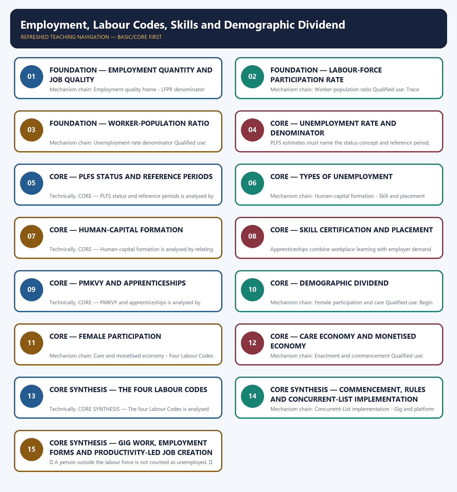

# Employment, Labour Codes, Skills and Demographic Dividend — Learner-v2 Complete Learning Session

> **Authoring-only generation:** 2026-09-03. No PDF was rendered and no tracker or index was mutated.

### SOURCE, PROGRESSION AND CURRENT-LINKAGE AUDIT

- **Generation date:** 2026-09-03.
- **Repository-first evidence:** the Basic owner is taught first and preserved in full; the Advanced owner is retained only in the optional final teaching block.
- **OCR evidence:** Repository Markdown was primary. OCR-searchable local official General Studies papers were used only to confirm printed routed demands. No answer key, marking scheme, unsupported page precision or current macroeconomic statistic was inferred from them.
- **Qdrant:** not used; repository Markdown and available OCR context were sufficient.
- **PYQ integrity:** Audited ledgers route Mains demands on productivity-led job creation, structural-unemployment measurement, the care economy, Labour Codes, inflation and unemployment, and skill-to-employment linkages, plus objective concepts on human capital, PMKVY, fixed-term work, casual workers and industrial-dispute statistics. No objective key is inferred.
- **Live-link boundary:** Official Ministry search results support commencement on 21 November 2025 and final Central Rules in May 2026. Direct pages and the annual-report PDF returned HTTP 403, so no state-by-state rule count, employment value, scheme target or outlay was added.
- **Fact/inference discipline:** no current-affairs item, PYQ wording, figure or quotation is invented.

### LIVE OFFICIAL-SOURCE ATTEMPT LOG

The checks below were made on 2026-09-03. Substantive official text is used only for the proposition it actually supports; binary files, dynamic shells, stubs and undated dashboard snippets are recorded but not converted into current claims.

- https://labour.gov.in/offerings/schemes-and-services/details/labour-codes-gzNzQzMtQWa — direct fetch returned HTTP 403 on 2026-09-03; official-domain search substantively exposed commencement and Central-Rules milestones.
- https://www.labour.gov.in/documents/acts-and-policies — official-domain search identified the Ministry's current Labour Codes and rules pages; jurisdiction-specific state readiness was not fully retrievable.

## BASIC LEARNING SESSION

### DEEP-REVIEW LEARNING CONTRACT

| Control | Binding rule for this package |
|---|---|
| Syllabus boundary | Complete Economy Basic/Core is answer-complete before optional Advanced depth. |
| Formula boundary | Formula, numerator, denominator, unit, stock/flow, nominal/real, base year, level/rate and accounting identity are explicit. |
| Institutional boundary | Constitution, statute, delegated rule, regulator mandate, policy, recommendation, scheme and implementation outcome remain distinct. |
| Transmission method | Shock or instrument → prices/quantities/balance sheets/incentives → institution and market response → output, employment, distribution, stability and external effect → lag and trade-off. |
| Current-data method | Source → release date → reference period → unit/denominator → provisional/revised/final status; incompatible Budget, Survey or statistical vintages are never mixed. |
| Programme-status method | Announced → approved → notified/guidelines issued → funded → operational → utilised → output → outcome are separate stages. |
| External/WTO method | Agreement text, member category, box, limit, notification, consultation, dispute and ruling are qualified without invented thresholds. |
| Causal method | Accounting identity, chronology and correlation are not promoted into behavioural or causal claims without mechanism, counterfactual and alternatives. |
| Answer balance | Model answers balance growth, distribution, stability, sustainability and federal dimensions with India-centric evidence. |
| Practice contract | Every solved item has demand decoding, a detailed examiner-grade model, executable timed/compression plan, marks rationale and answer-specific improvement. |
| Approval | This immutable successor remains `approved: false` pending explicit approval. |

**Canonical Basic/Core owner:** `upsc-ai-kit\knowledge\Economy\basic\22_Employment-Labour-Codes-Skills-and-Demographic-Dividend.md`  
**Substantive canonical provenance owner:** `upsc-ai-kit\knowledge\Economy\22_Employment-Labour-Codes-Skills-and-Demographic-Dividend_Learner-V2-Complete-Topic-Package.md`  
**Optional Advanced owner:** `upsc-ai-kit\knowledge\Economy\advanced\22_Employment-Labour-Codes-Skills-and-Demographic-Dividend.md`  
**Official syllabus mapping:** `upsc-ai-kit\knowledge\Economy\OFFICIAL-UPSC-SYLLABUS-MAPPING.md`

### EVIDENCE, PYQ AND CURRENT-STATUS CONTROL

- Every data-heavy table states unit, denominator, geography, reference period and source/status.
- GDP/GVA, gross/net, domestic/national, nominal/real and level/rate distinctions remain exact.
- Monetary, fiscal and external chains state intermediaries, balance-sheet channels, lags, leakages and trade-offs.
- Budget and Economic Survey editions are never mixed; BE, RE, Actual, advance/provisional/revised/final estimates remain labelled.
- Scheme and programme claims distinguish announcement, approval, notification, operation, coverage, utilisation and measured outcome.
- WTO boxes, limits, de minimis, special treatment, notifications and disputes are qualified from authoritative rules.
- PYQ wording is preserved only where verified; reconstructed or routed demands remain labelled.
- **Current-status note, rechecked 2026-09-03:** volatile rates, estimates, scheme status, trade rules and institutional claims retain official source, release date, reference period and revision status.

**Generation-local live/current sources:**
- `https://labour.gov.in/offerings/schemes-and-services/details/labour-codes-gzNzQzMtQWa — direct fetch returned HTTP 403 on 2026-09-03; official-domain search substantively exposed commencement and Central-Rules milestones.`
- `https://www.labour.gov.in/documents/acts-and-policies — official-domain search identified the Ministry's current Labour Codes and rules pages; jurisdiction-specific state readiness was not fully retrievable.`




*Distinct embedded teaching-navigation image. The separate continuous Cārvāka-style flowchart package remains an independent at-a-glance artifact.*

### SESSION 1 — FOUNDATION — EMPLOYMENT QUANTITY AND JOB QUALITY

#### DEFINITION / WHAT THIS IS CALLED

**Plain-language definition:** Employment must be assessed through quantity, hours, productivity, real earnings, security, working conditions and mobility; a headcount alone is not a quality-jobs verdict.

**Technical definition:** Mechanism chain: Employment-quality frame - LFPR denominator Qualified use: Begin with the indicator, denominator and reference period before interpreting a labour-market trend.

#### ANSWER-GRABBING OPENING — WRITE/ADAPT IN THE EXAM

> Employment must be assessed through quantity, hours, productivity, real earnings, security, working conditions and mobility; a headcount alone is not a quality-jobs verdict.

#### MUST-WRITE KEYWORDS

- **FOUNDATION**
- **Employment quantity**
- **job quality**
- **Mechanism chain**
- **Qualified use**
- **Employment**

**How to use them:** Frame the answer through FOUNDATION; define Employment quantity, connect job quality with Mechanism chain to explain the mechanism, and use Qualified use for the decisive comparison or qualification.

#### VISUAL FIRST

```text
EMPLOYMENT QUANTITY AND JOB QUALITY
01. Employment-quality frame
    |
    v
02. LFPR denominator
BOUNDARY -> Do not use total population as the unemployment-rate denominator.
```

*This topic-specific rail fixes the evidence sequence and its exam boundary before analysis.*

#### CORE EXPLANATION

Employment must be assessed through quantity, hours, productivity, real earnings, security, working conditions and mobility; a headcount alone is not a quality-jobs verdict. The labour-force participation rate is the labour force, employed plus unemployed seeking or available for work, as a share of the specified population.

#### NAMED EVIDENCE AND MECHANISM

- Employment must be assessed through quantity, hours, productivity, real earnings, security, working conditions and mobility; a headcount alone is not a quality-jobs verdict.
- The labour-force participation rate is the labour force, employed plus unemployed seeking or available for work, as a share of the specified population.

#### EXAMINER CAUTION

- Do not use total population as the unemployment-rate denominator.

#### EXAM LINK

- **Prelims:** Preserve the exact formula, territorial or resident boundary, price basis, base year, index basket, eligible counterparty, institution and legal status; never upgrade a projection into an actual or a regulatory direction into a universal rule.
- **Mains:** Begin with the indicator, denominator and reference period before interpreting a labour-market trend.

#### MINI RECAP

- **Mechanism chain:** Employment-quality frame -> LFPR denominator
- **Qualified use:** Begin with the indicator, denominator and reference period before interpreting a labour-market trend.

#### CLOSING RECALL FLOW — FOUNDATION — EMPLOYMENT QUANTITY AND JOB QUALITY

```text
START / CONCEPT: FOUNDATION — Employment quantity and job quality
        |
        v
EXACT TERMS: FOUNDATION · Employment quantity · job quality · Mechanism chain · Qualified use · Employment
        |
        v
MECHANISM / ARGUMENT: Mechanism chain: Employment-quality frame - LFPR denominator Qualified use: Begin with the indicator, denominator and reference period before interpreting a labour-market trend.
        |
        v
CONSEQUENCE / CONTRAST: Do not use total population as the unemployment-rate denominator.
        |
        v
UPSC TRAP / ANSWER-USE: Do not miss this limiting distinction: the labour-force participation rate is the labour force, employed plus unemployed seeking or available...
        |
        v
ANSWER-GRABBING FORMULATION: Employment must be assessed through quantity, hours, productivity, real earnings, security, working conditions and mobility; a headcount alone is not a quality-jobs verdict.
```
### SESSION 2 — FOUNDATION — LABOUR-FORCE PARTICIPATION RATE

#### DEFINITION / WHAT THIS IS CALLED

**Plain-language definition:** The worker-population ratio is employed persons as a share of the specified population and therefore has a different numerator from LFPR.

**Technical definition:** Mechanism chain: Worker-population ratio Qualified use: Trace training through employer demand, placement, retention, earnings and productivity.

#### ANSWER-GRABBING OPENING — WRITE/ADAPT IN THE EXAM

> The worker-population ratio is employed persons as a share of the specified population and therefore has a different numerator from LFPR.

#### MUST-WRITE KEYWORDS

- **FOUNDATION**
- **Labour-force participation rate**
- **Mechanism chain**
- **Qualified use**
- **The worker-population ratio**
- **LFPR**

**How to use them:** Frame the answer through FOUNDATION; define Labour-force participation rate, connect Mechanism chain with Qualified use to explain the mechanism, and use The worker-population ratio for the decisive comparison or qualification.

#### VISUAL FIRST

```text
LABOUR-FORCE PARTICIPATION RATE
01. Worker-population ratio
BOUNDARY -> Do not treat people outside the labour force as unemployed.
```

*This topic-specific rail fixes the evidence sequence and its exam boundary before analysis.*

#### CORE EXPLANATION

The worker-population ratio is employed persons as a share of the specified population and therefore has a different numerator from LFPR.

#### NAMED EVIDENCE AND MECHANISM

- The worker-population ratio is employed persons as a share of the specified population and therefore has a different numerator from LFPR.

#### EXAMINER CAUTION

- Do not treat people outside the labour force as unemployed.

#### EXAM LINK

- **Prelims:** Preserve the exact formula, territorial or resident boundary, price basis, base year, index basket, eligible counterparty, institution and legal status; never upgrade a projection into an actual or a regulatory direction into a universal rule.
- **Mains:** Trace training through employer demand, placement, retention, earnings and productivity.

#### MINI RECAP

- **Mechanism chain:** Worker-population ratio
- **Qualified use:** Trace training through employer demand, placement, retention, earnings and productivity.

#### CLOSING RECALL FLOW — FOUNDATION — LABOUR-FORCE PARTICIPATION RATE

```text
START / CONCEPT: FOUNDATION — Labour-force participation rate
        |
        v
EXACT TERMS: FOUNDATION · Labour-force participation rate · Mechanism chain · Qualified use · The worker-population ratio · LFPR
        |
        v
MECHANISM / ARGUMENT: Mechanism chain: Worker-population ratio Qualified use: Trace training through employer demand, placement, retention, earnings and productivity.
        |
        v
CONSEQUENCE / CONTRAST: Do not treat people outside the labour force as unemployed.
        |
        v
UPSC TRAP / ANSWER-USE: Do not miss this limiting distinction: the worker-population ratio is employed persons as a share of the specified population and...
        |
        v
ANSWER-GRABBING FORMULATION: The worker-population ratio is employed persons as a share of the specified population and therefore has a different numerator from LFPR.
```
### SESSION 3 — FOUNDATION — WORKER-POPULATION RATIO

#### DEFINITION / WHAT THIS IS CALLED

**Plain-language definition:** The unemployment rate is unemployed persons as a share of the labour force, not as a share of the total population; people outside the labour force are not unemployed.

**Technical definition:** Mechanism chain: Unemployment-rate denominator Qualified use: Balance flexibility and job creation with bargaining, safety and portable social protection.

#### ANSWER-GRABBING OPENING — WRITE/ADAPT IN THE EXAM

> The unemployment rate is unemployed persons as a share of the labour force, not as a share of the total population; people outside the labour force are not unemployed.

#### MUST-WRITE KEYWORDS

- **FOUNDATION**
- **Worker-population ratio**
- **Mechanism chain**
- **Qualified use**
- **The unemployment rate**
- **PLFS**

**How to use them:** Frame the answer through FOUNDATION; define Worker-population ratio, connect Mechanism chain with Qualified use to explain the mechanism, and use The unemployment rate for the decisive comparison or qualification.

#### VISUAL FIRST

```text
WORKER-POPULATION RATIO
01. Unemployment-rate denominator
BOUNDARY -> Do not quote PLFS data without status, reference period, age group and geography.
```

*This topic-specific rail fixes the evidence sequence and its exam boundary before analysis.*

#### CORE EXPLANATION

The unemployment rate is unemployed persons as a share of the labour force, not as a share of the total population; people outside the labour force are not unemployed.

#### NAMED EVIDENCE AND MECHANISM

- The unemployment rate is unemployed persons as a share of the labour force, not as a share of the total population; people outside the labour force are not unemployed.

#### EXAMINER CAUTION

- Do not quote PLFS data without status, reference period, age group and geography.

#### EXAM LINK

- **Prelims:** Preserve the exact formula, territorial or resident boundary, price basis, base year, index basket, eligible counterparty, institution and legal status; never upgrade a projection into an actual or a regulatory direction into a universal rule.
- **Mains:** Balance flexibility and job creation with bargaining, safety and portable social protection.

#### MINI RECAP

- **Mechanism chain:** Unemployment-rate denominator
- **Qualified use:** Balance flexibility and job creation with bargaining, safety and portable social protection.

#### CLOSING RECALL FLOW — FOUNDATION — WORKER-POPULATION RATIO

```text
START / CONCEPT: FOUNDATION — Worker-population ratio
        |
        v
EXACT TERMS: FOUNDATION · Worker-population ratio · Mechanism chain · Qualified use · The unemployment rate · PLFS
        |
        v
MECHANISM / ARGUMENT: Mechanism chain: Unemployment-rate denominator Qualified use: Balance flexibility and job creation with bargaining, safety and portable social protection.
        |
        v
CONSEQUENCE / CONTRAST: Do not quote PLFS data without status, reference period, age group and geography.
        |
        v
UPSC TRAP / ANSWER-USE: Do not miss this limiting distinction: the unemployment rate is unemployed persons as a share of the labour force, not...
        |
        v
ANSWER-GRABBING FORMULATION: The unemployment rate is unemployed persons as a share of the labour force, not as a share of the total population; people outside the labour force are not unemployed.
```
### SESSION 4 — CORE — UNEMPLOYMENT RATE AND DENOMINATOR

#### DEFINITION / WHAT THIS IS CALLED

**Plain-language definition:** Mechanism chain: PLFS status and reference period Qualified use: Begin with the indicator, denominator and reference period before interpreting a labour-market trend.

**Technical definition:** PLFS estimates must name the status concept and reference period, such as usual status or current weekly status, because the same labour market can produce different measures.

#### ANSWER-GRABBING OPENING — WRITE/ADAPT IN THE EXAM

> Mechanism chain: PLFS status and reference period Qualified use: Begin with the indicator, denominator and reference period before interpreting a labour-market trend.

#### MUST-WRITE KEYWORDS

- **Unemployment rate**
- **denominator**
- **Mechanism chain**
- **Qualified use**
- **PLFS**
- **Qualified**

**How to use them:** Frame the answer through Unemployment rate; define denominator, connect Mechanism chain with Qualified use to explain the mechanism, and use PLFS for the decisive comparison or qualification.

#### VISUAL FIRST

```text
UNEMPLOYMENT RATE AND DENOMINATOR
01. PLFS status and reference period
BOUNDARY -> Do not infer job quality from an employment headcount.
```

*This topic-specific rail fixes the evidence sequence and its exam boundary before analysis.*

#### CORE EXPLANATION

PLFS estimates must name the status concept and reference period, such as usual status or current weekly status, because the same labour market can produce different measures.

#### NAMED EVIDENCE AND MECHANISM

- PLFS estimates must name the status concept and reference period, such as usual status or current weekly status, because the same labour market can produce different measures.

#### EXAMINER CAUTION

- Do not infer job quality from an employment headcount.

#### EXAM LINK

- **Prelims:** Preserve the exact formula, territorial or resident boundary, price basis, base year, index basket, eligible counterparty, institution and legal status; never upgrade a projection into an actual or a regulatory direction into a universal rule.
- **Mains:** Begin with the indicator, denominator and reference period before interpreting a labour-market trend.

#### MINI RECAP

- **Mechanism chain:** PLFS status and reference period
- **Qualified use:** Begin with the indicator, denominator and reference period before interpreting a labour-market trend.

#### CLOSING RECALL FLOW — CORE — UNEMPLOYMENT RATE AND DENOMINATOR

```text
START / CONCEPT: CORE — Unemployment rate and denominator
        |
        v
EXACT TERMS: Unemployment rate · denominator · Mechanism chain · Qualified use · PLFS · Qualified
        |
        v
MECHANISM / ARGUMENT: PLFS estimates must name the status concept and reference period, such as usual status or current weekly status, because the same labour market can produce different measures.
        |
        v
CONSEQUENCE / CONTRAST: Do not infer job quality from an employment headcount.
        |
        v
UPSC TRAP / ANSWER-USE: Do not miss this limiting distinction: pLFS status and reference period Qualified use.
        |
        v
ANSWER-GRABBING FORMULATION: Mechanism chain: PLFS status and reference period Qualified use: Begin with the indicator, denominator and reference period before interpreting a labour-market trend.
```
### SESSION 5 — CORE — PLFS STATUS AND REFERENCE PERIODS

#### DEFINITION / WHAT THIS IS CALLED

**Plain-language definition:** Mechanism chain: Unemployment typology Qualified use: Trace training through employer demand, placement, retention, earnings and productivity.

**Technical definition:** Technically, CORE — PLFS status and reference periods is analysed by relating PLFS status to reference periods, then testing the relationship through Mechanism chain and Qualified use.

#### ANSWER-GRABBING OPENING — WRITE/ADAPT IN THE EXAM

> Mechanism chain: Unemployment typology Qualified use: Trace training through employer demand, placement, retention, earnings and productivity.

#### MUST-WRITE KEYWORDS

- **PLFS status**
- **reference periods**
- **Mechanism chain**
- **Qualified use**
- **Unemployment**
- **Qualified**

**How to use them:** Frame the answer through PLFS status; define reference periods, connect Mechanism chain with Qualified use to explain the mechanism, and use Unemployment for the decisive comparison or qualification.

#### VISUAL FIRST

```text
PLFS STATUS AND REFERENCE PERIODS
01. Unemployment typology
BOUNDARY -> Do not equate skill certification with placement or wage progression.
```

*This topic-specific rail fixes the evidence sequence and its exam boundary before analysis.*

#### CORE EXPLANATION

Frictional, structural, cyclical, seasonal and disguised unemployment identify different mechanisms and cannot be diagnosed from one aggregate rate.

#### NAMED EVIDENCE AND MECHANISM

- Frictional, structural, cyclical, seasonal and disguised unemployment identify different mechanisms and cannot be diagnosed from one aggregate rate.

#### EXAMINER CAUTION

- Do not equate skill certification with placement or wage progression.

#### EXAM LINK

- **Prelims:** Preserve the exact formula, territorial or resident boundary, price basis, base year, index basket, eligible counterparty, institution and legal status; never upgrade a projection into an actual or a regulatory direction into a universal rule.
- **Mains:** Trace training through employer demand, placement, retention, earnings and productivity.

#### MINI RECAP

- **Mechanism chain:** Unemployment typology
- **Qualified use:** Trace training through employer demand, placement, retention, earnings and productivity.

#### CLOSING RECALL FLOW — CORE — PLFS STATUS AND REFERENCE PERIODS

```text
START / CONCEPT: CORE — PLFS status and reference periods
        |
        v
EXACT TERMS: PLFS status · reference periods · Mechanism chain · Qualified use · Unemployment · Qualified
        |
        v
MECHANISM / ARGUMENT: The operative mechanism is that trace training through employer demand, placement, retention, earnings and productivity.
        |
        v
CONSEQUENCE / CONTRAST: Do not equate skill certification with placement or wage progression.
        |
        v
UPSC TRAP / ANSWER-USE: Do not miss this limiting distinction: do not equate skill certification with placement or wage progression.
        |
        v
ANSWER-GRABBING FORMULATION: Mechanism chain: Unemployment typology Qualified use: Trace training through employer demand, placement, retention, earnings and productivity.
```
### SESSION 6 — CORE — TYPES OF UNEMPLOYMENT

#### DEFINITION / WHAT THIS IS CALLED

**Plain-language definition:** Human-capital formation builds productive capabilities through health, education, skills and experience; certification is only one possible signal of capability.

**Technical definition:** Mechanism chain: Human-capital formation - Skill and placement boundary Qualified use: Balance flexibility and job creation with bargaining, safety and portable social protection.

#### ANSWER-GRABBING OPENING — WRITE/ADAPT IN THE EXAM

> Human-capital formation builds productive capabilities through health, education, skills and experience; certification is only one possible signal of capability.

#### MUST-WRITE KEYWORDS

- **Types of unemployment**
- **Mechanism chain**
- **Qualified use**
- **Human-capital**
- **A completed training or certification count**
- **Skill**

**How to use them:** Frame the answer through Types of unemployment; define Mechanism chain, connect Qualified use with Human-capital to explain the mechanism, and use A completed training or certification count for the decisive comparison or qualification.

#### VISUAL FIRST

```text
TYPES OF UNEMPLOYMENT
01. Human-capital formation
    |
    v
02. Skill and placement boundary
BOUNDARY -> Do not describe the demographic dividend as automatic or permanent.
```

*This topic-specific rail fixes the evidence sequence and its exam boundary before analysis.*

#### CORE EXPLANATION

Human-capital formation builds productive capabilities through health, education, skills and experience; certification is only one possible signal of capability. A completed training or certification count is not a placement, sustained job, wage gain or productivity outcome.

#### NAMED EVIDENCE AND MECHANISM

- Human-capital formation builds productive capabilities through health, education, skills and experience; certification is only one possible signal of capability.
- A completed training or certification count is not a placement, sustained job, wage gain or productivity outcome.

#### EXAMINER CAUTION

- Do not describe the demographic dividend as automatic or permanent.

#### EXAM LINK

- **Prelims:** Preserve the exact formula, territorial or resident boundary, price basis, base year, index basket, eligible counterparty, institution and legal status; never upgrade a projection into an actual or a regulatory direction into a universal rule.
- **Mains:** Balance flexibility and job creation with bargaining, safety and portable social protection.

#### MINI RECAP

- **Mechanism chain:** Human-capital formation -> Skill and placement boundary
- **Qualified use:** Balance flexibility and job creation with bargaining, safety and portable social protection.

#### CLOSING RECALL FLOW — CORE — TYPES OF UNEMPLOYMENT

```text
START / CONCEPT: CORE — Types of unemployment
        |
        v
EXACT TERMS: Types of unemployment · Mechanism chain · Qualified use · Human-capital · A completed training or certification count · Skill
        |
        v
MECHANISM / ARGUMENT: Mechanism chain: Human-capital formation - Skill and placement boundary Qualified use: Balance flexibility and job creation with bargaining, safety and portable social protection.
        |
        v
CONSEQUENCE / CONTRAST: A completed training or certification count is not a placement, sustained job, wage gain or productivity outcome.
        |
        v
UPSC TRAP / ANSWER-USE: Do not describe the demographic dividend as automatic or permanent.
        |
        v
ANSWER-GRABBING FORMULATION: Human-capital formation builds productive capabilities through health, education, skills and experience; certification is only one possible signal of capability.
```
### SESSION 7 — CORE — HUMAN-CAPITAL FORMATION

#### DEFINITION / WHAT THIS IS CALLED

**Plain-language definition:** Mechanism chain: PMKVY scope Qualified use: Begin with the indicator, denominator and reference period before interpreting a labour-market trend.

**Technical definition:** Technically, CORE — Human-capital formation is analysed by relating Human-capital formation to Mechanism chain, then testing the relationship through Qualified use and GDP.

#### ANSWER-GRABBING OPENING — WRITE/ADAPT IN THE EXAM

> Do not equate unpaid care's GDP exclusion with absence of economic value.

#### MUST-WRITE KEYWORDS

- **Human-capital formation**
- **Mechanism chain**
- **Qualified use**
- **GDP**
- **PMKVY**
- **Qualified**

**How to use them:** Frame the answer through Human-capital formation; define Mechanism chain, connect Qualified use with GDP to explain the mechanism, and use PMKVY for the decisive comparison or qualification.

#### VISUAL FIRST

```text
HUMAN-CAPITAL FORMATION
01. PMKVY scope
BOUNDARY -> Do not equate unpaid care's GDP exclusion with absence of economic value.
```

*This topic-specific rail fixes the evidence sequence and its exam boundary before analysis.*

#### CORE EXPLANATION

Pradhan Mantri Kaushal Vikas Yojana supports skill training, assessment and certification under the Skill India architecture; current targets or placements require a dated official source.

#### NAMED EVIDENCE AND MECHANISM

- Pradhan Mantri Kaushal Vikas Yojana supports skill training, assessment and certification under the Skill India architecture; current targets or placements require a dated official source.

#### EXAMINER CAUTION

- Do not equate unpaid care's GDP exclusion with absence of economic value.

#### EXAM LINK

- **Prelims:** Preserve the exact formula, territorial or resident boundary, price basis, base year, index basket, eligible counterparty, institution and legal status; never upgrade a projection into an actual or a regulatory direction into a universal rule.
- **Mains:** Begin with the indicator, denominator and reference period before interpreting a labour-market trend.

#### MINI RECAP

- **Mechanism chain:** PMKVY scope
- **Qualified use:** Begin with the indicator, denominator and reference period before interpreting a labour-market trend.

#### CLOSING RECALL FLOW — CORE — HUMAN-CAPITAL FORMATION

```text
START / CONCEPT: CORE — Human-capital formation
        |
        v
EXACT TERMS: Human-capital formation · Mechanism chain · Qualified use · GDP · PMKVY · Qualified
        |
        v
MECHANISM / ARGUMENT: Mechanism chain: PMKVY scope Qualified use: Begin with the indicator, denominator and reference period before interpreting a labour-market trend.
        |
        v
CONSEQUENCE / CONTRAST: The resulting consequence is that do not equate unpaid care's GDP exclusion with absence of economic value.
        |
        v
UPSC TRAP / ANSWER-USE: Do not miss this limiting distinction: do not equate unpaid care's GDP exclusion with absence of economic value.
        |
        v
ANSWER-GRABBING FORMULATION: Do not equate unpaid care's GDP exclusion with absence of economic value.
```
### SESSION 8 — CORE — SKILL CERTIFICATION AND PLACEMENT

#### DEFINITION / WHAT THIS IS CALLED

**Plain-language definition:** Mechanism chain: Apprenticeship mechanism Qualified use: Trace training through employer demand, placement, retention, earnings and productivity.

**Technical definition:** Apprenticeships combine workplace learning with employer demand and can reduce skill mismatch, but registration or seat creation does not prove completion or employment.

#### ANSWER-GRABBING OPENING — WRITE/ADAPT IN THE EXAM

> Apprenticeships combine workplace learning with employer demand and can reduce skill mismatch, but registration or seat creation does not prove completion or employment.

#### MUST-WRITE KEYWORDS

- **Skill certification**
- **placement**
- **Mechanism chain**
- **Qualified use**
- **Apprenticeships**
- **Labour-Code**

**How to use them:** Frame the answer through Skill certification; define placement, connect Mechanism chain with Qualified use to explain the mechanism, and use Apprenticeships for the decisive comparison or qualification.

#### VISUAL FIRST

```text
SKILL CERTIFICATION AND PLACEMENT
01. Apprenticeship mechanism
BOUNDARY -> Do not merge Labour-Code enactment, commencement, rules and enforcement.
```

*This topic-specific rail fixes the evidence sequence and its exam boundary before analysis.*

#### CORE EXPLANATION

Apprenticeships combine workplace learning with employer demand and can reduce skill mismatch, but registration or seat creation does not prove completion or employment.

#### NAMED EVIDENCE AND MECHANISM

- Apprenticeships combine workplace learning with employer demand and can reduce skill mismatch, but registration or seat creation does not prove completion or employment.

#### EXAMINER CAUTION

- Do not merge Labour-Code enactment, commencement, rules and enforcement.

#### EXAM LINK

- **Prelims:** Preserve the exact formula, territorial or resident boundary, price basis, base year, index basket, eligible counterparty, institution and legal status; never upgrade a projection into an actual or a regulatory direction into a universal rule.
- **Mains:** Trace training through employer demand, placement, retention, earnings and productivity.

#### MINI RECAP

- **Mechanism chain:** Apprenticeship mechanism
- **Qualified use:** Trace training through employer demand, placement, retention, earnings and productivity.

#### CLOSING RECALL FLOW — CORE — SKILL CERTIFICATION AND PLACEMENT

```text
START / CONCEPT: CORE — Skill certification and placement
        |
        v
EXACT TERMS: Skill certification · placement · Mechanism chain · Qualified use · Apprenticeships · Labour-Code
        |
        v
MECHANISM / ARGUMENT: Mechanism chain: Apprenticeship mechanism Qualified use: Trace training through employer demand, placement, retention, earnings and productivity.
        |
        v
CONSEQUENCE / CONTRAST: Do not merge Labour-Code enactment, commencement, rules and enforcement.
        |
        v
UPSC TRAP / ANSWER-USE: Do not miss this limiting distinction: apprenticeships combine workplace learning with employer demand and can reduce skill mismatch.
        |
        v
ANSWER-GRABBING FORMULATION: Apprenticeships combine workplace learning with employer demand and can reduce skill mismatch, but registration or seat creation does not prove completion or employment.
```
### SESSION 9 — CORE — PMKVY AND APPRENTICESHIPS

#### DEFINITION / WHAT THIS IS CALLED

**Plain-language definition:** Mechanism chain: Demographic-dividend condition Qualified use: Balance flexibility and job creation with bargaining, safety and portable social protection.

**Technical definition:** Technically, CORE — PMKVY and apprenticeships is analysed by relating PMKVY to apprenticeships, then testing the relationship through Mechanism chain and Qualified use.

#### ANSWER-GRABBING OPENING — WRITE/ADAPT IN THE EXAM

> Do not assume Central Rules establish uniform state implementation.

#### MUST-WRITE KEYWORDS

- **PMKVY**
- **apprenticeships**
- **Mechanism chain**
- **Qualified use**
- **Central Rules**
- **Demographic-dividend**

**How to use them:** Frame the answer through PMKVY; define apprenticeships, connect Mechanism chain with Qualified use to explain the mechanism, and use Central Rules for the decisive comparison or qualification.

#### VISUAL FIRST

```text
PMKVY AND APPRENTICESHIPS
01. Demographic-dividend condition
BOUNDARY -> Do not assume Central Rules establish uniform state implementation.
```

*This topic-specific rail fixes the evidence sequence and its exam boundary before analysis.*

#### CORE EXPLANATION

A favourable working-age structure creates only demographic potential; health, learning, participation, productive jobs and savings-investment transmission determine the dividend.

#### NAMED EVIDENCE AND MECHANISM

- A favourable working-age structure creates only demographic potential; health, learning, participation, productive jobs and savings-investment transmission determine the dividend.

#### EXAMINER CAUTION

- Do not assume Central Rules establish uniform state implementation.

#### EXAM LINK

- **Prelims:** Preserve the exact formula, territorial or resident boundary, price basis, base year, index basket, eligible counterparty, institution and legal status; never upgrade a projection into an actual or a regulatory direction into a universal rule.
- **Mains:** Balance flexibility and job creation with bargaining, safety and portable social protection.

#### MINI RECAP

- **Mechanism chain:** Demographic-dividend condition
- **Qualified use:** Balance flexibility and job creation with bargaining, safety and portable social protection.

#### CLOSING RECALL FLOW — CORE — PMKVY AND APPRENTICESHIPS

```text
START / CONCEPT: CORE — PMKVY and apprenticeships
        |
        v
EXACT TERMS: PMKVY · apprenticeships · Mechanism chain · Qualified use · Central Rules · Demographic-dividend
        |
        v
MECHANISM / ARGUMENT: Mechanism chain: Demographic-dividend condition Qualified use: Balance flexibility and job creation with bargaining, safety and portable social protection.
        |
        v
CONSEQUENCE / CONTRAST: A favourable working-age structure creates only demographic potential; health, learning, participation, productive jobs and savings-investment transmission determine the dividend.
        |
        v
UPSC TRAP / ANSWER-USE: Do not miss this limiting distinction: do not assume Central Rules establish uniform state implementation.
        |
        v
ANSWER-GRABBING FORMULATION: Do not assume Central Rules establish uniform state implementation.
```
### SESSION 10 — CORE — DEMOGRAPHIC DIVIDEND

#### DEFINITION / WHAT THIS IS CALLED

**Plain-language definition:** Women's labour-force participation is shaped by unpaid care, safety, mobility, job location and norms, so aggregate participation cannot substitute for gender and rural-urban disaggregation.

**Technical definition:** Mechanism chain: Female participation and care Qualified use: Begin with the indicator, denominator and reference period before interpreting a labour-market trend.

#### ANSWER-GRABBING OPENING — WRITE/ADAPT IN THE EXAM

> Women's labour-force participation is shaped by unpaid care, safety, mobility, job location and norms, so aggregate participation cannot substitute for gender and rural-urban disaggregation.

#### MUST-WRITE KEYWORDS

- **Demographic dividend**
- **Mechanism chain**
- **Qualified use**
- **Women's labour-force participation**
- **Women's**
- **PYQ**

**How to use them:** Frame the answer through Demographic dividend; define Mechanism chain, connect Qualified use with Women's labour-force participation to explain the mechanism, and use Women's for the decisive comparison or qualification.

#### VISUAL FIRST

```text
DEMOGRAPHIC DIVIDEND
01. Female participation and care
BOUNDARY -> Do not infer an objective PYQ answer letter from the routed ledger.
```

*This topic-specific rail fixes the evidence sequence and its exam boundary before analysis.*

#### CORE EXPLANATION

Women's labour-force participation is shaped by unpaid care, safety, mobility, job location and norms, so aggregate participation cannot substitute for gender and rural-urban disaggregation.

#### NAMED EVIDENCE AND MECHANISM

- Women's labour-force participation is shaped by unpaid care, safety, mobility, job location and norms, so aggregate participation cannot substitute for gender and rural-urban disaggregation.

#### EXAMINER CAUTION

- Do not infer an objective PYQ answer letter from the routed ledger.

#### EXAM LINK

- **Prelims:** Preserve the exact formula, territorial or resident boundary, price basis, base year, index basket, eligible counterparty, institution and legal status; never upgrade a projection into an actual or a regulatory direction into a universal rule.
- **Mains:** Begin with the indicator, denominator and reference period before interpreting a labour-market trend.

#### MINI RECAP

- **Mechanism chain:** Female participation and care
- **Qualified use:** Begin with the indicator, denominator and reference period before interpreting a labour-market trend.

#### CLOSING RECALL FLOW — CORE — DEMOGRAPHIC DIVIDEND

```text
START / CONCEPT: CORE — Demographic dividend
        |
        v
EXACT TERMS: Demographic dividend · Mechanism chain · Qualified use · Women's labour-force participation · Women's · PYQ
        |
        v
MECHANISM / ARGUMENT: Mechanism chain: Female participation and care Qualified use: Begin with the indicator, denominator and reference period before interpreting a labour-market trend.
        |
        v
CONSEQUENCE / CONTRAST: Do not infer an objective PYQ answer letter from the routed ledger.
        |
        v
UPSC TRAP / ANSWER-USE: Do not miss this limiting distinction: do not infer an objective PYQ answer letter from the routed ledger.
        |
        v
ANSWER-GRABBING FORMULATION: Women's labour-force participation is shaped by unpaid care, safety, mobility, job location and norms, so aggregate participation cannot substitute for gender and rural-urban disaggregation.
```
### SESSION 11 — CORE — FEMALE PARTICIPATION

#### DEFINITION / WHAT THIS IS CALLED

**Plain-language definition:** Unpaid care supports household and market production but generally lies outside the monetised national-accounts production boundary; economic value and GDP inclusion are different questions.

**Technical definition:** Mechanism chain: Care and monetised economy - Four Labour Codes Qualified use: Trace training through employer demand, placement, retention, earnings and productivity.

#### ANSWER-GRABBING OPENING — WRITE/ADAPT IN THE EXAM

> Unpaid care supports household and market production but generally lies outside the monetised national-accounts production boundary; economic value and GDP inclusion are different questions.

#### MUST-WRITE KEYWORDS

- **Female participation**
- **Mechanism chain**
- **Qualified use**
- **Unpaid**
- **GDP**
- **Care**

**How to use them:** Frame the answer through Female participation; define Mechanism chain, connect Qualified use with Unpaid to explain the mechanism, and use GDP for the decisive comparison or qualification.

#### VISUAL FIRST

```text
FEMALE PARTICIPATION
01. Care and monetised economy
    |
    v
02. Four Labour Codes
BOUNDARY -> Do not use total population as the unemployment-rate denominator.
```

*This topic-specific rail fixes the evidence sequence and its exam boundary before analysis.*

#### CORE EXPLANATION

Unpaid care supports household and market production but generally lies outside the monetised national-accounts production boundary; economic value and GDP inclusion are different questions. The Code on Wages, 2019 and the three 2020 Codes on industrial relations, social security and occupational safety, health and working conditions consolidate 29 central labour laws.

#### NAMED EVIDENCE AND MECHANISM

- Unpaid care supports household and market production but generally lies outside the monetised national-accounts production boundary; economic value and GDP inclusion are different questions.
- The Code on Wages, 2019 and the three 2020 Codes on industrial relations, social security and occupational safety, health and working conditions consolidate 29 central labour laws.

#### EXAMINER CAUTION

- Do not use total population as the unemployment-rate denominator.

#### EXAM LINK

- **Prelims:** Preserve the exact formula, territorial or resident boundary, price basis, base year, index basket, eligible counterparty, institution and legal status; never upgrade a projection into an actual or a regulatory direction into a universal rule.
- **Mains:** Trace training through employer demand, placement, retention, earnings and productivity.

#### MINI RECAP

- **Mechanism chain:** Care and monetised economy -> Four Labour Codes
- **Qualified use:** Trace training through employer demand, placement, retention, earnings and productivity.

#### CLOSING RECALL FLOW — CORE — FEMALE PARTICIPATION

```text
START / CONCEPT: CORE — Female participation
        |
        v
EXACT TERMS: Female participation · Mechanism chain · Qualified use · Unpaid · GDP · Care
        |
        v
MECHANISM / ARGUMENT: Mechanism chain: Care and monetised economy - Four Labour Codes Qualified use: Trace training through employer demand, placement, retention, earnings and productivity.
        |
        v
CONSEQUENCE / CONTRAST: Do not use total population as the unemployment-rate denominator.
        |
        v
UPSC TRAP / ANSWER-USE: Do not miss this limiting distinction: unpaid care supports household and market production but generally lies outside the monetised national-accounts...
        |
        v
ANSWER-GRABBING FORMULATION: Unpaid care supports household and market production but generally lies outside the monetised national-accounts production boundary; economic value and GDP inclusion are different questions.
```
### SESSION 12 — CORE — CARE ECONOMY AND MONETISED ECONOMY

#### DEFINITION / WHAT THIS IS CALLED

**Plain-language definition:** Enactment, notification of commencement, central rules, state rules and enforcement readiness are separate stages in labour-law implementation.

**Technical definition:** Mechanism chain: Enactment and commencement Qualified use: Balance flexibility and job creation with bargaining, safety and portable social protection.

#### ANSWER-GRABBING OPENING — WRITE/ADAPT IN THE EXAM

> Enactment, notification of commencement, central rules, state rules and enforcement readiness are separate stages in labour-law implementation.

#### MUST-WRITE KEYWORDS

- **Care economy**
- **monetised economy**
- **Mechanism chain**
- **Qualified use**
- **Enactment**
- **Qualified**

**How to use them:** Frame the answer through Care economy; define monetised economy, connect Mechanism chain with Qualified use to explain the mechanism, and use Enactment for the decisive comparison or qualification.

#### VISUAL FIRST

```text
CARE ECONOMY AND MONETISED ECONOMY
01. Enactment and commencement
BOUNDARY -> Do not treat people outside the labour force as unemployed.
```

*This topic-specific rail fixes the evidence sequence and its exam boundary before analysis.*

#### CORE EXPLANATION

Enactment, notification of commencement, central rules, state rules and enforcement readiness are separate stages in labour-law implementation.

#### NAMED EVIDENCE AND MECHANISM

- Enactment, notification of commencement, central rules, state rules and enforcement readiness are separate stages in labour-law implementation.

#### EXAMINER CAUTION

- Do not treat people outside the labour force as unemployed.

#### EXAM LINK

- **Prelims:** Preserve the exact formula, territorial or resident boundary, price basis, base year, index basket, eligible counterparty, institution and legal status; never upgrade a projection into an actual or a regulatory direction into a universal rule.
- **Mains:** Balance flexibility and job creation with bargaining, safety and portable social protection.

#### MINI RECAP

- **Mechanism chain:** Enactment and commencement
- **Qualified use:** Balance flexibility and job creation with bargaining, safety and portable social protection.

#### CLOSING RECALL FLOW — CORE — CARE ECONOMY AND MONETISED ECONOMY

```text
START / CONCEPT: CORE — Care economy and monetised economy
        |
        v
EXACT TERMS: Care economy · monetised economy · Mechanism chain · Qualified use · Enactment · Qualified
        |
        v
MECHANISM / ARGUMENT: Mechanism chain: Enactment and commencement Qualified use: Balance flexibility and job creation with bargaining, safety and portable social protection.
        |
        v
CONSEQUENCE / CONTRAST: Do not treat people outside the labour force as unemployed.
        |
        v
UPSC TRAP / ANSWER-USE: Do not miss this limiting distinction: do not treat people outside the labour force as unemployed.
        |
        v
ANSWER-GRABBING FORMULATION: Enactment, notification of commencement, central rules, state rules and enforcement readiness are separate stages in labour-law implementation.
```
### SESSION 13 — CORE SYNTHESIS — THE FOUR LABOUR CODES

#### DEFINITION / WHAT THIS IS CALLED

**Plain-language definition:** Mechanism chain: Current Labour-Code status Qualified use: Begin with the indicator, denominator and reference period before interpreting a labour-market trend.

**Technical definition:** Technically, CORE SYNTHESIS — The four Labour Codes is analysed by relating CORE SYNTHESIS to The four Labour Codes, then testing the relationship through Mechanism chain and Qualified use.

#### ANSWER-GRABBING OPENING — WRITE/ADAPT IN THE EXAM

> Do not quote PLFS data without status, reference period, age group and geography.

#### MUST-WRITE KEYWORDS

- **CORE SYNTHESIS**
- **The four Labour Codes**
- **Mechanism chain**
- **Qualified use**
- **PLFS**
- **Current Labour-Code**

**How to use them:** Frame the answer through CORE SYNTHESIS; define The four Labour Codes, connect Mechanism chain with Qualified use to explain the mechanism, and use PLFS for the decisive comparison or qualification.

#### VISUAL FIRST

```text
THE FOUR LABOUR CODES
01. Current Labour-Code status
BOUNDARY -> Do not quote PLFS data without status, reference period, age group and geography.
```

*This topic-specific rail fixes the evidence sequence and its exam boundary before analysis.*

#### CORE EXPLANATION

Official Ministry material retrieved through official-domain search records commencement from 21 November 2025 and final Central Rules in May 2026; state rules and enforcement readiness still require jurisdiction-specific verification.

#### NAMED EVIDENCE AND MECHANISM

- Official Ministry material retrieved through official-domain search records commencement from 21 November 2025 and final Central Rules in May 2026; state rules and enforcement readiness still require jurisdiction-specific verification.

#### EXAMINER CAUTION

- Do not quote PLFS data without status, reference period, age group and geography.

#### EXAM LINK

- **Prelims:** Preserve the exact formula, territorial or resident boundary, price basis, base year, index basket, eligible counterparty, institution and legal status; never upgrade a projection into an actual or a regulatory direction into a universal rule.
- **Mains:** Begin with the indicator, denominator and reference period before interpreting a labour-market trend.

#### MINI RECAP

- **Mechanism chain:** Current Labour-Code status
- **Qualified use:** Begin with the indicator, denominator and reference period before interpreting a labour-market trend.

#### CLOSING RECALL FLOW — CORE SYNTHESIS — THE FOUR LABOUR CODES

```text
START / CONCEPT: CORE SYNTHESIS — The four Labour Codes
        |
        v
EXACT TERMS: CORE SYNTHESIS · The four Labour Codes · Mechanism chain · Qualified use · PLFS · Current Labour-Code
        |
        v
MECHANISM / ARGUMENT: Mechanism chain: Current Labour-Code status Qualified use: Begin with the indicator, denominator and reference period before interpreting a labour-market trend.
        |
        v
CONSEQUENCE / CONTRAST: The resulting consequence is that do not quote PLFS data without status, reference period, age group and geography.
        |
        v
UPSC TRAP / ANSWER-USE: Do not miss this limiting distinction: do not quote PLFS data without status, reference period, age group and geography.
        |
        v
ANSWER-GRABBING FORMULATION: Do not quote PLFS data without status, reference period, age group and geography.
```
### SESSION 14 — CORE SYNTHESIS — COMMENCEMENT, RULES AND CONCURRENT-LIST IMPLEMENTATION

#### DEFINITION / WHAT THIS IS CALLED

**Plain-language definition:** Labour's Concurrent-List setting means central codification does not by itself produce uniform state rules, inspection capacity or enforcement outcomes.

**Technical definition:** Mechanism chain: Concurrent-List implementation - Gig and platform work Qualified use: Trace training through employer demand, placement, retention, earnings and productivity.

#### ANSWER-GRABBING OPENING — WRITE/ADAPT IN THE EXAM

> Labour's Concurrent-List setting means central codification does not by itself produce uniform state rules, inspection capacity or enforcement outcomes.

#### MUST-WRITE KEYWORDS

- **CORE SYNTHESIS**
- **Commencement**
- **rules**
- **Concurrent-List implementation**
- **Mechanism chain**
- **Qualified use**

**How to use them:** Frame the answer through CORE SYNTHESIS; define Commencement, connect rules with Concurrent-List implementation to explain the mechanism, and use Mechanism chain for the decisive comparison or qualification.

#### VISUAL FIRST

```text
COMMENCEMENT, RULES AND CONCURRENT-LIST IMPLEMENTATION
01. Concurrent-List implementation
    |
    v
02. Gig and platform work
BOUNDARY -> Do not infer job quality from an employment headcount.
```

*This topic-specific rail fixes the evidence sequence and its exam boundary before analysis.*

#### CORE EXPLANATION

Labour's Concurrent-List setting means central codification does not by itself produce uniform state rules, inspection capacity or enforcement outcomes. Gig or platform work can offer entry and flexibility while creating risks around algorithmic control, bargaining power, income variability and portable social security.

#### NAMED EVIDENCE AND MECHANISM

- Labour's Concurrent-List setting means central codification does not by itself produce uniform state rules, inspection capacity or enforcement outcomes.
- Gig or platform work can offer entry and flexibility while creating risks around algorithmic control, bargaining power, income variability and portable social security.

#### EXAMINER CAUTION

- Do not infer job quality from an employment headcount.

#### EXAM LINK

- **Prelims:** Preserve the exact formula, territorial or resident boundary, price basis, base year, index basket, eligible counterparty, institution and legal status; never upgrade a projection into an actual or a regulatory direction into a universal rule.
- **Mains:** Trace training through employer demand, placement, retention, earnings and productivity.

#### MINI RECAP

- **Mechanism chain:** Concurrent-List implementation -> Gig and platform work
- **Qualified use:** Trace training through employer demand, placement, retention, earnings and productivity.

#### CLOSING RECALL FLOW — CORE SYNTHESIS — COMMENCEMENT, RULES AND CONCURRENT-LIST IMPLEMENTATION

```text
START / CONCEPT: CORE SYNTHESIS — Commencement, rules and Concurrent-List implementation
        |
        v
EXACT TERMS: CORE SYNTHESIS · Commencement · rules · Concurrent-List implementation · Mechanism chain · Qualified use
        |
        v
MECHANISM / ARGUMENT: Mechanism chain: Concurrent-List implementation - Gig and platform work Qualified use: Trace training through employer demand, placement, retention, earnings and productivity.
        |
        v
CONSEQUENCE / CONTRAST: Gig or platform work can offer entry and flexibility while creating risks around algorithmic control, bargaining power, income variability and portable social security.
        |
        v
UPSC TRAP / ANSWER-USE: Do not infer job quality from an employment headcount.
        |
        v
ANSWER-GRABBING FORMULATION: Labour's Concurrent-List setting means central codification does not by itself produce uniform state rules, inspection capacity or enforcement outcomes.
```
### SESSION 15 — CORE SYNTHESIS — GIG WORK, EMPLOYMENT FORMS AND PRODUCTIVITY-LED JOB CREATION

#### DEFINITION / WHAT THIS IS CALLED

**Plain-language definition:** Fixed-term employment, casual work, contract labour and platform work are distinct legal and economic relationships; coverage under wage or social-security rules must be tested provision by provision.

**Technical definition:** ✅ A person outside the labour force is not counted as unemployed. ✅ Employment quantity, productivity, earnings, security and working conditions are distinct. ✅ The four Labour Codes consolidate 29 central labour laws. ✅ The Codes cover wages, industrial relations, social security, and occupational safety, health and working conditions. ✅ Labour is in the Concurrent List, so implementation requires Centre-state legal and administrative readiness. ✅ Gig and platform work can expand flexibility while creating social-security and bargaining challenges. ✅ Unemployment types — frictional, structural, cyclical, seasonal and disguised — require different PLFS reference periods (UPS/UPSS for structural/disguised; CWS/CDS for seasonal/frictional and under-employment) to measure correctly. ✅ Unpaid care work (Time Use Survey 2019: about 299 minutes/day for women versus 97 for men) falls outside GDP's production boundary but is distinct from, and enables, the monetised economy. ✅ The demographic dividend depends on a favourable dependency ratio (working-age share relative to 0-14 and 60+/65+ population) and is a time-bound window, not a permanent young-population fact; India's working-age share is projected to peak and then decline, raising the "ageing before becoming rich" risk if the dividend is not captured in time.

#### ANSWER-GRABBING OPENING — WRITE/ADAPT IN THE EXAM

> ⚠️ Routed demand: 2022 GS-II, Discuss · 15 marks · 250 words — "Managing inflation and unemployment beyond welfare schemes." This is a cross-cutting demand; Topic 22 (employment) and 03Inflation-Price-Indices-and-Business-Cycles.md (inflation) jointly supply the answer-complete synthesis at Basic tier. ⚠️ Cross-link: inflation control, real wages, aggregate demand and job creation.

#### MUST-WRITE KEYWORDS

- **CORE SYNTHESIS**
- **Gig work**
- **employment forms**
- **productivity-led job creation**
- **Mechanism chain**
- **Qualified use**

**How to use them:** Frame the answer through CORE SYNTHESIS; define Gig work, connect employment forms with productivity-led job creation to explain the mechanism, and use Mechanism chain for the decisive comparison or qualification.

#### VISUAL FIRST

```text
GIG WORK, EMPLOYMENT FORMS AND PRODUCTIVITY-LED JOB CREATION
01. Fixed-term and casual work boundary
    |
    v
02. Productivity and job creation
BOUNDARY -> Do not equate skill certification with placement or wage progression.
```

*This topic-specific rail fixes the evidence sequence and its exam boundary before analysis.*

#### CORE EXPLANATION

Fixed-term employment, casual work, contract labour and platform work are distinct legal and economic relationships; coverage under wage or social-security rules must be tested provision by provision. Labour-productivity growth can raise incomes and competitiveness, but job outcomes depend on demand, sectoral composition, labour intensity, transition support and the distribution of productivity gains.

#### NAMED EVIDENCE AND MECHANISM

- Fixed-term employment, casual work, contract labour and platform work are distinct legal and economic relationships; coverage under wage or social-security rules must be tested provision by provision.
- Labour-productivity growth can raise incomes and competitiveness, but job outcomes depend on demand, sectoral composition, labour intensity, transition support and the distribution of productivity gains.

#### EXAMINER CAUTION

- Do not equate skill certification with placement or wage progression.

#### EXAM LINK

- **Prelims:** Preserve the exact formula, territorial or resident boundary, price basis, base year, index basket, eligible counterparty, institution and legal status; never upgrade a projection into an actual or a regulatory direction into a universal rule.
- **Mains:** Balance flexibility and job creation with bargaining, safety and portable social protection.

#### MINI RECAP

- **Mechanism chain:** Fixed-term and casual work boundary -> Productivity and job creation
- **Qualified use:** Balance flexibility and job creation with bargaining, safety and portable social protection.
#### COMPLETE BASIC OWNER EVIDENCE BANK

> **Subject:** Economy | **Tier:** Must-Do (foundation) | **GS Paper:** GS-III + Prelims.
> **Core area:** Labour and human capital.
> **Grounded in:** Ramesh Singh, relevant chapters; Economic Survey 2025-26; audited UPSC Economy PYQs (2024-2026 Prelims and 2024-2025 Mains).
> ✅ = source-grounded | ⚠️ = analytical linkage | 📰 = current Survey/current-affairs hook.
> *Companion: `../advanced/22_Employment-Labour-Codes-Skills-and-Demographic-Dividend.md`.*

#### 1. Visual foundation

```text
1. HEALTH AND EDUCATION
   |
   v
2. SKILLS AND LABOUR-FORCE PARTICIPATION
   |
   v
3. PRODUCTIVE JOB MATCHING
   |
   v
4. EARNINGS, PROTECTION AND MOBILITY
   |
   v
5. DEMOGRAPHIC DIVIDEND
```

**Core proposition:** Convert demographic potential into a dividend through participation,
job creation, productivity, earnings and portable protection—not skill supply alone.

#### 2. Essential definitions

| Concept | Exam-ready meaning |
|---|---|
| ✅ **LFPR** | Share of the relevant population working or seeking work. |
| ✅ **Worker-population ratio** | Share of the relevant population that is employed. |
| ✅ **Unemployment rate** | Unemployed persons as a share of the labour force. |
| ✅ **Demographic dividend** | Potential growth benefit from a favourable working-age population structure. |
| ✅ **Formalisation** | Movement towards registered, rule-covered and documented economic relationships. |

#### 3. Topic mechanism

1. Health, foundational education and vocational preparation determine whether working-age
   people can participate productively.
2. Care responsibilities, safety, mobility and social norms shape labour-force
   participation, especially for women.
3. Firms match workers to tasks through wages, contracts, apprenticeships and labour-market
   information.
4. Labour law sets minimum conditions, bargaining rules, social-security architecture and
   workplace safety.
5. Productivity growth and structural transformation determine whether employment gains
   translate into rising real earnings.

#### 4. Institutions and policy tools

- ✅ **Ministry of Labour and Employment:** administers central labour policy, employment
  services and social-security institutions.
- ✅ **State labour departments:** frame state rules where required and enforce workplace
  provisions.
- ✅ **EPFO, ESIC and e-Shram architecture:** provide or support formal and portable social
  protection.
- ✅ **Skill-development ministries, Sector Skill Councils and employers:** connect training
  with occupational demand and apprenticeships.

#### 5. Indian applications and examples

- ✅ **Claim:** India consolidated a fragmented labour-law framework into four named Codes,
  each replacing a specific cluster of older laws. **Evidence:** The Code on Wages, 2019;
  the Industrial Relations Code, 2020; the Code on Social Security, 2020; and the
  Occupational Safety, Health and Working Conditions Code, 2020 together subsume 29 central
  labour laws. **Significance:** Naming each Code with its year is a baseline Prelims/Mains
  requirement and the precondition for any "merits and demerits" analysis.
  **Limitation/status caution:** The Codes were enacted in 2019-2020 but required central
  and state Rules before commencement; treat the commencement date and state-wise rule-
  notification status as requiring verification from a dated official source given how
  frequently this status has been updated.
- ✅ **Claim:** Codification's stated commencement date does not by itself prove uniform,
  nationwide operational readiness. **Evidence:** The four Labour Codes were notified to
  come into force on 21 November 2025, with final Central Rules notified in May 2026, but
  implementation additionally depends on each state notifying its own Rules and building
  inspection/enforcement capacity. **Significance:** This operationalises the "Centre-state
  legal and administrative readiness" mechanism step with the specific dated milestones
  already grounded in this file. **Limitation/status caution:** As of August 2026, state-
  level Rules-notification and enforcement-readiness status varies and should be treated as
  incomplete/uneven unless confirmed from a current, dated official source — do not assume
  uniform pan-India enforcement merely because central commencement has occurred.
- ✅ **Claim:** Concerns about labour-law reform balancing worker protection with ease of
  business are not new; an earlier official body examined the same tension.
  **Evidence:** The Second National Commission on Labour (2002, under the Ministry of
  Labour and Employment) reviewed and recommended consolidation and simplification of
  labour laws and stronger social-security coverage, laying groundwork later reflected in
  the four-Code consolidation. **Significance:** This gives the Codes a documented policy
  lineage rather than presenting them as a sudden, undebated change—useful for a
  "trace the evolution of labour reform" Mains answer. **Limitation:** A two-decade gap
  separates the Commission's recommendations from actual codification; using the Commission
  to claim continuous, uninterrupted reform momentum would overstate the historical record.
- ✅ **Claim:** Falling unemployment-rate headlines must be checked against participation
  and quality indicators, not read alone. **Evidence:** The Periodic Labour Force Survey
  (PLFS, conducted by the National Statistical Office) reports LFPR, worker-population
  ratio and unemployment rate on both usual-status and current-weekly-status bases, along
  with sector and formality breakdowns. **Significance:** PLFS is the named, official data
  source that operationalises the Section 6 "falling unemployment rate can reflect
  discouraged workers" caution with a citable instrument. **Limitation:** PLFS estimates are
  survey-based with sampling and definitional caveats (e.g., usual-status vs weekly-status
  can differ); citing one measure without specifying its basis risks a Prelims-level error.
- ✅ **Claim:** Skill development policy has evolved a dedicated flagship scheme to link
  training with certification and employability, but certification alone is not
  employment. **Evidence:** The Pradhan Mantri Kaushal Vikas Yojana (PMKVY), under the
  Skill India Mission, provides short-duration skill training with assessment and
  certification aligned to National Skills Qualification Framework levels.
  **Significance:** This is the named instrument operationalising the "training with limited
  value unless employers recognise the competency" caution already present in Section 6.
  **Limitation:** Certification under PMKVY does not guarantee placement or wage
  improvement; outcomes depend on employer recognition, sector demand and post-training
  support, which vary across trades and states.
- ⚠️ **Claim:** Gig and platform work is a genuinely growing but still incompletely measured
  segment of India's labour market. **Evidence:** The Code on Social Security, 2020
  explicitly defines and extends social-security-scheme coverage to gig and platform
  workers for the first time in Indian labour law, and NITI Aayog's gig-economy work has
  separately estimated and projected the segment's growth. **Significance:** This shows
  policy recognition of a labour-market category preceding full data maturity—an important
  balance point for "new economy, old labour law" Mains answers. **Limitation/status
  caution:** Precise, dated gig-workforce counts should be cited only from the specific
  official report and year they come from; interpolating a figure for an unreported year
  overstates precision (see the corrected Section 8 caution).
- ⚠️ **Claim:** Converting demographic potential into a dividend depends on female labour-
  force participation, not aggregate LFPR alone. **Evidence:** Female LFPR (PLFS-reported)
  rose markedly between 2017-18 and 2023-24, though it remains below male LFPR and shows
  wide rural-urban and state-level variation. **Significance:** This operationalises the
  Section 3 "care responsibilities, safety, mobility and social norms shape... especially
  for women" mechanism step with a citable, dated indicator. **Limitation:** A rising
  headline female LFPR figure can partly reflect definitional/survey changes and increased
  reporting of unpaid family/agricultural work, so it should not be read as proof of
  proportionately rising quality employment for women without further disaggregation.
- ✅ **Claim:** "Unemployment" in India is not one undifferentiated condition; naming the
  correct type and its usual measurement window is a precondition for any structural-
  unemployment answer. **Evidence:** Standard typology distinguishes frictional (temporary
  job-search/transition), structural (skills-jobs mismatch from technological or sectoral
  change), cyclical (business-cycle downturn, historically muted in India given the large
  agriculture/informal cushion), seasonal (agriculture-linked, within-year) and disguised
  unemployment (surplus family labour, mainly in agriculture, whose removal would not
  reduce output); the Periodic Labour Force Survey (PLFS) captures these differently across
  its Usual Principal Status/Usual Principal-and-Subsidiary Status (UPS/UPSS, a 365-day
  reference best suited to structural and disguised unemployment), Current Weekly Status
  (CWS, a 7-day reference better suited to seasonal/frictional movement) and Current Daily
  Status (CDS, day-by-day, the most sensitive to partial/under-employment). **Significance:**
  This precisely answers the routed 2023 GS-III demand ("structural unemployment... and
  computation methodology improvements") by naming both the typology and the PLFS reference-
  period architecture that operationalises it, rather than treating "unemployment" as a
  single number. **Limitation:** Because CWS/CDS counts a person as employed with as little
  as one hour of work in the reference period, a low CWS-based unemployment rate can still
  conceal substantial underemployment and disguised unemployment that only a UPSS-based,
  disaggregated reading reveals; citing one status without naming it risks a Prelims-level
  and Mains-level precision error.
- ✅ **Claim:** The care economy is analytically distinct from the monetised economy because
  most care work in India is unpaid, and this distinction is itself a routed Mains demand.
  **Evidence:** The National Statistical Office's Time Use in India-2019 survey found women
  spend an average of about 299 minutes (nearly 5 hours) a day on unpaid domestic services
  against about 97 minutes for men, with 81.2% of women (versus 26.1% of men) participating
  in such unpaid work daily; this unpaid care work (childcare, eldercare, cooking, cleaning)
  falls outside the System of National Accounts production boundary and is therefore not
  counted in GDP even though it enables paid, monetised economic activity by other household
  members. **Significance:** This directly answers "distinguish the care economy from the
  monetised economy" with named, dated survey evidence, and explains why a purely monetised
  GDP-based view undercounts women's total economic contribution and understates a key
  constraint on female LFPR (linking to the Section 3 mechanism and the female-LFPR unit
  above). **Limitation:** Time-use estimates are self-reported and survey-based (sampling
  and recall caveats apply); the 2019 round remains India's principal official time-use
  data point, so any later-year claim about narrowing the care-work gender gap should be
  attributed to a subsequent official survey, not assumed from the 2019 baseline alone.
- ⚠️ **Claim:** Building paid, formal care infrastructure is the policy route to convert
  unpaid care work into recognised employment, but this remains an early-stage effort in
  India. **Evidence:** Public childcare and eldercare provision in India runs mainly through
  the Anganwadi system (under the Integrated Child Development Services) and a small,
  growing private/NGO-run crèche and home-care sector, rather than through a large-scale,
  dedicated national care-infrastructure programme comparable to health or education
  spending. **Significance:** This operationalises "recognise, reduce and redistribute
  unpaid care work" (the standard 3R policy framing referenced in care-economy literature)
  with a concrete institutional example and shows the formal-care-jobs route as a genuine
  but still limited instrument for both women's employment and demographic-dividend
  objectives. **Limitation:** Anganwadi workers and helpers are themselves classified as
  honorary/volunteer functionaries in most states rather than regular formal employees,
  so citing Anganwadi expansion as "formal care-sector job creation" without this
  qualification would overstate the formality of the jobs actually created.
- ✅ **Claim:** The demographic dividend is a time-bound window defined by a favourable
  dependency ratio, not a permanent feature of having a young population, and India risks
  "ageing before it becomes rich" if the window closes before the dividend is captured.
  **Evidence:** The dependency ratio (population aged 0-14 and 60+/65+ as a share of the
  working-age 15-59/15-64 population) is currently more favourable for India than for
  rapidly ageing economies (such as China and several East Asian and European economies),
  but Government of India and UN population projections indicate India's working-age share
  will peak and then decline in the coming decades — meaning the "demographic window," the
  period when the dependency ratio is at its lowest, is time-limited rather than permanent.
  **Significance:** This operationalises "demographic dividend" as a favourable-dependency-
  ratio *window* rather than a static young-population fact, and grounds the "ageing before
  becoming rich" risk — the concern that India's dependency ratio could begin rising again
  before the country reaches upper-middle- or high-income status, unlike economies that
  industrialised and grew rich during their own low-dependency window. **Limitation:**
  Whether India converts its currently favourable dependency ratio into an actual dividend
  before the window narrows depends on the same participation, job-creation, productivity
  and human-capital conditions already discussed in Sections 3-5 of this file; a favourable
  dependency ratio by itself guarantees nothing without these conversion mechanisms.

#### 5A. Reciprocal synthesis bridge — 2022 GS-II (inflation and unemployment beyond welfare schemes)

- ⚠️ **Routed demand:** 2022 GS-II, Discuss · 15 marks · 250 words — "Managing inflation and
  unemployment beyond welfare schemes." This is a cross-cutting demand; Topic 22 (employment)
  and `03_Inflation-Price-Indices-and-Business-Cycles.md` (inflation) jointly supply the
  answer-complete synthesis at Basic tier.
- ⚠️ **Cross-link:** inflation control, real wages, aggregate demand and job creation.
  1. **Inflation control and real wages:** Persistent inflation erodes real wages for workers
     whose nominal pay is not indexed — most of the informal workforce — reducing effective
     earnings even when headline employment looks stable (see Topic 03's CPI-IW indexation
     claim for who is and is not protected).
  2. **Real wages and aggregate demand:** Falling real wages compress household purchasing
     power and consumption demand, which can slow labour-intensive, domestic-demand-dependent
     sectors (retail, construction, services) — linking price stability to job security
     through the demand channel, not only the credit channel.
  3. **Aggregate demand and job creation:** Conversely, disinflation pursued through rate
     hikes that compresses aggregate demand too far can itself suppress job creation,
     particularly in MSMEs and construction (see Topic 03's Section 5A on disinflation's
     employment/MSME cost); correct sequencing therefore targets credible, moderate inflation
     control alongside labour-intensive growth (Sections 3-5 above: participation,
     labour-intensive manufacturing, the Labour Codes, skilling) rather than treating
     inflation and employment as a strict trade-off to be resolved by welfare transfers alone.
  4. **Welfare-scheme limits:** schemes such as MGNREGA or PDS cushion the poor during a
     price or employment shock but do not by themselves restore real wages or create durable
     formal jobs — they are a floor, not a structural solution.
- ⚠️ **Directive-decoder/answer-spine line:** For "Managing inflation and unemployment beyond
  welfare schemes," pair this real-wage -> aggregate-demand -> job-creation chain with
  Topic 03's incidence-on-poor -> transfer-limits -> disinflation-cost -> structural-job-
  measures chain (its Section 5A) — a welfare-schemes-only answer is incomplete for this
  routed demand.
- ✅ **Reciprocal Study link:** see `03_Inflation-Price-Indices-and-Business-Cycles.md`,
  Section 5A, for the inflation-side half of this synthesis (incidence on the poor, limits
  of transfers/indexation, disinflation's employment/MSME cost, supply-side measures).

#### Core limitations and trade-offs

- ⚠️ Codification simplifies compliance on paper, but staggered state-Rules notification
  means firms and workers can face genuine uncertainty about which provisions currently
  apply in a given state.
- ⚠️ Wage, social-security and safety thresholds embedded in the Codes (establishment size,
  contract-worker counts, etc.) can create incentives for firms to remain just below a
  threshold, limiting the intended expansion of formal coverage.
- ⚠️ Extending social-security coverage to gig/platform workers is a stated Code objective,
  but funding mechanisms, employer contribution obligations and portability design remain
  contested and incompletely operationalised.
- ⚠️ Skill-certification programmes (PMKVY) can expand credentialed supply without a
  matching increase in demand for those specific skills, producing certified-but-
  underemployed workers in some trades or regions.
- ⚠️ Rising aggregate employment or female-LFPR figures can mask a shift towards low-
  productivity, informal or unpaid work rather than genuine quality-job creation.
- ⚠️ Concurrent-List status of labour means Centre-level codification cannot by itself
  guarantee uniform enforcement; inspection capacity and political-economy incentives vary
  significantly by state.
- ⚠️ A single unemployment-rate headline can obscure which type (structural, frictional,
  cyclical, seasonal or disguised) is actually operating, and citing CWS/CDS-based figures
  without naming the reference period can understate structural and disguised
  unemployment that only UPSS-based, disaggregated data reveals.
- ⚠️ Unpaid care work's exclusion from GDP is a national-accounts convention, not evidence
  that it has no economic value; treating the care economy as "non-economic" understates
  both women's total contribution and a binding constraint on female LFPR.
- ⚠️ Formalising care work into paid jobs (crèches, elder-care services) remains a nascent
  sector in India, and Anganwadi-based estimates of "care employment" should be qualified
  by these workers' honorary/volunteer classification rather than treated as regular formal
  jobs.

#### 6. Must-Know Facts for Prelims

- ✅ A person outside the labour force is not counted as unemployed.
- ✅ Employment quantity, productivity, earnings, security and working conditions are
  distinct.
- ✅ The four Labour Codes consolidate 29 central labour laws.
- ✅ The Codes cover wages, industrial relations, social security, and occupational safety,
  health and working conditions.
- ✅ Labour is in the Concurrent List, so implementation requires Centre-state legal and
  administrative readiness.
- ✅ Gig and platform work can expand flexibility while creating social-security and
  bargaining challenges.
- ✅ Unemployment types — frictional, structural, cyclical, seasonal and disguised — require
  different PLFS reference periods (UPS/UPSS for structural/disguised; CWS/CDS for
  seasonal/frictional and under-employment) to measure correctly.
- ✅ Unpaid care work (Time Use Survey 2019: about 299 minutes/day for women versus 97 for
  men) falls outside GDP's production boundary but is distinct from, and enables, the
  monetised economy.
- ✅ The demographic dividend depends on a favourable dependency ratio (working-age share
  relative to 0-14 and 60+/65+ population) and is a time-bound window, not a permanent
  young-population fact; India's working-age share is projected to peak and then decline,
  raising the "ageing before becoming rich" risk if the dividend is not captured in time.

#### 7. UPSC traps

- ❌ A falling unemployment rate always means more jobs. -> People leaving the labour force
  can also lower the rate.
- ❌ Demographic dividend is automatic. -> It requires health, education, skills, jobs and
  female participation.
- ❌ All informal workers are self-employed. -> Informality cuts across employment statuses.
- ❌ Labour Codes were only passed but not in force. -> They came into force on 21 Nov 2025.
- ❌ Central Rules alone guarantee uniform implementation. -> State rules and enforcement
  readiness may vary.
- ❌ Structural unemployment is the same as cyclical or seasonal unemployment. -> Each has a
  distinct cause and is best captured by a different PLFS reference period.
- ❌ Unpaid care work has no economic significance because it is outside GDP. -> It enables
  monetised economic activity and is a binding constraint on female LFPR; exclusion from
  GDP is a national-accounts convention, not a value judgment.
- ❌ A young population automatically guarantees a demographic dividend forever. -> The
  dividend depends on a time-bound favourable dependency ratio; the working-age share is
  projected to peak and then decline, so the window can close before the dividend is
  captured (the "ageing before enrichment" risk).

#### 8. 📰 Economic Survey 2025-26 / current anchor

- 📰 The four Labour Codes came into force on 21 Nov 2025; final Central Rules were notified
  in May 2026.
- 📰 Q2 FY26 had 56.2 crore employed persons aged 15 years and above.
- 📰 Female LFPR rose from 23.3% in 2017-18 to 41.7% in 2023-24. ⚠️ **Status caution:** a
  previously stated "120 lakh gig workers in FY25" figure was an interpolated estimate, not
  an official measured data point, and has been removed; NITI Aayog's gig-economy report
  gave a 2020-21 baseline (about 77 lakh) and a 2029-30 projection — cite only the dated
  baseline/projection pair from the official report, never an interpolated in-between year.

⚠️ **Interpretation caution:** Final Central Rules notified in May 2026 do not erase
differences in state rules, inspection capacity and enforcement readiness.

#### 9. PYQ application

- ⚠️ 2024 GS-III asked merits, demerits and progress of the four Labour Codes.
- ⚠️ Current answer update: in force from 21 Nov 2025; final Central Rules notified in May
  2026.
- ⚠️ **Answer engine:** merits—consolidation, wider wage/social-security architecture,
  digital compliance and clarity; risks—thresholds, bargaining power, compliance cost,
  implementation capacity and gig-worker coverage; conclude with state rules, inspection,
  grievance redress and measured outcomes.
- ⚠️ 2023 GS-III: Structural unemployment in India and computation methodology
  improvements — answer with the typology unit (frictional/structural/cyclical/seasonal/
  disguised) and the PLFS UPS/UPSS-versus-CWS/CDS reference-period distinction above.
- ⚠️ 2023 GS-III: Distinguish the care economy from the monetised economy — answer with the
  Time Use Survey 2019 unpaid-care-work evidence, its exclusion from GDP's production
  boundary, and the Anganwadi-based formal-care-jobs limitation above.
- ⚠️ Demographic-dividend answers should open with the dependency-ratio/window framing above
  (favourable ratio now, projected to narrow later) rather than treating a young population
  as an automatic, permanent advantage.

Source: [Ministry of Labour and Employment annual report 2025-26](https://labour.gov.in/static/uploads/2026/06/4b7ec0e8206aa4860576d6f75b432e97.pdf).

#### 10. Mains angles

- ⚠️ Use the jobs framework: participation, quantity, quality, productivity, protection and
  matching.
- ⚠️ Evaluate Labour Codes through simplification, flexibility, universalisation, federal
  readiness and enforcement.
- ⚠️ Convert demography into dividend through women-centred, apprenticeship-led and demand-
  linked policy.
- ⚠️ For a structural-unemployment question, name the type and its measurement window before
  diagnosing causes or remedies; for a care-economy question, keep the unpaid/monetised
  distinction explicit and link it to female LFPR.

> **Answer thesis:** Convert demographic potential into a dividend through participation, job creation, productivity, earnings and portable protection—not skill supply alone.

#### 11. Probable questions

- ⚠️ **Prelims:** Distinguish LFPR, worker-population ratio and unemployment rate and
  identify the four Labour Codes.
- ⚠️ **Mains (10 marks):** Why can rapid economic growth coexist with weak employment
  quality?
- ⚠️ **Mains (15 marks):** Evaluate the Labour Codes after their 21 Nov 2025 commencement,
  including state readiness and gig-worker protection.

#### 11A. Answer architecture (10/15/20-mark support)

**Directive decoder**
- "Discuss merits and demerits of the four Labour Codes" -> requires naming all four Codes
  with years, the 2025 commencement/2026 Central-Rules status caution, and state-readiness
  variation — never a generic "labour reform is good/bad" claim.
- "Why can growth coexist with weak employment quality" -> requires PLFS-based indicator
  precision (LFPR vs worker-population ratio vs unemployment rate) plus a named structural
  cause (informality, gig work, low female LFPR).
- "Evaluate demographic-dividend policy" -> requires linking health/education/skills (PMKVY)
  to participation (especially female LFPR) and job quality, not skill supply alone.
- "Examine structural unemployment and computation-methodology improvements" -> requires
  naming all five unemployment types and the specific PLFS reference period (UPS/UPSS vs
  CWS/CDS) that captures each, not a single undifferentiated "unemployment rate".
- "Distinguish the care economy from the monetised economy" -> requires the Time Use Survey
  2019 evidence, the GDP-production-boundary exclusion, and the Anganwadi-based formal-
  care-jobs limitation — not a generic statement that care work "should be valued".
- "Managing inflation and unemployment beyond welfare schemes" (2022 GS-II) -> requires the
  Section 5A real-wage/aggregate-demand/job-creation chain paired with Topic 03's inflation-
  incidence/transfer-limits/disinflation-cost chain — never a generic "control inflation and
  create jobs" answer that leans on welfare schemes alone.

**Evidence chain** (claim -> named evidence -> significance -> limitation)
Use the Section 5 bank: Codes-evaluation questions draw on the four-Code/2nd NCL/state-
readiness units; jobs-quality questions draw on the PLFS/gig-worker units; dividend
questions draw on the PMKVY/female-LFPR units; structural-unemployment questions draw on
the typology/PLFS-reference-period unit; care-economy questions draw on the Time Use
Survey/Anganwadi units.

**Counter-evidence and balance**
Pair every reform or growth claim with its Core-limitation caution (threshold gaming,
state-notification lag, credential-demand mismatch, informality masking) so the answer
does not read as unqualified reform success.

**10/15/20-mark scaling**
- 10 marks (~150 words): thesis + 2-3 evidence units (e.g., four Codes + PLFS caution) +
  one limitation + verdict.
- 15 marks (~250 words): thesis + jobs-framework structure (participation -> quantity ->
  quality -> productivity -> protection) + 4-5 evidence units + counter-evidence + verdict.
- 20 marks (~250-300 words): add a comparative/causal dimension (pre-Code versus post-Code
  regime, or male versus female LFPR trajectories) + 5-7 evidence units + explicit trade-
  offs + a fully reasoned verdict.

**Reasoned verdict template**
"The four Labour Codes (Wages 2019; Industrial Relations, Social Security, and OSH&WC,
2020) consolidate 29 laws and, since their 21 Nov 2025 commencement and May 2026 Central
Rules, extend coverage to gig workers, but [name the specific state-readiness/threshold/
informality constraint the question asks about] means the demographic dividend remains
conditional — therefore [qualified, directive-matching conclusion]."

#### 12. Study links

- ✅ Advanced companion: `../advanced/22_Employment-Labour-Codes-Skills-and-Demographic-Dividend.md`.
- ✅ `02_Growth-Development-HDI-IHDI-and-MPI.md` — capability formation.
- ✅ `17_MSMEs-PLI-Semiconductors-and-Manufacturing-Strategy.md` — labour-intensive and
  technical manufacturing demand.
- ✅ `24_Services-Digital-Economy-Fintech-and-Platform-Markets.md` — platform work and
  algorithmic management.
- ✅ `03_Inflation-Price-Indices-and-Business-Cycles.md` — reciprocal synthesis bridge
  (Section 5A) for the routed 2022 GS-II demand on managing inflation and unemployment
  beyond welfare schemes.
<!-- BEGIN GENERATED PYQ INTEGRATION: 2024-2025 -->

#### Recent PYQ Integration (2024-2025)

> **Status:** 2024-2025 question-level PYQ demand is integrated into this owner.
> **Provenance:** Audited local official-paper routing ledgers: `_PYQ-ROUTING-MAINS-GS3-GS4-2024-2025.md`.

- **Years represented:** 2024
- **Paper(s):** GS-III
- **Routed question demands:** 1

| Year | Paper | Q | PYQ demand (neutral rendering) | Directive / format | Source status | Owner requirement |
|---:|---|---|---|---|---|---|
| 2024 | GS-III | 11 | Merits and demerits of the four Labour Codes | Discuss · 15 marks · 250 words | Routed to owning topic | Prepare context, core dimensions, evidence/examples, counterpoint and a concise conclusion. |

##### What this owner must now support

- Merits and demerits of the four Labour Codes

> This block integrates the 2024-2025 examinable demand and paper metadata. It is kept separate from the 2018-2023 block and does not convert an unkeyed/answer-free objective question into a solved answer.
<!-- END GENERATED PYQ INTEGRATION: 2024-2025 -->

<!-- BEGIN GENERATED PYQ INTEGRATION: 2018-2023 -->

#### Historical PYQ Integration (2018-2023)

> **Status:** Question-level PYQ demand is integrated into this owner.
> **Provenance:** Audited local official-paper routing ledgers: `_PYQ-ROUTING-MAINS-GS1-GS2-ESSAY-2018-2023.md`, `_PYQ-ROUTING-MAINS-GS3-GS4-2018-2023.md`, `_PYQ-ROUTING-PRELIMS-2018-2023.md`.
> **Answer-key rule:** The official 2018-2023 Prelims/CSAT keys are not held locally; no option or answer has been inferred.

- **Years represented:** 2018, 2019, 2020, 2021, 2022, 2023
- **Paper(s):** GS-II, GS-III, Prelims GS-I
- **Routed question demands:** 11

| Year | Paper | Q | PYQ demand (neutral rendering) | Directive / format | Source status | Owner requirement |
|---:|---|---:|---|---|---|---|
| 2018 | Prelims GS-I | 49 | Human capital formation concept and its meaning | Objective question; official key unavailable locally | Routed; key unavailable locally | Cover the named fact/concept and its likely statement-level distinctions. |
| 2018 | Prelims GS-I | 78 | Pradhan Mantri Kaushal Vikas Yojana scope provisions and ministry | Objective question; official key unavailable locally | Routed; key unavailable locally | Cover the named fact/concept and its likely statement-level distinctions. |
| 2019 | Prelims GS-I | 60 | Fixed-term employment rules under Industrial Employment Act | Objective question; official key unavailable locally | Routed; key unavailable locally | Cover the named fact/concept and its likely statement-level distinctions. |
| 2020 | Prelims GS-I | 58 | Post-1991 liberalisation rural urban worker productivity trends | Objective question; official key unavailable locally | Routed; key unavailable locally | Cover the named fact/concept and its likely statement-level distinctions. |
| 2021 | Prelims GS-I | 2 | Casual workers EPF coverage and wage payment | Objective question; official key unavailable locally | Routed; key unavailable locally | Cover the named fact/concept and its likely statement-level distinctions. |
| 2022 | GS-II | 16 | Managing inflation and unemployment beyond welfare schemes | Discuss · 15 marks · 250 words | Cross-cutting; both Economy routes terminate in answer-complete Core | Prepare context, core dimensions, evidence/examples, counterpoint and a concise conclusion. |
| 2022 | GS-III | 11 | Labour productivity led growth and job creation pattern suggestion | Explain · 15 marks · 250 words | Routed to owning topic | Prepare context, core dimensions, evidence/examples, counterpoint and a concise conclusion. |
| 2022 | Prelims GS-I | 71 | Agency compiling industrial disputes data in India | Objective question; official key unavailable locally | Routed; key unavailable locally | Cover the named fact/concept and its likely statement-level distinctions. |
| 2023 | GS-II | 18 | Skill development programmes and links between skill education and employment | Analyse the linkages · 15 marks · 250 words | Both subject routes terminate in answer-complete Core | Prepare context, core dimensions, evidence/examples, counterpoint and a concise conclusion. |
| 2023 | GS-III | 11 | Structural unemployment in India and computation methodology improvements | Examine · 15 marks · 250 words | Routed to owning topic | Prepare context, core dimensions, evidence/examples, counterpoint and a concise conclusion. |
| 2023 | GS-III | 12 | Distinction between care economy and monetized economy integration | Distinguish · 15 marks · 250 words | Routed to owning topic; stem verified against official scan; OCR artifact resolved | Prepare context, core dimensions, evidence/examples, counterpoint and a concise conclusion. |

##### What this owner must now support

- Human capital formation concept and its meaning
- Pradhan Mantri Kaushal Vikas Yojana scope provisions and ministry
- Fixed-term employment rules under Industrial Employment Act
- Post-1991 liberalisation rural urban worker productivity trends
- Casual workers EPF coverage and wage payment
- Managing inflation and unemployment beyond welfare schemes
- Labour productivity led growth and job creation pattern suggestion
- Agency compiling industrial disputes data in India
- Skill development programmes and links between skill education and employment
- Structural unemployment in India and computation methodology improvements
- Distinction between care economy and monetized economy integration

> The table integrates the examinable demand and paper metadata. It does not turn an unkeyed objective question into a solved answer, and it does not claim that lexical presence alone proves full conceptual sufficiency.
<!-- END GENERATED PYQ INTEGRATION: 2018-2023 -->

#### CLOSING RECALL FLOW — CORE SYNTHESIS — GIG WORK, EMPLOYMENT FORMS AND PRODUCTIVITY-LED JOB CREATION

```text
START / CONCEPT: CORE SYNTHESIS — Gig work, employment forms and productivity-led job creation
        |
        v
EXACT TERMS: CORE SYNTHESIS · Gig work · employment forms · productivity-led job creation · Mechanism chain · Qualified use
        |
        v
MECHANISM / ARGUMENT: Mechanism chain: Fixed-term and casual work boundary - Productivity and job creation Qualified use: Balance flexibility and job creation with bargaining, safety and portable social protection.
        |
        v
CONSEQUENCE / CONTRAST: ⚠️ Codification simplifies compliance on paper, but staggered state-Rules notification means firms and workers can face genuine uncertainty about which provisions currently apply in a given state. ⚠️ Wage, social-security and safety thresholds embedded in the Codes (establishment size, contract-worker counts, etc.) can create incentives for firms to remain just below a threshold, limiting the intended expansion of formal coverage. ⚠️ Extending social-security coverage to gig/platform workers is a stated Code objective, but funding mechanisms, employer contribution obligations and portability design remain contested and incompletely operationalised. ⚠️ Skill-certification programmes (PMKVY) can expand credentialed supply without a matching increase in demand for those specific skills, producing certified-but underemployed workers in some trades or regions. ⚠️ Rising aggregate employment or female-LFPR figures can mask a shift towards low productivity, informal or unpaid work rather than genuine quality-job creation. ⚠️ Concurrent-List status of labour means Centre-level codification cannot by itself guarantee uniform enforcement; inspection capacity and political-economy incentives vary significantly by state. ⚠️ A single unemployment-rate headline can obscure which type (structural, frictional, cyclical, seasonal or disguised) is actually operating, and citing CWS/CDS-based figures without naming the reference period can understate structural and disguised unemployment that only UPSS-based, disaggregated data reveals. ⚠️ Unpaid care work's exclusion from GDP is a national-accounts convention, not evidence that it has no economic value; treating the care economy as "non-economic" understates both women's total contribution and a binding constraint on female LFPR. ⚠️ Formalising care work into paid jobs (crèches, elder-care services) remains a nascent sector in India, and Anganwadi-based estimates of "care employment" should be qualified by these workers' honorary/volunteer classification rather than treated as regular formal jobs.
        |
        v
UPSC TRAP / ANSWER-USE: Limitation: A rising headline female LFPR figure can partly reflect definitional/survey changes and increased reporting of unpaid family/agricultural work, so it should not be read as proof of proportionately rising quality employment for women without further disaggregation. ✅ Claim: "Unemployment" in India is not one undifferentiated condition; naming the correct type and its usual measurement window is a precondition for any structural unemployment answer.
        |
        v
ANSWER-GRABBING FORMULATION: ⚠️ Routed demand: 2022 GS-II, Discuss · 15 marks · 250 words — "Managing inflation and unemployment beyond welfare schemes." This is a cross-cutting demand; Topic 22 (employment) and 03Inflation-Price-Indices-and-Business-Cycles.md (inflation) jointly supply the answer-complete synthesis at Basic tier. ⚠️ Cross-link: inflation control, real wages, aggregate demand and job creation.
```
### ECONOMY DEEP-REVIEW CORE CONTROL

- **Must remember:** Employment analysis separates labour force, workforce, unemployment, labour-force participation, worker-population ratio, job quality and productivity; skills and demographic dividend depend on health, education, demand and mobility.
- **Close distinction:** Unemployment rate denominator is labour force, not population; labour-force participation is not employment rate, enactment is not commencement of labour-code provisions, registration is not social-security coverage, and demographic dividend is not automatic.
- **Formula / status / evidence / causal limit:** Name PLFS status, reference period, usual/current status and age/sex/geography denominator; distinguish law, rules and operational commencement, and analyse informality, wages, care, migration, technology and demand without causal overreach.

## BASIC MCQS / REMEDIATION

### Q1. Which statement correctly identifies Employment-quality frame?

A. Employment must be assessed through quantity, hours, productivity, real earnings, security, working conditions and mobility; a headcount alone is not a quality-jobs verdict.
B. The unemployment rate is unemployed persons as a share of the labour force, not as a share of the total population; people outside the labour force are not unemployed.
C. The worker-population ratio is employed persons as a share of the specified population and therefore has a different numerator from LFPR.
D. The labour-force participation rate is the labour force, employed plus unemployed seeking or available for work, as a share of the specified population.

**Answer: A.**
**Explanation:** Employment must be assessed through quantity, hours, productivity, real earnings, security, working conditions and mobility; a headcount alone is not a quality-jobs verdict. The other options belong to different measures, vintages, baskets, instruments, institutions or legal perimeters.

### Q2. Which option preserves the accounting or regulatory boundary of Employment-quality frame?

A. PLFS estimates must name the status concept and reference period, such as usual status or current weekly status, because the same labour market can produce different measures.
B. Employment must be assessed through quantity, hours, productivity, real earnings, security, working conditions and mobility; a headcount alone is not a quality-jobs verdict.
C. The worker-population ratio is employed persons as a share of the specified population and therefore has a different numerator from LFPR.
D. The unemployment rate is unemployed persons as a share of the labour force, not as a share of the total population; people outside the labour force are not unemployed.

**Answer: B.**
**Explanation:** Employment must be assessed through quantity, hours, productivity, real earnings, security, working conditions and mobility; a headcount alone is not a quality-jobs verdict. The other options belong to different measures, vintages, baskets, instruments, institutions or legal perimeters.

### Q3. Which statement uses Employment-quality frame without losing its vintage, basket or legal status?

A. PLFS estimates must name the status concept and reference period, such as usual status or current weekly status, because the same labour market can produce different measures.
B. Frictional, structural, cyclical, seasonal and disguised unemployment identify different mechanisms and cannot be diagnosed from one aggregate rate.
C. Employment must be assessed through quantity, hours, productivity, real earnings, security, working conditions and mobility; a headcount alone is not a quality-jobs verdict.
D. The unemployment rate is unemployed persons as a share of the labour force, not as a share of the total population; people outside the labour force are not unemployed.

**Answer: C.**
**Explanation:** Employment must be assessed through quantity, hours, productivity, real earnings, security, working conditions and mobility; a headcount alone is not a quality-jobs verdict. The other options belong to different measures, vintages, baskets, instruments, institutions or legal perimeters.

### Q4. Which option avoids the standard UPSC close-option trap about Employment-quality frame?

A. PLFS estimates must name the status concept and reference period, such as usual status or current weekly status, because the same labour market can produce different measures.
B. Human-capital formation builds productive capabilities through health, education, skills and experience; certification is only one possible signal of capability.
C. Frictional, structural, cyclical, seasonal and disguised unemployment identify different mechanisms and cannot be diagnosed from one aggregate rate.
D. Employment must be assessed through quantity, hours, productivity, real earnings, security, working conditions and mobility; a headcount alone is not a quality-jobs verdict.

**Answer: D.**
**Explanation:** Employment must be assessed through quantity, hours, productivity, real earnings, security, working conditions and mobility; a headcount alone is not a quality-jobs verdict. The other options belong to different measures, vintages, baskets, instruments, institutions or legal perimeters.

### Q5. Which statement correctly identifies LFPR denominator?

A. The labour-force participation rate is the labour force, employed plus unemployed seeking or available for work, as a share of the specified population.
B. PLFS estimates must name the status concept and reference period, such as usual status or current weekly status, because the same labour market can produce different measures.
C. The worker-population ratio is employed persons as a share of the specified population and therefore has a different numerator from LFPR.
D. The unemployment rate is unemployed persons as a share of the labour force, not as a share of the total population; people outside the labour force are not unemployed.

**Answer: A.**
**Explanation:** The labour-force participation rate is the labour force, employed plus unemployed seeking or available for work, as a share of the specified population. The other options belong to different measures, vintages, baskets, instruments, institutions or legal perimeters.

### Q6. Which option preserves the accounting or regulatory boundary of LFPR denominator?

A. PLFS estimates must name the status concept and reference period, such as usual status or current weekly status, because the same labour market can produce different measures.
B. The labour-force participation rate is the labour force, employed plus unemployed seeking or available for work, as a share of the specified population.
C. Frictional, structural, cyclical, seasonal and disguised unemployment identify different mechanisms and cannot be diagnosed from one aggregate rate.
D. The unemployment rate is unemployed persons as a share of the labour force, not as a share of the total population; people outside the labour force are not unemployed.

**Answer: B.**
**Explanation:** The labour-force participation rate is the labour force, employed plus unemployed seeking or available for work, as a share of the specified population. The other options belong to different measures, vintages, baskets, instruments, institutions or legal perimeters.

### Q7. Which statement uses LFPR denominator without losing its vintage, basket or legal status?

A. PLFS estimates must name the status concept and reference period, such as usual status or current weekly status, because the same labour market can produce different measures.
B. Frictional, structural, cyclical, seasonal and disguised unemployment identify different mechanisms and cannot be diagnosed from one aggregate rate.
C. The labour-force participation rate is the labour force, employed plus unemployed seeking or available for work, as a share of the specified population.
D. Human-capital formation builds productive capabilities through health, education, skills and experience; certification is only one possible signal of capability.

**Answer: C.**
**Explanation:** The labour-force participation rate is the labour force, employed plus unemployed seeking or available for work, as a share of the specified population. The other options belong to different measures, vintages, baskets, instruments, institutions or legal perimeters.

### Q8. Which option avoids the standard UPSC close-option trap about LFPR denominator?

A. A completed training or certification count is not a placement, sustained job, wage gain or productivity outcome.
B. Human-capital formation builds productive capabilities through health, education, skills and experience; certification is only one possible signal of capability.
C. Frictional, structural, cyclical, seasonal and disguised unemployment identify different mechanisms and cannot be diagnosed from one aggregate rate.
D. The labour-force participation rate is the labour force, employed plus unemployed seeking or available for work, as a share of the specified population.

**Answer: D.**
**Explanation:** The labour-force participation rate is the labour force, employed plus unemployed seeking or available for work, as a share of the specified population. The other options belong to different measures, vintages, baskets, instruments, institutions or legal perimeters.

### Q9. Which statement correctly identifies Worker-population ratio?

A. The worker-population ratio is employed persons as a share of the specified population and therefore has a different numerator from LFPR.
B. PLFS estimates must name the status concept and reference period, such as usual status or current weekly status, because the same labour market can produce different measures.
C. The unemployment rate is unemployed persons as a share of the labour force, not as a share of the total population; people outside the labour force are not unemployed.
D. Frictional, structural, cyclical, seasonal and disguised unemployment identify different mechanisms and cannot be diagnosed from one aggregate rate.

**Answer: A.**
**Explanation:** The worker-population ratio is employed persons as a share of the specified population and therefore has a different numerator from LFPR. The other options belong to different measures, vintages, baskets, instruments, institutions or legal perimeters.

### Q10. Which option preserves the accounting or regulatory boundary of Worker-population ratio?

A. PLFS estimates must name the status concept and reference period, such as usual status or current weekly status, because the same labour market can produce different measures.
B. The worker-population ratio is employed persons as a share of the specified population and therefore has a different numerator from LFPR.
C. Human-capital formation builds productive capabilities through health, education, skills and experience; certification is only one possible signal of capability.
D. Frictional, structural, cyclical, seasonal and disguised unemployment identify different mechanisms and cannot be diagnosed from one aggregate rate.

**Answer: B.**
**Explanation:** The worker-population ratio is employed persons as a share of the specified population and therefore has a different numerator from LFPR. The other options belong to different measures, vintages, baskets, instruments, institutions or legal perimeters.

### Q11. Which statement uses Worker-population ratio without losing its vintage, basket or legal status?

A. A completed training or certification count is not a placement, sustained job, wage gain or productivity outcome.
B. Frictional, structural, cyclical, seasonal and disguised unemployment identify different mechanisms and cannot be diagnosed from one aggregate rate.
C. The worker-population ratio is employed persons as a share of the specified population and therefore has a different numerator from LFPR.
D. Human-capital formation builds productive capabilities through health, education, skills and experience; certification is only one possible signal of capability.

**Answer: C.**
**Explanation:** The worker-population ratio is employed persons as a share of the specified population and therefore has a different numerator from LFPR. The other options belong to different measures, vintages, baskets, instruments, institutions or legal perimeters.

### Q12. Which option avoids the standard UPSC close-option trap about Worker-population ratio?

A. A completed training or certification count is not a placement, sustained job, wage gain or productivity outcome.
B. Pradhan Mantri Kaushal Vikas Yojana supports skill training, assessment and certification under the Skill India architecture; current targets or placements require a dated official source.
C. Human-capital formation builds productive capabilities through health, education, skills and experience; certification is only one possible signal of capability.
D. The worker-population ratio is employed persons as a share of the specified population and therefore has a different numerator from LFPR.

**Answer: D.**
**Explanation:** The worker-population ratio is employed persons as a share of the specified population and therefore has a different numerator from LFPR. The other options belong to different measures, vintages, baskets, instruments, institutions or legal perimeters.

### Q13. Which statement correctly identifies Unemployment-rate denominator?

A. The unemployment rate is unemployed persons as a share of the labour force, not as a share of the total population; people outside the labour force are not unemployed.
B. Frictional, structural, cyclical, seasonal and disguised unemployment identify different mechanisms and cannot be diagnosed from one aggregate rate.
C. Human-capital formation builds productive capabilities through health, education, skills and experience; certification is only one possible signal of capability.
D. PLFS estimates must name the status concept and reference period, such as usual status or current weekly status, because the same labour market can produce different measures.

**Answer: A.**
**Explanation:** The unemployment rate is unemployed persons as a share of the labour force, not as a share of the total population; people outside the labour force are not unemployed. The other options belong to different measures, vintages, baskets, instruments, institutions or legal perimeters.

### Q14. Which option preserves the accounting or regulatory boundary of Unemployment-rate denominator?

A. Frictional, structural, cyclical, seasonal and disguised unemployment identify different mechanisms and cannot be diagnosed from one aggregate rate.
B. The unemployment rate is unemployed persons as a share of the labour force, not as a share of the total population; people outside the labour force are not unemployed.
C. Human-capital formation builds productive capabilities through health, education, skills and experience; certification is only one possible signal of capability.
D. A completed training or certification count is not a placement, sustained job, wage gain or productivity outcome.

**Answer: B.**
**Explanation:** The unemployment rate is unemployed persons as a share of the labour force, not as a share of the total population; people outside the labour force are not unemployed. The other options belong to different measures, vintages, baskets, instruments, institutions or legal perimeters.

### Q15. Which statement uses Unemployment-rate denominator without losing its vintage, basket or legal status?

A. Human-capital formation builds productive capabilities through health, education, skills and experience; certification is only one possible signal of capability.
B. A completed training or certification count is not a placement, sustained job, wage gain or productivity outcome.
C. The unemployment rate is unemployed persons as a share of the labour force, not as a share of the total population; people outside the labour force are not unemployed.
D. Pradhan Mantri Kaushal Vikas Yojana supports skill training, assessment and certification under the Skill India architecture; current targets or placements require a dated official source.

**Answer: C.**
**Explanation:** The unemployment rate is unemployed persons as a share of the labour force, not as a share of the total population; people outside the labour force are not unemployed. The other options belong to different measures, vintages, baskets, instruments, institutions or legal perimeters.

### Q16. Which option avoids the standard UPSC close-option trap about Unemployment-rate denominator?

A. Pradhan Mantri Kaushal Vikas Yojana supports skill training, assessment and certification under the Skill India architecture; current targets or placements require a dated official source.
B. A completed training or certification count is not a placement, sustained job, wage gain or productivity outcome.
C. Apprenticeships combine workplace learning with employer demand and can reduce skill mismatch, but registration or seat creation does not prove completion or employment.
D. The unemployment rate is unemployed persons as a share of the labour force, not as a share of the total population; people outside the labour force are not unemployed.

**Answer: D.**
**Explanation:** The unemployment rate is unemployed persons as a share of the labour force, not as a share of the total population; people outside the labour force are not unemployed. The other options belong to different measures, vintages, baskets, instruments, institutions or legal perimeters.

### Q17. Which statement correctly identifies PLFS status and reference period?

A. PLFS estimates must name the status concept and reference period, such as usual status or current weekly status, because the same labour market can produce different measures.
B. Frictional, structural, cyclical, seasonal and disguised unemployment identify different mechanisms and cannot be diagnosed from one aggregate rate.
C. A completed training or certification count is not a placement, sustained job, wage gain or productivity outcome.
D. Human-capital formation builds productive capabilities through health, education, skills and experience; certification is only one possible signal of capability.

**Answer: A.**
**Explanation:** PLFS estimates must name the status concept and reference period, such as usual status or current weekly status, because the same labour market can produce different measures. The other options belong to different measures, vintages, baskets, instruments, institutions or legal perimeters.

### Q18. Which option preserves the accounting or regulatory boundary of PLFS status and reference period?

A. Human-capital formation builds productive capabilities through health, education, skills and experience; certification is only one possible signal of capability.
B. PLFS estimates must name the status concept and reference period, such as usual status or current weekly status, because the same labour market can produce different measures.
C. A completed training or certification count is not a placement, sustained job, wage gain or productivity outcome.
D. Pradhan Mantri Kaushal Vikas Yojana supports skill training, assessment and certification under the Skill India architecture; current targets or placements require a dated official source.

**Answer: B.**
**Explanation:** PLFS estimates must name the status concept and reference period, such as usual status or current weekly status, because the same labour market can produce different measures. The other options belong to different measures, vintages, baskets, instruments, institutions or legal perimeters.

### Q19. Which statement uses PLFS status and reference period without losing its vintage, basket or legal status?

A. Pradhan Mantri Kaushal Vikas Yojana supports skill training, assessment and certification under the Skill India architecture; current targets or placements require a dated official source.
B. Apprenticeships combine workplace learning with employer demand and can reduce skill mismatch, but registration or seat creation does not prove completion or employment.
C. PLFS estimates must name the status concept and reference period, such as usual status or current weekly status, because the same labour market can produce different measures.
D. A completed training or certification count is not a placement, sustained job, wage gain or productivity outcome.

**Answer: C.**
**Explanation:** PLFS estimates must name the status concept and reference period, such as usual status or current weekly status, because the same labour market can produce different measures. The other options belong to different measures, vintages, baskets, instruments, institutions or legal perimeters.

### Q20. Which option avoids the standard UPSC close-option trap about PLFS status and reference period?

A. A favourable working-age structure creates only demographic potential; health, learning, participation, productive jobs and savings-investment transmission determine the dividend.
B. Apprenticeships combine workplace learning with employer demand and can reduce skill mismatch, but registration or seat creation does not prove completion or employment.
C. Pradhan Mantri Kaushal Vikas Yojana supports skill training, assessment and certification under the Skill India architecture; current targets or placements require a dated official source.
D. PLFS estimates must name the status concept and reference period, such as usual status or current weekly status, because the same labour market can produce different measures.

**Answer: D.**
**Explanation:** PLFS estimates must name the status concept and reference period, such as usual status or current weekly status, because the same labour market can produce different measures. The other options belong to different measures, vintages, baskets, instruments, institutions or legal perimeters.

### Q21. Which statement correctly identifies Unemployment typology?

A. Frictional, structural, cyclical, seasonal and disguised unemployment identify different mechanisms and cannot be diagnosed from one aggregate rate.
B. Pradhan Mantri Kaushal Vikas Yojana supports skill training, assessment and certification under the Skill India architecture; current targets or placements require a dated official source.
C. A completed training or certification count is not a placement, sustained job, wage gain or productivity outcome.
D. Human-capital formation builds productive capabilities through health, education, skills and experience; certification is only one possible signal of capability.

**Answer: A.**
**Explanation:** Frictional, structural, cyclical, seasonal and disguised unemployment identify different mechanisms and cannot be diagnosed from one aggregate rate. The other options belong to different measures, vintages, baskets, instruments, institutions or legal perimeters.

### Q22. Which option preserves the accounting or regulatory boundary of Unemployment typology?

A. Apprenticeships combine workplace learning with employer demand and can reduce skill mismatch, but registration or seat creation does not prove completion or employment.
B. Frictional, structural, cyclical, seasonal and disguised unemployment identify different mechanisms and cannot be diagnosed from one aggregate rate.
C. Pradhan Mantri Kaushal Vikas Yojana supports skill training, assessment and certification under the Skill India architecture; current targets or placements require a dated official source.
D. A completed training or certification count is not a placement, sustained job, wage gain or productivity outcome.

**Answer: B.**
**Explanation:** Frictional, structural, cyclical, seasonal and disguised unemployment identify different mechanisms and cannot be diagnosed from one aggregate rate. The other options belong to different measures, vintages, baskets, instruments, institutions or legal perimeters.

### Q23. Which statement uses Unemployment typology without losing its vintage, basket or legal status?

A. Apprenticeships combine workplace learning with employer demand and can reduce skill mismatch, but registration or seat creation does not prove completion or employment.
B. Pradhan Mantri Kaushal Vikas Yojana supports skill training, assessment and certification under the Skill India architecture; current targets or placements require a dated official source.
C. Frictional, structural, cyclical, seasonal and disguised unemployment identify different mechanisms and cannot be diagnosed from one aggregate rate.
D. A favourable working-age structure creates only demographic potential; health, learning, participation, productive jobs and savings-investment transmission determine the dividend.

**Answer: C.**
**Explanation:** Frictional, structural, cyclical, seasonal and disguised unemployment identify different mechanisms and cannot be diagnosed from one aggregate rate. The other options belong to different measures, vintages, baskets, instruments, institutions or legal perimeters.

### Q24. Which option avoids the standard UPSC close-option trap about Unemployment typology?

A. Women's labour-force participation is shaped by unpaid care, safety, mobility, job location and norms, so aggregate participation cannot substitute for gender and rural-urban disaggregation.
B. A favourable working-age structure creates only demographic potential; health, learning, participation, productive jobs and savings-investment transmission determine the dividend.
C. Apprenticeships combine workplace learning with employer demand and can reduce skill mismatch, but registration or seat creation does not prove completion or employment.
D. Frictional, structural, cyclical, seasonal and disguised unemployment identify different mechanisms and cannot be diagnosed from one aggregate rate.

**Answer: D.**
**Explanation:** Frictional, structural, cyclical, seasonal and disguised unemployment identify different mechanisms and cannot be diagnosed from one aggregate rate. The other options belong to different measures, vintages, baskets, instruments, institutions or legal perimeters.

### Q25. Which statement correctly identifies Human-capital formation?

A. Human-capital formation builds productive capabilities through health, education, skills and experience; certification is only one possible signal of capability.
B. Pradhan Mantri Kaushal Vikas Yojana supports skill training, assessment and certification under the Skill India architecture; current targets or placements require a dated official source.
C. A completed training or certification count is not a placement, sustained job, wage gain or productivity outcome.
D. Apprenticeships combine workplace learning with employer demand and can reduce skill mismatch, but registration or seat creation does not prove completion or employment.

**Answer: A.**
**Explanation:** Human-capital formation builds productive capabilities through health, education, skills and experience; certification is only one possible signal of capability. The other options belong to different measures, vintages, baskets, instruments, institutions or legal perimeters.

### Q26. Which option preserves the accounting or regulatory boundary of Human-capital formation?

A. Pradhan Mantri Kaushal Vikas Yojana supports skill training, assessment and certification under the Skill India architecture; current targets or placements require a dated official source.
B. Human-capital formation builds productive capabilities through health, education, skills and experience; certification is only one possible signal of capability.
C. A favourable working-age structure creates only demographic potential; health, learning, participation, productive jobs and savings-investment transmission determine the dividend.
D. Apprenticeships combine workplace learning with employer demand and can reduce skill mismatch, but registration or seat creation does not prove completion or employment.

**Answer: B.**
**Explanation:** Human-capital formation builds productive capabilities through health, education, skills and experience; certification is only one possible signal of capability. The other options belong to different measures, vintages, baskets, instruments, institutions or legal perimeters.

### Q27. Which statement uses Human-capital formation without losing its vintage, basket or legal status?

A. Apprenticeships combine workplace learning with employer demand and can reduce skill mismatch, but registration or seat creation does not prove completion or employment.
B. Women's labour-force participation is shaped by unpaid care, safety, mobility, job location and norms, so aggregate participation cannot substitute for gender and rural-urban disaggregation.
C. Human-capital formation builds productive capabilities through health, education, skills and experience; certification is only one possible signal of capability.
D. A favourable working-age structure creates only demographic potential; health, learning, participation, productive jobs and savings-investment transmission determine the dividend.

**Answer: C.**
**Explanation:** Human-capital formation builds productive capabilities through health, education, skills and experience; certification is only one possible signal of capability. The other options belong to different measures, vintages, baskets, instruments, institutions or legal perimeters.

### Q28. Which option avoids the standard UPSC close-option trap about Human-capital formation?

A. Unpaid care supports household and market production but generally lies outside the monetised national-accounts production boundary; economic value and GDP inclusion are different questions.
B. A favourable working-age structure creates only demographic potential; health, learning, participation, productive jobs and savings-investment transmission determine the dividend.
C. Women's labour-force participation is shaped by unpaid care, safety, mobility, job location and norms, so aggregate participation cannot substitute for gender and rural-urban disaggregation.
D. Human-capital formation builds productive capabilities through health, education, skills and experience; certification is only one possible signal of capability.

**Answer: D.**
**Explanation:** Human-capital formation builds productive capabilities through health, education, skills and experience; certification is only one possible signal of capability. The other options belong to different measures, vintages, baskets, instruments, institutions or legal perimeters.

### Q29. Which statement correctly identifies Skill and placement boundary?

A. A completed training or certification count is not a placement, sustained job, wage gain or productivity outcome.
B. Apprenticeships combine workplace learning with employer demand and can reduce skill mismatch, but registration or seat creation does not prove completion or employment.
C. Pradhan Mantri Kaushal Vikas Yojana supports skill training, assessment and certification under the Skill India architecture; current targets or placements require a dated official source.
D. A favourable working-age structure creates only demographic potential; health, learning, participation, productive jobs and savings-investment transmission determine the dividend.

**Answer: A.**
**Explanation:** A completed training or certification count is not a placement, sustained job, wage gain or productivity outcome. The other options belong to different measures, vintages, baskets, instruments, institutions or legal perimeters.

### Q30. Which option preserves the accounting or regulatory boundary of Skill and placement boundary?

A. Women's labour-force participation is shaped by unpaid care, safety, mobility, job location and norms, so aggregate participation cannot substitute for gender and rural-urban disaggregation.
B. A completed training or certification count is not a placement, sustained job, wage gain or productivity outcome.
C. A favourable working-age structure creates only demographic potential; health, learning, participation, productive jobs and savings-investment transmission determine the dividend.
D. Apprenticeships combine workplace learning with employer demand and can reduce skill mismatch, but registration or seat creation does not prove completion or employment.

**Answer: B.**
**Explanation:** A completed training or certification count is not a placement, sustained job, wage gain or productivity outcome. The other options belong to different measures, vintages, baskets, instruments, institutions or legal perimeters.

### Q31. Which statement uses Skill and placement boundary without losing its vintage, basket or legal status?

A. Women's labour-force participation is shaped by unpaid care, safety, mobility, job location and norms, so aggregate participation cannot substitute for gender and rural-urban disaggregation.
B. A favourable working-age structure creates only demographic potential; health, learning, participation, productive jobs and savings-investment transmission determine the dividend.
C. A completed training or certification count is not a placement, sustained job, wage gain or productivity outcome.
D. Unpaid care supports household and market production but generally lies outside the monetised national-accounts production boundary; economic value and GDP inclusion are different questions.

**Answer: C.**
**Explanation:** A completed training or certification count is not a placement, sustained job, wage gain or productivity outcome. The other options belong to different measures, vintages, baskets, instruments, institutions or legal perimeters.

### Q32. Which option avoids the standard UPSC close-option trap about Skill and placement boundary?

A. Women's labour-force participation is shaped by unpaid care, safety, mobility, job location and norms, so aggregate participation cannot substitute for gender and rural-urban disaggregation.
B. The Code on Wages, 2019 and the three 2020 Codes on industrial relations, social security and occupational safety, health and working conditions consolidate 29 central labour laws.
C. Unpaid care supports household and market production but generally lies outside the monetised national-accounts production boundary; economic value and GDP inclusion are different questions.
D. A completed training or certification count is not a placement, sustained job, wage gain or productivity outcome.

**Answer: D.**
**Explanation:** A completed training or certification count is not a placement, sustained job, wage gain or productivity outcome. The other options belong to different measures, vintages, baskets, instruments, institutions or legal perimeters.

### Q33. Which statement correctly identifies PMKVY scope?

A. Pradhan Mantri Kaushal Vikas Yojana supports skill training, assessment and certification under the Skill India architecture; current targets or placements require a dated official source.
B. A favourable working-age structure creates only demographic potential; health, learning, participation, productive jobs and savings-investment transmission determine the dividend.
C. Apprenticeships combine workplace learning with employer demand and can reduce skill mismatch, but registration or seat creation does not prove completion or employment.
D. Women's labour-force participation is shaped by unpaid care, safety, mobility, job location and norms, so aggregate participation cannot substitute for gender and rural-urban disaggregation.

**Answer: A.**
**Explanation:** Pradhan Mantri Kaushal Vikas Yojana supports skill training, assessment and certification under the Skill India architecture; current targets or placements require a dated official source. The other options belong to different measures, vintages, baskets, instruments, institutions or legal perimeters.

### Q34. Which option preserves the accounting or regulatory boundary of PMKVY scope?

A. Women's labour-force participation is shaped by unpaid care, safety, mobility, job location and norms, so aggregate participation cannot substitute for gender and rural-urban disaggregation.
B. Pradhan Mantri Kaushal Vikas Yojana supports skill training, assessment and certification under the Skill India architecture; current targets or placements require a dated official source.
C. A favourable working-age structure creates only demographic potential; health, learning, participation, productive jobs and savings-investment transmission determine the dividend.
D. Unpaid care supports household and market production but generally lies outside the monetised national-accounts production boundary; economic value and GDP inclusion are different questions.

**Answer: B.**
**Explanation:** Pradhan Mantri Kaushal Vikas Yojana supports skill training, assessment and certification under the Skill India architecture; current targets or placements require a dated official source. The other options belong to different measures, vintages, baskets, instruments, institutions or legal perimeters.

### Q35. Which statement uses PMKVY scope without losing its vintage, basket or legal status?

A. Women's labour-force participation is shaped by unpaid care, safety, mobility, job location and norms, so aggregate participation cannot substitute for gender and rural-urban disaggregation.
B. Unpaid care supports household and market production but generally lies outside the monetised national-accounts production boundary; economic value and GDP inclusion are different questions.
C. Pradhan Mantri Kaushal Vikas Yojana supports skill training, assessment and certification under the Skill India architecture; current targets or placements require a dated official source.
D. The Code on Wages, 2019 and the three 2020 Codes on industrial relations, social security and occupational safety, health and working conditions consolidate 29 central labour laws.

**Answer: C.**
**Explanation:** Pradhan Mantri Kaushal Vikas Yojana supports skill training, assessment and certification under the Skill India architecture; current targets or placements require a dated official source. The other options belong to different measures, vintages, baskets, instruments, institutions or legal perimeters.

### Q36. Which option avoids the standard UPSC close-option trap about PMKVY scope?

A. Enactment, notification of commencement, central rules, state rules and enforcement readiness are separate stages in labour-law implementation.
B. The Code on Wages, 2019 and the three 2020 Codes on industrial relations, social security and occupational safety, health and working conditions consolidate 29 central labour laws.
C. Unpaid care supports household and market production but generally lies outside the monetised national-accounts production boundary; economic value and GDP inclusion are different questions.
D. Pradhan Mantri Kaushal Vikas Yojana supports skill training, assessment and certification under the Skill India architecture; current targets or placements require a dated official source.

**Answer: D.**
**Explanation:** Pradhan Mantri Kaushal Vikas Yojana supports skill training, assessment and certification under the Skill India architecture; current targets or placements require a dated official source. The other options belong to different measures, vintages, baskets, instruments, institutions or legal perimeters.

### Q37. Which statement correctly identifies Apprenticeship mechanism?

A. Apprenticeships combine workplace learning with employer demand and can reduce skill mismatch, but registration or seat creation does not prove completion or employment.
B. Unpaid care supports household and market production but generally lies outside the monetised national-accounts production boundary; economic value and GDP inclusion are different questions.
C. Women's labour-force participation is shaped by unpaid care, safety, mobility, job location and norms, so aggregate participation cannot substitute for gender and rural-urban disaggregation.
D. A favourable working-age structure creates only demographic potential; health, learning, participation, productive jobs and savings-investment transmission determine the dividend.

**Answer: A.**
**Explanation:** Apprenticeships combine workplace learning with employer demand and can reduce skill mismatch, but registration or seat creation does not prove completion or employment. The other options belong to different measures, vintages, baskets, instruments, institutions or legal perimeters.

### Q38. Which option preserves the accounting or regulatory boundary of Apprenticeship mechanism?

A. The Code on Wages, 2019 and the three 2020 Codes on industrial relations, social security and occupational safety, health and working conditions consolidate 29 central labour laws.
B. Apprenticeships combine workplace learning with employer demand and can reduce skill mismatch, but registration or seat creation does not prove completion or employment.
C. Women's labour-force participation is shaped by unpaid care, safety, mobility, job location and norms, so aggregate participation cannot substitute for gender and rural-urban disaggregation.
D. Unpaid care supports household and market production but generally lies outside the monetised national-accounts production boundary; economic value and GDP inclusion are different questions.

**Answer: B.**
**Explanation:** Apprenticeships combine workplace learning with employer demand and can reduce skill mismatch, but registration or seat creation does not prove completion or employment. The other options belong to different measures, vintages, baskets, instruments, institutions or legal perimeters.

### Q39. Which statement uses Apprenticeship mechanism without losing its vintage, basket or legal status?

A. Enactment, notification of commencement, central rules, state rules and enforcement readiness are separate stages in labour-law implementation.
B. Unpaid care supports household and market production but generally lies outside the monetised national-accounts production boundary; economic value and GDP inclusion are different questions.
C. Apprenticeships combine workplace learning with employer demand and can reduce skill mismatch, but registration or seat creation does not prove completion or employment.
D. The Code on Wages, 2019 and the three 2020 Codes on industrial relations, social security and occupational safety, health and working conditions consolidate 29 central labour laws.

**Answer: C.**
**Explanation:** Apprenticeships combine workplace learning with employer demand and can reduce skill mismatch, but registration or seat creation does not prove completion or employment. The other options belong to different measures, vintages, baskets, instruments, institutions or legal perimeters.

### Q40. Which option avoids the standard UPSC close-option trap about Apprenticeship mechanism?

A. Official Ministry material retrieved through official-domain search records commencement from 21 November 2025 and final Central Rules in May 2026; state rules and enforcement readiness still require jurisdiction-specific verification.
B. Enactment, notification of commencement, central rules, state rules and enforcement readiness are separate stages in labour-law implementation.
C. The Code on Wages, 2019 and the three 2020 Codes on industrial relations, social security and occupational safety, health and working conditions consolidate 29 central labour laws.
D. Apprenticeships combine workplace learning with employer demand and can reduce skill mismatch, but registration or seat creation does not prove completion or employment.

**Answer: D.**
**Explanation:** Apprenticeships combine workplace learning with employer demand and can reduce skill mismatch, but registration or seat creation does not prove completion or employment. The other options belong to different measures, vintages, baskets, instruments, institutions or legal perimeters.

### Q41. Which statement correctly identifies Demographic-dividend condition?

A. A favourable working-age structure creates only demographic potential; health, learning, participation, productive jobs and savings-investment transmission determine the dividend.
B. Women's labour-force participation is shaped by unpaid care, safety, mobility, job location and norms, so aggregate participation cannot substitute for gender and rural-urban disaggregation.
C. Unpaid care supports household and market production but generally lies outside the monetised national-accounts production boundary; economic value and GDP inclusion are different questions.
D. The Code on Wages, 2019 and the three 2020 Codes on industrial relations, social security and occupational safety, health and working conditions consolidate 29 central labour laws.

**Answer: A.**
**Explanation:** A favourable working-age structure creates only demographic potential; health, learning, participation, productive jobs and savings-investment transmission determine the dividend. The other options belong to different measures, vintages, baskets, instruments, institutions or legal perimeters.

### Q42. Which option preserves the accounting or regulatory boundary of Demographic-dividend condition?

A. Unpaid care supports household and market production but generally lies outside the monetised national-accounts production boundary; economic value and GDP inclusion are different questions.
B. A favourable working-age structure creates only demographic potential; health, learning, participation, productive jobs and savings-investment transmission determine the dividend.
C. The Code on Wages, 2019 and the three 2020 Codes on industrial relations, social security and occupational safety, health and working conditions consolidate 29 central labour laws.
D. Enactment, notification of commencement, central rules, state rules and enforcement readiness are separate stages in labour-law implementation.

**Answer: B.**
**Explanation:** A favourable working-age structure creates only demographic potential; health, learning, participation, productive jobs and savings-investment transmission determine the dividend. The other options belong to different measures, vintages, baskets, instruments, institutions or legal perimeters.

### Q43. Which statement uses Demographic-dividend condition without losing its vintage, basket or legal status?

A. The Code on Wages, 2019 and the three 2020 Codes on industrial relations, social security and occupational safety, health and working conditions consolidate 29 central labour laws.
B. Official Ministry material retrieved through official-domain search records commencement from 21 November 2025 and final Central Rules in May 2026; state rules and enforcement readiness still require jurisdiction-specific verification.
C. A favourable working-age structure creates only demographic potential; health, learning, participation, productive jobs and savings-investment transmission determine the dividend.
D. Enactment, notification of commencement, central rules, state rules and enforcement readiness are separate stages in labour-law implementation.

**Answer: C.**
**Explanation:** A favourable working-age structure creates only demographic potential; health, learning, participation, productive jobs and savings-investment transmission determine the dividend. The other options belong to different measures, vintages, baskets, instruments, institutions or legal perimeters.

### Q44. Which option avoids the standard UPSC close-option trap about Demographic-dividend condition?

A. Labour's Concurrent-List setting means central codification does not by itself produce uniform state rules, inspection capacity or enforcement outcomes.
B. Official Ministry material retrieved through official-domain search records commencement from 21 November 2025 and final Central Rules in May 2026; state rules and enforcement readiness still require jurisdiction-specific verification.
C. Enactment, notification of commencement, central rules, state rules and enforcement readiness are separate stages in labour-law implementation.
D. A favourable working-age structure creates only demographic potential; health, learning, participation, productive jobs and savings-investment transmission determine the dividend.

**Answer: D.**
**Explanation:** A favourable working-age structure creates only demographic potential; health, learning, participation, productive jobs and savings-investment transmission determine the dividend. The other options belong to different measures, vintages, baskets, instruments, institutions or legal perimeters.

### Q45. Which statement correctly identifies Female participation and care?

A. Women's labour-force participation is shaped by unpaid care, safety, mobility, job location and norms, so aggregate participation cannot substitute for gender and rural-urban disaggregation.
B. Unpaid care supports household and market production but generally lies outside the monetised national-accounts production boundary; economic value and GDP inclusion are different questions.
C. Enactment, notification of commencement, central rules, state rules and enforcement readiness are separate stages in labour-law implementation.
D. The Code on Wages, 2019 and the three 2020 Codes on industrial relations, social security and occupational safety, health and working conditions consolidate 29 central labour laws.

**Answer: A.**
**Explanation:** Women's labour-force participation is shaped by unpaid care, safety, mobility, job location and norms, so aggregate participation cannot substitute for gender and rural-urban disaggregation. The other options belong to different measures, vintages, baskets, instruments, institutions or legal perimeters.

### Q46. Which option preserves the accounting or regulatory boundary of Female participation and care?

A. Enactment, notification of commencement, central rules, state rules and enforcement readiness are separate stages in labour-law implementation.
B. Women's labour-force participation is shaped by unpaid care, safety, mobility, job location and norms, so aggregate participation cannot substitute for gender and rural-urban disaggregation.
C. The Code on Wages, 2019 and the three 2020 Codes on industrial relations, social security and occupational safety, health and working conditions consolidate 29 central labour laws.
D. Official Ministry material retrieved through official-domain search records commencement from 21 November 2025 and final Central Rules in May 2026; state rules and enforcement readiness still require jurisdiction-specific verification.

**Answer: B.**
**Explanation:** Women's labour-force participation is shaped by unpaid care, safety, mobility, job location and norms, so aggregate participation cannot substitute for gender and rural-urban disaggregation. The other options belong to different measures, vintages, baskets, instruments, institutions or legal perimeters.

### Q47. Which statement uses Female participation and care without losing its vintage, basket or legal status?

A. Official Ministry material retrieved through official-domain search records commencement from 21 November 2025 and final Central Rules in May 2026; state rules and enforcement readiness still require jurisdiction-specific verification.
B. Labour's Concurrent-List setting means central codification does not by itself produce uniform state rules, inspection capacity or enforcement outcomes.
C. Women's labour-force participation is shaped by unpaid care, safety, mobility, job location and norms, so aggregate participation cannot substitute for gender and rural-urban disaggregation.
D. Enactment, notification of commencement, central rules, state rules and enforcement readiness are separate stages in labour-law implementation.

**Answer: C.**
**Explanation:** Women's labour-force participation is shaped by unpaid care, safety, mobility, job location and norms, so aggregate participation cannot substitute for gender and rural-urban disaggregation. The other options belong to different measures, vintages, baskets, instruments, institutions or legal perimeters.

### Q48. Which option avoids the standard UPSC close-option trap about Female participation and care?

A. Gig or platform work can offer entry and flexibility while creating risks around algorithmic control, bargaining power, income variability and portable social security.
B. Labour's Concurrent-List setting means central codification does not by itself produce uniform state rules, inspection capacity or enforcement outcomes.
C. Official Ministry material retrieved through official-domain search records commencement from 21 November 2025 and final Central Rules in May 2026; state rules and enforcement readiness still require jurisdiction-specific verification.
D. Women's labour-force participation is shaped by unpaid care, safety, mobility, job location and norms, so aggregate participation cannot substitute for gender and rural-urban disaggregation.

**Answer: D.**
**Explanation:** Women's labour-force participation is shaped by unpaid care, safety, mobility, job location and norms, so aggregate participation cannot substitute for gender and rural-urban disaggregation. The other options belong to different measures, vintages, baskets, instruments, institutions or legal perimeters.

### Q49. Which statement correctly identifies Care and monetised economy?

A. Unpaid care supports household and market production but generally lies outside the monetised national-accounts production boundary; economic value and GDP inclusion are different questions.
B. The Code on Wages, 2019 and the three 2020 Codes on industrial relations, social security and occupational safety, health and working conditions consolidate 29 central labour laws.
C. Official Ministry material retrieved through official-domain search records commencement from 21 November 2025 and final Central Rules in May 2026; state rules and enforcement readiness still require jurisdiction-specific verification.
D. Enactment, notification of commencement, central rules, state rules and enforcement readiness are separate stages in labour-law implementation.

**Answer: A.**
**Explanation:** Unpaid care supports household and market production but generally lies outside the monetised national-accounts production boundary; economic value and GDP inclusion are different questions. The other options belong to different measures, vintages, baskets, instruments, institutions or legal perimeters.

### Q50. Which option preserves the accounting or regulatory boundary of Care and monetised economy?

A. Official Ministry material retrieved through official-domain search records commencement from 21 November 2025 and final Central Rules in May 2026; state rules and enforcement readiness still require jurisdiction-specific verification.
B. Unpaid care supports household and market production but generally lies outside the monetised national-accounts production boundary; economic value and GDP inclusion are different questions.
C. Labour's Concurrent-List setting means central codification does not by itself produce uniform state rules, inspection capacity or enforcement outcomes.
D. Enactment, notification of commencement, central rules, state rules and enforcement readiness are separate stages in labour-law implementation.

**Answer: B.**
**Explanation:** Unpaid care supports household and market production but generally lies outside the monetised national-accounts production boundary; economic value and GDP inclusion are different questions. The other options belong to different measures, vintages, baskets, instruments, institutions or legal perimeters.

### Q51. Which statement uses Care and monetised economy without losing its vintage, basket or legal status?

A. Labour's Concurrent-List setting means central codification does not by itself produce uniform state rules, inspection capacity or enforcement outcomes.
B. Official Ministry material retrieved through official-domain search records commencement from 21 November 2025 and final Central Rules in May 2026; state rules and enforcement readiness still require jurisdiction-specific verification.
C. Unpaid care supports household and market production but generally lies outside the monetised national-accounts production boundary; economic value and GDP inclusion are different questions.
D. Gig or platform work can offer entry and flexibility while creating risks around algorithmic control, bargaining power, income variability and portable social security.

**Answer: C.**
**Explanation:** Unpaid care supports household and market production but generally lies outside the monetised national-accounts production boundary; economic value and GDP inclusion are different questions. The other options belong to different measures, vintages, baskets, instruments, institutions or legal perimeters.

### Q52. Which option avoids the standard UPSC close-option trap about Care and monetised economy?

A. Fixed-term employment, casual work, contract labour and platform work are distinct legal and economic relationships; coverage under wage or social-security rules must be tested provision by provision.
B. Gig or platform work can offer entry and flexibility while creating risks around algorithmic control, bargaining power, income variability and portable social security.
C. Labour's Concurrent-List setting means central codification does not by itself produce uniform state rules, inspection capacity or enforcement outcomes.
D. Unpaid care supports household and market production but generally lies outside the monetised national-accounts production boundary; economic value and GDP inclusion are different questions.

**Answer: D.**
**Explanation:** Unpaid care supports household and market production but generally lies outside the monetised national-accounts production boundary; economic value and GDP inclusion are different questions. The other options belong to different measures, vintages, baskets, instruments, institutions or legal perimeters.

### Q53. Which statement correctly identifies Four Labour Codes?

A. The Code on Wages, 2019 and the three 2020 Codes on industrial relations, social security and occupational safety, health and working conditions consolidate 29 central labour laws.
B. Enactment, notification of commencement, central rules, state rules and enforcement readiness are separate stages in labour-law implementation.
C. Labour's Concurrent-List setting means central codification does not by itself produce uniform state rules, inspection capacity or enforcement outcomes.
D. Official Ministry material retrieved through official-domain search records commencement from 21 November 2025 and final Central Rules in May 2026; state rules and enforcement readiness still require jurisdiction-specific verification.

**Answer: A.**
**Explanation:** The Code on Wages, 2019 and the three 2020 Codes on industrial relations, social security and occupational safety, health and working conditions consolidate 29 central labour laws. The other options belong to different measures, vintages, baskets, instruments, institutions or legal perimeters.

### Q54. Which option preserves the accounting or regulatory boundary of Four Labour Codes?

A. Gig or platform work can offer entry and flexibility while creating risks around algorithmic control, bargaining power, income variability and portable social security.
B. The Code on Wages, 2019 and the three 2020 Codes on industrial relations, social security and occupational safety, health and working conditions consolidate 29 central labour laws.
C. Official Ministry material retrieved through official-domain search records commencement from 21 November 2025 and final Central Rules in May 2026; state rules and enforcement readiness still require jurisdiction-specific verification.
D. Labour's Concurrent-List setting means central codification does not by itself produce uniform state rules, inspection capacity or enforcement outcomes.

**Answer: B.**
**Explanation:** The Code on Wages, 2019 and the three 2020 Codes on industrial relations, social security and occupational safety, health and working conditions consolidate 29 central labour laws. The other options belong to different measures, vintages, baskets, instruments, institutions or legal perimeters.

### Q55. Which statement uses Four Labour Codes without losing its vintage, basket or legal status?

A. Labour's Concurrent-List setting means central codification does not by itself produce uniform state rules, inspection capacity or enforcement outcomes.
B. Fixed-term employment, casual work, contract labour and platform work are distinct legal and economic relationships; coverage under wage or social-security rules must be tested provision by provision.
C. The Code on Wages, 2019 and the three 2020 Codes on industrial relations, social security and occupational safety, health and working conditions consolidate 29 central labour laws.
D. Gig or platform work can offer entry and flexibility while creating risks around algorithmic control, bargaining power, income variability and portable social security.

**Answer: C.**
**Explanation:** The Code on Wages, 2019 and the three 2020 Codes on industrial relations, social security and occupational safety, health and working conditions consolidate 29 central labour laws. The other options belong to different measures, vintages, baskets, instruments, institutions or legal perimeters.

### Q56. Which option avoids the standard UPSC close-option trap about Four Labour Codes?

A. Gig or platform work can offer entry and flexibility while creating risks around algorithmic control, bargaining power, income variability and portable social security.
B. Labour-productivity growth can raise incomes and competitiveness, but job outcomes depend on demand, sectoral composition, labour intensity, transition support and the distribution of productivity gains.
C. Fixed-term employment, casual work, contract labour and platform work are distinct legal and economic relationships; coverage under wage or social-security rules must be tested provision by provision.
D. The Code on Wages, 2019 and the three 2020 Codes on industrial relations, social security and occupational safety, health and working conditions consolidate 29 central labour laws.

**Answer: D.**
**Explanation:** The Code on Wages, 2019 and the three 2020 Codes on industrial relations, social security and occupational safety, health and working conditions consolidate 29 central labour laws. The other options belong to different measures, vintages, baskets, instruments, institutions or legal perimeters.

### Q57. Which statement correctly identifies Enactment and commencement?

A. Enactment, notification of commencement, central rules, state rules and enforcement readiness are separate stages in labour-law implementation.
B. Official Ministry material retrieved through official-domain search records commencement from 21 November 2025 and final Central Rules in May 2026; state rules and enforcement readiness still require jurisdiction-specific verification.
C. Labour's Concurrent-List setting means central codification does not by itself produce uniform state rules, inspection capacity or enforcement outcomes.
D. Gig or platform work can offer entry and flexibility while creating risks around algorithmic control, bargaining power, income variability and portable social security.

**Answer: A.**
**Explanation:** Enactment, notification of commencement, central rules, state rules and enforcement readiness are separate stages in labour-law implementation. The other options belong to different measures, vintages, baskets, instruments, institutions or legal perimeters.

### Q58. Which option preserves the accounting or regulatory boundary of Enactment and commencement?

A. Labour's Concurrent-List setting means central codification does not by itself produce uniform state rules, inspection capacity or enforcement outcomes.
B. Enactment, notification of commencement, central rules, state rules and enforcement readiness are separate stages in labour-law implementation.
C. Gig or platform work can offer entry and flexibility while creating risks around algorithmic control, bargaining power, income variability and portable social security.
D. Fixed-term employment, casual work, contract labour and platform work are distinct legal and economic relationships; coverage under wage or social-security rules must be tested provision by provision.

**Answer: B.**
**Explanation:** Enactment, notification of commencement, central rules, state rules and enforcement readiness are separate stages in labour-law implementation. The other options belong to different measures, vintages, baskets, instruments, institutions or legal perimeters.

### Q59. Which statement uses Enactment and commencement without losing its vintage, basket or legal status?

A. Gig or platform work can offer entry and flexibility while creating risks around algorithmic control, bargaining power, income variability and portable social security.
B. Fixed-term employment, casual work, contract labour and platform work are distinct legal and economic relationships; coverage under wage or social-security rules must be tested provision by provision.
C. Enactment, notification of commencement, central rules, state rules and enforcement readiness are separate stages in labour-law implementation.
D. Labour-productivity growth can raise incomes and competitiveness, but job outcomes depend on demand, sectoral composition, labour intensity, transition support and the distribution of productivity gains.

**Answer: C.**
**Explanation:** Enactment, notification of commencement, central rules, state rules and enforcement readiness are separate stages in labour-law implementation. The other options belong to different measures, vintages, baskets, instruments, institutions or legal perimeters.

### Q60. Which option avoids the standard UPSC close-option trap about Enactment and commencement?

A. Employment must be assessed through quantity, hours, productivity, real earnings, security, working conditions and mobility; a headcount alone is not a quality-jobs verdict.
B. Labour-productivity growth can raise incomes and competitiveness, but job outcomes depend on demand, sectoral composition, labour intensity, transition support and the distribution of productivity gains.
C. Fixed-term employment, casual work, contract labour and platform work are distinct legal and economic relationships; coverage under wage or social-security rules must be tested provision by provision.
D. Enactment, notification of commencement, central rules, state rules and enforcement readiness are separate stages in labour-law implementation.

**Answer: D.**
**Explanation:** Enactment, notification of commencement, central rules, state rules and enforcement readiness are separate stages in labour-law implementation. The other options belong to different measures, vintages, baskets, instruments, institutions or legal perimeters.

### Q61. Which statement correctly identifies Current Labour-Code status?

A. Official Ministry material retrieved through official-domain search records commencement from 21 November 2025 and final Central Rules in May 2026; state rules and enforcement readiness still require jurisdiction-specific verification.
B. Fixed-term employment, casual work, contract labour and platform work are distinct legal and economic relationships; coverage under wage or social-security rules must be tested provision by provision.
C. Gig or platform work can offer entry and flexibility while creating risks around algorithmic control, bargaining power, income variability and portable social security.
D. Labour's Concurrent-List setting means central codification does not by itself produce uniform state rules, inspection capacity or enforcement outcomes.

**Answer: A.**
**Explanation:** Official Ministry material retrieved through official-domain search records commencement from 21 November 2025 and final Central Rules in May 2026; state rules and enforcement readiness still require jurisdiction-specific verification. The other options belong to different measures, vintages, baskets, instruments, institutions or legal perimeters.

### Q62. Which option preserves the accounting or regulatory boundary of Current Labour-Code status?

A. Labour-productivity growth can raise incomes and competitiveness, but job outcomes depend on demand, sectoral composition, labour intensity, transition support and the distribution of productivity gains.
B. Official Ministry material retrieved through official-domain search records commencement from 21 November 2025 and final Central Rules in May 2026; state rules and enforcement readiness still require jurisdiction-specific verification.
C. Fixed-term employment, casual work, contract labour and platform work are distinct legal and economic relationships; coverage under wage or social-security rules must be tested provision by provision.
D. Gig or platform work can offer entry and flexibility while creating risks around algorithmic control, bargaining power, income variability and portable social security.

**Answer: B.**
**Explanation:** Official Ministry material retrieved through official-domain search records commencement from 21 November 2025 and final Central Rules in May 2026; state rules and enforcement readiness still require jurisdiction-specific verification. The other options belong to different measures, vintages, baskets, instruments, institutions or legal perimeters.

### Q63. Which statement uses Current Labour-Code status without losing its vintage, basket or legal status?

A. Labour-productivity growth can raise incomes and competitiveness, but job outcomes depend on demand, sectoral composition, labour intensity, transition support and the distribution of productivity gains.
B. Employment must be assessed through quantity, hours, productivity, real earnings, security, working conditions and mobility; a headcount alone is not a quality-jobs verdict.
C. Official Ministry material retrieved through official-domain search records commencement from 21 November 2025 and final Central Rules in May 2026; state rules and enforcement readiness still require jurisdiction-specific verification.
D. Fixed-term employment, casual work, contract labour and platform work are distinct legal and economic relationships; coverage under wage or social-security rules must be tested provision by provision.

**Answer: C.**
**Explanation:** Official Ministry material retrieved through official-domain search records commencement from 21 November 2025 and final Central Rules in May 2026; state rules and enforcement readiness still require jurisdiction-specific verification. The other options belong to different measures, vintages, baskets, instruments, institutions or legal perimeters.

### Q64. Which option avoids the standard UPSC close-option trap about Current Labour-Code status?

A. Employment must be assessed through quantity, hours, productivity, real earnings, security, working conditions and mobility; a headcount alone is not a quality-jobs verdict.
B. The labour-force participation rate is the labour force, employed plus unemployed seeking or available for work, as a share of the specified population.
C. Labour-productivity growth can raise incomes and competitiveness, but job outcomes depend on demand, sectoral composition, labour intensity, transition support and the distribution of productivity gains.
D. Official Ministry material retrieved through official-domain search records commencement from 21 November 2025 and final Central Rules in May 2026; state rules and enforcement readiness still require jurisdiction-specific verification.

**Answer: D.**
**Explanation:** Official Ministry material retrieved through official-domain search records commencement from 21 November 2025 and final Central Rules in May 2026; state rules and enforcement readiness still require jurisdiction-specific verification. The other options belong to different measures, vintages, baskets, instruments, institutions or legal perimeters.

### Q65. Which statement correctly identifies Concurrent-List implementation?

A. Labour's Concurrent-List setting means central codification does not by itself produce uniform state rules, inspection capacity or enforcement outcomes.
B. Gig or platform work can offer entry and flexibility while creating risks around algorithmic control, bargaining power, income variability and portable social security.
C. Labour-productivity growth can raise incomes and competitiveness, but job outcomes depend on demand, sectoral composition, labour intensity, transition support and the distribution of productivity gains.
D. Fixed-term employment, casual work, contract labour and platform work are distinct legal and economic relationships; coverage under wage or social-security rules must be tested provision by provision.

**Answer: A.**
**Explanation:** Labour's Concurrent-List setting means central codification does not by itself produce uniform state rules, inspection capacity or enforcement outcomes. The other options belong to different measures, vintages, baskets, instruments, institutions or legal perimeters.

### Q66. Which option preserves the accounting or regulatory boundary of Concurrent-List implementation?

A. Employment must be assessed through quantity, hours, productivity, real earnings, security, working conditions and mobility; a headcount alone is not a quality-jobs verdict.
B. Labour's Concurrent-List setting means central codification does not by itself produce uniform state rules, inspection capacity or enforcement outcomes.
C. Labour-productivity growth can raise incomes and competitiveness, but job outcomes depend on demand, sectoral composition, labour intensity, transition support and the distribution of productivity gains.
D. Fixed-term employment, casual work, contract labour and platform work are distinct legal and economic relationships; coverage under wage or social-security rules must be tested provision by provision.

**Answer: B.**
**Explanation:** Labour's Concurrent-List setting means central codification does not by itself produce uniform state rules, inspection capacity or enforcement outcomes. The other options belong to different measures, vintages, baskets, instruments, institutions or legal perimeters.

### Q67. Which statement uses Concurrent-List implementation without losing its vintage, basket or legal status?

A. Labour-productivity growth can raise incomes and competitiveness, but job outcomes depend on demand, sectoral composition, labour intensity, transition support and the distribution of productivity gains.
B. The labour-force participation rate is the labour force, employed plus unemployed seeking or available for work, as a share of the specified population.
C. Labour's Concurrent-List setting means central codification does not by itself produce uniform state rules, inspection capacity or enforcement outcomes.
D. Employment must be assessed through quantity, hours, productivity, real earnings, security, working conditions and mobility; a headcount alone is not a quality-jobs verdict.

**Answer: C.**
**Explanation:** Labour's Concurrent-List setting means central codification does not by itself produce uniform state rules, inspection capacity or enforcement outcomes. The other options belong to different measures, vintages, baskets, instruments, institutions or legal perimeters.

### Q68. Which option avoids the standard UPSC close-option trap about Concurrent-List implementation?

A. The labour-force participation rate is the labour force, employed plus unemployed seeking or available for work, as a share of the specified population.
B. The worker-population ratio is employed persons as a share of the specified population and therefore has a different numerator from LFPR.
C. Employment must be assessed through quantity, hours, productivity, real earnings, security, working conditions and mobility; a headcount alone is not a quality-jobs verdict.
D. Labour's Concurrent-List setting means central codification does not by itself produce uniform state rules, inspection capacity or enforcement outcomes.

**Answer: D.**
**Explanation:** Labour's Concurrent-List setting means central codification does not by itself produce uniform state rules, inspection capacity or enforcement outcomes. The other options belong to different measures, vintages, baskets, instruments, institutions or legal perimeters.

### Q69. Which statement correctly identifies Gig and platform work?

A. Gig or platform work can offer entry and flexibility while creating risks around algorithmic control, bargaining power, income variability and portable social security.
B. Employment must be assessed through quantity, hours, productivity, real earnings, security, working conditions and mobility; a headcount alone is not a quality-jobs verdict.
C. Fixed-term employment, casual work, contract labour and platform work are distinct legal and economic relationships; coverage under wage or social-security rules must be tested provision by provision.
D. Labour-productivity growth can raise incomes and competitiveness, but job outcomes depend on demand, sectoral composition, labour intensity, transition support and the distribution of productivity gains.

**Answer: A.**
**Explanation:** Gig or platform work can offer entry and flexibility while creating risks around algorithmic control, bargaining power, income variability and portable social security. The other options belong to different measures, vintages, baskets, instruments, institutions or legal perimeters.

### Q70. Which option preserves the accounting or regulatory boundary of Gig and platform work?

A. The labour-force participation rate is the labour force, employed plus unemployed seeking or available for work, as a share of the specified population.
B. Gig or platform work can offer entry and flexibility while creating risks around algorithmic control, bargaining power, income variability and portable social security.
C. Labour-productivity growth can raise incomes and competitiveness, but job outcomes depend on demand, sectoral composition, labour intensity, transition support and the distribution of productivity gains.
D. Employment must be assessed through quantity, hours, productivity, real earnings, security, working conditions and mobility; a headcount alone is not a quality-jobs verdict.

**Answer: B.**
**Explanation:** Gig or platform work can offer entry and flexibility while creating risks around algorithmic control, bargaining power, income variability and portable social security. The other options belong to different measures, vintages, baskets, instruments, institutions or legal perimeters.

### Q71. Which statement uses Gig and platform work without losing its vintage, basket or legal status?

A. The worker-population ratio is employed persons as a share of the specified population and therefore has a different numerator from LFPR.
B. Employment must be assessed through quantity, hours, productivity, real earnings, security, working conditions and mobility; a headcount alone is not a quality-jobs verdict.
C. Gig or platform work can offer entry and flexibility while creating risks around algorithmic control, bargaining power, income variability and portable social security.
D. The labour-force participation rate is the labour force, employed plus unemployed seeking or available for work, as a share of the specified population.

**Answer: C.**
**Explanation:** Gig or platform work can offer entry and flexibility while creating risks around algorithmic control, bargaining power, income variability and portable social security. The other options belong to different measures, vintages, baskets, instruments, institutions or legal perimeters.

### Q72. Which option avoids the standard UPSC close-option trap about Gig and platform work?

A. The worker-population ratio is employed persons as a share of the specified population and therefore has a different numerator from LFPR.
B. The unemployment rate is unemployed persons as a share of the labour force, not as a share of the total population; people outside the labour force are not unemployed.
C. The labour-force participation rate is the labour force, employed plus unemployed seeking or available for work, as a share of the specified population.
D. Gig or platform work can offer entry and flexibility while creating risks around algorithmic control, bargaining power, income variability and portable social security.

**Answer: D.**
**Explanation:** Gig or platform work can offer entry and flexibility while creating risks around algorithmic control, bargaining power, income variability and portable social security. The other options belong to different measures, vintages, baskets, instruments, institutions or legal perimeters.

### Q73. Which statement correctly identifies Fixed-term and casual work boundary?

A. Fixed-term employment, casual work, contract labour and platform work are distinct legal and economic relationships; coverage under wage or social-security rules must be tested provision by provision.
B. Employment must be assessed through quantity, hours, productivity, real earnings, security, working conditions and mobility; a headcount alone is not a quality-jobs verdict.
C. The labour-force participation rate is the labour force, employed plus unemployed seeking or available for work, as a share of the specified population.
D. Labour-productivity growth can raise incomes and competitiveness, but job outcomes depend on demand, sectoral composition, labour intensity, transition support and the distribution of productivity gains.

**Answer: A.**
**Explanation:** Fixed-term employment, casual work, contract labour and platform work are distinct legal and economic relationships; coverage under wage or social-security rules must be tested provision by provision. The other options belong to different measures, vintages, baskets, instruments, institutions or legal perimeters.

### Q74. Which option preserves the accounting or regulatory boundary of Fixed-term and casual work boundary?

A. Employment must be assessed through quantity, hours, productivity, real earnings, security, working conditions and mobility; a headcount alone is not a quality-jobs verdict.
B. Fixed-term employment, casual work, contract labour and platform work are distinct legal and economic relationships; coverage under wage or social-security rules must be tested provision by provision.
C. The worker-population ratio is employed persons as a share of the specified population and therefore has a different numerator from LFPR.
D. The labour-force participation rate is the labour force, employed plus unemployed seeking or available for work, as a share of the specified population.

**Answer: B.**
**Explanation:** Fixed-term employment, casual work, contract labour and platform work are distinct legal and economic relationships; coverage under wage or social-security rules must be tested provision by provision. The other options belong to different measures, vintages, baskets, instruments, institutions or legal perimeters.

### Q75. Which statement uses Fixed-term and casual work boundary without losing its vintage, basket or legal status?

A. The labour-force participation rate is the labour force, employed plus unemployed seeking or available for work, as a share of the specified population.
B. The worker-population ratio is employed persons as a share of the specified population and therefore has a different numerator from LFPR.
C. Fixed-term employment, casual work, contract labour and platform work are distinct legal and economic relationships; coverage under wage or social-security rules must be tested provision by provision.
D. The unemployment rate is unemployed persons as a share of the labour force, not as a share of the total population; people outside the labour force are not unemployed.

**Answer: C.**
**Explanation:** Fixed-term employment, casual work, contract labour and platform work are distinct legal and economic relationships; coverage under wage or social-security rules must be tested provision by provision. The other options belong to different measures, vintages, baskets, instruments, institutions or legal perimeters.

### Q76. Which option avoids the standard UPSC close-option trap about Fixed-term and casual work boundary?

A. The worker-population ratio is employed persons as a share of the specified population and therefore has a different numerator from LFPR.
B. PLFS estimates must name the status concept and reference period, such as usual status or current weekly status, because the same labour market can produce different measures.
C. The unemployment rate is unemployed persons as a share of the labour force, not as a share of the total population; people outside the labour force are not unemployed.
D. Fixed-term employment, casual work, contract labour and platform work are distinct legal and economic relationships; coverage under wage or social-security rules must be tested provision by provision.

**Answer: D.**
**Explanation:** Fixed-term employment, casual work, contract labour and platform work are distinct legal and economic relationships; coverage under wage or social-security rules must be tested provision by provision. The other options belong to different measures, vintages, baskets, instruments, institutions or legal perimeters.

### Q77. Which statement correctly identifies Productivity and job creation?

A. Labour-productivity growth can raise incomes and competitiveness, but job outcomes depend on demand, sectoral composition, labour intensity, transition support and the distribution of productivity gains.
B. The worker-population ratio is employed persons as a share of the specified population and therefore has a different numerator from LFPR.
C. Employment must be assessed through quantity, hours, productivity, real earnings, security, working conditions and mobility; a headcount alone is not a quality-jobs verdict.
D. The labour-force participation rate is the labour force, employed plus unemployed seeking or available for work, as a share of the specified population.

**Answer: A.**
**Explanation:** Labour-productivity growth can raise incomes and competitiveness, but job outcomes depend on demand, sectoral composition, labour intensity, transition support and the distribution of productivity gains. The other options belong to different measures, vintages, baskets, instruments, institutions or legal perimeters.

### Q78. Which option preserves the accounting or regulatory boundary of Productivity and job creation?

A. The worker-population ratio is employed persons as a share of the specified population and therefore has a different numerator from LFPR.
B. Labour-productivity growth can raise incomes and competitiveness, but job outcomes depend on demand, sectoral composition, labour intensity, transition support and the distribution of productivity gains.
C. The unemployment rate is unemployed persons as a share of the labour force, not as a share of the total population; people outside the labour force are not unemployed.
D. The labour-force participation rate is the labour force, employed plus unemployed seeking or available for work, as a share of the specified population.

**Answer: B.**
**Explanation:** Labour-productivity growth can raise incomes and competitiveness, but job outcomes depend on demand, sectoral composition, labour intensity, transition support and the distribution of productivity gains. The other options belong to different measures, vintages, baskets, instruments, institutions or legal perimeters.

### Q79. Which statement uses Productivity and job creation without losing its vintage, basket or legal status?

A. The worker-population ratio is employed persons as a share of the specified population and therefore has a different numerator from LFPR.
B. The unemployment rate is unemployed persons as a share of the labour force, not as a share of the total population; people outside the labour force are not unemployed.
C. Labour-productivity growth can raise incomes and competitiveness, but job outcomes depend on demand, sectoral composition, labour intensity, transition support and the distribution of productivity gains.
D. PLFS estimates must name the status concept and reference period, such as usual status or current weekly status, because the same labour market can produce different measures.

**Answer: C.**
**Explanation:** Labour-productivity growth can raise incomes and competitiveness, but job outcomes depend on demand, sectoral composition, labour intensity, transition support and the distribution of productivity gains. The other options belong to different measures, vintages, baskets, instruments, institutions or legal perimeters.

### Q80. Which option avoids the standard UPSC close-option trap about Productivity and job creation?

A. Frictional, structural, cyclical, seasonal and disguised unemployment identify different mechanisms and cannot be diagnosed from one aggregate rate.
B. The unemployment rate is unemployed persons as a share of the labour force, not as a share of the total population; people outside the labour force are not unemployed.
C. PLFS estimates must name the status concept and reference period, such as usual status or current weekly status, because the same labour market can produce different measures.
D. Labour-productivity growth can raise incomes and competitiveness, but job outcomes depend on demand, sectoral composition, labour intensity, transition support and the distribution of productivity gains.

**Answer: D.**
**Explanation:** Labour-productivity growth can raise incomes and competitiveness, but job outcomes depend on demand, sectoral composition, labour intensity, transition support and the distribution of productivity gains. The other options belong to different measures, vintages, baskets, instruments, institutions or legal perimeters.

## PYQS AND ANSWER PRACTICE

### VERIFIED PYQ OWNERSHIP AUDIT

Audited ledgers route Mains demands on productivity-led job creation, structural-unemployment measurement, the care economy, Labour Codes, inflation and unemployment, and skill-to-employment linkages, plus objective concepts on human capital, PMKVY, fixed-term work, casual workers and industrial-dispute statistics. No objective key is inferred.

### OWNER PYQ LEDGER EXTRACTS

#### 9. PYQ application

- ⚠️ 2024 GS-III asked merits, demerits and progress of the four Labour Codes.
- ⚠️ Current answer update: in force from 21 Nov 2025; final Central Rules notified in May
  2026.
- ⚠️ **Answer engine:** merits—consolidation, wider wage/social-security architecture,
  digital compliance and clarity; risks—thresholds, bargaining power, compliance cost,
  implementation capacity and gig-worker coverage; conclude with state rules, inspection,
  grievance redress and measured outcomes.
- ⚠️ 2023 GS-III: Structural unemployment in India and computation methodology
  improvements — answer with the typology unit (frictional/structural/cyclical/seasonal/
  disguised) and the PLFS UPS/UPSS-versus-CWS/CDS reference-period distinction above.
- ⚠️ 2023 GS-III: Distinguish the care economy from the monetised economy — answer with the
  Time Use Survey 2019 unpaid-care-work evidence, its exclusion from GDP's production
  boundary, and the Anganwadi-based formal-care-jobs limitation above.
- ⚠️ Demographic-dividend answers should open with the dependency-ratio/window framing above
  (favourable ratio now, projected to narrow later) rather than treating a young population
  as an automatic, permanent advantage.

Source: [Ministry of Labour and Employment annual report 2025-26](https://labour.gov.in/static/uploads/2026/06/4b7ec0e8206aa4860576d6f75b432e97.pdf).

#### Recent PYQ Integration (2024-2025)

> **Status:** 2024-2025 question-level PYQ demand is integrated into this owner.
> **Provenance:** Audited local official-paper routing ledgers: `_PYQ-ROUTING-MAINS-GS3-GS4-2024-2025.md`.

- **Years represented:** 2024
- **Paper(s):** GS-III
- **Routed question demands:** 1

| Year | Paper | Q | PYQ demand (neutral rendering) | Directive / format | Source status | Owner requirement |
|---:|---|---|---|---|---|---|
| 2024 | GS-III | 11 | Merits and demerits of the four Labour Codes | Discuss · 15 marks · 250 words | Routed to owning topic | Prepare context, core dimensions, evidence/examples, counterpoint and a concise conclusion. |

##### What this owner must now support

- Merits and demerits of the four Labour Codes

> This block integrates the 2024-2025 examinable demand and paper metadata. It is kept separate from the 2018-2023 block and does not convert an unkeyed/answer-free objective question into a solved answer.
<!-- END GENERATED PYQ INTEGRATION: 2024-2025 -->

<!-- BEGIN GENERATED PYQ INTEGRATION: 2018-2023 -->

#### Historical PYQ Integration (2018-2023)

> **Status:** Question-level PYQ demand is integrated into this owner.
> **Provenance:** Audited local official-paper routing ledgers: `_PYQ-ROUTING-MAINS-GS1-GS2-ESSAY-2018-2023.md`, `_PYQ-ROUTING-MAINS-GS3-GS4-2018-2023.md`, `_PYQ-ROUTING-PRELIMS-2018-2023.md`.
> **Answer-key rule:** The official 2018-2023 Prelims/CSAT keys are not held locally; no option or answer has been inferred.

- **Years represented:** 2018, 2019, 2020, 2021, 2022, 2023
- **Paper(s):** GS-II, GS-III, Prelims GS-I
- **Routed question demands:** 11

| Year | Paper | Q | PYQ demand (neutral rendering) | Directive / format | Source status | Owner requirement |
|---:|---|---:|---|---|---|---|
| 2018 | Prelims GS-I | 49 | Human capital formation concept and its meaning | Objective question; official key unavailable locally | Routed; key unavailable locally | Cover the named fact/concept and its likely statement-level distinctions. |
| 2018 | Prelims GS-I | 78 | Pradhan Mantri Kaushal Vikas Yojana scope provisions and ministry | Objective question; official key unavailable locally | Routed; key unavailable locally | Cover the named fact/concept and its likely statement-level distinctions. |
| 2019 | Prelims GS-I | 60 | Fixed-term employment rules under Industrial Employment Act | Objective question; official key unavailable locally | Routed; key unavailable locally | Cover the named fact/concept and its likely statement-level distinctions. |
| 2020 | Prelims GS-I | 58 | Post-1991 liberalisation rural urban worker productivity trends | Objective question; official key unavailable locally | Routed; key unavailable locally | Cover the named fact/concept and its likely statement-level distinctions. |
| 2021 | Prelims GS-I | 2 | Casual workers EPF coverage and wage payment | Objective question; official key unavailable locally | Routed; key unavailable locally | Cover the named fact/concept and its likely statement-level distinctions. |
| 2022 | GS-II | 16 | Managing inflation and unemployment beyond welfare schemes | Discuss · 15 marks · 250 words | Cross-cutting; both Economy routes terminate in answer-complete Core | Prepare context, core dimensions, evidence/examples, counterpoint and a concise conclusion. |
| 2022 | GS-III | 11 | Labour productivity led growth and job creation pattern suggestion | Explain · 15 marks · 250 words | Routed to owning topic | Prepare context, core dimensions, evidence/examples, counterpoint and a concise conclusion. |
| 2022 | Prelims GS-I | 71 | Agency compiling industrial disputes data in India | Objective question; official key unavailable locally | Routed; key unavailable locally | Cover the named fact/concept and its likely statement-level distinctions. |
| 2023 | GS-II | 18 | Skill development programmes and links between skill education and employment | Analyse the linkages · 15 marks · 250 words | Both subject routes terminate in answer-complete Core | Prepare context, core dimensions, evidence/examples, counterpoint and a concise conclusion. |
| 2023 | GS-III | 11 | Structural unemployment in India and computation methodology improvements | Examine · 15 marks · 250 words | Routed to owning topic | Prepare context, core dimensions, evidence/examples, counterpoint and a concise conclusion. |
| 2023 | GS-III | 12 | Distinction between care economy and monetized economy integration | Distinguish · 15 marks · 250 words | Routed to owning topic; stem verified against official scan; OCR artifact resolved | Prepare context, core dimensions, evidence/examples, counterpoint and a concise conclusion. |

##### What this owner must now support

- Human capital formation concept and its meaning
- Pradhan Mantri Kaushal Vikas Yojana scope provisions and ministry
- Fixed-term employment rules under Industrial Employment Act
- Post-1991 liberalisation rural urban worker productivity trends
- Casual workers EPF coverage and wage payment
- Managing inflation and unemployment beyond welfare schemes
- Labour productivity led growth and job creation pattern suggestion
- Agency compiling industrial disputes data in India
- Skill development programmes and links between skill education and employment
- Structural unemployment in India and computation methodology improvements
- Distinction between care economy and monetized economy integration

> The table integrates the examinable demand and paper metadata. It does not turn an unkeyed objective question into a solved answer, and it does not claim that lexical presence alone proves full conceptual sufficiency.
<!-- END GENERATED PYQ INTEGRATION: 2018-2023 -->

#### 10. PYQ-based analytical application

- ⚠️ 2024 GS-III asked merits, demerits and progress of the four Labour Codes.
- ⚠️ Current answer update: in force from 21 Nov 2025; final Central Rules notified in May
  2026.
- ⚠️ **Answer engine:** benefits—consolidation, wage coverage, portable protection and
  compliance clarity; tensions—flexibility versus security, thresholds and bargaining,
  state capacity, platform-worker implementation and enforcement; assess outcomes rather
  than enactment alone.

Source: [Ministry of Labour and Employment annual report 2025-26](https://labour.gov.in/static/uploads/2026/06/4b7ec0e8206aa4860576d6f75b432e97.pdf).

#### Historical PYQ Integration (2018-2023)

> **Status:** Question-level PYQ demand is integrated into this owner.
> **Provenance:** Audited local official-paper routing ledgers: `_PYQ-ROUTING-MAINS-GS1-GS2-ESSAY-2018-2023.md`.

- **Years represented:** 2022, 2023
- **Paper(s):** GS-II
- **Routed question demands:** 2

| Year | Paper | Q | PYQ demand (neutral rendering) | Directive / format | Source status | Owner requirement |
|---:|---|---:|---|---|---|---|
| 2022 | GS-II | 16 | Managing inflation and unemployment beyond welfare schemes | Discuss · 15 marks · 250 words | Cross-cutting; the stem names both inflation and unemployment | Prepare context, core dimensions, evidence/examples, counterpoint and a concise conclusion. |
| 2023 | GS-II | 18 | Skill development programmes and links between skill education and employment | Analyse the linkages · 15 marks · 250 words | Social Justice Core route; Economy employment link retained | Prepare context, core dimensions, evidence/examples, counterpoint and a concise conclusion. |

##### What this owner must now support

- Managing inflation and unemployment beyond welfare schemes
- Skill development programmes and links between skill education and employment

> The table integrates the examinable demand and paper metadata. It does not turn an unkeyed objective question into a solved answer, and it does not claim that lexical presence alone proves full conceptual sufficiency.
<!-- END GENERATED PYQ INTEGRATION: 2018-2023 -->

### PYQ DEMAND CARD 1 — 2022 GS-III

**Demand:** Labour-productivity-led growth and the job-creation pattern India should follow.

**Status:** Official-paper demand routed in the audited 2018-2023 GS-III ledger.

**Model solution:** **Employment-quality frame:** Employment must be assessed through quantity, hours, productivity, real earnings, security, working conditions and mobility; a headcount alone is not a quality-jobs verdict. **Human-capital formation:** Human-capital formation builds productive capabilities through health, education, skills and experience; certification is only one possible signal of capability. **Apprenticeship mechanism:** Apprenticeships combine workplace learning with employer demand and can reduce skill mismatch, but registration or seat creation does not prove completion or employment. **Productivity and job creation:** Labour-productivity growth can raise incomes and competitiveness, but job outcomes depend on demand, sectoral composition, labour intensity, transition support and the distribution of productivity gains. The answer therefore separates definition, mechanism, evidence and limitation, and does not infer an official model answer or objective key.

**Demand decoding:** The directive **answer** requires a direct position on “PYQ DEMAND CARD 1 — 2022 GS-III”, every clause, exact formula/category, institution and policy status, a monetary-fiscal-real-external transmission chain with lags, named Indian evidence, distribution/federal effects, trade-offs and a qualified conclusion.

**Detailed examiner-grade model answer:**

**Introduction and thesis:** **Employment-quality frame:** Employment must be assessed through quantity, hours, productivity, real earnings, security, working conditions and mobility; a headcount alone is not a quality-jobs verdict. **Human-capital formation:** Human-capital formation builds productive capabilities through health, education, skills and experience; certification is only one possible signal of capability. **Apprenticeship mechanism:** Apprenticeships combine workplace learning with employer demand and can reduce skill mismatch, but registration or seat creation does not prove completion or employment. **Productivity and job creation:** Labour-productivity growth can raise incomes and competitiveness, but job outcomes depend on demand, sectoral composition, labour intensity, transition support and the distribution of productivity gains. The answer therefore separates definition, mechanism, evidence and limitation, and does not infer an official model answer or objective key.

**Analytical body:**

1. **Claim and named evidence:** Demand: Labour-productivity-led growth and the job-creation pattern India should follow. **Analysis:** Connect the identity/category and named Indian evidence → instrument, price, quantity, balance-sheet or incentive channel → implementation and lag → growth, employment, distribution, stability, sustainability and federal effect. **Qualification:** State unit/denominator, stock/flow, nominal/real, authority and programme status, source-date-reference period, causal limit, counterfactual, trade-off or residual risk.
2. **Claim and named evidence:** Status: Official-paper demand routed in the audited 2018-2023 GS-III ledger. **Analysis:** Connect the identity/category and named Indian evidence → instrument, price, quantity, balance-sheet or incentive channel → implementation and lag → growth, employment, distribution, stability, sustainability and federal effect. **Qualification:** State unit/denominator, stock/flow, nominal/real, authority and programme status, source-date-reference period, causal limit, counterfactual, trade-off or residual risk.

**Counter-position / limit:** An accounting identity, index movement, allocation, rate change, notification, platform count, WTO notification or chronological association cannot alone establish transmission, utilisation, distributional benefit or attributable outcome; test mechanism, lag, counterfactual, data vintage, implementation and external/federal constraints.

**Qualified conclusion:** **Employment-quality frame:** Employment must be assessed through quantity, hours, productivity, real earnings, security, working conditions and mobility; a headcount alone is not a quality-jobs verdict. **Human-capital formation:** Human-capital formation builds productive capabilities through health, education, skills and experience; certification is only one possible signal of capability. **Apprenticeship mechanism:** Apprenticeships combine workplace learning with employer demand and can reduce skill mismatch, but registration or seat creation does not prove completion or employment. **Productivity and job creation:** Labour-productivity growth can raise incomes and competitiveness, but job outcomes depend on demand, sectoral composition, labour intensity, transition support and the distribution of productivity gains. The answer therefore separates definition, mechanism, evidence and limitation, and does not infer an official model answer or objective key.

**Executable exam-length answer / compression plan:** For 15 marks, spend one-sixth of the time decoding the directive and drawing definition/identity → instrument or shock → transmission → growth, distribution, stability, sustainability and federal effects; state a thesis; write four to seven claim → named evidence → analysis → qualification points; reserve the final minute for unit, denominator, data vintage, legal/programme status, lag, causation and residual-risk checks.

**Why this earns marks:** The answer obeys the directive, explains mechanisms rather than listing schemes, uses India-centric evidence and preserves formula, stock-flow, institutional, status, data-vintage, distributional and causal distinctions.

**How to improve this answer:** For “PYQ DEMAND CARD 1 — 2022 GS-III”, replace the weakest catalogue point with one exact formula or classification, named institution/instrument, balance-sheet or incentive channel, lag, measurable outcome, distribution/federal effect and qualification.

### PYQ DEMAND CARD 2 — 2023 GS-III

**Demand:** Structural unemployment in India and improvements in computation methodology.

**Status:** Official-paper demand routed in the audited 2018-2023 GS-III ledger.

**Model solution:** **LFPR denominator:** The labour-force participation rate is the labour force, employed plus unemployed seeking or available for work, as a share of the specified population. **Worker-population ratio:** The worker-population ratio is employed persons as a share of the specified population and therefore has a different numerator from LFPR. **Unemployment-rate denominator:** The unemployment rate is unemployed persons as a share of the labour force, not as a share of the total population; people outside the labour force are not unemployed. **PLFS status and reference period:** PLFS estimates must name the status concept and reference period, such as usual status or current weekly status, because the same labour market can produce different measures. **Unemployment typology:** Frictional, structural, cyclical, seasonal and disguised unemployment identify different mechanisms and cannot be diagnosed from one aggregate rate. The answer therefore separates definition, mechanism, evidence and limitation, and does not infer an official model answer or objective key.

**Demand decoding:** The directive **answer** requires a direct position on “PYQ DEMAND CARD 2 — 2023 GS-III”, every clause, exact formula/category, institution and policy status, a monetary-fiscal-real-external transmission chain with lags, named Indian evidence, distribution/federal effects, trade-offs and a qualified conclusion.

**Detailed examiner-grade model answer:**

**Introduction and thesis:** **LFPR denominator:** The labour-force participation rate is the labour force, employed plus unemployed seeking or available for work, as a share of the specified population. **Worker-population ratio:** The worker-population ratio is employed persons as a share of the specified population and therefore has a different numerator from LFPR. **Unemployment-rate denominator:** The unemployment rate is unemployed persons as a share of the labour force, not as a share of the total population; people outside the labour force are not unemployed. **PLFS status and reference period:** PLFS estimates must name the status concept and reference period, such as usual status or current weekly status, because the same labour market can produce different measures. **Unemployment typology:** Frictional, structural, cyclical, seasonal and disguised unemployment identify different mechanisms and cannot be diagnosed from one aggregate rate. The answer therefore separates definition, mechanism, evidence and limitation, and does not infer an official model answer or objective key.

**Analytical body:**

1. **Claim and named evidence:** Demand: Structural unemployment in India and improvements in computation methodology. **Analysis:** Connect the identity/category and named Indian evidence → instrument, price, quantity, balance-sheet or incentive channel → implementation and lag → growth, employment, distribution, stability, sustainability and federal effect. **Qualification:** State unit/denominator, stock/flow, nominal/real, authority and programme status, source-date-reference period, causal limit, counterfactual, trade-off or residual risk.
2. **Claim and named evidence:** Status: Official-paper demand routed in the audited 2018-2023 GS-III ledger. **Analysis:** Connect the identity/category and named Indian evidence → instrument, price, quantity, balance-sheet or incentive channel → implementation and lag → growth, employment, distribution, stability, sustainability and federal effect. **Qualification:** State unit/denominator, stock/flow, nominal/real, authority and programme status, source-date-reference period, causal limit, counterfactual, trade-off or residual risk.

**Counter-position / limit:** An accounting identity, index movement, allocation, rate change, notification, platform count, WTO notification or chronological association cannot alone establish transmission, utilisation, distributional benefit or attributable outcome; test mechanism, lag, counterfactual, data vintage, implementation and external/federal constraints.

**Qualified conclusion:** **LFPR denominator:** The labour-force participation rate is the labour force, employed plus unemployed seeking or available for work, as a share of the specified population. **Worker-population ratio:** The worker-population ratio is employed persons as a share of the specified population and therefore has a different numerator from LFPR. **Unemployment-rate denominator:** The unemployment rate is unemployed persons as a share of the labour force, not as a share of the total population; people outside the labour force are not unemployed. **PLFS status and reference period:** PLFS estimates must name the status concept and reference period, such as usual status or current weekly status, because the same labour market can produce different measures. **Unemployment typology:** Frictional, structural, cyclical, seasonal and disguised unemployment identify different mechanisms and cannot be diagnosed from one aggregate rate. The answer therefore separates definition, mechanism, evidence and limitation, and does not infer an official model answer or objective key.

**Executable exam-length answer / compression plan:** For 15 marks, spend one-sixth of the time decoding the directive and drawing definition/identity → instrument or shock → transmission → growth, distribution, stability, sustainability and federal effects; state a thesis; write four to seven claim → named evidence → analysis → qualification points; reserve the final minute for unit, denominator, data vintage, legal/programme status, lag, causation and residual-risk checks.

**Why this earns marks:** The answer obeys the directive, explains mechanisms rather than listing schemes, uses India-centric evidence and preserves formula, stock-flow, institutional, status, data-vintage, distributional and causal distinctions.

**How to improve this answer:** For “PYQ DEMAND CARD 2 — 2023 GS-III”, replace the weakest catalogue point with one exact formula or classification, named institution/instrument, balance-sheet or incentive channel, lag, measurable outcome, distribution/federal effect and qualification.

### PYQ DEMAND CARD 3 — 2023 GS-III

**Demand:** Distinguish the care economy from the monetised economy and explain their integration.

**Status:** Official scan wording is recorded as verified in the audited routing ledger.

**Model solution:** **Female participation and care:** Women's labour-force participation is shaped by unpaid care, safety, mobility, job location and norms, so aggregate participation cannot substitute for gender and rural-urban disaggregation. **Care and monetised economy:** Unpaid care supports household and market production but generally lies outside the monetised national-accounts production boundary; economic value and GDP inclusion are different questions. **Gig and platform work:** Gig or platform work can offer entry and flexibility while creating risks around algorithmic control, bargaining power, income variability and portable social security. The answer therefore separates definition, mechanism, evidence and limitation, and does not infer an official model answer or objective key.

**Demand decoding:** The directive **answer** requires a direct position on “PYQ DEMAND CARD 3 — 2023 GS-III”, every clause, exact formula/category, institution and policy status, a monetary-fiscal-real-external transmission chain with lags, named Indian evidence, distribution/federal effects, trade-offs and a qualified conclusion.

**Detailed examiner-grade model answer:**

**Introduction and thesis:** **Female participation and care:** Women's labour-force participation is shaped by unpaid care, safety, mobility, job location and norms, so aggregate participation cannot substitute for gender and rural-urban disaggregation. **Care and monetised economy:** Unpaid care supports household and market production but generally lies outside the monetised national-accounts production boundary; economic value and GDP inclusion are different questions. **Gig and platform work:** Gig or platform work can offer entry and flexibility while creating risks around algorithmic control, bargaining power, income variability and portable social security. The answer therefore separates definition, mechanism, evidence and limitation, and does not infer an official model answer or objective key.

**Analytical body:**

1. **Claim and named evidence:** Demand: Distinguish the care economy from the monetised economy and explain their integration. **Analysis:** Connect the identity/category and named Indian evidence → instrument, price, quantity, balance-sheet or incentive channel → implementation and lag → growth, employment, distribution, stability, sustainability and federal effect. **Qualification:** State unit/denominator, stock/flow, nominal/real, authority and programme status, source-date-reference period, causal limit, counterfactual, trade-off or residual risk.
2. **Claim and named evidence:** Status: Official scan wording is recorded as verified in the audited routing ledger. **Analysis:** Connect the identity/category and named Indian evidence → instrument, price, quantity, balance-sheet or incentive channel → implementation and lag → growth, employment, distribution, stability, sustainability and federal effect. **Qualification:** State unit/denominator, stock/flow, nominal/real, authority and programme status, source-date-reference period, causal limit, counterfactual, trade-off or residual risk.

**Counter-position / limit:** An accounting identity, index movement, allocation, rate change, notification, platform count, WTO notification or chronological association cannot alone establish transmission, utilisation, distributional benefit or attributable outcome; test mechanism, lag, counterfactual, data vintage, implementation and external/federal constraints.

**Qualified conclusion:** **Female participation and care:** Women's labour-force participation is shaped by unpaid care, safety, mobility, job location and norms, so aggregate participation cannot substitute for gender and rural-urban disaggregation. **Care and monetised economy:** Unpaid care supports household and market production but generally lies outside the monetised national-accounts production boundary; economic value and GDP inclusion are different questions. **Gig and platform work:** Gig or platform work can offer entry and flexibility while creating risks around algorithmic control, bargaining power, income variability and portable social security. The answer therefore separates definition, mechanism, evidence and limitation, and does not infer an official model answer or objective key.

**Executable exam-length answer / compression plan:** For 15 marks, spend one-sixth of the time decoding the directive and drawing definition/identity → instrument or shock → transmission → growth, distribution, stability, sustainability and federal effects; state a thesis; write four to seven claim → named evidence → analysis → qualification points; reserve the final minute for unit, denominator, data vintage, legal/programme status, lag, causation and residual-risk checks.

**Why this earns marks:** The answer obeys the directive, explains mechanisms rather than listing schemes, uses India-centric evidence and preserves formula, stock-flow, institutional, status, data-vintage, distributional and causal distinctions.

**How to improve this answer:** For “PYQ DEMAND CARD 3 — 2023 GS-III”, replace the weakest catalogue point with one exact formula or classification, named institution/instrument, balance-sheet or incentive channel, lag, measurable outcome, distribution/federal effect and qualification.

### PYQ DEMAND CARD 4 — 2024 GS-III

**Demand:** Merits and demerits of the four Labour Codes.

**Status:** Official-paper demand routed in the audited 2024-2025 GS-III ledger; current status is separately dated.

**Model solution:** **Four Labour Codes:** The Code on Wages, 2019 and the three 2020 Codes on industrial relations, social security and occupational safety, health and working conditions consolidate 29 central labour laws. **Enactment and commencement:** Enactment, notification of commencement, central rules, state rules and enforcement readiness are separate stages in labour-law implementation. **Current Labour-Code status:** Official Ministry material retrieved through official-domain search records commencement from 21 November 2025 and final Central Rules in May 2026; state rules and enforcement readiness still require jurisdiction-specific verification. **Concurrent-List implementation:** Labour's Concurrent-List setting means central codification does not by itself produce uniform state rules, inspection capacity or enforcement outcomes. **Fixed-term and casual work boundary:** Fixed-term employment, casual work, contract labour and platform work are distinct legal and economic relationships; coverage under wage or social-security rules must be tested provision by provision. The answer therefore separates definition, mechanism, evidence and limitation, and does not infer an official model answer or objective key.

**Demand decoding:** The directive **answer** requires a direct position on “PYQ DEMAND CARD 4 — 2024 GS-III”, every clause, exact formula/category, institution and policy status, a monetary-fiscal-real-external transmission chain with lags, named Indian evidence, distribution/federal effects, trade-offs and a qualified conclusion.

**Detailed examiner-grade model answer:**

**Introduction and thesis:** **Four Labour Codes:** The Code on Wages, 2019 and the three 2020 Codes on industrial relations, social security and occupational safety, health and working conditions consolidate 29 central labour laws. **Enactment and commencement:** Enactment, notification of commencement, central rules, state rules and enforcement readiness are separate stages in labour-law implementation. **Current Labour-Code status:** Official Ministry material retrieved through official-domain search records commencement from 21 November 2025 and final Central Rules in May 2026; state rules and enforcement readiness still require jurisdiction-specific verification. **Concurrent-List implementation:** Labour's Concurrent-List setting means central codification does not by itself produce uniform state rules, inspection capacity or enforcement outcomes. **Fixed-term and casual work boundary:** Fixed-term employment, casual work, contract labour and platform work are distinct legal and economic relationships; coverage under wage or social-security rules must be tested provision by provision. The answer therefore separates definition, mechanism, evidence and limitation, and does not infer an official model answer or objective key.

**Analytical body:**

1. **Claim and named evidence:** Demand: Merits and demerits of the four Labour Codes. **Analysis:** Connect the identity/category and named Indian evidence → instrument, price, quantity, balance-sheet or incentive channel → implementation and lag → growth, employment, distribution, stability, sustainability and federal effect. **Qualification:** State unit/denominator, stock/flow, nominal/real, authority and programme status, source-date-reference period, causal limit, counterfactual, trade-off or residual risk.
2. **Claim and named evidence:** Status: Official-paper demand routed in the audited 2024-2025 GS-III ledger; current status is separately dated. **Analysis:** Connect the identity/category and named Indian evidence → instrument, price, quantity, balance-sheet or incentive channel → implementation and lag → growth, employment, distribution, stability, sustainability and federal effect. **Qualification:** State unit/denominator, stock/flow, nominal/real, authority and programme status, source-date-reference period, causal limit, counterfactual, trade-off or residual risk.

**Counter-position / limit:** An accounting identity, index movement, allocation, rate change, notification, platform count, WTO notification or chronological association cannot alone establish transmission, utilisation, distributional benefit or attributable outcome; test mechanism, lag, counterfactual, data vintage, implementation and external/federal constraints.

**Qualified conclusion:** **Four Labour Codes:** The Code on Wages, 2019 and the three 2020 Codes on industrial relations, social security and occupational safety, health and working conditions consolidate 29 central labour laws. **Enactment and commencement:** Enactment, notification of commencement, central rules, state rules and enforcement readiness are separate stages in labour-law implementation. **Current Labour-Code status:** Official Ministry material retrieved through official-domain search records commencement from 21 November 2025 and final Central Rules in May 2026; state rules and enforcement readiness still require jurisdiction-specific verification. **Concurrent-List implementation:** Labour's Concurrent-List setting means central codification does not by itself produce uniform state rules, inspection capacity or enforcement outcomes. **Fixed-term and casual work boundary:** Fixed-term employment, casual work, contract labour and platform work are distinct legal and economic relationships; coverage under wage or social-security rules must be tested provision by provision. The answer therefore separates definition, mechanism, evidence and limitation, and does not infer an official model answer or objective key.

**Executable exam-length answer / compression plan:** For 15 marks, spend one-sixth of the time decoding the directive and drawing definition/identity → instrument or shock → transmission → growth, distribution, stability, sustainability and federal effects; state a thesis; write four to seven claim → named evidence → analysis → qualification points; reserve the final minute for unit, denominator, data vintage, legal/programme status, lag, causation and residual-risk checks.

**Why this earns marks:** The answer obeys the directive, explains mechanisms rather than listing schemes, uses India-centric evidence and preserves formula, stock-flow, institutional, status, data-vintage, distributional and causal distinctions.

**How to improve this answer:** For “PYQ DEMAND CARD 4 — 2024 GS-III”, replace the weakest catalogue point with one exact formula or classification, named institution/instrument, balance-sheet or incentive channel, lag, measurable outcome, distribution/federal effect and qualification.

### ORIGINAL MAINS 1 — 10 MARKS

**Question:** Distinguish LFPR, worker-population ratio and unemployment rate. Answer in about 150 words.

**Model thesis:** **Claim:** LFPR denominator. **Named evidence/example:** The labour-force participation rate is the labour force, employed plus unemployed seeking or available for work, as a share of the specified population. **Analysis:** This identifies the economic mechanism, the relevant institution or accounting boundary, and the effect on output, prices, distribution or financial stability. **Qualification:** The conclusion must retain the stated period, estimate vintage, base year, basket, instrument eligibility, crop and geography scope, implementation stage, stock-flow distinction or legal perimeter rather than generalise beyond the source. **Claim:** Worker-population ratio. **Named evidence/example:** The worker-population ratio is employed persons as a share of the specified population and therefore has a different numerator from LFPR. **Analysis:** This identifies the economic mechanism, the relevant institution or accounting boundary, and the effect on output, prices, distribution or financial stability. **Qualification:** The conclusion must retain the stated period, estimate vintage, base year, basket, instrument eligibility, crop and geography scope, implementation stage, stock-flow distinction or legal perimeter rather than generalise beyond the source. **Claim:** Unemployment-rate denominator. **Named evidence/example:** The unemployment rate is unemployed persons as a share of the labour force, not as a share of the total population; people outside the labour force are not unemployed. **Analysis:** This identifies the economic mechanism, the relevant institution or accounting boundary, and the effect on output, prices, distribution or financial stability. **Qualification:** The conclusion must retain the stated period, estimate vintage, base year, basket, instrument eligibility, crop and geography scope, implementation stage, stock-flow distinction or legal perimeter rather than generalise beyond the source. **Claim:** PLFS status and reference period. **Named evidence/example:** PLFS estimates must name the status concept and reference period, such as usual status or current weekly status, because the same labour market can produce different measures. **Analysis:** This identifies the economic mechanism, the relevant institution or accounting boundary, and the effect on output, prices, distribution or financial stability. **Qualification:** The conclusion must retain the stated period, estimate vintage, base year, basket, instrument eligibility, crop and geography scope, implementation stage, stock-flow distinction or legal perimeter rather than generalise beyond the source.

**Claim → named evidence → analysis → qualification:**

- The labour-force participation rate is the labour force, employed plus unemployed seeking or available for work, as a share of the specified population.
- The worker-population ratio is employed persons as a share of the specified population and therefore has a different numerator from LFPR.
- The unemployment rate is unemployed persons as a share of the labour force, not as a share of the total population; people outside the labour force are not unemployed.
- PLFS estimates must name the status concept and reference period, such as usual status or current weekly status, because the same labour market can produce different measures.

**Qualified conclusion:** **Claim:** LFPR denominator. **Named evidence/example:** The labour-force participation rate is the labour force, employed plus unemployed seeking or available for work, as a share of the specified population. **Analysis:** This identifies the economic mechanism, the relevant institution or accounting boundary, and the effect on output, prices, distribution or financial stability. **Qualification:** The conclusion must retain the stated period, estimate vintage, base year, basket, instrument eligibility, crop and geography scope, implementation stage, stock-flow distinction or legal perimeter rather than generalise beyond the source. **Claim:** Worker-population ratio. **Named evidence/example:** The worker-population ratio is employed persons as a share of the specified population and therefore has a different numerator from LFPR. **Analysis:** This identifies the economic mechanism, the relevant institution or accounting boundary, and the effect on output, prices, distribution or financial stability. **Qualification:** The conclusion must retain the stated period, estimate vintage, base year, basket, instrument eligibility, crop and geography scope, implementation stage, stock-flow distinction or legal perimeter rather than generalise beyond the source. **Claim:** Unemployment-rate denominator. **Named evidence/example:** The unemployment rate is unemployed persons as a share of the labour force, not as a share of the total population; people outside the labour force are not unemployed. **Analysis:** This identifies the economic mechanism, the relevant institution or accounting boundary, and the effect on output, prices, distribution or financial stability. **Qualification:** The conclusion must retain the stated period, estimate vintage, base year, basket, instrument eligibility, crop and geography scope, implementation stage, stock-flow distinction or legal perimeter rather than generalise beyond the source. **Claim:** PLFS status and reference period. **Named evidence/example:** PLFS estimates must name the status concept and reference period, such as usual status or current weekly status, because the same labour market can produce different measures. **Analysis:** This identifies the economic mechanism, the relevant institution or accounting boundary, and the effect on output, prices, distribution or financial stability. **Qualification:** The conclusion must retain the stated period, estimate vintage, base year, basket, instrument eligibility, crop and geography scope, implementation stage, stock-flow distinction or legal perimeter rather than generalise beyond the source.

**Demand decoding:** The directive **answer** requires a direct position on “Distinguish LFPR, worker-population ratio and unemployment rate. Answer in about 150 words.”, every clause, exact formula/category, institution and policy status, a monetary-fiscal-real-external transmission chain with lags, named Indian evidence, distribution/federal effects, trade-offs and a qualified conclusion.

**Detailed examiner-grade model answer:**

**Introduction and thesis:** **Claim:** LFPR denominator. **Named evidence/example:** The labour-force participation rate is the labour force, employed plus unemployed seeking or available for work, as a share of the specified population. **Analysis:** This identifies the economic mechanism, the relevant institution or accounting boundary, and the effect on output, prices, distribution or financial stability. **Qualification:** The conclusion must retain the stated period, estimate vintage, base year, basket, instrument eligibility, crop and geography scope, implementation stage, stock-flow distinction or legal perimeter rather than generalise beyond the source. **Claim:** Worker-population ratio. **Named evidence/example:** The worker-population ratio is employed persons as a share of the specified population and therefore has a different numerator from LFPR. **Analysis:** This identifies the economic mechanism, the relevant institution or accounting boundary, and the effect on output, prices, distribution or financial stability. **Qualification:** The conclusion must retain the stated period, estimate vintage, base year, basket, instrument eligibility, crop and geography scope, implementation stage, stock-flow distinction or legal perimeter rather than generalise beyond the source. **Claim:** Unemployment-rate denominator. **Named evidence/example:** The unemployment rate is unemployed persons as a share of the labour force, not as a share of the total population; people outside the labour force are not unemployed. **Analysis:** This identifies the economic mechanism, the relevant institution or accounting boundary, and the effect on output, prices, distribution or financial stability. **Qualification:** The conclusion must retain the stated period, estimate vintage, base year, basket, instrument eligibility, crop and geography scope, implementation stage, stock-flow distinction or legal perimeter rather than generalise beyond the source. **Claim:** PLFS status and reference period. **Named evidence/example:** PLFS estimates must name the status concept and reference period, such as usual status or current weekly status, because the same labour market can produce different measures. **Analysis:** This identifies the economic mechanism, the relevant institution or accounting boundary, and the effect on output, prices, distribution or financial stability. **Qualification:** The conclusion must retain the stated period, estimate vintage, base year, basket, instrument eligibility, crop and geography scope, implementation stage, stock-flow distinction or legal perimeter rather than generalise beyond the source.

**Analytical body:**

1. **Claim and named evidence:** The labour-force participation rate is the labour force, employed plus unemployed seeking or available for work, as a share of the specified population. **Analysis:** Connect the identity/category and named Indian evidence → instrument, price, quantity, balance-sheet or incentive channel → implementation and lag → growth, employment, distribution, stability, sustainability and federal effect. **Qualification:** State unit/denominator, stock/flow, nominal/real, authority and programme status, source-date-reference period, causal limit, counterfactual, trade-off or residual risk.
2. **Claim and named evidence:** The worker-population ratio is employed persons as a share of the specified population and therefore has a different numerator from LFPR. **Analysis:** Connect the identity/category and named Indian evidence → instrument, price, quantity, balance-sheet or incentive channel → implementation and lag → growth, employment, distribution, stability, sustainability and federal effect. **Qualification:** State unit/denominator, stock/flow, nominal/real, authority and programme status, source-date-reference period, causal limit, counterfactual, trade-off or residual risk.
3. **Claim and named evidence:** The unemployment rate is unemployed persons as a share of the labour force, not as a share of the total population; people outside the labour force are not unemployed. **Analysis:** Connect the identity/category and named Indian evidence → instrument, price, quantity, balance-sheet or incentive channel → implementation and lag → growth, employment, distribution, stability, sustainability and federal effect. **Qualification:** State unit/denominator, stock/flow, nominal/real, authority and programme status, source-date-reference period, causal limit, counterfactual, trade-off or residual risk.
4. **Claim and named evidence:** PLFS estimates must name the status concept and reference period, such as usual status or current weekly status, because the same labour market can produce different measures. **Analysis:** Connect the identity/category and named Indian evidence → instrument, price, quantity, balance-sheet or incentive channel → implementation and lag → growth, employment, distribution, stability, sustainability and federal effect. **Qualification:** State unit/denominator, stock/flow, nominal/real, authority and programme status, source-date-reference period, causal limit, counterfactual, trade-off or residual risk.

**Counter-position / limit:** An accounting identity, index movement, allocation, rate change, notification, platform count, WTO notification or chronological association cannot alone establish transmission, utilisation, distributional benefit or attributable outcome; test mechanism, lag, counterfactual, data vintage, implementation and external/federal constraints.

**Qualified conclusion:** **Claim:** LFPR denominator. **Named evidence/example:** The labour-force participation rate is the labour force, employed plus unemployed seeking or available for work, as a share of the specified population. **Analysis:** This identifies the economic mechanism, the relevant institution or accounting boundary, and the effect on output, prices, distribution or financial stability. **Qualification:** The conclusion must retain the stated period, estimate vintage, base year, basket, instrument eligibility, crop and geography scope, implementation stage, stock-flow distinction or legal perimeter rather than generalise beyond the source. **Claim:** Worker-population ratio. **Named evidence/example:** The worker-population ratio is employed persons as a share of the specified population and therefore has a different numerator from LFPR. **Analysis:** This identifies the economic mechanism, the relevant institution or accounting boundary, and the effect on output, prices, distribution or financial stability. **Qualification:** The conclusion must retain the stated period, estimate vintage, base year, basket, instrument eligibility, crop and geography scope, implementation stage, stock-flow distinction or legal perimeter rather than generalise beyond the source. **Claim:** Unemployment-rate denominator. **Named evidence/example:** The unemployment rate is unemployed persons as a share of the labour force, not as a share of the total population; people outside the labour force are not unemployed. **Analysis:** This identifies the economic mechanism, the relevant institution or accounting boundary, and the effect on output, prices, distribution or financial stability. **Qualification:** The conclusion must retain the stated period, estimate vintage, base year, basket, instrument eligibility, crop and geography scope, implementation stage, stock-flow distinction or legal perimeter rather than generalise beyond the source. **Claim:** PLFS status and reference period. **Named evidence/example:** PLFS estimates must name the status concept and reference period, such as usual status or current weekly status, because the same labour market can produce different measures. **Analysis:** This identifies the economic mechanism, the relevant institution or accounting boundary, and the effect on output, prices, distribution or financial stability. **Qualification:** The conclusion must retain the stated period, estimate vintage, base year, basket, instrument eligibility, crop and geography scope, implementation stage, stock-flow distinction or legal perimeter rather than generalise beyond the source.

**Executable exam-length answer / compression plan:** For 10 marks, spend one-sixth of the time decoding the directive and drawing definition/identity → instrument or shock → transmission → growth, distribution, stability, sustainability and federal effects; state a thesis; write four to seven claim → named evidence → analysis → qualification points; reserve the final minute for unit, denominator, data vintage, legal/programme status, lag, causation and residual-risk checks.

**Why this earns marks:** The answer obeys the directive, explains mechanisms rather than listing schemes, uses India-centric evidence and preserves formula, stock-flow, institutional, status, data-vintage, distributional and causal distinctions.

**How to improve this answer:** For “Distinguish LFPR, worker-population ratio and unemployment rate. Answer in about 150 words.”, replace the weakest catalogue point with one exact formula or classification, named institution/instrument, balance-sheet or incentive channel, lag, measurable outcome, distribution/federal effect and qualification.

### ORIGINAL MAINS 2 — 10 MARKS

**Question:** Why is skill certification not an adequate employment outcome? Answer in about 150 words.

**Model thesis:** **Claim:** Human-capital formation. **Named evidence/example:** Human-capital formation builds productive capabilities through health, education, skills and experience; certification is only one possible signal of capability. **Analysis:** This identifies the economic mechanism, the relevant institution or accounting boundary, and the effect on output, prices, distribution or financial stability. **Qualification:** The conclusion must retain the stated period, estimate vintage, base year, basket, instrument eligibility, crop and geography scope, implementation stage, stock-flow distinction or legal perimeter rather than generalise beyond the source. **Claim:** Skill and placement boundary. **Named evidence/example:** A completed training or certification count is not a placement, sustained job, wage gain or productivity outcome. **Analysis:** This identifies the economic mechanism, the relevant institution or accounting boundary, and the effect on output, prices, distribution or financial stability. **Qualification:** The conclusion must retain the stated period, estimate vintage, base year, basket, instrument eligibility, crop and geography scope, implementation stage, stock-flow distinction or legal perimeter rather than generalise beyond the source. **Claim:** PMKVY scope. **Named evidence/example:** Pradhan Mantri Kaushal Vikas Yojana supports skill training, assessment and certification under the Skill India architecture; current targets or placements require a dated official source. **Analysis:** This identifies the economic mechanism, the relevant institution or accounting boundary, and the effect on output, prices, distribution or financial stability. **Qualification:** The conclusion must retain the stated period, estimate vintage, base year, basket, instrument eligibility, crop and geography scope, implementation stage, stock-flow distinction or legal perimeter rather than generalise beyond the source. **Claim:** Apprenticeship mechanism. **Named evidence/example:** Apprenticeships combine workplace learning with employer demand and can reduce skill mismatch, but registration or seat creation does not prove completion or employment. **Analysis:** This identifies the economic mechanism, the relevant institution or accounting boundary, and the effect on output, prices, distribution or financial stability. **Qualification:** The conclusion must retain the stated period, estimate vintage, base year, basket, instrument eligibility, crop and geography scope, implementation stage, stock-flow distinction or legal perimeter rather than generalise beyond the source.

**Claim → named evidence → analysis → qualification:**

- Human-capital formation builds productive capabilities through health, education, skills and experience; certification is only one possible signal of capability.
- A completed training or certification count is not a placement, sustained job, wage gain or productivity outcome.
- Pradhan Mantri Kaushal Vikas Yojana supports skill training, assessment and certification under the Skill India architecture; current targets or placements require a dated official source.
- Apprenticeships combine workplace learning with employer demand and can reduce skill mismatch, but registration or seat creation does not prove completion or employment.

**Qualified conclusion:** **Claim:** Human-capital formation. **Named evidence/example:** Human-capital formation builds productive capabilities through health, education, skills and experience; certification is only one possible signal of capability. **Analysis:** This identifies the economic mechanism, the relevant institution or accounting boundary, and the effect on output, prices, distribution or financial stability. **Qualification:** The conclusion must retain the stated period, estimate vintage, base year, basket, instrument eligibility, crop and geography scope, implementation stage, stock-flow distinction or legal perimeter rather than generalise beyond the source. **Claim:** Skill and placement boundary. **Named evidence/example:** A completed training or certification count is not a placement, sustained job, wage gain or productivity outcome. **Analysis:** This identifies the economic mechanism, the relevant institution or accounting boundary, and the effect on output, prices, distribution or financial stability. **Qualification:** The conclusion must retain the stated period, estimate vintage, base year, basket, instrument eligibility, crop and geography scope, implementation stage, stock-flow distinction or legal perimeter rather than generalise beyond the source. **Claim:** PMKVY scope. **Named evidence/example:** Pradhan Mantri Kaushal Vikas Yojana supports skill training, assessment and certification under the Skill India architecture; current targets or placements require a dated official source. **Analysis:** This identifies the economic mechanism, the relevant institution or accounting boundary, and the effect on output, prices, distribution or financial stability. **Qualification:** The conclusion must retain the stated period, estimate vintage, base year, basket, instrument eligibility, crop and geography scope, implementation stage, stock-flow distinction or legal perimeter rather than generalise beyond the source. **Claim:** Apprenticeship mechanism. **Named evidence/example:** Apprenticeships combine workplace learning with employer demand and can reduce skill mismatch, but registration or seat creation does not prove completion or employment. **Analysis:** This identifies the economic mechanism, the relevant institution or accounting boundary, and the effect on output, prices, distribution or financial stability. **Qualification:** The conclusion must retain the stated period, estimate vintage, base year, basket, instrument eligibility, crop and geography scope, implementation stage, stock-flow distinction or legal perimeter rather than generalise beyond the source.

**Demand decoding:** The directive **answer** requires a direct position on “Why is skill certification not an adequate employment outcome? Answer in about 150 words.”, every clause, exact formula/category, institution and policy status, a monetary-fiscal-real-external transmission chain with lags, named Indian evidence, distribution/federal effects, trade-offs and a qualified conclusion.

**Detailed examiner-grade model answer:**

**Introduction and thesis:** **Claim:** Human-capital formation. **Named evidence/example:** Human-capital formation builds productive capabilities through health, education, skills and experience; certification is only one possible signal of capability. **Analysis:** This identifies the economic mechanism, the relevant institution or accounting boundary, and the effect on output, prices, distribution or financial stability. **Qualification:** The conclusion must retain the stated period, estimate vintage, base year, basket, instrument eligibility, crop and geography scope, implementation stage, stock-flow distinction or legal perimeter rather than generalise beyond the source. **Claim:** Skill and placement boundary. **Named evidence/example:** A completed training or certification count is not a placement, sustained job, wage gain or productivity outcome. **Analysis:** This identifies the economic mechanism, the relevant institution or accounting boundary, and the effect on output, prices, distribution or financial stability. **Qualification:** The conclusion must retain the stated period, estimate vintage, base year, basket, instrument eligibility, crop and geography scope, implementation stage, stock-flow distinction or legal perimeter rather than generalise beyond the source. **Claim:** PMKVY scope. **Named evidence/example:** Pradhan Mantri Kaushal Vikas Yojana supports skill training, assessment and certification under the Skill India architecture; current targets or placements require a dated official source. **Analysis:** This identifies the economic mechanism, the relevant institution or accounting boundary, and the effect on output, prices, distribution or financial stability. **Qualification:** The conclusion must retain the stated period, estimate vintage, base year, basket, instrument eligibility, crop and geography scope, implementation stage, stock-flow distinction or legal perimeter rather than generalise beyond the source. **Claim:** Apprenticeship mechanism. **Named evidence/example:** Apprenticeships combine workplace learning with employer demand and can reduce skill mismatch, but registration or seat creation does not prove completion or employment. **Analysis:** This identifies the economic mechanism, the relevant institution or accounting boundary, and the effect on output, prices, distribution or financial stability. **Qualification:** The conclusion must retain the stated period, estimate vintage, base year, basket, instrument eligibility, crop and geography scope, implementation stage, stock-flow distinction or legal perimeter rather than generalise beyond the source.

**Analytical body:**

1. **Claim and named evidence:** Human-capital formation builds productive capabilities through health, education, skills and experience; certification is only one possible signal of capability. **Analysis:** Connect the identity/category and named Indian evidence → instrument, price, quantity, balance-sheet or incentive channel → implementation and lag → growth, employment, distribution, stability, sustainability and federal effect. **Qualification:** State unit/denominator, stock/flow, nominal/real, authority and programme status, source-date-reference period, causal limit, counterfactual, trade-off or residual risk.
2. **Claim and named evidence:** A completed training or certification count is not a placement, sustained job, wage gain or productivity outcome. **Analysis:** Connect the identity/category and named Indian evidence → instrument, price, quantity, balance-sheet or incentive channel → implementation and lag → growth, employment, distribution, stability, sustainability and federal effect. **Qualification:** State unit/denominator, stock/flow, nominal/real, authority and programme status, source-date-reference period, causal limit, counterfactual, trade-off or residual risk.
3. **Claim and named evidence:** Pradhan Mantri Kaushal Vikas Yojana supports skill training, assessment and certification under the Skill India architecture; current targets or placements require a dated official source. **Analysis:** Connect the identity/category and named Indian evidence → instrument, price, quantity, balance-sheet or incentive channel → implementation and lag → growth, employment, distribution, stability, sustainability and federal effect. **Qualification:** State unit/denominator, stock/flow, nominal/real, authority and programme status, source-date-reference period, causal limit, counterfactual, trade-off or residual risk.
4. **Claim and named evidence:** Apprenticeships combine workplace learning with employer demand and can reduce skill mismatch, but registration or seat creation does not prove completion or employment. **Analysis:** Connect the identity/category and named Indian evidence → instrument, price, quantity, balance-sheet or incentive channel → implementation and lag → growth, employment, distribution, stability, sustainability and federal effect. **Qualification:** State unit/denominator, stock/flow, nominal/real, authority and programme status, source-date-reference period, causal limit, counterfactual, trade-off or residual risk.

**Counter-position / limit:** An accounting identity, index movement, allocation, rate change, notification, platform count, WTO notification or chronological association cannot alone establish transmission, utilisation, distributional benefit or attributable outcome; test mechanism, lag, counterfactual, data vintage, implementation and external/federal constraints.

**Qualified conclusion:** **Claim:** Human-capital formation. **Named evidence/example:** Human-capital formation builds productive capabilities through health, education, skills and experience; certification is only one possible signal of capability. **Analysis:** This identifies the economic mechanism, the relevant institution or accounting boundary, and the effect on output, prices, distribution or financial stability. **Qualification:** The conclusion must retain the stated period, estimate vintage, base year, basket, instrument eligibility, crop and geography scope, implementation stage, stock-flow distinction or legal perimeter rather than generalise beyond the source. **Claim:** Skill and placement boundary. **Named evidence/example:** A completed training or certification count is not a placement, sustained job, wage gain or productivity outcome. **Analysis:** This identifies the economic mechanism, the relevant institution or accounting boundary, and the effect on output, prices, distribution or financial stability. **Qualification:** The conclusion must retain the stated period, estimate vintage, base year, basket, instrument eligibility, crop and geography scope, implementation stage, stock-flow distinction or legal perimeter rather than generalise beyond the source. **Claim:** PMKVY scope. **Named evidence/example:** Pradhan Mantri Kaushal Vikas Yojana supports skill training, assessment and certification under the Skill India architecture; current targets or placements require a dated official source. **Analysis:** This identifies the economic mechanism, the relevant institution or accounting boundary, and the effect on output, prices, distribution or financial stability. **Qualification:** The conclusion must retain the stated period, estimate vintage, base year, basket, instrument eligibility, crop and geography scope, implementation stage, stock-flow distinction or legal perimeter rather than generalise beyond the source. **Claim:** Apprenticeship mechanism. **Named evidence/example:** Apprenticeships combine workplace learning with employer demand and can reduce skill mismatch, but registration or seat creation does not prove completion or employment. **Analysis:** This identifies the economic mechanism, the relevant institution or accounting boundary, and the effect on output, prices, distribution or financial stability. **Qualification:** The conclusion must retain the stated period, estimate vintage, base year, basket, instrument eligibility, crop and geography scope, implementation stage, stock-flow distinction or legal perimeter rather than generalise beyond the source.

**Executable exam-length answer / compression plan:** For 10 marks, spend one-sixth of the time decoding the directive and drawing definition/identity → instrument or shock → transmission → growth, distribution, stability, sustainability and federal effects; state a thesis; write four to seven claim → named evidence → analysis → qualification points; reserve the final minute for unit, denominator, data vintage, legal/programme status, lag, causation and residual-risk checks.

**Why this earns marks:** The answer obeys the directive, explains mechanisms rather than listing schemes, uses India-centric evidence and preserves formula, stock-flow, institutional, status, data-vintage, distributional and causal distinctions.

**How to improve this answer:** For “Why is skill certification not an adequate employment outcome? Answer in about 150 words.”, replace the weakest catalogue point with one exact formula or classification, named institution/instrument, balance-sheet or incentive channel, lag, measurable outcome, distribution/federal effect and qualification.

### ORIGINAL MAINS 3 — 15 MARKS

**Question:** Explain how India can convert demographic potential into a demographic dividend. Answer in about 250 words.

**Model thesis:** **Claim:** Human-capital formation. **Named evidence/example:** Human-capital formation builds productive capabilities through health, education, skills and experience; certification is only one possible signal of capability. **Analysis:** This identifies the economic mechanism, the relevant institution or accounting boundary, and the effect on output, prices, distribution or financial stability. **Qualification:** The conclusion must retain the stated period, estimate vintage, base year, basket, instrument eligibility, crop and geography scope, implementation stage, stock-flow distinction or legal perimeter rather than generalise beyond the source. **Claim:** Demographic-dividend condition. **Named evidence/example:** A favourable working-age structure creates only demographic potential; health, learning, participation, productive jobs and savings-investment transmission determine the dividend. **Analysis:** This identifies the economic mechanism, the relevant institution or accounting boundary, and the effect on output, prices, distribution or financial stability. **Qualification:** The conclusion must retain the stated period, estimate vintage, base year, basket, instrument eligibility, crop and geography scope, implementation stage, stock-flow distinction or legal perimeter rather than generalise beyond the source. **Claim:** Female participation and care. **Named evidence/example:** Women's labour-force participation is shaped by unpaid care, safety, mobility, job location and norms, so aggregate participation cannot substitute for gender and rural-urban disaggregation. **Analysis:** This identifies the economic mechanism, the relevant institution or accounting boundary, and the effect on output, prices, distribution or financial stability. **Qualification:** The conclusion must retain the stated period, estimate vintage, base year, basket, instrument eligibility, crop and geography scope, implementation stage, stock-flow distinction or legal perimeter rather than generalise beyond the source. **Claim:** Productivity and job creation. **Named evidence/example:** Labour-productivity growth can raise incomes and competitiveness, but job outcomes depend on demand, sectoral composition, labour intensity, transition support and the distribution of productivity gains. **Analysis:** This identifies the economic mechanism, the relevant institution or accounting boundary, and the effect on output, prices, distribution or financial stability. **Qualification:** The conclusion must retain the stated period, estimate vintage, base year, basket, instrument eligibility, crop and geography scope, implementation stage, stock-flow distinction or legal perimeter rather than generalise beyond the source.

**Claim → named evidence → analysis → qualification:**

- Human-capital formation builds productive capabilities through health, education, skills and experience; certification is only one possible signal of capability.
- A favourable working-age structure creates only demographic potential; health, learning, participation, productive jobs and savings-investment transmission determine the dividend.
- Women's labour-force participation is shaped by unpaid care, safety, mobility, job location and norms, so aggregate participation cannot substitute for gender and rural-urban disaggregation.
- Labour-productivity growth can raise incomes and competitiveness, but job outcomes depend on demand, sectoral composition, labour intensity, transition support and the distribution of productivity gains.

**Qualified conclusion:** **Claim:** Human-capital formation. **Named evidence/example:** Human-capital formation builds productive capabilities through health, education, skills and experience; certification is only one possible signal of capability. **Analysis:** This identifies the economic mechanism, the relevant institution or accounting boundary, and the effect on output, prices, distribution or financial stability. **Qualification:** The conclusion must retain the stated period, estimate vintage, base year, basket, instrument eligibility, crop and geography scope, implementation stage, stock-flow distinction or legal perimeter rather than generalise beyond the source. **Claim:** Demographic-dividend condition. **Named evidence/example:** A favourable working-age structure creates only demographic potential; health, learning, participation, productive jobs and savings-investment transmission determine the dividend. **Analysis:** This identifies the economic mechanism, the relevant institution or accounting boundary, and the effect on output, prices, distribution or financial stability. **Qualification:** The conclusion must retain the stated period, estimate vintage, base year, basket, instrument eligibility, crop and geography scope, implementation stage, stock-flow distinction or legal perimeter rather than generalise beyond the source. **Claim:** Female participation and care. **Named evidence/example:** Women's labour-force participation is shaped by unpaid care, safety, mobility, job location and norms, so aggregate participation cannot substitute for gender and rural-urban disaggregation. **Analysis:** This identifies the economic mechanism, the relevant institution or accounting boundary, and the effect on output, prices, distribution or financial stability. **Qualification:** The conclusion must retain the stated period, estimate vintage, base year, basket, instrument eligibility, crop and geography scope, implementation stage, stock-flow distinction or legal perimeter rather than generalise beyond the source. **Claim:** Productivity and job creation. **Named evidence/example:** Labour-productivity growth can raise incomes and competitiveness, but job outcomes depend on demand, sectoral composition, labour intensity, transition support and the distribution of productivity gains. **Analysis:** This identifies the economic mechanism, the relevant institution or accounting boundary, and the effect on output, prices, distribution or financial stability. **Qualification:** The conclusion must retain the stated period, estimate vintage, base year, basket, instrument eligibility, crop and geography scope, implementation stage, stock-flow distinction or legal perimeter rather than generalise beyond the source.

**Demand decoding:** The directive **explain** requires a direct position on “Explain how India can convert demographic potential into a demographic dividend. Answer in…”, every clause, exact formula/category, institution and policy status, a monetary-fiscal-real-external transmission chain with lags, named Indian evidence, distribution/federal effects, trade-offs and a qualified conclusion.

**Detailed examiner-grade model answer:**

**Introduction and thesis:** **Claim:** Human-capital formation. **Named evidence/example:** Human-capital formation builds productive capabilities through health, education, skills and experience; certification is only one possible signal of capability. **Analysis:** This identifies the economic mechanism, the relevant institution or accounting boundary, and the effect on output, prices, distribution or financial stability. **Qualification:** The conclusion must retain the stated period, estimate vintage, base year, basket, instrument eligibility, crop and geography scope, implementation stage, stock-flow distinction or legal perimeter rather than generalise beyond the source. **Claim:** Demographic-dividend condition. **Named evidence/example:** A favourable working-age structure creates only demographic potential; health, learning, participation, productive jobs and savings-investment transmission determine the dividend. **Analysis:** This identifies the economic mechanism, the relevant institution or accounting boundary, and the effect on output, prices, distribution or financial stability. **Qualification:** The conclusion must retain the stated period, estimate vintage, base year, basket, instrument eligibility, crop and geography scope, implementation stage, stock-flow distinction or legal perimeter rather than generalise beyond the source. **Claim:** Female participation and care. **Named evidence/example:** Women's labour-force participation is shaped by unpaid care, safety, mobility, job location and norms, so aggregate participation cannot substitute for gender and rural-urban disaggregation. **Analysis:** This identifies the economic mechanism, the relevant institution or accounting boundary, and the effect on output, prices, distribution or financial stability. **Qualification:** The conclusion must retain the stated period, estimate vintage, base year, basket, instrument eligibility, crop and geography scope, implementation stage, stock-flow distinction or legal perimeter rather than generalise beyond the source. **Claim:** Productivity and job creation. **Named evidence/example:** Labour-productivity growth can raise incomes and competitiveness, but job outcomes depend on demand, sectoral composition, labour intensity, transition support and the distribution of productivity gains. **Analysis:** This identifies the economic mechanism, the relevant institution or accounting boundary, and the effect on output, prices, distribution or financial stability. **Qualification:** The conclusion must retain the stated period, estimate vintage, base year, basket, instrument eligibility, crop and geography scope, implementation stage, stock-flow distinction or legal perimeter rather than generalise beyond the source.

**Analytical body:**

1. **Claim and named evidence:** Human-capital formation builds productive capabilities through health, education, skills and experience; certification is only one possible signal of capability. **Analysis:** Connect the identity/category and named Indian evidence → instrument, price, quantity, balance-sheet or incentive channel → implementation and lag → growth, employment, distribution, stability, sustainability and federal effect. **Qualification:** State unit/denominator, stock/flow, nominal/real, authority and programme status, source-date-reference period, causal limit, counterfactual, trade-off or residual risk.
2. **Claim and named evidence:** A favourable working-age structure creates only demographic potential; health, learning, participation, productive jobs and savings-investment transmission determine the dividend. **Analysis:** Connect the identity/category and named Indian evidence → instrument, price, quantity, balance-sheet or incentive channel → implementation and lag → growth, employment, distribution, stability, sustainability and federal effect. **Qualification:** State unit/denominator, stock/flow, nominal/real, authority and programme status, source-date-reference period, causal limit, counterfactual, trade-off or residual risk.
3. **Claim and named evidence:** Women's labour-force participation is shaped by unpaid care, safety, mobility, job location and norms, so aggregate participation cannot substitute for gender and rural-urban disaggregation. **Analysis:** Connect the identity/category and named Indian evidence → instrument, price, quantity, balance-sheet or incentive channel → implementation and lag → growth, employment, distribution, stability, sustainability and federal effect. **Qualification:** State unit/denominator, stock/flow, nominal/real, authority and programme status, source-date-reference period, causal limit, counterfactual, trade-off or residual risk.
4. **Claim and named evidence:** Labour-productivity growth can raise incomes and competitiveness, but job outcomes depend on demand, sectoral composition, labour intensity, transition support and the distribution of productivity gains. **Analysis:** Connect the identity/category and named Indian evidence → instrument, price, quantity, balance-sheet or incentive channel → implementation and lag → growth, employment, distribution, stability, sustainability and federal effect. **Qualification:** State unit/denominator, stock/flow, nominal/real, authority and programme status, source-date-reference period, causal limit, counterfactual, trade-off or residual risk.

**Counter-position / limit:** An accounting identity, index movement, allocation, rate change, notification, platform count, WTO notification or chronological association cannot alone establish transmission, utilisation, distributional benefit or attributable outcome; test mechanism, lag, counterfactual, data vintage, implementation and external/federal constraints.

**Qualified conclusion:** **Claim:** Human-capital formation. **Named evidence/example:** Human-capital formation builds productive capabilities through health, education, skills and experience; certification is only one possible signal of capability. **Analysis:** This identifies the economic mechanism, the relevant institution or accounting boundary, and the effect on output, prices, distribution or financial stability. **Qualification:** The conclusion must retain the stated period, estimate vintage, base year, basket, instrument eligibility, crop and geography scope, implementation stage, stock-flow distinction or legal perimeter rather than generalise beyond the source. **Claim:** Demographic-dividend condition. **Named evidence/example:** A favourable working-age structure creates only demographic potential; health, learning, participation, productive jobs and savings-investment transmission determine the dividend. **Analysis:** This identifies the economic mechanism, the relevant institution or accounting boundary, and the effect on output, prices, distribution or financial stability. **Qualification:** The conclusion must retain the stated period, estimate vintage, base year, basket, instrument eligibility, crop and geography scope, implementation stage, stock-flow distinction or legal perimeter rather than generalise beyond the source. **Claim:** Female participation and care. **Named evidence/example:** Women's labour-force participation is shaped by unpaid care, safety, mobility, job location and norms, so aggregate participation cannot substitute for gender and rural-urban disaggregation. **Analysis:** This identifies the economic mechanism, the relevant institution or accounting boundary, and the effect on output, prices, distribution or financial stability. **Qualification:** The conclusion must retain the stated period, estimate vintage, base year, basket, instrument eligibility, crop and geography scope, implementation stage, stock-flow distinction or legal perimeter rather than generalise beyond the source. **Claim:** Productivity and job creation. **Named evidence/example:** Labour-productivity growth can raise incomes and competitiveness, but job outcomes depend on demand, sectoral composition, labour intensity, transition support and the distribution of productivity gains. **Analysis:** This identifies the economic mechanism, the relevant institution or accounting boundary, and the effect on output, prices, distribution or financial stability. **Qualification:** The conclusion must retain the stated period, estimate vintage, base year, basket, instrument eligibility, crop and geography scope, implementation stage, stock-flow distinction or legal perimeter rather than generalise beyond the source.

**Executable exam-length answer / compression plan:** For 15 marks, spend one-sixth of the time decoding the directive and drawing definition/identity → instrument or shock → transmission → growth, distribution, stability, sustainability and federal effects; state a thesis; write four to seven claim → named evidence → analysis → qualification points; reserve the final minute for unit, denominator, data vintage, legal/programme status, lag, causation and residual-risk checks.

**Why this earns marks:** The answer obeys the directive, explains mechanisms rather than listing schemes, uses India-centric evidence and preserves formula, stock-flow, institutional, status, data-vintage, distributional and causal distinctions.

**How to improve this answer:** For “Explain how India can convert demographic potential into a demographic dividend. Answer in…”, replace the weakest catalogue point with one exact formula or classification, named institution/instrument, balance-sheet or incentive channel, lag, measurable outcome, distribution/federal effect and qualification.

### ORIGINAL MAINS 4 — 15 MARKS

**Question:** Discuss the relationship between the care economy and women's labour-force participation. Answer in about 250 words.

**Model thesis:** **Claim:** Female participation and care. **Named evidence/example:** Women's labour-force participation is shaped by unpaid care, safety, mobility, job location and norms, so aggregate participation cannot substitute for gender and rural-urban disaggregation. **Analysis:** This identifies the economic mechanism, the relevant institution or accounting boundary, and the effect on output, prices, distribution or financial stability. **Qualification:** The conclusion must retain the stated period, estimate vintage, base year, basket, instrument eligibility, crop and geography scope, implementation stage, stock-flow distinction or legal perimeter rather than generalise beyond the source. **Claim:** Care and monetised economy. **Named evidence/example:** Unpaid care supports household and market production but generally lies outside the monetised national-accounts production boundary; economic value and GDP inclusion are different questions. **Analysis:** This identifies the economic mechanism, the relevant institution or accounting boundary, and the effect on output, prices, distribution or financial stability. **Qualification:** The conclusion must retain the stated period, estimate vintage, base year, basket, instrument eligibility, crop and geography scope, implementation stage, stock-flow distinction or legal perimeter rather than generalise beyond the source. **Claim:** Gig and platform work. **Named evidence/example:** Gig or platform work can offer entry and flexibility while creating risks around algorithmic control, bargaining power, income variability and portable social security. **Analysis:** This identifies the economic mechanism, the relevant institution or accounting boundary, and the effect on output, prices, distribution or financial stability. **Qualification:** The conclusion must retain the stated period, estimate vintage, base year, basket, instrument eligibility, crop and geography scope, implementation stage, stock-flow distinction or legal perimeter rather than generalise beyond the source.

**Claim → named evidence → analysis → qualification:**

- Women's labour-force participation is shaped by unpaid care, safety, mobility, job location and norms, so aggregate participation cannot substitute for gender and rural-urban disaggregation.
- Unpaid care supports household and market production but generally lies outside the monetised national-accounts production boundary; economic value and GDP inclusion are different questions.
- Gig or platform work can offer entry and flexibility while creating risks around algorithmic control, bargaining power, income variability and portable social security.

**Qualified conclusion:** **Claim:** Female participation and care. **Named evidence/example:** Women's labour-force participation is shaped by unpaid care, safety, mobility, job location and norms, so aggregate participation cannot substitute for gender and rural-urban disaggregation. **Analysis:** This identifies the economic mechanism, the relevant institution or accounting boundary, and the effect on output, prices, distribution or financial stability. **Qualification:** The conclusion must retain the stated period, estimate vintage, base year, basket, instrument eligibility, crop and geography scope, implementation stage, stock-flow distinction or legal perimeter rather than generalise beyond the source. **Claim:** Care and monetised economy. **Named evidence/example:** Unpaid care supports household and market production but generally lies outside the monetised national-accounts production boundary; economic value and GDP inclusion are different questions. **Analysis:** This identifies the economic mechanism, the relevant institution or accounting boundary, and the effect on output, prices, distribution or financial stability. **Qualification:** The conclusion must retain the stated period, estimate vintage, base year, basket, instrument eligibility, crop and geography scope, implementation stage, stock-flow distinction or legal perimeter rather than generalise beyond the source. **Claim:** Gig and platform work. **Named evidence/example:** Gig or platform work can offer entry and flexibility while creating risks around algorithmic control, bargaining power, income variability and portable social security. **Analysis:** This identifies the economic mechanism, the relevant institution or accounting boundary, and the effect on output, prices, distribution or financial stability. **Qualification:** The conclusion must retain the stated period, estimate vintage, base year, basket, instrument eligibility, crop and geography scope, implementation stage, stock-flow distinction or legal perimeter rather than generalise beyond the source.

**Demand decoding:** The directive **discuss** requires a direct position on “Discuss the relationship between the care economy and women's labour-force participation.…”, every clause, exact formula/category, institution and policy status, a monetary-fiscal-real-external transmission chain with lags, named Indian evidence, distribution/federal effects, trade-offs and a qualified conclusion.

**Detailed examiner-grade model answer:**

**Introduction and thesis:** **Claim:** Female participation and care. **Named evidence/example:** Women's labour-force participation is shaped by unpaid care, safety, mobility, job location and norms, so aggregate participation cannot substitute for gender and rural-urban disaggregation. **Analysis:** This identifies the economic mechanism, the relevant institution or accounting boundary, and the effect on output, prices, distribution or financial stability. **Qualification:** The conclusion must retain the stated period, estimate vintage, base year, basket, instrument eligibility, crop and geography scope, implementation stage, stock-flow distinction or legal perimeter rather than generalise beyond the source. **Claim:** Care and monetised economy. **Named evidence/example:** Unpaid care supports household and market production but generally lies outside the monetised national-accounts production boundary; economic value and GDP inclusion are different questions. **Analysis:** This identifies the economic mechanism, the relevant institution or accounting boundary, and the effect on output, prices, distribution or financial stability. **Qualification:** The conclusion must retain the stated period, estimate vintage, base year, basket, instrument eligibility, crop and geography scope, implementation stage, stock-flow distinction or legal perimeter rather than generalise beyond the source. **Claim:** Gig and platform work. **Named evidence/example:** Gig or platform work can offer entry and flexibility while creating risks around algorithmic control, bargaining power, income variability and portable social security. **Analysis:** This identifies the economic mechanism, the relevant institution or accounting boundary, and the effect on output, prices, distribution or financial stability. **Qualification:** The conclusion must retain the stated period, estimate vintage, base year, basket, instrument eligibility, crop and geography scope, implementation stage, stock-flow distinction or legal perimeter rather than generalise beyond the source.

**Analytical body:**

1. **Claim and named evidence:** Women's labour-force participation is shaped by unpaid care, safety, mobility, job location and norms, so aggregate participation cannot substitute for gender and rural-urban disaggregation. **Analysis:** Connect the identity/category and named Indian evidence → instrument, price, quantity, balance-sheet or incentive channel → implementation and lag → growth, employment, distribution, stability, sustainability and federal effect. **Qualification:** State unit/denominator, stock/flow, nominal/real, authority and programme status, source-date-reference period, causal limit, counterfactual, trade-off or residual risk.
2. **Claim and named evidence:** Unpaid care supports household and market production but generally lies outside the monetised national-accounts production boundary; economic value and GDP inclusion are different questions. **Analysis:** Connect the identity/category and named Indian evidence → instrument, price, quantity, balance-sheet or incentive channel → implementation and lag → growth, employment, distribution, stability, sustainability and federal effect. **Qualification:** State unit/denominator, stock/flow, nominal/real, authority and programme status, source-date-reference period, causal limit, counterfactual, trade-off or residual risk.
3. **Claim and named evidence:** Gig or platform work can offer entry and flexibility while creating risks around algorithmic control, bargaining power, income variability and portable social security. **Analysis:** Connect the identity/category and named Indian evidence → instrument, price, quantity, balance-sheet or incentive channel → implementation and lag → growth, employment, distribution, stability, sustainability and federal effect. **Qualification:** State unit/denominator, stock/flow, nominal/real, authority and programme status, source-date-reference period, causal limit, counterfactual, trade-off or residual risk.

**Counter-position / limit:** An accounting identity, index movement, allocation, rate change, notification, platform count, WTO notification or chronological association cannot alone establish transmission, utilisation, distributional benefit or attributable outcome; test mechanism, lag, counterfactual, data vintage, implementation and external/federal constraints.

**Qualified conclusion:** **Claim:** Female participation and care. **Named evidence/example:** Women's labour-force participation is shaped by unpaid care, safety, mobility, job location and norms, so aggregate participation cannot substitute for gender and rural-urban disaggregation. **Analysis:** This identifies the economic mechanism, the relevant institution or accounting boundary, and the effect on output, prices, distribution or financial stability. **Qualification:** The conclusion must retain the stated period, estimate vintage, base year, basket, instrument eligibility, crop and geography scope, implementation stage, stock-flow distinction or legal perimeter rather than generalise beyond the source. **Claim:** Care and monetised economy. **Named evidence/example:** Unpaid care supports household and market production but generally lies outside the monetised national-accounts production boundary; economic value and GDP inclusion are different questions. **Analysis:** This identifies the economic mechanism, the relevant institution or accounting boundary, and the effect on output, prices, distribution or financial stability. **Qualification:** The conclusion must retain the stated period, estimate vintage, base year, basket, instrument eligibility, crop and geography scope, implementation stage, stock-flow distinction or legal perimeter rather than generalise beyond the source. **Claim:** Gig and platform work. **Named evidence/example:** Gig or platform work can offer entry and flexibility while creating risks around algorithmic control, bargaining power, income variability and portable social security. **Analysis:** This identifies the economic mechanism, the relevant institution or accounting boundary, and the effect on output, prices, distribution or financial stability. **Qualification:** The conclusion must retain the stated period, estimate vintage, base year, basket, instrument eligibility, crop and geography scope, implementation stage, stock-flow distinction or legal perimeter rather than generalise beyond the source.

**Executable exam-length answer / compression plan:** For 15 marks, spend one-sixth of the time decoding the directive and drawing definition/identity → instrument or shock → transmission → growth, distribution, stability, sustainability and federal effects; state a thesis; write four to seven claim → named evidence → analysis → qualification points; reserve the final minute for unit, denominator, data vintage, legal/programme status, lag, causation and residual-risk checks.

**Why this earns marks:** The answer obeys the directive, explains mechanisms rather than listing schemes, uses India-centric evidence and preserves formula, stock-flow, institutional, status, data-vintage, distributional and causal distinctions.

**How to improve this answer:** For “Discuss the relationship between the care economy and women's labour-force participation.…”, replace the weakest catalogue point with one exact formula or classification, named institution/instrument, balance-sheet or incentive channel, lag, measurable outcome, distribution/federal effect and qualification.

### ORIGINAL MAINS 5 — 20 MARKS

**Question:** Evaluate the four Labour Codes through legal status, worker protection, firm incentives and state capacity. Answer in about 300 words.

**Model thesis:** **Claim:** Four Labour Codes. **Named evidence/example:** The Code on Wages, 2019 and the three 2020 Codes on industrial relations, social security and occupational safety, health and working conditions consolidate 29 central labour laws. **Analysis:** This identifies the economic mechanism, the relevant institution or accounting boundary, and the effect on output, prices, distribution or financial stability. **Qualification:** The conclusion must retain the stated period, estimate vintage, base year, basket, instrument eligibility, crop and geography scope, implementation stage, stock-flow distinction or legal perimeter rather than generalise beyond the source. **Claim:** Enactment and commencement. **Named evidence/example:** Enactment, notification of commencement, central rules, state rules and enforcement readiness are separate stages in labour-law implementation. **Analysis:** This identifies the economic mechanism, the relevant institution or accounting boundary, and the effect on output, prices, distribution or financial stability. **Qualification:** The conclusion must retain the stated period, estimate vintage, base year, basket, instrument eligibility, crop and geography scope, implementation stage, stock-flow distinction or legal perimeter rather than generalise beyond the source. **Claim:** Current Labour-Code status. **Named evidence/example:** Official Ministry material retrieved through official-domain search records commencement from 21 November 2025 and final Central Rules in May 2026; state rules and enforcement readiness still require jurisdiction-specific verification. **Analysis:** This identifies the economic mechanism, the relevant institution or accounting boundary, and the effect on output, prices, distribution or financial stability. **Qualification:** The conclusion must retain the stated period, estimate vintage, base year, basket, instrument eligibility, crop and geography scope, implementation stage, stock-flow distinction or legal perimeter rather than generalise beyond the source. **Claim:** Concurrent-List implementation. **Named evidence/example:** Labour's Concurrent-List setting means central codification does not by itself produce uniform state rules, inspection capacity or enforcement outcomes. **Analysis:** This identifies the economic mechanism, the relevant institution or accounting boundary, and the effect on output, prices, distribution or financial stability. **Qualification:** The conclusion must retain the stated period, estimate vintage, base year, basket, instrument eligibility, crop and geography scope, implementation stage, stock-flow distinction or legal perimeter rather than generalise beyond the source. **Claim:** Fixed-term and casual work boundary. **Named evidence/example:** Fixed-term employment, casual work, contract labour and platform work are distinct legal and economic relationships; coverage under wage or social-security rules must be tested provision by provision. **Analysis:** This identifies the economic mechanism, the relevant institution or accounting boundary, and the effect on output, prices, distribution or financial stability. **Qualification:** The conclusion must retain the stated period, estimate vintage, base year, basket, instrument eligibility, crop and geography scope, implementation stage, stock-flow distinction or legal perimeter rather than generalise beyond the source.

**Claim → named evidence → analysis → qualification:**

- The Code on Wages, 2019 and the three 2020 Codes on industrial relations, social security and occupational safety, health and working conditions consolidate 29 central labour laws.
- Enactment, notification of commencement, central rules, state rules and enforcement readiness are separate stages in labour-law implementation.
- Official Ministry material retrieved through official-domain search records commencement from 21 November 2025 and final Central Rules in May 2026; state rules and enforcement readiness still require jurisdiction-specific verification.
- Labour's Concurrent-List setting means central codification does not by itself produce uniform state rules, inspection capacity or enforcement outcomes.
- Fixed-term employment, casual work, contract labour and platform work are distinct legal and economic relationships; coverage under wage or social-security rules must be tested provision by provision.

**Qualified conclusion:** **Claim:** Four Labour Codes. **Named evidence/example:** The Code on Wages, 2019 and the three 2020 Codes on industrial relations, social security and occupational safety, health and working conditions consolidate 29 central labour laws. **Analysis:** This identifies the economic mechanism, the relevant institution or accounting boundary, and the effect on output, prices, distribution or financial stability. **Qualification:** The conclusion must retain the stated period, estimate vintage, base year, basket, instrument eligibility, crop and geography scope, implementation stage, stock-flow distinction or legal perimeter rather than generalise beyond the source. **Claim:** Enactment and commencement. **Named evidence/example:** Enactment, notification of commencement, central rules, state rules and enforcement readiness are separate stages in labour-law implementation. **Analysis:** This identifies the economic mechanism, the relevant institution or accounting boundary, and the effect on output, prices, distribution or financial stability. **Qualification:** The conclusion must retain the stated period, estimate vintage, base year, basket, instrument eligibility, crop and geography scope, implementation stage, stock-flow distinction or legal perimeter rather than generalise beyond the source. **Claim:** Current Labour-Code status. **Named evidence/example:** Official Ministry material retrieved through official-domain search records commencement from 21 November 2025 and final Central Rules in May 2026; state rules and enforcement readiness still require jurisdiction-specific verification. **Analysis:** This identifies the economic mechanism, the relevant institution or accounting boundary, and the effect on output, prices, distribution or financial stability. **Qualification:** The conclusion must retain the stated period, estimate vintage, base year, basket, instrument eligibility, crop and geography scope, implementation stage, stock-flow distinction or legal perimeter rather than generalise beyond the source. **Claim:** Concurrent-List implementation. **Named evidence/example:** Labour's Concurrent-List setting means central codification does not by itself produce uniform state rules, inspection capacity or enforcement outcomes. **Analysis:** This identifies the economic mechanism, the relevant institution or accounting boundary, and the effect on output, prices, distribution or financial stability. **Qualification:** The conclusion must retain the stated period, estimate vintage, base year, basket, instrument eligibility, crop and geography scope, implementation stage, stock-flow distinction or legal perimeter rather than generalise beyond the source. **Claim:** Fixed-term and casual work boundary. **Named evidence/example:** Fixed-term employment, casual work, contract labour and platform work are distinct legal and economic relationships; coverage under wage or social-security rules must be tested provision by provision. **Analysis:** This identifies the economic mechanism, the relevant institution or accounting boundary, and the effect on output, prices, distribution or financial stability. **Qualification:** The conclusion must retain the stated period, estimate vintage, base year, basket, instrument eligibility, crop and geography scope, implementation stage, stock-flow distinction or legal perimeter rather than generalise beyond the source.

**Demand decoding:** The directive **evaluate** requires a direct position on “Evaluate the four Labour Codes through legal status, worker protection, firm incentives and…”, every clause, exact formula/category, institution and policy status, a monetary-fiscal-real-external transmission chain with lags, named Indian evidence, distribution/federal effects, trade-offs and a qualified conclusion.

**Detailed examiner-grade model answer:**

**Introduction and thesis:** **Claim:** Four Labour Codes. **Named evidence/example:** The Code on Wages, 2019 and the three 2020 Codes on industrial relations, social security and occupational safety, health and working conditions consolidate 29 central labour laws. **Analysis:** This identifies the economic mechanism, the relevant institution or accounting boundary, and the effect on output, prices, distribution or financial stability. **Qualification:** The conclusion must retain the stated period, estimate vintage, base year, basket, instrument eligibility, crop and geography scope, implementation stage, stock-flow distinction or legal perimeter rather than generalise beyond the source. **Claim:** Enactment and commencement. **Named evidence/example:** Enactment, notification of commencement, central rules, state rules and enforcement readiness are separate stages in labour-law implementation. **Analysis:** This identifies the economic mechanism, the relevant institution or accounting boundary, and the effect on output, prices, distribution or financial stability. **Qualification:** The conclusion must retain the stated period, estimate vintage, base year, basket, instrument eligibility, crop and geography scope, implementation stage, stock-flow distinction or legal perimeter rather than generalise beyond the source. **Claim:** Current Labour-Code status. **Named evidence/example:** Official Ministry material retrieved through official-domain search records commencement from 21 November 2025 and final Central Rules in May 2026; state rules and enforcement readiness still require jurisdiction-specific verification. **Analysis:** This identifies the economic mechanism, the relevant institution or accounting boundary, and the effect on output, prices, distribution or financial stability. **Qualification:** The conclusion must retain the stated period, estimate vintage, base year, basket, instrument eligibility, crop and geography scope, implementation stage, stock-flow distinction or legal perimeter rather than generalise beyond the source. **Claim:** Concurrent-List implementation. **Named evidence/example:** Labour's Concurrent-List setting means central codification does not by itself produce uniform state rules, inspection capacity or enforcement outcomes. **Analysis:** This identifies the economic mechanism, the relevant institution or accounting boundary, and the effect on output, prices, distribution or financial stability. **Qualification:** The conclusion must retain the stated period, estimate vintage, base year, basket, instrument eligibility, crop and geography scope, implementation stage, stock-flow distinction or legal perimeter rather than generalise beyond the source. **Claim:** Fixed-term and casual work boundary. **Named evidence/example:** Fixed-term employment, casual work, contract labour and platform work are distinct legal and economic relationships; coverage under wage or social-security rules must be tested provision by provision. **Analysis:** This identifies the economic mechanism, the relevant institution or accounting boundary, and the effect on output, prices, distribution or financial stability. **Qualification:** The conclusion must retain the stated period, estimate vintage, base year, basket, instrument eligibility, crop and geography scope, implementation stage, stock-flow distinction or legal perimeter rather than generalise beyond the source.

**Analytical body:**

1. **Claim and named evidence:** The Code on Wages, 2019 and the three 2020 Codes on industrial relations, social security and occupational safety, health and working conditions consolidate 29 central labour laws. **Analysis:** Connect the identity/category and named Indian evidence → instrument, price, quantity, balance-sheet or incentive channel → implementation and lag → growth, employment, distribution, stability, sustainability and federal effect. **Qualification:** State unit/denominator, stock/flow, nominal/real, authority and programme status, source-date-reference period, causal limit, counterfactual, trade-off or residual risk.
2. **Claim and named evidence:** Enactment, notification of commencement, central rules, state rules and enforcement readiness are separate stages in labour-law implementation. **Analysis:** Connect the identity/category and named Indian evidence → instrument, price, quantity, balance-sheet or incentive channel → implementation and lag → growth, employment, distribution, stability, sustainability and federal effect. **Qualification:** State unit/denominator, stock/flow, nominal/real, authority and programme status, source-date-reference period, causal limit, counterfactual, trade-off or residual risk.
3. **Claim and named evidence:** Official Ministry material retrieved through official-domain search records commencement from 21 November 2025 and final Central Rules in May 2026; state rules and enforcement readiness still require jurisdiction-specific verification. **Analysis:** Connect the identity/category and named Indian evidence → instrument, price, quantity, balance-sheet or incentive channel → implementation and lag → growth, employment, distribution, stability, sustainability and federal effect. **Qualification:** State unit/denominator, stock/flow, nominal/real, authority and programme status, source-date-reference period, causal limit, counterfactual, trade-off or residual risk.
4. **Claim and named evidence:** Labour's Concurrent-List setting means central codification does not by itself produce uniform state rules, inspection capacity or enforcement outcomes. **Analysis:** Connect the identity/category and named Indian evidence → instrument, price, quantity, balance-sheet or incentive channel → implementation and lag → growth, employment, distribution, stability, sustainability and federal effect. **Qualification:** State unit/denominator, stock/flow, nominal/real, authority and programme status, source-date-reference period, causal limit, counterfactual, trade-off or residual risk.
5. **Claim and named evidence:** Fixed-term employment, casual work, contract labour and platform work are distinct legal and economic relationships; coverage under wage or social-security rules must be tested provision by provision. **Analysis:** Connect the identity/category and named Indian evidence → instrument, price, quantity, balance-sheet or incentive channel → implementation and lag → growth, employment, distribution, stability, sustainability and federal effect. **Qualification:** State unit/denominator, stock/flow, nominal/real, authority and programme status, source-date-reference period, causal limit, counterfactual, trade-off or residual risk.

**Counter-position / limit:** An accounting identity, index movement, allocation, rate change, notification, platform count, WTO notification or chronological association cannot alone establish transmission, utilisation, distributional benefit or attributable outcome; test mechanism, lag, counterfactual, data vintage, implementation and external/federal constraints.

**Qualified conclusion:** **Claim:** Four Labour Codes. **Named evidence/example:** The Code on Wages, 2019 and the three 2020 Codes on industrial relations, social security and occupational safety, health and working conditions consolidate 29 central labour laws. **Analysis:** This identifies the economic mechanism, the relevant institution or accounting boundary, and the effect on output, prices, distribution or financial stability. **Qualification:** The conclusion must retain the stated period, estimate vintage, base year, basket, instrument eligibility, crop and geography scope, implementation stage, stock-flow distinction or legal perimeter rather than generalise beyond the source. **Claim:** Enactment and commencement. **Named evidence/example:** Enactment, notification of commencement, central rules, state rules and enforcement readiness are separate stages in labour-law implementation. **Analysis:** This identifies the economic mechanism, the relevant institution or accounting boundary, and the effect on output, prices, distribution or financial stability. **Qualification:** The conclusion must retain the stated period, estimate vintage, base year, basket, instrument eligibility, crop and geography scope, implementation stage, stock-flow distinction or legal perimeter rather than generalise beyond the source. **Claim:** Current Labour-Code status. **Named evidence/example:** Official Ministry material retrieved through official-domain search records commencement from 21 November 2025 and final Central Rules in May 2026; state rules and enforcement readiness still require jurisdiction-specific verification. **Analysis:** This identifies the economic mechanism, the relevant institution or accounting boundary, and the effect on output, prices, distribution or financial stability. **Qualification:** The conclusion must retain the stated period, estimate vintage, base year, basket, instrument eligibility, crop and geography scope, implementation stage, stock-flow distinction or legal perimeter rather than generalise beyond the source. **Claim:** Concurrent-List implementation. **Named evidence/example:** Labour's Concurrent-List setting means central codification does not by itself produce uniform state rules, inspection capacity or enforcement outcomes. **Analysis:** This identifies the economic mechanism, the relevant institution or accounting boundary, and the effect on output, prices, distribution or financial stability. **Qualification:** The conclusion must retain the stated period, estimate vintage, base year, basket, instrument eligibility, crop and geography scope, implementation stage, stock-flow distinction or legal perimeter rather than generalise beyond the source. **Claim:** Fixed-term and casual work boundary. **Named evidence/example:** Fixed-term employment, casual work, contract labour and platform work are distinct legal and economic relationships; coverage under wage or social-security rules must be tested provision by provision. **Analysis:** This identifies the economic mechanism, the relevant institution or accounting boundary, and the effect on output, prices, distribution or financial stability. **Qualification:** The conclusion must retain the stated period, estimate vintage, base year, basket, instrument eligibility, crop and geography scope, implementation stage, stock-flow distinction or legal perimeter rather than generalise beyond the source.

**Executable exam-length answer / compression plan:** For 20 marks, spend one-sixth of the time decoding the directive and drawing definition/identity → instrument or shock → transmission → growth, distribution, stability, sustainability and federal effects; state a thesis; write four to seven claim → named evidence → analysis → qualification points; reserve the final minute for unit, denominator, data vintage, legal/programme status, lag, causation and residual-risk checks.

**Why this earns marks:** The answer obeys the directive, explains mechanisms rather than listing schemes, uses India-centric evidence and preserves formula, stock-flow, institutional, status, data-vintage, distributional and causal distinctions.

**How to improve this answer:** For “Evaluate the four Labour Codes through legal status, worker protection, firm incentives and…”, replace the weakest catalogue point with one exact formula or classification, named institution/instrument, balance-sheet or incentive channel, lag, measurable outcome, distribution/federal effect and qualification.

### ORIGINAL MAINS 6 — 20 MARKS

**Question:** Design an employment strategy that combines productivity, labour demand, skills and portable protection. Answer in about 300 words.

**Model thesis:** **Claim:** Employment-quality frame. **Named evidence/example:** Employment must be assessed through quantity, hours, productivity, real earnings, security, working conditions and mobility; a headcount alone is not a quality-jobs verdict. **Analysis:** This identifies the economic mechanism, the relevant institution or accounting boundary, and the effect on output, prices, distribution or financial stability. **Qualification:** The conclusion must retain the stated period, estimate vintage, base year, basket, instrument eligibility, crop and geography scope, implementation stage, stock-flow distinction or legal perimeter rather than generalise beyond the source. **Claim:** Unemployment typology. **Named evidence/example:** Frictional, structural, cyclical, seasonal and disguised unemployment identify different mechanisms and cannot be diagnosed from one aggregate rate. **Analysis:** This identifies the economic mechanism, the relevant institution or accounting boundary, and the effect on output, prices, distribution or financial stability. **Qualification:** The conclusion must retain the stated period, estimate vintage, base year, basket, instrument eligibility, crop and geography scope, implementation stage, stock-flow distinction or legal perimeter rather than generalise beyond the source. **Claim:** Human-capital formation. **Named evidence/example:** Human-capital formation builds productive capabilities through health, education, skills and experience; certification is only one possible signal of capability. **Analysis:** This identifies the economic mechanism, the relevant institution or accounting boundary, and the effect on output, prices, distribution or financial stability. **Qualification:** The conclusion must retain the stated period, estimate vintage, base year, basket, instrument eligibility, crop and geography scope, implementation stage, stock-flow distinction or legal perimeter rather than generalise beyond the source. **Claim:** Apprenticeship mechanism. **Named evidence/example:** Apprenticeships combine workplace learning with employer demand and can reduce skill mismatch, but registration or seat creation does not prove completion or employment. **Analysis:** This identifies the economic mechanism, the relevant institution or accounting boundary, and the effect on output, prices, distribution or financial stability. **Qualification:** The conclusion must retain the stated period, estimate vintage, base year, basket, instrument eligibility, crop and geography scope, implementation stage, stock-flow distinction or legal perimeter rather than generalise beyond the source. **Claim:** Gig and platform work. **Named evidence/example:** Gig or platform work can offer entry and flexibility while creating risks around algorithmic control, bargaining power, income variability and portable social security. **Analysis:** This identifies the economic mechanism, the relevant institution or accounting boundary, and the effect on output, prices, distribution or financial stability. **Qualification:** The conclusion must retain the stated period, estimate vintage, base year, basket, instrument eligibility, crop and geography scope, implementation stage, stock-flow distinction or legal perimeter rather than generalise beyond the source. **Claim:** Productivity and job creation. **Named evidence/example:** Labour-productivity growth can raise incomes and competitiveness, but job outcomes depend on demand, sectoral composition, labour intensity, transition support and the distribution of productivity gains. **Analysis:** This identifies the economic mechanism, the relevant institution or accounting boundary, and the effect on output, prices, distribution or financial stability. **Qualification:** The conclusion must retain the stated period, estimate vintage, base year, basket, instrument eligibility, crop and geography scope, implementation stage, stock-flow distinction or legal perimeter rather than generalise beyond the source.

**Claim → named evidence → analysis → qualification:**

- Employment must be assessed through quantity, hours, productivity, real earnings, security, working conditions and mobility; a headcount alone is not a quality-jobs verdict.
- Frictional, structural, cyclical, seasonal and disguised unemployment identify different mechanisms and cannot be diagnosed from one aggregate rate.
- Human-capital formation builds productive capabilities through health, education, skills and experience; certification is only one possible signal of capability.
- Apprenticeships combine workplace learning with employer demand and can reduce skill mismatch, but registration or seat creation does not prove completion or employment.
- Gig or platform work can offer entry and flexibility while creating risks around algorithmic control, bargaining power, income variability and portable social security.
- Labour-productivity growth can raise incomes and competitiveness, but job outcomes depend on demand, sectoral composition, labour intensity, transition support and the distribution of productivity gains.

**Qualified conclusion:** **Claim:** Employment-quality frame. **Named evidence/example:** Employment must be assessed through quantity, hours, productivity, real earnings, security, working conditions and mobility; a headcount alone is not a quality-jobs verdict. **Analysis:** This identifies the economic mechanism, the relevant institution or accounting boundary, and the effect on output, prices, distribution or financial stability. **Qualification:** The conclusion must retain the stated period, estimate vintage, base year, basket, instrument eligibility, crop and geography scope, implementation stage, stock-flow distinction or legal perimeter rather than generalise beyond the source. **Claim:** Unemployment typology. **Named evidence/example:** Frictional, structural, cyclical, seasonal and disguised unemployment identify different mechanisms and cannot be diagnosed from one aggregate rate. **Analysis:** This identifies the economic mechanism, the relevant institution or accounting boundary, and the effect on output, prices, distribution or financial stability. **Qualification:** The conclusion must retain the stated period, estimate vintage, base year, basket, instrument eligibility, crop and geography scope, implementation stage, stock-flow distinction or legal perimeter rather than generalise beyond the source. **Claim:** Human-capital formation. **Named evidence/example:** Human-capital formation builds productive capabilities through health, education, skills and experience; certification is only one possible signal of capability. **Analysis:** This identifies the economic mechanism, the relevant institution or accounting boundary, and the effect on output, prices, distribution or financial stability. **Qualification:** The conclusion must retain the stated period, estimate vintage, base year, basket, instrument eligibility, crop and geography scope, implementation stage, stock-flow distinction or legal perimeter rather than generalise beyond the source. **Claim:** Apprenticeship mechanism. **Named evidence/example:** Apprenticeships combine workplace learning with employer demand and can reduce skill mismatch, but registration or seat creation does not prove completion or employment. **Analysis:** This identifies the economic mechanism, the relevant institution or accounting boundary, and the effect on output, prices, distribution or financial stability. **Qualification:** The conclusion must retain the stated period, estimate vintage, base year, basket, instrument eligibility, crop and geography scope, implementation stage, stock-flow distinction or legal perimeter rather than generalise beyond the source. **Claim:** Gig and platform work. **Named evidence/example:** Gig or platform work can offer entry and flexibility while creating risks around algorithmic control, bargaining power, income variability and portable social security. **Analysis:** This identifies the economic mechanism, the relevant institution or accounting boundary, and the effect on output, prices, distribution or financial stability. **Qualification:** The conclusion must retain the stated period, estimate vintage, base year, basket, instrument eligibility, crop and geography scope, implementation stage, stock-flow distinction or legal perimeter rather than generalise beyond the source. **Claim:** Productivity and job creation. **Named evidence/example:** Labour-productivity growth can raise incomes and competitiveness, but job outcomes depend on demand, sectoral composition, labour intensity, transition support and the distribution of productivity gains. **Analysis:** This identifies the economic mechanism, the relevant institution or accounting boundary, and the effect on output, prices, distribution or financial stability. **Qualification:** The conclusion must retain the stated period, estimate vintage, base year, basket, instrument eligibility, crop and geography scope, implementation stage, stock-flow distinction or legal perimeter rather than generalise beyond the source.

**Demand decoding:** The directive **answer** requires a direct position on “Design an employment strategy that combines productivity, labour demand, skills and portable…”, every clause, exact formula/category, institution and policy status, a monetary-fiscal-real-external transmission chain with lags, named Indian evidence, distribution/federal effects, trade-offs and a qualified conclusion.

**Detailed examiner-grade model answer:**

**Introduction and thesis:** **Claim:** Employment-quality frame. **Named evidence/example:** Employment must be assessed through quantity, hours, productivity, real earnings, security, working conditions and mobility; a headcount alone is not a quality-jobs verdict. **Analysis:** This identifies the economic mechanism, the relevant institution or accounting boundary, and the effect on output, prices, distribution or financial stability. **Qualification:** The conclusion must retain the stated period, estimate vintage, base year, basket, instrument eligibility, crop and geography scope, implementation stage, stock-flow distinction or legal perimeter rather than generalise beyond the source. **Claim:** Unemployment typology. **Named evidence/example:** Frictional, structural, cyclical, seasonal and disguised unemployment identify different mechanisms and cannot be diagnosed from one aggregate rate. **Analysis:** This identifies the economic mechanism, the relevant institution or accounting boundary, and the effect on output, prices, distribution or financial stability. **Qualification:** The conclusion must retain the stated period, estimate vintage, base year, basket, instrument eligibility, crop and geography scope, implementation stage, stock-flow distinction or legal perimeter rather than generalise beyond the source. **Claim:** Human-capital formation. **Named evidence/example:** Human-capital formation builds productive capabilities through health, education, skills and experience; certification is only one possible signal of capability. **Analysis:** This identifies the economic mechanism, the relevant institution or accounting boundary, and the effect on output, prices, distribution or financial stability. **Qualification:** The conclusion must retain the stated period, estimate vintage, base year, basket, instrument eligibility, crop and geography scope, implementation stage, stock-flow distinction or legal perimeter rather than generalise beyond the source. **Claim:** Apprenticeship mechanism. **Named evidence/example:** Apprenticeships combine workplace learning with employer demand and can reduce skill mismatch, but registration or seat creation does not prove completion or employment. **Analysis:** This identifies the economic mechanism, the relevant institution or accounting boundary, and the effect on output, prices, distribution or financial stability. **Qualification:** The conclusion must retain the stated period, estimate vintage, base year, basket, instrument eligibility, crop and geography scope, implementation stage, stock-flow distinction or legal perimeter rather than generalise beyond the source. **Claim:** Gig and platform work. **Named evidence/example:** Gig or platform work can offer entry and flexibility while creating risks around algorithmic control, bargaining power, income variability and portable social security. **Analysis:** This identifies the economic mechanism, the relevant institution or accounting boundary, and the effect on output, prices, distribution or financial stability. **Qualification:** The conclusion must retain the stated period, estimate vintage, base year, basket, instrument eligibility, crop and geography scope, implementation stage, stock-flow distinction or legal perimeter rather than generalise beyond the source. **Claim:** Productivity and job creation. **Named evidence/example:** Labour-productivity growth can raise incomes and competitiveness, but job outcomes depend on demand, sectoral composition, labour intensity, transition support and the distribution of productivity gains. **Analysis:** This identifies the economic mechanism, the relevant institution or accounting boundary, and the effect on output, prices, distribution or financial stability. **Qualification:** The conclusion must retain the stated period, estimate vintage, base year, basket, instrument eligibility, crop and geography scope, implementation stage, stock-flow distinction or legal perimeter rather than generalise beyond the source.

**Analytical body:**

1. **Claim and named evidence:** Employment must be assessed through quantity, hours, productivity, real earnings, security, working conditions and mobility; a headcount alone is not a quality-jobs verdict. **Analysis:** Connect the identity/category and named Indian evidence → instrument, price, quantity, balance-sheet or incentive channel → implementation and lag → growth, employment, distribution, stability, sustainability and federal effect. **Qualification:** State unit/denominator, stock/flow, nominal/real, authority and programme status, source-date-reference period, causal limit, counterfactual, trade-off or residual risk.
2. **Claim and named evidence:** Frictional, structural, cyclical, seasonal and disguised unemployment identify different mechanisms and cannot be diagnosed from one aggregate rate. **Analysis:** Connect the identity/category and named Indian evidence → instrument, price, quantity, balance-sheet or incentive channel → implementation and lag → growth, employment, distribution, stability, sustainability and federal effect. **Qualification:** State unit/denominator, stock/flow, nominal/real, authority and programme status, source-date-reference period, causal limit, counterfactual, trade-off or residual risk.
3. **Claim and named evidence:** Human-capital formation builds productive capabilities through health, education, skills and experience; certification is only one possible signal of capability. **Analysis:** Connect the identity/category and named Indian evidence → instrument, price, quantity, balance-sheet or incentive channel → implementation and lag → growth, employment, distribution, stability, sustainability and federal effect. **Qualification:** State unit/denominator, stock/flow, nominal/real, authority and programme status, source-date-reference period, causal limit, counterfactual, trade-off or residual risk.
4. **Claim and named evidence:** Apprenticeships combine workplace learning with employer demand and can reduce skill mismatch, but registration or seat creation does not prove completion or employment. **Analysis:** Connect the identity/category and named Indian evidence → instrument, price, quantity, balance-sheet or incentive channel → implementation and lag → growth, employment, distribution, stability, sustainability and federal effect. **Qualification:** State unit/denominator, stock/flow, nominal/real, authority and programme status, source-date-reference period, causal limit, counterfactual, trade-off or residual risk.
5. **Claim and named evidence:** Gig or platform work can offer entry and flexibility while creating risks around algorithmic control, bargaining power, income variability and portable social security. **Analysis:** Connect the identity/category and named Indian evidence → instrument, price, quantity, balance-sheet or incentive channel → implementation and lag → growth, employment, distribution, stability, sustainability and federal effect. **Qualification:** State unit/denominator, stock/flow, nominal/real, authority and programme status, source-date-reference period, causal limit, counterfactual, trade-off or residual risk.
6. **Claim and named evidence:** Labour-productivity growth can raise incomes and competitiveness, but job outcomes depend on demand, sectoral composition, labour intensity, transition support and the distribution of productivity gains. **Analysis:** Connect the identity/category and named Indian evidence → instrument, price, quantity, balance-sheet or incentive channel → implementation and lag → growth, employment, distribution, stability, sustainability and federal effect. **Qualification:** State unit/denominator, stock/flow, nominal/real, authority and programme status, source-date-reference period, causal limit, counterfactual, trade-off or residual risk.

**Counter-position / limit:** An accounting identity, index movement, allocation, rate change, notification, platform count, WTO notification or chronological association cannot alone establish transmission, utilisation, distributional benefit or attributable outcome; test mechanism, lag, counterfactual, data vintage, implementation and external/federal constraints.

**Qualified conclusion:** **Claim:** Employment-quality frame. **Named evidence/example:** Employment must be assessed through quantity, hours, productivity, real earnings, security, working conditions and mobility; a headcount alone is not a quality-jobs verdict. **Analysis:** This identifies the economic mechanism, the relevant institution or accounting boundary, and the effect on output, prices, distribution or financial stability. **Qualification:** The conclusion must retain the stated period, estimate vintage, base year, basket, instrument eligibility, crop and geography scope, implementation stage, stock-flow distinction or legal perimeter rather than generalise beyond the source. **Claim:** Unemployment typology. **Named evidence/example:** Frictional, structural, cyclical, seasonal and disguised unemployment identify different mechanisms and cannot be diagnosed from one aggregate rate. **Analysis:** This identifies the economic mechanism, the relevant institution or accounting boundary, and the effect on output, prices, distribution or financial stability. **Qualification:** The conclusion must retain the stated period, estimate vintage, base year, basket, instrument eligibility, crop and geography scope, implementation stage, stock-flow distinction or legal perimeter rather than generalise beyond the source. **Claim:** Human-capital formation. **Named evidence/example:** Human-capital formation builds productive capabilities through health, education, skills and experience; certification is only one possible signal of capability. **Analysis:** This identifies the economic mechanism, the relevant institution or accounting boundary, and the effect on output, prices, distribution or financial stability. **Qualification:** The conclusion must retain the stated period, estimate vintage, base year, basket, instrument eligibility, crop and geography scope, implementation stage, stock-flow distinction or legal perimeter rather than generalise beyond the source. **Claim:** Apprenticeship mechanism. **Named evidence/example:** Apprenticeships combine workplace learning with employer demand and can reduce skill mismatch, but registration or seat creation does not prove completion or employment. **Analysis:** This identifies the economic mechanism, the relevant institution or accounting boundary, and the effect on output, prices, distribution or financial stability. **Qualification:** The conclusion must retain the stated period, estimate vintage, base year, basket, instrument eligibility, crop and geography scope, implementation stage, stock-flow distinction or legal perimeter rather than generalise beyond the source. **Claim:** Gig and platform work. **Named evidence/example:** Gig or platform work can offer entry and flexibility while creating risks around algorithmic control, bargaining power, income variability and portable social security. **Analysis:** This identifies the economic mechanism, the relevant institution or accounting boundary, and the effect on output, prices, distribution or financial stability. **Qualification:** The conclusion must retain the stated period, estimate vintage, base year, basket, instrument eligibility, crop and geography scope, implementation stage, stock-flow distinction or legal perimeter rather than generalise beyond the source. **Claim:** Productivity and job creation. **Named evidence/example:** Labour-productivity growth can raise incomes and competitiveness, but job outcomes depend on demand, sectoral composition, labour intensity, transition support and the distribution of productivity gains. **Analysis:** This identifies the economic mechanism, the relevant institution or accounting boundary, and the effect on output, prices, distribution or financial stability. **Qualification:** The conclusion must retain the stated period, estimate vintage, base year, basket, instrument eligibility, crop and geography scope, implementation stage, stock-flow distinction or legal perimeter rather than generalise beyond the source.

**Executable exam-length answer / compression plan:** For 20 marks, spend one-sixth of the time decoding the directive and drawing definition/identity → instrument or shock → transmission → growth, distribution, stability, sustainability and federal effects; state a thesis; write four to seven claim → named evidence → analysis → qualification points; reserve the final minute for unit, denominator, data vintage, legal/programme status, lag, causation and residual-risk checks.

**Why this earns marks:** The answer obeys the directive, explains mechanisms rather than listing schemes, uses India-centric evidence and preserves formula, stock-flow, institutional, status, data-vintage, distributional and causal distinctions.

**How to improve this answer:** For “Design an employment strategy that combines productivity, labour demand, skills and portable…”, replace the weakest catalogue point with one exact formula or classification, named institution/instrument, balance-sheet or incentive channel, lag, measurable outcome, distribution/federal effect and qualification.

## OPTIONAL ADVANCED DEPTH — NOT REQUIRED FOR A CORE ANSWER

> **Subject:** Economy | **Tier:** Advanced | **GS Paper:** GS-III + Prelims.
> **Core area:** Labour and human capital.
> **Grounded in:** Ramesh Singh, relevant chapters; Economic Survey 2025-26; audited UPSC Economy PYQs (2024-2026 Prelims and 2024-2025 Mains).
> ✅ = source-grounded | ⚠️ = inference/analysis | 📰 = current Survey/current-affairs hook.
> *Companion: `../basic/22_Employment-Labour-Codes-Skills-and-Demographic-Dividend.md`.*

#### 1. Architecture

```text
1. health and education
   |
   v
  2. skills and labour-force participation
     |
     v
    3. productive job matching
       |
       v
      4. earnings, protection and mobility
         |
         v
        5. demographic dividend
```

**Analytical claim:** Convert demographic potential into a dividend through participation,
job creation, productivity, earnings and portable protection—not skill supply alone.

#### 2. Concepts and distinctions

| Concept | Precise meaning |
|---|---|
| ✅ **LFPR** | Share of the relevant population working or seeking work. |
| ✅ **Worker-population ratio** | Share of the relevant population that is employed. |
| ✅ **Unemployment rate** | Unemployed persons as a share of the labour force. |
| ✅ **Demographic dividend** | Potential growth benefit from a favourable working-age population structure. |
| ✅ **Formalisation** | Movement towards registered, rule-covered and documented economic relationships. |

#### 3. Detailed transmission

1. Health, foundational education and vocational preparation determine whether working-age
   people can participate productively.
2. Care responsibilities, safety, mobility and social norms shape labour-force
   participation, especially for women.
3. Firms match workers to tasks through wages, contracts, apprenticeships and labour-market
   information.
4. Labour law sets minimum conditions, bargaining rules, social-security architecture and
   workplace safety.
5. Productivity growth and structural transformation determine whether employment gains
   translate into rising real earnings.

##### Deeper analytical layers

- ⚠️ Open unemployment can coexist with underemployment, low earnings and low productivity.
- ⚠️ Periodic labour-force estimates differ by reference period, status measure and rural-
  urban context.
- ⚠️ Labour regulation affects firm scale, bargaining, security, compliance and dispute
  resolution simultaneously.
- ⚠️ Skill policy must be employer-linked, outcome-measured and combined with foundational
  learning.
- ⚠️ Care infrastructure, safe transport and flexible work can raise women's participation
  without reducing protection.
- ⚠️ Portable social security is crucial for migrant, gig and platform workers whose
  employer relationships are fragmented.

#### 4. Institutional architecture

- ✅ **Ministry of Labour and Employment:** administers central labour policy, employment
  services and social-security institutions.
- ✅ **State labour departments:** frame state rules where required and enforce workplace
  provisions.
- ✅ **EPFO, ESIC and e-Shram architecture:** provide or support formal and portable social
  protection.
- ✅ **Skill-development ministries, Sector Skill Councils and employers:** connect training
  with occupational demand and apprenticeships.

#### 5. Indian applications and boundary cases

- ⚠️ A lower unemployment rate can reflect discouraged workers leaving the labour force
  rather than stronger job creation.
- ⚠️ A training certificate has limited value if employers do not recognise the competency
  or wages do not improve.
- ⚠️ A platform worker may enjoy flexible entry while remaining exposed to opaque ratings,
  variable demand and fragmented social security.

#### 6. Limitations and trade-offs

- ⚠️ Hiring flexibility may encourage formal jobs but weak safeguards shift risk to workers.
- ⚠️ High statutory protection helps insiders while weak enforcement leaves informal workers
  uncovered.
- ⚠️ Training supply is visible, but placement quality and wage progression are harder
  outcomes.
- ⚠️ Automation raises productivity while changing task composition and transition needs.
- ⚠️ Gig flexibility creates entry opportunities but algorithmic control can resemble
  employment dependence.

⚠️ **Boundary condition:** Final Central Rules notified in May 2026 do not erase differences
in state rules, inspection capacity and enforcement readiness.

#### 7. Must-Know Facts for Advanced Prelims

- ✅ A person outside the labour force is not counted as unemployed.
- ✅ Employment quantity, productivity, earnings, security and working conditions are
  distinct.
- ✅ The four Labour Codes consolidate 29 central labour laws.
- ✅ The Codes cover wages, industrial relations, social security, and occupational safety,
  health and working conditions.
- ✅ Labour is in the Concurrent List, so implementation requires Centre-state legal and
  administrative readiness.
- ✅ Gig and platform work can expand flexibility while creating social-security and
  bargaining challenges.

#### 8. Advanced Prelims traps

- ❌ A falling unemployment rate always means more jobs. -> People leaving the labour force
  can also lower the rate.
- ❌ Demographic dividend is automatic. -> It requires health, education, skills, jobs and
  female participation.
- ❌ All informal workers are self-employed. -> Informality cuts across employment statuses.
- ❌ Labour Codes were only passed but not in force. -> They came into force on 21 Nov 2025.
- ❌ Central Rules alone guarantee uniform implementation. -> State rules and enforcement
  readiness may vary.

#### 9. 📰 Survey 2025-26 analytical application

| Verified current anchor | Topic-specific analytical use |
|---|---|
| 📰 The four Labour Codes came into force on 21 Nov 2025; final Central Rules were notified in May 2026. | Update older Labour-Code answers with commencement, Central Rules and uneven state implementation readiness. |
| 📰 Q2 FY26 had 56.2 crore employed persons aged 15 years and above. | An employment level is not a complete jobs assessment without participation, hours, earnings and productivity. |
| 📰 Female LFPR rose from 23.3% in 2017-18 to 41.7% in 2023-24. NITI Aayog reported about 77 lakh gig workers for 2020-21 and projected a later 2029-30 level; do not interpolate an official FY25 count. | Use the female-participation and gig-work trends to discuss care, mobility, flexibility and portable protection. |

#### 10. PYQ-based analytical application

- ⚠️ 2024 GS-III asked merits, demerits and progress of the four Labour Codes.
- ⚠️ Current answer update: in force from 21 Nov 2025; final Central Rules notified in May
  2026.
- ⚠️ **Answer engine:** benefits—consolidation, wage coverage, portable protection and
  compliance clarity; tensions—flexibility versus security, thresholds and bargaining,
  state capacity, platform-worker implementation and enforcement; assess outcomes rather
  than enactment alone.

Source: [Ministry of Labour and Employment annual report 2025-26](https://labour.gov.in/static/uploads/2026/06/4b7ec0e8206aa4860576d6f75b432e97.pdf).

#### 11. Mains-ready framework

**Central thesis:** Convert demographic potential into a dividend through participation, job creation, productivity, earnings and portable protection—not skill supply alone.

1. Define **LFPR** and distinguish it from **Worker-population ratio**.
2. Care responsibilities, safety, mobility and social norms shape labour-force
   participation, especially for women.
3. Ministry of Labour and Employment: administers central labour policy, employment services
   and social-security institutions.
4. Hiring flexibility may encourage formal jobs but weak safeguards shift risk to workers.
5. Convert demography into dividend through women-centred, apprenticeship-led and demand-
   linked policy.

#### 12. Probable questions

- ⚠️ **Prelims:** Distinguish LFPR, worker-population ratio and unemployment rate and
  identify the four Labour Codes.
- ⚠️ **Mains (10 marks):** Why can rapid economic growth coexist with weak employment
  quality?
- ⚠️ **Mains (15 marks):** Evaluate the Labour Codes after their 21 Nov 2025 commencement,
  including state readiness and gig-worker protection.

#### 13. Study links

- ✅ Foundation companion: `../basic/22_Employment-Labour-Codes-Skills-and-Demographic-Dividend.md`.
- ✅ `02_Growth-Development-HDI-IHDI-and-MPI.md` — capability formation.
- ✅ `17_MSMEs-PLI-Semiconductors-and-Manufacturing-Strategy.md` — labour-intensive and
  technical manufacturing demand.
- ✅ `24_Services-Digital-Economy-Fintech-and-Platform-Markets.md` — platform work and
  algorithmic management.

<!-- BEGIN GENERATED PYQ INTEGRATION: 2018-2023 -->

#### Historical PYQ Integration (2018-2023)

> **Status:** Question-level PYQ demand is integrated into this owner.
> **Provenance:** Audited local official-paper routing ledgers: `_PYQ-ROUTING-MAINS-GS1-GS2-ESSAY-2018-2023.md`.

- **Years represented:** 2022, 2023
- **Paper(s):** GS-II
- **Routed question demands:** 2

| Year | Paper | Q | PYQ demand (neutral rendering) | Directive / format | Source status | Owner requirement |
|---:|---|---:|---|---|---|---|
| 2022 | GS-II | 16 | Managing inflation and unemployment beyond welfare schemes | Discuss · 15 marks · 250 words | Cross-cutting; the stem names both inflation and unemployment | Prepare context, core dimensions, evidence/examples, counterpoint and a concise conclusion. |
| 2023 | GS-II | 18 | Skill development programmes and links between skill education and employment | Analyse the linkages · 15 marks · 250 words | Social Justice Core route; Economy employment link retained | Prepare context, core dimensions, evidence/examples, counterpoint and a concise conclusion. |

##### What this owner must now support

- Managing inflation and unemployment beyond welfare schemes
- Skill development programmes and links between skill education and employment

> The table integrates the examinable demand and paper metadata. It does not turn an unkeyed objective question into a solved answer, and it does not claim that lexical presence alone proves full conceptual sufficiency.
<!-- END GENERATED PYQ INTEGRATION: 2018-2023 -->

## CONSOLIDATED REGISTER NOTES

### Employment, Labour Codes, Skills and Demographic Dividend: RAPID CONCEPT, INSTITUTION AND STATUS MAP

1. **Employment-quality frame:** Employment must be assessed through quantity, hours, productivity, real earnings, security, working conditions and mobility; a headcount alone is not a quality-jobs verdict.
2. **LFPR denominator:** The labour-force participation rate is the labour force, employed plus unemployed seeking or available for work, as a share of the specified population.
3. **Worker-population ratio:** The worker-population ratio is employed persons as a share of the specified population and therefore has a different numerator from LFPR.
4. **Unemployment-rate denominator:** The unemployment rate is unemployed persons as a share of the labour force, not as a share of the total population; people outside the labour force are not unemployed.
5. **PLFS status and reference period:** PLFS estimates must name the status concept and reference period, such as usual status or current weekly status, because the same labour market can produce different measures.
6. **Unemployment typology:** Frictional, structural, cyclical, seasonal and disguised unemployment identify different mechanisms and cannot be diagnosed from one aggregate rate.
7. **Human-capital formation:** Human-capital formation builds productive capabilities through health, education, skills and experience; certification is only one possible signal of capability.
8. **Skill and placement boundary:** A completed training or certification count is not a placement, sustained job, wage gain or productivity outcome.
9. **PMKVY scope:** Pradhan Mantri Kaushal Vikas Yojana supports skill training, assessment and certification under the Skill India architecture; current targets or placements require a dated official source.
10. **Apprenticeship mechanism:** Apprenticeships combine workplace learning with employer demand and can reduce skill mismatch, but registration or seat creation does not prove completion or employment.
11. **Demographic-dividend condition:** A favourable working-age structure creates only demographic potential; health, learning, participation, productive jobs and savings-investment transmission determine the dividend.
12. **Female participation and care:** Women's labour-force participation is shaped by unpaid care, safety, mobility, job location and norms, so aggregate participation cannot substitute for gender and rural-urban disaggregation.
13. **Care and monetised economy:** Unpaid care supports household and market production but generally lies outside the monetised national-accounts production boundary; economic value and GDP inclusion are different questions.
14. **Four Labour Codes:** The Code on Wages, 2019 and the three 2020 Codes on industrial relations, social security and occupational safety, health and working conditions consolidate 29 central labour laws.
15. **Enactment and commencement:** Enactment, notification of commencement, central rules, state rules and enforcement readiness are separate stages in labour-law implementation.
16. **Current Labour-Code status:** Official Ministry material retrieved through official-domain search records commencement from 21 November 2025 and final Central Rules in May 2026; state rules and enforcement readiness still require jurisdiction-specific verification.
17. **Concurrent-List implementation:** Labour's Concurrent-List setting means central codification does not by itself produce uniform state rules, inspection capacity or enforcement outcomes.
18. **Gig and platform work:** Gig or platform work can offer entry and flexibility while creating risks around algorithmic control, bargaining power, income variability and portable social security.
19. **Fixed-term and casual work boundary:** Fixed-term employment, casual work, contract labour and platform work are distinct legal and economic relationships; coverage under wage or social-security rules must be tested provision by provision.
20. **Productivity and job creation:** Labour-productivity growth can raise incomes and competitiveness, but job outcomes depend on demand, sectoral composition, labour intensity, transition support and the distribution of productivity gains.

### Employment, Labour Codes, Skills and Demographic Dividend: SCOPE, ELIGIBILITY, STOCK-FLOW AND IMPLEMENTATION TRAPS

- Do not use total population as the unemployment-rate denominator.
- Do not treat people outside the labour force as unemployed.
- Do not quote PLFS data without status, reference period, age group and geography.
- Do not infer job quality from an employment headcount.
- Do not equate skill certification with placement or wage progression.
- Do not describe the demographic dividend as automatic or permanent.
- Do not equate unpaid care's GDP exclusion with absence of economic value.
- Do not merge Labour-Code enactment, commencement, rules and enforcement.
- Do not assume Central Rules establish uniform state implementation.
- Do not infer an objective PYQ answer letter from the routed ledger.

### Employment, Labour Codes, Skills and Demographic Dividend: ANSWER-WRITING SPINE

```text
DEFINE THE MEASURE OR INSTITUTION AND FIX ITS COVERAGE
-> STATE FORMULA, CROP, GEOGRAPHY, ELIGIBILITY OR LEGAL POWER
-> NAME THE PERIOD, ESTIMATE VINTAGE AND ISSUING BODY
-> SEPARATE ANNOUNCEMENT, IMPLEMENTATION, STOCK AND FLOW OUTCOMES
-> ADD ONE INDIA-SPECIFIC EVIDENCE UNIT AND ITS LIMIT
-> TEST DISTRIBUTION, OUTPUT, PRICE OR FINANCIAL-STABILITY EFFECTS
-> CONCLUDE WITH A GRADED VERDICT, NOT A TIMELESS NUMBER
```

### Employment, Labour Codes, Skills and Demographic Dividend: LIVE-SOURCE, VINTAGE AND EVIDENCE BOUNDARY

Official Ministry search results support commencement on 21 November 2025 and final Central Rules in May 2026. Direct pages and the annual-report PDF returned HTTP 403, so no state-by-state rule count, employment value, scheme target or outlay was added.

### COMPLETE TOPIC ASCII MASTER FLOW DIAGRAM

#### ASCII MASTER FLOW — PANEL 1/12: Jobs quality dashboard

```ascii-master
QUANTITY + HOURS
PRODUCTIVITY + REAL EARNINGS
SECURITY + CONDITIONS
MOBILITY + PROTECTION
MUST REMEMBER: Employment analysis separates labour force, workforce, unemployment,...
```

#### ASCII MASTER FLOW — PANEL 2/12: Labour indicators matrix

```ascii-master
LFPR = labour force / specified population
WPR = employed / specified population
UR = unemployed / labour force
DENOMINATOR must be named
```

#### ASCII MASTER FLOW — PANEL 3/12: PLFS reference-period clock

```ascii-master
USUAL STATUS -> longer reference
CURRENT WEEKLY STATUS -> seven-day reference
AGE + RURAL/URBAN -> always state
ONE headline cannot replace disaggregation
```

#### ASCII MASTER FLOW — PANEL 4/12: Unemployment mechanism tree

```ascii-master
FRICTIONAL -> transition
STRUCTURAL -> mismatch
SEASONAL / CYCLICAL -> timing + demand
DISGUISED -> surplus labour
```

#### ASCII MASTER FLOW — PANEL 5/12: Human-capital chain

```ascii-master
HEALTH + FOUNDATION LEARNING
-> SKILL + EXPERIENCE
-> PRODUCTIVE MATCH
-> EARNINGS + ADAPTABILITY
```

#### ASCII MASTER FLOW — PANEL 6/12: Certification-to-outcome ladder

```ascii-master
ENROLLED
-> TRAINED
-> CERTIFIED
-> PLACED -> RETAINED -> WAGE GAIN
```

#### ASCII MASTER FLOW — PANEL 7/12: Demographic dividend converter

```ascii-master
WORKING-AGE SHARE
x HEALTH + EDUCATION
x PARTICIPATION + JOBS
x PRODUCTIVITY -> DIVIDEND
```

#### ASCII MASTER FLOW — PANEL 8/12: Care-economy constraint map

```ascii-master
UNPAID CARE -> time constraint
CARE SERVICES -> participation support
GDP BOUNDARY -> not value judgement
3R -> recognise + reduce + redistribute
```

#### ASCII MASTER FLOW — PANEL 9/12: Labour Codes map

```ascii-master
WAGES 2019
INDUSTRIAL RELATIONS 2020
SOCIAL SECURITY 2020
OSHWC 2020
```

#### ASCII MASTER FLOW — PANEL 10/12: Implementation status rail

```ascii-master
ENACTED 2019-20
-> COMMENCEMENT 21 NOV 2025
-> FINAL CENTRAL RULES MAY 2026
-> STATE RULES + ENFORCEMENT vary
CLOSE DISTINCTION: Unemployment rate denominator is labour force, not population; labour-...
```

#### ASCII MASTER FLOW — PANEL 11/12: New-work boundary

```ascii-master
FIXED-TERM
CASUAL / CONTRACT
GIG / PLATFORM
TEST wages + security + bargaining separately
EVIDENCE LIMIT: FORMULA / STATUS / CAUSATION: Name PLFS status, reference period,...
```

#### ASCII MASTER FLOW — PANEL 12/12: Employment answer spine

```ascii-master
DEFINE indicator + denominator
DIAGNOSE unemployment type
LINK skills to demand
CONCLUDE jobs + earnings + portable protection
```
