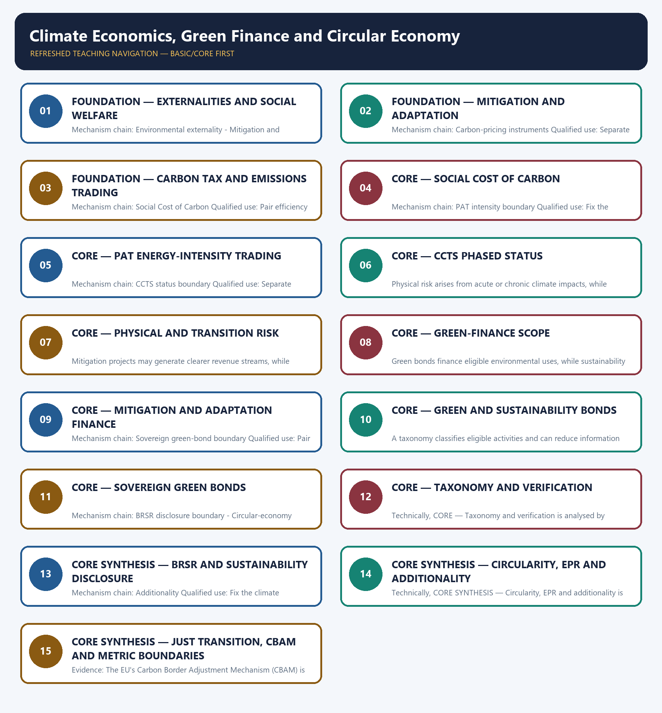

# Climate Economics, Green Finance and Circular Economy — Learner-v2 Complete Learning Session

> **Authoring-only generation:** 2026-09-03. No PDF was rendered and no tracker or index was mutated.

### SOURCE, PROGRESSION AND CURRENT-LINKAGE AUDIT

- **Generation date:** 2026-09-03.
- **Repository-first evidence:** the Basic owner is taught first and preserved in full; the Advanced owner is retained only in the optional final teaching block.
- **OCR evidence:** Repository Markdown was primary. OCR-searchable local official General Studies papers were used only to confirm printed routed demands. No answer key, marking scheme, unsupported page precision or current macroeconomic statistic was inferred from them.
- **Qdrant:** not used; repository Markdown and available OCR context were sufficient.
- **PYQ integrity:** Audited ledgers route objective concepts on the Social Cost of Carbon, greenwashing, BRSR, circular-economy emission channels and sustainability bonds. Their concepts are taught in Basic and practice, while unavailable or provisional answer letters are not inferred.
- **Live-link boundary:** The BEE carbon-market URL returned a generic shell. The package therefore preserves the owner-recorded phased-status boundary and imports no current carbon price, sector target, taxonomy status, recycling rate, climate-finance amount or market-operational claim.
- **Fact/inference discipline:** no current-affairs item, PYQ wording, figure or quotation is invented.

### LIVE OFFICIAL-SOURCE ATTEMPT LOG

The checks below were made on 2026-09-03. Substantive official text is used only for the proposition it actually supports; binary files, dynamic shells, stubs and undated dashboard snippets are recorded but not converted into current claims.

- https://beeindia.gov.in/en/programmes/carbon-market — fetch on 2026-09-03 redirected to a generic BEE landing page with no substantive scheme text; no sector, cycle, target, credit-price or operational-status claim was imported.

## BASIC LEARNING SESSION

### DEEP-REVIEW LEARNING CONTRACT

| Control | Binding rule for this package |
|---|---|
| Syllabus boundary | Complete Economy Basic/Core is answer-complete before optional Advanced depth. |
| Formula boundary | Formula, numerator, denominator, unit, stock/flow, nominal/real, base year, level/rate and accounting identity are explicit. |
| Institutional boundary | Constitution, statute, delegated rule, regulator mandate, policy, recommendation, scheme and implementation outcome remain distinct. |
| Transmission method | Shock or instrument → prices/quantities/balance sheets/incentives → institution and market response → output, employment, distribution, stability and external effect → lag and trade-off. |
| Current-data method | Source → release date → reference period → unit/denominator → provisional/revised/final status; incompatible Budget, Survey or statistical vintages are never mixed. |
| Programme-status method | Announced → approved → notified/guidelines issued → funded → operational → utilised → output → outcome are separate stages. |
| External/WTO method | Agreement text, member category, box, limit, notification, consultation, dispute and ruling are qualified without invented thresholds. |
| Causal method | Accounting identity, chronology and correlation are not promoted into behavioural or causal claims without mechanism, counterfactual and alternatives. |
| Answer balance | Model answers balance growth, distribution, stability, sustainability and federal dimensions with India-centric evidence. |
| Practice contract | Every solved item has demand decoding, a detailed examiner-grade model, executable timed/compression plan, marks rationale and answer-specific improvement. |
| Approval | This immutable successor remains `approved: false` pending explicit approval. |

**Canonical Basic/Core owner:** `upsc-ai-kit\knowledge\Economy\basic\25_Climate-Economics-Green-Finance-and-Circular-Economy.md`  
**Substantive canonical provenance owner:** `upsc-ai-kit\knowledge\Economy\25_Climate-Economics-Green-Finance-and-Circular-Economy_Learner-V2-Complete-Topic-Package.md`  
**Optional Advanced owner:** `upsc-ai-kit\knowledge\Economy\advanced\25_Climate-Economics-Green-Finance-and-Circular-Economy.md`  
**Official syllabus mapping:** `upsc-ai-kit\knowledge\Economy\OFFICIAL-UPSC-SYLLABUS-MAPPING.md`

### EVIDENCE, PYQ AND CURRENT-STATUS CONTROL

- Every data-heavy table states unit, denominator, geography, reference period and source/status.
- GDP/GVA, gross/net, domestic/national, nominal/real and level/rate distinctions remain exact.
- Monetary, fiscal and external chains state intermediaries, balance-sheet channels, lags, leakages and trade-offs.
- Budget and Economic Survey editions are never mixed; BE, RE, Actual, advance/provisional/revised/final estimates remain labelled.
- Scheme and programme claims distinguish announcement, approval, notification, operation, coverage, utilisation and measured outcome.
- WTO boxes, limits, de minimis, special treatment, notifications and disputes are qualified from authoritative rules.
- PYQ wording is preserved only where verified; reconstructed or routed demands remain labelled.
- **Current-status note, rechecked 2026-09-03:** volatile rates, estimates, scheme status, trade rules and institutional claims retain official source, release date, reference period and revision status.

**Generation-local live/current sources:**
- `https://beeindia.gov.in/en/programmes/carbon-market — fetch on 2026-09-03 redirected to a generic BEE landing page with no substantive scheme text; no sector, cycle, target, credit-price or operational-status claim was imported.`




*Distinct embedded teaching-navigation image. The separate continuous Cārvāka-style flowchart package remains an independent at-a-glance artifact.*

### SESSION 1 — FOUNDATION — EXTERNALITIES AND SOCIAL WELFARE

#### DEFINITION / WHAT THIS IS CALLED

**Plain-language definition:** An environmental externality is a cost or benefit imposed on others without full market compensation, so private production or consumption decisions may diverge from social welfare.

**Technical definition:** Mechanism chain: Environmental externality - Mitigation and adaptation Qualified use: Fix the climate instrument, metric, sector, notification status and reference period before evaluating it.

#### ANSWER-GRABBING OPENING — WRITE/ADAPT IN THE EXAM

> An environmental externality is a cost or benefit imposed on others without full market compensation, so private production or consumption decisions may diverge from social welfare.

#### MUST-WRITE KEYWORDS

- **FOUNDATION**
- **Externalities**
- **social welfare**
- **Mechanism chain**
- **Qualified use**
- **An environmental externality**

**How to use them:** Frame the answer through FOUNDATION; define Externalities, connect social welfare with Mechanism chain to explain the mechanism, and use Qualified use for the decisive comparison or qualification.

#### VISUAL FIRST

```text
EXTERNALITIES AND SOCIAL WELFARE
01. Environmental externality
    |
    v
02. Mitigation and adaptation
BOUNDARY -> Do not use mitigation and adaptation as synonyms or treat finance for one as finance for both.
```

*This topic-specific rail fixes the evidence sequence and its exam boundary before analysis.*

#### CORE EXPLANATION

An environmental externality is a cost or benefit imposed on others without full market compensation, so private production or consumption decisions may diverge from social welfare. Mitigation reduces greenhouse-gas emissions or increases sinks, while adaptation reduces exposure or vulnerability to climate impacts; the two address different parts of climate risk and are complements.

#### NAMED EVIDENCE AND MECHANISM

- An environmental externality is a cost or benefit imposed on others without full market compensation, so private production or consumption decisions may diverge from social welfare.
- Mitigation reduces greenhouse-gas emissions or increases sinks, while adaptation reduces exposure or vulnerability to climate impacts; the two address different parts of climate risk and are complements.

#### EXAMINER CAUTION

- Do not use mitigation and adaptation as synonyms or treat finance for one as finance for both.

#### EXAM LINK

- **Prelims:** Preserve the exact formula, territorial or resident boundary, price basis, base year, index basket, eligible counterparty, institution and legal status; never upgrade a projection into an actual or a regulatory direction into a universal rule.
- **Mains:** Fix the climate instrument, metric, sector, notification status and reference period before evaluating it.

#### MINI RECAP

- **Mechanism chain:** Environmental externality -> Mitigation and adaptation
- **Qualified use:** Fix the climate instrument, metric, sector, notification status and reference period before evaluating it.

#### CLOSING RECALL FLOW — FOUNDATION — EXTERNALITIES AND SOCIAL WELFARE

```text
START / CONCEPT: FOUNDATION — Externalities and social welfare
        |
        v
EXACT TERMS: FOUNDATION · Externalities · social welfare · Mechanism chain · Qualified use · An environmental externality
        |
        v
MECHANISM / ARGUMENT: Mechanism chain: Environmental externality - Mitigation and adaptation Qualified use: Fix the climate instrument, metric, sector, notification status and reference period before evaluating it.
        |
        v
CONSEQUENCE / CONTRAST: Mitigation reduces greenhouse-gas emissions or increases sinks, while adaptation reduces exposure or vulnerability to climate impacts; the two address different parts of climate risk and are complements.
        |
        v
UPSC TRAP / ANSWER-USE: Do not use mitigation and adaptation as synonyms or treat finance for one as finance for both.
        |
        v
ANSWER-GRABBING FORMULATION: An environmental externality is a cost or benefit imposed on others without full market compensation, so private production or consumption decisions may diverge from social welfare.
```
### SESSION 2 — FOUNDATION — MITIGATION AND ADAPTATION

#### DEFINITION / WHAT THIS IS CALLED

**Plain-language definition:** FOUNDATION — Mitigation and adaptation comprises FOUNDATION, Mitigation and adaptation as its core connected dimensions.

**Technical definition:** Mechanism chain: Carbon-pricing instruments Qualified use: Separate label, allocation, output, verified outcome and additionality in every green-finance claim.

#### ANSWER-GRABBING OPENING — WRITE/ADAPT IN THE EXAM

> Do not equate the Social Cost of Carbon, a carbon tax and a traded carbon price.

#### MUST-WRITE KEYWORDS

- **FOUNDATION**
- **Mitigation**
- **adaptation**
- **Mechanism chain**
- **Qualified use**
- **Social Cost**

**How to use them:** Frame the answer through FOUNDATION; define Mitigation, connect adaptation with Mechanism chain to explain the mechanism, and use Qualified use for the decisive comparison or qualification.

#### VISUAL FIRST

```text
MITIGATION AND ADAPTATION
01. Carbon-pricing instruments
BOUNDARY -> Do not equate the Social Cost of Carbon, a carbon tax and a traded carbon price.
```

*This topic-specific rail fixes the evidence sequence and its exam boundary before analysis.*

#### CORE EXPLANATION

A carbon tax sets a statutory price per unit of emissions, while emissions trading determines a market price under a quantity or baseline-and-credit architecture; instrument creation is not proof of emission reduction.

#### NAMED EVIDENCE AND MECHANISM

- A carbon tax sets a statutory price per unit of emissions, while emissions trading determines a market price under a quantity or baseline-and-credit architecture; instrument creation is not proof of emission reduction.

#### EXAMINER CAUTION

- Do not equate the Social Cost of Carbon, a carbon tax and a traded carbon price.

#### EXAM LINK

- **Prelims:** Preserve the exact formula, territorial or resident boundary, price basis, base year, index basket, eligible counterparty, institution and legal status; never upgrade a projection into an actual or a regulatory direction into a universal rule.
- **Mains:** Separate label, allocation, output, verified outcome and additionality in every green-finance claim.

#### MINI RECAP

- **Mechanism chain:** Carbon-pricing instruments
- **Qualified use:** Separate label, allocation, output, verified outcome and additionality in every green-finance claim.

#### CLOSING RECALL FLOW — FOUNDATION — MITIGATION AND ADAPTATION

```text
START / CONCEPT: FOUNDATION — Mitigation and adaptation
        |
        v
EXACT TERMS: FOUNDATION · Mitigation · adaptation · Mechanism chain · Qualified use · Social Cost
        |
        v
MECHANISM / ARGUMENT: Mechanism chain: Carbon-pricing instruments Qualified use: Separate label, allocation, output, verified outcome and additionality in every green-finance claim.
        |
        v
CONSEQUENCE / CONTRAST: A carbon tax sets a statutory price per unit of emissions, while emissions trading determines a market price under a quantity or baseline-and-credit architecture; instrument creation is not proof of emission reduction.
        |
        v
UPSC TRAP / ANSWER-USE: Do not miss this limiting distinction: do not equate the Social Cost of Carbon, a carbon tax and a traded...
        |
        v
ANSWER-GRABBING FORMULATION: Do not equate the Social Cost of Carbon, a carbon tax and a traded carbon price.
```
### SESSION 3 — FOUNDATION — CARBON TAX AND EMISSIONS TRADING

#### DEFINITION / WHAT THIS IS CALLED

**Plain-language definition:** The Social Cost of Carbon is a model-based monetary estimate of damage from an additional tonne of emissions and is distinct from both a statutory carbon tax and a traded permit or credit price.

**Technical definition:** Mechanism chain: Social Cost of Carbon Qualified use: Pair efficiency and decarbonisation with worker, regional, affordability and energy-access consequences.

#### ANSWER-GRABBING OPENING — WRITE/ADAPT IN THE EXAM

> The Social Cost of Carbon is a model-based monetary estimate of damage from an additional tonne of emissions and is distinct from both a statutory carbon tax and a traded permit or credit price.

#### MUST-WRITE KEYWORDS

- **FOUNDATION**
- **Carbon tax**
- **emissions trading**
- **Mechanism chain**
- **Qualified use**
- **The Social Cost of Carbon**

**How to use them:** Frame the answer through FOUNDATION; define Carbon tax, connect emissions trading with Mechanism chain to explain the mechanism, and use Qualified use for the decisive comparison or qualification.

#### VISUAL FIRST

```text
CARBON TAX AND EMISSIONS TRADING
01. Social Cost of Carbon
BOUNDARY -> Do not convert intensity improvement into a claim of falling absolute emissions.
```

*This topic-specific rail fixes the evidence sequence and its exam boundary before analysis.*

#### CORE EXPLANATION

The Social Cost of Carbon is a model-based monetary estimate of damage from an additional tonne of emissions and is distinct from both a statutory carbon tax and a traded permit or credit price.

#### NAMED EVIDENCE AND MECHANISM

- The Social Cost of Carbon is a model-based monetary estimate of damage from an additional tonne of emissions and is distinct from both a statutory carbon tax and a traded permit or credit price.

#### EXAMINER CAUTION

- Do not convert intensity improvement into a claim of falling absolute emissions.

#### EXAM LINK

- **Prelims:** Preserve the exact formula, territorial or resident boundary, price basis, base year, index basket, eligible counterparty, institution and legal status; never upgrade a projection into an actual or a regulatory direction into a universal rule.
- **Mains:** Pair efficiency and decarbonisation with worker, regional, affordability and energy-access consequences.

#### MINI RECAP

- **Mechanism chain:** Social Cost of Carbon
- **Qualified use:** Pair efficiency and decarbonisation with worker, regional, affordability and energy-access consequences.

#### CLOSING RECALL FLOW — FOUNDATION — CARBON TAX AND EMISSIONS TRADING

```text
START / CONCEPT: FOUNDATION — Carbon tax and emissions trading
        |
        v
EXACT TERMS: FOUNDATION · Carbon tax · emissions trading · Mechanism chain · Qualified use · The Social Cost of Carbon
        |
        v
MECHANISM / ARGUMENT: Mechanism chain: Social Cost of Carbon Qualified use: Pair efficiency and decarbonisation with worker, regional, affordability and energy-access consequences.
        |
        v
CONSEQUENCE / CONTRAST: Do not convert intensity improvement into a claim of falling absolute emissions.
        |
        v
UPSC TRAP / ANSWER-USE: Do not miss this limiting distinction: do not convert intensity improvement into a claim of falling absolute emissions.
        |
        v
ANSWER-GRABBING FORMULATION: The Social Cost of Carbon is a model-based monetary estimate of damage from an additional tonne of emissions and is distinct from both a statutory carbon tax and a traded permit or credit price.
```
### SESSION 4 — CORE — SOCIAL COST OF CARBON

#### DEFINITION / WHAT THIS IS CALLED

**Plain-language definition:** CORE — Social Cost of Carbon comprises Social Cost of Carbon, Mechanism chain and Qualified use as its core connected dimensions.

**Technical definition:** Mechanism chain: PAT intensity boundary Qualified use: Fix the climate instrument, metric, sector, notification status and reference period before evaluating it.

#### ANSWER-GRABBING OPENING — WRITE/ADAPT IN THE EXAM

> CORE — Social Cost of Carbon comprises Social Cost of Carbon, Mechanism chain and Qualified use as its core connected dimensions.

#### MUST-WRITE KEYWORDS

- **Social Cost of Carbon**
- **Mechanism chain**
- **Qualified use**
- **Perform**
- **Achieve**
- **Trade**

**How to use them:** Frame the answer through Social Cost of Carbon; define Mechanism chain, connect Qualified use with Perform to explain the mechanism, and use Achieve for the decisive comparison or qualification.

#### VISUAL FIRST

```text
SOCIAL COST OF CARBON
01. PAT intensity boundary
BOUNDARY -> Do not describe a phased or draft carbon-market status as economy-wide mature operation.
```

*This topic-specific rail fixes the evidence sequence and its exam boundary before analysis.*

#### CORE EXPLANATION

Perform, Achieve and Trade sets energy-intensity targets and trades Energy Saving Certificates; intensity improvement can coexist with rising absolute emissions when output expands faster.

#### NAMED EVIDENCE AND MECHANISM

- Perform, Achieve and Trade sets energy-intensity targets and trades Energy Saving Certificates; intensity improvement can coexist with rising absolute emissions when output expands faster.

#### EXAMINER CAUTION

- Do not describe a phased or draft carbon-market status as economy-wide mature operation.

#### EXAM LINK

- **Prelims:** Preserve the exact formula, territorial or resident boundary, price basis, base year, index basket, eligible counterparty, institution and legal status; never upgrade a projection into an actual or a regulatory direction into a universal rule.
- **Mains:** Fix the climate instrument, metric, sector, notification status and reference period before evaluating it.

#### MINI RECAP

- **Mechanism chain:** PAT intensity boundary
- **Qualified use:** Fix the climate instrument, metric, sector, notification status and reference period before evaluating it.

#### CLOSING RECALL FLOW — CORE — SOCIAL COST OF CARBON

```text
START / CONCEPT: CORE — Social Cost of Carbon
        |
        v
EXACT TERMS: Social Cost of Carbon · Mechanism chain · Qualified use · Perform · Achieve · Trade
        |
        v
MECHANISM / ARGUMENT: Mechanism chain: PAT intensity boundary Qualified use: Fix the climate instrument, metric, sector, notification status and reference period before evaluating it.
        |
        v
CONSEQUENCE / CONTRAST: Perform, Achieve and Trade sets energy-intensity targets and trades Energy Saving Certificates; intensity improvement can coexist with rising absolute emissions when output expands faster.
        |
        v
UPSC TRAP / ANSWER-USE: Do not describe a phased or draft carbon-market status as economy-wide mature operation.
        |
        v
ANSWER-GRABBING FORMULATION: CORE — Social Cost of Carbon comprises Social Cost of Carbon, Mechanism chain and Qualified use as its core connected dimensions.
```
### SESSION 5 — CORE — PAT ENERGY-INTENSITY TRADING

#### DEFINITION / WHAT THIS IS CALLED

**Plain-language definition:** India's Carbon Credit Trading Scheme is a phased compliance-market architecture whose sector coverage, target years, notification status and market operation must be stated from a dated official source rather than assumed economy-wide.

**Technical definition:** Mechanism chain: CCTS status boundary Qualified use: Separate label, allocation, output, verified outcome and additionality in every green-finance claim.

#### ANSWER-GRABBING OPENING — WRITE/ADAPT IN THE EXAM

> India's Carbon Credit Trading Scheme is a phased compliance-market architecture whose sector coverage, target years, notification status and market operation must be stated from a dated official source rather than assumed economy-wide.

#### MUST-WRITE KEYWORDS

- **PAT energy-intensity trading**
- **Mechanism chain**
- **Qualified use**
- **India's Carbon Credit Trading Scheme**
- **CCTS**
- **Qualified**

**How to use them:** Frame the answer through PAT energy-intensity trading; define Mechanism chain, connect Qualified use with India's Carbon Credit Trading Scheme to explain the mechanism, and use CCTS for the decisive comparison or qualification.

#### VISUAL FIRST

```text
PAT ENERGY-INTENSITY TRADING
01. CCTS status boundary
BOUNDARY -> Do not treat a green label, taxonomy classification or disclosure as verified additionality.
```

*This topic-specific rail fixes the evidence sequence and its exam boundary before analysis.*

#### CORE EXPLANATION

India's Carbon Credit Trading Scheme is a phased compliance-market architecture whose sector coverage, target years, notification status and market operation must be stated from a dated official source rather than assumed economy-wide.

#### NAMED EVIDENCE AND MECHANISM

- India's Carbon Credit Trading Scheme is a phased compliance-market architecture whose sector coverage, target years, notification status and market operation must be stated from a dated official source rather than assumed economy-wide.

#### EXAMINER CAUTION

- Do not treat a green label, taxonomy classification or disclosure as verified additionality.

#### EXAM LINK

- **Prelims:** Preserve the exact formula, territorial or resident boundary, price basis, base year, index basket, eligible counterparty, institution and legal status; never upgrade a projection into an actual or a regulatory direction into a universal rule.
- **Mains:** Separate label, allocation, output, verified outcome and additionality in every green-finance claim.

#### MINI RECAP

- **Mechanism chain:** CCTS status boundary
- **Qualified use:** Separate label, allocation, output, verified outcome and additionality in every green-finance claim.

#### CLOSING RECALL FLOW — CORE — PAT ENERGY-INTENSITY TRADING

```text
START / CONCEPT: CORE — PAT energy-intensity trading
        |
        v
EXACT TERMS: PAT energy-intensity trading · Mechanism chain · Qualified use · India's Carbon Credit Trading Scheme · CCTS · Qualified
        |
        v
MECHANISM / ARGUMENT: Mechanism chain: CCTS status boundary Qualified use: Separate label, allocation, output, verified outcome and additionality in every green-finance claim.
        |
        v
CONSEQUENCE / CONTRAST: Do not treat a green label, taxonomy classification or disclosure as verified additionality.
        |
        v
UPSC TRAP / ANSWER-USE: Do not miss this limiting distinction: do not treat a green label, taxonomy classification or disclosure as verified additionality.
        |
        v
ANSWER-GRABBING FORMULATION: India's Carbon Credit Trading Scheme is a phased compliance-market architecture whose sector coverage, target years, notification status and market operation must be stated from a dated official source rather than assumed economy-wide.
```
### SESSION 6 — CORE — CCTS PHASED STATUS

#### DEFINITION / WHAT THIS IS CALLED

**Plain-language definition:** Mechanism chain: Physical and transition risk - Green-finance scope Qualified use: Pair efficiency and decarbonisation with worker, regional, affordability and energy-access consequences.

**Technical definition:** Physical risk arises from acute or chronic climate impacts, while transition risk arises from changes in policy, technology, markets or preferences; both can affect firms, banks, households and public finance.

#### ANSWER-GRABBING OPENING — WRITE/ADAPT IN THE EXAM

> Physical risk arises from acute or chronic climate impacts, while transition risk arises from changes in policy, technology, markets or preferences; both can affect firms, banks, households and public finance.

#### MUST-WRITE KEYWORDS

- **CCTS phased status**
- **Mechanism chain**
- **Qualified use**
- **Physical**
- **Green**
- **Green-finance**

**How to use them:** Frame the answer through CCTS phased status; define Mechanism chain, connect Qualified use with Physical to explain the mechanism, and use Green for the decisive comparison or qualification.

#### VISUAL FIRST

```text
CCTS PHASED STATUS
01. Physical and transition risk
    |
    v
02. Green-finance scope
BOUNDARY -> Do not merge green bonds and sustainability bonds or borrowing and expenditure outcomes.
```

*This topic-specific rail fixes the evidence sequence and its exam boundary before analysis.*

#### CORE EXPLANATION

Physical risk arises from acute or chronic climate impacts, while transition risk arises from changes in policy, technology, markets or preferences; both can affect firms, banks, households and public finance. Green finance directs capital to eligible environmental or transition-aligned uses, but a green label alone does not establish verified environmental performance or additionality.

#### NAMED EVIDENCE AND MECHANISM

- Physical risk arises from acute or chronic climate impacts, while transition risk arises from changes in policy, technology, markets or preferences; both can affect firms, banks, households and public finance.
- Green finance directs capital to eligible environmental or transition-aligned uses, but a green label alone does not establish verified environmental performance or additionality.

#### EXAMINER CAUTION

- Do not merge green bonds and sustainability bonds or borrowing and expenditure outcomes.

#### EXAM LINK

- **Prelims:** Preserve the exact formula, territorial or resident boundary, price basis, base year, index basket, eligible counterparty, institution and legal status; never upgrade a projection into an actual or a regulatory direction into a universal rule.
- **Mains:** Pair efficiency and decarbonisation with worker, regional, affordability and energy-access consequences.

#### MINI RECAP

- **Mechanism chain:** Physical and transition risk -> Green-finance scope
- **Qualified use:** Pair efficiency and decarbonisation with worker, regional, affordability and energy-access consequences.

#### CLOSING RECALL FLOW — CORE — CCTS PHASED STATUS

```text
START / CONCEPT: CORE — CCTS phased status
        |
        v
EXACT TERMS: CCTS phased status · Mechanism chain · Qualified use · Physical · Green · Green-finance
        |
        v
MECHANISM / ARGUMENT: Mechanism chain: Physical and transition risk - Green-finance scope Qualified use: Pair efficiency and decarbonisation with worker, regional, affordability and energy-access consequences.
        |
        v
CONSEQUENCE / CONTRAST: Green finance directs capital to eligible environmental or transition-aligned uses, but a green label alone does not establish verified environmental performance or additionality.
        |
        v
UPSC TRAP / ANSWER-USE: Do not merge green bonds and sustainability bonds or borrowing and expenditure outcomes.
        |
        v
ANSWER-GRABBING FORMULATION: Physical risk arises from acute or chronic climate impacts, while transition risk arises from changes in policy, technology, markets or preferences; both can affect firms, banks, households and public finance.
```
### SESSION 7 — CORE — PHYSICAL AND TRANSITION RISK

#### DEFINITION / WHAT THIS IS CALLED

**Plain-language definition:** Mechanism chain: Mitigation and adaptation finance Qualified use: Fix the climate instrument, metric, sector, notification status and reference period before evaluating it.

**Technical definition:** Mitigation projects may generate clearer revenue streams, while adaptation often has public-good and avoided-loss benefits; financing one category does not substitute for the other.

#### ANSWER-GRABBING OPENING — WRITE/ADAPT IN THE EXAM

> Mitigation projects may generate clearer revenue streams, while adaptation often has public-good and avoided-loss benefits; financing one category does not substitute for the other.

#### MUST-WRITE KEYWORDS

- **Physical**
- **transition risk**
- **Mechanism chain**
- **Qualified use**
- **Mitigation**
- **Qualified**

**How to use them:** Frame the answer through Physical; define transition risk, connect Mechanism chain with Qualified use to explain the mechanism, and use Mitigation for the decisive comparison or qualification.

#### VISUAL FIRST

```text
PHYSICAL AND TRANSITION RISK
01. Mitigation and adaptation finance
BOUNDARY -> Do not reduce circular economy to recycling or ignore repair and reuse.
```

*This topic-specific rail fixes the evidence sequence and its exam boundary before analysis.*

#### CORE EXPLANATION

Mitigation projects may generate clearer revenue streams, while adaptation often has public-good and avoided-loss benefits; financing one category does not substitute for the other.

#### NAMED EVIDENCE AND MECHANISM

- Mitigation projects may generate clearer revenue streams, while adaptation often has public-good and avoided-loss benefits; financing one category does not substitute for the other.

#### EXAMINER CAUTION

- Do not reduce circular economy to recycling or ignore repair and reuse.

#### EXAM LINK

- **Prelims:** Preserve the exact formula, territorial or resident boundary, price basis, base year, index basket, eligible counterparty, institution and legal status; never upgrade a projection into an actual or a regulatory direction into a universal rule.
- **Mains:** Fix the climate instrument, metric, sector, notification status and reference period before evaluating it.

#### MINI RECAP

- **Mechanism chain:** Mitigation and adaptation finance
- **Qualified use:** Fix the climate instrument, metric, sector, notification status and reference period before evaluating it.

#### CLOSING RECALL FLOW — CORE — PHYSICAL AND TRANSITION RISK

```text
START / CONCEPT: CORE — Physical and transition risk
        |
        v
EXACT TERMS: Physical · transition risk · Mechanism chain · Qualified use · Mitigation · Qualified
        |
        v
MECHANISM / ARGUMENT: Mechanism chain: Mitigation and adaptation finance Qualified use: Fix the climate instrument, metric, sector, notification status and reference period before evaluating it.
        |
        v
CONSEQUENCE / CONTRAST: Do not reduce circular economy to recycling or ignore repair and reuse.
        |
        v
UPSC TRAP / ANSWER-USE: Do not miss this limiting distinction: mitigation projects may generate clearer revenue streams.
        |
        v
ANSWER-GRABBING FORMULATION: Mitigation projects may generate clearer revenue streams, while adaptation often has public-good and avoided-loss benefits; financing one category does not substitute for the other.
```
### SESSION 8 — CORE — GREEN-FINANCE SCOPE

#### DEFINITION / WHAT THIS IS CALLED

**Plain-language definition:** Mechanism chain: Green and sustainability bonds Qualified use: Separate label, allocation, output, verified outcome and additionality in every green-finance claim.

**Technical definition:** Green bonds finance eligible environmental uses, while sustainability bonds may combine environmental and social uses; both require credible frameworks, allocation reporting and verification.

#### ANSWER-GRABBING OPENING — WRITE/ADAPT IN THE EXAM

> Mechanism chain: Green and sustainability bonds Qualified use: Separate label, allocation, output, verified outcome and additionality in every green-finance claim.

#### MUST-WRITE KEYWORDS

- **Green-finance scope**
- **Mechanism chain**
- **Qualified use**
- **Green**
- **CBAM**
- **India's**

**How to use them:** Frame the answer through Green-finance scope; define Mechanism chain, connect Qualified use with Green to explain the mechanism, and use CBAM for the decisive comparison or qualification.

#### VISUAL FIRST

```text
GREEN-FINANCE SCOPE
01. Green and sustainability bonds
BOUNDARY -> Do not treat CBAM as part of India's domestic carbon market.
```

*This topic-specific rail fixes the evidence sequence and its exam boundary before analysis.*

#### CORE EXPLANATION

Green bonds finance eligible environmental uses, while sustainability bonds may combine environmental and social uses; both require credible frameworks, allocation reporting and verification.

#### NAMED EVIDENCE AND MECHANISM

- Green bonds finance eligible environmental uses, while sustainability bonds may combine environmental and social uses; both require credible frameworks, allocation reporting and verification.

#### EXAMINER CAUTION

- Do not treat CBAM as part of India's domestic carbon market.

#### EXAM LINK

- **Prelims:** Preserve the exact formula, territorial or resident boundary, price basis, base year, index basket, eligible counterparty, institution and legal status; never upgrade a projection into an actual or a regulatory direction into a universal rule.
- **Mains:** Separate label, allocation, output, verified outcome and additionality in every green-finance claim.

#### MINI RECAP

- **Mechanism chain:** Green and sustainability bonds
- **Qualified use:** Separate label, allocation, output, verified outcome and additionality in every green-finance claim.

#### CLOSING RECALL FLOW — CORE — GREEN-FINANCE SCOPE

```text
START / CONCEPT: CORE — Green-finance scope
        |
        v
EXACT TERMS: Green-finance scope · Mechanism chain · Qualified use · Green · CBAM · India's
        |
        v
MECHANISM / ARGUMENT: Do not treat CBAM as part of India's domestic carbon market.
        |
        v
CONSEQUENCE / CONTRAST: Green bonds finance eligible environmental uses, while sustainability bonds may combine environmental and social uses; both require credible frameworks, allocation reporting and verification.
        |
        v
UPSC TRAP / ANSWER-USE: Do not miss this limiting distinction: do not treat CBAM as part of India's domestic carbon market.
        |
        v
ANSWER-GRABBING FORMULATION: Mechanism chain: Green and sustainability bonds Qualified use: Separate label, allocation, output, verified outcome and additionality in every green-finance claim.
```
### SESSION 9 — CORE — MITIGATION AND ADAPTATION FINANCE

#### DEFINITION / WHAT THIS IS CALLED

**Plain-language definition:** India's sovereign green bonds earmark government borrowing for eligible public green projects under a framework; earmarking is not certified expenditure, completed assets or measured climate outcome.

**Technical definition:** Mechanism chain: Sovereign green-bond boundary Qualified use: Pair efficiency and decarbonisation with worker, regional, affordability and energy-access consequences.

#### ANSWER-GRABBING OPENING — WRITE/ADAPT IN THE EXAM

> Do not convert an approved target or finance envelope into achievement.

#### MUST-WRITE KEYWORDS

- **Mitigation**
- **adaptation finance**
- **Mechanism chain**
- **Qualified use**
- **India's**
- **Sovereign**

**How to use them:** Frame the answer through Mitigation; define adaptation finance, connect Mechanism chain with Qualified use to explain the mechanism, and use India's for the decisive comparison or qualification.

#### VISUAL FIRST

```text
MITIGATION AND ADAPTATION FINANCE
01. Sovereign green-bond boundary
BOUNDARY -> Do not convert an approved target or finance envelope into achievement.
```

*This topic-specific rail fixes the evidence sequence and its exam boundary before analysis.*

#### CORE EXPLANATION

India's sovereign green bonds earmark government borrowing for eligible public green projects under a framework; earmarking is not certified expenditure, completed assets or measured climate outcome.

#### NAMED EVIDENCE AND MECHANISM

- India's sovereign green bonds earmark government borrowing for eligible public green projects under a framework; earmarking is not certified expenditure, completed assets or measured climate outcome.

#### EXAMINER CAUTION

- Do not convert an approved target or finance envelope into achievement.

#### EXAM LINK

- **Prelims:** Preserve the exact formula, territorial or resident boundary, price basis, base year, index basket, eligible counterparty, institution and legal status; never upgrade a projection into an actual or a regulatory direction into a universal rule.
- **Mains:** Pair efficiency and decarbonisation with worker, regional, affordability and energy-access consequences.

#### MINI RECAP

- **Mechanism chain:** Sovereign green-bond boundary
- **Qualified use:** Pair efficiency and decarbonisation with worker, regional, affordability and energy-access consequences.

#### CLOSING RECALL FLOW — CORE — MITIGATION AND ADAPTATION FINANCE

```text
START / CONCEPT: CORE — Mitigation and adaptation finance
        |
        v
EXACT TERMS: Mitigation · adaptation finance · Mechanism chain · Qualified use · India's · Sovereign
        |
        v
MECHANISM / ARGUMENT: Mechanism chain: Sovereign green-bond boundary Qualified use: Pair efficiency and decarbonisation with worker, regional, affordability and energy-access consequences.
        |
        v
CONSEQUENCE / CONTRAST: India's sovereign green bonds earmark government borrowing for eligible public green projects under a framework; earmarking is not certified expenditure, completed assets or measured climate outcome.
        |
        v
UPSC TRAP / ANSWER-USE: Do not miss this limiting distinction: do not convert an approved target or finance envelope into achievement.
        |
        v
ANSWER-GRABBING FORMULATION: Do not convert an approved target or finance envelope into achievement.
```
### SESSION 10 — CORE — GREEN AND SUSTAINABILITY BONDS

#### DEFINITION / WHAT THIS IS CALLED

**Plain-language definition:** Mechanism chain: Taxonomy and verification Qualified use: Fix the climate instrument, metric, sector, notification status and reference period before evaluating it.

**Technical definition:** A taxonomy classifies eligible activities and can reduce information asymmetry, but credible claims still require use-of-proceeds tracking, metrics, assurance and safeguards against greenwashing.

#### ANSWER-GRABBING OPENING — WRITE/ADAPT IN THE EXAM

> A taxonomy classifies eligible activities and can reduce information asymmetry, but credible claims still require use-of-proceeds tracking, metrics, assurance and safeguards against greenwashing.

#### MUST-WRITE KEYWORDS

- **Green**
- **sustainability bonds**
- **Mechanism chain**
- **Qualified use**
- **Taxonomy**
- **Qualified**

**How to use them:** Frame the answer through Green; define sustainability bonds, connect Mechanism chain with Qualified use to explain the mechanism, and use Taxonomy for the decisive comparison or qualification.

#### VISUAL FIRST

```text
GREEN AND SUSTAINABILITY BONDS
01. Taxonomy and verification
BOUNDARY -> Do not infer objective answer letters, current carbon prices, recycling rates or finance totals.
```

*This topic-specific rail fixes the evidence sequence and its exam boundary before analysis.*

#### CORE EXPLANATION

A taxonomy classifies eligible activities and can reduce information asymmetry, but credible claims still require use-of-proceeds tracking, metrics, assurance and safeguards against greenwashing.

#### NAMED EVIDENCE AND MECHANISM

- A taxonomy classifies eligible activities and can reduce information asymmetry, but credible claims still require use-of-proceeds tracking, metrics, assurance and safeguards against greenwashing.

#### EXAMINER CAUTION

- Do not infer objective answer letters, current carbon prices, recycling rates or finance totals.

#### EXAM LINK

- **Prelims:** Preserve the exact formula, territorial or resident boundary, price basis, base year, index basket, eligible counterparty, institution and legal status; never upgrade a projection into an actual or a regulatory direction into a universal rule.
- **Mains:** Fix the climate instrument, metric, sector, notification status and reference period before evaluating it.

#### MINI RECAP

- **Mechanism chain:** Taxonomy and verification
- **Qualified use:** Fix the climate instrument, metric, sector, notification status and reference period before evaluating it.

#### CLOSING RECALL FLOW — CORE — GREEN AND SUSTAINABILITY BONDS

```text
START / CONCEPT: CORE — Green and sustainability bonds
        |
        v
EXACT TERMS: Green · sustainability bonds · Mechanism chain · Qualified use · Taxonomy · Qualified
        |
        v
MECHANISM / ARGUMENT: Mechanism chain: Taxonomy and verification Qualified use: Fix the climate instrument, metric, sector, notification status and reference period before evaluating it.
        |
        v
CONSEQUENCE / CONTRAST: Do not infer objective answer letters, current carbon prices, recycling rates or finance totals.
        |
        v
UPSC TRAP / ANSWER-USE: Do not miss this limiting distinction: a taxonomy classifies eligible activities and can reduce information asymmetry.
        |
        v
ANSWER-GRABBING FORMULATION: A taxonomy classifies eligible activities and can reduce information asymmetry, but credible claims still require use-of-proceeds tracking, metrics, assurance and safeguards against greenwashing.
```
### SESSION 11 — CORE — SOVEREIGN GREEN BONDS

#### DEFINITION / WHAT THIS IS CALLED

**Plain-language definition:** Circularity prioritises reduction, redesign, durability, reuse, repair, refurbishment and remanufacture before residual material recovery; recycling alone is not a circular economy.

**Technical definition:** Mechanism chain: BRSR disclosure boundary - Circular-economy hierarchy Qualified use: Separate label, allocation, output, verified outcome and additionality in every green-finance claim.

#### ANSWER-GRABBING OPENING — WRITE/ADAPT IN THE EXAM

> SEBI's Business Responsibility and Sustainability Reporting framework standardises sustainability disclosure for its covered listed-company perimeter; disclosure improves information but does not itself prove impact.

#### MUST-WRITE KEYWORDS

- **Sovereign green bonds**
- **Mechanism chain**
- **Qualified use**
- **SEBI's Business Responsibility**
- **Sustainability Reporting**
- **Circularity**

**How to use them:** Frame the answer through Sovereign green bonds; define Mechanism chain, connect Qualified use with SEBI's Business Responsibility to explain the mechanism, and use Sustainability Reporting for the decisive comparison or qualification.

#### VISUAL FIRST

```text
SOVEREIGN GREEN BONDS
01. BRSR disclosure boundary
    |
    v
02. Circular-economy hierarchy
BOUNDARY -> Do not use mitigation and adaptation as synonyms or treat finance for one as finance for both.
```

*This topic-specific rail fixes the evidence sequence and its exam boundary before analysis.*

#### CORE EXPLANATION

SEBI's Business Responsibility and Sustainability Reporting framework standardises sustainability disclosure for its covered listed-company perimeter; disclosure improves information but does not itself prove impact. Circularity prioritises reduction, redesign, durability, reuse, repair, refurbishment and remanufacture before residual material recovery; recycling alone is not a circular economy.

#### NAMED EVIDENCE AND MECHANISM

- SEBI's Business Responsibility and Sustainability Reporting framework standardises sustainability disclosure for its covered listed-company perimeter; disclosure improves information but does not itself prove impact.
- Circularity prioritises reduction, redesign, durability, reuse, repair, refurbishment and remanufacture before residual material recovery; recycling alone is not a circular economy.

#### EXAMINER CAUTION

- Do not use mitigation and adaptation as synonyms or treat finance for one as finance for both.

#### EXAM LINK

- **Prelims:** Preserve the exact formula, territorial or resident boundary, price basis, base year, index basket, eligible counterparty, institution and legal status; never upgrade a projection into an actual or a regulatory direction into a universal rule.
- **Mains:** Separate label, allocation, output, verified outcome and additionality in every green-finance claim.

#### MINI RECAP

- **Mechanism chain:** BRSR disclosure boundary -> Circular-economy hierarchy
- **Qualified use:** Separate label, allocation, output, verified outcome and additionality in every green-finance claim.

#### CLOSING RECALL FLOW — CORE — SOVEREIGN GREEN BONDS

```text
START / CONCEPT: CORE — Sovereign green bonds
        |
        v
EXACT TERMS: Sovereign green bonds · Mechanism chain · Qualified use · SEBI's Business Responsibility · Sustainability Reporting · Circularity
        |
        v
MECHANISM / ARGUMENT: Mechanism chain: BRSR disclosure boundary - Circular-economy hierarchy Qualified use: Separate label, allocation, output, verified outcome and additionality in every green-finance claim.
        |
        v
CONSEQUENCE / CONTRAST: Circularity prioritises reduction, redesign, durability, reuse, repair, refurbishment and remanufacture before residual material recovery; recycling alone is not a circular economy.
        |
        v
UPSC TRAP / ANSWER-USE: Do not use mitigation and adaptation as synonyms or treat finance for one as finance for both.
        |
        v
ANSWER-GRABBING FORMULATION: SEBI's Business Responsibility and Sustainability Reporting framework standardises sustainability disclosure for its covered listed-company perimeter; disclosure improves information but does not itself prove impact.
```
### SESSION 12 — CORE — TAXONOMY AND VERIFICATION

#### DEFINITION / WHAT THIS IS CALLED

**Plain-language definition:** Mechanism chain: Extended Producer Responsibility Qualified use: Pair efficiency and decarbonisation with worker, regional, affordability and energy-access consequences.

**Technical definition:** Technically, CORE — Taxonomy and verification is analysed by relating Taxonomy to verification, then testing the relationship through Mechanism chain and Qualified use.

#### ANSWER-GRABBING OPENING — WRITE/ADAPT IN THE EXAM

> Do not equate the Social Cost of Carbon, a carbon tax and a traded carbon price.

#### MUST-WRITE KEYWORDS

- **Taxonomy**
- **verification**
- **Mechanism chain**
- **Qualified use**
- **Social Cost**
- **Carbon**

**How to use them:** Frame the answer through Taxonomy; define verification, connect Mechanism chain with Qualified use to explain the mechanism, and use Social Cost for the decisive comparison or qualification.

#### VISUAL FIRST

```text
TAXONOMY AND VERIFICATION
01. Extended Producer Responsibility
BOUNDARY -> Do not equate the Social Cost of Carbon, a carbon tax and a traded carbon price.
```

*This topic-specific rail fixes the evidence sequence and its exam boundary before analysis.*

#### CORE EXPLANATION

Extended Producer Responsibility shifts specified end-of-life obligations towards producers for notified product or waste categories, but compliance certificates require monitoring of actual collection and processing.

#### NAMED EVIDENCE AND MECHANISM

- Extended Producer Responsibility shifts specified end-of-life obligations towards producers for notified product or waste categories, but compliance certificates require monitoring of actual collection and processing.

#### EXAMINER CAUTION

- Do not equate the Social Cost of Carbon, a carbon tax and a traded carbon price.

#### EXAM LINK

- **Prelims:** Preserve the exact formula, territorial or resident boundary, price basis, base year, index basket, eligible counterparty, institution and legal status; never upgrade a projection into an actual or a regulatory direction into a universal rule.
- **Mains:** Pair efficiency and decarbonisation with worker, regional, affordability and energy-access consequences.

#### MINI RECAP

- **Mechanism chain:** Extended Producer Responsibility
- **Qualified use:** Pair efficiency and decarbonisation with worker, regional, affordability and energy-access consequences.

#### CLOSING RECALL FLOW — CORE — TAXONOMY AND VERIFICATION

```text
START / CONCEPT: CORE — Taxonomy and verification
        |
        v
EXACT TERMS: Taxonomy · verification · Mechanism chain · Qualified use · Social Cost · Carbon
        |
        v
MECHANISM / ARGUMENT: Mechanism chain: Extended Producer Responsibility Qualified use: Pair efficiency and decarbonisation with worker, regional, affordability and energy-access consequences.
        |
        v
CONSEQUENCE / CONTRAST: The resulting consequence is that do not equate the Social Cost of Carbon, a carbon tax and a traded...
        |
        v
UPSC TRAP / ANSWER-USE: Do not miss this limiting distinction: do not equate the Social Cost of Carbon, a carbon tax and a traded...
        |
        v
ANSWER-GRABBING FORMULATION: Do not equate the Social Cost of Carbon, a carbon tax and a traded carbon price.
```
### SESSION 13 — CORE SYNTHESIS — BRSR AND SUSTAINABILITY DISCLOSURE

#### DEFINITION / WHAT THIS IS CALLED

**Plain-language definition:** Environmental additionality asks whether finance or policy caused benefits beyond a credible baseline; relabelling an already-financed activity is not the same as additional climate action.

**Technical definition:** Mechanism chain: Additionality Qualified use: Fix the climate instrument, metric, sector, notification status and reference period before evaluating it.

#### ANSWER-GRABBING OPENING — WRITE/ADAPT IN THE EXAM

> Environmental additionality asks whether finance or policy caused benefits beyond a credible baseline; relabelling an already-financed activity is not the same as additional climate action.

#### MUST-WRITE KEYWORDS

- **CORE SYNTHESIS**
- **BRSR**
- **sustainability disclosure**
- **Mechanism chain**
- **Qualified use**
- **Environmental**

**How to use them:** Frame the answer through CORE SYNTHESIS; define BRSR, connect sustainability disclosure with Mechanism chain to explain the mechanism, and use Qualified use for the decisive comparison or qualification.

#### VISUAL FIRST

```text
BRSR AND SUSTAINABILITY DISCLOSURE
01. Additionality
BOUNDARY -> Do not convert intensity improvement into a claim of falling absolute emissions.
```

*This topic-specific rail fixes the evidence sequence and its exam boundary before analysis.*

#### CORE EXPLANATION

Environmental additionality asks whether finance or policy caused benefits beyond a credible baseline; relabelling an already-financed activity is not the same as additional climate action.

#### NAMED EVIDENCE AND MECHANISM

- Environmental additionality asks whether finance or policy caused benefits beyond a credible baseline; relabelling an already-financed activity is not the same as additional climate action.

#### EXAMINER CAUTION

- Do not convert intensity improvement into a claim of falling absolute emissions.

#### EXAM LINK

- **Prelims:** Preserve the exact formula, territorial or resident boundary, price basis, base year, index basket, eligible counterparty, institution and legal status; never upgrade a projection into an actual or a regulatory direction into a universal rule.
- **Mains:** Fix the climate instrument, metric, sector, notification status and reference period before evaluating it.

#### MINI RECAP

- **Mechanism chain:** Additionality
- **Qualified use:** Fix the climate instrument, metric, sector, notification status and reference period before evaluating it.

#### CLOSING RECALL FLOW — CORE SYNTHESIS — BRSR AND SUSTAINABILITY DISCLOSURE

```text
START / CONCEPT: CORE SYNTHESIS — BRSR and sustainability disclosure
        |
        v
EXACT TERMS: CORE SYNTHESIS · BRSR · sustainability disclosure · Mechanism chain · Qualified use · Environmental
        |
        v
MECHANISM / ARGUMENT: Mechanism chain: Additionality Qualified use: Fix the climate instrument, metric, sector, notification status and reference period before evaluating it.
        |
        v
CONSEQUENCE / CONTRAST: Do not convert intensity improvement into a claim of falling absolute emissions.
        |
        v
UPSC TRAP / ANSWER-USE: Do not miss this limiting distinction: environmental additionality asks whether finance or policy caused benefits beyond a credible baseline.
        |
        v
ANSWER-GRABBING FORMULATION: Environmental additionality asks whether finance or policy caused benefits beyond a credible baseline; relabelling an already-financed activity is not the same as additional climate action.
```
### SESSION 14 — CORE SYNTHESIS — CIRCULARITY, EPR AND ADDITIONALITY

#### DEFINITION / WHAT THIS IS CALLED

**Plain-language definition:** Mechanism chain: Just transition - CBAM and domestic policy Qualified use: Separate label, allocation, output, verified outcome and additionality in every green-finance claim.

**Technical definition:** Technically, CORE SYNTHESIS — Circularity, EPR and additionality is analysed by relating CORE SYNTHESIS to Circularity, then testing the relationship through EPR and additionality.

#### ANSWER-GRABBING OPENING — WRITE/ADAPT IN THE EXAM

> Mechanism chain: Just transition - CBAM and domestic policy Qualified use: Separate label, allocation, output, verified outcome and additionality in every green-finance claim.

#### MUST-WRITE KEYWORDS

- **CORE SYNTHESIS**
- **Circularity**
- **EPR**
- **additionality**
- **Mechanism chain**
- **Qualified use**

**How to use them:** Frame the answer through CORE SYNTHESIS; define Circularity, connect EPR with additionality to explain the mechanism, and use Mechanism chain for the decisive comparison or qualification.

#### VISUAL FIRST

```text
CIRCULARITY, EPR AND ADDITIONALITY
01. Just transition
    |
    v
02. CBAM and domestic policy
BOUNDARY -> Do not describe a phased or draft carbon-market status as economy-wide mature operation.
```

*This topic-specific rail fixes the evidence sequence and its exam boundary before analysis.*

#### CORE EXPLANATION

A just transition addresses workers, regions, consumers, affordability and energy access during structural decarbonisation; a carbon market or green bond does not automatically fund these distributional costs. The EU Carbon Border Adjustment Mechanism is an external import instrument, while India's CCTS and monitoring systems are domestic policies; any recognition or offset link must be verified rather than presumed.

#### NAMED EVIDENCE AND MECHANISM

- A just transition addresses workers, regions, consumers, affordability and energy access during structural decarbonisation; a carbon market or green bond does not automatically fund these distributional costs.
- The EU Carbon Border Adjustment Mechanism is an external import instrument, while India's CCTS and monitoring systems are domestic policies; any recognition or offset link must be verified rather than presumed.

#### EXAMINER CAUTION

- Do not describe a phased or draft carbon-market status as economy-wide mature operation.

#### EXAM LINK

- **Prelims:** Preserve the exact formula, territorial or resident boundary, price basis, base year, index basket, eligible counterparty, institution and legal status; never upgrade a projection into an actual or a regulatory direction into a universal rule.
- **Mains:** Separate label, allocation, output, verified outcome and additionality in every green-finance claim.

#### MINI RECAP

- **Mechanism chain:** Just transition -> CBAM and domestic policy
- **Qualified use:** Separate label, allocation, output, verified outcome and additionality in every green-finance claim.

#### CLOSING RECALL FLOW — CORE SYNTHESIS — CIRCULARITY, EPR AND ADDITIONALITY

```text
START / CONCEPT: CORE SYNTHESIS — Circularity, EPR and additionality
        |
        v
EXACT TERMS: CORE SYNTHESIS · Circularity · EPR · additionality · Mechanism chain · Qualified use
        |
        v
MECHANISM / ARGUMENT: The EU Carbon Border Adjustment Mechanism is an external import instrument, while India's CCTS and monitoring systems are domestic policies; any recognition or offset link must be verified rather than presumed.
        |
        v
CONSEQUENCE / CONTRAST: A just transition addresses workers, regions, consumers, affordability and energy access during structural decarbonisation; a carbon market or green bond does not automatically fund these distributional costs.
        |
        v
UPSC TRAP / ANSWER-USE: Do not describe a phased or draft carbon-market status as economy-wide mature operation.
        |
        v
ANSWER-GRABBING FORMULATION: Mechanism chain: Just transition - CBAM and domestic policy Qualified use: Separate label, allocation, output, verified outcome and additionality in every green-finance claim.
```
### SESSION 15 — CORE SYNTHESIS — JUST TRANSITION, CBAM AND METRIC BOUNDARIES

#### DEFINITION / WHAT THIS IS CALLED

**Plain-language definition:** ⚠️ Prelims: Distinguish mitigation, adaptation, physical risk, transition risk, green bonds and sustainability bonds. ⚠️ Mains (10 marks): Why is recycling only one part of a circular economy? ⚠️ Mains (15 marks): Design a just green-transition strategy combining carbon signals, industrial policy, finance and worker support.

**Technical definition:** Evidence: The EU's Carbon Border Adjustment Mechanism (CBAM) is an EU import instrument — applying from its definitive regime of 1 January 2026 to cement, iron and steel, aluminium, fertilisers, hydrogen and electricity entering the EU — and is not part of India's domestic climate-policy architecture; India's own response operates through the Bureau of Energy Efficiency's PAT-to-CCTS lineage (Section 5 above) and strengthened greenhouse-gas monitoring, reporting and verification (MRV) for the same emissions-intensive sectors (aluminium, iron and steel, cement, among others) that CBAM also targets.

#### ANSWER-GRABBING OPENING — WRITE/ADAPT IN THE EXAM

> The iron-and-steel expansion (draft notified 26 June 2026, FY2026-27 compliance) is itself still in public consultation, reinforcing that sectoral coverage is an evolving, not fixed, boundary. ⚠️ Very low renewable-auction tariffs can strain project viability or shift risk onto developers/lenders, potentially affecting long-term project quality, maintenance or discom payment reliability. ⚠️ Green-bond and BRSR-style disclosure frameworks reduce but do not eliminate greenwashing risk; credibility depends on independent verification, not self-reporting alone. ⚠️ Green-hydrogen and similar frontier decarbonisation pathways remain costlier than incumbent fossil-based options at present, so demand creation depends on continued policy support, blending mandates or carbon pricing to close the cost gap. ⚠️ A just transition requires worker and regional support (for coal-dependent regions, for instance) that current climate-finance and carbon-market instruments do not automatically fund; financing the transition and financing worker/regional adjustment are distinct fiscal challenges.

#### MUST-WRITE KEYWORDS

- **CORE SYNTHESIS**
- **Just transition**
- **CBAM**
- **metric boundaries**
- **Mechanism chain**
- **Qualified use**

**How to use them:** Frame the answer through CORE SYNTHESIS; define Just transition, connect CBAM with metric boundaries to explain the mechanism, and use Mechanism chain for the decisive comparison or qualification.

#### VISUAL FIRST

```text
JUST TRANSITION, CBAM AND METRIC BOUNDARIES
01. Intensity and absolute emissions
    |
    v
02. Installation flow and capacity stock
BOUNDARY -> Do not treat a green label, taxonomy classification or disclosure as verified additionality.
```

*This topic-specific rail fixes the evidence sequence and its exam boundary before analysis.*

#### CORE EXPLANATION

Emission intensity measures emissions per unit of output, whereas absolute emissions measure total emissions; a target or achievement in one metric cannot be silently converted into the other. Renewable installations over a stated period are a flow addition, while total installed capacity is a point-in-time stock; period additions, targets and operating generation are different quantities.

#### NAMED EVIDENCE AND MECHANISM

- Emission intensity measures emissions per unit of output, whereas absolute emissions measure total emissions; a target or achievement in one metric cannot be silently converted into the other.
- Renewable installations over a stated period are a flow addition, while total installed capacity is a point-in-time stock; period additions, targets and operating generation are different quantities.

#### EXAMINER CAUTION

- Do not treat a green label, taxonomy classification or disclosure as verified additionality.

#### EXAM LINK

- **Prelims:** Preserve the exact formula, territorial or resident boundary, price basis, base year, index basket, eligible counterparty, institution and legal status; never upgrade a projection into an actual or a regulatory direction into a universal rule.
- **Mains:** Pair efficiency and decarbonisation with worker, regional, affordability and energy-access consequences.

#### MINI RECAP

- **Mechanism chain:** Intensity and absolute emissions -> Installation flow and capacity stock
- **Qualified use:** Pair efficiency and decarbonisation with worker, regional, affordability and energy-access consequences.
#### COMPLETE BASIC OWNER EVIDENCE BANK

> **Subject:** Economy | **Tier:** Must-Do (foundation) | **GS Paper:** GS-III + Prelims.
> **Core area:** Sustainable development.
> **Grounded in:** Ramesh Singh, relevant chapters; Economic Survey 2025-26; audited UPSC Economy PYQs (2024-2026 Prelims and 2024-2025 Mains).
> ✅ = source-grounded | ⚠️ = analytical linkage | 📰 = current Survey/current-affairs hook.
> *Companion: `../advanced/25_Climate-Economics-Green-Finance-and-Circular-Economy.md`.*

#### 1. Visual foundation

```text
1. RESOURCE EXTRACTION AND ENERGY USE
   |
   v
2. PRODUCTION AND CONSUMPTION
   |
   v
3. EMISSIONS AND WASTE EXTERNALITIES
   |
   v
4. PRICING, REGULATION, INNOVATION AND FINANCE
   |
   v
5. LOW-CARBON RESILIENT CIRCULAR ECONOMY
```

**Core proposition:** Internalise environmental costs while financing innovation and
protecting vulnerable workers, regions and consumers during the transition.

#### 2. Essential definitions

| Concept | Exam-ready meaning |
|---|---|
| ✅ **Externality** | Cost or benefit imposed on others without full market compensation. |
| ✅ **Carbon pricing** | Price signal applied to greenhouse-gas emissions through tax or trading mechanisms. |
| ✅ **Green finance** | Finance directed to environmentally beneficial or transition-aligned activities. |
| ✅ **Transition risk** | Economic and financial risk from policy, technology or preference shifts during decarbonisation. |
| ✅ **Circular economy** | System keeping products and materials in use while designing out waste and pollution. |
| ✅ **Social Cost of Carbon (SCC)** | Monetised estimate of the cumulative damage (climate, health, economic) caused by emitting one additional tonne of CO2; a valuation benchmark for policy appraisal, not a market-determined price. |

#### 3. Topic mechanism

1. Production and consumption impose unpriced climate, pollution and resource-depletion
   costs.
2. Carbon prices, standards and disclosure alter the relative cost of technologies and
   activities.
3. Green finance directs capital towards eligible mitigation, adaptation or transition
   investments.
4. Circular design reduces virgin material use through durability, repair, reuse,
   remanufacture and recovery.
5. A just transition manages employment, regional, distributional and energy-access
   consequences of structural change.

#### 4. Institutions and policy tools

- ✅ **Ministry of Environment, Forest and Climate Change:** coordinates climate policy and
  environmental regulation.
- ✅ **Ministry of New and Renewable Energy and power-sector institutions:** support clean-
  energy deployment and grid integration.
- ✅ **RBI and SEBI:** shape climate-risk disclosure, green debt and financial-sector
  treatment within their mandates.
- ✅ **Urban local bodies and pollution-control systems:** implement waste, recycling and
  local environmental services.

#### 5. Indian applications and examples

- ✅ **Claim:** India piloted energy-efficiency trading before building a full carbon
  market, and the newer scheme builds on this lineage. **Evidence:** The Perform, Achieve
  and Trade (PAT) scheme (under the Energy Conservation Act) set energy-intensity reduction
  targets for large energy-consuming industrial units, allowing over-achievers to trade
  Energy Saving Certificates with under-achievers. **Significance:** PAT operationalises
  "carbon pricing"-style market mechanisms (tradable certificates) applied first to energy
  intensity rather than emissions directly, showing an incremental institutional build-up.
  **Limitation:** PAT targets energy intensity per unit of output, not absolute emissions,
  so intensity improvement can coexist with rising absolute emissions if output grows
  faster than efficiency gains.
- ✅ **Claim:** India transitioned from PAT-style intensity trading to a dedicated,
  economy-relevant compliance carbon market. **Evidence:** The Carbon Credit Trading Scheme
  (CCTS), established under the Energy Conservation (Amendment) Act, 2022 and operationalised
  through subsequent rules, uses an intensity-based baseline-and-credit design administered
  by the Bureau of Energy Efficiency, with obligated entities in energy-intensive sectors
  (e.g., aluminium, cement, chlor-alkali, pulp and paper, petrochemicals) receiving GHG-
  intensity targets and trading Carbon Credit Certificates from FY2026 onward.
  **Significance:** This is the named, current instrument answering "carbon pricing/
  emissions trading in India" and links PAT's institutional lineage to a live compliance
  mechanism. **Limitation/status caution:** As of August 2026 the scheme is in its first
  compliance cycle for its originally notified sectors, with coverage still expanding; do
  not describe CCTS as covering the full economy or as a mature, long-running market — cite
  sector coverage and cycle status from a dated official source.
- ✅ **Claim:** Iron and steel — India's second-largest industrial GHG emitter — was brought
  under CCTS through a dated, plant-specific draft notification, not yet a finalised rule.
  **Evidence:** The Ministry of Environment, Forest and Climate Change issued a draft
  notification dated 26 June 2026 (G.S.R. 517(E)) adding a new Third Schedule of GHG-
  emission-intensity targets, under the Greenhouse Gases Emission Intensity Target Rules,
  2025, for 255 iron and steel plants, using FY2023-24 as the baseline year for both
  production and existing emission intensity; plant-specific mandated reductions range from
  about 2.1% to 9.3% (sector median around 5.5%), with compliance intended to begin in
  FY2026-27 (skipping FY2025-26 for this sector) and the draft open for a 60-day public-
  consultation period from its gazette date. **Significance:** This is the precise, dated
  evidence for "iron and steel target-setting" status that supersedes an earlier "pending"
  characterisation, and shows CCTS's sectoral expansion as a live, ongoing process rather
  than a completed one-time rollout. **Limitation/status caution:** As of August 2026 this
  is a draft notification undergoing public consultation, not a confirmed final rule; the
  FY2026-27 compliance start and the specific plant-level targets should be re-verified
  from the Bureau of Energy Efficiency/MoEFCC's final gazette notification before being
  cited as settled, binding obligations.
- ✅ **Claim:** Renewable-capacity addition in India has been driven substantially by a
  competitive-bidding mechanism rather than administered tariffs alone. **Evidence:**
  Renewable-energy auctions (conducted by agencies such as SECI and state utilities) allow
  developers to competitively bid tariffs for solar/wind capacity, which has been credited
  with steadily lowering discovered tariffs over successive bidding rounds.
  **Significance:** This operationalises "pricing, regulation, innovation and finance" with
  a concrete market-based deployment mechanism distinct from subsidy-led approaches.
  **Limitation:** Very low bid tariffs have in some cases raised project-viability and
  discom payment-security concerns, and auction outcomes depend on land, transmission and
  financing conditions that vary by state and period.
- ✅ **Claim:** India has used sovereign borrowing specifically earmarked for green
  projects, distinct from ordinary government borrowing. **Evidence:** The Government of
  India issued its first Sovereign Green Bonds (from FY2022-23) to finance/refinance
  eligible public-sector green projects (renewable energy, clean transport, etc.), with
  proceeds tracked against a Sovereign Green Bond Framework. **Significance:** This
  operationalises the Section 2 "green finance" definition with a concrete Indian sovereign
  instrument, distinguishing it from private corporate green bonds. **Limitation:** Green-
  bond labelling depends on the credibility of the underlying framework and use-of-proceeds
  tracking; sovereign green bonds do not by themselves guarantee superior environmental
  outcomes without robust monitoring and reporting.
- ✅ **Claim:** Financial regulators are building climate-risk and sustainability-
  disclosure expectations into mainstream regulation, not treating climate as a separate
  "ESG" silo. **Evidence:** RBI has issued guidance/discussion papers on climate-related
  financial risk for regulated entities, while SEBI mandates Business Responsibility and
  Sustainability Reporting (BRSR) for the top listed companies by market capitalisation,
  requiring standardised environmental, social and governance disclosures.
  **Significance:** This grounds "RBI climate-risk/SEBI BRSR" institutional oversight named
  in the topic mechanism with concrete regulatory instruments (also tested in a 2025
  Prelims question on BRSR). **Limitation:** Disclosure mandates apply progressively and
  initially to larger listed companies; broader corporate and financial-sector climate-risk
  disclosure coverage is still maturing.
- ✅ **Claim:** India has launched a dedicated mission to build both supply of and demand
  for a specific clean-fuel/feedstock pathway rather than relying on the power sector alone.
  **Evidence:** The National Green Hydrogen Mission (approved January 2023) aims to build
  domestic electrolyser manufacturing capacity and green-hydrogen production, targeting
  demand creation in hard-to-abate sectors (refining, fertiliser, steel, shipping) alongside
  export potential. **Significance:** This operationalises the "hard-to-abate sectors"
  dimension of the CCUS/decarbonisation discussion and is a distinct instrument from
  renewable-electricity auctions. **Limitation/status caution:** Domestic green-hydrogen
  production, electrolyser-manufacturing capacity and cost-competitiveness (versus grey/blue
  hydrogen) remain at an early, capital-intensive stage; treat specific capacity or cost
  figures as requiring a dated official source rather than an assumed mature market.
- ✅ **Claim:** Producer-level responsibility for end-of-life waste has been formalised as a
  named regulatory mechanism, not left to voluntary recycling alone. **Evidence:** Extended
  Producer Responsibility (EPR), notified for categories such as plastic packaging waste and
  e-waste under their respective management rules, obligates producers/brand-owners to meet
  specified collection and recycling/processing targets, often traded via EPR certificates.
  **Significance:** This operationalises the Section 6 "extended producer responsibility"
  fact with concrete regulatory categories, supporting circular-economy answers.
  **Limitation:** EPR compliance and certificate-market functioning depend on robust
  monitoring and verification of actual collection/recycling, and informal-sector waste
  processing (still large in India) can complicate accurate compliance measurement.

- ✅ **Claim:** India's domestic carbon-pricing/MRV build-out is best read as a reciprocal response to external carbon-border pressure, not as India adopting the EU's mechanism. **Evidence:** The EU's Carbon Border Adjustment Mechanism (CBAM) is an EU import instrument — applying from its definitive regime of 1 January 2026 to cement, iron and steel, aluminium, fertilisers, hydrogen and electricity entering the EU — and is not part of India's domestic climate-policy architecture; India's own response operates through the Bureau of Energy Efficiency's PAT-to-CCTS lineage (Section 5 above) and strengthened greenhouse-gas monitoring, reporting and verification (MRV) for the same emissions-intensive sectors (aluminium, iron and steel, cement, among others) that CBAM also targets. **Significance:** A robust domestic MRV system and a functioning CCTS compliance market give Indian exporters verifiable, plant-level emissions data and a demonstrable domestic carbon cost that can potentially be set off against CBAM certificate obligations in future EU-India technical discussions, and they advance India's own decarbonisation goals regardless of CBAM. **Limitation/status caution:** CBAM recognition of CCTS-linked domestic carbon costs is not a settled, finalised arrangement as of August 2026 — it remains a live area of EU-India technical dialogue (including discussion within India-EU FTA negotiations) — and CCTS itself is still in its early, phased-sector compliance cycle (see Section 5/6), so this reciprocal linkage should be presented as an evolving policy response, not a completed offset mechanism. See `20_Foreign-Trade-WTO-FTAs-and-Protectionism.md` for CBAM's trade-law/WTO and CBDR-equity dimensions.
- ✅ **Claim:** The Social Cost of Carbon (SCC) is a valuation benchmark for policy appraisal, analytically distinct from both a carbon tax and a carbon market's traded price. **Evidence:** SCC is an economic-model-based estimate (integrating projected climate damages with discounting) of the monetised harm from one additional tonne of CO2-equivalent emissions, used by governments and agencies in cost-benefit analysis of regulations, infrastructure appraisal and climate-policy design; a carbon tax is a government-set fixed levy per tonne of emissions (ideally informed by, but not identical to, an SCC estimate); a carbon-market/emissions-trading price (e.g., CCTS Carbon Credit Certificates, Section 5 above) is a price that emerges from supply and demand for a capped number of tradable permits/credits, and can diverge from both the SCC and any statutory tax rate depending on cap stringency and market conditions. **Significance:** This equips a "define/distinguish Social Cost of Carbon" objective item with the precise three-way distinction — valuation estimate versus statutory tax versus market-clearing price — rather than treating all three as synonyms for "the price of carbon." **Limitation/status caution:** SCC estimates vary substantially across models, discount-rate assumptions and damage functions used by different institutions and studies; cite a specific SCC dollar figure only from a dated, named source, not as a single, universally agreed number.

#### Core limitations and trade-offs

- ⚠️ Intensity-based mechanisms (PAT, and CCTS's baseline-and-credit design) can show
  efficiency improvement even as absolute emissions rise with output growth, so intensity
  metrics must be read alongside absolute-emissions trends.
- ⚠️ CCTS's phased sectoral rollout means near-term market liquidity and price discovery for
  Carbon Credit Certificates are still developing; early-cycle credit prices may not reflect
  a mature market equilibrium. The iron-and-steel expansion (draft notified 26 June 2026,
  FY2026-27 compliance) is itself still in public consultation, reinforcing that sectoral
  coverage is an evolving, not fixed, boundary.
- ⚠️ Very low renewable-auction tariffs can strain project viability or shift risk onto
  developers/lenders, potentially affecting long-term project quality, maintenance or
  discom payment reliability.
- ⚠️ Green-bond and BRSR-style disclosure frameworks reduce but do not eliminate
  greenwashing risk; credibility depends on independent verification, not self-reporting
  alone.
- ⚠️ Green-hydrogen and similar frontier decarbonisation pathways remain costlier than
  incumbent fossil-based options at present, so demand creation depends on continued policy
  support, blending mandates or carbon pricing to close the cost gap.
- ⚠️ A just transition requires worker and regional support (for coal-dependent regions,
  for instance) that current climate-finance and carbon-market instruments do not
  automatically fund; financing the transition and financing worker/regional adjustment are
  distinct fiscal challenges.

#### 6. Must-Know Facts for Prelims

- ✅ Mitigation reduces emissions; adaptation reduces vulnerability to climate impacts.
- ✅ Physical risk and transition risk can both affect firms, banks, public finance and
  households.
- ✅ Green bonds finance eligible environmental projects; sustainability bonds combine
  environmental and social uses.
- ✅ Circularity follows reduce, redesign, reuse, repair, refurbish, remanufacture and
  recycle logic.
- ✅ Extended producer responsibility shifts specified end-of-life responsibility towards
  producers.
- ✅ CCTS's iron-and-steel expansion was draft-notified on 26 June 2026 (255 plants, FY2023-24
  baseline, FY2026-27 compliance targeted) and remained under public consultation as of
  August 2026 — cite it as a draft, not a finalised obligation, until confirmed.
- ✅ A just transition considers workers, regions, consumers and energy access during
  structural change.
- ✅ Social Cost of Carbon (SCC) estimates the cumulative monetised damage per additional
  tonne of CO2 for policy appraisal; it is not itself a tax rate or a market-clearing
  permit price, though a carbon tax is ideally informed by it.

#### 7. UPSC traps

- ❌ Climate policy is only environmental policy. -> It affects industry, finance, trade,
  agriculture, health and security.
- ❌ Green finance guarantees a project has zero impact. -> Taxonomy, disclosure and
  verification determine credibility.
- ❌ Recycling alone creates a circular economy. -> Design, reduction, reuse and repair often
  come earlier.
- ❌ Adaptation substitutes for mitigation. -> Both are necessary and address different parts
  of risk.
- ❌ Every green subsidy is efficient. -> Additionality, distribution, technology lock-in and
  fiscal cost must be assessed.
- ❌ CBAM is part of India's carbon market or a domestic policy tool. -> CBAM is an EU border-trade instrument; India's own instruments are CCTS/MRV/domestic decarbonisation, which respond to CBAM-type external pressure but remain analytically and institutionally distinct (see `20_Foreign-Trade-WTO-FTAs-and-Protectionism.md` for CBAM's trade-law dimension).
- ❌ Social Cost of Carbon is the same as a carbon tax or an emissions-trading price. -> SCC is a damage-valuation estimate used for policy appraisal; a carbon tax is a statutory levy and a market price emerges from permit trading — the three can differ.

#### 8. 📰 Economic Survey 2025-26 / current anchor

- 📰 In FY2025-26 **up to 31 December 2025**, the Survey reports 38.61 GW of renewable
  capacity installed: 30.16 GW solar, 4.47 GW wind, 0.03 GW bio-power and 3.24 GW
  hydro. These are installations over a stated period, not total installed capacity.
- 📰 The 2025 official key confirms that lower raw-material use and waste explain circular
  economy's emissions benefit.

⚠️ **Interpretation caution:** Green labels without a credible taxonomy, use-of-proceeds
tracking and verification create greenwashing rather than additional climate action.

#### 9. PYQ application

- ⚠️ 2025 Prelims: circular economy mechanisms and greenhouse-gas reduction.
- ⚠️ 2025 GS-III: clean-technology energy independence and biotechnology; CCUS; and
  India's Paris/COP26/updated-NDC commitments.
- ⚠️ **Climate answer route:** separate mitigation, adaptation and energy security; state
  the 2022 updated NDC's target of about 50% cumulative installed electric-power capacity
  from non-fossil sources by 2030, then discuss grid/storage, finance, technology,
  affordability and just-transition constraints. Treat “energy independence by 2047” as
  the question's analytical horizon, not an unverified numerical outcome.
- ⚠️ **CCUS route:** define capture, use and geological storage; assess hard-to-abate
  sectors, energy/cost and monitoring constraints, and why it complements rather than
  replaces emission reduction.
- ⚠️ **2020 Prelims:** Social Cost of Carbon's monetary valuation of emissions damage —
  answer with the SCC-versus-carbon-tax-versus-market-price distinction above, without
  citing a specific SCC dollar figure absent a dated source.

Source for the NDC distinction: [MoEFCC LT-LEDS/UNFCCC submission](https://moef.gov.in/uploads/2022/11/Indias-LT-LEDS.pdf).

#### 10. Mains angles

- ⚠️ Use the climate-development trilemma: growth, energy security and equity, resolved
  through innovation and finance.
- ⚠️ Assess policy through mitigation, adaptation, resilience, competitiveness and just
  transition.
- ⚠️ Recommend credible taxonomy, blended finance, disclosure, circular design and worker-
  region transition plans.

> **Answer thesis:** Internalise environmental costs while financing innovation and protecting vulnerable workers, regions and consumers during the transition.

#### 11. Probable questions

- ⚠️ **Prelims:** Distinguish mitigation, adaptation, physical risk, transition risk, green
  bonds and sustainability bonds.
- ⚠️ **Mains (10 marks):** Why is recycling only one part of a circular economy?
- ⚠️ **Mains (15 marks):** Design a just green-transition strategy combining carbon signals,
  industrial policy, finance and worker support.

#### 11A. Answer architecture (10/15/20-mark support)

**Directive decoder**
- "Discuss carbon pricing/emissions trading in India" -> requires the PAT-to-CCTS lineage,
  the intensity-based design, the dated iron-and-steel expansion (draft, 26 June 2026,
  FY2026-27), and an explicit phased-rollout status caution — not a claim of a mature,
  economy-wide carbon market.
- "Evaluate green finance instruments" -> requires naming sovereign green bonds and BRSR/
  RBI climate-risk disclosure distinctly, with a greenwashing-risk caveat.
- "Design a just-transition/circular-economy strategy" -> requires EPR and National Green
  Hydrogen Mission as concrete instruments, plus explicit worker/regional-support gap.
- "Discuss India's response to external carbon-border measures (e.g., CBAM)" -> requires the
  reciprocal-linkage unit above: name CCTS/MRV as India's domestic instrument, state that CBAM
  itself is an EU trade instrument (not India's carbon market), and flag that CBAM-CCTS
  offset recognition is still under EU-India technical discussion, not settled.

**Evidence chain** (claim -> named evidence -> significance -> limitation)
Use the Section 5 bank: pricing questions draw on the PAT/CCTS/renewable-auction units;
finance-disclosure questions draw on the green-bond/BRSR units; circularity/transition
questions draw on the EPR/Green Hydrogen Mission units.

**Counter-evidence and balance**
Pair every instrument with its Core-limitation caution (intensity-versus-absolute-emissions
gap, early-cycle price discovery, greenwashing risk, worker/regional financing gap) so
climate-policy claims remain analytically balanced.

**10/15/20-mark scaling**
- 10 marks (~150 words): thesis + 2-3 evidence units (e.g., CCTS + green bonds) + one
  limitation + verdict.
- 15 marks (~250 words): thesis + mitigation-adaptation-finance-transition structure + 4-5
  evidence units + counter-evidence + verdict.
- 20 marks (~250-300 words): add a comparative/causal dimension (PAT versus CCTS design, or
  carbon pricing versus mission-mode instruments like Green Hydrogen) + 5-7 evidence units +
  explicit trade-offs + a fully reasoned verdict.

**Reasoned verdict template**
"India has moved from intensity-trading (PAT) to a phased compliance carbon market (CCTS),
backed by sovereign green bonds and BRSR/RBI climate-risk disclosure, but [name the
specific price-discovery/greenwashing/just-transition constraint the question asks about]
means credible decarbonisation requires more than instrument creation — therefore
[qualified, directive-matching conclusion]."

#### 12. Study links

- ✅ Advanced companion: `../advanced/25_Climate-Economics-Green-Finance-and-Circular-Economy.md`.
- ✅ `14_Irrigation-Inputs-Credit-Insurance-and-Sustainable-Agriculture.md` — adaptation and
  resource resilience.
- ✅ `18_Infrastructure-PPPs-Logistics-and-Public-Investment.md` — resilient and clean
  infrastructure.
- ✅ `20_Foreign-Trade-WTO-FTAs-and-Protectionism.md` — carbon-related trade measures and
  competitiveness.
- ✅ `31_Energy-Infrastructure-Economics-Power-Fuels-and-Energy-Security.md` — power, fuels,
  tariffs, DISCOM viability and energy-security economics.
<!-- BEGIN GENERATED PYQ INTEGRATION: 2026 -->

#### 2026 PYQ Integration

> **Status:** 2026 question-level PYQ demand is integrated into this owner.
> **Provenance:** Audited local official-paper routing ledgers: `_PYQ-ROUTING-PRELIMS-2026.md`.
> **Answer-key rule:** The 2026 Prelims and CSAT Set-A keys held locally are **provisional**; no option or answer is recorded or inferred in this integration.

- **Year represented:** 2026
- **Paper(s):** Prelims GS-I
- **Routed question demands:** 1

| Year | Paper | Q | PYQ demand (neutral rendering) | Directive / format | Source status | Owner requirement |
|---:|---|---|---|---|---|---|
| 2026 | Prelims GS-I | 92 | Sustainability bonds financing combined environmental and social projects | Objective question; provisional 2026 Set-A key present locally, answer not inferred | Provisional 2026 Set-A key present locally (`Ans-2026-GS1-Provisional`); key is provisional - no answer letter recorded or inferred here | Cover the named fact/concept and its likely statement-level distinctions. |

##### What this owner must now support

- Sustainability bonds financing combined environmental and social projects

> This block integrates the 2026 examinable demand and paper metadata. It is kept separate from the 2018-2023 and 2024-2025 blocks and does not convert a provisionally-keyed, answer-free objective question into a solved answer.
<!-- END GENERATED PYQ INTEGRATION: 2026 -->

<!-- BEGIN GENERATED PYQ INTEGRATION: 2024-2025 -->

#### Recent PYQ Integration (2024-2025)

> **Status:** 2024-2025 question-level PYQ demand is integrated into this owner.
> **Provenance:** Audited local official-paper routing ledgers: `_PYQ-ROUTING-PRELIMS-2024-2025.md`.
> **Answer-key rule:** The official 2024-2025 Prelims Set-A keys are present in the repository and CSAT Set-A keys are supplied; even so, no option or answer is recorded or inferred in this integration.

- **Years represented:** 2025
- **Paper(s):** Prelims GS-I
- **Routed question demands:** 2

| Year | Paper | Q | PYQ demand (neutral rendering) | Directive / format | Source status | Owner requirement |
|---:|---|---|---|---|---|---|
| 2025 | Prelims GS-I | 4 | Business Responsibility and Sustainability Report (BRSR) for listed companies | Objective question; official Set-A key available locally, answer not inferred | Key available locally (official Set-A answer key present); answer not recorded here | Cover the named fact/concept and its likely statement-level distinctions. |
| 2025 | Prelims GS-I | 9 | Circular economy - emissions, raw-material use and wastage | Objective question; official Set-A key available locally, answer not inferred | Key available locally (official Set-A answer key present); answer not recorded here | Cover the named fact/concept and its likely statement-level distinctions. |

##### What this owner must now support

- Business Responsibility and Sustainability Report (BRSR) for listed companies
- Circular economy - emissions, raw-material use and wastage

> This block integrates the 2024-2025 examinable demand and paper metadata. It is kept separate from the 2018-2023 block and does not convert an unkeyed/answer-free objective question into a solved answer.
<!-- END GENERATED PYQ INTEGRATION: 2024-2025 -->

<!-- BEGIN GENERATED PYQ INTEGRATION: 2018-2023 -->

#### Historical PYQ Integration (2018-2023)

> **Status:** Question-level PYQ demand is integrated into this owner.
> **Provenance:** Audited local official-paper routing ledgers: `_PYQ-ROUTING-PRELIMS-2018-2023.md`.
> **Answer-key rule:** The official 2018-2023 Prelims/CSAT keys are not held locally; no option or answer has been inferred.

- **Years represented:** 2020, 2022
- **Paper(s):** Prelims GS-I
- **Routed question demands:** 2

| Year | Paper | Q | PYQ demand (neutral rendering) | Directive / format | Source status | Owner requirement |
|---:|---|---:|---|---|---|---|
| 2020 | Prelims GS-I | 85 | Social Cost of Carbon monetary valuation of emissions damage | Objective question; official key unavailable locally | Routed; key unavailable locally | Cover the named fact/concept and its likely statement-level distinctions. |
| 2022 | Prelims GS-I | 80 | Greenwashing false eco-friendly product claims by companies | Objective question; official key unavailable locally | Routed; key unavailable locally | Cover the named fact/concept and its likely statement-level distinctions. |

##### What this owner must now support

- Social Cost of Carbon monetary valuation of emissions damage
- Greenwashing false eco-friendly product claims by companies

> The table integrates the examinable demand and paper metadata. It does not turn an unkeyed objective question into a solved answer, and it does not claim that lexical presence alone proves full conceptual sufficiency.
<!-- END GENERATED PYQ INTEGRATION: 2018-2023 -->

#### CLOSING RECALL FLOW — CORE SYNTHESIS — JUST TRANSITION, CBAM AND METRIC BOUNDARIES

```text
START / CONCEPT: CORE SYNTHESIS — Just transition, CBAM and metric boundaries
        |
        v
EXACT TERMS: CORE SYNTHESIS · Just transition · CBAM · metric boundaries · Mechanism chain · Qualified use
        |
        v
MECHANISM / ARGUMENT: ✅ Mitigation reduces emissions; adaptation reduces vulnerability to climate impacts. ✅ Physical risk and transition risk can both affect firms, banks, public finance and households. ✅ Green bonds finance eligible environmental projects; sustainability bonds combine environmental and social uses. ✅ Circularity follows reduce, redesign, reuse, repair, refurbish, remanufacture and recycle logic. ✅ Extended producer responsibility shifts specified end-of-life responsibility towards producers. ✅ CCTS's iron-and-steel expansion was draft-notified on 26 June 2026 (255 plants, FY2023-24 baseline, FY2026-27 compliance targeted) and remained under public consultation as of ✅ A just transition considers workers, regions, consumers and energy access during structural change. ✅ Social Cost of Carbon (SCC) estimates the cumulative monetised damage per additional tonne of CO2 for policy appraisal; it is not itself a tax rate or a market-clearing permit price, though a carbon tax is ideally informed by it.
        |
        v
CONSEQUENCE / CONTRAST: Emission intensity measures emissions per unit of output, whereas absolute emissions measure total emissions; a target or achievement in one metric cannot be silently converted into the other.
        |
        v
UPSC TRAP / ANSWER-USE: Evidence: The EU's Carbon Border Adjustment Mechanism (CBAM) is an EU import instrument — applying from its definitive regime of 1 January 2026 to cement, iron and steel, aluminium, fertilisers, hydrogen and electricity entering the EU — and is not part of India's domestic climate-policy architecture; India's own response operates through the Bureau of Energy Efficiency's PAT-to-CCTS lineage (Section 5 above) and strengthened greenhouse-gas monitoring, reporting and verification (MRV) for the same emissions-intensive sectors (aluminium, iron and steel, cement, among others) that CBAM also targets.
        |
        v
ANSWER-GRABBING FORMULATION: The iron-and-steel expansion (draft notified 26 June 2026, FY2026-27 compliance) is itself still in public consultation, reinforcing that sectoral coverage is an evolving, not fixed, boundary. ⚠️ Very low renewable-auction tariffs can strain project viability or shift risk onto developers/lenders, potentially affecting long-term project quality, maintenance or discom payment reliability. ⚠️ Green-bond and BRSR-style disclosure frameworks reduce but do not eliminate greenwashing risk; credibility depends on independent verification, not self-reporting alone. ⚠️ Green-hydrogen and similar frontier decarbonisation pathways remain costlier than incumbent fossil-based options at present, so demand creation depends on continued policy support, blending mandates or carbon pricing to close the cost gap. ⚠️ A just transition requires worker and regional support (for coal-dependent regions, for instance) that current climate-finance and carbon-market instruments do not automatically fund; financing the transition and financing worker/regional adjustment are distinct fiscal challenges.
```
### ECONOMY DEEP-REVIEW CORE CONTROL

- **Must remember:** Climate economics addresses externalities, carbon pricing, regulation, adaptation, transition risk and distribution; green finance and circularity direct capital and material flows toward credible environmental outcomes.
- **Close distinction:** Carbon tax is not emissions trading, green label is not verified additionality, climate finance is not every development loan, recycling is not full circularity, and avoided emissions are not observed absolute reductions.
- **Formula / status / evidence / causal limit:** State taxonomy/method, boundary, baseline, unit, time horizon and verification; separate announcement, mobilisation, commitment, disbursement and impact while balancing growth, equity, energy security and federal transition.

## BASIC MCQS / REMEDIATION

### Q1. Which statement correctly identifies Environmental externality?

A. An environmental externality is a cost or benefit imposed on others without full market compensation, so private production or consumption decisions may diverge from social welfare.
B. A carbon tax sets a statutory price per unit of emissions, while emissions trading determines a market price under a quantity or baseline-and-credit architecture; instrument creation is not proof of emission reduction.
C. The Social Cost of Carbon is a model-based monetary estimate of damage from an additional tonne of emissions and is distinct from both a statutory carbon tax and a traded permit or credit price.
D. Mitigation reduces greenhouse-gas emissions or increases sinks, while adaptation reduces exposure or vulnerability to climate impacts; the two address different parts of climate risk and are complements.

**Answer: A.**
**Explanation:** An environmental externality is a cost or benefit imposed on others without full market compensation, so private production or consumption decisions may diverge from social welfare. The other options belong to different measures, vintages, baskets, instruments, institutions or legal perimeters.

### Q2. Which option preserves the accounting or regulatory boundary of Environmental externality?

A. A carbon tax sets a statutory price per unit of emissions, while emissions trading determines a market price under a quantity or baseline-and-credit architecture; instrument creation is not proof of emission reduction.
B. An environmental externality is a cost or benefit imposed on others without full market compensation, so private production or consumption decisions may diverge from social welfare.
C. The Social Cost of Carbon is a model-based monetary estimate of damage from an additional tonne of emissions and is distinct from both a statutory carbon tax and a traded permit or credit price.
D. Perform, Achieve and Trade sets energy-intensity targets and trades Energy Saving Certificates; intensity improvement can coexist with rising absolute emissions when output expands faster.

**Answer: B.**
**Explanation:** An environmental externality is a cost or benefit imposed on others without full market compensation, so private production or consumption decisions may diverge from social welfare. The other options belong to different measures, vintages, baskets, instruments, institutions or legal perimeters.

### Q3. Which statement uses Environmental externality without losing its vintage, basket or legal status?

A. The Social Cost of Carbon is a model-based monetary estimate of damage from an additional tonne of emissions and is distinct from both a statutory carbon tax and a traded permit or credit price.
B. India's Carbon Credit Trading Scheme is a phased compliance-market architecture whose sector coverage, target years, notification status and market operation must be stated from a dated official source rather than assumed economy-wide.
C. An environmental externality is a cost or benefit imposed on others without full market compensation, so private production or consumption decisions may diverge from social welfare.
D. Perform, Achieve and Trade sets energy-intensity targets and trades Energy Saving Certificates; intensity improvement can coexist with rising absolute emissions when output expands faster.

**Answer: C.**
**Explanation:** An environmental externality is a cost or benefit imposed on others without full market compensation, so private production or consumption decisions may diverge from social welfare. The other options belong to different measures, vintages, baskets, instruments, institutions or legal perimeters.

### Q4. Which option avoids the standard UPSC close-option trap about Environmental externality?

A. India's Carbon Credit Trading Scheme is a phased compliance-market architecture whose sector coverage, target years, notification status and market operation must be stated from a dated official source rather than assumed economy-wide.
B. Physical risk arises from acute or chronic climate impacts, while transition risk arises from changes in policy, technology, markets or preferences; both can affect firms, banks, households and public finance.
C. Perform, Achieve and Trade sets energy-intensity targets and trades Energy Saving Certificates; intensity improvement can coexist with rising absolute emissions when output expands faster.
D. An environmental externality is a cost or benefit imposed on others without full market compensation, so private production or consumption decisions may diverge from social welfare.

**Answer: D.**
**Explanation:** An environmental externality is a cost or benefit imposed on others without full market compensation, so private production or consumption decisions may diverge from social welfare. The other options belong to different measures, vintages, baskets, instruments, institutions or legal perimeters.

### Q5. Which statement correctly identifies Mitigation and adaptation?

A. Mitigation reduces greenhouse-gas emissions or increases sinks, while adaptation reduces exposure or vulnerability to climate impacts; the two address different parts of climate risk and are complements.
B. The Social Cost of Carbon is a model-based monetary estimate of damage from an additional tonne of emissions and is distinct from both a statutory carbon tax and a traded permit or credit price.
C. Perform, Achieve and Trade sets energy-intensity targets and trades Energy Saving Certificates; intensity improvement can coexist with rising absolute emissions when output expands faster.
D. A carbon tax sets a statutory price per unit of emissions, while emissions trading determines a market price under a quantity or baseline-and-credit architecture; instrument creation is not proof of emission reduction.

**Answer: A.**
**Explanation:** Mitigation reduces greenhouse-gas emissions or increases sinks, while adaptation reduces exposure or vulnerability to climate impacts; the two address different parts of climate risk and are complements. The other options belong to different measures, vintages, baskets, instruments, institutions or legal perimeters.

### Q6. Which option preserves the accounting or regulatory boundary of Mitigation and adaptation?

A. India's Carbon Credit Trading Scheme is a phased compliance-market architecture whose sector coverage, target years, notification status and market operation must be stated from a dated official source rather than assumed economy-wide.
B. Mitigation reduces greenhouse-gas emissions or increases sinks, while adaptation reduces exposure or vulnerability to climate impacts; the two address different parts of climate risk and are complements.
C. Perform, Achieve and Trade sets energy-intensity targets and trades Energy Saving Certificates; intensity improvement can coexist with rising absolute emissions when output expands faster.
D. The Social Cost of Carbon is a model-based monetary estimate of damage from an additional tonne of emissions and is distinct from both a statutory carbon tax and a traded permit or credit price.

**Answer: B.**
**Explanation:** Mitigation reduces greenhouse-gas emissions or increases sinks, while adaptation reduces exposure or vulnerability to climate impacts; the two address different parts of climate risk and are complements. The other options belong to different measures, vintages, baskets, instruments, institutions or legal perimeters.

### Q7. Which statement uses Mitigation and adaptation without losing its vintage, basket or legal status?

A. Physical risk arises from acute or chronic climate impacts, while transition risk arises from changes in policy, technology, markets or preferences; both can affect firms, banks, households and public finance.
B. Perform, Achieve and Trade sets energy-intensity targets and trades Energy Saving Certificates; intensity improvement can coexist with rising absolute emissions when output expands faster.
C. Mitigation reduces greenhouse-gas emissions or increases sinks, while adaptation reduces exposure or vulnerability to climate impacts; the two address different parts of climate risk and are complements.
D. India's Carbon Credit Trading Scheme is a phased compliance-market architecture whose sector coverage, target years, notification status and market operation must be stated from a dated official source rather than assumed economy-wide.

**Answer: C.**
**Explanation:** Mitigation reduces greenhouse-gas emissions or increases sinks, while adaptation reduces exposure or vulnerability to climate impacts; the two address different parts of climate risk and are complements. The other options belong to different measures, vintages, baskets, instruments, institutions or legal perimeters.

### Q8. Which option avoids the standard UPSC close-option trap about Mitigation and adaptation?

A. Physical risk arises from acute or chronic climate impacts, while transition risk arises from changes in policy, technology, markets or preferences; both can affect firms, banks, households and public finance.
B. Green finance directs capital to eligible environmental or transition-aligned uses, but a green label alone does not establish verified environmental performance or additionality.
C. India's Carbon Credit Trading Scheme is a phased compliance-market architecture whose sector coverage, target years, notification status and market operation must be stated from a dated official source rather than assumed economy-wide.
D. Mitigation reduces greenhouse-gas emissions or increases sinks, while adaptation reduces exposure or vulnerability to climate impacts; the two address different parts of climate risk and are complements.

**Answer: D.**
**Explanation:** Mitigation reduces greenhouse-gas emissions or increases sinks, while adaptation reduces exposure or vulnerability to climate impacts; the two address different parts of climate risk and are complements. The other options belong to different measures, vintages, baskets, instruments, institutions or legal perimeters.

### Q9. Which statement correctly identifies Carbon-pricing instruments?

A. A carbon tax sets a statutory price per unit of emissions, while emissions trading determines a market price under a quantity or baseline-and-credit architecture; instrument creation is not proof of emission reduction.
B. The Social Cost of Carbon is a model-based monetary estimate of damage from an additional tonne of emissions and is distinct from both a statutory carbon tax and a traded permit or credit price.
C. Perform, Achieve and Trade sets energy-intensity targets and trades Energy Saving Certificates; intensity improvement can coexist with rising absolute emissions when output expands faster.
D. India's Carbon Credit Trading Scheme is a phased compliance-market architecture whose sector coverage, target years, notification status and market operation must be stated from a dated official source rather than assumed economy-wide.

**Answer: A.**
**Explanation:** A carbon tax sets a statutory price per unit of emissions, while emissions trading determines a market price under a quantity or baseline-and-credit architecture; instrument creation is not proof of emission reduction. The other options belong to different measures, vintages, baskets, instruments, institutions or legal perimeters.

### Q10. Which option preserves the accounting or regulatory boundary of Carbon-pricing instruments?

A. Physical risk arises from acute or chronic climate impacts, while transition risk arises from changes in policy, technology, markets or preferences; both can affect firms, banks, households and public finance.
B. A carbon tax sets a statutory price per unit of emissions, while emissions trading determines a market price under a quantity or baseline-and-credit architecture; instrument creation is not proof of emission reduction.
C. Perform, Achieve and Trade sets energy-intensity targets and trades Energy Saving Certificates; intensity improvement can coexist with rising absolute emissions when output expands faster.
D. India's Carbon Credit Trading Scheme is a phased compliance-market architecture whose sector coverage, target years, notification status and market operation must be stated from a dated official source rather than assumed economy-wide.

**Answer: B.**
**Explanation:** A carbon tax sets a statutory price per unit of emissions, while emissions trading determines a market price under a quantity or baseline-and-credit architecture; instrument creation is not proof of emission reduction. The other options belong to different measures, vintages, baskets, instruments, institutions or legal perimeters.

### Q11. Which statement uses Carbon-pricing instruments without losing its vintage, basket or legal status?

A. Physical risk arises from acute or chronic climate impacts, while transition risk arises from changes in policy, technology, markets or preferences; both can affect firms, banks, households and public finance.
B. India's Carbon Credit Trading Scheme is a phased compliance-market architecture whose sector coverage, target years, notification status and market operation must be stated from a dated official source rather than assumed economy-wide.
C. A carbon tax sets a statutory price per unit of emissions, while emissions trading determines a market price under a quantity or baseline-and-credit architecture; instrument creation is not proof of emission reduction.
D. Green finance directs capital to eligible environmental or transition-aligned uses, but a green label alone does not establish verified environmental performance or additionality.

**Answer: C.**
**Explanation:** A carbon tax sets a statutory price per unit of emissions, while emissions trading determines a market price under a quantity or baseline-and-credit architecture; instrument creation is not proof of emission reduction. The other options belong to different measures, vintages, baskets, instruments, institutions or legal perimeters.

### Q12. Which option avoids the standard UPSC close-option trap about Carbon-pricing instruments?

A. Green finance directs capital to eligible environmental or transition-aligned uses, but a green label alone does not establish verified environmental performance or additionality.
B. Physical risk arises from acute or chronic climate impacts, while transition risk arises from changes in policy, technology, markets or preferences; both can affect firms, banks, households and public finance.
C. Mitigation projects may generate clearer revenue streams, while adaptation often has public-good and avoided-loss benefits; financing one category does not substitute for the other.
D. A carbon tax sets a statutory price per unit of emissions, while emissions trading determines a market price under a quantity or baseline-and-credit architecture; instrument creation is not proof of emission reduction.

**Answer: D.**
**Explanation:** A carbon tax sets a statutory price per unit of emissions, while emissions trading determines a market price under a quantity or baseline-and-credit architecture; instrument creation is not proof of emission reduction. The other options belong to different measures, vintages, baskets, instruments, institutions or legal perimeters.

### Q13. Which statement correctly identifies Social Cost of Carbon?

A. The Social Cost of Carbon is a model-based monetary estimate of damage from an additional tonne of emissions and is distinct from both a statutory carbon tax and a traded permit or credit price.
B. India's Carbon Credit Trading Scheme is a phased compliance-market architecture whose sector coverage, target years, notification status and market operation must be stated from a dated official source rather than assumed economy-wide.
C. Physical risk arises from acute or chronic climate impacts, while transition risk arises from changes in policy, technology, markets or preferences; both can affect firms, banks, households and public finance.
D. Perform, Achieve and Trade sets energy-intensity targets and trades Energy Saving Certificates; intensity improvement can coexist with rising absolute emissions when output expands faster.

**Answer: A.**
**Explanation:** The Social Cost of Carbon is a model-based monetary estimate of damage from an additional tonne of emissions and is distinct from both a statutory carbon tax and a traded permit or credit price. The other options belong to different measures, vintages, baskets, instruments, institutions or legal perimeters.

### Q14. Which option preserves the accounting or regulatory boundary of Social Cost of Carbon?

A. India's Carbon Credit Trading Scheme is a phased compliance-market architecture whose sector coverage, target years, notification status and market operation must be stated from a dated official source rather than assumed economy-wide.
B. The Social Cost of Carbon is a model-based monetary estimate of damage from an additional tonne of emissions and is distinct from both a statutory carbon tax and a traded permit or credit price.
C. Green finance directs capital to eligible environmental or transition-aligned uses, but a green label alone does not establish verified environmental performance or additionality.
D. Physical risk arises from acute or chronic climate impacts, while transition risk arises from changes in policy, technology, markets or preferences; both can affect firms, banks, households and public finance.

**Answer: B.**
**Explanation:** The Social Cost of Carbon is a model-based monetary estimate of damage from an additional tonne of emissions and is distinct from both a statutory carbon tax and a traded permit or credit price. The other options belong to different measures, vintages, baskets, instruments, institutions or legal perimeters.

### Q15. Which statement uses Social Cost of Carbon without losing its vintage, basket or legal status?

A. Green finance directs capital to eligible environmental or transition-aligned uses, but a green label alone does not establish verified environmental performance or additionality.
B. Mitigation projects may generate clearer revenue streams, while adaptation often has public-good and avoided-loss benefits; financing one category does not substitute for the other.
C. The Social Cost of Carbon is a model-based monetary estimate of damage from an additional tonne of emissions and is distinct from both a statutory carbon tax and a traded permit or credit price.
D. Physical risk arises from acute or chronic climate impacts, while transition risk arises from changes in policy, technology, markets or preferences; both can affect firms, banks, households and public finance.

**Answer: C.**
**Explanation:** The Social Cost of Carbon is a model-based monetary estimate of damage from an additional tonne of emissions and is distinct from both a statutory carbon tax and a traded permit or credit price. The other options belong to different measures, vintages, baskets, instruments, institutions or legal perimeters.

### Q16. Which option avoids the standard UPSC close-option trap about Social Cost of Carbon?

A. Mitigation projects may generate clearer revenue streams, while adaptation often has public-good and avoided-loss benefits; financing one category does not substitute for the other.
B. Green bonds finance eligible environmental uses, while sustainability bonds may combine environmental and social uses; both require credible frameworks, allocation reporting and verification.
C. Green finance directs capital to eligible environmental or transition-aligned uses, but a green label alone does not establish verified environmental performance or additionality.
D. The Social Cost of Carbon is a model-based monetary estimate of damage from an additional tonne of emissions and is distinct from both a statutory carbon tax and a traded permit or credit price.

**Answer: D.**
**Explanation:** The Social Cost of Carbon is a model-based monetary estimate of damage from an additional tonne of emissions and is distinct from both a statutory carbon tax and a traded permit or credit price. The other options belong to different measures, vintages, baskets, instruments, institutions or legal perimeters.

### Q17. Which statement correctly identifies PAT intensity boundary?

A. Perform, Achieve and Trade sets energy-intensity targets and trades Energy Saving Certificates; intensity improvement can coexist with rising absolute emissions when output expands faster.
B. India's Carbon Credit Trading Scheme is a phased compliance-market architecture whose sector coverage, target years, notification status and market operation must be stated from a dated official source rather than assumed economy-wide.
C. Physical risk arises from acute or chronic climate impacts, while transition risk arises from changes in policy, technology, markets or preferences; both can affect firms, banks, households and public finance.
D. Green finance directs capital to eligible environmental or transition-aligned uses, but a green label alone does not establish verified environmental performance or additionality.

**Answer: A.**
**Explanation:** Perform, Achieve and Trade sets energy-intensity targets and trades Energy Saving Certificates; intensity improvement can coexist with rising absolute emissions when output expands faster. The other options belong to different measures, vintages, baskets, instruments, institutions or legal perimeters.

### Q18. Which option preserves the accounting or regulatory boundary of PAT intensity boundary?

A. Green finance directs capital to eligible environmental or transition-aligned uses, but a green label alone does not establish verified environmental performance or additionality.
B. Perform, Achieve and Trade sets energy-intensity targets and trades Energy Saving Certificates; intensity improvement can coexist with rising absolute emissions when output expands faster.
C. Physical risk arises from acute or chronic climate impacts, while transition risk arises from changes in policy, technology, markets or preferences; both can affect firms, banks, households and public finance.
D. Mitigation projects may generate clearer revenue streams, while adaptation often has public-good and avoided-loss benefits; financing one category does not substitute for the other.

**Answer: B.**
**Explanation:** Perform, Achieve and Trade sets energy-intensity targets and trades Energy Saving Certificates; intensity improvement can coexist with rising absolute emissions when output expands faster. The other options belong to different measures, vintages, baskets, instruments, institutions or legal perimeters.

### Q19. Which statement uses PAT intensity boundary without losing its vintage, basket or legal status?

A. Green bonds finance eligible environmental uses, while sustainability bonds may combine environmental and social uses; both require credible frameworks, allocation reporting and verification.
B. Mitigation projects may generate clearer revenue streams, while adaptation often has public-good and avoided-loss benefits; financing one category does not substitute for the other.
C. Perform, Achieve and Trade sets energy-intensity targets and trades Energy Saving Certificates; intensity improvement can coexist with rising absolute emissions when output expands faster.
D. Green finance directs capital to eligible environmental or transition-aligned uses, but a green label alone does not establish verified environmental performance or additionality.

**Answer: C.**
**Explanation:** Perform, Achieve and Trade sets energy-intensity targets and trades Energy Saving Certificates; intensity improvement can coexist with rising absolute emissions when output expands faster. The other options belong to different measures, vintages, baskets, instruments, institutions or legal perimeters.

### Q20. Which option avoids the standard UPSC close-option trap about PAT intensity boundary?

A. India's sovereign green bonds earmark government borrowing for eligible public green projects under a framework; earmarking is not certified expenditure, completed assets or measured climate outcome.
B. Mitigation projects may generate clearer revenue streams, while adaptation often has public-good and avoided-loss benefits; financing one category does not substitute for the other.
C. Green bonds finance eligible environmental uses, while sustainability bonds may combine environmental and social uses; both require credible frameworks, allocation reporting and verification.
D. Perform, Achieve and Trade sets energy-intensity targets and trades Energy Saving Certificates; intensity improvement can coexist with rising absolute emissions when output expands faster.

**Answer: D.**
**Explanation:** Perform, Achieve and Trade sets energy-intensity targets and trades Energy Saving Certificates; intensity improvement can coexist with rising absolute emissions when output expands faster. The other options belong to different measures, vintages, baskets, instruments, institutions or legal perimeters.

### Q21. Which statement correctly identifies CCTS status boundary?

A. India's Carbon Credit Trading Scheme is a phased compliance-market architecture whose sector coverage, target years, notification status and market operation must be stated from a dated official source rather than assumed economy-wide.
B. Green finance directs capital to eligible environmental or transition-aligned uses, but a green label alone does not establish verified environmental performance or additionality.
C. Physical risk arises from acute or chronic climate impacts, while transition risk arises from changes in policy, technology, markets or preferences; both can affect firms, banks, households and public finance.
D. Mitigation projects may generate clearer revenue streams, while adaptation often has public-good and avoided-loss benefits; financing one category does not substitute for the other.

**Answer: A.**
**Explanation:** India's Carbon Credit Trading Scheme is a phased compliance-market architecture whose sector coverage, target years, notification status and market operation must be stated from a dated official source rather than assumed economy-wide. The other options belong to different measures, vintages, baskets, instruments, institutions or legal perimeters.

### Q22. Which option preserves the accounting or regulatory boundary of CCTS status boundary?

A. Mitigation projects may generate clearer revenue streams, while adaptation often has public-good and avoided-loss benefits; financing one category does not substitute for the other.
B. India's Carbon Credit Trading Scheme is a phased compliance-market architecture whose sector coverage, target years, notification status and market operation must be stated from a dated official source rather than assumed economy-wide.
C. Green finance directs capital to eligible environmental or transition-aligned uses, but a green label alone does not establish verified environmental performance or additionality.
D. Green bonds finance eligible environmental uses, while sustainability bonds may combine environmental and social uses; both require credible frameworks, allocation reporting and verification.

**Answer: B.**
**Explanation:** India's Carbon Credit Trading Scheme is a phased compliance-market architecture whose sector coverage, target years, notification status and market operation must be stated from a dated official source rather than assumed economy-wide. The other options belong to different measures, vintages, baskets, instruments, institutions or legal perimeters.

### Q23. Which statement uses CCTS status boundary without losing its vintage, basket or legal status?

A. Mitigation projects may generate clearer revenue streams, while adaptation often has public-good and avoided-loss benefits; financing one category does not substitute for the other.
B. India's sovereign green bonds earmark government borrowing for eligible public green projects under a framework; earmarking is not certified expenditure, completed assets or measured climate outcome.
C. India's Carbon Credit Trading Scheme is a phased compliance-market architecture whose sector coverage, target years, notification status and market operation must be stated from a dated official source rather than assumed economy-wide.
D. Green bonds finance eligible environmental uses, while sustainability bonds may combine environmental and social uses; both require credible frameworks, allocation reporting and verification.

**Answer: C.**
**Explanation:** India's Carbon Credit Trading Scheme is a phased compliance-market architecture whose sector coverage, target years, notification status and market operation must be stated from a dated official source rather than assumed economy-wide. The other options belong to different measures, vintages, baskets, instruments, institutions or legal perimeters.

### Q24. Which option avoids the standard UPSC close-option trap about CCTS status boundary?

A. India's sovereign green bonds earmark government borrowing for eligible public green projects under a framework; earmarking is not certified expenditure, completed assets or measured climate outcome.
B. A taxonomy classifies eligible activities and can reduce information asymmetry, but credible claims still require use-of-proceeds tracking, metrics, assurance and safeguards against greenwashing.
C. Green bonds finance eligible environmental uses, while sustainability bonds may combine environmental and social uses; both require credible frameworks, allocation reporting and verification.
D. India's Carbon Credit Trading Scheme is a phased compliance-market architecture whose sector coverage, target years, notification status and market operation must be stated from a dated official source rather than assumed economy-wide.

**Answer: D.**
**Explanation:** India's Carbon Credit Trading Scheme is a phased compliance-market architecture whose sector coverage, target years, notification status and market operation must be stated from a dated official source rather than assumed economy-wide. The other options belong to different measures, vintages, baskets, instruments, institutions or legal perimeters.

### Q25. Which statement correctly identifies Physical and transition risk?

A. Physical risk arises from acute or chronic climate impacts, while transition risk arises from changes in policy, technology, markets or preferences; both can affect firms, banks, households and public finance.
B. Green bonds finance eligible environmental uses, while sustainability bonds may combine environmental and social uses; both require credible frameworks, allocation reporting and verification.
C. Green finance directs capital to eligible environmental or transition-aligned uses, but a green label alone does not establish verified environmental performance or additionality.
D. Mitigation projects may generate clearer revenue streams, while adaptation often has public-good and avoided-loss benefits; financing one category does not substitute for the other.

**Answer: A.**
**Explanation:** Physical risk arises from acute or chronic climate impacts, while transition risk arises from changes in policy, technology, markets or preferences; both can affect firms, banks, households and public finance. The other options belong to different measures, vintages, baskets, instruments, institutions or legal perimeters.

### Q26. Which option preserves the accounting or regulatory boundary of Physical and transition risk?

A. Mitigation projects may generate clearer revenue streams, while adaptation often has public-good and avoided-loss benefits; financing one category does not substitute for the other.
B. Physical risk arises from acute or chronic climate impacts, while transition risk arises from changes in policy, technology, markets or preferences; both can affect firms, banks, households and public finance.
C. Green bonds finance eligible environmental uses, while sustainability bonds may combine environmental and social uses; both require credible frameworks, allocation reporting and verification.
D. India's sovereign green bonds earmark government borrowing for eligible public green projects under a framework; earmarking is not certified expenditure, completed assets or measured climate outcome.

**Answer: B.**
**Explanation:** Physical risk arises from acute or chronic climate impacts, while transition risk arises from changes in policy, technology, markets or preferences; both can affect firms, banks, households and public finance. The other options belong to different measures, vintages, baskets, instruments, institutions or legal perimeters.

### Q27. Which statement uses Physical and transition risk without losing its vintage, basket or legal status?

A. Green bonds finance eligible environmental uses, while sustainability bonds may combine environmental and social uses; both require credible frameworks, allocation reporting and verification.
B. A taxonomy classifies eligible activities and can reduce information asymmetry, but credible claims still require use-of-proceeds tracking, metrics, assurance and safeguards against greenwashing.
C. Physical risk arises from acute or chronic climate impacts, while transition risk arises from changes in policy, technology, markets or preferences; both can affect firms, banks, households and public finance.
D. India's sovereign green bonds earmark government borrowing for eligible public green projects under a framework; earmarking is not certified expenditure, completed assets or measured climate outcome.

**Answer: C.**
**Explanation:** Physical risk arises from acute or chronic climate impacts, while transition risk arises from changes in policy, technology, markets or preferences; both can affect firms, banks, households and public finance. The other options belong to different measures, vintages, baskets, instruments, institutions or legal perimeters.

### Q28. Which option avoids the standard UPSC close-option trap about Physical and transition risk?

A. A taxonomy classifies eligible activities and can reduce information asymmetry, but credible claims still require use-of-proceeds tracking, metrics, assurance and safeguards against greenwashing.
B. SEBI's Business Responsibility and Sustainability Reporting framework standardises sustainability disclosure for its covered listed-company perimeter; disclosure improves information but does not itself prove impact.
C. India's sovereign green bonds earmark government borrowing for eligible public green projects under a framework; earmarking is not certified expenditure, completed assets or measured climate outcome.
D. Physical risk arises from acute or chronic climate impacts, while transition risk arises from changes in policy, technology, markets or preferences; both can affect firms, banks, households and public finance.

**Answer: D.**
**Explanation:** Physical risk arises from acute or chronic climate impacts, while transition risk arises from changes in policy, technology, markets or preferences; both can affect firms, banks, households and public finance. The other options belong to different measures, vintages, baskets, instruments, institutions or legal perimeters.

### Q29. Which statement correctly identifies Green-finance scope?

A. Green finance directs capital to eligible environmental or transition-aligned uses, but a green label alone does not establish verified environmental performance or additionality.
B. Green bonds finance eligible environmental uses, while sustainability bonds may combine environmental and social uses; both require credible frameworks, allocation reporting and verification.
C. India's sovereign green bonds earmark government borrowing for eligible public green projects under a framework; earmarking is not certified expenditure, completed assets or measured climate outcome.
D. Mitigation projects may generate clearer revenue streams, while adaptation often has public-good and avoided-loss benefits; financing one category does not substitute for the other.

**Answer: A.**
**Explanation:** Green finance directs capital to eligible environmental or transition-aligned uses, but a green label alone does not establish verified environmental performance or additionality. The other options belong to different measures, vintages, baskets, instruments, institutions or legal perimeters.

### Q30. Which option preserves the accounting or regulatory boundary of Green-finance scope?

A. A taxonomy classifies eligible activities and can reduce information asymmetry, but credible claims still require use-of-proceeds tracking, metrics, assurance and safeguards against greenwashing.
B. Green finance directs capital to eligible environmental or transition-aligned uses, but a green label alone does not establish verified environmental performance or additionality.
C. Green bonds finance eligible environmental uses, while sustainability bonds may combine environmental and social uses; both require credible frameworks, allocation reporting and verification.
D. India's sovereign green bonds earmark government borrowing for eligible public green projects under a framework; earmarking is not certified expenditure, completed assets or measured climate outcome.

**Answer: B.**
**Explanation:** Green finance directs capital to eligible environmental or transition-aligned uses, but a green label alone does not establish verified environmental performance or additionality. The other options belong to different measures, vintages, baskets, instruments, institutions or legal perimeters.

### Q31. Which statement uses Green-finance scope without losing its vintage, basket or legal status?

A. A taxonomy classifies eligible activities and can reduce information asymmetry, but credible claims still require use-of-proceeds tracking, metrics, assurance and safeguards against greenwashing.
B. India's sovereign green bonds earmark government borrowing for eligible public green projects under a framework; earmarking is not certified expenditure, completed assets or measured climate outcome.
C. Green finance directs capital to eligible environmental or transition-aligned uses, but a green label alone does not establish verified environmental performance or additionality.
D. SEBI's Business Responsibility and Sustainability Reporting framework standardises sustainability disclosure for its covered listed-company perimeter; disclosure improves information but does not itself prove impact.

**Answer: C.**
**Explanation:** Green finance directs capital to eligible environmental or transition-aligned uses, but a green label alone does not establish verified environmental performance or additionality. The other options belong to different measures, vintages, baskets, instruments, institutions or legal perimeters.

### Q32. Which option avoids the standard UPSC close-option trap about Green-finance scope?

A. A taxonomy classifies eligible activities and can reduce information asymmetry, but credible claims still require use-of-proceeds tracking, metrics, assurance and safeguards against greenwashing.
B. SEBI's Business Responsibility and Sustainability Reporting framework standardises sustainability disclosure for its covered listed-company perimeter; disclosure improves information but does not itself prove impact.
C. Circularity prioritises reduction, redesign, durability, reuse, repair, refurbishment and remanufacture before residual material recovery; recycling alone is not a circular economy.
D. Green finance directs capital to eligible environmental or transition-aligned uses, but a green label alone does not establish verified environmental performance or additionality.

**Answer: D.**
**Explanation:** Green finance directs capital to eligible environmental or transition-aligned uses, but a green label alone does not establish verified environmental performance or additionality. The other options belong to different measures, vintages, baskets, instruments, institutions or legal perimeters.

### Q33. Which statement correctly identifies Mitigation and adaptation finance?

A. Mitigation projects may generate clearer revenue streams, while adaptation often has public-good and avoided-loss benefits; financing one category does not substitute for the other.
B. India's sovereign green bonds earmark government borrowing for eligible public green projects under a framework; earmarking is not certified expenditure, completed assets or measured climate outcome.
C. Green bonds finance eligible environmental uses, while sustainability bonds may combine environmental and social uses; both require credible frameworks, allocation reporting and verification.
D. A taxonomy classifies eligible activities and can reduce information asymmetry, but credible claims still require use-of-proceeds tracking, metrics, assurance and safeguards against greenwashing.

**Answer: A.**
**Explanation:** Mitigation projects may generate clearer revenue streams, while adaptation often has public-good and avoided-loss benefits; financing one category does not substitute for the other. The other options belong to different measures, vintages, baskets, instruments, institutions or legal perimeters.

### Q34. Which option preserves the accounting or regulatory boundary of Mitigation and adaptation finance?

A. A taxonomy classifies eligible activities and can reduce information asymmetry, but credible claims still require use-of-proceeds tracking, metrics, assurance and safeguards against greenwashing.
B. Mitigation projects may generate clearer revenue streams, while adaptation often has public-good and avoided-loss benefits; financing one category does not substitute for the other.
C. India's sovereign green bonds earmark government borrowing for eligible public green projects under a framework; earmarking is not certified expenditure, completed assets or measured climate outcome.
D. SEBI's Business Responsibility and Sustainability Reporting framework standardises sustainability disclosure for its covered listed-company perimeter; disclosure improves information but does not itself prove impact.

**Answer: B.**
**Explanation:** Mitigation projects may generate clearer revenue streams, while adaptation often has public-good and avoided-loss benefits; financing one category does not substitute for the other. The other options belong to different measures, vintages, baskets, instruments, institutions or legal perimeters.

### Q35. Which statement uses Mitigation and adaptation finance without losing its vintage, basket or legal status?

A. SEBI's Business Responsibility and Sustainability Reporting framework standardises sustainability disclosure for its covered listed-company perimeter; disclosure improves information but does not itself prove impact.
B. A taxonomy classifies eligible activities and can reduce information asymmetry, but credible claims still require use-of-proceeds tracking, metrics, assurance and safeguards against greenwashing.
C. Mitigation projects may generate clearer revenue streams, while adaptation often has public-good and avoided-loss benefits; financing one category does not substitute for the other.
D. Circularity prioritises reduction, redesign, durability, reuse, repair, refurbishment and remanufacture before residual material recovery; recycling alone is not a circular economy.

**Answer: C.**
**Explanation:** Mitigation projects may generate clearer revenue streams, while adaptation often has public-good and avoided-loss benefits; financing one category does not substitute for the other. The other options belong to different measures, vintages, baskets, instruments, institutions or legal perimeters.

### Q36. Which option avoids the standard UPSC close-option trap about Mitigation and adaptation finance?

A. Extended Producer Responsibility shifts specified end-of-life obligations towards producers for notified product or waste categories, but compliance certificates require monitoring of actual collection and processing.
B. Circularity prioritises reduction, redesign, durability, reuse, repair, refurbishment and remanufacture before residual material recovery; recycling alone is not a circular economy.
C. SEBI's Business Responsibility and Sustainability Reporting framework standardises sustainability disclosure for its covered listed-company perimeter; disclosure improves information but does not itself prove impact.
D. Mitigation projects may generate clearer revenue streams, while adaptation often has public-good and avoided-loss benefits; financing one category does not substitute for the other.

**Answer: D.**
**Explanation:** Mitigation projects may generate clearer revenue streams, while adaptation often has public-good and avoided-loss benefits; financing one category does not substitute for the other. The other options belong to different measures, vintages, baskets, instruments, institutions or legal perimeters.

### Q37. Which statement correctly identifies Green and sustainability bonds?

A. Green bonds finance eligible environmental uses, while sustainability bonds may combine environmental and social uses; both require credible frameworks, allocation reporting and verification.
B. SEBI's Business Responsibility and Sustainability Reporting framework standardises sustainability disclosure for its covered listed-company perimeter; disclosure improves information but does not itself prove impact.
C. A taxonomy classifies eligible activities and can reduce information asymmetry, but credible claims still require use-of-proceeds tracking, metrics, assurance and safeguards against greenwashing.
D. India's sovereign green bonds earmark government borrowing for eligible public green projects under a framework; earmarking is not certified expenditure, completed assets or measured climate outcome.

**Answer: A.**
**Explanation:** Green bonds finance eligible environmental uses, while sustainability bonds may combine environmental and social uses; both require credible frameworks, allocation reporting and verification. The other options belong to different measures, vintages, baskets, instruments, institutions or legal perimeters.

### Q38. Which option preserves the accounting or regulatory boundary of Green and sustainability bonds?

A. SEBI's Business Responsibility and Sustainability Reporting framework standardises sustainability disclosure for its covered listed-company perimeter; disclosure improves information but does not itself prove impact.
B. Green bonds finance eligible environmental uses, while sustainability bonds may combine environmental and social uses; both require credible frameworks, allocation reporting and verification.
C. Circularity prioritises reduction, redesign, durability, reuse, repair, refurbishment and remanufacture before residual material recovery; recycling alone is not a circular economy.
D. A taxonomy classifies eligible activities and can reduce information asymmetry, but credible claims still require use-of-proceeds tracking, metrics, assurance and safeguards against greenwashing.

**Answer: B.**
**Explanation:** Green bonds finance eligible environmental uses, while sustainability bonds may combine environmental and social uses; both require credible frameworks, allocation reporting and verification. The other options belong to different measures, vintages, baskets, instruments, institutions or legal perimeters.

### Q39. Which statement uses Green and sustainability bonds without losing its vintage, basket or legal status?

A. SEBI's Business Responsibility and Sustainability Reporting framework standardises sustainability disclosure for its covered listed-company perimeter; disclosure improves information but does not itself prove impact.
B. Extended Producer Responsibility shifts specified end-of-life obligations towards producers for notified product or waste categories, but compliance certificates require monitoring of actual collection and processing.
C. Green bonds finance eligible environmental uses, while sustainability bonds may combine environmental and social uses; both require credible frameworks, allocation reporting and verification.
D. Circularity prioritises reduction, redesign, durability, reuse, repair, refurbishment and remanufacture before residual material recovery; recycling alone is not a circular economy.

**Answer: C.**
**Explanation:** Green bonds finance eligible environmental uses, while sustainability bonds may combine environmental and social uses; both require credible frameworks, allocation reporting and verification. The other options belong to different measures, vintages, baskets, instruments, institutions or legal perimeters.

### Q40. Which option avoids the standard UPSC close-option trap about Green and sustainability bonds?

A. Circularity prioritises reduction, redesign, durability, reuse, repair, refurbishment and remanufacture before residual material recovery; recycling alone is not a circular economy.
B. Extended Producer Responsibility shifts specified end-of-life obligations towards producers for notified product or waste categories, but compliance certificates require monitoring of actual collection and processing.
C. Environmental additionality asks whether finance or policy caused benefits beyond a credible baseline; relabelling an already-financed activity is not the same as additional climate action.
D. Green bonds finance eligible environmental uses, while sustainability bonds may combine environmental and social uses; both require credible frameworks, allocation reporting and verification.

**Answer: D.**
**Explanation:** Green bonds finance eligible environmental uses, while sustainability bonds may combine environmental and social uses; both require credible frameworks, allocation reporting and verification. The other options belong to different measures, vintages, baskets, instruments, institutions or legal perimeters.

### Q41. Which statement correctly identifies Sovereign green-bond boundary?

A. India's sovereign green bonds earmark government borrowing for eligible public green projects under a framework; earmarking is not certified expenditure, completed assets or measured climate outcome.
B. Circularity prioritises reduction, redesign, durability, reuse, repair, refurbishment and remanufacture before residual material recovery; recycling alone is not a circular economy.
C. A taxonomy classifies eligible activities and can reduce information asymmetry, but credible claims still require use-of-proceeds tracking, metrics, assurance and safeguards against greenwashing.
D. SEBI's Business Responsibility and Sustainability Reporting framework standardises sustainability disclosure for its covered listed-company perimeter; disclosure improves information but does not itself prove impact.

**Answer: A.**
**Explanation:** India's sovereign green bonds earmark government borrowing for eligible public green projects under a framework; earmarking is not certified expenditure, completed assets or measured climate outcome. The other options belong to different measures, vintages, baskets, instruments, institutions or legal perimeters.

### Q42. Which option preserves the accounting or regulatory boundary of Sovereign green-bond boundary?

A. Extended Producer Responsibility shifts specified end-of-life obligations towards producers for notified product or waste categories, but compliance certificates require monitoring of actual collection and processing.
B. India's sovereign green bonds earmark government borrowing for eligible public green projects under a framework; earmarking is not certified expenditure, completed assets or measured climate outcome.
C. Circularity prioritises reduction, redesign, durability, reuse, repair, refurbishment and remanufacture before residual material recovery; recycling alone is not a circular economy.
D. SEBI's Business Responsibility and Sustainability Reporting framework standardises sustainability disclosure for its covered listed-company perimeter; disclosure improves information but does not itself prove impact.

**Answer: B.**
**Explanation:** India's sovereign green bonds earmark government borrowing for eligible public green projects under a framework; earmarking is not certified expenditure, completed assets or measured climate outcome. The other options belong to different measures, vintages, baskets, instruments, institutions or legal perimeters.

### Q43. Which statement uses Sovereign green-bond boundary without losing its vintage, basket or legal status?

A. Environmental additionality asks whether finance or policy caused benefits beyond a credible baseline; relabelling an already-financed activity is not the same as additional climate action.
B. Circularity prioritises reduction, redesign, durability, reuse, repair, refurbishment and remanufacture before residual material recovery; recycling alone is not a circular economy.
C. India's sovereign green bonds earmark government borrowing for eligible public green projects under a framework; earmarking is not certified expenditure, completed assets or measured climate outcome.
D. Extended Producer Responsibility shifts specified end-of-life obligations towards producers for notified product or waste categories, but compliance certificates require monitoring of actual collection and processing.

**Answer: C.**
**Explanation:** India's sovereign green bonds earmark government borrowing for eligible public green projects under a framework; earmarking is not certified expenditure, completed assets or measured climate outcome. The other options belong to different measures, vintages, baskets, instruments, institutions or legal perimeters.

### Q44. Which option avoids the standard UPSC close-option trap about Sovereign green-bond boundary?

A. Extended Producer Responsibility shifts specified end-of-life obligations towards producers for notified product or waste categories, but compliance certificates require monitoring of actual collection and processing.
B. Environmental additionality asks whether finance or policy caused benefits beyond a credible baseline; relabelling an already-financed activity is not the same as additional climate action.
C. A just transition addresses workers, regions, consumers, affordability and energy access during structural decarbonisation; a carbon market or green bond does not automatically fund these distributional costs.
D. India's sovereign green bonds earmark government borrowing for eligible public green projects under a framework; earmarking is not certified expenditure, completed assets or measured climate outcome.

**Answer: D.**
**Explanation:** India's sovereign green bonds earmark government borrowing for eligible public green projects under a framework; earmarking is not certified expenditure, completed assets or measured climate outcome. The other options belong to different measures, vintages, baskets, instruments, institutions or legal perimeters.

### Q45. Which statement correctly identifies Taxonomy and verification?

A. A taxonomy classifies eligible activities and can reduce information asymmetry, but credible claims still require use-of-proceeds tracking, metrics, assurance and safeguards against greenwashing.
B. Extended Producer Responsibility shifts specified end-of-life obligations towards producers for notified product or waste categories, but compliance certificates require monitoring of actual collection and processing.
C. Circularity prioritises reduction, redesign, durability, reuse, repair, refurbishment and remanufacture before residual material recovery; recycling alone is not a circular economy.
D. SEBI's Business Responsibility and Sustainability Reporting framework standardises sustainability disclosure for its covered listed-company perimeter; disclosure improves information but does not itself prove impact.

**Answer: A.**
**Explanation:** A taxonomy classifies eligible activities and can reduce information asymmetry, but credible claims still require use-of-proceeds tracking, metrics, assurance and safeguards against greenwashing. The other options belong to different measures, vintages, baskets, instruments, institutions or legal perimeters.

### Q46. Which option preserves the accounting or regulatory boundary of Taxonomy and verification?

A. Circularity prioritises reduction, redesign, durability, reuse, repair, refurbishment and remanufacture before residual material recovery; recycling alone is not a circular economy.
B. A taxonomy classifies eligible activities and can reduce information asymmetry, but credible claims still require use-of-proceeds tracking, metrics, assurance and safeguards against greenwashing.
C. Environmental additionality asks whether finance or policy caused benefits beyond a credible baseline; relabelling an already-financed activity is not the same as additional climate action.
D. Extended Producer Responsibility shifts specified end-of-life obligations towards producers for notified product or waste categories, but compliance certificates require monitoring of actual collection and processing.

**Answer: B.**
**Explanation:** A taxonomy classifies eligible activities and can reduce information asymmetry, but credible claims still require use-of-proceeds tracking, metrics, assurance and safeguards against greenwashing. The other options belong to different measures, vintages, baskets, instruments, institutions or legal perimeters.

### Q47. Which statement uses Taxonomy and verification without losing its vintage, basket or legal status?

A. Environmental additionality asks whether finance or policy caused benefits beyond a credible baseline; relabelling an already-financed activity is not the same as additional climate action.
B. Extended Producer Responsibility shifts specified end-of-life obligations towards producers for notified product or waste categories, but compliance certificates require monitoring of actual collection and processing.
C. A taxonomy classifies eligible activities and can reduce information asymmetry, but credible claims still require use-of-proceeds tracking, metrics, assurance and safeguards against greenwashing.
D. A just transition addresses workers, regions, consumers, affordability and energy access during structural decarbonisation; a carbon market or green bond does not automatically fund these distributional costs.

**Answer: C.**
**Explanation:** A taxonomy classifies eligible activities and can reduce information asymmetry, but credible claims still require use-of-proceeds tracking, metrics, assurance and safeguards against greenwashing. The other options belong to different measures, vintages, baskets, instruments, institutions or legal perimeters.

### Q48. Which option avoids the standard UPSC close-option trap about Taxonomy and verification?

A. The EU Carbon Border Adjustment Mechanism is an external import instrument, while India's CCTS and monitoring systems are domestic policies; any recognition or offset link must be verified rather than presumed.
B. A just transition addresses workers, regions, consumers, affordability and energy access during structural decarbonisation; a carbon market or green bond does not automatically fund these distributional costs.
C. Environmental additionality asks whether finance or policy caused benefits beyond a credible baseline; relabelling an already-financed activity is not the same as additional climate action.
D. A taxonomy classifies eligible activities and can reduce information asymmetry, but credible claims still require use-of-proceeds tracking, metrics, assurance and safeguards against greenwashing.

**Answer: D.**
**Explanation:** A taxonomy classifies eligible activities and can reduce information asymmetry, but credible claims still require use-of-proceeds tracking, metrics, assurance and safeguards against greenwashing. The other options belong to different measures, vintages, baskets, instruments, institutions or legal perimeters.

### Q49. Which statement correctly identifies BRSR disclosure boundary?

A. SEBI's Business Responsibility and Sustainability Reporting framework standardises sustainability disclosure for its covered listed-company perimeter; disclosure improves information but does not itself prove impact.
B. Circularity prioritises reduction, redesign, durability, reuse, repair, refurbishment and remanufacture before residual material recovery; recycling alone is not a circular economy.
C. Extended Producer Responsibility shifts specified end-of-life obligations towards producers for notified product or waste categories, but compliance certificates require monitoring of actual collection and processing.
D. Environmental additionality asks whether finance or policy caused benefits beyond a credible baseline; relabelling an already-financed activity is not the same as additional climate action.

**Answer: A.**
**Explanation:** SEBI's Business Responsibility and Sustainability Reporting framework standardises sustainability disclosure for its covered listed-company perimeter; disclosure improves information but does not itself prove impact. The other options belong to different measures, vintages, baskets, instruments, institutions or legal perimeters.

### Q50. Which option preserves the accounting or regulatory boundary of BRSR disclosure boundary?

A. Environmental additionality asks whether finance or policy caused benefits beyond a credible baseline; relabelling an already-financed activity is not the same as additional climate action.
B. SEBI's Business Responsibility and Sustainability Reporting framework standardises sustainability disclosure for its covered listed-company perimeter; disclosure improves information but does not itself prove impact.
C. A just transition addresses workers, regions, consumers, affordability and energy access during structural decarbonisation; a carbon market or green bond does not automatically fund these distributional costs.
D. Extended Producer Responsibility shifts specified end-of-life obligations towards producers for notified product or waste categories, but compliance certificates require monitoring of actual collection and processing.

**Answer: B.**
**Explanation:** SEBI's Business Responsibility and Sustainability Reporting framework standardises sustainability disclosure for its covered listed-company perimeter; disclosure improves information but does not itself prove impact. The other options belong to different measures, vintages, baskets, instruments, institutions or legal perimeters.

### Q51. Which statement uses BRSR disclosure boundary without losing its vintage, basket or legal status?

A. Environmental additionality asks whether finance or policy caused benefits beyond a credible baseline; relabelling an already-financed activity is not the same as additional climate action.
B. The EU Carbon Border Adjustment Mechanism is an external import instrument, while India's CCTS and monitoring systems are domestic policies; any recognition or offset link must be verified rather than presumed.
C. SEBI's Business Responsibility and Sustainability Reporting framework standardises sustainability disclosure for its covered listed-company perimeter; disclosure improves information but does not itself prove impact.
D. A just transition addresses workers, regions, consumers, affordability and energy access during structural decarbonisation; a carbon market or green bond does not automatically fund these distributional costs.

**Answer: C.**
**Explanation:** SEBI's Business Responsibility and Sustainability Reporting framework standardises sustainability disclosure for its covered listed-company perimeter; disclosure improves information but does not itself prove impact. The other options belong to different measures, vintages, baskets, instruments, institutions or legal perimeters.

### Q52. Which option avoids the standard UPSC close-option trap about BRSR disclosure boundary?

A. The EU Carbon Border Adjustment Mechanism is an external import instrument, while India's CCTS and monitoring systems are domestic policies; any recognition or offset link must be verified rather than presumed.
B. A just transition addresses workers, regions, consumers, affordability and energy access during structural decarbonisation; a carbon market or green bond does not automatically fund these distributional costs.
C. Emission intensity measures emissions per unit of output, whereas absolute emissions measure total emissions; a target or achievement in one metric cannot be silently converted into the other.
D. SEBI's Business Responsibility and Sustainability Reporting framework standardises sustainability disclosure for its covered listed-company perimeter; disclosure improves information but does not itself prove impact.

**Answer: D.**
**Explanation:** SEBI's Business Responsibility and Sustainability Reporting framework standardises sustainability disclosure for its covered listed-company perimeter; disclosure improves information but does not itself prove impact. The other options belong to different measures, vintages, baskets, instruments, institutions or legal perimeters.

### Q53. Which statement correctly identifies Circular-economy hierarchy?

A. Circularity prioritises reduction, redesign, durability, reuse, repair, refurbishment and remanufacture before residual material recovery; recycling alone is not a circular economy.
B. Environmental additionality asks whether finance or policy caused benefits beyond a credible baseline; relabelling an already-financed activity is not the same as additional climate action.
C. A just transition addresses workers, regions, consumers, affordability and energy access during structural decarbonisation; a carbon market or green bond does not automatically fund these distributional costs.
D. Extended Producer Responsibility shifts specified end-of-life obligations towards producers for notified product or waste categories, but compliance certificates require monitoring of actual collection and processing.

**Answer: A.**
**Explanation:** Circularity prioritises reduction, redesign, durability, reuse, repair, refurbishment and remanufacture before residual material recovery; recycling alone is not a circular economy. The other options belong to different measures, vintages, baskets, instruments, institutions or legal perimeters.

### Q54. Which option preserves the accounting or regulatory boundary of Circular-economy hierarchy?

A. The EU Carbon Border Adjustment Mechanism is an external import instrument, while India's CCTS and monitoring systems are domestic policies; any recognition or offset link must be verified rather than presumed.
B. Circularity prioritises reduction, redesign, durability, reuse, repair, refurbishment and remanufacture before residual material recovery; recycling alone is not a circular economy.
C. Environmental additionality asks whether finance or policy caused benefits beyond a credible baseline; relabelling an already-financed activity is not the same as additional climate action.
D. A just transition addresses workers, regions, consumers, affordability and energy access during structural decarbonisation; a carbon market or green bond does not automatically fund these distributional costs.

**Answer: B.**
**Explanation:** Circularity prioritises reduction, redesign, durability, reuse, repair, refurbishment and remanufacture before residual material recovery; recycling alone is not a circular economy. The other options belong to different measures, vintages, baskets, instruments, institutions or legal perimeters.

### Q55. Which statement uses Circular-economy hierarchy without losing its vintage, basket or legal status?

A. The EU Carbon Border Adjustment Mechanism is an external import instrument, while India's CCTS and monitoring systems are domestic policies; any recognition or offset link must be verified rather than presumed.
B. A just transition addresses workers, regions, consumers, affordability and energy access during structural decarbonisation; a carbon market or green bond does not automatically fund these distributional costs.
C. Circularity prioritises reduction, redesign, durability, reuse, repair, refurbishment and remanufacture before residual material recovery; recycling alone is not a circular economy.
D. Emission intensity measures emissions per unit of output, whereas absolute emissions measure total emissions; a target or achievement in one metric cannot be silently converted into the other.

**Answer: C.**
**Explanation:** Circularity prioritises reduction, redesign, durability, reuse, repair, refurbishment and remanufacture before residual material recovery; recycling alone is not a circular economy. The other options belong to different measures, vintages, baskets, instruments, institutions or legal perimeters.

### Q56. Which option avoids the standard UPSC close-option trap about Circular-economy hierarchy?

A. Renewable installations over a stated period are a flow addition, while total installed capacity is a point-in-time stock; period additions, targets and operating generation are different quantities.
B. The EU Carbon Border Adjustment Mechanism is an external import instrument, while India's CCTS and monitoring systems are domestic policies; any recognition or offset link must be verified rather than presumed.
C. Emission intensity measures emissions per unit of output, whereas absolute emissions measure total emissions; a target or achievement in one metric cannot be silently converted into the other.
D. Circularity prioritises reduction, redesign, durability, reuse, repair, refurbishment and remanufacture before residual material recovery; recycling alone is not a circular economy.

**Answer: D.**
**Explanation:** Circularity prioritises reduction, redesign, durability, reuse, repair, refurbishment and remanufacture before residual material recovery; recycling alone is not a circular economy. The other options belong to different measures, vintages, baskets, instruments, institutions or legal perimeters.

### Q57. Which statement correctly identifies Extended Producer Responsibility?

A. Extended Producer Responsibility shifts specified end-of-life obligations towards producers for notified product or waste categories, but compliance certificates require monitoring of actual collection and processing.
B. A just transition addresses workers, regions, consumers, affordability and energy access during structural decarbonisation; a carbon market or green bond does not automatically fund these distributional costs.
C. The EU Carbon Border Adjustment Mechanism is an external import instrument, while India's CCTS and monitoring systems are domestic policies; any recognition or offset link must be verified rather than presumed.
D. Environmental additionality asks whether finance or policy caused benefits beyond a credible baseline; relabelling an already-financed activity is not the same as additional climate action.

**Answer: A.**
**Explanation:** Extended Producer Responsibility shifts specified end-of-life obligations towards producers for notified product or waste categories, but compliance certificates require monitoring of actual collection and processing. The other options belong to different measures, vintages, baskets, instruments, institutions or legal perimeters.

### Q58. Which option preserves the accounting or regulatory boundary of Extended Producer Responsibility?

A. Emission intensity measures emissions per unit of output, whereas absolute emissions measure total emissions; a target or achievement in one metric cannot be silently converted into the other.
B. Extended Producer Responsibility shifts specified end-of-life obligations towards producers for notified product or waste categories, but compliance certificates require monitoring of actual collection and processing.
C. The EU Carbon Border Adjustment Mechanism is an external import instrument, while India's CCTS and monitoring systems are domestic policies; any recognition or offset link must be verified rather than presumed.
D. A just transition addresses workers, regions, consumers, affordability and energy access during structural decarbonisation; a carbon market or green bond does not automatically fund these distributional costs.

**Answer: B.**
**Explanation:** Extended Producer Responsibility shifts specified end-of-life obligations towards producers for notified product or waste categories, but compliance certificates require monitoring of actual collection and processing. The other options belong to different measures, vintages, baskets, instruments, institutions or legal perimeters.

### Q59. Which statement uses Extended Producer Responsibility without losing its vintage, basket or legal status?

A. Emission intensity measures emissions per unit of output, whereas absolute emissions measure total emissions; a target or achievement in one metric cannot be silently converted into the other.
B. The EU Carbon Border Adjustment Mechanism is an external import instrument, while India's CCTS and monitoring systems are domestic policies; any recognition or offset link must be verified rather than presumed.
C. Extended Producer Responsibility shifts specified end-of-life obligations towards producers for notified product or waste categories, but compliance certificates require monitoring of actual collection and processing.
D. Renewable installations over a stated period are a flow addition, while total installed capacity is a point-in-time stock; period additions, targets and operating generation are different quantities.

**Answer: C.**
**Explanation:** Extended Producer Responsibility shifts specified end-of-life obligations towards producers for notified product or waste categories, but compliance certificates require monitoring of actual collection and processing. The other options belong to different measures, vintages, baskets, instruments, institutions or legal perimeters.

### Q60. Which option avoids the standard UPSC close-option trap about Extended Producer Responsibility?

A. An environmental externality is a cost or benefit imposed on others without full market compensation, so private production or consumption decisions may diverge from social welfare.
B. Renewable installations over a stated period are a flow addition, while total installed capacity is a point-in-time stock; period additions, targets and operating generation are different quantities.
C. Emission intensity measures emissions per unit of output, whereas absolute emissions measure total emissions; a target or achievement in one metric cannot be silently converted into the other.
D. Extended Producer Responsibility shifts specified end-of-life obligations towards producers for notified product or waste categories, but compliance certificates require monitoring of actual collection and processing.

**Answer: D.**
**Explanation:** Extended Producer Responsibility shifts specified end-of-life obligations towards producers for notified product or waste categories, but compliance certificates require monitoring of actual collection and processing. The other options belong to different measures, vintages, baskets, instruments, institutions or legal perimeters.

### Q61. Which statement correctly identifies Additionality?

A. Environmental additionality asks whether finance or policy caused benefits beyond a credible baseline; relabelling an already-financed activity is not the same as additional climate action.
B. A just transition addresses workers, regions, consumers, affordability and energy access during structural decarbonisation; a carbon market or green bond does not automatically fund these distributional costs.
C. Emission intensity measures emissions per unit of output, whereas absolute emissions measure total emissions; a target or achievement in one metric cannot be silently converted into the other.
D. The EU Carbon Border Adjustment Mechanism is an external import instrument, while India's CCTS and monitoring systems are domestic policies; any recognition or offset link must be verified rather than presumed.

**Answer: A.**
**Explanation:** Environmental additionality asks whether finance or policy caused benefits beyond a credible baseline; relabelling an already-financed activity is not the same as additional climate action. The other options belong to different measures, vintages, baskets, instruments, institutions or legal perimeters.

### Q62. Which option preserves the accounting or regulatory boundary of Additionality?

A. The EU Carbon Border Adjustment Mechanism is an external import instrument, while India's CCTS and monitoring systems are domestic policies; any recognition or offset link must be verified rather than presumed.
B. Environmental additionality asks whether finance or policy caused benefits beyond a credible baseline; relabelling an already-financed activity is not the same as additional climate action.
C. Emission intensity measures emissions per unit of output, whereas absolute emissions measure total emissions; a target or achievement in one metric cannot be silently converted into the other.
D. Renewable installations over a stated period are a flow addition, while total installed capacity is a point-in-time stock; period additions, targets and operating generation are different quantities.

**Answer: B.**
**Explanation:** Environmental additionality asks whether finance or policy caused benefits beyond a credible baseline; relabelling an already-financed activity is not the same as additional climate action. The other options belong to different measures, vintages, baskets, instruments, institutions or legal perimeters.

### Q63. Which statement uses Additionality without losing its vintage, basket or legal status?

A. Emission intensity measures emissions per unit of output, whereas absolute emissions measure total emissions; a target or achievement in one metric cannot be silently converted into the other.
B. Renewable installations over a stated period are a flow addition, while total installed capacity is a point-in-time stock; period additions, targets and operating generation are different quantities.
C. Environmental additionality asks whether finance or policy caused benefits beyond a credible baseline; relabelling an already-financed activity is not the same as additional climate action.
D. An environmental externality is a cost or benefit imposed on others without full market compensation, so private production or consumption decisions may diverge from social welfare.

**Answer: C.**
**Explanation:** Environmental additionality asks whether finance or policy caused benefits beyond a credible baseline; relabelling an already-financed activity is not the same as additional climate action. The other options belong to different measures, vintages, baskets, instruments, institutions or legal perimeters.

### Q64. Which option avoids the standard UPSC close-option trap about Additionality?

A. Mitigation reduces greenhouse-gas emissions or increases sinks, while adaptation reduces exposure or vulnerability to climate impacts; the two address different parts of climate risk and are complements.
B. An environmental externality is a cost or benefit imposed on others without full market compensation, so private production or consumption decisions may diverge from social welfare.
C. Renewable installations over a stated period are a flow addition, while total installed capacity is a point-in-time stock; period additions, targets and operating generation are different quantities.
D. Environmental additionality asks whether finance or policy caused benefits beyond a credible baseline; relabelling an already-financed activity is not the same as additional climate action.

**Answer: D.**
**Explanation:** Environmental additionality asks whether finance or policy caused benefits beyond a credible baseline; relabelling an already-financed activity is not the same as additional climate action. The other options belong to different measures, vintages, baskets, instruments, institutions or legal perimeters.

### Q65. Which statement correctly identifies Just transition?

A. A just transition addresses workers, regions, consumers, affordability and energy access during structural decarbonisation; a carbon market or green bond does not automatically fund these distributional costs.
B. Emission intensity measures emissions per unit of output, whereas absolute emissions measure total emissions; a target or achievement in one metric cannot be silently converted into the other.
C. The EU Carbon Border Adjustment Mechanism is an external import instrument, while India's CCTS and monitoring systems are domestic policies; any recognition or offset link must be verified rather than presumed.
D. Renewable installations over a stated period are a flow addition, while total installed capacity is a point-in-time stock; period additions, targets and operating generation are different quantities.

**Answer: A.**
**Explanation:** A just transition addresses workers, regions, consumers, affordability and energy access during structural decarbonisation; a carbon market or green bond does not automatically fund these distributional costs. The other options belong to different measures, vintages, baskets, instruments, institutions or legal perimeters.

### Q66. Which option preserves the accounting or regulatory boundary of Just transition?

A. Renewable installations over a stated period are a flow addition, while total installed capacity is a point-in-time stock; period additions, targets and operating generation are different quantities.
B. A just transition addresses workers, regions, consumers, affordability and energy access during structural decarbonisation; a carbon market or green bond does not automatically fund these distributional costs.
C. An environmental externality is a cost or benefit imposed on others without full market compensation, so private production or consumption decisions may diverge from social welfare.
D. Emission intensity measures emissions per unit of output, whereas absolute emissions measure total emissions; a target or achievement in one metric cannot be silently converted into the other.

**Answer: B.**
**Explanation:** A just transition addresses workers, regions, consumers, affordability and energy access during structural decarbonisation; a carbon market or green bond does not automatically fund these distributional costs. The other options belong to different measures, vintages, baskets, instruments, institutions or legal perimeters.

### Q67. Which statement uses Just transition without losing its vintage, basket or legal status?

A. An environmental externality is a cost or benefit imposed on others without full market compensation, so private production or consumption decisions may diverge from social welfare.
B. Mitigation reduces greenhouse-gas emissions or increases sinks, while adaptation reduces exposure or vulnerability to climate impacts; the two address different parts of climate risk and are complements.
C. A just transition addresses workers, regions, consumers, affordability and energy access during structural decarbonisation; a carbon market or green bond does not automatically fund these distributional costs.
D. Renewable installations over a stated period are a flow addition, while total installed capacity is a point-in-time stock; period additions, targets and operating generation are different quantities.

**Answer: C.**
**Explanation:** A just transition addresses workers, regions, consumers, affordability and energy access during structural decarbonisation; a carbon market or green bond does not automatically fund these distributional costs. The other options belong to different measures, vintages, baskets, instruments, institutions or legal perimeters.

### Q68. Which option avoids the standard UPSC close-option trap about Just transition?

A. An environmental externality is a cost or benefit imposed on others without full market compensation, so private production or consumption decisions may diverge from social welfare.
B. Mitigation reduces greenhouse-gas emissions or increases sinks, while adaptation reduces exposure or vulnerability to climate impacts; the two address different parts of climate risk and are complements.
C. A carbon tax sets a statutory price per unit of emissions, while emissions trading determines a market price under a quantity or baseline-and-credit architecture; instrument creation is not proof of emission reduction.
D. A just transition addresses workers, regions, consumers, affordability and energy access during structural decarbonisation; a carbon market or green bond does not automatically fund these distributional costs.

**Answer: D.**
**Explanation:** A just transition addresses workers, regions, consumers, affordability and energy access during structural decarbonisation; a carbon market or green bond does not automatically fund these distributional costs. The other options belong to different measures, vintages, baskets, instruments, institutions or legal perimeters.

### Q69. Which statement correctly identifies CBAM and domestic policy?

A. The EU Carbon Border Adjustment Mechanism is an external import instrument, while India's CCTS and monitoring systems are domestic policies; any recognition or offset link must be verified rather than presumed.
B. Emission intensity measures emissions per unit of output, whereas absolute emissions measure total emissions; a target or achievement in one metric cannot be silently converted into the other.
C. An environmental externality is a cost or benefit imposed on others without full market compensation, so private production or consumption decisions may diverge from social welfare.
D. Renewable installations over a stated period are a flow addition, while total installed capacity is a point-in-time stock; period additions, targets and operating generation are different quantities.

**Answer: A.**
**Explanation:** The EU Carbon Border Adjustment Mechanism is an external import instrument, while India's CCTS and monitoring systems are domestic policies; any recognition or offset link must be verified rather than presumed. The other options belong to different measures, vintages, baskets, instruments, institutions or legal perimeters.

### Q70. Which option preserves the accounting or regulatory boundary of CBAM and domestic policy?

A. Renewable installations over a stated period are a flow addition, while total installed capacity is a point-in-time stock; period additions, targets and operating generation are different quantities.
B. The EU Carbon Border Adjustment Mechanism is an external import instrument, while India's CCTS and monitoring systems are domestic policies; any recognition or offset link must be verified rather than presumed.
C. An environmental externality is a cost or benefit imposed on others without full market compensation, so private production or consumption decisions may diverge from social welfare.
D. Mitigation reduces greenhouse-gas emissions or increases sinks, while adaptation reduces exposure or vulnerability to climate impacts; the two address different parts of climate risk and are complements.

**Answer: B.**
**Explanation:** The EU Carbon Border Adjustment Mechanism is an external import instrument, while India's CCTS and monitoring systems are domestic policies; any recognition or offset link must be verified rather than presumed. The other options belong to different measures, vintages, baskets, instruments, institutions or legal perimeters.

### Q71. Which statement uses CBAM and domestic policy without losing its vintage, basket or legal status?

A. An environmental externality is a cost or benefit imposed on others without full market compensation, so private production or consumption decisions may diverge from social welfare.
B. Mitigation reduces greenhouse-gas emissions or increases sinks, while adaptation reduces exposure or vulnerability to climate impacts; the two address different parts of climate risk and are complements.
C. The EU Carbon Border Adjustment Mechanism is an external import instrument, while India's CCTS and monitoring systems are domestic policies; any recognition or offset link must be verified rather than presumed.
D. A carbon tax sets a statutory price per unit of emissions, while emissions trading determines a market price under a quantity or baseline-and-credit architecture; instrument creation is not proof of emission reduction.

**Answer: C.**
**Explanation:** The EU Carbon Border Adjustment Mechanism is an external import instrument, while India's CCTS and monitoring systems are domestic policies; any recognition or offset link must be verified rather than presumed. The other options belong to different measures, vintages, baskets, instruments, institutions or legal perimeters.

### Q72. Which option avoids the standard UPSC close-option trap about CBAM and domestic policy?

A. The Social Cost of Carbon is a model-based monetary estimate of damage from an additional tonne of emissions and is distinct from both a statutory carbon tax and a traded permit or credit price.
B. Mitigation reduces greenhouse-gas emissions or increases sinks, while adaptation reduces exposure or vulnerability to climate impacts; the two address different parts of climate risk and are complements.
C. A carbon tax sets a statutory price per unit of emissions, while emissions trading determines a market price under a quantity or baseline-and-credit architecture; instrument creation is not proof of emission reduction.
D. The EU Carbon Border Adjustment Mechanism is an external import instrument, while India's CCTS and monitoring systems are domestic policies; any recognition or offset link must be verified rather than presumed.

**Answer: D.**
**Explanation:** The EU Carbon Border Adjustment Mechanism is an external import instrument, while India's CCTS and monitoring systems are domestic policies; any recognition or offset link must be verified rather than presumed. The other options belong to different measures, vintages, baskets, instruments, institutions or legal perimeters.

### Q73. Which statement correctly identifies Intensity and absolute emissions?

A. Emission intensity measures emissions per unit of output, whereas absolute emissions measure total emissions; a target or achievement in one metric cannot be silently converted into the other.
B. Mitigation reduces greenhouse-gas emissions or increases sinks, while adaptation reduces exposure or vulnerability to climate impacts; the two address different parts of climate risk and are complements.
C. An environmental externality is a cost or benefit imposed on others without full market compensation, so private production or consumption decisions may diverge from social welfare.
D. Renewable installations over a stated period are a flow addition, while total installed capacity is a point-in-time stock; period additions, targets and operating generation are different quantities.

**Answer: A.**
**Explanation:** Emission intensity measures emissions per unit of output, whereas absolute emissions measure total emissions; a target or achievement in one metric cannot be silently converted into the other. The other options belong to different measures, vintages, baskets, instruments, institutions or legal perimeters.

### Q74. Which option preserves the accounting or regulatory boundary of Intensity and absolute emissions?

A. An environmental externality is a cost or benefit imposed on others without full market compensation, so private production or consumption decisions may diverge from social welfare.
B. Emission intensity measures emissions per unit of output, whereas absolute emissions measure total emissions; a target or achievement in one metric cannot be silently converted into the other.
C. A carbon tax sets a statutory price per unit of emissions, while emissions trading determines a market price under a quantity or baseline-and-credit architecture; instrument creation is not proof of emission reduction.
D. Mitigation reduces greenhouse-gas emissions or increases sinks, while adaptation reduces exposure or vulnerability to climate impacts; the two address different parts of climate risk and are complements.

**Answer: B.**
**Explanation:** Emission intensity measures emissions per unit of output, whereas absolute emissions measure total emissions; a target or achievement in one metric cannot be silently converted into the other. The other options belong to different measures, vintages, baskets, instruments, institutions or legal perimeters.

### Q75. Which statement uses Intensity and absolute emissions without losing its vintage, basket or legal status?

A. A carbon tax sets a statutory price per unit of emissions, while emissions trading determines a market price under a quantity or baseline-and-credit architecture; instrument creation is not proof of emission reduction.
B. The Social Cost of Carbon is a model-based monetary estimate of damage from an additional tonne of emissions and is distinct from both a statutory carbon tax and a traded permit or credit price.
C. Emission intensity measures emissions per unit of output, whereas absolute emissions measure total emissions; a target or achievement in one metric cannot be silently converted into the other.
D. Mitigation reduces greenhouse-gas emissions or increases sinks, while adaptation reduces exposure or vulnerability to climate impacts; the two address different parts of climate risk and are complements.

**Answer: C.**
**Explanation:** Emission intensity measures emissions per unit of output, whereas absolute emissions measure total emissions; a target or achievement in one metric cannot be silently converted into the other. The other options belong to different measures, vintages, baskets, instruments, institutions or legal perimeters.

### Q76. Which option avoids the standard UPSC close-option trap about Intensity and absolute emissions?

A. Perform, Achieve and Trade sets energy-intensity targets and trades Energy Saving Certificates; intensity improvement can coexist with rising absolute emissions when output expands faster.
B. A carbon tax sets a statutory price per unit of emissions, while emissions trading determines a market price under a quantity or baseline-and-credit architecture; instrument creation is not proof of emission reduction.
C. The Social Cost of Carbon is a model-based monetary estimate of damage from an additional tonne of emissions and is distinct from both a statutory carbon tax and a traded permit or credit price.
D. Emission intensity measures emissions per unit of output, whereas absolute emissions measure total emissions; a target or achievement in one metric cannot be silently converted into the other.

**Answer: D.**
**Explanation:** Emission intensity measures emissions per unit of output, whereas absolute emissions measure total emissions; a target or achievement in one metric cannot be silently converted into the other. The other options belong to different measures, vintages, baskets, instruments, institutions or legal perimeters.

### Q77. Which statement correctly identifies Installation flow and capacity stock?

A. Renewable installations over a stated period are a flow addition, while total installed capacity is a point-in-time stock; period additions, targets and operating generation are different quantities.
B. An environmental externality is a cost or benefit imposed on others without full market compensation, so private production or consumption decisions may diverge from social welfare.
C. Mitigation reduces greenhouse-gas emissions or increases sinks, while adaptation reduces exposure or vulnerability to climate impacts; the two address different parts of climate risk and are complements.
D. A carbon tax sets a statutory price per unit of emissions, while emissions trading determines a market price under a quantity or baseline-and-credit architecture; instrument creation is not proof of emission reduction.

**Answer: A.**
**Explanation:** Renewable installations over a stated period are a flow addition, while total installed capacity is a point-in-time stock; period additions, targets and operating generation are different quantities. The other options belong to different measures, vintages, baskets, instruments, institutions or legal perimeters.

### Q78. Which option preserves the accounting or regulatory boundary of Installation flow and capacity stock?

A. The Social Cost of Carbon is a model-based monetary estimate of damage from an additional tonne of emissions and is distinct from both a statutory carbon tax and a traded permit or credit price.
B. Renewable installations over a stated period are a flow addition, while total installed capacity is a point-in-time stock; period additions, targets and operating generation are different quantities.
C. A carbon tax sets a statutory price per unit of emissions, while emissions trading determines a market price under a quantity or baseline-and-credit architecture; instrument creation is not proof of emission reduction.
D. Mitigation reduces greenhouse-gas emissions or increases sinks, while adaptation reduces exposure or vulnerability to climate impacts; the two address different parts of climate risk and are complements.

**Answer: B.**
**Explanation:** Renewable installations over a stated period are a flow addition, while total installed capacity is a point-in-time stock; period additions, targets and operating generation are different quantities. The other options belong to different measures, vintages, baskets, instruments, institutions or legal perimeters.

### Q79. Which statement uses Installation flow and capacity stock without losing its vintage, basket or legal status?

A. Perform, Achieve and Trade sets energy-intensity targets and trades Energy Saving Certificates; intensity improvement can coexist with rising absolute emissions when output expands faster.
B. A carbon tax sets a statutory price per unit of emissions, while emissions trading determines a market price under a quantity or baseline-and-credit architecture; instrument creation is not proof of emission reduction.
C. Renewable installations over a stated period are a flow addition, while total installed capacity is a point-in-time stock; period additions, targets and operating generation are different quantities.
D. The Social Cost of Carbon is a model-based monetary estimate of damage from an additional tonne of emissions and is distinct from both a statutory carbon tax and a traded permit or credit price.

**Answer: C.**
**Explanation:** Renewable installations over a stated period are a flow addition, while total installed capacity is a point-in-time stock; period additions, targets and operating generation are different quantities. The other options belong to different measures, vintages, baskets, instruments, institutions or legal perimeters.

### Q80. Which option avoids the standard UPSC close-option trap about Installation flow and capacity stock?

A. India's Carbon Credit Trading Scheme is a phased compliance-market architecture whose sector coverage, target years, notification status and market operation must be stated from a dated official source rather than assumed economy-wide.
B. Perform, Achieve and Trade sets energy-intensity targets and trades Energy Saving Certificates; intensity improvement can coexist with rising absolute emissions when output expands faster.
C. The Social Cost of Carbon is a model-based monetary estimate of damage from an additional tonne of emissions and is distinct from both a statutory carbon tax and a traded permit or credit price.
D. Renewable installations over a stated period are a flow addition, while total installed capacity is a point-in-time stock; period additions, targets and operating generation are different quantities.

**Answer: D.**
**Explanation:** Renewable installations over a stated period are a flow addition, while total installed capacity is a point-in-time stock; period additions, targets and operating generation are different quantities. The other options belong to different measures, vintages, baskets, instruments, institutions or legal perimeters.

## PYQS AND ANSWER PRACTICE

### VERIFIED OBJECTIVE PYQ OWNERSHIP AUDIT

Audited ledgers route objective concepts on the Social Cost of Carbon, greenwashing, BRSR, circular-economy emission channels and sustainability bonds. Their concepts are taught in Basic and practice, while unavailable or provisional answer letters are not inferred.

### OWNER PYQ LEDGER EXTRACTS

#### 9. PYQ application

- ⚠️ 2025 Prelims: circular economy mechanisms and greenhouse-gas reduction.
- ⚠️ 2025 GS-III: clean-technology energy independence and biotechnology; CCUS; and
  India's Paris/COP26/updated-NDC commitments.
- ⚠️ **Climate answer route:** separate mitigation, adaptation and energy security; state
  the 2022 updated NDC's target of about 50% cumulative installed electric-power capacity
  from non-fossil sources by 2030, then discuss grid/storage, finance, technology,
  affordability and just-transition constraints. Treat “energy independence by 2047” as
  the question's analytical horizon, not an unverified numerical outcome.
- ⚠️ **CCUS route:** define capture, use and geological storage; assess hard-to-abate
  sectors, energy/cost and monitoring constraints, and why it complements rather than
  replaces emission reduction.
- ⚠️ **2020 Prelims:** Social Cost of Carbon's monetary valuation of emissions damage —
  answer with the SCC-versus-carbon-tax-versus-market-price distinction above, without
  citing a specific SCC dollar figure absent a dated source.

Source for the NDC distinction: [MoEFCC LT-LEDS/UNFCCC submission](https://moef.gov.in/uploads/2022/11/Indias-LT-LEDS.pdf).

**Demand decoding:** The directive **answer** requires a direct position on “9. PYQ application”, every clause, exact formula/category, institution and policy status, a monetary-fiscal-real-external transmission chain with lags, named Indian evidence, distribution/federal effects, trade-offs and a qualified conclusion.

**Detailed examiner-grade model answer:**

**Introduction and thesis:** The answer must resolve the Economy demand in “9. PYQ application”.

**Analytical body:**

1. **Claim and named evidence:** ⚠️ 2025 Prelims: circular economy mechanisms and greenhouse-gas reduction. **Analysis:** Connect the identity/category and named Indian evidence → instrument, price, quantity, balance-sheet or incentive channel → implementation and lag → growth, employment, distribution, stability, sustainability and federal effect. **Qualification:** State unit/denominator, stock/flow, nominal/real, authority and programme status, source-date-reference period, causal limit, counterfactual, trade-off or residual risk.
2. **Claim and named evidence:** ⚠️ 2025 GS-III: clean-technology energy independence and biotechnology; CCUS; and **Analysis:** Connect the identity/category and named Indian evidence → instrument, price, quantity, balance-sheet or incentive channel → implementation and lag → growth, employment, distribution, stability, sustainability and federal effect. **Qualification:** State unit/denominator, stock/flow, nominal/real, authority and programme status, source-date-reference period, causal limit, counterfactual, trade-off or residual risk.
3. **Claim and named evidence:** ⚠️ Climate answer route: separate mitigation, adaptation and energy security; state **Analysis:** Connect the identity/category and named Indian evidence → instrument, price, quantity, balance-sheet or incentive channel → implementation and lag → growth, employment, distribution, stability, sustainability and federal effect. **Qualification:** State unit/denominator, stock/flow, nominal/real, authority and programme status, source-date-reference period, causal limit, counterfactual, trade-off or residual risk.
4. **Claim and named evidence:** the 2022 updated NDC's target of about 50% cumulative installed electric-power capacity **Analysis:** Connect the identity/category and named Indian evidence → instrument, price, quantity, balance-sheet or incentive channel → implementation and lag → growth, employment, distribution, stability, sustainability and federal effect. **Qualification:** State unit/denominator, stock/flow, nominal/real, authority and programme status, source-date-reference period, causal limit, counterfactual, trade-off or residual risk.
5. **Claim and named evidence:** from non-fossil sources by 2030, then discuss grid/storage, finance, technology, **Analysis:** Connect the identity/category and named Indian evidence → instrument, price, quantity, balance-sheet or incentive channel → implementation and lag → growth, employment, distribution, stability, sustainability and federal effect. **Qualification:** State unit/denominator, stock/flow, nominal/real, authority and programme status, source-date-reference period, causal limit, counterfactual, trade-off or residual risk.
6. **Claim and named evidence:** affordability and just-transition constraints. Treat “energy independence by 2047” as **Analysis:** Connect the identity/category and named Indian evidence → instrument, price, quantity, balance-sheet or incentive channel → implementation and lag → growth, employment, distribution, stability, sustainability and federal effect. **Qualification:** State unit/denominator, stock/flow, nominal/real, authority and programme status, source-date-reference period, causal limit, counterfactual, trade-off or residual risk.

**Counter-position / limit:** An accounting identity, index movement, allocation, rate change, notification, platform count, WTO notification or chronological association cannot alone establish transmission, utilisation, distributional benefit or attributable outcome; test mechanism, lag, counterfactual, data vintage, implementation and external/federal constraints.

**Qualified conclusion:** The answer must resolve the Economy demand in “9. PYQ application”.

**Executable exam-length answer / compression plan:** For 15 marks, spend one-sixth of the time decoding the directive and drawing definition/identity → instrument or shock → transmission → growth, distribution, stability, sustainability and federal effects; state a thesis; write four to seven claim → named evidence → analysis → qualification points; reserve the final minute for unit, denominator, data vintage, legal/programme status, lag, causation and residual-risk checks.

**Why this earns marks:** The answer obeys the directive, explains mechanisms rather than listing schemes, uses India-centric evidence and preserves formula, stock-flow, institutional, status, data-vintage, distributional and causal distinctions.

**How to improve this answer:** For “9. PYQ application”, replace the weakest catalogue point with one exact formula or classification, named institution/instrument, balance-sheet or incentive channel, lag, measurable outcome, distribution/federal effect and qualification.

#### 2026 PYQ Integration

> **Status:** 2026 question-level PYQ demand is integrated into this owner.
> **Provenance:** Audited local official-paper routing ledgers: `_PYQ-ROUTING-PRELIMS-2026.md`.
> **Answer-key rule:** The 2026 Prelims and CSAT Set-A keys held locally are **provisional**; no option or answer is recorded or inferred in this integration.

- **Year represented:** 2026
- **Paper(s):** Prelims GS-I
- **Routed question demands:** 1

| Year | Paper | Q | PYQ demand (neutral rendering) | Directive / format | Source status | Owner requirement |
|---:|---|---|---|---|---|---|
| 2026 | Prelims GS-I | 92 | Sustainability bonds financing combined environmental and social projects | Objective question; provisional 2026 Set-A key present locally, answer not inferred | Provisional 2026 Set-A key present locally (`Ans-2026-GS1-Provisional`); key is provisional - no answer letter recorded or inferred here | Cover the named fact/concept and its likely statement-level distinctions. |

##### What this owner must now support

- Sustainability bonds financing combined environmental and social projects

> This block integrates the 2026 examinable demand and paper metadata. It is kept separate from the 2018-2023 and 2024-2025 blocks and does not convert a provisionally-keyed, answer-free objective question into a solved answer.
<!-- END GENERATED PYQ INTEGRATION: 2026 -->

<!-- BEGIN GENERATED PYQ INTEGRATION: 2024-2025 -->

#### Recent PYQ Integration (2024-2025)

> **Status:** 2024-2025 question-level PYQ demand is integrated into this owner.
> **Provenance:** Audited local official-paper routing ledgers: `_PYQ-ROUTING-PRELIMS-2024-2025.md`.
> **Answer-key rule:** The official 2024-2025 Prelims Set-A keys are present in the repository and CSAT Set-A keys are supplied; even so, no option or answer is recorded or inferred in this integration.

- **Years represented:** 2025
- **Paper(s):** Prelims GS-I
- **Routed question demands:** 2

| Year | Paper | Q | PYQ demand (neutral rendering) | Directive / format | Source status | Owner requirement |
|---:|---|---|---|---|---|---|
| 2025 | Prelims GS-I | 4 | Business Responsibility and Sustainability Report (BRSR) for listed companies | Objective question; official Set-A key available locally, answer not inferred | Key available locally (official Set-A answer key present); answer not recorded here | Cover the named fact/concept and its likely statement-level distinctions. |
| 2025 | Prelims GS-I | 9 | Circular economy - emissions, raw-material use and wastage | Objective question; official Set-A key available locally, answer not inferred | Key available locally (official Set-A answer key present); answer not recorded here | Cover the named fact/concept and its likely statement-level distinctions. |

##### What this owner must now support

- Business Responsibility and Sustainability Report (BRSR) for listed companies
- Circular economy - emissions, raw-material use and wastage

> This block integrates the 2024-2025 examinable demand and paper metadata. It is kept separate from the 2018-2023 block and does not convert an unkeyed/answer-free objective question into a solved answer.
<!-- END GENERATED PYQ INTEGRATION: 2024-2025 -->

<!-- BEGIN GENERATED PYQ INTEGRATION: 2018-2023 -->

#### Historical PYQ Integration (2018-2023)

> **Status:** Question-level PYQ demand is integrated into this owner.
> **Provenance:** Audited local official-paper routing ledgers: `_PYQ-ROUTING-PRELIMS-2018-2023.md`.
> **Answer-key rule:** The official 2018-2023 Prelims/CSAT keys are not held locally; no option or answer has been inferred.

- **Years represented:** 2020, 2022
- **Paper(s):** Prelims GS-I
- **Routed question demands:** 2

| Year | Paper | Q | PYQ demand (neutral rendering) | Directive / format | Source status | Owner requirement |
|---:|---|---:|---|---|---|---|
| 2020 | Prelims GS-I | 85 | Social Cost of Carbon monetary valuation of emissions damage | Objective question; official key unavailable locally | Routed; key unavailable locally | Cover the named fact/concept and its likely statement-level distinctions. |
| 2022 | Prelims GS-I | 80 | Greenwashing false eco-friendly product claims by companies | Objective question; official key unavailable locally | Routed; key unavailable locally | Cover the named fact/concept and its likely statement-level distinctions. |

##### What this owner must now support

- Social Cost of Carbon monetary valuation of emissions damage
- Greenwashing false eco-friendly product claims by companies

> The table integrates the examinable demand and paper metadata. It does not turn an unkeyed objective question into a solved answer, and it does not claim that lexical presence alone proves full conceptual sufficiency.
<!-- END GENERATED PYQ INTEGRATION: 2018-2023 -->

#### 10. PYQ-based analytical application

- ⚠️ 2025 Prelims: circular economy mechanisms and greenhouse-gas reduction.
- ⚠️ 2025 GS-III: clean-technology energy independence and biotechnology; CCUS; and
  India's Paris/COP26/updated-NDC commitments.
- ⚠️ **Answer engine:** mitigation—renewables, efficiency, electrification, industry and
  CCUS for hard-to-abate sectors; adaptation—water, agriculture, resilient infrastructure
  and social protection; enabling conditions—grid/storage, finance, innovation, skills,
  affordability and just transition. State the 2022 updated NDC's about-50% cumulative
  non-fossil installed-capacity target for 2030 separately from wider political
  announcements and long-term aspirations.

Source: [MoEFCC LT-LEDS/UNFCCC submission](https://moef.gov.in/uploads/2022/11/Indias-LT-LEDS.pdf).

### ORIGINAL MAINS 1 — 10 MARKS

**Question:** Distinguish the Social Cost of Carbon, a carbon tax and a traded carbon price. Answer in about 150 words.

**Model thesis:** **Claim:** Carbon-pricing instruments. **Named evidence/example:** A carbon tax sets a statutory price per unit of emissions, while emissions trading determines a market price under a quantity or baseline-and-credit architecture; instrument creation is not proof of emission reduction. **Analysis:** This identifies the economic mechanism, the relevant institution or accounting boundary, and the effect on output, prices, distribution or financial stability. **Qualification:** The conclusion must retain the stated period, estimate vintage, base year, basket, instrument eligibility, crop and geography scope, implementation stage, stock-flow distinction or legal perimeter rather than generalise beyond the source. **Claim:** Social Cost of Carbon. **Named evidence/example:** The Social Cost of Carbon is a model-based monetary estimate of damage from an additional tonne of emissions and is distinct from both a statutory carbon tax and a traded permit or credit price. **Analysis:** This identifies the economic mechanism, the relevant institution or accounting boundary, and the effect on output, prices, distribution or financial stability. **Qualification:** The conclusion must retain the stated period, estimate vintage, base year, basket, instrument eligibility, crop and geography scope, implementation stage, stock-flow distinction or legal perimeter rather than generalise beyond the source.

**Claim → named evidence → analysis → qualification:**

- A carbon tax sets a statutory price per unit of emissions, while emissions trading determines a market price under a quantity or baseline-and-credit architecture; instrument creation is not proof of emission reduction.
- The Social Cost of Carbon is a model-based monetary estimate of damage from an additional tonne of emissions and is distinct from both a statutory carbon tax and a traded permit or credit price.

**Qualified conclusion:** **Claim:** Carbon-pricing instruments. **Named evidence/example:** A carbon tax sets a statutory price per unit of emissions, while emissions trading determines a market price under a quantity or baseline-and-credit architecture; instrument creation is not proof of emission reduction. **Analysis:** This identifies the economic mechanism, the relevant institution or accounting boundary, and the effect on output, prices, distribution or financial stability. **Qualification:** The conclusion must retain the stated period, estimate vintage, base year, basket, instrument eligibility, crop and geography scope, implementation stage, stock-flow distinction or legal perimeter rather than generalise beyond the source. **Claim:** Social Cost of Carbon. **Named evidence/example:** The Social Cost of Carbon is a model-based monetary estimate of damage from an additional tonne of emissions and is distinct from both a statutory carbon tax and a traded permit or credit price. **Analysis:** This identifies the economic mechanism, the relevant institution or accounting boundary, and the effect on output, prices, distribution or financial stability. **Qualification:** The conclusion must retain the stated period, estimate vintage, base year, basket, instrument eligibility, crop and geography scope, implementation stage, stock-flow distinction or legal perimeter rather than generalise beyond the source.

**Demand decoding:** The directive **answer** requires a direct position on “Distinguish the Social Cost of Carbon, a carbon tax and a traded carbon price. Answer in…”, every clause, exact formula/category, institution and policy status, a monetary-fiscal-real-external transmission chain with lags, named Indian evidence, distribution/federal effects, trade-offs and a qualified conclusion.

**Detailed examiner-grade model answer:**

**Introduction and thesis:** **Claim:** Carbon-pricing instruments. **Named evidence/example:** A carbon tax sets a statutory price per unit of emissions, while emissions trading determines a market price under a quantity or baseline-and-credit architecture; instrument creation is not proof of emission reduction. **Analysis:** This identifies the economic mechanism, the relevant institution or accounting boundary, and the effect on output, prices, distribution or financial stability. **Qualification:** The conclusion must retain the stated period, estimate vintage, base year, basket, instrument eligibility, crop and geography scope, implementation stage, stock-flow distinction or legal perimeter rather than generalise beyond the source. **Claim:** Social Cost of Carbon. **Named evidence/example:** The Social Cost of Carbon is a model-based monetary estimate of damage from an additional tonne of emissions and is distinct from both a statutory carbon tax and a traded permit or credit price. **Analysis:** This identifies the economic mechanism, the relevant institution or accounting boundary, and the effect on output, prices, distribution or financial stability. **Qualification:** The conclusion must retain the stated period, estimate vintage, base year, basket, instrument eligibility, crop and geography scope, implementation stage, stock-flow distinction or legal perimeter rather than generalise beyond the source.

**Analytical body:**

1. **Claim and named evidence:** A carbon tax sets a statutory price per unit of emissions, while emissions trading determines a market price under a quantity or baseline-and-credit architecture; instrument creation is not proof of emission reduction. **Analysis:** Connect the identity/category and named Indian evidence → instrument, price, quantity, balance-sheet or incentive channel → implementation and lag → growth, employment, distribution, stability, sustainability and federal effect. **Qualification:** State unit/denominator, stock/flow, nominal/real, authority and programme status, source-date-reference period, causal limit, counterfactual, trade-off or residual risk.
2. **Claim and named evidence:** The Social Cost of Carbon is a model-based monetary estimate of damage from an additional tonne of emissions and is distinct from both a statutory carbon tax and a traded permit or credit price. **Analysis:** Connect the identity/category and named Indian evidence → instrument, price, quantity, balance-sheet or incentive channel → implementation and lag → growth, employment, distribution, stability, sustainability and federal effect. **Qualification:** State unit/denominator, stock/flow, nominal/real, authority and programme status, source-date-reference period, causal limit, counterfactual, trade-off or residual risk.

**Counter-position / limit:** An accounting identity, index movement, allocation, rate change, notification, platform count, WTO notification or chronological association cannot alone establish transmission, utilisation, distributional benefit or attributable outcome; test mechanism, lag, counterfactual, data vintage, implementation and external/federal constraints.

**Qualified conclusion:** **Claim:** Carbon-pricing instruments. **Named evidence/example:** A carbon tax sets a statutory price per unit of emissions, while emissions trading determines a market price under a quantity or baseline-and-credit architecture; instrument creation is not proof of emission reduction. **Analysis:** This identifies the economic mechanism, the relevant institution or accounting boundary, and the effect on output, prices, distribution or financial stability. **Qualification:** The conclusion must retain the stated period, estimate vintage, base year, basket, instrument eligibility, crop and geography scope, implementation stage, stock-flow distinction or legal perimeter rather than generalise beyond the source. **Claim:** Social Cost of Carbon. **Named evidence/example:** The Social Cost of Carbon is a model-based monetary estimate of damage from an additional tonne of emissions and is distinct from both a statutory carbon tax and a traded permit or credit price. **Analysis:** This identifies the economic mechanism, the relevant institution or accounting boundary, and the effect on output, prices, distribution or financial stability. **Qualification:** The conclusion must retain the stated period, estimate vintage, base year, basket, instrument eligibility, crop and geography scope, implementation stage, stock-flow distinction or legal perimeter rather than generalise beyond the source.

**Executable exam-length answer / compression plan:** For 10 marks, spend one-sixth of the time decoding the directive and drawing definition/identity → instrument or shock → transmission → growth, distribution, stability, sustainability and federal effects; state a thesis; write four to seven claim → named evidence → analysis → qualification points; reserve the final minute for unit, denominator, data vintage, legal/programme status, lag, causation and residual-risk checks.

**Why this earns marks:** The answer obeys the directive, explains mechanisms rather than listing schemes, uses India-centric evidence and preserves formula, stock-flow, institutional, status, data-vintage, distributional and causal distinctions.

**How to improve this answer:** For “Distinguish the Social Cost of Carbon, a carbon tax and a traded carbon price. Answer in…”, replace the weakest catalogue point with one exact formula or classification, named institution/instrument, balance-sheet or incentive channel, lag, measurable outcome, distribution/federal effect and qualification.

### ORIGINAL MAINS 2 — 10 MARKS

**Question:** Why is recycling only one part of a circular economy? Answer in about 150 words.

**Model thesis:** **Claim:** Circular-economy hierarchy. **Named evidence/example:** Circularity prioritises reduction, redesign, durability, reuse, repair, refurbishment and remanufacture before residual material recovery; recycling alone is not a circular economy. **Analysis:** This identifies the economic mechanism, the relevant institution or accounting boundary, and the effect on output, prices, distribution or financial stability. **Qualification:** The conclusion must retain the stated period, estimate vintage, base year, basket, instrument eligibility, crop and geography scope, implementation stage, stock-flow distinction or legal perimeter rather than generalise beyond the source. **Claim:** Extended Producer Responsibility. **Named evidence/example:** Extended Producer Responsibility shifts specified end-of-life obligations towards producers for notified product or waste categories, but compliance certificates require monitoring of actual collection and processing. **Analysis:** This identifies the economic mechanism, the relevant institution or accounting boundary, and the effect on output, prices, distribution or financial stability. **Qualification:** The conclusion must retain the stated period, estimate vintage, base year, basket, instrument eligibility, crop and geography scope, implementation stage, stock-flow distinction or legal perimeter rather than generalise beyond the source.

**Claim → named evidence → analysis → qualification:**

- Circularity prioritises reduction, redesign, durability, reuse, repair, refurbishment and remanufacture before residual material recovery; recycling alone is not a circular economy.
- Extended Producer Responsibility shifts specified end-of-life obligations towards producers for notified product or waste categories, but compliance certificates require monitoring of actual collection and processing.

**Qualified conclusion:** **Claim:** Circular-economy hierarchy. **Named evidence/example:** Circularity prioritises reduction, redesign, durability, reuse, repair, refurbishment and remanufacture before residual material recovery; recycling alone is not a circular economy. **Analysis:** This identifies the economic mechanism, the relevant institution or accounting boundary, and the effect on output, prices, distribution or financial stability. **Qualification:** The conclusion must retain the stated period, estimate vintage, base year, basket, instrument eligibility, crop and geography scope, implementation stage, stock-flow distinction or legal perimeter rather than generalise beyond the source. **Claim:** Extended Producer Responsibility. **Named evidence/example:** Extended Producer Responsibility shifts specified end-of-life obligations towards producers for notified product or waste categories, but compliance certificates require monitoring of actual collection and processing. **Analysis:** This identifies the economic mechanism, the relevant institution or accounting boundary, and the effect on output, prices, distribution or financial stability. **Qualification:** The conclusion must retain the stated period, estimate vintage, base year, basket, instrument eligibility, crop and geography scope, implementation stage, stock-flow distinction or legal perimeter rather than generalise beyond the source.

**Demand decoding:** The directive **answer** requires a direct position on “Why is recycling only one part of a circular economy? Answer in about 150 words.”, every clause, exact formula/category, institution and policy status, a monetary-fiscal-real-external transmission chain with lags, named Indian evidence, distribution/federal effects, trade-offs and a qualified conclusion.

**Detailed examiner-grade model answer:**

**Introduction and thesis:** **Claim:** Circular-economy hierarchy. **Named evidence/example:** Circularity prioritises reduction, redesign, durability, reuse, repair, refurbishment and remanufacture before residual material recovery; recycling alone is not a circular economy. **Analysis:** This identifies the economic mechanism, the relevant institution or accounting boundary, and the effect on output, prices, distribution or financial stability. **Qualification:** The conclusion must retain the stated period, estimate vintage, base year, basket, instrument eligibility, crop and geography scope, implementation stage, stock-flow distinction or legal perimeter rather than generalise beyond the source. **Claim:** Extended Producer Responsibility. **Named evidence/example:** Extended Producer Responsibility shifts specified end-of-life obligations towards producers for notified product or waste categories, but compliance certificates require monitoring of actual collection and processing. **Analysis:** This identifies the economic mechanism, the relevant institution or accounting boundary, and the effect on output, prices, distribution or financial stability. **Qualification:** The conclusion must retain the stated period, estimate vintage, base year, basket, instrument eligibility, crop and geography scope, implementation stage, stock-flow distinction or legal perimeter rather than generalise beyond the source.

**Analytical body:**

1. **Claim and named evidence:** Circularity prioritises reduction, redesign, durability, reuse, repair, refurbishment and remanufacture before residual material recovery; recycling alone is not a circular economy. **Analysis:** Connect the identity/category and named Indian evidence → instrument, price, quantity, balance-sheet or incentive channel → implementation and lag → growth, employment, distribution, stability, sustainability and federal effect. **Qualification:** State unit/denominator, stock/flow, nominal/real, authority and programme status, source-date-reference period, causal limit, counterfactual, trade-off or residual risk.
2. **Claim and named evidence:** Extended Producer Responsibility shifts specified end-of-life obligations towards producers for notified product or waste categories, but compliance certificates require monitoring of actual collection and processing. **Analysis:** Connect the identity/category and named Indian evidence → instrument, price, quantity, balance-sheet or incentive channel → implementation and lag → growth, employment, distribution, stability, sustainability and federal effect. **Qualification:** State unit/denominator, stock/flow, nominal/real, authority and programme status, source-date-reference period, causal limit, counterfactual, trade-off or residual risk.

**Counter-position / limit:** An accounting identity, index movement, allocation, rate change, notification, platform count, WTO notification or chronological association cannot alone establish transmission, utilisation, distributional benefit or attributable outcome; test mechanism, lag, counterfactual, data vintage, implementation and external/federal constraints.

**Qualified conclusion:** **Claim:** Circular-economy hierarchy. **Named evidence/example:** Circularity prioritises reduction, redesign, durability, reuse, repair, refurbishment and remanufacture before residual material recovery; recycling alone is not a circular economy. **Analysis:** This identifies the economic mechanism, the relevant institution or accounting boundary, and the effect on output, prices, distribution or financial stability. **Qualification:** The conclusion must retain the stated period, estimate vintage, base year, basket, instrument eligibility, crop and geography scope, implementation stage, stock-flow distinction or legal perimeter rather than generalise beyond the source. **Claim:** Extended Producer Responsibility. **Named evidence/example:** Extended Producer Responsibility shifts specified end-of-life obligations towards producers for notified product or waste categories, but compliance certificates require monitoring of actual collection and processing. **Analysis:** This identifies the economic mechanism, the relevant institution or accounting boundary, and the effect on output, prices, distribution or financial stability. **Qualification:** The conclusion must retain the stated period, estimate vintage, base year, basket, instrument eligibility, crop and geography scope, implementation stage, stock-flow distinction or legal perimeter rather than generalise beyond the source.

**Executable exam-length answer / compression plan:** For 10 marks, spend one-sixth of the time decoding the directive and drawing definition/identity → instrument or shock → transmission → growth, distribution, stability, sustainability and federal effects; state a thesis; write four to seven claim → named evidence → analysis → qualification points; reserve the final minute for unit, denominator, data vintage, legal/programme status, lag, causation and residual-risk checks.

**Why this earns marks:** The answer obeys the directive, explains mechanisms rather than listing schemes, uses India-centric evidence and preserves formula, stock-flow, institutional, status, data-vintage, distributional and causal distinctions.

**How to improve this answer:** For “Why is recycling only one part of a circular economy? Answer in about 150 words.”, replace the weakest catalogue point with one exact formula or classification, named institution/instrument, balance-sheet or incentive channel, lag, measurable outcome, distribution/federal effect and qualification.

### ORIGINAL MAINS 3 — 15 MARKS

**Question:** Assess the credibility conditions for green finance. Answer in about 250 words.

**Model thesis:** **Claim:** Green-finance scope. **Named evidence/example:** Green finance directs capital to eligible environmental or transition-aligned uses, but a green label alone does not establish verified environmental performance or additionality. **Analysis:** This identifies the economic mechanism, the relevant institution or accounting boundary, and the effect on output, prices, distribution or financial stability. **Qualification:** The conclusion must retain the stated period, estimate vintage, base year, basket, instrument eligibility, crop and geography scope, implementation stage, stock-flow distinction or legal perimeter rather than generalise beyond the source. **Claim:** Green and sustainability bonds. **Named evidence/example:** Green bonds finance eligible environmental uses, while sustainability bonds may combine environmental and social uses; both require credible frameworks, allocation reporting and verification. **Analysis:** This identifies the economic mechanism, the relevant institution or accounting boundary, and the effect on output, prices, distribution or financial stability. **Qualification:** The conclusion must retain the stated period, estimate vintage, base year, basket, instrument eligibility, crop and geography scope, implementation stage, stock-flow distinction or legal perimeter rather than generalise beyond the source. **Claim:** Sovereign green-bond boundary. **Named evidence/example:** India's sovereign green bonds earmark government borrowing for eligible public green projects under a framework; earmarking is not certified expenditure, completed assets or measured climate outcome. **Analysis:** This identifies the economic mechanism, the relevant institution or accounting boundary, and the effect on output, prices, distribution or financial stability. **Qualification:** The conclusion must retain the stated period, estimate vintage, base year, basket, instrument eligibility, crop and geography scope, implementation stage, stock-flow distinction or legal perimeter rather than generalise beyond the source. **Claim:** Taxonomy and verification. **Named evidence/example:** A taxonomy classifies eligible activities and can reduce information asymmetry, but credible claims still require use-of-proceeds tracking, metrics, assurance and safeguards against greenwashing. **Analysis:** This identifies the economic mechanism, the relevant institution or accounting boundary, and the effect on output, prices, distribution or financial stability. **Qualification:** The conclusion must retain the stated period, estimate vintage, base year, basket, instrument eligibility, crop and geography scope, implementation stage, stock-flow distinction or legal perimeter rather than generalise beyond the source. **Claim:** BRSR disclosure boundary. **Named evidence/example:** SEBI's Business Responsibility and Sustainability Reporting framework standardises sustainability disclosure for its covered listed-company perimeter; disclosure improves information but does not itself prove impact. **Analysis:** This identifies the economic mechanism, the relevant institution or accounting boundary, and the effect on output, prices, distribution or financial stability. **Qualification:** The conclusion must retain the stated period, estimate vintage, base year, basket, instrument eligibility, crop and geography scope, implementation stage, stock-flow distinction or legal perimeter rather than generalise beyond the source. **Claim:** Additionality. **Named evidence/example:** Environmental additionality asks whether finance or policy caused benefits beyond a credible baseline; relabelling an already-financed activity is not the same as additional climate action. **Analysis:** This identifies the economic mechanism, the relevant institution or accounting boundary, and the effect on output, prices, distribution or financial stability. **Qualification:** The conclusion must retain the stated period, estimate vintage, base year, basket, instrument eligibility, crop and geography scope, implementation stage, stock-flow distinction or legal perimeter rather than generalise beyond the source.

**Claim → named evidence → analysis → qualification:**

- Green finance directs capital to eligible environmental or transition-aligned uses, but a green label alone does not establish verified environmental performance or additionality.
- Green bonds finance eligible environmental uses, while sustainability bonds may combine environmental and social uses; both require credible frameworks, allocation reporting and verification.
- India's sovereign green bonds earmark government borrowing for eligible public green projects under a framework; earmarking is not certified expenditure, completed assets or measured climate outcome.
- A taxonomy classifies eligible activities and can reduce information asymmetry, but credible claims still require use-of-proceeds tracking, metrics, assurance and safeguards against greenwashing.
- SEBI's Business Responsibility and Sustainability Reporting framework standardises sustainability disclosure for its covered listed-company perimeter; disclosure improves information but does not itself prove impact.
- Environmental additionality asks whether finance or policy caused benefits beyond a credible baseline; relabelling an already-financed activity is not the same as additional climate action.

**Qualified conclusion:** **Claim:** Green-finance scope. **Named evidence/example:** Green finance directs capital to eligible environmental or transition-aligned uses, but a green label alone does not establish verified environmental performance or additionality. **Analysis:** This identifies the economic mechanism, the relevant institution or accounting boundary, and the effect on output, prices, distribution or financial stability. **Qualification:** The conclusion must retain the stated period, estimate vintage, base year, basket, instrument eligibility, crop and geography scope, implementation stage, stock-flow distinction or legal perimeter rather than generalise beyond the source. **Claim:** Green and sustainability bonds. **Named evidence/example:** Green bonds finance eligible environmental uses, while sustainability bonds may combine environmental and social uses; both require credible frameworks, allocation reporting and verification. **Analysis:** This identifies the economic mechanism, the relevant institution or accounting boundary, and the effect on output, prices, distribution or financial stability. **Qualification:** The conclusion must retain the stated period, estimate vintage, base year, basket, instrument eligibility, crop and geography scope, implementation stage, stock-flow distinction or legal perimeter rather than generalise beyond the source. **Claim:** Sovereign green-bond boundary. **Named evidence/example:** India's sovereign green bonds earmark government borrowing for eligible public green projects under a framework; earmarking is not certified expenditure, completed assets or measured climate outcome. **Analysis:** This identifies the economic mechanism, the relevant institution or accounting boundary, and the effect on output, prices, distribution or financial stability. **Qualification:** The conclusion must retain the stated period, estimate vintage, base year, basket, instrument eligibility, crop and geography scope, implementation stage, stock-flow distinction or legal perimeter rather than generalise beyond the source. **Claim:** Taxonomy and verification. **Named evidence/example:** A taxonomy classifies eligible activities and can reduce information asymmetry, but credible claims still require use-of-proceeds tracking, metrics, assurance and safeguards against greenwashing. **Analysis:** This identifies the economic mechanism, the relevant institution or accounting boundary, and the effect on output, prices, distribution or financial stability. **Qualification:** The conclusion must retain the stated period, estimate vintage, base year, basket, instrument eligibility, crop and geography scope, implementation stage, stock-flow distinction or legal perimeter rather than generalise beyond the source. **Claim:** BRSR disclosure boundary. **Named evidence/example:** SEBI's Business Responsibility and Sustainability Reporting framework standardises sustainability disclosure for its covered listed-company perimeter; disclosure improves information but does not itself prove impact. **Analysis:** This identifies the economic mechanism, the relevant institution or accounting boundary, and the effect on output, prices, distribution or financial stability. **Qualification:** The conclusion must retain the stated period, estimate vintage, base year, basket, instrument eligibility, crop and geography scope, implementation stage, stock-flow distinction or legal perimeter rather than generalise beyond the source. **Claim:** Additionality. **Named evidence/example:** Environmental additionality asks whether finance or policy caused benefits beyond a credible baseline; relabelling an already-financed activity is not the same as additional climate action. **Analysis:** This identifies the economic mechanism, the relevant institution or accounting boundary, and the effect on output, prices, distribution or financial stability. **Qualification:** The conclusion must retain the stated period, estimate vintage, base year, basket, instrument eligibility, crop and geography scope, implementation stage, stock-flow distinction or legal perimeter rather than generalise beyond the source.

**Demand decoding:** The directive **assess** requires a direct position on “Assess the credibility conditions for green finance. Answer in about 250 words.”, every clause, exact formula/category, institution and policy status, a monetary-fiscal-real-external transmission chain with lags, named Indian evidence, distribution/federal effects, trade-offs and a qualified conclusion.

**Detailed examiner-grade model answer:**

**Introduction and thesis:** **Claim:** Green-finance scope. **Named evidence/example:** Green finance directs capital to eligible environmental or transition-aligned uses, but a green label alone does not establish verified environmental performance or additionality. **Analysis:** This identifies the economic mechanism, the relevant institution or accounting boundary, and the effect on output, prices, distribution or financial stability. **Qualification:** The conclusion must retain the stated period, estimate vintage, base year, basket, instrument eligibility, crop and geography scope, implementation stage, stock-flow distinction or legal perimeter rather than generalise beyond the source. **Claim:** Green and sustainability bonds. **Named evidence/example:** Green bonds finance eligible environmental uses, while sustainability bonds may combine environmental and social uses; both require credible frameworks, allocation reporting and verification. **Analysis:** This identifies the economic mechanism, the relevant institution or accounting boundary, and the effect on output, prices, distribution or financial stability. **Qualification:** The conclusion must retain the stated period, estimate vintage, base year, basket, instrument eligibility, crop and geography scope, implementation stage, stock-flow distinction or legal perimeter rather than generalise beyond the source. **Claim:** Sovereign green-bond boundary. **Named evidence/example:** India's sovereign green bonds earmark government borrowing for eligible public green projects under a framework; earmarking is not certified expenditure, completed assets or measured climate outcome. **Analysis:** This identifies the economic mechanism, the relevant institution or accounting boundary, and the effect on output, prices, distribution or financial stability. **Qualification:** The conclusion must retain the stated period, estimate vintage, base year, basket, instrument eligibility, crop and geography scope, implementation stage, stock-flow distinction or legal perimeter rather than generalise beyond the source. **Claim:** Taxonomy and verification. **Named evidence/example:** A taxonomy classifies eligible activities and can reduce information asymmetry, but credible claims still require use-of-proceeds tracking, metrics, assurance and safeguards against greenwashing. **Analysis:** This identifies the economic mechanism, the relevant institution or accounting boundary, and the effect on output, prices, distribution or financial stability. **Qualification:** The conclusion must retain the stated period, estimate vintage, base year, basket, instrument eligibility, crop and geography scope, implementation stage, stock-flow distinction or legal perimeter rather than generalise beyond the source. **Claim:** BRSR disclosure boundary. **Named evidence/example:** SEBI's Business Responsibility and Sustainability Reporting framework standardises sustainability disclosure for its covered listed-company perimeter; disclosure improves information but does not itself prove impact. **Analysis:** This identifies the economic mechanism, the relevant institution or accounting boundary, and the effect on output, prices, distribution or financial stability. **Qualification:** The conclusion must retain the stated period, estimate vintage, base year, basket, instrument eligibility, crop and geography scope, implementation stage, stock-flow distinction or legal perimeter rather than generalise beyond the source. **Claim:** Additionality. **Named evidence/example:** Environmental additionality asks whether finance or policy caused benefits beyond a credible baseline; relabelling an already-financed activity is not the same as additional climate action. **Analysis:** This identifies the economic mechanism, the relevant institution or accounting boundary, and the effect on output, prices, distribution or financial stability. **Qualification:** The conclusion must retain the stated period, estimate vintage, base year, basket, instrument eligibility, crop and geography scope, implementation stage, stock-flow distinction or legal perimeter rather than generalise beyond the source.

**Analytical body:**

1. **Claim and named evidence:** Green finance directs capital to eligible environmental or transition-aligned uses, but a green label alone does not establish verified environmental performance or additionality. **Analysis:** Connect the identity/category and named Indian evidence → instrument, price, quantity, balance-sheet or incentive channel → implementation and lag → growth, employment, distribution, stability, sustainability and federal effect. **Qualification:** State unit/denominator, stock/flow, nominal/real, authority and programme status, source-date-reference period, causal limit, counterfactual, trade-off or residual risk.
2. **Claim and named evidence:** Green bonds finance eligible environmental uses, while sustainability bonds may combine environmental and social uses; both require credible frameworks, allocation reporting and verification. **Analysis:** Connect the identity/category and named Indian evidence → instrument, price, quantity, balance-sheet or incentive channel → implementation and lag → growth, employment, distribution, stability, sustainability and federal effect. **Qualification:** State unit/denominator, stock/flow, nominal/real, authority and programme status, source-date-reference period, causal limit, counterfactual, trade-off or residual risk.
3. **Claim and named evidence:** India's sovereign green bonds earmark government borrowing for eligible public green projects under a framework; earmarking is not certified expenditure, completed assets or measured climate outcome. **Analysis:** Connect the identity/category and named Indian evidence → instrument, price, quantity, balance-sheet or incentive channel → implementation and lag → growth, employment, distribution, stability, sustainability and federal effect. **Qualification:** State unit/denominator, stock/flow, nominal/real, authority and programme status, source-date-reference period, causal limit, counterfactual, trade-off or residual risk.
4. **Claim and named evidence:** A taxonomy classifies eligible activities and can reduce information asymmetry, but credible claims still require use-of-proceeds tracking, metrics, assurance and safeguards against greenwashing. **Analysis:** Connect the identity/category and named Indian evidence → instrument, price, quantity, balance-sheet or incentive channel → implementation and lag → growth, employment, distribution, stability, sustainability and federal effect. **Qualification:** State unit/denominator, stock/flow, nominal/real, authority and programme status, source-date-reference period, causal limit, counterfactual, trade-off or residual risk.
5. **Claim and named evidence:** SEBI's Business Responsibility and Sustainability Reporting framework standardises sustainability disclosure for its covered listed-company perimeter; disclosure improves information but does not itself prove impact. **Analysis:** Connect the identity/category and named Indian evidence → instrument, price, quantity, balance-sheet or incentive channel → implementation and lag → growth, employment, distribution, stability, sustainability and federal effect. **Qualification:** State unit/denominator, stock/flow, nominal/real, authority and programme status, source-date-reference period, causal limit, counterfactual, trade-off or residual risk.
6. **Claim and named evidence:** Environmental additionality asks whether finance or policy caused benefits beyond a credible baseline; relabelling an already-financed activity is not the same as additional climate action. **Analysis:** Connect the identity/category and named Indian evidence → instrument, price, quantity, balance-sheet or incentive channel → implementation and lag → growth, employment, distribution, stability, sustainability and federal effect. **Qualification:** State unit/denominator, stock/flow, nominal/real, authority and programme status, source-date-reference period, causal limit, counterfactual, trade-off or residual risk.

**Counter-position / limit:** An accounting identity, index movement, allocation, rate change, notification, platform count, WTO notification or chronological association cannot alone establish transmission, utilisation, distributional benefit or attributable outcome; test mechanism, lag, counterfactual, data vintage, implementation and external/federal constraints.

**Qualified conclusion:** **Claim:** Green-finance scope. **Named evidence/example:** Green finance directs capital to eligible environmental or transition-aligned uses, but a green label alone does not establish verified environmental performance or additionality. **Analysis:** This identifies the economic mechanism, the relevant institution or accounting boundary, and the effect on output, prices, distribution or financial stability. **Qualification:** The conclusion must retain the stated period, estimate vintage, base year, basket, instrument eligibility, crop and geography scope, implementation stage, stock-flow distinction or legal perimeter rather than generalise beyond the source. **Claim:** Green and sustainability bonds. **Named evidence/example:** Green bonds finance eligible environmental uses, while sustainability bonds may combine environmental and social uses; both require credible frameworks, allocation reporting and verification. **Analysis:** This identifies the economic mechanism, the relevant institution or accounting boundary, and the effect on output, prices, distribution or financial stability. **Qualification:** The conclusion must retain the stated period, estimate vintage, base year, basket, instrument eligibility, crop and geography scope, implementation stage, stock-flow distinction or legal perimeter rather than generalise beyond the source. **Claim:** Sovereign green-bond boundary. **Named evidence/example:** India's sovereign green bonds earmark government borrowing for eligible public green projects under a framework; earmarking is not certified expenditure, completed assets or measured climate outcome. **Analysis:** This identifies the economic mechanism, the relevant institution or accounting boundary, and the effect on output, prices, distribution or financial stability. **Qualification:** The conclusion must retain the stated period, estimate vintage, base year, basket, instrument eligibility, crop and geography scope, implementation stage, stock-flow distinction or legal perimeter rather than generalise beyond the source. **Claim:** Taxonomy and verification. **Named evidence/example:** A taxonomy classifies eligible activities and can reduce information asymmetry, but credible claims still require use-of-proceeds tracking, metrics, assurance and safeguards against greenwashing. **Analysis:** This identifies the economic mechanism, the relevant institution or accounting boundary, and the effect on output, prices, distribution or financial stability. **Qualification:** The conclusion must retain the stated period, estimate vintage, base year, basket, instrument eligibility, crop and geography scope, implementation stage, stock-flow distinction or legal perimeter rather than generalise beyond the source. **Claim:** BRSR disclosure boundary. **Named evidence/example:** SEBI's Business Responsibility and Sustainability Reporting framework standardises sustainability disclosure for its covered listed-company perimeter; disclosure improves information but does not itself prove impact. **Analysis:** This identifies the economic mechanism, the relevant institution or accounting boundary, and the effect on output, prices, distribution or financial stability. **Qualification:** The conclusion must retain the stated period, estimate vintage, base year, basket, instrument eligibility, crop and geography scope, implementation stage, stock-flow distinction or legal perimeter rather than generalise beyond the source. **Claim:** Additionality. **Named evidence/example:** Environmental additionality asks whether finance or policy caused benefits beyond a credible baseline; relabelling an already-financed activity is not the same as additional climate action. **Analysis:** This identifies the economic mechanism, the relevant institution or accounting boundary, and the effect on output, prices, distribution or financial stability. **Qualification:** The conclusion must retain the stated period, estimate vintage, base year, basket, instrument eligibility, crop and geography scope, implementation stage, stock-flow distinction or legal perimeter rather than generalise beyond the source.

**Executable exam-length answer / compression plan:** For 15 marks, spend one-sixth of the time decoding the directive and drawing definition/identity → instrument or shock → transmission → growth, distribution, stability, sustainability and federal effects; state a thesis; write four to seven claim → named evidence → analysis → qualification points; reserve the final minute for unit, denominator, data vintage, legal/programme status, lag, causation and residual-risk checks.

**Why this earns marks:** The answer obeys the directive, explains mechanisms rather than listing schemes, uses India-centric evidence and preserves formula, stock-flow, institutional, status, data-vintage, distributional and causal distinctions.

**How to improve this answer:** For “Assess the credibility conditions for green finance. Answer in about 250 words.”, replace the weakest catalogue point with one exact formula or classification, named institution/instrument, balance-sheet or incentive channel, lag, measurable outcome, distribution/federal effect and qualification.

### ORIGINAL MAINS 4 — 15 MARKS

**Question:** Compare mitigation finance with adaptation finance. Answer in about 250 words.

**Model thesis:** **Claim:** Mitigation and adaptation. **Named evidence/example:** Mitigation reduces greenhouse-gas emissions or increases sinks, while adaptation reduces exposure or vulnerability to climate impacts; the two address different parts of climate risk and are complements. **Analysis:** This identifies the economic mechanism, the relevant institution or accounting boundary, and the effect on output, prices, distribution or financial stability. **Qualification:** The conclusion must retain the stated period, estimate vintage, base year, basket, instrument eligibility, crop and geography scope, implementation stage, stock-flow distinction or legal perimeter rather than generalise beyond the source. **Claim:** Physical and transition risk. **Named evidence/example:** Physical risk arises from acute or chronic climate impacts, while transition risk arises from changes in policy, technology, markets or preferences; both can affect firms, banks, households and public finance. **Analysis:** This identifies the economic mechanism, the relevant institution or accounting boundary, and the effect on output, prices, distribution or financial stability. **Qualification:** The conclusion must retain the stated period, estimate vintage, base year, basket, instrument eligibility, crop and geography scope, implementation stage, stock-flow distinction or legal perimeter rather than generalise beyond the source. **Claim:** Mitigation and adaptation finance. **Named evidence/example:** Mitigation projects may generate clearer revenue streams, while adaptation often has public-good and avoided-loss benefits; financing one category does not substitute for the other. **Analysis:** This identifies the economic mechanism, the relevant institution or accounting boundary, and the effect on output, prices, distribution or financial stability. **Qualification:** The conclusion must retain the stated period, estimate vintage, base year, basket, instrument eligibility, crop and geography scope, implementation stage, stock-flow distinction or legal perimeter rather than generalise beyond the source. **Claim:** Just transition. **Named evidence/example:** A just transition addresses workers, regions, consumers, affordability and energy access during structural decarbonisation; a carbon market or green bond does not automatically fund these distributional costs. **Analysis:** This identifies the economic mechanism, the relevant institution or accounting boundary, and the effect on output, prices, distribution or financial stability. **Qualification:** The conclusion must retain the stated period, estimate vintage, base year, basket, instrument eligibility, crop and geography scope, implementation stage, stock-flow distinction or legal perimeter rather than generalise beyond the source.

**Claim → named evidence → analysis → qualification:**

- Mitigation reduces greenhouse-gas emissions or increases sinks, while adaptation reduces exposure or vulnerability to climate impacts; the two address different parts of climate risk and are complements.
- Physical risk arises from acute or chronic climate impacts, while transition risk arises from changes in policy, technology, markets or preferences; both can affect firms, banks, households and public finance.
- Mitigation projects may generate clearer revenue streams, while adaptation often has public-good and avoided-loss benefits; financing one category does not substitute for the other.
- A just transition addresses workers, regions, consumers, affordability and energy access during structural decarbonisation; a carbon market or green bond does not automatically fund these distributional costs.

**Qualified conclusion:** **Claim:** Mitigation and adaptation. **Named evidence/example:** Mitigation reduces greenhouse-gas emissions or increases sinks, while adaptation reduces exposure or vulnerability to climate impacts; the two address different parts of climate risk and are complements. **Analysis:** This identifies the economic mechanism, the relevant institution or accounting boundary, and the effect on output, prices, distribution or financial stability. **Qualification:** The conclusion must retain the stated period, estimate vintage, base year, basket, instrument eligibility, crop and geography scope, implementation stage, stock-flow distinction or legal perimeter rather than generalise beyond the source. **Claim:** Physical and transition risk. **Named evidence/example:** Physical risk arises from acute or chronic climate impacts, while transition risk arises from changes in policy, technology, markets or preferences; both can affect firms, banks, households and public finance. **Analysis:** This identifies the economic mechanism, the relevant institution or accounting boundary, and the effect on output, prices, distribution or financial stability. **Qualification:** The conclusion must retain the stated period, estimate vintage, base year, basket, instrument eligibility, crop and geography scope, implementation stage, stock-flow distinction or legal perimeter rather than generalise beyond the source. **Claim:** Mitigation and adaptation finance. **Named evidence/example:** Mitigation projects may generate clearer revenue streams, while adaptation often has public-good and avoided-loss benefits; financing one category does not substitute for the other. **Analysis:** This identifies the economic mechanism, the relevant institution or accounting boundary, and the effect on output, prices, distribution or financial stability. **Qualification:** The conclusion must retain the stated period, estimate vintage, base year, basket, instrument eligibility, crop and geography scope, implementation stage, stock-flow distinction or legal perimeter rather than generalise beyond the source. **Claim:** Just transition. **Named evidence/example:** A just transition addresses workers, regions, consumers, affordability and energy access during structural decarbonisation; a carbon market or green bond does not automatically fund these distributional costs. **Analysis:** This identifies the economic mechanism, the relevant institution or accounting boundary, and the effect on output, prices, distribution or financial stability. **Qualification:** The conclusion must retain the stated period, estimate vintage, base year, basket, instrument eligibility, crop and geography scope, implementation stage, stock-flow distinction or legal perimeter rather than generalise beyond the source.

**Demand decoding:** The directive **compare** requires a direct position on “Compare mitigation finance with adaptation finance. Answer in about 250 words.”, every clause, exact formula/category, institution and policy status, a monetary-fiscal-real-external transmission chain with lags, named Indian evidence, distribution/federal effects, trade-offs and a qualified conclusion.

**Detailed examiner-grade model answer:**

**Introduction and thesis:** **Claim:** Mitigation and adaptation. **Named evidence/example:** Mitigation reduces greenhouse-gas emissions or increases sinks, while adaptation reduces exposure or vulnerability to climate impacts; the two address different parts of climate risk and are complements. **Analysis:** This identifies the economic mechanism, the relevant institution or accounting boundary, and the effect on output, prices, distribution or financial stability. **Qualification:** The conclusion must retain the stated period, estimate vintage, base year, basket, instrument eligibility, crop and geography scope, implementation stage, stock-flow distinction or legal perimeter rather than generalise beyond the source. **Claim:** Physical and transition risk. **Named evidence/example:** Physical risk arises from acute or chronic climate impacts, while transition risk arises from changes in policy, technology, markets or preferences; both can affect firms, banks, households and public finance. **Analysis:** This identifies the economic mechanism, the relevant institution or accounting boundary, and the effect on output, prices, distribution or financial stability. **Qualification:** The conclusion must retain the stated period, estimate vintage, base year, basket, instrument eligibility, crop and geography scope, implementation stage, stock-flow distinction or legal perimeter rather than generalise beyond the source. **Claim:** Mitigation and adaptation finance. **Named evidence/example:** Mitigation projects may generate clearer revenue streams, while adaptation often has public-good and avoided-loss benefits; financing one category does not substitute for the other. **Analysis:** This identifies the economic mechanism, the relevant institution or accounting boundary, and the effect on output, prices, distribution or financial stability. **Qualification:** The conclusion must retain the stated period, estimate vintage, base year, basket, instrument eligibility, crop and geography scope, implementation stage, stock-flow distinction or legal perimeter rather than generalise beyond the source. **Claim:** Just transition. **Named evidence/example:** A just transition addresses workers, regions, consumers, affordability and energy access during structural decarbonisation; a carbon market or green bond does not automatically fund these distributional costs. **Analysis:** This identifies the economic mechanism, the relevant institution or accounting boundary, and the effect on output, prices, distribution or financial stability. **Qualification:** The conclusion must retain the stated period, estimate vintage, base year, basket, instrument eligibility, crop and geography scope, implementation stage, stock-flow distinction or legal perimeter rather than generalise beyond the source.

**Analytical body:**

1. **Claim and named evidence:** Mitigation reduces greenhouse-gas emissions or increases sinks, while adaptation reduces exposure or vulnerability to climate impacts; the two address different parts of climate risk and are complements. **Analysis:** Connect the identity/category and named Indian evidence → instrument, price, quantity, balance-sheet or incentive channel → implementation and lag → growth, employment, distribution, stability, sustainability and federal effect. **Qualification:** State unit/denominator, stock/flow, nominal/real, authority and programme status, source-date-reference period, causal limit, counterfactual, trade-off or residual risk.
2. **Claim and named evidence:** Physical risk arises from acute or chronic climate impacts, while transition risk arises from changes in policy, technology, markets or preferences; both can affect firms, banks, households and public finance. **Analysis:** Connect the identity/category and named Indian evidence → instrument, price, quantity, balance-sheet or incentive channel → implementation and lag → growth, employment, distribution, stability, sustainability and federal effect. **Qualification:** State unit/denominator, stock/flow, nominal/real, authority and programme status, source-date-reference period, causal limit, counterfactual, trade-off or residual risk.
3. **Claim and named evidence:** Mitigation projects may generate clearer revenue streams, while adaptation often has public-good and avoided-loss benefits; financing one category does not substitute for the other. **Analysis:** Connect the identity/category and named Indian evidence → instrument, price, quantity, balance-sheet or incentive channel → implementation and lag → growth, employment, distribution, stability, sustainability and federal effect. **Qualification:** State unit/denominator, stock/flow, nominal/real, authority and programme status, source-date-reference period, causal limit, counterfactual, trade-off or residual risk.
4. **Claim and named evidence:** A just transition addresses workers, regions, consumers, affordability and energy access during structural decarbonisation; a carbon market or green bond does not automatically fund these distributional costs. **Analysis:** Connect the identity/category and named Indian evidence → instrument, price, quantity, balance-sheet or incentive channel → implementation and lag → growth, employment, distribution, stability, sustainability and federal effect. **Qualification:** State unit/denominator, stock/flow, nominal/real, authority and programme status, source-date-reference period, causal limit, counterfactual, trade-off or residual risk.

**Counter-position / limit:** An accounting identity, index movement, allocation, rate change, notification, platform count, WTO notification or chronological association cannot alone establish transmission, utilisation, distributional benefit or attributable outcome; test mechanism, lag, counterfactual, data vintage, implementation and external/federal constraints.

**Qualified conclusion:** **Claim:** Mitigation and adaptation. **Named evidence/example:** Mitigation reduces greenhouse-gas emissions or increases sinks, while adaptation reduces exposure or vulnerability to climate impacts; the two address different parts of climate risk and are complements. **Analysis:** This identifies the economic mechanism, the relevant institution or accounting boundary, and the effect on output, prices, distribution or financial stability. **Qualification:** The conclusion must retain the stated period, estimate vintage, base year, basket, instrument eligibility, crop and geography scope, implementation stage, stock-flow distinction or legal perimeter rather than generalise beyond the source. **Claim:** Physical and transition risk. **Named evidence/example:** Physical risk arises from acute or chronic climate impacts, while transition risk arises from changes in policy, technology, markets or preferences; both can affect firms, banks, households and public finance. **Analysis:** This identifies the economic mechanism, the relevant institution or accounting boundary, and the effect on output, prices, distribution or financial stability. **Qualification:** The conclusion must retain the stated period, estimate vintage, base year, basket, instrument eligibility, crop and geography scope, implementation stage, stock-flow distinction or legal perimeter rather than generalise beyond the source. **Claim:** Mitigation and adaptation finance. **Named evidence/example:** Mitigation projects may generate clearer revenue streams, while adaptation often has public-good and avoided-loss benefits; financing one category does not substitute for the other. **Analysis:** This identifies the economic mechanism, the relevant institution or accounting boundary, and the effect on output, prices, distribution or financial stability. **Qualification:** The conclusion must retain the stated period, estimate vintage, base year, basket, instrument eligibility, crop and geography scope, implementation stage, stock-flow distinction or legal perimeter rather than generalise beyond the source. **Claim:** Just transition. **Named evidence/example:** A just transition addresses workers, regions, consumers, affordability and energy access during structural decarbonisation; a carbon market or green bond does not automatically fund these distributional costs. **Analysis:** This identifies the economic mechanism, the relevant institution or accounting boundary, and the effect on output, prices, distribution or financial stability. **Qualification:** The conclusion must retain the stated period, estimate vintage, base year, basket, instrument eligibility, crop and geography scope, implementation stage, stock-flow distinction or legal perimeter rather than generalise beyond the source.

**Executable exam-length answer / compression plan:** For 15 marks, spend one-sixth of the time decoding the directive and drawing definition/identity → instrument or shock → transmission → growth, distribution, stability, sustainability and federal effects; state a thesis; write four to seven claim → named evidence → analysis → qualification points; reserve the final minute for unit, denominator, data vintage, legal/programme status, lag, causation and residual-risk checks.

**Why this earns marks:** The answer obeys the directive, explains mechanisms rather than listing schemes, uses India-centric evidence and preserves formula, stock-flow, institutional, status, data-vintage, distributional and causal distinctions.

**How to improve this answer:** For “Compare mitigation finance with adaptation finance. Answer in about 250 words.”, replace the weakest catalogue point with one exact formula or classification, named institution/instrument, balance-sheet or incentive channel, lag, measurable outcome, distribution/federal effect and qualification.

### ORIGINAL MAINS 5 — 20 MARKS

**Question:** Evaluate India's movement from energy-intensity trading towards a phased carbon market. Answer in about 300 words.

**Model thesis:** **Claim:** Carbon-pricing instruments. **Named evidence/example:** A carbon tax sets a statutory price per unit of emissions, while emissions trading determines a market price under a quantity or baseline-and-credit architecture; instrument creation is not proof of emission reduction. **Analysis:** This identifies the economic mechanism, the relevant institution or accounting boundary, and the effect on output, prices, distribution or financial stability. **Qualification:** The conclusion must retain the stated period, estimate vintage, base year, basket, instrument eligibility, crop and geography scope, implementation stage, stock-flow distinction or legal perimeter rather than generalise beyond the source. **Claim:** PAT intensity boundary. **Named evidence/example:** Perform, Achieve and Trade sets energy-intensity targets and trades Energy Saving Certificates; intensity improvement can coexist with rising absolute emissions when output expands faster. **Analysis:** This identifies the economic mechanism, the relevant institution or accounting boundary, and the effect on output, prices, distribution or financial stability. **Qualification:** The conclusion must retain the stated period, estimate vintage, base year, basket, instrument eligibility, crop and geography scope, implementation stage, stock-flow distinction or legal perimeter rather than generalise beyond the source. **Claim:** CCTS status boundary. **Named evidence/example:** India's Carbon Credit Trading Scheme is a phased compliance-market architecture whose sector coverage, target years, notification status and market operation must be stated from a dated official source rather than assumed economy-wide. **Analysis:** This identifies the economic mechanism, the relevant institution or accounting boundary, and the effect on output, prices, distribution or financial stability. **Qualification:** The conclusion must retain the stated period, estimate vintage, base year, basket, instrument eligibility, crop and geography scope, implementation stage, stock-flow distinction or legal perimeter rather than generalise beyond the source. **Claim:** CBAM and domestic policy. **Named evidence/example:** The EU Carbon Border Adjustment Mechanism is an external import instrument, while India's CCTS and monitoring systems are domestic policies; any recognition or offset link must be verified rather than presumed. **Analysis:** This identifies the economic mechanism, the relevant institution or accounting boundary, and the effect on output, prices, distribution or financial stability. **Qualification:** The conclusion must retain the stated period, estimate vintage, base year, basket, instrument eligibility, crop and geography scope, implementation stage, stock-flow distinction or legal perimeter rather than generalise beyond the source. **Claim:** Intensity and absolute emissions. **Named evidence/example:** Emission intensity measures emissions per unit of output, whereas absolute emissions measure total emissions; a target or achievement in one metric cannot be silently converted into the other. **Analysis:** This identifies the economic mechanism, the relevant institution or accounting boundary, and the effect on output, prices, distribution or financial stability. **Qualification:** The conclusion must retain the stated period, estimate vintage, base year, basket, instrument eligibility, crop and geography scope, implementation stage, stock-flow distinction or legal perimeter rather than generalise beyond the source.

**Claim → named evidence → analysis → qualification:**

- A carbon tax sets a statutory price per unit of emissions, while emissions trading determines a market price under a quantity or baseline-and-credit architecture; instrument creation is not proof of emission reduction.
- Perform, Achieve and Trade sets energy-intensity targets and trades Energy Saving Certificates; intensity improvement can coexist with rising absolute emissions when output expands faster.
- India's Carbon Credit Trading Scheme is a phased compliance-market architecture whose sector coverage, target years, notification status and market operation must be stated from a dated official source rather than assumed economy-wide.
- The EU Carbon Border Adjustment Mechanism is an external import instrument, while India's CCTS and monitoring systems are domestic policies; any recognition or offset link must be verified rather than presumed.
- Emission intensity measures emissions per unit of output, whereas absolute emissions measure total emissions; a target or achievement in one metric cannot be silently converted into the other.

**Qualified conclusion:** **Claim:** Carbon-pricing instruments. **Named evidence/example:** A carbon tax sets a statutory price per unit of emissions, while emissions trading determines a market price under a quantity or baseline-and-credit architecture; instrument creation is not proof of emission reduction. **Analysis:** This identifies the economic mechanism, the relevant institution or accounting boundary, and the effect on output, prices, distribution or financial stability. **Qualification:** The conclusion must retain the stated period, estimate vintage, base year, basket, instrument eligibility, crop and geography scope, implementation stage, stock-flow distinction or legal perimeter rather than generalise beyond the source. **Claim:** PAT intensity boundary. **Named evidence/example:** Perform, Achieve and Trade sets energy-intensity targets and trades Energy Saving Certificates; intensity improvement can coexist with rising absolute emissions when output expands faster. **Analysis:** This identifies the economic mechanism, the relevant institution or accounting boundary, and the effect on output, prices, distribution or financial stability. **Qualification:** The conclusion must retain the stated period, estimate vintage, base year, basket, instrument eligibility, crop and geography scope, implementation stage, stock-flow distinction or legal perimeter rather than generalise beyond the source. **Claim:** CCTS status boundary. **Named evidence/example:** India's Carbon Credit Trading Scheme is a phased compliance-market architecture whose sector coverage, target years, notification status and market operation must be stated from a dated official source rather than assumed economy-wide. **Analysis:** This identifies the economic mechanism, the relevant institution or accounting boundary, and the effect on output, prices, distribution or financial stability. **Qualification:** The conclusion must retain the stated period, estimate vintage, base year, basket, instrument eligibility, crop and geography scope, implementation stage, stock-flow distinction or legal perimeter rather than generalise beyond the source. **Claim:** CBAM and domestic policy. **Named evidence/example:** The EU Carbon Border Adjustment Mechanism is an external import instrument, while India's CCTS and monitoring systems are domestic policies; any recognition or offset link must be verified rather than presumed. **Analysis:** This identifies the economic mechanism, the relevant institution or accounting boundary, and the effect on output, prices, distribution or financial stability. **Qualification:** The conclusion must retain the stated period, estimate vintage, base year, basket, instrument eligibility, crop and geography scope, implementation stage, stock-flow distinction or legal perimeter rather than generalise beyond the source. **Claim:** Intensity and absolute emissions. **Named evidence/example:** Emission intensity measures emissions per unit of output, whereas absolute emissions measure total emissions; a target or achievement in one metric cannot be silently converted into the other. **Analysis:** This identifies the economic mechanism, the relevant institution or accounting boundary, and the effect on output, prices, distribution or financial stability. **Qualification:** The conclusion must retain the stated period, estimate vintage, base year, basket, instrument eligibility, crop and geography scope, implementation stage, stock-flow distinction or legal perimeter rather than generalise beyond the source.

**Demand decoding:** The directive **evaluate** requires a direct position on “Evaluate India's movement from energy-intensity trading towards a phased carbon market.…”, every clause, exact formula/category, institution and policy status, a monetary-fiscal-real-external transmission chain with lags, named Indian evidence, distribution/federal effects, trade-offs and a qualified conclusion.

**Detailed examiner-grade model answer:**

**Introduction and thesis:** **Claim:** Carbon-pricing instruments. **Named evidence/example:** A carbon tax sets a statutory price per unit of emissions, while emissions trading determines a market price under a quantity or baseline-and-credit architecture; instrument creation is not proof of emission reduction. **Analysis:** This identifies the economic mechanism, the relevant institution or accounting boundary, and the effect on output, prices, distribution or financial stability. **Qualification:** The conclusion must retain the stated period, estimate vintage, base year, basket, instrument eligibility, crop and geography scope, implementation stage, stock-flow distinction or legal perimeter rather than generalise beyond the source. **Claim:** PAT intensity boundary. **Named evidence/example:** Perform, Achieve and Trade sets energy-intensity targets and trades Energy Saving Certificates; intensity improvement can coexist with rising absolute emissions when output expands faster. **Analysis:** This identifies the economic mechanism, the relevant institution or accounting boundary, and the effect on output, prices, distribution or financial stability. **Qualification:** The conclusion must retain the stated period, estimate vintage, base year, basket, instrument eligibility, crop and geography scope, implementation stage, stock-flow distinction or legal perimeter rather than generalise beyond the source. **Claim:** CCTS status boundary. **Named evidence/example:** India's Carbon Credit Trading Scheme is a phased compliance-market architecture whose sector coverage, target years, notification status and market operation must be stated from a dated official source rather than assumed economy-wide. **Analysis:** This identifies the economic mechanism, the relevant institution or accounting boundary, and the effect on output, prices, distribution or financial stability. **Qualification:** The conclusion must retain the stated period, estimate vintage, base year, basket, instrument eligibility, crop and geography scope, implementation stage, stock-flow distinction or legal perimeter rather than generalise beyond the source. **Claim:** CBAM and domestic policy. **Named evidence/example:** The EU Carbon Border Adjustment Mechanism is an external import instrument, while India's CCTS and monitoring systems are domestic policies; any recognition or offset link must be verified rather than presumed. **Analysis:** This identifies the economic mechanism, the relevant institution or accounting boundary, and the effect on output, prices, distribution or financial stability. **Qualification:** The conclusion must retain the stated period, estimate vintage, base year, basket, instrument eligibility, crop and geography scope, implementation stage, stock-flow distinction or legal perimeter rather than generalise beyond the source. **Claim:** Intensity and absolute emissions. **Named evidence/example:** Emission intensity measures emissions per unit of output, whereas absolute emissions measure total emissions; a target or achievement in one metric cannot be silently converted into the other. **Analysis:** This identifies the economic mechanism, the relevant institution or accounting boundary, and the effect on output, prices, distribution or financial stability. **Qualification:** The conclusion must retain the stated period, estimate vintage, base year, basket, instrument eligibility, crop and geography scope, implementation stage, stock-flow distinction or legal perimeter rather than generalise beyond the source.

**Analytical body:**

1. **Claim and named evidence:** A carbon tax sets a statutory price per unit of emissions, while emissions trading determines a market price under a quantity or baseline-and-credit architecture; instrument creation is not proof of emission reduction. **Analysis:** Connect the identity/category and named Indian evidence → instrument, price, quantity, balance-sheet or incentive channel → implementation and lag → growth, employment, distribution, stability, sustainability and federal effect. **Qualification:** State unit/denominator, stock/flow, nominal/real, authority and programme status, source-date-reference period, causal limit, counterfactual, trade-off or residual risk.
2. **Claim and named evidence:** Perform, Achieve and Trade sets energy-intensity targets and trades Energy Saving Certificates; intensity improvement can coexist with rising absolute emissions when output expands faster. **Analysis:** Connect the identity/category and named Indian evidence → instrument, price, quantity, balance-sheet or incentive channel → implementation and lag → growth, employment, distribution, stability, sustainability and federal effect. **Qualification:** State unit/denominator, stock/flow, nominal/real, authority and programme status, source-date-reference period, causal limit, counterfactual, trade-off or residual risk.
3. **Claim and named evidence:** India's Carbon Credit Trading Scheme is a phased compliance-market architecture whose sector coverage, target years, notification status and market operation must be stated from a dated official source rather than assumed economy-wide. **Analysis:** Connect the identity/category and named Indian evidence → instrument, price, quantity, balance-sheet or incentive channel → implementation and lag → growth, employment, distribution, stability, sustainability and federal effect. **Qualification:** State unit/denominator, stock/flow, nominal/real, authority and programme status, source-date-reference period, causal limit, counterfactual, trade-off or residual risk.
4. **Claim and named evidence:** The EU Carbon Border Adjustment Mechanism is an external import instrument, while India's CCTS and monitoring systems are domestic policies; any recognition or offset link must be verified rather than presumed. **Analysis:** Connect the identity/category and named Indian evidence → instrument, price, quantity, balance-sheet or incentive channel → implementation and lag → growth, employment, distribution, stability, sustainability and federal effect. **Qualification:** State unit/denominator, stock/flow, nominal/real, authority and programme status, source-date-reference period, causal limit, counterfactual, trade-off or residual risk.
5. **Claim and named evidence:** Emission intensity measures emissions per unit of output, whereas absolute emissions measure total emissions; a target or achievement in one metric cannot be silently converted into the other. **Analysis:** Connect the identity/category and named Indian evidence → instrument, price, quantity, balance-sheet or incentive channel → implementation and lag → growth, employment, distribution, stability, sustainability and federal effect. **Qualification:** State unit/denominator, stock/flow, nominal/real, authority and programme status, source-date-reference period, causal limit, counterfactual, trade-off or residual risk.

**Counter-position / limit:** An accounting identity, index movement, allocation, rate change, notification, platform count, WTO notification or chronological association cannot alone establish transmission, utilisation, distributional benefit or attributable outcome; test mechanism, lag, counterfactual, data vintage, implementation and external/federal constraints.

**Qualified conclusion:** **Claim:** Carbon-pricing instruments. **Named evidence/example:** A carbon tax sets a statutory price per unit of emissions, while emissions trading determines a market price under a quantity or baseline-and-credit architecture; instrument creation is not proof of emission reduction. **Analysis:** This identifies the economic mechanism, the relevant institution or accounting boundary, and the effect on output, prices, distribution or financial stability. **Qualification:** The conclusion must retain the stated period, estimate vintage, base year, basket, instrument eligibility, crop and geography scope, implementation stage, stock-flow distinction or legal perimeter rather than generalise beyond the source. **Claim:** PAT intensity boundary. **Named evidence/example:** Perform, Achieve and Trade sets energy-intensity targets and trades Energy Saving Certificates; intensity improvement can coexist with rising absolute emissions when output expands faster. **Analysis:** This identifies the economic mechanism, the relevant institution or accounting boundary, and the effect on output, prices, distribution or financial stability. **Qualification:** The conclusion must retain the stated period, estimate vintage, base year, basket, instrument eligibility, crop and geography scope, implementation stage, stock-flow distinction or legal perimeter rather than generalise beyond the source. **Claim:** CCTS status boundary. **Named evidence/example:** India's Carbon Credit Trading Scheme is a phased compliance-market architecture whose sector coverage, target years, notification status and market operation must be stated from a dated official source rather than assumed economy-wide. **Analysis:** This identifies the economic mechanism, the relevant institution or accounting boundary, and the effect on output, prices, distribution or financial stability. **Qualification:** The conclusion must retain the stated period, estimate vintage, base year, basket, instrument eligibility, crop and geography scope, implementation stage, stock-flow distinction or legal perimeter rather than generalise beyond the source. **Claim:** CBAM and domestic policy. **Named evidence/example:** The EU Carbon Border Adjustment Mechanism is an external import instrument, while India's CCTS and monitoring systems are domestic policies; any recognition or offset link must be verified rather than presumed. **Analysis:** This identifies the economic mechanism, the relevant institution or accounting boundary, and the effect on output, prices, distribution or financial stability. **Qualification:** The conclusion must retain the stated period, estimate vintage, base year, basket, instrument eligibility, crop and geography scope, implementation stage, stock-flow distinction or legal perimeter rather than generalise beyond the source. **Claim:** Intensity and absolute emissions. **Named evidence/example:** Emission intensity measures emissions per unit of output, whereas absolute emissions measure total emissions; a target or achievement in one metric cannot be silently converted into the other. **Analysis:** This identifies the economic mechanism, the relevant institution or accounting boundary, and the effect on output, prices, distribution or financial stability. **Qualification:** The conclusion must retain the stated period, estimate vintage, base year, basket, instrument eligibility, crop and geography scope, implementation stage, stock-flow distinction or legal perimeter rather than generalise beyond the source.

**Executable exam-length answer / compression plan:** For 20 marks, spend one-sixth of the time decoding the directive and drawing definition/identity → instrument or shock → transmission → growth, distribution, stability, sustainability and federal effects; state a thesis; write four to seven claim → named evidence → analysis → qualification points; reserve the final minute for unit, denominator, data vintage, legal/programme status, lag, causation and residual-risk checks.

**Why this earns marks:** The answer obeys the directive, explains mechanisms rather than listing schemes, uses India-centric evidence and preserves formula, stock-flow, institutional, status, data-vintage, distributional and causal distinctions.

**How to improve this answer:** For “Evaluate India's movement from energy-intensity trading towards a phased carbon market.…”, replace the weakest catalogue point with one exact formula or classification, named institution/instrument, balance-sheet or incentive channel, lag, measurable outcome, distribution/federal effect and qualification.

### ORIGINAL MAINS 6 — 20 MARKS

**Question:** Design a just green-transition strategy combining pricing, finance, circularity and distribution. Answer in about 300 words.

**Model thesis:** **Claim:** Environmental externality. **Named evidence/example:** An environmental externality is a cost or benefit imposed on others without full market compensation, so private production or consumption decisions may diverge from social welfare. **Analysis:** This identifies the economic mechanism, the relevant institution or accounting boundary, and the effect on output, prices, distribution or financial stability. **Qualification:** The conclusion must retain the stated period, estimate vintage, base year, basket, instrument eligibility, crop and geography scope, implementation stage, stock-flow distinction or legal perimeter rather than generalise beyond the source. **Claim:** Mitigation and adaptation. **Named evidence/example:** Mitigation reduces greenhouse-gas emissions or increases sinks, while adaptation reduces exposure or vulnerability to climate impacts; the two address different parts of climate risk and are complements. **Analysis:** This identifies the economic mechanism, the relevant institution or accounting boundary, and the effect on output, prices, distribution or financial stability. **Qualification:** The conclusion must retain the stated period, estimate vintage, base year, basket, instrument eligibility, crop and geography scope, implementation stage, stock-flow distinction or legal perimeter rather than generalise beyond the source. **Claim:** Physical and transition risk. **Named evidence/example:** Physical risk arises from acute or chronic climate impacts, while transition risk arises from changes in policy, technology, markets or preferences; both can affect firms, banks, households and public finance. **Analysis:** This identifies the economic mechanism, the relevant institution or accounting boundary, and the effect on output, prices, distribution or financial stability. **Qualification:** The conclusion must retain the stated period, estimate vintage, base year, basket, instrument eligibility, crop and geography scope, implementation stage, stock-flow distinction or legal perimeter rather than generalise beyond the source. **Claim:** Green-finance scope. **Named evidence/example:** Green finance directs capital to eligible environmental or transition-aligned uses, but a green label alone does not establish verified environmental performance or additionality. **Analysis:** This identifies the economic mechanism, the relevant institution or accounting boundary, and the effect on output, prices, distribution or financial stability. **Qualification:** The conclusion must retain the stated period, estimate vintage, base year, basket, instrument eligibility, crop and geography scope, implementation stage, stock-flow distinction or legal perimeter rather than generalise beyond the source. **Claim:** Circular-economy hierarchy. **Named evidence/example:** Circularity prioritises reduction, redesign, durability, reuse, repair, refurbishment and remanufacture before residual material recovery; recycling alone is not a circular economy. **Analysis:** This identifies the economic mechanism, the relevant institution or accounting boundary, and the effect on output, prices, distribution or financial stability. **Qualification:** The conclusion must retain the stated period, estimate vintage, base year, basket, instrument eligibility, crop and geography scope, implementation stage, stock-flow distinction or legal perimeter rather than generalise beyond the source. **Claim:** Additionality. **Named evidence/example:** Environmental additionality asks whether finance or policy caused benefits beyond a credible baseline; relabelling an already-financed activity is not the same as additional climate action. **Analysis:** This identifies the economic mechanism, the relevant institution or accounting boundary, and the effect on output, prices, distribution or financial stability. **Qualification:** The conclusion must retain the stated period, estimate vintage, base year, basket, instrument eligibility, crop and geography scope, implementation stage, stock-flow distinction or legal perimeter rather than generalise beyond the source. **Claim:** Just transition. **Named evidence/example:** A just transition addresses workers, regions, consumers, affordability and energy access during structural decarbonisation; a carbon market or green bond does not automatically fund these distributional costs. **Analysis:** This identifies the economic mechanism, the relevant institution or accounting boundary, and the effect on output, prices, distribution or financial stability. **Qualification:** The conclusion must retain the stated period, estimate vintage, base year, basket, instrument eligibility, crop and geography scope, implementation stage, stock-flow distinction or legal perimeter rather than generalise beyond the source.

**Claim → named evidence → analysis → qualification:**

- An environmental externality is a cost or benefit imposed on others without full market compensation, so private production or consumption decisions may diverge from social welfare.
- Mitigation reduces greenhouse-gas emissions or increases sinks, while adaptation reduces exposure or vulnerability to climate impacts; the two address different parts of climate risk and are complements.
- Physical risk arises from acute or chronic climate impacts, while transition risk arises from changes in policy, technology, markets or preferences; both can affect firms, banks, households and public finance.
- Green finance directs capital to eligible environmental or transition-aligned uses, but a green label alone does not establish verified environmental performance or additionality.
- Circularity prioritises reduction, redesign, durability, reuse, repair, refurbishment and remanufacture before residual material recovery; recycling alone is not a circular economy.
- Environmental additionality asks whether finance or policy caused benefits beyond a credible baseline; relabelling an already-financed activity is not the same as additional climate action.
- A just transition addresses workers, regions, consumers, affordability and energy access during structural decarbonisation; a carbon market or green bond does not automatically fund these distributional costs.

**Qualified conclusion:** **Claim:** Environmental externality. **Named evidence/example:** An environmental externality is a cost or benefit imposed on others without full market compensation, so private production or consumption decisions may diverge from social welfare. **Analysis:** This identifies the economic mechanism, the relevant institution or accounting boundary, and the effect on output, prices, distribution or financial stability. **Qualification:** The conclusion must retain the stated period, estimate vintage, base year, basket, instrument eligibility, crop and geography scope, implementation stage, stock-flow distinction or legal perimeter rather than generalise beyond the source. **Claim:** Mitigation and adaptation. **Named evidence/example:** Mitigation reduces greenhouse-gas emissions or increases sinks, while adaptation reduces exposure or vulnerability to climate impacts; the two address different parts of climate risk and are complements. **Analysis:** This identifies the economic mechanism, the relevant institution or accounting boundary, and the effect on output, prices, distribution or financial stability. **Qualification:** The conclusion must retain the stated period, estimate vintage, base year, basket, instrument eligibility, crop and geography scope, implementation stage, stock-flow distinction or legal perimeter rather than generalise beyond the source. **Claim:** Physical and transition risk. **Named evidence/example:** Physical risk arises from acute or chronic climate impacts, while transition risk arises from changes in policy, technology, markets or preferences; both can affect firms, banks, households and public finance. **Analysis:** This identifies the economic mechanism, the relevant institution or accounting boundary, and the effect on output, prices, distribution or financial stability. **Qualification:** The conclusion must retain the stated period, estimate vintage, base year, basket, instrument eligibility, crop and geography scope, implementation stage, stock-flow distinction or legal perimeter rather than generalise beyond the source. **Claim:** Green-finance scope. **Named evidence/example:** Green finance directs capital to eligible environmental or transition-aligned uses, but a green label alone does not establish verified environmental performance or additionality. **Analysis:** This identifies the economic mechanism, the relevant institution or accounting boundary, and the effect on output, prices, distribution or financial stability. **Qualification:** The conclusion must retain the stated period, estimate vintage, base year, basket, instrument eligibility, crop and geography scope, implementation stage, stock-flow distinction or legal perimeter rather than generalise beyond the source. **Claim:** Circular-economy hierarchy. **Named evidence/example:** Circularity prioritises reduction, redesign, durability, reuse, repair, refurbishment and remanufacture before residual material recovery; recycling alone is not a circular economy. **Analysis:** This identifies the economic mechanism, the relevant institution or accounting boundary, and the effect on output, prices, distribution or financial stability. **Qualification:** The conclusion must retain the stated period, estimate vintage, base year, basket, instrument eligibility, crop and geography scope, implementation stage, stock-flow distinction or legal perimeter rather than generalise beyond the source. **Claim:** Additionality. **Named evidence/example:** Environmental additionality asks whether finance or policy caused benefits beyond a credible baseline; relabelling an already-financed activity is not the same as additional climate action. **Analysis:** This identifies the economic mechanism, the relevant institution or accounting boundary, and the effect on output, prices, distribution or financial stability. **Qualification:** The conclusion must retain the stated period, estimate vintage, base year, basket, instrument eligibility, crop and geography scope, implementation stage, stock-flow distinction or legal perimeter rather than generalise beyond the source. **Claim:** Just transition. **Named evidence/example:** A just transition addresses workers, regions, consumers, affordability and energy access during structural decarbonisation; a carbon market or green bond does not automatically fund these distributional costs. **Analysis:** This identifies the economic mechanism, the relevant institution or accounting boundary, and the effect on output, prices, distribution or financial stability. **Qualification:** The conclusion must retain the stated period, estimate vintage, base year, basket, instrument eligibility, crop and geography scope, implementation stage, stock-flow distinction or legal perimeter rather than generalise beyond the source.

**Demand decoding:** The directive **answer** requires a direct position on “Design a just green-transition strategy combining pricing, finance, circularity and…”, every clause, exact formula/category, institution and policy status, a monetary-fiscal-real-external transmission chain with lags, named Indian evidence, distribution/federal effects, trade-offs and a qualified conclusion.

**Detailed examiner-grade model answer:**

**Introduction and thesis:** **Claim:** Environmental externality. **Named evidence/example:** An environmental externality is a cost or benefit imposed on others without full market compensation, so private production or consumption decisions may diverge from social welfare. **Analysis:** This identifies the economic mechanism, the relevant institution or accounting boundary, and the effect on output, prices, distribution or financial stability. **Qualification:** The conclusion must retain the stated period, estimate vintage, base year, basket, instrument eligibility, crop and geography scope, implementation stage, stock-flow distinction or legal perimeter rather than generalise beyond the source. **Claim:** Mitigation and adaptation. **Named evidence/example:** Mitigation reduces greenhouse-gas emissions or increases sinks, while adaptation reduces exposure or vulnerability to climate impacts; the two address different parts of climate risk and are complements. **Analysis:** This identifies the economic mechanism, the relevant institution or accounting boundary, and the effect on output, prices, distribution or financial stability. **Qualification:** The conclusion must retain the stated period, estimate vintage, base year, basket, instrument eligibility, crop and geography scope, implementation stage, stock-flow distinction or legal perimeter rather than generalise beyond the source. **Claim:** Physical and transition risk. **Named evidence/example:** Physical risk arises from acute or chronic climate impacts, while transition risk arises from changes in policy, technology, markets or preferences; both can affect firms, banks, households and public finance. **Analysis:** This identifies the economic mechanism, the relevant institution or accounting boundary, and the effect on output, prices, distribution or financial stability. **Qualification:** The conclusion must retain the stated period, estimate vintage, base year, basket, instrument eligibility, crop and geography scope, implementation stage, stock-flow distinction or legal perimeter rather than generalise beyond the source. **Claim:** Green-finance scope. **Named evidence/example:** Green finance directs capital to eligible environmental or transition-aligned uses, but a green label alone does not establish verified environmental performance or additionality. **Analysis:** This identifies the economic mechanism, the relevant institution or accounting boundary, and the effect on output, prices, distribution or financial stability. **Qualification:** The conclusion must retain the stated period, estimate vintage, base year, basket, instrument eligibility, crop and geography scope, implementation stage, stock-flow distinction or legal perimeter rather than generalise beyond the source. **Claim:** Circular-economy hierarchy. **Named evidence/example:** Circularity prioritises reduction, redesign, durability, reuse, repair, refurbishment and remanufacture before residual material recovery; recycling alone is not a circular economy. **Analysis:** This identifies the economic mechanism, the relevant institution or accounting boundary, and the effect on output, prices, distribution or financial stability. **Qualification:** The conclusion must retain the stated period, estimate vintage, base year, basket, instrument eligibility, crop and geography scope, implementation stage, stock-flow distinction or legal perimeter rather than generalise beyond the source. **Claim:** Additionality. **Named evidence/example:** Environmental additionality asks whether finance or policy caused benefits beyond a credible baseline; relabelling an already-financed activity is not the same as additional climate action. **Analysis:** This identifies the economic mechanism, the relevant institution or accounting boundary, and the effect on output, prices, distribution or financial stability. **Qualification:** The conclusion must retain the stated period, estimate vintage, base year, basket, instrument eligibility, crop and geography scope, implementation stage, stock-flow distinction or legal perimeter rather than generalise beyond the source. **Claim:** Just transition. **Named evidence/example:** A just transition addresses workers, regions, consumers, affordability and energy access during structural decarbonisation; a carbon market or green bond does not automatically fund these distributional costs. **Analysis:** This identifies the economic mechanism, the relevant institution or accounting boundary, and the effect on output, prices, distribution or financial stability. **Qualification:** The conclusion must retain the stated period, estimate vintage, base year, basket, instrument eligibility, crop and geography scope, implementation stage, stock-flow distinction or legal perimeter rather than generalise beyond the source.

**Analytical body:**

1. **Claim and named evidence:** An environmental externality is a cost or benefit imposed on others without full market compensation, so private production or consumption decisions may diverge from social welfare. **Analysis:** Connect the identity/category and named Indian evidence → instrument, price, quantity, balance-sheet or incentive channel → implementation and lag → growth, employment, distribution, stability, sustainability and federal effect. **Qualification:** State unit/denominator, stock/flow, nominal/real, authority and programme status, source-date-reference period, causal limit, counterfactual, trade-off or residual risk.
2. **Claim and named evidence:** Mitigation reduces greenhouse-gas emissions or increases sinks, while adaptation reduces exposure or vulnerability to climate impacts; the two address different parts of climate risk and are complements. **Analysis:** Connect the identity/category and named Indian evidence → instrument, price, quantity, balance-sheet or incentive channel → implementation and lag → growth, employment, distribution, stability, sustainability and federal effect. **Qualification:** State unit/denominator, stock/flow, nominal/real, authority and programme status, source-date-reference period, causal limit, counterfactual, trade-off or residual risk.
3. **Claim and named evidence:** Physical risk arises from acute or chronic climate impacts, while transition risk arises from changes in policy, technology, markets or preferences; both can affect firms, banks, households and public finance. **Analysis:** Connect the identity/category and named Indian evidence → instrument, price, quantity, balance-sheet or incentive channel → implementation and lag → growth, employment, distribution, stability, sustainability and federal effect. **Qualification:** State unit/denominator, stock/flow, nominal/real, authority and programme status, source-date-reference period, causal limit, counterfactual, trade-off or residual risk.
4. **Claim and named evidence:** Green finance directs capital to eligible environmental or transition-aligned uses, but a green label alone does not establish verified environmental performance or additionality. **Analysis:** Connect the identity/category and named Indian evidence → instrument, price, quantity, balance-sheet or incentive channel → implementation and lag → growth, employment, distribution, stability, sustainability and federal effect. **Qualification:** State unit/denominator, stock/flow, nominal/real, authority and programme status, source-date-reference period, causal limit, counterfactual, trade-off or residual risk.
5. **Claim and named evidence:** Circularity prioritises reduction, redesign, durability, reuse, repair, refurbishment and remanufacture before residual material recovery; recycling alone is not a circular economy. **Analysis:** Connect the identity/category and named Indian evidence → instrument, price, quantity, balance-sheet or incentive channel → implementation and lag → growth, employment, distribution, stability, sustainability and federal effect. **Qualification:** State unit/denominator, stock/flow, nominal/real, authority and programme status, source-date-reference period, causal limit, counterfactual, trade-off or residual risk.
6. **Claim and named evidence:** Environmental additionality asks whether finance or policy caused benefits beyond a credible baseline; relabelling an already-financed activity is not the same as additional climate action. **Analysis:** Connect the identity/category and named Indian evidence → instrument, price, quantity, balance-sheet or incentive channel → implementation and lag → growth, employment, distribution, stability, sustainability and federal effect. **Qualification:** State unit/denominator, stock/flow, nominal/real, authority and programme status, source-date-reference period, causal limit, counterfactual, trade-off or residual risk.
7. **Claim and named evidence:** A just transition addresses workers, regions, consumers, affordability and energy access during structural decarbonisation; a carbon market or green bond does not automatically fund these distributional costs. **Analysis:** Connect the identity/category and named Indian evidence → instrument, price, quantity, balance-sheet or incentive channel → implementation and lag → growth, employment, distribution, stability, sustainability and federal effect. **Qualification:** State unit/denominator, stock/flow, nominal/real, authority and programme status, source-date-reference period, causal limit, counterfactual, trade-off or residual risk.

**Counter-position / limit:** An accounting identity, index movement, allocation, rate change, notification, platform count, WTO notification or chronological association cannot alone establish transmission, utilisation, distributional benefit or attributable outcome; test mechanism, lag, counterfactual, data vintage, implementation and external/federal constraints.

**Qualified conclusion:** **Claim:** Environmental externality. **Named evidence/example:** An environmental externality is a cost or benefit imposed on others without full market compensation, so private production or consumption decisions may diverge from social welfare. **Analysis:** This identifies the economic mechanism, the relevant institution or accounting boundary, and the effect on output, prices, distribution or financial stability. **Qualification:** The conclusion must retain the stated period, estimate vintage, base year, basket, instrument eligibility, crop and geography scope, implementation stage, stock-flow distinction or legal perimeter rather than generalise beyond the source. **Claim:** Mitigation and adaptation. **Named evidence/example:** Mitigation reduces greenhouse-gas emissions or increases sinks, while adaptation reduces exposure or vulnerability to climate impacts; the two address different parts of climate risk and are complements. **Analysis:** This identifies the economic mechanism, the relevant institution or accounting boundary, and the effect on output, prices, distribution or financial stability. **Qualification:** The conclusion must retain the stated period, estimate vintage, base year, basket, instrument eligibility, crop and geography scope, implementation stage, stock-flow distinction or legal perimeter rather than generalise beyond the source. **Claim:** Physical and transition risk. **Named evidence/example:** Physical risk arises from acute or chronic climate impacts, while transition risk arises from changes in policy, technology, markets or preferences; both can affect firms, banks, households and public finance. **Analysis:** This identifies the economic mechanism, the relevant institution or accounting boundary, and the effect on output, prices, distribution or financial stability. **Qualification:** The conclusion must retain the stated period, estimate vintage, base year, basket, instrument eligibility, crop and geography scope, implementation stage, stock-flow distinction or legal perimeter rather than generalise beyond the source. **Claim:** Green-finance scope. **Named evidence/example:** Green finance directs capital to eligible environmental or transition-aligned uses, but a green label alone does not establish verified environmental performance or additionality. **Analysis:** This identifies the economic mechanism, the relevant institution or accounting boundary, and the effect on output, prices, distribution or financial stability. **Qualification:** The conclusion must retain the stated period, estimate vintage, base year, basket, instrument eligibility, crop and geography scope, implementation stage, stock-flow distinction or legal perimeter rather than generalise beyond the source. **Claim:** Circular-economy hierarchy. **Named evidence/example:** Circularity prioritises reduction, redesign, durability, reuse, repair, refurbishment and remanufacture before residual material recovery; recycling alone is not a circular economy. **Analysis:** This identifies the economic mechanism, the relevant institution or accounting boundary, and the effect on output, prices, distribution or financial stability. **Qualification:** The conclusion must retain the stated period, estimate vintage, base year, basket, instrument eligibility, crop and geography scope, implementation stage, stock-flow distinction or legal perimeter rather than generalise beyond the source. **Claim:** Additionality. **Named evidence/example:** Environmental additionality asks whether finance or policy caused benefits beyond a credible baseline; relabelling an already-financed activity is not the same as additional climate action. **Analysis:** This identifies the economic mechanism, the relevant institution or accounting boundary, and the effect on output, prices, distribution or financial stability. **Qualification:** The conclusion must retain the stated period, estimate vintage, base year, basket, instrument eligibility, crop and geography scope, implementation stage, stock-flow distinction or legal perimeter rather than generalise beyond the source. **Claim:** Just transition. **Named evidence/example:** A just transition addresses workers, regions, consumers, affordability and energy access during structural decarbonisation; a carbon market or green bond does not automatically fund these distributional costs. **Analysis:** This identifies the economic mechanism, the relevant institution or accounting boundary, and the effect on output, prices, distribution or financial stability. **Qualification:** The conclusion must retain the stated period, estimate vintage, base year, basket, instrument eligibility, crop and geography scope, implementation stage, stock-flow distinction or legal perimeter rather than generalise beyond the source.

**Executable exam-length answer / compression plan:** For 20 marks, spend one-sixth of the time decoding the directive and drawing definition/identity → instrument or shock → transmission → growth, distribution, stability, sustainability and federal effects; state a thesis; write four to seven claim → named evidence → analysis → qualification points; reserve the final minute for unit, denominator, data vintage, legal/programme status, lag, causation and residual-risk checks.

**Why this earns marks:** The answer obeys the directive, explains mechanisms rather than listing schemes, uses India-centric evidence and preserves formula, stock-flow, institutional, status, data-vintage, distributional and causal distinctions.

**How to improve this answer:** For “Design a just green-transition strategy combining pricing, finance, circularity and…”, replace the weakest catalogue point with one exact formula or classification, named institution/instrument, balance-sheet or incentive channel, lag, measurable outcome, distribution/federal effect and qualification.

## OPTIONAL ADVANCED DEPTH — NOT REQUIRED FOR A CORE ANSWER

> **Subject:** Economy | **Tier:** Advanced | **GS Paper:** GS-III + Prelims.
> **Core area:** Sustainable development.
> **Grounded in:** Ramesh Singh, relevant chapters; Economic Survey 2025-26; audited UPSC Economy PYQs (2024-2026 Prelims and 2024-2025 Mains).
> ✅ = source-grounded | ⚠️ = inference/analysis | 📰 = current Survey/current-affairs hook.
> *Companion: `../basic/25_Climate-Economics-Green-Finance-and-Circular-Economy.md`.*

#### 1. Architecture

```text
1. resource extraction and energy use
   |
   v
  2. production and consumption
     |
     v
    3. emissions and waste externalities
       |
       v
      4. pricing, regulation, innovation and finance
         |
         v
        5. low-carbon resilient circular economy
```

**Analytical claim:** Internalise environmental costs while financing innovation and
protecting vulnerable workers, regions and consumers during the transition.

#### 2. Concepts and distinctions

| Concept | Precise meaning |
|---|---|
| ✅ **Externality** | Cost or benefit imposed on others without full market compensation. |
| ✅ **Carbon pricing** | Price signal applied to greenhouse-gas emissions through tax or trading mechanisms. |
| ✅ **Green finance** | Finance directed to environmentally beneficial or transition-aligned activities. |
| ✅ **Transition risk** | Economic and financial risk from policy, technology or preference shifts during decarbonisation. |
| ✅ **Circular economy** | System keeping products and materials in use while designing out waste and pollution. |

#### 3. Detailed transmission

1. Production and consumption impose unpriced climate, pollution and resource-depletion
   costs.
2. Carbon prices, standards and disclosure alter the relative cost of technologies and
   activities.
3. Green finance directs capital towards eligible mitigation, adaptation or transition
   investments.
4. Circular design reduces virgin material use through durability, repair, reuse,
   remanufacture and recovery.
5. A just transition manages employment, regional, distributional and energy-access
   consequences of structural change.

##### Deeper analytical layers

- ⚠️ The social cost of carbon values marginal climate damage but depends on discounting and
  uncertain future impacts.
- ⚠️ Green taxonomies reduce information asymmetry while rigid labels may exclude credible
  transition pathways.
- ⚠️ Climate stress testing explores scenario exposure rather than predicting one exact
  outcome.
- ⚠️ Border carbon measures connect domestic climate ambition with trade competitiveness and
  equity disputes.
- ⚠️ Circular business models include product-as-service, industrial symbiosis, repair
  markets and material recovery.
- ⚠️ Adaptation finance has public-good characteristics and weaker direct revenue streams
  than many mitigation projects.

#### 4. Institutional architecture

- ✅ **Ministry of Environment, Forest and Climate Change:** coordinates climate policy and
  environmental regulation.
- ✅ **Ministry of New and Renewable Energy and power-sector institutions:** support clean-
  energy deployment and grid integration.
- ✅ **RBI and SEBI:** shape climate-risk disclosure, green debt and financial-sector
  treatment within their mandates.
- ✅ **Urban local bodies and pollution-control systems:** implement waste, recycling and
  local environmental services.

#### 5. Indian applications and boundary cases

- ⚠️ A carbon price can reduce emissions efficiently but raise household energy costs unless
  revenue is recycled progressively.
- ⚠️ A green bond finances defined environmental uses; a sustainability bond can combine
  environmental and social projects.
- ⚠️ Repair and remanufacture preserve more embedded value than destroying a product for
  material recycling.

#### 6. Limitations and trade-offs

- ⚠️ Carbon pricing is efficient in principle but can be regressive without recycling
  revenues.
- ⚠️ Renewable expansion cuts emissions while grids, storage, land and minerals create new
  constraints.
- ⚠️ Disclosure improves pricing but burdens smaller firms and faces inconsistent
  methodologies.
- ⚠️ Domestic green manufacturing supports resilience yet protection can raise transition
  costs.
- ⚠️ Rapid closure of carbon-intensive assets lowers emissions but can strand workers,
  capital and regions.

⚠️ **Boundary condition:** Green labels without a credible taxonomy, use-of-proceeds
tracking and verification create greenwashing rather than additional climate action.

#### 7. Must-Know Facts for Advanced Prelims

- ✅ Mitigation reduces emissions; adaptation reduces vulnerability to climate impacts.
- ✅ Physical risk and transition risk can both affect firms, banks, public finance and
  households.
- ✅ Green bonds finance eligible environmental projects; sustainability bonds combine
  environmental and social uses.
- ✅ Circularity follows reduce, redesign, reuse, repair, refurbish, remanufacture and
  recycle logic.
- ✅ Extended producer responsibility shifts specified end-of-life responsibility towards
  producers.
- ✅ A just transition considers workers, regions, consumers and energy access during
  structural change.

#### 8. Advanced Prelims traps

- ❌ Climate policy is only environmental policy. -> It affects industry, finance, trade,
  agriculture, health and security.
- ❌ Green finance guarantees a project has zero impact. -> Taxonomy, disclosure and
  verification determine credibility.
- ❌ Recycling alone creates a circular economy. -> Design, reduction, reuse and repair often
  come earlier.
- ❌ Adaptation substitutes for mitigation. -> Both are necessary and address different parts
  of risk.
- ❌ Every green subsidy is efficient. -> Additionality, distribution, technology lock-in and
  fiscal cost must be assessed.

#### 9. 📰 Survey 2025-26 analytical application

| Verified current anchor | Topic-specific analytical use |
|---|---|
| 📰 FY2025-26 up to 31 Dec 2025 renewable installations were 38.61 GW: solar 30.16 GW, wind 4.47 GW, bio-power 0.03 GW and hydro 3.24 GW. | Treat these as period installations, not total capacity; connect rapid additions to grid, storage, land, finance and dispatchability. |
| 📰 The 2025 official key confirms that lower raw-material use and waste explain circular economy's emissions benefit. | The PYQ supplies the causal chain from lower virgin-material use and waste to lower emissions. |

#### 10. PYQ-based analytical application

- ⚠️ 2025 Prelims: circular economy mechanisms and greenhouse-gas reduction.
- ⚠️ 2025 GS-III: clean-technology energy independence and biotechnology; CCUS; and
  India's Paris/COP26/updated-NDC commitments.
- ⚠️ **Answer engine:** mitigation—renewables, efficiency, electrification, industry and
  CCUS for hard-to-abate sectors; adaptation—water, agriculture, resilient infrastructure
  and social protection; enabling conditions—grid/storage, finance, innovation, skills,
  affordability and just transition. State the 2022 updated NDC's about-50% cumulative
  non-fossil installed-capacity target for 2030 separately from wider political
  announcements and long-term aspirations.

Source: [MoEFCC LT-LEDS/UNFCCC submission](https://moef.gov.in/uploads/2022/11/Indias-LT-LEDS.pdf).

#### 11. Mains-ready framework

**Central thesis:** Internalise environmental costs while financing innovation and protecting vulnerable workers, regions and consumers during the transition.

1. Define **Externality** and distinguish it from **Carbon pricing**.
2. Carbon prices, standards and disclosure alter the relative cost of technologies and
   activities.
3. Ministry of Environment, Forest and Climate Change: coordinates climate policy and
   environmental regulation.
4. Carbon pricing is efficient in principle but can be regressive without recycling
   revenues.
5. Recommend credible taxonomy, blended finance, disclosure, circular design and worker-
   region transition plans.

#### 12. Probable questions

- ⚠️ **Prelims:** Distinguish mitigation, adaptation, physical risk, transition risk, green
  bonds and sustainability bonds.
- ⚠️ **Mains (10 marks):** Why is recycling only one part of a circular economy?
- ⚠️ **Mains (15 marks):** Design a just green-transition strategy combining carbon signals,
  industrial policy, finance and worker support.

#### 13. Study links

- ✅ Foundation companion: `../basic/25_Climate-Economics-Green-Finance-and-Circular-Economy.md`.
- ✅ `14_Irrigation-Inputs-Credit-Insurance-and-Sustainable-Agriculture.md` — adaptation and
  resource resilience.
- ✅ `18_Infrastructure-PPPs-Logistics-and-Public-Investment.md` — resilient and clean
  infrastructure.
- ✅ `20_Foreign-Trade-WTO-FTAs-and-Protectionism.md` — carbon-related trade measures and
  competitiveness.

## CONSOLIDATED REGISTER NOTES

### Climate Economics, Green Finance and Circular Economy: RAPID CONCEPT, INSTITUTION AND STATUS MAP

1. **Environmental externality:** An environmental externality is a cost or benefit imposed on others without full market compensation, so private production or consumption decisions may diverge from social welfare.
2. **Mitigation and adaptation:** Mitigation reduces greenhouse-gas emissions or increases sinks, while adaptation reduces exposure or vulnerability to climate impacts; the two address different parts of climate risk and are complements.
3. **Carbon-pricing instruments:** A carbon tax sets a statutory price per unit of emissions, while emissions trading determines a market price under a quantity or baseline-and-credit architecture; instrument creation is not proof of emission reduction.
4. **Social Cost of Carbon:** The Social Cost of Carbon is a model-based monetary estimate of damage from an additional tonne of emissions and is distinct from both a statutory carbon tax and a traded permit or credit price.
5. **PAT intensity boundary:** Perform, Achieve and Trade sets energy-intensity targets and trades Energy Saving Certificates; intensity improvement can coexist with rising absolute emissions when output expands faster.
6. **CCTS status boundary:** India's Carbon Credit Trading Scheme is a phased compliance-market architecture whose sector coverage, target years, notification status and market operation must be stated from a dated official source rather than assumed economy-wide.
7. **Physical and transition risk:** Physical risk arises from acute or chronic climate impacts, while transition risk arises from changes in policy, technology, markets or preferences; both can affect firms, banks, households and public finance.
8. **Green-finance scope:** Green finance directs capital to eligible environmental or transition-aligned uses, but a green label alone does not establish verified environmental performance or additionality.
9. **Mitigation and adaptation finance:** Mitigation projects may generate clearer revenue streams, while adaptation often has public-good and avoided-loss benefits; financing one category does not substitute for the other.
10. **Green and sustainability bonds:** Green bonds finance eligible environmental uses, while sustainability bonds may combine environmental and social uses; both require credible frameworks, allocation reporting and verification.
11. **Sovereign green-bond boundary:** India's sovereign green bonds earmark government borrowing for eligible public green projects under a framework; earmarking is not certified expenditure, completed assets or measured climate outcome.
12. **Taxonomy and verification:** A taxonomy classifies eligible activities and can reduce information asymmetry, but credible claims still require use-of-proceeds tracking, metrics, assurance and safeguards against greenwashing.
13. **BRSR disclosure boundary:** SEBI's Business Responsibility and Sustainability Reporting framework standardises sustainability disclosure for its covered listed-company perimeter; disclosure improves information but does not itself prove impact.
14. **Circular-economy hierarchy:** Circularity prioritises reduction, redesign, durability, reuse, repair, refurbishment and remanufacture before residual material recovery; recycling alone is not a circular economy.
15. **Extended Producer Responsibility:** Extended Producer Responsibility shifts specified end-of-life obligations towards producers for notified product or waste categories, but compliance certificates require monitoring of actual collection and processing.
16. **Additionality:** Environmental additionality asks whether finance or policy caused benefits beyond a credible baseline; relabelling an already-financed activity is not the same as additional climate action.
17. **Just transition:** A just transition addresses workers, regions, consumers, affordability and energy access during structural decarbonisation; a carbon market or green bond does not automatically fund these distributional costs.
18. **CBAM and domestic policy:** The EU Carbon Border Adjustment Mechanism is an external import instrument, while India's CCTS and monitoring systems are domestic policies; any recognition or offset link must be verified rather than presumed.
19. **Intensity and absolute emissions:** Emission intensity measures emissions per unit of output, whereas absolute emissions measure total emissions; a target or achievement in one metric cannot be silently converted into the other.
20. **Installation flow and capacity stock:** Renewable installations over a stated period are a flow addition, while total installed capacity is a point-in-time stock; period additions, targets and operating generation are different quantities.

### Climate Economics, Green Finance and Circular Economy: SCOPE, ELIGIBILITY, STOCK-FLOW AND IMPLEMENTATION TRAPS

- Do not use mitigation and adaptation as synonyms or treat finance for one as finance for both.
- Do not equate the Social Cost of Carbon, a carbon tax and a traded carbon price.
- Do not convert intensity improvement into a claim of falling absolute emissions.
- Do not describe a phased or draft carbon-market status as economy-wide mature operation.
- Do not treat a green label, taxonomy classification or disclosure as verified additionality.
- Do not merge green bonds and sustainability bonds or borrowing and expenditure outcomes.
- Do not reduce circular economy to recycling or ignore repair and reuse.
- Do not treat CBAM as part of India's domestic carbon market.
- Do not convert an approved target or finance envelope into achievement.
- Do not infer objective answer letters, current carbon prices, recycling rates or finance totals.

### Climate Economics, Green Finance and Circular Economy: ANSWER-WRITING SPINE

```text
DEFINE THE MEASURE OR INSTITUTION AND FIX ITS COVERAGE
-> STATE FORMULA, CROP, GEOGRAPHY, ELIGIBILITY OR LEGAL POWER
-> NAME THE PERIOD, ESTIMATE VINTAGE AND ISSUING BODY
-> SEPARATE ANNOUNCEMENT, IMPLEMENTATION, STOCK AND FLOW OUTCOMES
-> ADD ONE INDIA-SPECIFIC EVIDENCE UNIT AND ITS LIMIT
-> TEST DISTRIBUTION, OUTPUT, PRICE OR FINANCIAL-STABILITY EFFECTS
-> CONCLUDE WITH A GRADED VERDICT, NOT A TIMELESS NUMBER
```

### Climate Economics, Green Finance and Circular Economy: LIVE-SOURCE, VINTAGE AND EVIDENCE BOUNDARY

The BEE carbon-market URL returned a generic shell. The package therefore preserves the owner-recorded phased-status boundary and imports no current carbon price, sector target, taxonomy status, recycling rate, climate-finance amount or market-operational claim.

### COMPLETE TOPIC ASCII MASTER FLOW DIAGRAM

#### ASCII MASTER FLOW — PANEL 1/12: Externality-to-transition rail

```ascii-master
RESOURCE USE + EMISSIONS
-> UNPRICED SOCIAL COST
-> PRICE + RULE + FINANCE
-> LOW-CARBON RESILIENT OUTCOME
MUST REMEMBER: Climate economics addresses externalities, carbon pricing, regulation,...
```

#### ASCII MASTER FLOW — PANEL 2/12: Mitigation-adaptation split

```ascii-master
MITIGATION -> emissions + sinks
ADAPTATION -> exposure + vulnerability
FINANCE MODELS differ
BOTH required; neither substitutes
```

#### ASCII MASTER FLOW — PANEL 3/12: Carbon-value triangle

```ascii-master
SCC -> damage valuation
CARBON TAX -> statutory price
TRADING PRICE -> market outcome
THREE VALUES may diverge
```

#### ASCII MASTER FLOW — PANEL 4/12: PAT-to-CCTS boundary

```ascii-master
PAT -> energy intensity
CCTS -> GHG compliance architecture
SECTOR + YEAR -> dated notification
PHASED STATUS != economy-wide market
```

#### ASCII MASTER FLOW — PANEL 5/12: Climate-risk channels

```ascii-master
PHYSICAL -> hazard exposure
TRANSITION -> policy + technology
CREDIT + MARKET + OPERATIONAL
HOUSEHOLD + FISCAL transmission
```

#### ASCII MASTER FLOW — PANEL 6/12: Green-finance credibility chain

```ascii-master
ELIGIBILITY / TAXONOMY
-> ALLOCATION
-> OUTPUT + OUTCOME METRIC
-> ASSURANCE + ADDITIONALITY
```

#### ASCII MASTER FLOW — PANEL 7/12: Bond-use boundary

```ascii-master
GREEN BOND -> environmental uses
SUSTAINABILITY BOND -> green + social
SOVEREIGN ISSUE -> earmarked borrowing
LABEL != completed verified outcome
```

#### ASCII MASTER FLOW — PANEL 8/12: Circular-value ladder

```ascii-master
REDUCE + REDESIGN
REUSE + REPAIR
REFURBISH + REMANUFACTURE
RECYCLE residual materials
```

#### ASCII MASTER FLOW — PANEL 9/12: EPR results chain

```ascii-master
PRODUCER OBLIGATION
-> COLLECTION / PROCESSING
-> CERTIFICATE + VERIFICATION
-> ACTUAL MATERIAL OUTCOME
```

#### ASCII MASTER FLOW — PANEL 10/12: Just-transition map

```ascii-master
WORKERS + SKILLS
REGIONS + REVENUE
CONSUMERS + AFFORDABILITY
ENERGY ACCESS + SOCIAL PROTECTION
CLOSE DISTINCTION: Carbon tax is not emissions trading, green label is not verified...
```

#### ASCII MASTER FLOW — PANEL 11/12: Trade-climate boundary

```ascii-master
EU CBAM -> external import rule
INDIA CCTS / MRV -> domestic system
RECOGNITION -> unsettled unless verified
TRADE PRESSURE != policy identity
EVIDENCE LIMIT: FORMULA / STATUS / CAUSATION: State taxonomy/method, boundary, baseline,...
```

#### ASCII MASTER FLOW — PANEL 12/12: Climate-economics answer spine

```ascii-master
DEFINE metric + status
TRACE price + finance + innovation
TEST distribution + additionality
CONCLUDE credible just transition
```
