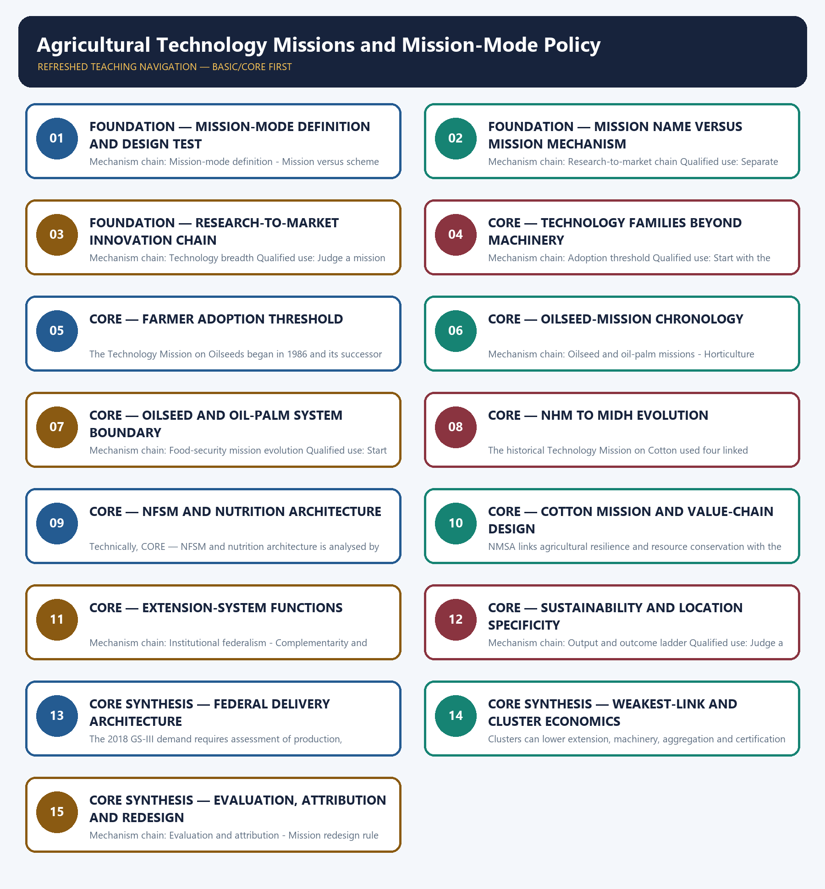

# Agricultural Technology Missions and Mission-Mode Policy — Learner-v2 Complete Learning Session

> **Authoring-only generation:** 2026-09-03. No PDF was rendered and no tracker or index was mutated.

### SOURCE, PROGRESSION AND CURRENT-LINKAGE AUDIT

- **Generation date:** 2026-09-03.
- **Repository-first evidence:** the Basic owner is taught first and preserved in full; the Advanced owner is retained only in the optional final teaching block.
- **OCR evidence:** Repository Markdown was primary. OCR-searchable local official General Studies papers were used only to confirm printed routed demands. No answer key, marking scheme, unsupported page precision or current macroeconomic statistic was inferred from them.
- **Qdrant:** not used; repository Markdown and available OCR context were sufficient.
- **PYQ integrity:** Audited ledgers route the 2018 GS-III National Horticulture Mission demand and the 2021 objective palm-oil concept. The Basic/practice firewall preserves origin, mesocarp, kernel, mission-system and income distinctions without inferring an unavailable objective key.
- **Live-link boundary:** The oilseeds page substantively confirmed distinct mission architectures. The cotton release was inaccessible, so the package relies on the audited owners and imports no live outlay, target, launch, approval, expenditure, adoption or production claim.
- **Fact/inference discipline:** no current-affairs item, PYQ wording, figure or quotation is invented.

### LIVE OFFICIAL-SOURCE ATTEMPT LOG

The checks below were made on 2026-09-03. Substantive official text is used only for the proposition it actually supports; binary files, dynamic shells, stubs and undated dashboard snippets are recorded but not converted into current claims.

- https://agriwelfare.gov.in/en/Oilseeds — substantive Agriculture Ministry page fetched 2026-09-03; confirms separate NMEO-OS and NMEO-OP value-chain architectures. Displayed outlays, areas and targets were not imported.
- https://pib.gov.in/PressReleasePage.aspx?PRID=2258111&reg=3&lang=1 — direct fetch returned HTTP 403 on 2026-09-03; no cotton-mission status, mini-mission, outlay, period or target claim was imported from the failed request.

## BASIC LEARNING SESSION

### DEEP-REVIEW LEARNING CONTRACT

| Control | Binding rule for this package |
|---|---|
| Syllabus boundary | Complete Economy Basic/Core is answer-complete before optional Advanced depth. |
| Formula boundary | Formula, numerator, denominator, unit, stock/flow, nominal/real, base year, level/rate and accounting identity are explicit. |
| Institutional boundary | Constitution, statute, delegated rule, regulator mandate, policy, recommendation, scheme and implementation outcome remain distinct. |
| Transmission method | Shock or instrument → prices/quantities/balance sheets/incentives → institution and market response → output, employment, distribution, stability and external effect → lag and trade-off. |
| Current-data method | Source → release date → reference period → unit/denominator → provisional/revised/final status; incompatible Budget, Survey or statistical vintages are never mixed. |
| Programme-status method | Announced → approved → notified/guidelines issued → funded → operational → utilised → output → outcome are separate stages. |
| External/WTO method | Agreement text, member category, box, limit, notification, consultation, dispute and ruling are qualified without invented thresholds. |
| Causal method | Accounting identity, chronology and correlation are not promoted into behavioural or causal claims without mechanism, counterfactual and alternatives. |
| Answer balance | Model answers balance growth, distribution, stability, sustainability and federal dimensions with India-centric evidence. |
| Practice contract | Every solved item has demand decoding, a detailed examiner-grade model, executable timed/compression plan, marks rationale and answer-specific improvement. |
| Approval | This immutable successor remains `approved: false` pending explicit approval. |

**Canonical Basic/Core owner:** `upsc-ai-kit\knowledge\Economy\basic\29_Agricultural-Technology-Missions-and-Mission-Mode-Policy.md`  
**Substantive canonical provenance owner:** `upsc-ai-kit\knowledge\Economy\29_Agricultural-Technology-Missions-and-Mission-Mode-Policy_Learner-V2-Complete-Topic-Package.md`  
**Optional Advanced owner:** `upsc-ai-kit\knowledge\Economy\advanced\29_Agricultural-Technology-Missions-and-Mission-Mode-Policy.md`  
**Official syllabus mapping:** `upsc-ai-kit\knowledge\Economy\OFFICIAL-UPSC-SYLLABUS-MAPPING.md`

### EVIDENCE, PYQ AND CURRENT-STATUS CONTROL

- Every data-heavy table states unit, denominator, geography, reference period and source/status.
- GDP/GVA, gross/net, domestic/national, nominal/real and level/rate distinctions remain exact.
- Monetary, fiscal and external chains state intermediaries, balance-sheet channels, lags, leakages and trade-offs.
- Budget and Economic Survey editions are never mixed; BE, RE, Actual, advance/provisional/revised/final estimates remain labelled.
- Scheme and programme claims distinguish announcement, approval, notification, operation, coverage, utilisation and measured outcome.
- WTO boxes, limits, de minimis, special treatment, notifications and disputes are qualified from authoritative rules.
- PYQ wording is preserved only where verified; reconstructed or routed demands remain labelled.
- **Current-status note, rechecked 2026-09-03:** volatile rates, estimates, scheme status, trade rules and institutional claims retain official source, release date, reference period and revision status.

**Generation-local live/current sources:**
- `https://agriwelfare.gov.in/en/Oilseeds — substantive Agriculture Ministry page fetched 2026-09-03; confirms separate NMEO-OS and NMEO-OP value-chain architectures. Displayed outlays, areas and targets were not imported.`
- `https://pib.gov.in/PressReleasePage.aspx?PRID=2258111&reg=3&lang=1 — direct fetch returned HTTP 403 on 2026-09-03; no cotton-mission status, mini-mission, outlay, period or target claim was imported from the failed request.`




*Distinct embedded teaching-navigation image. The separate continuous Cārvāka-style flowchart package remains an independent at-a-glance artifact.*

### SESSION 1 — FOUNDATION — MISSION-MODE DEFINITION AND DESIGN TEST

#### DEFINITION / WHAT THIS IS CALLED

**Plain-language definition:** A programme is mission-mode only when its design links the problem, technology, complementary delivery and measurable outcome; the word Mission in its title does not establish those properties.

**Technical definition:** Mechanism chain: Mission-mode definition - Mission versus scheme label Qualified use: Start with the bottleneck and the complete research-to-market chain, not a scheme list.

#### ANSWER-GRABBING OPENING — WRITE/ADAPT IN THE EXAM

> Mechanism chain: Mission-mode definition - Mission versus scheme label Qualified use: Start with the bottleneck and the complete research-to-market chain, not a scheme list.

#### MUST-WRITE KEYWORDS

- **FOUNDATION**
- **Mission-mode definition**
- **design test**
- **Mechanism chain**
- **Qualified use**
- **An agricultural technology mission**

**How to use them:** Frame the answer through FOUNDATION; define Mission-mode definition, connect design test with Mechanism chain to explain the mechanism, and use Qualified use for the decisive comparison or qualification.

#### VISUAL FIRST

```text
MISSION-MODE DEFINITION AND DESIGN TEST
01. Mission-mode definition
    |
    v
02. Mission versus scheme label
BOUNDARY -> Do not treat every programme bearing Mission in its name as mission-mode policy.
```

*This topic-specific rail fixes the evidence sequence and its exam boundary before analysis.*

#### CORE EXPLANATION

An agricultural technology mission is a coordinated intervention organised around a defined production, quality, sustainability or value-chain problem, with outcome objectives, institutions, monitoring and feedback. A programme is mission-mode only when its design links the problem, technology, complementary delivery and measurable outcome; the word Mission in its title does not establish those properties.

#### NAMED EVIDENCE AND MECHANISM

- An agricultural technology mission is a coordinated intervention organised around a defined production, quality, sustainability or value-chain problem, with outcome objectives, institutions, monitoring and feedback.
- A programme is mission-mode only when its design links the problem, technology, complementary delivery and measurable outcome; the word Mission in its title does not establish those properties.

#### EXAMINER CAUTION

- Do not treat every programme bearing Mission in its name as mission-mode policy.

#### EXAM LINK

- **Prelims:** Preserve the exact formula, territorial or resident boundary, price basis, base year, index basket, eligible counterparty, institution and legal status; never upgrade a projection into an actual or a regulatory direction into a universal rule.
- **Mains:** Start with the bottleneck and the complete research-to-market chain, not a scheme list.

#### MINI RECAP

- **Mechanism chain:** Mission-mode definition -> Mission versus scheme label
- **Qualified use:** Start with the bottleneck and the complete research-to-market chain, not a scheme list.

#### CLOSING RECALL FLOW — FOUNDATION — MISSION-MODE DEFINITION AND DESIGN TEST

```text
START / CONCEPT: FOUNDATION — Mission-mode definition and design test
        |
        v
EXACT TERMS: FOUNDATION · Mission-mode definition · design test · Mechanism chain · Qualified use · An agricultural technology mission
        |
        v
MECHANISM / ARGUMENT: A programme is mission-mode only when its design links the problem, technology, complementary delivery and measurable outcome; the word Mission in its title does not establish those properties.
        |
        v
CONSEQUENCE / CONTRAST: Do not treat every programme bearing Mission in its name as mission-mode policy.
        |
        v
UPSC TRAP / ANSWER-USE: Do not miss this limiting distinction: an agricultural technology mission is a coordinated intervention organised around a defined production, quality...
        |
        v
ANSWER-GRABBING FORMULATION: Mechanism chain: Mission-mode definition - Mission versus scheme label Qualified use: Start with the bottleneck and the complete research-to-market chain, not a scheme list.
```
### SESSION 2 — FOUNDATION — MISSION NAME VERSUS MISSION MECHANISM

#### DEFINITION / WHAT THIS IS CALLED

**Plain-language definition:** Durable mission performance requires research, adaptive trials, quality material, multiplication or manufacturing, demonstration, extension, finance, complementary inputs, repeated adoption and market feedback.

**Technical definition:** Mechanism chain: Research-to-market chain Qualified use: Separate approval, outlay, activity, reach, adoption, output and farmer-income outcome.

#### ANSWER-GRABBING OPENING — WRITE/ADAPT IN THE EXAM

> Durable mission performance requires research, adaptive trials, quality material, multiplication or manufacturing, demonstration, extension, finance, complementary inputs, repeated adoption and market feedback.

#### MUST-WRITE KEYWORDS

- **FOUNDATION**
- **Mission name versus mission mechanism**
- **Mechanism chain**
- **Qualified use**
- **Durable**
- **Research-to-market**

**How to use them:** Frame the answer through FOUNDATION; define Mission name versus mission mechanism, connect Mechanism chain with Qualified use to explain the mechanism, and use Durable for the decisive comparison or qualification.

#### VISUAL FIRST

```text
MISSION NAME VERSUS MISSION MECHANISM
01. Research-to-market chain
BOUNDARY -> Do not reduce agricultural technology to machines, drones or laboratory research.
```

*This topic-specific rail fixes the evidence sequence and its exam boundary before analysis.*

#### CORE EXPLANATION

Durable mission performance requires research, adaptive trials, quality material, multiplication or manufacturing, demonstration, extension, finance, complementary inputs, repeated adoption and market feedback.

#### NAMED EVIDENCE AND MECHANISM

- Durable mission performance requires research, adaptive trials, quality material, multiplication or manufacturing, demonstration, extension, finance, complementary inputs, repeated adoption and market feedback.

#### EXAMINER CAUTION

- Do not reduce agricultural technology to machines, drones or laboratory research.

#### EXAM LINK

- **Prelims:** Preserve the exact formula, territorial or resident boundary, price basis, base year, index basket, eligible counterparty, institution and legal status; never upgrade a projection into an actual or a regulatory direction into a universal rule.
- **Mains:** Separate approval, outlay, activity, reach, adoption, output and farmer-income outcome.

#### MINI RECAP

- **Mechanism chain:** Research-to-market chain
- **Qualified use:** Separate approval, outlay, activity, reach, adoption, output and farmer-income outcome.

#### CLOSING RECALL FLOW — FOUNDATION — MISSION NAME VERSUS MISSION MECHANISM

```text
START / CONCEPT: FOUNDATION — Mission name versus mission mechanism
        |
        v
EXACT TERMS: FOUNDATION · Mission name versus mission mechanism · Mechanism chain · Qualified use · Durable · Research-to-market
        |
        v
MECHANISM / ARGUMENT: Mechanism chain: Research-to-market chain Qualified use: Separate approval, outlay, activity, reach, adoption, output and farmer-income outcome.
        |
        v
CONSEQUENCE / CONTRAST: Do not reduce agricultural technology to machines, drones or laboratory research.
        |
        v
UPSC TRAP / ANSWER-USE: Do not miss this limiting distinction: do not reduce agricultural technology to machines, drones or laboratory research.
        |
        v
ANSWER-GRABBING FORMULATION: Durable mission performance requires research, adaptive trials, quality material, multiplication or manufacturing, demonstration, extension, finance, complementary inputs, repeated adoption and market feedback.
```
### SESSION 3 — FOUNDATION — RESEARCH-TO-MARKET INNOVATION CHAIN

#### DEFINITION / WHAT THIS IS CALLED

**Plain-language definition:** Agricultural technology includes biological, agronomic, mechanical, water-resource, digital, post-harvest and institutional innovations; it is not confined to machinery or frontier gadgets.

**Technical definition:** Mechanism chain: Technology breadth Qualified use: Judge a mission by additionality, inclusion, ecology and the credibility of its evaluation.

#### ANSWER-GRABBING OPENING — WRITE/ADAPT IN THE EXAM

> Agricultural technology includes biological, agronomic, mechanical, water-resource, digital, post-harvest and institutional innovations; it is not confined to machinery or frontier gadgets.

#### MUST-WRITE KEYWORDS

- **FOUNDATION**
- **Research-to-market innovation chain**
- **Mechanism chain**
- **Qualified use**
- **Agricultural**
- **Technology**

**How to use them:** Frame the answer through FOUNDATION; define Research-to-market innovation chain, connect Mechanism chain with Qualified use to explain the mechanism, and use Agricultural for the decisive comparison or qualification.

#### VISUAL FIRST

```text
RESEARCH-TO-MARKET INNOVATION CHAIN
01. Technology breadth
BOUNDARY -> Do not equate distribution, demonstration, registration or availability with adoption.
```

*This topic-specific rail fixes the evidence sequence and its exam boundary before analysis.*

#### CORE EXPLANATION

Agricultural technology includes biological, agronomic, mechanical, water-resource, digital, post-harvest and institutional innovations; it is not confined to machinery or frontier gadgets.

#### NAMED EVIDENCE AND MECHANISM

- Agricultural technology includes biological, agronomic, mechanical, water-resource, digital, post-harvest and institutional innovations; it is not confined to machinery or frontier gadgets.

#### EXAMINER CAUTION

- Do not equate distribution, demonstration, registration or availability with adoption.

#### EXAM LINK

- **Prelims:** Preserve the exact formula, territorial or resident boundary, price basis, base year, index basket, eligible counterparty, institution and legal status; never upgrade a projection into an actual or a regulatory direction into a universal rule.
- **Mains:** Judge a mission by additionality, inclusion, ecology and the credibility of its evaluation.

#### MINI RECAP

- **Mechanism chain:** Technology breadth
- **Qualified use:** Judge a mission by additionality, inclusion, ecology and the credibility of its evaluation.

#### CLOSING RECALL FLOW — FOUNDATION — RESEARCH-TO-MARKET INNOVATION CHAIN

```text
START / CONCEPT: FOUNDATION — Research-to-market innovation chain
        |
        v
EXACT TERMS: FOUNDATION · Research-to-market innovation chain · Mechanism chain · Qualified use · Agricultural · Technology
        |
        v
MECHANISM / ARGUMENT: Mechanism chain: Technology breadth Qualified use: Judge a mission by additionality, inclusion, ecology and the credibility of its evaluation.
        |
        v
CONSEQUENCE / CONTRAST: Do not equate distribution, demonstration, registration or availability with adoption.
        |
        v
UPSC TRAP / ANSWER-USE: Do not miss this limiting distinction: agricultural technology includes biological, agronomic, mechanical, water-resource, digital, post-harvest and institutional innovations.
        |
        v
ANSWER-GRABBING FORMULATION: Agricultural technology includes biological, agronomic, mechanical, water-resource, digital, post-harvest and institutional innovations; it is not confined to machinery or frontier gadgets.
```
### SESSION 4 — CORE — TECHNOLOGY FAMILIES BEYOND MACHINERY

#### DEFINITION / WHAT THIS IS CALLED

**Plain-language definition:** A farmer adopts when expected additional return exceeds purchase, finance, learning, transition, failure and market risk relative to the existing practice; availability or demonstration alone is not adoption.

**Technical definition:** Mechanism chain: Adoption threshold Qualified use: Start with the bottleneck and the complete research-to-market chain, not a scheme list.

#### ANSWER-GRABBING OPENING — WRITE/ADAPT IN THE EXAM

> Mechanism chain: Adoption threshold Qualified use: Start with the bottleneck and the complete research-to-market chain, not a scheme list.

#### MUST-WRITE KEYWORDS

- **Technology families beyond machinery**
- **Mechanism chain**
- **Qualified use**
- **Adoption**
- **Qualified**
- **Start**

**How to use them:** Frame the answer through Technology families beyond machinery; define Mechanism chain, connect Qualified use with Adoption to explain the mechanism, and use Qualified for the decisive comparison or qualification.

#### VISUAL FIRST

```text
TECHNOLOGY FAMILIES BEYOND MACHINERY
01. Adoption threshold
BOUNDARY -> Do not merge historical and current mission names or mini-mission structures.
```

*This topic-specific rail fixes the evidence sequence and its exam boundary before analysis.*

#### CORE EXPLANATION

A farmer adopts when expected additional return exceeds purchase, finance, learning, transition, failure and market risk relative to the existing practice; availability or demonstration alone is not adoption.

#### NAMED EVIDENCE AND MECHANISM

- A farmer adopts when expected additional return exceeds purchase, finance, learning, transition, failure and market risk relative to the existing practice; availability or demonstration alone is not adoption.

#### EXAMINER CAUTION

- Do not merge historical and current mission names or mini-mission structures.

#### EXAM LINK

- **Prelims:** Preserve the exact formula, territorial or resident boundary, price basis, base year, index basket, eligible counterparty, institution and legal status; never upgrade a projection into an actual or a regulatory direction into a universal rule.
- **Mains:** Start with the bottleneck and the complete research-to-market chain, not a scheme list.

#### MINI RECAP

- **Mechanism chain:** Adoption threshold
- **Qualified use:** Start with the bottleneck and the complete research-to-market chain, not a scheme list.

#### CLOSING RECALL FLOW — CORE — TECHNOLOGY FAMILIES BEYOND MACHINERY

```text
START / CONCEPT: CORE — Technology families beyond machinery
        |
        v
EXACT TERMS: Technology families beyond machinery · Mechanism chain · Qualified use · Adoption · Qualified · Start
        |
        v
MECHANISM / ARGUMENT: A farmer adopts when expected additional return exceeds purchase, finance, learning, transition, failure and market risk relative to the existing practice; availability or demonstration alone is not adoption.
        |
        v
CONSEQUENCE / CONTRAST: Do not merge historical and current mission names or mini-mission structures.
        |
        v
UPSC TRAP / ANSWER-USE: Do not miss this limiting distinction: start with the bottleneck and the complete research-to-market chain, not a scheme list.
        |
        v
ANSWER-GRABBING FORMULATION: Mechanism chain: Adoption threshold Qualified use: Start with the bottleneck and the complete research-to-market chain, not a scheme list.
```
### SESSION 5 — CORE — FARMER ADOPTION THRESHOLD

#### DEFINITION / WHAT THIS IS CALLED

**Plain-language definition:** Mechanism chain: Technology Mission on Oilseeds Qualified use: Separate approval, outlay, activity, reach, adoption, output and farmer-income outcome.

**Technical definition:** The Technology Mission on Oilseeds began in 1986 and its successor architecture changed through later umbrellas; historical names, current schemes and measured results must retain their date.

#### ANSWER-GRABBING OPENING — WRITE/ADAPT IN THE EXAM

> Mechanism chain: Technology Mission on Oilseeds Qualified use: Separate approval, outlay, activity, reach, adoption, output and farmer-income outcome.

#### MUST-WRITE KEYWORDS

- **Farmer adoption threshold**
- **Mechanism chain**
- **Qualified use**
- **The Technology Mission**
- **Oilseeds**
- **NMEO-OS**

**How to use them:** Frame the answer through Farmer adoption threshold; define Mechanism chain, connect Qualified use with The Technology Mission to explain the mechanism, and use Oilseeds for the decisive comparison or qualification.

#### VISUAL FIRST

```text
FARMER ADOPTION THRESHOLD
01. Technology Mission on Oilseeds
BOUNDARY -> Do not treat NMEO-OS and NMEO-OP as one crop system.
```

*This topic-specific rail fixes the evidence sequence and its exam boundary before analysis.*

#### CORE EXPLANATION

The Technology Mission on Oilseeds began in 1986 and its successor architecture changed through later umbrellas; historical names, current schemes and measured results must retain their date.

#### NAMED EVIDENCE AND MECHANISM

- The Technology Mission on Oilseeds began in 1986 and its successor architecture changed through later umbrellas; historical names, current schemes and measured results must retain their date.

#### EXAMINER CAUTION

- Do not treat NMEO-OS and NMEO-OP as one crop system.

#### EXAM LINK

- **Prelims:** Preserve the exact formula, territorial or resident boundary, price basis, base year, index basket, eligible counterparty, institution and legal status; never upgrade a projection into an actual or a regulatory direction into a universal rule.
- **Mains:** Separate approval, outlay, activity, reach, adoption, output and farmer-income outcome.

#### MINI RECAP

- **Mechanism chain:** Technology Mission on Oilseeds
- **Qualified use:** Separate approval, outlay, activity, reach, adoption, output and farmer-income outcome.

#### CLOSING RECALL FLOW — CORE — FARMER ADOPTION THRESHOLD

```text
START / CONCEPT: CORE — Farmer adoption threshold
        |
        v
EXACT TERMS: Farmer adoption threshold · Mechanism chain · Qualified use · The Technology Mission · Oilseeds · NMEO-OS
        |
        v
MECHANISM / ARGUMENT: The Technology Mission on Oilseeds began in 1986 and its successor architecture changed through later umbrellas; historical names, current schemes and measured results must retain their date.
        |
        v
CONSEQUENCE / CONTRAST: Do not treat NMEO-OS and NMEO-OP as one crop system.
        |
        v
UPSC TRAP / ANSWER-USE: Do not miss this limiting distinction: do not treat NMEO-OS and NMEO-OP as one crop system.
        |
        v
ANSWER-GRABBING FORMULATION: Mechanism chain: Technology Mission on Oilseeds Qualified use: Separate approval, outlay, activity, reach, adoption, output and farmer-income outcome.
```
### SESSION 6 — CORE — OILSEED-MISSION CHRONOLOGY

#### DEFINITION / WHAT THIS IS CALLED

**Plain-language definition:** NMEO-OS and NMEO-OP address distinct oilseed and perennial oil-palm systems through value-chain measures; approval, outlay, operational reach, area, production and import outcome are separate facts.

**Technical definition:** Mechanism chain: Oilseed and oil-palm missions - Horticulture mission evolution Qualified use: Judge a mission by additionality, inclusion, ecology and the credibility of its evaluation.

#### ANSWER-GRABBING OPENING — WRITE/ADAPT IN THE EXAM

> NMEO-OS and NMEO-OP address distinct oilseed and perennial oil-palm systems through value-chain measures; approval, outlay, operational reach, area, production and import outcome are separate facts.

#### MUST-WRITE KEYWORDS

- **Oilseed-mission chronology**
- **Mechanism chain**
- **Qualified use**
- **NMEO-OS**
- **NMEO-OP**
- **2005-06**

**How to use them:** Frame the answer through Oilseed-mission chronology; define Mechanism chain, connect Qualified use with NMEO-OS to explain the mechanism, and use NMEO-OP for the decisive comparison or qualification.

#### VISUAL FIRST

```text
OILSEED-MISSION CHRONOLOGY
01. Oilseed and oil-palm missions
    |
    v
02. Horticulture mission evolution
BOUNDARY -> Do not convert an approved outlay or target into expenditure, reach or achievement.
```

*This topic-specific rail fixes the evidence sequence and its exam boundary before analysis.*

#### CORE EXPLANATION

NMEO-OS and NMEO-OP address distinct oilseed and perennial oil-palm systems through value-chain measures; approval, outlay, operational reach, area, production and import outcome are separate facts. The National Horticulture Mission began in 2005-06 and later became a component of the wider MIDH architecture; NHM and MIDH are not interchangeable names for every year.

#### NAMED EVIDENCE AND MECHANISM

- NMEO-OS and NMEO-OP address distinct oilseed and perennial oil-palm systems through value-chain measures; approval, outlay, operational reach, area, production and import outcome are separate facts.
- The National Horticulture Mission began in 2005-06 and later became a component of the wider MIDH architecture; NHM and MIDH are not interchangeable names for every year.

#### EXAMINER CAUTION

- Do not convert an approved outlay or target into expenditure, reach or achievement.

#### EXAM LINK

- **Prelims:** Preserve the exact formula, territorial or resident boundary, price basis, base year, index basket, eligible counterparty, institution and legal status; never upgrade a projection into an actual or a regulatory direction into a universal rule.
- **Mains:** Judge a mission by additionality, inclusion, ecology and the credibility of its evaluation.

#### MINI RECAP

- **Mechanism chain:** Oilseed and oil-palm missions -> Horticulture mission evolution
- **Qualified use:** Judge a mission by additionality, inclusion, ecology and the credibility of its evaluation.

#### CLOSING RECALL FLOW — CORE — OILSEED-MISSION CHRONOLOGY

```text
START / CONCEPT: CORE — Oilseed-mission chronology
        |
        v
EXACT TERMS: Oilseed-mission chronology · Mechanism chain · Qualified use · NMEO-OS · NMEO-OP · 2005-06
        |
        v
MECHANISM / ARGUMENT: Mechanism chain: Oilseed and oil-palm missions - Horticulture mission evolution Qualified use: Judge a mission by additionality, inclusion, ecology and the credibility of its evaluation.
        |
        v
CONSEQUENCE / CONTRAST: The National Horticulture Mission began in 2005-06 and later became a component of the wider MIDH architecture; NHM and MIDH are not interchangeable names for every year.
        |
        v
UPSC TRAP / ANSWER-USE: Do not convert an approved outlay or target into expenditure, reach or achievement.
        |
        v
ANSWER-GRABBING FORMULATION: NMEO-OS and NMEO-OP address distinct oilseed and perennial oil-palm systems through value-chain measures; approval, outlay, operational reach, area, production and import outcome are separate facts.
```
### SESSION 7 — CORE — OILSEED AND OIL-PALM SYSTEM BOUNDARY

#### DEFINITION / WHAT THIS IS CALLED

**Plain-language definition:** The National Food Security Mission began in 2007-08 and later acquired a nutrition emphasis and renamed architecture; vintage must be stated before listing components.

**Technical definition:** Mechanism chain: Food-security mission evolution Qualified use: Start with the bottleneck and the complete research-to-market chain, not a scheme list.

#### ANSWER-GRABBING OPENING — WRITE/ADAPT IN THE EXAM

> Mechanism chain: Food-security mission evolution Qualified use: Start with the bottleneck and the complete research-to-market chain, not a scheme list.

#### MUST-WRITE KEYWORDS

- **Oilseed**
- **oil-palm system boundary**
- **Mechanism chain**
- **Qualified use**
- **The National Food Security Mission**
- **2007-08**

**How to use them:** Frame the answer through Oilseed; define oil-palm system boundary, connect Mechanism chain with Qualified use to explain the mechanism, and use The National Food Security Mission for the decisive comparison or qualification.

#### VISUAL FIRST

```text
OILSEED AND OIL-PALM SYSTEM BOUNDARY
01. Food-security mission evolution
BOUNDARY -> Do not use area or production growth as proof of farmer net-income gain.
```

*This topic-specific rail fixes the evidence sequence and its exam boundary before analysis.*

#### CORE EXPLANATION

The National Food Security Mission began in 2007-08 and later acquired a nutrition emphasis and renamed architecture; vintage must be stated before listing components.

#### NAMED EVIDENCE AND MECHANISM

- The National Food Security Mission began in 2007-08 and later acquired a nutrition emphasis and renamed architecture; vintage must be stated before listing components.

#### EXAMINER CAUTION

- Do not use area or production growth as proof of farmer net-income gain.

#### EXAM LINK

- **Prelims:** Preserve the exact formula, territorial or resident boundary, price basis, base year, index basket, eligible counterparty, institution and legal status; never upgrade a projection into an actual or a regulatory direction into a universal rule.
- **Mains:** Start with the bottleneck and the complete research-to-market chain, not a scheme list.

#### MINI RECAP

- **Mechanism chain:** Food-security mission evolution
- **Qualified use:** Start with the bottleneck and the complete research-to-market chain, not a scheme list.

#### CLOSING RECALL FLOW — CORE — OILSEED AND OIL-PALM SYSTEM BOUNDARY

```text
START / CONCEPT: CORE — Oilseed and oil-palm system boundary
        |
        v
EXACT TERMS: Oilseed · oil-palm system boundary · Mechanism chain · Qualified use · The National Food Security Mission · 2007-08
        |
        v
MECHANISM / ARGUMENT: The National Food Security Mission began in 2007-08 and later acquired a nutrition emphasis and renamed architecture; vintage must be stated before listing components.
        |
        v
CONSEQUENCE / CONTRAST: Do not use area or production growth as proof of farmer net-income gain.
        |
        v
UPSC TRAP / ANSWER-USE: Do not miss this limiting distinction: start with the bottleneck and the complete research-to-market chain, not a scheme list.
        |
        v
ANSWER-GRABBING FORMULATION: Mechanism chain: Food-security mission evolution Qualified use: Start with the bottleneck and the complete research-to-market chain, not a scheme list.
```
### SESSION 8 — CORE — NHM TO MIDH EVOLUTION

#### DEFINITION / WHAT THIS IS CALLED

**Plain-language definition:** Mechanism chain: Cotton mission boundary Qualified use: Separate approval, outlay, activity, reach, adoption, output and farmer-income outcome.

**Technical definition:** The historical Technology Mission on Cotton used four linked mini-missions across research, transfer, market infrastructure and ginning or pressing; later cotton-mission architecture must not be merged with it.

#### ANSWER-GRABBING OPENING — WRITE/ADAPT IN THE EXAM

> The historical Technology Mission on Cotton used four linked mini-missions across research, transfer, market infrastructure and ginning or pressing; later cotton-mission architecture must not be merged with it.

#### MUST-WRITE KEYWORDS

- **NHM to MIDH evolution**
- **Mechanism chain**
- **Qualified use**
- **Technology Mission**
- **Cotton**
- **Qualified**

**How to use them:** Frame the answer through NHM to MIDH evolution; define Mechanism chain, connect Qualified use with Technology Mission to explain the mechanism, and use Cotton for the decisive comparison or qualification.

#### VISUAL FIRST

```text
NHM TO MIDH EVOLUTION
01. Cotton mission boundary
BOUNDARY -> Do not ignore state, district, extension, repair and market complements.
```

*This topic-specific rail fixes the evidence sequence and its exam boundary before analysis.*

#### CORE EXPLANATION

The historical Technology Mission on Cotton used four linked mini-missions across research, transfer, market infrastructure and ginning or pressing; later cotton-mission architecture must not be merged with it.

#### NAMED EVIDENCE AND MECHANISM

- The historical Technology Mission on Cotton used four linked mini-missions across research, transfer, market infrastructure and ginning or pressing; later cotton-mission architecture must not be merged with it.

#### EXAMINER CAUTION

- Do not ignore state, district, extension, repair and market complements.

#### EXAM LINK

- **Prelims:** Preserve the exact formula, territorial or resident boundary, price basis, base year, index basket, eligible counterparty, institution and legal status; never upgrade a projection into an actual or a regulatory direction into a universal rule.
- **Mains:** Separate approval, outlay, activity, reach, adoption, output and farmer-income outcome.

#### MINI RECAP

- **Mechanism chain:** Cotton mission boundary
- **Qualified use:** Separate approval, outlay, activity, reach, adoption, output and farmer-income outcome.

#### CLOSING RECALL FLOW — CORE — NHM TO MIDH EVOLUTION

```text
START / CONCEPT: CORE — NHM to MIDH evolution
        |
        v
EXACT TERMS: NHM to MIDH evolution · Mechanism chain · Qualified use · Technology Mission · Cotton · Qualified
        |
        v
MECHANISM / ARGUMENT: Mechanism chain: Cotton mission boundary Qualified use: Separate approval, outlay, activity, reach, adoption, output and farmer-income outcome.
        |
        v
CONSEQUENCE / CONTRAST: Do not ignore state, district, extension, repair and market complements.
        |
        v
UPSC TRAP / ANSWER-USE: Do not miss this limiting distinction: the historical Technology Mission on Cotton used four linked mini-missions across research, transfer, market...
        |
        v
ANSWER-GRABBING FORMULATION: The historical Technology Mission on Cotton used four linked mini-missions across research, transfer, market infrastructure and ginning or pressing; later cotton-mission architecture must not be merged with it.
```
### SESSION 9 — CORE — NFSM AND NUTRITION ARCHITECTURE

#### DEFINITION / WHAT THIS IS CALLED

**Plain-language definition:** Mechanism chain: Extension-system functions Qualified use: Judge a mission by additionality, inclusion, ecology and the credibility of its evaluation.

**Technical definition:** Technically, CORE — NFSM and nutrition architecture is analysed by relating NFSM to nutrition architecture, then testing the relationship through Mechanism chain and Qualified use.

#### ANSWER-GRABBING OPENING — WRITE/ADAPT IN THE EXAM

> Mechanism chain: Extension-system functions Qualified use: Judge a mission by additionality, inclusion, ecology and the credibility of its evaluation.

#### MUST-WRITE KEYWORDS

- **NFSM**
- **nutrition architecture**
- **Mechanism chain**
- **Qualified use**
- **Extension-system**
- **Qualified**

**How to use them:** Frame the answer through NFSM; define nutrition architecture, connect Mechanism chain with Qualified use to explain the mechanism, and use Extension-system for the decisive comparison or qualification.

#### VISUAL FIRST

```text
NFSM AND NUTRITION ARCHITECTURE
01. Extension-system functions
BOUNDARY -> Do not attribute national change solely to a mission without a counterfactual.
```

*This topic-specific rail fixes the evidence sequence and its exam boundary before analysis.*

#### CORE EXPLANATION

The classic NMAET architecture separated agricultural extension, seeds and planting material, mechanisation, and plant protection or quarantine; these diffusion functions remain distinct even when umbrellas change.

#### NAMED EVIDENCE AND MECHANISM

- The classic NMAET architecture separated agricultural extension, seeds and planting material, mechanisation, and plant protection or quarantine; these diffusion functions remain distinct even when umbrellas change.

#### EXAMINER CAUTION

- Do not attribute national change solely to a mission without a counterfactual.

#### EXAM LINK

- **Prelims:** Preserve the exact formula, territorial or resident boundary, price basis, base year, index basket, eligible counterparty, institution and legal status; never upgrade a projection into an actual or a regulatory direction into a universal rule.
- **Mains:** Judge a mission by additionality, inclusion, ecology and the credibility of its evaluation.

#### MINI RECAP

- **Mechanism chain:** Extension-system functions
- **Qualified use:** Judge a mission by additionality, inclusion, ecology and the credibility of its evaluation.

#### CLOSING RECALL FLOW — CORE — NFSM AND NUTRITION ARCHITECTURE

```text
START / CONCEPT: CORE — NFSM and nutrition architecture
        |
        v
EXACT TERMS: NFSM · nutrition architecture · Mechanism chain · Qualified use · Extension-system · Qualified
        |
        v
MECHANISM / ARGUMENT: The operative mechanism is that judge a mission by additionality, inclusion, ecology and the credibility of its evaluation.
        |
        v
CONSEQUENCE / CONTRAST: Do not attribute national change solely to a mission without a counterfactual.
        |
        v
UPSC TRAP / ANSWER-USE: Do not miss this limiting distinction: do not attribute national change solely to a mission without a counterfactual.
        |
        v
ANSWER-GRABBING FORMULATION: Mechanism chain: Extension-system functions Qualified use: Judge a mission by additionality, inclusion, ecology and the credibility of its evaluation.
```
### SESSION 10 — CORE — COTTON MISSION AND VALUE-CHAIN DESIGN

#### DEFINITION / WHAT THIS IS CALLED

**Plain-language definition:** Mechanism chain: Sustainability missions Qualified use: Start with the bottleneck and the complete research-to-market chain, not a scheme list.

**Technical definition:** NMSA links agricultural resilience and resource conservation with the climate-policy framework, while natural-farming or rainfed programmes require location-specific systems rather than a universal input package.

#### ANSWER-GRABBING OPENING — WRITE/ADAPT IN THE EXAM

> Mechanism chain: Sustainability missions Qualified use: Start with the bottleneck and the complete research-to-market chain, not a scheme list.

#### MUST-WRITE KEYWORDS

- **Cotton mission**
- **value-chain design**
- **Mechanism chain**
- **Qualified use**
- **NMSA**
- **Sustainability**

**How to use them:** Frame the answer through Cotton mission; define value-chain design, connect Mechanism chain with Qualified use to explain the mechanism, and use NMSA for the decisive comparison or qualification.

#### VISUAL FIRST

```text
COTTON MISSION AND VALUE-CHAIN DESIGN
01. Sustainability missions
BOUNDARY -> Do not scale a locally successful technology without ecological and inclusion tests.
```

*This topic-specific rail fixes the evidence sequence and its exam boundary before analysis.*

#### CORE EXPLANATION

NMSA links agricultural resilience and resource conservation with the climate-policy framework, while natural-farming or rainfed programmes require location-specific systems rather than a universal input package.

#### NAMED EVIDENCE AND MECHANISM

- NMSA links agricultural resilience and resource conservation with the climate-policy framework, while natural-farming or rainfed programmes require location-specific systems rather than a universal input package.

#### EXAMINER CAUTION

- Do not scale a locally successful technology without ecological and inclusion tests.

#### EXAM LINK

- **Prelims:** Preserve the exact formula, territorial or resident boundary, price basis, base year, index basket, eligible counterparty, institution and legal status; never upgrade a projection into an actual or a regulatory direction into a universal rule.
- **Mains:** Start with the bottleneck and the complete research-to-market chain, not a scheme list.

#### MINI RECAP

- **Mechanism chain:** Sustainability missions
- **Qualified use:** Start with the bottleneck and the complete research-to-market chain, not a scheme list.

#### CLOSING RECALL FLOW — CORE — COTTON MISSION AND VALUE-CHAIN DESIGN

```text
START / CONCEPT: CORE — Cotton mission and value-chain design
        |
        v
EXACT TERMS: Cotton mission · value-chain design · Mechanism chain · Qualified use · NMSA · Sustainability
        |
        v
MECHANISM / ARGUMENT: NMSA links agricultural resilience and resource conservation with the climate-policy framework, while natural-farming or rainfed programmes require location-specific systems rather than a universal input package.
        |
        v
CONSEQUENCE / CONTRAST: Do not scale a locally successful technology without ecological and inclusion tests.
        |
        v
UPSC TRAP / ANSWER-USE: Do not miss this limiting distinction: start with the bottleneck and the complete research-to-market chain, not a scheme list.
        |
        v
ANSWER-GRABBING FORMULATION: Mechanism chain: Sustainability missions Qualified use: Start with the bottleneck and the complete research-to-market chain, not a scheme list.
```
### SESSION 11 — CORE — EXTENSION-SYSTEM FUNCTIONS

#### DEFINITION / WHAT THIS IS CALLED

**Plain-language definition:** Union departments and ICAR can set guidelines, research and standards, but states, districts, universities, KVKs, extension systems, FPOs and local service networks determine adaptation and implementation.

**Technical definition:** Mechanism chain: Institutional federalism - Complementarity and weakest link Qualified use: Separate approval, outlay, activity, reach, adoption, output and farmer-income outcome.

#### ANSWER-GRABBING OPENING — WRITE/ADAPT IN THE EXAM

> Union departments and ICAR can set guidelines, research and standards, but states, districts, universities, KVKs, extension systems, FPOs and local service networks determine adaptation and implementation.

#### MUST-WRITE KEYWORDS

- **Extension-system functions**
- **Mechanism chain**
- **Qualified use**
- **Union**
- **ICAR**
- **KVKs**

**How to use them:** Frame the answer through Extension-system functions; define Mechanism chain, connect Qualified use with Union to explain the mechanism, and use ICAR for the decisive comparison or qualification.

#### VISUAL FIRST

```text
EXTENSION-SYSTEM FUNCTIONS
01. Institutional federalism
    |
    v
02. Complementarity and weakest link
BOUNDARY -> Do not treat every programme bearing Mission in its name as mission-mode policy.
```

*This topic-specific rail fixes the evidence sequence and its exam boundary before analysis.*

#### CORE EXPLANATION

Union departments and ICAR can set guidelines, research and standards, but states, districts, universities, KVKs, extension systems, FPOs and local service networks determine adaptation and implementation. Mission outcome depends jointly on research, quality supply, extension, water and input complements, finance, market readiness and repair or service; one near-zero link can defeat a strong technology.

#### NAMED EVIDENCE AND MECHANISM

- Union departments and ICAR can set guidelines, research and standards, but states, districts, universities, KVKs, extension systems, FPOs and local service networks determine adaptation and implementation.
- Mission outcome depends jointly on research, quality supply, extension, water and input complements, finance, market readiness and repair or service; one near-zero link can defeat a strong technology.

#### EXAMINER CAUTION

- Do not treat every programme bearing Mission in its name as mission-mode policy.

#### EXAM LINK

- **Prelims:** Preserve the exact formula, territorial or resident boundary, price basis, base year, index basket, eligible counterparty, institution and legal status; never upgrade a projection into an actual or a regulatory direction into a universal rule.
- **Mains:** Separate approval, outlay, activity, reach, adoption, output and farmer-income outcome.

#### MINI RECAP

- **Mechanism chain:** Institutional federalism -> Complementarity and weakest link
- **Qualified use:** Separate approval, outlay, activity, reach, adoption, output and farmer-income outcome.

#### CLOSING RECALL FLOW — CORE — EXTENSION-SYSTEM FUNCTIONS

```text
START / CONCEPT: CORE — Extension-system functions
        |
        v
EXACT TERMS: Extension-system functions · Mechanism chain · Qualified use · Union · ICAR · KVKs
        |
        v
MECHANISM / ARGUMENT: Mechanism chain: Institutional federalism - Complementarity and weakest link Qualified use: Separate approval, outlay, activity, reach, adoption, output and farmer-income outcome.
        |
        v
CONSEQUENCE / CONTRAST: Do not treat every programme bearing Mission in its name as mission-mode policy.
        |
        v
UPSC TRAP / ANSWER-USE: Do not miss this limiting distinction: mission outcome depends jointly on research, quality supply, extension, water and input complements, finance...
        |
        v
ANSWER-GRABBING FORMULATION: Union departments and ICAR can set guidelines, research and standards, but states, districts, universities, KVKs, extension systems, FPOs and local service networks determine adaptation and implementation.
```
### SESSION 12 — CORE — SUSTAINABILITY AND LOCATION SPECIFICITY

#### DEFINITION / WHAT THIS IS CALLED

**Plain-language definition:** Funds, training, demonstrations, kits, assets or area are inputs, activities and outputs; continued adoption, yield, quality, net income, resilience, ecology and equity are outcomes or impacts.

**Technical definition:** Mechanism chain: Output and outcome ladder Qualified use: Judge a mission by additionality, inclusion, ecology and the credibility of its evaluation.

#### ANSWER-GRABBING OPENING — WRITE/ADAPT IN THE EXAM

> Funds, training, demonstrations, kits, assets or area are inputs, activities and outputs; continued adoption, yield, quality, net income, resilience, ecology and equity are outcomes or impacts.

#### MUST-WRITE KEYWORDS

- **Sustainability**
- **location specificity**
- **Mechanism chain**
- **Qualified use**
- **Funds, training, demonstrations, kits, assets or area**
- **Funds**

**How to use them:** Frame the answer through Sustainability; define location specificity, connect Mechanism chain with Qualified use to explain the mechanism, and use Funds, training, demonstrations, kits, assets or area for the decisive comparison or qualification.

#### VISUAL FIRST

```text
SUSTAINABILITY AND LOCATION SPECIFICITY
01. Output and outcome ladder
BOUNDARY -> Do not reduce agricultural technology to machines, drones or laboratory research.
```

*This topic-specific rail fixes the evidence sequence and its exam boundary before analysis.*

#### CORE EXPLANATION

Funds, training, demonstrations, kits, assets or area are inputs, activities and outputs; continued adoption, yield, quality, net income, resilience, ecology and equity are outcomes or impacts.

#### NAMED EVIDENCE AND MECHANISM

- Funds, training, demonstrations, kits, assets or area are inputs, activities and outputs; continued adoption, yield, quality, net income, resilience, ecology and equity are outcomes or impacts.

#### EXAMINER CAUTION

- Do not reduce agricultural technology to machines, drones or laboratory research.

#### EXAM LINK

- **Prelims:** Preserve the exact formula, territorial or resident boundary, price basis, base year, index basket, eligible counterparty, institution and legal status; never upgrade a projection into an actual or a regulatory direction into a universal rule.
- **Mains:** Judge a mission by additionality, inclusion, ecology and the credibility of its evaluation.

#### MINI RECAP

- **Mechanism chain:** Output and outcome ladder
- **Qualified use:** Judge a mission by additionality, inclusion, ecology and the credibility of its evaluation.

#### CLOSING RECALL FLOW — CORE — SUSTAINABILITY AND LOCATION SPECIFICITY

```text
START / CONCEPT: CORE — Sustainability and location specificity
        |
        v
EXACT TERMS: Sustainability · location specificity · Mechanism chain · Qualified use · Funds, training, demonstrations, kits, assets or area · Funds
        |
        v
MECHANISM / ARGUMENT: Mechanism chain: Output and outcome ladder Qualified use: Judge a mission by additionality, inclusion, ecology and the credibility of its evaluation.
        |
        v
CONSEQUENCE / CONTRAST: Do not reduce agricultural technology to machines, drones or laboratory research.
        |
        v
UPSC TRAP / ANSWER-USE: Do not miss this limiting distinction: do not reduce agricultural technology to machines, drones or laboratory research.
        |
        v
ANSWER-GRABBING FORMULATION: Funds, training, demonstrations, kits, assets or area are inputs, activities and outputs; continued adoption, yield, quality, net income, resilience, ecology and equity are outcomes or impacts.
```
### SESSION 13 — CORE SYNTHESIS — FEDERAL DELIVERY ARCHITECTURE

#### DEFINITION / WHAT THIS IS CALLED

**Plain-language definition:** Mechanism chain: National Horticulture Mission PYQ Qualified use: Start with the bottleneck and the complete research-to-market chain, not a scheme list.

**Technical definition:** The 2018 GS-III demand requires assessment of production, productivity and farmer income; higher horticulture output does not prove higher net income when perishability, price, cost and market power intervene.

#### ANSWER-GRABBING OPENING — WRITE/ADAPT IN THE EXAM

> Mechanism chain: National Horticulture Mission PYQ Qualified use: Start with the bottleneck and the complete research-to-market chain, not a scheme list.

#### MUST-WRITE KEYWORDS

- **CORE SYNTHESIS**
- **Federal delivery architecture**
- **Mechanism chain**
- **Qualified use**
- **GS-III**
- **National Horticulture Mission PYQ Qualified**

**How to use them:** Frame the answer through CORE SYNTHESIS; define Federal delivery architecture, connect Mechanism chain with Qualified use to explain the mechanism, and use GS-III for the decisive comparison or qualification.

#### VISUAL FIRST

```text
FEDERAL DELIVERY ARCHITECTURE
01. National Horticulture Mission PYQ
BOUNDARY -> Do not equate distribution, demonstration, registration or availability with adoption.
```

*This topic-specific rail fixes the evidence sequence and its exam boundary before analysis.*

#### CORE EXPLANATION

The 2018 GS-III demand requires assessment of production, productivity and farmer income; higher horticulture output does not prove higher net income when perishability, price, cost and market power intervene.

#### NAMED EVIDENCE AND MECHANISM

- The 2018 GS-III demand requires assessment of production, productivity and farmer income; higher horticulture output does not prove higher net income when perishability, price, cost and market power intervene.

#### EXAMINER CAUTION

- Do not equate distribution, demonstration, registration or availability with adoption.

#### EXAM LINK

- **Prelims:** Preserve the exact formula, territorial or resident boundary, price basis, base year, index basket, eligible counterparty, institution and legal status; never upgrade a projection into an actual or a regulatory direction into a universal rule.
- **Mains:** Start with the bottleneck and the complete research-to-market chain, not a scheme list.

#### MINI RECAP

- **Mechanism chain:** National Horticulture Mission PYQ
- **Qualified use:** Start with the bottleneck and the complete research-to-market chain, not a scheme list.

#### CLOSING RECALL FLOW — CORE SYNTHESIS — FEDERAL DELIVERY ARCHITECTURE

```text
START / CONCEPT: CORE SYNTHESIS — Federal delivery architecture
        |
        v
EXACT TERMS: CORE SYNTHESIS · Federal delivery architecture · Mechanism chain · Qualified use · GS-III · National Horticulture Mission PYQ Qualified
        |
        v
MECHANISM / ARGUMENT: The 2018 GS-III demand requires assessment of production, productivity and farmer income; higher horticulture output does not prove higher net income when perishability, price, cost and market power intervene.
        |
        v
CONSEQUENCE / CONTRAST: Do not equate distribution, demonstration, registration or availability with adoption.
        |
        v
UPSC TRAP / ANSWER-USE: Do not miss this limiting distinction: national Horticulture Mission PYQ Qualified use.
        |
        v
ANSWER-GRABBING FORMULATION: Mechanism chain: National Horticulture Mission PYQ Qualified use: Start with the bottleneck and the complete research-to-market chain, not a scheme list.
```
### SESSION 14 — CORE SYNTHESIS — WEAKEST-LINK AND CLUSTER ECONOMICS

#### DEFINITION / WHAT THIS IS CALLED

**Plain-language definition:** Mechanism chain: Palm-oil distinctions - Cluster and smallholder inclusion Qualified use: Separate approval, outlay, activity, reach, adoption, output and farmer-income outcome.

**Technical definition:** Clusters can lower extension, machinery, aggregation and certification costs, but can exclude isolated, tribal, tenant, women or rainfed farmers and strengthen a single buyer without safeguards.

#### ANSWER-GRABBING OPENING — WRITE/ADAPT IN THE EXAM

> Clusters can lower extension, machinery, aggregation and certification costs, but can exclude isolated, tribal, tenant, women or rainfed farmers and strengthen a single buyer without safeguards.

#### MUST-WRITE KEYWORDS

- **CORE SYNTHESIS**
- **Weakest-link**
- **cluster economics**
- **Mechanism chain**
- **Qualified use**
- **Clusters**

**How to use them:** Frame the answer through CORE SYNTHESIS; define Weakest-link, connect cluster economics with Mechanism chain to explain the mechanism, and use Qualified use for the decisive comparison or qualification.

#### VISUAL FIRST

```text
WEAKEST-LINK AND CLUSTER ECONOMICS
01. Palm-oil distinctions
    |
    v
02. Cluster and smallholder inclusion
BOUNDARY -> Do not merge historical and current mission names or mini-mission structures.
```

*This topic-specific rail fixes the evidence sequence and its exam boundary before analysis.*

#### CORE EXPLANATION

African oil palm originated in tropical Africa; palm oil comes mainly from the fruit mesocarp and palm-kernel oil from the kernel, while mission evaluation separately tests ecology, gestation and processing proximity. Clusters can lower extension, machinery, aggregation and certification costs, but can exclude isolated, tribal, tenant, women or rainfed farmers and strengthen a single buyer without safeguards.

#### NAMED EVIDENCE AND MECHANISM

- African oil palm originated in tropical Africa; palm oil comes mainly from the fruit mesocarp and palm-kernel oil from the kernel, while mission evaluation separately tests ecology, gestation and processing proximity.
- Clusters can lower extension, machinery, aggregation and certification costs, but can exclude isolated, tribal, tenant, women or rainfed farmers and strengthen a single buyer without safeguards.

#### EXAMINER CAUTION

- Do not merge historical and current mission names or mini-mission structures.

#### EXAM LINK

- **Prelims:** Preserve the exact formula, territorial or resident boundary, price basis, base year, index basket, eligible counterparty, institution and legal status; never upgrade a projection into an actual or a regulatory direction into a universal rule.
- **Mains:** Separate approval, outlay, activity, reach, adoption, output and farmer-income outcome.

#### MINI RECAP

- **Mechanism chain:** Palm-oil distinctions -> Cluster and smallholder inclusion
- **Qualified use:** Separate approval, outlay, activity, reach, adoption, output and farmer-income outcome.

#### CLOSING RECALL FLOW — CORE SYNTHESIS — WEAKEST-LINK AND CLUSTER ECONOMICS

```text
START / CONCEPT: CORE SYNTHESIS — Weakest-link and cluster economics
        |
        v
EXACT TERMS: CORE SYNTHESIS · Weakest-link · cluster economics · Mechanism chain · Qualified use · Clusters
        |
        v
MECHANISM / ARGUMENT: Mechanism chain: Palm-oil distinctions - Cluster and smallholder inclusion Qualified use: Separate approval, outlay, activity, reach, adoption, output and farmer-income outcome.
        |
        v
CONSEQUENCE / CONTRAST: Do not merge historical and current mission names or mini-mission structures.
        |
        v
UPSC TRAP / ANSWER-USE: Do not miss this limiting distinction: clusters can lower extension, machinery, aggregation and certification costs.
        |
        v
ANSWER-GRABBING FORMULATION: Clusters can lower extension, machinery, aggregation and certification costs, but can exclude isolated, tribal, tenant, women or rainfed farmers and strengthen a single buyer without safeguards.
```
### SESSION 15 — CORE SYNTHESIS — EVALUATION, ATTRIBUTION AND REDESIGN

#### DEFINITION / WHAT THIS IS CALLED

**Plain-language definition:** Significance: Supplies the structural evidence for "technology transfer means more than publishing a variety" (§14 trap) in any mission-mode evaluation.

**Technical definition:** Mechanism chain: Evaluation and attribution - Mission redesign rule Qualified use: Judge a mission by additionality, inclusion, ecology and the credibility of its evaluation.

#### ANSWER-GRABBING OPENING — WRITE/ADAPT IN THE EXAM

> Mechanism chain: Evaluation and attribution - Mission redesign rule Qualified use: Judge a mission by additionality, inclusion, ecology and the credibility of its evaluation.

#### MUST-WRITE KEYWORDS

- **CORE SYNTHESIS**
- **Evaluation**
- **attribution**
- **redesign**
- **Mechanism chain**
- **Qualified use**

**How to use them:** Frame the answer through CORE SYNTHESIS; define Evaluation, connect attribution with redesign to explain the mechanism, and use Mechanism chain for the decisive comparison or qualification.

#### VISUAL FIRST

```text
EVALUATION, ATTRIBUTION AND REDESIGN
01. Evaluation and attribution
    |
    v
02. Mission redesign rule
BOUNDARY -> Do not treat NMEO-OS and NMEO-OP as one crop system.
```

*This topic-specific rail fixes the evidence sequence and its exam boundary before analysis.*

#### CORE EXPLANATION

National before-after production growth cannot establish mission causation because rainfall, prices, area, trade and unrelated technology also change; credible evaluation needs a theory of change and comparison. Mission 2.0 should diagnose the binding constraint, fund a portfolio, align markets, publish distributional and ecological results, preserve open standards and define scaling, sunset or redesign conditions.

#### NAMED EVIDENCE AND MECHANISM

- National before-after production growth cannot establish mission causation because rainfall, prices, area, trade and unrelated technology also change; credible evaluation needs a theory of change and comparison.
- Mission 2.0 should diagnose the binding constraint, fund a portfolio, align markets, publish distributional and ecological results, preserve open standards and define scaling, sunset or redesign conditions.

#### EXAMINER CAUTION

- Do not treat NMEO-OS and NMEO-OP as one crop system.

#### EXAM LINK

- **Prelims:** Preserve the exact formula, territorial or resident boundary, price basis, base year, index basket, eligible counterparty, institution and legal status; never upgrade a projection into an actual or a regulatory direction into a universal rule.
- **Mains:** Judge a mission by additionality, inclusion, ecology and the credibility of its evaluation.

#### MINI RECAP

- **Mechanism chain:** Evaluation and attribution -> Mission redesign rule
- **Qualified use:** Judge a mission by additionality, inclusion, ecology and the credibility of its evaluation.
#### COMPLETE BASIC OWNER EVIDENCE BANK

> **Subject:** Economy | **Tier:** Must-Do (exam-complete Core) | **GS Paper:** GS-III + Prelims.
> **Official clause:** “Technology missions” within the GS-III agriculture syllabus.
> **Core rule:** This file independently covers the meaning, evolution, major agricultural
> mission families, institutions, outcomes, limitations, traps and PYQ answer architecture.
> **Grounded in:** Department of Agriculture and Farmers Welfare; PIB; Economic Survey
> 2025-26; Ramesh Singh; audited UPSC PYQs.
> ✅ = source-grounded | ⚠️ = analytical linkage | 📰 = dated/current policy hook.
> *Optional depth companion: `../advanced/29_Agricultural-Technology-Missions-and-Mission-Mode-Policy.md`.*

#### 1. Scope boundary

In this syllabus location, **technology missions primarily means agricultural mission-mode
programmes**, not every national science mission such as space, quantum or semiconductor
missions.

- This file owns agricultural mission design, evolution, implementation and economic
  effects.
- Topic 27 owns digital-agriculture technologies and data governance.
- Science and Technology owns how biotechnology, drones, AI, sensors and machinery work.
- Topics 11-15 own cropping, procurement, markets, inputs and processing in detail.

> 🔑 **UPSC rule:** The official clause is plural and generic. Preparation must therefore
> cover both the **mission-mode policy model** and the major crop, capability,
> sustainability and value-chain missions through which it operates.

#### 2. Visual foundation

```text
IDENTIFIED NATIONAL BOTTLENECK
low yield · import dependence · poor quality · climate risk · weak value chain
                              |
                              v
RESEARCH AND TECHNOLOGY GENERATION
variety · agronomy · machinery · plant protection · processing · digital tools
                              |
                              v
MULTIPLICATION AND DELIVERY
seed/planting material · demonstrations · extension · credit · custom hiring
                              |
                              v
ADOPTION COMPLEMENTS
water · input access · skills · institutions · FPOs · risk cover
                              |
                              v
POST-HARVEST AND MARKET SYSTEM
aggregation · grading · storage · processing · procurement · market linkage
                              |
                              v
MEASURABLE OUTCOME
yield · quality · income · resilience · import reduction · nutrition
                              |
                              v
FEEDBACK AND REDESIGN
district data · farmer experience · evaluation · ecological/resource effects
```

**Core proposition:** A technology mission succeeds only when it connects laboratory,
seed/material multiplication, extension, farm adoption, infrastructure, markets and feedback.
A demonstration or subsidy alone is not a complete mission.

#### 3. Essential definitions

| Term | Exam-ready meaning |
|---|---|
| ✅ **Technology mission** | Focused, coordinated mission-mode intervention using technology and complementary institutions to solve a defined production, quality, sustainability or value-chain problem. |
| ✅ **Mission-mode policy** | Governance approach with a specified problem, outcome objectives, dedicated coordination, convergence, monitoring and a defined implementation architecture. |
| ✅ **Technology generation** | Research that creates a variety, process, machine, biological input, advisory or post-harvest technique. |
| ✅ **Technology transfer** | Adaptation, demonstration, extension, training and delivery that move usable knowledge from research institutions to adopters. |
| ✅ **Diffusion** | Spread of a proven technology across farmers, regions and time. |
| ✅ **Adoption** | Farmer or enterprise begins and continues using the technology under real production conditions. |
| ✅ **Mission convergence** | Coordination of research, extension, inputs, infrastructure, finance, market and state-level schemes around the same outcome. |
| ✅ **Value-chain mission** | Mission covering production plus aggregation, quality, processing, logistics and marketing. |

##### Mission versus ordinary scheme

| Mission-mode ideal | Routine fragmented scheme risk |
|---|---|
| Problem/outcome defined | Expenditure/activity defined |
| Multiple links coordinated | One department or input operates alone |
| Time-bound milestones and review | Indefinite continuation |
| Research-to-market chain | Asset/input distribution only |
| Monitoring and feedback | Beneficiary or spending count only |

> ⚠️ A programme does not acquire these qualities merely because “Mission” appears in its
> title. Examine its actual design.

#### 4. Why agricultural technology missions are needed

1. **Fragmented innovation chain:** research, seed multiplication, extension and markets are
   handled by different institutions.
2. **Complementarity:** a new variety fails without water, agronomy, pest management,
   finance or buyers.
3. **Scale and spillovers:** research, disease surveillance and standards generate public
   benefits beyond one farm.
4. **Import dependence:** oilseeds, pulses or quality fibre may require coordinated
   productivity and value-chain action.
5. **Regional adaptation:** technology must be matched to agro-climate and local resources.
6. **Smallholder transaction costs:** farmers may not individually access machinery,
   quality material, testing or markets.
7. **Long gestation and risk:** perennial crops, seed systems and new practices require
   credible multi-year support.
8. **Post-harvest bottlenecks:** higher output without storage, processing and demand can
   depress prices.

#### 5. Technology is broader than a machine

| Technology family | Agricultural examples |
|---|---|
| **Biological** | Improved and climate-resilient varieties, quality seed, clean planting material, tissue culture |
| **Agronomic/process** | Integrated nutrient/pest management, crop geometry, conservation agriculture, protected cultivation |
| **Mechanical** | Seed drills, harvesters, planters, custom-hiring equipment |
| **Water/resource** | Micro-irrigation, water harvesting, soil testing and advisories |
| **Digital/information** | Weather advice, crop surveys, decision support, traceability and market information |
| **Post-harvest** | Grading, ginning, cold chain, storage, processing and quality testing |
| **Institutional** | FPO aggregation, seed villages, clusters, extension platforms and procurement arrangements |

> 🔑 **Trap:** Technology missions are not restricted to frontier gadgets. A seed
> multiplication system, extension method, quality protocol or market institution can be as
> decisive as laboratory innovation.

#### 6. Historical evolution and major mission families

##### 6.1 Safe chronology

```text
1986
Technology Mission on Oilseeds
        |
        v
expanded/restructured across oilseeds, pulses, maize and oil palm
        |
        v
ISOPOM -> NMOOP -> NFSM-linked components/current edible-oil missions

2000
Technology Mission on Cotton
        |
        v
research -> extension -> market infrastructure -> ginning/pressing
        |
        v
current Mission for Cotton Productivity (2026-27 onward)

2005-06                 2007-08
National Horticulture   National Food Security Mission
Mission                 |
        |                v
        v                NFSNM from FY25
MIDH from 2014-15
```

Scheme names and umbrellas change. UPSC preparation must retain:

1. the original problem;
2. the research-to-market mechanism;
3. the predecessor-successor relationship;
4. current name/status where officially established.

##### 6.2 Commodity and food-security missions

| Mission/evolution | Core problem | Main mission logic | Key caution |
|---|---|---|---|
| ✅ **Technology Mission on Oilseeds (TMO), 1986** and later successor arrangements | Low oilseed productivity and edible-oil dependence | Research, quality seed, demonstrations, inputs, processing and market support | Early gains can reverse if productivity, prices and competing crops change |
| ✅ **TMOP/TMOPM and ISOPOM** — historical restructuring | Broader oilseed, pulse, maize and oil-palm needs | Integration and state-flexible crop interventions | Historical names must not be presented as current umbrella schemes |
| ✅ **National Mission on Oilseeds and Oil Palm (NMOOP), 2014-15** | Oilseed/oil-palm productivity and supply | Mini-mission architecture for oilseeds, oil palm and tree-borne oilseeds | Components and umbrellas were subsequently reorganised |
| ✅ **NMEO-OP** | Domestic oil-palm supply | Planting material, area expansion, intercropping/support, irrigation, processing and price-related assurance | Perennial gestation, ecological suitability, water and nearby processing matter |
| ✅ **NMEO-OS** | Domestic oilseed production and edible-oil security | Quality seed, clusters, demonstrations, good practices, processing and market/procurement linkage | Area growth without yield and profitability is insufficient |
| ✅ **NFSM, launched 2007-08; renamed NFSNM in FY25** | Foodgrain production/productivity and later nutrition emphasis | Cluster demonstrations, improved varieties, integrated crop management, water-saving devices and capacity building | National output can rise while regional yield gaps or farmer margins persist |
| 📰 **Mission for Atmanirbharta in Pulses, approved 2025** | Pulse import dependence and unstable domestic supply | Research/seed, productivity, area, procurement and value-chain convergence | Procurement promise, crop competition and rainfed risk must align |

###### Palm-oil Prelims anchor

- ✅ The commonly cultivated African oil palm, *Elaeis guineensis*, originated in tropical
  West/Central Africa, not South-East Asia; South-East Asia later became a major production
  region.
- ✅ Palm oil is obtained mainly from the fruit’s fleshy mesocarp, while palm-kernel oil is
  obtained from the kernel.
- ✅ Palm oil and its derivatives are used in foods and non-food products and can serve as a
  biodiesel feedstock.
- ⚠️ High oil yield per hectare does not remove concerns about ecological siting, perennial
  gestation, water, processing proximity or land-use change.

##### 6.3 Horticulture missions

| Mission | Evolution and role |
|---|---|
| ✅ **National Horticulture Mission (NHM), 2005-06** | Promoted holistic horticulture development through regionally differentiated strategies, planting material, productivity, technology, post-harvest management, processing and marketing. |
| ✅ **Mission for Integrated Development of Horticulture (MIDH), from 2014-15** | Umbrella integrating NHM with other horticulture-related components/agencies, supporting production-to-market horticulture development. |
| ✅ **HMNEH** | Horticulture mission support adapted to North-Eastern and Himalayan conditions; now situated within the MIDH architecture. |
| ✅ **National Bamboo Mission** | Bamboo planting material, cultivation and value-chain development; current administrative placement and guidelines should be read by date. |

**Why horticulture needs mission mode**

- diverse crops and agro-climates;
- perishable output;
- clean/quality planting material;
- protected cultivation, pollination and precision practices;
- cold chain, pack houses, processing and standards;
- volatile prices and strong quality differentiation.

##### 6.4 Cotton and jute technology missions

###### Historical Technology Mission on Cotton

The Technology Mission on Cotton, launched in 2000, used four linked mini-missions:

1. research and technology generation;
2. transfer of technology and farm-level development;
3. market-infrastructure improvement;
4. modernisation of ginning and pressing.

This structure is an ideal UPSC example because it joined **farm productivity, fibre
quality, markets and processing** rather than treating seed alone as the mission.

###### 📰 Mission for Cotton Productivity

As of August 2026, the Cabinet-approved mission for 2026-27 to 2030-31 uses three distinct
mini-missions:

- **Kapas Kranti:** productivity and sustainability;
- **Kapas Kanti:** quality enhancement;
- **Navya Fibre:** allied natural fibres and diversification.

DARE is the nodal implementation department, with the Ministry of Textiles as a partner,
reflecting the farm-to-fibre value-chain boundary.

> 🔑 Do not mix the **four historical TMC mini-missions** with the **three current successor
> mini-missions**.

###### Historical Jute Technology Mission

The Jute Technology Mission linked:

- agricultural research;
- technology transfer and post-harvest improvement;
- raw-jute market linkage;
- industry modernisation, skills and market promotion.

It illustrates how a crop mission may cross the Agriculture-Textiles boundary.

##### 6.5 Horizontal technology-diffusion missions

The National Mission on Agricultural Extension and Technology (NMAET) was organised through
four sub-missions:

| Sub-mission | Function |
|---|---|
| ✅ **Agricultural Extension (SMAE/SAME usage appears in official documents)** | Extension institutions, farmer training, advisories and technology dissemination |
| ✅ **Seeds and Planting Material (SMSP)** | Quality seed/planting-material production, processing, certification and availability |
| ✅ **Agricultural Mechanisation (SMAM)** | Machinery access, demonstrations, custom hiring and support for small/marginal farmers |
| ✅ **Plant Protection and Plant Quarantine (SMPP/SMPPQ usage appears across documents)** | Integrated pest management, plant protection and quarantine capacity |

> **Vintage discipline:** Umbrella structures are periodically rationalised. Remember the
> four-function architecture; verify the operative administrative umbrella for a current-
> affairs question.

##### 6.6 Sustainability and natural-resource missions

- ✅ **National Mission for Sustainable Agriculture (NMSA)** is an agriculture mission
  under the National Action Plan on Climate Change.
- its mission logic includes climate resilience, rainfed-area development, integrated
  farming, resource conservation and location-specific sustainable practices.
- ✅ Rainfed Area Development emphasises integrated farming systems rather than a single-
  crop input package.
- ✅ **National Mission on Natural Farming (NMNF)** was approved as a standalone mission in
  2024 to develop location-specific natural-farming systems, farmer knowledge, bio-input
  capacity, standards/certification and market support.

##### 6.7 Allied/value-chain and cross-cutting missions

- ✅ **National Beekeeping and Honey Mission:** scientific beekeeping, pollination, training,
  processing, testing, traceability, research and markets.
- ✅ **Digital Agriculture Mission:** digital public infrastructure, crop estimation and
  digital tools; detailed ownership remains with Topic 27.
- 📰 **National Mission on High-Yielding Seeds:** announced in Union Budget 2025-26 to
  strengthen research, climate-resilient/high-yielding seed development and propagation.

#### 7. Current architecture snapshot — dated, not timeless

The Economic Survey 2025-26 describes **Krishonnati Yojana** as an umbrella containing eight
schemes at that date:

1. MIDH;
2. National Food Security and Nutrition Mission;
3. Sub-Mission on Agriculture Extension;
4. Integrated Scheme on Agricultural Marketing;
5. Digital Agriculture Mission;
6. NMEO-OS;
7. NMEO-OP;
8. Mission Organic Value Chain Development for North Eastern Region.

> 🔑 **Prelims caution:** Mission names and umbrella placement can change through
> rationalisation. Use the date in the question; do not merge historical and current lists.

#### 8. Complete institutional chain

| Level/institution | Mission role |
|---|---|
| **Department of Agriculture and Farmers Welfare** | Policy, guidelines, funding architecture and national monitoring |
| **DARE/ICAR and institutes** | Research, varieties, production technology and technical validation |
| **State agriculture/horticulture departments and State missions** | Agro-climatic planning, implementation and convergence |
| **State Agricultural Universities, KVKs and ATMA/extension institutions** | Trials, demonstrations, training and local adaptation |
| **Seed/planting-material institutions and nurseries** | Multiplication, quality assurance and timely availability |
| **FPOs, co-operatives and custom-hiring centres** | Aggregation, shared machinery, input/output services and market linkage |
| **Commodity/sector agencies** | Crop-specific infrastructure, quality, procurement, processing or promotion |
| **Private firms and start-ups** | Inputs, machinery, processing, digital services and market channels |
| **Banks, insurers and infrastructure agencies** | Adoption finance, risk transfer and complementary assets |
| **Farmers, tenants and labourers** | Adoption, local knowledge, feedback and distributional outcomes |

##### Federalism

- agriculture and local implementation depend heavily on states;
- central guidelines and funding cannot substitute for district planning and extension;
- uniform physical targets can misfit agro-climate, water and local markets;
- state flexibility needs transparent outcomes and safeguards against fund diversion.

#### 9. How a technology reaches the farmer

```text
Research result
   -> adaptive trial
   -> quality standard/certification
   -> multiplication or manufacturing
   -> demonstration
   -> trusted extension
   -> affordable finance/service
   -> complementary water/input/market
   -> repeated profitable use
   -> peer diffusion
```

##### Adoption test

A farmer adopts when:

```text
Expected additional return
- purchase/finance cost
- learning and transition cost
- failure and market risk
> return from the existing practice
```

Adoption therefore depends on:

- suitability to soil, water, crop and farm size;
- timely availability and repair/service;
- tenure security;
- credit and insurance;
- trusted local demonstration;
- labour implications, including women’s workload;
- market demand and price;
- interoperability and freedom from vendor lock-in.

#### 10. Benefits of mission-mode intervention

| Dimension | Potential contribution |
|---|---|
| Production | Area expansion, yield improvement and reduced crop loss |
| Productivity | Better seed, agronomy, machinery and water/input efficiency |
| Quality | Fibre, planting material, residue, grading and processing improvement |
| Income | Lower cost, greater output, diversification and value realisation |
| Food/nutrition security | More staples, pulses, oilseeds, horticulture and nutri-cereals |
| Import dependence | Domestic edible oils, pulses, fibre or seed capability |
| Risk/resilience | Climate-resilient varieties, integrated farming and surveillance |
| Employment | Nurseries, machinery services, processing, logistics and extension |
| Regional development | Crop/cluster strategies adapted to agro-climate |
| Innovation system | Links research institutions, states, farmers and enterprises |

#### 11. Why missions underperform

##### 11.1 Technology and extension failures

- laboratory result is not adapted to local conditions;
- insufficient breeder/foundation/certified seed or clean planting material;
- demonstration is treated as diffusion;
- extension is thin, generic or input-seller dominated;
- machinery is unsuitable to small plots or lacks repair/service.

##### 11.2 Economic failures

- output price or buyer demand does not reward higher production/quality;
- credit and insurance do not cover transition risk;
- post-harvest infrastructure lags production;
- subsidised asset is supplied without utilisation demand;
- import/trade policy sends a conflicting price signal.

##### 11.3 Governance failures

- overlapping missions and repeated renaming obscure accountability;
- ministries, states and research bodies work in silos;
- spending, kit distribution and area covered substitute for outcome measurement;
- targets encourage inflated reporting or unsuitable area expansion;
- delayed releases disrupt seasonal implementation;
- monitoring lacks farmer feedback and counterfactual evaluation.

##### 11.4 Distributional failures

- landowners and larger irrigated farmers adopt first;
- tenants, sharecroppers, tribal/rainfed farmers and women cultivators are missed;
- digital/document requirements create exclusion;
- mechanisation can alter labour demand without reskilling or alternative work;
- clusters can favour already connected regions.

##### 11.5 Ecological failures

- yield target ignores water budget, soil or pesticide load;
- area expansion displaces food crops, forests or biodiversity;
- one successful variety increases genetic uniformity;
- efficient technology triggers expansion and greater total resource use;
- perennial or processing-intensive crop is promoted outside suitable zones.

#### 12. Evaluation framework

| Level | What to measure | Common false claim |
|---|---|---|
| **Input** | Funds, staff, seed, machines, labs | Allocation equals achievement |
| **Activity** | Demonstrations, training, distribution | Attendance equals adoption |
| **Output** | Area reached, material supplied, infrastructure created | Asset exists, therefore works |
| **Outcome** | Yield, quality, cost, adoption continuity, price realisation | Output growth was caused only by mission |
| **Impact** | Income, nutrition, imports, resilience, ecology and equity | National average proves every region benefited |

##### Eight-question mission audit

1. What exact bottleneck is being solved?
2. What technology or institutional change addresses it?
3. What complements are necessary?
4. Who can and cannot adopt?
5. Is the output market/value chain ready?
6. What resource and ecological effects follow?
7. What outcome and counterfactual are measured?
8. What happens after mission funding or subsidy changes?

#### 13. National Horticulture Mission — complete 2018 PYQ closure

##### Exact demand

> Assess the role of the National Horticulture Mission in boosting the production,
> productivity and income of horticulture farms. How far has it succeeded in increasing the
> income of farmers?

##### Contribution chain

```text
region-specific planning
 -> quality planting material and new gardens
 -> rejuvenation/protected cultivation/INM-IPM
 -> higher production and quality
 -> post-harvest, cold-chain and market support
 -> lower loss + higher value realisation
 -> potential farm-income gain
```

##### Balanced assessment

**How it helped**

- promoted regionally differentiated horticulture;
- expanded access to planting material and production technology;
- supported productivity, protected cultivation and rejuvenation;
- encouraged post-harvest management, processing and market infrastructure;
- enabled diversification toward high-value crops and rural employment;
- created the foundation later integrated into MIDH.

**Why income impact can lag production**

- price collapses during gluts;
- perishability and weak cold-chain/processing linkage;
- small farmers lack aggregation, finance and bargaining;
- uneven regional and crop coverage;
- planting-material quality and extension gaps;
- higher production may raise gross revenue but not net income after cost and risk;
- water use, climate shocks and market standards affect sustainability.

**Way forward**

- clean and accredited planting material;
- agro-climatic cluster planning with water budgets;
- FPO aggregation and professional market linkage;
- pack houses, pre-cooling, cold logistics, processing and traceability;
- price/market intelligence and risk instruments;
- evaluate net income, loss reduction, quality and smallholder inclusion—not area alone.

##### 250-word structure

**Introduction:** Define NHM as a production-to-market horticulture mission, now within MIDH.

**Body 1:** Planting material, area/productivity, technology, protected cultivation,
post-harvest and skills.

**Body 2:** Production/diversification gains versus income constraints from perishability,
price volatility, fragmented holdings, infrastructure and unequal access.

**Way forward:** cluster + FPO + clean plant + water + cold chain + processing + market.

**Conclusion:** NHM strengthened horticultural capability, but farm income rises only when
productivity is converted into stable net value realisation.

#### 14. Prelims facts and traps

- ✅ Technology Mission on Oilseeds began in 1986; its successor architecture changed over
  time.
- ✅ NHM began in 2005-06 and is now within MIDH.
- ✅ NFSM began in 2007-08 and was renamed NFSNM in FY25.
- ✅ NMEO-OS and NMEO-OP are distinct missions.
- ✅ Oil palm is a perennial crop; planting material, gestation, ecological suitability and
  nearby processing are central.
- ✅ African oil palm originated in tropical Africa; cultivation prominence in South-East
  Asia must not be confused with botanical origin.
- ✅ Palm oil from the fruit mesocarp and palm-kernel oil from the kernel are distinct.
- ✅ NMAET’s classic architecture covered extension, seeds/planting material,
  mechanisation and plant protection/quarantine.
- ✅ NMSA is linked to the National Action Plan on Climate Change.
- ✅ Rainfed Area Development promotes integrated farming systems.
- ✅ Digital Agriculture Mission is an agricultural mission, but its digital architecture is
  owned in Topic 27.
- ✅ Historical TMC had four mini-missions; the current Mission for Cotton Productivity has
  three differently named mini-missions.
- ❌ Every programme named Mission is necessarily a technology mission.  
  → Name and policy mechanism are different.
- ❌ Technology mission means only R&D.  
  → Transfer, adoption, infrastructure and markets are integral.
- ❌ Technology transfer means publishing a new variety.  
  → Multiplication, demonstration, extension, finance and service matter.
- ❌ Higher production proves higher farmer income.  
  → Net cost, price, quality, loss and market power determine income.
- ❌ Area expansion proves productivity improvement.  
  → Yield is output per unit area; the two must be separated.
- ❌ NHM and MIDH are interchangeable historical names.  
  → NHM preceded and became a component of the wider MIDH umbrella.
- ❌ Current umbrella lists can be applied to all years.  
  → Scheme rationalisation requires vintage discipline.

#### 15. Mains answer engine

##### Generic question

**“Evaluate the role of technology missions in Indian agriculture.”**

**Introduction**

Technology missions are focused research-to-market interventions designed to solve a
defined agricultural production, quality, sustainability or value-chain bottleneck.

**Contributions**

- converted research into seed, agronomy, machinery and extension;
- improved productivity, quality and diversification;
- addressed edible-oil, pulse and food-security objectives;
- supported horticulture, cotton, sustainability and digital transformation;
- coordinated states, ICAR, extension, infrastructure and markets.

**Limitations**

- mission proliferation and fragmented accountability;
- weak extension, multiplication, repair and last-mile services;
- output targets without price, processing or ecological alignment;
- unequal smallholder/tenant/women access;
- activity counts rather than income, resilience and impact evaluation.

**Reforms**

- one theory of change from bottleneck to impact;
- agro-climatic district planning;
- FPO/custom-hiring and inclusive extension;
- production-to-market convergence;
- outcome, equity and resource indicators;
- independent evaluation and redesign/sunset rules.

**Conclusion**

Mission mode should mean coordinated capability-building, not renamed subsidy distribution.

##### Answer framework: **M-I-S-S-I-O-N**

```text
M  Market/national problem
I  Innovation and institutions
S  Seed/skill/service diffusion
S  State and stakeholder convergence
I  Inclusion and income incidence
O  Outcome and ecological measurement
N  Next-generation redesign
```

#### 16. Revision notes

- Syllabus ownership is agricultural mission-mode policy.
- Technology = biological + mechanical + process + digital + post-harvest + institutional.
- Full chain: research -> multiplication -> extension -> adoption -> market -> feedback.
- TMO 1986 is the classic historical agricultural technology mission.
- Preserve predecessor-successor chronology; do not call old umbrellas current.
- NHM 2005-06 is now within MIDH.
- NFSM 2007-08 became NFSNM in FY25.
- NMEO-OS and NMEO-OP address different oilseed/oil-palm systems.
- Historical TMC: four mini-missions; 2026 cotton mission: three new mini-missions.
- NMAET’s four functions: extension, seed, mechanisation, protection/quarantine.
- NMSA connects agriculture with climate resilience.
- Production and farm income are not synonyms.
- Mission assessment must include net income, equity, imports, ecology and resilience.
- Current scheme umbrella questions require date/vintage discipline.

#### 17. Sources and study links

**First-party/current sources**

- [Department of Agriculture and Farmers Welfare — Oilseeds](https://agriwelfare.gov.in/en/Oilseeds)
- [NMOOP operational guidelines](https://agriwelfare.gov.in/Documents/NMOOP20114.pdf)
- [NMEO-OS operational guidelines](https://agriwelfare.gov.in/Documents/NMEO_OS_GUIEDELINES_En_030625.pdf)
- [MIDH operational guidelines](https://agriwelfare.gov.in/Documents/midh_Guidelines.pdf)
- [NMSA operational guidelines](https://agriwelfare.gov.in/sites/default/files/NMSA_Guidelines_English_1.pdf)
- [Digital Agriculture Mission official release](https://agriwelfare.gov.in/Documents/pib_%20DigitalAgricultureMission.pdf)
- [National Beekeeping and Honey Mission](https://pib.gov.in/Pressreleaseshare.aspx?PRID=1697113)
- [Jute Technology Mission](https://pib.gov.in/newsite/PrintRelease.aspx?relid=83734)
- [Mission for Cotton Productivity — current official release](https://pib.gov.in/PressReleasePage.aspx?PRID=2258111&reg=3&lang=1)

**Knowledge-base links**

- ✅ `11_Land-Reforms-Green-Revolution-and-Cropping-Systems.md`.
- ✅ `13_APMC-e-NAM-FPOs-and-Agricultural-Supply-Chains.md`.
- ✅ `14_Irrigation-Inputs-Credit-Insurance-and-Sustainable-Agriculture.md`.
- ✅ `15_Food-Processing-Cold-Chains-and-Value-Addition.md`.
- ✅ `27_Digital-Agriculture-Agritech-and-e-Technology-for-Farmers.md`.
- ✅ `28_Direct-and-Indirect-Farm-Subsidies-and-WTO-Rules.md`.
- ✅ `30_Economics-of-Animal-Rearing-Livestock-Dairy-Poultry-and-Fisheries.md` — livestock,
  dairy, poultry and fisheries missions/application.
- ✅ `../advanced/29_Agricultural-Technology-Missions-and-Mission-Mode-Policy.md`.

#### 18. Dated anchor — output versus outcome for a named mission (verify vintage before reuse)

- 📰 **NFSM/oilseed-mission output anchor:** In a June 2025 presentation to the Parliamentary
  Standing Committee on Agriculture, the Agriculture Ministry stated that India's **oilseeds
  production rose by about 55% between 2014-15 and 2024-25** (third advance estimate for
  2024-25: **426.09 lakh tonnes**), against a 13% rise in the preceding decade (2004-05 to
  2014-15); **pulses production rose by about 47%** over the same 2014-15 to 2024-25 window,
  against 31% in the preceding decade. The ministry attributed this to mission-linked
  measures under NFSM/NMOOP/NMEO-type interventions (§6.2) among other factors.
- ⚠️ **Output-versus-outcome caution (mandatory framing):** This is a **production/output**
  figure — more tonnes grown — not an **outcome** figure for farmer net income, price
  realisation or import-dependence reduction. The same 2025 presentation noted edible-oil
  imports still met about **56% of domestic demand in 2023-24** (15.66 million tonnes) and
  cost about Rs 80,000 crore annually — i.e., rising output has not yet converted into import
  self-sufficiency. An answer that cites the 47%/55% figure as proof of "mission success" on
  farmer income or import security, without this qualifier, is answering an unasked question.
- ⚠️ Treat both percentages as **government-reported to Parliament**, not as an independently
  audited productivity study; the multi-decade comparison also mixes years of favourable and
  unfavourable weather, price and area-expansion effects, so mission-mode policy is a
  contributing cause, not the sole explanation.

#### 19. Evidence bank: claim → named evidence → significance → limitation/status-caution

**19.1 Claim: A technology mission's value lies in connecting research to market, not in one
research breakthrough.**
- **Named evidence:** The historical Technology Mission on Cotton (2000) used four linked
  mini-missions — research, technology transfer/farm development, market infrastructure and
  ginning/pressing modernisation (§6.4).
- **Significance:** Supplies the textbook example for "what makes mission-mode policy
  different from a routine scheme" (§3 mission-versus-scheme table).
- **Limitation/status-caution:** The historical four-mini-mission structure must not be
  merged with the current three-mini-mission Mission for Cotton Productivity (2026-27 to
  2030-31) — vintage discipline is itself an examinable trap (§6.4, §14).

**19.2 Claim: Mission renaming and restructuring is normal, not evidence of failure or
success by itself.**
- **Named evidence:** TMO (1986) → ISOPOM → NMOOP → NMEO-OS/NMEO-OP chronology (§6.1-6.2);
  NHM (2005-06) folded into MIDH (2014-15) (§6.3); NFSM (2007-08) renamed NFSNM in FY25.
- **Significance:** Prevents the common Prelims/Mains error of citing an obsolete umbrella
  name as current, and supplies ready predecessor-successor chains for any mission question.
- **Limitation/status-caution:** A name change alone proves nothing about performance; the
  underlying research-to-market mechanism, not the label, must be evaluated (§3).

**19.3 Claim: Output growth (the anchor at §18) demonstrates mission activity but not
completed mission success.**
- **Named evidence:** The 47%/55% pulses/oilseeds production-growth figures (§18) alongside
  continuing edible-oil import dependence of about 56% (2023-24).
- **Significance:** Gives a live, dated, quotable evidence-outcome pair for the evaluation
  framework at §12 (input/activity/output/outcome/impact).
- **Limitation/status-caution:** Without net-income, price-realisation or import-substitution
  data, the production figure alone cannot support a "mission succeeded" verdict.

**19.4 Claim: National Horticulture Mission raised production capability faster than farmer
income, because income depends on post-production factors the mission only partly addressed.**
- **Named evidence:** NHM's production-side gains (planting material, protected cultivation,
  post-harvest support) versus income lag from perishability, price volatility and weak
  aggregation (§13, 2018 PYQ closure).
- **Significance:** Directly closes the 2018 GS-III question and is reusable evidence for any
  "production versus income" mission-evaluation demand.
- **Limitation/status-caution:** The 2018 answer must retain the "how far has it succeeded"
  qualifier in the original question — a purely positive account fails the directive.

**19.5 Claim: NMAET shows technology diffusion requires four distinct, coordinated
functions, not one department acting alone.**
- **Named evidence:** Extension (SMAE), seeds/planting material (SMSP), mechanisation (SMAM)
  and plant protection/quarantine (SMPP/SMPPQ) sub-missions (§6.5).
- **Significance:** Supplies the structural evidence for "technology transfer means more than
  publishing a variety" (§14 trap) in any mission-mode evaluation.
- **Limitation/status-caution:** Umbrella names are periodically rationalised; verify the
  current administrative placement for a live current-affairs question (§6.5 vintage note).

**19.6 Claim: The Krishonnati Yojana umbrella snapshot is a dated administrative fact, not a
timeless list.**
- **Named evidence:** Economic Survey 2025-26 lists eight schemes under Krishonnati Yojana at
  that date, including MIDH, NFSNM, Digital Agriculture Mission and NMEO-OS/OP (§7).
- **Significance:** Gives an explicitly dated, citable "current architecture" fact for any
  "present government approach" question.
- **Limitation/status-caution:** This is a snapshot valid as of the cited Survey; scheme
  rationalisation can change the umbrella list in a later year.

#### 20. Core limitations and trade-offs

| # | Trade-off | Why it is genuinely double-edged |
|---|---|---|
| 1 | **Output growth versus income/outcome proof** | Production growth (§18-19.3) is easy to measure and report, but net farmer income depends on price, cost and market power that the same mission rarely tracks — output data can substitute for outcome proof in public messaging. |
| 2 | **National-average success versus regional/distributional reality** | A mission can show a strong all-India growth number while yield gaps, rainfed disadvantage and tenant/tribal exclusion persist regionally — aggregate success can mask uneven reach. |
| 3 | **Coordination ideal versus institutional silos** | Mission-mode design demands convergence across ICAR, states, extension and markets, but ministries/departments/states often work in silos in practice, undermining the very feature that defines "mission mode." |
| 4 | **Rebranding versus reform** | Renaming a scheme (TMO→NMOOP→NMEO-OS/OP; NHM→MIDH) can signal genuine redesign or merely repackage the same fragmented delivery — the two are observationally similar without evaluation data. |
| 5 | **Target-based monitoring versus real diffusion** | Area/beneficiary/kit-distribution targets are administratively convenient to track but reward activity counts over adoption continuity, price realisation or resilience — the metric that is easiest to report is not the metric that matters most. |
| 6 | **Yield intensification versus ecological/resource limits** | Missions that raise per-hectare output (seed, water, nutrient-responsive technology) can simultaneously raise water/pesticide load or displace food crops/forests if resource governance is not integrated into the same mission design. |

#### 21. Answer architecture (10/15/20-mark support)

##### 21.1 Directive decoder

| Directive word | What the examiner is actually asking for |
|---|---|
| Assess / Evaluate | Explicit reasoned verdict on how far the mission achieved its stated goal — mandatory qualifier, not just achievements. |
| Discuss / Explain | Balanced coverage of mechanism, achievement and constraint with reasoned linkage. |
| Examine / Analyse | Dissect the mission's theory of change stage by stage (research → adoption → market). |
| Comment | Short judgement backed by one or two named facts. |

##### 21.2 Evidence selection by mark value

- **10 marks/150 words:** 1 mission example + its output anchor (§18-19.3) + 1 limitation
  from §20 + a one-line verdict.
- **15 marks/250 words:** 2-3 mission examples from §19, the dated output/outcome anchor at
  §18, 2 limitations/trade-offs from §20, and a "how far succeeded" verdict.
- **20 marks:** add the eight-question mission audit (§12) explicitly, a second mission
  example, and the evaluation-framework input/activity/output/outcome/impact ladder (§12)
  before the verdict.

##### 21.3 Counter-evidence integration rule

Whenever a mission's contribution is claimed (production, productivity, diversification), it
must be paired with the corresponding limitation from §19-20 (income lag, regional
unevenness, ecological load) in the same paragraph — this operationalises the "how far has it
succeeded" qualifier that recurs across NHM/IFS/oilseed PYQs.

##### 21.4 10/15/20 mark-scaling template

```text
10 MARKS (150 words)
Intro: define technology mission (1 line)
One mission example + output anchor (4 lines)
One limitation (2 lines)
Verdict (1 line)

15 MARKS (250 words)
Intro (1 line)
2-3 mission examples across research/extension/market stages (6 lines)
Dated output/outcome anchor with explicit output≠outcome qualifier (3 lines)
Two limitations/trade-offs (3 lines)
"How far succeeded" verdict (2 lines)

20 MARKS (250-300 words)
Intro (1 line)
Historical chronology + 2-3 current missions (6 lines)
Eight-question mission audit applied briefly (4 lines)
Dated output/outcome anchor (2 lines)
Two-three trade-offs from §20 (4 lines)
Reasoned verdict + reform/redesign path (3 lines)
```

##### 21.5 Reasoned-verdict template

> "[Mission name] achieved [named output evidence from §18-19], demonstrating [research-to-
> market/coordination] capability; however, [limitation/trade-off from §20] means output
> growth has not yet converted into [income/import-security/equity] outcomes. Mission-mode
> policy should therefore [reform direction from §15/§21], measured by outcome and impact
> indicators, not activity or output counts alone."

<!-- BEGIN GENERATED PYQ INTEGRATION: 2018-2023 -->

#### Historical PYQ Integration (2018-2023)

> **Status:** Question-level PYQ demand is integrated into this owner.
> **Provenance:** Audited local official-paper routing ledgers: `_PYQ-ROUTING-MAINS-GS3-GS4-2018-2023.md`, `_PYQ-ROUTING-PRELIMS-2018-2023.md`.
> **Answer-key rule:** The official 2018-2023 Prelims/CSAT keys are not held locally; no option or answer has been inferred.

- **Years represented:** 2018, 2021
- **Paper(s):** GS-III, Prelims GS-I
- **Routed question demands:** 2

| Year | Paper | Q | PYQ demand (neutral rendering) | Directive / format | Source status | Owner requirement |
|---:|---|---:|---|---|---|---|
| 2018 | GS-III | 13 | National Horticulture Mission role in horticulture production and income | Assess · 15 marks · 250 words | Routed to dedicated agricultural technology-missions owner | Prepare context, core dimensions, evidence/examples, counterpoint and a concise conclusion. |
| 2021 | Prelims GS-I | 52 | Palm oil origin uses and biodiesel production | Objective question; official key unavailable locally | Cross-routed to palm-oil value-chain fundamentals and the NMEO-OP mission owner; key unavailable locally | Cover the named fact/concept and its likely statement-level distinctions. |

##### What this owner must now support

- National Horticulture Mission role in horticulture production and income
- Palm oil origin uses and biodiesel production

> The table integrates the examinable demand and paper metadata. It does not turn an unkeyed objective question into a solved answer, and it does not claim that lexical presence alone proves full conceptual sufficiency.
<!-- END GENERATED PYQ INTEGRATION: 2018-2023 -->

#### CLOSING RECALL FLOW — CORE SYNTHESIS — EVALUATION, ATTRIBUTION AND REDESIGN

```text
START / CONCEPT: CORE SYNTHESIS — Evaluation, attribution and redesign
        |
        v
EXACT TERMS: CORE SYNTHESIS · Evaluation · attribution · redesign · Mechanism chain · Qualified use
        |
        v
MECHANISM / ARGUMENT: Mission 2.0 should diagnose the binding constraint, fund a portfolio, align markets, publish distributional and ecological results, preserve open standards and define scaling, sunset or redesign conditions.
        |
        v
CONSEQUENCE / CONTRAST: Do not treat NMEO-OS and NMEO-OP as one crop system.
        |
        v
UPSC TRAP / ANSWER-USE: In this syllabus location, technology missions primarily means agricultural mission-mode programmes, not every national science mission such as space, quantum or semiconductor missions.
        |
        v
ANSWER-GRABBING FORMULATION: Mechanism chain: Evaluation and attribution - Mission redesign rule Qualified use: Judge a mission by additionality, inclusion, ecology and the credibility of its evaluation.
```
### ECONOMY DEEP-REVIEW CORE CONTROL

- **Must remember:** Mission-mode agricultural policy coordinates a defined commodity or technology chain through targets, finance, research, extension, inputs, infrastructure, markets and monitoring across Union, states and implementing agencies.
- **Close distinction:** Technology Mission is not every scheme, Cabinet approval is not notification, notification is not fund release, component launch is not field adoption, and production change is not mission-attributable without a counterfactual.
- **Formula / status / evidence / causal limit:** Name mission, ministry, legal/executive status, period and component; trace input-output-outcome chain with units/denominators and test convergence, state capacity, farmer incentives, ecology and continuation status.

## BASIC MCQS / REMEDIATION

### Q1. Which statement correctly identifies Mission-mode definition?

A. An agricultural technology mission is a coordinated intervention organised around a defined production, quality, sustainability or value-chain problem, with outcome objectives, institutions, monitoring and feedback.
B. Durable mission performance requires research, adaptive trials, quality material, multiplication or manufacturing, demonstration, extension, finance, complementary inputs, repeated adoption and market feedback.
C. A programme is mission-mode only when its design links the problem, technology, complementary delivery and measurable outcome; the word Mission in its title does not establish those properties.
D. Agricultural technology includes biological, agronomic, mechanical, water-resource, digital, post-harvest and institutional innovations; it is not confined to machinery or frontier gadgets.

**Answer: A.**
**Explanation:** An agricultural technology mission is a coordinated intervention organised around a defined production, quality, sustainability or value-chain problem, with outcome objectives, institutions, monitoring and feedback. The other options belong to different measures, vintages, baskets, instruments, institutions or legal perimeters.

### Q2. Which option preserves the accounting or regulatory boundary of Mission-mode definition?

A. Durable mission performance requires research, adaptive trials, quality material, multiplication or manufacturing, demonstration, extension, finance, complementary inputs, repeated adoption and market feedback.
B. An agricultural technology mission is a coordinated intervention organised around a defined production, quality, sustainability or value-chain problem, with outcome objectives, institutions, monitoring and feedback.
C. Agricultural technology includes biological, agronomic, mechanical, water-resource, digital, post-harvest and institutional innovations; it is not confined to machinery or frontier gadgets.
D. A farmer adopts when expected additional return exceeds purchase, finance, learning, transition, failure and market risk relative to the existing practice; availability or demonstration alone is not adoption.

**Answer: B.**
**Explanation:** An agricultural technology mission is a coordinated intervention organised around a defined production, quality, sustainability or value-chain problem, with outcome objectives, institutions, monitoring and feedback. The other options belong to different measures, vintages, baskets, instruments, institutions or legal perimeters.

### Q3. Which statement uses Mission-mode definition without losing its vintage, basket or legal status?

A. The Technology Mission on Oilseeds began in 1986 and its successor architecture changed through later umbrellas; historical names, current schemes and measured results must retain their date.
B. A farmer adopts when expected additional return exceeds purchase, finance, learning, transition, failure and market risk relative to the existing practice; availability or demonstration alone is not adoption.
C. An agricultural technology mission is a coordinated intervention organised around a defined production, quality, sustainability or value-chain problem, with outcome objectives, institutions, monitoring and feedback.
D. Agricultural technology includes biological, agronomic, mechanical, water-resource, digital, post-harvest and institutional innovations; it is not confined to machinery or frontier gadgets.

**Answer: C.**
**Explanation:** An agricultural technology mission is a coordinated intervention organised around a defined production, quality, sustainability or value-chain problem, with outcome objectives, institutions, monitoring and feedback. The other options belong to different measures, vintages, baskets, instruments, institutions or legal perimeters.

### Q4. Which option avoids the standard UPSC close-option trap about Mission-mode definition?

A. A farmer adopts when expected additional return exceeds purchase, finance, learning, transition, failure and market risk relative to the existing practice; availability or demonstration alone is not adoption.
B. NMEO-OS and NMEO-OP address distinct oilseed and perennial oil-palm systems through value-chain measures; approval, outlay, operational reach, area, production and import outcome are separate facts.
C. The Technology Mission on Oilseeds began in 1986 and its successor architecture changed through later umbrellas; historical names, current schemes and measured results must retain their date.
D. An agricultural technology mission is a coordinated intervention organised around a defined production, quality, sustainability or value-chain problem, with outcome objectives, institutions, monitoring and feedback.

**Answer: D.**
**Explanation:** An agricultural technology mission is a coordinated intervention organised around a defined production, quality, sustainability or value-chain problem, with outcome objectives, institutions, monitoring and feedback. The other options belong to different measures, vintages, baskets, instruments, institutions or legal perimeters.

### Q5. Which statement correctly identifies Mission versus scheme label?

A. A programme is mission-mode only when its design links the problem, technology, complementary delivery and measurable outcome; the word Mission in its title does not establish those properties.
B. Agricultural technology includes biological, agronomic, mechanical, water-resource, digital, post-harvest and institutional innovations; it is not confined to machinery or frontier gadgets.
C. A farmer adopts when expected additional return exceeds purchase, finance, learning, transition, failure and market risk relative to the existing practice; availability or demonstration alone is not adoption.
D. Durable mission performance requires research, adaptive trials, quality material, multiplication or manufacturing, demonstration, extension, finance, complementary inputs, repeated adoption and market feedback.

**Answer: A.**
**Explanation:** A programme is mission-mode only when its design links the problem, technology, complementary delivery and measurable outcome; the word Mission in its title does not establish those properties. The other options belong to different measures, vintages, baskets, instruments, institutions or legal perimeters.

### Q6. Which option preserves the accounting or regulatory boundary of Mission versus scheme label?

A. A farmer adopts when expected additional return exceeds purchase, finance, learning, transition, failure and market risk relative to the existing practice; availability or demonstration alone is not adoption.
B. A programme is mission-mode only when its design links the problem, technology, complementary delivery and measurable outcome; the word Mission in its title does not establish those properties.
C. Agricultural technology includes biological, agronomic, mechanical, water-resource, digital, post-harvest and institutional innovations; it is not confined to machinery or frontier gadgets.
D. The Technology Mission on Oilseeds began in 1986 and its successor architecture changed through later umbrellas; historical names, current schemes and measured results must retain their date.

**Answer: B.**
**Explanation:** A programme is mission-mode only when its design links the problem, technology, complementary delivery and measurable outcome; the word Mission in its title does not establish those properties. The other options belong to different measures, vintages, baskets, instruments, institutions or legal perimeters.

### Q7. Which statement uses Mission versus scheme label without losing its vintage, basket or legal status?

A. A farmer adopts when expected additional return exceeds purchase, finance, learning, transition, failure and market risk relative to the existing practice; availability or demonstration alone is not adoption.
B. The Technology Mission on Oilseeds began in 1986 and its successor architecture changed through later umbrellas; historical names, current schemes and measured results must retain their date.
C. A programme is mission-mode only when its design links the problem, technology, complementary delivery and measurable outcome; the word Mission in its title does not establish those properties.
D. NMEO-OS and NMEO-OP address distinct oilseed and perennial oil-palm systems through value-chain measures; approval, outlay, operational reach, area, production and import outcome are separate facts.

**Answer: C.**
**Explanation:** A programme is mission-mode only when its design links the problem, technology, complementary delivery and measurable outcome; the word Mission in its title does not establish those properties. The other options belong to different measures, vintages, baskets, instruments, institutions or legal perimeters.

### Q8. Which option avoids the standard UPSC close-option trap about Mission versus scheme label?

A. The National Horticulture Mission began in 2005-06 and later became a component of the wider MIDH architecture; NHM and MIDH are not interchangeable names for every year.
B. The Technology Mission on Oilseeds began in 1986 and its successor architecture changed through later umbrellas; historical names, current schemes and measured results must retain their date.
C. NMEO-OS and NMEO-OP address distinct oilseed and perennial oil-palm systems through value-chain measures; approval, outlay, operational reach, area, production and import outcome are separate facts.
D. A programme is mission-mode only when its design links the problem, technology, complementary delivery and measurable outcome; the word Mission in its title does not establish those properties.

**Answer: D.**
**Explanation:** A programme is mission-mode only when its design links the problem, technology, complementary delivery and measurable outcome; the word Mission in its title does not establish those properties. The other options belong to different measures, vintages, baskets, instruments, institutions or legal perimeters.

### Q9. Which statement correctly identifies Research-to-market chain?

A. Durable mission performance requires research, adaptive trials, quality material, multiplication or manufacturing, demonstration, extension, finance, complementary inputs, repeated adoption and market feedback.
B. A farmer adopts when expected additional return exceeds purchase, finance, learning, transition, failure and market risk relative to the existing practice; availability or demonstration alone is not adoption.
C. Agricultural technology includes biological, agronomic, mechanical, water-resource, digital, post-harvest and institutional innovations; it is not confined to machinery or frontier gadgets.
D. The Technology Mission on Oilseeds began in 1986 and its successor architecture changed through later umbrellas; historical names, current schemes and measured results must retain their date.

**Answer: A.**
**Explanation:** Durable mission performance requires research, adaptive trials, quality material, multiplication or manufacturing, demonstration, extension, finance, complementary inputs, repeated adoption and market feedback. The other options belong to different measures, vintages, baskets, instruments, institutions or legal perimeters.

### Q10. Which option preserves the accounting or regulatory boundary of Research-to-market chain?

A. The Technology Mission on Oilseeds began in 1986 and its successor architecture changed through later umbrellas; historical names, current schemes and measured results must retain their date.
B. Durable mission performance requires research, adaptive trials, quality material, multiplication or manufacturing, demonstration, extension, finance, complementary inputs, repeated adoption and market feedback.
C. NMEO-OS and NMEO-OP address distinct oilseed and perennial oil-palm systems through value-chain measures; approval, outlay, operational reach, area, production and import outcome are separate facts.
D. A farmer adopts when expected additional return exceeds purchase, finance, learning, transition, failure and market risk relative to the existing practice; availability or demonstration alone is not adoption.

**Answer: B.**
**Explanation:** Durable mission performance requires research, adaptive trials, quality material, multiplication or manufacturing, demonstration, extension, finance, complementary inputs, repeated adoption and market feedback. The other options belong to different measures, vintages, baskets, instruments, institutions or legal perimeters.

### Q11. Which statement uses Research-to-market chain without losing its vintage, basket or legal status?

A. The National Horticulture Mission began in 2005-06 and later became a component of the wider MIDH architecture; NHM and MIDH are not interchangeable names for every year.
B. NMEO-OS and NMEO-OP address distinct oilseed and perennial oil-palm systems through value-chain measures; approval, outlay, operational reach, area, production and import outcome are separate facts.
C. Durable mission performance requires research, adaptive trials, quality material, multiplication or manufacturing, demonstration, extension, finance, complementary inputs, repeated adoption and market feedback.
D. The Technology Mission on Oilseeds began in 1986 and its successor architecture changed through later umbrellas; historical names, current schemes and measured results must retain their date.

**Answer: C.**
**Explanation:** Durable mission performance requires research, adaptive trials, quality material, multiplication or manufacturing, demonstration, extension, finance, complementary inputs, repeated adoption and market feedback. The other options belong to different measures, vintages, baskets, instruments, institutions or legal perimeters.

### Q12. Which option avoids the standard UPSC close-option trap about Research-to-market chain?

A. NMEO-OS and NMEO-OP address distinct oilseed and perennial oil-palm systems through value-chain measures; approval, outlay, operational reach, area, production and import outcome are separate facts.
B. The National Horticulture Mission began in 2005-06 and later became a component of the wider MIDH architecture; NHM and MIDH are not interchangeable names for every year.
C. The National Food Security Mission began in 2007-08 and later acquired a nutrition emphasis and renamed architecture; vintage must be stated before listing components.
D. Durable mission performance requires research, adaptive trials, quality material, multiplication or manufacturing, demonstration, extension, finance, complementary inputs, repeated adoption and market feedback.

**Answer: D.**
**Explanation:** Durable mission performance requires research, adaptive trials, quality material, multiplication or manufacturing, demonstration, extension, finance, complementary inputs, repeated adoption and market feedback. The other options belong to different measures, vintages, baskets, instruments, institutions or legal perimeters.

### Q13. Which statement correctly identifies Technology breadth?

A. Agricultural technology includes biological, agronomic, mechanical, water-resource, digital, post-harvest and institutional innovations; it is not confined to machinery or frontier gadgets.
B. A farmer adopts when expected additional return exceeds purchase, finance, learning, transition, failure and market risk relative to the existing practice; availability or demonstration alone is not adoption.
C. The Technology Mission on Oilseeds began in 1986 and its successor architecture changed through later umbrellas; historical names, current schemes and measured results must retain their date.
D. NMEO-OS and NMEO-OP address distinct oilseed and perennial oil-palm systems through value-chain measures; approval, outlay, operational reach, area, production and import outcome are separate facts.

**Answer: A.**
**Explanation:** Agricultural technology includes biological, agronomic, mechanical, water-resource, digital, post-harvest and institutional innovations; it is not confined to machinery or frontier gadgets. The other options belong to different measures, vintages, baskets, instruments, institutions or legal perimeters.

### Q14. Which option preserves the accounting or regulatory boundary of Technology breadth?

A. NMEO-OS and NMEO-OP address distinct oilseed and perennial oil-palm systems through value-chain measures; approval, outlay, operational reach, area, production and import outcome are separate facts.
B. Agricultural technology includes biological, agronomic, mechanical, water-resource, digital, post-harvest and institutional innovations; it is not confined to machinery or frontier gadgets.
C. The National Horticulture Mission began in 2005-06 and later became a component of the wider MIDH architecture; NHM and MIDH are not interchangeable names for every year.
D. The Technology Mission on Oilseeds began in 1986 and its successor architecture changed through later umbrellas; historical names, current schemes and measured results must retain their date.

**Answer: B.**
**Explanation:** Agricultural technology includes biological, agronomic, mechanical, water-resource, digital, post-harvest and institutional innovations; it is not confined to machinery or frontier gadgets. The other options belong to different measures, vintages, baskets, instruments, institutions or legal perimeters.

### Q15. Which statement uses Technology breadth without losing its vintage, basket or legal status?

A. The National Food Security Mission began in 2007-08 and later acquired a nutrition emphasis and renamed architecture; vintage must be stated before listing components.
B. NMEO-OS and NMEO-OP address distinct oilseed and perennial oil-palm systems through value-chain measures; approval, outlay, operational reach, area, production and import outcome are separate facts.
C. Agricultural technology includes biological, agronomic, mechanical, water-resource, digital, post-harvest and institutional innovations; it is not confined to machinery or frontier gadgets.
D. The National Horticulture Mission began in 2005-06 and later became a component of the wider MIDH architecture; NHM and MIDH are not interchangeable names for every year.

**Answer: C.**
**Explanation:** Agricultural technology includes biological, agronomic, mechanical, water-resource, digital, post-harvest and institutional innovations; it is not confined to machinery or frontier gadgets. The other options belong to different measures, vintages, baskets, instruments, institutions or legal perimeters.

### Q16. Which option avoids the standard UPSC close-option trap about Technology breadth?

A. The National Food Security Mission began in 2007-08 and later acquired a nutrition emphasis and renamed architecture; vintage must be stated before listing components.
B. The historical Technology Mission on Cotton used four linked mini-missions across research, transfer, market infrastructure and ginning or pressing; later cotton-mission architecture must not be merged with it.
C. The National Horticulture Mission began in 2005-06 and later became a component of the wider MIDH architecture; NHM and MIDH are not interchangeable names for every year.
D. Agricultural technology includes biological, agronomic, mechanical, water-resource, digital, post-harvest and institutional innovations; it is not confined to machinery or frontier gadgets.

**Answer: D.**
**Explanation:** Agricultural technology includes biological, agronomic, mechanical, water-resource, digital, post-harvest and institutional innovations; it is not confined to machinery or frontier gadgets. The other options belong to different measures, vintages, baskets, instruments, institutions or legal perimeters.

### Q17. Which statement correctly identifies Adoption threshold?

A. A farmer adopts when expected additional return exceeds purchase, finance, learning, transition, failure and market risk relative to the existing practice; availability or demonstration alone is not adoption.
B. The National Horticulture Mission began in 2005-06 and later became a component of the wider MIDH architecture; NHM and MIDH are not interchangeable names for every year.
C. The Technology Mission on Oilseeds began in 1986 and its successor architecture changed through later umbrellas; historical names, current schemes and measured results must retain their date.
D. NMEO-OS and NMEO-OP address distinct oilseed and perennial oil-palm systems through value-chain measures; approval, outlay, operational reach, area, production and import outcome are separate facts.

**Answer: A.**
**Explanation:** A farmer adopts when expected additional return exceeds purchase, finance, learning, transition, failure and market risk relative to the existing practice; availability or demonstration alone is not adoption. The other options belong to different measures, vintages, baskets, instruments, institutions or legal perimeters.

### Q18. Which option preserves the accounting or regulatory boundary of Adoption threshold?

A. The National Food Security Mission began in 2007-08 and later acquired a nutrition emphasis and renamed architecture; vintage must be stated before listing components.
B. A farmer adopts when expected additional return exceeds purchase, finance, learning, transition, failure and market risk relative to the existing practice; availability or demonstration alone is not adoption.
C. The National Horticulture Mission began in 2005-06 and later became a component of the wider MIDH architecture; NHM and MIDH are not interchangeable names for every year.
D. NMEO-OS and NMEO-OP address distinct oilseed and perennial oil-palm systems through value-chain measures; approval, outlay, operational reach, area, production and import outcome are separate facts.

**Answer: B.**
**Explanation:** A farmer adopts when expected additional return exceeds purchase, finance, learning, transition, failure and market risk relative to the existing practice; availability or demonstration alone is not adoption. The other options belong to different measures, vintages, baskets, instruments, institutions or legal perimeters.

### Q19. Which statement uses Adoption threshold without losing its vintage, basket or legal status?

A. The National Food Security Mission began in 2007-08 and later acquired a nutrition emphasis and renamed architecture; vintage must be stated before listing components.
B. The National Horticulture Mission began in 2005-06 and later became a component of the wider MIDH architecture; NHM and MIDH are not interchangeable names for every year.
C. A farmer adopts when expected additional return exceeds purchase, finance, learning, transition, failure and market risk relative to the existing practice; availability or demonstration alone is not adoption.
D. The historical Technology Mission on Cotton used four linked mini-missions across research, transfer, market infrastructure and ginning or pressing; later cotton-mission architecture must not be merged with it.

**Answer: C.**
**Explanation:** A farmer adopts when expected additional return exceeds purchase, finance, learning, transition, failure and market risk relative to the existing practice; availability or demonstration alone is not adoption. The other options belong to different measures, vintages, baskets, instruments, institutions or legal perimeters.

### Q20. Which option avoids the standard UPSC close-option trap about Adoption threshold?

A. The classic NMAET architecture separated agricultural extension, seeds and planting material, mechanisation, and plant protection or quarantine; these diffusion functions remain distinct even when umbrellas change.
B. The National Food Security Mission began in 2007-08 and later acquired a nutrition emphasis and renamed architecture; vintage must be stated before listing components.
C. The historical Technology Mission on Cotton used four linked mini-missions across research, transfer, market infrastructure and ginning or pressing; later cotton-mission architecture must not be merged with it.
D. A farmer adopts when expected additional return exceeds purchase, finance, learning, transition, failure and market risk relative to the existing practice; availability or demonstration alone is not adoption.

**Answer: D.**
**Explanation:** A farmer adopts when expected additional return exceeds purchase, finance, learning, transition, failure and market risk relative to the existing practice; availability or demonstration alone is not adoption. The other options belong to different measures, vintages, baskets, instruments, institutions or legal perimeters.

### Q21. Which statement correctly identifies Technology Mission on Oilseeds?

A. The Technology Mission on Oilseeds began in 1986 and its successor architecture changed through later umbrellas; historical names, current schemes and measured results must retain their date.
B. The National Food Security Mission began in 2007-08 and later acquired a nutrition emphasis and renamed architecture; vintage must be stated before listing components.
C. The National Horticulture Mission began in 2005-06 and later became a component of the wider MIDH architecture; NHM and MIDH are not interchangeable names for every year.
D. NMEO-OS and NMEO-OP address distinct oilseed and perennial oil-palm systems through value-chain measures; approval, outlay, operational reach, area, production and import outcome are separate facts.

**Answer: A.**
**Explanation:** The Technology Mission on Oilseeds began in 1986 and its successor architecture changed through later umbrellas; historical names, current schemes and measured results must retain their date. The other options belong to different measures, vintages, baskets, instruments, institutions or legal perimeters.

### Q22. Which option preserves the accounting or regulatory boundary of Technology Mission on Oilseeds?

A. The National Horticulture Mission began in 2005-06 and later became a component of the wider MIDH architecture; NHM and MIDH are not interchangeable names for every year.
B. The Technology Mission on Oilseeds began in 1986 and its successor architecture changed through later umbrellas; historical names, current schemes and measured results must retain their date.
C. The National Food Security Mission began in 2007-08 and later acquired a nutrition emphasis and renamed architecture; vintage must be stated before listing components.
D. The historical Technology Mission on Cotton used four linked mini-missions across research, transfer, market infrastructure and ginning or pressing; later cotton-mission architecture must not be merged with it.

**Answer: B.**
**Explanation:** The Technology Mission on Oilseeds began in 1986 and its successor architecture changed through later umbrellas; historical names, current schemes and measured results must retain their date. The other options belong to different measures, vintages, baskets, instruments, institutions or legal perimeters.

### Q23. Which statement uses Technology Mission on Oilseeds without losing its vintage, basket or legal status?

A. The National Food Security Mission began in 2007-08 and later acquired a nutrition emphasis and renamed architecture; vintage must be stated before listing components.
B. The classic NMAET architecture separated agricultural extension, seeds and planting material, mechanisation, and plant protection or quarantine; these diffusion functions remain distinct even when umbrellas change.
C. The Technology Mission on Oilseeds began in 1986 and its successor architecture changed through later umbrellas; historical names, current schemes and measured results must retain their date.
D. The historical Technology Mission on Cotton used four linked mini-missions across research, transfer, market infrastructure and ginning or pressing; later cotton-mission architecture must not be merged with it.

**Answer: C.**
**Explanation:** The Technology Mission on Oilseeds began in 1986 and its successor architecture changed through later umbrellas; historical names, current schemes and measured results must retain their date. The other options belong to different measures, vintages, baskets, instruments, institutions or legal perimeters.

### Q24. Which option avoids the standard UPSC close-option trap about Technology Mission on Oilseeds?

A. The historical Technology Mission on Cotton used four linked mini-missions across research, transfer, market infrastructure and ginning or pressing; later cotton-mission architecture must not be merged with it.
B. The classic NMAET architecture separated agricultural extension, seeds and planting material, mechanisation, and plant protection or quarantine; these diffusion functions remain distinct even when umbrellas change.
C. NMSA links agricultural resilience and resource conservation with the climate-policy framework, while natural-farming or rainfed programmes require location-specific systems rather than a universal input package.
D. The Technology Mission on Oilseeds began in 1986 and its successor architecture changed through later umbrellas; historical names, current schemes and measured results must retain their date.

**Answer: D.**
**Explanation:** The Technology Mission on Oilseeds began in 1986 and its successor architecture changed through later umbrellas; historical names, current schemes and measured results must retain their date. The other options belong to different measures, vintages, baskets, instruments, institutions or legal perimeters.

### Q25. Which statement correctly identifies Oilseed and oil-palm missions?

A. NMEO-OS and NMEO-OP address distinct oilseed and perennial oil-palm systems through value-chain measures; approval, outlay, operational reach, area, production and import outcome are separate facts.
B. The historical Technology Mission on Cotton used four linked mini-missions across research, transfer, market infrastructure and ginning or pressing; later cotton-mission architecture must not be merged with it.
C. The National Horticulture Mission began in 2005-06 and later became a component of the wider MIDH architecture; NHM and MIDH are not interchangeable names for every year.
D. The National Food Security Mission began in 2007-08 and later acquired a nutrition emphasis and renamed architecture; vintage must be stated before listing components.

**Answer: A.**
**Explanation:** NMEO-OS and NMEO-OP address distinct oilseed and perennial oil-palm systems through value-chain measures; approval, outlay, operational reach, area, production and import outcome are separate facts. The other options belong to different measures, vintages, baskets, instruments, institutions or legal perimeters.

### Q26. Which option preserves the accounting or regulatory boundary of Oilseed and oil-palm missions?

A. The classic NMAET architecture separated agricultural extension, seeds and planting material, mechanisation, and plant protection or quarantine; these diffusion functions remain distinct even when umbrellas change.
B. NMEO-OS and NMEO-OP address distinct oilseed and perennial oil-palm systems through value-chain measures; approval, outlay, operational reach, area, production and import outcome are separate facts.
C. The National Food Security Mission began in 2007-08 and later acquired a nutrition emphasis and renamed architecture; vintage must be stated before listing components.
D. The historical Technology Mission on Cotton used four linked mini-missions across research, transfer, market infrastructure and ginning or pressing; later cotton-mission architecture must not be merged with it.

**Answer: B.**
**Explanation:** NMEO-OS and NMEO-OP address distinct oilseed and perennial oil-palm systems through value-chain measures; approval, outlay, operational reach, area, production and import outcome are separate facts. The other options belong to different measures, vintages, baskets, instruments, institutions or legal perimeters.

### Q27. Which statement uses Oilseed and oil-palm missions without losing its vintage, basket or legal status?

A. The historical Technology Mission on Cotton used four linked mini-missions across research, transfer, market infrastructure and ginning or pressing; later cotton-mission architecture must not be merged with it.
B. The classic NMAET architecture separated agricultural extension, seeds and planting material, mechanisation, and plant protection or quarantine; these diffusion functions remain distinct even when umbrellas change.
C. NMEO-OS and NMEO-OP address distinct oilseed and perennial oil-palm systems through value-chain measures; approval, outlay, operational reach, area, production and import outcome are separate facts.
D. NMSA links agricultural resilience and resource conservation with the climate-policy framework, while natural-farming or rainfed programmes require location-specific systems rather than a universal input package.

**Answer: C.**
**Explanation:** NMEO-OS and NMEO-OP address distinct oilseed and perennial oil-palm systems through value-chain measures; approval, outlay, operational reach, area, production and import outcome are separate facts. The other options belong to different measures, vintages, baskets, instruments, institutions or legal perimeters.

### Q28. Which option avoids the standard UPSC close-option trap about Oilseed and oil-palm missions?

A. NMSA links agricultural resilience and resource conservation with the climate-policy framework, while natural-farming or rainfed programmes require location-specific systems rather than a universal input package.
B. The classic NMAET architecture separated agricultural extension, seeds and planting material, mechanisation, and plant protection or quarantine; these diffusion functions remain distinct even when umbrellas change.
C. Union departments and ICAR can set guidelines, research and standards, but states, districts, universities, KVKs, extension systems, FPOs and local service networks determine adaptation and implementation.
D. NMEO-OS and NMEO-OP address distinct oilseed and perennial oil-palm systems through value-chain measures; approval, outlay, operational reach, area, production and import outcome are separate facts.

**Answer: D.**
**Explanation:** NMEO-OS and NMEO-OP address distinct oilseed and perennial oil-palm systems through value-chain measures; approval, outlay, operational reach, area, production and import outcome are separate facts. The other options belong to different measures, vintages, baskets, instruments, institutions or legal perimeters.

### Q29. Which statement correctly identifies Horticulture mission evolution?

A. The National Horticulture Mission began in 2005-06 and later became a component of the wider MIDH architecture; NHM and MIDH are not interchangeable names for every year.
B. The National Food Security Mission began in 2007-08 and later acquired a nutrition emphasis and renamed architecture; vintage must be stated before listing components.
C. The classic NMAET architecture separated agricultural extension, seeds and planting material, mechanisation, and plant protection or quarantine; these diffusion functions remain distinct even when umbrellas change.
D. The historical Technology Mission on Cotton used four linked mini-missions across research, transfer, market infrastructure and ginning or pressing; later cotton-mission architecture must not be merged with it.

**Answer: A.**
**Explanation:** The National Horticulture Mission began in 2005-06 and later became a component of the wider MIDH architecture; NHM and MIDH are not interchangeable names for every year. The other options belong to different measures, vintages, baskets, instruments, institutions or legal perimeters.

### Q30. Which option preserves the accounting or regulatory boundary of Horticulture mission evolution?

A. NMSA links agricultural resilience and resource conservation with the climate-policy framework, while natural-farming or rainfed programmes require location-specific systems rather than a universal input package.
B. The National Horticulture Mission began in 2005-06 and later became a component of the wider MIDH architecture; NHM and MIDH are not interchangeable names for every year.
C. The classic NMAET architecture separated agricultural extension, seeds and planting material, mechanisation, and plant protection or quarantine; these diffusion functions remain distinct even when umbrellas change.
D. The historical Technology Mission on Cotton used four linked mini-missions across research, transfer, market infrastructure and ginning or pressing; later cotton-mission architecture must not be merged with it.

**Answer: B.**
**Explanation:** The National Horticulture Mission began in 2005-06 and later became a component of the wider MIDH architecture; NHM and MIDH are not interchangeable names for every year. The other options belong to different measures, vintages, baskets, instruments, institutions or legal perimeters.

### Q31. Which statement uses Horticulture mission evolution without losing its vintage, basket or legal status?

A. Union departments and ICAR can set guidelines, research and standards, but states, districts, universities, KVKs, extension systems, FPOs and local service networks determine adaptation and implementation.
B. NMSA links agricultural resilience and resource conservation with the climate-policy framework, while natural-farming or rainfed programmes require location-specific systems rather than a universal input package.
C. The National Horticulture Mission began in 2005-06 and later became a component of the wider MIDH architecture; NHM and MIDH are not interchangeable names for every year.
D. The classic NMAET architecture separated agricultural extension, seeds and planting material, mechanisation, and plant protection or quarantine; these diffusion functions remain distinct even when umbrellas change.

**Answer: C.**
**Explanation:** The National Horticulture Mission began in 2005-06 and later became a component of the wider MIDH architecture; NHM and MIDH are not interchangeable names for every year. The other options belong to different measures, vintages, baskets, instruments, institutions or legal perimeters.

### Q32. Which option avoids the standard UPSC close-option trap about Horticulture mission evolution?

A. NMSA links agricultural resilience and resource conservation with the climate-policy framework, while natural-farming or rainfed programmes require location-specific systems rather than a universal input package.
B. Union departments and ICAR can set guidelines, research and standards, but states, districts, universities, KVKs, extension systems, FPOs and local service networks determine adaptation and implementation.
C. Mission outcome depends jointly on research, quality supply, extension, water and input complements, finance, market readiness and repair or service; one near-zero link can defeat a strong technology.
D. The National Horticulture Mission began in 2005-06 and later became a component of the wider MIDH architecture; NHM and MIDH are not interchangeable names for every year.

**Answer: D.**
**Explanation:** The National Horticulture Mission began in 2005-06 and later became a component of the wider MIDH architecture; NHM and MIDH are not interchangeable names for every year. The other options belong to different measures, vintages, baskets, instruments, institutions or legal perimeters.

### Q33. Which statement correctly identifies Food-security mission evolution?

A. The National Food Security Mission began in 2007-08 and later acquired a nutrition emphasis and renamed architecture; vintage must be stated before listing components.
B. The historical Technology Mission on Cotton used four linked mini-missions across research, transfer, market infrastructure and ginning or pressing; later cotton-mission architecture must not be merged with it.
C. NMSA links agricultural resilience and resource conservation with the climate-policy framework, while natural-farming or rainfed programmes require location-specific systems rather than a universal input package.
D. The classic NMAET architecture separated agricultural extension, seeds and planting material, mechanisation, and plant protection or quarantine; these diffusion functions remain distinct even when umbrellas change.

**Answer: A.**
**Explanation:** The National Food Security Mission began in 2007-08 and later acquired a nutrition emphasis and renamed architecture; vintage must be stated before listing components. The other options belong to different measures, vintages, baskets, instruments, institutions or legal perimeters.

### Q34. Which option preserves the accounting or regulatory boundary of Food-security mission evolution?

A. The classic NMAET architecture separated agricultural extension, seeds and planting material, mechanisation, and plant protection or quarantine; these diffusion functions remain distinct even when umbrellas change.
B. The National Food Security Mission began in 2007-08 and later acquired a nutrition emphasis and renamed architecture; vintage must be stated before listing components.
C. NMSA links agricultural resilience and resource conservation with the climate-policy framework, while natural-farming or rainfed programmes require location-specific systems rather than a universal input package.
D. Union departments and ICAR can set guidelines, research and standards, but states, districts, universities, KVKs, extension systems, FPOs and local service networks determine adaptation and implementation.

**Answer: B.**
**Explanation:** The National Food Security Mission began in 2007-08 and later acquired a nutrition emphasis and renamed architecture; vintage must be stated before listing components. The other options belong to different measures, vintages, baskets, instruments, institutions or legal perimeters.

### Q35. Which statement uses Food-security mission evolution without losing its vintage, basket or legal status?

A. Mission outcome depends jointly on research, quality supply, extension, water and input complements, finance, market readiness and repair or service; one near-zero link can defeat a strong technology.
B. Union departments and ICAR can set guidelines, research and standards, but states, districts, universities, KVKs, extension systems, FPOs and local service networks determine adaptation and implementation.
C. The National Food Security Mission began in 2007-08 and later acquired a nutrition emphasis and renamed architecture; vintage must be stated before listing components.
D. NMSA links agricultural resilience and resource conservation with the climate-policy framework, while natural-farming or rainfed programmes require location-specific systems rather than a universal input package.

**Answer: C.**
**Explanation:** The National Food Security Mission began in 2007-08 and later acquired a nutrition emphasis and renamed architecture; vintage must be stated before listing components. The other options belong to different measures, vintages, baskets, instruments, institutions or legal perimeters.

### Q36. Which option avoids the standard UPSC close-option trap about Food-security mission evolution?

A. Union departments and ICAR can set guidelines, research and standards, but states, districts, universities, KVKs, extension systems, FPOs and local service networks determine adaptation and implementation.
B. Mission outcome depends jointly on research, quality supply, extension, water and input complements, finance, market readiness and repair or service; one near-zero link can defeat a strong technology.
C. Funds, training, demonstrations, kits, assets or area are inputs, activities and outputs; continued adoption, yield, quality, net income, resilience, ecology and equity are outcomes or impacts.
D. The National Food Security Mission began in 2007-08 and later acquired a nutrition emphasis and renamed architecture; vintage must be stated before listing components.

**Answer: D.**
**Explanation:** The National Food Security Mission began in 2007-08 and later acquired a nutrition emphasis and renamed architecture; vintage must be stated before listing components. The other options belong to different measures, vintages, baskets, instruments, institutions or legal perimeters.

### Q37. Which statement correctly identifies Cotton mission boundary?

A. The historical Technology Mission on Cotton used four linked mini-missions across research, transfer, market infrastructure and ginning or pressing; later cotton-mission architecture must not be merged with it.
B. Union departments and ICAR can set guidelines, research and standards, but states, districts, universities, KVKs, extension systems, FPOs and local service networks determine adaptation and implementation.
C. NMSA links agricultural resilience and resource conservation with the climate-policy framework, while natural-farming or rainfed programmes require location-specific systems rather than a universal input package.
D. The classic NMAET architecture separated agricultural extension, seeds and planting material, mechanisation, and plant protection or quarantine; these diffusion functions remain distinct even when umbrellas change.

**Answer: A.**
**Explanation:** The historical Technology Mission on Cotton used four linked mini-missions across research, transfer, market infrastructure and ginning or pressing; later cotton-mission architecture must not be merged with it. The other options belong to different measures, vintages, baskets, instruments, institutions or legal perimeters.

### Q38. Which option preserves the accounting or regulatory boundary of Cotton mission boundary?

A. Union departments and ICAR can set guidelines, research and standards, but states, districts, universities, KVKs, extension systems, FPOs and local service networks determine adaptation and implementation.
B. The historical Technology Mission on Cotton used four linked mini-missions across research, transfer, market infrastructure and ginning or pressing; later cotton-mission architecture must not be merged with it.
C. NMSA links agricultural resilience and resource conservation with the climate-policy framework, while natural-farming or rainfed programmes require location-specific systems rather than a universal input package.
D. Mission outcome depends jointly on research, quality supply, extension, water and input complements, finance, market readiness and repair or service; one near-zero link can defeat a strong technology.

**Answer: B.**
**Explanation:** The historical Technology Mission on Cotton used four linked mini-missions across research, transfer, market infrastructure and ginning or pressing; later cotton-mission architecture must not be merged with it. The other options belong to different measures, vintages, baskets, instruments, institutions or legal perimeters.

### Q39. Which statement uses Cotton mission boundary without losing its vintage, basket or legal status?

A. Mission outcome depends jointly on research, quality supply, extension, water and input complements, finance, market readiness and repair or service; one near-zero link can defeat a strong technology.
B. Union departments and ICAR can set guidelines, research and standards, but states, districts, universities, KVKs, extension systems, FPOs and local service networks determine adaptation and implementation.
C. The historical Technology Mission on Cotton used four linked mini-missions across research, transfer, market infrastructure and ginning or pressing; later cotton-mission architecture must not be merged with it.
D. Funds, training, demonstrations, kits, assets or area are inputs, activities and outputs; continued adoption, yield, quality, net income, resilience, ecology and equity are outcomes or impacts.

**Answer: C.**
**Explanation:** The historical Technology Mission on Cotton used four linked mini-missions across research, transfer, market infrastructure and ginning or pressing; later cotton-mission architecture must not be merged with it. The other options belong to different measures, vintages, baskets, instruments, institutions or legal perimeters.

### Q40. Which option avoids the standard UPSC close-option trap about Cotton mission boundary?

A. The 2018 GS-III demand requires assessment of production, productivity and farmer income; higher horticulture output does not prove higher net income when perishability, price, cost and market power intervene.
B. Funds, training, demonstrations, kits, assets or area are inputs, activities and outputs; continued adoption, yield, quality, net income, resilience, ecology and equity are outcomes or impacts.
C. Mission outcome depends jointly on research, quality supply, extension, water and input complements, finance, market readiness and repair or service; one near-zero link can defeat a strong technology.
D. The historical Technology Mission on Cotton used four linked mini-missions across research, transfer, market infrastructure and ginning or pressing; later cotton-mission architecture must not be merged with it.

**Answer: D.**
**Explanation:** The historical Technology Mission on Cotton used four linked mini-missions across research, transfer, market infrastructure and ginning or pressing; later cotton-mission architecture must not be merged with it. The other options belong to different measures, vintages, baskets, instruments, institutions or legal perimeters.

### Q41. Which statement correctly identifies Extension-system functions?

A. The classic NMAET architecture separated agricultural extension, seeds and planting material, mechanisation, and plant protection or quarantine; these diffusion functions remain distinct even when umbrellas change.
B. Mission outcome depends jointly on research, quality supply, extension, water and input complements, finance, market readiness and repair or service; one near-zero link can defeat a strong technology.
C. NMSA links agricultural resilience and resource conservation with the climate-policy framework, while natural-farming or rainfed programmes require location-specific systems rather than a universal input package.
D. Union departments and ICAR can set guidelines, research and standards, but states, districts, universities, KVKs, extension systems, FPOs and local service networks determine adaptation and implementation.

**Answer: A.**
**Explanation:** The classic NMAET architecture separated agricultural extension, seeds and planting material, mechanisation, and plant protection or quarantine; these diffusion functions remain distinct even when umbrellas change. The other options belong to different measures, vintages, baskets, instruments, institutions or legal perimeters.

### Q42. Which option preserves the accounting or regulatory boundary of Extension-system functions?

A. Funds, training, demonstrations, kits, assets or area are inputs, activities and outputs; continued adoption, yield, quality, net income, resilience, ecology and equity are outcomes or impacts.
B. The classic NMAET architecture separated agricultural extension, seeds and planting material, mechanisation, and plant protection or quarantine; these diffusion functions remain distinct even when umbrellas change.
C. Union departments and ICAR can set guidelines, research and standards, but states, districts, universities, KVKs, extension systems, FPOs and local service networks determine adaptation and implementation.
D. Mission outcome depends jointly on research, quality supply, extension, water and input complements, finance, market readiness and repair or service; one near-zero link can defeat a strong technology.

**Answer: B.**
**Explanation:** The classic NMAET architecture separated agricultural extension, seeds and planting material, mechanisation, and plant protection or quarantine; these diffusion functions remain distinct even when umbrellas change. The other options belong to different measures, vintages, baskets, instruments, institutions or legal perimeters.

### Q43. Which statement uses Extension-system functions without losing its vintage, basket or legal status?

A. Funds, training, demonstrations, kits, assets or area are inputs, activities and outputs; continued adoption, yield, quality, net income, resilience, ecology and equity are outcomes or impacts.
B. Mission outcome depends jointly on research, quality supply, extension, water and input complements, finance, market readiness and repair or service; one near-zero link can defeat a strong technology.
C. The classic NMAET architecture separated agricultural extension, seeds and planting material, mechanisation, and plant protection or quarantine; these diffusion functions remain distinct even when umbrellas change.
D. The 2018 GS-III demand requires assessment of production, productivity and farmer income; higher horticulture output does not prove higher net income when perishability, price, cost and market power intervene.

**Answer: C.**
**Explanation:** The classic NMAET architecture separated agricultural extension, seeds and planting material, mechanisation, and plant protection or quarantine; these diffusion functions remain distinct even when umbrellas change. The other options belong to different measures, vintages, baskets, instruments, institutions or legal perimeters.

### Q44. Which option avoids the standard UPSC close-option trap about Extension-system functions?

A. African oil palm originated in tropical Africa; palm oil comes mainly from the fruit mesocarp and palm-kernel oil from the kernel, while mission evaluation separately tests ecology, gestation and processing proximity.
B. The 2018 GS-III demand requires assessment of production, productivity and farmer income; higher horticulture output does not prove higher net income when perishability, price, cost and market power intervene.
C. Funds, training, demonstrations, kits, assets or area are inputs, activities and outputs; continued adoption, yield, quality, net income, resilience, ecology and equity are outcomes or impacts.
D. The classic NMAET architecture separated agricultural extension, seeds and planting material, mechanisation, and plant protection or quarantine; these diffusion functions remain distinct even when umbrellas change.

**Answer: D.**
**Explanation:** The classic NMAET architecture separated agricultural extension, seeds and planting material, mechanisation, and plant protection or quarantine; these diffusion functions remain distinct even when umbrellas change. The other options belong to different measures, vintages, baskets, instruments, institutions or legal perimeters.

### Q45. Which statement correctly identifies Sustainability missions?

A. NMSA links agricultural resilience and resource conservation with the climate-policy framework, while natural-farming or rainfed programmes require location-specific systems rather than a universal input package.
B. Union departments and ICAR can set guidelines, research and standards, but states, districts, universities, KVKs, extension systems, FPOs and local service networks determine adaptation and implementation.
C. Funds, training, demonstrations, kits, assets or area are inputs, activities and outputs; continued adoption, yield, quality, net income, resilience, ecology and equity are outcomes or impacts.
D. Mission outcome depends jointly on research, quality supply, extension, water and input complements, finance, market readiness and repair or service; one near-zero link can defeat a strong technology.

**Answer: A.**
**Explanation:** NMSA links agricultural resilience and resource conservation with the climate-policy framework, while natural-farming or rainfed programmes require location-specific systems rather than a universal input package. The other options belong to different measures, vintages, baskets, instruments, institutions or legal perimeters.

### Q46. Which option preserves the accounting or regulatory boundary of Sustainability missions?

A. The 2018 GS-III demand requires assessment of production, productivity and farmer income; higher horticulture output does not prove higher net income when perishability, price, cost and market power intervene.
B. NMSA links agricultural resilience and resource conservation with the climate-policy framework, while natural-farming or rainfed programmes require location-specific systems rather than a universal input package.
C. Funds, training, demonstrations, kits, assets or area are inputs, activities and outputs; continued adoption, yield, quality, net income, resilience, ecology and equity are outcomes or impacts.
D. Mission outcome depends jointly on research, quality supply, extension, water and input complements, finance, market readiness and repair or service; one near-zero link can defeat a strong technology.

**Answer: B.**
**Explanation:** NMSA links agricultural resilience and resource conservation with the climate-policy framework, while natural-farming or rainfed programmes require location-specific systems rather than a universal input package. The other options belong to different measures, vintages, baskets, instruments, institutions or legal perimeters.

### Q47. Which statement uses Sustainability missions without losing its vintage, basket or legal status?

A. Funds, training, demonstrations, kits, assets or area are inputs, activities and outputs; continued adoption, yield, quality, net income, resilience, ecology and equity are outcomes or impacts.
B. The 2018 GS-III demand requires assessment of production, productivity and farmer income; higher horticulture output does not prove higher net income when perishability, price, cost and market power intervene.
C. NMSA links agricultural resilience and resource conservation with the climate-policy framework, while natural-farming or rainfed programmes require location-specific systems rather than a universal input package.
D. African oil palm originated in tropical Africa; palm oil comes mainly from the fruit mesocarp and palm-kernel oil from the kernel, while mission evaluation separately tests ecology, gestation and processing proximity.

**Answer: C.**
**Explanation:** NMSA links agricultural resilience and resource conservation with the climate-policy framework, while natural-farming or rainfed programmes require location-specific systems rather than a universal input package. The other options belong to different measures, vintages, baskets, instruments, institutions or legal perimeters.

### Q48. Which option avoids the standard UPSC close-option trap about Sustainability missions?

A. The 2018 GS-III demand requires assessment of production, productivity and farmer income; higher horticulture output does not prove higher net income when perishability, price, cost and market power intervene.
B. Clusters can lower extension, machinery, aggregation and certification costs, but can exclude isolated, tribal, tenant, women or rainfed farmers and strengthen a single buyer without safeguards.
C. African oil palm originated in tropical Africa; palm oil comes mainly from the fruit mesocarp and palm-kernel oil from the kernel, while mission evaluation separately tests ecology, gestation and processing proximity.
D. NMSA links agricultural resilience and resource conservation with the climate-policy framework, while natural-farming or rainfed programmes require location-specific systems rather than a universal input package.

**Answer: D.**
**Explanation:** NMSA links agricultural resilience and resource conservation with the climate-policy framework, while natural-farming or rainfed programmes require location-specific systems rather than a universal input package. The other options belong to different measures, vintages, baskets, instruments, institutions or legal perimeters.

### Q49. Which statement correctly identifies Institutional federalism?

A. Union departments and ICAR can set guidelines, research and standards, but states, districts, universities, KVKs, extension systems, FPOs and local service networks determine adaptation and implementation.
B. Mission outcome depends jointly on research, quality supply, extension, water and input complements, finance, market readiness and repair or service; one near-zero link can defeat a strong technology.
C. The 2018 GS-III demand requires assessment of production, productivity and farmer income; higher horticulture output does not prove higher net income when perishability, price, cost and market power intervene.
D. Funds, training, demonstrations, kits, assets or area are inputs, activities and outputs; continued adoption, yield, quality, net income, resilience, ecology and equity are outcomes or impacts.

**Answer: A.**
**Explanation:** Union departments and ICAR can set guidelines, research and standards, but states, districts, universities, KVKs, extension systems, FPOs and local service networks determine adaptation and implementation. The other options belong to different measures, vintages, baskets, instruments, institutions or legal perimeters.

### Q50. Which option preserves the accounting or regulatory boundary of Institutional federalism?

A. The 2018 GS-III demand requires assessment of production, productivity and farmer income; higher horticulture output does not prove higher net income when perishability, price, cost and market power intervene.
B. Union departments and ICAR can set guidelines, research and standards, but states, districts, universities, KVKs, extension systems, FPOs and local service networks determine adaptation and implementation.
C. Funds, training, demonstrations, kits, assets or area are inputs, activities and outputs; continued adoption, yield, quality, net income, resilience, ecology and equity are outcomes or impacts.
D. African oil palm originated in tropical Africa; palm oil comes mainly from the fruit mesocarp and palm-kernel oil from the kernel, while mission evaluation separately tests ecology, gestation and processing proximity.

**Answer: B.**
**Explanation:** Union departments and ICAR can set guidelines, research and standards, but states, districts, universities, KVKs, extension systems, FPOs and local service networks determine adaptation and implementation. The other options belong to different measures, vintages, baskets, instruments, institutions or legal perimeters.

### Q51. Which statement uses Institutional federalism without losing its vintage, basket or legal status?

A. Clusters can lower extension, machinery, aggregation and certification costs, but can exclude isolated, tribal, tenant, women or rainfed farmers and strengthen a single buyer without safeguards.
B. African oil palm originated in tropical Africa; palm oil comes mainly from the fruit mesocarp and palm-kernel oil from the kernel, while mission evaluation separately tests ecology, gestation and processing proximity.
C. Union departments and ICAR can set guidelines, research and standards, but states, districts, universities, KVKs, extension systems, FPOs and local service networks determine adaptation and implementation.
D. The 2018 GS-III demand requires assessment of production, productivity and farmer income; higher horticulture output does not prove higher net income when perishability, price, cost and market power intervene.

**Answer: C.**
**Explanation:** Union departments and ICAR can set guidelines, research and standards, but states, districts, universities, KVKs, extension systems, FPOs and local service networks determine adaptation and implementation. The other options belong to different measures, vintages, baskets, instruments, institutions or legal perimeters.

### Q52. Which option avoids the standard UPSC close-option trap about Institutional federalism?

A. African oil palm originated in tropical Africa; palm oil comes mainly from the fruit mesocarp and palm-kernel oil from the kernel, while mission evaluation separately tests ecology, gestation and processing proximity.
B. National before-after production growth cannot establish mission causation because rainfall, prices, area, trade and unrelated technology also change; credible evaluation needs a theory of change and comparison.
C. Clusters can lower extension, machinery, aggregation and certification costs, but can exclude isolated, tribal, tenant, women or rainfed farmers and strengthen a single buyer without safeguards.
D. Union departments and ICAR can set guidelines, research and standards, but states, districts, universities, KVKs, extension systems, FPOs and local service networks determine adaptation and implementation.

**Answer: D.**
**Explanation:** Union departments and ICAR can set guidelines, research and standards, but states, districts, universities, KVKs, extension systems, FPOs and local service networks determine adaptation and implementation. The other options belong to different measures, vintages, baskets, instruments, institutions or legal perimeters.

### Q53. Which statement correctly identifies Complementarity and weakest link?

A. Mission outcome depends jointly on research, quality supply, extension, water and input complements, finance, market readiness and repair or service; one near-zero link can defeat a strong technology.
B. African oil palm originated in tropical Africa; palm oil comes mainly from the fruit mesocarp and palm-kernel oil from the kernel, while mission evaluation separately tests ecology, gestation and processing proximity.
C. The 2018 GS-III demand requires assessment of production, productivity and farmer income; higher horticulture output does not prove higher net income when perishability, price, cost and market power intervene.
D. Funds, training, demonstrations, kits, assets or area are inputs, activities and outputs; continued adoption, yield, quality, net income, resilience, ecology and equity are outcomes or impacts.

**Answer: A.**
**Explanation:** Mission outcome depends jointly on research, quality supply, extension, water and input complements, finance, market readiness and repair or service; one near-zero link can defeat a strong technology. The other options belong to different measures, vintages, baskets, instruments, institutions or legal perimeters.

### Q54. Which option preserves the accounting or regulatory boundary of Complementarity and weakest link?

A. The 2018 GS-III demand requires assessment of production, productivity and farmer income; higher horticulture output does not prove higher net income when perishability, price, cost and market power intervene.
B. Mission outcome depends jointly on research, quality supply, extension, water and input complements, finance, market readiness and repair or service; one near-zero link can defeat a strong technology.
C. Clusters can lower extension, machinery, aggregation and certification costs, but can exclude isolated, tribal, tenant, women or rainfed farmers and strengthen a single buyer without safeguards.
D. African oil palm originated in tropical Africa; palm oil comes mainly from the fruit mesocarp and palm-kernel oil from the kernel, while mission evaluation separately tests ecology, gestation and processing proximity.

**Answer: B.**
**Explanation:** Mission outcome depends jointly on research, quality supply, extension, water and input complements, finance, market readiness and repair or service; one near-zero link can defeat a strong technology. The other options belong to different measures, vintages, baskets, instruments, institutions or legal perimeters.

### Q55. Which statement uses Complementarity and weakest link without losing its vintage, basket or legal status?

A. African oil palm originated in tropical Africa; palm oil comes mainly from the fruit mesocarp and palm-kernel oil from the kernel, while mission evaluation separately tests ecology, gestation and processing proximity.
B. National before-after production growth cannot establish mission causation because rainfall, prices, area, trade and unrelated technology also change; credible evaluation needs a theory of change and comparison.
C. Mission outcome depends jointly on research, quality supply, extension, water and input complements, finance, market readiness and repair or service; one near-zero link can defeat a strong technology.
D. Clusters can lower extension, machinery, aggregation and certification costs, but can exclude isolated, tribal, tenant, women or rainfed farmers and strengthen a single buyer without safeguards.

**Answer: C.**
**Explanation:** Mission outcome depends jointly on research, quality supply, extension, water and input complements, finance, market readiness and repair or service; one near-zero link can defeat a strong technology. The other options belong to different measures, vintages, baskets, instruments, institutions or legal perimeters.

### Q56. Which option avoids the standard UPSC close-option trap about Complementarity and weakest link?

A. National before-after production growth cannot establish mission causation because rainfall, prices, area, trade and unrelated technology also change; credible evaluation needs a theory of change and comparison.
B. Clusters can lower extension, machinery, aggregation and certification costs, but can exclude isolated, tribal, tenant, women or rainfed farmers and strengthen a single buyer without safeguards.
C. Mission 2.0 should diagnose the binding constraint, fund a portfolio, align markets, publish distributional and ecological results, preserve open standards and define scaling, sunset or redesign conditions.
D. Mission outcome depends jointly on research, quality supply, extension, water and input complements, finance, market readiness and repair or service; one near-zero link can defeat a strong technology.

**Answer: D.**
**Explanation:** Mission outcome depends jointly on research, quality supply, extension, water and input complements, finance, market readiness and repair or service; one near-zero link can defeat a strong technology. The other options belong to different measures, vintages, baskets, instruments, institutions or legal perimeters.

### Q57. Which statement correctly identifies Output and outcome ladder?

A. Funds, training, demonstrations, kits, assets or area are inputs, activities and outputs; continued adoption, yield, quality, net income, resilience, ecology and equity are outcomes or impacts.
B. Clusters can lower extension, machinery, aggregation and certification costs, but can exclude isolated, tribal, tenant, women or rainfed farmers and strengthen a single buyer without safeguards.
C. African oil palm originated in tropical Africa; palm oil comes mainly from the fruit mesocarp and palm-kernel oil from the kernel, while mission evaluation separately tests ecology, gestation and processing proximity.
D. The 2018 GS-III demand requires assessment of production, productivity and farmer income; higher horticulture output does not prove higher net income when perishability, price, cost and market power intervene.

**Answer: A.**
**Explanation:** Funds, training, demonstrations, kits, assets or area are inputs, activities and outputs; continued adoption, yield, quality, net income, resilience, ecology and equity are outcomes or impacts. The other options belong to different measures, vintages, baskets, instruments, institutions or legal perimeters.

### Q58. Which option preserves the accounting or regulatory boundary of Output and outcome ladder?

A. National before-after production growth cannot establish mission causation because rainfall, prices, area, trade and unrelated technology also change; credible evaluation needs a theory of change and comparison.
B. Funds, training, demonstrations, kits, assets or area are inputs, activities and outputs; continued adoption, yield, quality, net income, resilience, ecology and equity are outcomes or impacts.
C. African oil palm originated in tropical Africa; palm oil comes mainly from the fruit mesocarp and palm-kernel oil from the kernel, while mission evaluation separately tests ecology, gestation and processing proximity.
D. Clusters can lower extension, machinery, aggregation and certification costs, but can exclude isolated, tribal, tenant, women or rainfed farmers and strengthen a single buyer without safeguards.

**Answer: B.**
**Explanation:** Funds, training, demonstrations, kits, assets or area are inputs, activities and outputs; continued adoption, yield, quality, net income, resilience, ecology and equity are outcomes or impacts. The other options belong to different measures, vintages, baskets, instruments, institutions or legal perimeters.

### Q59. Which statement uses Output and outcome ladder without losing its vintage, basket or legal status?

A. Clusters can lower extension, machinery, aggregation and certification costs, but can exclude isolated, tribal, tenant, women or rainfed farmers and strengthen a single buyer without safeguards.
B. Mission 2.0 should diagnose the binding constraint, fund a portfolio, align markets, publish distributional and ecological results, preserve open standards and define scaling, sunset or redesign conditions.
C. Funds, training, demonstrations, kits, assets or area are inputs, activities and outputs; continued adoption, yield, quality, net income, resilience, ecology and equity are outcomes or impacts.
D. National before-after production growth cannot establish mission causation because rainfall, prices, area, trade and unrelated technology also change; credible evaluation needs a theory of change and comparison.

**Answer: C.**
**Explanation:** Funds, training, demonstrations, kits, assets or area are inputs, activities and outputs; continued adoption, yield, quality, net income, resilience, ecology and equity are outcomes or impacts. The other options belong to different measures, vintages, baskets, instruments, institutions or legal perimeters.

### Q60. Which option avoids the standard UPSC close-option trap about Output and outcome ladder?

A. Mission 2.0 should diagnose the binding constraint, fund a portfolio, align markets, publish distributional and ecological results, preserve open standards and define scaling, sunset or redesign conditions.
B. National before-after production growth cannot establish mission causation because rainfall, prices, area, trade and unrelated technology also change; credible evaluation needs a theory of change and comparison.
C. An agricultural technology mission is a coordinated intervention organised around a defined production, quality, sustainability or value-chain problem, with outcome objectives, institutions, monitoring and feedback.
D. Funds, training, demonstrations, kits, assets or area are inputs, activities and outputs; continued adoption, yield, quality, net income, resilience, ecology and equity are outcomes or impacts.

**Answer: D.**
**Explanation:** Funds, training, demonstrations, kits, assets or area are inputs, activities and outputs; continued adoption, yield, quality, net income, resilience, ecology and equity are outcomes or impacts. The other options belong to different measures, vintages, baskets, instruments, institutions or legal perimeters.

### Q61. Which statement correctly identifies National Horticulture Mission PYQ?

A. The 2018 GS-III demand requires assessment of production, productivity and farmer income; higher horticulture output does not prove higher net income when perishability, price, cost and market power intervene.
B. Clusters can lower extension, machinery, aggregation and certification costs, but can exclude isolated, tribal, tenant, women or rainfed farmers and strengthen a single buyer without safeguards.
C. National before-after production growth cannot establish mission causation because rainfall, prices, area, trade and unrelated technology also change; credible evaluation needs a theory of change and comparison.
D. African oil palm originated in tropical Africa; palm oil comes mainly from the fruit mesocarp and palm-kernel oil from the kernel, while mission evaluation separately tests ecology, gestation and processing proximity.

**Answer: A.**
**Explanation:** The 2018 GS-III demand requires assessment of production, productivity and farmer income; higher horticulture output does not prove higher net income when perishability, price, cost and market power intervene. The other options belong to different measures, vintages, baskets, instruments, institutions or legal perimeters.

**Demand decoding:** The directive **answer** requires a direct position on “Q61. Which statement correctly identifies National Horticulture Mission PYQ?”, every clause, exact formula/category, institution and policy status, a monetary-fiscal-real-external transmission chain with lags, named Indian evidence, distribution/federal effects, trade-offs and a qualified conclusion.

**Detailed examiner-grade model answer:**

**Introduction and thesis:** The answer must resolve the Economy demand in “Q61. Which statement correctly identifies National Horticulture Mission PYQ?”.

**Analytical body:**

1. **Claim and named evidence:** Q61. Which statement correctly identifies National Horticulture Mission PYQ? **Analysis:** Connect the identity/category and named Indian evidence → instrument, price, quantity, balance-sheet or incentive channel → implementation and lag → growth, employment, distribution, stability, sustainability and federal effect. **Qualification:** State unit/denominator, stock/flow, nominal/real, authority and programme status, source-date-reference period, causal limit, counterfactual, trade-off or residual risk.
2. **Claim and named evidence:** A. The 2018 GS-III demand requires assessment of production, productivity and farmer income; higher horticulture output does not prove higher net income when perishability, price, cost and market power intervene. **Analysis:** Connect the identity/category and named Indian evidence → instrument, price, quantity, balance-sheet or incentive channel → implementation and lag → growth, employment, distribution, stability, sustainability and federal effect. **Qualification:** State unit/denominator, stock/flow, nominal/real, authority and programme status, source-date-reference period, causal limit, counterfactual, trade-off or residual risk.
3. **Claim and named evidence:** B. Clusters can lower extension, machinery, aggregation and certification costs, but can exclude isolated, tribal, tenant, women or rainfed farmers and strengthen a single buyer without safeguards. **Analysis:** Connect the identity/category and named Indian evidence → instrument, price, quantity, balance-sheet or incentive channel → implementation and lag → growth, employment, distribution, stability, sustainability and federal effect. **Qualification:** State unit/denominator, stock/flow, nominal/real, authority and programme status, source-date-reference period, causal limit, counterfactual, trade-off or residual risk.
4. **Claim and named evidence:** C. National before-after production growth cannot establish mission causation because rainfall, prices, area, trade and unrelated technology also change; credible evaluation needs a theory of change and comparison. **Analysis:** Connect the identity/category and named Indian evidence → instrument, price, quantity, balance-sheet or incentive channel → implementation and lag → growth, employment, distribution, stability, sustainability and federal effect. **Qualification:** State unit/denominator, stock/flow, nominal/real, authority and programme status, source-date-reference period, causal limit, counterfactual, trade-off or residual risk.
5. **Claim and named evidence:** D. African oil palm originated in tropical Africa; palm oil comes mainly from the fruit mesocarp and palm-kernel oil from the kernel, while mission evaluation separately tests ecology, gestation and processing proximity. **Analysis:** Connect the identity/category and named Indian evidence → instrument, price, quantity, balance-sheet or incentive channel → implementation and lag → growth, employment, distribution, stability, sustainability and federal effect. **Qualification:** State unit/denominator, stock/flow, nominal/real, authority and programme status, source-date-reference period, causal limit, counterfactual, trade-off or residual risk.

**Counter-position / limit:** An accounting identity, index movement, allocation, rate change, notification, platform count, WTO notification or chronological association cannot alone establish transmission, utilisation, distributional benefit or attributable outcome; test mechanism, lag, counterfactual, data vintage, implementation and external/federal constraints.

**Qualified conclusion:** The answer must resolve the Economy demand in “Q61. Which statement correctly identifies National Horticulture Mission PYQ?”.

**Executable exam-length answer / compression plan:** For 15 marks, spend one-sixth of the time decoding the directive and drawing definition/identity → instrument or shock → transmission → growth, distribution, stability, sustainability and federal effects; state a thesis; write four to seven claim → named evidence → analysis → qualification points; reserve the final minute for unit, denominator, data vintage, legal/programme status, lag, causation and residual-risk checks.

**Why this earns marks:** The answer obeys the directive, explains mechanisms rather than listing schemes, uses India-centric evidence and preserves formula, stock-flow, institutional, status, data-vintage, distributional and causal distinctions.

**How to improve this answer:** For “Q61. Which statement correctly identifies National Horticulture Mission PYQ?”, replace the weakest catalogue point with one exact formula or classification, named institution/instrument, balance-sheet or incentive channel, lag, measurable outcome, distribution/federal effect and qualification.

### Q62. Which option preserves the accounting or regulatory boundary of National Horticulture Mission PYQ?

A. Mission 2.0 should diagnose the binding constraint, fund a portfolio, align markets, publish distributional and ecological results, preserve open standards and define scaling, sunset or redesign conditions.
B. The 2018 GS-III demand requires assessment of production, productivity and farmer income; higher horticulture output does not prove higher net income when perishability, price, cost and market power intervene.
C. Clusters can lower extension, machinery, aggregation and certification costs, but can exclude isolated, tribal, tenant, women or rainfed farmers and strengthen a single buyer without safeguards.
D. National before-after production growth cannot establish mission causation because rainfall, prices, area, trade and unrelated technology also change; credible evaluation needs a theory of change and comparison.

**Answer: B.**
**Explanation:** The 2018 GS-III demand requires assessment of production, productivity and farmer income; higher horticulture output does not prove higher net income when perishability, price, cost and market power intervene. The other options belong to different measures, vintages, baskets, instruments, institutions or legal perimeters.

**Demand decoding:** Treat “Q62. Which option preserves the accounting or regulatory boundary of National Horticulture…” as a formula, classification, institution, status, unit, denominator, chronology and source-date-reference-period problem.

**Detailed examiner-grade model answer:**

**Introduction and thesis:** The answer must resolve the Economy demand in “Q62. Which option preserves the accounting or regulatory boundary of National Horticulture Mission PYQ?”.

**Analytical body:**

1. **Claim and named evidence:** Q62. Which option preserves the accounting or regulatory boundary of National Horticulture Mission PYQ? **Analysis:** Connect the identity/category and named Indian evidence → instrument, price, quantity, balance-sheet or incentive channel → implementation and lag → growth, employment, distribution, stability, sustainability and federal effect. **Qualification:** State unit/denominator, stock/flow, nominal/real, authority and programme status, source-date-reference period, causal limit, counterfactual, trade-off or residual risk.
2. **Claim and named evidence:** A. Mission 2.0 should diagnose the binding constraint, fund a portfolio, align markets, publish distributional and ecological results, preserve open standards and define scaling, sunset or redesign conditions. **Analysis:** Connect the identity/category and named Indian evidence → instrument, price, quantity, balance-sheet or incentive channel → implementation and lag → growth, employment, distribution, stability, sustainability and federal effect. **Qualification:** State unit/denominator, stock/flow, nominal/real, authority and programme status, source-date-reference period, causal limit, counterfactual, trade-off or residual risk.
3. **Claim and named evidence:** B. The 2018 GS-III demand requires assessment of production, productivity and farmer income; higher horticulture output does not prove higher net income when perishability, price, cost and market power intervene. **Analysis:** Connect the identity/category and named Indian evidence → instrument, price, quantity, balance-sheet or incentive channel → implementation and lag → growth, employment, distribution, stability, sustainability and federal effect. **Qualification:** State unit/denominator, stock/flow, nominal/real, authority and programme status, source-date-reference period, causal limit, counterfactual, trade-off or residual risk.
4. **Claim and named evidence:** C. Clusters can lower extension, machinery, aggregation and certification costs, but can exclude isolated, tribal, tenant, women or rainfed farmers and strengthen a single buyer without safeguards. **Analysis:** Connect the identity/category and named Indian evidence → instrument, price, quantity, balance-sheet or incentive channel → implementation and lag → growth, employment, distribution, stability, sustainability and federal effect. **Qualification:** State unit/denominator, stock/flow, nominal/real, authority and programme status, source-date-reference period, causal limit, counterfactual, trade-off or residual risk.
5. **Claim and named evidence:** D. National before-after production growth cannot establish mission causation because rainfall, prices, area, trade and unrelated technology also change; credible evaluation needs a theory of change and comparison. **Analysis:** Connect the identity/category and named Indian evidence → instrument, price, quantity, balance-sheet or incentive channel → implementation and lag → growth, employment, distribution, stability, sustainability and federal effect. **Qualification:** State unit/denominator, stock/flow, nominal/real, authority and programme status, source-date-reference period, causal limit, counterfactual, trade-off or residual risk.

**Counter-position / limit:** An accounting identity, index movement, allocation, rate change, notification, platform count, WTO notification or chronological association cannot alone establish transmission, utilisation, distributional benefit or attributable outcome; test mechanism, lag, counterfactual, data vintage, implementation and external/federal constraints.

**Qualified conclusion:** The answer must resolve the Economy demand in “Q62. Which option preserves the accounting or regulatory boundary of National Horticulture Mission PYQ?”.

**Executable exam-length answer / compression plan:** Write the exact identity or definition; mark stock/flow, nominal/real and level/rate; identify authority and operative status; test each statement against unit, denominator, mechanism and closest exception.

**Why this earns marks:** It prevents familiar economic terms, institutions, programmes or data from being confused through denominator, mandate, vintage or status error.

**How to improve this answer:** For “Q62. Which option preserves the accounting or regulatory boundary of National Horticulture…”, explain why the closest distractor fails on formula, stock-flow class, unit, mandate, revision, WTO qualification or causation.

### Q63. Which statement uses National Horticulture Mission PYQ without losing its vintage, basket or legal status?

A. Mission 2.0 should diagnose the binding constraint, fund a portfolio, align markets, publish distributional and ecological results, preserve open standards and define scaling, sunset or redesign conditions.
B. National before-after production growth cannot establish mission causation because rainfall, prices, area, trade and unrelated technology also change; credible evaluation needs a theory of change and comparison.
C. The 2018 GS-III demand requires assessment of production, productivity and farmer income; higher horticulture output does not prove higher net income when perishability, price, cost and market power intervene.
D. An agricultural technology mission is a coordinated intervention organised around a defined production, quality, sustainability or value-chain problem, with outcome objectives, institutions, monitoring and feedback.

**Answer: C.**
**Explanation:** The 2018 GS-III demand requires assessment of production, productivity and farmer income; higher horticulture output does not prove higher net income when perishability, price, cost and market power intervene. The other options belong to different measures, vintages, baskets, instruments, institutions or legal perimeters.

**Demand decoding:** The directive **answer** requires a direct position on “Q63. Which statement uses National Horticulture Mission PYQ without losing its vintage,…”, every clause, exact formula/category, institution and policy status, a monetary-fiscal-real-external transmission chain with lags, named Indian evidence, distribution/federal effects, trade-offs and a qualified conclusion.

**Detailed examiner-grade model answer:**

**Introduction and thesis:** The answer must resolve the Economy demand in “Q63. Which statement uses National Horticulture Mission PYQ without losing its vintage, basket or legal status?”.

**Analytical body:**

1. **Claim and named evidence:** Q63. Which statement uses National Horticulture Mission PYQ without losing its vintage, basket or legal status? **Analysis:** Connect the identity/category and named Indian evidence → instrument, price, quantity, balance-sheet or incentive channel → implementation and lag → growth, employment, distribution, stability, sustainability and federal effect. **Qualification:** State unit/denominator, stock/flow, nominal/real, authority and programme status, source-date-reference period, causal limit, counterfactual, trade-off or residual risk.
2. **Claim and named evidence:** A. Mission 2.0 should diagnose the binding constraint, fund a portfolio, align markets, publish distributional and ecological results, preserve open standards and define scaling, sunset or redesign conditions. **Analysis:** Connect the identity/category and named Indian evidence → instrument, price, quantity, balance-sheet or incentive channel → implementation and lag → growth, employment, distribution, stability, sustainability and federal effect. **Qualification:** State unit/denominator, stock/flow, nominal/real, authority and programme status, source-date-reference period, causal limit, counterfactual, trade-off or residual risk.
3. **Claim and named evidence:** B. National before-after production growth cannot establish mission causation because rainfall, prices, area, trade and unrelated technology also change; credible evaluation needs a theory of change and comparison. **Analysis:** Connect the identity/category and named Indian evidence → instrument, price, quantity, balance-sheet or incentive channel → implementation and lag → growth, employment, distribution, stability, sustainability and federal effect. **Qualification:** State unit/denominator, stock/flow, nominal/real, authority and programme status, source-date-reference period, causal limit, counterfactual, trade-off or residual risk.
4. **Claim and named evidence:** C. The 2018 GS-III demand requires assessment of production, productivity and farmer income; higher horticulture output does not prove higher net income when perishability, price, cost and market power intervene. **Analysis:** Connect the identity/category and named Indian evidence → instrument, price, quantity, balance-sheet or incentive channel → implementation and lag → growth, employment, distribution, stability, sustainability and federal effect. **Qualification:** State unit/denominator, stock/flow, nominal/real, authority and programme status, source-date-reference period, causal limit, counterfactual, trade-off or residual risk.
5. **Claim and named evidence:** D. An agricultural technology mission is a coordinated intervention organised around a defined production, quality, sustainability or value-chain problem, with outcome objectives, institutions, monitoring and feedback. **Analysis:** Connect the identity/category and named Indian evidence → instrument, price, quantity, balance-sheet or incentive channel → implementation and lag → growth, employment, distribution, stability, sustainability and federal effect. **Qualification:** State unit/denominator, stock/flow, nominal/real, authority and programme status, source-date-reference period, causal limit, counterfactual, trade-off or residual risk.

**Counter-position / limit:** An accounting identity, index movement, allocation, rate change, notification, platform count, WTO notification or chronological association cannot alone establish transmission, utilisation, distributional benefit or attributable outcome; test mechanism, lag, counterfactual, data vintage, implementation and external/federal constraints.

**Qualified conclusion:** The answer must resolve the Economy demand in “Q63. Which statement uses National Horticulture Mission PYQ without losing its vintage, basket or legal status?”.

**Executable exam-length answer / compression plan:** For 15 marks, spend one-sixth of the time decoding the directive and drawing definition/identity → instrument or shock → transmission → growth, distribution, stability, sustainability and federal effects; state a thesis; write four to seven claim → named evidence → analysis → qualification points; reserve the final minute for unit, denominator, data vintage, legal/programme status, lag, causation and residual-risk checks.

**Why this earns marks:** The answer obeys the directive, explains mechanisms rather than listing schemes, uses India-centric evidence and preserves formula, stock-flow, institutional, status, data-vintage, distributional and causal distinctions.

**How to improve this answer:** For “Q63. Which statement uses National Horticulture Mission PYQ without losing its vintage,…”, replace the weakest catalogue point with one exact formula or classification, named institution/instrument, balance-sheet or incentive channel, lag, measurable outcome, distribution/federal effect and qualification.

### Q64. Which option avoids the standard UPSC close-option trap about National Horticulture Mission PYQ?

A. A programme is mission-mode only when its design links the problem, technology, complementary delivery and measurable outcome; the word Mission in its title does not establish those properties.
B. Mission 2.0 should diagnose the binding constraint, fund a portfolio, align markets, publish distributional and ecological results, preserve open standards and define scaling, sunset or redesign conditions.
C. An agricultural technology mission is a coordinated intervention organised around a defined production, quality, sustainability or value-chain problem, with outcome objectives, institutions, monitoring and feedback.
D. The 2018 GS-III demand requires assessment of production, productivity and farmer income; higher horticulture output does not prove higher net income when perishability, price, cost and market power intervene.

**Answer: D.**
**Explanation:** The 2018 GS-III demand requires assessment of production, productivity and farmer income; higher horticulture output does not prove higher net income when perishability, price, cost and market power intervene. The other options belong to different measures, vintages, baskets, instruments, institutions or legal perimeters.

### Q65. Which statement correctly identifies Palm-oil distinctions?

A. African oil palm originated in tropical Africa; palm oil comes mainly from the fruit mesocarp and palm-kernel oil from the kernel, while mission evaluation separately tests ecology, gestation and processing proximity.
B. Clusters can lower extension, machinery, aggregation and certification costs, but can exclude isolated, tribal, tenant, women or rainfed farmers and strengthen a single buyer without safeguards.
C. Mission 2.0 should diagnose the binding constraint, fund a portfolio, align markets, publish distributional and ecological results, preserve open standards and define scaling, sunset or redesign conditions.
D. National before-after production growth cannot establish mission causation because rainfall, prices, area, trade and unrelated technology also change; credible evaluation needs a theory of change and comparison.

**Answer: A.**
**Explanation:** African oil palm originated in tropical Africa; palm oil comes mainly from the fruit mesocarp and palm-kernel oil from the kernel, while mission evaluation separately tests ecology, gestation and processing proximity. The other options belong to different measures, vintages, baskets, instruments, institutions or legal perimeters.

### Q66. Which option preserves the accounting or regulatory boundary of Palm-oil distinctions?

A. Mission 2.0 should diagnose the binding constraint, fund a portfolio, align markets, publish distributional and ecological results, preserve open standards and define scaling, sunset or redesign conditions.
B. African oil palm originated in tropical Africa; palm oil comes mainly from the fruit mesocarp and palm-kernel oil from the kernel, while mission evaluation separately tests ecology, gestation and processing proximity.
C. National before-after production growth cannot establish mission causation because rainfall, prices, area, trade and unrelated technology also change; credible evaluation needs a theory of change and comparison.
D. An agricultural technology mission is a coordinated intervention organised around a defined production, quality, sustainability or value-chain problem, with outcome objectives, institutions, monitoring and feedback.

**Answer: B.**
**Explanation:** African oil palm originated in tropical Africa; palm oil comes mainly from the fruit mesocarp and palm-kernel oil from the kernel, while mission evaluation separately tests ecology, gestation and processing proximity. The other options belong to different measures, vintages, baskets, instruments, institutions or legal perimeters.

### Q67. Which statement uses Palm-oil distinctions without losing its vintage, basket or legal status?

A. A programme is mission-mode only when its design links the problem, technology, complementary delivery and measurable outcome; the word Mission in its title does not establish those properties.
B. An agricultural technology mission is a coordinated intervention organised around a defined production, quality, sustainability or value-chain problem, with outcome objectives, institutions, monitoring and feedback.
C. African oil palm originated in tropical Africa; palm oil comes mainly from the fruit mesocarp and palm-kernel oil from the kernel, while mission evaluation separately tests ecology, gestation and processing proximity.
D. Mission 2.0 should diagnose the binding constraint, fund a portfolio, align markets, publish distributional and ecological results, preserve open standards and define scaling, sunset or redesign conditions.

**Answer: C.**
**Explanation:** African oil palm originated in tropical Africa; palm oil comes mainly from the fruit mesocarp and palm-kernel oil from the kernel, while mission evaluation separately tests ecology, gestation and processing proximity. The other options belong to different measures, vintages, baskets, instruments, institutions or legal perimeters.

### Q68. Which option avoids the standard UPSC close-option trap about Palm-oil distinctions?

A. A programme is mission-mode only when its design links the problem, technology, complementary delivery and measurable outcome; the word Mission in its title does not establish those properties.
B. An agricultural technology mission is a coordinated intervention organised around a defined production, quality, sustainability or value-chain problem, with outcome objectives, institutions, monitoring and feedback.
C. Durable mission performance requires research, adaptive trials, quality material, multiplication or manufacturing, demonstration, extension, finance, complementary inputs, repeated adoption and market feedback.
D. African oil palm originated in tropical Africa; palm oil comes mainly from the fruit mesocarp and palm-kernel oil from the kernel, while mission evaluation separately tests ecology, gestation and processing proximity.

**Answer: D.**
**Explanation:** African oil palm originated in tropical Africa; palm oil comes mainly from the fruit mesocarp and palm-kernel oil from the kernel, while mission evaluation separately tests ecology, gestation and processing proximity. The other options belong to different measures, vintages, baskets, instruments, institutions or legal perimeters.

### Q69. Which statement correctly identifies Cluster and smallholder inclusion?

A. Clusters can lower extension, machinery, aggregation and certification costs, but can exclude isolated, tribal, tenant, women or rainfed farmers and strengthen a single buyer without safeguards.
B. An agricultural technology mission is a coordinated intervention organised around a defined production, quality, sustainability or value-chain problem, with outcome objectives, institutions, monitoring and feedback.
C. National before-after production growth cannot establish mission causation because rainfall, prices, area, trade and unrelated technology also change; credible evaluation needs a theory of change and comparison.
D. Mission 2.0 should diagnose the binding constraint, fund a portfolio, align markets, publish distributional and ecological results, preserve open standards and define scaling, sunset or redesign conditions.

**Answer: A.**
**Explanation:** Clusters can lower extension, machinery, aggregation and certification costs, but can exclude isolated, tribal, tenant, women or rainfed farmers and strengthen a single buyer without safeguards. The other options belong to different measures, vintages, baskets, instruments, institutions or legal perimeters.

### Q70. Which option preserves the accounting or regulatory boundary of Cluster and smallholder inclusion?

A. A programme is mission-mode only when its design links the problem, technology, complementary delivery and measurable outcome; the word Mission in its title does not establish those properties.
B. Clusters can lower extension, machinery, aggregation and certification costs, but can exclude isolated, tribal, tenant, women or rainfed farmers and strengthen a single buyer without safeguards.
C. An agricultural technology mission is a coordinated intervention organised around a defined production, quality, sustainability or value-chain problem, with outcome objectives, institutions, monitoring and feedback.
D. Mission 2.0 should diagnose the binding constraint, fund a portfolio, align markets, publish distributional and ecological results, preserve open standards and define scaling, sunset or redesign conditions.

**Answer: B.**
**Explanation:** Clusters can lower extension, machinery, aggregation and certification costs, but can exclude isolated, tribal, tenant, women or rainfed farmers and strengthen a single buyer without safeguards. The other options belong to different measures, vintages, baskets, instruments, institutions or legal perimeters.

### Q71. Which statement uses Cluster and smallholder inclusion without losing its vintage, basket or legal status?

A. A programme is mission-mode only when its design links the problem, technology, complementary delivery and measurable outcome; the word Mission in its title does not establish those properties.
B. An agricultural technology mission is a coordinated intervention organised around a defined production, quality, sustainability or value-chain problem, with outcome objectives, institutions, monitoring and feedback.
C. Clusters can lower extension, machinery, aggregation and certification costs, but can exclude isolated, tribal, tenant, women or rainfed farmers and strengthen a single buyer without safeguards.
D. Durable mission performance requires research, adaptive trials, quality material, multiplication or manufacturing, demonstration, extension, finance, complementary inputs, repeated adoption and market feedback.

**Answer: C.**
**Explanation:** Clusters can lower extension, machinery, aggregation and certification costs, but can exclude isolated, tribal, tenant, women or rainfed farmers and strengthen a single buyer without safeguards. The other options belong to different measures, vintages, baskets, instruments, institutions or legal perimeters.

### Q72. Which option avoids the standard UPSC close-option trap about Cluster and smallholder inclusion?

A. Durable mission performance requires research, adaptive trials, quality material, multiplication or manufacturing, demonstration, extension, finance, complementary inputs, repeated adoption and market feedback.
B. Agricultural technology includes biological, agronomic, mechanical, water-resource, digital, post-harvest and institutional innovations; it is not confined to machinery or frontier gadgets.
C. A programme is mission-mode only when its design links the problem, technology, complementary delivery and measurable outcome; the word Mission in its title does not establish those properties.
D. Clusters can lower extension, machinery, aggregation and certification costs, but can exclude isolated, tribal, tenant, women or rainfed farmers and strengthen a single buyer without safeguards.

**Answer: D.**
**Explanation:** Clusters can lower extension, machinery, aggregation and certification costs, but can exclude isolated, tribal, tenant, women or rainfed farmers and strengthen a single buyer without safeguards. The other options belong to different measures, vintages, baskets, instruments, institutions or legal perimeters.

### Q73. Which statement correctly identifies Evaluation and attribution?

A. National before-after production growth cannot establish mission causation because rainfall, prices, area, trade and unrelated technology also change; credible evaluation needs a theory of change and comparison.
B. Mission 2.0 should diagnose the binding constraint, fund a portfolio, align markets, publish distributional and ecological results, preserve open standards and define scaling, sunset or redesign conditions.
C. An agricultural technology mission is a coordinated intervention organised around a defined production, quality, sustainability or value-chain problem, with outcome objectives, institutions, monitoring and feedback.
D. A programme is mission-mode only when its design links the problem, technology, complementary delivery and measurable outcome; the word Mission in its title does not establish those properties.

**Answer: A.**
**Explanation:** National before-after production growth cannot establish mission causation because rainfall, prices, area, trade and unrelated technology also change; credible evaluation needs a theory of change and comparison. The other options belong to different measures, vintages, baskets, instruments, institutions or legal perimeters.

### Q74. Which option preserves the accounting or regulatory boundary of Evaluation and attribution?

A. An agricultural technology mission is a coordinated intervention organised around a defined production, quality, sustainability or value-chain problem, with outcome objectives, institutions, monitoring and feedback.
B. National before-after production growth cannot establish mission causation because rainfall, prices, area, trade and unrelated technology also change; credible evaluation needs a theory of change and comparison.
C. A programme is mission-mode only when its design links the problem, technology, complementary delivery and measurable outcome; the word Mission in its title does not establish those properties.
D. Durable mission performance requires research, adaptive trials, quality material, multiplication or manufacturing, demonstration, extension, finance, complementary inputs, repeated adoption and market feedback.

**Answer: B.**
**Explanation:** National before-after production growth cannot establish mission causation because rainfall, prices, area, trade and unrelated technology also change; credible evaluation needs a theory of change and comparison. The other options belong to different measures, vintages, baskets, instruments, institutions or legal perimeters.

### Q75. Which statement uses Evaluation and attribution without losing its vintage, basket or legal status?

A. Durable mission performance requires research, adaptive trials, quality material, multiplication or manufacturing, demonstration, extension, finance, complementary inputs, repeated adoption and market feedback.
B. Agricultural technology includes biological, agronomic, mechanical, water-resource, digital, post-harvest and institutional innovations; it is not confined to machinery or frontier gadgets.
C. National before-after production growth cannot establish mission causation because rainfall, prices, area, trade and unrelated technology also change; credible evaluation needs a theory of change and comparison.
D. A programme is mission-mode only when its design links the problem, technology, complementary delivery and measurable outcome; the word Mission in its title does not establish those properties.

**Answer: C.**
**Explanation:** National before-after production growth cannot establish mission causation because rainfall, prices, area, trade and unrelated technology also change; credible evaluation needs a theory of change and comparison. The other options belong to different measures, vintages, baskets, instruments, institutions or legal perimeters.

### Q76. Which option avoids the standard UPSC close-option trap about Evaluation and attribution?

A. A farmer adopts when expected additional return exceeds purchase, finance, learning, transition, failure and market risk relative to the existing practice; availability or demonstration alone is not adoption.
B. Agricultural technology includes biological, agronomic, mechanical, water-resource, digital, post-harvest and institutional innovations; it is not confined to machinery or frontier gadgets.
C. Durable mission performance requires research, adaptive trials, quality material, multiplication or manufacturing, demonstration, extension, finance, complementary inputs, repeated adoption and market feedback.
D. National before-after production growth cannot establish mission causation because rainfall, prices, area, trade and unrelated technology also change; credible evaluation needs a theory of change and comparison.

**Answer: D.**
**Explanation:** National before-after production growth cannot establish mission causation because rainfall, prices, area, trade and unrelated technology also change; credible evaluation needs a theory of change and comparison. The other options belong to different measures, vintages, baskets, instruments, institutions or legal perimeters.

### Q77. Which statement correctly identifies Mission redesign rule?

A. Mission 2.0 should diagnose the binding constraint, fund a portfolio, align markets, publish distributional and ecological results, preserve open standards and define scaling, sunset or redesign conditions.
B. A programme is mission-mode only when its design links the problem, technology, complementary delivery and measurable outcome; the word Mission in its title does not establish those properties.
C. An agricultural technology mission is a coordinated intervention organised around a defined production, quality, sustainability or value-chain problem, with outcome objectives, institutions, monitoring and feedback.
D. Durable mission performance requires research, adaptive trials, quality material, multiplication or manufacturing, demonstration, extension, finance, complementary inputs, repeated adoption and market feedback.

**Answer: A.**
**Explanation:** Mission 2.0 should diagnose the binding constraint, fund a portfolio, align markets, publish distributional and ecological results, preserve open standards and define scaling, sunset or redesign conditions. The other options belong to different measures, vintages, baskets, instruments, institutions or legal perimeters.

### Q78. Which option preserves the accounting or regulatory boundary of Mission redesign rule?

A. Durable mission performance requires research, adaptive trials, quality material, multiplication or manufacturing, demonstration, extension, finance, complementary inputs, repeated adoption and market feedback.
B. Mission 2.0 should diagnose the binding constraint, fund a portfolio, align markets, publish distributional and ecological results, preserve open standards and define scaling, sunset or redesign conditions.
C. A programme is mission-mode only when its design links the problem, technology, complementary delivery and measurable outcome; the word Mission in its title does not establish those properties.
D. Agricultural technology includes biological, agronomic, mechanical, water-resource, digital, post-harvest and institutional innovations; it is not confined to machinery or frontier gadgets.

**Answer: B.**
**Explanation:** Mission 2.0 should diagnose the binding constraint, fund a portfolio, align markets, publish distributional and ecological results, preserve open standards and define scaling, sunset or redesign conditions. The other options belong to different measures, vintages, baskets, instruments, institutions or legal perimeters.

### Q79. Which statement uses Mission redesign rule without losing its vintage, basket or legal status?

A. Agricultural technology includes biological, agronomic, mechanical, water-resource, digital, post-harvest and institutional innovations; it is not confined to machinery or frontier gadgets.
B. Durable mission performance requires research, adaptive trials, quality material, multiplication or manufacturing, demonstration, extension, finance, complementary inputs, repeated adoption and market feedback.
C. Mission 2.0 should diagnose the binding constraint, fund a portfolio, align markets, publish distributional and ecological results, preserve open standards and define scaling, sunset or redesign conditions.
D. A farmer adopts when expected additional return exceeds purchase, finance, learning, transition, failure and market risk relative to the existing practice; availability or demonstration alone is not adoption.

**Answer: C.**
**Explanation:** Mission 2.0 should diagnose the binding constraint, fund a portfolio, align markets, publish distributional and ecological results, preserve open standards and define scaling, sunset or redesign conditions. The other options belong to different measures, vintages, baskets, instruments, institutions or legal perimeters.

### Q80. Which option avoids the standard UPSC close-option trap about Mission redesign rule?

A. A farmer adopts when expected additional return exceeds purchase, finance, learning, transition, failure and market risk relative to the existing practice; availability or demonstration alone is not adoption.
B. Agricultural technology includes biological, agronomic, mechanical, water-resource, digital, post-harvest and institutional innovations; it is not confined to machinery or frontier gadgets.
C. The Technology Mission on Oilseeds began in 1986 and its successor architecture changed through later umbrellas; historical names, current schemes and measured results must retain their date.
D. Mission 2.0 should diagnose the binding constraint, fund a portfolio, align markets, publish distributional and ecological results, preserve open standards and define scaling, sunset or redesign conditions.

**Answer: D.**
**Explanation:** Mission 2.0 should diagnose the binding constraint, fund a portfolio, align markets, publish distributional and ecological results, preserve open standards and define scaling, sunset or redesign conditions. The other options belong to different measures, vintages, baskets, instruments, institutions or legal perimeters.

## PYQS AND ANSWER PRACTICE

**Demand decoding:** Treat “Q64. Which option avoids the standard UPSC close-option trap about National Horticulture…” as a formula, classification, institution, status, unit, denominator, chronology and source-date-reference-period problem.

**Detailed examiner-grade model answer:**

**Introduction and thesis:** The answer must resolve the Economy demand in “Q64. Which option avoids the standard UPSC close-option trap about National Horticulture Mission PYQ?”.

**Analytical body:**

1. **Claim and named evidence:** Q64. Which option avoids the standard UPSC close-option trap about National Horticulture Mission PYQ? **Analysis:** Connect the identity/category and named Indian evidence → instrument, price, quantity, balance-sheet or incentive channel → implementation and lag → growth, employment, distribution, stability, sustainability and federal effect. **Qualification:** State unit/denominator, stock/flow, nominal/real, authority and programme status, source-date-reference period, causal limit, counterfactual, trade-off or residual risk.
2. **Claim and named evidence:** A. A programme is mission-mode only when its design links the problem, technology, complementary delivery and measurable outcome; the word Mission in its title does not establish those properties. **Analysis:** Connect the identity/category and named Indian evidence → instrument, price, quantity, balance-sheet or incentive channel → implementation and lag → growth, employment, distribution, stability, sustainability and federal effect. **Qualification:** State unit/denominator, stock/flow, nominal/real, authority and programme status, source-date-reference period, causal limit, counterfactual, trade-off or residual risk.
3. **Claim and named evidence:** B. Mission 2.0 should diagnose the binding constraint, fund a portfolio, align markets, publish distributional and ecological results, preserve open standards and define scaling, sunset or redesign conditions. **Analysis:** Connect the identity/category and named Indian evidence → instrument, price, quantity, balance-sheet or incentive channel → implementation and lag → growth, employment, distribution, stability, sustainability and federal effect. **Qualification:** State unit/denominator, stock/flow, nominal/real, authority and programme status, source-date-reference period, causal limit, counterfactual, trade-off or residual risk.
4. **Claim and named evidence:** C. An agricultural technology mission is a coordinated intervention organised around a defined production, quality, sustainability or value-chain problem, with outcome objectives, institutions, monitoring and feedback. **Analysis:** Connect the identity/category and named Indian evidence → instrument, price, quantity, balance-sheet or incentive channel → implementation and lag → growth, employment, distribution, stability, sustainability and federal effect. **Qualification:** State unit/denominator, stock/flow, nominal/real, authority and programme status, source-date-reference period, causal limit, counterfactual, trade-off or residual risk.
5. **Claim and named evidence:** D. The 2018 GS-III demand requires assessment of production, productivity and farmer income; higher horticulture output does not prove higher net income when perishability, price, cost and market power intervene. **Analysis:** Connect the identity/category and named Indian evidence → instrument, price, quantity, balance-sheet or incentive channel → implementation and lag → growth, employment, distribution, stability, sustainability and federal effect. **Qualification:** State unit/denominator, stock/flow, nominal/real, authority and programme status, source-date-reference period, causal limit, counterfactual, trade-off or residual risk.
6. **Claim and named evidence:** Q65. Which statement correctly identifies Palm-oil distinctions? **Analysis:** Connect the identity/category and named Indian evidence → instrument, price, quantity, balance-sheet or incentive channel → implementation and lag → growth, employment, distribution, stability, sustainability and federal effect. **Qualification:** State unit/denominator, stock/flow, nominal/real, authority and programme status, source-date-reference period, causal limit, counterfactual, trade-off or residual risk.

**Counter-position / limit:** An accounting identity, index movement, allocation, rate change, notification, platform count, WTO notification or chronological association cannot alone establish transmission, utilisation, distributional benefit or attributable outcome; test mechanism, lag, counterfactual, data vintage, implementation and external/federal constraints.

**Qualified conclusion:** The answer must resolve the Economy demand in “Q64. Which option avoids the standard UPSC close-option trap about National Horticulture Mission PYQ?”.

**Executable exam-length answer / compression plan:** Write the exact identity or definition; mark stock/flow, nominal/real and level/rate; identify authority and operative status; test each statement against unit, denominator, mechanism and closest exception.

**Why this earns marks:** It prevents familiar economic terms, institutions, programmes or data from being confused through denominator, mandate, vintage or status error.

**How to improve this answer:** For “Q64. Which option avoids the standard UPSC close-option trap about National Horticulture…”, explain why the closest distractor fails on formula, stock-flow class, unit, mandate, revision, WTO qualification or causation.

### VERIFIED PYQ OWNERSHIP AUDIT

Audited ledgers route the 2018 GS-III National Horticulture Mission demand and the 2021 objective palm-oil concept. The Basic/practice firewall preserves origin, mesocarp, kernel, mission-system and income distinctions without inferring an unavailable objective key.

### OWNER PYQ LEDGER EXTRACTS

#### 13. National Horticulture Mission — complete 2018 PYQ closure

##### Exact demand

> Assess the role of the National Horticulture Mission in boosting the production,
> productivity and income of horticulture farms. How far has it succeeded in increasing the
> income of farmers?

##### Contribution chain

```text
region-specific planning
 -> quality planting material and new gardens
 -> rejuvenation/protected cultivation/INM-IPM
 -> higher production and quality
 -> post-harvest, cold-chain and market support
 -> lower loss + higher value realisation
 -> potential farm-income gain
```

##### Balanced assessment

**How it helped**

- promoted regionally differentiated horticulture;
- expanded access to planting material and production technology;
- supported productivity, protected cultivation and rejuvenation;
- encouraged post-harvest management, processing and market infrastructure;
- enabled diversification toward high-value crops and rural employment;
- created the foundation later integrated into MIDH.

**Why income impact can lag production**

- price collapses during gluts;
- perishability and weak cold-chain/processing linkage;
- small farmers lack aggregation, finance and bargaining;
- uneven regional and crop coverage;
- planting-material quality and extension gaps;
- higher production may raise gross revenue but not net income after cost and risk;
- water use, climate shocks and market standards affect sustainability.

**Way forward**

- clean and accredited planting material;
- agro-climatic cluster planning with water budgets;
- FPO aggregation and professional market linkage;
- pack houses, pre-cooling, cold logistics, processing and traceability;
- price/market intelligence and risk instruments;
- evaluate net income, loss reduction, quality and smallholder inclusion—not area alone.

##### 250-word structure

**Introduction:** Define NHM as a production-to-market horticulture mission, now within MIDH.

**Body 1:** Planting material, area/productivity, technology, protected cultivation,
post-harvest and skills.

**Body 2:** Production/diversification gains versus income constraints from perishability,
price volatility, fragmented holdings, infrastructure and unequal access.

**Way forward:** cluster + FPO + clean plant + water + cold chain + processing + market.

**Conclusion:** NHM strengthened horticultural capability, but farm income rises only when
productivity is converted into stable net value realisation.

**Demand decoding:** The directive **answer** requires a direct position on “13. National Horticulture Mission — complete 2018 PYQ closure”, every clause, exact formula/category, institution and policy status, a monetary-fiscal-real-external transmission chain with lags, named Indian evidence, distribution/federal effects, trade-offs and a qualified conclusion.

**Detailed examiner-grade model answer:**

**Introduction and thesis:** The answer must resolve the Economy demand in “13. National Horticulture Mission — complete 2018 PYQ closure”.

**Analytical body:**

1. **Claim and named evidence:** National Horticulture Mission — complete 2018 PYQ closure **Analysis:** Connect the identity/category and named Indian evidence → instrument, price, quantity, balance-sheet or incentive channel → implementation and lag → growth, employment, distribution, stability, sustainability and federal effect. **Qualification:** State unit/denominator, stock/flow, nominal/real, authority and programme status, source-date-reference period, causal limit, counterfactual, trade-off or residual risk.
2. **Claim and named evidence:** Assess the role of the National Horticulture Mission in boosting the production, **Analysis:** Connect the identity/category and named Indian evidence → instrument, price, quantity, balance-sheet or incentive channel → implementation and lag → growth, employment, distribution, stability, sustainability and federal effect. **Qualification:** State unit/denominator, stock/flow, nominal/real, authority and programme status, source-date-reference period, causal limit, counterfactual, trade-off or residual risk.
3. **Claim and named evidence:** productivity and income of horticulture farms. How far has it succeeded in increasing the **Analysis:** Connect the identity/category and named Indian evidence → instrument, price, quantity, balance-sheet or incentive channel → implementation and lag → growth, employment, distribution, stability, sustainability and federal effect. **Qualification:** State unit/denominator, stock/flow, nominal/real, authority and programme status, source-date-reference period, causal limit, counterfactual, trade-off or residual risk.
4. **Claim and named evidence:** promoted regionally differentiated horticulture **Analysis:** Connect the identity/category and named Indian evidence → instrument, price, quantity, balance-sheet or incentive channel → implementation and lag → growth, employment, distribution, stability, sustainability and federal effect. **Qualification:** State unit/denominator, stock/flow, nominal/real, authority and programme status, source-date-reference period, causal limit, counterfactual, trade-off or residual risk.
5. **Claim and named evidence:** expanded access to planting material and production technology **Analysis:** Connect the identity/category and named Indian evidence → instrument, price, quantity, balance-sheet or incentive channel → implementation and lag → growth, employment, distribution, stability, sustainability and federal effect. **Qualification:** State unit/denominator, stock/flow, nominal/real, authority and programme status, source-date-reference period, causal limit, counterfactual, trade-off or residual risk.
6. **Claim and named evidence:** supported productivity, protected cultivation and rejuvenation **Analysis:** Connect the identity/category and named Indian evidence → instrument, price, quantity, balance-sheet or incentive channel → implementation and lag → growth, employment, distribution, stability, sustainability and federal effect. **Qualification:** State unit/denominator, stock/flow, nominal/real, authority and programme status, source-date-reference period, causal limit, counterfactual, trade-off or residual risk.

**Counter-position / limit:** An accounting identity, index movement, allocation, rate change, notification, platform count, WTO notification or chronological association cannot alone establish transmission, utilisation, distributional benefit or attributable outcome; test mechanism, lag, counterfactual, data vintage, implementation and external/federal constraints.

**Qualified conclusion:** The answer must resolve the Economy demand in “13. National Horticulture Mission — complete 2018 PYQ closure”.

**Executable exam-length answer / compression plan:** For 15 marks, spend one-sixth of the time decoding the directive and drawing definition/identity → instrument or shock → transmission → growth, distribution, stability, sustainability and federal effects; state a thesis; write four to seven claim → named evidence → analysis → qualification points; reserve the final minute for unit, denominator, data vintage, legal/programme status, lag, causation and residual-risk checks.

**Why this earns marks:** The answer obeys the directive, explains mechanisms rather than listing schemes, uses India-centric evidence and preserves formula, stock-flow, institutional, status, data-vintage, distributional and causal distinctions.

**How to improve this answer:** For “13. National Horticulture Mission — complete 2018 PYQ closure”, replace the weakest catalogue point with one exact formula or classification, named institution/instrument, balance-sheet or incentive channel, lag, measurable outcome, distribution/federal effect and qualification.

#### Historical PYQ Integration (2018-2023)

> **Status:** Question-level PYQ demand is integrated into this owner.
> **Provenance:** Audited local official-paper routing ledgers: `_PYQ-ROUTING-MAINS-GS3-GS4-2018-2023.md`, `_PYQ-ROUTING-PRELIMS-2018-2023.md`.
> **Answer-key rule:** The official 2018-2023 Prelims/CSAT keys are not held locally; no option or answer has been inferred.

- **Years represented:** 2018, 2021
- **Paper(s):** GS-III, Prelims GS-I
- **Routed question demands:** 2

| Year | Paper | Q | PYQ demand (neutral rendering) | Directive / format | Source status | Owner requirement |
|---:|---|---:|---|---|---|---|
| 2018 | GS-III | 13 | National Horticulture Mission role in horticulture production and income | Assess · 15 marks · 250 words | Routed to dedicated agricultural technology-missions owner | Prepare context, core dimensions, evidence/examples, counterpoint and a concise conclusion. |
| 2021 | Prelims GS-I | 52 | Palm oil origin uses and biodiesel production | Objective question; official key unavailable locally | Cross-routed to palm-oil value-chain fundamentals and the NMEO-OP mission owner; key unavailable locally | Cover the named fact/concept and its likely statement-level distinctions. |

##### What this owner must now support

- National Horticulture Mission role in horticulture production and income
- Palm oil origin uses and biodiesel production

> The table integrates the examinable demand and paper metadata. It does not turn an unkeyed objective question into a solved answer, and it does not claim that lexical presence alone proves full conceptual sufficiency.
<!-- END GENERATED PYQ INTEGRATION: 2018-2023 -->

#### Historical PYQ Integration (2018-2023)

> **Status:** Question-level PYQ demand is integrated into this owner.
> **Provenance:** Audited local official-paper routing ledgers: `_PYQ-ROUTING-MAINS-GS3-GS4-2018-2023.md`.

- **Years represented:** 2018
- **Paper(s):** GS-III
- **Routed question demands:** 1

| Year | Paper | Q | PYQ demand (neutral rendering) | Directive / format | Source status | Owner requirement |
|---:|---|---:|---|---|---|---|
| 2018 | GS-III | 13 | National Horticulture Mission role in horticulture production and income | Assess · 15 marks · 250 words | Routed to dedicated agricultural technology-missions owner | Prepare context, core dimensions, evidence/examples, counterpoint and a concise conclusion. |

##### What this owner must now support

- National Horticulture Mission role in horticulture production and income

> The table integrates the examinable demand and paper metadata. It does not turn an unkeyed objective question into a solved answer, and it does not claim that lexical presence alone proves full conceptual sufficiency.
<!-- END GENERATED PYQ INTEGRATION: 2018-2023 -->

### PYQ DEMAND CARD 1 — 2018 GS-III

**Demand:** Role of the National Horticulture Mission in production, productivity and farmer income.

**Status:** Official-paper demand routed in the audited 2018-2023 GS-III ledger.

**Model solution:** **Mission-mode definition:** An agricultural technology mission is a coordinated intervention organised around a defined production, quality, sustainability or value-chain problem, with outcome objectives, institutions, monitoring and feedback. **Research-to-market chain:** Durable mission performance requires research, adaptive trials, quality material, multiplication or manufacturing, demonstration, extension, finance, complementary inputs, repeated adoption and market feedback. **Horticulture mission evolution:** The National Horticulture Mission began in 2005-06 and later became a component of the wider MIDH architecture; NHM and MIDH are not interchangeable names for every year. **Output and outcome ladder:** Funds, training, demonstrations, kits, assets or area are inputs, activities and outputs; continued adoption, yield, quality, net income, resilience, ecology and equity are outcomes or impacts. **National Horticulture Mission PYQ:** The 2018 GS-III demand requires assessment of production, productivity and farmer income; higher horticulture output does not prove higher net income when perishability, price, cost and market power intervene. **Evaluation and attribution:** National before-after production growth cannot establish mission causation because rainfall, prices, area, trade and unrelated technology also change; credible evaluation needs a theory of change and comparison. The answer therefore separates definition, mechanism, evidence and limitation, and does not infer an official model answer or objective key.

**Demand decoding:** The directive **answer** requires a direct position on “PYQ DEMAND CARD 1 — 2018 GS-III”, every clause, exact formula/category, institution and policy status, a monetary-fiscal-real-external transmission chain with lags, named Indian evidence, distribution/federal effects, trade-offs and a qualified conclusion.

**Detailed examiner-grade model answer:**

**Introduction and thesis:** **Mission-mode definition:** An agricultural technology mission is a coordinated intervention organised around a defined production, quality, sustainability or value-chain problem, with outcome objectives, institutions, monitoring and feedback. **Research-to-market chain:** Durable mission performance requires research, adaptive trials, quality material, multiplication or manufacturing, demonstration, extension, finance, complementary inputs, repeated adoption and market feedback. **Horticulture mission evolution:** The National Horticulture Mission began in 2005-06 and later became a component of the wider MIDH architecture; NHM and MIDH are not interchangeable names for every year. **Output and outcome ladder:** Funds, training, demonstrations, kits, assets or area are inputs, activities and outputs; continued adoption, yield, quality, net income, resilience, ecology and equity are outcomes or impacts. **National Horticulture Mission PYQ:** The 2018 GS-III demand requires assessment of production, productivity and farmer income; higher horticulture output does not prove higher net income when perishability, price, cost and market power intervene. **Evaluation and attribution:** National before-after production growth cannot establish mission causation because rainfall, prices, area, trade and unrelated technology also change; credible evaluation needs a theory of change and comparison. The answer therefore separates definition, mechanism, evidence and limitation, and does not infer an official model answer or objective key.

**Analytical body:**

1. **Claim and named evidence:** Demand: Role of the National Horticulture Mission in production, productivity and farmer income. **Analysis:** Connect the identity/category and named Indian evidence → instrument, price, quantity, balance-sheet or incentive channel → implementation and lag → growth, employment, distribution, stability, sustainability and federal effect. **Qualification:** State unit/denominator, stock/flow, nominal/real, authority and programme status, source-date-reference period, causal limit, counterfactual, trade-off or residual risk.
2. **Claim and named evidence:** Status: Official-paper demand routed in the audited 2018-2023 GS-III ledger. **Analysis:** Connect the identity/category and named Indian evidence → instrument, price, quantity, balance-sheet or incentive channel → implementation and lag → growth, employment, distribution, stability, sustainability and federal effect. **Qualification:** State unit/denominator, stock/flow, nominal/real, authority and programme status, source-date-reference period, causal limit, counterfactual, trade-off or residual risk.

**Counter-position / limit:** An accounting identity, index movement, allocation, rate change, notification, platform count, WTO notification or chronological association cannot alone establish transmission, utilisation, distributional benefit or attributable outcome; test mechanism, lag, counterfactual, data vintage, implementation and external/federal constraints.

**Qualified conclusion:** **Mission-mode definition:** An agricultural technology mission is a coordinated intervention organised around a defined production, quality, sustainability or value-chain problem, with outcome objectives, institutions, monitoring and feedback. **Research-to-market chain:** Durable mission performance requires research, adaptive trials, quality material, multiplication or manufacturing, demonstration, extension, finance, complementary inputs, repeated adoption and market feedback. **Horticulture mission evolution:** The National Horticulture Mission began in 2005-06 and later became a component of the wider MIDH architecture; NHM and MIDH are not interchangeable names for every year. **Output and outcome ladder:** Funds, training, demonstrations, kits, assets or area are inputs, activities and outputs; continued adoption, yield, quality, net income, resilience, ecology and equity are outcomes or impacts. **National Horticulture Mission PYQ:** The 2018 GS-III demand requires assessment of production, productivity and farmer income; higher horticulture output does not prove higher net income when perishability, price, cost and market power intervene. **Evaluation and attribution:** National before-after production growth cannot establish mission causation because rainfall, prices, area, trade and unrelated technology also change; credible evaluation needs a theory of change and comparison. The answer therefore separates definition, mechanism, evidence and limitation, and does not infer an official model answer or objective key.

**Executable exam-length answer / compression plan:** For 15 marks, spend one-sixth of the time decoding the directive and drawing definition/identity → instrument or shock → transmission → growth, distribution, stability, sustainability and federal effects; state a thesis; write four to seven claim → named evidence → analysis → qualification points; reserve the final minute for unit, denominator, data vintage, legal/programme status, lag, causation and residual-risk checks.

**Why this earns marks:** The answer obeys the directive, explains mechanisms rather than listing schemes, uses India-centric evidence and preserves formula, stock-flow, institutional, status, data-vintage, distributional and causal distinctions.

**How to improve this answer:** For “PYQ DEMAND CARD 1 — 2018 GS-III”, replace the weakest catalogue point with one exact formula or classification, named institution/instrument, balance-sheet or incentive channel, lag, measurable outcome, distribution/federal effect and qualification.

### ORIGINAL MAINS 1 — 10 MARKS

**Question:** Distinguish a technology mission from a routine agricultural scheme. Answer in about 150 words.

**Model thesis:** **Claim:** Mission-mode definition. **Named evidence/example:** An agricultural technology mission is a coordinated intervention organised around a defined production, quality, sustainability or value-chain problem, with outcome objectives, institutions, monitoring and feedback. **Analysis:** This identifies the economic mechanism, the relevant institution or accounting boundary, and the effect on output, prices, distribution or financial stability. **Qualification:** The conclusion must retain the stated period, estimate vintage, base year, basket, instrument eligibility, crop and geography scope, implementation stage, stock-flow distinction or legal perimeter rather than generalise beyond the source. **Claim:** Mission versus scheme label. **Named evidence/example:** A programme is mission-mode only when its design links the problem, technology, complementary delivery and measurable outcome; the word Mission in its title does not establish those properties. **Analysis:** This identifies the economic mechanism, the relevant institution or accounting boundary, and the effect on output, prices, distribution or financial stability. **Qualification:** The conclusion must retain the stated period, estimate vintage, base year, basket, instrument eligibility, crop and geography scope, implementation stage, stock-flow distinction or legal perimeter rather than generalise beyond the source. **Claim:** Research-to-market chain. **Named evidence/example:** Durable mission performance requires research, adaptive trials, quality material, multiplication or manufacturing, demonstration, extension, finance, complementary inputs, repeated adoption and market feedback. **Analysis:** This identifies the economic mechanism, the relevant institution or accounting boundary, and the effect on output, prices, distribution or financial stability. **Qualification:** The conclusion must retain the stated period, estimate vintage, base year, basket, instrument eligibility, crop and geography scope, implementation stage, stock-flow distinction or legal perimeter rather than generalise beyond the source.

**Claim → named evidence → analysis → qualification:**

- An agricultural technology mission is a coordinated intervention organised around a defined production, quality, sustainability or value-chain problem, with outcome objectives, institutions, monitoring and feedback.
- A programme is mission-mode only when its design links the problem, technology, complementary delivery and measurable outcome; the word Mission in its title does not establish those properties.
- Durable mission performance requires research, adaptive trials, quality material, multiplication or manufacturing, demonstration, extension, finance, complementary inputs, repeated adoption and market feedback.

**Qualified conclusion:** **Claim:** Mission-mode definition. **Named evidence/example:** An agricultural technology mission is a coordinated intervention organised around a defined production, quality, sustainability or value-chain problem, with outcome objectives, institutions, monitoring and feedback. **Analysis:** This identifies the economic mechanism, the relevant institution or accounting boundary, and the effect on output, prices, distribution or financial stability. **Qualification:** The conclusion must retain the stated period, estimate vintage, base year, basket, instrument eligibility, crop and geography scope, implementation stage, stock-flow distinction or legal perimeter rather than generalise beyond the source. **Claim:** Mission versus scheme label. **Named evidence/example:** A programme is mission-mode only when its design links the problem, technology, complementary delivery and measurable outcome; the word Mission in its title does not establish those properties. **Analysis:** This identifies the economic mechanism, the relevant institution or accounting boundary, and the effect on output, prices, distribution or financial stability. **Qualification:** The conclusion must retain the stated period, estimate vintage, base year, basket, instrument eligibility, crop and geography scope, implementation stage, stock-flow distinction or legal perimeter rather than generalise beyond the source. **Claim:** Research-to-market chain. **Named evidence/example:** Durable mission performance requires research, adaptive trials, quality material, multiplication or manufacturing, demonstration, extension, finance, complementary inputs, repeated adoption and market feedback. **Analysis:** This identifies the economic mechanism, the relevant institution or accounting boundary, and the effect on output, prices, distribution or financial stability. **Qualification:** The conclusion must retain the stated period, estimate vintage, base year, basket, instrument eligibility, crop and geography scope, implementation stage, stock-flow distinction or legal perimeter rather than generalise beyond the source.

**Demand decoding:** The directive **answer** requires a direct position on “Distinguish a technology mission from a routine agricultural scheme. Answer in about 150…”, every clause, exact formula/category, institution and policy status, a monetary-fiscal-real-external transmission chain with lags, named Indian evidence, distribution/federal effects, trade-offs and a qualified conclusion.

**Detailed examiner-grade model answer:**

**Introduction and thesis:** **Claim:** Mission-mode definition. **Named evidence/example:** An agricultural technology mission is a coordinated intervention organised around a defined production, quality, sustainability or value-chain problem, with outcome objectives, institutions, monitoring and feedback. **Analysis:** This identifies the economic mechanism, the relevant institution or accounting boundary, and the effect on output, prices, distribution or financial stability. **Qualification:** The conclusion must retain the stated period, estimate vintage, base year, basket, instrument eligibility, crop and geography scope, implementation stage, stock-flow distinction or legal perimeter rather than generalise beyond the source. **Claim:** Mission versus scheme label. **Named evidence/example:** A programme is mission-mode only when its design links the problem, technology, complementary delivery and measurable outcome; the word Mission in its title does not establish those properties. **Analysis:** This identifies the economic mechanism, the relevant institution or accounting boundary, and the effect on output, prices, distribution or financial stability. **Qualification:** The conclusion must retain the stated period, estimate vintage, base year, basket, instrument eligibility, crop and geography scope, implementation stage, stock-flow distinction or legal perimeter rather than generalise beyond the source. **Claim:** Research-to-market chain. **Named evidence/example:** Durable mission performance requires research, adaptive trials, quality material, multiplication or manufacturing, demonstration, extension, finance, complementary inputs, repeated adoption and market feedback. **Analysis:** This identifies the economic mechanism, the relevant institution or accounting boundary, and the effect on output, prices, distribution or financial stability. **Qualification:** The conclusion must retain the stated period, estimate vintage, base year, basket, instrument eligibility, crop and geography scope, implementation stage, stock-flow distinction or legal perimeter rather than generalise beyond the source.

**Analytical body:**

1. **Claim and named evidence:** An agricultural technology mission is a coordinated intervention organised around a defined production, quality, sustainability or value-chain problem, with outcome objectives, institutions, monitoring and feedback. **Analysis:** Connect the identity/category and named Indian evidence → instrument, price, quantity, balance-sheet or incentive channel → implementation and lag → growth, employment, distribution, stability, sustainability and federal effect. **Qualification:** State unit/denominator, stock/flow, nominal/real, authority and programme status, source-date-reference period, causal limit, counterfactual, trade-off or residual risk.
2. **Claim and named evidence:** A programme is mission-mode only when its design links the problem, technology, complementary delivery and measurable outcome; the word Mission in its title does not establish those properties. **Analysis:** Connect the identity/category and named Indian evidence → instrument, price, quantity, balance-sheet or incentive channel → implementation and lag → growth, employment, distribution, stability, sustainability and federal effect. **Qualification:** State unit/denominator, stock/flow, nominal/real, authority and programme status, source-date-reference period, causal limit, counterfactual, trade-off or residual risk.
3. **Claim and named evidence:** Durable mission performance requires research, adaptive trials, quality material, multiplication or manufacturing, demonstration, extension, finance, complementary inputs, repeated adoption and market feedback. **Analysis:** Connect the identity/category and named Indian evidence → instrument, price, quantity, balance-sheet or incentive channel → implementation and lag → growth, employment, distribution, stability, sustainability and federal effect. **Qualification:** State unit/denominator, stock/flow, nominal/real, authority and programme status, source-date-reference period, causal limit, counterfactual, trade-off or residual risk.

**Counter-position / limit:** An accounting identity, index movement, allocation, rate change, notification, platform count, WTO notification or chronological association cannot alone establish transmission, utilisation, distributional benefit or attributable outcome; test mechanism, lag, counterfactual, data vintage, implementation and external/federal constraints.

**Qualified conclusion:** **Claim:** Mission-mode definition. **Named evidence/example:** An agricultural technology mission is a coordinated intervention organised around a defined production, quality, sustainability or value-chain problem, with outcome objectives, institutions, monitoring and feedback. **Analysis:** This identifies the economic mechanism, the relevant institution or accounting boundary, and the effect on output, prices, distribution or financial stability. **Qualification:** The conclusion must retain the stated period, estimate vintage, base year, basket, instrument eligibility, crop and geography scope, implementation stage, stock-flow distinction or legal perimeter rather than generalise beyond the source. **Claim:** Mission versus scheme label. **Named evidence/example:** A programme is mission-mode only when its design links the problem, technology, complementary delivery and measurable outcome; the word Mission in its title does not establish those properties. **Analysis:** This identifies the economic mechanism, the relevant institution or accounting boundary, and the effect on output, prices, distribution or financial stability. **Qualification:** The conclusion must retain the stated period, estimate vintage, base year, basket, instrument eligibility, crop and geography scope, implementation stage, stock-flow distinction or legal perimeter rather than generalise beyond the source. **Claim:** Research-to-market chain. **Named evidence/example:** Durable mission performance requires research, adaptive trials, quality material, multiplication or manufacturing, demonstration, extension, finance, complementary inputs, repeated adoption and market feedback. **Analysis:** This identifies the economic mechanism, the relevant institution or accounting boundary, and the effect on output, prices, distribution or financial stability. **Qualification:** The conclusion must retain the stated period, estimate vintage, base year, basket, instrument eligibility, crop and geography scope, implementation stage, stock-flow distinction or legal perimeter rather than generalise beyond the source.

**Executable exam-length answer / compression plan:** For 10 marks, spend one-sixth of the time decoding the directive and drawing definition/identity → instrument or shock → transmission → growth, distribution, stability, sustainability and federal effects; state a thesis; write four to seven claim → named evidence → analysis → qualification points; reserve the final minute for unit, denominator, data vintage, legal/programme status, lag, causation and residual-risk checks.

**Why this earns marks:** The answer obeys the directive, explains mechanisms rather than listing schemes, uses India-centric evidence and preserves formula, stock-flow, institutional, status, data-vintage, distributional and causal distinctions.

**How to improve this answer:** For “Distinguish a technology mission from a routine agricultural scheme. Answer in about 150…”, replace the weakest catalogue point with one exact formula or classification, named institution/instrument, balance-sheet or incentive channel, lag, measurable outcome, distribution/federal effect and qualification.

### ORIGINAL MAINS 2 — 10 MARKS

**Question:** Explain why demonstration and platform availability do not prove technology adoption. Answer in about 150 words.

**Model thesis:** **Claim:** Adoption threshold. **Named evidence/example:** A farmer adopts when expected additional return exceeds purchase, finance, learning, transition, failure and market risk relative to the existing practice; availability or demonstration alone is not adoption. **Analysis:** This identifies the economic mechanism, the relevant institution or accounting boundary, and the effect on output, prices, distribution or financial stability. **Qualification:** The conclusion must retain the stated period, estimate vintage, base year, basket, instrument eligibility, crop and geography scope, implementation stage, stock-flow distinction or legal perimeter rather than generalise beyond the source. **Claim:** Complementarity and weakest link. **Named evidence/example:** Mission outcome depends jointly on research, quality supply, extension, water and input complements, finance, market readiness and repair or service; one near-zero link can defeat a strong technology. **Analysis:** This identifies the economic mechanism, the relevant institution or accounting boundary, and the effect on output, prices, distribution or financial stability. **Qualification:** The conclusion must retain the stated period, estimate vintage, base year, basket, instrument eligibility, crop and geography scope, implementation stage, stock-flow distinction or legal perimeter rather than generalise beyond the source.

**Claim → named evidence → analysis → qualification:**

- A farmer adopts when expected additional return exceeds purchase, finance, learning, transition, failure and market risk relative to the existing practice; availability or demonstration alone is not adoption.
- Mission outcome depends jointly on research, quality supply, extension, water and input complements, finance, market readiness and repair or service; one near-zero link can defeat a strong technology.

**Qualified conclusion:** **Claim:** Adoption threshold. **Named evidence/example:** A farmer adopts when expected additional return exceeds purchase, finance, learning, transition, failure and market risk relative to the existing practice; availability or demonstration alone is not adoption. **Analysis:** This identifies the economic mechanism, the relevant institution or accounting boundary, and the effect on output, prices, distribution or financial stability. **Qualification:** The conclusion must retain the stated period, estimate vintage, base year, basket, instrument eligibility, crop and geography scope, implementation stage, stock-flow distinction or legal perimeter rather than generalise beyond the source. **Claim:** Complementarity and weakest link. **Named evidence/example:** Mission outcome depends jointly on research, quality supply, extension, water and input complements, finance, market readiness and repair or service; one near-zero link can defeat a strong technology. **Analysis:** This identifies the economic mechanism, the relevant institution or accounting boundary, and the effect on output, prices, distribution or financial stability. **Qualification:** The conclusion must retain the stated period, estimate vintage, base year, basket, instrument eligibility, crop and geography scope, implementation stage, stock-flow distinction or legal perimeter rather than generalise beyond the source.

**Demand decoding:** The directive **explain** requires a direct position on “Explain why demonstration and platform availability do not prove technology adoption. Answer…”, every clause, exact formula/category, institution and policy status, a monetary-fiscal-real-external transmission chain with lags, named Indian evidence, distribution/federal effects, trade-offs and a qualified conclusion.

**Detailed examiner-grade model answer:**

**Introduction and thesis:** **Claim:** Adoption threshold. **Named evidence/example:** A farmer adopts when expected additional return exceeds purchase, finance, learning, transition, failure and market risk relative to the existing practice; availability or demonstration alone is not adoption. **Analysis:** This identifies the economic mechanism, the relevant institution or accounting boundary, and the effect on output, prices, distribution or financial stability. **Qualification:** The conclusion must retain the stated period, estimate vintage, base year, basket, instrument eligibility, crop and geography scope, implementation stage, stock-flow distinction or legal perimeter rather than generalise beyond the source. **Claim:** Complementarity and weakest link. **Named evidence/example:** Mission outcome depends jointly on research, quality supply, extension, water and input complements, finance, market readiness and repair or service; one near-zero link can defeat a strong technology. **Analysis:** This identifies the economic mechanism, the relevant institution or accounting boundary, and the effect on output, prices, distribution or financial stability. **Qualification:** The conclusion must retain the stated period, estimate vintage, base year, basket, instrument eligibility, crop and geography scope, implementation stage, stock-flow distinction or legal perimeter rather than generalise beyond the source.

**Analytical body:**

1. **Claim and named evidence:** A farmer adopts when expected additional return exceeds purchase, finance, learning, transition, failure and market risk relative to the existing practice; availability or demonstration alone is not adoption. **Analysis:** Connect the identity/category and named Indian evidence → instrument, price, quantity, balance-sheet or incentive channel → implementation and lag → growth, employment, distribution, stability, sustainability and federal effect. **Qualification:** State unit/denominator, stock/flow, nominal/real, authority and programme status, source-date-reference period, causal limit, counterfactual, trade-off or residual risk.
2. **Claim and named evidence:** Mission outcome depends jointly on research, quality supply, extension, water and input complements, finance, market readiness and repair or service; one near-zero link can defeat a strong technology. **Analysis:** Connect the identity/category and named Indian evidence → instrument, price, quantity, balance-sheet or incentive channel → implementation and lag → growth, employment, distribution, stability, sustainability and federal effect. **Qualification:** State unit/denominator, stock/flow, nominal/real, authority and programme status, source-date-reference period, causal limit, counterfactual, trade-off or residual risk.

**Counter-position / limit:** An accounting identity, index movement, allocation, rate change, notification, platform count, WTO notification or chronological association cannot alone establish transmission, utilisation, distributional benefit or attributable outcome; test mechanism, lag, counterfactual, data vintage, implementation and external/federal constraints.

**Qualified conclusion:** **Claim:** Adoption threshold. **Named evidence/example:** A farmer adopts when expected additional return exceeds purchase, finance, learning, transition, failure and market risk relative to the existing practice; availability or demonstration alone is not adoption. **Analysis:** This identifies the economic mechanism, the relevant institution or accounting boundary, and the effect on output, prices, distribution or financial stability. **Qualification:** The conclusion must retain the stated period, estimate vintage, base year, basket, instrument eligibility, crop and geography scope, implementation stage, stock-flow distinction or legal perimeter rather than generalise beyond the source. **Claim:** Complementarity and weakest link. **Named evidence/example:** Mission outcome depends jointly on research, quality supply, extension, water and input complements, finance, market readiness and repair or service; one near-zero link can defeat a strong technology. **Analysis:** This identifies the economic mechanism, the relevant institution or accounting boundary, and the effect on output, prices, distribution or financial stability. **Qualification:** The conclusion must retain the stated period, estimate vintage, base year, basket, instrument eligibility, crop and geography scope, implementation stage, stock-flow distinction or legal perimeter rather than generalise beyond the source.

**Executable exam-length answer / compression plan:** For 10 marks, spend one-sixth of the time decoding the directive and drawing definition/identity → instrument or shock → transmission → growth, distribution, stability, sustainability and federal effects; state a thesis; write four to seven claim → named evidence → analysis → qualification points; reserve the final minute for unit, denominator, data vintage, legal/programme status, lag, causation and residual-risk checks.

**Why this earns marks:** The answer obeys the directive, explains mechanisms rather than listing schemes, uses India-centric evidence and preserves formula, stock-flow, institutional, status, data-vintage, distributional and causal distinctions.

**How to improve this answer:** For “Explain why demonstration and platform availability do not prove technology adoption. Answer…”, replace the weakest catalogue point with one exact formula or classification, named institution/instrument, balance-sheet or incentive channel, lag, measurable outcome, distribution/federal effect and qualification.

### ORIGINAL MAINS 3 — 15 MARKS

**Question:** Trace the historical evolution of India's major agricultural technology missions. Answer in about 250 words.

**Model thesis:** **Claim:** Technology Mission on Oilseeds. **Named evidence/example:** The Technology Mission on Oilseeds began in 1986 and its successor architecture changed through later umbrellas; historical names, current schemes and measured results must retain their date. **Analysis:** This identifies the economic mechanism, the relevant institution or accounting boundary, and the effect on output, prices, distribution or financial stability. **Qualification:** The conclusion must retain the stated period, estimate vintage, base year, basket, instrument eligibility, crop and geography scope, implementation stage, stock-flow distinction or legal perimeter rather than generalise beyond the source. **Claim:** Oilseed and oil-palm missions. **Named evidence/example:** NMEO-OS and NMEO-OP address distinct oilseed and perennial oil-palm systems through value-chain measures; approval, outlay, operational reach, area, production and import outcome are separate facts. **Analysis:** This identifies the economic mechanism, the relevant institution or accounting boundary, and the effect on output, prices, distribution or financial stability. **Qualification:** The conclusion must retain the stated period, estimate vintage, base year, basket, instrument eligibility, crop and geography scope, implementation stage, stock-flow distinction or legal perimeter rather than generalise beyond the source. **Claim:** Horticulture mission evolution. **Named evidence/example:** The National Horticulture Mission began in 2005-06 and later became a component of the wider MIDH architecture; NHM and MIDH are not interchangeable names for every year. **Analysis:** This identifies the economic mechanism, the relevant institution or accounting boundary, and the effect on output, prices, distribution or financial stability. **Qualification:** The conclusion must retain the stated period, estimate vintage, base year, basket, instrument eligibility, crop and geography scope, implementation stage, stock-flow distinction or legal perimeter rather than generalise beyond the source. **Claim:** Food-security mission evolution. **Named evidence/example:** The National Food Security Mission began in 2007-08 and later acquired a nutrition emphasis and renamed architecture; vintage must be stated before listing components. **Analysis:** This identifies the economic mechanism, the relevant institution or accounting boundary, and the effect on output, prices, distribution or financial stability. **Qualification:** The conclusion must retain the stated period, estimate vintage, base year, basket, instrument eligibility, crop and geography scope, implementation stage, stock-flow distinction or legal perimeter rather than generalise beyond the source. **Claim:** Cotton mission boundary. **Named evidence/example:** The historical Technology Mission on Cotton used four linked mini-missions across research, transfer, market infrastructure and ginning or pressing; later cotton-mission architecture must not be merged with it. **Analysis:** This identifies the economic mechanism, the relevant institution or accounting boundary, and the effect on output, prices, distribution or financial stability. **Qualification:** The conclusion must retain the stated period, estimate vintage, base year, basket, instrument eligibility, crop and geography scope, implementation stage, stock-flow distinction or legal perimeter rather than generalise beyond the source.

**Claim → named evidence → analysis → qualification:**

- The Technology Mission on Oilseeds began in 1986 and its successor architecture changed through later umbrellas; historical names, current schemes and measured results must retain their date.
- NMEO-OS and NMEO-OP address distinct oilseed and perennial oil-palm systems through value-chain measures; approval, outlay, operational reach, area, production and import outcome are separate facts.
- The National Horticulture Mission began in 2005-06 and later became a component of the wider MIDH architecture; NHM and MIDH are not interchangeable names for every year.
- The National Food Security Mission began in 2007-08 and later acquired a nutrition emphasis and renamed architecture; vintage must be stated before listing components.
- The historical Technology Mission on Cotton used four linked mini-missions across research, transfer, market infrastructure and ginning or pressing; later cotton-mission architecture must not be merged with it.

**Qualified conclusion:** **Claim:** Technology Mission on Oilseeds. **Named evidence/example:** The Technology Mission on Oilseeds began in 1986 and its successor architecture changed through later umbrellas; historical names, current schemes and measured results must retain their date. **Analysis:** This identifies the economic mechanism, the relevant institution or accounting boundary, and the effect on output, prices, distribution or financial stability. **Qualification:** The conclusion must retain the stated period, estimate vintage, base year, basket, instrument eligibility, crop and geography scope, implementation stage, stock-flow distinction or legal perimeter rather than generalise beyond the source. **Claim:** Oilseed and oil-palm missions. **Named evidence/example:** NMEO-OS and NMEO-OP address distinct oilseed and perennial oil-palm systems through value-chain measures; approval, outlay, operational reach, area, production and import outcome are separate facts. **Analysis:** This identifies the economic mechanism, the relevant institution or accounting boundary, and the effect on output, prices, distribution or financial stability. **Qualification:** The conclusion must retain the stated period, estimate vintage, base year, basket, instrument eligibility, crop and geography scope, implementation stage, stock-flow distinction or legal perimeter rather than generalise beyond the source. **Claim:** Horticulture mission evolution. **Named evidence/example:** The National Horticulture Mission began in 2005-06 and later became a component of the wider MIDH architecture; NHM and MIDH are not interchangeable names for every year. **Analysis:** This identifies the economic mechanism, the relevant institution or accounting boundary, and the effect on output, prices, distribution or financial stability. **Qualification:** The conclusion must retain the stated period, estimate vintage, base year, basket, instrument eligibility, crop and geography scope, implementation stage, stock-flow distinction or legal perimeter rather than generalise beyond the source. **Claim:** Food-security mission evolution. **Named evidence/example:** The National Food Security Mission began in 2007-08 and later acquired a nutrition emphasis and renamed architecture; vintage must be stated before listing components. **Analysis:** This identifies the economic mechanism, the relevant institution or accounting boundary, and the effect on output, prices, distribution or financial stability. **Qualification:** The conclusion must retain the stated period, estimate vintage, base year, basket, instrument eligibility, crop and geography scope, implementation stage, stock-flow distinction or legal perimeter rather than generalise beyond the source. **Claim:** Cotton mission boundary. **Named evidence/example:** The historical Technology Mission on Cotton used four linked mini-missions across research, transfer, market infrastructure and ginning or pressing; later cotton-mission architecture must not be merged with it. **Analysis:** This identifies the economic mechanism, the relevant institution or accounting boundary, and the effect on output, prices, distribution or financial stability. **Qualification:** The conclusion must retain the stated period, estimate vintage, base year, basket, instrument eligibility, crop and geography scope, implementation stage, stock-flow distinction or legal perimeter rather than generalise beyond the source.

**Demand decoding:** The directive **trace** requires a direct position on “Trace the historical evolution of India's major agricultural technology missions. Answer in…”, every clause, exact formula/category, institution and policy status, a monetary-fiscal-real-external transmission chain with lags, named Indian evidence, distribution/federal effects, trade-offs and a qualified conclusion.

**Detailed examiner-grade model answer:**

**Introduction and thesis:** **Claim:** Technology Mission on Oilseeds. **Named evidence/example:** The Technology Mission on Oilseeds began in 1986 and its successor architecture changed through later umbrellas; historical names, current schemes and measured results must retain their date. **Analysis:** This identifies the economic mechanism, the relevant institution or accounting boundary, and the effect on output, prices, distribution or financial stability. **Qualification:** The conclusion must retain the stated period, estimate vintage, base year, basket, instrument eligibility, crop and geography scope, implementation stage, stock-flow distinction or legal perimeter rather than generalise beyond the source. **Claim:** Oilseed and oil-palm missions. **Named evidence/example:** NMEO-OS and NMEO-OP address distinct oilseed and perennial oil-palm systems through value-chain measures; approval, outlay, operational reach, area, production and import outcome are separate facts. **Analysis:** This identifies the economic mechanism, the relevant institution or accounting boundary, and the effect on output, prices, distribution or financial stability. **Qualification:** The conclusion must retain the stated period, estimate vintage, base year, basket, instrument eligibility, crop and geography scope, implementation stage, stock-flow distinction or legal perimeter rather than generalise beyond the source. **Claim:** Horticulture mission evolution. **Named evidence/example:** The National Horticulture Mission began in 2005-06 and later became a component of the wider MIDH architecture; NHM and MIDH are not interchangeable names for every year. **Analysis:** This identifies the economic mechanism, the relevant institution or accounting boundary, and the effect on output, prices, distribution or financial stability. **Qualification:** The conclusion must retain the stated period, estimate vintage, base year, basket, instrument eligibility, crop and geography scope, implementation stage, stock-flow distinction or legal perimeter rather than generalise beyond the source. **Claim:** Food-security mission evolution. **Named evidence/example:** The National Food Security Mission began in 2007-08 and later acquired a nutrition emphasis and renamed architecture; vintage must be stated before listing components. **Analysis:** This identifies the economic mechanism, the relevant institution or accounting boundary, and the effect on output, prices, distribution or financial stability. **Qualification:** The conclusion must retain the stated period, estimate vintage, base year, basket, instrument eligibility, crop and geography scope, implementation stage, stock-flow distinction or legal perimeter rather than generalise beyond the source. **Claim:** Cotton mission boundary. **Named evidence/example:** The historical Technology Mission on Cotton used four linked mini-missions across research, transfer, market infrastructure and ginning or pressing; later cotton-mission architecture must not be merged with it. **Analysis:** This identifies the economic mechanism, the relevant institution or accounting boundary, and the effect on output, prices, distribution or financial stability. **Qualification:** The conclusion must retain the stated period, estimate vintage, base year, basket, instrument eligibility, crop and geography scope, implementation stage, stock-flow distinction or legal perimeter rather than generalise beyond the source.

**Analytical body:**

1. **Claim and named evidence:** The Technology Mission on Oilseeds began in 1986 and its successor architecture changed through later umbrellas; historical names, current schemes and measured results must retain their date. **Analysis:** Connect the identity/category and named Indian evidence → instrument, price, quantity, balance-sheet or incentive channel → implementation and lag → growth, employment, distribution, stability, sustainability and federal effect. **Qualification:** State unit/denominator, stock/flow, nominal/real, authority and programme status, source-date-reference period, causal limit, counterfactual, trade-off or residual risk.
2. **Claim and named evidence:** NMEO-OS and NMEO-OP address distinct oilseed and perennial oil-palm systems through value-chain measures; approval, outlay, operational reach, area, production and import outcome are separate facts. **Analysis:** Connect the identity/category and named Indian evidence → instrument, price, quantity, balance-sheet or incentive channel → implementation and lag → growth, employment, distribution, stability, sustainability and federal effect. **Qualification:** State unit/denominator, stock/flow, nominal/real, authority and programme status, source-date-reference period, causal limit, counterfactual, trade-off or residual risk.
3. **Claim and named evidence:** The National Horticulture Mission began in 2005-06 and later became a component of the wider MIDH architecture; NHM and MIDH are not interchangeable names for every year. **Analysis:** Connect the identity/category and named Indian evidence → instrument, price, quantity, balance-sheet or incentive channel → implementation and lag → growth, employment, distribution, stability, sustainability and federal effect. **Qualification:** State unit/denominator, stock/flow, nominal/real, authority and programme status, source-date-reference period, causal limit, counterfactual, trade-off or residual risk.
4. **Claim and named evidence:** The National Food Security Mission began in 2007-08 and later acquired a nutrition emphasis and renamed architecture; vintage must be stated before listing components. **Analysis:** Connect the identity/category and named Indian evidence → instrument, price, quantity, balance-sheet or incentive channel → implementation and lag → growth, employment, distribution, stability, sustainability and federal effect. **Qualification:** State unit/denominator, stock/flow, nominal/real, authority and programme status, source-date-reference period, causal limit, counterfactual, trade-off or residual risk.
5. **Claim and named evidence:** The historical Technology Mission on Cotton used four linked mini-missions across research, transfer, market infrastructure and ginning or pressing; later cotton-mission architecture must not be merged with it. **Analysis:** Connect the identity/category and named Indian evidence → instrument, price, quantity, balance-sheet or incentive channel → implementation and lag → growth, employment, distribution, stability, sustainability and federal effect. **Qualification:** State unit/denominator, stock/flow, nominal/real, authority and programme status, source-date-reference period, causal limit, counterfactual, trade-off or residual risk.

**Counter-position / limit:** An accounting identity, index movement, allocation, rate change, notification, platform count, WTO notification or chronological association cannot alone establish transmission, utilisation, distributional benefit or attributable outcome; test mechanism, lag, counterfactual, data vintage, implementation and external/federal constraints.

**Qualified conclusion:** **Claim:** Technology Mission on Oilseeds. **Named evidence/example:** The Technology Mission on Oilseeds began in 1986 and its successor architecture changed through later umbrellas; historical names, current schemes and measured results must retain their date. **Analysis:** This identifies the economic mechanism, the relevant institution or accounting boundary, and the effect on output, prices, distribution or financial stability. **Qualification:** The conclusion must retain the stated period, estimate vintage, base year, basket, instrument eligibility, crop and geography scope, implementation stage, stock-flow distinction or legal perimeter rather than generalise beyond the source. **Claim:** Oilseed and oil-palm missions. **Named evidence/example:** NMEO-OS and NMEO-OP address distinct oilseed and perennial oil-palm systems through value-chain measures; approval, outlay, operational reach, area, production and import outcome are separate facts. **Analysis:** This identifies the economic mechanism, the relevant institution or accounting boundary, and the effect on output, prices, distribution or financial stability. **Qualification:** The conclusion must retain the stated period, estimate vintage, base year, basket, instrument eligibility, crop and geography scope, implementation stage, stock-flow distinction or legal perimeter rather than generalise beyond the source. **Claim:** Horticulture mission evolution. **Named evidence/example:** The National Horticulture Mission began in 2005-06 and later became a component of the wider MIDH architecture; NHM and MIDH are not interchangeable names for every year. **Analysis:** This identifies the economic mechanism, the relevant institution or accounting boundary, and the effect on output, prices, distribution or financial stability. **Qualification:** The conclusion must retain the stated period, estimate vintage, base year, basket, instrument eligibility, crop and geography scope, implementation stage, stock-flow distinction or legal perimeter rather than generalise beyond the source. **Claim:** Food-security mission evolution. **Named evidence/example:** The National Food Security Mission began in 2007-08 and later acquired a nutrition emphasis and renamed architecture; vintage must be stated before listing components. **Analysis:** This identifies the economic mechanism, the relevant institution or accounting boundary, and the effect on output, prices, distribution or financial stability. **Qualification:** The conclusion must retain the stated period, estimate vintage, base year, basket, instrument eligibility, crop and geography scope, implementation stage, stock-flow distinction or legal perimeter rather than generalise beyond the source. **Claim:** Cotton mission boundary. **Named evidence/example:** The historical Technology Mission on Cotton used four linked mini-missions across research, transfer, market infrastructure and ginning or pressing; later cotton-mission architecture must not be merged with it. **Analysis:** This identifies the economic mechanism, the relevant institution or accounting boundary, and the effect on output, prices, distribution or financial stability. **Qualification:** The conclusion must retain the stated period, estimate vintage, base year, basket, instrument eligibility, crop and geography scope, implementation stage, stock-flow distinction or legal perimeter rather than generalise beyond the source.

**Executable exam-length answer / compression plan:** For 15 marks, spend one-sixth of the time decoding the directive and drawing definition/identity → instrument or shock → transmission → growth, distribution, stability, sustainability and federal effects; state a thesis; write four to seven claim → named evidence → analysis → qualification points; reserve the final minute for unit, denominator, data vintage, legal/programme status, lag, causation and residual-risk checks.

**Why this earns marks:** The answer obeys the directive, explains mechanisms rather than listing schemes, uses India-centric evidence and preserves formula, stock-flow, institutional, status, data-vintage, distributional and causal distinctions.

**How to improve this answer:** For “Trace the historical evolution of India's major agricultural technology missions. Answer in…”, replace the weakest catalogue point with one exact formula or classification, named institution/instrument, balance-sheet or incentive channel, lag, measurable outcome, distribution/federal effect and qualification.

### ORIGINAL MAINS 4 — 15 MARKS

**Question:** Assess the National Horticulture Mission's effect on farmer income. Answer in about 250 words.

**Model thesis:** **Claim:** Horticulture mission evolution. **Named evidence/example:** The National Horticulture Mission began in 2005-06 and later became a component of the wider MIDH architecture; NHM and MIDH are not interchangeable names for every year. **Analysis:** This identifies the economic mechanism, the relevant institution or accounting boundary, and the effect on output, prices, distribution or financial stability. **Qualification:** The conclusion must retain the stated period, estimate vintage, base year, basket, instrument eligibility, crop and geography scope, implementation stage, stock-flow distinction or legal perimeter rather than generalise beyond the source. **Claim:** Output and outcome ladder. **Named evidence/example:** Funds, training, demonstrations, kits, assets or area are inputs, activities and outputs; continued adoption, yield, quality, net income, resilience, ecology and equity are outcomes or impacts. **Analysis:** This identifies the economic mechanism, the relevant institution or accounting boundary, and the effect on output, prices, distribution or financial stability. **Qualification:** The conclusion must retain the stated period, estimate vintage, base year, basket, instrument eligibility, crop and geography scope, implementation stage, stock-flow distinction or legal perimeter rather than generalise beyond the source. **Claim:** National Horticulture Mission PYQ. **Named evidence/example:** The 2018 GS-III demand requires assessment of production, productivity and farmer income; higher horticulture output does not prove higher net income when perishability, price, cost and market power intervene. **Analysis:** This identifies the economic mechanism, the relevant institution or accounting boundary, and the effect on output, prices, distribution or financial stability. **Qualification:** The conclusion must retain the stated period, estimate vintage, base year, basket, instrument eligibility, crop and geography scope, implementation stage, stock-flow distinction or legal perimeter rather than generalise beyond the source. **Claim:** Evaluation and attribution. **Named evidence/example:** National before-after production growth cannot establish mission causation because rainfall, prices, area, trade and unrelated technology also change; credible evaluation needs a theory of change and comparison. **Analysis:** This identifies the economic mechanism, the relevant institution or accounting boundary, and the effect on output, prices, distribution or financial stability. **Qualification:** The conclusion must retain the stated period, estimate vintage, base year, basket, instrument eligibility, crop and geography scope, implementation stage, stock-flow distinction or legal perimeter rather than generalise beyond the source.

**Claim → named evidence → analysis → qualification:**

- The National Horticulture Mission began in 2005-06 and later became a component of the wider MIDH architecture; NHM and MIDH are not interchangeable names for every year.
- Funds, training, demonstrations, kits, assets or area are inputs, activities and outputs; continued adoption, yield, quality, net income, resilience, ecology and equity are outcomes or impacts.
- The 2018 GS-III demand requires assessment of production, productivity and farmer income; higher horticulture output does not prove higher net income when perishability, price, cost and market power intervene.
- National before-after production growth cannot establish mission causation because rainfall, prices, area, trade and unrelated technology also change; credible evaluation needs a theory of change and comparison.

**Qualified conclusion:** **Claim:** Horticulture mission evolution. **Named evidence/example:** The National Horticulture Mission began in 2005-06 and later became a component of the wider MIDH architecture; NHM and MIDH are not interchangeable names for every year. **Analysis:** This identifies the economic mechanism, the relevant institution or accounting boundary, and the effect on output, prices, distribution or financial stability. **Qualification:** The conclusion must retain the stated period, estimate vintage, base year, basket, instrument eligibility, crop and geography scope, implementation stage, stock-flow distinction or legal perimeter rather than generalise beyond the source. **Claim:** Output and outcome ladder. **Named evidence/example:** Funds, training, demonstrations, kits, assets or area are inputs, activities and outputs; continued adoption, yield, quality, net income, resilience, ecology and equity are outcomes or impacts. **Analysis:** This identifies the economic mechanism, the relevant institution or accounting boundary, and the effect on output, prices, distribution or financial stability. **Qualification:** The conclusion must retain the stated period, estimate vintage, base year, basket, instrument eligibility, crop and geography scope, implementation stage, stock-flow distinction or legal perimeter rather than generalise beyond the source. **Claim:** National Horticulture Mission PYQ. **Named evidence/example:** The 2018 GS-III demand requires assessment of production, productivity and farmer income; higher horticulture output does not prove higher net income when perishability, price, cost and market power intervene. **Analysis:** This identifies the economic mechanism, the relevant institution or accounting boundary, and the effect on output, prices, distribution or financial stability. **Qualification:** The conclusion must retain the stated period, estimate vintage, base year, basket, instrument eligibility, crop and geography scope, implementation stage, stock-flow distinction or legal perimeter rather than generalise beyond the source. **Claim:** Evaluation and attribution. **Named evidence/example:** National before-after production growth cannot establish mission causation because rainfall, prices, area, trade and unrelated technology also change; credible evaluation needs a theory of change and comparison. **Analysis:** This identifies the economic mechanism, the relevant institution or accounting boundary, and the effect on output, prices, distribution or financial stability. **Qualification:** The conclusion must retain the stated period, estimate vintage, base year, basket, instrument eligibility, crop and geography scope, implementation stage, stock-flow distinction or legal perimeter rather than generalise beyond the source.

**Demand decoding:** The directive **assess** requires a direct position on “Assess the National Horticulture Mission's effect on farmer income. Answer in about 250 words.”, every clause, exact formula/category, institution and policy status, a monetary-fiscal-real-external transmission chain with lags, named Indian evidence, distribution/federal effects, trade-offs and a qualified conclusion.

**Detailed examiner-grade model answer:**

**Introduction and thesis:** **Claim:** Horticulture mission evolution. **Named evidence/example:** The National Horticulture Mission began in 2005-06 and later became a component of the wider MIDH architecture; NHM and MIDH are not interchangeable names for every year. **Analysis:** This identifies the economic mechanism, the relevant institution or accounting boundary, and the effect on output, prices, distribution or financial stability. **Qualification:** The conclusion must retain the stated period, estimate vintage, base year, basket, instrument eligibility, crop and geography scope, implementation stage, stock-flow distinction or legal perimeter rather than generalise beyond the source. **Claim:** Output and outcome ladder. **Named evidence/example:** Funds, training, demonstrations, kits, assets or area are inputs, activities and outputs; continued adoption, yield, quality, net income, resilience, ecology and equity are outcomes or impacts. **Analysis:** This identifies the economic mechanism, the relevant institution or accounting boundary, and the effect on output, prices, distribution or financial stability. **Qualification:** The conclusion must retain the stated period, estimate vintage, base year, basket, instrument eligibility, crop and geography scope, implementation stage, stock-flow distinction or legal perimeter rather than generalise beyond the source. **Claim:** National Horticulture Mission PYQ. **Named evidence/example:** The 2018 GS-III demand requires assessment of production, productivity and farmer income; higher horticulture output does not prove higher net income when perishability, price, cost and market power intervene. **Analysis:** This identifies the economic mechanism, the relevant institution or accounting boundary, and the effect on output, prices, distribution or financial stability. **Qualification:** The conclusion must retain the stated period, estimate vintage, base year, basket, instrument eligibility, crop and geography scope, implementation stage, stock-flow distinction or legal perimeter rather than generalise beyond the source. **Claim:** Evaluation and attribution. **Named evidence/example:** National before-after production growth cannot establish mission causation because rainfall, prices, area, trade and unrelated technology also change; credible evaluation needs a theory of change and comparison. **Analysis:** This identifies the economic mechanism, the relevant institution or accounting boundary, and the effect on output, prices, distribution or financial stability. **Qualification:** The conclusion must retain the stated period, estimate vintage, base year, basket, instrument eligibility, crop and geography scope, implementation stage, stock-flow distinction or legal perimeter rather than generalise beyond the source.

**Analytical body:**

1. **Claim and named evidence:** The National Horticulture Mission began in 2005-06 and later became a component of the wider MIDH architecture; NHM and MIDH are not interchangeable names for every year. **Analysis:** Connect the identity/category and named Indian evidence → instrument, price, quantity, balance-sheet or incentive channel → implementation and lag → growth, employment, distribution, stability, sustainability and federal effect. **Qualification:** State unit/denominator, stock/flow, nominal/real, authority and programme status, source-date-reference period, causal limit, counterfactual, trade-off or residual risk.
2. **Claim and named evidence:** Funds, training, demonstrations, kits, assets or area are inputs, activities and outputs; continued adoption, yield, quality, net income, resilience, ecology and equity are outcomes or impacts. **Analysis:** Connect the identity/category and named Indian evidence → instrument, price, quantity, balance-sheet or incentive channel → implementation and lag → growth, employment, distribution, stability, sustainability and federal effect. **Qualification:** State unit/denominator, stock/flow, nominal/real, authority and programme status, source-date-reference period, causal limit, counterfactual, trade-off or residual risk.
3. **Claim and named evidence:** The 2018 GS-III demand requires assessment of production, productivity and farmer income; higher horticulture output does not prove higher net income when perishability, price, cost and market power intervene. **Analysis:** Connect the identity/category and named Indian evidence → instrument, price, quantity, balance-sheet or incentive channel → implementation and lag → growth, employment, distribution, stability, sustainability and federal effect. **Qualification:** State unit/denominator, stock/flow, nominal/real, authority and programme status, source-date-reference period, causal limit, counterfactual, trade-off or residual risk.
4. **Claim and named evidence:** National before-after production growth cannot establish mission causation because rainfall, prices, area, trade and unrelated technology also change; credible evaluation needs a theory of change and comparison. **Analysis:** Connect the identity/category and named Indian evidence → instrument, price, quantity, balance-sheet or incentive channel → implementation and lag → growth, employment, distribution, stability, sustainability and federal effect. **Qualification:** State unit/denominator, stock/flow, nominal/real, authority and programme status, source-date-reference period, causal limit, counterfactual, trade-off or residual risk.

**Counter-position / limit:** An accounting identity, index movement, allocation, rate change, notification, platform count, WTO notification or chronological association cannot alone establish transmission, utilisation, distributional benefit or attributable outcome; test mechanism, lag, counterfactual, data vintage, implementation and external/federal constraints.

**Qualified conclusion:** **Claim:** Horticulture mission evolution. **Named evidence/example:** The National Horticulture Mission began in 2005-06 and later became a component of the wider MIDH architecture; NHM and MIDH are not interchangeable names for every year. **Analysis:** This identifies the economic mechanism, the relevant institution or accounting boundary, and the effect on output, prices, distribution or financial stability. **Qualification:** The conclusion must retain the stated period, estimate vintage, base year, basket, instrument eligibility, crop and geography scope, implementation stage, stock-flow distinction or legal perimeter rather than generalise beyond the source. **Claim:** Output and outcome ladder. **Named evidence/example:** Funds, training, demonstrations, kits, assets or area are inputs, activities and outputs; continued adoption, yield, quality, net income, resilience, ecology and equity are outcomes or impacts. **Analysis:** This identifies the economic mechanism, the relevant institution or accounting boundary, and the effect on output, prices, distribution or financial stability. **Qualification:** The conclusion must retain the stated period, estimate vintage, base year, basket, instrument eligibility, crop and geography scope, implementation stage, stock-flow distinction or legal perimeter rather than generalise beyond the source. **Claim:** National Horticulture Mission PYQ. **Named evidence/example:** The 2018 GS-III demand requires assessment of production, productivity and farmer income; higher horticulture output does not prove higher net income when perishability, price, cost and market power intervene. **Analysis:** This identifies the economic mechanism, the relevant institution or accounting boundary, and the effect on output, prices, distribution or financial stability. **Qualification:** The conclusion must retain the stated period, estimate vintage, base year, basket, instrument eligibility, crop and geography scope, implementation stage, stock-flow distinction or legal perimeter rather than generalise beyond the source. **Claim:** Evaluation and attribution. **Named evidence/example:** National before-after production growth cannot establish mission causation because rainfall, prices, area, trade and unrelated technology also change; credible evaluation needs a theory of change and comparison. **Analysis:** This identifies the economic mechanism, the relevant institution or accounting boundary, and the effect on output, prices, distribution or financial stability. **Qualification:** The conclusion must retain the stated period, estimate vintage, base year, basket, instrument eligibility, crop and geography scope, implementation stage, stock-flow distinction or legal perimeter rather than generalise beyond the source.

**Executable exam-length answer / compression plan:** For 15 marks, spend one-sixth of the time decoding the directive and drawing definition/identity → instrument or shock → transmission → growth, distribution, stability, sustainability and federal effects; state a thesis; write four to seven claim → named evidence → analysis → qualification points; reserve the final minute for unit, denominator, data vintage, legal/programme status, lag, causation and residual-risk checks.

**Why this earns marks:** The answer obeys the directive, explains mechanisms rather than listing schemes, uses India-centric evidence and preserves formula, stock-flow, institutional, status, data-vintage, distributional and causal distinctions.

**How to improve this answer:** For “Assess the National Horticulture Mission's effect on farmer income. Answer in about 250 words.”, replace the weakest catalogue point with one exact formula or classification, named institution/instrument, balance-sheet or incentive channel, lag, measurable outcome, distribution/federal effect and qualification.

### ORIGINAL MAINS 5 — 20 MARKS

**Question:** Evaluate agricultural mission-mode policy through federalism, diffusion, inclusion and ecology. Answer in about 300 words.

**Model thesis:** **Claim:** Extension-system functions. **Named evidence/example:** The classic NMAET architecture separated agricultural extension, seeds and planting material, mechanisation, and plant protection or quarantine; these diffusion functions remain distinct even when umbrellas change. **Analysis:** This identifies the economic mechanism, the relevant institution or accounting boundary, and the effect on output, prices, distribution or financial stability. **Qualification:** The conclusion must retain the stated period, estimate vintage, base year, basket, instrument eligibility, crop and geography scope, implementation stage, stock-flow distinction or legal perimeter rather than generalise beyond the source. **Claim:** Sustainability missions. **Named evidence/example:** NMSA links agricultural resilience and resource conservation with the climate-policy framework, while natural-farming or rainfed programmes require location-specific systems rather than a universal input package. **Analysis:** This identifies the economic mechanism, the relevant institution or accounting boundary, and the effect on output, prices, distribution or financial stability. **Qualification:** The conclusion must retain the stated period, estimate vintage, base year, basket, instrument eligibility, crop and geography scope, implementation stage, stock-flow distinction or legal perimeter rather than generalise beyond the source. **Claim:** Institutional federalism. **Named evidence/example:** Union departments and ICAR can set guidelines, research and standards, but states, districts, universities, KVKs, extension systems, FPOs and local service networks determine adaptation and implementation. **Analysis:** This identifies the economic mechanism, the relevant institution or accounting boundary, and the effect on output, prices, distribution or financial stability. **Qualification:** The conclusion must retain the stated period, estimate vintage, base year, basket, instrument eligibility, crop and geography scope, implementation stage, stock-flow distinction or legal perimeter rather than generalise beyond the source. **Claim:** Complementarity and weakest link. **Named evidence/example:** Mission outcome depends jointly on research, quality supply, extension, water and input complements, finance, market readiness and repair or service; one near-zero link can defeat a strong technology. **Analysis:** This identifies the economic mechanism, the relevant institution or accounting boundary, and the effect on output, prices, distribution or financial stability. **Qualification:** The conclusion must retain the stated period, estimate vintage, base year, basket, instrument eligibility, crop and geography scope, implementation stage, stock-flow distinction or legal perimeter rather than generalise beyond the source. **Claim:** Cluster and smallholder inclusion. **Named evidence/example:** Clusters can lower extension, machinery, aggregation and certification costs, but can exclude isolated, tribal, tenant, women or rainfed farmers and strengthen a single buyer without safeguards. **Analysis:** This identifies the economic mechanism, the relevant institution or accounting boundary, and the effect on output, prices, distribution or financial stability. **Qualification:** The conclusion must retain the stated period, estimate vintage, base year, basket, instrument eligibility, crop and geography scope, implementation stage, stock-flow distinction or legal perimeter rather than generalise beyond the source. **Claim:** Evaluation and attribution. **Named evidence/example:** National before-after production growth cannot establish mission causation because rainfall, prices, area, trade and unrelated technology also change; credible evaluation needs a theory of change and comparison. **Analysis:** This identifies the economic mechanism, the relevant institution or accounting boundary, and the effect on output, prices, distribution or financial stability. **Qualification:** The conclusion must retain the stated period, estimate vintage, base year, basket, instrument eligibility, crop and geography scope, implementation stage, stock-flow distinction or legal perimeter rather than generalise beyond the source.

**Claim → named evidence → analysis → qualification:**

- The classic NMAET architecture separated agricultural extension, seeds and planting material, mechanisation, and plant protection or quarantine; these diffusion functions remain distinct even when umbrellas change.
- NMSA links agricultural resilience and resource conservation with the climate-policy framework, while natural-farming or rainfed programmes require location-specific systems rather than a universal input package.
- Union departments and ICAR can set guidelines, research and standards, but states, districts, universities, KVKs, extension systems, FPOs and local service networks determine adaptation and implementation.
- Mission outcome depends jointly on research, quality supply, extension, water and input complements, finance, market readiness and repair or service; one near-zero link can defeat a strong technology.
- Clusters can lower extension, machinery, aggregation and certification costs, but can exclude isolated, tribal, tenant, women or rainfed farmers and strengthen a single buyer without safeguards.
- National before-after production growth cannot establish mission causation because rainfall, prices, area, trade and unrelated technology also change; credible evaluation needs a theory of change and comparison.

**Qualified conclusion:** **Claim:** Extension-system functions. **Named evidence/example:** The classic NMAET architecture separated agricultural extension, seeds and planting material, mechanisation, and plant protection or quarantine; these diffusion functions remain distinct even when umbrellas change. **Analysis:** This identifies the economic mechanism, the relevant institution or accounting boundary, and the effect on output, prices, distribution or financial stability. **Qualification:** The conclusion must retain the stated period, estimate vintage, base year, basket, instrument eligibility, crop and geography scope, implementation stage, stock-flow distinction or legal perimeter rather than generalise beyond the source. **Claim:** Sustainability missions. **Named evidence/example:** NMSA links agricultural resilience and resource conservation with the climate-policy framework, while natural-farming or rainfed programmes require location-specific systems rather than a universal input package. **Analysis:** This identifies the economic mechanism, the relevant institution or accounting boundary, and the effect on output, prices, distribution or financial stability. **Qualification:** The conclusion must retain the stated period, estimate vintage, base year, basket, instrument eligibility, crop and geography scope, implementation stage, stock-flow distinction or legal perimeter rather than generalise beyond the source. **Claim:** Institutional federalism. **Named evidence/example:** Union departments and ICAR can set guidelines, research and standards, but states, districts, universities, KVKs, extension systems, FPOs and local service networks determine adaptation and implementation. **Analysis:** This identifies the economic mechanism, the relevant institution or accounting boundary, and the effect on output, prices, distribution or financial stability. **Qualification:** The conclusion must retain the stated period, estimate vintage, base year, basket, instrument eligibility, crop and geography scope, implementation stage, stock-flow distinction or legal perimeter rather than generalise beyond the source. **Claim:** Complementarity and weakest link. **Named evidence/example:** Mission outcome depends jointly on research, quality supply, extension, water and input complements, finance, market readiness and repair or service; one near-zero link can defeat a strong technology. **Analysis:** This identifies the economic mechanism, the relevant institution or accounting boundary, and the effect on output, prices, distribution or financial stability. **Qualification:** The conclusion must retain the stated period, estimate vintage, base year, basket, instrument eligibility, crop and geography scope, implementation stage, stock-flow distinction or legal perimeter rather than generalise beyond the source. **Claim:** Cluster and smallholder inclusion. **Named evidence/example:** Clusters can lower extension, machinery, aggregation and certification costs, but can exclude isolated, tribal, tenant, women or rainfed farmers and strengthen a single buyer without safeguards. **Analysis:** This identifies the economic mechanism, the relevant institution or accounting boundary, and the effect on output, prices, distribution or financial stability. **Qualification:** The conclusion must retain the stated period, estimate vintage, base year, basket, instrument eligibility, crop and geography scope, implementation stage, stock-flow distinction or legal perimeter rather than generalise beyond the source. **Claim:** Evaluation and attribution. **Named evidence/example:** National before-after production growth cannot establish mission causation because rainfall, prices, area, trade and unrelated technology also change; credible evaluation needs a theory of change and comparison. **Analysis:** This identifies the economic mechanism, the relevant institution or accounting boundary, and the effect on output, prices, distribution or financial stability. **Qualification:** The conclusion must retain the stated period, estimate vintage, base year, basket, instrument eligibility, crop and geography scope, implementation stage, stock-flow distinction or legal perimeter rather than generalise beyond the source.

**Demand decoding:** The directive **evaluate** requires a direct position on “Evaluate agricultural mission-mode policy through federalism, diffusion, inclusion and…”, every clause, exact formula/category, institution and policy status, a monetary-fiscal-real-external transmission chain with lags, named Indian evidence, distribution/federal effects, trade-offs and a qualified conclusion.

**Detailed examiner-grade model answer:**

**Introduction and thesis:** **Claim:** Extension-system functions. **Named evidence/example:** The classic NMAET architecture separated agricultural extension, seeds and planting material, mechanisation, and plant protection or quarantine; these diffusion functions remain distinct even when umbrellas change. **Analysis:** This identifies the economic mechanism, the relevant institution or accounting boundary, and the effect on output, prices, distribution or financial stability. **Qualification:** The conclusion must retain the stated period, estimate vintage, base year, basket, instrument eligibility, crop and geography scope, implementation stage, stock-flow distinction or legal perimeter rather than generalise beyond the source. **Claim:** Sustainability missions. **Named evidence/example:** NMSA links agricultural resilience and resource conservation with the climate-policy framework, while natural-farming or rainfed programmes require location-specific systems rather than a universal input package. **Analysis:** This identifies the economic mechanism, the relevant institution or accounting boundary, and the effect on output, prices, distribution or financial stability. **Qualification:** The conclusion must retain the stated period, estimate vintage, base year, basket, instrument eligibility, crop and geography scope, implementation stage, stock-flow distinction or legal perimeter rather than generalise beyond the source. **Claim:** Institutional federalism. **Named evidence/example:** Union departments and ICAR can set guidelines, research and standards, but states, districts, universities, KVKs, extension systems, FPOs and local service networks determine adaptation and implementation. **Analysis:** This identifies the economic mechanism, the relevant institution or accounting boundary, and the effect on output, prices, distribution or financial stability. **Qualification:** The conclusion must retain the stated period, estimate vintage, base year, basket, instrument eligibility, crop and geography scope, implementation stage, stock-flow distinction or legal perimeter rather than generalise beyond the source. **Claim:** Complementarity and weakest link. **Named evidence/example:** Mission outcome depends jointly on research, quality supply, extension, water and input complements, finance, market readiness and repair or service; one near-zero link can defeat a strong technology. **Analysis:** This identifies the economic mechanism, the relevant institution or accounting boundary, and the effect on output, prices, distribution or financial stability. **Qualification:** The conclusion must retain the stated period, estimate vintage, base year, basket, instrument eligibility, crop and geography scope, implementation stage, stock-flow distinction or legal perimeter rather than generalise beyond the source. **Claim:** Cluster and smallholder inclusion. **Named evidence/example:** Clusters can lower extension, machinery, aggregation and certification costs, but can exclude isolated, tribal, tenant, women or rainfed farmers and strengthen a single buyer without safeguards. **Analysis:** This identifies the economic mechanism, the relevant institution or accounting boundary, and the effect on output, prices, distribution or financial stability. **Qualification:** The conclusion must retain the stated period, estimate vintage, base year, basket, instrument eligibility, crop and geography scope, implementation stage, stock-flow distinction or legal perimeter rather than generalise beyond the source. **Claim:** Evaluation and attribution. **Named evidence/example:** National before-after production growth cannot establish mission causation because rainfall, prices, area, trade and unrelated technology also change; credible evaluation needs a theory of change and comparison. **Analysis:** This identifies the economic mechanism, the relevant institution or accounting boundary, and the effect on output, prices, distribution or financial stability. **Qualification:** The conclusion must retain the stated period, estimate vintage, base year, basket, instrument eligibility, crop and geography scope, implementation stage, stock-flow distinction or legal perimeter rather than generalise beyond the source.

**Analytical body:**

1. **Claim and named evidence:** The classic NMAET architecture separated agricultural extension, seeds and planting material, mechanisation, and plant protection or quarantine; these diffusion functions remain distinct even when umbrellas change. **Analysis:** Connect the identity/category and named Indian evidence → instrument, price, quantity, balance-sheet or incentive channel → implementation and lag → growth, employment, distribution, stability, sustainability and federal effect. **Qualification:** State unit/denominator, stock/flow, nominal/real, authority and programme status, source-date-reference period, causal limit, counterfactual, trade-off or residual risk.
2. **Claim and named evidence:** NMSA links agricultural resilience and resource conservation with the climate-policy framework, while natural-farming or rainfed programmes require location-specific systems rather than a universal input package. **Analysis:** Connect the identity/category and named Indian evidence → instrument, price, quantity, balance-sheet or incentive channel → implementation and lag → growth, employment, distribution, stability, sustainability and federal effect. **Qualification:** State unit/denominator, stock/flow, nominal/real, authority and programme status, source-date-reference period, causal limit, counterfactual, trade-off or residual risk.
3. **Claim and named evidence:** Union departments and ICAR can set guidelines, research and standards, but states, districts, universities, KVKs, extension systems, FPOs and local service networks determine adaptation and implementation. **Analysis:** Connect the identity/category and named Indian evidence → instrument, price, quantity, balance-sheet or incentive channel → implementation and lag → growth, employment, distribution, stability, sustainability and federal effect. **Qualification:** State unit/denominator, stock/flow, nominal/real, authority and programme status, source-date-reference period, causal limit, counterfactual, trade-off or residual risk.
4. **Claim and named evidence:** Mission outcome depends jointly on research, quality supply, extension, water and input complements, finance, market readiness and repair or service; one near-zero link can defeat a strong technology. **Analysis:** Connect the identity/category and named Indian evidence → instrument, price, quantity, balance-sheet or incentive channel → implementation and lag → growth, employment, distribution, stability, sustainability and federal effect. **Qualification:** State unit/denominator, stock/flow, nominal/real, authority and programme status, source-date-reference period, causal limit, counterfactual, trade-off or residual risk.
5. **Claim and named evidence:** Clusters can lower extension, machinery, aggregation and certification costs, but can exclude isolated, tribal, tenant, women or rainfed farmers and strengthen a single buyer without safeguards. **Analysis:** Connect the identity/category and named Indian evidence → instrument, price, quantity, balance-sheet or incentive channel → implementation and lag → growth, employment, distribution, stability, sustainability and federal effect. **Qualification:** State unit/denominator, stock/flow, nominal/real, authority and programme status, source-date-reference period, causal limit, counterfactual, trade-off or residual risk.
6. **Claim and named evidence:** National before-after production growth cannot establish mission causation because rainfall, prices, area, trade and unrelated technology also change; credible evaluation needs a theory of change and comparison. **Analysis:** Connect the identity/category and named Indian evidence → instrument, price, quantity, balance-sheet or incentive channel → implementation and lag → growth, employment, distribution, stability, sustainability and federal effect. **Qualification:** State unit/denominator, stock/flow, nominal/real, authority and programme status, source-date-reference period, causal limit, counterfactual, trade-off or residual risk.

**Counter-position / limit:** An accounting identity, index movement, allocation, rate change, notification, platform count, WTO notification or chronological association cannot alone establish transmission, utilisation, distributional benefit or attributable outcome; test mechanism, lag, counterfactual, data vintage, implementation and external/federal constraints.

**Qualified conclusion:** **Claim:** Extension-system functions. **Named evidence/example:** The classic NMAET architecture separated agricultural extension, seeds and planting material, mechanisation, and plant protection or quarantine; these diffusion functions remain distinct even when umbrellas change. **Analysis:** This identifies the economic mechanism, the relevant institution or accounting boundary, and the effect on output, prices, distribution or financial stability. **Qualification:** The conclusion must retain the stated period, estimate vintage, base year, basket, instrument eligibility, crop and geography scope, implementation stage, stock-flow distinction or legal perimeter rather than generalise beyond the source. **Claim:** Sustainability missions. **Named evidence/example:** NMSA links agricultural resilience and resource conservation with the climate-policy framework, while natural-farming or rainfed programmes require location-specific systems rather than a universal input package. **Analysis:** This identifies the economic mechanism, the relevant institution or accounting boundary, and the effect on output, prices, distribution or financial stability. **Qualification:** The conclusion must retain the stated period, estimate vintage, base year, basket, instrument eligibility, crop and geography scope, implementation stage, stock-flow distinction or legal perimeter rather than generalise beyond the source. **Claim:** Institutional federalism. **Named evidence/example:** Union departments and ICAR can set guidelines, research and standards, but states, districts, universities, KVKs, extension systems, FPOs and local service networks determine adaptation and implementation. **Analysis:** This identifies the economic mechanism, the relevant institution or accounting boundary, and the effect on output, prices, distribution or financial stability. **Qualification:** The conclusion must retain the stated period, estimate vintage, base year, basket, instrument eligibility, crop and geography scope, implementation stage, stock-flow distinction or legal perimeter rather than generalise beyond the source. **Claim:** Complementarity and weakest link. **Named evidence/example:** Mission outcome depends jointly on research, quality supply, extension, water and input complements, finance, market readiness and repair or service; one near-zero link can defeat a strong technology. **Analysis:** This identifies the economic mechanism, the relevant institution or accounting boundary, and the effect on output, prices, distribution or financial stability. **Qualification:** The conclusion must retain the stated period, estimate vintage, base year, basket, instrument eligibility, crop and geography scope, implementation stage, stock-flow distinction or legal perimeter rather than generalise beyond the source. **Claim:** Cluster and smallholder inclusion. **Named evidence/example:** Clusters can lower extension, machinery, aggregation and certification costs, but can exclude isolated, tribal, tenant, women or rainfed farmers and strengthen a single buyer without safeguards. **Analysis:** This identifies the economic mechanism, the relevant institution or accounting boundary, and the effect on output, prices, distribution or financial stability. **Qualification:** The conclusion must retain the stated period, estimate vintage, base year, basket, instrument eligibility, crop and geography scope, implementation stage, stock-flow distinction or legal perimeter rather than generalise beyond the source. **Claim:** Evaluation and attribution. **Named evidence/example:** National before-after production growth cannot establish mission causation because rainfall, prices, area, trade and unrelated technology also change; credible evaluation needs a theory of change and comparison. **Analysis:** This identifies the economic mechanism, the relevant institution or accounting boundary, and the effect on output, prices, distribution or financial stability. **Qualification:** The conclusion must retain the stated period, estimate vintage, base year, basket, instrument eligibility, crop and geography scope, implementation stage, stock-flow distinction or legal perimeter rather than generalise beyond the source.

**Executable exam-length answer / compression plan:** For 20 marks, spend one-sixth of the time decoding the directive and drawing definition/identity → instrument or shock → transmission → growth, distribution, stability, sustainability and federal effects; state a thesis; write four to seven claim → named evidence → analysis → qualification points; reserve the final minute for unit, denominator, data vintage, legal/programme status, lag, causation and residual-risk checks.

**Why this earns marks:** The answer obeys the directive, explains mechanisms rather than listing schemes, uses India-centric evidence and preserves formula, stock-flow, institutional, status, data-vintage, distributional and causal distinctions.

**How to improve this answer:** For “Evaluate agricultural mission-mode policy through federalism, diffusion, inclusion and…”, replace the weakest catalogue point with one exact formula or classification, named institution/instrument, balance-sheet or incentive channel, lag, measurable outcome, distribution/federal effect and qualification.

### ORIGINAL MAINS 6 — 20 MARKS

**Question:** Design an outcome-oriented next generation agricultural technology mission. Answer in about 300 words.

**Model thesis:** **Claim:** Mission-mode definition. **Named evidence/example:** An agricultural technology mission is a coordinated intervention organised around a defined production, quality, sustainability or value-chain problem, with outcome objectives, institutions, monitoring and feedback. **Analysis:** This identifies the economic mechanism, the relevant institution or accounting boundary, and the effect on output, prices, distribution or financial stability. **Qualification:** The conclusion must retain the stated period, estimate vintage, base year, basket, instrument eligibility, crop and geography scope, implementation stage, stock-flow distinction or legal perimeter rather than generalise beyond the source. **Claim:** Research-to-market chain. **Named evidence/example:** Durable mission performance requires research, adaptive trials, quality material, multiplication or manufacturing, demonstration, extension, finance, complementary inputs, repeated adoption and market feedback. **Analysis:** This identifies the economic mechanism, the relevant institution or accounting boundary, and the effect on output, prices, distribution or financial stability. **Qualification:** The conclusion must retain the stated period, estimate vintage, base year, basket, instrument eligibility, crop and geography scope, implementation stage, stock-flow distinction or legal perimeter rather than generalise beyond the source. **Claim:** Technology breadth. **Named evidence/example:** Agricultural technology includes biological, agronomic, mechanical, water-resource, digital, post-harvest and institutional innovations; it is not confined to machinery or frontier gadgets. **Analysis:** This identifies the economic mechanism, the relevant institution or accounting boundary, and the effect on output, prices, distribution or financial stability. **Qualification:** The conclusion must retain the stated period, estimate vintage, base year, basket, instrument eligibility, crop and geography scope, implementation stage, stock-flow distinction or legal perimeter rather than generalise beyond the source. **Claim:** Adoption threshold. **Named evidence/example:** A farmer adopts when expected additional return exceeds purchase, finance, learning, transition, failure and market risk relative to the existing practice; availability or demonstration alone is not adoption. **Analysis:** This identifies the economic mechanism, the relevant institution or accounting boundary, and the effect on output, prices, distribution or financial stability. **Qualification:** The conclusion must retain the stated period, estimate vintage, base year, basket, instrument eligibility, crop and geography scope, implementation stage, stock-flow distinction or legal perimeter rather than generalise beyond the source. **Claim:** Output and outcome ladder. **Named evidence/example:** Funds, training, demonstrations, kits, assets or area are inputs, activities and outputs; continued adoption, yield, quality, net income, resilience, ecology and equity are outcomes or impacts. **Analysis:** This identifies the economic mechanism, the relevant institution or accounting boundary, and the effect on output, prices, distribution or financial stability. **Qualification:** The conclusion must retain the stated period, estimate vintage, base year, basket, instrument eligibility, crop and geography scope, implementation stage, stock-flow distinction or legal perimeter rather than generalise beyond the source. **Claim:** Evaluation and attribution. **Named evidence/example:** National before-after production growth cannot establish mission causation because rainfall, prices, area, trade and unrelated technology also change; credible evaluation needs a theory of change and comparison. **Analysis:** This identifies the economic mechanism, the relevant institution or accounting boundary, and the effect on output, prices, distribution or financial stability. **Qualification:** The conclusion must retain the stated period, estimate vintage, base year, basket, instrument eligibility, crop and geography scope, implementation stage, stock-flow distinction or legal perimeter rather than generalise beyond the source. **Claim:** Mission redesign rule. **Named evidence/example:** Mission 2.0 should diagnose the binding constraint, fund a portfolio, align markets, publish distributional and ecological results, preserve open standards and define scaling, sunset or redesign conditions. **Analysis:** This identifies the economic mechanism, the relevant institution or accounting boundary, and the effect on output, prices, distribution or financial stability. **Qualification:** The conclusion must retain the stated period, estimate vintage, base year, basket, instrument eligibility, crop and geography scope, implementation stage, stock-flow distinction or legal perimeter rather than generalise beyond the source.

**Claim → named evidence → analysis → qualification:**

- An agricultural technology mission is a coordinated intervention organised around a defined production, quality, sustainability or value-chain problem, with outcome objectives, institutions, monitoring and feedback.
- Durable mission performance requires research, adaptive trials, quality material, multiplication or manufacturing, demonstration, extension, finance, complementary inputs, repeated adoption and market feedback.
- Agricultural technology includes biological, agronomic, mechanical, water-resource, digital, post-harvest and institutional innovations; it is not confined to machinery or frontier gadgets.
- A farmer adopts when expected additional return exceeds purchase, finance, learning, transition, failure and market risk relative to the existing practice; availability or demonstration alone is not adoption.
- Funds, training, demonstrations, kits, assets or area are inputs, activities and outputs; continued adoption, yield, quality, net income, resilience, ecology and equity are outcomes or impacts.
- National before-after production growth cannot establish mission causation because rainfall, prices, area, trade and unrelated technology also change; credible evaluation needs a theory of change and comparison.
- Mission 2.0 should diagnose the binding constraint, fund a portfolio, align markets, publish distributional and ecological results, preserve open standards and define scaling, sunset or redesign conditions.

**Qualified conclusion:** **Claim:** Mission-mode definition. **Named evidence/example:** An agricultural technology mission is a coordinated intervention organised around a defined production, quality, sustainability or value-chain problem, with outcome objectives, institutions, monitoring and feedback. **Analysis:** This identifies the economic mechanism, the relevant institution or accounting boundary, and the effect on output, prices, distribution or financial stability. **Qualification:** The conclusion must retain the stated period, estimate vintage, base year, basket, instrument eligibility, crop and geography scope, implementation stage, stock-flow distinction or legal perimeter rather than generalise beyond the source. **Claim:** Research-to-market chain. **Named evidence/example:** Durable mission performance requires research, adaptive trials, quality material, multiplication or manufacturing, demonstration, extension, finance, complementary inputs, repeated adoption and market feedback. **Analysis:** This identifies the economic mechanism, the relevant institution or accounting boundary, and the effect on output, prices, distribution or financial stability. **Qualification:** The conclusion must retain the stated period, estimate vintage, base year, basket, instrument eligibility, crop and geography scope, implementation stage, stock-flow distinction or legal perimeter rather than generalise beyond the source. **Claim:** Technology breadth. **Named evidence/example:** Agricultural technology includes biological, agronomic, mechanical, water-resource, digital, post-harvest and institutional innovations; it is not confined to machinery or frontier gadgets. **Analysis:** This identifies the economic mechanism, the relevant institution or accounting boundary, and the effect on output, prices, distribution or financial stability. **Qualification:** The conclusion must retain the stated period, estimate vintage, base year, basket, instrument eligibility, crop and geography scope, implementation stage, stock-flow distinction or legal perimeter rather than generalise beyond the source. **Claim:** Adoption threshold. **Named evidence/example:** A farmer adopts when expected additional return exceeds purchase, finance, learning, transition, failure and market risk relative to the existing practice; availability or demonstration alone is not adoption. **Analysis:** This identifies the economic mechanism, the relevant institution or accounting boundary, and the effect on output, prices, distribution or financial stability. **Qualification:** The conclusion must retain the stated period, estimate vintage, base year, basket, instrument eligibility, crop and geography scope, implementation stage, stock-flow distinction or legal perimeter rather than generalise beyond the source. **Claim:** Output and outcome ladder. **Named evidence/example:** Funds, training, demonstrations, kits, assets or area are inputs, activities and outputs; continued adoption, yield, quality, net income, resilience, ecology and equity are outcomes or impacts. **Analysis:** This identifies the economic mechanism, the relevant institution or accounting boundary, and the effect on output, prices, distribution or financial stability. **Qualification:** The conclusion must retain the stated period, estimate vintage, base year, basket, instrument eligibility, crop and geography scope, implementation stage, stock-flow distinction or legal perimeter rather than generalise beyond the source. **Claim:** Evaluation and attribution. **Named evidence/example:** National before-after production growth cannot establish mission causation because rainfall, prices, area, trade and unrelated technology also change; credible evaluation needs a theory of change and comparison. **Analysis:** This identifies the economic mechanism, the relevant institution or accounting boundary, and the effect on output, prices, distribution or financial stability. **Qualification:** The conclusion must retain the stated period, estimate vintage, base year, basket, instrument eligibility, crop and geography scope, implementation stage, stock-flow distinction or legal perimeter rather than generalise beyond the source. **Claim:** Mission redesign rule. **Named evidence/example:** Mission 2.0 should diagnose the binding constraint, fund a portfolio, align markets, publish distributional and ecological results, preserve open standards and define scaling, sunset or redesign conditions. **Analysis:** This identifies the economic mechanism, the relevant institution or accounting boundary, and the effect on output, prices, distribution or financial stability. **Qualification:** The conclusion must retain the stated period, estimate vintage, base year, basket, instrument eligibility, crop and geography scope, implementation stage, stock-flow distinction or legal perimeter rather than generalise beyond the source.

**Demand decoding:** The directive **answer** requires a direct position on “Design an outcome-oriented next generation agricultural technology mission. Answer in about…”, every clause, exact formula/category, institution and policy status, a monetary-fiscal-real-external transmission chain with lags, named Indian evidence, distribution/federal effects, trade-offs and a qualified conclusion.

**Detailed examiner-grade model answer:**

**Introduction and thesis:** **Claim:** Mission-mode definition. **Named evidence/example:** An agricultural technology mission is a coordinated intervention organised around a defined production, quality, sustainability or value-chain problem, with outcome objectives, institutions, monitoring and feedback. **Analysis:** This identifies the economic mechanism, the relevant institution or accounting boundary, and the effect on output, prices, distribution or financial stability. **Qualification:** The conclusion must retain the stated period, estimate vintage, base year, basket, instrument eligibility, crop and geography scope, implementation stage, stock-flow distinction or legal perimeter rather than generalise beyond the source. **Claim:** Research-to-market chain. **Named evidence/example:** Durable mission performance requires research, adaptive trials, quality material, multiplication or manufacturing, demonstration, extension, finance, complementary inputs, repeated adoption and market feedback. **Analysis:** This identifies the economic mechanism, the relevant institution or accounting boundary, and the effect on output, prices, distribution or financial stability. **Qualification:** The conclusion must retain the stated period, estimate vintage, base year, basket, instrument eligibility, crop and geography scope, implementation stage, stock-flow distinction or legal perimeter rather than generalise beyond the source. **Claim:** Technology breadth. **Named evidence/example:** Agricultural technology includes biological, agronomic, mechanical, water-resource, digital, post-harvest and institutional innovations; it is not confined to machinery or frontier gadgets. **Analysis:** This identifies the economic mechanism, the relevant institution or accounting boundary, and the effect on output, prices, distribution or financial stability. **Qualification:** The conclusion must retain the stated period, estimate vintage, base year, basket, instrument eligibility, crop and geography scope, implementation stage, stock-flow distinction or legal perimeter rather than generalise beyond the source. **Claim:** Adoption threshold. **Named evidence/example:** A farmer adopts when expected additional return exceeds purchase, finance, learning, transition, failure and market risk relative to the existing practice; availability or demonstration alone is not adoption. **Analysis:** This identifies the economic mechanism, the relevant institution or accounting boundary, and the effect on output, prices, distribution or financial stability. **Qualification:** The conclusion must retain the stated period, estimate vintage, base year, basket, instrument eligibility, crop and geography scope, implementation stage, stock-flow distinction or legal perimeter rather than generalise beyond the source. **Claim:** Output and outcome ladder. **Named evidence/example:** Funds, training, demonstrations, kits, assets or area are inputs, activities and outputs; continued adoption, yield, quality, net income, resilience, ecology and equity are outcomes or impacts. **Analysis:** This identifies the economic mechanism, the relevant institution or accounting boundary, and the effect on output, prices, distribution or financial stability. **Qualification:** The conclusion must retain the stated period, estimate vintage, base year, basket, instrument eligibility, crop and geography scope, implementation stage, stock-flow distinction or legal perimeter rather than generalise beyond the source. **Claim:** Evaluation and attribution. **Named evidence/example:** National before-after production growth cannot establish mission causation because rainfall, prices, area, trade and unrelated technology also change; credible evaluation needs a theory of change and comparison. **Analysis:** This identifies the economic mechanism, the relevant institution or accounting boundary, and the effect on output, prices, distribution or financial stability. **Qualification:** The conclusion must retain the stated period, estimate vintage, base year, basket, instrument eligibility, crop and geography scope, implementation stage, stock-flow distinction or legal perimeter rather than generalise beyond the source. **Claim:** Mission redesign rule. **Named evidence/example:** Mission 2.0 should diagnose the binding constraint, fund a portfolio, align markets, publish distributional and ecological results, preserve open standards and define scaling, sunset or redesign conditions. **Analysis:** This identifies the economic mechanism, the relevant institution or accounting boundary, and the effect on output, prices, distribution or financial stability. **Qualification:** The conclusion must retain the stated period, estimate vintage, base year, basket, instrument eligibility, crop and geography scope, implementation stage, stock-flow distinction or legal perimeter rather than generalise beyond the source.

**Analytical body:**

1. **Claim and named evidence:** An agricultural technology mission is a coordinated intervention organised around a defined production, quality, sustainability or value-chain problem, with outcome objectives, institutions, monitoring and feedback. **Analysis:** Connect the identity/category and named Indian evidence → instrument, price, quantity, balance-sheet or incentive channel → implementation and lag → growth, employment, distribution, stability, sustainability and federal effect. **Qualification:** State unit/denominator, stock/flow, nominal/real, authority and programme status, source-date-reference period, causal limit, counterfactual, trade-off or residual risk.
2. **Claim and named evidence:** Durable mission performance requires research, adaptive trials, quality material, multiplication or manufacturing, demonstration, extension, finance, complementary inputs, repeated adoption and market feedback. **Analysis:** Connect the identity/category and named Indian evidence → instrument, price, quantity, balance-sheet or incentive channel → implementation and lag → growth, employment, distribution, stability, sustainability and federal effect. **Qualification:** State unit/denominator, stock/flow, nominal/real, authority and programme status, source-date-reference period, causal limit, counterfactual, trade-off or residual risk.
3. **Claim and named evidence:** Agricultural technology includes biological, agronomic, mechanical, water-resource, digital, post-harvest and institutional innovations; it is not confined to machinery or frontier gadgets. **Analysis:** Connect the identity/category and named Indian evidence → instrument, price, quantity, balance-sheet or incentive channel → implementation and lag → growth, employment, distribution, stability, sustainability and federal effect. **Qualification:** State unit/denominator, stock/flow, nominal/real, authority and programme status, source-date-reference period, causal limit, counterfactual, trade-off or residual risk.
4. **Claim and named evidence:** A farmer adopts when expected additional return exceeds purchase, finance, learning, transition, failure and market risk relative to the existing practice; availability or demonstration alone is not adoption. **Analysis:** Connect the identity/category and named Indian evidence → instrument, price, quantity, balance-sheet or incentive channel → implementation and lag → growth, employment, distribution, stability, sustainability and federal effect. **Qualification:** State unit/denominator, stock/flow, nominal/real, authority and programme status, source-date-reference period, causal limit, counterfactual, trade-off or residual risk.
5. **Claim and named evidence:** Funds, training, demonstrations, kits, assets or area are inputs, activities and outputs; continued adoption, yield, quality, net income, resilience, ecology and equity are outcomes or impacts. **Analysis:** Connect the identity/category and named Indian evidence → instrument, price, quantity, balance-sheet or incentive channel → implementation and lag → growth, employment, distribution, stability, sustainability and federal effect. **Qualification:** State unit/denominator, stock/flow, nominal/real, authority and programme status, source-date-reference period, causal limit, counterfactual, trade-off or residual risk.
6. **Claim and named evidence:** National before-after production growth cannot establish mission causation because rainfall, prices, area, trade and unrelated technology also change; credible evaluation needs a theory of change and comparison. **Analysis:** Connect the identity/category and named Indian evidence → instrument, price, quantity, balance-sheet or incentive channel → implementation and lag → growth, employment, distribution, stability, sustainability and federal effect. **Qualification:** State unit/denominator, stock/flow, nominal/real, authority and programme status, source-date-reference period, causal limit, counterfactual, trade-off or residual risk.
7. **Claim and named evidence:** Mission 2.0 should diagnose the binding constraint, fund a portfolio, align markets, publish distributional and ecological results, preserve open standards and define scaling, sunset or redesign conditions. **Analysis:** Connect the identity/category and named Indian evidence → instrument, price, quantity, balance-sheet or incentive channel → implementation and lag → growth, employment, distribution, stability, sustainability and federal effect. **Qualification:** State unit/denominator, stock/flow, nominal/real, authority and programme status, source-date-reference period, causal limit, counterfactual, trade-off or residual risk.

**Counter-position / limit:** An accounting identity, index movement, allocation, rate change, notification, platform count, WTO notification or chronological association cannot alone establish transmission, utilisation, distributional benefit or attributable outcome; test mechanism, lag, counterfactual, data vintage, implementation and external/federal constraints.

**Qualified conclusion:** **Claim:** Mission-mode definition. **Named evidence/example:** An agricultural technology mission is a coordinated intervention organised around a defined production, quality, sustainability or value-chain problem, with outcome objectives, institutions, monitoring and feedback. **Analysis:** This identifies the economic mechanism, the relevant institution or accounting boundary, and the effect on output, prices, distribution or financial stability. **Qualification:** The conclusion must retain the stated period, estimate vintage, base year, basket, instrument eligibility, crop and geography scope, implementation stage, stock-flow distinction or legal perimeter rather than generalise beyond the source. **Claim:** Research-to-market chain. **Named evidence/example:** Durable mission performance requires research, adaptive trials, quality material, multiplication or manufacturing, demonstration, extension, finance, complementary inputs, repeated adoption and market feedback. **Analysis:** This identifies the economic mechanism, the relevant institution or accounting boundary, and the effect on output, prices, distribution or financial stability. **Qualification:** The conclusion must retain the stated period, estimate vintage, base year, basket, instrument eligibility, crop and geography scope, implementation stage, stock-flow distinction or legal perimeter rather than generalise beyond the source. **Claim:** Technology breadth. **Named evidence/example:** Agricultural technology includes biological, agronomic, mechanical, water-resource, digital, post-harvest and institutional innovations; it is not confined to machinery or frontier gadgets. **Analysis:** This identifies the economic mechanism, the relevant institution or accounting boundary, and the effect on output, prices, distribution or financial stability. **Qualification:** The conclusion must retain the stated period, estimate vintage, base year, basket, instrument eligibility, crop and geography scope, implementation stage, stock-flow distinction or legal perimeter rather than generalise beyond the source. **Claim:** Adoption threshold. **Named evidence/example:** A farmer adopts when expected additional return exceeds purchase, finance, learning, transition, failure and market risk relative to the existing practice; availability or demonstration alone is not adoption. **Analysis:** This identifies the economic mechanism, the relevant institution or accounting boundary, and the effect on output, prices, distribution or financial stability. **Qualification:** The conclusion must retain the stated period, estimate vintage, base year, basket, instrument eligibility, crop and geography scope, implementation stage, stock-flow distinction or legal perimeter rather than generalise beyond the source. **Claim:** Output and outcome ladder. **Named evidence/example:** Funds, training, demonstrations, kits, assets or area are inputs, activities and outputs; continued adoption, yield, quality, net income, resilience, ecology and equity are outcomes or impacts. **Analysis:** This identifies the economic mechanism, the relevant institution or accounting boundary, and the effect on output, prices, distribution or financial stability. **Qualification:** The conclusion must retain the stated period, estimate vintage, base year, basket, instrument eligibility, crop and geography scope, implementation stage, stock-flow distinction or legal perimeter rather than generalise beyond the source. **Claim:** Evaluation and attribution. **Named evidence/example:** National before-after production growth cannot establish mission causation because rainfall, prices, area, trade and unrelated technology also change; credible evaluation needs a theory of change and comparison. **Analysis:** This identifies the economic mechanism, the relevant institution or accounting boundary, and the effect on output, prices, distribution or financial stability. **Qualification:** The conclusion must retain the stated period, estimate vintage, base year, basket, instrument eligibility, crop and geography scope, implementation stage, stock-flow distinction or legal perimeter rather than generalise beyond the source. **Claim:** Mission redesign rule. **Named evidence/example:** Mission 2.0 should diagnose the binding constraint, fund a portfolio, align markets, publish distributional and ecological results, preserve open standards and define scaling, sunset or redesign conditions. **Analysis:** This identifies the economic mechanism, the relevant institution or accounting boundary, and the effect on output, prices, distribution or financial stability. **Qualification:** The conclusion must retain the stated period, estimate vintage, base year, basket, instrument eligibility, crop and geography scope, implementation stage, stock-flow distinction or legal perimeter rather than generalise beyond the source.

**Executable exam-length answer / compression plan:** For 20 marks, spend one-sixth of the time decoding the directive and drawing definition/identity → instrument or shock → transmission → growth, distribution, stability, sustainability and federal effects; state a thesis; write four to seven claim → named evidence → analysis → qualification points; reserve the final minute for unit, denominator, data vintage, legal/programme status, lag, causation and residual-risk checks.

**Why this earns marks:** The answer obeys the directive, explains mechanisms rather than listing schemes, uses India-centric evidence and preserves formula, stock-flow, institutional, status, data-vintage, distributional and causal distinctions.

**How to improve this answer:** For “Design an outcome-oriented next generation agricultural technology mission. Answer in about…”, replace the weakest catalogue point with one exact formula or classification, named institution/instrument, balance-sheet or incentive channel, lag, measurable outcome, distribution/federal effect and qualification.

## OPTIONAL ADVANCED DEPTH — NOT REQUIRED FOR A CORE ANSWER

> **Subject:** Economy | **Tier:** Advanced optional enrichment | **GS Paper:** GS-III.
> **Firewall:** All indispensable mission history, current distinctions, institutions,
> Prelims traps and PYQ answer architecture are contained in Core.
> *Core owner: `../basic/29_Agricultural-Technology-Missions-and-Mission-Mode-Policy.md`.*

#### 1. Mission-oriented innovation model

```text
SOCIETAL CHALLENGE
food/nutrition security · imports · climate risk · low income · poor quality
                         |
                         v
DIRECTION OF INNOVATION
What outcome should research and investment pursue?
                         |
                         v
PORTFOLIO OF SOLUTIONS
seed · agronomy · machinery · digital · institutions · processing · market
                         |
                         v
CAPABILITY AND DIFFUSION
research system · state capacity · extension · firms · FPOs · finance
                         |
                         v
MEASURED PUBLIC VALUE
income · resilience · quality · nutrition · resources · strategic autonomy
```

⚠️ A mission differs from a technology-push project because the public problem, adoption
system and measurable social outcome—not the invention alone—organise the intervention.

#### 2. Complementarity and the weakest-link problem

Let mission outcome depend on research `R`, material supply `S`, extension `E`, farm
complements `C` and market/value-chain readiness `M`.

```text
Outcome = f(R, S, E, C, M)
```

Where links are strongly complementary, a near-zero value in one link can sharply reduce the
whole outcome:

```text
excellent variety
x unavailable certified seed
x weak extension
x no buyer
= little durable adoption
```

**Policy implication:** Do not maximise each department’s output separately. Diagnose and
fund the binding constraint in the complete chain.

#### 3. Adoption and diffusion

##### 3.1 Adoption threshold

A farmer adopts if:

```text
Expected discounted benefit
> purchase + learning + switching + finance + risk + irreversibility cost
```

Smallholders may rationally delay even a high-average-return technology because:

- one failed season threatens consumption and debt repayment;
- resale or repair markets are absent;
- tenancy reduces the horizon for soil/water investment;
- the technology is indivisible at farm scale;
- output price is uncertain;
- demonstration results are not trusted locally.

##### 3.2 Diffusion curve

```text
Adoption share
100% |                         ______
     |                    ____/
     |                ___/
     |            ___/
     |        ___/
  0% |_______/________________________ time
       pioneers  early majority  late adopters
```

Early adoption by large/irrigated farmers does not prove universal suitability. Mission
design must explain who remains below the threshold and why.

#### 4. Mission portfolio versus single solution

| Strategy | Strength | Failure risk |
|---|---|---|
| One flagship technology | Focus and visibility | Lock-in; unsuitable regions; neglected complements |
| Technology portfolio | Adaptation and experimentation | Coordination and evaluation complexity |
| Uniform national package | Scale and procurement simplicity | Agro-climatic mismatch |
| District/cluster portfolio | Local fit and learning | Variable state capacity and comparability |

**Advanced position:** Central government should set public outcomes, standards and learning
systems; states/districts should adapt technology portfolios within ecological and fiscal
guardrails.

#### 5. Principal-agent chain

```text
Union -> State -> District -> Implementing agency -> Vendor/extension worker -> Farmer
```

At every link:

- information becomes noisier;
- incentives can shift from outcome to fund utilisation;
- monitoring may privilege easily counted activities;
- local knowledge may be filtered out;
- blame can be passed between agencies.

##### Control design

- publish role and outcome responsibility at each level;
- combine administrative data with farmer verification;
- separate vendor selection, quality testing and outcome certification;
- retain grievance and correction within the crop season;
- compare districts/states after adjusting for agro-climate and baseline.

#### 6. Goodhart’s law and target distortion

> When a measure becomes the target, it can cease to be a good measure.

| Target | Gaming/distortion risk | Better companion metric |
|---|---|---|
| Area covered | Unsuitable or nominal enrolment | Continued adoption and agro-climatic fit |
| Kits distributed | Non-use/resale | Correct use and yield/cost response |
| Machines purchased | Idle assets | Hours used, users served and repair uptime |
| Demonstrations held | Repeated attendance count | Independent adoption outside demo plots |
| Production | Area-driven or price-depressing growth | Yield, net income and loss reduction |
| Import share | Demand/trade-price effects confused with mission | Domestic productivity and cost competitiveness |

#### 7. Import substitution under missions

Oilseed, pulse or fibre missions pursue strategic autonomy, but three tests are needed:

1. **Productivity test:** Can domestic yield and quality improve sustainably?
2. **Resource-cost test:** What land, water, fertiliser and ecosystem cost is incurred?
3. **Value-chain test:** Are processing, logistics, standards and stable demand aligned?

⚠️ Import reduction is not automatically welfare-improving if domestic support creates a
larger resource cost or consumer-price burden. Conversely, relying entirely on volatile
imports can create food, nutrition and balance-of-payments risk.

##### Balanced objective

```text
resilient domestic capability
+ diversified import sources
+ strategic stocks where justified
+ productivity/quality improvement
- ecologically unsuitable area expansion
```

#### 8. Cluster economics

Clusters can lower:

- extension cost per farmer;
- machinery and service cost;
- aggregation and assaying cost;
- processor procurement cost;
- traceability and certification cost.

But cluster design can:

- exclude isolated/tribal farmers;
- concentrate ecological risk;
- strengthen one buyer’s monopsony;
- create political selection of locations;
- lock regions into a promoted crop.

**Design safeguard:** open entry criteria, FPO bargaining, buyer competition, crop rotation,
resource budgets and transparent location selection.

#### 9. Technology neutrality versus directionality

Government cannot be fully neutral because mission objectives direct innovation toward a
crop or outcome. Directionality is justified where:

- private investment underprovides public goods;
- food/nutrition or climate objectives are not priced;
- strategic import dependence creates systemic risk;
- coordination failure blocks a viable value chain.

Directionality becomes dangerous when:

- one firm/technology receives permanent protection;
- evidence contrary to the mission is suppressed;
- target crop conflicts with water/ecology;
- exit and redesign are politically impossible.

#### 10. Path dependence and lock-in

```text
initial subsidy/infrastructure
 -> farmer learning and specialised assets
 -> processor location
 -> procurement and political constituency
 -> higher switching cost
 -> mission persists after conditions change
```

Examples of possible lock-in:

- one seed platform or machinery vendor;
- water-intensive crop around procurement;
- processing plant dependent on assured local crop supply;
- database or advisory system without interoperability.

Reform therefore needs transition compensation, open standards, alternative markets and
planned asset reuse.

#### 11. Environmental rebound

An efficient technology may reduce resource use per unit but increase total use:

```text
lower water/energy cost per hectare
 -> higher profitability
 -> expanded area/intensity
 -> total basin/aquifer use may rise
```

Mission evaluation must measure:

- total water withdrawal, not only water per crop;
- land-use change, not only promoted area;
- pesticide/fertiliser load, not only yield;
- biodiversity and genetic concentration;
- lifecycle processing and logistics effects.

#### 12. Distribution and labour

##### Mechanisation

- can reduce drudgery, improve timeliness and address labour scarcity;
- may displace tasks unevenly by gender/caste/season;
- ownership subsidy may favour larger farmers;
- custom hiring can convert indivisible machinery into a service accessible to small farms.

##### Seed and digital systems

- intellectual-property/licensing or vendor concentration can affect seed autonomy;
- digital records can improve targeting but exclude tenants or digitally constrained users;
- algorithmic advisories can scale errors if local validation is weak.

##### Distributional dashboard

Disaggregate outcomes by:

- farm size;
- ownership versus tenancy;
- irrigated versus rainfed;
- gender;
- social group/tribal region;
- state/district;
- crop and value-chain position.

#### 13. Evaluation design

##### Theory of change

```text
INPUT -> ACTIVITY -> OUTPUT -> ADOPTION -> OUTCOME -> IMPACT
```

Every arrow needs an assumption:

- material is timely and quality-assured;
- training changes practice;
- technology is profitable;
- market absorbs output;
- observed income change is attributable to mission;
- resource effects remain sustainable.

##### Methods

| Question | Suitable approach |
|---|---|
| Was implementation delivered? | Administrative/process audit |
| Did adoption rise? | Baseline/endline and matched comparison |
| Did mission cause yield/income change? | Experimental or credible quasi-experimental design where feasible |
| Was it worth the cost? | Cost-effectiveness/cost-benefit analysis |
| Who gained or lost? | Distributional incidence analysis |
| Will gains persist? | Multi-season panel and maintenance/adoption tracking |
| Did ecology worsen? | Resource and landscape indicators |

> ⚠️ National before-after production growth alone cannot identify mission impact because
> rainfall, prices, trade, unrelated technology and area also change.

#### 14. Mission governance scorecard

| Dimension | Strong design question |
|---|---|
| Problem | Is the bottleneck precise and evidence-based? |
| Direction | Is the public outcome clear without prescribing one permanent vendor/technology? |
| Portfolio | Are alternative technologies tested? |
| Complements | Are seed, extension, finance, water, market and processing aligned? |
| Federalism | Can states adapt within outcome guardrails? |
| Inclusion | Can tenants, women, small and rainfed farmers adopt? |
| Learning | Are failures published and used to redesign? |
| Ecology | Are total resource and land-use effects measured? |
| Competition | Are open standards and multiple suppliers protected? |
| Exit | Is there a sunset, scaling or redesign rule? |

#### 15. Reform architecture

##### From scheme convergence to outcome convergence

Weak convergence:

```text
Several schemes operate in the same district.
```

Strong convergence:

```text
One diagnosed crop/value-chain bottleneck
 -> coordinated responsibilities and calendar
 -> common outcome indicators
 -> shared farmer feedback
 -> adaptive budget and redesign
```

##### Mission 2.0 principles

1. diagnose the binding constraint before selecting technology;
2. fund portfolios and local adaptation;
3. build multiplication, repair and service ecosystems;
4. align output markets before production expansion;
5. use FPO/custom-hiring models for scale;
6. publish distributional and ecological results;
7. permit independent evaluation and failure reporting;
8. maintain open standards and data portability;
9. define sunset, mainstreaming or successor conditions.

#### 16. Advanced Mains structure

##### **D-I-F-F-U-S-E**

```text
D  Diagnosed national/local problem
I  Innovation portfolio
F  Federal and institutional convergence
F  Farmer adoption and finance
U  Upstream-downstream value chain
S  Sustainability and social inclusion
E  Evaluation, exit and evolution
```

##### Advanced thesis

> Agricultural technology missions should be judged not by the novelty distributed or area
> covered, but by whether an inclusive innovation system converts research into durable net
> income, quality, resilience and public value without ecological lock-in.

#### 17. Study links

- ✅ Exam-complete Core:
  `../basic/29_Agricultural-Technology-Missions-and-Mission-Mode-Policy.md`.
- ✅ `11_Land-Reforms-Green-Revolution-and-Cropping-Systems.md`.
- ✅ `13_APMC-e-NAM-FPOs-and-Agricultural-Supply-Chains.md`.
- ✅ `14_Irrigation-Inputs-Credit-Insurance-and-Sustainable-Agriculture.md`.
- ✅ `15_Food-Processing-Cold-Chains-and-Value-Addition.md`.
- ✅ `27_Digital-Agriculture-Agritech-and-e-Technology-for-Farmers.md`.
- ✅ `28_Direct-and-Indirect-Farm-Subsidies-and-WTO-Rules.md`.
- ✅ `30_Economics-of-Animal-Rearing-Livestock-Dairy-Poultry-and-Fisheries.md` — allied-
  sector technology diffusion and value-chain economics.

<!-- BEGIN GENERATED PYQ INTEGRATION: 2018-2023 -->

#### Historical PYQ Integration (2018-2023)

> **Status:** Question-level PYQ demand is integrated into this owner.
> **Provenance:** Audited local official-paper routing ledgers: `_PYQ-ROUTING-MAINS-GS3-GS4-2018-2023.md`.

- **Years represented:** 2018
- **Paper(s):** GS-III
- **Routed question demands:** 1

| Year | Paper | Q | PYQ demand (neutral rendering) | Directive / format | Source status | Owner requirement |
|---:|---|---:|---|---|---|---|
| 2018 | GS-III | 13 | National Horticulture Mission role in horticulture production and income | Assess · 15 marks · 250 words | Routed to dedicated agricultural technology-missions owner | Prepare context, core dimensions, evidence/examples, counterpoint and a concise conclusion. |

##### What this owner must now support

- National Horticulture Mission role in horticulture production and income

> The table integrates the examinable demand and paper metadata. It does not turn an unkeyed objective question into a solved answer, and it does not claim that lexical presence alone proves full conceptual sufficiency.
<!-- END GENERATED PYQ INTEGRATION: 2018-2023 -->

## CONSOLIDATED REGISTER NOTES

### Agricultural Technology Missions and Mission-Mode Policy: RAPID CONCEPT, INSTITUTION AND STATUS MAP

1. **Mission-mode definition:** An agricultural technology mission is a coordinated intervention organised around a defined production, quality, sustainability or value-chain problem, with outcome objectives, institutions, monitoring and feedback.
2. **Mission versus scheme label:** A programme is mission-mode only when its design links the problem, technology, complementary delivery and measurable outcome; the word Mission in its title does not establish those properties.
3. **Research-to-market chain:** Durable mission performance requires research, adaptive trials, quality material, multiplication or manufacturing, demonstration, extension, finance, complementary inputs, repeated adoption and market feedback.
4. **Technology breadth:** Agricultural technology includes biological, agronomic, mechanical, water-resource, digital, post-harvest and institutional innovations; it is not confined to machinery or frontier gadgets.
5. **Adoption threshold:** A farmer adopts when expected additional return exceeds purchase, finance, learning, transition, failure and market risk relative to the existing practice; availability or demonstration alone is not adoption.
6. **Technology Mission on Oilseeds:** The Technology Mission on Oilseeds began in 1986 and its successor architecture changed through later umbrellas; historical names, current schemes and measured results must retain their date.
7. **Oilseed and oil-palm missions:** NMEO-OS and NMEO-OP address distinct oilseed and perennial oil-palm systems through value-chain measures; approval, outlay, operational reach, area, production and import outcome are separate facts.
8. **Horticulture mission evolution:** The National Horticulture Mission began in 2005-06 and later became a component of the wider MIDH architecture; NHM and MIDH are not interchangeable names for every year.
9. **Food-security mission evolution:** The National Food Security Mission began in 2007-08 and later acquired a nutrition emphasis and renamed architecture; vintage must be stated before listing components.
10. **Cotton mission boundary:** The historical Technology Mission on Cotton used four linked mini-missions across research, transfer, market infrastructure and ginning or pressing; later cotton-mission architecture must not be merged with it.
11. **Extension-system functions:** The classic NMAET architecture separated agricultural extension, seeds and planting material, mechanisation, and plant protection or quarantine; these diffusion functions remain distinct even when umbrellas change.
12. **Sustainability missions:** NMSA links agricultural resilience and resource conservation with the climate-policy framework, while natural-farming or rainfed programmes require location-specific systems rather than a universal input package.
13. **Institutional federalism:** Union departments and ICAR can set guidelines, research and standards, but states, districts, universities, KVKs, extension systems, FPOs and local service networks determine adaptation and implementation.
14. **Complementarity and weakest link:** Mission outcome depends jointly on research, quality supply, extension, water and input complements, finance, market readiness and repair or service; one near-zero link can defeat a strong technology.
15. **Output and outcome ladder:** Funds, training, demonstrations, kits, assets or area are inputs, activities and outputs; continued adoption, yield, quality, net income, resilience, ecology and equity are outcomes or impacts.
16. **National Horticulture Mission PYQ:** The 2018 GS-III demand requires assessment of production, productivity and farmer income; higher horticulture output does not prove higher net income when perishability, price, cost and market power intervene.
17. **Palm-oil distinctions:** African oil palm originated in tropical Africa; palm oil comes mainly from the fruit mesocarp and palm-kernel oil from the kernel, while mission evaluation separately tests ecology, gestation and processing proximity.
18. **Cluster and smallholder inclusion:** Clusters can lower extension, machinery, aggregation and certification costs, but can exclude isolated, tribal, tenant, women or rainfed farmers and strengthen a single buyer without safeguards.
19. **Evaluation and attribution:** National before-after production growth cannot establish mission causation because rainfall, prices, area, trade and unrelated technology also change; credible evaluation needs a theory of change and comparison.
20. **Mission redesign rule:** Mission 2.0 should diagnose the binding constraint, fund a portfolio, align markets, publish distributional and ecological results, preserve open standards and define scaling, sunset or redesign conditions.

### Agricultural Technology Missions and Mission-Mode Policy: SCOPE, ELIGIBILITY, STOCK-FLOW AND IMPLEMENTATION TRAPS

- Do not treat every programme bearing Mission in its name as mission-mode policy.
- Do not reduce agricultural technology to machines, drones or laboratory research.
- Do not equate distribution, demonstration, registration or availability with adoption.
- Do not merge historical and current mission names or mini-mission structures.
- Do not treat NMEO-OS and NMEO-OP as one crop system.
- Do not convert an approved outlay or target into expenditure, reach or achievement.
- Do not use area or production growth as proof of farmer net-income gain.
- Do not ignore state, district, extension, repair and market complements.
- Do not attribute national change solely to a mission without a counterfactual.
- Do not scale a locally successful technology without ecological and inclusion tests.

### Agricultural Technology Missions and Mission-Mode Policy: ANSWER-WRITING SPINE

```text
DEFINE THE MEASURE OR INSTITUTION AND FIX ITS COVERAGE
-> STATE FORMULA, CROP, GEOGRAPHY, ELIGIBILITY OR LEGAL POWER
-> NAME THE PERIOD, ESTIMATE VINTAGE AND ISSUING BODY
-> SEPARATE ANNOUNCEMENT, IMPLEMENTATION, STOCK AND FLOW OUTCOMES
-> ADD ONE INDIA-SPECIFIC EVIDENCE UNIT AND ITS LIMIT
-> TEST DISTRIBUTION, OUTPUT, PRICE OR FINANCIAL-STABILITY EFFECTS
-> CONCLUDE WITH A GRADED VERDICT, NOT A TIMELESS NUMBER
```

### Agricultural Technology Missions and Mission-Mode Policy: LIVE-SOURCE, VINTAGE AND EVIDENCE BOUNDARY

The oilseeds page substantively confirmed distinct mission architectures. The cotton release was inaccessible, so the package relies on the audited owners and imports no live outlay, target, launch, approval, expenditure, adoption or production claim.

### COMPLETE TOPIC ASCII MASTER FLOW DIAGRAM

#### ASCII MASTER FLOW — PANEL 1/12: Mission-mode policy rail

```ascii-master
DEFINED BOTTLENECK
-> TECHNOLOGY PORTFOLIO
-> DELIVERY + ADOPTION
-> OUTCOME + FEEDBACK
MUST REMEMBER: Mission-mode agricultural policy coordinates a defined commodity or...
```

#### ASCII MASTER FLOW — PANEL 2/12: Mission-versus-scheme test

```ascii-master
MISSION -> outcome + convergence
ROUTINE SCHEME -> activity risk
TITLE != design
TEST theory of change
```

#### ASCII MASTER FLOW — PANEL 3/12: Research-to-market chain

```ascii-master
RESEARCH -> TRIAL
-> MULTIPLICATION + EXTENSION
-> FINANCE + COMPLEMENTS
-> MARKET + REPEATED USE
```

#### ASCII MASTER FLOW — PANEL 4/12: Technology family map

```ascii-master
BIOLOGICAL + AGRONOMIC
MECHANICAL + WATER
DIGITAL + POST-HARVEST
INSTITUTIONAL innovation
```

#### ASCII MASTER FLOW — PANEL 5/12: Adoption threshold

```ascii-master
EXPECTED RETURN
- PURCHASE + LEARNING
- FAILURE + MARKET RISK
> EXISTING PRACTICE
```

#### ASCII MASTER FLOW — PANEL 6/12: Mission chronology spine

```ascii-master
1986 -> OILSEEDS
2000 -> COTTON
2005-06 -> NHM
2007-08 -> NFSM
```

#### ASCII MASTER FLOW — PANEL 7/12: Oilseed system split

```ascii-master
NMEO-OS -> annual oilseeds
NMEO-OP -> perennial oil palm
APPROVAL != reach
TARGET != outcome
```

#### ASCII MASTER FLOW — PANEL 8/12: Horticulture income chain

```ascii-master
PLANTING MATERIAL
-> PRODUCTION + QUALITY
-> COLD CHAIN + MARKET
-> NET INCOME only after cost + price
```

#### ASCII MASTER FLOW — PANEL 9/12: Diffusion institution map

```ascii-master
UNION + ICAR
STATE + DISTRICT
KVK + EXTENSION + FPO
FARMER FEEDBACK closes loop
```

#### ASCII MASTER FLOW — PANEL 10/12: Mission complementarity and weakest-link diagnostic

```ascii-master
QUALITY SEED
TRUSTED EXTENSION
FINANCE + WATER ACCESS
MARKET + REPAIR SERVICE
CLOSE DISTINCTION: Technology Mission is not every scheme, Cabinet approval is not...
```

#### ASCII MASTER FLOW — PANEL 11/12: Mission evaluation and attribution ladder

```ascii-master
BUDGET INPUT
-> DELIVERY ACTIVITY
-> MEASURABLE OUTPUT
-> OUTCOME -> LONG-TERM IMPACT
EVIDENCE LIMIT: FORMULA / STATUS / CAUSATION: Name mission, ministry, legal/executive...
```

#### ASCII MASTER FLOW — PANEL 12/12: Technology-mission answer spine

```ascii-master
DEFINE problem + mission
TRACE research to market
TEST inclusion + ecology
EVALUATE outcome + redesign
```
