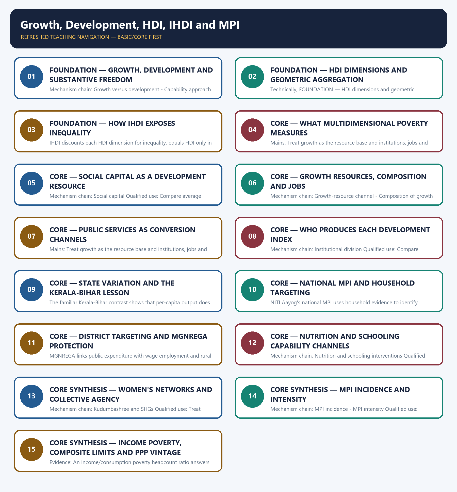

# Growth, Development, HDI, IHDI and MPI — Learner-v2 Complete Learning Session

> **Authoring-only generation:** 2026-09-03. No PDF was rendered and no tracker or index was mutated.

### SOURCE, PROGRESSION AND CURRENT-LINKAGE AUDIT

- **Generation date:** 2026-09-03.
- **Repository-first evidence:** the Basic owner is taught first and preserved in full; the Advanced owner is retained only in the optional final teaching block.
- **OCR evidence:** Repository Markdown was primary. OCR-searchable local official General Studies papers were used only to confirm printed routed demands. No answer key, marking scheme, unsupported page precision or current macroeconomic statistic was inferred from them.
- **Qdrant:** not used; repository Markdown and available OCR context were sufficient.
- **PYQ integrity:** The audited ledgers route 2020 GS-II on incidence and intensity of poverty, 2024 GS-III on social-service expenditure and inclusive growth, and 2025 GS-III on HDI versus IHDI here. Objective routes on GNP per capita, Ease of Doing Business, social capital and 2026 MPI methodology remain answer-letter free.
- **Live-link boundary:** The UNDP HDI page was substantively retrievable on 2026-09-03 and is used only for its HDI dimensions, geometric-mean construction and stated limits. No live India rank, score, IHDI loss, MPI headcount or poverty estimate was taken from it.
- **Fact/inference discipline:** no current-affairs item, PYQ wording, figure or quotation is invented.

### LIVE OFFICIAL-SOURCE ATTEMPT LOG

The checks below were made on 2026-09-03. Substantive official text is used only for the proposition it actually supports; binary files, dynamic shells, stubs and undated dashboard snippets are recorded but not converted into current claims.

- https://hdr.undp.org/data-center/human-development-index#/indicies/HDI — retrieved 2026-09-03; the official UNDP page substantively states that HDI uses health, education and standard-of-living dimensions aggregated by a geometric mean and also states that HDI does not capture inequality, poverty, security or empowerment.

## BASIC LEARNING SESSION



*Distinct embedded teaching-navigation image. The separate continuous Cārvāka-style flowchart package remains an independent at-a-glance artifact.*

### SESSION 1 — FOUNDATION — GROWTH, DEVELOPMENT AND SUBSTANTIVE FREEDOM

#### DEFINITION / WHAT THIS IS CALLED

**Plain-language definition:** Economic growth is a sustained quantitative increase in real output or income, whereas development adds structural change, capability expansion and better distribution.

**Technical definition:** Mechanism chain: Growth versus development - Capability approach Qualified use: Treat growth as the resource base and institutions, jobs and public services as the conversion mechanism.

#### ANSWER-GRABBING OPENING — WRITE/ADAPT IN THE EXAM

> Economic growth is a sustained quantitative increase in real output or income, whereas development adds structural change, capability expansion and better distribution.

#### MUST-WRITE KEYWORDS

- **FOUNDATION**
- **Growth**
- **development**
- **substantive freedom**
- **Mechanism chain**
- **Qualified use**

**How to use them:** Frame the answer through FOUNDATION; define Growth, connect development with substantive freedom to explain the mechanism, and use Mechanism chain for the decisive comparison or qualification.

#### VISUAL FIRST

```text
GROWTH, DEVELOPMENT AND SUBSTANTIVE FREEDOM
01. Growth versus development
    |
    v
02. Capability approach
BOUNDARY -> Do not infer development from nominal or aggregate GDP growth alone.
```

*This topic-specific rail fixes the evidence sequence and its exam boundary before analysis.*

#### CORE EXPLANATION

Economic growth is a sustained quantitative increase in real output or income, whereas development adds structural change, capability expansion and better distribution. Amartya Sen's capability approach judges development by substantive freedoms and real opportunities to lead valued lives, not by income or commodity possession alone.

#### NAMED EVIDENCE AND MECHANISM

- Economic growth is a sustained quantitative increase in real output or income, whereas development adds structural change, capability expansion and better distribution.
- Amartya Sen's capability approach judges development by substantive freedoms and real opportunities to lead valued lives, not by income or commodity possession alone.

#### EXAMINER CAUTION

- Do not infer development from nominal or aggregate GDP growth alone.

#### EXAM LINK

- **Prelims:** Preserve the exact formula, territorial or resident boundary, price basis, base year, index basket, eligible counterparty, institution and legal status; never upgrade a projection into an actual or a regulatory direction into a universal rule.
- **Mains:** Treat growth as the resource base and institutions, jobs and public services as the conversion mechanism.

#### MINI RECAP

- **Mechanism chain:** Growth versus development -> Capability approach
- **Qualified use:** Treat growth as the resource base and institutions, jobs and public services as the conversion mechanism.

#### CLOSING RECALL FLOW — FOUNDATION — GROWTH, DEVELOPMENT AND SUBSTANTIVE FREEDOM

```text
START / CONCEPT: FOUNDATION — Growth, development and substantive freedom
        |
        v
EXACT TERMS: FOUNDATION · Growth · development · substantive freedom · Mechanism chain · Qualified use
        |
        v
MECHANISM / ARGUMENT: Mechanism chain: Growth versus development - Capability approach Qualified use: Treat growth as the resource base and institutions, jobs and public services as the conversion mechanism.
        |
        v
CONSEQUENCE / CONTRAST: Do not infer development from nominal or aggregate GDP growth alone.
        |
        v
UPSC TRAP / ANSWER-USE: Do not miss this limiting distinction: treat growth as the resource base and institutions, jobs and public services as the...
        |
        v
ANSWER-GRABBING FORMULATION: Economic growth is a sustained quantitative increase in real output or income, whereas development adds structural change, capability expansion and better distribution.
```
### SESSION 2 — FOUNDATION — HDI DIMENSIONS AND GEOMETRIC AGGREGATION

#### DEFINITION / WHAT THIS IS CALLED

**Plain-language definition:** UNDP's HDI is the geometric mean of normalised health, education and standard-of-living indices, using life expectancy, schooling measures and GNI per capita.

**Technical definition:** Technically, FOUNDATION — HDI dimensions and geometric aggregation is analysed by relating FOUNDATION to HDI dimensions, then testing the relationship through geometric aggregation and Mechanism chain.

#### ANSWER-GRABBING OPENING — WRITE/ADAPT IN THE EXAM

> UNDP's HDI is the geometric mean of normalised health, education and standard-of-living indices, using life expectancy, schooling measures and GNI per capita.

#### MUST-WRITE KEYWORDS

- **FOUNDATION**
- **HDI dimensions**
- **geometric aggregation**
- **Mechanism chain**
- **Qualified use**
- **UNDP's HDI**

**How to use them:** Frame the answer through FOUNDATION; define HDI dimensions, connect geometric aggregation with Mechanism chain to explain the mechanism, and use Qualified use for the decisive comparison or qualification.

#### VISUAL FIRST

```text
HDI DIMENSIONS AND GEOMETRIC AGGREGATION
01. HDI architecture
BOUNDARY -> Do not say HDI directly measures political freedom; its formal dimensions are health, education and income.
```

*This topic-specific rail fixes the evidence sequence and its exam boundary before analysis.*

#### CORE EXPLANATION

UNDP's HDI is the geometric mean of normalised health, education and standard-of-living indices, using life expectancy, schooling measures and GNI per capita.

#### NAMED EVIDENCE AND MECHANISM

- UNDP's HDI is the geometric mean of normalised health, education and standard-of-living indices, using life expectancy, schooling measures and GNI per capita.

#### EXAMINER CAUTION

- Do not say HDI directly measures political freedom; its formal dimensions are health, education and income.

#### EXAM LINK

- **Prelims:** Preserve the exact formula, territorial or resident boundary, price basis, base year, index basket, eligible counterparty, institution and legal status; never upgrade a projection into an actual or a regulatory direction into a universal rule.
- **Mains:** Compare average achievement with inequality and overlapping deprivation before judging inclusion.

#### MINI RECAP

- **Mechanism chain:** HDI architecture
- **Qualified use:** Compare average achievement with inequality and overlapping deprivation before judging inclusion.

#### CLOSING RECALL FLOW — FOUNDATION — HDI DIMENSIONS AND GEOMETRIC AGGREGATION

```text
START / CONCEPT: FOUNDATION — HDI dimensions and geometric aggregation
        |
        v
EXACT TERMS: FOUNDATION · HDI dimensions · geometric aggregation · Mechanism chain · Qualified use · UNDP's HDI
        |
        v
MECHANISM / ARGUMENT: Mechanism chain: HDI architecture Qualified use: Compare average achievement with inequality and overlapping deprivation before judging inclusion.
        |
        v
CONSEQUENCE / CONTRAST: Do not say HDI directly measures political freedom; its formal dimensions are health, education and income.
        |
        v
UPSC TRAP / ANSWER-USE: Do not miss this limiting distinction: do not say HDI directly measures political freedom.
        |
        v
ANSWER-GRABBING FORMULATION: UNDP's HDI is the geometric mean of normalised health, education and standard-of-living indices, using life expectancy, schooling measures and GNI per capita.
```
### SESSION 3 — FOUNDATION — HOW IHDI EXPOSES INEQUALITY

#### DEFINITION / WHAT THIS IS CALLED

**Plain-language definition:** Mechanism chain: IHDI inequality adjustment Qualified use: End with disaggregated outcomes, service quality and employment-intensive productivity growth.

**Technical definition:** IHDI discounts each HDI dimension for inequality, equals HDI only in the absence of inequality and falls farther below HDI as unequal distribution increases.

#### ANSWER-GRABBING OPENING — WRITE/ADAPT IN THE EXAM

> Do not treat IHDI as a separate welfare basket; it inequality-adjusts the HDI dimensions.

#### MUST-WRITE KEYWORDS

- **FOUNDATION**
- **How IHDI exposes inequality**
- **Mechanism chain**
- **Qualified use**
- **IHDI**
- **HDI**

**How to use them:** Frame the answer through FOUNDATION; define How IHDI exposes inequality, connect Mechanism chain with Qualified use to explain the mechanism, and use IHDI for the decisive comparison or qualification.

#### VISUAL FIRST

```text
HOW IHDI EXPOSES INEQUALITY
01. IHDI inequality adjustment
BOUNDARY -> Do not treat IHDI as a separate welfare basket; it inequality-adjusts the HDI dimensions.
```

*This topic-specific rail fixes the evidence sequence and its exam boundary before analysis.*

#### CORE EXPLANATION

IHDI discounts each HDI dimension for inequality, equals HDI only in the absence of inequality and falls farther below HDI as unequal distribution increases.

#### NAMED EVIDENCE AND MECHANISM

- IHDI discounts each HDI dimension for inequality, equals HDI only in the absence of inequality and falls farther below HDI as unequal distribution increases.

#### EXAMINER CAUTION

- Do not treat IHDI as a separate welfare basket; it inequality-adjusts the HDI dimensions.

#### EXAM LINK

- **Prelims:** Preserve the exact formula, territorial or resident boundary, price basis, base year, index basket, eligible counterparty, institution and legal status; never upgrade a projection into an actual or a regulatory direction into a universal rule.
- **Mains:** End with disaggregated outcomes, service quality and employment-intensive productivity growth.

#### MINI RECAP

- **Mechanism chain:** IHDI inequality adjustment
- **Qualified use:** End with disaggregated outcomes, service quality and employment-intensive productivity growth.

#### CLOSING RECALL FLOW — FOUNDATION — HOW IHDI EXPOSES INEQUALITY

```text
START / CONCEPT: FOUNDATION — How IHDI exposes inequality
        |
        v
EXACT TERMS: FOUNDATION · How IHDI exposes inequality · Mechanism chain · Qualified use · IHDI · HDI
        |
        v
MECHANISM / ARGUMENT: Mechanism chain: IHDI inequality adjustment Qualified use: End with disaggregated outcomes, service quality and employment-intensive productivity growth.
        |
        v
CONSEQUENCE / CONTRAST: IHDI discounts each HDI dimension for inequality, equals HDI only in the absence of inequality and falls farther below HDI as unequal distribution increases.
        |
        v
UPSC TRAP / ANSWER-USE: Do not miss this limiting distinction: do not treat IHDI as a separate welfare basket.
        |
        v
ANSWER-GRABBING FORMULATION: Do not treat IHDI as a separate welfare basket; it inequality-adjusts the HDI dimensions.
```
### SESSION 4 — CORE — WHAT MULTIDIMENSIONAL POVERTY MEASURES

#### DEFINITION / WHAT THIS IS CALLED

**Plain-language definition:** Mechanism chain: MPI purpose Qualified use: Treat growth as the resource base and institutions, jobs and public services as the conversion mechanism.

**Technical definition:** Mains: Treat growth as the resource base and institutions, jobs and public services as the conversion mechanism.

#### ANSWER-GRABBING OPENING — WRITE/ADAPT IN THE EXAM

> Do not reduce MPI to an income poverty-line headcount.

#### MUST-WRITE KEYWORDS

- **What multidimensional poverty measures**
- **Mechanism chain**
- **Qualified use**
- **MPI**
- **Treat**
- **Qualified**

**How to use them:** Frame the answer through What multidimensional poverty measures; define Mechanism chain, connect Qualified use with MPI to explain the mechanism, and use Treat for the decisive comparison or qualification.

#### VISUAL FIRST

```text
WHAT MULTIDIMENSIONAL POVERTY MEASURES
01. MPI purpose
BOUNDARY -> Do not reduce MPI to an income poverty-line headcount.
```

*This topic-specific rail fixes the evidence sequence and its exam boundary before analysis.*

#### CORE EXPLANATION

MPI identifies overlapping household deprivations in health, education and living standards rather than classifying poverty from income alone.

#### NAMED EVIDENCE AND MECHANISM

- MPI identifies overlapping household deprivations in health, education and living standards rather than classifying poverty from income alone.

#### EXAMINER CAUTION

- Do not reduce MPI to an income poverty-line headcount.

#### EXAM LINK

- **Prelims:** Preserve the exact formula, territorial or resident boundary, price basis, base year, index basket, eligible counterparty, institution and legal status; never upgrade a projection into an actual or a regulatory direction into a universal rule.
- **Mains:** Treat growth as the resource base and institutions, jobs and public services as the conversion mechanism.

#### MINI RECAP

- **Mechanism chain:** MPI purpose
- **Qualified use:** Treat growth as the resource base and institutions, jobs and public services as the conversion mechanism.

#### CLOSING RECALL FLOW — CORE — WHAT MULTIDIMENSIONAL POVERTY MEASURES

```text
START / CONCEPT: CORE — What multidimensional poverty measures
        |
        v
EXACT TERMS: What multidimensional poverty measures · Mechanism chain · Qualified use · MPI · Treat · Qualified
        |
        v
MECHANISM / ARGUMENT: Mechanism chain: MPI purpose Qualified use: Treat growth as the resource base and institutions, jobs and public services as the conversion mechanism.
        |
        v
CONSEQUENCE / CONTRAST: Mains: Treat growth as the resource base and institutions, jobs and public services as the conversion mechanism.
        |
        v
UPSC TRAP / ANSWER-USE: Do not miss this limiting distinction: do not reduce MPI to an income poverty-line headcount.
        |
        v
ANSWER-GRABBING FORMULATION: Do not reduce MPI to an income poverty-line headcount.
```
### SESSION 5 — CORE — SOCIAL CAPITAL AS A DEVELOPMENT RESOURCE

#### DEFINITION / WHAT THIS IS CALLED

**Plain-language definition:** Trust, norms and networks can improve cooperation, collective action and scheme effectiveness, making social capital a development resource beyond private income.

**Technical definition:** Mechanism chain: Social capital Qualified use: Compare average achievement with inequality and overlapping deprivation before judging inclusion.

#### ANSWER-GRABBING OPENING — WRITE/ADAPT IN THE EXAM

> Trust, norms and networks can improve cooperation, collective action and scheme effectiveness, making social capital a development resource beyond private income.

#### MUST-WRITE KEYWORDS

- **Social capital as a development resource**
- **Mechanism chain**
- **Qualified use**
- **Trust**
- **Social**
- **Qualified**

**How to use them:** Frame the answer through Social capital as a development resource; define Mechanism chain, connect Qualified use with Trust to explain the mechanism, and use Social for the decisive comparison or qualification.

#### VISUAL FIRST

```text
SOCIAL CAPITAL AS A DEVELOPMENT RESOURCE
01. Social capital
BOUNDARY -> Do not merge incidence H with intensity A; they answer how many and how deprived.
```

*This topic-specific rail fixes the evidence sequence and its exam boundary before analysis.*

#### CORE EXPLANATION

Trust, norms and networks can improve cooperation, collective action and scheme effectiveness, making social capital a development resource beyond private income.

#### NAMED EVIDENCE AND MECHANISM

- Trust, norms and networks can improve cooperation, collective action and scheme effectiveness, making social capital a development resource beyond private income.

#### EXAMINER CAUTION

- Do not merge incidence H with intensity A; they answer how many and how deprived.

#### EXAM LINK

- **Prelims:** Preserve the exact formula, territorial or resident boundary, price basis, base year, index basket, eligible counterparty, institution and legal status; never upgrade a projection into an actual or a regulatory direction into a universal rule.
- **Mains:** Compare average achievement with inequality and overlapping deprivation before judging inclusion.

#### MINI RECAP

- **Mechanism chain:** Social capital
- **Qualified use:** Compare average achievement with inequality and overlapping deprivation before judging inclusion.

#### CLOSING RECALL FLOW — CORE — SOCIAL CAPITAL AS A DEVELOPMENT RESOURCE

```text
START / CONCEPT: CORE — Social capital as a development resource
        |
        v
EXACT TERMS: Social capital as a development resource · Mechanism chain · Qualified use · Trust · Social · Qualified
        |
        v
MECHANISM / ARGUMENT: Mechanism chain: Social capital Qualified use: Compare average achievement with inequality and overlapping deprivation before judging inclusion.
        |
        v
CONSEQUENCE / CONTRAST: Do not merge incidence H with intensity A; they answer how many and how deprived.
        |
        v
UPSC TRAP / ANSWER-USE: Do not miss this limiting distinction: trust, norms and networks can improve cooperation, collective action and scheme effectiveness, making social...
        |
        v
ANSWER-GRABBING FORMULATION: Trust, norms and networks can improve cooperation, collective action and scheme effectiveness, making social capital a development resource beyond private income.
```
### SESSION 6 — CORE — GROWTH RESOURCES, COMPOSITION AND JOBS

#### DEFINITION / WHAT THIS IS CALLED

**Plain-language definition:** Labour intensity, sectoral composition, regional spread and access to productive jobs determine whether aggregate growth reaches lagging regions and vulnerable groups.

**Technical definition:** Mechanism chain: Growth-resource channel - Composition of growth Qualified use: End with disaggregated outcomes, service quality and employment-intensive productivity growth.

#### ANSWER-GRABBING OPENING — WRITE/ADAPT IN THE EXAM

> Real productivity and output growth enlarge household income, profits and the tax base, creating resources that can finance capabilities but not guaranteeing their conversion.

#### MUST-WRITE KEYWORDS

- **Growth resources**
- **composition**
- **jobs**
- **Mechanism chain**
- **Qualified use**
- **Real**

**How to use them:** Frame the answer through Growth resources; define composition, connect jobs with Mechanism chain to explain the mechanism, and use Qualified use for the decisive comparison or qualification.

#### VISUAL FIRST

```text
GROWTH RESOURCES, COMPOSITION AND JOBS
01. Growth-resource channel
    |
    v
02. Composition of growth
BOUNDARY -> Do not compare poverty lines across PPP revisions without stating the price basis.
```

*This topic-specific rail fixes the evidence sequence and its exam boundary before analysis.*

#### CORE EXPLANATION

Real productivity and output growth enlarge household income, profits and the tax base, creating resources that can finance capabilities but not guaranteeing their conversion. Labour intensity, sectoral composition, regional spread and access to productive jobs determine whether aggregate growth reaches lagging regions and vulnerable groups.

#### NAMED EVIDENCE AND MECHANISM

- Real productivity and output growth enlarge household income, profits and the tax base, creating resources that can finance capabilities but not guaranteeing their conversion.
- Labour intensity, sectoral composition, regional spread and access to productive jobs determine whether aggregate growth reaches lagging regions and vulnerable groups.

#### EXAMINER CAUTION

- Do not compare poverty lines across PPP revisions without stating the price basis.

#### EXAM LINK

- **Prelims:** Preserve the exact formula, territorial or resident boundary, price basis, base year, index basket, eligible counterparty, institution and legal status; never upgrade a projection into an actual or a regulatory direction into a universal rule.
- **Mains:** End with disaggregated outcomes, service quality and employment-intensive productivity growth.

#### MINI RECAP

- **Mechanism chain:** Growth-resource channel -> Composition of growth
- **Qualified use:** End with disaggregated outcomes, service quality and employment-intensive productivity growth.

#### CLOSING RECALL FLOW — CORE — GROWTH RESOURCES, COMPOSITION AND JOBS

```text
START / CONCEPT: CORE — Growth resources, composition and jobs
        |
        v
EXACT TERMS: Growth resources · composition · jobs · Mechanism chain · Qualified use · Real
        |
        v
MECHANISM / ARGUMENT: Mechanism chain: Growth-resource channel - Composition of growth Qualified use: End with disaggregated outcomes, service quality and employment-intensive productivity growth.
        |
        v
CONSEQUENCE / CONTRAST: Labour intensity, sectoral composition, regional spread and access to productive jobs determine whether aggregate growth reaches lagging regions and vulnerable groups.
        |
        v
UPSC TRAP / ANSWER-USE: Do not compare poverty lines across PPP revisions without stating the price basis.
        |
        v
ANSWER-GRABBING FORMULATION: Real productivity and output growth enlarge household income, profits and the tax base, creating resources that can finance capabilities but not guaranteeing their conversion.
```
### SESSION 7 — CORE — PUBLIC SERVICES AS CONVERSION CHANNELS

#### DEFINITION / WHAT THIS IS CALLED

**Plain-language definition:** Mechanism chain: Public-service conversion Qualified use: Treat growth as the resource base and institutions, jobs and public services as the conversion mechanism.

**Technical definition:** Mains: Treat growth as the resource base and institutions, jobs and public services as the conversion mechanism.

#### ANSWER-GRABBING OPENING — WRITE/ADAPT IN THE EXAM

> Mechanism chain: Public-service conversion Qualified use: Treat growth as the resource base and institutions, jobs and public services as the conversion mechanism.

#### MUST-WRITE KEYWORDS

- **Public services as conversion channels**
- **Mechanism chain**
- **Qualified use**
- **Treat**
- **Public-service**
- **Qualified**

**How to use them:** Frame the answer through Public services as conversion channels; define Mechanism chain, connect Qualified use with Treat to explain the mechanism, and use Public-service for the decisive comparison or qualification.

#### VISUAL FIRST

```text
PUBLIC SERVICES AS CONVERSION CHANNELS
01. Public-service conversion
BOUNDARY -> Do not treat a dashboard ranking gain as proof of durable transformation.
```

*This topic-specific rail fixes the evidence sequence and its exam boundary before analysis.*

#### CORE EXPLANATION

Nutrition, health, education, housing and risk protection convert public revenue and household income into capabilities, employability and intergenerational mobility.

#### NAMED EVIDENCE AND MECHANISM

- Nutrition, health, education, housing and risk protection convert public revenue and household income into capabilities, employability and intergenerational mobility.

#### EXAMINER CAUTION

- Do not treat a dashboard ranking gain as proof of durable transformation.

#### EXAM LINK

- **Prelims:** Preserve the exact formula, territorial or resident boundary, price basis, base year, index basket, eligible counterparty, institution and legal status; never upgrade a projection into an actual or a regulatory direction into a universal rule.
- **Mains:** Treat growth as the resource base and institutions, jobs and public services as the conversion mechanism.

#### MINI RECAP

- **Mechanism chain:** Public-service conversion
- **Qualified use:** Treat growth as the resource base and institutions, jobs and public services as the conversion mechanism.

#### CLOSING RECALL FLOW — CORE — PUBLIC SERVICES AS CONVERSION CHANNELS

```text
START / CONCEPT: CORE — Public services as conversion channels
        |
        v
EXACT TERMS: Public services as conversion channels · Mechanism chain · Qualified use · Treat · Public-service · Qualified
        |
        v
MECHANISM / ARGUMENT: Mains: Treat growth as the resource base and institutions, jobs and public services as the conversion mechanism.
        |
        v
CONSEQUENCE / CONTRAST: Do not treat a dashboard ranking gain as proof of durable transformation.
        |
        v
UPSC TRAP / ANSWER-USE: Do not miss this limiting distinction: treat growth as the resource base and institutions, jobs and public services as the...
        |
        v
ANSWER-GRABBING FORMULATION: Mechanism chain: Public-service conversion Qualified use: Treat growth as the resource base and institutions, jobs and public services as the conversion mechanism.
```
### SESSION 8 — CORE — WHO PRODUCES EACH DEVELOPMENT INDEX

#### DEFINITION / WHAT THIS IS CALLED

**Plain-language definition:** UNDP publishes HDI and IHDI, UNDP and OPHI are associated with the global MPI, NITI Aayog publishes India's national MPI, and governments deliver capability-building services.

**Technical definition:** Mechanism chain: Institutional division Qualified use: Compare average achievement with inequality and overlapping deprivation before judging inclusion.

#### ANSWER-GRABBING OPENING — WRITE/ADAPT IN THE EXAM

> UNDP publishes HDI and IHDI, UNDP and OPHI are associated with the global MPI, NITI Aayog publishes India's national MPI, and governments deliver capability-building services.

#### MUST-WRITE KEYWORDS

- **Who produces each development index**
- **Mechanism chain**
- **Qualified use**
- **UNDP publishes HDI and IHDI, UNDP and OPHI**
- **UNDP**
- **HDI**

**How to use them:** Frame the answer through Who produces each development index; define Mechanism chain, connect Qualified use with UNDP publishes HDI and IHDI, UNDP and OPHI to explain the mechanism, and use UNDP for the decisive comparison or qualification.

#### VISUAL FIRST

```text
WHO PRODUCES EACH DEVELOPMENT INDEX
01. Institutional division
BOUNDARY -> Do not assume welfare access guarantees service quality or productive employment.
```

*This topic-specific rail fixes the evidence sequence and its exam boundary before analysis.*

#### CORE EXPLANATION

UNDP publishes HDI and IHDI, UNDP and OPHI are associated with the global MPI, NITI Aayog publishes India's national MPI, and governments deliver capability-building services.

#### NAMED EVIDENCE AND MECHANISM

- UNDP publishes HDI and IHDI, UNDP and OPHI are associated with the global MPI, NITI Aayog publishes India's national MPI, and governments deliver capability-building services.

#### EXAMINER CAUTION

- Do not assume welfare access guarantees service quality or productive employment.

#### EXAM LINK

- **Prelims:** Preserve the exact formula, territorial or resident boundary, price basis, base year, index basket, eligible counterparty, institution and legal status; never upgrade a projection into an actual or a regulatory direction into a universal rule.
- **Mains:** Compare average achievement with inequality and overlapping deprivation before judging inclusion.

#### MINI RECAP

- **Mechanism chain:** Institutional division
- **Qualified use:** Compare average achievement with inequality and overlapping deprivation before judging inclusion.

#### CLOSING RECALL FLOW — CORE — WHO PRODUCES EACH DEVELOPMENT INDEX

```text
START / CONCEPT: CORE — Who produces each development index
        |
        v
EXACT TERMS: Who produces each development index · Mechanism chain · Qualified use · UNDP publishes HDI and IHDI, UNDP and OPHI · UNDP · HDI
        |
        v
MECHANISM / ARGUMENT: Mechanism chain: Institutional division Qualified use: Compare average achievement with inequality and overlapping deprivation before judging inclusion.
        |
        v
CONSEQUENCE / CONTRAST: Do not assume welfare access guarantees service quality or productive employment.
        |
        v
UPSC TRAP / ANSWER-USE: Do not miss this limiting distinction: do not assume welfare access guarantees service quality or productive employment.
        |
        v
ANSWER-GRABBING FORMULATION: UNDP publishes HDI and IHDI, UNDP and OPHI are associated with the global MPI, NITI Aayog publishes India's national MPI, and governments deliver capability-building services.
```
### SESSION 9 — CORE — STATE VARIATION AND THE KERALA-BIHAR LESSON

#### DEFINITION / WHAT THIS IS CALLED

**Plain-language definition:** Mechanism chain: Kerala-Bihar comparison Qualified use: End with disaggregated outcomes, service quality and employment-intensive productivity growth.

**Technical definition:** The familiar Kerala-Bihar contrast shows that per-capita output does not convert one-for-one into social outcomes because public services, history, migration, demography and state capacity matter.

#### ANSWER-GRABBING OPENING — WRITE/ADAPT IN THE EXAM

> The familiar Kerala-Bihar contrast shows that per-capita output does not convert one-for-one into social outcomes because public services, history, migration, demography and state capacity matter.

#### MUST-WRITE KEYWORDS

- **the Kerala-Bihar lesson**
- **Mechanism chain**
- **Qualified use**
- **Kerala-Bihar**
- **Qualified**
- **End**

**How to use them:** Frame the answer through the Kerala-Bihar lesson; define Mechanism chain, connect Qualified use with Kerala-Bihar to explain the mechanism, and use Qualified for the decisive comparison or qualification.

#### VISUAL FIRST

```text
STATE VARIATION AND THE KERALA-BIHAR LESSON
01. Kerala-Bihar comparison
BOUNDARY -> Do not copy one state's development path mechanically across different histories and capacities.
```

*This topic-specific rail fixes the evidence sequence and its exam boundary before analysis.*

#### CORE EXPLANATION

The familiar Kerala-Bihar contrast shows that per-capita output does not convert one-for-one into social outcomes because public services, history, migration, demography and state capacity matter.

#### NAMED EVIDENCE AND MECHANISM

- The familiar Kerala-Bihar contrast shows that per-capita output does not convert one-for-one into social outcomes because public services, history, migration, demography and state capacity matter.

#### EXAMINER CAUTION

- Do not copy one state's development path mechanically across different histories and capacities.

#### EXAM LINK

- **Prelims:** Preserve the exact formula, territorial or resident boundary, price basis, base year, index basket, eligible counterparty, institution and legal status; never upgrade a projection into an actual or a regulatory direction into a universal rule.
- **Mains:** End with disaggregated outcomes, service quality and employment-intensive productivity growth.

#### MINI RECAP

- **Mechanism chain:** Kerala-Bihar comparison
- **Qualified use:** End with disaggregated outcomes, service quality and employment-intensive productivity growth.

#### CLOSING RECALL FLOW — CORE — STATE VARIATION AND THE KERALA-BIHAR LESSON

```text
START / CONCEPT: CORE — State variation and the Kerala-Bihar lesson
        |
        v
EXACT TERMS: the Kerala-Bihar lesson · Mechanism chain · Qualified use · Kerala-Bihar · Qualified · End
        |
        v
MECHANISM / ARGUMENT: Mechanism chain: Kerala-Bihar comparison Qualified use: End with disaggregated outcomes, service quality and employment-intensive productivity growth.
        |
        v
CONSEQUENCE / CONTRAST: Do not copy one state's development path mechanically across different histories and capacities.
        |
        v
UPSC TRAP / ANSWER-USE: Do not miss this limiting distinction: the familiar Kerala-Bihar contrast shows that per-capita output does not convert one-for-one into social...
        |
        v
ANSWER-GRABBING FORMULATION: The familiar Kerala-Bihar contrast shows that per-capita output does not convert one-for-one into social outcomes because public services, history, migration, demography and state capacity matter.
```
### SESSION 10 — CORE — NATIONAL MPI AND HOUSEHOLD TARGETING

#### DEFINITION / WHAT THIS IS CALLED

**Plain-language definition:** Mechanism chain: National MPI targeting Qualified use: Treat growth as the resource base and institutions, jobs and public services as the conversion mechanism.

**Technical definition:** NITI Aayog's national MPI uses household evidence to identify simultaneous deficits such as nutrition, schooling, sanitation, housing and amenities for targeted policy.

#### ANSWER-GRABBING OPENING — WRITE/ADAPT IN THE EXAM

> Mechanism chain: National MPI targeting Qualified use: Treat growth as the resource base and institutions, jobs and public services as the conversion mechanism.

#### MUST-WRITE KEYWORDS

- **National MPI**
- **household targeting**
- **Mechanism chain**
- **Qualified use**
- **NITI Aayog's**
- **MPI**

**How to use them:** Frame the answer through National MPI; define household targeting, connect Mechanism chain with Qualified use to explain the mechanism, and use NITI Aayog's for the decisive comparison or qualification.

#### VISUAL FIRST

```text
NATIONAL MPI AND HOUSEHOLD TARGETING
01. National MPI targeting
BOUNDARY -> Do not treat social capital as a substitute for infrastructure, markets or public finance.
```

*This topic-specific rail fixes the evidence sequence and its exam boundary before analysis.*

#### CORE EXPLANATION

NITI Aayog's national MPI uses household evidence to identify simultaneous deficits such as nutrition, schooling, sanitation, housing and amenities for targeted policy.

#### NAMED EVIDENCE AND MECHANISM

- NITI Aayog's national MPI uses household evidence to identify simultaneous deficits such as nutrition, schooling, sanitation, housing and amenities for targeted policy.

#### EXAMINER CAUTION

- Do not treat social capital as a substitute for infrastructure, markets or public finance.

#### EXAM LINK

- **Prelims:** Preserve the exact formula, territorial or resident boundary, price basis, base year, index basket, eligible counterparty, institution and legal status; never upgrade a projection into an actual or a regulatory direction into a universal rule.
- **Mains:** Treat growth as the resource base and institutions, jobs and public services as the conversion mechanism.

#### MINI RECAP

- **Mechanism chain:** National MPI targeting
- **Qualified use:** Treat growth as the resource base and institutions, jobs and public services as the conversion mechanism.

#### CLOSING RECALL FLOW — CORE — NATIONAL MPI AND HOUSEHOLD TARGETING

```text
START / CONCEPT: CORE — National MPI and household targeting
        |
        v
EXACT TERMS: National MPI · household targeting · Mechanism chain · Qualified use · NITI Aayog's · MPI
        |
        v
MECHANISM / ARGUMENT: NITI Aayog's national MPI uses household evidence to identify simultaneous deficits such as nutrition, schooling, sanitation, housing and amenities for targeted policy.
        |
        v
CONSEQUENCE / CONTRAST: Do not treat social capital as a substitute for infrastructure, markets or public finance.
        |
        v
UPSC TRAP / ANSWER-USE: Do not miss this limiting distinction: treat growth as the resource base and institutions, jobs and public services as the...
        |
        v
ANSWER-GRABBING FORMULATION: Mechanism chain: National MPI targeting Qualified use: Treat growth as the resource base and institutions, jobs and public services as the conversion mechanism.
```
### SESSION 11 — CORE — DISTRICT TARGETING AND MGNREGA PROTECTION

#### DEFINITION / WHAT THIS IS CALLED

**Plain-language definition:** Mechanism chain: Aspirational Districts lesson - MGNREGA conversion role Qualified use: Compare average achievement with inequality and overlapping deprivation before judging inclusion.

**Technical definition:** MGNREGA links public expenditure with wage employment and rural asset creation, supporting minimum protection without substituting for productivity growth or formal jobs.

#### ANSWER-GRABBING OPENING — WRITE/ADAPT IN THE EXAM

> The Aspirational Districts Programme illustrates why state averages can hide district-level divergence, while dashboard or rank improvement alone does not prove structural transformation.

#### MUST-WRITE KEYWORDS

- **District targeting**
- **MGNREGA protection**
- **Mechanism chain**
- **Qualified use**
- **The Aspirational Districts Programme**
- **MGNREGA**

**How to use them:** Frame the answer through District targeting; define MGNREGA protection, connect Mechanism chain with Qualified use to explain the mechanism, and use The Aspirational Districts Programme for the decisive comparison or qualification.

#### VISUAL FIRST

```text
DISTRICT TARGETING AND MGNREGA PROTECTION
01. Aspirational Districts lesson
    |
    v
02. MGNREGA conversion role
BOUNDARY -> Do not use an international poverty benchmark as India's official domestic poverty line.
```

*This topic-specific rail fixes the evidence sequence and its exam boundary before analysis.*

#### CORE EXPLANATION

The Aspirational Districts Programme illustrates why state averages can hide district-level divergence, while dashboard or rank improvement alone does not prove structural transformation. MGNREGA links public expenditure with wage employment and rural asset creation, supporting minimum protection without substituting for productivity growth or formal jobs.

#### NAMED EVIDENCE AND MECHANISM

- The Aspirational Districts Programme illustrates why state averages can hide district-level divergence, while dashboard or rank improvement alone does not prove structural transformation.
- MGNREGA links public expenditure with wage employment and rural asset creation, supporting minimum protection without substituting for productivity growth or formal jobs.

#### EXAMINER CAUTION

- Do not use an international poverty benchmark as India's official domestic poverty line.

#### EXAM LINK

- **Prelims:** Preserve the exact formula, territorial or resident boundary, price basis, base year, index basket, eligible counterparty, institution and legal status; never upgrade a projection into an actual or a regulatory direction into a universal rule.
- **Mains:** Compare average achievement with inequality and overlapping deprivation before judging inclusion.

#### MINI RECAP

- **Mechanism chain:** Aspirational Districts lesson -> MGNREGA conversion role
- **Qualified use:** Compare average achievement with inequality and overlapping deprivation before judging inclusion.

#### CLOSING RECALL FLOW — CORE — DISTRICT TARGETING AND MGNREGA PROTECTION

```text
START / CONCEPT: CORE — District targeting and MGNREGA protection
        |
        v
EXACT TERMS: District targeting · MGNREGA protection · Mechanism chain · Qualified use · The Aspirational Districts Programme · MGNREGA
        |
        v
MECHANISM / ARGUMENT: Mechanism chain: Aspirational Districts lesson - MGNREGA conversion role Qualified use: Compare average achievement with inequality and overlapping deprivation before judging inclusion.
        |
        v
CONSEQUENCE / CONTRAST: MGNREGA links public expenditure with wage employment and rural asset creation, supporting minimum protection without substituting for productivity growth or formal jobs.
        |
        v
UPSC TRAP / ANSWER-USE: Do not use an international poverty benchmark as India's official domestic poverty line.
        |
        v
ANSWER-GRABBING FORMULATION: The Aspirational Districts Programme illustrates why state averages can hide district-level divergence, while dashboard or rank improvement alone does not prove structural transformation.
```
### SESSION 12 — CORE — NUTRITION AND SCHOOLING CAPABILITY CHANNELS

#### DEFINITION / WHAT THIS IS CALLED

**Plain-language definition:** CORE — Nutrition and schooling capability channels comprises Nutrition, schooling capability channels and Mechanism chain as its core connected dimensions.

**Technical definition:** Mechanism chain: Nutrition and schooling interventions Qualified use: End with disaggregated outcomes, service quality and employment-intensive productivity growth.

#### ANSWER-GRABBING OPENING — WRITE/ADAPT IN THE EXAM

> ICDS and PM POSHAN show that direct nutrition and schooling support can expand capabilities, although access and attendance do not by themselves establish service quality or employability.

#### MUST-WRITE KEYWORDS

- **Nutrition**
- **schooling capability channels**
- **Mechanism chain**
- **Qualified use**
- **ICDS**
- **PM POSHAN**

**How to use them:** Frame the answer through Nutrition; define schooling capability channels, connect Mechanism chain with Qualified use to explain the mechanism, and use ICDS for the decisive comparison or qualification.

#### VISUAL FIRST

```text
NUTRITION AND SCHOOLING CAPABILITY CHANNELS
01. Nutrition and schooling interventions
BOUNDARY -> Do not let average HDI conceal caste, gender, tribal, regional or district inequality.
```

*This topic-specific rail fixes the evidence sequence and its exam boundary before analysis.*

#### CORE EXPLANATION

ICDS and PM POSHAN show that direct nutrition and schooling support can expand capabilities, although access and attendance do not by themselves establish service quality or employability.

#### NAMED EVIDENCE AND MECHANISM

- ICDS and PM POSHAN show that direct nutrition and schooling support can expand capabilities, although access and attendance do not by themselves establish service quality or employability.

#### EXAMINER CAUTION

- Do not let average HDI conceal caste, gender, tribal, regional or district inequality.

#### EXAM LINK

- **Prelims:** Preserve the exact formula, territorial or resident boundary, price basis, base year, index basket, eligible counterparty, institution and legal status; never upgrade a projection into an actual or a regulatory direction into a universal rule.
- **Mains:** End with disaggregated outcomes, service quality and employment-intensive productivity growth.

#### MINI RECAP

- **Mechanism chain:** Nutrition and schooling interventions
- **Qualified use:** End with disaggregated outcomes, service quality and employment-intensive productivity growth.

#### CLOSING RECALL FLOW — CORE — NUTRITION AND SCHOOLING CAPABILITY CHANNELS

```text
START / CONCEPT: CORE — Nutrition and schooling capability channels
        |
        v
EXACT TERMS: Nutrition · schooling capability channels · Mechanism chain · Qualified use · ICDS · PM POSHAN
        |
        v
MECHANISM / ARGUMENT: Mechanism chain: Nutrition and schooling interventions Qualified use: End with disaggregated outcomes, service quality and employment-intensive productivity growth.
        |
        v
CONSEQUENCE / CONTRAST: Do not let average HDI conceal caste, gender, tribal, regional or district inequality.
        |
        v
UPSC TRAP / ANSWER-USE: Do not miss this limiting distinction: iCDS and PM POSHAN show that direct nutrition and schooling support can expand capabilities...
        |
        v
ANSWER-GRABBING FORMULATION: ICDS and PM POSHAN show that direct nutrition and schooling support can expand capabilities, although access and attendance do not by themselves establish service quality or employability.
```
### SESSION 13 — CORE SYNTHESIS — WOMEN'S NETWORKS AND COLLECTIVE AGENCY

#### DEFINITION / WHAT THIS IS CALLED

**Plain-language definition:** Kudumbashree and the wider self-help-group model show how organised women's networks can support savings, credit, agency and local problem-solving while remaining complements to formal capacity.

**Technical definition:** Mechanism chain: Kudumbashree and SHGs Qualified use: Treat growth as the resource base and institutions, jobs and public services as the conversion mechanism.

#### ANSWER-GRABBING OPENING — WRITE/ADAPT IN THE EXAM

> Kudumbashree and the wider self-help-group model show how organised women's networks can support savings, credit, agency and local problem-solving while remaining complements to formal capacity.

#### MUST-WRITE KEYWORDS

- **CORE SYNTHESIS**
- **Women's networks**
- **collective agency**
- **Mechanism chain**
- **Qualified use**
- **Kudumbashree**

**How to use them:** Frame the answer through CORE SYNTHESIS; define Women's networks, connect collective agency with Mechanism chain to explain the mechanism, and use Qualified use for the decisive comparison or qualification.

#### VISUAL FIRST

```text
WOMEN'S NETWORKS AND COLLECTIVE AGENCY
01. Kudumbashree and SHGs
BOUNDARY -> Do not infer development from nominal or aggregate GDP growth alone.
```

*This topic-specific rail fixes the evidence sequence and its exam boundary before analysis.*

#### CORE EXPLANATION

Kudumbashree and the wider self-help-group model show how organised women's networks can support savings, credit, agency and local problem-solving while remaining complements to formal capacity.

#### NAMED EVIDENCE AND MECHANISM

- Kudumbashree and the wider self-help-group model show how organised women's networks can support savings, credit, agency and local problem-solving while remaining complements to formal capacity.

#### EXAMINER CAUTION

- Do not infer development from nominal or aggregate GDP growth alone.

#### EXAM LINK

- **Prelims:** Preserve the exact formula, territorial or resident boundary, price basis, base year, index basket, eligible counterparty, institution and legal status; never upgrade a projection into an actual or a regulatory direction into a universal rule.
- **Mains:** Treat growth as the resource base and institutions, jobs and public services as the conversion mechanism.

#### MINI RECAP

- **Mechanism chain:** Kudumbashree and SHGs
- **Qualified use:** Treat growth as the resource base and institutions, jobs and public services as the conversion mechanism.

#### CLOSING RECALL FLOW — CORE SYNTHESIS — WOMEN'S NETWORKS AND COLLECTIVE AGENCY

```text
START / CONCEPT: CORE SYNTHESIS — Women's networks and collective agency
        |
        v
EXACT TERMS: CORE SYNTHESIS · Women's networks · collective agency · Mechanism chain · Qualified use · Kudumbashree
        |
        v
MECHANISM / ARGUMENT: Mechanism chain: Kudumbashree and SHGs Qualified use: Treat growth as the resource base and institutions, jobs and public services as the conversion mechanism.
        |
        v
CONSEQUENCE / CONTRAST: Do not infer development from nominal or aggregate GDP growth alone.
        |
        v
UPSC TRAP / ANSWER-USE: Do not miss this limiting distinction: treat growth as the resource base and institutions, jobs and public services as the...
        |
        v
ANSWER-GRABBING FORMULATION: Kudumbashree and the wider self-help-group model show how organised women's networks can support savings, credit, agency and local problem-solving while remaining complements to formal capacity.
```
### SESSION 14 — CORE SYNTHESIS — MPI INCIDENCE AND INTENSITY

#### DEFINITION / WHAT THIS IS CALLED

**Plain-language definition:** In MPI, A is the average share of weighted indicators in which multidimensionally poor people are deprived, so MPI equals H multiplied by A and incidence can move differently from intensity.

**Technical definition:** Mechanism chain: MPI incidence - MPI intensity Qualified use: Compare average achievement with inequality and overlapping deprivation before judging inclusion.

#### ANSWER-GRABBING OPENING — WRITE/ADAPT IN THE EXAM

> In MPI, A is the average share of weighted indicators in which multidimensionally poor people are deprived, so MPI equals H multiplied by A and incidence can move differently from intensity.

#### MUST-WRITE KEYWORDS

- **CORE SYNTHESIS**
- **MPI incidence**
- **intensity**
- **Mechanism chain**
- **Qualified use**
- **In MPI, H**

**How to use them:** Frame the answer through CORE SYNTHESIS; define MPI incidence, connect intensity with Mechanism chain to explain the mechanism, and use Qualified use for the decisive comparison or qualification.

#### VISUAL FIRST

```text
MPI INCIDENCE AND INTENSITY
01. MPI incidence
    |
    v
02. MPI intensity
BOUNDARY -> Do not say HDI directly measures political freedom; its formal dimensions are health, education and income.
```

*This topic-specific rail fixes the evidence sequence and its exam boundary before analysis.*

#### CORE EXPLANATION

In MPI, H is the proportion of people identified as multidimensionally poor at the chosen weighted-deprivation cutoff; standard global methodology uses at least one-third of weighted indicators. In MPI, A is the average share of weighted indicators in which multidimensionally poor people are deprived, so MPI equals H multiplied by A and incidence can move differently from intensity.

#### NAMED EVIDENCE AND MECHANISM

- In MPI, H is the proportion of people identified as multidimensionally poor at the chosen weighted-deprivation cutoff; standard global methodology uses at least one-third of weighted indicators.
- In MPI, A is the average share of weighted indicators in which multidimensionally poor people are deprived, so MPI equals H multiplied by A and incidence can move differently from intensity.

#### EXAMINER CAUTION

- Do not say HDI directly measures political freedom; its formal dimensions are health, education and income.

#### EXAM LINK

- **Prelims:** Preserve the exact formula, territorial or resident boundary, price basis, base year, index basket, eligible counterparty, institution and legal status; never upgrade a projection into an actual or a regulatory direction into a universal rule.
- **Mains:** Compare average achievement with inequality and overlapping deprivation before judging inclusion.

#### MINI RECAP

- **Mechanism chain:** MPI incidence -> MPI intensity
- **Qualified use:** Compare average achievement with inequality and overlapping deprivation before judging inclusion.

#### CLOSING RECALL FLOW — CORE SYNTHESIS — MPI INCIDENCE AND INTENSITY

```text
START / CONCEPT: CORE SYNTHESIS — MPI incidence and intensity
        |
        v
EXACT TERMS: CORE SYNTHESIS · MPI incidence · intensity · Mechanism chain · Qualified use · In MPI, H
        |
        v
MECHANISM / ARGUMENT: Mechanism chain: MPI incidence - MPI intensity Qualified use: Compare average achievement with inequality and overlapping deprivation before judging inclusion.
        |
        v
CONSEQUENCE / CONTRAST: Do not say HDI directly measures political freedom; its formal dimensions are health, education and income.
        |
        v
UPSC TRAP / ANSWER-USE: Do not miss this limiting distinction: in MPI, H is the proportion of people identified as multidimensionally poor at the...
        |
        v
ANSWER-GRABBING FORMULATION: In MPI, A is the average share of weighted indicators in which multidimensionally poor people are deprived, so MPI equals H multiplied by A and incidence can move differently from intensity.
```
### SESSION 15 — CORE SYNTHESIS — INCOME POVERTY, COMPOSITE LIMITS AND PPP VINTAGE

#### DEFINITION / WHAT THIS IS CALLED

**Plain-language definition:** An income or consumption poverty line records whether a monetary threshold is crossed but cannot show the overlap or composition of nutrition, schooling, sanitation and housing deprivation.

**Technical definition:** Evidence: An income/consumption poverty headcount ratio answers only "how many are below the line," while it is blind to whether the poor face simultaneous nutrition, schooling, sanitation or housing deficits, or only one, and blind to how deeply deprived they are.

#### ANSWER-GRABBING OPENING — WRITE/ADAPT IN THE EXAM

> An income or consumption poverty line records whether a monetary threshold is crossed but cannot show the overlap or composition of nutrition, schooling, sanitation and housing deprivation.

#### MUST-WRITE KEYWORDS

- **CORE SYNTHESIS**
- **Income poverty**
- **composite limits**
- **PPP vintage**
- **Mechanism chain**
- **Qualified use**

**How to use them:** Frame the answer through CORE SYNTHESIS; define Income poverty, connect composite limits with PPP vintage to explain the mechanism, and use Mechanism chain for the decisive comparison or qualification.

#### VISUAL FIRST

```text
INCOME POVERTY, COMPOSITE LIMITS AND PPP VINTAGE
01. Income-poverty contrast
    |
    v
02. Composite and benchmark caution
BOUNDARY -> Do not treat IHDI as a separate welfare basket; it inequality-adjusts the HDI dimensions.
```

*This topic-specific rail fixes the evidence sequence and its exam boundary before analysis.*

#### CORE EXPLANATION

An income or consumption poverty line records whether a monetary threshold is crossed but cannot show the overlap or composition of nutrition, schooling, sanitation and housing deprivation. HDI, IHDI and MPI depend on dimensions, weights and survey timing, while the owner's USD 3-a-day extreme-poverty figure uses 2021 PPP prices and is not India's official domestic poverty line or directly comparable with older lines.

#### NAMED EVIDENCE AND MECHANISM

- An income or consumption poverty line records whether a monetary threshold is crossed but cannot show the overlap or composition of nutrition, schooling, sanitation and housing deprivation.
- HDI, IHDI and MPI depend on dimensions, weights and survey timing, while the owner's USD 3-a-day extreme-poverty figure uses 2021 PPP prices and is not India's official domestic poverty line or directly comparable with older lines.

#### EXAMINER CAUTION

- Do not treat IHDI as a separate welfare basket; it inequality-adjusts the HDI dimensions.

#### EXAM LINK

- **Prelims:** Preserve the exact formula, territorial or resident boundary, price basis, base year, index basket, eligible counterparty, institution and legal status; never upgrade a projection into an actual or a regulatory direction into a universal rule.
- **Mains:** End with disaggregated outcomes, service quality and employment-intensive productivity growth.

#### MINI RECAP

- **Mechanism chain:** Income-poverty contrast -> Composite and benchmark caution
- **Qualified use:** End with disaggregated outcomes, service quality and employment-intensive productivity growth.
#### COMPLETE BASIC OWNER EVIDENCE BANK

> **Subject:** Economy | **Tier:** Must-Do (foundation) | **GS Paper:** GS-III + Prelims.
> **Core area:** Inclusive growth and human development.
> **Grounded in:** Ramesh Singh, relevant chapters; Economic Survey 2025-26; audited UPSC Economy PYQs (2024-2026 Prelims and 2024-2025 Mains).
> ✅ = source-grounded | ⚠️ = analytical linkage | 📰 = current Survey/current-affairs hook.
> *Companion: `../advanced/02_Growth-Development-HDI-IHDI-and-MPI.md`.*

#### 1. Visual foundation

```text
1. REAL GROWTH
   |
   v
2. PUBLIC AND PRIVATE RESOURCES
   |
   v
3. HEALTH, EDUCATION AND PRODUCTIVE JOBS
   |
   v
4. CAPABILITY EXPANSION
   |
   v
5. DEVELOPMENT
```

**Core proposition:** Treat growth as the resource base, employment and public services as
conversion channels, and IHDI/MPI as tests of distribution and deprivation.

#### 2. Essential definitions

| Concept | Exam-ready meaning |
|---|---|
| ✅ **Economic growth** | Sustained quantitative increase in real output or real income. |
| ✅ **Economic development** | Growth plus structural change, capability expansion and better distribution. |
| ✅ **Capability approach (Amartya Sen)** | Development means expanding substantive freedoms and real opportunities to lead the kinds of lives people value, not merely raising income. |
| ✅ **HDI** | UNDP composite of health, education and standard of living. |
| ✅ **IHDI** | HDI discounted for inequality within each of its three dimensions. |
| ✅ **MPI** | Deprivation measure using overlapping deficits in health, education and living standards. |
| ✅ **Social capital** | Trust, norms and networks that help cooperation, collective action and development outcomes beyond private income alone. |

#### 3. Topic mechanism

1. Real productivity and output growth enlarge household incomes, profits and the tax base.
2. The composition of growth determines whether new income reaches labour-intensive sectors,
   lagging regions and vulnerable groups.
3. Public revenue and household income finance nutrition, health, schooling, housing and
   risk protection.
4. Better health and education raise capabilities, employability and intergenerational
   mobility.
5. HDI records average achievement, IHDI exposes unequal distribution, and MPI identifies
   overlapping household deprivations.

#### 4. Institutions and policy tools

- ✅ **UNDP:** publishes HDI and IHDI and co-presents the global MPI in its human-development reporting.
- ✅ **Oxford Poverty and Human Development Initiative (OPHI):** co-develops the global MPI methodology used in international comparison.
- ✅ **NITI Aayog:** tracks India's national MPI and supports state- and district-level development comparisons.
- ✅ **MoSPI:** supplies national accounts and social statistics needed to read growth beside welfare outcomes.
- ✅ **Union, state and local governments:** deliver the health, education, nutrition, water and housing services behind capability gains.

#### 5. Indian applications and examples

- ⚠️ **Claim:** Growth and development can diverge sharply across Indian states. **Named evidence/example:** The familiar Kerala-Bihar contrast in Indian policy discourse shows that strong social indicators and human-development outcomes do not move one-for-one with income or industrial scale alone. **Why it supports the claim:** It demonstrates why per-capita output is only a starting point; public health, schooling and state capacity change the conversion of income into capabilities. **Limit/status caution:** State comparisons are path-dependent because demography, migration, historical social reform and remittances affect outcomes.

- ⚠️ **Claim:** Average poverty or income measures can miss overlapping household deprivation. **Named evidence/example:** NITI Aayog's national Multidimensional Poverty Index uses health, education and living-standard indicators drawn from household evidence such as NFHS-based deprivation mapping. **Why it supports the claim:** It identifies whether the same household faces simultaneous deficits in nutrition, schooling, sanitation, housing or basic amenities, making policy more targeted than an income line alone. **Limit/status caution:** MPI depends on chosen indicators and survey periodicity; it cannot by itself capture every urban service-quality gap or sudden economic shock.

- ⚠️ **Claim:** State averages can hide severe district-level divergence. **Named evidence/example:** The Aspirational Districts Programme was created precisely because national and state growth narratives were not enough to identify lagging districts in health, education, agriculture and basic infrastructure. **Why it supports the claim:** It proves that development assessment must descend below state averages when answering inter-regional inequality questions. **Limit/status caution:** Dashboard improvement or ranking movement does not automatically establish durable structural transformation.

- ⚠️ **Claim:** Employment programmes can convert growth resources into minimum social protection and capability support. **Named evidence/example:** MGNREGA links public expenditure with wage employment and rural asset creation. **Why it supports the claim:** It shows that inclusive growth is not only about output expansion; labour absorption and income security matter when households need to protect nutrition, schooling and resilience. **Limit/status caution:** It is primarily a protection instrument, not a substitute for long-term productivity growth or formal job creation.

- ⚠️ **Claim:** Human development requires direct investment in nutrition and schooling, not income growth alone. **Named evidence/example:** ICDS and PM POSHAN (Mid-Day Meal) represent named Indian capability-building interventions in early childhood and school participation. **Why it supports the claim:** They illustrate Amartya Sen's insight that real freedom expands through nutrition, health and educational access that improve what people are able to do and become. **Limit/status caution:** Higher attendance or service access does not automatically ensure learning quality, health quality or later employability.

- ⚠️ **Claim:** Social capital is a development resource, not a decorative concept. **Named evidence/example:** Kudumbashree and the broader self-help-group model later scaled through NRLM show how organised women's networks can support savings, credit, local problem-solving and agency. **Why it supports the claim:** They demonstrate that trust, participation and collective action help convert state schemes into durable capability gains. **Limit/status caution:** Social capital complements but cannot replace infrastructure, markets, public finance or formal institutional capacity.

#### 5A. MPI methodology: incidence and intensity of poverty

- ✅ **MPI formula:** MPI = H × A, where **H (headcount ratio / incidence)** is the proportion of the population identified as multidimensionally poor (deprived in at least one-third of the weighted indicators), and **A (intensity of poverty)** is the average proportion of weighted indicators in which the poor are deprived, averaged only across the poor. **Significance:** This decomposition separates *how many* people are poor (H) from *how deprived* the poor are (A) — two dimensions a single income-based headcount cannot distinguish. **Limitation:** Both H and A depend on the chosen deprivation cutoff (one-third weighted-indicator threshold) and indicator weights; changing either alters both numbers without any real change in living conditions.
- ⚠️ **Claim:** Incidence and intensity can move in different directions, and this divergence is the precise analytical demand behind the 2020 GS-II Mains question. **Evidence:** A region can reduce the *number* of multidimensionally poor households (falling H) while the poor who remain face deeper, more concentrated deprivation (rising or stagnant A) — for instance if the easiest-to-lift households exit poverty first while the hardest-to-reach households remain deprived across more indicators. **Significance:** This is why "incidence and intensity of poverty against income-based measurement" (2020 GS-II, 15 marks) requires the H × A decomposition rather than a single poverty-reduction number. **Limitation:** Distinguishing whether H or A changed requires household-level panel or repeated cross-sectional data; a single survey round cannot show whether the same households moved out of poverty or different households entered and exited.
- ✅ **Claim:** An income-based poverty line records only whether income or consumption crosses a threshold, so it cannot show the composition or overlap of deprivation the way MPI's H × A structure can. **Evidence:** An income/consumption poverty headcount ratio answers only "how many are below the line," while it is blind to whether the poor face simultaneous nutrition, schooling, sanitation or housing deficits, or only one, and blind to how deeply deprived they are. **Significance:** This is the core reason NITI Aayog's national MPI complements rather than replaces the income-poverty ratio, and it is the analytical basis for the 2020 GS-II "against income-based measurement" contrast. **Limitation:** MPI does not price deprivation in monetary terms, so it cannot substitute for income-poverty analysis when the adequacy of a monetary transfer needs to be assessed.

#### 6A. Limitations and trade-offs

- ⚠️ A fast-growth phase can still be job-poor or regionally concentrated, so GDP expansion may widen capability gaps unless labour-intensive sectors and public services also improve.
- ⚠️ **HDI is an average**: it can show progress even when gender, caste, tribal or district-level deprivation remains deep; that is why IHDI and MPI matter for balance.
- ⚠️ **IHDI and MPI are choice-dependent composites**: indicator selection, weights and survey periodicity shape the picture, so they guide policy but do not replace sector-wise diagnosis.
- ⚠️ Welfare expansion can reduce measured deprivation quickly, but without productivity, learning quality and decent jobs, gains may remain shallow or fiscally difficult to sustain.
- ⚠️ Inter-state comparison is useful, but historical social reform, migration, remittances, demography and administrative capacity mean one state's model cannot be copied mechanically elsewhere.
- ⚠️ Per-capita or human-development progress can coexist with ecological stress, urban exclusion and unpaid care burdens, so development assessment must stay broader than headline composites.

#### 6. Must-Know Facts for Prelims

- ✅ HDI uses life expectancy, education and GNI per capita; it is not an income-only index.
- ✅ IHDI equals HDI when there is no inequality and falls below HDI as inequality rises.
- ✅ MPI is household-level and multidimensional; it is not computed from income alone.
- ✅ MPI = H (incidence/headcount ratio) × A (intensity of poverty, the average deprivation share among the poor); incidence and intensity can move differently, which is why income-based poverty alone misses the composition of deprivation.
- ✅ In standard MPI presentations, the three dimensions are health, education and living standards, with household indicators such as nutrition, child mortality, years of schooling, school attendance, cooking fuel, sanitation, drinking water, electricity, housing and assets.
- ✅ Global MPI is associated with UNDP and OPHI, while NITI Aayog publishes India's national MPI for domestic policy use.
- ✅ Growth is necessary for fiscal capacity but does not guarantee development or inclusion.
- ✅ GNP/GDP per capita alone does not connote development because it can hide distribution, capability failure, unpaid work and ecological costs.
- ✅ Per-capita income is an average and can hide distribution, unpaid work and ecological costs.
- ✅ Amartya Sen's capability approach shifts the focus from commodities or income alone to the substantive freedoms people can actually exercise.
- ✅ Social capital matters in development because trust, norms and networks can improve cooperation, local participation and scheme effectiveness.
- ✅ The former World Bank Ease of Doing Business index tracked the business-regulation environment - such as starting a business, construction permits, electricity, property registration, credit, taxes, trade, contract enforcement and insolvency - not human development or inclusive growth.
- ✅ The 2025 Mains PYQ directly asked why IHDI is a better indicator of inclusive growth.
- ✅ HDI records average achievement; IHDI adjusts for inequality; MPI identifies overlapping household deprivation, so they answer different exam questions.

#### 7. UPSC traps

- ❌ HDI and IHDI measure identical outcomes. -> IHDI adjusts each HDI dimension for
  inequality.
- ❌ MPI is another poverty-line headcount. -> It identifies simultaneous non-income
  deprivations.
- ❌ A high GDP growth rate proves inclusive growth. -> Employment, distribution and access
  must also improve.
- ❌ HDI directly measures political freedom. -> Its three formal dimensions are health,
  education and income.
- ❌ Development can be inferred from nominal GDP. -> Real, per-capita and social indicators
  are required.

#### 8. 📰 Economic Survey 2025-26 / current anchor

- 📰 NITI MPI fell from 55.3% in 2005-06 to 14.96% in 2019-21 and was estimated at 11.28% in
  2022-23.
- 📰 Extreme poverty was 5.3% in 2022-23 using the revised World Bank USD 3/day line.
- 📰 The Survey treats education, health, skills and productive employment as a connected
  human-capital system.

⚠️ **Interpretation caution:** The Survey attributes the USD 3.00 line to the World
Bank's June 2025 revision at **2021 PPP prices** and says the resulting estimates are
not directly comparable with older poverty lines. It is an international benchmark, not
India's official domestic poverty line. Composite indices also cannot display every
intra-state, gender, caste or quality-of-service gap.

#### 9. PYQ application

- ⚠️ 2025 GS-III: Distinguish HDI and IHDI and explain why IHDI better reflects inclusive
  growth.
- ⚠️ 2024 GS-III: Examine whether post-reform social-service expenditure has supported
  inclusive growth.
- ⚠️ 2020 GS-II: Analyse the incidence and intensity of poverty against income-based
  measurement — answer with the MPI = H × A decomposition in **5A** and the reasoning why
  income-only measurement cannot separate how many are poor from how deeply they are poor.

#### 10. Mains angles

- ⚠️ Growth is an instrument; development is the expansion of capabilities, dignity and
  resilience.
- ⚠️ Use a five-part answer: income, jobs, health, education and distribution, followed by
  sustainability.
- ⚠️ Recommend disaggregated outcomes, quality public services and employment-intensive
  productivity growth.

> **Answer thesis:** Treat growth as the resource base, employment and public services as conversion channels, and IHDI/MPI as tests of distribution and deprivation.

#### 11. Probable questions

- ⚠️ **Prelims:** Which dimensions enter HDI, IHDI and MPI, and how do their units of
  analysis differ?
- ⚠️ **Mains (10 marks):** Why does IHDI reveal aspects of inclusive growth that HDI cannot?
- ⚠️ **Mains (15 marks):** Economic growth expands resources, but institutions determine
  whether it becomes human development. Discuss.

#### 11A. Answer architecture (10/15/20-mark support)

##### Directive decoder

- ⚠️ **Discuss:** define growth, development and the relevant index first, then show how growth becomes capability expansion through jobs and public services.
- ⚠️ **Examine / Analyse:** break the answer into mechanism, measurement and Indian variation - how HDI, IHDI and MPI reveal what GDP or per-capita averages miss.
- ⚠️ **Critically examine / Evaluate:** after the main case for human-development indicators, add limits of composites, inter-state comparability issues and quality-versus-access cautions from **6A**.
- ⚠️ **Compare / Justify:** for prompts such as *HDI vs IHDI* or *growth vs development*, compare unit, focus, what each captures, and conclude why the broader or inequality-adjusted measure is more suitable for inclusive-growth questions.

**Evidence chain:** Kerala-Bihar contrast + NITI Aayog national MPI + Aspirational Districts Programme + MGNREGA + ICDS/PM POSHAN + Kudumbashree/SHG social-capital example.

**Counter-evidence:** Use **6A. Limitations and trade-offs** to show why averages, composites and welfare gains need balance through quality, productivity and distribution cautions.

**10/15/20-mark scaling:**
- ⚠️ **10 marks:** thesis + 2-3 evidence units + one sharp distinction (for example, HDI vs IHDI).
- ⚠️ **15 marks:** thesis + 4-5 evidence units across state variation, MPI mechanics and capability approach + one counter-dimension.
- ⚠️ **20 marks:** thesis + 5-6 evidence units spanning growth, distribution, capability, institutions and district variation + balanced conclusion using **6A**.

**Reasoned verdict template:** ⚠️ *India's experience shows that growth is necessary but not sufficient; development becomes credible only when rising output is converted into health, education, dignity and reduced multidimensional deprivation across regions and groups.*

#### 12. Study links

- ✅ Advanced companion: `../advanced/02_Growth-Development-HDI-IHDI-and-MPI.md`.
- ✅ `01_National-Income-GDP-GVA-and-Measurement.md` — output and per-capita measures.
- ✅ `22_Employment-Labour-Codes-Skills-and-Demographic-Dividend.md` — productive inclusion
  through jobs.
- ✅ `23_Poverty-Inequality-Social-Sector-and-Inclusive-Growth.md` — distribution, poverty
  and public services.
<!-- BEGIN GENERATED PYQ INTEGRATION: 2026 -->

#### 2026 PYQ Integration

> **Status:** 2026 question-level PYQ demand is integrated into this owner.
> **Provenance:** Audited local official-paper routing ledgers: `_PYQ-ROUTING-PRELIMS-2026.md`.
> **Answer-key rule:** The 2026 Prelims and CSAT Set-A keys held locally are **provisional**; no option or answer is recorded or inferred in this integration.

- **Year represented:** 2026
- **Paper(s):** Prelims GS-I
- **Routed question demands:** 1

| Year | Paper | Q | PYQ demand (neutral rendering) | Directive / format | Source status | Owner requirement |
|---:|---|---|---|---|---|---|
| 2026 | Prelims GS-I | 100 | Multidimensional Poverty Index methodology, indicators, and institutional comparison | Objective question; provisional 2026 Set-A key present locally, answer not inferred | Provisional 2026 Set-A key present locally (`Ans-2026-GS1-Provisional`); key is provisional - no answer letter recorded or inferred here | Cover the named fact/concept and its likely statement-level distinctions. |

##### What this owner must now support

- Multidimensional Poverty Index methodology, indicators, and institutional comparison

> This block integrates the 2026 examinable demand and paper metadata. It is kept separate from the 2018-2023 and 2024-2025 blocks and does not convert a provisionally-keyed, answer-free objective question into a solved answer.
<!-- END GENERATED PYQ INTEGRATION: 2026 -->

<!-- BEGIN GENERATED PYQ INTEGRATION: 2024-2025 -->

#### Recent PYQ Integration (2024-2025)

> **Status:** 2024-2025 question-level PYQ demand is integrated into this owner.
> **Provenance:** Audited local official-paper routing ledgers: `_PYQ-ROUTING-MAINS-GS3-GS4-2024-2025.md`.

- **Years represented:** 2025
- **Paper(s):** GS-III
- **Routed question demands:** 1

| Year | Paper | Q | PYQ demand (neutral rendering) | Directive / format | Source status | Owner requirement |
|---:|---|---|---|---|---|---|
| 2025 | GS-III | 1 | HDI versus IHDI as an indicator of inclusive growth | Distinguish · 10 marks · 150 words | Routed to owning topic | Prepare context, core dimensions, evidence/examples, counterpoint and a concise conclusion. |

##### What this owner must now support

- HDI versus IHDI as an indicator of inclusive growth

> This block integrates the 2024-2025 examinable demand and paper metadata. It is kept separate from the 2018-2023 block and does not convert an unkeyed/answer-free objective question into a solved answer.
<!-- END GENERATED PYQ INTEGRATION: 2024-2025 -->

<!-- BEGIN GENERATED PYQ INTEGRATION: 2018-2023 -->

#### Historical PYQ Integration (2018-2023)

> **Status:** Question-level PYQ demand is integrated into this owner.
> **Provenance:** Audited local official-paper routing ledgers: `_PYQ-ROUTING-MAINS-GS1-GS2-ESSAY-2018-2023.md`, `_PYQ-ROUTING-PRELIMS-2018-2023.md`.
> **Answer-key rule:** The official 2018-2023 Prelims/CSAT keys are not held locally; no option or answer has been inferred.

- **Years represented:** 2018, 2019, 2020
- **Paper(s):** GS-II, Prelims GS-I
- **Routed question demands:** 4

| Year | Paper | Q | PYQ demand (neutral rendering) | Directive / format | Source status | Owner requirement |
|---:|---|---:|---|---|---|---|
| 2018 | Prelims GS-I | 48 | GNP per capita not connoting economic development conditions | Objective question; official key unavailable locally | Routed; key unavailable locally | Cover the named fact/concept and its likely statement-level distinctions. |
| 2019 | Prelims GS-I | 77 | World Bank Ease of Doing Business Index components | Objective question; official key unavailable locally | Routed; key unavailable locally | Cover the named fact/concept and its likely statement-level distinctions. |
| 2019 | Prelims GS-I | 80 | Social capital concept in national development economics | Objective question; official key unavailable locally | Routed; key unavailable locally | Cover the named fact/concept and its likely statement-level distinctions. |
| 2020 | GS-II | 16 | Incidence and intensity of poverty against income-based measurement | Analyse · 15 marks · 250 words | Economy route terminates in answer-complete Core | Prepare context, core dimensions, evidence/examples, counterpoint and a concise conclusion. |

##### What this owner must now support

- GNP per capita not connoting economic development conditions
- World Bank Ease of Doing Business Index components
- Social capital concept in national development economics
- Incidence and intensity of poverty against income-based measurement

> The table integrates the examinable demand and paper metadata. It does not turn an unkeyed objective question into a solved answer, and it does not claim that lexical presence alone proves full conceptual sufficiency.
<!-- END GENERATED PYQ INTEGRATION: 2018-2023 -->

#### CLOSING RECALL FLOW — CORE SYNTHESIS — INCOME POVERTY, COMPOSITE LIMITS AND PPP VINTAGE

```text
START / CONCEPT: CORE SYNTHESIS — Income poverty, composite limits and PPP vintage
        |
        v
EXACT TERMS: CORE SYNTHESIS · Income poverty · composite limits · PPP vintage · Mechanism chain · Qualified use
        |
        v
MECHANISM / ARGUMENT: Mechanism chain: Income-poverty contrast - Composite and benchmark caution Qualified use: End with disaggregated outcomes, service quality and employment-intensive productivity growth.
        |
        v
CONSEQUENCE / CONTRAST: Evidence: An income/consumption poverty headcount ratio answers only "how many are below the line," while it is blind to whether the poor face simultaneous nutrition, schooling, sanitation or housing deficits, or only one, and blind to how deeply deprived they are.
        |
        v
UPSC TRAP / ANSWER-USE: ✅ HDI uses life expectancy, education and GNI per capita; it is not an income-only index. ✅ IHDI equals HDI when there is no inequality and falls below HDI as inequality rises. ✅ MPI is household-level and multidimensional; it is not computed from income alone. ✅ MPI = H (incidence/headcount ratio) × A (intensity of poverty, the average deprivation share among the poor); incidence and intensity can move differently, which is why income-based poverty alone misses the composition of deprivation. ✅ In standard MPI presentations, the three dimensions are health, education and living standards, with household indicators such as nutrition, child mortality, years of schooling, school attendance, cooking fuel, sanitation, drinking water, electricity, housing and assets. ✅ Global MPI is associated with UNDP and OPHI, while NITI Aayog publishes India's national MPI for domestic policy use. ✅ Growth is necessary for fiscal capacity but does not guarantee development or inclusion. ✅ GNP/GDP per capita alone does not connote development because it can hide distribution, capability failure, unpaid work and ecological costs. ✅ Per-capita income is an average and can hide distribution, unpaid work and ecological costs. ✅ Amartya Sen's capability approach shifts the focus from commodities or income alone to the substantive freedoms people can actually exercise. ✅ Social capital matters in development because trust, norms and networks can improve cooperation, local participation and scheme effectiveness. ✅ The former World Bank Ease of Doing Business index tracked the business-regulation environment - such as starting a business, construction permits, electricity, property registration, credit, taxes, trade, contract enforcement and insolvency - not human development or inclusive growth. ✅ The 2025 Mains PYQ directly asked why IHDI is a better indicator of inclusive growth. ✅ HDI records average achievement; IHDI adjusts for inequality; MPI identifies overlapping household deprivation, so they answer different exam questions.
        |
        v
ANSWER-GRABBING FORMULATION: An income or consumption poverty line records whether a monetary threshold is crossed but cannot show the overlap or composition of nutrition, schooling, sanitation and housing deprivation.
```
## BASIC MCQS / REMEDIATION

### Q1. Which statement correctly identifies Growth versus development?

A. Economic growth is a sustained quantitative increase in real output or income, whereas development adds structural change, capability expansion and better distribution.
B. IHDI discounts each HDI dimension for inequality, equals HDI only in the absence of inequality and falls farther below HDI as unequal distribution increases.
C. UNDP's HDI is the geometric mean of normalised health, education and standard-of-living indices, using life expectancy, schooling measures and GNI per capita.
D. Amartya Sen's capability approach judges development by substantive freedoms and real opportunities to lead valued lives, not by income or commodity possession alone.

**Answer: A.**
**Explanation:** Economic growth is a sustained quantitative increase in real output or income, whereas development adds structural change, capability expansion and better distribution. The other options belong to different measures, vintages, baskets, instruments, institutions or legal perimeters.

### Q2. Which option preserves the accounting or regulatory boundary of Growth versus development?

A. IHDI discounts each HDI dimension for inequality, equals HDI only in the absence of inequality and falls farther below HDI as unequal distribution increases.
B. Economic growth is a sustained quantitative increase in real output or income, whereas development adds structural change, capability expansion and better distribution.
C. UNDP's HDI is the geometric mean of normalised health, education and standard-of-living indices, using life expectancy, schooling measures and GNI per capita.
D. MPI identifies overlapping household deprivations in health, education and living standards rather than classifying poverty from income alone.

**Answer: B.**
**Explanation:** Economic growth is a sustained quantitative increase in real output or income, whereas development adds structural change, capability expansion and better distribution. The other options belong to different measures, vintages, baskets, instruments, institutions or legal perimeters.

### Q3. Which statement uses Growth versus development without losing its vintage, basket or legal status?

A. MPI identifies overlapping household deprivations in health, education and living standards rather than classifying poverty from income alone.
B. Trust, norms and networks can improve cooperation, collective action and scheme effectiveness, making social capital a development resource beyond private income.
C. Economic growth is a sustained quantitative increase in real output or income, whereas development adds structural change, capability expansion and better distribution.
D. IHDI discounts each HDI dimension for inequality, equals HDI only in the absence of inequality and falls farther below HDI as unequal distribution increases.

**Answer: C.**
**Explanation:** Economic growth is a sustained quantitative increase in real output or income, whereas development adds structural change, capability expansion and better distribution. The other options belong to different measures, vintages, baskets, instruments, institutions or legal perimeters.

### Q4. Which option avoids the standard UPSC close-option trap about Growth versus development?

A. Real productivity and output growth enlarge household income, profits and the tax base, creating resources that can finance capabilities but not guaranteeing their conversion.
B. MPI identifies overlapping household deprivations in health, education and living standards rather than classifying poverty from income alone.
C. Trust, norms and networks can improve cooperation, collective action and scheme effectiveness, making social capital a development resource beyond private income.
D. Economic growth is a sustained quantitative increase in real output or income, whereas development adds structural change, capability expansion and better distribution.

**Answer: D.**
**Explanation:** Economic growth is a sustained quantitative increase in real output or income, whereas development adds structural change, capability expansion and better distribution. The other options belong to different measures, vintages, baskets, instruments, institutions or legal perimeters.

### Q5. Which statement correctly identifies Capability approach?

A. Amartya Sen's capability approach judges development by substantive freedoms and real opportunities to lead valued lives, not by income or commodity possession alone.
B. IHDI discounts each HDI dimension for inequality, equals HDI only in the absence of inequality and falls farther below HDI as unequal distribution increases.
C. MPI identifies overlapping household deprivations in health, education and living standards rather than classifying poverty from income alone.
D. UNDP's HDI is the geometric mean of normalised health, education and standard-of-living indices, using life expectancy, schooling measures and GNI per capita.

**Answer: A.**
**Explanation:** Amartya Sen's capability approach judges development by substantive freedoms and real opportunities to lead valued lives, not by income or commodity possession alone. The other options belong to different measures, vintages, baskets, instruments, institutions or legal perimeters.

### Q6. Which option preserves the accounting or regulatory boundary of Capability approach?

A. MPI identifies overlapping household deprivations in health, education and living standards rather than classifying poverty from income alone.
B. Amartya Sen's capability approach judges development by substantive freedoms and real opportunities to lead valued lives, not by income or commodity possession alone.
C. IHDI discounts each HDI dimension for inequality, equals HDI only in the absence of inequality and falls farther below HDI as unequal distribution increases.
D. Trust, norms and networks can improve cooperation, collective action and scheme effectiveness, making social capital a development resource beyond private income.

**Answer: B.**
**Explanation:** Amartya Sen's capability approach judges development by substantive freedoms and real opportunities to lead valued lives, not by income or commodity possession alone. The other options belong to different measures, vintages, baskets, instruments, institutions or legal perimeters.

### Q7. Which statement uses Capability approach without losing its vintage, basket or legal status?

A. Trust, norms and networks can improve cooperation, collective action and scheme effectiveness, making social capital a development resource beyond private income.
B. Real productivity and output growth enlarge household income, profits and the tax base, creating resources that can finance capabilities but not guaranteeing their conversion.
C. Amartya Sen's capability approach judges development by substantive freedoms and real opportunities to lead valued lives, not by income or commodity possession alone.
D. MPI identifies overlapping household deprivations in health, education and living standards rather than classifying poverty from income alone.

**Answer: C.**
**Explanation:** Amartya Sen's capability approach judges development by substantive freedoms and real opportunities to lead valued lives, not by income or commodity possession alone. The other options belong to different measures, vintages, baskets, instruments, institutions or legal perimeters.

### Q8. Which option avoids the standard UPSC close-option trap about Capability approach?

A. Trust, norms and networks can improve cooperation, collective action and scheme effectiveness, making social capital a development resource beyond private income.
B. Real productivity and output growth enlarge household income, profits and the tax base, creating resources that can finance capabilities but not guaranteeing their conversion.
C. Labour intensity, sectoral composition, regional spread and access to productive jobs determine whether aggregate growth reaches lagging regions and vulnerable groups.
D. Amartya Sen's capability approach judges development by substantive freedoms and real opportunities to lead valued lives, not by income or commodity possession alone.

**Answer: D.**
**Explanation:** Amartya Sen's capability approach judges development by substantive freedoms and real opportunities to lead valued lives, not by income or commodity possession alone. The other options belong to different measures, vintages, baskets, instruments, institutions or legal perimeters.

### Q9. Which statement correctly identifies HDI architecture?

A. UNDP's HDI is the geometric mean of normalised health, education and standard-of-living indices, using life expectancy, schooling measures and GNI per capita.
B. IHDI discounts each HDI dimension for inequality, equals HDI only in the absence of inequality and falls farther below HDI as unequal distribution increases.
C. Trust, norms and networks can improve cooperation, collective action and scheme effectiveness, making social capital a development resource beyond private income.
D. MPI identifies overlapping household deprivations in health, education and living standards rather than classifying poverty from income alone.

**Answer: A.**
**Explanation:** UNDP's HDI is the geometric mean of normalised health, education and standard-of-living indices, using life expectancy, schooling measures and GNI per capita. The other options belong to different measures, vintages, baskets, instruments, institutions or legal perimeters.

### Q10. Which option preserves the accounting or regulatory boundary of HDI architecture?

A. Trust, norms and networks can improve cooperation, collective action and scheme effectiveness, making social capital a development resource beyond private income.
B. UNDP's HDI is the geometric mean of normalised health, education and standard-of-living indices, using life expectancy, schooling measures and GNI per capita.
C. MPI identifies overlapping household deprivations in health, education and living standards rather than classifying poverty from income alone.
D. Real productivity and output growth enlarge household income, profits and the tax base, creating resources that can finance capabilities but not guaranteeing their conversion.

**Answer: B.**
**Explanation:** UNDP's HDI is the geometric mean of normalised health, education and standard-of-living indices, using life expectancy, schooling measures and GNI per capita. The other options belong to different measures, vintages, baskets, instruments, institutions or legal perimeters.

### Q11. Which statement uses HDI architecture without losing its vintage, basket or legal status?

A. Labour intensity, sectoral composition, regional spread and access to productive jobs determine whether aggregate growth reaches lagging regions and vulnerable groups.
B. Real productivity and output growth enlarge household income, profits and the tax base, creating resources that can finance capabilities but not guaranteeing their conversion.
C. UNDP's HDI is the geometric mean of normalised health, education and standard-of-living indices, using life expectancy, schooling measures and GNI per capita.
D. Trust, norms and networks can improve cooperation, collective action and scheme effectiveness, making social capital a development resource beyond private income.

**Answer: C.**
**Explanation:** UNDP's HDI is the geometric mean of normalised health, education and standard-of-living indices, using life expectancy, schooling measures and GNI per capita. The other options belong to different measures, vintages, baskets, instruments, institutions or legal perimeters.

### Q12. Which option avoids the standard UPSC close-option trap about HDI architecture?

A. Nutrition, health, education, housing and risk protection convert public revenue and household income into capabilities, employability and intergenerational mobility.
B. Real productivity and output growth enlarge household income, profits and the tax base, creating resources that can finance capabilities but not guaranteeing their conversion.
C. Labour intensity, sectoral composition, regional spread and access to productive jobs determine whether aggregate growth reaches lagging regions and vulnerable groups.
D. UNDP's HDI is the geometric mean of normalised health, education and standard-of-living indices, using life expectancy, schooling measures and GNI per capita.

**Answer: D.**
**Explanation:** UNDP's HDI is the geometric mean of normalised health, education and standard-of-living indices, using life expectancy, schooling measures and GNI per capita. The other options belong to different measures, vintages, baskets, instruments, institutions or legal perimeters.

### Q13. Which statement correctly identifies IHDI inequality adjustment?

A. IHDI discounts each HDI dimension for inequality, equals HDI only in the absence of inequality and falls farther below HDI as unequal distribution increases.
B. MPI identifies overlapping household deprivations in health, education and living standards rather than classifying poverty from income alone.
C. Real productivity and output growth enlarge household income, profits and the tax base, creating resources that can finance capabilities but not guaranteeing their conversion.
D. Trust, norms and networks can improve cooperation, collective action and scheme effectiveness, making social capital a development resource beyond private income.

**Answer: A.**
**Explanation:** IHDI discounts each HDI dimension for inequality, equals HDI only in the absence of inequality and falls farther below HDI as unequal distribution increases. The other options belong to different measures, vintages, baskets, instruments, institutions or legal perimeters.

### Q14. Which option preserves the accounting or regulatory boundary of IHDI inequality adjustment?

A. Trust, norms and networks can improve cooperation, collective action and scheme effectiveness, making social capital a development resource beyond private income.
B. IHDI discounts each HDI dimension for inequality, equals HDI only in the absence of inequality and falls farther below HDI as unequal distribution increases.
C. Real productivity and output growth enlarge household income, profits and the tax base, creating resources that can finance capabilities but not guaranteeing their conversion.
D. Labour intensity, sectoral composition, regional spread and access to productive jobs determine whether aggregate growth reaches lagging regions and vulnerable groups.

**Answer: B.**
**Explanation:** IHDI discounts each HDI dimension for inequality, equals HDI only in the absence of inequality and falls farther below HDI as unequal distribution increases. The other options belong to different measures, vintages, baskets, instruments, institutions or legal perimeters.

### Q15. Which statement uses IHDI inequality adjustment without losing its vintage, basket or legal status?

A. Labour intensity, sectoral composition, regional spread and access to productive jobs determine whether aggregate growth reaches lagging regions and vulnerable groups.
B. Real productivity and output growth enlarge household income, profits and the tax base, creating resources that can finance capabilities but not guaranteeing their conversion.
C. IHDI discounts each HDI dimension for inequality, equals HDI only in the absence of inequality and falls farther below HDI as unequal distribution increases.
D. Nutrition, health, education, housing and risk protection convert public revenue and household income into capabilities, employability and intergenerational mobility.

**Answer: C.**
**Explanation:** IHDI discounts each HDI dimension for inequality, equals HDI only in the absence of inequality and falls farther below HDI as unequal distribution increases. The other options belong to different measures, vintages, baskets, instruments, institutions or legal perimeters.

### Q16. Which option avoids the standard UPSC close-option trap about IHDI inequality adjustment?

A. UNDP publishes HDI and IHDI, UNDP and OPHI are associated with the global MPI, NITI Aayog publishes India's national MPI, and governments deliver capability-building services.
B. Labour intensity, sectoral composition, regional spread and access to productive jobs determine whether aggregate growth reaches lagging regions and vulnerable groups.
C. Nutrition, health, education, housing and risk protection convert public revenue and household income into capabilities, employability and intergenerational mobility.
D. IHDI discounts each HDI dimension for inequality, equals HDI only in the absence of inequality and falls farther below HDI as unequal distribution increases.

**Answer: D.**
**Explanation:** IHDI discounts each HDI dimension for inequality, equals HDI only in the absence of inequality and falls farther below HDI as unequal distribution increases. The other options belong to different measures, vintages, baskets, instruments, institutions or legal perimeters.

### Q17. Which statement correctly identifies MPI purpose?

A. MPI identifies overlapping household deprivations in health, education and living standards rather than classifying poverty from income alone.
B. Labour intensity, sectoral composition, regional spread and access to productive jobs determine whether aggregate growth reaches lagging regions and vulnerable groups.
C. Real productivity and output growth enlarge household income, profits and the tax base, creating resources that can finance capabilities but not guaranteeing their conversion.
D. Trust, norms and networks can improve cooperation, collective action and scheme effectiveness, making social capital a development resource beyond private income.

**Answer: A.**
**Explanation:** MPI identifies overlapping household deprivations in health, education and living standards rather than classifying poverty from income alone. The other options belong to different measures, vintages, baskets, instruments, institutions or legal perimeters.

### Q18. Which option preserves the accounting or regulatory boundary of MPI purpose?

A. Real productivity and output growth enlarge household income, profits and the tax base, creating resources that can finance capabilities but not guaranteeing their conversion.
B. MPI identifies overlapping household deprivations in health, education and living standards rather than classifying poverty from income alone.
C. Nutrition, health, education, housing and risk protection convert public revenue and household income into capabilities, employability and intergenerational mobility.
D. Labour intensity, sectoral composition, regional spread and access to productive jobs determine whether aggregate growth reaches lagging regions and vulnerable groups.

**Answer: B.**
**Explanation:** MPI identifies overlapping household deprivations in health, education and living standards rather than classifying poverty from income alone. The other options belong to different measures, vintages, baskets, instruments, institutions or legal perimeters.

### Q19. Which statement uses MPI purpose without losing its vintage, basket or legal status?

A. Labour intensity, sectoral composition, regional spread and access to productive jobs determine whether aggregate growth reaches lagging regions and vulnerable groups.
B. UNDP publishes HDI and IHDI, UNDP and OPHI are associated with the global MPI, NITI Aayog publishes India's national MPI, and governments deliver capability-building services.
C. MPI identifies overlapping household deprivations in health, education and living standards rather than classifying poverty from income alone.
D. Nutrition, health, education, housing and risk protection convert public revenue and household income into capabilities, employability and intergenerational mobility.

**Answer: C.**
**Explanation:** MPI identifies overlapping household deprivations in health, education and living standards rather than classifying poverty from income alone. The other options belong to different measures, vintages, baskets, instruments, institutions or legal perimeters.

### Q20. Which option avoids the standard UPSC close-option trap about MPI purpose?

A. UNDP publishes HDI and IHDI, UNDP and OPHI are associated with the global MPI, NITI Aayog publishes India's national MPI, and governments deliver capability-building services.
B. The familiar Kerala-Bihar contrast shows that per-capita output does not convert one-for-one into social outcomes because public services, history, migration, demography and state capacity matter.
C. Nutrition, health, education, housing and risk protection convert public revenue and household income into capabilities, employability and intergenerational mobility.
D. MPI identifies overlapping household deprivations in health, education and living standards rather than classifying poverty from income alone.

**Answer: D.**
**Explanation:** MPI identifies overlapping household deprivations in health, education and living standards rather than classifying poverty from income alone. The other options belong to different measures, vintages, baskets, instruments, institutions or legal perimeters.

### Q21. Which statement correctly identifies Social capital?

A. Trust, norms and networks can improve cooperation, collective action and scheme effectiveness, making social capital a development resource beyond private income.
B. Real productivity and output growth enlarge household income, profits and the tax base, creating resources that can finance capabilities but not guaranteeing their conversion.
C. Nutrition, health, education, housing and risk protection convert public revenue and household income into capabilities, employability and intergenerational mobility.
D. Labour intensity, sectoral composition, regional spread and access to productive jobs determine whether aggregate growth reaches lagging regions and vulnerable groups.

**Answer: A.**
**Explanation:** Trust, norms and networks can improve cooperation, collective action and scheme effectiveness, making social capital a development resource beyond private income. The other options belong to different measures, vintages, baskets, instruments, institutions or legal perimeters.

### Q22. Which option preserves the accounting or regulatory boundary of Social capital?

A. Labour intensity, sectoral composition, regional spread and access to productive jobs determine whether aggregate growth reaches lagging regions and vulnerable groups.
B. Trust, norms and networks can improve cooperation, collective action and scheme effectiveness, making social capital a development resource beyond private income.
C. UNDP publishes HDI and IHDI, UNDP and OPHI are associated with the global MPI, NITI Aayog publishes India's national MPI, and governments deliver capability-building services.
D. Nutrition, health, education, housing and risk protection convert public revenue and household income into capabilities, employability and intergenerational mobility.

**Answer: B.**
**Explanation:** Trust, norms and networks can improve cooperation, collective action and scheme effectiveness, making social capital a development resource beyond private income. The other options belong to different measures, vintages, baskets, instruments, institutions or legal perimeters.

### Q23. Which statement uses Social capital without losing its vintage, basket or legal status?

A. UNDP publishes HDI and IHDI, UNDP and OPHI are associated with the global MPI, NITI Aayog publishes India's national MPI, and governments deliver capability-building services.
B. Nutrition, health, education, housing and risk protection convert public revenue and household income into capabilities, employability and intergenerational mobility.
C. Trust, norms and networks can improve cooperation, collective action and scheme effectiveness, making social capital a development resource beyond private income.
D. The familiar Kerala-Bihar contrast shows that per-capita output does not convert one-for-one into social outcomes because public services, history, migration, demography and state capacity matter.

**Answer: C.**
**Explanation:** Trust, norms and networks can improve cooperation, collective action and scheme effectiveness, making social capital a development resource beyond private income. The other options belong to different measures, vintages, baskets, instruments, institutions or legal perimeters.

### Q24. Which option avoids the standard UPSC close-option trap about Social capital?

A. NITI Aayog's national MPI uses household evidence to identify simultaneous deficits such as nutrition, schooling, sanitation, housing and amenities for targeted policy.
B. UNDP publishes HDI and IHDI, UNDP and OPHI are associated with the global MPI, NITI Aayog publishes India's national MPI, and governments deliver capability-building services.
C. The familiar Kerala-Bihar contrast shows that per-capita output does not convert one-for-one into social outcomes because public services, history, migration, demography and state capacity matter.
D. Trust, norms and networks can improve cooperation, collective action and scheme effectiveness, making social capital a development resource beyond private income.

**Answer: D.**
**Explanation:** Trust, norms and networks can improve cooperation, collective action and scheme effectiveness, making social capital a development resource beyond private income. The other options belong to different measures, vintages, baskets, instruments, institutions or legal perimeters.

### Q25. Which statement correctly identifies Growth-resource channel?

A. Real productivity and output growth enlarge household income, profits and the tax base, creating resources that can finance capabilities but not guaranteeing their conversion.
B. Labour intensity, sectoral composition, regional spread and access to productive jobs determine whether aggregate growth reaches lagging regions and vulnerable groups.
C. Nutrition, health, education, housing and risk protection convert public revenue and household income into capabilities, employability and intergenerational mobility.
D. UNDP publishes HDI and IHDI, UNDP and OPHI are associated with the global MPI, NITI Aayog publishes India's national MPI, and governments deliver capability-building services.

**Answer: A.**
**Explanation:** Real productivity and output growth enlarge household income, profits and the tax base, creating resources that can finance capabilities but not guaranteeing their conversion. The other options belong to different measures, vintages, baskets, instruments, institutions or legal perimeters.

### Q26. Which option preserves the accounting or regulatory boundary of Growth-resource channel?

A. The familiar Kerala-Bihar contrast shows that per-capita output does not convert one-for-one into social outcomes because public services, history, migration, demography and state capacity matter.
B. Real productivity and output growth enlarge household income, profits and the tax base, creating resources that can finance capabilities but not guaranteeing their conversion.
C. Nutrition, health, education, housing and risk protection convert public revenue and household income into capabilities, employability and intergenerational mobility.
D. UNDP publishes HDI and IHDI, UNDP and OPHI are associated with the global MPI, NITI Aayog publishes India's national MPI, and governments deliver capability-building services.

**Answer: B.**
**Explanation:** Real productivity and output growth enlarge household income, profits and the tax base, creating resources that can finance capabilities but not guaranteeing their conversion. The other options belong to different measures, vintages, baskets, instruments, institutions or legal perimeters.

### Q27. Which statement uses Growth-resource channel without losing its vintage, basket or legal status?

A. UNDP publishes HDI and IHDI, UNDP and OPHI are associated with the global MPI, NITI Aayog publishes India's national MPI, and governments deliver capability-building services.
B. The familiar Kerala-Bihar contrast shows that per-capita output does not convert one-for-one into social outcomes because public services, history, migration, demography and state capacity matter.
C. Real productivity and output growth enlarge household income, profits and the tax base, creating resources that can finance capabilities but not guaranteeing their conversion.
D. NITI Aayog's national MPI uses household evidence to identify simultaneous deficits such as nutrition, schooling, sanitation, housing and amenities for targeted policy.

**Answer: C.**
**Explanation:** Real productivity and output growth enlarge household income, profits and the tax base, creating resources that can finance capabilities but not guaranteeing their conversion. The other options belong to different measures, vintages, baskets, instruments, institutions or legal perimeters.

### Q28. Which option avoids the standard UPSC close-option trap about Growth-resource channel?

A. The familiar Kerala-Bihar contrast shows that per-capita output does not convert one-for-one into social outcomes because public services, history, migration, demography and state capacity matter.
B. NITI Aayog's national MPI uses household evidence to identify simultaneous deficits such as nutrition, schooling, sanitation, housing and amenities for targeted policy.
C. The Aspirational Districts Programme illustrates why state averages can hide district-level divergence, while dashboard or rank improvement alone does not prove structural transformation.
D. Real productivity and output growth enlarge household income, profits and the tax base, creating resources that can finance capabilities but not guaranteeing their conversion.

**Answer: D.**
**Explanation:** Real productivity and output growth enlarge household income, profits and the tax base, creating resources that can finance capabilities but not guaranteeing their conversion. The other options belong to different measures, vintages, baskets, instruments, institutions or legal perimeters.

### Q29. Which statement correctly identifies Composition of growth?

A. Labour intensity, sectoral composition, regional spread and access to productive jobs determine whether aggregate growth reaches lagging regions and vulnerable groups.
B. UNDP publishes HDI and IHDI, UNDP and OPHI are associated with the global MPI, NITI Aayog publishes India's national MPI, and governments deliver capability-building services.
C. Nutrition, health, education, housing and risk protection convert public revenue and household income into capabilities, employability and intergenerational mobility.
D. The familiar Kerala-Bihar contrast shows that per-capita output does not convert one-for-one into social outcomes because public services, history, migration, demography and state capacity matter.

**Answer: A.**
**Explanation:** Labour intensity, sectoral composition, regional spread and access to productive jobs determine whether aggregate growth reaches lagging regions and vulnerable groups. The other options belong to different measures, vintages, baskets, instruments, institutions or legal perimeters.

### Q30. Which option preserves the accounting or regulatory boundary of Composition of growth?

A. NITI Aayog's national MPI uses household evidence to identify simultaneous deficits such as nutrition, schooling, sanitation, housing and amenities for targeted policy.
B. Labour intensity, sectoral composition, regional spread and access to productive jobs determine whether aggregate growth reaches lagging regions and vulnerable groups.
C. The familiar Kerala-Bihar contrast shows that per-capita output does not convert one-for-one into social outcomes because public services, history, migration, demography and state capacity matter.
D. UNDP publishes HDI and IHDI, UNDP and OPHI are associated with the global MPI, NITI Aayog publishes India's national MPI, and governments deliver capability-building services.

**Answer: B.**
**Explanation:** Labour intensity, sectoral composition, regional spread and access to productive jobs determine whether aggregate growth reaches lagging regions and vulnerable groups. The other options belong to different measures, vintages, baskets, instruments, institutions or legal perimeters.

### Q31. Which statement uses Composition of growth without losing its vintage, basket or legal status?

A. The familiar Kerala-Bihar contrast shows that per-capita output does not convert one-for-one into social outcomes because public services, history, migration, demography and state capacity matter.
B. The Aspirational Districts Programme illustrates why state averages can hide district-level divergence, while dashboard or rank improvement alone does not prove structural transformation.
C. Labour intensity, sectoral composition, regional spread and access to productive jobs determine whether aggregate growth reaches lagging regions and vulnerable groups.
D. NITI Aayog's national MPI uses household evidence to identify simultaneous deficits such as nutrition, schooling, sanitation, housing and amenities for targeted policy.

**Answer: C.**
**Explanation:** Labour intensity, sectoral composition, regional spread and access to productive jobs determine whether aggregate growth reaches lagging regions and vulnerable groups. The other options belong to different measures, vintages, baskets, instruments, institutions or legal perimeters.

### Q32. Which option avoids the standard UPSC close-option trap about Composition of growth?

A. The Aspirational Districts Programme illustrates why state averages can hide district-level divergence, while dashboard or rank improvement alone does not prove structural transformation.
B. NITI Aayog's national MPI uses household evidence to identify simultaneous deficits such as nutrition, schooling, sanitation, housing and amenities for targeted policy.
C. MGNREGA links public expenditure with wage employment and rural asset creation, supporting minimum protection without substituting for productivity growth or formal jobs.
D. Labour intensity, sectoral composition, regional spread and access to productive jobs determine whether aggregate growth reaches lagging regions and vulnerable groups.

**Answer: D.**
**Explanation:** Labour intensity, sectoral composition, regional spread and access to productive jobs determine whether aggregate growth reaches lagging regions and vulnerable groups. The other options belong to different measures, vintages, baskets, instruments, institutions or legal perimeters.

### Q33. Which statement correctly identifies Public-service conversion?

A. Nutrition, health, education, housing and risk protection convert public revenue and household income into capabilities, employability and intergenerational mobility.
B. NITI Aayog's national MPI uses household evidence to identify simultaneous deficits such as nutrition, schooling, sanitation, housing and amenities for targeted policy.
C. The familiar Kerala-Bihar contrast shows that per-capita output does not convert one-for-one into social outcomes because public services, history, migration, demography and state capacity matter.
D. UNDP publishes HDI and IHDI, UNDP and OPHI are associated with the global MPI, NITI Aayog publishes India's national MPI, and governments deliver capability-building services.

**Answer: A.**
**Explanation:** Nutrition, health, education, housing and risk protection convert public revenue and household income into capabilities, employability and intergenerational mobility. The other options belong to different measures, vintages, baskets, instruments, institutions or legal perimeters.

### Q34. Which option preserves the accounting or regulatory boundary of Public-service conversion?

A. The Aspirational Districts Programme illustrates why state averages can hide district-level divergence, while dashboard or rank improvement alone does not prove structural transformation.
B. Nutrition, health, education, housing and risk protection convert public revenue and household income into capabilities, employability and intergenerational mobility.
C. The familiar Kerala-Bihar contrast shows that per-capita output does not convert one-for-one into social outcomes because public services, history, migration, demography and state capacity matter.
D. NITI Aayog's national MPI uses household evidence to identify simultaneous deficits such as nutrition, schooling, sanitation, housing and amenities for targeted policy.

**Answer: B.**
**Explanation:** Nutrition, health, education, housing and risk protection convert public revenue and household income into capabilities, employability and intergenerational mobility. The other options belong to different measures, vintages, baskets, instruments, institutions or legal perimeters.

### Q35. Which statement uses Public-service conversion without losing its vintage, basket or legal status?

A. The Aspirational Districts Programme illustrates why state averages can hide district-level divergence, while dashboard or rank improvement alone does not prove structural transformation.
B. NITI Aayog's national MPI uses household evidence to identify simultaneous deficits such as nutrition, schooling, sanitation, housing and amenities for targeted policy.
C. Nutrition, health, education, housing and risk protection convert public revenue and household income into capabilities, employability and intergenerational mobility.
D. MGNREGA links public expenditure with wage employment and rural asset creation, supporting minimum protection without substituting for productivity growth or formal jobs.

**Answer: C.**
**Explanation:** Nutrition, health, education, housing and risk protection convert public revenue and household income into capabilities, employability and intergenerational mobility. The other options belong to different measures, vintages, baskets, instruments, institutions or legal perimeters.

### Q36. Which option avoids the standard UPSC close-option trap about Public-service conversion?

A. MGNREGA links public expenditure with wage employment and rural asset creation, supporting minimum protection without substituting for productivity growth or formal jobs.
B. ICDS and PM POSHAN show that direct nutrition and schooling support can expand capabilities, although access and attendance do not by themselves establish service quality or employability.
C. The Aspirational Districts Programme illustrates why state averages can hide district-level divergence, while dashboard or rank improvement alone does not prove structural transformation.
D. Nutrition, health, education, housing and risk protection convert public revenue and household income into capabilities, employability and intergenerational mobility.

**Answer: D.**
**Explanation:** Nutrition, health, education, housing and risk protection convert public revenue and household income into capabilities, employability and intergenerational mobility. The other options belong to different measures, vintages, baskets, instruments, institutions or legal perimeters.

### Q37. Which statement correctly identifies Institutional division?

A. UNDP publishes HDI and IHDI, UNDP and OPHI are associated with the global MPI, NITI Aayog publishes India's national MPI, and governments deliver capability-building services.
B. The familiar Kerala-Bihar contrast shows that per-capita output does not convert one-for-one into social outcomes because public services, history, migration, demography and state capacity matter.
C. NITI Aayog's national MPI uses household evidence to identify simultaneous deficits such as nutrition, schooling, sanitation, housing and amenities for targeted policy.
D. The Aspirational Districts Programme illustrates why state averages can hide district-level divergence, while dashboard or rank improvement alone does not prove structural transformation.

**Answer: A.**
**Explanation:** UNDP publishes HDI and IHDI, UNDP and OPHI are associated with the global MPI, NITI Aayog publishes India's national MPI, and governments deliver capability-building services. The other options belong to different measures, vintages, baskets, instruments, institutions or legal perimeters.

### Q38. Which option preserves the accounting or regulatory boundary of Institutional division?

A. MGNREGA links public expenditure with wage employment and rural asset creation, supporting minimum protection without substituting for productivity growth or formal jobs.
B. UNDP publishes HDI and IHDI, UNDP and OPHI are associated with the global MPI, NITI Aayog publishes India's national MPI, and governments deliver capability-building services.
C. The Aspirational Districts Programme illustrates why state averages can hide district-level divergence, while dashboard or rank improvement alone does not prove structural transformation.
D. NITI Aayog's national MPI uses household evidence to identify simultaneous deficits such as nutrition, schooling, sanitation, housing and amenities for targeted policy.

**Answer: B.**
**Explanation:** UNDP publishes HDI and IHDI, UNDP and OPHI are associated with the global MPI, NITI Aayog publishes India's national MPI, and governments deliver capability-building services. The other options belong to different measures, vintages, baskets, instruments, institutions or legal perimeters.

### Q39. Which statement uses Institutional division without losing its vintage, basket or legal status?

A. MGNREGA links public expenditure with wage employment and rural asset creation, supporting minimum protection without substituting for productivity growth or formal jobs.
B. The Aspirational Districts Programme illustrates why state averages can hide district-level divergence, while dashboard or rank improvement alone does not prove structural transformation.
C. UNDP publishes HDI and IHDI, UNDP and OPHI are associated with the global MPI, NITI Aayog publishes India's national MPI, and governments deliver capability-building services.
D. ICDS and PM POSHAN show that direct nutrition and schooling support can expand capabilities, although access and attendance do not by themselves establish service quality or employability.

**Answer: C.**
**Explanation:** UNDP publishes HDI and IHDI, UNDP and OPHI are associated with the global MPI, NITI Aayog publishes India's national MPI, and governments deliver capability-building services. The other options belong to different measures, vintages, baskets, instruments, institutions or legal perimeters.

### Q40. Which option avoids the standard UPSC close-option trap about Institutional division?

A. MGNREGA links public expenditure with wage employment and rural asset creation, supporting minimum protection without substituting for productivity growth or formal jobs.
B. ICDS and PM POSHAN show that direct nutrition and schooling support can expand capabilities, although access and attendance do not by themselves establish service quality or employability.
C. Kudumbashree and the wider self-help-group model show how organised women's networks can support savings, credit, agency and local problem-solving while remaining complements to formal capacity.
D. UNDP publishes HDI and IHDI, UNDP and OPHI are associated with the global MPI, NITI Aayog publishes India's national MPI, and governments deliver capability-building services.

**Answer: D.**
**Explanation:** UNDP publishes HDI and IHDI, UNDP and OPHI are associated with the global MPI, NITI Aayog publishes India's national MPI, and governments deliver capability-building services. The other options belong to different measures, vintages, baskets, instruments, institutions or legal perimeters.

### Q41. Which statement correctly identifies Kerala-Bihar comparison?

A. The familiar Kerala-Bihar contrast shows that per-capita output does not convert one-for-one into social outcomes because public services, history, migration, demography and state capacity matter.
B. NITI Aayog's national MPI uses household evidence to identify simultaneous deficits such as nutrition, schooling, sanitation, housing and amenities for targeted policy.
C. MGNREGA links public expenditure with wage employment and rural asset creation, supporting minimum protection without substituting for productivity growth or formal jobs.
D. The Aspirational Districts Programme illustrates why state averages can hide district-level divergence, while dashboard or rank improvement alone does not prove structural transformation.

**Answer: A.**
**Explanation:** The familiar Kerala-Bihar contrast shows that per-capita output does not convert one-for-one into social outcomes because public services, history, migration, demography and state capacity matter. The other options belong to different measures, vintages, baskets, instruments, institutions or legal perimeters.

### Q42. Which option preserves the accounting or regulatory boundary of Kerala-Bihar comparison?

A. The Aspirational Districts Programme illustrates why state averages can hide district-level divergence, while dashboard or rank improvement alone does not prove structural transformation.
B. The familiar Kerala-Bihar contrast shows that per-capita output does not convert one-for-one into social outcomes because public services, history, migration, demography and state capacity matter.
C. ICDS and PM POSHAN show that direct nutrition and schooling support can expand capabilities, although access and attendance do not by themselves establish service quality or employability.
D. MGNREGA links public expenditure with wage employment and rural asset creation, supporting minimum protection without substituting for productivity growth or formal jobs.

**Answer: B.**
**Explanation:** The familiar Kerala-Bihar contrast shows that per-capita output does not convert one-for-one into social outcomes because public services, history, migration, demography and state capacity matter. The other options belong to different measures, vintages, baskets, instruments, institutions or legal perimeters.

### Q43. Which statement uses Kerala-Bihar comparison without losing its vintage, basket or legal status?

A. ICDS and PM POSHAN show that direct nutrition and schooling support can expand capabilities, although access and attendance do not by themselves establish service quality or employability.
B. MGNREGA links public expenditure with wage employment and rural asset creation, supporting minimum protection without substituting for productivity growth or formal jobs.
C. The familiar Kerala-Bihar contrast shows that per-capita output does not convert one-for-one into social outcomes because public services, history, migration, demography and state capacity matter.
D. Kudumbashree and the wider self-help-group model show how organised women's networks can support savings, credit, agency and local problem-solving while remaining complements to formal capacity.

**Answer: C.**
**Explanation:** The familiar Kerala-Bihar contrast shows that per-capita output does not convert one-for-one into social outcomes because public services, history, migration, demography and state capacity matter. The other options belong to different measures, vintages, baskets, instruments, institutions or legal perimeters.

### Q44. Which option avoids the standard UPSC close-option trap about Kerala-Bihar comparison?

A. In MPI, H is the proportion of people identified as multidimensionally poor at the chosen weighted-deprivation cutoff; standard global methodology uses at least one-third of weighted indicators.
B. ICDS and PM POSHAN show that direct nutrition and schooling support can expand capabilities, although access and attendance do not by themselves establish service quality or employability.
C. Kudumbashree and the wider self-help-group model show how organised women's networks can support savings, credit, agency and local problem-solving while remaining complements to formal capacity.
D. The familiar Kerala-Bihar contrast shows that per-capita output does not convert one-for-one into social outcomes because public services, history, migration, demography and state capacity matter.

**Answer: D.**
**Explanation:** The familiar Kerala-Bihar contrast shows that per-capita output does not convert one-for-one into social outcomes because public services, history, migration, demography and state capacity matter. The other options belong to different measures, vintages, baskets, instruments, institutions or legal perimeters.

### Q45. Which statement correctly identifies National MPI targeting?

A. NITI Aayog's national MPI uses household evidence to identify simultaneous deficits such as nutrition, schooling, sanitation, housing and amenities for targeted policy.
B. ICDS and PM POSHAN show that direct nutrition and schooling support can expand capabilities, although access and attendance do not by themselves establish service quality or employability.
C. The Aspirational Districts Programme illustrates why state averages can hide district-level divergence, while dashboard or rank improvement alone does not prove structural transformation.
D. MGNREGA links public expenditure with wage employment and rural asset creation, supporting minimum protection without substituting for productivity growth or formal jobs.

**Answer: A.**
**Explanation:** NITI Aayog's national MPI uses household evidence to identify simultaneous deficits such as nutrition, schooling, sanitation, housing and amenities for targeted policy. The other options belong to different measures, vintages, baskets, instruments, institutions or legal perimeters.

### Q46. Which option preserves the accounting or regulatory boundary of National MPI targeting?

A. ICDS and PM POSHAN show that direct nutrition and schooling support can expand capabilities, although access and attendance do not by themselves establish service quality or employability.
B. NITI Aayog's national MPI uses household evidence to identify simultaneous deficits such as nutrition, schooling, sanitation, housing and amenities for targeted policy.
C. Kudumbashree and the wider self-help-group model show how organised women's networks can support savings, credit, agency and local problem-solving while remaining complements to formal capacity.
D. MGNREGA links public expenditure with wage employment and rural asset creation, supporting minimum protection without substituting for productivity growth or formal jobs.

**Answer: B.**
**Explanation:** NITI Aayog's national MPI uses household evidence to identify simultaneous deficits such as nutrition, schooling, sanitation, housing and amenities for targeted policy. The other options belong to different measures, vintages, baskets, instruments, institutions or legal perimeters.

### Q47. Which statement uses National MPI targeting without losing its vintage, basket or legal status?

A. ICDS and PM POSHAN show that direct nutrition and schooling support can expand capabilities, although access and attendance do not by themselves establish service quality or employability.
B. In MPI, H is the proportion of people identified as multidimensionally poor at the chosen weighted-deprivation cutoff; standard global methodology uses at least one-third of weighted indicators.
C. NITI Aayog's national MPI uses household evidence to identify simultaneous deficits such as nutrition, schooling, sanitation, housing and amenities for targeted policy.
D. Kudumbashree and the wider self-help-group model show how organised women's networks can support savings, credit, agency and local problem-solving while remaining complements to formal capacity.

**Answer: C.**
**Explanation:** NITI Aayog's national MPI uses household evidence to identify simultaneous deficits such as nutrition, schooling, sanitation, housing and amenities for targeted policy. The other options belong to different measures, vintages, baskets, instruments, institutions or legal perimeters.

### Q48. Which option avoids the standard UPSC close-option trap about National MPI targeting?

A. Kudumbashree and the wider self-help-group model show how organised women's networks can support savings, credit, agency and local problem-solving while remaining complements to formal capacity.
B. In MPI, A is the average share of weighted indicators in which multidimensionally poor people are deprived, so MPI equals H multiplied by A and incidence can move differently from intensity.
C. In MPI, H is the proportion of people identified as multidimensionally poor at the chosen weighted-deprivation cutoff; standard global methodology uses at least one-third of weighted indicators.
D. NITI Aayog's national MPI uses household evidence to identify simultaneous deficits such as nutrition, schooling, sanitation, housing and amenities for targeted policy.

**Answer: D.**
**Explanation:** NITI Aayog's national MPI uses household evidence to identify simultaneous deficits such as nutrition, schooling, sanitation, housing and amenities for targeted policy. The other options belong to different measures, vintages, baskets, instruments, institutions or legal perimeters.

### Q49. Which statement correctly identifies Aspirational Districts lesson?

A. The Aspirational Districts Programme illustrates why state averages can hide district-level divergence, while dashboard or rank improvement alone does not prove structural transformation.
B. Kudumbashree and the wider self-help-group model show how organised women's networks can support savings, credit, agency and local problem-solving while remaining complements to formal capacity.
C. MGNREGA links public expenditure with wage employment and rural asset creation, supporting minimum protection without substituting for productivity growth or formal jobs.
D. ICDS and PM POSHAN show that direct nutrition and schooling support can expand capabilities, although access and attendance do not by themselves establish service quality or employability.

**Answer: A.**
**Explanation:** The Aspirational Districts Programme illustrates why state averages can hide district-level divergence, while dashboard or rank improvement alone does not prove structural transformation. The other options belong to different measures, vintages, baskets, instruments, institutions or legal perimeters.

### Q50. Which option preserves the accounting or regulatory boundary of Aspirational Districts lesson?

A. In MPI, H is the proportion of people identified as multidimensionally poor at the chosen weighted-deprivation cutoff; standard global methodology uses at least one-third of weighted indicators.
B. The Aspirational Districts Programme illustrates why state averages can hide district-level divergence, while dashboard or rank improvement alone does not prove structural transformation.
C. ICDS and PM POSHAN show that direct nutrition and schooling support can expand capabilities, although access and attendance do not by themselves establish service quality or employability.
D. Kudumbashree and the wider self-help-group model show how organised women's networks can support savings, credit, agency and local problem-solving while remaining complements to formal capacity.

**Answer: B.**
**Explanation:** The Aspirational Districts Programme illustrates why state averages can hide district-level divergence, while dashboard or rank improvement alone does not prove structural transformation. The other options belong to different measures, vintages, baskets, instruments, institutions or legal perimeters.

### Q51. Which statement uses Aspirational Districts lesson without losing its vintage, basket or legal status?

A. In MPI, H is the proportion of people identified as multidimensionally poor at the chosen weighted-deprivation cutoff; standard global methodology uses at least one-third of weighted indicators.
B. Kudumbashree and the wider self-help-group model show how organised women's networks can support savings, credit, agency and local problem-solving while remaining complements to formal capacity.
C. The Aspirational Districts Programme illustrates why state averages can hide district-level divergence, while dashboard or rank improvement alone does not prove structural transformation.
D. In MPI, A is the average share of weighted indicators in which multidimensionally poor people are deprived, so MPI equals H multiplied by A and incidence can move differently from intensity.

**Answer: C.**
**Explanation:** The Aspirational Districts Programme illustrates why state averages can hide district-level divergence, while dashboard or rank improvement alone does not prove structural transformation. The other options belong to different measures, vintages, baskets, instruments, institutions or legal perimeters.

### Q52. Which option avoids the standard UPSC close-option trap about Aspirational Districts lesson?

A. An income or consumption poverty line records whether a monetary threshold is crossed but cannot show the overlap or composition of nutrition, schooling, sanitation and housing deprivation.
B. In MPI, H is the proportion of people identified as multidimensionally poor at the chosen weighted-deprivation cutoff; standard global methodology uses at least one-third of weighted indicators.
C. In MPI, A is the average share of weighted indicators in which multidimensionally poor people are deprived, so MPI equals H multiplied by A and incidence can move differently from intensity.
D. The Aspirational Districts Programme illustrates why state averages can hide district-level divergence, while dashboard or rank improvement alone does not prove structural transformation.

**Answer: D.**
**Explanation:** The Aspirational Districts Programme illustrates why state averages can hide district-level divergence, while dashboard or rank improvement alone does not prove structural transformation. The other options belong to different measures, vintages, baskets, instruments, institutions or legal perimeters.

### Q53. Which statement correctly identifies MGNREGA conversion role?

A. MGNREGA links public expenditure with wage employment and rural asset creation, supporting minimum protection without substituting for productivity growth or formal jobs.
B. ICDS and PM POSHAN show that direct nutrition and schooling support can expand capabilities, although access and attendance do not by themselves establish service quality or employability.
C. In MPI, H is the proportion of people identified as multidimensionally poor at the chosen weighted-deprivation cutoff; standard global methodology uses at least one-third of weighted indicators.
D. Kudumbashree and the wider self-help-group model show how organised women's networks can support savings, credit, agency and local problem-solving while remaining complements to formal capacity.

**Answer: A.**
**Explanation:** MGNREGA links public expenditure with wage employment and rural asset creation, supporting minimum protection without substituting for productivity growth or formal jobs. The other options belong to different measures, vintages, baskets, instruments, institutions or legal perimeters.

### Q54. Which option preserves the accounting or regulatory boundary of MGNREGA conversion role?

A. In MPI, H is the proportion of people identified as multidimensionally poor at the chosen weighted-deprivation cutoff; standard global methodology uses at least one-third of weighted indicators.
B. MGNREGA links public expenditure with wage employment and rural asset creation, supporting minimum protection without substituting for productivity growth or formal jobs.
C. In MPI, A is the average share of weighted indicators in which multidimensionally poor people are deprived, so MPI equals H multiplied by A and incidence can move differently from intensity.
D. Kudumbashree and the wider self-help-group model show how organised women's networks can support savings, credit, agency and local problem-solving while remaining complements to formal capacity.

**Answer: B.**
**Explanation:** MGNREGA links public expenditure with wage employment and rural asset creation, supporting minimum protection without substituting for productivity growth or formal jobs. The other options belong to different measures, vintages, baskets, instruments, institutions or legal perimeters.

### Q55. Which statement uses MGNREGA conversion role without losing its vintage, basket or legal status?

A. In MPI, H is the proportion of people identified as multidimensionally poor at the chosen weighted-deprivation cutoff; standard global methodology uses at least one-third of weighted indicators.
B. In MPI, A is the average share of weighted indicators in which multidimensionally poor people are deprived, so MPI equals H multiplied by A and incidence can move differently from intensity.
C. MGNREGA links public expenditure with wage employment and rural asset creation, supporting minimum protection without substituting for productivity growth or formal jobs.
D. An income or consumption poverty line records whether a monetary threshold is crossed but cannot show the overlap or composition of nutrition, schooling, sanitation and housing deprivation.

**Answer: C.**
**Explanation:** MGNREGA links public expenditure with wage employment and rural asset creation, supporting minimum protection without substituting for productivity growth or formal jobs. The other options belong to different measures, vintages, baskets, instruments, institutions or legal perimeters.

### Q56. Which option avoids the standard UPSC close-option trap about MGNREGA conversion role?

A. HDI, IHDI and MPI depend on dimensions, weights and survey timing, while the owner's USD 3-a-day extreme-poverty figure uses 2021 PPP prices and is not India's official domestic poverty line or directly comparable with older lines.
B. An income or consumption poverty line records whether a monetary threshold is crossed but cannot show the overlap or composition of nutrition, schooling, sanitation and housing deprivation.
C. In MPI, A is the average share of weighted indicators in which multidimensionally poor people are deprived, so MPI equals H multiplied by A and incidence can move differently from intensity.
D. MGNREGA links public expenditure with wage employment and rural asset creation, supporting minimum protection without substituting for productivity growth or formal jobs.

**Answer: D.**
**Explanation:** MGNREGA links public expenditure with wage employment and rural asset creation, supporting minimum protection without substituting for productivity growth or formal jobs. The other options belong to different measures, vintages, baskets, instruments, institutions or legal perimeters.

### Q57. Which statement correctly identifies Nutrition and schooling interventions?

A. ICDS and PM POSHAN show that direct nutrition and schooling support can expand capabilities, although access and attendance do not by themselves establish service quality or employability.
B. In MPI, H is the proportion of people identified as multidimensionally poor at the chosen weighted-deprivation cutoff; standard global methodology uses at least one-third of weighted indicators.
C. Kudumbashree and the wider self-help-group model show how organised women's networks can support savings, credit, agency and local problem-solving while remaining complements to formal capacity.
D. In MPI, A is the average share of weighted indicators in which multidimensionally poor people are deprived, so MPI equals H multiplied by A and incidence can move differently from intensity.

**Answer: A.**
**Explanation:** ICDS and PM POSHAN show that direct nutrition and schooling support can expand capabilities, although access and attendance do not by themselves establish service quality or employability. The other options belong to different measures, vintages, baskets, instruments, institutions or legal perimeters.

### Q58. Which option preserves the accounting or regulatory boundary of Nutrition and schooling interventions?

A. In MPI, A is the average share of weighted indicators in which multidimensionally poor people are deprived, so MPI equals H multiplied by A and incidence can move differently from intensity.
B. ICDS and PM POSHAN show that direct nutrition and schooling support can expand capabilities, although access and attendance do not by themselves establish service quality or employability.
C. An income or consumption poverty line records whether a monetary threshold is crossed but cannot show the overlap or composition of nutrition, schooling, sanitation and housing deprivation.
D. In MPI, H is the proportion of people identified as multidimensionally poor at the chosen weighted-deprivation cutoff; standard global methodology uses at least one-third of weighted indicators.

**Answer: B.**
**Explanation:** ICDS and PM POSHAN show that direct nutrition and schooling support can expand capabilities, although access and attendance do not by themselves establish service quality or employability. The other options belong to different measures, vintages, baskets, instruments, institutions or legal perimeters.

### Q59. Which statement uses Nutrition and schooling interventions without losing its vintage, basket or legal status?

A. HDI, IHDI and MPI depend on dimensions, weights and survey timing, while the owner's USD 3-a-day extreme-poverty figure uses 2021 PPP prices and is not India's official domestic poverty line or directly comparable with older lines.
B. An income or consumption poverty line records whether a monetary threshold is crossed but cannot show the overlap or composition of nutrition, schooling, sanitation and housing deprivation.
C. ICDS and PM POSHAN show that direct nutrition and schooling support can expand capabilities, although access and attendance do not by themselves establish service quality or employability.
D. In MPI, A is the average share of weighted indicators in which multidimensionally poor people are deprived, so MPI equals H multiplied by A and incidence can move differently from intensity.

**Answer: C.**
**Explanation:** ICDS and PM POSHAN show that direct nutrition and schooling support can expand capabilities, although access and attendance do not by themselves establish service quality or employability. The other options belong to different measures, vintages, baskets, instruments, institutions or legal perimeters.

### Q60. Which option avoids the standard UPSC close-option trap about Nutrition and schooling interventions?

A. Economic growth is a sustained quantitative increase in real output or income, whereas development adds structural change, capability expansion and better distribution.
B. HDI, IHDI and MPI depend on dimensions, weights and survey timing, while the owner's USD 3-a-day extreme-poverty figure uses 2021 PPP prices and is not India's official domestic poverty line or directly comparable with older lines.
C. An income or consumption poverty line records whether a monetary threshold is crossed but cannot show the overlap or composition of nutrition, schooling, sanitation and housing deprivation.
D. ICDS and PM POSHAN show that direct nutrition and schooling support can expand capabilities, although access and attendance do not by themselves establish service quality or employability.

**Answer: D.**
**Explanation:** ICDS and PM POSHAN show that direct nutrition and schooling support can expand capabilities, although access and attendance do not by themselves establish service quality or employability. The other options belong to different measures, vintages, baskets, instruments, institutions or legal perimeters.

### Q61. Which statement correctly identifies Kudumbashree and SHGs?

A. Kudumbashree and the wider self-help-group model show how organised women's networks can support savings, credit, agency and local problem-solving while remaining complements to formal capacity.
B. In MPI, A is the average share of weighted indicators in which multidimensionally poor people are deprived, so MPI equals H multiplied by A and incidence can move differently from intensity.
C. An income or consumption poverty line records whether a monetary threshold is crossed but cannot show the overlap or composition of nutrition, schooling, sanitation and housing deprivation.
D. In MPI, H is the proportion of people identified as multidimensionally poor at the chosen weighted-deprivation cutoff; standard global methodology uses at least one-third of weighted indicators.

**Answer: A.**
**Explanation:** Kudumbashree and the wider self-help-group model show how organised women's networks can support savings, credit, agency and local problem-solving while remaining complements to formal capacity. The other options belong to different measures, vintages, baskets, instruments, institutions or legal perimeters.

### Q62. Which option preserves the accounting or regulatory boundary of Kudumbashree and SHGs?

A. HDI, IHDI and MPI depend on dimensions, weights and survey timing, while the owner's USD 3-a-day extreme-poverty figure uses 2021 PPP prices and is not India's official domestic poverty line or directly comparable with older lines.
B. Kudumbashree and the wider self-help-group model show how organised women's networks can support savings, credit, agency and local problem-solving while remaining complements to formal capacity.
C. An income or consumption poverty line records whether a monetary threshold is crossed but cannot show the overlap or composition of nutrition, schooling, sanitation and housing deprivation.
D. In MPI, A is the average share of weighted indicators in which multidimensionally poor people are deprived, so MPI equals H multiplied by A and incidence can move differently from intensity.

**Answer: B.**
**Explanation:** Kudumbashree and the wider self-help-group model show how organised women's networks can support savings, credit, agency and local problem-solving while remaining complements to formal capacity. The other options belong to different measures, vintages, baskets, instruments, institutions or legal perimeters.

### Q63. Which statement uses Kudumbashree and SHGs without losing its vintage, basket or legal status?

A. An income or consumption poverty line records whether a monetary threshold is crossed but cannot show the overlap or composition of nutrition, schooling, sanitation and housing deprivation.
B. Economic growth is a sustained quantitative increase in real output or income, whereas development adds structural change, capability expansion and better distribution.
C. Kudumbashree and the wider self-help-group model show how organised women's networks can support savings, credit, agency and local problem-solving while remaining complements to formal capacity.
D. HDI, IHDI and MPI depend on dimensions, weights and survey timing, while the owner's USD 3-a-day extreme-poverty figure uses 2021 PPP prices and is not India's official domestic poverty line or directly comparable with older lines.

**Answer: C.**
**Explanation:** Kudumbashree and the wider self-help-group model show how organised women's networks can support savings, credit, agency and local problem-solving while remaining complements to formal capacity. The other options belong to different measures, vintages, baskets, instruments, institutions or legal perimeters.

### Q64. Which option avoids the standard UPSC close-option trap about Kudumbashree and SHGs?

A. Amartya Sen's capability approach judges development by substantive freedoms and real opportunities to lead valued lives, not by income or commodity possession alone.
B. Economic growth is a sustained quantitative increase in real output or income, whereas development adds structural change, capability expansion and better distribution.
C. HDI, IHDI and MPI depend on dimensions, weights and survey timing, while the owner's USD 3-a-day extreme-poverty figure uses 2021 PPP prices and is not India's official domestic poverty line or directly comparable with older lines.
D. Kudumbashree and the wider self-help-group model show how organised women's networks can support savings, credit, agency and local problem-solving while remaining complements to formal capacity.

**Answer: D.**
**Explanation:** Kudumbashree and the wider self-help-group model show how organised women's networks can support savings, credit, agency and local problem-solving while remaining complements to formal capacity. The other options belong to different measures, vintages, baskets, instruments, institutions or legal perimeters.

### Q65. Which statement correctly identifies MPI incidence?

A. In MPI, H is the proportion of people identified as multidimensionally poor at the chosen weighted-deprivation cutoff; standard global methodology uses at least one-third of weighted indicators.
B. An income or consumption poverty line records whether a monetary threshold is crossed but cannot show the overlap or composition of nutrition, schooling, sanitation and housing deprivation.
C. HDI, IHDI and MPI depend on dimensions, weights and survey timing, while the owner's USD 3-a-day extreme-poverty figure uses 2021 PPP prices and is not India's official domestic poverty line or directly comparable with older lines.
D. In MPI, A is the average share of weighted indicators in which multidimensionally poor people are deprived, so MPI equals H multiplied by A and incidence can move differently from intensity.

**Answer: A.**
**Explanation:** In MPI, H is the proportion of people identified as multidimensionally poor at the chosen weighted-deprivation cutoff; standard global methodology uses at least one-third of weighted indicators. The other options belong to different measures, vintages, baskets, instruments, institutions or legal perimeters.

### Q66. Which option preserves the accounting or regulatory boundary of MPI incidence?

A. HDI, IHDI and MPI depend on dimensions, weights and survey timing, while the owner's USD 3-a-day extreme-poverty figure uses 2021 PPP prices and is not India's official domestic poverty line or directly comparable with older lines.
B. In MPI, H is the proportion of people identified as multidimensionally poor at the chosen weighted-deprivation cutoff; standard global methodology uses at least one-third of weighted indicators.
C. An income or consumption poverty line records whether a monetary threshold is crossed but cannot show the overlap or composition of nutrition, schooling, sanitation and housing deprivation.
D. Economic growth is a sustained quantitative increase in real output or income, whereas development adds structural change, capability expansion and better distribution.

**Answer: B.**
**Explanation:** In MPI, H is the proportion of people identified as multidimensionally poor at the chosen weighted-deprivation cutoff; standard global methodology uses at least one-third of weighted indicators. The other options belong to different measures, vintages, baskets, instruments, institutions or legal perimeters.

### Q67. Which statement uses MPI incidence without losing its vintage, basket or legal status?

A. Amartya Sen's capability approach judges development by substantive freedoms and real opportunities to lead valued lives, not by income or commodity possession alone.
B. Economic growth is a sustained quantitative increase in real output or income, whereas development adds structural change, capability expansion and better distribution.
C. In MPI, H is the proportion of people identified as multidimensionally poor at the chosen weighted-deprivation cutoff; standard global methodology uses at least one-third of weighted indicators.
D. HDI, IHDI and MPI depend on dimensions, weights and survey timing, while the owner's USD 3-a-day extreme-poverty figure uses 2021 PPP prices and is not India's official domestic poverty line or directly comparable with older lines.

**Answer: C.**
**Explanation:** In MPI, H is the proportion of people identified as multidimensionally poor at the chosen weighted-deprivation cutoff; standard global methodology uses at least one-third of weighted indicators. The other options belong to different measures, vintages, baskets, instruments, institutions or legal perimeters.

### Q68. Which option avoids the standard UPSC close-option trap about MPI incidence?

A. Amartya Sen's capability approach judges development by substantive freedoms and real opportunities to lead valued lives, not by income or commodity possession alone.
B. UNDP's HDI is the geometric mean of normalised health, education and standard-of-living indices, using life expectancy, schooling measures and GNI per capita.
C. Economic growth is a sustained quantitative increase in real output or income, whereas development adds structural change, capability expansion and better distribution.
D. In MPI, H is the proportion of people identified as multidimensionally poor at the chosen weighted-deprivation cutoff; standard global methodology uses at least one-third of weighted indicators.

**Answer: D.**
**Explanation:** In MPI, H is the proportion of people identified as multidimensionally poor at the chosen weighted-deprivation cutoff; standard global methodology uses at least one-third of weighted indicators. The other options belong to different measures, vintages, baskets, instruments, institutions or legal perimeters.

### Q69. Which statement correctly identifies MPI intensity?

A. In MPI, A is the average share of weighted indicators in which multidimensionally poor people are deprived, so MPI equals H multiplied by A and incidence can move differently from intensity.
B. An income or consumption poverty line records whether a monetary threshold is crossed but cannot show the overlap or composition of nutrition, schooling, sanitation and housing deprivation.
C. Economic growth is a sustained quantitative increase in real output or income, whereas development adds structural change, capability expansion and better distribution.
D. HDI, IHDI and MPI depend on dimensions, weights and survey timing, while the owner's USD 3-a-day extreme-poverty figure uses 2021 PPP prices and is not India's official domestic poverty line or directly comparable with older lines.

**Answer: A.**
**Explanation:** In MPI, A is the average share of weighted indicators in which multidimensionally poor people are deprived, so MPI equals H multiplied by A and incidence can move differently from intensity. The other options belong to different measures, vintages, baskets, instruments, institutions or legal perimeters.

### Q70. Which option preserves the accounting or regulatory boundary of MPI intensity?

A. HDI, IHDI and MPI depend on dimensions, weights and survey timing, while the owner's USD 3-a-day extreme-poverty figure uses 2021 PPP prices and is not India's official domestic poverty line or directly comparable with older lines.
B. In MPI, A is the average share of weighted indicators in which multidimensionally poor people are deprived, so MPI equals H multiplied by A and incidence can move differently from intensity.
C. Amartya Sen's capability approach judges development by substantive freedoms and real opportunities to lead valued lives, not by income or commodity possession alone.
D. Economic growth is a sustained quantitative increase in real output or income, whereas development adds structural change, capability expansion and better distribution.

**Answer: B.**
**Explanation:** In MPI, A is the average share of weighted indicators in which multidimensionally poor people are deprived, so MPI equals H multiplied by A and incidence can move differently from intensity. The other options belong to different measures, vintages, baskets, instruments, institutions or legal perimeters.

### Q71. Which statement uses MPI intensity without losing its vintage, basket or legal status?

A. Amartya Sen's capability approach judges development by substantive freedoms and real opportunities to lead valued lives, not by income or commodity possession alone.
B. Economic growth is a sustained quantitative increase in real output or income, whereas development adds structural change, capability expansion and better distribution.
C. In MPI, A is the average share of weighted indicators in which multidimensionally poor people are deprived, so MPI equals H multiplied by A and incidence can move differently from intensity.
D. UNDP's HDI is the geometric mean of normalised health, education and standard-of-living indices, using life expectancy, schooling measures and GNI per capita.

**Answer: C.**
**Explanation:** In MPI, A is the average share of weighted indicators in which multidimensionally poor people are deprived, so MPI equals H multiplied by A and incidence can move differently from intensity. The other options belong to different measures, vintages, baskets, instruments, institutions or legal perimeters.

### Q72. Which option avoids the standard UPSC close-option trap about MPI intensity?

A. IHDI discounts each HDI dimension for inequality, equals HDI only in the absence of inequality and falls farther below HDI as unequal distribution increases.
B. UNDP's HDI is the geometric mean of normalised health, education and standard-of-living indices, using life expectancy, schooling measures and GNI per capita.
C. Amartya Sen's capability approach judges development by substantive freedoms and real opportunities to lead valued lives, not by income or commodity possession alone.
D. In MPI, A is the average share of weighted indicators in which multidimensionally poor people are deprived, so MPI equals H multiplied by A and incidence can move differently from intensity.

**Answer: D.**
**Explanation:** In MPI, A is the average share of weighted indicators in which multidimensionally poor people are deprived, so MPI equals H multiplied by A and incidence can move differently from intensity. The other options belong to different measures, vintages, baskets, instruments, institutions or legal perimeters.

### Q73. Which statement correctly identifies Income-poverty contrast?

A. An income or consumption poverty line records whether a monetary threshold is crossed but cannot show the overlap or composition of nutrition, schooling, sanitation and housing deprivation.
B. Amartya Sen's capability approach judges development by substantive freedoms and real opportunities to lead valued lives, not by income or commodity possession alone.
C. Economic growth is a sustained quantitative increase in real output or income, whereas development adds structural change, capability expansion and better distribution.
D. HDI, IHDI and MPI depend on dimensions, weights and survey timing, while the owner's USD 3-a-day extreme-poverty figure uses 2021 PPP prices and is not India's official domestic poverty line or directly comparable with older lines.

**Answer: A.**
**Explanation:** An income or consumption poverty line records whether a monetary threshold is crossed but cannot show the overlap or composition of nutrition, schooling, sanitation and housing deprivation. The other options belong to different measures, vintages, baskets, instruments, institutions or legal perimeters.

### Q74. Which option preserves the accounting or regulatory boundary of Income-poverty contrast?

A. Economic growth is a sustained quantitative increase in real output or income, whereas development adds structural change, capability expansion and better distribution.
B. An income or consumption poverty line records whether a monetary threshold is crossed but cannot show the overlap or composition of nutrition, schooling, sanitation and housing deprivation.
C. Amartya Sen's capability approach judges development by substantive freedoms and real opportunities to lead valued lives, not by income or commodity possession alone.
D. UNDP's HDI is the geometric mean of normalised health, education and standard-of-living indices, using life expectancy, schooling measures and GNI per capita.

**Answer: B.**
**Explanation:** An income or consumption poverty line records whether a monetary threshold is crossed but cannot show the overlap or composition of nutrition, schooling, sanitation and housing deprivation. The other options belong to different measures, vintages, baskets, instruments, institutions or legal perimeters.

### Q75. Which statement uses Income-poverty contrast without losing its vintage, basket or legal status?

A. IHDI discounts each HDI dimension for inequality, equals HDI only in the absence of inequality and falls farther below HDI as unequal distribution increases.
B. Amartya Sen's capability approach judges development by substantive freedoms and real opportunities to lead valued lives, not by income or commodity possession alone.
C. An income or consumption poverty line records whether a monetary threshold is crossed but cannot show the overlap or composition of nutrition, schooling, sanitation and housing deprivation.
D. UNDP's HDI is the geometric mean of normalised health, education and standard-of-living indices, using life expectancy, schooling measures and GNI per capita.

**Answer: C.**
**Explanation:** An income or consumption poverty line records whether a monetary threshold is crossed but cannot show the overlap or composition of nutrition, schooling, sanitation and housing deprivation. The other options belong to different measures, vintages, baskets, instruments, institutions or legal perimeters.

### Q76. Which option avoids the standard UPSC close-option trap about Income-poverty contrast?

A. MPI identifies overlapping household deprivations in health, education and living standards rather than classifying poverty from income alone.
B. IHDI discounts each HDI dimension for inequality, equals HDI only in the absence of inequality and falls farther below HDI as unequal distribution increases.
C. UNDP's HDI is the geometric mean of normalised health, education and standard-of-living indices, using life expectancy, schooling measures and GNI per capita.
D. An income or consumption poverty line records whether a monetary threshold is crossed but cannot show the overlap or composition of nutrition, schooling, sanitation and housing deprivation.

**Answer: D.**
**Explanation:** An income or consumption poverty line records whether a monetary threshold is crossed but cannot show the overlap or composition of nutrition, schooling, sanitation and housing deprivation. The other options belong to different measures, vintages, baskets, instruments, institutions or legal perimeters.

### Q77. Which statement correctly identifies Composite and benchmark caution?

A. HDI, IHDI and MPI depend on dimensions, weights and survey timing, while the owner's USD 3-a-day extreme-poverty figure uses 2021 PPP prices and is not India's official domestic poverty line or directly comparable with older lines.
B. Amartya Sen's capability approach judges development by substantive freedoms and real opportunities to lead valued lives, not by income or commodity possession alone.
C. UNDP's HDI is the geometric mean of normalised health, education and standard-of-living indices, using life expectancy, schooling measures and GNI per capita.
D. Economic growth is a sustained quantitative increase in real output or income, whereas development adds structural change, capability expansion and better distribution.

**Answer: A.**
**Explanation:** HDI, IHDI and MPI depend on dimensions, weights and survey timing, while the owner's USD 3-a-day extreme-poverty figure uses 2021 PPP prices and is not India's official domestic poverty line or directly comparable with older lines. The other options belong to different measures, vintages, baskets, instruments, institutions or legal perimeters.

### Q78. Which option preserves the accounting or regulatory boundary of Composite and benchmark caution?

A. UNDP's HDI is the geometric mean of normalised health, education and standard-of-living indices, using life expectancy, schooling measures and GNI per capita.
B. HDI, IHDI and MPI depend on dimensions, weights and survey timing, while the owner's USD 3-a-day extreme-poverty figure uses 2021 PPP prices and is not India's official domestic poverty line or directly comparable with older lines.
C. Amartya Sen's capability approach judges development by substantive freedoms and real opportunities to lead valued lives, not by income or commodity possession alone.
D. IHDI discounts each HDI dimension for inequality, equals HDI only in the absence of inequality and falls farther below HDI as unequal distribution increases.

**Answer: B.**
**Explanation:** HDI, IHDI and MPI depend on dimensions, weights and survey timing, while the owner's USD 3-a-day extreme-poverty figure uses 2021 PPP prices and is not India's official domestic poverty line or directly comparable with older lines. The other options belong to different measures, vintages, baskets, instruments, institutions or legal perimeters.

### Q79. Which statement uses Composite and benchmark caution without losing its vintage, basket or legal status?

A. MPI identifies overlapping household deprivations in health, education and living standards rather than classifying poverty from income alone.
B. IHDI discounts each HDI dimension for inequality, equals HDI only in the absence of inequality and falls farther below HDI as unequal distribution increases.
C. HDI, IHDI and MPI depend on dimensions, weights and survey timing, while the owner's USD 3-a-day extreme-poverty figure uses 2021 PPP prices and is not India's official domestic poverty line or directly comparable with older lines.
D. UNDP's HDI is the geometric mean of normalised health, education and standard-of-living indices, using life expectancy, schooling measures and GNI per capita.

**Answer: C.**
**Explanation:** HDI, IHDI and MPI depend on dimensions, weights and survey timing, while the owner's USD 3-a-day extreme-poverty figure uses 2021 PPP prices and is not India's official domestic poverty line or directly comparable with older lines. The other options belong to different measures, vintages, baskets, instruments, institutions or legal perimeters.

### Q80. Which option avoids the standard UPSC close-option trap about Composite and benchmark caution?

A. Trust, norms and networks can improve cooperation, collective action and scheme effectiveness, making social capital a development resource beyond private income.
B. IHDI discounts each HDI dimension for inequality, equals HDI only in the absence of inequality and falls farther below HDI as unequal distribution increases.
C. MPI identifies overlapping household deprivations in health, education and living standards rather than classifying poverty from income alone.
D. HDI, IHDI and MPI depend on dimensions, weights and survey timing, while the owner's USD 3-a-day extreme-poverty figure uses 2021 PPP prices and is not India's official domestic poverty line or directly comparable with older lines.

**Answer: D.**
**Explanation:** HDI, IHDI and MPI depend on dimensions, weights and survey timing, while the owner's USD 3-a-day extreme-poverty figure uses 2021 PPP prices and is not India's official domestic poverty line or directly comparable with older lines. The other options belong to different measures, vintages, baskets, instruments, institutions or legal perimeters.

## PYQS AND ANSWER PRACTICE

### VERIFIED PYQ OWNERSHIP AUDIT

The audited ledgers route 2020 GS-II on incidence and intensity of poverty, 2024 GS-III on social-service expenditure and inclusive growth, and 2025 GS-III on HDI versus IHDI here. Objective routes on GNP per capita, Ease of Doing Business, social capital and 2026 MPI methodology remain answer-letter free.

### OWNER PYQ LEDGER EXTRACTS

#### 9. PYQ application

- ⚠️ 2025 GS-III: Distinguish HDI and IHDI and explain why IHDI better reflects inclusive
  growth.
- ⚠️ 2024 GS-III: Examine whether post-reform social-service expenditure has supported
  inclusive growth.
- ⚠️ 2020 GS-II: Analyse the incidence and intensity of poverty against income-based
  measurement — answer with the MPI = H × A decomposition in **5A** and the reasoning why
  income-only measurement cannot separate how many are poor from how deeply they are poor.

#### 2026 PYQ Integration

> **Status:** 2026 question-level PYQ demand is integrated into this owner.
> **Provenance:** Audited local official-paper routing ledgers: `_PYQ-ROUTING-PRELIMS-2026.md`.
> **Answer-key rule:** The 2026 Prelims and CSAT Set-A keys held locally are **provisional**; no option or answer is recorded or inferred in this integration.

- **Year represented:** 2026
- **Paper(s):** Prelims GS-I
- **Routed question demands:** 1

| Year | Paper | Q | PYQ demand (neutral rendering) | Directive / format | Source status | Owner requirement |
|---:|---|---|---|---|---|---|
| 2026 | Prelims GS-I | 100 | Multidimensional Poverty Index methodology, indicators, and institutional comparison | Objective question; provisional 2026 Set-A key present locally, answer not inferred | Provisional 2026 Set-A key present locally (`Ans-2026-GS1-Provisional`); key is provisional - no answer letter recorded or inferred here | Cover the named fact/concept and its likely statement-level distinctions. |

##### What this owner must now support

- Multidimensional Poverty Index methodology, indicators, and institutional comparison

> This block integrates the 2026 examinable demand and paper metadata. It is kept separate from the 2018-2023 and 2024-2025 blocks and does not convert a provisionally-keyed, answer-free objective question into a solved answer.
<!-- END GENERATED PYQ INTEGRATION: 2026 -->

<!-- BEGIN GENERATED PYQ INTEGRATION: 2024-2025 -->

#### Recent PYQ Integration (2024-2025)

> **Status:** 2024-2025 question-level PYQ demand is integrated into this owner.
> **Provenance:** Audited local official-paper routing ledgers: `_PYQ-ROUTING-MAINS-GS3-GS4-2024-2025.md`.

- **Years represented:** 2025
- **Paper(s):** GS-III
- **Routed question demands:** 1

| Year | Paper | Q | PYQ demand (neutral rendering) | Directive / format | Source status | Owner requirement |
|---:|---|---|---|---|---|---|
| 2025 | GS-III | 1 | HDI versus IHDI as an indicator of inclusive growth | Distinguish · 10 marks · 150 words | Routed to owning topic | Prepare context, core dimensions, evidence/examples, counterpoint and a concise conclusion. |

##### What this owner must now support

- HDI versus IHDI as an indicator of inclusive growth

> This block integrates the 2024-2025 examinable demand and paper metadata. It is kept separate from the 2018-2023 block and does not convert an unkeyed/answer-free objective question into a solved answer.
<!-- END GENERATED PYQ INTEGRATION: 2024-2025 -->

<!-- BEGIN GENERATED PYQ INTEGRATION: 2018-2023 -->

#### Historical PYQ Integration (2018-2023)

> **Status:** Question-level PYQ demand is integrated into this owner.
> **Provenance:** Audited local official-paper routing ledgers: `_PYQ-ROUTING-MAINS-GS1-GS2-ESSAY-2018-2023.md`, `_PYQ-ROUTING-PRELIMS-2018-2023.md`.
> **Answer-key rule:** The official 2018-2023 Prelims/CSAT keys are not held locally; no option or answer has been inferred.

- **Years represented:** 2018, 2019, 2020
- **Paper(s):** GS-II, Prelims GS-I
- **Routed question demands:** 4

| Year | Paper | Q | PYQ demand (neutral rendering) | Directive / format | Source status | Owner requirement |
|---:|---|---:|---|---|---|---|
| 2018 | Prelims GS-I | 48 | GNP per capita not connoting economic development conditions | Objective question; official key unavailable locally | Routed; key unavailable locally | Cover the named fact/concept and its likely statement-level distinctions. |
| 2019 | Prelims GS-I | 77 | World Bank Ease of Doing Business Index components | Objective question; official key unavailable locally | Routed; key unavailable locally | Cover the named fact/concept and its likely statement-level distinctions. |
| 2019 | Prelims GS-I | 80 | Social capital concept in national development economics | Objective question; official key unavailable locally | Routed; key unavailable locally | Cover the named fact/concept and its likely statement-level distinctions. |
| 2020 | GS-II | 16 | Incidence and intensity of poverty against income-based measurement | Analyse · 15 marks · 250 words | Economy route terminates in answer-complete Core | Prepare context, core dimensions, evidence/examples, counterpoint and a concise conclusion. |

##### What this owner must now support

- GNP per capita not connoting economic development conditions
- World Bank Ease of Doing Business Index components
- Social capital concept in national development economics
- Incidence and intensity of poverty against income-based measurement

> The table integrates the examinable demand and paper metadata. It does not turn an unkeyed objective question into a solved answer, and it does not claim that lexical presence alone proves full conceptual sufficiency.
<!-- END GENERATED PYQ INTEGRATION: 2018-2023 -->

#### 10. PYQ-based analytical application

- ⚠️ 2025 GS-III: Distinguish HDI and IHDI and explain why IHDI better reflects inclusive
  growth.
- ⚠️ 2024 GS-III: Examine whether post-reform social-service expenditure has supported
  inclusive growth.

#### Historical PYQ Integration (2018-2023)

> **Status:** Question-level PYQ demand is integrated into this owner.
> **Provenance:** Audited local official-paper routing ledgers: `_PYQ-ROUTING-MAINS-GS1-GS2-ESSAY-2018-2023.md`.

- **Years represented:** 2020
- **Paper(s):** GS-II
- **Routed question demands:** 1

| Year | Paper | Q | PYQ demand (neutral rendering) | Directive / format | Source status | Owner requirement |
|---:|---|---:|---|---|---|---|
| 2020 | GS-II | 16 | Incidence and intensity of poverty against income-based measurement | Analyse · 15 marks · 250 words | Routed to owning topic | Prepare context, core dimensions, evidence/examples, counterpoint and a concise conclusion. |

##### What this owner must now support

- Incidence and intensity of poverty against income-based measurement

> The table integrates the examinable demand and paper metadata. It does not turn an unkeyed objective question into a solved answer, and it does not claim that lexical presence alone proves full conceptual sufficiency.
<!-- END GENERATED PYQ INTEGRATION: 2018-2023 -->

### PYQ DEMAND CARD 1 — 2020 GS-II

**Demand:** Analyse incidence and intensity of poverty against income-based measurement.

**Status:** Verified routed Mains demand; original model solution.

**Model solution:** **MPI incidence:** In MPI, H is the proportion of people identified as multidimensionally poor at the chosen weighted-deprivation cutoff; standard global methodology uses at least one-third of weighted indicators. **MPI intensity:** In MPI, A is the average share of weighted indicators in which multidimensionally poor people are deprived, so MPI equals H multiplied by A and incidence can move differently from intensity. **Income-poverty contrast:** An income or consumption poverty line records whether a monetary threshold is crossed but cannot show the overlap or composition of nutrition, schooling, sanitation and housing deprivation. The answer therefore separates definition, mechanism, evidence and limitation, and does not infer an official model answer or objective key.

### PYQ DEMAND CARD 2 — 2024 GS-III

**Demand:** Examine whether social-service expenditure has supported inclusive growth.

**Status:** Verified routed Mains demand; original model solution.

**Model solution:** **Growth-resource channel:** Real productivity and output growth enlarge household income, profits and the tax base, creating resources that can finance capabilities but not guaranteeing their conversion. **Public-service conversion:** Nutrition, health, education, housing and risk protection convert public revenue and household income into capabilities, employability and intergenerational mobility. **MGNREGA conversion role:** MGNREGA links public expenditure with wage employment and rural asset creation, supporting minimum protection without substituting for productivity growth or formal jobs. **Nutrition and schooling interventions:** ICDS and PM POSHAN show that direct nutrition and schooling support can expand capabilities, although access and attendance do not by themselves establish service quality or employability. The answer therefore separates definition, mechanism, evidence and limitation, and does not infer an official model answer or objective key.

### PYQ DEMAND CARD 3 — 2025 GS-III

**Demand:** Distinguish HDI and IHDI and explain why IHDI better indicates inclusive growth.

**Status:** Verified routed Mains demand; original model solution.

**Model solution:** **HDI architecture:** UNDP's HDI is the geometric mean of normalised health, education and standard-of-living indices, using life expectancy, schooling measures and GNI per capita. **IHDI inequality adjustment:** IHDI discounts each HDI dimension for inequality, equals HDI only in the absence of inequality and falls farther below HDI as unequal distribution increases. **Composite and benchmark caution:** HDI, IHDI and MPI depend on dimensions, weights and survey timing, while the owner's USD 3-a-day extreme-poverty figure uses 2021 PPP prices and is not India's official domestic poverty line or directly comparable with older lines. The answer therefore separates definition, mechanism, evidence and limitation, and does not infer an official model answer or objective key.

### ORIGINAL MAINS 1 — 10 MARKS

**Question:** Distinguish economic growth from economic development. Answer in about 150 words.

**Model thesis:** **Claim:** Growth versus development. **Named evidence/example:** Economic growth is a sustained quantitative increase in real output or income, whereas development adds structural change, capability expansion and better distribution. **Analysis:** This identifies the economic mechanism, the relevant institution or accounting boundary, and the effect on output, prices, distribution or financial stability. **Qualification:** The conclusion must retain the stated period, estimate vintage, base year, basket, instrument eligibility or legal perimeter rather than generalise beyond the source. **Claim:** Capability approach. **Named evidence/example:** Amartya Sen's capability approach judges development by substantive freedoms and real opportunities to lead valued lives, not by income or commodity possession alone. **Analysis:** This identifies the economic mechanism, the relevant institution or accounting boundary, and the effect on output, prices, distribution or financial stability. **Qualification:** The conclusion must retain the stated period, estimate vintage, base year, basket, instrument eligibility or legal perimeter rather than generalise beyond the source. **Claim:** Growth-resource channel. **Named evidence/example:** Real productivity and output growth enlarge household income, profits and the tax base, creating resources that can finance capabilities but not guaranteeing their conversion. **Analysis:** This identifies the economic mechanism, the relevant institution or accounting boundary, and the effect on output, prices, distribution or financial stability. **Qualification:** The conclusion must retain the stated period, estimate vintage, base year, basket, instrument eligibility or legal perimeter rather than generalise beyond the source.

**Claim → named evidence → analysis → qualification:**

- Economic growth is a sustained quantitative increase in real output or income, whereas development adds structural change, capability expansion and better distribution.
- Amartya Sen's capability approach judges development by substantive freedoms and real opportunities to lead valued lives, not by income or commodity possession alone.
- Real productivity and output growth enlarge household income, profits and the tax base, creating resources that can finance capabilities but not guaranteeing their conversion.

**Qualified conclusion:** **Claim:** Growth versus development. **Named evidence/example:** Economic growth is a sustained quantitative increase in real output or income, whereas development adds structural change, capability expansion and better distribution. **Analysis:** This identifies the economic mechanism, the relevant institution or accounting boundary, and the effect on output, prices, distribution or financial stability. **Qualification:** The conclusion must retain the stated period, estimate vintage, base year, basket, instrument eligibility or legal perimeter rather than generalise beyond the source. **Claim:** Capability approach. **Named evidence/example:** Amartya Sen's capability approach judges development by substantive freedoms and real opportunities to lead valued lives, not by income or commodity possession alone. **Analysis:** This identifies the economic mechanism, the relevant institution or accounting boundary, and the effect on output, prices, distribution or financial stability. **Qualification:** The conclusion must retain the stated period, estimate vintage, base year, basket, instrument eligibility or legal perimeter rather than generalise beyond the source. **Claim:** Growth-resource channel. **Named evidence/example:** Real productivity and output growth enlarge household income, profits and the tax base, creating resources that can finance capabilities but not guaranteeing their conversion. **Analysis:** This identifies the economic mechanism, the relevant institution or accounting boundary, and the effect on output, prices, distribution or financial stability. **Qualification:** The conclusion must retain the stated period, estimate vintage, base year, basket, instrument eligibility or legal perimeter rather than generalise beyond the source.

### ORIGINAL MAINS 2 — 10 MARKS

**Question:** Why does IHDI reveal dimensions of inclusive growth that HDI misses? Answer in about 150 words.

**Model thesis:** **Claim:** HDI architecture. **Named evidence/example:** UNDP's HDI is the geometric mean of normalised health, education and standard-of-living indices, using life expectancy, schooling measures and GNI per capita. **Analysis:** This identifies the economic mechanism, the relevant institution or accounting boundary, and the effect on output, prices, distribution or financial stability. **Qualification:** The conclusion must retain the stated period, estimate vintage, base year, basket, instrument eligibility or legal perimeter rather than generalise beyond the source. **Claim:** IHDI inequality adjustment. **Named evidence/example:** IHDI discounts each HDI dimension for inequality, equals HDI only in the absence of inequality and falls farther below HDI as unequal distribution increases. **Analysis:** This identifies the economic mechanism, the relevant institution or accounting boundary, and the effect on output, prices, distribution or financial stability. **Qualification:** The conclusion must retain the stated period, estimate vintage, base year, basket, instrument eligibility or legal perimeter rather than generalise beyond the source.

**Claim → named evidence → analysis → qualification:**

- UNDP's HDI is the geometric mean of normalised health, education and standard-of-living indices, using life expectancy, schooling measures and GNI per capita.
- IHDI discounts each HDI dimension for inequality, equals HDI only in the absence of inequality and falls farther below HDI as unequal distribution increases.

**Qualified conclusion:** **Claim:** HDI architecture. **Named evidence/example:** UNDP's HDI is the geometric mean of normalised health, education and standard-of-living indices, using life expectancy, schooling measures and GNI per capita. **Analysis:** This identifies the economic mechanism, the relevant institution or accounting boundary, and the effect on output, prices, distribution or financial stability. **Qualification:** The conclusion must retain the stated period, estimate vintage, base year, basket, instrument eligibility or legal perimeter rather than generalise beyond the source. **Claim:** IHDI inequality adjustment. **Named evidence/example:** IHDI discounts each HDI dimension for inequality, equals HDI only in the absence of inequality and falls farther below HDI as unequal distribution increases. **Analysis:** This identifies the economic mechanism, the relevant institution or accounting boundary, and the effect on output, prices, distribution or financial stability. **Qualification:** The conclusion must retain the stated period, estimate vintage, base year, basket, instrument eligibility or legal perimeter rather than generalise beyond the source.

### ORIGINAL MAINS 3 — 15 MARKS

**Question:** Explain the MPI incidence-intensity framework and its advantage over an income headcount. Answer in about 250 words.

**Model thesis:** **Claim:** MPI purpose. **Named evidence/example:** MPI identifies overlapping household deprivations in health, education and living standards rather than classifying poverty from income alone. **Analysis:** This identifies the economic mechanism, the relevant institution or accounting boundary, and the effect on output, prices, distribution or financial stability. **Qualification:** The conclusion must retain the stated period, estimate vintage, base year, basket, instrument eligibility or legal perimeter rather than generalise beyond the source. **Claim:** MPI incidence. **Named evidence/example:** In MPI, H is the proportion of people identified as multidimensionally poor at the chosen weighted-deprivation cutoff; standard global methodology uses at least one-third of weighted indicators. **Analysis:** This identifies the economic mechanism, the relevant institution or accounting boundary, and the effect on output, prices, distribution or financial stability. **Qualification:** The conclusion must retain the stated period, estimate vintage, base year, basket, instrument eligibility or legal perimeter rather than generalise beyond the source. **Claim:** MPI intensity. **Named evidence/example:** In MPI, A is the average share of weighted indicators in which multidimensionally poor people are deprived, so MPI equals H multiplied by A and incidence can move differently from intensity. **Analysis:** This identifies the economic mechanism, the relevant institution or accounting boundary, and the effect on output, prices, distribution or financial stability. **Qualification:** The conclusion must retain the stated period, estimate vintage, base year, basket, instrument eligibility or legal perimeter rather than generalise beyond the source. **Claim:** Income-poverty contrast. **Named evidence/example:** An income or consumption poverty line records whether a monetary threshold is crossed but cannot show the overlap or composition of nutrition, schooling, sanitation and housing deprivation. **Analysis:** This identifies the economic mechanism, the relevant institution or accounting boundary, and the effect on output, prices, distribution or financial stability. **Qualification:** The conclusion must retain the stated period, estimate vintage, base year, basket, instrument eligibility or legal perimeter rather than generalise beyond the source.

**Claim → named evidence → analysis → qualification:**

- MPI identifies overlapping household deprivations in health, education and living standards rather than classifying poverty from income alone.
- In MPI, H is the proportion of people identified as multidimensionally poor at the chosen weighted-deprivation cutoff; standard global methodology uses at least one-third of weighted indicators.
- In MPI, A is the average share of weighted indicators in which multidimensionally poor people are deprived, so MPI equals H multiplied by A and incidence can move differently from intensity.
- An income or consumption poverty line records whether a monetary threshold is crossed but cannot show the overlap or composition of nutrition, schooling, sanitation and housing deprivation.

**Qualified conclusion:** **Claim:** MPI purpose. **Named evidence/example:** MPI identifies overlapping household deprivations in health, education and living standards rather than classifying poverty from income alone. **Analysis:** This identifies the economic mechanism, the relevant institution or accounting boundary, and the effect on output, prices, distribution or financial stability. **Qualification:** The conclusion must retain the stated period, estimate vintage, base year, basket, instrument eligibility or legal perimeter rather than generalise beyond the source. **Claim:** MPI incidence. **Named evidence/example:** In MPI, H is the proportion of people identified as multidimensionally poor at the chosen weighted-deprivation cutoff; standard global methodology uses at least one-third of weighted indicators. **Analysis:** This identifies the economic mechanism, the relevant institution or accounting boundary, and the effect on output, prices, distribution or financial stability. **Qualification:** The conclusion must retain the stated period, estimate vintage, base year, basket, instrument eligibility or legal perimeter rather than generalise beyond the source. **Claim:** MPI intensity. **Named evidence/example:** In MPI, A is the average share of weighted indicators in which multidimensionally poor people are deprived, so MPI equals H multiplied by A and incidence can move differently from intensity. **Analysis:** This identifies the economic mechanism, the relevant institution or accounting boundary, and the effect on output, prices, distribution or financial stability. **Qualification:** The conclusion must retain the stated period, estimate vintage, base year, basket, instrument eligibility or legal perimeter rather than generalise beyond the source. **Claim:** Income-poverty contrast. **Named evidence/example:** An income or consumption poverty line records whether a monetary threshold is crossed but cannot show the overlap or composition of nutrition, schooling, sanitation and housing deprivation. **Analysis:** This identifies the economic mechanism, the relevant institution or accounting boundary, and the effect on output, prices, distribution or financial stability. **Qualification:** The conclusion must retain the stated period, estimate vintage, base year, basket, instrument eligibility or legal perimeter rather than generalise beyond the source.

### ORIGINAL MAINS 4 — 15 MARKS

**Question:** Growth expands resources, but institutions determine human development. Discuss. Answer in about 250 words.

**Model thesis:** **Claim:** Growth-resource channel. **Named evidence/example:** Real productivity and output growth enlarge household income, profits and the tax base, creating resources that can finance capabilities but not guaranteeing their conversion. **Analysis:** This identifies the economic mechanism, the relevant institution or accounting boundary, and the effect on output, prices, distribution or financial stability. **Qualification:** The conclusion must retain the stated period, estimate vintage, base year, basket, instrument eligibility or legal perimeter rather than generalise beyond the source. **Claim:** Composition of growth. **Named evidence/example:** Labour intensity, sectoral composition, regional spread and access to productive jobs determine whether aggregate growth reaches lagging regions and vulnerable groups. **Analysis:** This identifies the economic mechanism, the relevant institution or accounting boundary, and the effect on output, prices, distribution or financial stability. **Qualification:** The conclusion must retain the stated period, estimate vintage, base year, basket, instrument eligibility or legal perimeter rather than generalise beyond the source. **Claim:** Public-service conversion. **Named evidence/example:** Nutrition, health, education, housing and risk protection convert public revenue and household income into capabilities, employability and intergenerational mobility. **Analysis:** This identifies the economic mechanism, the relevant institution or accounting boundary, and the effect on output, prices, distribution or financial stability. **Qualification:** The conclusion must retain the stated period, estimate vintage, base year, basket, instrument eligibility or legal perimeter rather than generalise beyond the source. **Claim:** Institutional division. **Named evidence/example:** UNDP publishes HDI and IHDI, UNDP and OPHI are associated with the global MPI, NITI Aayog publishes India's national MPI, and governments deliver capability-building services. **Analysis:** This identifies the economic mechanism, the relevant institution or accounting boundary, and the effect on output, prices, distribution or financial stability. **Qualification:** The conclusion must retain the stated period, estimate vintage, base year, basket, instrument eligibility or legal perimeter rather than generalise beyond the source.

**Claim → named evidence → analysis → qualification:**

- Real productivity and output growth enlarge household income, profits and the tax base, creating resources that can finance capabilities but not guaranteeing their conversion.
- Labour intensity, sectoral composition, regional spread and access to productive jobs determine whether aggregate growth reaches lagging regions and vulnerable groups.
- Nutrition, health, education, housing and risk protection convert public revenue and household income into capabilities, employability and intergenerational mobility.
- UNDP publishes HDI and IHDI, UNDP and OPHI are associated with the global MPI, NITI Aayog publishes India's national MPI, and governments deliver capability-building services.

**Qualified conclusion:** **Claim:** Growth-resource channel. **Named evidence/example:** Real productivity and output growth enlarge household income, profits and the tax base, creating resources that can finance capabilities but not guaranteeing their conversion. **Analysis:** This identifies the economic mechanism, the relevant institution or accounting boundary, and the effect on output, prices, distribution or financial stability. **Qualification:** The conclusion must retain the stated period, estimate vintage, base year, basket, instrument eligibility or legal perimeter rather than generalise beyond the source. **Claim:** Composition of growth. **Named evidence/example:** Labour intensity, sectoral composition, regional spread and access to productive jobs determine whether aggregate growth reaches lagging regions and vulnerable groups. **Analysis:** This identifies the economic mechanism, the relevant institution or accounting boundary, and the effect on output, prices, distribution or financial stability. **Qualification:** The conclusion must retain the stated period, estimate vintage, base year, basket, instrument eligibility or legal perimeter rather than generalise beyond the source. **Claim:** Public-service conversion. **Named evidence/example:** Nutrition, health, education, housing and risk protection convert public revenue and household income into capabilities, employability and intergenerational mobility. **Analysis:** This identifies the economic mechanism, the relevant institution or accounting boundary, and the effect on output, prices, distribution or financial stability. **Qualification:** The conclusion must retain the stated period, estimate vintage, base year, basket, instrument eligibility or legal perimeter rather than generalise beyond the source. **Claim:** Institutional division. **Named evidence/example:** UNDP publishes HDI and IHDI, UNDP and OPHI are associated with the global MPI, NITI Aayog publishes India's national MPI, and governments deliver capability-building services. **Analysis:** This identifies the economic mechanism, the relevant institution or accounting boundary, and the effect on output, prices, distribution or financial stability. **Qualification:** The conclusion must retain the stated period, estimate vintage, base year, basket, instrument eligibility or legal perimeter rather than generalise beyond the source.

### ORIGINAL MAINS 5 — 20 MARKS

**Question:** Assess India's growth-to-capability conversion using jobs, public services and local variation. Answer in about 300 words.

**Model thesis:** **Claim:** Composition of growth. **Named evidence/example:** Labour intensity, sectoral composition, regional spread and access to productive jobs determine whether aggregate growth reaches lagging regions and vulnerable groups. **Analysis:** This identifies the economic mechanism, the relevant institution or accounting boundary, and the effect on output, prices, distribution or financial stability. **Qualification:** The conclusion must retain the stated period, estimate vintage, base year, basket, instrument eligibility or legal perimeter rather than generalise beyond the source. **Claim:** Kerala-Bihar comparison. **Named evidence/example:** The familiar Kerala-Bihar contrast shows that per-capita output does not convert one-for-one into social outcomes because public services, history, migration, demography and state capacity matter. **Analysis:** This identifies the economic mechanism, the relevant institution or accounting boundary, and the effect on output, prices, distribution or financial stability. **Qualification:** The conclusion must retain the stated period, estimate vintage, base year, basket, instrument eligibility or legal perimeter rather than generalise beyond the source. **Claim:** Aspirational Districts lesson. **Named evidence/example:** The Aspirational Districts Programme illustrates why state averages can hide district-level divergence, while dashboard or rank improvement alone does not prove structural transformation. **Analysis:** This identifies the economic mechanism, the relevant institution or accounting boundary, and the effect on output, prices, distribution or financial stability. **Qualification:** The conclusion must retain the stated period, estimate vintage, base year, basket, instrument eligibility or legal perimeter rather than generalise beyond the source. **Claim:** MGNREGA conversion role. **Named evidence/example:** MGNREGA links public expenditure with wage employment and rural asset creation, supporting minimum protection without substituting for productivity growth or formal jobs. **Analysis:** This identifies the economic mechanism, the relevant institution or accounting boundary, and the effect on output, prices, distribution or financial stability. **Qualification:** The conclusion must retain the stated period, estimate vintage, base year, basket, instrument eligibility or legal perimeter rather than generalise beyond the source. **Claim:** Nutrition and schooling interventions. **Named evidence/example:** ICDS and PM POSHAN show that direct nutrition and schooling support can expand capabilities, although access and attendance do not by themselves establish service quality or employability. **Analysis:** This identifies the economic mechanism, the relevant institution or accounting boundary, and the effect on output, prices, distribution or financial stability. **Qualification:** The conclusion must retain the stated period, estimate vintage, base year, basket, instrument eligibility or legal perimeter rather than generalise beyond the source.

**Claim → named evidence → analysis → qualification:**

- Labour intensity, sectoral composition, regional spread and access to productive jobs determine whether aggregate growth reaches lagging regions and vulnerable groups.
- The familiar Kerala-Bihar contrast shows that per-capita output does not convert one-for-one into social outcomes because public services, history, migration, demography and state capacity matter.
- The Aspirational Districts Programme illustrates why state averages can hide district-level divergence, while dashboard or rank improvement alone does not prove structural transformation.
- MGNREGA links public expenditure with wage employment and rural asset creation, supporting minimum protection without substituting for productivity growth or formal jobs.
- ICDS and PM POSHAN show that direct nutrition and schooling support can expand capabilities, although access and attendance do not by themselves establish service quality or employability.

**Qualified conclusion:** **Claim:** Composition of growth. **Named evidence/example:** Labour intensity, sectoral composition, regional spread and access to productive jobs determine whether aggregate growth reaches lagging regions and vulnerable groups. **Analysis:** This identifies the economic mechanism, the relevant institution or accounting boundary, and the effect on output, prices, distribution or financial stability. **Qualification:** The conclusion must retain the stated period, estimate vintage, base year, basket, instrument eligibility or legal perimeter rather than generalise beyond the source. **Claim:** Kerala-Bihar comparison. **Named evidence/example:** The familiar Kerala-Bihar contrast shows that per-capita output does not convert one-for-one into social outcomes because public services, history, migration, demography and state capacity matter. **Analysis:** This identifies the economic mechanism, the relevant institution or accounting boundary, and the effect on output, prices, distribution or financial stability. **Qualification:** The conclusion must retain the stated period, estimate vintage, base year, basket, instrument eligibility or legal perimeter rather than generalise beyond the source. **Claim:** Aspirational Districts lesson. **Named evidence/example:** The Aspirational Districts Programme illustrates why state averages can hide district-level divergence, while dashboard or rank improvement alone does not prove structural transformation. **Analysis:** This identifies the economic mechanism, the relevant institution or accounting boundary, and the effect on output, prices, distribution or financial stability. **Qualification:** The conclusion must retain the stated period, estimate vintage, base year, basket, instrument eligibility or legal perimeter rather than generalise beyond the source. **Claim:** MGNREGA conversion role. **Named evidence/example:** MGNREGA links public expenditure with wage employment and rural asset creation, supporting minimum protection without substituting for productivity growth or formal jobs. **Analysis:** This identifies the economic mechanism, the relevant institution or accounting boundary, and the effect on output, prices, distribution or financial stability. **Qualification:** The conclusion must retain the stated period, estimate vintage, base year, basket, instrument eligibility or legal perimeter rather than generalise beyond the source. **Claim:** Nutrition and schooling interventions. **Named evidence/example:** ICDS and PM POSHAN show that direct nutrition and schooling support can expand capabilities, although access and attendance do not by themselves establish service quality or employability. **Analysis:** This identifies the economic mechanism, the relevant institution or accounting boundary, and the effect on output, prices, distribution or financial stability. **Qualification:** The conclusion must retain the stated period, estimate vintage, base year, basket, instrument eligibility or legal perimeter rather than generalise beyond the source.

### ORIGINAL MAINS 6 — 20 MARKS

**Question:** Critically evaluate composite development indices for inclusive-growth policy. Answer in about 300 words.

**Model thesis:** **Claim:** HDI architecture. **Named evidence/example:** UNDP's HDI is the geometric mean of normalised health, education and standard-of-living indices, using life expectancy, schooling measures and GNI per capita. **Analysis:** This identifies the economic mechanism, the relevant institution or accounting boundary, and the effect on output, prices, distribution or financial stability. **Qualification:** The conclusion must retain the stated period, estimate vintage, base year, basket, instrument eligibility or legal perimeter rather than generalise beyond the source. **Claim:** IHDI inequality adjustment. **Named evidence/example:** IHDI discounts each HDI dimension for inequality, equals HDI only in the absence of inequality and falls farther below HDI as unequal distribution increases. **Analysis:** This identifies the economic mechanism, the relevant institution or accounting boundary, and the effect on output, prices, distribution or financial stability. **Qualification:** The conclusion must retain the stated period, estimate vintage, base year, basket, instrument eligibility or legal perimeter rather than generalise beyond the source. **Claim:** MPI purpose. **Named evidence/example:** MPI identifies overlapping household deprivations in health, education and living standards rather than classifying poverty from income alone. **Analysis:** This identifies the economic mechanism, the relevant institution or accounting boundary, and the effect on output, prices, distribution or financial stability. **Qualification:** The conclusion must retain the stated period, estimate vintage, base year, basket, instrument eligibility or legal perimeter rather than generalise beyond the source. **Claim:** Income-poverty contrast. **Named evidence/example:** An income or consumption poverty line records whether a monetary threshold is crossed but cannot show the overlap or composition of nutrition, schooling, sanitation and housing deprivation. **Analysis:** This identifies the economic mechanism, the relevant institution or accounting boundary, and the effect on output, prices, distribution or financial stability. **Qualification:** The conclusion must retain the stated period, estimate vintage, base year, basket, instrument eligibility or legal perimeter rather than generalise beyond the source. **Claim:** Composite and benchmark caution. **Named evidence/example:** HDI, IHDI and MPI depend on dimensions, weights and survey timing, while the owner's USD 3-a-day extreme-poverty figure uses 2021 PPP prices and is not India's official domestic poverty line or directly comparable with older lines. **Analysis:** This identifies the economic mechanism, the relevant institution or accounting boundary, and the effect on output, prices, distribution or financial stability. **Qualification:** The conclusion must retain the stated period, estimate vintage, base year, basket, instrument eligibility or legal perimeter rather than generalise beyond the source.

**Claim → named evidence → analysis → qualification:**

- UNDP's HDI is the geometric mean of normalised health, education and standard-of-living indices, using life expectancy, schooling measures and GNI per capita.
- IHDI discounts each HDI dimension for inequality, equals HDI only in the absence of inequality and falls farther below HDI as unequal distribution increases.
- MPI identifies overlapping household deprivations in health, education and living standards rather than classifying poverty from income alone.
- An income or consumption poverty line records whether a monetary threshold is crossed but cannot show the overlap or composition of nutrition, schooling, sanitation and housing deprivation.
- HDI, IHDI and MPI depend on dimensions, weights and survey timing, while the owner's USD 3-a-day extreme-poverty figure uses 2021 PPP prices and is not India's official domestic poverty line or directly comparable with older lines.

**Qualified conclusion:** **Claim:** HDI architecture. **Named evidence/example:** UNDP's HDI is the geometric mean of normalised health, education and standard-of-living indices, using life expectancy, schooling measures and GNI per capita. **Analysis:** This identifies the economic mechanism, the relevant institution or accounting boundary, and the effect on output, prices, distribution or financial stability. **Qualification:** The conclusion must retain the stated period, estimate vintage, base year, basket, instrument eligibility or legal perimeter rather than generalise beyond the source. **Claim:** IHDI inequality adjustment. **Named evidence/example:** IHDI discounts each HDI dimension for inequality, equals HDI only in the absence of inequality and falls farther below HDI as unequal distribution increases. **Analysis:** This identifies the economic mechanism, the relevant institution or accounting boundary, and the effect on output, prices, distribution or financial stability. **Qualification:** The conclusion must retain the stated period, estimate vintage, base year, basket, instrument eligibility or legal perimeter rather than generalise beyond the source. **Claim:** MPI purpose. **Named evidence/example:** MPI identifies overlapping household deprivations in health, education and living standards rather than classifying poverty from income alone. **Analysis:** This identifies the economic mechanism, the relevant institution or accounting boundary, and the effect on output, prices, distribution or financial stability. **Qualification:** The conclusion must retain the stated period, estimate vintage, base year, basket, instrument eligibility or legal perimeter rather than generalise beyond the source. **Claim:** Income-poverty contrast. **Named evidence/example:** An income or consumption poverty line records whether a monetary threshold is crossed but cannot show the overlap or composition of nutrition, schooling, sanitation and housing deprivation. **Analysis:** This identifies the economic mechanism, the relevant institution or accounting boundary, and the effect on output, prices, distribution or financial stability. **Qualification:** The conclusion must retain the stated period, estimate vintage, base year, basket, instrument eligibility or legal perimeter rather than generalise beyond the source. **Claim:** Composite and benchmark caution. **Named evidence/example:** HDI, IHDI and MPI depend on dimensions, weights and survey timing, while the owner's USD 3-a-day extreme-poverty figure uses 2021 PPP prices and is not India's official domestic poverty line or directly comparable with older lines. **Analysis:** This identifies the economic mechanism, the relevant institution or accounting boundary, and the effect on output, prices, distribution or financial stability. **Qualification:** The conclusion must retain the stated period, estimate vintage, base year, basket, instrument eligibility or legal perimeter rather than generalise beyond the source.

## OPTIONAL ADVANCED DEPTH — NOT REQUIRED FOR A CORE ANSWER

> **Subject:** Economy | **Tier:** Advanced | **GS Paper:** GS-III + Prelims.
> **Core area:** Inclusive growth and human development.
> **Grounded in:** Ramesh Singh, relevant chapters; Economic Survey 2025-26; audited UPSC Economy PYQs (2024-2026 Prelims and 2024-2025 Mains).
> ✅ = source-grounded | ⚠️ = inference/analysis | 📰 = current Survey/current-affairs hook.
> *Companion: `../basic/02_Growth-Development-HDI-IHDI-and-MPI.md`.*

#### 1. Architecture

```text
1. real growth
   |
   v
  2. public and private resources
     |
     v
    3. health, education and productive jobs
       |
       v
      4. capability expansion
         |
         v
        5. development
```

**Analytical claim:** Treat growth as the resource base, employment and public services as
conversion channels, and IHDI/MPI as tests of distribution and deprivation.

#### 2. Concepts and distinctions

| Concept | Precise meaning |
|---|---|
| ✅ **Economic growth** | Sustained quantitative increase in real output or real income. |
| ✅ **Economic development** | Growth plus structural change, capability expansion and better distribution. |
| ✅ **HDI** | UNDP composite of health, education and standard of living. |
| ✅ **IHDI** | HDI discounted for inequality within each of its three dimensions. |
| ✅ **MPI** | Deprivation measure using overlapping deficits in health, education and living standards. |

#### 3. Detailed transmission

1. Real productivity and output growth enlarge household incomes, profits and the tax base.
2. The composition of growth determines whether new income reaches labour-intensive sectors,
   lagging regions and vulnerable groups.
3. Public revenue and household income finance nutrition, health, schooling, housing and
   risk protection.
4. Better health and education raise capabilities, employability and intergenerational
   mobility.
5. HDI records average achievement, IHDI exposes unequal distribution, and MPI identifies
   overlapping household deprivations.

##### Deeper analytical layers

- ⚠️ Separate the level of human achievement from its distribution: HDI reports the former,
  IHDI penalises unequal attainment.
- ⚠️ MPI can reveal deprivations hidden by consumption poverty and permits dimension-wise
  policy targeting.
- ⚠️ Inclusive growth has process, outcome and opportunity dimensions; redistribution alone
  cannot substitute for productive inclusion.
- ⚠️ Capability expansion depends on service quality, not merely budget allocations or
  physical access.
- ⚠️ Demographic transition changes the policy mix from basic access towards learning,
  health quality, care and employability.
- ⚠️ A dashboard should combine output, jobs, distribution, capabilities, resilience and
  environmental sustainability.

#### 4. Institutional architecture

- ✅ **UNDP:** publishes HDI, IHDI and global MPI methodology and reports.
- ✅ **NITI Aayog:** tracks India's national MPI and supports state-level development
  comparisons.
- ✅ **MoSPI:** supplies national accounts and social statistics needed to read growth beside
  welfare outcomes.
- ✅ **Union, state and local governments:** deliver the health, education, nutrition, water
  and housing services behind capability gains.

#### 5. Indian applications and boundary cases

- ⚠️ Two states with similar per-capita income can differ sharply in life expectancy,
  schooling and multidimensional poverty.
- ⚠️ School enrolment can improve HDI-related access while weak learning outcomes limit
  actual capability formation.
- ⚠️ A household above an income poverty line may still face simultaneous sanitation,
  nutrition and schooling deprivation.

#### 6. Limitations and trade-offs

- ⚠️ Fast growth can finance welfare, yet growth concentrated in capital-intensive enclaves
  may weakly reduce poverty.
- ⚠️ Targeted transfers reduce immediate deprivation but universal public goods can build
  longer-term capabilities.
- ⚠️ Composite indices simplify comparison but hide internal variation, weights and data
  lags.
- ⚠️ National averages conceal state, gender, caste, rural-urban and disability gaps.
- ⚠️ Outcome measurement improves accountability but must avoid teaching or governing only
  to the indicator.

⚠️ **Boundary condition:** Composite indices aid comparison but cannot display every intra-
state, gender, caste or quality-of-service gap.

#### 7. Must-Know Facts for Advanced Prelims

- ✅ HDI uses life expectancy, education and GNI per capita; it is not an income-only index.
- ✅ IHDI equals HDI when there is no inequality and falls below HDI as inequality rises.
- ✅ MPI is household-level and multidimensional; it is not computed from income alone.
- ✅ Growth is necessary for fiscal capacity but does not guarantee development or inclusion.
- ✅ Per-capita income is an average and can hide distribution, unpaid work and ecological
  costs.
- ✅ The 2025 Mains PYQ directly asked why IHDI is a better indicator of inclusive growth.

#### 8. Advanced Prelims traps

- ❌ HDI and IHDI measure identical outcomes. -> IHDI adjusts each HDI dimension for
  inequality.
- ❌ MPI is another poverty-line headcount. -> It identifies simultaneous non-income
  deprivations.
- ❌ A high GDP growth rate proves inclusive growth. -> Employment, distribution and access
  must also improve.
- ❌ HDI directly measures political freedom. -> Its three formal dimensions are health,
  education and income.
- ❌ Development can be inferred from nominal GDP. -> Real, per-capita and social indicators
  are required.

#### 9. 📰 Survey 2025-26 analytical application

| Verified current anchor | Topic-specific analytical use |
|---|---|
| 📰 NITI MPI fell from 55.3% in 2005-06 to 14.96% in 2019-21 and was estimated at 11.28% in 2022-23. | Use the fall to show broad deprivation reduction, then test whether state and social-group gaps persist. |
| 📰 Extreme poverty was 5.3% in 2022-23 using the revised World Bank USD 3/day line. | It is a 2021-PPP international benchmark, not India's domestic poverty line; do not compare it mechanically with older-line estimates. |
| 📰 The Survey treats education, health, skills and productive employment as a connected human-capital system. | Link education, health, skills and jobs as sequential capability investments rather than separate schemes. |

#### 10. PYQ-based analytical application

- ⚠️ 2025 GS-III: Distinguish HDI and IHDI and explain why IHDI better reflects inclusive
  growth.
- ⚠️ 2024 GS-III: Examine whether post-reform social-service expenditure has supported
  inclusive growth.

#### 11. Mains-ready framework

**Central thesis:** Treat growth as the resource base, employment and public services as conversion channels, and IHDI/MPI as tests of distribution and deprivation.

1. Define **Economic growth** and distinguish it from **Economic development**.
2. The composition of growth determines whether new income reaches labour-intensive sectors,
   lagging regions and vulnerable groups.
3. UNDP: publishes HDI, IHDI and global MPI methodology and reports.
4. Fast growth can finance welfare, yet growth concentrated in capital-intensive enclaves
   may weakly reduce poverty.
5. Recommend disaggregated outcomes, quality public services and employment-intensive
   productivity growth.

#### 12. Probable questions

- ⚠️ **Prelims:** Which dimensions enter HDI, IHDI and MPI, and how do their units of
  analysis differ?
- ⚠️ **Mains (10 marks):** Why does IHDI reveal aspects of inclusive growth that HDI cannot?
- ⚠️ **Mains (15 marks):** Economic growth expands resources, but institutions determine
  whether it becomes human development. Discuss.

#### 13. Study links

- ✅ Foundation companion: `../basic/02_Growth-Development-HDI-IHDI-and-MPI.md`.
- ✅ `01_National-Income-GDP-GVA-and-Measurement.md` — output and per-capita measures.
- ✅ `22_Employment-Labour-Codes-Skills-and-Demographic-Dividend.md` — productive inclusion
  through jobs.
- ✅ `23_Poverty-Inequality-Social-Sector-and-Inclusive-Growth.md` — distribution, poverty
  and public services.

<!-- BEGIN GENERATED PYQ INTEGRATION: 2018-2023 -->

#### Historical PYQ Integration (2018-2023)

> **Status:** Question-level PYQ demand is integrated into this owner.
> **Provenance:** Audited local official-paper routing ledgers: `_PYQ-ROUTING-MAINS-GS1-GS2-ESSAY-2018-2023.md`.

- **Years represented:** 2020
- **Paper(s):** GS-II
- **Routed question demands:** 1

| Year | Paper | Q | PYQ demand (neutral rendering) | Directive / format | Source status | Owner requirement |
|---:|---|---:|---|---|---|---|
| 2020 | GS-II | 16 | Incidence and intensity of poverty against income-based measurement | Analyse · 15 marks · 250 words | Routed to owning topic | Prepare context, core dimensions, evidence/examples, counterpoint and a concise conclusion. |

##### What this owner must now support

- Incidence and intensity of poverty against income-based measurement

> The table integrates the examinable demand and paper metadata. It does not turn an unkeyed objective question into a solved answer, and it does not claim that lexical presence alone proves full conceptual sufficiency.
<!-- END GENERATED PYQ INTEGRATION: 2018-2023 -->

## CONSOLIDATED REGISTER NOTES

### Growth, Development, HDI, IHDI and MPI: RAPID MEASURE, INSTITUTION AND VINTAGE MAP

1. **Growth versus development:** Economic growth is a sustained quantitative increase in real output or income, whereas development adds structural change, capability expansion and better distribution.
2. **Capability approach:** Amartya Sen's capability approach judges development by substantive freedoms and real opportunities to lead valued lives, not by income or commodity possession alone.
3. **HDI architecture:** UNDP's HDI is the geometric mean of normalised health, education and standard-of-living indices, using life expectancy, schooling measures and GNI per capita.
4. **IHDI inequality adjustment:** IHDI discounts each HDI dimension for inequality, equals HDI only in the absence of inequality and falls farther below HDI as unequal distribution increases.
5. **MPI purpose:** MPI identifies overlapping household deprivations in health, education and living standards rather than classifying poverty from income alone.
6. **Social capital:** Trust, norms and networks can improve cooperation, collective action and scheme effectiveness, making social capital a development resource beyond private income.
7. **Growth-resource channel:** Real productivity and output growth enlarge household income, profits and the tax base, creating resources that can finance capabilities but not guaranteeing their conversion.
8. **Composition of growth:** Labour intensity, sectoral composition, regional spread and access to productive jobs determine whether aggregate growth reaches lagging regions and vulnerable groups.
9. **Public-service conversion:** Nutrition, health, education, housing and risk protection convert public revenue and household income into capabilities, employability and intergenerational mobility.
10. **Institutional division:** UNDP publishes HDI and IHDI, UNDP and OPHI are associated with the global MPI, NITI Aayog publishes India's national MPI, and governments deliver capability-building services.
11. **Kerala-Bihar comparison:** The familiar Kerala-Bihar contrast shows that per-capita output does not convert one-for-one into social outcomes because public services, history, migration, demography and state capacity matter.
12. **National MPI targeting:** NITI Aayog's national MPI uses household evidence to identify simultaneous deficits such as nutrition, schooling, sanitation, housing and amenities for targeted policy.
13. **Aspirational Districts lesson:** The Aspirational Districts Programme illustrates why state averages can hide district-level divergence, while dashboard or rank improvement alone does not prove structural transformation.
14. **MGNREGA conversion role:** MGNREGA links public expenditure with wage employment and rural asset creation, supporting minimum protection without substituting for productivity growth or formal jobs.
15. **Nutrition and schooling interventions:** ICDS and PM POSHAN show that direct nutrition and schooling support can expand capabilities, although access and attendance do not by themselves establish service quality or employability.
16. **Kudumbashree and SHGs:** Kudumbashree and the wider self-help-group model show how organised women's networks can support savings, credit, agency and local problem-solving while remaining complements to formal capacity.
17. **MPI incidence:** In MPI, H is the proportion of people identified as multidimensionally poor at the chosen weighted-deprivation cutoff; standard global methodology uses at least one-third of weighted indicators.
18. **MPI intensity:** In MPI, A is the average share of weighted indicators in which multidimensionally poor people are deprived, so MPI equals H multiplied by A and incidence can move differently from intensity.
19. **Income-poverty contrast:** An income or consumption poverty line records whether a monetary threshold is crossed but cannot show the overlap or composition of nutrition, schooling, sanitation and housing deprivation.
20. **Composite and benchmark caution:** HDI, IHDI and MPI depend on dimensions, weights and survey timing, while the owner's USD 3-a-day extreme-poverty figure uses 2021 PPP prices and is not India's official domestic poverty line or directly comparable with older lines.

### Growth, Development, HDI, IHDI and MPI: BASE-YEAR, BASKET, INSTRUMENT AND LEGAL-STATUS TRAPS

- Do not infer development from nominal or aggregate GDP growth alone.
- Do not say HDI directly measures political freedom; its formal dimensions are health, education and income.
- Do not treat IHDI as a separate welfare basket; it inequality-adjusts the HDI dimensions.
- Do not reduce MPI to an income poverty-line headcount.
- Do not merge incidence H with intensity A; they answer how many and how deprived.
- Do not compare poverty lines across PPP revisions without stating the price basis.
- Do not treat a dashboard ranking gain as proof of durable transformation.
- Do not assume welfare access guarantees service quality or productive employment.
- Do not copy one state's development path mechanically across different histories and capacities.
- Do not treat social capital as a substitute for infrastructure, markets or public finance.
- Do not use an international poverty benchmark as India's official domestic poverty line.
- Do not let average HDI conceal caste, gender, tribal, regional or district inequality.

### Growth, Development, HDI, IHDI and MPI: ANSWER-WRITING SPINE

```text
DEFINE THE MEASURE OR INSTITUTION AND FIX ITS COVERAGE
-> STATE FORMULA, PRICE BASIS, BASE YEAR, BASKET OR LEGAL POWER
-> NAME THE PERIOD, ESTIMATE VINTAGE AND ISSUING BODY
-> TRACE THE TRANSMISSION OR ACCOUNTING RECONCILIATION
-> ADD ONE INDIA-SPECIFIC EVIDENCE UNIT AND ITS LIMIT
-> TEST DISTRIBUTION, OUTPUT, PRICE OR FINANCIAL-STABILITY EFFECTS
-> CONCLUDE WITH A GRADED VERDICT, NOT A TIMELESS NUMBER
```

### Growth, Development, HDI, IHDI and MPI: LIVE-SOURCE AND ESTIMATE-STATUS BOUNDARY

The UNDP HDI page was substantively retrievable on 2026-09-03 and is used only for its HDI dimensions, geometric-mean construction and stated limits. No live India rank, score, IHDI loss, MPI headcount or poverty estimate was taken from it.

### COMPLETE TOPIC ASCII MASTER FLOW DIAGRAM

**High-yield use:** Follow the panels as one topic-specific conceptual atlas: root question, classifications, processes or arguments, comparisons, objections and a final answer-writing spine. This text-native master is separate from both graphical flowchart artifacts.

#### ASCII MASTER FLOW — PANEL 1/12: Growth is the input, not the verdict

```ascii-master
REAL OUTPUT GROWTH
-> income + profits + fiscal capacity
-> jobs + public services + household investment
DEVELOPMENT ONLY IF capabilities broaden
```

#### ASCII MASTER FLOW — PANEL 2/12: Capability conversion

```ascii-master
RESOURCES
-> health + education + nutrition
-> substantive freedoms
LIMIT -> income can rise without conversion
```

#### ASCII MASTER FLOW — PANEL 3/12: HDI three-dimension frame

```ascii-master
HEALTH -> life expectancy
EDUCATION -> expected + mean years of schooling
LIVING STANDARD -> GNI per capita
AGGREGATION -> geometric mean
```

#### ASCII MASTER FLOW — PANEL 4/12: HDI-to-IHDI discount

```ascii-master
HDI -> average achievement
INEQUALITY WITHIN EACH DIMENSION
-> achievement discounted
ZERO INEQUALITY -> IHDI equals HDI
```

#### ASCII MASTER FLOW — PANEL 5/12: MPI household lens

```ascii-master
HEALTH | EDUCATION | LIVING STANDARDS
HOUSEHOLD -> overlapping deficits
NOT AN INCOME-ONLY CLASSIFICATION
USE -> composition and targeting
```

#### ASCII MASTER FLOW — PANEL 6/12: H times A formula

```ascii-master
H -> incidence: how many are poor
A -> intensity: how deprived the poor are
MPI = H x A
TRAP -> H and A can move differently
```

#### ASCII MASTER FLOW — PANEL 7/12: Income line versus MPI

```ascii-master
INCOME LINE -> monetary threshold
MPI -> weighted deprivation overlap
INCOME -> transfer adequacy
MPI -> sectoral composition of deprivation
```

#### ASCII MASTER FLOW — PANEL 8/12: Institutions map

```ascii-master
UNDP -> HDI and IHDI
UNDP + OPHI -> global MPI
NITI AAYOG -> national MPI
GOVERNMENTS -> service delivery
```

#### ASCII MASTER FLOW — PANEL 9/12: Below-state diagnosis

```ascii-master
NATIONAL AVERAGE
-> STATE DIVERGENCE
-> DISTRICT DIVERGENCE
RULE -> ranking change is not transformation
```

#### ASCII MASTER FLOW — PANEL 10/12: Protection versus transformation

```ascii-master
MGNREGA -> wage floor + rural assets
ICDS / PM POSHAN -> nutrition + schooling
SHGs -> savings + agency + networks
LIMIT -> productivity and decent jobs remain necessary
```

#### ASCII MASTER FLOW — PANEL 11/12: Composite-index limits

```ascii-master
AVERAGE -> can hide distribution
WEIGHTS -> shape results
SURVEY TIMING -> misses sudden shocks
QUALITY -> may differ from access
```

#### ASCII MASTER FLOW — PANEL 12/12: Inclusive-growth answer spine

```ascii-master
DEFINE growth and development
TRACE jobs + services + capabilities
COMPARE HDI / IHDI / MPI
QUALIFY with inequality, quality and ecology
```
