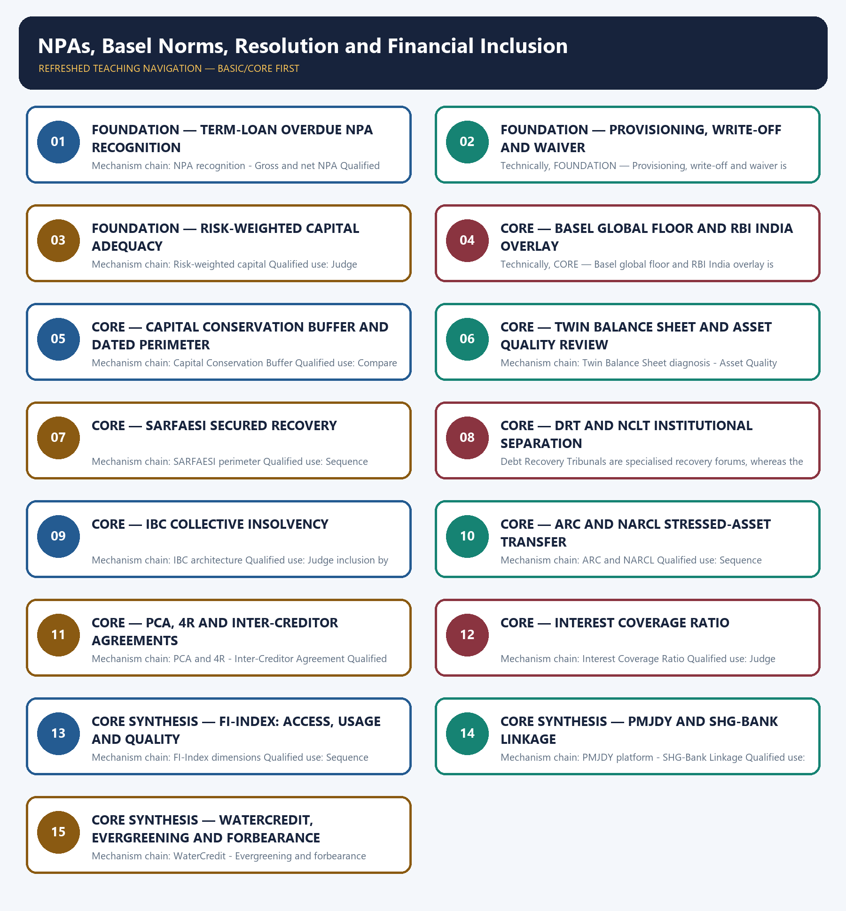

# NPAs, Basel Norms, Resolution and Financial Inclusion — Learner-v2 Complete Learning Session

> **Authoring-only generation:** 2026-09-03. No PDF was rendered and no tracker or index was mutated.

### SOURCE, PROGRESSION AND CURRENT-LINKAGE AUDIT

- **Generation date:** 2026-09-03.
- **Repository-first evidence:** the Basic owner is taught first and preserved in full; the Advanced owner is retained only in the optional final teaching block.
- **OCR evidence:** Repository Markdown was primary. OCR-searchable local official General Studies papers were used only to confirm printed routed demands. No answer key, marking scheme, unsupported page precision or current macroeconomic statistic was inferred from them.
- **Qdrant:** not used; repository Markdown and available OCR context were sufficient.
- **PYQ integrity:** Audited ledgers route objective demands on capital adequacy, Inter-Creditor Agreements, Interest Coverage Ratio, WaterCredit and SHG-Bank Linkage here. No answer letter is inferred.
- **Live-link boundary:** The live RBI Basel page confirmed the circular identity, date and covered-bank perimeter. The attempted FI-Index URL resolved to an unrelated 2021 Treasury-Bill release, so Access-Usage-Quality and all prudential ratios remain sourced to the audited Markdown owner with their stated status.
- **Fact/inference discipline:** no current-affairs item, PYQ wording, figure or quotation is invented.

### LIVE OFFICIAL-SOURCE ATTEMPT LOG

The checks below were made on 2026-09-03. Substantive official text is used only for the proposition it actually supports; binary files, dynamic shells, stubs and undated dashboard snippets are recorded but not converted into current claims.

- https://www.rbi.org.in/scripts/FS_Notification.aspx?Id=12815 — retrieved 2026-09-03; the official page substantively identifies RBI/2025-26/08 dated 1 April 2025, its scheduled-commercial-bank perimeter and the consolidated Basel III Capital Regulations circular. Ratio detail remains tied to the circular text and repository owner.
- https://rbi.org.in/Scripts/BS_PressReleaseDisplay.aspx?prid=51984 — retrieved 2026-09-03; despite the owner label, the live page returned a dated 2021 Treasury-Bill auction rather than FI-Index text, so no FI-Index score or current NPA statistic was taken from it.

## BASIC LEARNING SESSION



*Distinct embedded teaching-navigation image. The separate continuous Cārvāka-style flowchart package remains an independent at-a-glance artifact.*

### SESSION 1 — FOUNDATION — TERM-LOAN OVERDUE NPA RECOGNITION

#### DEFINITION / WHAT THIS IS CALLED

**Plain-language definition:** For a term loan, the standard RBI prudential test is interest or principal overdue for more than 90 days; the legal classification must not be replaced by a general idea of borrower weakness.

**Technical definition:** Mechanism chain: NPA recognition - Gross and net NPA Qualified use: Sequence recognition, loss absorption, resolution, recapitalisation and governance repair.

#### ANSWER-GRABBING OPENING — WRITE/ADAPT IN THE EXAM

> For a term loan, the standard RBI prudential test is interest or principal overdue for more than 90 days; the legal classification must not be replaced by a general idea of borrower weakness.

#### MUST-WRITE KEYWORDS

- **FOUNDATION**
- **Term-loan overdue NPA recognition**
- **Mechanism chain**
- **Qualified use**
- **For**
- **RBI**

**How to use them:** Frame the answer through FOUNDATION; define Term-loan overdue NPA recognition, connect Mechanism chain with Qualified use to explain the mechanism, and use For for the decisive comparison or qualification.

#### VISUAL FIRST

```text
TERM-LOAN OVERDUE NPA RECOGNITION
01. NPA recognition
    |
    v
02. Gross and net NPA
BOUNDARY -> Do not classify every weak borrower as an NPA without applying the prudential trigger.
```

*This topic-specific rail fixes the evidence sequence and its exam boundary before analysis.*

#### CORE EXPLANATION

For a term loan, the standard RBI prudential test is interest or principal overdue for more than 90 days; the legal classification must not be replaced by a general idea of borrower weakness. Gross NPA records the classified stressed exposure, while net NPA deducts provisions and specified adjustments to show the uncovered portion.

#### NAMED EVIDENCE AND MECHANISM

- For a term loan, the standard RBI prudential test is interest or principal overdue for more than 90 days; the legal classification must not be replaced by a general idea of borrower weakness.
- Gross NPA records the classified stressed exposure, while net NPA deducts provisions and specified adjustments to show the uncovered portion.

#### EXAMINER CAUTION

- Do not classify every weak borrower as an NPA without applying the prudential trigger.

#### EXAM LINK

- **Prelims:** Preserve the exact formula, territorial or resident boundary, price basis, base year, index basket, eligible counterparty, institution and legal status; never upgrade a projection into an actual or a regulatory direction into a universal rule.
- **Mains:** Sequence recognition, loss absorption, resolution, recapitalisation and governance repair.

#### MINI RECAP

- **Mechanism chain:** NPA recognition -> Gross and net NPA
- **Qualified use:** Sequence recognition, loss absorption, resolution, recapitalisation and governance repair.

#### CLOSING RECALL FLOW — FOUNDATION — TERM-LOAN OVERDUE NPA RECOGNITION

```text
START / CONCEPT: FOUNDATION — Term-loan overdue NPA recognition
        |
        v
EXACT TERMS: FOUNDATION · Term-loan overdue NPA recognition · Mechanism chain · Qualified use · For · RBI
        |
        v
MECHANISM / ARGUMENT: Mechanism chain: NPA recognition - Gross and net NPA Qualified use: Sequence recognition, loss absorption, resolution, recapitalisation and governance repair.
        |
        v
CONSEQUENCE / CONTRAST: Gross NPA records the classified stressed exposure, while net NPA deducts provisions and specified adjustments to show the uncovered portion.
        |
        v
UPSC TRAP / ANSWER-USE: Do not classify every weak borrower as an NPA without applying the prudential trigger.
        |
        v
ANSWER-GRABBING FORMULATION: For a term loan, the standard RBI prudential test is interest or principal overdue for more than 90 days; the legal classification must not be replaced by a general idea of borrower weakness.
```
### SESSION 2 — FOUNDATION — PROVISIONING, WRITE-OFF AND WAIVER

#### DEFINITION / WHAT THIS IS CALLED

**Plain-language definition:** Mechanism chain: Provisioning and write-off Qualified use: Compare legal tools by secured claim, collective action, tribunal and value-preservation purpose.

**Technical definition:** Technically, FOUNDATION — Provisioning, write-off and waiver is analysed by relating FOUNDATION to Provisioning, then testing the relationship through waiver and Mechanism chain.

#### ANSWER-GRABBING OPENING — WRITE/ADAPT IN THE EXAM

> Do not equate gross NPA, net NPA, provisioning, write-off and waiver.

#### MUST-WRITE KEYWORDS

- **FOUNDATION**
- **Provisioning**
- **waiver**
- **Mechanism chain**
- **Qualified use**
- **NPA**

**How to use them:** Frame the answer through FOUNDATION; define Provisioning, connect waiver with Mechanism chain to explain the mechanism, and use Qualified use for the decisive comparison or qualification.

#### VISUAL FIRST

```text
PROVISIONING, WRITE-OFF AND WAIVER
01. Provisioning and write-off
BOUNDARY -> Do not equate gross NPA, net NPA, provisioning, write-off and waiver.
```

*This topic-specific rail fixes the evidence sequence and its exam boundary before analysis.*

#### CORE EXPLANATION

Provisioning charges expected loss against income, whereas a write-off removes the loan from the active loan book without necessarily ending recovery rights or waiving the debt.

#### NAMED EVIDENCE AND MECHANISM

- Provisioning charges expected loss against income, whereas a write-off removes the loan from the active loan book without necessarily ending recovery rights or waiving the debt.

#### EXAMINER CAUTION

- Do not equate gross NPA, net NPA, provisioning, write-off and waiver.

#### EXAM LINK

- **Prelims:** Preserve the exact formula, territorial or resident boundary, price basis, base year, index basket, eligible counterparty, institution and legal status; never upgrade a projection into an actual or a regulatory direction into a universal rule.
- **Mains:** Compare legal tools by secured claim, collective action, tribunal and value-preservation purpose.

#### MINI RECAP

- **Mechanism chain:** Provisioning and write-off
- **Qualified use:** Compare legal tools by secured claim, collective action, tribunal and value-preservation purpose.

#### CLOSING RECALL FLOW — FOUNDATION — PROVISIONING, WRITE-OFF AND WAIVER

```text
START / CONCEPT: FOUNDATION — Provisioning, write-off and waiver
        |
        v
EXACT TERMS: FOUNDATION · Provisioning · waiver · Mechanism chain · Qualified use · NPA
        |
        v
MECHANISM / ARGUMENT: Mechanism chain: Provisioning and write-off Qualified use: Compare legal tools by secured claim, collective action, tribunal and value-preservation purpose.
        |
        v
CONSEQUENCE / CONTRAST: The resulting consequence is that do not equate gross NPA, net NPA, provisioning, write-off and waiver.
        |
        v
UPSC TRAP / ANSWER-USE: Do not miss this limiting distinction: do not equate gross NPA, net NPA, provisioning, write-off and waiver.
        |
        v
ANSWER-GRABBING FORMULATION: Do not equate gross NPA, net NPA, provisioning, write-off and waiver.
```
### SESSION 3 — FOUNDATION — RISK-WEIGHTED CAPITAL ADEQUACY

#### DEFINITION / WHAT THIS IS CALLED

**Plain-language definition:** Capital adequacy is measured against risk-weighted assets, so capital needs depend on asset risk rather than only on total balance-sheet size.

**Technical definition:** Mechanism chain: Risk-weighted capital Qualified use: Judge inclusion by active, suitable and protected use rather than headline account counts.

#### ANSWER-GRABBING OPENING — WRITE/ADAPT IN THE EXAM

> Capital adequacy is measured against risk-weighted assets, so capital needs depend on asset risk rather than only on total balance-sheet size.

#### MUST-WRITE KEYWORDS

- **FOUNDATION**
- **Risk-weighted capital adequacy**
- **Mechanism chain**
- **Qualified use**
- **Capital adequacy**
- **Capital**

**How to use them:** Frame the answer through FOUNDATION; define Risk-weighted capital adequacy, connect Mechanism chain with Qualified use to explain the mechanism, and use Capital adequacy for the decisive comparison or qualification.

#### VISUAL FIRST

```text
RISK-WEIGHTED CAPITAL ADEQUACY
01. Risk-weighted capital
BOUNDARY -> Do not quote Basel or RBI ratios without the circular date and covered-bank perimeter.
```

*This topic-specific rail fixes the evidence sequence and its exam boundary before analysis.*

#### CORE EXPLANATION

Capital adequacy is measured against risk-weighted assets, so capital needs depend on asset risk rather than only on total balance-sheet size.

#### NAMED EVIDENCE AND MECHANISM

- Capital adequacy is measured against risk-weighted assets, so capital needs depend on asset risk rather than only on total balance-sheet size.

#### EXAMINER CAUTION

- Do not quote Basel or RBI ratios without the circular date and covered-bank perimeter.

#### EXAM LINK

- **Prelims:** Preserve the exact formula, territorial or resident boundary, price basis, base year, index basket, eligible counterparty, institution and legal status; never upgrade a projection into an actual or a regulatory direction into a universal rule.
- **Mains:** Judge inclusion by active, suitable and protected use rather than headline account counts.

#### MINI RECAP

- **Mechanism chain:** Risk-weighted capital
- **Qualified use:** Judge inclusion by active, suitable and protected use rather than headline account counts.

#### CLOSING RECALL FLOW — FOUNDATION — RISK-WEIGHTED CAPITAL ADEQUACY

```text
START / CONCEPT: FOUNDATION — Risk-weighted capital adequacy
        |
        v
EXACT TERMS: FOUNDATION · Risk-weighted capital adequacy · Mechanism chain · Qualified use · Capital adequacy · Capital
        |
        v
MECHANISM / ARGUMENT: Mechanism chain: Risk-weighted capital Qualified use: Judge inclusion by active, suitable and protected use rather than headline account counts.
        |
        v
CONSEQUENCE / CONTRAST: Do not quote Basel or RBI ratios without the circular date and covered-bank perimeter.
        |
        v
UPSC TRAP / ANSWER-USE: Mains: Judge inclusion by active, suitable and protected use rather than headline account counts.
        |
        v
ANSWER-GRABBING FORMULATION: Capital adequacy is measured against risk-weighted assets, so capital needs depend on asset risk rather than only on total balance-sheet size.
```
### SESSION 4 — CORE — BASEL GLOBAL FLOOR AND RBI INDIA OVERLAY

#### DEFINITION / WHAT THIS IS CALLED

**Plain-language definition:** Mechanism chain: Basel and RBI minima Qualified use: Sequence recognition, loss absorption, resolution, recapitalisation and governance repair.

**Technical definition:** Technically, CORE — Basel global floor and RBI India overlay is analysed by relating Basel global floor to RBI India overlay, then testing the relationship through Mechanism chain and Qualified use.

#### ANSWER-GRABBING OPENING — WRITE/ADAPT IN THE EXAM

> Mechanism chain: Basel and RBI minima Qualified use: Sequence recognition, loss absorption, resolution, recapitalisation and governance repair.

#### MUST-WRITE KEYWORDS

- **Basel global floor**
- **RBI India overlay**
- **Mechanism chain**
- **Qualified use**
- **SARFAESI**
- **IBC**

**How to use them:** Frame the answer through Basel global floor; define RBI India overlay, connect Mechanism chain with Qualified use to explain the mechanism, and use SARFAESI for the decisive comparison or qualification.

#### VISUAL FIRST

```text
BASEL GLOBAL FLOOR AND RBI INDIA OVERLAY
01. Basel and RBI minima
BOUNDARY -> Do not equate secured recovery under SARFAESI with collective insolvency under IBC.
```

*This topic-specific rail fixes the evidence sequence and its exam boundary before analysis.*

#### CORE EXPLANATION

The owner records Basel III global minima of CET1 4.5 per cent, Tier 1 6 per cent and total capital 8 per cent, while RBI's 1 April 2025 Master Circular records India-specific minima of CET1 5.5 per cent, Tier 1 7 per cent and total CRAR 9 per cent for its stated bank perimeter.

#### NAMED EVIDENCE AND MECHANISM

- The owner records Basel III global minima of CET1 4.5 per cent, Tier 1 6 per cent and total capital 8 per cent, while RBI's 1 April 2025 Master Circular records India-specific minima of CET1 5.5 per cent, Tier 1 7 per cent and total CRAR 9 per cent for its stated bank perimeter.

#### EXAMINER CAUTION

- Do not equate secured recovery under SARFAESI with collective insolvency under IBC.

#### EXAM LINK

- **Prelims:** Preserve the exact formula, territorial or resident boundary, price basis, base year, index basket, eligible counterparty, institution and legal status; never upgrade a projection into an actual or a regulatory direction into a universal rule.
- **Mains:** Sequence recognition, loss absorption, resolution, recapitalisation and governance repair.

#### MINI RECAP

- **Mechanism chain:** Basel and RBI minima
- **Qualified use:** Sequence recognition, loss absorption, resolution, recapitalisation and governance repair.

#### CLOSING RECALL FLOW — CORE — BASEL GLOBAL FLOOR AND RBI INDIA OVERLAY

```text
START / CONCEPT: CORE — Basel global floor and RBI India overlay
        |
        v
EXACT TERMS: Basel global floor · RBI India overlay · Mechanism chain · Qualified use · SARFAESI · IBC
        |
        v
MECHANISM / ARGUMENT: Do not equate secured recovery under SARFAESI with collective insolvency under IBC.
        |
        v
CONSEQUENCE / CONTRAST: The resulting consequence is that do not equate secured recovery under SARFAESI with collective insolvency under IBC.
        |
        v
UPSC TRAP / ANSWER-USE: Do not miss this limiting distinction: do not equate secured recovery under SARFAESI with collective insolvency under IBC.
        |
        v
ANSWER-GRABBING FORMULATION: Mechanism chain: Basel and RBI minima Qualified use: Sequence recognition, loss absorption, resolution, recapitalisation and governance repair.
```
### SESSION 5 — CORE — CAPITAL CONSERVATION BUFFER AND DATED PERIMETER

#### DEFINITION / WHAT THIS IS CALLED

**Plain-language definition:** The owner records a 2.5 per cent Capital Conservation Buffer met with CET1, taking the stated effective CET1 minimum to 8 per cent and effective total CRAR to 11.5 per cent; current use must retain the applicable RBI circular and bank perimeter.

**Technical definition:** Mechanism chain: Capital Conservation Buffer Qualified use: Compare legal tools by secured claim, collective action, tribunal and value-preservation purpose.

#### ANSWER-GRABBING OPENING — WRITE/ADAPT IN THE EXAM

> The owner records a 2.5 per cent Capital Conservation Buffer met with CET1, taking the stated effective CET1 minimum to 8 per cent and effective total CRAR to 11.5 per cent; current use must retain the applicable RBI circular and bank perimeter.

#### MUST-WRITE KEYWORDS

- **Capital Conservation Buffer**
- **dated perimeter**
- **Mechanism chain**
- **Qualified use**
- **CRAR**
- **RBI**

**How to use them:** Frame the answer through Capital Conservation Buffer; define dated perimeter, connect Mechanism chain with Qualified use to explain the mechanism, and use CRAR for the decisive comparison or qualification.

#### VISUAL FIRST

```text
CAPITAL CONSERVATION BUFFER AND DATED PERIMETER
01. Capital Conservation Buffer
BOUNDARY -> Do not claim that transfer to an ARC or NARCL eliminates the economic loss.
```

*This topic-specific rail fixes the evidence sequence and its exam boundary before analysis.*

#### CORE EXPLANATION

The owner records a 2.5 per cent Capital Conservation Buffer met with CET1, taking the stated effective CET1 minimum to 8 per cent and effective total CRAR to 11.5 per cent; current use must retain the applicable RBI circular and bank perimeter.

#### NAMED EVIDENCE AND MECHANISM

- The owner records a 2.5 per cent Capital Conservation Buffer met with CET1, taking the stated effective CET1 minimum to 8 per cent and effective total CRAR to 11.5 per cent; current use must retain the applicable RBI circular and bank perimeter.

#### EXAMINER CAUTION

- Do not claim that transfer to an ARC or NARCL eliminates the economic loss.

#### EXAM LINK

- **Prelims:** Preserve the exact formula, territorial or resident boundary, price basis, base year, index basket, eligible counterparty, institution and legal status; never upgrade a projection into an actual or a regulatory direction into a universal rule.
- **Mains:** Compare legal tools by secured claim, collective action, tribunal and value-preservation purpose.

#### MINI RECAP

- **Mechanism chain:** Capital Conservation Buffer
- **Qualified use:** Compare legal tools by secured claim, collective action, tribunal and value-preservation purpose.

#### CLOSING RECALL FLOW — CORE — CAPITAL CONSERVATION BUFFER AND DATED PERIMETER

```text
START / CONCEPT: CORE — Capital Conservation Buffer and dated perimeter
        |
        v
EXACT TERMS: Capital Conservation Buffer · dated perimeter · Mechanism chain · Qualified use · CRAR · RBI
        |
        v
MECHANISM / ARGUMENT: Mechanism chain: Capital Conservation Buffer Qualified use: Compare legal tools by secured claim, collective action, tribunal and value-preservation purpose.
        |
        v
CONSEQUENCE / CONTRAST: Do not claim that transfer to an ARC or NARCL eliminates the economic loss.
        |
        v
UPSC TRAP / ANSWER-USE: Do not miss this limiting distinction: the owner records a 2.5 per cent Capital Conservation Buffer met with CET1, taking...
        |
        v
ANSWER-GRABBING FORMULATION: The owner records a 2.5 per cent Capital Conservation Buffer met with CET1, taking the stated effective CET1 minimum to 8 per cent and effective total CRAR to 11.5 per cent; current use must retain the applicable RBI circular and bank perimeter.
```
### SESSION 6 — CORE — TWIN BALANCE SHEET AND ASSET QUALITY REVIEW

#### DEFINITION / WHAT THIS IS CALLED

**Plain-language definition:** Economic Survey 2016-17 used the Twin Balance Sheet framing for simultaneous corporate over-leverage and bank stress; it is a dated diagnostic, not a statute or scheme.

**Technical definition:** Mechanism chain: Twin Balance Sheet diagnosis - Asset Quality Review Qualified use: Judge inclusion by active, suitable and protected use rather than headline account counts.

#### ANSWER-GRABBING OPENING — WRITE/ADAPT IN THE EXAM

> Mechanism chain: Twin Balance Sheet diagnosis - Asset Quality Review Qualified use: Judge inclusion by active, suitable and protected use rather than headline account counts.

#### MUST-WRITE KEYWORDS

- **Twin Balance Sheet**
- **Asset Quality Review**
- **Mechanism chain**
- **Qualified use**
- **Economic Survey**
- **2016-17**

**How to use them:** Frame the answer through Twin Balance Sheet; define Asset Quality Review, connect Mechanism chain with Qualified use to explain the mechanism, and use Economic Survey for the decisive comparison or qualification.

#### VISUAL FIRST

```text
TWIN BALANCE SHEET AND ASSET QUALITY REVIEW
01. Twin Balance Sheet diagnosis
    |
    v
02. Asset Quality Review
BOUNDARY -> Do not call an Inter-Creditor Agreement a tribunal or statutory insolvency process.
```

*This topic-specific rail fixes the evidence sequence and its exam boundary before analysis.*

#### CORE EXPLANATION

Economic Survey 2016-17 used the Twin Balance Sheet framing for simultaneous corporate over-leverage and bank stress; it is a dated diagnostic, not a statute or scheme. RBI's Asset Quality Review pushed recognition of previously under-reported stress, which could worsen reported ratios initially while improving information and provisioning discipline.

#### NAMED EVIDENCE AND MECHANISM

- Economic Survey 2016-17 used the Twin Balance Sheet framing for simultaneous corporate over-leverage and bank stress; it is a dated diagnostic, not a statute or scheme.
- RBI's Asset Quality Review pushed recognition of previously under-reported stress, which could worsen reported ratios initially while improving information and provisioning discipline.

#### EXAMINER CAUTION

- Do not call an Inter-Creditor Agreement a tribunal or statutory insolvency process.

#### EXAM LINK

- **Prelims:** Preserve the exact formula, territorial or resident boundary, price basis, base year, index basket, eligible counterparty, institution and legal status; never upgrade a projection into an actual or a regulatory direction into a universal rule.
- **Mains:** Judge inclusion by active, suitable and protected use rather than headline account counts.

#### MINI RECAP

- **Mechanism chain:** Twin Balance Sheet diagnosis -> Asset Quality Review
- **Qualified use:** Judge inclusion by active, suitable and protected use rather than headline account counts.

#### CLOSING RECALL FLOW — CORE — TWIN BALANCE SHEET AND ASSET QUALITY REVIEW

```text
START / CONCEPT: CORE — Twin Balance Sheet and Asset Quality Review
        |
        v
EXACT TERMS: Twin Balance Sheet · Asset Quality Review · Mechanism chain · Qualified use · Economic Survey · 2016-17
        |
        v
MECHANISM / ARGUMENT: Economic Survey 2016-17 used the Twin Balance Sheet framing for simultaneous corporate over-leverage and bank stress; it is a dated diagnostic, not a statute or scheme.
        |
        v
CONSEQUENCE / CONTRAST: RBI's Asset Quality Review pushed recognition of previously under-reported stress, which could worsen reported ratios initially while improving information and provisioning discipline.
        |
        v
UPSC TRAP / ANSWER-USE: Do not call an Inter-Creditor Agreement a tribunal or statutory insolvency process.
        |
        v
ANSWER-GRABBING FORMULATION: Mechanism chain: Twin Balance Sheet diagnosis - Asset Quality Review Qualified use: Judge inclusion by active, suitable and protected use rather than headline account counts.
```
### SESSION 7 — CORE — SARFAESI SECURED RECOVERY

#### DEFINITION / WHAT THIS IS CALLED

**Plain-language definition:** The SARFAESI Act, 2002 is centred on enforcement of secured assets and is not a substitute for the entire insolvency system.

**Technical definition:** Mechanism chain: SARFAESI perimeter Qualified use: Sequence recognition, loss absorption, resolution, recapitalisation and governance repair.

#### ANSWER-GRABBING OPENING — WRITE/ADAPT IN THE EXAM

> The SARFAESI Act, 2002 is centred on enforcement of secured assets and is not a substitute for the entire insolvency system.

#### MUST-WRITE KEYWORDS

- **SARFAESI secured recovery**
- **Mechanism chain**
- **Qualified use**
- **The SARFAESI Act, 2002**
- **The SARFAESI Act**
- **Interest Coverage Ratio**

**How to use them:** Frame the answer through SARFAESI secured recovery; define Mechanism chain, connect Qualified use with The SARFAESI Act, 2002 to explain the mechanism, and use The SARFAESI Act for the decisive comparison or qualification.

#### VISUAL FIRST

```text
SARFAESI SECURED RECOVERY
01. SARFAESI perimeter
BOUNDARY -> Do not use Interest Coverage Ratio as the legal NPA definition.
```

*This topic-specific rail fixes the evidence sequence and its exam boundary before analysis.*

#### CORE EXPLANATION

The SARFAESI Act, 2002 is centred on enforcement of secured assets and is not a substitute for the entire insolvency system.

#### NAMED EVIDENCE AND MECHANISM

- The SARFAESI Act, 2002 is centred on enforcement of secured assets and is not a substitute for the entire insolvency system.

#### EXAMINER CAUTION

- Do not use Interest Coverage Ratio as the legal NPA definition.

#### EXAM LINK

- **Prelims:** Preserve the exact formula, territorial or resident boundary, price basis, base year, index basket, eligible counterparty, institution and legal status; never upgrade a projection into an actual or a regulatory direction into a universal rule.
- **Mains:** Sequence recognition, loss absorption, resolution, recapitalisation and governance repair.

#### MINI RECAP

- **Mechanism chain:** SARFAESI perimeter
- **Qualified use:** Sequence recognition, loss absorption, resolution, recapitalisation and governance repair.

#### CLOSING RECALL FLOW — CORE — SARFAESI SECURED RECOVERY

```text
START / CONCEPT: CORE — SARFAESI secured recovery
        |
        v
EXACT TERMS: SARFAESI secured recovery · Mechanism chain · Qualified use · The SARFAESI Act, 2002 · The SARFAESI Act · Interest Coverage Ratio
        |
        v
MECHANISM / ARGUMENT: Mechanism chain: SARFAESI perimeter Qualified use: Sequence recognition, loss absorption, resolution, recapitalisation and governance repair.
        |
        v
CONSEQUENCE / CONTRAST: Do not use Interest Coverage Ratio as the legal NPA definition.
        |
        v
UPSC TRAP / ANSWER-USE: Do not miss this limiting distinction: the SARFAESI Act, 2002 is centred on enforcement of secured assets and is not...
        |
        v
ANSWER-GRABBING FORMULATION: The SARFAESI Act, 2002 is centred on enforcement of secured assets and is not a substitute for the entire insolvency system.
```
### SESSION 8 — CORE — DRT AND NCLT INSTITUTIONAL SEPARATION

#### DEFINITION / WHAT THIS IS CALLED

**Plain-language definition:** Mechanism chain: DRT and NCLT distinction Qualified use: Compare legal tools by secured claim, collective action, tribunal and value-preservation purpose.

**Technical definition:** Debt Recovery Tribunals are specialised recovery forums, whereas the NCLT-based IBC route addresses collective corporate insolvency and resolution.

#### ANSWER-GRABBING OPENING — WRITE/ADAPT IN THE EXAM

> Mechanism chain: DRT and NCLT distinction Qualified use: Compare legal tools by secured claim, collective action, tribunal and value-preservation purpose.

#### MUST-WRITE KEYWORDS

- **DRT**
- **NCLT institutional separation**
- **Mechanism chain**
- **Qualified use**
- **Debt Recovery Tribunals**
- **NCLT-based IBC**

**How to use them:** Frame the answer through DRT; define NCLT institutional separation, connect Mechanism chain with Qualified use to explain the mechanism, and use Debt Recovery Tribunals for the decisive comparison or qualification.

#### VISUAL FIRST

```text
DRT AND NCLT INSTITUTIONAL SEPARATION
01. DRT and NCLT distinction
BOUNDARY -> Do not reduce financial inclusion to account opening without usage and quality.
```

*This topic-specific rail fixes the evidence sequence and its exam boundary before analysis.*

#### CORE EXPLANATION

Debt Recovery Tribunals are specialised recovery forums, whereas the NCLT-based IBC route addresses collective corporate insolvency and resolution.

#### NAMED EVIDENCE AND MECHANISM

- Debt Recovery Tribunals are specialised recovery forums, whereas the NCLT-based IBC route addresses collective corporate insolvency and resolution.

#### EXAMINER CAUTION

- Do not reduce financial inclusion to account opening without usage and quality.

#### EXAM LINK

- **Prelims:** Preserve the exact formula, territorial or resident boundary, price basis, base year, index basket, eligible counterparty, institution and legal status; never upgrade a projection into an actual or a regulatory direction into a universal rule.
- **Mains:** Compare legal tools by secured claim, collective action, tribunal and value-preservation purpose.

#### MINI RECAP

- **Mechanism chain:** DRT and NCLT distinction
- **Qualified use:** Compare legal tools by secured claim, collective action, tribunal and value-preservation purpose.

#### CLOSING RECALL FLOW — CORE — DRT AND NCLT INSTITUTIONAL SEPARATION

```text
START / CONCEPT: CORE — DRT and NCLT institutional separation
        |
        v
EXACT TERMS: DRT · NCLT institutional separation · Mechanism chain · Qualified use · Debt Recovery Tribunals · NCLT-based IBC
        |
        v
MECHANISM / ARGUMENT: Debt Recovery Tribunals are specialised recovery forums, whereas the NCLT-based IBC route addresses collective corporate insolvency and resolution.
        |
        v
CONSEQUENCE / CONTRAST: Do not reduce financial inclusion to account opening without usage and quality.
        |
        v
UPSC TRAP / ANSWER-USE: Do not miss this limiting distinction: debt Recovery Tribunals are specialised recovery forums.
        |
        v
ANSWER-GRABBING FORMULATION: Mechanism chain: DRT and NCLT distinction Qualified use: Compare legal tools by secured claim, collective action, tribunal and value-preservation purpose.
```
### SESSION 9 — CORE — IBC COLLECTIVE INSOLVENCY

#### DEFINITION / WHAT THIS IS CALLED

**Plain-language definition:** The Insolvency and Bankruptcy Code, 2016 uses a creditor-in-committee process under the NCLT framework to pursue resolution or value-maximising exit rather than one lender's isolated recovery.

**Technical definition:** Mechanism chain: IBC architecture Qualified use: Judge inclusion by active, suitable and protected use rather than headline account counts.

#### ANSWER-GRABBING OPENING — WRITE/ADAPT IN THE EXAM

> The Insolvency and Bankruptcy Code, 2016 uses a creditor-in-committee process under the NCLT framework to pursue resolution or value-maximising exit rather than one lender's isolated recovery.

#### MUST-WRITE KEYWORDS

- **IBC collective insolvency**
- **Mechanism chain**
- **Qualified use**
- **The Insolvency**
- **Bankruptcy Code**
- **NCLT**

**How to use them:** Frame the answer through IBC collective insolvency; define Mechanism chain, connect Qualified use with The Insolvency to explain the mechanism, and use Bankruptcy Code for the decisive comparison or qualification.

#### VISUAL FIRST

```text
IBC COLLECTIVE INSOLVENCY
01. IBC architecture
BOUNDARY -> Do not treat every restructuring or temporary forbearance as fraud.
```

*This topic-specific rail fixes the evidence sequence and its exam boundary before analysis.*

#### CORE EXPLANATION

The Insolvency and Bankruptcy Code, 2016 uses a creditor-in-committee process under the NCLT framework to pursue resolution or value-maximising exit rather than one lender's isolated recovery.

#### NAMED EVIDENCE AND MECHANISM

- The Insolvency and Bankruptcy Code, 2016 uses a creditor-in-committee process under the NCLT framework to pursue resolution or value-maximising exit rather than one lender's isolated recovery.

#### EXAMINER CAUTION

- Do not treat every restructuring or temporary forbearance as fraud.

#### EXAM LINK

- **Prelims:** Preserve the exact formula, territorial or resident boundary, price basis, base year, index basket, eligible counterparty, institution and legal status; never upgrade a projection into an actual or a regulatory direction into a universal rule.
- **Mains:** Judge inclusion by active, suitable and protected use rather than headline account counts.

#### MINI RECAP

- **Mechanism chain:** IBC architecture
- **Qualified use:** Judge inclusion by active, suitable and protected use rather than headline account counts.

#### CLOSING RECALL FLOW — CORE — IBC COLLECTIVE INSOLVENCY

```text
START / CONCEPT: CORE — IBC collective insolvency
        |
        v
EXACT TERMS: IBC collective insolvency · Mechanism chain · Qualified use · The Insolvency · Bankruptcy Code · NCLT
        |
        v
MECHANISM / ARGUMENT: Mechanism chain: IBC architecture Qualified use: Judge inclusion by active, suitable and protected use rather than headline account counts.
        |
        v
CONSEQUENCE / CONTRAST: Do not treat every restructuring or temporary forbearance as fraud.
        |
        v
UPSC TRAP / ANSWER-USE: Mains: Judge inclusion by active, suitable and protected use rather than headline account counts.
        |
        v
ANSWER-GRABBING FORMULATION: The Insolvency and Bankruptcy Code, 2016 uses a creditor-in-committee process under the NCLT framework to pursue resolution or value-maximising exit rather than one lender's isolated recovery.
```
### SESSION 10 — CORE — ARC AND NARCL STRESSED-ASSET TRANSFER

#### DEFINITION / WHAT THIS IS CALLED

**Plain-language definition:** Asset Reconstruction Companies acquire stressed assets for recovery or resolution, while NARCL represents India's specialised bad-bank aggregation concept; transfer does not erase the underlying loss.

**Technical definition:** Mechanism chain: ARC and NARCL Qualified use: Sequence recognition, loss absorption, resolution, recapitalisation and governance repair.

#### ANSWER-GRABBING OPENING — WRITE/ADAPT IN THE EXAM

> Asset Reconstruction Companies acquire stressed assets for recovery or resolution, while NARCL represents India's specialised bad-bank aggregation concept; transfer does not erase the underlying loss.

#### MUST-WRITE KEYWORDS

- **ARC**
- **NARCL stressed-asset transfer**
- **Mechanism chain**
- **Qualified use**
- **Asset Reconstruction Companies**
- **NARCL**

**How to use them:** Frame the answer through ARC; define NARCL stressed-asset transfer, connect Mechanism chain with Qualified use to explain the mechanism, and use Asset Reconstruction Companies for the decisive comparison or qualification.

#### VISUAL FIRST

```text
ARC AND NARCL STRESSED-ASSET TRANSFER
01. ARC and NARCL
BOUNDARY -> Do not present the Twin Balance Sheet diagnosis as a current ratio or scheme.
```

*This topic-specific rail fixes the evidence sequence and its exam boundary before analysis.*

#### CORE EXPLANATION

Asset Reconstruction Companies acquire stressed assets for recovery or resolution, while NARCL represents India's specialised bad-bank aggregation concept; transfer does not erase the underlying loss.

#### NAMED EVIDENCE AND MECHANISM

- Asset Reconstruction Companies acquire stressed assets for recovery or resolution, while NARCL represents India's specialised bad-bank aggregation concept; transfer does not erase the underlying loss.

#### EXAMINER CAUTION

- Do not present the Twin Balance Sheet diagnosis as a current ratio or scheme.

#### EXAM LINK

- **Prelims:** Preserve the exact formula, territorial or resident boundary, price basis, base year, index basket, eligible counterparty, institution and legal status; never upgrade a projection into an actual or a regulatory direction into a universal rule.
- **Mains:** Sequence recognition, loss absorption, resolution, recapitalisation and governance repair.

#### MINI RECAP

- **Mechanism chain:** ARC and NARCL
- **Qualified use:** Sequence recognition, loss absorption, resolution, recapitalisation and governance repair.

#### CLOSING RECALL FLOW — CORE — ARC AND NARCL STRESSED-ASSET TRANSFER

```text
START / CONCEPT: CORE — ARC and NARCL stressed-asset transfer
        |
        v
EXACT TERMS: ARC · NARCL stressed-asset transfer · Mechanism chain · Qualified use · Asset Reconstruction Companies · NARCL
        |
        v
MECHANISM / ARGUMENT: Mechanism chain: ARC and NARCL Qualified use: Sequence recognition, loss absorption, resolution, recapitalisation and governance repair.
        |
        v
CONSEQUENCE / CONTRAST: Do not present the Twin Balance Sheet diagnosis as a current ratio or scheme.
        |
        v
UPSC TRAP / ANSWER-USE: Do not miss this limiting distinction: asset Reconstruction Companies acquire stressed assets for recovery or resolution.
        |
        v
ANSWER-GRABBING FORMULATION: Asset Reconstruction Companies acquire stressed assets for recovery or resolution, while NARCL represents India's specialised bad-bank aggregation concept; transfer does not erase the underlying loss.
```
### SESSION 11 — CORE — PCA, 4R AND INTER-CREDITOR AGREEMENTS

#### DEFINITION / WHAT THIS IS CALLED

**Plain-language definition:** An Inter-Creditor Agreement coordinates lenders and reduces holdout problems in stressed resolution, but it is not itself a court or insolvency tribunal.

**Technical definition:** Mechanism chain: PCA and 4R - Inter-Creditor Agreement Qualified use: Compare legal tools by secured claim, collective action, tribunal and value-preservation purpose.

#### ANSWER-GRABBING OPENING — WRITE/ADAPT IN THE EXAM

> An Inter-Creditor Agreement coordinates lenders and reduces holdout problems in stressed resolution, but it is not itself a court or insolvency tribunal.

#### MUST-WRITE KEYWORDS

- **PCA**
- **Inter-Creditor Agreements**
- **Mechanism chain**
- **Qualified use**
- **Prompt Corrective Action**
- **4R**

**How to use them:** Frame the answer through PCA; define Inter-Creditor Agreements, connect Mechanism chain with Qualified use to explain the mechanism, and use Prompt Corrective Action for the decisive comparison or qualification.

#### VISUAL FIRST

```text
PCA, 4R AND INTER-CREDITOR AGREEMENTS
01. PCA and 4R
    |
    v
02. Inter-Creditor Agreement
BOUNDARY -> Do not classify every weak borrower as an NPA without applying the prudential trigger.
```

*This topic-specific rail fixes the evidence sequence and its exam boundary before analysis.*

#### CORE EXPLANATION

Prompt Corrective Action is supervisory intervention for weak banks, while the 4R approach denotes Recognition, Resolution, Recapitalization and Reforms; neither is a deposit-insurance payout. An Inter-Creditor Agreement coordinates lenders and reduces holdout problems in stressed resolution, but it is not itself a court or insolvency tribunal.

#### NAMED EVIDENCE AND MECHANISM

- Prompt Corrective Action is supervisory intervention for weak banks, while the 4R approach denotes Recognition, Resolution, Recapitalization and Reforms; neither is a deposit-insurance payout.
- An Inter-Creditor Agreement coordinates lenders and reduces holdout problems in stressed resolution, but it is not itself a court or insolvency tribunal.

#### EXAMINER CAUTION

- Do not classify every weak borrower as an NPA without applying the prudential trigger.

#### EXAM LINK

- **Prelims:** Preserve the exact formula, territorial or resident boundary, price basis, base year, index basket, eligible counterparty, institution and legal status; never upgrade a projection into an actual or a regulatory direction into a universal rule.
- **Mains:** Compare legal tools by secured claim, collective action, tribunal and value-preservation purpose.

#### MINI RECAP

- **Mechanism chain:** PCA and 4R -> Inter-Creditor Agreement
- **Qualified use:** Compare legal tools by secured claim, collective action, tribunal and value-preservation purpose.

#### CLOSING RECALL FLOW — CORE — PCA, 4R AND INTER-CREDITOR AGREEMENTS

```text
START / CONCEPT: CORE — PCA, 4R and Inter-Creditor Agreements
        |
        v
EXACT TERMS: PCA · Inter-Creditor Agreements · Mechanism chain · Qualified use · Prompt Corrective Action · 4R
        |
        v
MECHANISM / ARGUMENT: Mechanism chain: PCA and 4R - Inter-Creditor Agreement Qualified use: Compare legal tools by secured claim, collective action, tribunal and value-preservation purpose.
        |
        v
CONSEQUENCE / CONTRAST: Prompt Corrective Action is supervisory intervention for weak banks, while the 4R approach denotes Recognition, Resolution, Recapitalization and Reforms; neither is a deposit-insurance payout.
        |
        v
UPSC TRAP / ANSWER-USE: Do not classify every weak borrower as an NPA without applying the prudential trigger.
        |
        v
ANSWER-GRABBING FORMULATION: An Inter-Creditor Agreement coordinates lenders and reduces holdout problems in stressed resolution, but it is not itself a court or insolvency tribunal.
```
### SESSION 12 — CORE — INTEREST COVERAGE RATIO

#### DEFINITION / WHAT THIS IS CALLED

**Plain-language definition:** Interest Coverage Ratio compares earnings with interest obligations and indicates debt-servicing capacity; it is not the legal definition of an NPA.

**Technical definition:** Mechanism chain: Interest Coverage Ratio Qualified use: Judge inclusion by active, suitable and protected use rather than headline account counts.

#### ANSWER-GRABBING OPENING — WRITE/ADAPT IN THE EXAM

> Interest Coverage Ratio compares earnings with interest obligations and indicates debt-servicing capacity; it is not the legal definition of an NPA.

#### MUST-WRITE KEYWORDS

- **Interest Coverage Ratio**
- **Mechanism chain**
- **Qualified use**
- **NPA**
- **Judge**
- **Interest Coverage Ratio Qualified**

**How to use them:** Frame the answer through Interest Coverage Ratio; define Mechanism chain, connect Qualified use with NPA to explain the mechanism, and use Judge for the decisive comparison or qualification.

#### VISUAL FIRST

```text
INTEREST COVERAGE RATIO
01. Interest Coverage Ratio
BOUNDARY -> Do not equate gross NPA, net NPA, provisioning, write-off and waiver.
```

*This topic-specific rail fixes the evidence sequence and its exam boundary before analysis.*

#### CORE EXPLANATION

Interest Coverage Ratio compares earnings with interest obligations and indicates debt-servicing capacity; it is not the legal definition of an NPA.

#### NAMED EVIDENCE AND MECHANISM

- Interest Coverage Ratio compares earnings with interest obligations and indicates debt-servicing capacity; it is not the legal definition of an NPA.

#### EXAMINER CAUTION

- Do not equate gross NPA, net NPA, provisioning, write-off and waiver.

#### EXAM LINK

- **Prelims:** Preserve the exact formula, territorial or resident boundary, price basis, base year, index basket, eligible counterparty, institution and legal status; never upgrade a projection into an actual or a regulatory direction into a universal rule.
- **Mains:** Judge inclusion by active, suitable and protected use rather than headline account counts.

#### MINI RECAP

- **Mechanism chain:** Interest Coverage Ratio
- **Qualified use:** Judge inclusion by active, suitable and protected use rather than headline account counts.

#### CLOSING RECALL FLOW — CORE — INTEREST COVERAGE RATIO

```text
START / CONCEPT: CORE — Interest Coverage Ratio
        |
        v
EXACT TERMS: Interest Coverage Ratio · Mechanism chain · Qualified use · NPA · Judge · Interest Coverage Ratio Qualified
        |
        v
MECHANISM / ARGUMENT: Mechanism chain: Interest Coverage Ratio Qualified use: Judge inclusion by active, suitable and protected use rather than headline account counts.
        |
        v
CONSEQUENCE / CONTRAST: Do not equate gross NPA, net NPA, provisioning, write-off and waiver.
        |
        v
UPSC TRAP / ANSWER-USE: Mains: Judge inclusion by active, suitable and protected use rather than headline account counts.
        |
        v
ANSWER-GRABBING FORMULATION: Interest Coverage Ratio compares earnings with interest obligations and indicates debt-servicing capacity; it is not the legal definition of an NPA.
```
### SESSION 13 — CORE SYNTHESIS — FI-INDEX: ACCESS, USAGE AND QUALITY

#### DEFINITION / WHAT THIS IS CALLED

**Plain-language definition:** RBI's annual Financial Inclusion Index uses Access, Usage and Quality and has no base year, so it cannot be reduced to a count of accounts opened.

**Technical definition:** Mechanism chain: FI-Index dimensions Qualified use: Sequence recognition, loss absorption, resolution, recapitalisation and governance repair.

#### ANSWER-GRABBING OPENING — WRITE/ADAPT IN THE EXAM

> RBI's annual Financial Inclusion Index uses Access, Usage and Quality and has no base year, so it cannot be reduced to a count of accounts opened.

#### MUST-WRITE KEYWORDS

- **CORE SYNTHESIS**
- **FI-Index**
- **Access**
- **Usage**
- **Quality**
- **Mechanism chain**

**How to use them:** Frame the answer through CORE SYNTHESIS; define FI-Index, connect Access with Usage to explain the mechanism, and use Quality for the decisive comparison or qualification.

#### VISUAL FIRST

```text
FI-INDEX: ACCESS, USAGE AND QUALITY
01. FI-Index dimensions
BOUNDARY -> Do not quote Basel or RBI ratios without the circular date and covered-bank perimeter.
```

*This topic-specific rail fixes the evidence sequence and its exam boundary before analysis.*

#### CORE EXPLANATION

RBI's annual Financial Inclusion Index uses Access, Usage and Quality and has no base year, so it cannot be reduced to a count of accounts opened.

#### NAMED EVIDENCE AND MECHANISM

- RBI's annual Financial Inclusion Index uses Access, Usage and Quality and has no base year, so it cannot be reduced to a count of accounts opened.

#### EXAMINER CAUTION

- Do not quote Basel or RBI ratios without the circular date and covered-bank perimeter.

#### EXAM LINK

- **Prelims:** Preserve the exact formula, territorial or resident boundary, price basis, base year, index basket, eligible counterparty, institution and legal status; never upgrade a projection into an actual or a regulatory direction into a universal rule.
- **Mains:** Sequence recognition, loss absorption, resolution, recapitalisation and governance repair.

#### MINI RECAP

- **Mechanism chain:** FI-Index dimensions
- **Qualified use:** Sequence recognition, loss absorption, resolution, recapitalisation and governance repair.

#### CLOSING RECALL FLOW — CORE SYNTHESIS — FI-INDEX: ACCESS, USAGE AND QUALITY

```text
START / CONCEPT: CORE SYNTHESIS — FI-Index: Access, Usage and Quality
        |
        v
EXACT TERMS: CORE SYNTHESIS · FI-Index · Access · Usage · Quality · Mechanism chain
        |
        v
MECHANISM / ARGUMENT: Mechanism chain: FI-Index dimensions Qualified use: Sequence recognition, loss absorption, resolution, recapitalisation and governance repair.
        |
        v
CONSEQUENCE / CONTRAST: Do not quote Basel or RBI ratios without the circular date and covered-bank perimeter.
        |
        v
UPSC TRAP / ANSWER-USE: Do not miss this limiting distinction: rBI's annual Financial Inclusion Index uses Access, Usage and Quality and has no base...
        |
        v
ANSWER-GRABBING FORMULATION: RBI's annual Financial Inclusion Index uses Access, Usage and Quality and has no base year, so it cannot be reduced to a count of accounts opened.
```
### SESSION 14 — CORE SYNTHESIS — PMJDY AND SHG-BANK LINKAGE

#### DEFINITION / WHAT THIS IS CALLED

**Plain-language definition:** SHG-Bank Linkage connects commonly women-led savings groups to formal banking channels; a self-help group is not itself a bank.

**Technical definition:** Mechanism chain: PMJDY platform - SHG-Bank Linkage Qualified use: Compare legal tools by secured claim, collective action, tribunal and value-preservation purpose.

#### ANSWER-GRABBING OPENING — WRITE/ADAPT IN THE EXAM

> SHG-Bank Linkage connects commonly women-led savings groups to formal banking channels; a self-help group is not itself a bank.

#### MUST-WRITE KEYWORDS

- **CORE SYNTHESIS**
- **PMJDY**
- **SHG-Bank Linkage**
- **Mechanism chain**
- **Qualified use**
- **Pradhan Mantri Jan Dhan Yojana**

**How to use them:** Frame the answer through CORE SYNTHESIS; define PMJDY, connect SHG-Bank Linkage with Mechanism chain to explain the mechanism, and use Qualified use for the decisive comparison or qualification.

#### VISUAL FIRST

```text
PMJDY AND SHG-BANK LINKAGE
01. PMJDY platform
    |
    v
02. SHG-Bank Linkage
BOUNDARY -> Do not equate secured recovery under SARFAESI with collective insolvency under IBC.
```

*This topic-specific rail fixes the evidence sequence and its exam boundary before analysis.*

#### CORE EXPLANATION

Pradhan Mantri Jan Dhan Yojana expanded account access and links to payments and transfers, but dormancy and low activity show why access does not automatically become effective inclusion. SHG-Bank Linkage connects commonly women-led savings groups to formal banking channels; a self-help group is not itself a bank.

#### NAMED EVIDENCE AND MECHANISM

- Pradhan Mantri Jan Dhan Yojana expanded account access and links to payments and transfers, but dormancy and low activity show why access does not automatically become effective inclusion.
- SHG-Bank Linkage connects commonly women-led savings groups to formal banking channels; a self-help group is not itself a bank.

#### EXAMINER CAUTION

- Do not equate secured recovery under SARFAESI with collective insolvency under IBC.

#### EXAM LINK

- **Prelims:** Preserve the exact formula, territorial or resident boundary, price basis, base year, index basket, eligible counterparty, institution and legal status; never upgrade a projection into an actual or a regulatory direction into a universal rule.
- **Mains:** Compare legal tools by secured claim, collective action, tribunal and value-preservation purpose.

#### MINI RECAP

- **Mechanism chain:** PMJDY platform -> SHG-Bank Linkage
- **Qualified use:** Compare legal tools by secured claim, collective action, tribunal and value-preservation purpose.

#### CLOSING RECALL FLOW — CORE SYNTHESIS — PMJDY AND SHG-BANK LINKAGE

```text
START / CONCEPT: CORE SYNTHESIS — PMJDY and SHG-Bank Linkage
        |
        v
EXACT TERMS: CORE SYNTHESIS · PMJDY · SHG-Bank Linkage · Mechanism chain · Qualified use · Pradhan Mantri Jan Dhan Yojana
        |
        v
MECHANISM / ARGUMENT: Mechanism chain: PMJDY platform - SHG-Bank Linkage Qualified use: Compare legal tools by secured claim, collective action, tribunal and value-preservation purpose.
        |
        v
CONSEQUENCE / CONTRAST: Pradhan Mantri Jan Dhan Yojana expanded account access and links to payments and transfers, but dormancy and low activity show why access does not automatically become effective inclusion.
        |
        v
UPSC TRAP / ANSWER-USE: Do not equate secured recovery under SARFAESI with collective insolvency under IBC.
        |
        v
ANSWER-GRABBING FORMULATION: SHG-Bank Linkage connects commonly women-led savings groups to formal banking channels; a self-help group is not itself a bank.
```
### SESSION 15 — CORE SYNTHESIS — WATERCREDIT, EVERGREENING AND FORBEARANCE

#### DEFINITION / WHAT THIS IS CALLED

**Plain-language definition:** CORE SYNTHESIS — WaterCredit, evergreening and forbearance comprises CORE SYNTHESIS, WaterCredit and evergreening as its core connected dimensions.

**Technical definition:** Mechanism chain: WaterCredit - Evergreening and forbearance Qualified use: Judge inclusion by active, suitable and protected use rather than headline account counts.

#### ANSWER-GRABBING OPENING — WRITE/ADAPT IN THE EXAM

> Evergreening uses fresh finance to conceal unviable old dues, while temporary forbearance may bridge a shock; prolonged concealment creates zombie lending and misallocated credit.

#### MUST-WRITE KEYWORDS

- **CORE SYNTHESIS**
- **WaterCredit**
- **evergreening**
- **forbearance**
- **Mechanism chain**
- **Qualified use**

**How to use them:** Frame the answer through CORE SYNTHESIS; define WaterCredit, connect evergreening with forbearance to explain the mechanism, and use Mechanism chain for the decisive comparison or qualification.

#### VISUAL FIRST

```text
WATERCREDIT, EVERGREENING AND FORBEARANCE
01. WaterCredit
    |
    v
02. Evergreening and forbearance
BOUNDARY -> Do not claim that transfer to an ARC or NARCL eliminates the economic loss.
```

*This topic-specific rail fixes the evidence sequence and its exam boundary before analysis.*

#### CORE EXPLANATION

WaterCredit is a microfinance-oriented model for water and sanitation access and illustrates targeted inclusion beyond plain account opening or general consumption credit. Evergreening uses fresh finance to conceal unviable old dues, while temporary forbearance may bridge a shock; prolonged concealment creates zombie lending and misallocated credit.

#### NAMED EVIDENCE AND MECHANISM

- WaterCredit is a microfinance-oriented model for water and sanitation access and illustrates targeted inclusion beyond plain account opening or general consumption credit.
- Evergreening uses fresh finance to conceal unviable old dues, while temporary forbearance may bridge a shock; prolonged concealment creates zombie lending and misallocated credit.

#### EXAMINER CAUTION

- Do not claim that transfer to an ARC or NARCL eliminates the economic loss.

#### EXAM LINK

- **Prelims:** Preserve the exact formula, territorial or resident boundary, price basis, base year, index basket, eligible counterparty, institution and legal status; never upgrade a projection into an actual or a regulatory direction into a universal rule.
- **Mains:** Judge inclusion by active, suitable and protected use rather than headline account counts.

#### MINI RECAP

- **Mechanism chain:** WaterCredit -> Evergreening and forbearance
- **Qualified use:** Judge inclusion by active, suitable and protected use rather than headline account counts.
#### COMPLETE BASIC OWNER EVIDENCE BANK

> **Subject:** Economy | **Tier:** Must-Do (foundation) | **GS Paper:** GS-III + Prelims.
> **Core area:** Banking reform and inclusion.
> **Grounded in:** Ramesh Singh, relevant chapters; Economic Survey 2025-26; audited UPSC Economy PYQs (2024-2026 Prelims and 2024-2025 Mains).
> ✅ = source-grounded | ⚠️ = analytical linkage | 📰 = current Survey/current-affairs hook.
> *Companion: `../advanced/06_NPAs-Basel-Norms-Resolution-and-Financial-Inclusion.md`.*

#### 1. Visual foundation

```text
1. WEAK PROJECT OR BORROWER CASH FLOW
   |
   v
2. OVERDUE LOAN AND RECOGNITION
   |
   v
3. PROVISIONING AND CAPITAL PRESSURE
   |
   v
4. RECOVERY OR RESOLUTION
   |
   v
5. CLEANER BALANCE SHEET AND RENEWED LENDING
```

**Core proposition:** A durable solution combines early recognition, adequate loss
absorption, time-bound resolution, better governance and inclusion based on suitable usage
rather than account counts.

#### 2. Essential definitions

| Concept | Exam-ready meaning |
|---|---|
| ✅ **NPA** | Loan classified as non-performing under RBI prudential norms; for a term loan, interest or principal overdue for more than 90 days is the standard test. |
| ✅ **Provisioning** | Charge against income to absorb expected loss on stressed assets. |
| ✅ **Capital adequacy** | Capital buffer relative to risk-weighted assets. |
| ✅ **Resolution** | Restructuring, recovery, sale or insolvency process for stressed exposure. |
| ✅ **Financial inclusion** | Useful, affordable and responsible access, usage and quality of financial services. |

#### 3. Topic mechanism

1. Weak borrower cash flow or project failure causes overdue interest or principal.
2. Asset classification and provisioning force the lender to recognise expected loss.
3. Losses reduce profits and capital, constraining the bank's ability to extend fresh
   credit.
4. Restructuring, recovery, asset sale or insolvency resolution determines whether
   enterprise value can be preserved.
5. Recapitalisation and governance reform restore lending capacity, while inclusion policy
   broadens responsible access and usage.

#### 4. Institutions and policy tools

- ✅ **RBI:** sets prudential norms on recognition, provisioning, income
  recognition, restructuring, capital adequacy and supervisory intervention,
  including Prompt Corrective Action (PCA) for weak banks.
- ✅ **SARFAESI Act, 2002 and Debt Recovery Tribunals (DRTs):** provide a
  specialised framework for secured-asset enforcement and recovery outside the
  slow route of ordinary civil litigation.
- ✅ **IBC, 2016 with IBBI, NCLT and the Committee of Creditors:** supplies a
  collective, time-bound insolvency framework aimed at preserving value rather
  than allowing indefinite lender-by-lender recovery battles.
- ✅ **ARCs and NARCL:** represent the stressed-asset-transfer or "bad bank"
  route, where impaired assets are aggregated, resolved or sold under a
  specialised framework.
- ✅ **Financial-inclusion architecture:** Jan Dhan Yojana, SHG-Bank Linkage,
  business correspondents and digital-payment rails widen access, while RBI's
  FI-Index checks whether access translates into usage and quality.
- ✅ **Narasimham Committee I (1991) and Narasimham Committee II (1998):** key
  reform anchors for prudential banking reform, capital adequacy and stronger
  resolution-oriented discipline.
- ✅ **Basel Committee framework and RBI's CRAR overlay:** Basel III sets a
  global minimum Total Capital-to-Risk-weighted-Assets Ratio (CRAR) of 8%; RBI
  requires Indian scheduled commercial banks to meet higher India-specific
  minima — **CET1 ≥ 5.5%**, **Tier 1 ≥ 7%** and **Total CRAR ≥ 9%** of
  risk-weighted assets (all excluding the Capital Conservation Buffer) — plus a
  **Capital Conservation Buffer (CCB) of 2.5%** met with Common Equity Tier 1
  capital, taking the effective minimum CET1 to 8% and effective Total CRAR to
  **11.5%** — an India-specific overlay on top of the global Basel floor,
  currently set out in RBI's Master Circular on Basel III Capital Regulations
  (last issued 1 April 2025; verify against the latest-dated Master Circular
  before quoting any ratio as current).

#### 5. Indian applications and examples

- ⚠️ **Claim:** India's NPA build-up was not a standalone banking failure; it
  was one half of a wider corporate-bank distress loop.
  ✅ **Named evidence/example:** The **"Twin Balance Sheet" (TBS) problem**,
  named and analysed in the **Economic Survey 2016-17** (under Chief Economic
  Adviser Arvind Subramanian), described how over-leveraged corporates unable
  to service debt (many with an interest-coverage ratio below 1) and
  loss-absorbing public-sector banks were locked in mutual distress.
  ⚠️ **Why it supports the claim:** TBS shows why NPA resolution needed
  simultaneous corporate deleveraging/resolution (IBC) and bank
  recapitalisation/governance reform — cleaning only one balance sheet leaves
  the other constrained.
  ⚠️ **Limit / status caution:** TBS is a diagnostic framing from a specific
  Survey period; do not treat its named ratios (such as the ~9% system GNPA
  figure noted at the time) as current, and note that the term describes a
  structural stress pattern rather than a single legal instrument.

- ⚠️ **Claim:** NPA cleanup begins with recognition, not with concealment.
  ✅ **Named evidence/example:** RBI's Asset Quality Review (AQR) phase pushed
  banks to recognise previously under-reported stress more credibly.
  ⚠️ **Why it supports the claim:** This illustrates that transparent
  classification is the starting point for provisioning, recapitalisation and
  eventual resolution; without recognition, later repair measures rest on weak
  information.
  ⚠️ **Limit / status caution:** Early recognition can initially worsen headline
  GNPA numbers and constrain fresh lending, so it often faces political and
  balance-sheet resistance.

- ⚠️ **Claim:** Capital-adequacy regulation fixes a minimum loss-absorption
  buffer that is risk-weighted, not a flat ratio on total assets, and India's
  overlay is deliberately stricter than the global floor.
  ✅ **Named evidence/example:** Basel III prescribes **CET1 ≥ 4.5%**, **Tier 1
  ≥ 6%** and **Total Capital ≥ 8%** of risk-weighted assets globally; RBI's
  India-specific rules set higher standalone minima — **CET1 ≥ 5.5%**,
  **Tier 1 ≥ 7%** and **Total CRAR ≥ 9%** — and raise the effective minimum
  CRAR (Total Capital plus CCB) to **11.5%**, with a Countercyclical Capital
  Buffer of up to 2.5% available but not activated by RBI as of the latest
  guidance.
  ⚠️ **Why it supports the claim:** The higher India-specific CET1/Tier 1/CRAR
  floors show regulators using capital buffers — not only NPA recognition — as
  a structural defence against the kind of twin-balance-sheet stress described
  above.
  ⚠️ **Limit / status caution:** Basel/RBI capital norms are periodically
  revised (phase-in schedules, buffer activation, risk-weight changes); quote
  the **latest RBI Master Circular/Direction on Basel III Capital Regulations**
  (last issued 1 April 2025) rather than treating any single ratio as
  permanently fixed, and remember capital adequacy alone cannot substitute for
  credit-appraisal quality or governance reform.

- ⚠️ **Claim:** India needed special recovery laws because ordinary court
  processes were too slow for stressed secured lending.
  ✅ **Named evidence/example:** The SARFAESI Act, 2002 and Debt Recovery
  Tribunals (DRTs) created a dedicated framework for recovery of secured assets
  and debt-related disputes.
  ⚠️ **Why it supports the claim:** They strengthened creditor bargaining power
  and recovery discipline by moving beyond routine civil-suit timelines.
  ⚠️ **Limit / status caution:** These tools work better when security exists and
  documentation is clear; they do not automatically solve viability problems in
  complex multi-creditor cases.

- ⚠️ **Claim:** Multi-lender corporate distress requires a collective resolution
  mechanism, not only bilateral recovery.
  ✅ **Named evidence/example:** The Insolvency and Bankruptcy Code (IBC), 2016
  created a creditor-in-committee process under the NCLT framework.
  ⚠️ **Why it supports the claim:** IBC shifted the focus from scattered recovery
  to value-maximising resolution, buyer discovery and time-bound restructuring
  where feasible.
  ⚠️ **Limit / status caution:** Litigation, capacity constraints and delays can
  reduce time-bound efficiency, so legal architecture alone does not guarantee
  high recovery or speedy closure.

- ⚠️ **Claim:** Some legacy stress is easier to resolve after transfer to a
  specialised vehicle.
  ✅ **Named evidence/example:** Asset Reconstruction Companies (ARCs) and the
  National Asset Reconstruction Company Limited (NARCL) embody the Indian "bad
  bank" concept.
  ⚠️ **Why it supports the claim:** They can aggregate difficult assets,
  separate them from fresh bank lending and create a more specialised resolution
  track.
  ⚠️ **Limit / status caution:** Asset transfer does not erase loss; valuation,
  recovery prospects and ultimate buyer interest remain decisive.

- ⚠️ **Claim:** NPA repair requires supervisory and fiscal-governance support,
  not only legal tools.
  ✅ **Named evidence/example:** India's "4R" narrative—Recognition, Resolution,
  Recapitalization and Reforms—along with PCA for weak banks framed the cleanup
  strategy for stressed public-sector banking.
  ⚠️ **Why it supports the claim:** This shows that bad-loan resolution works
  only when losses are recognised, capital is replenished and governance is
  improved alongside recovery efforts.
  ⚠️ **Limit / status caution:** Recapitalisation without governance reform can
  create moral hazard, while PCA may temporarily restrain credit growth.

- ⚠️ **Claim:** India's NPA and capital reforms were shaped by a longer
  prudential-reform trajectory, not only by one crisis episode.
  ✅ **Named evidence/example:** Narasimham Committee I (1991) and Narasimham
  Committee II (1998) pushed banking-sector reform towards prudential norms,
  capital adequacy and stronger balance-sheet discipline.
  ⚠️ **Why it supports the claim:** These committees provide the historical
  bridge between liberalisation-era banking reform and later debates on NPAs,
  Basel discipline and resolution.
  ⚠️ **Limit / status caution:** Committee recommendations set direction, but
  implementation has always been phased and politically mediated.

- ⚠️ **Claim:** Financial inclusion must be judged by active use and welfare
  value, not only by the number of opened accounts.
  ✅ **Named evidence/example:** Pradhan Mantri Jan Dhan Yojana (PMJDY) expanded
  account access and linked it with payments, transfers and formal-finance
  entry.
  ⚠️ **Why it supports the claim:** PMJDY shows how account opening can create a
  platform for savings, DBT receipt and broader financial participation.
  ⚠️ **Limit / status caution:** A known critique is the gap between accounts
  opened and sustained account usage; dormancy or low-activity accounts weaken
  the claim that access automatically becomes effective inclusion.

#### 6A. Limitations and trade-offs

- ⚠️ Stricter recognition improves credibility, but it can initially worsen
  reported asset-quality ratios and reduce short-term lending appetite.
- ⚠️ Basel-style capital and provisioning discipline strengthens resilience, yet
  higher buffers can constrain lending during weak-capital phases if not paired
  with recapitalisation.
- ⚠️ SARFAESI and DRT routes strengthen creditor rights, but aggressive recovery
  without viability assessment can destroy enterprise value rather than preserve
  it.
- ⚠️ IBC promises collective and time-bound resolution, yet judicial delay and
  capacity bottlenecks can dilute its value-preservation objective.
- ⚠️ Bad-bank style aggregation can unclog balance sheets, but transfer pricing,
  recovery uncertainty and delayed exits remain hard problems.
- ⚠️ Inclusion through PMJDY or microcredit widens access, but account opening,
  credit extension and welfare gains diverge when usage, literacy, grievance
  redress and repayment capacity remain weak.
- ⚠️ A higher India-specific CRAR floor (11.5% versus the Basel 8% minimum)
  builds resilience, but it can also raise the cost of capital and constrain
  credit growth for weakly capitalised banks unless recapitalisation keeps pace.
- ⚠️ Naming the Twin Balance Sheet problem clarifies that corporate and bank
  distress are linked, but treating either side alone (only recapitalising
  banks or only restructuring corporates) is diagnostically incomplete.

#### 6. Must-Know Facts for Prelims

- ✅ Gross NPA and net NPA differ because provisions reduce the uncovered amount.
- ✅ Provisioning recognises expected loss; a write-off removes the loan from the
  active loan book, but recovery rights may continue.
- ✅ Basel norms cover capital adequacy, supervisory review and market
  discipline; capital adequacy is assessed against **risk-weighted assets**, not
  merely total assets.
- ✅ Basel III's global minimum Total CRAR is 8% (CET1 ≥ 4.5%, Tier 1 ≥ 6%);
  RBI's India-specific standalone minima are **CET1 ≥ 5.5%**, **Tier 1 ≥ 7%**
  and **Total CRAR ≥ 9%**, and with the 2.5% Capital Conservation Buffer the
  effective minimum CET1 is 8% and the effective Total CRAR is **11.5%** —
  always cite the latest RBI Master Circular/Direction (last issued 1 April
  2025) for the current figure.
- ✅ The "Twin Balance Sheet" (TBS) problem — named in the Economic Survey
  2016-17 — refers to simultaneously stressed corporate balance sheets
  (over-leveraged, weak debt-servicing capacity) and bank balance sheets
  (rising NPAs); it is a diagnostic framing, not a law or scheme.
- ✅ Risk weights mean capital requirements depend on asset risk, not only on the
  size of the balance sheet.
- ✅ SARFAESI Act, 2002 is a secured-asset recovery framework; it is not a
  substitute for the entire insolvency system.
- ✅ Debt Recovery Tribunals (DRTs) are specialised recovery forums; they are
  distinct from the NCLT-based insolvency route under IBC, 2016.
- ✅ IBC, 2016 is a collective insolvency-resolution mechanism; it aims at
  resolution or value-maximising exit, not merely one lender's recovery.
- ✅ Asset Reconstruction Companies acquire stressed assets for recovery or
  resolution, while NARCL represents the Indian "bad bank" aggregation concept.
- ✅ Prompt Corrective Action (PCA) is a supervisory tool for weak banks, and the
  "4R" approach refers to Recognition, Resolution, Recapitalization and Reforms.
- ✅ Inter-Creditor Agreements are coordination tools among lenders in stressed
  resolution; they reduce holdout problems but are not themselves a court or
  insolvency tribunal.
- ✅ Interest Coverage Ratio measures a firm's ability to service interest out of
  earnings; it is a stress indicator, not the legal definition of an NPA.
- ✅ RBI's annual FI-Index uses **Access, Usage and Quality**; it measures more
  than the number of accounts opened.
- ✅ SHG-Bank Linkage connects savings groups—commonly women-led self-help
  groups—to formal banking channels; the SHG is not itself a bank.
- ✅ WaterCredit is a microfinance-oriented model for water and sanitation
  access; it illustrates targeted inclusion beyond plain consumption credit or
  account opening.

#### 7. UPSC traps

- ❌ Every restructured loan is fraud. -> Restructuring can be legitimate when
  viability is restored transparently.
- ❌ Provisioning is the same as write-off. -> Provisioning recognises expected
  loss; write-off removes the asset from active books.
- ❌ A write-off waives the borrower's liability. -> Recovery rights can
  continue after an accounting write-off.
- ❌ Basel fixes a single capital ratio for every asset. -> Risk weights and
  buffer requirements matter.
- ❌ India follows only the Basel III global minima (CET1 4.5%/Tier1 6%/Total 8%). -> RBI's India-specific minima are higher: CET1 ≥ 5.5%, Tier 1 ≥ 7%, Total CRAR ≥ 9% (11.5% with the 2.5% CCB) — cite the India-specific figures, not the global Basel floor, for an India-focused answer.
- ❌ Opening accounts alone completes inclusion. -> Usage, quality, literacy,
  protection and suitable credit are essential.
- ❌ SARFAESI and IBC are identical. -> One is a recovery tool centred on
  secured assets; the other is a collective insolvency framework.
- ❌ A bad bank eliminates losses. -> It shifts stressed assets into a different
  resolution vehicle; valuation and recovery risks remain.

#### 8. 📰 Economic Survey 2025-26 / current anchor

- 📰 Scheduled commercial bank GNPA was 2.2% and NNPA 0.5% by Sep 2025.
- 📰 The Survey reports multi-decade-low asset-quality ratios while stressing
  calibrated financial regulation.
- 📰 RBI's FI-Index has three dimensions—Access, Usage and Quality—and no base
  year. Its score should not be presented as a count of accounts or borrowers.

Source: [RBI FI-Index release](https://rbi.org.in/Scripts/BS_PressReleaseDisplay.aspx?prid=51984).

⚠️ **Interpretation caution:** Temporary regulatory forbearance can bridge a
shock, but prolonged concealment creates zombie borrowers and misallocated
credit.

#### 9. PYQ application

- ⚠️ Historical prelims have repeatedly tested capital adequacy as a risk-
  weighted concept rather than a simple balance-sheet total.
- ⚠️ PYQ demand also extends beyond bank-account counting to lender coordination,
  stress-detection indicators and targeted inclusion models such as SHG linkage
  or WaterCredit-type microfinance.
- ⚠️ Use SARFAESI, DRT, IBC, ARCs and NARCL to separate recovery, resolution and
  stressed-asset transfer in statement-based prelims questions.
- ⚠️ Use PMJDY and RBI's FI-Index together in mains answers to show why access,
  usage and quality must be distinguished.

#### 10. Mains angles

- ⚠️ Frame the twin objective as clean balance sheets plus responsible credit
  deepening.
- ⚠️ Use the sequence recognition, provisioning, recapitalisation, resolution,
  governance reform and monitoring.
- ⚠️ Distinguish recovery tools from insolvency tools and inclusion from mere
  account opening.
- ⚠️ Use AQR, SARFAESI, IBC, NARCL and PMJDY as evidence units instead of
  narrating reform chronologically without analysis.

> **Answer thesis:** A durable solution combines early recognition, adequate loss absorption, time-bound resolution, better governance and inclusion based on suitable usage rather than account counts.

#### 11. Probable questions

- ⚠️ **Prelims:** Distinguish gross NPA, net NPA, provisioning, write-off,
  SARFAESI, DRT and IBC.
- ⚠️ **Mains (10 marks):** Why can prompt recognition of bad loans initially
  worsen reported ratios but improve financial stability?
- ⚠️ **Mains (15 marks):** Connect Basel discipline, insolvency resolution and
  financial inclusion in a sound-credit strategy.
- ⚠️ **Mains (20 marks):** Evaluate India's NPA-cleanup architecture through the
  4R strategy, IBC, ARCs or NARCL and Jan-Dhan-era inclusion outcomes.

#### 11A. Answer architecture (10/15/20-mark support)

- ⚠️ **Directive decoder - Discuss:** Define the stress problem first, then move
  through recognition, provisioning, recovery or resolution, and finally
  inclusion implications.
- ⚠️ **Directive decoder - Examine / Analyse:** Trace the mechanism from weak
  borrower cash flow to NPA recognition, capital pressure, recovery choice and
  restored lending capacity; explain why each institutional stage exists.
- ⚠️ **Directive decoder - Critically examine / Evaluate:** Use AQR, SARFAESI,
  IBC, NARCL, PCA or 4R and PMJDY as evidence, then qualify them with the
  trade-offs from section 6A on delay, moral hazard, pricing and usage gaps.
- ⚠️ **Directive decoder - Compare / Justify:** Compare recovery tools
  (SARFAESI or DRT), collective resolution (IBC) and stressed-asset transfer
  (ARC or NARCL) by purpose, speed, creditor coordination and value
  preservation.
- ⚠️ **Evidence chain:** Twin Balance Sheet diagnosis (Economic Survey 2016-17)
  -> AQR -> Basel/RBI CET1 5.5%/Tier 1 7%/CRAR 9% (+2.5% CCB = 11.5%) -> SARFAESI or DRT -> IBC,
  2016 -> ARC or NARCL -> PCA or 4R -> Narasimham reform lineage -> PMJDY or
  SHG linkage for the inclusion dimension.
- ⚠️ **Counter-evidence:** Use section 6A to temper claims about speedy
  resolution, strong recovery or complete inclusion success.
- ⚠️ **10/15/20-mark scaling:** For 10 marks, use a thesis plus 2-3 evidence
  units; for 15 marks, use 4-5 evidence units with one counter-dimension; for
  20 marks, use 5-6 evidence units with full balance across prudential rules,
  recovery design, governance and inclusion quality.
- ⚠️ **Reasoned verdict template:** India's NPA strategy is strongest when early
  recognition, risk-based capital discipline and time-bound resolution are tied
  to governance reform, while financial inclusion is judged by active and useful
  usage rather than headline account creation alone.

#### 12. Study links

- ✅ Advanced companion: `../advanced/06_NPAs-Basel-Norms-Resolution-and-Financial-Inclusion.md`.
- ✅ `05_Banking-Structure-NBFCs-and-Financial-Regulation.md` — regulated entities and safety
  nets.
- ✅ `09_Union-Budget-Fiscal-Policy-and-Deficit-Indicators.md` — recapitalisation and
  contingent fiscal costs.
- ✅ `24_Services-Digital-Economy-Fintech-and-Platform-Markets.md` — digital underwriting and
  consumer protection.

<!-- BEGIN GENERATED PYQ INTEGRATION: 2018-2023 -->

#### Historical PYQ Integration (2018-2023)

> **Status:** Question-level PYQ demand is integrated into this owner.
> **Provenance:** Audited local official-paper routing ledgers: `_PYQ-ROUTING-PRELIMS-2018-2023.md`.
> **Answer-key rule:** The official 2018-2023 Prelims/CSAT keys are not held locally; no option or answer has been inferred.

- **Years represented:** 2018, 2019, 2020, 2021, 2023
- **Paper(s):** Prelims GS-I
- **Routed question demands:** 5

| Year | Paper | Q | PYQ demand (neutral rendering) | Directive / format | Source status | Owner requirement |
|---:|---|---:|---|---|---|---|
| 2018 | Prelims GS-I | 16 | Capital Adequacy Ratio banking regulation and determination | Objective question; official key unavailable locally | Routed; key unavailable locally | Cover the named fact/concept and its likely statement-level distinctions. |
| 2019 | Prelims GS-I | 72 | Inter-Creditor Agreement purpose for stressed asset resolution | Objective question; official key unavailable locally | Routed; key unavailable locally | Cover the named fact/concept and its likely statement-level distinctions. |
| 2020 | Prelims GS-I | 62 | Interest Coverage Ratio firm debt servicing bank assessment | Objective question; official key unavailable locally | Routed; key unavailable locally | Cover the named fact/concept and its likely statement-level distinctions. |
| 2021 | Prelims GS-I | 14 | WaterCredit microfinance initiative water sanitation access | Objective question; official key unavailable locally | Routed; key unavailable locally | Cover the named fact/concept and its likely statement-level distinctions. |
| 2023 | Prelims GS-I | 74 | Self-Help Groups origin structure and bank linkage | Objective question; official key unavailable locally | Routed; key unavailable locally | Cover the named fact/concept and its likely statement-level distinctions. |

##### What this owner must now support

- Capital Adequacy Ratio banking regulation and determination
- Inter-Creditor Agreement purpose for stressed asset resolution
- Interest Coverage Ratio firm debt servicing bank assessment
- WaterCredit microfinance initiative water sanitation access
- Self-Help Groups origin structure and bank linkage

> The table integrates the examinable demand and paper metadata. It does not turn an unkeyed objective question into a solved answer, and it does not claim that lexical presence alone proves full conceptual sufficiency.
<!-- END GENERATED PYQ INTEGRATION: 2018-2023 -->

#### CLOSING RECALL FLOW — CORE SYNTHESIS — WATERCREDIT, EVERGREENING AND FORBEARANCE

```text
START / CONCEPT: CORE SYNTHESIS — WaterCredit, evergreening and forbearance
        |
        v
EXACT TERMS: CORE SYNTHESIS · WaterCredit · evergreening · forbearance · Mechanism chain · Qualified use
        |
        v
MECHANISM / ARGUMENT: Mechanism chain: WaterCredit - Evergreening and forbearance Qualified use: Judge inclusion by active, suitable and protected use rather than headline account counts.
        |
        v
CONSEQUENCE / CONTRAST: ⚠️ Interpretation caution: Temporary regulatory forbearance can bridge a shock, but prolonged concealment creates zombie borrowers and misallocated credit.
        |
        v
UPSC TRAP / ANSWER-USE: ✅ Gross NPA and net NPA differ because provisions reduce the uncovered amount. ✅ Provisioning recognises expected loss; a write-off removes the loan from the active loan book, but recovery rights may continue. ✅ Basel norms cover capital adequacy, supervisory review and market discipline; capital adequacy is assessed against risk-weighted assets, not merely total assets. ✅ Basel III's global minimum Total CRAR is 8% (CET1 ≥ 4.5%, Tier 1 ≥ 6%); RBI's India-specific standalone minima are CET1 ≥ 5.5%, Tier 1 ≥ 7% and Total CRAR ≥ 9%, and with the 2.5% Capital Conservation Buffer the effective minimum CET1 is 8% and the effective Total CRAR is 11.5% — always cite the latest RBI Master Circular/Direction (last issued 1 April for the current figure. ✅ The "Twin Balance Sheet" (TBS) problem — named in the Economic Survey (over-leveraged, weak debt-servicing capacity) and bank balance sheets (rising NPAs); it is a diagnostic framing, not a law or scheme. ✅ Risk weights mean capital requirements depend on asset risk, not only on the size of the balance sheet. ✅ SARFAESI Act, 2002 is a secured-asset recovery framework; it is not a substitute for the entire insolvency system. ✅ Debt Recovery Tribunals (DRTs) are specialised recovery forums; they are distinct from the NCLT-based insolvency route under IBC, 2016. ✅ IBC, 2016 is a collective insolvency-resolution mechanism; it aims at resolution or value-maximising exit, not merely one lender's recovery. ✅ Asset Reconstruction Companies acquire stressed assets for recovery or resolution, while NARCL represents the Indian "bad bank" aggregation concept. ✅ Prompt Corrective Action (PCA) is a supervisory tool for weak banks, and the "4R" approach refers to Recognition, Resolution, Recapitalization and Reforms. ✅ Inter-Creditor Agreements are coordination tools among lenders in stressed resolution; they reduce holdout problems but are not themselves a court or insolvency tribunal. ✅ Interest Coverage Ratio measures a firm's ability to service interest out of earnings; it is a stress indicator, not the legal definition of an NPA. ✅ RBI's annual FI-Index uses Access, Usage and Quality; it measures more than the number of accounts opened. ✅ SHG-Bank Linkage connects savings groups—commonly women-led self-help groups—to formal banking channels; the SHG is not itself a bank. ✅ WaterCredit is a microfinance-oriented model for water and sanitation access; it illustrates targeted inclusion beyond plain consumption credit or account opening.
        |
        v
ANSWER-GRABBING FORMULATION: Evergreening uses fresh finance to conceal unviable old dues, while temporary forbearance may bridge a shock; prolonged concealment creates zombie lending and misallocated credit.
```
## BASIC MCQS / REMEDIATION

### Q1. Which statement correctly identifies NPA recognition?

A. For a term loan, the standard RBI prudential test is interest or principal overdue for more than 90 days; the legal classification must not be replaced by a general idea of borrower weakness.
B. Gross NPA records the classified stressed exposure, while net NPA deducts provisions and specified adjustments to show the uncovered portion.
C. Provisioning charges expected loss against income, whereas a write-off removes the loan from the active loan book without necessarily ending recovery rights or waiving the debt.
D. Capital adequacy is measured against risk-weighted assets, so capital needs depend on asset risk rather than only on total balance-sheet size.

**Answer: A.**
**Explanation:** For a term loan, the standard RBI prudential test is interest or principal overdue for more than 90 days; the legal classification must not be replaced by a general idea of borrower weakness. The other options belong to different measures, vintages, baskets, instruments, institutions or legal perimeters.

### Q2. Which option preserves the accounting or regulatory boundary of NPA recognition?

A. The owner records Basel III global minima of CET1 4.5 per cent, Tier 1 6 per cent and total capital 8 per cent, while RBI's 1 April 2025 Master Circular records India-specific minima of CET1 5.5 per cent, Tier 1 7 per cent and total CRAR 9 per cent for its stated bank perimeter.
B. For a term loan, the standard RBI prudential test is interest or principal overdue for more than 90 days; the legal classification must not be replaced by a general idea of borrower weakness.
C. Provisioning charges expected loss against income, whereas a write-off removes the loan from the active loan book without necessarily ending recovery rights or waiving the debt.
D. Capital adequacy is measured against risk-weighted assets, so capital needs depend on asset risk rather than only on total balance-sheet size.

**Answer: B.**
**Explanation:** For a term loan, the standard RBI prudential test is interest or principal overdue for more than 90 days; the legal classification must not be replaced by a general idea of borrower weakness. The other options belong to different measures, vintages, baskets, instruments, institutions or legal perimeters.

### Q3. Which statement uses NPA recognition without losing its vintage, basket or legal status?

A. The owner records a 2.5 per cent Capital Conservation Buffer met with CET1, taking the stated effective CET1 minimum to 8 per cent and effective total CRAR to 11.5 per cent; current use must retain the applicable RBI circular and bank perimeter.
B. The owner records Basel III global minima of CET1 4.5 per cent, Tier 1 6 per cent and total capital 8 per cent, while RBI's 1 April 2025 Master Circular records India-specific minima of CET1 5.5 per cent, Tier 1 7 per cent and total CRAR 9 per cent for its stated bank perimeter.
C. For a term loan, the standard RBI prudential test is interest or principal overdue for more than 90 days; the legal classification must not be replaced by a general idea of borrower weakness.
D. Capital adequacy is measured against risk-weighted assets, so capital needs depend on asset risk rather than only on total balance-sheet size.

**Answer: C.**
**Explanation:** For a term loan, the standard RBI prudential test is interest or principal overdue for more than 90 days; the legal classification must not be replaced by a general idea of borrower weakness. The other options belong to different measures, vintages, baskets, instruments, institutions or legal perimeters.

### Q4. Which option avoids the standard UPSC close-option trap about NPA recognition?

A. The owner records a 2.5 per cent Capital Conservation Buffer met with CET1, taking the stated effective CET1 minimum to 8 per cent and effective total CRAR to 11.5 per cent; current use must retain the applicable RBI circular and bank perimeter.
B. The owner records Basel III global minima of CET1 4.5 per cent, Tier 1 6 per cent and total capital 8 per cent, while RBI's 1 April 2025 Master Circular records India-specific minima of CET1 5.5 per cent, Tier 1 7 per cent and total CRAR 9 per cent for its stated bank perimeter.
C. Economic Survey 2016-17 used the Twin Balance Sheet framing for simultaneous corporate over-leverage and bank stress; it is a dated diagnostic, not a statute or scheme.
D. For a term loan, the standard RBI prudential test is interest or principal overdue for more than 90 days; the legal classification must not be replaced by a general idea of borrower weakness.

**Answer: D.**
**Explanation:** For a term loan, the standard RBI prudential test is interest or principal overdue for more than 90 days; the legal classification must not be replaced by a general idea of borrower weakness. The other options belong to different measures, vintages, baskets, instruments, institutions or legal perimeters.

### Q5. Which statement correctly identifies Gross and net NPA?

A. Gross NPA records the classified stressed exposure, while net NPA deducts provisions and specified adjustments to show the uncovered portion.
B. The owner records Basel III global minima of CET1 4.5 per cent, Tier 1 6 per cent and total capital 8 per cent, while RBI's 1 April 2025 Master Circular records India-specific minima of CET1 5.5 per cent, Tier 1 7 per cent and total CRAR 9 per cent for its stated bank perimeter.
C. Capital adequacy is measured against risk-weighted assets, so capital needs depend on asset risk rather than only on total balance-sheet size.
D. Provisioning charges expected loss against income, whereas a write-off removes the loan from the active loan book without necessarily ending recovery rights or waiving the debt.

**Answer: A.**
**Explanation:** Gross NPA records the classified stressed exposure, while net NPA deducts provisions and specified adjustments to show the uncovered portion. The other options belong to different measures, vintages, baskets, instruments, institutions or legal perimeters.

### Q6. Which option preserves the accounting or regulatory boundary of Gross and net NPA?

A. Capital adequacy is measured against risk-weighted assets, so capital needs depend on asset risk rather than only on total balance-sheet size.
B. Gross NPA records the classified stressed exposure, while net NPA deducts provisions and specified adjustments to show the uncovered portion.
C. The owner records Basel III global minima of CET1 4.5 per cent, Tier 1 6 per cent and total capital 8 per cent, while RBI's 1 April 2025 Master Circular records India-specific minima of CET1 5.5 per cent, Tier 1 7 per cent and total CRAR 9 per cent for its stated bank perimeter.
D. The owner records a 2.5 per cent Capital Conservation Buffer met with CET1, taking the stated effective CET1 minimum to 8 per cent and effective total CRAR to 11.5 per cent; current use must retain the applicable RBI circular and bank perimeter.

**Answer: B.**
**Explanation:** Gross NPA records the classified stressed exposure, while net NPA deducts provisions and specified adjustments to show the uncovered portion. The other options belong to different measures, vintages, baskets, instruments, institutions or legal perimeters.

### Q7. Which statement uses Gross and net NPA without losing its vintage, basket or legal status?

A. The owner records a 2.5 per cent Capital Conservation Buffer met with CET1, taking the stated effective CET1 minimum to 8 per cent and effective total CRAR to 11.5 per cent; current use must retain the applicable RBI circular and bank perimeter.
B. The owner records Basel III global minima of CET1 4.5 per cent, Tier 1 6 per cent and total capital 8 per cent, while RBI's 1 April 2025 Master Circular records India-specific minima of CET1 5.5 per cent, Tier 1 7 per cent and total CRAR 9 per cent for its stated bank perimeter.
C. Gross NPA records the classified stressed exposure, while net NPA deducts provisions and specified adjustments to show the uncovered portion.
D. Economic Survey 2016-17 used the Twin Balance Sheet framing for simultaneous corporate over-leverage and bank stress; it is a dated diagnostic, not a statute or scheme.

**Answer: C.**
**Explanation:** Gross NPA records the classified stressed exposure, while net NPA deducts provisions and specified adjustments to show the uncovered portion. The other options belong to different measures, vintages, baskets, instruments, institutions or legal perimeters.

### Q8. Which option avoids the standard UPSC close-option trap about Gross and net NPA?

A. The owner records a 2.5 per cent Capital Conservation Buffer met with CET1, taking the stated effective CET1 minimum to 8 per cent and effective total CRAR to 11.5 per cent; current use must retain the applicable RBI circular and bank perimeter.
B. RBI's Asset Quality Review pushed recognition of previously under-reported stress, which could worsen reported ratios initially while improving information and provisioning discipline.
C. Economic Survey 2016-17 used the Twin Balance Sheet framing for simultaneous corporate over-leverage and bank stress; it is a dated diagnostic, not a statute or scheme.
D. Gross NPA records the classified stressed exposure, while net NPA deducts provisions and specified adjustments to show the uncovered portion.

**Answer: D.**
**Explanation:** Gross NPA records the classified stressed exposure, while net NPA deducts provisions and specified adjustments to show the uncovered portion. The other options belong to different measures, vintages, baskets, instruments, institutions or legal perimeters.

### Q9. Which statement correctly identifies Provisioning and write-off?

A. Provisioning charges expected loss against income, whereas a write-off removes the loan from the active loan book without necessarily ending recovery rights or waiving the debt.
B. The owner records a 2.5 per cent Capital Conservation Buffer met with CET1, taking the stated effective CET1 minimum to 8 per cent and effective total CRAR to 11.5 per cent; current use must retain the applicable RBI circular and bank perimeter.
C. Capital adequacy is measured against risk-weighted assets, so capital needs depend on asset risk rather than only on total balance-sheet size.
D. The owner records Basel III global minima of CET1 4.5 per cent, Tier 1 6 per cent and total capital 8 per cent, while RBI's 1 April 2025 Master Circular records India-specific minima of CET1 5.5 per cent, Tier 1 7 per cent and total CRAR 9 per cent for its stated bank perimeter.

**Answer: A.**
**Explanation:** Provisioning charges expected loss against income, whereas a write-off removes the loan from the active loan book without necessarily ending recovery rights or waiving the debt. The other options belong to different measures, vintages, baskets, instruments, institutions or legal perimeters.

### Q10. Which option preserves the accounting or regulatory boundary of Provisioning and write-off?

A. Economic Survey 2016-17 used the Twin Balance Sheet framing for simultaneous corporate over-leverage and bank stress; it is a dated diagnostic, not a statute or scheme.
B. Provisioning charges expected loss against income, whereas a write-off removes the loan from the active loan book without necessarily ending recovery rights or waiving the debt.
C. The owner records a 2.5 per cent Capital Conservation Buffer met with CET1, taking the stated effective CET1 minimum to 8 per cent and effective total CRAR to 11.5 per cent; current use must retain the applicable RBI circular and bank perimeter.
D. The owner records Basel III global minima of CET1 4.5 per cent, Tier 1 6 per cent and total capital 8 per cent, while RBI's 1 April 2025 Master Circular records India-specific minima of CET1 5.5 per cent, Tier 1 7 per cent and total CRAR 9 per cent for its stated bank perimeter.

**Answer: B.**
**Explanation:** Provisioning charges expected loss against income, whereas a write-off removes the loan from the active loan book without necessarily ending recovery rights or waiving the debt. The other options belong to different measures, vintages, baskets, instruments, institutions or legal perimeters.

### Q11. Which statement uses Provisioning and write-off without losing its vintage, basket or legal status?

A. RBI's Asset Quality Review pushed recognition of previously under-reported stress, which could worsen reported ratios initially while improving information and provisioning discipline.
B. Economic Survey 2016-17 used the Twin Balance Sheet framing for simultaneous corporate over-leverage and bank stress; it is a dated diagnostic, not a statute or scheme.
C. Provisioning charges expected loss against income, whereas a write-off removes the loan from the active loan book without necessarily ending recovery rights or waiving the debt.
D. The owner records a 2.5 per cent Capital Conservation Buffer met with CET1, taking the stated effective CET1 minimum to 8 per cent and effective total CRAR to 11.5 per cent; current use must retain the applicable RBI circular and bank perimeter.

**Answer: C.**
**Explanation:** Provisioning charges expected loss against income, whereas a write-off removes the loan from the active loan book without necessarily ending recovery rights or waiving the debt. The other options belong to different measures, vintages, baskets, instruments, institutions or legal perimeters.

### Q12. Which option avoids the standard UPSC close-option trap about Provisioning and write-off?

A. RBI's Asset Quality Review pushed recognition of previously under-reported stress, which could worsen reported ratios initially while improving information and provisioning discipline.
B. Economic Survey 2016-17 used the Twin Balance Sheet framing for simultaneous corporate over-leverage and bank stress; it is a dated diagnostic, not a statute or scheme.
C. The SARFAESI Act, 2002 is centred on enforcement of secured assets and is not a substitute for the entire insolvency system.
D. Provisioning charges expected loss against income, whereas a write-off removes the loan from the active loan book without necessarily ending recovery rights or waiving the debt.

**Answer: D.**
**Explanation:** Provisioning charges expected loss against income, whereas a write-off removes the loan from the active loan book without necessarily ending recovery rights or waiving the debt. The other options belong to different measures, vintages, baskets, instruments, institutions or legal perimeters.

### Q13. Which statement correctly identifies Risk-weighted capital?

A. Capital adequacy is measured against risk-weighted assets, so capital needs depend on asset risk rather than only on total balance-sheet size.
B. Economic Survey 2016-17 used the Twin Balance Sheet framing for simultaneous corporate over-leverage and bank stress; it is a dated diagnostic, not a statute or scheme.
C. The owner records Basel III global minima of CET1 4.5 per cent, Tier 1 6 per cent and total capital 8 per cent, while RBI's 1 April 2025 Master Circular records India-specific minima of CET1 5.5 per cent, Tier 1 7 per cent and total CRAR 9 per cent for its stated bank perimeter.
D. The owner records a 2.5 per cent Capital Conservation Buffer met with CET1, taking the stated effective CET1 minimum to 8 per cent and effective total CRAR to 11.5 per cent; current use must retain the applicable RBI circular and bank perimeter.

**Answer: A.**
**Explanation:** Capital adequacy is measured against risk-weighted assets, so capital needs depend on asset risk rather than only on total balance-sheet size. The other options belong to different measures, vintages, baskets, instruments, institutions or legal perimeters.

### Q14. Which option preserves the accounting or regulatory boundary of Risk-weighted capital?

A. RBI's Asset Quality Review pushed recognition of previously under-reported stress, which could worsen reported ratios initially while improving information and provisioning discipline.
B. Capital adequacy is measured against risk-weighted assets, so capital needs depend on asset risk rather than only on total balance-sheet size.
C. Economic Survey 2016-17 used the Twin Balance Sheet framing for simultaneous corporate over-leverage and bank stress; it is a dated diagnostic, not a statute or scheme.
D. The owner records a 2.5 per cent Capital Conservation Buffer met with CET1, taking the stated effective CET1 minimum to 8 per cent and effective total CRAR to 11.5 per cent; current use must retain the applicable RBI circular and bank perimeter.

**Answer: B.**
**Explanation:** Capital adequacy is measured against risk-weighted assets, so capital needs depend on asset risk rather than only on total balance-sheet size. The other options belong to different measures, vintages, baskets, instruments, institutions or legal perimeters.

### Q15. Which statement uses Risk-weighted capital without losing its vintage, basket or legal status?

A. The SARFAESI Act, 2002 is centred on enforcement of secured assets and is not a substitute for the entire insolvency system.
B. RBI's Asset Quality Review pushed recognition of previously under-reported stress, which could worsen reported ratios initially while improving information and provisioning discipline.
C. Capital adequacy is measured against risk-weighted assets, so capital needs depend on asset risk rather than only on total balance-sheet size.
D. Economic Survey 2016-17 used the Twin Balance Sheet framing for simultaneous corporate over-leverage and bank stress; it is a dated diagnostic, not a statute or scheme.

**Answer: C.**
**Explanation:** Capital adequacy is measured against risk-weighted assets, so capital needs depend on asset risk rather than only on total balance-sheet size. The other options belong to different measures, vintages, baskets, instruments, institutions or legal perimeters.

### Q16. Which option avoids the standard UPSC close-option trap about Risk-weighted capital?

A. Debt Recovery Tribunals are specialised recovery forums, whereas the NCLT-based IBC route addresses collective corporate insolvency and resolution.
B. The SARFAESI Act, 2002 is centred on enforcement of secured assets and is not a substitute for the entire insolvency system.
C. RBI's Asset Quality Review pushed recognition of previously under-reported stress, which could worsen reported ratios initially while improving information and provisioning discipline.
D. Capital adequacy is measured against risk-weighted assets, so capital needs depend on asset risk rather than only on total balance-sheet size.

**Answer: D.**
**Explanation:** Capital adequacy is measured against risk-weighted assets, so capital needs depend on asset risk rather than only on total balance-sheet size. The other options belong to different measures, vintages, baskets, instruments, institutions or legal perimeters.

### Q17. Which statement correctly identifies Basel and RBI minima?

A. The owner records Basel III global minima of CET1 4.5 per cent, Tier 1 6 per cent and total capital 8 per cent, while RBI's 1 April 2025 Master Circular records India-specific minima of CET1 5.5 per cent, Tier 1 7 per cent and total CRAR 9 per cent for its stated bank perimeter.
B. Economic Survey 2016-17 used the Twin Balance Sheet framing for simultaneous corporate over-leverage and bank stress; it is a dated diagnostic, not a statute or scheme.
C. The owner records a 2.5 per cent Capital Conservation Buffer met with CET1, taking the stated effective CET1 minimum to 8 per cent and effective total CRAR to 11.5 per cent; current use must retain the applicable RBI circular and bank perimeter.
D. RBI's Asset Quality Review pushed recognition of previously under-reported stress, which could worsen reported ratios initially while improving information and provisioning discipline.

**Answer: A.**
**Explanation:** The owner records Basel III global minima of CET1 4.5 per cent, Tier 1 6 per cent and total capital 8 per cent, while RBI's 1 April 2025 Master Circular records India-specific minima of CET1 5.5 per cent, Tier 1 7 per cent and total CRAR 9 per cent for its stated bank perimeter. The other options belong to different measures, vintages, baskets, instruments, institutions or legal perimeters.

### Q18. Which option preserves the accounting or regulatory boundary of Basel and RBI minima?

A. The SARFAESI Act, 2002 is centred on enforcement of secured assets and is not a substitute for the entire insolvency system.
B. The owner records Basel III global minima of CET1 4.5 per cent, Tier 1 6 per cent and total capital 8 per cent, while RBI's 1 April 2025 Master Circular records India-specific minima of CET1 5.5 per cent, Tier 1 7 per cent and total CRAR 9 per cent for its stated bank perimeter.
C. Economic Survey 2016-17 used the Twin Balance Sheet framing for simultaneous corporate over-leverage and bank stress; it is a dated diagnostic, not a statute or scheme.
D. RBI's Asset Quality Review pushed recognition of previously under-reported stress, which could worsen reported ratios initially while improving information and provisioning discipline.

**Answer: B.**
**Explanation:** The owner records Basel III global minima of CET1 4.5 per cent, Tier 1 6 per cent and total capital 8 per cent, while RBI's 1 April 2025 Master Circular records India-specific minima of CET1 5.5 per cent, Tier 1 7 per cent and total CRAR 9 per cent for its stated bank perimeter. The other options belong to different measures, vintages, baskets, instruments, institutions or legal perimeters.

### Q19. Which statement uses Basel and RBI minima without losing its vintage, basket or legal status?

A. RBI's Asset Quality Review pushed recognition of previously under-reported stress, which could worsen reported ratios initially while improving information and provisioning discipline.
B. The SARFAESI Act, 2002 is centred on enforcement of secured assets and is not a substitute for the entire insolvency system.
C. The owner records Basel III global minima of CET1 4.5 per cent, Tier 1 6 per cent and total capital 8 per cent, while RBI's 1 April 2025 Master Circular records India-specific minima of CET1 5.5 per cent, Tier 1 7 per cent and total CRAR 9 per cent for its stated bank perimeter.
D. Debt Recovery Tribunals are specialised recovery forums, whereas the NCLT-based IBC route addresses collective corporate insolvency and resolution.

**Answer: C.**
**Explanation:** The owner records Basel III global minima of CET1 4.5 per cent, Tier 1 6 per cent and total capital 8 per cent, while RBI's 1 April 2025 Master Circular records India-specific minima of CET1 5.5 per cent, Tier 1 7 per cent and total CRAR 9 per cent for its stated bank perimeter. The other options belong to different measures, vintages, baskets, instruments, institutions or legal perimeters.

### Q20. Which option avoids the standard UPSC close-option trap about Basel and RBI minima?

A. The SARFAESI Act, 2002 is centred on enforcement of secured assets and is not a substitute for the entire insolvency system.
B. Debt Recovery Tribunals are specialised recovery forums, whereas the NCLT-based IBC route addresses collective corporate insolvency and resolution.
C. The Insolvency and Bankruptcy Code, 2016 uses a creditor-in-committee process under the NCLT framework to pursue resolution or value-maximising exit rather than one lender's isolated recovery.
D. The owner records Basel III global minima of CET1 4.5 per cent, Tier 1 6 per cent and total capital 8 per cent, while RBI's 1 April 2025 Master Circular records India-specific minima of CET1 5.5 per cent, Tier 1 7 per cent and total CRAR 9 per cent for its stated bank perimeter.

**Answer: D.**
**Explanation:** The owner records Basel III global minima of CET1 4.5 per cent, Tier 1 6 per cent and total capital 8 per cent, while RBI's 1 April 2025 Master Circular records India-specific minima of CET1 5.5 per cent, Tier 1 7 per cent and total CRAR 9 per cent for its stated bank perimeter. The other options belong to different measures, vintages, baskets, instruments, institutions or legal perimeters.

### Q21. Which statement correctly identifies Capital Conservation Buffer?

A. The owner records a 2.5 per cent Capital Conservation Buffer met with CET1, taking the stated effective CET1 minimum to 8 per cent and effective total CRAR to 11.5 per cent; current use must retain the applicable RBI circular and bank perimeter.
B. Economic Survey 2016-17 used the Twin Balance Sheet framing for simultaneous corporate over-leverage and bank stress; it is a dated diagnostic, not a statute or scheme.
C. RBI's Asset Quality Review pushed recognition of previously under-reported stress, which could worsen reported ratios initially while improving information and provisioning discipline.
D. The SARFAESI Act, 2002 is centred on enforcement of secured assets and is not a substitute for the entire insolvency system.

**Answer: A.**
**Explanation:** The owner records a 2.5 per cent Capital Conservation Buffer met with CET1, taking the stated effective CET1 minimum to 8 per cent and effective total CRAR to 11.5 per cent; current use must retain the applicable RBI circular and bank perimeter. The other options belong to different measures, vintages, baskets, instruments, institutions or legal perimeters.

### Q22. Which option preserves the accounting or regulatory boundary of Capital Conservation Buffer?

A. Debt Recovery Tribunals are specialised recovery forums, whereas the NCLT-based IBC route addresses collective corporate insolvency and resolution.
B. The owner records a 2.5 per cent Capital Conservation Buffer met with CET1, taking the stated effective CET1 minimum to 8 per cent and effective total CRAR to 11.5 per cent; current use must retain the applicable RBI circular and bank perimeter.
C. RBI's Asset Quality Review pushed recognition of previously under-reported stress, which could worsen reported ratios initially while improving information and provisioning discipline.
D. The SARFAESI Act, 2002 is centred on enforcement of secured assets and is not a substitute for the entire insolvency system.

**Answer: B.**
**Explanation:** The owner records a 2.5 per cent Capital Conservation Buffer met with CET1, taking the stated effective CET1 minimum to 8 per cent and effective total CRAR to 11.5 per cent; current use must retain the applicable RBI circular and bank perimeter. The other options belong to different measures, vintages, baskets, instruments, institutions or legal perimeters.

### Q23. Which statement uses Capital Conservation Buffer without losing its vintage, basket or legal status?

A. The SARFAESI Act, 2002 is centred on enforcement of secured assets and is not a substitute for the entire insolvency system.
B. Debt Recovery Tribunals are specialised recovery forums, whereas the NCLT-based IBC route addresses collective corporate insolvency and resolution.
C. The owner records a 2.5 per cent Capital Conservation Buffer met with CET1, taking the stated effective CET1 minimum to 8 per cent and effective total CRAR to 11.5 per cent; current use must retain the applicable RBI circular and bank perimeter.
D. The Insolvency and Bankruptcy Code, 2016 uses a creditor-in-committee process under the NCLT framework to pursue resolution or value-maximising exit rather than one lender's isolated recovery.

**Answer: C.**
**Explanation:** The owner records a 2.5 per cent Capital Conservation Buffer met with CET1, taking the stated effective CET1 minimum to 8 per cent and effective total CRAR to 11.5 per cent; current use must retain the applicable RBI circular and bank perimeter. The other options belong to different measures, vintages, baskets, instruments, institutions or legal perimeters.

### Q24. Which option avoids the standard UPSC close-option trap about Capital Conservation Buffer?

A. Asset Reconstruction Companies acquire stressed assets for recovery or resolution, while NARCL represents India's specialised bad-bank aggregation concept; transfer does not erase the underlying loss.
B. Debt Recovery Tribunals are specialised recovery forums, whereas the NCLT-based IBC route addresses collective corporate insolvency and resolution.
C. The Insolvency and Bankruptcy Code, 2016 uses a creditor-in-committee process under the NCLT framework to pursue resolution or value-maximising exit rather than one lender's isolated recovery.
D. The owner records a 2.5 per cent Capital Conservation Buffer met with CET1, taking the stated effective CET1 minimum to 8 per cent and effective total CRAR to 11.5 per cent; current use must retain the applicable RBI circular and bank perimeter.

**Answer: D.**
**Explanation:** The owner records a 2.5 per cent Capital Conservation Buffer met with CET1, taking the stated effective CET1 minimum to 8 per cent and effective total CRAR to 11.5 per cent; current use must retain the applicable RBI circular and bank perimeter. The other options belong to different measures, vintages, baskets, instruments, institutions or legal perimeters.

### Q25. Which statement correctly identifies Twin Balance Sheet diagnosis?

A. Economic Survey 2016-17 used the Twin Balance Sheet framing for simultaneous corporate over-leverage and bank stress; it is a dated diagnostic, not a statute or scheme.
B. Debt Recovery Tribunals are specialised recovery forums, whereas the NCLT-based IBC route addresses collective corporate insolvency and resolution.
C. RBI's Asset Quality Review pushed recognition of previously under-reported stress, which could worsen reported ratios initially while improving information and provisioning discipline.
D. The SARFAESI Act, 2002 is centred on enforcement of secured assets and is not a substitute for the entire insolvency system.

**Answer: A.**
**Explanation:** Economic Survey 2016-17 used the Twin Balance Sheet framing for simultaneous corporate over-leverage and bank stress; it is a dated diagnostic, not a statute or scheme. The other options belong to different measures, vintages, baskets, instruments, institutions or legal perimeters.

### Q26. Which option preserves the accounting or regulatory boundary of Twin Balance Sheet diagnosis?

A. Debt Recovery Tribunals are specialised recovery forums, whereas the NCLT-based IBC route addresses collective corporate insolvency and resolution.
B. Economic Survey 2016-17 used the Twin Balance Sheet framing for simultaneous corporate over-leverage and bank stress; it is a dated diagnostic, not a statute or scheme.
C. The SARFAESI Act, 2002 is centred on enforcement of secured assets and is not a substitute for the entire insolvency system.
D. The Insolvency and Bankruptcy Code, 2016 uses a creditor-in-committee process under the NCLT framework to pursue resolution or value-maximising exit rather than one lender's isolated recovery.

**Answer: B.**
**Explanation:** Economic Survey 2016-17 used the Twin Balance Sheet framing for simultaneous corporate over-leverage and bank stress; it is a dated diagnostic, not a statute or scheme. The other options belong to different measures, vintages, baskets, instruments, institutions or legal perimeters.

### Q27. Which statement uses Twin Balance Sheet diagnosis without losing its vintage, basket or legal status?

A. Debt Recovery Tribunals are specialised recovery forums, whereas the NCLT-based IBC route addresses collective corporate insolvency and resolution.
B. Asset Reconstruction Companies acquire stressed assets for recovery or resolution, while NARCL represents India's specialised bad-bank aggregation concept; transfer does not erase the underlying loss.
C. Economic Survey 2016-17 used the Twin Balance Sheet framing for simultaneous corporate over-leverage and bank stress; it is a dated diagnostic, not a statute or scheme.
D. The Insolvency and Bankruptcy Code, 2016 uses a creditor-in-committee process under the NCLT framework to pursue resolution or value-maximising exit rather than one lender's isolated recovery.

**Answer: C.**
**Explanation:** Economic Survey 2016-17 used the Twin Balance Sheet framing for simultaneous corporate over-leverage and bank stress; it is a dated diagnostic, not a statute or scheme. The other options belong to different measures, vintages, baskets, instruments, institutions or legal perimeters.

### Q28. Which option avoids the standard UPSC close-option trap about Twin Balance Sheet diagnosis?

A. Asset Reconstruction Companies acquire stressed assets for recovery or resolution, while NARCL represents India's specialised bad-bank aggregation concept; transfer does not erase the underlying loss.
B. The Insolvency and Bankruptcy Code, 2016 uses a creditor-in-committee process under the NCLT framework to pursue resolution or value-maximising exit rather than one lender's isolated recovery.
C. Prompt Corrective Action is supervisory intervention for weak banks, while the 4R approach denotes Recognition, Resolution, Recapitalization and Reforms; neither is a deposit-insurance payout.
D. Economic Survey 2016-17 used the Twin Balance Sheet framing for simultaneous corporate over-leverage and bank stress; it is a dated diagnostic, not a statute or scheme.

**Answer: D.**
**Explanation:** Economic Survey 2016-17 used the Twin Balance Sheet framing for simultaneous corporate over-leverage and bank stress; it is a dated diagnostic, not a statute or scheme. The other options belong to different measures, vintages, baskets, instruments, institutions or legal perimeters.

### Q29. Which statement correctly identifies Asset Quality Review?

A. RBI's Asset Quality Review pushed recognition of previously under-reported stress, which could worsen reported ratios initially while improving information and provisioning discipline.
B. Debt Recovery Tribunals are specialised recovery forums, whereas the NCLT-based IBC route addresses collective corporate insolvency and resolution.
C. The SARFAESI Act, 2002 is centred on enforcement of secured assets and is not a substitute for the entire insolvency system.
D. The Insolvency and Bankruptcy Code, 2016 uses a creditor-in-committee process under the NCLT framework to pursue resolution or value-maximising exit rather than one lender's isolated recovery.

**Answer: A.**
**Explanation:** RBI's Asset Quality Review pushed recognition of previously under-reported stress, which could worsen reported ratios initially while improving information and provisioning discipline. The other options belong to different measures, vintages, baskets, instruments, institutions or legal perimeters.

### Q30. Which option preserves the accounting or regulatory boundary of Asset Quality Review?

A. The Insolvency and Bankruptcy Code, 2016 uses a creditor-in-committee process under the NCLT framework to pursue resolution or value-maximising exit rather than one lender's isolated recovery.
B. RBI's Asset Quality Review pushed recognition of previously under-reported stress, which could worsen reported ratios initially while improving information and provisioning discipline.
C. Debt Recovery Tribunals are specialised recovery forums, whereas the NCLT-based IBC route addresses collective corporate insolvency and resolution.
D. Asset Reconstruction Companies acquire stressed assets for recovery or resolution, while NARCL represents India's specialised bad-bank aggregation concept; transfer does not erase the underlying loss.

**Answer: B.**
**Explanation:** RBI's Asset Quality Review pushed recognition of previously under-reported stress, which could worsen reported ratios initially while improving information and provisioning discipline. The other options belong to different measures, vintages, baskets, instruments, institutions or legal perimeters.

### Q31. Which statement uses Asset Quality Review without losing its vintage, basket or legal status?

A. Prompt Corrective Action is supervisory intervention for weak banks, while the 4R approach denotes Recognition, Resolution, Recapitalization and Reforms; neither is a deposit-insurance payout.
B. Asset Reconstruction Companies acquire stressed assets for recovery or resolution, while NARCL represents India's specialised bad-bank aggregation concept; transfer does not erase the underlying loss.
C. RBI's Asset Quality Review pushed recognition of previously under-reported stress, which could worsen reported ratios initially while improving information and provisioning discipline.
D. The Insolvency and Bankruptcy Code, 2016 uses a creditor-in-committee process under the NCLT framework to pursue resolution or value-maximising exit rather than one lender's isolated recovery.

**Answer: C.**
**Explanation:** RBI's Asset Quality Review pushed recognition of previously under-reported stress, which could worsen reported ratios initially while improving information and provisioning discipline. The other options belong to different measures, vintages, baskets, instruments, institutions or legal perimeters.

### Q32. Which option avoids the standard UPSC close-option trap about Asset Quality Review?

A. Prompt Corrective Action is supervisory intervention for weak banks, while the 4R approach denotes Recognition, Resolution, Recapitalization and Reforms; neither is a deposit-insurance payout.
B. Asset Reconstruction Companies acquire stressed assets for recovery or resolution, while NARCL represents India's specialised bad-bank aggregation concept; transfer does not erase the underlying loss.
C. An Inter-Creditor Agreement coordinates lenders and reduces holdout problems in stressed resolution, but it is not itself a court or insolvency tribunal.
D. RBI's Asset Quality Review pushed recognition of previously under-reported stress, which could worsen reported ratios initially while improving information and provisioning discipline.

**Answer: D.**
**Explanation:** RBI's Asset Quality Review pushed recognition of previously under-reported stress, which could worsen reported ratios initially while improving information and provisioning discipline. The other options belong to different measures, vintages, baskets, instruments, institutions or legal perimeters.

### Q33. Which statement correctly identifies SARFAESI perimeter?

A. The SARFAESI Act, 2002 is centred on enforcement of secured assets and is not a substitute for the entire insolvency system.
B. Asset Reconstruction Companies acquire stressed assets for recovery or resolution, while NARCL represents India's specialised bad-bank aggregation concept; transfer does not erase the underlying loss.
C. The Insolvency and Bankruptcy Code, 2016 uses a creditor-in-committee process under the NCLT framework to pursue resolution or value-maximising exit rather than one lender's isolated recovery.
D. Debt Recovery Tribunals are specialised recovery forums, whereas the NCLT-based IBC route addresses collective corporate insolvency and resolution.

**Answer: A.**
**Explanation:** The SARFAESI Act, 2002 is centred on enforcement of secured assets and is not a substitute for the entire insolvency system. The other options belong to different measures, vintages, baskets, instruments, institutions or legal perimeters.

### Q34. Which option preserves the accounting or regulatory boundary of SARFAESI perimeter?

A. Asset Reconstruction Companies acquire stressed assets for recovery or resolution, while NARCL represents India's specialised bad-bank aggregation concept; transfer does not erase the underlying loss.
B. The SARFAESI Act, 2002 is centred on enforcement of secured assets and is not a substitute for the entire insolvency system.
C. Prompt Corrective Action is supervisory intervention for weak banks, while the 4R approach denotes Recognition, Resolution, Recapitalization and Reforms; neither is a deposit-insurance payout.
D. The Insolvency and Bankruptcy Code, 2016 uses a creditor-in-committee process under the NCLT framework to pursue resolution or value-maximising exit rather than one lender's isolated recovery.

**Answer: B.**
**Explanation:** The SARFAESI Act, 2002 is centred on enforcement of secured assets and is not a substitute for the entire insolvency system. The other options belong to different measures, vintages, baskets, instruments, institutions or legal perimeters.

### Q35. Which statement uses SARFAESI perimeter without losing its vintage, basket or legal status?

A. An Inter-Creditor Agreement coordinates lenders and reduces holdout problems in stressed resolution, but it is not itself a court or insolvency tribunal.
B. Asset Reconstruction Companies acquire stressed assets for recovery or resolution, while NARCL represents India's specialised bad-bank aggregation concept; transfer does not erase the underlying loss.
C. The SARFAESI Act, 2002 is centred on enforcement of secured assets and is not a substitute for the entire insolvency system.
D. Prompt Corrective Action is supervisory intervention for weak banks, while the 4R approach denotes Recognition, Resolution, Recapitalization and Reforms; neither is a deposit-insurance payout.

**Answer: C.**
**Explanation:** The SARFAESI Act, 2002 is centred on enforcement of secured assets and is not a substitute for the entire insolvency system. The other options belong to different measures, vintages, baskets, instruments, institutions or legal perimeters.

### Q36. Which option avoids the standard UPSC close-option trap about SARFAESI perimeter?

A. Interest Coverage Ratio compares earnings with interest obligations and indicates debt-servicing capacity; it is not the legal definition of an NPA.
B. Prompt Corrective Action is supervisory intervention for weak banks, while the 4R approach denotes Recognition, Resolution, Recapitalization and Reforms; neither is a deposit-insurance payout.
C. An Inter-Creditor Agreement coordinates lenders and reduces holdout problems in stressed resolution, but it is not itself a court or insolvency tribunal.
D. The SARFAESI Act, 2002 is centred on enforcement of secured assets and is not a substitute for the entire insolvency system.

**Answer: D.**
**Explanation:** The SARFAESI Act, 2002 is centred on enforcement of secured assets and is not a substitute for the entire insolvency system. The other options belong to different measures, vintages, baskets, instruments, institutions or legal perimeters.

### Q37. Which statement correctly identifies DRT and NCLT distinction?

A. Debt Recovery Tribunals are specialised recovery forums, whereas the NCLT-based IBC route addresses collective corporate insolvency and resolution.
B. Prompt Corrective Action is supervisory intervention for weak banks, while the 4R approach denotes Recognition, Resolution, Recapitalization and Reforms; neither is a deposit-insurance payout.
C. Asset Reconstruction Companies acquire stressed assets for recovery or resolution, while NARCL represents India's specialised bad-bank aggregation concept; transfer does not erase the underlying loss.
D. The Insolvency and Bankruptcy Code, 2016 uses a creditor-in-committee process under the NCLT framework to pursue resolution or value-maximising exit rather than one lender's isolated recovery.

**Answer: A.**
**Explanation:** Debt Recovery Tribunals are specialised recovery forums, whereas the NCLT-based IBC route addresses collective corporate insolvency and resolution. The other options belong to different measures, vintages, baskets, instruments, institutions or legal perimeters.

### Q38. Which option preserves the accounting or regulatory boundary of DRT and NCLT distinction?

A. Prompt Corrective Action is supervisory intervention for weak banks, while the 4R approach denotes Recognition, Resolution, Recapitalization and Reforms; neither is a deposit-insurance payout.
B. Debt Recovery Tribunals are specialised recovery forums, whereas the NCLT-based IBC route addresses collective corporate insolvency and resolution.
C. An Inter-Creditor Agreement coordinates lenders and reduces holdout problems in stressed resolution, but it is not itself a court or insolvency tribunal.
D. Asset Reconstruction Companies acquire stressed assets for recovery or resolution, while NARCL represents India's specialised bad-bank aggregation concept; transfer does not erase the underlying loss.

**Answer: B.**
**Explanation:** Debt Recovery Tribunals are specialised recovery forums, whereas the NCLT-based IBC route addresses collective corporate insolvency and resolution. The other options belong to different measures, vintages, baskets, instruments, institutions or legal perimeters.

### Q39. Which statement uses DRT and NCLT distinction without losing its vintage, basket or legal status?

A. Prompt Corrective Action is supervisory intervention for weak banks, while the 4R approach denotes Recognition, Resolution, Recapitalization and Reforms; neither is a deposit-insurance payout.
B. Interest Coverage Ratio compares earnings with interest obligations and indicates debt-servicing capacity; it is not the legal definition of an NPA.
C. Debt Recovery Tribunals are specialised recovery forums, whereas the NCLT-based IBC route addresses collective corporate insolvency and resolution.
D. An Inter-Creditor Agreement coordinates lenders and reduces holdout problems in stressed resolution, but it is not itself a court or insolvency tribunal.

**Answer: C.**
**Explanation:** Debt Recovery Tribunals are specialised recovery forums, whereas the NCLT-based IBC route addresses collective corporate insolvency and resolution. The other options belong to different measures, vintages, baskets, instruments, institutions or legal perimeters.

### Q40. Which option avoids the standard UPSC close-option trap about DRT and NCLT distinction?

A. Interest Coverage Ratio compares earnings with interest obligations and indicates debt-servicing capacity; it is not the legal definition of an NPA.
B. An Inter-Creditor Agreement coordinates lenders and reduces holdout problems in stressed resolution, but it is not itself a court or insolvency tribunal.
C. RBI's annual Financial Inclusion Index uses Access, Usage and Quality and has no base year, so it cannot be reduced to a count of accounts opened.
D. Debt Recovery Tribunals are specialised recovery forums, whereas the NCLT-based IBC route addresses collective corporate insolvency and resolution.

**Answer: D.**
**Explanation:** Debt Recovery Tribunals are specialised recovery forums, whereas the NCLT-based IBC route addresses collective corporate insolvency and resolution. The other options belong to different measures, vintages, baskets, instruments, institutions or legal perimeters.

### Q41. Which statement correctly identifies IBC architecture?

A. The Insolvency and Bankruptcy Code, 2016 uses a creditor-in-committee process under the NCLT framework to pursue resolution or value-maximising exit rather than one lender's isolated recovery.
B. An Inter-Creditor Agreement coordinates lenders and reduces holdout problems in stressed resolution, but it is not itself a court or insolvency tribunal.
C. Asset Reconstruction Companies acquire stressed assets for recovery or resolution, while NARCL represents India's specialised bad-bank aggregation concept; transfer does not erase the underlying loss.
D. Prompt Corrective Action is supervisory intervention for weak banks, while the 4R approach denotes Recognition, Resolution, Recapitalization and Reforms; neither is a deposit-insurance payout.

**Answer: A.**
**Explanation:** The Insolvency and Bankruptcy Code, 2016 uses a creditor-in-committee process under the NCLT framework to pursue resolution or value-maximising exit rather than one lender's isolated recovery. The other options belong to different measures, vintages, baskets, instruments, institutions or legal perimeters.

### Q42. Which option preserves the accounting or regulatory boundary of IBC architecture?

A. Interest Coverage Ratio compares earnings with interest obligations and indicates debt-servicing capacity; it is not the legal definition of an NPA.
B. The Insolvency and Bankruptcy Code, 2016 uses a creditor-in-committee process under the NCLT framework to pursue resolution or value-maximising exit rather than one lender's isolated recovery.
C. Prompt Corrective Action is supervisory intervention for weak banks, while the 4R approach denotes Recognition, Resolution, Recapitalization and Reforms; neither is a deposit-insurance payout.
D. An Inter-Creditor Agreement coordinates lenders and reduces holdout problems in stressed resolution, but it is not itself a court or insolvency tribunal.

**Answer: B.**
**Explanation:** The Insolvency and Bankruptcy Code, 2016 uses a creditor-in-committee process under the NCLT framework to pursue resolution or value-maximising exit rather than one lender's isolated recovery. The other options belong to different measures, vintages, baskets, instruments, institutions or legal perimeters.

### Q43. Which statement uses IBC architecture without losing its vintage, basket or legal status?

A. RBI's annual Financial Inclusion Index uses Access, Usage and Quality and has no base year, so it cannot be reduced to a count of accounts opened.
B. Interest Coverage Ratio compares earnings with interest obligations and indicates debt-servicing capacity; it is not the legal definition of an NPA.
C. The Insolvency and Bankruptcy Code, 2016 uses a creditor-in-committee process under the NCLT framework to pursue resolution or value-maximising exit rather than one lender's isolated recovery.
D. An Inter-Creditor Agreement coordinates lenders and reduces holdout problems in stressed resolution, but it is not itself a court or insolvency tribunal.

**Answer: C.**
**Explanation:** The Insolvency and Bankruptcy Code, 2016 uses a creditor-in-committee process under the NCLT framework to pursue resolution or value-maximising exit rather than one lender's isolated recovery. The other options belong to different measures, vintages, baskets, instruments, institutions or legal perimeters.

### Q44. Which option avoids the standard UPSC close-option trap about IBC architecture?

A. RBI's annual Financial Inclusion Index uses Access, Usage and Quality and has no base year, so it cannot be reduced to a count of accounts opened.
B. Pradhan Mantri Jan Dhan Yojana expanded account access and links to payments and transfers, but dormancy and low activity show why access does not automatically become effective inclusion.
C. Interest Coverage Ratio compares earnings with interest obligations and indicates debt-servicing capacity; it is not the legal definition of an NPA.
D. The Insolvency and Bankruptcy Code, 2016 uses a creditor-in-committee process under the NCLT framework to pursue resolution or value-maximising exit rather than one lender's isolated recovery.

**Answer: D.**
**Explanation:** The Insolvency and Bankruptcy Code, 2016 uses a creditor-in-committee process under the NCLT framework to pursue resolution or value-maximising exit rather than one lender's isolated recovery. The other options belong to different measures, vintages, baskets, instruments, institutions or legal perimeters.

### Q45. Which statement correctly identifies ARC and NARCL?

A. Asset Reconstruction Companies acquire stressed assets for recovery or resolution, while NARCL represents India's specialised bad-bank aggregation concept; transfer does not erase the underlying loss.
B. An Inter-Creditor Agreement coordinates lenders and reduces holdout problems in stressed resolution, but it is not itself a court or insolvency tribunal.
C. Interest Coverage Ratio compares earnings with interest obligations and indicates debt-servicing capacity; it is not the legal definition of an NPA.
D. Prompt Corrective Action is supervisory intervention for weak banks, while the 4R approach denotes Recognition, Resolution, Recapitalization and Reforms; neither is a deposit-insurance payout.

**Answer: A.**
**Explanation:** Asset Reconstruction Companies acquire stressed assets for recovery or resolution, while NARCL represents India's specialised bad-bank aggregation concept; transfer does not erase the underlying loss. The other options belong to different measures, vintages, baskets, instruments, institutions or legal perimeters.

### Q46. Which option preserves the accounting or regulatory boundary of ARC and NARCL?

A. An Inter-Creditor Agreement coordinates lenders and reduces holdout problems in stressed resolution, but it is not itself a court or insolvency tribunal.
B. Asset Reconstruction Companies acquire stressed assets for recovery or resolution, while NARCL represents India's specialised bad-bank aggregation concept; transfer does not erase the underlying loss.
C. Interest Coverage Ratio compares earnings with interest obligations and indicates debt-servicing capacity; it is not the legal definition of an NPA.
D. RBI's annual Financial Inclusion Index uses Access, Usage and Quality and has no base year, so it cannot be reduced to a count of accounts opened.

**Answer: B.**
**Explanation:** Asset Reconstruction Companies acquire stressed assets for recovery or resolution, while NARCL represents India's specialised bad-bank aggregation concept; transfer does not erase the underlying loss. The other options belong to different measures, vintages, baskets, instruments, institutions or legal perimeters.

### Q47. Which statement uses ARC and NARCL without losing its vintage, basket or legal status?

A. Interest Coverage Ratio compares earnings with interest obligations and indicates debt-servicing capacity; it is not the legal definition of an NPA.
B. Pradhan Mantri Jan Dhan Yojana expanded account access and links to payments and transfers, but dormancy and low activity show why access does not automatically become effective inclusion.
C. Asset Reconstruction Companies acquire stressed assets for recovery or resolution, while NARCL represents India's specialised bad-bank aggregation concept; transfer does not erase the underlying loss.
D. RBI's annual Financial Inclusion Index uses Access, Usage and Quality and has no base year, so it cannot be reduced to a count of accounts opened.

**Answer: C.**
**Explanation:** Asset Reconstruction Companies acquire stressed assets for recovery or resolution, while NARCL represents India's specialised bad-bank aggregation concept; transfer does not erase the underlying loss. The other options belong to different measures, vintages, baskets, instruments, institutions or legal perimeters.

### Q48. Which option avoids the standard UPSC close-option trap about ARC and NARCL?

A. RBI's annual Financial Inclusion Index uses Access, Usage and Quality and has no base year, so it cannot be reduced to a count of accounts opened.
B. SHG-Bank Linkage connects commonly women-led savings groups to formal banking channels; a self-help group is not itself a bank.
C. Pradhan Mantri Jan Dhan Yojana expanded account access and links to payments and transfers, but dormancy and low activity show why access does not automatically become effective inclusion.
D. Asset Reconstruction Companies acquire stressed assets for recovery or resolution, while NARCL represents India's specialised bad-bank aggregation concept; transfer does not erase the underlying loss.

**Answer: D.**
**Explanation:** Asset Reconstruction Companies acquire stressed assets for recovery or resolution, while NARCL represents India's specialised bad-bank aggregation concept; transfer does not erase the underlying loss. The other options belong to different measures, vintages, baskets, instruments, institutions or legal perimeters.

### Q49. Which statement correctly identifies PCA and 4R?

A. Prompt Corrective Action is supervisory intervention for weak banks, while the 4R approach denotes Recognition, Resolution, Recapitalization and Reforms; neither is a deposit-insurance payout.
B. RBI's annual Financial Inclusion Index uses Access, Usage and Quality and has no base year, so it cannot be reduced to a count of accounts opened.
C. Interest Coverage Ratio compares earnings with interest obligations and indicates debt-servicing capacity; it is not the legal definition of an NPA.
D. An Inter-Creditor Agreement coordinates lenders and reduces holdout problems in stressed resolution, but it is not itself a court or insolvency tribunal.

**Answer: A.**
**Explanation:** Prompt Corrective Action is supervisory intervention for weak banks, while the 4R approach denotes Recognition, Resolution, Recapitalization and Reforms; neither is a deposit-insurance payout. The other options belong to different measures, vintages, baskets, instruments, institutions or legal perimeters.

### Q50. Which option preserves the accounting or regulatory boundary of PCA and 4R?

A. Pradhan Mantri Jan Dhan Yojana expanded account access and links to payments and transfers, but dormancy and low activity show why access does not automatically become effective inclusion.
B. Prompt Corrective Action is supervisory intervention for weak banks, while the 4R approach denotes Recognition, Resolution, Recapitalization and Reforms; neither is a deposit-insurance payout.
C. Interest Coverage Ratio compares earnings with interest obligations and indicates debt-servicing capacity; it is not the legal definition of an NPA.
D. RBI's annual Financial Inclusion Index uses Access, Usage and Quality and has no base year, so it cannot be reduced to a count of accounts opened.

**Answer: B.**
**Explanation:** Prompt Corrective Action is supervisory intervention for weak banks, while the 4R approach denotes Recognition, Resolution, Recapitalization and Reforms; neither is a deposit-insurance payout. The other options belong to different measures, vintages, baskets, instruments, institutions or legal perimeters.

### Q51. Which statement uses PCA and 4R without losing its vintage, basket or legal status?

A. SHG-Bank Linkage connects commonly women-led savings groups to formal banking channels; a self-help group is not itself a bank.
B. RBI's annual Financial Inclusion Index uses Access, Usage and Quality and has no base year, so it cannot be reduced to a count of accounts opened.
C. Prompt Corrective Action is supervisory intervention for weak banks, while the 4R approach denotes Recognition, Resolution, Recapitalization and Reforms; neither is a deposit-insurance payout.
D. Pradhan Mantri Jan Dhan Yojana expanded account access and links to payments and transfers, but dormancy and low activity show why access does not automatically become effective inclusion.

**Answer: C.**
**Explanation:** Prompt Corrective Action is supervisory intervention for weak banks, while the 4R approach denotes Recognition, Resolution, Recapitalization and Reforms; neither is a deposit-insurance payout. The other options belong to different measures, vintages, baskets, instruments, institutions or legal perimeters.

### Q52. Which option avoids the standard UPSC close-option trap about PCA and 4R?

A. SHG-Bank Linkage connects commonly women-led savings groups to formal banking channels; a self-help group is not itself a bank.
B. WaterCredit is a microfinance-oriented model for water and sanitation access and illustrates targeted inclusion beyond plain account opening or general consumption credit.
C. Pradhan Mantri Jan Dhan Yojana expanded account access and links to payments and transfers, but dormancy and low activity show why access does not automatically become effective inclusion.
D. Prompt Corrective Action is supervisory intervention for weak banks, while the 4R approach denotes Recognition, Resolution, Recapitalization and Reforms; neither is a deposit-insurance payout.

**Answer: D.**
**Explanation:** Prompt Corrective Action is supervisory intervention for weak banks, while the 4R approach denotes Recognition, Resolution, Recapitalization and Reforms; neither is a deposit-insurance payout. The other options belong to different measures, vintages, baskets, instruments, institutions or legal perimeters.

### Q53. Which statement correctly identifies Inter-Creditor Agreement?

A. An Inter-Creditor Agreement coordinates lenders and reduces holdout problems in stressed resolution, but it is not itself a court or insolvency tribunal.
B. Interest Coverage Ratio compares earnings with interest obligations and indicates debt-servicing capacity; it is not the legal definition of an NPA.
C. Pradhan Mantri Jan Dhan Yojana expanded account access and links to payments and transfers, but dormancy and low activity show why access does not automatically become effective inclusion.
D. RBI's annual Financial Inclusion Index uses Access, Usage and Quality and has no base year, so it cannot be reduced to a count of accounts opened.

**Answer: A.**
**Explanation:** An Inter-Creditor Agreement coordinates lenders and reduces holdout problems in stressed resolution, but it is not itself a court or insolvency tribunal. The other options belong to different measures, vintages, baskets, instruments, institutions or legal perimeters.

### Q54. Which option preserves the accounting or regulatory boundary of Inter-Creditor Agreement?

A. SHG-Bank Linkage connects commonly women-led savings groups to formal banking channels; a self-help group is not itself a bank.
B. An Inter-Creditor Agreement coordinates lenders and reduces holdout problems in stressed resolution, but it is not itself a court or insolvency tribunal.
C. Pradhan Mantri Jan Dhan Yojana expanded account access and links to payments and transfers, but dormancy and low activity show why access does not automatically become effective inclusion.
D. RBI's annual Financial Inclusion Index uses Access, Usage and Quality and has no base year, so it cannot be reduced to a count of accounts opened.

**Answer: B.**
**Explanation:** An Inter-Creditor Agreement coordinates lenders and reduces holdout problems in stressed resolution, but it is not itself a court or insolvency tribunal. The other options belong to different measures, vintages, baskets, instruments, institutions or legal perimeters.

### Q55. Which statement uses Inter-Creditor Agreement without losing its vintage, basket or legal status?

A. WaterCredit is a microfinance-oriented model for water and sanitation access and illustrates targeted inclusion beyond plain account opening or general consumption credit.
B. SHG-Bank Linkage connects commonly women-led savings groups to formal banking channels; a self-help group is not itself a bank.
C. An Inter-Creditor Agreement coordinates lenders and reduces holdout problems in stressed resolution, but it is not itself a court or insolvency tribunal.
D. Pradhan Mantri Jan Dhan Yojana expanded account access and links to payments and transfers, but dormancy and low activity show why access does not automatically become effective inclusion.

**Answer: C.**
**Explanation:** An Inter-Creditor Agreement coordinates lenders and reduces holdout problems in stressed resolution, but it is not itself a court or insolvency tribunal. The other options belong to different measures, vintages, baskets, instruments, institutions or legal perimeters.

### Q56. Which option avoids the standard UPSC close-option trap about Inter-Creditor Agreement?

A. Evergreening uses fresh finance to conceal unviable old dues, while temporary forbearance may bridge a shock; prolonged concealment creates zombie lending and misallocated credit.
B. WaterCredit is a microfinance-oriented model for water and sanitation access and illustrates targeted inclusion beyond plain account opening or general consumption credit.
C. SHG-Bank Linkage connects commonly women-led savings groups to formal banking channels; a self-help group is not itself a bank.
D. An Inter-Creditor Agreement coordinates lenders and reduces holdout problems in stressed resolution, but it is not itself a court or insolvency tribunal.

**Answer: D.**
**Explanation:** An Inter-Creditor Agreement coordinates lenders and reduces holdout problems in stressed resolution, but it is not itself a court or insolvency tribunal. The other options belong to different measures, vintages, baskets, instruments, institutions or legal perimeters.

### Q57. Which statement correctly identifies Interest Coverage Ratio?

A. Interest Coverage Ratio compares earnings with interest obligations and indicates debt-servicing capacity; it is not the legal definition of an NPA.
B. SHG-Bank Linkage connects commonly women-led savings groups to formal banking channels; a self-help group is not itself a bank.
C. Pradhan Mantri Jan Dhan Yojana expanded account access and links to payments and transfers, but dormancy and low activity show why access does not automatically become effective inclusion.
D. RBI's annual Financial Inclusion Index uses Access, Usage and Quality and has no base year, so it cannot be reduced to a count of accounts opened.

**Answer: A.**
**Explanation:** Interest Coverage Ratio compares earnings with interest obligations and indicates debt-servicing capacity; it is not the legal definition of an NPA. The other options belong to different measures, vintages, baskets, instruments, institutions or legal perimeters.

### Q58. Which option preserves the accounting or regulatory boundary of Interest Coverage Ratio?

A. WaterCredit is a microfinance-oriented model for water and sanitation access and illustrates targeted inclusion beyond plain account opening or general consumption credit.
B. Interest Coverage Ratio compares earnings with interest obligations and indicates debt-servicing capacity; it is not the legal definition of an NPA.
C. Pradhan Mantri Jan Dhan Yojana expanded account access and links to payments and transfers, but dormancy and low activity show why access does not automatically become effective inclusion.
D. SHG-Bank Linkage connects commonly women-led savings groups to formal banking channels; a self-help group is not itself a bank.

**Answer: B.**
**Explanation:** Interest Coverage Ratio compares earnings with interest obligations and indicates debt-servicing capacity; it is not the legal definition of an NPA. The other options belong to different measures, vintages, baskets, instruments, institutions or legal perimeters.

### Q59. Which statement uses Interest Coverage Ratio without losing its vintage, basket or legal status?

A. WaterCredit is a microfinance-oriented model for water and sanitation access and illustrates targeted inclusion beyond plain account opening or general consumption credit.
B. SHG-Bank Linkage connects commonly women-led savings groups to formal banking channels; a self-help group is not itself a bank.
C. Interest Coverage Ratio compares earnings with interest obligations and indicates debt-servicing capacity; it is not the legal definition of an NPA.
D. Evergreening uses fresh finance to conceal unviable old dues, while temporary forbearance may bridge a shock; prolonged concealment creates zombie lending and misallocated credit.

**Answer: C.**
**Explanation:** Interest Coverage Ratio compares earnings with interest obligations and indicates debt-servicing capacity; it is not the legal definition of an NPA. The other options belong to different measures, vintages, baskets, instruments, institutions or legal perimeters.

### Q60. Which option avoids the standard UPSC close-option trap about Interest Coverage Ratio?

A. For a term loan, the standard RBI prudential test is interest or principal overdue for more than 90 days; the legal classification must not be replaced by a general idea of borrower weakness.
B. WaterCredit is a microfinance-oriented model for water and sanitation access and illustrates targeted inclusion beyond plain account opening or general consumption credit.
C. Evergreening uses fresh finance to conceal unviable old dues, while temporary forbearance may bridge a shock; prolonged concealment creates zombie lending and misallocated credit.
D. Interest Coverage Ratio compares earnings with interest obligations and indicates debt-servicing capacity; it is not the legal definition of an NPA.

**Answer: D.**
**Explanation:** Interest Coverage Ratio compares earnings with interest obligations and indicates debt-servicing capacity; it is not the legal definition of an NPA. The other options belong to different measures, vintages, baskets, instruments, institutions or legal perimeters.

### Q61. Which statement correctly identifies FI-Index dimensions?

A. RBI's annual Financial Inclusion Index uses Access, Usage and Quality and has no base year, so it cannot be reduced to a count of accounts opened.
B. Pradhan Mantri Jan Dhan Yojana expanded account access and links to payments and transfers, but dormancy and low activity show why access does not automatically become effective inclusion.
C. SHG-Bank Linkage connects commonly women-led savings groups to formal banking channels; a self-help group is not itself a bank.
D. WaterCredit is a microfinance-oriented model for water and sanitation access and illustrates targeted inclusion beyond plain account opening or general consumption credit.

**Answer: A.**
**Explanation:** RBI's annual Financial Inclusion Index uses Access, Usage and Quality and has no base year, so it cannot be reduced to a count of accounts opened. The other options belong to different measures, vintages, baskets, instruments, institutions or legal perimeters.

### Q62. Which option preserves the accounting or regulatory boundary of FI-Index dimensions?

A. WaterCredit is a microfinance-oriented model for water and sanitation access and illustrates targeted inclusion beyond plain account opening or general consumption credit.
B. RBI's annual Financial Inclusion Index uses Access, Usage and Quality and has no base year, so it cannot be reduced to a count of accounts opened.
C. SHG-Bank Linkage connects commonly women-led savings groups to formal banking channels; a self-help group is not itself a bank.
D. Evergreening uses fresh finance to conceal unviable old dues, while temporary forbearance may bridge a shock; prolonged concealment creates zombie lending and misallocated credit.

**Answer: B.**
**Explanation:** RBI's annual Financial Inclusion Index uses Access, Usage and Quality and has no base year, so it cannot be reduced to a count of accounts opened. The other options belong to different measures, vintages, baskets, instruments, institutions or legal perimeters.

### Q63. Which statement uses FI-Index dimensions without losing its vintage, basket or legal status?

A. Evergreening uses fresh finance to conceal unviable old dues, while temporary forbearance may bridge a shock; prolonged concealment creates zombie lending and misallocated credit.
B. For a term loan, the standard RBI prudential test is interest or principal overdue for more than 90 days; the legal classification must not be replaced by a general idea of borrower weakness.
C. RBI's annual Financial Inclusion Index uses Access, Usage and Quality and has no base year, so it cannot be reduced to a count of accounts opened.
D. WaterCredit is a microfinance-oriented model for water and sanitation access and illustrates targeted inclusion beyond plain account opening or general consumption credit.

**Answer: C.**
**Explanation:** RBI's annual Financial Inclusion Index uses Access, Usage and Quality and has no base year, so it cannot be reduced to a count of accounts opened. The other options belong to different measures, vintages, baskets, instruments, institutions or legal perimeters.

### Q64. Which option avoids the standard UPSC close-option trap about FI-Index dimensions?

A. For a term loan, the standard RBI prudential test is interest or principal overdue for more than 90 days; the legal classification must not be replaced by a general idea of borrower weakness.
B. Gross NPA records the classified stressed exposure, while net NPA deducts provisions and specified adjustments to show the uncovered portion.
C. Evergreening uses fresh finance to conceal unviable old dues, while temporary forbearance may bridge a shock; prolonged concealment creates zombie lending and misallocated credit.
D. RBI's annual Financial Inclusion Index uses Access, Usage and Quality and has no base year, so it cannot be reduced to a count of accounts opened.

**Answer: D.**
**Explanation:** RBI's annual Financial Inclusion Index uses Access, Usage and Quality and has no base year, so it cannot be reduced to a count of accounts opened. The other options belong to different measures, vintages, baskets, instruments, institutions or legal perimeters.

### Q65. Which statement correctly identifies PMJDY platform?

A. Pradhan Mantri Jan Dhan Yojana expanded account access and links to payments and transfers, but dormancy and low activity show why access does not automatically become effective inclusion.
B. SHG-Bank Linkage connects commonly women-led savings groups to formal banking channels; a self-help group is not itself a bank.
C. Evergreening uses fresh finance to conceal unviable old dues, while temporary forbearance may bridge a shock; prolonged concealment creates zombie lending and misallocated credit.
D. WaterCredit is a microfinance-oriented model for water and sanitation access and illustrates targeted inclusion beyond plain account opening or general consumption credit.

**Answer: A.**
**Explanation:** Pradhan Mantri Jan Dhan Yojana expanded account access and links to payments and transfers, but dormancy and low activity show why access does not automatically become effective inclusion. The other options belong to different measures, vintages, baskets, instruments, institutions or legal perimeters.

### Q66. Which option preserves the accounting or regulatory boundary of PMJDY platform?

A. For a term loan, the standard RBI prudential test is interest or principal overdue for more than 90 days; the legal classification must not be replaced by a general idea of borrower weakness.
B. Pradhan Mantri Jan Dhan Yojana expanded account access and links to payments and transfers, but dormancy and low activity show why access does not automatically become effective inclusion.
C. Evergreening uses fresh finance to conceal unviable old dues, while temporary forbearance may bridge a shock; prolonged concealment creates zombie lending and misallocated credit.
D. WaterCredit is a microfinance-oriented model for water and sanitation access and illustrates targeted inclusion beyond plain account opening or general consumption credit.

**Answer: B.**
**Explanation:** Pradhan Mantri Jan Dhan Yojana expanded account access and links to payments and transfers, but dormancy and low activity show why access does not automatically become effective inclusion. The other options belong to different measures, vintages, baskets, instruments, institutions or legal perimeters.

### Q67. Which statement uses PMJDY platform without losing its vintage, basket or legal status?

A. Gross NPA records the classified stressed exposure, while net NPA deducts provisions and specified adjustments to show the uncovered portion.
B. For a term loan, the standard RBI prudential test is interest or principal overdue for more than 90 days; the legal classification must not be replaced by a general idea of borrower weakness.
C. Pradhan Mantri Jan Dhan Yojana expanded account access and links to payments and transfers, but dormancy and low activity show why access does not automatically become effective inclusion.
D. Evergreening uses fresh finance to conceal unviable old dues, while temporary forbearance may bridge a shock; prolonged concealment creates zombie lending and misallocated credit.

**Answer: C.**
**Explanation:** Pradhan Mantri Jan Dhan Yojana expanded account access and links to payments and transfers, but dormancy and low activity show why access does not automatically become effective inclusion. The other options belong to different measures, vintages, baskets, instruments, institutions or legal perimeters.

### Q68. Which option avoids the standard UPSC close-option trap about PMJDY platform?

A. For a term loan, the standard RBI prudential test is interest or principal overdue for more than 90 days; the legal classification must not be replaced by a general idea of borrower weakness.
B. Gross NPA records the classified stressed exposure, while net NPA deducts provisions and specified adjustments to show the uncovered portion.
C. Provisioning charges expected loss against income, whereas a write-off removes the loan from the active loan book without necessarily ending recovery rights or waiving the debt.
D. Pradhan Mantri Jan Dhan Yojana expanded account access and links to payments and transfers, but dormancy and low activity show why access does not automatically become effective inclusion.

**Answer: D.**
**Explanation:** Pradhan Mantri Jan Dhan Yojana expanded account access and links to payments and transfers, but dormancy and low activity show why access does not automatically become effective inclusion. The other options belong to different measures, vintages, baskets, instruments, institutions or legal perimeters.

### Q69. Which statement correctly identifies SHG-Bank Linkage?

A. SHG-Bank Linkage connects commonly women-led savings groups to formal banking channels; a self-help group is not itself a bank.
B. WaterCredit is a microfinance-oriented model for water and sanitation access and illustrates targeted inclusion beyond plain account opening or general consumption credit.
C. Evergreening uses fresh finance to conceal unviable old dues, while temporary forbearance may bridge a shock; prolonged concealment creates zombie lending and misallocated credit.
D. For a term loan, the standard RBI prudential test is interest or principal overdue for more than 90 days; the legal classification must not be replaced by a general idea of borrower weakness.

**Answer: A.**
**Explanation:** SHG-Bank Linkage connects commonly women-led savings groups to formal banking channels; a self-help group is not itself a bank. The other options belong to different measures, vintages, baskets, instruments, institutions or legal perimeters.

### Q70. Which option preserves the accounting or regulatory boundary of SHG-Bank Linkage?

A. Evergreening uses fresh finance to conceal unviable old dues, while temporary forbearance may bridge a shock; prolonged concealment creates zombie lending and misallocated credit.
B. SHG-Bank Linkage connects commonly women-led savings groups to formal banking channels; a self-help group is not itself a bank.
C. For a term loan, the standard RBI prudential test is interest or principal overdue for more than 90 days; the legal classification must not be replaced by a general idea of borrower weakness.
D. Gross NPA records the classified stressed exposure, while net NPA deducts provisions and specified adjustments to show the uncovered portion.

**Answer: B.**
**Explanation:** SHG-Bank Linkage connects commonly women-led savings groups to formal banking channels; a self-help group is not itself a bank. The other options belong to different measures, vintages, baskets, instruments, institutions or legal perimeters.

### Q71. Which statement uses SHG-Bank Linkage without losing its vintage, basket or legal status?

A. Provisioning charges expected loss against income, whereas a write-off removes the loan from the active loan book without necessarily ending recovery rights or waiving the debt.
B. Gross NPA records the classified stressed exposure, while net NPA deducts provisions and specified adjustments to show the uncovered portion.
C. SHG-Bank Linkage connects commonly women-led savings groups to formal banking channels; a self-help group is not itself a bank.
D. For a term loan, the standard RBI prudential test is interest or principal overdue for more than 90 days; the legal classification must not be replaced by a general idea of borrower weakness.

**Answer: C.**
**Explanation:** SHG-Bank Linkage connects commonly women-led savings groups to formal banking channels; a self-help group is not itself a bank. The other options belong to different measures, vintages, baskets, instruments, institutions or legal perimeters.

### Q72. Which option avoids the standard UPSC close-option trap about SHG-Bank Linkage?

A. Gross NPA records the classified stressed exposure, while net NPA deducts provisions and specified adjustments to show the uncovered portion.
B. Provisioning charges expected loss against income, whereas a write-off removes the loan from the active loan book without necessarily ending recovery rights or waiving the debt.
C. Capital adequacy is measured against risk-weighted assets, so capital needs depend on asset risk rather than only on total balance-sheet size.
D. SHG-Bank Linkage connects commonly women-led savings groups to formal banking channels; a self-help group is not itself a bank.

**Answer: D.**
**Explanation:** SHG-Bank Linkage connects commonly women-led savings groups to formal banking channels; a self-help group is not itself a bank. The other options belong to different measures, vintages, baskets, instruments, institutions or legal perimeters.

### Q73. Which statement correctly identifies WaterCredit?

A. WaterCredit is a microfinance-oriented model for water and sanitation access and illustrates targeted inclusion beyond plain account opening or general consumption credit.
B. For a term loan, the standard RBI prudential test is interest or principal overdue for more than 90 days; the legal classification must not be replaced by a general idea of borrower weakness.
C. Evergreening uses fresh finance to conceal unviable old dues, while temporary forbearance may bridge a shock; prolonged concealment creates zombie lending and misallocated credit.
D. Gross NPA records the classified stressed exposure, while net NPA deducts provisions and specified adjustments to show the uncovered portion.

**Answer: A.**
**Explanation:** WaterCredit is a microfinance-oriented model for water and sanitation access and illustrates targeted inclusion beyond plain account opening or general consumption credit. The other options belong to different measures, vintages, baskets, instruments, institutions or legal perimeters.

### Q74. Which option preserves the accounting or regulatory boundary of WaterCredit?

A. Gross NPA records the classified stressed exposure, while net NPA deducts provisions and specified adjustments to show the uncovered portion.
B. WaterCredit is a microfinance-oriented model for water and sanitation access and illustrates targeted inclusion beyond plain account opening or general consumption credit.
C. For a term loan, the standard RBI prudential test is interest or principal overdue for more than 90 days; the legal classification must not be replaced by a general idea of borrower weakness.
D. Provisioning charges expected loss against income, whereas a write-off removes the loan from the active loan book without necessarily ending recovery rights or waiving the debt.

**Answer: B.**
**Explanation:** WaterCredit is a microfinance-oriented model for water and sanitation access and illustrates targeted inclusion beyond plain account opening or general consumption credit. The other options belong to different measures, vintages, baskets, instruments, institutions or legal perimeters.

### Q75. Which statement uses WaterCredit without losing its vintage, basket or legal status?

A. Provisioning charges expected loss against income, whereas a write-off removes the loan from the active loan book without necessarily ending recovery rights or waiving the debt.
B. Gross NPA records the classified stressed exposure, while net NPA deducts provisions and specified adjustments to show the uncovered portion.
C. WaterCredit is a microfinance-oriented model for water and sanitation access and illustrates targeted inclusion beyond plain account opening or general consumption credit.
D. Capital adequacy is measured against risk-weighted assets, so capital needs depend on asset risk rather than only on total balance-sheet size.

**Answer: C.**
**Explanation:** WaterCredit is a microfinance-oriented model for water and sanitation access and illustrates targeted inclusion beyond plain account opening or general consumption credit. The other options belong to different measures, vintages, baskets, instruments, institutions or legal perimeters.

### Q76. Which option avoids the standard UPSC close-option trap about WaterCredit?

A. Provisioning charges expected loss against income, whereas a write-off removes the loan from the active loan book without necessarily ending recovery rights or waiving the debt.
B. The owner records Basel III global minima of CET1 4.5 per cent, Tier 1 6 per cent and total capital 8 per cent, while RBI's 1 April 2025 Master Circular records India-specific minima of CET1 5.5 per cent, Tier 1 7 per cent and total CRAR 9 per cent for its stated bank perimeter.
C. Capital adequacy is measured against risk-weighted assets, so capital needs depend on asset risk rather than only on total balance-sheet size.
D. WaterCredit is a microfinance-oriented model for water and sanitation access and illustrates targeted inclusion beyond plain account opening or general consumption credit.

**Answer: D.**
**Explanation:** WaterCredit is a microfinance-oriented model for water and sanitation access and illustrates targeted inclusion beyond plain account opening or general consumption credit. The other options belong to different measures, vintages, baskets, instruments, institutions or legal perimeters.

### Q77. Which statement correctly identifies Evergreening and forbearance?

A. Evergreening uses fresh finance to conceal unviable old dues, while temporary forbearance may bridge a shock; prolonged concealment creates zombie lending and misallocated credit.
B. For a term loan, the standard RBI prudential test is interest or principal overdue for more than 90 days; the legal classification must not be replaced by a general idea of borrower weakness.
C. Gross NPA records the classified stressed exposure, while net NPA deducts provisions and specified adjustments to show the uncovered portion.
D. Provisioning charges expected loss against income, whereas a write-off removes the loan from the active loan book without necessarily ending recovery rights or waiving the debt.

**Answer: A.**
**Explanation:** Evergreening uses fresh finance to conceal unviable old dues, while temporary forbearance may bridge a shock; prolonged concealment creates zombie lending and misallocated credit. The other options belong to different measures, vintages, baskets, instruments, institutions or legal perimeters.

### Q78. Which option preserves the accounting or regulatory boundary of Evergreening and forbearance?

A. Gross NPA records the classified stressed exposure, while net NPA deducts provisions and specified adjustments to show the uncovered portion.
B. Evergreening uses fresh finance to conceal unviable old dues, while temporary forbearance may bridge a shock; prolonged concealment creates zombie lending and misallocated credit.
C. Capital adequacy is measured against risk-weighted assets, so capital needs depend on asset risk rather than only on total balance-sheet size.
D. Provisioning charges expected loss against income, whereas a write-off removes the loan from the active loan book without necessarily ending recovery rights or waiving the debt.

**Answer: B.**
**Explanation:** Evergreening uses fresh finance to conceal unviable old dues, while temporary forbearance may bridge a shock; prolonged concealment creates zombie lending and misallocated credit. The other options belong to different measures, vintages, baskets, instruments, institutions or legal perimeters.

### Q79. Which statement uses Evergreening and forbearance without losing its vintage, basket or legal status?

A. Capital adequacy is measured against risk-weighted assets, so capital needs depend on asset risk rather than only on total balance-sheet size.
B. Provisioning charges expected loss against income, whereas a write-off removes the loan from the active loan book without necessarily ending recovery rights or waiving the debt.
C. Evergreening uses fresh finance to conceal unviable old dues, while temporary forbearance may bridge a shock; prolonged concealment creates zombie lending and misallocated credit.
D. The owner records Basel III global minima of CET1 4.5 per cent, Tier 1 6 per cent and total capital 8 per cent, while RBI's 1 April 2025 Master Circular records India-specific minima of CET1 5.5 per cent, Tier 1 7 per cent and total CRAR 9 per cent for its stated bank perimeter.

**Answer: C.**
**Explanation:** Evergreening uses fresh finance to conceal unviable old dues, while temporary forbearance may bridge a shock; prolonged concealment creates zombie lending and misallocated credit. The other options belong to different measures, vintages, baskets, instruments, institutions or legal perimeters.

### Q80. Which option avoids the standard UPSC close-option trap about Evergreening and forbearance?

A. The owner records a 2.5 per cent Capital Conservation Buffer met with CET1, taking the stated effective CET1 minimum to 8 per cent and effective total CRAR to 11.5 per cent; current use must retain the applicable RBI circular and bank perimeter.
B. The owner records Basel III global minima of CET1 4.5 per cent, Tier 1 6 per cent and total capital 8 per cent, while RBI's 1 April 2025 Master Circular records India-specific minima of CET1 5.5 per cent, Tier 1 7 per cent and total CRAR 9 per cent for its stated bank perimeter.
C. Capital adequacy is measured against risk-weighted assets, so capital needs depend on asset risk rather than only on total balance-sheet size.
D. Evergreening uses fresh finance to conceal unviable old dues, while temporary forbearance may bridge a shock; prolonged concealment creates zombie lending and misallocated credit.

**Answer: D.**
**Explanation:** Evergreening uses fresh finance to conceal unviable old dues, while temporary forbearance may bridge a shock; prolonged concealment creates zombie lending and misallocated credit. The other options belong to different measures, vintages, baskets, instruments, institutions or legal perimeters.

## PYQS AND ANSWER PRACTICE

### VERIFIED OBJECTIVE-ONLY PYQ OWNERSHIP AUDIT

Audited ledgers route objective demands on capital adequacy, Inter-Creditor Agreements, Interest Coverage Ratio, WaterCredit and SHG-Bank Linkage here. No answer letter is inferred.

### OWNER PYQ LEDGER EXTRACTS

#### 9. PYQ application

- ⚠️ Historical prelims have repeatedly tested capital adequacy as a risk-
  weighted concept rather than a simple balance-sheet total.
- ⚠️ PYQ demand also extends beyond bank-account counting to lender coordination,
  stress-detection indicators and targeted inclusion models such as SHG linkage
  or WaterCredit-type microfinance.
- ⚠️ Use SARFAESI, DRT, IBC, ARCs and NARCL to separate recovery, resolution and
  stressed-asset transfer in statement-based prelims questions.
- ⚠️ Use PMJDY and RBI's FI-Index together in mains answers to show why access,
  usage and quality must be distinguished.

#### Historical PYQ Integration (2018-2023)

> **Status:** Question-level PYQ demand is integrated into this owner.
> **Provenance:** Audited local official-paper routing ledgers: `_PYQ-ROUTING-PRELIMS-2018-2023.md`.
> **Answer-key rule:** The official 2018-2023 Prelims/CSAT keys are not held locally; no option or answer has been inferred.

- **Years represented:** 2018, 2019, 2020, 2021, 2023
- **Paper(s):** Prelims GS-I
- **Routed question demands:** 5

| Year | Paper | Q | PYQ demand (neutral rendering) | Directive / format | Source status | Owner requirement |
|---:|---|---:|---|---|---|---|
| 2018 | Prelims GS-I | 16 | Capital Adequacy Ratio banking regulation and determination | Objective question; official key unavailable locally | Routed; key unavailable locally | Cover the named fact/concept and its likely statement-level distinctions. |
| 2019 | Prelims GS-I | 72 | Inter-Creditor Agreement purpose for stressed asset resolution | Objective question; official key unavailable locally | Routed; key unavailable locally | Cover the named fact/concept and its likely statement-level distinctions. |
| 2020 | Prelims GS-I | 62 | Interest Coverage Ratio firm debt servicing bank assessment | Objective question; official key unavailable locally | Routed; key unavailable locally | Cover the named fact/concept and its likely statement-level distinctions. |
| 2021 | Prelims GS-I | 14 | WaterCredit microfinance initiative water sanitation access | Objective question; official key unavailable locally | Routed; key unavailable locally | Cover the named fact/concept and its likely statement-level distinctions. |
| 2023 | Prelims GS-I | 74 | Self-Help Groups origin structure and bank linkage | Objective question; official key unavailable locally | Routed; key unavailable locally | Cover the named fact/concept and its likely statement-level distinctions. |

##### What this owner must now support

- Capital Adequacy Ratio banking regulation and determination
- Inter-Creditor Agreement purpose for stressed asset resolution
- Interest Coverage Ratio firm debt servicing bank assessment
- WaterCredit microfinance initiative water sanitation access
- Self-Help Groups origin structure and bank linkage

> The table integrates the examinable demand and paper metadata. It does not turn an unkeyed objective question into a solved answer, and it does not claim that lexical presence alone proves full conceptual sufficiency.
<!-- END GENERATED PYQ INTEGRATION: 2018-2023 -->

#### 10. PYQ-based analytical application

- ⚠️ Use RBI's FI-Index architecture—Access, Usage and Quality—to distinguish formal
  account ownership from meaningful inclusion.
- ⚠️ Use the 2024-25 banking PYQ pattern to distinguish institutions, access windows and
  instrument-specific regulation.

### ORIGINAL MAINS 1 — 10 MARKS

**Question:** Distinguish NPA recognition, provisioning, write-off and waiver. Answer in about 150 words.

**Model thesis:** **Claim:** NPA recognition. **Named evidence/example:** For a term loan, the standard RBI prudential test is interest or principal overdue for more than 90 days; the legal classification must not be replaced by a general idea of borrower weakness. **Analysis:** This identifies the economic mechanism, the relevant institution or accounting boundary, and the effect on output, prices, distribution or financial stability. **Qualification:** The conclusion must retain the stated period, estimate vintage, base year, basket, instrument eligibility or legal perimeter rather than generalise beyond the source. **Claim:** Gross and net NPA. **Named evidence/example:** Gross NPA records the classified stressed exposure, while net NPA deducts provisions and specified adjustments to show the uncovered portion. **Analysis:** This identifies the economic mechanism, the relevant institution or accounting boundary, and the effect on output, prices, distribution or financial stability. **Qualification:** The conclusion must retain the stated period, estimate vintage, base year, basket, instrument eligibility or legal perimeter rather than generalise beyond the source. **Claim:** Provisioning and write-off. **Named evidence/example:** Provisioning charges expected loss against income, whereas a write-off removes the loan from the active loan book without necessarily ending recovery rights or waiving the debt. **Analysis:** This identifies the economic mechanism, the relevant institution or accounting boundary, and the effect on output, prices, distribution or financial stability. **Qualification:** The conclusion must retain the stated period, estimate vintage, base year, basket, instrument eligibility or legal perimeter rather than generalise beyond the source.

**Claim → named evidence → analysis → qualification:**

- For a term loan, the standard RBI prudential test is interest or principal overdue for more than 90 days; the legal classification must not be replaced by a general idea of borrower weakness.
- Gross NPA records the classified stressed exposure, while net NPA deducts provisions and specified adjustments to show the uncovered portion.
- Provisioning charges expected loss against income, whereas a write-off removes the loan from the active loan book without necessarily ending recovery rights or waiving the debt.

**Qualified conclusion:** **Claim:** NPA recognition. **Named evidence/example:** For a term loan, the standard RBI prudential test is interest or principal overdue for more than 90 days; the legal classification must not be replaced by a general idea of borrower weakness. **Analysis:** This identifies the economic mechanism, the relevant institution or accounting boundary, and the effect on output, prices, distribution or financial stability. **Qualification:** The conclusion must retain the stated period, estimate vintage, base year, basket, instrument eligibility or legal perimeter rather than generalise beyond the source. **Claim:** Gross and net NPA. **Named evidence/example:** Gross NPA records the classified stressed exposure, while net NPA deducts provisions and specified adjustments to show the uncovered portion. **Analysis:** This identifies the economic mechanism, the relevant institution or accounting boundary, and the effect on output, prices, distribution or financial stability. **Qualification:** The conclusion must retain the stated period, estimate vintage, base year, basket, instrument eligibility or legal perimeter rather than generalise beyond the source. **Claim:** Provisioning and write-off. **Named evidence/example:** Provisioning charges expected loss against income, whereas a write-off removes the loan from the active loan book without necessarily ending recovery rights or waiving the debt. **Analysis:** This identifies the economic mechanism, the relevant institution or accounting boundary, and the effect on output, prices, distribution or financial stability. **Qualification:** The conclusion must retain the stated period, estimate vintage, base year, basket, instrument eligibility or legal perimeter rather than generalise beyond the source.

### ORIGINAL MAINS 2 — 10 MARKS

**Question:** Why is capital adequacy measured against risk-weighted assets? Answer in about 150 words.

**Model thesis:** **Claim:** Risk-weighted capital. **Named evidence/example:** Capital adequacy is measured against risk-weighted assets, so capital needs depend on asset risk rather than only on total balance-sheet size. **Analysis:** This identifies the economic mechanism, the relevant institution or accounting boundary, and the effect on output, prices, distribution or financial stability. **Qualification:** The conclusion must retain the stated period, estimate vintage, base year, basket, instrument eligibility or legal perimeter rather than generalise beyond the source. **Claim:** Basel and RBI minima. **Named evidence/example:** The owner records Basel III global minima of CET1 4.5 per cent, Tier 1 6 per cent and total capital 8 per cent, while RBI's 1 April 2025 Master Circular records India-specific minima of CET1 5.5 per cent, Tier 1 7 per cent and total CRAR 9 per cent for its stated bank perimeter. **Analysis:** This identifies the economic mechanism, the relevant institution or accounting boundary, and the effect on output, prices, distribution or financial stability. **Qualification:** The conclusion must retain the stated period, estimate vintage, base year, basket, instrument eligibility or legal perimeter rather than generalise beyond the source. **Claim:** Capital Conservation Buffer. **Named evidence/example:** The owner records a 2.5 per cent Capital Conservation Buffer met with CET1, taking the stated effective CET1 minimum to 8 per cent and effective total CRAR to 11.5 per cent; current use must retain the applicable RBI circular and bank perimeter. **Analysis:** This identifies the economic mechanism, the relevant institution or accounting boundary, and the effect on output, prices, distribution or financial stability. **Qualification:** The conclusion must retain the stated period, estimate vintage, base year, basket, instrument eligibility or legal perimeter rather than generalise beyond the source.

**Claim → named evidence → analysis → qualification:**

- Capital adequacy is measured against risk-weighted assets, so capital needs depend on asset risk rather than only on total balance-sheet size.
- The owner records Basel III global minima of CET1 4.5 per cent, Tier 1 6 per cent and total capital 8 per cent, while RBI's 1 April 2025 Master Circular records India-specific minima of CET1 5.5 per cent, Tier 1 7 per cent and total CRAR 9 per cent for its stated bank perimeter.
- The owner records a 2.5 per cent Capital Conservation Buffer met with CET1, taking the stated effective CET1 minimum to 8 per cent and effective total CRAR to 11.5 per cent; current use must retain the applicable RBI circular and bank perimeter.

**Qualified conclusion:** **Claim:** Risk-weighted capital. **Named evidence/example:** Capital adequacy is measured against risk-weighted assets, so capital needs depend on asset risk rather than only on total balance-sheet size. **Analysis:** This identifies the economic mechanism, the relevant institution or accounting boundary, and the effect on output, prices, distribution or financial stability. **Qualification:** The conclusion must retain the stated period, estimate vintage, base year, basket, instrument eligibility or legal perimeter rather than generalise beyond the source. **Claim:** Basel and RBI minima. **Named evidence/example:** The owner records Basel III global minima of CET1 4.5 per cent, Tier 1 6 per cent and total capital 8 per cent, while RBI's 1 April 2025 Master Circular records India-specific minima of CET1 5.5 per cent, Tier 1 7 per cent and total CRAR 9 per cent for its stated bank perimeter. **Analysis:** This identifies the economic mechanism, the relevant institution or accounting boundary, and the effect on output, prices, distribution or financial stability. **Qualification:** The conclusion must retain the stated period, estimate vintage, base year, basket, instrument eligibility or legal perimeter rather than generalise beyond the source. **Claim:** Capital Conservation Buffer. **Named evidence/example:** The owner records a 2.5 per cent Capital Conservation Buffer met with CET1, taking the stated effective CET1 minimum to 8 per cent and effective total CRAR to 11.5 per cent; current use must retain the applicable RBI circular and bank perimeter. **Analysis:** This identifies the economic mechanism, the relevant institution or accounting boundary, and the effect on output, prices, distribution or financial stability. **Qualification:** The conclusion must retain the stated period, estimate vintage, base year, basket, instrument eligibility or legal perimeter rather than generalise beyond the source.

### ORIGINAL MAINS 3 — 15 MARKS

**Question:** Compare SARFAESI, DRT, IBC and Inter-Creditor Agreements. Answer in about 250 words.

**Model thesis:** **Claim:** SARFAESI perimeter. **Named evidence/example:** The SARFAESI Act, 2002 is centred on enforcement of secured assets and is not a substitute for the entire insolvency system. **Analysis:** This identifies the economic mechanism, the relevant institution or accounting boundary, and the effect on output, prices, distribution or financial stability. **Qualification:** The conclusion must retain the stated period, estimate vintage, base year, basket, instrument eligibility or legal perimeter rather than generalise beyond the source. **Claim:** DRT and NCLT distinction. **Named evidence/example:** Debt Recovery Tribunals are specialised recovery forums, whereas the NCLT-based IBC route addresses collective corporate insolvency and resolution. **Analysis:** This identifies the economic mechanism, the relevant institution or accounting boundary, and the effect on output, prices, distribution or financial stability. **Qualification:** The conclusion must retain the stated period, estimate vintage, base year, basket, instrument eligibility or legal perimeter rather than generalise beyond the source. **Claim:** IBC architecture. **Named evidence/example:** The Insolvency and Bankruptcy Code, 2016 uses a creditor-in-committee process under the NCLT framework to pursue resolution or value-maximising exit rather than one lender's isolated recovery. **Analysis:** This identifies the economic mechanism, the relevant institution or accounting boundary, and the effect on output, prices, distribution or financial stability. **Qualification:** The conclusion must retain the stated period, estimate vintage, base year, basket, instrument eligibility or legal perimeter rather than generalise beyond the source. **Claim:** Inter-Creditor Agreement. **Named evidence/example:** An Inter-Creditor Agreement coordinates lenders and reduces holdout problems in stressed resolution, but it is not itself a court or insolvency tribunal. **Analysis:** This identifies the economic mechanism, the relevant institution or accounting boundary, and the effect on output, prices, distribution or financial stability. **Qualification:** The conclusion must retain the stated period, estimate vintage, base year, basket, instrument eligibility or legal perimeter rather than generalise beyond the source.

**Claim → named evidence → analysis → qualification:**

- The SARFAESI Act, 2002 is centred on enforcement of secured assets and is not a substitute for the entire insolvency system.
- Debt Recovery Tribunals are specialised recovery forums, whereas the NCLT-based IBC route addresses collective corporate insolvency and resolution.
- The Insolvency and Bankruptcy Code, 2016 uses a creditor-in-committee process under the NCLT framework to pursue resolution or value-maximising exit rather than one lender's isolated recovery.
- An Inter-Creditor Agreement coordinates lenders and reduces holdout problems in stressed resolution, but it is not itself a court or insolvency tribunal.

**Qualified conclusion:** **Claim:** SARFAESI perimeter. **Named evidence/example:** The SARFAESI Act, 2002 is centred on enforcement of secured assets and is not a substitute for the entire insolvency system. **Analysis:** This identifies the economic mechanism, the relevant institution or accounting boundary, and the effect on output, prices, distribution or financial stability. **Qualification:** The conclusion must retain the stated period, estimate vintage, base year, basket, instrument eligibility or legal perimeter rather than generalise beyond the source. **Claim:** DRT and NCLT distinction. **Named evidence/example:** Debt Recovery Tribunals are specialised recovery forums, whereas the NCLT-based IBC route addresses collective corporate insolvency and resolution. **Analysis:** This identifies the economic mechanism, the relevant institution or accounting boundary, and the effect on output, prices, distribution or financial stability. **Qualification:** The conclusion must retain the stated period, estimate vintage, base year, basket, instrument eligibility or legal perimeter rather than generalise beyond the source. **Claim:** IBC architecture. **Named evidence/example:** The Insolvency and Bankruptcy Code, 2016 uses a creditor-in-committee process under the NCLT framework to pursue resolution or value-maximising exit rather than one lender's isolated recovery. **Analysis:** This identifies the economic mechanism, the relevant institution or accounting boundary, and the effect on output, prices, distribution or financial stability. **Qualification:** The conclusion must retain the stated period, estimate vintage, base year, basket, instrument eligibility or legal perimeter rather than generalise beyond the source. **Claim:** Inter-Creditor Agreement. **Named evidence/example:** An Inter-Creditor Agreement coordinates lenders and reduces holdout problems in stressed resolution, but it is not itself a court or insolvency tribunal. **Analysis:** This identifies the economic mechanism, the relevant institution or accounting boundary, and the effect on output, prices, distribution or financial stability. **Qualification:** The conclusion must retain the stated period, estimate vintage, base year, basket, instrument eligibility or legal perimeter rather than generalise beyond the source.

### ORIGINAL MAINS 4 — 15 MARKS

**Question:** Explain why access, usage and quality must be separated in financial inclusion. Answer in about 250 words.

**Model thesis:** **Claim:** FI-Index dimensions. **Named evidence/example:** RBI's annual Financial Inclusion Index uses Access, Usage and Quality and has no base year, so it cannot be reduced to a count of accounts opened. **Analysis:** This identifies the economic mechanism, the relevant institution or accounting boundary, and the effect on output, prices, distribution or financial stability. **Qualification:** The conclusion must retain the stated period, estimate vintage, base year, basket, instrument eligibility or legal perimeter rather than generalise beyond the source. **Claim:** PMJDY platform. **Named evidence/example:** Pradhan Mantri Jan Dhan Yojana expanded account access and links to payments and transfers, but dormancy and low activity show why access does not automatically become effective inclusion. **Analysis:** This identifies the economic mechanism, the relevant institution or accounting boundary, and the effect on output, prices, distribution or financial stability. **Qualification:** The conclusion must retain the stated period, estimate vintage, base year, basket, instrument eligibility or legal perimeter rather than generalise beyond the source. **Claim:** SHG-Bank Linkage. **Named evidence/example:** SHG-Bank Linkage connects commonly women-led savings groups to formal banking channels; a self-help group is not itself a bank. **Analysis:** This identifies the economic mechanism, the relevant institution or accounting boundary, and the effect on output, prices, distribution or financial stability. **Qualification:** The conclusion must retain the stated period, estimate vintage, base year, basket, instrument eligibility or legal perimeter rather than generalise beyond the source. **Claim:** WaterCredit. **Named evidence/example:** WaterCredit is a microfinance-oriented model for water and sanitation access and illustrates targeted inclusion beyond plain account opening or general consumption credit. **Analysis:** This identifies the economic mechanism, the relevant institution or accounting boundary, and the effect on output, prices, distribution or financial stability. **Qualification:** The conclusion must retain the stated period, estimate vintage, base year, basket, instrument eligibility or legal perimeter rather than generalise beyond the source.

**Claim → named evidence → analysis → qualification:**

- RBI's annual Financial Inclusion Index uses Access, Usage and Quality and has no base year, so it cannot be reduced to a count of accounts opened.
- Pradhan Mantri Jan Dhan Yojana expanded account access and links to payments and transfers, but dormancy and low activity show why access does not automatically become effective inclusion.
- SHG-Bank Linkage connects commonly women-led savings groups to formal banking channels; a self-help group is not itself a bank.
- WaterCredit is a microfinance-oriented model for water and sanitation access and illustrates targeted inclusion beyond plain account opening or general consumption credit.

**Qualified conclusion:** **Claim:** FI-Index dimensions. **Named evidence/example:** RBI's annual Financial Inclusion Index uses Access, Usage and Quality and has no base year, so it cannot be reduced to a count of accounts opened. **Analysis:** This identifies the economic mechanism, the relevant institution or accounting boundary, and the effect on output, prices, distribution or financial stability. **Qualification:** The conclusion must retain the stated period, estimate vintage, base year, basket, instrument eligibility or legal perimeter rather than generalise beyond the source. **Claim:** PMJDY platform. **Named evidence/example:** Pradhan Mantri Jan Dhan Yojana expanded account access and links to payments and transfers, but dormancy and low activity show why access does not automatically become effective inclusion. **Analysis:** This identifies the economic mechanism, the relevant institution or accounting boundary, and the effect on output, prices, distribution or financial stability. **Qualification:** The conclusion must retain the stated period, estimate vintage, base year, basket, instrument eligibility or legal perimeter rather than generalise beyond the source. **Claim:** SHG-Bank Linkage. **Named evidence/example:** SHG-Bank Linkage connects commonly women-led savings groups to formal banking channels; a self-help group is not itself a bank. **Analysis:** This identifies the economic mechanism, the relevant institution or accounting boundary, and the effect on output, prices, distribution or financial stability. **Qualification:** The conclusion must retain the stated period, estimate vintage, base year, basket, instrument eligibility or legal perimeter rather than generalise beyond the source. **Claim:** WaterCredit. **Named evidence/example:** WaterCredit is a microfinance-oriented model for water and sanitation access and illustrates targeted inclusion beyond plain account opening or general consumption credit. **Analysis:** This identifies the economic mechanism, the relevant institution or accounting boundary, and the effect on output, prices, distribution or financial stability. **Qualification:** The conclusion must retain the stated period, estimate vintage, base year, basket, instrument eligibility or legal perimeter rather than generalise beyond the source.

### ORIGINAL MAINS 5 — 20 MARKS

**Question:** Evaluate India's balance-sheet cleanup architecture from recognition to resolution. Answer in about 300 words.

**Model thesis:** **Claim:** Twin Balance Sheet diagnosis. **Named evidence/example:** Economic Survey 2016-17 used the Twin Balance Sheet framing for simultaneous corporate over-leverage and bank stress; it is a dated diagnostic, not a statute or scheme. **Analysis:** This identifies the economic mechanism, the relevant institution or accounting boundary, and the effect on output, prices, distribution or financial stability. **Qualification:** The conclusion must retain the stated period, estimate vintage, base year, basket, instrument eligibility or legal perimeter rather than generalise beyond the source. **Claim:** Asset Quality Review. **Named evidence/example:** RBI's Asset Quality Review pushed recognition of previously under-reported stress, which could worsen reported ratios initially while improving information and provisioning discipline. **Analysis:** This identifies the economic mechanism, the relevant institution or accounting boundary, and the effect on output, prices, distribution or financial stability. **Qualification:** The conclusion must retain the stated period, estimate vintage, base year, basket, instrument eligibility or legal perimeter rather than generalise beyond the source. **Claim:** SARFAESI perimeter. **Named evidence/example:** The SARFAESI Act, 2002 is centred on enforcement of secured assets and is not a substitute for the entire insolvency system. **Analysis:** This identifies the economic mechanism, the relevant institution or accounting boundary, and the effect on output, prices, distribution or financial stability. **Qualification:** The conclusion must retain the stated period, estimate vintage, base year, basket, instrument eligibility or legal perimeter rather than generalise beyond the source. **Claim:** IBC architecture. **Named evidence/example:** The Insolvency and Bankruptcy Code, 2016 uses a creditor-in-committee process under the NCLT framework to pursue resolution or value-maximising exit rather than one lender's isolated recovery. **Analysis:** This identifies the economic mechanism, the relevant institution or accounting boundary, and the effect on output, prices, distribution or financial stability. **Qualification:** The conclusion must retain the stated period, estimate vintage, base year, basket, instrument eligibility or legal perimeter rather than generalise beyond the source. **Claim:** ARC and NARCL. **Named evidence/example:** Asset Reconstruction Companies acquire stressed assets for recovery or resolution, while NARCL represents India's specialised bad-bank aggregation concept; transfer does not erase the underlying loss. **Analysis:** This identifies the economic mechanism, the relevant institution or accounting boundary, and the effect on output, prices, distribution or financial stability. **Qualification:** The conclusion must retain the stated period, estimate vintage, base year, basket, instrument eligibility or legal perimeter rather than generalise beyond the source. **Claim:** PCA and 4R. **Named evidence/example:** Prompt Corrective Action is supervisory intervention for weak banks, while the 4R approach denotes Recognition, Resolution, Recapitalization and Reforms; neither is a deposit-insurance payout. **Analysis:** This identifies the economic mechanism, the relevant institution or accounting boundary, and the effect on output, prices, distribution or financial stability. **Qualification:** The conclusion must retain the stated period, estimate vintage, base year, basket, instrument eligibility or legal perimeter rather than generalise beyond the source.

**Claim → named evidence → analysis → qualification:**

- Economic Survey 2016-17 used the Twin Balance Sheet framing for simultaneous corporate over-leverage and bank stress; it is a dated diagnostic, not a statute or scheme.
- RBI's Asset Quality Review pushed recognition of previously under-reported stress, which could worsen reported ratios initially while improving information and provisioning discipline.
- The SARFAESI Act, 2002 is centred on enforcement of secured assets and is not a substitute for the entire insolvency system.
- The Insolvency and Bankruptcy Code, 2016 uses a creditor-in-committee process under the NCLT framework to pursue resolution or value-maximising exit rather than one lender's isolated recovery.
- Asset Reconstruction Companies acquire stressed assets for recovery or resolution, while NARCL represents India's specialised bad-bank aggregation concept; transfer does not erase the underlying loss.
- Prompt Corrective Action is supervisory intervention for weak banks, while the 4R approach denotes Recognition, Resolution, Recapitalization and Reforms; neither is a deposit-insurance payout.

**Qualified conclusion:** **Claim:** Twin Balance Sheet diagnosis. **Named evidence/example:** Economic Survey 2016-17 used the Twin Balance Sheet framing for simultaneous corporate over-leverage and bank stress; it is a dated diagnostic, not a statute or scheme. **Analysis:** This identifies the economic mechanism, the relevant institution or accounting boundary, and the effect on output, prices, distribution or financial stability. **Qualification:** The conclusion must retain the stated period, estimate vintage, base year, basket, instrument eligibility or legal perimeter rather than generalise beyond the source. **Claim:** Asset Quality Review. **Named evidence/example:** RBI's Asset Quality Review pushed recognition of previously under-reported stress, which could worsen reported ratios initially while improving information and provisioning discipline. **Analysis:** This identifies the economic mechanism, the relevant institution or accounting boundary, and the effect on output, prices, distribution or financial stability. **Qualification:** The conclusion must retain the stated period, estimate vintage, base year, basket, instrument eligibility or legal perimeter rather than generalise beyond the source. **Claim:** SARFAESI perimeter. **Named evidence/example:** The SARFAESI Act, 2002 is centred on enforcement of secured assets and is not a substitute for the entire insolvency system. **Analysis:** This identifies the economic mechanism, the relevant institution or accounting boundary, and the effect on output, prices, distribution or financial stability. **Qualification:** The conclusion must retain the stated period, estimate vintage, base year, basket, instrument eligibility or legal perimeter rather than generalise beyond the source. **Claim:** IBC architecture. **Named evidence/example:** The Insolvency and Bankruptcy Code, 2016 uses a creditor-in-committee process under the NCLT framework to pursue resolution or value-maximising exit rather than one lender's isolated recovery. **Analysis:** This identifies the economic mechanism, the relevant institution or accounting boundary, and the effect on output, prices, distribution or financial stability. **Qualification:** The conclusion must retain the stated period, estimate vintage, base year, basket, instrument eligibility or legal perimeter rather than generalise beyond the source. **Claim:** ARC and NARCL. **Named evidence/example:** Asset Reconstruction Companies acquire stressed assets for recovery or resolution, while NARCL represents India's specialised bad-bank aggregation concept; transfer does not erase the underlying loss. **Analysis:** This identifies the economic mechanism, the relevant institution or accounting boundary, and the effect on output, prices, distribution or financial stability. **Qualification:** The conclusion must retain the stated period, estimate vintage, base year, basket, instrument eligibility or legal perimeter rather than generalise beyond the source. **Claim:** PCA and 4R. **Named evidence/example:** Prompt Corrective Action is supervisory intervention for weak banks, while the 4R approach denotes Recognition, Resolution, Recapitalization and Reforms; neither is a deposit-insurance payout. **Analysis:** This identifies the economic mechanism, the relevant institution or accounting boundary, and the effect on output, prices, distribution or financial stability. **Qualification:** The conclusion must retain the stated period, estimate vintage, base year, basket, instrument eligibility or legal perimeter rather than generalise beyond the source.

### ORIGINAL MAINS 6 — 20 MARKS

**Question:** How can prudential stability and responsible financial inclusion reinforce each other? Answer in about 300 words.

**Model thesis:** **Claim:** Risk-weighted capital. **Named evidence/example:** Capital adequacy is measured against risk-weighted assets, so capital needs depend on asset risk rather than only on total balance-sheet size. **Analysis:** This identifies the economic mechanism, the relevant institution or accounting boundary, and the effect on output, prices, distribution or financial stability. **Qualification:** The conclusion must retain the stated period, estimate vintage, base year, basket, instrument eligibility or legal perimeter rather than generalise beyond the source. **Claim:** Capital Conservation Buffer. **Named evidence/example:** The owner records a 2.5 per cent Capital Conservation Buffer met with CET1, taking the stated effective CET1 minimum to 8 per cent and effective total CRAR to 11.5 per cent; current use must retain the applicable RBI circular and bank perimeter. **Analysis:** This identifies the economic mechanism, the relevant institution or accounting boundary, and the effect on output, prices, distribution or financial stability. **Qualification:** The conclusion must retain the stated period, estimate vintage, base year, basket, instrument eligibility or legal perimeter rather than generalise beyond the source. **Claim:** PCA and 4R. **Named evidence/example:** Prompt Corrective Action is supervisory intervention for weak banks, while the 4R approach denotes Recognition, Resolution, Recapitalization and Reforms; neither is a deposit-insurance payout. **Analysis:** This identifies the economic mechanism, the relevant institution or accounting boundary, and the effect on output, prices, distribution or financial stability. **Qualification:** The conclusion must retain the stated period, estimate vintage, base year, basket, instrument eligibility or legal perimeter rather than generalise beyond the source. **Claim:** FI-Index dimensions. **Named evidence/example:** RBI's annual Financial Inclusion Index uses Access, Usage and Quality and has no base year, so it cannot be reduced to a count of accounts opened. **Analysis:** This identifies the economic mechanism, the relevant institution or accounting boundary, and the effect on output, prices, distribution or financial stability. **Qualification:** The conclusion must retain the stated period, estimate vintage, base year, basket, instrument eligibility or legal perimeter rather than generalise beyond the source. **Claim:** PMJDY platform. **Named evidence/example:** Pradhan Mantri Jan Dhan Yojana expanded account access and links to payments and transfers, but dormancy and low activity show why access does not automatically become effective inclusion. **Analysis:** This identifies the economic mechanism, the relevant institution or accounting boundary, and the effect on output, prices, distribution or financial stability. **Qualification:** The conclusion must retain the stated period, estimate vintage, base year, basket, instrument eligibility or legal perimeter rather than generalise beyond the source. **Claim:** Evergreening and forbearance. **Named evidence/example:** Evergreening uses fresh finance to conceal unviable old dues, while temporary forbearance may bridge a shock; prolonged concealment creates zombie lending and misallocated credit. **Analysis:** This identifies the economic mechanism, the relevant institution or accounting boundary, and the effect on output, prices, distribution or financial stability. **Qualification:** The conclusion must retain the stated period, estimate vintage, base year, basket, instrument eligibility or legal perimeter rather than generalise beyond the source.

**Claim → named evidence → analysis → qualification:**

- Capital adequacy is measured against risk-weighted assets, so capital needs depend on asset risk rather than only on total balance-sheet size.
- The owner records a 2.5 per cent Capital Conservation Buffer met with CET1, taking the stated effective CET1 minimum to 8 per cent and effective total CRAR to 11.5 per cent; current use must retain the applicable RBI circular and bank perimeter.
- Prompt Corrective Action is supervisory intervention for weak banks, while the 4R approach denotes Recognition, Resolution, Recapitalization and Reforms; neither is a deposit-insurance payout.
- RBI's annual Financial Inclusion Index uses Access, Usage and Quality and has no base year, so it cannot be reduced to a count of accounts opened.
- Pradhan Mantri Jan Dhan Yojana expanded account access and links to payments and transfers, but dormancy and low activity show why access does not automatically become effective inclusion.
- Evergreening uses fresh finance to conceal unviable old dues, while temporary forbearance may bridge a shock; prolonged concealment creates zombie lending and misallocated credit.

**Qualified conclusion:** **Claim:** Risk-weighted capital. **Named evidence/example:** Capital adequacy is measured against risk-weighted assets, so capital needs depend on asset risk rather than only on total balance-sheet size. **Analysis:** This identifies the economic mechanism, the relevant institution or accounting boundary, and the effect on output, prices, distribution or financial stability. **Qualification:** The conclusion must retain the stated period, estimate vintage, base year, basket, instrument eligibility or legal perimeter rather than generalise beyond the source. **Claim:** Capital Conservation Buffer. **Named evidence/example:** The owner records a 2.5 per cent Capital Conservation Buffer met with CET1, taking the stated effective CET1 minimum to 8 per cent and effective total CRAR to 11.5 per cent; current use must retain the applicable RBI circular and bank perimeter. **Analysis:** This identifies the economic mechanism, the relevant institution or accounting boundary, and the effect on output, prices, distribution or financial stability. **Qualification:** The conclusion must retain the stated period, estimate vintage, base year, basket, instrument eligibility or legal perimeter rather than generalise beyond the source. **Claim:** PCA and 4R. **Named evidence/example:** Prompt Corrective Action is supervisory intervention for weak banks, while the 4R approach denotes Recognition, Resolution, Recapitalization and Reforms; neither is a deposit-insurance payout. **Analysis:** This identifies the economic mechanism, the relevant institution or accounting boundary, and the effect on output, prices, distribution or financial stability. **Qualification:** The conclusion must retain the stated period, estimate vintage, base year, basket, instrument eligibility or legal perimeter rather than generalise beyond the source. **Claim:** FI-Index dimensions. **Named evidence/example:** RBI's annual Financial Inclusion Index uses Access, Usage and Quality and has no base year, so it cannot be reduced to a count of accounts opened. **Analysis:** This identifies the economic mechanism, the relevant institution or accounting boundary, and the effect on output, prices, distribution or financial stability. **Qualification:** The conclusion must retain the stated period, estimate vintage, base year, basket, instrument eligibility or legal perimeter rather than generalise beyond the source. **Claim:** PMJDY platform. **Named evidence/example:** Pradhan Mantri Jan Dhan Yojana expanded account access and links to payments and transfers, but dormancy and low activity show why access does not automatically become effective inclusion. **Analysis:** This identifies the economic mechanism, the relevant institution or accounting boundary, and the effect on output, prices, distribution or financial stability. **Qualification:** The conclusion must retain the stated period, estimate vintage, base year, basket, instrument eligibility or legal perimeter rather than generalise beyond the source. **Claim:** Evergreening and forbearance. **Named evidence/example:** Evergreening uses fresh finance to conceal unviable old dues, while temporary forbearance may bridge a shock; prolonged concealment creates zombie lending and misallocated credit. **Analysis:** This identifies the economic mechanism, the relevant institution or accounting boundary, and the effect on output, prices, distribution or financial stability. **Qualification:** The conclusion must retain the stated period, estimate vintage, base year, basket, instrument eligibility or legal perimeter rather than generalise beyond the source.

## OPTIONAL ADVANCED DEPTH — NOT REQUIRED FOR A CORE ANSWER

> **Subject:** Economy | **Tier:** Advanced | **GS Paper:** GS-III + Prelims.
> **Core area:** Banking reform and inclusion.
> **Grounded in:** Ramesh Singh, relevant chapters; Economic Survey 2025-26; audited UPSC Economy PYQs (2024-2026 Prelims and 2024-2025 Mains).
> ✅ = source-grounded | ⚠️ = inference/analysis | 📰 = current Survey/current-affairs hook.
> *Companion: `../basic/06_NPAs-Basel-Norms-Resolution-and-Financial-Inclusion.md`.*

#### 1. Architecture

```text
1. weak project or borrower cash flow
   |
   v
  2. overdue loan and recognition
     |
     v
    3. provisioning and capital pressure
       |
       v
      4. recovery or resolution
         |
         v
        5. cleaner balance sheet and renewed lending
```

**Analytical claim:** A durable solution combines early recognition, adequate loss
absorption, time-bound resolution, better governance and inclusion based on suitable usage
rather than account counts.

#### 2. Concepts and distinctions

| Concept | Precise meaning |
|---|---|
| ✅ **NPA** | Loan classified as non-performing under RBI prudential norms; the usual term-loan test is interest or principal overdue for more than 90 days. |
| ✅ **Provisioning** | Charge against income to absorb expected loss on stressed assets. |
| ✅ **Capital adequacy** | Capital buffer relative to risk-weighted assets. |
| ✅ **Resolution** | Restructuring, recovery, sale or insolvency process for stressed exposure. |
| ✅ **Financial inclusion** | Useful, affordable and responsible access, usage and quality of financial services. |

#### 3. Detailed transmission

1. Weak borrower cash flow or project failure causes overdue interest or principal.
2. Asset classification and provisioning force the lender to recognise expected loss.
3. Losses reduce profits and capital, constraining the bank's ability to extend fresh
   credit.
4. Restructuring, recovery, asset sale or insolvency resolution determines whether
   enterprise value can be preserved.
5. Recapitalisation and governance reform restore lending capacity, while inclusion policy
   broadens responsible access and usage.

##### Deeper analytical layers

- ⚠️ An NPA cycle can be driven by macro shocks, project delays, governance failures,
  connected lending or weak underwriting.
- ⚠️ Prompt recognition raises near-term reported stress but prevents hidden losses from
  compounding.
- ⚠️ Capital conservation and countercyclical buffers address different risks: firm
  resilience and system-wide credit cycles.
- ⚠️ Resolution must choose among revival, change of control, asset sale and liquidation
  based on enterprise value.
- ⚠️ Inclusion should combine transaction accounts, savings, payments, insurance, pensions
  and productive credit.
- ⚠️ Digital trails can improve underwriting but require consent, grievance redress and
  protection from predatory lending.

#### 4. Institutional architecture

- ✅ **RBI:** sets prudential recognition, provisioning, capital and resolution-related
  banking rules.
- ✅ **Insolvency and Bankruptcy Board of India and NCLT:** administer the corporate
  insolvency framework.
- ✅ **Asset reconstruction companies:** acquire and resolve stressed financial assets under
  the applicable framework.
- ✅ **Banks, business correspondents and digital-payment networks:** deliver inclusion
  beyond physical branches.

#### 5. Indian applications and boundary cases

- ⚠️ An accounting write-off removes a loan from active books but need not cancel recovery
  rights.
- ⚠️ Evergreening uses fresh finance to conceal an unviable old exposure rather than restore
  genuine cash flow.
- ⚠️ A newly opened account without transactions, suitable products or grievance access
  represents weak inclusion.

#### 6. Limitations and trade-offs

- ⚠️ Forbearance can bridge a temporary shock but prolonged forbearance creates zombie
  lending.
- ⚠️ Aggressive recovery improves discipline but must respect due process and avoid
  destroying viable firms.
- ⚠️ Higher capital protects depositors but may constrain credit during balance-sheet
  repair.
- ⚠️ Credit guarantees expand lending but can weaken screening if risk is transferred
  completely.
- ⚠️ Digital inclusion lowers costs while cyber, exclusion and mis-selling risks rise.

⚠️ **Boundary condition:** Temporary regulatory forbearance can bridge a shock, but
prolonged concealment creates zombie borrowers and misallocated credit.

#### 7. Must-Know Facts for Advanced Prelims

- ✅ Gross NPA and net NPA differ because provisions reduce the uncovered amount.
- ✅ Evergreening hides stress by using new finance to service old dues without restoring
  viability.
- ✅ Basel norms address capital, supervisory review and market discipline, with liquidity
  standards added after the global crisis.
- ✅ Risk weights mean capital requirements depend on asset risk, not only total assets.
- ✅ Insolvency resolution aims to preserve value through time-bound collective action; it is
  not merely loan recovery.
- ✅ RBI's annual FI-Index uses Access, Usage and Quality; it is not an account-opening
  count and has no base year.

#### 8. Advanced Prelims traps

- ❌ Every restructured loan is fraud. -> Restructuring can be legitimate when viability is
  restored transparently.
- ❌ Provisioning is the same as write-off. -> Provisioning recognises expected loss; write-
  off removes the asset from active books.
- ❌ A write-off waives the borrower's liability. -> Recovery rights can continue after an
  accounting write-off.
- ❌ Basel fixes a single capital ratio for every asset. -> Risk weights and buffer
  requirements matter.
- ❌ Opening accounts alone completes inclusion. -> Usage, quality, literacy, protection and
  suitable credit are essential.

#### 9. 📰 Survey 2025-26 analytical application

| Verified current anchor | Topic-specific analytical use |
|---|---|
| 📰 Scheduled commercial bank GNPA was 2.2% and NNPA 0.5% by Sep 2025. | Treat improved asset quality as the outcome of recognition, provisioning, recovery, resolution and better credit discipline. |
| 📰 The Survey reports multi-decade-low asset-quality ratios while stressing calibrated financial regulation. | Low reported stress does not remove concentration, cyber, liquidity or future credit-cycle risks. |
| 📰 RBI's FI-Index uses Access, Usage and Quality. | Use its architecture to show why account opening alone is an incomplete inclusion metric. |

Source: [RBI FI-Index release](https://rbi.org.in/Scripts/BS_PressReleaseDisplay.aspx?prid=51984).

#### 10. PYQ-based analytical application

- ⚠️ Use RBI's FI-Index architecture—Access, Usage and Quality—to distinguish formal
  account ownership from meaningful inclusion.
- ⚠️ Use the 2024-25 banking PYQ pattern to distinguish institutions, access windows and
  instrument-specific regulation.

#### 11. Mains-ready framework

**Central thesis:** A durable solution combines early recognition, adequate loss absorption, time-bound resolution, better governance and inclusion based on suitable usage rather than account counts.

1. Define **NPA** and distinguish it from **Provisioning**.
2. Asset classification and provisioning force the lender to recognise expected loss.
3. RBI: sets prudential recognition, provisioning, capital and resolution-related banking
   rules.
4. Forbearance can bridge a temporary shock but prolonged forbearance creates zombie
   lending.
5. Judge inclusion by suitable usage and welfare gains, not account counts alone.

#### 12. Probable questions

- ⚠️ **Prelims:** Distinguish gross NPA, net NPA, provisioning, write-off and loan waiver.
- ⚠️ **Mains (10 marks):** Why can prompt recognition of bad loans initially worsen reported
  ratios but improve financial stability?
- ⚠️ **Mains (15 marks):** Connect Basel discipline, insolvency resolution and financial
  inclusion in a sound-credit strategy.

#### 13. Study links

- ✅ Foundation companion: `../basic/06_NPAs-Basel-Norms-Resolution-and-Financial-Inclusion.md`.
- ✅ `05_Banking-Structure-NBFCs-and-Financial-Regulation.md` — regulated entities and safety
  nets.
- ✅ `09_Union-Budget-Fiscal-Policy-and-Deficit-Indicators.md` — recapitalisation and
  contingent fiscal costs.
- ✅ `24_Services-Digital-Economy-Fintech-and-Platform-Markets.md` — digital underwriting and
  consumer protection.

## CONSOLIDATED REGISTER NOTES

### NPAs, Basel Norms, Resolution and Financial Inclusion: RAPID MEASURE, INSTITUTION AND VINTAGE MAP

1. **NPA recognition:** For a term loan, the standard RBI prudential test is interest or principal overdue for more than 90 days; the legal classification must not be replaced by a general idea of borrower weakness.
2. **Gross and net NPA:** Gross NPA records the classified stressed exposure, while net NPA deducts provisions and specified adjustments to show the uncovered portion.
3. **Provisioning and write-off:** Provisioning charges expected loss against income, whereas a write-off removes the loan from the active loan book without necessarily ending recovery rights or waiving the debt.
4. **Risk-weighted capital:** Capital adequacy is measured against risk-weighted assets, so capital needs depend on asset risk rather than only on total balance-sheet size.
5. **Basel and RBI minima:** The owner records Basel III global minima of CET1 4.5 per cent, Tier 1 6 per cent and total capital 8 per cent, while RBI's 1 April 2025 Master Circular records India-specific minima of CET1 5.5 per cent, Tier 1 7 per cent and total CRAR 9 per cent for its stated bank perimeter.
6. **Capital Conservation Buffer:** The owner records a 2.5 per cent Capital Conservation Buffer met with CET1, taking the stated effective CET1 minimum to 8 per cent and effective total CRAR to 11.5 per cent; current use must retain the applicable RBI circular and bank perimeter.
7. **Twin Balance Sheet diagnosis:** Economic Survey 2016-17 used the Twin Balance Sheet framing for simultaneous corporate over-leverage and bank stress; it is a dated diagnostic, not a statute or scheme.
8. **Asset Quality Review:** RBI's Asset Quality Review pushed recognition of previously under-reported stress, which could worsen reported ratios initially while improving information and provisioning discipline.
9. **SARFAESI perimeter:** The SARFAESI Act, 2002 is centred on enforcement of secured assets and is not a substitute for the entire insolvency system.
10. **DRT and NCLT distinction:** Debt Recovery Tribunals are specialised recovery forums, whereas the NCLT-based IBC route addresses collective corporate insolvency and resolution.
11. **IBC architecture:** The Insolvency and Bankruptcy Code, 2016 uses a creditor-in-committee process under the NCLT framework to pursue resolution or value-maximising exit rather than one lender's isolated recovery.
12. **ARC and NARCL:** Asset Reconstruction Companies acquire stressed assets for recovery or resolution, while NARCL represents India's specialised bad-bank aggregation concept; transfer does not erase the underlying loss.
13. **PCA and 4R:** Prompt Corrective Action is supervisory intervention for weak banks, while the 4R approach denotes Recognition, Resolution, Recapitalization and Reforms; neither is a deposit-insurance payout.
14. **Inter-Creditor Agreement:** An Inter-Creditor Agreement coordinates lenders and reduces holdout problems in stressed resolution, but it is not itself a court or insolvency tribunal.
15. **Interest Coverage Ratio:** Interest Coverage Ratio compares earnings with interest obligations and indicates debt-servicing capacity; it is not the legal definition of an NPA.
16. **FI-Index dimensions:** RBI's annual Financial Inclusion Index uses Access, Usage and Quality and has no base year, so it cannot be reduced to a count of accounts opened.
17. **PMJDY platform:** Pradhan Mantri Jan Dhan Yojana expanded account access and links to payments and transfers, but dormancy and low activity show why access does not automatically become effective inclusion.
18. **SHG-Bank Linkage:** SHG-Bank Linkage connects commonly women-led savings groups to formal banking channels; a self-help group is not itself a bank.
19. **WaterCredit:** WaterCredit is a microfinance-oriented model for water and sanitation access and illustrates targeted inclusion beyond plain account opening or general consumption credit.
20. **Evergreening and forbearance:** Evergreening uses fresh finance to conceal unviable old dues, while temporary forbearance may bridge a shock; prolonged concealment creates zombie lending and misallocated credit.

### NPAs, Basel Norms, Resolution and Financial Inclusion: BASE-YEAR, BASKET, INSTRUMENT AND LEGAL-STATUS TRAPS

- Do not classify every weak borrower as an NPA without applying the prudential trigger.
- Do not equate gross NPA, net NPA, provisioning, write-off and waiver.
- Do not quote Basel or RBI ratios without the circular date and covered-bank perimeter.
- Do not equate secured recovery under SARFAESI with collective insolvency under IBC.
- Do not claim that transfer to an ARC or NARCL eliminates the economic loss.
- Do not call an Inter-Creditor Agreement a tribunal or statutory insolvency process.
- Do not use Interest Coverage Ratio as the legal NPA definition.
- Do not reduce financial inclusion to account opening without usage and quality.
- Do not treat every restructuring or temporary forbearance as fraud.
- Do not present the Twin Balance Sheet diagnosis as a current ratio or scheme.

### NPAs, Basel Norms, Resolution and Financial Inclusion: ANSWER-WRITING SPINE

```text
DEFINE THE MEASURE OR INSTITUTION AND FIX ITS COVERAGE
-> STATE FORMULA, PRICE BASIS, BASE YEAR, BASKET OR LEGAL POWER
-> NAME THE PERIOD, ESTIMATE VINTAGE AND ISSUING BODY
-> TRACE THE TRANSMISSION OR ACCOUNTING RECONCILIATION
-> ADD ONE INDIA-SPECIFIC EVIDENCE UNIT AND ITS LIMIT
-> TEST DISTRIBUTION, OUTPUT, PRICE OR FINANCIAL-STABILITY EFFECTS
-> CONCLUDE WITH A GRADED VERDICT, NOT A TIMELESS NUMBER
```

### NPAs, Basel Norms, Resolution and Financial Inclusion: LIVE-SOURCE AND ESTIMATE-STATUS BOUNDARY

The live RBI Basel page confirmed the circular identity, date and covered-bank perimeter. The attempted FI-Index URL resolved to an unrelated 2021 Treasury-Bill release, so Access-Usage-Quality and all prudential ratios remain sourced to the audited Markdown owner with their stated status.

### COMPLETE TOPIC ASCII MASTER FLOW DIAGRAM

**High-yield use:** Follow the panels as one topic-specific conceptual atlas: root question, classifications, processes or arguments, comparisons, objections and a final answer-writing spine. This text-native master is separate from both graphical flowchart artifacts.

#### ASCII MASTER FLOW — PANEL 1/12: Stress recognition rail

```ascii-master
WEAK CASH FLOW
-> OVERDUE UNDER RBI TEST
-> NPA RECOGNITION
-> PROVISIONING + CAPITAL PRESSURE
```

#### ASCII MASTER FLOW — PANEL 2/12: Loan-accounting fork

```ascii-master
PROVISION -> expected loss charged to income
WRITE-OFF -> removed from active loan book
WAIVER -> liability legally relinquished
RECOVERY RIGHTS may survive a write-off
```

#### ASCII MASTER FLOW — PANEL 3/12: Risk-weighted capital board

```ascii-master
BASEL GLOBAL -> CET1 4.5 | TIER 1 6 | TOTAL 8
RBI INDIA -> CET1 5.5 | TIER 1 7 | CRAR 9
CCB -> 2.5 CET1
VINTAGE -> RBI Master Circular, 1 Apr 2025
```

#### ASCII MASTER FLOW — PANEL 4/12: Twin-balance-sheet loop

```ascii-master
CORPORATE OVER-LEVERAGE
-> WEAK DEBT SERVICE
-> BANK NPAs + CAPITAL LOSS
-> WEAKER FRESH CREDIT
```

#### ASCII MASTER FLOW — PANEL 5/12: Recovery-resolution ladder

```ascii-master
SARFAESI -> secured-asset enforcement
DRT -> specialised debt recovery
IBC / NCLT -> collective insolvency
ICA -> lender coordination, not a tribunal
```

#### ASCII MASTER FLOW — PANEL 6/12: Stressed-asset transfer

```ascii-master
BANK BALANCE SHEET
-> ARC / NARCL TRANSFER
-> SPECIALISED RECOVERY OR SALE
LOSS REMAINS -> valuation and buyer interest decide
```

#### ASCII MASTER FLOW — PANEL 7/12: Supervisory repair sequence

```ascii-master
AQR -> RECOGNITION
PCA -> GRADUATED SUPERVISION
RECAPITALISATION -> LOSS ABSORPTION
4R -> RECOGNITION + RESOLUTION + RECAP + REFORMS
```

#### ASCII MASTER FLOW — PANEL 8/12: Stress indicators board

```ascii-master
NPA -> prudential loan classification
ICR -> earnings / interest-service indicator
EVERGREENING -> concealed stress
FORBEARANCE -> temporary relief, not permanent concealment
```

#### ASCII MASTER FLOW — PANEL 9/12: Inclusion quality triangle

```ascii-master
ACCESS -> account or service availability
USAGE -> active and suitable use
QUALITY -> protection + grievance + suitability
FI-INDEX -> all three; no base year
```

#### ASCII MASTER FLOW — PANEL 10/12: Inclusion delivery map

```ascii-master
PMJDY -> transaction-account platform
SHG-BANK LINKAGE -> group savings to formal bank
BUSINESS CORRESPONDENT -> last-mile access
WATERCREDIT -> targeted water/sanitation finance
```

#### ASCII MASTER FLOW — PANEL 11/12: Credit-cleanup trade-offs

```ascii-master
EARLY RECOGNITION -> credibility / short-run ratio shock
HIGHER CAPITAL -> resilience / lending constraint
FAST RECOVERY -> discipline / viability risk
DIGITAL ACCESS -> lower cost / exclusion and mis-selling risk
```

#### ASCII MASTER FLOW — PANEL 12/12: NPA answer spine

```ascii-master
DEFINE stress and classification
ABSORB loss through provisions and capital
CHOOSE recovery, resolution or transfer
RESTORE governance and useful inclusion
```
