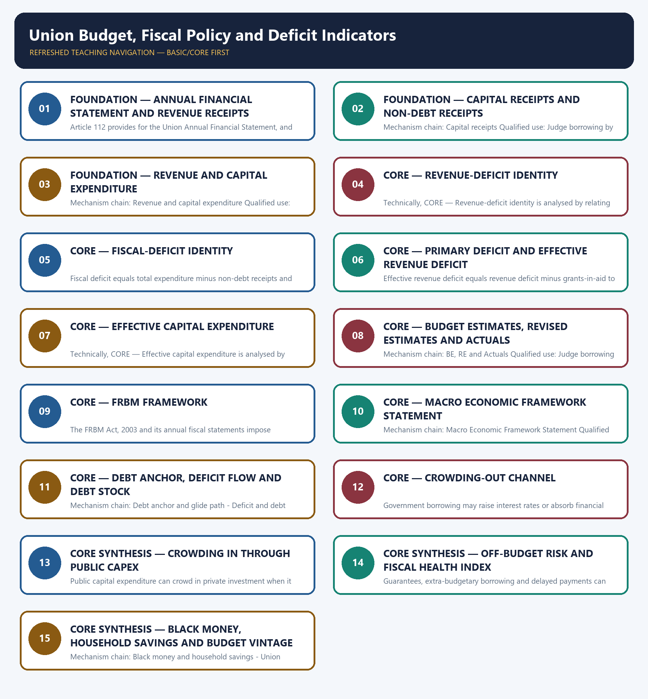

# Union Budget, Fiscal Policy and Deficit Indicators — Learner-v2 Complete Learning Session

> **Authoring-only generation:** 2026-09-03. No PDF was rendered and no tracker or index was mutated.

### SOURCE, PROGRESSION AND CURRENT-LINKAGE AUDIT

- **Generation date:** 2026-09-03.
- **Repository-first evidence:** the Basic owner is taught first and preserved in full; the Advanced owner is retained only in the optional final teaching block.
- **OCR evidence:** Repository Markdown was primary. OCR-searchable local official General Studies papers were used only to confirm printed routed demands. No answer key, marking scheme, unsupported page precision or current macroeconomic statistic was inferred from them.
- **Qdrant:** not used; repository Markdown and available OCR context were sufficient.
- **PYQ integrity:** Audited ledgers route Mains demands on public expenditure management, Capital versus Revenue Budget and the Fiscal Health Index, plus objective demands on Article 112, capital receipts, deficit computation, recession policy, opportunity cost, household savings and crowding out. Objective answer letters are not inferred.
- **Live-link boundary:** Both live India Budget attempts were blocked with HTTP 403. The package therefore preserves the repository owner's figures only with their exact Union Budget 2026-27 BE and 2025-26 RE labels and does not upgrade them to Actuals.
- **Fact/inference discipline:** no current-affairs item, PYQ wording, figure or quotation is invented.

### LIVE OFFICIAL-SOURCE ATTEMPT LOG

The checks below were made on 2026-09-03. Substantive official text is used only for the proposition it actually supports; binary files, dynamic shells, stubs and undated dashboard snippets are recorded but not converted into current claims.

- https://www.indiabudget.gov.in/doc/frbm1.pdf — attempted 2026-09-03; the official PDF returned HTTP 403 to the live fetcher, so no number was extracted from the live attempt and the repository owner's explicitly dated Budget 2026-27 BE and 2025-26 RE figures were retained unchanged.
- https://www.indiabudget.gov.in/ — attempted 2026-09-03; the official landing page also returned HTTP 403 to the live fetcher.

## BASIC LEARNING SESSION



*Distinct embedded teaching-navigation image. The separate continuous Cārvāka-style flowchart package remains an independent at-a-glance artifact.*

### SESSION 1 — FOUNDATION — ANNUAL FINANCIAL STATEMENT AND REVENUE RECEIPTS

#### DEFINITION / WHAT THIS IS CALLED

**Plain-language definition:** Mechanism chain: Annual Financial Statement - Revenue receipts Qualified use: State every deficit formula, period, government perimeter and estimate vintage before inference.

**Technical definition:** Article 112 provides for the Union Annual Financial Statement, and the budget procedure keeps charged expenditure distinct from expenditure submitted to vote.

#### ANSWER-GRABBING OPENING — WRITE/ADAPT IN THE EXAM

> Mechanism chain: Annual Financial Statement - Revenue receipts Qualified use: State every deficit formula, period, government perimeter and estimate vintage before inference.

#### MUST-WRITE KEYWORDS

- **FOUNDATION**
- **Annual Financial Statement**
- **revenue receipts**
- **Mechanism chain**
- **Qualified use**
- **Article 112**

**How to use them:** Frame the answer through FOUNDATION; define Annual Financial Statement, connect revenue receipts with Mechanism chain to explain the mechanism, and use Qualified use for the decisive comparison or qualification.

#### VISUAL FIRST

```text
ANNUAL FINANCIAL STATEMENT AND REVENUE RECEIPTS
01. Annual Financial Statement
    |
    v
02. Revenue receipts
BOUNDARY -> Do not classify all capital receipts as resources without future fiscal cost.
```

*This topic-specific rail fixes the evidence sequence and its exam boundary before analysis.*

#### CORE EXPLANATION

Article 112 provides for the Union Annual Financial Statement, and the budget procedure keeps charged expenditure distinct from expenditure submitted to vote. Revenue receipts neither create a liability nor reduce a financial asset and include tax and non-tax revenue within the stated budget perimeter.

#### NAMED EVIDENCE AND MECHANISM

- Article 112 provides for the Union Annual Financial Statement, and the budget procedure keeps charged expenditure distinct from expenditure submitted to vote.
- Revenue receipts neither create a liability nor reduce a financial asset and include tax and non-tax revenue within the stated budget perimeter.

#### EXAMINER CAUTION

- Do not classify all capital receipts as resources without future fiscal cost.

#### EXAM LINK

- **Prelims:** Preserve the exact formula, territorial or resident boundary, price basis, base year, index basket, eligible counterparty, institution and legal status; never upgrade a projection into an actual or a regulatory direction into a universal rule.
- **Mains:** State every deficit formula, period, government perimeter and estimate vintage before inference.

#### MINI RECAP

- **Mechanism chain:** Annual Financial Statement -> Revenue receipts
- **Qualified use:** State every deficit formula, period, government perimeter and estimate vintage before inference.

#### CLOSING RECALL FLOW — FOUNDATION — ANNUAL FINANCIAL STATEMENT AND REVENUE RECEIPTS

```text
START / CONCEPT: FOUNDATION — Annual Financial Statement and revenue receipts
        |
        v
EXACT TERMS: FOUNDATION · Annual Financial Statement · revenue receipts · Mechanism chain · Qualified use · Article 112
        |
        v
MECHANISM / ARGUMENT: Article 112 provides for the Union Annual Financial Statement, and the budget procedure keeps charged expenditure distinct from expenditure submitted to vote.
        |
        v
CONSEQUENCE / CONTRAST: Revenue receipts neither create a liability nor reduce a financial asset and include tax and non-tax revenue within the stated budget perimeter.
        |
        v
UPSC TRAP / ANSWER-USE: Do not classify all capital receipts as resources without future fiscal cost.
        |
        v
ANSWER-GRABBING FORMULATION: Mechanism chain: Annual Financial Statement - Revenue receipts Qualified use: State every deficit formula, period, government perimeter and estimate vintage before inference.
```
### SESSION 2 — FOUNDATION — CAPITAL RECEIPTS AND NON-DEBT RECEIPTS

#### DEFINITION / WHAT THIS IS CALLED

**Plain-language definition:** Capital receipts create liabilities or reduce financial assets; borrowings create liabilities, while recovery of loans and disinvestment are non-debt capital receipts.

**Technical definition:** Mechanism chain: Capital receipts Qualified use: Judge borrowing by expenditure composition, multiplier, financing conditions and debt feedback.

#### ANSWER-GRABBING OPENING — WRITE/ADAPT IN THE EXAM

> Capital receipts create liabilities or reduce financial assets; borrowings create liabilities, while recovery of loans and disinvestment are non-debt capital receipts.

#### MUST-WRITE KEYWORDS

- **FOUNDATION**
- **Capital receipts**
- **non-debt receipts**
- **Mechanism chain**
- **Qualified use**
- **Capital**

**How to use them:** Frame the answer through FOUNDATION; define Capital receipts, connect non-debt receipts with Mechanism chain to explain the mechanism, and use Qualified use for the decisive comparison or qualification.

#### VISUAL FIRST

```text
CAPITAL RECEIPTS AND NON-DEBT RECEIPTS
01. Capital receipts
BOUNDARY -> Do not equate zero revenue deficit with zero fiscal deficit.
```

*This topic-specific rail fixes the evidence sequence and its exam boundary before analysis.*

#### CORE EXPLANATION

Capital receipts create liabilities or reduce financial assets; borrowings create liabilities, while recovery of loans and disinvestment are non-debt capital receipts.

#### NAMED EVIDENCE AND MECHANISM

- Capital receipts create liabilities or reduce financial assets; borrowings create liabilities, while recovery of loans and disinvestment are non-debt capital receipts.

#### EXAMINER CAUTION

- Do not equate zero revenue deficit with zero fiscal deficit.

#### EXAM LINK

- **Prelims:** Preserve the exact formula, territorial or resident boundary, price basis, base year, index basket, eligible counterparty, institution and legal status; never upgrade a projection into an actual or a regulatory direction into a universal rule.
- **Mains:** Judge borrowing by expenditure composition, multiplier, financing conditions and debt feedback.

#### MINI RECAP

- **Mechanism chain:** Capital receipts
- **Qualified use:** Judge borrowing by expenditure composition, multiplier, financing conditions and debt feedback.

#### CLOSING RECALL FLOW — FOUNDATION — CAPITAL RECEIPTS AND NON-DEBT RECEIPTS

```text
START / CONCEPT: FOUNDATION — Capital receipts and non-debt receipts
        |
        v
EXACT TERMS: FOUNDATION · Capital receipts · non-debt receipts · Mechanism chain · Qualified use · Capital
        |
        v
MECHANISM / ARGUMENT: Mechanism chain: Capital receipts Qualified use: Judge borrowing by expenditure composition, multiplier, financing conditions and debt feedback.
        |
        v
CONSEQUENCE / CONTRAST: Do not equate zero revenue deficit with zero fiscal deficit.
        |
        v
UPSC TRAP / ANSWER-USE: Do not miss this limiting distinction: capital receipts create liabilities or reduce financial assets.
        |
        v
ANSWER-GRABBING FORMULATION: Capital receipts create liabilities or reduce financial assets; borrowings create liabilities, while recovery of loans and disinvestment are non-debt capital receipts.
```
### SESSION 3 — FOUNDATION — REVENUE AND CAPITAL EXPENDITURE

#### DEFINITION / WHAT THIS IS CALLED

**Plain-language definition:** Revenue expenditure generally supports current services and transfers, whereas capital expenditure creates assets or reduces liabilities; classification is accounting-based rather than a moral label.

**Technical definition:** Mechanism chain: Revenue and capital expenditure Qualified use: Combine fiscal rules with transparent escape clauses, contingent-liability disclosure and outcome scrutiny.

#### ANSWER-GRABBING OPENING — WRITE/ADAPT IN THE EXAM

> Revenue expenditure generally supports current services and transfers, whereas capital expenditure creates assets or reduces liabilities; classification is accounting-based rather than a moral label.

#### MUST-WRITE KEYWORDS

- **FOUNDATION**
- **Revenue**
- **capital expenditure**
- **Mechanism chain**
- **Qualified use**
- **Qualified**

**How to use them:** Frame the answer through FOUNDATION; define Revenue, connect capital expenditure with Mechanism chain to explain the mechanism, and use Qualified use for the decisive comparison or qualification.

#### VISUAL FIRST

```text
REVENUE AND CAPITAL EXPENDITURE
01. Revenue and capital expenditure
BOUNDARY -> Do not call fiscal deficit the stock of total public debt.
```

*This topic-specific rail fixes the evidence sequence and its exam boundary before analysis.*

#### CORE EXPLANATION

Revenue expenditure generally supports current services and transfers, whereas capital expenditure creates assets or reduces liabilities; classification is accounting-based rather than a moral label.

#### NAMED EVIDENCE AND MECHANISM

- Revenue expenditure generally supports current services and transfers, whereas capital expenditure creates assets or reduces liabilities; classification is accounting-based rather than a moral label.

#### EXAMINER CAUTION

- Do not call fiscal deficit the stock of total public debt.

#### EXAM LINK

- **Prelims:** Preserve the exact formula, territorial or resident boundary, price basis, base year, index basket, eligible counterparty, institution and legal status; never upgrade a projection into an actual or a regulatory direction into a universal rule.
- **Mains:** Combine fiscal rules with transparent escape clauses, contingent-liability disclosure and outcome scrutiny.

#### MINI RECAP

- **Mechanism chain:** Revenue and capital expenditure
- **Qualified use:** Combine fiscal rules with transparent escape clauses, contingent-liability disclosure and outcome scrutiny.

#### CLOSING RECALL FLOW — FOUNDATION — REVENUE AND CAPITAL EXPENDITURE

```text
START / CONCEPT: FOUNDATION — Revenue and capital expenditure
        |
        v
EXACT TERMS: FOUNDATION · Revenue · capital expenditure · Mechanism chain · Qualified use · Qualified
        |
        v
MECHANISM / ARGUMENT: Mechanism chain: Revenue and capital expenditure Qualified use: Combine fiscal rules with transparent escape clauses, contingent-liability disclosure and outcome scrutiny.
        |
        v
CONSEQUENCE / CONTRAST: Do not call fiscal deficit the stock of total public debt.
        |
        v
UPSC TRAP / ANSWER-USE: Do not miss this limiting distinction: revenue expenditure generally supports current services and transfers.
        |
        v
ANSWER-GRABBING FORMULATION: Revenue expenditure generally supports current services and transfers, whereas capital expenditure creates assets or reduces liabilities; classification is accounting-based rather than a moral label.
```
### SESSION 4 — CORE — REVENUE-DEFICIT IDENTITY

#### DEFINITION / WHAT THIS IS CALLED

**Plain-language definition:** Mechanism chain: Revenue deficit Qualified use: State every deficit formula, period, government perimeter and estimate vintage before inference.

**Technical definition:** Technically, CORE — Revenue-deficit identity is analysed by relating Revenue-deficit identity to Mechanism chain, then testing the relationship through Qualified use and Revenue.

#### ANSWER-GRABBING OPENING — WRITE/ADAPT IN THE EXAM

> Do not subtract borrowings as non-debt receipts in the fiscal-deficit identity.

#### MUST-WRITE KEYWORDS

- **Revenue-deficit identity**
- **Mechanism chain**
- **Qualified use**
- **Revenue**
- **Qualified**
- **CORE — Revenue-deficit identity**

**How to use them:** Frame the answer through Revenue-deficit identity; define Mechanism chain, connect Qualified use with Revenue to explain the mechanism, and use Qualified for the decisive comparison or qualification.

#### VISUAL FIRST

```text
REVENUE-DEFICIT IDENTITY
01. Revenue deficit
BOUNDARY -> Do not subtract borrowings as non-debt receipts in the fiscal-deficit identity.
```

*This topic-specific rail fixes the evidence sequence and its exam boundary before analysis.*

#### CORE EXPLANATION

Revenue deficit equals revenue expenditure minus revenue receipts.

#### NAMED EVIDENCE AND MECHANISM

- Revenue deficit equals revenue expenditure minus revenue receipts.

#### EXAMINER CAUTION

- Do not subtract borrowings as non-debt receipts in the fiscal-deficit identity.

#### EXAM LINK

- **Prelims:** Preserve the exact formula, territorial or resident boundary, price basis, base year, index basket, eligible counterparty, institution and legal status; never upgrade a projection into an actual or a regulatory direction into a universal rule.
- **Mains:** State every deficit formula, period, government perimeter and estimate vintage before inference.

#### MINI RECAP

- **Mechanism chain:** Revenue deficit
- **Qualified use:** State every deficit formula, period, government perimeter and estimate vintage before inference.

#### CLOSING RECALL FLOW — CORE — REVENUE-DEFICIT IDENTITY

```text
START / CONCEPT: CORE — Revenue-deficit identity
        |
        v
EXACT TERMS: Revenue-deficit identity · Mechanism chain · Qualified use · Revenue · Qualified · CORE — Revenue-deficit identity
        |
        v
MECHANISM / ARGUMENT: Mechanism chain: Revenue deficit Qualified use: State every deficit formula, period, government perimeter and estimate vintage before inference.
        |
        v
CONSEQUENCE / CONTRAST: The resulting consequence is that do not subtract borrowings as non-debt receipts in the fiscal-deficit identity.
        |
        v
UPSC TRAP / ANSWER-USE: Do not miss this limiting distinction: do not subtract borrowings as non-debt receipts in the fiscal-deficit identity.
        |
        v
ANSWER-GRABBING FORMULATION: Do not subtract borrowings as non-debt receipts in the fiscal-deficit identity.
```
### SESSION 5 — CORE — FISCAL-DEFICIT IDENTITY

#### DEFINITION / WHAT THIS IS CALLED

**Plain-language definition:** Mechanism chain: Fiscal deficit Qualified use: Judge borrowing by expenditure composition, multiplier, financing conditions and debt feedback.

**Technical definition:** Fiscal deficit equals total expenditure minus non-debt receipts and broadly indicates the period's borrowing requirement rather than the stock of public debt.

#### ANSWER-GRABBING OPENING — WRITE/ADAPT IN THE EXAM

> Do not merge primary deficit with fiscal deficit or interest payments.

#### MUST-WRITE KEYWORDS

- **Fiscal-deficit identity**
- **Mechanism chain**
- **Qualified use**
- **Fiscal**
- **Qualified**
- **Judge**

**How to use them:** Frame the answer through Fiscal-deficit identity; define Mechanism chain, connect Qualified use with Fiscal to explain the mechanism, and use Qualified for the decisive comparison or qualification.

#### VISUAL FIRST

```text
FISCAL-DEFICIT IDENTITY
01. Fiscal deficit
BOUNDARY -> Do not merge primary deficit with fiscal deficit or interest payments.
```

*This topic-specific rail fixes the evidence sequence and its exam boundary before analysis.*

#### CORE EXPLANATION

Fiscal deficit equals total expenditure minus non-debt receipts and broadly indicates the period's borrowing requirement rather than the stock of public debt.

#### NAMED EVIDENCE AND MECHANISM

- Fiscal deficit equals total expenditure minus non-debt receipts and broadly indicates the period's borrowing requirement rather than the stock of public debt.

#### EXAMINER CAUTION

- Do not merge primary deficit with fiscal deficit or interest payments.

#### EXAM LINK

- **Prelims:** Preserve the exact formula, territorial or resident boundary, price basis, base year, index basket, eligible counterparty, institution and legal status; never upgrade a projection into an actual or a regulatory direction into a universal rule.
- **Mains:** Judge borrowing by expenditure composition, multiplier, financing conditions and debt feedback.

#### MINI RECAP

- **Mechanism chain:** Fiscal deficit
- **Qualified use:** Judge borrowing by expenditure composition, multiplier, financing conditions and debt feedback.

#### CLOSING RECALL FLOW — CORE — FISCAL-DEFICIT IDENTITY

```text
START / CONCEPT: CORE — Fiscal-deficit identity
        |
        v
EXACT TERMS: Fiscal-deficit identity · Mechanism chain · Qualified use · Fiscal · Qualified · Judge
        |
        v
MECHANISM / ARGUMENT: Mechanism chain: Fiscal deficit Qualified use: Judge borrowing by expenditure composition, multiplier, financing conditions and debt feedback.
        |
        v
CONSEQUENCE / CONTRAST: Fiscal deficit equals total expenditure minus non-debt receipts and broadly indicates the period's borrowing requirement rather than the stock of public debt.
        |
        v
UPSC TRAP / ANSWER-USE: Do not miss this limiting distinction: do not merge primary deficit with fiscal deficit or interest payments.
        |
        v
ANSWER-GRABBING FORMULATION: Do not merge primary deficit with fiscal deficit or interest payments.
```
### SESSION 6 — CORE — PRIMARY DEFICIT AND EFFECTIVE REVENUE DEFICIT

#### DEFINITION / WHAT THIS IS CALLED

**Plain-language definition:** Mechanism chain: Primary deficit - Effective revenue deficit Qualified use: Combine fiscal rules with transparent escape clauses, contingent-liability disclosure and outcome scrutiny.

**Technical definition:** Effective revenue deficit equals revenue deficit minus grants-in-aid to states or Union Territories for creation of capital assets; it reclassifies the transfer but does not prove the asset was well used.

#### ANSWER-GRABBING OPENING — WRITE/ADAPT IN THE EXAM

> Effective revenue deficit equals revenue deficit minus grants-in-aid to states or Union Territories for creation of capital assets; it reclassifies the transfer but does not prove the asset was well used.

#### MUST-WRITE KEYWORDS

- **Primary deficit**
- **effective revenue deficit**
- **Mechanism chain**
- **Qualified use**
- **Effective**
- **Union Territories**

**How to use them:** Frame the answer through Primary deficit; define effective revenue deficit, connect Mechanism chain with Qualified use to explain the mechanism, and use Effective for the decisive comparison or qualification.

#### VISUAL FIRST

```text
PRIMARY DEFICIT AND EFFECTIVE REVENUE DEFICIT
01. Primary deficit
    |
    v
02. Effective revenue deficit
BOUNDARY -> Do not treat effective revenue deficit as proof of completed asset creation.
```

*This topic-specific rail fixes the evidence sequence and its exam boundary before analysis.*

#### CORE EXPLANATION

Primary deficit equals fiscal deficit minus interest payments and isolates the current fiscal gap after removing the burden of past-debt interest. Effective revenue deficit equals revenue deficit minus grants-in-aid to states or Union Territories for creation of capital assets; it reclassifies the transfer but does not prove the asset was well used.

#### NAMED EVIDENCE AND MECHANISM

- Primary deficit equals fiscal deficit minus interest payments and isolates the current fiscal gap after removing the burden of past-debt interest.
- Effective revenue deficit equals revenue deficit minus grants-in-aid to states or Union Territories for creation of capital assets; it reclassifies the transfer but does not prove the asset was well used.

#### EXAMINER CAUTION

- Do not treat effective revenue deficit as proof of completed asset creation.

#### EXAM LINK

- **Prelims:** Preserve the exact formula, territorial or resident boundary, price basis, base year, index basket, eligible counterparty, institution and legal status; never upgrade a projection into an actual or a regulatory direction into a universal rule.
- **Mains:** Combine fiscal rules with transparent escape clauses, contingent-liability disclosure and outcome scrutiny.

#### MINI RECAP

- **Mechanism chain:** Primary deficit -> Effective revenue deficit
- **Qualified use:** Combine fiscal rules with transparent escape clauses, contingent-liability disclosure and outcome scrutiny.

#### CLOSING RECALL FLOW — CORE — PRIMARY DEFICIT AND EFFECTIVE REVENUE DEFICIT

```text
START / CONCEPT: CORE — Primary deficit and effective revenue deficit
        |
        v
EXACT TERMS: Primary deficit · effective revenue deficit · Mechanism chain · Qualified use · Effective · Union Territories
        |
        v
MECHANISM / ARGUMENT: Mechanism chain: Primary deficit - Effective revenue deficit Qualified use: Combine fiscal rules with transparent escape clauses, contingent-liability disclosure and outcome scrutiny.
        |
        v
CONSEQUENCE / CONTRAST: Do not treat effective revenue deficit as proof of completed asset creation.
        |
        v
UPSC TRAP / ANSWER-USE: Do not miss this limiting distinction: effective revenue deficit equals revenue deficit minus grants-in-aid to states or Union Territories for...
        |
        v
ANSWER-GRABBING FORMULATION: Effective revenue deficit equals revenue deficit minus grants-in-aid to states or Union Territories for creation of capital assets; it reclassifies the transfer but does not prove the asset was well used.
```
### SESSION 7 — CORE — EFFECTIVE CAPITAL EXPENDITURE

#### DEFINITION / WHAT THIS IS CALLED

**Plain-language definition:** Mechanism chain: Effective capital expenditure Qualified use: State every deficit formula, period, government perimeter and estimate vintage before inference.

**Technical definition:** Technically, CORE — Effective capital expenditure is analysed by relating Effective capital expenditure to Mechanism chain, then testing the relationship through Qualified use and Budget Estimates.

#### ANSWER-GRABBING OPENING — WRITE/ADAPT IN THE EXAM

> Mechanism chain: Effective capital expenditure Qualified use: State every deficit formula, period, government perimeter and estimate vintage before inference.

#### MUST-WRITE KEYWORDS

- **Effective capital expenditure**
- **Mechanism chain**
- **Qualified use**
- **Budget Estimates**
- **Revised Estimates**
- **Actuals**

**How to use them:** Frame the answer through Effective capital expenditure; define Mechanism chain, connect Qualified use with Budget Estimates to explain the mechanism, and use Revised Estimates for the decisive comparison or qualification.

#### VISUAL FIRST

```text
EFFECTIVE CAPITAL EXPENDITURE
01. Effective capital expenditure
BOUNDARY -> Do not equate Budget Estimates, Revised Estimates and Actuals.
```

*This topic-specific rail fixes the evidence sequence and its exam boundary before analysis.*

#### CORE EXPLANATION

Effective capital expenditure adds grants for capital-asset creation to the Centre's own capital expenditure.

#### NAMED EVIDENCE AND MECHANISM

- Effective capital expenditure adds grants for capital-asset creation to the Centre's own capital expenditure.

#### EXAMINER CAUTION

- Do not equate Budget Estimates, Revised Estimates and Actuals.

#### EXAM LINK

- **Prelims:** Preserve the exact formula, territorial or resident boundary, price basis, base year, index basket, eligible counterparty, institution and legal status; never upgrade a projection into an actual or a regulatory direction into a universal rule.
- **Mains:** State every deficit formula, period, government perimeter and estimate vintage before inference.

#### MINI RECAP

- **Mechanism chain:** Effective capital expenditure
- **Qualified use:** State every deficit formula, period, government perimeter and estimate vintage before inference.

#### CLOSING RECALL FLOW — CORE — EFFECTIVE CAPITAL EXPENDITURE

```text
START / CONCEPT: CORE — Effective capital expenditure
        |
        v
EXACT TERMS: Effective capital expenditure · Mechanism chain · Qualified use · Budget Estimates · Revised Estimates · Actuals
        |
        v
MECHANISM / ARGUMENT: Do not equate Budget Estimates, Revised Estimates and Actuals.
        |
        v
CONSEQUENCE / CONTRAST: The resulting consequence is that state every deficit formula, period, government perimeter and estimate vintage before inference.
        |
        v
UPSC TRAP / ANSWER-USE: Do not miss this limiting distinction: state every deficit formula, period, government perimeter and estimate vintage before inference.
        |
        v
ANSWER-GRABBING FORMULATION: Mechanism chain: Effective capital expenditure Qualified use: State every deficit formula, period, government perimeter and estimate vintage before inference.
```
### SESSION 8 — CORE — BUDGET ESTIMATES, REVISED ESTIMATES AND ACTUALS

#### DEFINITION / WHAT THIS IS CALLED

**Plain-language definition:** Budget Estimates are policy authorisations or projections, Revised Estimates update the year's expected outcome, and Actuals record realised accounts; the three vintages are not interchangeable.

**Technical definition:** Mechanism chain: BE, RE and Actuals Qualified use: Judge borrowing by expenditure composition, multiplier, financing conditions and debt feedback.

#### ANSWER-GRABBING OPENING — WRITE/ADAPT IN THE EXAM

> Budget Estimates are policy authorisations or projections, Revised Estimates update the year's expected outcome, and Actuals record realised accounts; the three vintages are not interchangeable.

#### MUST-WRITE KEYWORDS

- **Budget Estimates**
- **Revised Estimates**
- **Actuals**
- **Mechanism chain**
- **Qualified use**
- **Union**

**How to use them:** Frame the answer through Budget Estimates; define Revised Estimates, connect Actuals with Mechanism chain to explain the mechanism, and use Qualified use for the decisive comparison or qualification.

#### VISUAL FIRST

```text
BUDGET ESTIMATES, REVISED ESTIMATES AND ACTUALS
01. BE, RE and Actuals
BOUNDARY -> Do not infer the whole general-government risk from the Union headline alone.
```

*This topic-specific rail fixes the evidence sequence and its exam boundary before analysis.*

#### CORE EXPLANATION

Budget Estimates are policy authorisations or projections, Revised Estimates update the year's expected outcome, and Actuals record realised accounts; the three vintages are not interchangeable.

#### NAMED EVIDENCE AND MECHANISM

- Budget Estimates are policy authorisations or projections, Revised Estimates update the year's expected outcome, and Actuals record realised accounts; the three vintages are not interchangeable.

#### EXAMINER CAUTION

- Do not infer the whole general-government risk from the Union headline alone.

#### EXAM LINK

- **Prelims:** Preserve the exact formula, territorial or resident boundary, price basis, base year, index basket, eligible counterparty, institution and legal status; never upgrade a projection into an actual or a regulatory direction into a universal rule.
- **Mains:** Judge borrowing by expenditure composition, multiplier, financing conditions and debt feedback.

#### MINI RECAP

- **Mechanism chain:** BE, RE and Actuals
- **Qualified use:** Judge borrowing by expenditure composition, multiplier, financing conditions and debt feedback.

#### CLOSING RECALL FLOW — CORE — BUDGET ESTIMATES, REVISED ESTIMATES AND ACTUALS

```text
START / CONCEPT: CORE — Budget Estimates, Revised Estimates and Actuals
        |
        v
EXACT TERMS: Budget Estimates · Revised Estimates · Actuals · Mechanism chain · Qualified use · Union
        |
        v
MECHANISM / ARGUMENT: Mechanism chain: BE, RE and Actuals Qualified use: Judge borrowing by expenditure composition, multiplier, financing conditions and debt feedback.
        |
        v
CONSEQUENCE / CONTRAST: Do not infer the whole general-government risk from the Union headline alone.
        |
        v
UPSC TRAP / ANSWER-USE: Do not miss this limiting distinction: budget Estimates are policy authorisations or projections, Revised Estimates update the year's expected outcome.
        |
        v
ANSWER-GRABBING FORMULATION: Budget Estimates are policy authorisations or projections, Revised Estimates update the year's expected outcome, and Actuals record realised accounts; the three vintages are not interchangeable.
```
### SESSION 9 — CORE — FRBM FRAMEWORK

#### DEFINITION / WHAT THIS IS CALLED

**Plain-language definition:** Mechanism chain: FRBM framework Qualified use: Combine fiscal rules with transparent escape clauses, contingent-liability disclosure and outcome scrutiny.

**Technical definition:** The FRBM Act, 2003 and its annual fiscal statements impose medium-term targets, macro disclosure and deviation reporting rather than a guarantee that every announced path will be met.

#### ANSWER-GRABBING OPENING — WRITE/ADAPT IN THE EXAM

> Mechanism chain: FRBM framework Qualified use: Combine fiscal rules with transparent escape clauses, contingent-liability disclosure and outcome scrutiny.

#### MUST-WRITE KEYWORDS

- **FRBM framework**
- **Mechanism chain**
- **Qualified use**
- **The FRBM Act**
- **FRBM**
- **Qualified**

**How to use them:** Frame the answer through FRBM framework; define Mechanism chain, connect Qualified use with The FRBM Act to explain the mechanism, and use FRBM for the decisive comparison or qualification.

#### VISUAL FIRST

```text
FRBM FRAMEWORK
01. FRBM framework
BOUNDARY -> Do not assume every public capex programme automatically crowds in investment.
```

*This topic-specific rail fixes the evidence sequence and its exam boundary before analysis.*

#### CORE EXPLANATION

The FRBM Act, 2003 and its annual fiscal statements impose medium-term targets, macro disclosure and deviation reporting rather than a guarantee that every announced path will be met.

#### NAMED EVIDENCE AND MECHANISM

- The FRBM Act, 2003 and its annual fiscal statements impose medium-term targets, macro disclosure and deviation reporting rather than a guarantee that every announced path will be met.

#### EXAMINER CAUTION

- Do not assume every public capex programme automatically crowds in investment.

#### EXAM LINK

- **Prelims:** Preserve the exact formula, territorial or resident boundary, price basis, base year, index basket, eligible counterparty, institution and legal status; never upgrade a projection into an actual or a regulatory direction into a universal rule.
- **Mains:** Combine fiscal rules with transparent escape clauses, contingent-liability disclosure and outcome scrutiny.

#### MINI RECAP

- **Mechanism chain:** FRBM framework
- **Qualified use:** Combine fiscal rules with transparent escape clauses, contingent-liability disclosure and outcome scrutiny.

#### CLOSING RECALL FLOW — CORE — FRBM FRAMEWORK

```text
START / CONCEPT: CORE — FRBM framework
        |
        v
EXACT TERMS: FRBM framework · Mechanism chain · Qualified use · The FRBM Act · FRBM · Qualified
        |
        v
MECHANISM / ARGUMENT: The FRBM Act, 2003 and its annual fiscal statements impose medium-term targets, macro disclosure and deviation reporting rather than a guarantee that every announced path will be met.
        |
        v
CONSEQUENCE / CONTRAST: Do not assume every public capex programme automatically crowds in investment.
        |
        v
UPSC TRAP / ANSWER-USE: Do not miss this limiting distinction: combine fiscal rules with transparent escape clauses, contingent-liability disclosure and outcome scrutiny.
        |
        v
ANSWER-GRABBING FORMULATION: Mechanism chain: FRBM framework Qualified use: Combine fiscal rules with transparent escape clauses, contingent-liability disclosure and outcome scrutiny.
```
### SESSION 10 — CORE — MACRO ECONOMIC FRAMEWORK STATEMENT

#### DEFINITION / WHAT THIS IS CALLED

**Plain-language definition:** The Macro Economic Framework Statement supplies the growth, inflation and macro assumptions needed to interpret Budget numbers.

**Technical definition:** Mechanism chain: Macro Economic Framework Statement Qualified use: State every deficit formula, period, government perimeter and estimate vintage before inference.

#### ANSWER-GRABBING OPENING — WRITE/ADAPT IN THE EXAM

> The Macro Economic Framework Statement supplies the growth, inflation and macro assumptions needed to interpret Budget numbers.

#### MUST-WRITE KEYWORDS

- **Macro Economic Framework Statement**
- **Mechanism chain**
- **Qualified use**
- **The Macro Economic Framework Statement**
- **Budget**
- **2026-27**

**How to use them:** Frame the answer through Macro Economic Framework Statement; define Mechanism chain, connect Qualified use with The Macro Economic Framework Statement to explain the mechanism, and use Budget for the decisive comparison or qualification.

#### VISUAL FIRST

```text
MACRO ECONOMIC FRAMEWORK STATEMENT
01. Macro Economic Framework Statement
BOUNDARY -> Do not quote Budget 2026-27 figures without the BE or RE vintage.
```

*This topic-specific rail fixes the evidence sequence and its exam boundary before analysis.*

#### CORE EXPLANATION

The Macro Economic Framework Statement supplies the growth, inflation and macro assumptions needed to interpret Budget numbers.

#### NAMED EVIDENCE AND MECHANISM

- The Macro Economic Framework Statement supplies the growth, inflation and macro assumptions needed to interpret Budget numbers.

#### EXAMINER CAUTION

- Do not quote Budget 2026-27 figures without the BE or RE vintage.

#### EXAM LINK

- **Prelims:** Preserve the exact formula, territorial or resident boundary, price basis, base year, index basket, eligible counterparty, institution and legal status; never upgrade a projection into an actual or a regulatory direction into a universal rule.
- **Mains:** State every deficit formula, period, government perimeter and estimate vintage before inference.

#### MINI RECAP

- **Mechanism chain:** Macro Economic Framework Statement
- **Qualified use:** State every deficit formula, period, government perimeter and estimate vintage before inference.

#### CLOSING RECALL FLOW — CORE — MACRO ECONOMIC FRAMEWORK STATEMENT

```text
START / CONCEPT: CORE — Macro Economic Framework Statement
        |
        v
EXACT TERMS: Macro Economic Framework Statement · Mechanism chain · Qualified use · The Macro Economic Framework Statement · Budget · 2026-27
        |
        v
MECHANISM / ARGUMENT: Mechanism chain: Macro Economic Framework Statement Qualified use: State every deficit formula, period, government perimeter and estimate vintage before inference.
        |
        v
CONSEQUENCE / CONTRAST: Do not quote Budget 2026-27 figures without the BE or RE vintage.
        |
        v
UPSC TRAP / ANSWER-USE: Do not miss this limiting distinction: the Macro Economic Framework Statement supplies the growth, inflation and macro assumptions needed to...
        |
        v
ANSWER-GRABBING FORMULATION: The Macro Economic Framework Statement supplies the growth, inflation and macro assumptions needed to interpret Budget numbers.
```
### SESSION 11 — CORE — DEBT ANCHOR, DEFICIT FLOW AND DEBT STOCK

#### DEFINITION / WHAT THIS IS CALLED

**Plain-language definition:** A fiscal deficit is a flow for a specified government and period, while debt is a stock; the Union Budget does not by itself capture states, local bodies and every public-sector liability.

**Technical definition:** Mechanism chain: Debt anchor and glide path - Deficit and debt coverage Qualified use: Judge borrowing by expenditure composition, multiplier, financing conditions and debt feedback.

#### ANSWER-GRABBING OPENING — WRITE/ADAPT IN THE EXAM

> A fiscal deficit is a flow for a specified government and period, while debt is a stock; the Union Budget does not by itself capture states, local bodies and every public-sector liability.

#### MUST-WRITE KEYWORDS

- **Debt anchor**
- **deficit flow**
- **debt stock**
- **Mechanism chain**
- **Qualified use**
- **Singh-led FRBM Review Committee**

**How to use them:** Frame the answer through Debt anchor; define deficit flow, connect debt stock with Mechanism chain to explain the mechanism, and use Qualified use for the decisive comparison or qualification.

#### VISUAL FIRST

```text
DEBT ANCHOR, DEFICIT FLOW AND DEBT STOCK
01. Debt anchor and glide path
    |
    v
02. Deficit and debt coverage
BOUNDARY -> Do not classify all capital receipts as resources without future fiscal cost.
```

*This topic-specific rail fixes the evidence sequence and its exam boundary before analysis.*

#### CORE EXPLANATION

The N.K. Singh-led FRBM Review Committee advanced a debt-anchor and operational glide-path logic; its recommendations are advisory and not self-executing. A fiscal deficit is a flow for a specified government and period, while debt is a stock; the Union Budget does not by itself capture states, local bodies and every public-sector liability.

#### NAMED EVIDENCE AND MECHANISM

- The N.K. Singh-led FRBM Review Committee advanced a debt-anchor and operational glide-path logic; its recommendations are advisory and not self-executing.
- A fiscal deficit is a flow for a specified government and period, while debt is a stock; the Union Budget does not by itself capture states, local bodies and every public-sector liability.

#### EXAMINER CAUTION

- Do not classify all capital receipts as resources without future fiscal cost.

#### EXAM LINK

- **Prelims:** Preserve the exact formula, territorial or resident boundary, price basis, base year, index basket, eligible counterparty, institution and legal status; never upgrade a projection into an actual or a regulatory direction into a universal rule.
- **Mains:** Judge borrowing by expenditure composition, multiplier, financing conditions and debt feedback.

#### MINI RECAP

- **Mechanism chain:** Debt anchor and glide path -> Deficit and debt coverage
- **Qualified use:** Judge borrowing by expenditure composition, multiplier, financing conditions and debt feedback.

#### CLOSING RECALL FLOW — CORE — DEBT ANCHOR, DEFICIT FLOW AND DEBT STOCK

```text
START / CONCEPT: CORE — Debt anchor, deficit flow and debt stock
        |
        v
EXACT TERMS: Debt anchor · deficit flow · debt stock · Mechanism chain · Qualified use · Singh-led FRBM Review Committee
        |
        v
MECHANISM / ARGUMENT: Mechanism chain: Debt anchor and glide path - Deficit and debt coverage Qualified use: Judge borrowing by expenditure composition, multiplier, financing conditions and debt feedback.
        |
        v
CONSEQUENCE / CONTRAST: Singh-led FRBM Review Committee advanced a debt-anchor and operational glide-path logic; its recommendations are advisory and not self-executing.
        |
        v
UPSC TRAP / ANSWER-USE: Do not classify all capital receipts as resources without future fiscal cost.
        |
        v
ANSWER-GRABBING FORMULATION: A fiscal deficit is a flow for a specified government and period, while debt is a stock; the Union Budget does not by itself capture states, local bodies and every public-sector liability.
```
### SESSION 12 — CORE — CROWDING-OUT CHANNEL

#### DEFINITION / WHAT THIS IS CALLED

**Plain-language definition:** Mechanism chain: Crowding-out channel Qualified use: Combine fiscal rules with transparent escape clauses, contingent-liability disclosure and outcome scrutiny.

**Technical definition:** Government borrowing may raise interest rates or absorb financial savings and crowd out private credit, but the effect depends on slack, liquidity, household savings and monetary conditions.

#### ANSWER-GRABBING OPENING — WRITE/ADAPT IN THE EXAM

> Mechanism chain: Crowding-out channel Qualified use: Combine fiscal rules with transparent escape clauses, contingent-liability disclosure and outcome scrutiny.

#### MUST-WRITE KEYWORDS

- **Crowding-out channel**
- **Mechanism chain**
- **Qualified use**
- **Government**
- **Crowding-out**
- **Qualified**

**How to use them:** Frame the answer through Crowding-out channel; define Mechanism chain, connect Qualified use with Government to explain the mechanism, and use Crowding-out for the decisive comparison or qualification.

#### VISUAL FIRST

```text
CROWDING-OUT CHANNEL
01. Crowding-out channel
BOUNDARY -> Do not equate zero revenue deficit with zero fiscal deficit.
```

*This topic-specific rail fixes the evidence sequence and its exam boundary before analysis.*

#### CORE EXPLANATION

Government borrowing may raise interest rates or absorb financial savings and crowd out private credit, but the effect depends on slack, liquidity, household savings and monetary conditions.

#### NAMED EVIDENCE AND MECHANISM

- Government borrowing may raise interest rates or absorb financial savings and crowd out private credit, but the effect depends on slack, liquidity, household savings and monetary conditions.

#### EXAMINER CAUTION

- Do not equate zero revenue deficit with zero fiscal deficit.

#### EXAM LINK

- **Prelims:** Preserve the exact formula, territorial or resident boundary, price basis, base year, index basket, eligible counterparty, institution and legal status; never upgrade a projection into an actual or a regulatory direction into a universal rule.
- **Mains:** Combine fiscal rules with transparent escape clauses, contingent-liability disclosure and outcome scrutiny.

#### MINI RECAP

- **Mechanism chain:** Crowding-out channel
- **Qualified use:** Combine fiscal rules with transparent escape clauses, contingent-liability disclosure and outcome scrutiny.

#### CLOSING RECALL FLOW — CORE — CROWDING-OUT CHANNEL

```text
START / CONCEPT: CORE — Crowding-out channel
        |
        v
EXACT TERMS: Crowding-out channel · Mechanism chain · Qualified use · Government · Crowding-out · Qualified
        |
        v
MECHANISM / ARGUMENT: Government borrowing may raise interest rates or absorb financial savings and crowd out private credit, but the effect depends on slack, liquidity, household savings and monetary conditions.
        |
        v
CONSEQUENCE / CONTRAST: Do not equate zero revenue deficit with zero fiscal deficit.
        |
        v
UPSC TRAP / ANSWER-USE: Do not miss this limiting distinction: combine fiscal rules with transparent escape clauses, contingent-liability disclosure and outcome scrutiny.
        |
        v
ANSWER-GRABBING FORMULATION: Mechanism chain: Crowding-out channel Qualified use: Combine fiscal rules with transparent escape clauses, contingent-liability disclosure and outcome scrutiny.
```
### SESSION 13 — CORE SYNTHESIS — CROWDING IN THROUGH PUBLIC CAPEX

#### DEFINITION / WHAT THIS IS CALLED

**Plain-language definition:** Mechanism chain: Crowding-in through capex Qualified use: State every deficit formula, period, government perimeter and estimate vintage before inference.

**Technical definition:** Public capital expenditure can crowd in private investment when it removes infrastructure bottlenecks and raises expected demand, subject to project selection and execution.

#### ANSWER-GRABBING OPENING — WRITE/ADAPT IN THE EXAM

> Mechanism chain: Crowding-in through capex Qualified use: State every deficit formula, period, government perimeter and estimate vintage before inference.

#### MUST-WRITE KEYWORDS

- **CORE SYNTHESIS**
- **Crowding in through public capex**
- **Mechanism chain**
- **Qualified use**
- **Crowding-in**
- **Qualified**

**How to use them:** Frame the answer through CORE SYNTHESIS; define Crowding in through public capex, connect Mechanism chain with Qualified use to explain the mechanism, and use Crowding-in for the decisive comparison or qualification.

#### VISUAL FIRST

```text
CROWDING IN THROUGH PUBLIC CAPEX
01. Crowding-in through capex
BOUNDARY -> Do not call fiscal deficit the stock of total public debt.
```

*This topic-specific rail fixes the evidence sequence and its exam boundary before analysis.*

#### CORE EXPLANATION

Public capital expenditure can crowd in private investment when it removes infrastructure bottlenecks and raises expected demand, subject to project selection and execution.

#### NAMED EVIDENCE AND MECHANISM

- Public capital expenditure can crowd in private investment when it removes infrastructure bottlenecks and raises expected demand, subject to project selection and execution.

#### EXAMINER CAUTION

- Do not call fiscal deficit the stock of total public debt.

#### EXAM LINK

- **Prelims:** Preserve the exact formula, territorial or resident boundary, price basis, base year, index basket, eligible counterparty, institution and legal status; never upgrade a projection into an actual or a regulatory direction into a universal rule.
- **Mains:** State every deficit formula, period, government perimeter and estimate vintage before inference.

#### MINI RECAP

- **Mechanism chain:** Crowding-in through capex
- **Qualified use:** State every deficit formula, period, government perimeter and estimate vintage before inference.

#### CLOSING RECALL FLOW — CORE SYNTHESIS — CROWDING IN THROUGH PUBLIC CAPEX

```text
START / CONCEPT: CORE SYNTHESIS — Crowding in through public capex
        |
        v
EXACT TERMS: CORE SYNTHESIS · Crowding in through public capex · Mechanism chain · Qualified use · Crowding-in · Qualified
        |
        v
MECHANISM / ARGUMENT: Public capital expenditure can crowd in private investment when it removes infrastructure bottlenecks and raises expected demand, subject to project selection and execution.
        |
        v
CONSEQUENCE / CONTRAST: Do not call fiscal deficit the stock of total public debt.
        |
        v
UPSC TRAP / ANSWER-USE: Do not miss this limiting distinction: state every deficit formula, period, government perimeter and estimate vintage before inference.
        |
        v
ANSWER-GRABBING FORMULATION: Mechanism chain: Crowding-in through capex Qualified use: State every deficit formula, period, government perimeter and estimate vintage before inference.
```
### SESSION 14 — CORE SYNTHESIS — OFF-BUDGET RISK AND FISCAL HEALTH INDEX

#### DEFINITION / WHAT THIS IS CALLED

**Plain-language definition:** Mechanism chain: Off-budget and contingent risk - Fiscal Health Index Qualified use: Judge borrowing by expenditure composition, multiplier, financing conditions and debt feedback.

**Technical definition:** Guarantees, extra-budgetary borrowing and delayed payments can understate genuine public-sector risk in the headline fiscal deficit; several historical items have since been moved on-budget.

#### ANSWER-GRABBING OPENING — WRITE/ADAPT IN THE EXAM

> Mechanism chain: Off-budget and contingent risk - Fiscal Health Index Qualified use: Judge borrowing by expenditure composition, multiplier, financing conditions and debt feedback.

#### MUST-WRITE KEYWORDS

- **CORE SYNTHESIS**
- **Off-budget risk**
- **Fiscal Health Index**
- **Mechanism chain**
- **Qualified use**
- **Guarantees**

**How to use them:** Frame the answer through CORE SYNTHESIS; define Off-budget risk, connect Fiscal Health Index with Mechanism chain to explain the mechanism, and use Qualified use for the decisive comparison or qualification.

#### VISUAL FIRST

```text
OFF-BUDGET RISK AND FISCAL HEALTH INDEX
01. Off-budget and contingent risk
    |
    v
02. Fiscal Health Index
BOUNDARY -> Do not subtract borrowings as non-debt receipts in the fiscal-deficit identity.
```

*This topic-specific rail fixes the evidence sequence and its exam boundary before analysis.*

#### CORE EXPLANATION

Guarantees, extra-budgetary borrowing and delayed payments can understate genuine public-sector risk in the headline fiscal deficit; several historical items have since been moved on-budget. NITI Aayog's Fiscal Health Index compares state fiscal performance across dimensions including revenue mobilisation, expenditure quality, prudence and debt sustainability rather than one ratio alone.

#### NAMED EVIDENCE AND MECHANISM

- Guarantees, extra-budgetary borrowing and delayed payments can understate genuine public-sector risk in the headline fiscal deficit; several historical items have since been moved on-budget.
- NITI Aayog's Fiscal Health Index compares state fiscal performance across dimensions including revenue mobilisation, expenditure quality, prudence and debt sustainability rather than one ratio alone.

#### EXAMINER CAUTION

- Do not subtract borrowings as non-debt receipts in the fiscal-deficit identity.

#### EXAM LINK

- **Prelims:** Preserve the exact formula, territorial or resident boundary, price basis, base year, index basket, eligible counterparty, institution and legal status; never upgrade a projection into an actual or a regulatory direction into a universal rule.
- **Mains:** Judge borrowing by expenditure composition, multiplier, financing conditions and debt feedback.

#### MINI RECAP

- **Mechanism chain:** Off-budget and contingent risk -> Fiscal Health Index
- **Qualified use:** Judge borrowing by expenditure composition, multiplier, financing conditions and debt feedback.

#### CLOSING RECALL FLOW — CORE SYNTHESIS — OFF-BUDGET RISK AND FISCAL HEALTH INDEX

```text
START / CONCEPT: CORE SYNTHESIS — Off-budget risk and Fiscal Health Index
        |
        v
EXACT TERMS: CORE SYNTHESIS · Off-budget risk · Fiscal Health Index · Mechanism chain · Qualified use · Guarantees
        |
        v
MECHANISM / ARGUMENT: Guarantees, extra-budgetary borrowing and delayed payments can understate genuine public-sector risk in the headline fiscal deficit; several historical items have since been moved on-budget.
        |
        v
CONSEQUENCE / CONTRAST: Do not subtract borrowings as non-debt receipts in the fiscal-deficit identity.
        |
        v
UPSC TRAP / ANSWER-USE: Do not miss this limiting distinction: off-budget and contingent risk - Fiscal Health Index Qualified use.
        |
        v
ANSWER-GRABBING FORMULATION: Mechanism chain: Off-budget and contingent risk - Fiscal Health Index Qualified use: Judge borrowing by expenditure composition, multiplier, financing conditions and debt feedback.
```
### SESSION 15 — CORE SYNTHESIS — BLACK MONEY, HOUSEHOLD SAVINGS AND BUDGET VINTAGE

#### DEFINITION / WHAT THIS IS CALLED

**Plain-language definition:** ✅ Claim: Black money is a fiscal problem, not only a law-enforcement issue.

**Technical definition:** Mechanism chain: Black money and household savings - Union Budget 2026-27 vintage Qualified use: Combine fiscal rules with transparent escape clauses, contingent-liability disclosure and outcome scrutiny.

#### ANSWER-GRABBING OPENING — WRITE/ADAPT IN THE EXAM

> Mechanism chain: Black money and household savings - Union Budget 2026-27 vintage Qualified use: Combine fiscal rules with transparent escape clauses, contingent-liability disclosure and outcome scrutiny.

#### MUST-WRITE KEYWORDS

- **CORE SYNTHESIS**
- **Black money**
- **household savings**
- **Budget vintage**
- **Mechanism chain**
- **Qualified use**

**How to use them:** Frame the answer through CORE SYNTHESIS; define Black money, connect household savings with Budget vintage to explain the mechanism, and use Mechanism chain for the decisive comparison or qualification.

#### VISUAL FIRST

```text
BLACK MONEY, HOUSEHOLD SAVINGS AND BUDGET VINTAGE
01. Black money and household savings
    |
    v
02. Union Budget 2026-27 vintage
BOUNDARY -> Do not merge primary deficit with fiscal deficit or interest payments.
```

*This topic-specific rail fixes the evidence sequence and its exam boundary before analysis.*

#### CORE EXPLANATION

Undisclosed income narrows the declared tax base, while household financial savings influence how much public borrowing can be absorbed domestically without intensifying financing pressure. The owner records Union Budget 2026-27 Budget Estimates of a 4.3 per cent fiscal deficit-to-GDP ratio and 12.22 lakh crore rupees of capital expenditure, alongside a 4.4 per cent fiscal-deficit ratio for 2025-26 Revised Estimates; these are dated BE or RE figures, not Actuals.

#### NAMED EVIDENCE AND MECHANISM

- Undisclosed income narrows the declared tax base, while household financial savings influence how much public borrowing can be absorbed domestically without intensifying financing pressure.
- The owner records Union Budget 2026-27 Budget Estimates of a 4.3 per cent fiscal deficit-to-GDP ratio and 12.22 lakh crore rupees of capital expenditure, alongside a 4.4 per cent fiscal-deficit ratio for 2025-26 Revised Estimates; these are dated BE or RE figures, not Actuals.

#### EXAMINER CAUTION

- Do not merge primary deficit with fiscal deficit or interest payments.

#### EXAM LINK

- **Prelims:** Preserve the exact formula, territorial or resident boundary, price basis, base year, index basket, eligible counterparty, institution and legal status; never upgrade a projection into an actual or a regulatory direction into a universal rule.
- **Mains:** Combine fiscal rules with transparent escape clauses, contingent-liability disclosure and outcome scrutiny.

#### MINI RECAP

- **Mechanism chain:** Black money and household savings -> Union Budget 2026-27 vintage
- **Qualified use:** Combine fiscal rules with transparent escape clauses, contingent-liability disclosure and outcome scrutiny.
#### COMPLETE BASIC OWNER EVIDENCE BANK

> **Subject:** Economy | **Tier:** Must-Do (foundation) | **GS Paper:** GS-III + Prelims.
> **Core area:** Public finance.
> **Grounded in:** Ramesh Singh, relevant chapters; Economic Survey 2025-26; audited UPSC Economy PYQs (2024-2026 Prelims and 2024-2025 Mains).
> ✅ = source-grounded | ⚠️ = analytical linkage | 📰 = current Survey/current-affairs hook.
> *Companion: `../advanced/09_Union-Budget-Fiscal-Policy-and-Deficit-Indicators.md`.*

#### 1. Visual foundation

```text
1. TAX AND NON-TAX REVENUE PLUS BORROWING
   |
   v
2. REVENUE AND CAPITAL EXPENDITURE
   |
   v
3. DEMAND AND ASSET CREATION
   |
   v
4. GROWTH, INFLATION AND DISTRIBUTION
   |
   v
5. DEFICIT AND DEBT DYNAMICS
```

**Core proposition:** Judge a budget by revenue quality, expenditure composition,
macroeconomic timing, transparency and the debt path—not by the fiscal-deficit number alone.

#### 2. Essential definitions

| Concept | Exam-ready meaning |
|---|---|
| ✅ **Revenue receipt** | Receipt that neither creates a liability nor reduces a financial asset. |
| ✅ **Capital receipt** | Receipt that creates a liability or reduces a financial asset. |
| ✅ **Revenue deficit** | Revenue expenditure minus revenue receipts. |
| ✅ **Fiscal deficit** | Total expenditure minus non-debt receipts; broadly the borrowing requirement. |
| ✅ **Primary deficit** | Fiscal deficit minus interest payments. |
| ✅ **Effective revenue deficit** | Revenue deficit minus grants-in-aid given to states/UTs for creation of capital assets; it isolates the genuinely "unproductive" component of the revenue deficit by treating capital-asset-creating grants as productive rather than as ordinary current spending. |
| ✅ **FRBM framework** | Rule-based fiscal-discipline architecture requiring medium-term targets, statements and transparency. |
| ✅ **Macro Economic Framework Statement** | Budget document explaining the macro assumptions and context in which Budget numbers are to be read. |
| ✅ **Fiscal Health Index** | NITI Aayog's multi-dimensional analytical tool for comparing state fiscal performance. |

#### 3. Topic mechanism

1. Taxes and non-tax receipts finance part of government expenditure; borrowing finances the residual gap.
2. Revenue expenditure supports current services and transfers, while capital expenditure creates assets or reduces liabilities.
3. The composition of spending affects demand, human capital, infrastructure and private-investment incentives.
4. When government borrowing rises, its effect on interest rates and private credit depends on household financial savings, banking liquidity and macro conditions; this is the crowding-out channel UPSC often tests.
5. Fiscal deficits add to debt, and future interest payments feed back into later budgets.
6. Growth, inflation, interest rates, the primary balance and tax-compliance leakage such as black money jointly shape debt sustainability.

#### 4. Institutions and policy tools

- ✅ **Ministry of Finance:** prepares the Union Budget, borrowing programme and fiscal strategy.
- ✅ **Parliament:** authorises taxation and expenditure through constitutional budget procedures.
- ✅ **FRBM Act, 2003 and annual fiscal statements (including the Macro Economic Framework Statement):** impose medium-term disclosure discipline on fiscal policy.
- ✅ **N.K. Singh-led FRBM Review Committee:** articulated the debt-anchor and glide-path logic used in Indian fiscal-policy debates.
- ✅ **CAG and parliamentary financial committees:** audit and scrutinise public spending and accounts.
- ✅ **NITI Aayog's Fiscal Health Index:** provides an analytical framework for comparing state-level fiscal quality across dimensions.

#### 5. Indian applications and examples

- ✅ **Claim:** Medium-term fiscal credibility requires a rule-based anchor, not ad hoc annualism. **Named evidence/example:** The FRBM Act, 2003 and the annual FRBM-related statements placed with the Union Budget. **Why it supports the claim:** They force the Budget to disclose strategy, assumptions and deviations, so deficit and debt discussion is embedded in a medium-term framework rather than a single headline number. **Limit / status caution:** Escape clauses, shocks and repeated target resets can weaken credibility if disclosure is incomplete or revisions are frequent.

- ✅ **Claim:** Debt sustainability is better judged by a glide path than by a single-year deficit fetish. **Named evidence/example:** The N.K. Singh-led FRBM Review Committee recommended a debt-anchor approach with an operational glide path for deficits and debt. **Why it supports the claim:** It helps answer why consolidation must be sequenced over time and related to growth and interest conditions, not reduced to one arbitrary annual number. **Limit / status caution:** Committee recommendations are advisory, not self-executing; the path may need recalibration when shocks, inflation or interest rates change.

- ✅ **Claim:** Budget numbers must be read with macro assumptions and document context. **Named evidence/example:** The Annual Financial Statement is read alongside the Macro Economic Framework Statement and other FRBM-related statements in the Union Budget document set. **Why it supports the claim:** This allows an answer to connect tax, expenditure and deficit numbers with growth, inflation and macro assumptions rather than treating the Budget as a mere accounting table. **Limit / status caution:** Budget Estimates can diverge from Revised Estimates and Actuals, so one document set is a starting point, not the final fiscal outcome.

- ✅ **Claim:** Expenditure quality matters as much as the size of the deficit. **Named evidence/example:** Economic Survey 2025-26 highlighted stronger post-pandemic capital expenditure and effective capital expenditure, and the Union Budget 2026-27 places capital expenditure at **₹12.22 lakh crore (BE)**. **Why it supports the claim:** It supports the analytical argument that borrowing used for durable asset creation can have different growth consequences from borrowing used for unreformed recurring gaps. **Limit / status caution:** BE figures are authorisations rather than realised outcomes, and multiplier effects depend on execution quality and financing conditions.

- ✅ **Claim:** Budget tax proposals can broaden the base and correct instrument arbitrage, but the resulting rules are date-sensitive and get revised in later Budgets. **Named evidence/example:** Budget 2018 re-introduced **Long-Term Capital Gains (LTCG) tax at 10% on listed-equity/equity-MF gains above ₹1 lakh a year (without indexation, gains up to 31 January 2018 grandfathered)** and imposed a **10% Dividend Distribution Tax (DDT) on equity-oriented mutual fund dividends**, explicitly to bring parity between growth and dividend options, curb dividend-stripping arbitrage and mobilise revenue from previously untaxed capital-market gains. **Why it supports the claim:** It shows the Budget using tax design (not expenditure) to correct an equity-versus-debt asymmetry and an untaxed-gains anomaly, while accepting transition costs (grandfathering) to protect existing investors. **Limit / status caution:** Both rules changed later and must not be quoted as current law: **DDT on companies and mutual funds was abolished from FY2020-21** (Finance Act, 2020), after which dividends are taxed in the shareholder's/unit-holder's hands at slab rates instead of at the payer level; **LTCG on listed equity/equity-oriented funds was revised by Budget 2024 to 12.5% with the exemption threshold raised to ₹1.25 lakh**, effective from transactions on or after 23 July 2024 — always state the applicable Budget year before citing a rate.

- ✅ **Claim:** State fiscal quality is multidimensional, not reducible to one deficit ratio. **Named evidence/example:** NITI Aayog's **Fiscal Health Index** uses dimensions such as own revenue mobilisation, quality of expenditure, fiscal prudence and debt sustainability. **Why it supports the claim:** It is a strong analytical example for Mains answers on cooperative or competitive federalism because it compares states through a basket of fiscal capabilities. **Limit / status caution:** Avoid stale or uncertain state-rank claims; rankings vary across years, data periods and methodology.

- ✅ **Claim:** Black money is a fiscal problem, not only a law-enforcement issue. **Named evidence/example:** The **Black Money (Undisclosed Foreign Income and Assets) and Imposition of Tax Act, 2015** and the broader Indian tax-compliance discourse. **Why it supports the claim:** Undisclosed income narrows the declared tax base, distorts resource allocation and weakens transparent budgeting, thereby linking illicit wealth directly to fiscal capacity. **Limit / status caution:** Enforcement alone cannot eliminate informal or illicit flows without wider administrative reform, information systems and credible compliance architecture.

- ✅ **Claim:** Effective revenue deficit is a distinct, narrower indicator from the plain revenue deficit and answers a specific "is current spending genuinely unproductive" question. **Named evidence/example:** Effective revenue deficit nets grants-in-aid given to states/UTs for creation of capital assets out of the revenue deficit, on the reasoning that although such a grant is booked as revenue expenditure by the Centre, it finances a durable asset at the receiving end. **Why it supports the claim:** It refines the "revenue versus capital expenditure" distinction (Section 6A/6) into a sharper diagnostic that a Budget-analysis or deficit-comparison answer must use instead of quoting the headline revenue deficit alone. **Limit/status caution:** A lower effective revenue deficit does not certify that the underlying capital grant was well-utilised by the recipient state; it only reclassifies the accounting treatment of the transfer, so it must be read alongside actual asset-creation outcomes.

- ✅ **Claim:** The headline Union fiscal-deficit ratio can understate genuine public-sector borrowing risk because some liabilities are kept off the Budget's own balance sheet, and this transparency gap is itself examinable. **Named evidence/example:** Government-guaranteed borrowing by public-sector undertakings, National Small Savings Fund (NSSF)-routed loans (for example, the pre-FY2020-21 practice of financing the Food Corporation of India's food-subsidy bill through NSSF borrowing rather than a direct Budget subsidy), and special-purpose-vehicle or extra-budgetary-resource financing for specific infrastructure or PSU obligations have historically let some public expenditure sit outside the headline fiscal-deficit calculation while still representing a real, contingent claim on future Budgets. **Why it supports the claim:** It grounds why the FRBM framework and CAG/parliamentary scrutiny (Section 4) treat guarantees and off-budget borrowing as a transparency and fiscal-risk question distinct from the headline deficit ratio, and is the precise evidence a "critically examine India's fiscal transparency" answer needs instead of citing the fiscal-deficit number alone. **Limit/status caution:** Union Budgets since FY2021-22 have moved several previously off-budget items (such as FCI's food-subsidy borrowing from NSSF) onto the explicit Budget, improving comparability with earlier years; cite the current stock of contingent liabilities, guarantees or extra-budgetary resources only from a dated CAG or Budget document, not as a fixed historical figure.

- ✅ **Claim:** Household financial savings shape how easily the state can finance deficits internally. **Named evidence/example:** The **National Small Savings Fund** and the broader channel through which deposits, insurance and pension savings enter domestic financial intermediation. **Why it supports the claim:** This links the household side of the savings-investment identity to government internal debt and helps explain why crowding-out pressure changes when household financial savings rise or weaken. **Limit / status caution:** Household savings do not automatically translate into productive intermediation; shifts toward physical assets or precautionary cash can weaken the financial pool available for borrowing.

#### 6A. Limitations and trade-offs

- ⚠️ Countercyclical deficits can stabilise recessionary demand, but persistent structural deficits raise the interest burden and future adjustment costs.
- ⚠️ Capital expenditure can crowd in private investment when execution is strong, yet heavy borrowing in tight financial conditions can crowd out private credit through interest-rate pressure.
- ⚠️ Rule-based fiscal frameworks raise credibility, but overly rigid targets can become pro-cyclical during shocks unless escape clauses are transparent and temporary.
- ⚠️ Free or underpriced public provision may serve equity or merit-good goals, but the opportunity cost is the fiscal space not available for alternative public goods or deficit reduction.
- ⚠️ Fiscal Health comparisons across states are useful, but headline rankings can hide differences in tax capacity, demography and inherited debt burdens.
- ⚠️ Household financial savings are not automatically available for productive financing; shifts toward physical assets or precautionary cash can weaken financial intermediation.
- ⚠️ Base-broadening capital-gains taxation raises equity between asset classes, but grandfathering and phased implementation are needed to avoid retroactive shocks to existing investors; abolishing DDT removed double taxation but shifted the compliance and rate burden onto individual shareholders' slab rates.
- ⚠️ Off-budget and guaranteed borrowing (PSU guarantees, NSSF-routed loans, extra-budgetary-resource financing) can make the headline fiscal deficit look more contained than the government's genuine contingent exposure; credible fiscal-risk assessment must also check guarantees and off-budget items disclosed in Budget/CAG documents, not the deficit ratio alone.

#### 6. Must-Know Facts for Prelims

- ✅ The Annual Financial Statement is the constitutional budget statement under Article 112 and is presented with charged and voted expenditure distinctions.
- ✅ Fiscal deficit is not total public debt; it is a flow during a period.
- ✅ In the fiscal-deficit identity, borrowing is excluded from non-debt receipts; recovery of loans and disinvestment are non-debt capital receipts.
- ✅ A Union fiscal-deficit ratio does not describe the whole general government: states, local bodies and public-sector liabilities require separate treatment.
- ✅ Capital expenditure can create assets or reduce liabilities; revenue expenditure generally supports current operations and transfers.
- ✅ Effective capital expenditure adds grants used for capital-asset creation to the Centre's own capital expenditure.
- ✅ Primary deficit indicates the current fiscal gap after excluding past-debt interest burden.
- ✅ Effective revenue deficit nets grants-in-aid given to states/UTs for capital-asset creation out of the revenue deficit, isolating the genuinely unproductive component of current spending from grants that fund a durable asset at the receiving end.
- ✅ Off-budget borrowing, government guarantees and NSSF-routed financing are contingent liabilities that can make the headline fiscal-deficit ratio understate total public-sector risk; recent Budgets have moved several such items (e.g., FCI's food-subsidy financing) on-budget for greater transparency.
- ✅ Quality of expenditure matters alongside the size of the deficit.
- ✅ Budget 2018 introduced 10% LTCG (>₹1 lakh, no indexation, gains before 31 Jan 2018 grandfathered) on listed equity/equity funds and a 10% DDT on equity-fund dividends; DDT on companies/funds was **abolished from FY2020-21**, and Budget 2024 revised equity LTCG to **12.5%** with a **₹1.25 lakh** exemption from 23 July 2024 — quote the year with the rate.
- ✅ The FRBM framework uses annual statements to impose medium-term transparency; the Macro Economic Framework Statement supplies the macro context in which Budget numbers are interpreted.
- ✅ The N.K. Singh-led FRBM Review Committee explicitly shifted attention toward a debt anchor and glide-path logic rather than a single-point deficit obsession.
- ✅ NITI Aayog publishes the Fiscal Health Index as an analytical tool for state fiscal performance; use its dimensions and purpose, not uncertain rank snippets.
- ✅ Black money erodes the declared tax base and weakens fiscal capacity.
- ✅ Household financial savings affect how much public borrowing can be absorbed domestically without intensifying crowding-out pressures.

#### 7. UPSC traps

- ❌ All capital receipts are revenue for spending without future cost. -> Borrowing creates liabilities and disinvestment reduces assets.
- ❌ Zero revenue deficit means zero fiscal deficit. -> Capital expenditure can still require borrowing.
- ❌ Fiscal deficit is financed only by printing money. -> It is ordinarily financed through market and other borrowing sources.
- ❌ Every subsidy is wasteful. -> Design, targeting, externalities and opportunity cost determine quality.
- ❌ Government capital expenditure equals GFCE. -> Capital formation and government final consumption are distinct national-account concepts.
- ❌ Budget Estimates are the same as realised fiscal outcomes. -> BE, RE and Actuals serve different stages of fiscal reporting.
- ❌ Black money is separate from fiscal analysis. -> It directly affects the declared tax base, transparency and budget capacity.
- ❌ Household financial savings and government internal debt are unrelated. -> Domestic savings conditions influence the financing environment for public borrowing.
- ❌ The headline fiscal deficit captures the government's full public-sector borrowing risk. -> Off-budget borrowing, guarantees and contingent liabilities (PSU guarantees, NSSF-routed loans, extra-budgetary resources) can leave real exposure understated.

#### 8. 📰 Economic Survey 2025-26 / current anchor

- 📰 Centre revenue receipts averaged 9.1% of GDP in FY22-FY25 versus 8.5% in FY16-FY20.
- 📰 Centre capital expenditure averaged about 3% of GDP post-pandemic versus 1.7% pre-pandemic.
- 📰 Effective capital expenditure was 4% of GDP in FY25.

##### 📰 Union Budget 2026-27 (Budget Estimates)

| Indicator | Official Budget figure |
|---|---:|
| Fiscal deficit, 2026-27 BE | 4.3% of GDP |
| Fiscal deficit, 2025-26 RE | 4.4% of GDP |
| Capital expenditure, 2026-27 BE | ₹12.22 lakh crore |

✅ Budget estimates are policy authorisations/projections; they are not the same as Survey trends or realised accounts. Source: [Union Budget 2026-27 FRBM statement](https://www.indiabudget.gov.in/doc/frbm1.pdf).

⚠️ **Status caution:** These figures are current as of Union Budget 2026-27 and should be verified against later Revised Estimates, Actuals and subsequent official Budget documents if used after later revisions.

⚠️ **Interpretation caution:** Off-budget liabilities, guarantees and delayed payments can make the headline deficit understate public-sector risk.

#### 9. PYQ application

- ⚠️ 2025 GS-III Fiscal Health Index question highlights expenditure quality, revenue mobilisation, prudence and debt sustainability.
- ⚠️ 2024 GS-III social-services question requires linking expenditure trends to inclusive outcomes.
- ✅ **2024 Prelims Q85:** tested Articles 112/113 — the Annual Financial Statement is laid on behalf of the President, and a demand for grant requires the President's recommendation.
- ✅ **2025 Prelims Q10/Q61/Q65:** directly tested capital-receipt classification, deficit calculation and `primary deficit = fiscal deficit - interest payments`.
- ⚠️ Historical PYQs repeatedly demand FRBM/MEFS awareness, recession policy, black-money linkage, capital-versus-revenue classification and household financial savings in the savings-investment identity.
- Exact stems/options: `../README.md` routing table and the cited local PYQ files.

#### 10. Mains angles

- ⚠️ Evaluate fiscal policy on adequacy, composition, multiplier, distribution and sustainability.
- ⚠️ Use a golden-rule logic cautiously: protect productive capex while improving current-expenditure efficiency.
- ⚠️ In recession, justify temporary countercyclical support only with clear targeting, reversibility and financing logic.
- ⚠️ Connect black money, compliance quality and domestic household financial savings to the state's fiscal room and crowding-out risk.
- ⚠️ Recommend transparent liabilities, outcome budgeting, independent evaluation and credible medium-term consolidation.

> **Answer thesis:** Judge a budget by revenue quality, expenditure composition, macroeconomic timing, transparency and the debt path—not by the fiscal-deficit number alone.

#### 11. Probable questions

- ⚠️ **Prelims:** Calculate and distinguish revenue, fiscal and primary deficits from a simplified budget statement.
- ⚠️ **Mains (10 marks):** Why is effective capital expenditure a better indicator of asset-creating support than the Centre's own capex alone?
- ⚠️ **Mains (15 marks):** How can India consolidate fiscally while protecting infrastructure and human-capital expenditure?
- ⚠️ **Mains (20 marks):** Examine whether a rule-based fiscal framework can coexist with countercyclical policy in India.

#### 11A. Answer architecture (10/15/20-mark support)

- ⚠️ **Directive decoder - Discuss:** Define the deficit or budget concept briefly, then organise the answer around revenue quality, expenditure composition and debt implications.
- ⚠️ **Directive decoder - Examine / Analyse:** Trace the chain from Budget design to borrowing, interest burden, growth effects, crowding-in or crowding-out, and long-term sustainability.
- ⚠️ **Directive decoder - Critically examine / Evaluate:** Balance rule-based credibility, capex quality and countercyclical need against off-budget risk, rigid targets, opportunity cost and household-savings constraints.
- ⚠️ **Directive decoder - Compare / Justify:** Compare revenue versus capital expenditure, or effective revenue deficit versus the plain revenue deficit, or justify why a debt-glide-path approach is superior to a one-year deficit obsession for this topic; a "compare deficits" answer should also state whether off-budget/contingent liabilities are being counted, since two years can look identical on the headline fiscal-deficit ratio while differing sharply in disclosed guarantees and extra-budgetary borrowing.
- ⚠️ **Evidence chain:** Use the FRBM Act framework, the N.K. Singh-led FRBM Review Committee, the Annual Financial Statement plus Macro Economic Framework Statement, the Budget 2018 LTCG/DDT reform and its post-2020/2024 status changes, the Budget 2026-27 capex/deficit evidence, the effective-revenue-deficit and off-budget/contingent-liability unit, the Fiscal Health Index and the NSSF-household-savings linkage.
- ⚠️ **Counter-evidence:** Pull balancing material from **6A. Limitations and trade-offs** on crowding-out, opportunity cost, rigid rules, ranking misuse, off-budget/contingent-liability risk and weak financial intermediation.
- ⚠️ **10/15/20-mark scaling:** For 10 marks, use a thesis plus 2-3 evidence units; for 15 marks, use 4-5 evidence units with one counter-dimension; for 20 marks, use 5-6 evidence units with full balance on fiscal rules, expenditure quality, financing conditions and conclusion nuance.
- ⚠️ **Reasoned verdict template:** India's fiscal stance should be judged not only by the size of the deficit but by whether the borrowing path, expenditure mix and disclosure framework strengthen sustainable growth without eroding future fiscal space.

#### 12. Study links

- ✅ Advanced companion: `../advanced/09_Union-Budget-Fiscal-Policy-and-Deficit-Indicators.md`.
- ✅ `10_Taxation-GST-Finance-Commission-and-Fiscal-Federalism.md` — revenue and intergovernmental finance.
- ✅ `18_Infrastructure-PPPs-Logistics-and-Public-Investment.md` — capex quality and crowding-in.
- ✅ `23_Poverty-Inequality-Social-Sector-and-Inclusive-Growth.md` — incidence of social spending.


<!-- BEGIN GENERATED PYQ INTEGRATION: 2026 -->

#### 2026 PYQ Integration

> **Status:** 2026 question-level PYQ demand is integrated into this owner.
> **Provenance:** Audited local official-paper routing ledgers: `_PYQ-ROUTING-PRELIMS-2026.md`.
> **Answer-key rule:** The 2026 Prelims and CSAT Set-A keys held locally are **provisional**; no option or answer is recorded or inferred in this integration.

- **Year represented:** 2026
- **Paper(s):** Prelims GS-I
- **Routed question demands:** 1

| Year | Paper | Q | PYQ demand (neutral rendering) | Directive / format | Source status | Owner requirement |
|---:|---|---|---|---|---|---|
| 2026 | Prelims GS-I | 94 | Fiscal-policy crowding-out effect through government borrowing and interest rates | Objective question; provisional 2026 Set-A key present locally, answer not inferred | Provisional 2026 Set-A key present locally (`Ans-2026-GS1-Provisional`); key is provisional - no answer letter recorded or inferred here | Cover the named fact/concept and its likely statement-level distinctions. |

##### What this owner must now support

- Fiscal-policy crowding-out effect through government borrowing and interest rates

> This block integrates the 2026 examinable demand and paper metadata. It is kept separate from the 2018-2023 and 2024-2025 blocks and does not convert a provisionally-keyed, answer-free objective question into a solved answer.
<!-- END GENERATED PYQ INTEGRATION: 2026 -->

<!-- BEGIN GENERATED PYQ INTEGRATION: 2024-2025 -->

#### Recent PYQ Integration (2024-2025)

> **Status:** 2024-2025 question-level PYQ demand is integrated into this owner.
> **Provenance:** Audited local official-paper routing ledgers: `_PYQ-ROUTING-MAINS-GS3-GS4-2024-2025.md`, `_PYQ-ROUTING-PRELIMS-2024-2025.md`.
> **Answer-key rule:** The official 2024-2025 Prelims Set-A keys are present in the repository and CSAT Set-A keys are supplied; even so, no option or answer is recorded or inferred in this integration.

- **Years represented:** 2024, 2025
- **Paper(s):** GS-III, Prelims GS-I
- **Routed question demands:** 5

| Year | Paper | Q | PYQ demand (neutral rendering) | Directive / format | Source status | Owner requirement |
|---:|---|---|---|---|---|---|
| 2024 | Prelims GS-I | 85 | Union Budget - Annual Financial Statement | Objective question; official Set-A key available locally, answer not inferred | Key available locally (official Set-A answer key present); answer not recorded here | Cover the named fact/concept and its likely statement-level distinctions. |
| 2025 | GS-III | 11 | Fiscal Health Index as a tool for state fiscal performance | Explain · 15 marks · 250 words | Routed to owning topic | Prepare context, core dimensions, evidence/examples, counterpoint and a concise conclusion. |
| 2025 | Prelims GS-I | 10 | Capital receipts; borrowings, disinvestment and interest | Objective question; official Set-A key available locally, answer not inferred | Key available locally (official Set-A answer key present); answer not recorded here | Cover the named fact/concept and its likely statement-level distinctions. |
| 2025 | Prelims GS-I | 61 | Revenue, fiscal and primary deficit computation | Objective question; official Set-A key available locally, answer not inferred | Key available locally (official Set-A answer key present); answer not recorded here | Cover the named fact/concept and its likely statement-level distinctions. |
| 2025 | Prelims GS-I | 65 | Gross primary deficit computation | Objective question; official Set-A key available locally, answer not inferred | Key available locally (official Set-A answer key present); answer not recorded here | Cover the named fact/concept and its likely statement-level distinctions. |

##### What this owner must now support

- Union Budget - Annual Financial Statement
- Fiscal Health Index as a tool for state fiscal performance
- Capital receipts; borrowings, disinvestment and interest
- Revenue, fiscal and primary deficit computation
- Gross primary deficit computation

> This block integrates the 2024-2025 examinable demand and paper metadata. It is kept separate from the 2018-2023 block and does not convert an unkeyed/answer-free objective question into a solved answer.
<!-- END GENERATED PYQ INTEGRATION: 2024-2025 -->

<!-- BEGIN GENERATED PYQ INTEGRATION: 2018-2023 -->

#### Historical PYQ Integration (2018-2023)

> **Status:** Question-level PYQ demand is integrated into this owner.
> **Provenance:** Audited local official-paper routing ledgers: `_PYQ-ROUTING-MAINS-GS3-GS4-2018-2023.md`, `_PYQ-ROUTING-PRELIMS-2018-2023.md`.
> **Answer-key rule:** The official 2018-2023 Prelims/CSAT keys are not held locally; no option or answer has been inferred.

- **Years represented:** 2018, 2019, 2020, 2021, 2022
- **Paper(s):** GS-III, Prelims GS-I
- **Routed question demands:** 10

| Year | Paper | Q | PYQ demand (neutral rendering) | Directive / format | Source status | Owner requirement |
|---:|---|---:|---|---|---|---|
| 2018 | GS-III | 2 | Long-term Capital Gains Tax and Dividend Distribution Tax changes | Comment · 10 marks · 150 words | Routed to owning topic | Prepare context, core dimensions, evidence/examples, counterpoint and a concise conclusion. |
| 2018 | Prelims GS-I | 9 | FRBM Review Committee debt-GDP ratio recommendations | Objective question; official key unavailable locally | Routed; key unavailable locally | Cover the named fact/concept and its likely statement-level distinctions. |
| 2018 | Prelims GS-I | 47 | Opportunity cost when government provides commodity free | Objective question; official key unavailable locally | Routed; key unavailable locally | Cover the named fact/concept and its likely statement-level distinctions. |
| 2019 | GS-III | 12 | Public expenditure management challenge in post-liberalization budget making | Clarify · 15 marks · 250 words | Routed to owning topic | Prepare context, core dimensions, evidence/examples, counterpoint and a concise conclusion. |
| 2020 | Prelims GS-I | 6 | Macro Economic Framework Statement legal mandate FRBM | Objective question; official key unavailable locally | Routed; key unavailable locally | Cover the named fact/concept and its likely statement-level distinctions. |
| 2021 | GS-III | 2 | Capital Budget and Revenue Budget distinction and significance | Distinguish · 10 marks · 150 words | Routed to owning topic | Prepare context, core dimensions, evidence/examples, counterpoint and a concise conclusion. |
| 2021 | Prelims GS-I | 3 | Government policy measures during economic recession | Objective question; official key unavailable locally | Routed; key unavailable locally | Cover the named fact/concept and its likely statement-level distinctions. |
| 2021 | Prelims GS-I | 9 | Black money creation impact on Indian economy | Objective question; official key unavailable locally | Routed; key unavailable locally | Cover the named fact/concept and its likely statement-level distinctions. |
| 2022 | Prelims GS-I | 9 | Capital expenditure versus revenue expenditure classification | Objective question; official key unavailable locally | Routed; key unavailable locally | Cover the named fact/concept and its likely statement-level distinctions. |
| 2022 | Prelims GS-I | 10 | Household financial savings and government internal debt | Objective question; official key unavailable locally | Routed; key unavailable locally | Cover the named fact/concept and its likely statement-level distinctions. |

##### What this owner must now support

- Long-term Capital Gains Tax and Dividend Distribution Tax changes
- FRBM Review Committee debt-GDP ratio recommendations
- Opportunity cost when government provides commodity free
- Public expenditure management challenge in post-liberalization budget making
- Macro Economic Framework Statement legal mandate FRBM
- Capital Budget and Revenue Budget distinction and significance
- Government policy measures during economic recession
- Black money creation impact on Indian economy
- Capital expenditure versus revenue expenditure classification
- Household financial savings and government internal debt

> The table integrates the examinable demand and paper metadata. It does not turn an unkeyed objective question into a solved answer, and it does not claim that lexical presence alone proves full conceptual sufficiency.
<!-- END GENERATED PYQ INTEGRATION: 2018-2023 -->

#### CLOSING RECALL FLOW — CORE SYNTHESIS — BLACK MONEY, HOUSEHOLD SAVINGS AND BUDGET VINTAGE

```text
START / CONCEPT: CORE SYNTHESIS — Black money, household savings and Budget vintage
        |
        v
EXACT TERMS: CORE SYNTHESIS · Black money · household savings · Budget vintage · Mechanism chain · Qualified use
        |
        v
MECHANISM / ARGUMENT: ❌ All capital receipts are revenue for spending without future cost. - Borrowing creates liabilities and disinvestment reduces assets. ❌ Zero revenue deficit means zero fiscal deficit. - Capital expenditure can still require borrowing. ❌ Fiscal deficit is financed only by printing money. - It is ordinarily financed through market and other borrowing sources. ❌ Every subsidy is wasteful. - Design, targeting, externalities and opportunity cost determine quality. ❌ Government capital expenditure equals GFCE. - Capital formation and government final consumption are distinct national-account concepts. ❌ Budget Estimates are the same as realised fiscal outcomes. - BE, RE and Actuals serve different stages of fiscal reporting. ❌ Black money is separate from fiscal analysis. - It directly affects the declared tax base, transparency and budget capacity. ❌ Household financial savings and government internal debt are unrelated. - Domestic savings conditions influence the financing environment for public borrowing. ❌ The headline fiscal deficit captures the government's full public-sector borrowing risk. - Off-budget borrowing, guarantees and contingent liabilities (PSU guarantees, NSSF-routed loans, extra-budgetary resources) can leave real exposure understated.
        |
        v
CONSEQUENCE / CONTRAST: Long-term Capital Gains Tax and Dividend Distribution Tax changes FRBM Review Committee debt-GDP ratio recommendations Opportunity cost when government provides commodity free Public expenditure management challenge in post-liberalization budget making Macro Economic Framework Statement legal mandate FRBM Capital Budget and Revenue Budget distinction and significance Government policy measures during economic recession Black money creation impact on Indian economy Capital expenditure versus revenue expenditure classification Household financial savings and government internal debt.
        |
        v
UPSC TRAP / ANSWER-USE: Singh-led FRBM Review Committee explicitly shifted attention toward a debt anchor and glide-path logic rather than a single-point deficit obsession. ✅ NITI Aayog publishes the Fiscal Health Index as an analytical tool for state fiscal performance; use its dimensions and purpose, not uncertain rank snippets. ✅ Black money erodes the declared tax base and weakens fiscal capacity. ✅ Household financial savings affect how much public borrowing can be absorbed domestically without intensifying crowding-out pressures.
        |
        v
ANSWER-GRABBING FORMULATION: Mechanism chain: Black money and household savings - Union Budget 2026-27 vintage Qualified use: Combine fiscal rules with transparent escape clauses, contingent-liability disclosure and outcome scrutiny.
```
## BASIC MCQS / REMEDIATION

### Q1. Which statement correctly identifies Annual Financial Statement?

A. Article 112 provides for the Union Annual Financial Statement, and the budget procedure keeps charged expenditure distinct from expenditure submitted to vote.
B. Revenue receipts neither create a liability nor reduce a financial asset and include tax and non-tax revenue within the stated budget perimeter.
C. Capital receipts create liabilities or reduce financial assets; borrowings create liabilities, while recovery of loans and disinvestment are non-debt capital receipts.
D. Revenue expenditure generally supports current services and transfers, whereas capital expenditure creates assets or reduces liabilities; classification is accounting-based rather than a moral label.

**Answer: A.**
**Explanation:** Article 112 provides for the Union Annual Financial Statement, and the budget procedure keeps charged expenditure distinct from expenditure submitted to vote. The other options belong to different measures, vintages, baskets, instruments, institutions or legal perimeters.

### Q2. Which option preserves the accounting or regulatory boundary of Annual Financial Statement?

A. Revenue deficit equals revenue expenditure minus revenue receipts.
B. Article 112 provides for the Union Annual Financial Statement, and the budget procedure keeps charged expenditure distinct from expenditure submitted to vote.
C. Capital receipts create liabilities or reduce financial assets; borrowings create liabilities, while recovery of loans and disinvestment are non-debt capital receipts.
D. Revenue expenditure generally supports current services and transfers, whereas capital expenditure creates assets or reduces liabilities; classification is accounting-based rather than a moral label.

**Answer: B.**
**Explanation:** Article 112 provides for the Union Annual Financial Statement, and the budget procedure keeps charged expenditure distinct from expenditure submitted to vote. The other options belong to different measures, vintages, baskets, instruments, institutions or legal perimeters.

### Q3. Which statement uses Annual Financial Statement without losing its vintage, basket or legal status?

A. Revenue deficit equals revenue expenditure minus revenue receipts.
B. Revenue expenditure generally supports current services and transfers, whereas capital expenditure creates assets or reduces liabilities; classification is accounting-based rather than a moral label.
C. Article 112 provides for the Union Annual Financial Statement, and the budget procedure keeps charged expenditure distinct from expenditure submitted to vote.
D. Fiscal deficit equals total expenditure minus non-debt receipts and broadly indicates the period's borrowing requirement rather than the stock of public debt.

**Answer: C.**
**Explanation:** Article 112 provides for the Union Annual Financial Statement, and the budget procedure keeps charged expenditure distinct from expenditure submitted to vote. The other options belong to different measures, vintages, baskets, instruments, institutions or legal perimeters.

### Q4. Which option avoids the standard UPSC close-option trap about Annual Financial Statement?

A. Primary deficit equals fiscal deficit minus interest payments and isolates the current fiscal gap after removing the burden of past-debt interest.
B. Revenue deficit equals revenue expenditure minus revenue receipts.
C. Fiscal deficit equals total expenditure minus non-debt receipts and broadly indicates the period's borrowing requirement rather than the stock of public debt.
D. Article 112 provides for the Union Annual Financial Statement, and the budget procedure keeps charged expenditure distinct from expenditure submitted to vote.

**Answer: D.**
**Explanation:** Article 112 provides for the Union Annual Financial Statement, and the budget procedure keeps charged expenditure distinct from expenditure submitted to vote. The other options belong to different measures, vintages, baskets, instruments, institutions or legal perimeters.

### Q5. Which statement correctly identifies Revenue receipts?

A. Revenue receipts neither create a liability nor reduce a financial asset and include tax and non-tax revenue within the stated budget perimeter.
B. Capital receipts create liabilities or reduce financial assets; borrowings create liabilities, while recovery of loans and disinvestment are non-debt capital receipts.
C. Revenue expenditure generally supports current services and transfers, whereas capital expenditure creates assets or reduces liabilities; classification is accounting-based rather than a moral label.
D. Revenue deficit equals revenue expenditure minus revenue receipts.

**Answer: A.**
**Explanation:** Revenue receipts neither create a liability nor reduce a financial asset and include tax and non-tax revenue within the stated budget perimeter. The other options belong to different measures, vintages, baskets, instruments, institutions or legal perimeters.

### Q6. Which option preserves the accounting or regulatory boundary of Revenue receipts?

A. Revenue deficit equals revenue expenditure minus revenue receipts.
B. Revenue receipts neither create a liability nor reduce a financial asset and include tax and non-tax revenue within the stated budget perimeter.
C. Revenue expenditure generally supports current services and transfers, whereas capital expenditure creates assets or reduces liabilities; classification is accounting-based rather than a moral label.
D. Fiscal deficit equals total expenditure minus non-debt receipts and broadly indicates the period's borrowing requirement rather than the stock of public debt.

**Answer: B.**
**Explanation:** Revenue receipts neither create a liability nor reduce a financial asset and include tax and non-tax revenue within the stated budget perimeter. The other options belong to different measures, vintages, baskets, instruments, institutions or legal perimeters.

### Q7. Which statement uses Revenue receipts without losing its vintage, basket or legal status?

A. Primary deficit equals fiscal deficit minus interest payments and isolates the current fiscal gap after removing the burden of past-debt interest.
B. Revenue deficit equals revenue expenditure minus revenue receipts.
C. Revenue receipts neither create a liability nor reduce a financial asset and include tax and non-tax revenue within the stated budget perimeter.
D. Fiscal deficit equals total expenditure minus non-debt receipts and broadly indicates the period's borrowing requirement rather than the stock of public debt.

**Answer: C.**
**Explanation:** Revenue receipts neither create a liability nor reduce a financial asset and include tax and non-tax revenue within the stated budget perimeter. The other options belong to different measures, vintages, baskets, instruments, institutions or legal perimeters.

### Q8. Which option avoids the standard UPSC close-option trap about Revenue receipts?

A. Fiscal deficit equals total expenditure minus non-debt receipts and broadly indicates the period's borrowing requirement rather than the stock of public debt.
B. Effective revenue deficit equals revenue deficit minus grants-in-aid to states or Union Territories for creation of capital assets; it reclassifies the transfer but does not prove the asset was well used.
C. Primary deficit equals fiscal deficit minus interest payments and isolates the current fiscal gap after removing the burden of past-debt interest.
D. Revenue receipts neither create a liability nor reduce a financial asset and include tax and non-tax revenue within the stated budget perimeter.

**Answer: D.**
**Explanation:** Revenue receipts neither create a liability nor reduce a financial asset and include tax and non-tax revenue within the stated budget perimeter. The other options belong to different measures, vintages, baskets, instruments, institutions or legal perimeters.

### Q9. Which statement correctly identifies Capital receipts?

A. Capital receipts create liabilities or reduce financial assets; borrowings create liabilities, while recovery of loans and disinvestment are non-debt capital receipts.
B. Revenue deficit equals revenue expenditure minus revenue receipts.
C. Fiscal deficit equals total expenditure minus non-debt receipts and broadly indicates the period's borrowing requirement rather than the stock of public debt.
D. Revenue expenditure generally supports current services and transfers, whereas capital expenditure creates assets or reduces liabilities; classification is accounting-based rather than a moral label.

**Answer: A.**
**Explanation:** Capital receipts create liabilities or reduce financial assets; borrowings create liabilities, while recovery of loans and disinvestment are non-debt capital receipts. The other options belong to different measures, vintages, baskets, instruments, institutions or legal perimeters.

### Q10. Which option preserves the accounting or regulatory boundary of Capital receipts?

A. Primary deficit equals fiscal deficit minus interest payments and isolates the current fiscal gap after removing the burden of past-debt interest.
B. Capital receipts create liabilities or reduce financial assets; borrowings create liabilities, while recovery of loans and disinvestment are non-debt capital receipts.
C. Revenue deficit equals revenue expenditure minus revenue receipts.
D. Fiscal deficit equals total expenditure minus non-debt receipts and broadly indicates the period's borrowing requirement rather than the stock of public debt.

**Answer: B.**
**Explanation:** Capital receipts create liabilities or reduce financial assets; borrowings create liabilities, while recovery of loans and disinvestment are non-debt capital receipts. The other options belong to different measures, vintages, baskets, instruments, institutions or legal perimeters.

### Q11. Which statement uses Capital receipts without losing its vintage, basket or legal status?

A. Fiscal deficit equals total expenditure minus non-debt receipts and broadly indicates the period's borrowing requirement rather than the stock of public debt.
B. Effective revenue deficit equals revenue deficit minus grants-in-aid to states or Union Territories for creation of capital assets; it reclassifies the transfer but does not prove the asset was well used.
C. Capital receipts create liabilities or reduce financial assets; borrowings create liabilities, while recovery of loans and disinvestment are non-debt capital receipts.
D. Primary deficit equals fiscal deficit minus interest payments and isolates the current fiscal gap after removing the burden of past-debt interest.

**Answer: C.**
**Explanation:** Capital receipts create liabilities or reduce financial assets; borrowings create liabilities, while recovery of loans and disinvestment are non-debt capital receipts. The other options belong to different measures, vintages, baskets, instruments, institutions or legal perimeters.

### Q12. Which option avoids the standard UPSC close-option trap about Capital receipts?

A. Primary deficit equals fiscal deficit minus interest payments and isolates the current fiscal gap after removing the burden of past-debt interest.
B. Effective revenue deficit equals revenue deficit minus grants-in-aid to states or Union Territories for creation of capital assets; it reclassifies the transfer but does not prove the asset was well used.
C. Effective capital expenditure adds grants for capital-asset creation to the Centre's own capital expenditure.
D. Capital receipts create liabilities or reduce financial assets; borrowings create liabilities, while recovery of loans and disinvestment are non-debt capital receipts.

**Answer: D.**
**Explanation:** Capital receipts create liabilities or reduce financial assets; borrowings create liabilities, while recovery of loans and disinvestment are non-debt capital receipts. The other options belong to different measures, vintages, baskets, instruments, institutions or legal perimeters.

### Q13. Which statement correctly identifies Revenue and capital expenditure?

A. Revenue expenditure generally supports current services and transfers, whereas capital expenditure creates assets or reduces liabilities; classification is accounting-based rather than a moral label.
B. Revenue deficit equals revenue expenditure minus revenue receipts.
C. Primary deficit equals fiscal deficit minus interest payments and isolates the current fiscal gap after removing the burden of past-debt interest.
D. Fiscal deficit equals total expenditure minus non-debt receipts and broadly indicates the period's borrowing requirement rather than the stock of public debt.

**Answer: A.**
**Explanation:** Revenue expenditure generally supports current services and transfers, whereas capital expenditure creates assets or reduces liabilities; classification is accounting-based rather than a moral label. The other options belong to different measures, vintages, baskets, instruments, institutions or legal perimeters.

### Q14. Which option preserves the accounting or regulatory boundary of Revenue and capital expenditure?

A. Effective revenue deficit equals revenue deficit minus grants-in-aid to states or Union Territories for creation of capital assets; it reclassifies the transfer but does not prove the asset was well used.
B. Revenue expenditure generally supports current services and transfers, whereas capital expenditure creates assets or reduces liabilities; classification is accounting-based rather than a moral label.
C. Primary deficit equals fiscal deficit minus interest payments and isolates the current fiscal gap after removing the burden of past-debt interest.
D. Fiscal deficit equals total expenditure minus non-debt receipts and broadly indicates the period's borrowing requirement rather than the stock of public debt.

**Answer: B.**
**Explanation:** Revenue expenditure generally supports current services and transfers, whereas capital expenditure creates assets or reduces liabilities; classification is accounting-based rather than a moral label. The other options belong to different measures, vintages, baskets, instruments, institutions or legal perimeters.

### Q15. Which statement uses Revenue and capital expenditure without losing its vintage, basket or legal status?

A. Effective capital expenditure adds grants for capital-asset creation to the Centre's own capital expenditure.
B. Primary deficit equals fiscal deficit minus interest payments and isolates the current fiscal gap after removing the burden of past-debt interest.
C. Revenue expenditure generally supports current services and transfers, whereas capital expenditure creates assets or reduces liabilities; classification is accounting-based rather than a moral label.
D. Effective revenue deficit equals revenue deficit minus grants-in-aid to states or Union Territories for creation of capital assets; it reclassifies the transfer but does not prove the asset was well used.

**Answer: C.**
**Explanation:** Revenue expenditure generally supports current services and transfers, whereas capital expenditure creates assets or reduces liabilities; classification is accounting-based rather than a moral label. The other options belong to different measures, vintages, baskets, instruments, institutions or legal perimeters.

### Q16. Which option avoids the standard UPSC close-option trap about Revenue and capital expenditure?

A. Effective revenue deficit equals revenue deficit minus grants-in-aid to states or Union Territories for creation of capital assets; it reclassifies the transfer but does not prove the asset was well used.
B. Budget Estimates are policy authorisations or projections, Revised Estimates update the year's expected outcome, and Actuals record realised accounts; the three vintages are not interchangeable.
C. Effective capital expenditure adds grants for capital-asset creation to the Centre's own capital expenditure.
D. Revenue expenditure generally supports current services and transfers, whereas capital expenditure creates assets or reduces liabilities; classification is accounting-based rather than a moral label.

**Answer: D.**
**Explanation:** Revenue expenditure generally supports current services and transfers, whereas capital expenditure creates assets or reduces liabilities; classification is accounting-based rather than a moral label. The other options belong to different measures, vintages, baskets, instruments, institutions or legal perimeters.

### Q17. Which statement correctly identifies Revenue deficit?

A. Revenue deficit equals revenue expenditure minus revenue receipts.
B. Fiscal deficit equals total expenditure minus non-debt receipts and broadly indicates the period's borrowing requirement rather than the stock of public debt.
C. Primary deficit equals fiscal deficit minus interest payments and isolates the current fiscal gap after removing the burden of past-debt interest.
D. Effective revenue deficit equals revenue deficit minus grants-in-aid to states or Union Territories for creation of capital assets; it reclassifies the transfer but does not prove the asset was well used.

**Answer: A.**
**Explanation:** Revenue deficit equals revenue expenditure minus revenue receipts. The other options belong to different measures, vintages, baskets, instruments, institutions or legal perimeters.

### Q18. Which option preserves the accounting or regulatory boundary of Revenue deficit?

A. Primary deficit equals fiscal deficit minus interest payments and isolates the current fiscal gap after removing the burden of past-debt interest.
B. Revenue deficit equals revenue expenditure minus revenue receipts.
C. Effective revenue deficit equals revenue deficit minus grants-in-aid to states or Union Territories for creation of capital assets; it reclassifies the transfer but does not prove the asset was well used.
D. Effective capital expenditure adds grants for capital-asset creation to the Centre's own capital expenditure.

**Answer: B.**
**Explanation:** Revenue deficit equals revenue expenditure minus revenue receipts. The other options belong to different measures, vintages, baskets, instruments, institutions or legal perimeters.

### Q19. Which statement uses Revenue deficit without losing its vintage, basket or legal status?

A. Budget Estimates are policy authorisations or projections, Revised Estimates update the year's expected outcome, and Actuals record realised accounts; the three vintages are not interchangeable.
B. Effective revenue deficit equals revenue deficit minus grants-in-aid to states or Union Territories for creation of capital assets; it reclassifies the transfer but does not prove the asset was well used.
C. Revenue deficit equals revenue expenditure minus revenue receipts.
D. Effective capital expenditure adds grants for capital-asset creation to the Centre's own capital expenditure.

**Answer: C.**
**Explanation:** Revenue deficit equals revenue expenditure minus revenue receipts. The other options belong to different measures, vintages, baskets, instruments, institutions or legal perimeters.

### Q20. Which option avoids the standard UPSC close-option trap about Revenue deficit?

A. Effective capital expenditure adds grants for capital-asset creation to the Centre's own capital expenditure.
B. Budget Estimates are policy authorisations or projections, Revised Estimates update the year's expected outcome, and Actuals record realised accounts; the three vintages are not interchangeable.
C. The FRBM Act, 2003 and its annual fiscal statements impose medium-term targets, macro disclosure and deviation reporting rather than a guarantee that every announced path will be met.
D. Revenue deficit equals revenue expenditure minus revenue receipts.

**Answer: D.**
**Explanation:** Revenue deficit equals revenue expenditure minus revenue receipts. The other options belong to different measures, vintages, baskets, instruments, institutions or legal perimeters.

### Q21. Which statement correctly identifies Fiscal deficit?

A. Fiscal deficit equals total expenditure minus non-debt receipts and broadly indicates the period's borrowing requirement rather than the stock of public debt.
B. Primary deficit equals fiscal deficit minus interest payments and isolates the current fiscal gap after removing the burden of past-debt interest.
C. Effective capital expenditure adds grants for capital-asset creation to the Centre's own capital expenditure.
D. Effective revenue deficit equals revenue deficit minus grants-in-aid to states or Union Territories for creation of capital assets; it reclassifies the transfer but does not prove the asset was well used.

**Answer: A.**
**Explanation:** Fiscal deficit equals total expenditure minus non-debt receipts and broadly indicates the period's borrowing requirement rather than the stock of public debt. The other options belong to different measures, vintages, baskets, instruments, institutions or legal perimeters.

### Q22. Which option preserves the accounting or regulatory boundary of Fiscal deficit?

A. Effective revenue deficit equals revenue deficit minus grants-in-aid to states or Union Territories for creation of capital assets; it reclassifies the transfer but does not prove the asset was well used.
B. Fiscal deficit equals total expenditure minus non-debt receipts and broadly indicates the period's borrowing requirement rather than the stock of public debt.
C. Budget Estimates are policy authorisations or projections, Revised Estimates update the year's expected outcome, and Actuals record realised accounts; the three vintages are not interchangeable.
D. Effective capital expenditure adds grants for capital-asset creation to the Centre's own capital expenditure.

**Answer: B.**
**Explanation:** Fiscal deficit equals total expenditure minus non-debt receipts and broadly indicates the period's borrowing requirement rather than the stock of public debt. The other options belong to different measures, vintages, baskets, instruments, institutions or legal perimeters.

### Q23. Which statement uses Fiscal deficit without losing its vintage, basket or legal status?

A. The FRBM Act, 2003 and its annual fiscal statements impose medium-term targets, macro disclosure and deviation reporting rather than a guarantee that every announced path will be met.
B. Effective capital expenditure adds grants for capital-asset creation to the Centre's own capital expenditure.
C. Fiscal deficit equals total expenditure minus non-debt receipts and broadly indicates the period's borrowing requirement rather than the stock of public debt.
D. Budget Estimates are policy authorisations or projections, Revised Estimates update the year's expected outcome, and Actuals record realised accounts; the three vintages are not interchangeable.

**Answer: C.**
**Explanation:** Fiscal deficit equals total expenditure minus non-debt receipts and broadly indicates the period's borrowing requirement rather than the stock of public debt. The other options belong to different measures, vintages, baskets, instruments, institutions or legal perimeters.

### Q24. Which option avoids the standard UPSC close-option trap about Fiscal deficit?

A. The FRBM Act, 2003 and its annual fiscal statements impose medium-term targets, macro disclosure and deviation reporting rather than a guarantee that every announced path will be met.
B. Budget Estimates are policy authorisations or projections, Revised Estimates update the year's expected outcome, and Actuals record realised accounts; the three vintages are not interchangeable.
C. The Macro Economic Framework Statement supplies the growth, inflation and macro assumptions needed to interpret Budget numbers.
D. Fiscal deficit equals total expenditure minus non-debt receipts and broadly indicates the period's borrowing requirement rather than the stock of public debt.

**Answer: D.**
**Explanation:** Fiscal deficit equals total expenditure minus non-debt receipts and broadly indicates the period's borrowing requirement rather than the stock of public debt. The other options belong to different measures, vintages, baskets, instruments, institutions or legal perimeters.

### Q25. Which statement correctly identifies Primary deficit?

A. Primary deficit equals fiscal deficit minus interest payments and isolates the current fiscal gap after removing the burden of past-debt interest.
B. Budget Estimates are policy authorisations or projections, Revised Estimates update the year's expected outcome, and Actuals record realised accounts; the three vintages are not interchangeable.
C. Effective capital expenditure adds grants for capital-asset creation to the Centre's own capital expenditure.
D. Effective revenue deficit equals revenue deficit minus grants-in-aid to states or Union Territories for creation of capital assets; it reclassifies the transfer but does not prove the asset was well used.

**Answer: A.**
**Explanation:** Primary deficit equals fiscal deficit minus interest payments and isolates the current fiscal gap after removing the burden of past-debt interest. The other options belong to different measures, vintages, baskets, instruments, institutions or legal perimeters.

### Q26. Which option preserves the accounting or regulatory boundary of Primary deficit?

A. The FRBM Act, 2003 and its annual fiscal statements impose medium-term targets, macro disclosure and deviation reporting rather than a guarantee that every announced path will be met.
B. Primary deficit equals fiscal deficit minus interest payments and isolates the current fiscal gap after removing the burden of past-debt interest.
C. Effective capital expenditure adds grants for capital-asset creation to the Centre's own capital expenditure.
D. Budget Estimates are policy authorisations or projections, Revised Estimates update the year's expected outcome, and Actuals record realised accounts; the three vintages are not interchangeable.

**Answer: B.**
**Explanation:** Primary deficit equals fiscal deficit minus interest payments and isolates the current fiscal gap after removing the burden of past-debt interest. The other options belong to different measures, vintages, baskets, instruments, institutions or legal perimeters.

### Q27. Which statement uses Primary deficit without losing its vintage, basket or legal status?

A. Budget Estimates are policy authorisations or projections, Revised Estimates update the year's expected outcome, and Actuals record realised accounts; the three vintages are not interchangeable.
B. The FRBM Act, 2003 and its annual fiscal statements impose medium-term targets, macro disclosure and deviation reporting rather than a guarantee that every announced path will be met.
C. Primary deficit equals fiscal deficit minus interest payments and isolates the current fiscal gap after removing the burden of past-debt interest.
D. The Macro Economic Framework Statement supplies the growth, inflation and macro assumptions needed to interpret Budget numbers.

**Answer: C.**
**Explanation:** Primary deficit equals fiscal deficit minus interest payments and isolates the current fiscal gap after removing the burden of past-debt interest. The other options belong to different measures, vintages, baskets, instruments, institutions or legal perimeters.

### Q28. Which option avoids the standard UPSC close-option trap about Primary deficit?

A. The FRBM Act, 2003 and its annual fiscal statements impose medium-term targets, macro disclosure and deviation reporting rather than a guarantee that every announced path will be met.
B. The Macro Economic Framework Statement supplies the growth, inflation and macro assumptions needed to interpret Budget numbers.
C. The N.K. Singh-led FRBM Review Committee advanced a debt-anchor and operational glide-path logic; its recommendations are advisory and not self-executing.
D. Primary deficit equals fiscal deficit minus interest payments and isolates the current fiscal gap after removing the burden of past-debt interest.

**Answer: D.**
**Explanation:** Primary deficit equals fiscal deficit minus interest payments and isolates the current fiscal gap after removing the burden of past-debt interest. The other options belong to different measures, vintages, baskets, instruments, institutions or legal perimeters.

### Q29. Which statement correctly identifies Effective revenue deficit?

A. Effective revenue deficit equals revenue deficit minus grants-in-aid to states or Union Territories for creation of capital assets; it reclassifies the transfer but does not prove the asset was well used.
B. The FRBM Act, 2003 and its annual fiscal statements impose medium-term targets, macro disclosure and deviation reporting rather than a guarantee that every announced path will be met.
C. Budget Estimates are policy authorisations or projections, Revised Estimates update the year's expected outcome, and Actuals record realised accounts; the three vintages are not interchangeable.
D. Effective capital expenditure adds grants for capital-asset creation to the Centre's own capital expenditure.

**Answer: A.**
**Explanation:** Effective revenue deficit equals revenue deficit minus grants-in-aid to states or Union Territories for creation of capital assets; it reclassifies the transfer but does not prove the asset was well used. The other options belong to different measures, vintages, baskets, instruments, institutions or legal perimeters.

### Q30. Which option preserves the accounting or regulatory boundary of Effective revenue deficit?

A. The Macro Economic Framework Statement supplies the growth, inflation and macro assumptions needed to interpret Budget numbers.
B. Effective revenue deficit equals revenue deficit minus grants-in-aid to states or Union Territories for creation of capital assets; it reclassifies the transfer but does not prove the asset was well used.
C. The FRBM Act, 2003 and its annual fiscal statements impose medium-term targets, macro disclosure and deviation reporting rather than a guarantee that every announced path will be met.
D. Budget Estimates are policy authorisations or projections, Revised Estimates update the year's expected outcome, and Actuals record realised accounts; the three vintages are not interchangeable.

**Answer: B.**
**Explanation:** Effective revenue deficit equals revenue deficit minus grants-in-aid to states or Union Territories for creation of capital assets; it reclassifies the transfer but does not prove the asset was well used. The other options belong to different measures, vintages, baskets, instruments, institutions or legal perimeters.

### Q31. Which statement uses Effective revenue deficit without losing its vintage, basket or legal status?

A. The Macro Economic Framework Statement supplies the growth, inflation and macro assumptions needed to interpret Budget numbers.
B. The FRBM Act, 2003 and its annual fiscal statements impose medium-term targets, macro disclosure and deviation reporting rather than a guarantee that every announced path will be met.
C. Effective revenue deficit equals revenue deficit minus grants-in-aid to states or Union Territories for creation of capital assets; it reclassifies the transfer but does not prove the asset was well used.
D. The N.K. Singh-led FRBM Review Committee advanced a debt-anchor and operational glide-path logic; its recommendations are advisory and not self-executing.

**Answer: C.**
**Explanation:** Effective revenue deficit equals revenue deficit minus grants-in-aid to states or Union Territories for creation of capital assets; it reclassifies the transfer but does not prove the asset was well used. The other options belong to different measures, vintages, baskets, instruments, institutions or legal perimeters.

### Q32. Which option avoids the standard UPSC close-option trap about Effective revenue deficit?

A. The N.K. Singh-led FRBM Review Committee advanced a debt-anchor and operational glide-path logic; its recommendations are advisory and not self-executing.
B. The Macro Economic Framework Statement supplies the growth, inflation and macro assumptions needed to interpret Budget numbers.
C. A fiscal deficit is a flow for a specified government and period, while debt is a stock; the Union Budget does not by itself capture states, local bodies and every public-sector liability.
D. Effective revenue deficit equals revenue deficit minus grants-in-aid to states or Union Territories for creation of capital assets; it reclassifies the transfer but does not prove the asset was well used.

**Answer: D.**
**Explanation:** Effective revenue deficit equals revenue deficit minus grants-in-aid to states or Union Territories for creation of capital assets; it reclassifies the transfer but does not prove the asset was well used. The other options belong to different measures, vintages, baskets, instruments, institutions or legal perimeters.

### Q33. Which statement correctly identifies Effective capital expenditure?

A. Effective capital expenditure adds grants for capital-asset creation to the Centre's own capital expenditure.
B. Budget Estimates are policy authorisations or projections, Revised Estimates update the year's expected outcome, and Actuals record realised accounts; the three vintages are not interchangeable.
C. The Macro Economic Framework Statement supplies the growth, inflation and macro assumptions needed to interpret Budget numbers.
D. The FRBM Act, 2003 and its annual fiscal statements impose medium-term targets, macro disclosure and deviation reporting rather than a guarantee that every announced path will be met.

**Answer: A.**
**Explanation:** Effective capital expenditure adds grants for capital-asset creation to the Centre's own capital expenditure. The other options belong to different measures, vintages, baskets, instruments, institutions or legal perimeters.

### Q34. Which option preserves the accounting or regulatory boundary of Effective capital expenditure?

A. The FRBM Act, 2003 and its annual fiscal statements impose medium-term targets, macro disclosure and deviation reporting rather than a guarantee that every announced path will be met.
B. Effective capital expenditure adds grants for capital-asset creation to the Centre's own capital expenditure.
C. The N.K. Singh-led FRBM Review Committee advanced a debt-anchor and operational glide-path logic; its recommendations are advisory and not self-executing.
D. The Macro Economic Framework Statement supplies the growth, inflation and macro assumptions needed to interpret Budget numbers.

**Answer: B.**
**Explanation:** Effective capital expenditure adds grants for capital-asset creation to the Centre's own capital expenditure. The other options belong to different measures, vintages, baskets, instruments, institutions or legal perimeters.

### Q35. Which statement uses Effective capital expenditure without losing its vintage, basket or legal status?

A. A fiscal deficit is a flow for a specified government and period, while debt is a stock; the Union Budget does not by itself capture states, local bodies and every public-sector liability.
B. The Macro Economic Framework Statement supplies the growth, inflation and macro assumptions needed to interpret Budget numbers.
C. Effective capital expenditure adds grants for capital-asset creation to the Centre's own capital expenditure.
D. The N.K. Singh-led FRBM Review Committee advanced a debt-anchor and operational glide-path logic; its recommendations are advisory and not self-executing.

**Answer: C.**
**Explanation:** Effective capital expenditure adds grants for capital-asset creation to the Centre's own capital expenditure. The other options belong to different measures, vintages, baskets, instruments, institutions or legal perimeters.

### Q36. Which option avoids the standard UPSC close-option trap about Effective capital expenditure?

A. Government borrowing may raise interest rates or absorb financial savings and crowd out private credit, but the effect depends on slack, liquidity, household savings and monetary conditions.
B. A fiscal deficit is a flow for a specified government and period, while debt is a stock; the Union Budget does not by itself capture states, local bodies and every public-sector liability.
C. The N.K. Singh-led FRBM Review Committee advanced a debt-anchor and operational glide-path logic; its recommendations are advisory and not self-executing.
D. Effective capital expenditure adds grants for capital-asset creation to the Centre's own capital expenditure.

**Answer: D.**
**Explanation:** Effective capital expenditure adds grants for capital-asset creation to the Centre's own capital expenditure. The other options belong to different measures, vintages, baskets, instruments, institutions or legal perimeters.

### Q37. Which statement correctly identifies BE, RE and Actuals?

A. Budget Estimates are policy authorisations or projections, Revised Estimates update the year's expected outcome, and Actuals record realised accounts; the three vintages are not interchangeable.
B. The FRBM Act, 2003 and its annual fiscal statements impose medium-term targets, macro disclosure and deviation reporting rather than a guarantee that every announced path will be met.
C. The Macro Economic Framework Statement supplies the growth, inflation and macro assumptions needed to interpret Budget numbers.
D. The N.K. Singh-led FRBM Review Committee advanced a debt-anchor and operational glide-path logic; its recommendations are advisory and not self-executing.

**Answer: A.**
**Explanation:** Budget Estimates are policy authorisations or projections, Revised Estimates update the year's expected outcome, and Actuals record realised accounts; the three vintages are not interchangeable. The other options belong to different measures, vintages, baskets, instruments, institutions or legal perimeters.

### Q38. Which option preserves the accounting or regulatory boundary of BE, RE and Actuals?

A. The Macro Economic Framework Statement supplies the growth, inflation and macro assumptions needed to interpret Budget numbers.
B. Budget Estimates are policy authorisations or projections, Revised Estimates update the year's expected outcome, and Actuals record realised accounts; the three vintages are not interchangeable.
C. A fiscal deficit is a flow for a specified government and period, while debt is a stock; the Union Budget does not by itself capture states, local bodies and every public-sector liability.
D. The N.K. Singh-led FRBM Review Committee advanced a debt-anchor and operational glide-path logic; its recommendations are advisory and not self-executing.

**Answer: B.**
**Explanation:** Budget Estimates are policy authorisations or projections, Revised Estimates update the year's expected outcome, and Actuals record realised accounts; the three vintages are not interchangeable. The other options belong to different measures, vintages, baskets, instruments, institutions or legal perimeters.

### Q39. Which statement uses BE, RE and Actuals without losing its vintage, basket or legal status?

A. The N.K. Singh-led FRBM Review Committee advanced a debt-anchor and operational glide-path logic; its recommendations are advisory and not self-executing.
B. A fiscal deficit is a flow for a specified government and period, while debt is a stock; the Union Budget does not by itself capture states, local bodies and every public-sector liability.
C. Budget Estimates are policy authorisations or projections, Revised Estimates update the year's expected outcome, and Actuals record realised accounts; the three vintages are not interchangeable.
D. Government borrowing may raise interest rates or absorb financial savings and crowd out private credit, but the effect depends on slack, liquidity, household savings and monetary conditions.

**Answer: C.**
**Explanation:** Budget Estimates are policy authorisations or projections, Revised Estimates update the year's expected outcome, and Actuals record realised accounts; the three vintages are not interchangeable. The other options belong to different measures, vintages, baskets, instruments, institutions or legal perimeters.

### Q40. Which option avoids the standard UPSC close-option trap about BE, RE and Actuals?

A. A fiscal deficit is a flow for a specified government and period, while debt is a stock; the Union Budget does not by itself capture states, local bodies and every public-sector liability.
B. Public capital expenditure can crowd in private investment when it removes infrastructure bottlenecks and raises expected demand, subject to project selection and execution.
C. Government borrowing may raise interest rates or absorb financial savings and crowd out private credit, but the effect depends on slack, liquidity, household savings and monetary conditions.
D. Budget Estimates are policy authorisations or projections, Revised Estimates update the year's expected outcome, and Actuals record realised accounts; the three vintages are not interchangeable.

**Answer: D.**
**Explanation:** Budget Estimates are policy authorisations or projections, Revised Estimates update the year's expected outcome, and Actuals record realised accounts; the three vintages are not interchangeable. The other options belong to different measures, vintages, baskets, instruments, institutions or legal perimeters.

### Q41. Which statement correctly identifies FRBM framework?

A. The FRBM Act, 2003 and its annual fiscal statements impose medium-term targets, macro disclosure and deviation reporting rather than a guarantee that every announced path will be met.
B. The Macro Economic Framework Statement supplies the growth, inflation and macro assumptions needed to interpret Budget numbers.
C. The N.K. Singh-led FRBM Review Committee advanced a debt-anchor and operational glide-path logic; its recommendations are advisory and not self-executing.
D. A fiscal deficit is a flow for a specified government and period, while debt is a stock; the Union Budget does not by itself capture states, local bodies and every public-sector liability.

**Answer: A.**
**Explanation:** The FRBM Act, 2003 and its annual fiscal statements impose medium-term targets, macro disclosure and deviation reporting rather than a guarantee that every announced path will be met. The other options belong to different measures, vintages, baskets, instruments, institutions or legal perimeters.

### Q42. Which option preserves the accounting or regulatory boundary of FRBM framework?

A. Government borrowing may raise interest rates or absorb financial savings and crowd out private credit, but the effect depends on slack, liquidity, household savings and monetary conditions.
B. The FRBM Act, 2003 and its annual fiscal statements impose medium-term targets, macro disclosure and deviation reporting rather than a guarantee that every announced path will be met.
C. The N.K. Singh-led FRBM Review Committee advanced a debt-anchor and operational glide-path logic; its recommendations are advisory and not self-executing.
D. A fiscal deficit is a flow for a specified government and period, while debt is a stock; the Union Budget does not by itself capture states, local bodies and every public-sector liability.

**Answer: B.**
**Explanation:** The FRBM Act, 2003 and its annual fiscal statements impose medium-term targets, macro disclosure and deviation reporting rather than a guarantee that every announced path will be met. The other options belong to different measures, vintages, baskets, instruments, institutions or legal perimeters.

### Q43. Which statement uses FRBM framework without losing its vintage, basket or legal status?

A. A fiscal deficit is a flow for a specified government and period, while debt is a stock; the Union Budget does not by itself capture states, local bodies and every public-sector liability.
B. Public capital expenditure can crowd in private investment when it removes infrastructure bottlenecks and raises expected demand, subject to project selection and execution.
C. The FRBM Act, 2003 and its annual fiscal statements impose medium-term targets, macro disclosure and deviation reporting rather than a guarantee that every announced path will be met.
D. Government borrowing may raise interest rates or absorb financial savings and crowd out private credit, but the effect depends on slack, liquidity, household savings and monetary conditions.

**Answer: C.**
**Explanation:** The FRBM Act, 2003 and its annual fiscal statements impose medium-term targets, macro disclosure and deviation reporting rather than a guarantee that every announced path will be met. The other options belong to different measures, vintages, baskets, instruments, institutions or legal perimeters.

### Q44. Which option avoids the standard UPSC close-option trap about FRBM framework?

A. Public capital expenditure can crowd in private investment when it removes infrastructure bottlenecks and raises expected demand, subject to project selection and execution.
B. Government borrowing may raise interest rates or absorb financial savings and crowd out private credit, but the effect depends on slack, liquidity, household savings and monetary conditions.
C. Guarantees, extra-budgetary borrowing and delayed payments can understate genuine public-sector risk in the headline fiscal deficit; several historical items have since been moved on-budget.
D. The FRBM Act, 2003 and its annual fiscal statements impose medium-term targets, macro disclosure and deviation reporting rather than a guarantee that every announced path will be met.

**Answer: D.**
**Explanation:** The FRBM Act, 2003 and its annual fiscal statements impose medium-term targets, macro disclosure and deviation reporting rather than a guarantee that every announced path will be met. The other options belong to different measures, vintages, baskets, instruments, institutions or legal perimeters.

### Q45. Which statement correctly identifies Macro Economic Framework Statement?

A. The Macro Economic Framework Statement supplies the growth, inflation and macro assumptions needed to interpret Budget numbers.
B. A fiscal deficit is a flow for a specified government and period, while debt is a stock; the Union Budget does not by itself capture states, local bodies and every public-sector liability.
C. Government borrowing may raise interest rates or absorb financial savings and crowd out private credit, but the effect depends on slack, liquidity, household savings and monetary conditions.
D. The N.K. Singh-led FRBM Review Committee advanced a debt-anchor and operational glide-path logic; its recommendations are advisory and not self-executing.

**Answer: A.**
**Explanation:** The Macro Economic Framework Statement supplies the growth, inflation and macro assumptions needed to interpret Budget numbers. The other options belong to different measures, vintages, baskets, instruments, institutions or legal perimeters.

### Q46. Which option preserves the accounting or regulatory boundary of Macro Economic Framework Statement?

A. Government borrowing may raise interest rates or absorb financial savings and crowd out private credit, but the effect depends on slack, liquidity, household savings and monetary conditions.
B. The Macro Economic Framework Statement supplies the growth, inflation and macro assumptions needed to interpret Budget numbers.
C. A fiscal deficit is a flow for a specified government and period, while debt is a stock; the Union Budget does not by itself capture states, local bodies and every public-sector liability.
D. Public capital expenditure can crowd in private investment when it removes infrastructure bottlenecks and raises expected demand, subject to project selection and execution.

**Answer: B.**
**Explanation:** The Macro Economic Framework Statement supplies the growth, inflation and macro assumptions needed to interpret Budget numbers. The other options belong to different measures, vintages, baskets, instruments, institutions or legal perimeters.

### Q47. Which statement uses Macro Economic Framework Statement without losing its vintage, basket or legal status?

A. Guarantees, extra-budgetary borrowing and delayed payments can understate genuine public-sector risk in the headline fiscal deficit; several historical items have since been moved on-budget.
B. Government borrowing may raise interest rates or absorb financial savings and crowd out private credit, but the effect depends on slack, liquidity, household savings and monetary conditions.
C. The Macro Economic Framework Statement supplies the growth, inflation and macro assumptions needed to interpret Budget numbers.
D. Public capital expenditure can crowd in private investment when it removes infrastructure bottlenecks and raises expected demand, subject to project selection and execution.

**Answer: C.**
**Explanation:** The Macro Economic Framework Statement supplies the growth, inflation and macro assumptions needed to interpret Budget numbers. The other options belong to different measures, vintages, baskets, instruments, institutions or legal perimeters.

### Q48. Which option avoids the standard UPSC close-option trap about Macro Economic Framework Statement?

A. Public capital expenditure can crowd in private investment when it removes infrastructure bottlenecks and raises expected demand, subject to project selection and execution.
B. NITI Aayog's Fiscal Health Index compares state fiscal performance across dimensions including revenue mobilisation, expenditure quality, prudence and debt sustainability rather than one ratio alone.
C. Guarantees, extra-budgetary borrowing and delayed payments can understate genuine public-sector risk in the headline fiscal deficit; several historical items have since been moved on-budget.
D. The Macro Economic Framework Statement supplies the growth, inflation and macro assumptions needed to interpret Budget numbers.

**Answer: D.**
**Explanation:** The Macro Economic Framework Statement supplies the growth, inflation and macro assumptions needed to interpret Budget numbers. The other options belong to different measures, vintages, baskets, instruments, institutions or legal perimeters.

### Q49. Which statement correctly identifies Debt anchor and glide path?

A. The N.K. Singh-led FRBM Review Committee advanced a debt-anchor and operational glide-path logic; its recommendations are advisory and not self-executing.
B. Government borrowing may raise interest rates or absorb financial savings and crowd out private credit, but the effect depends on slack, liquidity, household savings and monetary conditions.
C. Public capital expenditure can crowd in private investment when it removes infrastructure bottlenecks and raises expected demand, subject to project selection and execution.
D. A fiscal deficit is a flow for a specified government and period, while debt is a stock; the Union Budget does not by itself capture states, local bodies and every public-sector liability.

**Answer: A.**
**Explanation:** The N.K. Singh-led FRBM Review Committee advanced a debt-anchor and operational glide-path logic; its recommendations are advisory and not self-executing. The other options belong to different measures, vintages, baskets, instruments, institutions or legal perimeters.

### Q50. Which option preserves the accounting or regulatory boundary of Debt anchor and glide path?

A. Public capital expenditure can crowd in private investment when it removes infrastructure bottlenecks and raises expected demand, subject to project selection and execution.
B. The N.K. Singh-led FRBM Review Committee advanced a debt-anchor and operational glide-path logic; its recommendations are advisory and not self-executing.
C. Guarantees, extra-budgetary borrowing and delayed payments can understate genuine public-sector risk in the headline fiscal deficit; several historical items have since been moved on-budget.
D. Government borrowing may raise interest rates or absorb financial savings and crowd out private credit, but the effect depends on slack, liquidity, household savings and monetary conditions.

**Answer: B.**
**Explanation:** The N.K. Singh-led FRBM Review Committee advanced a debt-anchor and operational glide-path logic; its recommendations are advisory and not self-executing. The other options belong to different measures, vintages, baskets, instruments, institutions or legal perimeters.

### Q51. Which statement uses Debt anchor and glide path without losing its vintage, basket or legal status?

A. Guarantees, extra-budgetary borrowing and delayed payments can understate genuine public-sector risk in the headline fiscal deficit; several historical items have since been moved on-budget.
B. NITI Aayog's Fiscal Health Index compares state fiscal performance across dimensions including revenue mobilisation, expenditure quality, prudence and debt sustainability rather than one ratio alone.
C. The N.K. Singh-led FRBM Review Committee advanced a debt-anchor and operational glide-path logic; its recommendations are advisory and not self-executing.
D. Public capital expenditure can crowd in private investment when it removes infrastructure bottlenecks and raises expected demand, subject to project selection and execution.

**Answer: C.**
**Explanation:** The N.K. Singh-led FRBM Review Committee advanced a debt-anchor and operational glide-path logic; its recommendations are advisory and not self-executing. The other options belong to different measures, vintages, baskets, instruments, institutions or legal perimeters.

### Q52. Which option avoids the standard UPSC close-option trap about Debt anchor and glide path?

A. Guarantees, extra-budgetary borrowing and delayed payments can understate genuine public-sector risk in the headline fiscal deficit; several historical items have since been moved on-budget.
B. Undisclosed income narrows the declared tax base, while household financial savings influence how much public borrowing can be absorbed domestically without intensifying financing pressure.
C. NITI Aayog's Fiscal Health Index compares state fiscal performance across dimensions including revenue mobilisation, expenditure quality, prudence and debt sustainability rather than one ratio alone.
D. The N.K. Singh-led FRBM Review Committee advanced a debt-anchor and operational glide-path logic; its recommendations are advisory and not self-executing.

**Answer: D.**
**Explanation:** The N.K. Singh-led FRBM Review Committee advanced a debt-anchor and operational glide-path logic; its recommendations are advisory and not self-executing. The other options belong to different measures, vintages, baskets, instruments, institutions or legal perimeters.

### Q53. Which statement correctly identifies Deficit and debt coverage?

A. A fiscal deficit is a flow for a specified government and period, while debt is a stock; the Union Budget does not by itself capture states, local bodies and every public-sector liability.
B. Guarantees, extra-budgetary borrowing and delayed payments can understate genuine public-sector risk in the headline fiscal deficit; several historical items have since been moved on-budget.
C. Public capital expenditure can crowd in private investment when it removes infrastructure bottlenecks and raises expected demand, subject to project selection and execution.
D. Government borrowing may raise interest rates or absorb financial savings and crowd out private credit, but the effect depends on slack, liquidity, household savings and monetary conditions.

**Answer: A.**
**Explanation:** A fiscal deficit is a flow for a specified government and period, while debt is a stock; the Union Budget does not by itself capture states, local bodies and every public-sector liability. The other options belong to different measures, vintages, baskets, instruments, institutions or legal perimeters.

### Q54. Which option preserves the accounting or regulatory boundary of Deficit and debt coverage?

A. NITI Aayog's Fiscal Health Index compares state fiscal performance across dimensions including revenue mobilisation, expenditure quality, prudence and debt sustainability rather than one ratio alone.
B. A fiscal deficit is a flow for a specified government and period, while debt is a stock; the Union Budget does not by itself capture states, local bodies and every public-sector liability.
C. Guarantees, extra-budgetary borrowing and delayed payments can understate genuine public-sector risk in the headline fiscal deficit; several historical items have since been moved on-budget.
D. Public capital expenditure can crowd in private investment when it removes infrastructure bottlenecks and raises expected demand, subject to project selection and execution.

**Answer: B.**
**Explanation:** A fiscal deficit is a flow for a specified government and period, while debt is a stock; the Union Budget does not by itself capture states, local bodies and every public-sector liability. The other options belong to different measures, vintages, baskets, instruments, institutions or legal perimeters.

### Q55. Which statement uses Deficit and debt coverage without losing its vintage, basket or legal status?

A. Undisclosed income narrows the declared tax base, while household financial savings influence how much public borrowing can be absorbed domestically without intensifying financing pressure.
B. NITI Aayog's Fiscal Health Index compares state fiscal performance across dimensions including revenue mobilisation, expenditure quality, prudence and debt sustainability rather than one ratio alone.
C. A fiscal deficit is a flow for a specified government and period, while debt is a stock; the Union Budget does not by itself capture states, local bodies and every public-sector liability.
D. Guarantees, extra-budgetary borrowing and delayed payments can understate genuine public-sector risk in the headline fiscal deficit; several historical items have since been moved on-budget.

**Answer: C.**
**Explanation:** A fiscal deficit is a flow for a specified government and period, while debt is a stock; the Union Budget does not by itself capture states, local bodies and every public-sector liability. The other options belong to different measures, vintages, baskets, instruments, institutions or legal perimeters.

### Q56. Which option avoids the standard UPSC close-option trap about Deficit and debt coverage?

A. The owner records Union Budget 2026-27 Budget Estimates of a 4.3 per cent fiscal deficit-to-GDP ratio and 12.22 lakh crore rupees of capital expenditure, alongside a 4.4 per cent fiscal-deficit ratio for 2025-26 Revised Estimates; these are dated BE or RE figures, not Actuals.
B. NITI Aayog's Fiscal Health Index compares state fiscal performance across dimensions including revenue mobilisation, expenditure quality, prudence and debt sustainability rather than one ratio alone.
C. Undisclosed income narrows the declared tax base, while household financial savings influence how much public borrowing can be absorbed domestically without intensifying financing pressure.
D. A fiscal deficit is a flow for a specified government and period, while debt is a stock; the Union Budget does not by itself capture states, local bodies and every public-sector liability.

**Answer: D.**
**Explanation:** A fiscal deficit is a flow for a specified government and period, while debt is a stock; the Union Budget does not by itself capture states, local bodies and every public-sector liability. The other options belong to different measures, vintages, baskets, instruments, institutions or legal perimeters.

### Q57. Which statement correctly identifies Crowding-out channel?

A. Government borrowing may raise interest rates or absorb financial savings and crowd out private credit, but the effect depends on slack, liquidity, household savings and monetary conditions.
B. Public capital expenditure can crowd in private investment when it removes infrastructure bottlenecks and raises expected demand, subject to project selection and execution.
C. NITI Aayog's Fiscal Health Index compares state fiscal performance across dimensions including revenue mobilisation, expenditure quality, prudence and debt sustainability rather than one ratio alone.
D. Guarantees, extra-budgetary borrowing and delayed payments can understate genuine public-sector risk in the headline fiscal deficit; several historical items have since been moved on-budget.

**Answer: A.**
**Explanation:** Government borrowing may raise interest rates or absorb financial savings and crowd out private credit, but the effect depends on slack, liquidity, household savings and monetary conditions. The other options belong to different measures, vintages, baskets, instruments, institutions or legal perimeters.

### Q58. Which option preserves the accounting or regulatory boundary of Crowding-out channel?

A. Undisclosed income narrows the declared tax base, while household financial savings influence how much public borrowing can be absorbed domestically without intensifying financing pressure.
B. Government borrowing may raise interest rates or absorb financial savings and crowd out private credit, but the effect depends on slack, liquidity, household savings and monetary conditions.
C. Guarantees, extra-budgetary borrowing and delayed payments can understate genuine public-sector risk in the headline fiscal deficit; several historical items have since been moved on-budget.
D. NITI Aayog's Fiscal Health Index compares state fiscal performance across dimensions including revenue mobilisation, expenditure quality, prudence and debt sustainability rather than one ratio alone.

**Answer: B.**
**Explanation:** Government borrowing may raise interest rates or absorb financial savings and crowd out private credit, but the effect depends on slack, liquidity, household savings and monetary conditions. The other options belong to different measures, vintages, baskets, instruments, institutions or legal perimeters.

### Q59. Which statement uses Crowding-out channel without losing its vintage, basket or legal status?

A. The owner records Union Budget 2026-27 Budget Estimates of a 4.3 per cent fiscal deficit-to-GDP ratio and 12.22 lakh crore rupees of capital expenditure, alongside a 4.4 per cent fiscal-deficit ratio for 2025-26 Revised Estimates; these are dated BE or RE figures, not Actuals.
B. Undisclosed income narrows the declared tax base, while household financial savings influence how much public borrowing can be absorbed domestically without intensifying financing pressure.
C. Government borrowing may raise interest rates or absorb financial savings and crowd out private credit, but the effect depends on slack, liquidity, household savings and monetary conditions.
D. NITI Aayog's Fiscal Health Index compares state fiscal performance across dimensions including revenue mobilisation, expenditure quality, prudence and debt sustainability rather than one ratio alone.

**Answer: C.**
**Explanation:** Government borrowing may raise interest rates or absorb financial savings and crowd out private credit, but the effect depends on slack, liquidity, household savings and monetary conditions. The other options belong to different measures, vintages, baskets, instruments, institutions or legal perimeters.

### Q60. Which option avoids the standard UPSC close-option trap about Crowding-out channel?

A. Undisclosed income narrows the declared tax base, while household financial savings influence how much public borrowing can be absorbed domestically without intensifying financing pressure.
B. The owner records Union Budget 2026-27 Budget Estimates of a 4.3 per cent fiscal deficit-to-GDP ratio and 12.22 lakh crore rupees of capital expenditure, alongside a 4.4 per cent fiscal-deficit ratio for 2025-26 Revised Estimates; these are dated BE or RE figures, not Actuals.
C. Article 112 provides for the Union Annual Financial Statement, and the budget procedure keeps charged expenditure distinct from expenditure submitted to vote.
D. Government borrowing may raise interest rates or absorb financial savings and crowd out private credit, but the effect depends on slack, liquidity, household savings and monetary conditions.

**Answer: D.**
**Explanation:** Government borrowing may raise interest rates or absorb financial savings and crowd out private credit, but the effect depends on slack, liquidity, household savings and monetary conditions. The other options belong to different measures, vintages, baskets, instruments, institutions or legal perimeters.

### Q61. Which statement correctly identifies Crowding-in through capex?

A. Public capital expenditure can crowd in private investment when it removes infrastructure bottlenecks and raises expected demand, subject to project selection and execution.
B. Undisclosed income narrows the declared tax base, while household financial savings influence how much public borrowing can be absorbed domestically without intensifying financing pressure.
C. Guarantees, extra-budgetary borrowing and delayed payments can understate genuine public-sector risk in the headline fiscal deficit; several historical items have since been moved on-budget.
D. NITI Aayog's Fiscal Health Index compares state fiscal performance across dimensions including revenue mobilisation, expenditure quality, prudence and debt sustainability rather than one ratio alone.

**Answer: A.**
**Explanation:** Public capital expenditure can crowd in private investment when it removes infrastructure bottlenecks and raises expected demand, subject to project selection and execution. The other options belong to different measures, vintages, baskets, instruments, institutions or legal perimeters.

### Q62. Which option preserves the accounting or regulatory boundary of Crowding-in through capex?

A. The owner records Union Budget 2026-27 Budget Estimates of a 4.3 per cent fiscal deficit-to-GDP ratio and 12.22 lakh crore rupees of capital expenditure, alongside a 4.4 per cent fiscal-deficit ratio for 2025-26 Revised Estimates; these are dated BE or RE figures, not Actuals.
B. Public capital expenditure can crowd in private investment when it removes infrastructure bottlenecks and raises expected demand, subject to project selection and execution.
C. NITI Aayog's Fiscal Health Index compares state fiscal performance across dimensions including revenue mobilisation, expenditure quality, prudence and debt sustainability rather than one ratio alone.
D. Undisclosed income narrows the declared tax base, while household financial savings influence how much public borrowing can be absorbed domestically without intensifying financing pressure.

**Answer: B.**
**Explanation:** Public capital expenditure can crowd in private investment when it removes infrastructure bottlenecks and raises expected demand, subject to project selection and execution. The other options belong to different measures, vintages, baskets, instruments, institutions or legal perimeters.

### Q63. Which statement uses Crowding-in through capex without losing its vintage, basket or legal status?

A. Article 112 provides for the Union Annual Financial Statement, and the budget procedure keeps charged expenditure distinct from expenditure submitted to vote.
B. Undisclosed income narrows the declared tax base, while household financial savings influence how much public borrowing can be absorbed domestically without intensifying financing pressure.
C. Public capital expenditure can crowd in private investment when it removes infrastructure bottlenecks and raises expected demand, subject to project selection and execution.
D. The owner records Union Budget 2026-27 Budget Estimates of a 4.3 per cent fiscal deficit-to-GDP ratio and 12.22 lakh crore rupees of capital expenditure, alongside a 4.4 per cent fiscal-deficit ratio for 2025-26 Revised Estimates; these are dated BE or RE figures, not Actuals.

**Answer: C.**
**Explanation:** Public capital expenditure can crowd in private investment when it removes infrastructure bottlenecks and raises expected demand, subject to project selection and execution. The other options belong to different measures, vintages, baskets, instruments, institutions or legal perimeters.

### Q64. Which option avoids the standard UPSC close-option trap about Crowding-in through capex?

A. Revenue receipts neither create a liability nor reduce a financial asset and include tax and non-tax revenue within the stated budget perimeter.
B. The owner records Union Budget 2026-27 Budget Estimates of a 4.3 per cent fiscal deficit-to-GDP ratio and 12.22 lakh crore rupees of capital expenditure, alongside a 4.4 per cent fiscal-deficit ratio for 2025-26 Revised Estimates; these are dated BE or RE figures, not Actuals.
C. Article 112 provides for the Union Annual Financial Statement, and the budget procedure keeps charged expenditure distinct from expenditure submitted to vote.
D. Public capital expenditure can crowd in private investment when it removes infrastructure bottlenecks and raises expected demand, subject to project selection and execution.

**Answer: D.**
**Explanation:** Public capital expenditure can crowd in private investment when it removes infrastructure bottlenecks and raises expected demand, subject to project selection and execution. The other options belong to different measures, vintages, baskets, instruments, institutions or legal perimeters.

### Q65. Which statement correctly identifies Off-budget and contingent risk?

A. Guarantees, extra-budgetary borrowing and delayed payments can understate genuine public-sector risk in the headline fiscal deficit; several historical items have since been moved on-budget.
B. The owner records Union Budget 2026-27 Budget Estimates of a 4.3 per cent fiscal deficit-to-GDP ratio and 12.22 lakh crore rupees of capital expenditure, alongside a 4.4 per cent fiscal-deficit ratio for 2025-26 Revised Estimates; these are dated BE or RE figures, not Actuals.
C. NITI Aayog's Fiscal Health Index compares state fiscal performance across dimensions including revenue mobilisation, expenditure quality, prudence and debt sustainability rather than one ratio alone.
D. Undisclosed income narrows the declared tax base, while household financial savings influence how much public borrowing can be absorbed domestically without intensifying financing pressure.

**Answer: A.**
**Explanation:** Guarantees, extra-budgetary borrowing and delayed payments can understate genuine public-sector risk in the headline fiscal deficit; several historical items have since been moved on-budget. The other options belong to different measures, vintages, baskets, instruments, institutions or legal perimeters.

### Q66. Which option preserves the accounting or regulatory boundary of Off-budget and contingent risk?

A. Article 112 provides for the Union Annual Financial Statement, and the budget procedure keeps charged expenditure distinct from expenditure submitted to vote.
B. Guarantees, extra-budgetary borrowing and delayed payments can understate genuine public-sector risk in the headline fiscal deficit; several historical items have since been moved on-budget.
C. Undisclosed income narrows the declared tax base, while household financial savings influence how much public borrowing can be absorbed domestically without intensifying financing pressure.
D. The owner records Union Budget 2026-27 Budget Estimates of a 4.3 per cent fiscal deficit-to-GDP ratio and 12.22 lakh crore rupees of capital expenditure, alongside a 4.4 per cent fiscal-deficit ratio for 2025-26 Revised Estimates; these are dated BE or RE figures, not Actuals.

**Answer: B.**
**Explanation:** Guarantees, extra-budgetary borrowing and delayed payments can understate genuine public-sector risk in the headline fiscal deficit; several historical items have since been moved on-budget. The other options belong to different measures, vintages, baskets, instruments, institutions or legal perimeters.

### Q67. Which statement uses Off-budget and contingent risk without losing its vintage, basket or legal status?

A. Revenue receipts neither create a liability nor reduce a financial asset and include tax and non-tax revenue within the stated budget perimeter.
B. The owner records Union Budget 2026-27 Budget Estimates of a 4.3 per cent fiscal deficit-to-GDP ratio and 12.22 lakh crore rupees of capital expenditure, alongside a 4.4 per cent fiscal-deficit ratio for 2025-26 Revised Estimates; these are dated BE or RE figures, not Actuals.
C. Guarantees, extra-budgetary borrowing and delayed payments can understate genuine public-sector risk in the headline fiscal deficit; several historical items have since been moved on-budget.
D. Article 112 provides for the Union Annual Financial Statement, and the budget procedure keeps charged expenditure distinct from expenditure submitted to vote.

**Answer: C.**
**Explanation:** Guarantees, extra-budgetary borrowing and delayed payments can understate genuine public-sector risk in the headline fiscal deficit; several historical items have since been moved on-budget. The other options belong to different measures, vintages, baskets, instruments, institutions or legal perimeters.

### Q68. Which option avoids the standard UPSC close-option trap about Off-budget and contingent risk?

A. Capital receipts create liabilities or reduce financial assets; borrowings create liabilities, while recovery of loans and disinvestment are non-debt capital receipts.
B. Revenue receipts neither create a liability nor reduce a financial asset and include tax and non-tax revenue within the stated budget perimeter.
C. Article 112 provides for the Union Annual Financial Statement, and the budget procedure keeps charged expenditure distinct from expenditure submitted to vote.
D. Guarantees, extra-budgetary borrowing and delayed payments can understate genuine public-sector risk in the headline fiscal deficit; several historical items have since been moved on-budget.

**Answer: D.**
**Explanation:** Guarantees, extra-budgetary borrowing and delayed payments can understate genuine public-sector risk in the headline fiscal deficit; several historical items have since been moved on-budget. The other options belong to different measures, vintages, baskets, instruments, institutions or legal perimeters.

### Q69. Which statement correctly identifies Fiscal Health Index?

A. NITI Aayog's Fiscal Health Index compares state fiscal performance across dimensions including revenue mobilisation, expenditure quality, prudence and debt sustainability rather than one ratio alone.
B. The owner records Union Budget 2026-27 Budget Estimates of a 4.3 per cent fiscal deficit-to-GDP ratio and 12.22 lakh crore rupees of capital expenditure, alongside a 4.4 per cent fiscal-deficit ratio for 2025-26 Revised Estimates; these are dated BE or RE figures, not Actuals.
C. Article 112 provides for the Union Annual Financial Statement, and the budget procedure keeps charged expenditure distinct from expenditure submitted to vote.
D. Undisclosed income narrows the declared tax base, while household financial savings influence how much public borrowing can be absorbed domestically without intensifying financing pressure.

**Answer: A.**
**Explanation:** NITI Aayog's Fiscal Health Index compares state fiscal performance across dimensions including revenue mobilisation, expenditure quality, prudence and debt sustainability rather than one ratio alone. The other options belong to different measures, vintages, baskets, instruments, institutions or legal perimeters.

### Q70. Which option preserves the accounting or regulatory boundary of Fiscal Health Index?

A. The owner records Union Budget 2026-27 Budget Estimates of a 4.3 per cent fiscal deficit-to-GDP ratio and 12.22 lakh crore rupees of capital expenditure, alongside a 4.4 per cent fiscal-deficit ratio for 2025-26 Revised Estimates; these are dated BE or RE figures, not Actuals.
B. NITI Aayog's Fiscal Health Index compares state fiscal performance across dimensions including revenue mobilisation, expenditure quality, prudence and debt sustainability rather than one ratio alone.
C. Article 112 provides for the Union Annual Financial Statement, and the budget procedure keeps charged expenditure distinct from expenditure submitted to vote.
D. Revenue receipts neither create a liability nor reduce a financial asset and include tax and non-tax revenue within the stated budget perimeter.

**Answer: B.**
**Explanation:** NITI Aayog's Fiscal Health Index compares state fiscal performance across dimensions including revenue mobilisation, expenditure quality, prudence and debt sustainability rather than one ratio alone. The other options belong to different measures, vintages, baskets, instruments, institutions or legal perimeters.

### Q71. Which statement uses Fiscal Health Index without losing its vintage, basket or legal status?

A. Revenue receipts neither create a liability nor reduce a financial asset and include tax and non-tax revenue within the stated budget perimeter.
B. Article 112 provides for the Union Annual Financial Statement, and the budget procedure keeps charged expenditure distinct from expenditure submitted to vote.
C. NITI Aayog's Fiscal Health Index compares state fiscal performance across dimensions including revenue mobilisation, expenditure quality, prudence and debt sustainability rather than one ratio alone.
D. Capital receipts create liabilities or reduce financial assets; borrowings create liabilities, while recovery of loans and disinvestment are non-debt capital receipts.

**Answer: C.**
**Explanation:** NITI Aayog's Fiscal Health Index compares state fiscal performance across dimensions including revenue mobilisation, expenditure quality, prudence and debt sustainability rather than one ratio alone. The other options belong to different measures, vintages, baskets, instruments, institutions or legal perimeters.

### Q72. Which option avoids the standard UPSC close-option trap about Fiscal Health Index?

A. Capital receipts create liabilities or reduce financial assets; borrowings create liabilities, while recovery of loans and disinvestment are non-debt capital receipts.
B. Revenue receipts neither create a liability nor reduce a financial asset and include tax and non-tax revenue within the stated budget perimeter.
C. Revenue expenditure generally supports current services and transfers, whereas capital expenditure creates assets or reduces liabilities; classification is accounting-based rather than a moral label.
D. NITI Aayog's Fiscal Health Index compares state fiscal performance across dimensions including revenue mobilisation, expenditure quality, prudence and debt sustainability rather than one ratio alone.

**Answer: D.**
**Explanation:** NITI Aayog's Fiscal Health Index compares state fiscal performance across dimensions including revenue mobilisation, expenditure quality, prudence and debt sustainability rather than one ratio alone. The other options belong to different measures, vintages, baskets, instruments, institutions or legal perimeters.

### Q73. Which statement correctly identifies Black money and household savings?

A. Undisclosed income narrows the declared tax base, while household financial savings influence how much public borrowing can be absorbed domestically without intensifying financing pressure.
B. Revenue receipts neither create a liability nor reduce a financial asset and include tax and non-tax revenue within the stated budget perimeter.
C. Article 112 provides for the Union Annual Financial Statement, and the budget procedure keeps charged expenditure distinct from expenditure submitted to vote.
D. The owner records Union Budget 2026-27 Budget Estimates of a 4.3 per cent fiscal deficit-to-GDP ratio and 12.22 lakh crore rupees of capital expenditure, alongside a 4.4 per cent fiscal-deficit ratio for 2025-26 Revised Estimates; these are dated BE or RE figures, not Actuals.

**Answer: A.**
**Explanation:** Undisclosed income narrows the declared tax base, while household financial savings influence how much public borrowing can be absorbed domestically without intensifying financing pressure. The other options belong to different measures, vintages, baskets, instruments, institutions or legal perimeters.

### Q74. Which option preserves the accounting or regulatory boundary of Black money and household savings?

A. Revenue receipts neither create a liability nor reduce a financial asset and include tax and non-tax revenue within the stated budget perimeter.
B. Undisclosed income narrows the declared tax base, while household financial savings influence how much public borrowing can be absorbed domestically without intensifying financing pressure.
C. Capital receipts create liabilities or reduce financial assets; borrowings create liabilities, while recovery of loans and disinvestment are non-debt capital receipts.
D. Article 112 provides for the Union Annual Financial Statement, and the budget procedure keeps charged expenditure distinct from expenditure submitted to vote.

**Answer: B.**
**Explanation:** Undisclosed income narrows the declared tax base, while household financial savings influence how much public borrowing can be absorbed domestically without intensifying financing pressure. The other options belong to different measures, vintages, baskets, instruments, institutions or legal perimeters.

### Q75. Which statement uses Black money and household savings without losing its vintage, basket or legal status?

A. Capital receipts create liabilities or reduce financial assets; borrowings create liabilities, while recovery of loans and disinvestment are non-debt capital receipts.
B. Revenue receipts neither create a liability nor reduce a financial asset and include tax and non-tax revenue within the stated budget perimeter.
C. Undisclosed income narrows the declared tax base, while household financial savings influence how much public borrowing can be absorbed domestically without intensifying financing pressure.
D. Revenue expenditure generally supports current services and transfers, whereas capital expenditure creates assets or reduces liabilities; classification is accounting-based rather than a moral label.

**Answer: C.**
**Explanation:** Undisclosed income narrows the declared tax base, while household financial savings influence how much public borrowing can be absorbed domestically without intensifying financing pressure. The other options belong to different measures, vintages, baskets, instruments, institutions or legal perimeters.

### Q76. Which option avoids the standard UPSC close-option trap about Black money and household savings?

A. Revenue expenditure generally supports current services and transfers, whereas capital expenditure creates assets or reduces liabilities; classification is accounting-based rather than a moral label.
B. Revenue deficit equals revenue expenditure minus revenue receipts.
C. Capital receipts create liabilities or reduce financial assets; borrowings create liabilities, while recovery of loans and disinvestment are non-debt capital receipts.
D. Undisclosed income narrows the declared tax base, while household financial savings influence how much public borrowing can be absorbed domestically without intensifying financing pressure.

**Answer: D.**
**Explanation:** Undisclosed income narrows the declared tax base, while household financial savings influence how much public borrowing can be absorbed domestically without intensifying financing pressure. The other options belong to different measures, vintages, baskets, instruments, institutions or legal perimeters.

### Q77. Which statement correctly identifies Union Budget 2026-27 vintage?

A. The owner records Union Budget 2026-27 Budget Estimates of a 4.3 per cent fiscal deficit-to-GDP ratio and 12.22 lakh crore rupees of capital expenditure, alongside a 4.4 per cent fiscal-deficit ratio for 2025-26 Revised Estimates; these are dated BE or RE figures, not Actuals.
B. Revenue receipts neither create a liability nor reduce a financial asset and include tax and non-tax revenue within the stated budget perimeter.
C. Article 112 provides for the Union Annual Financial Statement, and the budget procedure keeps charged expenditure distinct from expenditure submitted to vote.
D. Capital receipts create liabilities or reduce financial assets; borrowings create liabilities, while recovery of loans and disinvestment are non-debt capital receipts.

**Answer: A.**
**Explanation:** The owner records Union Budget 2026-27 Budget Estimates of a 4.3 per cent fiscal deficit-to-GDP ratio and 12.22 lakh crore rupees of capital expenditure, alongside a 4.4 per cent fiscal-deficit ratio for 2025-26 Revised Estimates; these are dated BE or RE figures, not Actuals. The other options belong to different measures, vintages, baskets, instruments, institutions or legal perimeters.

### Q78. Which option preserves the accounting or regulatory boundary of Union Budget 2026-27 vintage?

A. Revenue receipts neither create a liability nor reduce a financial asset and include tax and non-tax revenue within the stated budget perimeter.
B. The owner records Union Budget 2026-27 Budget Estimates of a 4.3 per cent fiscal deficit-to-GDP ratio and 12.22 lakh crore rupees of capital expenditure, alongside a 4.4 per cent fiscal-deficit ratio for 2025-26 Revised Estimates; these are dated BE or RE figures, not Actuals.
C. Capital receipts create liabilities or reduce financial assets; borrowings create liabilities, while recovery of loans and disinvestment are non-debt capital receipts.
D. Revenue expenditure generally supports current services and transfers, whereas capital expenditure creates assets or reduces liabilities; classification is accounting-based rather than a moral label.

**Answer: B.**
**Explanation:** The owner records Union Budget 2026-27 Budget Estimates of a 4.3 per cent fiscal deficit-to-GDP ratio and 12.22 lakh crore rupees of capital expenditure, alongside a 4.4 per cent fiscal-deficit ratio for 2025-26 Revised Estimates; these are dated BE or RE figures, not Actuals. The other options belong to different measures, vintages, baskets, instruments, institutions or legal perimeters.

### Q79. Which statement uses Union Budget 2026-27 vintage without losing its vintage, basket or legal status?

A. Revenue expenditure generally supports current services and transfers, whereas capital expenditure creates assets or reduces liabilities; classification is accounting-based rather than a moral label.
B. Revenue deficit equals revenue expenditure minus revenue receipts.
C. The owner records Union Budget 2026-27 Budget Estimates of a 4.3 per cent fiscal deficit-to-GDP ratio and 12.22 lakh crore rupees of capital expenditure, alongside a 4.4 per cent fiscal-deficit ratio for 2025-26 Revised Estimates; these are dated BE or RE figures, not Actuals.
D. Capital receipts create liabilities or reduce financial assets; borrowings create liabilities, while recovery of loans and disinvestment are non-debt capital receipts.

**Answer: C.**
**Explanation:** The owner records Union Budget 2026-27 Budget Estimates of a 4.3 per cent fiscal deficit-to-GDP ratio and 12.22 lakh crore rupees of capital expenditure, alongside a 4.4 per cent fiscal-deficit ratio for 2025-26 Revised Estimates; these are dated BE or RE figures, not Actuals. The other options belong to different measures, vintages, baskets, instruments, institutions or legal perimeters.

### Q80. Which option avoids the standard UPSC close-option trap about Union Budget 2026-27 vintage?

A. Revenue deficit equals revenue expenditure minus revenue receipts.
B. Revenue expenditure generally supports current services and transfers, whereas capital expenditure creates assets or reduces liabilities; classification is accounting-based rather than a moral label.
C. Fiscal deficit equals total expenditure minus non-debt receipts and broadly indicates the period's borrowing requirement rather than the stock of public debt.
D. The owner records Union Budget 2026-27 Budget Estimates of a 4.3 per cent fiscal deficit-to-GDP ratio and 12.22 lakh crore rupees of capital expenditure, alongside a 4.4 per cent fiscal-deficit ratio for 2025-26 Revised Estimates; these are dated BE or RE figures, not Actuals.

**Answer: D.**
**Explanation:** The owner records Union Budget 2026-27 Budget Estimates of a 4.3 per cent fiscal deficit-to-GDP ratio and 12.22 lakh crore rupees of capital expenditure, alongside a 4.4 per cent fiscal-deficit ratio for 2025-26 Revised Estimates; these are dated BE or RE figures, not Actuals. The other options belong to different measures, vintages, baskets, instruments, institutions or legal perimeters.

## PYQS AND ANSWER PRACTICE

### VERIFIED PYQ OWNERSHIP AUDIT

Audited ledgers route Mains demands on public expenditure management, Capital versus Revenue Budget and the Fiscal Health Index, plus objective demands on Article 112, capital receipts, deficit computation, recession policy, opportunity cost, household savings and crowding out. Objective answer letters are not inferred.

### OWNER PYQ LEDGER EXTRACTS

#### 9. PYQ application

- ⚠️ 2025 GS-III Fiscal Health Index question highlights expenditure quality, revenue mobilisation, prudence and debt sustainability.
- ⚠️ 2024 GS-III social-services question requires linking expenditure trends to inclusive outcomes.
- ✅ **2024 Prelims Q85:** tested Articles 112/113 — the Annual Financial Statement is laid on behalf of the President, and a demand for grant requires the President's recommendation.
- ✅ **2025 Prelims Q10/Q61/Q65:** directly tested capital-receipt classification, deficit calculation and `primary deficit = fiscal deficit - interest payments`.
- ⚠️ Historical PYQs repeatedly demand FRBM/MEFS awareness, recession policy, black-money linkage, capital-versus-revenue classification and household financial savings in the savings-investment identity.
- Exact stems/options: `../README.md` routing table and the cited local PYQ files.

#### 2026 PYQ Integration

> **Status:** 2026 question-level PYQ demand is integrated into this owner.
> **Provenance:** Audited local official-paper routing ledgers: `_PYQ-ROUTING-PRELIMS-2026.md`.
> **Answer-key rule:** The 2026 Prelims and CSAT Set-A keys held locally are **provisional**; no option or answer is recorded or inferred in this integration.

- **Year represented:** 2026
- **Paper(s):** Prelims GS-I
- **Routed question demands:** 1

| Year | Paper | Q | PYQ demand (neutral rendering) | Directive / format | Source status | Owner requirement |
|---:|---|---|---|---|---|---|
| 2026 | Prelims GS-I | 94 | Fiscal-policy crowding-out effect through government borrowing and interest rates | Objective question; provisional 2026 Set-A key present locally, answer not inferred | Provisional 2026 Set-A key present locally (`Ans-2026-GS1-Provisional`); key is provisional - no answer letter recorded or inferred here | Cover the named fact/concept and its likely statement-level distinctions. |

##### What this owner must now support

- Fiscal-policy crowding-out effect through government borrowing and interest rates

> This block integrates the 2026 examinable demand and paper metadata. It is kept separate from the 2018-2023 and 2024-2025 blocks and does not convert a provisionally-keyed, answer-free objective question into a solved answer.
<!-- END GENERATED PYQ INTEGRATION: 2026 -->

<!-- BEGIN GENERATED PYQ INTEGRATION: 2024-2025 -->

#### Recent PYQ Integration (2024-2025)

> **Status:** 2024-2025 question-level PYQ demand is integrated into this owner.
> **Provenance:** Audited local official-paper routing ledgers: `_PYQ-ROUTING-MAINS-GS3-GS4-2024-2025.md`, `_PYQ-ROUTING-PRELIMS-2024-2025.md`.
> **Answer-key rule:** The official 2024-2025 Prelims Set-A keys are present in the repository and CSAT Set-A keys are supplied; even so, no option or answer is recorded or inferred in this integration.

- **Years represented:** 2024, 2025
- **Paper(s):** GS-III, Prelims GS-I
- **Routed question demands:** 5

| Year | Paper | Q | PYQ demand (neutral rendering) | Directive / format | Source status | Owner requirement |
|---:|---|---|---|---|---|---|
| 2024 | Prelims GS-I | 85 | Union Budget - Annual Financial Statement | Objective question; official Set-A key available locally, answer not inferred | Key available locally (official Set-A answer key present); answer not recorded here | Cover the named fact/concept and its likely statement-level distinctions. |
| 2025 | GS-III | 11 | Fiscal Health Index as a tool for state fiscal performance | Explain · 15 marks · 250 words | Routed to owning topic | Prepare context, core dimensions, evidence/examples, counterpoint and a concise conclusion. |
| 2025 | Prelims GS-I | 10 | Capital receipts; borrowings, disinvestment and interest | Objective question; official Set-A key available locally, answer not inferred | Key available locally (official Set-A answer key present); answer not recorded here | Cover the named fact/concept and its likely statement-level distinctions. |
| 2025 | Prelims GS-I | 61 | Revenue, fiscal and primary deficit computation | Objective question; official Set-A key available locally, answer not inferred | Key available locally (official Set-A answer key present); answer not recorded here | Cover the named fact/concept and its likely statement-level distinctions. |
| 2025 | Prelims GS-I | 65 | Gross primary deficit computation | Objective question; official Set-A key available locally, answer not inferred | Key available locally (official Set-A answer key present); answer not recorded here | Cover the named fact/concept and its likely statement-level distinctions. |

##### What this owner must now support

- Union Budget - Annual Financial Statement
- Fiscal Health Index as a tool for state fiscal performance
- Capital receipts; borrowings, disinvestment and interest
- Revenue, fiscal and primary deficit computation
- Gross primary deficit computation

> This block integrates the 2024-2025 examinable demand and paper metadata. It is kept separate from the 2018-2023 block and does not convert an unkeyed/answer-free objective question into a solved answer.
<!-- END GENERATED PYQ INTEGRATION: 2024-2025 -->

<!-- BEGIN GENERATED PYQ INTEGRATION: 2018-2023 -->

#### Historical PYQ Integration (2018-2023)

> **Status:** Question-level PYQ demand is integrated into this owner.
> **Provenance:** Audited local official-paper routing ledgers: `_PYQ-ROUTING-MAINS-GS3-GS4-2018-2023.md`, `_PYQ-ROUTING-PRELIMS-2018-2023.md`.
> **Answer-key rule:** The official 2018-2023 Prelims/CSAT keys are not held locally; no option or answer has been inferred.

- **Years represented:** 2018, 2019, 2020, 2021, 2022
- **Paper(s):** GS-III, Prelims GS-I
- **Routed question demands:** 10

| Year | Paper | Q | PYQ demand (neutral rendering) | Directive / format | Source status | Owner requirement |
|---:|---|---:|---|---|---|---|
| 2018 | GS-III | 2 | Long-term Capital Gains Tax and Dividend Distribution Tax changes | Comment · 10 marks · 150 words | Routed to owning topic | Prepare context, core dimensions, evidence/examples, counterpoint and a concise conclusion. |
| 2018 | Prelims GS-I | 9 | FRBM Review Committee debt-GDP ratio recommendations | Objective question; official key unavailable locally | Routed; key unavailable locally | Cover the named fact/concept and its likely statement-level distinctions. |
| 2018 | Prelims GS-I | 47 | Opportunity cost when government provides commodity free | Objective question; official key unavailable locally | Routed; key unavailable locally | Cover the named fact/concept and its likely statement-level distinctions. |
| 2019 | GS-III | 12 | Public expenditure management challenge in post-liberalization budget making | Clarify · 15 marks · 250 words | Routed to owning topic | Prepare context, core dimensions, evidence/examples, counterpoint and a concise conclusion. |
| 2020 | Prelims GS-I | 6 | Macro Economic Framework Statement legal mandate FRBM | Objective question; official key unavailable locally | Routed; key unavailable locally | Cover the named fact/concept and its likely statement-level distinctions. |
| 2021 | GS-III | 2 | Capital Budget and Revenue Budget distinction and significance | Distinguish · 10 marks · 150 words | Routed to owning topic | Prepare context, core dimensions, evidence/examples, counterpoint and a concise conclusion. |
| 2021 | Prelims GS-I | 3 | Government policy measures during economic recession | Objective question; official key unavailable locally | Routed; key unavailable locally | Cover the named fact/concept and its likely statement-level distinctions. |
| 2021 | Prelims GS-I | 9 | Black money creation impact on Indian economy | Objective question; official key unavailable locally | Routed; key unavailable locally | Cover the named fact/concept and its likely statement-level distinctions. |
| 2022 | Prelims GS-I | 9 | Capital expenditure versus revenue expenditure classification | Objective question; official key unavailable locally | Routed; key unavailable locally | Cover the named fact/concept and its likely statement-level distinctions. |
| 2022 | Prelims GS-I | 10 | Household financial savings and government internal debt | Objective question; official key unavailable locally | Routed; key unavailable locally | Cover the named fact/concept and its likely statement-level distinctions. |

##### What this owner must now support

- Long-term Capital Gains Tax and Dividend Distribution Tax changes
- FRBM Review Committee debt-GDP ratio recommendations
- Opportunity cost when government provides commodity free
- Public expenditure management challenge in post-liberalization budget making
- Macro Economic Framework Statement legal mandate FRBM
- Capital Budget and Revenue Budget distinction and significance
- Government policy measures during economic recession
- Black money creation impact on Indian economy
- Capital expenditure versus revenue expenditure classification
- Household financial savings and government internal debt

> The table integrates the examinable demand and paper metadata. It does not turn an unkeyed objective question into a solved answer, and it does not claim that lexical presence alone proves full conceptual sufficiency.
<!-- END GENERATED PYQ INTEGRATION: 2018-2023 -->

#### 10. PYQ-based analytical application

- ⚠️ 2025 GS-III Fiscal Health Index question highlights expenditure quality, revenue
  mobilisation, prudence and debt sustainability.
- ⚠️ 2024 GS-III social-services question requires linking expenditure trends to inclusive
  outcomes.
- ✅ **2024 Prelims Q85:** Articles 112/113 and the President's role in the
  Annual Financial Statement/demands for grants.
- ✅ **2025 Prelims Q10/Q61/Q65:** capital receipts, deficit identities and
  gross primary deficit. Exact routing: `../README.md`.

#### Historical PYQ Integration (2018-2023)

> **Status:** Question-level PYQ demand is integrated into this owner.
> **Provenance:** Audited local official-paper routing ledgers: `_PYQ-ROUTING-MAINS-GS3-GS4-2018-2023.md`.

- **Years represented:** 2018, 2019, 2021
- **Paper(s):** GS-III
- **Routed question demands:** 3

| Year | Paper | Q | PYQ demand (neutral rendering) | Directive / format | Source status | Owner requirement |
|---:|---|---:|---|---|---|---|
| 2018 | GS-III | 2 | Long-term Capital Gains Tax and Dividend Distribution Tax changes | Comment · 10 marks · 150 words | Routed to owning topic | Prepare context, core dimensions, evidence/examples, counterpoint and a concise conclusion. |
| 2019 | GS-III | 12 | Public expenditure management challenge in post-liberalization budget making | Clarify · 15 marks · 250 words | Routed to owning topic | Prepare context, core dimensions, evidence/examples, counterpoint and a concise conclusion. |
| 2021 | GS-III | 2 | Capital Budget and Revenue Budget distinction and significance | Distinguish · 10 marks · 150 words | Routed to owning topic | Prepare context, core dimensions, evidence/examples, counterpoint and a concise conclusion. |

##### What this owner must now support

- Long-term Capital Gains Tax and Dividend Distribution Tax changes
- Public expenditure management challenge in post-liberalization budget making
- Capital Budget and Revenue Budget distinction and significance

> The table integrates the examinable demand and paper metadata. It does not turn an unkeyed objective question into a solved answer, and it does not claim that lexical presence alone proves full conceptual sufficiency.
<!-- END GENERATED PYQ INTEGRATION: 2018-2023 -->

### PYQ DEMAND CARD 1 — 2019 GS-III

**Demand:** Clarify why public expenditure management remains a challenge in post-liberalisation budget making.

**Status:** Verified routed Mains demand; original model solution, not an official answer.

**Model solution:** **Revenue and capital expenditure:** Revenue expenditure generally supports current services and transfers, whereas capital expenditure creates assets or reduces liabilities; classification is accounting-based rather than a moral label. **BE, RE and Actuals:** Budget Estimates are policy authorisations or projections, Revised Estimates update the year's expected outcome, and Actuals record realised accounts; the three vintages are not interchangeable. **Off-budget and contingent risk:** Guarantees, extra-budgetary borrowing and delayed payments can understate genuine public-sector risk in the headline fiscal deficit; several historical items have since been moved on-budget. **Fiscal Health Index:** NITI Aayog's Fiscal Health Index compares state fiscal performance across dimensions including revenue mobilisation, expenditure quality, prudence and debt sustainability rather than one ratio alone. The answer therefore separates definition, mechanism, evidence and limitation, and does not infer an official model answer or objective key.

### PYQ DEMAND CARD 2 — 2021 GS-III

**Demand:** Distinguish the Capital Budget and Revenue Budget and explain their components.

**Status:** Verified routed Mains demand; original model solution, not an official answer.

**Model solution:** **Revenue receipts:** Revenue receipts neither create a liability nor reduce a financial asset and include tax and non-tax revenue within the stated budget perimeter. **Capital receipts:** Capital receipts create liabilities or reduce financial assets; borrowings create liabilities, while recovery of loans and disinvestment are non-debt capital receipts. **Revenue and capital expenditure:** Revenue expenditure generally supports current services and transfers, whereas capital expenditure creates assets or reduces liabilities; classification is accounting-based rather than a moral label. **Effective capital expenditure:** Effective capital expenditure adds grants for capital-asset creation to the Centre's own capital expenditure. The answer therefore separates definition, mechanism, evidence and limitation, and does not infer an official model answer or objective key.

### PYQ DEMAND CARD 3 — 2025 GS-III

**Demand:** Explain the Fiscal Health Index as a tool for assessing state fiscal performance.

**Status:** Verified routed Mains demand; original model solution, not an official answer.

**Model solution:** **Deficit and debt coverage:** A fiscal deficit is a flow for a specified government and period, while debt is a stock; the Union Budget does not by itself capture states, local bodies and every public-sector liability. **Fiscal Health Index:** NITI Aayog's Fiscal Health Index compares state fiscal performance across dimensions including revenue mobilisation, expenditure quality, prudence and debt sustainability rather than one ratio alone. **Black money and household savings:** Undisclosed income narrows the declared tax base, while household financial savings influence how much public borrowing can be absorbed domestically without intensifying financing pressure. The answer therefore separates definition, mechanism, evidence and limitation, and does not infer an official model answer or objective key.

### ORIGINAL MAINS 1 — 10 MARKS

**Question:** Distinguish revenue receipts, capital receipts and borrowings. Answer in about 150 words.

**Model thesis:** **Claim:** Revenue receipts. **Named evidence/example:** Revenue receipts neither create a liability nor reduce a financial asset and include tax and non-tax revenue within the stated budget perimeter. **Analysis:** This identifies the economic mechanism, the relevant institution or accounting boundary, and the effect on output, prices, distribution or financial stability. **Qualification:** The conclusion must retain the stated period, estimate vintage, base year, basket, instrument eligibility or legal perimeter rather than generalise beyond the source. **Claim:** Capital receipts. **Named evidence/example:** Capital receipts create liabilities or reduce financial assets; borrowings create liabilities, while recovery of loans and disinvestment are non-debt capital receipts. **Analysis:** This identifies the economic mechanism, the relevant institution or accounting boundary, and the effect on output, prices, distribution or financial stability. **Qualification:** The conclusion must retain the stated period, estimate vintage, base year, basket, instrument eligibility or legal perimeter rather than generalise beyond the source.

**Claim → named evidence → analysis → qualification:**

- Revenue receipts neither create a liability nor reduce a financial asset and include tax and non-tax revenue within the stated budget perimeter.
- Capital receipts create liabilities or reduce financial assets; borrowings create liabilities, while recovery of loans and disinvestment are non-debt capital receipts.

**Qualified conclusion:** **Claim:** Revenue receipts. **Named evidence/example:** Revenue receipts neither create a liability nor reduce a financial asset and include tax and non-tax revenue within the stated budget perimeter. **Analysis:** This identifies the economic mechanism, the relevant institution or accounting boundary, and the effect on output, prices, distribution or financial stability. **Qualification:** The conclusion must retain the stated period, estimate vintage, base year, basket, instrument eligibility or legal perimeter rather than generalise beyond the source. **Claim:** Capital receipts. **Named evidence/example:** Capital receipts create liabilities or reduce financial assets; borrowings create liabilities, while recovery of loans and disinvestment are non-debt capital receipts. **Analysis:** This identifies the economic mechanism, the relevant institution or accounting boundary, and the effect on output, prices, distribution or financial stability. **Qualification:** The conclusion must retain the stated period, estimate vintage, base year, basket, instrument eligibility or legal perimeter rather than generalise beyond the source.

### ORIGINAL MAINS 2 — 10 MARKS

**Question:** Calculate and interpret revenue, fiscal and primary deficits. Answer in about 150 words.

**Model thesis:** **Claim:** Revenue deficit. **Named evidence/example:** Revenue deficit equals revenue expenditure minus revenue receipts. **Analysis:** This identifies the economic mechanism, the relevant institution or accounting boundary, and the effect on output, prices, distribution or financial stability. **Qualification:** The conclusion must retain the stated period, estimate vintage, base year, basket, instrument eligibility or legal perimeter rather than generalise beyond the source. **Claim:** Fiscal deficit. **Named evidence/example:** Fiscal deficit equals total expenditure minus non-debt receipts and broadly indicates the period's borrowing requirement rather than the stock of public debt. **Analysis:** This identifies the economic mechanism, the relevant institution or accounting boundary, and the effect on output, prices, distribution or financial stability. **Qualification:** The conclusion must retain the stated period, estimate vintage, base year, basket, instrument eligibility or legal perimeter rather than generalise beyond the source. **Claim:** Primary deficit. **Named evidence/example:** Primary deficit equals fiscal deficit minus interest payments and isolates the current fiscal gap after removing the burden of past-debt interest. **Analysis:** This identifies the economic mechanism, the relevant institution or accounting boundary, and the effect on output, prices, distribution or financial stability. **Qualification:** The conclusion must retain the stated period, estimate vintage, base year, basket, instrument eligibility or legal perimeter rather than generalise beyond the source.

**Claim → named evidence → analysis → qualification:**

- Revenue deficit equals revenue expenditure minus revenue receipts.
- Fiscal deficit equals total expenditure minus non-debt receipts and broadly indicates the period's borrowing requirement rather than the stock of public debt.
- Primary deficit equals fiscal deficit minus interest payments and isolates the current fiscal gap after removing the burden of past-debt interest.

**Qualified conclusion:** **Claim:** Revenue deficit. **Named evidence/example:** Revenue deficit equals revenue expenditure minus revenue receipts. **Analysis:** This identifies the economic mechanism, the relevant institution or accounting boundary, and the effect on output, prices, distribution or financial stability. **Qualification:** The conclusion must retain the stated period, estimate vintage, base year, basket, instrument eligibility or legal perimeter rather than generalise beyond the source. **Claim:** Fiscal deficit. **Named evidence/example:** Fiscal deficit equals total expenditure minus non-debt receipts and broadly indicates the period's borrowing requirement rather than the stock of public debt. **Analysis:** This identifies the economic mechanism, the relevant institution or accounting boundary, and the effect on output, prices, distribution or financial stability. **Qualification:** The conclusion must retain the stated period, estimate vintage, base year, basket, instrument eligibility or legal perimeter rather than generalise beyond the source. **Claim:** Primary deficit. **Named evidence/example:** Primary deficit equals fiscal deficit minus interest payments and isolates the current fiscal gap after removing the burden of past-debt interest. **Analysis:** This identifies the economic mechanism, the relevant institution or accounting boundary, and the effect on output, prices, distribution or financial stability. **Qualification:** The conclusion must retain the stated period, estimate vintage, base year, basket, instrument eligibility or legal perimeter rather than generalise beyond the source.

### ORIGINAL MAINS 3 — 15 MARKS

**Question:** Explain effective revenue deficit and effective capital expenditure. Answer in about 250 words.

**Model thesis:** **Claim:** Effective revenue deficit. **Named evidence/example:** Effective revenue deficit equals revenue deficit minus grants-in-aid to states or Union Territories for creation of capital assets; it reclassifies the transfer but does not prove the asset was well used. **Analysis:** This identifies the economic mechanism, the relevant institution or accounting boundary, and the effect on output, prices, distribution or financial stability. **Qualification:** The conclusion must retain the stated period, estimate vintage, base year, basket, instrument eligibility or legal perimeter rather than generalise beyond the source. **Claim:** Effective capital expenditure. **Named evidence/example:** Effective capital expenditure adds grants for capital-asset creation to the Centre's own capital expenditure. **Analysis:** This identifies the economic mechanism, the relevant institution or accounting boundary, and the effect on output, prices, distribution or financial stability. **Qualification:** The conclusion must retain the stated period, estimate vintage, base year, basket, instrument eligibility or legal perimeter rather than generalise beyond the source.

**Claim → named evidence → analysis → qualification:**

- Effective revenue deficit equals revenue deficit minus grants-in-aid to states or Union Territories for creation of capital assets; it reclassifies the transfer but does not prove the asset was well used.
- Effective capital expenditure adds grants for capital-asset creation to the Centre's own capital expenditure.

**Qualified conclusion:** **Claim:** Effective revenue deficit. **Named evidence/example:** Effective revenue deficit equals revenue deficit minus grants-in-aid to states or Union Territories for creation of capital assets; it reclassifies the transfer but does not prove the asset was well used. **Analysis:** This identifies the economic mechanism, the relevant institution or accounting boundary, and the effect on output, prices, distribution or financial stability. **Qualification:** The conclusion must retain the stated period, estimate vintage, base year, basket, instrument eligibility or legal perimeter rather than generalise beyond the source. **Claim:** Effective capital expenditure. **Named evidence/example:** Effective capital expenditure adds grants for capital-asset creation to the Centre's own capital expenditure. **Analysis:** This identifies the economic mechanism, the relevant institution or accounting boundary, and the effect on output, prices, distribution or financial stability. **Qualification:** The conclusion must retain the stated period, estimate vintage, base year, basket, instrument eligibility or legal perimeter rather than generalise beyond the source.

### ORIGINAL MAINS 4 — 15 MARKS

**Question:** Why must Budget Estimates, Revised Estimates and Actuals be separated? Answer in about 250 words.

**Model thesis:** **Claim:** BE, RE and Actuals. **Named evidence/example:** Budget Estimates are policy authorisations or projections, Revised Estimates update the year's expected outcome, and Actuals record realised accounts; the three vintages are not interchangeable. **Analysis:** This identifies the economic mechanism, the relevant institution or accounting boundary, and the effect on output, prices, distribution or financial stability. **Qualification:** The conclusion must retain the stated period, estimate vintage, base year, basket, instrument eligibility or legal perimeter rather than generalise beyond the source. **Claim:** Macro Economic Framework Statement. **Named evidence/example:** The Macro Economic Framework Statement supplies the growth, inflation and macro assumptions needed to interpret Budget numbers. **Analysis:** This identifies the economic mechanism, the relevant institution or accounting boundary, and the effect on output, prices, distribution or financial stability. **Qualification:** The conclusion must retain the stated period, estimate vintage, base year, basket, instrument eligibility or legal perimeter rather than generalise beyond the source. **Claim:** Union Budget 2026-27 vintage. **Named evidence/example:** The owner records Union Budget 2026-27 Budget Estimates of a 4.3 per cent fiscal deficit-to-GDP ratio and 12.22 lakh crore rupees of capital expenditure, alongside a 4.4 per cent fiscal-deficit ratio for 2025-26 Revised Estimates; these are dated BE or RE figures, not Actuals. **Analysis:** This identifies the economic mechanism, the relevant institution or accounting boundary, and the effect on output, prices, distribution or financial stability. **Qualification:** The conclusion must retain the stated period, estimate vintage, base year, basket, instrument eligibility or legal perimeter rather than generalise beyond the source.

**Claim → named evidence → analysis → qualification:**

- Budget Estimates are policy authorisations or projections, Revised Estimates update the year's expected outcome, and Actuals record realised accounts; the three vintages are not interchangeable.
- The Macro Economic Framework Statement supplies the growth, inflation and macro assumptions needed to interpret Budget numbers.
- The owner records Union Budget 2026-27 Budget Estimates of a 4.3 per cent fiscal deficit-to-GDP ratio and 12.22 lakh crore rupees of capital expenditure, alongside a 4.4 per cent fiscal-deficit ratio for 2025-26 Revised Estimates; these are dated BE or RE figures, not Actuals.

**Qualified conclusion:** **Claim:** BE, RE and Actuals. **Named evidence/example:** Budget Estimates are policy authorisations or projections, Revised Estimates update the year's expected outcome, and Actuals record realised accounts; the three vintages are not interchangeable. **Analysis:** This identifies the economic mechanism, the relevant institution or accounting boundary, and the effect on output, prices, distribution or financial stability. **Qualification:** The conclusion must retain the stated period, estimate vintage, base year, basket, instrument eligibility or legal perimeter rather than generalise beyond the source. **Claim:** Macro Economic Framework Statement. **Named evidence/example:** The Macro Economic Framework Statement supplies the growth, inflation and macro assumptions needed to interpret Budget numbers. **Analysis:** This identifies the economic mechanism, the relevant institution or accounting boundary, and the effect on output, prices, distribution or financial stability. **Qualification:** The conclusion must retain the stated period, estimate vintage, base year, basket, instrument eligibility or legal perimeter rather than generalise beyond the source. **Claim:** Union Budget 2026-27 vintage. **Named evidence/example:** The owner records Union Budget 2026-27 Budget Estimates of a 4.3 per cent fiscal deficit-to-GDP ratio and 12.22 lakh crore rupees of capital expenditure, alongside a 4.4 per cent fiscal-deficit ratio for 2025-26 Revised Estimates; these are dated BE or RE figures, not Actuals. **Analysis:** This identifies the economic mechanism, the relevant institution or accounting boundary, and the effect on output, prices, distribution or financial stability. **Qualification:** The conclusion must retain the stated period, estimate vintage, base year, basket, instrument eligibility or legal perimeter rather than generalise beyond the source.

### ORIGINAL MAINS 5 — 20 MARKS

**Question:** Evaluate rule-based fiscal consolidation with countercyclical flexibility. Answer in about 300 words.

**Model thesis:** **Claim:** FRBM framework. **Named evidence/example:** The FRBM Act, 2003 and its annual fiscal statements impose medium-term targets, macro disclosure and deviation reporting rather than a guarantee that every announced path will be met. **Analysis:** This identifies the economic mechanism, the relevant institution or accounting boundary, and the effect on output, prices, distribution or financial stability. **Qualification:** The conclusion must retain the stated period, estimate vintage, base year, basket, instrument eligibility or legal perimeter rather than generalise beyond the source. **Claim:** Debt anchor and glide path. **Named evidence/example:** The N.K. Singh-led FRBM Review Committee advanced a debt-anchor and operational glide-path logic; its recommendations are advisory and not self-executing. **Analysis:** This identifies the economic mechanism, the relevant institution or accounting boundary, and the effect on output, prices, distribution or financial stability. **Qualification:** The conclusion must retain the stated period, estimate vintage, base year, basket, instrument eligibility or legal perimeter rather than generalise beyond the source. **Claim:** Crowding-out channel. **Named evidence/example:** Government borrowing may raise interest rates or absorb financial savings and crowd out private credit, but the effect depends on slack, liquidity, household savings and monetary conditions. **Analysis:** This identifies the economic mechanism, the relevant institution or accounting boundary, and the effect on output, prices, distribution or financial stability. **Qualification:** The conclusion must retain the stated period, estimate vintage, base year, basket, instrument eligibility or legal perimeter rather than generalise beyond the source. **Claim:** Crowding-in through capex. **Named evidence/example:** Public capital expenditure can crowd in private investment when it removes infrastructure bottlenecks and raises expected demand, subject to project selection and execution. **Analysis:** This identifies the economic mechanism, the relevant institution or accounting boundary, and the effect on output, prices, distribution or financial stability. **Qualification:** The conclusion must retain the stated period, estimate vintage, base year, basket, instrument eligibility or legal perimeter rather than generalise beyond the source. **Claim:** Off-budget and contingent risk. **Named evidence/example:** Guarantees, extra-budgetary borrowing and delayed payments can understate genuine public-sector risk in the headline fiscal deficit; several historical items have since been moved on-budget. **Analysis:** This identifies the economic mechanism, the relevant institution or accounting boundary, and the effect on output, prices, distribution or financial stability. **Qualification:** The conclusion must retain the stated period, estimate vintage, base year, basket, instrument eligibility or legal perimeter rather than generalise beyond the source.

**Claim → named evidence → analysis → qualification:**

- The FRBM Act, 2003 and its annual fiscal statements impose medium-term targets, macro disclosure and deviation reporting rather than a guarantee that every announced path will be met.
- The N.K. Singh-led FRBM Review Committee advanced a debt-anchor and operational glide-path logic; its recommendations are advisory and not self-executing.
- Government borrowing may raise interest rates or absorb financial savings and crowd out private credit, but the effect depends on slack, liquidity, household savings and monetary conditions.
- Public capital expenditure can crowd in private investment when it removes infrastructure bottlenecks and raises expected demand, subject to project selection and execution.
- Guarantees, extra-budgetary borrowing and delayed payments can understate genuine public-sector risk in the headline fiscal deficit; several historical items have since been moved on-budget.

**Qualified conclusion:** **Claim:** FRBM framework. **Named evidence/example:** The FRBM Act, 2003 and its annual fiscal statements impose medium-term targets, macro disclosure and deviation reporting rather than a guarantee that every announced path will be met. **Analysis:** This identifies the economic mechanism, the relevant institution or accounting boundary, and the effect on output, prices, distribution or financial stability. **Qualification:** The conclusion must retain the stated period, estimate vintage, base year, basket, instrument eligibility or legal perimeter rather than generalise beyond the source. **Claim:** Debt anchor and glide path. **Named evidence/example:** The N.K. Singh-led FRBM Review Committee advanced a debt-anchor and operational glide-path logic; its recommendations are advisory and not self-executing. **Analysis:** This identifies the economic mechanism, the relevant institution or accounting boundary, and the effect on output, prices, distribution or financial stability. **Qualification:** The conclusion must retain the stated period, estimate vintage, base year, basket, instrument eligibility or legal perimeter rather than generalise beyond the source. **Claim:** Crowding-out channel. **Named evidence/example:** Government borrowing may raise interest rates or absorb financial savings and crowd out private credit, but the effect depends on slack, liquidity, household savings and monetary conditions. **Analysis:** This identifies the economic mechanism, the relevant institution or accounting boundary, and the effect on output, prices, distribution or financial stability. **Qualification:** The conclusion must retain the stated period, estimate vintage, base year, basket, instrument eligibility or legal perimeter rather than generalise beyond the source. **Claim:** Crowding-in through capex. **Named evidence/example:** Public capital expenditure can crowd in private investment when it removes infrastructure bottlenecks and raises expected demand, subject to project selection and execution. **Analysis:** This identifies the economic mechanism, the relevant institution or accounting boundary, and the effect on output, prices, distribution or financial stability. **Qualification:** The conclusion must retain the stated period, estimate vintage, base year, basket, instrument eligibility or legal perimeter rather than generalise beyond the source. **Claim:** Off-budget and contingent risk. **Named evidence/example:** Guarantees, extra-budgetary borrowing and delayed payments can understate genuine public-sector risk in the headline fiscal deficit; several historical items have since been moved on-budget. **Analysis:** This identifies the economic mechanism, the relevant institution or accounting boundary, and the effect on output, prices, distribution or financial stability. **Qualification:** The conclusion must retain the stated period, estimate vintage, base year, basket, instrument eligibility or legal perimeter rather than generalise beyond the source.

### ORIGINAL MAINS 6 — 20 MARKS

**Question:** Judge India's fiscal stance through composition, transparency and debt sustainability. Answer in about 300 words.

**Model thesis:** **Claim:** Revenue and capital expenditure. **Named evidence/example:** Revenue expenditure generally supports current services and transfers, whereas capital expenditure creates assets or reduces liabilities; classification is accounting-based rather than a moral label. **Analysis:** This identifies the economic mechanism, the relevant institution or accounting boundary, and the effect on output, prices, distribution or financial stability. **Qualification:** The conclusion must retain the stated period, estimate vintage, base year, basket, instrument eligibility or legal perimeter rather than generalise beyond the source. **Claim:** Deficit and debt coverage. **Named evidence/example:** A fiscal deficit is a flow for a specified government and period, while debt is a stock; the Union Budget does not by itself capture states, local bodies and every public-sector liability. **Analysis:** This identifies the economic mechanism, the relevant institution or accounting boundary, and the effect on output, prices, distribution or financial stability. **Qualification:** The conclusion must retain the stated period, estimate vintage, base year, basket, instrument eligibility or legal perimeter rather than generalise beyond the source. **Claim:** Crowding-in through capex. **Named evidence/example:** Public capital expenditure can crowd in private investment when it removes infrastructure bottlenecks and raises expected demand, subject to project selection and execution. **Analysis:** This identifies the economic mechanism, the relevant institution or accounting boundary, and the effect on output, prices, distribution or financial stability. **Qualification:** The conclusion must retain the stated period, estimate vintage, base year, basket, instrument eligibility or legal perimeter rather than generalise beyond the source. **Claim:** Off-budget and contingent risk. **Named evidence/example:** Guarantees, extra-budgetary borrowing and delayed payments can understate genuine public-sector risk in the headline fiscal deficit; several historical items have since been moved on-budget. **Analysis:** This identifies the economic mechanism, the relevant institution or accounting boundary, and the effect on output, prices, distribution or financial stability. **Qualification:** The conclusion must retain the stated period, estimate vintage, base year, basket, instrument eligibility or legal perimeter rather than generalise beyond the source. **Claim:** Fiscal Health Index. **Named evidence/example:** NITI Aayog's Fiscal Health Index compares state fiscal performance across dimensions including revenue mobilisation, expenditure quality, prudence and debt sustainability rather than one ratio alone. **Analysis:** This identifies the economic mechanism, the relevant institution or accounting boundary, and the effect on output, prices, distribution or financial stability. **Qualification:** The conclusion must retain the stated period, estimate vintage, base year, basket, instrument eligibility or legal perimeter rather than generalise beyond the source. **Claim:** Black money and household savings. **Named evidence/example:** Undisclosed income narrows the declared tax base, while household financial savings influence how much public borrowing can be absorbed domestically without intensifying financing pressure. **Analysis:** This identifies the economic mechanism, the relevant institution or accounting boundary, and the effect on output, prices, distribution or financial stability. **Qualification:** The conclusion must retain the stated period, estimate vintage, base year, basket, instrument eligibility or legal perimeter rather than generalise beyond the source.

**Claim → named evidence → analysis → qualification:**

- Revenue expenditure generally supports current services and transfers, whereas capital expenditure creates assets or reduces liabilities; classification is accounting-based rather than a moral label.
- A fiscal deficit is a flow for a specified government and period, while debt is a stock; the Union Budget does not by itself capture states, local bodies and every public-sector liability.
- Public capital expenditure can crowd in private investment when it removes infrastructure bottlenecks and raises expected demand, subject to project selection and execution.
- Guarantees, extra-budgetary borrowing and delayed payments can understate genuine public-sector risk in the headline fiscal deficit; several historical items have since been moved on-budget.
- NITI Aayog's Fiscal Health Index compares state fiscal performance across dimensions including revenue mobilisation, expenditure quality, prudence and debt sustainability rather than one ratio alone.
- Undisclosed income narrows the declared tax base, while household financial savings influence how much public borrowing can be absorbed domestically without intensifying financing pressure.

**Qualified conclusion:** **Claim:** Revenue and capital expenditure. **Named evidence/example:** Revenue expenditure generally supports current services and transfers, whereas capital expenditure creates assets or reduces liabilities; classification is accounting-based rather than a moral label. **Analysis:** This identifies the economic mechanism, the relevant institution or accounting boundary, and the effect on output, prices, distribution or financial stability. **Qualification:** The conclusion must retain the stated period, estimate vintage, base year, basket, instrument eligibility or legal perimeter rather than generalise beyond the source. **Claim:** Deficit and debt coverage. **Named evidence/example:** A fiscal deficit is a flow for a specified government and period, while debt is a stock; the Union Budget does not by itself capture states, local bodies and every public-sector liability. **Analysis:** This identifies the economic mechanism, the relevant institution or accounting boundary, and the effect on output, prices, distribution or financial stability. **Qualification:** The conclusion must retain the stated period, estimate vintage, base year, basket, instrument eligibility or legal perimeter rather than generalise beyond the source. **Claim:** Crowding-in through capex. **Named evidence/example:** Public capital expenditure can crowd in private investment when it removes infrastructure bottlenecks and raises expected demand, subject to project selection and execution. **Analysis:** This identifies the economic mechanism, the relevant institution or accounting boundary, and the effect on output, prices, distribution or financial stability. **Qualification:** The conclusion must retain the stated period, estimate vintage, base year, basket, instrument eligibility or legal perimeter rather than generalise beyond the source. **Claim:** Off-budget and contingent risk. **Named evidence/example:** Guarantees, extra-budgetary borrowing and delayed payments can understate genuine public-sector risk in the headline fiscal deficit; several historical items have since been moved on-budget. **Analysis:** This identifies the economic mechanism, the relevant institution or accounting boundary, and the effect on output, prices, distribution or financial stability. **Qualification:** The conclusion must retain the stated period, estimate vintage, base year, basket, instrument eligibility or legal perimeter rather than generalise beyond the source. **Claim:** Fiscal Health Index. **Named evidence/example:** NITI Aayog's Fiscal Health Index compares state fiscal performance across dimensions including revenue mobilisation, expenditure quality, prudence and debt sustainability rather than one ratio alone. **Analysis:** This identifies the economic mechanism, the relevant institution or accounting boundary, and the effect on output, prices, distribution or financial stability. **Qualification:** The conclusion must retain the stated period, estimate vintage, base year, basket, instrument eligibility or legal perimeter rather than generalise beyond the source. **Claim:** Black money and household savings. **Named evidence/example:** Undisclosed income narrows the declared tax base, while household financial savings influence how much public borrowing can be absorbed domestically without intensifying financing pressure. **Analysis:** This identifies the economic mechanism, the relevant institution or accounting boundary, and the effect on output, prices, distribution or financial stability. **Qualification:** The conclusion must retain the stated period, estimate vintage, base year, basket, instrument eligibility or legal perimeter rather than generalise beyond the source.

## OPTIONAL ADVANCED DEPTH — NOT REQUIRED FOR A CORE ANSWER

> **Subject:** Economy | **Tier:** Advanced | **GS Paper:** GS-III + Prelims.
> **Core area:** Public finance.
> **Grounded in:** Ramesh Singh, relevant chapters; Economic Survey 2025-26; audited UPSC Economy PYQs (2024-2026 Prelims and 2024-2025 Mains).
> ✅ = source-grounded | ⚠️ = inference/analysis | 📰 = current Survey/current-affairs hook.
> *Companion: `../basic/09_Union-Budget-Fiscal-Policy-and-Deficit-Indicators.md`.*

#### 1. Architecture

```text
1. tax and non-tax revenue plus borrowing
   |
   v
  2. revenue and capital expenditure
     |
     v
    3. demand and asset creation
       |
       v
      4. growth, inflation and distribution
         |
         v
        5. deficit and debt dynamics
```

**Analytical claim:** Judge a budget by revenue quality, expenditure composition,
macroeconomic timing, transparency and the debt path—not by the fiscal-deficit number alone.

#### 2. Concepts and distinctions

| Concept | Precise meaning |
|---|---|
| ✅ **Revenue receipt** | Receipt that neither creates a liability nor reduces a financial asset. |
| ✅ **Capital receipt** | Receipt that creates a liability or reduces a financial asset. |
| ✅ **Revenue deficit** | Revenue expenditure minus revenue receipts. |
| ✅ **Fiscal deficit** | Total expenditure minus non-debt receipts; broadly the borrowing requirement. |
| ✅ **Primary deficit** | Fiscal deficit minus interest payments. |

#### 3. Detailed transmission

1. Taxes and non-tax receipts finance part of government expenditure; borrowing finances the
   residual gap.
2. Revenue expenditure supports current services and transfers, while capital expenditure
   creates assets or reduces liabilities.
3. The composition of spending affects demand, human capital, infrastructure and private-
   investment incentives.
4. Fiscal deficits add to debt, and future interest payments feed back into later budgets.
5. Growth, inflation, interest rates and the primary balance jointly determine debt
   sustainability.

##### Deeper analytical layers

- ⚠️ Fiscal impulse depends on changes in the cyclically relevant stance, not only the
  headline deficit.
- ⚠️ Debt sustainability depends on the interest-growth differential, primary balance,
  maturity, currency and contingent liabilities.
- ⚠️ Public capex can crowd in private investment when it removes infrastructure bottlenecks
  and raises expected demand.
- ⚠️ Off-budget borrowing and guarantees can obscure the full public-sector risk position.
- ⚠️ Automatic stabilisers work without fresh decisions, while discretionary policy is
  designed for a specific shock.
- ⚠️ Fiscal rules need credible escape clauses, transparent accounting and a medium-term
  anchor.

#### 4. Institutional architecture

- ✅ **Ministry of Finance:** prepares the Union Budget, borrowing programme and fiscal
  strategy.
- ✅ **Parliament:** authorises taxation and expenditure through constitutional budget
  procedures.
- ✅ **CAG and parliamentary financial committees:** audit and scrutinise public spending and
  accounts.
- ✅ **FRBM framework and fiscal councils or analytical bodies:** provide medium-term
  discipline and transparency, though institutional design differs.

#### 5. Indian applications and boundary cases

- ⚠️ Borrowing to complete a productive transport network can expand future capacity;
  borrowing for an unreformed recurring gap may only add debt service.
- ⚠️ A grant to a state used to create a capital asset enters effective capital expenditure
  even though it is a grant in the Union accounts.
- ⚠️ A zero primary deficit means current borrowing is entirely explained by interest
  payments, not that total debt is zero.

#### 6. Limitations and trade-offs

- ⚠️ Consolidation supports stability but abrupt cuts during weakness can deepen a slowdown.
- ⚠️ Capex has high potential multipliers yet project selection and execution determine
  returns.
- ⚠️ Transfers protect vulnerable households but poorly designed entitlements can crowd out
  public goods.
- ⚠️ Disinvestment may improve allocation but one-off proceeds cannot permanently fix
  structural deficits.
- ⚠️ Borrowing today can build future capacity or shift an unsustainable burden, depending
  on use and growth.

⚠️ **Boundary condition:** Off-budget liabilities, guarantees and delayed payments can make
the headline deficit understate public-sector risk.

#### 7. Must-Know Facts for Advanced Prelims

- ✅ The Annual Financial Statement is constitutionally presented with charged and voted
  expenditure distinctions.
- ✅ Fiscal deficit is not total public debt; it is a flow during a period.
- ✅ Borrowing is excluded from non-debt receipts; recovery of loans and disinvestment are
  non-debt capital receipts in the fiscal-deficit identity.
- ✅ Centre, states, local bodies and public enterprises are not interchangeable fiscal
  coverage; distinguish the Union Budget from general-government risk.
- ✅ Capital expenditure can create assets or reduce liabilities; revenue expenditure
  generally supports current operations and transfers.
- ✅ Effective capital expenditure adds grants used for capital-asset creation to the
  Centre's own capital expenditure.
- ✅ Primary deficit indicates the current fiscal gap after excluding past-debt interest
  burden.
- ✅ Quality of expenditure matters alongside the size of the deficit.

#### 8. Advanced Prelims traps

- ❌ All capital receipts are revenue for spending without future cost. -> Borrowing creates
  liabilities and disinvestment reduces assets.
- ❌ Zero revenue deficit means zero fiscal deficit. -> Capital expenditure can still require
  borrowing.
- ❌ Fiscal deficit is financed only by printing money. -> It is ordinarily financed through
  market and other borrowing sources.
- ❌ Every subsidy is wasteful. -> Design, targeting, externalities and opportunity cost
  determine quality.
- ❌ Government capital expenditure equals GFCE. -> Capital formation and government final
  consumption are distinct national-account concepts.

#### 9. 📰 Survey 2025-26 analytical application

| Verified current anchor | Topic-specific analytical use |
|---|---|
| 📰 Centre revenue receipts averaged 9.1% of GDP in FY22-FY25 versus 8.5% in FY16-FY20. | Improved revenue receipts expand fiscal space when gains are durable rather than one-off. |
| 📰 Centre capital expenditure averaged about 3% of GDP post-pandemic versus 1.7% pre-pandemic. | Higher capex can crowd in private investment if projects are well selected and completed. |
| 📰 Effective capital expenditure was 4% of GDP in FY25. | Effective capex captures Union support for asset creation through grants as well as direct capital spending. |
| 📰 Union Budget 2026-27: fiscal deficit 4.3% of GDP (BE), against 4.4% in 2025-26 RE; capex ₹12.22 lakh crore (BE). | Keep Budget estimates separate from Survey trends and realised accounts; evaluate consolidation alongside expenditure composition. |

Source for the Budget row: [Union Budget 2026-27 FRBM
statement](https://www.indiabudget.gov.in/doc/frbm1.pdf).

#### 10. PYQ-based analytical application

- ⚠️ 2025 GS-III Fiscal Health Index question highlights expenditure quality, revenue
  mobilisation, prudence and debt sustainability.
- ⚠️ 2024 GS-III social-services question requires linking expenditure trends to inclusive
  outcomes.
- ✅ **2024 Prelims Q85:** Articles 112/113 and the President's role in the
  Annual Financial Statement/demands for grants.
- ✅ **2025 Prelims Q10/Q61/Q65:** capital receipts, deficit identities and
  gross primary deficit. Exact routing: `../README.md`.

#### 11. Mains-ready framework

**Central thesis:** Judge a budget by revenue quality, expenditure composition, macroeconomic timing, transparency and the debt path—not by the fiscal-deficit number alone.

1. Define **Revenue receipt** and distinguish it from **Capital receipt**.
2. Revenue expenditure supports current services and transfers, while capital expenditure
   creates assets or reduces liabilities.
3. Ministry of Finance: prepares the Union Budget, borrowing programme and fiscal strategy.
4. Consolidation supports stability but abrupt cuts during weakness can deepen a slowdown.
5. Recommend transparent liabilities, outcome budgeting, independent evaluation and credible
   medium-term consolidation.

#### 12. Probable questions

- ⚠️ **Prelims:** Calculate and distinguish revenue, fiscal and primary deficits from a
  simplified budget statement.
- ⚠️ **Mains (10 marks):** Why is effective capital expenditure a better indicator of asset-
  creating support than the Centre's own capex alone?
- ⚠️ **Mains (15 marks):** How can India consolidate fiscally while protecting
  infrastructure and human-capital expenditure?

#### 13. Study links

- ✅ Foundation companion: `../basic/09_Union-Budget-Fiscal-Policy-and-Deficit-Indicators.md`.
- ✅ `10_Taxation-GST-Finance-Commission-and-Fiscal-Federalism.md` — revenue and
  intergovernmental finance.
- ✅ `18_Infrastructure-PPPs-Logistics-and-Public-Investment.md` — capex quality and
  crowding-in.
- ✅ `23_Poverty-Inequality-Social-Sector-and-Inclusive-Growth.md` — incidence of social
  spending.

<!-- BEGIN GENERATED PYQ INTEGRATION: 2018-2023 -->

#### Historical PYQ Integration (2018-2023)

> **Status:** Question-level PYQ demand is integrated into this owner.
> **Provenance:** Audited local official-paper routing ledgers: `_PYQ-ROUTING-MAINS-GS3-GS4-2018-2023.md`.

- **Years represented:** 2018, 2019, 2021
- **Paper(s):** GS-III
- **Routed question demands:** 3

| Year | Paper | Q | PYQ demand (neutral rendering) | Directive / format | Source status | Owner requirement |
|---:|---|---:|---|---|---|---|
| 2018 | GS-III | 2 | Long-term Capital Gains Tax and Dividend Distribution Tax changes | Comment · 10 marks · 150 words | Routed to owning topic | Prepare context, core dimensions, evidence/examples, counterpoint and a concise conclusion. |
| 2019 | GS-III | 12 | Public expenditure management challenge in post-liberalization budget making | Clarify · 15 marks · 250 words | Routed to owning topic | Prepare context, core dimensions, evidence/examples, counterpoint and a concise conclusion. |
| 2021 | GS-III | 2 | Capital Budget and Revenue Budget distinction and significance | Distinguish · 10 marks · 150 words | Routed to owning topic | Prepare context, core dimensions, evidence/examples, counterpoint and a concise conclusion. |

##### What this owner must now support

- Long-term Capital Gains Tax and Dividend Distribution Tax changes
- Public expenditure management challenge in post-liberalization budget making
- Capital Budget and Revenue Budget distinction and significance

> The table integrates the examinable demand and paper metadata. It does not turn an unkeyed objective question into a solved answer, and it does not claim that lexical presence alone proves full conceptual sufficiency.
<!-- END GENERATED PYQ INTEGRATION: 2018-2023 -->

## CONSOLIDATED REGISTER NOTES

### Union Budget, Fiscal Policy and Deficit Indicators: RAPID MEASURE, INSTITUTION AND VINTAGE MAP

1. **Annual Financial Statement:** Article 112 provides for the Union Annual Financial Statement, and the budget procedure keeps charged expenditure distinct from expenditure submitted to vote.
2. **Revenue receipts:** Revenue receipts neither create a liability nor reduce a financial asset and include tax and non-tax revenue within the stated budget perimeter.
3. **Capital receipts:** Capital receipts create liabilities or reduce financial assets; borrowings create liabilities, while recovery of loans and disinvestment are non-debt capital receipts.
4. **Revenue and capital expenditure:** Revenue expenditure generally supports current services and transfers, whereas capital expenditure creates assets or reduces liabilities; classification is accounting-based rather than a moral label.
5. **Revenue deficit:** Revenue deficit equals revenue expenditure minus revenue receipts.
6. **Fiscal deficit:** Fiscal deficit equals total expenditure minus non-debt receipts and broadly indicates the period's borrowing requirement rather than the stock of public debt.
7. **Primary deficit:** Primary deficit equals fiscal deficit minus interest payments and isolates the current fiscal gap after removing the burden of past-debt interest.
8. **Effective revenue deficit:** Effective revenue deficit equals revenue deficit minus grants-in-aid to states or Union Territories for creation of capital assets; it reclassifies the transfer but does not prove the asset was well used.
9. **Effective capital expenditure:** Effective capital expenditure adds grants for capital-asset creation to the Centre's own capital expenditure.
10. **BE, RE and Actuals:** Budget Estimates are policy authorisations or projections, Revised Estimates update the year's expected outcome, and Actuals record realised accounts; the three vintages are not interchangeable.
11. **FRBM framework:** The FRBM Act, 2003 and its annual fiscal statements impose medium-term targets, macro disclosure and deviation reporting rather than a guarantee that every announced path will be met.
12. **Macro Economic Framework Statement:** The Macro Economic Framework Statement supplies the growth, inflation and macro assumptions needed to interpret Budget numbers.
13. **Debt anchor and glide path:** The N.K. Singh-led FRBM Review Committee advanced a debt-anchor and operational glide-path logic; its recommendations are advisory and not self-executing.
14. **Deficit and debt coverage:** A fiscal deficit is a flow for a specified government and period, while debt is a stock; the Union Budget does not by itself capture states, local bodies and every public-sector liability.
15. **Crowding-out channel:** Government borrowing may raise interest rates or absorb financial savings and crowd out private credit, but the effect depends on slack, liquidity, household savings and monetary conditions.
16. **Crowding-in through capex:** Public capital expenditure can crowd in private investment when it removes infrastructure bottlenecks and raises expected demand, subject to project selection and execution.
17. **Off-budget and contingent risk:** Guarantees, extra-budgetary borrowing and delayed payments can understate genuine public-sector risk in the headline fiscal deficit; several historical items have since been moved on-budget.
18. **Fiscal Health Index:** NITI Aayog's Fiscal Health Index compares state fiscal performance across dimensions including revenue mobilisation, expenditure quality, prudence and debt sustainability rather than one ratio alone.
19. **Black money and household savings:** Undisclosed income narrows the declared tax base, while household financial savings influence how much public borrowing can be absorbed domestically without intensifying financing pressure.
20. **Union Budget 2026-27 vintage:** The owner records Union Budget 2026-27 Budget Estimates of a 4.3 per cent fiscal deficit-to-GDP ratio and 12.22 lakh crore rupees of capital expenditure, alongside a 4.4 per cent fiscal-deficit ratio for 2025-26 Revised Estimates; these are dated BE or RE figures, not Actuals.

### Union Budget, Fiscal Policy and Deficit Indicators: BASE-YEAR, BASKET, INSTRUMENT AND LEGAL-STATUS TRAPS

- Do not classify all capital receipts as resources without future fiscal cost.
- Do not equate zero revenue deficit with zero fiscal deficit.
- Do not call fiscal deficit the stock of total public debt.
- Do not subtract borrowings as non-debt receipts in the fiscal-deficit identity.
- Do not merge primary deficit with fiscal deficit or interest payments.
- Do not treat effective revenue deficit as proof of completed asset creation.
- Do not equate Budget Estimates, Revised Estimates and Actuals.
- Do not infer the whole general-government risk from the Union headline alone.
- Do not assume every public capex programme automatically crowds in investment.
- Do not quote Budget 2026-27 figures without the BE or RE vintage.

### Union Budget, Fiscal Policy and Deficit Indicators: ANSWER-WRITING SPINE

```text
DEFINE THE MEASURE OR INSTITUTION AND FIX ITS COVERAGE
-> STATE FORMULA, PRICE BASIS, BASE YEAR, BASKET OR LEGAL POWER
-> NAME THE PERIOD, ESTIMATE VINTAGE AND ISSUING BODY
-> TRACE THE TRANSMISSION OR ACCOUNTING RECONCILIATION
-> ADD ONE INDIA-SPECIFIC EVIDENCE UNIT AND ITS LIMIT
-> TEST DISTRIBUTION, OUTPUT, PRICE OR FINANCIAL-STABILITY EFFECTS
-> CONCLUDE WITH A GRADED VERDICT, NOT A TIMELESS NUMBER
```

### Union Budget, Fiscal Policy and Deficit Indicators: LIVE-SOURCE AND ESTIMATE-STATUS BOUNDARY

Both live India Budget attempts were blocked with HTTP 403. The package therefore preserves the repository owner's figures only with their exact Union Budget 2026-27 BE and 2025-26 RE labels and does not upgrade them to Actuals.

### COMPLETE TOPIC ASCII MASTER FLOW DIAGRAM

**High-yield use:** Follow the panels as one topic-specific conceptual atlas: root question, classifications, processes or arguments, comparisons, objections and a final answer-writing spine. This text-native master is separate from both graphical flowchart artifacts.

#### ASCII MASTER FLOW — PANEL 1/12: Budget receipt fork

```ascii-master
REVENUE RECEIPT -> no liability / no asset reduction
CAPITAL RECEIPT -> liability or asset reduction
BORROWING -> debt capital receipt
DISINVESTMENT / LOAN RECOVERY -> non-debt capital receipt
```

#### ASCII MASTER FLOW — PANEL 2/12: Expenditure classification

```ascii-master
REVENUE EXPENDITURE -> current service / transfer
CAPITAL EXPENDITURE -> asset or liability reduction
ACCOUNTING CLASS is not a moral verdict
QUALITY depends on design and outcomes
```

#### ASCII MASTER FLOW — PANEL 3/12: Deficit identity board

```ascii-master
REVENUE DEFICIT = RE - RR
FISCAL DEFICIT = TOTAL EXPENDITURE - NON-DEBT RECEIPTS
PRIMARY DEFICIT = FD - INTEREST
KEEP flow, period and government perimeter
```

#### ASCII MASTER FLOW — PANEL 4/12: Effective measures

```ascii-master
ERD = REVENUE DEFICIT - CAPITAL-ASSET GRANTS
EFFECTIVE CAPEX = CENTRE CAPEX + CAPITAL-ASSET GRANTS
TRANSFER accounting is refined
OUTCOME quality still needs verification
```

#### ASCII MASTER FLOW — PANEL 5/12: Estimate-vintage rail

```ascii-master
BUDGET ESTIMATE -> authorisation / projection
REVISED ESTIMATE -> updated in-year expectation
ACTUAL -> realised account
NEVER compare without labels
```

#### ASCII MASTER FLOW — PANEL 6/12: Constitutional document stack

```ascii-master
ARTICLE 112 -> Annual Financial Statement
FRBM ACT -> medium-term fiscal discipline
MEFS -> macro assumptions
PARLIAMENT + CAG -> authorisation and scrutiny
```

#### ASCII MASTER FLOW — PANEL 7/12: Debt-dynamics chain

```ascii-master
PRIMARY BALANCE + INTEREST
-> FISCAL DEFICIT
-> DEBT STOCK
-> FUTURE INTEREST FEEDBACK
```

#### ASCII MASTER FLOW — PANEL 8/12: Crowding fork

```ascii-master
BORROWING DURING TIGHT FINANCE
-> rates / savings pressure -> crowding out
CAPEX REMOVES BOTTLENECKS
-> productivity / demand -> crowding in
```

#### ASCII MASTER FLOW — PANEL 9/12: Hidden-risk perimeter

```ascii-master
HEADLINE DEFICIT
+ GUARANTEES
+ EXTRA-BUDGETARY BORROWING
+ DELAYED PAYMENTS -> wider fiscal risk
```

#### ASCII MASTER FLOW — PANEL 10/12: State fiscal quality

```ascii-master
OWN-REVENUE MOBILISATION
EXPENDITURE QUALITY
FISCAL PRUDENCE
DEBT SUSTAINABILITY
```

#### ASCII MASTER FLOW — PANEL 11/12: Budget 2026-27 status card

```ascii-master
2026-27 BE -> fiscal deficit 4.3% GDP
2026-27 BE -> capex Rs 12.22 lakh crore
2025-26 RE -> fiscal deficit 4.4% GDP
STATUS -> BE / RE, not Actuals
```

#### ASCII MASTER FLOW — PANEL 12/12: Fiscal-policy answer spine

```ascii-master
DEFINE identities and coverage
CHECK BE / RE / Actual vintage
ASSESS composition and multiplier
CONCLUDE on debt path and transparency
```
