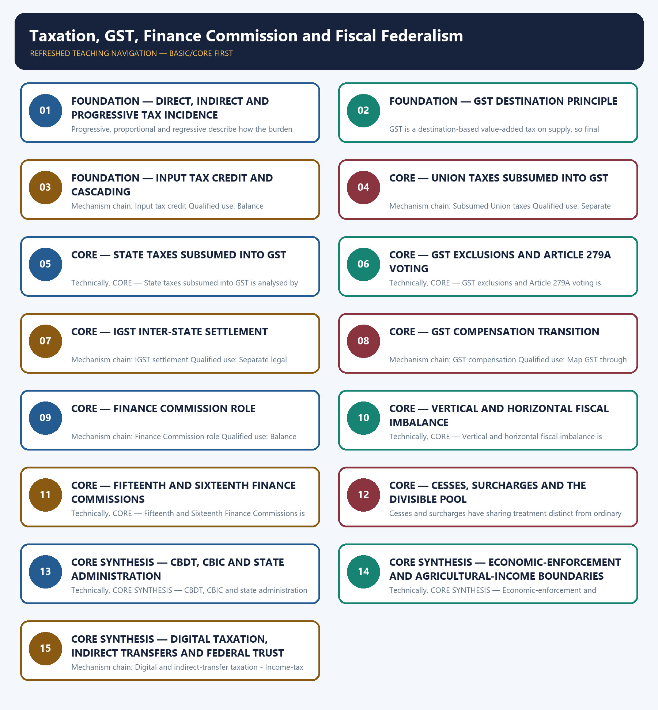

# Taxation, GST, Finance Commission and Fiscal Federalism — Learner-v2 Complete Learning Session

> **Authoring-only generation:** 2026-09-03. No PDF was rendered and no tracker or index was mutated.

### SOURCE, PROGRESSION AND CURRENT-LINKAGE AUDIT

- **Generation date:** 2026-09-03.
- **Repository-first evidence:** the Basic owner is taught first and preserved in full; the Advanced owner is retained only in the optional final teaching block.
- **OCR evidence:** Repository Markdown was primary. OCR-searchable local official General Studies papers were used only to confirm printed routed demands. No answer key, marking scheme, unsupported page precision or current macroeconomic statistic was inferred from them.
- **Qdrant:** not used; repository Markdown and available OCR context were sufficient.
- **PYQ integrity:** Audited ledgers route Mains demands on taxes subsumed in GST and the GST compensation framework, plus objective demands on equalisation levy, GST exemptions, indirect transfers, Fifteenth Finance Commission criteria, enforcement agencies and agricultural-income boundaries. Objective answer letters are not inferred.
- **Live-link boundary:** The Finance Commission live pages were blocked with HTTP 403. The package therefore retains only the owner's explicit XVI-FC period and accepted 41 per cent vertical share and directs the learner to the official report for all other recommendations.
- **Fact/inference discipline:** no current-affairs item, PYQ wording, figure or quotation is invented.

### LIVE OFFICIAL-SOURCE ATTEMPT LOG

The checks below were made on 2026-09-03. Substantive official text is used only for the proposition it actually supports; binary files, dynamic shells, stubs and undated dashboard snippets are recorded but not converted into current claims.

- https://fincomindia.nic.in/asset/doc/commission-reports/16th-FC/16fc-EM.pdf — attempted 2026-09-03; the official action-taken memorandum returned HTTP 403 to the live fetcher, so no recommendation beyond the repository owner's dated award period and accepted vertical share was imported.
- https://fincomindia.nic.in/ — attempted 2026-09-03; the official landing page also returned HTTP 403 to the live fetcher.

## BASIC LEARNING SESSION



*Distinct embedded teaching-navigation image. The separate continuous Cārvāka-style flowchart package remains an independent at-a-glance artifact.*

### SESSION 1 — FOUNDATION — DIRECT, INDIRECT AND PROGRESSIVE TAX INCIDENCE

#### DEFINITION / WHAT THIS IS CALLED

**Plain-language definition:** Mechanism chain: Direct and indirect taxes - Progressivity Qualified use: Separate legal incidence, economic burden, collection mechanism and final revenue assignment.

**Technical definition:** Progressive, proportional and regressive describe how the burden changes relative to income, tax base or ability to pay; statutory rate alone does not establish incidence.

#### ANSWER-GRABBING OPENING — WRITE/ADAPT IN THE EXAM

> Mechanism chain: Direct and indirect taxes - Progressivity Qualified use: Separate legal incidence, economic burden, collection mechanism and final revenue assignment.

#### MUST-WRITE KEYWORDS

- **FOUNDATION**
- **Direct**
- **indirect**
- **progressive tax incidence**
- **Mechanism chain**
- **Qualified use**

**How to use them:** Frame the answer through FOUNDATION; define Direct, connect indirect with progressive tax incidence to explain the mechanism, and use Mechanism chain for the decisive comparison or qualification.

#### VISUAL FIRST

```text
DIRECT, INDIRECT AND PROGRESSIVE TAX INCIDENCE
01. Direct and indirect taxes
    |
    v
02. Progressivity
BOUNDARY -> Tax incidence requires analysing legal liability, shifting and the actual economic burden.
```

*This topic-specific rail fixes the evidence sequence and its exam boundary before analysis.*

#### CORE EXPLANATION

Direct taxes impose legal incidence on income, profit or wealth-related bases, while indirect taxes apply to transactions or consumption and may be shifted through prices. Progressive, proportional and regressive describe how the burden changes relative to income, tax base or ability to pay; statutory rate alone does not establish incidence.

#### NAMED EVIDENCE AND MECHANISM

- Direct taxes impose legal incidence on income, profit or wealth-related bases, while indirect taxes apply to transactions or consumption and may be shifted through prices.
- Progressive, proportional and regressive describe how the burden changes relative to income, tax base or ability to pay; statutory rate alone does not establish incidence.

#### EXAMINER CAUTION

- Tax incidence requires analysing legal liability, shifting and the actual economic burden.

#### EXAM LINK

- **Prelims:** Preserve the exact formula, territorial or resident boundary, price basis, base year, index basket, eligible counterparty, institution and legal status; never upgrade a projection into an actual or a regulatory direction into a universal rule.
- **Mains:** Separate legal incidence, economic burden, collection mechanism and final revenue assignment.

#### MINI RECAP

- **Mechanism chain:** Direct and indirect taxes -> Progressivity
- **Qualified use:** Separate legal incidence, economic burden, collection mechanism and final revenue assignment.

#### CLOSING RECALL FLOW — FOUNDATION — DIRECT, INDIRECT AND PROGRESSIVE TAX INCIDENCE

```text
START / CONCEPT: FOUNDATION — Direct, indirect and progressive tax incidence
        |
        v
EXACT TERMS: FOUNDATION · Direct · indirect · progressive tax incidence · Mechanism chain · Qualified use
        |
        v
MECHANISM / ARGUMENT: Progressive, proportional and regressive describe how the burden changes relative to income, tax base or ability to pay; statutory rate alone does not establish incidence.
        |
        v
CONSEQUENCE / CONTRAST: Tax incidence requires analysing legal liability, shifting and the actual economic burden.
        |
        v
UPSC TRAP / ANSWER-USE: Do not miss this limiting distinction: direct and indirect taxes - Progressivity Qualified use.
        |
        v
ANSWER-GRABBING FORMULATION: Mechanism chain: Direct and indirect taxes - Progressivity Qualified use: Separate legal incidence, economic burden, collection mechanism and final revenue assignment.
```
### SESSION 2 — FOUNDATION — GST DESTINATION PRINCIPLE

#### DEFINITION / WHAT THIS IS CALLED

**Plain-language definition:** Mechanism chain: GST destination principle Qualified use: Map GST through supply, input credit, inter-state settlement and destination revenue.

**Technical definition:** GST is a destination-based value-added tax on supply, so final consumption jurisdiction is central to revenue assignment.

#### ANSWER-GRABBING OPENING — WRITE/ADAPT IN THE EXAM

> Mechanism chain: GST destination principle Qualified use: Map GST through supply, input credit, inter-state settlement and destination revenue.

#### MUST-WRITE KEYWORDS

- **FOUNDATION**
- **GST destination principle**
- **Mechanism chain**
- **Qualified use**
- **GST**
- **Qualified**

**How to use them:** Frame the answer through FOUNDATION; define GST destination principle, connect Mechanism chain with Qualified use to explain the mechanism, and use GST for the decisive comparison or qualification.

#### VISUAL FIRST

```text
GST DESTINATION PRINCIPLE
01. GST destination principle
BOUNDARY -> Do not describe GST as an origin-based production tax.
```

*This topic-specific rail fixes the evidence sequence and its exam boundary before analysis.*

#### CORE EXPLANATION

GST is a destination-based value-added tax on supply, so final consumption jurisdiction is central to revenue assignment.

#### NAMED EVIDENCE AND MECHANISM

- GST is a destination-based value-added tax on supply, so final consumption jurisdiction is central to revenue assignment.

#### EXAMINER CAUTION

- Do not describe GST as an origin-based production tax.

#### EXAM LINK

- **Prelims:** Preserve the exact formula, territorial or resident boundary, price basis, base year, index basket, eligible counterparty, institution and legal status; never upgrade a projection into an actual or a regulatory direction into a universal rule.
- **Mains:** Map GST through supply, input credit, inter-state settlement and destination revenue.

#### MINI RECAP

- **Mechanism chain:** GST destination principle
- **Qualified use:** Map GST through supply, input credit, inter-state settlement and destination revenue.

#### CLOSING RECALL FLOW — FOUNDATION — GST DESTINATION PRINCIPLE

```text
START / CONCEPT: FOUNDATION — GST destination principle
        |
        v
EXACT TERMS: FOUNDATION · GST destination principle · Mechanism chain · Qualified use · GST · Qualified
        |
        v
MECHANISM / ARGUMENT: GST is a destination-based value-added tax on supply, so final consumption jurisdiction is central to revenue assignment.
        |
        v
CONSEQUENCE / CONTRAST: Do not describe GST as an origin-based production tax.
        |
        v
UPSC TRAP / ANSWER-USE: Do not miss this limiting distinction: map GST through supply, input credit, inter-state settlement and destination revenue.
        |
        v
ANSWER-GRABBING FORMULATION: Mechanism chain: GST destination principle Qualified use: Map GST through supply, input credit, inter-state settlement and destination revenue.
```
### SESSION 3 — FOUNDATION — INPUT TAX CREDIT AND CASCADING

#### DEFINITION / WHAT THIS IS CALLED

**Plain-language definition:** Input tax credit reduces cascading only when legal eligibility, invoice and compliance conditions are satisfied.

**Technical definition:** Mechanism chain: Input tax credit Qualified use: Balance harmonisation and equalisation with state autonomy, predictable transfers and accountability.

#### ANSWER-GRABBING OPENING — WRITE/ADAPT IN THE EXAM

> Input tax credit reduces cascading only when legal eligibility, invoice and compliance conditions are satisfied.

#### MUST-WRITE KEYWORDS

- **FOUNDATION**
- **Input tax credit**
- **cascading**
- **Mechanism chain**
- **Qualified use**
- **Input**

**How to use them:** Frame the answer through FOUNDATION; define Input tax credit, connect cascading with Mechanism chain to explain the mechanism, and use Qualified use for the decisive comparison or qualification.

#### VISUAL FIRST

```text
INPUT TAX CREDIT AND CASCADING
01. Input tax credit
BOUNDARY -> Do not equate exemption, zero-rating and input-tax-credit treatment.
```

*This topic-specific rail fixes the evidence sequence and its exam boundary before analysis.*

#### CORE EXPLANATION

Input tax credit reduces cascading only when legal eligibility, invoice and compliance conditions are satisfied.

#### NAMED EVIDENCE AND MECHANISM

- Input tax credit reduces cascading only when legal eligibility, invoice and compliance conditions are satisfied.

#### EXAMINER CAUTION

- Do not equate exemption, zero-rating and input-tax-credit treatment.

#### EXAM LINK

- **Prelims:** Preserve the exact formula, territorial or resident boundary, price basis, base year, index basket, eligible counterparty, institution and legal status; never upgrade a projection into an actual or a regulatory direction into a universal rule.
- **Mains:** Balance harmonisation and equalisation with state autonomy, predictable transfers and accountability.

#### MINI RECAP

- **Mechanism chain:** Input tax credit
- **Qualified use:** Balance harmonisation and equalisation with state autonomy, predictable transfers and accountability.

#### CLOSING RECALL FLOW — FOUNDATION — INPUT TAX CREDIT AND CASCADING

```text
START / CONCEPT: FOUNDATION — Input tax credit and cascading
        |
        v
EXACT TERMS: FOUNDATION · Input tax credit · cascading · Mechanism chain · Qualified use · Input
        |
        v
MECHANISM / ARGUMENT: Mechanism chain: Input tax credit Qualified use: Balance harmonisation and equalisation with state autonomy, predictable transfers and accountability.
        |
        v
CONSEQUENCE / CONTRAST: Do not equate exemption, zero-rating and input-tax-credit treatment.
        |
        v
UPSC TRAP / ANSWER-USE: Do not miss this limiting distinction: input tax credit reduces cascading only when legal eligibility, invoice and compliance conditions are...
        |
        v
ANSWER-GRABBING FORMULATION: Input tax credit reduces cascading only when legal eligibility, invoice and compliance conditions are satisfied.
```
### SESSION 4 — CORE — UNION TAXES SUBSUMED INTO GST

#### DEFINITION / WHAT THIS IS CALLED

**Plain-language definition:** The owner lists Central Excise Duty on covered items, Service Tax, Additional Excise Duties, CVD, SAD and relevant central cesses or surcharges on supply among Union levies subsumed into GST.

**Technical definition:** Mechanism chain: Subsumed Union taxes Qualified use: Separate legal incidence, economic burden, collection mechanism and final revenue assignment.

#### ANSWER-GRABBING OPENING — WRITE/ADAPT IN THE EXAM

> Do not say every pre-GST Union or State levy was subsumed.

#### MUST-WRITE KEYWORDS

- **Union taxes subsumed into GST**
- **Mechanism chain**
- **Qualified use**
- **Central Excise Duty**
- **Service Tax**
- **Additional Excise Duties**

**How to use them:** Frame the answer through Union taxes subsumed into GST; define Mechanism chain, connect Qualified use with Central Excise Duty to explain the mechanism, and use Service Tax for the decisive comparison or qualification.

#### VISUAL FIRST

```text
UNION TAXES SUBSUMED INTO GST
01. Subsumed Union taxes
BOUNDARY -> Do not say every pre-GST Union or State levy was subsumed.
```

*This topic-specific rail fixes the evidence sequence and its exam boundary before analysis.*

#### CORE EXPLANATION

The owner lists Central Excise Duty on covered items, Service Tax, Additional Excise Duties, CVD, SAD and relevant central cesses or surcharges on supply among Union levies subsumed into GST.

#### NAMED EVIDENCE AND MECHANISM

- The owner lists Central Excise Duty on covered items, Service Tax, Additional Excise Duties, CVD, SAD and relevant central cesses or surcharges on supply among Union levies subsumed into GST.

#### EXAMINER CAUTION

- Do not say every pre-GST Union or State levy was subsumed.

#### EXAM LINK

- **Prelims:** Preserve the exact formula, territorial or resident boundary, price basis, base year, index basket, eligible counterparty, institution and legal status; never upgrade a projection into an actual or a regulatory direction into a universal rule.
- **Mains:** Separate legal incidence, economic burden, collection mechanism and final revenue assignment.

#### MINI RECAP

- **Mechanism chain:** Subsumed Union taxes
- **Qualified use:** Separate legal incidence, economic burden, collection mechanism and final revenue assignment.

#### CLOSING RECALL FLOW — CORE — UNION TAXES SUBSUMED INTO GST

```text
START / CONCEPT: CORE — Union taxes subsumed into GST
        |
        v
EXACT TERMS: Union taxes subsumed into GST · Mechanism chain · Qualified use · Central Excise Duty · Service Tax · Additional Excise Duties
        |
        v
MECHANISM / ARGUMENT: Mechanism chain: Subsumed Union taxes Qualified use: Separate legal incidence, economic burden, collection mechanism and final revenue assignment.
        |
        v
CONSEQUENCE / CONTRAST: The owner lists Central Excise Duty on covered items, Service Tax, Additional Excise Duties, CVD, SAD and relevant central cesses or surcharges on supply among Union levies subsumed into GST.
        |
        v
UPSC TRAP / ANSWER-USE: Do not miss this limiting distinction: do not say every pre-GST Union or State levy was subsumed.
        |
        v
ANSWER-GRABBING FORMULATION: Do not say every pre-GST Union or State levy was subsumed.
```
### SESSION 5 — CORE — STATE TAXES SUBSUMED INTO GST

#### DEFINITION / WHAT THIS IS CALLED

**Plain-language definition:** Mechanism chain: Subsumed State taxes Qualified use: Map GST through supply, input credit, inter-state settlement and destination revenue.

**Technical definition:** Technically, CORE — State taxes subsumed into GST is analysed by relating Mechanism chain to Qualified use, then testing the relationship through Subsumed State and Qualified.

#### ANSWER-GRABBING OPENING — WRITE/ADAPT IN THE EXAM

> Mechanism chain: Subsumed State taxes Qualified use: Map GST through supply, input credit, inter-state settlement and destination revenue.

#### MUST-WRITE KEYWORDS

- **Mechanism chain**
- **Qualified use**
- **Subsumed State**
- **Qualified**
- **Map GST**
- **CORE — State taxes subsumed into GST**

**How to use them:** Frame the answer through Mechanism chain; define Qualified use, connect Subsumed State with Qualified to explain the mechanism, and use Map GST for the decisive comparison or qualification.

#### VISUAL FIRST

```text
STATE TAXES SUBSUMED INTO GST
01. Subsumed State taxes
BOUNDARY -> Do not treat petroleum inclusion or rate structure as timeless legal facts.
```

*This topic-specific rail fixes the evidence sequence and its exam boundary before analysis.*

#### CORE EXPLANATION

The owner lists State VAT or Sales Tax, Central Sales Tax as collected, Purchase Tax, specified Entertainment Tax, Octroi or Entry Tax, Luxury Tax and taxes on lotteries, betting and gambling among State levies subsumed into GST.

#### NAMED EVIDENCE AND MECHANISM

- The owner lists State VAT or Sales Tax, Central Sales Tax as collected, Purchase Tax, specified Entertainment Tax, Octroi or Entry Tax, Luxury Tax and taxes on lotteries, betting and gambling among State levies subsumed into GST.

#### EXAMINER CAUTION

- Do not treat petroleum inclusion or rate structure as timeless legal facts.

#### EXAM LINK

- **Prelims:** Preserve the exact formula, territorial or resident boundary, price basis, base year, index basket, eligible counterparty, institution and legal status; never upgrade a projection into an actual or a regulatory direction into a universal rule.
- **Mains:** Map GST through supply, input credit, inter-state settlement and destination revenue.

#### MINI RECAP

- **Mechanism chain:** Subsumed State taxes
- **Qualified use:** Map GST through supply, input credit, inter-state settlement and destination revenue.

#### CLOSING RECALL FLOW — CORE — STATE TAXES SUBSUMED INTO GST

```text
START / CONCEPT: CORE — State taxes subsumed into GST
        |
        v
EXACT TERMS: Mechanism chain · Qualified use · Subsumed State · Qualified · Map GST · CORE — State taxes subsumed into GST
        |
        v
MECHANISM / ARGUMENT: Do not treat petroleum inclusion or rate structure as timeless legal facts.
        |
        v
CONSEQUENCE / CONTRAST: The resulting consequence is that map GST through supply, input credit, inter-state settlement and destination revenue.
        |
        v
UPSC TRAP / ANSWER-USE: Do not miss this limiting distinction: map GST through supply, input credit, inter-state settlement and destination revenue.
        |
        v
ANSWER-GRABBING FORMULATION: Mechanism chain: Subsumed State taxes Qualified use: Map GST through supply, input credit, inter-state settlement and destination revenue.
```
### SESSION 6 — CORE — GST EXCLUSIONS AND ARTICLE 279A VOTING

#### DEFINITION / WHAT THIS IS CALLED

**Plain-language definition:** Mechanism chain: GST exclusions - GST Council voting Qualified use: Balance harmonisation and equalisation with state autonomy, predictable transfers and accountability.

**Technical definition:** Technically, CORE — GST exclusions and Article 279A voting is analysed by relating GST exclusions to Article 279A voting, then testing the relationship through Mechanism chain and Qualified use.

#### ANSWER-GRABBING OPENING — WRITE/ADAPT IN THE EXAM

> Mechanism chain: GST exclusions - GST Council voting Qualified use: Balance harmonisation and equalisation with state autonomy, predictable transfers and accountability.

#### MUST-WRITE KEYWORDS

- **GST exclusions**
- **Article 279A voting**
- **Mechanism chain**
- **Qualified use**
- **Article 279A**
- **Finance Commission**

**How to use them:** Frame the answer through GST exclusions; define Article 279A voting, connect Mechanism chain with Qualified use to explain the mechanism, and use Article 279A for the decisive comparison or qualification.

#### VISUAL FIRST

```text
GST EXCLUSIONS AND ARTICLE 279A VOTING
01. GST exclusions
    |
    v
02. GST Council voting
BOUNDARY -> Do not call the Finance Commission a GST-rate-setting body.
```

*This topic-specific rail fixes the evidence sequence and its exam boundary before analysis.*

#### CORE EXPLANATION

Basic customs duty, stamp duty, property tax, electricity duty and state excise on alcohol for human consumption remain outside GST, while the owner records specified petroleum products as not yet brought under GST at its stated vintage. Article 279A gives the Centre one-third of weighted GST Council votes and states together two-thirds, with at least three-fourths of weighted votes required for a decision.

#### NAMED EVIDENCE AND MECHANISM

- Basic customs duty, stamp duty, property tax, electricity duty and state excise on alcohol for human consumption remain outside GST, while the owner records specified petroleum products as not yet brought under GST at its stated vintage.
- Article 279A gives the Centre one-third of weighted GST Council votes and states together two-thirds, with at least three-fourths of weighted votes required for a decision.

#### EXAMINER CAUTION

- Do not call the Finance Commission a GST-rate-setting body.

#### EXAM LINK

- **Prelims:** Preserve the exact formula, territorial or resident boundary, price basis, base year, index basket, eligible counterparty, institution and legal status; never upgrade a projection into an actual or a regulatory direction into a universal rule.
- **Mains:** Balance harmonisation and equalisation with state autonomy, predictable transfers and accountability.

#### MINI RECAP

- **Mechanism chain:** GST exclusions -> GST Council voting
- **Qualified use:** Balance harmonisation and equalisation with state autonomy, predictable transfers and accountability.

#### CLOSING RECALL FLOW — CORE — GST EXCLUSIONS AND ARTICLE 279A VOTING

```text
START / CONCEPT: CORE — GST exclusions and Article 279A voting
        |
        v
EXACT TERMS: GST exclusions · Article 279A voting · Mechanism chain · Qualified use · Article 279A · Finance Commission
        |
        v
MECHANISM / ARGUMENT: Do not call the Finance Commission a GST-rate-setting body.
        |
        v
CONSEQUENCE / CONTRAST: The resulting consequence is that gST exclusions - GST Council voting Qualified use.
        |
        v
UPSC TRAP / ANSWER-USE: Do not miss this limiting distinction: gST exclusions - GST Council voting Qualified use.
        |
        v
ANSWER-GRABBING FORMULATION: Mechanism chain: GST exclusions - GST Council voting Qualified use: Balance harmonisation and equalisation with state autonomy, predictable transfers and accountability.
```
### SESSION 7 — CORE — IGST INTER-STATE SETTLEMENT

#### DEFINITION / WHAT THIS IS CALLED

**Plain-language definition:** The IGST architecture supports inter-state supply taxation and settlement toward the destination jurisdiction; it must not be described as simple origin-based revenue retention.

**Technical definition:** Mechanism chain: IGST settlement Qualified use: Separate legal incidence, economic burden, collection mechanism and final revenue assignment.

#### ANSWER-GRABBING OPENING — WRITE/ADAPT IN THE EXAM

> The IGST architecture supports inter-state supply taxation and settlement toward the destination jurisdiction; it must not be described as simple origin-based revenue retention.

#### MUST-WRITE KEYWORDS

- **IGST inter-state settlement**
- **Mechanism chain**
- **Qualified use**
- **The IGST**
- **IGST**
- **Qualified**

**How to use them:** Frame the answer through IGST inter-state settlement; define Mechanism chain, connect Qualified use with The IGST to explain the mechanism, and use IGST for the decisive comparison or qualification.

#### VISUAL FIRST

```text
IGST INTER-STATE SETTLEMENT
01. IGST settlement
BOUNDARY -> Do not merge vertical devolution with horizontal distribution.
```

*This topic-specific rail fixes the evidence sequence and its exam boundary before analysis.*

#### CORE EXPLANATION

The IGST architecture supports inter-state supply taxation and settlement toward the destination jurisdiction; it must not be described as simple origin-based revenue retention.

#### NAMED EVIDENCE AND MECHANISM

- The IGST architecture supports inter-state supply taxation and settlement toward the destination jurisdiction; it must not be described as simple origin-based revenue retention.

#### EXAMINER CAUTION

- Do not merge vertical devolution with horizontal distribution.

#### EXAM LINK

- **Prelims:** Preserve the exact formula, territorial or resident boundary, price basis, base year, index basket, eligible counterparty, institution and legal status; never upgrade a projection into an actual or a regulatory direction into a universal rule.
- **Mains:** Separate legal incidence, economic burden, collection mechanism and final revenue assignment.

#### MINI RECAP

- **Mechanism chain:** IGST settlement
- **Qualified use:** Separate legal incidence, economic burden, collection mechanism and final revenue assignment.

#### CLOSING RECALL FLOW — CORE — IGST INTER-STATE SETTLEMENT

```text
START / CONCEPT: CORE — IGST inter-state settlement
        |
        v
EXACT TERMS: IGST inter-state settlement · Mechanism chain · Qualified use · The IGST · IGST · Qualified
        |
        v
MECHANISM / ARGUMENT: Mechanism chain: IGST settlement Qualified use: Separate legal incidence, economic burden, collection mechanism and final revenue assignment.
        |
        v
CONSEQUENCE / CONTRAST: Do not merge vertical devolution with horizontal distribution.
        |
        v
UPSC TRAP / ANSWER-USE: Do not miss this limiting distinction: the IGST architecture supports inter-state supply taxation and settlement toward the destination jurisdiction.
        |
        v
ANSWER-GRABBING FORMULATION: The IGST architecture supports inter-state supply taxation and settlement toward the destination jurisdiction; it must not be described as simple origin-based revenue retention.
```
### SESSION 8 — CORE — GST COMPENSATION TRANSITION

#### DEFINITION / WHAT THIS IS CALLED

**Plain-language definition:** The GST (Compensation to States) Act, 2017 created a five-year 2017-2022 transition guarantee based on 14 per cent annual protected revenue growth over the 2015-16 base; it was not a permanent constitutional entitlement.

**Technical definition:** Mechanism chain: GST compensation Qualified use: Map GST through supply, input credit, inter-state settlement and destination revenue.

#### ANSWER-GRABBING OPENING — WRITE/ADAPT IN THE EXAM

> The GST (Compensation to States) Act, 2017 created a five-year 2017-2022 transition guarantee based on 14 per cent annual protected revenue growth over the 2015-16 base; it was not a permanent constitutional entitlement.

#### MUST-WRITE KEYWORDS

- **GST compensation transition**
- **Mechanism chain**
- **Qualified use**
- **The GST**
- **2017-2022**
- **2015-16**

**How to use them:** Frame the answer through GST compensation transition; define Mechanism chain, connect Qualified use with The GST to explain the mechanism, and use 2017-2022 for the decisive comparison or qualification.

#### VISUAL FIRST

```text
GST COMPENSATION TRANSITION
01. GST compensation
BOUNDARY -> Do not put cesses and surcharges into the divisible pool without qualification.
```

*This topic-specific rail fixes the evidence sequence and its exam boundary before analysis.*

#### CORE EXPLANATION

The GST (Compensation to States) Act, 2017 created a five-year 2017-2022 transition guarantee based on 14 per cent annual protected revenue growth over the 2015-16 base; it was not a permanent constitutional entitlement.

#### NAMED EVIDENCE AND MECHANISM

- The GST (Compensation to States) Act, 2017 created a five-year 2017-2022 transition guarantee based on 14 per cent annual protected revenue growth over the 2015-16 base; it was not a permanent constitutional entitlement.

#### EXAMINER CAUTION

- Do not put cesses and surcharges into the divisible pool without qualification.

#### EXAM LINK

- **Prelims:** Preserve the exact formula, territorial or resident boundary, price basis, base year, index basket, eligible counterparty, institution and legal status; never upgrade a projection into an actual or a regulatory direction into a universal rule.
- **Mains:** Map GST through supply, input credit, inter-state settlement and destination revenue.

#### MINI RECAP

- **Mechanism chain:** GST compensation
- **Qualified use:** Map GST through supply, input credit, inter-state settlement and destination revenue.

#### CLOSING RECALL FLOW — CORE — GST COMPENSATION TRANSITION

```text
START / CONCEPT: CORE — GST compensation transition
        |
        v
EXACT TERMS: GST compensation transition · Mechanism chain · Qualified use · The GST · 2017-2022 · 2015-16
        |
        v
MECHANISM / ARGUMENT: Mechanism chain: GST compensation Qualified use: Map GST through supply, input credit, inter-state settlement and destination revenue.
        |
        v
CONSEQUENCE / CONTRAST: Do not put cesses and surcharges into the divisible pool without qualification.
        |
        v
UPSC TRAP / ANSWER-USE: Do not miss this limiting distinction: the GST (Compensation to States) Act, 2017 created a five-year 2017-2022 transition guarantee based...
        |
        v
ANSWER-GRABBING FORMULATION: The GST (Compensation to States) Act, 2017 created a five-year 2017-2022 transition guarantee based on 14 per cent annual protected revenue growth over the 2015-16 base; it was not a permanent constitutional entitlement.
```
### SESSION 9 — CORE — FINANCE COMMISSION ROLE

#### DEFINITION / WHAT THIS IS CALLED

**Plain-language definition:** The Finance Commission is a constitutional body recommending tax devolution and grants and does not set GST rates.

**Technical definition:** Mechanism chain: Finance Commission role Qualified use: Balance harmonisation and equalisation with state autonomy, predictable transfers and accountability.

#### ANSWER-GRABBING OPENING — WRITE/ADAPT IN THE EXAM

> The Finance Commission is a constitutional body recommending tax devolution and grants and does not set GST rates.

#### MUST-WRITE KEYWORDS

- **Finance Commission role**
- **Mechanism chain**
- **Qualified use**
- **The Finance Commission**
- **GST**
- **ED**

**How to use them:** Frame the answer through Finance Commission role; define Mechanism chain, connect Qualified use with The Finance Commission to explain the mechanism, and use GST for the decisive comparison or qualification.

#### VISUAL FIRST

```text
FINANCE COMMISSION ROLE
01. Finance Commission role
BOUNDARY -> Do not merge ED, DRI and DGGI statutory functions.
```

*This topic-specific rail fixes the evidence sequence and its exam boundary before analysis.*

#### CORE EXPLANATION

The Finance Commission is a constitutional body recommending tax devolution and grants and does not set GST rates.

#### NAMED EVIDENCE AND MECHANISM

- The Finance Commission is a constitutional body recommending tax devolution and grants and does not set GST rates.

#### EXAMINER CAUTION

- Do not merge ED, DRI and DGGI statutory functions.

#### EXAM LINK

- **Prelims:** Preserve the exact formula, territorial or resident boundary, price basis, base year, index basket, eligible counterparty, institution and legal status; never upgrade a projection into an actual or a regulatory direction into a universal rule.
- **Mains:** Balance harmonisation and equalisation with state autonomy, predictable transfers and accountability.

#### MINI RECAP

- **Mechanism chain:** Finance Commission role
- **Qualified use:** Balance harmonisation and equalisation with state autonomy, predictable transfers and accountability.

#### CLOSING RECALL FLOW — CORE — FINANCE COMMISSION ROLE

```text
START / CONCEPT: CORE — Finance Commission role
        |
        v
EXACT TERMS: Finance Commission role · Mechanism chain · Qualified use · The Finance Commission · GST · ED
        |
        v
MECHANISM / ARGUMENT: Mechanism chain: Finance Commission role Qualified use: Balance harmonisation and equalisation with state autonomy, predictable transfers and accountability.
        |
        v
CONSEQUENCE / CONTRAST: Do not merge ED, DRI and DGGI statutory functions.
        |
        v
UPSC TRAP / ANSWER-USE: Do not miss this limiting distinction: the Finance Commission is a constitutional body recommending tax devolution and grants and does...
        |
        v
ANSWER-GRABBING FORMULATION: The Finance Commission is a constitutional body recommending tax devolution and grants and does not set GST rates.
```
### SESSION 10 — CORE — VERTICAL AND HORIZONTAL FISCAL IMBALANCE

#### DEFINITION / WHAT THIS IS CALLED

**Plain-language definition:** Mechanism chain: Vertical and horizontal imbalance Qualified use: Separate legal incidence, economic burden, collection mechanism and final revenue assignment.

**Technical definition:** Technically, CORE — Vertical and horizontal fiscal imbalance is analysed by relating Vertical to horizontal fiscal imbalance, then testing the relationship through Mechanism chain and Qualified use.

#### ANSWER-GRABBING OPENING — WRITE/ADAPT IN THE EXAM

> Mechanism chain: Vertical and horizontal imbalance Qualified use: Separate legal incidence, economic burden, collection mechanism and final revenue assignment.

#### MUST-WRITE KEYWORDS

- **Vertical**
- **horizontal fiscal imbalance**
- **Mechanism chain**
- **Qualified use**
- **Qualified**
- **Separate**

**How to use them:** Frame the answer through Vertical; define horizontal fiscal imbalance, connect Mechanism chain with Qualified use to explain the mechanism, and use Qualified for the decisive comparison or qualification.

#### VISUAL FIRST

```text
VERTICAL AND HORIZONTAL FISCAL IMBALANCE
01. Vertical and horizontal imbalance
BOUNDARY -> Do not quote commission awards, tax rates or statutory status without the period.
```

*This topic-specific rail fixes the evidence sequence and its exam boundary before analysis.*

#### CORE EXPLANATION

Vertical devolution addresses the Union-state resource gap, while horizontal distribution allocates the states' share among states using capacity, need and incentive criteria.

#### NAMED EVIDENCE AND MECHANISM

- Vertical devolution addresses the Union-state resource gap, while horizontal distribution allocates the states' share among states using capacity, need and incentive criteria.

#### EXAMINER CAUTION

- Do not quote commission awards, tax rates or statutory status without the period.

#### EXAM LINK

- **Prelims:** Preserve the exact formula, territorial or resident boundary, price basis, base year, index basket, eligible counterparty, institution and legal status; never upgrade a projection into an actual or a regulatory direction into a universal rule.
- **Mains:** Separate legal incidence, economic burden, collection mechanism and final revenue assignment.

#### MINI RECAP

- **Mechanism chain:** Vertical and horizontal imbalance
- **Qualified use:** Separate legal incidence, economic burden, collection mechanism and final revenue assignment.

#### CLOSING RECALL FLOW — CORE — VERTICAL AND HORIZONTAL FISCAL IMBALANCE

```text
START / CONCEPT: CORE — Vertical and horizontal fiscal imbalance
        |
        v
EXACT TERMS: Vertical · horizontal fiscal imbalance · Mechanism chain · Qualified use · Qualified · Separate
        |
        v
MECHANISM / ARGUMENT: Do not quote commission awards, tax rates or statutory status without the period.
        |
        v
CONSEQUENCE / CONTRAST: The resulting consequence is that vertical and horizontal imbalance Qualified use.
        |
        v
UPSC TRAP / ANSWER-USE: Do not miss this limiting distinction: vertical and horizontal imbalance Qualified use.
        |
        v
ANSWER-GRABBING FORMULATION: Mechanism chain: Vertical and horizontal imbalance Qualified use: Separate legal incidence, economic burden, collection mechanism and final revenue assignment.
```
### SESSION 11 — CORE — FIFTEENTH AND SIXTEENTH FINANCE COMMISSIONS

#### DEFINITION / WHAT THIS IS CALLED

**Plain-language definition:** Mechanism chain: Fifteenth Finance Commission - Sixteenth Finance Commission Qualified use: Map GST through supply, input credit, inter-state settlement and destination revenue.

**Technical definition:** Technically, CORE — Fifteenth and Sixteenth Finance Commissions is analysed by relating Fifteenth to Sixteenth Finance Commissions, then testing the relationship through Mechanism chain and Qualified use.

#### ANSWER-GRABBING OPENING — WRITE/ADAPT IN THE EXAM

> Mechanism chain: Fifteenth Finance Commission - Sixteenth Finance Commission Qualified use: Map GST through supply, input credit, inter-state settlement and destination revenue.

#### MUST-WRITE KEYWORDS

- **Fifteenth**
- **Sixteenth Finance Commissions**
- **Mechanism chain**
- **Qualified use**
- **2026-27**
- **2030-31**

**How to use them:** Frame the answer through Fifteenth; define Sixteenth Finance Commissions, connect Mechanism chain with Qualified use to explain the mechanism, and use 2026-27 for the decisive comparison or qualification.

#### VISUAL FIRST

```text
FIFTEENTH AND SIXTEENTH FINANCE COMMISSIONS
01. Fifteenth Finance Commission
    |
    v
02. Sixteenth Finance Commission
BOUNDARY -> Tax incidence requires analysing legal liability, shifting and the actual economic burden.
```

*This topic-specific rail fixes the evidence sequence and its exam boundary before analysis.*

#### CORE EXPLANATION

The owner records a 41 per cent vertical devolution share for the Fifteenth Finance Commission and criteria including income distance, population, area, forest and ecology, demographic performance and tax effort. The owner records the Sixteenth Finance Commission award period as 2026-27 to 2030-31 and the accepted vertical share as 41 per cent of the divisible pool; other recommendations require the report and action-taken memorandum.

#### NAMED EVIDENCE AND MECHANISM

- The owner records a 41 per cent vertical devolution share for the Fifteenth Finance Commission and criteria including income distance, population, area, forest and ecology, demographic performance and tax effort.
- The owner records the Sixteenth Finance Commission award period as 2026-27 to 2030-31 and the accepted vertical share as 41 per cent of the divisible pool; other recommendations require the report and action-taken memorandum.

#### EXAMINER CAUTION

- Tax incidence requires analysing legal liability, shifting and the actual economic burden.

#### EXAM LINK

- **Prelims:** Preserve the exact formula, territorial or resident boundary, price basis, base year, index basket, eligible counterparty, institution and legal status; never upgrade a projection into an actual or a regulatory direction into a universal rule.
- **Mains:** Map GST through supply, input credit, inter-state settlement and destination revenue.

#### MINI RECAP

- **Mechanism chain:** Fifteenth Finance Commission -> Sixteenth Finance Commission
- **Qualified use:** Map GST through supply, input credit, inter-state settlement and destination revenue.

#### CLOSING RECALL FLOW — CORE — FIFTEENTH AND SIXTEENTH FINANCE COMMISSIONS

```text
START / CONCEPT: CORE — Fifteenth and Sixteenth Finance Commissions
        |
        v
EXACT TERMS: Fifteenth · Sixteenth Finance Commissions · Mechanism chain · Qualified use · 2026-27 · 2030-31
        |
        v
MECHANISM / ARGUMENT: Tax incidence requires analysing legal liability, shifting and the actual economic burden.
        |
        v
CONSEQUENCE / CONTRAST: The resulting consequence is that fifteenth Finance Commission - Sixteenth Finance Commission Qualified use.
        |
        v
UPSC TRAP / ANSWER-USE: Do not miss this limiting distinction: fifteenth Finance Commission - Sixteenth Finance Commission Qualified use.
        |
        v
ANSWER-GRABBING FORMULATION: Mechanism chain: Fifteenth Finance Commission - Sixteenth Finance Commission Qualified use: Map GST through supply, input credit, inter-state settlement and destination revenue.
```
### SESSION 12 — CORE — CESSES, SURCHARGES AND THE DIVISIBLE POOL

#### DEFINITION / WHAT THIS IS CALLED

**Plain-language definition:** Mechanism chain: Cesses and surcharges Qualified use: Balance harmonisation and equalisation with state autonomy, predictable transfers and accountability.

**Technical definition:** Cesses and surcharges have sharing treatment distinct from ordinary divisible-pool taxes and can narrow states' untied share even when gross Union tax collections rise.

#### ANSWER-GRABBING OPENING — WRITE/ADAPT IN THE EXAM

> Mechanism chain: Cesses and surcharges Qualified use: Balance harmonisation and equalisation with state autonomy, predictable transfers and accountability.

#### MUST-WRITE KEYWORDS

- **Cesses**
- **surcharges**
- **the divisible pool**
- **Mechanism chain**
- **Qualified use**
- **Union**

**How to use them:** Frame the answer through Cesses; define surcharges, connect the divisible pool with Mechanism chain to explain the mechanism, and use Qualified use for the decisive comparison or qualification.

#### VISUAL FIRST

```text
CESSES, SURCHARGES AND THE DIVISIBLE POOL
01. Cesses and surcharges
BOUNDARY -> Do not describe GST as an origin-based production tax.
```

*This topic-specific rail fixes the evidence sequence and its exam boundary before analysis.*

#### CORE EXPLANATION

Cesses and surcharges have sharing treatment distinct from ordinary divisible-pool taxes and can narrow states' untied share even when gross Union tax collections rise.

#### NAMED EVIDENCE AND MECHANISM

- Cesses and surcharges have sharing treatment distinct from ordinary divisible-pool taxes and can narrow states' untied share even when gross Union tax collections rise.

#### EXAMINER CAUTION

- Do not describe GST as an origin-based production tax.

#### EXAM LINK

- **Prelims:** Preserve the exact formula, territorial or resident boundary, price basis, base year, index basket, eligible counterparty, institution and legal status; never upgrade a projection into an actual or a regulatory direction into a universal rule.
- **Mains:** Balance harmonisation and equalisation with state autonomy, predictable transfers and accountability.

#### MINI RECAP

- **Mechanism chain:** Cesses and surcharges
- **Qualified use:** Balance harmonisation and equalisation with state autonomy, predictable transfers and accountability.

#### CLOSING RECALL FLOW — CORE — CESSES, SURCHARGES AND THE DIVISIBLE POOL

```text
START / CONCEPT: CORE — Cesses, surcharges and the divisible pool
        |
        v
EXACT TERMS: Cesses · surcharges · the divisible pool · Mechanism chain · Qualified use · Union
        |
        v
MECHANISM / ARGUMENT: Cesses and surcharges have sharing treatment distinct from ordinary divisible-pool taxes and can narrow states' untied share even when gross Union tax collections rise.
        |
        v
CONSEQUENCE / CONTRAST: Do not describe GST as an origin-based production tax.
        |
        v
UPSC TRAP / ANSWER-USE: Do not miss this limiting distinction: balance harmonisation and equalisation with state autonomy, predictable transfers and accountability.
        |
        v
ANSWER-GRABBING FORMULATION: Mechanism chain: Cesses and surcharges Qualified use: Balance harmonisation and equalisation with state autonomy, predictable transfers and accountability.
```
### SESSION 13 — CORE SYNTHESIS — CBDT, CBIC AND STATE ADMINISTRATION

#### DEFINITION / WHAT THIS IS CALLED

**Plain-language definition:** Mechanism chain: Tax administration Qualified use: Separate legal incidence, economic burden, collection mechanism and final revenue assignment.

**Technical definition:** Technically, CORE SYNTHESIS — CBDT, CBIC and state administration is analysed by relating CORE SYNTHESIS to CBDT, then testing the relationship through CBIC and Mechanism chain.

#### ANSWER-GRABBING OPENING — WRITE/ADAPT IN THE EXAM

> Mechanism chain: Tax administration Qualified use: Separate legal incidence, economic burden, collection mechanism and final revenue assignment.

#### MUST-WRITE KEYWORDS

- **CORE SYNTHESIS**
- **CBDT**
- **CBIC**
- **Mechanism chain**
- **Qualified use**
- **Tax**

**How to use them:** Frame the answer through CORE SYNTHESIS; define CBDT, connect CBIC with Mechanism chain to explain the mechanism, and use Qualified use for the decisive comparison or qualification.

#### VISUAL FIRST

```text
CBDT, CBIC AND STATE ADMINISTRATION
01. Tax administration
BOUNDARY -> Do not equate exemption, zero-rating and input-tax-credit treatment.
```

*This topic-specific rail fixes the evidence sequence and its exam boundary before analysis.*

#### CORE EXPLANATION

CBDT administers Union direct taxes, while CBIC and state GST administrations handle indirect-tax and GST functions within their respective legal perimeters.

#### NAMED EVIDENCE AND MECHANISM

- CBDT administers Union direct taxes, while CBIC and state GST administrations handle indirect-tax and GST functions within their respective legal perimeters.

#### EXAMINER CAUTION

- Do not equate exemption, zero-rating and input-tax-credit treatment.

#### EXAM LINK

- **Prelims:** Preserve the exact formula, territorial or resident boundary, price basis, base year, index basket, eligible counterparty, institution and legal status; never upgrade a projection into an actual or a regulatory direction into a universal rule.
- **Mains:** Separate legal incidence, economic burden, collection mechanism and final revenue assignment.

#### MINI RECAP

- **Mechanism chain:** Tax administration
- **Qualified use:** Separate legal incidence, economic burden, collection mechanism and final revenue assignment.

#### CLOSING RECALL FLOW — CORE SYNTHESIS — CBDT, CBIC AND STATE ADMINISTRATION

```text
START / CONCEPT: CORE SYNTHESIS — CBDT, CBIC and state administration
        |
        v
EXACT TERMS: CORE SYNTHESIS · CBDT · CBIC · Mechanism chain · Qualified use · Tax
        |
        v
MECHANISM / ARGUMENT: Do not equate exemption, zero-rating and input-tax-credit treatment.
        |
        v
CONSEQUENCE / CONTRAST: The resulting consequence is that separate legal incidence, economic burden, collection mechanism and final revenue assignment.
        |
        v
UPSC TRAP / ANSWER-USE: Do not miss this limiting distinction: separate legal incidence, economic burden, collection mechanism and final revenue assignment.
        |
        v
ANSWER-GRABBING FORMULATION: Mechanism chain: Tax administration Qualified use: Separate legal incidence, economic burden, collection mechanism and final revenue assignment.
```
### SESSION 14 — CORE SYNTHESIS — ECONOMIC-ENFORCEMENT AND AGRICULTURAL-INCOME BOUNDARIES

#### DEFINITION / WHAT THIS IS CALLED

**Plain-language definition:** Mechanism chain: Economic-enforcement agencies - Agricultural-income boundary Qualified use: Map GST through supply, input credit, inter-state settlement and destination revenue.

**Technical definition:** Technically, CORE SYNTHESIS — Economic-enforcement and agricultural-income boundaries is analysed by relating CORE SYNTHESIS to Economic-enforcement, then testing the relationship through agricultural-income boundaries and Mechanism chain.

#### ANSWER-GRABBING OPENING — WRITE/ADAPT IN THE EXAM

> Mechanism chain: Economic-enforcement agencies - Agricultural-income boundary Qualified use: Map GST through supply, input credit, inter-state settlement and destination revenue.

#### MUST-WRITE KEYWORDS

- **CORE SYNTHESIS**
- **Economic-enforcement**
- **agricultural-income boundaries**
- **Mechanism chain**
- **Qualified use**
- **ED**

**How to use them:** Frame the answer through CORE SYNTHESIS; define Economic-enforcement, connect agricultural-income boundaries with Mechanism chain to explain the mechanism, and use Qualified use for the decisive comparison or qualification.

#### VISUAL FIRST

```text
ECONOMIC-ENFORCEMENT AND AGRICULTURAL-INCOME BOUNDARIES
01. Economic-enforcement agencies
    |
    v
02. Agricultural-income boundary
BOUNDARY -> Do not say every pre-GST Union or State levy was subsumed.
```

*This topic-specific rail fixes the evidence sequence and its exam boundary before analysis.*

#### CORE EXPLANATION

ED, DRI and DGGI function under the Department of Revenue, Ministry of Finance, but their statutory domains are not interchangeable. Allied rural activity is not automatically agricultural income, and rural agricultural land is generally outside the capital-asset definition only subject to statutory conditions.

#### NAMED EVIDENCE AND MECHANISM

- ED, DRI and DGGI function under the Department of Revenue, Ministry of Finance, but their statutory domains are not interchangeable.
- Allied rural activity is not automatically agricultural income, and rural agricultural land is generally outside the capital-asset definition only subject to statutory conditions.

#### EXAMINER CAUTION

- Do not say every pre-GST Union or State levy was subsumed.

#### EXAM LINK

- **Prelims:** Preserve the exact formula, territorial or resident boundary, price basis, base year, index basket, eligible counterparty, institution and legal status; never upgrade a projection into an actual or a regulatory direction into a universal rule.
- **Mains:** Map GST through supply, input credit, inter-state settlement and destination revenue.

#### MINI RECAP

- **Mechanism chain:** Economic-enforcement agencies -> Agricultural-income boundary
- **Qualified use:** Map GST through supply, input credit, inter-state settlement and destination revenue.

#### CLOSING RECALL FLOW — CORE SYNTHESIS — ECONOMIC-ENFORCEMENT AND AGRICULTURAL-INCOME BOUNDARIES

```text
START / CONCEPT: CORE SYNTHESIS — Economic-enforcement and agricultural-income boundaries
        |
        v
EXACT TERMS: CORE SYNTHESIS · Economic-enforcement · agricultural-income boundaries · Mechanism chain · Qualified use · ED
        |
        v
MECHANISM / ARGUMENT: ED, DRI and DGGI function under the Department of Revenue, Ministry of Finance, but their statutory domains are not interchangeable.
        |
        v
CONSEQUENCE / CONTRAST: Allied rural activity is not automatically agricultural income, and rural agricultural land is generally outside the capital-asset definition only subject to statutory conditions.
        |
        v
UPSC TRAP / ANSWER-USE: Do not say every pre-GST Union or State levy was subsumed.
        |
        v
ANSWER-GRABBING FORMULATION: Mechanism chain: Economic-enforcement agencies - Agricultural-income boundary Qualified use: Map GST through supply, input credit, inter-state settlement and destination revenue.
```
### SESSION 15 — CORE SYNTHESIS — DIGITAL TAXATION, INDIRECT TRANSFERS AND FEDERAL TRUST

#### DEFINITION / WHAT THIS IS CALLED

**Plain-language definition:** ✅ GST Council under Article 279A of the Constitution: federal forum for recommendations on the GST framework. ✅ CBIC and state GST administrations: administer indirect taxes, compliance and GST enforcement. ✅ CBDT: administers Union direct taxes. ✅ ED, DRI and DGGI: all function under the Department of Revenue, Ministry of Finance; DRI and DGGI operate in customs/GST enforcement chains, while ED handles its own statutory economic-enforcement domain. ✅ Finance Commission: recommends tax devolution and grants; it does not set GST rates. ✅ Divisible-pool versus cess/surcharge architecture: determines how much of Union tax revenue is shareable with states.

**Technical definition:** Mechanism chain: Digital and indirect-transfer taxation - Income-tax law and federal trust Qualified use: Balance harmonisation and equalisation with state autonomy, predictable transfers and accountability.

#### ANSWER-GRABBING OPENING — WRITE/ADAPT IN THE EXAM

> ⚠️ Progressive direct taxation aids equity, but high complexity, exemptions and enforcement gaps can reduce certainty and compliance. ⚠️ GST reduces cascading and supports a common market, yet invoice matching, refund delays and small-business compliance costs remain significant. ⚠️ Destination-based assignment improves consumption-side fairness, but producing states may still seek compensation or other transfer support during adjustment. ⚠️ Cesses and surcharges give the Union fiscal flexibility, but repeated reliance can shrink the divisible pool and strain federal trust. ⚠️ Finance Commission formulas must balance equalisation with incentives; stronger equalisation can be criticised by richer states, while stronger incentive weights can trouble weaker-capacity states. ⚠️ Enforcement against evasion and money laundering improves integrity, but overlapping agencies, litigation and compliance burdens can raise transaction costs and uncertainty. ⚠️ Subsuming a wide array of central and state indirect taxes simplified the tax map, but a few large levies (petroleum, alcohol, stamp duty, electricity duty) remain outside GST, so the "One Nation One Tax" claim needs this qualification. ⚠️ COVID-era back-to-back borrowing preserved the compensation guarantee's spirit despite a revenue collapse, but it also extended the compensation cess well beyond its original five-year design and left its post-repayment future unsettled.

#### MUST-WRITE KEYWORDS

- **CORE SYNTHESIS**
- **Digital taxation**
- **indirect transfers**
- **federal trust**
- **Mechanism chain**
- **Qualified use**

**How to use them:** Frame the answer through CORE SYNTHESIS; define Digital taxation, connect indirect transfers with federal trust to explain the mechanism, and use Mechanism chain for the decisive comparison or qualification.

#### VISUAL FIRST

```text
DIGITAL TAXATION, INDIRECT TRANSFERS AND FEDERAL TRUST
01. Digital and indirect-transfer taxation
    |
    v
02. Income-tax law and federal trust
BOUNDARY -> Do not treat petroleum inclusion or rate structure as timeless legal facts.
```

*This topic-specific rail fixes the evidence sequence and its exam boundary before analysis.*

#### CORE EXPLANATION

The Equalisation Levy addressed specified non-resident digital services, while indirect-transfer rules can tax offshore share transfers deriving substantial value from Indian assets; both require year-specific legal status. The owner records the Income-tax Act, 2025 and Income-tax Rules, 2026 as commencing on 1 April 2026 while earlier years remain governed by the applicable prior law; sound fiscal federalism also requires predictable transfers, compliance capacity and transparent assignment.

#### NAMED EVIDENCE AND MECHANISM

- The Equalisation Levy addressed specified non-resident digital services, while indirect-transfer rules can tax offshore share transfers deriving substantial value from Indian assets; both require year-specific legal status.
- The owner records the Income-tax Act, 2025 and Income-tax Rules, 2026 as commencing on 1 April 2026 while earlier years remain governed by the applicable prior law; sound fiscal federalism also requires predictable transfers, compliance capacity and transparent assignment.

#### EXAMINER CAUTION

- Do not treat petroleum inclusion or rate structure as timeless legal facts.

#### EXAM LINK

- **Prelims:** Preserve the exact formula, territorial or resident boundary, price basis, base year, index basket, eligible counterparty, institution and legal status; never upgrade a projection into an actual or a regulatory direction into a universal rule.
- **Mains:** Balance harmonisation and equalisation with state autonomy, predictable transfers and accountability.

#### MINI RECAP

- **Mechanism chain:** Digital and indirect-transfer taxation -> Income-tax law and federal trust
- **Qualified use:** Balance harmonisation and equalisation with state autonomy, predictable transfers and accountability.
#### COMPLETE BASIC OWNER EVIDENCE BANK

> **Subject:** Economy | **Tier:** Must-Do (foundation) | **GS Paper:** GS-III + Prelims.
> **Core area:** Taxation and federal finance.
> **Grounded in:** Ramesh Singh, relevant chapters; Economic Survey 2025-26; audited UPSC Economy PYQs (2024-2026 Prelims and 2024-2025 Mains).
> ✅ = source-grounded | ⚠️ = analytical linkage | 📰 = current Survey/current-affairs hook.
> *Companion: `../advanced/10_Taxation-GST-Finance-Commission-and-Fiscal-Federalism.md`.*

#### 1. Visual foundation

```text
1. TAX BASE AND RATE
   |
   v
2. COLLECTION AND INPUT CREDIT
   |
   v
3. UNION-STATE POOLING AND ASSIGNMENT
   |
   v
4. PUBLIC EXPENDITURE
   |
   v
5. EQUITY, EFFICIENCY AND ACCOUNTABILITY
```

**Core proposition:** Combine tax design with federal assignment: who taxes, who receives,
who spends and who is accountable for outcomes.

#### 2. Essential definitions

| Concept | Exam-ready meaning |
|---|---|
| ✅ **Direct tax** | Tax whose legal incidence is imposed directly on income, profit or wealth-related bases. |
| ✅ **Indirect tax** | Tax on transactions or consumption whose burden may be shifted through prices. |
| ✅ **Progressive taxation** | Tax design in which the average burden rises with income or ability to pay. |
| ✅ **GST** | Destination-based value-added tax on supply with input-tax-credit architecture. |
| ✅ **Cess / surcharge** | Additional levy whose sharing treatment differs from ordinary divisible-pool taxes. |
| ✅ **Finance Commission** | Constitutional body recommending tax devolution and grants between Union and states. |
| ✅ **Fiscal federalism** | Assignment of expenditure, revenue, transfers and borrowing across levels of government. |

#### 3. Topic mechanism

1. A tax base, rate and compliance system determine gross liability and behavioural response.
2. Direct taxes work mainly through income and profit bases, while indirect taxes work through transactions and consumption and may be shifted through prices.
3. GST input credit taxes value addition across the chain and assigns revenue mainly to the destination of consumption.
4. Inter-state settlement and the former GST compensation arrangement matter because tax design must also sustain Union-state trust.
5. Union taxes enter divisible or non-divisible categories under constitutional rules before transfers are calculated.
6. The Finance Commission recommends vertical devolution, horizontal distribution and grants, while states and local bodies convert revenue into public services.

#### 4. Institutions and policy tools

- ✅ **GST Council under Article 279A of the Constitution:** federal forum for recommendations on the GST framework.
- ✅ **CBIC and state GST administrations:** administer indirect taxes, compliance and GST enforcement.
- ✅ **CBDT:** administers Union direct taxes.
- ✅ **ED, DRI and DGGI:** all function under the Department of Revenue, Ministry of Finance; DRI and DGGI operate in customs/GST enforcement chains, while ED handles its own statutory economic-enforcement domain.
- ✅ **Finance Commission:** recommends tax devolution and grants; it does not set GST rates.
- ✅ **Divisible-pool versus cess/surcharge architecture:** determines how much of Union tax revenue is shareable with states.

#### 5. Indian applications and examples

- ✅ **Claim:** Direct and indirect taxes distribute burden differently and therefore raise different equity questions. **Named evidence/example:** Personal income tax administered through CBDT is a direct tax instrument, while GST administered by CBIC and state GST authorities is an indirect destination-based tax. **Why it supports the claim:** It helps explain why direct-tax debates emphasise progressivity and ability to pay, whereas GST debates emphasise incidence on consumption, compliance and rate design. **Limit / status caution:** Direct taxes can still be diluted by exemptions and evasion, while indirect taxes can partly protect equity through exemptions, zero-rating or lower rates on essentials.

- ✅ **Claim:** GST is designed around the destination principle, not the origin principle. **Named evidence/example:** The GST Council under **Article 279A** and the inter-state **IGST** settlement architecture assign revenue toward the place of final consumption. **Why it supports the claim:** This is the core constitutional and operational evidence for why GST sought a common market and why consumption states gain revenue relevance. **Limit / status caution:** Producing states may still perceive adjustment costs, and refund/compliance frictions can delay the intended efficiency gains.

- ✅ **Claim:** GST's revenue-neutrality logic can only be judged by naming exactly which pre-GST levies it replaced. **Named evidence/example:** On the Union side, GST subsumed **Central Excise Duty** (except on a few items), **Service Tax**, **Additional Excise Duties**, **Countervailing Duty (CVD)** and **Special Additional Duty (SAD)** on imports, and central surcharges/cesses on the supply of goods and services; on the State side, it subsumed **State VAT/Sales Tax**, **Central Sales Tax** (as collected), **Purchase Tax**, **Entertainment Tax** (other than levies by local bodies), **Octroi and Entry Tax**, **Luxury Tax**, and **taxes on lotteries, betting and gambling**. **Why it supports the claim:** Enumerating the subsumed taxes shows precisely why GST removed cascading (tax-on-tax) across the production-distribution chain and unified a fragmented indirect-tax map into one value-added structure with input-tax credit. **Limit / status caution:** Several levies were **not** subsumed — basic customs duty, stamp duty, property tax, electricity duty and state excise on alcohol for human consumption remain outside GST, and petroleum products (crude, petrol, diesel, ATF, natural gas) are constitutionally keyable into GST but remain outside it as of the latest GST Council position; verify the current petroleum-inclusion status before an exam answer treats it as settled.

- ✅ **Claim:** Compensation was a political mechanism for making GST reform acceptable to states, and its financing had to be redesigned when revenue collapsed. **Named evidence/example:** The **GST (Compensation to States) Act, 2017** guaranteed states a **14% annual revenue growth over the 2015-16 base** for five years (2017-2022), funded by a compensation cess on luxury/sin goods; when the COVID-19 shock created a large compensation shortfall in FY21-FY22, the Centre arranged **"back-to-back" loans of roughly ₹1.1 lakh crore (FY21) and ₹1.59 lakh crore (FY22)** to states, and the compensation cess collection was **extended beyond June 2022 solely to service repayment of these borrowings** (extension notified through March 2026). **Why it supports the claim:** It shows that fiscal federalism is not only about tax design but also about transition assurance, crisis-financing architecture and trust-building between Centre and states. **Limit / status caution:** Compensation was transitional, not permanent; following the GST Council's September 2025 ("GST 2.0") rate rationalisation, the compensation cess was discontinued for most goods (shifted into a new special demerit rate) and continues only on tobacco/pan masala until COVID-loan repayment is complete — treat the cess's post-loan-repayment future (any repurposing) as unsettled and verify against the latest GST Council decision.

- ✅ **Claim:** Cesses and surcharges materially affect fiscal federalism because they do not enter the divisible pool in the same way as ordinary shareable taxes. **Named evidence/example:** Levies such as the **Health and Education Cess** illustrate how the Union can raise resources outside the ordinary divisible-pool route. **Why it supports the claim:** This distinction is central to answers on why gross tax growth does not automatically translate into equivalent untied resources for states. **Limit / status caution:** Cesses can support targeted Union priorities, but repeated reliance may narrow state fiscal space and strain federal trust.

- ✅ **Claim:** Finance Commission design is the core constitutional response to both vertical and horizontal imbalances. **Named evidence/example:** The **Fifteenth Finance Commission** maintained **41%** vertical devolution and used criteria such as income distance, population, area, forest and ecology, demographic performance and tax effort in horizontal distribution. **Why it supports the claim:** This named evidence shows why federal transfers must balance equalisation with incentives instead of using a single formula goal. **Limit / status caution:** No criteria mix satisfies all states; richer states may criticise equalisation weight, while poorer states may resist stronger incentive weight.

- ✅ **Claim:** Fiscal federalism is periodically recalibrated rather than settled once and for all. **Named evidence/example:** The **Sixteenth Finance Commission** was constituted for the period following the Fifteenth Finance Commission's award period, and later official award/action-taken documents govern the next phase. **Why it supports the claim:** It demonstrates that devolution, grants and federal priorities are periodically revisited instead of being frozen permanently. **Limit / status caution:** For composition, timelines or report-status details, use the latest official Finance Commission documents rather than unsourced commentary.

- ✅ **Claim:** Indian taxation adapts to cross-border digital and capital arrangements. **Named evidence/example:** The **Equalisation Levy** on specified non-resident digital services and the Indian tax treatment of **indirect transfer** of offshore shares deriving substantial value from Indian assets. **Why it supports the claim:** These are strong named examples showing that direct-tax policy now looks beyond simple domestic income to digital presence and offshore structuring. **Limit / status caution:** Such rules can raise treaty, valuation and litigation complexity, so analytical answers must mention certainty and administrability.

#### 6A. Limitations and trade-offs

- ⚠️ Progressive direct taxation aids equity, but high complexity, exemptions and enforcement gaps can reduce certainty and compliance.
- ⚠️ GST reduces cascading and supports a common market, yet invoice matching, refund delays and small-business compliance costs remain significant.
- ⚠️ Destination-based assignment improves consumption-side fairness, but producing states may still seek compensation or other transfer support during adjustment.
- ⚠️ Cesses and surcharges give the Union fiscal flexibility, but repeated reliance can shrink the divisible pool and strain federal trust.
- ⚠️ Finance Commission formulas must balance equalisation with incentives; stronger equalisation can be criticised by richer states, while stronger incentive weights can trouble weaker-capacity states.
- ⚠️ Enforcement against evasion and money laundering improves integrity, but overlapping agencies, litigation and compliance burdens can raise transaction costs and uncertainty.
- ⚠️ Subsuming a wide array of central and state indirect taxes simplified the tax map, but a few large levies (petroleum, alcohol, stamp duty, electricity duty) remain outside GST, so the "One Nation One Tax" claim needs this qualification.
- ⚠️ COVID-era back-to-back borrowing preserved the compensation guarantee's spirit despite a revenue collapse, but it also extended the compensation cess well beyond its original five-year design and left its post-repayment future unsettled.

#### 6. Must-Know Facts for Prelims

- ✅ Progressive, proportional and regressive describe how tax burden changes relative to the tax base or ability to pay.
- ✅ Direct taxes and indirect taxes differ in legal incidence and in the ease with which burden may be shifted.
- ✅ GST is destination-based: final consumption jurisdiction is central to revenue assignment.
- ✅ Input tax credit reduces cascading when compliant value-chain invoices are matched under law.
- ✅ GST subsumed Central Excise Duty, Service Tax, CVD, SAD and central cesses/surcharges on supply (Union side) and State VAT/Sales Tax, Central Sales Tax, Purchase Tax, Entertainment Tax (non-local-body), Octroi/Entry Tax, Luxury Tax and betting/gambling/lottery taxes (State side); petroleum products, alcohol for human consumption, stamp duty and electricity duty remain outside GST.
- ✅ The GST Council is a constitutional federal forum under **Article 279A**; it is not the Finance Commission.
- ✅ Under Article 279A, the Centre has one-third of weighted GST Council votes and states together have two-thirds; a decision needs at least three-fourths of weighted votes.
- ✅ The **2017-2022** GST compensation guarantee (14% assured growth over the 2015-16 base) was a five-year transitional arrangement for states, not a permanent feature of Indian federal finance; COVID-19 back-to-back loans (~₹1.1 lakh crore FY21 + ~₹1.59 lakh crore FY22) extended compensation-cess collection beyond 2022 solely for loan repayment, and the September 2025 GST 2.0 reform discontinued the cess on most goods.
- ✅ The Finance Commission addresses **vertical** (Centre-state) and **horizontal** (inter-state) fiscal imbalances through recommendations.
- ✅ Cesses and surcharges have different sharing implications from taxes in the divisible pool and typically remain outside that pool.
- ✅ The Fifteenth Finance Commission used criteria such as income distance, population, area, forest and ecology, demographic performance and tax effort in horizontal devolution.
- ✅ The Sixteenth Finance Commission is the current commission for the period following the Fifteenth Finance Commission's award period; use the latest official documents for evolving status details.
- ✅ Allied activities are not automatically agricultural income, and rural agricultural land is generally kept outside the capital-asset definition subject to statutory conditions.
- ✅ Equalisation Levy targeted specified non-resident digital services, and indirect-transfer rules can tax offshore share transfers deriving substantial value from Indian assets.
- ✅ ED, DRI and DGGI operate under the Department of Revenue, Ministry of Finance.
- ✅ Not every supply is taxed identically under GST: exemptions and zero-rating exist by law or notification, and alcohol for human consumption remains outside GST.

#### 7. UPSC traps

- ❌ GST is an origin-based production tax. -> It is designed as a destination-based consumption tax.
- ❌ The Finance Commission sets GST rates. -> GST Council processes and tax laws govern rates; Finance Commission recommends transfers.
- ❌ Agricultural income includes every rural allied business. -> Allied activities are not automatically agricultural income merely because they are rural.
- ❌ A higher tax rate always raises revenue. -> Behaviour, compliance, exemptions and the base matter.
- ❌ All Union tax receipts enter the divisible pool identically. -> Constitutional treatment of cesses and surcharges differs.
- ❌ GST compensation to states is a permanent constitutional entitlement. -> The 2017-2022 compensation guarantee was a transitional arrangement.
- ❌ All GST exemptions and zero-rated supplies are the same thing. -> Legal treatment and credit consequences differ.

#### 8. 📰 Economic Survey 2025-26 / current anchor

- 📰 The 56th GST Council reform took effect from 22 Sep 2025 with broad 5% and 18% rates and a special 40% demerit rate for specified supplies; separately notified tobacco/cess treatment must not be collapsed into the two-rate shorthand.
- 📰 Economic Survey 2025-26 highlights stronger direct-tax compliance; do not quote the return-count comparison without its underlying periods.
- 📰 Revenue receipts averaged 9.1% of GDP in FY22-FY25, compared with 8.5% in FY16-FY20.
- 📰 The **Income-tax Act, 2025** and Income-tax Rules, 2026 commenced from **1 April 2026**. The 1961 Act remains relevant to earlier years and their proceedings; commencement and changed tax rates are separate questions. [Income-tax Department notification](https://www.incometax.gov.in/iec/foportal/sites/default/files/2026-03/En-Notified-IT-Rules-2026-20-03-2026.pdf).
- 📰 The **Sixteenth Finance Commission** award covers 2026-27 to 2030-31. The accepted vertical share remains **41% of the divisible pool**; use the report/action-taken memorandum for horizontal criteria and grants. [Official action-taken memorandum](https://fincomindia.nic.in/asset/doc/commission-reports/16th-FC/16fc-EM.pdf).

⚠️ **Status caution:** For 16th Finance Commission details beyond the award period and accepted vertical share stated above, rely on the latest official report/action-taken memorandum rather than unsourced commentary on composition or timelines.

⚠️ **Interpretation caution:** A formally uniform rate can have unequal incidence because consumption baskets, informality and state fiscal capacity differ.

#### 9. PYQ application

- ⚠️ 2025 Prelims tested agricultural income and rural agricultural land under income-tax concepts.
- ⚠️ 2025 GS-III Fiscal Health Index invites comparison of state revenue effort and expenditure quality.
- ✅ **2025 Prelims Q66:** directly tested Fifteenth Finance Commission propositions—41% (not 45%) devolution, education/agriculture-performance grants and reintroduced tax effort. See `../README.md`.
- ⚠️ Historical PYQs also require recall of equalisation levy, GST exemptions, indirect-transfer rules and the parent ministries of ED, DRI and DGGI.

#### 10. Mains angles

- ⚠️ Structure tax answers around buoyancy, equity, neutrality, compliance and federal trust.
- ⚠️ For GST discuss cascading reduction, common market, destination principle, compensation politics, rate complexity and small-business compliance.
- ⚠️ For fiscal federalism connect assignments, devolution, grants, cesses/surcharges, borrowing discipline and local-body finance.
- ⚠️ Use direct-tax examples such as equalisation levy or indirect-transfer rules to show why globalisation complicates tax sovereignty.

> **Answer thesis:** Combine tax design with federal assignment: who taxes, who receives, who spends and who is accountable for outcomes.

#### 11. Probable questions

- ⚠️ **Prelims:** Distinguish GST Council, Finance Commission, CBDT, CBIC, ED, DRI and DGGI by constitutional status and function.
- ⚠️ **Mains (10 marks):** How does destination-based taxation alter the geography of indirect-tax revenue?
- ⚠️ **Mains (15 marks):** Examine whether India's fiscal federal architecture adequately balances state autonomy, equalisation and national harmonisation.
- ⚠️ **Mains (20 marks):** Should India rely less on cesses and surcharges if cooperative fiscal federalism is to deepen?

#### 11A. Answer architecture (10/15/20-mark support)

- ⚠️ **Directive decoder - Discuss:** Start with direct-versus-indirect and progressive-versus-regressive distinctions, then move to GST design and fiscal-federal assignment.
- ⚠️ **Directive decoder - Examine / Analyse:** Trace the chain from tax design to revenue collection, divisible-pool sharing, state finances, incentives and accountability.
- ⚠️ **Directive decoder - Critically examine / Evaluate:** Balance common-market gains, cascading reduction and harmonisation against compliance burden, compensation disputes, divisible-pool shrinkage and interstate tensions.
- ⚠️ **Directive decoder - Compare / Justify:** Compare direct-progressive taxation with destination-based indirect taxation, or justify whether cesses and surcharges should remain outside the divisible pool.
- ⚠️ **Evidence chain:** Use CBDT income-tax versus GST contrast, Article 279A plus IGST settlement, the enumerated subsumed-taxes list, the 2017-2022 GST compensation guarantee and its COVID-era back-to-back-loan extension, the Health and Education Cess/divisible-pool distinction, Fifteenth and Sixteenth Finance Commission evidence, and equalisation-levy/indirect-transfer examples.
- ⚠️ **Counter-evidence:** Pull balancing material from **6A. Limitations and trade-offs** on compliance cost, producing-state concerns, cess dependence, formula tensions and enforcement frictions.
- ⚠️ **10/15/20-mark scaling:** For 10 marks, use a thesis plus 2-3 evidence units; for 15 marks, use 4-5 evidence units with one counter-dimension; for 20 marks, use 5-6 evidence units with full balance on equity, efficiency, federal trust and conclusion nuance.
- ⚠️ **Reasoned verdict template:** India's tax architecture is strongest when progressive direct taxation, destination-based GST and predictable intergovernmental sharing work together rather than at cross-purposes.

#### 12. Study links

- ✅ Advanced companion: `../advanced/10_Taxation-GST-Finance-Commission-and-Fiscal-Federalism.md`.
- ✅ `09_Union-Budget-Fiscal-Policy-and-Deficit-Indicators.md` — revenue, deficits and expenditure.
- ✅ `18_Infrastructure-PPPs-Logistics-and-Public-Investment.md` — state capex and public-service delivery.
- ✅ `23_Poverty-Inequality-Social-Sector-and-Inclusive-Growth.md` — progressivity and benefit incidence.


<!-- BEGIN GENERATED PYQ INTEGRATION: 2024-2025 -->

#### Recent PYQ Integration (2024-2025)

> **Status:** 2024-2025 question-level PYQ demand is integrated into this owner.
> **Provenance:** Audited local official-paper routing ledgers: `_PYQ-ROUTING-PRELIMS-2024-2025.md`.
> **Answer-key rule:** The official 2024-2025 Prelims Set-A keys are present in the repository and CSAT Set-A keys are supplied; even so, no option or answer is recorded or inferred in this integration.

- **Years represented:** 2025
- **Paper(s):** Prelims GS-I
- **Routed question demands:** 2

| Year | Paper | Q | PYQ demand (neutral rendering) | Directive / format | Source status | Owner requirement |
|---:|---|---|---|---|---|---|
| 2025 | Prelims GS-I | 3 | Enforcement agencies (ED, DRI, DGGI) and their parent ministries | Objective question; official Set-A key available locally, answer not inferred | Key available locally (official Set-A answer key present); answer not recorded here | Cover the named fact/concept and its likely statement-level distinctions. |
| 2025 | Prelims GS-I | 5 | Taxation of allied agricultural income; rural agricultural land as a capital asset | Objective question; official Set-A key available locally, answer not inferred | Key available locally (official Set-A answer key present); answer not recorded here | Cover the named fact/concept and its likely statement-level distinctions. |

##### What this owner must now support

- Enforcement agencies (ED, DRI, DGGI) and their parent ministries
- Taxation of allied agricultural income; rural agricultural land as a capital asset

> This block integrates the 2024-2025 examinable demand and paper metadata. It is kept separate from the 2018-2023 block and does not convert an unkeyed/answer-free objective question into a solved answer.
<!-- END GENERATED PYQ INTEGRATION: 2024-2025 -->

<!-- BEGIN GENERATED PYQ INTEGRATION: 2018-2023 -->

#### Historical PYQ Integration (2018-2023)

> **Status:** Question-level PYQ demand is integrated into this owner.
> **Provenance:** Audited local official-paper routing ledgers: `_PYQ-ROUTING-MAINS-GS3-GS4-2018-2023.md`, `_PYQ-ROUTING-PRELIMS-2018-2023.md`.
> **Answer-key rule:** The official 2018-2023 Prelims/CSAT keys are not held locally; no option or answer has been inferred.

- **Years represented:** 2018, 2019, 2020, 2022, 2023
- **Paper(s):** GS-III, Prelims GS-I
- **Routed question demands:** 6

| Year | Paper | Q | PYQ demand (neutral rendering) | Directive / format | Source status | Owner requirement |
|---:|---|---:|---|---|---|---|
| 2018 | Prelims GS-I | 8 | Equalization tax on non-resident online advertising services India | Objective question; official key unavailable locally | Routed; key unavailable locally | Cover the named fact/concept and its likely statement-level distinctions. |
| 2018 | Prelims GS-I | 97 | Items exempted under Goods and Services Tax India | Objective question; official key unavailable locally | Routed; key unavailable locally | Cover the named fact/concept and its likely statement-level distinctions. |
| 2019 | GS-III | 1 | Indirect taxes subsumed in GST and revenue implications | Enumerate · 10 marks · 150 words | Routed to owning topic | Prepare context, core dimensions, evidence/examples, counterpoint and a concise conclusion. |
| 2020 | GS-III | 12 | GST Compensation to States Act 2017 and COVID-19 impact | Explain · 15 marks · 250 words | Routed to owning topic | Prepare context, core dimensions, evidence/examples, counterpoint and a concise conclusion. |
| 2022 | Prelims GS-I | 8 | Indirect transfer of shares and assets taxation India | Objective question; official key unavailable locally | Routed; key unavailable locally | Cover the named fact/concept and its likely statement-level distinctions. |
| 2023 | Prelims GS-I | 29 | Fifteenth Finance Commission horizontal tax devolution criteria | Objective question; official key unavailable locally | Routed; key unavailable locally | Cover the named fact/concept and its likely statement-level distinctions. |

##### What this owner must now support

- Equalization tax on non-resident online advertising services India
- Items exempted under Goods and Services Tax India
- Indirect taxes subsumed in GST and revenue implications
- GST Compensation to States Act 2017 and COVID-19 impact
- Indirect transfer of shares and assets taxation India
- Fifteenth Finance Commission horizontal tax devolution criteria

> The table integrates the examinable demand and paper metadata. It does not turn an unkeyed objective question into a solved answer, and it does not claim that lexical presence alone proves full conceptual sufficiency.
<!-- END GENERATED PYQ INTEGRATION: 2018-2023 -->

#### CLOSING RECALL FLOW — CORE SYNTHESIS — DIGITAL TAXATION, INDIRECT TRANSFERS AND FEDERAL TRUST

```text
START / CONCEPT: CORE SYNTHESIS — Digital taxation, indirect transfers and federal trust
        |
        v
EXACT TERMS: CORE SYNTHESIS · Digital taxation · indirect transfers · federal trust · Mechanism chain · Qualified use
        |
        v
MECHANISM / ARGUMENT: Mechanism chain: Digital and indirect-transfer taxation - Income-tax law and federal trust Qualified use: Balance harmonisation and equalisation with state autonomy, predictable transfers and accountability.
        |
        v
CONSEQUENCE / CONTRAST: ✅ Progressive, proportional and regressive describe how tax burden changes relative to the tax base or ability to pay. ✅ Direct taxes and indirect taxes differ in legal incidence and in the ease with which burden may be shifted. ✅ GST is destination-based: final consumption jurisdiction is central to revenue assignment. ✅ Input tax credit reduces cascading when compliant value-chain invoices are matched under law. ✅ GST subsumed Central Excise Duty, Service Tax, CVD, SAD and central cesses/surcharges on supply (Union side) and State VAT/Sales Tax, Central Sales Tax, Purchase Tax, Entertainment Tax (non-local-body), Octroi/Entry Tax, Luxury Tax and betting/gambling/lottery taxes (State side); petroleum products, alcohol for human consumption, stamp duty and electricity duty remain outside GST. ✅ The GST Council is a constitutional federal forum under Article 279A; it is not the Finance Commission. ✅ Under Article 279A, the Centre has one-third of weighted GST Council votes and states together have two-thirds; a decision needs at least three-fourths of weighted votes. ✅ The 2017-2022 GST compensation guarantee (14% assured growth over the 2015-16 base) was a five-year transitional arrangement for states, not a permanent feature of Indian federal finance; COVID-19 back-to-back loans (~₹1.1 lakh crore FY21 + ~₹1.59 lakh crore FY22) extended compensation-cess collection beyond 2022 solely for loan repayment, and the September 2025 GST 2.0 reform discontinued the cess on most goods. ✅ The Finance Commission addresses vertical (Centre-state) and horizontal (inter-state) fiscal imbalances through recommendations. ✅ Cesses and surcharges have different sharing implications from taxes in the divisible pool and typically remain outside that pool. ✅ The Fifteenth Finance Commission used criteria such as income distance, population, area, forest and ecology, demographic performance and tax effort in horizontal devolution. ✅ The Sixteenth Finance Commission is the current commission for the period following the Fifteenth Finance Commission's award period; use the latest official documents for evolving status details. ✅ Allied activities are not automatically agricultural income, and rural agricultural land is generally kept outside the capital-asset definition subject to statutory conditions. ✅ Equalisation Levy targeted specified non-resident digital services, and indirect-transfer rules can tax offshore share transfers deriving substantial value from Indian assets. ✅ ED, DRI and DGGI operate under the Department of Revenue, Ministry of Finance. ✅ Not every supply is taxed identically under GST: exemptions and zero-rating exist by law or notification, and alcohol for human consumption remains outside GST.
        |
        v
UPSC TRAP / ANSWER-USE: Limit / status caution: Cesses can support targeted Union priorities, but repeated reliance may narrow state fiscal space and strain federal trust.
        |
        v
ANSWER-GRABBING FORMULATION: ⚠️ Progressive direct taxation aids equity, but high complexity, exemptions and enforcement gaps can reduce certainty and compliance. ⚠️ GST reduces cascading and supports a common market, yet invoice matching, refund delays and small-business compliance costs remain significant. ⚠️ Destination-based assignment improves consumption-side fairness, but producing states may still seek compensation or other transfer support during adjustment. ⚠️ Cesses and surcharges give the Union fiscal flexibility, but repeated reliance can shrink the divisible pool and strain federal trust. ⚠️ Finance Commission formulas must balance equalisation with incentives; stronger equalisation can be criticised by richer states, while stronger incentive weights can trouble weaker-capacity states. ⚠️ Enforcement against evasion and money laundering improves integrity, but overlapping agencies, litigation and compliance burdens can raise transaction costs and uncertainty. ⚠️ Subsuming a wide array of central and state indirect taxes simplified the tax map, but a few large levies (petroleum, alcohol, stamp duty, electricity duty) remain outside GST, so the "One Nation One Tax" claim needs this qualification. ⚠️ COVID-era back-to-back borrowing preserved the compensation guarantee's spirit despite a revenue collapse, but it also extended the compensation cess well beyond its original five-year design and left its post-repayment future unsettled.
```
## BASIC MCQS / REMEDIATION

### Q1. Which statement correctly identifies Direct and indirect taxes?

A. Direct taxes impose legal incidence on income, profit or wealth-related bases, while indirect taxes apply to transactions or consumption and may be shifted through prices.
B. Progressive, proportional and regressive describe how the burden changes relative to income, tax base or ability to pay; statutory rate alone does not establish incidence.
C. Input tax credit reduces cascading only when legal eligibility, invoice and compliance conditions are satisfied.
D. GST is a destination-based value-added tax on supply, so final consumption jurisdiction is central to revenue assignment.

**Answer: A.**
**Explanation:** Direct taxes impose legal incidence on income, profit or wealth-related bases, while indirect taxes apply to transactions or consumption and may be shifted through prices. The other options belong to different measures, vintages, baskets, instruments, institutions or legal perimeters.

### Q2. Which option preserves the accounting or regulatory boundary of Direct and indirect taxes?

A. GST is a destination-based value-added tax on supply, so final consumption jurisdiction is central to revenue assignment.
B. Direct taxes impose legal incidence on income, profit or wealth-related bases, while indirect taxes apply to transactions or consumption and may be shifted through prices.
C. The owner lists Central Excise Duty on covered items, Service Tax, Additional Excise Duties, CVD, SAD and relevant central cesses or surcharges on supply among Union levies subsumed into GST.
D. Input tax credit reduces cascading only when legal eligibility, invoice and compliance conditions are satisfied.

**Answer: B.**
**Explanation:** Direct taxes impose legal incidence on income, profit or wealth-related bases, while indirect taxes apply to transactions or consumption and may be shifted through prices. The other options belong to different measures, vintages, baskets, instruments, institutions or legal perimeters.

### Q3. Which statement uses Direct and indirect taxes without losing its vintage, basket or legal status?

A. The owner lists State VAT or Sales Tax, Central Sales Tax as collected, Purchase Tax, specified Entertainment Tax, Octroi or Entry Tax, Luxury Tax and taxes on lotteries, betting and gambling among State levies subsumed into GST.
B. Input tax credit reduces cascading only when legal eligibility, invoice and compliance conditions are satisfied.
C. Direct taxes impose legal incidence on income, profit or wealth-related bases, while indirect taxes apply to transactions or consumption and may be shifted through prices.
D. The owner lists Central Excise Duty on covered items, Service Tax, Additional Excise Duties, CVD, SAD and relevant central cesses or surcharges on supply among Union levies subsumed into GST.

**Answer: C.**
**Explanation:** Direct taxes impose legal incidence on income, profit or wealth-related bases, while indirect taxes apply to transactions or consumption and may be shifted through prices. The other options belong to different measures, vintages, baskets, instruments, institutions or legal perimeters.

### Q4. Which option avoids the standard UPSC close-option trap about Direct and indirect taxes?

A. The owner lists Central Excise Duty on covered items, Service Tax, Additional Excise Duties, CVD, SAD and relevant central cesses or surcharges on supply among Union levies subsumed into GST.
B. The owner lists State VAT or Sales Tax, Central Sales Tax as collected, Purchase Tax, specified Entertainment Tax, Octroi or Entry Tax, Luxury Tax and taxes on lotteries, betting and gambling among State levies subsumed into GST.
C. Basic customs duty, stamp duty, property tax, electricity duty and state excise on alcohol for human consumption remain outside GST, while the owner records specified petroleum products as not yet brought under GST at its stated vintage.
D. Direct taxes impose legal incidence on income, profit or wealth-related bases, while indirect taxes apply to transactions or consumption and may be shifted through prices.

**Answer: D.**
**Explanation:** Direct taxes impose legal incidence on income, profit or wealth-related bases, while indirect taxes apply to transactions or consumption and may be shifted through prices. The other options belong to different measures, vintages, baskets, instruments, institutions or legal perimeters.

### Q5. Which statement correctly identifies Progressivity?

A. Progressive, proportional and regressive describe how the burden changes relative to income, tax base or ability to pay; statutory rate alone does not establish incidence.
B. The owner lists Central Excise Duty on covered items, Service Tax, Additional Excise Duties, CVD, SAD and relevant central cesses or surcharges on supply among Union levies subsumed into GST.
C. GST is a destination-based value-added tax on supply, so final consumption jurisdiction is central to revenue assignment.
D. Input tax credit reduces cascading only when legal eligibility, invoice and compliance conditions are satisfied.

**Answer: A.**
**Explanation:** Progressive, proportional and regressive describe how the burden changes relative to income, tax base or ability to pay; statutory rate alone does not establish incidence. The other options belong to different measures, vintages, baskets, instruments, institutions or legal perimeters.

### Q6. Which option preserves the accounting or regulatory boundary of Progressivity?

A. The owner lists Central Excise Duty on covered items, Service Tax, Additional Excise Duties, CVD, SAD and relevant central cesses or surcharges on supply among Union levies subsumed into GST.
B. Progressive, proportional and regressive describe how the burden changes relative to income, tax base or ability to pay; statutory rate alone does not establish incidence.
C. Input tax credit reduces cascading only when legal eligibility, invoice and compliance conditions are satisfied.
D. The owner lists State VAT or Sales Tax, Central Sales Tax as collected, Purchase Tax, specified Entertainment Tax, Octroi or Entry Tax, Luxury Tax and taxes on lotteries, betting and gambling among State levies subsumed into GST.

**Answer: B.**
**Explanation:** Progressive, proportional and regressive describe how the burden changes relative to income, tax base or ability to pay; statutory rate alone does not establish incidence. The other options belong to different measures, vintages, baskets, instruments, institutions or legal perimeters.

### Q7. Which statement uses Progressivity without losing its vintage, basket or legal status?

A. Basic customs duty, stamp duty, property tax, electricity duty and state excise on alcohol for human consumption remain outside GST, while the owner records specified petroleum products as not yet brought under GST at its stated vintage.
B. The owner lists State VAT or Sales Tax, Central Sales Tax as collected, Purchase Tax, specified Entertainment Tax, Octroi or Entry Tax, Luxury Tax and taxes on lotteries, betting and gambling among State levies subsumed into GST.
C. Progressive, proportional and regressive describe how the burden changes relative to income, tax base or ability to pay; statutory rate alone does not establish incidence.
D. The owner lists Central Excise Duty on covered items, Service Tax, Additional Excise Duties, CVD, SAD and relevant central cesses or surcharges on supply among Union levies subsumed into GST.

**Answer: C.**
**Explanation:** Progressive, proportional and regressive describe how the burden changes relative to income, tax base or ability to pay; statutory rate alone does not establish incidence. The other options belong to different measures, vintages, baskets, instruments, institutions or legal perimeters.

### Q8. Which option avoids the standard UPSC close-option trap about Progressivity?

A. The owner lists State VAT or Sales Tax, Central Sales Tax as collected, Purchase Tax, specified Entertainment Tax, Octroi or Entry Tax, Luxury Tax and taxes on lotteries, betting and gambling among State levies subsumed into GST.
B. Article 279A gives the Centre one-third of weighted GST Council votes and states together two-thirds, with at least three-fourths of weighted votes required for a decision.
C. Basic customs duty, stamp duty, property tax, electricity duty and state excise on alcohol for human consumption remain outside GST, while the owner records specified petroleum products as not yet brought under GST at its stated vintage.
D. Progressive, proportional and regressive describe how the burden changes relative to income, tax base or ability to pay; statutory rate alone does not establish incidence.

**Answer: D.**
**Explanation:** Progressive, proportional and regressive describe how the burden changes relative to income, tax base or ability to pay; statutory rate alone does not establish incidence. The other options belong to different measures, vintages, baskets, instruments, institutions or legal perimeters.

### Q9. Which statement correctly identifies GST destination principle?

A. GST is a destination-based value-added tax on supply, so final consumption jurisdiction is central to revenue assignment.
B. Input tax credit reduces cascading only when legal eligibility, invoice and compliance conditions are satisfied.
C. The owner lists State VAT or Sales Tax, Central Sales Tax as collected, Purchase Tax, specified Entertainment Tax, Octroi or Entry Tax, Luxury Tax and taxes on lotteries, betting and gambling among State levies subsumed into GST.
D. The owner lists Central Excise Duty on covered items, Service Tax, Additional Excise Duties, CVD, SAD and relevant central cesses or surcharges on supply among Union levies subsumed into GST.

**Answer: A.**
**Explanation:** GST is a destination-based value-added tax on supply, so final consumption jurisdiction is central to revenue assignment. The other options belong to different measures, vintages, baskets, instruments, institutions or legal perimeters.

### Q10. Which option preserves the accounting or regulatory boundary of GST destination principle?

A. The owner lists State VAT or Sales Tax, Central Sales Tax as collected, Purchase Tax, specified Entertainment Tax, Octroi or Entry Tax, Luxury Tax and taxes on lotteries, betting and gambling among State levies subsumed into GST.
B. GST is a destination-based value-added tax on supply, so final consumption jurisdiction is central to revenue assignment.
C. The owner lists Central Excise Duty on covered items, Service Tax, Additional Excise Duties, CVD, SAD and relevant central cesses or surcharges on supply among Union levies subsumed into GST.
D. Basic customs duty, stamp duty, property tax, electricity duty and state excise on alcohol for human consumption remain outside GST, while the owner records specified petroleum products as not yet brought under GST at its stated vintage.

**Answer: B.**
**Explanation:** GST is a destination-based value-added tax on supply, so final consumption jurisdiction is central to revenue assignment. The other options belong to different measures, vintages, baskets, instruments, institutions or legal perimeters.

### Q11. Which statement uses GST destination principle without losing its vintage, basket or legal status?

A. The owner lists State VAT or Sales Tax, Central Sales Tax as collected, Purchase Tax, specified Entertainment Tax, Octroi or Entry Tax, Luxury Tax and taxes on lotteries, betting and gambling among State levies subsumed into GST.
B. Basic customs duty, stamp duty, property tax, electricity duty and state excise on alcohol for human consumption remain outside GST, while the owner records specified petroleum products as not yet brought under GST at its stated vintage.
C. GST is a destination-based value-added tax on supply, so final consumption jurisdiction is central to revenue assignment.
D. Article 279A gives the Centre one-third of weighted GST Council votes and states together two-thirds, with at least three-fourths of weighted votes required for a decision.

**Answer: C.**
**Explanation:** GST is a destination-based value-added tax on supply, so final consumption jurisdiction is central to revenue assignment. The other options belong to different measures, vintages, baskets, instruments, institutions or legal perimeters.

### Q12. Which option avoids the standard UPSC close-option trap about GST destination principle?

A. Article 279A gives the Centre one-third of weighted GST Council votes and states together two-thirds, with at least three-fourths of weighted votes required for a decision.
B. The IGST architecture supports inter-state supply taxation and settlement toward the destination jurisdiction; it must not be described as simple origin-based revenue retention.
C. Basic customs duty, stamp duty, property tax, electricity duty and state excise on alcohol for human consumption remain outside GST, while the owner records specified petroleum products as not yet brought under GST at its stated vintage.
D. GST is a destination-based value-added tax on supply, so final consumption jurisdiction is central to revenue assignment.

**Answer: D.**
**Explanation:** GST is a destination-based value-added tax on supply, so final consumption jurisdiction is central to revenue assignment. The other options belong to different measures, vintages, baskets, instruments, institutions or legal perimeters.

### Q13. Which statement correctly identifies Input tax credit?

A. Input tax credit reduces cascading only when legal eligibility, invoice and compliance conditions are satisfied.
B. Basic customs duty, stamp duty, property tax, electricity duty and state excise on alcohol for human consumption remain outside GST, while the owner records specified petroleum products as not yet brought under GST at its stated vintage.
C. The owner lists Central Excise Duty on covered items, Service Tax, Additional Excise Duties, CVD, SAD and relevant central cesses or surcharges on supply among Union levies subsumed into GST.
D. The owner lists State VAT or Sales Tax, Central Sales Tax as collected, Purchase Tax, specified Entertainment Tax, Octroi or Entry Tax, Luxury Tax and taxes on lotteries, betting and gambling among State levies subsumed into GST.

**Answer: A.**
**Explanation:** Input tax credit reduces cascading only when legal eligibility, invoice and compliance conditions are satisfied. The other options belong to different measures, vintages, baskets, instruments, institutions or legal perimeters.

### Q14. Which option preserves the accounting or regulatory boundary of Input tax credit?

A. The owner lists State VAT or Sales Tax, Central Sales Tax as collected, Purchase Tax, specified Entertainment Tax, Octroi or Entry Tax, Luxury Tax and taxes on lotteries, betting and gambling among State levies subsumed into GST.
B. Input tax credit reduces cascading only when legal eligibility, invoice and compliance conditions are satisfied.
C. Article 279A gives the Centre one-third of weighted GST Council votes and states together two-thirds, with at least three-fourths of weighted votes required for a decision.
D. Basic customs duty, stamp duty, property tax, electricity duty and state excise on alcohol for human consumption remain outside GST, while the owner records specified petroleum products as not yet brought under GST at its stated vintage.

**Answer: B.**
**Explanation:** Input tax credit reduces cascading only when legal eligibility, invoice and compliance conditions are satisfied. The other options belong to different measures, vintages, baskets, instruments, institutions or legal perimeters.

### Q15. Which statement uses Input tax credit without losing its vintage, basket or legal status?

A. Basic customs duty, stamp duty, property tax, electricity duty and state excise on alcohol for human consumption remain outside GST, while the owner records specified petroleum products as not yet brought under GST at its stated vintage.
B. The IGST architecture supports inter-state supply taxation and settlement toward the destination jurisdiction; it must not be described as simple origin-based revenue retention.
C. Input tax credit reduces cascading only when legal eligibility, invoice and compliance conditions are satisfied.
D. Article 279A gives the Centre one-third of weighted GST Council votes and states together two-thirds, with at least three-fourths of weighted votes required for a decision.

**Answer: C.**
**Explanation:** Input tax credit reduces cascading only when legal eligibility, invoice and compliance conditions are satisfied. The other options belong to different measures, vintages, baskets, instruments, institutions or legal perimeters.

### Q16. Which option avoids the standard UPSC close-option trap about Input tax credit?

A. Article 279A gives the Centre one-third of weighted GST Council votes and states together two-thirds, with at least three-fourths of weighted votes required for a decision.
B. The GST (Compensation to States) Act, 2017 created a five-year 2017-2022 transition guarantee based on 14 per cent annual protected revenue growth over the 2015-16 base; it was not a permanent constitutional entitlement.
C. The IGST architecture supports inter-state supply taxation and settlement toward the destination jurisdiction; it must not be described as simple origin-based revenue retention.
D. Input tax credit reduces cascading only when legal eligibility, invoice and compliance conditions are satisfied.

**Answer: D.**
**Explanation:** Input tax credit reduces cascading only when legal eligibility, invoice and compliance conditions are satisfied. The other options belong to different measures, vintages, baskets, instruments, institutions or legal perimeters.

### Q17. Which statement correctly identifies Subsumed Union taxes?

A. The owner lists Central Excise Duty on covered items, Service Tax, Additional Excise Duties, CVD, SAD and relevant central cesses or surcharges on supply among Union levies subsumed into GST.
B. Article 279A gives the Centre one-third of weighted GST Council votes and states together two-thirds, with at least three-fourths of weighted votes required for a decision.
C. Basic customs duty, stamp duty, property tax, electricity duty and state excise on alcohol for human consumption remain outside GST, while the owner records specified petroleum products as not yet brought under GST at its stated vintage.
D. The owner lists State VAT or Sales Tax, Central Sales Tax as collected, Purchase Tax, specified Entertainment Tax, Octroi or Entry Tax, Luxury Tax and taxes on lotteries, betting and gambling among State levies subsumed into GST.

**Answer: A.**
**Explanation:** The owner lists Central Excise Duty on covered items, Service Tax, Additional Excise Duties, CVD, SAD and relevant central cesses or surcharges on supply among Union levies subsumed into GST. The other options belong to different measures, vintages, baskets, instruments, institutions or legal perimeters.

### Q18. Which option preserves the accounting or regulatory boundary of Subsumed Union taxes?

A. Article 279A gives the Centre one-third of weighted GST Council votes and states together two-thirds, with at least three-fourths of weighted votes required for a decision.
B. The owner lists Central Excise Duty on covered items, Service Tax, Additional Excise Duties, CVD, SAD and relevant central cesses or surcharges on supply among Union levies subsumed into GST.
C. Basic customs duty, stamp duty, property tax, electricity duty and state excise on alcohol for human consumption remain outside GST, while the owner records specified petroleum products as not yet brought under GST at its stated vintage.
D. The IGST architecture supports inter-state supply taxation and settlement toward the destination jurisdiction; it must not be described as simple origin-based revenue retention.

**Answer: B.**
**Explanation:** The owner lists Central Excise Duty on covered items, Service Tax, Additional Excise Duties, CVD, SAD and relevant central cesses or surcharges on supply among Union levies subsumed into GST. The other options belong to different measures, vintages, baskets, instruments, institutions or legal perimeters.

### Q19. Which statement uses Subsumed Union taxes without losing its vintage, basket or legal status?

A. Article 279A gives the Centre one-third of weighted GST Council votes and states together two-thirds, with at least three-fourths of weighted votes required for a decision.
B. The GST (Compensation to States) Act, 2017 created a five-year 2017-2022 transition guarantee based on 14 per cent annual protected revenue growth over the 2015-16 base; it was not a permanent constitutional entitlement.
C. The owner lists Central Excise Duty on covered items, Service Tax, Additional Excise Duties, CVD, SAD and relevant central cesses or surcharges on supply among Union levies subsumed into GST.
D. The IGST architecture supports inter-state supply taxation and settlement toward the destination jurisdiction; it must not be described as simple origin-based revenue retention.

**Answer: C.**
**Explanation:** The owner lists Central Excise Duty on covered items, Service Tax, Additional Excise Duties, CVD, SAD and relevant central cesses or surcharges on supply among Union levies subsumed into GST. The other options belong to different measures, vintages, baskets, instruments, institutions or legal perimeters.

### Q20. Which option avoids the standard UPSC close-option trap about Subsumed Union taxes?

A. The GST (Compensation to States) Act, 2017 created a five-year 2017-2022 transition guarantee based on 14 per cent annual protected revenue growth over the 2015-16 base; it was not a permanent constitutional entitlement.
B. The Finance Commission is a constitutional body recommending tax devolution and grants and does not set GST rates.
C. The IGST architecture supports inter-state supply taxation and settlement toward the destination jurisdiction; it must not be described as simple origin-based revenue retention.
D. The owner lists Central Excise Duty on covered items, Service Tax, Additional Excise Duties, CVD, SAD and relevant central cesses or surcharges on supply among Union levies subsumed into GST.

**Answer: D.**
**Explanation:** The owner lists Central Excise Duty on covered items, Service Tax, Additional Excise Duties, CVD, SAD and relevant central cesses or surcharges on supply among Union levies subsumed into GST. The other options belong to different measures, vintages, baskets, instruments, institutions or legal perimeters.

### Q21. Which statement correctly identifies Subsumed State taxes?

A. The owner lists State VAT or Sales Tax, Central Sales Tax as collected, Purchase Tax, specified Entertainment Tax, Octroi or Entry Tax, Luxury Tax and taxes on lotteries, betting and gambling among State levies subsumed into GST.
B. Basic customs duty, stamp duty, property tax, electricity duty and state excise on alcohol for human consumption remain outside GST, while the owner records specified petroleum products as not yet brought under GST at its stated vintage.
C. The IGST architecture supports inter-state supply taxation and settlement toward the destination jurisdiction; it must not be described as simple origin-based revenue retention.
D. Article 279A gives the Centre one-third of weighted GST Council votes and states together two-thirds, with at least three-fourths of weighted votes required for a decision.

**Answer: A.**
**Explanation:** The owner lists State VAT or Sales Tax, Central Sales Tax as collected, Purchase Tax, specified Entertainment Tax, Octroi or Entry Tax, Luxury Tax and taxes on lotteries, betting and gambling among State levies subsumed into GST. The other options belong to different measures, vintages, baskets, instruments, institutions or legal perimeters.

### Q22. Which option preserves the accounting or regulatory boundary of Subsumed State taxes?

A. The IGST architecture supports inter-state supply taxation and settlement toward the destination jurisdiction; it must not be described as simple origin-based revenue retention.
B. The owner lists State VAT or Sales Tax, Central Sales Tax as collected, Purchase Tax, specified Entertainment Tax, Octroi or Entry Tax, Luxury Tax and taxes on lotteries, betting and gambling among State levies subsumed into GST.
C. The GST (Compensation to States) Act, 2017 created a five-year 2017-2022 transition guarantee based on 14 per cent annual protected revenue growth over the 2015-16 base; it was not a permanent constitutional entitlement.
D. Article 279A gives the Centre one-third of weighted GST Council votes and states together two-thirds, with at least three-fourths of weighted votes required for a decision.

**Answer: B.**
**Explanation:** The owner lists State VAT or Sales Tax, Central Sales Tax as collected, Purchase Tax, specified Entertainment Tax, Octroi or Entry Tax, Luxury Tax and taxes on lotteries, betting and gambling among State levies subsumed into GST. The other options belong to different measures, vintages, baskets, instruments, institutions or legal perimeters.

### Q23. Which statement uses Subsumed State taxes without losing its vintage, basket or legal status?

A. The Finance Commission is a constitutional body recommending tax devolution and grants and does not set GST rates.
B. The IGST architecture supports inter-state supply taxation and settlement toward the destination jurisdiction; it must not be described as simple origin-based revenue retention.
C. The owner lists State VAT or Sales Tax, Central Sales Tax as collected, Purchase Tax, specified Entertainment Tax, Octroi or Entry Tax, Luxury Tax and taxes on lotteries, betting and gambling among State levies subsumed into GST.
D. The GST (Compensation to States) Act, 2017 created a five-year 2017-2022 transition guarantee based on 14 per cent annual protected revenue growth over the 2015-16 base; it was not a permanent constitutional entitlement.

**Answer: C.**
**Explanation:** The owner lists State VAT or Sales Tax, Central Sales Tax as collected, Purchase Tax, specified Entertainment Tax, Octroi or Entry Tax, Luxury Tax and taxes on lotteries, betting and gambling among State levies subsumed into GST. The other options belong to different measures, vintages, baskets, instruments, institutions or legal perimeters.

### Q24. Which option avoids the standard UPSC close-option trap about Subsumed State taxes?

A. The GST (Compensation to States) Act, 2017 created a five-year 2017-2022 transition guarantee based on 14 per cent annual protected revenue growth over the 2015-16 base; it was not a permanent constitutional entitlement.
B. Vertical devolution addresses the Union-state resource gap, while horizontal distribution allocates the states' share among states using capacity, need and incentive criteria.
C. The Finance Commission is a constitutional body recommending tax devolution and grants and does not set GST rates.
D. The owner lists State VAT or Sales Tax, Central Sales Tax as collected, Purchase Tax, specified Entertainment Tax, Octroi or Entry Tax, Luxury Tax and taxes on lotteries, betting and gambling among State levies subsumed into GST.

**Answer: D.**
**Explanation:** The owner lists State VAT or Sales Tax, Central Sales Tax as collected, Purchase Tax, specified Entertainment Tax, Octroi or Entry Tax, Luxury Tax and taxes on lotteries, betting and gambling among State levies subsumed into GST. The other options belong to different measures, vintages, baskets, instruments, institutions or legal perimeters.

### Q25. Which statement correctly identifies GST exclusions?

A. Basic customs duty, stamp duty, property tax, electricity duty and state excise on alcohol for human consumption remain outside GST, while the owner records specified petroleum products as not yet brought under GST at its stated vintage.
B. The IGST architecture supports inter-state supply taxation and settlement toward the destination jurisdiction; it must not be described as simple origin-based revenue retention.
C. Article 279A gives the Centre one-third of weighted GST Council votes and states together two-thirds, with at least three-fourths of weighted votes required for a decision.
D. The GST (Compensation to States) Act, 2017 created a five-year 2017-2022 transition guarantee based on 14 per cent annual protected revenue growth over the 2015-16 base; it was not a permanent constitutional entitlement.

**Answer: A.**
**Explanation:** Basic customs duty, stamp duty, property tax, electricity duty and state excise on alcohol for human consumption remain outside GST, while the owner records specified petroleum products as not yet brought under GST at its stated vintage. The other options belong to different measures, vintages, baskets, instruments, institutions or legal perimeters.

### Q26. Which option preserves the accounting or regulatory boundary of GST exclusions?

A. The GST (Compensation to States) Act, 2017 created a five-year 2017-2022 transition guarantee based on 14 per cent annual protected revenue growth over the 2015-16 base; it was not a permanent constitutional entitlement.
B. Basic customs duty, stamp duty, property tax, electricity duty and state excise on alcohol for human consumption remain outside GST, while the owner records specified petroleum products as not yet brought under GST at its stated vintage.
C. The Finance Commission is a constitutional body recommending tax devolution and grants and does not set GST rates.
D. The IGST architecture supports inter-state supply taxation and settlement toward the destination jurisdiction; it must not be described as simple origin-based revenue retention.

**Answer: B.**
**Explanation:** Basic customs duty, stamp duty, property tax, electricity duty and state excise on alcohol for human consumption remain outside GST, while the owner records specified petroleum products as not yet brought under GST at its stated vintage. The other options belong to different measures, vintages, baskets, instruments, institutions or legal perimeters.

### Q27. Which statement uses GST exclusions without losing its vintage, basket or legal status?

A. The GST (Compensation to States) Act, 2017 created a five-year 2017-2022 transition guarantee based on 14 per cent annual protected revenue growth over the 2015-16 base; it was not a permanent constitutional entitlement.
B. The Finance Commission is a constitutional body recommending tax devolution and grants and does not set GST rates.
C. Basic customs duty, stamp duty, property tax, electricity duty and state excise on alcohol for human consumption remain outside GST, while the owner records specified petroleum products as not yet brought under GST at its stated vintage.
D. Vertical devolution addresses the Union-state resource gap, while horizontal distribution allocates the states' share among states using capacity, need and incentive criteria.

**Answer: C.**
**Explanation:** Basic customs duty, stamp duty, property tax, electricity duty and state excise on alcohol for human consumption remain outside GST, while the owner records specified petroleum products as not yet brought under GST at its stated vintage. The other options belong to different measures, vintages, baskets, instruments, institutions or legal perimeters.

### Q28. Which option avoids the standard UPSC close-option trap about GST exclusions?

A. The Finance Commission is a constitutional body recommending tax devolution and grants and does not set GST rates.
B. Vertical devolution addresses the Union-state resource gap, while horizontal distribution allocates the states' share among states using capacity, need and incentive criteria.
C. The owner records a 41 per cent vertical devolution share for the Fifteenth Finance Commission and criteria including income distance, population, area, forest and ecology, demographic performance and tax effort.
D. Basic customs duty, stamp duty, property tax, electricity duty and state excise on alcohol for human consumption remain outside GST, while the owner records specified petroleum products as not yet brought under GST at its stated vintage.

**Answer: D.**
**Explanation:** Basic customs duty, stamp duty, property tax, electricity duty and state excise on alcohol for human consumption remain outside GST, while the owner records specified petroleum products as not yet brought under GST at its stated vintage. The other options belong to different measures, vintages, baskets, instruments, institutions or legal perimeters.

### Q29. Which statement correctly identifies GST Council voting?

A. Article 279A gives the Centre one-third of weighted GST Council votes and states together two-thirds, with at least three-fourths of weighted votes required for a decision.
B. The Finance Commission is a constitutional body recommending tax devolution and grants and does not set GST rates.
C. The GST (Compensation to States) Act, 2017 created a five-year 2017-2022 transition guarantee based on 14 per cent annual protected revenue growth over the 2015-16 base; it was not a permanent constitutional entitlement.
D. The IGST architecture supports inter-state supply taxation and settlement toward the destination jurisdiction; it must not be described as simple origin-based revenue retention.

**Answer: A.**
**Explanation:** Article 279A gives the Centre one-third of weighted GST Council votes and states together two-thirds, with at least three-fourths of weighted votes required for a decision. The other options belong to different measures, vintages, baskets, instruments, institutions or legal perimeters.

### Q30. Which option preserves the accounting or regulatory boundary of GST Council voting?

A. The GST (Compensation to States) Act, 2017 created a five-year 2017-2022 transition guarantee based on 14 per cent annual protected revenue growth over the 2015-16 base; it was not a permanent constitutional entitlement.
B. Article 279A gives the Centre one-third of weighted GST Council votes and states together two-thirds, with at least three-fourths of weighted votes required for a decision.
C. The Finance Commission is a constitutional body recommending tax devolution and grants and does not set GST rates.
D. Vertical devolution addresses the Union-state resource gap, while horizontal distribution allocates the states' share among states using capacity, need and incentive criteria.

**Answer: B.**
**Explanation:** Article 279A gives the Centre one-third of weighted GST Council votes and states together two-thirds, with at least three-fourths of weighted votes required for a decision. The other options belong to different measures, vintages, baskets, instruments, institutions or legal perimeters.

### Q31. Which statement uses GST Council voting without losing its vintage, basket or legal status?

A. The owner records a 41 per cent vertical devolution share for the Fifteenth Finance Commission and criteria including income distance, population, area, forest and ecology, demographic performance and tax effort.
B. Vertical devolution addresses the Union-state resource gap, while horizontal distribution allocates the states' share among states using capacity, need and incentive criteria.
C. Article 279A gives the Centre one-third of weighted GST Council votes and states together two-thirds, with at least three-fourths of weighted votes required for a decision.
D. The Finance Commission is a constitutional body recommending tax devolution and grants and does not set GST rates.

**Answer: C.**
**Explanation:** Article 279A gives the Centre one-third of weighted GST Council votes and states together two-thirds, with at least three-fourths of weighted votes required for a decision. The other options belong to different measures, vintages, baskets, instruments, institutions or legal perimeters.

### Q32. Which option avoids the standard UPSC close-option trap about GST Council voting?

A. Vertical devolution addresses the Union-state resource gap, while horizontal distribution allocates the states' share among states using capacity, need and incentive criteria.
B. The owner records the Sixteenth Finance Commission award period as 2026-27 to 2030-31 and the accepted vertical share as 41 per cent of the divisible pool; other recommendations require the report and action-taken memorandum.
C. The owner records a 41 per cent vertical devolution share for the Fifteenth Finance Commission and criteria including income distance, population, area, forest and ecology, demographic performance and tax effort.
D. Article 279A gives the Centre one-third of weighted GST Council votes and states together two-thirds, with at least three-fourths of weighted votes required for a decision.

**Answer: D.**
**Explanation:** Article 279A gives the Centre one-third of weighted GST Council votes and states together two-thirds, with at least three-fourths of weighted votes required for a decision. The other options belong to different measures, vintages, baskets, instruments, institutions or legal perimeters.

### Q33. Which statement correctly identifies IGST settlement?

A. The IGST architecture supports inter-state supply taxation and settlement toward the destination jurisdiction; it must not be described as simple origin-based revenue retention.
B. The Finance Commission is a constitutional body recommending tax devolution and grants and does not set GST rates.
C. Vertical devolution addresses the Union-state resource gap, while horizontal distribution allocates the states' share among states using capacity, need and incentive criteria.
D. The GST (Compensation to States) Act, 2017 created a five-year 2017-2022 transition guarantee based on 14 per cent annual protected revenue growth over the 2015-16 base; it was not a permanent constitutional entitlement.

**Answer: A.**
**Explanation:** The IGST architecture supports inter-state supply taxation and settlement toward the destination jurisdiction; it must not be described as simple origin-based revenue retention. The other options belong to different measures, vintages, baskets, instruments, institutions or legal perimeters.

### Q34. Which option preserves the accounting or regulatory boundary of IGST settlement?

A. The Finance Commission is a constitutional body recommending tax devolution and grants and does not set GST rates.
B. The IGST architecture supports inter-state supply taxation and settlement toward the destination jurisdiction; it must not be described as simple origin-based revenue retention.
C. Vertical devolution addresses the Union-state resource gap, while horizontal distribution allocates the states' share among states using capacity, need and incentive criteria.
D. The owner records a 41 per cent vertical devolution share for the Fifteenth Finance Commission and criteria including income distance, population, area, forest and ecology, demographic performance and tax effort.

**Answer: B.**
**Explanation:** The IGST architecture supports inter-state supply taxation and settlement toward the destination jurisdiction; it must not be described as simple origin-based revenue retention. The other options belong to different measures, vintages, baskets, instruments, institutions or legal perimeters.

### Q35. Which statement uses IGST settlement without losing its vintage, basket or legal status?

A. The owner records the Sixteenth Finance Commission award period as 2026-27 to 2030-31 and the accepted vertical share as 41 per cent of the divisible pool; other recommendations require the report and action-taken memorandum.
B. Vertical devolution addresses the Union-state resource gap, while horizontal distribution allocates the states' share among states using capacity, need and incentive criteria.
C. The IGST architecture supports inter-state supply taxation and settlement toward the destination jurisdiction; it must not be described as simple origin-based revenue retention.
D. The owner records a 41 per cent vertical devolution share for the Fifteenth Finance Commission and criteria including income distance, population, area, forest and ecology, demographic performance and tax effort.

**Answer: C.**
**Explanation:** The IGST architecture supports inter-state supply taxation and settlement toward the destination jurisdiction; it must not be described as simple origin-based revenue retention. The other options belong to different measures, vintages, baskets, instruments, institutions or legal perimeters.

### Q36. Which option avoids the standard UPSC close-option trap about IGST settlement?

A. The owner records the Sixteenth Finance Commission award period as 2026-27 to 2030-31 and the accepted vertical share as 41 per cent of the divisible pool; other recommendations require the report and action-taken memorandum.
B. Cesses and surcharges have sharing treatment distinct from ordinary divisible-pool taxes and can narrow states' untied share even when gross Union tax collections rise.
C. The owner records a 41 per cent vertical devolution share for the Fifteenth Finance Commission and criteria including income distance, population, area, forest and ecology, demographic performance and tax effort.
D. The IGST architecture supports inter-state supply taxation and settlement toward the destination jurisdiction; it must not be described as simple origin-based revenue retention.

**Answer: D.**
**Explanation:** The IGST architecture supports inter-state supply taxation and settlement toward the destination jurisdiction; it must not be described as simple origin-based revenue retention. The other options belong to different measures, vintages, baskets, instruments, institutions or legal perimeters.

### Q37. Which statement correctly identifies GST compensation?

A. The GST (Compensation to States) Act, 2017 created a five-year 2017-2022 transition guarantee based on 14 per cent annual protected revenue growth over the 2015-16 base; it was not a permanent constitutional entitlement.
B. The owner records a 41 per cent vertical devolution share for the Fifteenth Finance Commission and criteria including income distance, population, area, forest and ecology, demographic performance and tax effort.
C. The Finance Commission is a constitutional body recommending tax devolution and grants and does not set GST rates.
D. Vertical devolution addresses the Union-state resource gap, while horizontal distribution allocates the states' share among states using capacity, need and incentive criteria.

**Answer: A.**
**Explanation:** The GST (Compensation to States) Act, 2017 created a five-year 2017-2022 transition guarantee based on 14 per cent annual protected revenue growth over the 2015-16 base; it was not a permanent constitutional entitlement. The other options belong to different measures, vintages, baskets, instruments, institutions or legal perimeters.

### Q38. Which option preserves the accounting or regulatory boundary of GST compensation?

A. The owner records the Sixteenth Finance Commission award period as 2026-27 to 2030-31 and the accepted vertical share as 41 per cent of the divisible pool; other recommendations require the report and action-taken memorandum.
B. The GST (Compensation to States) Act, 2017 created a five-year 2017-2022 transition guarantee based on 14 per cent annual protected revenue growth over the 2015-16 base; it was not a permanent constitutional entitlement.
C. Vertical devolution addresses the Union-state resource gap, while horizontal distribution allocates the states' share among states using capacity, need and incentive criteria.
D. The owner records a 41 per cent vertical devolution share for the Fifteenth Finance Commission and criteria including income distance, population, area, forest and ecology, demographic performance and tax effort.

**Answer: B.**
**Explanation:** The GST (Compensation to States) Act, 2017 created a five-year 2017-2022 transition guarantee based on 14 per cent annual protected revenue growth over the 2015-16 base; it was not a permanent constitutional entitlement. The other options belong to different measures, vintages, baskets, instruments, institutions or legal perimeters.

### Q39. Which statement uses GST compensation without losing its vintage, basket or legal status?

A. The owner records the Sixteenth Finance Commission award period as 2026-27 to 2030-31 and the accepted vertical share as 41 per cent of the divisible pool; other recommendations require the report and action-taken memorandum.
B. Cesses and surcharges have sharing treatment distinct from ordinary divisible-pool taxes and can narrow states' untied share even when gross Union tax collections rise.
C. The GST (Compensation to States) Act, 2017 created a five-year 2017-2022 transition guarantee based on 14 per cent annual protected revenue growth over the 2015-16 base; it was not a permanent constitutional entitlement.
D. The owner records a 41 per cent vertical devolution share for the Fifteenth Finance Commission and criteria including income distance, population, area, forest and ecology, demographic performance and tax effort.

**Answer: C.**
**Explanation:** The GST (Compensation to States) Act, 2017 created a five-year 2017-2022 transition guarantee based on 14 per cent annual protected revenue growth over the 2015-16 base; it was not a permanent constitutional entitlement. The other options belong to different measures, vintages, baskets, instruments, institutions or legal perimeters.

### Q40. Which option avoids the standard UPSC close-option trap about GST compensation?

A. CBDT administers Union direct taxes, while CBIC and state GST administrations handle indirect-tax and GST functions within their respective legal perimeters.
B. Cesses and surcharges have sharing treatment distinct from ordinary divisible-pool taxes and can narrow states' untied share even when gross Union tax collections rise.
C. The owner records the Sixteenth Finance Commission award period as 2026-27 to 2030-31 and the accepted vertical share as 41 per cent of the divisible pool; other recommendations require the report and action-taken memorandum.
D. The GST (Compensation to States) Act, 2017 created a five-year 2017-2022 transition guarantee based on 14 per cent annual protected revenue growth over the 2015-16 base; it was not a permanent constitutional entitlement.

**Answer: D.**
**Explanation:** The GST (Compensation to States) Act, 2017 created a five-year 2017-2022 transition guarantee based on 14 per cent annual protected revenue growth over the 2015-16 base; it was not a permanent constitutional entitlement. The other options belong to different measures, vintages, baskets, instruments, institutions or legal perimeters.

### Q41. Which statement correctly identifies Finance Commission role?

A. The Finance Commission is a constitutional body recommending tax devolution and grants and does not set GST rates.
B. Vertical devolution addresses the Union-state resource gap, while horizontal distribution allocates the states' share among states using capacity, need and incentive criteria.
C. The owner records the Sixteenth Finance Commission award period as 2026-27 to 2030-31 and the accepted vertical share as 41 per cent of the divisible pool; other recommendations require the report and action-taken memorandum.
D. The owner records a 41 per cent vertical devolution share for the Fifteenth Finance Commission and criteria including income distance, population, area, forest and ecology, demographic performance and tax effort.

**Answer: A.**
**Explanation:** The Finance Commission is a constitutional body recommending tax devolution and grants and does not set GST rates. The other options belong to different measures, vintages, baskets, instruments, institutions or legal perimeters.

### Q42. Which option preserves the accounting or regulatory boundary of Finance Commission role?

A. The owner records a 41 per cent vertical devolution share for the Fifteenth Finance Commission and criteria including income distance, population, area, forest and ecology, demographic performance and tax effort.
B. The Finance Commission is a constitutional body recommending tax devolution and grants and does not set GST rates.
C. The owner records the Sixteenth Finance Commission award period as 2026-27 to 2030-31 and the accepted vertical share as 41 per cent of the divisible pool; other recommendations require the report and action-taken memorandum.
D. Cesses and surcharges have sharing treatment distinct from ordinary divisible-pool taxes and can narrow states' untied share even when gross Union tax collections rise.

**Answer: B.**
**Explanation:** The Finance Commission is a constitutional body recommending tax devolution and grants and does not set GST rates. The other options belong to different measures, vintages, baskets, instruments, institutions or legal perimeters.

### Q43. Which statement uses Finance Commission role without losing its vintage, basket or legal status?

A. CBDT administers Union direct taxes, while CBIC and state GST administrations handle indirect-tax and GST functions within their respective legal perimeters.
B. The owner records the Sixteenth Finance Commission award period as 2026-27 to 2030-31 and the accepted vertical share as 41 per cent of the divisible pool; other recommendations require the report and action-taken memorandum.
C. The Finance Commission is a constitutional body recommending tax devolution and grants and does not set GST rates.
D. Cesses and surcharges have sharing treatment distinct from ordinary divisible-pool taxes and can narrow states' untied share even when gross Union tax collections rise.

**Answer: C.**
**Explanation:** The Finance Commission is a constitutional body recommending tax devolution and grants and does not set GST rates. The other options belong to different measures, vintages, baskets, instruments, institutions or legal perimeters.

### Q44. Which option avoids the standard UPSC close-option trap about Finance Commission role?

A. Cesses and surcharges have sharing treatment distinct from ordinary divisible-pool taxes and can narrow states' untied share even when gross Union tax collections rise.
B. ED, DRI and DGGI function under the Department of Revenue, Ministry of Finance, but their statutory domains are not interchangeable.
C. CBDT administers Union direct taxes, while CBIC and state GST administrations handle indirect-tax and GST functions within their respective legal perimeters.
D. The Finance Commission is a constitutional body recommending tax devolution and grants and does not set GST rates.

**Answer: D.**
**Explanation:** The Finance Commission is a constitutional body recommending tax devolution and grants and does not set GST rates. The other options belong to different measures, vintages, baskets, instruments, institutions or legal perimeters.

### Q45. Which statement correctly identifies Vertical and horizontal imbalance?

A. Vertical devolution addresses the Union-state resource gap, while horizontal distribution allocates the states' share among states using capacity, need and incentive criteria.
B. The owner records the Sixteenth Finance Commission award period as 2026-27 to 2030-31 and the accepted vertical share as 41 per cent of the divisible pool; other recommendations require the report and action-taken memorandum.
C. The owner records a 41 per cent vertical devolution share for the Fifteenth Finance Commission and criteria including income distance, population, area, forest and ecology, demographic performance and tax effort.
D. Cesses and surcharges have sharing treatment distinct from ordinary divisible-pool taxes and can narrow states' untied share even when gross Union tax collections rise.

**Answer: A.**
**Explanation:** Vertical devolution addresses the Union-state resource gap, while horizontal distribution allocates the states' share among states using capacity, need and incentive criteria. The other options belong to different measures, vintages, baskets, instruments, institutions or legal perimeters.

### Q46. Which option preserves the accounting or regulatory boundary of Vertical and horizontal imbalance?

A. CBDT administers Union direct taxes, while CBIC and state GST administrations handle indirect-tax and GST functions within their respective legal perimeters.
B. Vertical devolution addresses the Union-state resource gap, while horizontal distribution allocates the states' share among states using capacity, need and incentive criteria.
C. Cesses and surcharges have sharing treatment distinct from ordinary divisible-pool taxes and can narrow states' untied share even when gross Union tax collections rise.
D. The owner records the Sixteenth Finance Commission award period as 2026-27 to 2030-31 and the accepted vertical share as 41 per cent of the divisible pool; other recommendations require the report and action-taken memorandum.

**Answer: B.**
**Explanation:** Vertical devolution addresses the Union-state resource gap, while horizontal distribution allocates the states' share among states using capacity, need and incentive criteria. The other options belong to different measures, vintages, baskets, instruments, institutions or legal perimeters.

### Q47. Which statement uses Vertical and horizontal imbalance without losing its vintage, basket or legal status?

A. Cesses and surcharges have sharing treatment distinct from ordinary divisible-pool taxes and can narrow states' untied share even when gross Union tax collections rise.
B. CBDT administers Union direct taxes, while CBIC and state GST administrations handle indirect-tax and GST functions within their respective legal perimeters.
C. Vertical devolution addresses the Union-state resource gap, while horizontal distribution allocates the states' share among states using capacity, need and incentive criteria.
D. ED, DRI and DGGI function under the Department of Revenue, Ministry of Finance, but their statutory domains are not interchangeable.

**Answer: C.**
**Explanation:** Vertical devolution addresses the Union-state resource gap, while horizontal distribution allocates the states' share among states using capacity, need and incentive criteria. The other options belong to different measures, vintages, baskets, instruments, institutions or legal perimeters.

### Q48. Which option avoids the standard UPSC close-option trap about Vertical and horizontal imbalance?

A. ED, DRI and DGGI function under the Department of Revenue, Ministry of Finance, but their statutory domains are not interchangeable.
B. CBDT administers Union direct taxes, while CBIC and state GST administrations handle indirect-tax and GST functions within their respective legal perimeters.
C. Allied rural activity is not automatically agricultural income, and rural agricultural land is generally outside the capital-asset definition only subject to statutory conditions.
D. Vertical devolution addresses the Union-state resource gap, while horizontal distribution allocates the states' share among states using capacity, need and incentive criteria.

**Answer: D.**
**Explanation:** Vertical devolution addresses the Union-state resource gap, while horizontal distribution allocates the states' share among states using capacity, need and incentive criteria. The other options belong to different measures, vintages, baskets, instruments, institutions or legal perimeters.

### Q49. Which statement correctly identifies Fifteenth Finance Commission?

A. The owner records a 41 per cent vertical devolution share for the Fifteenth Finance Commission and criteria including income distance, population, area, forest and ecology, demographic performance and tax effort.
B. The owner records the Sixteenth Finance Commission award period as 2026-27 to 2030-31 and the accepted vertical share as 41 per cent of the divisible pool; other recommendations require the report and action-taken memorandum.
C. CBDT administers Union direct taxes, while CBIC and state GST administrations handle indirect-tax and GST functions within their respective legal perimeters.
D. Cesses and surcharges have sharing treatment distinct from ordinary divisible-pool taxes and can narrow states' untied share even when gross Union tax collections rise.

**Answer: A.**
**Explanation:** The owner records a 41 per cent vertical devolution share for the Fifteenth Finance Commission and criteria including income distance, population, area, forest and ecology, demographic performance and tax effort. The other options belong to different measures, vintages, baskets, instruments, institutions or legal perimeters.

### Q50. Which option preserves the accounting or regulatory boundary of Fifteenth Finance Commission?

A. Cesses and surcharges have sharing treatment distinct from ordinary divisible-pool taxes and can narrow states' untied share even when gross Union tax collections rise.
B. The owner records a 41 per cent vertical devolution share for the Fifteenth Finance Commission and criteria including income distance, population, area, forest and ecology, demographic performance and tax effort.
C. ED, DRI and DGGI function under the Department of Revenue, Ministry of Finance, but their statutory domains are not interchangeable.
D. CBDT administers Union direct taxes, while CBIC and state GST administrations handle indirect-tax and GST functions within their respective legal perimeters.

**Answer: B.**
**Explanation:** The owner records a 41 per cent vertical devolution share for the Fifteenth Finance Commission and criteria including income distance, population, area, forest and ecology, demographic performance and tax effort. The other options belong to different measures, vintages, baskets, instruments, institutions or legal perimeters.

### Q51. Which statement uses Fifteenth Finance Commission without losing its vintage, basket or legal status?

A. CBDT administers Union direct taxes, while CBIC and state GST administrations handle indirect-tax and GST functions within their respective legal perimeters.
B. Allied rural activity is not automatically agricultural income, and rural agricultural land is generally outside the capital-asset definition only subject to statutory conditions.
C. The owner records a 41 per cent vertical devolution share for the Fifteenth Finance Commission and criteria including income distance, population, area, forest and ecology, demographic performance and tax effort.
D. ED, DRI and DGGI function under the Department of Revenue, Ministry of Finance, but their statutory domains are not interchangeable.

**Answer: C.**
**Explanation:** The owner records a 41 per cent vertical devolution share for the Fifteenth Finance Commission and criteria including income distance, population, area, forest and ecology, demographic performance and tax effort. The other options belong to different measures, vintages, baskets, instruments, institutions or legal perimeters.

### Q52. Which option avoids the standard UPSC close-option trap about Fifteenth Finance Commission?

A. Allied rural activity is not automatically agricultural income, and rural agricultural land is generally outside the capital-asset definition only subject to statutory conditions.
B. ED, DRI and DGGI function under the Department of Revenue, Ministry of Finance, but their statutory domains are not interchangeable.
C. The Equalisation Levy addressed specified non-resident digital services, while indirect-transfer rules can tax offshore share transfers deriving substantial value from Indian assets; both require year-specific legal status.
D. The owner records a 41 per cent vertical devolution share for the Fifteenth Finance Commission and criteria including income distance, population, area, forest and ecology, demographic performance and tax effort.

**Answer: D.**
**Explanation:** The owner records a 41 per cent vertical devolution share for the Fifteenth Finance Commission and criteria including income distance, population, area, forest and ecology, demographic performance and tax effort. The other options belong to different measures, vintages, baskets, instruments, institutions or legal perimeters.

### Q53. Which statement correctly identifies Sixteenth Finance Commission?

A. The owner records the Sixteenth Finance Commission award period as 2026-27 to 2030-31 and the accepted vertical share as 41 per cent of the divisible pool; other recommendations require the report and action-taken memorandum.
B. Cesses and surcharges have sharing treatment distinct from ordinary divisible-pool taxes and can narrow states' untied share even when gross Union tax collections rise.
C. CBDT administers Union direct taxes, while CBIC and state GST administrations handle indirect-tax and GST functions within their respective legal perimeters.
D. ED, DRI and DGGI function under the Department of Revenue, Ministry of Finance, but their statutory domains are not interchangeable.

**Answer: A.**
**Explanation:** The owner records the Sixteenth Finance Commission award period as 2026-27 to 2030-31 and the accepted vertical share as 41 per cent of the divisible pool; other recommendations require the report and action-taken memorandum. The other options belong to different measures, vintages, baskets, instruments, institutions or legal perimeters.

### Q54. Which option preserves the accounting or regulatory boundary of Sixteenth Finance Commission?

A. ED, DRI and DGGI function under the Department of Revenue, Ministry of Finance, but their statutory domains are not interchangeable.
B. The owner records the Sixteenth Finance Commission award period as 2026-27 to 2030-31 and the accepted vertical share as 41 per cent of the divisible pool; other recommendations require the report and action-taken memorandum.
C. CBDT administers Union direct taxes, while CBIC and state GST administrations handle indirect-tax and GST functions within their respective legal perimeters.
D. Allied rural activity is not automatically agricultural income, and rural agricultural land is generally outside the capital-asset definition only subject to statutory conditions.

**Answer: B.**
**Explanation:** The owner records the Sixteenth Finance Commission award period as 2026-27 to 2030-31 and the accepted vertical share as 41 per cent of the divisible pool; other recommendations require the report and action-taken memorandum. The other options belong to different measures, vintages, baskets, instruments, institutions or legal perimeters.

### Q55. Which statement uses Sixteenth Finance Commission without losing its vintage, basket or legal status?

A. Allied rural activity is not automatically agricultural income, and rural agricultural land is generally outside the capital-asset definition only subject to statutory conditions.
B. ED, DRI and DGGI function under the Department of Revenue, Ministry of Finance, but their statutory domains are not interchangeable.
C. The owner records the Sixteenth Finance Commission award period as 2026-27 to 2030-31 and the accepted vertical share as 41 per cent of the divisible pool; other recommendations require the report and action-taken memorandum.
D. The Equalisation Levy addressed specified non-resident digital services, while indirect-transfer rules can tax offshore share transfers deriving substantial value from Indian assets; both require year-specific legal status.

**Answer: C.**
**Explanation:** The owner records the Sixteenth Finance Commission award period as 2026-27 to 2030-31 and the accepted vertical share as 41 per cent of the divisible pool; other recommendations require the report and action-taken memorandum. The other options belong to different measures, vintages, baskets, instruments, institutions or legal perimeters.

### Q56. Which option avoids the standard UPSC close-option trap about Sixteenth Finance Commission?

A. The owner records the Income-tax Act, 2025 and Income-tax Rules, 2026 as commencing on 1 April 2026 while earlier years remain governed by the applicable prior law; sound fiscal federalism also requires predictable transfers, compliance capacity and transparent assignment.
B. The Equalisation Levy addressed specified non-resident digital services, while indirect-transfer rules can tax offshore share transfers deriving substantial value from Indian assets; both require year-specific legal status.
C. Allied rural activity is not automatically agricultural income, and rural agricultural land is generally outside the capital-asset definition only subject to statutory conditions.
D. The owner records the Sixteenth Finance Commission award period as 2026-27 to 2030-31 and the accepted vertical share as 41 per cent of the divisible pool; other recommendations require the report and action-taken memorandum.

**Answer: D.**
**Explanation:** The owner records the Sixteenth Finance Commission award period as 2026-27 to 2030-31 and the accepted vertical share as 41 per cent of the divisible pool; other recommendations require the report and action-taken memorandum. The other options belong to different measures, vintages, baskets, instruments, institutions or legal perimeters.

### Q57. Which statement correctly identifies Cesses and surcharges?

A. Cesses and surcharges have sharing treatment distinct from ordinary divisible-pool taxes and can narrow states' untied share even when gross Union tax collections rise.
B. ED, DRI and DGGI function under the Department of Revenue, Ministry of Finance, but their statutory domains are not interchangeable.
C. Allied rural activity is not automatically agricultural income, and rural agricultural land is generally outside the capital-asset definition only subject to statutory conditions.
D. CBDT administers Union direct taxes, while CBIC and state GST administrations handle indirect-tax and GST functions within their respective legal perimeters.

**Answer: A.**
**Explanation:** Cesses and surcharges have sharing treatment distinct from ordinary divisible-pool taxes and can narrow states' untied share even when gross Union tax collections rise. The other options belong to different measures, vintages, baskets, instruments, institutions or legal perimeters.

### Q58. Which option preserves the accounting or regulatory boundary of Cesses and surcharges?

A. The Equalisation Levy addressed specified non-resident digital services, while indirect-transfer rules can tax offshore share transfers deriving substantial value from Indian assets; both require year-specific legal status.
B. Cesses and surcharges have sharing treatment distinct from ordinary divisible-pool taxes and can narrow states' untied share even when gross Union tax collections rise.
C. Allied rural activity is not automatically agricultural income, and rural agricultural land is generally outside the capital-asset definition only subject to statutory conditions.
D. ED, DRI and DGGI function under the Department of Revenue, Ministry of Finance, but their statutory domains are not interchangeable.

**Answer: B.**
**Explanation:** Cesses and surcharges have sharing treatment distinct from ordinary divisible-pool taxes and can narrow states' untied share even when gross Union tax collections rise. The other options belong to different measures, vintages, baskets, instruments, institutions or legal perimeters.

### Q59. Which statement uses Cesses and surcharges without losing its vintage, basket or legal status?

A. The owner records the Income-tax Act, 2025 and Income-tax Rules, 2026 as commencing on 1 April 2026 while earlier years remain governed by the applicable prior law; sound fiscal federalism also requires predictable transfers, compliance capacity and transparent assignment.
B. The Equalisation Levy addressed specified non-resident digital services, while indirect-transfer rules can tax offshore share transfers deriving substantial value from Indian assets; both require year-specific legal status.
C. Cesses and surcharges have sharing treatment distinct from ordinary divisible-pool taxes and can narrow states' untied share even when gross Union tax collections rise.
D. Allied rural activity is not automatically agricultural income, and rural agricultural land is generally outside the capital-asset definition only subject to statutory conditions.

**Answer: C.**
**Explanation:** Cesses and surcharges have sharing treatment distinct from ordinary divisible-pool taxes and can narrow states' untied share even when gross Union tax collections rise. The other options belong to different measures, vintages, baskets, instruments, institutions or legal perimeters.

### Q60. Which option avoids the standard UPSC close-option trap about Cesses and surcharges?

A. The Equalisation Levy addressed specified non-resident digital services, while indirect-transfer rules can tax offshore share transfers deriving substantial value from Indian assets; both require year-specific legal status.
B. Direct taxes impose legal incidence on income, profit or wealth-related bases, while indirect taxes apply to transactions or consumption and may be shifted through prices.
C. The owner records the Income-tax Act, 2025 and Income-tax Rules, 2026 as commencing on 1 April 2026 while earlier years remain governed by the applicable prior law; sound fiscal federalism also requires predictable transfers, compliance capacity and transparent assignment.
D. Cesses and surcharges have sharing treatment distinct from ordinary divisible-pool taxes and can narrow states' untied share even when gross Union tax collections rise.

**Answer: D.**
**Explanation:** Cesses and surcharges have sharing treatment distinct from ordinary divisible-pool taxes and can narrow states' untied share even when gross Union tax collections rise. The other options belong to different measures, vintages, baskets, instruments, institutions or legal perimeters.

### Q61. Which statement correctly identifies Tax administration?

A. CBDT administers Union direct taxes, while CBIC and state GST administrations handle indirect-tax and GST functions within their respective legal perimeters.
B. ED, DRI and DGGI function under the Department of Revenue, Ministry of Finance, but their statutory domains are not interchangeable.
C. Allied rural activity is not automatically agricultural income, and rural agricultural land is generally outside the capital-asset definition only subject to statutory conditions.
D. The Equalisation Levy addressed specified non-resident digital services, while indirect-transfer rules can tax offshore share transfers deriving substantial value from Indian assets; both require year-specific legal status.

**Answer: A.**
**Explanation:** CBDT administers Union direct taxes, while CBIC and state GST administrations handle indirect-tax and GST functions within their respective legal perimeters. The other options belong to different measures, vintages, baskets, instruments, institutions or legal perimeters.

### Q62. Which option preserves the accounting or regulatory boundary of Tax administration?

A. The Equalisation Levy addressed specified non-resident digital services, while indirect-transfer rules can tax offshore share transfers deriving substantial value from Indian assets; both require year-specific legal status.
B. CBDT administers Union direct taxes, while CBIC and state GST administrations handle indirect-tax and GST functions within their respective legal perimeters.
C. Allied rural activity is not automatically agricultural income, and rural agricultural land is generally outside the capital-asset definition only subject to statutory conditions.
D. The owner records the Income-tax Act, 2025 and Income-tax Rules, 2026 as commencing on 1 April 2026 while earlier years remain governed by the applicable prior law; sound fiscal federalism also requires predictable transfers, compliance capacity and transparent assignment.

**Answer: B.**
**Explanation:** CBDT administers Union direct taxes, while CBIC and state GST administrations handle indirect-tax and GST functions within their respective legal perimeters. The other options belong to different measures, vintages, baskets, instruments, institutions or legal perimeters.

### Q63. Which statement uses Tax administration without losing its vintage, basket or legal status?

A. The owner records the Income-tax Act, 2025 and Income-tax Rules, 2026 as commencing on 1 April 2026 while earlier years remain governed by the applicable prior law; sound fiscal federalism also requires predictable transfers, compliance capacity and transparent assignment.
B. The Equalisation Levy addressed specified non-resident digital services, while indirect-transfer rules can tax offshore share transfers deriving substantial value from Indian assets; both require year-specific legal status.
C. CBDT administers Union direct taxes, while CBIC and state GST administrations handle indirect-tax and GST functions within their respective legal perimeters.
D. Direct taxes impose legal incidence on income, profit or wealth-related bases, while indirect taxes apply to transactions or consumption and may be shifted through prices.

**Answer: C.**
**Explanation:** CBDT administers Union direct taxes, while CBIC and state GST administrations handle indirect-tax and GST functions within their respective legal perimeters. The other options belong to different measures, vintages, baskets, instruments, institutions or legal perimeters.

### Q64. Which option avoids the standard UPSC close-option trap about Tax administration?

A. Direct taxes impose legal incidence on income, profit or wealth-related bases, while indirect taxes apply to transactions or consumption and may be shifted through prices.
B. The owner records the Income-tax Act, 2025 and Income-tax Rules, 2026 as commencing on 1 April 2026 while earlier years remain governed by the applicable prior law; sound fiscal federalism also requires predictable transfers, compliance capacity and transparent assignment.
C. Progressive, proportional and regressive describe how the burden changes relative to income, tax base or ability to pay; statutory rate alone does not establish incidence.
D. CBDT administers Union direct taxes, while CBIC and state GST administrations handle indirect-tax and GST functions within their respective legal perimeters.

**Answer: D.**
**Explanation:** CBDT administers Union direct taxes, while CBIC and state GST administrations handle indirect-tax and GST functions within their respective legal perimeters. The other options belong to different measures, vintages, baskets, instruments, institutions or legal perimeters.

### Q65. Which statement correctly identifies Economic-enforcement agencies?

A. ED, DRI and DGGI function under the Department of Revenue, Ministry of Finance, but their statutory domains are not interchangeable.
B. The owner records the Income-tax Act, 2025 and Income-tax Rules, 2026 as commencing on 1 April 2026 while earlier years remain governed by the applicable prior law; sound fiscal federalism also requires predictable transfers, compliance capacity and transparent assignment.
C. The Equalisation Levy addressed specified non-resident digital services, while indirect-transfer rules can tax offshore share transfers deriving substantial value from Indian assets; both require year-specific legal status.
D. Allied rural activity is not automatically agricultural income, and rural agricultural land is generally outside the capital-asset definition only subject to statutory conditions.

**Answer: A.**
**Explanation:** ED, DRI and DGGI function under the Department of Revenue, Ministry of Finance, but their statutory domains are not interchangeable. The other options belong to different measures, vintages, baskets, instruments, institutions or legal perimeters.

### Q66. Which option preserves the accounting or regulatory boundary of Economic-enforcement agencies?

A. Direct taxes impose legal incidence on income, profit or wealth-related bases, while indirect taxes apply to transactions or consumption and may be shifted through prices.
B. ED, DRI and DGGI function under the Department of Revenue, Ministry of Finance, but their statutory domains are not interchangeable.
C. The owner records the Income-tax Act, 2025 and Income-tax Rules, 2026 as commencing on 1 April 2026 while earlier years remain governed by the applicable prior law; sound fiscal federalism also requires predictable transfers, compliance capacity and transparent assignment.
D. The Equalisation Levy addressed specified non-resident digital services, while indirect-transfer rules can tax offshore share transfers deriving substantial value from Indian assets; both require year-specific legal status.

**Answer: B.**
**Explanation:** ED, DRI and DGGI function under the Department of Revenue, Ministry of Finance, but their statutory domains are not interchangeable. The other options belong to different measures, vintages, baskets, instruments, institutions or legal perimeters.

### Q67. Which statement uses Economic-enforcement agencies without losing its vintage, basket or legal status?

A. Direct taxes impose legal incidence on income, profit or wealth-related bases, while indirect taxes apply to transactions or consumption and may be shifted through prices.
B. Progressive, proportional and regressive describe how the burden changes relative to income, tax base or ability to pay; statutory rate alone does not establish incidence.
C. ED, DRI and DGGI function under the Department of Revenue, Ministry of Finance, but their statutory domains are not interchangeable.
D. The owner records the Income-tax Act, 2025 and Income-tax Rules, 2026 as commencing on 1 April 2026 while earlier years remain governed by the applicable prior law; sound fiscal federalism also requires predictable transfers, compliance capacity and transparent assignment.

**Answer: C.**
**Explanation:** ED, DRI and DGGI function under the Department of Revenue, Ministry of Finance, but their statutory domains are not interchangeable. The other options belong to different measures, vintages, baskets, instruments, institutions or legal perimeters.

### Q68. Which option avoids the standard UPSC close-option trap about Economic-enforcement agencies?

A. Progressive, proportional and regressive describe how the burden changes relative to income, tax base or ability to pay; statutory rate alone does not establish incidence.
B. GST is a destination-based value-added tax on supply, so final consumption jurisdiction is central to revenue assignment.
C. Direct taxes impose legal incidence on income, profit or wealth-related bases, while indirect taxes apply to transactions or consumption and may be shifted through prices.
D. ED, DRI and DGGI function under the Department of Revenue, Ministry of Finance, but their statutory domains are not interchangeable.

**Answer: D.**
**Explanation:** ED, DRI and DGGI function under the Department of Revenue, Ministry of Finance, but their statutory domains are not interchangeable. The other options belong to different measures, vintages, baskets, instruments, institutions or legal perimeters.

### Q69. Which statement correctly identifies Agricultural-income boundary?

A. Allied rural activity is not automatically agricultural income, and rural agricultural land is generally outside the capital-asset definition only subject to statutory conditions.
B. The owner records the Income-tax Act, 2025 and Income-tax Rules, 2026 as commencing on 1 April 2026 while earlier years remain governed by the applicable prior law; sound fiscal federalism also requires predictable transfers, compliance capacity and transparent assignment.
C. The Equalisation Levy addressed specified non-resident digital services, while indirect-transfer rules can tax offshore share transfers deriving substantial value from Indian assets; both require year-specific legal status.
D. Direct taxes impose legal incidence on income, profit or wealth-related bases, while indirect taxes apply to transactions or consumption and may be shifted through prices.

**Answer: A.**
**Explanation:** Allied rural activity is not automatically agricultural income, and rural agricultural land is generally outside the capital-asset definition only subject to statutory conditions. The other options belong to different measures, vintages, baskets, instruments, institutions or legal perimeters.

### Q70. Which option preserves the accounting or regulatory boundary of Agricultural-income boundary?

A. Progressive, proportional and regressive describe how the burden changes relative to income, tax base or ability to pay; statutory rate alone does not establish incidence.
B. Allied rural activity is not automatically agricultural income, and rural agricultural land is generally outside the capital-asset definition only subject to statutory conditions.
C. The owner records the Income-tax Act, 2025 and Income-tax Rules, 2026 as commencing on 1 April 2026 while earlier years remain governed by the applicable prior law; sound fiscal federalism also requires predictable transfers, compliance capacity and transparent assignment.
D. Direct taxes impose legal incidence on income, profit or wealth-related bases, while indirect taxes apply to transactions or consumption and may be shifted through prices.

**Answer: B.**
**Explanation:** Allied rural activity is not automatically agricultural income, and rural agricultural land is generally outside the capital-asset definition only subject to statutory conditions. The other options belong to different measures, vintages, baskets, instruments, institutions or legal perimeters.

### Q71. Which statement uses Agricultural-income boundary without losing its vintage, basket or legal status?

A. GST is a destination-based value-added tax on supply, so final consumption jurisdiction is central to revenue assignment.
B. Progressive, proportional and regressive describe how the burden changes relative to income, tax base or ability to pay; statutory rate alone does not establish incidence.
C. Allied rural activity is not automatically agricultural income, and rural agricultural land is generally outside the capital-asset definition only subject to statutory conditions.
D. Direct taxes impose legal incidence on income, profit or wealth-related bases, while indirect taxes apply to transactions or consumption and may be shifted through prices.

**Answer: C.**
**Explanation:** Allied rural activity is not automatically agricultural income, and rural agricultural land is generally outside the capital-asset definition only subject to statutory conditions. The other options belong to different measures, vintages, baskets, instruments, institutions or legal perimeters.

### Q72. Which option avoids the standard UPSC close-option trap about Agricultural-income boundary?

A. Input tax credit reduces cascading only when legal eligibility, invoice and compliance conditions are satisfied.
B. GST is a destination-based value-added tax on supply, so final consumption jurisdiction is central to revenue assignment.
C. Progressive, proportional and regressive describe how the burden changes relative to income, tax base or ability to pay; statutory rate alone does not establish incidence.
D. Allied rural activity is not automatically agricultural income, and rural agricultural land is generally outside the capital-asset definition only subject to statutory conditions.

**Answer: D.**
**Explanation:** Allied rural activity is not automatically agricultural income, and rural agricultural land is generally outside the capital-asset definition only subject to statutory conditions. The other options belong to different measures, vintages, baskets, instruments, institutions or legal perimeters.

### Q73. Which statement correctly identifies Digital and indirect-transfer taxation?

A. The Equalisation Levy addressed specified non-resident digital services, while indirect-transfer rules can tax offshore share transfers deriving substantial value from Indian assets; both require year-specific legal status.
B. Direct taxes impose legal incidence on income, profit or wealth-related bases, while indirect taxes apply to transactions or consumption and may be shifted through prices.
C. The owner records the Income-tax Act, 2025 and Income-tax Rules, 2026 as commencing on 1 April 2026 while earlier years remain governed by the applicable prior law; sound fiscal federalism also requires predictable transfers, compliance capacity and transparent assignment.
D. Progressive, proportional and regressive describe how the burden changes relative to income, tax base or ability to pay; statutory rate alone does not establish incidence.

**Answer: A.**
**Explanation:** The Equalisation Levy addressed specified non-resident digital services, while indirect-transfer rules can tax offshore share transfers deriving substantial value from Indian assets; both require year-specific legal status. The other options belong to different measures, vintages, baskets, instruments, institutions or legal perimeters.

### Q74. Which option preserves the accounting or regulatory boundary of Digital and indirect-transfer taxation?

A. Direct taxes impose legal incidence on income, profit or wealth-related bases, while indirect taxes apply to transactions or consumption and may be shifted through prices.
B. The Equalisation Levy addressed specified non-resident digital services, while indirect-transfer rules can tax offshore share transfers deriving substantial value from Indian assets; both require year-specific legal status.
C. Progressive, proportional and regressive describe how the burden changes relative to income, tax base or ability to pay; statutory rate alone does not establish incidence.
D. GST is a destination-based value-added tax on supply, so final consumption jurisdiction is central to revenue assignment.

**Answer: B.**
**Explanation:** The Equalisation Levy addressed specified non-resident digital services, while indirect-transfer rules can tax offshore share transfers deriving substantial value from Indian assets; both require year-specific legal status. The other options belong to different measures, vintages, baskets, instruments, institutions or legal perimeters.

### Q75. Which statement uses Digital and indirect-transfer taxation without losing its vintage, basket or legal status?

A. GST is a destination-based value-added tax on supply, so final consumption jurisdiction is central to revenue assignment.
B. Progressive, proportional and regressive describe how the burden changes relative to income, tax base or ability to pay; statutory rate alone does not establish incidence.
C. The Equalisation Levy addressed specified non-resident digital services, while indirect-transfer rules can tax offshore share transfers deriving substantial value from Indian assets; both require year-specific legal status.
D. Input tax credit reduces cascading only when legal eligibility, invoice and compliance conditions are satisfied.

**Answer: C.**
**Explanation:** The Equalisation Levy addressed specified non-resident digital services, while indirect-transfer rules can tax offshore share transfers deriving substantial value from Indian assets; both require year-specific legal status. The other options belong to different measures, vintages, baskets, instruments, institutions or legal perimeters.

### Q76. Which option avoids the standard UPSC close-option trap about Digital and indirect-transfer taxation?

A. Input tax credit reduces cascading only when legal eligibility, invoice and compliance conditions are satisfied.
B. GST is a destination-based value-added tax on supply, so final consumption jurisdiction is central to revenue assignment.
C. The owner lists Central Excise Duty on covered items, Service Tax, Additional Excise Duties, CVD, SAD and relevant central cesses or surcharges on supply among Union levies subsumed into GST.
D. The Equalisation Levy addressed specified non-resident digital services, while indirect-transfer rules can tax offshore share transfers deriving substantial value from Indian assets; both require year-specific legal status.

**Answer: D.**
**Explanation:** The Equalisation Levy addressed specified non-resident digital services, while indirect-transfer rules can tax offshore share transfers deriving substantial value from Indian assets; both require year-specific legal status. The other options belong to different measures, vintages, baskets, instruments, institutions or legal perimeters.

### Q77. Which statement correctly identifies Income-tax law and federal trust?

A. The owner records the Income-tax Act, 2025 and Income-tax Rules, 2026 as commencing on 1 April 2026 while earlier years remain governed by the applicable prior law; sound fiscal federalism also requires predictable transfers, compliance capacity and transparent assignment.
B. Progressive, proportional and regressive describe how the burden changes relative to income, tax base or ability to pay; statutory rate alone does not establish incidence.
C. Direct taxes impose legal incidence on income, profit or wealth-related bases, while indirect taxes apply to transactions or consumption and may be shifted through prices.
D. GST is a destination-based value-added tax on supply, so final consumption jurisdiction is central to revenue assignment.

**Answer: A.**
**Explanation:** The owner records the Income-tax Act, 2025 and Income-tax Rules, 2026 as commencing on 1 April 2026 while earlier years remain governed by the applicable prior law; sound fiscal federalism also requires predictable transfers, compliance capacity and transparent assignment. The other options belong to different measures, vintages, baskets, instruments, institutions or legal perimeters.

### Q78. Which option preserves the accounting or regulatory boundary of Income-tax law and federal trust?

A. Progressive, proportional and regressive describe how the burden changes relative to income, tax base or ability to pay; statutory rate alone does not establish incidence.
B. The owner records the Income-tax Act, 2025 and Income-tax Rules, 2026 as commencing on 1 April 2026 while earlier years remain governed by the applicable prior law; sound fiscal federalism also requires predictable transfers, compliance capacity and transparent assignment.
C. Input tax credit reduces cascading only when legal eligibility, invoice and compliance conditions are satisfied.
D. GST is a destination-based value-added tax on supply, so final consumption jurisdiction is central to revenue assignment.

**Answer: B.**
**Explanation:** The owner records the Income-tax Act, 2025 and Income-tax Rules, 2026 as commencing on 1 April 2026 while earlier years remain governed by the applicable prior law; sound fiscal federalism also requires predictable transfers, compliance capacity and transparent assignment. The other options belong to different measures, vintages, baskets, instruments, institutions or legal perimeters.

### Q79. Which statement uses Income-tax law and federal trust without losing its vintage, basket or legal status?

A. GST is a destination-based value-added tax on supply, so final consumption jurisdiction is central to revenue assignment.
B. Input tax credit reduces cascading only when legal eligibility, invoice and compliance conditions are satisfied.
C. The owner records the Income-tax Act, 2025 and Income-tax Rules, 2026 as commencing on 1 April 2026 while earlier years remain governed by the applicable prior law; sound fiscal federalism also requires predictable transfers, compliance capacity and transparent assignment.
D. The owner lists Central Excise Duty on covered items, Service Tax, Additional Excise Duties, CVD, SAD and relevant central cesses or surcharges on supply among Union levies subsumed into GST.

**Answer: C.**
**Explanation:** The owner records the Income-tax Act, 2025 and Income-tax Rules, 2026 as commencing on 1 April 2026 while earlier years remain governed by the applicable prior law; sound fiscal federalism also requires predictable transfers, compliance capacity and transparent assignment. The other options belong to different measures, vintages, baskets, instruments, institutions or legal perimeters.

### Q80. Which option avoids the standard UPSC close-option trap about Income-tax law and federal trust?

A. Input tax credit reduces cascading only when legal eligibility, invoice and compliance conditions are satisfied.
B. The owner lists Central Excise Duty on covered items, Service Tax, Additional Excise Duties, CVD, SAD and relevant central cesses or surcharges on supply among Union levies subsumed into GST.
C. The owner lists State VAT or Sales Tax, Central Sales Tax as collected, Purchase Tax, specified Entertainment Tax, Octroi or Entry Tax, Luxury Tax and taxes on lotteries, betting and gambling among State levies subsumed into GST.
D. The owner records the Income-tax Act, 2025 and Income-tax Rules, 2026 as commencing on 1 April 2026 while earlier years remain governed by the applicable prior law; sound fiscal federalism also requires predictable transfers, compliance capacity and transparent assignment.

**Answer: D.**
**Explanation:** The owner records the Income-tax Act, 2025 and Income-tax Rules, 2026 as commencing on 1 April 2026 while earlier years remain governed by the applicable prior law; sound fiscal federalism also requires predictable transfers, compliance capacity and transparent assignment. The other options belong to different measures, vintages, baskets, instruments, institutions or legal perimeters.

## PYQS AND ANSWER PRACTICE

### VERIFIED PYQ OWNERSHIP AUDIT

Audited ledgers route Mains demands on taxes subsumed in GST and the GST compensation framework, plus objective demands on equalisation levy, GST exemptions, indirect transfers, Fifteenth Finance Commission criteria, enforcement agencies and agricultural-income boundaries. Objective answer letters are not inferred.

### OWNER PYQ LEDGER EXTRACTS

#### 9. PYQ application

- ⚠️ 2025 Prelims tested agricultural income and rural agricultural land under income-tax concepts.
- ⚠️ 2025 GS-III Fiscal Health Index invites comparison of state revenue effort and expenditure quality.
- ✅ **2025 Prelims Q66:** directly tested Fifteenth Finance Commission propositions—41% (not 45%) devolution, education/agriculture-performance grants and reintroduced tax effort. See `../README.md`.
- ⚠️ Historical PYQs also require recall of equalisation levy, GST exemptions, indirect-transfer rules and the parent ministries of ED, DRI and DGGI.

#### Recent PYQ Integration (2024-2025)

> **Status:** 2024-2025 question-level PYQ demand is integrated into this owner.
> **Provenance:** Audited local official-paper routing ledgers: `_PYQ-ROUTING-PRELIMS-2024-2025.md`.
> **Answer-key rule:** The official 2024-2025 Prelims Set-A keys are present in the repository and CSAT Set-A keys are supplied; even so, no option or answer is recorded or inferred in this integration.

- **Years represented:** 2025
- **Paper(s):** Prelims GS-I
- **Routed question demands:** 2

| Year | Paper | Q | PYQ demand (neutral rendering) | Directive / format | Source status | Owner requirement |
|---:|---|---|---|---|---|---|
| 2025 | Prelims GS-I | 3 | Enforcement agencies (ED, DRI, DGGI) and their parent ministries | Objective question; official Set-A key available locally, answer not inferred | Key available locally (official Set-A answer key present); answer not recorded here | Cover the named fact/concept and its likely statement-level distinctions. |
| 2025 | Prelims GS-I | 5 | Taxation of allied agricultural income; rural agricultural land as a capital asset | Objective question; official Set-A key available locally, answer not inferred | Key available locally (official Set-A answer key present); answer not recorded here | Cover the named fact/concept and its likely statement-level distinctions. |

##### What this owner must now support

- Enforcement agencies (ED, DRI, DGGI) and their parent ministries
- Taxation of allied agricultural income; rural agricultural land as a capital asset

> This block integrates the 2024-2025 examinable demand and paper metadata. It is kept separate from the 2018-2023 block and does not convert an unkeyed/answer-free objective question into a solved answer.
<!-- END GENERATED PYQ INTEGRATION: 2024-2025 -->

<!-- BEGIN GENERATED PYQ INTEGRATION: 2018-2023 -->

#### Historical PYQ Integration (2018-2023)

> **Status:** Question-level PYQ demand is integrated into this owner.
> **Provenance:** Audited local official-paper routing ledgers: `_PYQ-ROUTING-MAINS-GS3-GS4-2018-2023.md`, `_PYQ-ROUTING-PRELIMS-2018-2023.md`.
> **Answer-key rule:** The official 2018-2023 Prelims/CSAT keys are not held locally; no option or answer has been inferred.

- **Years represented:** 2018, 2019, 2020, 2022, 2023
- **Paper(s):** GS-III, Prelims GS-I
- **Routed question demands:** 6

| Year | Paper | Q | PYQ demand (neutral rendering) | Directive / format | Source status | Owner requirement |
|---:|---|---:|---|---|---|---|
| 2018 | Prelims GS-I | 8 | Equalization tax on non-resident online advertising services India | Objective question; official key unavailable locally | Routed; key unavailable locally | Cover the named fact/concept and its likely statement-level distinctions. |
| 2018 | Prelims GS-I | 97 | Items exempted under Goods and Services Tax India | Objective question; official key unavailable locally | Routed; key unavailable locally | Cover the named fact/concept and its likely statement-level distinctions. |
| 2019 | GS-III | 1 | Indirect taxes subsumed in GST and revenue implications | Enumerate · 10 marks · 150 words | Routed to owning topic | Prepare context, core dimensions, evidence/examples, counterpoint and a concise conclusion. |
| 2020 | GS-III | 12 | GST Compensation to States Act 2017 and COVID-19 impact | Explain · 15 marks · 250 words | Routed to owning topic | Prepare context, core dimensions, evidence/examples, counterpoint and a concise conclusion. |
| 2022 | Prelims GS-I | 8 | Indirect transfer of shares and assets taxation India | Objective question; official key unavailable locally | Routed; key unavailable locally | Cover the named fact/concept and its likely statement-level distinctions. |
| 2023 | Prelims GS-I | 29 | Fifteenth Finance Commission horizontal tax devolution criteria | Objective question; official key unavailable locally | Routed; key unavailable locally | Cover the named fact/concept and its likely statement-level distinctions. |

##### What this owner must now support

- Equalization tax on non-resident online advertising services India
- Items exempted under Goods and Services Tax India
- Indirect taxes subsumed in GST and revenue implications
- GST Compensation to States Act 2017 and COVID-19 impact
- Indirect transfer of shares and assets taxation India
- Fifteenth Finance Commission horizontal tax devolution criteria

> The table integrates the examinable demand and paper metadata. It does not turn an unkeyed objective question into a solved answer, and it does not claim that lexical presence alone proves full conceptual sufficiency.
<!-- END GENERATED PYQ INTEGRATION: 2018-2023 -->

#### 10. PYQ-based analytical application

- ⚠️ 2025 Prelims tested agricultural income and rural agricultural land under income-tax
  concepts.
- ⚠️ 2025 GS-III Fiscal Health Index invites comparison of state revenue effort and
  expenditure quality.
- ✅ **2025 Prelims Q66:** tested XV-FC's 41% share and specified
  grant/tax-effort propositions. Exact route: `../README.md`.

#### Historical PYQ Integration (2018-2023)

> **Status:** Question-level PYQ demand is integrated into this owner.
> **Provenance:** Audited local official-paper routing ledgers: `_PYQ-ROUTING-MAINS-GS3-GS4-2018-2023.md`.

- **Years represented:** 2019, 2020
- **Paper(s):** GS-III
- **Routed question demands:** 2

| Year | Paper | Q | PYQ demand (neutral rendering) | Directive / format | Source status | Owner requirement |
|---:|---|---:|---|---|---|---|
| 2019 | GS-III | 1 | Indirect taxes subsumed in GST and revenue implications | Enumerate · 10 marks · 150 words | Routed to owning topic | Prepare context, core dimensions, evidence/examples, counterpoint and a concise conclusion. |
| 2020 | GS-III | 12 | GST Compensation to States Act 2017 and COVID-19 impact | Explain · 15 marks · 250 words | Routed to owning topic | Prepare context, core dimensions, evidence/examples, counterpoint and a concise conclusion. |

##### What this owner must now support

- Indirect taxes subsumed in GST and revenue implications
- GST Compensation to States Act 2017 and COVID-19 impact

> The table integrates the examinable demand and paper metadata. It does not turn an unkeyed objective question into a solved answer, and it does not claim that lexical presence alone proves full conceptual sufficiency.
<!-- END GENERATED PYQ INTEGRATION: 2018-2023 -->

### PYQ DEMAND CARD 1 — 2019 GS-III

**Demand:** Enumerate the indirect taxes subsumed in GST and explain the revenue implications.

**Status:** Verified routed Mains demand; original model solution, not an official answer.

**Model solution:** **GST destination principle:** GST is a destination-based value-added tax on supply, so final consumption jurisdiction is central to revenue assignment. **Input tax credit:** Input tax credit reduces cascading only when legal eligibility, invoice and compliance conditions are satisfied. **Subsumed Union taxes:** The owner lists Central Excise Duty on covered items, Service Tax, Additional Excise Duties, CVD, SAD and relevant central cesses or surcharges on supply among Union levies subsumed into GST. **Subsumed State taxes:** The owner lists State VAT or Sales Tax, Central Sales Tax as collected, Purchase Tax, specified Entertainment Tax, Octroi or Entry Tax, Luxury Tax and taxes on lotteries, betting and gambling among State levies subsumed into GST. **GST exclusions:** Basic customs duty, stamp duty, property tax, electricity duty and state excise on alcohol for human consumption remain outside GST, while the owner records specified petroleum products as not yet brought under GST at its stated vintage. The answer therefore separates definition, mechanism, evidence and limitation, and does not infer an official model answer or objective key.

### PYQ DEMAND CARD 2 — 2020 GS-III

**Demand:** Explain the GST Compensation to States Act, 2017 and the fiscal-federal challenge created by the COVID-19 shock.

**Status:** Verified routed Mains demand; original model solution, not an official answer.

**Model solution:** **IGST settlement:** The IGST architecture supports inter-state supply taxation and settlement toward the destination jurisdiction; it must not be described as simple origin-based revenue retention. **GST compensation:** The GST (Compensation to States) Act, 2017 created a five-year 2017-2022 transition guarantee based on 14 per cent annual protected revenue growth over the 2015-16 base; it was not a permanent constitutional entitlement. **Finance Commission role:** The Finance Commission is a constitutional body recommending tax devolution and grants and does not set GST rates. **Cesses and surcharges:** Cesses and surcharges have sharing treatment distinct from ordinary divisible-pool taxes and can narrow states' untied share even when gross Union tax collections rise. The answer therefore separates definition, mechanism, evidence and limitation, and does not infer an official model answer or objective key.

### ORIGINAL MAINS 1 — 10 MARKS

**Question:** Distinguish direct, indirect, progressive and regressive tax concepts. Answer in about 150 words.

**Model thesis:** **Claim:** Direct and indirect taxes. **Named evidence/example:** Direct taxes impose legal incidence on income, profit or wealth-related bases, while indirect taxes apply to transactions or consumption and may be shifted through prices. **Analysis:** This identifies the economic mechanism, the relevant institution or accounting boundary, and the effect on output, prices, distribution or financial stability. **Qualification:** The conclusion must retain the stated period, estimate vintage, base year, basket, instrument eligibility or legal perimeter rather than generalise beyond the source. **Claim:** Progressivity. **Named evidence/example:** Progressive, proportional and regressive describe how the burden changes relative to income, tax base or ability to pay; statutory rate alone does not establish incidence. **Analysis:** This identifies the economic mechanism, the relevant institution or accounting boundary, and the effect on output, prices, distribution or financial stability. **Qualification:** The conclusion must retain the stated period, estimate vintage, base year, basket, instrument eligibility or legal perimeter rather than generalise beyond the source.

**Claim → named evidence → analysis → qualification:**

- Direct taxes impose legal incidence on income, profit or wealth-related bases, while indirect taxes apply to transactions or consumption and may be shifted through prices.
- Progressive, proportional and regressive describe how the burden changes relative to income, tax base or ability to pay; statutory rate alone does not establish incidence.

**Qualified conclusion:** **Claim:** Direct and indirect taxes. **Named evidence/example:** Direct taxes impose legal incidence on income, profit or wealth-related bases, while indirect taxes apply to transactions or consumption and may be shifted through prices. **Analysis:** This identifies the economic mechanism, the relevant institution or accounting boundary, and the effect on output, prices, distribution or financial stability. **Qualification:** The conclusion must retain the stated period, estimate vintage, base year, basket, instrument eligibility or legal perimeter rather than generalise beyond the source. **Claim:** Progressivity. **Named evidence/example:** Progressive, proportional and regressive describe how the burden changes relative to income, tax base or ability to pay; statutory rate alone does not establish incidence. **Analysis:** This identifies the economic mechanism, the relevant institution or accounting boundary, and the effect on output, prices, distribution or financial stability. **Qualification:** The conclusion must retain the stated period, estimate vintage, base year, basket, instrument eligibility or legal perimeter rather than generalise beyond the source.

### ORIGINAL MAINS 2 — 10 MARKS

**Question:** Explain GST's destination principle and input-tax-credit mechanism. Answer in about 150 words.

**Model thesis:** **Claim:** GST destination principle. **Named evidence/example:** GST is a destination-based value-added tax on supply, so final consumption jurisdiction is central to revenue assignment. **Analysis:** This identifies the economic mechanism, the relevant institution or accounting boundary, and the effect on output, prices, distribution or financial stability. **Qualification:** The conclusion must retain the stated period, estimate vintage, base year, basket, instrument eligibility or legal perimeter rather than generalise beyond the source. **Claim:** Input tax credit. **Named evidence/example:** Input tax credit reduces cascading only when legal eligibility, invoice and compliance conditions are satisfied. **Analysis:** This identifies the economic mechanism, the relevant institution or accounting boundary, and the effect on output, prices, distribution or financial stability. **Qualification:** The conclusion must retain the stated period, estimate vintage, base year, basket, instrument eligibility or legal perimeter rather than generalise beyond the source. **Claim:** IGST settlement. **Named evidence/example:** The IGST architecture supports inter-state supply taxation and settlement toward the destination jurisdiction; it must not be described as simple origin-based revenue retention. **Analysis:** This identifies the economic mechanism, the relevant institution or accounting boundary, and the effect on output, prices, distribution or financial stability. **Qualification:** The conclusion must retain the stated period, estimate vintage, base year, basket, instrument eligibility or legal perimeter rather than generalise beyond the source.

**Claim → named evidence → analysis → qualification:**

- GST is a destination-based value-added tax on supply, so final consumption jurisdiction is central to revenue assignment.
- Input tax credit reduces cascading only when legal eligibility, invoice and compliance conditions are satisfied.
- The IGST architecture supports inter-state supply taxation and settlement toward the destination jurisdiction; it must not be described as simple origin-based revenue retention.

**Qualified conclusion:** **Claim:** GST destination principle. **Named evidence/example:** GST is a destination-based value-added tax on supply, so final consumption jurisdiction is central to revenue assignment. **Analysis:** This identifies the economic mechanism, the relevant institution or accounting boundary, and the effect on output, prices, distribution or financial stability. **Qualification:** The conclusion must retain the stated period, estimate vintage, base year, basket, instrument eligibility or legal perimeter rather than generalise beyond the source. **Claim:** Input tax credit. **Named evidence/example:** Input tax credit reduces cascading only when legal eligibility, invoice and compliance conditions are satisfied. **Analysis:** This identifies the economic mechanism, the relevant institution or accounting boundary, and the effect on output, prices, distribution or financial stability. **Qualification:** The conclusion must retain the stated period, estimate vintage, base year, basket, instrument eligibility or legal perimeter rather than generalise beyond the source. **Claim:** IGST settlement. **Named evidence/example:** The IGST architecture supports inter-state supply taxation and settlement toward the destination jurisdiction; it must not be described as simple origin-based revenue retention. **Analysis:** This identifies the economic mechanism, the relevant institution or accounting boundary, and the effect on output, prices, distribution or financial stability. **Qualification:** The conclusion must retain the stated period, estimate vintage, base year, basket, instrument eligibility or legal perimeter rather than generalise beyond the source.

### ORIGINAL MAINS 3 — 15 MARKS

**Question:** Enumerate the major subsumed and excluded tax categories under GST. Answer in about 250 words.

**Model thesis:** **Claim:** Subsumed Union taxes. **Named evidence/example:** The owner lists Central Excise Duty on covered items, Service Tax, Additional Excise Duties, CVD, SAD and relevant central cesses or surcharges on supply among Union levies subsumed into GST. **Analysis:** This identifies the economic mechanism, the relevant institution or accounting boundary, and the effect on output, prices, distribution or financial stability. **Qualification:** The conclusion must retain the stated period, estimate vintage, base year, basket, instrument eligibility or legal perimeter rather than generalise beyond the source. **Claim:** Subsumed State taxes. **Named evidence/example:** The owner lists State VAT or Sales Tax, Central Sales Tax as collected, Purchase Tax, specified Entertainment Tax, Octroi or Entry Tax, Luxury Tax and taxes on lotteries, betting and gambling among State levies subsumed into GST. **Analysis:** This identifies the economic mechanism, the relevant institution or accounting boundary, and the effect on output, prices, distribution or financial stability. **Qualification:** The conclusion must retain the stated period, estimate vintage, base year, basket, instrument eligibility or legal perimeter rather than generalise beyond the source. **Claim:** GST exclusions. **Named evidence/example:** Basic customs duty, stamp duty, property tax, electricity duty and state excise on alcohol for human consumption remain outside GST, while the owner records specified petroleum products as not yet brought under GST at its stated vintage. **Analysis:** This identifies the economic mechanism, the relevant institution or accounting boundary, and the effect on output, prices, distribution or financial stability. **Qualification:** The conclusion must retain the stated period, estimate vintage, base year, basket, instrument eligibility or legal perimeter rather than generalise beyond the source.

**Claim → named evidence → analysis → qualification:**

- The owner lists Central Excise Duty on covered items, Service Tax, Additional Excise Duties, CVD, SAD and relevant central cesses or surcharges on supply among Union levies subsumed into GST.
- The owner lists State VAT or Sales Tax, Central Sales Tax as collected, Purchase Tax, specified Entertainment Tax, Octroi or Entry Tax, Luxury Tax and taxes on lotteries, betting and gambling among State levies subsumed into GST.
- Basic customs duty, stamp duty, property tax, electricity duty and state excise on alcohol for human consumption remain outside GST, while the owner records specified petroleum products as not yet brought under GST at its stated vintage.

**Qualified conclusion:** **Claim:** Subsumed Union taxes. **Named evidence/example:** The owner lists Central Excise Duty on covered items, Service Tax, Additional Excise Duties, CVD, SAD and relevant central cesses or surcharges on supply among Union levies subsumed into GST. **Analysis:** This identifies the economic mechanism, the relevant institution or accounting boundary, and the effect on output, prices, distribution or financial stability. **Qualification:** The conclusion must retain the stated period, estimate vintage, base year, basket, instrument eligibility or legal perimeter rather than generalise beyond the source. **Claim:** Subsumed State taxes. **Named evidence/example:** The owner lists State VAT or Sales Tax, Central Sales Tax as collected, Purchase Tax, specified Entertainment Tax, Octroi or Entry Tax, Luxury Tax and taxes on lotteries, betting and gambling among State levies subsumed into GST. **Analysis:** This identifies the economic mechanism, the relevant institution or accounting boundary, and the effect on output, prices, distribution or financial stability. **Qualification:** The conclusion must retain the stated period, estimate vintage, base year, basket, instrument eligibility or legal perimeter rather than generalise beyond the source. **Claim:** GST exclusions. **Named evidence/example:** Basic customs duty, stamp duty, property tax, electricity duty and state excise on alcohol for human consumption remain outside GST, while the owner records specified petroleum products as not yet brought under GST at its stated vintage. **Analysis:** This identifies the economic mechanism, the relevant institution or accounting boundary, and the effect on output, prices, distribution or financial stability. **Qualification:** The conclusion must retain the stated period, estimate vintage, base year, basket, instrument eligibility or legal perimeter rather than generalise beyond the source.

### ORIGINAL MAINS 4 — 15 MARKS

**Question:** Distinguish the GST Council and Finance Commission. Answer in about 250 words.

**Model thesis:** **Claim:** GST Council voting. **Named evidence/example:** Article 279A gives the Centre one-third of weighted GST Council votes and states together two-thirds, with at least three-fourths of weighted votes required for a decision. **Analysis:** This identifies the economic mechanism, the relevant institution or accounting boundary, and the effect on output, prices, distribution or financial stability. **Qualification:** The conclusion must retain the stated period, estimate vintage, base year, basket, instrument eligibility or legal perimeter rather than generalise beyond the source. **Claim:** Finance Commission role. **Named evidence/example:** The Finance Commission is a constitutional body recommending tax devolution and grants and does not set GST rates. **Analysis:** This identifies the economic mechanism, the relevant institution or accounting boundary, and the effect on output, prices, distribution or financial stability. **Qualification:** The conclusion must retain the stated period, estimate vintage, base year, basket, instrument eligibility or legal perimeter rather than generalise beyond the source. **Claim:** Vertical and horizontal imbalance. **Named evidence/example:** Vertical devolution addresses the Union-state resource gap, while horizontal distribution allocates the states' share among states using capacity, need and incentive criteria. **Analysis:** This identifies the economic mechanism, the relevant institution or accounting boundary, and the effect on output, prices, distribution or financial stability. **Qualification:** The conclusion must retain the stated period, estimate vintage, base year, basket, instrument eligibility or legal perimeter rather than generalise beyond the source.

**Claim → named evidence → analysis → qualification:**

- Article 279A gives the Centre one-third of weighted GST Council votes and states together two-thirds, with at least three-fourths of weighted votes required for a decision.
- The Finance Commission is a constitutional body recommending tax devolution and grants and does not set GST rates.
- Vertical devolution addresses the Union-state resource gap, while horizontal distribution allocates the states' share among states using capacity, need and incentive criteria.

**Qualified conclusion:** **Claim:** GST Council voting. **Named evidence/example:** Article 279A gives the Centre one-third of weighted GST Council votes and states together two-thirds, with at least three-fourths of weighted votes required for a decision. **Analysis:** This identifies the economic mechanism, the relevant institution or accounting boundary, and the effect on output, prices, distribution or financial stability. **Qualification:** The conclusion must retain the stated period, estimate vintage, base year, basket, instrument eligibility or legal perimeter rather than generalise beyond the source. **Claim:** Finance Commission role. **Named evidence/example:** The Finance Commission is a constitutional body recommending tax devolution and grants and does not set GST rates. **Analysis:** This identifies the economic mechanism, the relevant institution or accounting boundary, and the effect on output, prices, distribution or financial stability. **Qualification:** The conclusion must retain the stated period, estimate vintage, base year, basket, instrument eligibility or legal perimeter rather than generalise beyond the source. **Claim:** Vertical and horizontal imbalance. **Named evidence/example:** Vertical devolution addresses the Union-state resource gap, while horizontal distribution allocates the states' share among states using capacity, need and incentive criteria. **Analysis:** This identifies the economic mechanism, the relevant institution or accounting boundary, and the effect on output, prices, distribution or financial stability. **Qualification:** The conclusion must retain the stated period, estimate vintage, base year, basket, instrument eligibility or legal perimeter rather than generalise beyond the source.

### ORIGINAL MAINS 5 — 20 MARKS

**Question:** Evaluate India's fiscal-federal architecture through devolution, cesses and GST settlement. Answer in about 300 words.

**Model thesis:** **Claim:** IGST settlement. **Named evidence/example:** The IGST architecture supports inter-state supply taxation and settlement toward the destination jurisdiction; it must not be described as simple origin-based revenue retention. **Analysis:** This identifies the economic mechanism, the relevant institution or accounting boundary, and the effect on output, prices, distribution or financial stability. **Qualification:** The conclusion must retain the stated period, estimate vintage, base year, basket, instrument eligibility or legal perimeter rather than generalise beyond the source. **Claim:** Vertical and horizontal imbalance. **Named evidence/example:** Vertical devolution addresses the Union-state resource gap, while horizontal distribution allocates the states' share among states using capacity, need and incentive criteria. **Analysis:** This identifies the economic mechanism, the relevant institution or accounting boundary, and the effect on output, prices, distribution or financial stability. **Qualification:** The conclusion must retain the stated period, estimate vintage, base year, basket, instrument eligibility or legal perimeter rather than generalise beyond the source. **Claim:** Fifteenth Finance Commission. **Named evidence/example:** The owner records a 41 per cent vertical devolution share for the Fifteenth Finance Commission and criteria including income distance, population, area, forest and ecology, demographic performance and tax effort. **Analysis:** This identifies the economic mechanism, the relevant institution or accounting boundary, and the effect on output, prices, distribution or financial stability. **Qualification:** The conclusion must retain the stated period, estimate vintage, base year, basket, instrument eligibility or legal perimeter rather than generalise beyond the source. **Claim:** Sixteenth Finance Commission. **Named evidence/example:** The owner records the Sixteenth Finance Commission award period as 2026-27 to 2030-31 and the accepted vertical share as 41 per cent of the divisible pool; other recommendations require the report and action-taken memorandum. **Analysis:** This identifies the economic mechanism, the relevant institution or accounting boundary, and the effect on output, prices, distribution or financial stability. **Qualification:** The conclusion must retain the stated period, estimate vintage, base year, basket, instrument eligibility or legal perimeter rather than generalise beyond the source. **Claim:** Cesses and surcharges. **Named evidence/example:** Cesses and surcharges have sharing treatment distinct from ordinary divisible-pool taxes and can narrow states' untied share even when gross Union tax collections rise. **Analysis:** This identifies the economic mechanism, the relevant institution or accounting boundary, and the effect on output, prices, distribution or financial stability. **Qualification:** The conclusion must retain the stated period, estimate vintage, base year, basket, instrument eligibility or legal perimeter rather than generalise beyond the source.

**Claim → named evidence → analysis → qualification:**

- The IGST architecture supports inter-state supply taxation and settlement toward the destination jurisdiction; it must not be described as simple origin-based revenue retention.
- Vertical devolution addresses the Union-state resource gap, while horizontal distribution allocates the states' share among states using capacity, need and incentive criteria.
- The owner records a 41 per cent vertical devolution share for the Fifteenth Finance Commission and criteria including income distance, population, area, forest and ecology, demographic performance and tax effort.
- The owner records the Sixteenth Finance Commission award period as 2026-27 to 2030-31 and the accepted vertical share as 41 per cent of the divisible pool; other recommendations require the report and action-taken memorandum.
- Cesses and surcharges have sharing treatment distinct from ordinary divisible-pool taxes and can narrow states' untied share even when gross Union tax collections rise.

**Qualified conclusion:** **Claim:** IGST settlement. **Named evidence/example:** The IGST architecture supports inter-state supply taxation and settlement toward the destination jurisdiction; it must not be described as simple origin-based revenue retention. **Analysis:** This identifies the economic mechanism, the relevant institution or accounting boundary, and the effect on output, prices, distribution or financial stability. **Qualification:** The conclusion must retain the stated period, estimate vintage, base year, basket, instrument eligibility or legal perimeter rather than generalise beyond the source. **Claim:** Vertical and horizontal imbalance. **Named evidence/example:** Vertical devolution addresses the Union-state resource gap, while horizontal distribution allocates the states' share among states using capacity, need and incentive criteria. **Analysis:** This identifies the economic mechanism, the relevant institution or accounting boundary, and the effect on output, prices, distribution or financial stability. **Qualification:** The conclusion must retain the stated period, estimate vintage, base year, basket, instrument eligibility or legal perimeter rather than generalise beyond the source. **Claim:** Fifteenth Finance Commission. **Named evidence/example:** The owner records a 41 per cent vertical devolution share for the Fifteenth Finance Commission and criteria including income distance, population, area, forest and ecology, demographic performance and tax effort. **Analysis:** This identifies the economic mechanism, the relevant institution or accounting boundary, and the effect on output, prices, distribution or financial stability. **Qualification:** The conclusion must retain the stated period, estimate vintage, base year, basket, instrument eligibility or legal perimeter rather than generalise beyond the source. **Claim:** Sixteenth Finance Commission. **Named evidence/example:** The owner records the Sixteenth Finance Commission award period as 2026-27 to 2030-31 and the accepted vertical share as 41 per cent of the divisible pool; other recommendations require the report and action-taken memorandum. **Analysis:** This identifies the economic mechanism, the relevant institution or accounting boundary, and the effect on output, prices, distribution or financial stability. **Qualification:** The conclusion must retain the stated period, estimate vintage, base year, basket, instrument eligibility or legal perimeter rather than generalise beyond the source. **Claim:** Cesses and surcharges. **Named evidence/example:** Cesses and surcharges have sharing treatment distinct from ordinary divisible-pool taxes and can narrow states' untied share even when gross Union tax collections rise. **Analysis:** This identifies the economic mechanism, the relevant institution or accounting boundary, and the effect on output, prices, distribution or financial stability. **Qualification:** The conclusion must retain the stated period, estimate vintage, base year, basket, instrument eligibility or legal perimeter rather than generalise beyond the source.

### ORIGINAL MAINS 6 — 20 MARKS

**Question:** How can tax design balance equity, compliance, state autonomy and a common market? Answer in about 300 words.

**Model thesis:** **Claim:** Direct and indirect taxes. **Named evidence/example:** Direct taxes impose legal incidence on income, profit or wealth-related bases, while indirect taxes apply to transactions or consumption and may be shifted through prices. **Analysis:** This identifies the economic mechanism, the relevant institution or accounting boundary, and the effect on output, prices, distribution or financial stability. **Qualification:** The conclusion must retain the stated period, estimate vintage, base year, basket, instrument eligibility or legal perimeter rather than generalise beyond the source. **Claim:** Progressivity. **Named evidence/example:** Progressive, proportional and regressive describe how the burden changes relative to income, tax base or ability to pay; statutory rate alone does not establish incidence. **Analysis:** This identifies the economic mechanism, the relevant institution or accounting boundary, and the effect on output, prices, distribution or financial stability. **Qualification:** The conclusion must retain the stated period, estimate vintage, base year, basket, instrument eligibility or legal perimeter rather than generalise beyond the source. **Claim:** GST destination principle. **Named evidence/example:** GST is a destination-based value-added tax on supply, so final consumption jurisdiction is central to revenue assignment. **Analysis:** This identifies the economic mechanism, the relevant institution or accounting boundary, and the effect on output, prices, distribution or financial stability. **Qualification:** The conclusion must retain the stated period, estimate vintage, base year, basket, instrument eligibility or legal perimeter rather than generalise beyond the source. **Claim:** Input tax credit. **Named evidence/example:** Input tax credit reduces cascading only when legal eligibility, invoice and compliance conditions are satisfied. **Analysis:** This identifies the economic mechanism, the relevant institution or accounting boundary, and the effect on output, prices, distribution or financial stability. **Qualification:** The conclusion must retain the stated period, estimate vintage, base year, basket, instrument eligibility or legal perimeter rather than generalise beyond the source. **Claim:** Tax administration. **Named evidence/example:** CBDT administers Union direct taxes, while CBIC and state GST administrations handle indirect-tax and GST functions within their respective legal perimeters. **Analysis:** This identifies the economic mechanism, the relevant institution or accounting boundary, and the effect on output, prices, distribution or financial stability. **Qualification:** The conclusion must retain the stated period, estimate vintage, base year, basket, instrument eligibility or legal perimeter rather than generalise beyond the source. **Claim:** Income-tax law and federal trust. **Named evidence/example:** The owner records the Income-tax Act, 2025 and Income-tax Rules, 2026 as commencing on 1 April 2026 while earlier years remain governed by the applicable prior law; sound fiscal federalism also requires predictable transfers, compliance capacity and transparent assignment. **Analysis:** This identifies the economic mechanism, the relevant institution or accounting boundary, and the effect on output, prices, distribution or financial stability. **Qualification:** The conclusion must retain the stated period, estimate vintage, base year, basket, instrument eligibility or legal perimeter rather than generalise beyond the source.

**Claim → named evidence → analysis → qualification:**

- Direct taxes impose legal incidence on income, profit or wealth-related bases, while indirect taxes apply to transactions or consumption and may be shifted through prices.
- Progressive, proportional and regressive describe how the burden changes relative to income, tax base or ability to pay; statutory rate alone does not establish incidence.
- GST is a destination-based value-added tax on supply, so final consumption jurisdiction is central to revenue assignment.
- Input tax credit reduces cascading only when legal eligibility, invoice and compliance conditions are satisfied.
- CBDT administers Union direct taxes, while CBIC and state GST administrations handle indirect-tax and GST functions within their respective legal perimeters.
- The owner records the Income-tax Act, 2025 and Income-tax Rules, 2026 as commencing on 1 April 2026 while earlier years remain governed by the applicable prior law; sound fiscal federalism also requires predictable transfers, compliance capacity and transparent assignment.

**Qualified conclusion:** **Claim:** Direct and indirect taxes. **Named evidence/example:** Direct taxes impose legal incidence on income, profit or wealth-related bases, while indirect taxes apply to transactions or consumption and may be shifted through prices. **Analysis:** This identifies the economic mechanism, the relevant institution or accounting boundary, and the effect on output, prices, distribution or financial stability. **Qualification:** The conclusion must retain the stated period, estimate vintage, base year, basket, instrument eligibility or legal perimeter rather than generalise beyond the source. **Claim:** Progressivity. **Named evidence/example:** Progressive, proportional and regressive describe how the burden changes relative to income, tax base or ability to pay; statutory rate alone does not establish incidence. **Analysis:** This identifies the economic mechanism, the relevant institution or accounting boundary, and the effect on output, prices, distribution or financial stability. **Qualification:** The conclusion must retain the stated period, estimate vintage, base year, basket, instrument eligibility or legal perimeter rather than generalise beyond the source. **Claim:** GST destination principle. **Named evidence/example:** GST is a destination-based value-added tax on supply, so final consumption jurisdiction is central to revenue assignment. **Analysis:** This identifies the economic mechanism, the relevant institution or accounting boundary, and the effect on output, prices, distribution or financial stability. **Qualification:** The conclusion must retain the stated period, estimate vintage, base year, basket, instrument eligibility or legal perimeter rather than generalise beyond the source. **Claim:** Input tax credit. **Named evidence/example:** Input tax credit reduces cascading only when legal eligibility, invoice and compliance conditions are satisfied. **Analysis:** This identifies the economic mechanism, the relevant institution or accounting boundary, and the effect on output, prices, distribution or financial stability. **Qualification:** The conclusion must retain the stated period, estimate vintage, base year, basket, instrument eligibility or legal perimeter rather than generalise beyond the source. **Claim:** Tax administration. **Named evidence/example:** CBDT administers Union direct taxes, while CBIC and state GST administrations handle indirect-tax and GST functions within their respective legal perimeters. **Analysis:** This identifies the economic mechanism, the relevant institution or accounting boundary, and the effect on output, prices, distribution or financial stability. **Qualification:** The conclusion must retain the stated period, estimate vintage, base year, basket, instrument eligibility or legal perimeter rather than generalise beyond the source. **Claim:** Income-tax law and federal trust. **Named evidence/example:** The owner records the Income-tax Act, 2025 and Income-tax Rules, 2026 as commencing on 1 April 2026 while earlier years remain governed by the applicable prior law; sound fiscal federalism also requires predictable transfers, compliance capacity and transparent assignment. **Analysis:** This identifies the economic mechanism, the relevant institution or accounting boundary, and the effect on output, prices, distribution or financial stability. **Qualification:** The conclusion must retain the stated period, estimate vintage, base year, basket, instrument eligibility or legal perimeter rather than generalise beyond the source.

## OPTIONAL ADVANCED DEPTH — NOT REQUIRED FOR A CORE ANSWER

> **Subject:** Economy | **Tier:** Advanced | **GS Paper:** GS-III + Prelims.
> **Core area:** Taxation and federal finance.
> **Grounded in:** Ramesh Singh, relevant chapters; Economic Survey 2025-26; audited UPSC Economy PYQs (2024-2026 Prelims and 2024-2025 Mains).
> ✅ = source-grounded | ⚠️ = inference/analysis | 📰 = current Survey/current-affairs hook.
> *Companion: `../basic/10_Taxation-GST-Finance-Commission-and-Fiscal-Federalism.md`.*

#### 1. Architecture

```text
1. tax base and rate
   |
   v
  2. collection and input credit
     |
     v
    3. Union-state pooling and assignment
       |
       v
      4. public expenditure
         |
         v
        5. equity, efficiency and accountability
```

**Analytical claim:** Combine tax design with federal assignment: who taxes, who receives,
who spends and who is accountable for outcomes.

#### 2. Concepts and distinctions

| Concept | Precise meaning |
|---|---|
| ✅ **Direct tax** | Tax whose legal incidence is imposed directly on income, profit or wealth-related bases. |
| ✅ **Indirect tax** | Tax on transactions or consumption whose burden may be shifted through prices. |
| ✅ **GST** | Destination-based value-added tax on supply with input-tax-credit architecture. |
| ✅ **Finance Commission** | Constitutional body recommending tax devolution and grants between Union and states. |
| ✅ **Fiscal federalism** | Assignment of expenditure, revenue, transfers and borrowing across levels of government. |

#### 3. Detailed transmission

1. A tax base, rate and compliance system determine gross liability and behavioural
   response.
2. GST input credit taxes value addition across the chain and assigns revenue mainly to the
   destination of consumption.
3. Union taxes enter divisible or non-divisible categories under constitutional rules before
   transfers are calculated.
4. The Finance Commission recommends vertical devolution, horizontal distribution and
   grants.
5. States and local bodies convert transferred and own-source revenue into public services,
   creating accountability and incentive effects.

##### Deeper analytical layers

- ⚠️ Tax design balances revenue adequacy, equity, efficiency, simplicity, certainty and
  administrative feasibility.
- ⚠️ Destination taxation reduces production-location advantage but requires robust inter-
  state settlement and place-of-supply rules.
- ⚠️ Vertical imbalance arises because higher levels often have stronger tax bases while
  states deliver major services.
- ⚠️ Horizontal devolution criteria balance fiscal capacity, needs, equity, demography and
  incentives.
- ⚠️ Tax expenditures through exemptions should be evaluated like explicit spending.
- ⚠️ Cooperative institutions work best when data, compensation risks and compliance burdens
  are transparently shared.

#### 4. Institutional architecture

- ✅ **GST Council:** federal forum for recommendations on the GST framework.
- ✅ **CBIC and state GST administrations:** administer indirect taxes and compliance.
- ✅ **CBDT:** administers Union direct taxes.
- ✅ **Finance Commission:** recommends tax devolution and grants; it does not set GST rates.

#### 5. Indian applications and boundary cases

- ⚠️ A destination-based GST sends revenue towards the state where final consumption occurs
  rather than merely where production is located.
- ⚠️ Input credit reduces tax-on-tax only when invoices, eligibility and compliance
  conditions are satisfied.
- ⚠️ A cess earmarked for a purpose can reduce the relative size of the divisible pool
  compared with an ordinary shareable tax.

#### 6. Limitations and trade-offs

- ⚠️ Rate simplification improves compliance but can reduce fine targeting of merit and
  demerit goods.
- ⚠️ Greater state autonomy improves accountability yet national harmonisation lowers
  internal trade barriers.
- ⚠️ Cesses can finance priorities but may narrow the shareable pool and create federal
  tension.
- ⚠️ Tax incentives attract investment but erode bases and can trigger inter-jurisdiction
  competition.
- ⚠️ Technology reduces evasion while false positives and compliance costs can burden small
  firms.

⚠️ **Boundary condition:** A formally uniform rate can have unequal incidence because
consumption baskets, informality and state fiscal capacity differ.

#### 7. Must-Know Facts for Advanced Prelims

- ✅ Progressive, proportional and regressive describe how tax burden changes relative to the
  tax base or ability to pay.
- ✅ GST is destination-based: final consumption jurisdiction is central to revenue
  assignment.
- ✅ Input tax credit reduces cascading when compliant value-chain invoices are matched under
  law.
- ✅ The GST Council is a constitutional federal forum; it is not the Finance Commission.
- ✅ Article 279A gives the Centre one-third of weighted GST Council votes and states
  together two-thirds; decisions require at least three-fourths of weighted votes.
- ✅ The Finance Commission addresses vertical and horizontal fiscal imbalances through
  recommendations.
- ✅ Cesses and surcharges have different sharing implications from taxes in the divisible
  pool.

#### 8. Advanced Prelims traps

- ❌ GST is an origin-based production tax. -> It is designed as a destination-based
  consumption tax.
- ❌ The Finance Commission sets GST rates. -> GST Council processes and tax laws govern
  rates; Finance Commission recommends transfers.
- ❌ Agricultural income includes every rural allied business. -> The 2025 PYQ rejected that
  broad proposition.
- ❌ A higher tax rate always raises revenue. -> Behaviour, compliance, exemptions and the
  base matter.
- ❌ All Union tax receipts enter the divisible pool identically. -> Constitutional treatment
  of cesses and surcharges differs.

#### 9. 📰 Survey 2025-26 analytical application

| Verified current anchor | Topic-specific analytical use |
|---|---|
| 📰 GST reform effective 22 Sep 2025 uses broad 5% and 18% rates plus a special 40% demerit rate for specified supplies. | Discuss simplification without erasing separately notified tobacco/cess treatment or making unsourced item-level claims. |
| 📰 Economic Survey 2025-26 highlights stronger direct-tax compliance; do not quote the return-count comparison without its underlying periods. | Use the Survey's qualitative signal without inventing missing year labels for the return-count comparison. |
| 📰 Revenue receipts averaged 9.1% of GDP in FY22-FY25, compared with 8.5% in FY16-FY20. | Stronger receipts support devolution and services, but their composition and shareability remain important. |
| 📰 Income-tax Act, 2025 and Rules, 2026 commenced from 1 Apr 2026. | Separate legal commencement from rate changes; the 1961 Act remains relevant to earlier years and proceedings. |
| 📰 XVI-FC award period: 2026-27 to 2030-31; accepted vertical devolution remains 41% of the divisible pool. | Compare vertical share, horizontal formula, grants and fiscal incentives without mixing XV-FC and XVI-FC periods. |

Sources: [Income-tax Department notification](https://www.incometax.gov.in/iec/foportal/sites/default/files/2026-03/En-Notified-IT-Rules-2026-20-03-2026.pdf);
[XVI-FC action-taken memorandum](https://fincomindia.nic.in/asset/doc/commission-reports/16th-FC/16fc-EM.pdf).

#### 10. PYQ-based analytical application

- ⚠️ 2025 Prelims tested agricultural income and rural agricultural land under income-tax
  concepts.
- ⚠️ 2025 GS-III Fiscal Health Index invites comparison of state revenue effort and
  expenditure quality.
- ✅ **2025 Prelims Q66:** tested XV-FC's 41% share and specified
  grant/tax-effort propositions. Exact route: `../README.md`.

#### 11. Mains-ready framework

**Central thesis:** Combine tax design with federal assignment: who taxes, who receives, who spends and who is accountable for outcomes.

1. Define **Direct tax** and distinguish it from **Indirect tax**.
2. GST input credit taxes value addition across the chain and assigns revenue mainly to the
   destination of consumption.
3. GST Council: federal forum for recommendations on the GST framework.
4. Rate simplification improves compliance but can reduce fine targeting of merit and
   demerit goods.
5. For fiscal federalism connect assignments, devolution, grants, borrowing discipline and
   local-body finance.

#### 12. Probable questions

- ⚠️ **Prelims:** Distinguish GST Council, Finance Commission, CBDT and CBIC by
  constitutional status and function.
- ⚠️ **Mains (10 marks):** How does destination-based taxation alter the geography of
  indirect-tax revenue?
- ⚠️ **Mains (15 marks):** Examine whether India's fiscal federal architecture adequately
  balances state autonomy, equalisation and national harmonisation.

#### 13. Study links

- ✅ Foundation companion: `../basic/10_Taxation-GST-Finance-Commission-and-Fiscal-Federalism.md`.
- ✅ `09_Union-Budget-Fiscal-Policy-and-Deficit-Indicators.md` — revenue, deficits and
  expenditure.
- ✅ `18_Infrastructure-PPPs-Logistics-and-Public-Investment.md` — state capex and public-
  service delivery.
- ✅ `23_Poverty-Inequality-Social-Sector-and-Inclusive-Growth.md` — progressivity and
  benefit incidence.

<!-- BEGIN GENERATED PYQ INTEGRATION: 2018-2023 -->

#### Historical PYQ Integration (2018-2023)

> **Status:** Question-level PYQ demand is integrated into this owner.
> **Provenance:** Audited local official-paper routing ledgers: `_PYQ-ROUTING-MAINS-GS3-GS4-2018-2023.md`.

- **Years represented:** 2019, 2020
- **Paper(s):** GS-III
- **Routed question demands:** 2

| Year | Paper | Q | PYQ demand (neutral rendering) | Directive / format | Source status | Owner requirement |
|---:|---|---:|---|---|---|---|
| 2019 | GS-III | 1 | Indirect taxes subsumed in GST and revenue implications | Enumerate · 10 marks · 150 words | Routed to owning topic | Prepare context, core dimensions, evidence/examples, counterpoint and a concise conclusion. |
| 2020 | GS-III | 12 | GST Compensation to States Act 2017 and COVID-19 impact | Explain · 15 marks · 250 words | Routed to owning topic | Prepare context, core dimensions, evidence/examples, counterpoint and a concise conclusion. |

##### What this owner must now support

- Indirect taxes subsumed in GST and revenue implications
- GST Compensation to States Act 2017 and COVID-19 impact

> The table integrates the examinable demand and paper metadata. It does not turn an unkeyed objective question into a solved answer, and it does not claim that lexical presence alone proves full conceptual sufficiency.
<!-- END GENERATED PYQ INTEGRATION: 2018-2023 -->

## CONSOLIDATED REGISTER NOTES

### Taxation, GST, Finance Commission and Fiscal Federalism: RAPID MEASURE, INSTITUTION AND VINTAGE MAP

1. **Direct and indirect taxes:** Direct taxes impose legal incidence on income, profit or wealth-related bases, while indirect taxes apply to transactions or consumption and may be shifted through prices.
2. **Progressivity:** Progressive, proportional and regressive describe how the burden changes relative to income, tax base or ability to pay; statutory rate alone does not establish incidence.
3. **GST destination principle:** GST is a destination-based value-added tax on supply, so final consumption jurisdiction is central to revenue assignment.
4. **Input tax credit:** Input tax credit reduces cascading only when legal eligibility, invoice and compliance conditions are satisfied.
5. **Subsumed Union taxes:** The owner lists Central Excise Duty on covered items, Service Tax, Additional Excise Duties, CVD, SAD and relevant central cesses or surcharges on supply among Union levies subsumed into GST.
6. **Subsumed State taxes:** The owner lists State VAT or Sales Tax, Central Sales Tax as collected, Purchase Tax, specified Entertainment Tax, Octroi or Entry Tax, Luxury Tax and taxes on lotteries, betting and gambling among State levies subsumed into GST.
7. **GST exclusions:** Basic customs duty, stamp duty, property tax, electricity duty and state excise on alcohol for human consumption remain outside GST, while the owner records specified petroleum products as not yet brought under GST at its stated vintage.
8. **GST Council voting:** Article 279A gives the Centre one-third of weighted GST Council votes and states together two-thirds, with at least three-fourths of weighted votes required for a decision.
9. **IGST settlement:** The IGST architecture supports inter-state supply taxation and settlement toward the destination jurisdiction; it must not be described as simple origin-based revenue retention.
10. **GST compensation:** The GST (Compensation to States) Act, 2017 created a five-year 2017-2022 transition guarantee based on 14 per cent annual protected revenue growth over the 2015-16 base; it was not a permanent constitutional entitlement.
11. **Finance Commission role:** The Finance Commission is a constitutional body recommending tax devolution and grants and does not set GST rates.
12. **Vertical and horizontal imbalance:** Vertical devolution addresses the Union-state resource gap, while horizontal distribution allocates the states' share among states using capacity, need and incentive criteria.
13. **Fifteenth Finance Commission:** The owner records a 41 per cent vertical devolution share for the Fifteenth Finance Commission and criteria including income distance, population, area, forest and ecology, demographic performance and tax effort.
14. **Sixteenth Finance Commission:** The owner records the Sixteenth Finance Commission award period as 2026-27 to 2030-31 and the accepted vertical share as 41 per cent of the divisible pool; other recommendations require the report and action-taken memorandum.
15. **Cesses and surcharges:** Cesses and surcharges have sharing treatment distinct from ordinary divisible-pool taxes and can narrow states' untied share even when gross Union tax collections rise.
16. **Tax administration:** CBDT administers Union direct taxes, while CBIC and state GST administrations handle indirect-tax and GST functions within their respective legal perimeters.
17. **Economic-enforcement agencies:** ED, DRI and DGGI function under the Department of Revenue, Ministry of Finance, but their statutory domains are not interchangeable.
18. **Agricultural-income boundary:** Allied rural activity is not automatically agricultural income, and rural agricultural land is generally outside the capital-asset definition only subject to statutory conditions.
19. **Digital and indirect-transfer taxation:** The Equalisation Levy addressed specified non-resident digital services, while indirect-transfer rules can tax offshore share transfers deriving substantial value from Indian assets; both require year-specific legal status.
20. **Income-tax law and federal trust:** The owner records the Income-tax Act, 2025 and Income-tax Rules, 2026 as commencing on 1 April 2026 while earlier years remain governed by the applicable prior law; sound fiscal federalism also requires predictable transfers, compliance capacity and transparent assignment.

### Taxation, GST, Finance Commission and Fiscal Federalism: BASE-YEAR, BASKET, INSTRUMENT AND LEGAL-STATUS TRAPS

- Tax incidence requires analysing legal liability, shifting and the actual economic burden.
- Do not describe GST as an origin-based production tax.
- Do not equate exemption, zero-rating and input-tax-credit treatment.
- Do not say every pre-GST Union or State levy was subsumed.
- Do not treat petroleum inclusion or rate structure as timeless legal facts.
- Do not call the Finance Commission a GST-rate-setting body.
- Do not merge vertical devolution with horizontal distribution.
- Do not put cesses and surcharges into the divisible pool without qualification.
- Do not merge ED, DRI and DGGI statutory functions.
- Do not quote commission awards, tax rates or statutory status without the period.

### Taxation, GST, Finance Commission and Fiscal Federalism: ANSWER-WRITING SPINE

```text
DEFINE THE MEASURE OR INSTITUTION AND FIX ITS COVERAGE
-> STATE FORMULA, PRICE BASIS, BASE YEAR, BASKET OR LEGAL POWER
-> NAME THE PERIOD, ESTIMATE VINTAGE AND ISSUING BODY
-> TRACE THE TRANSMISSION OR ACCOUNTING RECONCILIATION
-> ADD ONE INDIA-SPECIFIC EVIDENCE UNIT AND ITS LIMIT
-> TEST DISTRIBUTION, OUTPUT, PRICE OR FINANCIAL-STABILITY EFFECTS
-> CONCLUDE WITH A GRADED VERDICT, NOT A TIMELESS NUMBER
```

### Taxation, GST, Finance Commission and Fiscal Federalism: LIVE-SOURCE AND ESTIMATE-STATUS BOUNDARY

The Finance Commission live pages were blocked with HTTP 403. The package therefore retains only the owner's explicit XVI-FC period and accepted 41 per cent vertical share and directs the learner to the official report for all other recommendations.

### COMPLETE TOPIC ASCII MASTER FLOW DIAGRAM

**High-yield use:** Follow the panels as one topic-specific conceptual atlas: root question, classifications, processes or arguments, comparisons, objections and a final answer-writing spine. This text-native master is separate from both graphical flowchart artifacts.

#### ASCII MASTER FLOW — PANEL 1/12: Tax-incidence fork

```ascii-master
DIRECT TAX -> legal incidence on income/profit base
INDIRECT TAX -> transaction/consumption levy
BURDEN may shift through prices
PROGRESSIVITY requires incidence and base analysis
```

#### ASCII MASTER FLOW — PANEL 2/12: GST value-add chain

```ascii-master
OUTPUT TAX
minus ELIGIBLE INPUT TAX CREDIT
-> TAX ON VALUE ADDITION
-> DESTINATION-JURISDICTION REVENUE
```

#### ASCII MASTER FLOW — PANEL 3/12: Subsumed-tax map

```ascii-master
UNION -> excise on covered items + service tax + CVD/SAD
STATE -> VAT/CST + entry + luxury + specified entertainment
RESULT -> reduced cascading through ITC
VERIFY item and legal vintage
```

#### ASCII MASTER FLOW — PANEL 4/12: Outside-GST boundary

```ascii-master
BASIC CUSTOMS DUTY
STAMP / PROPERTY / ELECTRICITY DUTIES
ALCOHOL FOR HUMAN CONSUMPTION
SPECIFIED PETROLEUM PRODUCTS -> owner-vintage status
```

#### ASCII MASTER FLOW — PANEL 5/12: GST Council voting board

```ascii-master
ARTICLE 279A
CENTRE -> 1/3 weighted votes
STATES -> 2/3 weighted votes
DECISION -> at least 3/4 weighted votes
```

#### ASCII MASTER FLOW — PANEL 6/12: Inter-state settlement rail

```ascii-master
INTER-STATE SUPPLY
-> IGST COLLECTION
-> INPUT-CREDIT ADJUSTMENT
-> DESTINATION SETTLEMENT
```

#### ASCII MASTER FLOW — PANEL 7/12: Compensation timeline

```ascii-master
2015-16 -> protected-revenue base
2017-2022 -> five-year guarantee
14% -> stated annual protected growth
TRANSITIONAL -> not permanent entitlement
```

#### ASCII MASTER FLOW — PANEL 8/12: Finance Commission map

```ascii-master
VERTICAL -> Union versus states share
HORIZONTAL -> distribution among states
XV-FC -> owner records 41%
XVI-FC -> 2026-27 to 2030-31; accepted 41%
```

#### ASCII MASTER FLOW — PANEL 9/12: Divisible-pool boundary

```ascii-master
ORDINARY SHAREABLE UNION TAXES
-> DIVISIBLE POOL
CESSES / SURCHARGES -> distinct treatment
FEDERAL EFFECT -> state untied-space concern
```

#### ASCII MASTER FLOW — PANEL 10/12: Administration and enforcement

```ascii-master
CBDT -> Union direct taxes
CBIC + STATE ADMIN -> indirect tax / GST
ED / DRI / DGGI -> Revenue Department agencies
FUNCTIONS remain legally distinct
```

#### ASCII MASTER FLOW — PANEL 11/12: Tax-base edge cases

```ascii-master
ALLIED RURAL ACTIVITY != automatic agricultural income
RURAL AGRICULTURAL LAND -> statutory conditions
EQUALISATION LEVY -> specified digital-service history
INDIRECT TRANSFER -> offshore form, Indian-value link
```

#### ASCII MASTER FLOW — PANEL 12/12: Fiscal-federal answer spine

```ascii-master
DEFINE base, incidence and destination
MAP collection, ITC and settlement
SEPARATE devolution, grants and cesses
BALANCE harmonisation, autonomy and trust
```
